# 专题 1.3 勾股定理的应用（举一反三讲义）

【北师大版 2024】

# 题型归纳

【题型 1 判断汽车是否超速】....1

【题型 2 判断是否受台风影响】....6

【题型 3 选址到两地距离相等】....12

【题型 4 解决航海问题】....15

【题型 5 求河宽】....19

【题型 6 求台阶上地毯长度】....22

【题型 7 求旗杆高度】....25

【题型 8 求小鸟飞行距离】....30

【题型 9 求大树折断前高度】....33

【题型 10 求杯子中物体长度】....36

【题型 11 求梯子滑落高度】....39

【题型 12 求最短路径】....42

# 举一反三

# 知识点 1 利用勾股定理解决立体图形中的最短路径问题

1. 在平面上寻找两点之间的最短路线是根据线路的性质: 两点之间, 线段最短. 在立体图形上, 由于受物体与空间的阻隔, 将其发展成平面图形, 利用平面图形中线段的性质确定最短路线.  
2. 立体图形表面的最短路线问题的一般解题步骤:

flowchart

# 知识点 2 利用三角形三边关系判断垂直

现实生活中需要判断两条直线是否垂直，解决问题的一般方法是将实际问题转化为数学问题，再利用三角形三边关系判断是否垂直.

# 【题型 1 判断汽车是否超速】

【例 1】（24-25 八年级上·四川宜宾·期末）如图，一条东西向的公路 l 旁有一所中学 M，在中学 M 的大门前有两条长度均为 200 米的通道 MA、MB 通往公路 l 旁的两个公交站点 A、B，且 A、B 两站点相距 320 米.

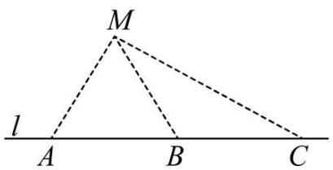

text_image

M
l
A B C

(1)现要在学校到公路 l 修一条新路，把 A、B 两个站点合为一个站点 D（在公路 l 旁），使得学生从学校走到公路 l 的距离最短，求新路 MD 的距离；

(2)为了行车安全, 在公路 $l$ 旁的点 $B$ 和点 $C$ 设置区间测速装置, 其中点 $C$ 在点 $B$ 的东侧, 且与中学 $M$ 相距 312 米, 公路 $l$ 限速 30 千米/小时 (约 8.33 米/秒). 一辆汽车经过 $BC$ 区间用时 16 秒, 试判断该车是否超速, 并说明理由.

【答案】(1)新路MD长度是 120 米

(2)该车没有超速，理由见解析

【分析】本题考查了等腰三角形的性质，勾股定理的应用，勾股定理表示了直角三角形三边长之间的数量关系：直角三角形两直角边的平方和等于斜边的平方．当题目中出现直角三角形，且该直角三角形的一边为待求量时，常使用勾股定理进行求解.

（1）根据垂线段最短可画出图形，根据三线合一可求出 $AD = 160\mathrm{m}$ ，然后利用勾股定理可求出新路MD长度；

(2) 先根据勾股定理求出 $DC$ 的长, 再求出 $BC$ 的长, 然后计算出速度判断即可.

【详解】（1）解：过点M作 $MD \perp l$ ，交l于点D．MD即是新路.

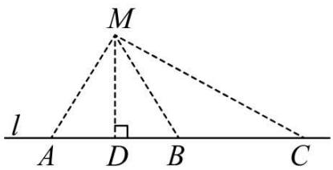

text_image

M
l
A D B C

$$
\because M A = M B = 2 0 0 \mathrm{m}, M D \perp l, A B = 3 2 0 \mathrm{m},
$$

$$
\therefore A D = \frac {1}{2} A B = \frac {1}{2} \times 3 2 0 = 1 6 0 \mathrm{m}, \angle A D M = 9 0 ^ {\circ},
$$

在Rt $\triangle ADM$ 中， $\angle ADM = 90^{\circ}$ ，

由勾股定理得 $AD^{2}+MD^{2}=AM^{2}$ ,

$$
\because A M = 2 0 0 \mathrm{m}, A D = 1 6 0 \mathrm{m},
$$

$$
\therefore M D = 1 2 0 \mathrm{m},
$$

∴新路MD长度是120米.

(2) 解: 该车没有超速. 理由如下:

在Rt $\triangle$ CMD中， $\angle CDM = 90^{\circ}$ ，

由勾股定理得 $MD^{2}+DC^{2}=CM^{2}$ ,

$$
\because C M = 3 1 2 \mathrm{m}, M D = 1 2 0 \mathrm{m},
$$

$$
\therefore C D = 2 8 8 \mathrm{m},
$$

$$
\therefore B C = D C - B C = 2 8 8 - 1 6 0 = 1 2 8 \mathrm{m},
$$

∵该车经过BC区间用时16秒，

∴该车的速度为 $\frac{128}{16}=8m/s$ ,

$$
\because 8 \mathrm{m} / \mathrm{s} <   8. 3 3 \mathrm{m} / \mathrm{s},
$$

∴该车没有超速.

【变式 1-1】（24-25 八年级下·广西贵港·期中）已知某高速路段限速90km/h（即25m/s）。如图，汽车在车速检测仪 A 正前方 30 米的C处( $\angle C = 90^{\circ}$ )，过了2s后到B处，测得AB = 50m。请通过计算判断汽车是否超速。

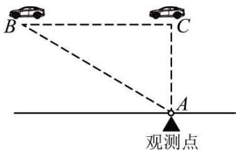

text_image

B
C
A
观测点

【答案】没有超速

【分析】本题主要考查了勾股定理的应用，将实际问题转化为数学问题成为解题的关键.

由勾股定理可得 $BC = 40 \mathrm{~m}$ , 再根据小汽车用2s行驶的路程为 $BC$ , 那么可求出小汽车的速度, 然后再判断即可解答.

【详解】解：汽车没有超速，理由如下：

依题意，由勾股定理可得： $AC^{2}+BC^{2}=AB^{2}$ ，AC=30，AB=50，

$$
\therefore B C = 4 0 (\mathrm{m}).
$$

$$
\therefore 4 0 \div 2 = 2 0 (\mathrm{m} / \mathrm{s}),
$$

$$
\therefore 2 0 <   2 5.
$$

∴汽车没有超速.

【变式 1-2】为了积极响应国家新农村建设，某镇政府采用了移动宣讲的广播形式进行宣传．如图，笔直公路MN的一侧有一报亭 A，报亭 A 到公路MN的距离AB为600米，且宣讲车 P 周围1000米以内能听到广播宣传，宣讲车 P 在公路MN上沿PN方向行驶.

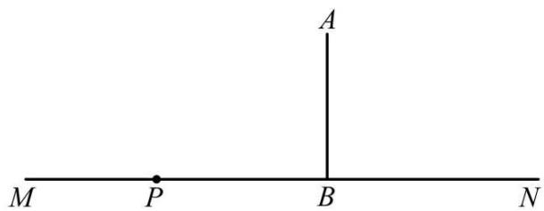

text_image

A
M P B N

(1)请问报亭的人能否听到广播宣传，并说明理由；

(2)如果能听到广播宣传，已知宣讲车的速度是200米/分，那么报亭的人总共能听到多长时间的广播宣传？

【答案】(1)报亭的人能听到广播宣传，理由见解析

(2)报亭的人总共能听到8分钟的广播宣传

【分析】本题主要考查了勾股定理的实际应用，垂线段最短：

（1）根据垂线段最短，结合 600 米 < 1000 米即可得到结论；

(2) 如图, 假设当宣讲车 $P$ 行驶到 $P_{1}$ 点时, 报亭的人开始听到广播宣传, 当宣讲车 $P$ 行驶过 $P_{2}$ 点时, 报亭的人开始听不到广播宣传, 连接 $AP_{1}, AP_{2}$ . 利用勾股定理求出 $P_{1}B 、 P_{2}B$ 的长, 进而求出 $P_{1}P_{2}$ 的长, 再根据时间等于路程除以速度即可得到答案.

【详解】（1）解：报亭的人能听到广播宣传，理由如下：

∵600 米 < 1000 米,

∴报亭的人能听到广播宣传.

(2) 解: 如图, 假设当宣讲车 $P$ 行驶到 $P_{1}$ 点时, 报亭的人开始听到广播宣传, 当宣讲车 $P$ 行驶过 $P_{2}$ 点时,报亭的人开始听不到广播宣传, 连接 $AP_{1}, AP_{2}$ .

由题意得， $AP_{1}=AP_{2}=1000$ 米，AB=600米， $AB\perp MN$ ，

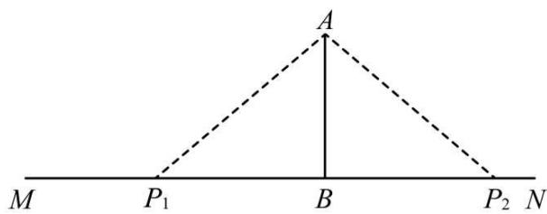

text_image

A
M P₁ B P₂ N

由勾股定理得 $P_{1}B=800$ 米， $P_{2}B=800$ 米，

$\therefore P_{1}P_{2}=1600$ 米.

∵1600÷200=8(分),

∴报亭的人总共能听到8分钟的广播宣传.

【变式 1-3】（23-24 七年级下·山东济南·期末）如下图，实验中学位于一条南北向公路 l 的一侧 A 处，门前有两条长度均为 100 米的小路 AB、AC 通往公路 l，与公路 l 交于 B，C 两点，且 B，C 两点相距 120 米.

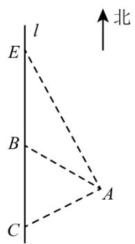

text_image

l
E
B
A
C
↑北

(1)为方便学生出入, 现在打算修一条从实验中学到公路 $l$ 的新路 $A D$ (点 $D$ 在 $l$ 上), 使得学生从学校走到公路路程最短, 应该如何修路 (请在图中画出 $A D$ )? 并计算新路 $A D$ 的长度.

(2)为保证学生的安全, 在公路 $l$ 上的点 $E$ 和点 $C$ 处设置了一组区间测速装置, 点 $E$ 在点 $B$ 的北侧, 且距实验中学 $A$ 处 170 米. 一辆汽车经过 $EC$ 区间共用时 21 秒, 若此段公路限速为 $40 \mathrm{~km} / \mathrm{h}$ (约 $11.1 \mathrm{~m} / \mathrm{s}$ ), 请判断该车是否超速, 并说明理由.

【答案】(1)见解析，新路AD长度是80米

(2)该车没有超速，见解析

【分析】本题主要考查了勾股定理的应用，等腰三角形的性质，解题的关键是熟练掌握勾股定理，在一个直角三角形中，两条直角边分别为 $a$ 、 $b$ ，斜边为 $c$ ，那么 $a^2 + b^2 = c^2$ .

（1）根据垂线段最短，过点 A 作 $AD \perp l$ ，交 l 于点 D，则 AD 即为所求；根据等腰三角形和勾股定理求出 AD = 80m 即可：

(2) 根据勾股定理求出 $DE = 150 \mathrm{~m}$ , 得出 $EC = DE + DC = 210 \mathrm{~m}$ , 求出该车的速度为 $\frac{210}{21} = 10 \mathrm{~m} / \mathrm{s}$ , 然后再进行比较即可.

【详解】（1）解：过点 A 作 $AD \perp l$ ，交 l 于点 D，则 AD 即为所求，如图所示：

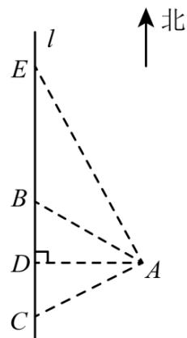

text_image

l
E
B
D
A
C
北

$$
\because A B = A C, \quad A D \perp l, \quad B C = 1 2 0 \mathrm{m},
$$

$$
\therefore \angle A D B = 9 0 ^ {\circ}, B D = D C = \frac {1}{2} B C = \frac {1}{2} \times 1 2 0 = 6 0 (\mathrm{m}),
$$

∴在Rt△ABD中，∠ADB=90°，

由勾股定理得 $AD^{2}+BD^{2}=AB^{2}$ ,

$$
\because A B = 1 0 0 \mathrm{m}, B D = 6 0 \mathrm{m},
$$

$$
\therefore A D = 8 0 \mathrm{m},
$$

∴新路AD长度是80米.

(2) 解: 该车没有超速.

理由：在Rt△ADE中，∠ADE = 90°，

由勾股定理得 $AD^{2}+DE^{2}=AE^{2}$ ,

$$
\therefore A E = 1 7 0 \mathrm{m}, A D = 8 0 \mathrm{m},
$$

$$
\therefore D E = 1 5 0 \mathrm{m},
$$

$$
\therefore E C = D E + D C = 2 1 0 \mathrm{m},
$$

该车经过EC区间用时21s，

∴该车的速度为 $\frac{210}{21}=10(m/s)$ ,

$$
\because 1 0 \mathrm{m} / \mathrm{s} <   1 1. 1 \mathrm{m} / \mathrm{s}.
$$

∴该车没有超速.

# 【题型 2 判断是否受台风影响】

【例 2】（24-25 八年级上·江苏常州·期中）2024 年 9 月第 13 号台风“贝碧嘉”登陆，使我国长三角很多地区受到严重影响，这是今年以来对我国影响最大的台风，风力影响半径100km（即距离台风中心小于或等于100km区域内都会受台风影响）。如图，线段BD是台风“贝碧嘉”中心从上海市（记为点 B）向西北方向移动到常州市（记为点 D）的大致路线，无锡市惠山区（记为点 C）大致在线段BD上，南通市记为点 A，且 AB ⊥ AC。若 A, C 之间相距120km, A, B 之间相距160km。

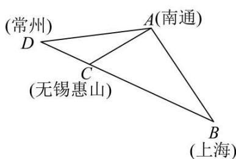

text_image

(常州)
D
(无锡惠山)
C
A(南通)
B
(上海)

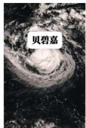

text_image

贝碧嘉

(1)判断南通市（记为点 $A$ ）是否会受到台风“贝碧嘉”的影响，并说明理由.

(2)若台风“贝碧嘉”中心的移动速度为 $20 \mathrm{~km} / \mathrm{h}$ , 则台风影响南通市 (记为点 $A$ ) 持续时间有多长?

【答案】(1)南通市会受到台风“贝碧嘉”的影响，见解析

(2)2.8h

【分析】（1）过点A作 $AM \perp BD$ 于点M，求得最短距离AM，与影响半径100km比较大小，判断解答即可.

(2) 以点 $A$ 为圆心, $100 \mathrm{~km}$ 为半径作圆, 交 $B D$ 于点 $E 、 F$ , 根据 $A E = A F = 100 \mathrm{~km}, A M \perp B D$ , 得到 $M E = M F$ , 根据勾股定理得到 $M E = 28 (\mathrm{~km})$ , 继而得到 $E F = 2 M E = 56 (\mathrm{~km})$ , 求时间即可.

本题考查了勾股定理，等腰三角形的性质，直角三角形的性质，正确构造直角三角形，熟练掌握解直角三角形是解题的关键.

【详解】（1）解：过点A作 $AM \perp BD$ 于点M，

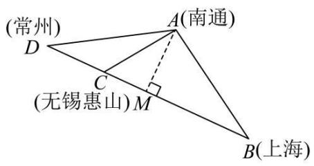

text_image

(常州)
D
A(南通)
C
(无锡惠山)M
B(上海)

∵AB⊥AC，A，C之间相距120km，A，B之间相距160km.

$$
\therefore B C = 2 0 0 (\mathrm{km}),
$$

根据题意，得 $\frac{1}{2}AC\cdot BA=\frac{1}{2}AM\cdot BC$ ，

$$
\therefore A M = \frac {A B \cdot A C}{B C} = \frac {1 2 0 \times 1 6 0}{2 0 0} = 9 6 (\mathrm{km}),
$$

$$
\because 1 0 0 > 9 6,
$$

∴南通市会受到台风“贝碧嘉”的影响.

(2) 解: 以点 $A$ 为圆心, $100 \mathrm{~km}$ 为半径作圆, 交 $B D$ 于点 $E 、 F$ ,

$$
\because A E = A F = 1 0 0 \mathrm{km}, A M \perp B D,
$$

$$
\therefore M E = M F,
$$

$$
\therefore M E = 2 8 (\mathrm{km}),
$$

$$
\therefore E F = 2 M E = 5 6 (\mathrm{km}),
$$

∴台风影响南通市持续时间为 $\frac{56}{20}=2.8(h)$ .

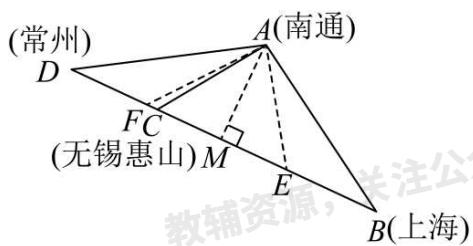

text_image

(常州)
D
A(南通)
FC
(无锡惠山)M
E
B(上海)
教辅资源，关注公

答：台风影响南通市持续时间为2.8h.

【变式 2-1】（2023 八年级上·江苏·专题练习）如图，经过A村和B村的笔直公路l旁有一块山地正在开发，现需要在C处进行爆破。已知C处与A村的距离为900米，C处与B村的距离为1200米，且AC⊥BC。

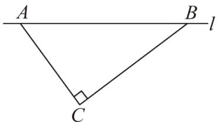

text_image

A
B
l
C

(1)求A、B两村的距离；

(2)为了安全起见, 爆破点 $C$ 周围半径 750 米范围内不得进入, 在进行爆破时, 公路 $A B$ 段是否有危险而需要封锁? 请说明理由.

【答案】(1)1500米

(2)没有危险不需要封锁，理由见解析

【分析】本题考查勾股定理的实际应用、等面积法求线段长，根据题意，数形结合，利用勾股定理及等面积法求出线段长即可得到答案，熟练掌握勾股定理及等面积法是解决问题的关键.

(1) 根据题意, 数形结合, 利用勾股定理求解即可得到答案;

(2) 过点C作 $CD \perp AB$ ，如图所示，利用等面积法求出CD = 720，根据题意比较即可得到答案.

【详解】（1）解：∵ C处与A村的距离为900米，C处与B村的距离为1200米，且AC⊥BC，

$$
\therefore A B = 1 5 0 0,
$$

答：A、B两村的距离为1500米；

(2) 解: 没有危险不需要封锁,

理由如下:

过点C作 $CD \perp AB$ ，如图所示：

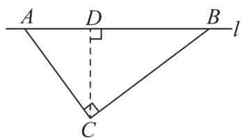

text_image

A D B
l
C

利用面积相等得到 $S_{\triangle ABC}=\frac{1}{2}AC\cdot BC=\frac{1}{2}AB\cdot CD$ ，即 $900\times1200=1500CD$ ，解得 $CD=\frac{900\times1200}{1500}=720$ ，

∵爆破点C周围半径750米范围内不得进入，720＜750，

∴ 在进行爆破时，公路AB段没有危险不需要封锁.

【变式 2-2】（2024 八年级下·全国·专题练习）台风是一种自然灾害，它以台风中心为圆心，在周围数十千米范围内形成气旋风暴，有极强的破坏力，此时某台风中心在海域 B 处，在沿海城市 A 的正南方向 320 千米，其中心风力为 13 级，每远离台风中心 25 千米，台风就会减弱一级，如图所示，该台风中心正以 20 千米/时的速度沿北偏东 $30^{\circ}$ 方向向 C 移动，且台风中心的风力不变，若城市所受风力超过 5 级，则称受台风影响．试问：

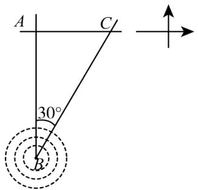

text_image

A
C
30°
B

(1)A 城市是否会受到台风影响？请说明理由.  
(2)若会受到台风影响，那么台风影响该城市的持续时间有多长？  
(3)该城市受到台风影响的最大风力为几级？

【答案】(1)会受到这次台风的影响

(2)12 小时  
(3)6.6级

【分析】本题主要考查了直角三角形的性质、勾股定理等知识点，掌握勾股定理成为解题的关键.

（1）过点 A 作 $AD \perp BC$ 于点 D，利用 $30^{\circ}$ 角所对边是斜边一半，求得 AD，然后与 200 比较即可解答；  
（2）以 A 为圆心，200 千米为半径作 $\odot A$ 交 BC 于 E、F，则 AE = AF = 200 千米，再运用勾股定理计算弦长 EF，然后根据行程问题解答即可；  
（3）先求出距台风中心最近距离AD，计算风力级别.

【详解】（1）解：A 城市会受到这次台风的影响，理由如下：

如图 1，过点 A 作 $AD \perp BC$ 于点 D，

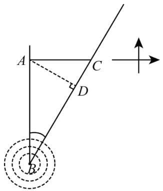

text_image

A
C
D
B

图1

在Rt $\triangle ABD$ 中， $\angle ABD = 30^{\circ}$ ，AB = 320千米，

$\therefore AD = \frac{1}{2} AB = 160$ 千米，

∵城市受到的风力超过5级，则称受台风影响，

∴受台风影响范围的半径为： $25 \times (13 - 5) = 200$ （千米），

∵160千米＜200千米，

∴A城市会受到这次台风的影响.

（2）解：如图 2，以 A 为圆心，200 千米为半径作 $\odot A$ 交 BC 于 E、F，则 AE = AF = 200 千米，

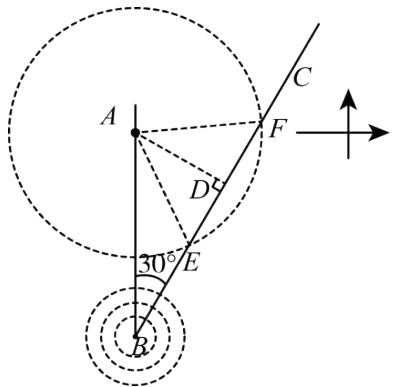

text_image

A
C
F
D
30°
E
B

图2

∴台风影响该市持续的路程为：EF = 2DE = 240，

∴台风影响该市的持续时间 $t=240\div20=12$ （小时）.

（3）解：∵AD = 160千米，

∴160÷25=6.4（级），

∴13-6.4 = 6.6（级），

∴该城市受到这次台风最大风力为6.6级.

【变式 2-3】如图，公路MN和公路PQ在点 P 处交汇，且 $\angle QPN = 30^{\circ}$ ，在 A 处有一所中学，AP = 120 米，此时有一辆消防车在公路MN上沿PN方向以每秒 8 米的速度行驶，假设消防车行驶时周围100 米以内有噪音影响.

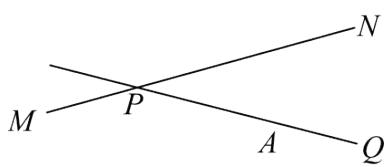

text_image

M
P
N
A
Q

(1)学校是否会受到影响？请说明理由.

(2)如果受到影响，则影响时间是多长？

【答案】(1)学校受到噪音影响，理由见解析

(2)20秒

【分析】本题考查了勾股定理的应用、含30度的直角三角形三边的关系以及路程与速度之间的关系，恰当的作出辅助线，构造直角三角形是解题关键.

(1) 过点 $A$ 作 $AB \perp MN$ 于 $B$ , 根据在直角三角形中, 30 度角所对直角边等于斜边的一半, 得到 $AB = \frac{1}{2} PA = 60 \mathrm{~m}$ , 由于这个距离小于 $100 \mathrm{~m}$ , 所以可判断拖拉机在公路 $MN$ 上沿 $PN$ 方向行驶时, 学校受到噪音影响;

(2) 以点 $A$ 为圆心, $100 \mathrm{~m}$ 为半径作 $\odot A$ 交 $M N$ 于 $C 、 D$ , 再根据勾股定理计算出 $B C = C D = 80 \mathrm{~m}$ , 则 $C D = 2 B C = 160 \mathrm{~m}$ , 根据速度公式计算出拖拉机在线段 $C D$ 上行驶所需要的时间.

【详解】（1）解：学校受到噪音影响．理由如下：

作 $AB \perp MN$ 于B，如图，

$$
\because P A = 1 2 0 \mathrm{m}, \angle Q P N = 3 0 ^ {\circ},
$$

$$
\therefore A B = \frac {1}{2} P A = 6 0 \mathrm{m},
$$

而60m < 100m,

∴ 消防车在公路MN上沿PN方向行驶时，学校受到噪音影响；

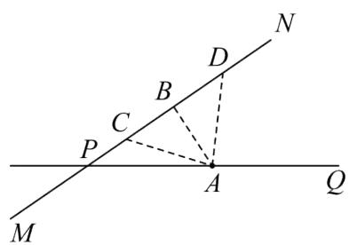

text_image

M
P
C
B
D
N
A
Q

(2) 解: 以点 $A$ 为圆心, $100 \mathrm{~m}$ 为半径作 $\odot A$ 交 $M N$ 于 $C 、 D$ , 如图,

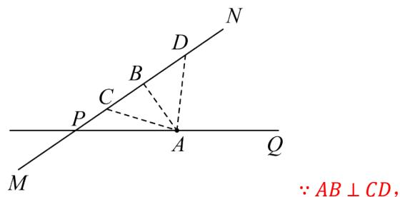

text_image

N
D
B
C
P
A
Q
M
∵ AB ⊥ CD,

在Rt $\triangle ABC$ 中，AC = 100m，AB = 60m，

$$
C B = 8 0 \mathrm{m},
$$

同理，DB = 80m,

$$
\therefore C D = 2 B C = 1 6 0 \mathrm{m},
$$

∵ 消防车每秒 8 米的速度行驶，

$$
\therefore \frac {1 6 0}{8} = 2 0 (\text {秒}),
$$

∴ 学校受影响的时间为 20 秒.

# 【题型3 选址到两地距离相等】

【例 3】（24-25 八年级下·湖北武汉·期中）如图铁路上A、B两点相距40千米，C、D为铁路两边的两个村庄，DA⊥AB，CB⊥AB，垂足分别为A和B，DA=24千米，CB=16千米，现在要在铁路旁修建一个候车点E，使得C、D两村到该候车点的距离相等．则候车点E应距A点（）

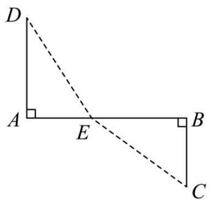

text_image

D
A
E
B
C

A. 12 千米

B. 16 千米

C. 20 千米

D. 24 千米

【答案】B

【分析】本题主要考查了勾股定理的应用，正确理解题意得到 $AD^{2} + AE^{2} = BE^{2} + BC^{2}$ 是解题的关键.设 $AE = x\mathrm{km}$ ，则 $BE = (40 - x)\mathrm{km}$ ，利用勾股定理得到 $AD^{2} + AE^{2} = BE^{2} + BC^{2}$ ，则 $24^{2} + x^{2} = (40 - x)^{2} + 16^{2}$ ，解方程即可.

【详解】解：设AE = xkm，则BE = (40 - x)km，

∵ $DA \perp AB$ ， $CB \perp AB$ ，C，D两村到候车点的距离相等，

$$
\therefore A D ^ {2} + A E ^ {2} = D E ^ {2}, B E ^ {2} + B C ^ {2} = C E ^ {2},
$$

$$
\therefore A D ^ {2} + A E ^ {2} = B E ^ {2} + B C ^ {2},
$$

$$
\therefore 2 4 ^ {2} + x ^ {2} = (4 0 - x) ^ {2} + 1 6 ^ {2},
$$

解得：x = 16，

则候车点E应距A点16km.

故选：B.

【变式 3-1】（11-12 九年级上·河北·期中）如图，铁路上 A、B 两点相距25km，C、D 为两村庄，DA⊥AB 于 A，CB⊥AB 于 B，已知DA = 15km，CB = 10km，现在要在铁路AB上建一个土特产品收购站 E，使得 C、D 两村到 E 站的距离相等，则 E 站应建在距 A 站多少千米处？

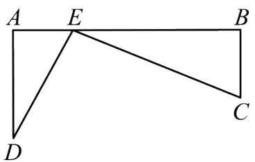

text_image

A E B
D C

【答案】E 站应建在离 A 站 10km 处.

【分析】本题主要考查了勾股定理的应用，利用 $AE^{2}+AD^{2}=DE^{2}$ ， $BE^{2}+BC^{2}=EC^{2}$ 得出是解决问题的关键．设出AE=x的长，可将DE和CE的长表示出来，列出方程进行求解即可.

【详解】解：∵C，D两村到E站的距离相等，

$$
\therefore D E = C E.
$$

∵DA⊥AB于A，CB⊥AB于B，

$$
\therefore \angle A = \angle B = 9 0 ^ {\circ},
$$

$$
\therefore A E ^ {2} + A D ^ {2} = D E ^ {2}, B E ^ {2} + B C ^ {2} = E C ^ {2},
$$

$$
\therefore A E ^ {2} + A D ^ {2} = B E ^ {2} + B C ^ {2},
$$

设AE = x，则BE = AB - AE = (25 - x).

$$
\because D A = 1 5 \mathrm{km}, C B = 1 0 \mathrm{km},
$$

$$
\therefore x ^ {2} + 1 5 ^ {2} = (2 5 - x) ^ {2} + 1 0 ^ {2},
$$

解得：x = 10，

$$
\therefore A E = 1 0 \mathrm{km}.
$$

答：E 站应建在离 A 站 10km 处.

【变式 3-2】（24-25 八年级上·陕西渭南·期末）如图，已知某学校 A 与直线公路 BD 相距 300 米（即 AB = 300 米， $AB \perp BD$ ），且与该公路上一个车站 D 相距 500 米（即 AD = 500 米），现要在公路边 BD 建一个超市 C，使之与学校 A 及车站 D 的距离相等，那么该超市 C 与车站 D 的距离 CD 是多少米？

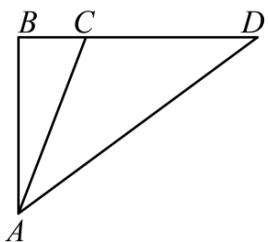

text_image

B C D
A

【答案】312.5 米

【分析】本题主要考查了勾股定理的应用，弄清题意，准确识图，熟练运用相关知识是解题的关键；根据题意，AC = CD， $\angle ABD = 90^{\circ}$ ，由AB、AD的长易求BD，设CD = AC = x米， $BC = (400 - x)$ 米，在Rt $\triangle ABC$

中运用勾股定理得关系式求解.

【详解】解：根据题意得：AC = CD， $\angle ABD = 90^{\circ}$ ，

在直角三角形ABD中，

∵ AB = 300 米，AD = 500 米，

∴ $BD = \sqrt{AD^{2} - AB^{2}} = 400$ （米），

设CD = AC = x米，则BC = (400 - x)米，

在Rt $\triangle ABC$ 中， $AC^{2}=AB^{2}+BC^{2}$

即 $x^{2}=300^{2}+(400-x)^{2}$ ,

解得：x = 312.5，

答：该超市 C 与车站 D 的距离 CD 是 312.5 米.

【变式 3-3】（23-24 八年级下·湖北荆州·阶段练习）如图，直线 l 为一条公路，A，D 两处各有一个村庄， $AB \perp l$ 于点 B， $DC \perp l$ 于点 C，AB = 4 千米，BC = 8 千米，CD = 6 千米．现需要在 BC 上建立一个物资调运站 E，使得 E 到 A，D 两个村庄距离相等，请求出 E 到 C 的距离.

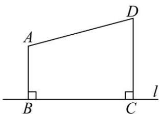

text_image

A
D
B
C
l

【答案】E 到 C 的距离为 2.75 千米

【分析】本题考查了勾股定理的应用，设CE = x千米，则 $BE = (8 - x)$ 千米，由AE = DE根据勾股定理可得关于x的方程，解方程即得结果.

【详解】如图，设CE = x千米，则 $BE = (8 - x)$ 千米，

在Rt $\triangle ABE$ 中，根据勾股定理， $AB^{2} + BE^{2} = AE^{2}$ ，

在Rt $\triangle CDE$ 中，根据勾股定理， $CE^{2} + DC^{2} = DE^{2}$ ，

$$
\because A E = D E,
$$

$\therefore AB^{2} + BE^{2} = CE^{2} + DC^{2}$ ，即 $4^{2} + (8 - x)^{2} = x^{2} + 6^{2}$

解得：x = 2.75，

即 E 到 C 的距离为 2.75 千米.

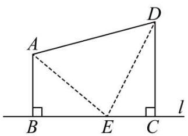

text_image

A
D
B
E
C
l

【题型4 解决航海问题】

【例 4】（24-25 八年级上·吉林长春·期末）如图，甲、乙两船同时从A港出发，甲船的速度是15海里/时，航向是东北方向（射线AB方向），乙船比它每小时快5海里，航向是东南方向（射线AC方向），多少小时后两船相距100海里？

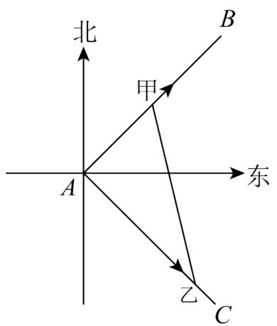

text_image

北
甲
B
东
A
乙
C

【答案】4 小时后两船相距 100 海里

【分析】本题主要考查了勾股定理的应用，解题的关键是熟练掌握勾股定理，在一个直角三角形中，两条直角边分别为 $a$ 、 $b$ ，斜边为 $c$ ，那么 $a^2 + b^2 = c^2$ 。设 $x$ 小时后两船相距 100 海里，根据勾股定理得 $(15x)^2 + (20x)^2 = 100^2$ ，解方程即可。

【详解】解：由题意，得， $\angle BAC = 90^{\circ}$ .

设x小时后两船相距100海里，

根据题意得： $(15x)^{2}+(20x)^{2}=100^{2}$

解得：x = -4（舍去）或 x = 4.

答：4 小时后两船相距 100 海里.

【变式 4-1】（24-25 八年级上·辽宁本溪·期中）某海岛海域争端持续，我国海监船加大该岛附近海域的巡航维权力度．如图， $OA \perp OB, OA = 72$ 海里，OB = 12 海里，海岛位于 O 点，我国海监船在点 B 处发现有一不明国籍的渔船，自 A 点出发沿着 AO 方向匀速驶向海岛所在地点 O，我国海监船立即从 B 处出发以相同的速度沿某直线去拦截这艘渔船，结果在点 C 处截住了渔船．

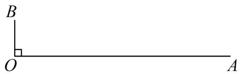

text_image

B
O
A

(1)请用直尺和圆规作出 C 处的位置;  
(2)求我国海监船行驶的航程BC的长.

【答案】(1)见解析

(2)37 海里

【分析】此题考查了线段垂直平分线的性质，勾股定理的实际应用，解题的关键是熟练掌握相关基础性质.

(1) 根据题意, 作出线段 $AB$ 的垂直平分线, 交 $OA$ 于点 $C$ , 即可;  
（2）连接BC，利用第（1）题中作图，可得BC = AC，设BC为x海里，则CA也为x海里，则 $OC = (72 - x)$ 海里，利用勾股定理列方程求解即可.

【详解】（1）解：如图所示，点C即为所求：连接AB，作线段AB的垂直平分线，交OA于点C，

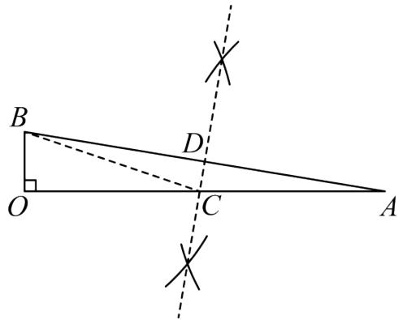

text_image

B
D
O
C
A

（2）解：连接BC，设BC = x海里，则CA = x海里

$$
\because \angle O = 9 0 ^ {\circ}
$$

∴在Rt $\triangle OBC$ 中， $OB^{2} + OC^{2} = BC^{2}$

即： $12^{2} + (72 - x)^{2} = x^{2}$

解得: x = 37

答：我国海监船行驶的航程BC的长为37海里.

【变式 4-2】（22-23 八年级下·重庆巴南·期末）在海平面上有 A, B, C 三个标记点，其中 A 在 C 的北偏西 $54^{\circ}$ 方向上，与 C 的距离是 800 海里，B 在 C 的南偏西 $36^{\circ}$ 方向上，与 C 的距离是 600 海里.

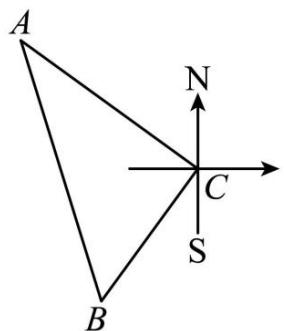

text_image

A
N
C
S
B

(1)求点 A 与点 B 之间的距离;

(2)若在点 C 处有一灯塔, 灯塔的信号有效覆盖半径为 500 海里, 每隔半小时会发射一次信号, 此时在点 B 处有一艘轮船准备沿直线向点 A 处航行, 轮船航行的速度为每小时 20 海里. 轮船在驶向 A 处的过程中, 最多能收到多少次信号? (信号传播的时间忽略不计).

【答案】(1)AB = 1000海里

(2)最多能收到 29 次信号

【分析】（1）由题意易得 $\angle ACB$ 是直角，由勾股定理即可求得点 $A$ 与点 $B$ 之间的距离；

(2) 过点 $C$ 作 $CH \perp AB$ 交 $AB$ 于点 $H$ , 在 $AB$ 上取点 $M, N$ , 使得 $CN = CM = 500$ 海里, 分别求得 $NH$ 、 $MH$ 的长, 可求得此时轮船过 $MN$ 时的时间, 从而可求得最多能收到的信号次数;

【详解】（1）由题意，得： $\angle NCA=54^{\circ}$ ， $\angle SCB=36^{\circ}$ ;

$$
\therefore \angle A C B = 9 0 ^ {\circ};
$$

$$
\because A C = 8 0 0, \quad B C = 6 0 0;
$$

∴AB = 1000海里；

（2）过点 C 作 $CH \perp AB$ 交 AB 于点 H，在 AB 上取点 M，N，使得 CN = CM = 500 海里.

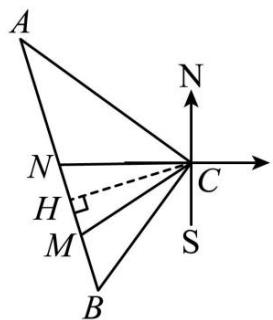

text_image

A
N
H
M
B
C
S
N

$$
\because C H \perp A B;
$$

$$
\therefore \angle C H B = 9 0 ^ {\circ};
$$

$$
\because S _ {\triangle A B C} = \frac {1}{2} A C \cdot B C = \frac {1}{2} A B \cdot C H;
$$

$$
\therefore C H = 4 8 0;
$$

$$
\because C N = C M = 5 0 0;
$$

$$
\therefore N H = M H = 1 4 0;
$$

则信号次数为 $\frac{140\times2}{20}\div0.5+1=29$ （次）.

答：最多能收到 29 次信号.

【点睛】本题考查了勾股定理的应用，直角三角形的判定等知识，涉及路程、速度、时间的关系，熟练掌握勾股定理是关键.

【变式 4-3】如图所示，某港口位于东西方向的海岸线上．“远航”号、“海天”号轮船同时离开港口，各自沿一固定方向航行，“远航”号每小时航行 16 海里，“海天”号每小时航行 12 海里．它们离开港口 $\frac{3}{2}$ 小时后相距 30 海里．如果知道“远航”号沿东北方向航行，能知道“海天”号沿哪个方向航行吗？

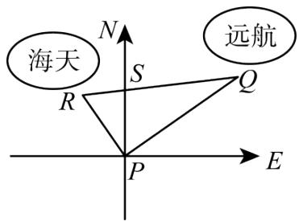

text_image

海天
N
S
Q
R
P
E
远航

【答案】西北方向

【分析】本题考查勾股定理的逆定理、方位角等知识，解题的关键是理解题意，灵活运用所学知识解决问题，属于中考常考题型.

根据路程 = 速度 × 时间分别求得 PQ、PR 的长，再进一步根据勾股定理的逆定理可以证明三角形 PQR 是直角三角形，从而求解.

【详解】解：根据题意，得

$$
P Q = 1 6 \times 1. 5 = 2 4 (\text {海里}),
$$

$$
P R = 1 2 \times 1. 5 = 1 8 (\text {海里}),
$$

$$
Q R = 3 0 \text {(海里)},
$$

$$
\because 2 4 ^ {2} + 1 8 ^ {2} = 3 0 ^ {2},
$$

$$
\text { 即 } P Q ^ {2} + P R ^ {2} = Q R ^ {2},
$$

$$
\therefore \angle Q P R = 9 0 ^ {\circ}.
$$

由“远航号”沿东北方向航行可知， $\angle QPS = 45^{\circ}$ ，则 $\angle SPR = 45^{\circ}$ ，

即“海天”号沿西北方向航行.

# 【题型 5 求河宽】

【例 5】（22-23 八年级下·浙江台州·期中）某工程队负责挖掘一处通山隧道，为了保证山脚 A，B 两处出口能够直通，工程队在工程图上留下了一些测量数据（此为山体俯视图，图中测量线拐点处均为直角，数据单位：米）。据此可以求得该隧道预计全长\_\_\_\_米。

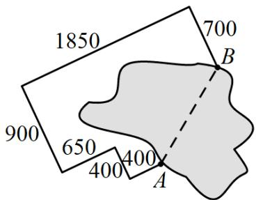

text_image

1850
900
650
400
400
A
700
B

【答案】1000

【分析】延长 700 米和 400 米的两边，交于点 C，分析得出 $BC \perp AC$ ，再分别求出 AC 和 BC，利用勾股定理计算即可.

【详解】解：如图，延长700米和400米的两边，交于点C，

由题意可得： $BC \perp AC$ ，

由图中数据可得： $BC = 900 + 400 - 700 = 600$ ，

$$
A C = 1 8 5 0 - 6 5 0 - 4 0 0 = 8 0 0,
$$

$$
\therefore A B = \sqrt {A C ^ {2} + B C ^ {2}} = 1 0 0 0 \text {米},
$$

故答案为：1000.

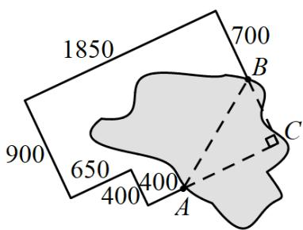

text_image

1850
700
900
650
400
400
A
B
C

【点睛】本题考查了勾股定理的实际应用，解题的关键是构造直角三角形.

【变式 5-1】（24-25 八年级下·辽宁葫芦岛·期中）在一次研学活动中，小宣同学欲控制遥控轮船匀速垂直横渡一条河，但由于水流的影响，实际上岸地点 C 与欲到达地点 B 相距 8 米，结果轮船在水中实际航行的路程 AC 比河的宽度 AB 多 2 米，则河的宽度 AB 是（）

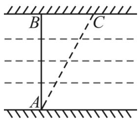

text_image

B
C
A

A. 6 米

B. 9 米

C. 12 米

D. 15 米

【答案】D

【分析】本题考查了勾股定理的应用，根据题意可知 $\triangle ABC$ 为直角三角形，根据勾股定理列方程就可求出直角边 $AB$ 的长度.

【详解】解：根据题意，得BC=8，AC=AB+2， $\angle ABC=90^{\circ}$ ，

在Rt $\triangle ABC$ 中， $AB^{2} + BC^{2} = AC^{2}$ ，

$$
\therefore A B ^ {2} + 8 ^ {2} = (A B + 2) ^ {2},
$$

解得AB = 15,

即河的宽度AB是15米，

故选：D.

【变式 5-2】某隧道的截面是由如图所示的图形构成，图形下面是长方形ABCD，上面是半圆形，其中AB = 10 米，BC = 2.5 米，隧道设双向通车道，中间有宽度为 2 米的隔离墩，一辆满载家具的卡车，宽度为 3 米，高度为4.9 米，请计算说明这辆卡车是否能安全通过这个隧道？

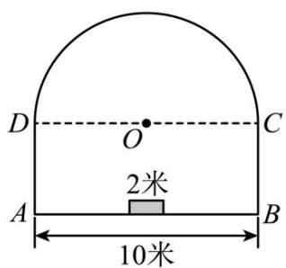

text_image

D
O
C
2米
A
B
10米

【答案】这辆卡车能安全通过这个隧道

【分析】本题主要考查了勾股定理的实际应用．作 $OM \perp AB$ 于 $M$ ，交 $AB$ 于 $M$ ，作 $KF \perp CD$ 于 $H$ ，交半圆于 $F$ ，交 $AB$ 于点 $K$ ，连接 $OF$ ，则 $FK \perp AB$ ， $KN = 3$ 米，根据题意得：

$OH = KM = 4, AB = CD = 10, OF = OD = 5$ ，在 Rt $\triangle OHF$ 中，根据勾股定理可得 $FH = 3$ 米，从而得到 $FK = 2.5 + 3 = 5.5$ 米，即可求解。

【详解】解：如图，作 $OM \perp AB$ 于M，交AB于M，作 $KF \perp CD$ 于H，交半圆于F，交AB于点K，连接OF，则 $FK \perp AB$ ，KN=3米，

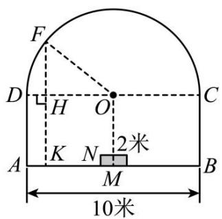

text_image

F
D H O C
K N 2米
A M B
10米

根据题意得： $OH = KM = 4.AB = CD = 10.OF = OD = 5$

在Rt△OHE中， $FH=\sqrt{OE^{2}-OH^{2}}=\sqrt{5^{2}-4^{2}}=3$

$$
\because H K = B C = 2. 5,
$$

$$
\therefore F K = 2. 5 + 3 = 5. 5,
$$

$$
\because 5. 5 > 4. 9,
$$

∴这辆卡车能安全通过这个隧道.

【变式 5-3】（24-25 八年级下·内蒙古乌兰察布·期中）直角三角形的三边关系：如果直角三角形两条直角边长为 a、b，斜边长为 c，则 $a^{2} + b^{2} = c^{2}$ .

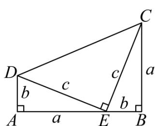

text_image

D
b
c
a
C
b
E
A
a
B

图1

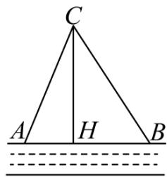

text_image

C
A H B

图2

(1)图 1 为美国第二十任总统伽菲尔德的“总统证法”，请你利用图 1 推导上面的关系式。利用以上所得的直角三角形的三边关系进行解答：

(2)如图 2, 在一条东西走向河流的一侧有一村庄 $C$ , 河边原有两个取水点 $A 、 B$ , 其中 $AB = AC$ , 由于某种原因, 由 $C$ 到 $A$ 的路现在已经不通, 该村为方便村民取水决定在河边新建一个取水点 $H$ ( $A 、 H 、 B$ 在一条直线上), 并新修一条路 $CH$ , 且 $CH \perp AB$ . 测得 $CH = 6$ 千米, $HB = 4$ 千米, 求新路 $CH$ 比原路 $CA$ 少多少千米?

(3)在第（2）问中若 $AB \neq AC$ 时， $CH \perp AB$ ，AC = 8，BC = 10，AB = 12，设AH = x，求x的值.

【答案】(1)见解析

(2)新路CH比原路CA少0.5千米

(3) $x=\frac{9}{2}$

【分析】本题考查的是勾股定理的证明方法以及勾股定理的应用；

(1) 梯形的面积可以由梯形的面积公式求出, 也可利用三个直角三角形面积求出, 两次求出的面积相等列出关系式, 化简即可得证;

（2）设CA = x千米，则AH = (x - 4)千米，根据勾股定理列方程，解方程即可得到结果；

（3）在Rt $\triangle ACH$ 和Rt $\triangle BCH$ 中，由勾股定理得求出 $CH^{2} = CA^{2} - AH^{2} = CB^{2} - BH^{2}$ ，列出方程求解即可得到结果.

【详解】（1）解：∵ $AB \perp AD, BC \perp AB, DE \perp CE,$

∴梯形ABCD的面积为 $\frac{1}{2}(a+b)(a+b)$ 或 $\frac{1}{2}e^{2}+ab$ ,

$$
\therefore \frac {1}{2} (a + b) (a + b) = \frac {1}{2} c ^ {2} + a b,
$$

$$
\therefore a b + \frac {1}{2} c ^ {2} = \frac {1}{2} a ^ {2} + a b + \frac {1}{2} b ^ {2},
$$

即 $a^{2}+b^{2}=c^{2}$ ,

(2) 解: 设 $CA = x$ 千米, 则 $AH = (x - 4)$ 千米,

在Rt $\triangle ACH$ 中， $CA^{2}=CH^{2}+AH^{2}$

即 $x^{2}=6^{2}+(x-4)^{2}$ ，解得：x=6.5，即CA=6.5，

CA-CH = 6.5-6 = 0.5（千米），

答：新路CH比原路CA少0.5千米，

（3）解：由题得，BH = 12 - x，

在Rt $\triangle ACH$ 中， $CH^{2} = CA^{2} - AH^{2}$ ,

在Rt $\triangle BCH$ 中， $CH^{2}=CB^{2}-BH^{2}$

$$
\therefore C A ^ {2} - A H ^ {2} = C B ^ {2} - B H ^ {2},
$$

即 $8^{2}-x^{2}=10^{2}-(12-x)^{2}$ ，解得： $x=\frac{9}{2}$ .

# 【题型6 求台阶上地毯长度】

【例 6】如图，是一个三级台阶，它的每一级的长，宽和高分别等于5cm，3cm和1cm，A和B是这个台阶的两个相对的端点，A点上有一只蚂蚁，想到B点去吃可口的食物，请你想一想，这只蚂蚁从A点出发，沿着台阶面爬到B点，最短线路是（）

text_image

A
5
1 3
B

A. 12

B. 13

C. 14

D. 15

【答案】B

【分析】将台阶展开，根据勾股定理即可求解.

【详解】将台阶展开，如下图，

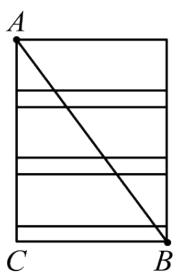

text_image

A
C B

因为 $AC=3\times3+1\times3=12,\ BC=5,$

所以 $AB^{2}=AC^{2}+BC^{2}=169$ ,

所以 AB=13（cm），

所以蚂蚁爬行的最短线路为 13cm.

故选 B.

【点睛】本题考查了勾股定理的应用，掌握勾股定理是解题的关键.

【变式 6-1】（23-24 八年级下·山东济宁·期中）如图，在一个高为 3 米的楼梯表面铺地毯，地毯总长度为 7 米，则楼梯斜面 AB 长为（）

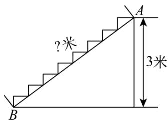

text_image

?米
3米

A. 4 米

B. 5 米

C. 6 米

D. 7 米

【答案】B

【分析】本题主要考查勾股定理，由勾股定理及平移的思想可进行求解.

【详解】解：如图所示，

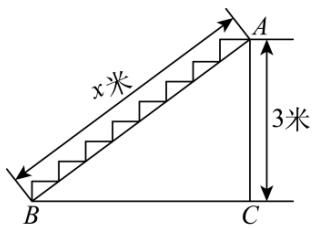

text_image

x米
3米

由题意得 $AC + BC = 7$ 米，

∵AC = 3米，

$\therefore BC = 4$ 米，

$\therefore AB^{2}=BC^{2}+AC^{2}=25$ 则AB=5米，

故选：B.

【变式 6-2】如图，要修建一个育苗棚，棚高 h=5 m，棚宽 a=12 m，棚的长 d 为 12m，现要在矩形的棚顶上覆盖塑料薄膜，试求需要多少平方米塑料薄膜？

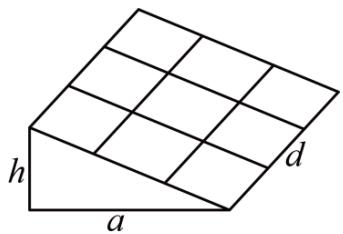

text_image

h
a
d

【答案】 $156 \, m^{2}$ .

【分析】根据勾股定理先求出棚顶的宽，然后根据长方形的面积公式即可求出需要多少塑料薄膜.

【详解】棚高 h=5 m，棚宽 a=12 m，设棚顶的宽为 b，

则b = 13m

棚的长 d 为 12m

$$
\therefore S = b d = 1 3 \times 1 2 = 1 5 6 m ^ {2}
$$

【点睛】此题重点考查学生对勾股定理的实际应用能力,理清题意，掌握勾股定理是解题的关键.

【变式 6-3】如图：一个三级台阶，它的每一级的长，宽和高分别是 50cm，30cm，10cm，A 和 B 是这个台阶的两个相对的端点，A 点上有一只壁虎，它想到 B 点去吃可口的食物，请你想一想，这只壁虎从 A 点出发，沿着台阶面爬到 B 点，最短路线的长是 \_\_\_\_ cm.

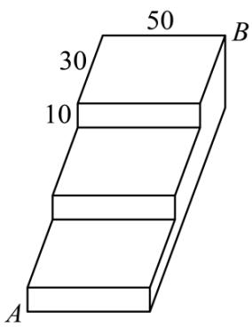

text_image

50
30
10
A
B

【答案】130

【分析】只需要将其展开便可直观的得出解题思路．将台阶展开得到的是一个矩形，蚂蚁要从 B 点到 A 点的最短距离，便是矩形的对角线，利用勾股定理即可解出答案.

【详解】将台阶展开，如图：

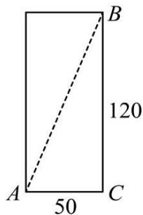

text_image

A
50
C
120
B

因为 BC=30×3+10×3=120，AC=50，

所以 $AB^{2}=AC^{2}+BC^{2}=16900$ ,

所以 AB=130（cm），

所以壁虎爬行的最短线路为 130cm.

故答案是：130.

【点睛】考查了利用台阶的平面展开图求最短路径问题，根据题意判断出长方形的长和宽是解题关键.

# 【题型 7 求旗杆高度】

【例 7】（22-23 八年级下·北京东城·期末）如图1，同学们想测量旗杆的高度h（米），他们发现系在旗杆顶端的绳子垂到了地面，

并多出了一段，但这条绳子的长度未知．小明和小亮同学应用勾股定理分别提出解决这个问题的方案如下：

小明：①测量出绳子垂直落地后还剩余1米，如图1；

②把绳子拉直，绳子末端在地面上离旗杆底部4米，如图2.

小亮：先在旗杆底端的绳子上打了一个结，然后举起绳结拉到如图3点D处（BD = BC）.

  
图1

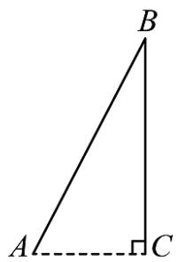

text_image

B
A
C

图2

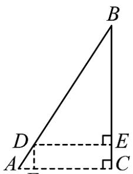

text_image

Geometric diagram showing triangle ABC with perpendiculars from D and E to base AC, labeled with points A, B, C, D, E.

图3

(1)请你按小明的方案求出旗杆的高度 h（米）；  
(2)已知小亮举起绳结离旗杆4.5米远，此时绳结离地面多高？

【答案】(1)旗杆的高度为7.5米

(2)绳结离地面1.5米高

【分析】本题考查的是勾股定理的应用，根据题意得出直角三角形是解答此题的关键.

(1) 由旗杆的高度为 $h$ 米, 则绳子的长度为 $(h + 1)$ 米, 然后根据勾股定理求解即可;  
（2）首先得到BD = BC = 7.5米，DE = 4.5米，然后在Rt△BDE中，利用勾股定理求解即可.

【详解】（1）解:如图，由旗杆的高度为h米，则绳子的长度为 $(h+1)$ 米，

在Rt $\triangle ABC$ 中，由勾股定理得: $h^{2} + 4^{2} = (h + 1)^{2}$ ,

解得:h = 7.5,

故旗杆的高度为7.5米;

(2) 解: 由题可知, $BD = BC = 7.5$ 米, $DE = 4.5$ 米.

在Rt $\triangle BDE$ 中，由勾股定理得: $BE^{2} + 4.5^{2} = 7.5^{2}$ ,

解得:BE = 6,

$$
\therefore E C = B C - B E = 7. 5 - 6 = 1. 5 (\text {米}),
$$

$$
\therefore D F = E C = 1. 5 \text {米}.
$$

故绳结离地面1.5米高.

【变式 7-1】（22-23 八年级下·山东临沂·期中）学校需要测量旗杆的高度。同学们发现系在旗杆顶端的绳子垂到了地面还多出了一段，但这条绳子的长度未知。请你应用勾股定理提出一个解决这个问题的方案（画出图形，结合图形说明需要测量的数据，把这些数据用字母表示，并用这些字母表示旗杆的高度）。

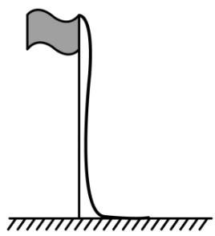

natural_image

Simple line drawing of a flagpole with a pole and ground base (no text or symbols)

【答案】详见解析.

【分析】本题考查了勾股定理的应用，根据勾股定理即可求解，熟练掌握勾股定理是解题的关键.

【详解】解：测量绳子垂到地面多出一段的长度，用字母 $m$ 表示，

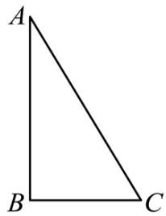

natural_image

Simple geometric diagram of a right triangle labeled A, B, C (no additional text or symbols)

用AB表示旗杆，将绳子拉直底端C接触地面，构成如图所示的Rt△ABC，测量BC=n，

在Rt $\triangle ABC$ 中， $\angle ABC = 90^{\circ}$ ，AC = AB + m，BC = n，

由勾股定理，得 $AB^{2}+BC^{2}=AC^{2}$ ，即 $AB^{2}+n^{2}=(AB+m)^{2}$ ，

$$
\therefore A B = \frac {n ^ {2} - m ^ {2}}{2 m},
$$

因此，旗杆的高度为 $\frac{n^{2}-m^{2}}{2m}$ .

【变式 7-2】（23-24 七年级下·山东济南·期末）“儿童散学归来早，忙趁东风放纸鸢”，周末王明和李华去放风筝，为了测得风筝的垂直高度AD，他们利用学过的“勾股定理”知识，进行了如下操作：

①测得水平距离BC的长为12米;   
②根据手中剩余线的长度计算出风筝线AB的长为15米;   
③牵线放风筝的王明放风筝时手离地面的距离BE为1.6米.

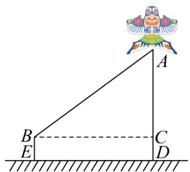

text_image

Geometric diagram showing triangle ABC with points D, E, and auxiliary lines, accompanied by a decorative bird illustration.

(1)求风筝的垂直高度AD;   
(2)如果王明想让风筝沿DA方向再上升7米，BC长度不变，则他应该把线再放出\_米.

【答案】(1)10.6 米

(2)5 米

【分析】本题考查了勾股定理的应用，根据题意，画出图形是解决问题的关键.

（1）利用勾股定理求出AC的长，再加上CD即可；  
(2) 根据题意, 画出图形, 求出 $A'B$ 的长, 进而解决问题.

【详解】（1）由题意可得，

$$
B C = 1 2 \text {   米,   } A B = 1 5 \text {   米,   } B C \perp A D, C D = 1. 6 \text {   米,   }
$$

$$
\therefore A C = 9 \text {(米)},
$$

$$
\therefore A D = A C + C D = 9 + 1. 6 = 1 0. 6 \text {(米)},
$$

即风筝的垂直高度AD的长为10.6米；

（2）由题意知， $A^{\prime}C=9+7=16$ （米），BC=12米，

$$
\therefore A ^ {\prime} B = 2 0 \text {(米)},
$$

$$
\therefore A ^ {\prime} B - A B = 2 0 - 1 5 = 5 \text {(米)},
$$

∴他应该把线再放出5米，

故答案为：5.

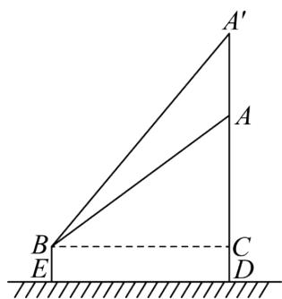

text_image

A'
A
B
C
E
D

【变式 7-3】（2025·湖北孝感·二模）为测量学校旗杆AB的高度，某中学数学兴趣小组的同学经过讨论，设计了以下两种方案：

请从以上两种方案中任选一种，计算旗杆AB的高度.

<table><tr><td></td><td>方案一</td><td>方案二</td></tr><tr><td>测量工具</td><td>含45°角的教学用直角三角板、足够长的皮尺.</td><td>升旗用的绳子、足够长的皮尺.</td></tr><tr><td>测量方案示意图</td><td>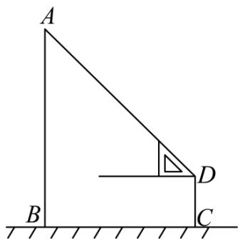</td><td></td></tr><tr><td>实施方案及测量数据</td><td>一同学站在C点,双手水平托好直角三角板,恰好看到旗杆顶A点,测得旗杆底部B处与C点的距离BC=10.8m,人的眼睛与地面的距离CD=1.2m.</td><td>升旗用的绳子从旗杆顶端垂落地面后还多出1m,将绳子斜拉直后,使得绳子底端C刚好接触地面,此时测得BC=5m.</td></tr><tr><td>备注</td><td>1图上所有点均在同一平面内;2旗杆半径忽略不计.</td><td>1实施过程中,旗杆顶端绳子保持不动.</td></tr></table>

【答案】 $AB = 12\mathrm{m}$

【分析】本题考查了矩形的判定和性质，等腰直角三角形的判定和性质，勾股定理，熟练掌握勾股定理，解方程是解题的关键.

方案一过 D 作 $DE \perp AB$ 于 E，则四边形 BCDE 是矩形，利用等腰直角三角形的性质，解答即可；方案二，设旗杆的高 AB = x，AC = x + 1，在 Rt $\triangle ABC$ 中，利用勾股定理解答即可.

【详解】解：若选方案一：

过 D 作 $DE \perp AB$ 于 E，如图所示，

text_image

A
E
D
B
C

依题意： $\angle ABC = \angle BCD = \angle CDE = 90^{\circ}$

∴ 四边形BCDE为矩形，

$$
\therefore B E = C D = 1. 2, \quad D E = B C = 1 0. 8,
$$

在Rt $\triangle ADE$ 中， $\angle ADE = 45^{\circ}$ ，

$$
\therefore A E = D E = 1 0. 8,
$$

$$
\therefore A B = A E + B E = 1 0. 8 + 1. 2 = 1 2 (\mathrm{m})
$$

若选方案二：

设AB = x，则AC = x + 1，

在Rt $\triangle ABC$ 中， $AC^{2}=AB^{2}+BC^{2}$

$$
\therefore (x + 1) ^ {2} = x ^ {2} + 5 ^ {2},
$$

解得：x = 12，

$$
\therefore A B = 1 2 m
$$

# 【题型8 求小鸟飞行距离】

【例 8】（24-25 八年级上·江苏宿迁·期末）如图所示，有两根直杆隔河相对，一杆高 30m，另一杆高 20m，两杆相距 50m．现两杆上各有一只鱼鹰，他们同时看到两杆之间的河面上 E 处浮起一条小鱼，于是以同样的速度同时飞下来夺鱼，结果两只鱼鹰同时叼住小鱼．则两杆底部距小鱼 E 处的距离各是多少？

text_image

Geometric diagram with labeled points A, B, C, D, and E forming triangles and a right angle at E

【答案】30m和20m

【分析】本题考查了勾股定理的应用，正确理解题意是解题的关键．由题意可得：AE = DE， $AB \perp BC, DC \perp BC$ ，那么 $AB^{2} + BE^{2} = EC^{2} + DC^{2}$ ，代入数据，解方程即可.

【详解】解：由题意可得：AE = DE， $AB \perp BC, DC \perp BC$ ，

则 $AB^{2}+BE^{2}=EC^{2}+DC^{2}$ ,

故 $20^{2}+BE^{2}=(50-BE)^{2}+30^{2}$ ,

解得：BE = 30，

则EC = 50 - 30 = 20（m），

答：两杆底部距小鱼 E 处的距离分别是30m和20m.

【变式 8-1】（23-24 八年级下·广西贺州·期中）姑婆山国家森林公园古窑冲猴趣园，调皮可爱的猴子随处可见．如图：有两只猴子爬到—棵树CD上的点B处，且BC=2m，突然发现远方A处有好吃的东西，其中一只猴子沿树爬下走到离树6m处的池塘A处，另一只猴子先爬到树顶D处后再沿缆绳线段DA滑到A处，已知两只猴子所经过的路程相等，设BD为xm.

text_image

Geometric diagram showing a tree with labeled vertices A, B, C, D and a right triangle formed by points A, B, C, and D.

(1)请用含有 x 的整式表示线段 AD 的长为 m;

(2)求这棵树高有多少米?

【答案】(1)(8-x)

(2)这棵树高 3.2 米

【分析】本题考查了勾股定理在实际生活中的运用，考查了直角三角形的构建，本题中正确的找出 $AD + BD = BC + AC$ 的等量关系，并根据Rt△ACD求BD的长是解题的关键.

（1）根据 $AD + BD = BC + AC$ ，计算即可；  
(2) 在Rt $\triangle ACD$ 中, 由勾股定理, 列出方程求解即可.

【详解】（1）解：∵AD + BD = BC + AC，

$$
\therefore A D + x = 2 + 6,
$$

$$
\therefore A D = (8 - x) \mathrm{m};
$$

故答案为： $(8-x)$ .

（2）解：由题意知 $\angle C=90^{\circ}$ ，则在Rt $\triangle ACD$ 中，

有 $AD^{2}=AC^{2}+CD^{2}$ ,

$$
\therefore (8 - x) ^ {2} = 6 ^ {2} + (2 + x) ^ {2},
$$

解得：x = 1.2，

$$
\therefore C D = 2 + 1. 2 = 3. 2 (\mathrm{m}).
$$

答：这棵树高有 3.2 米

【变式 8-2】（23-24 八年级下·新疆喀什·期中）如图，一只小鸟旋停在空中A点，A点到地面的高度AB = 8 米，A点到地面C点（B，C两点处于同一水平面）的距离AC = 10米.

text_image

A
D
B
C

(1)求出BC的长度;

(2)若小鸟竖直下降到达D点（D点在线段AB上），此时小鸟到地面C点的距离与下降的距离相同，求小鸟下降的距离.

【答案】(1)6米

(2)小鸟下降的距离为 $\frac{25}{4}$ 米

【分析】本题主要考查了勾股定理的实际应用，熟练的掌握勾股定理是解题的关键.

（1）在直角三角形中运用勾股定理即可解答；  
(2) 在Rt $\triangle BDC$ 中, 根据勾股定理即可解答.

【详解】（1）由题意知 $\angle B=90^{\circ}$ ，

∵AB=8米，AC=10米.

在Rt $\triangle ABC$ 中 $AB^{2} + BC^{2} = AC^{2}$

∴ $BC = \sqrt{10^{2} - 8^{2}} = 6$ 米，

(2) 设AD = x,

∵ 到达 D 点（D 点在线段 AB 上），此时小鸟到地面 C 点的距离与下降的距离相同，AB = 8

∴ 则 CD = AD = x, BD = 8 - x,

在Rt $\triangle BDC$ 中， $DC^{2}=BD^{2}+BC^{2}$

$$
\therefore x ^ {2} = (8 - x) ^ {2} + 6 ^ {2},
$$

解得 $x=\frac{25}{4}$ ,

∴ 小鸟下降的距离为 $\frac{25}{4}$ 米.

【变式 8-3】（23-24 八年级下·重庆铜梁·期中）如图，有一只喜鹊在一棵2m高的小树AB上觅食，它的巢筑在与该树水平距离（BD）为8m的一棵9m高的大树DM上，喜鹊的巢位于树顶下方1m的C处，当它听到巢中幼鸟的叫声，立即飞过去，如果它飞行的速度为2m/s，那么它要飞回巢中所需的时间至少是（）

A. 5s

text_image

A
B
C
D
M

B. 4s

C. 3s

D. 2s

【答案】A

【分析】本题考查勾股定理解实际问题，读懂题意，作出图形，数形结合求出最短路径长度是解决问题的关键.

过A作 $AE \perp MD$ 于E，如图所示，由勾股定理求出最短路径长即可得到答案.

【详解】解：过A作 $AE \perp MD$ 于E，如图所示：

text_image

M
C
A
E
B
D

由题意可知， $AB = DE = 2m, AE = BD = 8m, DM = 9m, CM = 1m,$

$$
\therefore C E = 9 - 1 - 2 = 6 \mathrm{m},
$$

根据两点之间线段最短，则它要飞回巢中所飞的最短路径为AC，由勾股定理可得AC=10，

∴它要飞回巢中所需的时间至少是 $10 \div 2 = 5(m/s)$ ,

故选：A.

# 【题型9 求大树折断前高度】

【例 9】（24-25 八年级上·甘肃兰州·期末）九章算术中记载了一个“折竹抵地”问题：今有竹高一丈，末折抵地，去本三尺，问折者高几何？题意是：一根竹子原高 1 丈（1 丈 = 10 尺），中部有一处折断，竹稍触地面处离竹根 4 尺，试问折断处离地面多高？则折断处离地面的高度为（）

natural_image

Illustration of a historical figure in traditional attire examining bamboo and rock (no text or symbols)

A. 4.55 尺

B. 5.45 尺

C. 4.2 尺

D. 5.8 尺

【答案】C

【分析】本题考查了勾股定理的应用，熟练掌握勾股定理是解题的关键．设折断处离地面的高度AB为x尺，则 $AC=(10-x)$ 尺，在Rt△ABC中，由勾股定理得出方程，求解即可.

【详解】解：设折断处离地面的高度AB为x尺，则 $AC=(10-x)$ 尺，

text_image

A
C E B

在Rt $\triangle ABC$ 中，由勾股定理得： $AB^{2} + BC^{2} = AC^{2}$ ,

$$
\therefore x ^ {2} + 4 ^ {2} = (1 0 - x) ^ {2},
$$

解得：x = 4.2，

即折断处离地面的高度为 4.2 尺，

故选：C.

【变式 9-1】（24-25 八年级上·河南平顶山·期中）如图，一棵垂直于地面且高度为12m的大树被大风吹折，折断处A与地面的距离AC = 4.5m，树尖B恰好碰到地面．在大树倒下的方向上的点D处停着一辆小轿车，CD = 6.5m，树枝落地时是否会砸着小轿车并说明理由．

text_image

Diagram showing a tree with labeled points A, B, C, D and a dashed line segment AB, alongside a cartoon car.

【答案】树枝砸不到小车

【分析】本题考查勾股定理．大树折断后，剩余部分的树干、折断的树干部分和地面之间构成了一个直角三角形，利用勾股定理计算出落地后树尖与树干的距离为 $BC = 6\mathrm{m}$ ，比较 $BC$ 和 $CD$ 的大小，可知大树砸不到小车.

【详解】如下图所示，

text_image

A
C B D
∵∠C=90°,

$\therefore\triangle ABC$ 为直角三角形，

在Rt $\triangle ABC$ 中，AC = 4.5m，AB = 12 - 4.5 = 7.5m，

$$
\therefore B C = 6 \mathrm{m},
$$

$$
\because C D = 6. 5 \mathrm{m}, \quad C D > B C,
$$

∴树枝砸不到小车.

【变式 9-2】（24-25 八年级上·江苏盐城·阶段练习）如图，车高2.4m(AC = 2.4m)，货车卸货时后面支架AB弯折落在地面 $A_{1}$ 处，经过测量 $A_{1}C = 1.2m$ ，求弯折点B与地面的距离.

text_image

A
B
C
A₁

【答案】0.9 米

【分析】此题考查了勾股定理在实际生活中的应用，正确应用勾股定理是解题关键.

设BC = xm，则 $AB = A_{1}B = (2.4 - x)\mathrm{m}$ ，在Rt△ $A_{1}BC$ 中利用勾股定理列出方程 $1.2^{2} + x^{2} = (2.4 - x)^{2}$ 即可求解.

【详解】解：由题意得， $AB = A_{1}B$ ， $\angle BCA_{1} = 90^{\circ}$

设BC = xm，则 $AB = A_{1}B = (2.4 - x)$ m，

在Rt $\triangle A_{1}BC$ 中， $A_{1}C^{2} + BC^{2} = A_{1}B^{2}$ ,

即： $1.2^{2} + x^{2} = (2.4 - x)^{2}$ ,

解得：x = 0.9，

答：弯折点B与地面的距离为0.9米.

【变式 9-3】我国古代数学名著《算法统宗》有一道“荡秋千”的问题：“平地秋千未起，踏板一尺离地。送行二步与人齐，5 尺人高曾记，仕女家人争蹴。良工高士素好奇，算出索长有几？”此问题可理解为：“如图，有一架秋千，当它静止时，踏板离地距离 $PA$ 的长为 1 尺，将它向前水平推送 10 尺时，即 $P'C = 10$ 尺，秋千踏板离地的距离 $P'B$ 和身高 5 尺的人一样高，秋千的绳索始终拉得很直，试问绳索有多长？”，设秋千的绳索长为 $x$ 尺，根据题意可列方程为 \_\_\_\_.

text_image

O
C
P'
A
B

【答案】 $(x+1-5)^{2}+10^{2}=x^{2}$

【分析】根据勾股定理列方程即可得出结论.

【详解】解：由题意知：

$$
O P ^ {\prime} = x, O C = x + 1 - 5, P ^ {\prime} C = 1 0,
$$

在 Rt△OCP'中，由勾股定理得：

$$
(x + 1 - 5) ^ {2} + 1 0 ^ {2} = x ^ {2}.
$$

故答案为： $(x+1-5)^{2}+10^{2}=x^{2}$

【点睛】本题主要考查了勾股定理的应用和列方程，读懂题意是解题的关键.

# 【题型10 求杯子中物体长度】

【例 10】（24-25 八年级上·山西运城·期末）如图是两个型号的圆柱型笔筒，粗细相同，高度分别是8cm和12cm，将一支铅笔按如图所示的方式先后放入两个笔筒，铅笔露在笔筒外面的部分分别为4cm和2cm，则铅笔的长为（）

text_image

4
8
2
12

A. $19 \mathrm{~cm}$

B. 21cm

C. 23cm

D. 25cm

【答案】C

【分析】本题主要考查了勾股定理的应用，熟练掌握勾股定理是解题的关键．由题意可知，两个笔筒粗细相同，底面直径相等．根据勾股定理，第一个笔筒中：直径平方 $=(x-4)^{2}-8^{2}$ ；第二个笔筒中：直径平方 $=(x-2)^{2}-12^{2}$ ；因直径相等，列方程即可求解.

【详解】解：设铅笔长度为 $x\mathrm{cm}$

$$
(x - 4) ^ {2} - 8 ^ {2} = (x - 2) ^ {2} - 1 2 ^ {2},
$$

解得，x = 23，

故铅笔的长为23cm;

故选：C.

【变式 10-1】如图，八年级一班的同学准备测量校园人工湖的深度，他们把一根竹竿AB竖直插到水底，此时竹竿AB离岸边点C处的距离CD=0.8米．竹竿高出水面的部分AD长0.2米，如果把竹竿的顶端A拉向岸边点C处，竿顶和岸边的水面刚好相齐，则人工湖的深度BD为（）

text_image

A
D
C
B

A. 1.5 米

B. 1.7 米

C. 1.8 米

D. 0.6 米

【答案】A

【分析】设 BD 的长度为 xm，则 $AB=BC=(x+0.2)m$ ，根据勾股定理构建方程即可解决问题.

【详解】解：设 BD 的长度为 xm，则 $AB=BC=(x+0.2)m$ ，

在 $Rt\triangle CDB$ 中， $0.8^{2}+x^{2}=(x+0.2)^{2}$

解得 x=1.5.

故选：A.

【点睛】本题考查勾股定理的应用，解题的关键是理解题意，学会利用参数构建方程解决问题.

【变式 10-2】《九章算术》中有一道“引葭赴岸”问题：“今有池一丈，葭生其中央，出水一尺，引葭赴岸，适与岸齐．问水深，葭长各几何？”题意是：有一个池塘，其底面是边长为 10 尺的正方形，一棵芦苇 AB 生长在它的中央，高出水面部分 BC 为 1 尺．如果把该芦苇沿与水池边垂直的方向拉向岸边，那么芦苇的顶部 B 恰好碰到岸边的 B'（如图）．则芦苇长\_\_\_\_尺．

text_image

B
C
A
B'
A'

【答案】13

【分析】将其转化为数学几何图形，如图所示，根据题意，可知 $B'C = 5$ 尺，设水深 $AC = x$ 尺，则芦苇长（ $x + 1$ ）尺，根据勾股定理建立方程，求出的方程的解即可得到芦苇的长和水深.

【详解】解：设水深 x 尺，则芦苇长 $(x+1)$ 尺，

在 $Rt\triangle CAB'$ 中，

$$
A C ^ {2} + B ^ {\prime} C ^ {2} = A B ^ {\prime 2},
$$

即 $x^{2}+5^{2}=(x+1)^{2}$ ,

解得：x=12，

$$
\therefore x + 1 = 1 3,
$$

故芦苇长 13 尺，

故答案为：13

【点睛】本题考查勾股定理，和列方程解决实际问题，能够在实际问题中找到直角三角形并应用勾股定理是解决本题的关键.

【变式 10-3】如图, 湖面上有一朵盛开的红莲, 它高出水面 $30 \mathrm{~cm}$ 。大风吹过, 红莲被吹至一边, 花朵下部刚好齐及水面, 已知红莲移动的水平距离为 $60 \mathrm{~cm}$ , 则水深是\_\_\_\_cm。

text_image

30 cm
教辅资源

【答案】45

【分析】设水深 h 厘米，则 AB = h，AC = h + 30，BC = 60，利用勾股定理计算即可.

【详解】红莲被吹至一边，花朵刚好齐及水面即 AC 为红莲的长.

text_image

30 cm
B
C
A

设水深 h 厘米，由题意得： $Rt \triangle ABC$ 中，AB = h，AC = h + 30，

$$
B C = 6 0,
$$

由勾股定理得： $AC^{2}=AB^{2}+BC^{2}$

即 $(h + 30)^{2} = h^{2} + 60^{2}$

解得h = 45.

故答案为：45.

【点睛】本题考查了勾股定理的应用，正确审题，明确直角三角形各边的长是解题的关键.

# 【题型 11 求梯子滑落高度】

【例 11】（23-24 八年级上·北京延庆·期末）如图，小巷左右两侧是竖直的墙，已知小巷的宽度CE是2.2米．一架梯子AB斜靠在左墙时，梯子顶端A与地面点C距离是2.4米．如果保持梯子底端B位置不动，将梯子斜靠在右墙时，梯子顶端D与地面点E距离是2米．求此时梯子底端B到右墙角点E的距离是多少米．

text_image

A
D
B
C
E

【答案】此时梯子底端到右墙角的距离是 1.5 米

【分析】本题考查了勾股定理的应用，设此时梯子底端到右墙角的距离BE长是x米，根据AC = BD，结合勾股定理列出方程，解方程即可得出答案，熟练掌握勾股定理是解此题的关键.

【详解】解：设此时梯子底端到右墙角的距离BE长是x米，

由题意列方程为： $(2.2-x)^{2}+2.4^{2}=x^{2}+4$

解方程得x=1.5，

答：此时梯子底端到右墙角的距离是 1.5 米.

【变式 11-1】如图, 一个梯子 $AB$ 长 2.5 米, 顶端 $A$ 靠在墙 $AC$ 上, 这时梯子下端 $B$ 离墙角 $C$ 的距离为 1.5 米, 梯子滑动后停在 $DE$ 的位置上了, 测得 $BD$ 长为 0.9 米, 则梯子顶端 $A$ 下滑 ( ).

text_image

A
E
C
B
D

A. 0.9 米

B. 1.3 米

C. 1.5 米

D. 2 米

【答案】B

【分析】要求下滑的距离，显然需要分别放到两个直角三角形中，运用勾股定理求得 AC 和 CE 的长即可.

【详解】解：∵在 Rt△ACB 中， $AC^{2}=AB^{2}-BC^{2}=2.5^{2}-1.5^{2}=4$ ，

$\therefore AC=2$ 米，

∵BD=0.9 米，

$\therefore CD = BD + BC = 0.9 + 1.5 = 2.4$ （米），

∵在 Rt△ECD 中， $EC^{2}=ED^{2}-CD^{2}=2.5^{2}-2.4^{2}=0.49$

∴EC=0.7米，

$\therefore AE = AC - EC = 2 - 0.7 = 1.3$ （米），故B正确.

故选：B.

【点睛】本题主要考查了勾股定理的应用，熟练掌握勾股定理是解题的关键.

【变式 11-2】（24-25 八年级上·全国·期末）如图，在一宽度EC为2米的电梯井里，一架2.5米长的梯子AB斜靠在竖直的墙AC上，顶端A被固定在墙上，这时B到墙底端C的距离为0.7米．程师傅为了方便修理，将梯子的底端举到对面D的位置，问此时梯子底端离地高度DE长为（）

text_image

A
D
E B C

A. 0.7 米

B. 0.9 米

C. 1.2 米

D. 1.5 米

【答案】B

【分析】本题考查了勾股定理的应用，熟练掌握勾股定理是解题的关键.

过D作 $DH \perp AC$ 于H，根据平行线的性质得到DH = CE = 2米，DE = CH，根据勾股定理即可得到结论.

【详解】解：过D作DH⊥AC于H，

text_image

A
D
H
E
B
C

由题意得 $DE \parallel AC$ ， $AC \perp EC$

$\therefore DH = CE = 2$ 米，

同理可得： $DE = CH$ ，

在Rt $\triangle ABC$ 中， $AC^{2}=AB^{2}-BC^{2}, AC=2.4$ （米），

在Rt $\triangle ADH$ 中， $AH^{2}=AD^{2}-DH^{2}, AH==1.5$ （米），

∴ DE = CH = AC - AH = 0.9 （米），

答：梯子底端离地高度DE长为0.9米，

故选：B.

【变式 11-3】（24-25 八年级上·广东深圳·阶段练习）某数学兴趣小组开展了笔记本电脑的张角大小的实践探究活动．如图，当张角为∠BAF时，顶部边缘B处离桌面的高度BC为7cm，此时底部边缘A处与C处间的距离AC为24cm，小组成员调整张角的大小继续探究，最后发现当张角为∠DAF时（D是B的对应点），顶部边缘D处到桌面的距离DE为20cm，则底部C处与E处之间的距离CE为（）

natural_image

Exterior view of a modern laptop computer with visible keyboard and front panel (no text or symbols)

A. 9cm

B. $18 \mathrm{~cm}$

text_image

D
B
C E A F

C. 21cm

D. 24cm

【答案】A

【分析】本题考查了勾股定理的应用．利用勾股定理先求出AB = 25cm，再得出AE = 15cm，进一步计算即

可解答.

【详解】解：在Rt $\triangle BCA$ 中， $AB^{2}=AC^{2}+BC^{2}=24^{2}+7^{2}=625$

$$
\therefore A B = 2 5 \mathrm{cm},
$$

在Rt $\triangle DEA$ 中， $AE^{2}=AD^{2}-DE^{2}=25^{2}-20^{2}=225$

$$
\therefore A E = 1 5 \mathrm{cm},
$$

$$
\therefore C E = A C - A E = 2 4 - 1 5 = 9 (\mathrm{cm}),
$$

故选：A.

# 【题型12 求最短路径】

【例 12】（24-25 八年级上·广东深圳·期中）如图，这是一个供滑板爱好者使用的 U 型池的示意图，该 U 型池可以看成是长方体去掉一个“半圆柱”而成，中间可供滑行部分的截面是直径为 $\frac{40}{\pi}$ m 的半圆，其边缘 AB = CD = 20m，点 E 在 CD 上，CE = 5m，一滑板爱好者从 A 点滑到 E 点，则他滑行的最短距离约为（）m。（边缘部分的厚度忽略不计）

text_image

20
40/π
C
E
B
D
A

A. 25

B. $5 \sqrt{73}$

C. 35

D. $20 \sqrt{2}$

【答案】A

【分析】本题考查了平面展开-最短路径问题，要求滑行的最短距离，需将该 U 型池的侧面展开，进而根据“两点之间线段最短”得出结果，U 型池的侧面展开图是一个矩形，此矩形的宽等于半径为 $\frac{20}{\pi}$ m 的半圆的弧长，矩形的长等于 AB = CD = 20m.

【详解】解：将半圆柱展开，如图： $AD=\frac{1}{2}\pi\cdot\frac{40}{\pi}=20m$ ，AB=CD=20m，DE=CD-CE=20-5=15(m)，

text_image

C
B
E
教辅资
D
A

$$
A D ^ {2} + D E ^ {2} = A E ^ {2},
$$

$$
\therefore 2 0 ^ {2} + 1 5 ^ {2} = A E ^ {2},
$$

解得AE = 25（负值舍去），即他滑行的最短距离约为25m.

故选：A.

【变式 12-1】（24-25 八年级上·甘肃兰州·期末）如图：长方体的长、宽、高分别是 12, 8, 30，在 $AB$ 中点 $C$ 处有一滴蜜糖，一只小虫从 $E$ 处爬到 $C$ 处去吃，有无数种走法，则最短路程是（）

text_image

A
C
B
E

A. 15

B. 25

C. 35

D. 45

【答案】B

【分析】本题考查了平面展开-最短路线问题和勾股定理，关键是知道求那一条线段的长.根据题意画出图形，根据勾股定理求出EC的长即可.

【详解】解：如图展开，连接EC，则线段EC的长就是小虫爬的最短路线，

在Rt $\triangle EBC$ 中，BE = 12 + 8 = 20， $BC = \frac{1}{2} AB = 15$ ，

由勾股定理得： $BE^{2} + CB^{2} = CE^{2}$

$$
E C = 2 5.
$$

故选：B.

text_image

A
C
E
B

【变式 12-2】（24-25 八年级上·山东青岛·期末）如图，长方体的底面边长分别为2cm和4cm，高为5cm。若一只蚂蚁从点 P 开始经过 4 个侧面爬行一圈到达点 Q，则蚂蚁爬行的最短路径长为

text_image

Q
5cm
2cm
4cm P

【答案】13cm

【分析】本题考查的是勾股定理的应用，先得到长方体侧面展开图，再利用勾股定理计算即可.

【详解】解：长方体侧面展开图如图所示.

text_image

P
Q
A

由题意，得 $PA=2+4+2+4=12(cm)$ ，QA=5cm.

在Rt $\triangle PQA$ 中， $PQ^{2}=PA^{2}+QA^{2}=12^{2}+5^{2}=169$

$$
\therefore P Q = 1 3 \mathrm{cm};
$$

故答案为: $13 \mathrm{~cm}$

【变式 12-3】（24-25 八年级下·四川自贡·期中）如图，圆柱的高为12cm，底面圆的周长为18cm，在圆柱下底面的点 A 有一只蚂蚁，它想吃到上底面上与点 A 相对的点 B 处的食物，沿圆柱侧面爬行的最短路程是多少？

natural_image

Simple line drawing of a cylinder with an ant at the base (no text or symbols)

【答案】蚂蚁沿圆柱侧面爬行的最短路程是15cm

【分析】本题主要考查利用勾股定理求最短路径，熟练掌握利用勾股定理求最短路径是解题的关键．把圆柱体展开，连接AB，然后可知AE和BE，进而可由两点之间，线段最短可知AB即为所求

【详解】解：如解图，圆柱体的展开图为长方形ACDE，

text_image

E B D
A C

所以 $\angle AEB=90^{\circ}$ ,

由题意可知， $BE=\frac{1}{2}DE=9cm,AE=12cm,$

所以在 Rt $\triangle ABE$ 中，

由勾股定理得， $AB^{2}=AE^{2}+BE^{2}=12^{2}+9^{2}=225=15^{2}$

所以 AB = 15cm,

则蚂蚁沿圆柱侧面爬行的最短路程是15cm