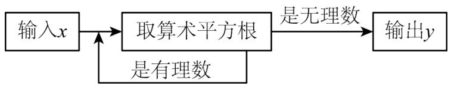
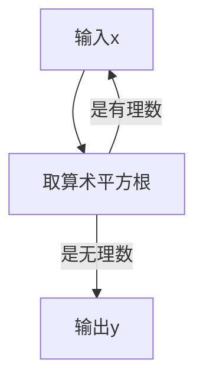
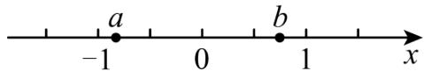
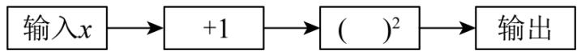
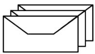
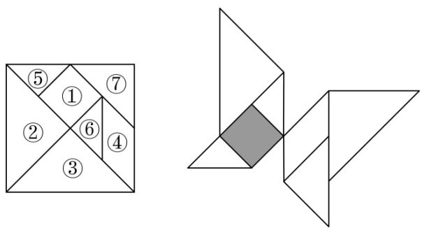
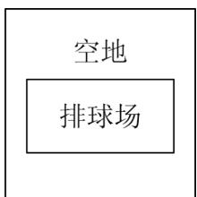

# 专题 2.1 认识实数、平方根（举一反三讲义）

【北师大版 2024】

# 题型归纳

【题型1 认识实数】....2

【题型 2 平方根的概念】....2

【题型 3 算术平方根的概念】....3

【题型4 平方根的性质】....3

【题型5 开平方】 4

【题型6 求未知数的值】....4

【题型 7 算术平方根的双重非负性】....4

【题型8 $\sqrt{a}$ 有意义的条件】....5

【题型 9 算术平方根在实际生活中的应用】....5

【题型10算术平方根的规律探究】....6

# 举一反三

# 知识点1 认识实数

定义：无限不循环小数称为无理数.

有理数和无理数统称实数，即实数可以分为有理数和无理数.

知识点 2 算术平方根和平方根的区别与联系 教辅资源,关注公众号·全科AA+

<table><tr><td colspan="2"></td><td>算术平方根</td><td>平方根</td></tr><tr><td rowspan="4">区别</td><td>定义</td><td>一般地,如果一个正数x的平方等于a,即 $x^{2}$ =a,那么这个正数x就叫做a的算术平方根</td><td>一般地,如果一个数 $\chi$ 的平方等于a,即 $x^{2}$ =a,那么这个数x就叫做a的平方根(也叫做二次方根)</td></tr><tr><td>个数</td><td>一个正数只有一个算术平方根</td><td>一个正数有两个平方根,它们互为相反数;负数没有平方根</td></tr><tr><td>表示方法</td><td>正数a的算术平方根为 $\sqrt{a}$ </td><td>正数a的平方根表示为 $\pm\sqrt{a}$ </td></tr><tr><td>取值范围</td><td> $\sqrt{a}$ 具有双重非负性,即 $\sqrt{a}\geq0,a\geq0$ </td><td>a的平方根可正可负,也可为0</td></tr><tr><td rowspan="2">二者联系</td><td>联系</td><td colspan="2">平方根包含了算术平方根,算术平方根是平方根中正的那个</td></tr><tr><td>关于0</td><td colspan="2">0的算术平方根和平方根都是0</td></tr></table>

# 知识点3 开平方

1. 定义: 求一个数 $a$ 的平方根的运算, 叫做开平方, $a$ 叫做被开方数.

2.开平方和平方根的区别与联系

(1)开平方时，被开方数 a 必须是非负数.  
(2)平方根是数，是开平方的结果；开平方是一种运算，是求平方根的过程.  
(3)平方和开平方互为逆运算，可以用平方运算来检验开平方的结果是否正确.

知识点4 $\sqrt{\mathbf{a}^2}$ 与 $\sqrt{\mathbf{a}^2}$ 的性质

<table><tr><td>形式</td><td>性质</td><td>示例</td></tr><tr><td> $\sqrt{a^{2}}$ </td><td> $\sqrt{a^{2}}=|a|=\begin{cases} a & (a\geq0) \\ -a & (a<0) \end{cases}$ </td><td> $\sqrt{6^{2}}=|6|=6$  $\sqrt{(-6)^{2}}=|-6|=6$ </td></tr><tr><td> $\sqrt{a^{2}}$ </td><td> $(\sqrt{a})^{2}=a(a\geq0)$ </td><td> $(\sqrt{6})^{2}=6$ </td></tr></table>

# 【题型1 认识实数】

【例 1】（24-25 七年级下·河南许昌·期中）将下列数按要求分类，并将答案填入相应的括号内： $1\frac{3}{4}$ ，-0.25， $-3\frac{5}{9}$ ，206，0， $-\frac{\pi}{2}$ ，21%， $\frac{30}{5}$ ，2.01001000100001……

正分数集合{ ... }

负有理数集合{ ... }

无理数集合{ ... }

【变式 1-1】（24-25 八年级上·甘肃张掖·期末）在实数 $\frac{\pi}{3}$ 、0、 $\frac{22}{7}$ 、3.14中，是无理数的为\_\_\_\_。

【变式 1-2】（24-25 八年级下·湖北襄阳·期中）若 x 是一个满足 -2 < x < 0 的无理数，任意写出一个符合题意的 x 值\_\_\_\_（答案不唯一）.

【变式 1-3】（24-25 七年级下·河南商丘·期中）在数 $-65, \frac{7}{11}, 3.14, 0, 2.36, -\pi, 0.020020002 \cdots$ 中，无理数共有个.

# 【题型2 平方根的概念】

【例 2】（24-25 七年级下·贵州黔南·期中）用式子表示“9 的平方根等于 ±3”正确的是（）

A. $\sqrt{9} = -3$

B. $\sqrt{9} = 3$

C. $\sqrt{9} = \pm 3$

D. $\pm\sqrt{9}=\pm3$

【变式 2-1】（24-25 八年级上·江西吉安·期末）下列各数中，没有平方根的是（）

A. 4

B. -4

C. 0

D. 2

【变式 2-2】（24-25 七年级下·河北邯郸·期末）下列各数中一定有平方根的是（）

A. $a^2 - 5$

B. -a

C. $a+1$

D. $a^{2}+1$

【变式 2-3】（24-25 七年级下·福建福州·专题练习）求下列各数的平方根，并用式子表示：

(1) $(-7)^{2}$ ;

(2) $\frac{16}{25}$ .

# 【题型 3 算术平方根的概念】教辅资源,关注公众号·全科AA+

【例 3】（24-25 八年级上·江西抚州·阶段练习）有一个数值转换器，原理如图所示，当输入的 x = 256 时，输出的 y 值是 \_\_\_\_.

flowchart

【变式 3-1】（24-25 八年级下·吉林·期中）计算： $1-\sqrt{(-6)^{2}}=$ \_\_\_\_

【变式 3-2】（24-25 七年级上·浙江温州·期末）已知关于x的方程 $-3x+1=x+2a$ 的解是 $x=-\frac{3}{4}$ ，则a的算术平方根是\_\_\_\_.

【变式 3-3】（24-25 七年级下·山东临沂·阶段练习）一个数的算术平方根是 x，则比这个数大 2 的数的算术平方根是（）

A. $x^{2}+2$

B. $\sqrt{x} + 2$

C. $\sqrt{x^{2}-2}$

D. $\sqrt{x^{2}+2}$

# 【题型4 平方根的性质】

【例 4】（24-25 七年级下·河北邯郸·期中）已知实数 x，y 不相等，且 x = 1 - 2a，y = 3a - 4.

(1)若x的算术平方根为3，求a的值；  
(2)如果一个正数的平方根为x，y，求这个正数.

【变式 4-1】（24-25 七年级下·重庆·阶段练习）若一个正数的两个平方根分别是 $2a + 3$ 与 $1 - a$ ，则这个正数是 \_\_\_\_.

【变式 4-2】（24-25 七年级下·安徽铜陵·期中）已知 3 是 x-1 的一个平方根，-5 是 $x-2y+1$ 的一个平方根．则 $x+y=$ \_\_\_\_.

【变式 4-3】（24-25 七年级·浙江宁波·期中）若2m-4与3m-1是同一个数的平方根，则m为\_\_\_\_。

# 【题型5 开平方】

【例 54】（24-25 八年级上·江苏泰州·期末）若实数 a、b 满足方程 $x^{2}=5$ ，且 a>b，下列说法正确的是（）

A. 5 的平方根是 $b$

B. 5 的平方根是 $a$

C. 5 的算术平方根是 $b$

D. 5 的算术平方根是 $a$

【变式 5-1】（24-25 七年级下·湖北荆门·期中）如果自然数 a 的平方根是±m，那么 $a+1$ 的平方根用 m 表示为（）

A. $\pm(m+1)$

B. $(m^{2}+1)$

C. $\pm\sqrt{m+1}$

D. $\pm\sqrt{m^{2}+1}$

【变式 5-2】（24-25 八年级下·海南省直辖县级单位·期末）如图，实数 a、b 在数轴上的位置如图所示，化简 $\sqrt{a^{2}} - |b| + \sqrt{(a - b)^{2}} =$ \_\_\_\_ .

text_image

-1
a
0
b
1
x

【变式 5-3】（24-25 七年级下·河北张家口·期末）关于 x，y 的二元一次方程组 $\left\{\begin{aligned}x-y&=a+6\\ 3x+y&=2a\end{aligned}\right.$ 的解 x，y 满足关系式 $\sqrt{x+y}=2$ ，则 a 的值为（）

A. 14

B. 12

C. 10

D. 8

# 【题型6 求未知数的值】

【例 6】（24-25 八年级下·广西河池·期末）若 $\sqrt{2x}=2$ ，则 x 的值是 \_\_\_\_.

【变式 6-1】（24-25 八年级上·广东广州·阶段练习）解方程：

(1) $x^{2}-6=0$

(2) $2(x-3)^{2}=50$

【变式 6-2】（24-25 七年级上·黑龙江齐齐哈尔·期末）有一运算程序如下：

flowchart

若输出的值是 25，则输入的值可以是\_\_\_\_。

【变式 6-3】（24-25 七年级下·重庆·专题练习）已知2a-1的平方根是±3，3a+b-1的算术平方根是4，那么a-2b的平方根是\_\_\_\_。

# 【题型7 算术平方根的双重非负性】

【例 7】（24-25 七年级下·湖北孝感·期中）若实数x,y,z满足 $\sqrt{x-2}+(y+1)^{2}+|z-3|=0$ ，则 $x+y+z$ 的平方根是\_\_\_\_.

【变式 7-1】（24-25 七年级上·浙江宁波·期中）若 $|x+2|+\sqrt{y-3}=0$ ，则 $\sqrt{(xy)^{2}}$ 的值为 \_\_\_\_.

【变式 7-2】(24-25 八年级上·河北沧州·期中) 若 m、n 满足 $(m-2)^{2} + \sqrt{n-14} = 0$ ，则 $\sqrt{m+n}$ 的平方根是 \_\_\_\_.

【变式 7-3】（24-25 八年级上·山西太原·阶段练习）已知实数 x、y 满足 $\sqrt{x-1} + \sqrt{y+2} = 0$ ，则 $(x+y)^{2024}$ 的值为 \_\_\_\_.

# 【题型 8 √a有意义的条件】教辅资源,关注公众号·全科AA+

【例 8】（24-25 八年级下·四川广安·期末）若 $\left|2023-m\right|+\sqrt{m-2024}=m$ ，则 $m-2023^{2}=$ \_\_\_\_.

【变式 8-1】（24-25 八年级上·四川达州·阶段练习）若 $m = \sqrt{x - 6} + \sqrt{6 - x} + 4$ ，n = x - 9，则 m - n 的值为 \_\_\_\_.

【变式 8-2】（24-25 九年级上·甘肃天水·阶段练习）已知 $|2012-a|+\sqrt{a-2013}=a$ ，则 $a-2012^{2}$ 的值\_\_\_\_.

【变式 8-3】（24-25 七年级下·天津和平·阶段练习）已知： $y = \sqrt{1 - 8x} + \sqrt{8x - 1} + \frac{1}{2}$ ，求代数式 $\sqrt{\frac{x}{y} + \frac{y}{x} + 2} - \sqrt{\frac{x}{y} + \frac{y}{x} - 2}$ 的平方根.

# 【题型 9 算术平方根在实际生活中的应用】

【例 9】（24-25 七年级下·山西朔州·期中）为宣传某地旅游资源，一中学课外活动小组制作了精美的景点卡片，并为每一张卡片制作了一个特色封皮。A 小组成员制作正方形卡片，B 小组成员制作长方形封皮请你通过计算，判断正方形卡片能否直接全部装进长方形封皮中。

<table><tr><td>课题</td><td>景点卡片及封皮制作</td></tr><tr><td>图示</td><td> </td></tr><tr><td>相关数据及说明</td><td>正方形卡片的面积为 $64cm^{2}$ ,长方形封皮的长与宽的比为2:1,面积为 $140cm^{2}$ </td></tr></table>

【变式 9-1】（24-25 七年级上·山东烟台·期末）七巧板是一种古老的中国传统智力玩具，顾名思义，是由七块板组成的。把一副七巧板按如图所示进行①～⑦编号，由这幅七巧板拼成的“蝴蝶”的面积是32，那么“蝴蝶”上带有阴影的板块边长为 \_\_\_\_。

text_image

Geometric puzzle with numbered triangular and square arrangements, including a highlighted square.

【变式 9-2】（24-25 七年级下·辽宁鞍山·期末）学校水房前有一个长、宽之比为 5:2 的长方形过道，其面积为 $10 \mathrm{~m}^{2}$ ，若用 40 块大小相同的正方形地砖把这个过道铺满，地砖的边长是 \_\_\_\_.

【变式 9-3】（24-25 七年级下·陕西安康·期末）某小区为了促进全民健身活动的开展，决定在一块面积为 $500m^{2}$ 的正方形空地上建一个排球场。已知排球场的面积为 $162m^{2}$ ，其中长和宽的比为 2:1，且排球场的四周必须留出 1m 宽的空地，请你通过计算说明能否按规定在这块空地上建一个排球场？

text_image

空地
排球场

# 【题型10 算术平方根的规律探究】

【例 10】（24-25 八年级上·河北承德·期末）观察下列各式：

$$
\sqrt {1 + \frac {1}{1 ^ {2}} + \frac {1}{2 ^ {2}}} = 1 + \frac {1}{1} - \frac {1}{2} = 1 \frac {1}{2}; \sqrt {1 + \frac {1}{2 ^ {2}} + \frac {1}{3 ^ {2}}} = 1 + \frac {1}{2} - \frac {1}{3} = 1 \frac {1}{6}; \sqrt {1 + \frac {1}{3 ^ {2}} + \frac {1}{4 ^ {2}}} = 1 + \frac {1}{3} - \frac {1}{4} = 1 \frac {1}{1 2}, \dots
$$

请你根据以上三个等式提供的信息解答下列问题

(1)猜想 $\sqrt{1+\frac{1}{7^{2}}+\frac{1}{8^{2}}}=\underline{\hspace{2cm}}=\underline{\hspace{2cm}}$ ;   
(2)归纳：根据你的观察，猜想，请写出一个用 n（n 为正整数）表示的等式：\_\_\_\_；  
(3)应用：计算 $\sqrt{\frac{82}{81}+\frac{1}{100}}$ .

【变式 10-1】（24-25 七年级下·广西贺州·期末）观察下列各式： $\sqrt{1+\frac{1}{3}}=2\sqrt{\frac{1}{3}}$ ， $\sqrt{2+\frac{1}{4}}=3\sqrt{\frac{1}{4}}$ ， $\sqrt{3+\frac{1}{5}}=4\sqrt{\frac{1}{5}}$ ，……，根据你发现的规律，若式子 $\sqrt{a+\frac{1}{b}}=8\sqrt{\frac{1}{b}}$ （a、b 为正整数）符合以上规律，则 $\sqrt{a+b}$ 的值为（）

A. 2

B. 4

C. 6

D. 8

【变式 10-2】（24-25 七年级下·重庆梁平·期末）（1）观察发现：

<table><tr><td> $a$  ( $a >$ )</td><td>...</td><td>0.0001</td><td>0.01</td><td>1</td><td>100</td><td>10000</td><td>...</td></tr><tr><td> $\sqrt{a}$ </td><td>...</td><td>0.01</td><td> $x$ </td><td>1</td><td> $y$ </td><td>100</td><td>...</td></tr></table>

表格中 $x = \_$ ， $y = \_$ .

(2) 归纳总结:

被开方数的小数点每向右移动2位，相应的算术平方根的小数点就向\_\_\_\_移动\_\_\_\_位.

（3）规律运用：

①已知 $\sqrt{5}\approx2.24$ ，则 $\sqrt{500}\approx$ \_\_\_\_；  
②已知 $\sqrt{2m}\approx7.07,\sqrt{5000}\approx70.7$ ，则m=\_\_\_\_。

【变式 10-3】（24-25 七年级下·浙江台州·期末）如何迅速准确地计算出四位数的算术平方根呢？按照下面思路你也能办到.

(1)以下是小明探究 $\sqrt{1849}$ 的过程，请补充完整：

①由 $10^{2}=100$ ， $100^{2}=10000$ 可以确定 $\sqrt{1849}$ 是\_\_\_\_位数；  
②由1849的个位上的数是9，可以确定 $\sqrt{1849}$ 的个位上的数是\_\_\_\_或\_\_\_\_；  
(3)如果划去1849后面的两位49得到数18，而 $4^{2}=16$ ， $5^{2}=25$ ，可以确定 $\sqrt{1849}$ 的十位上的数是4；因 $4\times(4+1)=20$ ，而18<20，所以选择较小的个位数字，则 $\sqrt{1849}=$ \_\_\_\_.  
(2)已知3136也是一个整数的平方，请根据材料的方法求出 $\sqrt{3136}$ ，并说明理由.