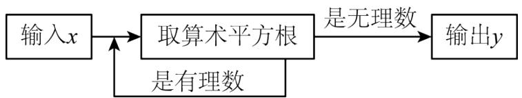
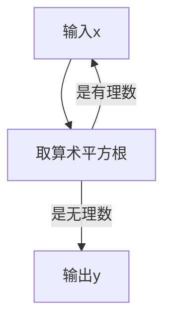
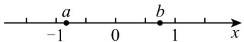
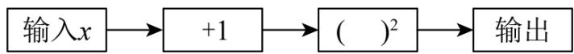
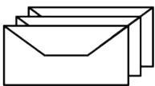
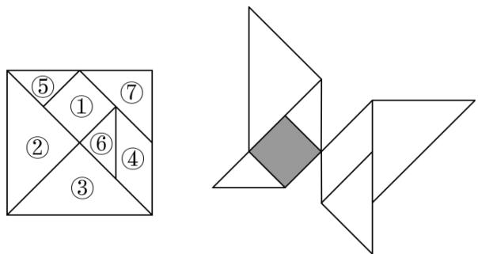

# 专题 2.1 认识实数、平方根（举一反三讲义）

【北师大版 2024】

# 题型归纳

【题型 1 认识实数】....2

【题型 2 平方根的概念】....3

【题型 3 算术平方根的概念】....5

【题型4 平方根的性质】....6

【题型 5 开平方】....8

【题型 6 求未知数的值】....10

【题型 7 算术平方根的双重非负性】....12

【题型8 $\sqrt{\mathrm{a}}$ 有意义的条件】....13

【题型 9 算术平方根在实际生活中的应用】....15

【题型 10 算术平方根的规律探究】....18

# 举一反三

# 知识点1 认识实数

定义：无限不循环小数称为无理数.

有理数和无理数统称实数，即实数可以分为有理数和无理数。

知识点 2 算术平方根和平方根的区别与联系

<table><tr><td colspan="2"></td><td>算术平方根</td><td>平方根</td></tr><tr><td rowspan="4">区别</td><td>定义</td><td>一般地,如果一个正数x的平方等于a,即 $x^{2}$ =a,那么这个正数x就叫做a的算术平方根</td><td>一般地,如果一个数 $\chi$ 的平方等于a,即 $x^{2}$ =a,那么这个数x就叫做a的平方根(也叫做二次方根)</td></tr><tr><td>个数</td><td>一个正数只有一个算术平方根</td><td>一个正数有两个平方根,它们互为相反数;负数没有平方根</td></tr><tr><td>表示方法</td><td>正数a的算术平方根为 $\sqrt{a}$ </td><td>正数a的平方根表示为 $\pm\sqrt{a}$ </td></tr><tr><td>取值范围</td><td> $\sqrt{a}$ 具有双重非负性,即 $\sqrt{a}\geq0,a\geq0$ </td><td>a的平方根可正可负,也可为0</td></tr><tr><td rowspan="2">二者联系</td><td>联系</td><td colspan="2">平方根包含了算术平方根,算术平方根是平方根中正的那个</td></tr><tr><td>关于0</td><td colspan="2">0的算术平方根和平方根都是0</td></tr></table>

# 知识点 3 开平方

1. 定义: 求一个数 $a$ 的平方根的运算, 叫做开平方, $a$ 叫做被开方数.

2. 开平方和平方根的区别与联系

(1)开平方时，被开方数 a 必须是非负数.  
(2)平方根是数，是开平方的结果；开平方是一种运算，是求平方根的过程.  
(3)平方和开平方互为逆运算，可以用平方运算来检验开平方的结果是否正确.

知识点4 $\sqrt{\mathbf{a}^2}$ 与 $\sqrt{\mathbf{a}^2}$ 的性质

<table><tr><td>形式</td><td>性质</td><td>示例</td></tr><tr><td> $\sqrt{a^{2}}$ </td><td> $\sqrt{a^{2}}=|a|=\begin{cases} a & (a\geq0) \\ -a & (a<0) \end{cases}$ </td><td> $\sqrt{6^{2}}=|6|=6$  $\sqrt{(-6)^{2}}=|-6|=6$ </td></tr><tr><td> $\sqrt{a^{2}}$ </td><td> $(\sqrt{a})^{2}=a(a\geq0)$ </td><td> $(\sqrt{6})^{2}=6$ </td></tr></table>

# 【题型1 认识实数】

【例 1】（24-25 七年级下·河南许昌·期中）将下列数按要求分类，并将答案填入相应的括号内： $1\frac{3}{4}$ ，-0.25， $-3\frac{5}{9}$ ，206，0， $-\frac{\pi}{2}$ ，21%， $\frac{30}{5}$ ，2.01001000100001……

正分数集合{ ... }

负有理数集合{ ... }

无理数集合{ ... }

【答案】 $1\frac{3}{4}$ ， $\frac{30}{5}$ ，21%；-0.25， $-3\frac{5}{9}$ ； $-\frac{\pi}{2}$ ，2.01001000100001……

【分析】本题考查实数的分类，掌握其分类的本质是关键．根据分数、负有理数和无理数的定义质，依次对各个数字分析分类，即可求解.

【详解】解：正分数集合 $\left\{1\frac{3}{4}, \frac{30}{5}, 21\%, \ldots\right\}$

负有理数集合 $\{-0.25, -3\frac{5}{9}, \ldots\}$

无理数集合 $\left\{-\frac{\pi}{2}, 2.01001000100001\cdots,\ldots\right\}$

故答案为： $1\frac{3}{4}$ ， $\frac{30}{5}$ ，21%；-0.25， $-3\frac{5}{9}$ ； $-\frac{\pi}{2}$ ，2.01001000100001……

【变式 1-1】（24-25 八年级上·甘肃张掖·期末）在实数 $\frac{\pi}{3}$ 、0、 $\frac{22}{7}$ 、3.14中，是无理数的为\_\_\_\_。

【答案】 $\frac{\pi}{3}$

【分析】本题考查了实数的分类，熟练掌握无理数的定义：无限不循环小数叫做无理数是解题的关键．根据无理数的定义即可解答.

【详解】解：在实数 $\frac{\pi}{3}$ 、0、 $\frac{22}{7}$ 、3.14中，是无理数的为 $\frac{\pi}{3}$ .

故答案为： $\frac{\pi}{3}$ .

【变式 1-2】（24-25 八年级下·湖北襄阳·期中）若 x 是一个满足 -2 < x < 0 的无理数，任意写出一个符合题意的 x 值\_\_\_\_（答案不唯一）.

【答案】 $-\frac{\pi}{2}$ （答案不唯一）

【分析】本题考查了无理数的定义，熟知无限不循环小数叫做无理数是解题的关键；

根据无理数的定义：无限不循环小数叫做无理数解答即可.

【详解】解： $\because -2 < -\frac{\pi}{2} < 0$ ，

∴符合题意的 x 的值可以是 $-\frac{\pi}{2}$ （答案不唯一）；

故答案为： $-\frac{\pi}{2}$ （答案不唯一）.

【变式 1-3】（24-25 七年级下·河南商丘·期中）在数 $-65, \frac{7}{11}, 3.14, 0, 2.36, -\pi, 0.020020002 \cdots$ 中，无理数共有个.

【答案】2

【分析】本题考查了无理数的识别，无限不循环小数叫无理数，据此可得答案.

【详解】解；由无理数的定义可得，无理数有 $-\pi,0.020020002\cdots$ ，共2个，

故答案为：2.

# 【题型2 平方根的概念】

【例 2】（24-25 七年级下·贵州黔南·期中）用式子表示“9 的平方根等于 ±3”正确的是（）

A. $\sqrt{9} = -3$

B. $\sqrt{9} = 3$

C. $\sqrt{9}=\pm3$

D. $\pm\sqrt{9}=\pm3$

【答案】D

【分析】本题考查了平方根，如果一个数 x 的平方等于 a，那么 x 叫做 a 的平方根；根据平方根的定义和表示方法解答即可.

【详解】解：用式子表示“9 的平方根等于 $\pm3$ ”为 $\pm\sqrt{9}=\pm3$ ;

故选：D.

【变式 2-1】（24-25 八年级上·江西吉安·期末）下列各数中，没有平方根的是（）

A. 4

B. -4

C. 0

D. 2

【答案】B

【分析】本题考查了平方根的定义的理解和应用，根据平方根的定义可知只有非负数才有平方根，由此进行判断即可.

【详解】解：∵正数有两个平方根，0 有一个平方根，负数没有平方根，

∴-4没有平方根.

故选：B

【变式 2-2】（24-25 七年级下·河北邯郸·期末）下列各数中一定有平方根的是（）

A. $a^2 - 5$

B. -a

C. $a+1$

D. $a^{2}+1$

【答案】D

【分析】正数的平方根有两个，0 的平方根是 0，负数没有平方根．题中要求这个数一定有平方根，所以这个数不论 m 取何值，都得是非负数.

【详解】解：A．当 a=0 时， $a^{2}-5=-5<0$ ，不符合题意；

B. 当 a=1 时，-a=-1<0，不符合题意；

C. 当 a = -5 时， $a + 1 = -4 < 0$ ，不符合题意；

D. 不论 a 取何值， $a^{2} \geq 0$ ， $a^{2} + 1 > 0$ ，符合题意.

故选 D.

【点睛】这道题主要考查对平方根的理解，做题的关键是要知道负数没有平方根.

【变式 2-3】（24-25 七年级下·福建福州·专题练习）求下列各数的平方根，并用式子表示：

(1) $(-7)^{2}$ ;

(2) $\frac{16}{25}.$

【答案】(1) $\pm7,\quad\pm\sqrt{(-7)^{2}}=\pm7$

(2) $\pm \frac{4}{5}, \pm \sqrt{\frac{16}{25}} = \pm \frac{4}{5}$

【分析】此题考查了平方根，熟练掌握平方根的定义是解本题的关键.

(1) 原式利用平方根定义计算即可得到结果.

(2) 原式利用平方根定义计算即可得到结果.

【详解】（1）解：因为 $(\pm7)^{2}=49$ ，

所以 49 的平方根是 $\pm7$ ，也就是 $(-7)^{2}$ 的平方根是 $\pm7$ ，

即 $\pm\sqrt{(-7)^{2}}=\pm7.$

(2) 解: 因为 $\left(\pm\frac{4}{5}\right)^{2}=\frac{16}{25}$ ,

所以 $\frac{16}{25}$ 的平方根是 $\pm \frac{4}{5}$ ，即 $\pm \sqrt{\frac{16}{25}} = \pm \frac{4}{5}$ .

# 【题型3 算术平方根的概念】

【例 3】（24-25 八年级上·江西抚州·阶段练习）有一个数值转换器，原理如图所示，当输入的 x = 256 时，输出的 y 值是 \_\_\_\_.

flowchart

【答案】 $\sqrt{2}$

【分析】本题考查了算术平方根，以及程序框图，解题的关键在于正确理解程序框图．将x=256代入程序框图进行运算求解，即可解题.

【详解】解：当x=256时，

则 $\sqrt{256} = 16$ ，16是有理数，

$\sqrt{16}=4,\quad4$ 是有理数，

$\sqrt{4}=2,\quad2$ 是有理数，

$\sqrt{2}$ 是无理数，

所以输出的y值是 $\sqrt{2}$ ;

故答案为： $\sqrt{2}$ .

【变式 3-1】（24-25 八年级下·吉林·期中）计算： $1-\sqrt{(-6)^{2}}=$ \_\_\_\_

【答案】-5

【分析】本题主要考查实数的计算，熟练掌握运算法则是解题的关键．先计算算术平方根，再计算减法即可.

【详解】解： $1-\sqrt{(-6)^{2}}=1-6=-5$ ，

故答案为：-5.

【变式 3-2】（24-25 七年级上·浙江温州·期末）已知关于x的方程 $-3x+1=x+2a$ 的解是 $x=-\frac{3}{4}$ ，则a的算术平方根是\_\_\_\_.

【答案】 $\sqrt{2}$

【分析】本题主要考查了方程的解，解一元一次方程，算术平方根等知识点，把 $x = -\frac{3}{4}$ 代入方程 $-3x + 1 = x + 2a$ 中得到到关于 $a$ 的方程，解方程求出 $a$ 的值，进而即可得解，熟练掌握方程的解，解一元一次方程等解决此题的关键.

【详解】将 $x=-\frac{3}{4}$ 代入方程 $-3x+1=x+2a$ 中得： $\frac{9}{4}+1=-\frac{3}{4}+2a$

解得：a = 2，

∴a的算术平方根为 $\sqrt{2}$ ,

故答案为： $\sqrt{2}$ .

【变式 3-3】（24-25 七年级下·山东临沂·阶段练习）一个数的算术平方根是 x，则比这个数大 2 的数的算术平方根是（）

A. $x^{2}+2$

B. $\sqrt{x} + 2$

C. $\sqrt{x^{2}-2}$

D. $\sqrt{x^{2}+2}$

【答案】D

【详解】因为一个数的算术平方根是 x, 所以这个数是 $x^{2}$ , 比这个数大 2 的数是 $x^{2} + 2$ , 所以比这个数大 2 的数的算术平方根是 $\sqrt{x^{2} + 2}$ .

故选 D.

# 【题型4 平方根的性质】

【例 4】（24-25 七年级下·河北邯郸·期中）已知实数x，y不相等，且x=1-2a，y=3a-4.

(1)若x的算术平方根为3，求a的值；

(2)如果一个正数的平方根为 $x, y$ , 求这个正数.

【答案】(1)-4

(2)25

【分析】本题主要考查了算术平方根、平方根以及一元一次方程的应用等知识，理解并掌握算术平方根、平方根的定义和性质是解题关键.

(1) 根据算术平方根的定义可知 $x = 1 - 2a = 9$ ，求解即可:

(2) 一个正数的两个平方根互为相反数, 和为 0 , 据此列出方程, 求出 $a$ 的值, 然后求出 $x, y$ 的值, 最后求出这个正数即可.

【详解】（1）解：∵x=1-2a，且x的算术平方根为3，

$\therefore1-2a=3^{2}=9$ ，解得a=-4；

(2) 解: $\because$ 一个正数的平方根为 $x, y$ ,

又∵x=1-2a，y=3a-4，

$$
\therefore 1 - 2 a + (3 a - 4) = 0,
$$

解得a=3，

$$
\therefore x = - 5, y = 5,
$$

∴这个正数为 $(-5)^{2}=25$ .

【变式 4-1】（24-25 七年级下·重庆·阶段练习）若一个正数的两个平方根分别是 $2a + 3$ 与 $1 - a$ ，则这个正数是 \_\_\_\_.

【答案】25

【分析】本题考查了平方根的性质：正数的两个平方根互为相反数，已知平方根求这个数；根据题意得 $2a+3+1-a=0$ ，求得a，从而得到正数的两个平方根，即可求得这个正数.

【详解】解：∵一个正数的两个平方根分别是 $2a+3$ 与1-a，

$$
\therefore 2 a + 3 + 1 - a = 0,
$$

$$
\therefore a = - 4,
$$

即这个正数的平方根为 $\pm 5$ ;

而 $(\pm5)^{2}=25$ ，即这个正数为25；

故答案为：25.

【变式 4-2】（24-25 七年级下·安徽铜陵·期中）已知 3 是 x-1 的一个平方根，-5 是 $x-2y+1$ 的一个平方根．则 $x+y=$ \_\_\_\_.

【答案】3

【分析】本题主要考查了根据平方根求原数，对于两个实数 a、b，若满足 $a^{2} = b$ ，那么 a 就叫做 b 的平方根，据此求出 x、y 的值即可得到答案.

【详解】解：∵3 是x-1的一个平方根，

$$
\therefore x - 1 = 3 ^ {2} = 9,
$$

$$
\therefore x = 1 0,
$$

∵-5是 $x-2y+1$ 的一个平方根，

$$
\therefore 1 0 - 2 y + 1 = (- 5) ^ {2} = 2 5,
$$

$$
\therefore y = - 7,
$$

$$
\therefore x + y = 1 0 + (- 7) = 3,
$$

故答案为：3.

【变式 4-3】（24-25 七年级·浙江宁波·期中）若2m-4与3m-1是同一个数的平方根，则m为\_\_\_\_。

【答案】1或-3

【分析】本题考查了平方根的有关定义，根据平方根的定义分两种情况讨论即可，解题的关键是正确理解平方根的定义.

【详解】解：∵2m-4与3m-1是同一个数的平方根，

∴① 2m-4 + 3m-1 = 0时，

解得：m = 1，

② 2m-4 = 3m-1时，

解得：m = -3，

综上可知，m为1或-3，

故答案为：1或-3.

# 【题型 5 开平方】

【例 54】（24-25 八年级上·江苏泰州·期末）若实数 a、b 满足方程 $x^{2}=5$ ，且 a>b，下列说法正确的是（）

A. 5 的平方根是 b

B. 5 的平方根是 a

C. 5 的算术平方根是 b

D. 5 的算术平方根是 a

【答案】D

【分析】根据题意，求出 $a=\sqrt{5}$ ， $b=-\sqrt{5}$ ，再依次进行判断即可.

【详解】解：∵a、b满足方程 $x^{2}=5$ ，且a>b，

$$
\therefore a = \sqrt {5}, b = - \sqrt {5},
$$

∴5 的平方根是 $\pm\sqrt{5}$ ，故 A，B 错误，

5 的算术平方根是 $\sqrt{5}$ ，故 C 错误，D 正确.

故选：D.

【点睛】本题考查了平方根和算术平方根的定义，熟练地掌握以上知识是解决问题的关键.

【变式 5-1】（24-25 七年级下·湖北荆门·期中）如果自然数 a 的平方根是 $\pm m$ ，那么 $a+1$ 的平方根用 m 表示为（）

A. $\pm(m+1)$

B. $(m^{2}+1)$

C. $\pm\sqrt{m+1}$

D. $\pm\sqrt{m^{2}+1}$

【答案】D

【分析】首先根据平方根性质用 m 表示出该自然数 a，由此进一步表示出 $a + 1$ ，从而进一步即可得出答案.

【详解】由题意得：这个自然数 a 为： $m^{2}$ ，

$$
\therefore a + 1 = \mathrm{m} ^ {2} + 1,
$$

故 $a+1$ 的平方根用 m 表示为： $\pm\sqrt{m^{2}+1}$ ，

故选：D.

【点睛】本题主要考查了平方根的性质，熟练掌握相关概念是解题关键.

【变式 5-2】（24-25 八年级下·海南省直辖县级单位·期末）如图，实数 a、b 在数轴上的位置如图所示，化简 $\sqrt{a^{2}} - |b| + \sqrt{(a - b)^{2}} =$ \_\_\_\_ .

text_image

-1
a
0
b
1
x

【答案】-2a

【分析】由数轴可知 $a < 0, b > 0$ ，于是可得 $a - b < 0$ ，将原式化为 $|a| - |b| + |a - b|$ ，然后化简绝对值，去括号，合并同类项，即可得出答案.

【详解】解：由数轴可知：a < 0, b > 0,

$$
\begin{array}{l} \therefore a - b <   0, \\ \therefore \sqrt {a ^ {2}} - | b | + \sqrt {(a - b) ^ {2}} \\ = | a | - | b | + | a - b | \\ = (- a) - b + (b - a) \\ = - a - b + b - a \\ = - 2 a, \\ \end{array}
$$

故答案为：-2a.

【点睛】本题主要考查了根据点在数轴的位置判断式子的正负，求一个数的算术平方根，化简绝对值，整式的加减运算，去括号，合并同类项等知识点，熟练掌握根据点在数轴的位置判断式子的正负及化简绝对值是解题的关键.

【变式 5-3】（24-25 七年级下·河北张家口·期末）关于 x，y 的二元一次方程组 $\left\{\begin{aligned}x-y&=a+6\\ 3x+y&=2a\end{aligned}\right.$ 的解 x，y 满足关系式 $\sqrt{x+y}=2$ ，则 a 的值为（）

A. 14

B. 12

C. 10

D. 8

【答案】A

【分析】本题考解二元一次方程组，算术平方根，一元一次方程.

将②-①，得 $x+y=\frac{a-6}{2}$ ，结合 $\sqrt{x+y}=2$ 可得到关于a的方程，求解即可.

【详解】解： $\left\{\begin{aligned}x-y&=a+6①\\ 3x+y&=2a②\end{aligned}\right.$

②-①，得 $2x+2y=a-6$ ，

$$
\therefore x + y = \frac {a - 6}{2},
$$

$$
\because \sqrt {x + y} = 2,
$$

$$
\therefore x + y = 4,
$$

$$
\therefore \frac {a - 6}{2} = 4,
$$

$$
\therefore a = 1 4.
$$

故选：A

# 【题型6 求未知数的值】

【例 6】（24-25 八年级下·广西河池·期末）若 $\sqrt{2x}=2$ ，则 x 的值是 \_\_\_\_.

【答案】2

【分析】本题考查算术平方根的定义，理解算术平方根的意义是解题的关键．等式两边平方，再求解即可.

【详解】解：∵ $\sqrt{2x}=2$ ，

$$
\therefore (\sqrt {2 x}) ^ {2} = 2 ^ {2},
$$

$$
\therefore 2 x = 4,
$$

$$
\therefore x = 2,
$$

故答案为：2.

【变式 6-1】（24-25 八年级上·广东广州·阶段练习）解方程：

(1) $x^{2}-6=0$

(2) $2(x-3)^{2}=50$

【答案】(1) $x_{1}=\sqrt{6},\quad x_{2}=-\sqrt{6}$

(2) $x_{1}=8,\quad x_{2}=-2$

【分析】本题考查了利用平方根的性质解方程.

（1）先移项，然后利用平方根的性质解方程；

(2) 先两边同时除以 2, 再利用平方根的性质解方程.

【详解】（1）解： $x^{2}-6=0$ ，

$$
\therefore x ^ {2} = 6,
$$

解得 $x_{1}=\sqrt{6},\quad x_{2}=-\sqrt{6};$

(2) 解: $2(x - 3)^{2} = 50$ ,

$$
(x - 3) ^ {2} = 2 5
$$

$$
x - 3 = \pm 5
$$

$$
x - 3 = 5 \text {或} x - 3 = - 5,
$$

解得 $x_{1}=8,\quad x_{2}=-2.$

【变式 6-2】（24-25 七年级上·黑龙江齐齐哈尔·期末）有一运算程序如下：

flowchart

若输出的值是 25，则输入的值可以是 \_\_\_\_.

【答案】4或-6

【分析】本题是有关程序图的运算，考查了利用平方根的性质解方程．由题可得 $(x+1)^{2}=25$ ，由此即可求出x的值.

【详解】解：根据题意可得：

$$
(x + 1) ^ {2} = 2 5,
$$

$$
x + 1 = \pm 5,
$$

解得x=4或x=-6.

故答案为：4 或 -6.

【变式 6-3】（24-25 七年级下·重庆·专题练习）已知 $2a - 1$ 的平方根是 $\pm 3, 3a + b - 1$ 的算术平方根是 4，那么 $a - 2b$ 的平方根是 \_\_\_\_.

【答案】±1

【分析】此题主要考查了平方根、算术平方根的性质和应用，要熟练掌握，解答此题的关键是要明确：①被开方数 a 是非负数；②算术平方根 a 本身是非负数．求一个非负数的算术平方根与求一个数的平方互为逆运算，在求一个非负数的算术平方根时，可以借助乘方运算来寻找．首先根据2a-1的平方根是 ±3，可得：2a-1 = 9，据此求出a的值是多少；然后根据3a + b - 1的算术平方根是4，可得：3a + b - 1 = 16，据此求出b的值是多少，进而求出a - 2b的平方根是多少即可.

【详解】解：∵2a-1的平方根是±3，

$$
\therefore 2 a - 1 = 9
$$

解得a = 5;

∵ $3a + b - 1$ 的算术平方根是 4，

$$
\therefore 3 a + b - 1 = 1 6
$$

$$
\therefore 3 \times 5 + b - 1 = 1 6
$$

解得b=2，

$$
\therefore a - 2 b = 5 - 2 \times 2 = 1
$$

∴ a-2b 的平方根是： $\pm\sqrt{1}=\pm1$ .

故答案为：±1.

# 【题型7 算术平方根的双重非负性】

【例 7】（24-25 七年级下·湖北孝感·期中）若实数x,y,z满足 $\sqrt{x-2}+(y+1)^{2}+|z-3|=0$ ，则 $x+y+z$ 的平方根是\_\_\_\_.

【答案】±2

【分析】根据二次根式、平方、绝对值的非负性即可得出 x、y、z 的值，求和后再求平方根即可.

【详解】解：由题意可得： $x-2=0,y+1=0,z-3=0$

解得：x = 2, y = -1, z = 3

$$
\therefore x + y + z = 4
$$

∴4 的平方根是 +2.

故答案为：±2.

【点睛】本题考查的知识点求代数式的平方根，解此题的关键是根据二次根式的非负性、绝对值的非负性、平方数的非负性，求出 x、y、z 的值.

【变式 7-1】（24-25 七年级上·浙江宁波·期中）若 $|x+2|+\sqrt{y-3}=0$ ，则 $\sqrt{(xy)^{2}}$ 的值为 \_\_\_\_.

【答案】6

【分析】本题考查了非负数的性质，算术平方根，掌握非负数的意义和性质是正确解答的关键．利用非负数的性质得出x．y的值，代入计算得出答案.

【详解】解：∵ $\left|x+2\right|+\sqrt{y-3}=0$ ,

$$
\therefore x + 2 = 0, \quad y - 3 = 0,
$$

解得：x = -2，y = 3，

$$
\therefore \sqrt {(x y) ^ {2}} = \sqrt {(- 6) ^ {2}} = \sqrt {3 6} = 6,
$$

故答案为：6.

【变式 7-2】（24-25 八年级上·河北沧州·期中）若 m、n 满足 $(m-2)^{2} + \sqrt{n-14} = 0$ ，则 $\sqrt{m+n}$ 的平方根是 \_\_\_\_.

【答案】±2

【分析】此题主要考查了非负数的性质以及算术平方根以及平方根的定义，根据非负数的性质求出 $m$ ， $n$ 的值，然后求出 $\sqrt{m + n}$ 的值，再求平方根即可.

【详解】解： $\because (m - 2)^{2} \geq 0, \sqrt{n - 14} \geq 0,$

$$
\therefore m - 2 = 0, n - 1 4 = 0,
$$

$$
\therefore m = 2, n = 1 4,
$$

$$
\therefore \sqrt {m + n} = \sqrt {2 + 1 4} = \sqrt {1 6} = 4,
$$

∴4 的平方根是 ±2.

故答案为：±2.

【变式 7-3】（24-25 八年级上·山西太原·阶段练习）已知实数 $x$ 、 $y$ 满足 $\sqrt{x - 1} + \sqrt{y + 2} = 0$ ，则 $(x + y)^{2024}$ 的值为 \_\_\_\_.

【答案】1

【分析】本题主要考查了算术平方根的非负性，先根据非负数性质得到 $x - 1 = 0$ ， $y + 2 = 0$ ，求出 $x$ 、 $y$ 的值，再代入 $(x + y)^{2024}$ 即可求得答案.

【详解】解： $\because\sqrt{x-1}+\sqrt{y+2}=0,\quad\sqrt{x-1}\geq0,\quad\sqrt{y+2}\geq0,$

$$
\therefore x - 1 = 0, y + 2 = 0,
$$

$$
\therefore x = 1, y = - 2,
$$

$$
\therefore (x + y) ^ {2 0 2 4} = (1 - 2) ^ {2 0 2 4} = 1,
$$

故答案为：1.

# 【题型8 $\sqrt{\mathrm{a}}$ 有意义的条件】

【例 8】（24-25 八年级下·四川广安·期末）若 $\left|2023-m\right|+\sqrt{m-2024}=m$ ，则 $m-2023^{2}=$ \_\_\_\_.

【答案】2024

【分析】本题考查二次根式有意义，先根据 $\sqrt{m-2024}$ 得到 $m\geq2024$ ，再化简绝对值计算即可.

【详解】解： $\sqrt{m-2024}$ ,

$$
\therefore m \geq 2 0 2 4,
$$

$$
\because | 2 0 2 3 - m | + \sqrt {m - 2 0 2 4} = m,
$$

$$
\therefore m - 2 0 2 3 + \sqrt {m - 2 0 2 4} = m,
$$

$$
\therefore \sqrt {m - 2 0 2 4} = 2 0 2 3,
$$

$$
\therefore m - 2 0 2 4 = 2 0 2 3 ^ {2},
$$

$$
\therefore m - 2 0 2 3 ^ {2} = 2 0 2 4,
$$

故答案为：2024.

【变式 8-1】（24-25 八年级上·四川达州·阶段练习）若 $m = \sqrt{x - 6} + \sqrt{6 - x} + 4$ ，n = x - 9，则 m - n 的值为 \_\_\_\_.

【答案】7

【分析】本题考查算术平方根的非负性，代入求值，先根据算术平方根的非负性得到 $x = 6$ ，然后计算出 $m$ ， $n$ 的值，代入计算即可.

【详解】解：由题可得 $\left\{\begin{aligned}x-6&\geq0\\ 6-x&\geq0\end{aligned}\right.$ ，解得x=6，

$$
\therefore m = 4, n = 6 - 9 = - 3,
$$

$$
\therefore m - n = 4 - (- 3) = 7,
$$

故答案为：7.

【变式 8-2】（24-25 九年级上·甘肃天水·阶段练习）已知 $|2012-a|+\sqrt{a-2013}=a$ ，则 $a-2012^{2}$ 的值\_\_\_\_.

【答案】2013

【分析】本题考查绝对值和二次根式有意义的条件，根据二次根式有意义的条件得 $a-2013\geq0$ ，再根据绝对值的代数意义将 $|2012-a|+\sqrt{a-2013}=a$ 化简，即可得解．解题的关键是掌握二次根式有意义的条件是被开方数是非负数.

【详解】解：∵ $|2012-a|+\sqrt{a-2013}=a$ ,

$$
\therefore a - 2 0 1 3 \geq 0,
$$

$$
\therefore a \geq 2 0 1 3,
$$

$$
\therefore a - 2 0 1 2 + \sqrt {a - 2 0 1 3} = a,
$$

$$
\therefore \sqrt {a - 2 0 1 3} = 2 0 1 2,
$$

$$
\therefore a - 2 0 1 3 = 2 0 1 2 ^ {2},
$$

$$
\therefore a - 2 0 1 2 ^ {2} = 2 0 1 3,
$$

即 $a-2012^{2}$ 的值为2013.

故答案为：2013.

【变式 8-3】（24-25 七年级下·天津和平·阶段练习）已知： $y = \sqrt{1 - 8x} + \sqrt{8x - 1} + \frac{1}{2}$ ，求代数式 $\sqrt{\frac{x}{y} + \frac{y}{x} + 2} - \sqrt{\frac{x}{y} + \frac{y}{x} - 2}$ 的平方根.

【答案】±1

【分析】本题考查的是算术平方根的非负性，平方根，根据已知和算术平方根的非负性求出 $x$ 、 $y$ 的值，把 $x$ 、 $y$ 代入代数式进行进行求解即可.

【详解】解：由题意可知 $1-8x\geq0$ ， $8x-1\geq0$ ，

则 $x \leq \frac{1}{8}, x \geq \frac{1}{8}$ ,

$$
\therefore x = \frac {1}{8}, y = \frac {1}{2} \text {, 则} \frac {x}{y} + \frac {y}{x} + 2 = \frac {1}{4} + 4 + 2 = \frac {2 5}{4}, \frac {x}{y} + \frac {y}{x} - 2 = \frac {1}{4} + 4 - 2 = \frac {9}{4},
$$

$$
\therefore \sqrt {\frac {x}{y} + \frac {y}{x} + 2} - \sqrt {\frac {x}{y} + \frac {y}{x} - 2} = \sqrt {\frac {2 5}{4}} - \sqrt {\frac {9}{4}} = \frac {5}{2} - \frac {3}{2} = 1,
$$

∵1 的平方根为 $\pm 1$ ,

∴代数式 $\sqrt{\frac{x}{y}+\frac{y}{x}+2}-\sqrt{\frac{x}{y}+\frac{y}{x}-2}$ 的平方根为 $\pm1$ .

# 【题型 9 算术平方根在实际生活中的应用】

【例 9】（24-25 七年级下·山西朔州·期中）为宣传某地旅游资源，一中学课外活动小组制作了精美的景点卡片，并为每一张卡片制作了一个特色封皮。A 小组成员制作正方形卡片，B 小组成员制作长方形封皮请你通过计算，判断正方形卡片能否直接全部装进长方形封皮中。

<table><tr><td>课题</td><td>景点卡片及封皮制作</td></tr><tr><td>图示</td><td> </td></tr><tr><td>相关数据及说明</td><td>正方形卡片的面积为 $64cm^{2}$ ,长方形封皮的长与宽的比为2:1,面积为 $140cm^{2}$ </td></tr></table>

【答案】正方形卡片能够直接装进长方形封皮中

【分析】此题考查了算术平方根的实际应用．设长方形的宽为 $x\mathrm{cm}$ ，则长为 $2x\mathrm{cm}$ ，根据长方形封皮的面积为 $140\mathrm{cm}^2$ 得到 $x \cdot 2x = 140$ ，求出 $x = \sqrt{70}$ ，然后求出正方形卡片的边长，进而比较求解即可.

【详解】解：设长方形的宽为xcm，则长为2xcm.

依题意，得 $x \cdot 2x = 140$ ，

整理，得 $x^{2}=70$ ，解得 $x=\sqrt{70}$ （负值已舍去）.

∵正方形卡片的面积为 $64cm^{2}$ ,

∴正方形卡片的边长为 $\sqrt{64}=8cm$ .

$$
\because \sqrt {7 0} > 8,
$$

∴ 正方形卡片能够直接装进长方形封皮中.

【变式 9-1】（24-25 七年级上·山东烟台·期末）七巧板是一种古老的中国传统智力玩具，顾名思义，是由七块板组成的。把一副七巧板按如图所示进行①～⑦编号，由这幅七巧板拼成的“蝴蝶”的面积是32，那么“蝴蝶”上带有阴影的板块边长为 \_\_\_\_。

natural_image

Geometric puzzle with two triangles and a shaded square, no text or symbols present

【答案】2

【分析】本题考查了算术平方根的应用，正确理解题意是解题的关键．根据⑤和⑥的面积和与①、⑦、④的面积相等即可求解.

【详解】解：∵“蝴蝶”的面积是32，

∴大正方形的面积为32，

可得⑤和⑥的面积和与①、⑦、④的面积相等，

∴①的面积为 $32 \div 2 \div 4 = 4$ ,

∴那么“蝴蝶”上带有阴影的板块边长为2，

故答案为：2.

【变式 9-2】（24-25 七年级下·辽宁鞍山·期末）学校水房前有一个长、宽之比为 5:2 的长方形过道，其面积为 $10 \mathrm{~m}^{2}$ ，若用 40 块大小相同的正方形地砖把这个过道铺满，地砖的边长是 \_\_\_\_.

【答案】 $0.5m/\frac{1}{2}m$

【分析】本题考查算术平方根的应用，设长方形过道的长为5xm，宽为2xm，根据题意求得x=1，再设地砖的边长是ym,根据题意求得y=0.5，经过验证符合题意，进而可得结论.

【详解】解：由题意，设长方形过道的长为5xm，宽为2xm，

根据题意，得 $5x\cdot2x=10$ ，即 $x^{2}=1$ ，

解得x=1（负值已舍去），

∴该长方形的长为5m，宽为2m，

设地砖的边长是ym,

根据题意， $y^{2}=10\div40=0.25$

解得y = 0.5，

由 $5 \div 0.5 = 10$ （块）， $2 \div 0.5 = 4$ （块），符合题意，

故地砖的边长是0.5m，

故答案为：0.5m.

【变式 9-3】（24-25 七年级下·陕西安康·期末）某小区为了促进全民健身活动的开展，决定在一块面积为 $500m^{2}$ 的正方形空地上建一个排球场。已知排球场的面积为 $162m^{2}$ ，其中长和宽的比为 2:1，且排球场的四周必须留出 1m 宽的空地，请你通过计算说明能否按规定在这块空地上建一个排球场？

空地

排球场

【答案】能，计算见解析

【分析】本题主要考查了算术平方根的应用，解题的关键在于能够根据题意求出排球场的长和宽．先设排球场的宽为 $x\mathrm{m}$ ，则长为 $2x\mathrm{m}$ ，列出方程求得排球场的长和宽，再结合题即可判断能否按规定在这块空地上建排球场了.

【详解】解：设排球场的宽为 $x\mathrm{m}$ ，则长为 $2x\mathrm{m}$ ，

根据题意，得 $2x \cdot x = 162$ ，

$$
\therefore x ^ {2} = 8 1,
$$

∵ x 为正数，

$$
\therefore x = 9,
$$

$$
\therefore 2 x = 1 8,
$$

$$
\therefore 2 x + 2 = 2 \times 9 + 2 = 2 0,
$$

$$
\because 2 0 ^ {2} = 4 0 0, \quad 4 0 0 <   5 0 0,
$$

$$
\therefore 2 0 <   \sqrt {5 0 0}.
$$

∴能按规定在这块空地上建一个排球场.

# 【题型10 算术平方根的规律探究】

【例 10】（24-25 八年级上·河北承德·期末）观察下列各式：

$$
\sqrt {1 + \frac {1}{1 ^ {2}} + \frac {1}{2 ^ {2}}} = 1 + \frac {1}{1} - \frac {1}{2} = 1 \frac {1}{2}; \sqrt {1 + \frac {1}{2 ^ {2}} + \frac {1}{3 ^ {2}}} = 1 + \frac {1}{2} - \frac {1}{3} = 1 \frac {1}{6}; \sqrt {1 + \frac {1}{3 ^ {2}} + \frac {1}{4 ^ {2}}} = 1 + \frac {1}{3} - \frac {1}{4} = 1 \frac {1}{1 2}, \dots
$$

请你根据以上三个等式提供的信息解答下列问题

(1)猜想 $\sqrt{1+\frac{1}{7^{2}}+\frac{1}{8^{2}}}=\underline{\hspace{2cm}}=\underline{\hspace{2cm}}$ ;

(2)归纳: 根据你的观察, 猜想, 请写出一个用 $n$ ( $n$ 为正整数) 表示的等式: \_\_\_\_;

(3)应用：计算 $\sqrt{\frac{82}{81} + \frac{1}{100}}.$

【答案】(1) $1+\frac{1}{7}-\frac{1}{8}$ ， $1\frac{1}{56}$

(2) $\sqrt{1 + \frac{1}{n^2} + \frac{1}{(n + 1)^2}} = 1 + \frac{1}{n} - \frac{1}{n + 1} = 1 + \frac{1}{n(n + 1)}$

(3) $\frac{91}{90}$

【分析】（1）根据等式的规律填空即可求解；

（2）根据前几个式子的规律，写出第n个式子即可求解.

（3）根据（2）的规律进行计算即可求解.

【详解】（1）解： $\sqrt{1+\frac{1}{7^{2}}+\frac{1}{8^{2}}}=\quad1+\frac{1}{7}-\frac{1}{8}=\quad1\frac{1}{56}$

故答案为： $1+\frac{1}{7}-\frac{1}{8}$ ， $1\frac{1}{56}$ .

（2）解： $\sqrt{1 + \frac{1}{n^2} + \frac{1}{(n + 1)^2}} = 1 + \frac{1}{n} -\frac{1}{n + 1} = 1 + \frac{1}{n(n + 1)},$

故答案为： $\sqrt{1 + \frac{1}{n^2} + \frac{1}{(n + 1)^2}} = 1 + \frac{1}{n} -\frac{1}{n + 1} = 1 + \frac{1}{n(n + 1)}.$

（3）解： $\sqrt{\frac{82}{81}+\frac{1}{100}}=\sqrt{1+\frac{1}{9^{2}}+\frac{1}{10^{2}}}=1+\frac{1}{9}-\frac{1}{10}=\frac{91}{90}$

【点睛】本题考查了二次根式的化简，找到规律是解题的关键.

【变式 10-1】（24-25 七年级下·广西贺州·期末）观察下列各式： $\sqrt{1+\frac{1}{3}}=2\sqrt{\frac{1}{3}}$ ， $\sqrt{2+\frac{1}{4}}=3\sqrt{\frac{1}{4}}$ ， $\sqrt{3+\frac{1}{5}}=4\sqrt{\frac{1}{5}}$ ，……，根据你发现的规律，若式子 $\sqrt{a+\frac{1}{b}}=8\sqrt{\frac{1}{b}}$ （a、b 为正整数）符合以上规律，则 $\sqrt{a+b}$ 的值为（）

A. 2

B. 4

C. 6

D. 8

【答案】B

【分析】根据式子的变化规律，求出 a, b 的值，进而即可求解.

【详解】解： $\because \sqrt{1 + \frac{1}{3}} = 2\sqrt{\frac{1}{3}}, \sqrt{2 + \frac{1}{4}} = 3\sqrt{\frac{1}{4}}, \sqrt{3 + \frac{1}{5}} = 4\sqrt{\frac{1}{5}}, \ldots\ldots,$

$$
\therefore \sqrt {a + \frac {1}{b}} = 8 \sqrt {\frac {1}{b}} \text {中,} a = 8 - 1 = 7, b = 8 + 1 = 9,
$$

$$
\therefore \sqrt {a + b} = \sqrt {7 + 9} = \sqrt {1 6} = 4,
$$

故选 B.

【点睛】本题主要考查算术平方根，找出式子中数字的变化规律是关键.

【变式 10-2】（24-25 七年级下·重庆梁平·期末）（1）观察发现：

<table><tr><td> $a$  ( $a >$ )</td><td>...</td><td>0.0001</td><td>0.01</td><td>1</td><td>100</td><td>10000</td><td>...</td></tr><tr><td> $\sqrt{a}$ </td><td>...</td><td>0.01</td><td> $x$ </td><td>1</td><td> $y$ </td><td>100</td><td>...</td></tr></table>

表格中x = \_, y = \_.

(2) 归纳总结:

被开方数的小数点每向右移动 2 位，相应的算术平方根的小数点就向\_\_\_\_移动\_\_\_\_位.

（3）规律运用：

①已知 $\sqrt{5}\approx2.24$ ，则 $\sqrt{500}\approx$ \_\_\_\_；

②已知 $\sqrt{2m}\approx7.07,\sqrt{5000}\approx70.7$ ，则m=\_\_\_\_。

【答案】（1）0.1；10 （2）右；1 （3）①22.4 ②25

【分析】本题考查算术平方根中的规律探索题：

(1) 直接计算即可;

(2) 观察 (1) 中表格数据, 找出规律;

（3）利用（2）中找出的规律求解.

【详解】解：（1） $x=\sqrt{0.01}=0.1,\quad y=\sqrt{100}=10,$

故答案为：0.1，10；

(2) 由表格中的数据可知被开方数的小数点每向右移动 2 位, 相应的算术平方根的小数点就向右移动 1 位. 故答案为: 右, 1;

(3) ①已知 $\sqrt{5} \approx 2.24$ ，则 $\sqrt{500} \approx 22.4$

②已知 $\sqrt{2m}\approx7.07,\quad\sqrt{5000}\approx70.7$ ，则2m=50，

$$
\therefore m = 2 5
$$

故答案为：①22.4；②25.

【变式 10-3】（24-25 七年级下·浙江台州·期末）如何迅速准确地计算出四位数的算术平方根呢？按照下面思路你也能办到.

(1)以下是小明探究 $\sqrt{1849}$ 的过程，请补充完整：

①由 $10^{2}=100$ ， $100^{2}=10000$ 可以确定 $\sqrt{1849}$ 是\_\_\_\_位数；

②由1849的个位上的数是9，可以确定 $\sqrt{1849}$ 的个位上的数是\_\_\_\_或\_\_\_\_；

(3)如果划去1849后面的两位49得到数18，而 $4^{2}=16$ ， $5^{2}=25$ ，可以确定 $\sqrt{1849}$ 的十位上的数是4；因 $4\times(4+1)=20$ ，而18<20，所以选择较小的个位数字，则 $\sqrt{1849}=$ \_\_\_\_.

(2)已知3136也是一个整数的平方，请根据材料的方法求出 $\sqrt{3136}$ ，并说明理由.

【答案】(1)①两；②3，7；③43

(2)56，理由见解析

【分析】本题考查算术平方根；

（1）根据所提供的方法进行计算即可；

(2) 按照 (1) 中的步骤和方法进行计解答即可.

【详解】（1）解：①由102 = 100，1002 = 10000可以确定 $\sqrt{1849}$ 是两位数；

②由1849的个位上的数是9，可以确定 $\sqrt{1849}$ 的个位上的数是3或7；

③如果划去1849后面的两位49得到数18，而 $42 = 16$ ， $52 = 25$ ，可以确定 $\sqrt{1849}$ 的十位上的数是4；因 $4 \times (4 + 1) = 20$ ，而 $18 < 20$

所以选择较小的个位数字，则 $\sqrt{1849}=43$ .

故答案为：①两；②3，7；③43；

(2) 已知3136也是一个整数的平方, 根据材料的方法求出 $\sqrt{3136}$ 的过程如下:

①由102 = 100，1002 = 10000可以确定 $\sqrt{3136}$ 是两位数；

②由3136的个位上的数是6，可以确定 $\sqrt{3136}$ 的个位上的数是4或6；

③如果划去3136后面的两位36得到数31，而52 = 25，62 = 36，可以确定 $\sqrt{3136}$ 的十位上的数是5；因 $5 \times (5 + 1) = 30$ ，而31 > 30，

所以选择较大的个位数字，则 $\sqrt{3136}=56$ .