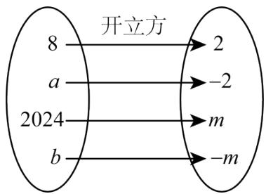
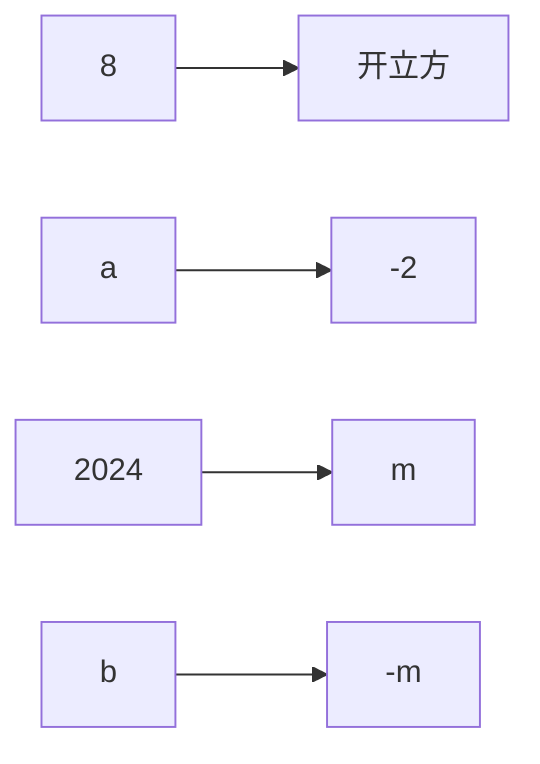
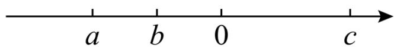

# 专题 2.2 立方根（举一反三讲义）

【北师大版 2024】

# 题型归纳

【题型 1 立方根的概念】....2

【题型 2 开立方】....2

【题型 3 立方根的性质】....2

【题型4 求未知数的值】....3

【题型 5 平方根和立方根的综合应用】....3

【题型 6 立方根在实际生活中的应用】....3

【题型 7 立方根的规律探究】....4

# 举一反三

知识点 1 立方根和平方根的不同点和相同点

<table><tr><td colspan="2"></td><td>立方根</td><td>平方根</td></tr><tr><td rowspan="4">区别</td><td>定义</td><td>一般地,如果一个数x的立方等于a,即 $x^{3}$ =a,那么这个正数x就叫做a的立方根(也叫做三次方根)</td><td>一般地,如果一个数x的平方等于a,即 $x^{2}$ =a,那么这个数x就叫做a的平方根(也叫做二次方根)</td></tr><tr><td>个数</td><td>每一个数a有且只有一个立方根,正数的立方根是正数,负数的立方根是负数</td><td>一个正数有两个平方根,它们互为相反数;负数没有平方根</td></tr><tr><td>表示方法</td><td> $\sqrt[3]{a}$ </td><td> $\pm\sqrt{a}$ </td></tr><tr><td>a取值范围</td><td>任意数</td><td> $a\geq0$ </td></tr><tr><td>相同点</td><td>关于0</td><td colspan="2">0的平方根是0,0的立方根是0</td></tr></table>

# 知识点 2 开立方

教辅资源, 关注公众号·全科AA+

1. 求一个数 a 的立方根的运算叫做开立方，其中 a 叫做被开方数.

2. 开平方和开立方的区别

<table><tr><td></td><td>开平方</td><td>开立方</td></tr><tr><td>运算符号</td><td> $\pm \sqrt{}$ </td><td> $^3\sqrt{}$ </td></tr><tr><td>被开方数</td><td>非负数</td><td>任意数</td></tr><tr><td>个数</td><td>0的平方根只有一个;一个正数的平方根有两个;负数没有平方根</td><td>任意数的立方根都只有一个</td></tr></table>

# 【题型1 立方根的概念】

【例 1】（24-25 七年级下·内蒙古呼和浩特·期中）若 $\sqrt[3]{a^{3}} = 2$ ，则 a = \_\_\_\_；若 $\sqrt{b^{2}} = 2$ ，则 b = \_\_\_\_；若 $-\sqrt[3]{a} = \sqrt[3]{\frac{7}{8}}$ ，则 a = \_\_\_\_.

【变式 1-1】（24-25 九年级下·广东惠州·开学考试）8 的立方根是\_\_\_\_.

【变式 1-2】（24-25 七年级下·四川广元·阶段练习）如果一个数的平方根和立方根相同，那么这个数是\_\_\_\_。

【变式 1-3】（24-25 七年级下·全国·课后作业）判断下列说法是否正确：

(1) 2 是 8 的立方根;  
(2) $\pm4$ 是 64 的立方根;  
(3) $-\frac{1}{3}$ 是 $-\frac{1}{27}$ 的立方根;  
(4) $(-4)^{3}$ 的立方根是-4.

【题型 2 开立方】 教辅资源,关注公众号·全科AA+

【例 2】（24-25 七年级下·河北邢台·期中）根据图中呈现的开立方运算关系，可以得出 a = \_\_\_\_；b = \_\_\_\_.

flowchart

【变式 2-1】（2025·安徽淮北·模拟预测）计算： $\sqrt[3]{-8}-1=$ \_\_\_\_.

【变式 2-2】（24-25 七年级下·陕西宝鸡·期中）求立方根： $\sqrt[3]{68921}=$ \_\_\_\_.

【变式 2-3】(24-25 七年级下·山东临沂·阶段练习)已知实数 a, b 满足 $\left|2b+6\right|+\sqrt{a+b+5}=0$ ，则 $(a-b)^{2025}$ 立方根是 \_\_\_\_.

# 【题型 3 立方根的性质】教辅资源,关注公众号·全科AA+

【例 3】（24-25 七年级下·河南商丘·阶段练习）已知 x 为有理数，且 $\sqrt[3]{4-x}-\sqrt[3]{2x-2}=0$ ，则 $x^{2}-x+3$ 的平方根为 \_\_\_\_.

【变式 3-1】（24-25 七年级·四川乐山·阶段练习）若 $\sqrt[3]{2a}$ 和 $\sqrt[3]{b}$ 互为相反数，求 $\frac{a}{b}$ 的为\_\_\_\_

【变式 3-2】（24-25 八年级上·江西九江·阶段练习）已知 $\sqrt[3]{1-m} = -2$ ，则 m 的平方根为 \_\_\_\_.

【变式 3-3】（24-25 八年级上·陕西西安·开学考试）若 $\sqrt[3]{(5-k)^{3}} = k - 5$ ，则 k 的值为 \_\_\_\_.

# 【题型4 求未知数的值】

【例 4】（24-25 八年级上·福建泉州·期末）若 $\sqrt[3]{3m-7} + \sqrt[3]{3n+4} = 0$ ，则 $m+n=$ \_\_\_\_.

【变式 4-1】（24-25 七年级下·吉林·期中）若 $\sqrt[3]{a} = -4$ ，则 a = \_\_\_\_.

【变式 4-2】（24-25 八年级上·四川广元·期中）如果 $(2x+1)^{3}+\frac{7}{8}=1$ ，求 x 的值.

【变式 4-3】（24-25 七年级下·江西宜春·阶段练习）已知 $\sqrt[3]{x-1}=x-1$ ，则 $\sqrt{x}$ 的值为 \_\_\_\_.

# 【题型5 平方根和立方根的综合应用】

【例 5】（24-25 七年级下·河南商丘·期中）2a-1的平方根为 $\pm3$ ， $3a-b+1$ 的立方根为 2，则 $\sqrt[3]{2a+2b+1}$ 的值为（）

A. -3

B. 3

C. $\pm3$

D. 不确定

【变式 5-1】（24-25 七年级下·四川绵阳·阶段练习）已知 a、b、c 在数轴上的位置如图，化简： $\sqrt{a^{2}}-|a+b|+\sqrt{(c-a+b)^{2}}-|b-c|+\sqrt[3]{b^{3}}=$ \_\_\_\_.

text_image

a b 0 c

【变式 5-2】（24-25 八年级下·山东菏泽·期末）已知 $\frac{1}{2}(x-2)^{3} + 32 = 0$ ，3x - 2y 的算术平方根是 6，求 $\sqrt{x^{2} - y}$ 的值.

【变式 5-3】(24-25 七年级下·全国·课后作业)若 $A = \sqrt[2a-2]{2a + 5b}$ 是9的算术平方根, $B = \sqrt[3]{-3a - 2b}$ , 则 $A + 2B$ 的立方根为 \_\_\_\_.

【题型 6 立方根在实际生活中的应用】 教辅资源, 关注公众号·全科AA+

【例 6】（24-25 七年级下·山西吕梁·期末）2024 年的母亲节来临之际，小康和小明分别制作了一个如图所示的正方体礼盒，准备用礼盒装好礼物送给妈妈。已知小康制作的正方体礼盒的表面积为 $150 \mathrm{~cm}^{2}$ ，而小明制作的正方体礼盒的体积比小康制作的正方体礼盒小 $61 \mathrm{~cm}^{3}$ ，则小明制作的正方体礼盒的表面积为（）

natural_image

Illustration of a gift box with orange and black stripes (no text or symbols)

A. $36 \mathrm{~cm}^{2}$

B. $54cm^{2}$

C. $96cm^{2}$

D. $144cm^{2}$

【变式 6-1】（24-25 七年级上·浙江杭州·期中）如图，二阶魔方为 $2 \times 2 \times 2$ 的正方体结构，本身只有 8 个方块，没有其他结构的方块，已知二阶魔方的体积约为 $1000 \mathrm{~cm}^{3}$ （方块之间的缝隙忽略不计），那么每个方块的边长为 \_\_\_\_ cm.

natural_image

3D Rubik's cube with orange and blue faces, no text or symbols visible

【变式 6-2】（24-25 八年级上·四川宜宾·期中）小明有一个大正方体铁块，其体积为 $125 \mathrm{~cm}^{3}$ .

(1)求这个大正方体铁块的棱长;  
(2)小明要将这个大正方体铁块熔化, 重新锻造成两个小正方体铁块, 其中一个小正方体铁块的体积为 $98 \mathrm{~cm}^{3}$ , 求另一个小正方体铁块的棱长.

【变式 6-3】（24-25 七年级下·河南新乡·期中）一个底面半径为2dm的圆柱体玻璃杯装满水，杯的高度为 $\frac{4}{\pi}$ dm，现将这杯水全部倒入一正方体容器中，正好占正方体容器容积的 $\frac{1}{4}$ （玻璃杯及容器的厚度可以不计），求正方体容器的棱长.

# 【题型7 立方根的规律探究】

【例 7】（24-25 七年级下·河南焦作·阶段练习）先阅读材料，再解答问题.

$$
\because - \sqrt [ 3 ]{1} = - 1, \sqrt [ 3 ]{- 1} = - 1,
$$

$$
\therefore - \sqrt [ 3 ]{1} = \sqrt [ 3 ]{- 1}.
$$

$$
\because - \sqrt [ 3 ]{8} = - 2, \sqrt [ 3 ]{- 8} = - 2,
$$

$$
\therefore - \sqrt [ 3 ]{8} = \sqrt [ 3 ]{- 8}.
$$

$$
\because - \sqrt [ 3 ]{2 7} = \quad , \sqrt [ 3 ]{- 2 7} = \quad ,
$$

$$
\therefore \quad \underline {{\quad}}.
$$

$$
\dots
$$

$$
\therefore - \sqrt [ 3 ]{n} = \underline {{\quad}}.
$$

(1)完成上面的填空，并猜测互为相反数的两个数的立方根的关系为\_；  
(2)计算 $\sqrt[3]{-1}+\sqrt[3]{-8}+\sqrt[3]{-27}+\cdots+\sqrt[3]{-50^{3}}$ 的值.

【变式 7-1】（24-25 七年级下·安徽池州·期末）若 $\sqrt[3]{0.3670} = 0.7160, \sqrt[3]{3.670} = 1.542, \sqrt[3]{-0.003670} =$ \_\_\_\_.

教辅资源, 关注公众号·全科AA+

【变式 7-2】（24-25 七年级下·河南商丘·阶段练习）观察下列规律并回答问题：

$$
\sqrt [ 3 ]{- 0 . 0 0 2 1 9 7} = - 0. 1 3, \sqrt [ 3 ]{- 2 . 1 9 7} = - 1. 3, \sqrt [ 3 ]{- 2 1 9 7} = - 1 3, \dots
$$

(1) $\sqrt[3]{-2197000}=$ \_\_\_\_, $\sqrt[3]{-2.197\times10^{9}}=$ \_\_\_\_;   
(2)已知 $\sqrt[3]{x}=2.35$ ，若 $\sqrt[3]{y}=0.235$ ，用含x的代数式表示y，则y=\_\_\_\_；  
(3)当 $a\geq0$ 时，根据上述规律比较 $\sqrt[3]{a}$ 与a的大小情况.

【变式 7-3】（24-25 七年级下·河南许昌·期中）观察下列计算过程，猜想立方根.

$$
1 ^ {3} = 1, 2 ^ {3} = 8, 3 ^ {3} = 2 7, 4 ^ {3} = 6 4, 5 ^ {3} = 1 2 5, 6 ^ {3} = 2 1 6, 7 ^ {3} = 3 4 3, 8 ^ {3} = 5 1 2, 9 ^ {3} = 7 2 9;
$$

(1)我国著名数学家华罗庚计算立方根的方法给小明了一些启示，小明是这样试求出 19683 的立方根的：先估计 19683 的立方根的个位数，猜想它的个位数为 7，由 $20^{3} < 19000 < 30^{3}$ ，猜想 19683 的立方根的十位数是 \_\_\_\_，验证得 19683 的立方根是 \_\_\_\_.

(2)请你根据（1）中小明的方法，完成如下填空：

① $\sqrt[3]{-373248}=$ \_\_\_\_.   
② $\sqrt[3]{0.531441}=$ \_\_\_\_.