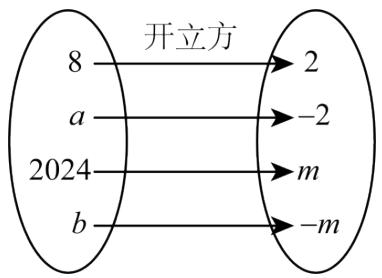
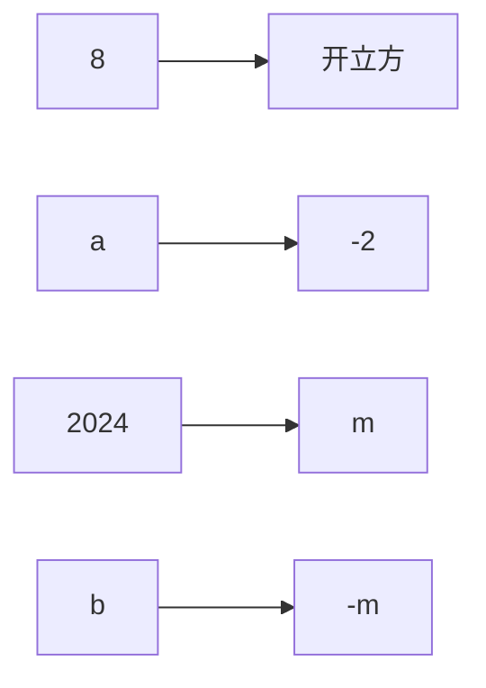
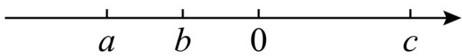

# 专题 2.2 立方根（举一反三讲义）

【北师大版 2024】

# 题型归纳

【题型 1 立方根的概念】....2

【题型 2 开立方】....3

【题型3 立方根的性质】....4

【题型4 求未知数的值】....6

【题型 5 平方根和立方根的综合应用】....7

【题型 6 立方根在实际生活中的应用】....9

【题型 7 立方根的规律探究】....11

# 举一反三

知识点 1 立方根和平方根的不同点和相同点

<table><tr><td colspan="2"></td><td>立方根</td><td>平方根</td></tr><tr><td rowspan="4">区别</td><td>定义</td><td>一般地,如果一个数x的立方等于a,即 $x^{3}$ =a,那么这个正数x就叫做a的立方根(也叫做三次方根)</td><td>一般地,如果一个数x的平方等于a,即 $x^{2}$ =a,那么这个数x就叫做a的平方根(也叫做二次方根)</td></tr><tr><td>个数</td><td>每一个数a有且只有一个立方根,正数的立方根是正数,负数的立方根是负数</td><td>一个正数有两个平方根,它们互为相反数;负数没有平方根</td></tr><tr><td>表示方法</td><td> $\sqrt[3]{a}$ </td><td> $\pm\sqrt{a}$ </td></tr><tr><td>a取值范围</td><td>任意数</td><td> $a\geq0$ </td></tr><tr><td>相同点</td><td>关于0</td><td colspan="2">0的平方根是0,0的立方根是0</td></tr></table>

# 知识点 2 开立方

1. 求一个数 a 的立方根的运算叫做开立方，其中 a 叫做被开方数.  
2. 开平方和开立方的区别

<table><tr><td></td><td>开平方</td><td>开立方</td></tr><tr><td>运算符号</td><td> $\pm \sqrt{}$ </td><td> $^3\sqrt{}$ </td></tr><tr><td>被开方数</td><td>非负数</td><td>任意数</td></tr><tr><td>个数</td><td>0的平方根只有一个;一个正数的平方根有两个;负数没有平方根</td><td>任意数的立方根都只有一个</td></tr></table>

# 【题型1 立方根的概念】

【例 1】（24-25 七年级下·内蒙古呼和浩特·期中）若 $\sqrt[3]{a^{3}} = 2$ ，则 a = \_\_\_\_；若 $\sqrt{b^{2}} = 2$ ，则 b = \_\_\_\_；若 $-\sqrt[3]{a} = \sqrt[3]{\frac{7}{8}}$ ，则 a = \_\_\_\_.

【答案】2 ± 2 $-\frac{7}{8}$ /-0.875

【分析】本题考查的是立方根和算术平方根的定义与性质，熟知这些是解题的关键，根据立方根和算术平方根的定义与性质可求 $a$ 和 $b$ 的值，从而可求答案.

【详解】解：若 $\sqrt[3]{a^{3}}=2$ ，则a=2；

若 $\sqrt{b^{2}}=2$ ，则 $b=\pm2;$

若 $-\sqrt[3]{a}=\sqrt[3]{\frac{7}{8}}$ ，则 $a=-\frac{7}{8}$ .

故答案为：2；±2； $-\frac{7}{8}$ .

【变式 1-1】（24-25 九年级下·广东惠州·开学考试）8 的立方根是\_\_\_\_。

【答案】2

【分析】本题考查了立方根，熟练掌握立方根的定义是解题的关键．根据立方根的定义即可求解.

【详解】解： $\because\sqrt[3]{8}=2$ ，

∴ 8 的立方根是 2.

故答案为：2.

【变式 1-2】（24-25 七年级下·四川广元·阶段练习）如果一个数的平方根和立方根相同，那么这个数是\_\_\_\_。

【答案】0

【分析】本题主要考查了立方根、平方根的定义和性质，其中分别利用了：求一个数的立方根，应先找出所要求的这个数是哪一个数的立方；求一个数的平方根，应先找出所要求的这个数是哪一个数的平方．由于一个数的平方根与立方根相同，根据平方根的定义这个数只能是非负数，然后根据立方根和平方根相等即可确定这个数.

【详解】解：∵一个数的平方根与立方根相同，

∴ 这个数为 0.

故答案为：0.

【变式 1-3】（24-25 七年级下·全国·课后作业）判断下列说法是否正确：

(1) 2 是 8 的立方根;  
(2) $\pm4$ 是64的立方根;  
(3) $-\frac{1}{3}$ 是 $-\frac{1}{27}$ 的立方根;  
(4) $(-4)^{3}$ 的立方根是-4.

【答案】（1）正确；（2）错误；（3）正确；（4）正确

【分析】根据立方根的定义进行判断，即可解答.

【详解】解：（1）正确；

(2) 4是64的立方根, 故错误;   
(3) 正确;  
(4) 正确.

【点睛】本题考查了立方根，解决本题的关键是熟记立方根的定义.

# 【题型2 开立方】

【例 2】（24-25 七年级下·河北邢台·期中）根据图中呈现的开立方运算关系，可以得出a = \_\_\_\_；b = \_\_\_\_.

flowchart

【答案】 -8 -2024

【分析】本题考查了求一个数的立方根，根据运算关系可得 $a=(-2)^{3}$ ， $m^{3}=2024$ ，进而可求得a、b.

【详解】解：由题意得， $a=(-2)^{3}=-8,\quad m=\sqrt[3]{2024}$

$$
\therefore - m = - \sqrt [ 3 ]{2 0 2 4},
$$

$$
\therefore b = (- m) ^ {3} = - 2 0 2 4,
$$

故答案为：-8，-2024.

【变式 2-1】（2025·安徽淮北·模拟预测）计算： $\sqrt[3]{-8}-1=$ \_\_\_\_.

【答案】-3

【分析】先开立方化简，再计算即可.

【详解】解： $\sqrt[3]{-8}-1=-2-1=-3$

故答案为：-3.

【点睛】本题考查了实数运算，立方根定义，熟练掌握运算法则是解答本题的关键.

【变式 2-2】（24-25 七年级下·陕西宝鸡·期中）求立方根： $\sqrt[3]{68921}=$ \_\_\_\_.

【答案】41

【分析】本题主要考查了立方根定义．根据立方根的定义进行解答.

【详解】解：∵ $41^{3}=68921$ ，

$$
\therefore \sqrt [ 3 ]{6 8 9 2 1} = 4 1,
$$

故答案为：41.

【变式 2-3】（24-25 七年级下·山东临沂·阶段练习）已知实数 a，b 满足 $\left|2b+6\right|+\sqrt{a+b+5}=0$ ，则 $(a-b)^{2025}$ 立方根是 \_\_\_\_.

【答案】1

【分析】本题考查了绝对值和算术平方根的非负性，求一个数的立方根，代数式求值，掌握绝对值和算术平方根的非负性是解题的关键.

先根据非负性求得a = -2, b = -3，再代入求得 $(a-b)^{2025}=1$ ，即可求解立方根.

【详解】解：∵ $|2b+6|+\sqrt{a+b+5}=0$ ，

$$
\therefore 2 b + 6 = 0, a + b + 5 = 0,
$$

解得：a = -2, b = -3,

$$
\therefore (a - b) ^ {2 0 2 5} = [ - 2 - (- 3) ] ^ {2 0 2 5} = 1,
$$

$\therefore(a-b)^{2025}$ 立方根是1,

故答案为：1.

# 【题型3 立方根的性质】

【例 3】（24-25 七年级下·河南商丘·阶段练习）已知 x 为有理数，且 $\sqrt[3]{4-x}-\sqrt[3]{2x-2}=0$ ，则 $x^{2}-x+3$ 的平方根为 \_\_\_\_.

【答案】 $\pm\sqrt{5}$

【分析】本题考查了立方根、平方根，已知字母的值求代数式的值，正确掌握相关性质内容是解题的关键．先结合立方根的性质得4-x=2x-2，解出x=2，再代入 $x^{2}-x+3$ ，得5，再求出5的平方根，即可作答.

【详解】解： $\because\sqrt[3]{4-x}-\sqrt[3]{2x-2}=0,$

$$
\therefore \sqrt [ 3 ]{4 - x} = \sqrt [ 3 ]{2 x - 2},
$$

$$
\therefore 4 - x = 2 x - 2,
$$

解得x=2，

$$
\therefore x ^ {2} - x + 3 = 2 ^ {2} - 2 + 3 = 5,
$$

$\therefore x^{2}-x+3$ 的平方根为 $\pm\sqrt{5}$ .

故答案为： $\pm \sqrt{5}$

【变式 3-1】（24-25 七年级·四川乐山·阶段练习）若 $\sqrt[3]{2a}$ 和 $\sqrt[3]{b}$ 互为相反数，求 $\frac{a}{b}$ 的为\_\_\_\_

【答案】 $-\frac{1}{2}$

【分析】由 $\sqrt[3]{2a}$ 和 $\sqrt[3]{b}$ 互为相反数，可得出2a=-b，进而可得出 $\frac{a}{b}$ 的值.

【详解】解：∵ $\sqrt[3]{2a}$ 和 $\sqrt[3]{b}$ 互为相反数，

$$
\therefore 2 a = - b,
$$

$$
\therefore \frac {a}{b} = - \frac {1}{2}.
$$

故答案为 $-\frac{1}{2}$ .

【点睛】本题考查了实数的性质以及立方根，由两数互为相反数找出 $2a = -b$ 是解题的关键.

【变式 3-2】（24-25 八年级上·江西九江·阶段练习）已知 $\sqrt[3]{1-m} = -2$ ，则 m 的平方根为 \_\_\_\_.

【答案】±3

【分析】本题考查立方根和平方根，根据立方根的定义得出m=9，进而求平方根即可.

【详解】解：∵ $\sqrt[3]{1-m}=-2$ ,

$$
\therefore 1 - m = - 8,
$$

$$
\therefore m = 9,
$$

∴ m 的平方根为 $\pm 3$ .

故答案为：±3.

【变式 3-3】（24-25 八年级上·陕西西安·开学考试）若 $\sqrt[3]{(5-k)^{3}} = k - 5$ ，则 k 的值为 \_\_\_\_.

【答案】5

【分析】根据零的立方根既可以看作等于其本身，也可以看作等于其相反数求解即可.

【详解】解： $\because \sqrt[3]{(5-k)^{3}} = k-5,$

$$
\therefore k - 5 = 0,
$$

$$
\therefore k = 5.
$$

故答案为：5.

【点睛】本题考查了立方根的定义，熟练掌握立方根的意义是解答本题的关键.

# 【题型4 求未知数的值】

【例 4】（24-25 八年级上·福建泉州·期末）若 $\sqrt[3]{3m-7} + \sqrt[3]{3n+4} = 0$ ，则 $m+n=$ \_\_\_\_.

【答案】1

【分析】根据三次根式性质， $\sqrt[3]{3m-7}+\sqrt[3]{3n+4}=0$ ，说明3m-7和3n+4互为相反数，即3m-7+3n+4=0即可求解.

【详解】 $\because\sqrt[3]{3m-7}+\sqrt[3]{3n+4}=0$

$$
\therefore 3 \mathrm{m} - 7 + 3 n + 4 = 0
$$

$$
\therefore \mathrm{m} + \mathrm{n} = 1
$$

故答案为：n

【点睛】本题考查了立方根的性质，立方根的值互为相反数，被开方数互为相反数.

【变式 4-1】（24-25 七年级下·吉林·期中）若 $\sqrt[3]{a} = -4$ ，则 a = \_\_\_\_.

【答案】-64

【分析】本题考查了立方根的定义，熟练掌握立方根的意义是解答本题的关键．如果一个数 x 的立方等于 a，即 $x^{3} = a$ ，那么这个数 x 就叫做 a 的立方根．据此求解即可.

【详解】解： $\because \sqrt[3]{a} = -4$ ，

$$
\therefore a = (- 4) ^ {3} = - 6 4.
$$

故答案为：-64.

【变式 4-2】（24-25 八年级上·四川广元·期中）如果 $(2x+1)^{3}+\frac{7}{8}=1$ ，求 x 的值.

【答案】 $-\frac{1}{4}$

【分析】本题考查了利用立方根解方程，掌握立方根的定义是解题关键．由立方根可知 $2x+1=\frac{1}{2}$ ，再求x的值即可.

【详解】解：∵ $(2x+1)^{3}+\frac{7}{8}=1$ ，

$$
\therefore (2 x + 1) ^ {3} = \frac {1}{8},
$$

$$
\therefore 2 x + 1 = \sqrt [ 3 ]{\frac {1}{8}} = \frac {1}{2},
$$

$$
\therefore 2 x = - \frac {1}{2},
$$

$$
\therefore \mathrm{x} = - \frac {1}{4}.
$$

【变式 4-3】（24-25 七年级下·江西宜春·阶段练习）已知 $\sqrt[3]{x-1}=x-1$ ，则 $\sqrt{x}$ 的值为 \_\_\_\_.

【答案】 $\sqrt{2}$ 或1或0

【分析】本题主要考查立方根的概念，熟练掌握立方根的意义是解答本题的关键，正数有一个正的立方根，负数有一个负的立方根，0 的立方根是 0，根据立方根是本身的数是 0,1,-1 列式求解出 x 的值，再代入 $\sqrt{x}$ 求解即可.

【详解】解：∵ $\sqrt[3]{x-1}=x-1$ ,

∴ x-1 = 1 或 x-1 = 0 或 x-1 = -1,

∴ x = 2 或 x = 1 或 x = 0,

$\because \sqrt{2} = \sqrt{2},\sqrt{1} = 1,\sqrt{0} = 0,$

∴ $\sqrt{x}$ 的值为： $\sqrt{2}$ 或 1 或 0

故答案为： $\sqrt{2}$ 或1或0.

# 【题型5 平方根和立方根的综合应用】

【例 5】（24-25 七年级下·河南商丘·期中）2a-1的平方根为 $\pm3$ ， $3a-b+1$ 的立方根为 2，则 $\sqrt[3]{2a+2b+1}$ 的值为（）

A.-3

B. 3

C. $\pm3$

D. 不确定

【答案】B

【分析】根据平方根定义立方根定义列式求出 a, b，代入求解即可得到答案；

【详解】解：∵2a-1的平方根为±3，3a-b+1的立方根为2，

$$
\therefore 2 a - 1 = (\pm 3) ^ {2} = 9, 3 a - b + 1 = 2 ^ {3},
$$

解得：a = 5, b = 8,

$$
\therefore \sqrt [ 3 ]{2 a + 2 b + 1} = \sqrt [ 3 ]{2 \times 5 + 2 \times 8 + 1} = \sqrt [ 3 ]{2 7} = 3,
$$

故选 B;

【点睛】本题考查平方根的定义，立方根的定义，解题的关键是根据定义列式求解.

【变式 5-1】（24-25 七年级下·四川绵阳·阶段练习）已知 a、b、c 在数轴上的位置如图，化简： $\sqrt{a^{2}}-|a+b|+\sqrt{(c-a+b)^{2}}-|b-c|+\sqrt[3]{b^{3}}=$ \_\_\_\_.

text_image

a b 0 c

【答案】4b-a

【分析】先根据数轴的性质可得 $a < b < 0 < c$ ，从而可得 $a + b < 0, b - c < 0, c - a + b > 0$ ，再计算算术平方根与立方根、化简绝对值，然后计算整式的加减即可得.

【详解】解：由数轴可知，a < b < 0 < c，

$$
\begin{array}{l} \therefore a + b <   0, \quad b - a > 0, \quad b - c <   0, \\ \therefore c - a + b > 0, \\ \therefore \sqrt {a ^ {2}} - | a + b | + \sqrt {(c - a + b) ^ {2}} - | b - c | + \sqrt [ 3 ]{b ^ {3}} \\ = - a - [ - (a + b) ] + (c - a + b) - (c - b) + b \\ = - a + a + b + c - a + b - c + b + b \\ = 4 b - a, \\ \end{array}
$$

故答案为：4b-a.

【点睛】本题考查了数轴、算术平方根与立方根、化简绝对值、整式的加减，熟练掌握数轴的性质是解题关键.

【变式 5-2】（24-25 八年级下·山东菏泽·期末）已知 $\frac{1}{2}(x-2)^{3} + 32 = 0$ ，3x - 2y 的算术平方根是 6，求 $\sqrt{x^{2} - y}$ 的值.

【答案】5

【分析】利用立方根的定义求得x的值，然后利用算术平方根的定义求得y值，将其代入 $\sqrt{x^{2}-y}$ 中计算即可.

【详解】解：由题意得： $(x-2)^{3}=-64$ ，

$$
\therefore x - 2 = - 4,
$$

$$
\therefore x = - 2,
$$

由 $3x - 2y = 6^2$ ，得 $3x - 2y = 36$

$$
\therefore y = \frac {3 x - 3 6}{2} = \frac {3 \times (- 2) - 3 6}{2} = - 2 1,
$$

$$
\therefore \sqrt {x ^ {2} - y} = \sqrt {(- 2) ^ {2} - (- 2 1)} = \sqrt {2 5} = 5.
$$

【点睛】本题考查实数的运算，算术平方根及立方根的定义，熟练掌握并运用相关运算法则是解题的关键.

【变式 5-3】（24-25 七年级下·全国·课后作业）若 $A = \sqrt[2a-2]{2a + 5b}$ 是9的算术平方根， $B = \sqrt[3]{-3a - 2b}$ ，则 $A + 2B$ 的立方根为 \_\_\_\_.

【答案】-1

【分析】本题考查的是立方根及算术平方根的定义，掌握立方根及算术平方根的定义是解题的关键．根据题意列出关于a、b的方程，求出a、b的值，即可求解.

【详解】∵ $A = \sqrt[2a-2]{2a + 5b}$ 是9的算术平方根，

$$
\therefore 2 a - 2 = 2, \quad 2 a + 5 b = 9,
$$

解得：a = 2, b = 1,

$$
\therefore A = \sqrt {9} = 3, B = \sqrt [ 3 ]{- 3 a - 2 b} = \sqrt [ 3 ]{- 6 - 2} = - 2,
$$

$\therefore A + 2B$ 的立方根为 $\sqrt[3]{3-4} = -1$ ,

故答案为：-1.

# 【题型6 立方根在实际生活中的应用】

【例 6】（24-25 七年级下·山西吕梁·期末）2024 年的母亲节来临之际，小康和小明分别制作了一个如图所示的正方体礼盒，准备用礼盒装好礼物送给妈妈。已知小康制作的正方体礼盒的表面积为 $150 \mathrm{~cm}^{2}$ ，而小明制作的正方体礼盒的体积比小康制作的正方体礼盒小 $61 \mathrm{~cm}^{3}$ ，则小明制作的正方体礼盒的表面积为（）

natural_image

Illustration of a gift box with orange and black stripes and a dark blue cushion (no text or symbols)

A. $36 \mathrm{~cm}^{2}$

B. $54 \mathrm{~cm}^{2}$

C. $96\mathrm{cm}^2$

D. $144 \mathrm{~cm}^{2}$

【答案】C

【分析】本题考查立方根的实际应用；

设小康制作的正方体礼盒的边长为 $a$ ，根据表面积公式先求出 $a = 5$ ，从而求出小康制作的正方体礼盒的体积，再根据小明制作的正方体礼盒的体积比小康制作的正方体礼盒小 $61 \mathrm{~cm}^{3}$ 即可求解.

【详解】设小康制作的正方体礼盒的边长为 a，

则 $6a^{2}=150$ ，解得：a=5

∴小康制作的正方体礼盒的体积为： $a^{3}=125cm^{2}$

∵小明制作的正方体礼盒的体积比小康制作的正方体礼盒小61cm³

∴小明制作的正方体礼盒的体积为125-61=64cm³

∴小明制作的正方体礼盒的边长为 $\sqrt[3]{64}=4cm$

∴小明制作的正方体礼盒的表面积为 $6 \times 4^{2} = 96cm^{2}$

故选：C.

【变式 6-1】（24-25 七年级上·浙江杭州·期中）如图，二阶魔方为 $2 \times 2 \times 2$ 的正方体结构，本身只有 8 个方块，没有其他结构的方块，已知二阶魔方的体积约为 $1000 \mathrm{~cm}^{3}$ （方块之间的缝隙忽略不计），那么每个方块的边长为 \_\_\_\_ cm.

natural_image

3D rendering of a Rubik's cube with orange and blue faces (no text or symbols)

【答案】5

【分析】本题主要考查了立方根的概念，根据题意求得每个方块的体积，再利用立方根的定义求得每个方块的边长即可，熟练掌握其性质并能灵活运用已知条件求得每个方块的体积是解决此题的关键.

【详解】解：由题意可得每个方块的体积为 $1000 \div 8 = 125(\text{cm}^3)$ ,

∴其边长为 $\sqrt[3]{125}=5(cm)$ ,

故答案为：5.

【变式 6-2】（24-25 八年级上·四川宜宾·期中）小明有一个大正方体铁块，其体积为 $125 \mathrm{~cm}^{3}$ .

(1)求这个大正方体铁块的棱长;

(2)小明要将这个大正方体铁块熔化, 重新锻造成两个小正方体铁块, 其中一个小正方体铁块的体积为 $98 \mathrm{~cm}^{3}$ , 求另一个小正方体铁块的棱长.

【答案】(1)5cm

(2)3cm

【分析】本题考查立方根的应用、正方体的体积，熟练掌握相关的知识点是解题的关键.

(1) 根据正方体的体积公式和立方根的定义进行解答;  
(2) 根据题意先求得另一个小立方体铁块的体积, 再根据立方根的定义进行计算即可.

【详解】（1）解：根据题意，铁块的棱长为 $\sqrt[3]{125}=5(\text{cm})$ ，

答：这个铁块的棱长为5cm.

(2) 解: 根据题意, 另一个小立方体铁块的体积为 $125 - 98 = 27 \left( \mathrm{~cm}^{3} \right)$ ,

∴另一个小立方体铁块的棱长为 $\sqrt[3]{27}=3(\mathrm{~cm})$ .

答：另一个小立方体铁块的棱长为3cm.

【变式 6-3】（24-25 七年级下·河南新乡·期中）一个底面半径为2dm的圆柱体玻璃杯装满水，杯的高度为 $\frac{4}{\pi}$ dm，现将这杯水全部倒入一正方体容器中，正好占正方体容器容积的 $\frac{1}{4}$ （玻璃杯及容器的厚度可以不计），求正方体容器的棱长.

【答案】这个正方体容器的棱长为4dm

【分析】此题主要考查了立方根，正确把握圆柱体以及正方体的体积公式应用是解题关键．直接利用圆柱体体积求法以及正方体体积求法进而得出等式求出答案.

【详解】解：设正方体容器的棱长为 $x\mathrm{dm}$ ，根据题意可得： $\pi \times 2^{2} \times \frac{4}{\pi} = \frac{1}{4} x^{3}$ ，

解得：x = 4，

答：这个正方体容器的棱长为 $4 \mathrm{dm}$ .

# 【题型7 立方根的规律探究】

【例 7】（24-25 七年级下·河南焦作·阶段练习）先阅读材料，再解答问题.

$$
\because - \sqrt [ 3 ]{1} = - 1, \sqrt [ 3 ]{- 1} = - 1,
$$

$$
\therefore - \sqrt [ 3 ]{1} = \sqrt [ 3 ]{- 1}.
$$

$$
\because - \sqrt [ 3 ]{8} = - 2, \sqrt [ 3 ]{- 8} = - 2,
$$

$$
\therefore - \sqrt [ 3 ]{8} = \sqrt [ 3 ]{- 8}.
$$

$$
\because - \sqrt [ 3 ]{2 7} = \quad , \sqrt [ 3 ]{- 2 7} = \quad ,
$$

$$
\therefore \quad \underline {{\quad}}.
$$

$$
\dots
$$

$$
\therefore - \sqrt [ 3 ]{n} = \underline {{\quad}}.
$$

(1)完成上面的填空，并猜测互为相反数的两个数的立方根的关系为\_；  
(2)计算 $\sqrt[3]{-1}+\sqrt[3]{-8}+\sqrt[3]{-27}+\cdots+\sqrt[3]{-50^{3}}$ 的值.

【答案】(1)-3；-3； $-\sqrt[3]{27}=\sqrt[3]{-27}$ ； $\sqrt[3]{-n}$ ；互为相反数

(2)-1275

【分析】本题考查立方根的性质，熟练掌握立方根的性质，是解题的关键：

（1）根据给出的等式，结合立方根的定义，进行求解即可；  
(2) 先求出立方根再进行加法计算即可.

【详解】（1）解：∵ $-\sqrt[3]{1}=-1,\sqrt[3]{-1}=-1,$

$$
\therefore - \sqrt [ 3 ]{1} = \sqrt [ 3 ]{- 1}.
$$

$$
\because - \sqrt [ 3 ]{8} = - 2, \sqrt [ 3 ]{- 8} = - 2,
$$

$$
\begin{array}{l} \therefore - \sqrt [ 3 ]{8} = \sqrt [ 3 ]{- 8}. \\ \because - \sqrt [ 3 ]{2 7} = - 3, \sqrt [ 3 ]{- 2 7} = - 3, \\ \therefore - \sqrt [ 3 ]{2 7} = \sqrt [ 3 ]{- 2 7}. \\ \end{array}
$$

...

$$
\therefore - \sqrt [ 3 ]{n} = \sqrt [ 3 ]{- n}.
$$

故互为相反数的两个数的立方根的关系为互为相反数;

故答案为：-3；-3； $-\sqrt[3]{27}=\sqrt[3]{-27}$ ； $\sqrt[3]{-n}$ ；互为相反数.

$$
\begin{array}{l} = - 1 - 2 - 3 - \dots - 5 0 \\ = - (1 + 2 + 3 + \dots + 5 0) \\ = - \frac {(1 + 5 0) \times 5 0}{2} \\ = - 1 2 7 5. \\ \end{array}
$$

(2) $\sqrt[3]{-1}+\sqrt[3]{-8}+\sqrt[3]{-27}+\cdots+\sqrt[3]{-50^{3}}$

【变式 7-1】（24-25 七年级下·安徽池州·期末）若 $\sqrt[3]{0.3670}=0.7160,\sqrt[3]{3.670}=1.542,\sqrt[3]{-0.003670}=$ \_\_\_\_.

【答案】-0.1542

【分析】本题考查了立方根，熟练掌握立方根的定义是解题的关键.

利用立方根的定义及负指数幂的性质判断即可.

【详解】解：∵0.003670 = 3.670 × 10 $^{-3}$ ，

$$
\therefore \sqrt [ 3 ]{- 0 . 0 0 3 6 7 0} = \sqrt [ 3 ]{- 3 . 6 7 0 \times 1 0 ^ {- 3}} = - 1. 5 4 2 \times 1 0 ^ {- 1} = - 0. 1 5 4 2,
$$

故答案为：-0.1542.

【变式 7-2】（24-25 七年级下·河南商丘·阶段练习）观察下列规律并回答问题：

$$
\sqrt [ 3 ]{- 0 . 0 0 2 1 9 7} = - 0. 1 3, \sqrt [ 3 ]{- 2 . 1 9 7} = - 1. 3, \sqrt [ 3 ]{- 2 1 9 7} = - 1 3, \dots
$$

(1) $\sqrt[3]{-2197000}=$ \_\_\_\_, $\sqrt[3]{-2.197\times10^{9}}=$ \_\_\_\_;

(2)已知 $\sqrt[3]{x}=2.35$ ，若 $\sqrt[3]{y}=0.235$ ，用含x的代数式表示y，则y=\_\_\_\_；

(3)当 $a\geq0$ 时，根据上述规律比较 $\sqrt[3]{a}$ 与a的大小情况.

【答案】(1)-130，-1300

(2) $\frac{x}{1000}$

(3)当 $a = 0$ 或 $a = 1$ 时， $\sqrt[3]{a} = a$ ；当 $0 < a < 1$ 时， $\sqrt[3]{a} > a$ ；当 $a > 1$ 时， $\sqrt[3]{a} < a$

【分析】本题考查了立方根、与立方根有关的规律探索，正确发现一般规律是解题关键.

（1）根据已知可得被开方数的小数点向右（或向左）移动3位，则立方根的小数点向右（或向左）移动1位，由此即可得；

（2）根据上述规律和 $2.35=0.235\times10$ 可得x=1000y，由此即可得；

（3）根据立方根的性质可得 $\sqrt[3]{0}=0,\sqrt[3]{1}=1$ ，再根据上述规律可得 $\sqrt[3]{0.001}=0.1,\sqrt[3]{1000}=10$ ，则a=0、0<a<1、a=1和a>1四种情况进行分析即可得.

【详解】（1）解： $\because \sqrt[3]{-0.002197} = -0.13, \sqrt[3]{-2.197} = -1.3, \sqrt[3]{-2197} = -13,$

∴被开方数的小数点向右（或向左）移动3位，则立方根的小数点向右（或向左）移动1位，

$$
\therefore \sqrt [ 3 ]{- 2 1 9 7 0 0 0} = - 1 3 0, \sqrt [ 3 ]{- 2 . 1 9 7 \times 1 0 ^ {9}} = \sqrt [ 3 ]{- 2 1 9 7 0 0 0 0 0 0} = - 1 3 0 0,
$$

故答案为：-130，-1300.

（2）解： $\because\sqrt[3]{y}=0.235,\quad\sqrt[3]{x}=2.35$ ，且 $2.35=0.235\times10$ ，

$$
\therefore x = 1 0 0 0 y,
$$

$$
\therefore y = \frac {x}{1 0 0 0},
$$

故答案为： $\frac{x}{1000}$ .

（3）解： $\because\sqrt[3]{0}=0,\quad\sqrt[3]{1}=1,$

∴由上述规律得： $\sqrt[3]{0.001}=0.1,\quad\sqrt[3]{1000}=10.$

①当a=0时， $\sqrt[3]{a}=\sqrt[3]{0}=0$ ，则此时 $\sqrt[3]{a}=a;$   
②当0<a<1时， $\sqrt[3]{a}>a;$   
③当a=1时， $\sqrt[3]{a}=\sqrt[3]{1}=1$ ，则此时 $\sqrt[3]{a}=a;$   
④当a>1时， $\sqrt[3]{a}<a;$

综上，当a=0或a=1时， $\sqrt[3]{a}=a$ ；当0<a<1时， $\sqrt[3]{a}>a$ ；当a>1时， $\sqrt[3]{a}<a$ .

【变式 7-3】（24-25 七年级下·河南许昌·期中）观察下列计算过程，猜想立方根.

$$
1 ^ {3} = 1, 2 ^ {3} = 8, 3 ^ {3} = 2 7, 4 ^ {3} = 6 4, 5 ^ {3} = 1 2 5, 6 ^ {3} = 2 1 6, 7 ^ {3} = 3 4 3, 8 ^ {3} = 5 1 2, 9 ^ {3} = 7 2 9;
$$

(1)我国著名数学家华罗庚计算立方根的方法给小明了一些启示, 小明是这样试求出 19683 的立方根的: 先估计 19683 的立方根的个位数, 猜想它的个位数为 7 , 由 $20^{3} < 19000 < 30^{3}$ , 猜想 19683 的立方根的十位数是\_\_\_\_, 验证得 19683 的立方根是\_\_\_\_.

(2)请你根据（1）中小明的方法，完成如下填空：

① $\sqrt[3]{-373248}=$ \_\_\_\_。  
② $\sqrt[3]{0.531441}=$ \_\_\_\_.

【答案】(1)2，27

(2)①-72; ②0.81

【分析】本题考查了数的立方根的估算，理解一个数的立方的个位数就是这个数的个位数的立方的个位数是解题的关键

（1）观察所给数的立方，7 的立方的个位数是 3，由此估计 19683 的立方根的个位数为 7，继而由 $20^{3} < 19000 < 30^{3}$ 猜想 19683 的立方根的十位数这 2，由此进行验证即可；

(2) 根据 (2) 中的方法先进行猜想, 然后进行验证即可

【详解】（1）∵19683的个位数是3，而 $7^{3}=343$ 末位数为3，

∴猜想19683的立方根的个位数为7，

又∵ $20^{3}<19000<30^{3}$ ,

∴猜想19683的立方根的十位数为2，

验证： $27^{3}=19683$ ，

∴19683 的立方根是 27;

故答案为 2，27；

(2) 解: ①∵-373248的个位数是8, 而 $2^{3}=8$ , 末位数为8 ,

∴猜想-373248的立方根的个位数为2.

又 $\because (-70)^{3} = -343000, (-80)^{3} = -512000$ ，且 $(-80)^{3} < -373248 < (-70)^{3}$

∴猜想-373248的立方根的十位数为7，

验证： $(-72)^{3}=-373248$

$\therefore \sqrt[3]{-373248} = -72$

②∵0.531441的末位数是1，而 $1^{3}=1$ ，

∴猜想0.531441的立方根的末位数为1，

又∵ $0.8^{3}<-117649<0.9^{3}$ ,

∴猜想0.531441的立方根的十分位数为8，

验证： $0.81^{3} = 0.531441$

故答案为-72，0.81.