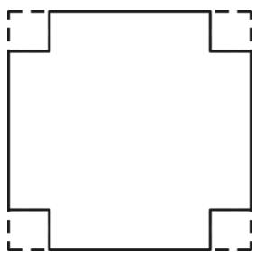

# 专题 2.4 二次根式的乘除（举一反三讲义）

# 【北师大版 2024】

# 题型归纳

【题型 1 二次根式乘除成立的条件】....2

【题型 2 最简二次根式】....3

【题型 3 根号内、外的因式互移】....3

【题型 4 分母有理化】....3

【题型 5 分子有理化】....4

【题型 6 二次根式的乘除运算】....5

【题型 7 二次根式的化简求值】....6

【题型 9 二次根式乘除的应用】....6

# 举一反三

# 知识点1 二次根式的乘法

# 1. 二次根式的乘法法则

两个算术平方根的积，等于它们被开方数的积的算术平方根，即 $\sqrt{a} \cdot \sqrt{b} = \sqrt{ab} (a \geq 0, b \geq 0)$ .

例如： $\sqrt{2} \cdot \sqrt{32} = \sqrt{2 \times 32} = \sqrt{64} = 8.$

# 2. 二次根式的乘法法则的拓展

(1)二次根式的乘法公式可推广到多个二次根式相乘的运算, 即 $\sqrt{a} \cdot \sqrt{b} \cdot \sqrt{c} = \sqrt{abc} (a \geq 0, b \geq 0, c \geq 0)$ .  
（2）当二次根式前面有系数时，类比单项式乘法，将根号前的系数相乘，作为积的系数，即 $m\sqrt{a}\cdot n\sqrt{b}=mn\sqrt{ab}(a\geq0,\ b\geq0)$ .

# 知识点 2 积的算术平方根 教辅资源,关注公众号·全科AA+

1. 积的算术平方根等于积中各个因式算术平方根的积，即 $\sqrt{ab} = \sqrt{a} \cdot \sqrt{b} (a \geq 0, b \geq 0)$ .

运用此公式时，被开方数必须能写成乘积的形式.

2. 该法则可以推广到多个非负数的积的算术平方根的运算，即 $\sqrt{abc} = \sqrt{a} \cdot \sqrt{b} \cdot \sqrt{c} (a \geq 0, b \geq 0, c \geq 0)$ .

3. 应用：化简二次根式，先将被开方数进行因数分解或因式分解，再利用 $\sqrt{ab} = \sqrt{a} \cdot \sqrt{b} (a \geq 0, b \geq 0)$ 和 $\sqrt{a^2} = a (a \geq 0)$ ，将能开得尽方的因数或因式开到根号外.

# 知识点3 二次根式的除法

# 1. 二次根式的除法法则

两个算术平方根的商，等于它们被开方数的商的算术平方根，即 $\frac{\sqrt{a}}{\sqrt{b}} = \sqrt{\frac{a}{b}} (a\geq 0,b > 0)$

2. 二次根式的除法公式可以推广到多个二次根式相除的运算，即 $\sqrt{a} \div \sqrt{b} \div \sqrt{c} = \sqrt{a \div b \div c} (a \geq 0, b > 0, c > 0)$ .  
3. 二次根式前面有系数时, 可类比单项式与单项式相除的法则, 把系数和被开方数分别相除作为积的因式, 即 $m \sqrt{a} \div n \sqrt{b} = (m \div n) \cdot \sqrt{a \div b}$ .

# 知识点 4 商的算术平方根 教辅资源,关注公众号·全科AA+

商的算术平方根等于商中各个因式算术平方根的商，即 $\sqrt{\frac{a}{b}} = \frac{\sqrt{a}}{\sqrt{b}} (a \geq 0, b > 0)$ .

# 知识点 5 最简二次根式

1. 被开方数不含分母，并且被开方数中不含能开得尽方的因数（或因式），分母中不含根号，这样的二次根式称为最简二次根式.

# 2. 化为最简二次根式的步骤

（1）把根号下的带分数化为假分数，把绝对值小于 1 的小数化为分数，被开方数是多项式时，先因式分解；  
(2) 将被开方数中能开尽的因数(或因式) 进行开方;   
（3）利用 $\sqrt{\frac{a}{b}} = \frac{\sqrt{a}}{\sqrt{b}} (a\geq 0,b > 0)$ ，使被开方数中不含分母；  
（4）分母有理化，化去分母中的根号；  
（5）约分化简，整理成最简二次根式.

# 【题型 1 二次根式乘除成立的条件】

【例 1】（2023·湖南·中考真题）对于二次根式的乘法运算，一般地，有 $\sqrt{a} \cdot \sqrt{b} = \sqrt{ab}$ 。该运算法则成立的条件是（）

A. $a > 0, b > 0$

B. a < 0, b < 0

C. $a \leq 0, b \leq 0$

D. $a \geq 0, b \geq 0$

【变式 1-1】（22-23 八年级下·山东菏泽·期末）能使等式 $\sqrt{\frac{x}{x-3}} = \frac{\sqrt{x}}{\sqrt{x-3}}$ 成立的条件是（）

A. $x \geq 0$

B. $x \geq 3$

C. $x > 3$

D. $x > 3$ 或 $x < 0$

【变式 1-2】等式 $\sqrt{b^{2}-9}=\sqrt{b-3}\cdot\sqrt{b+3}$ 成立的条件是\_\_\_\_

【变式 1-3】（22-23 八年级上·山东青岛·期中）小路在学习了 $\frac{\sqrt{a}}{\sqrt{b}} = \sqrt{\frac{a}{b}}$ 后，认为 $\sqrt{\frac{a}{b}} = \frac{\sqrt{a}}{\sqrt{b}}$ 也成立，因此他认为一个化简过程： $\sqrt{\frac{-20}{-5}} = \frac{\sqrt{-20}}{\sqrt{-5}} = \frac{\sqrt{-5 \times 4}}{\sqrt{-5}} = \frac{\sqrt{-5} \cdot \sqrt{4}}{\sqrt{-5}} = \sqrt{4} = 2$ 是正确的.

(1)你认为他的化简对吗？如果不对，请写出正确的化简过程；

(2)说明 $\sqrt{\frac{a}{b}} = \frac{\sqrt{a}}{\sqrt{b}}$ 成立的条件.

# 【题型2 最简二次根式】

【例 2】（24-25 八年级下·湖北随州·期中）下列各式① $\sqrt{8}$ ; ② $\sqrt{0.3}$ ; ③ $\sqrt{\frac{7}{2}}$ ; ④ $\sqrt{3}$ ; ⑤ $\sqrt{a^{2}+1}$ （a 为正整数），其中一定是最简二次根式的有（）

A. 4 个

B. 3 个

C. 2 个

D. 1 个

【变式 2-1】（24-25 八年级上·山西运城·期末）把 $\sqrt{\frac{2}{5}}$ 化成最简二次根式的结果为 \_\_\_\_.

【变式 2-2】（24-25 八年级下·黑龙江绥化·阶段练习）若最简二次根式 $^{n-1}\sqrt{2n+1}$ 与最简二次根式 $\sqrt{4n-m}$ 相等，则n= \_\_\_\_. m= \_\_\_\_.

【变式 2-3】（24-25 八年级下·安徽安庆·期中）已知a是一个正整数， $\sqrt{20a}$ 也是正整数，则a的最小值为（）

A. 4

B. 5

C. 10

D. 20

# 【题型 3 根号内、外的因式互移】 教辅资源,关注公众号·全科AA+

【例 3】（2023 八年级上·全国·专题练习）把 $(a-b)\sqrt{-\frac{1}{a-b}}$ 根号外的因式移到根号内结果为\_\_\_\_.

【变式 3-1】若把 $-4\sqrt{3}$ 根号外的因式移到根号内，得（）

A. $\sqrt{12}$

B. $-\sqrt{12}$

C. $-\sqrt{48}$

D. $\sqrt{48}$

【变式 3-2】将 $-a\sqrt{-a}$ 中的 a 移到根号内，结果是（）

A. $-a\sqrt{-a^3}$

B. $\sqrt{-a^3}$

C. $-\sqrt{a^{3}}$

D. $\sqrt{a^{3}}$

【变式 3-3】（24-25 九年级上·四川眉山·阶段练习）把 $(1-x)\sqrt{\frac{1}{x-1}}$ 根号外面的因式移到根号里面化简的结果是\_\_\_\_.

# 【题型4 分母有理化】

【例 4】（24-25 八年级下·辽宁葫芦岛·阶段练习）对于有理数a和b，定义了一种新运算： $a$ ※ $b = \frac{a + b}{\sqrt{a - b}}$ ，例如6※3 = $\frac{6 + 3}{\sqrt{6 - 3}} = \frac{9}{\sqrt{3}} = \frac{9 \times \sqrt{3}}{\sqrt{3 \times \sqrt{3}}} = 3\sqrt{3}$ ，则3※ $\left(-\frac{1}{2}\right)$ 为\_\_\_\_.

【变式 4-1】（24-25 八年级上·上海·期中）写出 $\sqrt{2a-b}$ 的一个有理化因式 \_\_\_\_.

【变式 4-2】（24-25 八年级下·山东德州·阶段练习）已知 $y = \sqrt{x - 3} + \sqrt{3 - x} + 5$ ，则 $\frac{y}{\sqrt{x}} =$ \_\_\_\_.

【变式 4-3】（24-25 八年级下·安徽合肥·阶段练习）对于任意不相等的两个正实数 a, b，定义一种运算

“※”如下： $a \times b = \frac{\sqrt{a + b}}{a - b}$ ，例如： $5 \times 4 = \frac{\sqrt{5 + 4}}{5 - 4} = 3$ .

(1) $3 \times 6 =$ \_\_\_\_ ;   
(2) $(2 - \sqrt{3})$ (7※5) = \_\_\_\_.

# 【题型5 分子有理化】

【例 5】（23-24 八年级下·河北邢台·阶段练习）【方法总结】如何比较两个数的大小，我们常采用作差或作商的方法，其实有时候用“平方法”来比较大小也会取得很好的效果．例如，比较 $a=2\sqrt{3}$ 和 $b=3\sqrt{2}$ 的大小，我们可以把a和b分别平方．∴ $a^{2}=12,b^{2}=18$ ，则 $a^{2}<b^{2},\therefore a<b$ .

请利用“平方法”解决下面问题:

（1）比较 $c=4\sqrt{2},d=2\sqrt{7}$ 大小，c\_\_\_\_d（填写“>”“<”或“=”）.  
（2）猜想 $m=2\sqrt{5}+\sqrt{6},n=2\sqrt{3}+\sqrt{14}$ 之间的大小，并说明理由.

【拓展延伸】当然除了“平方法”外，分子有理化可以用来比较某些二次根式的大小．例如，

比较 $\sqrt{7} -\sqrt{6}$ 和 $\sqrt{6} -\sqrt{5}$ 的大小，可以先将它们分子有理化如下： $\sqrt{7} -\sqrt{6} = \frac{1}{\sqrt{7} + \sqrt{6}},\sqrt{6} -\sqrt{5} = \frac{1}{\sqrt{6} + \sqrt{5}}.\because \sqrt{7} +\sqrt{6}$ $> \sqrt{6} +\sqrt{5},\therefore \sqrt{7} -\sqrt{6} <  \sqrt{6} -\sqrt{5}.$

（3）根据材料，请选择合适的方法比较 $\sqrt{2025} -\sqrt{2024}$ 与 $\sqrt{2024} -\sqrt{2023}$ 的大小，写出具体比较过程.

【变式 5-1】（2025 八年级下·全国·专题练习）将分子转化为有理数，就称为“分子有理化”，例如： $\sqrt{2}=\frac{\sqrt{2}}{1}=\frac{(\sqrt{2})^{2}}{\sqrt{2}}=\frac{2}{\sqrt{2}};$

$\frac{\sqrt{3} - 1}{\sqrt{3}} = \frac{(\sqrt{3} - 1) \times (\sqrt{3} + 1)}{\sqrt{3} \times (\sqrt{3} + 1)} = \frac{(\sqrt{3})^2 - 1^2}{(\sqrt{3})^2 + \sqrt{3}} = \frac{3 - 1}{3 + \sqrt{3}} = \frac{2}{3 + \sqrt{3}}.$ 根据上述知识，请你完成下列问题：

(1)比较大小： $\frac{1}{3-\sqrt{7}}$ —— $\frac{1}{\sqrt{11}-3}$ （填“＞”，“＜”或“＝”）；  
(2)计算： $\frac{1}{1+\sqrt{2}}+\frac{1}{\sqrt{2}+\sqrt{3}}+\frac{1}{\sqrt{3}+\sqrt{4}}+\cdots+\frac{1}{\sqrt{2024}+\sqrt{2025}};$   
(3)若 $a=\frac{2}{\sqrt{3}-1}$ ，求 $5a^{2}-10a+15$ 的值.

【变式 5-2】（24-25 八年级上·北京顺义·期末）请解决下列问题：

(1)把下列各式分子有理化:   
① $\sqrt{3}-\sqrt{2}=$ \_\_\_\_；② $\sqrt{5}-\sqrt{3}=$ \_\_\_\_；  
(2)比较 $\sqrt{13} -\sqrt{11}$ 和 $\sqrt{11} -3$ 的大小，并说明理由；  
(3)将式子 $\sqrt{x + 1} -\sqrt{x - 1}$ 分子有理化为，该式子的最大值为

【变式 5-3】（24-25 八年级下·北京·期中）阅读下述材料：

我们在学习二次根式时，学习了分母有理化以及应用．其实，有一个类似的方法叫做“分子有理化”；与分母有理化类似，分母和分子都乘以分子的有理化因式，从而消掉分子中的根式，比如： $\sqrt{7}-\sqrt{6}=\frac{(\sqrt{7}-\sqrt{6})(\sqrt{7}+\sqrt{6})}{\sqrt{7}+\sqrt{6}}=\frac{1}{\sqrt{7}+\sqrt{6}}$

分子有理化可以用来比较某些二次根式的大小，也可以用来处理一些二次根式的最值问题．例如：

比较 $\sqrt{7} -\sqrt{6}$ 和 $\sqrt{6} -\sqrt{5}$ 的大小．可以先将它们分子有理化如下：

$$
\sqrt {7} - \sqrt {6} = \frac {1}{\sqrt {7} + \sqrt {6}}, \sqrt {6} - \sqrt {5} = \frac {1}{\sqrt {6} + \sqrt {5}},
$$

因为 $\sqrt{7} +\sqrt{6} >\sqrt{6} +\sqrt{5},\sqrt{7} -\sqrt{6} <  \sqrt{6} -\sqrt{5}.$

再例如：求 $y=\sqrt{x+2}-\sqrt{x-2}$ 的最大值．做法如下：

解：由 $x + 2 \geq 0$ ， $x - 2 \geq 0$ 可知 $x \geq 2$ ，而 $y = \sqrt{x + 2} - \sqrt{x - 2} = \frac{4}{\sqrt{x + 2} + \sqrt{x - 2}}$

当x=2时，分母 $\sqrt{x+2}+\sqrt{x-2}$ 有最小值2，所以y的最大值是2.

解决下述问题:

(1) $3\sqrt{2}-4=\frac{(3\sqrt{2}-4)(\quad)}{(\quad)}=\underline{\quad}$ ;

(2)比较 $\sqrt{a}-\sqrt{a-1}$ 和 $\sqrt{a+1}-\sqrt{a}$ 的大小;

(3)求 $y=\sqrt{2x+4}-\sqrt{2x+1}$ 的最大值.

# 【题型 6 二次根式的乘除运算】 教辅资源,关注公众号·全科AA+

【例 6】（24-25 八年级下·北京·期中）下列计算正确的是（）

A. $6 \div \frac{2}{\sqrt{3}} \times \sqrt{3} = 3$

B. $\sqrt{(-9)\times(-4)}=\sqrt{-9}\times\sqrt{-4}$

C. $\sqrt{a^2 + b^2} = a + b$

D. $\sqrt{(-1.7)^2} = (\sqrt{1.7})^2$

【变式 6-1】（23-24 八年级·全国·假期作业）计算 $\sqrt{15} \div 4\sqrt{3} \times \sqrt{\frac{6}{5}}$ 的结果是（）

A. 1

B. $3\frac{5}{4}$

C. $\frac{1}{4}\sqrt{6}$

D. 3

【变式 6-2】（24-25 九年级下·山东威海·期中）计算：

(1) $\left(3\sqrt{20} + \sqrt{45} - \sqrt{\frac{1}{5}}\right) \times \sqrt{5}$ ;

(2) $\frac{3}{5}\sqrt{ab^2} \cdot \left(-\frac{5}{6}\sqrt{a^3b}\right) \div \frac{4}{15}\sqrt{\frac{b^2}{a}}$ ;

(3)已知 $A = 5\sqrt{2x + 1}$ , $B = 3\sqrt{x + 3}$ , $C = \sqrt{10x + 3y}$ , $A$ 、 $B$ 为最简二次根式, 且 $A + B = C$ , 求 $\sqrt{2y - x^2}$ .

【变式 6-3】（24-25 八年级上·河北邯郸·阶段练习）幻方是一种传统游戏，类比幻方，我们给出如图所示的方格, 要使方格中横向、纵向及对角线方向上的实数相乘的结果都相等, 则 $(A + B) \cdot D + C$ 的值为 \_\_\_\_.

<table><tr><td>A</td><td>B</td><td>5 $\sqrt{2}$ </td></tr><tr><td>5</td><td> $\sqrt{10}$ </td><td>C</td></tr><tr><td> $\sqrt{2}$ </td><td>10</td><td>D</td></tr></table>

# 【题型7 二次根式的化简求值】

【例 7】已知 $\sqrt{4+x^{2}}-\sqrt{9+x^{2}}=-4$ ，则 $\sqrt{4+x^{2}}+\sqrt{9+x^{2}}$ 的值为 \_\_\_\_.

【变式 7-1】（23-24 八年级下·山东滨州·阶段练习）已知 $\sqrt{a}-\frac{1}{\sqrt{a}}=2$ ，则 $\sqrt{a}+\frac{1}{\sqrt{a}}$ 值为（）

A. $2 \sqrt{2}$

B. $\pm2\sqrt{2}$

C. $2\sqrt{3}$

D. $\pm2\sqrt{3}$

【变式 7-2】先化简，再求值： $\sqrt{2x}\cdot\sqrt{\frac{x}{y}}\cdot(\sqrt{\frac{y}{x}}\div\sqrt{\frac{1}{y}})$ ，其中实数 x、y 满足 $y=\sqrt{x-3}+\sqrt{6-2x}+2$ .

【变式 7-3】若三个正数 a, b, c 满足 $a+4\sqrt{ab}+3b-2\sqrt{bc}-c=0$ ，则 $\frac{\sqrt{a}+\sqrt{b}}{\sqrt{c}}$ 的值是 \_\_\_\_.

# 【题型8 实数范围内分解因式】

【例 8】在实数范围内分解因式： $x^{2}-6x-3$ .

【变式 8-1】（2025·江苏泰州·三模）在实数范围内分解因式： $2a^{2}-16=$ \_\_\_\_.

【变式 8-2】（2025·江苏无锡·一模）在实数范围内分解因式： $4x^{2}-6y^{2}=$ \_\_\_\_.

【变式 8-3】（2024·上海徐汇·三模）在实数范围内分解因式， $x^{2}y^{2}-3xy+1=$ \_\_\_\_.

# 【题型9 二次根式乘除的应用】

【例 9】（24-25 八年级下·广东广州·期中）如图，有一张边长为 $6\sqrt{3}cm$ 的正方形纸板，现将该纸板的四个角剪掉，制作一个有底无盖的长方体盒子，剪掉的四个角是面积相等的小正方形，每个小正方形的边长为 $\sqrt{3}cm$ ．求剪掉四个角后，制作长方体盒子的纸板的面积.

natural_image

Pure geometric diagram of a square with corner brackets and dashed lines (no text or symbols)

【变式 9-1】（24-25 八年级上·贵州毕节·期末）“海阔千江辏，风翻大浪随．”海浪的大小与风速和风压有很大的关系，用风速估计风压的通用公式为 $w_{p}=\frac{v^{2}}{1600}$ ，其中 $w_{p}$ 为风压 $(\mathrm{kN}/\mathrm{m}^{2})$ ，v为风速 $(\mathrm{m}/\mathrm{s})$ ，当风压为

$0.25 \mathrm{kN} / \mathrm{m}^{2}$ 时，估计风速为 \_\_\_\_ m/s.

【变式 9-2】（24-25 八年级下·福建厦门·期中）汽车刹车距离是指汽车从开始刹车到完全停止所行驶的距离，它反应了汽车的制动性能和行驶安全性，刹车距离越短，说明汽车的制动性能越好，行驶越安全，刹车距离与行驶速度之间的关系可以表示为公式 $v = 16\sqrt{df}$ ，其中 $v$ 表示车辆行驶速度（单位km/h）， $d$ 表示刹车后车轮滑过的距离（单位m） $f$ 表示动摩擦因数，根据我国国家标准，100公里刹车距离在42米以内是比较优秀的，（100公里刹车距离表示汽车行驶速度100km/h的刹车距离），据测量，某汽车的动摩擦因数 $f = 1.25$ ，试判断该汽车的100公里刹车距离是否符合我国的优秀标准。

【变式 9-3】（24-25 八年级下·辽宁大连·阶段练习）高空抛物极其危险，是我们必须杜绝的行为。据研究，高空抛物下落的时间 t（单位：s）和高度 h（单位：m）近似满足公式 $t = \sqrt{\frac{h}{5}}$ （不考虑风速的影响）。设从 a(m) 高空抛物到落地所需时间为 $t_{1}$ ，从 2a(m) 高空抛物到落地所需时间为 $t_{2}$ ，则 $\frac{t_{2}}{t_{1}}$ 的值为（）

A. $\sqrt{2}$

B. $\sqrt{5}$

C. $\frac{\sqrt{2}}{2}$

D. $\frac{2\sqrt{5}}{5}$