# 专题 2.5 二次根式的加减（举一反三讲义）

【北师大版 2024】

# 题型归纳

【题型 1 判断二次根式能否合并】....1

【题型 2 二次根式的加减运算】....1

【题型 3 二次根式的混合运算】....3

【题型 4 比较二次根式的大小】....3

【题型 5 整数部分和小数】....4

【题型 6 二次根式的化简求值】....5

【题型 7 二次根式的规律探索】....5

【题型8二次根式的应用】....6

# 举一反三

# 知识点 1 二次根式的加减运算 教辅资源,关注公众号·全科AA+

二次根式的加减法的实质是合并同类二次根式，一般按如下步骤进行：

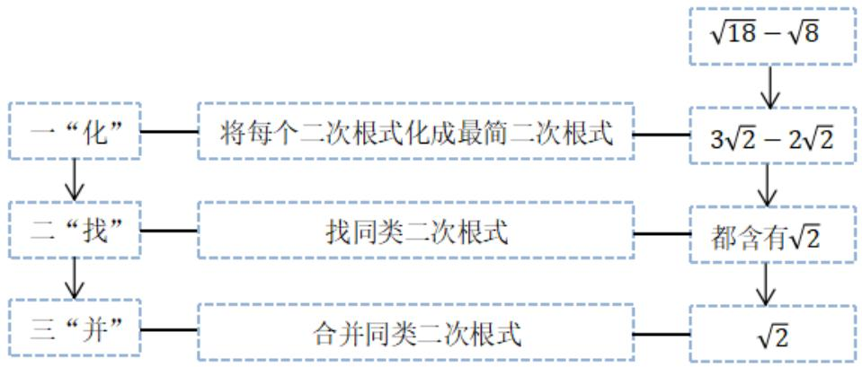

flowchart

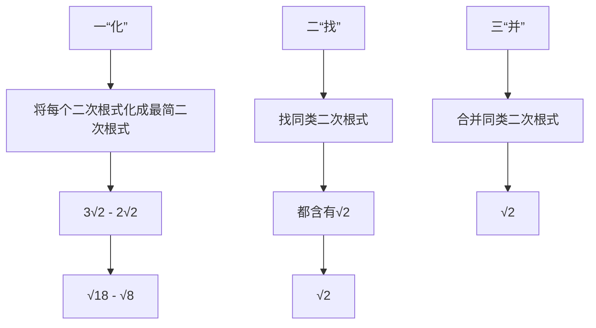

# 知识点 2 二次根式的混合运算

# 1. 运算法则

与整式的混合运算顺序一样，先算乘方、开方，再算乘除，最后算加减，有括号的先算括号里面的.

2. 实数运算中的运算律及公式同样适用于二次根式的运算.

3. 二次根式混合运算的结果应写成最简二次根式或整式的形式.

# 【题型 1 判断二次根式能否合并】

【例 1】（24-25 九年级上·四川乐山·阶段练习）若最简二次根式 $\sqrt{2a-b+6}$ 与 $\sqrt[3a-b]{4a+3b}$ 是能合并，那么

( )

A. $a = 2, b = 1$

B. $a = 1, b = -1$

C. $a = 1, b = 0$

D. $a = 1, b = 1$

【变式 1-1】（24-25 八年级下·河南焦作·阶段练习）如果最简二次根式 $\sqrt{a-2}$ 与 $2\sqrt{7}$ 可以进行合并，则 $a^{2}$ 的值为（）

A. 7

B. 16

C. 25

D. 81

【变式 1-2】（24-25 八年级上·陕西西安·期中）若 $a$ 与 $\sqrt{12}$ 是可以合并的二次根式，请写出一个符合条件的最简二次根式 $a$ 为 \_\_\_\_.

【变式 1-3】（24-25 八年级下·山东潍坊·阶段练习）下列各式经过化简后与 $-\sqrt{-27x^{3}}$ 的被开方数不相同的二次根式是（）

A. $\frac{\sqrt{-x}}{\sqrt{3}}$

B. $\sqrt{\frac{-x^3}{27}}$

C. $\frac{1}{9}\sqrt{-3x^{3}}$

D. $\sqrt{27x^3}$

# 【题型2 二次根式的加减运算】

【例 2】（24-25 八年级下·安徽亳州·阶段练习）化简： $\frac{1}{\sqrt{8}+\sqrt{11}}+\frac{1}{\sqrt{11}+\sqrt{14}}+\frac{1}{\sqrt{14}+\sqrt{17}}+\frac{1}{\sqrt{17}+\sqrt{20}}+\frac{1}{\sqrt{20}+\sqrt{23}}+\frac{1}{\sqrt{23}+\sqrt{26}}+\frac{1}{\sqrt{26}+\sqrt{29}}+\frac{1}{\sqrt{29}+\sqrt{32}}$ 结果是（）

A. 1

B. $\frac{2\sqrt{2}}{3}$

C. $2\sqrt{2}$

D. $4 \sqrt{2}$

【变式 2-1】（24-25 八年级下·安徽马鞍山·期中）下列等式正确的是（）

A. $2 \sqrt{3} + 3 \sqrt{2} = 5 \sqrt{5}$

B. $\sqrt{9\frac{1}{4}} = 3\frac{1}{2}$

C. $\sqrt{(\pi-3.14)^{2}}=3.14-\pi$

D. $\left(\sqrt{3}+\sqrt{5}\right)\left(-\sqrt{3}+\sqrt{5}\right)=2$

【变式 2-2】（23-24 八年级下·贵州黔南·期中）我们规定运算符号“😊”的意义是：当a > b时，a😊 b = a + b；当a ≤ b时，a😊 b = a - b，其他运算符号的意义不变，计算：(√2 😊√3) - (2√2 😊√3) =

【变式 2-3】（24-25 八年级下·河南商丘·阶段练习）小文和小博同学玩一个摸球计算游戏，在一个不透明的容器中放入四个小球，小球上分别标有一个数．现从容器中摸取小球，若摸到白色球，就减去球上的数；若摸到灰色球，就加上球上的数．教辅资源,关注公众号•全科AA+

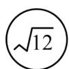

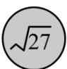  
图1

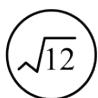

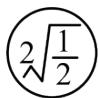

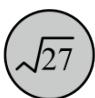

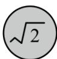  
图2

(1)如图 1，若小文摸到图示两个小球，请计算出结果；

(2)如图 2，若小博摸到图示四个小球，最后的计算结果能和 $\sqrt{48}$ 合并吗？说明理由.

# 【题型3 二次根式的混合运算】

【例 3】（24-25 八年级下·安徽合肥·阶段练习）对于任意不相等的两个正实数 a, b，定义一种运算“※”如下： $a \otimes b = \frac{\sqrt{a+b}}{a-b}$ ，例如： $5 \otimes 4 = \frac{\sqrt{5+4}}{5-4} = 3$ .

(1) $3 \times 6 =$ \_\_\_\_ ;   
(2) $(2 - \sqrt{3})\text{※}\left(7\text{※}5\right) =$ \_\_\_\_.

【变式 3-1】（24-25 八年级下·云南昆明·期中）如图，它是一个数值转换机，若输入的 a 值为 $\sqrt{2}$ ，则输出的结果应为 \_\_\_\_.

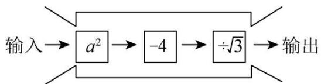

flowchart

【变式 3-2】（24-25 八年级下·云南昆明·阶段练习）计算：

(1) $\sqrt{27} \div \sqrt{3} - \sqrt{\frac{1}{3}} \times \sqrt{18} + \sqrt{24}$   
(2) $(2\sqrt{3} + 3\sqrt{2})(2\sqrt{3} - 3\sqrt{2}) - (\sqrt{5} - 1)^{2}$

【变式 3-3】（24-25 八年级下·湖北武汉·期中）已知 $x = 2 - \sqrt{3}$

(1)计算： $x^{2}=$ \_\_\_\_， $\frac{1}{x}=$ \_\_\_\_；  
(2)求代数式 $(7 + 4\sqrt{3})x^{2} + (2 + \sqrt{3})x + \sqrt{3} -1$ 的值.

# 【题型4 比较二次根式的大小】

【例 4】（24-25 八年级下·福建厦门·期中）在解决问题“已知 $a=\frac{1}{2+\sqrt{3}}$ ，求 $2a^{2}-8a+1$ 的值”时，小明是这样分析与解答的：

$$
\because a = \frac {1}{2 + \sqrt {3}} = \frac {2 - \sqrt {3}}{(2 + \sqrt {3}) (2 - \sqrt {3})} = 2 - \sqrt {3},
$$

$$
\therefore a - 2 = - \sqrt {3}, \quad \therefore (a - 2) ^ {2} = 3, a ^ {2} - 4 a + 4 = 3,
$$

$$
\therefore a ^ {2} - 4 a = - 1, \quad \therefore 2 a ^ {2} - 8 a + 1 = 2 (a ^ {2} - 4 a) + 1 = 2 \times (- 1) + 1 = - 1.
$$

请你根据小明的分析过程，解决如下问题：

(1)比较大小： $\frac{2}{\sqrt{13} - \sqrt{11}}$ 与 $\frac{2}{\sqrt{15} - \sqrt{13}};$   
(2)若 $b=\frac{1}{\sqrt{2}+2}$ ，且 $(a+2b)^{2}=9$ ，求a的值；

(3)若 $c = \frac{1}{1 + \sqrt{2}}, d = \frac{1}{3 + 2\sqrt{2}}$ ，求 $5c^{2} + 4cd + 2d^{2} + 2c - 6d + 10$ 的值.

【变式 4-1】（24-25 八年级上·上海长宁·阶段练习）比较大小：

(1) $\frac{1}{2 - \sqrt{5}}\frac{1}{\sqrt{5} - \sqrt{6}};$   
(2) $2-\sqrt{3}$ \_\_\_\_ $\sqrt{5}-\sqrt{2}$ .

【变式 4-2】（24-25 八年级下·山东潍坊·期中）用两种方法比较 $\sqrt{5} + 1$ 与 $\sqrt{10}$ 的大小.

【变式 4-3】（24-25 八年级下·河南安阳·阶段练习）项目式学习：

<table><tr><td>课题名称</td><td>平方法比较实数的大小</td></tr><tr><td>参与人员</td><td>八下第(3)小组 日期:2025年××月××日</td></tr><tr><td>原理解读</td><td>对于任意两个正数a,b,若a&gt;b,则 $\sqrt{a}>\sqrt{b}$ .</td></tr><tr><td>典例展示</td><td>比较 $2\sqrt{3}$ 和 $3\sqrt{2}$ 的大小.解: $(2\sqrt{3})^{2}=12,(3\sqrt{2})^{2}=18,\because 12<18,\therefore 2\sqrt{3}<3\sqrt{2}.$ </td></tr><tr><td rowspan="2">任务解答</td><td>(1)比较 $3\sqrt{5}$ 和 $5\sqrt{3}$ 的大小;</td></tr><tr><td>(2)比较 $\sqrt{6}-\sqrt{2}$ 和 $\sqrt{5}-\sqrt{3}$ 的大小.</td></tr></table>

# 【题型 5 整数部分和小数】教辅资源,关注公众号·全科AA+

【例 5】（24-25 八年级上·河北保定·阶段练习） $\sqrt{11}-1$ 的整数部分为a，小数部分为b， $(\sqrt{11}+a)(b+1)$ 的值为（）

A. $\sqrt{11} + 2$

B. 2

C. 7

D. $5 + 2\sqrt{11}$

【变式 5-1】（24-25 八年级下·浙江嘉兴·期中）估计 $(2\sqrt{2}-\sqrt{3})^{2}$ 的值应在（）

A. 1 到 2 之间

B. 2 到 3 之间

C. 5 到 6 之间

D. 10到11之间

【变式 5-2】（24-25 七年级上·全国·期末）实数 $\sqrt{19}-1$ 的整数部分为a，小数部分为b，则 $3a+2b=$ （）

A. $2 \sqrt{19} + 5$

B. $2 \sqrt{19} + 1$

C. $2\sqrt{19}-1$

D. $2 \sqrt{19} - 5$

【变式 5-3】（24-25 八年级下·四川德阳·阶段练习）已知 $\frac{1}{2 - \sqrt{3}}$ 的整数部分为 $a$ ，小数部分为 $b$ ，则 $a^2 + 2(\sqrt{3} + 1)b - 2 =$ \_\_\_\_.

# 【题型6 二次根式的化简求值】

【例 6】（23-24 八年级下·山东淄博·期中）已知 $a=\frac{\sqrt{5}-\sqrt{3}}{\sqrt{5}+\sqrt{3}}$ ， $b=\frac{\sqrt{5}+\sqrt{3}}{\sqrt{5}-\sqrt{3}}$ ，则二次根式 $\sqrt{a^{3}b+ab^{3}+19}$ 的值是（）

A. 6

B. 7

C. 8

D. 9

【变式 6-1】（24-25 八年级下·吉林白城·阶段练习）先化简，再求值： $5\sqrt{\frac{x}{5}}-\frac{5}{4}\sqrt{\frac{4x}{5}}+x\sqrt{\frac{45}{x}}$ ，其中 x=4.

【变式 6-2】（24-25 八年级下·辽宁葫芦岛·期中）如果 $x^{2} + y^{2} - 8x - 6y + 25 = 0$ ，试求 $\sqrt{\frac{y}{x} + \frac{x}{y} + 2} - \sqrt{\frac{x}{y} + \frac{y}{x} - 2}$ 的值.

【变式 6-3】（24-25 八年级上·江苏南通·期末）若 $-m^{2}-n^{2}\geq10-6m+2n$ ，且 $x=\frac{\sqrt{5}+n}{m}$ ，则 $81x^{5}-80x+1=$ \_\_\_\_.

# 【题型 7 二次根式的规律探索】教辅资源,关注公众号·全科AA+

【例 7】观察下列各式:

$$
\sqrt {1 + \frac {1}{1 ^ {2}} + \frac {1}{2 ^ {2}}} = 1 + \frac {1}{1 \times 2} = 1 + \left(1 - \frac {1}{2}\right)
$$

$$
\sqrt {1 + \frac {1}{2 ^ {2}} + \frac {1}{3 ^ {2}}} = 1 + \frac {1}{2 \times 3} = 1 + \left(\frac {1}{2} - \frac {1}{3}\right)
$$

$$
\sqrt {1 + \frac {1}{3 ^ {2}} + \frac {1}{4 ^ {2}}} = 1 + \frac {1}{3 \times 4} = 1 + \left(\frac {1}{3} - \frac {1}{4}\right)
$$

...

请利用你发现的规律，计算： $\sqrt{1+\frac{1}{1^{2}}+\frac{1}{2^{2}}}+\sqrt{1+\frac{1}{2^{2}}+\frac{1}{3^{2}}}+\sqrt{1+\frac{1}{3^{2}}+\frac{1}{4^{2}}}+\cdots+\sqrt{1+\frac{1}{9^{2}}+\frac{1}{10^{2}}}$ 其结果为\_\_\_\_.

【变式 7-1】（24-25 八年级下·四川自贡·阶段练习）观察下列各式： $\frac{1}{\sqrt{2}+1}=\sqrt{2}-1,\frac{1}{\sqrt{3}+\sqrt{2}}=\sqrt{3}-\sqrt{2},\frac{1}{2+\sqrt{3}}=2-\sqrt{3},\ldots$ 利用你发现的规律解决： $\left(\frac{1}{\sqrt{3}+\sqrt{2}}+\frac{1}{2+\sqrt{3}}+\frac{1}{\sqrt{5}+2}+\cdots+\frac{1}{\sqrt{2025}+\sqrt{2024}}\right)\times\left(\sqrt{2025}+\sqrt{2}\right)=$ \_\_\_\_.

【变式 7-2】（23-24 八年级下·北京·期中）将一张长与宽之比为 $\sqrt{2}$ 的矩形纸片ABCD进行如下操作：对折并沿折痕剪开，发现每一次所得到的两个矩形纸片长与宽之比都是 $\sqrt{2}$ （每一次的折痕如图中的虚线所示），则第3次操作后所得到的其中一个矩形纸片的周长是 \_\_\_\_；第2024次操作后所得到的其中一个矩形纸片的周长是 \_\_\_\_.

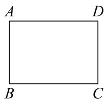

natural_image

Simple geometric diagram of a rectangle labeled with vertices A, B, C, D (no additional text or symbols)

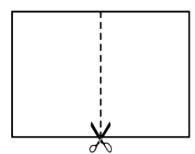  
第1次

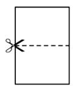  
第2次

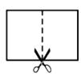  
第3次

【变式7-3】（23-24八年级上·江西抚州·阶段练习）化简一个分母含有二次根式的式子时，采用分子、分母同乘以分母的有理化因式的方法就可以了，例如： $\frac{1}{\sqrt{2} + 1} = \frac{\sqrt{2} - 1}{(\sqrt{2} + 1)(\sqrt{2} - 1)} = \frac{\sqrt{2} - 1}{(\sqrt{2})^2 - 1} = \frac{\sqrt{2} - 1}{1} = \sqrt{2} - 1, \frac{\sqrt{2}}{\sqrt{3}} = \frac{\sqrt{2} \times \sqrt{3}}{\sqrt{3} \times \sqrt{3}} = \frac{\sqrt{6}}{3},$

(1)若 $a=\frac{1}{\sqrt{5}-2}$ ，求 $3a^{2}-12a-1$ 的值；  
(2)比较 $\sqrt{2025}-\sqrt{2024}$ 与 $\sqrt{2024}-\sqrt{2023}$ 的大小，并说明理由.  
(3)利用这一规律计算： $\frac{1}{2\sqrt{1} + \sqrt{2}} +\frac{1}{3\sqrt{2} + 2\sqrt{3}} +\frac{1}{4\sqrt{3} + 3\sqrt{4}} +\dots +\frac{1}{2024\sqrt{2023} + 2023\sqrt{2024}}.$

【题型 8 二次根式的应用】教辅资源,关注公众号·全科AA+

【例 8】（24-25 八年级下·江西赣州·期中）如图，张大伯家有一块长方形空地ABCD，长方形空地的BC为 $\sqrt{72}m$ ，宽AB为 $\sqrt{32}m$ ，现要在空地中划出一块长方形地养鸡（即图中阴影部分），其余部分种植蔬菜，长方形养鸡场的长为 $(\sqrt{13}+1)m$ ，宽为 $(\sqrt{13}-1)m$ .

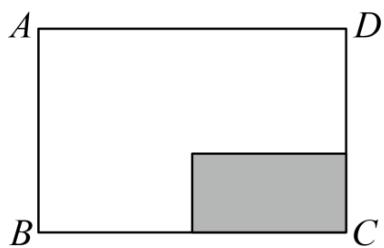

text_image

A
D
B
C

(1)长方形ABCD的周长是多少？（结果化为最简二次根式）  
(2)若市场上某种蔬菜 10 元/千克，张大伯种植该种蔬菜，每平方米可以产 20 千克的蔬菜，张大伯如果将所种蔬菜全部销售完，销售收入为多少元？

【变式 8-1】（22-23 八年级下·河南许昌·阶段练习）某小区有一块长方形的草地，这块草地的宽为

$(\sqrt{6} - \sqrt{2})\mathrm{m}$ ，为美化小区环境，给这块长方形草地围上白色的低矮栅栏，所需的栅栏的长度为

$(10\sqrt{6}-2\sqrt{2})m$ ，那么这块草地的面积为\_\_\_\_ $m^{2}$ .

【变式 8-2】（24-25 八年级下·广西桂林·阶段练习）某室内展区有一块长方形闲置区域ABCD（如图），该区域的长BC为 $8\sqrt{3}$ 米，宽AB为 $\sqrt{98}$ 米，现计划在区域中间放置一个正方形展台（阴影部分），展台的边长为 $(\sqrt{6}-1)$ 米.

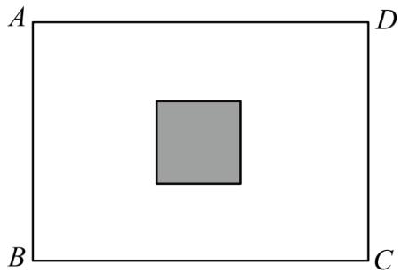

natural_image

Simple geometric diagram showing a gray square centered within a rectangle labeled A, B, C, D (no text or symbols beyond labels)

(1)求该长方形闲置区域ABCD的周长;   
(2)除去放置展台的地方, 其余区域全部需要铺上红毯, 若所铺红毯的售价为 10 元/平方米, 则购买红毯大约需要花费多少元? ( $\sqrt{6} \approx 2.4495$ , 结果保留到小数点后两位)

【变式 8-3】（24-25 九年级上·河南洛阳·阶段练习）有一块矩形木板ABCD，木工甲采用如图的方式，将木板的长AD增加 $2\sqrt{3}$ cm，宽AB增加 $7\sqrt{3}$ cm，得到一个面积为 $192cm^{2}$ 的正方形AEFG.

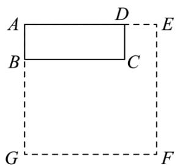

text_image

A
B
C
D
E
G
F

(1)求矩形木板ABCD的面积;   
(2)木工乙想从矩形木板ABCD中裁出一个面积为 $12cm^{2}$ ，宽为 $\frac{\sqrt{6}}{2}cm$ 的矩形木料，则该矩形木料的长为\_\_\_\_cm；  
(3)木工丙想从矩形木板ABCD中截出长为2.0cm、宽为1.5cm的矩形木条，最多能截出\_\_\_\_根这样的木条。