# 专题 2.5 二次根式的加减（举一反三讲义）

【北师大版 2024】

# 题型归纳

【题型 1 判断二次根式能否合并】....2

【题型 2 二次根式的加减运算】....3

【题型3二次根式的混合运算】 5

【题型4 比较二次根式的大小】 8

【题型 5 整数部分和小数】....11

【题型 6 二次根式的化简求值】....13

【题型 7 二次根式的规律探索】....16

【题型8 二次根式的应用】....20

# 举一反三

# 知识点 1 二次根式的加减运算

二次根式的加减法的实质是合并同类二次根式，一般按如下步骤进行：

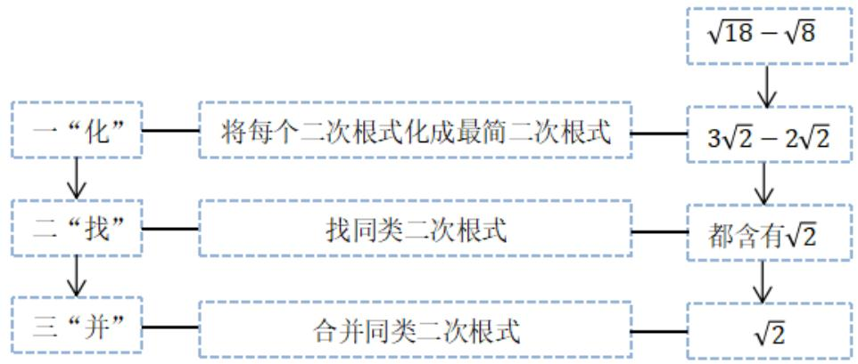

flowchart

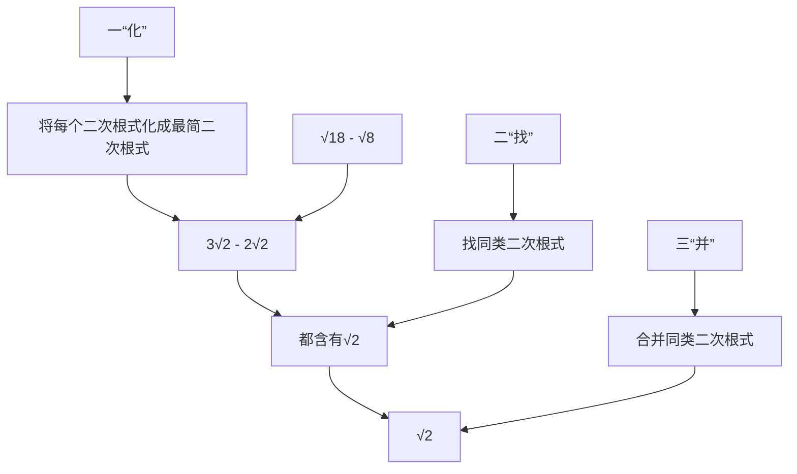

# 知识点 2 二次根式的混合运算

# 1. 运算法则

与整式的混合运算顺序一样，先算乘方、开方，再算乘除，最后算加减，有括号的先算括号里面的.

2. 实数运算中的运算律及公式同样适用于二次根式的运算.  
3. 二次根式混合运算的结果应写成最简二次根式或整式的形式.

# 【题型1 判断二次根式能否合并】

【例 1】（24-25 九年级上·四川乐山·阶段练习）若最简二次根式 $\sqrt{2a-b+6}$ 与 $\sqrt[3a-b]{4a+3b}$ 是能合并，那么（）

A. $a = 2, b = 1$

B. $a = 1, b = -1$

C. $a = 1, b = 0$

D. $a = 1, b = 1$

【答案】D

【分析】本题考查了二次根式得出方程组是解题关键．根据最简二次根式和二次根式的定义，可得关于a、b的二元一次方程组，根据解方程组，可得答案.

【详解】解：由题意得：

$$
\left\{ \begin{array}{c} 4 a + 3 b = 2 a - b + 6 \\ 3 a - b = 2 \end{array} \right.,
$$

解得： $\left\{\begin{aligned}a&=1\\ b&=1\end{aligned}\right.$

故选：D.

【变式 1-1】（24-25 八年级下·河南焦作·阶段练习）如果最简二次根式 $\sqrt{a-2}$ 与 $2\sqrt{7}$ 可以进行合并，则 $a^{2}$ 的值为（）

A. 7

B. 16

C. 25

D. 81

【答案】D

【分析】同类二次根式的定义：化简为最简二次根式后，被开方数是相同的，由此得到 $a - 2 = 7$ ，求解即可．本题考查了乘方，同类二次根式的定义，正确理解题意，得到 $a - 2 = 7$ 是解题的关键.

【详解】解：∵最简二次根式 $\sqrt{a-2}$ 与 $2\sqrt{7}$ 可以合并，

$$
\therefore a - 2 = 7,
$$

解得：a = 9，

$$
\therefore a ^ {2} = 9 ^ {2} = 8 1
$$

故选：D.

【变式 1-2】（24-25 八年级上·陕西西安·期中）若 $a$ 与 $\sqrt{12}$ 是可以合并的二次根式，请写出一个符合条件的最简二次根式 $a$ 为 \_\_\_\_.

【答案】 $\sqrt{3}$ （答案不唯一）

【分析】本题考查了二次根式的运算，先化简二次根式，根据合并即可，解题的关键是掌握二次根式的化简.

【详解】解： $\sqrt{12}=2\sqrt{3}$ ,

∵a与 $\sqrt{12}$ 是可以合并的二次根式，

∴a可以为 $\sqrt{3}$ ,

故答案为： $\sqrt{3}$ （答案不唯一）.

【变式 1-3】（24-25 八年级下·山东潍坊·阶段练习）下列各式经过化简后与 $-\sqrt{-27x^{3}}$ 的被开方数不相同的二次根式是（）

A. $\frac{\sqrt{-x}}{\sqrt{3}}$

B. $\sqrt{\frac{-x^3}{27}}$

C. $\frac{1}{9}\sqrt{-3x^3}$

D. $\sqrt{27x^3}$

【答案】D

【详解】解： $-\sqrt{-27x^{3}}=3x\sqrt{-3x}$

A、 $\frac{\sqrt{-x}}{\sqrt{3}} = \frac{\sqrt{-3x}}{3}$ ，与 $-\sqrt{-27x^3}$ 的被开方数相同，不符合题意；  
B、 $\sqrt{\frac{-x^3}{27}} = -\frac{x\sqrt{-3x}}{9}$ ，与 $-\sqrt{-27x^3}$ 的被开方数相同，不符合题意；  
C、 $\frac{1}{9}\sqrt{-3x^{3}}=-\frac{x}{9}\sqrt{-3x}$ ，与 $-\sqrt{-27x^{3}}$ 的被开方数相同，不符合题意；  
D、 $\sqrt{27x^{3}}=3x\sqrt{3x}$ ，与 $-\sqrt{-27x^{3}}$ 的被开方数不相同，符合题意；

故选：D.

# 【题型2 二次根式的加减运算】

【例 2】（24-25 八年级下·安徽亳州·阶段练习）化简： $\frac{1}{\sqrt{8}+\sqrt{11}}+\frac{1}{\sqrt{11}+\sqrt{14}}+\frac{1}{\sqrt{14}+\sqrt{17}}+\frac{1}{\sqrt{17}+\sqrt{20}}+\frac{1}{\sqrt{20}+\sqrt{23}}+\frac{1}{\sqrt{23}+\sqrt{26}}+\frac{1}{\sqrt{26}+\sqrt{29}}+\frac{1}{\sqrt{29}+\sqrt{32}}$ 结果是（）

A. 1

B. $\frac{2\sqrt{2}}{3}$

C. $2\sqrt{2}$

D. $4\sqrt{2}$

【答案】B

【分析】本题考查了分母有理化及二次根式的加减运算，熟练掌握运算法则是解题的关键．先将每个分式进行分母有理化，再计算加减即可得出答案.

【详解】解： $\frac{1}{\sqrt{8}+\sqrt{11}}=\frac{\sqrt{11}-\sqrt{8}}{(\sqrt{11}+\sqrt{8})(\sqrt{11}-\sqrt{8})}=\frac{\sqrt{11}-\sqrt{8}}{3}$

同理可得 $\frac{1}{\sqrt{11} + \sqrt{14}} = \frac{\sqrt{14} - \sqrt{11}}{3}\dots \frac{1}{\sqrt{29} + \sqrt{32}} = \frac{\sqrt{32} - \sqrt{29}}{3},$

$$
\begin{array}{l} \frac {1}{\sqrt {8} + \sqrt {1 1}} + \frac {1}{\sqrt {1 1} + \sqrt {1 4}} + \frac {1}{\sqrt {1 4} + \sqrt {1 7}} + \frac {1}{\sqrt {1 7} + \sqrt {2 0}} + \frac {1}{\sqrt {2 0} + \sqrt {2 3}} + \frac {1}{\sqrt {2 3} + \sqrt {2 6}} + \frac {1}{\sqrt {2 6} + \sqrt {2 9}} + \frac {1}{\sqrt {2 9} + \sqrt {3 2}} \\ = \frac {\sqrt {1 1} - \sqrt {8}}{3} + \frac {\sqrt {1 4} - \sqrt {1 1}}{3} + \frac {\sqrt {1 7} - \sqrt {1 4}}{3} + \frac {\sqrt {2 0} - \sqrt {1 7}}{3} + \frac {\sqrt {2 3} - \sqrt {2 0}}{3} + \frac {\sqrt {2 6} - \sqrt {2 3}}{3} + \frac {\sqrt {2 9} - \sqrt {2 6}}{3} + \frac {\sqrt {3 2} - \sqrt {2 9}}{3} \\ = \frac {\sqrt {3 2} - \sqrt {8}}{3} \\ \end{array}
$$

$$
\begin{array}{l} = \frac {4 \sqrt {2} - 2 \sqrt {2}}{3} \\ = \frac {2 \sqrt {2}}{3} \\ \end{array}
$$

故选 B.

【变式 2-1】（24-25 八年级下·安徽马鞍山·期中）下列等式正确的是（）

A. $2 \sqrt{3} + 3 \sqrt{2} = 5 \sqrt{5}$

B. $\sqrt{9\frac{1}{4}} = 3\frac{1}{2}$

C. $\sqrt{(\pi - 3.14)^2} = 3.14 - \pi$

D. $(\sqrt{3} + \sqrt{5})(-\sqrt{3} + \sqrt{5}) = 2$

【答案】D

【分析】本题考查了二次根式的性质，二次根式的混合运算；根据二次根式的性质与混合运算逐项分析判断，即可求解.

【详解】解：A. $2\sqrt{3}$ 与 $3\sqrt{2}$ 不能合并，故该选项不正确，不符合题意；

B. $\sqrt{9\frac{1}{4}}=\sqrt{\frac{37}{4}}=\frac{\sqrt{37}}{2}$ ，故该选项不正确，不符合题意；  
C. $\sqrt{(\pi-3.14)^{2}}=\pi-3.14$ ，故该选项不正确，不符合题意；  
D. $\left(\sqrt{3}+\sqrt{5}\right)\left(-\sqrt{3}+\sqrt{5}\right)=-3+5=2$ ，故该选项正确，符合题意；

故选：D.

【变式 2-2】（23-24 八年级下·贵州黔南·期中）我们规定运算符号“😊”的意义是：当a > b时，a ⚙ b = a + b；当a ≤ b时，a ⚙ b = a - b，其他运算符号的意义不变，计算： $(\sqrt{2} \textcircled{😊}\sqrt{3})-(2\sqrt{2} \textcircled{😊}\sqrt{3})=$

【答案】 $-\sqrt{2} - 2\sqrt{3} / -2\sqrt{3} - \sqrt{2}$

【分析】本题考查了二次根式的加减运算，实数新定义运算即二次根式的大小比较，先比较 $\sqrt{2}$ 与 $\sqrt{3}$ ， $2\sqrt{2}$ 与 $\sqrt{3}$ 的大小，再根据新定义列出式子，利用二次根式加减运算法则计算即可.

【详解】解：∵ $\sqrt{2} < \sqrt{3}, 2\sqrt{2} = \sqrt{8} > \sqrt{3}$ ,

$$
\begin{array}{l} \therefore (\sqrt {2} \textcircled {\bullet} \sqrt {3}) - (2 \sqrt {2} \textcircled {\bullet} \sqrt {3}) = (\sqrt {2} - \sqrt {3}) - (2 \sqrt {2} + \sqrt {3}) \\ = \sqrt {2} - \sqrt {3} - 2 \sqrt {2} - \sqrt {3} \\ = - \sqrt {2} - 2 \sqrt {3}, \\ \end{array}
$$

故答案为： $-\sqrt{2}-2\sqrt{3}$ .

【变式 2-3】（24-25 八年级下·河南商丘·阶段练习）小文和小博同学玩一个摸球计算游戏，在一个不透明的容器中放入四个小球，小球上分别标有一个数．现从容器中摸取小球，若摸到白色球，就减去球上的数；若摸到灰色球，就加上球上的数.

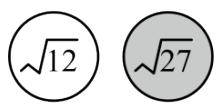

图1

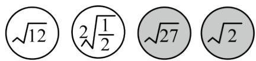

text_image

√12
2√(1/2)
√27
√2

图2

(1)如图 1，若小文摸到图示两个小球，请计算出结果；  
(2)如图 2，若小博摸到图示四个小球，最后的计算结果能和 $\sqrt{48}$ 合并吗？说明理由.

【答案】(1) $\sqrt{3}$

(2)最后的计算结果能和 $\sqrt{48}$ 合并，理由见解析

【分析】本题考查了二次根式的加减运算，同类二次根式，利用二次根式的性质化简，正确化简是解题的关键.

（1）直接计算 $\sqrt{27}-\sqrt{12}$ 即可；  
（2）先计算 $-\sqrt{12} - 2\sqrt{\frac{1}{2}} + \sqrt{27} + \sqrt{2}$ ，再化简 $\sqrt{48}$ ，判断是否为同类二次根式即可.

【详解】（1）解：由题意得， $\sqrt{27}-\sqrt{12}=3\sqrt{3}-2\sqrt{3}=\sqrt{3}$ ;

(2) 解: 最后的计算结果能和 $\sqrt{48}$ 合并, 理由如下:

由题意得， $-\sqrt{12}-2\sqrt{\frac{1}{2}}+\sqrt{27}+\sqrt{2}=-2\sqrt{3}-\sqrt{2}+3\sqrt{3}+\sqrt{2}=\sqrt{3},$

而 $\sqrt{48} = 4\sqrt{3}$

∵ $\sqrt{3}$ 与 $4\sqrt{3}$ 是同类二次根式，故能合并，

∴最后的计算结果能和 $\sqrt{48}$ 合并.

# 【题型3 二次根式的混合运算】

【例 3】（24-25 八年级下·安徽合肥·阶段练习）对于任意不相等的两个正实数 a, b，定义一种运算“※”如下： $a$ ※ $b = \frac{\sqrt{a + b}}{a - b}$ ，例如： $5$ ※ $4 = \frac{\sqrt{5 + 4}}{5 - 4} = 3$ .

(1) $3 \times 6 =$ \_\_\_\_ ;   
(2) $(2 - \sqrt{3})$ (7※5) = \_\_\_\_.

【答案】 -1 $-\frac{\sqrt{2} + \sqrt{6}}{4}$

【分析】本题考查定义新运算，二次根式分母有理化，平方差公式等.

(1) 根据题意利用题中例子计算即可;

（2）根据题意先将 $(7\times5)$ 展开计算，再计算 $(2-\sqrt{3})\times\sqrt{3}$ ，最后分母有理化即可.

【详解】解：（1）由定义新运算知 $3 \times 6 = \frac{\sqrt{3+6}}{3-6} = -1$ ，

故答案为：-1;

(2) $(2 - \sqrt{3})\text{※}\left(7\text{※}5\right)$

$$
\begin{array}{l} = (2 - \sqrt {3}) \text {※} \frac {\sqrt {7 + 5}}{7 - 5} \\ = (2 - \sqrt {3}) \text {※} \frac {\sqrt {1 2}}{2} \\ = (2 - \sqrt {3}) \text {※} \sqrt {3} \\ = \frac {\sqrt {2 - \sqrt {3} + \sqrt {3}}}{2 - \sqrt {3} - \sqrt {3}} \\ = \frac {\sqrt {2}}{2 - 2 \sqrt {3}} \\ = \frac {\sqrt {2} \times (2 + 2 \sqrt {3})}{(2 - 2 \sqrt {3}) (2 + 2 \sqrt {3})} \\ = \frac {2 \sqrt {2} + 2 \sqrt {6}}{4 - 1 2} \\ = \frac {2 \sqrt {2} + 2 \sqrt {6}}{- 8} \\ = - \frac {\sqrt {2} + \sqrt {6}}{4}, \\ \end{array}
$$

故答案为： $-\frac{\sqrt{2}+\sqrt{6}}{4}$ .

【变式 3-1】（24-25 八年级下·云南昆明·期中）如图，它是一个数值转换机，若输入的 a 值为 $\sqrt{2}$ ，则输出的结果应为 \_\_\_\_.

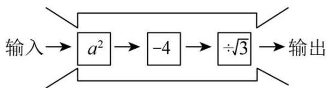

flowchart

【答案】 $-\frac{2\sqrt{3}}{3}$

【分析】本题考查了程序框图，以及二次根式的混合运算，将 $a$ 为 $\sqrt{2}$ 代入程序框图计算求解，即可解题.

【详解】解：根据题意得 $\left[(\sqrt{2})^{2}-4\right]\div\sqrt{3}$

$$
= (2 - 4) \div \sqrt {3}
$$

$$
= - 2 \div \sqrt {3}
$$

$$
= - \frac {2 \sqrt {3}}{3}.
$$

【变式 3-2】（24-25 八年级下·云南昆明·阶段练习）计算：

(1) $\sqrt{27} \div \sqrt{3} - \sqrt{\frac{1}{3}} \times \sqrt{18} + \sqrt{24}$

(2) $(2\sqrt{3} + 3\sqrt{2})(2\sqrt{3} - 3\sqrt{2}) - (\sqrt{5} - 1)^{2}$

【答案】(1) $3+\sqrt{6}$

(2) $-12+2\sqrt{5}$

【分析】（1）根据二次根式混合运算法则进行解答即可；

(2) 根据平方差公式、完全平方公式及二次根式混合运算法则进行解答即可.

本题考查二次根式的混合运算及平方差公式和完全平方公式的应用，解题关键是掌握二次根式的混合运算法则.

【详解】（1）解： $\sqrt{27}\div\sqrt{3}-\sqrt{\frac{1}{3}}\times\sqrt{18}+\sqrt{24}$

$$
\begin{array}{l} = 3 \sqrt {3} \div \sqrt {3} - \frac {\sqrt {3}}{3} \times 3 \sqrt {2} + 2 \sqrt {6} \\ = 3 - \sqrt {6} + 2 \sqrt {6} \\ = 3 + \sqrt {6}; \\ \end{array}
$$

(2) 解: 原式 $= (2\sqrt{3})^2 - (3\sqrt{2})^2 - (5 - 2\sqrt{5} + 1)$

$$
\begin{array}{l} = 1 2 - 1 8 - 6 + 2 \sqrt {5} \\ = - 1 2 + 2 \sqrt {5}. \\ \end{array}
$$

【变式 3-3】（24-25 八年级下·湖北武汉·期中）已知 $x = 2 - \sqrt{3}$

(1)计算： $x^{2}=$ \_\_\_\_， $\frac{1}{x}=$ \_\_\_\_；

(2)求代数式 $(7 + 4\sqrt{3})x^{2} + (2 + \sqrt{3})x + \sqrt{3} -1$ 的值.

【答案】(1) $7-4\sqrt{3}$ ， $2+\sqrt{3}$

(2) $\sqrt{3}+1$

【分析】本题考查了二次根式的混合运算，涉及平方差公式和完全平方公式计算，熟练掌握运算法则是解题的关键.

（1）将 $x = 2 - \sqrt{3}$ 分别代入下式，利用完全平方公式计算 $(2 - \sqrt{3})^2$ ，分母有理化求解 $\frac{1}{2 - \sqrt{3}}$ 即可；  
（2）将 $x=2-\sqrt{3}$ 代入 $(7+4\sqrt{3})x^{2}+(2+\sqrt{3})x+\sqrt{3}-1$ ，利用二次根式的混合运算法则计算即可.

【详解】（1）解：∵ $x=2-\sqrt{3}$ ,

$$
\therefore x ^ {2} = (2 - \sqrt {3}) ^ {2} = 4 + 3 - 4 \sqrt {3} = 7 - 4 \sqrt {3},
$$

$$
\frac {1}{x} = \frac {1}{2 - \sqrt {3}} = \frac {2 + \sqrt {3}}{(2 - \sqrt {3}) (2 + \sqrt {3})} = 2 + \sqrt {3};
$$

（2）解：原式 $= (7 + 4\sqrt{3})(7 - 4\sqrt{3}) + (2 + \sqrt{3})(2 - \sqrt{3}) + \sqrt{3} -1$

$$
\begin{array}{l} = (4 9 - 4 8) + (4 - 3) + \sqrt {3} - 1 \\ = \sqrt {3} + 1. \\ \end{array}
$$

# 【题型4 比较二次根式的大小】

【例 4】（24-25 八年级下·福建厦门·期中）在解决问题“已知 $a=\frac{1}{2+\sqrt{3}}$ ，求 $2a^{2}-8a+1$ 的值”时，小明是这样分析与解答的：

$$
\because a = \frac {1}{2 + \sqrt {3}} = \frac {2 - \sqrt {3}}{(2 + \sqrt {3}) (2 - \sqrt {3})} = 2 - \sqrt {3},
$$

$$
\therefore a - 2 = - \sqrt {3}, \quad \therefore (a - 2) ^ {2} = 3, a ^ {2} - 4 a + 4 = 3,
$$

$$
\therefore a ^ {2} - 4 a = - 1, \therefore 2 a ^ {2} - 8 a + 1 = 2 (a ^ {2} - 4 a) + 1 = 2 \times (- 1) + 1 = - 1.
$$

请你根据小明的分析过程，解决如下问题：

(1)比较大小： $\frac{2}{\sqrt{13} - \sqrt{11}}$ 与 $\frac{2}{\sqrt{15} - \sqrt{13}};$   
(2)若 $b=\frac{1}{\sqrt{2}+2}$ ，且 $(a+2b)^{2}=9$ ，求a的值；  
(3)若 $c = \frac{1}{1 + \sqrt{2}}, d = \frac{1}{3 + 2\sqrt{2}}$ ，求 $5c^{2} + 4cd + 2d^{2} + 2c - 6d + 10$ 的值.

【答案】(1) $\frac{2}{\sqrt{13}-\sqrt{11}}<\frac{2}{\sqrt{15}-\sqrt{13}}$

(2) $a=1+\sqrt{2}$ 或 $a=-5+\sqrt{2}$   
(3)11

【分析】本题考查了二次根式的化简求值，平方差公式、完全平方公式，解题的关键是理解题意，理清分母有理化的过程.

(1) 根据题中分母有理化的方法将两个式子分别化简, 再比较即可;  
（2）先分母有理化得到 $b=\frac{1}{\sqrt{2}+2}=\frac{2-\sqrt{2}}{2}$ ，再将 $(a+2b)^{2}=9$ 开平方得到 $a+2b=\pm3$ ，代入 $b=\frac{2-\sqrt{2}}{2}$ ，即可求解；  
（3）先分母有理化得： $c=\sqrt{2}-1,\quad d=3-2\sqrt{2}$ ，再将 $5c^{2}+4cd+2d^{2}+2c-6d+10$ 整理为 $=(2c+d)^{2}+(d-3)^{2}+(c+1)^{2}$ ，再代入值求解即可.

【详解】（1）解： $\frac{2}{\sqrt{13}-\sqrt{11}}=\frac{2(\sqrt{13}+\sqrt{11})}{(\sqrt{13}-\sqrt{11})(\sqrt{13}+\sqrt{11})}=\frac{2(\sqrt{13}+\sqrt{11})}{13-11}=\sqrt{13}+\sqrt{11},$

$$
\frac {2}{\sqrt {1 5} - \sqrt {1 3}} = \frac {2 (\sqrt {1 5} + \sqrt {1 3})}{(\sqrt {1 5} - \sqrt {1 3}) (\sqrt {1 5} + \sqrt {1 3})} = \frac {2 (\sqrt {1 5} + \sqrt {1 3})}{1 5 - 1 3} = \sqrt {1 5} + \sqrt {1 3},
$$

$$
\because \sqrt {1 1} <   \sqrt {1 5},
$$

$$
\therefore \sqrt {1 1} + \sqrt {1 3} <   \sqrt {1 5} + \sqrt {1 3},
$$

即 $\frac{2}{\sqrt{13} - \sqrt{11}} < \frac{2}{\sqrt{15} - \sqrt{13}};$

(2) $\because b = \frac{1}{\sqrt{2} + 2} = \frac{2 - \sqrt{2}}{(2 + \sqrt{2})(2 - \sqrt{2})} = \frac{2 - \sqrt{2}}{4 - 2} = \frac{2 - \sqrt{2}}{2}, (a + 2b)^{2} = 9, a + 2b = \pm 3$

$$
a + 2 \times \frac {2 - \sqrt {2}}{2} = \pm 3
$$

$$
a + 2 - \sqrt {2} = \pm 3
$$

$$
\therefore a = 1 + \sqrt {2} \text {或} a = - 5 + \sqrt {2};
$$

(3) $\because c = \frac{1}{1 + \sqrt{2}} = \frac{\sqrt{2} - 1}{(\sqrt{2} + 1)(\sqrt{2} - 1)} = \sqrt{2} - 1, d = \frac{1}{3 + 2\sqrt{2}} = \frac{3 - 2\sqrt{2}}{(3 + 2\sqrt{2})(3 - 2\sqrt{2})} = 3 - 2\sqrt{2},$

$$
\therefore 5 c ^ {2} + 4 c d + 2 d ^ {2} + 2 c - 6 d + 1 0
$$

$$
= 4 c ^ {2} + 4 c d + d ^ {2} + d ^ {2} - 6 d + 9 + c ^ {2} + 2 c + 1
$$

$$
= (2 c + d) ^ {2} + (d - 3) ^ {2} + (c + 1) ^ {2}
$$

$$
= (2 \sqrt {2} - 2 + 3 - 2 \sqrt {2}) ^ {2} + (3 - 2 \sqrt {2} - 3) ^ {2} + (\sqrt {2} - 1 + 1) ^ {2}
$$

$$
= 1 ^ {2} + (- 2 \sqrt {2}) ^ {2} + \sqrt {2} ^ {2}
$$

$$
= 1 + 8 + 2
$$

$$
= 1 1.
$$

【变式 4-1】（24-25 八年级上·上海长宁·阶段练习）比较大小：

(1) $\frac{1}{2 - \sqrt{5}}\frac{1}{\sqrt{5} - \sqrt{6}};$   
(2) $2-\sqrt{3}$ \_\_\_\_ $\sqrt{5}-\sqrt{2}$ .

【答案】> <

【分析】本题考查二次根式比较大小，分母有理化：

（1）分母有理数后比较大小即可；  
(2) 比较两数的倒数, 进而得出两数的大小关系即可.

【详解】解：（1） $\because \frac{1}{2 - \sqrt{5}} = \frac{2 + \sqrt{5}}{(2 - \sqrt{5})(2 + \sqrt{5})} = -(2 + \sqrt{5}), \frac{1}{\sqrt{5} - \sqrt{6}} = \frac{\sqrt{5} + \sqrt{6}}{(\sqrt{5} - \sqrt{6})(\sqrt{5} + \sqrt{6})} = -(\sqrt{5} + \sqrt{6})$

$$
\because 2 + \sqrt {5} = \sqrt {4} + \sqrt {5} <   \sqrt {5} + \sqrt {6},
$$

$$
\therefore - (2 + \sqrt {5}) > - (\sqrt {5} + \sqrt {6}),
$$

$$
\therefore \frac {1}{2 - \sqrt {5}} > \frac {1}{\sqrt {5} - \sqrt {6}};
$$

故答案为：>；

(2) $\because \frac{1}{2 - \sqrt{3}} = \frac{2 + \sqrt{3}}{(2 - \sqrt{3})(2 + \sqrt{3})} = 2 + \sqrt{3}, \frac{1}{\sqrt{5} - \sqrt{2}} = \frac{\sqrt{5} + \sqrt{2}}{(\sqrt{5} - \sqrt{2})(\sqrt{5} + \sqrt{2})} = \frac{\sqrt{5} + \sqrt{2}}{3},$

$$
\because 2 + \sqrt {3} = \frac {6 + 3 \sqrt {3}}{3} > \frac {\sqrt {5} + \sqrt {2}}{3},
$$

$$
\therefore \frac {1}{2 - \sqrt {3}} > \frac {1}{\sqrt {5} - \sqrt {2}},
$$

$$
\therefore 2 - \sqrt {3} <   \sqrt {5} - \sqrt {2};
$$

故答案为: $<$ .

【变式 4-2】（24-25 八年级下·山东潍坊·期中）用两种方法比较 $\sqrt{5} + 1$ 与 $\sqrt{10}$ 的大小.

【答案】见解析

【分析】本题考查了实数的大小比较，二次根式的混合运算，无理数的大小估算，完全平方公式，不等式的性质等知识，掌握实数大小比较的常见方法是解题关键．方法一：利用平方法比较大小；方法二，利用作差法和平方差结合比较大小.

【详解】解：方法一： $\left(\sqrt{5}+1\right)^{2}=6+2\sqrt{5},\left(\sqrt{10}\right)^{2}=10,$

$$
\because 2 <   \sqrt {5} <   3,
$$

$$
\therefore 4 <   2 \sqrt {5} <   6,
$$

$$
\therefore 1 0 <   6 + 2 \sqrt {5} <   1 2,
$$

$$
\therefore \sqrt {5} + 1 > \sqrt {1 0};
$$

方法二：∵ $\sqrt{5}+1-\sqrt{5}=1$ ，

$$
\therefore \left(\sqrt {5} + 1 - \sqrt {5}\right) ^ {2} = 1 = 1 5 - 1 4 = 1 5 - \sqrt {1 9 6},
$$

$$
\because (\sqrt {1 0} - \sqrt {5}) ^ {2} = 1 0 - 1 0 \sqrt {2} + 5 = 1 5 - 1 0 \sqrt {2} = 1 5 - \sqrt {2 0 0}
$$

$$
\therefore 1 5 - \sqrt {1 9 6} > 1 5 - \sqrt {2 0 0},
$$

$$
\therefore \left(\sqrt {5} + 1 - \sqrt {5}\right) ^ {2} > \left(\sqrt {1 0} - \sqrt {5}\right) ^ {2},
$$

$$
\therefore \sqrt {5} + 1 - \sqrt {5} > \sqrt {1 0} - \sqrt {5},
$$

$$
\therefore \sqrt {5} + 1 > \sqrt {1 0}
$$

【变式 4-3】（24-25 八年级下·河南安阳·阶段练习）项目式学习：

<table><tr><td>课题名称</td><td>平方法比较实数的大小</td></tr><tr><td>参与人员</td><td>八下第(3)小组 日期:2025年××月××日</td></tr><tr><td>原理解读</td><td>对于任意两个正数a,b,若a&gt;b,则 $\sqrt{a}>\sqrt{b}$ .</td></tr><tr><td>典例展示</td><td>比较 $2\sqrt{3}$ 和 $3\sqrt{2}$ 的大小.解: $(2\sqrt{3})^{2}=12,(3\sqrt{2})^{2}=18,\because 12<18,\therefore 2\sqrt{3}<3\sqrt{2}.$ </td></tr><tr><td rowspan="2">任务解答</td><td>(1)比较 $3\sqrt{5}$ 和 $5\sqrt{3}$ 的大小;</td></tr><tr><td>(2)比较 $\sqrt{6}-\sqrt{2}$ 和 $\sqrt{5}-\sqrt{3}$ 的大小.</td></tr></table>

【答案】（1） $3\sqrt{5}<5\sqrt{3}$ ; （2） $\sqrt{6}-\sqrt{2}>\sqrt{5}-\sqrt{3}$

【分析】本题主要考查实数的估算，比较大小，二次根式的计算，熟练掌握实数的估算是解题的关键.

(1) $(3\sqrt{5})^{2}=45,\quad(5\sqrt{3})^{2}=75$ ，进行比较大小即可；

（2）利用完全平方公式求出 $(\sqrt{6}-\sqrt{2})^{2}=8-4\sqrt{3}$ ， $(\sqrt{5}-\sqrt{3})^{2}=8-2\sqrt{15}$ ，得出 $4\sqrt{3}<2\sqrt{15}$ ，即可比较大小.

【详解】解：（1） $(3\sqrt{5})^{2}=45,\quad(5\sqrt{3})^{2}=75,$

$$
\because 4 5 <   7 5,
$$

$$
\therefore 3 \sqrt {5} <   5 \sqrt {3}.
$$

(2) $\because (\sqrt{6} -\sqrt{2})^2 = 8 - 4\sqrt{3},(\sqrt{5} -\sqrt{3})^2 = 8 - 2\sqrt{15}.$

又： $(4\sqrt{3})^2 = 48$ ， $(2\sqrt{15})^2 = 60$ ， $48 <   60$

$$
\therefore 4 \sqrt {3} <   2 \sqrt {1 5},
$$

$$
\therefore - 4 \sqrt {3} > - 2 \sqrt {1 5},
$$

$$
\therefore 8 - 4 \sqrt {3} > 8 - 2 \sqrt {1 5},
$$

$$
\therefore \sqrt {6} - \sqrt {2} > \sqrt {5} - \sqrt {3}
$$

# 【题型5 整数部分和小数】

【例 5】（24-25 八年级上·河北保定·阶段练习） $\sqrt{11}-1$ 的整数部分为a，小数部分为b， $(\sqrt{11}+a)(b+1)$ 的值为（）

A. $\sqrt{11} + 2$

B. 2

C. 7

D. $5 + 2\sqrt{11}$

【答案】C

【分析】本题考查了无理数的估算、二次根式的运算、利用平方差公式进行计算，先估算出 $3 < \sqrt{11} < 4$ ，得出 $2 < \sqrt{11} - 1 < 3$ ，从而得出a = 2， $b = \sqrt{11} - 3$ ，代入式子，利用平方差公式进行计算即可.

【详解】解：∵9<11<16，

$\therefore \sqrt{9} < \sqrt{11} < \sqrt{16}$ ，即 $3 < \sqrt{11} < 4$ ，

$$
\therefore 2 <   \sqrt {1 1} - 1 <   3,
$$

∵ $\sqrt{11}-1$ 的整数部分为 a，小数部分为 b，

$$
\therefore a = 2, b = \sqrt {1 1} - 1 - 2 = \sqrt {1 1} - 3,
$$

$$
\begin{array}{l} \therefore (\sqrt {1 1} + a) (b + 1) \\ = (\sqrt {1 1} + 2) (\sqrt {1 1} - 3 + 1) \\ = (\sqrt {1 1} + 2) (\sqrt {1 1} - 2) \\ = 1 1 - 4 \\ = 7, \\ \end{array}
$$

故选：C.

【变式 5-1】（24-25 八年级下·浙江嘉兴·期中）估计 $(2\sqrt{2}-\sqrt{3})^{2}$ 的值应在（）

A. 1 到 2 之间

B. 2 到 3 之间

C. 5 到 6 之间

D. 10到11之间

【答案】A

【分析】本题考查了二次根式的混合运算、完全平方公式、无理数的大小估算，熟练掌握以上知识点是解题的关键．首先计算原式 $= 11 - 4\sqrt{6}$ ，根据 $\sqrt{81} < \sqrt{96} < \sqrt{100}$ ，可得 $-10 < -4\sqrt{6} < -9$ ，根据不等式的性质即可求解.

【详解】解： $(2\sqrt{2}-\sqrt{3})^{2}=8-4\sqrt{6}+3=11-4\sqrt{6}$

$$
\because \sqrt {8 1} <   \sqrt {9 6} <   \sqrt {1 0 0},
$$

$$
\therefore 9 <   4 \sqrt {6} <   1 0,
$$

$$
\therefore - 1 0 <   - 4 \sqrt {6} <   - 9,
$$

$$
\therefore 1 1 - 1 0 <   1 1 - 4 \sqrt {6} <   1 1 - 9,
$$

$$
\therefore 1 <   1 1 - 4 \sqrt {6} <   2,
$$

故选：A.

【变式 5-2】（24-25 七年级上·全国·期末）实数 $\sqrt{19}-1$ 的整数部分为a，小数部分为b，则 $3a+2b=$ （）

A. $2 \sqrt{19} + 5$

B. $2 \sqrt{19} + 1$

C. $2 \sqrt{19} - 1$

D. $2 \sqrt{19} - 5$

【答案】B

【分析】本题主要考查了实数的估算、代数式求值、二次根式运算等知识，正确确定a,b的值是解题关键．利用算术平方根的估算可知 $4<\sqrt{19}<5$ ， $3<\sqrt{19}-1<4$ ，即a=3， $b=\sqrt{19}-4$ ，由此即可求得结果.

【详解】解：∵4< $\sqrt{19}$ <5,

$$
\therefore 3 <   \sqrt {1 9} - 1 <   4,
$$

$$
\therefore a = 3, \quad b = \sqrt {1 9} - 1 - 3 = \sqrt {1 9} - 4,
$$

$$
\therefore 3 a + 2 b = 3 \times 3 + 2 (\sqrt {1 9} - 4) = 9 + 2 \sqrt {1 9} - 8 = 1 + 2 \sqrt {1 9}.
$$

故选：B.

【变式 5-3】（24-25 八年级下·四川德阳·阶段练习）已知 $\frac{1}{2-\sqrt{3}}$ 的整数部分为 a，小数部分为 b，则 $a^{2}+2(\sqrt{3}+1)b-2=$ \_\_\_\_.

【答案】11

【分析】此题考查估算无理数的大小，分母有理化，二次根式的乘法运算，解题关键在于得到 $\sqrt{3}$ 的整数部分.

先进行分母有理化，因为 $1 < \sqrt{3} < 2$ ，由此得到 $3 < 2 + \sqrt{3} < 4$ ，即可得到a,b，再代入计算求解.

【详解】解： $\frac{1}{2-\sqrt{3}}$

$$
= \frac {2 + \sqrt {3}}{(2 - \sqrt {3}) (2 + \sqrt {3})}
$$

$$
= 2 + \sqrt {3}
$$

$$
\because 1 <   \sqrt {3} <   2
$$

$$
\therefore 3 <   2 + \sqrt {3} <   4
$$

$$
\therefore a = 3, b = 2 + \sqrt {3} - 3 = \sqrt {3} - 1,
$$

$$
\therefore a ^ {2} + 2 (\sqrt {3} + 1) b - 2
$$

$$
= 3 ^ {2} + 2 (\sqrt {3} + 1) (\sqrt {3} - 1) - 2
$$

$$
= 9 + 4 - 2
$$

$$
= 1 1,
$$

故答案为：11.

# 【题型6 二次根式的化简求值】

【例 6】（23-24 八年级下·山东淄博·期中）已知 $a=\frac{\sqrt{5}-\sqrt{3}}{\sqrt{5}+\sqrt{3}}$ ， $b=\frac{\sqrt{5}+\sqrt{3}}{\sqrt{5}-\sqrt{3}}$ ，则二次根式 $\sqrt{a^{3}b+ab^{3}+19}$ 的值

是（）

A. 6

B. 7

C. 8

D. 9

【答案】D

【分析】本题考查了二次根式的运算，先化简 $a$ 、 $b$ ，再利用因式分解和完全平方公式把 $a^3 b + ab^3 + 19$ 转化为 $ab[(a + b)^2 - 2ab] + 19$ ，把化简后 $a$ 、 $b$ 的值代入计算得到 $a^3 b + ab^3 + 19$ 的值，即可求出 $\sqrt{a^3 b + ab^3 + 19}$ 的值，掌握二次根式的化简和完全平方公式的应用是解题的关键.

【详解】解： $a = \frac{\sqrt{5} - \sqrt{3}}{\sqrt{5} + \sqrt{3}} = \frac{(\sqrt{5} - \sqrt{3})^2}{(\sqrt{5} + \sqrt{3})(\sqrt{5} - \sqrt{3})} = 4 - \sqrt{15},$

$$
b = \frac {\sqrt {5} + \sqrt {3}}{\sqrt {5} - \sqrt {3}} = \frac {(\sqrt {5} + \sqrt {3}) ^ {2}}{(\sqrt {5} + \sqrt {3}) (\sqrt {5} - \sqrt {3})} = 4 + \sqrt {1 5},
$$

$$
\therefore a ^ {3} b + a b ^ {3} + 1 9 = a b \left(a ^ {2} + b ^ {2}\right) + 1 9
$$

$$
= a b \left[ (a + b) ^ {2} - 2 a b \right] + 1 9,
$$

$$
= (4 - \sqrt {1 5}) (4 + \sqrt {1 5}) \left[ (4 - \sqrt {1 5} + 4 + \sqrt {1 5}) ^ {2} - 2 (4 - \sqrt {1 5}) (4 + \sqrt {1 5}) \right] + 1 9,
$$

$$
= 1 \times (6 4 - 2 \times 1) + 1 9,
$$

$$
= 6 2 + 1 9,
$$

$$
= 8 1,
$$

$$
\therefore \sqrt {a ^ {3} b + a b ^ {3} + 1 9} = \sqrt {8 1} = 9,
$$

故选：D.

【变式 6-1】（24-25 八年级下·吉林白城·阶段练习）先化简，再求值： $5\sqrt{\frac{x}{5}}-\frac{5}{4}\sqrt{\frac{4x}{5}}+x\sqrt{\frac{45}{x}}$ ，其中 x=4.

【答案】 $\frac{7}{2}\sqrt{5x}$ ， $7\sqrt{5}$

【分析】本题主要考查二次根式的运算，熟练掌握运算法则是解题的关键．根据运算法则进行化简，再代数计算即可.

【详解】解：原式 $= \sqrt{5x} -\frac{\sqrt{5x}}{2} +3\sqrt{5x}$

$$
= \frac {7}{2} \sqrt {5 x}.
$$

当x=4时，原式 $=\frac{7}{2}\sqrt{5\times4}=7\sqrt{5}$ .

【变式 6-2】（24-25 八年级下·辽宁葫芦岛·期中）如果 $x^{2} + y^{2} - 8x - 6y + 25 = 0$ ，试求 $\sqrt{\frac{y}{x} + \frac{x}{y} + 2} - \sqrt{\frac{x}{y} + \frac{y}{x} - 2}$ 的值.

【答案】 $\sqrt{3}$

【分析】本题考查二次根式的化简求值，将已知转化为 $(x - 4)^2 + (y - 3)^2 = 0$ ，根据平方的非负性质得 $x = 4, y = 3$ ，继而得到 $x + y = 7, x - y = 1, xy = 12$ ，再将 $\sqrt{\frac{y}{x} + \frac{x}{y} + 2} -\sqrt{\frac{x}{y} + \frac{y}{x} - 2}$ 化为 $\sqrt{\frac{(x + y)^2}{xy}} -\sqrt{\frac{(x - y)^2}{xy}}$ 然后整体代入进行化简即可．掌握平方的非负性，完全平方公式，分式的运算法则，二次根式运算法则是解题的关键.

【详解】由 $x^{2}+y^{2}-8x-6y+25=0$ 得到 $x^{2}-8x+16+y^{2}-6y+9=0$ ,

$$
\therefore (x - 4) ^ {2} + (y - 3) ^ {2} = 0,
$$

$$
\therefore x - 4 = 0, y - 3 = 0,
$$

解得：x = 4, y = 3,

$$
\begin{array}{l} \therefore x + y = 7, \quad x - y = 1, \quad x y = 1 2, \\ \therefore \sqrt {\frac {y}{x} + \frac {x}{y} + 2} - \sqrt {\frac {x}{y} + \frac {y}{x} - 2} \\ = \sqrt {\frac {x ^ {2} + 2 x y + y ^ {2}}{x y}} - \sqrt {\frac {x ^ {2} - 2 x y + y ^ {2}}{x y}} \\ = \sqrt {\frac {(x + y) ^ {2}}{x y}} - \sqrt {\frac {(x - y) ^ {2}}{x y}} \\ = \sqrt {\frac {7 ^ {2}}{1 2}} - \sqrt {\frac {1 ^ {2}}{1 2}} \\ = \sqrt {\frac {4 9}{1 2}} - \sqrt {\frac {1}{1 2}} \\ = \frac {7}{6} \sqrt {3} - \frac {1}{6} \sqrt {3} \\ = \sqrt {3}. \\ \end{array}
$$

【变式6-3】（24-25八年级上·江苏南通·期末）若 $-m^2 - n^2 \geq 10 - 6m + 2n$ ，且 $x = \frac{\sqrt{5} + n}{m}$ ，则 $81x^5$

$$
- 8 0 x + 1 = \underline {{\quad}}.
$$

【答案】-31

【分析】本题主要考查完全平方公式的变形应用，二次根式混合运算，解题的关键是熟练掌握二次根式混合运算法则，先由 $-m^{2}-n^{2}\geq10-6m+2n$ ，得出 $(m-3)^{2}+(n+1)^{2}\leq0$ ，求出m=3，n=-1，得出 $x=\frac{\sqrt{5}+n}{m}=\frac{\sqrt{5}-1}{3}$ ，再代入求值即可.

【详解】解： $\because-m^{2}-n^{2}\geq10-6m+2n,$

$$
\therefore m ^ {2} + n ^ {2} + 1 0 - 6 m + 2 n \leq 0,
$$

即 $(m - 3)^{2} + (n + 1)^{2}\leq 0$

$$
\therefore m - 3 = 0, n + 1 = 0,
$$

解得： $m = 3$ ， $n = -1$

$$
\begin{array}{l} \therefore x = \frac {\sqrt {5} + n}{m} = \frac {\sqrt {5} - 1}{3}, \\ \therefore 8 1 x ^ {5} - 8 0 x + 1 \\ = 8 1 \times \left(\frac {\sqrt {5} - 1}{3}\right) ^ {5} - 8 0 \times \frac {\sqrt {5} - 1}{3} + 1 \\ = 8 1 \times \frac {(\sqrt {5} - 1) ^ {5}}{3 ^ {5}} - \frac {8 0 \sqrt {5} - 8 0}{3} + 1 \\ = \frac {\left[ (\sqrt {5} - 1) ^ {2} \right] ^ {2} (\sqrt {5} - 1)}{3} - \frac {8 0 \sqrt {5} - 8 0}{3} + 1 \\ = \frac {(6 - 2 \sqrt {5}) ^ {2} (\sqrt {5} - 1)}{3} - \frac {8 0 \sqrt {5} - 8 0}{3} + 1 \\ = \frac {4 (3 - \sqrt {5}) ^ {2} (\sqrt {5} - 1)}{3} - \frac {8 0 \sqrt {5} - 8 0}{3} + 1 \\ = \frac {4 (1 4 - 6 \sqrt {5}) (\sqrt {5} - 1)}{3} - \frac {8 0 \sqrt {5} - 8 0}{3} + 1 \\ = \frac {8 (7 - 3 \sqrt {5}) (\sqrt {5} - 1)}{3} - \frac {8 0 \sqrt {5} - 8 0}{3} + 1 \\ = \frac {8 (1 0 \sqrt {5} - 2 2)}{3} - \frac {8 0 \sqrt {5} - 8 0}{3} + 1 \\ = \frac {8 0 \sqrt {5} - 1 7 6}{3} - \frac {8 0 \sqrt {5} - 8 0}{3} + 1 \\ = \frac {8 0 \sqrt {5} - 1 7 6 - 8 0 \sqrt {5} + 8 0}{3} + 1 \\ = \frac {- 9 6}{3} + 1 \\ = - 3 2 + 1 \\ = - 3 1. \\ \end{array}
$$

故答案为：-31.

# 【题型7 二次根式的规律探索】

【例 7】观察下列各式:

$$
\sqrt {1 + \frac {1}{1 ^ {2}} + \frac {1}{2 ^ {2}}} = 1 + \frac {1}{1 \times 2} = 1 + \left(1 - \frac {1}{2}\right)
$$

$$
\sqrt {1 + \frac {1}{2 ^ {2}} + \frac {1}{3 ^ {2}}} = 1 + \frac {1}{2 \times 3} = 1 + \left(\frac {1}{2} - \frac {1}{3}\right)
$$

$$
\sqrt {1 + \frac {1}{3 ^ {2}} + \frac {1}{4 ^ {2}}} = 1 + \frac {1}{3 \times 4} = 1 + \left(\frac {1}{3} - \frac {1}{4}\right)
$$

...

请利用你发现的规律，计算： $\sqrt{1+\frac{1}{1^{2}}+\frac{1}{2^{2}}}+\sqrt{1+\frac{1}{2^{2}}+\frac{1}{3^{2}}}+\sqrt{1+\frac{1}{3^{2}}+\frac{1}{4^{2}}}+\cdots+\sqrt{1+\frac{1}{9^{2}}+\frac{1}{10^{2}}}$ 其结果为\_\_\_\_.

【答案】 $\frac{99}{10}$

【分析】根据前几个等式发现的变化规律进行求解即可.

【详解】解： $\because \sqrt{1 + \frac{1}{1^2} + \frac{1}{2^2}} = 1 + \frac{1}{1 \times 2} = 1 + \left(1 - \frac{1}{2}\right)$

$$
\sqrt {1 + \frac {1}{2 ^ {2}} + \frac {1}{3 ^ {2}}} = 1 + \frac {1}{2 \times 3} = 1 + \left(\frac {1}{2} - \frac {1}{3}\right)
$$

$$
\sqrt {1 + \frac {1}{3 ^ {2}} + \frac {1}{4 ^ {2}}} = 1 + \frac {1}{3 \times 4} = 1 + \left(\frac {1}{3} - \frac {1}{4}\right)
$$

...

$$
\therefore \sqrt {1 + \frac {1}{n ^ {2}} + \frac {1}{(n + 1) ^ {2}}} = 1 + \frac {1}{n \times (n + 1)} = 1 + \left(\frac {1}{n} - \frac {1}{(n + 1)}\right),
$$

$$
\therefore \sqrt {1 + \frac {1}{1 ^ {2}} + \frac {1}{2 ^ {2}}} + \sqrt {1 + \frac {1}{2 ^ {2}} + \frac {1}{3 ^ {2}}} + \sqrt {1 + \frac {1}{3 ^ {2}} + \frac {1}{4 ^ {2}}} + \dots + \sqrt {1 + \frac {1}{9 ^ {2}} + \frac {1}{1 0 ^ {2}}}
$$

$$
= 1 + \left(1 - \frac {1}{2}\right) + 1 + \left(\frac {1}{2} - \frac {1}{3}\right) + 1 + \left(\frac {1}{3} - \frac {1}{4}\right) + \dots + 1 + \left(\frac {1}{9} - \frac {1}{1 0}\right)
$$

$$
= 9 + \left(1 - \frac {1}{2} + \frac {1}{2} - \frac {1}{3} + \frac {1}{3} - \frac {1}{4} + \dots + \frac {1}{9} - \frac {1}{1 0}\right)
$$

$$
= 9 + \left(1 - \frac {1}{1 0}\right)
$$

$$
= \frac {9 9}{1 0},
$$

故答案为: $\frac{99}{10}$ .

【点睛】本题考查与实数运算有关的规律题、二次根式的加减运算，能发现等式的变化规律并能灵活运用是解答的关键.

【变式 7-1】（24-25 八年级下·四川自贡·阶段练习）观察下列各式： $\frac{1}{\sqrt{2}+1}=\sqrt{2}-1,\quad\frac{1}{\sqrt{3}+\sqrt{2}}=\sqrt{3}-\sqrt{2},\quad\frac{1}{2+\sqrt{3}}=2-\sqrt{3},\quad\cdots$ 利用你发现的规律解决： $\left(\frac{1}{\sqrt{3}+\sqrt{2}}+\frac{1}{2+\sqrt{3}}+\frac{1}{\sqrt{5}+2}+\cdots+\frac{1}{\sqrt{2025}+\sqrt{2024}}\right)\times\left(\sqrt{2025}+\sqrt{2}\right)=$ \_\_\_\_.

【答案】2023

【分析】本题考查数字的变化规律，二次根式的混合运算及平方差公式，解题的关键是通过观察所给的等式，探索出运算的一般规律，并能灵活应用该规律进行计算．通过观察所给的等式，将所求的式子变形为 $\left(\sqrt{3}-\sqrt{2}+2-\sqrt{3}+\sqrt{5}-2+\cdots+\sqrt{2025}-\sqrt{2024}\right)\times\left(\sqrt{2025}+\sqrt{2}\right)$ ，再计算即可.

$$
\begin{array}{l} = (\sqrt {2 0 2 5} - \sqrt {2}) \times (\sqrt {2 0 2 5} + \sqrt {2}) \\ = (\sqrt {2 0 2 5}) ^ {2} - (\sqrt {2}) ^ {2} \\ = 2 0 2 5 - 2 \\ = 2 0 2 3, \\ \end{array}
$$

【详解】解：原式= $\left(\sqrt{3}-\sqrt{2}+2-\sqrt{3}+\sqrt{5}-2+\cdots+\sqrt{2025}-\sqrt{2024}\right)\times\left(\sqrt{2025}+\sqrt{2}\right)$

故答案为：2023.

【变式 7-2】（23-24 八年级下·北京·期中）将一张长与宽之比为 $\sqrt{2}$ 的矩形纸片ABCD进行如下操作：对折并沿折痕剪开，发现每一次所得到的两个矩形纸片长与宽之比都是 $\sqrt{2}$ （每一次的折痕如图中的虚线所示），则第 3 次操作后所得到的其中一个矩形纸片的周长是 \_\_\_\_；第 2024 次操作后所得到的其中一个矩形纸片的周长是 \_\_\_\_.

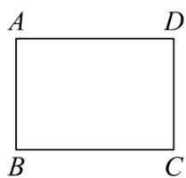

natural_image

Simple geometric diagram of a rectangle labeled with vertices A, B, C, D (no additional text or symbols)

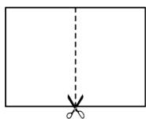  
第1次

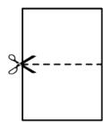  
第2次

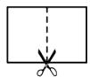  
第3次

【答案】 $\frac{2 + \sqrt{2}}{2}$ $\frac{1 + \sqrt{2}}{2^{2023}}$

【分析】此题主要考查了翻折变换性质以及规律性问题应用．先求出矩形纸片的长，再根据矩形的周长公式分别求出每一次对折后的周长，进而得出变化规律求出即可.

【详解】解： $1 \times \sqrt{2} = \sqrt{2}$ ,

对开次数:

第一次，周长为： $2\left(1+\frac{\sqrt{2}}{2}\right)=2+\sqrt{2}$

第二次，周长为： $2\left(\frac{1}{2}+\frac{\sqrt{2}}{2}\right)=1+\sqrt{2}$

第三次，周长为： $2\left(\frac{1}{2}+\frac{\sqrt{2}}{4}\right)=\frac{2+\sqrt{2}}{2}$

第四次，周长为： $2\left(\frac{1}{4}+\frac{\sqrt{2}}{4}\right)=\frac{1+\sqrt{2}}{2}$

第五次，周长为： $2\left(\frac{1}{4}+\frac{\sqrt{2}}{8}\right)=\frac{2+\sqrt{2}}{4}$

...

∴ 第 3 次操作后所得到的其中一个矩形纸片的周长是 $\frac{2+\sqrt{2}}{2}$ ,

第 2024 次对开后所得标准纸的周长为 $\frac{1+\sqrt{2}}{2^{2023}}$ .

故答案为： $\frac{2+\sqrt{2}}{2}$ ; $\frac{1+\sqrt{2}}{2^{2023}}$ .

【变式 7-3】（23-24 八年级上·江西抚州·阶段练习）化简一个分母含有二次根式的式子时，采用分子、分母同乘以分母的有理化因式的方法就可以了，例如： $\frac{1}{\sqrt{2}+1}=\frac{\sqrt{2}-1}{(\sqrt{2}+1)(\sqrt{2}-1)}=\frac{\sqrt{2}-1}{(\sqrt{2})^{2}-1}=\frac{\sqrt{2}-1}{1}=\sqrt{2}-1,\quad\frac{\sqrt{2}}{\sqrt{3}}=\frac{\sqrt{2}\times\sqrt{3}}{\sqrt{3}\times\sqrt{3}}=\frac{\sqrt{6}}{3},$

(1)若 $a=\frac{1}{\sqrt{5}-2}$ ，求 $3a^{2}-12a-1$ 的值；

(2)比较 $\sqrt{2025} -\sqrt{2024}$ 与 $\sqrt{2024} -\sqrt{2023}$ 的大小，并说明理由.

(3)利用这一规律计算： $\frac{1}{2\sqrt{1} + \sqrt{2}} +\frac{1}{3\sqrt{2} + 2\sqrt{3}} +\frac{1}{4\sqrt{3} + 3\sqrt{4}} +\dots +\frac{1}{2024\sqrt{2023} + 2023\sqrt{2024}}.$

【答案】(1)2

(2) $\sqrt{2025} - \sqrt{2024} < \sqrt{2024} - \sqrt{2023}$

(3) $1-\frac{\sqrt{506}}{1012}$

【分析】（1）先化简a，再代入代数式计算即可；

（2）利用倒数的关系，先分别化简 $\frac{1}{\sqrt{2025} - \sqrt{2024}}$ 、 $\frac{1}{\sqrt{2024} - \sqrt{2023}}$ ，比较结果的大小，进而可比较 $\sqrt{2025} -\sqrt{2024}$ 与 $\sqrt{2024} -\sqrt{2023}$ 的大小：

（3）由题意可得每项可表示为 $\frac{1}{\sqrt{n}}-\frac{1}{\sqrt{n+1}}$ ，利用该规律拆项后计算即可求解；

本题考查了二次根式的化简及化简求值，二次根式的混合运算，掌握二次根式的化简是解题的关键.

【详解】（1）解： $\because a=\frac{1}{\sqrt{5}-2}=\frac{\sqrt{5}+2}{(\sqrt{5}-2)(\sqrt{5}+2)}=\sqrt{5}+2,$

$\therefore$ 原式 $= 3(\sqrt{5} +2)^{2} - 12(\sqrt{5} +2) - 1$

$$
= 3 (5 + 4 \sqrt {5} + 4) - (1 2 \sqrt {5} + 2 4) - 1,
$$

$$
\begin{array}{l} = 2 7 + 1 2 \sqrt {5} - 1 2 \sqrt {5} - 2 4 - 1, \\ = 2; \\ \end{array}
$$

$$
\begin{array}{l} = 2 7 + 1 2 \sqrt {5} - 1 2 \sqrt {5} - 2 4 - 1, \\ = 2; \\ \end{array}
$$

（2）解： $\because \frac{1}{\sqrt{2025}-\sqrt{2024}}=\frac{\sqrt{2025}+\sqrt{2024}}{(\sqrt{2025}-\sqrt{2024})(\sqrt{2025}+\sqrt{2024})}=\sqrt{2025}+\sqrt{2024},$

$$
\frac {1}{\sqrt {2 0 2 4} - \sqrt {2 0 2 3}} = \frac {\sqrt {2 0 2 4} + \sqrt {2 0 2 3}}{(\sqrt {2 0 2 4} - \sqrt {2 0 2 3}) (\sqrt {2 0 2 4} + \sqrt {2 0 2 3})} = \sqrt {2 0 2 4} + \sqrt {2 0 2 3},
$$

又∵ $\sqrt{2025}+\sqrt{2024}>\sqrt{2024}+\sqrt{2023}>0,$

$$
\therefore \frac {1}{\sqrt {2 0 2 5} - \sqrt {2 0 2 4}} > \frac {1}{\sqrt {2 0 2 4} - \sqrt {2 0 2 3}} > 0,
$$

$$
\therefore \sqrt {2 0 2 5} - \sqrt {2 0 2 4} <   \sqrt {2 0 2 4} - \sqrt {2 0 2 3};
$$

（3）解： $\because \frac{1}{2\sqrt{1} + \sqrt{2}} = \frac{1}{\sqrt{1}} - \frac{1}{\sqrt{2}}$

$$
\frac {1}{3 \sqrt {2} + 2 \sqrt {3}} = \frac {1}{\sqrt {2}} - \frac {1}{\sqrt {3}},
$$

$$
\frac {1}{4 \sqrt {3} + 3 \sqrt {4}} = \frac {1}{\sqrt {3}} - \frac {1}{\sqrt {4}},
$$

…，

∴原式 $=\frac{1}{\sqrt{1}}-\frac{1}{\sqrt{2}}+\frac{1}{\sqrt{2}}-\frac{1}{\sqrt{3}}+\frac{1}{\sqrt{3}}-\frac{1}{\sqrt{4}}+\cdots+\frac{1}{\sqrt{2023}}-\frac{1}{\sqrt{2024}}$

$$
\begin{array}{l} = \frac {1}{\sqrt {1}} - \frac {1}{\sqrt {2 0 2 4}}, \\ = 1 - \frac {\sqrt {5 0 6}}{1 0 1 2}. \\ \end{array}
$$

# 【题型8 二次根式的应用】

【例 8】（24-25 八年级下·江西赣州·期中）如图，张大伯家有一块长方形空地ABCD，长方形空地的BC为 $\sqrt{72}m$ ，宽AB为 $\sqrt{32}m$ ，现要在空地中划出一块长方形地养鸡（即图中阴影部分），其余部分种植蔬菜，长方形养鸡场的长为 $(\sqrt{13}+1)m$ ，宽为 $(\sqrt{13}-1)m$ .

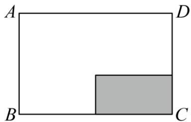

text_image

A
D
B
C

(1)长方形ABCD的周长是多少？（结果化为最简二次根式）  
(2)若市场上某种蔬菜 10 元/千克, 张大伯种植该种蔬菜, 每平方米可以产 20 千克的蔬菜, 张大伯如果将所种蔬菜全部销售完, 销售收入为多少元?

【答案】(1) $20\sqrt{2}$ m

(2)7200 元

【分析】本题考查二次根式实际应用，二次根式混合计算，平方差公式计算等.

（1）根据题意利用长方形周长公式列式计算即可；  
（2）先计算出种植蔬菜部分的面积，再求出销售收入即可.

【详解】（1）解：根据题意可知：

$$
2 \times (\sqrt {7 2} + \sqrt {3 2}) = 2 \times (6 \sqrt {2} + 4 \sqrt {2}) = 2 0 \sqrt {2} (\mathrm{m}).
$$

∴周长是： $20\sqrt{2}m$ ;

(2) 解: $\sqrt{72} \times \sqrt{32} - (\sqrt{13} + 1) \times (\sqrt{13} - 1)$ ,

$$
\begin{array}{l} = 4 8 - (1 3 - 1), \\ = 3 6 \left(\mathrm{m} ^ {2}\right), \\ \end{array}
$$

$$
3 6 \times 1 0 \times 2 0 = 7 2 0 0 (\text {元}),
$$

∴张大伯如果将所种蔬菜全部销售完，销售收入为7200元.

【变式 8-1】（22-23 八年级下·河南许昌·阶段练习）某小区有一块长方形的草地，这块草地的宽为 $(\sqrt{6}-\sqrt{2})$ m，为美化小区环境，给这块长方形草地围上白色的低矮栅栏，所需的栅栏的长度为 $(10\sqrt{6}-2\sqrt{2})$ m，那么这块草地的面积为 \_\_\_\_ $m^{2}$ .

【答案】 $(24 - 8\sqrt{3})$

【分析】先利用矩形的周长的一半减去矩形的宽得到矩形的长，即这块草地的长为 $\frac{1}{2}(10\sqrt{6}-2\sqrt{2})-(\sqrt{6}-\sqrt{2})$ ，去括号合并得到矩形的长为 $4\sqrt{6}$ ，然后根据矩形的面积公式得到这块草地的面积 $=4\sqrt{6}(\sqrt{6}-\sqrt{2})$ ，再进行二次根式的乘法运算.

【详解】解：这块草地的长 $= \frac{1}{2} (10\sqrt{6} - 2\sqrt{2}) - (\sqrt{6} - \sqrt{2}) = 4\sqrt{6} (\mathrm{m})$

所以这块草地的面积 $= 4\sqrt{6} (\sqrt{6} -\sqrt{2}) = (24 - 8\sqrt{3})\mathrm{m}^2$

故答案为： $(24-8\sqrt{3})$ .

【点睛】本题考查了二次根式的应用：把二次根式的运算与现实生活相联系，体现了所学知识之间的联系，感受所学知识的整体性，不断丰富解决问题的策略，提高解决问题的能力。二次根式的应用主要是在解决实际问题的过程中用到有关二次根式的概念、性质和运算的方法。

【变式 8-2】（24-25 八年级下·广西桂林·阶段练习）某室内展区有一块长方形闲置区域ABCD（如图），该区域的长BC为 $8\sqrt{3}$ 米，宽AB为 $\sqrt{98}$ 米，现计划在区域中间放置一个正方形展台（阴影部分），展台的边长为 $(\sqrt{6}-1)$ 米.

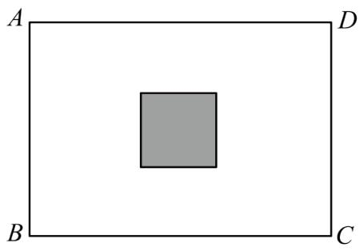

natural_image

Simple geometric diagram showing a gray square centered within a rectangle labeled A, B, C, D (no text or symbols beyond labels)

(1)求该长方形闲置区域ABCD的周长;   
(2)除去放置展台的地方, 其余区域全部需要铺上红毯, 若所铺红毯的售价为 10 元/平方米, 则购买红毯大约需要花费多少元? ( $\sqrt{6} \approx 2.4495$ , 结果保留到小数点后两位)

【答案】(1) $(16\sqrt{3}+14\sqrt{2})$ 米

(2)1350.70 元

【分析】本题考查了二次根式的应用，正确掌握相关性质内容是解题的关键.

（1）根据长方形的周长进行列式计算，即可作答.  
(2) 先算出其余区域的面积为 $(58\sqrt{6} - 7)$ 平方米, 再结合所铺红毯的售价为 $10$ 元/平方米, 进行列式计算, 即可作答.

【详解】（1）解：依题意， $2 \times (8\sqrt{3} + \sqrt{98}) = 2 \times (8\sqrt{3} + 7\sqrt{2}) = 16\sqrt{3} + 14\sqrt{2}$ （米）.

答：该长方形闲置区域ABCD的周长为 $(16\sqrt{3}+14\sqrt{2})$ 米.

(2) 解: $(8\sqrt{3} \times \sqrt{98}) - (\sqrt{6} - 1)^{2}$

$$
\begin{array}{l} = 8 \sqrt {3} \times 7 \sqrt {2} - (7 - 2 \sqrt {6}) \\ = 5 8 \sqrt {6} - 7 (\text { 平   方   米 }). \\ \end{array}
$$

∴其余区域的面积为 $(58\sqrt{6}-7)$ 平方米，

$$
1 0 \times (5 8 \sqrt {6} - 7) = 5 8 0 \sqrt {6} - 7 0 \approx 1 3 5 0. 7 0 (\text {元}).
$$

答：购买红毯大约需要花费 1350.70 元.

【变式 8-3】（24-25 九年级上·河南洛阳·阶段练习）有一块矩形木板ABCD，木工甲采用如图的方式，将木板的长AD增加 $2\sqrt{3}$ cm，宽AB增加 $7\sqrt{3}$ cm，得到一个面积为 $192cm^{2}$ 的正方形AEFG.

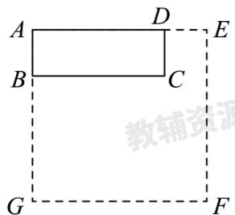

text_image

A
B
D
C
E
G
F
教辅资源

(1)求矩形木板ABCD的面积;

(2)木工乙想从矩形木板ABCD中裁出一个面积为 $12cm^{2}$ ，宽为 $\frac{\sqrt{6}}{2}cm$ 的矩形木料，则该矩形木料的长为\_\_\_\_cm；

(3)木工丙想从矩形木板ABCD中截出长为2.0cm、宽为1.5cm的矩形木条，最多能截出\_\_\_\_根这样的木条。

【答案】(1) $18cm^{2}$

(2) $4\sqrt{6}$   
(3)5

【分析】本题主要考查了二次根式的应用，矩形面积的计算，正方形面积的计算，解题的关键是熟练掌握二次根式混合运算法则.

(1) 先求出正方形的边长, 然后再求出长方形的各边长, 再求出结果即可;  
(2) 根据矩形面积公式列式计算即可;  
（3）根据 $\frac{6\sqrt{3}}{2}=3\sqrt{3}$ ， $5<3\sqrt{3}<6$ ，得出最多能截出5根这样的木条.

【详解】（1）解：∵木板的长AD增加 $2\sqrt{3}$ cm，宽AB增加 $7\sqrt{3}$ cm，得到一个面积为 $192cm^{2}$ 的正方形AEFG.
∴正方形AEFG的边长为： $\sqrt{192}=8\sqrt{3}(cm)$ ,

$$
\therefore A D = 8 \sqrt {3} - 2 \sqrt {3} = 6 \sqrt {3} (\mathrm{cm}), A B = 8 \sqrt {3} - 7 \sqrt {3} = \sqrt {3} (\mathrm{cm}),
$$

∴矩形木板ABCD的面积为 $6\sqrt{3}\times\sqrt{3}=18(cm^{2})$ ;

(2) 解: 该矩形木料的长为:

$$
1 2 \div \frac {\sqrt {6}}{2} = 1 2 \times \frac {2}{\sqrt {6}} = 4 \sqrt {6} (\mathrm{cm});
$$

(3) 解: $\because\frac{6\sqrt{3}}{2}=3\sqrt{3}$ ,

又∵5<3 $\sqrt{3}$ <6,

∴从矩形木板ABCD中截出长为2.0cm、宽为1.5cm的矩形木条，最多能截出5根这样的木条.