# 专题 3.1 位置与坐标（举一反三讲义）

【北师大版 2024】

# 题型归纳

【题型1 判断点所在的象限】 3

【题型 2 坐标与距离】....3

【题型3 坐标与象限、坐标轴】 4

【题型 4 坐标与位置】....4

【题型 5 与坐标轴平行】....5

【题型6 象限角平分线上的点】....6

【题型 7 根据平移前的点求平移后的点】....6

【题型8 根据平移后的点求平移前的点】....7

【题型 9 根据平移前后关系求值】....8

【题型 10 根据平移确定点的位置】....8

【题型 11 关于 x 轴、y 轴对称的点的坐标】....9

【题型 12 作图——轴对称变换】....10

【题型13 利用轴对称设计图案】....11

# 举一反三

# 知识点 1 有序数对的概念 教辅资源,关注公众号·全科AA+

我们把有顺序的两个数 a 与 b 组成的数对，叫做有序数对，记作 $(a, b)$ .

# 知识点 2 平面直角坐标系及有关概念

# 1. 平面直角坐标系

在平面内，两条互相垂直、原点重合的数轴，组成平面直角坐标系．通常两条数轴分别置于水平位置和竖直位置，取向右与向上的方向分别为两条数轴的正方向.

# 2. 坐标轴

水平的数轴称为 $x$ 轴或横轴，竖直的数轴称为 $\underline{y}$ 轴或纵轴。二者统称为坐标轴，两坐标轴的交点 $O$ 称为平面直角坐标系的原点。

# 3. 象限

坐标平面被两条坐标轴分成四个部分：右上部分叫做第一象限，其他三个部分按逆时针方向分别叫做第二象限、第三象限、第四象限..

# 知识点 3 建立平面直角坐标系

# 1. 建立平面直角坐标系的步骤

（1）分析条件，选择适当的点作为原点；  
（2）过原点在两个互相垂直的方向上分别作出 x 轴、y 轴；  
（3）确定正方向和单位长度.

2. 常见的建立坐标系的方式：以等腰三角形底边的中点为原点，底边及底边上的高所在直线为坐标轴.

# 知识点 4 平面直角坐标系内点的坐标

# 1. 点的坐标表示

平面内的点可以用一个有序数对来表示．对于平面内的任意一点 P，过点 P 分别向 x 轴、y 轴作垂线，垂足在 x 轴、y 轴上对应的实数 a, b 分别叫做点 P 的横坐标、纵坐标，有序数对 $(a, b)$ 就叫做点 P 的坐标．坐标平面内的点与有序实数对是一一对应的．

# 2. 点的坐标的几何意义

（1）点 $P(a, b)$ 到 x 轴的距离为 $|b|$ ; （2）点 $P(a, b)$ 到 y 轴的距离为 $|a|$ .

# 3. 点的坐标特征

(1) 各象限内点的坐标特征: 第一至第四象限内的点的坐标符号依次为 $(+, +)$ 、 $(-, +)$ 、 $(-, -)$ 、 $(+, -)$ .  
(2) 非象限内点的坐标特征: $x$ 轴上的点的纵坐标为 0; $y$ 轴上的点的横坐标为 0; 原点的横坐标、纵坐标都为 0; 原点既在 $\underline{x}$ 轴上, 又在 $\underline{y}$ 轴上.  
(3) 与坐标轴平行的直线上的点的坐标特征: 与 $x$ 轴平行的直线上的所有点的纵坐标相同, 与 $y$ 轴平行的直线上的所有点的横坐标相同.

# 知识点5 用坐标表示平移

(1) 点的平移: 点的平移引起坐标的变化规律: 在平面直角坐标中, 将点 $(x, y)$ 向右 (或左) 平移 $a$ 个单位长度, 可以得到对应点 $(x + a, y)$ 或 $(x - a, y)$ ; 将点 $(x, y)$ 向上 (或下) 平移 $b$ 个单位长度, 可以得到对应点 $(x, y + b)$ 或 $(x, y - b)$ .  
(2) 图形的平移: 在平面直角坐标系内, 如果把一个图形各个点的横坐标都加(或减去)一个正数 $a$ , 相应的新图形就是把原图形向右(或向左)平移 $a$ 个单位长度; 如果把它各个点的纵坐标都加(或减去)一个正数 $a$ , 相应的新图形就是把原图形向上(或向下)平移 $a$ 个单位长度.

# 知识点 6 轴对称与坐标变化

(1) 关于 $x$ 轴对称的两个点的坐标, 横坐标相同, 纵坐标互为相反数; 反过来, 横坐标相同、纵坐标互为相反数的两个点关于 $\underline{x}$ 轴对称。

(2) 关于 $y$ 轴对称的两个点的坐标, 纵坐标相同, 横坐标互为相反数; 反过来, 纵坐标相同、横坐标互为相反数的两个点关于 $\underline{y}$ 轴对称。

【题型 1 判断点所在的象限】教辅资源,关注公众号·全科AA+

【例 1】（24-25 七年级上·山东聊城·期末）在平面直角坐标系中，点 $P(x^{2}+2,-3)$ 在第\_\_\_\_象限.

【变式 1-1】（24-25 七年级下·北京·期中）在平面直角坐标系xOy中，点 $P(1,-2)$ 所在的象限是（）

A. 第一象限

B. 第二象限

C. 第三象限

D. 第四象限

【变式 1-2】（24-25 七年级下·广东广州·期末）无论 m 取什么数，点 $(-1-m^{2},|m|+1)$ 一定在第\_\_\_\_象限.

【变式 1-3】（24-25 七年级下·四川泸州·期中）如果点 $P(a,b)$ 在第二象限，则点 $Q(a-3,-b)$ 在（）

A. 第一象限

B. 第二象限

C. 第三象限

D. 第四象限

# 【题型2 坐标与距离】

【例 2】（24-25 八年级上·河南焦作·期中）点 P 的坐标为 $(3a-2,8-2a)$ ，若点 P 到两坐标轴的距离相等，则 a 的值（）

A. 2

B. -2或6

C. -6

D. 2 或 -6

【变式 2-1】（24-25 七年级下·河北保定·期中）如图，用手盖住点P，点P到x轴距离为2，到y轴的距离为5，则点P的坐标是（）

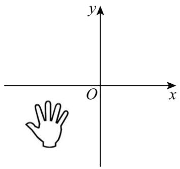

natural_image

Simple line drawing of a hand on a Cartesian coordinate system with x and y axes (no text or symbols)

A. $(-2, - 5)$

B. $(-5,-2)$

C. $(2, - 5)$

D. $(5,-2)$

【变式 2-2】（24-25 七年级下·广西南宁·期末）如果点 $P(x,y)$ 的坐标满足 $x+y=xy$ ，那么称点P为“美丽点”，若某个“美丽点”P到y轴的距离为2，则点P的坐标为（）

A. $(2, - 2)$

B. $\left(-2,\frac{2}{3}\right)$

C. $(\frac{2}{3}, -2)$ 或(2,2)

D. (2,2)或 $\left(-2,\frac{2}{3}\right)$

【变式 2-3】（24-25 七年级下·河南漯河·期中）点 C 在 x 轴的下方，y 轴的右侧，距离 x 轴 3 个单位长度，距离

y轴5个单位长度，则点C的坐标为（）

A. $(-3,5)$

B. $(3, - 5)$

C. $(5, - 3)$

D. $(-5,3)$

# 【题型3 坐标与象限、坐标轴】

【例 3】（24-25 七年级下·北京·期中）在平面直角坐标系中，如果点 $P(-2, a-1)$ 在第二象限，那么 a 的取值可能是（）

A.-2

B. 0

C. 1

D. 2

【变式 3-1】（24-25 七年级下·广东东莞·期中）已知点 $P(2a-4,a+3)$ 在 y 轴上，则 a= \_\_\_\_.

【变式 3-2】（24-25 七年级下·河南商丘·期中）在平面直角坐标系中，已知 $A(a,0),B(-3,0),AB=7$ ，则a= \_\_\_\_.

【变式 3-3】（24-25 七年级下·江西南昌·期中）已知 $m^{2}=4$ ， $|n|=1$ 若 $A(m,n)$ 在第一象限，则 $m+n$ 的值为\_\_\_\_.

# 【题型4 坐标与位置】

【例 4】（24-25 九年级上·福建厦门·期末）已知点 $P(m^{2},n)$ ，点 $Q(2m-3,n)$ ，下列关于点 P 与点 Q 的位置关系说法正确的是（）

A. 点 $P$ 在点 $Q$ 的右边  
B. 点 $P$ 在点 $Q$ 的左边  
C. 点 $P$ 与点 $Q$ 有可能重合  
D. 点 $P$ 与点 $Q$ 的位置关系无法确定

【变式 4-1】（24-25 八年级上·贵州毕节·期末）综合实践课上，小星将自己手工完成的部分地图，以贵阳市所在的点为坐标原点建立如图所示的平面直角坐标系，若图中点B的坐标为(1,4)，则点C的坐标可能为（）

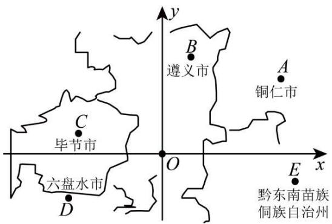

text_image

B
遵义市
A
铜仁市
C
毕节市
O
x
E
黔东南苗族
侗族自治州
六盘水市
D

A. (4,3)

B. $(5,-1)$

C. $(-3,1)$

D. $(-4, - 2)$

【变式 4-2】（24-25 七年级下·福建福州·期中）如图，这是小康设计的一个美丽的枫叶图案，将它放在平面

直角坐标系中, 若点 $A$ , $B$ 的坐标分别为 $(0,2)$ , $(-1,0)$ , 则点 $C$ 的坐标为 \_\_\_\_.

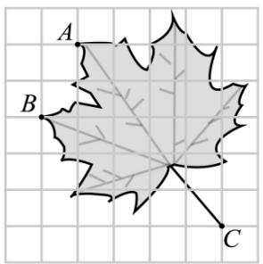

text_image

A
B
C

【变式 4-3】（24-25 七年级下·福建厦门·期末）一个平面直角坐标系的横轴和纵轴的单位长度相同，该平面直角坐标系中的点 $M(1, 1)$ ， $N(5, 2)$ 的位置如图所示，则该平面直角坐标系的原点可能是（）

A. $\overset{M}{\cdot}$ B. $\overset{D}{\cdot}$ $\overset{N}{\cdot}$ $\overset{\cdot}{C}$

A. 点 $A$

B. 点 $B$

C. 点 C

D. 点 $D$

# 【题型 5 与坐标轴平行】教辅资源,关注公众号·全科AA+

【例 5】（24-25 八年级上·辽宁锦州·期中）已知 $A(a,3)$ ， $B(-2,b)$ ，若点 A 位于第二象限，AB = 3 且直线 $AB \parallel x$ 轴，则 $a + b = (\quad)$

A. -5

B.-2

C. 4

D. 5

【变式 5-1】（24-25 八年级上·福建三明·期中）过点A(-2,1)和B(-2,-1)作直线，则直线AB（）

A. 与 $x$ 轴平行

B. 与 $y$ 轴平行

C. 与 $y$ 轴相交

D. 与 $x$ 轴、 $y$ 轴相交

【变式 5-2】（24-25 七年级下·贵州黔东南·期末）已知直线MN平行于x轴，若点M的坐标为 $(-1, 3)$ ，且点N到y轴的距离等于4，则点N的坐标是（）

A. $(-1, 4)$ 或 $(-1, -4)$

B. $(4, 3)$ 或 $(-4, -3)$

C. $(-1, 4)$ 或 $(1, -4)$

D. $(4, 3)$ 或 $(-4, 3)$

【变式 5-3】（24-25 七年级下·四川德阳·期末）在平面直角坐标系中，第四象限内的点P到x轴的距离是3，到y轴的距离是2，已知PQ平行于x轴且PQ=3，则点Q的坐标是（）

A. $(5,-3)$

B. $(-1, - 3)$

C. $(5,-3)$ 或 $(-1,-3)$

D. $(6, - 2)$ 或 $(0, - 2)$

# 【题型6 象限角平分线上的点】

【例 6】（24-25 八年级上·浙江宁波·期中）在平面直角坐标系中，已知点 $M(m,3m-8)$ ，若点 M 在两坐标轴的角平分线上，则 m 的值为（）

A. $\pm 2$

B. $\pm4$

C. -2或-4

D. 2 或 4

【变式 6-1】(24-25 八年级下·四川宜宾·期末)点 $P(a+3,2a-2)$ 在第二，四象限角平分线上，则a= \_\_\_\_.

【变式 6-2】（24-25 九年级上·全国·课后作业）已知，在平面直角坐标系中有一点 $P(2-m,3m+6)$

（1）若点 P 在第一象限的角平分线上，则 m = \_\_\_\_；若点 P 在第四象限的角平分线上，则 m = \_\_\_\_；

(2) 若点 $P$ 在第二象限, 则 $m$ 的取值范围是\_\_\_\_;

(3) 多解法点 $P$ 不可能在第 \_\_\_\_ 象限;

(4) 将点 $P$ 先向左平移 2 个单位长度, 再向上平移 1 个单位长度后得到点 $B$ , 若点 $B$ 的横, 纵坐标互为相反数, 则 $m = \_$ .

【变式 6-3】（24-25 七年级上·山东威海·阶段练习）已知点 $A(2a+3,-a)$ ， $B(a-2,1)$

(1)若点A在第一象限的角平分线上时，求a的值；

(2)若点A到y轴的距离是B到x轴的距离的3倍，求B点坐标；

(3)若线段 $AB \parallel y$ 轴，求点A，B的坐标及线段AB的长.

# 【题型 7 根据平移前的点求平移后的点】

【例 7】（24-25 七年级下·山东潍坊·期末）如图，若在棋盘上建立平面直角坐标系，使“帅”位于点(2,0)，“炮”位于点(-1,3)，则将棋子“马”向上平移 2 个单位长度后的点的坐标是\_\_\_\_。

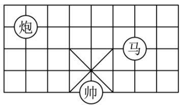

text_image

炮
马
帅

【变式 7-1】（24-25 八年级下·福建泉州·期末）将点 $A(-2,-4)$ 先向左平移 3 个单位长度，再向上平移 5 个单位长度得到点 $A'$ ，则点 $A'$ 在 \_\_\_\_ 象限.

【变式 7-2】（24-25 八年级下·山东临沂·期中）在平面直角坐标系中，平行四边形ABCD顶点A、B、C的坐标分别是 $(-1,1)$ ， $(2,1)$ ， $(1,-1)$ ，将平行四边形ABCD沿x轴向右平移3个单位长度，则顶点D的对应点 $D_{1}$ 的坐标是\_\_\_\_.

【变式 7-3】（24-25 七年级下·北京·期中）如图所示，已知 $A(-1,2)$ ， $B(1,-1)$ ， $C(3,4)$ 三点坐标。将三角形 $ABC$ 平移至三角形 $A_{1}B_{1}C_{1}$ 处，点 $A$ ， $B$ ， $C$ 的对应点分别为点 $A_{1}$ ， $B_{1}$ ， $C_{1}$ ，其中点 $C_{1}$ 的坐标为 $(0,-1)$ 。

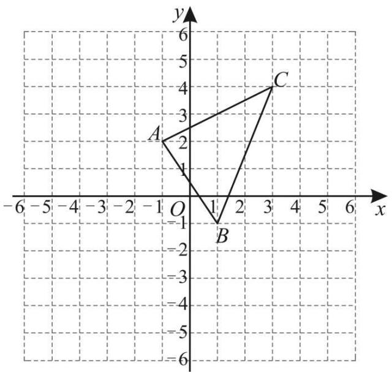

text_image

y
6
5
4
3
2
A
C
1
O
1
B
-1
-2
-3
-4
-5
-6
-6 -5 -4 -3 -2 -1 0 1 2 3 4 5 6 x

(1)①在图中画出平移后的三角形 $A_{1}B_{1}C_{1}$ ;  
②其中三角形ABC上一点 $P(a,b)$ 平移后对应点 $P'$ 的坐标为\_\_\_\_；  
(2)求三角形ABC的面积;  
(3)设点 $Q$ 在 $y$ 轴上，且三角形 $A_{1}QC_{1}$ 与三角形ABC的面积相等，求点 $Q$ 的坐标.

【题型 8 根据平移后的点求平移前的点】教辅资源,关注公众号·全科AA+

【例 8】（24-25 七年级下·山西朔州·期中）如图，在平面直角坐标系中，第二象限有一点A，将点A水平向右平移3个单位长度得到点 $A'$ ，过点 $A'$ 分别向x轴、y轴作垂线，垂足分别为B,C．若 $A'B=5,A'C=2$ ，则点A的坐标为（）

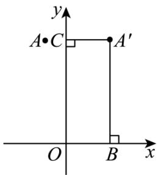

text_image

y
A•C
A′
O
B
x

A. $(-1,5)$

B. $(-3,5)$

C. $(-1,2)$

D. $(2,5)$

【变式 8-1】（24-25 七年级下·贵州·期末）在平面直角坐标系中,将点 P(x,y)向右平移 3 个单位,再向上平移 2 个单位长度后与点 Q(-1,2)重合,则点 P 的坐标为 \_\_\_\_.

【变式 8-2】（24-25 七年级下·内蒙古鄂尔多斯·期中）如图，在平面直角坐标系中， $\triangle A'B'C'$ 是由 $\triangle ABC$ 平移得到的，平移前点 $A$ 的坐标为 $(-5,4)$ .

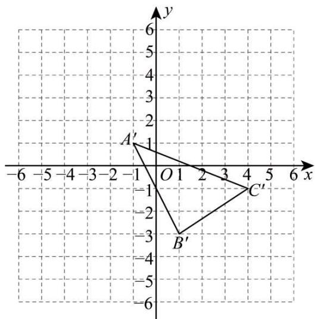

text_image

y
5
4
3
2
1
A'
-1
O 1 2 3 4 5 6 x
-6 -5 -4 -3 -2 -1 0 1 2 3 4 5 6
-1
-2
B'
-3
-4
-5
-6

(1)画出平移前的 $\triangle ABC$ ，并写出点 B 和点 C 的坐标；  
(2)已知点 $P(a,b)$ 为 $\triangle ABC$ 内的一点，则点P在 $\triangle A^{\prime}B^{\prime}C^{\prime}$ 内的对应点 $P^{\prime}$ 的坐标为\_\_\_\_；  
(3)求 $\triangle ABC$ 的面积.

【变式 8-3】（24-25 八年级下·山东聊城·阶段练习）将点 $A(a, b)$ 先向左平移 2 个单位长度，再向下平移 3 个单位长度得到点 $B(-b, a)$ ，则点 $B$ 的坐标是 \_\_\_\_.

# 【题型9 根据平移前后关系求值】

【例 9】（24-25 七年级下·全国·课后作业）（1）把点 $P_{1}(m,n)$ 向右平移 3 个单位长度再向下平移 2 个单位长度到一个位置 $P_{2}$ 后坐标为 $P_{2}(a,b)$ ，则 m, n, a, b 之间存在的关系是 \_\_\_\_；

(2) 将点 $P(-3, y)$ 向下平移 3 个单位, 向左平移 2 个单位后得到点 $Q(x, -1)$ , 则 $xy = \_$ .

【变式 9-1】（24-25 七年级下·全国·专题练习）将点 $P_{1}(2,m)$ 向右平移 1 个单位长度，再向下平移 3 个单位长度后，得到点 $P_{2}(n,-1)$ ，则点 $Q(m,n)$ 的坐标为 \_\_\_\_.

【变式 9-2】（24-25 七年级下·吉林通化·阶段练习）将点 $P(-4, y)$ 向下平移 3 个单位长度，再向左平移 2 个单位长度后得到点 $Q(x,-2)$ ，则 $x + y =$ \_\_\_\_.

【变式 9-3】（24-25 七年级下·辽宁鞍山·期中）对于平面直角坐标系 $xOy$ 中的任意一点 $M(x,y)$ ，给出如下定义：记 $a = x + y$ ， $b = -x + y$ ，将点 $P(a,b)$ 与点 $Q(b,a)$ 称为点 $M$ 的一对卫星点．例如，点 $P(1,-5)$ 与点 $Q(-5,1)$ 为点 $M(3,-2)$ 的一对卫星点．将点 $C(2m-1,-m+1)(m > 0)$ 向右平移 $m$ 个单位长度，向下移动 $m$ 个单位，得到点 $C'$ ，若点 $C'$ 的一对卫星点重合，则 $m = \_$ .

# 【题型10 根据平移确定点的位置】

【例 10】（24-25 七年级下·北京朝阳·期末）在平面直角坐标系 $xOy$ 中，将一个横、纵坐标都是整数的点，沿平行（或垂直）于坐标轴的直线平移 1 个单位长度，称为该点走了 1 步．点 $A(1,0)$ ， $B(2,4)$ ， $C(3,1)$ 各走了若干步后到达同一点 P，当点 P 的坐标为 \_\_\_\_ 时，三个点的步数和最小，为 \_\_\_\_.

【变式 10-1】（24-25 八年级下·全国·期中）将点 $P(3m-1,m+2)$ 向上平移 1 个单位得到点 Q，且点 Q 在 x 轴上，则点 P 的坐标为（）

A. $(-5,0)$

B. $(-7,-1)$

C. $(-10,0)$

D. $(-10, - 1)$

【变式 10-2】（24-25 七年级下·内蒙古巴彦淖尔·期末）点 $P(m+2, 2m+1)$ 向右平移 1 个单位长度后，正好落在 $y$ 轴上，则 $P(m+2, 2m+1)$ 在第象限.

【变式 10-3】（24-25 七年级下·湖北随州·期末）如图，在第一象限内有两点 $P(m-2,n), Q(m,n-3)$ ，将线段 PQ 平移使点 P，Q 分别落在两条坐标轴上，则点 P 平移后的对应点的坐标是 \_\_\_\_.

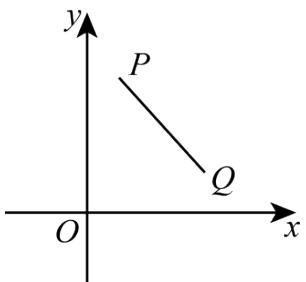

text_image

y
P
Q
O
x

【题型 11 关于 x 轴、y 轴对称的点的坐标】教辅资源,关注公众号·全科AA+

【例 11】（24-25 八年级上·山东菏泽·期中）在平面直角坐标系中，如果 $\triangle ABC$ 三个顶点的坐标分别是 A (-2,0)，B(-1,0)，C(-1,2)， $\triangle ABC$ 关于 y 轴成轴对称的图形是 $\triangle A_{1}B_{1}C_{1}$ ， $\triangle A_{1}B_{1}C_{1}$ 关于 x 轴成轴对称的图形是 $\triangle A_{2}B_{2}C_{2}$ ，则点 $A_{2}$ 的坐标为 \_\_\_\_.

【变式 11-1】（24-25 八年级上·山东济宁·阶段练习）在平面直角坐标系中，点A(-5,2)关于y轴的对称点的坐标是（）

A. $(-5,-2)$

B. $(5,2)$

C. $(-2,5)$

D. $(-2,-5)$

【变式 11-2】（24-25 八年级上·甘肃白银·阶段练习）已知 $A(a-2,-1)$ 与点 $B(-1,b+2)$ 关于 x 轴对称，则 $a+b=$ \_\_\_\_.

【变式 11-3】（24-25 八年级上·河南郑州·期中）在平面直角坐标系xOy中，经过点M(0,m)且平行于x轴的直线可以记作直线y=m，平行于y轴的直线可以记作直线x=m，我们给出如下的定义：点P(x,y)先关于x轴对称得到点 $P_{1}$ ，再将点 $P_{1}$ 关于直线y=m对称得点 $P'$ ，则称点 $P'$ 为点P关于x轴和直线y=m的二次反射点．已知点P(2,3)，Q(2,2)关于x轴和直线y=m的二次反射点分别为 $P_{1}$ ， $Q_{1}$ ，点M(2,3)关于直线x=m对称的点为 $M_{1}$ ，则当三角形 $P_{1}Q_{1}M_{1}$ 的面积为1时，则m= \_\_\_\_.

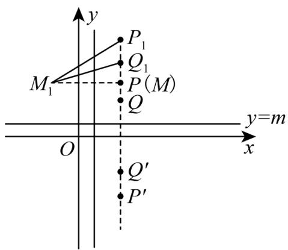

text_image

y
P₁
Q₁
M₁
P(M)
Q
y=m
O
x
Q′
P′

【题型12 作图——轴对称变换】

【例 12】（24-25 八年级下·河北邯郸·期末）如图，正方形网格中，点 A 的坐标为 $(-3,2)$ ，点 B 的坐标为 $(2,2)$ ，点 C 的坐标未知，图中已经画出 y 轴.

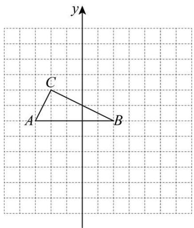

text_image

y
C
A
B

(1)在正方形网格中画出 x 轴，标出原点 O，并直接写出点 C 的坐标；  
(2)在平面直角坐标系中，画出 $\triangle ABC$ 关于 $x$ 轴对称的 $\triangle A'B'C'$ 。并直接写出 $A'$ ， $B'$ ， $C'$ 的坐标。

【变式 12-1】（24-25 八年级上·宁夏石嘴山·期末）如图，在平面直角坐标系中， $\triangle ABC$ 的三个顶点都在格点上，点A的坐标为(2,4).

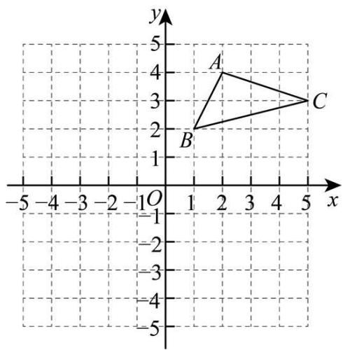

text_image

y
5
4
A
3
C
2
B
1
O
-1
-2
-3
-4
-5
-5
-4
-3
-2
1
2
3
4
5
x

(1)画出 $\triangle ABC$ 关于 $\gamma$ 轴对称的 $\triangle A_{1}B_{1}C_{1}$ , 并写出点 $A_{1}$ 的坐标;  
(2)直接写出点A关于x轴的对称点 $A_{2}$ 的坐标.

【变式 12-2】（24-25 八年级上·浙江金华·期中）如图，正方形网格中每个小正方形的边长都为 1， $\triangle ABC$ 的顶点落在格点上，以 $B$ 为原点建立平面直角坐标系，将 $\triangle ABC$ 关于 $y$ 轴对称得到 $\triangle DEF$ .

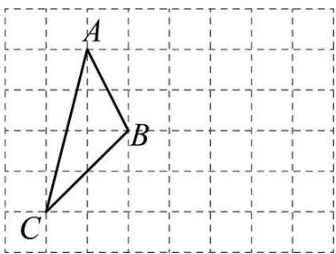

text_image

A
B
C

(1)在网格中建立以 B 为原点的平面直角坐标系，并画出 $\triangle DEF$ ;  
(2)点 C 关于 x 轴的对称点的坐标为 \_\_\_\_；  
(3)若点M在x轴上，且MB=3，求点M的坐标.

【变式 12-3】(24-25 八年级上·河南郑州·期末)在正方形网格中,每个小正方形的边长为 1,点 A(-4,5),C(-1,3), $A_{1}(4,5)$ , $B_{1}(2,1)$ , $\triangle ABC$ 与 $\triangle A_{1}B_{1}C_{1}$ 关于某直线成轴对称.

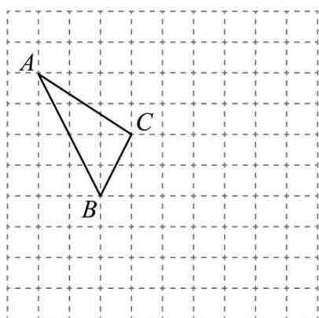

text_image

A
C
B

(1) 在网格内画出平面直角坐标系，并画出 $\triangle A_{1}B_{1}C_{1}$ ;  
(2)设 l 是过点 C 且平行于 x 轴的直线，点 A 关于直线 l 的对称点 $A'$ 的坐标是；  
(3)求 $\triangle ABC$ 的面积.

# 【题型 13 利用轴对称设计图案】

【例 13】（24-25 八年级上·江西抚州·期中）如图，在平面直角坐标系中有四个点，它们的横、纵坐标均为整数．若在此平面直角坐标系内移动点A，使得这四个点构成的四边形是轴对称图形，并且点A的横、纵坐标仍是整数（A不在坐标轴上），则移动后点A的坐标为\_\_\_\_．

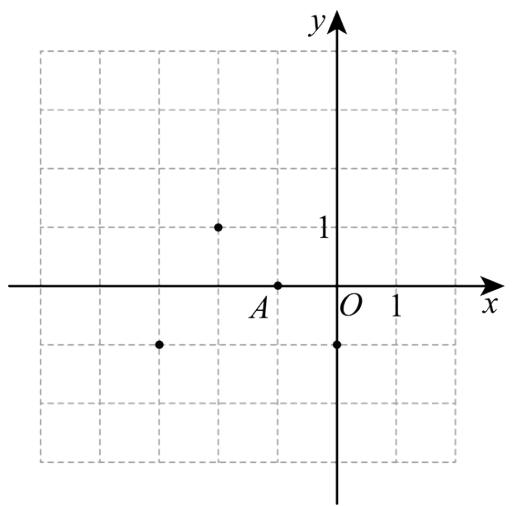

scatter

| x | y |
|---|---|
| A | 1 |
| O | 0 |
| 1 | 0 |

【变式 13-1】（24-25 八年级上·北京·期末）如图，在 $3 \times 3$ 的正方形网格中有四个格点 $A, B, C, D$ ，以其中一个点为原点，网格线所在直线为坐标轴，建立平面直角坐标系，使其余三个点中存在两个点关于一条坐标轴对称，则原点可能是 \_\_\_\_.

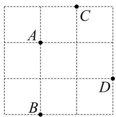

text_image

A
B
C
D

【变式 13-2】如图，平面直角坐标系中有四个点，他们的横纵坐标均为整数，若在次平面直角坐标系内移动点A至第四象限 $A'$ 处，使得这四个点构成的四边形是轴对称图形，并且点 $A'$ 横纵坐标仍是整数，则点 $A'$ 的坐标可以为\_\_\_\_（写出一个即可）

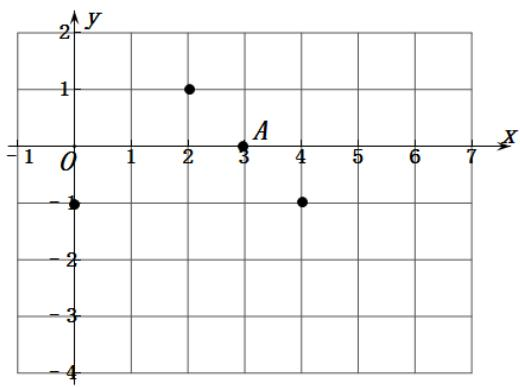

scatter

| Point | x | y |
|---|---|---|
| O | 0 | -1 |
| A | 3 | 0 |
| | 4 | -1 |

【变式 13-3】（23-24 八年级上·全国·课堂例题）在棋盘中建立如图所示的平面直角坐标系，A,O,B三颗棋子的位置如图所示，它们的坐标分别是 $(-1,1),(0,0)$ 和 $(1,0)$ .

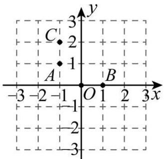

text_image

C
2
3
1
A
-1
O
1
B
3x
-3
-2
-1
-2
-3

(1)如图，添加棋子C，使A,O,B,C四颗棋子成为一个轴对称图形，请在图中画出该图形的对称轴；

(2)在其他格点位置添加一颗棋子P，使A, O,B,P四颗棋子成为一个轴对称图形，请直接写出棋子P所在位置的坐标（写出2个即可）.