# 专题 3.1 位置与坐标（举一反三讲义）

【北师大版 2024】

# 题型归纳

【题型 1 判断点所在的象限】....2

【题型2 坐标与距离】....4

【题型 3 坐标与象限、坐标轴】....6

【题型4 坐标与位置】....7

【题型5 与坐标轴平行】....10

【题型 6 象限角平分线上的点】....12

【题型 7 根据平移前的点求平移后的点】....15

【题型8 根据平移后的点求平移前的点】....18

【题型 9 根据平移前后关系求值】....22

【题型 10 根据平移确定点的位置】....23

【题型 11 关于 x 轴、y 轴对称的点的坐标】.....26

【题型12 作图——轴对称变换】....28

【题型 13 利用轴对称设计图案】....33

# 举一反三

# 知识点 1 有序数对的概念

我们把有顺序的两个数 a 与 b 组成的数对，叫做有序数对，记作 $(a, b)$ .

# 知识点 2 平面直角坐标系及有关概念

# 1. 平面直角坐标系

在平面内，两条互相垂直、原点重合的数轴，组成平面直角坐标系．通常两条数轴分别置于水平位置和竖直位置，取向右与向上的方向分别为两条数轴的正方向.

# 2. 坐标轴

水平的数轴称为 $x$ 轴或横轴，竖直的数轴称为 $\underline{y}$ 轴或纵轴。二者统称为坐标轴，两坐标轴的交点 $O$ 称为平面直角坐标系的原点。

# 3. 象限

坐标平面被两条坐标轴分成四个部分：右上部分叫做第一象限，其他三个部分按逆时针方向分别叫做第二象限、第三象限、第四象限..

# 知识点 3 建立平面直角坐标系

# 1. 建立平面直角坐标系的步骤

（1）分析条件，选择适当的点作为原点；  
（2）过原点在两个互相垂直的方向上分别作出 x 轴、y 轴；  
（3）确定正方向和单位长度.

2. 常见的建立坐标系的方式：以等腰三角形底边的中点为原点，底边及底边上的高所在直线为坐标轴.

# 知识点 4 平面直角坐标系内点的坐标

# 1. 点的坐标表示

平面内的点可以用一个有序数对来表示．对于平面内的任意一点 P，过点 P 分别向 x 轴、y 轴作垂线，垂足在 x 轴、y 轴上对应的实数 a, b 分别叫做点 P 的横坐标、纵坐标，有序数对 $(a, b)$ 就叫做点 P 的坐标．坐标平面内的点与有序实数对是一一对应的．

# 2. 点的坐标的几何意义

（1）点 $P(a, b)$ 到 x 轴的距离为 $|b|$ ; （2）点 $P(a, b)$ 到 y 轴的距离为 $|a|$ .

# 3. 点的坐标特征

(1) 各象限内点的坐标特征: 第一至第四象限内的点的坐标符号依次为 $(+, +)$ 、 $(-, +)$ 、 $(-, -)$ 、 $(+,-)$ .  
(2) 非象限内点的坐标特征: $x$ 轴上的点的纵坐标为 0; $y$ 轴上的点的横坐标为 0; 原点的横坐标、纵坐标都为 0; 原点既在 $\underline{x}$ 轴上, 又在 $\underline{y}$ 轴上.  
(3) 与坐标轴平行的直线上的点的坐标特征: 与 $x$ 轴平行的直线上的所有点的纵坐标相同, 与 $y$ 轴平行的直线上的所有点的横坐标相同.

# 知识点 5 用坐标表示平移

(1) 点的平移: 点的平移引起坐标的变化规律: 在平面直角坐标中, 将点 $(x, y)$ 向右 (或左) 平移 $a$ 个单位长度, 可以得到对应点 $(x + a, y)$ 或 $(x - a, y)$ ; 将点 $(x, y)$ 向上 (或下) 平移 $b$ 个单位长度, 可以得到对应点 $(x, y + b)$ 或 $(x, y - b)$ .  
(2) 图形的平移: 在平面直角坐标系内, 如果把一个图形各个点的横坐标都加(或减去)一个正数 $a$ , 相应的新图形就是把原图形向右(或向左)平移 $a$ 个单位长度; 如果把它各个点的纵坐标都加(或减去)一个正数 $a$ , 相应的新图形就是把原图形向上(或向下)平移 $a$ 个单位长度.

# 知识点 6 轴对称与坐标变化

(1) 关于 $x$ 轴对称的两个点的坐标, 横坐标相同, 纵坐标互为相反数; 反过来, 横坐标相同、纵坐标互为相反数的两个点关于 $\underline{x}$ 轴对称。

(2) 关于 $y$ 轴对称的两个点的坐标, 纵坐标相同, 横坐标互为相反数; 反过来, 纵坐标相同、横坐标互为相反数的两个点关于 $y$ 轴对称。

# 【题型 1 判断点所在的象限】

【例 1】（24-25 七年级上·山东聊城·期末）在平面直角坐标系中，点 $P(x^{2}+2,-3)$ 在第\_\_\_\_象限.

【答案】四

【分析】直接利用非负数的性质结合点的坐标特点得出所在象限，四个象限的符号特点分别是：第一象限 $(+,+)$ ，第二象限 $(-,+)$ ，第三象限 $(-,-)$ ，第四象限 $(+,-)$ .

【详解】 $\because x^{2}\geq0$ ，

$$
\therefore x ^ {2} + 2 > 0,
$$

∴ 点 $P(x^{2}+2,-3)$ 的位置在第四象限.

故答案为：四.

【点睛】本题考查了点的坐标，非负性的应用，记住各象限内点的坐标的符号是解决的关键，四个象限的符号特点分别是：第一象限 $(+, +)$ ，第二象限 $(-, +)$ ，第三象限 $(-, -)$ ，第四象限 $(+, -)$ .

【变式 1-1】（24-25 七年级下·北京·期中）在平面直角坐标系 $xOy$ 中，点 $P(1, -2)$ 所在的象限是（）

A. 第一象限

B. 第二象限

C. 第三象限

D. 第四象限

【答案】D

【分析】此题主要考查了点的坐标，解答本题的关键是掌握好四个象限的点的坐标的特征；根据象限点的特征，第一象限正正，第二象限负正，第三象限负负，第四象限正负，即可求解.

【详解】解：因为点 $P(1,-2)$ 的横坐标是正数，纵坐标是负数，

所以点P在平面直角坐标系的第四象限.

故选：D

【变式 1-2】（24-25 七年级下·广东广州·期末）无论 m 取什么数，点 $(-1-m^{2},|m|+1)$ 一定在第\_\_\_\_象限.

【答案】二

【分析】根据非负数的性质先判断 $-1-m^{2}\leq-1,\quad|m|+1\geq1$ ，再结合象限内点的坐标特点可得答案.

【详解】解：∵ $m^{2}\geq0$ ,

$$
\therefore - m ^ {2} \leq 0,
$$

$$
\therefore - 1 - m ^ {2} \leq - 1,
$$

$$
\because | m | \geq 0,
$$

$$
\therefore | m | + 1 \geq 1,
$$

点 $(-1-m^{2},|m|+1)$ 一定在第二象限，

故答案为：二

【点睛】本题考查的是非负数的性质，不等式的性质，象限内点的坐标特点，掌握“第一象限（+，+）；第二象限（-，+）；第三象限（-，-）；第四象限（+，-）”是解本题的关键.

【变式 1-3】（24-25 七年级下·四川泸州·期中）如果点 $P(a,b)$ 在第二象限，则点 $Q(a-3,-b)$ 在（）

A. 第一象限

B. 第二象限

C. 第三象限

D. 第四象限

【答案】C

【分析】本题考查了平面直角坐标系点的坐标，确定出a、b的符号情况是解题的关键.

根据点 $P(a,b)$ 在第二象限，确定出a、b的符号情况，然后再求出点B的横坐标与纵坐标的符号情况即可进行判断.

【详解】解：∵点 $P(a,b)$ 在第二象限，

$$
\therefore a <   0, b > 0
$$

$$
\therefore a - 3 <   0, - b <   0;
$$

故点 $Q(a-3,-b)$ 在第三象限；

故选：C

# 【题型2 坐标与距离】

【例 2】（24-25 八年级上·河南焦作·期中）点 P 的坐标为 $(3a-2,8-2a)$ ，若点 P 到两坐标轴的距离相等，则 a 的值（）

A. 2

B. -2或6

C. -6

D. 2 或 -6

【答案】D

【分析】本题考查了点的坐标的特征，解题关键是明确到两坐标轴的距离相等的点的横纵坐标相等或互为相反数，根据题意列出方程即可求解.

【详解】解：P 的坐标为 $(3a-2,8-2a)$ ，若点 P 到两坐标轴的距离相等，

则3a-2=8-2a或3a-2+8-2a=0,

解得，a = 2 或 a = -6，

故选：D.

【变式 2-1】（24-25 七年级下·河北保定·期中）如图，用手盖住点P，点P到x轴距离为2，到y轴的距离为5，则点P的坐标是（）

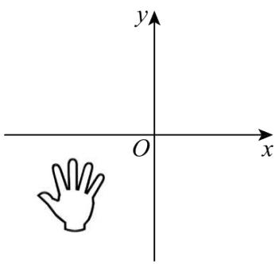

text_image

y
O
x

A. $(-2, - 5)$

B. $(-5,-2)$

C. $(2, - 5)$

D. $(5,-2)$

【答案】B

【分析】根据平面内点到x轴距离等于纵坐标绝对值，到y轴距离等于横坐标绝对值求解即可得到答案，本题考查了，平面内点到坐标轴的距离，解题的关键是：熟练掌握平面内点到坐标轴的距离.

【详解】解：∵点到x轴的距离为2，到y轴的距离为5，且点在第三象限，

$$
\therefore y = - 5, x = - 2,
$$

∴这个点的坐标是： $(-5,-2)$ ,

故选：B.

【变式 2-2】（24-25 七年级下·广西南宁·期末）如果点 $P(x,y)$ 的坐标满足 $x+y=xy$ ，那么称点P为“美丽点”，若某个“美丽点”P到y轴的距离为2，则点P的坐标为（）

A. $(2, - 2)$

B. $\left(-2,\frac{2}{3}\right)$

C. $(\frac{2}{3}, -2)$ 或(2,2)

D. (2,2)或 $\left(-2,\frac{2}{3}\right)$

【答案】D

【分析】直接利用某个“美丽点”到y轴的距离为2，得出x的值，进而求出y的值求出答案.

【详解】解：∵某个“美丽点”P到y轴的距离为2，

$$
\therefore x = \pm 2,
$$

$$
\because x + y = x y,
$$

$$
\therefore y \pm 2 = \pm 2 y,
$$

解得 $y = 2$ 或 $y = \frac{2}{3}$

则P点的坐标为： $(2,2)$ 或 $(-2,\frac{2}{3})$ .

故选：D.

【点睛】此题主要考查了新定义，点的坐标，点到坐标轴的距离，正确分类讨论是解题关键.

【变式 2-3】（24-25 七年级下·河南漯河·期中）点C在x轴的下方，y轴的右侧，距离x轴3个单位长度，距离y轴5个单位长度，则点C的坐标为（）

A. $(-3,5)$

B. $(3,-5)$

C. $(5, - 3)$

D. $(-5,3)$

【答案】C

【分析】本题考查了求点的坐标，点C在x轴的下方，y轴的右侧，得此点在第四象限，根据距离x轴3个单位长度，可得点的纵坐标，根据距离y轴5个单位长度可得点的横坐标，熟练掌握点到坐标轴的距离是解题的关键.

【详解】解：∵点C在x轴的下方，y轴的右侧，

∴点C在第四象限，

∵点C距离x轴3个单位长度，距离y轴5个单位长度，

∴点C的坐标为 $(5,-3)$ ,

故选：C.

# 【题型3 坐标与象限、坐标轴】

【例 3】（24-25 七年级下·北京·期中）在平面直角坐标系中，如果点 $P(-2,a-1)$ 在第二象限，那么 a 的取值可能是（）

A.-2

B. 0

C. 1

D. 2

【答案】D

【分析】本题考查了象限内点的坐标的特征和解一元一次不等式，根据第二象限的点纵坐标大于0可得 $a - 1 > 0$ ，进而解不等式即可.

【详解】解：∵点 $P(-2,a-1)$ 在第二象限，

$$
\therefore a - 1 > 0,
$$

$$
\therefore a > 1,
$$

选项中满足a>1的值为2，

故选：D.

【变式 3-1】（24-25 七年级下·广东东莞·期中）已知点 $P(2a-4,a+3)$ 在 y 轴上，则 a= \_\_\_\_.

【答案】2

【分析】本题考查了点的坐标，熟练掌握 $y$ 轴上的点横坐标为0是解题的关键．根据 $y$ 轴上的点横坐标为0可得 $2a - 4 = 0$ ，然后进行计算即可解答.

【详解】解：∵点 $P(2a-4,a+3)$ 在y轴上，

$$
\therefore 2 a - 4 = 0,
$$

解得：a = 2，

故答案为：2.

【变式 3-2】（24-25 七年级下·河南商丘·期中）在平面直角坐标系中，已知 $A(a,0),B(-3,0),AB=7$ ，则a= \_\_\_\_.

【答案】4或-10

【分析】本题考查了坐标与图形性质，熟知x轴上点的坐标特征是解题的关键.

根据点A和点B的坐标，得出A、B两点都在x轴上，再结合AB=7即可解决问题.

【详解】解：∵A(a,0)，B(-3,0)，

∴A，B两点都在x轴上，

又∵AB = 7,

$$
\therefore a = - 3 - 7 = - 1 0 \text {或} a = - 3 + 7 = 4,
$$

即a = -10或4.

故答案为：-10或4.

【变式 3-3】（24-25 七年级下·江西南昌·期中）已知 $m^{2}=4$ ， $|n|=1$ 若 $A(m,n)$ 在第一象限，则 $m+n$ 的值为\_\_\_\_。

【答案】3

【分析】本题考查平方根，绝对值的运算以及象限内点的坐标特征，解题的关键是根据已知条件求出 $m$ ， $n$ 的值.

先根据 $m^{2}=4$ 求出m的值，再根据 $|n|=1$ 求出n的值，最后结合点 $A(m,n)$ 在第一象限确定m，n的具体取值，进而求出 $m+n$ 的值.

【详解】由题意可得： $m=\pm\sqrt{4}=\pm2,\quad n=\pm1,$

∵ 点 $A(m,n)$ 在第一象限，

$$
\therefore m > 0, n > 0,
$$

$$
\therefore m = 2, n = 1,
$$

$$
\therefore m + n = 2 + 1 = 3.
$$

故答案为：3.

# 【题型4 坐标与位置】

【例 4】（24-25 九年级上·福建厦门·期末）已知点 $P(m^{2},n)$ ，点 $Q(2m-3,n)$ ，下列关于点P与点Q的位置关

系说法正确的是（）

A. 点 $P$ 在点 $Q$ 的右边  
B. 点 $P$ 在点 $Q$ 的左边  
C. 点 $P$ 与点 $Q$ 有可能重合  
D. 点 $P$ 与点 $Q$ 的位置关系无法确定

【答案】A

【分析】本题考查平面直角坐标系中点的坐标特征，配方法的应用，根据题意，点 $P(m^{2},n)$ ，点 $Q(2m-3,n)$ ，两点纵坐标相等，得PQ是平行于x轴的一条直线，点P与点Q根据横坐标大小即可确定左右的位置，再由作差法得到 $m^{2}-2m+3=(m-1)^{2}+2>0$ ，这个式子正负即可确定，从而得到答案.

【详解】解：∵点 $P(m^{2},n)$ ，点 $Q(2m-3,n)$ ，两点纵坐标相等，

∴ PQ 是平行于 x 轴的一条直线上，点 P 与点 Q 根据横坐标大小即可确定左右的位置，

$$
\because m ^ {2} - (2 m - 3) = m ^ {2} - 2 m + 3 = (m - 1) ^ {2} + 2 > 0,
$$

$$
\therefore m ^ {2} > 2 m - 3,
$$

∴ 点P在点Q的右边，

故选：A.

【变式 4-1】（24-25 八年级上·贵州毕节·期末）综合实践课上，小星将自己手工完成的部分地图，以贵阳市所在的点为坐标原点建立如图所示的平面直角坐标系，若图中点B的坐标为(1,4)，则点C的坐标可能为（）

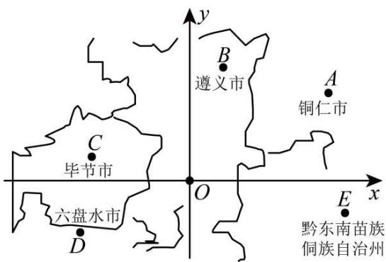

text_image

y
B
遵义市
A
铜仁市
C
毕节市
O
x
E
黔东南苗族
侗族自治州
六盘水市
D

A. (4,3)

B. $(5,-1)$

C. $(-3,1)$

D. $(-4,-2)$

【答案】C

【分析】本题考查了点的坐标以及所在的象限，熟练掌握各象限内的点的坐标特点是解题关键．判断出点C位于第二象限内，根据第二象限内的点的横坐标小于0、纵坐标大于0即可得.

【详解】解：∵以贵阳市所在的点为坐标原点建立如图所示的平面直角坐标系，图中点B的坐标为(1,4)，∴由图可知，点C位于第二象限内，

∴点C的横坐标小于0、纵坐标大于0，

观察四个选项可知，只有 $(-3,1)$ 是第二象限内的坐标，

故选：C.

【变式 4-2】（24-25 七年级下·福建福州·期中）如图，这是小康设计的一个美丽的枫叶图案，将它放在平面直角坐标系中，若点A，B的坐标分别为(0,2)，(-1,0)，则点C的坐标为\_\_\_\_。

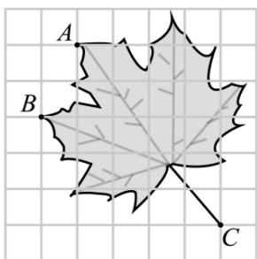

text_image

A
B
C

【答案】(4,-3)

【分析】本题主要考查了用坐标确定位置，和由点的位置得到点的坐标．依据已知点的坐标确定出坐标轴的位置是解题的关键．根据A，B的坐标确定出坐标轴的位置，点C的坐标可得.

【详解】解：∵A，B两点的坐标分别为(0,2)，(-1,0)，

∴得出坐标轴如图所示位置:

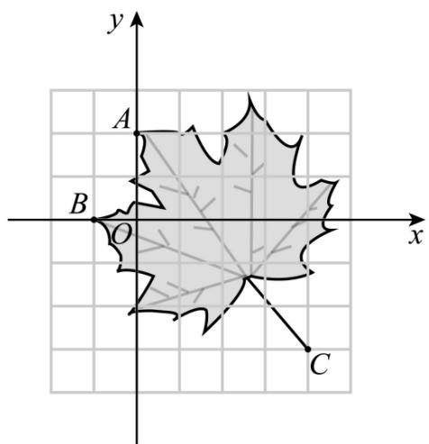

text_image

y
A
B
O
x
C

∴ 点C的坐标为 $(4,-3)$ .

故答案为： $(4,-3)$ .

【变式 4-3】（24-25 七年级下·福建厦门·期末）一个平面直角坐标系的横轴和纵轴的单位长度相同，该平面直角坐标系中的点 $M(1, 1)$ ， $N(5, 2)$ 的位置如图所示，则该平面直角坐标系的原点可能是（）

A. M
B. D N
C

A. 点 $A$

B. 点 $B$

C. 点 $C$

D. 点 $D$

【答案】A

【分析】根据题意和坐标与图形可确定原点可能位置.

【详解】解：由 $M(1,1)$ 和 $N(5,2)$ 知，M、N都位于第一象限，且N到x轴的距离为M到x轴的距离的2倍，N到y轴的距离为M到x轴的距离的5倍，

又平面直角坐标系的横轴和纵轴的单位长度相同，

∴则该平面直角坐标系的原点可能是点 A,

故选：A.

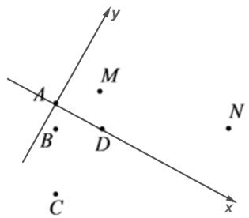

text_image

y
A
M
B
D
N
C
x

【点睛】本题考查点的坐标、坐标与图形，理解题意，正确得到原点可能位置是解答的关键.

# 【题型5 与坐标轴平行】

【例 5】（24-25 八年级上·辽宁锦州·期中）已知 $A(a,3)$ ， $B(-2,b)$ ，若点 A 位于第二象限，AB = 3 且直线 $AB \parallel x$ 轴，则 $a + b = (\quad)$

A. -5

B.-2

C. 4

D. 5

【答案】B

【分析】本题考查坐标与图形的性质，各象限内点的坐标特点，解答本题的关键是明确平行于 x 轴的直线上的点的纵坐标都相等.

根据直线 $AB \parallel x$ 轴，可知点A和点B的纵坐标相等，求出b的值，根据AB=3及点A位于第二象限，得出a，然后即可得出答案.

【详解】解：∵A(a,3)，B(-2,b)，直线AB∥x轴，

∴两点的纵坐标相等，

$$
\therefore b = 3,
$$

$$
\because A B = 3,
$$

$$
\therefore a = - 2 - 3 = - 5 \text {或} a = - 2 + 3 = 1,
$$

∵点 A 位于第二象限，

$$
\therefore a = - 5,
$$

$$
\therefore a + b = - 5 + 3 = - 2
$$

故选：B.

【变式 5-1】（24-25 八年级上·福建三明·期中）过点A(-2,1)和B(-2,-1)作直线，则直线AB（）

A. 与 $x$ 轴平行

B. 与y轴平行

C. 与y轴相交

D. 与x轴、y轴相交

【答案】B

【分析】本题考查了坐标与图形的性质，熟记平行坐标轴的直线的特征是解本题的关键.根据A,B两点的横坐标相等，得出直线AB平行于y轴.

【详解】解：∵点A(-2,1)，点B(-2,-1)，

∴点A、B横坐标相同，

∴直线 $AB \parallel y$ 轴，

故选：B.

【变式 5-2】（24-25 七年级下·贵州黔东南·期末）已知直线MN平行于x轴，若点M的坐标为 $(-1, 3)$ ，且点N到y轴的距离等于4，则点N的坐标是（）

A. $(-1, 4)$ 或 $(-1, -4)$

B. $(4, 3)$ 或 $(-4, -3)$

C. $(-1, 4)$ 或 $(1, -4)$

D. $(4, 3)$ 或 $(-4, 3)$

【答案】D

【分析】设 $N(a,b)$ ，根据平行于x轴的直线上的点的纵坐标相等求出b，再根据点到y轴的距离等于横坐标的绝对值求出a，然后写出点N的坐标即可.

【详解】解：∵点 $M(-1,3)$ 与点 $N(a,b)$ 在同一条平行于x轴的直线上，

$$
\therefore b = 3,
$$

∵ N 到 y 轴的距离等于 4,

$$
\therefore a = \pm 4,
$$

∴ 点N的坐标为 $(4, 3)$ 或 $(-4, 3)$ .

故选：D.

【点睛】本题考查了点的坐标，主要利用了平行于x轴的直线上点的坐标特征，点到y轴的距离等于横坐标的绝对值.

【变式 5-3】（24-25 七年级下·四川德阳·期末）在平面直角坐标系中，第四象限内的点P到x轴的距离是3，到y轴的距离是2，已知PQ平行于x轴且PQ=3，则点Q的坐标是（）

A. $(5, - 3)$

B. $(-1,-3)$

C. $(5, - 3)$ 或 $(-1, - 3)$

D. $(6, - 2)$ 或 $(0, - 2)$

【答案】C

【分析】本题考查点到坐标轴的距离，各象限内点的坐标的符号特征，与坐标轴平行的直线上的点的坐标特点.

根据第四象限内点的特点及点到坐标轴的距离定义，即可判断出点 P 的坐标．然后根据 PQ 平行于 x 轴且 PQ = 3，得到点 Q 的坐标.

【详解】解：∵点 P 到 x 轴的距离是 3，

∴点 P 的纵坐标为 $\pm 3$ ，

∵点 P 到 y 轴的距离是 2,

∴点 P 的横坐标为 $\pm 2$ ,

∵点 P 在第四象限，

∴点 P 坐标为 $(2,-3)$ ,

∵PQ平行于x轴且PQ=3,

∴点 Q 的坐标是 $(5,-3)$ 或 $(-1,-3)$ .

故选：C

# 【题型6 象限角平分线上的点】

【例 6】（24-25 八年级上·浙江宁波·期中）在平面直角坐标系中，已知点 $M(m,3m-8)$ ，若点 M 在两坐标轴的角平分线上，则 m 的值为（）

A. $\pm2$

B. $\pm4$

C. -2或-4

D. 2 或 4

【答案】D

【分析】本题考查了点的坐标，分点 M 在第一、三和第二、四象限的角平分线上两种情况，结合角平分线

上点的坐标特征求解即可.

【详解】解：当点 $M(m,3m-8)$ 在第一、三象限的角平分线上时，

$$
\therefore m = 3 m - 8,
$$

解得， $m = 4$

当点 $M(m,3m-8)$ 在第二、四象限的角平分线上时，

$$
\therefore - m = 3 m - 8,
$$

解得， $m = 2$

综上，点 M 在两坐标轴的角平分线上时，m 的值为 2 或 4，

故选：D.

【变式 6-1】(24-25 八年级下·四川宜宾·期末)点 $P(a+3,2a-2)$ 在第二, 四象限角平分线上, 则a= \_\_\_\_.

【答案】 $-\frac{1}{3}$

【分析】此题考查象限角平分线上点坐标特点，一、三象限角平分线上点的纵横坐标相等；二，四象限角平分线上点的纵横坐标互为相反数．第二、四象限角平分线上点的坐标互为相反数，据此列出关于 a 的方程求解.

【详解】解：∵点 $P(a+3,2a-2)$ 在第二，四象限角平分线上，

$$
\therefore a + 3 + 2 a - 2 = 0,
$$

$$
\therefore 3 a + 1 = 0
$$

$$
\therefore a = - \frac {1}{3}.
$$

故答案为： $-\frac{1}{3}$

【变式 6-2】（24-25 九年级上·全国·课后作业）已知，在平面直角坐标系中有一点 $P(2-m,3m+6)$

（1）若点 P 在第一象限的角平分线上，则 m = \_\_\_\_；若点 P 在第四象限的角平分线上，则 m = \_\_\_\_；

(2) 若点 P 在第二象限，则 m 的取值范围是 \_\_\_\_；

(3) 多解法点 $P$ 不可能在第 \_\_\_\_ 象限;

(4) 将点 $P$ 先向左平移 2 个单位长度, 再向上平移 1 个单位长度后得到点 $B$ , 若点 $B$ 的横, 纵坐标互为相反数, 则 $m = \_$ .

【答案】-1 -4 m>2 三 $-\frac{7}{2}$

【分析】本题主要考查平面直角坐标系中点的坐标特征、点的平移、相反数等知识点，熟练掌握平面内点的坐标特征、角平分线上点的特征是解题的关键.

（1）当点 P 在第一象限的角平分线上 $2-m = 3m + 6$ 求出 m 即可；当点 P 在第四象限的角平分线上可得 $2-m + 3m + 6 = 0$ 求出 m 即可；  
（2）根据第二象限上的点的横坐标小于零，纵坐标大于零列不等式组求解即可；  
（3）根据各象限内的坐标特点分别列不等式组求解即可判定；  
（4）先求出点 P 平移后点 B 的坐标，然后再根据点 B 的横，纵坐标互为相反数求解即可.

【详解】解：（1）当点 P 在第一象限的角平分线上，可得 $2 - m = 3m + 6$ ，解得：m = -1；

当点 P 在第四象限的角平分线上，可得 $2 - m + 3m + 6 = 0$ ，解得：m = -4。

故答案为：-1，-4.

（2）当点 P 在第二象限，可得： $\left\{\begin{aligned}&2-m<0\\ &3m+6>0\end{aligned}\right.$ ，解得：m>2.

故答案为：m > 2.

（3）当点 P 在第一象限，可得： $\left\{\begin{aligned}&2-m>0\\ &3m+6>0\end{aligned}\right.$ ，解得：-2<m<2，

当点 P 在第二象限，可得： $\left\{\begin{aligned}2-m&<0\\ 3m+6&>0\end{aligned}\right.$ ，解得：m>2，

当点 P 在第三象限，可得： $\left\{\begin{aligned}&2-m<0\\ &3m+6<0\end{aligned}\right.$ ，方程组无解，即点 P 不可能在第三象限，

当点 P 在第四象限，可得： $\left\{\begin{aligned}2-m&>0\\ 3m+6&<0\end{aligned}\right.$ ，解得：m<-2.

故答案为：三.

(4) 将点 $P(2 - m, 3m + 6)$ 先向左平移 2 个单位长度, 再向上平移 1 个单位长度后得到点 $B$ 的坐标为 $(2 - m - 2, 3m + 6 + 1)$ , 即 $B(-m, 3m + 7)$ ,

∵点 B 的横，纵坐标互为相反数，

$\therefore -m + 3m + 7 = 0$ ，解得： $m = -\frac{7}{2}$

故答案为： $-\frac{7}{2}$

【变式 6-3】（24-25 七年级上·山东威海·阶段练习）已知点 $A(2a+3,-a)$ ， $B(a-2,1)$

(1)若点A在第一象限的角平分线上时，求a的值；  
(2)若点A到y轴的距离是B到x轴的距离的3倍，求B点坐标；  
(3)若线段 $AB \parallel y$ 轴，求点A，B的坐标及线段AB的长.

【答案】(1)a = -1

(2)(-2,1)或(-5,1)   
(3) $A(-7,5)$ , $B(-7,1)$ ; 4

【分析】本题主要考查坐标与图形的性质，解题的关键在于理解点到坐标轴的距离与点坐标之间的关系.

（1）根据第一象限的角平分线上点的横纵坐标相等得出关于 a 的方程，解之可得；  
（2）根据点A到y轴的距离是B到x轴的距离的3倍得出关于a的方程，解之可得a再写出坐标即可；  
（3）由 $AB \parallel y$ 轴知横坐标相等求出 a 的值，再得出点 A, B 的坐标，从而求得 AB 的长度.

【详解】（1）已知点 $A(2a+3,-a)$ ,

∵点 A 在第一象限的角平分线上，

$$
\therefore 2 a + 3 = - a,
$$

解得：a = -1.

(2) ∵点A到y轴的距离是B到x轴的距离的3倍，

且B到x轴的距离为1，

$$
\therefore 2 a + 3 = 3 \text {或} 2 a + 3 = - 3,
$$

解得a=0或a=-3，

∴B点坐标为 $(-2,1)$ 或 $(-5,1)$ .

(3) ∵线段 $AB \parallel y$ 轴，

$$
\therefore 2 a + 3 = a - 2,
$$

解得a = -5，

∴点 $A(-7,5)$ ， $B(-7,1)$ ，

∴线段AB的长为 $|5-1|=4$ .

# 【题型7 根据平移前的点求平移后的点】

【例 7】（24-25 七年级下·山东潍坊·期末）如图，若在棋盘上建立平面直角坐标系，使“帅”位于点(2,0)，“炮”位于点(-1,3)，则将棋子“马”向上平移 2 个单位长度后的点的坐标是\_\_\_\_。

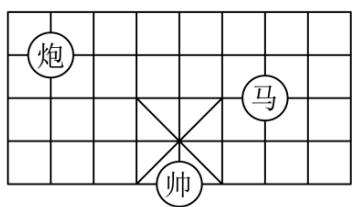

text_image

炮
马
帅

【答案】(4,4)

【分析】本题考查平面直角坐标系的建立、用坐标表示表示位置及平面直角坐标系中点的平移，由题意，建立平面直角坐标系，求出“马”位于点 $(2,0)$ ，再由点的平移即可得到答案，熟记平面直角坐标系坐标表示位置及点的平移是解决问题的关键.

【详解】解：根据“帅”位于点 $(2,0)$ ，“炮”位于点 $(-1,3)$ ，建立平面直角坐标系，如图所示：

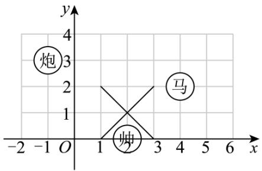

text_image

炮
炮
马
②
x
y
4
3
2
1
0
-2 -1 O 1 3 5 6 x

：“马”位于点 $(4, 2)$ ,

∴将棋子“马”向上平移两个单位长度后位于点 $(4, 4)$ ,

故答案为：(4,4).

【变式 7-1】（24-25 八年级下·福建泉州·期末）将点 $A(-2,-4)$ 先向左平移 3 个单位长度，再向上平移 5 个单位长度得到点 $A'$ ，则点 $A'$ 在 \_\_\_\_ 象限.

【答案】二

【分析】本题考查了坐标与图形的变化-平移，熟记平移中点的变化规律是：横坐标右移加，左移减；纵坐标上移加，下移减是解题的关键．根据平移的性质，向左平移a，则横坐标减a；向上平移b，则纵坐标加b.

【详解】解：∵ $A(-2,-4)$ 先向左平移 3 个单位长度，再向上平移 5 个单位长度得到点 $A'$ ，

$$
\therefore - 2 - 3 = - 5, \quad - 4 + 5 = 1,
$$

∴ 点 $A'$ 的坐标是(-5,1),

∴ 点 $A'$ 在二象限

故答案为：二.

【变式 7-2】（24-25 八年级下·山东临沂·期中）在平面直角坐标系中，平行四边形ABCD顶点A、B、C的坐标分别是 $(-1,1)$ ， $(2,1)$ ， $(1,-1)$ ，将平行四边形ABCD沿x轴向右平移3个单位长度，则顶点D的对应点 $D_{1}$ 的坐标是\_\_\_\_.

【答案】(1,-1)

【分析】本题考查了坐标与图形的性质，平行四边形的性质，坐标与图形变化一平移，先画出平行四边形ABCD，得出 $D(-2,-1)$ ，然后根据平移的性质可得点 $D_{1}$ 的坐标.

【详解】解：如图，

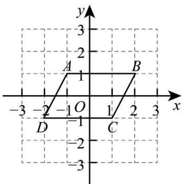

text_image

y
-3
2
A
1
B
-3 -2 -1 O 1 2 3 x
-1
-2
-3
D C

由图可知， $D(-2,-1)$ ，

∴将平行四边形ABCD沿x轴向右平移3个单位长度，则顶点D的对应点 $D_{1}$ 的坐标是 $(1,-1)$ .

故答案为： $(1,-1)$ .

【变式 7-3】（24-25 七年级下·北京·期中）如图所示，已知 $A(-1,2)$ ， $B(1,-1)$ ， $C(3,4)$ 三点坐标．将三角形ABC平移至三角形 $A_{1}B_{1}C_{1}$ 处，点A，B，C的对应点分别为点 $A_{1}$ ， $B_{1}$ ， $C_{1}$ ，其中点 $C_{1}$ 的坐标为 $(0,-1)$ .

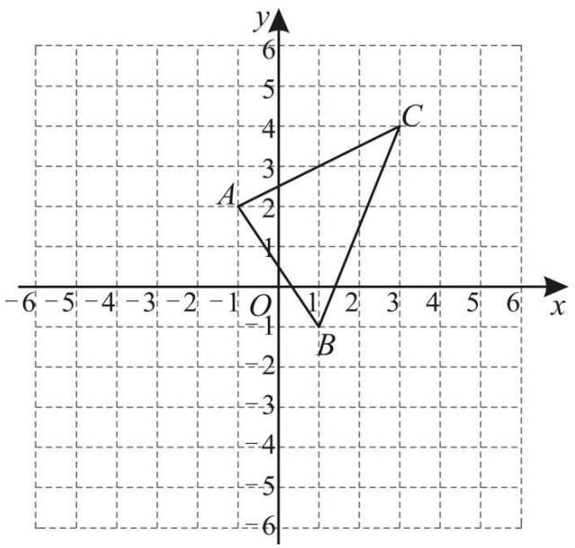

text_image

y
6
5
4
3
2
A
C
1
O
1
B
-1
-2
-3
-4
-5
-6
-7
-8
-9
-10
-11
-12
-13
-14
-15
-16
-17
-18
-19
-20

(1)①在图中画出平移后的三角形 $A_{1}B_{1}C_{1}$ ;

②其中三角形ABC上一点 $P(a,b)$ 平移后对应点 $P'$ 的坐标为\_\_\_\_；

(2)求三角形ABC的面积;

(3)设点 Q 在 y 轴上，且三角形 $A_{1}QC_{1}$ 与三角形 ABC 的面积相等，求点 Q 的坐标.

【答案】(1)①见解析；② $(a-3,b-5)$ ;

(2)8;

(3)(0,-5)或(0,3).

【分析】本题考查作图-平移变换，涉及到三角形面积公式以及方程的应用，熟练掌握平移的性质是解答本题的关键.

(1) ①根据平移的性质作图即可;

②由题意知三角形ABC向左平移3个单位长度，向下平移5个单位长度得到三角形 $A_{1}B_{1}C_{1}$ ，结合平移的性质可得答案；

(2) 直接利用割补法求三角形的面积即可;

（3）设点Q的坐标为 $(0,m)$ ，根据题意可列方程为 $\frac{1}{2}\times|m-(-1)|\times4=8$ ，求出m的值，即可得出答案.

【详解】（1）解：①如图，三角形 $A_{1}B_{1}C_{1}$ 即为所求；

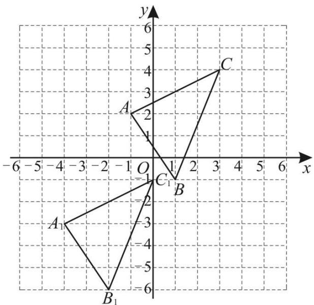

text_image

y
6
5
4
3
2
1
A
O
-1
C₁
1
2
x
-6 -5 -4 -3 -2 -1 0 1 2 3 4 5 6
A₁
-2
-3
-4
-5
-6
B₁

②由题意知，三角形ABC向左平移3个单位长度，向下平移5个单位长度得到三角形 $A_{1}B_{1}C_{1}$ ，

∴ 三角形ABC上一点 $P(a,b)$ 平移后对应点 $P'$ 的坐标为 $(a-3,b-5)$ ;

故答案为： $(a-3,b-5)$ ;

(2) 三角形ABC的面积为 $\frac{1}{2}\times4\times2+\frac{1}{2}\times4\times2=8;$

（3）设点Q的坐标为 $(0,m)$ ,

∵ 三角形 $A_{1}QC_{1}$ 与三角形ABC的面积相等，

$$
\therefore \frac {1}{2} \times | m - (- 1) | \times 4 = 8,
$$

解得m = -5或3，

∴ 点Q的坐标为 $(0,-5)$ 或 $(0,3)$ .

# 【题型8 根据平移后的点求平移前的点】

【例 8】（24-25 七年级下·山西朔州·期中）如图，在平面直角坐标系中，第二象限有一点A，将点A水平向右平移3个单位长度得到点 $A'$ ，过点 $A'$ 分别向x轴、y轴作垂线，垂足分别为B,C．若 $A'B=5,A'C=2$ ，则点

A的坐标为（）

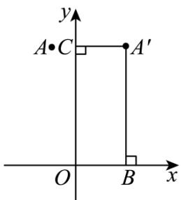

text_image

y
A•C
A′
O
B
x

A. $(-1,5)$

B. $(-3,5)$

C. $(-1,2)$

D. (2,5)

【答案】A

【分析】本题考查了平移变换以及点的坐标，根据题意得出 $A'(2,5)$ ，进而根据平移得出点A的坐标，即可求解.

【详解】解：∵ $A'B=5,A'C=2$ ,

$\therefore A'(2,5)$ ,

∵第二象限有一点A，将点A水平向右平移3个单位长度得到点 $A'$ ，

$\therefore A(-1,5)$

故选：A.

【变式 8-1】（24-25 七年级下·贵州·期末）在平面直角坐标系中,将点 P(x,y)向右平移 3 个单位,再向上平移 2 个单位长度后与点 Q(-1,2)重合,则点 P 的坐标为 \_\_\_\_.

【答案】（-4，0）

【分析】逆向思考，把点（-1，2）先向左平移3个单位，再向下平移2个单位后可得到P点坐标.

【详解】在坐标系中，点 Q（-1，2）先向左平移 3 个单位得（-4，2），再把（-4，2）向下平移 2 个单位后的坐标为（-4，0），则 P 点的坐标为（-4，0）.

故答案为 $(-4, 0)$ .

【点睛】本题考查了坐标与图形变化-平移：在平面直角坐标系内，把一个图形各个点的横坐标都加上（或减去）一个整数a，相应的新图形就是把原图形向右（或向左）平移a个单位长度；如果把它各个点的纵坐标都加（或减去）一个整数a，相应的新图形就是把原图形向上（或向下）平移a个单位长度．（即：横坐标，右移加，左移减；纵坐标，上移加，下移减.

【变式 8-2】（24-25 七年级下·内蒙古鄂尔多斯·期中）如图，在平面直角坐标系中， $\triangle A'B'C'$ 是由 $\triangle ABC$ 平移得到的，平移前点A的坐标为(-5,4).

text_image

y
5
4
3
2
1
A'
-1
O 1 2 3 4 5 6 x
-6 -5 -4 -3 -2 -1 0 1 2 3 4 5 6
-1
-2
-3
-4
-5
-6

(1)画出平移前的 $\triangle ABC$ ，并写出点 B 和点 C 的坐标；  
(2)已知点 $P(a,b)$ 为 $\triangle ABC$ 内的一点，则点P在 $\triangle A^{\prime}B^{\prime}C^{\prime}$ 内的对应点 $P^{\prime}$ 的坐标为\_\_\_\_；  
(3)求 $\triangle ABC$ 的面积.

【答案】(1)画图见详解， $B(-3,0)$ ， $C(0,2)$

(2) $(a+4,b-3)$   
(3)8

【分析】本题主要考查了坐标与图形，图形变换，

(1) 先得出 $A'(-1,1)$ , 再结合 $A(-5,4)$ , 可知 $\triangle A'B'C'$ 是由 $\triangle ABC$ 先向右平移 4 个单位, 再向下平移 3 个单位得到的, 据此画出 $\triangle ABC$ , 即可求解;  
（2）根据 $\triangle A^{\prime}B^{\prime}C^{\prime}$ 是由 $\triangle ABC$ 先向右平移 4 个单位，再下平移 3 个单位得到的，即可求解；  
（3）利用割补法即可求解.

【详解】（1）如图可知： $A'(-1,1)$ ,

$$
\because A (- 5, 4),
$$

∴将 $\triangle ABC$ 先向右平移 4 个单位，再向下平移 3 个单位得到 $\triangle A'B'C'$ ,

如图， $\triangle ABC$ 即为所求；

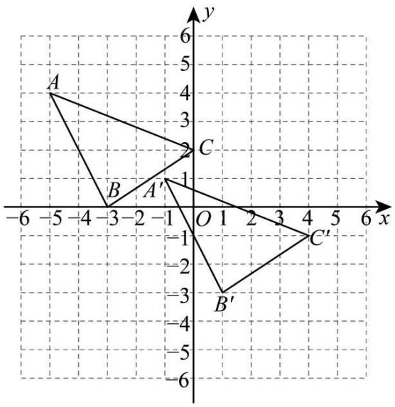

text_image

A
B
C
A'
B'
C'

由图可知： $B(-3,0)$ ， $C(0,2)$ ;

(2) 解: 解: 根据题意得: $\triangle A'B'C'$ 是由 $\triangle ABC$ 先向右平移 4 个单位, 再向下平移 3 个单位得到的, $\therefore$ 点 $P(a,b)$ 在 $\triangle A'B'C'$ 内的对应点 $P'$ 的坐标是 $(a+4,b-3)$ .

故答案为： $(a+4,b-3)$ ;

$$
\begin{array}{l} = 2 0 - 4 - 3 - 5 \\ = 8. \\ \end{array}
$$

（3）解： $\triangle ABC$ 的面积 $= 4 \times 5 - \frac{1}{2} \times 2 \times 4 - \frac{1}{2} \times 2 \times 3 - \frac{1}{2} \times 5 \times 2$

【变式 8-3】（24-25 八年级下·山东聊城·阶段练习）将点 $A(a, b)$ 先向左平移 2 个单位长度，再向下平移 3 个单位长度得到点 $B(-b, a)$ ，则点 $B$ 的坐标是 \_\_\_\_.

【答案】 $(- \frac{5}{2}, - \frac{1}{2})$

【分析】根据平移得到关于a，b的方程，求出a，b的值即可解题.

【详解】将点 $A(a, b)$ 平移后点的坐标为 $(a-2, b-3)$ ,

由题可得： $\left\{\begin{aligned}a-2&=-b\\ b-3&=a\end{aligned}\right.$ ，解得： $\left\{\begin{aligned}a&=-\frac{1}{2}\\ b&=\frac{5}{2}\end{aligned}\right.$

∴点 B 的坐标是 $\left(-\frac{5}{2}, -\frac{1}{2}\right)$ ,

故答案为： $\left(-\frac{5}{2}, -\frac{1}{2}\right)$ .

【点睛】本题考查平移，二元一次方程组，掌握平移规律是解题的关键.

# 【题型9 根据平移前后关系求值】

【例 9】（24-25 七年级下·全国·课后作业）（1）把点 $P_{1}(m,n)$ 向右平移3个单位长度再向下平移2个单位长度到一个位置 $P_{2}$ 后坐标为 $P_{2}(a,b)$ ，则m，n，a，b之间存在的关系是\_\_\_\_；

(2) 将点 $P(-3, y)$ 向下平移 3 个单位，向左平移 2 个单位后得到点 $Q(x, -1)$ ，则 $xy = \_$ .

【答案】 $a = m + 3, b = n - 2$ -10

【分析】（1）根据点平移的规律，得到平移后点的坐标，又因为已知平移后点坐标 $P_{2}(a,b)$ ，得到等量关系即可求解；

（2）根据点平移的规律，得到平移后点的坐标，又因为已知平移后点坐标 $Q(x,-1)$ ，得到等量关系即可求解x，y值，即可求解xy的值；

【详解】解：（1）∵点 $P_{1}(m,n)$ 向右平移3个单位长度再向下平移2个单位长度，得到点坐标为 $(m+3,n-2)$ ， $P_{2}(a,b)$ 为平移后点的坐标；

$$
\therefore a = m + 3, b = n - 2;
$$

故答案为： $a = m + 3,\ b = n - 2.$

(2) $\because$ 将点 $P(-3, y)$ 向下平移 3 个单位, 向左平移 2 个单位后得到点坐标为 $(-5, y - 3)$ , $Q(x, -1)$ 为平移后的点坐标,

$\therefore \left\{ \begin{array}{l} x = -5 \\ y - 3 = -1 \end{array} \right.$ 解得： $\left\{ \begin{array}{l} x = -5 \\ y = 2 \end{array} \right.$ .

$$
\therefore x y = - 1 0.
$$

故答案为：-10.

【点睛】本题考查了坐标与图形变化-平移，平移中点的变化规律是：横坐标右加，左减；纵坐标上加，下减.

【变式 9-1】（24-25 七年级下·全国·专题练习）将点 $P_{1}(2,m)$ 向右平移 1 个单位长度，再向下平移 3 个单位长度后，得到点 $P_{2}(n,-1)$ ，则点 $Q(m,n)$ 的坐标为 \_\_\_\_.

【答案】(2,3)

【分析】本题考查了点的平移，根据点的平移规则，左减右加，上加下减，求出m,n的值，即可.

【详解】解：由题意， $n=2+1,m-3=-1$ ，

$$
\therefore n = 3, m = 2,
$$

$$
\therefore Q (2, 3),
$$

故答案为：(2,3).

【变式 9-2】（24-25 七年级下·吉林通化·阶段练习）将点 $P(-4, y)$ 向下平移 3 个单位长度，再向左平移 2 个单位长度后得到点 $Q(x,-2)$ ，则 $x + y =$ \_\_\_\_.

【答案】-5

【分析】本题考查点的平移，掌握点的坐标平移特点“左减右加，上加下减”是解题的关键.

【详解】解：由平移可得：-4-2 = x, y-3 = -2,

解得x=-6，y=1，

$$
\therefore x + y = - 6 + 1 = - 5,
$$

故答案为：-5.

【变式 9-3】（24-25 七年级下·辽宁鞍山·期中）对于平面直角坐标系 $xOy$ 中的任意一点 $M(x,y)$ ，给出如下定义：记 $a = x + y$ ， $b = -x + y$ ，将点 $P(a,b)$ 与点 $Q(b,a)$ 称为点 $M$ 的一对卫星点．例如，点 $P(1,-5)$ 与点 $Q(-5,1)$ 为点 $M(3,-2)$ 的一对卫星点．将点 $C(2m-1,-m+1)(m > 0)$ 向右平移 $m$ 个单位长度，向下移动 $m$ 个单位，得到点 $C'$ ，若点 $C'$ 的一对卫星点重合，则 $m = \_$ .

【答案】 $\frac{1}{3}$

【分析】本题考查了坐标与图形变化-平移，新定义，根据卫星点的定义列方程求解即可.

【详解】解：由题意得， $C'(3m-1,-2m+1)$ ,

此时， $a = 3m - 1 + (-2m + 1) = m$ ， $b = -(3m - 1) + (-2m + 1) = -5m + 2,$

则 $C'$ 点的卫星点为 $(m,-5m+2)$ 和 $(-5m+2,m)$ ,

∵这两个卫星点重合，（即两点的横、纵坐标分别相等），

$$
\therefore m = - 5 m + 2,
$$

解得， $m=\frac{1}{3}$ ,

故答案为： $\frac{1}{3}$ .

# 【题型 10 根据平移确定点的位置】

【例 10】（24-25 七年级下·北京朝阳·期末）在平面直角坐标系 $xOy$ 中，将一个横、纵坐标都是整数的点，沿平行（或垂直）于坐标轴的直线平移 1 个单位长度，称为该点走了 1 步．点 $A(1,0)$ ， $B(2,4)$ ， $C(3,1)$ 各走了若干步后到达同一点 $P$ ，当点 $P$ 的坐标为 \_\_\_\_ 时，三个点的步数和最小，为 \_\_\_\_.

【答案】 (2,1) 6

【分析】根据网格的特点求解即可.

【详解】如图所示，

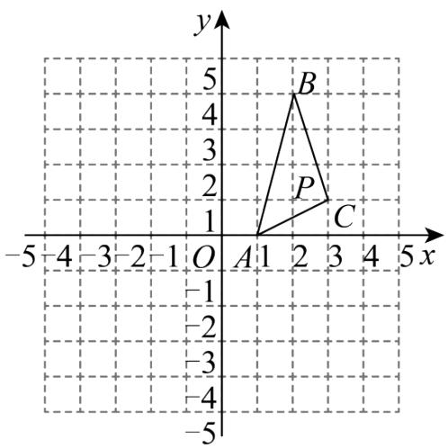

text_image

y
5
4
3
2
1
B
P
C
-5 -4 -3 -2 -1 O A 1 2 3 4 5 x
-1
-2
-3
-4
-5

当点 P 的坐标为 $(2,1)$ 时，

点 A 先向上走 1 步，再向右走 1，

点 B 向下走 3 步，点 C 向左走 1 步，

∴此时三个点的步数和最小，为6步.

故答案为： $(2,1)$ ，6.

【点睛】此题考查了坐标与图形，点的平移，解题的关键是熟练掌握网格的特点.

【变式 10-1】（24-25 八年级下·全国·期中）将点 $P(3m-1,m+2)$ 向上平移 1 个单位得到点 Q，且点 Q 在 x 轴上，则点 P 的坐标为（）

A. $(-5,0)$

B. $(-7, - 1)$

C. $(-10,0)$

D. $(-10, - 1)$

【答案】D

【分析】本题主要考查了点的平移，点在坐标轴上的特点，根据将点 $P(3m-1,m+2)$ 向上平移1个单位得到点Q，点Q在x轴上，可得出 $m+3=0$ ，进而可求出m的值，进一步即可求出点P的坐标.

【详解】解：将点 $P(3m-1,m+2)$ 向上平移1个单位得到点Q，

则 $Q(3m-1,m+3)$

∵点Q在x轴上，

$$
\therefore m + 3 = 0,
$$

$$
\therefore m = - 3,
$$

$$
\therefore 3 m - 1 = - 1 0, \quad m + 2 = - 1
$$

∴点 $P(-10,-1)$ ,

故选：D.

【变式 10-2】（24-25 七年级下·内蒙古巴彦淖尔·期末）点 P（m+2，2m+1）向右平移 1 个单位长度后，正

好落在 y 轴上，则 $P(m+2, 2m+1)$ 在第 \_\_\_\_ 象限.

【答案】三

【分析】根据向右平移横坐标加， $y$ 轴上的横坐标为0列方程求解出 $m$ 的值，可得出点 $P$ 的坐标，根据象限的特征即可得出结果.

【详解】∵点 $P(m+2, 2m+1)$ 向右平移 1 个单位长度后，正好落在 y 轴上，

$$
\therefore m + 2 + 1 = 0,
$$

$$
\therefore m = - 3,
$$

$$
\therefore m + 2 = - 1, 2 m + 1 = - 5,
$$

∴ 点 P 的坐标为 $(-1, -5)$ ，

故答案为：三.

【点睛】本题考查了坐标与图形变化-平移中点的变化规律是：横坐标右移加，左移减；纵坐标上移加，下移减.

【变式 10-3】（24-25 七年级下·湖北随州·期末）如图，在第一象限内有两点 $P(m-2,n), Q(m,n-3)$ ，将线段 PQ 平移使点 P，Q 分别落在两条坐标轴上，则点 P 平移后的对应点的坐标是 \_\_\_\_.

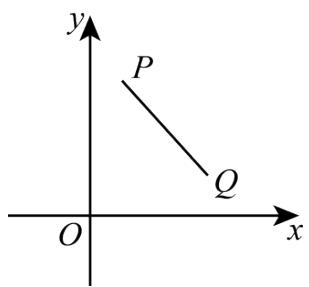

text_image

y
P
Q
O
x

【答案】(0,3)或(-2,0).

【分析】设平移后点P、Q的对应点分别是 $P'$ 、 $Q'$ ．分两种情况进行讨论：① $P'$ 在y轴上， $Q'$ 在x轴上；② $P'$ 在x轴上， $Q'$ 在y轴上．此题主要考查图形的平移及平移特征．在平面直角坐标系中，图形的平移与图形上某点的平移规律相同．平移中点的变化规律是：横坐标右移加，左移减；纵坐标上移加，下移减.

【详解】解：设平移后点P、Q的对应点分别是 $P'$ 、 $Q'$ .

分两种情况：

① $P'$ 在y轴上， $Q'$ 在x轴上；

则 $P'$ 横坐标为0， $Q'$ 纵坐标为0，

$$
\because 0 - (n - 3) = - n + 3,
$$

$$
\therefore n - n + 3 = 3,
$$

∴ 点P平移后的对应点的坐标是(0,3);

② $P'$ 在x轴上， $Q'$ 在y轴上.

则 $P'$ 纵坐标为0， $Q'$ 横坐标为0，

$$
\because 0 - m = - m,
$$

$$
\therefore m - 2 - m = - 2,
$$

∴ 点P平移后的对应点的坐标是 $(-2,0)$ ;

综上可知，点P平移后的对应点的坐标是(0,3)或(-2,0).

故答案为： $(0,3)$ 或 $(-2,0)$ .

# 【题型11 关于 $x$ 轴、 $y$ 轴对称的点的坐标】

【例 11】（24-25 八年级上·山东菏泽·期中）在平面直角坐标系中，如果 $\triangle ABC$ 三个顶点的坐标分别是 A (-2,0)，B(-1,0)，C(-1,2)， $\triangle ABC$ 关于 y 轴成轴对称的图形是 $\triangle A_{1}B_{1}C_{1}$ ， $\triangle A_{1}B_{1}C_{1}$ 关于 x 轴成轴对称的图形是 $\triangle A_{2}B_{2}C_{2}$ ，则点 $A_{2}$ 的坐标为 \_\_\_\_.

【答案】(2,0)

【分析】本题考查关于 x 轴、y 轴对称的点的坐标的特点，先利用两点关于 y 轴对称，纵坐标不变，横坐标互为相反数，再利用两点关于 x 轴对称，横坐标不变，纵坐标互为相反数.

简记：关于谁对称谁不变.

【详解】解：点 $A(-2,0)$ 关于 $y$ 轴的对称点的坐标是 $A_{1}(2,0)$ ，点 $A_{1}(2,0)$ 关于 $x$ 轴的对称点的坐标为 $A_{2}(2,0)$ . 故答案为：(2,0).

【变式 11-1】（24-25 八年级上·山东济宁·阶段练习）在平面直角坐标系中，点A(-5,2)关于y轴的对称点的坐标是（）

A. $(-5,-2)$

B. $(5,2)$

C. $(-2,5)$

D. $(-2,-5)$

【答案】B

【分析】本题考查了坐标系中对称的点的坐标变化规律，理解横纵坐标的变化规律是解题关键。根据关于 y 轴对称点的坐标特征：横坐标取相反数，纵坐标不变即可求解。

【详解】解： $A(-5,2)$ 关于y轴的对称点的坐标为： $(5,2)$ ,

故选：B.

【变式 11-2】（24-25 八年级上·甘肃白银·阶段练习）已知 $A(a - 2, - 1)$ 与点 $B(-1, b + 2)$ 关于 $x$ 轴对称，则 $a + b = \_$ .

【答案】0

【分析】根据关于 x 轴对称，横不变，纵坐标互为相反数，列式解答即可.

本题考查了 x 轴对称的特点，求代数式的值，熟练掌握对称是解题的关键.

【详解】解： $A(a-2,-1)$ 与点 $B(-1,b+2)$ 关于x轴对称，

故a-2=-1,b+2=1,

解得a=1,b=-1,

故 $a+b=1-1=0$ ,

故答案为：0.

【变式 11-3】（24-25 八年级上·河南郑州·期中）在平面直角坐标系xOy中，经过点M(0,m)且平行于x轴的直线可以记作直线y=m，平行于y轴的直线可以记作直线x=m，我们给出如下的定义：点P(x,y)先关于x轴对称得到点 $P_{1}$ ，再将点 $P_{1}$ 关于直线y=m对称得点 $P'$ ，则称点 $P'$ 为点P关于x轴和直线y=m的二次反射点．已知点P(2,3)，Q(2,2)关于x轴和直线y=m的二次反射点分别为 $P_{1}$ ， $Q_{1}$ ，点M(2,3)关于直线x=m对称的点为 $M_{1}$ ，则当三角形 $P_{1}Q_{1}M_{1}$ 的面积为1时，则m= \_\_\_\_.

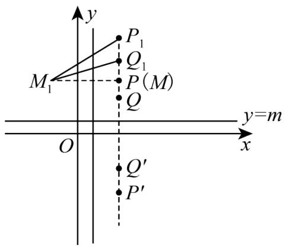

text_image

y
P₁
Q₁
M₁
P(M)
Q
y=m
O
x
Q′
P′

【答案】1 或 3

【分析】本题考查了新定义，直角坐标系的点的特征，三角形的面积公式．根据对称性质由已知点坐标求得 $P_{1}$ ， $Q_{1}$ ， $M_{1}$ 的坐标，再根据三角形的面积列出方程求得m的值便可.

【详解】解：根据题意得， $P_{1}(2,2m+3)$ ， $Q_{1}(2,2m+2)$ ， $M_{1}(2m-2,3)$ ，

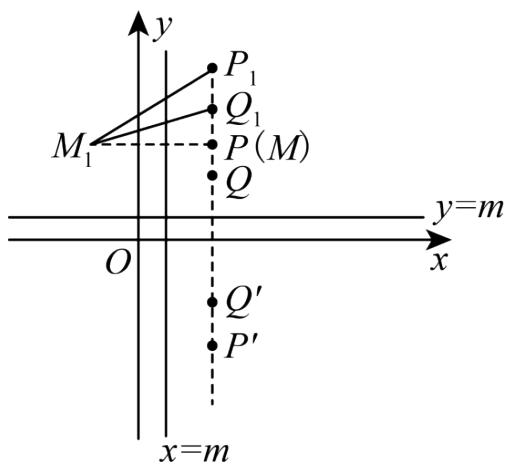

text_image

y
P₁
Q₁
M₁
P(M)
Q
y=m
O
x
Q′
P′
x=m

$$
\therefore P _ {1} Q _ {1} = | 2 m + 3 - 2 m - 2 | = 1, P M _ {1} = | 2 m - 2 - 2 | = | 2 m - 4 |,
$$

∵ $\triangle P_{1}Q_{1}M_{1}$ 的面积为 1,

$$
\therefore \frac {1}{2} \times 1 \times | 2 m - 4 | = 1,
$$

解得m=1或3,

故答案为：1 或 3.

# 【题型 12 作图——轴对称变换】

【例 12】（24-25 八年级下·河北邯郸·期末）如图，正方形网格中，点 A 的坐标为 $(-3,2)$ ，点 B 的坐标为 $(2,2)$ ，点 C 的坐标未知，图中已经画出 y 轴.

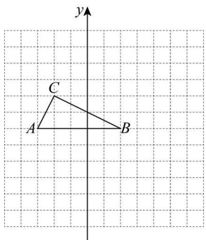

text_image

y
C
A
B

(1)在正方形网格中画出 x 轴，标出原点 O，并直接写出点 C 的坐标；  
(2)在平面直角坐标系中，画出 $\triangle ABC$ 关于 $x$ 轴对称的 $\triangle A'B'C'$ 。并直接写出 $A'$ ， $B'$ ， $C'$ 的坐标。

【答案】(1)x轴及原点 O 见详解， $C(-2,4)$

(2) $\triangle A^{\prime}B^{\prime}C^{\prime}$ 见详解； $A^{\prime}(-3,-2)$ ， $B^{\prime}(2,-2)$ ， $C^{\prime}(-2,-4)$

【分析】本题考查了平面直角坐标系，点的坐标，作轴对称图形；

（1）由点 A 的坐标为 $(-3,2)$ ，确定原点，即可确定 x 轴，写出 C 的坐标，即可求解；

(2) 作出 $\triangle A'B'C'$ , 写出坐标, 即可求解;

能根据已知点的坐标建立直角坐标系，会作轴对称图形是解题的关键.

【详解】（1）解：x轴及原点O，如图，

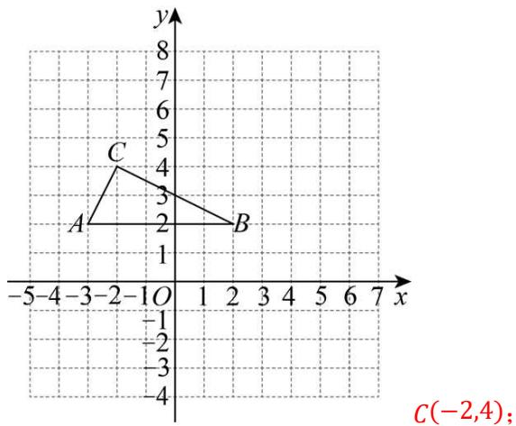

text_image

C
A
B
-5-4 -3 -2 -1 O 1 2 3 4 5 6 7 x
-1
-2
-3
-4
C(-2,4);

(2) 解: 如图,

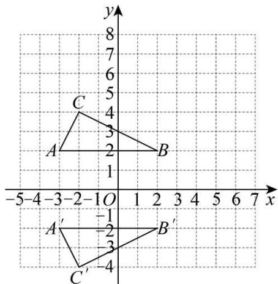

text_image

y
8
7
6
5
4
3
2
1
A
B
-5-4-3-2-1O 1 2 3 4 5 6 7 x
A'
-1
-2
-3
C'
-4
B'

$\therefore \triangle A^{\prime}B^{\prime}C^{\prime}$ 为所求作；

$A^{\prime}(-3, - 2), B^{\prime}(2, - 2), C^{\prime}(-2, - 4).$

【变式 12-1】（24-25 八年级上·宁夏石嘴山·期末）如图，在平面直角坐标系中， $\triangle ABC$ 的三个顶点都在格点上，点A的坐标为(2,4).

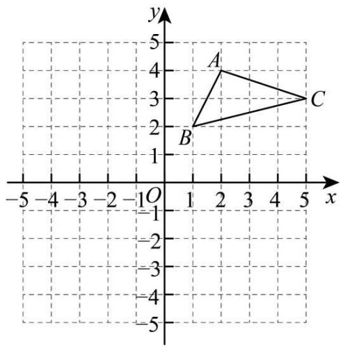

text_image

y
5
4
A
3
C
2
B
1
-1
-2
-3
-4
-5
-5
-4
-3
-2
0
1
2
3
4
5
x

(1)画出 $\triangle ABC$ 关于 y 轴对称的 $\triangle A_{1}B_{1}C_{1}$ ，并写出点 $A_{1}$ 的坐标；

(2)直接写出点A关于x轴的对称点 $A_{2}$ 的坐标.

【答案】(1)作图见解析， $(-2,4)$

(2)(2,-4)

【分析】本题考查作图—轴对称图形，

(1) 根据轴对称的性质, 得出 $\triangle ABC$ 的三个顶点各个对应点, 再顺次连接即可;

（2）根据关于x轴对称的点的坐标特征求解即可；

熟练掌握轴对称的性质是解答本题的关键.

【详解】（1）解：如图， $\triangle A_{1}B_{1}C_{1}$ 即为所作，点 $A_{1}$ 的坐标为(-2,4);

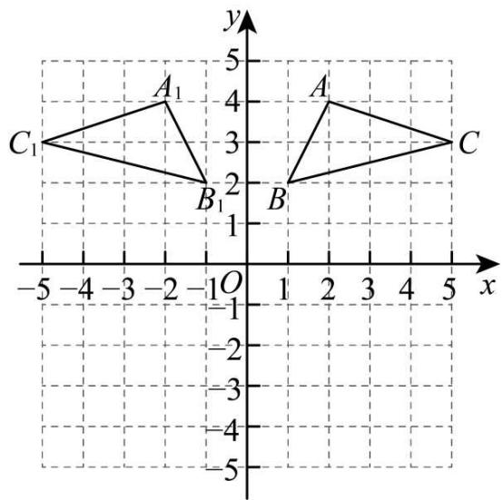

text_image

y
5
A₁
4
C₁
3
B₁
2
1
O
-1
-2
-3
-4
-5
-5
-4
-3
-2
-1
0
1
2
3
4
5
x

(2) 点A关于x轴的对称点 $A_{2}$ 的坐标为(2,-4).

【变式 12-2】（24-25 八年级上·浙江金华·期中）如图，正方形网格中每个小正方形的边长都为 1， $\triangle ABC$ 的顶点落在格点上，以 $B$ 为原点建立平面直角坐标系，将 $\triangle ABC$ 关于 $y$ 轴对称得到 $\triangle DEF$ .

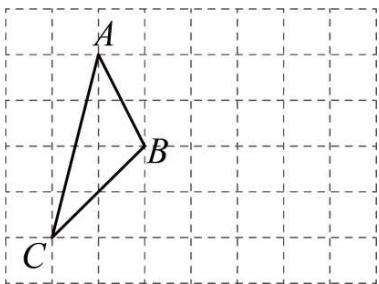

text_image

A
B
C

(1) 在网格中建立以 $B$ 为原点的平面直角坐标系，并画出 $\triangle DEF$ :  
(2)点 C 关于 x 轴的对称点的坐标为 \_\_\_\_ :  
(3)若点M在x轴上，且MB=3，求点M的坐标.

【答案】(1)见解析

(2)(-2,2)   
(3)点M的坐标为(3,0)或(-3,0).

【分析】本题考查了轴对称、坐标与图形：

(1) 根据题意, 建立如图所示平面直角坐标系, 再根据关于 $v$ 轴的对称点的坐标的特点即可求解:

(2) 根据关于 $x$ 轴的对称点的坐标的特点即可求解:

②依题意可设点 $M(a,0)$ ，则 $|a|=3$ ，进而可得 $a=+3$ ，则可求解.

【详解】（1）解：如图所示， $\triangle DEF$ 即为所求.

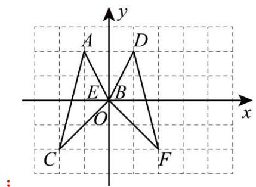

text_image

y
A D
E B
O x
C F
;

(2) 解: 点 $C$ 关于 $x$ 轴的对称点的坐标为 $(-2, 2)$ ;

故答案为： $(-2,2)$ ;

(3) 解: 依题意可设点 $M(a,0)$ ,

则 $|a|=3,$

解得： $a=\pm3$ ，

∴ 点M的坐标为(3,0)或(-3,0).

【变式 12-3】（24-25 八年级上·河南郑州·期末）在正方形网格中，每个小正方形的边长为 1，点 A(-4,5), C(-1,3), $A_{1}(4,5)$ ， $B_{1}(2,1)$ ， $\triangle ABC$ 与 $\triangle A_{1}B_{1}C_{1}$ 关于某直线成轴对称.

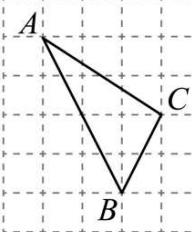

text_image

A
C
B

(1)在网格内画出平面直角坐标系，并画出 $\triangle A_{1}B_{1}C_{1}$ ;

(2)设 l 是过点 C 且平行于 x 轴的直线，点 A 关于直线 l 的对称点 $A'$ 的坐标是 \_；

(3)求 $\triangle ABC$ 的面积.

【答案】(1)见解析

(2) $(-4,1)$

(3)4

【分析】本题考查作图 - 轴对称变换、三角形的面积，熟练掌握轴对称的性质是解答本题的关键.

（1）根据点A,C的坐标建立平面直角坐标系即可．由题意知 $\triangle ABC$ 与 $\triangle A_{1}B_{1}C_{1}$ 关于 y 轴对称，根据轴对称的性质画图即可.  
(2) 结合轴对称的性质可得答案.   
(3) 利用割补法求三角形的面积即可.

【详解】（1）解：（1）画出平面直角坐标系如图所示，

可知 $\triangle ABC$ 与 $\triangle A_{1}B_{1}C_{1}$ 关于 y 轴对称.

如图， $\triangle A_{1}B_{1}C_{1}$ 即为所求.

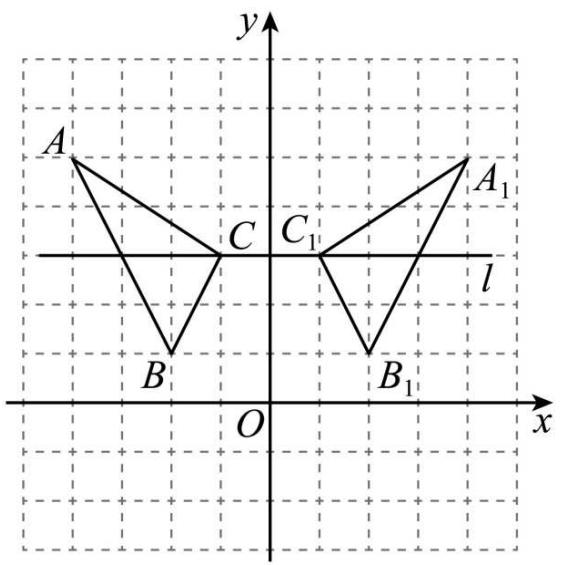

text_image

y
A
A₁
C
C₁
l
B
B₁
O
x

(2) 由题意得, 点 $A$ 关于直线 $l$ 的对称点 $A'$ 的坐标是 $(-4,1)$ .

故答案为： $(-4,1)$ .

（3） $\triangle ABC$ 的面积为 $\frac{1}{2} \times (2 + 4) \times 3 - \frac{1}{2} \times 1 \times 2 - \frac{1}{2} \times 2 \times 4 = 9 - 1 - 4 = 4.$

# 【题型13 利用轴对称设计图案】

【例 13】（24-25 八年级上·江西抚州·期中）如图，在平面直角坐标系中有四个点，它们的横、纵坐标均为整数．若在此平面直角坐标系内移动点A，使得这四个点构成的四边形是轴对称图形，并且点A的横、纵坐标仍是整数（A不在坐标轴上），则移动后点A的坐标为\_\_\_\_．

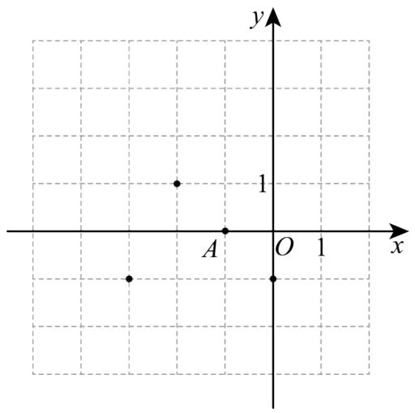

scatter

| Point | x | y |
|-------|---|---|
| A     | 0 | 1 |
| B     | 0 | 0 |
| C     | 0 | 0 |
| D     | 0 | 0 |

【答案】 $(-1, 1)$ 或 $(-2, -2)$ 或 $(-2, -3)$

【分析】本题考查了轴对称图形．根据如果一个图形沿一条直线折叠，直线两旁的部分能够互相重合，这个图形叫做轴对称图形，这条直线叫做对称轴进行分析，描点画图即可得解.

【详解】解：如图所示：

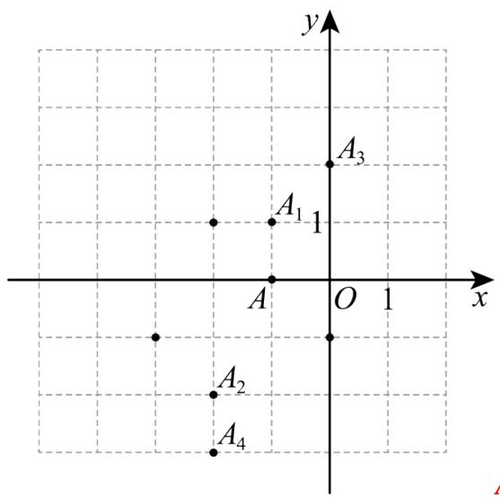

text_image

y
A₃
A₁ 1
A O 1 x
A₂
A₄

$A_{1}(-1, 1)$ , $A_{2}(-2,-2)$ , $A_{3}(0, 2)$ , $A_{4}(-2,-3)$ , ( $A_{3}$ 在坐标

轴上，舍去），

故答案为： $(-1, 1)$ 或 $(-2, -2)$ 或 $(-2, -3)$ .

【变式 13-1】（24-25 八年级上·北京·期末）如图，在 $3 \times 3$ 的正方形网格中有四个格点 $A, B, C, D$ ，以其中一个点为原点，网格线所在直线为坐标轴，建立平面直角坐标系，使其余三个点中存在两个点关于一条坐标轴对称，则原点可能是 \_\_\_\_.

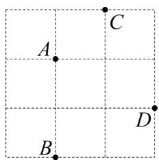

text_image

A
B
C
D

【答案】点D

【分析】本题考查平面直角坐标系的知识，解题的关键是根据题意，其余三个点中存在两个点关于一条坐标轴对称，根据平面直角坐标系的性质，找到坐标原点，即可.

【详解】解：其余三个点中存在两个点关于一条坐标轴对称，

如图所示：点A和点B关于x轴对称，

∴当原点为点D时，其余三个点中存在两个点关于一条坐标轴对称，

故答案为：点D.

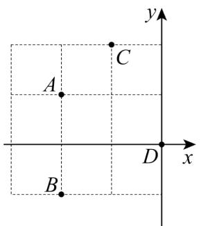

text_image

y
A
C
D
x
B

【变式 13-2】如图，平面直角坐标系中有四个点，他们的横纵坐标均为整数，若在次平面直角坐标系内移动点A至第四象限 $A'$ 处，使得这四个点构成的四边形是轴对称图形，并且点 $A'$ 横纵坐标仍是整数，则点 $A'$ 的坐标可以为\_\_\_\_（写出一个即可）

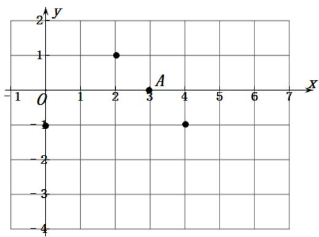

scatter

| Point | x | y |
|---|---|---|
| A | 3 | -1 |
| B | 2 | 1 |
| C | 4 | -1 |
| D | 0 | -1 |

【答案】(2,-3)答案不唯一

【分析】根据轴对称图形的定义：如果一个图形沿一条直线折叠，直线两旁的部分能够互相重合，这个图形叫做轴对称图形，这条直线叫做对称轴，把 A 进行移动可得到点的坐标.

【详解】解：如图当 $A'$ 在以x=2的直线上时，图形为轴对称图形，

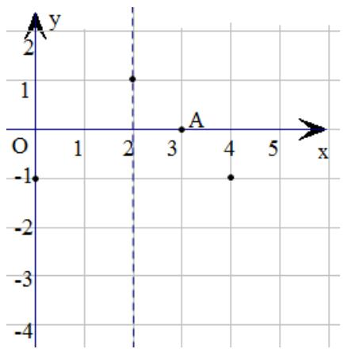

scatter

| x | y |
|---|---|
| 0 | -1 |
| 2 | 1 |
| 3 | 0 |
| 4 | -1 |

又因为 $A'$ 在第四象限，且 $A'$ 横纵坐标是整数，且当 $A'(-2,-1)$ 时四点构成三角形，

$\therefore A'$ 的横坐标为 2, 纵坐标为不等于 -1 的负整数即可.

故答案为：(2,-3)答案不唯一.

【点睛】此题主要考查了利用轴对称设计图案，坐标与图形.关键是掌握轴对称图形的定义，根据3个定点

所在位置，找出 $A'$ 的位置．特别注意当 $A'(-2,-1)$ 时四点构成三角形要舍去.

【变式 13-3】（23-24 八年级上·全国·课堂例题）在棋盘中建立如图所示的平面直角坐标系，A,O,B三颗棋子的位置如图所示，它们的坐标分别是 $(-1,1),(0,0)$ 和 $(1,0)$ .

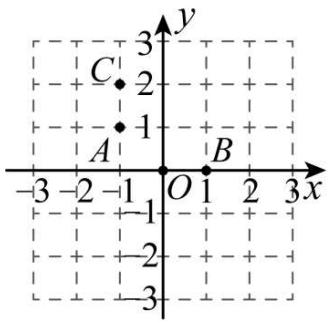

text_image

C
2
1
A
O
1
B
3
x
y
-3 -2 -1 0 1 2 3

(1)如图，添加棋子C，使A,O,B,C四颗棋子成为一个轴对称图形，请在图中画出该图形的对称轴；

(2)在其他格点位置添加一颗棋子P，使A，O,B,P四颗棋子成为一个轴对称图形，请直接写出棋子P所在位置的坐标（写出2个即可）.

【答案】(1)见解析

(2)(0,-1),(2,1)（答案不唯一）

【分析】（1）根据轴对称的性质，确定对称轴的位置即可；

(2) 根据轴对称图形的定义: 沿着一直线折叠后, 直线两旁的部分能重合是轴对称图形, 然后添加一颗棋子 $P$ 即可.

【详解】（1）解：如图所示，直线l即为所求.

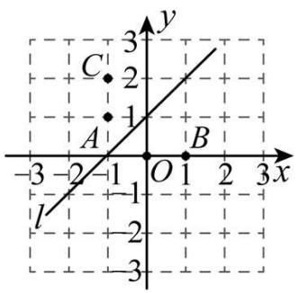

text_image

C
2
1
A
-3 -2 -1 O 1 2 3 x
l
-1
-2
-3

(2) 如图:

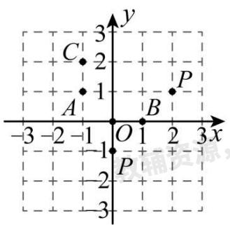

text_image

C
2
3
y
1
A
-1
O
1
2
3x
-3
-2
-1
-1
P
-2
-3

点 $P(0,-1)$ 或 $P(2,1)$ . （答案不唯一）

【点睛】此题主要考查了利用轴对称图形设计图案，关键是掌握轴对称图形的定义.