# 第一章 勾股定理·培优卷

# 【北师大版 2024】

考试时间：120 分钟 满分：120 分

姓名：\_\_\_\_ 班级：\_\_\_\_ 考号：\_\_\_\_

考卷信息:

本卷试题共 24 题，单选 10 题，填空 6 题，解答 8 题，满分 120 分，限时 120 分钟，本卷题型针对性较高，覆盖面广，选题有深度，可衡量学生掌握本章内容的具体情况！

# 第I卷

# 一．选择题（共10小题，满分30分，每小题3分）

1. （3 分）（24-25 八年级下·陕西安康·期末）下面各组数中，是勾股数的是（）

A. 1, 2, 3

B. 5, 8, 10

C. 5, 12, 13

D. 6, 6, 12

2. （3 分）（24-25 八年级下·广东惠州·期中）如图，点 $A$ 表示的数为（）

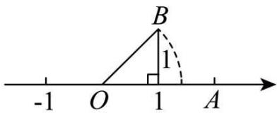

text_image

-1 O 1 A
B
1

A. 1.414

B. $1 - \sqrt{2}$

c. $\sqrt{2}-1$

D. $\sqrt{2}$

3. （3 分）（24-25 八年级下·湖南长沙·期末）如图，一架靠墙摆放的梯子长 15 米，底端离墙脚的距离为 9 米，则梯子顶端离地面的距离为（）米 教辅资源,关注公众号·全科AA+

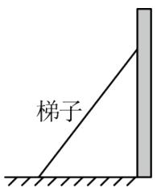

text_image

梯子

A. 15

B. 12

C. 10

D. 6

4. （3 分）（24-25 八年级下·云南文山·期末）如图，在 $\triangle ABC$ 中， $\angle C = 90^{\circ}$ ，点 $D$ 为 $BC$ 边上一点，将 $\triangle ACD$ 沿 $AD$ 翻折得到 $\triangle AC'D$ ，若点 $C'$ 在 $AB$ 边上， $AC = 6$ ， $BC = 8$ ，则 $BC'$ 的长为（）

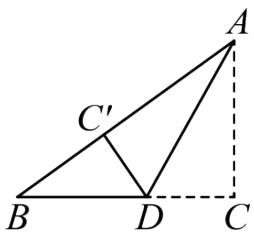

text_image

Geometric diagram showing triangle ABC with points D and C' and dashed auxiliary lines

A. 3

B. 4

C. 5

D. 6

5. （3分）（24-25八年级下·辽宁铁岭·期末）如图是“赵爽弦图”，其中 $\triangle ABH$ ， $\triangle BCG$ ， $\triangle CDF$ ， $\triangle DAE$ 是四个全等的直角三角形，四边形ABCD和EFGH都是正方形。如果 $AB = 10$ ， $DE = 6$ ，那么小正方形EFGH的面积是（）

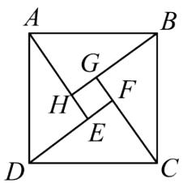

text_image

A
G
H
F
E
D
C
B

A. 2

B. 3

C. 4

D. 5

6. （3 分）（24-25 八年级下·山东菏泽·期末）如图，在矩形ABCD中，AB = 8，BC = 4，将△ADC沿对角线AC折叠，得到△AEC，CE交AB于点F，则重叠部分△AFC的面积为（）

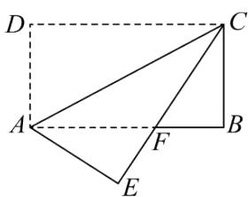

text_image

Geometric diagram of a quadrilateral ABCD with internal points E, F and dashed lines indicating hidden edges.

A. 6

B. 8

C. 10

D. 12

7. （3 分）（24-25 八年级下·四川广安·期末）如图，在四边形ABCD中， $\angle A = 90^{\circ}$ ，AB = AD = 2，
BC = 1, CD = 3，则 $\angle B$ 的度数为（）

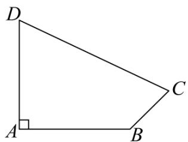

text_image

D
A
B
C

A. $120^{\circ}$

B. $125^{\circ}$

C. $130^{\circ}$

D. $135^{\circ}$

8. （3 分）（24-25 八年级下·广东江门·期末）如图，面积分别是 49 和 25 的两个正方形拼接在一起，它们的底边在同一直线上，则 $MN$ 的长为（）

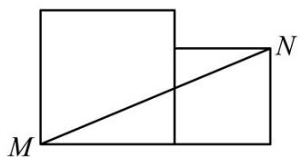

natural_image

Geometric diagram showing two adjacent rectangles with a diagonal line from M to N (no text or symbols)

A. 9

B. 10

C. 12

D. 13

9. （3 分）（24-25 八年级下·湖北武汉·期中）如图：在一个边长为 1 的小正方形组成的方格稿纸上，有 A、B、C、D、E、F、G 七个点，则在下列任选三个点的方案中可以构成直角三角形的是（）

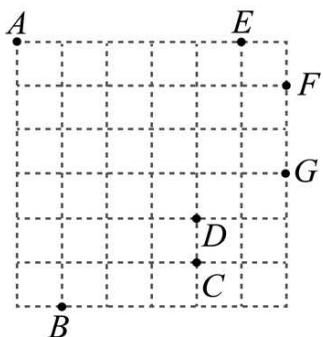

text_image

A
E
F
G
D
C
B

A. 点 $A$ 、点 $B$ 、点 $D$

B. 点 $A$ 、点 $C$ 、点 $G$

C. 点 B、点 E、点 F

D. 点 B、点 G、点 E

10. （3 分）（24-25 八年级下·安徽淮南·期末）如图，在矩形ABCD中，∠BAD的平分线交BC于点E，交DC的延长线于点F，取EF的中点G，连接CG，BG，BD，DG，则下列结论中错误的是（）

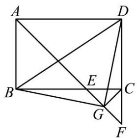

text_image

Geometric diagram of a square with labeled vertices and internal points, showing diagonals and segments.

A. BE = CD

B. $\angle DGF = 135^{\circ}$

C. $\angle ABG + \angle ADG = 180^{\circ}$

D. 若 $\frac{AB}{AD} = \frac{2}{3}$ , 则 $3S_{\triangle BDG} = 13S_{\triangle DGF}$

# 二．填空题（共6小题，满分18分，每小题3分）教辅资源,关注公众号·全科AA+

11. （3 分）（24-25 八年级下·吉林·期中）以直角三角形的三边为边向外作正方形，其中两个正方形的面积如图所示，则正方形A的边长为\_\_\_\_。

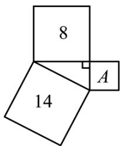

text_image

8
14
A

12. （3 分）（24-25 八年级下·湖南益阳·期末）如图，为修筑铁路需凿通隧道AC，现测量出 $\angle ACB = 90^{\circ}$ ， $AB = 6\mathrm{km}$ ， $BC = 4.8\mathrm{km}$ 。若每天凿隧道 $200\mathrm{m}$ ，则需要\_\_\_\_天才能把隧道AC凿通。

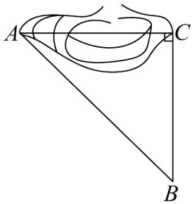

text_image

A
C
B

13. （3 分）（24-25 八年级下·四川成都·期末）如图，在 $\triangle ABC$ 中，分别以点 $A$ 和点 $B$ 为圆心，大于 $\frac{1}{2} AB$ 长为半径画弧，两弧交于点 $M, N$ ，作直线 $MN$ ，交 $AC$ 于点 $D$ ，连接 $BD$ ，若 $BC = 4, AC = 8, \angle DBC = 90^\circ$ ，则 $BD$ 的值为 \_\_\_\_.

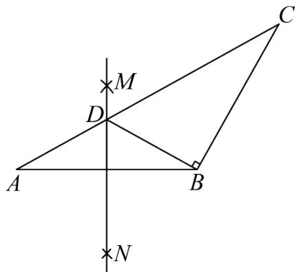

text_image

Geometric diagram with labeled points A, B, C, D, M, N and perpendicular lines, likely from a math problem or proof.

14. （3分）（24-25八年级上·陕西汉中·期末）如图，点D、E分别为△ABC的边BC、AC上的点，连接AD、DE，过点E作EF∥BC，连接CF，若∠ADB = ∠CAD + 30°，AE = 5，DE = 12，AD = 13，则∠DEF的度数为\_\_\_\_。

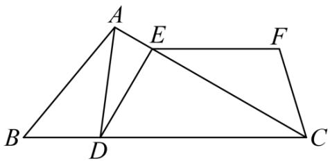

text_image

A
E
F
B
D
C

15. （3 分）（24-25 八年级下·贵州黔南·期末）如图，在矩形ABCD中，AB = 6, BC = 8, M 是线段BC上一动点，连接DM，沿DM 翻折 △DCM，点C 的对应点为点N，连接BN，当BN的长度最小时，CM的长是\_\_\_\_。

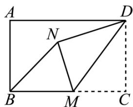

text_image

A
N
D
B
M
C

16. （3 分）（24-25 八年级下·福建厦门·期中）如图，某港口O位于南北方向的海岸线上．甲，乙两舰艇同时离开港口，各自沿一固定方向航行，甲舰艇每小时航行 16 海里，乙舰艇每小时航行 12 海里．它们离开港口 1.5 小时后分别位于点 P，Q 处，且相距 30 海里．已知甲舰艇沿北偏东40°方向航行，则乙舰艇的航行方向是\_\_\_\_．

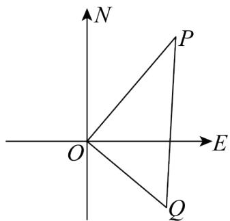

text_image

N
P
O
E
Q

# 第II卷

# 三．解答题（共8小题，满分72分）教辅资源,关注公众号·全科AA+

17. （6分）（24-25八年级下·陕西渭南·期末）如图，在Rt△ABC中，∠B=90°，AD平分∠BAC交BC于点D，点E为AC上一点，AB=AE，连接DE.

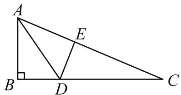

text_image

A
E
B
D
C

(1)求证： $AD^{2}=AE^{2}+DE^{2};$

(2)若BD=5，CD=13，求AE的长.

18. （6 分）（24-25 八年级下·新疆喀什·期末）正方形网格中的每个小正方形的边长都是 1，每个小格的顶点叫做格点．以格点为顶点．

(1)在网格中画一个长为 $\sqrt{20}$ 的线段;

(2)证明你画的线段为 $\sqrt{20}$ .

19. （8 分）（24-25 八年级下·湖南长沙·期末）树人学校为防止雨天地滑，在一段楼梯台阶上铺上一块地毯，将楼梯台阶完全盖住．已知楼梯台阶侧面图如图所示， $\angle C = 90^{\circ}$ ， $AC = 3\mathrm{m}$ ， $AB = 5\mathrm{m}$ .

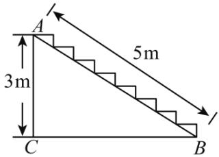

text_image

A
3m
5m
C
B

(1)求BC的长;

(2)若已知楼梯宽2.8m，每平方米地毯35元，需要花费多少钱地毯才能铺满所有台阶。（假设地毯在铺的过程中没有损耗）

20. （8 分）（2025 八年级下·河南·专题练习）如图，在一条笔直的火车轨道同侧有两城镇 A，B，城镇 A 到轨道的垂直距离 AM 为 5 千米，城镇 B 到轨道的垂直距离 BN 为 10 千米，MN 的长度为 12 千米.

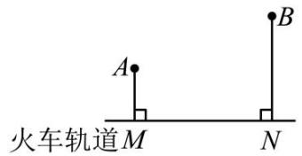

text_image

火车轨道M
A
B
N

(1)求城镇 A, B 之间的距离;

(2)现要在线段MN上修建一个货运中转站 P，使得中转站 P 到城镇 A，B 的距离相等，此时中转站应修建在离点 M 多远处？

21. （10 分）某单位有一块四边形的空地， $\angle B = 90^{\circ}$ ，量得个边的长度 $AB = 3$ 米， $BC = 4$ 米， $CD = 12$ 米， $AD = 13$ 米，现计划在空地内种草。

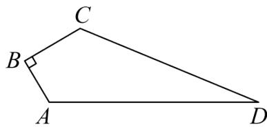

text_image

C
B
A
D

(1)连接AC，证明： $\triangle ACD$ 是直角三角形；

(2)若每平方米草地造价30元，这块地全部种草的费用是多少元？

22. （10 分）（24-25 八年级下·全国·期末）在春天来临之际，八（1）班和八（2）班的同学计划在学校劳动实践基地种植蔬菜；如图，点C是自来水管的位置，点A和点B分别表示八（1）班和八（2）班实践基地的位置，A、C两处相距6米，B、C两处相距8米，A、B两处相距10米；为了更好的使用自来水灌溉，八（1）班和八（2）班在图纸上设计了两种水管铺设方案：

八（1）班方案：沿线段AC、BC铺设2段水管；

八（2）班方案：过点C作CD⊥AB于点D，沿线段CD、AD、BD铺设3段水管；

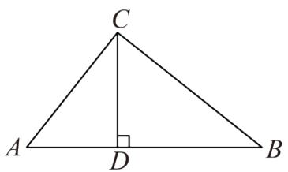

text_image

C
A D B

(1)求证： $AC\perp BC$   
(2)从节约水管的角度考虑，你会选择哪个班的铺设方案？为什么？

23. （12 分）（2025·河北廊坊·一模）观察下列等式：

<table><tr><td>第1个等式</td><td> $(2^{2}-1)^{2}+4^{2}=(2^{2}+1)^{2}$ </td></tr><tr><td>第2个等式</td><td> $(3^{2}-1)^{2}+6^{2}=(3^{2}+1)^{2}$ </td></tr><tr><td>第3个等式</td><td> $(4^{2}-1)^{2}+8^{2}=(\_)^{2}$ </td></tr><tr><td>第4个等式</td><td> $(5^{2}-1)^{2}+10^{2}=(5^{2}+1)$ </td></tr><tr><td>...</td><td>...</td></tr></table>

(1) 补充上述表格.

发现:

（2）请用含n（n为正整数，且n>1）的等式表示上述规律： $\underline{\hspace{2cm}}=(n^{2}+1)^{2}$

应用：

(3) 若三个整数能构成直角三角形的三条边长, 则称这三个数为勾股数 (例如: 3, 4, 5). 现有一个直角边为 14 的直角三角形, 它的三边长为勾股数, 请求这个直角三角形的面积.

24. （12 分）如图，在 Rt△ABC 中，∠C=90°，AB=5cm，AC=4cm，动点 P 从点 B 出发沿射线 BC 以 3cm/s 的速度移动，设运动的时间为 t 秒.

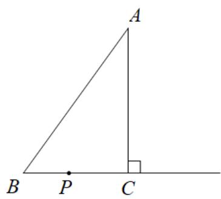

text_image

A
B P C

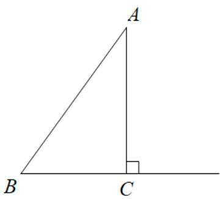

text_image

A
B C

备用图1

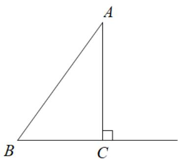

text_image

A
B C

备用图2

(1)求 BC 边的长;

(2)当 $\triangle ABP$ 为直角三角形时，求t的值；  
(3)当 $\triangle ABP$ 为等腰三角形时, 请直接写出此时 $t$ 的值.