# 第一章 勾股定理·培优卷

# 【北师大版 2024】

参考答案与试题解析

# 第I卷

# 一．选择题（共10小题，满分30分，每小题3分）

1. （3 分）（24-25 八年级下·陕西安康·期末）下面各组数中，是勾股数的是（）

A. 1, 2, 3

B. 5, 8, 10

C. 5, 12, 13

D. 6, 6, 12

【答案】C

【分析】本题考查了勾股数的定义.

根据勾股数的定义，勾股数是满足较小两个数的平方和等于最大数的平方的一组正整数，逐一验证各选项是否符合条件即可.

【详解】解：A. $1^{2} + 2^{2} = 1 + 4 = 5$ ，而 $3^{2} = 9$ ，不满足勾股定理，不是勾股数；

B. $5^{2} + 8^{2} = 25 + 64 = 89$ ，而 $10^{2} = 100$ ，不满足勾股定理，不是勾股数；  
C. $5^{2} + 12^{2} = 25 + 144 = 169$ ，而 $13^{2} = 169$ ，满足勾股定理，且均为正整数，是勾股数；  
D. $6^{2} + 6^{2} = 36 + 36 = 72$ ，而 $12^{2} = 144$ ，不满足勾股定理，不是勾股数；

故选：C.

2. （3 分）（24-25 八年级下·广东惠州·期中）如图，点 $A$ 表示的数为（）

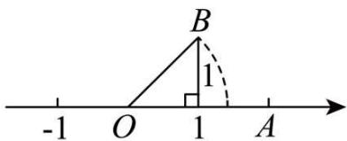

text_image

-1
O
1
A
B
1

A. 1.414

B. $1 - \sqrt{2}$

C. $\sqrt{2}-1$

D. $\sqrt{2}$

【答案】D

【分析】本题考查了勾股定理、实数与数轴，由勾股定理可得 $OA = OB = \sqrt{2}$ ，再根据数轴即可得解，熟练掌握以上知识点并灵活运用，采用数形结合的思想是解此题的关键.

【详解】解：由题意可得： $OA = OB = \sqrt{1^2 + 1^2} = \sqrt{2}$

∴点 A 表示的数为 $\sqrt{2}$ ,

故选：D.

3. （3 分）（24-25 八年级下·湖南长沙·期末）如图，一架靠墙摆放的梯子长 15 米，底端离墙脚的距离为 9

米，则梯子顶端离地面的距离为（）米

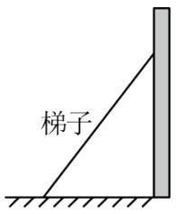

text_image

梯子

A. 15

B. 12

C. 10

D. 6

【答案】B

【分析】本题考查勾股定理的应用，根据勾股定理求解即可.

【详解】解：梯子顶端离地面的距离为： $\sqrt{15^{2}-9^{2}}=12$ （米），

故选：B.

4. （3 分）（24-25 八年级下·云南文山·期末）如图，在 $\triangle ABC$ 中， $\angle C = 90^{\circ}$ ，点 $D$ 为 $BC$ 边上一点，将 $\triangle ACD$ 沿 $AD$ 翻折得到 $\triangle AC'D$ ，若点 $C'$ 在 $AB$ 边上， $AC = 6$ ， $BC = 8$ ，则 $BC'$ 的长为（）

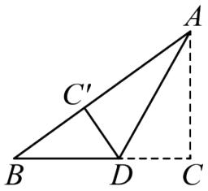

text_image

Geometric diagram showing triangle ABC with points D and C' on sides AB and AC, respectively, and dashed lines forming a right triangle.

A. 3

B. 4

C. 5

D. 6

【答案】B

【分析】本题考查了勾股定理，图形的翻折变换，掌握相关知识点是解题的关键.

先在 $\triangle ABC$ 中由勾股定理求出 $AB = 10$ ，再利用翻折的性质求出 $AC' = 6$ ，再求 $BC'$ 的长.

【详解】∵在 $\triangle ABC$ 中， $\angle C=90^{\circ}$ ，AC=6，BC=8，

$$
\therefore A B = \sqrt {A C ^ {2} + B C ^ {2}} = \sqrt {6 ^ {2} + 8 ^ {2}} = 1 0,
$$

由翻折的性质知， $AC' = AC = 6$ ，

$$
\therefore B C ^ {\prime} = A B - A C ^ {\prime} = 1 0 - 6 = 4.
$$

故选：B.

5. （3 分）（24-25 八年级下·辽宁铁岭·期末）如图是“赵爽弦图”，其中 $\triangle ABH$ ， $\triangle BCG$ ， $\triangle CDF$ ， $\triangle DAE$ 是四个全等的直角三角形，四边形ABCD和EFGH都是正方形。如果 $AB = 10$ ， $DE = 6$ ，那么小正方形EFGH 的面积是（）

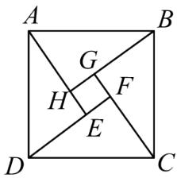

text_image

A
G
H
F
E
D
C
B

A. 2

B. 3

C. 4

D. 5

【答案】C

【分析】此题考查勾股定理的证明，关键是直角三角形中勾股定理的运用.

根据勾股定理求得BH，进而求得EF的值即可.

【详解】解：∵AB=10，DE=6，△ABH，△BCG，△CDF，△DAE是四个全等的直角三角形，

$$
\therefore A H = D E = 6,
$$

$$
\therefore B H = \sqrt {A B ^ {2} - A H ^ {2}} = 8,
$$

∵△ABH、△BCG、△CDF和△DAE是四个全等的直角三角形，

$$
\therefore B H = D F = 8,
$$

$$
\therefore E F = D F - D E = 8 - 6 = 2,
$$

∴小正方形EFGH的面积是4

故选：C.

6. （3 分）（24-25 八年级下·山东菏泽·期末）如图，在矩形ABCD中，AB = 8，BC = 4，将△ADC沿对角线AC折叠，得到△AEC，CE交AB于点F，则重叠部分△AFC的面积为（）

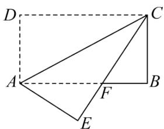

text_image

Geometric diagram with labeled points A, B, C, D, E, F and dashed lines forming triangles and quadrilaterals

A. 6

B. 8

C. 10

D. 12

【答案】C

【分析】本题主要考查了矩形与折叠的性质，全等三角形的性质和判定，勾股定理的运用等．由折叠的性质得 $\angle E = \angle D = \angle B = 90^{\circ}$ ， $AD = BC = AE$ ，可得 $\triangle AFE \cong \triangle CFB(AAS)$ ，再设 $AF = CF = x$ ， $BF = 8 - x$ ，在Rt $\triangle BCF$ 中利用勾股定理列出方程，解出 $x$ ，再根据三角形面积公式求解即可.

【详解】解：依题意可知，矩形沿对角线AC对折后有：

$$
\angle E = \angle D = \angle B = 9 0 ^ {\circ}, A D = B C = A E,
$$

$$
\because \angle A F E = \angle C F B,
$$

$$
\therefore \triangle A F E \cong \triangle C F B (\mathrm{AAS}),
$$

$$
\therefore C F = A F,
$$

设AF = CF = x,

$$
\therefore B F = 8 - x,
$$

在Rt $\triangle BCF$ 中， $BC^{2} + BF^{2} = FC^{2}$ ,

即 $4^{2}+(8-x)^{2}=x^{2}$ ,

解得x=5.

$$
\therefore C F = 5;
$$

$$
\therefore S _ {\triangle A E C} = \frac {1}{2} A F \cdot B C = \frac {1}{2} \times 5 \times 4 = 1 0.
$$

故选：C.

7. （3 分）（24-25 八年级下·四川广安·期末）如图，在四边形ABCD中， $\angle A = 90^{\circ}$ ，AB = AD = 2，
BC = 1, CD = 3，则 $\angle B$ 的度数为（）

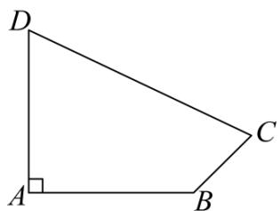

text_image

D
A
B
C

A. $120^{\circ}$

B. $125^{\circ}$

C. $130^{\circ}$

D. $135^{\circ}$

【答案】D

【分析】本题考查了勾股定理及其逆定理，正确掌握相关性质内容是解题的关键．连接BD，可求 $\angle ABD = 45^{\circ}$ ， $BD^{2} = AD^{2} + AB^{2} = 8$ ，再由 $BD^{2} + BC^{2} = CD^{2}$ ，可得 $\triangle BCD$ 是直角三角形，即可求解.

【详解】解：如图，连接BD，

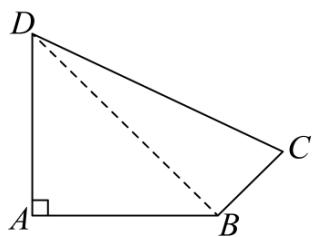

text_image

D
A
B
C

$$
\because \angle A = 9 0 ^ {\circ}, A B = A D = 2,
$$

$$
\therefore \angle A B D = 4 5 ^ {\circ}, B D ^ {2} = A D ^ {2} + A B ^ {2} = 8,
$$

$$
\because B C = 1, \quad C D = 3,
$$

$$
\therefore B C ^ {2} = 1, \quad C D ^ {2} = 9,
$$

$$
\because 8 + 1 = 9
$$

$$
\therefore B D ^ {2} + B C ^ {2} = C D ^ {2},
$$

∴ $\triangle BCD$ 是直角三角形， $\angle DBC = 90^{\circ}$ ,

$$
\therefore \angle A B C = 1 3 5 ^ {\circ}.
$$

故选：D.

8. （3 分）（24-25 八年级下·广东江门·期末）如图，面积分别是 49 和 25 的两个正方形拼接在一起，它们的底边在同一直线上，则 $MN$ 的长为（）

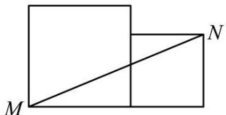

natural_image

Geometric diagram showing two rectangles with a diagonal line from M to N (no text or symbols)

A. 9

B. 10

C. 12

D. 13

【答案】D

【分析】本题考查了正方形的性质，勾股定理.

先求出 $AM = 7$ ， $AB = BN = 5$ ， $\angle B = 90^{\circ}$ ，进而得 $MB = AM + AB = 12$ ，然后在Rt△MNB中，由勾股定理即可求出MN的长.

【详解】解：如图所示：

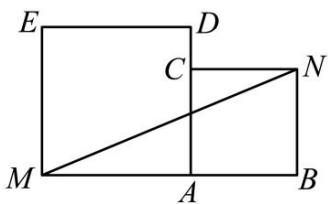

text_image

E
D
C
N
M
A
B

∵正方形MADE和正方形ABNC的面积分别是49和25,

$$
\therefore A M = 7, A B = B N = 5, \angle B = 9 0 ^ {\circ},
$$

∵M，A，B在同一条直线上，

$$
\therefore M B = A M + A B = 1 2,
$$

在Rt $\triangle MNB$ 中，

由勾股定理得： $MN = \sqrt{MB^2 + BN^2} = \sqrt{12^2 + 5^2} = 13.$

故选：D.

9. （3 分）（24-25 八年级下·湖北武汉·期中）如图：在一个边长为 1 的小正方形组成的方格稿纸上，有 A、B、C、D、E、F、G 七个点，则在下列任选三个点的方案中可以构成直角三角形的是（）

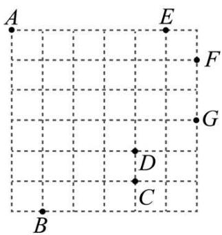

text_image

A
E
F
G
D
C
B

A. 点 $A$ 、点 $B$ 、点 $D$

B. 点 $A$ 、点 $C$ 、点 $G$

C. 点 $B$ 、点 $E$ 、点 $F$

D. 点 B、点 G、点 E

【答案】C

【分析】本题考查的是勾股定理，勾股定理的逆定理，利用数形结合求解是解答此题的关键.

根据勾股定理分别求得每两个点之间的距离的平方，再进一步利用勾股定理的逆定理进行分析.

【详解】解：A、 $AB^{2}=1+36=37$ ， $AD^{2}=16+16=32$ ， $BD^{2}=4+9=13$ ， $32+13\neq37$ ，不可以构成直角三角形，不符合题意；

B、 $AC^{2}=16+25=41$ ， $AG^{2}=9+36=45$ ， $CG^{2}=4+4=8$ ， $41+8\neq45$ ，不可以构成直角三角形，不符合题意；

C、 $BE^{2}=36+16=52$ ， $BF^{2}=25+25=50$ ， $EF^{2}=1+1=2$ ， $50+2=52$ ，可以构成直角三角形，符合题意；

D、 $BG^{2}=25+9=34,\quad BE^{2}=36+16=52,\quad GE^{2}=9+1=10,\quad 34+10\neq52$ ，不可以构成直角三角形，不符合题意.

故选：C.

10. （3 分）（24-25 八年级下·安徽淮南·期末）如图，在矩形ABCD中，∠BAD的平分线交BC于点E，交DC的延长线于点F，取EF的中点G，连接CG，BG，BD，DG，则下列结论中错误的是（）

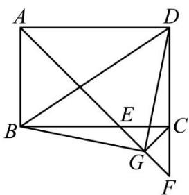

text_image

Geometric diagram of a square with labeled vertices and internal points, showing diagonals and segments.

A. BE = CD

B. $\angle DGF = 135^{\circ}$

C. $\angle ABG + \angle ADG = 180^{\circ}$

D. 若 $\frac{AB}{AD} = \frac{2}{3}$ , 则 $3S_{\triangle BDG} = 13S_{\triangle DGF}$

【答案】B

【分析】先求出 $\angle BAE=45^{\circ}$ ，判断出 $\triangle ABE$ 是等腰直角三角形，根据等腰直角三角形的性质可得 $AB=BE$ ， $\angle AEB=45^{\circ}$ ，从而得到 $BE=CD$ ；再求出 $\triangle CEF$ 是等腰直角三角形，根据等腰直角三角形的性质可得 $CG=EG$ ，再求出 $\angle BEG=\angle DCG=135^{\circ}$ ，然后利用“边角边”证明 $\triangle DCG\cong\triangle BEG$ ，得到 $\angle BGE=\angle DGC$ ，由 $\angle BGE<\angle AEB$ ，得到 $\angle DGC=\angle BGE<45^{\circ}$ ， $\angle DGF<135^{\circ}$ ；由于 $\angle CBG=\angle CDG$ ，得到 $\angle ABG+\angle ADG=\angle ABC+\angle CBG+\angle ADC-\angle CDG=\angle ABC+\angle ADC=180^{\circ}$ ；由 $\triangle BGD$ 是等腰直角三角形得到 $BD=\sqrt{AD^{2}+AB^{2}}=\sqrt{13}a$ ，求得 $S_{\triangle BDG}$ ，过 $G$ 作 $GM\perp CF$ 于 $M$ ，求得 $S_{\triangle DGF}$ ，进而得出答案.

【详解】解：∵四边形ABCD为矩形，

$$
\therefore \angle A B C = \angle B C D = \angle C D A = \angle B A D = 9 0 ^ {\circ}, A B = C D, A D = B C,
$$

∵AE平分∠BAD，

$$
\therefore \angle B A E = 4 5 ^ {\circ},
$$

∴ $\triangle ABE$ 是等腰直角三角形，

$$
\therefore A B = B E, \angle A E B = 4 5 ^ {\circ},
$$

$$
\because A B = C D,
$$

$$
\therefore B E = C D,
$$

故 A 选项不符合题意;

$$
\because \angle C E F = \angle A E B = 4 5 ^ {\circ}, \angle E C F = 9 0 ^ {\circ},
$$

∴ $\triangle CEF$ 是等腰直角三角形，

∵点G为EF的中点，

$$
\therefore C G = E G, \angle F C G = 4 5 ^ {\circ},
$$

$$
\therefore \angle B E G = \angle D C G = 1 3 5 ^ {\circ},
$$

在 $\triangle DCG$ 和 $\triangle BEG$ 中，

$$
\left\{ \begin{array}{c} B E = C D \\ \angle B E G = \angle D C G \\ C G = E G \end{array} \right.,
$$

$$
\therefore \triangle D C G \cong \triangle B E G (\text { SAS })
$$

$$
\therefore \angle B G E = \angle D G C, \angle C B G = \angle C D G
$$

$$
\because \angle B G E <   \angle A E B,
$$

$$
\therefore \angle D G C = \angle B G E <   4 5 ^ {\circ},
$$

$$
\because \angle C G F = 9 0 ^ {\circ},
$$

$$
\therefore \angle D G F <   1 3 5 ^ {\circ},
$$

故 B 选项符合题意;

$$
\because \angle B G E = \angle D G C, \angle C B G = \angle C D G
$$

$$
\therefore \angle A B G + \angle A D G = \angle A B C + \angle C B G + \angle A D C - \angle C D G = \angle A B C + \angle A D C = 1 8 0 ^ {\circ},
$$

故 C 选项不符合题意;

$$
\because \frac {A B}{A D} = \frac {2}{3},
$$

∴设AB=2a，AD=3a，

$$
\because \triangle D C G \cong \triangle B E G,
$$

$$
\because \angle B G E = \angle D G C, B G = D G,
$$

$$
\because \angle E G C = 9 0 ^ {\circ},
$$

$$
\therefore \angle B G D = 9 0 ^ {\circ},
$$

$$
\because B D = \sqrt {A D ^ {2} + A B ^ {2}} = \sqrt {1 3} a,
$$

$$
\therefore B G = D G = \frac {\sqrt {2 6}}{2} a,
$$

$$
\therefore S _ {\triangle B D G} = \frac {1}{2} \times \frac {\sqrt {2 6}}{2} a \times \frac {\sqrt {2 6}}{2} a = \frac {1 3}{4} a ^ {2}
$$

$$
\therefore 3 S _ {\triangle B D G} = \frac {3 9}{4} a ^ {2},
$$

过G作 $GM \perp CF$ 于M，如图：

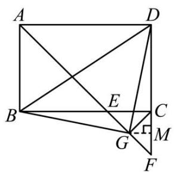

text_image

Geometric diagram of a square with labeled points and intersecting lines, likely for a math problem or proof.

$$
\because C E = C F = B C - B E = B C - A B = a,
$$

$$
\therefore G M = \frac {1}{2} C F = \frac {1}{2} a,
$$

$$
\therefore S _ {\triangle D G F} = \frac {1}{2} D F \cdot G M = \frac {1}{2} \times 3 a \times \frac {1}{2} a = \frac {3}{4} a ^ {2},
$$

$$
\therefore 1 3 S _ {\triangle D G F} = \frac {3 9}{4} a ^ {2},
$$

$$
\therefore 3 S _ {\triangle B D G} = 1 3 S _ {\triangle D G F},
$$

故 D 选项不符合题意;

故选：B.

【点睛】本题考查了矩形的性质、勾股定理，全等三角形的判定与性质、等腰直角三角形的判定与性质；熟练掌握矩形的性质，证明三角形全等和等腰直角三角形是解决问题的关键.

# 二．填空题（共6小题，满分18分，每小题3分）

11. （3 分）（24-25 八年级下·吉林·期中）以直角三角形的三边为边向外作正方形，其中两个正方形的面积如图所示，则正方形A的边长为\_\_\_\_。

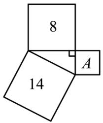

text_image

8
14
A

【答案】 $\sqrt{6}$

【分析】本题考查了勾股定理，根据勾股定理结合正方形的面积，即可求解.

【详解】解：由题意可知， $8 + S_{A} = 14$ ，

那么 $S_{A}=14-8=6$ ,

所以正方形A的边长为 $\sqrt{14-8}=\sqrt{6}$ .

故答案为： $\sqrt{6}$ .

12. （3 分）（24-25 八年级下·湖南益阳·期末）如图，为修筑铁路需凿通隧道AC，现测量出 $\angle ACB = 90^{\circ}$ ， $AB = 6\mathrm{km}$ ， $BC = 4.8\mathrm{km}$ 。若每天凿隧道 $200\mathrm{m}$ ，则需要\_\_\_\_天才能把隧道AC凿通。

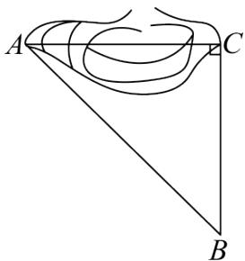

text_image

A
C
B

【答案】18

【分析】此题主要考查了勾股定理的应用，熟练掌握勾股定理是解题的关键.

根据勾股定理求出AC的长，即可解决问题.

【详解】解：∵ $\angle ACB = 90^{\circ}$ ，AB = 6km，BC = 4.8km，

$$
\therefore A C = \sqrt {A B ^ {2} - B C ^ {2}} = \sqrt {6 ^ {2} - 4 . 8 ^ {2}} = 3. 6 (\mathrm{km}) = 3 6 0 0 \mathrm{m},
$$

∴ $3600 \div 200 = 18$ (天),

即需要 18 天才能将隧道 AC 凿通，

故答案为：18.

13. （3 分）（24-25 八年级下·四川成都·期末）如图，在 $\triangle ABC$ 中，分别以点 $A$ 和点 $B$ 为圆心，大于 $\frac{1}{2} AB$ 长为半径画弧，两弧交于点 $M, N$ ，作直线 $MN$ ，交 $AC$ 于点 $D$ ，连接 $BD$ ，若 $BC = 4, AC = 8, \angle DBC = 90^\circ$ ，则 $BD$ 的值为 \_\_\_\_.

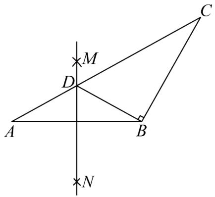

text_image

Geometric diagram with labeled points A, B, C, D, M, N and perpendicular lines, likely from a math problem or proof.

【答案】3

【分析】本题考查作图—基本作图、勾股定理，线段垂直平分线的性质，解题的关键是理解题意，灵活运用所学知识解决问题．由作图过程可知，直线MN为线段AB的垂直平分线，则AD=BD．设AD=BD=x，则CD=AC-AD=8-x，在Rt△BCD中，由勾股定理得 $BD^{2}+BC^{2}=CD^{2}$ ，代入求出x的值即可.

【详解】解：由作图过程可知，直线MN为线段AB的垂直平分线，

$$
\therefore A D = B D.
$$

设AD = BD = x,

则CD = AC - AD = 8 - x,

在Rt $\triangle BCD$ 中，由勾股定理得 $BD^{2} + BC^{2} = CD^{2}$ ,

即 $x^{2}+4^{2}=(8-x)^{2}$ ,

解得x=3，

$$
\therefore B D = 3.
$$

故答案为：3.

14. （3分）（24-25八年级上·陕西汉中·期末）如图，点D、E分别为△ABC的边BC、AC上的点，连接AD、DE，过点E作EF∥BC，连接CF，若∠ADB = ∠CAD + 30°，AE = 5，DE = 12，AD = 13，则∠DEF的度数为\_\_\_\_。

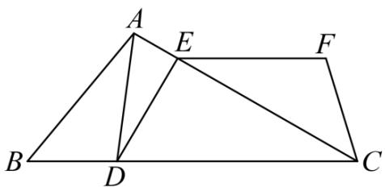

text_image

A
E
F
B
D
C

【答案】120°/120度

【分析】本题考查了三角形外角的性质，勾股定理逆定理，平行线的性质，利用勾股定理证明出 $\triangle ADE$ 是直角三角形是解题关键．由三角形外角的性质，得出 $\angle ACD = 30^{\circ}$ ，再结合平行线的性质，得到 $\angle CEF = 30^{\circ}$ ，利用勾股定理逆定理，得出 $\angle AED = 90^{\circ}$ ，即可求出 $\angle DEF$ 的度数.

【详解】解：∵∠ADB是△CAD的外角，

$$
\therefore \angle A D B = \angle C A D + \angle A C D,
$$

$$
\because \angle A D B = \angle C A D + 3 0 ^ {\circ},
$$

$$
\therefore \angle A C D = 3 0 ^ {\circ},
$$

$$
\because E F \parallel B C,
$$

$$
\therefore \angle C E F = \angle A C D = 3 0 ^ {\circ},
$$

$$
\because A E = 5, D E = 1 2, A D = 1 3,
$$

$$
\therefore A E ^ {2} + D E ^ {2} = A D ^ {2},
$$

$$
\therefore \angle A E D = 9 0 ^ {\circ},
$$

$$
\therefore \angle C E D = 9 0 ^ {\circ},
$$

$$
\therefore \angle D E F = \angle C E F + \angle C E D = 1 2 0 ^ {\circ},
$$

故答案为： $120^{\circ}$ .

15. （3 分）（24-25 八年级下·贵州黔南·期末）如图，在矩形ABCD中，AB = 6, BC = 8, M 是线段BC上一动点，连接DM，沿DM 翻折 △DCM，点C 的对应点为点N，连接BN，当BN的长度最小时，CM的长是\_\_\_\_。

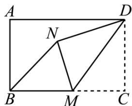

text_image

A
N
D
B
M
C

【答案】3

【分析】该题考查了矩形的性质，折叠的性质，勾股定理，解题的关键是确定当点B,N,D共线时，BN最小，是解题的关键．根据勾股定理求出BD，根据折叠可得CM=NM,DN=CD=6, $\angle DNM=\angle C=90^{\circ}$ ，得出当点B,N,D共线时，BN最小，此时BN=4，在Rt△BNM中，根据勾股定理求解即可.

【详解】解：连接BD，

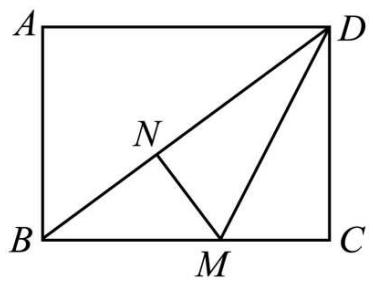

text_image

A
N
B
M
C
D

在矩形ABCD中， $AB = CD = 6, BC = 8, \angle C = 90^{\circ}$

$$
\therefore B D = \sqrt {B C ^ {2} + C D ^ {2}} = \sqrt {8 ^ {2} + 6 ^ {2}} = 1 0,
$$

根据折叠可得CM = NM, DN = CD = 6, $\angle DNM = \angle C = 90^{\circ}$ ,

$$
\because B N \geq B D - D N,
$$

故当点B,N,D共线时，BN最小，此时BN=BD-DN=10-6=4，

$$
\because \angle B N M = 9 0 ^ {\circ},
$$

在Rt $\triangle BNM$ 中， $BM^{2}=BN^{2}+MN^{2}$

即 $(8 - MC)^{2} = 4^{2} + MC^{2}$

解得：MC = 3，

故答案为：3.

16. （3 分）（24-25 八年级下·福建厦门·期中）如图，某港口O位于南北方向的海岸线上．甲，乙两舰艇同时离开港口，各自沿一固定方向航行，甲舰艇每小时航行 16 海里，乙舰艇每小时航行 12 海里．它们离开港口 1.5 小时后分别位于点 P，Q 处，且相距 30 海里．已知甲舰艇沿北偏东40°方向航行，则乙舰艇的航行方向是\_\_\_\_．

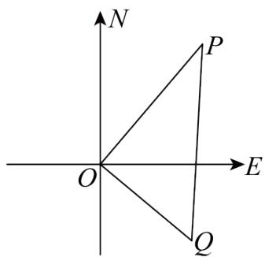

text_image

N
P
O
E
Q

【答案】南偏东50°

【分析】此题主要考查了勾股定理的逆定理的应用．直接得出OP = 24海里，OQ = 18海里，PQ = 30海里，利用勾股定理逆定理以及方向角得出答案.

【详解】解：由题意可得： $OP = 16 \times 1.5 = 24$ 海里， $OQ = 12 \times 1.5 = 18$ 海里，PQ = 30海里，

$$
\because 1 8 ^ {2} + 2 4 ^ {2} = 3 0 ^ {2},
$$

$\therefore \triangle OPQ$ 是直角三角形，

$$
\therefore \angle P O Q = 9 0 ^ {\circ},
$$

∵甲舰艇沿北偏东40°方向航行，

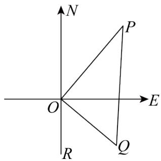

text_image

N
P
O
E
R
Q

$$
\therefore \angle R O Q = 1 8 0 ^ {\circ} - 9 0 ^ {\circ} - 4 0 ^ {\circ} = 5 0 ^ {\circ},
$$

∴乙舰艇的航行方向是南偏东50°.

故答案为：南偏东 $50^{\circ}$

# 第II卷

# 三．解答题（共8小题，满分72分）

17. （6 分）（24-25 八年级下·陕西渭南·期末）如图，在Rt△ABC中，∠B = 90°，AD平分∠BAC交BC于点D，点E为AC上一点，AB = AE，连接DE.

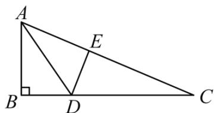

text_image

A
E
B
D
C

(1)求证： $AD^{2} = AE^{2} + DE^{2}$

(2)若BD=5，CD=13，求AE的长.

【答案】(1)见解析

(2)7.5

【分析】本题主要考查了勾股定理，全等三角形的性质与判定，证明 $\triangle ABD \cong \triangle AED$ 是解题的关键.

（1）利用SAS证明 $\triangle ABD \cong \triangle AED$ 得到 $\angle AED = \angle B = 90^{\circ}$ ，则由勾股定理可证明结论；

（2）由全等三角形的性质得到 $DE = BD = 5$ ，由勾股定理可得 $CE = 12$ ，设 $AB = AE = x$ ，则 $AC = x + 12$ 由勾股定理可得 $x^{2} + (5 + 13)^{2} = (x + 12)^{2}$ ，解方程即可得到答案.

【详解】（1）证明：∵AD平分∠BAC，

$$
\therefore \angle B A D = \angle E A D,
$$

又∵AB = AE, AD = AD,

$$
\therefore \triangle A B D \cong \triangle A E D (\mathrm{SAS}),
$$

$$
\therefore \angle A E D = \angle B = 9 0 ^ {\circ},
$$

$$
\therefore A D ^ {2} = A E ^ {2} + D E ^ {2};
$$

(2) 解: $\because \triangle ABD \cong \triangle AED$ ,

$$
\therefore D E = B D = 5.
$$

在Rt $\triangle CDE$ 中，由勾股定理可得 $CE = \sqrt{CD^{2} - DE^{2}} = 12$ ，

设AB = AE = x，则AC = x + 12，

在Rt $\triangle ABC$ 中，由勾股定理可得 $AB^{2} + BC^{2} = AC^{2}$ ,

$$
\therefore x ^ {2} + (5 + 1 3) ^ {2} = (x + 1 2) ^ {2}.
$$

解得x=7.5，即AE的长为7.5.

18. （6 分）（24-25 八年级下·新疆喀什·期末）正方形网格中的每个小正方形的边长都是 1，每个小格的顶点叫做格点．以格点为顶点．

(1)在网格中画一个长为 $\sqrt{20}$ 的线段;

(2)证明你画的线段为 $\sqrt{20}$ .

【答案】(1)见解析

(2)见解析

【分析】本题考查利用勾股定理画图.

（1）借助格点，根据勾股定理构长为 $\sqrt{20}$ 的线段即可；

(2) 利用勾股定理进行证明即可.

【详解】（1）解：线段AB即为边长为 $\sqrt{20}$ 的线段；

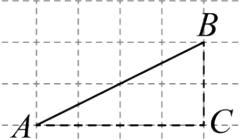

（2）解：∵△ABC为直角三角形，AC=4，BC=2，

$$
\therefore A B = \sqrt {A C ^ {2} + B C ^ {2}} = \sqrt {4 ^ {2} + 2 ^ {2}} = \sqrt {2 0}.
$$

19. （8 分）（24-25 八年级下·湖南长沙·期末）树人学校为防止雨天地滑，在一段楼梯台阶上铺上一块地毯，将楼梯台阶完全盖住．已知楼梯台阶侧面图如图所示， $\angle C = 90^{\circ}$ ， $AC = 3\mathrm{m}$ ， $AB = 5\mathrm{m}$ .

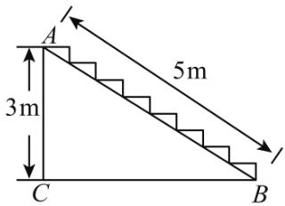

text_image

A
3m
5m
C
B

(1)求BC的长;

(2)若已知楼梯宽 $2.8 \mathrm{~m}$ , 每平方米地毯 35 元, 需要花费多少钱地毯才能铺满所有台阶. (假设地毯在铺的过程中没有损耗)

【答案】(1)BC的长为4m

(2)需要花费 686 元地毯才能铺满所有台阶

【分析】本题考查了勾股定理的应用.

（1）由勾股定理列式计算即可；

(2) 由长方形面积公式计算即可.

【详解】（1）解：∵∠C=90°，AC=3m，AB=5m，

在Rt $\triangle ABC$ 中，由勾股定理得： $BC = \sqrt{AB^{2} - AC^{2}} = 4m$ ，

答：BC的长为4m；

(2) 解: 地毯长为: $3 + 4 = 7 \, (\text{m})$ ,

已知楼梯宽2.8m，每平方米地毯35元，

∴地毯的面积为 $2.8 \times 7 = 19.6(m^{2})$ ,

∴需要花费 $35 \times 19.6 = 686$ （元），

答：需要花费 686 元地毯才能铺满所有台阶.

20. （8 分）（2025 八年级下·河南·专题练习）如图，在一条笔直的火车轨道同侧有两城镇 A，B，城镇 A

到轨道的垂直距离AM为5千米，城镇B到轨道的垂直距离BN为10千米，MN的长度为12千米.

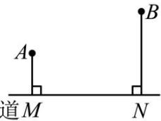

text_image

A
道M
B
N

(1)求城镇 A, B 之间的距离;

(2)现要在线段MN上修建一个货运中转站 P，使得中转站 P 到城镇 A，B 的距离相等，此时中转站应修建在离点 M 多远处？

【答案】(1)城镇A，B之间的距离为13千米

(2)中转站P应修建在离点M的距离为 $\frac{73}{8}$ 千米处.

【分析】本题主要考查了勾股定理的实际应用，矩形的性质与判定，正确作出辅助线是解题的关键.

(1) 过点A作 $AE \perp BN$ 于点E，连接AB，可证明四边形AMNE为矩形，得到AE = MN = 12千米，NE = AM = 5千米，求出BE = 5（千米），由勾股定理可得 $AB = \sqrt{AE^{2} + BE^{2}} = 13$ （千米）；

(2) 连接 $PA, PB$ , 设 $PM = x$ 千米, 则 $PN = (12 - x)$ 千米. 由勾股定理可得 $5^{2} + x^{2} = (12 - x)^{2} + 10^{2}$ , 解方程即可得到答案.

【详解】（1）解：如图所示，过点A作 $AE \perp BN$ 于点E，连接AB.

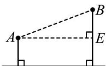

火车轨道M N ∴∠AEN = 90°.

∵ AM ⊥ MN, BN ⊥ MN,

$\therefore \angle AMN = 90^{\circ}, \angle MNE = 90^{\circ},$

∴ 四边形AMNE为矩形，

$\therefore AE = MN = 12$ 千米， $NE = AM = 5$ 千米，

∴ BE = BN - NE = 10 - 5 = 5（千米），

∴ 在Rt $\triangle AEB$ 中， $AB = \sqrt{AE^{2} + BE^{2}} = 13$ （千米），

答：城镇A，B之间的距离为13千米；

(2) 解: 如图, 连接 $PA$ , $PB$ , 设 $PM = x$ 千米, 则 $PN = (12 - x)$ 千米.

$$
\because P A = P B,
$$

$$
\therefore A M ^ {2} + P M ^ {2} = P A ^ {2} = P B ^ {2} = P N ^ {2} + B N ^ {2},
$$

$$
\therefore 5 ^ {2} + x ^ {2} = (1 2 - x) ^ {2} + 1 0 ^ {2},
$$

解得 $x=\frac{73}{8}$ ,

∴ 中转站P应修建在离点M的距离为 $\frac{73}{8}$ 千米处.

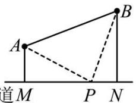

text_image

A
B
首M
P
N

21. （10 分）某单位有一块四边形的空地， $\angle B = 90^{\circ}$ ，量得个边的长度 $AB = 3$ 米， $BC = 4$ 米， $CD = 12$ 米， $AD = 13$ 米，现计划在空地内种草.

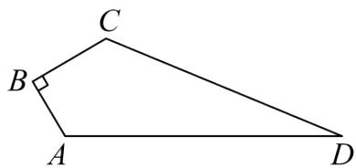

text_image

C
B
A
D

(1)连接AC，证明： $\triangle ACD$ 是直角三角形；

(2)若每平方米草地造价30元，这块地全部种草的费用是多少元？

【答案】(1)见解析

(2)1080 元

【分析】（1）先求AC的长，再使用勾股定理的逆定理即可证明；

（2）利用 $S_{四边形ABCD}=S_{\triangle ABC}+S_{\triangle ACD}$ 求出面积即可解答.

【详解】（1）证明：连接AC，在 $Rt\triangle ABC$ 中，

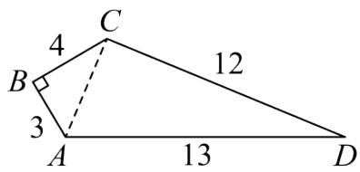

text_image

C
4
B 12
3
A 13 D

$$
A C = \sqrt {A B ^ {2} + B C ^ {2}} = \sqrt {3 ^ {2} + 4 ^ {2}} = 5,
$$

在 $\triangle ACD$ 中，

$$
C D ^ {2} + A C ^ {2} = 1 2 ^ {2} + 5 ^ {2} = 1 3 ^ {2} = A D ^ {2},
$$

$$
\therefore A C \perp C D,
$$

$\therefore \triangle ACD$ 是直角三角形;

(2) $S_{\text{四边形}ABCD} = S_{\triangle ABC} + S_{\triangle ACD} = \frac{1}{2} AB \cdot BC + \frac{1}{2} CD \cdot AC = \frac{1}{2} \times 3 \times 4 + \frac{1}{2} \times 12 \times 5 = 36$ （平方米），

∴所需费用为 $36 \times 30 = 1080$ （元）.

【点睛】本题考查了勾股定理及其逆定理和求四边形面积，解题的关键是熟练掌握以上知识点及运用割补

法求面积.

22. （10 分）（24-25 八年级下·全国·期末）在春天来临之际，八（1）班和八（2）班的同学计划在学校劳动实践基地种植蔬菜；如图，点C是自来水管的位置，点A和点B分别表示八（1）班和八（2）班实践基地的位置，A、C两处相距6米，B、C两处相距8米，A、B两处相距10米；为了更好的使用自来水灌溉，八（1）班和八（2）班在图纸上设计了两种水管铺设方案：

八（1）班方案：沿线段AC、BC铺设2段水管；

八（2）班方案：过点C作 $CD \perp AB$ 于点D，沿线段CD，AD，BD铺设3段水管；

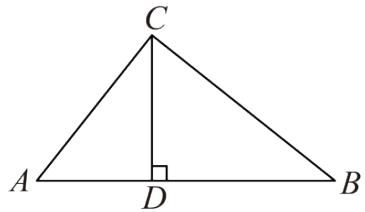

text_image

C
A D B

(1)求证： $AC\perp BC$

(2)从节约水管的角度考虑，你会选择哪个班的铺设方案？为什么？

【答案】(1)见解析

(2)应选择八（1）班铺设方案，理由见解析

【分析】本题主要考查了勾股定理的实际应用，求三角形高，解题的关键是掌握相关知识的灵活运用.

(1) 利用勾股定理的逆定理证明 $\triangle ABC$ 是直角三角形, 且 $\angle ACB = 90^{\circ}$ , 即可证明结论;

（2）利用等面积法求出 $CD=\frac{24}{5}m$ ，进而求出两个方案中水管的长度即可得到结论.

【详解】（1）证明：由题意得，AC = 6m, BC = 8m, AB = 10m,

$$
\because 6 ^ {2} + 8 ^ {2} = 1 0 ^ {2},
$$

$$
\therefore A C ^ {2} + B C ^ {2} = A B ^ {2},
$$

∴ $\triangle ABC$ 是直角三角形，且 $\angle ACB = 90^{\circ}$ ,

$$
\therefore A C \perp B C;
$$

(2) 解: 从节约水管的角度考虑, 应选择八 (1) 班铺设方案,

理由如下：∵CD⊥AB，

$$
\therefore S _ {\triangle A B C} = \frac {1}{2} A C \cdot B C = \frac {1}{2} A B \cdot C D,
$$

$$
\therefore C D = \frac {A C \cdot B C}{A B} = \frac {2 4}{5} m,
$$

$$
\therefore A D + C D + B D = A B + C D = 1 0 + \frac {2 4}{5} = \frac {7 4}{5},
$$

$$
\because A C + B C = 6 + 8 = 1 4, \text {且} 1 4 <   \frac {7 4}{5},
$$

∴八（1）班方案中水管的长度小于八（2）班方案中水管的长度，

∴从节约水管的角度考虑，应选择八（1）班铺设方案.

23. （12 分）（2025·河北廊坊·一模）观察下列等式：

<table><tr><td>第1个等式</td><td> $(2^{2}-1)^{2}+4^{2}=(2^{2}+1)^{2}$ </td></tr><tr><td>第2个等式</td><td> $(3^{2}-1)^{2}+6^{2}=(3^{2}+1)^{2}$ </td></tr><tr><td>第3个等式</td><td> $(4^{2}-1)^{2}+8^{2}=(\_)^{2}$ </td></tr><tr><td>第4个等式</td><td> $(5^{2}-1)^{2}+10^{2}=(5^{2}+1)$ </td></tr><tr><td>...</td><td>...</td></tr></table>

(1) 补充上述表格.

发现:

（2）请用含n（n为正整数，且n>1）的等式表示上述规律： $\underline{\hspace{2cm}}=(n^{2}+1)^{2}$

应用：

(3) 若三个整数能构成直角三角形的三条边长, 则称这三个数为勾股数 (例如: 3, 4, 5). 现有一个直角边为 14 的直角三角形, 它的三边长为勾股数, 请求这个直角三角形的面积.

【答案】（1） $4^{2}+1$ ; （2） $(n^{2}-1)^{2}+(2n)^{2}$ ; （3）196

【分析】本题考查找规律，涉及勾股数，根据题中所给等式的结构特征找准规律即可，熟练掌握寻找规律的方法是解决问题的关键.

(1) 由题中所给等式的结构特征即可得到答案;

(2) 根据题中所给等式的结构特征即可得到答案;

(3) 由 (2) 中找到的规律, 结合题意可得这个直角三角形的直角边 $2n = 14$ , 从而结合规律得到直角三角形的另一条直角边, 最后由三角形面积公式代值求解即可得到答案.

【详解】解：（1）补充上述表格， $(4^{2}-1)^{2}+8^{2}=(4^{2}+1)^{2}$

故答案为： $4^{2}+1;$

（2）用含 $n$ （ $n$ 为正整数，且 $n > 1$ ）的等式表示上述规律： $(n^2 - 1)^2 + (2n)^2 = (n^2 + 1)^2$ 故答案为： $(n^2 - 1)^2 + (2n)^2$

（3）由（2）中规律 $(n^{2}-1)^{2}+(2n)^{2}=(n^{2}+1)^{2}$

则存在以 $n^{2}-1$ 、2n为直角边， $n^{2}+1$ 为斜边的直角三角形，

∴ 当有一个直角边为 14 的直角三角形时，它的三边长为勾股数，可得 2n = 14，解得 n = 7，

∴ 直角三角形的另一个直角边是 $7^{2}-1=48$ ,

则这个直角三角形的面积为 $\frac{1}{2}\times14\times28=196.$

24. （12 分）如图，在 Rt△ABC 中，∠C=90°，AB=5cm，AC=4cm，动点 P 从点 B 出发沿射线 BC 以 3cm/s 的速度移动，设运动的时间为 t 秒.

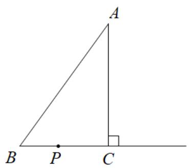

text_image

A
B P C

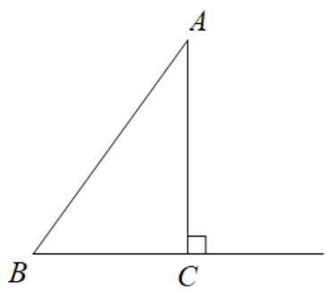

text_image

A
B C

备用图1

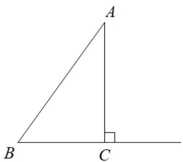

text_image

A
B C

备用图2

(1)求 $BC$ 边的长;   
(2)当 $\triangle ABP$ 为直角三角形时，求t的值；  
(3)当 $\triangle ABP$ 为等腰三角形时，请直接写出此时t的值.

【答案】(1)3cm

(2)t=1 或 $\frac{25}{9}$   
(3) $t=\frac{5}{3}$ 或2或 $\frac{25}{18}$

【分析】（1）根据题意，在 $Rt\triangle ABC$ 中，利用勾股定理求解即可；

(2) 由题意可知, 分两种情况: ① $\angle A P B = 90^{\circ}$ ; ② $\angle B A P = 90^{\circ}$ , 代值求解即可;  
（3）由题意可知，分三种情况：①BA = BP；②AB = AP；③PA = PB，分别结算求解即可.

【详解】（1）解：∵在Rt△ABC中， $\angle ACB=90^{\circ}$ ，AB=5cm，AC=4cm，

$$
\therefore B C = \sqrt {A B ^ {2} - A C ^ {2}} = 3 \mathrm{cm};
$$

(2) 解: 由题意可知, 分两种情况: ① $\angle APB = 90^{\circ}$ ; ② $\angle BAP = 90^{\circ}$ ,

设 $BP = 3t\mathrm{cm}$ ， $\angle B\neq 90^{\circ}$

①当 $\angle APB=90^{\circ}$ 时，易知点P与点C重合，

$\therefore BP = BC,$ 即 3t=3,

$$
\therefore t = 1;
$$

②当 $\angle PAB=90^{\circ}$ 时，如下图所示：

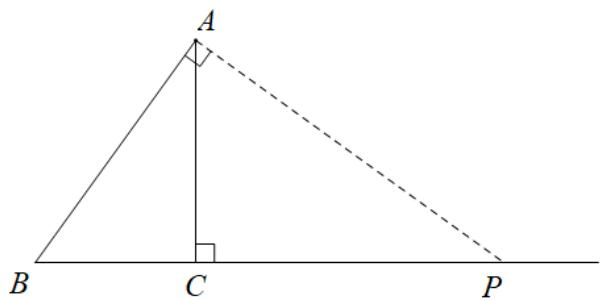

text_image

A
B C P

$$
\therefore C P = B P - B C = (3 t - 3) \mathrm{cm},
$$

$\because AC^{2}+CP^{2}=AP^{2}=BP^{2}-AB^{2}$ ，即 $4^{2}+\left(3t-3\right)^{2}=\left(3t\right)^{2}-5^{2}$ ，解得： $t=\frac{25}{9}$ ，

综上所述：当 $\triangle ABP$ 为直角三角形时，t=1 或 $\frac{25}{9}$ ;

(3) 解: 由题意可知, 分三种情况: ① $BA = BP$ ; ② $AB = AP$ ; ③ $PA = PB$ ,

①当BA = BP = 5cm时，如图所示：

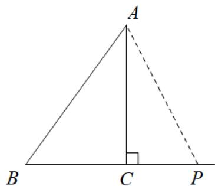

text_image

A
B C P

$$
\therefore t = \frac {5}{3};
$$

②当AB = AP = 5cm时，如图所示：

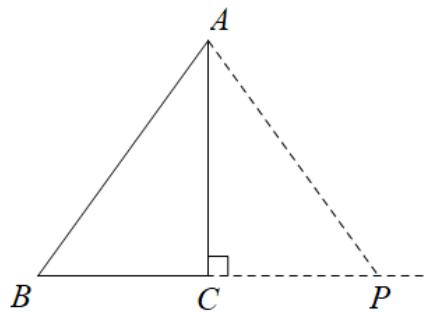

text_image

A
B C P

根据等腰三角形“三线合一”可知，AC是 $\Delta ABP$ 边BP上的中线，

$$
\therefore B P = 2 B C = 6 \mathrm{cm},
$$

$$
\therefore t = \frac {6}{3} = 2;
$$

③当PA = PB时，如图所示：

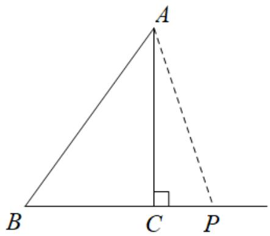

text_image

A
B C P

设PC = x，则PB = BC + PC = 3 + x = PA，

在 $Rt\Delta APC$ 中， $\angle ACP = 90^{\circ}$ ， $PC = x$ ， $PA = x + 3$ ， $AC = 4$ ，则由勾股定理可得 $AC^2 +PC^2 = PA^2$ ，即 $4^{2}+$ $x^{2} = (x + 3)^{2}$ ，解得 $x = \frac{7}{6}$

$$
\therefore B P = B C + P C = 3 + \frac {7}{6} = \frac {2 5}{6} \mathrm{cm},
$$

$$
\therefore t = \frac {2 5}{6} \div 3 = \frac {2 5}{1 8},
$$

综上所述： $t=\frac{5}{3}$ 或2或 $\frac{25}{18}$ .

【点睛】本题考查三角形中的动点问题，涉及到勾股定理求线段长、三角形为直角三角形的讨论和三角形为等腰三角形的讨论等知识，熟练掌握相关知识点及分类情况是解决问题的关键.