# 第一章 勾股定理·拔尖卷

# 【北师大版 2024】

考试时间：120 分钟 满分：120 分

姓名：\_\_\_\_ 班级：\_\_\_\_ 考号：\_\_\_\_

考卷信息:

本卷试题共 24 题，单选 10 题，填空 6 题，解答 8 题，满分 120 分，限时 120 分钟，本卷题型针对性较高，覆盖面广，选题有深度，可衡量学生掌握本章内容的具体情况！

# 第I卷

# 一．选择题（共10小题，满分30分，每小题3分）

1. （3 分）（24-25 八年级上·广西百色·期末）已知 $\triangle ABC$ 中， $a, b, c$ 分别是 $\angle A, \angle B, \angle C$ 的对边，下列条件不能判断 $\triangle ABC$ 是直角三角形的是（）

A. $\angle A = \angle C - \angle B$

B. $\angle A:\angle B:\angle C = 2:3:4$

C. $(b + c)(b - c) = a^{2}$

D. $a = \frac{5}{4}$ , $b = \frac{3}{4}$ , c = 1

2. （3 分）（24-25 八年级下·辽宁铁岭·期末）如图，在数轴上，点 A，B 表示的数分别为 0，2， $BC \perp AB$ 于点 B，且 BC = 1，连接 AC，在 AC 上截取 CD = BC，以 A 为圆心，AD 的长为半径画弧，交线段 AB 于点 E，则点 E 表示的实数是（）

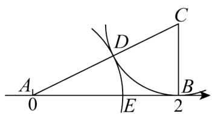

text_image

A
0
E
D
C
B
2

A. $\sqrt{5} - 1$

B. $-\sqrt{5}+1$

C. $\sqrt{5}$

D. $\sqrt{5} + 1$

3. （3 分）（24-25 八年级上·广东佛山·期末）如图，分别以 Rt△ABC 的三边为边长向外侧作正方形，面积分别记为 $S_{1}$ ， $S_{2}$ ， $S_{3}$ 。若 $S_{3} + S_{2} - S_{1} = 20$ ，则图中阴影部分的面积为（）

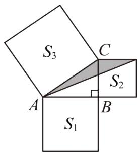

text_image

S₃
C
A
S₂
B
S₁

A. 5

B. 10

C. 15

D. 20

4. （3 分）（24-25 八年级下·山东德州·期中）有一个边长为 1 的大正方形，经过 1 次“生长”后，在它的左右肩上生出两个小正方形，其中三个正方形围成的三角形是直角三角形，再经过 1 次“生长”后，形成的图形如图 1 所示．如果继续“生长”下去，它将变得“枝繁叶茂”如图 2 所示，若“生长”了 2025 次后，形成的图形中所有的正方形的面积和是（）

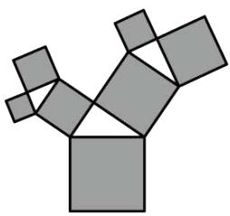

natural_image

Abstract geometric pattern composed of gray squares forming a Y-shape (no text or symbols)

图1

natural_image

Abstract geometric pattern composed of interconnected colored squares forming a tree-like structure (no text or symbols)

图2

A. 2026

B. 2025

C. $2^{2025}$

D. $2^{2022}-1$

5. （3 分）（24-25 八年级下·全国·期中）如图，在 $5 \times 5$ 的正方形网格中，从在格点上的点 $A, B, C, D$ 中任取三点，所构成的三角形是直角三角形的是（）

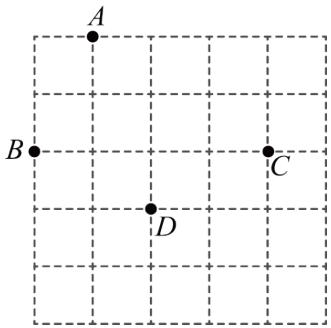

text_image

A
B
C
D

A. $\triangle ABD$

B. $\triangle ADC$

C. $\triangle BCD$

D. $\triangle ABC$

6. （3分）（24-25八年级下·福建莆田·期中）如图，在 $\triangle ABC$ 中， $\angle ACB = 90^{\circ}$ ， $AC = BC$ ， $P$ 是 $\triangle ABC$ 内的一点，且 $PB = 1$ ， $PC = 2$ ， $PA = 3$ ，则 $\angle BPC$ 的度数为（）

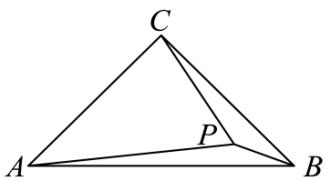

text_image

C
A
P
B

A. $120^{\circ}$

B. $135^{\circ}$

C. $140^{\circ}$

D. $150^{\circ}$

7. （3 分）（24-25 八年级下·江苏扬州·期中）如图，将一张边长为8的正方形纸片ABCD折叠，使点D落在BC的中点E处，点A落在点F处，折痕为MN，则线段MN长的平方为（）

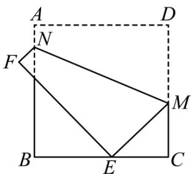

text_image

A
D
N
F
M
B
E
C

A. 100

B. 80

C. 89

D. 84

8. （3分）如图，在 $\triangle ABC$ 中， $AB=6$ ， $AC=9$ ， $AD\perp BC$ 于D，M为AD上任一点，则 $MC^{2}-MB^{2}$ 等于（）

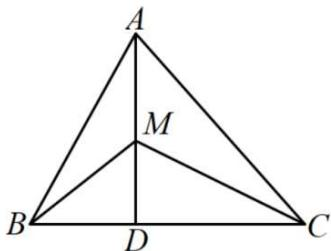

text_image

A
M
B
D
C

A. 29

B. 32

C. 36

D. 45

9. （3分）（23-24八年级下·全国·单元测试）斜拉桥是我国流行的桥型之一，大跨径斜拉桥已居世界第一．如图， $OA_{1} = A_{1}A_{2} = A_{2}A_{3} = A_{3}A_{4}$ ， $OB_{1} = B_{1}B_{2} = B_{2}B_{3} = B_{3}B_{4}$ ，如果最长的钢索 $A_{4}B_{4} = 80\mathrm{m}$ ，那么钢索 $A_{2}B_{2}$ 、 $A_{1}B_{1}$ 的长分别是（）

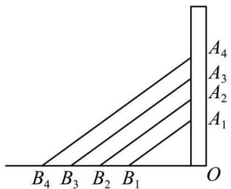

text_image

B₄ B₃ B₂ B₁
O
A₁
A₂
A₃
A₄

A. 60m,40m

B. 60m,30m

C. 40m,20m

D. 40m,10m

10. （3 分）如图有一圆柱，高为 8cm，底面直径为 4cm，在圆柱下底面 A 点有一只蚂蚁，它想吃上底面与 A 相对的 B 点处的食物，需爬行的最短路程大约为(取 $\pi = 3$ )( )

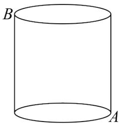

natural_image

Simple line drawing of a cylinder with labeled points A and B (no text or symbols beyond labels)

A. 10cm

B. 12cm

C. 14cm

D. 20cm

二．填空题（共6小题，满分18分，每小题3分）教辅资源,关注公众号·全科AA+

11. （3 分）（24-25 八年级下·山西吕梁·期末）如图， $\triangle ABC$ 中， $AC:BC:AB = 3:4:5$ ，点 $D$ 在 $BC$ 上，点 $E$ 为 $AB$

的中点，AD，CE相交于点F，且AD=DB．若 $\angle B=35^{\circ}$ ，则 $\angle DFE$ 的度数是\_\_\_\_.

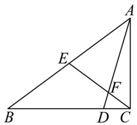

text_image

Geometric diagram of triangle ABC with internal points D, E, F and line segments AD, BE, EF labeled

12. （3分）（24-25七年级下·四川成都·期末）如图，高度为1米的平台上有一根长为8米的木杆垂直于台面AB，在一降大风后，木杆从点E处折断，AE依然垂直于AB，木杆顶端落在地面的点D处，已知 $AB\|CD, AB=2$ 米，CD=1米，则木杆依然直立的部分AE的长为\_\_\_\_。

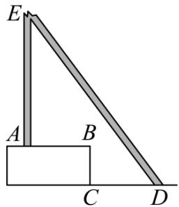

text_image

E
A B
C D

13. （3 分）（24-25 八年级上·四川成都·期末）我国古代称直角三角形为“勾股形”，并且直角边中较短边为勾，另一直角边为股，斜边为弦．如图 1 所示，数学家刘徽（约公元 225 年—公元 295 年）将勾股形分割成一个正方形和两对全等的直角三角形，后人借助这种分割方法所得的图形证明了勾股定理．如图 2 所示的长方形，是由两个完全相同的“勾股形”拼接而成，若 $AC = 6$ ， $CD = 2$ ，则长方形的面积为\_\_\_\_．

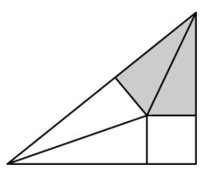

natural_image

Geometric diagram of a right triangle divided into smaller triangles and a shaded triangular region (no text or labels)

图1

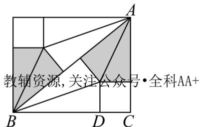

text_image

教辅资源,关注公众号·全科AA+

图2

14. （3 分）（24-25 八年级下·河南安阳·阶段练习）如图，在单位长度为 1 的 $3 \times 4$ 的网格系中， $\triangle ABC$ 的顶点都在格点上，则 $\angle ABC =$ \_\_\_\_.

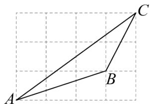

text_image

Geometric diagram showing triangle ABC with point B on side AC and line segment BC drawn on grid paper

15. （3 分）（24-25 八年级下·四川成都·期末）如图，射线 $OM$ 、 $ON$ 互相垂直， $OA = 8$ ，在线段 $OA$ 的垂直平分线 $l$ 上取一点 $B$ ，连接 $AB, AB = 5$ 。将线段 $AB$ 绕点 $O$ 按逆时针方向旋转得到对应线段 $A'B'$ ，若点 $B'$ 恰好落在射线ON上，则点 $A'$ 到射线OM的距离d= \_\_\_\_.

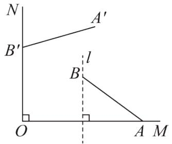

text_image

N
A'
B'
l
B
O
A M

16. （3分）（24-25八年级下·黑龙江哈尔滨·期末）把一副三角板按如图所示的位置放置，其中 $\angle ACB = \angle CED = 90^{\circ}$ ， $\angle CAB = 45^{\circ}$ ， $\angle CDE = 30^{\circ}$ ，斜边 $AB = 12$ ， $CD = 14$ ， $AB$ 与 $CD$ 相交于点 $O$ ，若 $\angle BCE = 15^{\circ}$ ，连接 $AD$ ，则 $AD$ 的长为\_\_\_\_。

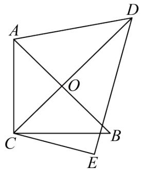

text_image

Geometric diagram with labeled points A, B, C, D, E, and intersection O

# 第II卷

# 三．解答题（共8小题，满分72分）

17. （6 分）（24-25 八年级下·河北邯郸·期末）如图，将矩形ABCD沿直线AE折叠，顶点D恰好落在BC边上的点F处．已知BC = 10cm，AB = 8cm.

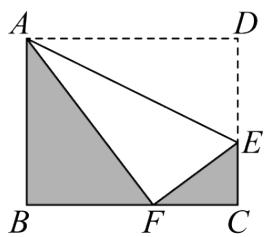

text_image

A
D
E
B
F
C

(1)求CF、CE的长;

(2)求阴影部分的面积.

18. （6分）（24-25八年级下·广西钦州·期末）如图，在一条东西走向的省级干线公路 $l$ 的一侧有一村庄 $P$ ，由 $P$ 原有两条笔直小路 $PB$ 、 $PA$ 与 $l$ 相连接，其中 $AP = AB$ ，由于某种原因，由 $P$ 到 $A$ 的路已经不通，现今该村的乡村产业振兴小组为方便村民运输农产品与出行，争取上级支持新建了一条公路 $PC$ （ $A, C, B$ 在同一条直线上），测得 $PB = 6.5$ 千米， $BC = 2.5$ 千米， $PC = 6$ 千米。

text_image

P
l
A C B

(1)问是否为从村庄 P 到公路 l 的最近路线？请通过计算加以说明：  
(2)求原来的路线PA的长.

19. （8分）（23-24八年级下·辽宁铁岭·阶段练习）如图所示，一个实心长方体盒子，长AB=4，宽BC=2，高 $CC_{1}=1$ ，一只蚂蚁从顶点A出发，沿长方体的表面爬到对角顶点 $C_{1}$ 处，问怎样走路线最短？最短路线长为多少？（点拨：分三种情况讨论解答）

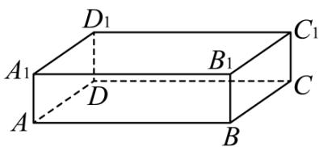

text_image

D₁
A₁
B₁
C₁
D
A
B
C

20. （8 分）（24-25 八年级下·湖北恩施·期末）如图，正方形网格中的每个小正方形的边长都是 1，每个小格的顶点叫做格点.

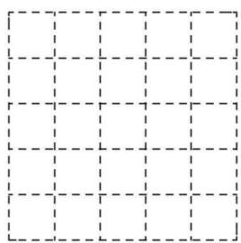

natural_image

Empty grid pattern with dashed lines forming a 4x4 layout (no text or symbols)

图1

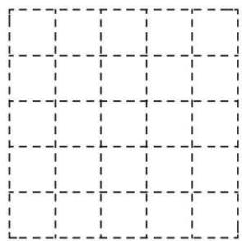

natural_image

Empty grid pattern with dashed lines forming a 4x4 layout (no text or symbols)

图2

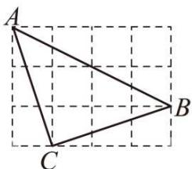

text_image

A
C
B

图3

(1)在图 1 中以格点为顶点画一个面积为 5 的正方形.  
(2)在图 2 中以格点为顶点画一个三角形，使三角形三边长分别为 2、 $\sqrt{5}$ 、 $\sqrt{13}$ .  
(3)如图 3，点 A、B、C 是小正方形的顶点，求 $\angle ABC$ 的度数.

21. （10 分）（24-25 八年级上·贵州贵阳·期中）对角线互相垂直的四边形叫做“垂美”四边形，现有如图所示的“垂美”四边形ABCD，对角线AC，BD交于点O.

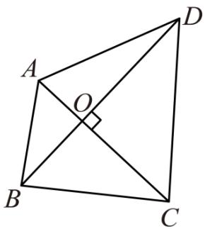

text_image

Geometric diagram of quadrilateral ABCD with diagonals intersecting at O and a right angle at C

(1)若 $AO = 2$ ， $BO = 3$ ， $CO = 4$ ， $DO = 5$ ，请求出 $A B^{2}$ ， $B C^2$ ， $CD^2$ ， $DA^2$ 的值.  
(2)若 $AB = 6$ ， $CD = 10$ ，求 $BC^2 + AD^2$ 的值.  
(3)请根据（1）（2）题中的信息，写出关于“垂美”四边形关于边的一条结论.

22. （10 分）（24-25 八年级下·山西阳泉·期中）【创新考法】阅读与思考

下面是一位同学的数学学习笔记(部分)，请仔细阅读并完成相应任务

# 等面积法在解题中的应用

等面积法是初中几何中的重要解题方法，它一般是利用等面积把几何问题中的线段关系或量与量之间的关系转化为面积关系来解决问题的一种方法，这种方法可以把问题

简捷化，提高学习效率.下面是我利用等面积法证明勾股定理的例子.

例：如图 1， $\triangle ABC \cong \triangle DAE$ ，点 E 在线段 AC 上， $\angle ACB = \angle AED = 90^{\circ}$ ，记

$$
B C = A E = a, A C = D E = b, A B = D A = c. \text {求证:} a ^ {2} + b ^ {2} = c ^ {2}.
$$

证明：连接CD,BD，过点D作BC边上的高DF，则DF=EC=b-a.

$$
\because S _ {\text {四边形} A D C B} = S _ {\triangle A C D} + S _ {\triangle A B C} = \frac {1}{2} b ^ {2} + \frac {1}{2} a b,
$$

$$
S _ {\text {四边形} A D C B} = S _ {\triangle A D B} + S _ {\triangle D C B} = \frac {1}{2} c ^ {2} + \frac {1}{2} a (b - a),
$$

$$
\therefore \frac {1}{2} b ^ {2} + \frac {1}{2} a b = \frac {1}{2} c ^ {2} + \frac {1}{2} a (b - a),
$$

$$
\therefore a ^ {2} + b ^ {2} = c ^ {2}
$$

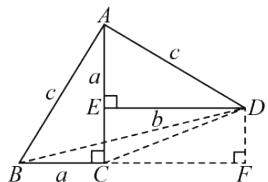

text_image

A
c
a
E
b
D
B
a
C
F

图1

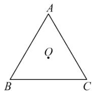  
图2

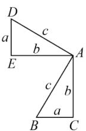  
图3

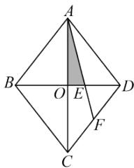

text_image

A
B
O
E
D
F
C

图4

任务:

(1)如图2，点 $O$ 是 $\triangle ABC$ 内角平分线的交点，作 $OD \perp AB$ ，垂足为点 $D$ ．（尺规作图，保留作图痕迹，不写作法）． $OD = 2\mathrm{cm}$ ， $\triangle ABC$ 的周长为 $30\mathrm{cm}$ ，则 $\triangle ABC$ 的面积为 $\mathrm{cm}^2$   
(2)将两个全等的直角三角形按图3所示摆放，其中 $\angle DAB = 90^{\circ}$ ，参照阅读材料中例题的证明方法，求证： $a^{2} + b^{2} = c^{2}$ .  
(3)如图4, 在菱形ABCD中, 对角线AC,BD交于点O, E是BD上一点, 且BE=2DE. 若AC=8cm,BD=6cm, 则图中阴影部分的面积为\_\_\_\_cm².

23. （12 分）【背景材料】小颖和小强在做课后习题时，遇到这样一道题：“已知Rt $\triangle ABC$ 中，

$\angle ACB = 90^{\circ}$ , $CA = CB$ , $\angle MCN = 45^{\circ}$ , 如图（a）所示, 当点 $M$ 、 $N$ 在 $AB$ 上时, 试判断线段 $AM$ , $MN$ , $BN$ 的数量关系.

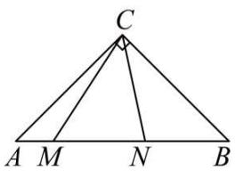

text_image

C
A M N B

(a)

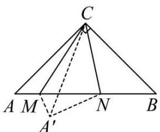

text_image

Geometric diagram of a pyramid with labeled vertices and internal points, including dashed lines for hidden segments.

(b)

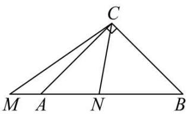

text_image

C
M A N B

(c)

小颖的解题思路：如图（b）所示，将 $\triangle ACM$ 沿直线 CM 对折，得 $\triangle A^{\prime}CM$ ，连 $A^{\prime}N$ ，

(1)你认为 $\angle MA^{\prime}N$ 的度数为\_\_\_\_.   
(2)按照小颖的思路，判断图（b）线段AM，MN，BN的数量关系，并完整证明.   
(3)【解决问题】当 M 在 BA 的延长线上，点 N 在线段 AB 上，其他条件不变，如图（C）所示，第（2）问中的结论是否成立．如果成立，请证明．如果不成立，请说明理由．

24. （12 分）（24-25 八年级下·山西长治·期末）综合与探究

四边形ABCD是一张正方形纸片，小明用该纸片玩折纸游戏.

【探究发现】

(1) 如图 1, 小明将 $\triangle ABE$ 沿 $AE$ 翻折得到 $\triangle AB'E$ , 点 $B$ 的对应点为 $B'$ , 将纸片展平后, 连接 $BB'$ 并延长交边 $CD$ 于点 $F$ , 小明发现折痕 $AE$ 与 $BF$ 存在特殊的数量关系, 数量关系为\_\_\_\_; 说明理由.

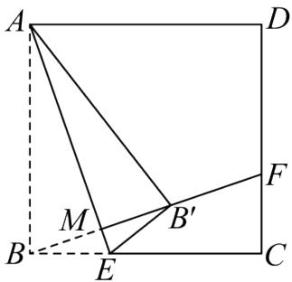

text_image

A
D
M
B'
E
C
F

图1

# 【类比探究】

(2) 如图 2, 小明继续折纸, 将四边形 $ABEG$ 沿 $GE$ 所在直线翻折得到四边形 $A'B'EG$ , 点 $A$ 的对应点为点 $A'$ , 点 $B$ 的对应点为点 $B'$ , 将纸片展平后, 连接 $BB'$ 交边 $CD$ 于点 $F$ , 请你猜想线段 $AG$ 、 $CE$ 、 $DF$ 之间的数量关系并证明;

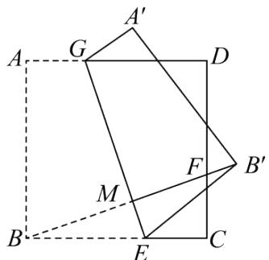

text_image

A'
G
D
A
F
B'
M
B
E
C

图2

# 【拓展延伸】

（3）在（2）的翻折过程中，如图3，若线段 $A'B'$ 恰好经过点 $D$ ，如果正方形ABCD的边长为9， $CF = 3$ ，直接写出CE的长.

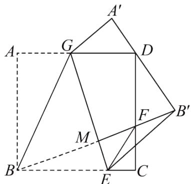

text_image

A'
G
D
A
F
B'
M
B
E
C

图3