# 第一章 勾股定理·拔尖卷

# 【北师大版 2024】

参考答案与试题解析

# 第I卷

# 一．选择题（共10小题，满分30分，每小题3分）

1. （3 分）（24-25 八年级上·广西百色·期末）已知 $\triangle ABC$ 中， $a, b, c$ 分别是 $\angle A, \angle B, \angle C$ 的对边，下列条件不能判断 $\triangle ABC$ 是直角三角形的是（）

A. $\angle A = \angle C - \angle B$

B. $\angle A:\angle B:\angle C = 2:3:4$

C. $(b + c)(b - c) = a^{2}$

D. $a = \frac{5}{4}$ , $b = \frac{3}{4}$ , c = 1

【答案】B

【分析】本题考查勾股定理的逆定理，三角形内角和定理，熟练掌握勾股定理的逆定理是解题的关键。根据直角三角形的判定方法，逐一用勾股定理的逆定理和三角形内角和定理分析各选项是否存在 $90^{\circ}$ 角即可求解。

【详解】解：A. 由 $\angle A = \angle C - \angle B$ ，结合内角和得 $\angle A + \angle B + \angle C = 180^{\circ}$

代入得 $\angle C-\angle B+\angle B+\angle C=180^{\circ}$ ，解得 $\angle C=90^{\circ}$ ，

△ABC为直角三角形，故此选项不符合题意.

B. 设 $\angle A = 2x, \angle B = 3x, \angle C = 4x,$

则 $2x + 3x + 4x = 180^{\circ}$ ,

解得 $x=20^{\circ}$ ,

故 $\angle A=40^{\circ}$ ， $\angle B=60^{\circ}$ ， $\angle C=80^{\circ}$ ，无直角，不能判定为直角三角形，故此选项符合题意.

C. $(b+c)(b-c)=a^{2}$ 展开得 $b^{2}-c^{2}=a^{2}$ ，即 $b^{2}=a^{2}+c^{2}$ ,

由勾股定理的逆定理知 $\angle B=90^{\circ}$ ， $\triangle ABC$ 为直角三角形，故此选项不符合题意.

D. $\because a^{2}=\left(\frac{5}{4}\right)^{2}=\frac{25}{16},\quad b^{2}+c^{2}=\left(\frac{3}{4}\right)^{2}+1^{2}=\frac{25}{16}$

$$
\therefore a ^ {2} = b ^ {2} + c ^ {2},
$$

由勾股定理的逆定理知 $\angle A=90^{\circ}$ ,

∴故 $\triangle ABC$ 为直角三角形故此选项不符合题意.

故选：B.

2. （3 分）（24-25 八年级下·辽宁铁岭·期末）如图，在数轴上，点 $A$ ， $B$ 表示的数分别为 0，2， $BC \perp AB$ 于点 $B$ ，且 $BC = 1$ ，连接 $AC$ ，在 $AC$ 上截取 $CD = BC$ ，以 $A$ 为圆心， $AD$ 的长为半径画弧，交线段 $AB$ 于点 $E$ ，则点 $E$ 表示的实数是（）

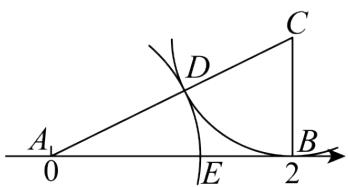

text_image

A
0
E
D
C
B
2

A. $\sqrt{5} - 1$

B. $-\sqrt{5}+1$

C. $\sqrt{5}$

D. $\sqrt{5} + 1$

【答案】A

【分析】本题考查实数与数轴的关系，勾股定理，熟练掌握勾股定理，实数与数轴的关系是解题的关键，根据勾股定理可求得 $AC$ 的长，再根据题意得到 $AD = AE$ ，从而得到答案.

【详解】解：由题可得： $BC \perp AB$ ，BC = 1，AB = 2，

∴由勾股定理得： $AC=\sqrt{AB^{2}+BC^{2}}=\sqrt{2^{2}+1^{2}}=\sqrt{5}$

$$
\because C D = B C = 1,
$$

$$
\therefore A D = \sqrt {5} - 1,
$$

$$
\because A D = A E,
$$

$$
\therefore A E = \sqrt {5} - 1,
$$

∴点 E 表示的实数是 $\sqrt{5}-1$ ,

故选：A.

3. （3 分）（24-25 八年级上·广东佛山·期末）如图，分别以 Rt△ABC 的三边为边长向外侧作正方形，面积分别记为 $S_{1}$ ， $S_{2}$ ， $S_{3}$ 。若 $S_{3} + S_{2} - S_{1} = 20$ ，则图中阴影部分的面积为（）

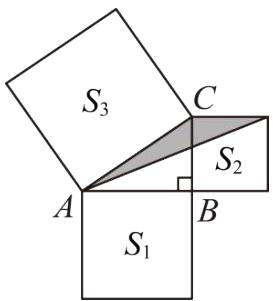

text_image

S₃
C
A
S₂
B
S₁

A. 5

B. 10

C. 15

D. 20

【答案】A

【分析】本题主要考查了勾股定理、正方形的性质以及三角形面积，由勾股定理得 $AC^{2}-AB^{2}=BC^{2}$ ，再由正方形面积公式得 $S_{3}-S_{1}=S_{2}$ ，求出 $S_{2}=10$ ，即可得到阴影部分的面积.

【详解】解：∵ Rt△ABC 是以 AC 为斜边的直角三角形，

$$
\therefore A C ^ {2} - A B ^ {2} = B C ^ {2},
$$

$$
\therefore S _ {3} - S _ {1} = S _ {2},
$$

$$
\because S _ {3} + S _ {2} - S _ {1} = 2 0,
$$

$$
\therefore S _ {2} = 1 0,
$$

∴阴影部分的面积为 $\frac{1}{2}S_{2}=5$ ,

故选：A.

4. （3 分）（24-25 八年级下·山东德州·期中）有一个边长为 1 的大正方形，经过 1 次“生长”后，在它的左右肩上生出两个小正方形，其中三个正方形围成的三角形是直角三角形，再经过 1 次“生长”后，形成的图形如图 1 所示．如果继续“生长”下去，它将变得“枝繁叶茂”如图 2 所示，若“生长”了 2025 次后，形成的图形中所有的正方形的面积和是（）

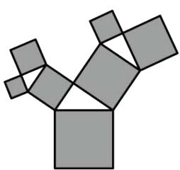

natural_image

Abstract geometric pattern composed of gray squares forming a Y-shape (no text or symbols)

图1

natural_image

Abstract geometric pattern composed of colorful polygonal shapes forming a tree-like structure (no text or symbols)

图2

A. 2026

B. 2025

C. $2^{2025}$

D. $2^{2022}-1$

【答案】A

【分析】本题考查了勾股定理，能够根据勾股定理发现每一次得到的新的正方形的面积和与原正方形的面积之间的关系是解答本题的关键．根据勾股定理求出“生长”了1次后形成的图形中所有的正方形的面积和，结合图形总结规律，根据规律解答即可.

【详解】解：如图，由题意得，正方形 A 的面积为 1，

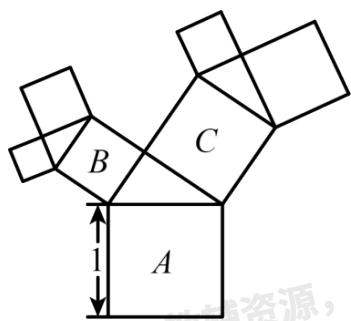

text_image

B
C
A
1
资源，

由勾股定理得，正方形 B 的面积 + 正方形 C 的面积 = 正方形 A 的面积 = 1，

∴“生长”了1次后形成的图形中所有的正方形的面积和为2，

同理可得，“生长”了2次后形成的图形中所有的正方形的面积和为3，

：“生长”了3次后形成的图形中所有的正方形的面积和为4，

......

：“生长”了2025次后形成的图形中所有的正方形的面积和为2026.

故选：A.

5. （3 分）（24-25 八年级下·全国·期中）如图，在 $5 \times 5$ 的正方形网格中，从在格点上的点 $A, B, C, D$ 中任取三点，所构成的三角形是直角三角形的是（）

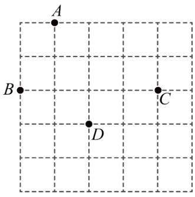

text_image

A
B
C
D

A. $\triangle ABD$

B. $\triangle ADC$

C. $\triangle BCD$

D. $\triangle ABC$

【答案】A

【分析】本题主要考查了网格与勾股定理，直角三角形的判定，先利用网格与勾股定理分别求出各边长，然后按照勾股定理逆定理依次判断即可.

【详解】解：A. $\because AB^{2}=5,\ BD^{2}=5,\ AD^{2}=10,\ \therefore AB^{2}+BD^{2}=AD^{2}$ ，则 $\triangle ABD$ 为直角三角形，故该选项符合题意：

B. $\because AD^{2} = 10, CD^{2} = 5, AC^{2} = 13, \therefore AD^{2} + DC^{2} \neq AC^{2}$ , 则 $\triangle ADC$ 不是直角三角形, 故该选项不符合题意;

C. $\because BD^{2} = 5, CD^{2} = 5, BC^{2} = 16, \therefore BD^{2} + DC^{2} \neq BC^{2}$ , 则 $\triangle BCD$ 不是直角三角形, 故该选项不符合题意:

D. $\because AB^{2} = 5, AC^{2} = 13, BC^{2} = 16, \therefore AB^{2} + AC^{2} \neq BC^{2}$ , 则 $\triangle ABC$ 不是直角三角形, 故该选项不符合题意:

故选：A.

6. （3分）（24-25八年级下·福建莆田·期中）如图，在 $\triangle ABC$ 中， $\angle ACB = 90^{\circ}$ ， $AC = BC$ ， $P$ 是 $\triangle ABC$ 内的一点，且 $PB = 1$ ， $PC = 2$ ， $PA = 3$ ，则 $\angle BPC$ 的度数为（）

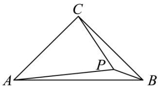

text_image

C
A
P
B

A. $120^{\circ}$

B. $135^{\circ}$

C. $140^{\circ}$

D. $150^{\circ}$

【答案】B

【分析】本题主要考查了旋转的性质，勾股定理逆定理，等腰直角三角形的判定与性质，熟记各性质并作辅助线构造出等腰直角三角形和直角三角形是解题的关键.

将 $\triangle ACP$ 绕 $C$ 点旋转 $90^{\circ}$ , 根据旋转的性质可得出 $\angle QPC = 45^{\circ}$ , 根据勾股定理可证出 $\angle PBQ = 90^{\circ}$ , 从而可得出答案.

【详解】如图，将 $\triangle ACP$ 绕 C 点旋转 $90^{\circ}$ ，得 $\triangle BCQ$ ，连接 PQ，

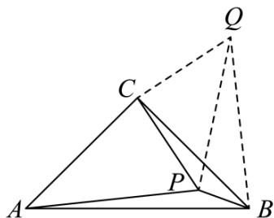

text_image

Geometric diagram showing triangle ABC with internal point P and auxiliary point Q connected by dashed lines

由旋转的性质可知：Rt $\triangle ACB \sim Rt \triangle PCQ$ ， $\angle PCQ = 90^{\circ}$ ，

$$
\therefore C Q = C P = 2, B Q = P A = 3, \angle Q B C = \angle P A C,
$$

$\therefore PQ^{2}=CQ^{2}+CP^{2}=8$ ，且 $\angle QPC=45^{\circ}$ ，

在 $\triangle BPQ$ 中， $PB^{2} + PQ^{2} = 8 + 1 = 9$ ，

$$
\therefore P B ^ {2} + P Q ^ {2} = B Q ^ {2},
$$

$$
\therefore \angle Q P B = 9 0 ^ {\circ},
$$

$$
\therefore \angle B P C = \angle Q P B + \angle Q P C = 1 3 5 ^ {\circ}.
$$

故选 B.

7. （3 分）（24-25 八年级下·江苏扬州·期中）如图，将一张边长为8的正方形纸片ABCD折叠，使点D落在BC的中点E处，点A落在点F处，折痕为MN，则线段MN长的平方为（）

text_image

A
D
N
F
M
B
E
C

A. 100

B. 80

C. 89

D. 84

【答案】B

【分析】本题考查折叠问题，正方形的性质，勾股定理，找到相应的直角三角形利用勾股定理求解是解决本题的关键．连接ME，作 $MP \perp CD$ 交CD于点P，根据折叠的性质，在Rt△ECN中，根据勾股定理就可以列出方程，从而解出CN的长．在Rt△MFE中，有 $MF^{2} + FE^{2} = ME^{2}$ ，在Rt△MBE中，有 $BE^{2} + BM^{2} = ME^{2}$ ，根据这两个式子可求得MF = 1，得到AM = PD = 1，NP = 4，在Rt△MPN中，运用勾股定理求出MN = 80.

【详解】解：如图，连接ME，作 $MP \perp CD$ 交CD于点P，

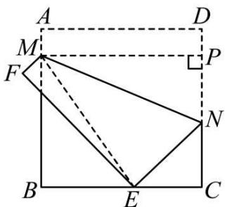

text_image

A
M
F
B
E
C
D
P
N

由四边形ABCD是正方形及折叠性知，

$$
A M = M F, E N = D N, E F = A D, \angle M F E = \angle B A D = 9 0 ^ {\circ},
$$

在Rt $\triangle ECN$ 中， $CE^{2} + CN^{2} = EN^{2}$ ,

∵AB = BC = CD = DA = 8，E为BC的中点，

$$
\therefore C E = 4,
$$

$$
\therefore 4 ^ {2} + C N ^ {2} = (8 - C N) ^ {2},
$$

解得CN = 3，

在Rt $\triangle MFE$ 中， $MF^{2} + FE^{2} = ME^{2}$

在Rt△MBE中， $BE^{2}+BM^{2}=ME^{2}$

$$
\therefore M F ^ {2} + F E ^ {2} = B E ^ {2} + B M ^ {2},
$$

$$
\therefore M F ^ {2} + 8 ^ {2} = 4 ^ {2} + (8 - M F) ^ {2},
$$

解得，MF = 1，

$$
\therefore A M = P D = 1,
$$

$$
\therefore N P = C D - C N - P D = 8 - 3 - 1 = 4,
$$

在Rt $\triangle MPN$ 中，

$$
M N ^ {2} = M P ^ {2} + N P ^ {2} = 8 ^ {2} + 4 ^ {2} = 8 0,
$$

故选：B.

8. （3分）如图，在 $\triangle ABC$ 中， $AB=6$ ， $AC=9$ ， $AD \perp BC$ 于D，M为AD上任一点，则 $MC^{2}-MB^{2}$ 等于（）

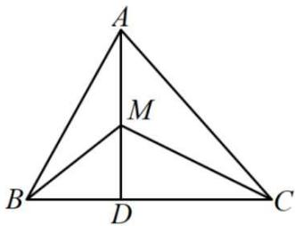

text_image

A
M
B
D
C

A. 29

B. 32

C. 36

D. 45

【答案】D

【分析】在 Rt△ABD 及 Rt△ADC 中可分别表示出 BD² 及 CD²，在 Rt△BDM 及 Rt△CDM 中分别将 BD² 及 CD² 的表示形式代入表示出 BM² 和 MC²，然后作差即可得出结果.

【详解】解：在 Rt△ABD 和 Rt△ADC 中，

$$
\mathrm{BD} ^ {2} = \mathrm{AB} ^ {2} - \mathrm{AD} ^ {2}, \quad \mathrm{CD} ^ {2} = \mathrm{AC} ^ {2} - \mathrm{AD} ^ {2},
$$

在 Rt△BDM 和 Rt△CDM 中，

$$
B M ^ {2} = B D ^ {2} + M D ^ {2} = A B ^ {2} - A D ^ {2} + M D ^ {2}, \quad M C ^ {2} = C D ^ {2} + M D ^ {2} = A C ^ {2} - A D ^ {2} + M D ^ {2},
$$

$$
\therefore \mathrm{MC} ^ {2} - \mathrm{MB} ^ {2} = (\mathrm{AC} ^ {2} - \mathrm{AD} ^ {2} + \mathrm{MD} ^ {2}) - (\mathrm{AB} ^ {2} - \mathrm{AD} ^ {2} + \mathrm{MD} ^ {2})
$$

$$
= A C ^ {2} - A B ^ {2}
$$

$$
= 4 5.
$$

故选：D.

【点睛】本题考查了勾股定理的知识，题目有一定的技巧性，比较新颖，解答本题需要认真观察，分别两次运用勾股定理求出 $MC^{2}$ 和 $MB^{2}$ 是本题的难点，重点还是在于勾股定理的熟练掌握.

9. （3分）（23-24八年级下·全国·单元测试）斜拉桥是我国流行的桥型之一，大跨径斜拉桥已居世界第一．如图， $OA_{1} = A_{1}A_{2} = A_{2}A_{3} = A_{3}A_{4}$ ， $OB_{1} = B_{1}B_{2} = B_{2}B_{3} = B_{3}B_{4}$ ，如果最长的钢索 $A_{4}B_{4} = 80\mathrm{m}$ ，那么钢索 $A_{2}B_{2}$ 、 $A_{1}B_{1}$ 的长分别是（）

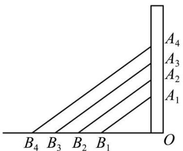

text_image

A₄
A₃
A₂
A₁
B₄ B₃ B₂ B₁ O

A. 60m,40m

B. 60m,30m

C. 40m,20m

D. 40m,10m

【答案】C

【分析】本题考查了勾股定理的实际应用，设 $OA_{1} = xm, OB_{1} = ym$ ，先根据 $OA_{1} = A_{1}A_{2} = A_{2}A_{3} = A_{3}A_{4}$ $OB_{1} = B_{1}B_{2} = B_{2}B_{3} = B_{3}B_{4}$ ，得出 $OA_{2} = 2xm, OA_{4} = 4xm$ ， $OB_{2} = 2ym, OB_{4} = 4ym$ ，再根据 $\angle O = 90^{\circ}$ 得到 $\triangle OA_{1}B_{1}, \triangle OA_{2}B_{2}, \triangle OA_{4}B_{4}$ 都是直角三角形，得到 $OA_{4}^{2} + OB_{4}^{2} = A_{4}B_{4}^{2} = 80^{2}$ ，即 $16x^{2} + 16y^{2} = 16 \times 5 \times 80$ ，由 $A_{1}B_{1}^{2} = OA_{1}^{2} + OB_{1}^{2}, A_{2}B_{2}^{2} = OA_{2}^{2} + OB_{2}^{2}$ ，代入计算即可求解.

【详解】解：设 $OA_{1}=xm,OB_{1}=ym,$

$$
\because O A _ {1} = A _ {1} A _ {2} = A _ {2} A _ {3} = A _ {3} A _ {4}, O B _ {1} = B _ {1} B _ {2} = B _ {2} B _ {3} = B _ {3} B _ {4},
$$

$$
\therefore O A _ {2} = 2 x \mathrm{m}, O A _ {4} = 4 x \mathrm{m}, O B _ {2} = 2 y \mathrm{m}, O B _ {4} = 4 y \mathrm{m},
$$

$$
\because \angle O = 9 0 ^ {\circ},
$$

∴ $\triangle OA_{1}B_{1},\triangle OA_{2}B_{2},\triangle OA_{4}B_{4}$ 都是直角三角形，

$$
\because A _ {4} B _ {4} = 8 0 \mathrm{m},
$$

∴ $OA_{4}^{2} + OB_{4}^{2} = A_{4}B_{4}^{2} = 80^{2}$ ，即 $16x^{2} + 16y^{2} = 16 \times 5 \times 80$ ,

$$
\therefore x ^ {2} + y ^ {2} = 4 0 0, 4 x ^ {2} + 4 y ^ {2} = 1 6 0 0,
$$

$$
\therefore A _ {1} B _ {1} ^ {2} = O A _ {1} ^ {2} + O B _ {1} ^ {2} = x ^ {2} + y ^ {2} = 4 0 0, A _ {2} B _ {2} ^ {2} = O A _ {2} ^ {2} + O B _ {2} ^ {2} = 4 x ^ {2} + 4 y ^ {2} = 1 6 0 0,
$$

∴ $A_{2}B_{2}=40m$ （负值舍去）， $A_{1}B_{1}=20m$ （负值舍去），

故选：C.

10. （3 分）如图有一圆柱，高为 8cm，底面直径为 4cm，在圆柱下底面 A 点有一只蚂蚁，它想吃上底面与 A 相对的 B 点处的食物，需爬行的最短路程大约为(取 $\pi = 3$ )( )

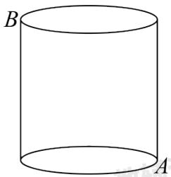

natural_image

Simple line drawing of a cylinder with labeled points A and B (no text or symbols beyond labels)

A. $10 \mathrm{~cm}$

B. 12cm

C. 14cm

D. 20cm

【答案】A

【分析】首先将此圆柱展成平面图，根据两点间线段最短，可得 AB 最短，由勾股定理即可求得需要爬行的最短路程.

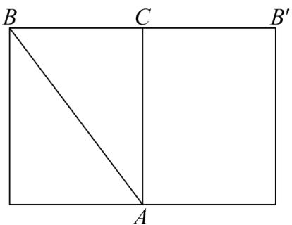

text_image

B
C
B'
A

【详解】将此圆柱展成平面图得:

∵圆柱的高等于8cm，底面直径等于4cm（π=3），

$$
\therefore A C = 8 \mathrm{cm}, \quad B C = \frac {1}{2} \quad B B ^ {\prime} = \frac {1}{2} \times 4 \pi = 6 (\mathrm{cm})
$$

$$
\therefore A B = \sqrt {A C ^ {2} + B C ^ {2}} = \sqrt {8 ^ {2} + 6 ^ {2}} = - 1 0 (\mathrm{cm}).
$$

答: 它需要爬行的最短路程为 $10 \mathrm{~cm}$ .

故选 A

【点睛】本题主要考查了平面展开图求最短路径问题，将圆柱体展开，根据两点之间线段最短，运用勾股定理解答是解题关键.

# 二．填空题（共6小题，满分18分，每小题3分）

11. （3分）（24-25八年级下·山西吕梁·期末）如图， $\triangle ABC$ 中， $AC:BC:AB=3:4:5$ ，点 $D$ 在 $BC$ 上，点 $E$ 为 $AB$ 的中点， $AD$ ， $CE$ 相交于点 $F$ ，且 $AD=DB$ 。若 $\angle B=35^{\circ}$ ，则 $\angle DFE$ 的度数是\_\_\_\_。

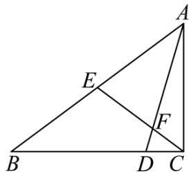

text_image

Geometric diagram of triangle ABC with internal points D, E, F and line segments AD, BE, EF labeled

【答案】 $105^{\circ} / 105$ 度

【分析】根据AC:BC:AB = 3:4:5，可知 $\triangle ABC$ 为直角三角形，根据斜边上的中线等于斜边的一半，可知 BE = CE = AE，利用等边对等角，可求得 $\angle ECB = \angle B, \angle B = \angle BAD$ ，接着利用外角，推出 $\angle ADC$ ，最后利用 $\angle DFE = \angle ECB + \angle ADC$ 求得答案.

【详解】解： $\triangle ABC$ 中， $AC:BC:AB = 3:4:5$ ，不妨设 $AC = 3$ ， $BC = 4$ ， $AB = 5$ ，

$$
\because A C ^ {2} = 3 ^ {2} = 9, B C ^ {2} = 4 ^ {2} = 1 6, A B ^ {2} = 5 ^ {2} = 2 5,
$$

$$
\therefore A C ^ {2} + B C ^ {2} = A B ^ {2},
$$

$$
\therefore \angle A C B = 9 0 ^ {\circ},
$$

∵ 点E为AB的中点，

$$
\therefore B E = C E = A E,
$$

$$
\therefore \angle E C B = \angle B,
$$

$$
\because A D = D B,
$$

$$
\therefore \angle B = \angle B A D,
$$

$$
\because \angle B = 3 5 ^ {\circ},
$$

$$
\therefore \angle E C B = \angle B A D = \angle B = 3 5 ^ {\circ},
$$

$$
\because \angle A D C = \angle B + \angle B A D,
$$

$$
\therefore \angle A D C = 3 5 ^ {\circ} + 3 5 ^ {\circ} = 7 0 ^ {\circ},
$$

$$
\therefore \angle D F E = \angle E C B + \angle A D C = 3 5 ^ {\circ} + 7 0 ^ {\circ} = 1 0 5 ^ {\circ}.
$$

故答案为： $105^{\circ}$ .

【点睛】本题考查了勾股定理逆定理，等腰三角形的性质，三角形外角的定义，斜边上的中线等于斜边的一半，熟练掌握以上知识点是解题的关键.

12. （3分）（24-25七年级下·四川成都·期末）如图，高度为1米的平台上有一根长为8米的木杆垂直于台面AB，在一降大风后，木杆从点E处折断，AE依然垂直于AB，木杆顶端落在地面的点D处，已知 $AB\|CD, AB=2$ 米，CD=1米，则木杆依然直立的部分AE的长为\_\_\_\_。

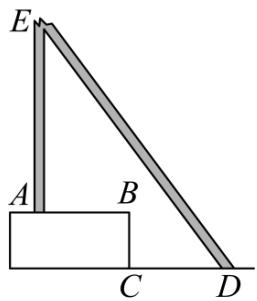

text_image

E
A B
C D

【答案】3

【分析】本题考查了矩形的判定与性质，勾股定理，延长EA交DC延长线于点F，证明四边形ABCF是矩形，则AF = BC = 1m, AB = CF = 2m，故有 $FD = FC + CD = 3m$ ，设AE = xm，则 $DE = (8 - x)m$ ， $EF = (x + 1)m$ ，由勾股定理得： $EF^{2} + FD^{2} = DE^{2}$ ，即 $(x + 1)^{2} + 3^{2} = (8 - x)^{2}$ ，然后求出x的值即可，掌握知识点的应用是解题的关键.

【详解】解：如图，延长EA交DC延长线于点F，

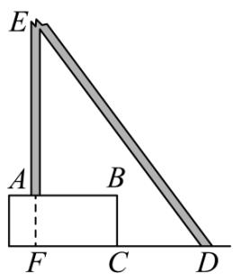

text_image

E
A B
F C D

∵AB∥CD，AE⊥AB，

$\therefore AE \perp CD,$

由 $BC \perp CD,$

则有 $\angle AFB = \angle BCF = \angle B = 90^{\circ}$ ,

∴四边形ABCF是矩形，

$$
\therefore A F = B C = 1 \mathrm{m}, A B = C F = 2 \mathrm{m},
$$

$$
\therefore F D = F C + C D = 3 \mathrm{m},
$$

设AE = xm，则 $DE = (8 - x)\mathrm{m}$ ， $EF = (x + 1)\mathrm{m}$

由勾股定理得： $EF^{2}+FD^{2}=DE^{2}$

$\therefore(x+1)^{2}+3^{2}=(8-x)^{2}$ ，解得：x=3，

$$
\therefore A E = 3 \mathrm{m},
$$

故答案为：3.

13. （3 分）（24-25 八年级上·四川成都·期末）我国古代称直角三角形为“勾股形”，并且直角边中较短边为勾，另一直角边为股，斜边为弦．如图 1 所示，数学家刘徽（约公元 225 年—公元 295 年）将勾股形分割成一个正方形和两对全等的直角三角形，后人借助这种分割方法所得的图形证明了勾股定理．如图 2 所示的长方形，是由两个完全相同的“勾股形”拼接而成，若 AC = 6，CD = 2，则长方形的面积为 \_\_\_\_.

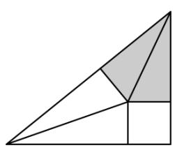

natural_image

Geometric diagram of a right triangle divided into smaller triangles and a larger square, with no text or symbols present.

图1

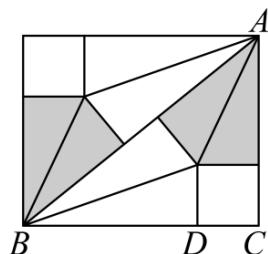

text_image

Geometric diagram with labeled points A, B, C, D and shaded regions forming triangles and quadrilaterals

图2

【答案】48

【分析】本题考查了勾股定理的运用，利用勾股定理列出方程是解题的关键.

设BD的长为x，在直角三角形ACB中，利用勾股定理可建立关于x的方程，进而可求出该矩形的面积.

【详解】解：由已知可得CD = CE，AF = AE，BF = BD，

$$
\therefore C E = C D = 2,
$$

设BD的长为x，

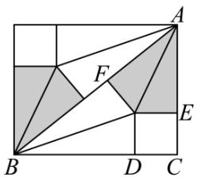

text_image

Geometric diagram with labeled points A, B, C, D, E, F and shaded regions forming triangles and quadrilaterals

$$
\because A C = 6, \quad C D = 2,
$$

$$
\therefore A E = A F = A C - C D = 4, B F = B D = x
$$

$$
\therefore B C = B D + C D = x + 2, A B = 4 + x
$$

在Rt $\triangle ABC$ 中， $AC^{2} + BC^{2} = AB^{2}$ ,

即 $(2+x)^{2}+6^{2}=(4+x)^{2}$ ,

整理得，4x = 24，

$$
\therefore x = 6
$$

$$
\therefore B C = x + 2 = 8
$$

而矩形面积为： $8 \times 6 = 48$ ，

故答案为：48.

14. （3 分）（24-25 八年级下·河南安阳·阶段练习）如图，在单位长度为 1 的 $3 \times 4$ 的网格系中， $\triangle ABC$ 的顶点都在格点上，则 $\angle ABC =$ \_\_\_\_.

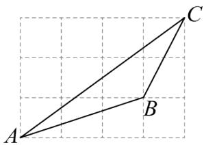

text_image

Geometric diagram showing triangle ABC with point B on side AC and line segment AB drawn on grid background

【答案】135°/135度

【分析】本题考查勾股定理及其逆定理，等腰三角形的判定及性质．取格点 D，使得 $AD = BC = \sqrt{5}$ ， $CD = AB = \sqrt{10}$ ，连接 BD．证明 $\triangle ABD$ ， $\triangle BCD$ 是等腰直角三角形即可求解．

【详解】解： $AB=\sqrt{1^{2}+3^{2}}=\sqrt{10}$ ， $BC=\sqrt{1^{2}+2^{2}}=\sqrt{5}$

取格点 D，使得 $AD = BC = \sqrt{5}$ ， $CD = AB = \sqrt{10}$ ，

连接BD，

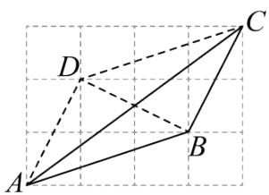

text_image

Geometric diagram showing points A, B, C, D with solid and dashed lines forming triangles and quadrilaterals

$$
\therefore B D = \sqrt {1 ^ {2} + 2 ^ {2}} = \sqrt {5},
$$

$$
\therefore A D = B D, A D ^ {2} + B D ^ {2} = (\sqrt {5}) ^ {2} + (\sqrt {5}) ^ {2} = 1 0 = (\sqrt {1 0}) ^ {2} = A B ^ {2},
$$

∴ $\triangle ABD$ 是等腰直角三角形，

$$
\therefore \angle A B D = 4 5 ^ {\circ},
$$

$$
\because B D = C D, \quad B D ^ {2} + B C ^ {2} = C D ^ {2},
$$

∴ $\triangle BCD$ 是等腰直角三角形，

$$
\therefore \angle C B D = 9 0 ^ {\circ},
$$

$$
\therefore \angle A B C = \angle A B D + \angle C B D = 4 5 ^ {\circ} + 9 0 ^ {\circ} = 1 3 5 ^ {\circ}.
$$

故答案为： $135^{\circ}$

15. （3分）（24-25八年级下·四川成都·期末）如图，射线OM、ON互相垂直，OA=8，在线段OA的垂直平分线l上取一点B，连接AB,AB=5．将线段AB绕点O按逆时针方向旋转得到对应线段A'B'，若点B'恰好落在射线ON上，则点A'到射线OM的距离d= \_\_\_\_.

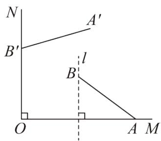

text_image

N
A'
B'
l
B
O
A M

【答案】 $\frac{32}{5}$

【分析】连接 $OB,OA'$ ，作 $A'D\perp OB',AC\perp OB$ ，垂足分别为D,C，根据旋转的性质得到 $\triangle OA'B'\cong\triangle OAB$ ，进而得到 $A'D=AC$ ，中垂线的性质，结合勾股定理求出BE的长，等积法求出AC的长，进而得到 $A'D$ 的长，再根据勾股定理求出OD的长，即可得出结果.

【详解】解：连接 $OB,OA'$ ，作 $A'D\perp OB',AC\perp OB$ ，设l与OM交于点E，

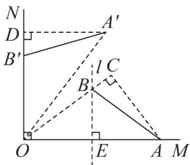

text_image

N
D
A'
B'
l C
B
O
E
A M

∵旋转，

$$
\therefore \triangle O A ^ {\prime} B ^ {\prime} \cong \triangle O A B,
$$

$$
\therefore O A ^ {\prime} = O A = 8, \quad A ^ {\prime} D = A C,
$$

∵在线段OA的垂直平分线l上取一点B，

$$
\therefore O B = A B = 5, A E = O E = \frac {1}{2} O A = 4, B E \perp O A,
$$

$$
\therefore B E = \sqrt {A B ^ {2} - A E ^ {2}} = 3,
$$

$$
\because A C \perp O B, B E \perp O A,
$$

$$
\therefore \frac {1}{2} O A \cdot B E = \frac {1}{2} O B \cdot A C,
$$

$$
\therefore A C = \frac {2 4}{5},
$$

$$
\therefore A ^ {\prime} D = A C = \frac {2 4}{5},
$$

在Rt $\triangle A^{\prime}DO$ 中， $OD = \sqrt{OA^{\prime2} - A^{\prime}D^{2}} = \frac{32}{5}$ ,

∵射线OM、ON互相垂直， $A^{\prime}D \perp OB^{\prime}$

$$
\therefore A ^ {\prime} D \parallel O M,
$$

∴点 $A'$ 到射线OM的距离d=OD= $\frac{32}{5}$ ;

故答案为： $\frac{32}{5}$

【点睛】本题考查旋转的性质，中垂线的性质，全等三角形的性质，勾股定理，等积法求线段的长，熟练掌握旋转的性质，是解题的关键.

16. （3分）（24-25八年级下·黑龙江哈尔滨·期末）把一副三角板按如图所示的位置放置，其中 $\angle ACB = \angle CED = 90^{\circ}$ ， $\angle CAB = 45^{\circ}$ ， $\angle CDE = 30^{\circ}$ ，斜边 $AB = 12$ ， $CD = 14$ ， $AB$ 与 $CD$ 相交于点 $O$ ，若 $\angle BCE = 15^{\circ}$ ，连接 $AD$ ，则 $AD$ 的长为\_\_\_\_。

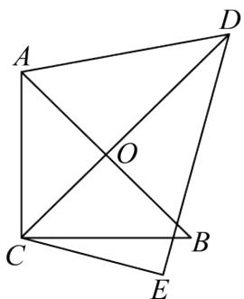

text_image

Geometric diagram with labeled points A, B, C, D, E, and intersection O, showing intersecting diagonals and triangles.

【答案】10

【分析】先证明 $CD \perp AB$ ，再由等腰直角三角形的性质得OA = OB = $\frac{1}{2}AB = 6$ ，

$OC = \frac{1}{2} AB = 6$ ，则 $OD = CD - OC = 14 - 6 = 8$ ，然后在Rt△AOD中，由勾股定理求出AD的长即可.

【详解】解：∵∠ACB=∠CED=90°，∠CAB=45°，∠CDE=30°，

∴△ACB是等腰直角三角形，∠DCE = 90° - 30° = 60°，

$$
\because \angle B C E = 1 5 ^ {\circ},
$$

$$
\therefore \angle D C B = 6 0 ^ {\circ} - 1 5 ^ {\circ} = 4 5 ^ {\circ},
$$

$$
\therefore \angle A C O = 9 0 ^ {\circ} - 4 5 ^ {\circ} = 4 5 ^ {\circ},
$$

$$
\therefore \angle A O C = 1 8 0 ^ {\circ} - 4 5 ^ {\circ} - 4 5 ^ {\circ} = 9 0 ^ {\circ},
$$

$$
\therefore C D \perp A B,
$$

$$
\therefore O A = O B = \frac {1}{2} A B = 6,
$$

$$
\therefore O C = \frac {1}{2} A B = 6,
$$

$$
\therefore O D = C D - O C = 1 4 - 6 = 8,
$$

在Rt $\triangle AOD$ 中，由勾股定理得： $AD = \sqrt{OA^2 + OD^2} = \sqrt{6^2 + 8^2} = 10.$

故答案为：10.

【点睛】本题考查了勾股定理、等腰直角三角形的判定与性质以及直角三角形斜边上的中线性质等知识，熟练掌握勾股定理和等腰直角三角形的性质是解题的关键.

# 第II卷

# 三．解答题（共8小题，满分72分）

17. （6 分）（24-25 八年级下·河北邯郸·期末）如图，将矩形ABCD沿直线AE折叠，顶点D恰好落在BC边上的点F处．已知BC=10cm，AB=8cm.

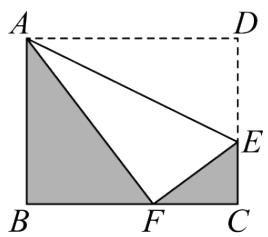

text_image

A
D
B
F
C
E

(1)求CF、CE的长；  
(2)求阴影部分的面积.

【答案】(1) $CF = 4\mathrm{cm}$ , $CE = 3\mathrm{cm}$

(2) $30cm^{2}$

【分析】此题考查勾股定理的实际应用，矩形的性质，折叠的性质，正确分析图形得到直角三角形，利用勾股定理解决问题是解题的关键.

(1) 由折叠的性质得, $\angle AFE = \angle D = 90^{\circ}$ , $AF = AD = 10\mathrm{cm}$ , 在 Rt $\triangle ABF$ 中, 由勾股定理求出 $BF = 6\mathrm{cm}$ , 进而求出 $CF = 4\mathrm{cm}$ ; 设 $CE = x$ , 则 $DE = EF = 8 - x$ , 在 Rt $\triangle CEF$ 中, 利用勾股定理求解即可;  
(2) 根据三角形面积公式计算即可.

【详解】（1）解：∵四边形ABCD是矩形，BC=10cm，AB=8cm，

$$
\therefore \angle B = \angle C = \angle D = 9 0 ^ {\circ}, A D = B C = 1 0 \mathrm{cm}, C D = A B = 8 \mathrm{cm}
$$

由折叠的性质得， $\angle AFE = \angle D = 90^{\circ}$ ，AF = AD = 10cm，DE = EF，

在Rt $\triangle ABF$ 中， $BF = \sqrt{AF^{2} - AB^{2}} = \sqrt{10^{2} - 8^{2}} = 6cm$

$$
\therefore C F = B C - B F = 1 0 - 6 = 4 \mathrm{cm}.
$$

设CE = x，则EF = DE = CD - CE = 8 - x，

在Rt $\triangle CEF$ 中， $CE^{2} + CF^{2} = EF^{2}$ ,

$$
\therefore x ^ {2} + 4 ^ {2} = (8 - x) ^ {2},
$$

解得x=3，

$$
\therefore C E = 3 \mathrm{cm};
$$

（2）解：阴影部分面积为 $\frac{1}{2} AB\cdot BF + \frac{1}{2} CF\cdot CE = \frac{1}{2}\times 8\times 6 + \frac{1}{2}\times 4\times 3 = 30\mathrm{cm}^2.$

18. （6分）（24-25八年级下·广西钦州·期末）如图，在一条东西走向的省级干线公路 $l$ 的一侧有一村庄 $P$ ，由 $P$ 原有两条笔直小路 $PB$ 、 $PA$ 与 $l$ 相连接，其中 $AP = AB$ ，由于某种原因，由 $P$ 到 $A$ 的路已经不通，现今该村的乡村产业振兴小组为方便村民运输农产品与出行，争取上级支持新建了一条公路 $PC$ （ $A, C, B$ 在同一条直线上），测得 $PB = 6.5$ 千米， $BC = 2.5$ 千米， $PC = 6$ 千米。

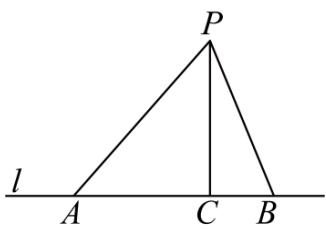

text_image

P
l
A C B

(1)问是否为从村庄 P 到公路 l 的最近路线？请通过计算加以说明：

(2)求原来的路线PA的长.

【答案】(1)是，理由见解析

(2)原来的路线 PA 的长为 8.45 千米

【分析】本题考查了勾股定理及其逆定理的应用，掌握定理内容并正确运用是关键；

（1）计算 $PC^{2}+BC^{2}$ 与 $PB^{2}$ 的值，两者的值相等，则是直角三角形，则PC是从村庄P到l的最近路；

（2）设AP = x，则AC = x - 2.5；在Rt $\triangle PAC$ 中，利用勾股定理建立方程求解即可.

【详解】（1）解：是；

理由是：在 $\triangle PCB$ 中，

$$
\because P C ^ {2} + B C ^ {2} = 6 ^ {2} + 2. 5 ^ {2} = 4 2. 2 5, \quad P B ^ {2} = 6. 5 ^ {2} = 4 2. 2 5,
$$

$$
\therefore P C ^ {2} + B C ^ {2} = P B ^ {2},
$$

$\therefore\triangle PCB$ 是直角三角形，

$$
\therefore P C \perp A B,
$$

PC是从村庄 P 到 l 的最近路;

（2）解：设AP = x，则AC = x - 2.5，

在Rt $\triangle PAC$ 中，∵ $PC^{2} + AC^{2} = PA^{2}$ ,

$$
\therefore 6 ^ {2} + (x - 2. 5) ^ {2} = x ^ {2},
$$

解得：x = 8.45，

答：原来的路线 PA 的长为 8.45 千米.

19. （8 分）（23-24 八年级下·辽宁铁岭·阶段练习）如图所示，一个实心长方体盒子，长AB = 4，宽$BC = 2$ ，高 $CC_{1} = 1$ ，一只蚂蚁从顶点 $A$ 出发，沿长方体的表面爬到对角顶点 $C_1$ 处，问怎样走路线最短？最短路线长为多少？（点拨：分三种情况讨论解答）

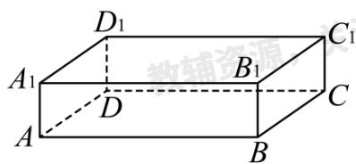

text_image

D₁
A₁
B₁
C₁
D
A
B
C

【答案】把长方体沿CD展开，蚂蚁沿着 $AC_{1}$ 的路线爬行的路程最短，最短距离为5.

【分析】本题主要考查了勾股定理的实际应用, 把长方体沿 $CD$ 展开, 把长方体沿 $BB_{1}$ 展开, 把长方体沿 $A_{1}D_{1}$ 展开, 三种情况利用勾股定理求出对应的最短距离即可得到答案.

【详解】解：如图所示，把长方体沿CD展开，则蚂蚁沿着 $AC_{1}$ 的路线爬行的路程最短，

由题意得， $AB = 4$ ， $BC_{1} = BC + CC_{1} = 3$

∴由勾股定理得 $AC_{1}=\sqrt{AB^{2}+BC_{1}^{2}}=5;$

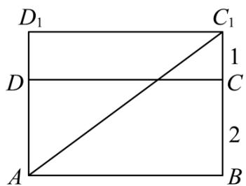

text_image

D₁ C₁
1
D C
2
A B

如图所示，把长方体沿 $BB_{1}$ 展开，则蚂蚁沿着 $AC_{1}$ 的路线爬行的路程最短，

由题意得， $AC = AB + BC = 6,\ CC_{1} = 1,$

∴由勾股定理得 $AC_{1}=\sqrt{AC^{2}+CC_{1}^{2}}=\sqrt{37}$ ;

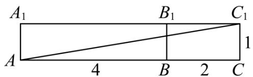

text_image

A₁
B₁
C₁
A
4
B
2
C
1

如图所示，把长方体沿 $A_{1}D_{1}$ 展开，则蚂蚁沿着 $AC_{1}$ 的路线爬行的路程最短，

由题意得， $AB_{1}=AA_{1}+A_{1}B_{1}=5,\quad B_{1}C_{1}=2,$

∴由勾股定理得 $AC_{1}=\sqrt{AB_{1}^{2}+B_{1}C_{1}^{2}}=\sqrt{29};$

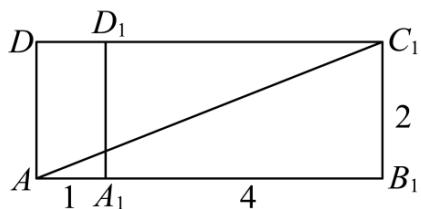

text_image

D
D₁
C₁
A
1
A₁
4
B₁
2

$$
\because 5 <   \sqrt {2 9} <   \sqrt {3 7},
$$

∴把长方体沿CD展开，蚂蚁沿着 $AC_{1}$ 的路线爬行的路程最短，最短距离为5.

20. （8 分）（24-25 八年级下·湖北恩施·期末）如图，正方形网格中的每个小正方形的边长都是 1，每个小格的顶点叫做格点.

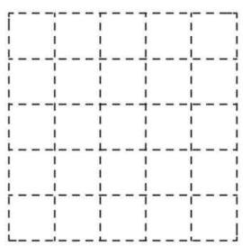

natural_image

Grid pattern with dashed lines forming a 4x4 layout (no text or symbols)

图1

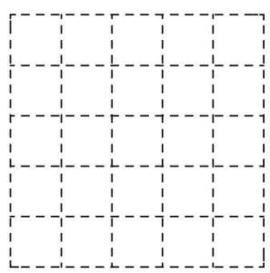

natural_image

Grid pattern with dashed lines forming a 4x4 layout (no text or symbols)

图2

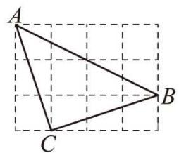

text_image

A
B
C

图3

(1)在图 1 中以格点为顶点画一个面积为 5 的正方形.  
(2)在图 2 中以格点为顶点画一个三角形，使三角形三边长分别为 2、 $\sqrt{5}$ 、 $\sqrt{13}$ .  
(3)如图 3，点 A、B、C 是小正方形的顶点，求 $\angle ABC$ 的度数.

【答案】(1)见解析

(2) 见解析   
(3) $45^{\circ}$

【分析】此题考查了勾股定理及其逆定理、正方形的判定，熟练掌握勾股定理及其逆定理是关键.

（1）根据勾股定理得到 $AB = BC = CD = AD = \sqrt{5}$ ，根据网格的特点得到 $\angle ABC = 90^{\circ}$ ，作图即可得到所求正方形；  
（2）根据网格特点得到EF=2,根据勾股定理得到 $DE=\sqrt{1^{2}+2^{2}}=\sqrt{5},DF=\sqrt{3^{2}+2^{2}}=\sqrt{13}$ ，顺次连接D,E,F即可得到所求三角形；  
（3）利用勾股定理及其逆定理证明 $\triangle ABC$ 是等腰直角三角形， $\angle ACB = 90^{\circ}$ ，即可得到答案.

【详解】（1）解：如图，正方形ABCD即为所求，

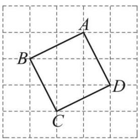

text_image

A
B
C
D

图1

（2）如图， $\triangle DEF$ 即为所求，

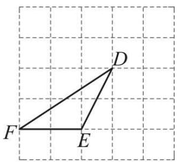

text_image

Geometric diagram showing triangle DEF on a grid background with labeled vertices

图2

（3）如图， $AB^{2}=4^{2}+2^{2}=20$ ， $AC^{2}=1^{2}+3^{2}=10$ ， $BC^{2}=1^{2}+3^{2}=10$ ，

$$
\therefore A B ^ {2} = A C ^ {2} + B C ^ {2}, A C = B C
$$

∴ $\triangle ABC$ 是等腰直角三角形， $\angle ACB = 90^{\circ}$

$$
\therefore \angle A B C = 4 5 ^ {\circ}
$$

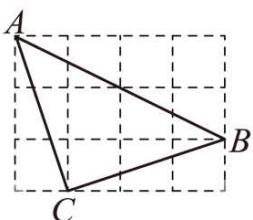

text_image

A
B
C

图3

21. （10 分）（24-25 八年级上·贵州贵阳·期中）对角线互相垂直的四边形叫做“垂美”四边形，现有如图所示的“垂美”四边形ABCD，对角线AC，BD交于点O.

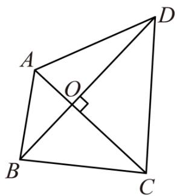

text_image

Geometric diagram of quadrilateral ABCD with diagonals intersecting at O and a right angle at C

(1)若 $AO = 2$ ， $BO = 3$ ， $CO = 4$ ， $DO = 5$ ，请求出 $A B^{2}$ ， $B C^2$ ， $CD^2$ ， $DA^2$ 的值.  
(2)若AB=6，CD=10，求 $BC^{2}+AD^{2}$ 的值.  
(3)请根据（1）（2）题中的信息，写出关于“垂美”四边形关于边的一条结论.

【答案】(1) $AB^{2}=13,\ BC^{2}=25,\ CD^{2}=41,\ AD^{2}=29$

(2)136   
(3)“垂美”四边形对边的平方和相等

【分析】本题考查了勾股定理的应用，灵活运用勾股定理是解题的关键.

(1) 根据“垂美”四边形的定义可得 $AC \perp BD$ , 再根据勾股定理即可求解;

（2）根据“垂美”四边形的定义可得 $AC \perp BD$ ，进而得到 $AO^2 + BO^2 = 36$ ， $CO^2 + DO^2 = 100$ ，根据 $BC^2 + AD^2 = BO^2 + CO^2 + DO^2 + AO^2$ 即可求解；

（3）由（1）（2）得到 $AB^{2}+CD^{2}=BC^{2}+AD^{2}$ ，即可求解.

【详解】（1）解：∵四边形ABCD是“垂美”四边形，对角线AC，BD交于点O，

$$
\therefore A C \perp B D,
$$

$$
\because A O = 2, B O = 3, C O = 4, D O = 5,
$$

$$
\therefore A B ^ {2} = A O ^ {2} + B O ^ {2} = 2 ^ {2} + 3 ^ {2} = 1 3, B C ^ {2} = B O ^ {2} + O C ^ {2} = 3 ^ {2} + 4 ^ {2} = 2 5, C D ^ {2} = C O ^ {2} + D O ^ {2} = 4 ^ {2} + 5 ^ {2}
$$

$$
= 4 1, D A ^ {2} = A O ^ {2} + D O ^ {2} = 2 ^ {2} + 5 ^ {2} = 2 9,
$$

$$
\therefore A B ^ {2} = 1 3, B C ^ {2} = 2 5, C D ^ {2} = 4 1, A D ^ {2} = 2 9;
$$

(2) ∵ 四边形ABCD是“垂美”四边形，对角线AC，BD交于点O，

$$
\therefore A C \perp B D,
$$

$$
\because A B = 6, C D = 1 0,
$$

$$
\therefore A O ^ {2} + B O ^ {2} = A B ^ {2} = 6 ^ {2} = 3 6, C O ^ {2} + D O ^ {2} = C D ^ {2} = 1 0 ^ {2} = 1 0 0,
$$

$$
\therefore B C ^ {2} + A D ^ {2} = B O ^ {2} + C O ^ {2} + D O ^ {2} + A O ^ {2} = 3 6 + 1 0 0 = 1 3 6;
$$

（3）由（1）（2）可得： $AB^{2}+CD^{2}=BC^{2}+AD^{2}$ ，即“垂美”四边形对边的平方和相等.

22. （10 分）（24-25 八年级下·山西阳泉·期中）【创新考法】阅读与思考

下面是一位同学的数学学习笔记(部分)，请仔细阅读并完成相应任务

# 等面积法在解题中的应用

等面积法是初中几何中的重要解题方法，它一般是利用等面积把几何问题中的线段关系或量与量之间的关系转化为面积关系来解决问题的一种方法，这种方法可以把问题简捷化，提高学习效率.下面是我利用等面积法证明勾股定理的例子.

例：如图 1， $\triangle ABC \cong \triangle DAE$ ，点 E 在线段 AC 上， $\angle ACB = \angle AED = 90^{\circ}$ ，记

$$
B C = A E = a, A C = D E = b, A B = D A = c. \text {求证:} a ^ {2} + b ^ {2} = c ^ {2}.
$$

证明：连接 $CD, BD$ ，过点 $D$ 作 $BC$ 边上的高 $DF$ ，则 $DF = EC = b - a$ .

$$
\because S _ {\text {四边形} A D C B} = S _ {\triangle A C D} + S _ {\triangle A B C} = \frac {1}{2} b ^ {2} + \frac {1}{2} a b,
$$

$$
S _ {\text {四边形} A D C B} = S _ {\triangle A D B} + S _ {\triangle D C B} = \frac {1}{2} c ^ {2} + \frac {1}{2} a (b - a),
$$

$$
\therefore \frac {1}{2} b ^ {2} + \frac {1}{2} a b = \frac {1}{2} c ^ {2} + \frac {1}{2} a (b - a),
$$

$$
\therefore a ^ {2} + b ^ {2} = c ^ {2}
$$

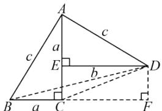

text_image

A
c
a
E
b
D
B
a
C
F

图1

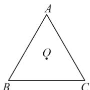  
图2

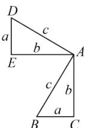  
图3

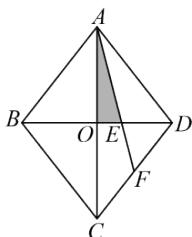

text_image

A
B
O
E
D
F
C

图4

任务:

(1)如图2，点 $O$ 是 $\triangle ABC$ 内角平分线的交点，作 $OD \perp AB$ ，垂足为点 $D$ ．（尺规作图，保留作图痕迹，不写作法）． $OD = 2\mathrm{cm}$ ， $\triangle ABC$ 的周长为 $30\mathrm{cm}$ ，则 $\triangle ABC$ 的面积为 $\mathrm{cm}^2$   
(2)将两个全等的直角三角形按图3所示摆放，其中 $\angle DAB = 90^{\circ}$ ，参照阅读材料中例题的证明方法，求证： $a^{2} + b^{2} = c^{2}$ .  
(3)如图4, 在菱形ABCD中, 对角线AC,BD交于点O, E是BD上一点, 且BE=2DE. 若AC=8cm,BD=6cm, 则图中阴影部分的面积为\_\_\_\_cm².

【答案】(1)图见解析，30

(2)证明见解析

(3)2

【分析】本题考查全等三角形的性质，勾股定理的证明，角平分线的性质，矩形的判定与性质，菱形的性质，熟练掌握这些性质与判定，并掌握面积转换是解题的关键.

(1) 根据尺规作垂线的方法作 $OD \perp AB$ , 连接 $OA, OB, OC$ , 利用角平分线的性质和分割法求三角形的面积即可;

（2）延长DE交CB延长线于点M，过点D作 $DN \perp CA$ 于点N，连接BD，CD，利用 $S_{四边形ADBC} = S_{\triangle ABD} + S_{\triangle ABC}$ $=\frac{1}{2}AD\cdot AB+\frac{1}{2}BC\cdot AC,\quad S_{四边形ADBC}=S_{\triangle ADC}+S_{\triangle DCB}=\frac{1}{2}AC\cdot DN+\frac{1}{2}BC\cdot DM$ ，即可解决；

(3) 根据菱形的性质, 求出 $OA, OE$ 的长, 再根据三角形的面积公式进行计算即可.

【详解】（1）解：如图，OD即为所求；

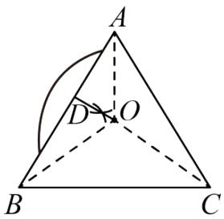

text_image

A
D
O
B
C

连接OA,OB,OC,

∵点 O 是 $\triangle ABC$ 内角平分线的交点， $OD \perp AB$ ，

∴点O到 $\triangle ABC$ 三边的距离相等均为OD的长，

$\because OD = 2cm, \triangle ABC$ 的周长为30cm,

$$
\therefore S _ {\triangle A B C} = S _ {\triangle A O B} + S _ {\triangle A O C} + S _ {\triangle C O B}
$$

$$
= \frac {1}{2} (A B + B C + A C) \cdot O D
$$

$$
= \frac {1}{2} \times 3 0 \times 2
$$

$$
= 3 0 \mathrm{cm} ^ {2};
$$

故答案为：30;

(2) 解: 如图, 延长 $DE$ 交 $CB$ 延长线于点 $M$ , 过点 $D$ 作 $DN \perp CA$ 延长线于点 $N$ , 连接 $BD$ , $CD$ ,

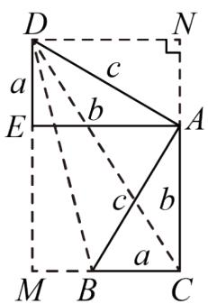

text_image

D
a
c
b
E
A
c
b
a
M
B
C
N

由题意得Rt $\triangle ABC \cong Rt \triangle ADE$ ， $\angle DAB = 90^{\circ}$ ，

$$
\therefore \angle D A E = \angle B A C,
$$

$$
\therefore \angle E A C = \angle E A B + \angle B A C = \angle E A B + \angle D A E = \angle D A B = 9 0 ^ {\circ},
$$

$$
\therefore \angle E A C = \angle E A N = \angle N = \angle B C A = \angle A E M = \angle A E D = 9 0 ^ {\circ},
$$

∴四边形ACME和四边形ANDE是矩形，

$$
\therefore E M = A C = b, D N = A E = b,
$$

$$
\therefore D M = D E + E M = a + b,
$$

$$
\because S _ {\text {四边形} A D B C} = S _ {\triangle A B D} + S _ {\triangle A B C} = \frac {1}{2} A D \cdot A B + \frac {1}{2} B C \cdot A C = \frac {1}{2} c ^ {2} + \frac {1}{2} a b,
$$

$$
S _ {\text {四边形} A D B C} = S _ {\triangle A D C} + S _ {\triangle D C B} = \frac {1}{2} A C \cdot D N + \frac {1}{2} B C \cdot D M = \frac {1}{2} b ^ {2} + \frac {1}{2} a (a + b),
$$

$$
\therefore \frac {1}{2} c ^ {2} + \frac {1}{2} a b = \frac {1}{2} b ^ {2} + \frac {1}{2} a (a + b).
$$

$$
\therefore a ^ {2} + b ^ {2} = c ^ {2};
$$

(3) 解: $\because$ 菱形 $ABCD$ 中, $AC = 8\mathrm{cm}$ , $BD = 6\mathrm{cm}$ ,

$$
\therefore O B = O D = 3 \mathrm{cm}, O A = O C = 4 \mathrm{cm}, A C \perp B D,
$$

$$
\because B E = 2 D E,
$$

$$
\therefore B D = 3 D E = 6 \mathrm{cm},
$$

$$
\therefore D E = 2 \mathrm{cm},
$$

$$
\therefore O E = O D - D E = 1 \mathrm{cm},
$$

$$
\therefore S _ {\text {阴影}} = \frac {1}{2} O A \cdot O E = \frac {1}{2} \times 4 \times 1 = 2 \mathrm{cm} ^ {2};
$$

故答案为：2.

23. （12 分）【背景材料】小颖和小强在做课后习题时，遇到这样一道题：“已知Rt $\triangle ABC$ 中，

$\angle ACB = 90^{\circ}$ , $CA = CB$ , $\angle MCN = 45^{\circ}$ , 如图（a）所示, 当点 $M$ 、 $N$ 在 $AB$ 上时, 试判断线段 $AM$ , $MN$ , $BN$ 的数量关系.

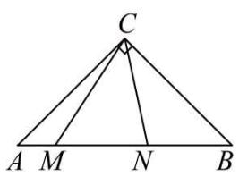

text_image

C
A M N B

(a)

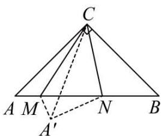

text_image

C
A M N B
A'

(b)

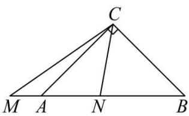

text_image

C
M A N B

(c)

小颖的解题思路：如图（b）所示，将 $\triangle ACM$ 沿直线 CM 对折，得 $\triangle A'CM$ ，连 $A'N$ ，

(1)你认为 $\angle MA^{\prime}N$ 的度数为\_\_\_\_.   
(2)按照小颖的思路，判断图（b）线段AM，MN，BN的数量关系，并完整证明.   
(3)【解决问题】当 M 在 BA 的延长线上，点 N 在线段 AB 上，其他条件不变，如图（C）所示，

第（2）问中的结论是否成立．如果成立，请证明．如果不成立，请说明理由.

【答案】(1) $90^{\circ}$

(2) $AM^{2}+BN^{2}=MN^{2}$ ，证明见解析  
(3)成立，理由见解析

【分析】本题考查折叠的性质及全等三角形的判定和性质，等腰三角形的性质，勾股定理，掌握折叠的性

质是解题的关键;

（1）根据等边对等角得出 $\angle CAB = \angle CBA = 45^{\circ}$ ，根据折叠的性质可得 $\angle MA'N = CAM = 45^{\circ}, \angle NA'$ $C = \angle CBA = 45^{\circ}$ ，进而即可求解；

（2）根据折叠的性质得出 $AC = A'C$ ， $\angle ACM = \angle A'CM, \angle CAM = \angle CA'M$ ， $CB = A'C$ ，再由各角之间的关系得出 $\angle A'CN = \angle BCN$ ，利用全等三角形的判定和性质得出 $A'N = BN$ ， $\angle CA'N = \angle CBN = 45^{\circ}$ ，结合图形由勾股定理即可得出结果；

（3）将 $\triangle ACM$ 延 $CM$ 折叠，得到 $\triangle PCM$ ，连接 $PN$ ，根据（2）中证明方法证明即可.

【详解】（1）解：∵Rt△ABC中，∠ACB=90°，CA=CB，

$$
\therefore \angle C A B = \angle C B A = 4 5 ^ {\circ},
$$

∵折叠，

$$
\therefore \angle M A ^ {\prime} N = C A M = 4 5 ^ {\circ}, \angle N A ^ {\prime} C = \angle C B A = 4 5 ^ {\circ},
$$

$$
\therefore \angle M A ^ {\prime} N = \angle C A ^ {\prime} M + \angle C A ^ {\prime} N = \angle C A B + \angle C B A = 9 0 ^ {\circ},
$$

故答案为： $90^{\circ}$ .

(2) 解: $\because \angle ACB = 90^{\circ}, CA = CB$

$$
\therefore \angle C A B = \angle C B A = 4 5 ^ {\circ}
$$

依题知： $\triangle ACM \cong \triangle A^{\prime}CM$ （折叠的性质）

$$
\therefore A C = A ^ {\prime} C, \angle A C M = \angle A ^ {\prime} C M, \angle C A M = \angle C A ^ {\prime} M,
$$

$$
\therefore C B = A ^ {\prime} C
$$

$$
\because \angle A ^ {\prime} C N = \angle M C N - \angle A ^ {\prime} C M = 4 5 ^ {\circ} - \angle A ^ {\prime} C M, \angle B C N = \angle A C B - \angle M C N - \angle A C M = 4 5 ^ {\circ} - \angle A C M
$$

$$
\therefore \angle A ^ {\prime} C N = \angle B C N
$$

$$
\because C N = C N,
$$

$$
\therefore \triangle A ^ {\prime} C N \cong \triangle B C N (\text { SAS })
$$

$$
\therefore A ^ {\prime} N = B N, \angle C A ^ {\prime} N = \angle C B N = 4 5 ^ {\circ},
$$

$$
\therefore \angle M A ^ {\prime} N = \angle C A ^ {\prime} M + \angle C A ^ {\prime} N = 9 0 ^ {\circ},
$$

$$
\therefore A ^ {\prime} M ^ {2} + A ^ {\prime} N ^ {2} = M N ^ {2}
$$

$$
\therefore A M ^ {2} + B N ^ {2} = M N ^ {2}
$$

（3）结论成立，理由如下：

将 $\triangle ACM$ 延 CM 折叠，得到 $\triangle PCM$ ，连接 PN，

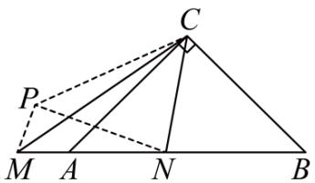

text_image

Geometric diagram of triangle ABC with auxiliary points M, N, P and dashed lines indicating construction or proof relationships

(c)

$$
\begin{array}{l} \therefore \triangle A C M \cong \triangle P C M, \\ \therefore \angle A C M = \angle P C M, A M = P M, A C = P C, \angle C A M = \angle C P M, \\ \therefore P C = B C, \\ \because \angle C A M = 1 8 0 ^ {\circ} - \angle C A B = 1 3 5 ^ {\circ}, \\ \therefore \angle C P M = 1 3 5 ^ {\circ} \\ \therefore \angle P C N = 2 \angle A C M + \angle A C N = 2 (4 5 ^ {\circ} - \angle A C N) + \angle A C N = 9 0 ^ {\circ} - \angle A C N, \angle B C N = \angle A C B - \angle A C N = 9 0 ^ {\circ} - \angle A C N \\ \therefore \angle P C N = \angle B C N \\ \end{array}
$$

在 $\triangle PCN$ 与 $\triangle BCN$ 中

$$
P C = B C, \angle P C N = \angle B C N, C N = C N
$$

$$
\therefore \triangle P C N \cong \triangle B C N (\text { SAS })
$$

$$
\therefore P N = B N, \angle C P N = \angle C B N
$$

$$
\therefore \angle M P N = \angle C P M - \angle C P N = 9 0 ^ {\circ}
$$

$$
\therefore P M ^ {2} + P N ^ {2} = M N ^ {2}
$$

$$
\therefore A M ^ {2} + B N ^ {2} = M N ^ {2}.
$$

24. （12 分）（24-25 八年级下·山西长治·期末）综合与探究

四边形ABCD是一张正方形纸片，小明用该纸片玩折纸游戏.

【探究发现】

(1) 如图 1, 小明将 $\triangle ABE$ 沿 $AE$ 翻折得到 $\triangle AB'E$ , 点 $B$ 的对应点为 $B'$ , 将纸片展平后, 连接 $BB'$ 并延长交边 $CD$ 于点 $F$ , 小明发现折痕 $AE$ 与 $BF$ 存在特殊的数量关系, 数量关系为\_\_\_\_; 说明理由.

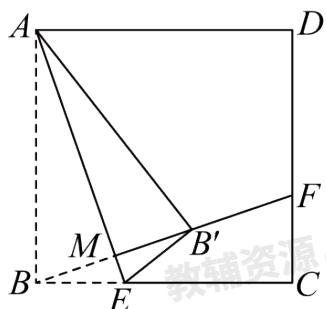

text_image

A
D
M
B'
E
C
F
教辅资源

图1

# 【类比探究】

(2) 如图 2, 小明继续折纸, 将四边形 $ABEG$ 沿 $GE$ 所在直线翻折得到四边形 $A'B'EG$ , 点 $A$ 的对应点为点 $A'$ , 点 $B$ 的对应点为点 $B'$ , 将纸片展平后, 连接 $BB'$ 交边 $CD$ 于点 $F$ , 请你猜想线段 $AG$ 、 $CE$ 、 $DF$ 之间的数量关系并证明;

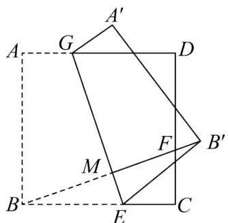

text_image

A'
G
D
A
F
B'
M
B
E
C

图2

# 【拓展延伸】

(3) 在 (2) 的翻折过程中, 如图 3, 若线段 $A^{\prime} B^{\prime}$ 恰好经过点 $D$ , 如果正方形ABCD的边长为9, $CF = 3$ , 直接写出CE的长.

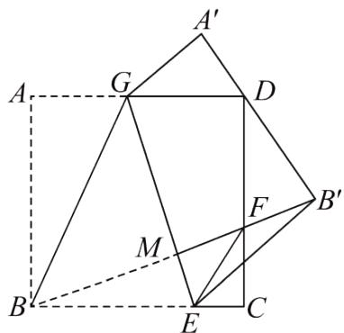

text_image

A'
G
D
A
F
B'
M
B
E
C

图3

【答案】（1）AE = BF，理由见解析；（2） $AG + CE = DF$ ，证明见解析；（3）2

【分析】（1）由全等三角形的“十字架”模型，结合两个三角形全等的判定定理可证 $\triangle ABE \cong \triangle BCF(\mathrm{ASA})$ 进而得解；

(2) 先证 $\angle BME = 90^{\circ}$ , 再利用全等三角形的“十字架”模型构造全等, 过点 $G$ 作 $GN \perp BC$ , 结合两个三角形全等的判定定理可证 $\triangle BCF \cong \triangle GNE(\mathrm{ASA})$ , 进而得解;  
（3）过点D作 $DP \perp GE$ ，先证四边形PBFD是平行四边形，得PB = DF = 6，再分别利用勾股定理表示出 $PE^{2} = DE^{2}$ ，从而建立方程求解即可得到答案.

【详解】解：（1）AE = BF，

理由如下:

如图所示:

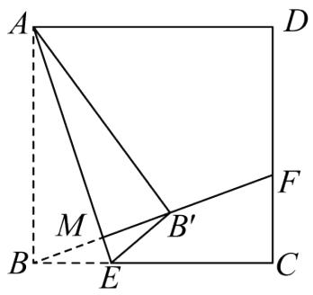

text_image

A
D
M
B'
E
F
C

将 $\triangle ABE$ 沿 AE 翻折得到 $\triangle AB'E$ ，则 AE 垂直平分 $BB'$ ，

$$
\therefore \angle A M B = 9 0 ^ {\circ},
$$

在正方形ABCD中，AB = BC， $\angle ABC = \angle C = 90^{\circ}$ ，

$$
\therefore \angle B A E + \angle A B M = 9 0 ^ {\circ} = \angle C B F + \angle A B M,
$$

$$
\therefore \angle B A E = \angle C B F,
$$

在 $\triangle ABE$ 和 $\triangle BCF$ 中，

$$
\left\{ \begin{array}{c} \angle B A E = \angle C B F \\ A B = B C \\ \angle A B C = \angle C = 9 0 ^ {\circ} \end{array} \right.
$$

$$
\therefore \triangle A B E \cong \triangle B C F (\mathrm{ASA}),
$$

$$
\therefore A E = B F;
$$

故答案为：AE = BF;

(2) 猜想线段 $AG$ 、 $CE$ 、 $DF$ 之间的数量关系: $AG + CE = DF$ ,

证明如下:

∵四边形ABCD是正方形，

$$
\therefore \angle A = \angle A B C = \angle C = 9 0 ^ {\circ}, A B = B C = C D,
$$

将四边形ABEG沿GE所在直线翻折得到四边形 $A^{\prime}B^{\prime}EG$ ，则 $GE\perp BF$ ，

$$
\therefore \angle B M E = 9 0 ^ {\circ},
$$

过点G作 $GN \perp BC$ ，垂足为点N，如图所示：

text_image

A'
G
D
A
F
B'
M
B
N
E
C

$$
\therefore \angle G N B = \angle G N E = 9 0 ^ {\circ},
$$

$$
\therefore \angle N G E + \angle G E N = 9 0 ^ {\circ}, \angle M B E + \angle M E B = 9 0 ^ {\circ},
$$

$$
\therefore \angle N G E = \angle M B E,
$$

$$
\because \angle A = \angle A B C = \angle G N B = 9 0 ^ {\circ},
$$

∴四边形ABNG是矩形，

$$
\therefore A G = B N, \quad A B = G N,
$$

$$
\therefore B C = G N,
$$

在 $\triangle BCF$ 和 $\triangle GNE$ 中，

$$
\left\{ \begin{array}{c} \angle N G E = \angle M B E \\ N G = B C \\ \angle C = \angle G N E = 9 0 ^ {\circ} \end{array} \right.
$$

$$
\therefore \triangle B C F \cong \triangle G N E (\mathrm{ASA}),
$$

$$
\therefore N E = C F,
$$

$\therefore BC-NE=CD-CF,$ 即 $BN+CE=DF,$

$$
\therefore A G + C E = D F;
$$

（3）设CE = x，

∵正方形ABCD的边长为9，CF=3，

$$
\therefore C D = 9, \quad D F = C D - F C = 6, \quad B E = B C - C E = 9 - x,
$$

过点D作 $DP \perp GE$ ，垂足为H，交线段AB于点P，连接PE，DE，如图所示：

text_image

A'
G
D
H
P
M
F
B'
B
E
C

∵将四边形ABEG沿GE所在直线翻折得到四边形 $A^{\prime}B^{\prime}EG$ ，线段 $A^{\prime}B$ 经过点D，

∴D，P关于直线GE对称，则 $\angle PHE=90^{\circ}$ ，

∴GE垂直平分DP，

$$
\therefore P E = D E,
$$

∵由（2）得 $\angle BME=90^{\circ}$ ， $\angle ABC=\angle C=90^{\circ}$ ，

$$
\therefore \angle P H E = \angle B M E = 9 0 ^ {\circ},
$$

$$
\therefore P D \parallel B F,
$$

∵四边形ABCD是正方形，

$$
\therefore A B \parallel C D,
$$

∴四边形PBFD是平行四边形，

$$
\therefore P B = D F = 6,
$$

在Rt $\triangle PBE$ 中， $\angle PBE = 90^{\circ}$ ，则由勾股定理得 $PB^{2} + BE^{2} = PE^{2}$ ，

在Rt $\triangle DCE$ 中， $\angle C = 90^{\circ}$ ，则由勾股定理得 $DC^{2} + CE^{2} = DE^{2}$ ，

又∵PE = DE,

$$
\therefore P B ^ {2} + B E ^ {2} = P E ^ {2} = D E ^ {2} = D C ^ {2} + C E ^ {2},
$$

则 $6^{2}+(9-x)^{2}=x^{2}+9^{2}$ ,

解得x=2，即CE的长为2.

【点睛】本题是四边形的综合题，主要考查了折叠的性质、垂直平分线的判定与性质、正方形的性质、全等三角形的判定和性质、直角三角形两锐角互余、矩形的判定与性质、勾股定理及解方程等内容，熟记折叠性质，掌握相关几何性质及判定是解题的关键.