# 第一章 勾股定理（举一反三讲义）全章题型归纳

【北师大版 2024】

# 题型归纳

# 【培优篇】....3

【题型1 利用勾股定理探究图形面积】 3

【题型 2 由勾股定理求线段长度】....5

【题型 3 勾股数（树）的运用】....6

【题型4 网格中判断直角三角形】....7

# 【拔尖篇】....8

【题型 5 利用勾股定理求两条线段的平方和（差）】....8

【题型 6 利用勾股定理解决折叠问题】....9

【题型 7 勾股定理的证明】....10

【题型 8 勾股定理的应用】....12

【题型 9 利用勾股定理求最短距离】....13

【题型 10 勾股定理及其逆定理的综合】....14

# 举一反三

# 知识点 1 勾股定理

1. 定义: 直角三角形两直角边的平方和等于斜边的平方, 如果用 $a$ , $b$ 和 $c$ 分别表示直角三角形的两直角边和斜边, 那么 $a^{2} + b^{2} = c^{2}$ .

如图所示， $\triangle ABC$ 是直角三角形，其中较短的直角边 $a$ 叫做勾，较长的直角边 $b$ 叫做股，斜边 $c$ 叫做弦.

text_image

A
b
(股)
c
(弦)
C
a(勾)
B

# 知识点 2 勾股定理的验证 教辅资源,关注公众号·全科AA+

勾股定理的验证主要通过拼图法完成，这种方法是以数形转换为指导思想，图形拼补为手段，各部分面积之间的关系为依据来实现的。用两种方式表示图形面积（算两次），根据面积相同得到等量关系，进而进行等量变换得到勾股定理公式是证明勾股定理的常见方法。

# 拼图法验证勾股定理的一般步骤

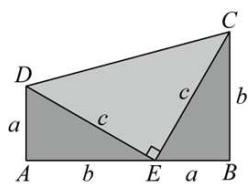

text_image

D
a
c
b
C
c
A
b
E
a
B

<table><tr><td>(1) 拼出图形</td><td>直角梯形(3个直角三角形)</td></tr><tr><td>(2)用两种方式表示图形面积</td><td> $\frac{1}{2}(a + b) \times (a + b), \frac{1}{2}ab + \frac{1}{2}c^{2} + \frac{1}{2}ab$ </td></tr><tr><td>(3)根据面积相同得到等量关系</td><td> $\frac{1}{2}(a + b)^{2} = \frac{1}{2}c^{2} + ab$ </td></tr><tr><td>(4)恒等变形</td><td> $a^{2} + b^{2} + 2ab = c^{2} + 2ab$ </td></tr><tr><td>(5)推导出勾股定理</td><td> $a^{2} + b^{2} = c^{2}$ </td></tr></table>

# 知识点 3 勾股定理的应用

利用勾股定理可以解决与直角三角形有关的问题，主要应用如下：

(1)已知直角三角形的任意两边长，求第三边长；  
(2)已知直角三角形的任意一边长，确定另外两边长的关系；  
(3)解决包含平方关系的几何问题;  
(4)构造方程计算有关线段的长度问题, 解决生产生活中的一些实际问题.

# 知识点 4 直角三角形的判别条件 教辅资源,关注公众号·全科AA+

1. 定义: 如果三角形的三边 $a, b, c$ 满足 $a^2 + b^2 = c^2$ 那么这个三角形是直角三角形。（此判别条件也称为勾股定理的逆定理）

2. 判断一个三角形是否为直角三角形的方法:

<table><tr><td>从角度上判断</td><td>三角形中有一个角是直角,或者三角形中有两个角互余</td></tr><tr><td>从边长上判断</td><td>两条较短边的平方和等于最长边的平方</td></tr></table>

# 知识点 5 勾股数

1. 勾股数

<table><tr><td>定义</td><td>满足 $a^{2} + b^{2} = c^{2}$ 的三个正整数,称为勾股数</td></tr><tr><td>满足条件</td><td>1三个数都是正整数2两个较小整数的平方和等于最大整数的平方</td></tr><tr><td>拓展</td><td>勾股数的整数倍仍为勾股数,如3,4,5的2倍6,8,10仍为勾股数.</td></tr><tr><td>常见形式</td><td>1 $n^{2}-1$ ,2n, $n^{2}+1$ (n大于1的全部数);</td></tr></table>

② $4n, 4n^{2}-1, 4n^{2}+1$ （n为正整数）等

# 2. 判断勾股数的方法步骤:

(1)确定三个是正整数;   
(2)确定最大的数字与另外两个较小的数，分别计算最大的数的平方与另外两个较小的数的平方和；  
(3)进行比较, 若最大数的平方等于另外两个较小数的平方和, 则是勾股数, 否则不是.

# 【培优篇】

【题型 1 利用勾股定理探究图形面积】 教辅资源, 关注公众号·全科AA+

【例 1】（24-25 八年级下·浙江金华·期末）如图，在Rt△ABC中， $\angle ACB=90^{\circ}$ ，分别以边AC、BC向外作正方形ACDE和正方形BFGC，连接EF、AF．若已知 $AB^{2}-AC^{2}$ 的值，则能求出的三角形面积是（）

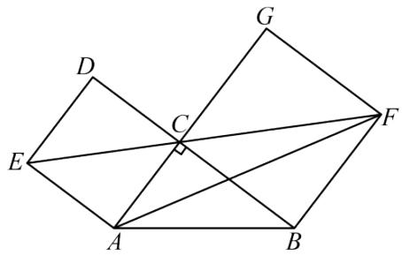

text_image

Geometric diagram with labeled points A, B, C, D, E, F, G and intersecting lines forming triangles and quadrilaterals

A. 三角形 $ABF$

B. 三角形 $ACF$

C. 三角形AEF

D. 三角形 $ABC$

【变式 1-1】（24-25 八年级下·广东惠州·期中）如图是用八个全等的直角三角形排成的“弦图”。记图中正方形ABCD，正方形EFGH，正方形MNKT的面积分别为 $S_{1}$ ， $S_{2}$ ， $S_{3}$ ，若正方形EFGH的边长为 $\sqrt{6}$ ，则 $S_{1}+S_{2}+S_{3}$ 的值（）

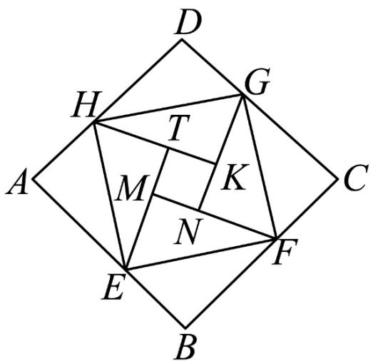

text_image

D
H
G
T
A
M
K
N
E
F
C
B

A. 16

B. 17

C. 18

D. 20

【变式 1-2】（24-25 八年级下·山西临汾·期末）在Rt△ABC中，∠C = 90°，AC ≥ BC，以AB为边在三角形外部作正方形ABDE．在正方形ABDE内部作正方形ALKJ、正方形DPQR，AL = AC，DP = BC， $S_{1}$ 、 $S_{2}$ 、 $S_{3}$ 分别表示四边形EPMJ、四边形BLNR、四边形KMQN的面积， $S_{1}$ 、 $S_{2}$ 、 $S_{3}$ 之间的数量关系\_\_\_\_.

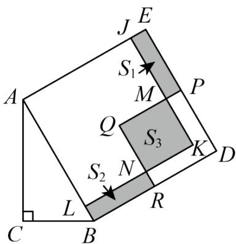

text_image

J E
S₁
A S₃ P
Q S₂ N K D
L R
C B

【变式 1-3】（24-25 八年级下·安徽滁州·期中）我国三国时期的数学家赵爽利用四个全等的直角三角形拼成如图 1 所示的图形，其中四边形ABED和四边形CFGH都是正方形，巧妙地用面积法得出了直角三角形三边长 a, b, c 之间的一个重要结论： $a^{2} + b^{2} = c^{2}$ .

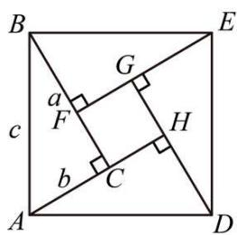

text_image

B
G
a
F
c
H
b
C
A
D
E

图1

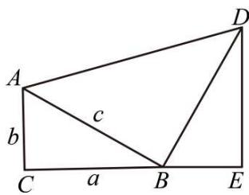

text_image

A
b
c
C
a
B
E
D

图2

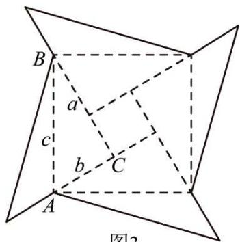

text_image

B
a
c
b
C
A
图2

图3

(1)请你将数学家赵爽的说理过程补充完整:

已知：在Rt△ABC中， $\angle ACB=90^{\circ}$ ，BC=a，AC=b，AB=c．求证： $a^{2}+b^{2}=c^{2}$

证明：由图 1 可知 $S_{正方形ABED} = 4S_{\triangle ABC} + S_{正方形CFGH}$ ,

$$
\because S _ {\text {正方形} A B E D} = c ^ {2}, S _ {\triangle A B C} = \underline {{\quad}},
$$

正方形CFGH边长为\_\_\_\_，

$$
\therefore c ^ {2} = 4 \times \frac {1}{2} a b + (a - b) ^ {2} = 2 a b + a ^ {2} - 2 a b + b ^ {2},
$$

即 $a^{2}+b^{2}=c^{2}$ .

(2)如图 2, 在 $\triangle ABC$ 中, $\angle C = 90^{\circ}$ , $BC = a$ , $AC = b$ , $AB = c$ , 以 $AB$ 为直角边在 $AB$ 的右侧作等腰直角 $\triangle ABD$ , 其中 $AB = BD$ , $\angle ABD = 90^{\circ}$ , 过点 $D$ 作 $DE \perp CB$ , 垂足为点 $E$ . 你用两种不同的方法表示梯形 $ACED$ 的面积, 并证明 $a^{2} + b^{2} = c^{2}$ ;

(3)将图 1 中的四个直角三角形中较短的直角边分别向外延长相同的长度, 得到如图 3 所示的“数学风车”. 若 $a = 12$ , $b = 9$ , “数学风车”外围轮廓 (图中实线部分) 的总长度为 108, 求这个风车图案的面积.

# 【题型 2 由勾股定理求线段长度】教辅资源,关注公众号·全科AA+

【例 2】（24-25 九年级下·辽宁抚顺·阶段练习）如图，在边长为 8 的正方形 ABCD 中，E 是 BC 上一点，F 是 CD 的延长线上一点，连接 AE，AF，AM 平分 $\angle EAF$ 交 CD 于点 M．若 BE = DF = 2，则 FM 的长度为（）

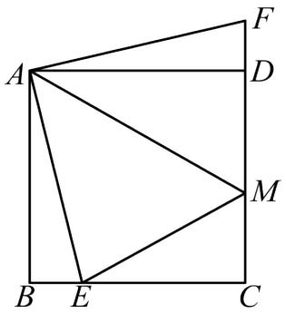

text_image

Geometric diagram with labeled points A, B, C, D, E, F, M forming triangles and quadrilaterals

A. $\frac{24}{5}$

B. $\frac{34}{5}$

C. $\frac{48}{5}$

D. $\frac{12}{5}$

【变式 2-1】（24-25 七年级下·山东济南·期末）如图，在 $\triangle ABC$ 中，AB 边的垂直平分线 DE 分别交 AB、AC 边于点 D 和点 E，且 $BC^{2} + CE^{2} = AE^{2}$ .

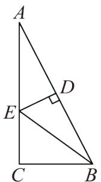

text_image

A
D
E
C
B

(1)连接BE，求证： $\angle C=90^{\circ}$ ;  
(2)若AC=4,BC=2，求CE的长.

【变式 2-2】（25-26 八年级上·全国·随堂练习）如图，在 $\triangle ABC$ 中，AB = 5, AC = 4, BC = 3，DE 是 AB 的垂直平分线，DE 分别交 AC、AB 于点 E、D.

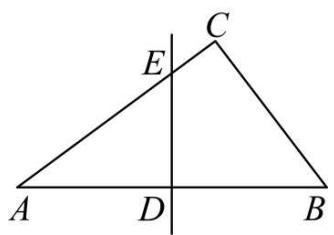

text_image

C
E
A D B

(1)求证： $\triangle ABC$ 是直角三角形；  
(2)求AE的长.

【变式 2-3】（24-25 九年级下·江西宜春·阶段练习）如图，在等边三角形ABC中，点P在其内部，且BP=12，CP=5， $\angle CPB=150^{\circ}$ ，将 $\triangle ABP$ 绕点B按逆时针方向旋转 $60^{\circ}$ 得到 $\triangle CBD$ .

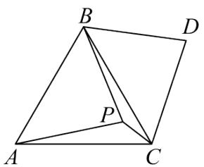

text_image

B
D
P
A
C

(1)求点 P 与点 D 之间的距离;

(2)求线段AP的长.

# 【题型3 勾股数（树）的运用】

【例 3】（24-25 八年级下·山东德州·期中）有一个边长为 1 的大正方形，经过 1 次“生长”后，在它的左右肩上生出两个小正方形，其中三个正方形围成的三角形是直角三角形，再经过 1 次“生长”后，形成的图形如图 1 所示．如果继续“生长”下去，它将变得“枝繁叶茂”如图 2 所示，若“生长”了 2025 次后，形成的图形中所有的正方形的面积和是（）

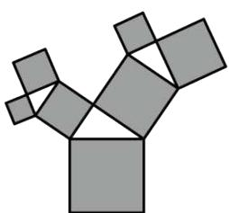

natural_image

Abstract geometric pattern composed of gray squares forming a Y-shape (no text or symbols)

图1

natural_image

Colorful abstract tree-like pattern composed of interconnected squares and triangles (no text or symbols)

图2

A. 2026

B. 2025

C. $2^{2025}$

D. $2^{2022}-1$

【变式 3-1】（24-25 八年级上·江苏扬州·期末）下列四组数中是勾股数的一组是（）

A. $\frac{1}{3},\quad\frac{1}{4},\quad\frac{1}{5}$

B. 0.3, 0.4, 0.5

C. 5, 12, 13

D. $3^{2}$ , $4^{2}$ , $5^{2}$

【变式 3-2】（24-25 八年级下·湖北孝感·期中）勾股定理 $a^{2}+b^{2}=c^{2}$ 本身就是一个关于a, b, c的方程，满足这个方程的正整数解 $(a,b,c)$ 通常叫做勾股数组。毕达哥拉斯学派提出了一个构造勾股数组的公式，根据该公式可以构造出如下勾股数组： $(3,4,5),(5,12,13),(7,24,25),\cdots$ 。分析上面勾股数组可以发现， $4=1\times(3+1)$ $,12=2\times(5+1),24=3\times(7+1),\cdots$ ，分析上面规律，第9个勾股数组为\_\_\_\_。

【变式 3-3】（24-25 七年级上·山东泰安·期中）如图是一株美丽的勾股树，其中所有的四边形都是正方形，所有的三角都是直角三角形．若A, B, C, D的边分别是5, 4, 3, 2，则最大的正方形F的面积为\_\_\_\_．

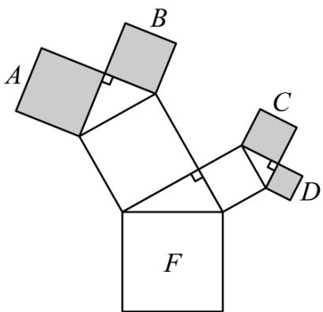

text_image

A
B
C
D
F

【题型 4 网格中判断直角三角形】 教辅资源,关注公众号·全科AA+

【例 4】（24-25 八年级下·湖北孝感·期中）如图，在 $4 \times 4$ 网格中，每个小正方形的边长都相等，网格线的交点称为格点.格点 $C$ 与图中的格点 $A, B$ 可构成直角三角形，则这样的格点 $C$ 有（）

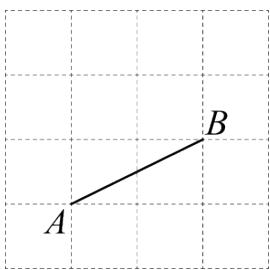

text_image

A
B

A. 2 个

B. 3 个

C. 4 个

D. 5 个

【变式 4-1】（24-25 八年级上·辽宁本溪·期中）如图， $\triangle ABD$ 和 $\triangle ABC$ 的顶点均在边长为 1 的小正方形网格格点上，则 $\angle BAC$ 的度数为（）

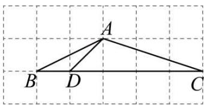

text_image

A
B D C

A. $120^{\circ}$

B. $135^{\circ}$

C. $150^{\circ}$

D. $165^{\circ}$

【变式 4-2】（24-25 八年级下·河南商丘·期末）如图，点 A, B, C, D 均在正方形网格格点上，则 $\angle DAC - \angle BAC =$ \_\_\_\_ $^{\circ}$ .

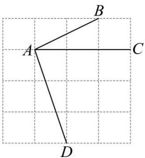

text_image

A
B
C
D

【变式 4-3】（24-25 八年级下·福建福州·期中）如图，∠1，∠2 在网格上位置，则 ∠1 + ∠2 = \_\_\_\_°.

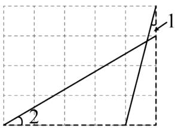

text_image

1
2

# 【拔尖篇】

# 【题型5 利用勾股定理求两条线段的平方和（差）】

【例 5】如图， $\triangle ABC$ 和 $\triangle ECD$ 都是等腰直角三角形， $\triangle ABC$ 的顶点 A 在 $\triangle ECD$ 的斜边 DE 上．下列结论：其中正确的有（）

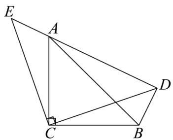

text_image

Geometric diagram with labeled points A, B, C, D, E and right angle at C

① $\triangle ACE \cong \triangle BCD$

②BD + AD = DE

③ $\angle DAB = \angle BCD$

④ $AE^{2}+AD^{2}=2BC^{2}$

A. 1 个

B. 2 个

C. 3 个

D. 4 个

【变式 5-1】对角线互相垂直的四边形叫做“垂美”四边形, 现有如图所示的“垂美”四边形ABCD, 对角线AC,BD交于点O. 若AD = 1, BC = 4, 则 $AB^{2} + CD^{2} =$ \_\_\_\_.

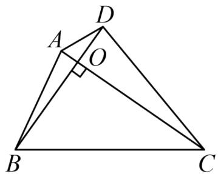

text_image

Geometric diagram of triangle ABC with point D on side CD and perpendicular from D to AC at O

【变式 5-2】（24-25 七年级下·山东泰安·期末）如图 1， $AB \parallel CD$ ，点 E，F 分别在直线 AB，CD 上，连接 EF， $\angle MEN = 90^{\circ}$ ，点 N 在 CD 上.

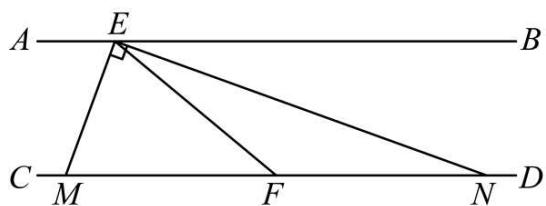

text_image

A
E
B
C
M
F
N
D

图1

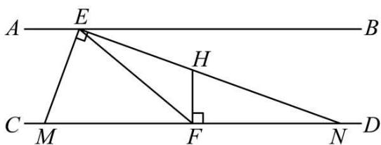

text_image

A
E
B
H
C
M
F
D
N

图2

(1)若 $\angle BEN=20^{\circ}$ ，求 $\angle AEM$ 的度数；

(2)若EN平分∠BEF交CD于点N，求证：点F是MN的中点；

(3)如图2，过点F作FH⊥CD交EN于点H，猜想线段EM，EH，HN有何数量关系，并说明理由.

【变式 5-3】（24-25 八年级下·广东东莞·阶段练习）我们把对角线互相垂直的四边形叫做垂美四边形.

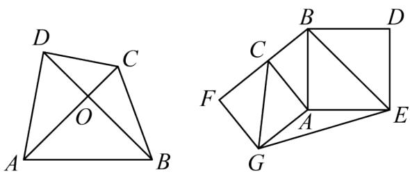  
图①  
图②

(1) 如图①, 已知四边形 $ABCD$ 是垂美四边形, 请探究两组对边 $AB^{2} + CD^{2}$ 与 $AD^{2} + BC^{2}$ 之间的数量关系,并说明理由;

(2) 如图②, 分别以 Rt $\triangle ACB$ 的直角边 $AC$ 和斜边 $AB$ 为边向外作正方形 $ACFG$ 和正方形 $ABDE$ , 连接 $BE, CG, EG$ , 已知 $AC = 4, AB = 5$ , 求 $GE^{2}$ .

【题型 6 利用勾股定理解决折叠问题】 教辅资源,关注公众号·全科AA+

【例 6】（24-25 八年级下·安徽合肥·期中）如图，在Rt△ABC中，∠C=90°，AC=4,BC=6，将它的锐角A翻折，使得点A落在边BC的中点D处，折痕交AC边于点E，交AB边于点F，则DE的长为（）

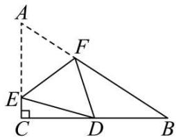

text_image

Geometric diagram with labeled points A, B, C, D, E, F and right angle at C

A. 2

B. 3

C. $\frac{25}{9}$

D. $\frac{25}{8}$

【变式 6-1】（24-25 八年级下·福建厦门·阶段练习）如图在矩形ABCD中，BC = 8，CD = 6，将△BCD沿对角线BD翻折，点C落在点C'处，BC'交AD于点E，则△BDE的面积为\_\_\_\_。

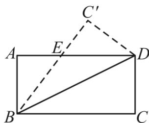

text_image

C'
A	E	D
B	C

【变式 6-2】（24-25 八年级下·江苏盐城·期中）如图，在矩形ABCD中，AB = 12，BC = 10，点E、F分别在AB、DC上，且AB = 3BE，CD = 3CF，点P为直线AB上一动点，连接DP，将△DAP沿DP所在直线翻折得到△ $DA'P$ ，当点 $A'$ 恰好落在直线EF上时，AP的长为\_\_\_\_。

text_image

A P E B
A'
D F C

【变式 6-3】（24-25 九年级下·广东深圳·阶段练习）如图，在Rt△ABC中，∠B=90°，AB=5，BC=8，点D为AB上一点，连接CD，将△BCD沿CD翻折得到△B′CD，过点A作AF∥BC交DB′于点E，交CB′于点F，若AE=B′E，则BD的长为\_\_\_\_。

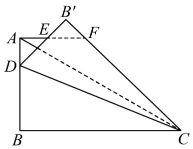

text_image

B'
E
F
A
D
B
C

【题型7 勾股定理的证明】

【例 7】（24-25 八年级下·福建福州·期中）在勾股定理的学习过程中，我们已经学会了运用图形验证著名的勾股定理，下列选项中的图形，能证明勾股定理的是（）

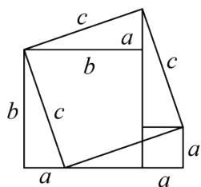

text_image

c
a
b
c
b
c
a
a

①

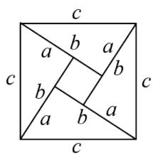

text_image

c
a b a
b b
a b a
c
c

②

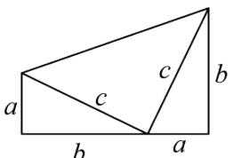

text_image

a
c
b
c
b
a

③

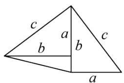

text_image

c
a
b
b
c
a

④

A. ①②③

B. ①②④

C. ②③④

D. ①②③④

【变式 7-1】（24-25 八年级上·河北沧州·期末）如图所示，意大利著名画家达·芬奇用一张纸片剪拼出不一样的空洞，证明了勾股定理．若设图 1 中空白部分（两个正方形和两个直角三角形组成）的面积为 $S_{1}$ ，经过以下裁剪，翻转，拼出图 2，其中空白部分的面积为 $S_{2}$ ，嘉琪同学得出了以下四个结论：① $S_{1}=a^{2}+b^{2}+ab$ ；② $S_{2}=c^{2}+ab$ ；③ $S_{1}=S_{2}$ ；④ $a^{2}+b^{2}=c^{2}$ ．则其中正确的有（）

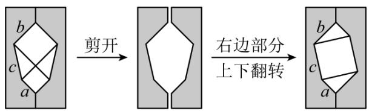

flowchart

图1  
图2

A. 1 个

B. 2 个

C. 3 个

D. 4 个

【变式 7-2】如图，把长、宽、对角线的长分别是 a、b、c 的矩形沿对角线剪开，与一个直角边长为 c 的等腰直角三角形拼接成右边的图形，用面积割补法能够得到的一个等式是\_\_。

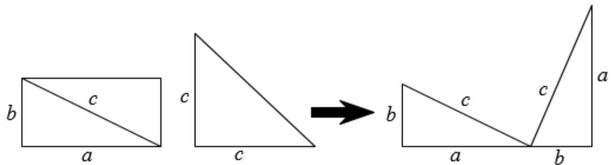

text_image

b
c
a
c
c
→ b
c
c
a
a
b

【变式 7-3】（24-25 七年级下·江苏泰州·阶段练习）《整式的乘法》一章学习中，我们体验了“以形助数，以数解形”的研究策略。这充分体现了数学中“数形结合”这一数学思想方法的重要性。民兴七年级数学兴趣小组通过面积恒等的方法对直角三角形三边关系进行了探究。

【初步探究】

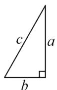

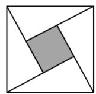

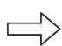

方法1：小正方形面积=小正方形边长的平方；

方法2：小正方形面积=大正方形面积-4个直角三角形面积.

图1

(1) 如图 (1), 直角三角形纸片三条边长分别为 $a, b, c (b < a < c)$ , 小组同学用四个这样的纸片拼成了一个大正方形, 中间空一个小正方形 (阴影部分).

①一个直角三角形纸片的面积为\_\_\_\_，小正方形边长为\_\_\_\_。（用含 a, b 的代数式表示）  
②请用两种不同的方法表示出阴影部分（小正方形）的面积，从而探究出 a, b, c 三者之间的关系。（需化简）

【结论运用】

(2) 如图 2, 已知, $\triangle ABC$ 是直角三角形, $\angle C = 90^{\circ}$ . 请利用上面得到的结论求解.

①若AC=3，BC=4，求AB的长.   
②若AC=6，AB的长比BC的长大2，求AB的长.

【应用拓展】教辅资源,关注公众号·全科AA+（3）如图 3，已知，在 $\triangle ABC$ 中，AB = 13，AC = 15，BC = 14，请求出 $\triangle ABC$ 的面积.

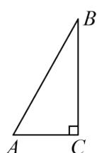  
图2

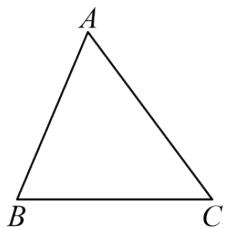

text_image

A
B C

图3

# 【题型8 勾股定理的应用】

【例 8】（24-25 八年级下·黑龙江哈尔滨·阶段练习）荡秋千是深受大家喜爱的一项活动，某秋千垂直地面时踏板离地面的距离AC为0.5米，将踏板水平推动3米（BE = 3米），此时踏板与地面的距离BD为1.5米，若推动过程中拉绳始终拉得很直，则秋千的拉绳OA的长度为\_\_\_\_米.

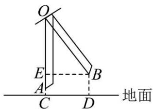

text_image

O
E
A
C
D
B
地面

【变式 8-1】如图所示，某港口位于东西方向的海岸线上．“远航”号、“海天”号轮船同时离开港口，各自沿一固定方向航行，“远航”号每小时航行16海里，“海天”号每小时航行12海里．它们离开港口 $\frac{3}{2}$ 小时后相距30海里．如果知道“远航”号沿东北方向航行，能知道“海天”号沿哪个方向航行吗？

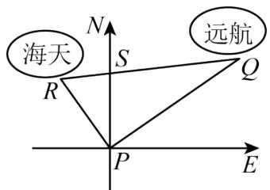

text_image

海天
N
S
R
P
E
Q
远航

【变式 8-2】（24-25 八年级下·贵州黔东南·阶段练习）某市准备在铁路AB上修建火车站E，以方便铁路AB两旁的C，D两城的居民出行．如图，C城到铁路AB的距离AC = 20km，D城到铁路AB的距离DB = 60km，AB = 100km，经市政府与铁路部门协商最后确定在到C，D两城距离相等的E处修建火车站，求AE，BE的长.

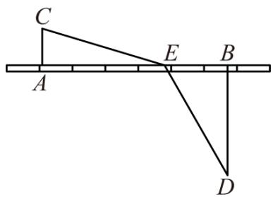

text_image

C
A	E	B
D

【变式 8-3】（24-25 八年级下·江西赣州·期末）学过《勾股定理》后，学校数学兴趣小组的队员们来到操场上测量旗杆AB的高度，通过测量得到如下信息：

①测得从旗杆顶端垂直挂下来的升旗用的绳子比旗杆长3米（如图1）；  
②当将绳子拉直时，测得此时拉绳子的手到地面的距离CD为1米，到旗杆的距离CE为12米（如图2）.

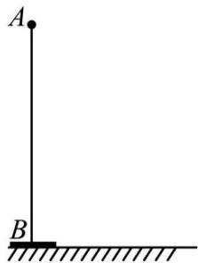

natural_image

Simple diagram showing a vertical line segment AB perpendicular to a horizontal ground line, with no text or symbols present.

图1

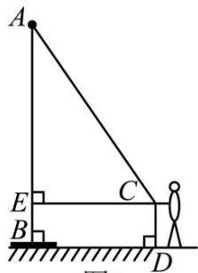

text_image

A
E
B
C
D

图2

根据以上信息，解答下列问题

(1)设旗杆AB = x米，则AC = \_\_\_\_米，AE = \_\_\_\_米（用含x的式子表示）  
(2)求旗杆x的值.

# 【题型9 利用勾股定理求最短距离】

【例 9】（2025 八年级下·全国·专题练习）如图，观察图形解答下面的问题：

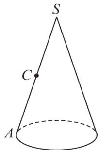

text_image

S
C
A

(1)此图形的名称为\_\_\_\_；  
(2)请你与同伴一起做一个这样的立体图形，并把它的侧面沿AS剪开，铺在桌面上，则它的侧面展开图是一个\_\_\_\_；  
(3)如果点C是SA的中点，在A处有一只蜗牛，在C处恰好有蜗牛想吃的食物，且它只能绕此立体图形的侧面爬行一周到C处．你能在侧面展开图中画出蜗牛爬行的最短路线吗？

(4)SA的长为10，侧面展开图的圆心角为 $90^{\circ}$ ，请你求出蜗牛爬行的最短路程的平方.

【变式 9-1】如图所示是一个三级台阶，它的每一级的长、宽、高分别等于 7cm、6cm、2cm，A 和 B 是这两个台阶的两个相对的端点，则一只蚂蚁从点 A 出发经过台阶爬到点 B 的最短路线有多长？

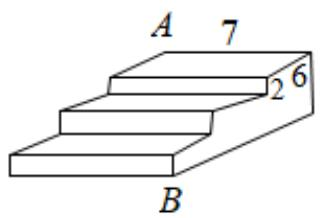

text_image

A 7
2 6
B

【变式 9-2】（24-25 八年级下·全国·假期作业）如图，长方体的棱长 AB = BC = 6cm， $AA_{1} = BB_{1} = CC_{1} = 14$ cm，假设昆虫甲从长方体内顶点 $C_{1}$ 以 2cm/s 的速度在长方体的内部沿棱 $C_{1}C$ 向下爬行．同时，昆虫乙从长方体内顶点 A 以相同的速度在长方体的侧面上爬行，那么昆虫乙至少需要多长时间才能捕捉到昆虫甲？

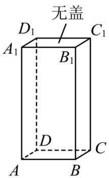

text_image

无盖
D₁ C₁
A₁ B₁
D
A B C

【变式 9-3】（24-25 九年级下·全国·随堂练习）如图为一个长4cm，宽2cm，高1cm的实心长方体，一只蚂蚁从实心长方体的顶点A出发，沿长方体的表面爬到对面顶点 $C_{1}$ 处，问怎样走路线最短？最短路线长为多少？

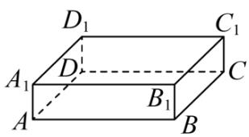

text_image

D₁
C₁
A₁
D
C
B₁
A
B

【题型 10 勾股定理及其逆定理的综合】教辅资源,关注公众号·全科AA+

【例 10】（24-25 八年级下·河南郑州·阶段练习）【问题情境】如图，在 $\triangle ABC$ 中，AD 为 BC 边上的高.

【特例研究】（1）若CD=1，AD=2，BD=4，求证： $AB \perp AC$ ;

【猜想证明】（2）根据（1）中的结论，小明猜想：当满足 $AD^2 = BD \cdot CD$ ，利用勾股定理及其逆定理，可证明 $\triangle ABC$ 是直角三角形，请你验证小明的猜想是否正确.

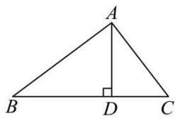

text_image

A
B D C

【变式 10-1】（24-25 八年级下·四川绵阳·阶段练习）如图 1，四边形ABCD， $\angle A=90^{\circ}$ ，AB=3，BC=12，
CD = 13, DA = 4.

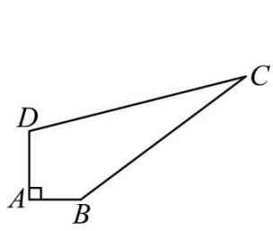

text_image

D
A
B
C

图1

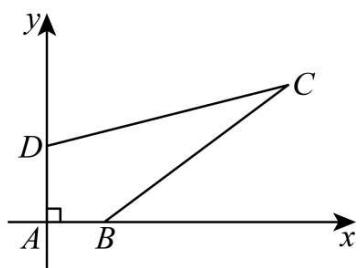

text_image

y
D
C
A
B
x

图2

(1)求四边形ABCD的面积;

(2)如图 2，以A为坐标原点，以AB、AD所在直线为x轴、y轴建立直角坐标系，点P在y轴上，若 $S_{\triangle PBD}=\frac{1}{6}$ $S_{四边形ABCD}$ ，求P的坐标.

【变式 10-2】（24-25 八年级下·云南大理·期末）如图，在 $\triangle ABC$ 中， $AB = AC$ ， $BC = 10$ ，点 $D$ 是边 $AC$ 上的一点， $BD = 8$ ， $CD = 6$ .

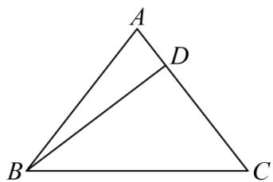

text_image

A
D
B
C

(1)求证： $\triangle BDC$ 是直角三角形；

(2)求线段AD的长.

【变式 10-3】（24-25 七年级下·四川成都·期末）如图，在 $\triangle ABC$ 中，CD 是 AB 边上的高，已知 AC = 9，BC = 12，AB = 15.

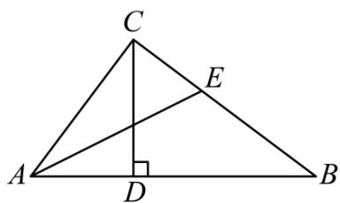

text_image

C
E
A
D
B

(1)求CD的长;

(2)过点 A 作 $\angle CAB$ 的角平分线交 BC 边于点 E，求 $\triangle AEB$ 的面积.