# 第一章 勾股定理（举一反三讲义）全章题型归纳

【北师大版 2024】

# 题型归纳

# 【培优篇】....3

【题型1 利用勾股定理探究图形面积】....3

【题型 2 由勾股定理求线段长度】....9

【题型3 勾股数（树）的运用】....13

【题型 4 网格中判断直角三角形】....16

# 【拔尖篇】....19

【题型 5 利用勾股定理求两条线段的平方和（差）】....19

【题型 6 利用勾股定理解决折叠问题】....25

【题型 7 勾股定理的证明】....29

【题型8 勾股定理的应用】 35

【题型 9 利用勾股定理求最短距离】....38

【题型 10 勾股定理及其逆定理的综合】....41

# 举一反三

# 知识点1 勾股定理

1. 定义: 直角三角形两直角边的平方和等于斜边的平方, 如果用 $a$ , $b$ 和 $c$ 分别表示直角三角形的两直角边和斜边, 那么 $a^2 + b^2 = c^2$ .

如图所示， $\triangle ABC$ 是直角三角形，其中较短的直角边 $a$ 叫做勾，较长的直角边 $b$ 叫做股，斜边 $c$ 叫做弦.

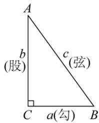

text_image

A
b
(股)
c
(弦)
C
a(勾)
B

# 知识点 2 勾股定理的验证

勾股定理的验证主要通过拼图法完成，这种方法是以数形转换为指导思想，图形拼补为手段，各部分面积之间的关系为依据来实现的。用两种方式表示图形面积（算两次），根据面积相同得到等量关系，进而进行等量变换得到勾股定理公式是证明勾股定理的常见方法。

# 拼图法验证勾股定理的一般步骤

text_image

D
a
c
b
C
c
A
b
E
a
B

<table><tr><td>(1) 拼出图形</td><td>直角梯形(3个直角三角形)</td></tr><tr><td>(2)用两种方式表示图形面积</td><td> $\frac{1}{2}(a + b) \times (a + b), \frac{1}{2}ab + \frac{1}{2}c^{2} + \frac{1}{2}ab$ </td></tr><tr><td>(3)根据面积相同得到等量关系</td><td> $\frac{1}{2}(a + b)^{2} = \frac{1}{2}c^{2} + ab$ </td></tr><tr><td>(4)恒等变形</td><td> $a^{2} + b^{2} + 2ab = c^{2} + 2ab$ </td></tr><tr><td>(5)推导出勾股定理</td><td> $a^{2} + b^{2} = c^{2}$ </td></tr></table>

# 知识点 3 勾股定理的应用

利用勾股定理可以解决与直角三角形有关的问题，主要应用如下：

(1)已知直角三角形的任意两边长，求第三边长；  
(2)已知直角三角形的任意一边长，确定另外两边长的关系；  
(3)解决包含平方关系的几何问题;  
(4)构造方程计算有关线段的长度问题, 解决生产生活中的一些实际问题.

# 知识点 4 直角三角形的判别条件

1. 定义: 如果三角形的三边 $a, b, c$ 满足 $a^2 + b^2 = c^2$ 那么这个三角形是直角三角形。（此判别条件也称为勾股定理的逆定理）

2. 判断一个三角形是否为直角三角形的方法:

<table><tr><td>从角度上判断</td><td>三角形中有一个角是直角,或者三角形中有两个角互余</td></tr><tr><td>从边长上判断</td><td>两条较短边的平方和等于最长边的平方</td></tr></table>

# 知识点 5 勾股数

1. 勾股数

<table><tr><td>定义</td><td>满足 $a^{2} + b^{2} = c^{2}$ 的三个正整数,称为勾股数</td></tr><tr><td>满足条件</td><td>1三个数都是正整数2两个较小整数的平方和等于最大整数的平方</td></tr><tr><td>拓展</td><td>勾股数的整数倍仍为勾股数,如3,4,5的2倍6,8,10仍为勾股数.</td></tr><tr><td>常见形式</td><td>1 $n^{2}-1$ ,2n, $n^{2}+1$ (n大于1的全部数);</td></tr></table>

② $4n, 4n^{2}-1, 4n^{2}+1$ （n为正整数）等

# 2. 判断勾股数的方法步骤:

(1)确定三个是正整数;   
(2)确定最大的数字与另外两个较小的数，分别计算最大的数的平方与另外两个较小的数的平方和；  
(3)进行比较, 若最大数的平方等于另外两个较小数的平方和, 则是勾股数, 否则不是.

# 【培优篇】

# 【题型 1 利用勾股定理探究图形面积】

【例 1】（24-25 八年级下·浙江金华·期末）如图，在Rt△ABC中， $\angle ACB=90^{\circ}$ ，分别以边AC、BC向外作正方形ACDE和正方形BFGC，连接EF、AF．若已知 $AB^{2}-AC^{2}$ 的值，则能求出的三角形面积是（）

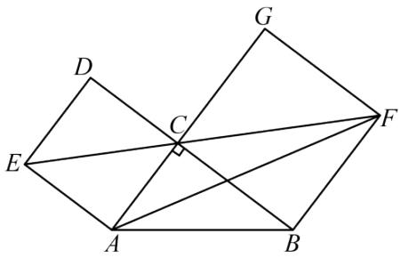

text_image

Geometric diagram with labeled points A, B, C, D, E, F, G and intersecting lines forming triangles and quadrilaterals

A. 三角形 $ABF$

B. 三角形 $ACF$

C. 三角形AEF

D. 三角形 $ABC$

【答案】A

【分析】延长EA，FB交于点H，根据直角三角形与正方形性质得， $\angle ACB=90^{\circ}$ ， $\angle CBF=90^{\circ}$ ， $\angle CAE = 90^{\circ}$ ，得四边形ACBH是矩形，得 $\angle H = 90^{\circ}$ ，AH = BC，得 $AB^{2}-AC^{2} = BC^{2}$ 的值已知，可求 $S_{\triangle ABF} = \frac{1}{2}BF \cdot AH = \frac{1}{2}BC^{2}$ .

【详解】解：延长EA，FB交于点H，

∵在Rt△ABC、正方形ACDE和正方形BFGC中， $\angle ACB=90^{\circ}$ ， $\angle CBF=90^{\circ}$ ， $\angle CAE=90^{\circ}$ ，

$$
\therefore \angle C A H = \angle C B H = 9 0 ^ {\circ},
$$

∴四边形ACBH是矩形，

$$
\therefore \angle H = 9 0 ^ {\circ}, A H = B C,
$$

$\because AB^{2}-AC^{2}=BC^{2}$ 的值已知，

∴可以求出 $S_{\triangle ABF}=\frac{1}{2}BF\cdot AH=\frac{1}{2}BC^{2}$

故选：A.

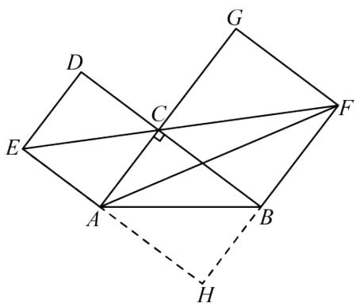

text_image

Geometric diagram with labeled points and lines, including a right angle at C and auxiliary dashed lines

【点睛】此题主要考查勾股定理．熟练掌握勾股定理，直角三角形性质，正方形的性质，矩形的判定和性质、三角形面积公式，是解题的关键.

【变式 1-1】（24-25 八年级下·广东惠州·期中）如图是用八个全等的直角三角形排成的“弦图”。记图中正方形ABCD，正方形EFGH，正方形MNKT的面积分别为 $S_{1}$ ， $S_{2}$ ， $S_{3}$ ，若正方形EFGH的边长为 $\sqrt{6}$ ，则 $S_{1}+S_{2}+S_{3}$ 的值（）

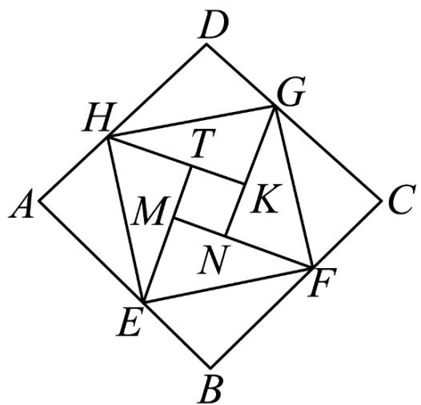

text_image

D
H
G
T
A
M
K
N
E
F
C
B

A. 16

B. 17

C. 18

D. 20

【答案】C

【分析】本题考查勾股定理的应用，用到的知识点是勾股定理和正方形、全等三角形的性质，以及完全平方公式等知识．根据八个直角三角形全等，四边形ABCD，EFGH，MNKT都是正方形，得出 $CG=FM=NG,CF=FN=DG$ ，再根据 $S_{1}=(CG+DG)^{2}$ ， $S_{2}=GF^{2}$ ， $S_{3}=(FM-FN)^{2}$ 即可求解.

【详解】解：在Rt $\triangle CFG$ 中，由勾股定理得： $CG^{2} + CF^{2} = GF^{2}$

∵八个直角三角形全等，四边形ABCD，EFGH，MNKT都是正方形，

$$
\therefore C G = F M = N G, \quad C F = F N = D G,
$$

$$
\therefore S _ {1} = (C G + D G) ^ {2}
$$

$$
= C G ^ {2} + D G ^ {2} + 2 C G \cdot D G
$$

$$
\begin{array}{l} = C G ^ {2} + C F ^ {2} + 2 C G \cdot D G \\ = G F ^ {2} + 2 C G \cdot D G; \\ \end{array}
$$

$$
S _ {2} = G F ^ {2};
$$

$$
S _ {3} = (F M - F N) ^ {2}
$$

$$
= F M ^ {2} + F N ^ {2} - 2 F M \cdot F N
$$

$$
= C G ^ {2} + C F ^ {2} - 2 C G \cdot D G
$$

$$
= G F ^ {2} - 2 C G \cdot D G
$$

∵正方形EFGH的边长为 $\sqrt{6}$ ,

$$
\therefore G F ^ {2} = 6,
$$

$$
\therefore S _ {1} + S _ {2} + S _ {3} = G F ^ {2} + 2 C G \cdot D G + G F ^ {2} + G F ^ {2} - 2 C G \cdot D G = 3 G F ^ {2} = 1 8
$$

故选：C.

【变式 1-2】（24-25 八年级下·山西临汾·期末）在Rt△ABC中，∠C = 90°，AC ≥ BC，以AB为边在三角形外部作正方形ABDE．在正方形ABDE内部作正方形ALKJ、正方形DPQR，AL = AC，DP = BC，S₁、S₂、S₃分别表示四边形EPMJ、四边形BLNR、四边形KMQN的面积，S₁、S₂、S₃之间的数量关系\_\_\_\_.

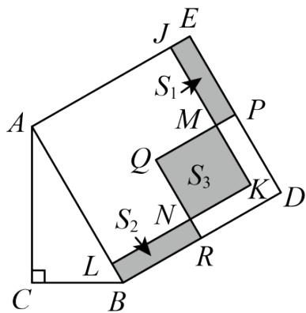

text_image

J E
S₁
A M P
Q S₃ K D
S₂ N
L R
C B

【答案】 $S_{3}=S_{1}+S_{2}$

【分析】设AB=c，AC=b，BC=a，求得 $S_{1}+S_{2}$ 的值，再证明四边形KMQN为正方形，进而求得 $S_{3}$ 的值，在Rt△ABC中，由勾股定理可得 $a^{2}+b^{2}=c^{2}$ ，即可求解.

【详解】设AB=c，AC=b，BC=a，

则 $AB = BD = DE = AE = c$ ， $AL = LK = JK = AJ = b$ ， $PD = BC = PQ = QR = DR = a$

$$
\therefore B L = A B - A L = c - b, \quad L N = B R = B D - D R = c - a, \quad J E = A E - A J = c - b, \quad E P = D E - D P = c - a,
$$

$$
N K = L K - L N = b - (c - a) = b - c + a,
$$

$$
\therefore S _ {1} + S _ {2} = 2 (c - b) (c - a) = 2 c ^ {2} + 2 a b - 2 a c - 2 b c,
$$

$$
\because J E = B L = c - b, Q R = P Q,
$$

$$
\therefore Q M = Q N,
$$

又∵∠Q = ∠K = 90°, ∠ALK = ∠ABD = 90°,

$$
\therefore L K \parallel B D,
$$

$$
\therefore \angle Q N K = \angle Q R D = 9 0 ^ {\circ},
$$

∴四边形KMQN为正方形，

∴四边形KMQN的面积为 $S_{3}=NK^{2}=(b-c+a)^{2}=a^{2}+b^{2}+c^{2}+2ab-2ac-2bc,$

在Rt△ABC中，

$$
\because \angle C = 9 0 ^ {\circ},
$$

$$
\therefore a ^ {2} + b ^ {2} = c ^ {2},
$$

$$
\therefore S _ {3} = 2 c ^ {2} + 2 a b - 2 a c - 2 b c = S _ {1} + S _ {2}.
$$

故答案为： $S_{3}=S_{1}+S_{2}$

【点睛】本题主要考查了勾股定理的应用、正方形的判定与性质、整式混合运算等知识，难度较大，灵活运用勾股定理是解题关键.

【变式 1-3】（24-25 八年级下·安徽滁州·期中）我国三国时期的数学家赵爽利用四个全等的直角三角形拼成如图 1 所示的图形，其中四边形ABED和四边形CFGH都是正方形，巧妙地用面积法得出了直角三角形三边长 a, b, c 之间的一个重要结论： $a^{2} + b^{2} = c^{2}$ .

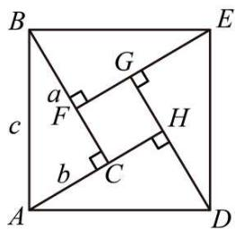

text_image

B
G
E
a
F
c
H
b
C
A
D

图1

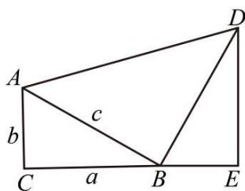

text_image

A
b
c
C
a
B
E
D

图2

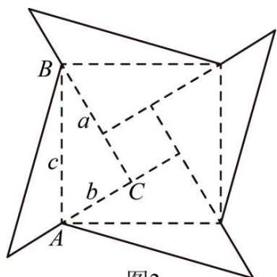

text_image

B
a
c
b
C
A
图2

图3

(1)请你将数学家赵爽的说理过程补充完整:

已知：在Rt△ABC中， $\angle ACB=90^{\circ}$ ，BC=a，AC=b，AB=c．求证： $a^{2}+b^{2}=c^{2}$

证明：由图1可知 $S_{正方形ABED}=4S_{\triangle ABC}+S_{正方形CFGH}$

$$
\because S _ {\text {正方形} A B E D} = c ^ {2}, S _ {\triangle A B C} = \underline {{\text {注公}}},
$$

正方形CFGH边长为\_\_\_\_，

$$
\therefore c ^ {2} = 4 \times \frac {1}{2} a b + (a - b) ^ {2} = 2 a b + a ^ {2} - 2 a b + b ^ {2},
$$

即 $a^{2}+b^{2}=c^{2}$ .

(2)如图 2, 在 $\triangle ABC$ 中, $\angle C = 90^{\circ}$ , $BC = a$ , $AC = b$ , $AB = c$ , 以 $AB$ 为直角边在 $AB$ 的右侧作等腰直角 $\triangle ABD$ , 其中 $AB = BD$ , $\angle ABD = 90^{\circ}$ , 过点 $D$ 作 $DE \perp CB$ , 垂足为点 $E$ . 你用两种不同的方法表示梯形 $ACED$ 的面积, 并证明 $a^{2} + b^{2} = c^{2}$ ;

(3)将图 1 中的四个直角三角形中较短的直角边分别向外延长相同的长度, 得到如图 3 所示的“数学风车”。若 $a = 12$ , $b = 9$ , “数学风车”外围轮廓（图中实线部分）的总长度为 108, 求这个风车图案的面积.

【答案】(1) $\frac{1}{2}ab,\ a-b$

(2) 见解析

(3)风车的面积为 393

【分析】本题考查了勾股定理的验证和运用，理解勾股定理解决问题的关键.

（1）依据题意得， $S_{\triangle ABC} = \frac{1}{2} ab$ ，再由图形是由四个全等的直角三角形拼成如图1所示图形，然后用两种方法表示正方形ABED的面积，即可解题；

（2）依据题意，通过证明 $\triangle ABC \cong \triangle BDE$ ，即可判断得出 $BC = DE = a, AC = BE = b$ ，用两种方法分别表示出梯形 $ACED = S_{\triangle ABC} + S_{\triangle ABD} + S_{\triangle BED} = ab + \frac{1}{2} c^2$ 和 $S_{\text{梯形}ACED} = \frac{1}{2}(AC + DE)(CB + BE) = \frac{1}{2}(a + b)^2$ ，再列式变形即可得解；

(3) 依据题意, 结合图形, “数学风车”外围轮廓 (图中实线部分)的总长度为108, 可得

$AD + BD = 108 \div 4 = 27$ . 又设 $AD = x$ , 故 $BD = 27 - x$ . 又在 $\triangle BCD$ 中, $BC^2 + CD^2 = BD^2$ , 则, 求出 $x$ 后可列式计算得解.

【详解】（1）证明：由图可知 $S_{正方形ABED}=4S_{\triangle ABC}+S_{正方形CFGH}$

$$
\because S _ {\text {正方形} A B E D} = c ^ {2}, S _ {\triangle A B C} = \frac {1}{2} a b,
$$

正方形CFGH边长为a-b，

$$
\therefore c ^ {2} = 4 \times \frac {1}{2} a b + (a - b) ^ {2} = 2 a b + a ^ {2} - 2 a b + b ^ {2},
$$

即 $a^{2}+b^{2}=c^{2}$ .

故答案为： $\frac{1}{2}ab,\ a-b;$

(2) 解: $\because DE \perp BC,$

$$
\therefore \angle D B E + \angle B D E = 9 0 ^ {\circ},
$$

$$
\because \angle A B D = 9 0 ^ {\circ},
$$

$$
\therefore \angle A B C + \angle D B E = 9 0 ^ {\circ},
$$

$$
\therefore \angle A B C = \angle B D E,
$$

又 $\angle C=\angle BED=90^{\circ},\quad AB=BD,$

$$
\therefore \triangle A B C \cong \triangle B D E (\mathrm{AAS}).
$$

$$
\therefore B C = D E = a, A C = B E = b;
$$

由题意，第一种方法：

$$
S _ {\text {梯形} A C E D} = S _ {\triangle A B C} + S _ {\triangle A B D} + S _ {\triangle B E D} = \frac {1}{2} a b + \frac {1}{2} c ^ {2} + \frac {1}{2} a b
$$

$$
= a b + \frac {1}{2} c ^ {2};
$$

第二种方法:

$$
S _ {\text {梯形} A C E D} = \frac {1}{2} (A C + D E) (C B + B E)
$$

$$
= \frac {1}{2} (a + b) (a + b)
$$

$$
= \frac {1}{2} (a + b) ^ {2},
$$

$$
\therefore \frac {1}{2} (a + b) ^ {2} = a b + + \frac {1}{2} c ^ {2},
$$

$$
\therefore a ^ {2} + 2 a b + b ^ {2} = 2 a b + c ^ {2},
$$

$$
\therefore a ^ {2} + b ^ {2} = c ^ {2};
$$

（3）由题意，如图，

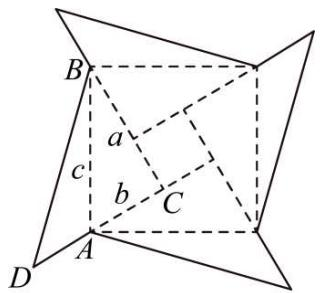

text_image

B
a
c
b
C
A
D

∵“数学风车”外围轮廓 (图中实线部分)的总长度为108,

$$
\therefore A D + B D = 1 0 8 \div 4 = 2 7,
$$

设AD = x, 则BD = 27 - x,

在 $\triangle BCD$ 中， $BC^{2} + CD^{2} = BD^{2}$

$$
\therefore a ^ {2} + (b + x) ^ {2} = (2 7 - x) ^ {2},
$$

将a=12,b=9代入可得，

$$
(9 + x) ^ {2} + 1 4 4 = (2 7 - x) ^ {2},
$$

$$
\therefore x = 7,
$$

∴小正方形的边长等于a-b=12-9=3,

∴风车的面积为： $\frac{1}{2}BC \times CD \times 4 + 3 \times 3 = \frac{1}{2} \times 12 \times 16 \times 4 + 3 \times 3 = 393.$

# 【题型 2 由勾股定理求线段长度】

【例 2】（24-25 九年级下·辽宁抚顺·阶段练习）如图，在边长为 8 的正方形 ABCD 中，E 是 BC 上一点，F 是 CD 的延长线上一点，连接 AE，AF，AM 平分 $\angle EAF$ 交 CD 于点 M．若 BE = DF = 2，则 FM 的长度为（）

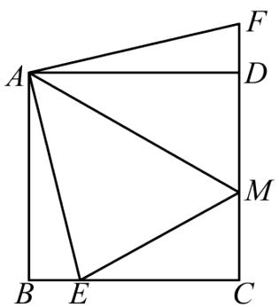

text_image

Geometric diagram of square ABCD with internal points E, F, M and connecting line segments forming triangles and quadrilaterals

A. $\frac{24}{5}$

B. $\frac{34}{5}$

C. $\frac{48}{5}$

D. $\frac{12}{5}$

【答案】B

【分析】本题考查正方形的性质、三角形全等的判定及性质等，勾股定理等知识，根据正方形的性质及三角形全等的判定及性质，证明AE = AF，利用角平分线的性质及三角形全等的判定及性质，证明EM = FM，设EM = x，则FM = x，MC = 10 - x，CE = 6，在Rt△MCE中根据勾股定理求解即可，掌握正方形的性质、三角形全等的判定及性质、勾股定理是解题的关键.

【详解】解：∵四边形ABCD是正方形，

$$
\therefore A B = A D, \angle A B E = \angle A D F = 9 0 ^ {\circ},
$$

∴在Rt $\triangle ABE$ 和 Rt $\triangle ADF$ 中，

$$
\left\{ \begin{array}{c} A B = A D \\ \angle A B E = \angle A D F \\ B E = D F \end{array} \right.,
$$

$$
\therefore \mathrm{Rt} \triangle A B E \cong \mathrm{Rt} \triangle A D F (\text { SAS }),
$$

$$
\therefore A E = A F;
$$

∵AM平分∠EAF,

$$
\therefore \angle E A M = \angle F A M,
$$

∴在 $\triangle AEM$ 和 $\triangle AFM$ 中，

$$
\left\{ \begin{array}{c} A E = A F \\ \angle E A M = \angle F A M \\ A M = A M \end{array} \right.,
$$

$$
\therefore \triangle A E M \cong \triangle A F M (\text { SAS }),
$$

$$
\therefore E M = F M,
$$

∵四边形ABCD是正方形，

$$
\therefore B C = C D = 8, \angle B C D = 9 0 ^ {\circ},
$$

设 $EM = x$ ，则 $FM = x$ ， $MC = CD - DM = 8 - (x - 2) = 10 - x,$

$$
C E = B C - B E = 8 - 2 = 6,
$$

在Rt $\triangle MCE$ 中，根据勾股定理，得 $EM^{2} = MC^{2} + CE^{2}$ ，

即 $x^{2}=(10-x)^{2}+6^{2}$ ,

解得： $x=\frac{34}{5}$ ,

$$
\therefore F M = \frac {3 4}{5},
$$

故选：B.

【变式 2-1】（24-25 七年级下·山东济南·期末）如图，在 $\triangle ABC$ 中，AB 边的垂直平分线 DE 分别交 AB、AC 边于点 D 和点 E，且 $BC^{2} + CE^{2} = AE^{2}$ .

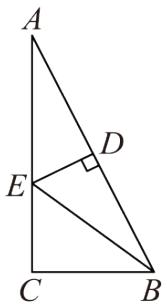

text_image

A
D
E
C
B

(1)连接BE，求证： $\angle C=90^{\circ}$ ;

(2)若 $AC = 4, BC = 2$ ，求 $CE$ 的长.

【答案】(1)见解析

$$
(2) C E = \frac {3}{2}
$$

【分析】该题考查了垂直平分线的性质和勾股定理，解题的关键是掌握以上知识点.

（1）根据垂直平分线的性质得出AE=BE，结合 $BC^{2}+CE^{2}=AE^{2}$ 得出 $BC^{2}+CE^{2}=BE^{2}$ 即可证明；  
（2）设CE = x，则AE = BE = 4 - x，在Rt△BCE中，根据勾股定理列方程求解即可.

【详解】（1）证明：∵AB边的垂直平分线为DE，

$$
\therefore A E = B E,
$$

$$
\because B C ^ {2} + C E ^ {2} = A E ^ {2},
$$

∴ 在 $\triangle BCE$ 中， $BC^{2} + CE^{2} = BE^{2}$ ,

$$
\therefore \angle C = 9 0 ^ {\circ};
$$

（2）解：设CE=x，则AE=BE=4-x，

∴ 在Rt $\triangle BCE$ 中， $EC^{2} + BC^{2} = BE^{2}$ ,

即 $x^{2}+2^{2}=(4-x)^{2}$ ,

解得： $x=\frac{3}{2}$ ,

即 $CE=\frac{3}{2}.$

【变式 2-2】（25-26 八年级上·全国·随堂练习）如图，在 $\triangle ABC$ 中，AB = 5, AC = 4, BC = 3，DE 是 AB 的垂直平分线，DE 分别交 AC、AB 于点 E、D.

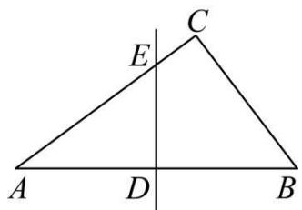

text_image

C
E
A D B

(1)求证： $\triangle ABC$ 是直角三角形；

(2)求AE的长.

【答案】(1)见解析

(2) $\frac{25}{8}$

【分析】本题考查勾股定理，勾股定理逆定理，垂直平分线性质，解题的关键是先证明直角，再根据垂直平分线性质转换线段，根据勾股定理列方程求解.

(1) 根据勾股定理逆定理即可证明;

(2) 连接 $BE$ ，根据 $DE$ 是 $AB$ 的垂直平分线，得到 $AE = BE$ ，设 $AE = BE = x$ ，则 $EC = 4 - x$ ，在 Rt $\triangle ABC$ 中，根据勾股定理列方程求解即可得到答案.

【详解】（1）证明：∵AB=5，AC=4，BC=3，

$$
\therefore A C ^ {2} + B C ^ {2} = A B ^ {2}
$$

$$
\therefore \angle A C B = 9 0 ^ {\circ}
$$

∴ $\triangle ABC$ 是直角三角形;

(2) 解: 连接BE,

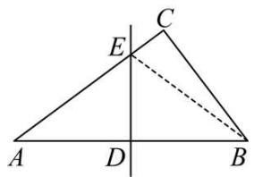

text_image

Geometric diagram of triangle ABC with perpendicular lines and labeled points D, E, B

∵DE是AB的垂直平分线，

$$
\therefore A E = B E,
$$

∴设AE = BE = x，则EC = 4 - x，

∵在Rt△ABC中， $EC^{2}+BC^{2}=BE^{2}$

$$
\therefore (4 - x) ^ {2} + 3 ^ {2} = x ^ {2},
$$

$$
\therefore x = \frac {2 5}{8},
$$

$$
\therefore A E = \frac {2 5}{8}.
$$

【变式 2-3】（24-25 九年级下·江西宜春·阶段练习）如图，在等边三角形ABC中，点P在其内部，且BP=12，CP=5， $\angle CPB=150^{\circ}$ ，将 $\triangle ABP$ 绕点B按逆时针方向旋转 $60^{\circ}$ 得到 $\triangle CBD$ .

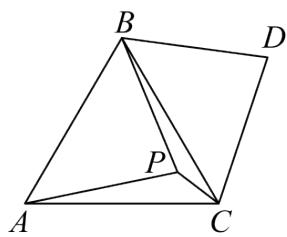

text_image

B
D
P
A
C

(1)求点 P 与点 D 之间的距离;

(2)求线段AP的长.

【答案】(1)12

(2)13

【分析】题目主要考查旋转的性质，等边三角形的判定和性质，勾股定理解三角形等，理解题意，作出辅助线是解题关键.

（1）连接PD．根据等边三角形的判定和性质，旋转的性质得出 $\triangle PBD$ 是等边三角形，即可求解；

(2) 利用等边三角形的性质确定 $\triangle PCD$ 是直角三角形, 再由勾股定理求解即可.

【详解】（1）解：如图，连接PD.

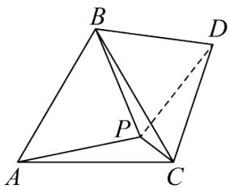

text_image

Geometric diagram of a quadrilateral ABCD with internal points P and dashed line AC

∵△ABC是等边三角形，

$$
\therefore \angle A B C = 6 0 ^ {\circ}, B A = B C.
$$

∵△CBD是△ABP绕点B逆时针旋转得到的，

$$
\therefore \triangle C B D \cong \triangle A B P,
$$

$$
\therefore B P = B D.
$$

$$
\because \angle P B D = \angle A B C = 6 0 ^ {\circ},
$$

$\therefore\triangle PBD$ 是等边三角形.

∴ PD = PB = 12，即点 P 与点 D 之间的距离是 12.

(2) $\because \angle CPB = 150^{\circ}, \triangle PBD$ 是等边三角形.

$$
\therefore \angle D P C = 9 0 ^ {\circ},
$$

$\therefore\triangle PCD$ 是直角三角形，

$$
\therefore P C ^ {2} + P D ^ {2} = C D ^ {2},
$$

$$
\therefore C D ^ {2} = 5 ^ {2} + 1 2 ^ {2},
$$

$$
\therefore C D = 1 3.
$$

由（1）知 $\triangle CBD \cong \triangle ABP.$

$$
\therefore A P = C D = 1 3.
$$

# 【题型3 勾股数（树）的运用】

【例 3】（24-25 八年级下·山东德州·期中）有一个边长为 1 的大正方形，经过 1 次“生长”后，在它的左右肩上生出两个小正方形，其中三个正方形围成的三角形是直角三角形，再经过 1 次“生长”后，形成的图形如图 1 所示．如果继续“生长”下去，它将变得“枝繁叶茂”如图 2 所示，若“生长”了 2025 次后，形成的图形中所有的正方形的面积和是（）

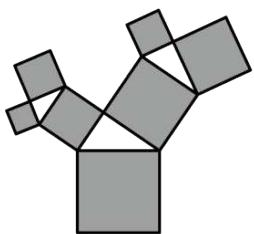

natural_image

Abstract geometric pattern composed of gray squares forming a Y-shape (no text or symbols)

图1

natural_image

Abstract geometric pattern composed of colorful polygons forming a tree-like structure (no text or symbols)

图2

A. 2026

B. 2025

C. $2^{2025}$

D. $2^{2022}-1$

【答案】A

【分析】本题考查了勾股定理，能够根据勾股定理发现每一次得到的新的正方形的面积和与原正方形的面积之间的关系是解答本题的关键．根据勾股定理求出“生长”了1次后形成的图形中所有的正方形的面积和，结合图形总结规律，根据规律解答即可.

【详解】解：如图，由题意得，正方形 A 的面积为 1，

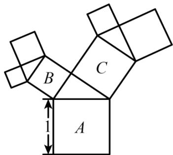

text_image

B
C
A
1

由勾股定理得，正方形 B 的面积 + 正方形 C 的面积 = 正方形 A 的面积 = 1，

∴“生长”了 1 次后形成的图形中所有的正方形的面积和为 2，

同理可得，“生长”了2次后形成的图形中所有的正方形的面积和为3，

∴“生长”了3次后形成的图形中所有的正方形的面积和为4，

......

∴“生长”了 2025 次后形成的图形中所有的正方形的面积和为 2026.

故选：A.

【变式 3-1】（24-25 八年级上·江苏扬州·期末）下列四组数中是勾股数的一组是（）

A. $\frac{1}{3},\frac{1}{4},\frac{1}{5}$

B. 0.3, 0.4, 0.5

C. 5, 12, 13

D. $3^{2}$ , $4^{2}$ , $5^{2}$

【答案】C

【分析】此题考查了勾股数的知识，满足 $a^{2}+b^{2}=c^{2}$ 的三个正整数，称为勾股数，掌握以上知识是解答本题的关键；

本题欲求证是否为勾股数，这里给出三边的长，只要验证两小边的平方和等于最长边的平方，即可求解.

【详解】解：A、因为 $\frac{1}{3}$ ， $\frac{1}{4}$ ， $\frac{1}{5}$ 都不是整数，所以它们不是勾股数，故本选项不合题意；

B、因为0.3，0.4，0.5都不是整数，所以它们不是勾股数，故本选项不合题意；  
C、因为 $13^{2}=5^{2}+12^{2}$ ，所以它们是勾股数，故本选项符合题意；  
D、因为 $3^{2} = 9$ ， $4^{2} = 16$ ， $5^{2} = 25$ ， $9^{2} + 16^{2} \neq 25^{2}$ ，所以它们不是勾股数，故本选项不合题意.

故选：C.

【变式 3-2】（24-25 八年级下·湖北孝感·期中）勾股定理 $a^{2}+b^{2}=c^{2}$ 本身就是一个关于a, b, c的方程，满足这个方程的正整数解 $(a,b,c)$ 通常叫做勾股数组。毕达哥拉斯学派提出了一个构造勾股数组的公式，根据该公式可以构造出如下勾股数组： $(3,4,5),(5,12,13),(7,24,25),\cdots$ 。分析上面勾股数组可以发现， $4=1\times(3+1)$ $,12=2\times(5+1),24=3\times(7+1),\cdots$ ，分析上面规律，第9个勾股数组为\_\_\_\_。

【答案】（19，180，181）

【分析】本题主要考查了勾股数，解题的关键是找出数据之间的关系，掌握勾股定理.

由勾股数组：（3，4，5），（5，12，13），（7，24，25）…中， $4 = 1 \times [(1 \times 2 + 1) + 1]$ ， $12 = 2 \times [(2 \times 2 + 1) + 1]$ ， $24 = 3 \times [(3 \times 2 + 1) + 1]$ ，…可得第9组勾股数中间的数为： $9 \times [(9 \times 2 + 1) + 1] = 180$ ，进而得出
（19，180，181）.

【详解】解：由勾股数组：（3，4，5），（5，12，13），（7，24，25）…中， $4 = 1 \times [(1 \times 2 + 1) + 1]$ ， $12 = 2 \times [(2 \times 2 + 1) + 1]$ ， $24 = 3 \times [(3 \times 2 + 1) + 1]$ ，…可得第9组勾股数中间的数为： $9 \times [(9 \times 2 + 1) + 1] = 180$ ，进而得出（19，180，181）.

故答案为（19，180，181）.

【变式 3-3】（24-25 七年级上·山东泰安·期中）如图是一株美丽的勾股树，其中所有的四边形都是正方形，所有的三角都是直角三角形．若A, B, C, D的边分别是5, 4, 3, 2，则最大的正方形F的面积为\_\_\_\_.

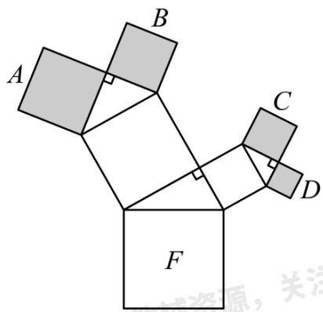

text_image

A
B
C
D
F
基础资源，关注

【答案】54

【分析】本题考查了勾股定理的应用，根据正方形面积公式先求出 $M N^{2}$ 、 $H I^{2}$ 的值，再根据正方形的性质得到 $QP^{2}$ 、 $PG^{2}$ 的值，最后利用勾股定理得 $QG^{2}=QP^{2}+PG^{2}$ ，即得到正方形F的面积，掌握勾股定理的应用是解题的关键.

【详解】解：∵A，B，C，D的边分别是5，4，3，2，所有的三角都是直角三角形，

$$
\therefore M N ^ {2} = 5 ^ {2} + 4 ^ {2} = 4 1, H I ^ {2} = 3 ^ {2} + 2 ^ {2} = 1 3,
$$

∵所有的四边形都是正方形，

$$
\therefore Q P ^ {2} = M N ^ {2} = 4 1, P G ^ {2} = H I ^ {2} = 1 3,
$$

∴利用勾股定理得， $QG^{2}=QP^{2}+PG^{2}=41+13=54$

∴最大的正方形F的面积为54，

故答案为：54.

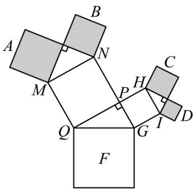

text_image

A
B
N
M
P
H
C
Q
G
I
D
F

# 【题型4 网格中判断直角三角形】

【例 4】（24-25 八年级下·湖北孝感·期中）如图，在 $4 \times 4$ 网格中，每个小正方形的边长都相等，网格线的交点称为格点.格点 $C$ 与图中的格点 $A, B$ 可构成直角三角形，则这样的格点 $C$ 有（）

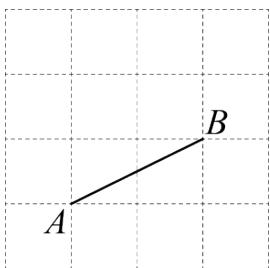

text_image

A
B

A. 2 个

B. 3 个

C. 4 个

D. 5 个

【答案】D

【分析】根据网格的特点以及等腰直角三角形的性质，分类讨论，找出符合题意的点C，即可求解.

【详解】解：如图，

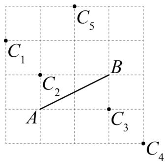

text_image

C₁
C₂
A
B
C₃
C₄
C₅

格点C与图中的格点A，B可构成直角三角形，则这样的格点C有5个

故选：D.

【变式 4-1】（24-25 八年级上·辽宁本溪·期中）如图， $\triangle ABD$ 和 $\triangle ABC$ 的顶点均在边长为 1 的小正方形网格格点上，则 $\angle BAC$ 的度数为（）

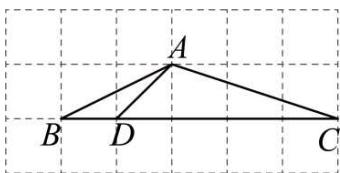

text_image

A
B D C

A. $120^{\circ}$

B. $135^{\circ}$

C. $150^{\circ}$

D. $165^{\circ}$

【答案】B

【分析】延长BA到E，连接CE，先利用勾股定理的逆定理证明 $\triangle AEC$ 是直角三角形，从而可得 $\angle AEC = 90^{\circ}$ ，然后利用等边对等角及三角形的内角和定理可得 $\angle EAC = \angle ECA = 45^{\circ}$ ，最后利用邻补角互补即可得出答案.

【详解】解：如图，延长BA到E，连接CE，

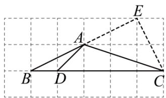

text_image

Geometric diagram with labeled points A, B, C, D, E and connecting lines on a grid background

由题意可得： $CE^{2}=1^{2}+2^{2}=5,\ AE^{2}=2^{2}+1^{2}=5,\ AC^{2}=1^{2}+3^{2}=10,$

$$
\therefore A E ^ {2} + C E ^ {2} = A C ^ {2},
$$

∴ $\triangle AEC$ 是直角三角形，

$$
\therefore \angle A E C = 9 0 ^ {\circ},
$$

$$
\because E A = E C,
$$

$$
\therefore \angle E A C = \angle E C A = \frac {1}{2} (1 8 0 ^ {\circ} - \angle A E C) = 4 5 ^ {\circ},
$$

$$
\therefore \angle B A C = 1 8 0 ^ {\circ} - \angle E A C = 1 3 5 ^ {\circ},
$$

故选：B.

【点睛】本题主要考查了勾股定理与网格问题，勾股定理的逆定理，等边对等角，三角形的内角和定理，利用邻补角互补求角度等知识点，熟练掌握勾股定理及其逆定理是解题的关键.

【变式 4-2】（24-25 八年级下·河南商丘·期末）如图，点 A, B, C, D 均在正方形网格格点上，则 $\angle DAC - \angle BAC =$ \_\_\_\_ $^{\circ}$ .

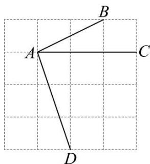

text_image

A
B
C
D

【答案】45°/45度

【分析】该题考查了勾股定理，轴对称和等腰直角三角形的性质和判定，作点B关于线段AC的对称点 $B'$ ，连接 $AB',DB'$ ，由对称可得 $\angle B'AC = \angle BAC$ ，即 $\angle DAC - \angle BAC = \angle DAC - \angle B'AC = \angle B'AD$ ，说明 $\triangle AB'D$ 是等腰直角三角形，即可求解.

【详解】解：如图，作点B关于线段AC的对称点 $B'$ ，连接 $AB',DB'$ ，

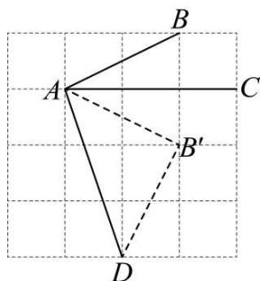

text_image

A
B
C
D
B'

由对称可得 $\angle B^{\prime}AC=\angle BAC$ ,

即 $\angle DAC-\angle BAC=\angle DAC-\angle B^{\prime}AC=\angle B^{\prime}AD,$

设小正方形的边长为 1，

由勾股定理，得 $AB^{\prime2}=DB^{\prime2}=1^{2}+2^{2}=5,AD^{2}=1^{2}+3^{2}=10$

$$
\therefore A B ^ {\prime 2} + D B ^ {\prime 2} = A D ^ {2},
$$

$\therefore\triangle AB^{\prime}D$ 是等腰直角三角形，

$\therefore\angle B^{\prime}AD=45^{\circ}$ ，即 $\angle DAC-\angle BAC=45^{\circ}$ .

故答案为： $45^{\circ}$ .

【变式 4-3】（24-25 八年级下·福建福州·期中）如图，∠1，∠2 在网格上位置，则 ∠1 + ∠2 = \_\_\_\_°.

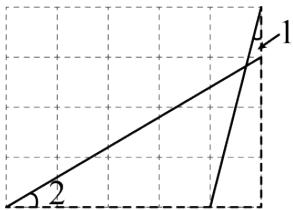

text_image

1
2

【答案】45

【分析】本题考查了网络三角形．熟练掌握勾股定理，勾股定理的逆定理，等腰直角三角形判定和性质，平移性质，是解题的关键.

平移OD到AB，连接BC，则 $\angle2=\angle ABF$ ，证明 $\triangle ABC$ 是等腰直角三角形，得 $\angle ABC=45^{\circ}$ ， $\angle ACB=90^{\circ}$ ，在 $\triangle AEF$ 和 $\triangle BEC$ 中，根据 $\angle1=\angle CBE$ ，得 $\angle1+\angle2=45^{\circ}$ .

【详解】解：如图，平移OD到AB，连接BC，

则 $\angle 2 = \angle ABF$

$$
\because B C ^ {2} = 1 ^ {2} + 4 ^ {2} = 1 7, A C ^ {2} = 1 ^ {2} + 4 ^ {2} = 1 7, A B ^ {2} = 3 ^ {2} + 5 ^ {2} = 3 4,
$$

$$
\therefore A C ^ {2} + B C ^ {2} = A B ^ {2}, A C = B C,
$$

∴ $\triangle ABC$ 是等腰直角三角形，

$$
\therefore \angle A B C = 4 5 ^ {\circ}, \angle A C B = 9 0 ^ {\circ},
$$

在 $\triangle AEF$ 和 $\triangle BEC$ 中，

$$
\because \angle A F E = \angle B C E = 9 0 ^ {\circ}, \angle A E F = \angle B E C,
$$

$$
\therefore \angle 1 = \angle C B E,
$$

$$
\therefore \angle 1 + \angle 2 = \angle C B E + \angle A B F = 4 5 ^ {\circ}.
$$

故答案为：45.

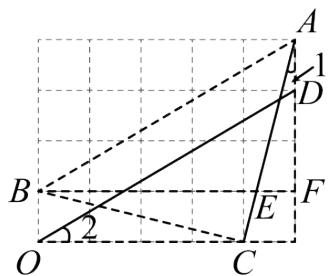

text_image

A
1
D
B
F
E
O
2
C

# 【拔尖篇】

# 【题型 5 利用勾股定理求两条线段的平方和（差）】

【例 5】如图， $\triangle ABC$ 和 $\triangle ECD$ 都是等腰直角三角形， $\triangle ABC$ 的顶点 A 在 $\triangle ECD$ 的斜边 DE 上．下列结论：

其中正确的有（）

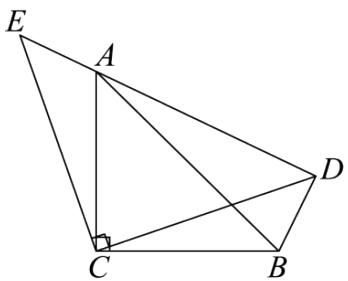

text_image

Geometric diagram with labeled points A, B, C, D, E and right angle at C

① $\triangle ACE \cong \triangle BCD$

② $BD + AD = DE$

③ $\angle DAB = \angle BCD$

④ $AE^{2}+AD^{2}=2BC^{2}$

A. 1 个

B. 2 个

C. 3 个

D. 4 个

【答案】D

【分析】本题考查等腰三角形的性质，三角形全等的判定及性质，勾股定理.

由 $\triangle ABC$ 和 $\triangle ECD$ 都是等腰直角三角形，可证 $\angle BCD = \angle ACE$ ，进而根据“SAS”可证 $\triangle ACE \cong \triangle BCD$ ，故结论①正确；由 $\triangle ACE \cong \triangle BCD$ 可得 $BD = AE$ ，进而可证结论②正确；由 $\triangle ABC$ 和 $\triangle ECD$ 都是等腰直角三角形可得 $\angle CAB = \angle CBA = 45^{\circ} \angle E = \angle CDE = 45^{\circ}$ ，从而证得 $\angle DBA = \angle ACD$ ， $\angle ADB = 90^{\circ}$ 进而得到 $\angle DBA + \angle DAB = 90^{\circ}$ ， $\angle BCD + \angle ACD = 90^{\circ}$ ，因此 $\angle DAB = \angle DCB$ ，故结论③正确；在 Rt $\triangle ABD$ 中， $BD^{2} + A D^{2} = AB^{2}$ ，在 Rt $\triangle ABC$ 中， $AC^{2} + BC^{2} = AB^{2}$ ，因此 $BD^{2} + AD^{2} = AC^{2} + BC^{2}$ ，等量代换即可得到 $AE^{2} + AD^{2} = 2BC^{2}$ ，故结论④正确.

【详解】∵△ABC和△ECD都是等腰直角三角形，

$$
\therefore C A = C B, \quad C E = C D, \quad \angle B C A = \angle D C E = 9 0 ^ {\circ},
$$

$$
\therefore \angle B C A - \angle D C A = \angle D C E - \angle D C A,
$$

即 $\angle BCD = \angle ACE$ ,

∴ $\triangle ACE \cong \triangle BCD(SAS)$ ，故结论①正确；

$$
\because \triangle A C E \cong \triangle B C D,
$$

$$
\therefore B D = A E,
$$

$\therefore BD + AD = AE + AD = DE$ ，故结论②正确；

$$
\because \angle B C A = \angle D C E = 9 0 ^ {\circ},
$$

$$
\therefore \angle C A B + \angle C B A = 9 0 ^ {\circ}, \angle E + \angle C D E = 9 0 ^ {\circ},
$$

$$
\because C A = C B, \quad C E = C D,
$$

$$
\therefore \angle C A B = \angle C B A = 4 5 ^ {\circ}, \angle E = \angle C D E = 4 5 ^ {\circ},
$$

$$
\because \triangle A C E \cong \triangle B C D,
$$

$$
\therefore \angle E A C = \angle D B C,
$$

$$
\because \angle E A C = \angle A D C + \angle A C D = 4 5 ^ {\circ} + \angle A C D,
$$

$$
\angle D B C = \angle A B C + \angle D B A = 4 5 ^ {\circ} + \angle D B A,
$$

$$
\therefore \angle D B A = \angle A C D,
$$

$$
\because \triangle A C E \cong \triangle B C D,
$$

$$
\therefore \angle B D C = \angle A E C = 4 5 ^ {\circ},
$$

$$
\therefore \angle A D B = \angle A D C + \angle B D C = 4 5 ^ {\circ} + 4 5 ^ {\circ} = 9 0 ^ {\circ},
$$

$$
\therefore \angle D B A + \angle D A B = 9 0 ^ {\circ},
$$

$$
\because \angle B C D + \angle A C D = \angle A C B = 9 0 ^ {\circ},
$$

$\therefore \angle DAB = \angle DCB$ ，故结论③正确；

∵在Rt△ABD中， $BD^{2}+AD^{2}=AB^{2}$

在Rt $\triangle ABC$ 中， $AC^{2} + BC^{2} = AB^{2}$ ,

$$
\therefore B D ^ {2} + A D ^ {2} = A C ^ {2} + B C ^ {2},
$$

$$
\because B D = A E, \quad A C = B C,
$$

$\therefore AE^{2} + AD^{2} = 2BC^{2}$ ，故结论④正确.

综上，正确的结论有 4 个.

故选：D

【变式 5-1】对角线互相垂直的四边形叫做“垂美”四边形, 现有如图所示的“垂美”四边形ABCD, 对角线AC,BD交于点O. 若AD = 1, BC = 4, 则 $AB^{2} + CD^{2} =$ \_\_\_\_.

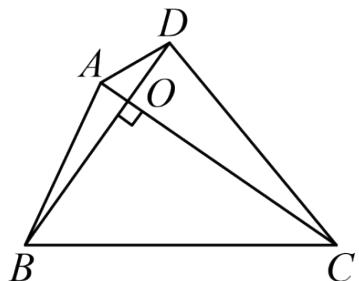

text_image

Geometric diagram of triangle ABC with points D, A, O and perpendicular line from A to BC

【答案】17

【分析】根据垂直的定义和勾股定理解答即可；

【详解】解：∵AC⊥BD，

$$
\therefore \angle A O D = \angle A O B = \angle B O C = \angle C O D = 9 0 ^ {\circ},
$$

由勾股定理得， $AB^{2}+CD^{2}=AO^{2}+BO^{2}+CO^{2}+DO^{2}$

$$
A D ^ {2} + B C ^ {2} = A O ^ {2} + D O ^ {2} + B O ^ {2} + C O ^ {2},
$$

$$
\therefore A B ^ {2} + C D ^ {2} = A D ^ {2} + B C ^ {2},
$$

$$
\because A D = 1, B C = 4,
$$

$$
\therefore A B ^ {2} + C D ^ {2} = 1 ^ {2} + 4 ^ {2} = 1 7.
$$

故答案为：17.

【点睛】本题考查的是垂直的定义，勾股定理的应用，正确理解“垂美”四边形的定义、灵活运用勾股定理是解题的关键.

【变式 5-2】（24-25 七年级下·山东泰安·期末）如图 1， $AB \parallel CD$ ，点 E，F 分别在直线 AB，CD 上，连接 EF， $\angle MEN = 90^{\circ}$ ，点 N 在 CD 上.

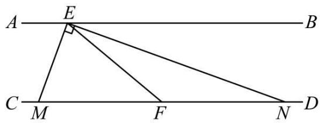

text_image

A E B
C M F N D

图1

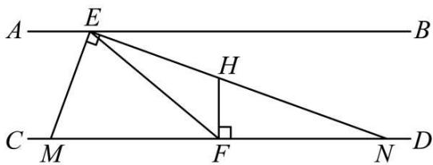

text_image

A
E
B
H
C
M
F
D
N

图2

(1)若 $\angle BEN=20^{\circ}$ ，求 $\angle AEM$ 的度数；  
(2)若EN平分 $\angle BEF$ 交CD于点N，求证：点F是MN的中点；  
(3)如图2，过点F作 $FH\perp CD$ 交EN于点H，猜想线段EM，EH，HN有何数量关系，并说明理由.

【答案】(1) $\angle AEM = 70^{\circ}$ ;

(2) 见解析;   
(3)结论： $EM^{2}+EH^{2}=HN^{2}$ ，理由见解析.

【分析】（1）利用平角定义解题即可；

(2) 根据角平分线定义和平行线的性质得到 $\angle NEF = \angle ENF$ , 再利用等角的余角相等得到 $\angle EMN = \angle FEM$ , 利用等角对等边得到 $EF = MF = FN$ , 即可得证;  
（3）连接MH，则有MH = HN，再利用勾股定理推理即可.

【详解】（1）解：∵ $\angle BEN = 20^{\circ}$ ， $\angle MEN = 90^{\circ}$ ，

$$
\therefore \angle A E M = 1 8 0 ^ {\circ} - \angle B E N - \angle M E N = 1 8 0 ^ {\circ} - 2 0 ^ {\circ} - 9 0 ^ {\circ} = 7 0 ^ {\circ};
$$

(2) 证明: $\because EN$ 平分 $\angle BEF$ ,

$$
\therefore \angle B E M = \angle N E F,
$$

又∵ $AB \parallel CD,$

$$
\therefore \angle B E N = \angle E N F,
$$

$$
\therefore \angle N E F = \angle E N F,
$$

$$
\therefore E F = N F,
$$

$$
\because \angle M E N = 9 0 ^ {\circ},
$$

$$
\therefore \angle E M F + \angle E N M = 9 0 ^ {\circ}, \angle M E F + \angle F E N = 9 0 ^ {\circ},
$$

$$
\therefore \angle E M N = \angle F E M,
$$

$$
\therefore E F = M F,
$$

$$
\therefore M F = F N,
$$

即点F是MN的中点;

（3）结论： $EM^{2}+EH^{2}=HN^{2}$ ，理由如下：

如图 2，连接 MH.

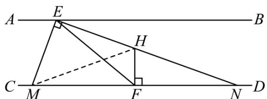

text_image

A E B
C M F N D

图2

∵ $FH \perp CD$ ，点F为MN的中点.

∴ HF为MN的中垂线.

$$
\therefore M H = H N.
$$

在Rt $\triangle ENH$ 中， $\angle MEH = 90^{\circ}$ .

由勾股定理得 $EM^{2}+EH^{2}=HM^{2}$ .

$$
\therefore E M ^ {2} + E H ^ {2} = H N ^ {2}.
$$

【点睛】本题考查了角的和差，等腰三角形的判定与性质，勾股定理，垂直平分线的性质，熟练运用以上性质推理是解题的关键.

【变式 5-3】（24-25 八年级下·广东东莞·阶段练习）我们把对角线互相垂直的四边形叫做垂美四边形.

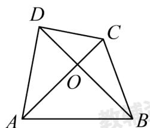

text_image

D
C
O
A
B

图①

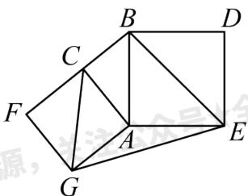

text_image

Geometric diagram with labeled points A, B, C, D, E, F, G forming a 3D-like figure with internal triangles and lines.

图②

(1) 如图①, 已知四边形ABCD是垂美四边形, 请探究两组对边 $AB^{2} + CD^{2}$ 与 $AD^{2} + BC^{2}$ 之间的数量关系,并说明理由;

(2) 如图②, 分别以 Rt $\triangle ACB$ 的直角边 $AC$ 和斜边 $AB$ 为边向外作正方形 $ACFG$ 和正方形 $ABDE$ , 连接 $BE, CG, EG$ , 已知 $AC = 4, AB = 5$ , 求 $GE^{2}$ .

【答案】（1）猜想： $AD^{2}+BC^{2}=AB^{2}+CD^{2}$ ．理由见解析；（2）73

【分析】本题考查正方形的性质、勾股定理、垂美四边形的定义等知识.

(1) 结论: $AD^{2} + BC^{2} = AB^{2} + CD^{2}$ . 利用勾股定理即可证明;  
（2）连接CG，BE，只要证明四边形CGEB是垂美四边形，利用（2）中结论即可解决问题.

【详解】解：（1）猜想： $AD^{2}+BC^{2}=AB^{2}+CD^{2}$ ．理由如下：

∵四边形ABCD是垂美四边形，

$$
\therefore A C \perp B D,
$$

$$
\therefore \angle A O D = \angle A O B = \angle B O C = \angle C O D = 9 0 ^ {\circ},
$$

由勾股定理，得 $AD^{2}+BC^{2}=AO^{2}+DO^{2}+BO^{2}+CO^{2}$ ，

$$
A B ^ {2} + C D ^ {2} = A O ^ {2} + B O ^ {2} + C O ^ {2} + D O ^ {2},
$$

$$
\therefore A D ^ {2} + B C ^ {2} = A B ^ {2} + C D ^ {2};
$$

(2) 连接CG, BE, 如图:

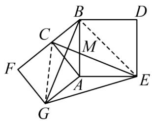

text_image

Geometric diagram with labeled points and lines, likely from a math problem or proof

$$
\because \angle C A G = \angle B A E = 9 0 ^ {\circ},
$$

$\therefore\angle CAG+\angle BAC=\angle BAE+\angle BAC,$ 即 $\angle GAB=\angle CAE,$

在 $\triangle GAB$ 和 $\triangle CAE$ 中，AG = AC， $\angle GAB = \angle CAE$ ，AB = AE，

$$
\therefore \triangle G A B \cong \triangle C A E (\mathrm{SAS}),
$$

$$
\therefore \angle A B G = \angle A E C,
$$

又∵∠AEC + ∠AME = 90°,

$$
\therefore \angle A B G + \angle A M E = 9 0 ^ {\circ},
$$

又∵∠BMC = ∠AME,

$$
\therefore \angle A B G + \angle B M C = 9 0 ^ {\circ},
$$

$$
\therefore C E \perp B G,
$$

∴四边形CGEB是垂美四边形，

由（1）可知 $CG^{2}+BE^{2}=CB^{2}+GE^{2}$ ,

$$
\because A C = 4, \quad A B = 5,
$$

∴由勾股定理，得 $CB^{2}=9,\quad CG^{2}=32,\quad BE^{2}=50,$

$$
\therefore G E ^ {2} = C G ^ {2} + B E ^ {2} - C B ^ {2} = 7 3.
$$

# 【题型6 利用勾股定理解决折叠问题】

【例 6】（24-25 八年级下·安徽合肥·期中）如图，在Rt△ABC中， $\angle C=90^{\circ}$ ，AC=4,BC=6，将它的锐角A翻折，使得点A落在边BC的中点D处，折痕交AC边于点E，交AB边于点F，则DE的长为（）

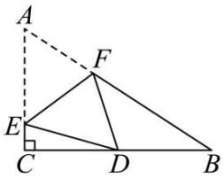

text_image

Geometric diagram with labeled points A, B, C, D, E, F and right angle at C

A. 2

B. 3

C. $\frac{25}{9}$

D. $\frac{25}{8}$

【答案】D

【分析】本题考查了折叠的性质、勾股定理，由题意得出 $CD=\frac{1}{2}BC=3$ ，由折叠的性质可得AE=DE，设AE=DE=x，则CE=4-x，再由勾股定理计算即可得出答案.

【详解】解：∵点D为BC的中点，

$$
\therefore C D = \frac {1}{2} B C = 3,
$$

由折叠的性质可得AE = DE，

设AE = DE = x，则CE = AC - AE = 4 - x，

由勾股定理得 $CE^{2}+CD^{2}=DE^{2}$ ,

$$
\therefore (4 - x) ^ {2} + 3 ^ {2} = x ^ {2},
$$

解得： $x=\frac{25}{8}$ ,

$$
\therefore D E = \frac {2 5}{8},
$$

故选：D.

【变式 6-1】（24-25 八年级下·福建厦门·阶段练习）如图在矩形ABCD中，BC = 8，CD = 6，将△BCD沿对角线BD翻折，点C落在点 $C'$ 处， $BC'$ 交AD于点E，则△BDE的面积为\_\_\_\_。

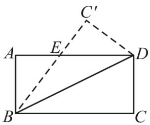

text_image

A
E
C'
D
B
C

【答案】 $\frac{75}{4}$

【分析】首先根据题意得到BE = DE，然后根据勾股定理得到关于线段AB、AE、BE的方程，解方程即可解决问题.

【详解】解：∵四边形ABCD为矩形，

$$
\therefore A D \parallel B C, A D = B C = 8, A B = C D = 6, \angle A B C = \angle C = \angle C D A = \angle A = 9 0 ^ {\circ},
$$

$$
\therefore \angle E D B = \angle D B C,
$$

设ED = x，则AE = 8 - x，

根据折叠可知： $\angle EBD = \angle DBC$ ，

$$
\therefore \angle E D B = \angle E B D,
$$

$$
\therefore E B = E D = x,
$$

由勾股定理得： $BE^{2}=AB^{2}+AE^{2}$

即 $x^{2}=6^{2}+(8-x)^{2}$ ,

解得： $x=\frac{25}{4}$ ,

$$
\therefore E D = \frac {2 5}{4},
$$

$\therefore \triangle BDE$ 的面积为 $\frac{1}{2} DE \cdot AB = \frac{1}{2} \times \frac{25}{4} \times 6 = \frac{75}{4}$ .

故答案为： $\frac{75}{4}$ .

【点睛】本题主要考查了矩形与折叠问题，勾股定理，等角对等边，平行线的性质，解题的关键是根据翻折变换的性质，勾股定理等几何知识，灵活进行判断、分析、推理或解答.

【变式 6-2】（24-25 八年级下·江苏盐城·期中）如图，在矩形ABCD中，AB = 12，BC = 10，点E、F分别在AB、DC上，且AB = 3BE，CD = 3CF，点P为直线AB上一动点，连接DP，将△DAP沿DP所在直线翻折得到△ $DA'P$ ，当点 $A'$ 恰好落在直线EF上时，AP的长为\_\_\_\_。

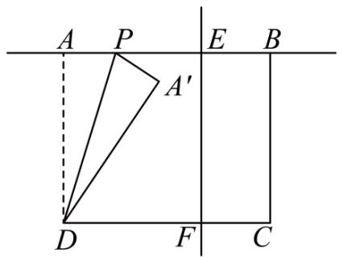

text_image

A P E B
A'
D F C

【答案】5 或 20/20 或 5

【分析】本题考查了翻折变换（折叠问题），矩形的性质，勾股定理的应用，正确画出图形，做到数形结合，是解决问题的关键.

由矩形的性质得到 $DC = AB = 12$ ， $\angle BAD = 90^{\circ}$ ， $AD = BC = 10$ ，根据已知条件得到 $BE = CF = 4$ ，推出四边形BCFE是矩形，四边形ADFE是矩形，得到 $\angle AEF = \angle DFE = \angle BEF = \angle CFE = 90^{\circ}$ ， $AD = EF = 10$ ，根据折叠的性质、勾股定理即可得到结论.

【详解】解：∵四边形ABCD是矩形，

$$
\therefore D C = A B = 1 2, \angle B A D = 9 0 ^ {\circ}, A D = B C = 1 0,
$$

$$
\because A B = 3 B E, C D = 3 C F,
$$

$$
\therefore B E = C F = 4, A E = D F = 8,
$$

$$
\because B E \parallel C F,
$$

∴四边形BCFE是矩形，

同理四边形ADFE是矩形，

$$
\therefore \angle A E F = \angle D F E = \angle B E F = \angle C F E = 9 0 ^ {\circ}, A D = E F = 1 0,
$$

∵将 $\triangle DAP$ 沿 DP 所在直线翻折得到 $\triangle DA'P$ ,

$$
\therefore D A ^ {\prime} = D A = 1 0, A P = A ^ {\prime} P,
$$

当点P在边AB上时，点 $A'$ 恰好落在直线EF上，如图所示：

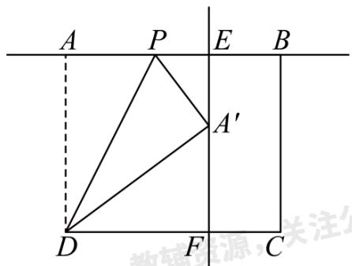

text_image

A P E B
A'
D F C
教辅资源，关注公

在Rt $\triangle A^{\prime}DF$ 中，

$$
\because D F ^ {2} + A ^ {\prime} F ^ {2} = A ^ {\prime} D ^ {2},
$$

$$
\therefore 8 ^ {2} + A ^ {\prime} F ^ {2} = 1 0 ^ {2},
$$

$$
\therefore A ^ {\prime} F = 6,
$$

$$
\therefore A ^ {\prime} E = 4,
$$

在Rt $\triangle A^{\prime}PE$ 中， $A^{\prime}E^{2}+PE^{2}=A^{\prime}P^{2}$

即 $4^{2}+(8-AP)^{2}=A^{\prime}P^{2}$ ,

$$
\therefore A P = 5;
$$

当点P在边AB延长线上时，点 $A'$ 恰好落在直线EF上，如图所示：

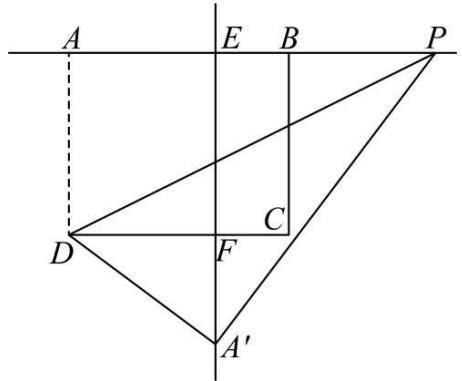

text_image

A
E
B
P
D
C
F
A'

同理可求 $A^{\prime}F=6$ ,

$$
\therefore A ^ {\prime} E = 1 0 + 6 = 1 6,
$$

在Rt $\triangle A^{\prime}PE$ 中， $A^{\prime}E^{2}+PE^{2}=A^{\prime}P^{2}$

即 $16^{2}+(AP-8)^{2}=A^{\prime}P^{2}$ ,

$$
\therefore A P = 2 0;
$$

故答案为 5 或 20.

【变式 6-3】（24-25 九年级下·广东深圳·阶段练习）如图，在Rt△ABC中，∠B=90°，AB=5，BC=8，点D为AB上一点，连接CD，将△BCD沿CD翻折得到△B'CD，过点A作AF∥BC交DB'于点E，交CB'于点F，若AE=B'E，则BD的长为\_\_\_\_。

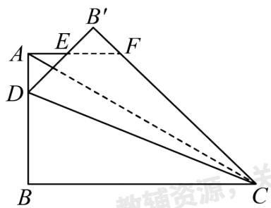

text_image

B'
E
F
A
D
B
C
教辅资源，关

【答案】 $\frac{40}{11}$

【分析】本题考查了折叠的性质，全等三角形的判定和性质，勾股定理．作 $FG \perp BC$ 于点G，证明

$\triangle DEA \cong \triangle FEB'(\mathrm{ASA})$ ，得到 $AD = B'F$ ， $DE = EF$ ，设 $BD$ 的长为 $x$ ，在Rt $\triangle FGC$ 中， $FG = 5$ ， $CF = x + 3$

CG = 8 - x，利用勾股定理列式计算即可求解.

【详解】解：作FG⊥BC于点G，

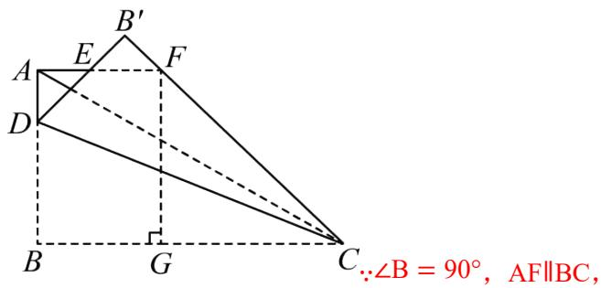

text_image

B'
A E F
D
B G C
∵∠B = 90°, AF∥BC,

∴四边形ABGF是长方形， $\angle BAF = 90^{\circ}$ ,

$$
\therefore \mathrm{FG} = \mathrm{AB} = 5,
$$

由折叠的性质得 $\angle B^{\prime}=\angle B=90^{\circ}$ , $D^{\prime}B=DB$ , $B^{\prime}C=BC$ ,

$$
\because \angle D A E = \angle B ^ {\prime} = 9 0 ^ {\circ}, \angle D E A = \angle B ^ {\prime} E F = 9 0 ^ {\circ}, A E = B ^ {\prime} E,
$$

$$
\therefore \triangle \mathrm{DEA} \cong \triangle \mathrm{FEB} ^ {\prime} (\mathrm{ASA}),
$$

$$
\therefore \mathrm{AD} = \mathrm{B} ^ {\prime} \mathrm{F}, \quad \mathrm{DE} = \mathrm{EF},
$$

设BD的长为x，则 $B^{\prime}F=AD=5-x$ ， $CF=B^{\prime}C-B^{\prime}F=8-(5-x)=x+3$ ， $B^{\prime}D=BD=x$

$$
\therefore \mathrm{AF} = \mathrm{AE} + \mathrm{EF} = \mathrm{B} ^ {\prime} \mathrm{E} + \mathrm{DE} = \mathrm{B} ^ {\prime} \mathrm{D} = \mathrm{x},
$$

在Rt△FGC中， $\mathrm{FG} = 5$ ， $\mathrm{CF} = \mathrm{x} + 3$ ， $\mathrm{CG} = \mathrm{BC - BG} = \mathrm{BC - AF} = 8 - \mathrm{x}$ ，

$\therefore FG^{2}+CG^{2}=CF^{2}$ ，即 $5^{2}+(8-x)^{2}=(x+3)^{2}$

解得 $x=\frac{40}{11}$ ,

$$
\therefore \mathrm{BD} = \frac {4 0}{1 1}.
$$

故答案为： $\frac{40}{11}$ .

# 【题型7 勾股定理的证明】

【例 7】（24-25 八年级下·福建福州·期中）在勾股定理的学习过程中，我们已经学会了运用图形验证著名的勾股定理，下列选项中的图形，能证明勾股定理的是（）

text_image

c
a
b
c
b
c
a
a

①

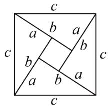

text_image

c
a b a
b b
a b a
c
c

②

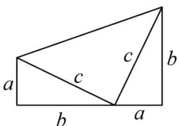

text_image

a
c
b
c
b
a

③

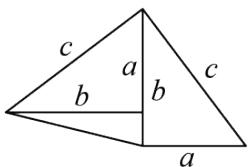

text_image

c
a
b
b
c
a

④

A. ①②③

B. ①②④

C. ②③④

D. ①②③④

【答案】D

【分析】本题主要考查勾股定理的证明过程，分别利用每个图形面积的两种不同的计算方法，再建立等式，再整理即可判断.

【详解】解：在图①中，整个图形的面积等于两个三角形的面积加大正方形的面积，也等于两个小正方形的面积加上两个直角三角形的面积，

$$
\therefore c ^ {2} + 2 \times \frac {1}{2} a b = a ^ {2} + b ^ {2} + 2 \times \frac {1}{2} a b,
$$

整理得 $a^{2}+b^{2}=c^{2}$ ,

故①可以证明勾股定理;

在图②中，大正方形的面积等于四个三角形的面积加小正方形的面积，

$$
\therefore 4 \times \frac {1}{2} a b + c ^ {2} = (a + b) ^ {2},
$$

整理得 $a^{2}+b^{2}=c^{2}$ ,

故②可以证明勾股定理;

在图③中，由图可知三个三角形的面积的和等于梯形的面积，

$$
\therefore \frac {1}{2} a b + \frac {1}{2} a b + \frac {1}{2} c ^ {2} = \frac {1}{2} (a + b) (a + b),
$$

整理可得 $a^{2}+b^{2}=c^{2}$ ,

故③可以证明勾股定理;

在图④中，连接BD，

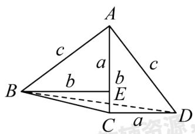

text_image

A
c	a	c
b	b
B	E
C	a	D
资源

此图也可以看成Rt $\triangle BEA$ 绕其直角顶点顺时针旋转 $90^{\circ}$ ，再向下平移得到。一方面，四边形ABCD的面积等于 $\triangle ABC$ 和 Rt $\triangle ACD$ 的面积之和，另一方面，四边形ABCD的面积等于Rt $\triangle ABD$ 和 $\triangle BCD$ 的面积之和，所以 $S_{\triangle ABC} + S_{\triangle ACD} = S_{\triangle ABD} + S_{\triangle BCD}$ ，

即 $\frac{1}{2} b^2 +\frac{1}{2} ab = \frac{1}{2} c^2 +\frac{1}{2} a(b - a),$

整理： $b^{2}+ab=c^{2}+a(b-a)$ ,

$$
b ^ {2} + a b = c ^ {2} + a b - a ^ {2},
$$

$$
\therefore a ^ {2} + b ^ {2} = c ^ {2},
$$

故④可以证明勾股定理;

∴能证明勾股定理的是①②③④.

故选：D.

【变式 7-1】（24-25 八年级上·河北沧州·期末）如图所示，意大利著名画家达·芬奇用一张纸片剪拼出不一样的空洞，证明了勾股定理．若设图 1 中空白部分（两个正方形和两个直角三角形组成）的面积为 $S_{1}$ ，经过以下裁剪，翻转，拼出图 2，其中空白部分的面积为 $S_{2}$ ，嘉琪同学得出了以下四个结论：① $S_{1}=a^{2}+b^{2}+ab$ ；② $S_{2}=c^{2}+ab$ ；③ $S_{1}=S_{2}$ ；④ $a^{2}+b^{2}=c^{2}$ ．则其中正确的有（）

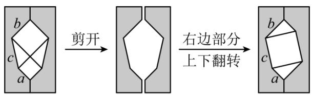

flowchart

图1  
图2

A. 1 个

B. 2 个

C. 3 个

D. 4 个

【答案】D

【分析】本题考查勾股定理的证明，直角三角形的性质等知识，解题的关键是读懂图象信息．根据勾股定理，直角三角形以及正方形的面积公式计算，即可解决问题.

【详解】解：由勾股定理得： $a^{2}+b^{2}=c^{2}$

由题意得： $S_{1}=S_{2}=a^{2}+b^{2}+2\times\frac{1}{2}ab=a^{2}+b^{2}+ab=c^{2}+ab,$

故①，②，③，④正确，

故选：D.

【变式 7-2】如图，把长、宽、对角线的长分别是 a、b、c 的矩形沿对角线剪开，与一个直角边长为 c 的等腰直角三角形拼接成右边的图形，用面积割补法能够得到的一个等式是\_\_。

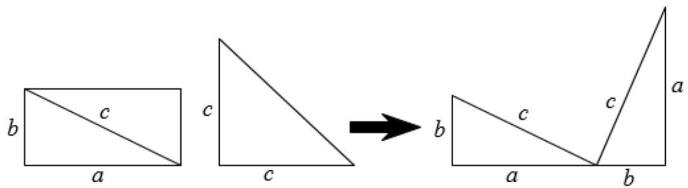

text_image

b
c
a
c
c
→
b
c
c
a
a
b

【答案】 $a^{2}+b^{2}=c^{2}$

【分析】用三角形的面积和、梯形的面积来表示这个图形的面积，从而列出等式，发现边与边之间的关系.

【详解】解：此图可以这样理解，有三个 $Rt\triangle$ 其面积分别为 $\frac{1}{2} ab$ ， $\frac{1}{2} ab$ 和 $\frac{1}{2} c^2$

还有一个直角梯形，其面积为 $\frac{1}{2}(a+b)(a+b)$ .

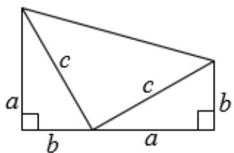

text_image

a
b
c
c
a
b

由图形可知： $\frac{1}{2}(a+b)(a+b)=\frac{1}{2}ab+\frac{1}{2}ab+\frac{1}{2}c^{2}$

整理得 $(a+b)^{2}=2ab+c^{2}$ ， $a^{2}+b^{2}+2ab=2ab+c^{2}$

$$
\therefore a ^ {2} + b ^ {2} = c ^ {2}.
$$

故答案为： $a^{2}+b^{2}=c^{2}$

【点睛】此题考查的知识点是勾股定理的证明，主要利用了三角形的面积公式：底×高÷2，和梯形的面积公式：（上底+下底）×高÷2.

【变式 7-3】（24-25 七年级下·江苏泰州·阶段练习）《整式的乘法》一章学习中，我们体验了“以形助数，以数解形”的研究策略。这充分体现了数学中“数形结合”这一数学思想方法的重要性。民兴七年级数学兴趣小组通过面积恒等的方法对直角三角形三边关系进行了探究。

【初步探究】

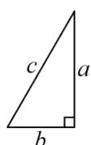

方法1：小正方形面积=小正方形边长的平方；

方法2：小正方形面积=大正方形面积-4个直角三角形面积.

图1

(1) 如图 (1), 直角三角形纸片三条边长分别为 $a, b, c (b < a < c)$ , 小组同学用四个这样的纸片拼成了一个大正方形, 中间空一个小正方形 (阴影部分).

①一个直角三角形纸片的面积为\_\_\_\_，小正方形边长为\_\_\_\_。（用含a，b的代数式表示）

②请用两种不同的方法表示出阴影部分（小正方形）的面积，从而探究出 a, b, c 三者之间的关系。（需化简）

【结论运用】

（2）如图 2，已知， $\triangle ABC$ 是直角三角形， $\angle C = 90^{\circ}$ 。请利用上面得到的结论求解。

①若AC=3，BC=4，求AB的长.

②若AC=6，AB的长比BC的长大2，求AB的长.

【应用拓展】

（3）如图 3，已知，在 $\triangle ABC$ 中，AB = 13，AC = 15，BC = 14，请求出 $\triangle ABC$ 的面积.

  
图2

natural_image

Simple geometric triangle labeled with vertices A, B, and C (no additional text or symbols)

图3

【答案】（1）① $\frac{1}{2}ab$ ; a-b；②小正方形面积为 $(a-b)^{2}$ 或 $c^{2}-2ab$ ， $a^{2}+b^{2}=c^{2}$ ；（2）①5；②10；
(3) 84

【分析】本题主要考查了勾股定理和勾股定理的证明，列代数式，熟知勾股定理及其证明方法是解题的关键.

(1) ①根据三角形面积计算公式可得第一空答案, 再由图形之间的关系可得小正方形面积等于直角三角形的长直角边的长减去短直角边的长, 据此可得第二空的答案; ②根据正方形面积计算公式可得小正方形面积为 $(a - b)^2$ , 根据小正方形的面积等于边长为 $c$ 的正方形面积减去 4 个直角三角形的面积可得小正方形的面积为 $c^2 - 2ab$ , 则 $(a - b)^2 = c^2 - 2ab$ , 据此可得答案;  
(2) ①根据 (1) 可得 $AB^{2} = AC^{2} + BC^{2}$ , 据此计算求解即可; ②根据 (1) 可得 $AB^{2} = 6^{2} + (AB - 2)^{2}$ , 据此求解即可;  
（3）过点 A 作 $AD \perp BC$ 于 D，设 BD = x，则 $CD = 14 - x$ ，则可证明 $AD^{2} = AB^{2} - BD^{2} = AC^{2} - CD^{2}$ ，即 $13^{2} - x^{2} = 15^{2} - (14 - x)^{2}$ ，解方程求出 AD 的长即可得到答案.

【详解】解：（1）①由题意得，一个直角三角形纸片的面积为 $\frac{1}{2}ab$ ，小正方形的边长为a-b；

②∵小正方形的边长为a-b，

∴小正方形的面积为 $(a-b)^{2}$ ;

∵小正方形的面积等于边长为 c 的正方形面积减去 4 个直角三角形的面积，

∴小正方形的面积为 $c^{2}-4\cdot\frac{1}{2}ab=c^{2}-2ab$ ,

$$
\therefore (a - b) ^ {2} = c ^ {2} - 2 a b,
$$

$$
\therefore a ^ {2} - 2 a b + b ^ {2} = c ^ {2} - 2 a b,
$$

$$
\therefore a ^ {2} + b ^ {2} = c ^ {2};
$$

(2) ①由 (1) 可得 $AB^{2}=AC^{2}+BC^{2}$ ,

$$
\because A C = 3, B C = 4,
$$

$$
\therefore A B ^ {2} = 3 ^ {2} + 4 ^ {2} = 2 5,
$$

∴AB = 5或AB = -5（舍去）；

②∵AB的长比BC的长大2，

$$
\therefore B C = A B - 2,
$$

又∵ $AB^{2}=AC^{2}+BC^{2}, AC=6,$

$$
\therefore A B ^ {2} = 6 ^ {2} + (A B - 2) ^ {2},
$$

$$
\therefore A B = 1 0;
$$

（3）如图所示，过点 A 作 $AD \perp BC$ 于 D，

设BD = x，则CD = 14 - x，

在Rt△ABD中， $AD^{2}+BD^{2}=AB^{2}$

在Rt $\triangle ACD$ 中， $AD^{2} + CD^{2} = AC^{2}$ ,

$$
\therefore A D ^ {2} = A B ^ {2} - B D ^ {2} = A C ^ {2} - C D ^ {2},
$$

$$
\therefore 1 3 ^ {2} - x ^ {2} = 1 5 ^ {2} - (1 4 - x) ^ {2},
$$

解得x=5，

$$
\therefore A D ^ {2} = A B ^ {2} - B D ^ {2} = 1 5 ^ {2} - x ^ {2} = 1 5 ^ {2} - 5 ^ {2} = 1 4 4,
$$

$$
\therefore A D = 1 2,
$$

$$
\therefore S _ {\triangle A B C} = \frac {1}{2} B C \cdot A D = \frac {1}{2} \times 1 4 \times 1 2 = 8 4.
$$

text_image

A
B D C

# 【题型8 勾股定理的应用】

【例 8】（24-25 八年级下·黑龙江哈尔滨·阶段练习）荡秋千是深受大家喜爱的一项活动，某秋千垂直地面时踏板离地面的距离AC为0.5米，将踏板水平推动3米（BE = 3米），此时踏板与地面的距离BD为1.5米，若推动过程中拉绳始终拉得很直，则秋千的拉绳OA的长度为\_\_\_\_米.

text_image

O
E
A
C
D
B
地面

【答案】5

【分析】本题主要考查了勾股定理的应用，解题的关键是熟练掌握勾股定理.

假设未知数，利用勾股定理即可解答此题.

【详解】解：由图可知，四边形ECDB是矩形，

$$
\therefore E C = B D = 1. 5,
$$

$$
\therefore A E = E C - A C = 1. 5 - 0. 5 = 1,
$$

假设OA的长度为x，则OE = OA - AE = x - 1，OB = x，

在Rt $\triangle OBE$ 中，由勾股定理得，

$$
O E ^ {2} + B E ^ {2} = O B ^ {2},
$$

即 $(x - 1)^2 + 3^2 = x^2$

解得，x = 5，

故答案为：5.

【变式 8-1】如图所示，某港口位于东西方向的海岸线上．“远航”号、“海天”号轮船同时离开港口，各自沿一固定方向航行，“远航”号每小时航行16海里，“海天”号每小时航行12海里．它们离开港口 $\frac{3}{2}$ 小时后相距30海里．如果知道“远航”号沿东北方向航行，能知道“海天”号沿哪个方向航行吗？

text_image

海天
N
S
R
P
E
远航
Q
教辅资源

【答案】西北方向

【分析】本题考查了勾股定理的逆定理、方位角等知识，解题的关键是理解题意，灵活运用所学知识解决问题，属于中考常考题型.

根据路程 = 速度 × 时间，分别求得 PQ、PR 的长，再进一步根据勾股定理的逆定理可以证明三角形 PQR 是直角三角形，从而求解.

【详解】解：根据题意，得 $PQ=16\times1.5=24$ （海里）， $PR=12\times1.5=18$ （海里），QR=30（海里），

$$
\because 2 4 ^ {2} + 1 8 ^ {2} = 3 0 ^ {2},
$$

即 $PQ^{2}+PR^{2}=QR^{2}$ ,

$$
\therefore \angle Q P R = 9 0 ^ {\circ}.
$$

由“远航号”沿东北方向航行可知， $\angle QPS = 45^{\circ}$ ，则 $\angle SPR = 45^{\circ}$ ，

即“海天”号沿西北方向航行.

【变式 8-2】（24-25 八年级下·贵州黔东南·阶段练习）某市准备在铁路AB上修建火车站E，以方便铁路AB两旁的C，D两城的居民出行．如图，C城到铁路AB的距离AC = 20km，D城到铁路AB的距离DB = 60km，AB = 100km，经市政府与铁路部门协商最后确定在到C，D两城距离相等的E处修建火车站，求AE，BE的长.

text_image

C
A	E	B
D

【答案】AE = 66km, BE = 34km

【分析】通过设未知数，利用勾股定理分别表示出CE和DE，再根据CE = DE建立方程求解．本题主要考查了勾股定理的应用，熟练掌握勾股定理，根据距离相等建立方程是解题的关键.

【详解】解：设AE = xkm，则BE = (100 - x)km.

根据题意，得CE = DE.

$$
\therefore 2 0 ^ {2} + x ^ {2} = (1 0 0 - x) ^ {2} + 6 0 ^ {2},
$$

解得x = 66.

$$
\therefore 1 0 0 - x = 3 4.
$$

$$
\therefore A E = 6 6 \mathrm{km}, B E = 3 4 \mathrm{km}.
$$

【变式 8-3】（24-25 八年级下·江西赣州·期末）学过《勾股定理》后，学校数学兴趣小组的队员们来到操场上测量旗杆AB的高度，通过测量得到如下信息：

①测得从旗杆顶端垂直挂下来的升旗用的绳子比旗杆长3米（如图1）；  
②当将绳子拉直时，测得此时拉绳子的手到地面的距离CD为1米，到旗杆的距离CE为12米（如图2）.

natural_image

Simple diagram showing a vertical line segment AB perpendicular to a horizontal ground line, with no text or symbols present.

图1

text_image

A
E
B
C
D

图2

根据以上信息，解答下列问题

(1)设旗杆AB = x米，则AC = \_\_\_\_米，AE = \_\_\_\_米（用含x的式子表示）  
(2)求旗杆x的值.

【答案】(1) $(x+3)$ ; $(x-1)$

(2)17 米

【分析】（1）根据题意列式表达即可.

(2) 设旗杆的高为 $x$ 米, 则绳子长为 $(x + 2)\mathrm{m}$ 米, 利用勾股定理计算即可.

本题考查了勾股定理的应用，熟练掌握定理是解题的关键.

【详解】（1）解：根据题意，得从旗杆顶端垂直挂下来的升旗用的绳子比旗杆长3米故绳长为 $(x+3)$ 米；

根据题意，得到四边形CDBE是矩形，得到CD = BE = 1米，

故AE = (x-1)米，

故答案为： $(x+3)$ ; $(x-1)$ .

(2) 解: 在Rt $\triangle AEC$ 中, $\angle AEC = 90^{\circ}$

$$
\therefore A E ^ {2} + E C ^ {2} = A C ^ {2}
$$

即 $(x - 1)^2 + 12^2 = (x + 3)^2$

解得: $x = 17$

答：旗杆x的值为17米.

# 【题型9 利用勾股定理求最短距离】

【例 9】（2025 八年级下·全国·专题练习）如图，观察图形解答下面的问题：

text_image

S
C
A

(1)此图形的名称为\_\_\_\_；  
(2)请你与同伴一起做一个这样的立体图形，并把它的侧面沿AS剪开，铺在桌面上，则它的侧面展开图是一个\_\_\_\_；  
(3)如果点C是SA的中点，在A处有一只蜗牛，在C处恰好有蜗牛想吃的食物，且它只能绕此立体图形的侧面爬行一周到C处．你能在侧面展开图中画出蜗牛爬行的最短路线吗？  
(4)SA的长为10，侧面展开图的圆心角为 $90^{\circ}$ ，请你求出蜗牛爬行的最短路程的平方.

【答案】(1)圆锥

(2)扇形   
(3) 见解析   
(4)125

【分析】本题考查勾股定理应用、圆锥的侧面展开图，“化曲面为平面”等知识，解题的关键是理解扇形的弧长等于圆锥底面周长，扇形的半径等于圆锥的母线长.

（1）根据几何体的特点可判断此图形为圆锥；  
(2) 圆锥的侧面展开图是扇形;   
（3）要求蜗牛爬行的最短距离，需将圆锥的侧面展开，进而根据“两点之间线段最短”得出结果；  
（4）直接用勾股定理解直角三角形即可.

【详解】（1）解：此图形的名称为圆锥；

故答案为：圆锥；

(2) 动手操作略. 它的侧面展开图是一个扇形;

故答案为：扇形；

(3) 把此立体图形的侧面展开, 如答图所示, 连接 $A C$ , 则 $A C$ 为蜗牛爬行的最短路线.

text_image

S
A
C

(4) 由题易知 $SC = 5$ .

在Rt△ASC中，由勾股定理，得 $AC^{2}=10^{2}+5^{2}=125$ .

故蜗牛爬行的最短路程的平方为 125.

【变式 9-1】如图所示是一个三级台阶，它的每一级的长、宽、高分别等于 7cm、6cm、2cm，A 和 B 是这两个台阶的两个相对的端点，则一只蚂蚁从点 A 出发经过台阶爬到点 B 的最短路线有多长？

text_image

A 7
2 6
B

【答案】25cm

【分析】展开后得到直角三角形 ACB，根据题意求出 AC、BC，根据勾股定理求出 AB 即可.

【详解】解：如图，将台阶展开，

natural_image

Geometric diagram of a rectangle with diagonal line and horizontal bands, labeled A, B, C (no text or symbols beyond labels)

由题意得； $AC=6\times3+2\times3=24,\ BC=7$ ，.

所以由勾股定理得： $AB^{2}=AC^{2}+BC^{2}=625$ ，

即 AB=25（cm），

答：蚂蚁爬行的最短线路为 25cm.

【点睛】本题主要考查对勾股定理，平面展开——最短路径问题等知识点的理解和掌握，能理解题意知道是求出直角三角形 ABC 的斜边 AB 的长是解此题的关键.

【变式 9-2】（24-25 八年级下·全国·假期作业）如图，长方体的棱长AB = BC = 6cm， $AA_{1} = BB_{1} = CC_{1} = 14$ cm，假设昆虫甲从长方体内顶点 $C_{1}$ 以2cm/s的速度在长方体的内部沿棱 $C_{1}C$ 向下爬行．同时，昆虫乙从长方体内顶点A以相同的速度在长方体的侧面上爬行，那么昆虫乙至少需要多长时间才能捕捉到昆虫甲？

text_image

无盖
D₁ C₁
A₁ B₁
D C
A B

【答案】昆虫乙至少需要 $\frac{85}{14}$ s才能捕捉到昆虫甲

【分析】本题考查勾股定理的应用．将长方体的侧面部分展开，若昆虫乙在点F处捕捉到昆虫甲，连接AF交 $BB_{1}$ 于点E，则当 $AF=C_{1}F$ 时，用时最短．设昆虫甲从顶点 $C_{1}$ 沿棱 $C_{1}C$ 向顶点C爬行的同时，昆虫乙从顶点A按路径 $A\rightarrow E\rightarrow F$ 爬行捕捉到昆虫甲需要xs．在Rt△ACF中，根据勾股定理构造方程，求解即可.

【详解】解：将长方体的侧面部分展开，如图所示.

text_image

A₁ B₁ C₁
E F
A B C

若昆虫乙在点F处捕捉到昆虫甲，连接AF交 $BB_{1}$ 于点E，

则当 $AF = C_{1}F$ 时，用时最短.

设昆虫甲从顶点 $C_{1}$ 沿棱 $C_{1}C$ 向顶点C爬行的同时，昆虫乙从顶点A按路径 $A\rightarrow E\rightarrow F$ 爬行捕捉到昆虫甲需要xs，则 $AF=C_{1}F=2xcm$ .

由题意可知 $\angle ACF = 90^{\circ}$ ， $AC = AB + BC = 6 + 6 = 12(\mathrm{cm})$ ， $CF = CC_{1} - C_{1}F = 14 - 2x(\mathrm{cm})$

∵在Rt△ACF中， $AF^{2}=AC^{2}+CF^{2}$

$$
\therefore (2 x) ^ {2} = 1 2 ^ {2} + (1 4 - 2 x) ^ {2},
$$

解得 $x=\frac{85}{14}$ .

∴ 昆虫乙至少需要 $\frac{85}{14}$ s才能捕捉到昆虫甲.

【变式 9-3】（24-25 九年级下·全国·随堂练习）如图为一个长4cm，宽2cm，高1cm的实心长方体，一只蚂蚁从实心长方体的顶点A出发，沿长方体的表面爬到对面顶点 $C_{1}$ 处，问怎样走路线最短？最短路线长为多

少?

text_image

D₁
C₁
A₁
D
C
B₁
A
B

【答案】沿图①的方式爬行路线最短，最短路线长为5cm

【分析】本题考查平面展开-最短路径问题，把“立体图形”转化为“平面图形”，然后根据勾股定理计算解答.

【详解】解：蚂蚁由点 A 沿长方体的表面爬行到点 $C_{1}$ ，有三种方式，分别展成平面图形如下：

如图 1，在Rt△ABC₁中，

$$
A C _ {1} ^ {2} = A B ^ {2} + B C _ {1} ^ {2} = 4 ^ {2} + 3 ^ {2} = 5 ^ {2} = 2 5.
$$

如图 2，在Rt $\triangle ACC_{1}$ 中，

$$
A C _ {1} ^ {2} = A C ^ {2} + C C _ {1} ^ {2} = 6 ^ {2} + 1 ^ {2} = 3 7.
$$

如图 3, 在 Rt $\triangle AB_{1}C_{1}$ 中,

$$
A C _ {1} ^ {2} = A B _ {1} ^ {2} + B _ {1} C _ {1} ^ {2} = 5 ^ {2} + 2 ^ {2} = 2 9.
$$

$$
\because 2 5 <   2 9 <   3 7,
$$

∴沿图①的方式爬行路线最短，最短路线长为5cm.

text_image

D₁
C₁
2
A₁
B₁
1
A
4
B

图1

text_image

A₁
B₁
C₁
1
A
4
B
2
C

图2

text_image

D
D₁
C₁
A
1 A₁ 4 B₁
2

图3

# 【题型10 勾股定理及其逆定理的综合】

【例 10】（24-25 八年级下·河南郑州·阶段练习）【问题情境】如图，在 $\triangle ABC$ 中，AD 为 BC 边上的高.

【特例研究】（1）若CD=1，AD=2，BD=4，求证： $AB \perp AC$ ;

【猜想证明】（2）根据（1）中的结论，小明猜想：当满足 $AD^{2}=BD\cdot CD$ ，利用勾股定理及其逆定理，可证明 $\triangle ABC$ 是直角三角形，请你验证小明的猜想是否正确.

text_image

A
B D C

【答案】（1）见解析（2）结论成立，见解析

【分析】本题考查勾股定理及其逆定理，完全平方公式，熟练掌握勾股定理及其逆定理是解题的关键.

(1)先在Rt $\triangle ACD$ 中，由勾股定理得 $AC^2 = AD^2 + CD^2 = 5$ ，同理 $AB^{2} = AD^{2} + BD^{2} = 20$ ，可得 $AB^{2} + AC^{2} = B$ $C^2$ ，则 $\triangle ABC$ 为直角三角形，即可证明；

（2）先在Rt $\triangle ACD$ 中，由勾股定理得 $AC^2 = AD^2 + CD^2$ ，同理 $AB^2 = AD^2 + BD^2$ ，由 $BC^2 = (CD + BD)^2 = CD$ $D^2 + 2CD \cdot BD + BD^2$ ， $AD^2 = BD \cdot CD$ ，得出 $BC^2 = CD^2 + 2AD^2 + BD^2 = AB^2 + AC^2$ ，则 $\triangle ABC$ 为直角三角形，即可证明.

【详解】解：（1）∵AD⊥BC，

$$
\therefore \angle A D B = \angle A D C = 9 0 ^ {\circ},
$$

$$
\because C D = 1, A D = 2,
$$

∴在Rt $\triangle ACD$ 中，由勾股定理得 $AC^{2}=AD^{2}+CD^{2}=5$ ，

同理 $AB^{2}=AD^{2}+BD^{2}=20,$

$$
\because B C ^ {2} = (C D + B D) ^ {2} = 2 5,
$$

$$
\therefore A B ^ {2} + A C ^ {2} = B C ^ {2},
$$

$\therefore \triangle ABC$ 为直角三角形，

$$
\therefore A B \perp A C;
$$

(2) 结论成立, 理由如下:

$$
\because A D \perp B C,
$$

$$
\therefore \angle A D B = \angle A D C = 9 0 ^ {\circ},
$$

∴在Rt $\triangle ACD$ 中，由勾股定理得 $AC^{2}=AD^{2}+CD^{2}$

同理 $AB^{2}=AD^{2}+BD^{2}$ ,

$$
\because B C ^ {2} = (C D + B D) ^ {2} = C D ^ {2} + 2 C D \cdot B D + B D ^ {2}, A D ^ {2} = B D \cdot C D,
$$

$$
\therefore B C ^ {2} = C D ^ {2} + 2 A D ^ {2} + B D ^ {2} = A B ^ {2} + A C ^ {2},
$$

∴ $\triangle ABC$ 为直角三角形，

$$
\therefore A B \perp A C.
$$

【变式 10-1】（24-25 八年级下·四川绵阳·阶段练习）如图 1，四边形ABCD， $\angle A=90^{\circ}$ ，AB=3，BC=12，
CD = 13, DA = 4.

text_image

Geometric diagram of quadrilateral ABCD with right angle at A and diagonal BD

图1

text_image

y
D
C
A
B
x

图2

(1)求四边形ABCD的面积;   
(2)如图 2，以A为坐标原点，以AB、AD所在直线为x轴、y轴建立直角坐标系，点P在y轴上，若 $S_{\triangle PBD}=\frac{1}{6}$ $S_{四边形ABCD}$ ，求P的坐标.

【答案】(1)36

(2)(0,0)或(0,8)

【分析】本题考查勾股定理、勾股定理的逆定理，坐标与图形，三角形的面积等知识点，解答本题的关键是明确题意，找出所求问题需要的条件，利用数形结合的思想解答.

(1) 连接 $BD$ , 根据勾股定理可以求得 $BD$ 的长, 然后根据勾股定理的逆定理可以判断 $\triangle BDC$ 的形状, 从而可以解答本题;  
（2）先根据 $S_{\triangle PBD}=\frac{1}{6}S_{四边形ABCD}$ ，求出PD的长度，再根据D点的坐标即可求解.

【详解】（1）解：连接BD，

text_image

Geometric diagram of quadrilateral ABCD with right angle at A and dashed line from D to AB

图1

∵ 在 $\triangle ABD$ 中， $\angle DAB = 90^{\circ}$ ，

$$
\therefore B D ^ {2} = A B ^ {2} + A D ^ {2} = 3 ^ {2} + 4 ^ {2} = 2 5,
$$

$$
\therefore B D = 5,
$$

∵ 在 $\triangle DBC$ 中， $DB^{2} + BC^{2} = 5^{2} + 12^{2} = 25 + 144 = 169$ ， $CD^{2} = 13^{2} = 169$ ，

$$
\therefore D B ^ {2} + B C ^ {2} = C D ^ {2},
$$

$\therefore\triangle DBC$ 是直角三角形，

$$
\therefore \angle D B C = 9 0 ^ {\circ},
$$

$$
\therefore S _ {\text {四边形} A B C D} = S _ {\triangle D A B} + S _ {\triangle D B C} = \frac {1}{2} \times 3 \times 4 + \frac {1}{2} \times 5 \times 1 2 = 3 6.
$$

(2) 解: $\because S_{\triangle PBD} = \frac{1}{6} S_{\text {四边形}ABCD}$ ,

$$
\therefore \frac {1}{2} P D \times A B = \frac {1}{6} \times 3 6 = 6,
$$

$$
\therefore \frac {1}{2} P D \times 3 = 6,
$$

$$
\therefore P D = 4,
$$

∵ $D(0,4)$ ，点P在y轴上，

∴ P 的坐标为 $(0,0)$ 或 $(0,8)$ .

【变式 10-2】（24-25 八年级下·云南大理·期末）如图，在 $\triangle ABC$ 中，AB = AC，BC = 10，点 D 是边 AC 上的一点，BD = 8，CD = 6.

text_image

A
D
B
C

(1)求证： $\triangle BDC$ 是直角三角形；

(2)求线段AD的长.

【答案】(1)证明见解析

(2) $\frac{7}{3}$

【分析】（1）根据BD=8，CD=6，BC=10，发现是一组常见的勾股数，故易证△BDC是直角三角形；（2）由（1）易得△ADB是直角三角形，再根据勾股定理列出关于直角三角形的三边关系式，结合AB=AC=AD+DC，可以将关系式转为是关于AD的方程，解出即可.

【详解】（1）解：∵ BD = 8, CD = 6, BC = 10,

$$
\therefore B D ^ {2} + C D ^ {2} = B C ^ {2},
$$

∴ $\triangle BDC$ 是直角三角形.

(2) 解: $\because \triangle BDC$ 是直角三角形,

$$
\therefore \angle A D B = \angle B D C = 9 0 ^ {\circ},
$$

∴ 在Rt $\triangle ADB$ 中， $BD^{2} + AD^{2} = AB^{2}$ ,

$$
\because A B = A C,
$$

$$
\therefore A B = A D + D C = A D + 6,
$$

$$
\therefore 8 ^ {2} + A D ^ {2} = (A D + 6) ^ {2},
$$

解得 $AD=\frac{7}{3}$ ,

故AD的长为 $\frac{7}{3}$ .

【点睛】本题考查了勾股定理及勾股定理的逆定理，关键找到一个三角形的两边的平方和等于第三边的平方是解本题的关键.

【变式 10-3】（24-25 七年级下·四川成都·期末）如图，在 $\triangle ABC$ 中，CD 是 AB 边上的高，已知 AC = 9，BC = 12，AB = 15.

text_image

C
E
A
D
B

(1)求CD的长;

(2)过点 A 作 $\angle CAB$ 的角平分线交 BC 边于点 E，求 $\triangle AEB$ 的面积.

【答案】(1) $\frac{36}{5}$ ;

(2) $\frac{135}{4}$ .

【分析】本题考查了勾股定理的逆定理，角平分线的性质定理，全等三角形的判定和性质，勾股定理.

(1) 先证明 $\triangle ABC$ 是直角三角形且 $\angle ACB = 90^{\circ}$ , 再根据等面积法计算即可:

(2) 过点 $E$ 作 $EF \perp AB$ 交 $AB$ 于点 $F$ , 根据角平分线的性质得到 $CE = EF$ , 证明 $\triangle ACE \cong \triangle AFE$ , 设 $CE = EF = x$ , 根据勾股定理求出 $x = \frac{9}{7}$ , 根据三角形面积公式计算即可.

【详解】（1）解： $\because AC^{2}+BC^{2}=9^{2}+12^{2}=225=15^{2}=AB^{2}$

∴△ABC是直角三角形且∠ACB=90°,

$$
\because S _ {\triangle A B C} = \frac {1}{2} \times A C \times B C = \frac {1}{2} \times A B \times C D,
$$

$$
\therefore C D = \frac {A C \times B C}{A B} = \frac {9 \times 1 2}{1 5} = \frac {3 6}{5};
$$

(2) 解: 如图, 过点 $E$ 作 $EF \perp AB$ 交 $AB$ 于点 $F$ ,

text_image

C
E
A
D
F
B
教辅资源，关

∵AE平分∠CAB,

$$
\therefore C E = E F,
$$

$$
\therefore \triangle A C E \cong \triangle A F E (\mathrm{HL})
$$

$$
\therefore A C = A F = 9,
$$

$$
\therefore B F = 6,
$$

设CE = EF = x，则BE = 12 - x，

$$
\therefore x ^ {2} + 6 ^ {2} = (1 2 - x) ^ {2},
$$

解得： $x=\frac{9}{2}$ ,

$$
\therefore S _ {\triangle A E B} = \frac {1}{2} \times A B \times E F = \frac {1}{2} \times 1 5 \times \frac {9}{2} = \frac {1 3 5}{4}.
$$