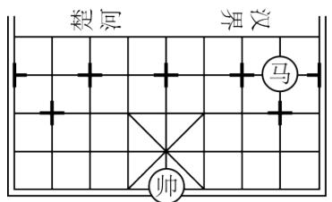
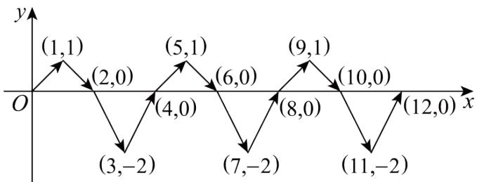
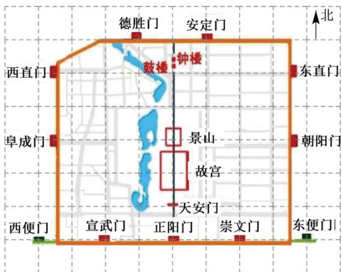
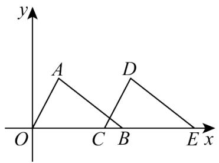
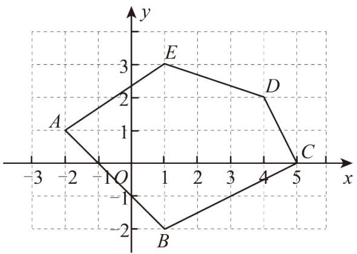
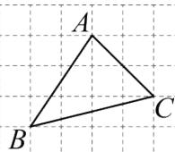
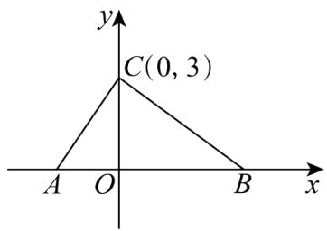
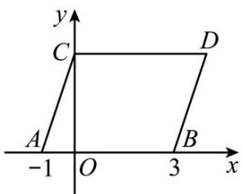
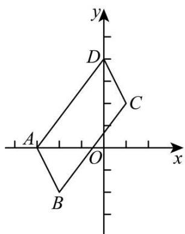
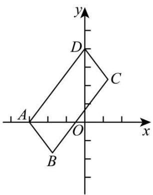

# 第三章 位置与坐标·培优卷

# 【北师大版 2024】

考试时间：120 分钟 满分：120 分

姓名：\_\_\_\_ 班级：\_\_\_\_ 考号：\_\_\_\_

考卷信息:

本卷试题共 24 题，单选 10 题，填空 6 题，解答 8 题，满分 120 分，限时 120 分钟，本卷题型针对性较高，覆盖面广，选题有深度，可衡量学生掌握本章内容的具体情况！

# 第I卷

# 一．选择题（共10小题，满分30分，每小题3分）教辅资源,关注公众号·全科AA+

1. （3 分）（24-25 七年级下·湖南长沙·期末）已知点 $P(2, -2)$ ，则点 $P$ 在（）

A. 第一象限

B. 第二象限

C. 第三象限

D. 第四象限

2. （3 分）（24-25 七年级下·湖南长沙·期末）在平面直角坐标系中，第一象限内的点 $P(a,1)$ 距离y轴5个单位长度，则a的值为（）

A.-5

B. 5或-5

C. 5

D. 6

3. （3 分）（24-25 八年级下·河南周口·期中）在平面直角坐标系中，过 $A(-2, 2)$ ， $B(-2, -3)$ 两点作直线，下列说法正确的是（）

A. $AB \perp x$ 轴

B. $AB \perp y$ 轴

C. $AB \parallel x$ 轴

D. $AB$ 经过原点

4. （3 分）（24-25 七年级下·河南商丘·期末）中国象棋文化历史悠久，如图是某次对弈的残图，如果建立平面直角坐标系，使棋子“帅”位于点 $(-1,-2)$ 的位置，则在同一坐标系下，“马”所在位置是（）

text_image

楚河
汉界
马
帅

A. $(1,1)$

B. $(2,0)$

C. $(2,1)$

D. $(-2,-1)$

5. （3 分）（24-25 七年级下·云南大理·期末）如图，在平面直角坐标系中，动点P按图中箭头所示方向从原点出发，第1次运动到点 $P_{1}(1,1)$ ，第2次接着运动到点 $P_{2}(2,0)$ ，第3次接着运动到点 $P_{3}(3,-2)$ ，第4次接着运动到点 $P_{4}(4,0)$ ，……，按这样的运动规律，点 $P_{2025}$ 的坐标是（）

line

| Point | x-coordinate | y-coordinate |
|---|---|---|
| 1 | (1,1) | 0 |
| 2 | (2,0) | 1 |
| 3 | (3,-2) | -1 |
| 4 | (4,0) | 2 |
| 5 | (5,1) | 3 |
| 6 | (6,0) | 4 |
| 7 | (7,-2) | -2 |
| 8 | (8,0) | 5 |
| 9 | (9,1) | 6 |
| 10 | (10,0) | -3 |
| 11 | (11,-2) | -4 |
| 12 | (12,0) | -5 |

A. (2025,1)

B. (2025,-2)

C. (2024,1)

D. (2024,-2)

6. （3 分）（24-25 七年级下·天津蓟州·期末）在平面直角坐标系中，点A的坐标为 $(-4,5)$ ，点B是y轴上任意一点，则线段AB的最小值为（）

A. 1

B. 4

C. 5

D. 9

7. （3 分）（24-25 八年级下·海南·期末）点 A、B、C、D 的坐标分别为 $(-3, 0)$ 、 $(0, -3)$ 、 $(4, 0)$ 、 $(0, 4)$ ，若有一直线 l 经过点 $(-3, 4)$ 且与 y 轴垂直，则直线 l 也经过（）

A. 点 $A$

B. 点 $B$

C. 点 C

D. 点 $D$

8. （3 分）在直角坐标平面内，将点 $A(-1, -2)$ 先向上平移 3 个单位长度，再向右平移 4 个单位长度，得到的点 $A'$ 的坐标是（）

A. $(-2,3)$

B. $(3,1)$

C. $(4,1)$

D. $(-4,-7)$

9. （3 分）（24-25 七年级下·北京海淀·期末）在平面直角坐标系中，长方形ABCD的边均与某坐标轴平行．已知(-2,-2)，(3,1)是该长方形的两个顶点坐标，则下列各点中可以是该长方形顶点的是（）

A. $(-2,3)$

B. $(3,-2)$

C. $(1,-2)$

D. $(-3,1)$

10. （3 分）在平面直角坐标系中，若点 $A(a, -1)$ 与点 $B(4, b)$ 关于 $x$ 轴对称，则（）

A. $a = 4, b = -1$

B. a=-4, b=1

C. a=-4, b=-1

D. a=4, b=1

# 二．填空题（共6小题，满分18分，每小题3分）

11. （3 分）若点P的坐标是(3,-2)，则它到x轴的距离是\_\_\_\_。

12. （3 分）如图是老北京城一些地点的分布示意图，在图中，分别以正东，正北方向为 $x$ 轴， $y$ 轴的正方向建立平面直角坐标系。如果表示东直门的点的坐标为 $(3.5, 4)$ ，表示宣武门的点的坐标为 $(-2, -1)$ ，那么坐标原点所在的位置是 \_\_\_\_.

text_image

德胜门
安定门
北
西直门
鼓楼
钟楼
东直门
阜成门
景山
故宫
天安门
朝阳门
西便门
宣武门
正阳门
崇文门
东便门

教辅资源, 关注公众号·全科AA+

13. （3 分）（24-25 八年级下·河北唐山·期中）在平面直角坐标系中，已知点 $P(a,a+1)$ ， $Q(-1,2)$ 。若直线PQ 与x轴平行，则a的值为\_\_\_\_。  
14. （3 分）（24-25 七年级下·陕西·期末）已知点 $A(a - 5, a - 3)$ ， $B(b, m)$ ，点 $A$ 在 $x$ 轴上， $AB \parallel y$ 轴，点 $B$ 到 $x$ 轴的距离是 4，且 $m < 0$ ，则点 $B$ 的坐标是 \_\_\_\_.  
15. （3 分）（24-25 八年级下·福建三明·期中）如图， $\triangle OAB$ 的顶点 $B$ 的坐标为 $(5,0)$ ，把 $\triangle OAB$ 沿 $x$ 轴向右平移得到 $\triangle CDE$ 。如果 $CB = 1$ ，那么 $BE$ 的长为 \_\_\_\_.

text_image

y
A
D
O
C B
E x

16. （3 分）（24-25 七年级下·广东中山·期末）已知点 $O(0,0)$ , $A(2,2)$ , 点 $B$ 在 $x$ 轴正半轴上, 且三角形 $AOB$ 的面积等于 3 , 则点 $B$ 的坐标是 \_\_\_\_.

# 第II卷

# 三．解答题（共8小题，满分72分）

17. （6 分）（24-25 七年级下·江西赣州·期中）写出图中的多边形ABCDE各个顶点的坐标.

text_image

y
3
E
2
D
A
1
C
-3 -2 -1 O 1 2 3 4 5 x
-1
B
-2

18. （6 分）（2025·安徽·一模）网格中每个小方格是边长为 1 个单位的小正方形， $\triangle ABC$ 位置如图所示，且 $A(-4,5), B(-6,2)$ .

教辅资源,关注公众号·全科AA+

(1)画出平面直角坐标系xOy，写出点C的坐标；

(2)平移 $\triangle ABC$ ，使点 $C$ 移动到点 $F(6,-4)$ .

①画出平移后的 $\triangle DEF$ ，其中点D与点A对应（不写画法）；

②若点 $P(m,n)$ 在 $\triangle ABC$ 内，其平移后的对应点为 $P'$ ，写出 $P'$ 的坐标.

19. （8分）（24-25八年级上·山东济南·期中）已知平面直角坐标系中有一点 $M(m-1,2m+3)$ .

(1)已知点 $N(5,4)$ ，当 $MN\parallel x$ 轴时，求点M的坐标和线段MN的长；

(2)当点M到v轴的距离为1时，求点M的坐标.

20. （8 分）（24-25 七年级下·海南省直辖县级单位·期末）如图所示，在平面直角坐标系中，点A，B的坐标分别为A(-2,0)，B(a,0)，其中A在B的左侧且AB=6，点C的坐标为(0,3).

text_image

y
C(0, 3)
A O B x

(1)求a的值及 $S_{\triangle ABC}$ ;   
(2)若点M在x轴的正半轴上，且 $S_{\triangle ACM}=\frac{1}{3}S_{\triangle ABC}$ ，试求点M的坐标.

21. （10 分）（24-25 八年级上·广东梅州·期末）在平面直角坐标系中，有一点 $P(2x-1,3x)$ .

(1)若点P在y轴上，求x的值；  
(2)若点P在第一象限，且到两坐标轴的距离之和为9，求点P的坐标.

22. （10 分）如图，在平面直角坐标系中，点 $A, B$ 的坐标分别为 $(-1, 0)$ ， $(3, 0)$ ，现同时将点 $A, B$ 分别向上平移 3 个单位，再向右平移 1 个单位，分别得到点 $A, B$ 的对应点 $C, D$ ，连接 $AC, BD, CD$ .

text_image

y
C
D
A
B
-1 O 3 x

(1)求点C,D的坐标及四边形ABDC的面积 $S_{四边形ABDC}$ ;

(2)在y轴上是否存在一点P，连接PA,PB，使 $S_{\triangle PAB}=S_{四边形ABDC}$ 若存在这样一点，求出点P的坐标：若不存在，试说明理由.

23. （12 分）（24-25 七年级下·山西忻州·期中）在平面直角坐标系中，给出如下定义：点 $P$ 到 $x$ 轴， $y$ 轴的距离的较大值称为点 $P$ 的“长距”，点 $Q$ 到 $x$ 轴、 $y$ 轴的距离相等时，称点 $Q$ 为“完美点”.

(1)点 $A(-3,5)$ 的“长距”为；  
(2)若点 $B(4-2a,-2)$ 是“完美点”，求a的值；  
(3)若点 $C(-2,3b - 2)$ 的长距为4，且点 $C$ 在第二象限内，点 $D$ 的坐标为 $(9 - 2b, -5)$ ，试说明：点 $D$ 是“完美点”。24. （12分）平面直角坐标系中， $A$ 点为 $(-3,0)$ ， $D$ 点为 $(0,4)$ ，将线段 $AD$ 平移至线段 $BC$ ，连 $AB$ ， $CD$ 。

text_image

y
D
C
A
O
x
B

图1

text_image

y
D
C
A
O
x
B

图2

(1)如图1，若B点为 $(-2,-2)$ .

①直接写出图中相等和平行的线段和 C 点坐标；

②求四边形ABCD的面积;  
(2)如图 2，若OA平分∠DAB，求证：OD平分∠ADC.