# 第三章 位置与坐标·培优卷

# 【北师大版 2024】

参考答案与试题解析

# 第I卷

# 一．选择题（共10小题，满分30分，每小题3分）

1. （3 分）（24-25 七年级下·湖南长沙·期末）已知点 $P(2,-2)$ ，则点 P 在（）

A. 第一象限

B. 第二象限

C. 第三象限

D. 第四象限

【答案】D

【分析】本题考查的是点的坐标，根据各象限内点的坐标特点即可得出答案.

【详解】解：∵2>0，-2<0，

∴点 P 在第四象限.

故选：D.

2. （3 分）（24-25 七年级下·湖南长沙·期末）在平面直角坐标系中，第一象限内的点 $P(a,1)$ 距离y轴5个单位长度，则a的值为（）

A.-5

B. 5或-5

C. 5

D. 6

【答案】C

【分析】本题主要考查了点到坐标轴的距离，第一象限内的点的坐标特点，点到 $y$ 轴的距离等于该点横坐标的绝对值，第一象限内的点横纵坐标都为正，据此求解即可.

【详解】解：∵第一象限内的点 $P(a,3)$ 到y轴的距离是5个单位长度，

$$
\therefore | a | = 5, \quad a > 0,
$$

$$
\therefore a = 5,
$$

故选：C.

3. （3 分）（24-25 八年级下·河南周口·期中）在平面直角坐标系中，过 $A(-2, 2)$ ， $B(-2, -3)$ 两点作直线，下列说法正确的是（）

A. $AB \perp x$ 轴

B. $AB \perp y$ 轴

C. $AB \parallel x$ 轴

D. $AB$ 经过原点

【答案】A

【分析】本题考查了坐标与图形性质，垂直于x轴的直线上点的横坐标相同是解题的关键.
根据两点的横坐标相等，纵坐标不等，即可得出过∵ $A(-2,2)$ ， $B(-2,-3)$ 两点的直线垂直于x轴.

【详解】∵A(-2,2)，B(-2,-3)，

$\therefore AB\perp x$ 轴，

故选：A.

4. （3 分）（24-25 七年级下·河南商丘·期末）中国象棋文化历史悠久，如图是某次对弈的残图，如果建立平面直角坐标系，使棋子“帅”位于点 $(-1,-2)$ 的位置，则在同一坐标系下，“马”所在位置是（）

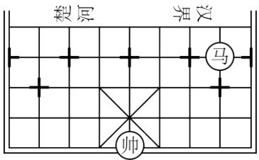

text_image

楚河
汉界
马
帅

A. $(1,1)$

B. $(2,0)$

C. $(2,1)$

D. $(-2,-1)$

【答案】C

【分析】本题主要考查了点的坐标，熟练掌握平面内点的坐标平移规律进行求解即可得出答案．应用平面内点的平移规律进行计算即可得出答案.

【详解】解：根据平面内点的平移规律可得，

把“帅”向右平移3个单位，向上平移3个单位得到“马”的位置，

$$
\therefore (- 1 + 3, - 2 + 3),
$$

即棋子“马”所在的点的坐标为(2,1).

故选 C.

5. （3 分）（24-25 七年级下·云南大理·期末）如图，在平面直角坐标系中，动点P按图中箭头所示方向从原点出发，第1次运动到点 $P_{1}(1,1)$ ，第2次接着运动到点 $P_{2}(2,0)$ ，第3次接着运动到点 $P_{3}(3,-2)$ ，第4次接着运动到点 $P_{4}(4,0)$ ，……，按这样的运动规律，点 $P_{2025}$ 的坐标是（）

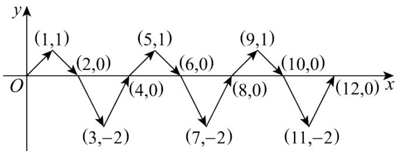

line

| Point | x | y |
|---|---|---|
| (1,1) | 0 | 0 |
| (2,0) | 1 | 0 |
| (3,-2) | 2 | 0 |
| (4,0) | 3 | 0 |
| (5,1) | 4 | 0 |
| (6,0) | 5 | 0 |
| (7,-2) | 6 | 0 |
| (8,0) | 7 | 0 |
| (9,1) | 8 | 0 |
| (10,0) | 9 | 0 |
| (11,-2) | 10 | 0 |
| (12,0) | 11 | 0 |
The chart displays a repeating pattern of values between -2 and 1 across the x-axis. The y-axis is labeled 'y'. The labels above the x-axis are explicitly in parentheses.

A. (2025,1)

B. (2025,-2)

C. (2024,1)

D. (2024,-2)

【答案】A

【分析】本题考查了坐标的规律变化，找出规律是关键，根据题意，点P的横坐标为n（n是正整数），纵坐标的变化规律是1,0,-2,0，每4次一循环，由此即可求解.

【详解】解：第1次运动到点 $P_{1}(1,1)$ ,

第2次接着运动到点 $P_{2}(2,0)$ ,

第3次接着运动到点 $P_{3}(3,-2)$ ,

第4次接着运动到点 $P_{4}(4,0)$ ,

∴横坐标的变化规律是：第n次的横坐标为n（n是正整数），

纵坐标的变化规律是：1,0,-2,0，每4次一循环，

∴点 $P_{2025}$ 的横坐标是2025，

$$
\because 2 0 2 5 \div 4 = 5 0 6 \dots 1,
$$

∴纵坐标为：1，

$$
\therefore P _ {2 0 2 5} (2 0 2 5, 1),
$$

故选：A.

6. （3 分）（24-25 七年级下·天津蓟州·期末）在平面直角坐标系中，点A的坐标为 $(-4,5)$ ，点B是y轴上任意一点，则线段AB的最小值为（）

A. 1

B. 4

C. 5

D. 9

【答案】B

【分析】本题考查了点到坐标轴的距离、垂线段最短，熟练掌握相关知识点是解题的关键．根据垂线段最短的性质可得，当 $AB \perp y$ 轴，线段AB有最小值，再根据点A的坐标即可解答.

【详解】解：∵点A的坐标为 $(-4,5)$ ，点B是y轴上任意一点，

∴当 $AB\perp y$ 轴，线段AB有最小值，最小值为 $|-4|=4$ .

故选：B.

7. （3 分）（24-25 八年级下·海南·期末）点 A、B、C、D 的坐标分别为 $(-3, 0)$ 、 $(0, -3)$ 、 $(4, 0)$ 、 $(0, 4)$ ，若有一直线 l 经过点 $(-3, 4)$ 且与 y 轴垂直，则直线 l 也经过（）

A. 点 $A$

B. 点 $B$

C. 点 C

D. 点 $D$

【答案】D

【分析】本题考查了点的坐标，结合一条直线 $l$ 过点 $(-3, 4)$ 且与 $y$ 轴垂直，得这个直线上的点的纵坐标都是4，再根据四点的坐标情况进行分析，即可作答.

【详解】解：∵一条直线 l 过点 $(-3, 4)$ 且与 y 轴垂直，

∴这个直线上的点的纵坐标都是4，

∵点 A、B、C、D 的坐标分别为 $(-3, 0)$ 、 $(0, -3)$ 、 $(4, 0)$ 、 $(0, 4)$ ，

∴直线 l 也会经过的点是点 D,

故选：D.

8. （3 分）在直角坐标平面内，将点 $A(-1, -2)$ 先向上平移 3 个单位长度，再向右平移 4 个单位长度，得到的点 $A'$ 的坐标是（）

A. $(-2,3)$

B. $(3,1)$

C. $(4,1)$

D. $(-4, - 7)$

【答案】B

【分析】将 A（-1，-2）向上平移 3 个单位长度得到（-1，1），再向右平移 4 个单位长度得到（3，1）即可得到答案；

【详解】由平移的性质可知，

将 A（-1，-2）向上平移 3 个单位长度得到（-1，1），

再向右平移 4 个单位长度得到 $A'$ （3，1），

故选 B.

【点睛】本题考查点坐标的平移，熟练掌握平移的性质是解决本题的关键.

9. （3 分）（24-25 七年级下·北京海淀·期末）在平面直角坐标系中，长方形ABCD的边均与某坐标轴平行．已知(-2,-2)，(3,1)是该长方形的两个顶点坐标，则下列各点中可以是该长方形顶点的是（）

A. $(-2,3)$

B. $(3,-2)$

C. $(1,-2)$

D. $(-3,1)$

【答案】B

【分析】本题考查的是坐标与图形，根据由于长方形的边与坐标轴平行，其顶点坐标由两组不同的 $x$ 值和 $y$ 值组合而成，而顶点 $(-2, -2)$ ， $(3, 1)$ 为对角顶点，在确定长方形的另外两个顶点即可.

【详解】解：如图，长方形ABCD的边均与某坐标轴平行． $(-2,-2)$ ， $(3,1)$ 是该长方形的两个顶点坐标，

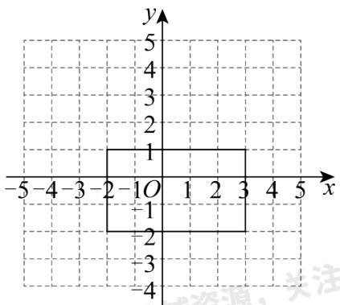

text_image

y
5
4
3
2
1
-5 -4 -3 -2 -1 O 1 2 3 4 5 x
-1
-2
-3
-4

∴另外两个顶点坐标为： $(-2,1)$ ， $(3,-2)$ ，

∴B 符合题意;

故选：B

10. （3 分）在平面直角坐标系中，若点 $A(a,-1)$ 与点 $B(4,b)$ 关于x轴对称，则（）

A. $a = 4, b = -1$

B. a=-4, b=1

C. a=-4, b=-1

D. a=4, b=1

【答案】D

【分析】本题考查的知识点是关于x轴对称的点的特征，解题关键是熟练掌握关于x轴对称的点的特征.由“关于x轴对称点的坐标，横坐标不变，纵坐标与该点纵坐标互为相反数”即可得解.

【详解】解：∵关于x轴对称点的坐标，横坐标不变，纵坐标与该点纵坐标互为相反数，
∴若点 $A(a,-1)$ 与点 $B(4,b)$ 关于x轴对称，则a=4，b=1.

故选：D.

# 二．填空题（共6小题，满分18分，每小题3分）

11. （3 分）若点P的坐标是(3,-2)，则它到x轴的距离是\_\_\_\_。

【答案】2

【分析】本题主要考查点的坐标，根据点到 x 轴的距离是纵坐标的绝对值解答即可.

【详解】解：点P到x轴的距离是 $|-2|=2$ ，

故答案为：2.

12. （3 分）如图是老北京城一些地点的分布示意图，在图中，分别以正东，正北方向为 $x$ 轴， $y$ 轴的正方向建立平面直角坐标系。如果表示东直门的点的坐标为 $(3.5, 4)$ ，表示宣武门的点的坐标为 $(-2, -1)$ ，那么坐标原点所在的位置是 \_\_\_\_.

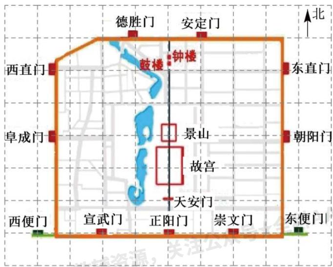

text_image

德胜门
安定门
北
西直门
鼓楼
钟楼
东直门
阜成门
景山
朝阳门
故宫
天安门
西便门
宣武门
正阳门
崇文门
东便门

【答案】天安门

【分析】根据表示东直门的点的坐标和表示宣武门的点的坐标确定原点的位置即可.

【详解】解：∵表示东直门的点的坐标为 $(3.5, 4)$ ，表示宣武门的点的坐标为 $(-2, -1)$ ，∴坐标原点 $(0, 0)$ 所在的位置是天安门.

故答案为：天安门.

【点睛】本题考查在平面直角坐标系中确定点的位置，熟练掌握该知识点是解题关键.

13. （3 分）（24-25 八年级下·河北唐山·期中）在平面直角坐标系中，已知点 $P(a,a+1)$ ， $Q(-1,2)$ 。若直线PQ 与x轴平行，则a的值为\_\_\_\_。

【答案】1

【分析】本题考查坐标与图形，根据平行 x 轴的点的纵坐标相等，构建方程求解即可.

【详解】解：由题意， $a+1=2$ ，

$$
\therefore a = 1,
$$

故答案为：1.

14. （3 分）（24-25 七年级下·陕西·期末）已知点 $A(a - 5, a - 3)$ ， $B(b, m)$ ，点 $A$ 在 $x$ 轴上， $AB \parallel y$ 轴，点 $B$ 到 $x$ 轴的距离是 4，且 $m < 0$ ，则点 $B$ 的坐标是 \_\_\_\_.

【答案】 $(-2,-4)$

【分析】此题考查了坐标与图形的性质，正确掌握平面内点的坐标特点是解题的关键.

直接利用 x 轴上点的坐标特点得出 a 的值，根据 $AB \parallel y$ 轴求出 b 的值，根据点 B 到 x 轴的距离是 4 求出 m 的值，进而可求出点 B 的坐标.

【详解】解：∵点 A 在 x 轴上，

$$
\therefore a - 3 = 0,
$$

$$
\therefore a = 3,
$$

$$
\therefore A (- 2, 0),
$$

∵AB∥y轴，

$$
\therefore b = - 2,
$$

∵点 B 到 x 轴的距离是 4,

$$
\therefore | m | = 4,
$$

$$
\therefore m = \pm 4,
$$

$$
\because m <   0,
$$

$$
\therefore m = - 4,
$$

∴点 B 的坐标是 $(-2,-4)$ ,

故答案为： $(-2,-4)$ .

15. （3分）（24-25八年级下·福建三明·期中）如图， $\triangle OAB$ 的顶点 $B$ 的坐标为 $(5,0)$ ，把 $\triangle OAB$ 沿 $x$ 轴向右平移得到 $\triangle CDE$ 。如果 $CB = 1$ ，那么 $BE$ 的长为 \_\_\_\_.

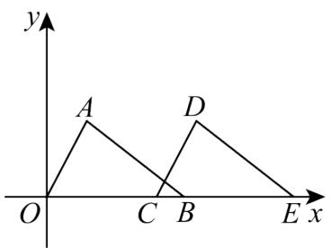

text_image

y
A
D
O
C
B
E x

【答案】4

【分析】本题考查了坐标与图形的变化的平移，熟记平移的性质是解题的关键；根据点 B 的坐标求出 OB，再根据 CB=1，求出 OC，最后根据平移性质得出 BE 即可得解.

【详解】解：∵顶点B的坐标为(5,0)，

$$
\therefore O B = 5,
$$

$$
\because C B = 1,
$$

$$
\therefore O C = O B - C B = 5 - 1 = 4,
$$

∵ $\triangle OAB$ 沿 x 轴向右平移得到 $\triangle CDE$ ,

$$
\therefore B E = O C = 4;
$$

故答案为：4.

16. （3 分）（24-25 七年级下·广东中山·期末）已知点 $O(0,0)$ , $A(2,2)$ , 点 $B$ 在 $x$ 轴正半轴上, 且三角形 $AOB$ 的面积等于 3 , 则点 $B$ 的坐标是 \_\_\_\_.

【答案】(0,3)

【分析】本题考查了坐标与图形.

先设 $B(0,b)$ ，根据三角形面积公式计算即可.

【详解】解：∵点 B 在 x 轴正半轴上，

∴可设 $B(0,b)$ ,

∵三角形AOB的面积等于3，

$$
\therefore \frac {1}{2} \times (b - 0) \times 2 = 3,
$$

解得：b=3，

$\therefore B(0,3),$

故答案为：(0,3).

# 第II卷

# 三．解答题（共8小题，满分72分）

17. （6 分）（24-25 七年级下·江西赣州·期中）写出图中的多边形ABCDE各个顶点的坐标.

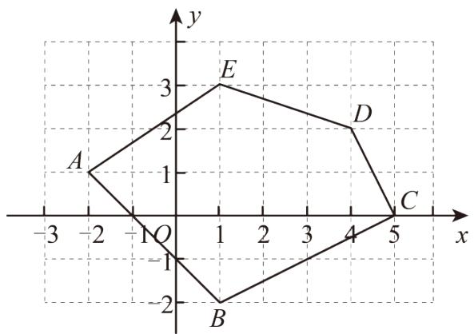

text_image

y
3
E
2
D
A
1
-3 -2 -1 O 1 2 3 4 5 x
-1
B
-2

【答案】 $A(-2,1)$ ， $B(1,-2)$ ， $C(5,0)$ ， $D(4,2)$ ， $E(1,3)$

【分析】本题考查了平面直角直角系，熟练掌握点的表示方法是解题的关键。根据平面直角坐标系的特点写出各点的坐标即可。

【详解】解：根据直角坐标系的知识可得： $A(-2,1)$ ， $B(1,-2)$ ， $C(5,0)$ ， $D(4,2)$ ， $E(1,3)$ .

18. （6分）（2025·安徽·一模）网格中每个小方格是边长为1个单位的小正方形， $\triangle ABC$ 位置如图所示，且 $A(-4,5), B(-6,2)$ .

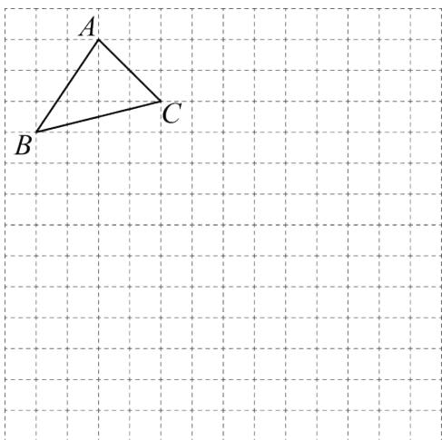

text_image

A
B
C

(1)画出平面直角坐标系xOy，写出点C的坐标；

(2)平移 $\triangle ABC$ ，使点C移动到点 $F(6,-4)$ .

①画出平移后的 $\triangle DEF$ ，其中点D与点A对应（不写画法）；

②若点 $P(m,n)$ 在 $\triangle ABC$ 内，其平移后的对应点为 $P'$ ，写出 $P'$ 的坐标.

【答案】(1)见解析， $(-2,3)$

(2)①见解析；② $(m+8,n-7)$

【分析】本题主要考查平面直角坐标系的特点，图形的平移，掌握以上知识，数形结合分析是解题的关键.

（1）根据点 $A(-4,5),B(-6,2)$ 的坐标确定坐标系，由坐标系的特点可写出点C的坐标；

(2) ①根据图形平移的方法作图即可;

②根据点平移规律“左减右加”即可求解.

【详解】（1）解：如图所示，建立平面直角坐标系.

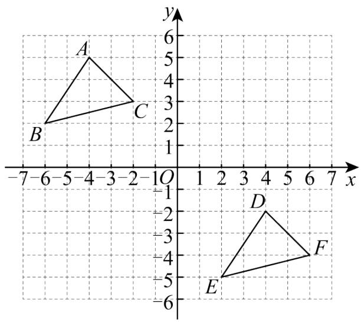

text_image

y
6
5
4
3
2
1
B
C
-7 -6 -5 -4 -3 -2 -1 0 1 2 3 4 5 6 7 x
-1
-2
-3
-4
-5
-6
D
E
F

∴点 C 的坐标 $(-2,3)$ ;

(2) 解: 已知点 $C(-2,3)$ , 平移到点 $F(6,-4)$ ,

∴右移8个单位，下移7个单位，

①如图所示， $\triangle DEF$ 即为所求；

② $P'$ 的坐标为 $(m+8,n-7)$ .

19. （8 分）（24-25 八年级上·山东济南·期中）已知平面直角坐标系中有一点 $M(m-1,2m+3)$ .

(1)已知点 $N(5,4)$ ，当 $MN\|x$ 轴时，求点M的坐标和线段MN的长；

(2)当点M到y轴的距离为1时，求点M的坐标.

【答案】(1) $M(-\frac{1}{2},4)$ ， $5\frac{1}{2}$

(2) $M(1,7)$ 或 $(-1,3)$

【分析】本题考查了坐标与图形，掌握距离都是非负数，而坐标可以是负数，在由距离求坐标时，需要加上绝对值的符号，这是解题的关键.

(1) 根据 $MN \parallel x$ 轴, 得到 $M$ , $N$ 点的纵坐标相等, 求出 $m$ 的值, 得到点 $M$ 的坐标, 从而得到线段 $MN$ 的长度;

（2）根据点 M 到 y 轴的距离为 1，得到 $|m-1|=1$ ，求出 m 的值即可得到点 M 的坐标.

【详解】（1）解：∵ $MN \parallel x$ 轴，

∴M，N点的纵坐标相等，

∵M(m-1,2m+3)，点N(5,4),

$$
\therefore 2 m + 3 = 4,
$$

$$
\therefore m = \frac {1}{2},
$$

$$
\therefore m - 1 = - \frac {1}{2},
$$

$$
\therefore M \left(- \frac {1}{2}, 4\right),
$$

∴线段MN的长度= $5-(-\frac{1}{2})=5\frac{1}{2}$ ;

(2)∵点M到y轴的距离为1,

$$
\therefore | m - 1 | = 1,
$$

$$
\therefore m - 1 = 1 \text {或} m - 1 = - 1,
$$

$$
\therefore m = 2 \text {或} 0,
$$

$$
\therefore 2 m + 3 = 7 \text {或} 3,
$$

$$
\therefore M (1, 7) \text {或} (- 1, 3).
$$

20. （8 分）（24-25 七年级下·海南省直辖县级单位·期末）如图所示，在平面直角坐标系中，点A，B的坐标分别为A(-2,0)，B(a,0)，其中A在B的左侧且AB=6，点C的坐标为(0,3).

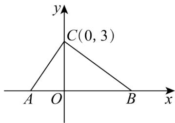

text_image

y
C(0, 3)
A O B x

(1)求a的值及 $S_{\triangle ABC}$ ;

(2)若点M在x轴的正半轴上，且 $S_{\triangle ACM}=\frac{1}{3}S_{\triangle ABC}$ ，试求点M的坐标.

【答案】(1)a=4, $S_{\triangle ABC}=9$

(2)M的坐标为(0,0)或(-4,0)

【分析】本题考查平面直角坐标系中坐标与三角形面积计算，掌握点的坐标与各线段长的关系是解决此题的关键.

（1）已知A、B在x轴上且A在B左侧，AB=6，利用x轴上两点间距离公式（两点横坐标之差的绝对值），由 $A(-2,0)$ ， $B(a,0)$ 可得 $a-(-2)=6$ ，解此方程求出a的值；再根据三角形面积公式，以AB为底，点C到x轴距离为高，计算△ABC面积。

（2）设 $M(x,0)$ ，先表示出AM的长度，根据 $S_{\triangle ACM}=\frac{1}{3}S_{\triangle ABC}$ 求出 $S_{\triangle ACM}$ 的值，再利用三角形面积公式列出关于x的方程 $\frac{1}{2}\times|x+2|\times3=3$ ，求解方程得到x的值，进而确定M的坐标．

【详解】（1）∵A(-2,0)，B(a,0)且A在B左侧，AB=6，

$\therefore a-(-2)=6$ ，即 $a+2=6$ ，

解得a=4.

∵点C(0,3)

$$
\therefore O C = 3
$$

$$
\therefore S _ {\triangle A B C} = \frac {1}{2} \times A B \times O C = \frac {1}{2} \times 6 \times 3 = 9;
$$

（2）解：设M的坐标为 $(x,0)$ ，则 $AM=|x-(-2)|=|x+2|$ .

$$
\because S _ {\triangle A C M} = \frac {1}{3} S _ {A B C}, \quad S _ {\triangle A B C} = 9,
$$

$$
\therefore S _ {\triangle A C M} = 3.
$$

$\triangle ACM$ 以AM为底，高为点C到x轴的距离3，

$$
S _ {\Delta A C M} = \frac {1}{2} \times A M \times 3 = 3.
$$

即 $\frac{1}{2}\times|x+2|\times3=3$ ,

解得x=0；x=-4。

∴M的坐标为(0,0)或(-4,0).

21. （10 分）（24-25 八年级上·广东梅州·期末）在平面直角坐标系中，有一点 $P(2x-1,3x)$ .

(1)若点P在y轴上，求x的值；

(2)若点P在第一象限，且到两坐标轴的距离之和为9，求点P的坐标.

【答案】(1) $x=\frac{1}{2}$

(2)(3,6)

【分析】本题主要考查了坐标与图形，点到坐标轴的距离，第一象限内点的坐标特点，在 y 轴上的点的坐

标特点，熟练掌握是解答本题的关键.

（1）在y轴上的点横坐标为0，据此列出方程求解即可；

(2) 第一象限内的点横纵坐标都为正, 点到 $x$ 轴的距离为该点纵坐标的绝对值, 点到 $y$ 轴的距离为该点横坐标的绝对值, 据此求出点 $P$ 到两坐标轴的距离, 再根据点 $P$ 到两坐标轴的距离之和为 9 建立方程求出 $x$ 的值即可得到答案.

【详解】（1）解：∵点 $P(2x-1,3x)$ 在y轴上，

$$
\therefore 2 x - 1 = 0,
$$

$$
\therefore x = \frac {1}{2};
$$

(2) 解: $\because P(2x - 1,3x)$ 在第一象限,

∴点P到x轴的距离为3x，到y轴的距离为2x-1，

∵点P到两坐标轴的距离之和为9，

$$
\therefore 3 x + 2 x - 1 = 9,
$$

$$
\therefore x = 2,
$$

$$
\therefore 2 x - 1 = 3, 3 x = 6,
$$

∴点P的坐标为(3,6).

22. （10 分）如图，在平面直角坐标系中，点 $A, B$ 的坐标分别为 $(-1, 0)$ ， $(3, 0)$ ，现同时将点 $A, B$ 分别向上平移 3 个单位，再向右平移 1 个单位，分别得到点 $A, B$ 的对应点 $C, D$ ，连接 $AC, BD, CD$ .

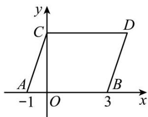

text_image

y
C
D
A
-1 O 3 x
B

(1)求点C,D的坐标及四边形ABDC的面积 $S_{四边形ABDC}$ ;

(2)在y轴上是否存在一点P，连接PA,PB，使 $S_{\triangle PAB}=S_{四边形ABDC}$ 若存在这样一点，求出点P的坐标：若不存在，试说明理由.

【答案】(1) $C(0,3)$ ， $D(4,3)$ ， $S_{四边形ABDC}=12$

(2)存在，点P的坐标为 $(0,6)$ 或 $(0,-6)$

【分析】本题考查了点的坐标特征，点的平移，三角形的面积，熟练掌握知识点是解题的关键.

(1) 根据向右平移 1 个单位, 横坐标加 1, 向上平移 3 个单位, 纵坐标加 3, 即可求出点 $C, D$ 的坐标, 再求出 $C D$ 长, 即可求面积;

(2) 由 (1) 得四边形 $ABDC$ 的面积为 12, 再利用三角形面积公式即可求解.

【详解】（1）解：∵点A,B的坐标分别为 $(-1,0)$ ， $(3,0)$ ，

现同时将点A,B向上平移3个单位，再向右平移1个单位，得到点A,B的对应点分别是C,D，

$$
\therefore C (0, 3), D (4, 3)
$$

四边形ABDC的面积= $(3+1)\times3=12$ ;

(2) 解: 设 $S_{\triangle PAB} = S_{\text {四边形} ABDC}$ 时点 $P$ 到 $AB$ 的距离为 $h$ ,

则 $\frac{1}{2}\times(3+1)h=12$ ,

解得h=6，

∴点P的坐标为 $(0, 6)$ 或 $(0, -6)$ .

23. （12 分）（24-25 七年级下·山西忻州·期中）在平面直角坐标系中，给出如下定义：点 $P$ 到 $x$ 轴， $y$ 轴的距离的较大值称为点 $P$ 的“长距”，点 $Q$ 到 $x$ 轴、 $y$ 轴的距离相等时，称点 $Q$ 为“完美点”.

(1)点 $A(-3,5)$ 的“长距”为\_\_\_\_；

(2)若点 $B(4-2a,-2)$ 是“完美点”，求a的值；

(3)若点 $C(-2,3b-2)$ 的长距为4，且点C在第二象限内，点D的坐标为 $(9-2b,-5)$ ，试说明：点D是“完美点”.

【答案】(1)5

(2)a=1或a=3

(3)见解析

【分析】本题主要考查了平面直角坐标系，点到坐标轴的距离，属于阅读理解类型题目，关键是要读懂题目里定义的“长距”与“完美点”.

(1) 根据“长距”的定义解答即可;  
(2) 根据“完美点”的定义解答即可;  
（3）由“长距”的定义求出 b 的值，然后根据“完美点”的定义求解即可.

【详解】（1）解：根据题意，得点 $A(-3,5)$ 到x轴的距离为5，到y轴的距离为3，

∴点 A 的“长距”为 5.

故答案为：5.

(2) 解: 点 $B(4-2a,-2)$ 是“完美点”,

$$
\therefore | 4 - 2 a | = | - 2 |,
$$

$$
\therefore 4 - 2 a = 2 \text {或} 4 - 2 a = - 2,
$$

解得：a=1 或 a=3；

(3) 解: 点 $C(-2,3b - 2)$ 的长距为 4 , 且点 $C$ 在第二象限内,

∴ 3b-2=4，解得b=2，

∴9-2b=5.

∴点D的坐标为(5,-5)，

∵点D到x轴、v轴的距离都是5，

∴D是“完美点”.

24. （12 分）平面直角坐标系中，A 点为 $(-3,0)$ ，D 点为 $(0,4)$ ，将线段 AD 平移至线段 BC，连 AB，CD.

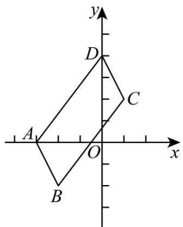

text_image

y
D
C
A
O
x
B

图1

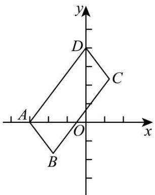

text_image

y
D
C
A
O
x
B

图2

(1)如图1，若B点为 $(-2,-2)$ .

①直接写出图中相等和平行的线段和 C 点坐标；

②求四边形ABCD的面积:

(2)如图 2, 若 $OA$ 平分 $\angle DAB$ , 求证: $OD$ 平分 $\angle ADC$ .

【答案】(1)①AD=BC，AB=CD， $AB\parallel CD$ ， $AD\parallel BC$ ，(1,2)；②10

(2) 见解析

【分析】本题主要考查了坐标与图形变化—平移，平移的性质，坐标与图形，平行线的性质，角平分线的定义等等，熟知相关知识是解题的关键.

(1) ①由平移的性质可得 $AD = BC$ , $AB = CD$ , $AB \parallel CD$ , $AD \parallel BC$ ; 根据点 $A$ 和点 $B$ 的坐标可得平移方式为向右平移 1 个单位长度, 向下平移 2 个单位长度, 再由点 $D$ 的坐标结合平移方式可得点 $C$ 的坐标; ②过点 $A$ , $C$ 分别作 $y$ 轴的平行线 $EH$ , $FG$ , 过点 $B$ 、 $D$ 分别作 $x$ 轴的平行线 $HG$ , $EF$ , 根据 $S_{\text{四边形 } ABCD} = S_{\text{四边形 } EFGH} - S_{\triangle ADH} - S_{\triangle CDG} - S_{\triangle ABE} - S_{\triangle BCE}$ 列式求解即可;

(2) 由角平分线的定义得到 $\angle OAD = \frac{1}{2}\angle BAD$ ; 由平行线的性质得到 $\angle BAD + \angle ADC = 180^{\circ}$ , 则可得到 $\angle OAD + \frac{1}{2}\angle$ $ADC = 90^{\circ}$ , 由三角形内角和定理可得 $\angle OAD + \angle ODA = 90^{\circ}$ , 则 $\angle ODA = \frac{1}{2}\angle ADC$ , 即可证明 $OD$ 平分 $\angle ADC$ .

【详解】（1）解：①由平移的性质可得AD=BC，AB=CD， $AB\parallel CD$ ， $AD\parallel BC$ ;

∵A点为 $(-3,0)$ ，D点为 $(0,4)$ ，将线段AD平移至线段BC，B点为 $(-2,-2)$ ，

∴平移方式为向右平移1个单位长度，向下平移2个单位长度，

∴点 C 的坐标为 $(0+1,4-2)$ ，即 $(1,2)$ ;

②如图所示，过点 A, C 分别作 y 轴的平行线 EH, FG，过点 B、D 分别作 x 轴的平行线 HG, EF,

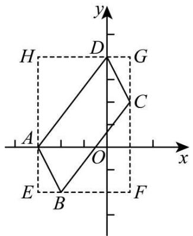

text_image

y
H D G
A C
O x
E B F

$$
\begin{array}{l} \therefore E (- 3, - 2), F (1, - 2), G (1, 4), H (- 3, 4), \\ \therefore S _ {\text {四边形} A B C D} = S _ {\text {四边形} E F G H} - S _ {\triangle A D H} - S _ {\triangle C D G} - S _ {\triangle A B E} - S _ {\triangle B C E} \\ = 6 \times 4 - \frac {1}{2} \times 1 \times 2 - \frac {1}{2} \times 3 \times 4 - \frac {1}{2} \times 1 \times 2 - \frac {1}{2} \times 3 \times 4 \\ = 2 4 - 1 - 6 - 1 - 6 \\ = 1 0; \\ \end{array}
$$

(2) 证明: $\because OA$ 平分 $\angle DAB$ ,

$$
\therefore \angle O A D = \frac {1}{2} \angle B A D;
$$

$$
\because A B \parallel C D,
$$

$$
\therefore \angle B A D + \angle A D C = 1 8 0 ^ {\circ},
$$

$$
\therefore \frac {1}{2} \angle B A D + \frac {1}{2} \angle A D C = 9 0 ^ {\circ},
$$

$$
\therefore \angle O A D + \frac {1}{2} \angle A D C = 9 0 ^ {\circ},
$$

$$
\because \angle A O D = 9 0 ^ {\circ}, \angle A O D + \angle O A D + \angle O D A = 1 8 0 ^ {\circ},
$$

$$
\therefore \angle O A D + \angle O D A = 9 0 ^ {\circ},
$$

$$
\therefore \angle O D A = \frac {1}{2} \angle A D C,
$$

$$
\therefore O D \text {平分} \angle A D C.
$$