# 第三章 位置与坐标·拔尖卷

# 【北师大版 2024】

考试时间：120 分钟 满分：120 分

姓名：\_\_\_\_ 班级：\_\_\_\_ 考号：\_\_\_\_

考卷信息:

本卷试题共 24 题，单选 10 题，填空 6 题，解答 8 题，满分 120 分，限时 120 分钟，本卷题型针对性较高，覆盖面广，选题有深度，可衡量学生掌握本章内容的具体情况！

# 第I卷

# 一．选择题（共10小题，满分30分，每小题3分）

1. （3 分）（24-25 七年级下·四川绵阳·期末）在平面直角坐标系中，点 $(a,a-2)$ 到x轴的距离为1，则a的值为（）

A. 1

B. $\pm1$

C. 1 或 3

D. 2 或 3

2. （3 分）（24-25 七年级下·河南商丘·期中）若点 $A(3, a)$ 在 $x$ 轴上，则点 $B(a - 1, a + 2)$ 在（）

A. 第一象限

B. 第二象限

C. 第三象限

D. 第四象限

3. （3 分）（24-25 七年级下·湖北武汉·期末）平面直角坐标系中的点 $P(m, 1-2m)$ 一定不在的象限是（）

A. 第一象限

B. 第二象限

C. 第三象限

D. 第四象限

4. （3 分）在平面直角坐标系中，若点 $A(a,-1)$ 与点 $B(4,b)$ 关于x轴对称，则（）

A. a=4, b=-1

B. a=-4, b=1

C. a=-4, b=-1

D. $a = 4, b = 1$

5. （3 分）（24-25 七年级下·陕西宝鸡·期中）在平面直角坐标系中，已知 $AB \parallel y$ 轴，且点A的坐标为 $(m, 2m-1)$ ，点B的坐标为(2,4)，则点A的纵坐标为（）

A. 4

B. 3

C. 0

D.-3

6. （3 分）（24-25 七年级下·北京门头沟·期末）如图，小球起始时位于(3,0)处，沿图中所示方向击球，小球在球桌上的运动轨迹如图所示．如果小球起始时位于(1,0)处，仍按原来的方向击球，小球第 1 次碰到球桌边时，小球的位置是(0,1)，那么小球第 2025 次碰到球桌边时，小球的位置是（）．

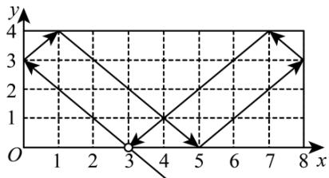

line

| x | y |
|---|---|
| 0 | 3 |
| 1 | 4 |
| 2 | 3 |
| 3 | 0 |
| 4 | 1 |
| 5 | 0 |
| 6 | 1 |
| 7 | 4 |
| 8 | 3 |

A. $(1,0)$

B. $(0,1)$

C. $(7,0)$

D. (8,1)

7. （3 分）（24-25 八年级下·河北沧州·期末）红军长征的胜利，使中国革命转危为安．如图是红军长征路线图，若表示吴起镇会师的点的坐标为(0,3)，表示湘江战役的点的坐标为(1,-3)，则表示会宁会师的点的坐标为（）

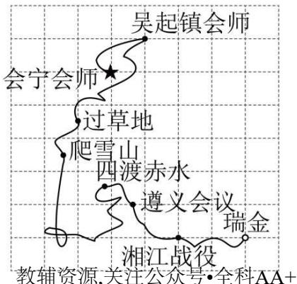

text_image

吴起镇会师
会宁会师
过草地
爬雪山
四渡赤水
遵义会议
瑞金
湘江战役
教辅资源,关注公众号·全科AA+

A. $(2,-1)$

B. $(-1,2)$

C. $(1,2)$

D. $(-3,2)$

8. （3 分）（24-25 七年级下·广东阳江·期中）如图， 在平面直角坐标系中， 点 $A(2,3),B(-2,3),C(-2,-1),D$ (2,-1)，点 $P$ 从点 $A$ 出发，以每秒 2 个单位长度的速度沿 $A \rightarrow B \rightarrow C \rightarrow D \rightarrow A$ 路径循环运动，则第 2025 秒时点 $P$ 的坐标是（）

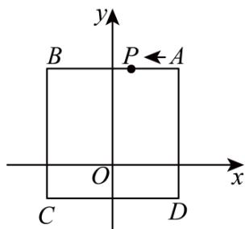

text_image

y
B P ← A
O x
C D

A. $(0,3)$

B. $(2,1)$

C. $(-2,1)$

D. $(0,-1)$

9. （3 分）（24-25 七年级下·新疆喀什·期中）定义：T 是平面直角坐标系中的一点且不在坐标轴上，过点 T 分别向 x 轴、y 轴作垂线段，若两条垂线段的长度的和为 4，则点 T 叫作“垂距点”，例如：图中的点 P, Q 是“垂距点”。若 M(2m-5,11-3m) 是第四象限的点，且点 M 是“垂距点”，则 m 的值为（）

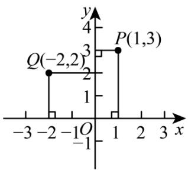

line

| Point | x | y |
|---|---|---|
| Q(-2,2) | -2 | 2 |
| P(1,3) | 1 | 3 |
| Vertical segment between Q(-2,2) and P(1,3) | 1 | 1 |
The chart displays a step function with two vertical segments on the x-axis. The y-axis ranges from -4 to 4. The x-axis spans from -3 to 3. The labels 'x' and 'y' are the horizontal axis positions of the plot.

A. 2

B. 4

C. $\frac{22}{5}$

D. 10

10. （3 分）（24-25 七年级下·广西南宁·期末）如图，在平面直角坐标系中，有等腰直角三角形 $\triangle A_{1}A_{2}A_{3}$ ， $\triangle A_{3}A_{4}A_{5}$ ， $\triangle A_{5}A_{6}A_{7}$ ，…，点 $A_{1}(-2,0)$ ， $A_{2}(-1,-1)$ ， $A_{3}(0,0)$ ，…，则根据图示规律，点 $A_{1020}$ 的坐标是（）

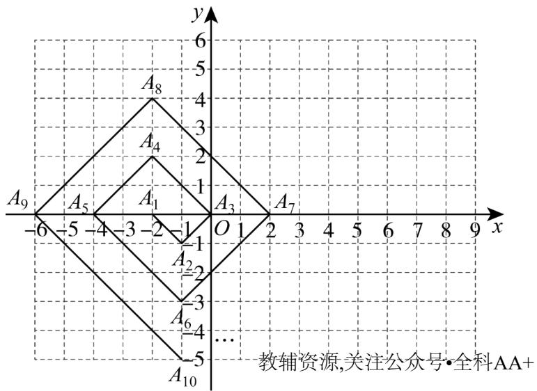

A. (2,510)

B. $(-5,-510)$

C. $(-2,510)$

D. $(-1,-510)$

# 二．填空题（共6小题，满分18分，每小题3分）

11. （3 分）（24-25 七年级下·湖北武汉·期中）方格纸上有 A，B 两点，若以点 A 为原点建立平面直角坐标系，则点 B 的坐标为 $(2,-1)$ 。若以点 B 为原点建立平面直角坐标系，则点 A 的坐标为 \_\_\_\_.

12. （3 分）（24-25 七年级下·湖北黄冈·期中）在平面直角坐标系中，已知点 $P(-3,4)$ ，长度为 3 的线段 $PQ$ 与 $x$ 轴平行，则点 $Q$ 的坐标是 \_\_\_\_.

13. （3 分）（24-25 七年级下·湖北武汉·期中）在平面直角坐标系中，点 $A(2 - a, 3a - 8)$ 到两条坐标轴的距离相等，则 $a$ 的值是

14. （3 分）（24-25 九年级下·江西抚州·期中）DeepSeek公司正在开发一款基于平面直角坐标系下的导航软件．为测试软件的准确性，工程师在坐标系中设置了以下关键点：A(1,6)表示起点，B(5,8)表示终点．如果软件需要在线段AB之间设置一个中转站，且中转站到点A和点B的距离相等，则中转站的坐标为\_\_\_\_．

15. （3 分）（24-25 七年级下·江西上饶·期中）在平面直角坐标系中，点 A 的坐标为 $(m, n)$ ，若 m，n 都为整数，且 mn > 0， $m + n = 4$ ，则点 A 的坐标可能是 \_\_\_\_。

16. （3 分）（24-25 七年级下·安徽阜阳·阶段练习）在平面直角坐标系中，已知点 $M$ 的坐标为 $(2 - t, 2t)$ ，将点 $M$ 到 $x$ 轴的距离记作 $d_{1}$ ，到 $y$ 轴的距离记作 $d_{2}$ .

（1）若t=4，则 $d_{1}+d_{2}=$ \_\_\_\_；  
(2) 若点 $M$ 在第二象限, 且 $m d_{1} - 4 d_{2} = 8$ ( $m$ 为常数), 则 $m$ 的值为

# 第II卷

# 三．解答题（共8小题，满分72分）

17. （6 分）已知点 $P(2n+4, n-1)$ ，试分别根据下列条件，求出点 P 的坐标.

(1)点 P 的纵坐标比横坐标大 3;  
(2)点 P 在 y 轴上;  
(3)点 P 在过点 $A(1,-2)$ 且与 x 轴平行的直线上.

18. （6 分）（24-25 七年级下·河北邯郸·期中）如图，直角坐标系中， $\triangle ABC$ 的顶点都在网格点上，其中， $C$ 点坐标为(1,2).

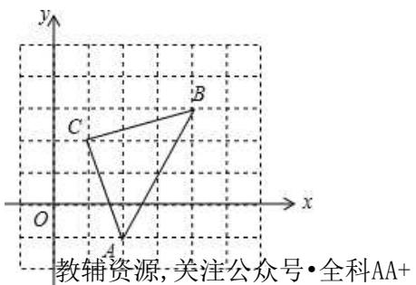

text_image

y
C
B
O
x
A
教辅资源,关注公众号·全科AA+

(1)填空：点A的坐标是 \_ ，点B的坐标是 \_ ；  
(2)将 $\triangle ABC$ 先向左平移2个单位长度, 再向上平移1个单位长度, 得到 $\triangle A'B'C'$ . 请写出 $\triangle A'B'C'$ 的三个顶点坐标;  
(3)求 $\triangle ABC$ 的面积.

19. （8分）（24-25七年级下·江西南昌·期中）对于平面直角坐标系中的任意一点 $P(x,y)$ ，给出如下定义：点 $P_{1}(x+1,2y-1)$ 为P的1号派生点，点 $P_{2}(-y,-x)$ 为P的2号派生点，例如 $P(2,3)$ 的1号派生点为 $P_{1}(3,5)$ ，它的2号派生点为 $P_{2}(-3,-2)$

(1)已知点 $P(2,4)$ ，那么它的1号派生点为\_\_\_\_，2号派生点为\_\_\_\_；  
(2)若将点P上平移1个单位长度，直接分别写出 $P_{1},P_{2}$ 平移方向和距离；  
(3)已知点 $P(-m,2m)$ 连接它的1号派生点 $P_{1}$ 和2号派生点 $P_{2}$ ，若线段 $P_{1}P_{2}$ 行于坐标轴，求m值.

20. （8 分）（24-25 七年级下·山西吕梁·期中）戏曲小组成员利用周末时间去剧团进行实践学习活动，出发前欣欣将各个剧团的位置标注在如图所示的平面直角坐标系中，其中点A表示“对子戏剧团”的位置，坐标为 $(-1.3)$ ，点B表示“咳咳腔剧团”的位置，坐标为 $(2,2)$ .

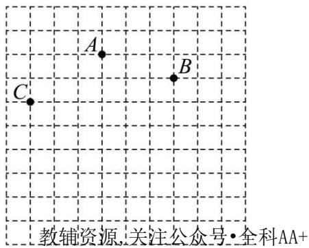

text_image

教辅资源,关注公众号·全科AA+

(1)根据以上信息，请在示意图中画出欣欣建立的平面直角坐标系.  
(2)若“弦子腔剧团”的坐标为(0,-2)，请在平面直角坐标系中标出“弦子腔剧团”的位置，并标注点D.  
(3)若欣欣在标点C（图中已标注）“壶关秧歌剧团”的位置时，横、纵坐标看反了，则正确的点C应在第\_\_\_\_象限.

21. （10 分）（24-25 七年级下·湖北襄阳·期末）在平面直角坐标系中，O 是坐标原点，定义点 A 和点 B 的关联值 [A, B] 如下：若 O，A，B 在一条直线上，[A, B] = 0；若 O，A，B 不在一条直线上，[A, B] = S\_{\triangle OAB}（且 S\_{\triangle OAB} > 0）。已知点 A 坐标为 (4, 0) 点 B 坐标为 (0, 4)，回答下列问题：

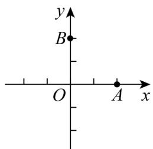

text_image

y
B
O
A
x

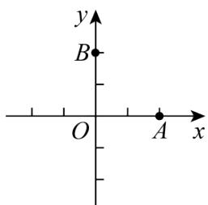

text_image

y
B
O
A
x

(1)[A,B]=\_\_\_\_;   
(2)若 $[P,A]=0,\quad[P,B]=1$ ，则点P坐标为；  
(3)若 $[P,A]=2[P,B]$ ，且点P的纵坐标为2，求点P的坐标；  
(4)若点A和点B的关联值满足 $[P,A]=[P,B]$ ，请在平面直角坐标系中画出满足条件的所有的点P形成的路径图形.

22. （10 分）（24-25 八年级上·安徽六安·期中）如图，在平面直角坐标系中，第一次将 $\triangle OAB$ 变换成 $\triangle OA_{1}B_{1}$ ，第二次将 $\triangle OA_{1}B_{1}$ 变换成 $\triangle OA_{2}B_{2}$ ，第三次将 $\triangle OA_{2}B_{2}$ 变换成 $\triangle OA_{3}B_{3}$ ；已知变换过程中各点坐标分别为 $A(1,3)$ ， $A_{1}(2,3)$ ， $A_{2}(4,3)$ ， $A_{3}(8,3)$ ， $B(2,0)$ ， $B_{1}(4,0)$ ， $B_{2}(8,0)$ ， $B_{3}(16,0)$ .

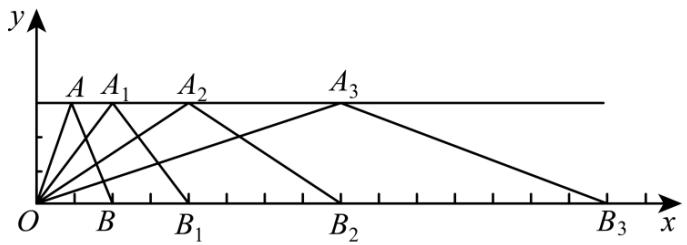

text_image

y
A A₁ A₂ A₃
O B B₁ B₂ B₃ x

(1)观察每次变换前后的三角形有何变化, 找出规律, 按此规律再将 $\triangle OA_{3}B_{3}$ 变换成 $\triangle OA_{4}B_{4}$ , 则 $A_{4}$ 的坐标为 , $B_{4}$ 的坐标为 , $\triangle OA_{4}B_{4}$ 的面积为 .  
(2)按以上规律将 $\triangle OAB$ 进行 $n$ 次变换得到 $\triangle OA_{n}B_{n}$ ，则 $A_{n}$ 的坐标为 $\_$ ， $B_{n}$ 的坐标为 $\_$ ；  
(3) $\triangle OA_{n}B_{n}$ 的面积为\_\_\_\_

23. （12 分）（24-25 七年级下·辽宁铁岭·期中）（项目式学习·数学与生活融合）根据素材，完成活动任务.
探究方阵中各位置点的坐标表示

素材一：近日，振兴中学计划举办建校70周年庆活动，七年级的数学项目式小组成员通过商讨决定进行方阵变换表演，由60人参与，组成5×12的长方形方阵。每人戴一顶红色的帽子，入场时全部戴上，然后，摆出建校时间“1945”方阵；对应37位同学戴红色帽子站立．其余同学摘掉帽子蹲下，保持方阵队形30秒后，变换到现在时间“2025”方阵；对应45位同学戴红色帽子站立，其余同学摘掉帽子蹲下.

素材二：1945 方阵图

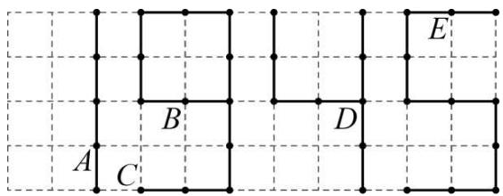

text_image

A
B
C
D
E

解决问题

任务一：若同学A的位置用坐标表示为 $(-4,1)$ ，同学B的位置用坐标表示为 $(-2,2)$ ，请建立合适的平面直角坐标系，并分别用坐标表示出同学C、D、E的位置；

任务二：如果在“1945”方阵的基础上变换出“2025”方阵，要求起立和蹲下变换的同学尽可能少，请在任务一的基础上直接写出变化过程中需要站立和蹲下的同学对应的位置坐标.

24. （12 分）（24-25 七年级下·甘肃金昌·期中）如图 1，在平面直角坐标系中，线段 $AB$ 的两个端点坐标分别为 $A(0,2)$ ， $B(-1,0)$ ，将线段 $AB$ 向右平移 3 个单位长度，得到线段 $DC$ ，连接 $AD$ .

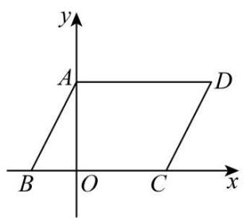

text_image

y
A
D
B O C x

图1

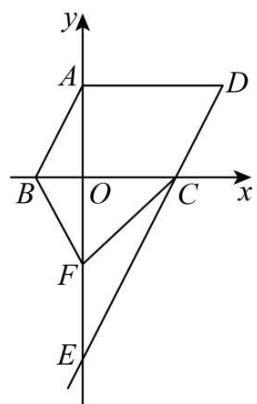

text_image

y
A
D
B
O
C
x
F
E

图2

(1)直接写出点 C、点 D 的坐标.

(2)如图 2, 延长 $DC$ 交 $y$ 轴于点 $E$ , 点 $F$ 是线段 $OE$ 上的一个动点, 连接 $CF$ 、 $BF$ , 猜想 $\angle ABF$ 、 $\angle BFC$ 、 $\angle ECF$ 之间的数量关系, 并说明理由.

(3)在坐标轴上是否存在点 $P$ 使三角形 $PBD$ 的面积与四边形 $ABCD$ 的面积相等？若存在，请直接写出点 $P$ 的坐标；若不存在，试说明理由.