# 第三章 位置与坐标·拔尖卷

# 【北师大版 2024】

参考答案与试题解析

# 第I卷

# 一．选择题（共10小题，满分30分，每小题3分）

1. （3 分）（24-25 七年级下·四川绵阳·期末）在平面直角坐标系中，点 $(a,a-2)$ 到x轴的距离为1，则a的值为（）

A. 1

B. $\pm1$

C. 1 或 3

D. 2 或 3

【答案】C

【分析】根据题意，得 $|a-2|=1$ ，去绝对值，解答即可.

本题考查了点到坐标轴的距离，正确理解距离的内涵是解题的关键.

【详解】解：点 $(a,a-2)$ 到x轴的距离为1，

则 $|a-2|=1$ ，

故a=3或a=1，

故选：C.

2. （3 分）（24-25 七年级下·河南商丘·期中）若点 $A(3, a)$ 在 $x$ 轴上，则点 $B(a - 1, a + 2)$ 在（）

A. 第一象限

B. 第二象限

C. 第三象限

D. 第四象限

【答案】B

【分析】本题主要考查了在 x 轴上的点的坐标特点，判断点所在的象限，在 x 轴上的点的纵坐标为 0，据此可得 a 的值，则可求出点 B 的坐标，由此可得答案.

【详解】解：∵点 $A(3,a)$ 在x轴上，

$$
\therefore a = 0,
$$

$$
\therefore a - 1 = - 1, \quad a + 2 = 2,
$$

$$
\therefore B (- 1, 2),
$$

$\therefore B(-1,2)$ 在第二象限，

故选：B.

3. （3 分）（24-25 七年级下·湖北武汉·期末）平面直角坐标系中的点 $P(m, 1-2m)$ 一定不在的象限是（）

A. 第一象限

B. 第二象限

C. 第三象限

D. 第四象限

【答案】C

【分析】本题主要考查平面直角坐标系中点的坐标与象限的关系，以及如何通过代数不等式判断点可能所在的象限．明确各象限坐标符号特征:第一象限 $(+,+)$ 第二象限 $(-,+)$ ，第三象限 $(-,-)$ ，第四象限 $(+,-)$ ．分析点 $P(m,1-2m)$ 的坐标符号，分别假设点P在四个象限，建立不等式组，判断是否存在解．若某个象限对应的不等式组无解，则点P一定不在该象限.

【详解】解：假设点 P 在第一象限：

则m>0且1-2m>0,

解不等式:0<m< $\frac{1}{2}$ .

（存在解，例如 $m=\frac{1}{4}$ ）.

假设点 P 在第二象限

则m<0且1-2m>0，

解不等式:m<0.

（存在解，例如m=-1）.

假设点 P 在第三象限

则m<0且1-2m<0,

解不等式:m<0 且 $m>\frac{1}{2}$ ，矛盾，无解.

假设点 P 在第四象限:

则m>0且1-2m<0，

解不等式: $m>\frac{1}{2}$ .

（存在解，例如m=1）.

综上，点 $P(m,1-2m)$ 一定不在第三象限.

故选：C.

4. （3 分）在平面直角坐标系中，若点 $A(a,-1)$ 与点 $B(4,b)$ 关于x轴对称，则（）

A. a=4, b=-1

B. a=-4, b=1

C. a=-4, b=-1

D. a=4, b=1

【答案】D

【分析】本题考查的知识点是关于x轴对称的点的特征，解题关键是熟练掌握关于x轴对称的点的特征.由“关于x轴对称点的坐标，横坐标不变，纵坐标与该点纵坐标互为相反数”即可得解.

【详解】解：∵关于x轴对称点的坐标，横坐标不变，纵坐标与该点纵坐标互为相反数，

∴若点 $A(a,-1)$ 与点 $B(4,b)$ 关于x轴对称，则a=4，b=1.

故选：D.

5. （3 分）（24-25 七年级下·陕西宝鸡·期中）在平面直角坐标系中，已知 $AB \parallel y$ 轴，且点A的坐标为 $(m, 2m-1)$ ，点B的坐标为(2,4)，则点A的纵坐标为（）

A. 4

B. 3

C. 0

D. -3

【答案】B

【分析】本题主要考查了坐标与图形，平行于 y 轴的直线上的点的横坐标相同，据此求出 m 的值即可得到答案.

【详解】解：∵AB∥y轴，点A的坐标为 $(m,2m-1)$ ，点B的坐标为 $(2,4)$ ，

$$
\therefore m = 2,
$$

$$
\therefore 2 m - 1 = 2 \times 2 - 1 = 3,
$$

∴点A的纵坐标为3，

故选：B.

6. （3 分）（24-25 七年级下·北京门头沟·期末）如图，小球起始时位于(3,0)处，沿图中所示方向击球，小球在球桌上的运动轨迹如图所示．如果小球起始时位于(1,0)处，仍按原来的方向击球，小球第 1 次碰到球桌边时，小球的位置是(0,1)，那么小球第 2025 次碰到球桌边时，小球的位置是（）．

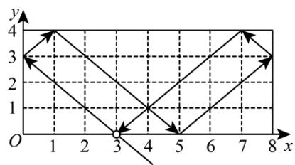

line

| x | y |
|---|---|
| 0 | 3 |
| 1 | 4 |
| 2 | 3 |
| 3 | 1 |
| 4 | 1 |
| 5 | 1 |
| 6 | 2 |
| 7 | 4 |
| 8 | 3 |

A. $(1,0)$

B. $(0,1)$

C. $(7,0)$

D. (8,1)

【答案】C

【分析】本题考查坐标位置规律，根据题意，画出相应的运动轨迹，发现点所在的位置变化规律：小球经过6次一个循环回到出发位置，即可得到小球第2025次碰到球桌边时，小球的位置．解答本题的关键是根据题意，作出图形，得到点的坐标位置变化规律，利用数形结合的思想解答.

【详解】解：根据题意，得到小球运动轨迹，如图所示：

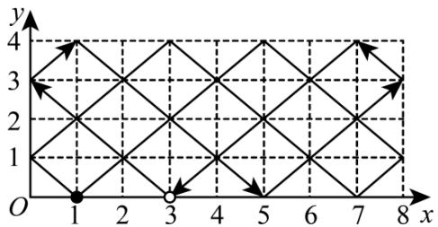

text_image

y
4
3
2
1
O
1
2
3
4
5
6
7
8
x

小球第一次碰到球桌边时，小球的位置是(0,1);

小球第二次碰到球桌边时，小球的位置是(3,4);

小球第三次碰到球桌边时，小球的位置是(7,0);

小球第四次碰到球桌边时，小球的位置是(8,1);

小球第五次碰到球桌边时，小球的位置是(5,4);

小球第六次碰到球桌边时，小球的位置是(0,1);

...

按照上述情况，得到规律是小球经过 6 次一个循环回到出发位置，

$$
\because 2 0 2 5 = 6 \times 3 3 7 + 3,
$$

∴小球第 2025 次碰到球桌边，与小球第三次碰到球桌边时的位置相同，是(7,0)，

故选：C.

7. （3 分）（24-25 八年级下·河北沧州·期末）红军长征的胜利，使中国革命转危为安。如图是红军长征路线图，若表示吴起镇会师的点的坐标为(0,3)，表示湘江战役的点的坐标为(1,-3)，则表示会宁会师的点的坐标为（）

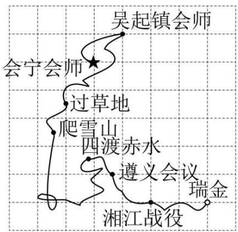

text_image

吴起镇会师
会宁会师
过草地
爬雪山
四渡赤水
遵义会议
瑞金
湘江战役

A. $(2, - 1)$

B. $(-1,2)$

C. $(1,2)$

D. $(-3,2)$

【答案】B

【分析】本题主要考查了坐标确定位置，正确得出原点位置是解题关键。由已知点建立平面直角坐标系，得出原点位置，即可得出答案。

【详解】解：建立平面直角坐标系，如图所示：

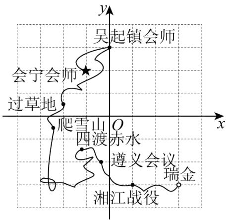

text_image

吴起镇会师
会宁会师
过草地
爬雪山
四渡
赤水
遵义会议
瑞金
湘江战役

表示会宁会师的点的坐标为 $(-1,2)$ ;

故选：B

8. （3 分）（24-25 七年级下·广东阳江·期中）如图，在平面直角坐标系中，点 $A(2,3), B(-2,3), C(-2,-1), D(2,-1)$ ，点 $P$ 从点 $A$ 出发，以每秒 2 个单位长度的速度沿 $A \rightarrow B \rightarrow C \rightarrow D \rightarrow A$ 路径循环运动，则第 2025 秒时点 $P$ 的坐标是（）

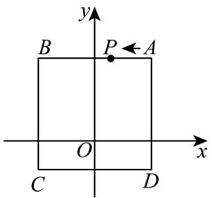

text_image

y
B P ← A
O x
C D

A. $(0,3)$

B. $(2,1)$

C. $(-2,1)$

D. $(0,-1)$

【答案】A

【分析】本题主要考查了坐标与图形，数形结合是正确解答此题的关键．根据点的坐标得到AB=CD=3，AD=BC=4，则四边形ABCD的周长为 $2AB+2BC=16$ ，再求出点P运动2025秒所走的路程为4050个单位长度， $4050\div16=253\cdots2$ ，则点P相当于运动了253圈后又运动2个单位长度，据此可得答案.

【详解】解：∵A(2,3),B(-2,3),C(-2,-1),D(2,-1),

$$
\therefore A B = C D = 4, \quad A D = B C = 4,
$$

∴四边形ABCD的周长为 $2AB+2BC=16$ ,

∵点 P 从点 A 出发以 2 个单位长度/秒的速度沿 $A \rightarrow B \rightarrow C \rightarrow D \rightarrow A$ 循环运动，

∴点 P 运动 2025 秒所走的路程为 $2025 \times 2 = 4050$ 个单位长度， $4050 \div 16 = 253 \cdots 2$ ，

∴点 P 相当于运动 253 圈后又运动 2 个单位长度，

即第 2025 秒点所在的位置是 $(0,3)$ ,

故选：A.

9. （3 分）（24-25 七年级下·新疆喀什·期中）定义：T 是平面直角坐标系中的一点且不在坐标轴上，过点 T 分别向 x 轴、y 轴作垂线段，若两条垂线段的长度的和为 4，则点 T 叫作“垂距点”，例如：图中的点 P, Q 是“垂距点”。若 M(2m-5,11-3m) 是第四象限的点，且点 M 是“垂距点”，则 m 的值为（）

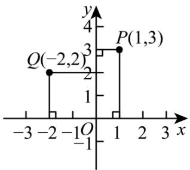

line

| Point | x | y |
|---|---|---|
| Q(-2,2) | -2 | 2 |
| P(1,3) | 1 | 3 |
| Vertical segment between Q(-2,2) and P(1,3) | 1 | 1 |
The chart displays a step function with two vertical segments on the x-axis. The y-axis ranges from -4 to 4. The x-axis spans from -3 to 3. The labels for x and y are explicitly provided.

A. 2

B. 4

C. $\frac{22}{5}$

D. 10

【答案】B

【分析】本题考查新定义，根据新定义正确列出方程是解题的关键．根据 $M(2m-5,11-3m)$ 是第四象限内的点，得出点M到x轴的距离为3m-11，点M到y轴的距离为2m-5，根据点M是“垂距点”，得出 $3m-11+2m-5=4$ ，解方程即可.

【详解】解：∵M(2m-5,11-3m)是第四象限内的点，

∴点 M 到 x 轴的距离为 3m-11，点 M 到 y 轴的距离为 2m-5，

∵点M是“垂距点”，

$$
\therefore 3 m - 1 1 + 2 m - 5 = 4,
$$

解得：m=4，

故选：B.

10. （3 分）（24-25 七年级下·广西南宁·期末）如图，在平面直角坐标系中，有等腰直角三角形 $\triangle A_{1}A_{2}A_{3}$ ， $\triangle A_{3}A_{4}A_{5}$ ， $\triangle A_{5}A_{6}A_{7}$ ，…，点 $A_{1}(-2,0)$ ， $A_{2}(-1,-1)$ ， $A_{3}(0,0)$ ，…，则根据图示规律，点 $A_{1020}$ 的坐标是（）

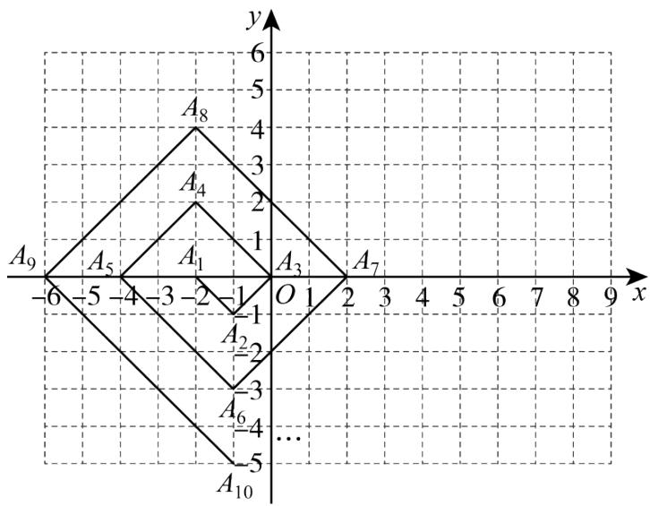

text_image

A₉
-6 -5 -4 -3 -2 -1 O 1 2 3 4 5 6 7 8 9 x
A₁₀
A₆
A₂
A₃
A₄
A₈
6
5
4
3
2
1
0
-1
-2
-3
-4
-5

A. (2,510)

B. $(-5,-510)$

C. $(-2,510)$

D. $(-1,-510)$

【答案】C

【分析】本题考查点的坐标变化规律，抓住点 $A_{4n}$ 坐标的变化规律是解题的关键．依次求出点 $A_{i}(i$ 为正整数）的坐标，发现规律即可解决问题.

【详解】解：由题知，点 $A_{1}$ 的坐标为(-2,0)，点 $A_{2}$ 的坐标为(-1,-1)，点 $A_{3}$ 的坐标为(0,0)，点 $A_{4}$ 的坐标为(-2,2)，点 $A_{5}$ 的坐标为(-4,0)，点 $A_{6}$ 的坐标为(-1,-3)，点 $A_{7}$ 的坐标为(2,0)，点 $A_{8}$ 的坐标为(-2,4)…，

由此可知，点 $A_{4n}$ 的坐标为 $(-2,2n)$ ，(n为正整数)，

又∵1020÷4=255，

$$
\therefore 2 \times 2 5 5 = 5 1 0,
$$

∴点 $A_{1020}$ 的坐标为(-2,510).

故选：C

# 二．填空题（共6小题，满分18分，每小题3分）

11. （3 分）（24-25 七年级下·湖北武汉·期中）方格纸上有 A，B 两点，若以点 A 为原点建立平面直角坐标系，则点 B 的坐标为 $(2,-1)$ 。若以点 B 为原点建立平面直角坐标系，则点 A 的坐标为 \_\_\_\_.

【答案】(-2,1)

【分析】本题主要考查了坐标系中原点的变化，求点的坐标变化，关键在于理解原点平移后点的坐标与原坐标的关系.

【详解】解：方格纸上有 A, B 两点，若以点 A 为原点建立平面直角坐标系，则点 B 的坐标为 $(2,-1)$ . 若以点 B 为原点建立平面直角坐标系，则点 A 的坐标为 $(-2,1)$ .

故答案为： $(-2,1)$

12. （3 分）（24-25 七年级下·湖北黄冈·期中）在平面直角坐标系中，已知点 $P(-3,4)$ ，长度为 3 的线段 PQ

与 x 轴平行，则点 Q 的坐标是 \_\_\_\_.

【答案】(-6,4)或(0,4)

【分析】本题考查了坐标与图形．先根据点P的坐标为 $P(-3,4)$ ，且 $PQ\parallel x$ 轴，得出点Q和点P的纵坐标相同，为4，再根据PQ=3，分两种情况当点Q在点P的左边时，当点Q在点P的右边时，分别求出横坐标即可得解.

【详解】解：∵点P的坐标为 $(-3,4)$ ，且 $PQ\|x$ 轴，

∴点Q和点P的纵坐标相同，为4，

$$
\because P Q = 3,
$$

∴当点Q在点P的左边时，横坐标为-3-3=-6，此时点Q的坐标是(-6,4)，

当点Q在点P的右边时，横坐标为 $-3+3=0$ ，此时点Q的坐标是 $(0,4)$ ，

综上所述，点Q的坐标为 $(-6,4)$ 或 $(0,4)$ ，

故答案为： $(-6,4)$ 或 $(0,4)$ .

13. （3 分）（24-25 七年级下·湖北武汉·期中）在平面直角坐标系中，点 $A(2 - a, 3a - 8)$ 到两条坐标轴的距离相等，则 $a$ 的值是 \_\_\_\_.

【答案】 $\frac{5}{2}$ 或3

【分析】本题考查点到坐标轴的距离，点到 x 轴的距离等于纵坐标的绝对值，点到 y 轴的距离等于横坐标的绝对值，由此可得 $\left|2-a\right|=\left|3a-8\right|$ ，分情况讨论即可.

【详解】解：∵点A(2-a,3a-8)到两条坐标轴的距离相等，

$$
\therefore | 2 - a | = | 3 a - 8 |,
$$

$$
\therefore 2 - a = 3 a - 8 \text {或} 2 - a = 8 - 3 a
$$

解得 $a=\frac{5}{2}$ 或a=3，

故答案为： $\frac{5}{2}$ 或3.

14. （3 分）（24-25 九年级下·江西抚州·期中）DeepSeek公司正在开发一款基于平面直角坐标系下的导航软件．为测试软件的准确性，工程师在坐标系中设置了以下关键点：A(1,6)表示起点，B(5,8)表示终点．如果软件需要在线段AB之间设置一个中转站，且中转站到点A和点B的距离相等，则中转站的坐标为\_\_\_\_．

【答案】(3,7)

【分析】本题主要考查了中点坐标公式，熟练掌握中点坐标公式，是解题的关键．设中转站的坐标为 $(x,y)$ ，根据中点坐标公式进行求解即可.

【详解】解：设中转站的坐标为 $(x, y)$ ，

∵中转站到点 A 和点 B 的距离相等，

∴中转站为AB的中点，

$$
\therefore x = \frac {1 + 5}{2} = 3, y = \frac {6 + 8}{2} = 7,
$$

∴中转站的坐标为(3,7).

故答案为：(3,7).

15. （3 分）（24-25 七年级下·江西上饶·期中）在平面直角坐标系中，点 A 的坐标为 $(m, n)$ ，若 m，n 都为整数，且 mn > 0， $m + n = 4$ ，则点 A 的坐标可能是 \_\_\_\_.

【答案】(1,3)或(2,2)或(3,1)

【分析】本题考查了求平面直角坐标系中点的坐标.

先根据mn>0得到m，n同号，再根据 $m+n=4$ 得到m，n均为正数，最后列出所有情况即可.

【详解】∵mn>0，

∴m，n 同号.

$$
\because m + n = 4,
$$

∴m，n均为正数.

∵m，n都为整数，

$\therefore\left\{\begin{aligned}m=1\\ n=3\end{aligned}\right.$ 或 $\left\{\begin{aligned}m=2\\ n=2\end{aligned}\right.$ 或 $\left\{\begin{aligned}m=3\\ n=1\end{aligned}\right.$

∴点 A 的坐标可能是 $(1,3)$ 或 $(3,1)$ 或 $(2,2)$ .

故答案为：(1,3)或(2,2)或(3,1).

16. （3 分）（24-25 七年级下·安徽阜阳·阶段练习）在平面直角坐标系中，已知点 $M$ 的坐标为 $(2 - t, 2t)$ ，将点 $M$ 到 $x$ 轴的距离记作 $d_{1}$ ，到 $y$ 轴的距离记作 $d_{2}$ .

（1）若t=4，则 $d_{1}+d_{2}=$ \_\_\_\_；

（2）若点M在第二象限，且 $md_{1}-4d_{2}=8$ （m为常数），则m的值为\_\_\_\_.

【答案】 10 2

【分析】本题主要考查了点到坐标轴的距离，熟知点到坐标轴的距离的定义是解题的关键.

（1）点到 x 轴的距离为该点纵坐标的绝对值，点到 y 轴的距离为该点横坐标的绝对值，则 $d_{1}=|2t|$ ， $d_{2}=|2-t|$ ，据此代入 t 的值求解即可；

（2）第二象限内的点横坐标为负，纵坐标为正，据此可得 $d_{1}=2t,\quad d_{2}=t-2$ ，再根据 $md_{1}-4d_{2}=8$ 建立方程求解即可.

【详解】（1）∵点M的坐标为 $(2-t,2t)$ ，将点M到x轴的距离记作 $d_{1}$ ，到y轴的距离记作 $d_{2}$ ，

$$
\therefore d _ {1} = | 2 t |, \quad d _ {2} = | 2 - t |,
$$

$$
\because t = 4,
$$

$$
\therefore d _ {1} = | 2 t | = 2 \times 4 = 8, \quad d _ {2} = | 2 - t | = | 2 - 4 | = 2,
$$

$$
\therefore d _ {1} + d _ {2} = 8 + 2 = 1 0,
$$

故答案为：10.

(2)∵点M在第二象限，

$$
\therefore 2 - t <   0, \quad 2 t > 0,
$$

$$
\therefore d _ {1} = | 2 t | = 2 t, \quad d _ {2} = | 2 - t | = t - 2,
$$

$$
\because m d _ {1} - 4 d _ {2} = 8,
$$

$$
\therefore m \times 2 t - 4 \times (t - 2) = 8,
$$

解得m=2，

故答案为：2.

# 第II卷

# 三. 解答题（共8小题，满分72分）

17. （6 分）已知点 $P(2n+4,n-1)$ ，试分别根据下列条件，求出点 P 的坐标.

(1)点 P 的纵坐标比横坐标大 3;  
(2)点 P 在 y 轴上;  
(3)点 P 在过点 $A(1,-2)$ 且与 x 轴平行的直线上.

【答案】(1)(-12,-9)

(2)(0,-3)   
(3)(2,-2)

【分析】本题考查了坐标与图形性质，点的坐标，一元一次方程的应用，用到的知识点为：y 轴上的点的横坐标为 0；平行于 x 轴的直线上的点的横坐标相等.

（1）根据点 P 的纵坐标比横坐标大 3 列出方程 m-1=0，进而求解即可；  
(2) 根据点 $P$ 在 $y$ 轴上列出方程 $2n + 4 = 0$ , 进而求解即可;  
（3）根据点 P 在过 $A(1,-2)$ 且与 x 轴平行的直线上列出方程 n-1=-2，进而求解即可.

【详解】（1）解：根据题意得： $n-1-(2n+4)=3$ ，

解得n=-8，

$$
\therefore 2 n + 4 = - 1 6 + 4 = - 1 2, \quad n - 1 = - 8 - 1 = - 9,
$$

∴P 点的坐标为 $(-12,-9)$ ;

(2) 解: 根据题意得: $2n + 4 = 0$ ,

解得n=-2，

$$
\therefore n - 1 = - 3,
$$

∴P 点的坐标为 $(0,-3)$ ;

（3）解：根据题意得：n-1=-2，

解得n=-1，

$$
\therefore 2 n + 4 = 2,
$$

∴P 点的坐标为(2,-2).

18. （6 分）（24-25 七年级下·河北邯郸·期中）如图，直角坐标系中， $\triangle ABC$ 的顶点都在网格点上，其中， $C$ 点坐标为(1,2).

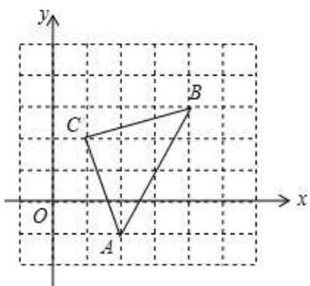

text_image

y
C
B
O
A
x

(1)填空：点 $A$ 的坐标是 $\_$ ，点 $B$ 的坐标是 $\_$ ；

(2)将 $\triangle ABC$ 先向左平移2个单位长度, 再向上平移1个单位长度, 得到 $\triangle A'B'C'$ . 请写出 $\triangle A'B'C'$ 的三个顶点坐标;

(3)求 $\triangle ABC$ 的面积.

【答案】(1)(2,-1); (4,3)

(2)作图见解析； $A'(0,0)$ ， $B'(2,4)$ ， $C'(-1,3)$

(3)5

【分析】本题考查作图—平移变换，

(1) 根据平面直角坐标系及 $\triangle ABC$ 所在的位置可得答案;

(2) 根据平移的性质作图, 即可得出答案;

(3) 利用 $\triangle ABC$ 所在的长方形的面积减去它周围三个三角形的面积即可;

掌握平移的性质是解题的关键.

【详解】（1）解：由图可得： $A(2,-1)$ ; $B(4,3)$ ,

故答案为： $(2,-1)$ ; $(4,3)$ ;

(2) 如图, $\triangle A'B'C'$ 即为所作,

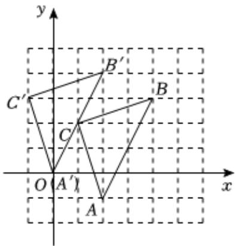

text_image

y
B'
C'
B
C
O A'
A
x

由图可得： $A'(0,0)$ ， $B'(2,4)$ ， $C'(-1,3)$ ;

(3) $\because 3 \times 4 - \frac{1}{2} \times 1 \times 3 - \frac{1}{2} \times 1 \times 3 - \frac{1}{2} \times 2 \times 4 = 5,$

$\therefore\triangle ABC$ 的面积为5.

19. （8分）（24-25七年级下·江西南昌·期中）对于平面直角坐标系中的任意一点 $P(x,y)$ ，给出如下定义：

点 $P_{1}(x+1,2y-1)$ 为P的1号派生点，点 $P_{2}(-y,-x)$ 为P的2号派生点，例如 $P(2,3)$ 的1号派生点为 $P_{1}(3,5)$ ，它的2号派生点为 $P_{2}(-3,-2)$

(1)已知点 $P(2,4)$ ，那么它的1号派生点为\_\_\_\_，2号派生点为\_\_\_\_；

(2)若将点P上平移1个单位长度，直接分别写出 $P_{1},P_{2}$ 平移方向和距离；

(3)已知点 $P(-m,2m)$ 连接它的1号派生点 $P_{1}$ 和2号派生点 $P_{2}$ ，若线段 $P_{1}P_{2}$ 行于坐标轴，求m值.

【答案】(1)(3,7),(-4,-2);

(2) $P_{1}$ 向上平移2个单位长度， $P_{2}$ 向左平移1个单位

(3) $m=\frac{1}{3}$ 或-1

【分析】本题考查坐标与平移，点的变换，熟练掌握新定义，是解题的关键：

（1）根据新定义，进行求解即可；

(2) 求出平移后点 $P$ 的坐标和对应的派生点的坐标进行判断即可;

（3）先根据新定义，求出点 $P_{1}$ 和点 $P_{2}$ 的坐标，分 $P_{1}P_{2}\|x$ 轴和 $P_{1}P_{2}\|y$ 轴，两种情况，进行求解即可.

【详解】（1）解：∵P(2,4)，

$\therefore P_{1}(2 + 1,2\times 4 - 1)$ ，即： $P_{1}(3,7)$ ， $P_{2}(-4, - 2)$

(2) $\because P(x,y)$ ,

∴将点P上平移1个单位长度得到 $(x,y+1)$ ,

此时对应的 $P_{1}[x+1,2(y+1)-1]$ ，即 $P_{1}(x+1,2y+1)$ ， $P_{2}(-y-1,x)$ ，

∴ $P_{1}$ 向上平移了 $2y+1-(2y-1)=2$ 个单位， $P_{2}$ 向左平移了1个单位；

(3) $\because P(-m,2m)$ ,

$$
\therefore P _ {1} (- m + 1, 4 m - 1), P _ {2} (- 2 m, m),
$$

当 $P_{1}P_{2}\|x$ 轴时，则：4m-1=m，解得： $m=\frac{1}{3}$ ;

当 $P_{1}P_{2}\|y$ 轴时，则： $-m+1=-2m$ ，解得：m=-1；

综上： $m=\frac{1}{3}$ 或-1.

20. （8 分）（24-25 七年级下·山西吕梁·期中）戏曲小组成员利用周末时间去剧团进行实践学习活动，出发前欣欣将各个剧团的位置标注在如图所示的平面直角坐标系中，其中点A表示“对子戏剧团”的位置，坐标为(-1.3)，点B表示“咳咳腔剧团”的位置，坐标为(2,2).

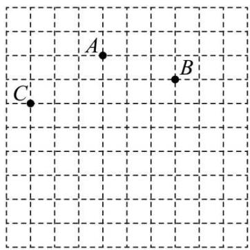

text_image

A
B
C

(1)根据以上信息，请在示意图中画出欣欣建立的平面直角坐标系.

(2)若“弦子腔剧团”的坐标为(0,-2)，请在平面直角坐标系中标出“弦子腔剧团”的位置，并标注点D.

(3)若欣欣在标点C（图中已标注）“壶关秧歌剧团”的位置时，横、纵坐标看反了，则正确的点C应在第\_\_\_\_象限.

【答案】(1)见解析

(2)见解析

(3) 四

【分析】本题考查坐标确定位置，解答本题的关键是明确题意，画出相应的平面直角坐标系.

(1) 根据点 $A$ 表示“对子戏剧团”的位置, 坐标为 $(-1.3)$ , 点 $B$ 表示“咳咳腔剧团”的位置, 坐标为 $(2, 2)$ , 画出相应的平面直角坐标系;

(2) 根据坐标系表示出 $(0, -2)$ , 即可求解;

（3）根据坐标系写出点C点的坐标，结合题意可得正确的点C的坐标，即可求解.

【详解】（1）

解：如图所示，

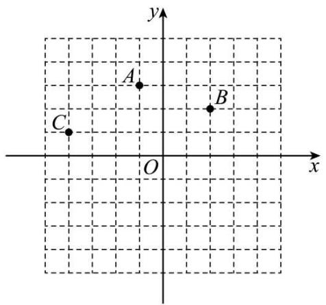

text_image

y
A
B
C
O
x

(2) 解: 如图所示,

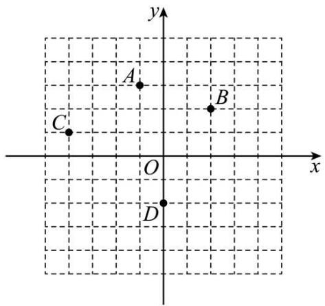

text_image

y
A
B
C
O
x
D

（3）解：C的坐标为 $(-4,1)$ ，

横、纵坐标看反了，

故正确的点C为 $(1,-4)$ ，应在第四象限，

故答案为：四.

21. （10 分）（24-25 七年级下·湖北襄阳·期末）在平面直角坐标系中，O 是坐标原点，定义点 A 和点 B 的关联值 [A, B] 如下：若 O，A，B 在一条直线上，[A, B] = 0；若 O，A，B 不在一条直线上，[A, B] = S\_{\triangle OAB}（且 S\_{\triangle OAB} > 0）。已知点 A 坐标为 (4, 0) 点 B 坐标为 (0, 4)，回答下列问题：

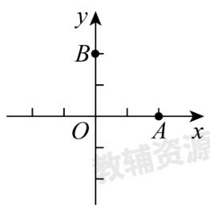

text_image

y
B
O
A
x
教辅资源

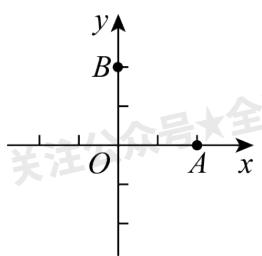

text_image

y
B
O
A
x
关注众是大全

(1)[A,B]=\_\_\_\_;

(2)若 $[P,A]=0,\quad[P,B]=1$ ，则点P坐标为\_\_\_\_；

(3)若 $[P,A]=2[P,B]$ ，且点P的纵坐标为2，求点P的坐标；

(4)若点A和点B的关联值满足 $[P,A]=[P,B]$ ，请在平面直角坐标系中画出满足条件的所有的点P形成的路径图形.

【答案】(1)8

(2) $\left(\frac{1}{2},0\right)$ 或 $\left(-\frac{1}{2},0\right)$ ,   
(3) $P(1,2)$ 或 $P(-1,2)$ .   
(4)见详解

【分析】本题考查了，坐标与图形及坐标系中三角形面积问题，解题的关键是：熟练应用数形结合的思想解决问题.

(1) 根据题中的定义直接回答即可;  
（2）由 $[P,A]=0$ 可得点P在x轴上，由 $[P,B]=1$ 可得 $S_{\triangle POB}=1$ ，据此求出点P的坐标；  
（3）设点 P 的坐标为： $(a,2)$ ，分别求出 $[P,A]=S_{\triangle OPA}=\frac{1}{2}\cdot OA\cdot y_{P}=\frac{1}{2}\times4\times2=4,\quad[P,B]=S_{\triangle OPB}=\frac{1}{2}\cdot OB\cdot x_{P}=\frac{1}{2}\times4|a|=2|a|$ ，根据已知条件可得出 $4=2\times2|a|$ ，解方程即可点 P 的坐标.  
（4）根据 $[P,A]=[P,B]$ 可得点P在一三象限的角平分线，二四象限的角平分线上，据此画出图象即可.

【详解】（1）解：∵点 A 坐标为 $(4,0)$ 点 B 坐标为 $(0,4)$ ,

$$
\therefore [ A, B ] = S _ {\triangle O A B} = \frac {1}{2} \times 4 \times 4 = 8,
$$

故答案为：8，

(2) 解: $\because [P,A]=0,$

∴点 P 在 x 轴上，

$$
\because [ P, B ] = 1
$$

$$
\therefore S _ {\triangle P O B} = 1,
$$

设 $P(t,0)$ ,

$$
\therefore \frac {1}{2} | t | \times 4 = 1,
$$

解得： $t=\pm\frac{1}{2}$ ,

$$
\therefore P \left(\frac {1}{2}, 0\right) \text {或} \left(- \frac {1}{2}, 0\right),
$$

故答案为： $\left(\frac{1}{2},0\right)$ 或 $\left(-\frac{1}{2},0\right)$ ,

（3）解：设点 P 的坐标为： $(a,2)$ ,

$$
[ P, A ] = S _ {\triangle O P A} = \frac {1}{2} \cdot O A \cdot y _ {\mathrm{P}} = \frac {1}{2} \times 4 \times 2 = 4, [ P, B ] = S _ {\triangle O P B} = \frac {1}{2} \cdot O B \cdot x _ {\mathrm{P}} = \frac {1}{2} \times 4 | a | = 2 | a |,
$$

$$
\because [ P, A ] = 2 [ P, B ]
$$

$$
\therefore 4 = 2 \times 2 | a |,
$$

$$
\therefore | a | = 1,
$$

$$
\therefore a = \pm 1,
$$

$\therefore P(1,2)$ 或 $P(-1,2)$ .

（4）解：解：设点 P 坐标为 $(x,y)$ ，则： $[P,A]=2|y|,[P,B]=2|x|$

$$
\therefore | x | = | y |.
$$

$$
\therefore y = x \text {或} y = - x,
$$

即为一三象限和二四象限的角平分线.

画图如下:

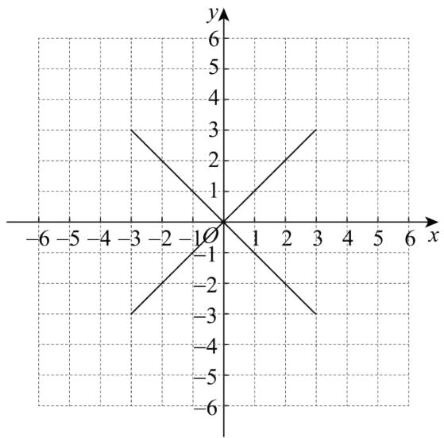

text_image

Graph of a Cartesian coordinate system with x and y axes, showing two intersecting lines forming a star-like pattern.

22. （10 分）（24-25 八年级上·安徽六安·期中）如图，在平面直角坐标系中，第一次将 $\triangle OAB$ 变换成 $\triangle OA_1B_1$ ，第二次将 $\triangle OA_1B_1$ 变换成 $\triangle OA_2B_2$ ，第三次将 $\triangle OA_2B_2$ 变换成 $\triangle OA_3B_3$ ；已知变换过程中各点坐标分别为 $A(1,3)$ ， $A_1(2,3)$ ， $A_2(4,3)$ ， $A_3(8,3)$ ， $B(2,0)$ ， $B_1(4,0)$ ， $B_2(8,0)$ ， $B_3(16,0)$ .

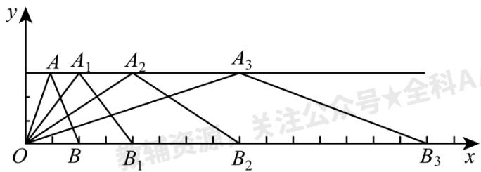

text_image

y
A A₁ A₂ A₃
O B B₁ B₂ B₃ x
关注公众号★全科A

(1)观察每次变换前后的三角形有何变化，找出规律，按此规律再将 $\triangle OA_{3}B_{3}$ 变换成 $\triangle OA_{4}B_{4}$ ，则 $A_{4}$ 的坐标为

\_\_\_\_， $B_{4}$ 的坐标为\_\_\_\_， $\triangle OA_{4}B_{4}$ 的面积为\_\_\_\_。

(2)按以上规律将 $\triangle OAB$ 进行 $n$ 次变换得到 $\triangle OA_{n}B_{n}$ ，则 $A_{n}$ 的坐标为 $\_$ ， $B_{n}$ 的坐标为 $\_$ ；

(3) $\triangle OA_{n}B_{n}$ 的面积为\_\_\_\_

【答案】(1)(16,3)，(32,0)，48

(2) $(2^{n},3)$ , $(2^{n+1},0)$

(3) $3 \times 2^{n}$

【分析】此题考查了坐标规律的探索，解题的关键是根据已知点的坐标，总结出点的坐标规律.

（1）根据 $A_{1}$ 、 $A_{2}$ 、 $A_{3}$ 的坐标求出 $A_{4}$ 的坐标即可，根据 $B_{1}$ 、 $B_{2}$ 、 $B_{3}$ 的坐标求出 $B_{4}$ 的坐标即可；

（2）根据前几个点的坐标，总结出规律分别求出 $A_{n}$ 、 $B_{n}$ 的坐标即可；

（3）根据三角形面积公式以及 $A_{n}$ 、 $B_{n}$ 的坐标，求解即可.

【详解】（1）解：∵ $A_{1}(2,3)$ 、 $A_{2}(4,3)$ 、 $A_{3}(8,3)$ .

$\therefore A_{4}$ 的横坐标为： $2^{4}=16$ ，纵坐标为：3.

故点 $A_{4}$ 的坐标为：(16,3).

又∵ $B_{1}(4,0)$ 、 $B_{2}(8,0)$ 、 $B_{3}(16,0)$ .

$\therefore B_{4}$ 的横坐标为： $2^{5}=32$ ，纵坐标为：0.

故点 $B_{4}$ 的坐标为：(32,0).

$\triangle OA_{4}B_{4}$ 的面积为 $\frac{1}{2} \times 32 \times 3 = 48$

故答案为：(16,3)，(32,0)，48；

（2）解：由 $A_{1}(2,3)$ 、 $A_{2}(4,3)$ 、 $A_{3}(8,3)$ ，可以发现它们各点坐标的关系为横坐标是 $2^{n}$ ，纵坐标都是3.

故 $A_{n}$ 的坐标为： $(2^{n},3)$ ,

由 $B_{1}(4,0)$ 、 $B_{2}(8,0)$ 、 $B_{3}(16,0)$ ，可以发现它们各点坐标的关系为横坐标是 $2^{n+1}$ ，纵坐标都是0.

故 $B_{n}$ 的坐标为： $(2^{n+1},0)$ ;

故答案为： $(2^{n},3)$ ， $(2^{n+1},0)$ ;

（3）解： $\because A_{n}$ 的坐标为： $(2^{n},3)$ ， $B_{n}$ 的坐标为： $(2^{n+1},0)$ ，

∴ $\triangle OA_{n}B_{n}$ 的面积为 $\frac{1}{2}\times2^{n+1}\times3=3\times2^{n}$ .

故答案为： $3 \times 2^{n}$ .

23. （12 分）（24-25 七年级下·辽宁铁岭·期中）（项目式学习·数学与生活融合）根据素材，完成活动任务.
探究方阵中各位置点的坐标表示

素材一：近日，振兴中学计划举办建校70周年庆活动，七年级的数学项目式小组成员通过商讨决定进行方阵变换表演，由60人参与，组成5×12的长方形方阵。每人戴一顶红色的帽子，入场时全部戴上，然后，摆出建校时间“1945”方阵；对应37位同学戴红色帽子站立．其余同学摘掉帽子蹲下，保持方阵队形30秒后，变换到现在时间“2025”方阵；对应45位同学戴红色帽子站立，其余同学摘掉帽子蹲下.

素材二：1945 方阵图

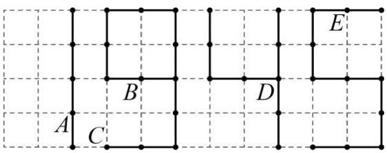

text_image

A
B
C
D
E

解决问题

任务一: 若同学 $A$ 的位置用坐标表示为 $(-4, 1)$ , 同学 $B$ 的位置用坐标表示为 $(-2, 2)$ , 请建立合适的平面直角坐标系, 并分别用坐标表示出同学 $C$ 、 $D$ 、 $E$ 的位置;

任务二：如果在“1945”方阵的基础上变换出“2025”方阵，要求起立和蹲下变换的同学尽可能少，请在任务一的基础上直接写出变化过程中需要站立和蹲下的同学对应的位置坐标.

【答案】任务一：平面直角坐标系见解析， $C(-3,0)$ ， $D(2,2)$ ， $E(4,4)$ ;

任务二：需要站立的同学有 12 位，位置坐标分别为： $(-6,4)$ ， $(-5,4)$ ， $(-5,2)$ ， $(-6,2)$ ， $(-6,1)$ ， $(-6,0)$ ， $(-5,0)$ ， $(-3,1)$ ， $(1,4)$ ， $(0,1)$ ， $(1,0)$ ， $(0,0)$ ；需要蹲下的同学有 4 位，位置坐标分别为： $(-4,1)$ ， $(-2,2)$ ， $(0,3)$ ， $(2,1)$

【分析】本题考查了平面直角坐标系—坐标与位置.

任务一：先建立平面直角坐标系，再根据平面直角坐标系表示出同学C、D、E的位置即可；

任务二：“尽可能少”，即尽可能在原数上进行变化，据此判断即可.

【详解】任务一：建立平面直角坐标系如图所示：

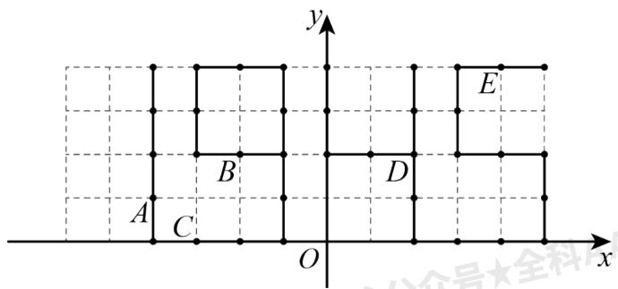

text_image

y
E
B
D
A
C
O
x

$\therefore C(-3,0)$ , $D(2,2)$ , $E(4,4)$ ;

任务二：需要站立的同学有 12 位，位置坐标分别为： $(-6,4)$ ， $(-5,4)$ ， $(-5,2)$ ， $(-6,2)$ ， $(-6,1)$ ， $(-6,0)$ ，$(-5,0)$ , $(-3,1)$ , $(1,4)$ , $(0,1)$ , $(1,0)$ , $(0,0)$ ; 需要蹲下的同学有 4 位, 位置坐标分别为: $(-4,1)$ , $(-2,2)$ , $(0,3)$ , $(2,1)$ .

24. （12 分）（24-25 七年级下·甘肃金昌·期中）如图 1，在平面直角坐标系中，线段 $AB$ 的两个端点坐标分别为 $A(0,2)$ ， $B(-1,0)$ ，将线段 $AB$ 向右平移 3 个单位长度，得到线段 $DC$ ，连接 $AD$ .

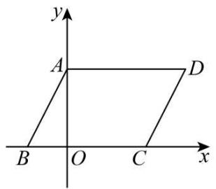

text_image

y
A
D
B
O
C
x

图1

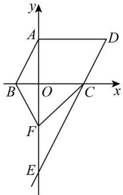

text_image

y
A
D
B
O
C
x
F
E

图2

(1)直接写出点 C、点 D 的坐标.

(2)如图 2, 延长 $DC$ 交 $y$ 轴于点 $E$ , 点 $F$ 是线段 $OE$ 上的一个动点, 连接 $CF$ 、 $BF$ , 猜想 $\angle ABF$ 、 $\angle BFC$ 、 $\angle ECF$ 之间的数量关系, 并说明理由.

(3)在坐标轴上是否存在点 $P$ 使三角形PBD的面积与四边形ABCD的面积相等？若存在，请直接写出点 $P$ 的坐标；若不存在，试说明理由.

【答案】(1) $C(2,0),D(3,2)$

(2) $\angle ABF+\angle BFC-\angle ECF=180^{\circ}$ ，见解析

(3)存在， $(5,0)$ 或 $(-7,0)$ 或 $\left(0,-\frac{5}{2}\right)$ 或 $\left(0,\frac{7}{2}\right)$

【分析】（1）结合点 A, B 的坐标根据平移特点横坐标加上 3，纵坐标不变可得答案；

(2) 作 $FG \parallel AB$ ，根据平移的性质得 $DE \parallel AB \parallel FG$ ，再根据平行线的性质得 $\angle ABF + \angle BFG = 180^\circ$ ， $\angle CFG = \angle ECF$ ，然后根据 $\angle BFC = \angle BFG + \angle CFG$ 可得答案；

（3）先求出平行四边形ABCD的面积，分点P在x轴上时，作出图形根据 $S_{\triangle PBD}=\frac{1}{2}\times2\times BP=6$ ，可得答案；然后根据点P在y轴上时结合 $S_{\triangle PBD}=S_{\triangle ABP}+S_{\triangle ADP}-S_{\triangle ABD}=6$ ，可得答案；最后根据点P在y轴正半轴时，结合 $S_{\triangle PBD}=S_{\triangle ABP}+S_{\triangle ADP}+S_{\triangle ABD}=6$ ，得出答案即可.

【详解】（1）解：∵线段AB的两个端点坐标分别为 $A(0,2),B(-1,0)$ ，将线段AB向右平移3个单位长度，得到线段CD，

$$
\therefore C (2, 0), D (3, 2);
$$

（2）解： $\angle ABF+\angle BFC-\angle ECF=180^{\circ}$ ，理由如下：

过点 F 作 $FG \parallel AB$ ，如图所示：

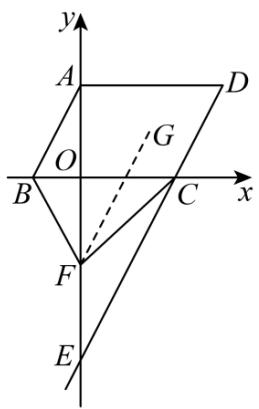

text_image

y
A
D
O
G
B
C
x
F
E

由平移的性质得： $DE \parallel AB$ ，

$$
\therefore D E \parallel A B \parallel F G,
$$

$$
\therefore \angle A B F + \angle B F G = 1 8 0 ^ {\circ}, \angle C F G = \angle E C F.
$$

$$
\because \angle B F C = \angle B F G + \angle C F G,
$$

$$
\therefore \angle B F C = (1 8 0 ^ {\circ} - \angle A B F) + \angle E C F,
$$

即： $\angle ABF+\angle BFC-\angle ECF=180^{\circ}$ ;

（3）解：存在；理由如下：

由平移的性质得： $AB \parallel CD$ ，AB = CD。

$$
\because A (0, 2), B (- 1, 0), C (2, 0), D (3, 2),
$$

$\therefore AD=BC=3,\ AB=CD,\ BC$ 边上的高为2,

$$
\therefore S _ {\text { 四边形 } A B C D} = 2 \times 3 = 6.
$$

①当点 P 在 x 轴上时，如图所示：

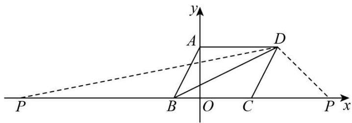

text_image

y
A
D
P
B
O
C
P x

则 $S_{\triangle PBD}=\frac{1}{2}\times2\times BP=6,$

$$
\therefore B P = 6,
$$

∴点 P 的坐标为： $(5,0)$ 或 $(-7,0)$ ;

②当点 P 在 y 轴上时，

设点 P 的坐标为 $(0, y)$ ,

若点 P 在 v 轴负半轴，如图所示:

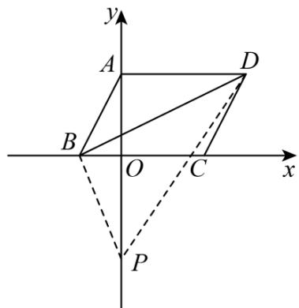

text_image

y
A
D
B
O
C
x
P

则 $S_{\triangle PBD}=S_{\triangle ABP}+S_{\triangle ADP}-S_{\triangle ABD}=6,$

即 $\frac{1}{2}(2-y)\times1+\frac{1}{2}(2-y)\times3-3=6,$

解得： $y=-\frac{5}{2}$

$\therefore P(0, - \frac{5}{2});$

点 P 在 y 轴正半轴时，如图所示:

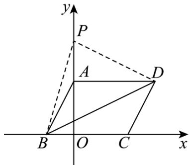

text_image

y
P
A
D
B O C x

则 $S_{\triangle PBD}=S_{\triangle ABP}+S_{\triangle ADP}+S_{\triangle ABD}=6,$

即 $\frac{1}{2}(y-2)\times1+\frac{1}{2}(y-2)\times3+3=6,$

解得： $y=\frac{7}{2}$ ,

$\therefore P \left(0, \frac{7}{2}\right)$ ;

综上所述，点 P 的坐标为： $(5,0)$ 或 $(-7,0)$ 或 $\left(0,-\frac{5}{2}\right)$ 或 $\left(0,\frac{7}{2}\right)$ .

【点睛】本题主要考查了平面直角坐标内线段的平移，平行线的性质，求点的坐标，求三角形和平行四边形的面积，注意分情况讨论，不能丢解.