# 第三章 位置与坐标（举一反三讲义）全章题型归纳

【北师大版 2024】

# 题型归纳

# 【培优篇】....3

【题型1 由点的坐标判断象限】....3

【题型2 由点的坐标特征求值】....3

【题型3 由点到坐标轴的距离求坐标】....3

【题型4 点或图形的平移、对称】....4

【题型5 坐标系中的面积问题】 5

# 【拔尖篇】....6

【题型6 坐标与点的移动规律探究】....6

【题型 7 坐标与图形变换规律探究】....7

【题型8 坐标系中的动点问题探究】....9

【题型9 坐标系中角度关系问题探究】....11

# 举一反三

教辅资源,关注公众号·全科AA+

# 知识点1 有序数对的概念

我们把有顺序的两个数 a 与 b 组成的数对，叫做有序数对，记作 $(a, b)$ .

# 知识点 2 平面直角坐标系及有关概念

# 1. 平面直角坐标系

在平面内，两条互相垂直、原点重合的数轴，组成平面直角坐标系．通常两条数轴分别置于水平位置和竖直位置，取向右与向上的方向分别为两条数轴的正方向.

# 2. 坐标轴

水平的数轴称为 $x$ 轴或横轴，竖直的数轴称为 $y$ 轴或纵轴。二者统称为坐标轴，两坐标轴的交点 $O$ 称为平面直角坐标系的原点。

# 3. 象限

坐标平面被两条坐标轴分成四个部分：右上部分叫做第一象限，其他三个部分按逆时针方向分别叫做第二象限、第三象限、第四象限..

# 知识点 3 建立平面直角坐标系

# 1. 建立平面直角坐标系的步骤

（1）分析条件，选择适当的点作为原点；  
（2）过原点在两个互相垂直的方向上分别作出 x 轴、y 轴；  
（3）确定正方向和单位长度.

2. 常见的建立坐标系的方式：以等腰三角形底边的中点为原点，底边及底边上的高所在直线为坐标轴.

# 知识点 4 平面直角坐标系内点的坐标

# 1. 点的坐标表示

平面内的点可以用一个有序数对来表示．对于平面内的任意一点 P，过点 P 分别向 x 轴、y 轴作垂线，垂足在 x 轴、y 轴上对应的实数 a, b 分别叫做点 P 的横坐标、纵坐标，有序数对 $(a, b)$ 就叫做点 P 的坐标．坐标平面内的点与有序实数对是一一对应的．

# 2. 点的坐标的几何意义

（1）点 $P(a, b)$ 到 x 轴的距离为 $|b|$ ; （2）点 $P(a, b)$ 到 y 轴的距离为 $|a|$ .

# 3. 点的坐标特征

(1) 各象限内点的坐标特征: 第一至第四象限内的点的坐标符号依次为 $(+, +)$ 、 $(-, +)$ 、 $(-, -)$ 、 $(+, -)$ .  
(2) 非象限内点的坐标特征: $x$ 轴上的点的纵坐标为 0; $y$ 轴上的点的横坐标为 0; 原点的横坐标、纵坐标都为 0; 原点既在 $\underline{x}$ 轴上, 又在 $\underline{y}$ 轴上.  
(3) 与坐标轴平行的直线上的点的坐标特征: 与 $x$ 轴平行的直线上的所有点的纵坐标相同, 与 $y$ 轴平行的直线上的所有点的横坐标相同.

# 知识点 5 用坐标表示平移

(1) 点的平移: 点的平移引起坐标的变化规律: 在平面直角坐标中, 将点 $(x, y)$ 向右 (或左) 平移 $a$ 个单位长度, 可以得到对应点 $(x + a, y)$ 或 $(x - a, y)$ ; 将点 $(x, y)$ 向上 (或下) 平移 $b$ 个单位长度, 可以得到对应点 $(x, y + b)$ 或 $(x, y - b)$ .  
(2) 图形的平移: 在平面直角坐标系内, 如果把一个图形各个点的横坐标都加(或减去)一个正数 $a$ , 相应的新图形就是把原图形向右(或向左)平移 $a$ 个单位长度; 如果把它各个点的纵坐标都加(或减去)一个正数 $a$ , 相应的新图形就是把原图形向上(或向下)平移 $a$ 个单位长度.

# 知识点6 轴对称与坐标变化

(1) 关于 $x$ 轴对称的两个点的坐标, 横坐标相同, 纵坐标互为相反数; 反过来, 横坐标相同、纵坐标互为相反数的两个点关于 $\underline{x}$ 轴对称.

(2) 关于 $y$ 轴对称的两个点的坐标, 纵坐标相同, 横坐标互为相反数; 反过来, 纵坐标相同、横坐标互为相反数的两个点关于 $\underline{y}$ 轴对称.

# 【培优篇】

# 【题型1 由点的坐标判断象限】

【例 1】如图是某动物园的平面示意图，若以大门为原点，向右的方向为x轴正方向，向上的方向为y轴正方向建立平面直角坐标系，则驼峰所在的象限是( )

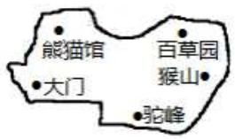

text_image

熊猫馆
百草园
猴山
大门
驼峰

A. 第一象限

B. 第二象限

C. 第三象限

D. 第四象限

【变式 1-1】（24-25 八年级下·重庆·期末）在平面直角坐标系中，点(2025,2025)所在的象限是（）

A. 第一象限

B. 第二象限

C. 第三象限

D. 第四象限

【变式 1-2】（24-25 七年级下·河南许昌·期中）在平面直角坐标系中，点 $P(-a^{2}-1,3)$ 所在的象限是（）

A. 第一象限

B. 第二象限

C. 第三象限

D. 第四象限

【变式 1-3】（24-25 七年级下·吉林·期中）在平面直角坐标系xOy中，点 $A(x,x+1)$ 一定不在第\_\_\_\_象限.

# 【题型 2 由点的坐标特征求值】

【例 2】（24-25 七年级下·重庆潼南·期中）在平面直角坐标系中，若点A(n-2,7)在y轴上，则B(n-3,n+1)在第\_\_\_\_象限.

【变式 2-1】（2025·河北沧州·模拟预测）若第二象限内的点 $P(m,n)$ 满足n-m=2，写出一个满足条件的点P的坐标：\_\_\_\_.

【变式 2-2】（24-25 七年级下·湖南长沙·期末）已知平面直角坐标系中有两点 $M(2m-3,m+1)$ 、 $N(-5,-1)$ ，且 $MN \parallel x$ 轴时，则m= \_\_\_\_.

【变式 2-3】（24-25 八年级下·河北唐山·期中）在平面直角坐标系中，已知点 $P(a,a+1)$ ， $Q(-1,2)$ 。若直线 PQ 与 x 轴平行，则 a 的值为 \_\_\_\_。

# 【题型3 由点到坐标轴的距离求坐标】

【例 3】（24-25 七年级下·河北廊坊·阶段练习）点A(2,m)在第四象限，且到两条坐标轴的距离之和为5，则点A坐标为\_\_\_\_。

【变式 3-1】（24-25 八年级上·全国·单元测试）已知点 $A(3a,2b)$ 在x轴上方，在y轴左侧，则点A到x轴、y轴的距离分别为（）

A. $3a, -2b$

B. $-3a, 2b$

C. $2b, - 3a$

D. $-2b, 3a$

【变式 3-2】已知点 $P(a,b)$ 在第四象限，且点 P 到 x 轴的距离为 5，到 y 轴的距离为 3，则点 P 的坐标为 \_\_\_\_.

【变式 3-3】（24-25 八年级上·安徽安庆·期末）在平面直角坐标系中，已知点 A 的坐标为 $(2-a,2a)$ ，把点 A 到 x 轴的距离记作 m，到 y 轴的距离记作 n.

(1)若a=5，求mn的值；

(2)若 $a > 2, m + n = 7$ ，求点 $A$ 的坐标.

# 【题型 4 点或图形的平移、对称】 教辅资源,关注公众号·全科AA+

【例 4】（24-25 七年级下·广东潮州·期末）如图，若在棋盘上建立平面直角坐标系，使“帅”位于点(2,0)，则将棋子“马”向上平移 2 个单位长度后的点的坐标是\_\_\_\_。

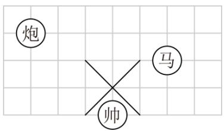

text_image

炮
马
帅

【变式 4-1】（24-25 九年级上·青海海东·期末）在平面直角坐标系中，点 $A(-2,1)$ 关于原点对称的点 B 在第象限.

【变式 4-2】（24-25 八年级下·重庆·期中）在平面直角坐标系中，若点A(-7,6)与点B(a,b)关于x轴对称，则 $a+b=$ \_\_\_\_.

【变式 4-3】（24-25 七年级下·福建厦门·期末）在平面直角坐标系中，记横纵坐标都是整数的点为整点．将一个整点先沿任一坐标轴方向平移 2 个单位，再沿与前一次平移垂直的方向平移 1 个单位，叫做一次“跳马运动”。例如:如图，点 A 做一次“跳马运动”，可以到达点 B，但是到达不了点 C．点 P 从原点处开始做“跳马运动”，下面三个结论中，所有正确结论的序号是\_\_\_\_。

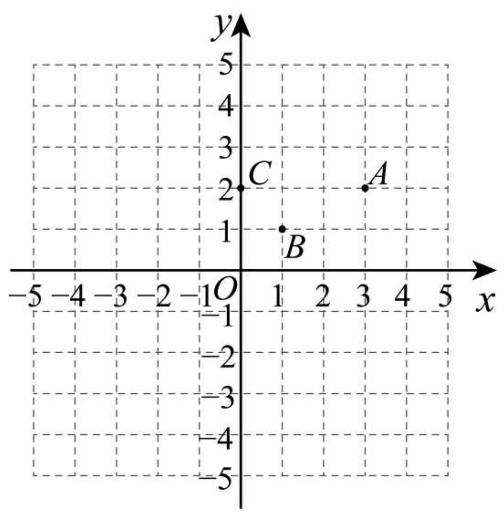

text_image

y
5
4
3
2
C
A
1
B
-5 -4 -3 -2 -1 O 1 2 3 4 5 x
-1
-2
-3
-4
-5

① P 进行一次“跳马运动”可能到达的点有 8 个;  
② P 进行三次“跳马运动”后可以到达(1,0);  
③ P 进行四次“跳马运动”后可以到达(0,3).

# 【题型5 坐标系中的面积问题】

【例 5】（24-25 七年级下·湖北黄石·阶段练习）如图，在平面直角坐标系中，长方形ABCO的长AO为4，宽AB为3，动点P从点A出发沿AB→BC→CO运动，当△POA的面积等于四边形ABCO面积的 $\frac{1}{6}$ 时，点P的坐标为\_\_\_\_.

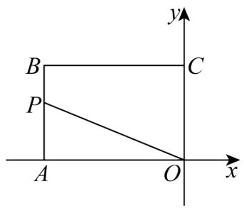

text_image

B
P
A
O
C
y
x

【变式 5-1】（24-25 八年级上·山东青岛·期中）在如图所示的直角坐标系中，四边形ABCD各个顶点的坐标分别是A(0,2)，B(5,5)，C(8,0)，D(2,-2)，则这个四边形的面积是\_\_\_\_。

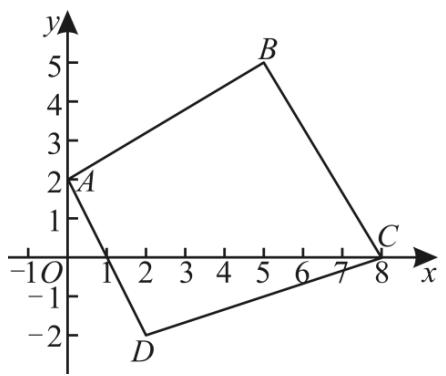

text_image

y
5
B
2
A
1
-1 O 1 2 3 4 5 6 7 8 x
-2 D C

【变式 5-2】在平面直角坐标系xOy中，对于任意三点A，B，C的“矩面积”，给出如下定义：“水平底”a：任意两点横坐标差的最大值，“铅垂高”h：任意两点纵坐标差的最大值，则“矩面积”S = ah．例如：三点坐标分别为A(1,2)，B(-3,1)，C(2,-2)，则“水平底”a = 5，“铅垂高”h = 4，“矩面积”S = ah = 20．若D(1,2)，E(-2,1)，F(0,t)三点的“矩面积”为18，则t的值为（）

A. -3或7

B. -4或6

C. -4或7

D. -3或6

【变式 5-3】（24-25 七年级下·内蒙古巴彦淖尔·期中）如图，在平面直角坐标系中，已知 $A(a,0)$ ， $B(b,0)$ ，其中 a，b 满足 $|a+1|+(b-3)^{2}=0$ 。点 M 的坐标 $(-2,-1)$ ，在 y 轴的正半轴上有一点 P，使得 $\triangle BMP$ 的面积与 $\triangle ABM$ 的面积相等，则点 P 的坐标为（）

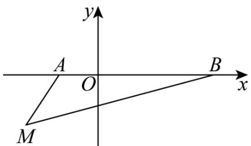

text_image

y
A
O
B
x
M

A. $(2,0)$

B. $\left(0,\frac{2}{5}\right)$

C. $\left(0,\frac{1}{5}\right)$

D. $\left(0,\frac{3}{4}\right)$

# 【拔尖篇】

# 【题型6 坐标与点的移动规律探究】

【例 6】（24-25 七年级下·广西南宁·期末）如图，在平面直角坐标系中，点 A 从原点 O 出发，沿 x 轴正方向按半圆形弧线不断向前运动，其移动路线如图所示，其中半圆的半径为 1 个单位长度，这时点 $A_{1}$ ，点 $A_{2}$ ，点 $A_{3}$ ，点 $A_{4}$ …的坐标分别为点 $A_{1}(0,0)$ ，点 $A_{2}(1,1)$ ，点 $A_{3}(2,0)$ ，点 $A_{4}(3,-1)$ …，按照这样的规律下去，点 $A_{2025}$ 的坐标为 \_\_\_\_.

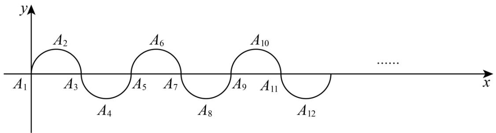

text_image

y
A₂
A₆
A₁₀
x
A₃
A₅
A₇
A₉
A₁₁
A₄
A₈
A₁₂
......

【变式 6-1】（24-25 八年级下·江西南昌·期末）如图，小球起始时位于(3,0)处，沿图中所示方向击球，小球在球桌上的运动轨迹如图所示．如果小球起始时位于(2,0)处，仍按原来的方向击球，小球第 1 次碰到球桌边时，小球的位置是(0,2)，那么小球第 2025 次碰到球桌边时，小球的位置是（）

line

| x | y |
|---|---|
| 1 | 4 |
| 3 | 0 |
| 5 | 0 |
| 7 | 4 |
| 8 | 3 |

A. $(2,4)$

B. $(6,0)$

C. $(8,2)$

D. $(6,4)$

【变式 6-2】（24-25 七年级下·黑龙江·阶段练习）如图，已知 $A_{1}(1,1)$ ， $A_{2}(2,-1)$ ， $A_{3}(4,4)$ ， $A_{4}(6,-4)$ ， $A_{5}(7,1)$ ， $A_{6}(8,-1)$ ， $A_{7}(10,4)$ ， $A_{8}(12,-4)$ ……，按这样的规律，则点 $A_{2025}$ 的坐标为（）

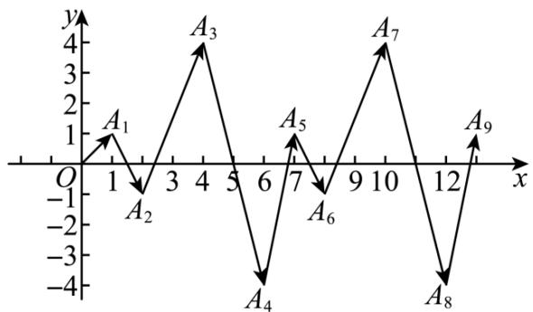

line

| Point | x | y |
|---|---|---|
| A1 | 1 | 1 |
| A2 | 2 | -1 |
| A3 | 4 | 4 |
| A4 | 6 | -4 |
| A5 | 7 | 1 |
| A6 | 8 | -1 |
| A7 | 10 | 4 |
| A8 | 12 | -4 |
| A9 | 13 | 1 |

A. (3038,-1)

B. $(3037,-1)$

c. (3037,1)

D. (3038,1)

【变式 6-3】（24-25 九年级下·辽宁抚顺·阶段练习）如图，在平面直角坐标系中，长方形ABCD的四个顶点坐标分别为 $A(-1,2)$ ， $B(-1,-1)$ ， $C(1,-1)$ ， $D(1,2)$ 点P从点A出发，沿长方形ABCD的边顺时针运动，速度为每秒2个单位长度，点Q从点A出发，沿长方形ABCD的边逆时针运动，速度为每秒3个单位长度，记点P，Q在长方形ABCD边上第1次相遇时的点为 $M_{1}$ ，第二次相遇时的点为 $M_{2}$ ，第三次相遇时的点为 $M_{3}$ ，……，则点 $M_{2025}$ 的坐标为（）

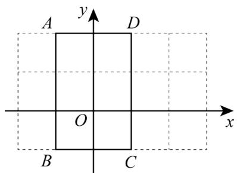

text_image

A
y
D
O
x
B
C

A. $(1,0)$

B. $(-1,0)$

c. $(-1,2)$

D. $(0,-1)$

# 【题型 7 坐标与图形变换规律探究】

【例 7】（24-25 八年级下·山东临沂·阶段练习）如图，在直角坐标系中，每个网格小正方形的边长均为 1 个单位长度，以点 P 为顶点作正方形 $PA_{1}A_{2}A_{3}$ ，正方形 $PA_{4}A_{5}A_{6}$ ，…，按此规律作下去，所作正方形的顶点均在格点上，其中正方形 $PA_{1}A_{2}A_{3}$ 的顶点坐标分别为 $P(-3,0)$ ， $A_{1}(-2,1)$ ， $A_{2}(-1,0)$ ， $A_{3}(-2,-1)$ ，则顶点 $A_{100}$ 的坐标为\_\_\_\_.

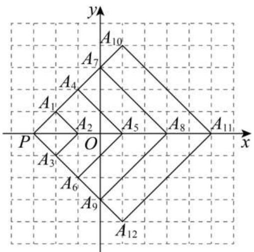

text_image

y
A10
A7
A4
A1
A2
A5
A8
A11
x
P
O
A3
A6
A9
A12

【变式 7-1】（24-25 八年级下·河南平顶山·期中）如图，在平面直角坐标系中， $\triangle A_{1}A_{2}A_{3}$ ， $\triangle A_{3}A_{4}A_{5}$ ， $\triangle A_{5}A_{6}A_{7}$ ， $\triangle A_{7}A_{8}A_{9}$ ，…都是等边三角形，且点 $A_{1}, A_{3}, A_{5}, A_{7}, A_{9}$ 的坐标分别是 $A_{1}(3,0), A_{3}(2,0)$ ， $A_{5}(4,0), A_{7}(1,0), A_{9}(5,0)$ 。依据图形所反映的规律，则 $A_{2025}$ 的坐标是（）

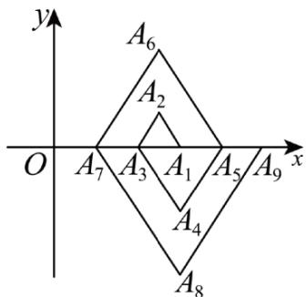

text_image

y
A6
A2
O A7 A3 A1 A5 A9 x
A4
A8

A. (509,0)

B. (508,0)

C. $(-509,0)$

D. $(-505,0)$

【变式 7-2】（2025 八年级上·全国·专题练习）如下图，在平面直角坐标系中，第一次将三角形OAB变换成三角形 $OA_{1}B_{1}$ ，第二次将三角形 $OA_{1}B_{1}$ 变换成三角形 $OA_{2}B_{2}$ ，第三次将三角形 $OA_{2}B_{2}$ 变换成三角形 $OA_{3}B_{3}$ ，……，依此变换下去．已知 $A(1,3),A_{1}(2,3),A_{2}(4,3),A_{3}(8,3),B(2,0),B_{1}(4,0),B_{2}(8,0),B_{3}(16,0)$ .

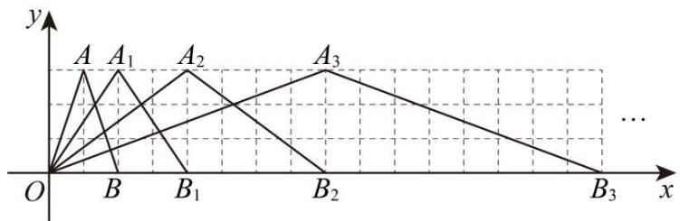

text_image

y
A A₁ A₂ A₃
O B B₁ B₂ B₃ ...

(1)求出三角形 $OA_{4}B_{4}$ 各个顶点的坐标.

(2)按此图形的变化规律, 请你求出三角形 $OA_{n}B_{n}$ 的面积与三角形 $OAB$ 的面积的大小关系.

【变式 7-3】如图，在平面直角坐标系xOy中，点 $A_{1}(1,0)$ ， $A_{2}(3,0)$ ， $A_{3}(6,0)$ ， $A_{4}(10,0)$ ，…，以 $A_{1}A_{2}$ 为对角线作第一个正方形 $A_{1}C_{1}A_{2}B_{1}$ , 以 $A_{2}A_{3}$ 为对角线作第二个正方形 $A_{2}C_{2}A_{3}B_{2}$ , 以 $A_{3}A_{4}$ 为对角线作第三个正方形 $A_{3}C_{3}A_{4}B_{3}$ ...顶点 $B_{1}, B_{2}, B_{3}, \ldots$ 都在第一象限, 按照这样的规律依次进行下去, 点 $B_{n}$ 的坐标为 \_\_\_\_.

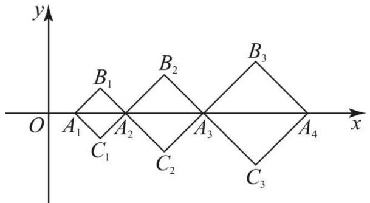

text_image

y
O A₁ A₂ B₁ B₂ B₃
C₁ C₂ C₃ A₄ x

# 【题型 8 坐标系中的动点问题探究】教辅资源,关注公众号·全科AA+

【例 8】（24-25 七年级下·吉林·期末）如图，在平面直角坐标系中，长方形OABC的边OC、OA分别在 x 轴、y 轴上，B 点在第一象限，点 A 的坐标是(0,4)，OC = 8.

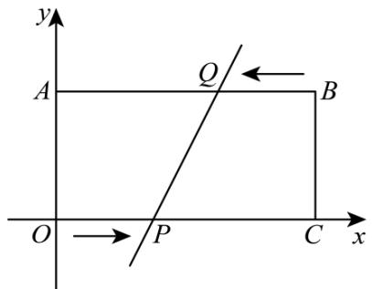

text_image

y
A
Q
B
O → P C x

(1)直接写出点 B、点 C 的坐标.

(2)点 $P$ 从原点 $O$ 出发, 在边 $OC$ 上以每秒 1 个单位长度的速度匀速向 $C$ 点运动, 同时点 $Q$ 从点 $B$ 出发, 在边 $BA$ 上以每秒 2 个单位长度的速度匀速向 $A$ 点运动, 当一个点到达终点时, 另一个点随之停止运动, 设运动时间为 $t$ 秒, 探究下列问题:

①当 t 为多少时，直线 $PQ \parallel y$ 轴？

②在运动过程中，当点 Q 到 y 轴的距离为 2 个单位长度时，求 P、Q 两点的坐标.

③在整个运动过程中, 能否使得四边形BCPQ的面积是长方形OABC面积的 $\frac{5}{8}$ ? 若能, 请直接写出 $P$ 、 $Q$ 两点的坐标; 若不能, 说明理由.

【变式 8-1】如图 1，已知，点 $A(1,4)$ ， $AH \perp x$ 轴，垂足为H，将线段AO平移至线段BC，点 $B(3,0)$ ，其中点A与点B对应，点O与点C对应.

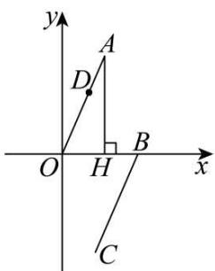

text_image

y
A
D
O
H
B
x
C

图1

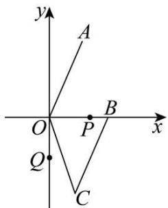

text_image

y
A
O
P
B
x
Q
C

图2

(1)三角形AOH的面积为\_\_\_\_.  
(2)如图1，若点 $D(m,n)$ 在线段OA上，请你连接DH，利用图形面积关系说明n=4m.  
(3)如图2, 连 $OC$ , 动点 $P$ 从点 $B$ 开始在 $x$ 轴上以每秒 2 个单位的速度向左运动, 同时点 $Q$ 从点 $O$ 开始在 $y$ 轴上以每秒 1 个单位的速度向下运动. 若经过 $t$ 秒, 三角形 $AOP$ 与三角形 $COO$ 的面积相等, 试求 $t$ 的值及点 $P$ 的坐标.

【变式 8-2】（24-25 七年级下·重庆江津·期末）如图，在平面直角坐标系中， $AB \parallel CD \parallel x$ 轴， $BC \parallel DE \parallel y$ 轴，且 $AB = CD = 3, OA = 4, DE = 2$ ，动点 $P$ 从点 $A$ 出发，以每秒 1 个单位长度的速度，沿 $A \to B \to C$ 路线向点 $C$ 运动；动点 $Q$ 从点 $O$ 出发，以每秒 2 个单位长度速度，沿路线 $O \to E \to D$ 向点 $D$ 运动．若 $P$ ， $Q$ 两点同时出发，其中一点到达终点时，两点都停止运动．

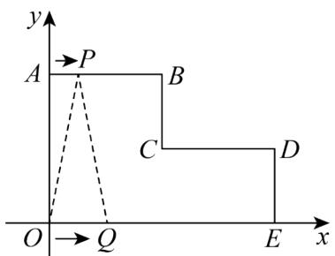

text_image

y
A →P
B
C
D
O →Q
E
x

(1)直接写出 B, C, D 三个点的坐标;  
(2)当 P，O 两点出发2s时，求三角形 OPQ 的面积；  
(3)设 P，O 两点运动的时间为 ts，当三角形 OPO 的面积为 6 时，求 t 的值.

【变式 8-3】读一读:

数形结合作为一种数学思想方法，其应用大致又可分为两种情形：或者借助于数的精确性来阐明形的某些属性，或者借助形的几何直观性来阐明数之间某种关系，即数形结合包括两个方面：第一种情形是“以数解形”，而第二种情形是“以形助数”。例如：在我们学习数轴的时候，数轴上任意两点，A表示的数为a，B表示的数为b，则A，B两点的距离可用式子|a-b|表示，例如：5和-2的距离可用|5-(-2)|或|-2-5|表示。研一研：

如图, 在平面直角坐标系中, 直线 $A B$ 分别与 $x$ 轴正半轴、 $y$ 轴正半轴交于点 $A(a,0)$ 、点 $B(0,b)$ , 且 $a$ 、 $b$ 满足 $(a - 6)^{2} + |b - 4| = 0$ .

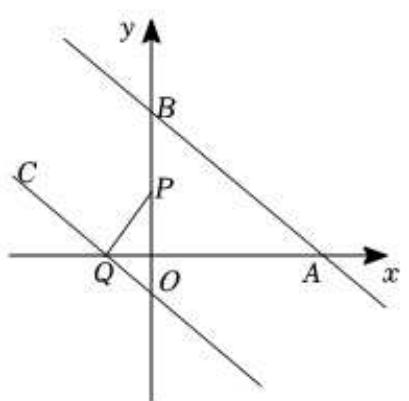

text_image

y
B
C
P
Q
O
A
x

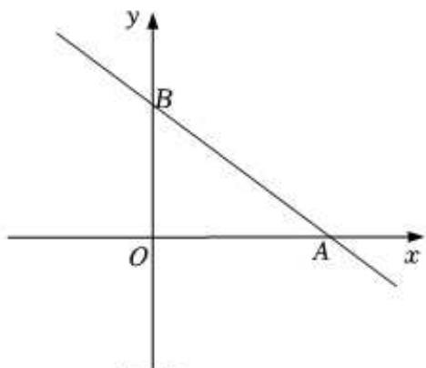

text_image

y
B
O
A
x

备用图

(1)直接写出以下点的坐标： $A$ （，0）， $B$ （0，）.  
(2)若点P、点Q分别是y轴正半轴（不与B点重合）、x轴负半轴上的动点，过Q作QC∥AB，连接PQ．已知 $\angle BAO = 34^{\circ}$ （近似值），请探索∠BPO与∠POC之间的数量关系，并说明理由.  
(3)已知点 $D(3,2)$ 是线段AB的中点，若点H为y轴上一点，且 $S_{\triangle AHD}=\frac{2}{3}S_{\triangle AOB}$ ，求点H的坐标.

# 【题型9 坐标系中角度关系问题探究】

【例 9】在平面直角坐标系中，点 A、B 分别在 x 轴、y 轴正半轴上，OA:OB = 5:4， $\triangle AOB$ 面积为 10，点 C(m,4) 在第二象限，点 P 是射线 CB 上一动点， $\angle C = \angle OAB$ .

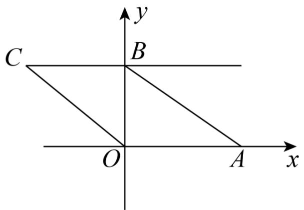

text_image

C
B
O
A
x
y

(1)求点 B 坐标;  
(2)线段 OC 能否通过平移 AB 得到？试求点 C 坐标；  
(3) $\angle OPA$ 、 $\angle POC$ 、 $\angle PAB$ 之间有何关系？请说明理由.

【变式 9-1】某区进行课堂教学改革, 将学生分成 5 个学习小组, 采取团团坐的方式. 如图所示, 这是某校八(1)班教室简图, 点 $A 、 B 、 C 、 D 、 E$ 分别代表五个学习小组的位置. 已知 $A$ 点的坐标为(-1, 3).

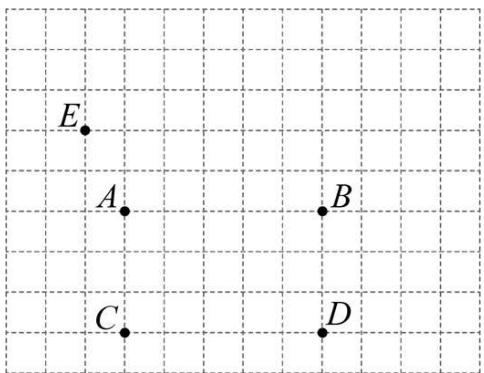

text_image

E
A
B
C
D

(1)请按题意建立平面直角坐标系（横轴和纵轴均为小正方形的边所在直线，每个小正方形边长为 1 个单位长度），写出图中其他几个学习小组的坐标；  
(2)若(1)中建立的平面直角坐标系坐标原点为 $O$ ，点 $F$ 在 $DB$ 的延长线上，请写出 $\angle FAB$ 、 $\angle AFO$ 、 $\angle FOD$ 之间的等量关系，并说明原因.

【变式 9-2】（24-25 七年级下·辽宁盘锦·阶段练习）如图，在平面直角坐标系中，已知 $\triangle ABC$ ，点 A 的坐标是 $(4,0)$ ，点 B 的坐标是 $(2,3)$ ，点 C 在 x 轴的负半轴上，且 AC = 6.

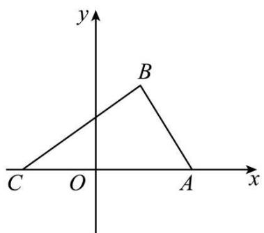

text_image

y
B
C O A x

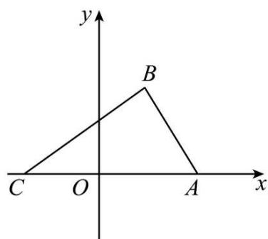

text_image

y
B
C O A x

备用图

(1)写出点 C 的坐标\_；教辅资源, 关注公众号·全科AA+  
(2)在 y 轴上是否存在点 P，使得三角形 POB 的面积等于三角形 ABC 面积的 $\frac{2}{3}$ ，若存在，求出点 P 的坐标；若不存在，请说明理由；  
(3)把点 C 往上平移 3 个单位得到点 H，作射线 CH，连接 BH，点 M 在射线 CH 上运动（不与点 C、H 重合），请直接写出 $\angle BMA$ ， $\angle HBM$ ， $\angle MAC$ 之间的数量关系.

【变式 9-3】如图 1，在长方形 OABC 中，O 为平面直角坐标系的原点，OA = 2，OC = 4，点 B 在第一象限.

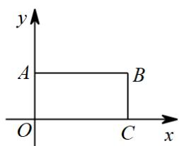

text_image

y
A B
O C x

图1

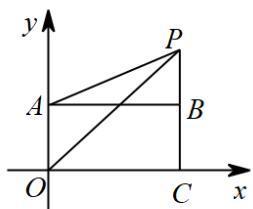

text_image

y
P
A
B
O
C
x

图2

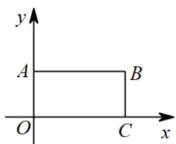

text_image

y
A B
O C x

备用图

(1)点B的坐标为\_\_\_\_；

(2)如图 2, 点 $P$ 是线段 $CB$ 延长线上的点, 连接 $AP$ , $OP$ , 则 $\angle POC$ , $\angle APO$ , $\angle PAB$ 三个角满足的关系是什么? 并说明理由:

(3)在（2）的基础上，已知： $\angle PAB = 20^{\circ}$ ， $\angle POC = 50^{\circ}$ ，在第一象限内取一点 $F$ ，连接 $OF$ ， $AF$ ，满足 $\angle PAB = 2\angle FAP$ ， $\angle POC = 2\angle FOP$ ，请直接写出 $\frac{\angle APO}{\angle AFO}$ 的值.