# 第三章 位置与坐标（举一反三讲义）全章题型归纳

【北师大版 2024】

# 题型归纳

# 【培优篇】....3

【题型1 由点的坐标判断象限】....3

【题型2 由点的坐标特征求值】....4

【题型3 由点到坐标轴的距离求坐标】....6

【题型4 点或图形的平移、对称】....8

【题型 5 坐标系中的面积问题】....10

# 【拔尖篇】....14

【题型6 坐标与点的移动规律探究】....14

【题型 7 坐标与图形变换规律探究】....17

【题型8 坐标系中的动点问题探究】....21

【题型 9 坐标系中角度关系问题探究】....29

# 举一反三

# 知识点 1 有序数对的概念

我们把有顺序的两个数 a 与 b 组成的数对，叫做有序数对，记作 $(a, b)$ .

# 知识点 2 平面直角坐标系及有关概念

# 1. 平面直角坐标系

在平面内，两条互相垂直、原点重合的数轴，组成平面直角坐标系．通常两条数轴分别置于水平位置和竖直位置，取向右与向上的方向分别为两条数轴的正方向.

# 2. 坐标轴

水平的数轴称为 $x$ 轴或横轴，竖直的数轴称为 $y$ 轴或纵轴。二者统称为坐标轴，两坐标轴的交点 $O$ 称为平面直角坐标系的原点。

# 3. 象限

坐标平面被两条坐标轴分成四个部分：右上部分叫做第一象限，其他三个部分按逆时针方向分别叫做第二象限、第三象限、第四象限..

# 知识点 3 建立平面直角坐标系

# 1. 建立平面直角坐标系的步骤

（1）分析条件，选择适当的点作为原点；  
（2）过原点在两个互相垂直的方向上分别作出 x 轴、y 轴；  
（3）确定正方向和单位长度.

2. 常见的建立坐标系的方式：以等腰三角形底边的中点为原点，底边及底边上的高所在直线为坐标轴.

# 知识点 4 平面直角坐标系内点的坐标

# 1. 点的坐标表示

平面内的点可以用一个有序数对来表示。对于平面内的任意一点 $P$ ，过点 $P$ 分别向 $x$ 轴、 $y$ 轴作垂线，垂足在 $x$ 轴、 $y$ 轴上对应的实数 $a, b$ 分别叫做点 $P$ 的横坐标、纵坐标，有序数对 $(a, b)$ 就叫做点 $P$ 的坐标。坐标平面内的点与有序实数对是一一对应的。

# 2. 点的坐标的几何意义

(1) 点 $P(a, b)$ 到 $x$ 轴的距离为 $|b|$ ; (2) 点 $P(a, b)$ 到 $y$ 轴的距离为 $|a|$ .

# 3. 点的坐标特征

(1) 各象限内点的坐标特征: 第一至第四象限内的点的坐标符号依次为 $(+, +)$ 、 $(-, +)$ 、 $(-, -)$ 、 $(+, -)$ .  
(2) 非象限内点的坐标特征: $x$ 轴上的点的纵坐标为 0; $y$ 轴上的点的横坐标为 0; 原点的横坐标、纵坐标都为 0; 原点既在 $\underline{x}$ 轴上, 又在 $\underline{y}$ 轴上.  
(3) 与坐标轴平行的直线上的点的坐标特征: 与 $x$ 轴平行的直线上的所有点的纵坐标相同, 与 $y$ 轴平行的直线上的所有点的横坐标相同.

# 知识点 5 用坐标表示平移

(1) 点的平移: 点的平移引起坐标的变化规律: 在平面直角坐标中, 将点 $(x, y)$ 向右 (或左) 平移 $a$ 个单位长度, 可以得到对应点 $(x + a, y)$ 或 $(x - a, y)$ ; 将点 $(x, y)$ 向上 (或下) 平移 $b$ 个单位长度, 可以得到对应点 $(x, y + b)$ 或 $(x, y - b)$ .  
(2) 图形的平移: 在平面直角坐标系内, 如果把一个图形各个点的横坐标都加(或减去)一个正数 $a$ , 相应的新图形就是把原图形向右(或向左)平移 $a$ 个单位长度; 如果把它各个点的纵坐标都加(或减去)一个正数 $a$ , 相应的新图形就是把原图形向上(或向下)平移 $a$ 个单位长度.

# 知识点 6 轴对称与坐标变化

(1) 关于 $x$ 轴对称的两个点的坐标, 横坐标相同, 纵坐标互为相反数; 反过来, 横坐标相同、纵坐标互为相反数的两个点关于 $\underline{x}$ 轴对称.

(2) 关于 $y$ 轴对称的两个点的坐标, 纵坐标相同, 横坐标互为相反数; 反过来, 纵坐标相同、横坐标互为相反数的两个点关于 $\underline{y}$ 轴对称.

# 【培优篇】

# 【题型1 由点的坐标判断象限】

【例 1】如图是某动物园的平面示意图，若以大门为原点，向右的方向为x轴正方向，向上的方向为y轴正方向建立平面直角坐标系，则驼峰所在的象限是( )

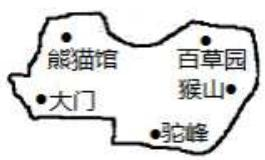

text_image

熊猫馆
百草园
猴山
大门
驼峰

A. 第一象限

B. 第二象限

C. 第三象限

D. 第四象限

【答案】D

【分析】首先以大门为坐标原点，建立平面直角坐标系，然后再根据驼峰的位置确定象限.

【详解】解：如图所示，

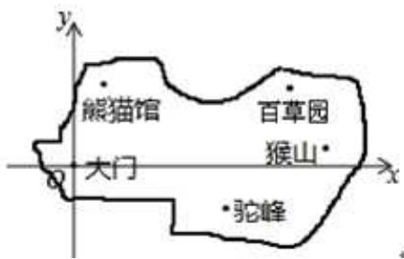

text_image

熊猫馆
百草园
猴山*
大门
•驼峰

熊猫馆、猴山、百草园都在第一象限，横、纵坐标都为正数；

驼峰在第四象限，横坐标为正数，纵坐标为负数，

故选 D.

【点睛】此题主要考查了坐标确定位置，关键是正确建立坐标系，掌握四个象限内点的坐标符号.

【变式 1-1】（24-25 八年级下·重庆·期末）在平面直角坐标系中，点(2025,2025)所在的象限是（）

A. 第一象限

B. 第二象限

C. 第三象限

D. 第四象限

【答案】A

【分析】本题考查了平面直角坐标系中各象限点的坐标符号特征，解题关键是掌握平面直角坐标系中各象限点的坐标符号特征.

根据平面直角坐标系中各象限点的坐标符号特征判断.

【详解】解：∵点(2025,2025)的横坐标2025>0，纵坐标2025>0，

∴该点位于横、纵坐标均为正的第一象限．故选 A.

【变式 1-2】（24-25 七年级下·河南许昌·期中）在平面直角坐标系中，点 $P(-a^{2}-1,3)$ 所在的象限是（）

A. 第一象限

B. 第二象限

C. 第三象限

D. 第四象限

【答案】B

【分析】本题考查了判定点所在象限，根据象限中点判定即可．第一象限点的符号为 $(+,+)$ ，第二象限点的符号为 $(-,+)$ ，第三象限点的符号为 $(-,-)$ ，第四象限点的符号为 $(+,-)$ ，由此即可求解.

【详解】解：∵ $a^{2}\geq0$ ,

$$
\therefore - a ^ {2} \leq 0, - a ^ {2} - 1 \leq - 1,
$$

∴点 $P(-a^{2}-1,3)$ 所在的象限是第二象限，

故选：B.

【变式 1-3】（24-25 七年级下·吉林·期中）在平面直角坐标系xOy中，点 $A(x,x+1)$ 一定不在第\_\_\_\_象限.

【答案】四

【分析】本题考查点的坐标的相关知识；根据 $x$ 的取值判断出相应的象限是解决本题的关键．判断出 $A$ 的横纵坐标的符号，进而判断出相应象限即可.

【详解】解：当 x 为正数的时候，一定 $x + 1$ 为正数，

所以点 $A(x,x+1)$ 可能在第一象限;

当 x 为负数的时候， $x + 1$ 可能是负数，也可能为正数，

$\therefore A(x,x + 1)$ 可能在第二象限，或第三象限，

∴点 $A(x,x+1)$ 一定不在第四象限.

故答案为：四.

# 【题型2 由点的坐标特征求值】

【例 2】（24-25 七年级下·重庆潼南·期中）在平面直角坐标系中，若点A(n-2,7)在y轴上，则B(n-3,n+1)在第\_\_\_\_象限.

【答案】二

【分析】此题主要考查根据点坐标判定其所在象限，熟练掌握各象限的点的坐标特征是解题关键．根据点 $A(n-2,7)$ 在y轴上，可得横坐标为0，即可得出n=2，进而得出点B的坐标，即可判定其在第二象限.

【详解】解：∵点A(n-2,7)在y轴上，

$$
\therefore n - 2 = 0,
$$

解得：n = 2，

$$
\therefore n - 3 = 2 - 3 = - 1, \quad n + 1 = 2 + 1 = 3,
$$

$$
\therefore B (- 1, 3),
$$

$\therefore B(n-3,n+1)$ 在第二象限.

故答案为：二

【变式 2-1】（2025·河北沧州·模拟预测）若第二象限内的点 $P(m,n)$ 满足n-m=2，写出一个满足条件的点P的坐标：\_\_\_\_.

【答案】 $(-1,1)$ （答案不唯一，保证n>0，m<0，n-m=2即可）

【分析】本题考查了点所在的象限求参数，写出直角坐标系中点的坐标，根据点在第二象限，以及 $n - m$ 即可得出符合题意的结果.

【详解】解：∵点 $P(m,n)$ 在第二象限，

$$
\therefore m <   0, n > 0,
$$

$$
\because n - m = 2,
$$

∴ m = -1, n = 1 时，n - m = 2，满足要求，

$$
\therefore P (- 1, 1),
$$

故答案为： $(-1,1)$ .

【变式 2-2】（24-25 七年级下·湖南长沙·期末）已知平面直角坐标系中有两点 $M(2m-3,m+1)$ 、 $N(-5,-1)$ ，且 $MN \parallel x$ 轴时，则m = \_\_\_\_.

【答案】-2

【分析】本题主要考查了坐标与图形性质, 熟知平行于 $x$ 轴的直线上点的坐标特征是解题的关键. 根据平行于 $x$ 轴的直线上点的坐标特征进行计算即可.

【详解】解：由题知，因为点 $M(2m-3,m+1)$ 、 $N(-5,-1)$ ，且 $MN\parallel x$ 轴，

所以 $m+1=-1$ ,

解得m = -2.

故答案为：-2.

【变式 2-3】（24-25 八年级下·河北唐山·期中）在平面直角坐标系中，已知点 $P(a,a+1)$ ， $Q(-1,2)$ 。若直线 PQ 与 x 轴平行，则 a 的值为 \_\_\_\_.

【答案】1

【分析】本题考查坐标与图形，根据平行 x 轴的点的纵坐标相等，构建方程求解即可.

【详解】解：由题意， $a+1=2$ ，

$$
\therefore a = 1,
$$

故答案为：1.

# 【题型3 由点到坐标轴的距离求坐标】

【例 3】（24-25 七年级下·河北廊坊·阶段练习）点A(2,m)在第四象限，且到两条坐标轴的距离之和为5，则点A坐标为\_\_\_\_。

【答案】(2,-3)

【分析】本题考查了平面直角坐标系，涉及坐标点的象限，坐标点到坐标轴的距离，掌握相关知识点是解题的关键．根据点 $A(2,m)$ 在第四象限可得m<0，根据点 $A(2,m)$ 到两条坐标轴的距离之和为5，列出关于m的方程，求出m的值即可解答.

【详解】解：∵点 $A(2,m)$ 在第四象限，

$$
\therefore m <   0,
$$

∵点 $A(2,m)$ 到两条坐标轴的距离之和为5,

$$
\therefore 2 + | m | = 2 - m = 5,
$$

解得：m = -3，

∴点A坐标为 $(2,-3)$ .

故答案为： $(2,-3)$ .

【变式 3-1】（24-25 八年级上·全国·单元测试）已知点A(3a,2b)在x轴上方，在y轴左侧，则点A到x轴、y轴的距离分别为（）

A. 3a,-2b

B. $-3a,2b$

C. 2b,-3a

D. -2b,3a

【答案】C

【分析】本题主要考查点的坐标的几何意义，到 $x$ 轴的距离就是纵坐标的绝对值，到 $y$ 轴的距离就是横坐标的绝对值．应先判断出点 $A$ 的横纵坐标的符号，进而判断点 $A$ 到 $x$ 轴、 $y$ 轴的距离.

【详解】解：∵点 $A(3a,2b)$ 在x轴上方，

∴ 点 A 的纵坐标大于 0，得到 2b > 0，

∴ 点 A 到 x 轴的距离是 2b;

∵ 点A(3a,2b)在v轴的左边，

∴ 点 A 的横坐标小于 0，即 3a < 0，

∴ 点 A 到 $\gamma$ 轴的距离是 -3a;

故选：C.

【变式 3-2】已知点 $P(a,b)$ 在第四象限，且点 P 到 x 轴的距离为 5，到 y 轴的距离为 3，则点 P 的坐标为 \_\_\_\_。

【答案】(3,-5)

【分析】本题考查了点的坐标，记住各象限内点的坐标的符号是解题的关键．根据第四象限的点的横坐标是正数，纵坐标是负数，点到 x 轴的距离等于纵坐标的绝对值，到 y 轴的距离等于横坐标的绝对值确定出点的横坐标与纵坐标，即可得解.

【详解】解：点 P 在第四象限且到 x 轴距离为 5，到 y 轴距离为 3，

∴点 P 的横坐标是 3，纵坐标是 -5，

∴点 P 的坐标为 $(3,-5)$ ,

故答案为： $(3,-5)$ .

【变式 3-3】（24-25 八年级上·安徽安庆·期末）在平面直角坐标系中，已知点 A 的坐标为 $(2-a,2a)$ ，把点 A 到 x 轴的距离记作 m，到 y 轴的距离记作 n.

(1)若a=5，求mn的值；

(2)若a>2,m+n=7，求点A的坐标.

【答案】(1)30;

(2) $A(-1,6)$ .

【分析】本题考查了点的坐标，准确熟练地进行计算是解题的关键.

(1) 把 $a = 5$ 代入式子中进行计算, 然后根据点 $A$ 到 $x$ 轴的距离等于纵坐标的绝对值, 到 $y$ 轴的距离等于横坐标的绝对值, 即可解答;

(2) 根据点 $A$ 到 $x$ 轴的距离等于纵坐标的绝对值, 到 $y$ 轴的距离等于横坐标的绝对值, 然后再根据绝对值的意义进行计算, 即可解答.

【详解】（1）解：∵点A的坐标为 $(2-a,2a)$ ，点A到x轴的距离记作m，到y轴的距离记作n，

$$
\therefore m = | 2 a |, n = | 2 - a |.
$$

$$
\because a = 5,
$$

$$
\therefore m = | 2 a | = 2 \times 5 = 1 0, n = | 2 - a | = | 2 - 5 | = 3,
$$

$$
\therefore m n = 1 0 \times 3 = 3 0.
$$

(2) 解: $\because a > 2,$

$$
\therefore 2 - a <   0, 2 a > 0,
$$

$$
\therefore m = | 2 a | = 2 a, n = | 2 - a | = a - 2.
$$

$$
\because m + n = 7,
$$

$$
\therefore 2 a + (a - 2) = 7,
$$

$$
\therefore a = 3,
$$

$$
\therefore 2 - a = 2 - 3 = - 1, 2 a = 2 \times 3 = 6,
$$

$$
\therefore A (- 1, 6).
$$

# 【题型4 点或图形的平移、对称】

【例 4】（24-25 七年级下·广东潮州·期末）如图，若在棋盘上建立平面直角坐标系，使“帅”位于点(2,0)，则将棋子“马”向上平移 2 个单位长度后的点的坐标是\_\_\_\_。

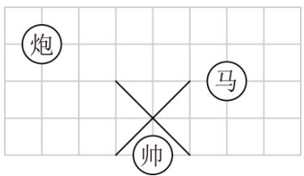

text_image

炮
马
帅

【答案】(4,4)

【分析】本题考查了坐标与图形变化-平移，坐标确定位置，根据题目的已知条件建立适当的平面直角坐标系是解题的关键．根据已知建立适当的平面直角坐标系，然后再根据点的平移规律，即可解答.

【详解】解：建立适当的平面直角坐标系如图所示：

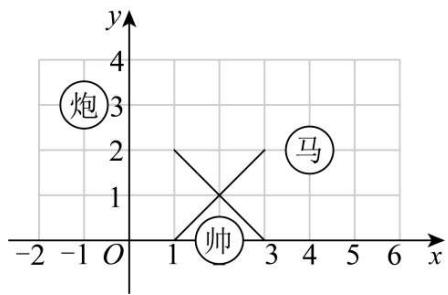

text_image

炮
3
y
2
马
1
帅
x
-2 -1 O 1 3 5 6

∴ 棋子“马”位于点(4,2)，

∴ 将棋子“马”向上平移 2 个单位长度后的点的坐标是 $(4,4)$ ,

故答案为：(4,4).

【变式 4-1】（24-25 九年级上·青海海东·期末）在平面直角坐标系中，点 $A(-2,1)$ 关于原点对称的点 B 在第象限.

【答案】四

【分析】本题主要考查点关于原点对称的坐标特点，根据点坐标的特点判定所在象限，理解并掌握点的对称性质是解题的关键.

根据点关原点对称的点的横坐标、纵坐标均变为相反数，再根据点坐标的符号即可求解.

【详解】解：点 $A(-2,1)$ 关于原点对称的点B的坐标为 $(2,-1)$ ,

∴点 B 在第四象限，

故答案为：四.

【变式 4-2】（24-25 八年级下·重庆·期中）在平面直角坐标系中，若点A(-7,6)与点B(a,b)关于x轴对称，则 $a+b=$ \_\_\_\_.

【答案】-13

【分析】此题主要考查了关于x轴对称点的性质，正确把握横纵坐标的关系是解题关键.

直接利用关于x轴对称点的性质（横坐标不变，纵坐标互为相反数）得出a，b的值，进而得出答案.

【详解】解：∵A(-7,6)与点B(a,b)关于x轴对称，

$$
\therefore a = - 7, b = - 6
$$

$$
\therefore a + b = - 7 - 6 = - 1 3
$$

故答案为：-13.

【变式 4-3】（24-25 七年级下·福建厦门·期末）在平面直角坐标系中，记横纵坐标都是整数的点为整点．将一个整点先沿任一坐标轴方向平移 2 个单位，再沿与前一次平移垂直的方向平移 1 个单位，叫做一次“跳马运动”。例如:如图，点 A 做一次“跳马运动”，可以到达点 B，但是到达不了点 C．点 P 从原点处开始做“跳马运动”，下面三个结论中，所有正确结论的序号是\_\_\_\_。

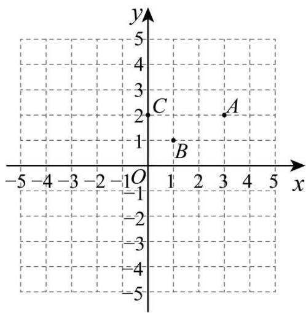

text_image

y
5
4
3
2
C
A
1
B
-1 O 1 2 3 4 5 x
-2
-3
-4
-5

① P 进行一次“跳马运动”可能到达的点有 8 个;

② P 进行三次“跳马运动”后可以到达(1,0);

③ P 进行四次“跳马运动”后可以到达(0,3).

【答案】①②/②①

【分析】本题考查了坐标的平移，根据题中“跳马运动”的移动规则逐项进行分析判断即可，熟练掌握坐标移

动规则是解题关键.

【详解】解：①由题可知 $P(0,0)$ ，进行一次跳马运动，

首先沿任一坐标轴方向平移 2 个单位，可以到达 $(0,2)$ ， $(0,-2)$ ， $(-2,0)$ ， $(2,0)$ 四个点，

再沿与前一次平移垂直的方向平移 1 个单位，

以上 4 个点都有向上或向下 2 种情况，

故可能到达的点有 8 个，故①正确；

② $P(0,0)$ ，可以先向下平移2各单位，

再向右平移到 $(1,-2)$ ，再向右平移2个单位，

再向上平移 1 个单位得到 $(3,-1)$ ，第三次向左平移 2 个单位，

再向上平移 1 各单位得到(1,0)，故②正确；

③按照规则如何移动四次都无法到达(0,3)，故③错误，

综上所述正确的有：①②，

故答案为：①②.

# 【题型5 坐标系中的面积问题】

【例 5】（24-25 七年级下·湖北黄石·阶段练习）如图，在平面直角坐标系中，长方形ABCO的长AO为4，宽AB为3，动点P从点A出发沿 $AB \rightarrow BC \rightarrow CO$ 运动，当 $\triangle POA$ 的面积等于四边形ABCO面积的 $\frac{1}{6}$ 时，点P的坐标为\_\_\_\_.

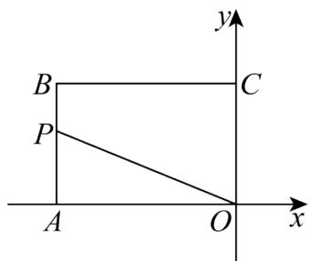

text_image

B
P
A
O
C
y
x

【答案】(-4,1)或(0,1)

【分析】本题考查了坐标与图形，设 $\triangle POA$ 的 AO 边上的高为 h，根据 $\triangle POA$ 的面积等于四边形 ABCO 面积的 $\frac{1}{6}$ ，列出方程，求得 h = 1，即可求解.

【详解】解：设 $\triangle POA$ 的 AO 边上的高为 h，

∵ 长方形ABCO的长AO为4，宽AB为3，

$$
\therefore S _ {\text { 长方形 } A B C O} = 3 \times 4 = 1 2,
$$

∵△POA的面积等于四边形ABCO面积的 $\frac{1}{6}$ ,

$$
\therefore S _ {\triangle P O A} = \frac {1}{6} \times 1 2 = 2,
$$

即 $\frac{1}{2} \times 4 \times h = 2$

解得h=1，

∵ 动点P从点A出发沿 $AB \rightarrow BC \rightarrow CO$ 运动，

∴ 点P的坐标为 $(-4,1)$ 或 $(0,1)$

故答案为 $(-4,1)$ 或 $(0,1)$

【变式 5-1】（24-25 八年级上·山东青岛·期中）在如图所示的直角坐标系中，四边形ABCD各个顶点的坐标分别是A(0,2)，B(5,5)，C(8,0)，D(2,-2)，则这个四边形的面积是\_\_\_\_。

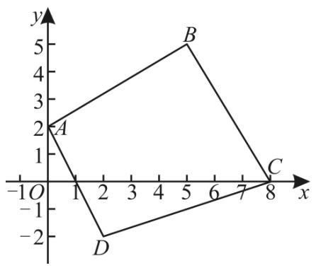

text_image

y
5
B
2
A
1
-1O 1 2 3 4 5 6 7 8 x
-2
D

【答案】31

【分析】本题主要考查了坐标与图形，过点 B 作 $EH \parallel x$ 轴，过点 C 作 $GH \parallel y$ 轴，过点 D 作 $GF \parallel x$ 轴，然后用大长方形的面积减去四周四个直角三角形的面积，得出答案即可.

【详解】解：过点 B 作 $EH \parallel x$ 轴，过点 C 作 $GH \parallel y$ 轴，过点 D 作 $GF \parallel x$ 轴，如图所示：

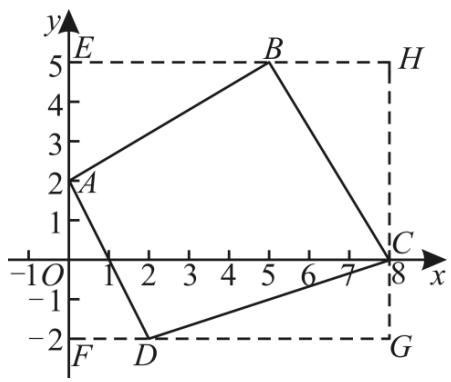

text_image

y
E
5
4
B
H
2
A
1
-1O
1
2
3
4
5
6
7
x
C
8
F
D
-2
G

∵四边形ABCD各个顶点的坐标分别是 $A(0,2)$ ， $B(5,5)$ ， $C(8,0)$ ， $D(2,-2)$ ，

$\therefore E(0,5)$ , $F(0,-2)$ , $G(8,-2)$ , $H(8,5)$ ,

$$
\therefore A E = 5 - 2 = 3, A F = 2 - (- 2) = 4, D G = 8 - 2 = 6,
$$

$$
C G = 0 - (- 2) = 2, B H = 8 - 5 = 3, B E = 5, C H = 5 - 0 = 5, E H = 8, G H = 5 - (- 2) = 7,
$$

$$
\begin{array}{l} \therefore S _ {\text {四边形} A B C D} = S _ {\text {四边形} E F G H} - S _ {\triangle A B E} - S _ {\triangle A D F} - S _ {\triangle C D G} - S _ {\triangle C B H} \\ = 7 \times 8 - \frac {1}{2} \times 3 \times 5 - \frac {1}{2} \times 4 \times 2 - \frac {1}{2} \times 6 \times 2 - \frac {1}{2} \times 5 \times 3 \\ = 3 1. \\ \end{array}
$$

故答案为：31.

【变式 5-2】在平面直角坐标系xOy中，对于任意三点A，B，C的“矩面积”，给出如下定义：“水平底”a：任意两点横坐标差的最大值，“铅垂高”h：任意两点纵坐标差的最大值，则“矩面积”S = ah．例如：三点坐标分别为A(1,2)，B(-3,1)，C(2,-2)，则“水平底”a = 5，“铅垂高”h = 4，“矩面积”S = ah = 20．若D(1,2)，E(-2,1)，F(0,t)三点的“矩面积”为18，则t的值为（）

A. -3或7

B. -4或6

C. -4或7

D. -3或6

【答案】C

【分析】本题考查了坐标与图形的性质，根据题意可以求得 $a$ 的值，然后再对 $t$ 进行讨论，即可求得 $t$ 的值，解题的关键是明确题目中的新定义，利用新定义解答问题.

【详解】由题意可得，“水平底” $a=1-(-2)=3$ ，

①当t>2时，h=t-1，

则 $3(t-1)=18,$

解得：t = 7，

故点F的坐标为(0,7);

②当 $1 \leq t \leq 2$ 时， $h = 2 - 1 = 1 \neq 6$ ，

故此种情况不符合题意;

③当t<1时，h=2-t，

则 $3(2-t)=18,$

解得：t = -4，

故选：C.

【变式 5-3】（24-25 七年级下·内蒙古巴彦淖尔·期中）如图，在平面直角坐标系中，已知 $A(a,0)$ ， $B(b,0)$ ，其中 a，b 满足 $|a+1|+(b-3)^{2}=0$ 。点 M 的坐标 $(-2,-1)$ ，在 y 轴的正半轴上有一点 P，使得 $\triangle BMP$ 的面积与 $\triangle ABM$ 的面积相等，则点 P 的坐标为（）

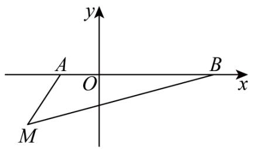

text_image

y
A
O
B
x
M

A. $(2,0)$

B. $\left(0,\frac{2}{5}\right)$

C. $\left(0,\frac{1}{5}\right)$

D. $\left(0,\frac{3}{4}\right)$

【答案】C

【分析】本题考查了坐标与图形，非负数的性质，先根据绝对值和平方的非负性求出a,b的值，分别过点P,M作x轴的平行线，过点M,B作y轴的平行线，相交于点C,D，则 $\angle D=\angle DME=\angle MEB=\angle C=90^{\circ}$ ，设 $P(0,p)$ (p>0)，求出 $C(3,p),E(3,-1),D(-2,p)$ ，根据题意得到 $\frac{1}{2}AB\cdot|y_{M}|=ME\cdot MD-\frac{1}{2}ME\cdot BE-\frac{1}{2}MD\cdot DP-\frac{1}{2}PC\cdot BC$ ，建立方程求解即可.

【详解】解：∵a，b满足 $|a+1|+(b-3)^{2}=0$ ，

$$
\therefore a + 1 = 0, b - 3 = 0,
$$

$$
\therefore a = - 1, b = 3,
$$

$$
\therefore A (- 1, 0), \quad B (3, 0),
$$

如图，分别过点P,M作x轴的平行线，过点M,B作y轴的平行线，相交于点C,D，

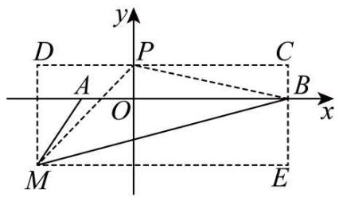

text_image

y
D P C
A O B x
M E

则 $\angle D = \angle DME = \angle MEB = \angle C = 90^{\circ}$

设 $P(0,p)(p>0)$ ,

$$
\because M (- 2, - 1),
$$

$$
\therefore C (3, p), E (3, - 1), D (- 2, p),
$$

∵ $\triangle BMP$ 的面积与 $\triangle ABM$ 的面积相等，

$$
\therefore \frac {1}{2} A B \cdot | y _ {M} | = M E \cdot M D - \frac {1}{2} M E \cdot B E - \frac {1}{2} M D \cdot D P - \frac {1}{2} P C \cdot B C,
$$

$$
\therefore \frac {1}{2} \times [ 3 - (- 1) ] \times | - 1 | = [ 3 - (- 2) ] \times [ p - (- 1) ] - \frac {1}{2} \times [ 3 - (- 2) ] \times | y _ {E} | - \frac {1}{2} \times [ p - (- 1) ] \times | x _ {M} | - \frac {1}{2} \times 3 \times p,
$$

$$
\therefore 2 = 5 p + 5 - \frac {5}{2} - p - 1 - \frac {3}{2} p,
$$

$$
\therefore p = \frac {1}{5},
$$

$$
\therefore P \left(0, \frac {1}{5}\right),
$$

故选：C.

# 【拔尖篇】

# 【题型6 坐标与点的移动规律探究】

【例 6】（24-25 七年级下·广西南宁·期末）如图，在平面直角坐标系中，点 A 从原点 O 出发，沿 x 轴正方向按半圆形弧线不断向前运动，其移动路线如图所示，其中半圆的半径为 1 个单位长度，这时点 $A_{1}$ ，点 $A_{2}$ ，点 $A_{3}$ ，点 $A_{4}$ …的坐标分别为点 $A_{1}(0,0)$ ，点 $A_{2}(1,1)$ ，点 $A_{3}(2,0)$ ，点 $A_{4}(3,-1)$ …，按照这样的规律下去，点 $A_{2025}$ 的坐标为 \_\_\_\_.

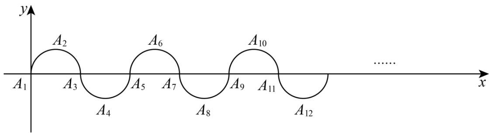

text_image

y
A₂
A₆
A₁₀
x
A₃
A₅
A₇
A₉
A₁₁
A₄
A₈
A₁₂
......

【答案】(2024,0)

【分析】根据图形可知点的位置每 4 个数一个循环, 横坐标为下标数减 $1, 2025 \div 4 = 506...1$ , 进而判断 $A_{2025}$ 与 $A_{1}$ 的纵坐标相同, 即可求解.

本题主要考查规律型：点的坐标，找到点的坐标规律是解题的关键.

【详解】解：∵ $A_{1}(0,0)$ ， $A_{2}(1,1)$ ， $A_{3}(2,0)$ ， $A_{4}(3,-1)$ ， $A_{5}(4,0)$ ，…

∴根据图形可知点的位置每4个数一个循环，横坐标为下标数减1， $2025 \div 4 = 506 \ldots 1$ ，

$\therefore A_{2025}$ 与 $A_{1}$ 的纵坐标相同，

$$
\therefore A _ {2 0 2 5} (2 0 2 4, 0)
$$

故答案为：(2024，0).

【变式 6-1】（24-25 八年级下·江西南昌·期末）如图，小球起始时位于(3,0)处，沿图中所示方向击球，小球在球桌上的运动轨迹如图所示．如果小球起始时位于(2,0)处，仍按原来的方向击球，小球第 1 次碰到球桌边时，小球的位置是(0,2)，那么小球第 2025 次碰到球桌边时，小球的位置是（）

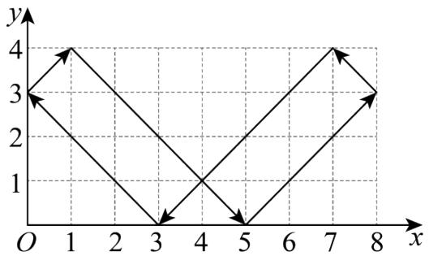

line

| x | y |
|---|---|
| 1 | 4 |
| 3 | 0 |
| 5 | 0 |
| 7 | 4 |
| 8 | 3 |

A. $(2,4)$

B. $(6,0)$

C. $(8,2)$

D. $(6,4)$

【答案】B

【分析】本题考查坐标位置，解答本题的关键是明确题意，发现点的坐标位置的变化特点，利用数形结合的思想解答.

根据题意，可以画出相应的图形，然后即可发现点所在的位置变化特点，即可得到小球第 2025 次碰到球桌边时，小球的位置.

【详解】解：根据题意，可以画出相应的图形，罗列前几次小球的位置如下：

小球第一次碰到球桌边时，小球的位置是(0,2)，

小球第二次碰到球桌边时，位置是(2,4)，

小球第三次碰到球桌边时，位置是(6,0)，

小球第四次碰到球桌边时，位置是(8,2)，

小球第五次碰到球桌边时，位置是(6,4)，

小球第六次碰到球桌边时，位置是(2,0)，

……，

$$
\because 2 0 2 5 \div 6 = 3 3 7 \dots 3,
$$

∴小球第 2025 次碰到球桌边时，位置是(6,0).

故选：B.

【变式 6-2】（24-25 七年级下·黑龙江·阶段练习）如图，已知 $A_{1}(1,1)$ ， $A_{2}(2,-1)$ ， $A_{3}(4,4)$ ， $A_{4}(6,-4)$ ， $A_{5}(7,1)$ ， $A_{6}(8,-1)$ ， $A_{7}(10,4)$ ， $A_{8}(12,-4)$ ……，按这样的规律，则点 $A_{2025}$ 的坐标为（）

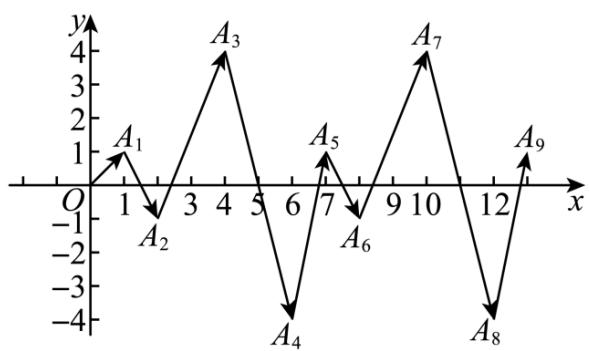

line

| Point | x | y |
|---|---|---|
| A1 | 1 | 1 |
| A2 | 2 | -1 |
| A3 | 4 | 4 |
| A4 | 6 | -4 |
| A5 | 7 | 1 |
| A6 | 8 | -1 |
| A7 | 10 | 4 |
| A8 | 12 | -4 |
| A9 | 13 | 1 |

A. (3038,-1)

B. $(3037,-1)$

C. (3037,1)

D. (3038,1)

【答案】C

【分析】本题考查坐标的规律问题，先找到点的规律，然后计算解题即可，解题的关键是找到点的坐标规律.

【详解】解：由题可知，每4个点纵坐标重复一次，横坐标向右平移6个单位长度，

$$
\therefore 2 0 2 5 \div 4 = 5 0 6 \dots 1,
$$

则 $A_{2025}$ 的横坐标为： $506 \times 6 + 1 = 3037$ ，纵坐标为1，

故选：C.

【变式 6-3】（24-25 九年级下·辽宁抚顺·阶段练习）如图，在平面直角坐标系中，长方形ABCD的四个顶点坐标分别为 $A(-1,2)$ ， $B(-1,-1)$ ， $C(1,-1)$ ， $D(1,2)$ 点P从点A出发，沿长方形ABCD的边顺时针运动，速度为每秒2个单位长度，点Q从点A出发，沿长方形ABCD的边逆时针运动，速度为每秒3个单位长度，记点P，Q在长方形ABCD边上第1次相遇时的点为 $M_{1}$ ，第二次相遇时的点为 $M_{2}$ ，第三次相遇时的点为 $M_{3}$ ，……，则点 $M_{2025}$ 的坐标为（）

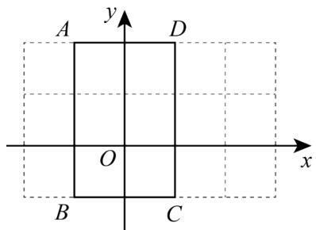

text_image

A
y
D
O
x
B
C

A. $(1,0)$

B. $(-1,0)$

c. $(-1,2)$

D. $(0,-1)$

【答案】C

【分析】本题考查了平面直角坐标系中点的坐标变换，正确找出规律是解题的关键．根据点坐标计算长方形的周长为10，设经过t秒P，Q第一次相遇，则P点走的路程为2t，Q点走的路程为3t，根据题意列方程，即可求出经过2秒第一次相遇，进一步求出第一次、第二次、第三次……相遇点的坐标，直到找出五次相遇一循环，再用 $2025\div5=405$ 的结果即可求出第2025次相遇点的坐标.

【详解】解：∵ $A(-1, 2)$ ， $B(-1, -1)$ ， $C(1, -1)$ ， $D(1, 2)$ ，

$$
\therefore A B = C D = 2 - (- 1) = 3, A D = B C = 1 - (- 1) = 2,
$$

∴长方形的周长为 $(3+2)\times2=10$ ,

设经过 t 秒 P，Q 第一次相遇，则 P 点走的路程为 2t，Q 点走的路程为 3t，

根据题意得 $2t+3t=10$ ,

解得t=2，

∴当t=2时，P，Q第一次相遇，则路程为 $2\times2=4$ ，此时相遇点 $M_{1}$ 坐标为(1,0)，

当t=4时，P，Q第二次相遇，则路程为 $2\times4=8$ ，此时相遇点 $M_{2}$ 坐标为 $(-1,0)$ ，

当t=6时，P，Q第三次相遇，则路程为 $2\times6=12$ ，此时相遇点 $M_{3}$ 坐标为(1,2)，

当t=8时，P，Q第四次相遇，则路程为 $2\times8=16$ ，此时相遇点 $M_{4}$ 坐标为 $(0,-1)$ ，

当t=10时，P，Q第五次相遇，则路程为 $2\times10=20$ ，此时相遇点 $M_{5}$ 坐标为 $(-1,2)$ ，

当t=12时，P，Q第六次相遇，则路程为 $2\times12=24$ ，此时相遇点 $M_{6}$ 坐标为(1,0)，

∴ 五次相遇循环一次，

$$
\because 2 0 2 5 \div 5 = 4 0 5,
$$

∴ 点 $M_{2025}$ 的坐标为(-1,2).

故选：C.

# 【题型 7 坐标与图形变换规律探究】

【例 7】（24-25 八年级下·山东临沂·阶段练习）如图，在直角坐标系中，每个网格小正方形的边长均为 1 个单位长度，以点 P 为顶点作正方形 $PA_{1}A_{2}A_{3}$ ，正方形 $PA_{4}A_{5}A_{6}$ ，…，按此规律作下去，所作正方形的顶点均在格点上，其中正方形 $PA_{1}A_{2}A_{3}$ 的顶点坐标分别为 $P(-3,0)$ ， $A_{1}(-2,1)$ ， $A_{2}(-1,0)$ ， $A_{3}(-2,-1)$ ，则顶点 $A_{100}$ 的坐标为 \_\_\_\_.

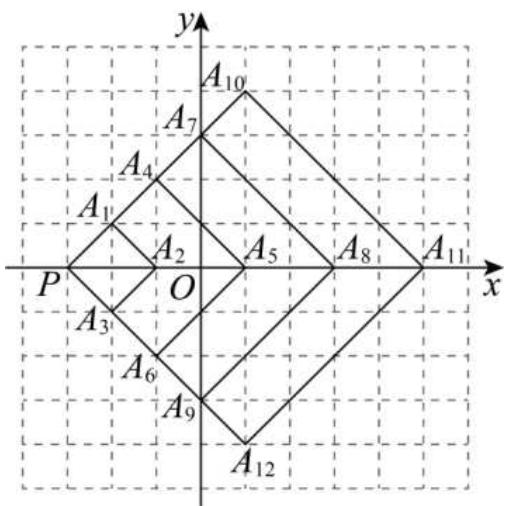

text_image

y
A10
A7
A4
A1
A2
A5
A8
A11
x
P
O
A3
A6
A9
A12

【答案】(31,34)

【分析】本题考查点的变化规律，根据 $A_{1}$ 、 $A_{2}$ 、 $A_{3}$ …坐标的变化情况，总结规律，根据规律解答，仔细观察图形、数形结合，总结出点的坐标的变化规律是解决问题的关键.

【详解】解：∵ $A_{1}(-2,1)$ ， $A_{4}(-1,2)$ ， $A_{7}(0,3)$ ， $A_{10}(1,4)$ ，…，

$$
\therefore A _ {3 n - 2} (n - 3, n),
$$

$$
\because 1 0 0 = 3 \times 3 4 - 2,
$$

∴顶点 $A_{100}$ 的坐标为(31,34),

故答案为：(31,34).

【变式 7-1】（24-25 八年级下·河南平顶山·期中）如图，在平面直角坐标系中， $\triangle A_{1}A_{2}A_{3}$ ， $\triangle A_{3}A_{4}A_{5}$ ， $\triangle A_{5}A_{6}A_{7}$ ， $\triangle A_{7}A_{8}A_{9}$ ，…都是等边三角形，且点 $A_{1}, A_{3}, A_{5}, A_{7}, A_{9}$ 的坐标分别是 $A_{1}(3,0), A_{3}(2,0)$ ， $A_{5}(4,0), A_{7}(1,0), A_{9}(5,0)$ 。依据图形所反映的规律，则 $A_{2025}$ 的坐标是（）

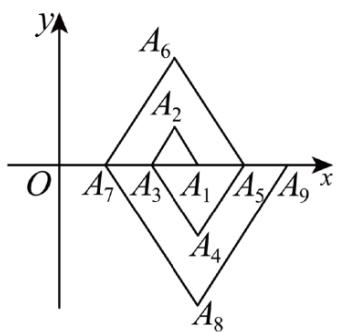

text_image

y
A6
A2
O A7 A3 A1 A5 A9 x
A4
A8

A. (509,0)

B. (508,0)

C. $(-509,0)$

D. $(-505,0)$

【答案】A

【分析】本题是一道关于等边三角形性质及探索规律的题目，找出坐标的变化规律是解答的关键．观察图形可以得到 $A_{1}\sim A_{4},A_{5}\sim A_{8},\ldots$ ，每4个为一组，据此可以得到 $A_{2025}$ 横坐标为 $506+3=509$ ， $A_{2025}$ 在x轴正半轴上，纵坐标为0，据此即可求解.

【详解】解：观察图形可以看出 $A_{1}\sim A_{4},A_{5}\sim A_{8},\ldots$ ，每4个为一组，

∵ $A_{1}(3,0)$ , $A_{5}(4,0)$ , $A_{9}(5,0)$ , .....;

$1 \div 4 = 0 \cdots 1, A_{1}$ 的横坐标为 $0 + 3 = 3$ ,

$5 \div 4 = 1 \cdots 1, A_{5}$ 的横坐标为 $1 + 3 = 4$ ,

$9 \div 4 = 2 \cdots 1, A_{9}$ 的横坐标为 $2 + 3 = 5$ ,

……;

$$
\because 2 0 2 5 \div 4 = 5 0 6 \dots \dots 1,
$$

$\therefore A_{2025}$ 横坐标为 $506 + 3 = 509$ ,

$\therefore A_{2025}$ 在 x 轴正半轴上，纵坐标为 0，

$\therefore A_{2025}$ 的坐标是(509,0).

故选：A.

【变式 7-2】（2025 八年级上·全国·专题练习）如下图，在平面直角坐标系中，第一次将三角形 OAB 变换成三角形 $OA_{1}B_{1}$ ，第二次将三角形 $OA_{1}B_{1}$ 变换成三角形 $OA_{2}B_{2}$ ，第三次将三角形 $OA_{2}B_{2}$ 变换成三角形 $OA_{3}B_{3}$ ，……，依此变换下去．已知 $A(1,3), A_{1}(2,3), A_{2}(4,3), A_{3}(8,3), B(2,0), B_{1}(4,0), B_{2}(8,0), B_{3}(16,0)$ .

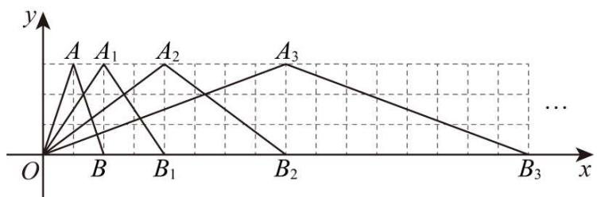

text_image

y
A A₁ A₂ A₃
O B B₁ B₂ B₃ ...

(1)求出三角形 $OA_{4}B_{4}$ 各个顶点的坐标.

(2)按此图形的变化规律，请你求出三角形 $OA_{n}B_{n}$ 的面积与三角形OAB的面积的大小关系.

【答案】(1)点 O 的坐标是 $(0,0)$ ，点 $A_{4}$ 的坐标是 $(16,3)$ ，点 $B_{4}$ 的坐标是 $(32,0)$

$$
(2) S _ {\triangle O A _ {n} B _ {n}} = 2 ^ {n} S _ {\triangle O A B}
$$

【分析】本题考查了点坐标规律探索，解题的关键是找出点的规律；

（1）先得到 A 的横坐标是 $2^{n}$ ，而纵坐标都是 3，点 $B_{n}$ 的横坐标是 $2^{n+1}$ ，纵坐标是 0 即可作答；  
(2) 根据三角形的面积公式计算解答即可.

【详解】（1）解：由图可知，点 O 的坐标是 $(0,0)$ .

已知 $A(1,3),A_{1}(2,3),A_{2}(4,3),A_{3}(8,3)$ ，从点 $A_{1},A_{2},\ldots,A_{n}$ 的坐标中找规律，发现点 $A_{n}$ 的横坐标是 $2^{n}$ ，而纵坐标都是3.

同理，点 $B_{1},B_{2},\cdots,B_{n}$ 也一样找规律，发现点 $B_{n}$ 的横坐标是 $2^{n+1}$ ，纵坐标是0.

由上述规律可知，点 $A_{4}$ 的坐标是(16,3)，点 $B_{4}$ 的坐标是(32,0).

(2) 解: 根据规律, 后一个三角形的底边是前一个三角形底边的 2 倍, 高都是 3.

由（1），得 $OB_{n}=2^{n+1}$ ，所以 $S_{\triangle O A_{n}B_{n}}=\frac{1}{2}\times2^{n+1}\times3=3\times2^{n}$

又因为 $S_{\triangle OAB}=\frac{1}{2}\times2\times3=3,$

所以 $S_{\triangle O A_{n}B_{n}}=2^{n}S_{\triangle O A B}$ .

【变式 7-3】如图，在平面直角坐标系xOy中，点 $A_{1}(1,0)$ ， $A_{2}(3,0)$ ， $A_{3}(6,0)$ ， $A_{4}(10,0)$ ，…，以 $A_{1}A_{2}$ 为对角线作第一个正方形 $A_{1}C_{1}A_{2}B_{1}$ ，以 $A_{2}A_{3}$ 为对角线作第二个正方形 $A_{2}C_{2}A_{3}B_{2}$ ，以 $A_{3}A_{4}$ 为对角线作第三个正方形 $A_{3}C_{3}A_{4}B_{3}$ …顶点 $B_{1}$ ， $B_{2}$ ， $B_{3}$ ，…都在第一象限，按照这样的规律依次进行下去，点 $B_{n}$ 的坐标为

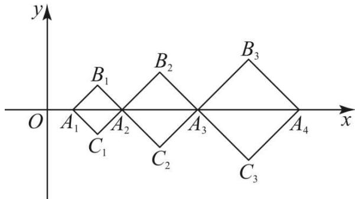

text_image

y
O A₁ A₂ C₁ B₁ B₂ B₃ A₃ x
C₂ C₃ A₄

【答案】 $\left[\frac{(n+1)^{2}}{2},\frac{n+1}{2}\right]$

【分析】利用图形分别得出 B 点横坐标 $B_{1}$ ， $B_{2}$ ， $B_{3}$ ，…的横坐标分别为： $\frac{49}{2}, \frac{16}{2}, \frac{25}{2}$ …，点 $B_{n}$ 的横坐标为： $\frac{(n+1)^{2}}{2}$ ，再利用纵坐标变化规律进而得出答案.

【详解】解：分别过点 $B_{1}$ ， $B_{2}$ ， $B_{3}$ ，作 $B_{1}D\perp x$ 轴， $B_{2}E\perp x$ 轴， $B_{3}F\perp x$ 轴于点D，E，F，

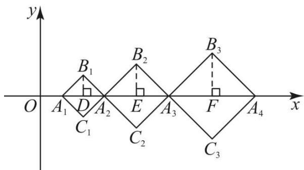

text_image

y
O A₁ D A₂ E A₃ F A₄ x
B₁ B₂ B₃
C₁ C₂ C₃

$\because A_{1}(1,0)$

$$
\therefore A _ {1} A _ {2} = 3 - 1 = 2, \quad A _ {1} D = 1, \quad , O D = 2, \quad B _ {1} D = A _ {1} D = 1,
$$

可得出 $B_{1}(2,1)$ .

$$
\because A _ {2} (3, 0),
$$

$$
\therefore A _ {3} A _ {2} = 6 - 3 = 3, E B _ {2} = \frac {3}{2}, B _ {2} E = E A _ {2} = \frac {3}{2}, O E = 6 - \frac {3}{2} = \frac {9}{2},
$$

可得 $B_{2}\left(\frac{9}{2},\frac{3}{2}\right)$ ,

同理可得出： $B_{3}(8,2)$ ， $B_{4}\left(\frac{25}{2},\frac{5}{2}\right)$ ，…，

$\because B_{1}, B_{2}, B_{3}, \ldots$ 的横坐标分别为： $\frac{4}{2}, \frac{9}{2}, \frac{16}{2}, \frac{25}{2} \ldots,$

∴点 $B_{n}$ 的横坐标为： $\frac{(n+1)^{2}}{2}$ ,

$\because B_{1}, B_{2}, B_{3}, \ldots$ 的纵坐标分别为： $1, \frac{3}{2}, \frac{4}{2}, \frac{5}{2}, \ldots,$

∴点 $B_{n}$ 的纵坐标为： $\frac{n+1}{2}$ ,

∴点 $B_{n}$ 的坐标为： $\left[\frac{(n+1)^{2}}{2},\frac{n+1}{2}\right]$ .

故答案为： $\left[\frac{(n+1)^{2}}{2},\frac{n+1}{2}\right]$ .

【点睛】此题主要考查了点的坐标规律，培养学生观察和归纳能力，从所给的数据和图形中寻求规律分别得出 B 点横纵坐标的规律是解答本题的关键.

# 【题型8 坐标系中的动点问题探究】

【例 8】（24-25 七年级下·吉林·期末）如图，在平面直角坐标系中，长方形OABC的边OC、OA分别在x轴、y轴上，B点在第一象限，点A的坐标是(0,4)，OC=8.

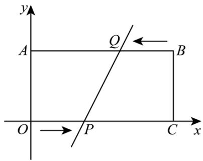

text_image

y
A
Q
B
O → P C x

(1)直接写出点 B、点 C 的坐标.  
(2)点 $P$ 从原点 $O$ 出发, 在边 $OC$ 上以每秒 1 个单位长度的速度匀速向 $C$ 点运动, 同时点 $Q$ 从点 $B$ 出发, 在边 $BA$ 上以每秒 2 个单位长度的速度匀速向 $A$ 点运动, 当一个点到达终点时, 另一个点随之停止运动, 设运动时间为 $t$ 秒, 探究下列问题:  
①当 t 为多少时，直线 $PQ \parallel y$ 轴？  
②在运动过程中，当点 O 到 y 轴的距离为 2 个单位长度时，求 P、O 两点的坐标.

③在整个运动过程中, 能否使得四边形BCPQ的面积是长方形OABC面积的 $\frac{5}{8}$ ? 若能, 请直接写出 $P$ 、 $Q$ 两点的坐标; 若不能, 说明理由.

【答案】(1) $B(8,4)$ ， $C(8,0)$

(2)① $\frac{8}{3}$ ② $P(3,0)$ ， $Q(2,4)$ ③能； $P(2,0)$ ， $Q(4,4)$

【分析】此题是四边形综合题，主要考查了矩形的性质，平行四边形的判定与性质，矩形的面积公式，梯形的面积公式，利用方程的思想解决问题是解本题的关键.

(1) 先求出点 $C$ 的坐标, 再利用矩形的性质求出点 $B$ 的坐标;  
(2) ①利用 $PQ \parallel y$ 轴得出AQ = OP建立方程求解即可；  
②点Q到y轴的距离为2个单位长度，则AQ = 2，即可求解；  
③先求出矩形OABC的面积，再表示出四边形BCPQ的面积，进而建立方程求出时间t即可得出结论.

【详解】（1）解：∵点A的坐标是(0,4)，

$$
\therefore O A = 4,
$$

$$
\because O C = 8,
$$

$$
\therefore C (8, 0),
$$

∵四边形OABC是矩形，AB = OC = 8，BC = OA = 4，

$$
\therefore B (8, 4);
$$

(2) ①由题意得OP = t, BQ = 2t,

$$
\therefore A Q = 8 - 2 t,
$$

$\because PQ \parallel y$ 轴， $OC \parallel AB$ ，

∴四边形OAQP是平行四边形，

$\therefore OP = AQ,$ 即 t = 8 - 2t,

$$
\therefore t = \frac {8}{3},
$$

∴当 $t=\frac{8}{3}$ 时，直线 $PQ\parallel y$ 轴；

②∵点Q到y轴的距离为2个单位长度，

$$
\therefore A Q = 2,
$$

$$
\therefore 8 - 2 t = 2,
$$

$$
\therefore t = 3;
$$

③∵OA=4,OC=8,

$$
\therefore S _ {\text { 四   边   形 } O A B C} = 4 \times 8 = 3 2,
$$

由运动知，OP = t，BQ = 2t，

$$
\therefore C P = O C - O P = 8 - t,
$$

$$
\therefore S _ {\text {四边形} B C P Q} = \frac {1}{2} (B Q + P C) \times O A = \frac {1}{2} (2 t + 8 - t) \times 4 = 2 t + 1 6,
$$

∵四边形BCPQ的面积是长方形OABC的面积的 $\frac{5}{8}$ ,

$$
\therefore 2 t + 1 6 = \frac {5}{8} \times 3 2 = 2 0,
$$

$$
\therefore t = 2,
$$

$$
\therefore 8 - 2 t = 4
$$

$$
\therefore P (2, 0), \quad Q (4, 4).
$$

【变式 8-1】如图 1，已知，点 $A(1,4)$ ， $AH \perp x$ 轴，垂足为H，将线段AO平移至线段BC，点 $B(3,0)$ ，其中点A与点B对应，点O与点C对应.

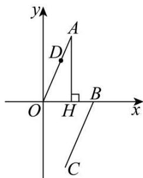

text_image

y
A
D
O
H
B
x
C

图1

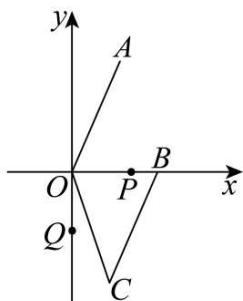

text_image

y
A
O
P
B
x
Q
C

图2

(1)三角形AOH的面积为\_\_\_\_.  
(2)如图1，若点 $D(m,n)$ 在线段OA上，请你连接DH，利用图形面积关系说明n=4m.  
(3)如图 2, 连 $OC$ , 动点 $P$ 从点 $B$ 开始在 $x$ 轴上以每秒 2 个单位的速度向左运动, 同时点 $Q$ 从点 $O$ 开始在 $y$ 轴上以每秒 1 个单位的速度向下运动. 若经过 $t$ 秒, 三角形 $AOP$ 与三角形 $COQ$ 的面积相等, 试求 $t$ 的值及点 $P$ 的坐标.

【答案】(1)2

(2) 见解析   
(3)t=1.2时， $P(0.6,0)$ ，t=2时， $P(-1,0)$ .

【分析】本题考查了坐标与图形变化—平移，三角形的面积，一元一次方程的应用，解题的关键是理解题意，采用分类讨论的思想.

(1) 利用三角形面积公式计算即可得出答案:  
(2) 根据 $S_{\triangle ODH} + S_{\triangle ADH} = S_{\triangle OAH}$ ，计算即可得解；  
(3) 分两种情况: 当点 $P$ 在线段 $OB$ 上; 当点 $P$ 在 $BO$ 的延长线上时; 分别建立一元一次方程, 解方程即可得

出答案.

【详解】（1）解：∵点A(1,4)，AH⊥x轴，

$$
\therefore A H = 4, O H = 1,
$$

$$
\therefore S _ {\triangle A O H} = \frac {1}{2} \times 1 \times 4 = 2,
$$

故答案为：2.

(2) 证明: 如图, 连接 $DH$ .

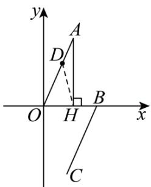

text_image

y
A
D
O
H
B
x
C

图1

由（1）知， $S_{\triangle AOH}=2$ ，

$$
\because S _ {\triangle O D H} + S _ {\triangle A D H} = S _ {\triangle O A H},
$$

$$
\therefore \frac {1}{2} O H \times n + \frac {1}{2} A H \times (1 - m) = 2, \text {即} \frac {1}{2} \times 1 \times n + \frac {1}{2} \times 4 \times (1 - m) = 2,
$$

$$
\therefore n = 4 m;
$$

（3）解：①当点P在线段OB上， $\frac{1}{2}(3-2t)\times4=\frac{1}{2}\times2t$

解得t=1.2，此时 $P(0.6,0)$ .

②当点P在BO的延长线上时， $\frac{1}{2}(2t-3)\times4=\frac{1}{2}\times2t$

解得t=2，此时 $P(-1,0)$ ,

综上所述，t = 1.2 时， $P(0.6,0)$ ，t = 2 时， $P(-1,0)$ .

【变式 8-2】（24-25 七年级下·重庆江津·期末）如图，在平面直角坐标系中， $AB \parallel CD \parallel x$ 轴， $BC \parallel DE \parallel y$ 轴，且AB = CD = 3, OA = 4, DE = 2，动点P从点A出发，以每秒1个单位长度的速度，沿 $A \rightarrow B \rightarrow C$ 路线向点C运动；动点Q从点O出发，以每秒2个单位长度速度，沿路线 $O \rightarrow E \rightarrow D$ 向点D运动．若P，Q两点同时出发，其中一点到达终点时，两点都停止运动．

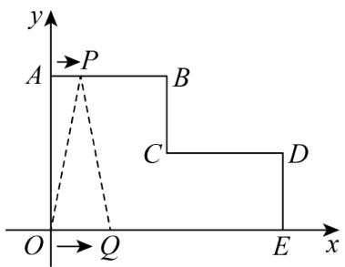

text_image

y
A →P
B
C
D
O →Q
E x

(1)直接写出 B, C, D 三个点的坐标;  
(2)当 P, Q 两点出发2s时，求三角形OPQ的面积；  
(3)设 P, Q 两点运动的时间为 ts，当三角形 OPQ 的面积为 6 时，求 t 的值.

【答案】(1) $B(3,4),C(3,2),D(6,2)$

(2) $S_{\triangle OPQ} = 8$

(3)当 $t=\frac{3}{2}s$ 或t=4s时，三角形OPQ的面积为6

【分析】本题主要考查坐标与图形，写出平面直角坐标系中点的坐标，动点与一元一次方程的综合，理解图示，找出正确的数量关系是关键.

(1) 根据题意, 结合线段的长度判定即可;   
（2）根据题意得到AP=2,0Q=4，点P在线段AB上， $P(2,4)$ ，根据三角形面积的计算即可求解；  
(3) 根据题意得到点 $P$ 从 $A \rightarrow B \rightarrow C$ 的时间为 $3 + 2 = 5s$ , 点 $Q$ 从 $O \rightarrow E \rightarrow D$ 的时间为 $3 + 1 = 4s$ , 分类讨论, 数学结合分析即可求解.

【详解】（1）解：在平面直角坐标系中， $AB \parallel CD \parallel x$ 轴， $BC \parallel DE \parallel y$ 轴，且AB = CD = 3,OA = 4,DE = 2,

$$
\therefore O E = A B + C D = 3 + 3 = 6,
$$

$$
\therefore B (3, 4), C (3, 2), D (6, 2);
$$

(2) 解: 动点 $P$ 从点 $A$ 出发, 以每秒 1 个单位长度的速度, 动点 $Q$ 从点 $O$ 出发, 以每秒 2 个单位长度速度, 当时间为 $2 \mathrm{~s}$ 时, $AP = 2, O Q = 4$ ,

∴点P在线段AB上， $P(2,4)$ ,

$$
\therefore S _ {\triangle O P Q} = \frac {1}{2} O Q \cdot y _ {P} = \frac {1}{2} \times 4 \times 4 = 8;
$$

（3）解：点P在线段AB上运动的时间为 $3 \div 1 = 3s$ ，在线段BC上运动的时间为 $(4 - 2) \div 1 = 2s$ ，

∴点P从 $A\rightarrow B\rightarrow C$ 的时间为 $3+2=5s$ ,

点Q在线段OE上运动的时间为 $6 \div 2 = 3s$ ，在线段DE上运动的时间为 $2 \div 2 = 1s$ ，

∴点Q从 $O\rightarrow E\rightarrow D$ 的时间为 $3+1=4s$ ,

∵若 P，Q 两点同时出发，其中一点到达终点时，两点都停止运动，

∴点P不能到达点C的位置，

设 P, Q 两点运动的时间为 ts,

当 $0 < t \leq 3$ 是，AP = t, OQ = 2t,

$$
\therefore S _ {\triangle O P Q} = \frac {1}{2} O Q \cdot y _ {P} = \frac {1}{2} \times 2 t \times 4 = 6,
$$

解得， $t=\frac{3}{2}s;$

当 $3 < t \leq 4$ 时，点P在线段BC上，点Q在线段DE上，

如图所示，过点P作ED延长线的垂线，交于点F，

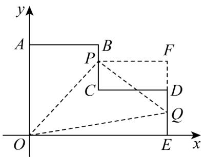

text_image

y
A
P
B
F
C
D
Q
O
E
x

∴ PF = CD = 3, BP = t - 3, EQ = 2t - 6，点P的横坐标为3，纵坐标为 $4 - (t - 3) = 7 - t$ ，点Q的横坐标为6，纵坐标为2t - 6，

$$
\therefore P (3, 7 - t), F (6, 7 - t), Q (6, 2 t - 6),
$$

$$
\therefore Q F = 7 - t - (2 t - 6) = 1 3 - 3 t, E F = 7 - t,
$$

$$
\therefore S _ {\triangle O P Q} = S _ {\text {梯形} O P F E} - S _ {\triangle O E Q} - S _ {\triangle P Q F} = 6,
$$

$$
\therefore S _ {\triangle O P Q} = \frac {(3 + 6) \times (7 - t)}{2} - \frac {1}{2} \times 6 \times (2 t - 6) - \frac {1}{2} \times 3 \times (1 3 - 3 t) = 6,
$$

整理得，12t = 48，

解得，t = 4s;

综上所述，当 $t=\frac{3}{2}s$ 或t=4s时，三角形OPQ的面积为6.

【变式 8-3】读一读:

数形结合作为一种数学思想方法，其应用大致又可分为两种情形：或者借助于数的精确性来阐明形的某些属性，或者借助形的几何直观性来阐明数之间某种关系，即数形结合包括两个方面：第一种情形是“以数解形”，而第二种情形是“以形助数”。例如：在我们学习数轴的时候，数轴上任意两点，A表示的数为a，B表示的数为b，则A，B两点的距离可用式子 $|a-b|$ 表示，例如：5和-2的距离可用 $|5-(-2)|$ 或 $|-2-5|$ 表示。研一研：

如图，在平面直角坐标系中，直线AB分别与x轴正半轴、y轴正半轴交于点A(a,0)、点B(0,b)，且a、b满足

$$
(a - 6) ^ {2} + | b - 4 | = 0.
$$

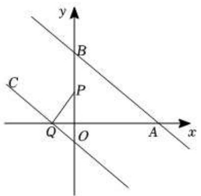

text_image

y
B
C
P
Q
O
A
x

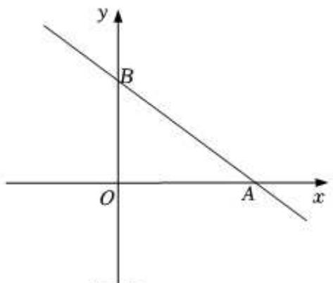

text_image

y
B
O
A
x

备用图

(1)直接写出以下点的坐标：A（\_\_\_\_，0），B（0，\_\_\_\_）.  
(2)若点P、点Q分别是y轴正半轴（不与B点重合）、x轴负半轴上的动点，过Q作QC∥AB，连接PQ．已知 $\angle BAO = 34^{\circ}$ （近似值），请探索∠BPQ与∠PQC之间的数量关系，并说明理由.  
(3)已知点 $D(3,2)$ 是线段AB的中点，若点H为y轴上一点，且 $S_{\triangle AHD}=\frac{2}{3}S_{\triangle AOB}$ ，求点H的坐标.

【答案】(1)6，4;

(2) $\angle BPQ + \angle PQC = 236^{\circ}$ ;   
(3) $H\left(0,\frac{28}{3}\right)$ 或 $\left(0,-\frac{4}{3}\right)$ .

【分析】（1）利用平方和绝对值的非负性解答即可；

(2) 过点 $P$ 作 $PM \parallel CQ$ , 得出 $QC \parallel AB \parallel PM$ , 根据三角形外角的性质求出 $\angle DBP$ , 再根据平行线的性质求出 $\angle DBP + \angle BPM + \angle MPQ + \angle PQC = 360^{\circ}$ , 最后利用等量代换得出结果;  
（3）设 $H(0, x)$ ，根据 $S_{\triangle AHD} = \frac{2}{3} S_{\triangle AOB}$ 结合三角形的面积公式列出关于 $x$ 的方程，解方程求出 $x$ 即可.

【详解】（1）解：∵ $(a-6)^{2}+|b-4|=0$ ，

$$
\therefore a - 6 = 0, \quad b - 4 = 0,
$$

解得：a=6，b=4，

$$
\therefore A (6, 0), B (0, 4),
$$

故答案为：6，4；

(2) $\angle BPQ + \angle PQC = 236^{\circ}$ ,

理由：如图，过点 P 作 $PM \parallel CQ$ ，

$$
\because \angle B A O = 3 4 ^ {\circ},
$$

$$
\therefore \angle D B P = \angle 9 0 ^ {\circ} + 3 4 ^ {\circ} = 1 2 4 ^ {\circ},
$$

$$
\because Q C \parallel A B,
$$

$$
\therefore Q C \| A B \| P M,
$$

$$
\therefore \angle D B P + \angle B P M = 1 8 0 ^ {\circ}, \angle M P Q + \angle P Q C = 1 8 0 ^ {\circ},
$$

$$
\therefore \angle D B P + \angle B P M + \angle M P Q + \angle P Q C = 3 6 0 ^ {\circ},
$$

$$
\because \angle B P Q = \angle B P M + \angle M P Q,
$$

$$
\therefore \angle D B P + \angle B P Q + \angle P Q C = 3 6 0 ^ {\circ},
$$

$$
\therefore \angle B P Q + \angle P Q C = 3 6 0 ^ {\circ} - \angle D B P = 3 6 0 ^ {\circ} - 1 2 4 ^ {\circ} = 2 3 6 ^ {\circ};
$$

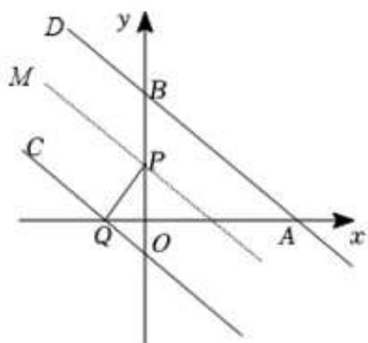

text_image

D
y
M
B
C
P
Q
O
A
x

（3）如图：∵A（6，0），B（0，4），

$$
\therefore S _ {\triangle} A O B = \frac {1}{2} \times 6 \times 4 = 1 2,
$$

设 $H(0, x)$ ,

∵点 D（3，2）是线段 AB 的中点，

$$
\therefore S _ {\triangle} A H D = \frac {1}{2} S _ {\triangle} A H B = \frac {1}{2} \times \frac {1}{2} | x - 4 | \times 6 = \frac {3}{2} | x - 4 |,
$$

$$
\because S _ {\triangle A H D} = \frac {2}{3} S _ {\triangle A O B},
$$

$$
\therefore \frac {3}{2} | x - 4 | = \frac {2}{3} \times 1 2,
$$

$$
\therefore | x - 4 | = \frac {1 6}{3}
$$

$$
\therefore x - 4 = \frac {1 6}{3} \text {或} x - 4 = - \frac {1 6}{3},
$$

解得： $x=\frac{28}{3}$ 或 $x=-\frac{4}{3}$ ,

∴H（0， $\frac{28}{3}$ ）或（0， $-\frac{4}{3}$ ）.

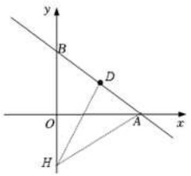

text_image

y
B
D
O
A
x
H

【点睛】本题考查了非负数的性质，平行线的性质，坐标与图形，解绝对值方程等知识，解题的关键是作出图形利用数形结合的思想解答问题.

# 【题型9 坐标系中角度关系问题探究】

【例 9】在平面直角坐标系中，点 A、B 分别在 x 轴、y 轴正半轴上，OA:OB = 5:4， $\triangle AOB$ 面积为 10，点 C(m,4) 在第二象限，点 P 是射线 CB 上一动点， $\angle C = \angle OAB$ .

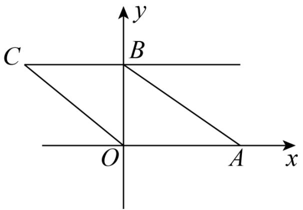

text_image

C
B
O
A
x
y

(1)求点 B 坐标;  
(2)线段 OC 能否通过平移 AB 得到？试求点 C 坐标；  
(3) $\angle OPA$ 、 $\angle POC$ 、 $\angle PAB$ 之间有何关系？请说明理由.

【答案】(1) $B(0,4)$ .

(2)线段 OC 能否通过平移 AB 得到，理由见详解， $C(-5,4)$ ;  
(3) $\angle OPA=\angle POC+\angle PAB$ 或 $\angle OPA=\angle POC-\angle PAB.$

【分析】（1）设 OA=5m，OB=4m，根据 $\triangle AOB$ 面积为 10 建立方程，解出 m 的值，即可求出点 B 坐标；

(2) 证明 $BC \parallel x$ 轴, 得到 $OC \parallel AB$ , 即可线段 $OC$ 能否通过平移 $AB$ 得到, 由 $OA = 5$ , 通过平移即可得到点 $C$ 的坐标;  
(3) 分当点 $P$ 在点 $B, C$ 之间时和当点 $P$ 在点 $B$ 的右侧时两种情况进行讨论即可得出结论.

【详解】（1）解：∵OA:OB=5:4

设 OA=5m，OB=4m，

∵△AOB 面积为 10,

$$
\therefore \frac {1}{2} \times 5 m \times 4 m = 1 0,
$$

$$
\therefore m ^ {2} = 1,
$$

∵m为正数，

$$
\therefore m = 1,
$$

$$
\therefore O B = 4,
$$

$$
\therefore B (0, 4).
$$

(2) 解: 线段 OC 能否通过平移 AB 得到.

理由：如图

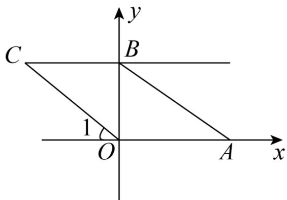

text_image

C
y
B
1
O
A
x

∵B(0, 4), C(m, 4)的纵坐标相同，

∴BC∥x轴，

$$
\therefore \angle C = \angle 1,
$$

$$
\because \angle C = \angle O A B
$$

$$
\therefore \angle 1 = \angle O A B
$$

$$
\therefore O C \parallel A B,
$$

∴线段 OC 能否通过平移 AB 得到.

由（1）得，OA=5，将 AB 向左平移 5 个单位长度，点 A 到点 O，点 B(0, 4)到点 C.

$$
\therefore C (- 5, \quad 4).
$$

（3）解： $\angle OPA = \angle POC + \angle PAB$ 或 $\angle OPA = \angle POC - \angle PAB.$

理由:

当点 P 在点 B，C 之间时，如图 2，过点 P 作 $PH \parallel CO$ 交 x 轴于点 H，

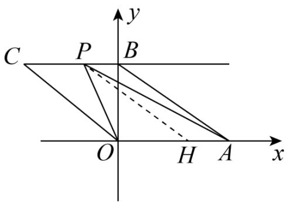

text_image

C
P
B
O
H
A
x
y

图2

$$
\therefore \angle O P H = \angle P O C,
$$

由（2）知， $OC \parallel AB$

$$
\therefore P H \parallel O C \parallel A B
$$

$$
\therefore \angle H P A = \angle P A B,
$$

$$
\therefore \angle O P A = \angle O P H + \angle A P H = \angle P O C + \angle P A B.
$$

当点 P 在点 B 的右侧时，如图 3，过点 P 作 $PH \parallel CO$ ，

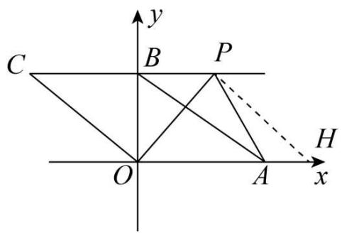

text_image

C
B
P
O
A
H
x
y

图3

由（2）知， $OC \parallel AB$

$$
\therefore P H \parallel O C \parallel A B
$$

$$
\therefore \angle B A P = \angle A P H, \quad \angle H P O = \angle C O P,
$$

$$
\therefore \angle O P A = \angle H P O - \angle A P H = \angle P O C - \angle P A B.
$$

综上所述， $\angle OPA = \angle POC + \angle PAB$ 或 $\angle OPA = \angle POC - \angle PAB$ .

【点睛】此题主要考查了平行线的性质，求点的坐标，平移，解决问题的关键是分类讨论和正确的作辅助线.

【变式 9-1】某区进行课堂教学改革，将学生分成 5 个学习小组，采取团团坐的方式．如图所示，这是某校八(1)班教室简图，点 A、B、C、D、E 分别代表五个学习小组的位置．已知 A 点的坐标为 $(-1, 3)$ .

text_image

E
A
B
C
D

(1)请按题意建立平面直角坐标系（横轴和纵轴均为小正方形的边所在直线，每个小正方形边长为 1 个单位长度），写出图中其他几个学习小组的坐标；  
(2)若(1)中建立的平面直角坐标系坐标原点为 $O$ ，点 $F$ 在 $DB$ 的延长线上，请写出 $\angle FAB$ 、 $\angle AFO$ 、 $\angle FOD$ 之间的等量关系，并说明原因.

【答案】（1）见解析，B（4，3），C（-1，0），D（4，0），E（-2，5）；（2） $\angle FOD = \angle FAB + \angle AFO$ 见解析

【分析】（1）根据 A 点的坐标画出平面直角坐标系，再得出各个点的坐标即可；

(2) 根据平行线的性质和三角形外角性质得出即可.

【详解】解：（1）画出坐标系：

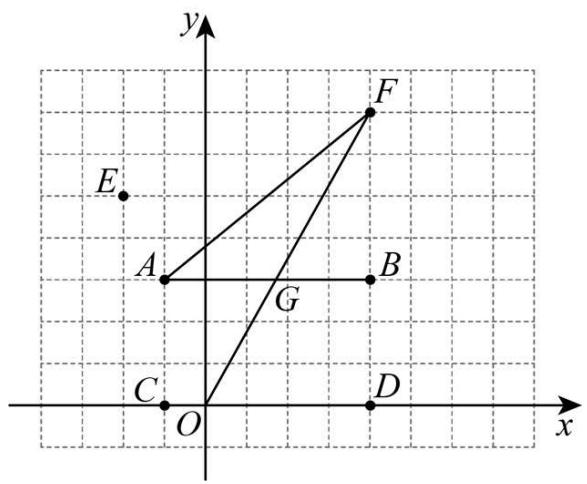

text_image

y
E
A
G
B
C
O
D
x

由图可得，B（4，3），C（-1，0），D（4，0），E（-2，5）；

(2) $\because AB\|OD,$

$\therefore \angle FOD = \angle FGB,$

∵∠FGB 是△AFG 的外角，

$\therefore \angle FGB = \angle FAB + \angle AFO,$

$\therefore \angle FOD = \angle FAB + \angle AFO.$

故答案为： $\angle FOD=\angle FAB+\angle AFO.$

【点睛】本题考查了点的坐标和平行线的性质、三角形的外角性质，能正确画出图形是解此题的关键.

【变式 9-2】（24-25 七年级下·辽宁盘锦·阶段练习）如图，在平面直角坐标系中，已知 $\triangle ABC$ ，点 A 的坐标是 $(4,0)$ ，点 B 的坐标是 $(2,3)$ ，点 C 在 x 轴的负半轴上，且 AC = 6.

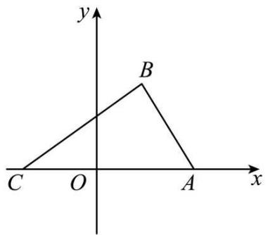

text_image

y
B
C O A x

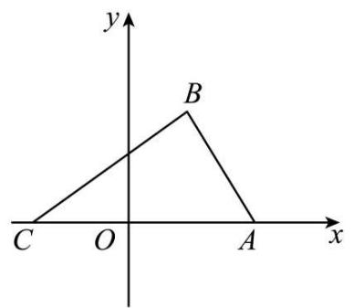

text_image

y
B
C O A x

备用图

(1)写出点 C 的坐标\_;  
(2)在 y 轴上是否存在点 P，使得三角形 POB 的面积等于三角形 ABC 面积的 $\frac{2}{3}$ ，若存在，求出点 P 的坐标；若不存在，请说明理由；  
(3)把点 C 往上平移 3 个单位得到点 H，作射线 CH，连接 BH，点 M 在射线 CH 上运动（不与点 C、H 重合），请直接写出 $\angle BMA$ ， $\angle HBM$ ， $\angle MAC$ 之间的数量关系.

【答案】(1) $C(-2,0)$

(2) $P(0,6)$ 或 $(0,-6)$   
(3) 见解析

【分析】本题考查了坐标与图形、平行线的性质、三角形外角的定义及性质，熟练掌握以上知识点并灵活运用是解此题的关键.

（1）由题意可得OA=4，求出OC=2，即可得解；  
（2）先求出三角形ABC面积，设点 $P(0,m)$ ，根据三角形面积公式列出方程计算即可得解；  
(3) 分三种情况, 分别利用平行线的性质求解即可.

【详解】（1）解：∵点 A 的坐标是 $(4,0)$ ,

$$
\therefore O A = 4,
$$

$$
\because A C = 6,
$$

$$
\therefore O C = 2,
$$

$$
\therefore C (- 2, 0);
$$

(2) 解: ∵点 B 的坐标是 $(2,3)$ ，AC = 6，

$$
\therefore S _ {\triangle A B C} = \frac {1}{2} \times 6 \times 3 = 9,
$$

设点 $P(0,m)$ ,

∵三角形POB的面积等于三角形ABC面积的 $\frac{2}{3}$ ,

$$
\therefore \frac {1}{2} \times | m | \times 2 = \frac {2}{3} \times 9,
$$

解得： $m=\pm6$ ，

∴P(0,6)或(0,-6);

(3) 解: 如图, 当点 $M$ 在点 $H$ 的上方且在 $A B$ 的下方时, 设 $A M$ 交 $B H$ 于 $J$ ,

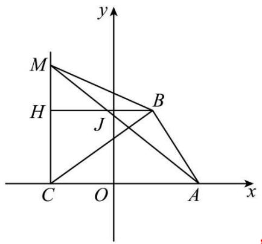

text_image

y
M
H
J
B
C O A x

∵BH∥AC,

$$
\therefore \angle C A M = \angle H J M,
$$

$$
\because \angle H J M = \angle A M B + \angle H B M,
$$

$$
\therefore \angle M A C = \angle A M B + \angle H B M;
$$

如图，当点M在点H的上方且在AB的上方时，

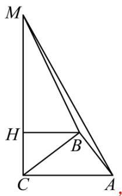

text_image

M
H
B
C
A,

同理可证得： $\angle HBM = \angle AMB + \angle AMC;$

如图，当点M在线段CH上（不与C、H重合）时，作MK∥HB，

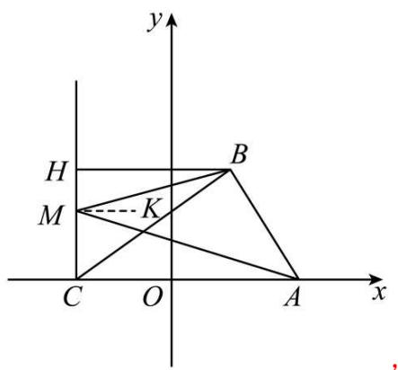

text_image

y
H
M
K
C O A x

$\because HB \parallel AC,$

$\therefore MK \parallel AC,$

$\therefore \angle HBM = \angle BMK, \angle CAM = \angle KMA,$

$\therefore \angle AMB = \angle BMK + \angle AMK = \angle CAM + \angle HBM.$

【变式 9-3】如图 1，在长方形 OABC 中，O 为平面直角坐标系的原点，OA = 2，OC = 4，点 B 在第一象限.

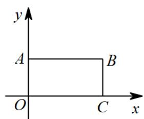

text_image

y
A B
O C x

图1

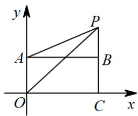

text_image

y
P
A
B
O
C
x

图2

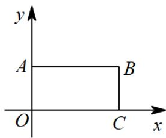

text_image

y
A B
O C x

备用图

(1)点B的坐标为\_\_\_\_；  
(2)如图 2, 点 $P$ 是线段 $CB$ 延长线上的点, 连接 $AP$ , $OP$ , 则 $\angle POC$ , $\angle APO$ , $\angle PAB$ 三个角满足的关系是什么? 并说明理由:  
(3)在（2）的基础上，已知： $\angle PAB = 20^{\circ}$ ， $\angle POC = 50^{\circ}$ ，在第一象限内取一点 $F$ ，连接 $OF$ ， $AF$ ，满足 $\angle PAB = 2\angle FAP$ ， $\angle POC = 2\angle FOP$ ，请直接写出 $\frac{\angle APO}{\angle AFO}$ 的值.

【答案】(1) $B(4,2)$

(2) $\angle POC = \angle APO + \angle PAB$ ，理由见解析  
(3) $\frac{2}{3}$ 或2或 $\frac{6}{13}$

【分析】（1）根据长方形求出各边长，从而得到点 B 坐标；

（2）设OP与AB交于D，根据平行线的性质得到 $\angle PDB=\angle POC$ ，再利用外角的性质求解；  
（3）分当 F 在 OP 上方时和当 F 在 OP 下方时，求出相应角的度数，可得结果.

【详解】（1）解：在长方形OABC中，OA = BC = 2，OC = AB = 4，

∵点B在第一象限，

$$
\therefore B (4, 2);
$$

(2) $\angle POC = \angle APO + \angle PAB$ ，理由是：

设OP与AB交于D，

$$
\because A B \parallel O C,
$$

$$
\therefore \angle P D B = \angle P O C,
$$

$$
\because \angle P D B = \angle A P O + \angle P A B,
$$

$$
\therefore \angle P O C = \angle A P O + \angle P A B;
$$

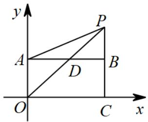

text_image

y
P
A
D
B
O
C
x

图2

(3) ①当 F 在 AP 上方时，

$$
\because \angle P A B = 2 0 ^ {\circ},
$$

$$
\therefore \angle F A P = \frac {1}{2} \angle P A B = 1 0 ^ {\circ},
$$

$$
\because \angle P O C = \angle A P O + \angle P A B,
$$

$\therefore50^{\circ}=\angle APO+20^{\circ}$ ，即 $\angle APO=30^{\circ}$ ,

$$
\therefore \angle B A F = \angle F A P + \angle P A B = 3 0 ^ {\circ} = \angle A P O,
$$

$$
\because \angle P O C = 2 \angle F O P, \angle P O C = 5 0 ^ {\circ},
$$

$$
\therefore \angle F O P = 2 5 ^ {\circ},
$$

$$
\therefore \angle F O C = \angle F O P + \angle P O C = 7 5 ^ {\circ},
$$

同（2）可得： $\angle FOC = \angle F + \angle FAB$ ，即 $75^{\circ} = \angle F + 30^{\circ}$ ，

$$
\therefore \angle F = 4 5 ^ {\circ},
$$

$$
\therefore \frac {\angle A P O}{\angle A F O} = \frac {3 0 ^ {\circ}}{4 5 ^ {\circ}} = \frac {2}{3};
$$

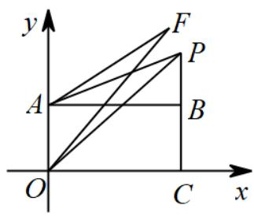

text_image

y
F
P
A
B
O
C
x

②当 F 在 AP 下方，当 F 在 OP 左边时，延长 AF 交 OP 于点 G，如图所示，

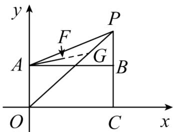

text_image

y
F
P
A
G
B
O
C
x

$$
\angle P A B = 2 0 ^ {\circ}, \angle A P O = 3 0 ^ {\circ}, \angle P O C = 5 0 ^ {\circ},
$$

$$
\because \angle F A P = \frac {1}{2} \angle P A B = 1 0 ^ {\circ},
$$

$$
\therefore \angle F A B = 1 0 ^ {\circ},
$$

$$
\because \angle F O P = \frac {1}{2} \angle P O C = 2 5 ^ {\circ},
$$

$$
\angle A F O = \angle F O G + \angle A G O = \angle F O P + \angle F A P + \angle A P O = 2 5 ^ {\circ} + 1 0 ^ {\circ} + 3 0 ^ {\circ} = 6 5 ^ {\circ}
$$

$$
\therefore \frac {\angle A P O}{\angle A F O} = \frac {3 0 ^ {\circ}}{6 5 ^ {\circ}} = \frac {6}{1 3};
$$

③当 F 在 AP 下方，当 F 在 OP 右边时，

$$
\angle P A B = 2 0 ^ {\circ}, \angle A P O = 3 0 ^ {\circ}, \angle P O C = 5 0 ^ {\circ},
$$

$$
\because \angle F A P = \frac {1}{2} \angle P A B = 1 0 ^ {\circ},
$$

$$
\therefore \angle F A B = 1 0 ^ {\circ},
$$

$$
\because \angle F O P = \frac {1}{2} \angle P O C = 2 5 ^ {\circ},
$$

$$
\therefore \angle F O C = \angle P O C - \angle P O F = 2 5 ^ {\circ},
$$

$$
\therefore \angle F = \angle F O C - \angle B A F = 1 5 ^ {\circ},
$$

$$
\therefore \frac {\angle A P O}{\angle A F O} = \frac {3 0 ^ {\circ}}{1 5 ^ {\circ}} = 2.
$$

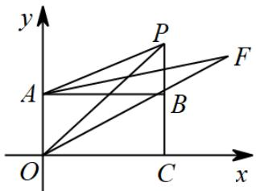

text_image

y
P
A
B
F
O
C
x

综上： $\frac{\angle APO}{\angle AFO}$ 的值为 $\frac{2}{3}$ 或2或 $\frac{6}{13}$ .

【点睛】本题考查了坐标与图形，角平分线的定义，平行线的性质，三角形外角的性质，解题的关键是分类讨论，理清角的关系.