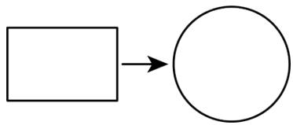
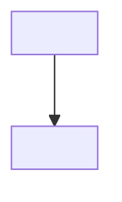
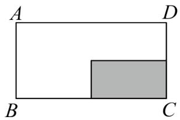
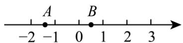

# 第二章 实数·培优卷

# 【北师大版 2024】

考试时间：120 分钟 满分：120 分

姓名：\_\_\_\_ 班级：\_\_\_\_ 考号：\_\_\_\_

考卷信息:

本卷试题共 24 题，单选 10 题，填空 6 题，解答 8 题，满分 120 分，限时 120 分钟，本卷题型针对性较高，覆盖面广，选题有深度，可衡量学生掌握本章内容的具体情况！

# 第I卷

# 一．选择题（共10小题，满分30分，每小题3分）

1. (3 分) (24-25 八年级下·广东广州·期末) 若 $\sqrt{\frac{1}{x - 2}}$ 有意义, 则 $x$ 的取值范围是 ( )

A. $x \geq 2$

B. $x \geq -2$

C. $x > 2$

D. $x > - 2$

2.（3 分）（22-23 七年级下·青海果洛·期末）若 $\sqrt{b} = -2$ ，则 b 的值为（）

A. 8

B.-8

C. 4

D. -4

3.（3 分）（24-25 八年级下·湖北随州·期末）若最简二次根式 $\sqrt{a}$ 能与 $\sqrt{28}$ 合并，则 a 可以是（）

A. 4

B. 5

C. 7

D. 14

4.（3 分）（24-25 八年级下·黑龙江牡丹江·期中）若 $x=1-\sqrt{2025}$ ，则代数式 $x^{2}-2x+2$ 的值是（）

A. 2024

B. 2025

C. 2026

D. -2025

5.（3分）（22-23八年级下·河北石家庄·阶段练习） $\sqrt{18} \div 3 - \sqrt{2} \times \sqrt{\frac{1}{2}}$ 的结果应在（）

A. -1和0之间

B. 0 和 1 之间

C. 1 和 2 之间

D. 2 和 3 之间

6. (3 分) (24-25 八年级下·安徽阜阳·期中) 如图, 将一根铁丝首尾相接可以围成一个长为 $\sqrt{8} \pi$ 、宽为 $\sqrt{2} \pi$ 的矩形。若将这根铁丝展开重新首尾相接围成一个圆形, 则该圆的半径是 ( )

flowchart

A. $2 \sqrt{6}$

B. $6\sqrt{2}$

C. $2\sqrt{3}$

D. $3\sqrt{2}$

7. (3 分) (24-25 七年级下·辽宁葫芦岛·阶段练习) 规定: 若一个实数的算术平方根等于它的立方根, 则称这样的数为“最美实数”。若 $\sqrt{2} + a$ 是“最美实数”, 则 $a$ 的值是 ( )

A. $\sqrt{2} - 1$

B. $-\sqrt{2}$

C. $\sqrt{2}$ 或 $\sqrt{2}-1$

D. $-\sqrt{2}$ 或 $1 - \sqrt{2}$

8.（3 分）（2024·河北邢台·模拟预测）计算： $2024 \div \sqrt{2024} \times \frac{1}{\sqrt{2024}}$ 的值为（）

A. 2024

B. 1012

C. 1

D. $\sqrt{2024}$

9. (3 分) (24-25 八年级下·安徽阜阳·阶段练习) 已知 $ab > 0, a + b < 0$ , 那么下列各式中正确的是 ( )

A. $\sqrt{a^2} = a$

B. $\sqrt{\frac{a}{b}} = \frac{\sqrt{a}}{\sqrt{b}}$

C. $a\sqrt{\frac{b}{a}}=\sqrt{ab}$

D. $\sqrt{a^2b^2} = ab$

10.（3分）（24-25九年级下·山东淄博·期中）我国南宋时期数学家秦九韶曾提出利用三角形的三边求面积的公式，即三角形的三边长分别为 $a, b, c$ ，则其中三角形的面积 $S = \sqrt{\frac{1}{4} \left[ a^2 b^2 - \left( \frac{a^2 + b^2 + c^2}{2} \right) \right]}$ 。此公式与古希腊几何学家海伦提出的公式如出一辙，如果设 $p = \frac{a + b + c}{2}$ ，那么其三角形的面积 $S = \sqrt{p(p - a)(p - b)(p - c)}$ 。这个公式便是海伦公式，也被称为“海伦一秦九韶公式”。若 $a = 5, b = 6, c = 7$ ，则此三角形面积为（）

A. $6 \sqrt{6}$

B. $9 \sqrt{6}$

C. $6\sqrt{3}$

D. $9\sqrt{3}$

# 二．填空题（共6小题，满分18分，每小题3分）

11.（3 分）（24-25 八年级下·湖北武汉·期中）当 $x = -3$ 时，二次根式 $\sqrt{6 - x}$ 的值是 \_\_\_\_.  
12.（3分）（24-25七年级下·云南文山·期末）在实数-2.1， $-\sqrt{3}$ ，0， $\pi$ ， $\frac{2}{7}$ 中，其中无理数有\_\_\_\_个.  
13.（3分）（24-25八年级下·广东汕头·期末）实数a在数轴上的位置如图，化简 $\sqrt{(a+1)^{2}}+a=$ \_\_\_\_.

$-2a-1$ 0 1 2

14.(3分)(24-25八年级下·西藏日喀则·期中)化简 $\sqrt{1\frac{2}{3}}$ 的结果是\_\_\_\_，化简 $\sqrt{4x^{4}y^{3}}$ 的结果是\_\_\_\_.  
15.（3 分）（24-25 七年级下·江西赣州·期末）若x是25的算术平方根，y是-8的立方根，则xy的值为\_\_\_\_。  
16.（3分）若 $|2017-m|+\sqrt{m-2018}=m$ ，则 $m-2017^{2}=$ \_\_\_\_.

# 第II卷

# 三．解答题（共8小题，满分72分） 教辅资源,关注公众号·全科AA+

17.（6 分）（24-25 七年级下·新疆和田·期中）解方程：

(1) $x^{2}-36=0;$   
(2) $(2x-1)^{3}+8=0.$   
18.（6 分）（24-25 八年级下·河北廊坊·期末）计算：  
(1) $\frac{3\sqrt{14}}{\sqrt{7}-2}-4\sqrt{14};$   
(2) $(\sqrt{5} + \sqrt{2})(\sqrt{5} - \sqrt{2}) - (\sqrt{3} - \sqrt{2})^2$ .

19.（8分）（24-25八年级下·湖北咸宁·期中）已知： $a=2+\sqrt{5}$ ， $b=2-\sqrt{5}$ ，分别求下列代数式的值：

(1) $a^{2}-b^{2}$ ;   
(2) $a^{2}+ab+b^{2}$ .

20.（8分）（24-25七年级下·湖北襄阳·期中）（1）已知 $m = b - 1\sqrt{a + 4}$ 是 $a + 4$ 的算术平方根， $n = a^2\sqrt{3b - 1}$ 是 $3b - 1$ 的立方根，求 $m - 2n$ 的立方根.

（2）若 $m=\sqrt{1-a}+\sqrt{a-1}+1$ ，n的算术平方根是5，求 $3n+6m$ 的平方根.

21.（10 分）（24-25 八年级下·安徽阜阳·阶段练习）观察与思考：

① $\sqrt{2+\frac{2}{3}}=2\sqrt{\frac{2}{3}}$ ; ② $\sqrt{3+\frac{3}{8}}=3\sqrt{\frac{3}{8}}$ ; ③ $\sqrt{4+\frac{4}{15}}=4\sqrt{\frac{4}{15}}$ ; ...

(1)根据上述等式的规律，直接写出第④个等式；  
(2)试用含n（n为自然数，且n>1）的等式表示这一规律，并加以验证.  
22. (10 分) (24-25 八年级下·四川广安·期末) 如图, 李明家有一块矩形空地 $ABCD$ , 已知 $BC = \sqrt{108} \mathrm{~m}$ , $AB = \sqrt{27} \mathrm{~m}$ . 现要在空地中挖一个矩形水池 (即图中阴影部分), 其余部分种植草莓. 其中矩形水池的长为 $(\sqrt{19} + 1) \mathrm{~m}$ , 宽为 $(\sqrt{19} - 1) \mathrm{~m}$ .

text_image

A
D
B
C

(1)求矩形空地ABCD的周长.（结果化为最简二次根式）  
(2)已知李明家种植的草莓售价为 7 元/kg，且每平方米产草莓15kg。若李明家将所收获的草莓全部销售完，销售收入为多少元？

23.（12 分）如图，一只蚂蚁从点 A 沿数轴向右爬了 2 个单位长度到达点 B，点 A 表示 $-\sqrt{2}$ ，设点 B 所表示的数为 m.

(1)求 $|m+1|^{+}|m-1|$ 的值；教辅资源,关注公众号·全科AA+  
(2)在数轴上还有 C、D 两点分别表示实数 c 和 d，且有 $\left|2c+d\right|$ 与 $\sqrt{d+4}$ 互为相反数，求 2c-3d 的平方根.

24.（12 分）（24-25 八年级下·浙江台州·期中）阅读下列解题过程：

解： $\frac{1}{\sqrt{2} + 1} = \frac{\sqrt{2} - 1}{(\sqrt{2} + 1)(\sqrt{2} - 1)} = \frac{\sqrt{2} - 1}{(\sqrt{2})^2 - 1^2} = \frac{\sqrt{2} - 1}{1} = \sqrt{2} - 1.$

(1)请在横线上直接写出化简的结果:

① $\frac{1}{\sqrt{3}+\sqrt{2}}=$ -; ② $\frac{1}{2+\sqrt{3}}=$ -.

(2)求 $\frac{1}{\sqrt{n + 1} - \sqrt{n}}$ （ $n$ 为正整数）化简的结果（需要写出推理步骤）.