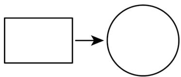
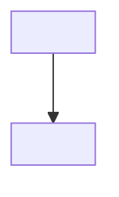
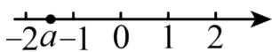
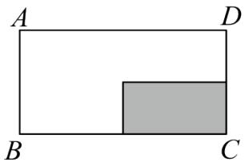
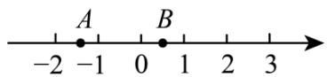

# 第二章 实数·培优卷

# 【北师大版 2024】

参考答案与试题解析

# 第I卷

# 一．选择题（共10小题，满分30分，每小题3分）

1. （3 分）（24-25 八年级下·广东广州·期末）若 $\sqrt{\frac{1}{x-2}}$ 有意义，则 x 的取值范围是（）

A. $x \geq 2$

B. $x \geq -2$

C. $x > 2$

D. $x > - 2$

【答案】C

【分析】本题主要考查二次根式有意义的条件，分式有意义的条件，要使表达式 $\sqrt{\frac{1}{x - 2}}$ 有意义，需满足根号内的值非负且分母不为零，由此列式求解即可.

【详解】解：根据题意， $\frac{1}{x-2}\geq0,\quad x-2\neq0,$

∴x的取值范围为x>2，

故选：C.

2. （3 分）（22-23 七年级下·青海果洛·期末）若 $\sqrt[3]{b} = -2$ ，则 b 的值为（）

A. 8

B.-8

C. 4

D. -4

【答案】B

【分析】根据立方根的定义判断答案.

【详解】 $\because \sqrt[3]{b}=-2$

$$
\therefore b = (- 2) ^ {3} = - 8
$$

故选 B.

【点睛】本题考查立方根的定义，熟知立方根的定义是解题的关键

3. （3 分）（24-25 八年级下·湖北随州·期末）若最简二次根式 $\sqrt{a}$ 能与 $\sqrt{28}$ 合并，则 a 可以是（）

A. 4

B. 5

C. 7

D. 14

【答案】C

【分析】本题考查最简二次根式定义、合并同类二次根式、二次根式性质等知识，先由 $\sqrt{28}=2\sqrt{7}$ ，再由 $\sqrt{a}$ 是最简二次根式，可得a=7即可确定答案，熟记最简二次根式定义、合并同类二次根式、二次根式性质是解决问题的关键.

【详解】解： $\because \sqrt{28} = \sqrt{4 \times 7} = \sqrt{4} \times \sqrt{7} = 2\sqrt{7}$ ， $\sqrt{a}$ 是最简二次根式，且最简二次根式 $\sqrt{a}$ 能与 $\sqrt{28}$ 合并， $\therefore a = 7$ ，

故选：C.

4. （3 分）（24-25 八年级下·黑龙江牡丹江·期中）若 $x=1-\sqrt{2025}$ ，则代数式 $x^{2}-2x+2$ 的值是（）

A. 2024

B. 2025

C. 2026

D. -2025

【答案】C

【分析】本题主要查了求代数式的值．根据题意可得 $x-1=-\sqrt{2025}$ ，再代入计算，即可求解.

【详解】解：∵ $x=1-\sqrt{2025}$ ,

$$
\therefore x - 1 = - \sqrt {2 0 2 5},
$$

$$
\therefore x ^ {2} - 2 x + 2 = (x - 1) ^ {2} + 1 = (- \sqrt {2 0 2 5}) ^ {2} + 1 = 2 0 2 6.
$$

故选：C

5. （3 分）（22-23 八年级下·河北石家庄·阶段练习） $\sqrt{18} \div 3 - \sqrt{2} \times \sqrt{\frac{1}{2}}$ 的结果应在（）

A. -1和0之间

B. 0 和 1 之间

C. 1 和 2 之间

D. 2 和 3 之间

【答案】B

【分析】根据二次根式的混合运算计算，并估算结果的值即可.

【详解】解：原式= $\sqrt{18\div9}-\sqrt{2\times\frac{1}{2}}=\sqrt{2}-1$

$$
\because 1 <   \sqrt {2} <   2
$$

$$
\therefore 0 <   \sqrt {2} - 1 <   1
$$

故选 B.

【点睛】本题主要考查二次根式的运算以及估算，熟练掌握二次根式的运算并能够估算根式的取值范围是解决本题的关键.

6. （3 分）（24-25 八年级下·安徽阜阳·期中）如图，将一根铁丝首尾相接可以围成一个长为 $\sqrt{8}\pi$ 、宽为 $\sqrt{2}\pi$ 的矩形．若将这根铁丝展开重新首尾相接围成一个圆形，则该圆的半径是（）

flowchart

A. $2 \sqrt{6}$

B. $6\sqrt{2}$

C. $2\sqrt{3}$

D. $3\sqrt{2}$

【答案】D

【分析】本题考查了二次根式的混合运算，根据题意得出圆的周长，进而求得圆的半径.

【详解】解：这根铁丝的周长为 $2(\sqrt{8}\pi+\sqrt{2}\pi)=6\sqrt{2}\pi$ ,

∴将这根铁丝展开重新首尾相接围成一个圆形，则半径为 $\frac{6\sqrt{2}\pi}{2\pi}=3\sqrt{2}$ ，

故选D.

7. （3 分）（24-25 七年级下·辽宁葫芦岛·阶段练习）规定：若一个实数的算术平方根等于它的立方根，则称这样的数为“最美实数”。若 $\sqrt{2} + a$ 是“最美实数”，则 $a$ 的值是（）

A. $\sqrt{2} - 1$

B. $-\sqrt{2}$

C. $\sqrt{2}$ 或 $\sqrt{2} - 1$

D. $-\sqrt{2}$ 或 $1 - \sqrt{2}$

【答案】D

【分析】本题考查算术平方根及立方根，根据“最美实数”的定义，可知 $\sqrt{2}+a=0$ 或 $\sqrt{2}+a=1$ ，求出a的值即可.

【详解】解：若 $\sqrt{2}+a$ 是“最美实数”，

则有 $\sqrt{2} + a = 0$ 或 $\sqrt{2} + a = 1$

若 $\sqrt{2} + a = 0$ ，解得 $a = -\sqrt{2}$

若 $\sqrt{2} + a = 1$ ，解得 $a = 1 - \sqrt{2}$

综上，a 的值为 $-\sqrt{2}$ 或 $1-\sqrt{2}$ ，

故选：D.

8. （3 分）（2024·河北邢台·模拟预测）计算： $2024 \div \sqrt{2024} \times \frac{1}{\sqrt{2024}}$ 的值为（）

A. 2024

B. 1012

C. 1

D. $\sqrt{2024}$

【答案】C

【分析】本题考查二次根式的混合运算，先变除法为乘法，再根据二次根式乘法运算法则计算即可.

【详解】解： $2024\div\sqrt{2024}\times\frac{1}{\sqrt{2024}}=2024\times\frac{1}{\sqrt{2024}}\times\frac{1}{\sqrt{2024}}=2024\times\frac{1}{2024}=1$

故选 C.

9. （3 分）（24-25 八年级下·安徽阜阳·阶段练习）已知 $ab > 0, a + b < 0$ ，那么下列各式中正确的是（）

A. $\sqrt{a^2} = a$

B. $\sqrt{\frac{a}{b}} = \frac{\sqrt{a}}{\sqrt{b}}$

C. $a\sqrt{\frac{b}{a}} = \sqrt{ab}$

D. $\sqrt{a^2b^2} = ab$

【答案】D

【分析】本题考查了化简二次根式.

由已知条件ab>0且 $a+b<0$ 可知，a和b均为负数，逐一分析各选项即可.

【详解】解：∵ab>0, a+b<0,

∴a和b均为负数，

A: $\sqrt{a^{2}}=-a$ ，选项 A 错误；

B: 当 $a$ 和 $b$ 均为负数时, $\sqrt{a}$ 和 $\sqrt{b}$ 在实数范围内无意义, 等式不成立, 选项 B 错误;  
C: 左边 $a\sqrt{\frac{b}{a}}$ 结果为负数，右边 $\sqrt{ab}$ 为正数，等式不成立，选项 C 错误；  
D: $\sqrt{a^{2}b^{2}}=\sqrt{a^{2}}\cdot\sqrt{b^{2}}=(-a)\cdot(-b)=ab$ ，等式成立，选项 D 正确；

故选：D.

10. （3分）（24-25九年级下·山东淄博·期中）我国南宋时期数学家秦九韶曾提出利用三角形的三边求面积的公式，即三角形的三边长分别为 $a, b, c$ ，则其中三角形的面积 $S = \sqrt{\frac{1}{4} \left[ a^2 b^2 - \left( \frac{a^2 + b^2 + c^2}{2} \right) \right]}$ 。此公式与古希腊几何学家海伦提出的公式如出一辙，如果设 $p = \frac{a + b + c}{2}$ ，那么其三角形的面积 $S = \sqrt{p(p - a)(p - b)(p - c)}$ 。这个公式便是海伦公式，也被称为“海伦一秦九韶公式”。若 $a = 5, b = 6, c = 7$ ，则此三角形面积为（）

A. $6 \sqrt{6}$

B. $9 \sqrt{6}$

C. $6 \sqrt{3}$

D. $9 \sqrt{3}$

【答案】A

【分析】先求出 $p$ 的值，再根据海伦公式求三角形的面积即可．本题考查了二次根式的应用，考查学生的计算能力，掌握 $\sqrt{ab} = \sqrt{a}\cdot \sqrt{b} (a\geq 0,b\geq 0)$ 是解题的关键.

【详解】解：∵a=5，b=6，c=7，

$$
\therefore p = \frac {a + b + c}{2} = \frac {5 + 6 + 7}{2} = 9,
$$

则三角形的面积 $S=\sqrt{p(p-a)(p-b)(p-c)}$

$$
\begin{array}{l} = \sqrt {9 (9 - 5) (9 - 6) (9 - 7)} \\ = 6 \sqrt {6}. \\ \end{array}
$$

故选：A

# 二．填空题（共6小题，满分18分，每小题3分）

11. （3 分）（24-25 八年级下·湖北武汉·期中）当 $x = -3$ 时，二次根式 $\sqrt{6 - x}$ 的值是 \_\_\_\_.

【答案】3

【分析】本题考查二次根式求值，直接把x=-3代入二次根式，计算即可.

【详解】解：当x=-3时，

$$
\sqrt {6 - x}
$$

$$
= \sqrt {6 - (- 3)}
$$

$$
= \sqrt {9}
$$

$$
= 3.
$$

故答案为：3.

12. （3 分）（24-25 七年级下·云南文山·期末）在实数 -2.1， $-\sqrt{3}$ ，0， $\pi$ ， $\frac{2}{7}$ 中，其中无理数有 \_\_\_\_ 个.

【答案】2

【分析】本题考查无理数以及算术平方根，熟练掌握其定义是解题的关键．无限不循环小数叫做无理数，据此进行判断即可.

【详解】解：在实数-2.1， $-\sqrt{3}$ ，0， $\pi$ ， $\frac{2}{7}$ 中，其中无理数有： $-\sqrt{3}$ ， $\pi$ ，一共2个，

故答案为：2.

13. （3 分）（24-25 八年级下·广东汕头·期末）实数 $a$ 在数轴上的位置如图，化简 $\sqrt{(a+1)^{2}} + a =$ \_\_\_\_.

【答案】-1

【分析】本题考查了根据数轴判断正负，化简二次根式.

根据数轴可知 $-2\leq a\leq-1$ ，得到 $a+1<0$ ，化简即可.

【详解】解：由数轴可知 $-2\leq a\leq-1$ ，

$$
\therefore a + 1 <   0,
$$

$$
\therefore \sqrt {(a + 1) ^ {2}} + a = - a - 1 + a = - 1
$$

故答案为：-1.

14.（3分）（24-25八年级下·西藏日喀则·期中）化简 $\sqrt{1\frac{2}{3}}$ 的结果是\_\_\_\_，化简 $\sqrt{4x^{4}y^{3}}$ 的结果是\_\_\_\_。

【答案】 $\frac{\sqrt{15}}{3} 2x^{2}y\sqrt{y}$

【分析】本题主要考查了二次根式的化简，解题的关键是熟练掌握二次根式化简的步骤.

利用二次根式化简的步骤进行化简即可.

【详解】解： $\sqrt{1\frac{2}{3}}=\sqrt{\frac{5}{3}}=\frac{\sqrt{5}}{\sqrt{3}}=\frac{\sqrt{15}}{3}$ ;

$$
\sqrt {4 x ^ {4} y ^ {3}} = 2 x ^ {2} y \sqrt {y};
$$

故答案为： $\frac{\sqrt{15}}{3}$ ， $2x^{2}y\sqrt{y}$ .

15. （3 分）（24-25 七年级下·江西赣州·期末）若 $x$ 是25的算术平方根， $y$ 是-8的立方根，则 $xy$ 的值为 \_\_\_\_.

【答案】-10

【分析】本题考查算术平方根与立方算，根据算术平方根的意义可得x=5；根据立方根的意义可得y=-2，进

而得出结果．掌握算术平方根和立方根的定义是关键.

【详解】解：∵x是25的算术平方根，

$$
\therefore x = 5,
$$

∵y是-8的立方根，

$$
\therefore y = - 2,
$$

$$
\therefore x y = 5 \times (- 2) = - 1 0,
$$

即 $xy$ 的值为-10.

故答案为：-10.

16. （3 分）若 $\left|2017-m\right|+\sqrt{m-2018}=m$ ，则 $m-2017^{2}=$ \_\_\_\_.

【答案】2018

【分析】本题主要考查了二次根式有意义的条件，代数式求值，先根据二次根式有意义的条件得到 $m \geq 2018$ ，由此化简绝对值推出 $\sqrt{m-2018}=2017$ ，进而可得 $m-2017^{2}=2018$ .

【详解】解；∵ $\sqrt{m-2018}$ 要有意义，

$$
\therefore m - 2 0 1 8 \geq 0,
$$

$$
\therefore m \geq 2 0 1 8,
$$

$$
\because | 2 0 1 7 - m | + \sqrt {m - 2 0 1 8} = m,
$$

$$
\therefore m - 2 0 1 7 + \sqrt {m - 2 0 1 8} = m,
$$

$$
\therefore \sqrt {m - 2 0 1 8} = 2 0 1 7,
$$

$$
\therefore m - 2 0 1 8 = 2 0 1 7 ^ {2},
$$

$$
\therefore m - 2 0 1 7 ^ {2} = 2 0 1 8,
$$

故答案为：2018.

# 第II卷

# 三．解答题（共8小题，满分72分）

17. （6 分）（24-25 七年级下·新疆和田·期中）解方程：

(1) $x^{2}-36=0;$

(2) $(2x-1)^{3}+8=0.$

【答案】(1)x=6或x=-6

(2) $x=-\frac{1}{2}$

【分析】本题考查了平方根和立方根的应用，解题的关键是先化成乘方的形式，再开方运算.

（1）先移项，可得平方的形式，根据开方运算，可得一元一次方程，根据解一元一次方程，可得答案；  
（2）先移项，可得立方的形式，根据开方运算，可得一元一次方程，根据解一元一次方程，可得答案.

【详解】（1）解： $x^{2}-36=0$ ，

$$
x ^ {2} = 3 6,
$$

$$
\therefore x = 6 \text {或} x = - 6;
$$

(2) 解: $(2x-1)^{3}=-8$ ,

$$
2 x - 1 = - 2,
$$

$$
2 x = - 1,
$$

$$
\mathrm{x} = - \frac {1}{2}.
$$

18. （6 分）（24-25 八年级下·河北廊坊·期末）计算：

(1) $\frac{3\sqrt{14}}{\sqrt{7} - 2} - 4\sqrt{14}$ ;   
(2) $(\sqrt{5} + \sqrt{2})(\sqrt{5} - \sqrt{2}) - (\sqrt{3} - \sqrt{2})^2$ .

【答案】(1) $7\sqrt{2}-2\sqrt{14}$

(2) $-2+2\sqrt{6}$

【分析】本题考查了二次根式的混合运算，熟练掌握运算法则是解题的关键.

（1）先提取 $\sqrt{14}$ ，再进行分母有理化化简，然后利用二次根式的混合运算法则求解；

(2) 利用平方差公式和完全平方公式就算即可.

【详解】（1）解： $\frac{3\sqrt{14}}{\sqrt{7}-2}-4\sqrt{14}$

$$
\begin{array}{l} = \sqrt {1 4} \times \left(\frac {3}{\sqrt {7} - 2} - 4\right) \\ = \sqrt {1 4} \times \left[ \frac {(\sqrt {7} + 2) \times 3}{(\sqrt {7} - 2) (\sqrt {7} + 2)} - 4 \right] \\ = \sqrt {1 4} \times (\sqrt {7} + 2 - 4) \\ = \sqrt {1 4} \times (\sqrt {7} - 2) \\ = \sqrt {1 4} \times \sqrt {7} - 2 \sqrt {1 4} \\ = 7 \sqrt {2} - 2 \sqrt {1 4}; \\ \end{array}
$$

(2) 解: $(\sqrt{5}+\sqrt{2})(\sqrt{5}-\sqrt{2})-(\sqrt{3}-\sqrt{2})^{2}$

$$
= (\sqrt {5}) ^ {2} - (\sqrt {2}) ^ {2} - \left[ (\sqrt {3}) ^ {2} - 2 \sqrt {3} \times \sqrt {2} + (\sqrt {2}) ^ {2} \right]
$$

$$
= 5 - 2 - (3 + 2 - 2 \sqrt {6})
$$

$$
\begin{array}{l} = 5 - 2 - 5 + 2 \sqrt {6} \\ = - 2 + 2 \sqrt {6}. \\ \end{array}
$$

19. （8 分）（24-25 八年级下·湖北咸宁·期中）已知： $a=2+\sqrt{5}$ ， $b=2-\sqrt{5}$ ，分别求下列代数式的值：

(1) $a^{2}-b^{2}$ ;

(2) $a^{2}+ab+b^{2}$ .

【答案】(1) $8\sqrt{5}$ ;

(2)17.

【分析】本题考查二次根式的化简求值，熟练掌握运算法则是解答本题的关键.

（1）根据 $a=2+\sqrt{5}$ ， $b=2-\sqrt{5}$ ，可以求得 $a+b$ 和a-b的值，然后将所求式子变形，再将 $a+b$ 和a-b的值代入计算即可；  
（2）根据 $a=2+\sqrt{5}$ ， $b=2-\sqrt{5}$ ，可以求得 $a+b$ 和ab的值，然后将所求式子变形，再将 $a+b$ 和ab的值代入计算即可.

【详解】（1）解：∵ $a=2+\sqrt{5}$ ， $b=2-\sqrt{5}$ ，

$$
\therefore a + b = 4, \quad a - b = 2 \sqrt {5},
$$

$$
a ^ {2} - b ^ {2} = (a + b) (a - b) = 4 \times 2 \sqrt {5} = 8 \sqrt {5};
$$

(2) 解: $\because a=2+\sqrt{5}, b=2-\sqrt{5}$ ,

$$
\therefore a + b = 4, \quad a b = - 1,
$$

$$
\therefore a ^ {2} + a b + b ^ {2} = (a + b) ^ {2} - a b = 4 ^ {2} - (- 1) = 1 6 + 1 = 1 7.
$$

20. （8分）（24-25七年级下·湖北襄阳·期中）（1）已知 $m = b - 1\sqrt{a + 4}$ 是 $a + 4$ 的算术平方根， $n = a - 2\sqrt{3b - 1}$ 是 $3b - 1$ 的立方根，求 $m - 2n$ 的立方根.

（2）若 $m=\sqrt{1-a}+\sqrt{a-1}+1$ ，n的算术平方根是5，求 $3n+6m$ 的平方根.

【答案】（1）-1；（2）±9

【分析】本题考查算术平方根、平方根和立方根的定义，非负数的性质，代数式求值．解题的关键是：

（1）由算术平方根和立方根的定义可求出 $a = 5$ ， $b = 3$ ，即得出 $m = 3$ ， $n = 2$ ，，代入 $m - 2n$ 中求值，再求其立方根即可；  
(2) 由被开方数为非负数即可求出 $a = 1$ , 由算术平方根的定义可求出 $n = 25$ , 代入 $3n + 6m$ 中求值, 再求其平方根即可.

【详解】解：（1）∵ $m=\sqrt[b-1]{a+4}$ 是a+4的算术平方根， $n=\sqrt[a-2]{3b-1}$ 是3b-1的立方根，

$$
\therefore b - 1 = 2, a - 2 = 3,
$$

$$
\therefore b = 3, \quad a = 5,
$$

$$
\therefore m = \sqrt {5 + 4} = 3, \quad n = \sqrt [ 3 ]{3 \times 3 - 1} = 2,
$$

∴m-2n的立方根为 $\sqrt[3]{3-2\times2}=\sqrt[3]{-1}=-1$ ;

(2) 根据题意得 $\left\{\begin{aligned}1-a&\geq0\\ a-1&\geq0\end{aligned}\right.$ ,

$$
\therefore a = 1,
$$

$$
\therefore m = 1
$$

∵n 的算术平方根是 5,

$$
\therefore n = 2 5,
$$

∴3n+6m的平方根为± $\sqrt{3\times25+6\times1}$ =± $\sqrt{81}$ =±9.

21. （10 分）（24-25 八年级下·安徽阜阳·阶段练习）观察与思考：

① $\sqrt{2 + \frac{2}{3}} = 2\sqrt{\frac{2}{3}};$ ② $\sqrt{3 + \frac{3}{8}} = 3\sqrt{\frac{3}{8}};$ ③ $\sqrt{4 + \frac{4}{15}} = 4\sqrt{\frac{4}{15}};$ ...

(1)根据上述等式的规律，直接写出第④个等式；

(2)试用含n（n为自然数，且n>1）的等式表示这一规律，并加以验证.

【答案】(1) $\sqrt{5+\frac{5}{24}}=5\sqrt{\frac{5}{24}}$

(2) $\sqrt{n+\frac{n}{n^{2}-1}}=n\sqrt{\frac{n}{n^{2}-1}}$ （n>1的整数），证明见解析

【分析】本题考查二次根式的性质与化简，是重要考点，难度较易，掌握相关知识是解题关键.

（1）由题干找出规律求解即可；

（2）先找出规律，再由二次根式的性质化简证明.

【详解】（1）解：∵① $\sqrt{2+\frac{2}{3}}=2\sqrt{\frac{2}{3}}$ ;

② $\sqrt{3+\frac{3}{8}}=3\sqrt{\frac{3}{8}};$

③ $\sqrt{4+\frac{4}{15}}=4\sqrt{\frac{4}{15}};\cdots$

∴写出第④个等式为： $\sqrt{5+\frac{5}{24}}=4\sqrt{\frac{5}{24}};$

(2) 解: $\because \sqrt{2 + \frac{2}{3}} = \sqrt{2 + \frac{2}{2^2 - 1}} = 2\sqrt{\frac{2}{2^2 - 1}}$

$$
\sqrt {3 + \frac {3}{8}} = \sqrt {3 + \frac {3}{3 ^ {2} - 1}} = 3 \sqrt {\frac {3}{3 ^ {2} - 1}}
$$

$$
\sqrt {4 + \frac {4}{4 ^ {2} - 1}} = 4 \sqrt {\frac {4}{4 ^ {2} - 1}}
$$

$\therefore \sqrt{n + \frac{n}{n^2 - 1}} = n\sqrt{\frac{n}{n^2 - 1}} (n > 1$ 的整数）

证明如下:

$$
\sqrt {n + \frac {n}{n ^ {2} - 1}} = \sqrt {\frac {n (n ^ {2} - 1) + n}{n ^ {2} - 1}} = \sqrt {\frac {n ^ {3}}{n ^ {2} - 1}} = n \sqrt {\frac {n}{n ^ {2} - 1}}.
$$

22. （10 分）（24-25 八年级下·四川广安·期末）如图，李明家有一块矩形空地ABCD，已知 $BC=\sqrt{108}m$ ， $AB=\sqrt{27}m$ 。现要在空地中挖一个矩形水池（即图中阴影部分），其余部分种植草莓。其中矩形水池的长为 $(\sqrt{19}+1)m$ ，宽为 $(\sqrt{19}-1)m$ 。

text_image

A
D
B
C

(1)求矩形空地ABCD的周长．（结果化为最简二次根式）

(2)已知李明家种植的草莓售价为 7 元/kg，且每平方米产草莓15kg。若李明家将所收获的草莓全部销售完，销售收入为多少元？

【答案】(1) $18\sqrt{3}$ (m)

(2)销售收入为 3780 元

【分析】本题主要考查了二次根式的实际应用，熟练掌握二次根式的性质，是解题的关键.

（1）根据长方形周长计算公式求解即可；  
(2) 先求出种植草莓的面积, 再根据草莓的售价和产量进行求解即可.

【详解】（1）解：由题意得，长方形空地ABCD的周长为：

$$
2 (B C + A B) = 2 (\sqrt {1 0 8} + \sqrt {2 7}) = 2 (6 \sqrt {3} + 3 \sqrt {3}) = 1 8 \sqrt {3} (\mathrm{m}).
$$

(2) 解: 由题意, 得 $S_{\text {矩形} ABCD}=BC \cdot AB=\sqrt{108} \times \sqrt{27}=54(\mathrm{~m}^{2})$

$$
S _ {\text {水池}} = (\sqrt {1 9} + 1) (\sqrt {1 9} - 1) = 1 9 - 1 = 1 8 \left(\mathrm{m} ^ {2}\right),
$$

$$
\therefore S _ {\text { 种植草莓 }} = 5 4 - 1 8 = 3 6 \left(\mathrm{m} ^ {2}\right),
$$

$$
\therefore 3 6 \times 1 5 \times 7 = 3 7 8 0 (\text {元}).
$$

答：销售收入为 3780 元.

23. （12 分）如图，一只蚂蚁从点 A 沿数轴向右爬了 2 个单位长度到达点 B，点 A 表示 $-\sqrt{2}$ ，设点 B 所表示的数为 m.

(1)求 $|m+1|+|m-1|$ 的值；

(2)在数轴上还有 C、D 两点分别表示实数 c 和 d，且有 $\left|2c+d\right|$ 与 $\sqrt{d+4}$ 互为相反数，求 2c-3d 的平方根.

【答案】(1)2

(2) $\pm4$

【分析】本题考查了数轴上两点间的距离公式、平方根、非负数的性质及绝对值的计算，解题的关键是求得 $m$ 的值及非负数性质的应用，注意平方根有两个.

（1）利用数轴上两点间的距离公式计算即可；  
（2）利用非负数的性质，得到 c, d 的值，代入求值即可.

【详解】（1）解：由题意得AB=2，

$$
\begin{array}{l} \therefore m - (- \sqrt {2}) = 2, \\ \therefore m = 2 - \sqrt {2}, \\ \therefore | m + 1 | + | m - 1 | \\ = | 2 - \sqrt {2} + 1 | + | 2 - \sqrt {2} - 1 | \\ = | 3 - \sqrt {2} | + | 1 - \sqrt {2} | \\ = 3 - \sqrt {2} + \sqrt {2} - 1 \\ = 2; \\ \end{array}
$$

（2）解：∵ $|2c+d|$ 与 $\sqrt{d+4}$ 互为相反数，

$$
\therefore | 2 c + d | + \sqrt {d + 4} = 0,
$$

$$
\because | 2 c + d | \geq 0, \sqrt {d + 4} \geq 0,
$$

$$
\therefore 2 c + d = 0, \quad d + 4 = 0,
$$

$$
\therefore c = 2, \quad d = - 4,
$$

$$
\therefore 2 c - 3 d = 2 \times 2 - 3 \times (- 4) = 1 6,
$$

$\therefore 2c-3d$ 的平方根是 $\pm\sqrt{16}=\pm4$ .

24. （12 分）（24-25 八年级下·浙江台州·期中）阅读下列解题过程：

解： $\frac{1}{\sqrt{2} + 1} = \frac{\sqrt{2} - 1}{(\sqrt{2} + 1)(\sqrt{2} - 1)} = \frac{\sqrt{2} - 1}{(\sqrt{2})^2 - 1^2} = \frac{\sqrt{2} - 1}{1} = \sqrt{2} - 1.$

(1)请在横线上直接写出化简的结果:

① $\frac{1}{\sqrt{3}+\sqrt{2}}=$ -; ② $\frac{1}{2+\sqrt{3}}=$ -.

(2)求 $\frac{1}{\sqrt{n+1}-\sqrt{n}}$ （n为正整数）化简的结果（需要写出推理步骤）.

【答案】(1)① $\sqrt{3}-\sqrt{2}$ ; ② $2-\sqrt{3}$

(2) $\sqrt{n+1}+\sqrt{n}$

【分析】本题主要考查了分母有理化，利用平方差公式进行分母有理化是解题的关键.

（1）利用平方差公式进行分母有理化即可；  
(2) 利用平方差公式进行分母有理化即可.

【详解】（1）解： $\frac{1}{\sqrt{3}+\sqrt{2}}=\frac{\sqrt{3}-\sqrt{2}}{(\sqrt{3}+\sqrt{2})(\sqrt{3}-\sqrt{2})}=\frac{\sqrt{3}-\sqrt{2}}{3-2}=\sqrt{3}-\sqrt{2};$

$$
\frac {1}{2 + \sqrt {3}} = \frac {2 - \sqrt {3}}{(2 + \sqrt {3}) (2 - \sqrt {3})} = \frac {2 - \sqrt {3}}{4 - 3} = 2 - \sqrt {3},
$$

故答案为： $\sqrt{3}-\sqrt{2}$ ; $2-\sqrt{3}$ ;

（2）解： $\frac{1}{\sqrt{n + 1} - \sqrt{n}} = \frac{\sqrt{n + 1} + \sqrt{n}}{(\sqrt{n + 1} - \sqrt{n})\cdot(\sqrt{n + 1} + \sqrt{n})} = \frac{\sqrt{n + 1} + \sqrt{n}}{n + 1 - n} = \sqrt{n + 1} +\sqrt{n}.$