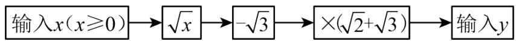
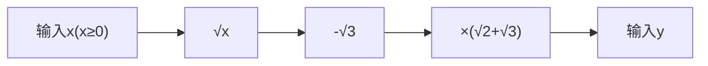
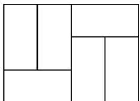
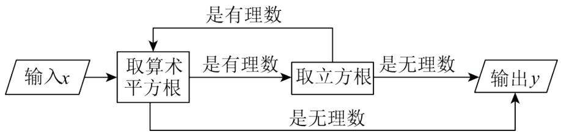
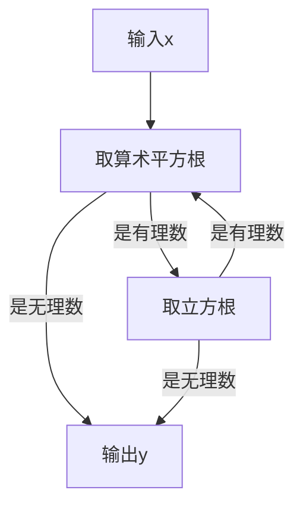
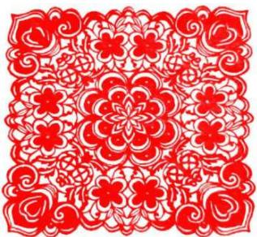
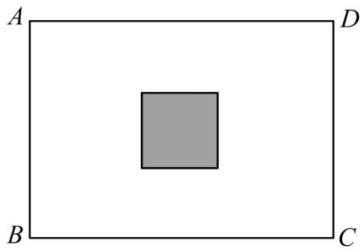
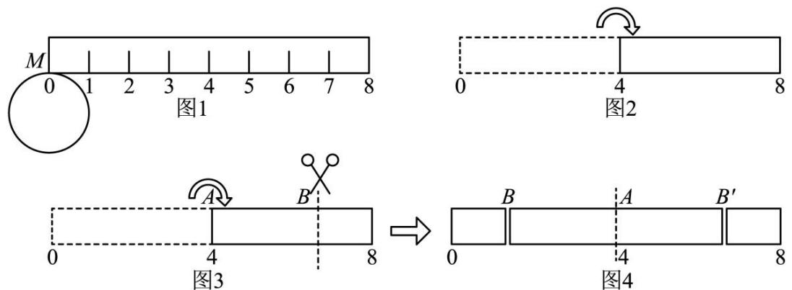
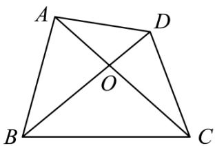

# 第二章 实数·拔尖卷

# 【北师大版 2024】

考试时间：120 分钟 满分：120 分

姓名：\_\_\_\_ 班级：\_\_\_\_ 考号：\_\_\_\_

考卷信息:

本卷试题共 24 题，单选 10 题，填空 6 题，解答 8 题，满分 120 分，限时 120 分钟，本卷题型针对性较高，覆盖面广，选题有深度，可衡量学生掌握本章内容的具体情况！

# 第I卷

# 一．选择题（共10小题，满分30分，每小题3分）

1. （3 分）（22-23 八年级下·辽宁营口·期中）下列各式是二次根式的有（）

(1) $\sqrt{21}$ ; (2) $\sqrt{-19}$ ; (3) $\sqrt{x^2 + 1}$ ; (4) $\sqrt[3]{9}$ ; (5) $\sqrt{-2x - 2}$

A. 4 个

B. 3 个

C. 2 个

D. 1 个

2. （3 分）（23-24 七年级下·四川泸州·期中）在实数 $0, \pi, \frac{1}{3}, 3.1415926, \sqrt[3]{5}, 0.2\dot{5}, \sqrt{(-4)^2}, 1.3470136$ …中，无理数的个数有（）

A. 2 个

B. 3 个

C. 4 个

D. 5 个

3. （3 分）（24-25 八年级下·河北邢台·期末）如图是一个程序框图，若输入 $x = 72$ ，则输出 $y$ 的值为（）

flowchart

A. $15+7\sqrt{6}$

B. $9+5\sqrt{6}$

C. $9-5\sqrt{6}$

D. $5\sqrt{6}$

4. （3 分）（24-25 七年级下·辽宁葫芦岛·阶段练习）规定：若一个实数的算术平方根等于它的立方根，则称这样的数为“最美实数”。若 $\sqrt{2}+a$ 是“最美实数”，则 $a$ 的值是（）

A. $\sqrt{2} - 1$

B. $-\sqrt{2}$

C. $\sqrt{2}$ 或 $\sqrt{2}-1$

D. $-\sqrt{2}$ 或 $1-\sqrt{2}$

5. （3 分）（24-25 八年级下·河南商丘·阶段练习）如图用 6 个完全相同的小长方形拼成一个无重叠的大长方形，已知小长方形的长为 $2 \sqrt{2}$ ，宽为 $\sqrt{2}$ ，下列对大长方形的判断不正确的是（）

natural_image

Geometric diagram of a rectangle divided into smaller sections by diagonals (no text or symbols)

A. 大长方形的长为 $4 \sqrt{2}$

B. 大长方形的宽为 $3 \sqrt{2}$

C. 大长方形的周长为 $7 \sqrt{2}$

D. 大长方形的面积为 24

6. （3 分）（24-25 七年级下·山东日照·期中）在如图所示的运算程序中，当输入 $x$ 的值是 64 时，输出的 $y$ 值是（）

flowchart

A. $\sqrt{2}$

B. $\sqrt[3]{2}$

C. 2

D. 1

7. （3 分）代数式 $\sqrt{x-1} + \sqrt{x-2} + \sqrt{x+2}$ 的最小值是（）

A. 0

B. 3

C. $\sqrt{3}$

D. 不存在

8. （3 分）（24-25 八年级上·上海·期中）已知 $a > 0$ ，那么 $\sqrt{\frac{-a}{b}}$ 可化简为（）

A. $b \sqrt{-ab}$

B. $-\frac{1}{b}\sqrt{ab}$

C. $-\frac{1}{b}\sqrt{-ab}$

D. $\frac{1}{b}\sqrt{-ab}$

9. （3 分）（22-23 八年级下·浙江宁波·阶段练习）已知 $\sqrt{7}=a$ ， $\sqrt{70}=b$ ，则 $\sqrt{4.9}$ 用 a、b 表示为（）

A. $\frac{a+b}{10}$

B. $\frac{a-b}{10}$

C. $\frac{b}{a}$

D. $\frac{ab}{10}$

10. （3 分）（24-25 八年级下·重庆丰都·期末）对于一个正实数 $m$ ，我们规定：用符号 $[\sqrt{m}]$ 表示不大于 $\sqrt{m}$ 的最大整数（ $[m]$ 表示不大于 $m$ 的最大整数），称 $[\sqrt{m}]$ 为 $m$ 的根整数，如： $[\sqrt{4}] = 2$ ， $[\sqrt{10}] = 3$ 。如果我们对 $m$ 连续求根整数，直到结果为 1 为止。例如：对 11 连续求根整数 2 次， $[\sqrt{11}] = 3 \rightarrow [\sqrt{3}] = 1$ ，这时候结果为

1. 现有如下四种说法: ① $[\sqrt{3}] + [\sqrt{6}] = [\sqrt{9}]$ ; ② $[\sqrt{a}]^{2} = [(\sqrt{a})^{2}]$ ; ③ 若方程 $[\sqrt{12 - x}] - [\sqrt{x - 3}] = 1$ , 则满足条件的 $x$ 的整数值有 4 个; ④ 只需进行 3 次连续求根整数运算后结果为 1 的所有正整数 $m$ 中, 最大值与最小值之差为 239. 其中正确说法的个数有 ( )

A. 1 个

B. 2 个

C. 3 个

D. 4 个

# 二．填空题（共6小题，满分18分，每小题3分）教辅资源,关注公众号·全科AA+

11. （3 分）（24-25 八年级下·全国·单元测试）已知 $a + b = -8, ab = 6$ ，则 $b \sqrt{\frac{b}{a}} + a \sqrt{\frac{a}{b}} =$ \_\_\_\_.

12. （3 分）（24-25 七年级下·重庆渝中·期末）若一个实数的算术平方根等于它的立方根，则称这样的数为“完美实数”。若 $\sqrt{3}+m$ 是“完美实数”，则 $m=$ \_\_\_\_；若 $a+b$ 与 $a-b$ 都是“完美实数”，则 $|ab|$ 的平方根为\_\_\_\_。

13. （3 分）（24-25 八年级下·重庆渝北·期末）计算： $1+\frac{1}{\sqrt{2}+1}+\frac{1}{\sqrt{3}+\sqrt{2}}+\frac{1}{2+\sqrt{3}}+\frac{1}{\sqrt{5}+2}+\ldots+\frac{1}{\sqrt{2025}+\sqrt{2024}}=$ \_\_\_\_.

14. （3 分）（24-25 八年级下·山西大同·阶段练习）山西剪纸是最古老的汉族民间艺术之一，被誉为流淌在刀尖上的舞蹈。剪纸作为一种镂空艺术，在视觉上给人以透空的感觉和艺术享受。张萌现用一张长方形彩纸和一张正方形彩纸各剪了一个图案。若长方形彩纸的长为 $4\sqrt{3}$ cm，宽为 $2\sqrt{6}$ cm，且长方形彩纸的面积是正方形彩纸面积的 $\sqrt{10}$ 倍，则正方形彩纸的面积为\_\_\_\_cm $^{2}$ 。

natural_image

Red and white paper-cut floral pattern with swirling motifs (no text or symbols)

15. （3 分）（22-23 八年级下·安徽芜湖·阶段练习）计算 $\sqrt{\sqrt{2025}-\sqrt{2024}}$ 的结果是 \_\_\_\_.

16. （3 分）（24-25 七年级下·重庆渝北·期末）求 59319 的立方根，解答如下：

①∵ $\sqrt[3]{1000}=10,\sqrt[3]{1000000}=100$ ，又∵1000<59319<1000000，∴10< $\sqrt[3]{59319}<100$ ，∴能确定59319的立方根是个两位数.

②59319 的个位数是 9，又∵ $9^{3}=729$ ，∴能确定 59319 的立方根的个位数是 9.

③划去 59319 后面的三位 319 得到数 59，而 $\sqrt[3]{27}<\sqrt[3]{59}<\sqrt[3]{64}$ ，则 $3<\sqrt[3]{59}<4$ ，可得 $30<\sqrt[3]{59319}<40$ ，由此能确定 59319 的立方根的十位数是 3，因此 59319 的立方根是 39。根据以上步骤求出 314432 的立方根是 \_\_\_\_.

# 第II卷

# 三．解答题（共8小题，满分72分）教辅资源,关注公众号•全科AA+

17. （6 分）（24-25 八年级下·江苏扬州·阶段练习）计算或化简：

(1) $\sqrt{32} - \sqrt{\frac{1}{8}} - \sqrt{(\sqrt{2} - 3)^2} - (1 + \sqrt{2})^0$

(2) $2x\sqrt{\frac{1}{x}}\div3\sqrt{4x^{3}}\cdot\frac{1}{6}\sqrt{9x^{4}}$

18. （6分）（23-24八年级下·内蒙古呼和浩特·期中）（1）已知 $y=\sqrt{12x-1}+\sqrt{1-12x}+\frac{1}{3}$ ，求代数式 $\frac{\sqrt{x}-\sqrt{y}}{x}$ 的值.

（2）已知实数a满足 $|2023-a|+\sqrt{a-2024}=a$ ，求 $a-2023^{2}$ 的值.

19. （8 分）（24-25 八年级上·河北邯郸·期中）阅读下面的文字，解答问题：

大家知道 $\sqrt{2}$ 是无理数，而无理数是无限不循环小数，因此 $\sqrt{2}$ 的小数部分我们不可能全部地写出来，于是小明用 $\sqrt{2} - 1$ 来表示 $\sqrt{2}$ 的小数部分，你同意小明的表示方法吗？

事实上，小明的表示方法是有道理，因为 $\sqrt{2}$ 的整数部分是1，将这个数减去其整数部分，差就是小数部分。又例如： $\because \sqrt{4} < \sqrt{7} < \sqrt{9}$ ，即 $2 < \sqrt{7} < 3$ ，

∴ $\sqrt{7}$ 的整数部分为2，小数部分为 $\sqrt{7}-2$ .

请解答:

(1) $\sqrt{17}$ 的整数部分是，小数部分是.  
(2)如果 $\sqrt{5}$ 的小数部分为a， $\sqrt{13}$ 的整数部分为b，求 $a+b$ 的值；  
(3)已知： $10+\sqrt{3}=x+y$ ，其中 x 是整数，且 0<y<1，求 x-y 的相反数.

20. （8 分）（24-25 八年级上·四川成都·期末）阅读下列材料，然后回答问题.

学习数学, 最重要的是学习数学思想, 其心一种数学思想叫做换元的思想, 它可以简化我们的计算, 比如我们熟悉的下面这个题: 已知 $a + b = 2$ , $ab = -3$ , 求 $a^2 + b^2$ 我们可以把 $a + b$ 和 $ab$ 看成是一个整体, 令 $x = a + b$ , $y = ab$ , 则 $a^2 + b^2 = (a + b)^2 - 2ab = x^2 - 2y = 4 + 6 = 10$ 这样, 我们不用求出 $a$ , $b$ , 就可以得到最后的结果.

(1)计算： $\frac{\sqrt{7}+\sqrt{6}}{\sqrt{7}-\sqrt{6}}+\frac{\sqrt{7}-\sqrt{6}}{\sqrt{7}+\sqrt{6}}=$ \_\_\_\_  
(2)m 是正整数， $a=\frac{\sqrt{m+1}-\sqrt{m}}{\sqrt{m+1}+\sqrt{m}}$ ， $b=\frac{\sqrt{m+1}+\sqrt{m}}{\sqrt{m+1}-\sqrt{m}}$ ，且 $3a^{2}+1711ab+3b^{2}=2005$ ，求 m.  
(3)已知 $\sqrt{21 + x^2} -\sqrt{17 - x^2} = 4$ ，求 $\sqrt{21 + x^2} +\sqrt{17 - x^2}$ 的值.

21. （10 分）（22-23 七年级下·四川南充·阶段练习）阅读理解，观察下列式子：

① $\sqrt[3]{8}+\sqrt[3]{-8}=2+(-2)=0;$   
② $\sqrt[3]{1} +\sqrt[3]{-1} = 1 + (-1) = 0;$   
③ $\sqrt[3]{1000}+\sqrt[3]{-1000}=10+(-10)=0;$   
④ $\sqrt[3]{\frac{1}{27}}+\sqrt[3]{-\frac{1}{27}}=\frac{1}{3}+(-\frac{1}{3})=0;$

...

根据上述等式反映的规律，回答如下问题：

(1)由等式①，②，③，④所反映的规律，可归纳为一个这样的真命题：对于任意两个有理数 $a$ ， $b$ ，若，则 $\sqrt[3]{a} + \sqrt[3]{b} = 0$ ；反之也成立.  
(2)根据上述的真命题，解答问题：若 $\sqrt[3]{2-3x}$ 与 $\sqrt[3]{2x+6}$ 的值互为相反数，求 $-\sqrt{2x}$ 的值.

22. （10 分）（24-25 八年级下·河北石家庄·期末）某室内展区有一块长方形闲置区域ABCD（如图），该区域的长BC为 $8\sqrt{3}$ 米，宽AB为 $\sqrt{98}$ 米，现计划在区域中间放置一个正方形展台（阴影部分），展台的边长为 $(\sqrt{6}-1)$ 米.

natural_image

Simple geometric diagram showing a gray square centered within a rectangle labeled A, B, C, D (no text or symbols beyond labels)

(1)求该长方形闲置区域ABCD的周长;   
(2)除去放置展台的地方, 其余区域全部需要铺上红毯, 若所铺红毯的售价为 10 元/平方米, 则购买红毯大约需要花费多少元? (参考数据: $\sqrt{6} \approx 2.4495$ , 结果精确到 0.1)

23. （12 分）（24-25 七年级下·山西忻州·期末）综合与实践

问题情境: 如图 1, 有一条长为 8 个单位长度的纸条 (宽度忽略不计), 半径为 1 的圆上的一点 $M$ 与纸条上表示数字 0 的点重合, 将圆沿着纸条向右滚动一周, 重合点变为点 $N$ , 点 $N$ 表示的数为 $n$ .

text_image

M
0 1 2 3 4 5 6 7 8
图1
图2
0 4 8
图3
A B
B A B'
0 4 8
图4

(1)n的值为．（结果保留 $\pi$ ）  
(2)求 $-(n-\sqrt{16})+2\pi$ 的平方根.  
(3)“善思小组”将纸条进行如下操作.

①操作一：如图2，将纸条沿表示4的数的点对折，则表示数 $\sqrt{2}$ 的点与表示数的点重合.  
②操作二: 如图 3, 在操作一的条件下, 将对折的纸条沿着点 $B$ 剪开, 如图 4, 展开后 $BB'$ 的长为 $2 + 2\sqrt{3}$ , 则点 $B$ 表示的数为 .

24. （12 分）（24-25 七年级上·四川成都·期末）阅读材料：我们已经学习了实数以及二次根式的有关概念，同学们可以发现以下结果：

当 $a > 0$ 时， $\because a + \frac{1}{a} = (\sqrt{a})^2 -2\sqrt{a}\cdot \frac{1}{\sqrt{a}} +\left(\frac{1}{\sqrt{a}}\right)^2 +2\sqrt{a}\cdot \frac{1}{\sqrt{a}} = \left(\sqrt{a} -\frac{1}{\sqrt{a}}\right)^2 +2,$

∴当 $\sqrt{a}=\frac{1}{\sqrt{a}}$ 即a=1时， $a+\frac{1}{a}$ 的最小值为2.

text_image

A
D
O
B
C

请利用以上结果解决下面的问题:

(1)当a>0时， $a+\frac{4}{a}$ 的最小值为\_\_\_\_；当a<0时， $a+\frac{4}{a}$ 的最大值为\_\_\_\_；

(2)当 $a > 0$ 时，求 $\frac{3a^2 + 4a + 5}{a}$ 的最小值；

(3)如图,已知四边形ABCD的对角线AC,BD交于点O,若 $\triangle AOD$ 的面积为2, $\triangle BOC$ 的面积为3,求四边形ABCD面积的最小值.