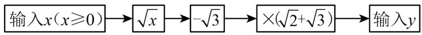
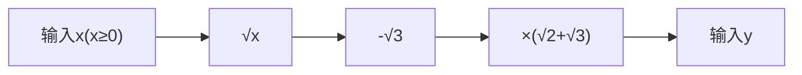
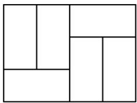
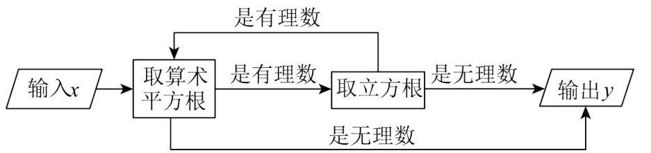
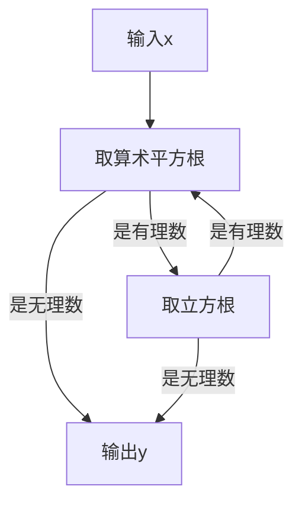
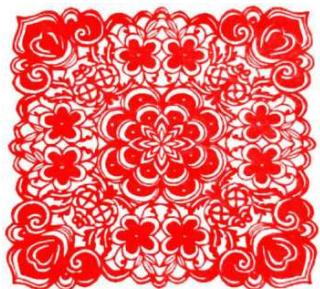
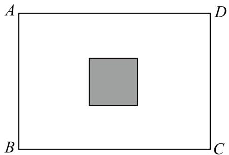
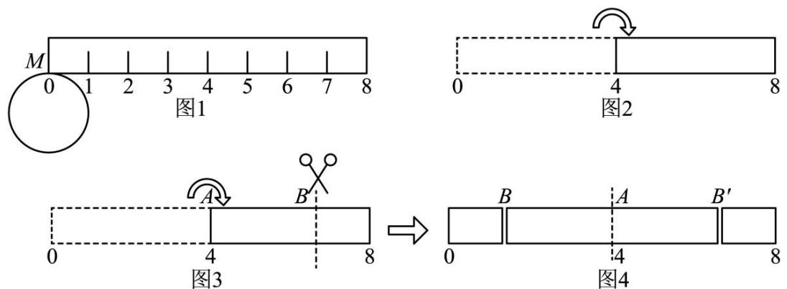
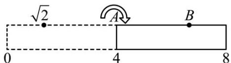

# 第二章 实数·拔尖卷

# 【北师大版 2024】

参考答案与试题解析

# 第I卷

# 一．选择题（共10小题，满分30分，每小题3分）

1. （3 分）（22-23 八年级下·辽宁营口·期中）下列各式是二次根式的有（）

(1) $\sqrt{21}$ ;

(2) $\sqrt{-19}$ ;

(3) $\sqrt{x^2 + 1}$ ;

(4) $\sqrt[3]{9}$ ;

(5) $\sqrt{-2x - 2}$

A. 4 个

B. 3 个

C. 2 个

D. 1 个

【答案】C

【分析】本题主要考查二次根式的定义，熟练掌握二次根式的定义是解题的关键．根据形如 $\sqrt{a}(a\geq0)$ 的式子是二次根式，可得答案.

【详解】解：二次根式有（1） $\sqrt{21}$ ，（3） $\sqrt{x^{2}+1}$ ，

故选：C.

2. （3 分）（23-24 七年级下·四川泸州·期中）在实数 $0, \pi, \frac{1}{3}, 3.1415926, \sqrt[3]{5}, 0.25, \sqrt{(-4)^2}, 1.3470136\ldots$ 中，无理数的个数有（）

A. 2 个

B. 3 个

C. 4 个

D. 5 个

【答案】B

【分析】本题考查无理数的识别，无理数是指无限不循环小数，包括 $\pi$ 、非完全平方数的平方根、非完全立方数的立方根等，需逐一判断各数是否为无理数.

【详解】解：0 是整数，属于有理数；

$\pi$ 是无限不循环小数，属于无理数；

$\frac{1}{3}$ 是分数，可化为无限循环小数0.3，属于有理数；

3.1415926 是有限小数，属于有理数；

$\sqrt[3]{5}$ 中 5 不是完全立方数，其立方根为无限不循环小数，属于无理数；

0.25是无限循环小数，属于有理数；

$\sqrt{(-4)^{2}}=\sqrt{16}=4$ 是整数，属于有理数；

1.3470136...中省略号未标注循环节，视为无限不循环小数，属于无理数.

综上，无理数有 $\pi$ 、 $\sqrt[3]{5}$ 、1.3470136…，一共 3 个.

故选：B.

3. （3 分）（24-25 八年级下·河北邢台·期末）如图是一个程序框图，若输入 $x = 72$ ，则输出 $y$ 的值为（）

flowchart

A. $15 + 7\sqrt{6}$

B. $9 + 5\sqrt{6}$

C. $9-5\sqrt{6}$

D. $5 \sqrt{6}$

【答案】B

【分析】根据程序写出代数式，再代入计算解答即可.

本题考查了程序式计算，熟练掌握程序式计算是解题的关键.

【详解】解：根据题意，得程序式为 $(\sqrt{x}-\sqrt{3})(\sqrt{2}+\sqrt{3})$ ，

$$
\begin{array}{l} \because x = 7 2, \\ \therefore (\sqrt {x} - \sqrt {3}) (\sqrt {2} + \sqrt {3}) = (\sqrt {7 2} - \sqrt {3}) (\sqrt {2} + \sqrt {3}) \\ = (6 \sqrt {2} - \sqrt {3}) (\sqrt {2} + \sqrt {3}) \\ = 1 2 + 6 \sqrt {6} - \sqrt {6} - 3 \\ = 9 + 5 \sqrt {6}, \\ \end{array}
$$

故选：B.

4. （3 分）（24-25 七年级下·辽宁葫芦岛·阶段练习）规定：若一个实数的算术平方根等于它的立方根，则称这样的数为“最美实数”。若 $\sqrt{2}+a$ 是“最美实数”，则 $a$ 的值是（）

A. $\sqrt{2} - 1$

B. $-\sqrt{2}$

C. $\sqrt{2}$ 或 $\sqrt{2} - 1$

D. $-\sqrt{2}$ 或 $1 - \sqrt{2}$

【答案】D

【分析】本题考查算术平方根及立方根，根据“最美实数”的定义，可知 $\sqrt{2}+a=0$ 或 $\sqrt{2}+a=1$ ，求出a的值即可.

【详解】解：若 $\sqrt{2}+a$ 是“最美实数”，

则有 $\sqrt{2}+a=0$ 或 $\sqrt{2}+a=1$ ，

若 $\sqrt{2}+a=0$ ，解得 $a=-\sqrt{2}$ ，

若 $\sqrt{2}+a=1$ ，解得 $a=1-\sqrt{2}$ ，

综上，a 的值为 $-\sqrt{2}$ 或 $1-\sqrt{2}$ ，

故选：D.

5. （3 分）（24-25 八年级下·河南商丘·阶段练习）如图用 6 个完全相同的小长方形拼成一个无重叠的大长方形，已知小长方形的长为 $2 \sqrt{2}$ ，宽为 $\sqrt{2}$ ，下列对大长方形的判断不正确的是（）

natural_image

Geometric diagram of a rectangle divided into four smaller rectangles, with no text or symbols present.

A. 大长方形的长为 $4 \sqrt{2}$

B. 大长方形的宽为 $3 \sqrt{2}$

C. 大长方形的周长为 $7 \sqrt{2}$

D. 大长方形的面积为 24

【答案】C

【分析】本题考查二次根式的混合运算，解题的关键是：熟练掌握二次根式的运算法则。根据小长方形的长宽列式，依次计算，即可求解。

【详解】解：A、大长方形的长为： $\sqrt{2}\times2+2\sqrt{2}=4\sqrt{2}$ ，故该选项正确，不符合题意，

B、大长方形的宽为： $2\sqrt{2}+\sqrt{2}=3\sqrt{2}$ ，故该选项正确，不符合题意，  
C、大长方形的周长为： $2 \times (4\sqrt{2} + 3\sqrt{2}) = 14\sqrt{2}$ ，故该选项不正确，符合题意，  
D、大长方形的面积为： $4\sqrt{2}\times3\sqrt{2}=24$ ，故该选项正确，不符合题意，

故选：C.

6. （3 分）（24-25 七年级下·山东日照·期中）在如图所示的运算程序中，当输入 $x$ 的值是 64 时，输出的 $y$ 值是（）

flowchart

A. $\sqrt{2}$

B. $\sqrt[3]{2}$

C. 2

D. 1

【答案】A

【分析】本题考查流程图与实数的计算，理解流程图是解题的关键．根据流程图，列出算式进行计算即可.

【详解】解：当输入x的值是64时，取算术平方根得 $\sqrt{64}=8$ ，

8 是有理数，再取立方根得 $\sqrt[3]{8}=2$ ，  
2 是有理数，再取算术平方根得 $\sqrt{2}$ ，

由于 $\sqrt{2}$ 是无理数，

所以输出的y值是 $\sqrt{2}$ .

故选：A.

7. （3 分）代数式 $\sqrt{x-1} + \sqrt{x-2} + \sqrt{x+2}$ 的最小值是（）

A. 0

B. 3

C. $\sqrt{3}$

D. 不存在

【答案】B

【分析】先根据二次根式有意义，求出 $x$ 取值范围，再根据 $\sqrt{x - 1}$ ， $\sqrt{x - 2}$ ， $\sqrt{x + 2}$ 都随 $x$ 的增大而增大，则在 $x$ 取值范围内 $x$ 取最小值时代入计算，即可求解.

【详解】解：若代数式 $\sqrt{x - 1} +\sqrt{x - 2} +\sqrt{x + 2}$ 有意义，

则 $\left\{\begin{aligned}x-1&\geq0\\ x-2&\geq0\\ x+2&\geq0\end{aligned}\right.$

解得： $x\geq 2$

∵由 $\sqrt{x-1}$ ， $\sqrt{x-2}$ ， $\sqrt{x+2}$ 都随x的增大而增大，

∴当 x=2 时，代数式的值最小，

即 $\sqrt{x-1}+\sqrt{x-2}+\sqrt{x+2}=1+0+2=3.$

故选：B.

【点睛】此题考查了函数的最值问题，考查了二次根式的意义．此题难度适中，解题的关键是根据题意求得 x 的取值范围.

8. （3 分）（24-25 八年级上·上海·期中）已知 $a > 0$ ，那么 $\sqrt{\frac{-a}{b}}$ 可化简为（）

A. $b \sqrt{-ab}$

B. $-\frac{1}{b}\sqrt{ab}$

C. $-\frac{1}{b}\sqrt{-ab}$

D. $\frac{1}{b}\sqrt{-ab}$

【答案】C

【分析】本题考查了二次根式的性质与化简、二次根式有意义的条件，掌握分式有意义的条件、二次根式有意义的条件和二次根式的乘除法公式是解决此题的关键.

根据二次根式有意义的条件得到 $\frac{-a}{b}$ ，则b<0，根据二次根式的性质利用二次根式的乘除法公式化简即可.

【详解】解：∵ $\frac{-a}{b}$ ，a>0，

$\therefore b<0,$

∴原式= $\sqrt{\frac{-a}{b}}=\sqrt{\frac{-ab}{b^{2}}}=-\frac{1}{b}\sqrt{-ab}$ ,

故选：C.

9. （3 分）（22-23 八年级下·浙江宁波·阶段练习）已知 $\sqrt{7}=a$ ， $\sqrt{70}=b$ ，则 $\sqrt{4.9}$ 用 a、b 表示为（）

A. $\frac{a+b}{10}$

B. $\frac{a-b}{10}$

C. $\frac{b}{a}$

D. $\frac{ab}{10}$

【答案】D

【分析】根据题意将 $\sqrt{4.9}$ 变形为 $\sqrt{\frac{490}{100}}$ ，由此可得出答案.

【详解】解：由题意得：

$$
\sqrt {4 . 9} = \sqrt {\frac {4 9 0}{1 0 0}} = \frac {\sqrt {7} \times \sqrt {7 0}}{1 0} = \frac {a b}{1 0},
$$

故选：D.

【点睛】本题考查了二次根式的乘除法运算，将 $\sqrt{4.9}$ 变形为 $\sqrt{\frac{490}{100}}$ 是解题的关键.

10. （3分）（24-25八年级下·重庆丰都·期末）对于一个正实数 $m$ ，我们规定：用符号 $[\sqrt{m}]$ 表示不大于 $\sqrt{m}$ 的最大整数（ $[m]$ 表示不大于 $m$ 的最大整数），称 $[\sqrt{m}]$ 为 $m$ 的根整数，如： $[\sqrt{4}] = 2, [\sqrt{10}] = 3$ 。如果我们对 $m$ 连续求根整数，直到结果为 1 为止。例如：对 11 连续求根整数 2 次， $[\sqrt{11}] = 3 \rightarrow [\sqrt{3}] = 1$ ，这时候结果为 1。现有如下四种说法：① $[\sqrt{3}] + [\sqrt{6}] = [\sqrt{9}]$ ；② $[\sqrt{a}]^2 = [(\sqrt{a})^2]$ ；③ 若方程 $[\sqrt{12 - x}] - [\sqrt{x - 3}] = 1$ ，则满足条件的 $x$ 的整数值有 4 个；④ 只需进行 3 次连续求根整数运算后结果为 1 的所有正整数 $m$ 中，最大值与最小值之差为 239。其中正确说法的个数有（）

A. 1 个

B. 2 个

C. 3 个

D. 4 个

【答案】B

【分析】本题考查新定义“根整数”的理解与应用，涉及无理数的估算、二次根式及最值分析。根据新定义再结合无理数的估算、二次根式及最值逐一验证各说法的正确性即可。

【详解】解：①：计算左边 $[\sqrt{3}]=1,\quad[\sqrt{6}]=2$ ，和为 $1+2=3$ ；右边 $[\sqrt{9}]=3$ ，等式成立．故①正确.

②： $\left[\sqrt{a}\right]^{2}=\left[(\sqrt{a})^{2}\right]$ ，取反例a=2，左边 $\left[\sqrt{2}\right]^{2}=1^{2}=1$ ，右边 $\left[(\sqrt{2})^{2}\right]=[2]=2$ ，显然 $1\neq2$ 。故②错误.  
③：方程 $\left[\sqrt{12-x}\right]-\left[\sqrt{x-3}\right]=1$ ，x为整数且 $3\leq x\leq12$ .

逐一验证：

当x=4,5,6时，左边分别为2-1=1，2-1=1，2-1=1，满足条件；

其他 x 值均不满足．故满足条件的 x 有 3 个，而非 4 个．故③错误.

④：设正整数 m 进行 3 次连续求根整数运算后结果为 1，即 $\left[\sqrt{m}\right]=m_{1}\rightarrow\left[\sqrt{m_{1}}\right]=m_{2}\rightarrow\left[\sqrt{m_{2}}\right]=1$

第三次操作时： $\left[\sqrt{m_{2}}\right]=1$ ，则 $1\leq m_{2}<4$ ;

第二次操作时： $\left[\sqrt{m_{1}}\right]=m_{2}$ ，则 $k^{2}\leq m_{2}<(k+1)^{2}$ ，其中k=1,2,3；

第一次操作时： $\left[\sqrt{m}\right]=m_{1}$ ，则 $m_{1}^{2}\leq m<(m_{1}+1)^{2}$ .

排除提前终止的情况:

若k=1，则 $1\leq m_{1}<4$ ，对应m<16，但这些m在2次操作内即可终止，需排除；

若k=2，则 $4\leq m_{1}<9$ ，对应 $16\leq m<81$ ;

若k=3，则 $9\leq m_{1}<16$ ，对应 $81\leq m<256$ ;

∴需进行3次根整数运算结果为1的正整数m的范围为 $16\leq m<256$ ,

∴m 的最大值为 255，最小值为 16，差值为 255-16=239．故④正确.

综上，正确说法为①④，共2个.

故选：B.

# 二．填空题（共6小题，满分18分，每小题3分）

11. （3分）（24-25八年级下·全国·单元测试）已知 $a+b=-8,ab=6$ ，则 $b\sqrt{\frac{b}{a}}+a\sqrt{\frac{a}{b}}=$ \_\_\_\_.

【答案】 $-\frac{26\sqrt{6}}{3}$

【分析】本题考查二次根式的运算，解题的关键是掌握二次根式的混合运算，分母有理化，完全平方公式，进行解答，即可.

【详解】解：∵ $a+b=-8<0,\quad ab=6>0,$

$$
\begin{array}{l} \therefore a <   0, \quad b <   0, \\ \therefore b \sqrt {\frac {b}{a}} + a \sqrt {\frac {a}{b}} \\ = b \sqrt {\frac {a b}{a ^ {2}} + a} \sqrt {\frac {a b}{b ^ {2}}} \\ = - \frac {b \sqrt {a b}}{a} - \frac {a \sqrt {a b}}{b} \\ = - \frac {b ^ {2} \sqrt {a b}}{a b} - \frac {a ^ {2} \sqrt {a b}}{a b} \\ = - \sqrt {a b} \times \frac {b ^ {2} + a ^ {2}}{a b} \\ = - \sqrt {a b} \times \frac {(a + b) ^ {2} - 2 a b}{a b} \\ = - \sqrt {6} \times \frac {(- 8) ^ {2} - 2 \times 6}{6} \\ = - \frac {2 6 \sqrt {6}}{3}. \\ \end{array}
$$

故答案为： $-\frac{26\sqrt{6}}{3}$ .

12. （3 分）（24-25 七年级下·重庆渝中·期末）若一个实数的算术平方根等于它的立方根，则称这样的数为“完美实数”。若 $\sqrt{3}+m$ 是“完美实数”，则 $m=$ \_\_\_\_；若 $a+b$ 与 $a-b$ 都是“完美实数”，则 $|ab|$ 的平方根为\_\_\_\_。

【答案】 $-\sqrt{3}$ 或 $1 - \sqrt{3}$ 0或 $\pm \frac{1}{2}$

【分析】本题考查了平方根，算术平方根，立方根的计算，掌握其计算方法是关键。根据算术平方根，立方根的计算方法求解即可。

【详解】解：一个实数的算术平方根等于它的立方根，则称这样的数为“完美实数”， $\because 0,1$ 的算术平方根是 $0,1$ ， $0,1$ 的立方根是 $0,1$ ，

∴这个实数可以是0,1,

∴当 $\sqrt{3}+m=0$ 时， $m=-\sqrt{3}$ ，

当 $\sqrt{3}+m=1$ 时， $m=1-\sqrt{3}$ ，

$\therefore m=-\sqrt{3}$ 或 $m=1-\sqrt{3}$ ;

若 $a+b$ 与a-b都是“完美实数”，

$\therefore \left\{ \begin{array}{l}a + b = 0\\ a - b = 0 \end{array} \right.$ 或 $\left\{ \begin{array}{l}a + b = 1\\ a - b = 1 \end{array} \right.$ 或 $\left\{ \begin{array}{l}a + b = 0\\ a - b = 1 \end{array} \right.$ 或 $\left\{ \begin{array}{l}a + b = 1\\ a - b = 0 \end{array} \right.,$

解得， $\left\{\begin{aligned}a=0\\ b=0\end{aligned}\right.$ 或 $\left\{\begin{aligned}a=1\\ b=0\end{aligned}\right.$ 或 $\left\{\begin{aligned}a=\frac{1}{2}\\ b=-\frac{1}{2}\end{aligned}\right.$ 或 $\left\{\begin{aligned}a=\frac{1}{2}\\ b=\frac{1}{2}\end{aligned}\right.$

∴对应的 $|ab|=0$ 或 $|ab|=0$ 或 $|ab|=\frac{1}{4}$ 或 $|ab|=\frac{1}{4}$ ,

∴对应的平方根为0或0或 $\pm\frac{1}{2}$ 或 $\pm\frac{1}{2}$ ,

综上所述， $|ab|$ 的平方根为0或 $\pm\frac{1}{2}$ ;

故答案为：① $-\sqrt{3}$ 或 $1-\sqrt{3}$ ；②0或 $\pm\frac{1}{2}$ .

13. （3分）（24-25八年级下·重庆渝北·期末）计算： $1+\frac{1}{\sqrt{2}+1}+\frac{1}{\sqrt{3}+\sqrt{2}}+\frac{1}{2+\sqrt{3}}+\frac{1}{\sqrt{5}+2}+\ldots+\frac{1}{\sqrt{2025}+\sqrt{2024}}=$ \_\_\_\_.

【答案】45

【分析】本题考查二次根式的混合运算，先进行分母有理化，再进行加减运算即可.

$$
\begin{array}{l} = \sqrt {2 0 2 5} \\ = 4 5; \\ \end{array}
$$

【详解】解：原式= $1+\sqrt{2}-1+\sqrt{3}-\sqrt{2}+\sqrt{4}-\sqrt{3}+\ldots+\sqrt{2025}-\sqrt{2024}$

故答案为：45.

14. （3 分）（24-25 八年级下·山西大同·阶段练习）山西剪纸是最古老的汉族民间艺术之一，被誉为流淌在刀尖上的舞蹈。剪纸作为一种镂空艺术，在视觉上给人以透空的感觉和艺术享受。张萌现用一张长方形彩纸和一张正方形彩纸各剪了一个图案。若长方形彩纸的长为 $4\sqrt{3}$ cm，宽为 $2\sqrt{6}$ cm，且长方形彩纸的面积是正方形彩纸面积的 $\sqrt{10}$ 倍，则正方形彩纸的面积为\_\_\_\_cm²。

natural_image

Red paper-cut floral pattern with swirling motifs (no text or symbols)

【答案】 $\frac{24\sqrt{5}}{5}$

【分析】本题主要考查了二次根式的乘除运算的应用，熟练掌握二次根式的乘除运算法则是解决此题的关键．先算出长方形彩纸的面积，再由长方形彩纸的面积是正方形彩纸面积的 $\sqrt{10}$ 倍，进行计算即可得解.

【详解】解：∵长方形彩纸的长为 $4\sqrt{3}$ cm，宽为 $2\sqrt{6}$ cm，

∴长方形彩纸的面积为 $4\sqrt{3}\times2\sqrt{6}=24\sqrt{2}(\mathrm{~cm}^{2})$ ,  
∵长方形彩纸的面积是正方形彩纸面积的 $\sqrt{10}$ 倍，  
∴正方形彩纸的面积为 $24\sqrt{2}\div\sqrt{10}=\frac{24\sqrt{5}}{5}(cm^{2})$ .

故答案为： $\frac{24\sqrt{5}}{5}$ .

15. （3 分）（22-23 八年级下·安徽芜湖·阶段练习）计算 $\sqrt{\sqrt{2025}-\sqrt{2024}}$ 的结果是 \_\_\_\_.

【答案】 $\sqrt{23}-\sqrt{22}$

【分析】注意到 $\sqrt{2025}=45$ ，故可将原式化为 $\sqrt{45-2\sqrt{506}}$ ，然后探寻 $45-2\sqrt{506}=(\sqrt{23}-\sqrt{22})^{2}$ ，进而得解.

【详解】解： $\sqrt{\sqrt{2025}-\sqrt{2024}}$

$$
\begin{array}{l} = \sqrt {4 5 - 2 \sqrt {5 0 6}} \\ = \sqrt {(\sqrt {2 3} - \sqrt {2 2}) ^ {2}} \\ = \sqrt {2 3} - \sqrt {2 2}; \\ \end{array}
$$

故答案为： $\sqrt{23}-\sqrt{22}$ .

【点睛】本题考查了二次根式的化简，数字比较大，正确找到 $45-2\sqrt{506}=(\sqrt{23}-\sqrt{22})^{2}$ 是解题的关键.

16. （3 分）（24-25 七年级下·重庆渝北·期末）求 59319 的立方根，解答如下：

①∵ $\sqrt[3]{1000}=10,\sqrt[3]{1000000}=100$ ，又∵1000<59319<1000000，∴10< $\sqrt[3]{59319}<100$ ，∴能确定59319的立方根是个两位数.  
②59319 的个位数是 9，又∵ $9^{3}=729$ ，∴能确定 59319 的立方根的个位数是 9.  
③划去59319后面的三位319得到数59，而 $\sqrt[3]{27}<\sqrt[3]{59}<\sqrt[3]{64}$ ，则 $3<\sqrt[3]{59}<4$ ，可得 $30<\sqrt[3]{59319}<40$ ，由此能确定

59319 的立方根的十位数是 3，因此 59319 的立方根是 39. 根据以上步骤求出 314432 的立方根是 \_\_\_\_.

【答案】68

【分析】本题考查立方根，根据题意所给方法确定314432的立方根是个两位数，再确定个位、十位上的数，即可解答.

【详解】解： $\because \sqrt[3]{1000}=10, \sqrt[3]{1000000}=100,$

又∵1000<314432<1000000,

$$
\therefore 1 0 <   \sqrt [ 3 ]{3 1 4 4 3 2} <   1 0 0,
$$

∴能确定 314432 的立方根是个两位数.

314432 的个位数是 2，

又∵ $8^{3}=512$ ,

∴能确定 314432 的立方根的个位数是 8.

划去 314432 后面的三位 432 得到数 314，而 $\sqrt[3]{216}<\sqrt[3]{314}<\sqrt[3]{343}$ ，则 $6<\sqrt[3]{314}<7$ ，

可得 $60<\sqrt[3]{314432}<70$ ，由此能确定314432的立方根的十位数是6，

因此 314432 的立方根是 68,

故答案为68.

# 第II卷

# 三．解答题（共8小题，满分72分）

17. （6 分）（24-25 八年级下·江苏扬州·阶段练习）计算或化简：

(1) $\sqrt{32} - \sqrt{\frac{1}{8}} - \sqrt{(\sqrt{2} - 3)^2} - (1 + \sqrt{2})^0$

(2) $2x\sqrt{\frac{1}{x}}\div3\sqrt{4x^{3}}\cdot\frac{1}{6}\sqrt{9x^{4}}$

【答案】(1) $\frac{19}{4}\sqrt{2}-4$

(2) $\frac{x}{6}$

【分析】本题考查二次根式的混合运算，零指数幂运算法则，在运算过程中注意运算顺序和简便运算方法的运用，结果化为最简形式．掌握相应的公式，性质，运算法则是解题的关键.

(1) 利用二次根式的性质, 零指数幂将原式化简, 再进行加减运算即可;

(2) 根据二次根式的乘除法进行计算即可.

【详解】（1）解： $\sqrt{32}-\sqrt{\frac{1}{8}}-\sqrt{(\sqrt{2}-3)^{2}}-(1+\sqrt{2})^{0}$

$$
\begin{array}{l} = 4 \sqrt {2} - \frac {\sqrt {2}}{4} - (3 - \sqrt {2}) - 1 \\ = \frac {1 9}{4} \sqrt {2} - 4 \\ \end{array}
$$

（2）解： $2x\sqrt{\frac{1}{x}}\div3\sqrt{4x^{3}}\cdot\frac{1}{6}\sqrt{9x^{4}}$

$$
\begin{array}{l} = \frac {2 \sqrt {x}}{6 x \sqrt {x}} \cdot \frac {3}{6} x ^ {2} \\ = \frac {x}{6} \\ \end{array}
$$

18. （6分）（23-24八年级下·内蒙古呼和浩特·期中）（1）已知 $y=\sqrt{12x-1}+\sqrt{1-12x}+\frac{1}{3}$ ，求代数式 $\frac{\sqrt{x}-\sqrt{y}}{x}$ 的值.

（2）已知实数a满足 $|2023-a|+\sqrt{a-2024}=a$ ，求 $a-2023^{2}$ 的值.

【答案】（1） $-2\sqrt{3}$ ；（2）2024

【分析】本题主要考查了二次根式有意义的条件，二次根式的化简求值：

（1）根据二次根式有意义的条件得到 $\left\{\begin{aligned}&12x-1\geq0\\ &1-12x\geq0\end{aligned}\right.$ ，则 $x=\frac{1}{12}$ ，进而得到 $y=\frac{1}{3}$ ，据此代值计算即可；  
（2）根据二次根式有意义的条件得到 $a\geq2024$ ，据此化简绝对值推出 $\sqrt{a-2024}=2023$ ，则 $a-2023^{2}=2024$ .

【详解】解：∵式子 $y=\sqrt{12x-1}+\sqrt{1-12x}+\frac{1}{3}$ 有意义，

$$
\therefore \left\{ \begin{array}{l} 1 2 x - 1 \geq 0 \\ 1 - 1 2 x \geq 0 \end{array} \right.,
$$

$$
\therefore x = \frac {1}{1 2},
$$

$$
\therefore y = \sqrt {1 2 x - 1} + \sqrt {1 - 1 2 x} + \frac {1}{3} = \frac {1}{3},
$$

$$
\therefore \frac {\sqrt {x} - \sqrt {y}}{x}
$$

$$
= \frac {\sqrt {\frac {1}{1 2}} - \sqrt {\frac {1}{3}}}{\frac {1}{1 2}}
$$

$$
= \frac {\frac {\sqrt {3}}{6} - \frac {\sqrt {3}}{3}}{\frac {1}{1 2}}
$$

$$
= - 2 \sqrt {3};
$$

(2) $\because|2023-a|+\sqrt{a-2024}=a$ 有意义，

$$
\therefore a - 2 0 2 4 \geq 0,
$$

$$
\therefore a \geq 2 0 2 4,
$$

$$
\therefore a - 2 0 2 3 + \sqrt {a - 2 0 2 4} = a,
$$

$$
\therefore \sqrt {a - 2 0 2 4} = 2 0 2 3,
$$

$$
\therefore a - 2 0 2 4 = 2 0 2 3 ^ {2},
$$

$$
\therefore a - 2 0 2 3 ^ {2} = 2 0 2 4.
$$

19. （8 分）（24-25 八年级上·河北邯郸·期中）阅读下面的文字，解答问题：

大家知道 $\sqrt{2}$ 是无理数，而无理数是无限不循环小数，因此 $\sqrt{2}$ 的小数部分我们不可能全部地写出来，于是小明用 $\sqrt{2} - 1$ 来表示 $\sqrt{2}$ 的小数部分，你同意小明的表示方法吗？

事实上，小明的表示方法是有道理，因为 $\sqrt{2}$ 的整数部分是1，将这个数减去其整数部分，差就是小数部分.

又例如： $\because \sqrt{4} < \sqrt{7} < \sqrt{9}$ ，即 $2 < \sqrt{7} < 3$ ，

$\therefore \sqrt{7}$ 的整数部分为2，小数部分为 $\sqrt{7} - 2$

请解答:

(1) $\sqrt{17}$ 的整数部分是\_，小数部分是\_.

(2)如果 $\sqrt{5}$ 的小数部分为a， $\sqrt{13}$ 的整数部分为b，求 $a+b$ 的值；

(3)已知： $10+\sqrt{3}=x+y$ ，其中 x 是整数，且 0<y<1，求 x-y 的相反数.

【答案】(1)4， $\sqrt{17}-4$

(2) $a+b=\sqrt{5}+1$

(3)x-y的相反数为 $\sqrt{3}-12$

【分析】本题考查了无理数的估算，相反数等知识．解题关键是确定无理数的整数部分和小数部分.

（1）由 $\sqrt{16}<\sqrt{17}<\sqrt{25}$ ，即可得 $\sqrt{17}$ 的整数部分与小数部分；

（2）由 $\sqrt{4}<\sqrt{5}<\sqrt{9}$ ，则可得 $\sqrt{5}$ 的小数部分为a，同理可得 $\sqrt{13}$ 的整数部分为b，代入则可求得值；

（3）估算出 $10+\sqrt{3}$ 的整数部分与小数部分，则得到x与y的值，从而可求得x-y的相反数.

【详解】（1）解：∵ $\sqrt{16}<\sqrt{17}<\sqrt{25}$ ,

$$
\therefore 4 <   \sqrt {1 7} <   5,
$$

∴ $\sqrt{17}$ 的整数部分为4， $\sqrt{17}$ 的小数部分为 $\sqrt{17}-4$ ;

故答案为：4； $\sqrt{17}-4$ ;

(2) 解: $\because \sqrt{4} < \sqrt{5} < \sqrt{9}$ ,

$$
\therefore 2 <   \sqrt {5} <   3,
$$

$\therefore\sqrt{5}$ 的整数部分为2，小数部分为 $a=\sqrt{5}-2$ ;

$$
\because \sqrt {9} <   \sqrt {1 3} <   \sqrt {1 6},
$$

$$
\therefore 3 <   \sqrt {1 3} <   4,
$$

$\therefore\sqrt{13}$ 的整数部分为b=3;

$$
\therefore a + b = \sqrt {5} - 2 + 3 = \sqrt {5} + 1;
$$

(3) (3) $\because1<\sqrt{3}<2,$

$$
\therefore 1 1 <   1 0 + \sqrt {3} <   1 2,
$$

即 $10+\sqrt{3}$ 的整数部分为11，小数部分为 $10+\sqrt{3}-11=\sqrt{3}-1$ ，

$$
\therefore x = 1 1, \quad y = \sqrt {3} - 1,
$$

$$
\therefore x - y = 1 1 - (\sqrt {3} - 1) = 1 2 - \sqrt {3},
$$

∵12- $\sqrt{3}$ 的相反数为 $\sqrt{3}-12$ ,

∴x-y的相反数为 $\sqrt{3}-12$ .

20. （8 分）（24-25 八年级上·四川成都·期末）阅读下列材料，然后回答问题.

学习数学, 最重要的是学习数学思想, 其心一种数学思想叫做换元的思想, 它可以简化我们的计算, 比如我们熟悉的下面这个题: 已知 $a + b = 2$ , $ab = -3$ , 求 $a^2 + b^2$ 我们可以把 $a + b$ 和 $ab$ 看成是一个整体, 令 $x = a + b$ , $y = ab$ , 则 $a^2 + b^2 = (a + b)^2 - 2ab = x^2 - 2y = 4 + 6 = 10$ 这样, 我们不用求出 $a$ , $b$ , 就可以得到最后的结果.

(1)计算： $\frac{\sqrt{7}+\sqrt{6}}{\sqrt{7}-\sqrt{6}}+\frac{\sqrt{7}-\sqrt{6}}{\sqrt{7}+\sqrt{6}}=$ \_\_\_\_

(2)m 是正整数， $a=\frac{\sqrt{m+1}-\sqrt{m}}{\sqrt{m+1}+\sqrt{m}}$ ， $b=\frac{\sqrt{m+1}+\sqrt{m}}{\sqrt{m+1}-\sqrt{m}}$ ，且 $3a^{2}+1711ab+3b^{2}=2005$ ，求 m.

(3)已知 $\sqrt{21 + x^2} -\sqrt{17 - x^2} = 4$ ，求 $\sqrt{21 + x^2} +\sqrt{17 - x^2}$ 的值.

【答案】(1)26

(2)m=2;

(3) $2\sqrt{15}$ .

【分析】本题考查了二次根式的化简求值，分母有理化，准确熟练地进行计算是解题的关键.

(1) 先把每一个二次根式进行分母有理化, 然后再进行计算即可解答;

（2）先利用分母有理化化简a，b，从而求出 $a+b=4m+2$ ，ab=1，然后根据已知可得 $3(a+b)^{2}+1705ab=2005$ ，再利用完全平方公式进行计算即可解答；

（3）利用完全平方公式，进行计算即可解答.

【详解】（1）解： $\frac{\sqrt{7}+\sqrt{6}}{\sqrt{7}-\sqrt{6}}+\frac{\sqrt{7}-\sqrt{6}}{\sqrt{7}+\sqrt{6}}$

$$
= \frac {(\sqrt {7} + \sqrt {6}) ^ {2}}{(\sqrt {7} - \sqrt {6}) (\sqrt {7} + \sqrt {6})} + \frac {(\sqrt {7} - \sqrt {6}) ^ {2}}{(\sqrt {7} + \sqrt {6}) (\sqrt {7} - \sqrt {6})}
$$

$$
= (\sqrt {7} + \sqrt {6}) ^ {2} + (\sqrt {7} - \sqrt {6}) ^ {2}
$$

$$
= 7 + 6 + 2 \sqrt {4 2} + 7 + 6 - 2 \sqrt {4 2}
$$

$$
= 2 6;
$$

（2）解： $\because a=\frac{\sqrt{m+1}-\sqrt{m}}{\sqrt{m+1}+\sqrt{m}},\quad b=\frac{\sqrt{m+1}+\sqrt{m}}{\sqrt{m+1}-\sqrt{m}},$

$$
\therefore a = \frac {(\sqrt {m + 1} - \sqrt {m}) ^ {2}}{(\sqrt {m + 1} + \sqrt {m}) (\sqrt {m + 1} - \sqrt {m})} = (\sqrt {m + 1} - \sqrt {m}) ^ {2},
$$

$$
b = \frac {(\sqrt {m + 1} + \sqrt {m}) ^ {2}}{(\sqrt {m + 1} - \sqrt {m}) (\sqrt {m + 1} + \sqrt {m})} = (\sqrt {m + 1} + \sqrt {m}) ^ {2},
$$

$$
\therefore a + b = (\sqrt {m + 1} - \sqrt {m}) ^ {2} + (\sqrt {m + 1} + \sqrt {m}) ^ {2} = 4 m + 2,
$$

$$
a b = (\sqrt {m + 1} - \sqrt {m}) ^ {2} (\sqrt {m + 1} + \sqrt {m}) ^ {2}
$$

$$
= \left[ (\sqrt {m + 1} - \sqrt {m}) (\sqrt {m + 1} + \sqrt {m}) \right] ^ {2} = (m + 1 - m) = 1,
$$

$$
\because 3 a ^ {2} + 1 7 1 1 a b + 3 b ^ {2} = 2 0 0 5,
$$

$$
\therefore 3 (a + b) ^ {2} + 1 7 0 5 a b = 2 0 0 5,
$$

$$
\therefore 3 (4 m + 2) ^ {2} = 3 0 0,
$$

$$
\therefore (4 m + 2) ^ {2} = 1 0 0,
$$

$$
\because a > 0, \quad b > 0,
$$

$$
\therefore a + b = 4 m + 2 > 0,
$$

$$
\therefore 4 m + 2 = 1 0,
$$

$$
\therefore m = 2;
$$

（3）解： $\because \sqrt{21 + x^2} - \sqrt{17 - x^2} = 4$ ，

$$
\therefore \left(\sqrt {2 1 + x ^ {2}} - \sqrt {1 7 - x ^ {2}}\right) ^ {2} = 1 6,
$$

$$
\therefore 2 1 + x ^ {2} + 1 7 - x ^ {2} - 2 \sqrt {2 1 + x ^ {2}} \cdot \sqrt {1 7 - x ^ {2}} = 1 6,
$$

$$
\therefore \sqrt {2 1 + x ^ {2}} \cdot \sqrt {1 7 - x ^ {2}} = 1 1,
$$

$$
\therefore \left(\sqrt {2 1 + x ^ {2}} + \sqrt {1 7 - x ^ {2}}\right) ^ {2}
$$

$$
= \left(\sqrt {2 1 + x ^ {2}} - \sqrt {1 7 - x ^ {2}}\right) ^ {2} + 4 \sqrt {2 1 + x ^ {2}} \cdot \sqrt {1 7 - x ^ {2}}
$$

$$
= 4 ^ {2} + 4 \times 1 1 = 6 0,
$$

$$
\because \sqrt {2 1 + x ^ {2}} > 0, \sqrt {1 7 - x ^ {2}} \geq 0,
$$

$$
\therefore \sqrt {2 1 + x ^ {2}} + \sqrt {1 7 - x ^ {2}} = \sqrt {6 0} = 2 \sqrt {1 5}.
$$

21. （10 分）（22-23 七年级下·四川南充·阶段练习）阅读理解，观察下列式子：

① $\sqrt[3]{8}+\sqrt[3]{-8}=2+(-2)=0;$   
② $\sqrt[3]{1}+\sqrt[3]{-1}=1+(-1)=0;$   
③ $\sqrt[3]{1000}+\sqrt[3]{-1000}=10+(-10)=0;$

④ $\sqrt[3]{\frac{1}{27}}+\sqrt[3]{-\frac{1}{27}}=\frac{1}{3}+(-\frac{1}{3})=0;$

...

根据上述等式反映的规律，回答如下问题：

(1)由等式①，②，③，④所反映的规律，可归纳为一个这样的真命题：对于任意两个有理数 $a$ ， $b$ ，若\_\_\_\_，则 $\sqrt[3]{a} + \sqrt[3]{b} = 0$ ；反之也成立。

(2)根据上述的真命题，解答问题：若 $\sqrt[3]{2-3x}$ 与 $\sqrt[3]{2x+6}$ 的值互为相反数，求 $-\sqrt{2x}$ 的值.

【答案】(1) $a+b=0$

(2)-4

【分析】本题考查了立方根、算术平方根的应用，解一元一次方程，观察并总结规律是解题的关键.

(1) 用含 $a 、 b$ 的式子表达规律即可得答案;  
(2) 根据题意列出一元一次方程, 解方程求出 $x$ 的值即可, 进而求得算术平方根, 即可.

【详解】（1）解：由规律可得：对于任意两个有理数a、b，若 $a+b=0$ ，则 $\sqrt[3]{a}+\sqrt[3]{b}=0$ ，

故答案为： $a+b=0$ .

（2）解：若 $\sqrt[3]{2-3x}$ 与 $\sqrt[3]{2x+6}$ 的值互为相反数，则 $2-3x+2x+6=0$ ，

解得：x=8.

$$
\therefore - \sqrt {2 x} = - \sqrt {1 6} = - 4
$$

22. （10 分）（24-25 八年级下·河北石家庄·期末）某室内展区有一块长方形闲置区域ABCD（如图），该区域的长BC为 $8\sqrt{3}$ 米，宽AB为 $\sqrt{98}$ 米，现计划在区域中间放置一个正方形展台（阴影部分），展台的边长为 $(\sqrt{6}-1)$ 米.

natural_image

Simple geometric diagram showing a gray square centered within a rectangle labeled A, B, C, D (no text or symbols beyond labels)

(1)求该长方形闲置区域ABCD的周长;

(2)除去放置展台的地方, 其余区域全部需要铺上红毯, 若所铺红毯的售价为 10 元/平方米, 则购买红毯大约需要花费多少元? (参考数据: $\sqrt{6} \approx 2.4495$ , 结果精确到 0.1)

【答案】(1) $(16\sqrt{3}+14\sqrt{2})$ 米

(2)1350.7 元

【分析】本题考查了二次根式的应用，正确掌握相关性质内容是解题的关键.

（1）根据长方形的周长进行列式计算，即可作答.

(2) 先算出其余区域的面积为 $(58\sqrt{6} - 7)$ 平方米, 再结合所铺红毯的售价为 10 元/平方米, 进行列式计算, 即可作答.

【详解】（1）解：依题意， $2\times(8\sqrt{3}+\sqrt{98})=2\times(8\sqrt{3}+7\sqrt{2})=(16\sqrt{3}+14\sqrt{2})$ （米）.

答：该长方形闲置区域ABCD的周长为 $(16\sqrt{3}+14\sqrt{2})$ 米

(2) 解: $(8\sqrt{3} \times \sqrt{98}) - (\sqrt{6} - 1)^{2}$

$$
= 8 \sqrt {3} \times 7 \sqrt {2} - (7 - 2 \sqrt {6})
$$

$$
= (5 8 \sqrt {6} - 7) (\text { 平   方   米 }).
$$

∴其余的面积为 $(58\sqrt{6}-7)$ 平方米，

$$
1 0 \times (5 8 \sqrt {6} - 7) = 5 8 0 \sqrt {6} - 7 0 \approx 1 3 5 0. 7 (\text {元}).
$$

答：购买红毯大约需要花费 1350.7 元.

23. （12 分）（24-25 七年级下·山西忻州·期末）综合与实践

问题情境: 如图 1, 有一条长为 8 个单位长度的纸条 (宽度忽略不计), 半径为 1 的圆上的一点 $M$ 与纸条上表示数字 0 的点重合, 将圆沿着纸条向右滚动一周, 重合点变为点 $N$ , 点 $N$ 表示的数为 $n$ .

text_image

M
0 1 2 3 4 5 6 7 8
图1
图2
A B
图3
B A B'
0 4 8
图4

(1)n的值为\_.（结果保留 $\pi$ ）

(2)求 $-(n-\sqrt{16})+2\pi$ 的平方根.

(3)“善思小组”将纸条进行如下操作.

①操作一：如图2，将纸条沿表示4的数的点对折，则表示数 $\sqrt{2}$ 的点与表示数\_的点重合.

②操作二: 如图 3, 在操作一的条件下, 将对折的纸条沿着点 $B$ 剪开, 如图 4, 展开后 $BB'$ 的长为 $2 + 2\sqrt{3}$ , 则点 $B$ 表示的数为\_.

【答案】(1) $2\pi$

(2) $\pm2$

(3)① $8-\sqrt{2}$ ; ② $3-\sqrt{3}$

【分析】本题主要考查了求平方根，数轴上两点之间的距离，实数与数轴，

对于（1），根据圆的周长公式计算即可；

对于（2），将 n 的值代入，再求平方根即可；

对于（3）①，根据数 $\sqrt{2}$ 到点A的距离等于点B到点A的距离，可得答案；②先求出AB，可得答案.

【详解】（1）解： $n=2\pi\times1=2\pi;$

故答案为： $2\pi$

(2) 解: $\because n=2\pi,$

∴原式 $=-2\pi+\sqrt{16}+2\pi=4$ ,

∴4 的平方根是 $\pm\sqrt{4}=\pm2$ ;

(3) 解: ①如图所示, 因为数 $\sqrt{2}$ 到点 $A$ 的距离等于点 $B$ 到点 $A$ 的距离,

所以 $AB=4-\sqrt{2}$ ,

则 $2(4-\sqrt{2})+\sqrt{2}=8-\sqrt{2}$ ,

所以数 $\sqrt{2}$ 的点与表示的数 $8-\sqrt{2}$ 的点重合；

故答案为： $8-\sqrt{2}$ ;

text_image

√2
0 4 8
A B

图2

② $AB=(2+2\sqrt{3})\div2=1+\sqrt{3}$ ,

∴点 B 表示的数是 $4-(1+\sqrt{3})=3-\sqrt{3}$ .

故答案为： $3-\sqrt{3}$ .

24. （12 分）（24-25 七年级上·四川成都·期末）阅读材料：我们已经学习了实数以及二次根式的有关概念，同学们可以发现以下结果：

当 $a > 0$ 时， $\because a + \frac{1}{a} = (\sqrt{a})^2 -2\sqrt{a}\cdot \frac{1}{\sqrt{a}} +\left(\frac{1}{\sqrt{a}}\right)^2 +2\sqrt{a}\cdot \frac{1}{\sqrt{a}} = \left(\sqrt{a} -\frac{1}{\sqrt{a}}\right)^2 +2,$

∴当 $\sqrt{a}=\frac{1}{\sqrt{a}}$ 即a=1时， $a+\frac{1}{a}$ 的最小值为2.

text_image

A
D
O
B
C

请利用以上结果解决下面的问题:

(1)当a>0时， $a+\frac{4}{a}$ 的最小值为\_\_\_\_；当a<0时， $a+\frac{4}{a}$ 的最大值为\_\_\_\_；

(2)当 $a > 0$ 时，求 $\frac{3a^2 + 4a + 5}{a}$ 的最小值；

(3)如图,已知四边形ABCD的对角线AC,BD交于点O,若 $\triangle AOD$ 的面积为2, $\triangle BOC$ 的面积为3,求四边形ABCD面积的最小值.

【答案】(1)4；-4

(2) $4+2\sqrt{15}$   
(3) $5+2\sqrt{6}$

【分析】本题考查的是完全平方公式的应用．熟练掌握配方法，完全平方的非负性，二次根式的性质，理解阅读部分的信息并灵活运用，是解本题的关键.

（1）当a>0时，由 $a+\frac{4}{a}=\left(\sqrt{a}-\frac{2}{\sqrt{a}}\right)^{2}+4$ ，可得 $a+\frac{4}{a}$ 的最小值，当a<0时，由 $-a-\frac{4}{a}=\left(\sqrt{-a}-\frac{2}{\sqrt{-a}}\right)^{2}+4$ ，可得 $a+\frac{4}{a}$ 的最大值；  
（2）当a>0时，由 $\frac{3a^{2}+4a+5}{a}=3\left(\sqrt{a}-\sqrt{\frac{5}{3a}}\right)^{2}+4+2\sqrt{15}$ ，可得 $a=\frac{\sqrt{15}}{3}$ 时， $\frac{3a^{2}+4a+5}{a}$ 的最小值是 $4+2\sqrt{15}$ ;  
(3) 设 $S_{\triangle AOB}$ 的面积为 $a$ ，根据 $S_{\triangle AOD}: S_{\triangle AOB} = S_{\triangle COD}: S_{\triangle COB}$ ，得 $S_{\triangle COD} = \frac{6}{a}$ . 可得四边形的面积 $2 + 3 + a + \frac{6}{a} = \left(\sqrt{a} - \sqrt{\frac{6}{a}}\right)^2 + 5 + 2\sqrt{6}$ ，可得当 $a = \sqrt{6}$ 时，四边形ABCD的面积的最小值为： $5 + 2\sqrt{6}$ .

【详解】（1）解：当a>0时，

$$
\because a + \frac {4}{a} = (\sqrt {a}) ^ {2} - 2 \cdot \sqrt {a} \cdot \frac {2}{\sqrt {a}} + \left(\frac {2}{\sqrt {a}}\right) ^ {2} + 2 \cdot \sqrt {a} \cdot \frac {2}{\sqrt {a}} = \left(\sqrt {a} - \frac {2}{\sqrt {a}}\right) ^ {2} + 4,
$$

∴当 $\sqrt{a}=\frac{2}{\sqrt{a}}$ 即a=2时， $a+\frac{4}{a}$ 的最小值为4；

当 $a < 0$ 时，

$$
\because a + \frac {4}{a} = - \left(- a - \frac {4}{a}\right),
$$

$$
\therefore - a \frac {4}{a} = (\sqrt {- a}) ^ {2} - 2 \cdot \sqrt {- a} \cdot \frac {2}{\sqrt {- a}} + \left(\frac {2}{\sqrt {- a}}\right) ^ {2} + 2 \cdot \sqrt {- a} \cdot \frac {2}{\sqrt {- a}} = \left(\sqrt {- a} - \frac {2}{\sqrt {- a}}\right) ^ {2} + 4,
$$

$$
\therefore - \left(- a - \frac {4}{a}\right) = - \left(\sqrt {- a} - \frac {2}{\sqrt {- a}}\right) ^ {2} - 4 \leq - 4,
$$

∴当 $\sqrt{-a}=\frac{2}{\sqrt{-a}}$ ，即a=-2时， $a+\frac{4}{a}$ 的最大值为-4；

故答案为：4；-4；

(2) 解: 当a>0时,

$$
\because \frac {3 a ^ {2} + 4 a + 5}{a} = 3 a + 4 + \frac {5}{a} = 3 \left(a + \frac {5}{3 a}\right) + 4 = 3 \left(\sqrt {a} - \sqrt {\frac {5}{3 a}}\right) ^ {2} + 4 + 2 \sqrt {1 5},
$$

∴当 $\sqrt{a}=\sqrt{\frac{5}{3a}}$ ，即 $a=\frac{\sqrt{15}}{3}$ 时， $\frac{3a^{2}+4a+5}{a}$ 的最小值是： $4+2\sqrt{15}$ .

（3）解：设 $S_{\triangle AOB}$ 的面积为a，

$$
\because S _ {\triangle A O D}: S _ {\triangle A O B} = O D: O B = S _ {\triangle C O D}: S _ {\triangle C O B},
$$

$$
\therefore 2: a = S _ {\triangle C O D}: 3,
$$

$$
\therefore S _ {\triangle C O D} = \frac {6}{a}.
$$

∴四边形ABCD的面积： $2+3+a+\frac{6}{a}=\left(a+\frac{6}{a}\right)+5=\left(\sqrt{a}-\sqrt{\frac{6}{a}}\right)^{2}+5+2\sqrt{6}$

$$
\because a > 0,
$$

∴当 $\sqrt{a}=\sqrt{\frac{6}{a}}$ ，即 $a=\sqrt{6}$ 时，四边形ABCD的面积的最小值为： $5+2\sqrt{6}$ .