# 第二章 实数（举一反三讲义）全章题型归纳

【北师大版 2024】

# 题型归纳

# 【培优篇】....5

【题型 1 直接求平方根、立方根】....5

【题型 2 利用求平方根、立方根解方程】....5

【题型 3 由平方根、立方根求值】....6

【题型4 实数的运算】....6

【题型5 无理数的估算】....7

【题型 6 二次根式的概念及其有意义的条件】....7

【题型 7 利用二次根式的性质化简】....8

【题型8 最简二次根式】....8

【题型 9 求二次根式中的参数值】....9

【题型 10 二次根式的运算或化简求值】....9

# 【拔尖篇】....9

【题型11二次根式的双重非负性】 9

【题型 12 实数的大小比较】....10

【题型 13 求整数部分和小数部分】....10

【题型 14 实数与数轴综合运用】....11

【题型 15 实数运算的应用】....11

【题型 16 复合二次根式的化简】....13

【题型 17 利用分母有理化求值】....13

【题型 18 二次根式的规律探究】....15

【题型 19 二次根式的新定义】....15

【题型20二次根式的实际应用】....16

# 举一反三

教辅资源,关注公众号·全科AA+

知识点 1 算术平方根和平方根的区别与联系

<table><tr><td colspan="2"></td><td>算术平方根</td><td>平方根</td></tr><tr><td rowspan="2">区别</td><td>定义</td><td>一般地,如果一个正数x的平方等于a,即 $x^{2}$ =a,那么这个正数x就叫做a的算术平方根</td><td>一般地,如果一个数 $\chi$ 的平方等于a,即 $x^{2}$ =a,那么这个数x就叫做a的平方根(也叫做二次方根)</td></tr><tr><td>个数</td><td>一个正数只有一个算术平方根</td><td>一个正数有两个平方根,它们互为相反数;负数没有平方根</td></tr><tr><td rowspan="2"></td><td>表示方法</td><td>正数 $a$ 的算术平方根为 $\sqrt{a}$ </td><td>正数 $a$ 的平方根表示为 $\pm\sqrt{a}$ </td></tr><tr><td>取值范围</td><td> $\sqrt{a}$ 具有双重非负性,即 $\sqrt{a}\geq 0,a\geq 0$ </td><td> $a$ 的平方根可正可负,也可为0</td></tr><tr><td rowspan="2">二者联系</td><td>联系</td><td colspan="2">平方根包含了算术平方根,算术平方根是平方根中正的那个</td></tr><tr><td>关于0</td><td colspan="2">0的算术平方根和平方根都是0</td></tr></table>

# 知识点 2 开平方

1. 定义: 求一个数 $a$ 的平方根的运算, 叫做开平方, $a$ 叫做被开方数.

2.开平方和平方根的区别与联系

(1)开平方时，被开方数 a 必须是非负数.  
(2)平方根是数，是开平方的结果；开平方是一种运算，是求平方根的过程.  
(3)平方和开平方互为逆运算，可以用平方运算来检验开平方的结果是否正确.

知识点3 $\sqrt{\mathbf{a}^2}$ 与 $\sqrt{\mathbf{a}^2}$ 的性质

<table><tr><td>形式</td><td>性质</td><td>示例</td></tr><tr><td> $\sqrt{a^2}$ </td><td> $\sqrt{a^2} = |a| = \begin{cases} a & (a \ge 0) \\ -a & (a < 0) \end{cases}$ </td><td> $\sqrt{6^2} = |6| = 6$  $\sqrt{(-6)^2} = |-6| = 6$ </td></tr><tr><td> $\sqrt{a^2}$ </td><td> $(\sqrt{a})^2 = a (a \ge 0)$ </td><td> $(\sqrt{6})^2 = 6$ </td></tr></table>

知识点 4 立方根和平方根的不同点和相同点

<table><tr><td colspan="2"></td><td>立方根</td><td>平方根</td></tr><tr><td rowspan="4">区别</td><td>定义</td><td>一般地,如果一个数x的立方等于a,即 $x^{3}$ =a,那么这个正数x就叫做a的立方根(也叫做三次方根)</td><td>一般地,如果一个数x的平方等于a,即 $x^{2}$ =a,那么这个数x就叫做a的平方根(也叫做二次方根)</td></tr><tr><td>个数</td><td>每一个数a有且只有一个立方根,正数的立方根是正数,负数的立方根是负数</td><td>一个正数有两个平方根,它们互为相反数;负数没有平方根</td></tr><tr><td>表示方法</td><td> $\sqrt[3]{a}$ </td><td> $\pm\sqrt{a}$ </td></tr><tr><td>a取值范围</td><td>任意数</td><td>a≥0</td></tr><tr><td>相同点</td><td>关于0</td><td colspan="2">0的平方根是0,0的立方根是0</td></tr></table>

# 知识点 5 开立方

1. 求一个数 a 的立方根的运算叫做开立方，其中 a 叫做被开方数.

2.开平方和开立方的区别

<table><tr><td></td><td>开平方</td><td>开立方</td></tr><tr><td>运算符号</td><td> $\pm \sqrt{}$ </td><td> $^3\sqrt{}$ </td></tr><tr><td>被开方数</td><td>非负数</td><td>任意数</td></tr><tr><td>个数</td><td>0的平方根只有一个;一个正数的平方根有两个;负数没有平方根</td><td>任意数的立方根都只有一个</td></tr></table>

# 知识点 6 无理数

无限不循环小数叫做无理数.

无理数的常见形式有以下几种:

（1）开方开不尽的数的相应方根是无理数，如 $\sqrt{2}$ ， $\sqrt[3]{5}$ 等；  
(2) 圆周率 $\pi$ 及一些含有 $\pi$ 的数, 如 $2\pi$ , $\frac{\pi}{2}$ 等;  
（3）以无限不循环小数形式写出的数,如 0.101 001 000 1...（两个 1 之间依次多一个 0)等．注意无理数的小数部分位数无限；无理数的小数部分不循环；无理数不能表示成分数的形式.

# 知识点 7 实数的概念及分类

1. 概念: 有理数和无理数统称为实数.  
2. 分类：实数有两种分类标准：

（1）按定义分类：实数可分为有理数和无理数.

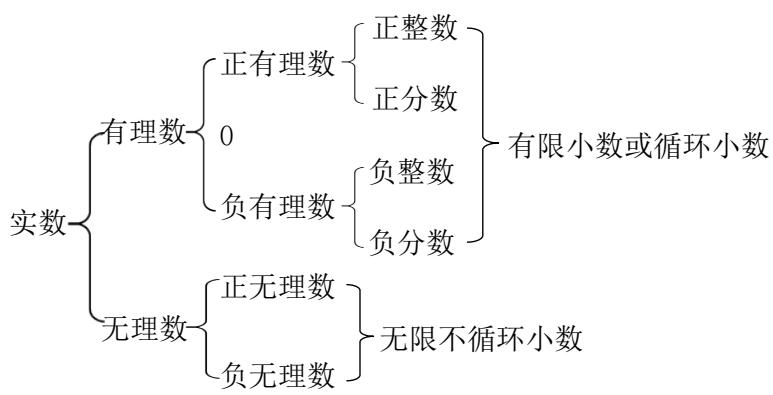

flowchart

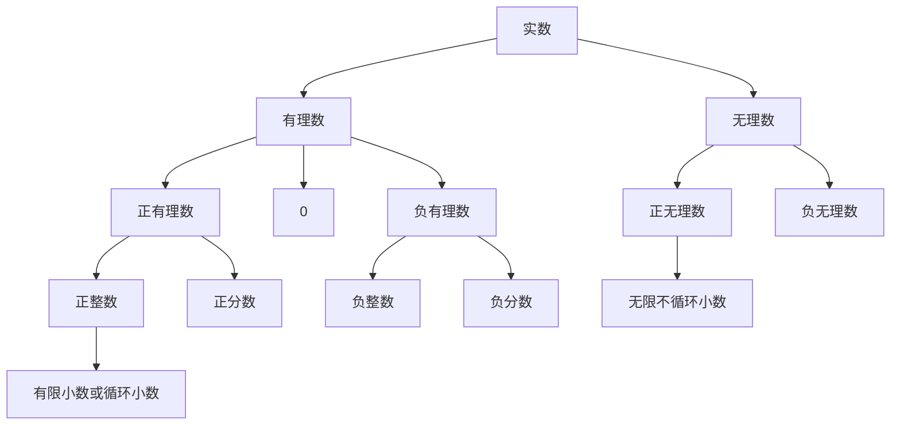

(2) 按正负性分类: 实数可分为正实数、0、负实数.

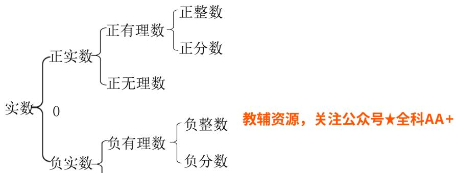

flowchart

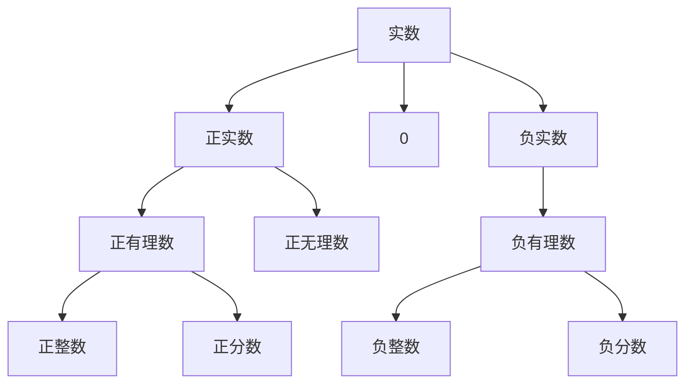

# 知识点8 实数与数轴的关系

每一个实数都可以用数轴上的一个点来表示；反过来，数轴上的每一个点都表示一个实数．实数与数轴上的点一一对应.

知识点 9 实数范围内的有关概念

<table><tr><td>名称</td><td>性质</td><td>举例</td></tr><tr><td>相反数</td><td>若a与b互为相反数,则a+b=0</td><td> $\sqrt{3}$ 的相反数是 $-\sqrt{3}$ </td></tr><tr><td>倒数</td><td>若a与b互为倒数,则ab=1</td><td>2的倒数是 $\frac{1}{2}$ </td></tr><tr><td rowspan="2">绝对值</td><td>任何实数的绝对值都是非负数,即 $|a|\geq 0$ </td><td> $\left\{\begin{array}{l}a(a>0)\\0(a=0)\\-a(a<0)\end{array}\right.$ </td></tr><tr><td>互为相反数的两个数的绝对值相等,即 $|a|=-a|$ </td><td> $\left|\sqrt{2}\right|=\left|- \sqrt{2}\right|=\sqrt{2}$ </td></tr></table>

# 知识点10 实数的运算

在实数范围内，不仅可以进行加、减、乘、除（除数不为零）、乘方运算，而且可以进行开立方运算以及非负实数的开平方运算.

有理数的运算性质和运算律在实数范围内仍然适用，实数混合运算的顺序与有理数混合运算的顺序相同，先乘方、开方，再乘除，最后加减．同级运算按从左到右的顺序进行，有括号的先算括号里面的.

# 知识点11 实数的大小比较

有理数大小比较的方法在实数范围内仍然适用.

两实数的大小关系如下：正实数都大于0，负实数都小于0，正实数大于一切负实数；两个正实数，绝对值大的正实数大；两个负实数，绝对值大的负实数小；在数轴上表示的两个实数，右边的数总比左边的数大．此外，比较两实数的大小还有如下方法：

（1）通过比较两实数的平方的大小，进而确定实数的大小关系．如比较 $\sqrt{10}$ 与3的大小，由于 $(\sqrt{10})^{2}=10$ ， $3^{2}=9,10>9$ ，故 $\sqrt{10}>3$ .

（2）用估算的方法求出无理数的近似值后，再比较两数的大小.

（3）当两个带根号的无理数比较大小时，可应用如下结论：

① $a > b \geq 0 \Leftrightarrow \sqrt{a} > \sqrt{b}.$

② $a > b \Leftrightarrow \sqrt[3]{a} > \sqrt[3]{b}.$

# 【培优篇】

# 【题型 1 直接求平方根、立方根】教辅资源,关注公众号·全科AA+

【例 1】（24-25 七年级下·山东济宁·期末）下列说法中错误的是（）

A. $\sqrt{5}$ 是 5 的算术平方根

B. 0 的平方根和立方根都是 0

C. $\sqrt{9}$ 的平方根是 $\pm 3$

D. $-3$ 是 $(-3)^{2}$ 的一个平方根

【变式 1-1】（24-25 七年级下·贵州黔东南·阶段练习） $-\frac{8}{27}$ 的立方根是\_\_\_\_； $\sqrt{4}$ 的算术平方根是\_\_\_\_。

【变式 1-2】（24-25 七年级下·全国·假期作业）（1）填表：

<table><tr><td>a</td><td>0.000001</td><td>0.001</td><td>1</td><td>1000</td><td>1000000</td></tr><tr><td> $\sqrt[3]{a}$ </td><td></td><td></td><td></td><td></td><td></td></tr></table>

(2) 根据你发现的规律填空:

① $\sqrt[3]{3}=1.442$ ，则 $\sqrt[3]{3000}=$ \_\_\_\_， $\sqrt[3]{0.003}=$ \_\_\_\_；

②已知 $\sqrt[3]{343}=7$ ，则 $\sqrt[3]{0.000343}=$ \_\_\_\_.

【变式 1-3】若 a、b 互为相反数，c、d 互为负倒数，则 $\sqrt{a^{2}-b^{2}} + \sqrt[3]{cd}=$ \_\_\_\_.

# 【题型 2 利用求平方根、立方根解方程】

【例 2】（25-26 九年级上·全国·课后作业）对于实数a,b，定义一种运算“ $\oplus$ ”： $a\oplus b=a^{2}-2b$ ．关于x的方程 $(x+1)\oplus8=0$ 的解为\_\_\_\_.

【变式 2-1】（24-25 七年级下·湖南长沙·阶段练习）求下列各式中的 x.

(1) $x^{2}=81;$

(2) $(x + 1)^{3} = -27$ .

【变式 2-2】（24-25 七年级下·河南驻马店·期末）满足方程 $(2x-1)^{2}-16=9$ 的 x 的值为 \_\_\_\_.

【变式 2-3】（24-25 七年级下·天津·期中）求下列方程中 x 的值：

(1) $2x^{2}=50;$

(2) $\frac{1}{3} (x + 1)^2 = 3$ ;

(3) $(2-x)^{3}=64;$

(4) $64(x+1)^{3}-125=0$

# 【题型 3 由平方根、立方根求值】

【例 3】（24-25 七年级下·山东日照·阶段练习）已知 $|a-6|$ 与 $\sqrt{a+2b}$ 互为相反数， $c+5$ 的立方根是2，则a-2b-c的平方根为\_\_\_\_.

【变式 3-1】已知 x 的两个平方根是 $a + 3$ 与 2a - 15，且 2b - 1 的算术平方根是 3.

(1)求a,b,x的值;   
(2)求 $a+b-1$ 的立方根.

【变式 3-2】（24-25 七年级下·广西崇左·阶段练习）已知 $3a + 1$ 的两个平方根分别是7-m和2-2m，9+b的立方根是2.

(1)求m，a，b的值；  
(2)求 $\sqrt{7a-b}$ 的平方根.

【变式 3-3】（24-25 七年级下·江西新余·期末）已知 $2a + 1$ 的平方根是 $\pm 3.3a + 2b - 4$ 的立方根是 $-2$ ，

(1)求a和b的值;   
(2)求 $3a+b$ 的平方根

# 【题型4 实数的运算】

【例 4】（24-25 七年级下·四川绵阳·期中）将 1, $\sqrt{2}$ , $\sqrt{3}$ , $\sqrt{6}$ 按如图方式排列，若规定 $(m,n)$ 表示第 $m$ 排从左向右第 $n$ 个数，则(5,4)与(12,4)表示的两数之差是 \_\_\_\_.

$$
\begin{array}{c c c} 1 & \text {第1排} \\ \sqrt {2} \quad \sqrt {3} & \text {第2排} \\ \sqrt {6} \quad 1 \quad \sqrt {2} & \text {第3排} \\ \sqrt {3} \quad \sqrt {6} \quad 1 \quad \sqrt {2} & \text {第4排} \\ \sqrt {3} \quad \sqrt {6} \quad 1 \quad \sqrt {2} \quad \sqrt {3} & \text {第5排} \\ \dots & \dots \end{array}
$$

【变式 4-1】（2025 八年级上·全国·专题练习）计算： $\sqrt{16}-(-1)^{2025}-\sqrt[3]{27}-|1-\sqrt{2}|$ .

【变式 4-2】（24-25 八年级上·湖南邵阳·期末）规定：[m]表示不超过m的最大整数，{m}表示m的小数部分，[m] + {m} = m，其中m为实数．例如[3.14] = 3，{3.14} = 0.14，[3.14] + {3.14} = 3.14．计算：[-√3] - {√5} = \_\_\_\_.

【变式 4-3】（24-25 七年级上·浙江杭州·期中）每个程序段由若干条指令组成，老师设计了一段运算程序如

图：

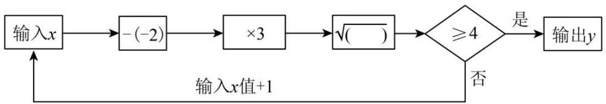

flowchart

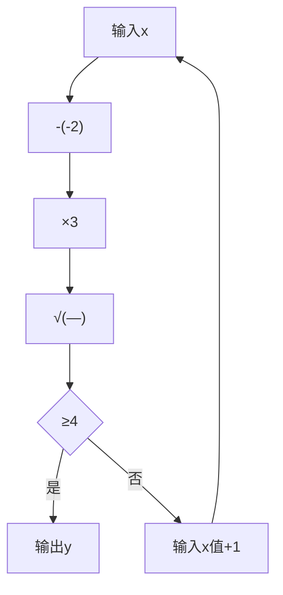

例如：当输入 $x$ 的值为-1时，计算结果 $\sqrt{3} < 4$ ；将输入值变为 $(-1) + 1 = 0$ ，计算结果为 $\sqrt{6} < 4$ ；再将输入值变为了 $0 + 1 = 1$ ，继续运算，直到计算结果不小于4，才输出该结果.

请思考下列问题.

(1)当输入 x 的值为 5，则输出 y 的值是多少？请列式计算.

(2)当起始输入 x 的值为 1，请通过计算说明经过几次程序运行后才能输出 y.

# 【题型5 无理数的估算】

【例 5】（24-25 七年级下·福建龙岩·期末）大自然是美的设计师，即使是一片小小的树叶，也蕴含着“美学”。如图， $\frac{BC}{AB}$ 的值接近黄金比 $\frac{\sqrt{5}-1}{2}$ ，则下列估算正确的是（）

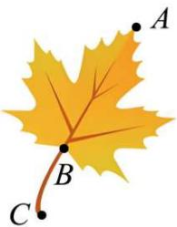

natural_image

Illustration of a yellow maple leaf with labeled points A, B, and C on its branches (no text or symbols beyond labels)

A. $0 < \frac{\sqrt{5} - 1}{2} < \frac{2}{5}$

B. $\frac{2}{5}<\frac{\sqrt{5}-1}{2}<\frac{1}{2}$

C. $\frac{1}{2} < \frac{\sqrt{5} - 1}{2} < 1$

D. $1 < \frac{\sqrt{5} - 1}{2} < 2$

【变式 5-1】（24-25 八年级下·江苏淮安·阶段练习）已知 $43^{2}=1849$ ， $44^{2}=1936$ ， $45^{2}=2025$ ， $46^{2}=2116$ 。若n为整数且 $n<\sqrt{2022}<n+1$ ，则n的值为（）

A. 43

B. 44

C. 45

D. 46

【变式 5-2】（24-25 九年级上·江苏淮安·期中）若 $a < \sqrt{23} < b$ ，且 $a$ 、 $b$ 为连续正整数，则 $a + b =$ \_\_\_\_

【变式 5-3】（24-25 七年级下·河北唐山·期末）已知 $k < \sqrt{17} - 1$ ，且 $k$ 为正整数，则 $k$ 的值可以是\_\_\_\_（写出一个即可）.

# 【题型6 二次根式的概念及其有意义的条件】

【例 6】（24-25 八年级下·山东德州·阶段练习）已知 $\sqrt{3x-6} + \sqrt{6-3x} + y = 2025$ ，则 $\sqrt{2025xy}$ 的值为（）

A. $2025 \sqrt{3}$

B. $2025\sqrt{2}$

C. 2024

D. 2025

【变式 6-1】（24-25 八年级下·广东东莞·阶段练习）下列各式中，一定是二次根式的是（）

A. $\sqrt{-2}$

B. $\sqrt[3]{3}$

C. $\sqrt{5}$

D. $\sqrt{a+1}$

【变式 6-2】（24-25 八年级下·湖南岳阳·开学考试）已知： $y=\frac{\sqrt{x-4}+\sqrt{4-x}}{3}-2$ ，则 $3x+4y=$ \_\_\_\_.

【变式 6-3】（24-25 八年级下·湖南岳阳·开学考试）若 x、y 为实数，且满足 $2\sqrt{4-x} + |y| = x - 4$ ，则 $\sqrt{x-y}$ 的算术平方根为 \_\_\_\_.

# 【题型7 利用二次根式的性质化简】

【例 7】（24-25 八年级下·福建龙岩·阶段练习）把分式 $a\sqrt{-\frac{1}{a}}$ ，根号外的字母 a 移进根号内的结果是（）

A. $\sqrt{a}$

B. $\sqrt{-a}$

C. $-\sqrt{a}$

D. $-\sqrt{-a}$

【变式 7-1】（24-25 九年级上·四川乐山·阶段练习）若 xy > 0，则 $\sqrt{-x^{2}y}$ 化简为（）

A. $x\sqrt{-y}$

B. -xy

C. $-x\sqrt{y}$

D. $-x\sqrt{-y}$

【变式 7-2】若 m < 0，则把式子 $m\sqrt{x}$ 根号外面的因式移到根号里后的式子应是（）

A. $-\sqrt{m^{2}x}$

B. $\sqrt{-m^{2}x}$

C. $\sqrt{(-m)^{2}x}$

D. $-\sqrt{-mx}$

【变式 7-3】若 $\sqrt{1575n}$ 是整数，写出一个正整数n的可能值\_\_\_\_.

# 【题型8 最简二次根式】

【例 8】（24-25 八年级上·陕西渭南·阶段练习）已知 $\sqrt{x^{2}+1}$ 是最简二次根式，且与 $\sqrt{5}$ 可以合并，则 x 的值为（）

A. 2

B. -4

C. 4

D. $\pm 2$

【变式 8-1】（24-25 八年级上·上海黄浦·期末）下列二次根式中，是最简二次根式的是（）

A. $\sqrt{18}$

B. $\sqrt{63a}$

C. $\sqrt{a^{2}-2a+4}$

D. $\sqrt{\frac{a}{3}}$

【变式 8-2】将式子 $\sqrt{35-a}$ （a 为正整数）化为最简二次根式后，可以与 $\sqrt{8}$ 合并．写出一个符合条件 a 的值\_\_\_\_.

【变式 8-3】已知 $A = 2\sqrt{2x + 1}$ ， $B = 3\sqrt{x + 3}$ ， $C = \sqrt{10x + 3y}$ ，其中 $A, B$ 为最简二次根式，且 $A + B = C$ ，则 $2y - x$ 的值为 \_\_\_\_.

# 【题型9 求二次根式中的参数值】

【例 9】若 $(2-\sqrt{7})^{2}=a-b\sqrt{7}$ ，其中a，b均为整数，则b-a的值为\_\_\_\_.

【变式 9-1】二次根式 $\sqrt{2b+1}$ 与 $\sqrt{a-1}$ 的和为0，则 $a+b$ 的值为\_\_\_\_.

【变式 9-2】（2025 九年级下·河北·专题练习）若 $\sqrt{\frac{m}{2}} = 2\sqrt{2}$ ，则整数 m 的值为 \_\_\_\_.

【变式 9-3】已知 $\sqrt{10-n}$ 是整数，则正整数n所有可能值共有\_\_\_\_个，它们的和为\_\_\_\_.

# 【题型 10 二次根式的运算或化简求值】 教辅资源,关注公众号·全科AA+

【例 10】已知 $x=\sqrt{2}+1,\quad y=\sqrt{2}-1$ ，求下列各式的值.

(1) $x^{2}+y^{2};$   
(2) $\sqrt{\frac{x}{y}} + \sqrt{\frac{y}{x}}$ .

【变式 10-1】计算:

(1) $\sqrt{3}+3\sqrt{\frac{1}{3}}-\sqrt{12};$   
(2) $\sqrt{45} \div \sqrt{27} \times \sqrt{\frac{3}{5}}$ ;   
(3) $\sqrt{18} \div \sqrt{2} - \sqrt{32} + \sqrt{3} \times \sqrt{6}$ ;   
(4) $(3 + \sqrt{3})(3 - \sqrt{3}) + (1 + \sqrt{7})^2$ .

【变式 10-2】（24-25 八年级上·四川达州·阶段练习）已知 $x = 2 - \sqrt{3}$ ，求代数式 $(7 + \sqrt{3})x^{2} + (2 + \sqrt{3})x + \sqrt{3}$ 的值.

【变式10-3】已知 $x + y = -5$ ， $xy = 4$ ，求 $x\sqrt{\frac{y}{x}} + y\sqrt{\frac{x}{y}}$ 的值.

# 【拔尖篇】

# 【题型11 二次根式的双重非负性】

【例 11】（24-25 七年级下·湖北恩施·阶段练习）已知 a, b 为实数，且 $b = \sqrt{a - 8} - \sqrt{8 - a} + 25$ ，则 $\sqrt[3]{a} + \sqrt{b}$ 的值为（）.

A. 10

B. 9

C. 8

D. 7

【变式 11-1】（25-26 八年级上·全国·随堂练习）若 $a + \sqrt{a - 3} = 3$ ，求 $\sqrt{a + 3}$ 的值.

【变式11-2】（24-25七年级下·贵州贵阳·期中）已知 $|a - 3| + \sqrt{3 + b} = 0$ ，则 $\left(\frac{a}{b}\right)^{2025} =$ （

A. 1

B. -1

C. 2

D. -2

【变式 11-3】（2025 八年级下·湖北·专题练习）已知非零实数 a，b 满足 $\left|2a-4\right|+\left|b+2\right|+\sqrt{(a-4)b^{2}}+4=2a$ ，则 $a+b=$ \_\_\_\_.

# 【题型12 实数的大小比较】

【例 12】（24-25 七年级下·天津滨海新·期中）比较大小： $\sqrt{11}$ \_\_\_\_3； $-\sqrt{5}$ \_\_\_\_-2； $\frac{\sqrt{5}+1}{2}$ \_\_\_\_ $\frac{3}{2}$ . （填“＞”、“＝”或“＜”）.

【变式 12-1】（24-25 七年级下·山东德州·期中）若 $a = \sqrt[3]{7}$ ， $b = \sqrt{5}$ ， $c = 2$ ，则 $a, b, c$ 的大小关系为（）

A. $b \leq c < a$

B. $b < a < c$

C. $a < c < b$

D. a < b < c

【变式 12-2】（25-26 八年级上·全国·随堂练习）比较 $\sqrt{65}-2$ 与 $\sqrt{10}+2$ 的大小.

【变式 12-3】（25-26 八年级上·全国·随堂练习）比较下列各组数的大小：

(1) $\frac{1}{2}$ 与 $\frac{\sqrt{10}}{6}$ ;

(2) $\frac{\sqrt{6}-1}{2}$ 与1.

# 【题型13 求整数部分和小数部分】

【例 13】（24-25 八年级上·河南新乡·阶段练习）若 $\sqrt{3}$ 的整数部分为 a，小数部分为 b， $4-\sqrt{3}$ 的整数部分为 c，小数部分为 d，则 $\frac{b+d}{ac}$ 的值为（）

A. $\frac{1}{2}$

B. $\frac{1}{4}$

C. $\frac{\sqrt{3-1}}{2}$

D. $\frac{\sqrt{3+1}}{2}$

【变式 13-1】（24-25 七年级下·广东广州·期中）若 $6+\sqrt{5}$ 的整数部分是m，小数部分是n，则 $|n-m|$ 为（）

A. $\sqrt{5}-10$

B. $10-\sqrt{5}$

C. $\sqrt{5}-6$

D. $6-\sqrt{5}$

【变式 13-2】（24-25 八年级上·湖南邵阳·期末）规定：[m]表示不超过m的最大整数，{m}表示m的小数部分，[m] + {m} = m，其中m为实数．例如[3.14] = 3，{3.14} = 0.14，[3.14] + {3.14} = 3.14．计算：

$$
[ - \sqrt {3} ] - \{\sqrt {5} \} = \underline {{{\quad}}}.
$$

【变式 13-3】（24-25 七年级下·广东江门·阶段练习）已知实数 $8+\sqrt{13}$ 的整数部分为a，小数部分是m；实数 $9-\sqrt{13}$ 的整数部分为b，小数部分是n.

(1)直接写出a, m, b, n的值;   
(2)求 $12m+12n+\sqrt{a+b}-7$ 的值的平方根;

(3)求 $\sqrt[3]{(m + n)^{2025} + (a - 2b) + 6}$ 的值.

# 【题型14 实数与数轴综合运用】

【例 14】（24-25 七年级下·河北秦皇岛·期末）《九章算术》中勾股术曰：“勾股各自乘，并而开方除之，即弦”，即 $c=\sqrt{a^{2}+b^{2}}$ （a为“勾”，b为“股”，c为“弦”）若“勾”为2，“股”为3，则“弦”在如图所示数轴上可表示在（）

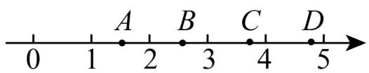

text_image

0
1
A
2
B
3
C
4
D
5

A. $A$ 点

B. $B$ 点

C. C点

D. D点

【变式 14-1】（24-25 七年级下·辽宁鞍山·期中）如图，正方形ABCD的面积为7，顶点A在数轴上表示的数为-1，若点E在数轴上（点E在点A的左侧），且AD=AE，则点E所表示的数为\_\_\_\_。

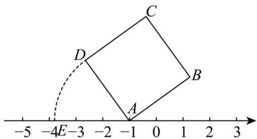

text_image

-5 -4E -3 -2 -1 0 1 2 3
C
D
A
B

【变式 14-2】（24-25 八年级下·黑龙江牡丹江·期末）实数a，b在数轴上的位置如图所示，化简： $|a+1|$

$$
\sqrt {(b - 1) ^ {2}} + \sqrt {(a - b) ^ {2}} = \underline {{\quad}}.
$$

$$
- 4 \quad - 3 \quad - 2 \quad - 1 \quad a \quad 0 \quad 1 \quad b \quad 2 \quad 3 \quad 4
$$

【变式 14-3】（24-25 七年级下·湖南常德·期中）如图，通过画边长为 1 的正方形，就能准确的把 $\sqrt{2}$ 表示在数轴上点 $A_{1}$ 处，记 $A_{1}$ 右侧最近的整数点为 $B_{1}$ ，以点 $B_{1}$ 为圆心， $A_{1}B_{1}$ 为半径画半圆，交数轴于点 $A_{2}$ ，记 $A_{2}$ 右侧最近的整数点为 $B_{2}$ ，以点 $B_{2}$ 为圆心， $A_{2}B_{2}$ 为半径画半圆，交数轴于点 $A_{3}$ ，如此继续，则 $A_{2026}B_{2026}$ 的长为 \_\_\_\_.

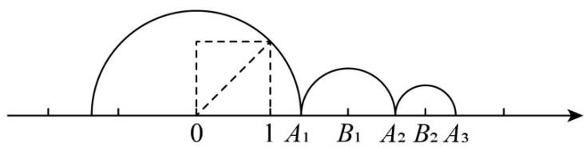

text_image

0
1 A₁ B₁ A₂ B₂ A₃

# 【题型15 实数运算的应用】

【例 15】（24-25 七年级下·湖南长沙·阶段练习）王师傅有一个体积为 $200 \mathrm{~cm}^{3}$ 的铁块原料，王师傅想要将这个铁块熔化并重新锻造成新的形状.

(1)若将原料重新锻造成一个底面为正方形、高为8cm的长方体，求长方体底面正方形的边长.  
(2)王师傅现将原料锻造成三个大小相同的正方体铁块, 制作完成后剩下的余料体积为 $8 \mathrm{~cm}^{3}$ , 求制作成的每一个小正方体铁块的棱长.

【变式 15-1】（24-25 七年级上·浙江·期中）如图，一个底面半径为3cm的瓶子内装着一些溶液。当瓶子正放时，瓶内溶液的高度为16cm；倒放时，空余部分的高度为4cm。瓶内的溶液正好倒满2个一样大的正方体容器（π取3，容器的厚度不计）。

单位

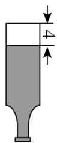

(1)该瓶子的容积（装满时溶液的体积）是多少立方厘米？  
(2)正方体容器的棱长是多少厘米?

【变式 15-2】五一返校上课后，为了表扬在假期依旧认真完成数学作业的小函和小韬同学，数学老师决定在某外卖平台上点 2 杯单价都是 16 元的奶茶奖励他们。从奶茶店到学校的每份订单配送费都为 1.6 元，由于数学老师是该平台的会员，因此每单都可以使用一个平台赠送的 5 元平台红包对每份订单的总价减免 5 元（订单总价不含配送费，同一订单只允许使用一个红包）。但根据该奶茶店的优惠活动，当订单总价（不含配送费）满 30 元时，5 元的平台红包可兑换为一个 7 元的店家红包，即可以给订单总价（不含配送费）减免 7 元当数学老师同时点了 2 杯奶茶准备下单付款时，小函同学说：“老师，我们可以换一种下单方式，优惠更多！”请同学们分析小函同学的下单方式，并计算出本次外卖总费用（包含配送费）最低可为\_\_\_\_元。

【变式 15-3】某小区准备开发一块长为32m，宽为21m的长方形空地，

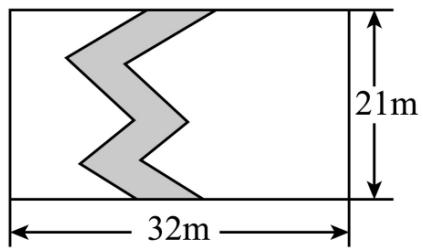

text_image

21m
32m

(1)方案一: 如图, 将这块空地种上草坪, 中间修一条弯曲的小路, 小路的左边线向右平移 $1 \mathrm{~m}$ 就是它的右边线. 则这块草地的面积为 $\mathrm{m}^{2}$ ;  
(2)方案二: 修建一个长是宽的 1.5 倍, 面积为 $384 \mathrm{~m}^{2}$ 的篮球场, 若比赛用的篮球场要求长在 $23 \mathrm{~m}$ 到 $30 \mathrm{~m}$ 之间, 宽在 $13 \mathrm{~m}$ 到 $20 \mathrm{~m}$ 之间。这个篮球场能用做比赛吗? 并说明理由。

# 【题型 16 复合二次根式的化简】 教辅资源,关注公众号·全科AA+

【例 16】观察下列各式:

$$
5 + 2 \sqrt {6} = (2 + 3) + 2 \sqrt {2 \times 3} = (\sqrt {2}) ^ {2} + (\sqrt {3}) ^ {2} + 2 \sqrt {2} \times \sqrt {3} = (\sqrt {2} + \sqrt {3}) ^ {2},
$$

$8 + 2\sqrt{7} = (1 + 7) + 2\sqrt{1 \times 7} = 1^{2} + (\sqrt{7})^{2} + 2 \times 1 \times \sqrt{7} = (1 + \sqrt{7})^{2}, \ldots$ . 请运用以上的方法化简 $\sqrt{7+2\sqrt{10}}=$ \_\_\_\_.

【变式 16-1】（24-25 九年级下·山东滨州·开学考试） $\left|2-\sqrt{3}\right|+\sqrt{4-2\sqrt{3}}=$ （）

A. $2 \sqrt{3} - 3$

B. $2\sqrt{3}-1$

C. 3

D. 1

【变式16-2】设 $a$ 为 $-13 + \sqrt{5} -\sqrt{3 - \sqrt{5}}$ 的小数部分，则 $a =$ （）

A. $\frac{7}{5}$

B. $\frac{\sqrt{2}}{2}$

c. $\sqrt{2}-1$

D. $\sqrt{3}-1$

【变式 16-3】（24-25 八年级上·浙江温州·期末）化简 $\sqrt{23-6\sqrt{10+4\sqrt{3-2\sqrt{2}}}}$ 的结果是（）

A. $3 + \sqrt{2}$

B. $3-2\sqrt{2}$

C. $3 + 2\sqrt{2}$

D. $3-\sqrt{2}$

# 【题型17 利用分母有理化求值】

【例 17】（24-25 八年级上·四川成都·期中）阅读下面计算过程：

$$
\frac {1}{\sqrt {2} + 1} = \frac {1 \times (\sqrt {2} - 1)}{(\sqrt {2} + 1) (\sqrt {2} - 1)} = \sqrt {2} - 1;
$$

$$
\frac {1}{\sqrt {3} + \sqrt {2}} = \frac {1 \times (\sqrt {3} - \sqrt {2})}{(\sqrt {3} + \sqrt {2}) (\sqrt {3} - \sqrt {2})} = \sqrt {3} - \sqrt {2};
$$

$$
\frac {1}{\sqrt {5} + 2} = \frac {1 \times (\sqrt {5} - 2)}{(\sqrt {5} + 2) (\sqrt {5} - 2)} = \sqrt {5} - 2.
$$

试求:

(1) $\frac{1}{\sqrt{7}+\sqrt{6}}$ 的值为-.  
(2)求 $\frac{1}{1 + \sqrt{2}} +\frac{1}{\sqrt{2} + \sqrt{3}} +\frac{1}{\sqrt{3} + \sqrt{4}} +\dots +\frac{1}{\sqrt{2022} + \sqrt{2023}} +\frac{1}{\sqrt{2023} + \sqrt{2024}}$ 的值.  
(3)若 $a=\frac{1}{\sqrt{5}-2}$ ，求 $a^{3}-4a^{2}+a+4$ 的值.

【变式 17-1】通过适当运算，将分母中的二次根式化为有理式的过程，称为分母有理化.

如 $\frac{1}{\sqrt{2}} = \frac{\sqrt{2}}{2}$ , $\frac{1}{\sqrt{3} - \sqrt{2}} = \frac{1 \times (\sqrt{3} + \sqrt{2})}{(\sqrt{3} - \sqrt{2})(\sqrt{3} + \sqrt{2})} = \sqrt{3} + \sqrt{2}$ 这些运算都称为分母有理化.

(1)将下列二次根式分母理化： $\frac{2 - \sqrt{3}}{\sqrt{12}} =$ ， $\frac{x - y}{\sqrt{x} - \sqrt{y}} =$

(2)甲、乙两人化简 $\frac{x - y}{\sqrt{x} + \sqrt{y}}$ 时，写出两种不同的解答过程.

甲： $\frac{x - y}{\sqrt{x} + \sqrt{y}} = \frac{(x - y)(\sqrt{x} - \sqrt{y})}{(\sqrt{x} + \sqrt{y})(\sqrt{x} - \sqrt{y})} = \frac{(x - y)(\sqrt{x} - \sqrt{y})}{x - y} = \sqrt{x} -\sqrt{y};$

乙： $\frac{x - y}{\sqrt{x} + \sqrt{y}} = \frac{(\sqrt{x})^2 - (\sqrt{y})^2}{\sqrt{x} + \sqrt{y}} = \frac{(\sqrt{x} + \sqrt{y})(\sqrt{x} - \sqrt{y})}{\sqrt{x} + \sqrt{y}} = \sqrt{x} -\sqrt{y}$

请你仔细阅读甲、乙两人的解题过程，对甲、乙两人的解答作出评判（）

A. 甲对乙错

B. 甲错乙对

C. 甲、乙全对

D. 甲、乙全错

(3)已知有理数 $a$ 、 $b$ 满足 $\frac{a}{\sqrt{2} + 1} +\frac{b}{\sqrt{2}} = -1 + 2\sqrt{2}$ ，求 $a$ 、 $b$ 的值.

【变式 17-2】（24-25 八年级上·河北保定·期中）【阅读材料】

在进行二次根式化简时，我们有时会碰上如 $\frac{3}{\sqrt{5}}$ ， $\sqrt{\frac{2}{3}}$ ， $\frac{2}{\sqrt{3} + 1}$ 这样一类的式子，其实我们还可以将其进一步化简： $\frac{3}{\sqrt{5}} = \frac{3\times\sqrt{5}}{\sqrt{5}\times\sqrt{5}} = \frac{3}{5}\sqrt{5};\quad \sqrt{\frac{2}{3}} = \sqrt{\frac{2\times 3}{3\times 3}} = \frac{\sqrt{6}}{3};\quad \frac{2}{\sqrt{3} + 1} = \frac{2\times(\sqrt{3} - 1)}{(\sqrt{3} + 1)(\sqrt{3} - 1)} = \frac{2(\sqrt{3} - 1)}{(\sqrt{3})^2 - 1^2} = \sqrt{3} -1.$ 以上这种化简的步骤叫做分母有理化.

【解决问题】

(1)仿照上面的解题过程，化简： $\frac{1}{\sqrt{7}-\sqrt{6}}=\underline{\hspace{2cm}}$ .  
(2)计算： $\left(\frac{1}{\sqrt{2} + 1} +\frac{1}{\sqrt{3} + \sqrt{2}} +\frac{1}{\sqrt{4} + \sqrt{3}} +\dots +\frac{1}{\sqrt{2025} + \sqrt{2024}}\right)\times (\sqrt{2025} +1).$   
(3)已知 $a=\frac{1}{\sqrt{3}+\sqrt{2}}$ ， $b=\frac{1}{\sqrt{3}-\sqrt{2}}$ ，求 $a^{2}+b^{2}$ 的值.

【变式 17-3】（24-25 八年级上·重庆·期中）例如： $\frac{\sqrt{2}+1}{\sqrt{2}-1}=\frac{(\sqrt{2}+1)(\sqrt{2}+1)}{(\sqrt{2}-1)(\sqrt{2}+1)}=2\sqrt{2}+3$ ．像这样通过分子、分母同乘一个式子把分母中的根号化去或者把根号中的分母化去，叫做分母有理化．有下列结论：

①若 a 是 $\sqrt{3}$ 的小数部分，则 $\frac{3}{a}$ 的值为 $3\sqrt{3} + 6$ ;  
②比较大小： $\sqrt{2024}-\sqrt{2023}<\sqrt{2023}-\sqrt{2022}$ ;  
③变形： $\frac{1}{\sqrt{3} + \sqrt{2} + 1} = \frac{2 + \sqrt{2} - \sqrt{6}}{4};$   
④计算 $\frac{2}{3+\sqrt{3}}+\frac{2}{5\sqrt{3}+3\sqrt{5}}+\frac{2}{7\sqrt{5}+5\sqrt{7}}+\cdots+\frac{2}{99\sqrt{97}+97\sqrt{99}}=1-\frac{\sqrt{11}}{33};$   
⑤已知 $a=\frac{\sqrt{m+1}-\sqrt{m}}{\sqrt{m+1}+\sqrt{m}}$ ， $b=\frac{\sqrt{m+1}+\sqrt{m}}{\sqrt{m+1}-\sqrt{m}}$ ，且 $a^{2}+1926ab+b^{2}=2024$ ，则所有可能的整数m的和为-1.
以上结论正确的是（）

A. ①③④⑤

B. ②③④

C. ②③⑤

D. ②③④⑤

# 【题型18 二次根式的规律探究】

【例18】化简： $\frac{1}{\sqrt{8} + \sqrt{11}} +\frac{1}{\sqrt{11} + \sqrt{14}} +\frac{1}{\sqrt{14} + \sqrt{17}} +\frac{1}{\sqrt{17} + \sqrt{20}} +\frac{1}{\sqrt{20} + \sqrt{23}} +\frac{1}{\sqrt{23} + \sqrt{26}} +\frac{1}{\sqrt{26} + \sqrt{29}} +\frac{1}{\sqrt{29} + \sqrt{32}}$ 结果是（）

A. 1

B. $\frac{2\sqrt{2}}{3}$

C. $2\sqrt{2}$

D. $4\sqrt{2}$

【变式 18-1】（24-25 九年级下·山东烟台·期末）观察下列等式：① $3+2\sqrt{2}=(\sqrt{2}+1)^{2}$ ; ② $5+2\sqrt{6}=(\sqrt{3}+\sqrt{2})^{2}$ ; ③ $7+2\sqrt{12}=(2+\sqrt{3})^{2}$ ; ...；请根据以上规律，写出第 9 个等式 \_\_\_\_.

【变式18-2】通过“由特殊到一般”的方法探究下面二次根式的运算规律：特例 $1: \sqrt{1 + \frac{1}{3}} = \sqrt{\frac{3 + 1}{3}} = \sqrt{4 \times \frac{1}{3}} = 2\sqrt{\frac{1}{3}}$ ；特例 $2: \sqrt{2 + \frac{1}{4}} = \sqrt{\frac{8 + 1}{4}} = \sqrt{9 \times \frac{1}{4}} = 3\sqrt{\frac{1}{4}}$ ；特例 $3: \sqrt{3 + \frac{1}{5}} = \sqrt{\frac{15 + 1}{5}} = \sqrt{16 \times \frac{1}{5}} = 4\sqrt{\frac{1}{5}}$ ……应用发现的运算规律求 $\sqrt{2024 + \frac{1}{2026}} \times \sqrt{4052}$ 的值（）

A. 2024

B. $2025\sqrt{2}$

C. 2023

D. $2023\sqrt{2}$

【变式 18-3】（24-25 八年级下·山东德州·期中）先观察下列等式，再回答问题：

① $\sqrt{1+\frac{1}{1^{2}}+\frac{1}{2^{2}}}=1+\frac{1}{1}-\frac{1}{2};$   
② $\sqrt{1+\frac{1}{2^{2}}+\frac{1}{3^{2}}}=1+\frac{1}{2}-\frac{1}{3};$   
③ $\sqrt{1+\frac{1}{3^{2}}+\frac{1}{4^{2}}} = 1 + \frac{1}{3}-\frac{1}{4};$

...

请你利用发现的规律，计算：

$$
\sqrt {1 + \frac {1}{1 ^ {2}} + \frac {1}{2 ^ {2}}} + \sqrt {1 + \frac {1}{2 ^ {2}} + \frac {1}{3 ^ {2}}} + \sqrt {1 + \frac {1}{3 ^ {2}} + \frac {1}{4 ^ {2}}} + \dots + \sqrt {1 + \frac {1}{2 0 2 2 ^ {2}} + \frac {1}{2 0 2 3 ^ {2}}} - 2 0 2 4 = \underline {{{\quad}}}.
$$

# 【题型19 二次根式的新定义】

【例 19】（24-25 八年级下·浙江嘉兴·阶段练习）定义：我们将 $(\sqrt{a}+\sqrt{b})$ 与 $(\sqrt{a}-\sqrt{b})$ 称为一对“对偶式”。因为：

$(\sqrt{a} + \sqrt{b})(\sqrt{a} - \sqrt{b}) = (\sqrt{a})^2 - (\sqrt{b})^2 = a - b$ ，可以有效的去掉根号，所以有一些问题可以通过构造“对偶式”来解决。例如：已知 $\sqrt{18 - x} - \sqrt{11 - x} = 1$ ，求 $\sqrt{18 - x} + \sqrt{11 - x}$ 的值，可以这样解答：

因为 $(\sqrt{18 - x} -\sqrt{11 - x})\times (\sqrt{18 - x} +\sqrt{11 - x}) = (\sqrt{18 - x})^2 -(\sqrt{11 - x})^2 = 18 - x - 11 + x = 7$ ，又因为 $\sqrt{18 - x}-$ $\sqrt{11 - x} = 1$ ，所以 $\sqrt{18 - x} +\sqrt{11 - x} = 7.$

（1）已知： $\sqrt{20-x}+\sqrt{4-x}=8$ ，则x的值是\_\_\_\_；

（2）计算： $\frac{1}{3\sqrt{1}+\sqrt{3}}+\frac{1}{5\sqrt{3}+3\sqrt{5}}+\frac{1}{7\sqrt{5}+5\sqrt{7}}+\cdots+\frac{1}{2023\sqrt{2021}+2021\sqrt{2023}}=$ \_\_\_\_

【变式 19-1】（24-25 八年级下·山东德州·期中）对于任意不相等的两个实数 $a, b$ ，定义运算※如下：当 $a < b$ 时， $a \otimes b = 2\sqrt{a} + \sqrt{b}$ ，当 $a \geq b$ 时， $a \otimes b = 2\sqrt{a} - \sqrt{b}$ ，例如 $5 \otimes 2 = 2\sqrt{5} - \sqrt{2}$ ，按上述规定，计算 $(3 \otimes 2) - (8 \otimes 12)$ 的结果为（）

A. $4 \sqrt{3} - 5 \sqrt{2}$

B. $-5\sqrt{2}$

C. $4 \sqrt{3} - 3 \sqrt{2}$

D. $3 \sqrt{2}$

【变式 19-2】（24-25 八年级下·四川绵阳·阶段练习）定义：因为 $(\sqrt{a}+\sqrt{b})(\sqrt{a}-\sqrt{b})=(\sqrt{a})^{2}-(\sqrt{b})^{2}=a-b$ ，可以有效的去掉根号，我们称 $(\sqrt{a}+\sqrt{b})$ 与 $(\sqrt{a}-\sqrt{b})$ 为一对“对偶式”。若 $\sqrt{18-x}-\sqrt{11-x}=1$ ，则 $\sqrt{18-x}+\sqrt{11-x}=$ \_\_\_\_。

【变式 19-3】对于任意实数 m，n，若定义新运算 $m \otimes n = \begin{cases} \sqrt{m} - \sqrt{n} (m \geq n), \\ \sqrt{m} + \sqrt{n} (m < n) \end{cases}$ ，给出三个说法：

① $18 \otimes 2 = 2\sqrt{2}$ ;

② $\frac{1}{1\otimes2}+\frac{1}{2\otimes3}+\frac{1}{3\otimes4}+\cdots+\frac{1}{99\otimes100}=100\otimes1;$

③ $(a \otimes b) \cdot (b \otimes a) = |a - b|$ .

以上说法中正确的个数是（）

A. 0 个

B. 1 个

C. 2 个

D. 3 个

# 【题型 20 二次根式的实际应用】 教辅资源,关注公众号·全科AA+

【例 20】如图，将一根铁丝首尾相接可以围成一个长为 $\sqrt{8}\pi$ ，宽为 $\sqrt{2}\pi$ 的矩形，若将这根铁丝展开重新首尾相接围成一个圆形，则该圆的面积是（）

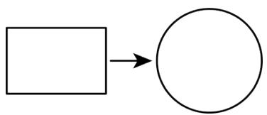

flowchart

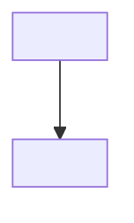

A. $12 \pi$

B. $18\pi$

C. $24\pi$

D. $36\pi$

【变式 20-1】如图，在大正方形纸片中放置两个小正方形，已知两个小正方形的面积分别为 $S_{1}=18$ ， $S_{2}=12$ ，重叠部分是一个正方形，其面积为2，则空白部分的面积为\_\_\_\_。

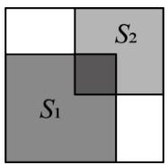

【变式 20-2】（24-25 八年级上·山西晋中·期中）发生交通事故后，交道警察通常根据刹车后车轮滑过的距离估计车辆行驶的速度，所用的经验公式是 $v=16\sqrt{df}$ ，其中v表示车速（单位：km/h），d表示刹车后车轮滑过的距离（单位：m），f表示摩擦因数．在某次交通事故调查中，测得d=20m，f=1.2，则肇事汽车的车速大约是多少？（ $\sqrt{6}\approx2.45$ ，结果精确到1km/h）

【变式 20-3】（24-25 八年级上·江西南昌·期末）高空抛物是一种不文明的危险行为，据研究，物品从离地面为 h 米的高处自由落下，落到地面的时间为 t，经过实验，发现 $t = \sqrt{\frac{h}{5}}$ (不考虑阻力的影响).

(1)求物体从40m的高空落到地面的时间;

(2)已知从高空坠落的物体所带能量(单位: J) = 10 × 物体质量(kg) × 高度(m), 一串质量为0.2kg的钥匙经过3s落在地上, 这串钥匙在下落过程中所带能量有多大?

(3)在（2）的结果中，你能得到什么启示？(注：杀伤无防护人体只需要65J的能量)