# 第二章 实数（举一反三讲义）全章题型归纳

【北师大版 2024】

# 题型归纳

# 【培优篇】....5

【题型 1 直接求平方根、立方根】....5

【题型 2 利用求平方根、立方根解方程】....7

【题型 3 由平方根、立方根求值】....9

【题型4 实数的运算】....11

【题型5 无理数的估算】....14

【题型 6 二次根式的概念及其有意义的条件】....15

【题型 7 利用二次根式的性质化简】....17

【题型 8 最简二次根式】....18

【题型 9 求二次根式中的参数值】....20

【题型 10 二次根式的运算或化简求值】....22

# 【拔尖篇】....24

【题型11二次根式的双重非负性】 24

【题型 12 实数的大小比较】....26

【题型 13 求整数部分和小数部分】....28

【题型 14 实数与数轴综合运用】....30

【题型 15 实数运算的应用】....33

【题型 16 复合二次根式的化简】....36

【题型 17 利用分母有理化求值】....38

【题型 18 二次根式的规律探究】....44

【题型 19 二次根式的新定义】....47

【题型20二次根式的实际应用】 50

# 举一反三

知识点 1 算术平方根和平方根的区别与联系

<table><tr><td colspan="2"></td><td>算术平方根</td><td>平方根</td></tr><tr><td rowspan="2">区别</td><td>定义</td><td>一般地,如果一个正数x的平方等于a,即 $x^{2}$ =a,那么这个正数x就叫做a的算术平方根</td><td>一般地,如果一个数 $\chi$ 的平方等于a,即 $x^{2}$ =a,那么这个数x就叫做a的平方根(也叫做二次方根)</td></tr><tr><td>个数</td><td>一个正数只有一个算术平方根</td><td>一个正数有两个平方根,它们互为相反数;负数没有平方根</td></tr><tr><td rowspan="2"></td><td>表示方法</td><td>正数 $a$ 的算术平方根为 $\sqrt{a}$ </td><td>正数 $a$ 的平方根表示为 $\pm\sqrt{a}$ </td></tr><tr><td>取值范围</td><td> $\sqrt{a}$ 具有双重非负性,即 $\sqrt{a}\geq 0,a\geq 0$ </td><td> $a$ 的平方根可正可负,也可为0</td></tr><tr><td rowspan="2">二者联系</td><td>联系</td><td colspan="2">平方根包含了算术平方根,算术平方根是平方根中正的那个</td></tr><tr><td>关于0</td><td colspan="2">0的算术平方根和平方根都是0</td></tr></table>

# 知识点 2 开平方

1. 定义: 求一个数 $a$ 的平方根的运算, 叫做开平方, $a$ 叫做被开方数.  
2. 开平方和平方根的区别与联系

(1)开平方时，被开方数 a 必须是非负数.  
(2)平方根是数，是开平方的结果；开平方是一种运算，是求平方根的过程.  
(3)平方和开平方互为逆运算，可以用平方运算来检验开平方的结果是否正确.

知识点 3 $\sqrt{a^2}$ 与 $\sqrt{a^2}$ 的性质

<table><tr><td>形式</td><td>性质</td><td>示例</td></tr><tr><td> $\sqrt{a^2}$ </td><td> $\sqrt{a^2} = |a| = \begin{cases} a & (a \ge 0) \\ -a & (a < 0) \end{cases}$ </td><td> $\sqrt{6^2} = |6| = 6$  $\sqrt{(-6)^2} = |-6| = 6$ </td></tr><tr><td> $\sqrt{a^2}$ </td><td> $(\sqrt{a})^2 = a (a \ge 0)$ </td><td> $(\sqrt{6})^2 = 6$ </td></tr></table>

知识点 4 立方根和平方根的不同点和相同点

<table><tr><td colspan="2"></td><td>立方根</td><td>平方根</td></tr><tr><td rowspan="4">区别</td><td>定义</td><td>一般地,如果一个数x的立方等于a,即 $x^{3}$ =a,那么这个正数x就叫做a的立方根(也叫做三次方根)</td><td>一般地,如果一个数x的平方等于a,即 $x^{2}$ =a,那么这个数x就叫做a的平方根(也叫做二次方根)</td></tr><tr><td>个数</td><td>每一个数a有且只有一个立方根,正数的立方根是正数,负数的立方根是负数</td><td>一个正数有两个平方根,它们互为相反数;负数没有平方根</td></tr><tr><td>表示方法</td><td> $\sqrt[3]{a}$ </td><td> $\pm\sqrt{a}$ </td></tr><tr><td>a取值范围</td><td>任意数</td><td> $a\geq0$ </td></tr><tr><td>相同点</td><td>关于0</td><td colspan="2">0的平方根是0,0的立方根是0</td></tr></table>

# 知识点 5 开立方

1. 求一个数 a 的立方根的运算叫做开立方，其中 a 叫做被开方数.

2.开平方和开立方的区别

<table><tr><td></td><td>开平方</td><td>开立方</td></tr><tr><td>运算符号</td><td> $\pm \sqrt{}$ </td><td> $^3\sqrt{}$ </td></tr><tr><td>被开方数</td><td>非负数</td><td>任意数</td></tr><tr><td>个数</td><td>0的平方根只有一个;一个正数的平方根有两个;负数没有平方根</td><td>任意数的立方根都只有一个</td></tr></table>

# 知识点6 无理数

无限不循环小数叫做无理数.

无理数的常见形式有以下几种:

（1）开方开不尽的数的相应方根是无理数，如 $\sqrt{2}$ ， $\sqrt[3]{5}$ 等；  
(2) 圆周率 $\pi$ 及一些含有 $\pi$ 的数, 如 $2\pi$ , $\frac{\pi}{2}$ 等;  
（3）以无限不循环小数形式写出的数,如 0.101 001 000 1...（两个 1 之间依次多一个 0)等．注意无理数的小数部分位数无限；无理数的小数部分不循环；无理数不能表示成分数的形式.

# 知识点 7 实数的概念及分类

1. 概念：有理数和无理数统称为实数。   
2. 分类：实数有两种分类标准：

（1）按定义分类：实数可分为有理数和无理数.

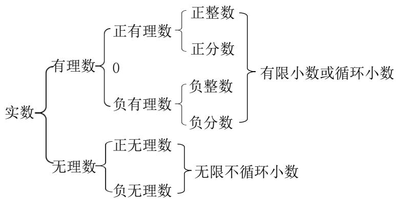

flowchart

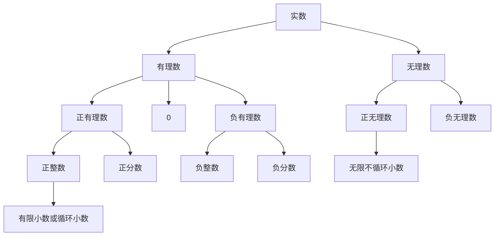

(2) 按正负性分类: 实数可分为正实数、0、负实数.

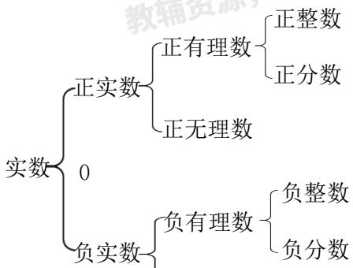

flowchart

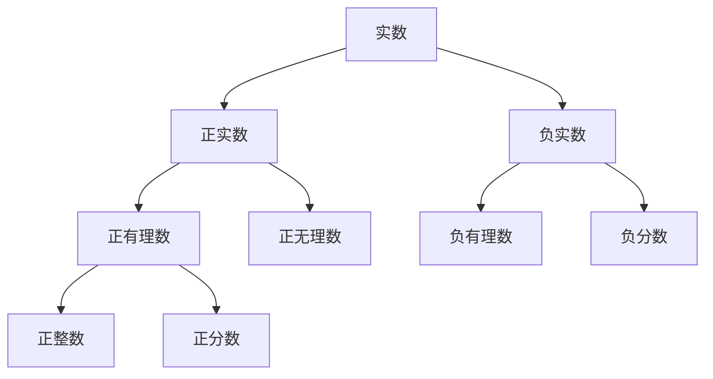

# 知识点8 实数与数轴的关系

每一个实数都可以用数轴上的一个点来表示；反过来，数轴上的每一个点都表示一个实数．实数与数轴上的点一一对应.

知识点 9 实数范围内的有关概念

<table><tr><td>名称</td><td>性质</td><td>举例</td></tr><tr><td>相反数</td><td>若a与b互为相反数,则a+b=0</td><td> $\sqrt{3}$ 的相反数是 $-\sqrt{3}$ </td></tr><tr><td>倒数</td><td>若a与b互为倒数,则ab=1</td><td>2的倒数是 $\frac{1}{2}$ </td></tr><tr><td rowspan="2">绝对值</td><td>任何实数的绝对值都是非负数,即 $|a|\geq 0$ </td><td> $\left\{\begin{array}{l}a(a>0)\\0(a=0)\\-a(a<0)\end{array}\right.$ </td></tr><tr><td>互为相反数的两个数的绝对值相等,即 $|a|=-a|$ </td><td> $\left|\sqrt{2}\right|=\left|- \sqrt{2}\right|=\sqrt{2}$ </td></tr></table>

# 知识点10 实数的运算

在实数范围内，不仅可以进行加、减、乘、除（除数不为零）、乘方运算，而且可以进行开立方运算以及非负实数的开平方运算.

有理数的运算性质和运算律在实数范围内仍然适用，实数混合运算的顺序与有理数混合运算的顺序相同，先乘方、开方，再乘除，最后加减．同级运算按从左到右的顺序进行，有括号的先算括号里面的.

# 知识点11 实数的大小比较

有理数大小比较的方法在实数范围内仍然适用.

两实数的大小关系如下：正实数都大于0，负实数都小于0，正实数大于一切负实数；两个正实数，绝对值大的正实数大；两个负实数，绝对值大的负实数小；在数轴上表示的两个实数，右边的数总比左边的数大．此外，比较两实数的大小还有如下方法：

（1）通过比较两实数的平方的大小，进而确定实数的大小关系．如比较 $\sqrt{10}$ 与3的大小，由于 $(\sqrt{10})^{2}=10$ ， $3^{2}=9$ ，10>9，故 $\sqrt{10}>3$ .  
（2）用估算的方法求出无理数的近似值后，再比较两数的大小.

（3）当两个带根号的无理数比较大小时，可应用如下结论：

① $a > b \geq 0 \Leftrightarrow \sqrt{a} > \sqrt{b}.$

② $a > b \Leftrightarrow \sqrt[3]{a} > \sqrt[3]{b}.$

# 【培优篇】

# 【题型1 直接求平方根、立方根】

【例 1】（24-25 七年级下·山东济宁·期末）下列说法中错误的是（）

A. $\sqrt{5}$ 是 5 的算术平方根

B. 0 的平方根和立方根都是 0

C. $\sqrt{9}$ 的平方根是 $\pm 3$

D. $-3$ 是 $(-3)^{2}$ 的一个平方根

【答案】C

【分析】本题考查平方根与算术平方根的概念，需逐一分析各选项的正确性.

【详解】解：选项 A: $\sqrt{5}$ 是 5 的算术平方根，

算术平方根是非负数，且 $\sqrt{5}$ 满足 $(\sqrt{5})^{2}=5$ ，故A正确；

选项 B: 0 的平方根和立方根都是 0,

平方根和立方根的定义中，0 的平方根和立方根均为 0，故 B 正确；

选项 C: $\sqrt{9}$ 的平方根是 $\pm3$ ,

$\sqrt{9} = 3$ ，而3的平方根应为 $\pm \sqrt{3}$ ，而非 $\pm 3$ ，±3的平方是9，属于 $\sqrt{9}$ 的平方根混淆错误，故C错误；

选项 D: -3 是 $(-3)^{2}$ 的一个平方根,

$(-3)^{2}=9$ ，9的平方根为 $\pm3$ ，因此-3是9的一个平方根，故D正确；

故选 C.

【变式 1-1】（24-25 七年级下·贵州黔东南·阶段练习） $-\frac{8}{27}$ 的立方根是\_\_\_\_； $\sqrt{4}$ 的算术平方根是\_\_\_\_。

【答案】 $-\frac{2}{3}$ $\sqrt{2}$

【分析】本题考查立方根，算术平方根，解题的关键是掌握：如果一个正数 $x$ 的平方等于 $a$ ，那么这个正数 $x$ 叫做 $a$ 的算术平方根；如果一个数 $y$ 的立方等于 $b$ ，那么这个数 $y$ 叫做 $b$ 的立方根．据此解答即可.

【详解】解： $-\frac{8}{27}$ 的立方根是 $-\frac{2}{3}$ ;

$\because\sqrt{4}=2,\quad2$ 的算术平方根是 $\sqrt{2}$ ,

$\therefore\sqrt{4}$ 的算术平方根是 $\sqrt{2}$ .

故答案为： $-\frac{2}{3}$ ; $\sqrt{2}$ .

【变式 1-2】（24-25 七年级下·全国·假期作业）（1）填表：

<table><tr><td>a</td><td>0.000001</td><td>0.001</td><td>1</td><td>1000</td><td>1000000</td></tr><tr><td> $\sqrt[3]{a}$ </td><td></td><td></td><td></td><td></td><td></td></tr></table>

(2) 根据你发现的规律填空:

① $\sqrt[3]{3}=1.442$ ，则 $\sqrt[3]{3000}=$ \_\_\_\_， $\sqrt[3]{0.003}=$ \_\_\_\_；

②已知 $\sqrt[3]{343}=7$ ，则 $\sqrt[3]{0.000343}=$ \_\_\_\_.

【答案】（1）0.01，0.1，1，10，100（2）①14.42，0.1442，②0.07

【分析】本题主要考查了立方根的性质，依据被开方数小数点向左或向右移动3位对应的立方根的小数点向左或向右移动1位求解即可，熟练掌握被开方数小数点与对应的立方根小数点移动规律是解题的关键.

(1) 利用立方根的性质求解即可;

(2) ①利用立方根的性质求解即可;

②利用立方根的性质求解即可.

【详解】解：（1） $\sqrt[3]{0.000001}=0.01;$

$$
\sqrt [ 3 ]{0 . 0 0 1} = 0. 1;
$$

$$
\sqrt [ 3 ]{1} = 1;
$$

$$
\sqrt [ 3 ]{1 0 0 0} = 1 0:
$$

$$
\sqrt [ 3 ]{1 0 0 0 0 0 0} = 1 0 0:
$$

故答案为：0.01，0.1，1，10，100；

(2) ① $\sqrt[3]{3000}=\sqrt[3]{1000}\times\sqrt[3]{3}=10\times1.442=14.42;$

$$
\sqrt [ 3 ]{0 . 0 0 3} = \sqrt [ 3 ]{0 . 0 0 1} \times \sqrt [ 3 ]{3} = 0. 1 \times 1. 4 4 2 = 0. 1 4 4 2;
$$

故答案为：14.42，0.1442；

② $\sqrt[3]{0.000343} = \sqrt[3]{0.000001} \times \sqrt[3]{343} = 0.01 \times 7 = 0.07$

故答案为：0.07.

【变式 1-3】若 a、b 互为相反数，c、d 互为负倒数，则 $\sqrt{a^{2}-b^{2}}+\sqrt[3]{cd}=$ \_\_\_\_.

【答案】-1

【详解】根据题意得： $a+b=0,\quad cd=-1$

则 $\sqrt{a^2 - b^2} + \sqrt[3]{cd} = \sqrt{(a + b)(a - b)} + \sqrt[3]{-1} = \sqrt{0} - 1 = -1.$

故答案是:-1.

# 【题型 2 利用求平方根、立方根解方程】

【例 2】（25-26 九年级上·全国·课后作业）对于实数a,b，定义一种运算“ $\oplus$ ”： $a\oplus b=a^{2}-2b$ ．关于x的方程 $(x+1)\oplus8=0$ 的解为\_\_\_\_.

【答案】 $x_{1} = 3, x_{2} = -5$

【分析】根据题意定义的新运算，列出关于x的一元二次方程即可，解之即可得到答案.

【详解】由题意可得 $(x+1)^{2}-16=0$ ,

$$
\therefore (x + 1) ^ {2} = 1 6,
$$

$$
\therefore x + 1 = 4 \text {或} x + 1 = - 4,
$$

$$
\therefore x _ {1} = 3, x _ {2} = - 5.
$$

故答案为： $x_{1}=3,x_{2}=-5.$

【点睛】本题考查的是一元二次方程求解的问题，实数的运算和理解定义的新运算是解题的关键.

【变式 2-1】（24-25 七年级下·湖南长沙·阶段练习）求下列各式中的 x.

(1) $x^{2}=81;$

(2) $(x+1)^{3}=-27.$

【答案】(1) $x=\pm9;$

(2)x = -4;

【分析】（1）根据平方根的定义来求解x的值，一个正数有两个平方根，它们互为相反数.

（2）根据立方根的定义来求解x的值，先求出-27的立方根，再得出 $x+1$ 的值，进而求出x.

本题主要考查了平方根和立方根的定义及应用．熟练掌握平方根和立方根（如果一个数的立方等于a，那么这个数叫做a的立方根）的概念是解题的关键.

【详解】（1）解： $x^{2}=81$ ，

$$
x = \pm \sqrt {8 1}
$$

$$
x = \pm 9;
$$

(2) 解: $(x+1)^{3} = -27$ ,

$$
x + 1 = \sqrt [ 3 ]{- 2 7},
$$

$$
x + 1 = - 3,
$$

$$
\therefore x = - 4.
$$

【变式 2-2】（24-25 七年级下·河南驻马店·期末）满足方程 $(2x-1)^{2}-16=9$ 的 x 的值为 \_\_\_\_.

【答案】3或-2

【分析】本题考查了利用平方根解方程.

先整理得到 $(2x-1)^{2}=25$ ，则2x-1=5或2x-1=-5，计算即可.

【详解】解：∵ $(2x-1)^{2}-16=9$

$$
\therefore (2 x - 1) ^ {2} = 2 5
$$

$$
\therefore 2 x - 1 = 5 \text {或} 2 x - 1 = - 5
$$

$$
\therefore x = 3 \text {或} x = - 2.
$$

故答案为：-2或3.

【变式 2-3】（24-25 七年级下·天津·期中）求下列方程中 x 的值：

(1) $2x^{2}=50;$   
(2) $\frac{1}{3}(x+1)^{2}=3;$   
(3) $(2 - x)^{3} = 64$ ;   
(4) $64(x+1)^{3}-125=0$

【答案】(1)x = 5或x = -5

(2)x = 2或x = -4   
(3)x = -2   
(4) $x=\frac{1}{4}$

【分析】本题主要考查了利用平方根和立方根求未知数的值，熟练掌握求解一个数的平方根及立方根是解题的关键.

(1) 根据平方根的定义求解即可;  
(2) 根据平方根的定义求解即可;  
（3）利用立方根的定义求解即可；  
（4）利用立方根的定义求解即可.

【详解】（1）解： $2x^{2}=50$

$$
x ^ {2} = 2 5,
$$

解得：x = 5 或 x = -5;

(2) 解: $\frac{1}{3}(x+1)^{2}=3$

$$
(x + 1) ^ {2} = 9,
$$

$$
x + 1 = 3 \text {或} x + 1 = - 3
$$

解得：x = 2 或 x = -4；

(3) 解: $(2-x)^{3}=64$

$$
2 - x = 4,
$$

解得：x = -2;

(4) 解: $64(x+1)^{3}-125=0$

$$
(x + 1) ^ {3} = \frac {1 2 5}{6 4},
$$

$$
x + 1 = \frac {5}{4},
$$

解得： $x=\frac{1}{4}$ .

# 【题型3 由平方根、立方根求值】

【例 3】（24-25 七年级下·山东日照·阶段练习）已知 $|a-6|$ 与 $\sqrt{a+2b}$ 互为相反数， $c+5$ 的立方根是2，则a-2b-c的平方根为\_\_\_\_.

【答案】±3

【分析】此题主要考查了相反数的定义，立方根，平方根，正确掌握相关定义是解题关键．先利用立方根、互为相反数的定义得出a，b，c的值；代入求解得出a-2b-c的值，再求解平方根即可.

【详解】解：∵ $|a-6|$ 与 $\sqrt{a+2b}$ 互为相反数，

$$
\therefore | a - 6 | + \sqrt {a + 2 b} = 0,
$$

$$
\therefore a - 6 = 0, \quad a + 2 b = 0,
$$

解得：a = 6, b = -3,

$\because c+5$ 的立方根是2，

$$
\therefore c + 5 = 8,
$$

$$
\therefore c = 3
$$

$$
\therefore a - 2 b - c = 6 - 2 \times (- 3) - 3 = 9
$$

$\therefore a-2b-c$ 的平方根是 $\pm3$ .

故答案为：±3.

【变式 3-1】已知 x 的两个平方根是 $a + 3$ 与 2a - 15，且 2b - 1 的算术平方根是 3.

(1)求a,b,x的值;

(2)求 $a+b-1$ 的立方根.

【答案】(1)4，5，49

(2)2

【分析】本题考查平方根，算术平方根及立方根的定义．熟练掌握其定义及性质是解题的关键.

(1) 根据平方根与算术平方根的定义即可求得 $a, b$ 的值, 再求解 $x$ 的值即可;  
(2) 将 $a, b$ 的值代入 $a + b - 1$ 中计算后利用立方根的定义即可求得答案.

【详解】（1）解：∵ x 的两个平方根是 $a + 3$ 与 2a - 15，且 2b - 1 的算术平方根是 3，

$$
\therefore a + 3 + 2 a - 1 5 = 0, 2 b - 1 = 9,
$$

解得：a = 4, b = 5;

$$
\therefore x = (a + 3) ^ {2} = 7 ^ {2} = 4 9;
$$

(2) 解: $\because a = 4, b = 5$ ,

$$
\therefore a + b - 1 = 4 + 5 - 1 = 8
$$

【变式 3-2】（24-25 七年级下·广西崇左·阶段练习）已知 $3a+1$ 的两个平方根分别是7-m和2-2m，9+b的立方根是2.

(1)求 $m, a, b$ 的值；  
(2)求 $\sqrt{7a-b}$ 的平方根.

【答案】(1)m=3, a=5, b=-1

(2) $\pm\sqrt{6}$

【分析】此题考查平方根，立方根，熟练掌握相关知识是解题的关键；

（1）根据平方根定义，立方根定义列得 $7-m+2-2m=0,\quad9+b=2^{3}$ ，即可求出m，a，b的值；  
(2) 先求出 $7a - b$ 的值, 再利用平方根定义求出答案即可.

【详解】（1）解：依题意得， $7-m+2-2m=0$

解得 $m = 3$

故7-m=4,2-2m=-4

$$
\therefore 3 a + 1 = 4 ^ {2},
$$

解得 $a = 5$

由题意 $9 + b = 2^{3}$ ,

解得b = -1;

(2) $\because 7a - b = 7 \times 5 - (-1) = 36,$

$\sqrt{36}=6$ ，6的平方根为 $\pm\sqrt{6}$ ，

所以 $\sqrt{7a-b}$ 的平方根为 $\pm\sqrt{6}$ .

【变式 3-3】（24-25 七年级下·江西新余·期末）已知 $2a+1$ 的平方根是 $\pm3.3a+2b-4$ 的立方根是-2，

(1)求a和b的值;

(2)求 $3a + b$ 的平方根

【答案】(1)a=4, b=-8

(2) ± 2

【分析】本题主要考查了立方根，平方根的定义，根据立方根，平方根的定义求解即可.

（1）由立方根，平方根的定义可知 $2a+1=9$ ， $3a+2b-4=-8$ ，然后即可求出a，b的值.  
(2) 把 $a, b$ 的值代入 $3a + b$ , 再求平方根即可.

【详解】（1）解：∵2a+1的平方根是±3，3a+2b-4的立方根是-2，

$$
\therefore 2 a + 1 = 9, \quad 3 a + 2 b - 4 = - 8,
$$

$$
\therefore a = 4,
$$

$$
\therefore b = - 8.
$$

(2) 解: $\because 3a + b = 3 \times 4 - 8 = 4,$

∴ $3a + 2b$ 的平方根为 $\pm 2$ .

# 【题型4 实数的运算】

【例 4】（24-25 七年级下·四川绵阳·期中）将 1， $\sqrt{2}$ ， $\sqrt{3}$ ， $\sqrt{6}$ 按如图方式排列，若规定 $(m, n)$ 表示第 $m$ 排从左向右第 $n$ 个数，则 $(5, 4)$ 与 $(12, 4)$ 表示的两数之差是 \_\_\_\_.

$$
\begin{array}{c c c} 1 & \text {第1排} \\ \sqrt {2} \quad \sqrt {3} & \text {第2排} \\ \sqrt {6} \quad 1 \quad \sqrt {2} & \text {第3排} \\ \sqrt {3} \quad \sqrt {6} \quad 1 \quad \sqrt {2} & \text {第4排} \\ \sqrt {3} \quad \sqrt {6} \quad 1 \quad \sqrt {2} \quad \sqrt {3} & \text {第5排} \\ \dots & \dots \end{array}
$$

【答案】0

【分析】此题主要考查了数字的变化规律，实数的运算，找准数字变化规律是关键.

根据数的排列方法可知，第一排：1个数，第二排2个数．第三排3个数，第四排4个数，…第m排有m个数，从第一排到m排共有： $1+2+3+4+\ldots+m=\frac{m(m+1)}{2}$ 个数，根据数的排列方法，每四个数一个轮回，根据题目意思找出第m排第n个数到底是哪个数后再计算.

【详解】解：根据数的排列方法可知，第一排：1个数，第二排2个数．第三排3个数，第四排4个数，...

第 $m$ 排有 $m$ 个数，从第一排到 $m$ 排共有： $1 + 2 + 3 + 4 + \ldots + m = \frac{m(m + 1)}{2}$ 个数，根据数的排列方法，每四个数一个轮回，

(5,4)表示第 5 排从左向右第 4 个数是 $\sqrt{2}$ ,

∵前 11 排共有 $1 + 2 + 3 + 4 + \ldots + 11 = \frac{11 \times (11 + 1)}{2} = 66$ (个) 数，

∴ (12,4)表示第 12 排第 4 个数即第 70 个数，

$$
\because 7 0 \div 4 = 1 7 \dots 2,
$$

∴ (12,4)表示的数是 $\sqrt{2}$ ,

∴ (5,4)与(12,4)表示的两数之差是 $\sqrt{2}-\sqrt{2}=0$ ,

故答案为：0.

【变式 4-1】（2025 八年级上·全国·专题练习）计算： $\sqrt{16}-(-1)^{2025}-\sqrt[3]{27}-|1-\sqrt{2}|$ .

【答案】 $3-\sqrt{2}$

【分析】本题主要考查了实数的运算，先计算算术平方根和立方根，并计算绝对值和乘方，最后计算加减法即可得到答案.

【详解】解：原式 $= 4 - (-1) - 3 - (\sqrt{2} - 1)$

$$
\begin{array}{l} = 4 + 1 - 3 - \sqrt {2} + 1 \\ = 3 - \sqrt {2}. \\ \end{array}
$$

【变式 4-2】（24-25 八年级上·湖南邵阳·期末）规定：[m]表示不超过m的最大整数，{m}表示m的小数部分，[m] + {m} = m，其中m为实数．例如[3.14] = 3，{3.14} = 0.14，[3.14] + {3.14} = 3.14．计算：[-√3] - {√5} = \_\_\_\_.

【答案】 $-\sqrt{5}$

【分析】本题考查了新定义下的实数运算，无理数的估算，理解新定义是解题的关键．分别估计 $-\sqrt{3}$ 和 $\sqrt{5}$ 在哪两个整数之间，再根据新定义得出 $[-\sqrt{3}]=-2,\{\sqrt{5}\}=\sqrt{5}-2$ ，两者相减即可得出答案.

【详解】解：∵-2<- $\sqrt{3}$ <-1， $2<\sqrt{5}$ <3，

$$
\therefore [ - \sqrt {3} ] = - 2, \{\sqrt {5} \} = \sqrt {5} - 2,
$$

$$
\therefore [ - \sqrt {3} ] - \{\sqrt {5} \} = - 2 - (\sqrt {5} - 2) = - \sqrt {5}.
$$

故答案为： $-\sqrt{5}$ .

【变式 4-3】（24-25 七年级上·浙江杭州·期中）每个程序段由若干条指令组成，老师设计了一段运算程序如图：

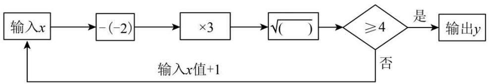

flowchart

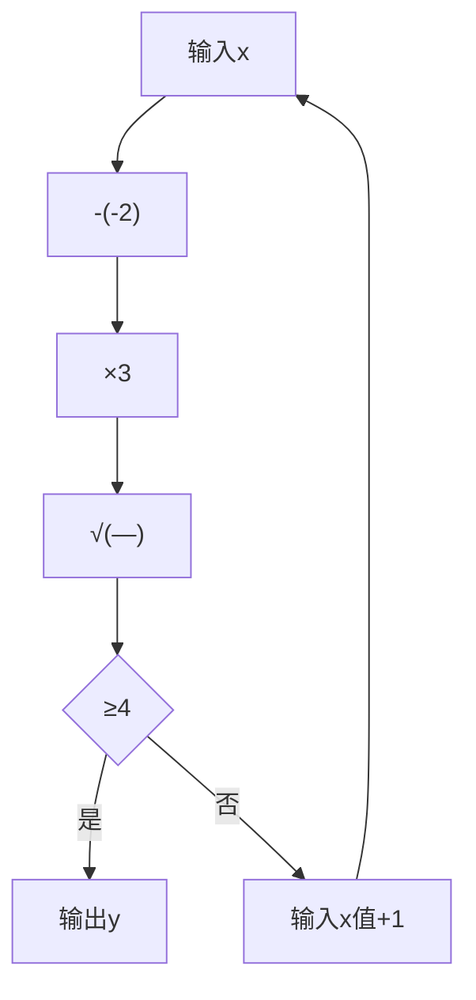

例如：当输入 $x$ 的值为-1时，计算结果 $\sqrt{3} < 4$ ；将输入值变为 $(-1) + 1 = 0$ ，计算结果为 $\sqrt{6} < 4$ ；再将输入值变为了 $0 + 1 = 1$ ，继续运算，直到计算结果不小于4，才输出该结果.

请思考下列问题.

(1)当输入 x 的值为 5，则输出 y 的值是多少？请列式计算.  
(2)当起始输入 x 的值为 1，请通过计算说明经过几次程序运行后才能输出 y.

【答案】(1) $\sqrt{21}$

(2)4 次

【分析】本题考查了实数的运算，理解题意，掌握框图中的运算法则是解题的关键.

（1）根据框图中的运算程序计算即可；  
(2) 根据框图中的运算程序计算, 直到结果大于或等于 4 即输出结果为止.

【详解】（1）当输入 x 的值为 5 时，

则有 $5-(-2)=7,\quad7\times3=21,$

且 $\sqrt{21}>4,$

∴ 输出 y 的值是 $\sqrt{21}$ .

(2) 当输入 $x$ 的值为 1 时,

则有 $1-(-2)=3,\quad3\times3=9,\quad\sqrt{9}<4$ ，继续计算；

第二次输入 x 的值为 $1 + 1 = 2$ 时，

则有 $2-(-2)=4,\quad4\times3=12,\quad\sqrt{12}<4$ ，继续计算；

第三次输入 x 的值为 $2 + 1 = 3$ 时，

则有 $3-(-2)=5,\quad5\times3=15,\quad\sqrt{15}<4$ ，继续计算；

第四次输入 x 的值为 $3 + 1 = 4$ 时，

则有 $4-(-2)=6,\quad6\times3=18,\quad\sqrt{18}>4$ ，输出y;

所以经过 4 次程序运行后才能输出 y.

# 【题型5 无理数的估算】

【例 5】（24-25 七年级下·福建龙岩·期末）大自然是美的设计师，即使是一片小小的树叶，也蕴含着“美学”。如图， $\frac{BC}{AB}$ 的值接近黄金比 $\frac{\sqrt{5}-1}{2}$ ，则下列估算正确的是（）

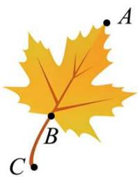

natural_image

Illustration of a yellow maple leaf with labeled points A, B, and C on its branches (no text or symbols beyond labels)

A. $0 < \frac{\sqrt{5} - 1}{2} < \frac{2}{5}$

B. $\frac{2}{5} < \frac{\sqrt{5} - 1}{2} < \frac{1}{2}$

C. $\frac{1}{2} < \frac{\sqrt{5} - 1}{2} < 1$

D. $1 < \frac{\sqrt{5}-1}{2} < 2$

【答案】C

【分析】本题考查了无理数的估算，本题考查无理数的估计，不等式的性质，正确判断的范围是求解本题的关键．由题意知 $4 < 5 < 9$ ，则 $2 < \sqrt{5} < 3$ ，根据不等式的性质计算求解即可.

【详解】解：由题意知，4 < 5 < 9，

$$
\therefore 2 <   \sqrt {5} <   3,
$$

$$
\therefore 1 <   \sqrt {5} - 1 <   2,
$$

$$
\therefore \frac {1}{2} <   \frac {\sqrt {5} - 1}{2} <   1.
$$

故选：C.

【变式 5-1】（24-25 八年级下·江苏淮安·阶段练习）已知 $43^{2}=1849$ ， $44^{2}=1936$ ， $45^{2}=2025$ ， $46^{2}=2116$ 。若n为整数且 $n<\sqrt{2022}<n+1$ ，则n的值为（）

A. 43

B. 44

C. 45

D. 46

【答案】B

【分析】本题主要考查无理数的估算，熟练掌握无理数的估算是解题的关键；先根据题干中的数据估算 $\sqrt{2022}$ 的大小，进而问题可求解.

【详解】解：由题意可知：1936 < 2022 < 2025

$$
\therefore 4 4 <   \sqrt {2 0 2 2} <   4 5,
$$

$$
\therefore n = 4 4;
$$

故选 B.

【变式 5-2】（24-25 九年级上·江苏淮安·期中）若 $a < \sqrt{23} < b$ ，且 a、b 为连续正整数，则 $a + b =$ \_\_\_\_

【答案】9

【分析】本题考查实数的估算与大小比较的能力，先估算出 $\sqrt{23}$ 的取值范围，得出 $a, b$ 的值，进而可得出结论．根据题意求出 $a, b$ 的值是解题的关键.

【详解】解：∵16 < 23 < 25，

$$
\therefore 4 <   \sqrt {2 3} <   5,
$$

∵a，b为两个连续整数，

$$
\therefore a = 4, b = 5,
$$

$$
\therefore a + b = 4 + 5 = 9.
$$

故答案为：9.

【变式 5-3】（24-25 七年级下·河北唐山·期末）已知 $k < \sqrt{17} - 1$ ，且 $k$ 为正整数，则 $k$ 的值可以是\_\_\_\_（写出一个即可）.

【答案】1（答案不唯一）

【分析】本题主要考查了无理数的估算、不等式的解等知识点，掌握无理数的估算方法是解题的关键。先估算 $\sqrt{17}$ 得取值范围，再确定 $k$ 的取值范围，然后根据不等式解的定义即可解答。

【详解】解：∵ $\sqrt{16}<\sqrt{17}<\sqrt{25}$ 是整数；

$\therefore3<\sqrt{17}-1<4$ 是完全平方数；

$$
\therefore k \leq 3,
$$

∵k为正整数，

∴k=1或2或3.

故答案为：1（答案不唯一）.

# 【题型 6 二次根式的概念及其有意义的条件】

【例 6】（24-25 八年级下·山东德州·阶段练习）已知 $\sqrt{3x-6} + \sqrt{6-3x} + y = 2025$ ，则 $\sqrt{2025xy}$ 的值为（）

A. $2025 \sqrt{3}$

B. $2025\sqrt{2}$

C. 2024

D. 2025

【答案】B

【分析】先根据二次根式有意义的条件求出x的值，再代入求出y的值，最后计算 $\sqrt{2025xy}$ ．本题主要考查了二次根式有意义的条件，熟练掌握二次根式中被开方数是非负数是解题的关键.

【详解】解：由题意得

$$
\left\{ \begin{array}{l} 3 x - 6 \geq 0 \\ 6 - 3 x \geq 0 \end{array} \right.,
$$

解 $3x-6\geq0$ 得 $x\geq2;$

解 $6-3x \geq 0$ 得 $x \leq 2$ .

$$
\therefore x = 2.
$$

把x=2代入 $\sqrt{3x-6}+\sqrt{6-3x}+y=2025$ 得

$$
\sqrt {3 \times 2 - 6} + \sqrt {6 - 3 \times 2} + y = 2 0 2 5,
$$

解得y = 2025.

$$
\therefore \sqrt {2 0 2 5 x y} = \sqrt {2 0 2 5 \times 2 \times 2 0 2 5} = \sqrt {2 0 2 5 ^ {2} \times 2} = 2 0 2 5 \sqrt {2}.
$$

故选：B.

【变式 6-1】（24-25 八年级下·广东东莞·阶段练习）下列各式中，一定是二次根式的是（）

A. $\sqrt{-2}$

B. $\sqrt[3]{3}$

C. $\sqrt{5}$

D. $\sqrt{a+1}$

【答案】C

【分析】本题考查了二次根式的定义，形如 $\sqrt{a}(a\geq0)$ 的式子叫二次根式，根据定义逐项分析即可.

【详解】解：A. $\because-2<0,\therefore\sqrt{-2}$ 不是二次根式，故此选项不符合题意；

B. $\because\sqrt[3]{3}$ 的根指数是 3， $\therefore\sqrt[3]{3}$ 不是二次根式，故此选项不符合题意；

C. $\because5>0,\therefore\sqrt{5}$ 是二次根式，故此选项符合题意；

D. 当 $a+1<0$ 即a<-1时， $\sqrt{a+1}$ 不是二次根式，故此选项不符合题意；

故选：C.

【变式 6-2】（24-25 八年级下·湖南岳阳·开学考试）已知： $y=\frac{\sqrt{x-4}+\sqrt{4-x}}{3}-2$ ，则 $3x+4y=$ \_\_\_\_.

【答案】4

【分析】此题主要考查了二次根式有意义的条件，正确解不等式组是解题关键.

利用二次根式有意义的条件得出不等式组求出 x, y 的值，然后代入计算.

【详解】解： $\because y = \frac{\sqrt{x - 4} + \sqrt{4 - x}}{3} - 2$ ，

$$
\therefore \left\{ \begin{array}{l} x - 4 \geq 0 \\ 4 - x \geq 0 \end{array} \right.,
$$

解得：x = 4，

故y=-2，

则 $3x + 4y = 3 \times 4 + 4 \times (-2) = 4$ .

故答案为：4.

【变式 6-3】（24-25 八年级下·湖南岳阳·开学考试）若 x、y 为实数，且满足 $2\sqrt{4-x} + |y| = x - 4$ ，则 $\sqrt{x-y}$ 的算术平方根为 \_\_\_\_.

【答案】 $\sqrt{2}$

【分析】本题考查二次根式有意义的条件、非负数的性质、求算术平方根，先根据算术平方根和绝对值的非负性，结合二次根式有意义的条件求得 $x$ 、 $y$ 值，进而求得 $\sqrt{x - y}$ 即可求解.

【详解】解：∵ $2\sqrt{4-x}+|y|=x-4,\quad2\sqrt{4-x}\geq0,\quad|y|\geq0,$

$$
\therefore 4 - x \geq 0 \text {且} x - 4 \geq 0,
$$

∴4-x=x-4=0，解得x=4，

将x=4代入 $2\sqrt{4-x}+|y|=x-4$ 中，得y=0，

$$
\therefore \sqrt {x - y} = \sqrt {4 - 0} = \sqrt {4} = 2,
$$

$\therefore\sqrt{x-y}$ 的算术平方根为 $\sqrt{2}$ .

故答案为： $\sqrt{2}$ .

# 【题型 7 利用二次根式的性质化简】

【例 7】（24-25 八年级下·福建龙岩·阶段练习）把分式 $a\sqrt{-\frac{1}{a}}$ ，根号外的字母 a 移进根号内的结果是（）

A. $\sqrt{a}$

B. $\sqrt{-a}$

C. $-\sqrt{a}$

D. $-\sqrt{-a}$

【答案】D

【分析】主要考查了二次根式的意义．解题的关键是能正确的把根号外的代数式或数字移到根号内部，它是开方的逆运算，从根号外移到根号内要平方，并且移到根号内与原来根号内的式子是乘积的关系．注意根号外的数字或式子是负数时，代表整个式子是负值，要把负号留到根号外再平方后移到根号内.

如果根号外的数字或式子是负数时，代表整个式子是负值，要把负号留到根号外再平方后移到根号内，然后化简即可.

【详解】解：由二次根式的意义可知a<0，

$\therefore a\sqrt{-\frac{1}{a}} = -\sqrt{-\frac{1}{a}\times(-a)^{2}} = -\sqrt{-a}$ , 故 D 正确.

故选：D.

【变式 7-1】（24-25 九年级上·四川乐山·阶段练习）若 xy > 0，则 $\sqrt{-x^{2}y}$ 化简为（）

A. $x\sqrt{-y}$

B. -xy

C. $-x\sqrt{y}$

D. $-x\sqrt{-y}$

【答案】D

【分析】本题考查了二次根式的化简，熟练掌握二次根式的性质是解题关键．先判断出x<0，y<0，再利用二次根式的性质化简即可得.

【详解】解：∵xy > 0，

∴x,y同号，且均不为0，

又∵在 $\sqrt{-x^{2}y}$ 中， $-x^{2}y$ 是被开方数，

$$
\therefore - x ^ {2} y > 0,
$$

$$
\therefore y <   0,
$$

$$
\therefore x <   0,
$$

$$
\therefore \sqrt {- x ^ {2} y} = | x | \sqrt {- y} = - x \sqrt {- y},
$$

故选：D.

【变式 7-2】若 m < 0，则把式子 $m\sqrt{x}$ 根号外面的因式移到根号里后的式子应是（）

A. $-\sqrt{m^{2}x}$

B. $\sqrt{-m^2x}$

C. $\sqrt{(-m)^{2}x}$

D. $-\sqrt{-mx}$

【答案】A

【分析】根据 m<0，则二次根式整体是负数，则 m 移到根号内部后，外面有负号，进而得出答案.

【详解】解：∵m<0,

∴把式子 $m\sqrt{x}$ 根号外面的因式移到根号里后的式子为： $-\sqrt{m^{2}x}$ .

故选 A.

【点睛】此题主要考查了二次根式的化简求值，根据二次根式整体的符号得出是解题的关键.

【变式 7-3】若 $\sqrt{1575n}$ 是整数，写出一个正整数n的可能值\_\_\_\_.

【答案】7（答案不唯一）

【分析】要想让1575n能开平方为整数，将1575因数分解，进而即可求解.

【详解】解：∵ $1575=9\times25\times7=3^{2}\times5^{2}\times7$ ,

若 $\sqrt{1575n}$ 是整数，则n的值可以是7

故答案为：7（答案不唯一）.

【点睛】此题主要考查了二次根式的性质，正确化简二次根式得出是解题关键.

# 【题型8 最简二次根式】

【例 8】（24-25 八年级上·陕西渭南·阶段练习）已知 $\sqrt{x^{2}+1}$ 是最简二次根式，且与 $\sqrt{5}$ 可以合并，则 x 的值

为（）

A. 2

B. -4

C. 4

D. $\pm 2$

【答案】D

【分析】本题考查了同类二次根式，最简二次根式，利用平方根解方程，熟练掌握知识点的应用是解题的关键.

由 $\sqrt{x^{2}+1}$ 是最简二次根式且与 $\sqrt{5}$ 可以合并，得出 $x^{2}+1=5$ ，然后利用平方根解方程即可.

【详解】解： $\because\sqrt{x^{2}+1}$ 是最简二次根式且与 $\sqrt{5}$ 可以合并，

$\therefore x^{2}+1=5$ ，解得： $x=\pm2$ ，

故选：D.

【变式 8-1】（24-25 八年级上·上海黄浦·期末）下列二次根式中，是最简二次根式的是（）

A. $\sqrt{18}$

B. $\sqrt{63a}$

C. $\sqrt{a^{2}-2a+4}$

D. $\sqrt{\frac{a}{3}}$

【答案】C

【分析】本题考查了最简二次根式的定义，判定一个二次根式是不是最简二次根式的方法，就是逐个检查最简二次根式的两个条件是否同时满足，同时满足的就是最简二次根式，否则就不是.

满足下列两个条件的二次根式，叫做最简二次根式：

(1) 被开方数的因数是整数, 因式是整式;

(2) 被开方数中不含能开得尽方的因数或因式.

可以此来判断哪个选项是正确的.

【详解】解： $A$ 、 $\sqrt{18}=3\sqrt{2}$ ，不是最简二次根式，故本选项不符合题意；

B、 $\sqrt{63a}=3\sqrt{7a}$ ，不是最简二次根式，故本选项不符合题意；

C、 $\sqrt{a^{2}-2a+4}$ 是最简二次根式，故本选项符合题意；

D、 $\sqrt{\frac{a}{3}}=\frac{\sqrt{3a}}{3}$ ，不是最简二次根式，故本选项不符合题意；

故选：C.

【变式 8-2】将式子 $\sqrt{35-a}$ （a 为正整数）化为最简二次根式后，可以与 $\sqrt{8}$ 合并．写出一个符合条件 a 的值\_\_\_\_.

【答案】3（答案不唯一）

【分析】本题考查了同类二次根式，最简二次根式，熟练掌握同类二次根式的定义是解题的关键.

【详解】解：∵ $\sqrt{8}=2\sqrt{2}$ ,

$\therefore\sqrt{35-a}$ 可以为 $\sqrt{2}$ ， $2\sqrt{2}$ ， $3\sqrt{2}$ ， $4\sqrt{2}$ ，

∴35-a=2或35-a=8或35-a=18或35-a=32,

解得：a = 33 或 a = 27 或 a = 17 或 a = 3，

故答案为：3.

【变式 8-3】已知 $A = 2\sqrt{2x + 1}$ ， $B = 3\sqrt{x + 3}$ ， $C = \sqrt{10x + 3y}$ ，其中 $A, B$ 为最简二次根式，且 $A + B = C$ ，则 $2y - x$ 的值为 \_\_\_\_.

【答案】68

【分析】根据题意得出 $2x+1=x+3$ ，求出x=2，进而得出 $10x+3y=(5\sqrt{5})^{2}=125$ ，求出y=35，再代入求值即可.

【详解】∵A，B为最简二次根式，且 $A+B=C$ ，

$$
\therefore 2 x + 1 = x + 3,
$$

解得x=2，

$$
\therefore A = 2 \sqrt {5}, B = 3 \sqrt {5}, A + B = 5 \sqrt {5} = C,
$$

$$
\therefore 1 0 x + 3 y = (5 \sqrt {5}) ^ {2} = 1 2 5,
$$

解得y = 35，

$$
\therefore 2 y - x = 2 \times 3 5 - 2 = 6 8.
$$

故答案为：68.

【点睛】本题考查最简二次根式，根据最简二次根式的定义得出x=2是解题的关键.

# 【题型9 求二次根式中的参数值】

【例 9】若 $(2-\sqrt{7})^{2}=a-b\sqrt{7}$ ，其中a，b均为整数，则b-a的值为\_\_\_\_.

【答案】-7

【分析】本题考查二次根式乘法运算与代数式求值，涉及完全平方差公式及二次根式相等，利用完全平方差公式展开后，由二次根式相等的条件得到a，b，代入表达式求解即可得到答案，熟练掌握二次根式运算是解决问题的关键.

【详解】解： $\because(2-\sqrt{7})^{2}=2^{2}-2\times2\times\sqrt{7}+(\sqrt{7})^{2}=11-4\sqrt{7}=a-b\sqrt{7}$ ,

$$
\therefore a = 1 1, b = 4,
$$

$$
\therefore b - a = 4 - 1 1 = - 7,
$$

故答案为：-7.

【变式 9-1】二次根式 $\sqrt{2b+1}$ 与 $\sqrt{a-1}$ 的和为0，则 $a+b$ 的值为\_\_\_\_.

【答案】 $\frac{1}{2} / 0.5$

【分析】本题考查了二次根式的非负性，求整式的值；可得 $\sqrt{2b+1}+\sqrt{a-1}=0$ ，由二次根式的非负性得a-1=0， $2b+1=0$ ，求出a和b，代值即可求解；理解二次根式的非负性 $\sqrt{a}\geq0\quad(a\geq0)$ 是解题的关键.

【详解】解：由题意得

$$
\sqrt {2 b + 1} + \sqrt {a - 1} = 0,
$$

$$
\therefore a - 1 = 0, 2 b + 1 = 0,
$$

解得： $a = 1$ ， $b = -\frac{1}{2}$

$$
\begin{array}{l} \therefore a + b \\ = 1 - \frac {1}{2} \\ = \frac {1}{2}; \\ \end{array}
$$

故答案: $\frac{1}{2}$ .

【变式 9-2】（2025 九年级下·河北·专题练习）若 $\sqrt{\frac{m}{2}} = 2\sqrt{2}$ ，则整数 m 的值为 \_\_\_\_.

【答案】16

【分析】本题考查二次根式的运算，两边平方求出 m 的值即可解题.

【详解】解： $\because \sqrt{\frac{m}{2}} = 2\sqrt{2}$ ，

$$
\therefore \frac {m}{2} = 8,
$$

解得m = 16,

故答案为：16.

【变式 9-3】已知 $\sqrt{10-n}$ 是整数，则正整数n所有可能值共有\_\_\_\_个，它们的和为\_\_\_\_.

【答案】 4 26

【分析】本题考查二次根式有意义的条件、二次根式的性质，根据二次根式的被开方数是非负数结合二次根式的性质得到正整数 n 的值，进而求解即可.

【详解】解：在 $\sqrt{10-n}$ 中， $10-n\geq0$ ，则 $n\leq10$ ，

$\because \sqrt{10 - n}$ 是整数，且 $n$ 为正整数，又 $\sqrt{0} = 0$ ， $\sqrt{1} = 1$ ， $\sqrt{4} = 2$ ， $\sqrt{9} = 3$

∴n 的值为 10 或 9 或 6 或 1，共 4 个，

它们的和为 $10+9+6+1=26$ ,

故答案为：4，26.

# 【题型10 二次根式的运算或化简求值】

【例 10】已知 $x=\sqrt{2}+1,\quad y=\sqrt{2}-1$ ，求下列各式的值.

(1) $x^{2}+y^{2};$

(2) $\sqrt{\frac{x}{y}} + \sqrt{\frac{y}{x}}$ .

【答案】(1)6

(2) $2\sqrt{2}$

【分析】本题考查二次根式的化简求值，熟练掌握二次根式的混合运算法则是解题的关键.

（1）利用公式 $a^{2}+b^{2}=(a+b)^{2}-2ab$ ，代入 $x=\sqrt{2}+1,\quad y=\sqrt{2}-1$ ，即可求值；

（2）先得出 $\left(\sqrt{\frac{x}{y}} +\sqrt{\frac{y}{x}}\right)^2 = \frac{x}{y} +2\sqrt{\frac{x}{y}\cdot\frac{y}{x}} +\frac{y}{x} = \frac{x}{y} +\frac{y}{x} +2 = \frac{x^2 + y^2}{xy} +2$ ，结合（1）代入值即可求得答案.

【详解】（1）解：根据 $x=\sqrt{2}+1,y=\sqrt{2}-1$ ，则有：

$$
x + y = (\sqrt {2} + 1) + (\sqrt {2} - 1) = 2 \sqrt {2},
$$

$$
x y = (\sqrt {2} + 1) (\sqrt {2} - 1) = 2 - 1 = 1,
$$

代入 $x^{2}+y^{2}$ 得到:

$$
x ^ {2} + y ^ {2} = (x + y) ^ {2} - 2 x y = (2 \sqrt {2}) ^ {2} - 2 \times 1 = 8 - 2 = 6;
$$

(2) $\left(\sqrt{\frac{x}{y}} + \sqrt{\frac{y}{x}}\right)^2 = \frac{x}{y} + 2\sqrt{\frac{x}{y} \cdot \frac{y}{x}} + \frac{y}{x} = \frac{x}{y} + \frac{y}{x} + 2 = \frac{x^2 + y^2}{xy} + 2,$

因为 $x^{2}+y^{2}=6,\quad xy=(\sqrt{2}+1)(\sqrt{2}-1)=2-1=1,$

所以 $(\sqrt{\frac{x}{y}} + \sqrt{\frac{y}{x}})^2 = \frac{x^2 + y^2}{xy} + 2 = \frac{6}{1} + 2 = 8,$

所以 $\sqrt{\frac{x}{y}} +\sqrt{\frac{y}{x}} = \sqrt{8} = 2\sqrt{2}.$

【变式 10-1】计算:

(1) $\sqrt{3}+3\sqrt{\frac{1}{3}}-\sqrt{12};$

(2) $\sqrt{45} \div \sqrt{27} \times \sqrt{\frac{3}{5}}$ ;

(3) $\sqrt{18}\div\sqrt{2}-\sqrt{32}+\sqrt{3}\times\sqrt{6};$

(4) $(3 + \sqrt{3})(3 - \sqrt{3}) + (1 + \sqrt{7})^2$ .

【答案】(1)0

(2)1

(3) $3-\sqrt{2}$

(4) $14 + 2\sqrt{7}$

【分析】此题考查了二次根式的混合运算，熟练掌握二次根式的运算法则是关键.

(1) 把二次根式化简后进行加减运算即可;

(2) 先把除法转化为乘法, 再进行计算即可;

（3）先计算乘除法，再计算加减即可；

(4) 利用平方差公式和完全平方公式进行计算即可.

（1）把二次根式化简后进行加减运算即可；  
（2）先把除法转化为乘法，再进行计算即可；  
（3）先计算乘除法，再计算加减即可；  
（4）利用平方差公式和完全平方公式进行计算即可.

【详解】（1）解： $\sqrt{3}+3\sqrt{\frac{1}{3}}-\sqrt{12}$

$$
\begin{array}{l} = \sqrt {3} + \sqrt {3} - 2 \sqrt {3} \\ = 0 \\ \end{array}
$$

(2) $\sqrt{45} \div \sqrt{27} \times \sqrt{\frac{3}{5}}$

$$
\begin{array}{l} = \sqrt {\frac {4 5}{2 7}} \times \sqrt {\frac {3}{5}} \\ = \sqrt {\frac {4 5}{2 7} \times \frac {3}{5}} \\ = \sqrt {1} \\ = 1 \\ \end{array}
$$

(3) $\sqrt{18} \div \sqrt{2} - \sqrt{32} + \sqrt{3} \times \sqrt{6}$

$$
\begin{array}{l} = \sqrt {9} - 4 \sqrt {2} + \sqrt {1 8} \\ = 3 - 4 \sqrt {2} + 3 \sqrt {2} \\ = 3 - \sqrt {2} \\ \end{array}
$$

(4) $(3 + \sqrt{3})(3 - \sqrt{3}) + (1 + \sqrt{7})^2$

$$
= 3 ^ {2} - (\sqrt {3}) ^ {2} + (1 + 2 \sqrt {7} + 7)
$$

$$
= 9 - 3 + 1 + 2 \sqrt {7} + 7
$$

$$
= 1 4 + 2 \sqrt {7}
$$

【变式 10-2】（24-25 八年级上·四川达州·阶段练习）已知 $x = 2 - \sqrt{3}$ ，求代数式 $(7 + \sqrt{3})x^{2} + (2 + \sqrt{3})x + \sqrt{3}$ 的值.

【答案】 $38 - 20\sqrt{3}$

【分析】本题考查的是已知条件式，求解代数式的值，先求解 $x^{2}=(2-\sqrt{3})^{2}=7-4\sqrt{3}$ ，再代入进行计算即可.

【详解】解： $\because x = 2 - \sqrt{3}$ ，

$$
\begin{array}{l} \therefore x ^ {2} = (2 - \sqrt {3}) ^ {2} = 7 - 4 \sqrt {3}, \\ \therefore (7 + \sqrt {3}) x ^ {2} + (2 + \sqrt {3}) x + \sqrt {3} \\ = (7 + \sqrt {3}) (7 - 4 \sqrt {3}) + (2 + \sqrt {3}) (2 - \sqrt {3}) + \sqrt {3} \\ = 4 9 - 2 1 \sqrt {3} - 1 2 + 4 - 3 + \sqrt {3} \\ = 3 8 - 2 0 \sqrt {3}. \\ \end{array}
$$

【变式10-3】已知 $x + y = -5$ ， $xy = 4$ ，求 $x\sqrt{\frac{y}{x}} + y\sqrt{\frac{x}{y}}$ 的值.

【答案】-4

【分析】先根据 $x + y = -5$ ， $xy = 4$ ，可判断 $x < 0$ ， $y < 0$ ，再将原式化简，然后将已知条件整体代入求值即可.

本题主要考查了二次根式化简及二次根式的性质，熟练掌握 $\sqrt{a^2} = |a| = \begin{cases} a(a > 0) \\ 0(a = 0) \\ -a(a < 0) \end{cases}$ 是解题的关键.

【详解】∵ $x + y = -5 < 0$ , xy = 4 > 0,

$$
\therefore x <   0, y <   0,
$$

∴原式= $x\sqrt{\frac{xy}{x^{2}}}+y\sqrt{\frac{xy}{y^{2}}}=-x\cdot\frac{\sqrt{xy}}{x}-y\cdot\frac{\sqrt{xy}}{y}=-2\sqrt{xy}$

$$
\because x y = 4.
$$

原式 $= -2 \times \sqrt{4} = -2 \times 2 = -4$ .

# 【拔尖篇】

# 【题型11 二次根式的双重非负性】

【例 11】（24-25 七年级下·湖北恩施·阶段练习）已知 a, b 为实数，且 $b = \sqrt{a - 8} - \sqrt{8 - a} + 25$ ，则 $\sqrt[3]{a} + \sqrt{b}$ 的值为（）.

A. 10

B. 9

C. 8

D. 7

【答案】D

【分析】本题考查算术平方根成立的条件，立方根，根据算术平方根的开方数是非负数得到 $a = 8$ ，进而求得 $b = 25$ ，最后代入 $\sqrt[3]{a} +\sqrt{b}$ 计算即可.

【详解】解： $\because b=\sqrt{a-8}-\sqrt{8-a}+25,\quad a-8\geq0,\quad8-a\geq0,$

$$
\therefore a = 8, b = 2 5,
$$

$$
\therefore \sqrt [ 3 ]{a} + \sqrt {b} = \sqrt [ 3 ]{8} + \sqrt {2 5} = 2 + 5 = 7,
$$

故选：D.

【变式 11-1】（25-26 八年级上·全国·随堂练习）若 $a + \sqrt{a - 3} = 3$ ，求 $\sqrt{a + 3}$ 的值.

【答案】 $\sqrt{6}$

【分析】本题主要考查的是二次根式，熟练掌握二次根式的性质是解题的关键.

先将原式化为 $\sqrt{a-3}=3-a$ ，再用不等式组求解即可.

【详解】解：因为 $a+\sqrt{a-3}=3$ ，

所以 $\sqrt{a-3}=3-a,$

所以 $a-3\geq0,3-a\geq0,$

所以a=3,

所以 $\sqrt{a+3}=\sqrt{3+3}=\sqrt{6}.$

【变式 11-2】（24-25 七年级下·贵州贵阳·期中）已知 $|a-3|+\sqrt{3+b}=0$ ，则 $\left(\frac{a}{b}\right)^{2025}=$ （）

A. 1

B. -1

C. 2

D. -2

【答案】B

【分析】本题考查绝对值，算术平方根，有理数的乘方，解题的关键是求出a和b的值.

根据绝对值和算术平方根的非负性，解得a和b的值，代入计算即可.

【详解】解： $|a-3|+\sqrt{3+b}=0,\quad|a-3|\geq0,\quad\sqrt{3+b}\geq0,$

$$
\therefore | a - 3 | = 0, \sqrt {3 + b} = 0,
$$

$$
\therefore a - 3 = 0, \quad 3 + b = 0,
$$

$$
\therefore a = 3, b = - 3,
$$

$$
\therefore \frac {a}{b} = - 1
$$

$$
\therefore \left(\frac {a}{b}\right) ^ {2 0 2 5} = (- 1) ^ {2 0 2 5} = - 1
$$

故选：B.

【变式 11-3】（2025 八年级下·湖北·专题练习）已知非零实数 a，b 满足 $\left|2a-4\right|+\left|b+2\right|+\sqrt{(a-4)b^{2}}+4=2a$ ，则 $a+b=$ \_\_\_\_.

【答案】2

【分析】本题主要考查了算术平方根的非负性，绝对值的非负性，将式子变形为 $|2a-4|+|b+2|+\sqrt{(a-4)b^{2}}=2a-4$ ，由算术平方根的非负性，绝对值的非负性得出 $2a-4\geq0$ ，再化简式子可得出 $|b+2|+\sqrt{(a-4)b^{2}}=0$ ，再根据算术平方根的非负性，绝对值的非负性即可得出b=-2，a=4，进而代入代数式即可得出答案.

【详解】解：∵ $|2a-4|+|b+2|+\sqrt{(a-4)b^{2}}+4=2a$

$$
\therefore | 2 a - 4 | + | b + 2 | + \sqrt {(a - 4) b ^ {2}} = 2 a - 4,
$$

$$
\therefore 2 a - 4 \geq 0,
$$

$$
\therefore 2 a - 4 + | b + 2 | + \sqrt {(a - 4) b ^ {2}} = 2 a - 4,
$$

$$
\therefore | b + 2 | + \sqrt {(a - 4) b ^ {2}} = 0
$$

$$
\therefore b + 2 = 0, a - 4 = 0,
$$

解得，b = -2, a = 4,

则 $a+b=4-2=2$ ,

故答案为：2.

# 【题型12 实数的大小比较】

【例 12】（24-25 七年级下·天津滨海新·期中）比较大小： $\sqrt{11}$ \_\_\_\_3； $-\sqrt{5}$ \_\_\_\_-2； $\frac{\sqrt{5}+1}{2}$ \_\_\_\_ $\frac{3}{2}$ ．（填“＞”、“＝”或“＜”）.

【答案】> < >

【分析】本题考查了实数的大小比较，熟练掌握以上知识点是解答本题的关键.

根据实数的大小比较方法解答即可.

【详解】解：∵ $\sqrt{11} > \sqrt{9}$ ,

$$
\therefore \sqrt {1 1} > 3;
$$

$$
\because \sqrt {5} > \sqrt {4} = 2,
$$

$$
\therefore - \sqrt {5} <   - \sqrt {4},
$$

$$
\therefore - \sqrt {5} <   - 2;
$$

$$
\because \sqrt {5} > \sqrt {4} = 2,
$$

$$
\therefore \sqrt {5} + 1 > 3,
$$

$$
\therefore \frac {\sqrt {5} + 1}{2} > \frac {3}{2};
$$

故答案为：>，<，>。

【变式 12-1】（24-25 七年级下·山东德州·期中）若 $a = \sqrt[3]{7}$ ， $b = \sqrt{5}$ ， $c = 2$ ，则 $a, b, c$ 的大小关系为（）

A. $b \leq c < a$

B. b < a < c

C. $a < c < b$

D. a < b < c

【答案】C

【分析】本题考查实数的大小比较，先利用夹逼法估算 a, b 的值，再比较大小即可.

【详解】解：∵1＜7＜8，4＜5＜9，

$$
\therefore \sqrt [ 3 ]{1} <   \sqrt [ 3 ]{7} <   \sqrt [ 3 ]{8}, \sqrt {4} <   \sqrt {5} <   \sqrt {9},
$$

即 $1<\sqrt[3]{7}<2,\quad2<\sqrt{5}<3,$

$$
\therefore 1 <   a <   2, \quad 2 <   b <   3,
$$

又c=2,

$$
\therefore a <   c <   b,
$$

故选：C.

【变式 12-2】（25-26 八年级上·全国·随堂练习）比较 $\sqrt{65}-2$ 与 $\sqrt{10}+2$ 的大小.

【答案】 $\sqrt{65} - 2 > \sqrt{10} + 2$

【分析】此题考查无理数的估算和实数的大小比较，可通过估算两个无理数的范围，进而确定两个代数式的范围，再进行比较.

【详解】解：因为 $8<\sqrt{65}<9,\quad3<\sqrt{10}<4,$

所以 $6<\sqrt{65}-2<7,\quad5<\sqrt{10}+2<6,$

所以 $\sqrt{65}-2>\sqrt{10}+2.$

【变式 12-3】（25-26 八年级上·全国·随堂练习）比较下列各组数的大小：

(1) $\frac{1}{2}$ 与 $\frac{\sqrt{10}}{6}$ ;

(2) $\frac{\sqrt{6}-1}{2}$ 与1.

【答案】(1) $\frac{\sqrt{10}}{6}>\frac{1}{2}$

(2) $\frac{\sqrt{6}-1}{2}<1$

【分析】本题考查实数比较大小，熟练掌握实数比较大小的方法，是解题的关键：

(1) 估算法比较大小即可;   
(2) 估算法比较大小即可.

【详解】（1）解：∵ $\sqrt{10}>\sqrt{9}=3$ ，

$\therefore\frac{\sqrt{10}}{6}>\frac{3}{6},\quad 即:\quad\frac{\sqrt{10}}{6}>\frac{1}{2};$

(2) $\because \sqrt{4} < \sqrt{6} < \sqrt{9},$

$$
\therefore 2 <   \sqrt {6} <   3,
$$

$$
\therefore 1 <   \sqrt {6} - 1 <   2,
$$

$\therefore \frac{\sqrt{6} - 1}{2} < \frac{2}{2}$ , 即: $\frac{\sqrt{6} - 1}{2} < 1$ .

# 【题型 13 求整数部分和小数部分】

【例 13】（24-25 八年级上·河南新乡·阶段练习）若 $\sqrt{3}$ 的整数部分为 a，小数部分为 b， $4-\sqrt{3}$ 的整数部分为 c，小数部分为 d，则 $\frac{b+d}{ac}$ 的值为（）

A. $\frac{1}{2}$

B. $\frac{1}{4}$

C. $\frac{\sqrt{3-1}}{2}$

D. $\frac{\sqrt{3+1}}{2}$

【答案】A

【分析】本题考查了估算无理数的大小，通过估算 $\sqrt{3}$ 在哪两个整数之间，从而确定a=1， $b=\sqrt{3}-1$ ，通过估算 $4-\sqrt{3}$ 在哪两个整数之间，从而确定c=2， $d=2-\sqrt{3}$ ，然后把a、b、c、d代入求得数值.

【详解】解：∵ $\sqrt{3}$ 的整数部分为a，小数部分为b， $1<\sqrt{3}<2$ ，

$$
\therefore a = 1, b = \sqrt {3} - 1,
$$

$$
\because 1 <   \sqrt {3} <   2,
$$

$$
\therefore - 2 <   - \sqrt {3} <   - 1,
$$

$$
\therefore 2 <   4 - \sqrt {3} <   3,
$$

∵4- $\sqrt{3}$ 的整数部分为c，小数部分为d，

$$
\therefore c = 2, d = 4 - \sqrt {3} - 2 = 2 - \sqrt {3},
$$

$$
\therefore \frac {b + d}{a c} = \frac {\sqrt {3} - 1 + 2 - \sqrt {3}}{1 \times 2} = \frac {1}{2}.
$$

故选：A.

【变式 13-1】（24-25 七年级下·广东广州·期中）若 $6+\sqrt{5}$ 的整数部分是m，小数部分是n，则 $|n-m|$ 为（）

A. $\sqrt{5} - 10$

B. $10-\sqrt{5}$

C. $\sqrt{5} - 6$

D. $6 - \sqrt{5}$

【答案】B

【分析】本题考查与无理数的整数部分有关的计算，实数的运算，夹逼法求出m,n的值，再代值计算即可.

【详解】解： $\because \sqrt{4} < \sqrt{5} < \sqrt{9}$ ，

$$
\therefore 2 <   \sqrt {5} <   3,
$$

$$
\therefore 8 <   6 + \sqrt {5} <   9,
$$

$$
\therefore m = 8, n = 6 + \sqrt {5} - 8 = \sqrt {5} - 2,
$$

$$
\therefore | n - m | = | \sqrt {5} - 2 - 8 | = 1 0 - \sqrt {5};
$$

故选 B.

【变式 13-2】（24-25 八年级上·湖南邵阳·期末）规定：[m]表示不超过m的最大整数，{m}表示m的小数部分，[m] + {m} = m，其中m为实数．例如[3.14] = 3，{3.14} = 0.14，[3.14] + {3.14} = 3.14．计算：

$$
[ - \sqrt {3} ] - \{\sqrt {5} \} = \underline {{{\quad}}}.
$$

【答案】 $-\sqrt{5}$

【分析】本题考查了新定义下的实数运算，无理数的估算，理解新定义是解题的关键．分别估计 $-\sqrt{3}$ 和 $\sqrt{5}$ 在哪两个整数之间，再根据新定义得出 $[-\sqrt{3}]=-2,\{\sqrt{5}\}=\sqrt{5}-2$ ，两者相减即可得出答案.

【详解】解：∵-2<- $\sqrt{3}$ <-1， $2<\sqrt{5}<3$ ，

$$
\therefore [ - \sqrt {3} ] = - 2, \{\sqrt {5} \} = \sqrt {5} - 2,
$$

$$
\therefore [ - \sqrt {3} ] - \{\sqrt {5} \} = - 2 - (\sqrt {5} - 2) = - \sqrt {5}.
$$

故答案为： $-\sqrt{5}$ .

【变式 13-3】（24-25 七年级下·广东江门·阶段练习）已知实数 $8+\sqrt{13}$ 的整数部分为a，小数部分是m；实数 $9-\sqrt{13}$ 的整数部分为b，小数部分是n.

(1)直接写出a, m, b, n的值;

(2)求 $12m+12n+\sqrt{a+b}-7$ 的值的平方根;

(3)求 $\sqrt[3]{(m+n)^{2025}+(a-2b)+6}$ 的值.

【答案】(1)a=11, $m=\sqrt{13}-3$ , b=5, $n=4-\sqrt{13}$

(2) $\pm$ 3

(3)2

【分析】本题考查了无理数的估算、平方根、立方根，熟练掌握以上知识点并灵活运用是解此题的关键.

（1）估算得出 $3<\sqrt{13}<4$ ，从而可得 $11<8+\sqrt{13}<12$ ， $5<9-\sqrt{13}<6$ ，结合题意即可得解；  
(2) 将 (1) 中 $a = 11$ , $m = \sqrt{13} - 3$ , $b = 5$ , $n = 4 - \sqrt{13}$ 代入所求式子进行计算, 再结合平方根的定义计算即可得解;  
（3）将（1）中 $a = 11$ ， $m = \sqrt{13} -3$ ， $b = 5$ ， $n = 4 - \sqrt{13}$ 代入所求式子进行计算，再结合立方根的定义计算即可得解.

【详解】（1）解：∵9＜13＜16，

$\therefore\sqrt{9}<\sqrt{13}<\sqrt{16},$ 即 $3<\sqrt{13}<4,$

$$
\therefore 1 1 <   8 + \sqrt {1 3} <   1 2, 5 <   9 - \sqrt {1 3} <   6,
$$

∵实数 $8+\sqrt{13}$ 的整数部分为a，小数部分是m，实数 $9-\sqrt{13}$ 的整数部分为b，小数部分是n，

$$
\therefore a = 1 1, m = 8 + \sqrt {1 3} - 1 1 = \sqrt {1 3} - 3, b = 5, n = 9 - \sqrt {1 3} - 5 = 4 - \sqrt {1 3};
$$

（2）解：由（1）可得： $a = 11$ ， $m = \sqrt{13} -3$ ， $b = 5$ ， $n = 4 - \sqrt{13}$

$$
\begin{array}{l} 1 2 m + 1 2 n + \sqrt {a + b} - 7 \\ = 1 2 \times (\sqrt {1 3} - 3) + 1 2 \times (4 - \sqrt {1 3}) + \sqrt {1 1 + 5} - 7 \\ = 1 2 \sqrt {1 3} - 3 6 + 4 8 - 1 2 \sqrt {1 3} + 4 - 7 \\ = 9, \\ \end{array}
$$

∴12m+12n+ $\sqrt{a+b}$ -7的值的平方根为± $\sqrt{9}$ =±3;

$$
\begin{array}{l} = \sqrt [ 3 ]{(\sqrt {1 3} - 3 + 4 - \sqrt {1 3}) ^ {2 0 2 5} + (1 1 - 2 \times 5) + 6} \\ = \sqrt [ 3 ]{1 + 1 + 6} \\ = \sqrt [ 3 ]{8} \\ = 2. \\ \end{array}
$$

（3）解： $\sqrt[3]{(m+n)^{2025}+(a-2b)+6}$

# 【题型14 实数与数轴综合运用】

【例 14】（24-25 七年级下·河北秦皇岛·期末）《九章算术》中勾股术曰：“勾股各自乘，并而开方除之，即弦”，即 $c = \sqrt{a^{2} + b^{2}}$ （a 为“勾”，b 为“股”，c 为“弦”）若“勾”为 2，“股”为 3，则“弦”在如图所示数轴上可表示在（）

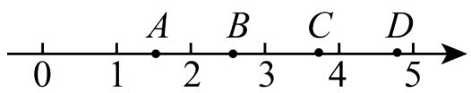

text_image

0
1
A
2
B
3
C
4
D
5

A. $A$ 点

B. B点

C. C点

D. D点

【答案】C

【分析】本题考查无理数的估算，实数与数轴，理解题意并列得正确的算式是解题的关键．根据题意列式计算后估算其大小，然后确定其在数轴上的位置即可.

【详解】解：若“勾”为2，“股”为3，则 $\sqrt{2^{2}+3^{2}}=\sqrt{13}$ ，

$$
\because 9 <   1 3 <   1 6,
$$

$$
\therefore 3 <   \sqrt {1 3} <   4,
$$

则“弦”在如图所示数轴上可表示在C点，

故选：C.

【变式 14-1】（24-25 七年级下·辽宁鞍山·期中）如图，正方形ABCD的面积为7，顶点A在数轴上表示的数为-1，若点E在数轴上（点E在点A的左侧），且AD=AE，则点E所表示的数为\_\_\_\_。

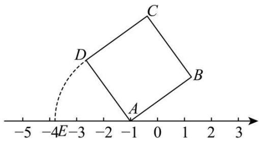

text_image

-5 -4E-3 -2 -1 0 1 2 3
C
D
A
B

【答案】 $-\sqrt{7} - 1$

【分析】本题考查算术平方根，实数与数轴，先求出正方形的边长，进而根据两点间的距离求出点 E 所表示的数即可.

【详解】解：∵正方形ABCD的面积为7，

$$
\therefore A E = A D = \sqrt {7},
$$

∵顶点 A 在数轴上表示的数为 -1，

∴点 E 所表示的数为 $-\sqrt{7}-1$ ;

故答案为： $-\sqrt{7}-1$ .

【变式 14-2】（24-25 八年级下·黑龙江牡丹江·期末）实数a，b在数轴上的位置如图所示，化简： $|a+1|-\sqrt{(b-1)^{2}}+\sqrt{(a-b)^{2}}=$ \_\_\_\_.

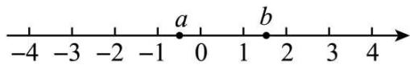

text_image

-4 -3 -2 -1 0 1 2 3 4
a b

【答案】2

【分析】本题考查了实数与数轴，利用数轴得出-1<a<0，1<b<2，进而化简即可.

【详解】解：由数轴，得-1<a<0，1<b<2，

$$
\therefore a + 1 > 0, b - 1 > 0, a - b <   0,
$$

∴原式 = $a + 1 - |b - 1| + |a - b|$

$$
\begin{array}{l} = a + 1 - (b - 1) - (a - b) \\ = a + 1 - b + 1 - a + b \\ = 2, \\ \end{array}
$$

故答案为：2.

【变式 14-3】（24-25 七年级下·湖南常德·期中）如图，通过画边长为 1 的正方形，就能准确的把 $\sqrt{2}$ 表示在数轴上点 $A_{1}$ 处，记 $A_{1}$ 右侧最近的整数点为 $B_{1}$ ，以点 $B_{1}$ 为圆心， $A_{1}B_{1}$ 为半径画半圆，交数轴于点 $A_{2}$ ，记 $A_{2}$ 右侧最近的整数点为 $B_{2}$ ，以点 $B_{2}$ 为圆心， $A_{2}B_{2}$ 为半径画半圆，交数轴于点 $A_{3}$ ，如此继续，则 $A_{2026}B_{2026}$ 的长为 \_\_\_\_.

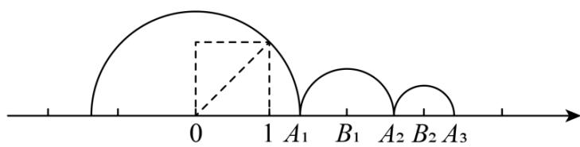

text_image

0
1 A₁ B₁ A₂ B₂ A₃

【答案】 $\sqrt{2}-1/-1+\sqrt{2}$

【分析】本题考查了实数的运算的规律，实数与数轴，先求出点 B 表示的数得到 $A_{1}B_{1}=2-\sqrt{2}$ ，则 $A_{2}$ 表示的数为 $4-\sqrt{2}$ ，再求出 $B_{2}$ 表示的数为 3，则 $A_{2}B_{2}=\sqrt{2}-1$ ，然后依次表示 $A_{3}B_{3}=2-\sqrt{2}$ ， $A_{4}B_{4}=\sqrt{2}-1$ ， $A_{5}B_{5}=2-\sqrt{2}$ ； $A_{6}B_{6}=\sqrt{2}-1$ ；即可找到规律求解.

【详解】解：由题意得，点 $A_{1}$ 表示的数为 $\sqrt{2}$ ，

$$
\because \sqrt {1} <   \sqrt {2} <   \sqrt {4},
$$

$$
\therefore 1 <   \sqrt {2} <   2,
$$

$\therefore B_{1}$ 表示的数为2，

， $\therefore A_{1}B_{1}=2-\sqrt{2}$ ，则 $A_{2}$ 表示的数为 $2+2-\sqrt{2}=4-\sqrt{2}$ ，

$$
\because 1 <   \sqrt {2} <   2,
$$

$$
\therefore - 2 <   - \sqrt {2} <   - 1
$$

$$
\therefore 2 <   4 - \sqrt {2} <   3,
$$

$\therefore B_{2}$ 表示的数为3，

$$
\therefore A _ {2} B _ {2} = 3 - (4 - \sqrt {2}) = \sqrt {2} - 1,
$$

同理可得 $A_{3}B_{3}=2-\sqrt{2};$

$$
A _ {4} B _ {4} = \sqrt {2} - 1;
$$

$$
A _ {5} B _ {5} = 2 - \sqrt {2};
$$

$$
A _ {6} B _ {6} = \sqrt {2} - 1;
$$

……，

以此类推可得，当 n 为奇数时 $A_{n}B_{n}=2-\sqrt{2}$ ，当 n 为偶数时 $A_{n}B_{n}=\sqrt{2}-1$ ，

$$
\therefore A _ {2 0 2 6} B _ {2 0 2 6} = \sqrt {2} - 1
$$

故答案为： $\sqrt{2}-1$ .

# 【题型15 实数运算的应用】

【例 15】（24-25 七年级下·湖南长沙·阶段练习）王师傅有一个体积为 $200 \mathrm{~cm}^{3}$ 的铁块原料，王师傅想要将这个铁块熔化并重新锻造成新的形状.

(1)若将原料重新锻造成一个底面为正方形、高为8cm的长方体，求长方体底面正方形的边长.

(2)王师傅现将原料锻造成三个大小相同的正方体铁块, 制作完成后剩下的余料体积为 $8 \mathrm{~cm}^{3}$ , 求制作成的每一个小正方体铁块的棱长.

【答案】(1)5cm

(2)4cm

【分析】本题考查算术平方根，立方根的应用，

(1) 根据长方体体积的计算公式“长方体的体积 = 底面积 × 高”列方程求解即可;

(2) 根据“正方体体积的计算方法以及3个小正方体体积与总体积之间的关系”列方程求解即可;

理解算术平方根、立方根的定义是正确解答的关键.

【详解】（1）解：设长方体底面正方形的边长为xcm，

依题意，得： $8x^{2}=200$ ，

解得：x = 5 或 x = -5 （负值不符合题意，舍去），

答: 长方体底面正方形的边长为 $5 \mathrm{~cm}$ ;

(2) 解: 设每一个小正方体铁块的棱长为 $y\mathrm{cm}$ ,

依题意，得： $3y^{3}+8=200$ ，

解得：y = 4，

答：每一个小正方体铁块的棱长为4cm.

【变式 15-1】（24-25 七年级上·浙江·期中）如图，一个底面半径为3cm的瓶子内装着一些溶液。当瓶子正放时，瓶内溶液的高度为16cm；倒放时，空余部分的高度为4cm。瓶内的溶液正好倒满2个一样大的正方体容器（π取3，容器的厚度不计）。

单位

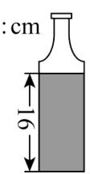

(1)该瓶子的容积（装满时溶液的体积）是多少立方厘米？  
(2)正方体容器的棱长是多少厘米?

【答案】(1) $540 \mathrm{~cm}^{3}$

(2)6cm

【分析】本题考查有理数的混合运算、求一个数的立方根，还涉及求常见几何体的体积，读懂题意，得出“瓶子的容积与同底、高为 $(16+4)$ cm的圆柱体积相等”是解题的关键.

(1) 瓶子的容积与同底、高为 $(16 + 4)\mathrm{cm}$ 的圆柱体积相等, 由此可解;  
（2）首先求出瓶内的溶液的体积，然后根据瓶内的溶液正好倒满 2 个一样大的正方体容器求解即可.

【详解】（1）解： $V=\pi r^{2}h\approx3\times9\times(16+4)=27\times20=540(\mathrm{cm}^{3})$ ;

（2）解：因为 $V_{溶液}=\pi r^{2}h\approx3\times3^{2}\times16=432(cm^{3})$ .

所以棱长 $=\sqrt[3]{432\div2}=6cm.$

【变式 15-2】五一返校上课后，为了表扬在假期依旧认真完成数学作业的小函和小韬同学，数学老师决定在某外卖平台上点 2 杯单价都是 16 元的奶茶奖励他们。从奶茶店到学校的每份订单配送费都为 1.6 元，由于数学老师是该平台的会员，因此每单都可以使用一个平台赠送的 5 元平台红包对每份订单的总价减免 5 元（订单总价不含配送费，同一订单只允许使用一个红包）。但根据该奶茶店的优惠活动，当订单总价（不含配送费）满 30 元时，5 元的平台红包可兑换为一个 7 元的店家红包，即可以给订单总价（不含配送费）减免 7 元当数学老师同时点了 2 杯奶茶准备下单付款时，小函同学说：“老师，我们可以换一种下单方式，优惠更多！”请同学们分析小函同学的下单方式，并计算出本次外卖总费用（包含配送费）最低可为\_\_\_\_元。

【答案】25.2

【分析】分别计算两种下单的方式，比较哪一种总费用更低即可.

【详解】第一种下单方式为直接购买两杯奶茶

合计费用为： $16 + 16 + 1.6 - 7 = 26.6$ 元

第二种下单方式为下两个订单，每个订单买一杯奶茶

合计费用为： $(16 + 1.6 - 5) \times 2 = 25.2$ 元

故选择第二种更划算，最低费用为 25.2 元

故答案为：25.2.

【点睛】本题考查了实数运算的实际应用，分类讨论是解题的关键.

【变式 15-3】某小区准备开发一块长为32m，宽为21m的长方形空地，

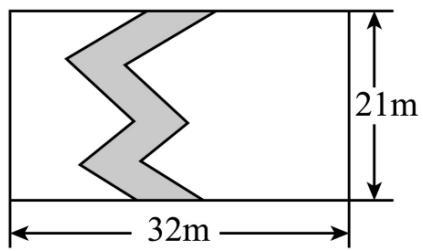

text_image

21m
32m

(1)方案一: 如图, 将这块空地种上草坪, 中间修一条弯曲的小路, 小路的左边线向右平移 $1 \mathrm{~m}$ 就是它的右边线. 则这块草地的面积为 $\mathrm{m}^{2}$ ;

(2)方案二: 修建一个长是宽的 1.5 倍, 面积为 $384 \mathrm{~m}^{2}$ 的篮球场, 若比赛用的篮球场要求长在 $23 \mathrm{~m}$ 到 $30 \mathrm{~m}$ 之间, 宽在 $13 \mathrm{~m}$ 到 $20 \mathrm{~m}$ 之间。这个篮球场能用做比赛吗? 并说明理由。

【答案】(1)651

(2)能，理由见解析

【分析】本题考查了图形的平移，平方根的定义等知识.

(1) 由题意, 草地的长减小 $1 \mathrm{~m}$ , 宽不变, 因而可求得草地的面积;

(2) 设宽 $x \mathrm{~m}$ , 则长为 $1.5 \mathrm{~x} \mathrm{~m}$ , 根据面积公式即可得关于 $x$ 的方程, 由平方根的定义即可求得 $x$ , 再对 $x$ 的值进行估算, 若满足题意即可, 否则不行.

【详解】（1）解：由题意，小路的左边线向右平移 $1 \mathrm{~m}$ 就是它的右边线即小路的宽为 $1 \mathrm{~m}$ ，

则草地的长减小1m，宽不变，

面积为 $21 \times (32 - 1) = 651 \, \text{m}^2$ ;

故答案为：651.

(2) 能, 理由如下:

设宽xm，则长为1.5xm，

依题意有： $1.5x^{2} = 384$ ， $x^{2} = 256$

$$
\because x > 0,
$$

$$
\therefore x = 1 6, \quad 1. 5 x = 2 4
$$

符合长在23m到30m之间，宽在13m到20m之间，

∴这个篮球场能用做比赛.

# 【题型16 复合二次根式的化简】

【例 16】观察下列各式:

$$
5 + 2 \sqrt {6} = (2 + 3) + 2 \sqrt {2 \times 3} = (\sqrt {2}) ^ {2} + (\sqrt {3}) ^ {2} + 2 \sqrt {2} \times \sqrt {3} = (\sqrt {2} + \sqrt {3}) ^ {2},
$$

$8 + 2\sqrt{7} = (1 + 7) + 2\sqrt{1 \times 7} = 1^{2} + (\sqrt{7})^{2} + 2 \times 1 \times \sqrt{7} = (1 + \sqrt{7})^{2}, \ldots$ . 请运用以上的方法化简 $\sqrt{7+2\sqrt{10}}=$ \_\_\_\_.

【答案】 $\sqrt{5} +\sqrt{2} /\sqrt{2} +\sqrt{5}$

【分析】本题考查了复合二次根式的化简，完全平方公式的应用；按照题中提供的方法进行化简即可.

【详解】解： $\sqrt{7 + 2\sqrt{10}} = \sqrt{5 + 2 + 2\sqrt{10}}$

$$
\begin{array}{l} = \sqrt {(\sqrt {5}) ^ {2} + (\sqrt {2}) ^ {2} + 2 \times \sqrt {5} \times \sqrt {2}} \\ = \sqrt {(\sqrt {5} + \sqrt {2}) ^ {2}} \\ = \sqrt {5} + \sqrt {2}; \\ \end{array}
$$

故答案为： $\sqrt{5}+\sqrt{2}$ .

【变式 16-1】（24-25 九年级下·山东滨州·开学考试） $|2-\sqrt{3}|+\sqrt{4-2\sqrt{3}}=$ （）

A. $2 \sqrt{3} - 3$

B. $2 \sqrt{3} - 1$

C. 3

D. 1

【答案】D

【分析】此题主要考查了二次根式的混合运算，利用绝对值的意义和乘法公式结合二次根式的性质进行化简.

【详解】解： $|2-\sqrt{3}|+\sqrt{4-2\sqrt{3}}$

$$
\begin{array}{l} = | 2 - \sqrt {3} | + \sqrt {(\sqrt {3}) ^ {2} - 2 \sqrt {3} + 1} \\ = 2 - \sqrt {3} + \sqrt {(\sqrt {3} - 1) ^ {2}} \\ \end{array}
$$

$$
\begin{array}{l} = 2 - \sqrt {3} + \sqrt {3} - 1 \\ = 1, \\ \end{array}
$$

故选：D.

【变式16-2】设 $a$ 为 $-13 + \sqrt{5} -\sqrt{3 - \sqrt{5}}$ 的小数部分，则 $a =$ （

A. $\frac{7}{5}$

B. $\frac{\sqrt{2}}{2}$

c. $\sqrt{2} - 1$

D. $\sqrt{3} - 1$

【答案】C

【分析】本题考查无理数的估值．利用换元法先将原式变形，然后简化计算结果，最后估计出小数部分的值，然后从选项中进行查找，最接近的即为答案.

【详解】解：本题根据条件， $a$ 为 $-13 + \sqrt{5} -\sqrt{3 - \sqrt{5}}$ 的小数部分，因此 $a < 1$ ，因此可以排除A、D选项.设 $x = \sqrt{5} -\sqrt{3 - \sqrt{5}}$

$$
\because 3 - \sqrt {5} = \frac {6 - 2 \sqrt {5}}{2} = \frac {\left(\sqrt {5} - 1\right) ^ {2}}{2},
$$

$$
\therefore \sqrt {3 - \sqrt {5}} = \sqrt {\frac {(\sqrt {5} - 1) ^ {2}}{2}} = \frac {\sqrt {5} - 1}{\sqrt {2}} = \frac {\sqrt {1 0} - \sqrt {2}}{2},
$$

$$
\therefore x = \sqrt {5} - \frac {\sqrt {1 0} - \sqrt {2}}{2} = \frac {2 \sqrt {5} - \sqrt {1 0} + \sqrt {2}}{2},
$$

$$
\because \sqrt {5} \approx 2. 2 4, \sqrt {1 0} \approx 3. 1 6, \sqrt {2} \approx 1. 4 1,
$$

$$
\therefore x = \frac {2 \sqrt {5} - \sqrt {1 0} + \sqrt {2}}{2}
$$

$$
= \frac {2 \times 2 . 2 4 - 3 . 1 6 + 1 . 4 1}{2} = \frac {4 . 4 8 - 3 . 1 6 + 1 . 4 1}{2}
$$

$$
\frac {2 . 7 3}{2} = 1. 3 6 5,
$$

$$
\because - 1 3 + \sqrt {5} - \sqrt {3 - \sqrt {5}} = - 1 3 + x = - 1 1. 6 3 5,
$$

∵-11.635的整数部分是-12，

∴小数部分为-11.635-(-12)=0.365,

选项 B 是 $\frac{\sqrt{2}}{2} \approx 0.707$ ，选项 C 是 $\sqrt{2} - 1 \approx 0.41$ ，

只有选项 C 最接近答案.

故选：C.

【变式 16-3】（24-25 八年级上·浙江温州·期末）化简 $\sqrt{23-6\sqrt{10+4\sqrt{3-2\sqrt{2}}}}$ 的结果是（）

A. $3 + \sqrt{2}$

B. $3 - 2\sqrt{2}$

C. $3 + 2\sqrt{2}$

D. $3-\sqrt{2}$

【答案】D

【分析】本题考查二次根式的运算，根据二次根式的性质简结合利用完全平方公式计算即可解题.

【详解】解：原式 $= \sqrt{23 - 6\sqrt{10 + 4\sqrt{(\sqrt{2} - 1)^2}}}$

$$
\begin{array}{l} = \sqrt {2 3 - 6 \sqrt {1 0 + 4 \sqrt {2} - 4}} \\ = \sqrt {2 3 - 6 \sqrt {4 \sqrt {2} + 6}} \\ = \sqrt {2 3 - 6 \sqrt {\left(2 + \sqrt {2}\right) ^ {2}}} \\ = \sqrt {2 3 - 1 2 - 6 \sqrt {2}} \\ = \sqrt {1 1 - 6 \sqrt {2}} \\ = \sqrt {(3 - \sqrt {2}) ^ {2}} \\ = 3 - \sqrt {2}, \\ \end{array}
$$

故选：D.

# 【题型17 利用分母有理化求值】

【例 17】（24-25 八年级上·四川成都·期中）阅读下面计算过程：

$$
\frac {1}{\sqrt {2} + 1} = \frac {1 \times (\sqrt {2} - 1)}{(\sqrt {2} + 1) (\sqrt {2} - 1)} = \sqrt {2} - 1;
$$

$$
\frac {1}{\sqrt {3} + \sqrt {2}} = \frac {1 \times (\sqrt {3} - \sqrt {2})}{(\sqrt {3} + \sqrt {2}) (\sqrt {3} - \sqrt {2})} = \sqrt {3} - \sqrt {2};
$$

$$
{\frac {1}{\sqrt {5} + 2}} = {\frac {1 \times (\sqrt {5} - 2)}{(\sqrt {5} + 2) (\sqrt {5} - 2)}} = \sqrt {5} - 2.
$$

试求:

(1) $\frac{1}{\sqrt{7}+\sqrt{6}}$ 的值为-.  
(2)求 $\frac{1}{1 + \sqrt{2}} +\frac{1}{\sqrt{2} + \sqrt{3}} +\frac{1}{\sqrt{3} + \sqrt{4}} +\dots +\frac{1}{\sqrt{2022} + \sqrt{2023}} +\frac{1}{\sqrt{2023} + \sqrt{2024}}$ 的值.  
(3)若 $a=\frac{1}{\sqrt{5}-2}$ ，求 $a^{3}-4a^{2}+a+4$ 的值.

【答案】(1) $\sqrt{7} -\sqrt{6}$

(2) $2\sqrt{506}-1$   
(3) $2\sqrt{5}+8$

【分析】此题考查了分母有理化、二次根式的化简求值，弄清分母有理化的方法是解本题的关键.

(1) 原式根据阅读材料中的方法变形即可得到结果;  
(2) 原式各项变形后, 抵消合并即可得到结果;  
(3) 先化简 $a$ , 然后代入所求式子计算即可.

【详解】（1） $\frac{1}{\sqrt{7}+\sqrt{6}}=\frac{\sqrt{7}-\sqrt{6}}{(\sqrt{7}+\sqrt{6})(\sqrt{7}-\sqrt{6})}=\sqrt{7}-\sqrt{6};$

（2）原式 $= \sqrt{2} - 1 + \sqrt{3} - \sqrt{2} + \sqrt{4} - \sqrt{3} + \dots +\sqrt{2023} -\sqrt{2022} +\sqrt{2024} -\sqrt{2023}$

$$
\begin{array}{l} = \sqrt {2 0 2 4} - 1 \\ = 2 \sqrt {5 0 6} - 1; \\ \end{array}
$$

(3) $\because a = \frac{1}{\sqrt{5} - 2} = \frac{\sqrt{5} + 2}{(\sqrt{5} - 2)(\sqrt{5} + 2)} = \sqrt{5} + 2,$

$$
\therefore a - 2 = \sqrt {5},
$$

$$
\therefore (a - 2) ^ {2} = 5,
$$

$$
\begin{array}{l} \therefore a ^ {3} - 4 a ^ {2} + a + 4 \\ = a \left(a ^ {2} - 4 a\right) + a + 4 \\ = a \left(a ^ {2} - 4 a + 4\right) - 3 a + 4 \\ = 5 a - 3 a + 4 \\ = 2 a + 4 \\ = 2 (\sqrt {5} + 2) + 4 \\ = 2 \sqrt {5} + 8. \\ \end{array}
$$

【变式 17-1】通过适当运算，将分母中的二次根式化为有理式的过程，称为分母有理化.

如 $\frac{1}{\sqrt{2}} = \frac{\sqrt{2}}{2}$ , $\frac{1}{\sqrt{3} - \sqrt{2}} = \frac{1 \times (\sqrt{3} + \sqrt{2})}{(\sqrt{3} - \sqrt{2})(\sqrt{3} + \sqrt{2})} = \sqrt{3} + \sqrt{2}$ 这些运算都称为分母有理化.

(1)将下列二次根式分母理化： $\frac{2-\sqrt{3}}{\sqrt{12}}=\underline{\hspace{2cm}}$ ， $\frac{x-y}{\sqrt{x}-\sqrt{y}}=\underline{\hspace{2cm}}$   
(2)甲、乙两人化简 $\frac{x - y}{\sqrt{x} + \sqrt{y}}$ 时，写出两种不同的解答过程.

甲： $\frac{x - y}{\sqrt{x} + \sqrt{y}} = \frac{(x - y)(\sqrt{x} - \sqrt{y})}{(\sqrt{x} + \sqrt{y})(\sqrt{x} - \sqrt{y})} = \frac{(x - y)(\sqrt{x} - \sqrt{y})}{x - y} = \sqrt{x} -\sqrt{y};$

乙： $\frac{x - y}{\sqrt{x} + \sqrt{y}} = \frac{(\sqrt{x})^2 - (\sqrt{y})^2}{\sqrt{x} + \sqrt{y}} = \frac{(\sqrt{x} + \sqrt{y})(\sqrt{x} - \sqrt{y})}{\sqrt{x} + \sqrt{y}} = \sqrt{x} -\sqrt{y}$

请你仔细阅读甲、乙两人的解题过程，对甲、乙两人的解答作出评判（）

A. 甲对乙错

B. 甲错乙对

C. 甲、乙全对

D. 甲、乙全错

(3)已知有理数 $a$ 、 $b$ 满足 $\frac{a}{\sqrt{2} + 1} +\frac{b}{\sqrt{2}} = -1 + 2\sqrt{2}$ ，求 $a$ 、 $b$ 的值.

【答案】(1) $\frac{2\sqrt{3}-3}{6}$ ， $\sqrt{x}+\sqrt{y}$

(2)C

(3) $a = 1, b = 2$

【分析】本题主要考查了分母有理化，解题的关键是找准有理化因式.

(1) 根据乘以有理化因式或根据平方差公式因式分解化简计算即可;

(2) 根据 (1) 中方法进行判断即可;

（3）根据方法一，进行分母有理化计算得出 $\left(a + \frac{1}{2} b\right)\sqrt{2} - a = -1 + 2\sqrt{2}$ ，根据 $a, b$ 为有理数，进而即可求得 $a, b$ 的值，即可求解.

【详解】（1）解： $\frac{2-\sqrt{3}}{\sqrt{12}}=\frac{2\sqrt{3}-3}{2\sqrt{3}\times\sqrt{3}}=\frac{2\sqrt{3}-3}{6}$

$$
\frac {x - y}{\sqrt {x} - \sqrt {y}} = \frac {(x - y) (\sqrt {x} + \sqrt {y})}{(\sqrt {x} - \sqrt {y}) (\sqrt {x} + \sqrt {y})} = \frac {(x - y) (\sqrt {x} + \sqrt {y})}{x - y} = \sqrt {x} + \sqrt {y}
$$

故答案为： $\frac{2\sqrt{3}-3}{6}$ ， $\sqrt{x}+\sqrt{y}$ ;

(2) 根据 (1) 中的方法进行计算可知, 甲、乙都对

故选：C.

（3）解： $\because \frac{a}{\sqrt{2} + 1} + \frac{b}{\sqrt{2}} = -1 + 2\sqrt{2}$

$$
\therefore (\sqrt {2} - 1) a + \frac {\sqrt {2}}{2} b = - 1 + 2 \sqrt {2}
$$

$$
\therefore \sqrt {2} a - a + \frac {\sqrt {2}}{2} b = - 1 + 2 \sqrt {2}
$$

$$
\therefore \left(a + \frac {1}{2} b\right) \sqrt {2} - a = - 1 + 2 \sqrt {2}
$$

∵ a, b 是有理数

$$
\therefore a + \frac {1}{2} b = 2, - a = - 1
$$

$$
\therefore a = 1
$$

$$
\therefore 1 + \frac {1}{2} b = 2
$$

$$
\therefore b = 2.
$$

【变式 17-2】（24-25 八年级上·河北保定·期中）【阅读材料】

在进行二次根式化简时，我们有时会碰上如 $\frac{3}{\sqrt{5}}$ ， $\sqrt{\frac{2}{3}}$ ， $\frac{2}{\sqrt{3} + 1}$ 这样一类的式子，其实我们还可以将其进一步化简： $\frac{3}{\sqrt{5}} = \frac{3\times\sqrt{5}}{\sqrt{5}\times\sqrt{5}} = \frac{3}{5}\sqrt{5};\quad \sqrt{\frac{2}{3}} = \sqrt{\frac{2\times 3}{3\times 3}} = \frac{\sqrt{6}}{3};\quad \frac{2}{\sqrt{3} + 1} = \frac{2\times(\sqrt{3} - 1)}{(\sqrt{3} + 1)(\sqrt{3} - 1)} = \frac{2(\sqrt{3} - 1)}{(\sqrt{3})^2 - 1^2} = \sqrt{3} -1.$ 以上这种化简的步骤叫做分母有理化.

【解决问题】

(1)仿照上面的解题过程，化简： $\frac{1}{\sqrt{7}-\sqrt{6}}=\underline{\hspace{2cm}}$ .  
(2)计算： $\left(\frac{1}{\sqrt{2}+1}+\frac{1}{\sqrt{3}+\sqrt{2}}+\frac{1}{\sqrt{4}+\sqrt{3}}+\cdots+\frac{1}{\sqrt{2025}+\sqrt{2024}}\right)\times(\sqrt{2025}+1).$   
(3)已知 $a=\frac{1}{\sqrt{3}+\sqrt{2}}$ ， $b=\frac{1}{\sqrt{3}-\sqrt{2}}$ ，求 $a^{2}+b^{2}$ 的值.

【答案】(1) $\sqrt{7}+\sqrt{6}$

(2)2024   
(3)10

【分析】本题考查分母有理数，二次根式的混合运算，化简求值：

(1) 根据分母有理化的方法进行求解即可;  
(2) 先进行分母有理化, 再进行计算即可;  
（3）先进行分母有理化求出a,b的值，进而求出 $a+b,ab$ 的值，利用完全平方公式变形求值即可.

【详解】（1）解： $\frac{1}{\sqrt{7}-\sqrt{6}}=\frac{\sqrt{7}+\sqrt{6}}{(\sqrt{7}-\sqrt{6})(\sqrt{7}+\sqrt{6})}=\frac{\sqrt{7}+\sqrt{6}}{7-6}=\sqrt{7}+\sqrt{6};$

故答案为： $\sqrt{7}+\sqrt{6};$

（2）原式 $= (-1 + \sqrt{2} -\sqrt{2} +\sqrt{3} +\dots -\sqrt{2024} +\sqrt{2025})\times (\sqrt{2025} +1)$

$$
\begin{array}{l} = (\sqrt {2 0 2 5} - 1) \times (\sqrt {2 0 2 5} + 1) \\ = 2 0 2 5 - 1 = 2 0 2 4; \\ \end{array}
$$

(3) $\because a = \frac{1}{\sqrt{3} + \sqrt{2}} = \frac{\sqrt{3} - \sqrt{2}}{(\sqrt{3} + \sqrt{2})(\sqrt{3} - \sqrt{2})} = \sqrt{3} - \sqrt{2},$

$$
b = \frac {1}{\sqrt {3} - \sqrt {2}} = \frac {\sqrt {3} + \sqrt {2}}{(\sqrt {3} - \sqrt {2}) (\sqrt {3} + \sqrt {2})} = \sqrt {3} + \sqrt {2},
$$

$$
\therefore a + b = 2 \sqrt {3}, a b = 1,
$$

$$
\therefore a ^ {2} + b ^ {2} = (a + b) ^ {2} - 2 a b = (2 \sqrt {3}) ^ {2} - 2 = 1 0.
$$

【变式 17-3】（24-25 八年级上·重庆·期中）例如： $\frac{\sqrt{2}+1}{\sqrt{2}-1}=\frac{(\sqrt{2}+1)(\sqrt{2}+1)}{(\sqrt{2}-1)(\sqrt{2}+1)}=2\sqrt{2}+3$ ．像这样通过分子、分母同乘一个式子把分母中的根号化去或者把根号中的分母化去，叫做分母有理化．有下列结论：

①若 a 是 $\sqrt{3}$ 的小数部分，则 $\frac{3}{a}$ 的值为 $3\sqrt{3} + 6$ ;  
②比较大小： $\sqrt{2024}-\sqrt{2023}<\sqrt{2023}-\sqrt{2022}$ ;  
③变形： $\frac{1}{\sqrt{3} + \sqrt{2} + 1} = \frac{2 + \sqrt{2} - \sqrt{6}}{4}$   
④计算 $\frac{2}{3+\sqrt{3}}+\frac{2}{5\sqrt{3}+3\sqrt{5}}+\frac{2}{7\sqrt{5}+5\sqrt{7}}+\cdots+\frac{2}{99\sqrt{97}+97\sqrt{99}}=1-\frac{\sqrt{11}}{33};$   
⑤已知 $a=\frac{\sqrt{m+1}-\sqrt{m}}{\sqrt{m+1}+\sqrt{m}}$ ， $b=\frac{\sqrt{m+1}+\sqrt{m}}{\sqrt{m+1}-\sqrt{m}}$ ，且 $a^{2}+1926ab+b^{2}=2024$ ，则所有可能的整数m的和为-1.
以上结论正确的是（）

A. ①③④⑤

B. ②③④

C. ②③⑤

D. ②③④⑤

【答案】B

【分析】本题考查利用分式的基本性质、平方差公式进行分母有理化，解决二次根式的化简、比较大小和运算的问题，熟练掌握知识点是解题的关键.

①估计无理数的整数部分，求出小数部分 $a=\sqrt{2}-1$ ，进而分母有理化进行化简；  
②通过分母有理化，比较两个二次根式的倒数大小，即可解答；  
③先分子分母同时乘以 $(\sqrt{3}-\sqrt{2}-1)$ ，减少分母的根式个数后再次有理化分母即可；  
④通过分母有理化找到题中无理式求和的运算规律，从而化简求出值；  
⑤a与b可以利用分母有理化化简，可得出ab=1，然后观察方程特点，求得m的值.

【详解】解：①∵a 是 $\sqrt{3}$ 的小数部分，

$$
\therefore a = \sqrt {3} - 1,
$$

$\therefore \frac{3}{a} = \frac{3}{\sqrt{3} - 1} = \frac{3(\sqrt{3} + 1)}{(\sqrt{3} - 1)(\sqrt{3} + 1)} = \frac{3(\sqrt{3} + 1)}{2} = \frac{3\sqrt{3} + 3}{2}$ ，故①错误；

② $\because \frac{1}{\sqrt{2024}-\sqrt{2023}}=\frac{(\sqrt{2024}-\sqrt{2023})(\sqrt{2024}+\sqrt{2023})}{(\sqrt{2024}-\sqrt{2023})}=\sqrt{2024}+\sqrt{2023},$

$$
\frac {1}{\sqrt {2 0 2 3} - \sqrt {2 0 2 2}} = \frac {(\sqrt {2 0 2 3} - \sqrt {2 0 2 2}) (\sqrt {2 0 2 3} + \sqrt {2 0 2 2})}{(\sqrt {2 0 2 3} - \sqrt {2 0 2 2})} = \sqrt {2 0 2 3} + \sqrt {2 0 2 2},
$$

又： $\sqrt{2024} + \sqrt{2023} > \sqrt{2023} + \sqrt{2022}$ ，

$$
\therefore \frac {1}{\sqrt {2 0 2 4} - \sqrt {2 0 2 3}} > \frac {1}{\sqrt {2 0 2 3} - \sqrt {2 0 2 2}},
$$

$\therefore \sqrt{2024} - \sqrt{2023} < \sqrt{2023} - \sqrt{2022}$ ，故②正确；

③ $\frac{1}{\sqrt{3}+\sqrt{2}+1}$

$$
= \frac {(\sqrt {3} - \sqrt {2} - 1)}{(\sqrt {3} + \sqrt {2} + 1) (\sqrt {3} - \sqrt {2} - 1)}
$$

$$
= \frac {\sqrt {3} - \sqrt {2} - 1}{3 - (\sqrt {2} + 1) ^ {2}}
$$

$$
= \frac {\sqrt {3} - \sqrt {2} - 1}{- 2 \sqrt {2}}
$$

$$
= \frac {\sqrt {2} (\sqrt {3} - \sqrt {2} - 1)}{- 2 \sqrt {2} \times \sqrt {2}}
$$

$$
= \frac {2 + \sqrt {2} - \sqrt {6}}{4}, \text {   故③正确;   }
$$

$$
④ \because \frac {2}{(2 k + 3) \sqrt {2 k + 1} + (2 k + 1) \sqrt {2 k + 3}}
$$

$$
= \frac {2 [ (2 k + 3) \sqrt {2 k + 1} - (2 k + 1) \sqrt {2 k + 3} ]}{[ (2 k + 3) \sqrt {2 k + 1} + (2 k + 1) \sqrt {2 k + 3} ] [ (2 k + 3) \sqrt {2 k + 1} - (2 k + 1) \sqrt {2 k + 3} ]}
$$

$$
= \frac {2 [ (2 k + 3) \sqrt {2 k + 1} - (2 k + 1) \sqrt {2 k + 3} ]}{(2 k + 3) ^ {2} (2 k + 1) - (2 k + 1) ^ {2} (2 k + 3)}
$$

$$
= \frac {2 [ (2 k + 3) \sqrt {2 k + 1} - (2 k + 1) \sqrt {2 k + 3} ]}{(2 k + 3) (2 k + 1) [ (2 k + 3) - (2 k + 1) ]}
$$

$$
= \frac {(2 k + 3) \sqrt {2 k + 1} - (2 k + 1) \sqrt {2 k + 3}}{(2 k + 3) (2 k + 1)}
$$

$$
= \frac {\sqrt {2 k + 1}}{2 k + 1} - \frac {\sqrt {2 k + 3}}{2 k + 3}
$$

$$
\therefore \frac {2}{3 + \sqrt {3}} + \frac {2}{5 \sqrt {3} + 3 \sqrt {5}} + \frac {2}{7 \sqrt {5} + 5 \sqrt {7}} + \dots + \frac {2}{9 9 \sqrt {9 7} + 9 7 \sqrt {9 9}}
$$

$$
= \frac {2 (3 - \sqrt {3})}{(3 + \sqrt {3}) (3 - \sqrt {3})} + \frac {2 (5 \sqrt {3} - 3 \sqrt {5})}{(5 \sqrt {3} + 3 \sqrt {5}) (5 \sqrt {3} - 3 \sqrt {5})} + \frac {2 (7 \sqrt {5} + 5 \sqrt {7})}{(7 \sqrt {5} + 5 \sqrt {7}) (7 \sqrt {5} - 5 \sqrt {7})} + \dots + \frac {2 (9 9 \sqrt {9 7} - 9 7 \sqrt {9 9})}{(9 9 \sqrt {9 7} + 9 7 \sqrt {9 9}) (9 9 \sqrt {9 7} - 9 7 \sqrt {9 9})}
$$

$$
= \left(1 - \frac {\sqrt {3}}{3}\right) + \left(\frac {\sqrt {3}}{3} - \frac {\sqrt {5}}{5}\right) + \left(\frac {\sqrt {5}}{5} - \frac {\sqrt {7}}{7}\right) + \dots + \left(\frac {\sqrt {9 7}}{9 7} - \frac {\sqrt {9 9}}{9 9}\right)
$$

$$
= 1 - \frac {\sqrt {3}}{3} + \frac {\sqrt {3}}{3} - \frac {\sqrt {5}}{5} + \frac {\sqrt {5}}{5} - \frac {\sqrt {7}}{7} + \dots + \left(\frac {\sqrt {9 7}}{9 7} - \frac {\sqrt {9 9}}{9 9}\right)
$$

$$
= 1 - \frac {\sqrt {1 1}}{3 3}, \text {   故④正确;   }
$$

$$
⑤ \because a = \frac {\sqrt {m + 1} - \sqrt {m}}{\sqrt {m + 1} + \sqrt {m}} = \frac {(\sqrt {m + 1} - \sqrt {m}) (\sqrt {m + 1} - \sqrt {m})}{(\sqrt {m + 1} + \sqrt {m}) (\sqrt {m + 1} - \sqrt {m})} = \left(\sqrt {m + 1} - \sqrt {m}\right) ^ {2},
$$

$$
\therefore a > 0,
$$

$$
\because b = \frac {1}{a},
$$

$$
\therefore a b = 1, b = \frac {\sqrt {m + 1} + \sqrt {m}}{\sqrt {m + 1} - \sqrt {m}} = (\sqrt {m + 1} + \sqrt {m}) ^ {2},
$$

$$
\therefore b > 0,
$$

$$
\therefore a + b > 0,
$$

$$
\because a ^ {2} + 1 9 2 6 a b + b ^ {2} = 2 0 2 4,
$$

$$
\therefore a ^ {2} + 1 9 2 6 + b ^ {2} = 2 0 2 4,
$$

$$
a ^ {2} + b ^ {2} = 9 8,
$$

$$
a ^ {2} + b ^ {2} + 2 a b = 9 8 + 2 a b,
$$

$$
(a + b) ^ {2} = 9 8 + 2,
$$

$$
(a + b) ^ {2} = 1 0 0,
$$

$$
\because a + b > 0,
$$

$$
\therefore a + b = 1 0,
$$

即 $\left(\sqrt{m+1}-\sqrt{m}\right)^{2}+\left(\sqrt{m+1}+\sqrt{m}\right)^{2}=10,$

$$
4 m + 2 = 1 0,
$$

解得m=2，故⑤错误.

综上所述：②③④正确，

故选：B.

# 【题型18 二次根式的规律探究】

【例18】化简： $\frac{1}{\sqrt{8} + \sqrt{11}} +\frac{1}{\sqrt{11} + \sqrt{14}} +\frac{1}{\sqrt{14} + \sqrt{17}} +\frac{1}{\sqrt{17} + \sqrt{20}} +\frac{1}{\sqrt{20} + \sqrt{23}} +\frac{1}{\sqrt{23} + \sqrt{26}} +\frac{1}{\sqrt{26} + \sqrt{29}} +\frac{1}{\sqrt{29} + \sqrt{32}}$ 结果是（）

A. 1

B. $\frac{2\sqrt{2}}{3}$

C. $2\sqrt{2}$

D. $4\sqrt{2}$

【答案】B

【分析】本题考查了分母有理化及二次根式的加减运算，熟练掌握运算法则是解题的关键．先将每个分式进行分母有理化，再计算加减即可得出答案.

【详解】解： $\frac{1}{\sqrt{8}+\sqrt{11}}=\frac{\sqrt{11}-\sqrt{8}}{(\sqrt{11}+\sqrt{8})(\sqrt{11}-\sqrt{8})}=\frac{\sqrt{11}-\sqrt{8}}{3}$

同理可得 $\frac{1}{\sqrt{11} + \sqrt{14}} = \frac{\sqrt{14} - \sqrt{11}}{3}\dots \frac{1}{\sqrt{29} + \sqrt{32}} = \frac{\sqrt{32} - \sqrt{29}}{3},$

$$
\frac {1}{\sqrt {8} + \sqrt {1 1}} + \frac {1}{\sqrt {1 1} + \sqrt {1 4}} + \frac {1}{\sqrt {1 4} + \sqrt {1 7}} + \frac {1}{\sqrt {1 7} + \sqrt {2 0}} + \frac {1}{\sqrt {2 0} + \sqrt {2 3}} + \frac {1}{\sqrt {2 3} + \sqrt {2 6}} + \frac {1}{\sqrt {2 6} + \sqrt {2 9}} + \frac {1}{\sqrt {2 9} + \sqrt {3 2}}
$$

$$
= \frac {\sqrt {1 1} - \sqrt {8}}{3} + \frac {\sqrt {1 4} - \sqrt {1 1}}{3} + \frac {\sqrt {1 7} - \sqrt {1 4}}{3} + \frac {\sqrt {2 0} - \sqrt {1 7}}{3} + \frac {\sqrt {2 3} - \sqrt {2 0}}{3} + \frac {\sqrt {2 6} - \sqrt {2 3}}{3} + \frac {\sqrt {2 9} - \sqrt {2 6}}{3} + \frac {\sqrt {3 2} - \sqrt {2 9}}{3}
$$

$$
= \frac {\sqrt {3 2} - \sqrt {8}}{3}
$$

$$
= \frac {4 \sqrt {2} - 2 \sqrt {2}}{3}
$$

$$
= \frac {2 \sqrt {2}}{3}
$$

故选 B.

【变式 18-1】（24-25 九年级下·山东烟台·期末）观察下列等式：① $3+2\sqrt{2}=(\sqrt{2}+1)^{2}$ ; ② $5+2\sqrt{6}=(\sqrt{3}+\sqrt{2})^{2}$ ; ③ $7+2\sqrt{12}=(2+\sqrt{3})^{2}$ ; ...；请根据以上规律，写出第 9 个等式 \_\_\_\_.

【答案】 $19 + 2\sqrt{90} = (\sqrt{10} + 3)^{2}$

【分析】本题考查了数字类规律探索，二次根式的性质，根据已知等式发现一般规律是解题关键．观察等式可得第n个等式为 $(2n+1)+2\sqrt{n(n+1)}=(\sqrt{n+1}+\sqrt{n})^{2}$ ，即可求解.

【详解】解：由题意可知，第1个等式 $3+2\sqrt{2}=(\sqrt{2}+1)^{2}$ ，即 $(2\times1+1)+2\sqrt{1\times2}=(\sqrt{2}+\sqrt{1})^{2}$ ;
第2个等式 $5+2\sqrt{6}=(\sqrt{3}+\sqrt{2})^{2}$ ，即 $(2\times2+1)+2\sqrt{2\times3}=(\sqrt{3}+\sqrt{2})^{2}$ ;

第 3 个等式 $7 + 2\sqrt{12} = (2 + \sqrt{3})^{2}$ ，即 $(2 \times 3 + 1) + 2\sqrt{3 \times 4} = (\sqrt{4} + \sqrt{3})^{2}$ ;

......

观察发现，第n个等式为 $(2n+1)+2\sqrt{n(n+1)}=(\sqrt{n+1}+\sqrt{n})^{2}$

则第9个等式为 $19+2\sqrt{90}=(\sqrt{10}+3)^{2}$ ,

故答案为： $19 + 2\sqrt{90} = (\sqrt{10} + 3)^{2}$ .

【变式18-2】通过“由特殊到一般”的方法探究下面二次根式的运算规律：特例1： $\sqrt{1 + \frac{1}{3}} = \sqrt{\frac{3 + 1}{3}} = \sqrt{4 \times \frac{1}{3}} = 2\sqrt{\frac{1}{3}}$ ；特例2： $\sqrt{2 + \frac{1}{4}} = \sqrt{\frac{8 + 1}{4}} = \sqrt{9 \times \frac{1}{4}} = 3\sqrt{\frac{1}{4}}$ ；特例3： $\sqrt{3 + \frac{1}{5}} = \sqrt{\frac{15 + 1}{5}} = \sqrt{16 \times \frac{1}{5}} = 4\sqrt{\frac{1}{5}}$ ……应用发现的运算规律求 $\sqrt{2024 + \frac{1}{2026}} \times \sqrt{4052}$ 的值（）

A. 2024

B. $2025\sqrt{2}$

C. 2023

D. $2023\sqrt{2}$

【答案】B

【分析】本题考查找规律，根据题中特例得到规律 $\sqrt{n + \frac{1}{n + 2}} = \sqrt{\frac{n(n + 2) + 1}{n + 2}} = \sqrt{(n + 1)^2 \times \frac{1}{n + 2}} = (n + 1)\sqrt{\frac{1}{n + 2}}$ ，代值求解即可得到答案，观察已知特例特征，准确找到规律是解决问题的关键.

【详解】解：特例 1: $\sqrt{1+\frac{1}{3}}=\sqrt{\frac{3+1}{3}}=\sqrt{4\times\frac{1}{3}}=2\sqrt{\frac{1}{3}};$

特例 2: $\sqrt{2+\frac{1}{4}}=\sqrt{\frac{8+1}{4}}=\sqrt{9\times\frac{1}{4}}=3\sqrt{\frac{1}{4}};$

特例 3: $\sqrt{3+\frac{1}{5}}=\sqrt{\frac{15+1}{5}}=\sqrt{16\times\frac{1}{5}}=4\sqrt{\frac{1}{5}};$

......

∴ 以上规律为： $\sqrt{n+\frac{1}{n+2}}=\sqrt{\frac{n(n+2)+1}{n+2}}=\sqrt{(n+1)^{2}\times\frac{1}{n+2}}=(n+1)\sqrt{\frac{1}{n+2}}$

∴ 当n=2024时， $\sqrt{2024+\frac{1}{2026}}\times\sqrt{4052}=2025\sqrt{\frac{1}{2026}}\times\sqrt{4052}=2025\sqrt{2}$

故选：B.

【变式 18-3】（24-25 八年级下·山东德州·期中）先观察下列等式，再回答问题：

① $\sqrt{1+\frac{1}{1^{2}}+\frac{1}{2^{2}}}=1+\frac{1}{1}-\frac{1}{2};$

② $\sqrt{1+\frac{1}{2^{2}}+\frac{1}{3^{2}}}=1+\frac{1}{2}-\frac{1}{3};$

③ $\sqrt{1+\frac{1}{3^{2}}+\frac{1}{4^{2}}} = 1 + \frac{1}{3}-\frac{1}{4};$

...

请你利用发现的规律，计算：

$$
\sqrt {1 + \frac {1}{1 ^ {2}} + \frac {1}{2 ^ {2}}} + \sqrt {1 + \frac {1}{2 ^ {2}} + \frac {1}{3 ^ {2}}} + \sqrt {1 + \frac {1}{3 ^ {2}} + \frac {1}{4 ^ {2}}} + \dots + \sqrt {1 + \frac {1}{2 0 2 2 ^ {2}} + \frac {1}{2 0 2 3 ^ {2}}} - 2 0 2 4 = \underline {{{\quad}}}.
$$

【答案】 $-\frac{2024}{2023} / -1\frac{1}{2023}$

【分析】① $\sqrt{1+\frac{1}{1^{2}}+\frac{1}{2^{2}}}$ = 1 + $\frac{1}{1}-\frac{1}{2}$ ; ② $\sqrt{1+\frac{1}{2^{2}}+\frac{1}{3^{2}}}$ = 1 + $\frac{1}{2}-\frac{1}{3}$ ; ③ $\sqrt{1+\frac{1}{3^{2}}+\frac{1}{4^{2}}}$ = 1 + $\frac{1}{3}-\frac{1}{4}$ ，得到 $\sqrt{1+\frac{1}{2022^{2}}+\frac{1}{2023^{2}}}$ = 1 + $\frac{1}{2022}-\frac{1}{2023}$ ，列式计算即可.

本题考查了二次根式中规律探索，实数的计算，熟练掌握规律探索是解题的关键.

【详解】解：① $\sqrt{1+\frac{1}{1^{2}}+\frac{1}{2^{2}}}$ = $1+\frac{1}{1}-\frac{1}{2}$ ;

② $\sqrt{1+\frac{1}{2^{2}}+\frac{1}{3^{2}}}=1+\frac{1}{2}-\frac{1}{3};$

③ $\sqrt{1 + \frac{1}{3^2} + \frac{1}{4^2}} = 1 + \frac{1}{3} - \frac{1}{4},$

故 $\sqrt{1 + \frac{1}{2022^2} + \frac{1}{2023^2}} = 1 + \frac{1}{2022} - \frac{1}{2023}$ ,

故 $\sqrt{1 + \frac{1}{1^2} + \frac{1}{2^2}} + \sqrt{1 + \frac{1}{2^2} + \frac{1}{3^2}} + \sqrt{1 + \frac{1}{3^2} + \frac{1}{4^2}} + \cdots + \sqrt{1 + \frac{1}{2022^2} + \frac{1}{2023^2}} - 2024$

$$
= \left(1 + 1 + 1 + \dots + 1\right) _ {2 0 2 2} + 1 - \frac {1}{2} + \frac {1}{2} - \frac {1}{3} + \frac {1}{3} - \frac {1}{4} + \dots + \frac {1}{2 0 2 2} - \frac {1}{2 0 2 3} - 2 0 2 4
$$

$$
= \left(1 + 1 + 1 + \dots + 1\right) _ {2 0 2 2} + 1 - \frac {1}{2} + \frac {1}{2} - \frac {1}{3} + \frac {1}{3} - \frac {1}{4} + \dots + \frac {1}{2 0 2 2} - \frac {1}{2 0 2 3} - 2 0 2 4
$$

$$
\begin{array}{l} = 2 0 2 3 - \frac {1}{2 0 2 3} - 2 0 2 4 \\ = - \frac {2 0 2 4}{2 0 2 3}, \\ \end{array}
$$

故答案为： $-\frac{2024}{2023}$ .

# 【题型19 二次根式的新定义】

【例 19】（24-25 八年级下·浙江嘉兴·阶段练习）定义：我们将 $(\sqrt{a}+\sqrt{b})$ 与 $(\sqrt{a}-\sqrt{b})$ 称为一对“对偶式”。因为：

$(\sqrt{a} + \sqrt{b})(\sqrt{a} - \sqrt{b}) = (\sqrt{a})^2 - (\sqrt{b})^2 = a - b$ ，可以有效的去掉根号，所以有一些问题可以通过构造“对偶式”来解决。例如：已知 $\sqrt{18 - x} - \sqrt{11 - x} = 1$ ，求 $\sqrt{18 - x} + \sqrt{11 - x}$ 的值，可以这样解答：

因为 $(\sqrt{18 - x} -\sqrt{11 - x})\times (\sqrt{18 - x} +\sqrt{11 - x}) = (\sqrt{18 - x})^2 -(\sqrt{11 - x})^2 = 18 - x - 11 + x = 7$ ，又因为 $\sqrt{18 - x}-$ $\sqrt{11 - x} = 1$ ，所以 $\sqrt{18 - x} +\sqrt{11 - x} = 7.$

（1）已知： $\sqrt{20-x}+\sqrt{4-x}=8$ ，则x的值是\_\_\_\_；  
（2）计算： $\frac{1}{3\sqrt{1}+\sqrt{3}}+\frac{1}{5\sqrt{3}+3\sqrt{5}}+\frac{1}{7\sqrt{5}+5\sqrt{7}}+\cdots+\frac{1}{2023\sqrt{2021}+2021\sqrt{2023}}=$ \_\_\_\_

【答案】 -5 $\frac{1}{2} -\frac{\sqrt{2023}}{4046}$

【分析】此题考查了二次根式的性质、二次根式的混合运算、二次根式有意义的条件、平方差公式以及分母有理化，熟练掌握二次根式的运算法则和灵活变形是解题的关键.

(1) 仿照例题, 列出方程组, 解方程组即可得到答案;  
(2) 利用平方差公式, 对原式进行变形后, 即可得到答案.

【详解】解： $\because (\sqrt{20 - x} + \sqrt{4 - x})(\sqrt{20 - x} - \sqrt{4 - x}) = (\sqrt{20 - x})^2 - (\sqrt{4 - x})^2 = 20 - x - 4 + x = 16,$

且 $\sqrt{20 - x} +\sqrt{4 - x} = 8,$

$$
\therefore \sqrt {2 0 - x} - \sqrt {4 - x} = 2;
$$

$$
\because \left\{ \begin{array}{l} \sqrt {2 0 - x} + \sqrt {4 - x} = 8 \\ \sqrt {2 0 - x} - \sqrt {4 - x} = 2 \end{array} \right.
$$

$$
\therefore 2 \sqrt {4 - x} = 6,
$$

化简后两边同时平方得：4-x=9，

$$
\therefore x = - 5,
$$

经检验：x = -5 是原方程的解；

故答案为：-5.

(2) $\frac{1}{3\sqrt{1} + \sqrt{3}} + \frac{1}{5\sqrt{3} + 3\sqrt{5}} + \frac{1}{7\sqrt{5} + 5\sqrt{7}} + \cdots + \frac{1}{2023\sqrt{2021} + 2021\sqrt{2023}}$

$$
= \frac {3 - \sqrt {3}}{6} + \frac {5 \sqrt {3} - 3 \sqrt {5}}{3 0} + \frac {7 \sqrt {5} - 5 \sqrt {7}}{7 0} + \dots + \frac {2 0 2 3 \sqrt {2 0 2 1} - 2 0 2 1 \sqrt {2 0 2 3}}{2 0 2 3 ^ {2} \times 2 0 2 1 - 2 0 2 1 ^ {2} \times 2 0 2 3}
$$

$$
= \frac {1}{2} - \frac {\sqrt {3}}{6} + \frac {\sqrt {3}}{6} - \frac {\sqrt {5}}{1 0} + \frac {\sqrt {5}}{1 0} - \frac {\sqrt {7}}{1 4} + \dots + \frac {\sqrt {2 0 2 1}}{4 0 4 2} - \frac {\sqrt {2 0 2 3}}{4 0 4 6}
$$

$$
= \frac {1}{2} - \frac {\sqrt {2 0 2 3}}{4 0 4 6}.
$$

故答案为： $\frac{1}{2} -\frac{\sqrt{2023}}{4046}$

【变式 19-1】（24-25 八年级下·山东德州·期中）对于任意不相等的两个实数 a, b，定义运算※如下：当 a < b 时， $a \otimes b = 2\sqrt{a} + \sqrt{b}$ ，当 $a \geq b$ 时， $a \otimes b = 2\sqrt{a} - \sqrt{b}$ ，例如 $5 \otimes 2 = 2\sqrt{5} - \sqrt{2}$ ，按上述规定，计算 $(3 \otimes 2) - (8 \otimes 12)$ 的结果为（）

A. $4 \sqrt{3} - 5 \sqrt{2}$

B. $-5\sqrt{2}$

C. $4\sqrt{3}-3\sqrt{2}$

D. $3 \sqrt{2}$

【答案】B

【分析】本题考查的是实数的运算，根据所给的式子求出3※2和8※12的值，再根据二次根式的加减计算方法进行计算即可.

【详解】解：由题意得，

$$
3 \text {※} 2 = 2 \sqrt {3} - \sqrt {2},
$$

$$
8 \text {※} 1 2 = 2 \sqrt {8} + \sqrt {1 2} = 4 \sqrt {2} + 2 \sqrt {3},
$$

$$
(3 \text {※} 2) - (8 \text {※} 1 2)
$$

$$
= 2 \sqrt {3} - \sqrt {2} - (4 \sqrt {2} + 2 \sqrt {3})
$$

$$
= 2 \sqrt {3} - \sqrt {2} - 4 \sqrt {2} - 2 \sqrt {3}
$$

$$
= - 5 \sqrt {2},
$$

故选：B.

【变式 19-2】（24-25 八年级下·四川绵阳·阶段练习）定义：因为 $(\sqrt{a}+\sqrt{b})(\sqrt{a}-\sqrt{b})=(\sqrt{a})^{2}-(\sqrt{b})^{2}=a-b$ ，可以有效的去掉根号，我们称 $(\sqrt{a}+\sqrt{b})$ 与 $(\sqrt{a}-\sqrt{b})$ 为一对“对偶式”。若 $\sqrt{18-x}-\sqrt{11-x}=1$ ，则 $\sqrt{18-x}+\sqrt{11-x}=$ \_\_\_\_。

【答案】7

【分析】本题主要考查二次根式的运算，熟练掌握二次根式的乘法运算及题中所给运算是解题的关键．易知 $\sqrt{18-x}+\sqrt{11-x}$ 与 $\sqrt{18-x}-\sqrt{11-x}$ 是一对“对偶式”，可根据 $\sqrt{18-x}+\sqrt{11-x}=(\sqrt{18-x}+\sqrt{11-x})$ $(\sqrt{18-x}-\sqrt{11-x})$ 化简计算即可.

【详解】解：根据材料可知， $\sqrt{18-x}+\sqrt{11-x}$ 与 $\sqrt{18-x}-\sqrt{11-x}$ 是一对“对偶式”，

$$
\begin{array}{l} \because \sqrt {1 8 - x} - \sqrt {1 1 - x} = 1, \\ \therefore \sqrt {1 8 - x} + \sqrt {1 1 - x} = (\sqrt {1 8 - x} + \sqrt {1 1 - x}) (\sqrt {1 8 - x} - \sqrt {1 1 - x}) \\ = (\sqrt {1 8 - x}) ^ {2} - (\sqrt {1 1 - x}) ^ {2} \\ = 1 8 - x - (1 1 - x) \\ = 7 \\ \end{array}
$$

故答案为：7.

【变式 19-3】对于任意实数 m，n，若定义新运算 $m \otimes n = \begin{cases} \sqrt{m} - \sqrt{n} (m \geq n), \\ \sqrt{m} + \sqrt{n} (m < n) \end{cases}$ ，给出三个说法：

① $18 \otimes 2 = 2\sqrt{2}$ ;   
② $\frac{1}{1\otimes2}+\frac{1}{2\otimes3}+\frac{1}{3\otimes4}+\cdots+\frac{1}{99\otimes100}=100\otimes1;$   
③ $(a \otimes b) \cdot (b \otimes a) = |a - b|$ .

以上说法中正确的个数是（）

A. 0 个

B. 1 个

C. 2 个

D. 3 个

【答案】D

【分析】利用新定义进行计算逐一判断即可.

【详解】解：∵18 > 2，

$$
\therefore 1 8 \otimes 2 = \sqrt {1 8} - \sqrt {2} = 3 \sqrt {2} - \sqrt {2} = 2 \sqrt {2},
$$

所以①正确；

$$
\begin{array}{l} \frac {1}{1 \otimes 2} + \frac {1}{2 \otimes 3} + \frac {1}{3 \otimes 4} + \dots + \frac {1}{9 9 \otimes 1 0 0} \\ = \frac {1}{1 + \sqrt {2}} + \frac {1}{\sqrt {2} + \sqrt {3}} + \frac {1}{\sqrt {3} + \sqrt {4}} + \dots + \frac {1}{\sqrt {9 9} + \sqrt {1 0 0}} \\ = \sqrt {2} - 1 + \sqrt {3} - \sqrt {2} + \dots + \sqrt {1 0 0} - \sqrt {9 9} \\ = \sqrt {1 0 0} - \sqrt {1} \\ = 1 0 0 \otimes 1 \\ \end{array}
$$

所以②正确;

当 $a \geq b$ 时， $(a \otimes b) \cdot (b \otimes a) = (\sqrt{a} - \sqrt{b})(\sqrt{b} + \sqrt{a}) = a - b = |a - b|$

当 $a < b$ 时， $(a \otimes b) \cdot (b \otimes a) = (\sqrt{a} + \sqrt{b})(\sqrt{b} - \sqrt{a}) = b - a = |a - b|$ ，

所以③正确;

故正确的为①②③，有3个，

故选 D.

【点睛】本题考查新定义，二次根式的混合运算，掌握新定义的运算法则是解题的关键.

# 【题型20 二次根式的实际应用】

【例 20】如图，将一根铁丝首尾相接可以围成一个长为 $\sqrt{8}\pi$ ，宽为 $\sqrt{2}\pi$ 的矩形，若将这根铁丝展开重新首尾相接围成一个圆形，则该圆的面积是（）

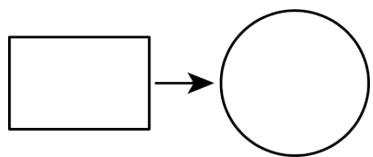

flowchart

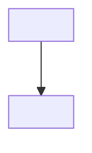

A. $12 \pi$

B. $18\pi$

C. $24 \pi$

D. $36\pi$

【答案】B

【分析】本题考查了二次根式的混合运算，矩形的性质，圆的面积公式，根据题意得出周长，进而求得圆的半径，根据圆的面积公式，即可求解.

【详解】解：这根铁丝的周长为 $2(\sqrt{8}\pi + \sqrt{2}\pi) = 6\sqrt{2}\pi$

∴将这根铁丝展开重新首尾相接围成一个圆形，则半径为 $\frac{6\sqrt{2}\pi}{2\pi}=3\sqrt{2}$

∴面积为 $\pi(3\sqrt{2})^{2}=18\pi$

故选：B.

【变式 20-1】如图，在大正方形纸片中放置两个小正方形，已知两个小正方形的面积分别为 $S_{1}=18$ ， $S_{2}=12$ ，重叠部分是一个正方形，其面积为2，则空白部分的面积为\_\_\_\_。

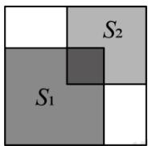

【答案】 $8\sqrt{6}-8/-8+8\sqrt{6}$

【分析】本题考查了二次根式的应用，先算出三个小正方形的边长，再得到大正方形的边长，通过面积的

计算得结论.

【详解】解：∵三个小正方形的面积分别为18、12、2，

∴三个小正方形的边长分别为 $\sqrt{18}=3\sqrt{2}$ 、 $\sqrt{12}=2\sqrt{3}$ 、 $\sqrt{2}$ ,

由题图知：大正方形的边长为： $3\sqrt{2}+2\sqrt{3}-\sqrt{2}=2\sqrt{2}+2\sqrt{3}$

$$
\begin{array}{l} \therefore S _ {\text {空白}} = (2 \sqrt {2} + 2 \sqrt {3}) ^ {2} - (1 8 + 1 2 - 2) \\ = 8 + 1 2 + 8 \sqrt {6} - (1 8 + 1 2 - 2) \\ = 8 \sqrt {6} - 8. \\ \end{array}
$$

故答案为： $8\sqrt{6}-8$ .

【变式 20-2】（24-25 八年级上·山西晋中·期中）发生交通事故后，交道警察通常根据刹车后车轮滑过的距离估计车辆行驶的速度，所用的经验公式是 $v = 16\sqrt{df}$ ，其中v表示车速（单位：km/h），d表示刹车后车轮滑过的距离（单位：m），f表示摩擦因数．在某次交通事故调查中，测得d = 20m，f = 1.2，则肇事汽车的车速大约是多少？（ $\sqrt{6} \approx 2.45$ ，结果精确到1km/h）

【答案】肇事汽车的车速大约是78km/h

【分析】本题主要考查了二次根式的应用，化简二次根式等知识点，将 $d = 20$ ， $f = 1.2$ 代入 $v = 16\sqrt{df}$ 即可求出肇事汽车的车速大约是多少，熟练掌握运用二次根式的性质化简求值是解决此题的关键.

【详解】解：∵d=20，f=1.2代入 $v=16\sqrt{df}$ ，

$$
\therefore v = 1 6 \times \sqrt {2 0 \times 1 . 2} = 1 6 \times 2 \sqrt {6} = 3 2 \sqrt {6},
$$

$$
\because \sqrt {6} \approx 2. 4 5,
$$

$$
\therefore v \approx 3 2 \times 2. 4 5 \approx 7 8 (\mathrm{km/h}),
$$

答：肇事汽车的车速大约是78km/h.

【变式 20-3】（24-25 八年级上·江西南昌·期末）高空抛物是一种不文明的危险行为，据研究，物品从离地面为 h 米的高处自由落下，落到地面的时间为 t，经过实验，发现 $t = \sqrt{\frac{h}{5}}$ (不考虑阻力的影响).

(1)求物体从40m的高空落到地面的时间;  
(2)已知从高空坠落的物体所带能量(单位: J) = 10 × 物体质量(kg) × 高度(m), 一串质量为0.2kg的钥匙经过3s落在地上, 这串钥匙在下落过程中所带能量有多大?  
(3)在（2）的结果中，你能得到什么启示？(注：杀伤无防护人体只需要65J的能量)

【答案】(1) $2\sqrt{2}s$

(2)90J

(3)严禁高空抛物

【分析】本题考查了代数式的求值，二次根式的应用，正确理解题意是解题的关键.

（1）把h=40m代入 $t=\sqrt{\frac{h}{5}}$ 计算即可；  
(2) t = 3s 代入 $t = \sqrt{\frac{h}{5}}$ 求得 h，进而计算即可；  
(3) 由于 $90 \mathrm{~J} > 65 \mathrm{~J}$ , 故会对人体造成伤害, 则应该禁止高空抛物

【详解】（1）解：把h=40m代入 $t=\sqrt{\frac{h}{5}}$ 得： $t=\sqrt{\frac{40}{5}}=2\sqrt{2}s$

答：物体从40m的高空落到地面的时间为 $2\sqrt{2}s$ ;

（2）解： $t = 3s$ 代入 $t = \sqrt{\frac{h}{5}}$ 得： $\sqrt{\frac{h}{5}} = 3$ ，

解得：h = 45m，

则从高空坠落的物体所带能量为 $10 \times 0.2 \times 45 = 90J$ ,

答：这串钥匙在下落过程中所带能量有90J；

(3) 解: $\because 90 \mathrm{~J} > 65 \mathrm{~J}$ ,

∴对人构成伤害，

故严禁高空抛物.