# 全品学练考 教辅资源，关注公众号★全科AA+ AI智慧升级版

主 编 肖德好

# 全品学练考 教辅资源，关注公众号★全科AA+

主 编 肖德好

本册主编 于秀坤

作业手册

知识

能力

效果

听课手册

(另见单本)

作业手册

周末自评本

(另见单本)

质量评估卷

(另见单本)

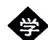

# 第一章

# 勾股定理

# 本章内容我会学 听 1

# 1 探索勾股定理

第1课时 探索勾股定理 听2 作1

第 2 课时 勾股定理的验证及其简单应用 …… 听 6 作 3

2 一定是直角三角形吗 …… 听 8 作 5

3 勾股定理的应用 听 10 作 7

问题解决策略：反思 …… 听 13 作 9

专题训练（一）利用勾股定理解决折叠问题……作11

画图解题能力培养 作12

本章总结提升 …… 听 17

本章中考演练 …… 作 14

综合与实践 …… 作 15

第一章质量评估 活1

# 实数

# 草

# 本章内容我会学 听 19

# 1 认识实数

第1课时 无限不循环小数 听20 作17

第2课时 实数 听22 作18

# 2 平方根与立方根

第1课时 算术平方根 …… 听25 作19

串题训练 $\sqrt{a^2}$ 和 $(\sqrt{a})^2 (a\geqslant 0)$ 的性质应用 作20

第2课时 平方根 …… 听27 作21

第3课时 立方根 …… 听29 作23

第 4 课时 估算 …… 听 32 作 25

# 3 二次根式

第1课时 二次根式的概念及乘除运算 …… 听35 作27

第2课时 二次根式的化简及加减运算 听38 作29

第3课时 二次根式的混合运算 …… 听40 作31

专题训练（二）二次根式混合运算中的易错类型 作33

专题训练（三）二次根式的运算及化简求值技巧 …… 作 34

本章总结提升 …… 听 43

本章中考演练 …… 作 35

第二章质量评估 活3

# 第三章

# 位置与坐标

# 本章内容我会学 听 45

1 确定位置 听 46 作 37

# 2 平面直角坐标系

第1课时 平面直角坐标系的有关概念 听49 作38

串题训练 点的坐标与距离 …… 作 38

第2课时 平面直角坐标系中点的坐标特征 听52 作39

第3课时 建立适当的坐标系描述图形的位置 …… 听54 作40

3 轴对称与坐标变化 …… 听 55 作 42

专题训练（四）巧用点的坐标求线段的长和图形的面积 …… 作 44

专题训练（五）平面直角坐标系中点的坐标变化 …… 作 46

本章总结提升 …… 听 58

本章中考演练 …… 作 47

综合与实践 作48

第三章质量评估 …… 活 5

1 函数 听 60 作 49

# 2 认识一次函数

第1课时 变量的均匀变化 听63 作50

第2课时 一次函数与正比例函数 …… 听66 作51

第3课时 计费问题 听69 作53

# 3 一次函数的图象

第1课时 正比例函数的图象及性质 …… 听71 作55

第2课时 一次函数的图象及性质 …… 听74 作57

串题训练 一次函数 $y = kx + b$ 的系数 $k, b$ 的作用 …… 作58

# 4 一次函数的应用

第1课时 借助一次函数表达式解决一些简单实际问题 …… 听77 作59

第2课时 借助单个一次函数图象解决有关问题 …… 听80 作61

第3课时 借助两个一次函数图象解决有关问题 …… 听83 作63

专题训练（六）一次函数与图形的面积问题 作65

本章总结提升 …… 听 85

本章中考演练 …… 作 67

综合与实践 作69

第四章质量评估 活7

# 二元一次

# 本章内容我会学 听 88

1 认识二元一次方程组 听89 作71

# 2 二元一次方程组的解法

第1课时 代入消元法 听92作73

第2课时 加减消元法 听94 作75

专题训练（七）根据方程的特征巧解二元一次方程组 …… 作 77

专题训练（八）含字母参数的二元一次方程（组）的解法 作78

# 3 二元一次方程组的应用

第1课时 直接找等量关系列二元一次方程组解决问题 …… 听96 作79

第2课时 列表法找等量关系列二元一次方程组解决问题 …… 听97 作81

第3课时 画图法找等量关系列二元一次方程组解决问题 听98 作83

# 4 二元一次方程与一次函数

第1课时 用图象法求二元一次方程组的解 …… 听100 作85

# 第六章 数据的分析

第 2 课时 用待定系数法确定一次函数表达式 …… 听 102 作 87

专题训练（九）一次函数的实际应用问题 作89

5 三元一次方程组 听 104 作 91

问题解决策略：逐步确定…… 听 107 作 93

本章总结提升 …… 听 109

本章中考演练 作94

综合与实践 作96

第五章质量评估 …… 活 9

# 1 平均数与方差

第1课时 众数和算术平均数 听111作97

第 2 课时 加权平均数 …… 听 114 作 99

第 3 课时 离差平方和、方差和标准差 …… 听 116 作 101

第 4 课时 方差和离差平方和的实际应用 …… 听 118 作 103

# 2 中位数与箱线图

第1课时 中位数和百分位数 听120 作104

第2课时 四分位数与箱线图 听123 作106

3 哪个团队收益大 …… 听 126 作 108

本章总结提升 …… 听 127

本章中考演练 …… 作 109

综合与实践 作111

第六章质量评估 活11

# 第七章 证明

1 为什么要证明 …… 听 129 作 112

# 2 认识证明

第1课时 定义与命题 …… 听 131 作 113

第 2 课时 定理与证明 …… 听 134 作 114

# 3 平行线的证明

第1课时 平行线的判定 …… 听 136 作 115

第 2 课时 平行线的性质 …… 听 138 作 117

专题训练（十）平行线性质与判定的综合应用 …… 作 119

专题训练（十一）平行线的拐点问题 …… 作 121

本章总结提升 听 139

本章中考演练 作123

综合与实践 …… 作 124

第七章质量评估 活 13

# 《周末自评本》(另见单本)

周末自评（一）[范围：第一章] / 评1

周末自评（二）[范围：2.3] / 评 3

周末自评（三）[范围：第二章] / 评5

周末自评（四）[范围：第三章] / 评7

周末自评（五）[范围：4.1\~4.3] / 评9

周末自评（六）[范围：4.4] / 评 11

周末自评（七）[范围：第四章] / 评 13

周末自评（八）[范围：5.3] / 评 15

周末自评（九）[范围：第五章] / 评 17

周末自评（十）[范围:6.1] / 评 19

周末自评（十一）[范围:第六章] / 评 21

周末自评（十二）[范围：第七章] / 评 23

# 参考答案 / 活 15

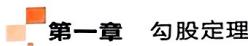

# 1 第1课时 探索勾股定理

# 知识技能巩固练

1. 在 Rt△ABC 中，∠C=90°, BC=9, AC=12，则 AB 的长为 （）

A. 13

B. 15

C. 17

D. 18

2. 下列说法中, 正确的是 ( )

A. 若 $a, b, c$ 是三角形的三边长，则 $a^2 + b^2 = c^2$

B. 若 $a, b, c$ 是直角三角形的三边长，则 $a^2 + b^2 = c^2$

C. 若 $a, b, c$ 是 Rt $\triangle ABC$ 中 $\angle A, \angle B, \angle C$ 所对的边，且 $\angle C = 90^\circ$ ，则 $a^2 + b^2 = c^2$

D. 若 $a, b, c$ 是 Rt $\triangle ABC$ 中 $\angle A, \angle B, \angle C$ 所对的边，且 $\angle A = 90^{\circ}$ ，则 $a^{2} + b^{2} = c^{2}$

3. 核心素养几何直观 如图 1-1-1 所示, 在边长均为 1 的小正方形组成的网格中, A, B 都是格点, 则线段 AB 的长是 ( )

A. 5

B. 6

C. 7

D. 9

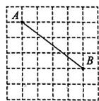  
图1-1-1

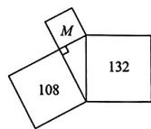  
图1-1-2

4.（教材随堂练习T1变式）如图1-1-2，两个大正方形的面积分别为132和108，则小正方形 $M$ 的面积为 （）

A.14

B. 22

C. 20

D. 24

5. 在 $\triangle ABC$ 中， $\angle C=90^{\circ}, AB=3$ ，则 $AB^{2}+BC^{2}+AC^{2}$ 的值为\_\_\_\_。

6. 如果直角三角形的周长是 24 cm, 相邻两直角边长之比为 3:4, 那么斜边长为 \_\_\_\_ cm.

7. 在 Rt△ABC 中，∠C=90°，∠A，∠B，∠C 所对的边分别为 a, b, c.

(1) 若 $c = 1.5, b = 1.2$ ，求 $a$ 的值；

(2) 若 $a = 5, b = 12$ , 求 $c$ 的值.

8. 如图 1-1-3, 在 Rt△ABC 中, ∠ACB = 90°, CD⊥AB, 垂足为 D, BC = 6, AB = 10, 求 AC 和 CD 的长.

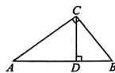  
图1-1-3

# B 能力提升综合练

9. 如图 1-1-4, 两个正方形的面积分别是 64 和 49, 则 AC 的长为 ( )

A. 15

B. 17

C. 19

D. 21

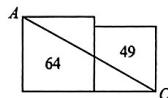  
图1-1-4

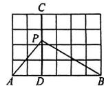  
图1-1-5

10. 如图 1-1-5, 在边长均为 1 的小正方形组成的网格中, 点 A, B, C, D 均在格点上, P 为 CD 上任意一点, 则 $PB^{2}-PA^{2}$ 的值为 ( )

A. 8

B. 9

C. 10

D. 12

11.（教材习题1.1T6变式）已知等腰三角形的底边长为 $18\mathrm{cm}$ ，腰长为 $15\mathrm{cm}$ ，则底边上的高为 \_\_\_\_ cm.

12. 新考法新定义 对角线互相垂直的四边形叫作“垂美”四边形. 如图 1-1-6 所示的“垂美”四边形 ABCD 的对角线 AC, BD 相交于点 O. 若 AB = 5, CD = 4, 则 $AD^{2} + BC^{2}$ 的值为

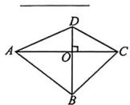  
图1-1-6

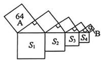  
图1-1-7

13.（教材习题1.1T4变式）如图1-1-7是勾股树衍生图案，它由若干个正方形和直角三角形构成， $S_{1}, S_{2}, S_{3}, S_{4}$ 分别表示其所在正方形的面积，若已知正方形A，B的面积分别是64，9，则 $S_{1} - S_{2} + S_{3} - S_{4}$ 的值为  
14. 在 $\triangle ABC$ 中, $AB=15, AC=13, BC$ 边上的高 $AD=12$ , 则 $\triangle ABC$ 的周长为\_\_\_\_.  
15. 如图 1-1-8, 某小区的中心广场附近有一块四边形空地 ABCD, 计划改建成一个小花圃, 经测量, $\angle C = \angle ADB = 90^{\circ}$ , BC = 12 m, CD = 9 m, AB = 17 m. 求:

(1) $BD$ 和 $AD$ 的长；  
(2) 四边形花圃 ABCD 的面积.

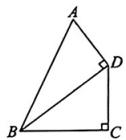  
图1-1-8

# C素养发展创新练

16. 新考法探究性 如图 1-1-9 是小明爸爸设置的锁屏手势密码, 已知左右、上下两个相邻圆点圆心间的距离均为 1, 手指沿圆心 A-B-C-D-E-A 的顺序解锁. AE, BC 交于点 F. 请利用你所学的数学知识解决下列问题.

(1) 判断 AE 与 BC 的位置关系, 并说明理由;
(2) 求 $AF^{2}$ 的值.

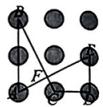  
图1-1-9

# 第2课时 勾股定理的验证及其简单应用

# 知识技能巩固练

1.（教材习题1.1T5变式）利用如图1-1-10所示的图形可以验证勾股定理，则在验证过程中用到的面积相等的关系是 （）

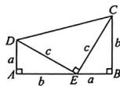  
图1-1-10

A. $S_{\triangle EDA} = S_{\triangle CEB}$   
B. $S_{\triangle EDA} + S_{\triangle CEB} = S_{\triangle CDE}$   
C. $S_{\text{四边形} CDAE} = S_{\text{四边形} CDEB}$   
D. $S_{\triangle EDA} + S_{\triangle CDE} + S_{\triangle CEB} = S_{\text{四边形}ABCD}$

2. 如果直角三角形的斜边与一条直角边的长分别是 $15 \mathrm{~cm}$ 和 $9 \mathrm{~cm}$ , 那么这个直角三角形的面积是 ( )

A. $54 \, cm^{2}$

B. $45 \mathrm{~cm}^{2}$

C. $60~\mathrm{cm}^2$

D. $108 \, cm^{2}$

3. 一段台阶如图1-1-11所示,已知每个台阶的宽度都是30 cm,每个台阶的高度都是15 cm,连接AB,则AB= \_\_\_\_ cm.

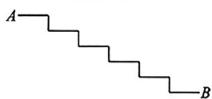  
图1-1-11

4. 如图 1-1-12, 一棵高 $12 \mathrm{~m}$ 的大树被折断, 折断处 $A$ 到地面的距离 $AC = 4.5 \mathrm{~m}$ (点 $B$ 为大树顶端着地处). 在大树倒下的方向停着一辆小轿车, 小轿车到大树底部 $C$ 的距离 $CD$ 为 $6.5 \mathrm{~m}$ , 点 $D$ 在 $CB$ 的延长线上, 求大树顶端着地处 $B$ 到小轿车的距离 $BD$ .

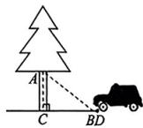  
图1-1-12

5. 在直角三角形中，两直角边的平方和等于斜边的平方。如图1-1-13①，设直角三角形的两条直角边的长分别是 $a$ 和 $b(a < b)$ ，斜边长是 $c$ ，那么可以用数学语言表达： $a^2 + b^2 = c^2$ 。

(1)如图②所示,将4个与图①完全相同的直角三角形拼成一个边长为c的正方形AB-CD,则四边形EFGH是一个\_\_\_\_(填“长方形”或“正方形”),其面积为\_\_\_\_(用含a,b的代数式表示);  
(2) 观察图②, 利用面积之间的恒等关系, 试说明 $a^2 + b^2 = c^2$ 的正确性.

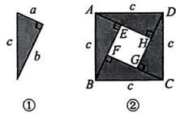  
图1-1-13

# B 能力提升综合练

6.（教材阅读思考变式）意大利著名画家达·芬奇用如图1-1-14所示的方法验证了勾股定理.过程是将图①剪开后得到图②，再经过变换后得到图③.若设图①中空白部分的面积为 $S_{1}$ ，图③中空白部分的面积为 $S_{2}$ ，则下列等式成立的是 （）

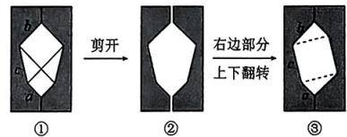

flowchart

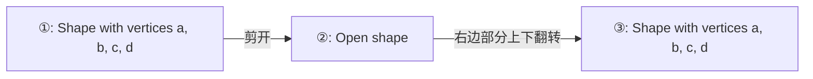

图1-1-14

A. $S_{2} = c^{2}$

B. $S_{2} = c^{2} + \frac{1}{2} ab$

C. $S_{1} = a^{2} + b^{2} + ab$

D. $S_{1} = a^{2} + b^{2} + 2ab$

7. 某工厂的大门如图 1-1-15 所示, 其中四边形 ABCD 是长方形, 上半部分是以 AB 为直径的半圆, 其中 AD = 2.3 米, AB = 2 米, 现有一辆装满货物的卡车, 高 2.5 米, 宽 1.6 米, 则这辆卡车能否通过大门? 说明理由.

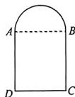  
图1-1-15

8. 已知在等腰三角形 ABC 中, AB = AC = 10, BC = 16.

(1)若 $\triangle ABC$ 的腰长不变，底边长变为12，请你判断变化前后两个等腰三角形的面积是否相等，并说明理由；

(2)若当 $\triangle ABC$ 底边上的高增加x，腰长增加 $(x-2)$ 时，底边长保持不变，求此时x的值.

# C 素养发展创新练

9. 台风会对我国很多地区产生很严重的影响。已知某台风风力影响半径为 250 km（即以台风中心为圆心，250 km 为半径的圆形区域都会受台风影响）。如图 1-1-16，线段 BC 是台风中心从 C 市移动到 B 市的大致路线，A 是某个大型农场，且 $AB \perp AC$ 。若 A, C 之间相距 300 km, A, B 之间相距 400 km。

(1) 判断农场 A 是否会受到台风的影响, 请说明理由;  
(2)若台风中心的移动速度为 $20 \, km/h$ ，则台风影响农场 A 的持续时间有多长？

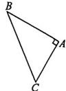  
图1-1-16

# 2 一定是直角三角形吗

# 知识技能巩固练

1. 下列各组数中, 不能作为直角三角形三边长的是
()

A. 9,12,15

B. 8,15,17

C. 6,8,11

D. 7,24,25

2. 下列各组数是勾股数的是 （）

A. 13, 14, 15

B. 4,5,6

C. 0.3, 0.4, 0.5

D. 9,40,41

3. 在 $\triangle ABC$ 中， $\angle A, \angle B, \angle C$ 所对的边分别为 $a, b, c$ ，且三边满足 $(c - a)(c + a) - b^2 = 0$ ，则下列结论正确的是（）

A. $\triangle ABC$ 是直角三角形，且 $\angle C$ 为直角  
B. $\triangle ABC$ 是直角三角形，且 $\angle B$ 为直角  
C. $\triangle ABC$ 是直角三角形，且 $\angle A$ 为直角  
D. $\triangle ABC$ 不是直角三角形

4. 李老师要做一个直角三角形教具, 做好后量得三边长分别是 60 cm, 80 cm 和 100 cm, 则这个教具 \_\_\_\_ (填“合格”或“不合格”).  
5. 在 $\triangle ABC$ 中, $a, b, c$ 分别是 $\angle A, \angle B, \angle C$ 的对边, 试判断分别满足下列条件时, $\triangle ABC$ 是不是直角三角形, 并说明理由.

(1) $a = 8, b = 13, c = 11$ ;

(2)a=6.5,b=2.5,c=6;

(3) $a:b:c = 1:2.5:3.$

6. 如图 1-2-1, 在 $\triangle ABC$ 中, 若 $AB = 10$ , $BD = 6$ , $AD = 8$ , $AC = 17$ , 求 $DC$ 的长.

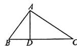  
图1-2-1

7. 如图 1-2-2, 有一块等腰三角形菜地 ABC, 其中 AC = BC = 13 m, AB = 10 m, E 为 AB 的中点. 现需要开辟一块三角形空地 AFE 用于堆肥, 已知 AF = 4 m, EF = 3 m.

(1)你能确定 $\triangle AEF$ 的形状吗？请说明理由；  
(2) 计算阴影部分的面积.

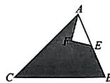  
图1-2-2

# B 能力提升综合练

8. 若正整数 $a, b, c$ 是一组勾股数，则下列各组数一定是勾股数的为 （）

A. 3a,4b,5c

B. $a^2, b^2, c^2$

C. 3a, 3b, 3c

D. $a+3,b+3,c+3$

9. 如图 1-2-3, 边长均为 1 的小正方形组成的网格中, 点 A, B, C 都在格点上, 则 $\angle ABC$ 的度数为 \_\_\_\_.

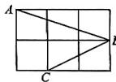  
图1-2-3

10. 新情境 热点信息 为贯彻《关于全面加强新时代大中小学劳动教育的意见》的决策部署，帮助同学们更好地理解劳动的价值与意义，培养学生的劳动情感、劳动能力和劳动品质，某校给八(1)班、八(2)班各分了一块三角形的劳动实践基地.

(1)当班主任测量出八(1)班劳动实践基地的三边长分别为5 m, 12 m, 13 m时, 一边的小明很快给出这块劳动实践基地的面积, 他求出的面积为\_\_\_\_m²;

(2)八(2)班的劳动实践基地的三边长分别为 $AB = 15\mathrm{m},BC = 14\mathrm{m},AC = 13\mathrm{m}$ （如图1-2-4），请你帮助他们求出 $\triangle ABC$ 的面积.

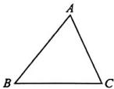  
图1-2-4

# C素养发展创新练

11. 新考法探究性 勾股定理是一个基本的几何定理,早在《周髀》一书中就有“勾三、股四、弦五”的记载. 如果一个直角三角形的三边长都是正整数,那么这样的直角三角形叫作“整数直角三角形”,这三个正整数叫作“勾股数”. 在一次“构造勾股数”的探究性学习中,老师给出了下表:

<table><tr><td>m</td><td>2</td><td>3</td><td>3</td><td>4</td><td>...</td></tr><tr><td>n</td><td>1</td><td>1</td><td>2</td><td>3</td><td>...</td></tr><tr><td>a</td><td> $2^2+1^2$ </td><td> $3^2+1^2$ </td><td> $3^2+2^2$ </td><td> $4^2+3^2$ </td><td>...</td></tr><tr><td>b</td><td>4</td><td>6</td><td>12</td><td>24</td><td>...</td></tr><tr><td>c</td><td> $2^2-1^2$ </td><td> $3^2-1^2$ </td><td> $3^2-2^2$ </td><td> $4^2-3^2$ </td><td>...</td></tr></table>

其中 $m, n$ 为正整数，且 $m > n$ .

(1) 观察表格, 当 $m = 2, n = 1$ 时, 以此时对应的 $a, b, c$ 为边长的三角形是不是直角三角形? 说明你的理由;  
(2)探究 a, b, c 与 m, n 之间的关系(用含 m, n 的代数式表示): a = \_\_\_\_, b = \_\_\_\_, c = \_\_\_\_;  
(3)以 a, b, c 为边长的三角形一定是直角三角形吗？请说明理由.

# A 知识技能巩固练

1. 如图 1-3-1, 甲船以 20 海里/时的速度从港口 O 出发向西北方向航行, 乙船以 15 海里/时的速度同时从港口 O 出发向东北方向航行, 则 2 小时后, 两船相距

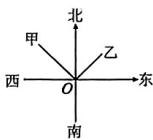  
图1-3-1

A.40海里

B.45海里

C.50海里

D.55海里

2. 新情境 数学文化《九章算术》中有“折竹抵地”问题,大意如下:一根竹子,原高10尺,一阵风将竹子折断,其竹梢恰好抵地,抵地处离竹子底部4尺远,则折断处离地面的高度为( )

A.4.2尺

B.4尺

C.5.2尺

D. 5 尺

3. 如图 1-3-2, 某同学想要检测 AD 和 BC 是否分别垂直于 AB, 但他随身只带了有刻度的卷尺. 若测得 $AD = 50 \, cm, AB = 120 \, cm, BD = 130 \, cm$ , 则 AD 与 AB \_\_\_\_ (填“垂直”或“不垂直”).

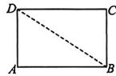  
图1-3-2

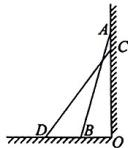  
图1-3-3

4.（教材复习题T9变式）如图1-3-3，梯子AB靠在墙上，梯子的顶端A到墙根O的距离为24m，梯子的底端B到墙根O的距离为7m，一不小心梯子顶端A下滑了4m到C处，底端B滑动到D处，那么BD的长是\_\_\_\_m.  
5. 新考法跨学科 小丽在物理实验课上利用如图 1-3-4 所示的“光的反射演示器”直观呈现了光的反射原理. 她用激光笔从量角器左边边缘点 A 处发出光线, 经量角器圆心 O 处的

平面镜反射后，反射光线落在右边光屏 $CE$ 上的点 $D$ 处（ $C$ 也在量角器的边缘上， $O$ 为量角器的中心， $C, O, B$ 三点共线， $AB \perp BC, CE \perp BC$ ). 小丽在实验中记录下 $AB = 6 \mathrm{~cm}, BC = 12 \mathrm{~cm}$ . 依据记录的数据，求量角器的半径 $OC$ 的长.

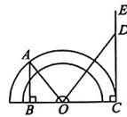  
图1-3-4

# B 能力提升综合练

6. 新考法跨学科如图1-3-5所示为雷达图，数轴上1个单位长度代表 $100\mathrm{m}$ ，以数轴原点 $O$ 为圆心，画同心圆，并将同心圆平均分成十二份。一艘海洋科考船在点 $O$ 处用雷达发现 $A$ ， $B$ 两处有鱼群，那么 $A, B$ 两处鱼群的距离是（）

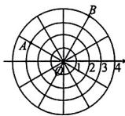  
图 1-3-5

A. 5 m

B. 400 m

C. 500 m

D. 300 m

7. 核心素养几何直观滑梯的示意图如图1-3-6所示，左边是楼梯，右边是滑道，立柱BC，DE均垂直于地面AF，滑道AC的长度与点A到点E的距离相等，滑梯高 $BC = 1.5\mathrm{m}$ ，且 $BE = 0.5\mathrm{m}$ ，则滑道AC的长为

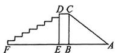  
图 1-3-6

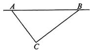  
图1-3-7

8. 如图 1-3-7, 有一台救火飞机沿直线 AB 由点 A 飞向点 B, 已知 C 为其中一个着火点, AB = 500 m, AC = 300 m, BC = 400 m, 飞机周围 260 m 以内可以受到洒水影响. 若该飞机的速度为 14 m/s, 则着火点 C 受到洒水影响的时间为 \_\_\_\_ s.

9. 为进一步落实立德树人的根本任务, 培养德智体美劳全面发展的社会主义接班人, 某校开展劳动教育课程, 并取得了丰硕成果. 如图1-3-8(阴影部分)是该校开垦的一块作为学生劳动实践基地的四边形空地. 经测量, $AB = AD = 13 \mathrm{~m}, BC = 8 \mathrm{~m}, CD = 6 \mathrm{~m}, BD = 10 \mathrm{~m}$ . 该校计划在此空地 (阴影部分) 上种植花卉, 若每种植 $1 \mathrm{~m}^{2}$ 花卉需要花费 100 元, 则此空地全部种植花卉共需花费多少元?

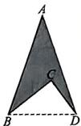  
图1-3-8

# C 素养发展创新练

10. 图 1-3-9①是某超市的购物车, 图②为其侧面简化示意图, 测得支架 AC = 8 dm, AB = 6 dm, 两轮中心的距离 BC = 10 dm, 滚轮半径 r = 1 dm.

(1) 判断 $\triangle ABC$ 的形状，并说明理由；

(2)若购物车上篮子的左边缘 $D$ 与点 $A$ 的距离 $AD = 13\mathrm{dm}$ ，过点 $D$ 作 $DE \perp AF$ 交 $FA$ 的延长线于点 $E, AE = 5\mathrm{dm}$ ，且 $AE$ 和 $BC$ 都与地面平行，求购物车上篮子的左边缘 $D$ 到地面的距离.

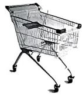  
①

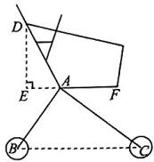  
②   
图1-3-9

# 问题解决策略：反思

# 知识技能巩固练

1. 如图 1-ZY-1, 一个长方体工艺品的高为 9 cm, 底面是边长为 6 cm 的正方形. 一只小虫从底面顶点 A 沿该工艺品的表面爬向顶点 B, 那么它爬行的最短路程为 ( )

A. 10 cm

B. 12 cm

C. $15 \mathrm{~cm}$

D. 21 cm

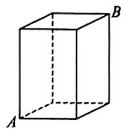  
图1-ZY-1

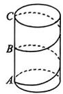  
图1-ZY-2

2. 如图 1-ZY-2, 有一个圆柱体礼盒, 高为 18 cm, 底面周长为 12 cm. 现准备在礼盒表面粘贴彩带作为装饰. 若彩带一端粘在 A 处, 另一端绕礼盒侧面 2 周后粘贴在 C 处 (B 为 AC 的中点), 则彩带最短为 ( )

A. 15 cm

B. 20 cm

C. 25 cm

D. $30~\mathrm{cm}$

3. 如图 1-ZY-3 是一个二级台阶, 每一级台阶的长、宽、高分别为 60 cm, 30 cm, 10 cm. A 和 B 是台阶上两个相对的端点, 在点 B 处有一只蚂蚁, 想沿着台阶表面爬行到点 A 处去觅食, 那么它爬行的最短路程是 ( )

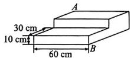  
图1-ZY-3

A. $60~\mathrm{cm}$ B. $80~\mathrm{cm}$ C. $100~\mathrm{cm}$ D. $140~\mathrm{cm}$

4. 如图 1-ZY-4, 一个三棱柱盒子底面的三边长分别为 3 cm, 4 cm, 5 cm, 盒子高为 9 cm, 一只蚂蚁想从盒底的点 A 沿盒子的侧面爬行一周到盒顶的点 B, 蚂蚁要爬行的最短路程是 \_\_\_\_ cm.

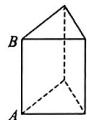  
图1-ZY-4

5. 如图 1-ZY-5, 这是一个供滑板爱好者使用的 U 型池, 该 U 型池可以看作是一个长方体去掉半个圆柱而成, 中间可供滑行部分的横截面是半径 R 为 3 m 的半圆, 该部分的边缘 AB = CD = 45 m, 点 E 在 CD 上, CE = 5 m, 一滑行爱好者从点 A 滑到点 E, 则他滑行的最短路程是多少? (边缘部分的厚度可以忽略不计, $\pi$ 取整数 3)

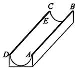  
图1-ZY-5

# B 能力提升综合练

6. 图1-ZY-6是一个棱长为 $3\mathrm{cm}$ 的正方体，把其中两面(上底面和右面)分别均分成 $3\times 3$ 个小正方形，其边长都为 $1\mathrm{cm}$ . 假设一只蚂蚁每秒爬行 $2\mathrm{cm}$ ，则它从上底面点 $A$ 沿表面爬行至侧面的点 $B$ 处，最少要用 \_\_\_\_ s.

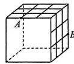  
图1-ZY-6

7. 如图 1-ZY-7, 在一个长 AB 为 2 米、宽 AD 为 1 米的长方形草地上, 放着一根正三棱柱木块, 它的侧棱长平行且大于场地宽 AD, 三棱柱的上底面与下底面是边长为 0.4 米的正三角形, 一只蚂蚁从点 A 处爬行翻过三棱柱到点 C 处需要走的最短路程是多少米?

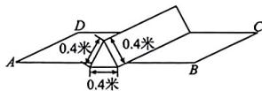  
图 1-ZY-7

# 教辅资源，关注公众号★全科AA+

8. 十九世纪英国赫赫有名的谜题创作者在1903年的英国报纸上发表了“蚂蚁爬行”的问题.

[问题]如图1-ZY-8①，在一个长、宽、高分别为 $8\mathrm{m},8\mathrm{m},4\mathrm{m}$ 的长方体房间内，一只蚂蚁在右面墙高度一半的位置（即点 $M$ 处），并且距离前面墙 $1\mathrm{m}$ ，苍蝇正好在左面墙高度一半的位置（即点 $N$ 处），并且距离后面墙 $2\mathrm{m}$ ，蚂蚁爬到苍蝇处应该怎样爬行所走路程最短，最短路程是多少米？

这只蚂蚁在长方体表面爬行的问题,引起了当时很多数学爱好者的研究与讨论,今天我们也一起来研究一下这个当时非常热门的数学问题!

[基础研究]如图②,在长、宽、高分别为a,b,c (a>b>c)的长方体的顶点A处有一只蚂蚁,欲从长方体表面爬行去另一个顶点 $C'$ 处吃食物,探究哪种爬行路径是最短的.

(1) 观察发现: 蚂蚁从点 A 出发, 为了走出最短路线, 根据两点之间线段最短的知识, 并结合展开与折叠原理, 一共有 3 种不同的爬行路线, 即图③、图④、图⑤.

填空:图⑤是由\_\_\_\_面与\_\_\_\_面展开得到的平面图形;(填“前”“后”“左”“右”“上”“下”)

(2)推理验证:如图③,由勾股定理,得 $AC'^{2}=(a+b)^{2}+c^{2}=a^{2}+b^{2}+c^{2}+2ab$ ,

如图④，由勾股定理，得 $AC^{\prime 2} = (b + c)^{2}+$ $a^2 = a^2 +b^2 +c^2 +2bc$

如图⑤, $AC'^{2}=(a+c)^{2}+b^{2}=a^{2}+b^{2}+c^{2}+2ac.$

要使得 $AC'$ 的值最小, 因为 a > b > c, 所以 ab > ac > bc, 所以选择图 \_\_\_\_ 的情况, 此时 $AC'^{2}$ 的值最小, 则 $AC'$ 的值最小, 即这种爬行路径是最短的.

[简单应用]如图⑥,长方体的长、宽、高分别为24 cm,12 cm,40 cm,P是FG的中点,一只蚂蚁要沿着长方体的表面从点A爬到点P,则爬行的最短路程为\_\_\_\_cm.

[问题回归]最后让我们再回到那道十九世纪英国报纸上发表的“蚂蚁爬行”的问题（如图①），那只蚂蚁所走的最短路程是 \_\_\_\_ m.

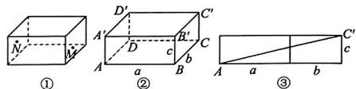

text_image

Geometric diagrams showing labeled 3D and 2D cube structures with points and lines, including annotations like 'a', 'b', and 'c'.

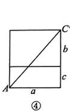

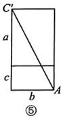

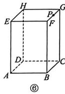  
图1-ZY-8

# 专题训练（一） 利用勾股定理解决折叠问题

# 类型一 直角三角形中有关的折叠问题

1. 如图 1-ZT-1 所示, 有一张直角三角形纸片 ABC, $\angle ACB = 90^{\circ}$ , BC = 6 cm, AB = 10 cm, 将斜边 AB 翻折, 使点 B 落在直角边 AC 的延长线上的点 E 处, 折痕为 AD, 则 CE 的长为 ( )

A. 2 cm

B. $3 \mathrm{~cm}$

C. $4 \mathrm{~cm}$

D. 5 cm

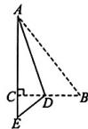  
图1-ZT-1

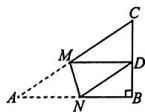  
图1-ZT-2

2. 如图 1-ZT-2, 在 Rt△ABC 中, AB=9, BC=6, ∠B=90°, 将 △ABC 折叠, 使点 A 与 BC 的中点 D 重合, 折痕为 MN, 则线段 BN 的长为 ( )

A. 4

B. 5

C. $\frac{5}{3}$

D. $\frac{5}{2}$

3. 如图 1-ZT-3, 在 Rt△ABC 中, ∠B = 90°, BC = 4, AC = 5, 将△CDE 折叠, 使点 C 与点 A 重合, 折痕为 DE, 则 CE 的长等于（）

A. 2

B. $\frac{25}{8}$

C. $\frac{7}{8}$

D. 3

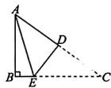  
图1-ZT-3

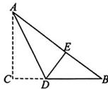  
图1-ZT-4

4. 如图 1-ZT-4, 在 Rt△ABC 中, ∠C = 90°, AB = 10, AC = 6, 将△ABC 折叠, 使点 C 落在 AB 边上的点 E 处, AD 是折痕, 则△BDE 的周长为 \_\_\_\_.

5. 如图 1-ZT-5, 在直角三角形纸片 ABC 中, $\angle B = 90^{\circ}$ , 已知 BC = 8, 折叠纸片使边 AB 落在 AC 上, 点 B 落在点 E 处, 折痕为 AD, 且 DE = 3. 求:

(1) $EC$ 的长；

(2) $\triangle ABC$ 的面积.

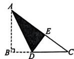  
图1-ZT-5

# 类型二 长方形中有关的折叠问题

6. 如图 1-ZT-6 所示, 在长方形 ABCD 中, AD = 6, AB = 10. 若将长方形 ABCD 沿 DE 折叠, 使点 C 落在 AB 边上的点 F 处, 则线段 CE 的长为 ( )

A. $\frac{1}{3}$

B. $\frac{17}{30}$

C. $\frac{10}{3}$

D. 3

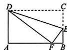  
图1-ZT-6

  
图1-ZT-7

7. 如图 1-ZT-7, 长方形 ABCD 中, AB = 8, AD = 12, 将其沿 EF 折叠, 点 A, B 分别落到点 $A'$ , $B'$ 处, 恰好点 C 在 $A'B'$ 上, $EA'$ 与 DC 交于点 G, 且 EG = CG, 则线段 CF 的长为 ( )

A. 5

B. $\frac{13}{2}$

C. $\frac{20}{3}$

D. $\frac{27}{4}$

8. 如图 1-ZT-8, 在长方形纸片 ABCD 中, E 为 BC 的中点, 连接 AE, 将 $\triangle ABE$ 沿 AE 折叠得到 $\triangle AFE$ , 连接 CF. 若 AB = 4, BC = 6, 则 CF 的长为 \_\_\_\_.

  
图1-ZT-8

# 画图解题能力培养

# 画示意图辅助求解

# 方法点睛

所画图形在形状、大小上与题中信息一致的称为准确图；所画图形能抽象、简明地表达题意的称为示意图。有些几何题，题目没有给出图形，可以画出示意图形，再结合图形寻找求解思路并作答。

# 典例学习

典例 1 如图 1-HF-1, 已知等腰三角形 ABC 的底边 BC=5, D 是腰 AB 上的一点, 且 CD=4, BD=3, 则 AD 的长为 \_\_\_\_.

【作图区】

根据解题需要补全图形：

  
图 1-HF-1

【解答区】

典例 2 在 $\triangle ABC$ 中, AB=13, BC=14, AC=15, AD 为 BC 边上的高, 求 AD 的长.

【作图区】

【解答区】

# 【实战练兵】

1. 已知 $\triangle ABC, AB = AC = 5, BC = 8$ , 那么点 $C$ 到直线 $AB$ 的距离是 \_\_\_\_.

2. 在 $\triangle ABC$ 中, $D$ 是 $BC$ 边上一点, 连接 $AD, AB = 10, AC = 17, BD = 6, AD = 8$ .

(1) 求 $\angle ADB$ 的度数；

(2) 求 $\triangle ABC$ 的周长.

# 完整画图，分类讨论

# 方法点睛

有些无图几何计算题,由于图形的形状不确定,或图中文字指代的对象不明确,答案会出现不唯一的情况,求解时需要根据可能存在的情况画出相应的图形,分情况作答.

# 典例学习

典例 3 在 $\triangle ABC$ 中, $AB=15, AC=41$ , 若 $BC$ 边上的高为 9 , 则 $BC$ 边的长为 \_\_\_\_.

【作图区】

【解答区】

# 【实战练兵】

1. 在 $\triangle ABC$ 中, $AB=25, AC=17, BC$ 边上的高 $AD$ 长为15, 则 $\triangle ABC$ 的面积为 \_\_\_\_.  
2. 在 Rt△ABC 中，∠ABC=90°, AB=3, BC=4，过点 B 的直线把△ABC 分割成两个三角形且与线段 AC 交于点 P，使其中只有一个是等腰三角形，求 AP 的长.

# 一、选择题

1.（2024眉山）如图1-Y-1，图①是北京国际数学家大会的会标，它取材于我国古代数学家赵爽的“弦图”，是由四个全等的直角三角形拼成。若图①中大正方形的面积为24，小正方形的面积为4，现将这四个直角三角形拼成图②，则图②中大正方形的面积为 （）

A. 24

B. 36

C. 40

D. 44

  
①

  
②

  
图1-Y-2  
图1-Y-1

2.（2024巴中）“今有池方一丈，葭生其中央，出水一尺.引葭赴岸，适与岸齐.问：水深几何？”这是我国数学史上的“葭生池中”问题(如图1-Y-2)，即 $AC = 5,DC = 1,BD = BA$ ，则 $BC =$ （

A. 8

B. 10

C. 12

D. 13

# 二、填空题

3.（2023东营）一艘船由A港沿北偏东 $60^{\circ}$ 方向航行 $30\mathrm{km}$ 至 $B$ 港，然后再沿北偏西 $30^{\circ}$ 方向航行 $40\mathrm{km}$ 至 $C$ 港，则 $A,C$ 两港之间的距离为 $\underline{\hspace{2cm}}$ km.  
4.（2023广安）如图1-Y-3，圆柱形玻璃杯的杯高为9cm，底面周长为16cm，在杯内壁离杯底4cm的点A处有一滴蜂蜜，此时，一只蚂蚁正好在杯外壁上，它在离杯上沿1cm，且与蜂蜜相对的点B处，则蚂蚁从外壁B处到内壁A处所走的最短路程为\_\_\_\_cm。（杯壁厚度不计）

  
图1-Y-3

  
图1-Y-4

5.（2024陕西）如图1-Y-4，在△ABC中，AB=AC，E是边AB上一点，连接CE，在BC的右侧作BF//AC，且BF=AE，连接CF.若AC=13，BC=10，则四边形EBFC的面积为\_\_\_\_。  
6.（2024 大庆）如图 1-Y-5①，直角三角形的两个锐角分别是 $40^{\circ}$ 和 $50^{\circ}$ ，其三边上分别有一个正方形。执行下面的操作：由两个小正方形向外分别作锐角为 $40^{\circ}$ 和 $50^{\circ}$ 的直角三角形，再分别以所得到的直角三角形的直角边为边作正方形。图②是 1 次操作后的图形。图③是重复上述步骤若干次后得到的图形，人们把它称为“毕达哥拉斯树”。若图①中的直角三角形斜边长为 2，则 10 次操作后图形中所有正方形的面积和为 \_\_\_\_。

  
①

  
②

  
③   
图1-Y-5

# 三、解答题

7.（2023长沙）如图1-Y-6,AB=AC,CD⊥AB. $BE \perp AC$ ，垂足分别为 D, E.

(1)说明： $\triangle ABE\cong \triangle ACD$   
(2) 若 AE=6, CD=8, 求 BD 的长.

  
图1-Y-6

# 综合与实践

1. 国旗是一个国家的象征和标志，每周一次的校园升旗仪式让我们感受到祖国的伟大，心中充满了自豪和敬仰。某校“综合与实践”小组开展了测量本校旗杆高度的实践活动。他们制订了测量方案，并利用课余时间完成了实地测量，测量结果如下表(不完整)。

<table><tr><td>课题</td><td colspan="2">测量学校旗杆的高度</td></tr><tr><td>成员</td><td colspan="2">组长:××× 组员:×××,×××,×××</td></tr><tr><td>工具</td><td colspan="2">皮尺等</td></tr><tr><td>测量示意图</td><td> 1 2图1-ZH-1</td><td>说明:线段AB表示学校旗杆,AB垂直于地面,垂足为B,如图1-ZH-11,第一次将系在旗杆顶端的绳子垂直到地面,并多出了一段BC,用皮尺测出BC的长度;如图2,第二次将绳子拉直,绳子末端落在地面的点D处,用皮尺测出BD的长度</td></tr><tr><td rowspan="3">测量数据</td><td>测量项目</td><td>数值</td></tr><tr><td>图1中BC的长度</td><td>1米</td></tr><tr><td>图2中BD的长度</td><td>5.4米</td></tr><tr><td>......</td><td colspan="2">......</td></tr></table>

(1)根据以上测量结果,请你帮助该“综合与实践”小组求出学校旗杆AB的高度;  
(2)该校礼仪队要求旗手在不少于45秒且不超过50秒的时间内将五星红旗从旗杆底部B处升至顶部A处，已知五星红旗沿着旗杆滑动的这一边长度为96厘米，求五星红旗升起的平均速度取值范围(计算结果精确到0.01米/秒);  
(3)如果想要更加准确地计算学校旗杆 $AB$ 的高度,请你帮助该小组提出一条可行的建议.

2. 项目主题: 监控器的最优布设方式.

项目背景:台风袭来,汛期将至,某地水利部门计划新购置一批监控器,监控河岸和水流情况,以预防河流决堤,危害当地居民的生命财产安全.

已知监控器有效监测距离为 500 m. 如图 1-ZH-2①所示, 村落位于河流南侧, 与河流邻接长度为 5000 m, 点 A 为河流与村落邻接的最西端. 监控布设线 l 与河流平行, 且距离河流 300 m, 任意两个相邻监控器布设点之间的距离相等.

(1)项目方案1:如图②所示,使 $AM_{1}=500\ m,M_{1}B\perp AB,AB$ 为监控器 $M_{1}$ 的监测范围;从点B处起,使 $BM_{2}=500\ m,M_{2}C\perp BC,BC$ 为监控器 $M_{2}$ 的监测范围.

若按方案1进行布设,该水利部门至少需要布设多少个监控器?

(2)项目方案2:若监控器的最大旋转角度为 $90^{\circ}$ ，为了更好地利用监控器的监测范围，设计了如图③所示的方案，AB为监控器 $M_{1}$ 的监测范围，BC为监控器 $M_{2}$ 的监测范围， $AM_{1}\perp BM_{1},BM_{2}\perp CM_{2}$ ，此时 $BM_{1}=CM_{2}=375\ m$ .

若按方案 2 进行布设,该水利部门至少需要布设多少个监控器?

(3)项目方案3:如图④所示,此时 $AM_{1}\perp BM_{1},BM_{2}\perp CM_{2}$ ,且 $AM_{1}=BM_{1},BM_{2}=CM_{2}$ ,则监控器 $M_{1}$ 监测范围AB的长度为\_\_\_\_m.

反思提升:我认为方案 是最优方案,原因是

text_image

河流
监控
布设点
A
300 m
l
村落
①
5000 m
北

  
图1-ZH-2

# 第二章 实数

# 1 第1课时 无限不循环小数

# 知识技能巩固练

1. 下列是无限不循环小数的是 （）

A. 0.33

B. $\frac{1}{3}$

C. 25.666

D. $\pi$

2. 下列说法正确的是 ( )

A. 有理数是无限循环小数  
B. 无限不循环小数不是有理数  
C. 无限小数是无限不循环小数

D. 一个数不是无限循环小数, 就是无限不循环小数

3. 等腰三角形的腰长为 3, 底边长为 2, 下列说法不正确的是 ( )

A. 底边上的高为有理数  
B. 它的周长为有理数  
C. 它的面积不是有理数  
D.腰上的高不是有理数

4. 已知一个等边三角形的边长为 2，则这个三角形的高为 \_\_\_\_ 小数.  
5. 已知某个长方体的体积是 $1800 \, cm^{3}$ ，它的长、宽、高的比是 $5:4:3$ ，请问该长方体的长、宽、高是有理数吗。为什么？

# B 能力提升综合练

6. 下列结果中,一定是无限不循环小数的是()

A. 等腰三角形底边上的高  
B. 体积为有理数的正方体的棱长  
C. 长方形的对角线的长度  
D. 边长为 4 的正方形的对角线的长度

7. 如图 2-1-1, 将边长分别为 1 和 2 的两个正方形剪拼成一个较大的正方形, 该大正方形的边长最接近的整数是 ( )

  
图2-1-1

A. 4

B. 3

C.2

D. 1

8.（教材习题2.1T4变式）如图2-1-2，已知由16个边长均为1的小正方形拼成的图案中，有五条线段 $PA, PB, PC, PD, PE, P, A, B, C, D, E$ 均在格点上，其中长度是有理数的有

  
图2-1-2

9. 如图 2-1-3, 在棱长为 $4 \mathrm{~cm}$ 的正方体箱子中, 想放入一根细长的玻璃棒.

(1)这根玻璃棒的最大长度是整数吗？是分数吗？说明理由.  
(2)这根玻璃棒的最大长度接近哪个整数?  
(3)这根玻璃棒的最大长度的十分位的数是什么？百分位的数是什么？

  
图 2-1-3

# A 知识技能巩固练

1. 下列各数中是无理数的是 （）

A. $\frac{\pi}{2}$

B. 0.3

C. 0

D. 3.1415926

2.（教材习题2.1T2变式）下列说法中，正确的是（ ）

A. 整数、分数统称实数

B. 整数和无限小数统称实数

C. 正实数包括正有理数和正无理数

D. 实数可以分为正实数和负实数两类

3. 下列说法中正确的是 （）

A. 不是循环小数的数是无理数

B. 无限小数是无理数

C. 所有无理数都是无限小数

D. 无限循环小数是无理数

4. 实数 $-\frac{\pi}{5}$ 的倒数是 （）

A. $\frac{5}{\pi}$

B. $-\frac{5}{\pi}$

C. $\frac{\pi}{5}$

D. $-5\pi$

5. 下列式子成立的是 （）

A. $|-1.5|>1.\dot{5}$

B. $\frac{2}{3}>0.667$

C. $\pi<3.142$

D. $\pi=3.1415926$

6. 计算: $(\pi - 3.14)^{0} + \left(\frac{1}{2}\right)^{-1} =$ \_\_\_\_.

7. 下列各数中,哪些是有理数?哪些是无理数?

0. 351, $-\frac{2}{3}$ , 4. $\dot{96}$ , 3. 14159, -5. 2323332…

(相邻两个2之间3的个数逐次加2), $\frac{\pi}{3}$ .

8. 求下列各数的相反数和绝对值：

(1)3.1;

(2) $-\frac{1}{7}$ ;

(3) $1.5\pi$ ;

(4) $\pi-3.15.$

# B 能力提升综合练

9. 若实数 $a, b$ 满足 $a + b = 1 - \pi$ , 则 (

A. $a, b$ 都是有理数

B. $a - b$ 的结果必定为无理数

C. $a, b$ 都是无理数

D. $a - b$ 的结果可能为有理数

10. 实数 a 在数轴上对应的点的位置如图 2-1-4, 化简: $\left|a-\pi\right|+\left|3-a\right|-\left|-4-\pi\right|$ 的结果是 \_\_\_\_.

  
图2-1-4

11. 如图 2-1-5, 长方形 OABC 的长为 2、宽为 1, OA 在数轴上, 以对角线 OB 的长为

  
图2-1-5

半径画弧,交负半轴于点 D. 若这个点表示的实数为 x, 则 $13 - x^{2}$ 的值是 \_\_\_\_

12. 如图 2-1-6 是围棋棋盘的一部分, 设每个小方格的边长为 1, 棋盘上有 $A, B, C, D, E, M, N$ 七颗棋子. 爱好数学的张华算了算 $AB, BC, DE, MN$ 的长, 他说其中有两条线段的长是无理数, 两条线段的长是有理数.

(1)你认为他的说法正确吗？为什么？

(2)线段 AM, AD, AN, AC 中, 有长度为有理数的线段吗?

  
图2-1-6

# 知识技能巩固练

1. 下列说法中正确的是 （）

A. 任何数都有算术平方根

B. 一个数的算术平方根一定是正数

C.0 没有算术平方根

D. 算术平方根不可能是负数

2. 下列叙述错误的是 （）

A. -4 是 16 的算术平方根

B.5是25的算术平方根

C.3是9的算术平方根

D.0.04的算术平方根是0.2

3. 下列计算正确的是 （）

A. $(\sqrt{3})^2 = 3$

B. $\sqrt{(-3)^2} = -3$

C. $\sqrt{3^2} = 9$

D. $(\sqrt{-3})^2 = 3$

4. 已知某数的算术平方根是 $\sqrt{5}$ , 则这个数是 \_\_\_\_.

5. 一块面积为 30 的正方形桌布, 其边长为 \_\_\_\_.

6. $\sqrt{(-6)^2}$ 的算术平方根是

7. 求下列各数的算术平方根：

(1)36;

(2) $\frac{64}{81}$ ;

(3)1.69;

(4)30;

(5) $10^{-6}$ ;

(6) $1\frac{24}{25}.$

8. 求下列各式的值：

(1) $\sqrt{\frac{9}{64}}$ ;

(2) $-\sqrt{81}$ ;

(3) $\sqrt{(-7)^{2}}$ ;

(4) $(- \sqrt{0.34})^{2}$ ;

(5) $\sqrt{13^{2}-5^{2}}$ .

9. 经实验, 一个物体从高处由静止自由下落时, 下落距离 h (米) 和下落时间 t (秒) 可以用公式 $t = \sqrt{\frac{h}{5}}$ 来估计.

(1)一个物体从 125 米高的塔顶由静止自由下落,落到地面需要几秒?

(2)一个物体从高空某处由静止自由下落到地面用了2秒,问物体下落前离地面高多少米?

# B 能力提升综合练

10. 新考法 跨学科 某学校举行美术作品展, 学校要求参展作品必须是正方形, 某同学的作品设计完毕后的正方形面积是 $81 \, cm^{2}$ . 请你帮助该同学计算, 他的作品边长的算术平方根是 ( )

A. 9

B. $\frac{9}{2}$

C. 3

D. $\sqrt{3}$

11. 大、中、小三个正方形摆放如图2-2-1所示，若大正方形的面积为5，小正方形的面积为1，则正方形ABCD的边长可能是 （）

  
图2-2-1

A.1

B. 1.2

C. $\sqrt{3}$

D. $\sqrt{5}-1$

12. 若 $\sqrt{3a - 1} +\sqrt{b - 27} = 0$ ，则 $ab$ 的算术平方根是 （）

A. ±3

B. 3

C. $\pm 9$

D. 9

13. 一个数的算术平方根是 a，则比这个数大 5 的数是 \_\_\_\_.

14. 若 $\sqrt{x - 3} = x - 3$ ，则 $x =$ \_\_\_\_.

15. 观察表格.

<table><tr><td>a</td><td>...</td><td>0.0001</td><td>0.01</td><td>1</td><td>100</td><td>10000</td><td>...</td></tr><tr><td> $\sqrt{a}$ </td><td>...</td><td>0.01</td><td>0.1</td><td>1</td><td>10</td><td>100</td><td>...</td></tr></table>

按表中规律,若已知 $\sqrt{m}=8.973,\sqrt{n}=897.3$ ,
用含 m 的式子表示 n，则 n= \_\_\_\_.

16. 有一个数值转换器, 原理如图 2-2-2 所示.

flowchart

图2-2-2

(1)当输入的 x 为 25 时, 输出的 y= \_\_\_\_.  
(2)是否存在输入有效的 $x$ 值后，始终输不出 $y$ 值？如果存在，请写出所有满足要求的 $x$ 的值；如果不存在，请说明理由.  
(3)小明输入数据,在转换器运行程序时,屏幕显示“该操作无法运行”,请你推算输入的数据可能是什么情况,请说明理由.  
(4) 若输出的 $y$ 是 $\sqrt{3}$ , 试判断输入的 $x$ 值是否唯一. 若不唯一, 请写出其中的 3 个不同 $x$ 的值.

# A 知识技能巩固练

1. “ $\frac{16}{49}$ 的平方根是± $\frac{4}{7}$ ”用数学式子表示为（）

A. $\sqrt{\frac{16}{49}} = \pm \frac{4}{7}$   
B. $\sqrt{\frac{16}{49}} = \frac{4}{7}$   
C. $\pm \sqrt{\frac{16}{49}} = \pm \frac{4}{7}$   
D. $-\sqrt{\frac{16}{49}} = -\frac{4}{7}$

2. 下列各数中,没有平方根的是 ( )

A.2

B. $(-2)^{2}$

C. $-2^{2}$

D. $2^{3}$

3. 下列说法错误的是 （）

A. -7 是 49 的负的平方根  
B. $\frac{2}{3}$ 是 $\frac{4}{9}$ 的正的平方根  
C.0的平方根和算术平方根都是0  
D. $(-9)^{2}$ 的平方根是-9

4. $\sqrt{4^2}$ 的平方根是 （）

A.4

B. 2

C. ±4

D. ±2

5. $(-0.36)^{2}$ 的平方根是 （）

A.-0.6

B.±0.6

C. ±0.36

D. 0.36

6. 若 $m$ 的平方根是 $\pm 4$ , 则 $m =$ \_\_\_\_.  
7. 一个数具有以下两个特点: ①它的平方等于7; ②它是负数. 这个数是 \_\_\_\_.  
8. 求下列各数的平方根：

(1)0.09; (2) $\frac{64}{9}$ ; (3)25; (4) $10^{-8}$ .

# 题组专练 $\sqrt{a^2}$ 和 $(\sqrt{a})^2 (a\geqslant 0)$ 的性质应用

# 方法指引

(1) $\sqrt{a^2}$ 表示 $a$ 的平方的算术平方根，当 $a \geqslant 0$ 时， $\sqrt{a^2} = a$ ；当 $a < 0$ 时， $\sqrt{a^2} = -a$ 。  
(2) $(\sqrt{a})^{2}(a\geqslant0)$ 表示a的算术平方根的平方, $(\sqrt{a})^{2}=a$ .

1. 计算: (1) $(\sqrt{0.5})^{2}=$ \_\_\_\_ ;

$$
(2) \left(\sqrt {\frac {1}{4}}\right) ^ {2} = \underline {{\quad}}.
$$

2. (1) 若 $x < 2$ ，则 $\sqrt{(x - 2)^2} =$ \_\_\_\_；  
(2) $\sqrt{(3.14-\pi)^{2}}=$ \_\_\_\_.

3. 若 $a, b, c$ 分别为三角形的三边长，化简；

$$
\sqrt {(a + b - c) ^ {2}} + \sqrt {(b - c - a) ^ {2}} - \sqrt {(c - a + b) ^ {2}}.
$$

题训练

# 第2课时 平方根

9. 求下列各式的值.

(1) $\sqrt{\frac{16}{25}}$ ;

(2) $\pm \sqrt{1\frac{32}{49}};$

(3) $-\sqrt{\frac{169}{400}}$ ;

(4) $-\sqrt{(-0.1)^{2}}$ .

10. 求满足下列各式的未知数 $x$

(1) $169x^{2}=100;$

(2) $(x - 2)^{2} - 4 = 0$ .

# B 能力提升综合练

11. 下列各数中,一定没有平方根的是 ( )

A. $-a$

B. $-a^{2}+1$

C. $-a^{2}$

D. $-a^{2}-1$

12. 一个自然数的一个平方根是 $a$ ，则与它相邻的下一个自然数的平方根是 （）

A. $\pm\sqrt{a+1}$

B. $a+1$

C. $a^2 + 1$

D. $\pm \sqrt{a^2 + 1}$

13. 若 $x + 3$ 是9的一个平方根, 则 $x$ 的值为 ( )

A. 0

B.-6

C. 0 或 -6

D. ±6

14. 已知 $(a - 2)^2 + \sqrt{b - 8} = 0$ ，则 $\frac{a}{b}$ 的平方根是 \_\_\_\_.

15.（教材随堂练习T3变式）若 $a = 100, b = 80$ 则 $\pm \sqrt{a^2 - b^2}$ 的值为

16. 新奇法 新定义 在实数范围内定义一种运算 “※”: $a \times b = a^{2} - b$ ，按照这个规则， $(x + 3)$ ※ 25 的结果刚好为 0，则 x 的值为 \_\_\_\_.

17. (1) 如果一个正数的两个平方根分别是 $a - 3$ 和 $3a - 1$ , 那么这个正数是 \_\_\_\_; (2) 如果 $3x - 2$ 和 $5x + 6$ 是一个非负数的平方根, 那么这个数是 \_\_\_\_.

18. 已知 $\sqrt{36} = x, \sqrt{y} = 3, z$ 是16的平方根，求 $2x + y - 5z$ 的值.

19. 如图 2-2-3, 数轴的正半轴上有 A, B, C 三点, 表示 1 和 $\sqrt{2}$ 的对应点分别为 A, B, 点 B 到点 A 的距离与点 C 到点 O 的距离相等, 设点 C 所表示的数为 x.

(1)请你直接写出 $x$ 的值；

(2) 求 $(x - \sqrt{2})^2$ 的平方根.

  
图2-2-3

# C素养发展创新练

20. 数学思想 分类讨论 已知 9,4,a 三个数,使这三个数中的一个数是另外两个数乘积的一个平方根,求所有符合条件的 a 的值.(写出必要的过程)

# 第3课时 立方根

# 知识技能巩固练

1. 1的立方根是 （）

A. ±1

B.-1

C. 1

D. 不存在

2. $\sqrt[3]{-64}$ 的值是 （）

A.没有意义

B. 8

C.-4

D. 4

3. 已知 $\left(-\frac{1}{2}\right)^3 = -\frac{1}{8}$ ，则下列说法正确的是（）

A. $-\frac{1}{8}$ 是 $-\frac{1}{2}$ 的立方根

B. $-\frac{1}{2}$ 是 $-\frac{1}{8}$ 的立方根

C. $\pm \frac{1}{2}$ 是 $-\frac{1}{8}$ 的立方根

D. $\pm \frac{1}{8}$ 是一 $\frac{1}{2}$ 的立方根

4. 下列说法正确的是 ( )

A. 负数没有立方根

B. 任意正数的平方根和立方根都是无理数

C. 一个不为零的数的立方根和这个数同号

D. 一个数的立方根不是正数就是负数

5. 下列各式中, 正确的是 ( )

A. $\sqrt[3]{3} = 1$

B. $\sqrt[3]{\frac{1}{6}} = \frac{1}{2}$

C. $-(\sqrt[3]{0.9})^3 = -0.9$

D. $\sqrt[3]{(-7)^{3}} = 7$

6. 立方根等于 4 的数是 \_\_\_\_.

7. 求下列各数的立方根：

(1)216;

(2)-0.027;

(3) $\left|-\frac{125}{27}\right|$ ;

(4)9;

(5) $10^{-8}$ .

8. 计算：

(1) $\sqrt[3]{0.008}$ ;

(2) $\sqrt[3]{-1\frac{61}{64}}$ ;

(3) $(- \sqrt[3]{15})^{3}$ ;

(4) $\sqrt[3]{(-8)^{3}}$

# B 能力提升综合练

9. 若 $a$ 满足 $\sqrt{a} = \sqrt[3]{a}$ ，则 $a$ 的值为 （）

A. 1

B. 0

C.0或1

D.0或1或-1

10. 下列说法中, 不正确的是 ( )

A. $\sqrt[3]{64}$ 的立方根是±2

B. $\sqrt[3]{512}$ 的立方根是 2

C. $\sqrt{64}$ 的立方根是2

D. $-\sqrt{64}$ 的立方根是-2

11. 新传统日常生活小美和小嘉分别制作了一个正方体礼盒，准备用礼盒装好礼物在母亲节当天送给妈妈。已知小美制作的正方体礼盒的表面积为 $150~\mathrm{cm}^2$ ，而小嘉制作的正方体礼盒的体积比小美制作的正方体礼盒的体积小 $98~\mathrm{cm}^3$ ，则小嘉制作的正方体礼盒的表面积为 （）

A. $36 \mathrm{~cm}^{2}$

B. $54~\mathrm{cm}^2$

C. $96~\mathrm{cm}^2$

D. $144 \mathrm{~cm}^{2}$

12. 若 $\sqrt{x - 5} + (y + 25)^2 = 0$ ，则 $\sqrt[3]{xy}$ 的值为（）

A.-5

B. 5

C. 15

D. 25

13. 有一个数值转换器, 原理如图 2-2-4 所示, 当输入的 $x$ 的值为 -27 时, 输出的 $y$ 的值是 \_\_\_\_.

  
图2-2-4

14. 已知 $\sqrt[3]{x - 1} = x - 1$ ，则 $x^{2} - x$ 的值为 \_\_\_\_.

15. 求满足下列各式的未知数 $x$

(1) $(x-0.7)^{3}+0.027=0;$

(2) $\frac{1}{4}(2x+3)^{3}-54=0.$

16. 已知 $5a + 2$ 的立方根是 $3, 3a + b - 1$ 的算术平方根是 $4, c$ 是 $\sqrt[3]{729}$ 的算术平方根.

(1) 求 $a, b, c$ 的值；

(2) 求 $3a - b + c$ 的算术平方根.

# C 聚养发展创新练

17. 斯考法探究性 观察下列式子：

$$
① \sqrt [ 3 ]{8} + \sqrt [ 3 ]{- 8} = 2 + (- 2) = 0; ② \sqrt [ 3 ]{1} + \sqrt [ 3 ]{- 1} =
$$

$$
1 + (- 1) = 0; \textcircled {3} \sqrt [ 3 ]{1 0 0 0} + \sqrt [ 3 ]{- 1 0 0 0} = 1 0 +
$$

$$
(- 1 0) = 0; \textcircled {4} \sqrt [ 3 ]{\frac {1}{2 7}} + \sqrt [ 3 ]{- \frac {1}{2 7}} = \frac {1}{3} +
$$

$$
\left(- \frac {1}{3}\right) = 0.
$$

根据上述等式反映的规律,回答下列问题:

(1)根据上述等式的规律,写出一个类似的等式:\_\_\_\_;

(2)由等式①②③④所反映的规律,可归纳出一个这样的结论:对于任意两个不相等的有理数a,b,若\_\_\_\_=0,则 $\sqrt[3]{a}+\sqrt[3]{b}=0$ ,反之也成立;

(3)根据(2)中的结论,解答问题:若 $\sqrt[3]{6-2x}$ 与 $\sqrt[3]{x+1}$ 的值互为相反数,求x的立方根.

# 第 4 课时 估算

# 知识技能巩固练

1. $\sqrt{7}$ 更接近下列哪个整数 （）

A. 2

B. 3

C.1

D. 4

2. 下列估算正确的是 （）

A. $\sqrt{0.35} \approx 0.059$

B. $\sqrt[3]{10} \approx 2.6$

C. $\sqrt{1234} \approx 35.1$

D. $\sqrt{26900} \approx 299.5$

3. 估算 $\sqrt{62}$ 的值在 （）

A.8和9之间

B.7和8之间

C.6和7之间

D.5和6之间

4. 下列比较大小正确的是 （）

A. $\sqrt{5} < \sqrt{3}$

B. $\sqrt{55} >\sqrt{66}$

C. $-\pi < -3.14$

D. $-\sqrt{10} > -3$

5. 估算: $\sqrt{34} \approx$ \_\_\_\_. (结果精确到1)

6. 我国古代数学家张衡将圆周率取值为 $\sqrt{10}$ , 祖冲之给出圆周率的一种分数形式的近似值为 $\frac{22}{7}$ . 比较大小: $\frac{22}{7}$ \_\_\_\_ $\sqrt{10}$ (填“>”或“<”).

7.（2024滨州）写出一个比 $\sqrt{3}$ 大且比 $\sqrt{10}$ 小的整数：\_\_\_\_。

8. 估计下列各数的大小：

(1) $\sqrt{20}$ (结果精确到0.1);

(2) $\sqrt[3]{700}$ （结果精确到1）；

(3) $\sqrt{32.5}$ (结果精确到0.1);

(4) $\sqrt[3]{155.2}$ （结果精确到1）.

9. 通过估算比较下列各组数的大小：

(1) $\frac{\sqrt{7}+1}{2}$ 与 $\frac{3}{2}$ ;

(2) $\sqrt[3]{24}$ 与2.2;

(3) $\sqrt{41}$ 与6.23;

(4) $\frac{3-\sqrt{15}}{2}$ 与 $\frac{7}{8}$ .

# B 能力提升综合练

10. 如图 2-2-5①, 在由边长均为 1 的小正方形组成的网格中, 有格点 $A, B$ , 则线段 $AB$ 的长度在数轴上 (不完整) 对应的点位于图⑥中的 ( )

  
图2-2-5

A. ①段

B. ②段

C. ③段

D. ④段

11. 已知 $s = \sqrt{2025^2 - 2025}$ ，则 $s$ 的整数部分是 \_\_\_\_.

12. 新情境 数学文化 高斯被认为是世界上最重要的数学家之一, 享有“数学王子”的美誉. 函数 $y = [x]$ 称为取整函数, 也称高斯函数, 即 $[x]$ 表示不超过 $x$ 的最大整数, 例如 $[-0.6] = -1$ , $[2] = 2$ , 则 $[- \sqrt{28}] =$ \_\_\_\_.

13. 已知 $n$ 为整数且 $n < \sqrt{2026} < n + 1$ , 则 $n$ 的值是 \_\_\_\_.

14.（教材例7变式）某消防队在一次应急演练中，消防员架起一架长 $25\mathrm{m}$ 的云梯AB，如图2-2-6，云梯斜靠在一面墙上，这时云梯底端距墙脚的距离 $BC = 7\mathrm{m},\angle DCE = 90^{\circ}.$

(1) 这架云梯顶端距地面的距离 AC 有多高?
(2) 在演练中, 高 24 m 的墙头有求救声, 消防员需调整云梯去救援被困人员. 经验表明, 云梯靠墙摆放时, 如果云梯底端离墙的距离不小于云梯长度的 $\frac{1}{5}$ , 那么云梯和消防员相对安全. 在相对安全的前提下, 云梯的顶端能否到达 24 m 高的墙头去救援被困人员?

  
图2-2-6

# C素养发展创新练

15. 新考法探究性 小李同学探索 $\sqrt{137}$ 的近似值的过程如下：

因为面积为 137 的正方形的边长是 $\sqrt{137}$ 且 $11 < \sqrt{137} < 12$ ,

所以设 $\sqrt{137} = 11 + x$ ，其中 $0 < x < 1$ ，画出示意图，如图2-2-7所示.

根据示意图, 可得图中正方形的面积 $S_{正方形}=11^{2}+2\times11\cdot x+x^{2}$ .

又因为 $S_{正方形}=137$ ，所以 $11^{2}+2\times11\cdot x+x^{2}=137$ 。

当 $x^{2} < 1$ 时，可忽略 $x^{2}$ ，得 $22x + 121 \approx 137$ 得到 $x \approx 0.73$

即 $\sqrt{137} \approx 11.73$ .

(1) 写出 $\sqrt{249}$ 的整数部分的值；

(2)仿照上述方法,探究 $\sqrt{249}$ 的近似值.(画出示意图,标明数据,并写出求解过程)

  
图2-2-7

# 3 第1课时 二次根式的概念及乘除运算

# 知识技能巩固练

1. 下列式子一定是二次根式的是 （）

A. $\sqrt{-5}$

B. $\sqrt{x}$

C. $\sqrt[3]{8}$

D. $\sqrt{14}$

2. 若 $\sqrt{a - 6}$ 是二次根式, 则 $a$ 的值可以是 ( )

A. 0

B. 2

C. 5

D. 7

3. 下列运算正确的是 （）

A. $\sqrt{2} \times \sqrt{3} = \sqrt{5}$

B. $\frac{\sqrt{28}}{\sqrt{7}} = 4$

C. $9\sqrt{3} \times \sqrt{\frac{1}{27}} = \sqrt{3}$

D. $\sqrt{24} \times \sqrt{\frac{3}{2}} = 6$

4. 计算 $(2\sqrt{5} + \sqrt{45}) \times \sqrt{\frac{1}{5}}$ 的结果为 （）

A. 5

B. 6

C. 8

D. 11

5. 计算: $3\sqrt{2} \times 2\sqrt{\frac{1}{8}} =$ \_\_\_\_ .

6. 计算: $(\sqrt{2} + 2\sqrt{3})(\sqrt{2} - 2\sqrt{3}) =$ \_\_\_\_.

7. 已知长方体的长、宽、高分别为 $\sqrt{3} \mathrm{~cm}, \sqrt{2} \mathrm{~cm}$ , $\sqrt{6} \mathrm{~cm}$ , 则这个长方体的体积为 \_\_\_\_ $\mathrm{cm}^{3}$ .

8. 下列各式是不是二次根式？若不是，请说明理由.

(1) $\sqrt{0.4}$ ; (2) $\sqrt{-11}$ ; (3) $\sqrt[3]{9}$ ; (4) $\sqrt{-\frac{1}{a}}$ (a<0).

9. 计算：

(1) $\sqrt{48} \times \sqrt{3}$ ;

(2) $\frac{\sqrt{12} \times \sqrt{8}}{\sqrt{6}}$ ;

(3) $(\sqrt{3} + \sqrt{5})(\sqrt{5} - \sqrt{3})$ ; (4) $(3\sqrt{5} + 1)^2$ ;

(5) $\left(\sqrt{\frac{9}{5}} - \frac{\sqrt{5}}{2}\right) \times \sqrt{5}$ ;

(6) $\frac{\sqrt{44} - \sqrt{99}}{\sqrt{11}}$ .

# B 能力提升综合练

10. 下列各式中, 与 $2 - \sqrt{3}$ 的积为有理数的是 ( )

A. $2 - \sqrt{3}$

B. $\sqrt{3} - 2$

C. $2 + \sqrt{3}$

D. $\sqrt{3}$

11. 若 $\sqrt{3} \times \sqrt{\frac{6}{x}}$ 是整数, 则整数 $x$ 的值是 ( )

A.1或3

B.3或6

C.2或18

D.6或18

12. 如图 2-3-1, 正方形 M 的边长为 m, 面积为 8; 正方形 N 的边长为 n, 面积为 32. 计算 $\frac{m-n}{\sqrt{2}}$ 的结果为 ( )

  
图2-3-1

A. 1

B.-2

C. $\sqrt{2}$

D. $-\sqrt{2}$

13. 化简 $(\sqrt{3} - \sqrt{2})^{2025} \times (\sqrt{3} + \sqrt{2})^{2024}$ 的结果为（）

A. $\sqrt{3} +\sqrt{2}$

B. $\sqrt{3} -\sqrt{2}$

C. 1

D.-1

14. 新情境日常生活蔬菜是人们日常饮食中必不可少的食物之一,可以提供人体所必需的多种维生素、矿物质等营养物质,王明的奶奶家有一块长为 $\sqrt{240}$ 米,宽为 $\sqrt{60}$ 米的长方形田地用来种植蔬菜,则该长方形田地的面积为\_\_\_\_平方米.

15. 若 $4 - \sqrt{2}$ 的整数部分为 $a$ ，小数部分为 $b$ ，则代数式 $(a + \sqrt{2}) \cdot b$ 的值为 \_\_\_\_.

16. 计算：

(1) $2\sqrt{2}\times(-3\sqrt{6})\times\frac{1}{2}\sqrt{3}$ ;

(2) $\frac{3}{2}\sqrt{5} \times \left(-\sqrt{\frac{1}{20}}\right) \times \left(-\frac{1}{3}\sqrt{9}\right)$ .

# 素养发展创新练

17. 新考法探究性 观察下列按一定规律排列的二次根式: $\sqrt{2}$ , $\sqrt{6}$ , $\sqrt{12}$ , $\sqrt{20}$ , $\cdots$ .

(1)根据你发现的规律猜想第 $n$ ( $n$ 是正整数)个二次根式是多少；

(2) 求前 8 个二次根式的积.

# 第2课时 二次根式的化简及加减运算

# 知识技能巩固练

教辅资源，关注公众号★全科AA+

1. 在下列二次根式 ① $\sqrt{13}$ ; ② $\sqrt{0.1}$ ; ③ $\sqrt{52}$ ; ④ $\sqrt{\frac{3}{4}}$ 中, 最简二次根式是 ( )

A. ①

B. ②

C. ③

D.④

2. 化简 $\sqrt{27} + \sqrt{48}$ 的结果是 （）

A. $\sqrt{75}$

B. $5\sqrt{3}$

C. $\sqrt{2}$

D. $7\sqrt{3}$

3. 下列计算正确的是 ( )

A. $\sqrt{2} +\sqrt{5} = \sqrt{2 + 5} = \sqrt{7}$

B. $6\sqrt{5} + \sqrt{5} = 6\sqrt{10}$

C. $3\sqrt{3} + 2\sqrt{3} = \sqrt{15}$

D. $6\sqrt{10} + 5\sqrt{10} = 11\sqrt{10}$

4.二次根式 $\sqrt{(-3)^2\times 2}$ 的计算结果是 （）

A. $-3\sqrt{2}$

B. $3\sqrt{2}$

C. $\pm 3\sqrt{2}$

D. $2\sqrt{3}$

5. 下列各式化简后, 能与 $\sqrt{3}$ 合并的是 ( )

A. $\sqrt{9}$

B. $\sqrt{8}$

C. $\sqrt{12}$

D. $\sqrt{6}$

6. 将 $\sqrt{108}$ 化成最简二次根式为 \_\_\_\_.

7. 计算: $\sqrt{8}-\sqrt{2}=$ \_\_\_\_.

8.（教材随堂练习T1变式）化简：

(1) $\sqrt{32}$ ;

(2) $\sqrt{40}$ ;

(3) $\sqrt{1.5}$ ;

(4) $\sqrt{\frac{7}{8}}$ .

9.（教材例5变式）计算：

(1) $\sqrt{50}+\sqrt{18}$ ;

(2) $\sqrt{32} - \sqrt{\frac{1}{32}}$ ;

(3) $\left(\sqrt{8} - \sqrt{\frac{1}{2}}\right) \times \sqrt{6}$ .

# B 能力提升综合练

10. 有下面的计算和推导过程：

因为 $\sqrt{27}=\sqrt{9\times3}$ ，(第一步)

所以 $\sqrt{27} = 3\sqrt{3}$ . (第二步)

因为 $-3\sqrt{3} = \sqrt{(-3)^2 \times 3} = \sqrt{27}$ , (第三步)

所以 $-3\sqrt{3}=3\sqrt{3}$ .(第四步).

其中首先错误的一步是 （）

A. 第一步

B. 第二步

C. 第三步

D. 第四步

11. 若 $a + \sqrt{12} = \sqrt{27}$ ，则表示实数 $a$ 的整数部分是 （）

A.0

B.1

C.2

D. 3

12. 如果一个等腰三角形的两边长分别为 $\sqrt{8}$ 和 $6\sqrt{\frac{1}{2}}$ ，那么这个等腰三角形的周长为（）

A. $8\sqrt{2}$ 或 $7\sqrt{2}$

B. $7\sqrt{2}$

C. $5\sqrt{2}$ 或 $6\sqrt{2}$

D. $8\sqrt{2}$

13. 已知 $y=\sqrt{x-3}+\sqrt{3-x}+8$ ，则 $\sqrt{xy}$ 的值为 \_\_\_\_.

14. 化简：

(1) $\sqrt{\frac{16\times 25}{64}};$

(2) $\sqrt{\frac{0.9\times121}{0.36\times100}}$ ;

(3) $\sqrt{200}+\sqrt{(-9)\times8\times(-25)}$ .

15. 嘉琪准备完成题目“计算： $\sqrt{\frac{1}{8}}-3\sqrt{\frac{1}{18}}-4\sqrt{0.5}$ ”时，发现“■”处的数字印刷不清楚.

(1) 她把“■”处的数字猜成 4, 请你计算 $4\sqrt{\frac{1}{8}} - 3\sqrt{\frac{1}{18}} - 4\sqrt{0.5}$ 的结果；

(2)她妈妈说：“你猜错了，我看到这个题的正确答案是 $3\sqrt{2}$ 。”通过计算说明题目中的“■”处的数字是几.

# 第3课时 二次根式的混合运算

# A 知识技能巩固练

1. 下列各式计算正确的是 ( )

A. $6\sqrt{3} - 2\sqrt{3} = 4$

B. $5 \sqrt{3} + 2 \sqrt{2} = 7 \sqrt{5}$

C. $2\sqrt{2} \times 3\sqrt{3} = 6\sqrt{6}$

D. $6\sqrt{5} \div 3\sqrt{5} = 2\sqrt{5}$

2. 计算 $\sqrt{18} \div 3 - \sqrt{2} \times \sqrt{\frac{1}{2}}$ 的结果是 （）

A. $\sqrt{2} + 1$

B. $\sqrt{2}-1$

C. $2 \sqrt{2}$

D. $1-\sqrt{2}$

3. 估计 $\sqrt{32} \times \sqrt{\frac{1}{8}} + \sqrt{12}$ 的值在 （）

A.6与7之间

B.5与6之间

C.4与5之间

D.3与4之间

4. 计算: $3\sqrt{2}(\sqrt{2}-\sqrt{5})=$ \_\_\_\_。

5. 化简 $(\sqrt{50} - \sqrt{18}) \div \sqrt{2} \times \frac{1}{\sqrt{2}}$ 的结果为 \_\_\_\_.

6. 计算: $\left(5\sqrt{\frac{1}{5}} - 2\sqrt{45}\right) \div (-\sqrt{5}) =$ \_\_\_\_.

7. 计算 $2\sqrt{3} - \frac{9}{\sqrt{3}}$ 的结果是 \_\_\_\_.

8. 计算 $\frac{2}{\sqrt{3}} \div (\sqrt{3} + \sqrt{\frac{1}{3}})$ 的结果是 \_\_\_\_.

9. 计算：

(1) $\sqrt{\frac{27}{16}} + \sqrt{\frac{4}{3}}$ ;

(2) $\sqrt{\frac{2}{9}} + \sqrt{50} - \sqrt{32}$ ;

(3) $\sqrt{12} - \sqrt{3} + \sqrt{\frac{1}{3}}$ ;

(4) $2\sqrt{12}+6\sqrt{\frac{1}{3}}+3\sqrt{48}$ ;

(5) $2\sqrt{\frac{1}{2}}-6\sqrt{\frac{1}{3}}+\sqrt{8}$ ;

(6) $2\sqrt{\frac{2}{3}}-3\sqrt{\frac{2}{3}}+\sqrt{24}.$

10. 如图 2-3-2, 网格由小正方形拼成, 每个小正方形的边长都为 1. 四边形 ABCD 的四个顶点都在格点上. 求四边形 ABCD 的面积和周长.

  
图2-3-2

# B 能力提升综合练

11. 如图 2-3-3, 点 A, B, C, D 在数轴上, 则可以近似表示 $\sqrt{2} \times \sqrt{18} - \sqrt{24} \div 2\sqrt{2}$ 的运算结果的点是 ( )

  
图2-3-3

A. 点 A B. 点 B C. 点 C D. 点 D

12. 设 $M = \left(\sqrt{\frac{1}{ab}} - \sqrt{\frac{a}{b}}\right) \cdot \sqrt{ab}$ , 其中 $a = -3$ , $b = -2$ , 则 $M$ 的值为 ( )

A. 2 B.-2 C. 1 D.-1

13. 如果 $\sqrt{a-2} + \sqrt{3-b} = 0$ ，那么 $\frac{2}{\sqrt{a}} + \frac{6}{\sqrt{b}} =$ \_\_\_\_.

14. 计算 $\frac{3}{2}\sqrt{\frac{1}{3}} + \frac{1}{2}\sqrt{48} - \sqrt{\frac{75}{4}}$ 的结果是 \_\_\_\_.

15. 新考法新定义 我们规定运算符号“△”的意义是: 当 a > b 时, $a \triangle b = a + b$ ; 当 $a \leqslant b$ 时, $a \triangle b = a - b$ , 其他运算符号的意义不变, 计算: $(\sqrt{3} \triangle \sqrt{2}) - (2\sqrt{3} \triangle 3\sqrt{2}) =$ \_\_\_\_.

16. 若 $x, y$ 为实数，且 $y = \sqrt{1 - 4x} + \sqrt{4x - 1} + \frac{1}{2}$ ，求 $\sqrt{xy} - \sqrt{x + y + \frac{5}{4}}$ 的值.

17. 新考版代数推理 小贤和小明同学玩一个摸球计算游戏,在一个不透明的容器中放入四个小球,小球上分别标有一个数.现从容器中摸取小球,若摸到白色球,就加上球上的数;若摸到灰色球,就减去球上的数.

(1)若小贤摸到如图 2-3-4①所示的两个小球,请计算出结果;

(2)如图②,若小贤摸出全部的球,计算结果为x,小明说x的值能与 $\sqrt{48}$ 合并.你认为小明的说法正确吗?请说明理由.

  
图2-3-4

# C 素养发展创新练

18. 新考法探究性 根据平方差公式: $(\sqrt{2}+1)$ · $(\sqrt{2}-1)=(\sqrt{2})^{2}-1^{2}=1$ ，由此得到 $\frac{1}{\sqrt{2}+1}=\sqrt{2}-1$ ，由此我们可以得到下面的规律，请根据规律解答后面的问题：

第1式： $\frac{1}{\sqrt{2} + 1} = \sqrt{2} -1$ ，第2式： $\frac{1}{\sqrt{3} + \sqrt{2}} =$ $\sqrt{3} -\sqrt{2}$ ，第3式： $\frac{1}{\sqrt{4} + \sqrt{3}} = \sqrt{4} -\sqrt{3}$ ，第4式： $\frac{1}{\sqrt{5} + \sqrt{4}} = \sqrt{5} -\sqrt{4}\dots\dots$

(1) 根据规律填空: 第 5 式: $\frac{1}{\sqrt{6} + \sqrt{5}} =$ \_\_\_\_;

(2) 若 $\frac{1}{\sqrt{2}+1}+\frac{1}{\sqrt{3}+\sqrt{2}}+\frac{1}{\sqrt{4}+\sqrt{3}}+\cdots+\frac{1}{\sqrt{n+1}+\sqrt{n}}=8(n$ 为正整数 $)$ ，求 n 的值.

# 专题训练（二） 二次根式混合运算中的易错类型

易错点一 混淆运算律与法则

1. 计算 $\sqrt{8} \div \sqrt{3} \times \frac{1}{\sqrt{3}}$ .

2. 计算: $\sqrt{5} \div (\sqrt{\frac{1}{5}} + \sqrt{\frac{5}{9}})$ .

3. 计算: $\sqrt{18} \div \frac{\sqrt{2}}{2} \times \frac{2\sqrt{6}}{3} - 3\sqrt{6}$ .

易错点二 用错乘法公式出现错误

4. 计算： $(\sqrt{5} - 1)^2 - (1 - \sqrt{5})(2 - \sqrt{5})$

5. 计算: $(2\sqrt{3}-3\sqrt{2}-\sqrt{6})(2\sqrt{3}+3\sqrt{2}-\sqrt{6})$ .

易错点三 未先化简而直接代入求值

6. 已知 $a = \frac{1}{\sqrt{5} - \sqrt{3}}, b = \frac{1}{\sqrt{5} + \sqrt{3}}$ ，求代数式 $a + ab + b$ 的值.

7. 先化简, 再求值: $(x + \sqrt{5})(x - \sqrt{5}) - x(x - 2)$ , 其中 $x = \sqrt{2} + 1$ .

易错点四 未注意隐含条件

8. 化简: $\frac{\sqrt{5}a}{\sqrt{-a}}$ .

9. 若 2, 5, n 为三角形的三边长，化简 $\sqrt{(3-n)^{2}} + \sqrt{(8-n)^{2}}$ .

# 专题训练（三） 二次根式的运算及化简求值技巧

技巧一 巧用非负数的性质解题

1. 若实数 $m, n$ 满足 $(m - 4)^2 + \sqrt{n + 3} = 0$ ，求 $\sqrt{m^2 + n^2}$ 的值.

2. 已知 $x, y$ 是实数，且 $y = \frac{\sqrt{16 - x^2} + \sqrt{x^2 - 16} + 2}{x - 4}$ . 求 $\sqrt{xy}$ 的值.

技巧二 巧用乘法公式和幂的性质解题

3. 计算: $(\sqrt{3} + 2\sqrt{2})^2 - (\sqrt{3} - 2\sqrt{2})^2$ .

4. 计算： $(\sqrt{3} -\sqrt{2})^2 (5 + 2\sqrt{6})$

5. 计算: $(2\sqrt{3} - 1)^{2} - (\sqrt{12} + \sqrt{8})(\sqrt{3} - \sqrt{2})$ .

技巧三 巧用整体思想解题

6. 已知 $a = \sqrt{7} + 2, b = \sqrt{7} - 2$ ，求下列代数式的值：

(1) $a^{2}-2ab+b^{2}$ ;   
(2) $a^{2}-b^{2}$ .

7. 已知 $a = \frac{1}{\sqrt{6} - \sqrt{5}}, b = \frac{1}{\sqrt{6} + \sqrt{5}}$ ，求 $a^2b + ab^2$ 的值.

8. 已知 $a + b = 3, ab = 1$ ，且 $a > b$ ，求 $\frac{\sqrt{a} - \sqrt{b}}{\sqrt{a} + \sqrt{b}}$ 的值.

# 本章中考演练

教辅资源，关注公众号★全科AA+

# 一、选择题

1. (2024 福建) 下列实数中, 无理数是 ( )

A.-3 B.0 C. $\frac{2}{3}$ D. $\sqrt{5}$

2.（2024云南）若 $\sqrt{x}$ 在实数范围内有意义，则实数 $x$ 的取值范围为 （）

A. $x\geqslant 0$ B. $x\leqslant 0$ C. $x > 0$ D. $x <   0$

3.（2024南通）计算 $\sqrt{27} \times \sqrt{\frac{1}{3}}$ 的结果是 （ ）

A. 9 B. 3 C. $3\sqrt{3}$ D. $\sqrt{3}$

4.（2024济宁）下列运算正确的是 （）

A. $\sqrt{2} +\sqrt{3} = \sqrt{5}$ B. $\sqrt{2}\times \sqrt{5} = \sqrt{10}$ C. $2\div \sqrt{2} = 1$ D. $\sqrt{(-5)^2} = -5$

5.（2024 德州）在 $0, \frac{1}{2}, -2, \sqrt{2}$ 这四个数中，最小的数是 （）

A. 0 B. $\frac{1}{2}$ C. -2 D. $\sqrt{2}$

6.（2024重庆）已知 $m = \sqrt{27} -\sqrt{3}$ ，则实数 $m$ 的范围是 （）

A. $2 <   m <   3$ B. $3 <   m <   4$ C. $4 <   m <   5$ D. $5 <   m <   6$

7.（2024 南充）如图 2-Y-1，数轴上表示 $\sqrt{2}$ 的点是（）

图 2-Y-1

A.点 $A$ B.点 $B$ C.点 $C$ D.点 $D$

8.（2024广东）完全相同的4个正方形面积之和是100，则正方形的边长是 （）

A. 2 B. 5 C. 10 D. 20

9.（2024重庆）估计 $\sqrt{12} (\sqrt{2} +\sqrt{3})$ 的值应在 （

A.8和9之间 B.9和10之间C.10和11之间 D.11和12之间

10.（2024包头）计算 $\sqrt{9^2 - 6^2}$ 所得结果是（ ）A.3 B. $\sqrt{6}$ C. $3\sqrt{5}$ D. $\pm 3\sqrt{5}$

# 二、填空题

11. (2024 青海) —8 的立方根是 \_\_\_\_.

12. (2024 常州) 16 的算术平方根是 \_\_\_\_.

13. (2024 德阳) 化简: $\sqrt{(-3)^2} =$ \_\_\_\_.

14.（2024滨州）写出一个比 $\sqrt{3}$ 大且比 $\sqrt{10}$ 小的整数：\_\_\_\_。

15. (2024 威海) 计算: $\sqrt{12} - \sqrt{8} \times \sqrt{6} =$

16.（2024安徽）我国古代数学家张衡将圆周率取值为 $\sqrt{10}$ ，祖冲之给出圆周率的一种分数形式的近似值为 $\frac{22}{7}$ . 比较大小： $\sqrt{10}$ \_\_\_\_ $\frac{22}{7}$ （填“＞”或“＜”).

17. (2024 天津) 计算 $(\sqrt{11} + 1)(\sqrt{11} - 1)$ 的结果为 \_\_\_\_.

18. (2024 成都) 若 $m, n$ 为实数, 且 $(m + 4)^{2} + \sqrt{n - 5} = 0$ , 则 $(m + n)^{2}$ 的值为 \_\_\_\_.

19.（2024深圳）如图2-Y-2，A，B，C均为正方形，若A的面积为10，C的面积为1，则B的边长可以是\_\_\_\_。（写出一个答案即可）

  
图2-Y-2

# 三、解答题

20. (2024 甘肃) 计算: $\sqrt{18} - \sqrt{12} \times \sqrt{\frac{3}{2}}$ .

21.（2024陕西）计算： $8\times (-4) + \left(-\frac{25}{61}\right)^{\circ}+$ $| - \sqrt{3} |$

22. (2024 浙江) 计算: $\left(\frac{1}{4}\right)^{-1} - \sqrt[3]{8} + |-5|$ .

23. (2023 金昌) 计算: $\sqrt{27} \div \frac{\sqrt{3}}{2} \times 2\sqrt{2} - 6\sqrt{2}$ .

24.（2023上海）计算： $\sqrt[3]{8} +\frac{1}{2 + \sqrt{5}} -\left(\frac{1}{3}\right)^{-2}+$ $|\sqrt{5} -3|$

25.（2023张家界）阅读下面的材料：

将边长分别为 $a, a + \sqrt{b}, a + 2\sqrt{b}, a + 3\sqrt{b}$ 的正方形面积分别记为 $S_{1}, S_{2}, S_{3}, S_{4}$ .

则 $S_{2} - S_{1} = (a + \sqrt{b})^{2} - a^{2} = [(a + \sqrt{b}) + a]\cdot [(a + \sqrt{b}) - a] = (2a + \sqrt{b})\cdot \sqrt{b} = b+$ $2a\sqrt{b}$

例如：当 $a = 1, b = 3$ 时， $S_{2} - S_{1} = 3 + 2\sqrt{3}$ 。根据以上材料解答下列问题：

(1) 当 $a = 1, b = 3$ 时， $S_{3} - S_{2} = \_$ ， $S_{4} - S_{3} = \_$ ；

(2)当 $a = 1, b = 3$ 时，把边长为 $a + n\sqrt{b}$ 的正方形面积记作 $S_{n + 1}$ ，其中 $n$ 是正整数，从(1)中的计算结果，你能猜出 $S_{n + 1} - S_n$ 等于多少吗？并证明你的猜想；

(3)当 $a = 1, b = 3$ 时，令 $t_1 = S_2 - S_1, t_2 = S_3 - S_2, t_3 = S_4 - S_3, \dots, t_n = S_{n+1} - S_n$ ，且 $T = t_1 + t_2 + t_3 + \dots + t_{50}$ ，求 $T$ 的值.

# 第三章 位置与坐标

# 1 确定位置

# A 知识技能巩固练

1. 小明和妈妈去电影院看电影,电影票上写着“3排2座”,小明学了有序数对后,把“3排2座”记作(3,2),那么妈妈的电影票上的“5排3座”记作()

A. $(3,5)$

B. $(5,3)$

C. $(-3,5)$

D. $(3,-5)$

2.（教材习题3.1T2变式）如图3-1-1是一城市某区域示意图，则学校的位置可以表示为 （）

  
图3-1-1

A. 经一纬一

B. 经二纬二

C. 经一纬二

D. 经二纬一

3. 如图 3-1-2, 雷达探测器探测到三艘船 A, B, C, 按照目标表示方法的规定, 船 A, B 的位置分别表示为 (5, 30°), (6, 300°), 则船 C 的位置应表示为 \_\_\_\_

text_image

图 3-1-2
A
B
C
D
E
F
G
H
I
J
K
L
M
N
O
P
Q
R
S
T
U
V
W
X
Y
Z
30°
60°
90°
120°
150°
180°
210°
240°
270°
300°
330°
360°
400°
450°
480°
510°
540°
570°
600°
630°
660°
690°
720°
750°
780°
810°
840°
870°
900°

4. 若教室内第1行、第3列的座位表示为(1,3)，则第2行、第7列的座位表示为\_\_\_\_。

5. 如图 3-1-3 是某地区简图的一部分, D6 表示 “鼓楼” 所在的区域.

<table><tr><td></td><td>D</td><td>E</td><td>F</td></tr><tr><td>6</td><td>鼓楼</td><td></td><td>大北门</td></tr><tr><td>7</td><td></td><td>故宫</td><td></td></tr><tr><td>8</td><td></td><td>大南门</td><td>东华门</td></tr></table>

图3-1-3

(1)F8 可表示“\_\_\_\_”所在的区域；

(2)请分别表示出“故宫”和“大北门”所在的区域.

# B 能力提升综合练

6. 如图 3-1-4, 这是小红家与广场、学校的位置图, 下列说法正确的是 ( )

text_image

100米
小红家 30°
广场
60°
35°
55°
北
东
学校

图3-1-4

A. 广场在小红家北偏东 $60^{\circ}$ 方向上, 距离 300 米处

B. 小红家在广场北偏东 $60^{\circ}$ 方向上, 距离 300 米处

C. 学校在广场北偏西 $35^{\circ}$ 方向上, 距离 200 米处

D. 广场在学校北偏西 $55^{\circ}$ 方向上, 距离 200 米处

7. 小明用如图 3-1-5 所示的密码表玩听声音猜单词的游戏, 如“咚一咚”表示(1,1), 即 O, “咚一咚咚”表示(1,2), 即 W. 当听到“咚咚一咚, 咚咚咚一咚咚, 咚一咚咚咚”时, 表示的单词是 \_\_\_\_.

<table><tr><td>4</td><td>Q</td><td>R</td><td>S</td><td>U</td><td>V</td><td>X</td><td></td></tr><tr><td>3</td><td>T</td><td>B</td><td>E</td><td>I</td><td>N</td><td>P</td><td></td></tr><tr><td>2</td><td>W</td><td>D</td><td>A</td><td>H</td><td>L</td><td>M</td><td>Y</td></tr><tr><td>1</td><td>O</td><td>C</td><td>G</td><td>F</td><td>J</td><td>K</td><td>L</td></tr></table>

图3-1-5

# A 知识技能巩固练

1. 如图 3-2-1, 在平面直角坐标系中, 点 P 的坐标为 ( )

A. $(3,-2)$

B. $(-2,3)$

C. $(-3,2)$

D. $(2,-3)$

  
图 3-2-1  
图3-2-2

2. 如图 3-2-2, “月亮”盖住的点可能是 ( )

A. $(-2,3)$

B. $(3,-2)$

C. $(-2,-15)$

D. $(3,2)$

3. 图 3-2-3 是画在方格纸上的某公园的示意图.

text_image

y
10
9
8
7
6
5
4
3
2
1
O 1 2 3 4 5 6 7 8 9 10 11 12 x

图3-2-3

(1) 分别写出点 A, C, E, G, M 的坐标；
(2)(3,6)，(7,9)，(8,7)，(3,3)所代表的地点分别是什么？

# B 能力提升综合练

4. 新考法跨学科 冰壶是在冰上进行的一种投掷性竞赛项目，被喻为冰上的“国际象棋”。如图3-2-4是红、黄两队某局

  
图3-2-4

比赛投壶结束后冰壶的分布图，以冰壶大本营内的中心点为原点建立平面直角坐标系，按照规则更靠近原点的壶为本局胜方，则胜方最靠近原点的壶所在位置位于第象限.

5. 如图 3-2-5, 已知火车站的坐标为 (2, 2), 文化馆的坐标为 (-1, 3).

(1) 请你根据以上信息, 画出平面直角坐标系;
(2) 写出体育场、菜市场、超市的坐标;
(3) 已知游乐场 A, 图书馆 B, 公园 C 的坐标分别为 $(0,5)$ , $(-2,-2)$ , $(2,-2)$ , 请在图中标出点 A, B, C 的位置.

text_image

体育场
宾馆
文化馆
火车站
医院
滨市场
超市

图3-2-5

# 题组专练 点的坐标与距离

# 方法指引

已知平面直角坐标系内的一点 $P(x, y)$ ，则点 $P$ 到 $x$ 轴的距离为 $|y|$ ，到 $y$ 轴的距离为 $|x|$ ，到原点的距离为 $\sqrt{x^2 + y^2}$ .

1. 若点 $P$ 在第四象限, 到 $x$ 轴的距离是 3 , 到 $y$ 轴的距离是 4 , 则点 $P$ 的坐标是 ( )

A. $(3,4)$

B. $(-4,3)$

C. $(4,-3)$

D. $(3,-4)$

2. 点 $P(-3, -4)$ 到 $x$ 轴的距离是 $\underline{\hspace{1cm}}$ , 到 $y$ 轴的距离是 $\underline{\hspace{1cm}}$ , 到原点的距离是 $\underline{\hspace{1cm}}$ .

3. 已知点 $P(2a - 10, 2 - a)$ 到两坐标轴的距离相等，那么 $a$ 的值为 \_\_\_\_.

题训练

# 知识技能巩固练

1. 平面直角坐标系中，点 $A(1, -\sqrt{3})$ 所在的象限是 （）

A. 第一象限

B. 第二象限

C. 第三象限

D.第四象限

2. 在平面直角坐标系中, 过点 A(2, -4) 和点 B(-4, -4) 作直线, 则直线 AB ( )

A. 平行于 x 轴

B. 平行于 $y$ 轴

C. 与 $x$ 轴相交

D. 经过原点

3. 如果点 $P(m + 3, m + 1)$ 在 $x$ 轴上，那么点 $P$ 的坐标是 （）

A. $(0,-1)$

B. $(-1,0)$

C. $(2,0)$

D. $(0,-2)$

4. 在平面直角坐标系中, 已知点 $P(-5, -3)$ 和 $Q(3a + 1, 3 - 2a)$ , 且 $PQ$ 垂直于 $x$ 轴, 则 $a$ 的值为 \_\_\_\_.

5. 已知点 $P(2m-6, m+2)$ .

(1) 若点 P 在 y 轴上, 求点 P 的坐标;
(2) 若点 P 的纵坐标比横坐标大 9, 试判断点 P 在第几象限, 并说明理由.

# B 能力提升综合练

6. 已知点 $P$ 的坐标是 $(a - b, b)$ ，若 $a + b < 0$ ， $ab < 0, a < b$ ，则点 $P$ 在（）

A. 第一象限

B. 第二象限

C.第三象限

D.第四象限

7. 如果点 $M$ 在 $y$ 轴左侧，且在 $x$ 轴的上方，到两坐标轴的距离都是4，则点 $M$ 的坐标为

( )

A. $(-1,2)$

B. $(-4,4)$

C. $(-1,4)$

D. $(1,1)$

8. 若点 $A(-3, a)$ 在 $x$ 轴上，则点 $B(a + 1, a - 1)$ 在第 \_\_\_\_ 象限.

9. 已知平面直角坐标系 $xOy$ 中, 直线 $AB \perp x$ 轴, 且 $A(3,4), B(2k+1,8-k)$ , 则 $|AB|=$ \_\_\_\_.

10. 如图 3-2-6, 点 A, B 分别在 x 轴、y 轴上, OA = OB, 分别以点 A, B 为圆心, 以大于 $\frac{1}{2}AB$ 的长为半径画弧,

  
图3-2-6

两弧交于点 P. 若点 P 的坐标为 $(2a, 3a - 4)$ ，则 a 的值为 \_\_\_\_.

11. 在平面直角坐标系中, 有点 $P(1 - 3m, 2 - n), Q(m - 3, 2n + 5)$ .

(1)如果点 $P$ 在 $y$ 轴上，点 $Q$ 在 $x$ 轴上，求 $m,n$ 的值；  
(2)如果 $PQ / / y$ 轴，且 $PQ = 6$ ，求 $m,n$ 的值.

# 第3课时 建立适当的坐标系描述图形的位置

# 知识技能巩固练

1. 如图 3-2-7, 在直角梯形 ABCD 中, 若 AD = 5, 点 A 的坐标为 $(-2, 7)$ , 则点 D 的坐标为()

A. $(-2,2)$

B. $(-2,12)$

C. $(3,7)$

D. $(-7,7)$

  
图 3-2-7

  
图 3-2-8

2. 如图 3-2-8, 在平面直角坐标系中, 四边形 $MNPO$ 的顶点 $P$ 的坐标是(3,4), 且 $OM = OP$ , 顶点 $M$ 在 $x$ 轴上, 则顶点 $M$ 的坐标是

( )

A. $(3,0)$

B. $(4,0)$

C. $(5,0)$

D. $(6,0)$

3.（教材习题3.2T12变式）如图3-2-9，在一次“寻宝”游戏中，寻宝人已经找到两个标志点 $A(2,3)$ 和 $B(1, - 1)$

并且知道藏宝地点的坐标

  
图3-2-9

是(3,2)，则藏宝处应为图中的 （）

A. 点 M

B. 点 $N$

C. 点 P

D. 点 Q

4. $\triangle ABC$ 中, 点 $B$ 和点 $C$ 的位置如图 3-2-10 所示, 点 $A$ 的位置正确的是 ( )

A. $(5,3)$

B. $(9,5)$

C. $(3,5)$

D. $(2,2)$

  
图3-2-10

  
图3-2-11

5. 如图 3-2-11, $\triangle AOB$ 是边长为 6 的等边三角形, 则点 A 的坐标是 \_\_\_\_.

6. 如图 3-2-12 所示, 在等腰三角形 DEF 中, 腰 DE = DF = 20, 底边 EF = 24, DM ⊥ EF, 交 EF 于点 M.

请你在图中建立适当的平面直角坐标系，并写出点 $D, E, F, M$ 的坐标.

  
图3-2-12

7. 如图 3-2-13, 正方形 ABCD 的边长为 4, 以点 A 为坐标原点, 对角线 AC 所在直线为 x 轴建立平面直角坐标系, 写出正方形四个顶点的坐标.

  
图3-2-13

# B 能力提升综合练

8. 新考法跨学科 北斗七星是指大熊座的天枢、天璇、天玑、天权、玉衡、开阳、摇光七星，古人把这七星联系起来想象成为古代舀酒的斗形，故名北斗。爱好天文的小祺将自己观察到的北斗七星画在如图3-2-14所示的网格上，建立适当的平面直角坐标系，若表示“摇光”的点的坐标为 $(-4, 2)$ ，表示“开阳”的点的坐标为 $(0, 3)$ ，则表示“天权”的点（正好在网格点上）的坐标为 （）

flowchart

图3-2-14

A. $(1,-5)$

B. $(5,-1)$

C. $(-1,5)$

D. $(-5,1)$

9. 如图 3-2-15, 已知直线 $l_{1} \perp l_{2}$ , 且在某平面直角坐标系中, $x$ 轴 $/l_{1}, y$ 轴 $/l_{2}$ , 若点 $A$ 的坐标为 $(-1, 2)$ , 点 $B$ 的坐标为 $(2, -1)$ , 则点 $C$ 在 ( )

A. 第一象限

B. 第二象限

C. 第三象限

D. 第四象限

  
图3-2-15

  
图3-2-16

10. 如图 3-2-16, 在平面直角坐标系中, O 为坐标原点, 四边形 OABC 是长方形, 点 A, C 的坐标分别为 $(10, 0)$ , $(0, 4)$ , D 是 OA 的中点, 点 P 在 BC 边上运动. 当 OD = PD 时, 点 P 的坐标为 \_\_\_\_.

11. 如图 3-2-17 所示, 在长方形 ABCD 中, 已知 AB = 6, AD = 4, 在长方形 ABCD 外画 $\triangle ABE$ , 使 AE = BE = 5, 请建立适当的平面直角坐标系, 并求出各顶点的坐标.

  
图3-2-17

# C素养发展创新练

12. 新情境 热点信息 北京环球影城主题公园完美融合中外经典文化元素, 打造了变形金刚基地、未来水世界等七大主题景区. 如图 3-2-18 是某些主题景区的分布示意图 (图中小方格都是边长为 1 个单位长度的正方形). 小珂和妈妈在游玩的过程中, 分别对“侏罗纪世界”和“变形金刚基地”的位置做出如下描述:

小珂：“侏罗纪世界的坐标是(1,0).”

妈妈：“变形金刚基地位于坐标原点的西北方向。”

实际上，小珂和妈妈描述的位置都是正确的.

(1)根据以上描述,在图中建立平面直角坐标系,并写出“未来水世界”的坐标:\_\_\_\_;

(2)若“哈利波特魔法世界”的坐标为 $M(7,1)$ ，“好莱坞”的坐标为 $N(-3, - 3)$ ，请在坐标系中用点 $M,N$ 表示这两个主题景区的位置；

(3)如果一个单位长度代表35米,请你从方向和距离的角度描述“好莱坞”相对于“变形金刚基地”的大致位置.

text_image

未来水世界
变形金刚基地
保罗纪世界

图3-2-18

# 3 轴对称与坐标变化

知识技能巩固练
教辅资源，关注公众号★全科AA+

1. 在平面直角坐标系中任取一点 $P(3, -2)$ ，点 $P$ 关于 $x$ 轴的对称点为 $P'$ ，则点 $P'$ 的坐标为（）

A. $(-3,2)$

B. $(3,2)$

C. $(3,-2)$

D. $(-3,-2)$

2. 已知点 $P(1, -2), Q(-1, 2), R(-1, -2)$ , $H(1, 2)$ , 则下面选项中关于 $y$ 轴对称的是（）

A. 点 $P$ 和点 $Q$

B. 点 P 和点 H

C. 点 $Q$ 和点 $R$

D. 点 P 和点 R

3. 把△ABC 各顶点的横坐标都乘-1, 纵坐标都不变, 所得图形是下列图形中的 ( )

  
A

  
B

  
C

  
D   
图3-3-1

4. 已知点 $P$ 关于 $y$ 轴的对称点 $P_{1}$ 的坐标是(2, 3)，那么点 $P$ 关于 $x$ 轴的对称点 $P_{2}$ 的坐标为（）

A. $(-3,-2)$

B. $(-2,3)$

C. $(-2,-3)$

D. $(2,-3)$

5. 新情境地方特色铜仁市少数民族众多，如图3-3-2是带有苗族元素的刺绣花，它是一个轴对称图形，将其放置在平面直角坐标系中，如果图中点 $A$ 的坐标为 $(-3, n)$ ，其关于 $y$ 轴对称的点 $B$ 的坐标为 $(m, 2)$ ，则 $m - n$ 的值为（）

  
图3-3-2

A.-5

B.-1

C. 5

D. 1

6. 若将如图 3-3-3 所示的长方形 ABCD 放入平面直角坐标系中，点 A, B, D 的坐标分别为 $(-a, b)$ , $(-4, 3)$ , $(a, b)$ ，则点 C 的坐标为 \_\_\_\_。

  
图3-3-3

7. 新考法跨学科如图3-3-4，这是蜡烛的平面镜成像的原理图，若以桌面为 $x$ 轴，镜面侧面为 $y$ 轴（镜面厚度忽略不计）建立平面直角坐标系.如果某刻火焰顶尖 $S$ 点的坐标是（一4，2)，那么此时对应的虚像顶尖 $S^{\prime}$ 点的坐标是

  
图3-3-4

8. 四边形ABCD在平面直角坐标系中的位置如图3-3-5所示.

text_image

A
B
C
D
x
y
-6 -5 -4 -3 -2 -1 0 1 2 3 4 5 6

图3-3-5

(1)点 A 关于 y 轴对称的点的坐标为 \_\_\_\_，
点 D 关于 x 轴对称的点的坐标为 \_\_\_\_；

(2)将点 A, B, C, D 的纵坐标保持不变, 横坐标分别乘 -1, 依次得到点 E, F, G, H, 用线段顺次连接起来, 画出四边形 EFGH, 则四边形 EFGH 与四边形 ABCD 的位置关系为 \_\_\_\_.

9. $\triangle ABC$ 在平面直角坐标系内的位置如图3-3-6.

(1) 分别写出点 A, B 的坐标；

(2) 请在这个平面直角坐标系内画出 $\triangle A_{1}B_{1}C_{1}$ , 使 $\triangle A_{1}B_{1}C_{1}$ 与 $\triangle ABC$ 关于 $x$ 轴对称;

(3) 若 $\triangle A_{2}B_{2}C_{2}$ 与 $\triangle ABC$ 关于 $y$ 轴对称, 请写出点 $B_{2}, C_{2}$ 的坐标.

text_image

B
A
C
O
x
y

图3-3-6

B 能力提升综合练

10. 若点 $A(-3, n)$ 在 $x$ 轴上，则点 $B(n - 2, n + 2)$ 关于 $y$ 轴的对称点 $B'$ 在 （）

A. 第一象限

B. 第二象限

C.第三象限

D.第四象限

11. 如图 3-3-7, 等边三角形 AOB 的边长为 2, 则点 A 关于 x 轴的对称点的坐标为 ( )

A. $(-1, \sqrt{3})$

B. $(-1,-\sqrt{3})$

C. $(1,\sqrt{3})$

D. $(1,-\sqrt{3})$

  
图3-3-7

  
图3-3-8

12. 如图 3-3-8, OA 平分 $\angle BOD$ , $AC \perp OB$ 于点 C, 且 AC = 2, 已知点 A 到 y 轴的距离是 3, 那么点 A 关于 x 轴对称的点的坐标为 \_\_\_\_.

13. 已知 $A(-2,4), B(2,4), C(1,2), D(-1,2), E(-3,1), F(3,1)$ 是平面直角坐标系内的六个点，选择其中三个点连成一个三角形，剩下三个点连成另一个三角形，若这两个三角形关于 $y$ 轴对称，则称为一组对称三角形，那么平面直角坐标系中可找出 \_\_\_\_ 组对称三角形.

14. 已知点 $P(a - 1, -b + 2)$ 关于 $x$ 轴的对称点为 $M$ , 关于 $y$ 轴的对称点为 $N$ , 若点 $M$ 与点 $N$ 的坐标相同.

(1) 求 $a, b$ 的值；

(2)猜想点 P 的位置并说明理由.

C 素养发展创新练

15. 核心素养应用意识如图3-3-9，每个小正方形网格的边长均为1.已知 $A,B$ 两村庄的坐标分别是(4,2)，(2,-2).

(1)根据题意,画出相应的平面直角坐标系;

(2)若村庄 B, C 关于 y 轴对称, 则村庄 C 的坐标是 \_\_\_\_;

(3)一辆汽车在 $y$ 轴上行驶，当行驶到点 $P$ 时，汽车到 $A, B$ 两村庄的距离和最短，请在图中画出点 $P$ ，并求出此时汽车到 $A, B$ 两村庄的距离和.

  
图3-3-9

# 专题训练（四） 巧用点的坐标求线段的长和图形的面积

▶ 类型一 已知点的坐标求线段的长度

1. 在平面直角坐标系中，点 $A(3, -2)$ 和点 $B(3, 5)$ 之间的距离是 （）

A. 7

B. 6

C. 5

D. 0

2. 在平面直角坐标系中, 已知点 $A(a + 1,3)$ , $B(3,2a + 1)$ , 若线段 $AB \parallel y$ 轴, 则线段 $AB$ 的长为 ( )

A.1

B. 2

C. 3

D. 4

3. 在平面直角坐标系中，点 $P(\sqrt{3}, -\sqrt{13})$ 到原点的距离等于 （）

A. 6

B. 5

C. 4

D. 3

4. 如图 4-ZT-1, 将一个标准的五角星放置在平面直角坐标系中, 点 A 恰好在 y 轴上, BE 与 x 轴平行, 若点 B 的坐标为 $(-4, 3)$ , 则 AC 的长为 ( )

A. 6

B. 8

C. 10

D. 12

  
图4-ZT-1

  
图4-ZT-2

5. 如图 4-ZT-2, 在平面直角坐标系中, 点 A, B, C 的坐标分别为 A(-4,0), B(4,0), C(0,3), 连接 AC, BC, M 是直线 BC 上的一个动点, 当 AM 最短时, AM 的长为 ( )

A. 5

B. $\frac{24}{5}$

C. $\frac{12}{5}$

D. 3

类型二 已知点的坐标求图形的面积

6. 如图 4-ZT-3, 在同一平面直角坐标系中, $\triangle ABC$ 的顶点坐标分别为 $A(-6,0), B(2,0), C(-1,8)$ , 则 $\triangle ABC$ 的面积是 \_\_\_\_.

  
图4-ZT-3

7. 在平面直角坐标系中有点 $A(9,2), B(-3, -3), C(1,7)$ ，则 $\triangle ABC$ 的面积是 \_\_\_\_.

8. 在平面直角坐标系中，存在不在同一直线上的三点 $A(3m - 2, n + 1), B(3m + n, n - 5)$ ， $C(3m + 4, n + 1), S_{\triangle ABC} =$

9. (1) 如图 4-ZT-4, 在平面直角坐标系中, 画出点 $A(0,2)$ , 点 $B(4,0)$ , 点 $C$ 与点 $A$ 关于 $x$ 轴对称;

(2) 连接 AB, AC, BC，并画出 $\triangle ABC$ 的 BC 边上的中线 AE；

(3)求出 $\triangle ABE$ 的面积.

text_image

y
-4
-3
-2
-1
-3
-4
-3
-2
-1
0
1
2
3
x

图4-ZT-4

10. 在平面直角坐标系中， $\triangle ABC$ 的边 $AB$ 在 $x$ 轴上，且 $AB = 3$ ，点 $A$ 的坐标为 $(-5,0)$ ，点 $C$ 的坐标为 $(2,5)$ .

(1) 在图 4-ZT-5 中, 画出符合条件的 $\triangle ABC$ , 并写出点 B 的坐标;
(2) 求 $\triangle ABC$ 的面积.

text_image

-8-7-6-5-4-3-2-1
O1 2 x

图4-ZT-5

11. 如图 4-ZT-6 所示，在平面直角坐标系中，四边形 ABCD 各顶点的坐标分别是 A(-3, 4), B(-4, -2), C(2, 0), D(2, 3)，且 AB 与 x 轴的交点 E 的坐标为 $\left(-\frac{11}{3}, 0\right)$ ，求这个四边形 ABCD 的面积.

text_image

A
4
3
D
2
1
E
-4 -3 -2 -1 O 1 2 3 4 x
B
-1
C

图 4-ZT-6

类型三 已知图形的面积求点的坐标

12. 已知点 $A(-1,0), B(3,0)$ ，点 $C$ 在 $y$ 轴正半轴上，且 $\triangle ABC$ 的面积是 8，则点 $C$ 的坐标为 （）

A. $(0,2)$

B. $(0,3)$

C. $(0,4)$

D. $(0,5)$

13. 如图 4-ZT-7, 在平面直角坐标系中, 点 A(-1,0), B(2,0), C(0,2), 点 D 在坐标轴上, 若 $\triangle BCD$ 的面

  
图 4-ZT-7

积与 $\triangle ABC$ 的面积相等且点 $D$ 不与点 $A$ 重合,则点 $D$ 的坐标为\_\_\_\_.

14. 如图 4-ZT-8, 在平面直角坐标系中, $\triangle ABC$ 的顶点坐标分别是 $A(0,1), B(2,0), C(4,3)$ .

(1)画出 $\triangle ABC$ 关于 $y$ 轴对称的 $\triangle AB_{1}C_{1}$ 并写出点 $C_1$ 的坐标；

(2)已知 P 是 x 轴上一点, 若 $\triangle BCP$ 的面积等于 $\triangle ABC$ 面积的 3 倍, 求点 P 的坐标.

text_image

y
A
C
O
B
x

图4-ZT-8

15. 如图 4-ZT-9, 在平面直角坐标系中, 已知点 $A(-4,0), B(2,0)$ , 点 $C$ 在 $y$ 轴正半轴上, $S_{\triangle ABC} = 18$ .

(1) 求点 $C$ 的坐标；

(2) 设 P 为 x 轴上的一点, 若 $S_{\triangle APC} = \frac{1}{2} S_{\triangle PBC}$ , 试求点 P 的坐标.

  
图4-ZT-9

题型一 沿坐标轴运动的点的坐标的变化

1. 如图 5-ZT-1, 动点 A 在平面直角坐标系中按图中箭头所示方向运动, 第 1 次从原点运动到点 (1,2), 第 2 次运动到点 (2,0), 第 3 次接着运动到点 (3,3), 第 4 次接着运动到点 (4,0)……按这样的运动规律, 经过第 2025 次运动后, 动点 A 的坐标是 ( )

line

| x | y |
|---|---|
| (1,2) | 1 |
| (2,0) | 0 |
| (3,3) | 3 |
| (4,0) | 0 |
| (5,2) | 1 |
| (6,0) | 0 |
| (7,3) | 3 |
| (8,0) | 0 |
| (9,2) | 1 |
| (10,0) | 0 |
| (11,3) | 3 |
| ... | ... |

图5-ZT-1

A. (2024, 2)

B. $(2024,0)$

C. $(2025,2)$

D. (2025,3)

2. 如图 5-ZT-2，在平面直角坐标系中，动点 P 从原点出发，第 1 次运动到点 $P_{1}(1,1)$ ，第 2 次运动到点 $P_{2}(2,0)$ ，第 3 次运动到点 $P_{3}(2,-1)$ ，第 4 次运动到点 $P_{4}(3,-1)$ ，第 5 次运动到点 $P_{5}(3,0)$ ……按这样的运动规律。点 $P_{28}$ 的坐标是（）

text_image

y
P₁ P₂ P₆ P₁₀ P₁₁ P₁₅ ... 
O P₃ P₄ P₇ P₈ P₉ P₁₂ P₁₃ P₁₄ x

图5-ZT-2

A. $(16,1)$

B. $(17,0)$

C. $(17,-1)$

D. $(18,-1)$

3. 如图 5-ZT-3, 在平面直角坐标系中, 一动点从原点 O 出发, 按向上、向右、向下、向右的方向不断地移动, 每次移动一个单位长度, 得到点 $A_{1}(0,1)$ , $A_{2}(1,1)$ , $A_{3}(1,0)$ , $A_{4}(2,0)$ , $\cdots$ , 那么点 $A_{2025}$ 的坐标为 ( )

  
图 5-ZT-3

A. $(1011,0)$

B. (1012,1)

C.(2021,0)

D.(2022,1)

题型二 绕原点呈“回”字形运动的坐标变化

4. 如图 5-ZT-4, 在平面直角坐标系中, 点 A(-1,1), B(-1,-2), C(3,-2), D(3,1), 一只瓢虫从点 A 出发以 2 个单位长度/秒的

  
图 5-ZT-4

速度沿 $A \to B \to C \to D \to A$ 循环爬行，则第2025秒瓢虫的坐标为 （）

A. $(3,1)$

B. $(-1,1)$

C. $(0,-2)$

D. $(3,-1)$

5. 如图 5-ZT-5, 平面直角坐标系中, $\triangle A_{1}A_{2}A_{3}$ , $\triangle A_{3}A_{4}A_{5}, \triangle A_{5}A_{6}A_{7}, \cdots$ 都是斜边在 $x$ 轴上的等腰直角三角形, 点 $A_{1}(-2,0), A_{2}(-1,-1), A_{3}(0,0), \cdots$ , 则根据图示规律点 $A_{2025}$ 的坐标为 ( )

text_image

A₀
-6 5 -4 3 -2 1 O 1 2 3 4 5 6 7 8 9 x
A₁
A₂
A₃
A₄
A₅
A₆
A₇
A₁₀
A₂
A₃
A₄
A₅
A₆
A₇
A₈
A₉
A₁₀
A₁₁
A₁₂
A₁₃
A₁₄
A₁₅
A₁₆
A₁₇
A₁₈
A₁₉
A₂₀
A₂₁
A₂₂
A₂₃
A₂₄
A₂₅
A₂₆
A₂₇
A₂₈
A₂₉
A₃₀

图5-ZT-5

A. $(-1012,0)$

B. $(-1014,0)$

C. $(-2,1012)$

D. (1014,0)

6. 如图 5-ZT-6, 一个机器人从点 O 出发, 向正西方向走 2 m 到达点 $A_{1}$ , 再向正北方向走 4 m 到达点 $A_{2}$ , 再向正东方向走 6 m 到达点

  
图5-ZT-6

$A_{3}$ ，再向正南方向走8 m到达点 $A_{4}$ ，再向正西方向走10 m到达点 $A_{5}$ ……按如此规律走下去，当机器人走到点 $A_{2025}$ 时，点 $A_{2025}$ 的坐标为（）

A. (2026, 2026)

B. $(-2026,-2024)$

C. $(-2024,-2026)$

D. $(-2026,2024)$

# 一、选择题

1.（2024通辽）剪纸是我国民间艺术之一，如图3-Y-1放置的剪纸作品，它的对称轴与平面直角坐标系的坐标轴重合，则点 $A(-4,2)$ 关于对称轴对称的点的坐标为 （）

  
图3-Y-1

A. $(-4,-2)$

B. $(4,-2)$

C. $(4,2)$

D. $(-2,-4)$

2.（2024广西）如图3-Y-2，在平面直角坐标系中， $O$ 为坐标原点，点 $P$ 的坐标为(2,1)，则点 $Q$ 的坐标为 （）

  
图3-Y-2

A. $(3,0)$

B. $(0,2)$

C. $(3,2)$

D. $(1,2)$

3.（2024贵州）为培养青少年的科学态度和科学思维，某校创建了“科技创新”社团。小红将“科”“技”“创”“新”写在如图3-Y-3所示的方格纸中，若建立平面直角坐标系，使“创”“新”的坐标分别为 $(-2,0), (0,0)$ ，则“技”所在的象限为 （）

  
图3-Y-3

A. 第一象限

B. 第二象限

C.第三象限

D.第四象限

# 二、填空题

4.（2024宿迁）点 $P(a^{2} + 1, - 3)$ 在第象限.

5. (2024 甘南州) 若点 $P(3m + 1, 2 - m)$ 在 $x$ 轴上, 则点 $P$ 的坐标是 \_\_\_\_.

6.（2024甘孜州）如图3-Y-4，在一个平面区域内，一台雷达探测器测得在点A，B，C处有目标出现。按某种规则，点A，B的位置可以分别表示为 $(1,90^{\circ})$ ， $(2,240^{\circ})$ ，则点 $C$ 的位置可以表示为

text_image

90°
120°
150°
180°
210°
240°
270°
300°
330°
0°
A
B
C
O

图3-Y-4

7.（2024山东）任取一个正整数，若是奇数，就将该数乘3再加上1；若是偶数，就将该数除以2.反复进行上述两种运算，经过有限次运算后，必进入循环圈 $1\to 4\to 2\to 1$ ，这就是“冰雹猜想”.在平面直角坐标系 $xOy$ 中，将点 $(x,$ $y)$ 中的 $x,y$ 分别按照“冰雹猜想”同步进行运算得到新的点的横、纵坐标，其中 $x,y$ 均为正整数.例如，点(6,3)经过第1次运算得到点(3,10)，经过第2次运算得到点(10,5)，以此类推，则点(1,4)经过第2024次运算后得到点

8.（2024 绥化）如图 3-Y-5，已知 $A_{1}(1, -\sqrt{3})$ ， $A_{2}(3, -\sqrt{3})$ ， $A_{3}(4, 0)$ ， $A_{4}(6, 0)$ ， $A_{5}(7, \sqrt{3})$ ， $A_{6}(9, \sqrt{3})$ ， $A_{7}(10, 0)$ ， $A_{8}(11, -\sqrt{3})$ ，…，依此规律，则点 $A_{2024}$ 的坐标为 \_\_\_\_。

line

| Point | x | y |
|---|---|---|
| A1 | 1 | -2 |
| A2 | 2 | -2 |
| A3 | 3 | -2 |
| A4 | 4 | -2 |
| A5 | 6 | 2 |
| A6 | 8 | 2 |
| A7 | 10 | 2 |
| A8 | 12 | -2 |
| A9 | 14 | -2 |
| A10 | 15 | -2 |
| A11 | 16 | 2 |
| A12 | 17 | 2 |
...

图3-Y-5

# 综合与实践

问题情境:某地计划新建一所高校,该学校包含图书馆、教学楼、实验楼与宿舍楼等公共设施,图3-ZH-1@为该学校的平面设计图.为方便学校施工,需要建立平面直角坐标系,对该学校各公共设施的位置和所需的面积进行描述.

方案设计：

第一步:图⑤为该学校平面示意图简图,建立以图书馆为原点的平面直角坐标系,记建筑物中心点的坐标为该建筑物坐标,该坐标系中1个单位长度表示的距离为50 m.

第二步: 描述学校各设施的位置.

<table><tr><td colspan="2">建筑物</td><td>中心点坐标</td><td>所需面积  $/{\mathrm{m}}^{2}$ </td><td colspan="2">建筑物</td><td>中心点坐标</td><td>所需面积  $/{\mathrm{m}}^{2}$ </td></tr><tr><td rowspan="4">宿舍楼</td><td> ${A}_{1}$ </td><td>(4.5,8)</td><td>2500</td><td rowspan="4">宿舍楼</td><td> ${A}_{3}$ </td><td>(4.5,5)</td><td>2500</td></tr><tr><td> ${A}_{1}$ </td><td>(6.5,8)</td><td>2500</td><td> ${A}_{4}$ </td><td>1</td><td>2500</td></tr><tr><td> ${A}_{1}$ </td><td>(4.5,6.5)</td><td>2500</td><td> ${A}_{1}$ </td><td>(4.5,3.5)</td><td>2500</td></tr><tr><td> ${A}_{4}$ </td><td>2</td><td>2500</td><td> ${A}_{6}$ </td><td>(6.5,3.5)</td><td>2500</td></tr><tr><td>餐厅</td><td>3</td><td>(3.5,1)</td><td>15000</td><td rowspan="3">教学楼</td><td> ${D}_{1}$ </td><td>(-3,-3.5)</td><td>7500</td></tr><tr><td>报告厅</td><td>C</td><td>(-2.5,3)</td><td>15000</td><td> ${D}_{2}$ </td><td>4</td><td>7500</td></tr><tr><td>实验楼</td><td>E</td><td>(-3.25,-5.5)</td><td>12500</td><td> ${D}_{3}$ </td><td>(-3,0)</td><td>15000</td></tr></table>

(1)①处应填写\_\_\_\_；②处应填写\_\_\_\_；③处应填写\_\_\_\_；④处应填写\_\_\_\_。

(2)该学校报告厅预计长度为 150 m, 宽度为 100 m, 根据表格中的信息, 在图⑤中画出报告厅的示意图.

深入研究:学生上课最远通行距离.

(3)若按照图⑧中的白色路线进行建造,学生从哪个建筑物到哪个建筑物的通行距离最远?估算此时学生最远通行距离.

text_image

A.宿舍楼
C.报告厅
D.教学楼
E.实验楼
B.餐厅
O.图书馆
a
y
8
6
4
2
-6
4
2
0
x
y
A1 A2
A3 A4
A5 A6
A7 A8
D3 B
D2 D1
E1
b

图3-ZH-1

# 1 函数

# 知识技能巩固练

1. 当圆的半径 r 由小到大变化时, 圆的面积 S 也随之发生变化. 在这一变化过程中, 以下说法错误的是 ( )

A. $r$ 是自变量

B. $S$ 是因变量

C. $S$ 是 $\pmb{r}$ 的函数

D. $r$ 是 $S$ 的函数

2. 下列两个变量之间不存在函数关系的是（）

A. 圆的周长 $C$ 和半径 $r$   
B. 某地一天的温度 $T$ 与时间 $t$   
C. 某班学生的身高 $y$ 与这个班学生的学号 $x$   
D. 一个正数 $b$ 的平方根 $a$ 与这个正数 $b$

3.（教材习题4.1T2变式）某经销商销售香蕉，据以往经验，每天的销量与销售单价之间的关系如下表所示：

<table><tr><td>销售单价/元</td><td>12</td><td>11</td><td>10</td><td>9</td><td>...</td><td>4</td></tr><tr><td>每天销量/千克</td><td>300</td><td>320</td><td>340</td><td>360</td><td>...</td><td>460</td></tr></table>

(1) 若设销售单价为 $x$ (元), 每天销量为 $y$ (千克), 写出 $y$ 与 $x$ 之间的关系式 (不必写出自变量的取值范围);  
(2)某天香蕉的进价为每千克3元,售价为每千克6元,卖完这些香蕉,该经销商这天赚了多少元?

# B 能力提升综合练

4. 如图 4-1-1, 对于甲、乙两条折线, 说法正确的是 ( )

text_image

y
甲
O
x
y
乙
O
x

图4-1-1

A. 甲表示 $y$ 是 $x$ 的函数, 乙不能表示 $y$ 是 $x$ 的函数  
B. 甲、乙均不能表示 $y$ 是 $x$ 的函数  
C. 甲、乙均表示 $y$ 是 $x$ 的函数  
D. 甲不能表示 $y$ 是 $x$ 的函数, 乙表示 $y$ 是 $x$ 的函数

5. 如图 4-1-2 是某加油站地下圆柱形储油罐示意图, 已知储油罐长度为 d, 截面半径为 r (d, r 为常量), 油面高度为 h, 油面宽度为 w, 油

  
图4-1-2

量为 $V(h, w, V$ 为变量），则下面四个结论：①w 是 V 的函数；②V 是 w 的函数；③h 是 w 的函数；④w 是 h 的函数，所有正确结论的序号是 \_\_\_\_

6.（教材习题4.1T1变式）如图4-1-3是著名的“艾宾浩斯遗忘曲线”，其中学习后的时间记为 $x$ （单位：h)，记忆留存率记为 $y(\%)$

(1)y 是关于 x 的函数吗？为什么？  
(2)请说明点 D 的实际意义；  
(3)根据图中信息,对新事物学习提出一条合理的建议.

line

| 学习后的时间x/h | 记忆留存率y/% |
| -------------- | ------------- |
| 3              | 58.2          |
| 9              | 36.8          |
| 24             | 33.7          |

图4-1-3

# A 知识技能巩固练

1. 某烤鸭店在确定烤鸭的烤制时间时，主要依据的是下表中的数据：

<table><tr><td>鸭的质量/千克</td><td>2</td><td>2、5</td><td>3</td><td>3、5</td><td>4</td></tr><tr><td>烤制时间/分</td><td>100</td><td>120</td><td>140</td><td>160</td><td>180</td></tr></table>

设鸭的质量为 x 千克, 烤制时间为 t 分, 估计当 x=4.4 时, t 的值为 ( )

A. 186

B. 190

C. 196

D. 198

2.（教材操作思考变式）一支原长为 20 cm 的蜡烛，点燃后，其剩余长度与燃烧时间的关系如下表：

<table><tr><td>燃烧时间/min</td><td>10</td><td>20</td><td>30</td><td>40</td><td>50</td></tr><tr><td>剩余长度/cm</td><td>19</td><td>18</td><td>17</td><td>16</td><td>15</td></tr></table>

当这支蜡烛的剩余长度为 10 cm 时, 这支蜡烛燃烧了 \_\_\_\_ min.

3. 下表是某电商平台一款商品的销售情况，该商品原价为800元，随着不同幅度的降价金额 $x$ （单位：元），月销量 $y$ （单位：件）发生相应的变化，如下表：

<table><tr><td>降价金额x/元</td><td>5</td><td>10</td><td>15</td><td>20</td><td>25</td><td>30</td><td>35</td></tr><tr><td>月销量y/件</td><td>680</td><td>720</td><td>760</td><td>800</td><td>840</td><td>880</td><td>920</td></tr></table>

(1)随着降价金额 x 的增加,月销量 y 的增长是“均匀”的吗?  
(2)每降价5元,月销量增加多少件?降价之前的月销量是多少?  
(3) 写出 $y$ 与 $x$ 之间的关系式；  
(4)当售价为680元时,月销量为多少?

# B 能力提升综合练

4. 新情境 热点信息 火星探测车是在火星登陆用于火星探测的可移动探测器,为人类了解火星做出了巨大贡献.为应对极限温度环境,火星车使用的是新型隔温材料——纳米气凝胶.某材料导热率 $K(\mathrm{W}/(\mathrm{m} \cdot \mathrm{K}))$ 与温度 $T(^{\circ}\mathrm{C})$ 的关系如下表:

<table><tr><td>温度T/°C</td><td>100</td><td>150</td><td>200</td><td>250</td><td>300</td></tr><tr><td>导热率K/(W/(m·K))</td><td>0.15</td><td>0.2</td><td>0.25</td><td>0.3</td><td>0.35</td></tr></table>

根据表格中两个变量的对应关系,若导热率为0.55 W/(m·K),则温度为\_\_\_\_℃.

5. 行驶中的汽车，在刹车后由于惯性的作用，还要继续向前滑行一段距离才能停止，这段距离称为“刹车距离”。为了测定某种型号汽车的刹车性能（车速不超过140 km/h），对这种型号的汽车进行了测试，测得的数据如下表：

<table><tr><td>刹车时车速/(km/h)</td><td>0</td><td>10</td><td>20</td><td>30</td><td>40</td><td>50</td><td>...</td></tr><tr><td>刹车距离/m</td><td>0</td><td>2.5</td><td>5</td><td>7.5</td><td>10</td><td>12.5</td><td>...</td></tr></table>

(1)当刹车时车速为 $60 \, km/h$ 时, 刹车距离是 \_\_\_\_ m;   
(2)该种型号汽车的刹车距离用 $y(\mathrm{~m})$ 表示，刹车时车速用 $x(\mathrm{km/h})$ 表示，根据上表反映的规律直接写出 y 与 x 之间的关系式（不用写出自变量的取值范围）；  
(3)你能否估计一下,该种车型的汽车在车速为110 km/h的行驶过程中,前面有一汽车遇紧急情况急刹并停在距该车31 m的地方,司机亦立即刹车,该汽车会不会和前车追尾?请你说明理由.

# A 知识技能巩固练

1. 下列函数中， $y$ 是 $x$ 的一次函数的是（）

$$
\mathrm{A.} y = x ^ {2}
$$

$$
\mathrm{B.} y = 3
$$

$$
C. y = \frac {1}{x} + 2
$$

$$
D. y = 1 - 2 x
$$

2. 下列函数: ① $y = -x$ ; ② $y = 5x + 2$ ; ③ $y = -\frac{x}{3}$ ; ④ $y = x^2 - 4$ 中, 是正比例函数的有 ( )

A. 4 个

B. 3 个

C. 2 个

D. 1 个

3. 为打造“比、学、赶、帮、超”的良好班风和浓厚学风，数学老师购买了5包卡通橡皮和 $x$ 本笔记本本来表彰表现优秀的学生，卡通橡皮每包12元，笔记本每本3元，共花 $y$ 元，则 $y$ 和 $x$ 之间的关系式是 （）

$$
\mathrm{A.} y = 5 x + 6
$$

$$
y = 1 2 x + 3 0
$$

$$
y = 3 x + 1 2
$$

$$
D. y = 3 x + 6 0
$$

4. 若 y 关于 x 的函数 $y = -7x + 1 + m$ 是正比例函数，则 m = \_\_\_\_

5. 鞋的尺码通常用“码”或“厘米”作单位，它们之间的关系可以用 $m = 2n - 10$ （ $m$ 表示码数， $n$ 表示厘米数）来表示， $26 \mathrm{~cm}$ 的鞋用“码”作单位是 \_\_\_\_ 码。

6. 有一个装有水的圆柱形容器，如图4-2-1所示，注水之前容器内有 $10\mathrm{cm}$ 高的水，现向容器内注水，并同时开始计时，在注水过程中，水面高度匀速

  
图4-2-1

增加，每秒增加 0.2 cm，则容器在注满水之前，容器内的水面高度 y（cm）与注水时间 x（s）的关系式为 \_\_\_\_，当水面高度为 30 cm 时，x = \_\_\_\_ s.

7.（教材习题4.2T1变式）写出下列各题中 $y$ 与 $x$ 之间的表达式，并判断： $y$ 是否为 $x$ 的一次函数？是否为正比例函数？

(1)一棵树现在高 50 cm, 每个月长高 2 cm, x 个月后这棵树的高度为 y(cm);  
(2) 某种大米每千克的售价是 10 元, 花费 y(元) 与购买大米 x(千克) 之间的关系.

8.（教材例2变式）已知A，B两地相距 $350\mathrm{km}$ 现有一辆小轿车以 $80~\mathrm{km / h}$ 的速度从A地出发开往B地.设 $\pmb{x}(\mathbf{h})$ 表示小轿车行驶的时间， $\mathcal{Y}(\mathbf{km})$ 表示小轿车与B地的距离.

(1) 写出 $y$ 与 $x$ 之间的关系式 $y = kx + b$ , 并说明 $k$ 和 $b$ 的实际意义;  
(2)求当小轿车与 B 地相距 50 km 时, 小轿车行驶的时间.

# B 能力提升综合练

教辅资源，关注公众号★全科AA+

9. 下面的三个问题中都有两个变量：

①一个等腰三角形的周长为 12 cm, 它的底边长 y (单位: cm) 与腰长 x (单位: cm);  
②长方形的面积一定,一边长 y 与其相邻的一边长 x;  
③将水箱中的水匀速放出,直至放完,水箱中的剩余水量 y(单位: $m^{3}$ )与放水时间 x(单位:h).

其中，两个变量之间的函数关系可以用形如 $y = kx + b (k, b$ 是常数， $k \neq 0$ ) 的式子表示的是（）

A. ①

B.②③

C. ①③

D. ①②③

10. 一条观光船沿直线向码头前进，下表记录了4个时间点观光船与码头的距离，其中 $t$ 表示时间， $y$ 表示观光船与码头的距离。

<table><tr><td>t/min</td><td>0</td><td>3</td><td>6</td><td>9</td></tr><tr><td>y/m</td><td>625</td><td>550</td><td>475</td><td>400</td></tr></table>

如果观光船保持这样的行进状态继续前进，那么从开始计时到观光船与码头的距离为175 m 时，所用时间为（）

A. 21 min

B. 18 min

C. 15 min

D. $13 \mathrm{~min}$

11. 对于函数 $y = (m - 2)x + m^2 - 4$ , $x$ 是自变量, 若 $m$ \_\_\_\_, 则 $y$ 是 $x$ 的一次函数; 若 $m =$ \_\_\_\_, 则 $y$ 是 $x$ 的正比例函数.

12. 新情境日常生活某恒温棚升温过程中, 温度与升温时间成一次函数关系. 已知升温时间为 2 min 时, 棚内温度为 15 ℃, 升温时间为 5 min 时, 棚内温度为 27 ℃, 则棚内温度 $y(\mathrm{°C})$ 与升温时间 $x(\mathrm{min})$ 之间的关系式为 \_\_\_\_.

13. 新传统 热点信息 为了解某品牌一款新能源汽车的耗电量, 相关技术人员在汽车试验基地对该款新能源汽车做了耗电量试验, 发现汽车剩余电量 $Q(\mathrm{kW} \cdot \mathrm{h})$ 是汽车行驶路程 $s(\mathrm{km})$ 的一次函数, 试验数据记录如下:

<table><tr><td>汽车行驶路程s/km</td><td>0</td><td>50</td><td>100</td><td>150</td><td>200</td><td>...</td></tr><tr><td>汽车剩余电量Q/(kW·h)</td><td>80</td><td>71.5</td><td>63</td><td>54.5</td><td>46</td><td>...</td></tr></table>

(1)根据表中的数据,试写出 Q 与 s 之间的关系式 $Q = ks + b$ , 并说明 k 和 b 的实际意义;

(2)当汽车剩余电量为 $51 \, kW \cdot h$ 时, 若以 $75 \, km/h$ 的速度匀速行驶, 该汽车最多还能行驶多长时间?

# C素养发展创新练

14. 新考法跨学科 数学兴趣小组通过查阅资料发现,声音在空气中传播的速度和气温的变化存在如下的关系:

<table><tr><td>气温t/°C</td><td>-20</td><td>-10</td><td>0</td><td>10</td><td>20</td><td>30</td></tr><tr><td>声音在空气中的传播速度v/(m/s)</td><td>319</td><td>325</td><td>331</td><td>337</td><td>343</td><td>349</td></tr></table>

回答下列问题：

(1)从表中数据可知,气温每升高1℃,声音在空气中传播的速度提高了多少?

(2) 写出声音在空气中的传播速度 v 与气温 t 的关系式；

(3)某日的气温为 $15^{\circ}C$ ，小莹同学看到烟花燃放后 5 s 才听到声响，那么小莹同学与燃放烟花所在地大约相距多远？

# 第3课时 计费问题

# 知识技能巩固练

1. 某市出租车的收费标准如下表：

<table><tr><td>里程数</td><td>收费/元</td></tr><tr><td>3km以下(含3km)</td><td>8</td></tr><tr><td>3km以上每增加1km</td><td>1.8</td></tr></table>

设行驶里程数为 $x\mathrm{km}$ ，收费为 $y$ 元，则 $y$ 与 $x(x\geqslant 3)$ 之间的关系式为 （）

A. y=8x

B. y=1.8x

C. $y = 1.8x + 2.6$

D. $y=1.8x+8$

2. 张先生准备租一处房屋开一家公司. 现有甲、乙两家房屋出租, 甲家房屋已装修好, 每月租金 3000 元; 乙家房屋没有装修, 每月租金 2000 元, 但要装修成甲家房屋的模样, 需要花费 40000 元. 设张先生租房时间为 $x$ 个月, 租甲家房屋总费用为 $y_{\text{甲}}$ 元, 租乙家房屋总费用为 $y_{\text{乙}}$ 元, 当 $y_{\text{甲}}$ 与 $y_{\text{乙}}$ 相同时, $x$ 的值为 ( )

A. 40

B. 50

C. 60

D. 70

3.（教材例3变式）某市居民用水月计费标准如下：月用水量不超过 $10\mathrm{m}^3$ 时，按3元 $/ \mathrm{m}^{3}$ 计费；月用水量超过 $10\mathrm{m}^{3}$ 时，超过 $10\mathrm{m}^{3}$ 的部分按4元 $/ \mathrm{m}^{3}$ 计费.设每户月用水量为 $x(\mathrm{m}^3)$ ，应缴水费为y(元).

(1) 求 y 与 x 之间的关系式；

(2)若小张家七月份用水 $8 \, m^{3}$ ，求小张家七月份应缴多少水费；

(3)若小张家一月份缴了42元水费,求小张家一月份的用水量.

4. 学校举办歌颂祖国活动,需要定制一批奖品颁发给表现突出的同学,每份奖品包含纪念徽章与纪念品各一个,现有两家供应商可以提供纪念徽章设计、制作和纪念品制作业务,报价如下:

<table><tr><td></td><td>纪念徽章设计费</td><td>纪念徽章制作费</td><td>纪念品费用</td></tr><tr><td>甲供应商</td><td>300元</td><td>3元/个</td><td>18.元/个</td></tr><tr><td>乙供应商</td><td>免设计费</td><td>6元/个</td><td>不超过100个时,20元/个;超过100个时,其中100个的价格仍是20元/个,超出部分打九折</td></tr></table>

(1)若学校需要定制20份奖品,则选甲供应商需要支付\_\_\_\_元,选乙供应商需要支付\_\_\_\_元;

(2)现学校需要定制 $x(x > 100)$ 份奖品.若选择甲供应商，需要支付的费用为 $y_{\text{甲}}$ 元，若选择乙供应商，需要支付的费用为 $y_{\text{乙}}$ 元，分别写出 $y_{\text{甲}}, y_{\text{乙}}$ 与 $x$ 之间的关系式；

(3)如果学校需要定制150份奖品，请你通过计算说明选择哪家供应商比较省钱.

5. 某市居民生活用电已实行阶梯电价: 第一档为月用电量 $200 \, kW \cdot h$ 以内 (含 $200 \, kW \cdot h$ ), 0.52 元/(kW·h); 第二档为月用电量 $200 \sim 400 \, kW \cdot h$ , 用电量超过第一档的部分, 0.60 元/(kW·h); 第三档为月用电量 $400 \, kW \cdot h$ 以上, 用电量超过第二档的部分, 0.82 元/(kW·h).

(1) 小明家 5 月份的用电量为 $160 \, kW \cdot h$ ，小明家 5 月份应缴的电费为 \_\_\_\_ 元；

(2)若小明家月用电量为 $x\mathrm{kW}\cdot \mathrm{h}$ ，请求当 $x$ 在第二档时小明家应缴的电费 $y$ （元）与 $x(\mathrm{kW}\cdot \mathrm{h})$ 之间的关系式；

(3) 小明家 7 月份缴的电费是 152 元, 求小明家 7 月份的用电量.

# B 能力提升综合练

6. 一般地，对写文章、出版图书所获稿费的纳税计算方法是 $y =$

$$
\left\{ \begin{array}{l} (x - 800) \cdot 20\% \cdot (1 - 30\%) (0 \leqslant x \leqslant 4000), \\ x (1 - 20\%) \cdot 20\% \cdot (1 - 30\%) (x > 4000), \end{array} \right.
$$

其中 $y$ （元）表示稿费为 $x$ 元应缴纳的税额.若小红的爸爸取得一笔稿费，缴纳个人所得税后，得到6216元，则这笔稿费是 （）

A.7000元

B.7500元

C. 8000 元

D. 7200 元

7. 七年级某班因需要购买一种笔记本，已知总费用 $m$ （单位：元）和购买笔记本总数 $n$ （单位：本）的关系式为 $m = \begin{cases} 2.4n (0 \leqslant n \leqslant 100), \\ 2.2n (n > 100), \end{cases}$ 如果需要购买100本笔记本，购买最省钱时的总费用 $m$ 的值为 \_\_\_\_ 元.

8.（教材习题4.2T10变式）为了倡导绿色低碳的生活方式，鼓励居民节约用电，某地采取下表的计费方式.

<table><tr><td>第一档电量</td><td>第二档电量</td><td>第三档电量</td></tr><tr><td>月用电量180kW·h以下(含180kW·h),0.55元/(kW·h)</td><td>月用电量180kW·h至300kW·h(含300kW·h)的部分,比第一档提价a元/(kW·h)</td><td>月用电量300kW·h以上的部分,比第一档提价0.30元/(kW·h)</td></tr></table>

已知嘉琪家7月份用电量为280 kW·h，缴纳电费为164元.

(1)求出表中 $a$ 的值；

(2)设某用户每月用电量为 $x \, kW \cdot h$ ，应缴纳电费为 y 元，求 y 与 x 之间的关系式；

(3)某户7月份的电费为262元,求该户7月份的用电量.

# 3 第1课时 正比例函数的图象及性质

# A 知识技能巩固练

1. 在平面直角坐标系中, 函数 $y=\frac{4}{5}x$ 的图象大致是 ( )

text_image

y
1
O 1 x
A
y
1
O 1 x
B
y
1
O 1 x
C
y
1
O 1 x
D

图4-3-1

2. 关于正比例函数 $y = -3x$ ，下列结论正确的是 （）

A. 图象不经过原点

B. $y$ 随 $x$ 的增大而增大

C. 图象经过第二、四象限

D. 当 $x=\frac{1}{3}$ 时, y=1

3.（2024德阳）正比例函数 $y = kx(k\neq 0)$ 的图象如图4-3-2所示，则 $k$ 的值可能是 （）

  
图4-3-2

A. $\frac{1}{2}$

B. $-\frac{1}{2}$

C.-1

D. $-\frac{1}{3}$

4. 若点(2,1)在函数 $y = kx$ 的图象上，则下列各点在该函数图象上的是 （）

A. $(4,2)$

B. $(2,4)$

C. $(-4,2)$

D. $(-2,4)$

5. 已知 $A(x_{1}, y_{1})$ 和 $B(x_{2}, y_{2})$ 是直线 $y = -2x$ 上的两个点，如果 $x_{1} < x_{2}$ ，那么 $y_{1}$ 和 $y_{2}$ 的大小关系正确的是 （）

A. $y_{1} > y_{2}$

B. $y_{1} <   y_{2}$

C. $y_{1}=y_{2}$

D. 无法判断

6.（教材习题4.3T2变式）下列正比例函数中， $y$ 的值随着 $x$ 值的增大而减小的是 \_\_\_\_.（填序号）

① $y = -6x$ ;

② $y=\sqrt{2}x$ ;

③ $y=(\sqrt{2}-2)x;$

④ $y=-\frac{1}{6}x.$

7.（教材习题4.3T3变式）如图4-3-3，直线 $l$ 所对应的函数表达式是

  
图4-3-3

8. 已知正比例函数 $y = 2x$ 和 $y = 5x$ .

(1)在如图4-3-4所示的直角坐标系中画出这两个函数的图象；(不用写画法)

text_image

y
5
4
3
2
1
-5 4 -3 -2 -10 1 2 3 4 5 x
-1
-2
-3
-4
-5

图4-3-4

(2)根据图象回答下列问题：

①它们的图象都经过第\_\_\_\_象限,直线从左到右逐渐\_\_\_\_;

②它们的图象都经过点\_\_\_\_；

③它们的函数值 y 都随 x 的增大而 \_\_\_\_，且函数 y=5x 的 y 值比函数 y=2x 的 y 值增加得更 \_\_\_\_（填“快”或“慢”），即直线 y=5x 比直线 y=2x 更 \_\_\_\_（填“陡”或“平”）.

9. 已知正比例函数 $y=(m-2)x$ .

(1)当 $m$ 为何值时，函数图象经过第一、三象限？

(2) 当 $m$ 为何值时, $y$ 随 $x$ 的增大而减小?

(3) 当 $m$ 为何值时, 点 $(1,3)$ 在该函数图象上?

# B 能力提升綜合練

10. 当 $x > 0$ 时， $y$ 与 $x$ 之间的函数表达式为 $y = 2x$ ，当 $x < 0$ 时， $y$ 与 $x$ 之间的函数表达式为 $y = -2x$ ，则 $y$ 与 $x$ 之间的函数关系图象大致为 （）

  
图4-3-5

11. 如图 4-3-6, 在同一直角坐标系中, 一次函数 $y = k_{1}x, y = k_{2}x, y = k_{3}x, y = k_{4}x$ 的图象分别是直线 $l_{1}, l_{2}, l_{3}, l_{4}$ , 则下列关系正确的是 ( )

A. $k_{1} < k_{2} < k_{3} < k_{4}$   
B. $k_{2} < k_{1} < k_{4} < k_{3}$   
C. $k_{1}<k_{2}<k_{4}<k_{3}$   
D. $k_{2}<k_{1}<k_{3}<k_{4}$

12. 已知正比例函数 $y = kx$ ，  
当 $-4 \leqslant x \leqslant 4$ 时，函数有最大值3，则 $k$ 的值为 \_\_\_\_.  
13. 若正比例函数 $y = 2x (x < 0)$ 图象上一点到 $y$ 轴的距离是 $2\sqrt{2}$ ，则这点的坐标为 \_\_\_\_.  
14. 已知函数 $y = \left(k + \frac{1}{2}\right)x^{k^3 - 3}$ ( $k$ 为常数) 是正比例函数且 $y$ 随 $x$ 的增大而增大.

(1) 求 $k$ 的值；  
(2)作出函数的图象；

  
图 4-3-6

(3)自变量 $x$ 每增加 $1, y$ 将作什么样的变化？自变量 $x$ 每减小 $2, y$ 将作什么样的变化？

15. 核心素养几何直观 已知三个正比例函数 $y_{1}=\frac{1}{2}x,y_{2}=kx(k\neq0),y_{3}=-2x.$

(1)写出这三个正比例函数的图象都具有的一条性质；  
(2)如果直线 $x = m(m\neq 0)$ 与直线 $y_{1},y_{2},y_{3}$ 依次交于点 $A$ ，点 $B$ ，点 $C$ ，且 $AB = BC$ ，求k的值.  
(2)如果直线 $x = m(m\neq 0)$ 与直线 $y_{1},y_{2},y_{3}$ 依次交于点 $A$ ，点 $B$ ，点 $C$ ，且 $AB = BC$ ，求k的值.

# 第2课时 一次函数的图象及性质

# 知识技能巩固练

1. 一次函数 $y = -x - 2$ 的图象大致是（）

text_image

y
O
x
A
y
O
x
B
y
O
x
C
y
O
x
D

图4-3-7

2. 关于一次函数 $y = 2x - 3$ ，下列说法不正确的是（）

A. 图象经过点(2,1)  
B. 图象与 x 轴交于点 $(-3,0)$   
C. 图象不经过第二象限  
D. 函数值 $y$ 随 $x$ 的增大而增大

3.（教材习题4.3T4变式）已知直线 $y = 5x + 3$ ， $y = -5x - 4, y = -5x + 3$ ，其中与 $y$ 轴的交点坐标相同的两条直线是\_\_\_\_，平行的是\_\_\_\_。  
4. 已知函数 $y = -4x + 1$ 的图象上存在两点 $A(x_{1},y_{1}), B(x_{2},y_{2})$ ，若 $x_{1} > x_{2}$ ，则 $y_{1}$ \_\_\_\_ $y_{2}$ (填“>”“<”或“=”).  
5. 已知一次函数 $y = 2x - 6$ .

(1) 在图 4-3-8 中画出该函数的图象；  
(2) 判断点 $(4,3)$ 是否在此函数的图象上.

text_image

Coordinate plane diagram with grid lines and labeled axes x and y

图4-3-8

6.（教材习题4.3T8变式）已知一次函数 $y = (6 + 3m)x + m - 4$ .

(1) $m$ 的值可以为-2吗？为什么？  
(2) 写出符合条件的 $m$ 的两个值, 使 $y$ 的值随 $x$ 值的增大而减小;

(3) 当 m 为何值时, 其图象与直线 y = 5x - 8
交于 y 轴上同一点?  
(4) 当 $m$ 为何值时, 其图象与直线 $y = 3x + 4$ 平行?

# B 能力提升综合练

7.（教材习题4.3T10变式）描点法是画函数图象的主要方法，一般有三个步骤：列表、描点、连线。小明同学在画一次函数的图象时列出了下表，小颖看到后说有一个函数值求错了，这个错误的函数值是 （）

<table><tr><td>x</td><td>...</td><td>-3</td><td>-2</td><td>-1</td><td>0</td><td>1</td><td>2</td><td>...</td></tr><tr><td>y</td><td>...</td><td>-5</td><td>-3</td><td>-1</td><td>0</td><td>3</td><td>5</td><td>...</td></tr></table>

A.-1

B. 0

C. 3

D. 5

8. 已知一次函数 $y = mx + m + 2$ 的图象如图4-3-9所示，则 $m$ 的值可能是（）

A.-3   
B.-1   
C. 1   
D. 3

如图4-3-10，同一平面直角坐标系中，能表示一次函数 $y = x + kb$ 和 $y = kx + b (k, b$ 为常数，且 $k \neq 0)$ 的图象的是 （）

  
图4-3-9

text_image

A
B
C
D

图4-3-10

10. 已知 $(x_{1}, -2)(x_{2}, 1), (x_{3}, -1)$ 是直线 $y = -(k^{2} + 1)x + b$ （ $b$ 为常数）上的三个点，则 $x_{1}, x_{2}, x_{3}$ 的大小关系是 \_\_\_\_。（用“>”连接）.

11. (1) 如图 4-3-11, 指出平面直角坐标系中的两条直线 $l_{1}, l_{2}$ 是由直线 $y = 2x$ 怎样平移得到的, 并写出直线 $l_{1}, l_{2}$ 对应的函数表达式; (2) 将直线 $y = -\frac{3}{2} x$ 分别向上平移 2 个单位长度、向下平移 3 个单位长度, 画出平移后的直线, 并写出对应的函数表达式.

text_image

y=-\frac{3}{2}x
l₁
y=2x
l₂
-4 -3 -2 -1 0 1 2 3 4 x
-2 -1
-4

图4-3-11

12、新方法探究性一次函数 $y = x - 1$ 的图象是一条直线，函数 $y = |x| - 1$ 的图象具有怎样的形状呢？

根据绝对值的意义, 当 $x \geqslant 0$ 时, $|x| = x$ , 则 y = x - 1; 当 x < 0 时, $|x| = -x$ , 则 $y = -x - 1$ . 因此, 我们可以作出 y = -x - 1 在 y 轴的左侧部分的图象, 同时作出 y = x - 1 在 y 轴右侧部分 (含 y 轴) 的图象, 这两条射线结合起来即为函数 $y = |x| - 1$ 的图象, 如图 4-3-12 所示.

(1)这个图象有什么特点？

(2)你能通过对直线 $y = x - 1$ 进行适当的变化得到这个函数的图象吗？

(3)根据(1)(2)中得到的启发,你能作出函数 $y = -2|x| + 1$ 的图象吗?

  
图4-3-12

# 题组专练 一次函数 $y = kx + b$ 的系数 $k, b$ 的作用

# 方法指引

(1) 系数 k 决定增减性和坐标系中两条直线的位置关系；

(2)系数 $k, b$ 决定图象与坐标轴的交点 $\left(-\frac{b}{k}, 0\right), (0, b)$ 和图象所经过的象限.

1. 在平面直角坐标系中，直线 $y = -3x + 2$ 与直线 $y = -3x$ 的位置关系是 （）

A.相交

B. 平行

C. 垂直

D. 无法确定

2. 一次函数 $y = kx + 6 (k > 0)$ 的图象上有两点 $(-4, y_1), (3, y_2)$ ，则 $y_1, y_2$ 的大小关系是（）

A. $y_{1} > y_{2}$

B. $y_{1}=y_{2}$

C. $y_{1}<y_{2}$

D. 无法确定

3. 在同一直角坐标系中, 一次函数 $y = kx + b$ 和 $y = bx + k (k, b \text{为常数})$ 的图象可能是 ( )

  
图4-3-13

4. 已知一次函数 $y = kx + b$ 的图象与 $y$ 轴交于正半轴，且不经过第四象限，则该函数图象与函数 $y = -kx + b + 4$ 的图象的交点在（）

A. 第一象限  
B. 第二象限  
C. 第三象限  
D.第四象限

# 4 第1课时 借助一次函数表达式解决一些简单实际问题

# 知识技能巩固练

1. 一个正比例函数的图象经过点(2,-1)，则它的函数表达式为 （）

A. $y = -2x$

B. y=2x

C. $y = -\frac{1}{2} x$

D. $y=\frac{1}{2}x$

2. 若一次函数 $y = kx + b$ 的图象如图4-4-1所示，则该函数的表达式为（）

A. $y=2x+1$   
B. $y = -2x + 1$   
C. $y = -\frac{1}{2} x - 1$   
D. $y = \frac{1}{2} x + 1$

  
图4-4-1

3.（教材随堂练习T2变式）若一次函数 $y = 2x + b$ 的图象经过点 $A(-1,1)$ ，则下列各点中在该函数图象上的是 （）

A. $(1,-5)$

B.(10,17)

C. $(-10,-17)$

D. $(3,0)$

4. 在弹性限度内, 弹簧的长度 $y(\mathrm{cm})$ 与所挂物体质量 $x(\mathrm{g})$ 之间满足关系式 $y = kx + b$ , 已知不挂物体时, 弹簧长 $10 \mathrm{~cm}$ , 当所挂物体的质量为 $200 \mathrm{~g}$ 时, 弹簧长 $20 \mathrm{~cm}$ , 那么当弹簧长 $15 \mathrm{~cm}$ 时, 所挂物体的质量是 ( )

A. 80 g

B. 100 g

C. 120 g

D. 150 g

5. 一次函数的图象经过点 $A(3,2)$ , 且与 $y$ 轴的交点是点 $B(0,-2)$ , 则这个一次函数的表达式是 \_\_\_\_.  
6.（教材尝试思考变式）一生物学者发现，气温 $x(\mathrm{^\circ C})$ 在一定范围内，某种昆虫每分钟鸣叫的次数 $y$ 与气温 $x$ 的关系式为 $y = kx - 80(k$ 是常数且 $k\neq 0)$ ，当气温为 $30^{\circ}C$ 时，鸣叫的次数为40次；当该地的气温为 ${ }^{ \circ }\mathrm{C}$ 时，该种昆虫每分钟鸣叫56次.

7. 如图 4-4-2 是斑马和长颈鹿的奔跑路程 s(km) 与奔跑时间 t(min) 的关系。

(1) 分别写出斑马和长颈鹿的奔跑路程 s (km) 与奔跑时间 t (min) 的关系式；  
(2) 当 $t = 18 \mathrm{~min}$ 时, 斑马和长颈鹿各跑了多少米?

line

| 时间 (min) | 斑马 (s/km) | 长颈鹿 (s/km) |
| :--- | :--- | :--- |
| 0 | 0 | 0 |
| 5 | 4 | 4 |
| 10 | 8 | 8 |
| 15 | 12 | 12 |
| 20 | 16 | 16 |
| 25 | 20 | 20 |
| 30 | 24 | 24 |

图4-4-2

8. 直线 $y = kx + 3k (k \neq 0)$ 经过点 $A(1,4)$ .

(1) 求 $k$ 的值；  
(2) 点 $(-1, a)$ 在这条直线上，求 $a$ 的值.

# B 能力提升综合练

9. 已知一次函数 $y = kx + b (k \neq 0)$ 的图象过点(0,2)，且与两坐标轴围成的三角形面积为2，则该一次函数的表达式为（）

A. $y = x + 2$   
B. $y = -x + 2$   
C. $y = x + 2$ 或 $y = -x + 2$   
D. $y = -x + 2$ 或 y = x - 2

题训练

10. 游泳池应定期换水, 某游泳池在一次换水前存水 $936 \, m^{3}$ , 换水时关闭进水孔打开排水孔, 在排水时, 游泳池的存水 $Q(\mathrm{m}^{3})$ 是放水时间 $t(\mathrm{h})$ 的一次函数, 当 $t = 2 \, h$ 时, $Q = 780 \, m^{3}$ , 则放完游泳池里的水共需要 \_\_\_\_ h.

11.（教材尝试思考变式）如图4-4-3所示的温度计，左侧是摄氏温度 $(^{\circ}\mathrm{C})$ ，右侧是华氏温度(°F).已知华氏温度 $y$ 与摄氏温度 $x$ 之间满足一次函数关系，当 $x = 0$ 时， $y = 32$ ；当 $x = 40$ 时， $y = 104$

(1) 求 y 与 x 的函数表达式；

(2)求出华氏温度为0°F时对应的摄氏温度(结果保留一位小数);

(3)华氏温度的值与对应的摄氏温度的值有相等的可能吗？请说明理由.

图4-4=3

12. 如图 4-4-4, 在平面直角坐标系中, 直线 l 经过点 A(0,2), B(-3,0).

(1) 求直线 $l$ 所对应的函数表达式；  
(2) 若点 $M(3, m)$ 在直线 l 上，求 m 的值；  
(3)若直线 $y = -x + n$ 过点 B，交 y 轴于点 C，求 $\triangle ABC$ 的面积.

  
图4-4-4

# C 资养发展创新练教辅资源.

关注公众号★全科AA+

13. 如图 4-4-5, 已知四边形 ABCO 是长方形, 点 A, C 分别在 y 轴, x 轴上, AB = 4, BC = 3.

(1) 求直线 AC 对应的函数表达式.  
(2)作直线 $AC$ 关于 $x$ 轴的对称直线，交 $y$ 轴于点 $D$ ，求直线 $CD$ 对应的函数表达式，并结合(1)直接写出直线 $y = kx + b$ 关于 $x$ 轴的对称直线对应的函数表达式.  
(3) 若 $P$ 是直线 $CD$ 上的一个动点, 试探究点 $P$ 在运动过程中, $|PA - PB|$ 是否存在最大值? 若不存在, 请说明理由; 若存在, 请求出 $|PA - PB|$ 的最大值及此时点 $P$ 的坐标.

  
图4-4-5

# 第2课时 借助单个一次函数图象解决有关问题

# 知识技能巩固练

1. 一次函数 $y = kx + b$ ( $k, b$ 为常数，且 $k \neq 0$ ) 的图象如图4-4-6所示，则关于 $x$ 的方程 $kx + b = 0$ 的解为（）

  
图4-4-6

A. $x = -8$

B. x = -6

C. $x = 6$

D. $x = 8$

2. 若关于 $x$ 的方程 $ax + m = 0$ 的解为 $x = -2$ , 则直线 $y = ax + m$ 一定经过点 ( )

A. $(-2,0)$

B. $(-2,-2)$

C. $(0,-2)$

D. $(-2,2)$

3. 某公司市场营销部的个人收入与其每月的销售量成一次函数关系,如图 4-4-7 所示,由图中给出的信息可知,营销人员没有销售量时的收入(最低工资)是()

A. 3100 元

B. 3000 元

C. 2900 元

D. 2800 元

  
图4-4-7

  
图4-4-8

4. 小明在自家的院子里种下一棵小树苗, 随着一天天过去, 小树苗也一天天长高. 小明详细记录了小树苗的生长过程, 发现小树苗的高度 $h \mathrm{~cm}$ 与时间 $t$ 月之间的关系如图 4-4-8 所示, 则小树苗栽下 3 个月时的高度是 \_\_\_\_ cm.  
5.（教材随堂练习T1变式）某植物栽种后经过 $t$ 天的高度为 $\mathcal{Y}$ cm.如图4-4-9，l反映了y与t之间的关系.根据图象回答下列问题：

(1)3天后该植物高度为多少?  
(2) 预测该植物 12 天后的高度；  
(3)几天后该植物的高度为 $10 \mathrm{~cm}$ ?  
(4) 图象对应的一次函数 $y = kt + b$ 中, k 和 b

的实际意义分别是什么？

line

| t/天 | y/cm |
|---|---|
| 0 | 3 |
| 1 | 4 |
| 2 | 5 |
| 3 | 6 |
| 4 | 7 |
| 5 | 8 |
| 6 | 9 |
| 7 | 10 |
| 8 | 11 |
| 9 | 12 |
| 10 | 13 |
| 11 | 14 |

图4-4-9

6. 我国新能源汽车快速健康发展, 续航里程不断提升. 王师傅驾驶一辆纯电动汽车从一高速公路入口 A 驶入时, 该车的剩余电量是 100 千瓦时, 行驶了 360 千米后, 从另一高速公路出口 B 驶出. 已知该车在高速公路上行驶的过程中, 剩余电量 y (千瓦时) 与行驶路程 x (千米) 之间的关系如图 4-4-10 所示.

(1) 求 y 与 x 之间的函数表达式；  
(2)若这辆车从高速公路入口A驶入时,剩余电量为78千瓦时,请问王师傅能在不充电的情况下行驶360千米路程到达高速公路出口B吗.并说明理由.

  
图4-4-10

# 6 国力展开的合感

7、若关于 $x$ 的方程 $kx + b = 3$ 的图为 $x = 7$ ，则直线 $y = bx + b$ 一定过点 （）

A, (3,0)

B. $(7,0)$

C, (3,7)

D. $(7, a)$

B. 水龙头关闭不严会造成滴水，如图4-4-1①，既用一个能显示水量的圆柱形水杯接水做实验，研究水杯内水量 $w(\mathrm{L})$ 与滴水时间 $t(\mathrm{h})$ 的关系，根据实验数据绘制出如图②的函数图象，若杯子的容积为2,2 L，则杯子最多可以接多长时间的水（）

  
图4-11

∧2h

B.3 h

C,4 h

D. 5 h

0. 食棚是关系国计民生的重要农产品。立足国内生产，实现自始，是我国蔗糖产业发展的基本国策。其地的甘蔗出苗率 $y$ （单位： $\%$ ）与播种后20天累计降雨量 $x$ （单位：毫米）的关系如图4-4-12所示，

(1) 求 y 与 x 之间的函数表达式；  
(2) 当甘蔗种植后 20 天累计降雨量达到 180 毫米时,甘蔗的出苗率是多少?

line

| x (毫米) | y (Hz) |
| -------- | ------ |
| 0        | 4      |
| 100      | 7      |
| 150      | 7      |
| 200      | 7      |

图4-4-12

10. 国庆节期间，小亮和妈妈到某度假村收复返回时，他们先搭乘顺路车到A服务区，爸爸再笼车到A服务区按小亮和妈妈回生，家人在A服务区见面后，休息了一会儿，然后乘坐爸爸的车以 $60\mathrm{km / h}$ 的速度返回中。返回途中，小亮与自己家的距离 $y(\mathrm{km})$ 和时间 $x(h)$ 之间的关系大致如图4-4所示。

(1) 小亮从度假村到 A 服务区的过程中，y 与 x 之间的函数表达式；  
(2) 小亮从度假村回到自己家共用了多比时间？

  
图4-5-12

# 第3课时 借助两个一次函数图象解决有关问题

# 知识技能知识图练

1. 如图 4-1-14 所示, $l_{1}$ 反映了某公司产品的销售收入与销售数量之间的关系, $l_{2}$ 反映了产品的销售成本与销售数量之间的关系, 根据图象判断公司赢利时销售量 ( )

  
图4-4-13

A. 小于 4 件

B. 大于 4 件

C. 等于 4 件

D. 大于或等于 4 件

2. 某文化旅游公司推出野外宿营活动，有两种优惠方案。方案一：以团队为单位办理会员卡（会员卡花费 $a$ 元），所有人都按半价优惠；方案二：所有人都按六折优惠。某团队有 $x$ 人参加该活动，购票总花费为 $y$ 元，这两种方案中 $y$ 关于 $x$ 的函数图象如图4-4-15所示，则下列说法不正确的是 （）

  
图 1-16

A. $a = 400$

B. 原票价为 400 元/人  
C. 方案二中 $y$ 关于 $x$ 的函数表达式为 $y = 240x$   
D. 若方案一比方案二更优惠，则 $x > 6$

3. 如图 4-4-16, $y_{\varphi}, y_{\text{乙}}$ 分别表示某工厂甲、乙两车间的累计产量 $y(t)$ 与所用时间 $x$ (天)之间的函数图象，根据图象回答下列问题：

(1)甲、乙两车间每天的产量分别是\_\_\_\_；  
(2)第\_\_\_\_天结束时,两车间的累计产量相同,累计产量是\_\_\_\_;

(3)第30天结束时,甲、乙两车间的累计产量分别是\_\_\_\_;  
(1) 再出甲、乙两车间的累计产量 $y_{\text{甲}}(t), y_{\text{乙}}(t)$ 与所用时间 $x$ (天)之间的函数表达式，并指出一次项系数和危数项的实际意义.

  
田レレ山

# 能力提升综合

4. 一辆客车从甲地开往乙地，一辆出租车从乙地开往甲地，两车同时出发，两车距甲地的距离 $y$ （千米）与行驶时间 $x$ （时）之间的函数图象如图4-4-17所示，则下列说法错误的是

( )

  
图4-4-17

A. 客车比出租车晚 4 小时到达目的地  
B. 客车的速度为 60 千米/时, 出租车的速度为 100 千米/时  
C. 两车出发后 3.25 小时相遇  
D. 两车相遇时客车距乙地还有 375 千米

5. 甲、乙两人沿同一条路线登山，登山过程中，甲、乙两人距地面的高度 $y$ （米）与登山时间 $x$ （分）之间的函数图象如图4-4-18所示。乙中途提速，提速后乙登山速度为甲登山速度的3倍，则乙追上甲时，乙距地面的高度为 \_\_\_\_ 米。

  
图4-4-18

6. “环境就是民生,青山就是美丽,蓝天也是幸福”,为建立整洁舒适的居住环境,某小区物业打算购买一批垃圾桶.

方案 1: 买分类垃圾桶, 需要费用 3000 元, 以后每月的垃圾处理费用为 250 元;

方案 2: 买不分类垃圾桶, 需要费用 1000 元, 以后每月的垃圾处理费用为 500 元.

设垃圾处理交费时间为 x 个月, 购买垃圾桶费用和垃圾处理费共 y 元.

(1) 分别写出两种方案中 $y$ 与 $x$ 之间的函数表达式：

方案 1: $y_{1}=$ \_\_\_\_，

方案 2: $y_{2}=$ \_\_\_\_；

(2) 在图 4-4-19 的平面直角坐标系中, 画出 $y_{1}, y_{2}$ 的图象;

(3)请说明 $y_{1}$ 中一次项系数和常数项的实际意义；

(4)在垃圾桶的使用寿命相同的情况下,哪种方案更省钱?

text_image

y/元
4000
3000
2000
1000
O
2 4 6 8 x个月

图4-4-19

# 专题训练（六） 一次函数与图形的面积问题

类型一 由一次函数求三角形的面积

1. 如图 6-ZT-1, 直线 $y = -x + 4$ 与坐标轴围成的 $\triangle ABO$ 的面积是 \_\_\_\_

  
图 6-ZT-1

2. 一次函数 $y = x + 3$ 的图象与 $x$ 轴和 $y$ 轴分别交于点 $A$ 和点 $B$ ，过点 $A$ 的另一条直线与 $y$ 轴交于点 $C$ ，若 $CO = \frac{13}{3}$ ，则 $\triangle ABC$ 的面积为 \_\_\_\_.

3. 如图 6-ZT-2，在平面直角坐标系 xOy 中，直线 $y = -\frac{4}{3}x + 4$ 与 x 轴、y 轴分别交于点 A, B，点 D(0, -6) 在 y 轴的负半轴上，若将 $\triangle DAB$ 沿直线 AD 折叠，点 B 恰好落在 x 轴正半轴上的点 C 处，直线 CD 交 AB 于点 E.

(1) 直接写出点 A, B, C 的坐标；

(2) 求 $\triangle ADE$ 的面积.

  
图6-ZT-2

类型二 由图形的面积求表达式

4. 如图 6-ZT-3, 直线 y =

$\frac{3}{4}x+3$ 交坐标轴于 A，

B 两点, 点 C 在 x 轴的正半轴上, $\triangle ABC$ 的面

  
图6-ZT-3

积为 9, 则直线 BC 的表达式为 \_\_\_\_.

5. 在平面直角坐标系中，已知点 $A(a,0)$ 和点 $B(0,4)$ ，且直线 $AB$ 与坐标轴围成的三角形的面积等于12，则直线 $AB$ 对应的函数表达式为

6. 如图 6-ZT-4, 直线 $y = x + 3$ 与坐标轴分别交于点 A, C, 直线 BC 与 AC 关于 y 轴对称, 直线 BC 与 x 轴交于点 B.

(1) 求点 A, B, C 的坐标;

(2) $O$ 为坐标原点, 若过点 $O$ 的直线 $l$ 将 $\triangle ABC$ 分成的两部分面积之比为 $1:2$ , 求直线 $l$ 的表达式.

  
图6-2T-4

▶ 类型三 由图形的面积求点的坐标

7. 如图 6-ZT-5, 在平面直角坐标系中, 点 A(3, m) 在正比例函数 $y = \frac{7}{3}x$ 的图象上, 点 B(1,0) 和点 C 都在 x 轴上, 当 $\triangle ABC$ 的面积是 17.5 时, 则点 C 的坐标是

  
图6-ZT-5

8. 如图 6-ZT-6, 已知一次函数 $y = -\frac{1}{3}x + b$ 的图象经过点 B(0,1), 与 x 轴交于点 A.

(1)求 b 的值和点 A 的坐标；
(2) 若 C 是 y 轴上一点，且 $\triangle ABC$ 的面积为 3，求点 C 的坐标.

  
图6-ZT-6

9. 如图 6-ZT-7, 在平面直角坐标系中, 一次函数 $y = kx + b$ 的图象与 $x$ 轴交于点 $A$ , 与 $y$ 轴交于点 $B(0,4)$ , 与正比例函数 $y = -3x$ 的图象交于点 $C(-1,m)$ .

(1)求直线 $AB$ 对应的函数表达式；  
(2) $P$ 是直线 $AB$ 上的一点，若 $\triangle OAP$ 的面积为4，求点 $P$ 的坐标.

  
图6-ZT-7

# 本章中考演练

# 一、选择题

1.（2024兰州）一次函数 $y = 2x - 3$ 的图象不经过 （）

A. 第一象限

B. 第二象限

C. 第三象限

D.第四象限

2.（2024长沙）对于一次函数 $y = 2x - 1$ ，下列结论正确的是 （）

A. 它的图象与 y 轴交于点 $(0, -1)$ B. y 随 x 的增大而减小

C. 当 $x > \frac{1}{2}$ 时, $y < 0$

D. 它的图象经过第一、二、三象限

3.（2024青海）如图4-Y-1，一次函数 $y = 2x - 3$ 的图象与 $x$ 轴相交于点 $A$ ，则点 $A$ 关于 $y$ 轴的对称点是

  
图4-Y-1

( )

A. $\left(-\frac{3}{2},0\right)$

B. $\left(\frac{3}{2},0\right)$

C. $(0,3)$

D. $(0,-3)$

4.（2024南通）甲、乙两人沿相同路线由A地到B地匀速前进，两地之间的路程为 $20\mathrm{km}$ .两人前进路程 $s$ （单位： $\mathrm{km}$ ）与甲的前进时间 $t$ （单位：h)之间的对应关系如图4-Y-2所示.根据图象信息，下列说法正确的是 （）

A.甲比乙晚出发 $1\mathrm{h}$ B.乙全程共用 $2\textrm{h}$ C.乙比甲早到B地 $3\textrm{h}$ D.甲的速度是 $5\mathrm{km / h}$

  
图4-Y-2

  
图4-Y-3

5.（2024通辽）如图4-Y-3，在同一平面直角坐标系中，一次函数 $y = k_{1}x + b_{1}$ 与 $y = k_{2}x + b_{2}$

(其中 $k_{1}k_{2}\neq0,k_{1},k_{2},b_{1},b_{2}$ 为常数) 的图象分别为直线 $l_{1},l_{2}$ . 下列结论正确的是（）

A. $b_{1} + b_{2} > 0$

B. $b_{1}b_{2} > 0$

C. $k_{1} + k_{2} < 0$

D. $k_{1}k_{2}< 0$

# 二、填空题

6. (2024 西藏) 将正比例函数 $y = 2x$ 的图象向上平移 3 个单位长度后得到函数图象的表达式为 \_\_\_\_  
7. (2024 上海) 若正比例函数 $y = kx$ 的图象经过点(7, -13)，则 $y$ 的值随 $x$ 的增大而 \_\_\_\_ （填“增大”或“减小”）  
8. (2024 自贡) 一次函数 $y = (3m + 1)x - 2$ 的值随 $x$ 的增大而增大, 请写出一个满足条件的 $m$ 的值: \_\_\_\_.  
9.（2024扬州）如图4-Y-4，已知一次函数 $y = kx + b (k \neq 0)$ 的图象分别与 $x$ 轴， $y$ 轴交于点 $A, B$ ，若 $OA = 2, OB = 1$ ，则关于 $x$ 的方程 $kx + b = 0$ 的解为 \_\_\_\_.  
10.（2024东营）在弹性限度内，弹簧的长度 $y(\mathrm{cm})$ 是所挂物体质量 $x(\mathrm{kg})$ 的一次函数。一根弹簧不挂物体时长 $12.5\mathrm{cm}$ ，当所挂物体的质量为 $2\mathrm{kg}$ 时，弹簧长 $13.5\mathrm{cm}$ ，当所挂物体的质量为 $5\mathrm{kg}$ 时，弹簧的长度为 \_\_\_\_ cm。

  
图4-Y-4

  
图4-Y-5

11. (2024 资阳) 小王前往距家 2000 米的公司参会, 先以 $v_{0}$ (米/分) 的速度步行一段时间后, 再改骑共享单车直达会议地点, 到达时距会议开始还有 14 分钟, 小王距家的路程 $s$ (单位: 米) 与距家的时间 $t$ (单位: 分) 之间的函数图象如图 4-Y-5 所示. 若小王全程以 $v_{0}$ (米/分) 的速度步行, 则他到达时距会议开始还有 \_\_\_\_ 分钟.

12.（2024凉山州）如图4-Y-6，一次函数 $y = kx + b$ 的图象经过 $A(3,6),B(0,3)$ 两点，交 $x$ 轴于点 $C$ ，则 $\triangle AOC$ 的面积为\_\_\_\_。

  
图 4-Y-6

  
图 4-Y-7

13.（2024广安）如图4-Y-7，直线 $y = 2x + 2$ 与 $x$ 轴、 $y$ 轴分别相交于点 $A,B$ ，将 $\triangle AOB$ 绕点 $A$ 逆时针方向转动 $90^{\circ}$ 得到 $\triangle ACD$ ，则点 $D$ 的坐标为

# 三、解答题

14.（2024陕西）我国新能源汽车快速健康发展，续航里程不断提升，王师傅驾驶一辆纯电动汽车从A市前往B市。他驾车从A市一高速公路入口驶入时，该车的剩余电量是 $80\mathrm{kW}\cdot \mathrm{h}$ ，行驶了 $240~\mathrm{km}$ 后，从B市一高速公路出口驶出。已知该车在高速公路上行驶的过程中，剩余电量 $y(\mathrm{kW}\cdot \mathrm{h})$ 与行驶路程 $x(\mathrm{km})$ 之间的关系如图4-Y-8所示。

(1) 求 y 与 x 之间的关系式；  
(2)已知这辆车的“满电量”为 $100 \, kW \cdot h$ ，求王师傅驾车从 B 市这一高速公路出口驶出时，该车的剩余电量占“满电量”的百分之多少.

  
图 4-Y-8

15. (2024 浙江) 小明和小丽在跑步机上慢跑锻炼. 小明先跑, 10 分钟后小丽才开始跑, 小丽跑步时中间休息了两次. 跑步机上 C 档比 B 档快 40 米/分、B 档比 A 档快 40 米/分. 小明与小丽的跑步相关信息如下表所示, 跑步累计里程 s (米) 与小明跑步时间 t (分) 的函数关系如图 4-Y-9 所示.

<table><tr><td></td><td>时间</td><td>里程分段</td><td>速度档</td><td>跑步里程</td></tr><tr><td>小叨</td><td>16:00~16:50</td><td>不分段</td><td>A档</td><td>4000米</td></tr><tr><td rowspan="5">小丽</td><td rowspan="5">16:10~16:50</td><td>第一段</td><td>B档</td><td>1800米</td></tr><tr><td colspan="3">第一次休息</td></tr><tr><td>第二段</td><td>B档</td><td>1200米</td></tr><tr><td colspan="3">第二次休息</td></tr><tr><td>第三段</td><td>C档</td><td>1600米</td></tr></table>

(1) 求 A, B, C 各档速度 (单位: 米/分);  
(2) 求小丽两次休息时间的总和(单位: 分);  
(3)小丽第二次休息后,在 a 分钟时两人跑步累计里程相等,求 a 的值.

line

| 时间 (h) | 小明 (米) | 小丽 (米) |
| :--- | :--- | :--- |
| 0 | 0 | 0 |
| 10 | 1800 | 1800 |
| a | 3000 | 3000 |
| 50 | 4600 | 4600 |

图4-Y-9

# 综合与实践

1.【问题背景】新能源汽车多数采用电能作为动力来源,不需要燃烧汽油,这样就减少了二氧化碳等气体的排放,从而达到保护环境的目的.

【实验操作】为了解某品牌新能源汽车电池需要多久能充满，以及充满电状态下新能源汽车的最大行驶里程，某综合实践小组设计两组实验.

实验一:探究电池充电状态下新能源汽车仪表盘显示增加的电量 $y(\%)$ 与时间 t(分)的关系.
数据记录如表1：

表1

<table><tr><td colspan="5">电池充电状态</td></tr><tr><td>时间t/分</td><td>0</td><td>10</td><td>30</td><td>60</td></tr><tr><td>增加的电量y/%</td><td>0</td><td>10</td><td>30</td><td>60</td></tr></table>

实验二:探究充满电状态下新能源汽车行驶过程中仪表盘显示电量 $e(\%)$ 与行驶里程 s(千米) 的关系.数据记录如表 2:

表2

<table><tr><td colspan="5">新能源汽车行驶过程</td></tr><tr><td>行驶里程s/千米</td><td>0</td><td>160</td><td>200</td><td>280</td></tr><tr><td>显示电量e/%</td><td>100</td><td>60</td><td>50</td><td>30</td></tr></table>

# 【建立模型】

(1) 观察表 1、表 2 发现都是一次函数模型, 请结合表 1、表 2 的数据, 求出 $y$ 关于 $t$ 的函数表达式及 $e$ 关于 $s$ 的函数表达式;

# 【解决问题】

(2)该品牌新能源汽车在充满电的状态下出发,前往距离出发点460千米处的目的地,若该新能源汽车行驶240千米后,在途中的服务区充电30分钟,充电后该新能源汽车是否有足够的电量行驶到目的地?

2. 某生物学习小组正在研究同一盆栽内两种植物的共同生长情况. 当他们尝试施用某种药物时, 发现会对 A, B 两种植物分别产生抑制生长和促进生长的作用. 通过实验, A, B 植物的生长高度 $y_{A}(cm)$ , $y_{B}(cm)$ 与药物施用量 x (mg) 的关系数据统计如下表:

<table><tr><td>x/mg</td><td>0</td><td>4</td><td>6</td><td>8</td><td>10</td><td>15</td><td>18</td><td>21</td></tr><tr><td> $y_A/cm$ </td><td>25</td><td>21</td><td>19</td><td>17</td><td>15</td><td>10</td><td>7</td><td>4</td></tr><tr><td> $y_B/cm$ </td><td>10</td><td>18</td><td>22</td><td>26</td><td>30</td><td>40</td><td>46</td><td>52</td></tr></table>

任务 1: 根据以上数据, 在平面直角坐标系中通过描点, 连线, 画出 A, B 植物的生长高度 $y_{A}(cm)$ , $y_{B}(cm)$ 与药物施用量 x(mg) 的函数图象;

任务 2: 猜想 A, B 植物的生长高度 $y_{A}(\mathrm{cm}), y_{B}(\mathrm{cm})$ 与药物施用量 $x(\mathrm{mg})$ 的函数关系，并分别求出函数表达式；

任务 3: 同学们研究发现, 当 A, B 两种植物高度差为 5 cm 时, 两种植物的生长会处于一种良好的平衡状态, 请求出满足平衡状态时, 该药物施用量.

text_image

y/cm
55
50
45
40
35
30
25
20
15
10
5
O 2 4 6 8 10 12 14 16 18 20 22 24 x/mg

图 4-ZH-1

# 第五章 二元一次方程组

# 1 认识二元一次方程组

# 知识技能巩固练

1. 下列方程组中是二元一次方程组的是（）

A. $\left\{\begin{aligned}x+2y&=10,\\ y&=2x\end{aligned}\right.$

B. $\left\{\begin{aligned}x+y&=0,\\ x+z&=0\end{aligned}\right.$

C. $\left\{\begin{aligned}x+\frac{1}{y}&=5,\\ x+y&=0\end{aligned}\right.$

D. $\left\{\begin{aligned}xy&=0,\\ x&=0\end{aligned}\right.$

2. 下列各组数中, 是方程 $2x - 5y = -4$ 的解的是
()

A. $\left\{\begin{aligned}x=3,\\ y=-2\end{aligned}\right.$

B. $\left\{\begin{aligned}x&=3,\\ y&=2\end{aligned}\right.$

C. $\left\{\begin{aligned}x&=-3,\\ y&=-2\end{aligned}\right.$

D. $\left\{\begin{aligned}x&=-3,\\ y&=2\end{aligned}\right.$

3.（教材习题5、1T2变式）二元一次方程组 $\left\{ \begin{array}{l}x + y = 3,\\ y = 4x - 2 \end{array} \right.$ 的解是 （）

A. $\left\{\begin{aligned}x&=2,\\ y&=1\end{aligned}\right.$

B. $\left\{\begin{aligned}x&=1,\\ y&=2\end{aligned}\right.$

C. $\left\{\begin{aligned}x&=0,\\ y&=3\end{aligned}\right.$

D. $\left\{\begin{aligned}x=3,\\ y=0\end{aligned}\right.$

4. 已知 $\left\{\begin{aligned}x=1,\\ y=2\end{aligned}\right.$ 是二元一次方程组 $\left\{\begin{aligned}3x+2y=m,\\ nx-y=1\end{aligned}\right.$ 的解，则 m-n 的值是（）

A.1

B. 2

C. 3

D. 4

5. 将一个长方形的长减少 $5\mathrm{cm}$ , 宽变成现在的 2 倍, 就成了一个正方形, 设这个长方形的长为 $x\mathrm{cm}$ , 宽为 $y\mathrm{cm}$ , 则下列方程中正确的是 ( )

A. $x + 5 = 2y$

B. $x+5=y+2$

C. $x - 5 = 2y$

D. $x - 5 = y + 2$

6.（教材随堂练习T1支式）某班看演出，甲种票每张20元，乙种票每张16元，如果40名学生购票恰好用去704元，甲、乙两种票各买了多少张？设买了 $x$ 张甲种票， $y$ 张乙种票，则所列方程组正确的是 （）

A. $\left\{\begin{aligned}x+y&=40,\\ 20x+16y&=704\end{aligned}\right.$

B. $\left\{\begin{aligned}x+y=40,\\ 16x+20y=704\end{aligned}\right.$

C. $\left\{\begin{aligned}x+y=40,\\16x-20y=704\end{aligned}\right.$

D. $\left\{\begin{aligned}x+y=40,\\ 20x-16y=704\end{aligned}\right.$

7. 请写一个解为 $\left\{ \begin{array}{l} x = 4, \\ y = 3 \end{array} \right.$ 的二元一次方程组：\_\_\_\_。

8. 下列各组数: ① $\left\{\begin{aligned}x=1,\\ y=0,\end{aligned}\right.$ ② $\left\{\begin{aligned}x=-2,\\ y=2,\end{aligned}\right.$ ③ $\left\{\begin{aligned}x=-\frac{1}{2},\\ y=1,\end{aligned}\right.$

④ $\left\{\begin{aligned}x&=\frac{1}{2},\\ y&=-\frac{1}{2}\end{aligned}\right.$ 中，\_\_\_\_是方程 $x+y=0$ 的

解，\_\_\_\_是方程 $2x + 3y = 2$ 的解，\_\_\_\_

是方程组 $\left\{\begin{aligned}x+y=0,\\ 2x+3y=2\end{aligned}\right.$ 的解.(填序号)

9. 已知 $\left\{\begin{aligned} x &= \frac{1}{2}, \\ y &= 4 \end{aligned}\right.$ 是二元一次方程 $2x + y = a$ 的一个解.

(1) $a=$ \_\_\_\_;

(2)试直接写出二元一次方程 $2x + y = a$ 的所有正整数解.

10.（教材习题5.1T1变式）某校举办运动会，计划购买奖章颁发给获奖者。已知甲种奖章每个20元，乙种奖章每个35元，若购买甲种奖章 $x$ 个，乙种奖章 $y$ 个，需要花费380元。

(1) 试列出关于 x, y 的二元一次方程:
\_\_\_\_;

(2) 当甲种奖章有 12 个时, 求乙种奖章的个数;

(3) 当乙种奖章有 8 个时, 求甲种奖章的个数.

# B 能力提升综合练

11. 解为 $\left\{ \begin{array}{l} x = -1, \\ y = -3 \end{array} \right.$ 的方程组可以是 （）

A. $\left\{\begin{aligned}x-y=2,\\ 2x-y=5\end{aligned}\right.$

B. $\left\{\begin{aligned}x+y&=-2,\\ 2x+y&=5\end{aligned}\right.$

C. $\left\{\begin{aligned}x-y=2,\\ 2x-y=1\end{aligned}\right.$

D. $\left\{\begin{aligned}x+y&=-2,\\ 2x-y&=5\end{aligned}\right.$

12. 若方程 $(a+3)x^{|a|-2}+3y=1$ 是关于x,y的二元一次方程，则a的值为\_\_\_\_.

13. 为了让学生在课堂中深度学习,刘老师计划将学生分成若干小组进行小组互助,若八年级某班级共有60名学生,每小组只能是4人或6人,则分组方案有\_\_\_\_种.

14. 观察下列方程组：① $\left\{\begin{aligned}x-y=2,\\ 2x+y=1;\end{aligned}\right.$ ② $\left\{\begin{aligned}x-2y=6,\\ 3x+2y=2;\end{aligned}\right.$ ③ $\left\{\begin{aligned}x-3y=12,\\ 4x+3y=3;\end{aligned}\right.$ ，若方程组④满足上述方程组的数字规律，则方程组④为\_\_\_\_。

15. 某学校为开展“快乐校园”活动, 计划购买一批篮球和足球, 已知购买 2 个篮球和 1 个足球共需 280 元, 购买 3 个篮球和 2 个足球共需 460 元, 求每个篮球与每个足球的价格各是多少.

(1)设每个篮球的价格为 $x$ 元，每个足球的价格为 $y$ 元，列出二元一次方程组；

(2) 判断 $\left\{\begin{aligned} x &= 100, \\ y &= 80 \end{aligned}\right.$ 是不是 (1) 中方程组的解.

# C素养发展创新练

16. 核心素养应用意识 某校为提高校园足球质量和水平,让学生在参与校园足球运动中享受乐趣、增强体质、健全人格、锤炼意志,实现德智体美劳全面发展,举办了校园足球联赛.根据赛事安排,每队均需参赛19场,记分办法如下:胜1场得3分,平1场得1分,负1场得0分.

(1)在这次足球联赛中,若某队得13分,则该队可能负\_\_\_\_场;(写出一种情况即可)

(2)在这次足球联赛中,若甲、乙两队都得33分,甲队所有比赛都没有踢平,甲、乙两队负场数不同,则乙队最多胜多少场?

# 2 第1课时 代入消元法

# 知识技能巩固练

1. 对于二元一次方程组 $\left\{ \begin{array}{l} y = x - 2, \\ x - 3y = 7 \end{array} \right.$ 将①代入

②, 消去 y 可以得 ( )

A. $x + 3x - 6 = 7$

B. $x - 3x - 6 = 7$

C. $x + 3x + 6 = 7$

D. $x - 3x + 6 = 7$

2. 运用代入消元法解二元一次方程组 $\left\{\begin{aligned}&3x-4y=2,\\ &2x-y=5,\end{aligned}\right.$ 使代入后化简比较简便的变形是 （）

A. $x = \frac{2 + 4y}{3}$

B. $y = \frac{3x - 2}{4}$

C. $x = \frac{y + 5}{2}$

D. $y = 2x - 5$

3. [教材习题 5.2T1(2)变式] 方程组 $\left\{\begin{aligned}&3x+y=5,\\ &2x-y=0\end{aligned}\right.$ 的解是 ( )

A. $\left\{\begin{aligned}x&=2,\\ y&=4\end{aligned}\right.$

B. $\left\{\begin{aligned}x&=2,\\ y&=-1\end{aligned}\right.$

C. $\left\{\begin{aligned}x&=1,\\ y&=2\end{aligned}\right.$

D. $\left\{\begin{aligned}x&=-1,\\ y&=-2\end{aligned}\right.$

4. 用代入消元法解二元一次方程组 $\left\{\begin{aligned}&2x+3y=6,①\\ &4x-y=5②\end{aligned}\right.$ 时，由②变形得 y= \_\_\_\_.

5. 方程组 $\left\{\begin{aligned}x=2y,\\ 7x+5y=57\end{aligned}\right.$ 的解为 \_\_\_\_.

6. 方程组 $\left\{ \begin{array}{l} x + y = 3, \\ 2(x + y) - y = 5 \end{array} \right.$ 的解是 \_\_\_\_.

7. 解方程组：

(1) $\left\{\begin{aligned}x+3y&=7,\\ x&=y-9;\end{aligned}\right.$

(2) $\left\{\begin{aligned}\frac{x}{3}+1&=y,\\ 2(x+1)-y&=6;\end{aligned}\right.$

(3) $\left\{\begin{aligned}5x-2y&=17,\\ 3x+4y&=5;\end{aligned}\right.$

(4) $\left\{\begin{aligned}3m-n+1&=0,\\ 2m+3n-3&=0.\end{aligned}\right.$

# B 能力提升综合练

8. 由方程组 $\left\{ \begin{array}{l} x + m = 6, \\ y - 3 = m \end{array} \right.$ 可得出 $x$ 与 $y$ 的关系式是 （）

A. $x + y = 9$

B. $x+y=3$

C. $x + y = -3$

D. $x + y = -9$

9. 用代入法解方程组 $\left\{ \begin{array}{l} y = 2x - 1, \\ ② \end{array} \right.$ 时，将 $①$ 代入 $②$ 可得 $x - 4x + 2 = 4$ ，则 $②$ 可以是（）

A. $x + 2y = 4$

B. x - 2y = 4

C. 2x - y = 4

D. $2x + y = 4$

10. 老师设计了一个解方程组的接力游戏,学习小组的四名成员每人做一步,每人只能看到前一人给的步骤,并进行下一步计算,再将结果传递给下一个人,用合作的方式完成该方程组的解题过程,过程如图 5-2-1 所示,合作中出现错误的同学是 ( )

text_image

老师
2x+3y=8,①
3x-5y=5.②
由①得x=
8-3y/2 ③
把③代入②得
3·8-3y/2 -5y=5.
去分母得
24-9y-10y=5.
解得=1,将y=1;
代入③得x=\frac{5}{2}

图5-2-1

A.甲

B. 丙

C.乙和丁

D.甲和丙

11. 如果 $|x + 2y|$ 与 $(y + 2x - 9)^{n}$ 互为相反数，那么 $x + y =$ \_\_\_\_.

12. 已知 $t$ 满足方程组 $\left\{ \begin{array}{l} 2x = 3 - t, \\ 3y - 2t = x, \end{array} \right.$ 则 $x$ 和 $y$ 之间满足的关系是 $y = \_$ ,

13. 如果单项式 $2x^{m+2n}y^{n-2m+2}$ 与 $x^5 y^7$ 是同类项, 那么 $m^n$ 的值是 \_\_\_\_.

14. 已知关于 $x, y$ 的二元一次方程 $ax + by = 5$ 的部分解如下表所示：

<table><tr><td>x</td><td>1</td><td>9</td><td>5</td></tr><tr><td>y</td><td>1</td><td>-1</td><td>0</td></tr></table>

则 a-b 的值为 \_\_\_\_.

15. 解方程组：

(1) $\left\{\begin{aligned}x-2&=2(y-1),\\ 2(x-2)+(y-1)&=5;\end{aligned}\right.$

(2) $\left\{\begin{aligned}\frac{x+1}{3}&=2y,\\ 2(x+1)&-y=11.\end{aligned}\right.$

# C素养发展创新练

16.【阅读材料】在解二元一次方程组时，我们常常也会采用一种“整体代入消元”的方法将二元一次方程组转化为一元一次方程求解，比如，解方程组 $\left\{ \begin{array}{l}2x + 5y = 3,\\ 4x + 11y = 5. \end{array} \right.$ ②

首先将方程②变形，得 $4x + 10y + y = 5$ ，即 $2(2x + 5y) + y = 5$ ③，其次把方程①代人③，得 $2\times 3 + y = 5$ ，即 $y = -1$ ，最后把 $y = -1$ 代入方程①，得 $x = 4$ ，所以原方程组的解为 $\left\{ \begin{array}{l}x = 4,\\ y = -1. \end{array} \right.$

【解决问题】(1)请用“整体代入消元”的方法
解方程组 $\left\{\begin{aligned}3x+4y=16,\\ 6x+10y=25;\end{aligned}\right.$

(2)小明利用“整体代入消元”的方法解方程组 $\left\{\begin{aligned}x+2y=k-1,\\ 2x+3y=k\end{aligned}\right.$ 时，解得y=-1，求k的值.

# 第2课时 加减消元法

# 知识技能巩固练

1. 解方程组 $\left\{ \begin{array}{l} 3x + y = 3, \\ 2x + y = 5, \end{array} \right.$ 由①一②得到正确的方程是 （）

A. $5x = 8$ B. $x = 8$ C. $x = -2$ D. $x = 2$

2. 方程组 $\left\{ \begin{array}{l} x + y = 3, \\ 4x - y = 2 \end{array} \right.$ 的解是 （）

A. $\left\{\begin{aligned}x=3,\\ y=2\end{aligned}\right.$ B. $\left\{\begin{aligned}x=1,\\ y=2\end{aligned}\right.$ C. $\left\{\begin{aligned}x=-1,\\ y=1\end{aligned}\right.$ D. $\left\{\begin{aligned}x=2,\\ y=3\end{aligned}\right.$

3. 利用加减消元法解方程组 $\left\{ \begin{array}{l} 3x - 4y = 16, \\ 5x + 6y = 33, \end{array} \right.$ 嘉
嘉说: 要消去 x, 可以将 ① × 3 - ② × 5; 淇淇说: 要消去 y, 可以将 ① × 3 + ② × 2, 关于嘉嘉和淇淇的说法, 下列判断正确的是 ( )

A.嘉嘉对，淇淇不对B.嘉嘉不对，淇淇对C.嘉嘉和淇淇都对D.嘉嘉和淇淇都不对

4. 方程组 $\left\{ \begin{array}{l} 2x + \frac{1}{2} y = 1, \\ 2x - \frac{1}{2} y = -3 \end{array} \right.$ 的解为 \_\_\_\_.

5. 已知方程组 $\left\{\begin{aligned}2m+n=5,\\ m+2n=4,\end{aligned}\right.$ 则 $m+n$ 的值是 \_\_\_\_, m-n 的值是 \_\_\_\_.

6. 用加减消元法解下列方程组：

(1) $\left\{\begin{aligned}3x+y&=8,\\ 2x-y&=7;\end{aligned}\right.$ (2) $\left\{\begin{aligned}3x-4y&=11,\\ 5x-4y&=-3;\end{aligned}\right.$

(3) $\left\{\begin{aligned}x-4y&=10,\\ 2x+y&=11;\end{aligned}\right.$ (4) $\left\{\begin{aligned}3x+2y&=7,\\ 2x+3y&=8.\end{aligned}\right.$

7. 用适当的方法解方程组：

(1) $\left\{\begin{aligned}3x-2y&=9,\\ x-y&=7;\end{aligned}\right.$ (2) $\left\{\begin{aligned}5m-2n&=-7,\\ -3m+2n&=9.\end{aligned}\right.$

# B 能力提升综合练

8. 用加减法解方程组 $\left\{ \begin{array}{l} 3x - y = 7, \\ x + 2y = 5 \end{array} \right.$ 时，要使方程组中同一个未知数的系数相等或互为相反数，必须适当变形。以下四种变形中正确的是（）

① $\left\{\begin{aligned}&6x-2y=7,\\ &x+2y=5;\end{aligned}\right.$ ② $\left\{\begin{aligned}&3x-y=7,\\ &3x+6y=15;\end{aligned}\right.$

③ $\left\{\begin{aligned}&6x-2y=14,\\ &4y=10-2x;\end{aligned}\right.$ ④ $\left\{\begin{aligned}&3x-y=7,\\ &3x+6y=5.\end{aligned}\right.$

A. ② B. ②③ C. ①③ D. ④

9. 已知关于 $x, y$ 的方程组 $\left\{ \begin{array}{l} mx + ny = 7, \\ 2mx - 3ny = 4 \end{array} \right.$ 的解为 $\left\{ \begin{array}{l} x = 1, \\ y = 2, \end{array} \right.$ 则 $m, n$ 的值分别是 （）

A.5,1 B.1,5 C.3,2 D.2,3

10. 对于关于 $x, y$ 的二元一次方程组 $\left\{ \begin{array}{l} x - y = 3a, \\ x + 3y = 2 - a, \end{array} \right.$ 佳佳通过计算发现，无论 $a$ 取何值， $x + 2y$ 的值始终不变，则这个值是 \_\_\_\_.

11. 对于任意实数 $a, b, c, d$ ，我们规定 $\left| \begin{array}{cc} a & b \\ c & d \end{array} \right| = ad - bc$ ，根据规定，若 $x, y$ 同时满足 $\left| \begin{array}{cc} x & -y \\ -6 & 5 \end{array} \right| = 13, \left| \begin{array}{cc} 3 & 4 \\ -y & x \end{array} \right| = 4$ ，则 $\left| \begin{array}{cc} x & -y \\ 3 & -2 \end{array} \right| =$ \_\_\_\_.

12. 已知关于 $x, y$ 的方程组 $\left\{ \begin{array}{l} 3x + 2y = 5, \\ 2x + y = 3 \end{array} \right.$ 和 $\left\{ \begin{array}{l} ax + by = 3, \\ 2bx - ay = 18 \end{array} \right.$ 的解相同，求 $a, b$ 的值.

# C素养发展创新练

13. 斯考法探究性 我们在解二元一次方程组 $\left\{\begin{aligned}3(2x+y)-2(x-2y)=26,\\ 2(2x+y)+3(x-2y)=13\end{aligned}\right.$ 时，若假设 $2x+y=m$ ， $x-2y=n$ ，则原方程组可化为 $\left\{\begin{aligned}3m-2n=26,\\ 2m+3n=13,\end{aligned}\right.$ 解得 $\left\{\begin{aligned}m=8,\\ n=-1,\end{aligned}\right.$ 即 $\left\{\begin{aligned}2x+y=8,\\ x-2y=-1,\end{aligned}\right.$ 解得 $\left\{\begin{aligned}x=3,\\ y=2,\end{aligned}\right.$ 在上面的解题过程中，我们把某个式子看成一个整体，并且用一个字母去替代它，像这种解方程组的方法叫作换元法.

(1) 已知关于 $x, y$ 的二元一次方程组 $\left\{ \begin{array}{l} ax + by = 6, \\ bx + ay = 3 \end{array} \right.$ 的解为 $\left\{ \begin{array}{l} x = -2, \\ y = 4, \end{array} \right.$ 求关于 $m, n$ 的二元一次方程组 $\left\{ \begin{array}{l} a(m + n) + b(m - n) = 6, \\ b(m + n) + a(m - n) = 3 \end{array} \right.$ 的解；

(2)请用上面的换元法解方程组：

$$
\left\{ \begin{array}{l} \frac {x + y}{2} - \frac {x - y}{3} = 4, \\ 2 (x + y) - x + y = 1 6. \end{array} \right.
$$

# 专题训练（七） 根据方程的特征巧解二元一次方程组

类型一 巧用加减法解二元一次方程组

1. 解方程组： $\left\{ \begin{array}{l}3x + y = 7,\\ x + 3y = 5. \end{array} \right.$

2. 解方程组: $\left\{\begin{aligned}&20x+19y=17,\\ &17x+16y=14.\end{aligned}\right.$

类型二 巧用整体代入法解二元一次方程组

3. 解方程组: $\left\{\begin{aligned}x+y=8,\\ 5x-2(x+y)=-1.\end{aligned}\right.$

4. 解方程组: $\left\{\begin{aligned}3x+2y=5x+2,\\ 6x+4y=2x+8.\end{aligned}\right.$ (方法提示: 将 $3x+2y$ 看成一个整体再代入)

类型三 巧用换元法解二元一次方程组

5. 解方程组： $\begin{cases} 2(3x + 2y) - 5(3x - 2y) = 9, \\ 3(3x + 2y) + 4(3x - 2y) = 25. \end{cases}$

6. 解方程组： $\left\{\begin{aligned}&3(x+y)-4(x-y)=12,\\ &\frac{x+y}{2}+\frac{x-y}{6}=7.\end{aligned}\right.$

# 专题训练（八） 含字母参数的二元一次方程（组）的解法

▶ 类型一 已知二元一次方程(组)的解求参数的值

1. 已知关于 $x, y$ 的二元一次方程 $y = kx + b$ 的解有 $\left\{ \begin{array}{l} x = 2, \\ y = 1 \end{array} \right.$ 和 $\left\{ \begin{array}{l} x = -1, \\ y = -5. \end{array} \right.$

(1) 求 $k, b$ 的值；

(2) 当 $x = 5$ 时, 求 $y$ 的值.

2. 已知关于 $x, y$ 的二元一次方程组 $\left\{ \begin{array}{l} ax - by = 5, \\ ax + by = 3 \end{array} \right.$ 的解是 $\left\{ \begin{array}{l} x = 2, \\ y = 1, \end{array} \right.$ 求 $3a - 5b$ 的值.

类型二 已知二元一次方程组的解满足某一关系求参数的值

3. 已知关于 $x, y$ 的二元一次方程组 $\left\{ \begin{array}{l} 2x - 5y = 2k - 3, \\ x + 3y = 5k \end{array} \right.$ 的解满足 $3x - 2y = 4$ ，则 $k$ 的值为 \_\_\_\_.

4. 已知关于 $x, y$ 的二元一次方程组 $\left\{ \begin{array}{l} x - 2y = 2m + 3, \\ 2x - y = -3 \end{array} \right.$ 的解互为相反数，求 $m$ 的值.

类型三 已知二元一次方程组的错解求参数的值

5. 已知关于 $x, y$ 的方程组 $\left\{ \begin{array}{l} ax + 5y = 15, \\ 4x - by = -2. \end{array} \right.$ 由于甲看错了方程①中的 $a$ ，得到方程组的解为 $\left\{ \begin{array}{l} x = -3, \\ y = -1, \end{array} \right.$ 乙看错了方程②中的 $b$ ，得到方程组的解为 $\left\{ \begin{array}{l} x = 5, \\ y = 2, \end{array} \right.$ 试求出 $a, b$ 的值及原方程组的解.

类型四 已知两个二元一次方程(组)有相同的解求参数的值

6. 已知关于 $x, y$ 的方程组 $\left\{ \begin{array}{l} 3x + y = 5, \\ ax - 2y = 4 \end{array} \right.$ 的解也是方程组 $\left\{ \begin{array}{l} 3x - by = 5, \\ 4x - 5y = -6 \end{array} \right.$ 的解，求 $a, b$ 的值.

# 3 第1课时 直接找等量关系列二元一次方程组解决问题

# 知识技能巩固练

1.《九章算术》“盈不足”中有这样一个问题：“今有共买物，人出八，盈三；人出七，不足四。问人数、物价各几何。”大意如下：几个人一起去买东西，如果每人出8钱，就多了3钱；如果每人出7钱，就少了4钱。问一共有多少人，物品的价格是多少。设共有 $x$ 人，物品的价格为 $y$ 钱，则可列方程组为 （）

A. $\left\{\begin{aligned}x-8y&=3,\\ y-7x&=4\end{aligned}\right.$

B. $\left\{\begin{aligned}8x-y=3,\\ y+4=7x\end{aligned}\right.$

C. $\left\{\begin{aligned}8x-3&=y,\\ 7x+4&=y\end{aligned}\right.$

D. $\left\{\begin{aligned}8x&=y-3,\\ 7x&=y+4\end{aligned}\right.$

2. 我国清代算书《御制数理精蕴》(卷九)中有这样一题:“设如有甲、乙二人上山采果共得三百枚,但云甲数加六百枚,乙数加二百枚,则甲数比乙数多二倍.问甲、乙各得几何.”设甲数为 $x$ 枚,乙数为 $y$ 枚,根据题意可列方程组为

3.《九章算术》中有这样一个方程问题：“五只雀、六只燕，共重1斤（等于16两），雀重燕轻。互换其中一只，恰好一样重。问：每只雀、燕的重量各为多少？”请解答这个问题。

4. 我国古代《算法统宗》里有这样一首诗：“我问开店李三公，众客都来到店中，一房七客多七人，一房九客一房空。”诗中后两句的意思是：如果每一间客房都住7人，那么有7人无房可住；如果每一间客房都住9人，那么就空出一间房。求该店有客房多少间，该批住店房客有多少人。

# B 能力提升综合练

5. 我国明代数学读本《算法统宗》中有一道题，其题意为客人一起分银子，若每人7两，则剩4两；若每人9两，则差8两。银子的总数为（）

A.44两

B. 45 两

C.46两

D.47两

6. 有大小两种盛酒的桶,已知5个大桶加上1个小桶可以盛酒3斛(斛是古代一种容量单位),1个大桶加上5个小桶可以盛酒2斛,那么1个大桶加上1个小桶可以盛酒\_\_\_\_斛.

7. 新情境 数学文化《九章算术》中记载，浮箭漏出现于汉武帝时期。如图 5-3-1，它由供水壶和箭壶组成，

  
图5-3-1

箭壶内装有箭尺,水匀速地从供水壶流到箭壶,箭壶中的水位逐渐上升,箭尺匀速上浮,可通过读取箭尺刻度计算时间.已知在箭尺有一定读数的情况下,供水2小时,箭尺读数为18cm;供水6小时,箭尺读数为42cm.若开始记录时是上午8:00,则当箭尺读数为84cm时,时间是()

A. 14:00

B. 16:00

C. 18:00

D. 21:00

8.《九章算术》中有这样一道题,原文如下:今有上禾六乘,损实一斗八升,当下禾一十乘;下禾一十五乘,损实五升,当上禾五乘.问上、下禾实一乘各几何.

大意为今有上禾6束，减损其中之“实”1斗8升，与下禾10束之“实”相当；下禾15束，减损其中之“实”5升，与上禾5束之“实”相当。问上、下禾每束之“实”各为多少。根据题意，解答上面的问题。（1斗=10升）

# C 康养发展创新练

9、核心素养数学文化阅读下列材料：

《张丘建算经》是一部数学问题集，其内容、范围与《九章算术》相仿。其中提出并解决了一个在数学史上非常著名的不定方程问题，通常称为“百鸡问题”：“今有鸡翁一值钱五，鸡母一值钱三，鸡雏三值钱一。凡百钱买鸡百只，问鸡翁、母、雏各几何。”

译文:每一只公鸡值五文钱,每一只母鸡值三文钱,每三只小鸡值一文钱.现在用一百文钱买一百只鸡,问这一百只鸡中,公鸡、母鸡、小鸡各有多少只.

结合你学过的知识,解决下列问题:

(1) 若设母鸡有 x 只, 公鸡有 y 只.

① 小鸡有 \_\_\_\_ 只, 买小鸡一共花费 \_\_\_\_ 文钱; (用含 x, y 的式子表示)

②根据题意,列出一个含有 x,y 的方程;

(2)若对“百鸡问题”增加一个条件:母鸡数量比公鸡数量的4倍多2只,求此时公鸡、母鸡、小鸡各有多少只.

# 第2课时 列表法找等量关系列二元一次方程组解决问题

# 知识技能巩固练

1. 某校开展了“阅读与人文滋养内心”阅读经典活动。小明3天阅读的总页数比小颖5天阅读的总页数少6页，小颖平均每天阅读的页数比小明平均每天阅读页数的2倍少10页，若小明、小颖平均每天分别阅读 $x$ 页、 $y$ 页，则下列方程组正确的是（）

A. $\left\{\begin{aligned}3x-6&=5y,\\ y&=2x-10\end{aligned}\right.$

B. $\left\{\begin{aligned}3x+6&=5y,\\ y&=2x+10\end{aligned}\right.$

C. $\left\{\begin{aligned}3x&=5y-6,\\ y&=2x-10\end{aligned}\right.$

D. $\left\{\begin{aligned}3x&=5y+6,\\ y&=2x+10\end{aligned}\right.$

2.（2024绵阳）如图5-3-2，每只蜻蜓有6条腿，2对翅膀，每只蝉有6条腿，1对翅膀。现有若干蜻蜓和蝉，共有42条腿，10对翅膀，则蜻蜓和蝉的只数分别是 （）

  
图5-3-2

A. 3,4

B. 4,3

C. 2,5

D. 5,2

3. 某城市规定: 出租车起步价所包含的路程为 0\~3 km (包含 3 km), 超过 3 km 的部分按每千米另收费 (不足 1 km 的按 1 km 计算). 甲说: “我乘这种出租车走了 9.3 km, 付了 19 元.” 乙说: “我乘这种出租车走了 15.8 km, 付了 31 元.” 则出租车的起步价和超过 3 km 后的每千米的收费标准分别是 （）

A. 5 元、3 元

B. 4元、3元

C. 4 元、2 元

D. 5元、2元

4. 甲、乙两仓库共存粮食260吨，如果甲仓库运 $25\%$ 到乙仓库，那么乙仓库比甲仓库多20吨，原来甲仓库存粮食\_\_\_\_吨.

5.（教材随堂练习T2变式）甲、乙两人分别从相距 $20\mathrm{km}$ 的A，B两地出发，相向而行.如果甲比

乙早出发 0.5 h，那么在乙出发后 2 h，他们相遇；如果他们同时出发，那么 1 h 后两人还相距 11 km，求甲、乙两人的速度各是多少。
设甲的速度是 x km/h，乙的速度是 y km/h，
填写下表并求 x, y 的值.

<table><tr><td>两种情况</td><td>甲的路程/km</td><td>乙的路程/km</td><td>甲、乙两人的路程之和/km</td></tr><tr><td>第一种情况(甲先走0.5h)</td><td></td><td></td><td></td></tr><tr><td>第二种情况(同时出发)</td><td></td><td></td><td></td></tr></table>

# B 能力提升综合练

6. 某校七年级学生开展义务植树活动,参加者是未参加者人数的3倍,若该年级人数减少6人,未参加者人数增加6人,则参加者是未参加者人数的2倍,则该校七年级学生共有()

A.72人 B.80人 C.96人 D.100人

7. 七(1)班小明同学通过测量硬币的厚度与质量实验得到了每枚硬币的厚度和质量, 数据如下表. 他从储蓄罐取出一把5角和1元硬币, 已知这把硬币总的金额为15元, 他把这些硬币叠起来, 用尺量出它们的总厚度为35 mm, 请你帮助小明算出这把硬币的总质量为\_\_\_\_g.

<table><tr><td></td><td>1元硬币</td><td>5角硬币</td></tr><tr><td>每枚厚度(单位:mm)</td><td>1.85</td><td>1.65</td></tr><tr><td>每枚质量(单位:g)</td><td>6.1</td><td>3.8</td></tr></table>

8. 假设某商场地下停车场有5个出入口，每天早晨7点开始对外停车且此时车位空置率为90%，在每个出入口的车辆数均是匀速出入的情况下，如果开放2个进口和3个出口，6小时车库恰好停满；如果开放3个进口和2个出口，3小时车库恰好停满，2025年清明节期间，由于商场人数增多，早晨7点时的车位空置率变为60%，因为车库改造，只能开放1个进口和1个出口，则从早晨7点开始经过\_\_\_\_小时车库恰好停满。

9. 某商场购进商品后,加价 20%作为销售价,商场搞优惠促销,决定由顾客抽奖确定折扣.某顾客购买甲、乙两件商品,分别抽到九折和八折,共付款 1008 元,两种商品原销售价之和为 1200 元,甲、乙商品的进价分别为多少元?

设甲商品的进价为 $x$ 元，乙商品的进价为 $y$ 元，填写下表并求出 $x, y$ 的值.

<table><tr><td></td><td>原销售价/元</td><td>现销售价/元</td></tr><tr><td>甲商品</td><td></td><td></td></tr><tr><td>乙商品</td><td></td><td></td></tr><tr><td>售价和/元</td><td></td><td></td></tr></table>

# C素养发展创新练

10. 小林在某商店购买 A, B 商品若干次(每次 A, B 商品都购买), 其中前两次均按标价购买; 第三次购买时, A, B 商品同时打折. 三次购买 A, B 商品的数量和费用如下表所示:

<table><tr><td></td><td>购买A商品的数量/个</td><td>购买B商品的数量/个</td><td>购买总费用/元</td></tr><tr><td>第一次</td><td>6</td><td>5</td><td>980</td></tr><tr><td>第二次</td><td>3</td><td>7</td><td>940</td></tr><tr><td>第三次</td><td>9</td><td>8</td><td>912</td></tr></table>

(1)求 A, B 商品的标价各是多少;

(2)若小林第三次购买时 A, B 商品的折扣相同, 则商店是打几折出售这两种商品的?

(3)在(2)的条件下,若小林第四次购买A,B商品共花去了960元,则小林的购买方案可能有哪几种?

# 第3课时 画图法找等量关系列二元一次方程组解决问题

# 知识技能巩固练

1.（教材问题变式）如图5-3-3，用形状、大小完全相同的小长方形墙砖拼成一个大长方形，设每块小长方形墙砖的长和宽分别为 $x\mathrm{cm}$ 和 $y\mathrm{cm}$ ，则依题意可列方程组为 （）

  
图5-3-3

A. $\left\{\begin{aligned}x+2y=22,\\ y=3x\end{aligned}\right.$

B. $\left\{\begin{aligned}x+2y&=22,\\ x&=3y\end{aligned}\right.$

C. $\left\{\begin{aligned}&2x+y=22,\\ &x=3y\end{aligned}\right.$

D. $\left\{\begin{aligned}&2x+y=22,\\ &y=3x\end{aligned}\right.$

2.（教材例3变式）已知铁路桥长 $1000\mathrm{m}$ ，一列火车从桥上通过，测得火车从开始上桥到完全下桥共用 $24\mathrm{s}$ ；火车完全通过一条长 $3800\mathrm{m}$

  
图5-3-4

的隧道的时间为 80 s. 如果火车速度不变, 那么火车的速度是 \_\_\_\_ m/s, 火车的长度为 \_\_\_\_ m.

3. 甲从南向北走,乙从西向东走,甲从南距交叉点240米的地方开始行走,乙从交叉点开始行走,3分钟后甲、乙距交叉点的距离一样,24分钟后又一样,则甲、乙的速度分别为多少?

4. 如图 5-3-5, 在大长方形 ABCD 中, 放入 6 个相同的小长方形, 求图中阴影部分的面积.

  
图5-3-5

# B 能力提升综合练

5. 如图 5-3-6, 我们可以按竖放、平放两种方式在同一个书架上摆放一定数量的同一种书, 并且要求书脊朝外, 方便我们查阅. 根据图中的数据, 可计算: 若只按某一种方式摆放, 该书架上最多可摆放这种书的数量为 ( )

text_image

8 cm
...
共34本 9 cm
6 cm
共16本
16 cm

图5-3-6

A.36本 B.38本 C.40本 D.42本

6.《水浒传》中关于神行太保戴宗有这样一段描述:程途八百里,朝去暮还来.某日,戴宗去160里之外的地方打探情报,去时顺风,用了2小时;回来时逆风,用了4小时,则戴宗在无风时的平均速度为\_\_\_\_里/时.

7.（教材习题5.3T13变式）李强骑摩托车在公路上匀速行驶，早晨7:00时看到里程碑上的数是一个两位数，它的各位数字之和是9；8:00时看到里程碑上的两位数与7:00时看到的个位数字和十位数字颠倒了；9:00时看到里程碑上的数是7:00时看到的数的8倍。李强在7:00时看到的数是\_\_\_\_。

8.（教材习题5.3T12变式）甲、乙两地之间的路程为74千米，途中有上坡、平路和下坡。一汽车从甲地下午1点出发到乙地是下午3点30分，停留30分钟后从乙地出发，下午6点48分返回甲地。已知汽车在上坡路每小时行驶20千米，平路每小时行驶30千米，下坡路每小时行驶40千米，求甲地到乙地的行驶过程中平路、上坡、下坡分别是多少千米。

9. 小王购买了一套经济适用房，他准备将地面铺上地砖，地面结构如图 5-3-7 所示。根据图中的数据（单位：m），解答下列问题：

(1)用含 $x, y$ 的代数式表示地面总面积；  
(2)已知客厅面积比卫生间面积多 $21\mathrm{m}^2$ ，且地面总面积是卫生间面积的15倍.如果铺 $1\mathrm{m}^2$ 地砖的平均费用为100元，那么铺地砖的总费用为多少元？

text_image

3
y
卫生间
2
卧室
厨房
客厅
6
x
2

图5-3-7

# C 素养发展创新练

10. 某快车是一种便捷的出行工具, 计价规则如下表:

<table><tr><td>计费项目</td><td>里程费</td><td>时长费</td><td>远途费</td></tr><tr><td>单价</td><td>1.8元/千米</td><td>0.3元/分</td><td>0.8元/千米</td></tr><tr><td colspan="4">注:车费由里程费、时长费、远途费三部分构成,其中里程费按行车的实际里程计算;时长费按行车的实际时间计算;远途费的收取方式为行车里程7千米以内(含7千米)不收远途费,超过7千米的,超出部分每千米收0.8元。</td></tr></table>

小王与小张各自乘坐一辆该快车，在同一地点约见，已知到达约见地点时他们的实际行车里程分别为6千米与8.5千米，两人付给所乘坐的快车的乘车费相同.

(1)求这两辆快车的实际行车时间相差多少分钟；  
(2)实际乘车时间较少的人，由于出发时间比另一人早，所以提前到达约见地点在大厅等候.已知他等候另一人的时间是他自己实际乘车时间的1.5倍，且比另一人的实际乘车时间的一半多8.5分钟，计算两人各自的实际乘车时间.

# 4 第1课时 用图象法求二元一次方程组的解

# 知识技能巩固练

1. 以二元一次方程 $2x + y = -1$ 的解为坐标的点组成的图象画在坐标系中可能是（）

  
图5-4-1

2.（教材随堂练习T2变式）图5-4-2中的两条直线 $l_{1}, l_{2}$ 的交点坐标可以看作方程组 \_\_\_\_的解 （ ）

  
图5-4-2

A. $\left\{\begin{aligned}x+y=4,\\ 2x+y=1\end{aligned}\right.$

B. $\left\{\begin{aligned}y-x&=4,\\ 2x+y&=1\end{aligned}\right.$

C. $\left\{\begin{aligned}x-y=4,\\ 2x-y=1\end{aligned}\right.$

D. $\left\{\begin{aligned}y-x&=-4,\\ 2x-y&=-1.\end{aligned}\right.$

3. 若方程组 $\left\{ \begin{array}{l} y = mx + n, \\ y = kx + b \end{array} \right.$ 的解为 $\left\{ \begin{array}{l} x = 2, \\ y = 1, \end{array} \right.$ 则一次函数 $y = mx + n$ 与 $y = kx + b$ 的图象的交点坐标是 （）

A. $(2,1)$

B. $(1,2)$

C. $(-2,1)$

D. $(-2,-1)$

4.（教材思考交流变式）若二元一次方程组 $\left\{ \begin{array}{l}3x - y = 5,\\ 3x - y = -1 \end{array} \right.$ 无解，则一次函数 $y = 3x - 5$ 与 $y = 3x + 1$ 图象的位置关系为 （）

A. 平行 B. 垂直

C.相交

D. 重合

5. 已知 $\left\{\begin{aligned} x=3, \\ y=7 \end{aligned}\right.$ 是二元一次方程 $-3x+y=b$ 的一组解，则一次函数 $y=3x+b$ 的图象与 y 轴的交点坐标是 \_\_\_\_.

6. 已知一次函数 $y = ax - 5$ 与 $y = 3x + b$ 的图象的交点坐标为 $A(1, -3)$ .

（1）直接写出关于 $x, y$ 的方程组 $\left\{ \begin{array}{l} ax - y = 5, \\ 3x - y = -b \end{array} \right.$ 的解；

(2) 求 $a, b$ 的值.

7. 请在同一平面直角坐标系中，画出一次函数 $y = x + 2$ 和 $y = x - 3$ 的图象.

(1)这两个函数的图象有什么位置关系?

(2)你能从图象中找出一组数作为方程组 $\left\{\begin{aligned}x-y&=-2,\\ x-y&=3\end{aligned}\right.$ 的解吗？请说明理由.

# B 能力提升综合练

8. 如图 5-4-3, 直线 $y = -x + 3$ 与 $y = mx + n$ 交点的横坐标为 1, 则关于 x, y 的二元一次方程组 $\left\{\begin{aligned}y &= mx + n, \\ y &= -x + 3\end{aligned}\right.$ 的解为 ( )

  
图5-4-3

A. $\left\{\begin{aligned}x=1,\\ y=3\end{aligned}\right.$ B. $\left\{\begin{aligned}x=3,\\ y=1\end{aligned}\right.$ C. $\left\{\begin{aligned}x=1,\\ y=2\end{aligned}\right.$ D. $\left\{\begin{aligned}x=1,\\ y=1\end{aligned}\right.$

9. 一次函数 $y_{1} = k_{1}x + b$ 和 $y_{2} = k_{2}x$ 的图象上一部分点的坐标如下表：

<table><tr><td>x</td><td>...</td><td>-2</td><td>-1</td><td>0</td><td>1</td><td>...</td></tr><tr><td>y1</td><td>...</td><td>0</td><td>-3</td><td>-6</td><td>-9</td><td>...</td></tr><tr><td>y2</td><td>...</td><td>-6</td><td>-3</td><td>0</td><td>3</td><td>...</td></tr></table>

则方程组 $\left\{\begin{aligned}y=k_{1}x+b,\\ y=k_{2}x\end{aligned}\right.$ 的解为\_\_\_\_.

10. 若关于 $x, y$ 的方程组 $\left\{ \begin{array}{l} y = 2kx - 3, \\ y = (3k - 1)x + 2 \end{array} \right.$ 无解，则函数 $y = kx - 2$ 的图象不经过第 \_\_\_\_ 象限.

11.（教材习题5.4T2变式）已知关于 $x, y$ 的二元一次方程组 $\left\{ \begin{array}{l} x + y = 1, \\ kx - y + 5 = 0 \end{array} \right.$ 的解为坐标对应的点 $(x, y)$ 在直线 $y = 2x - 3$ 上，求 $k$ 的值，并求出二元一次方程组 $\left\{ \begin{array}{l} x + y = 1, \\ kx - y + 5 = 0 \end{array} \right.$ 的解.

12. 如图 5-4-4, 一次函数 $y = -x + 5$ 的图象与 $x$ 轴、 $y$ 轴分别相交于点 $A, B$ , 一次函数 $y = kx - 1$ 的图象与 $x$ 轴、 $y$ 轴分别相交于点 $C, D$ , 两个函数图象的交点为 $E$ , 且点 $E$ 的横坐标为 2.

(1) 求 $k$ 的值；

(2)不解方程组,请直接写出关于 x,y 的方程组 $\left\{\begin{aligned}y&=-x+5,\\ y&=kx-1\end{aligned}\right.$ 的解;

(3)求两函数图象与 x 轴所围成的 $\triangle ACE$ 的面积.

  
图5-4-4

# C素养发展创新练

13. 在如图 5-4-5 所示的直角坐标系中直接画出函数 $y = |x|$ 的图象. 若一次函数 $y = kx + b$ ( $k \neq 0$ , 且 $k, b$ 为常数) 的图象分别过点 $A(-1,1), B(2,2)$ , 请你依据这两个函数的图象写出方程组 $\begin{cases} y = |x|, \\ y = kx + b \end{cases}$ 的解.

  
图5-4-5

# 第2课时 用待定系数法确定一次函数表达式

# 知识技能巩固练

1. 若一次函数 $y = kx + b$ 的图象经过点(1,1)，(2,-4)，则 $k$ 与 $b$ 的值分别为（）

A. 3, -2

B.-3,4

C.-5,6

D. 6, -5

2. 某品牌鞋子的长度 $y \, \text{cm}$ 与鞋子的“码”数 $x$ 之间满足一次函数关系，若 22 码鞋子的长度为 $16 \, \text{cm}$ ，44 码鞋子的长度为 $27 \, \text{cm}$ ，则 42 码鞋子的长度为（）

A. $23 \mathrm{~cm}$

B. $24 \mathrm{~cm}$

C. 25 cm

D. 26 cm

3. 已知一个一次函数, 当自变量 x=3 时, 函数值 y=5; 当 x=-4 时, y=-9, 那么这个一次函数的表达式为 \_\_\_\_.

4. 在弹性限度内，弹簧的总长度 $y(\mathrm{cm})$ 是所挂重物质量 $x(\mathrm{kg})$ 的一次函数，其图象如图5-4-6所示，则弹簧不挂重物时的长度为 \_\_\_\_ cm.

  
图 5-4-6

5. 生物研究表明,夏天青蛙每小时的叫声次数是当时气温的一次函数. 当气温是 $30^{\circ}$ C 时, 青蛙每小时叫 200 次; 当气温是 $31^{\circ}$ C 时, 青蛙每小时叫 210 次. 若青蛙每小时叫 260 次, 则当时的气温是多少?

6. 一次函数 $y = kx + b (k \neq 0)$ 的图象经过 $A(-1, -5), B(1, 1)$ 两点.

(1) 求一次函数的表达式；

(2) 求该一次函数图象与 $x$ 轴的交点坐标；

(3) 判断点 $M(3,7), N(-2,-7)$ 是否在该一次函数图象上.

# B 能力提升综合练

7.（教材随堂练习T1变式）如图5-4-7，直线 $l_{1}, l_{2}$ 的交点坐标(2,2)可以看作方程组 \_\_\_\_ 的解 （）

A. $\left\{\begin{aligned}x-2y&=-2,\\ 2x-y&=2\end{aligned}\right.$

B. $\left\{\begin{aligned}y&=-x+1,\\ y&=2x-2\end{aligned}\right.$

C. $\left\{\begin{aligned}x-2y&=-1,\\ 2x-y&=-2\end{aligned}\right.$

D. $\left\{\begin{aligned}y=2x+1,\\ y=2x-2\end{aligned}\right.$

  
图 5-4-7

  
图5-4-8

8. 新传统日常生活（教材习题5.4T7变式）张师傅驾车从甲地到相距500千米的乙地，汽车出发前油箱有油25升，途中加油若干升，加油前、后汽车都以100千米/时的速度匀速行驶，已知油箱中剩余油量y（升）与行驶时间t（时）之间的关系如图5-4-8，有下列四种说法：①加油前油箱中剩余油量y（升）与行驶时间t（时）的函数关系式为 $y=-8t+25$ ；②途中加油21升；③汽车加油后还可行驶4小时；④汽车到达乙地时油箱中还余油6升.其中说法正确的有\_\_\_\_.(填序号)

9. 新考法跨学科 如图 5-4-9①是嘉嘉做“探究拉力 F 与斜面高度 h 的关系”的实验装置，一个高度可自动调节的斜面上，斜面的初始高度为 0.1 m，两个相同弹簧测力计分别拉着质量不同的木块，图②是电脑软件显示的拉力 F 与斜面高度 h 的关系图象。

(1) 分别求 AC 和 BC 段的函数关系式；
(2) 当两个弹簧测力计的拉力相差 0.4 N 时，求斜面 h 的高度.

line

| 高度h/m | 拉力F/N (实线) | 拉力F/N (虚线) |
| ------- | -------------- | -------------- |
| 0.1     | 1              | 2              |
| 0.3     | 3              | 3              |

图5-4-9

# C素养发展创新练

10. 甲、乙两地相距300千米，一辆货车和一辆轿车先后从甲地出发向乙地行驶，轿车比货车晚出发1.5小时，如图5-4-10，线段 $OA$ 表示货车离甲地的距离 $y$ （千米）与时间 $x$ （时）之间的函数关系；折线BCD表示轿车离甲地的距离 $y$ （千米）与时间 $x$ （时）之间的函数关系，请根据图象解答下列问题：

(1)轿车到达乙地时,求货车与甲地的距离;   
(2) 求线段 CD 对应的函数表达式；  
(3)在轿车行驶过程中,轿车行驶多长时间时,两车相距15千米?

  
图5-4-10

# 专题训练（九） 一次函数的实际应用问题

类型一 利用一次函数解决实际生活中的最值问题

1. 为增强学生体质，让学生享受阳光体育大课间活动，某校准备采购甲、乙两种跳绳供学生使用。经询价，现有一家商店对甲种跳绳的出售价格根据购买量给予优惠，设该校购买甲种跳绳 $x$ 根，付款 $y$ 元， $y$ 与 $x$ 之间的函数关系如图9-ZT-1所示，该商店对乙种跳绳按25元/根的价格出售。

(1) 求 y 与 x 之间的函数关系式；  
(2)若该校计划从该商店一次性购买甲、乙两种跳绳共100根,且甲种跳绳不少于40根,但又不超过60根,如何分配甲、乙两种跳绳的购买量,才能使该校付款总金额w元最少?

  
图9-ZT-1

▶ 类型二 利用一次函数解决更优惠问题

2. 为响应绿色出行号召,越来越多市民选择租用共享电动车出行,已知某共享电动车公司为市民提供了手机支付和会员卡支付两种支付方式,如图9-ZT-2描述了两种方式应支付金额y(元)与骑行时间x(分)之间的函数关系,根据图象回答下列问题:

(1) 若选择手机支付, 则 \_\_\_\_ 分钟内免费;  
(2)若骑行40分钟选择会员卡支付,应付金额多少元?  
(3)试求出手机支付金额 $y$ (元)与骑行时间 $x(x > 15)$ (分)之间的函数关系式；  
(4)李老师经常骑行共享电动车出行,请根据不同的骑行时间帮他确定选择哪种支付方式比较合算.

line

| x/分 | 手机支付 (y/元) | 会员卡支付 (y/元) |
| ---- | --------------- | ---------------- |
| 0    | 2.5             | 2.5              |
| 15   | 3               | 3                |
| 30   | 4               | 4                |

图9-ZT-2

3. 某文化旅游公司推出“亲近大自然野外宿营”活动，票价为 360 元/人、周末期间有如下两种优惠方案：

方案一:以团队为单位办理会员卡(会员卡花费270元),所有人都按半价优惠;

方案二:所有人都按六五折优惠.

设小明所在的团队有 x 人, 在周末期间参加该活动, 购票总花费为 y 元.

(1)分别写出这两种方案中 y 关于 x 的函数关系式；  
(2)这两种方案中 y 关于 x 的函数图象如图 9-ZT-3 所示, 请求出点 A, B 的坐标, 并说明点 B 所表示的实际意义;  
(3)当方案一比方案二更优惠时,请直接写出x的取值范围.

text_image

y/元
A
B
O
x/人

图9-ZT-3

4. 甲、乙两家草莓采摘园的草莓品质相同，销售价格也相同。节日期间两家草莓采摘园均推出优惠促销方案：

甲采摘园:游客进园需购买100元的门票,采摘的草莓按照六折计费;

乙采摘园:游客进园不需购买门票,采摘的草莓达到一定质量后,超过部分按照优惠价格计算.设游客在乙采摘园采摘的草莓质量为x千克,所花的费用为y元,y与x之间的函数关系如图9-ZT-4所示.

(1)乙采摘园优惠前草莓的销售价格为\_\_\_\_元/千克；  
(2)乙采摘园中,当 $x\geqslant10$ 时,求y与x的函数表达式;  
(3)当游客采摘草莓的质量为15千克时,在哪家采摘园采摘更划算?并说明理由.

  
图9-ZT-4

# 5 三元一次方程组

# A 知识技能巩固练

1. 下列方程组中, 是三元一次方程组的是 ( )

$$
\begin{array}{l} \mathrm{A.} \left\{ \begin{array}{l} a = 1, \\ b = 2, \\ b - c = \end{array} \right. \\ \mathrm{B.} \left\{ \begin{array}{l} x + y = 2, \\ y + z = 1, \\ z + c = 3 \end{array} \right. \\ \mathrm{C}. \left\{ \begin{array}{l} 4 x - 3 y = 7, \\ 5 x - 2 y = 1 4, \\ 2 x - y = 4 \end{array} \right. \\ \mathrm{D.} \left\{ \begin{array}{l} x y + z = 3, \\ x + y z = 5, \\ x y + y = 7 \end{array} \right. \\ \end{array}
$$

2. 解三元一次方程组 $\left\{\begin{aligned}x+y+z=3,①\\ 3x+2y+z=10,②\\ x-y+z=-1,③\end{aligned}\right.$ 如果

消掉未知数 $z$ ，则应对方程组变形为（）

$$
\begin{array}{l} A. ① + ③, ① \times 2 - ② \\ B. ① + ③, ③ \times 2 + ② \\ C. ② - ①, ② - ③ \\ \textcircled {D}. ① - ②, ① \times 2 - ③ \\ \end{array}
$$

3. 解方程组 $\left\{\begin{aligned}&3x+z=6,\\ &4x-y+2z=11,\end{aligned}\right.$ 时，要使解法较为 $5x+2y-3z=4$

简便,应
()

A. 先消去 $x$

B. 先消去 $y$

C. 先消去 $z$

D. 先消去常数

4. 下列四组数值中，方程组 $\left\{\begin{aligned}a+b+c=0,\\ 2a-b+c=-5,\\ 3a-b-c=-4\end{aligned}\right.$ 的解是 （）

$$
\mathrm{A.} \left\{ \begin{array}{l l} a = 0, \\ b = - 1, \\ c = - 1 \end{array} \right.
$$

$$
\mathrm{B.} \left\{ \begin{array}{l} a = - 1, \\ b = 2, \\ c = - 1 \end{array} \right.
$$

$$
\mathrm{C.} \left\{ \begin{array}{l} a = - 1, \\ b = 1, \\ c = - 2 \end{array} \right.
$$

$$
\mathrm{D}. \left\{ \begin{array}{l} a = 1, \\ b = - 2, \\ c = 3 \end{array} \right.
$$

5.（教材习题5.5T2变式）三元一次方程组 $\left\{ \begin{array}{l}x - y = 1,\\ y - z = 1, \text{的解是} \\ x + z = 6 \end{array} \right.$

6. 若 $\left\{\begin{aligned}x=5,\\ y=10,\\ z=-15\end{aligned}\right.$ 是三元一次方程组 $\left\{\begin{aligned}x+y+z=0,\\ 2x-y+z=k,\text{的解，则}k\text{的值是$ \_\_\_\_ $}.\\ x+2y-z=40\end{aligned}\right.$

7. 解三元一次方程组： $\left\{\begin{aligned}&3x-y+z=4,\\ &2x+3y-z=12,\\ &x+y+z=6.\end{aligned}\right.$

小明所带的钱只能购买如图5-5-1三件物品中的两件.已知毛笔与砚台的价格之和为118元，毛笔与笔洗的价格之和为108元，砚台与笔洗的价格之和为96元.求毛笔、砚台、笔洗的价格各是多少.

  
图5-5-1

# B 能力提升综合练

9. 在等式 $y = ax^{\text{Ⅱ}} + bx + c$ 中，当 $x = 0$ 时， $y = 2$ ；当 $x = -1$ 时， $y = 0$ ；当 $x = 2$ 时， $y = 12$ ，则 $a + b + c$ 等于 （）

A.4

B. 5

C. 6

D. 8

10. 已知有理数 $x, y, z$ 满足条件: $|x - z - 2| + |3x - 6y - 7| + (3y + 3z - 4)^{z} = 0$ , 则 $xyz =$ \_\_\_\_.

11.（教材习题5.5T4变式）一个三位数，各位数字之和为14，十位数字是个位数字与百位数字之和，如果把个位数字与百位数字交换位置，那么所得的新数比原数小99.这个三位数为\_\_\_\_。

12. 某商品共有 76 件, 出售给 33 位顾客, 每位顾客最多买 3 件. 买一件按原定价, 买两件降价 10%, 买三件降价 20%. 最后结算, 平均每件恰好按原定价的 85% 出售, 那么买三件的顾客有多少人?

# C素养发展创新练

13. 一个50人的旅游团到一家旅馆住宿，旅馆的客房有三人间、二人间、单人间三种，收费标准是三人间每人每晚20元，二人间每人每晚30元，单人间每人每晚50元，旅游团共住20间客房（每间客房均住满），旅游团如何安排住宿才能使得住宿费最低？请说明理由。

# 问题解决策略：逐步确定

# A 知识技能巩固练

1. 一次函数的图象同时满足以下两个条件: ① y 随着 x 的增大而减小; ② 与 y 轴的正半轴相交, 则它的表达式可能是 ( )

A. y = -2x - 1

B. $y = -2x + 1$

C. y=2x-1

D. $y = 2x + 1$

2. 在 Rt△ABC 中，∠C=90°，有一点 D 同时满足以下三个条件：①在直角边 BC 上；②在 ∠BAC 的平分线上；③在斜边 AB 的垂直平分线上，那么 ∠B 的度数为 （）

A. $15^{\circ}$

B. $30^{\circ}$

C. $45^{\circ}$

D. $60^{\circ}$

3. 有一个正整数 $N$ ，用2除余1，用5除余2，用7除余3，用9除余4，则 $N$ 的最小值为（）

A. 87

B. 157

C. 227

D. 787

4. 今有物不知其数,七七数之剩一,八八数之剩二,九九数之剩三.则物至少有\_\_\_\_个.

5.《西游记》《三国演义》《水浒传》《红楼梦》是中国古典文学瑰宝，并称为中国古典小说四大名著，某兴趣小组阅读四大名著的人数同时满足以下三个条件：

①阅读过《水浒传》的人数等于阅读过《西游记》的人数的整数倍；  
②阅读过《水浒传》的人数是阅读过《三国演义》的人数的1.5倍；  
③阅读过《三国演义》的人数多于阅读过《西游记》的人数的1.5倍.

若阅读过《西游记》的人数为 4, 则阅读过《水浒传》的人数的最小值为 \_\_\_\_.

6. 尺规作图: 已知: 如图 2-ZY-1, 线段 a 和 h. 求作等腰三角形 ABC, 使底边 BC = a, 底边上的高 AD = h. (保留作图痕迹并写出相应的作法)

  
图2-ZY-1

# B 能力提升综合练

7. 已知一个四位数的十位数字加 1 等于它的个位数字, 个位数字加 1 等于它的百位数字, 把这个四位数倒序排列所成的数与原数的和等于 10769, 则该四位数的四个数位上的数字之和为 ( )

A. 25

B. 24

C. 33

D. 34

8. 数学活动课上,同学们分小组玩游戏,每组三张卡片,卡片上各写有一个正整数,分别记为a,b,c且a>b>c,组长将卡片随机发给甲、乙、丙三位同学,这三位同学拿到卡片后记录数字,然后将卡片还给组长,算是完成一次游戏,某小组按照此方式玩了5次游戏,他们将部分数据记录如下:

<table><tr><td></td></tr></table>

由此推断 $a$ 的值为

# 本章中考演练

# 一、选择题

1.（2024赤峰）用1块A型钢板可制成3块C型钢板和4块D型钢板；用1块B型钢板可制成5块C型钢板和2块D型钢板，现在需要58块C型钢板、40块D型钢板，问恰好用A型钢板、B型钢板各多少块？若设用A型钢板 $x$ 块，用B型钢板 $y$ 块，则可列方程组为

A. $\left\{\begin{aligned}3x+2y&=40,\\ 4x+5y&=58\end{aligned}\right.$

B. $\left\{\begin{aligned}3x+5y&=40,\\ 4x+2y&=58\end{aligned}\right.$

C. $\left\{\begin{aligned}3x+5y&=58,\\ 4x+2y&=40\end{aligned}\right.$

D. $\left\{\begin{aligned}3x+4y&=58,\\ 5x+2y&=40\end{aligned}\right.$

2.（2024山西）生物学研究表明，某种蛇在一定生长阶段，其体长 $y(\mathrm{cm})$ 是尾长 $x(\mathrm{cm})$ 的一次函数，部分数据如下表所示，则 $y$ 与 $x$ 之间的关系式为 （）

<table><tr><td>尾长x/cm</td><td>6</td><td>8</td><td>10</td></tr><tr><td>体长y/cm</td><td>45.5</td><td>60.5</td><td>75.5</td></tr></table>

A. $y = 7.5x + 0.5$

B. y=7.5x-0.5

C. $y = 15x$

D. $y = 15x + 45.5$

3.（2024宜宾）某果农将采摘的荔枝分装为大箱和小箱销售，其中每个大箱装4千克荔枝，每个小箱装3千克荔枝。该果农现采摘有32千克荔枝，根据市场销售需求，大小箱都要装满，则所装的箱数最多为 （）

A.8箱

B.9箱

C.10箱

D.11箱

4.（2024内蒙古）点 $P(x,y)$ 在直线 $y = -\frac{3}{4} x + 4$ 上，坐标 $(x,y)$ 是二元一次方程 $5x - 6y = 33$ 的解，则点 $P$ 的位置在 （）

A. 第一象限

B. 第二象限

C.第三象限

D.第四象限

5.（2024齐齐哈尔）校团委开展以“我爱读书”为主题的演讲比赛活动，为奖励表现突出的学生，计划拿出200元钱全部用于购买单价分

别为8元和10元的两种笔记本(两种都要购买)作为奖品,则购买方案有()

A. 5 种

B. 4 种

C. 3 种

D. 2 种

# 二、填空题

6. (2023 河南) 方程组 $\left\{\begin{aligned}3x+y=5,\\ x+3y=7\end{aligned}\right.$ 的解为 \_\_\_\_  
7.（2024宿迁）若关于 $x, y$ 的二元一次方程组 $\left\{ \begin{array}{l} ax + y = b, \\ cx - y = d \end{array} \right.$ 的解是 $\left\{ \begin{array}{l} x = 3, \\ y = -2, \end{array} \right.$ 则关于 $x, y$ 的方程组 $\left\{ \begin{array}{l} ax + 2y = 2a + b, \\ cx - 2y = 2c + d \end{array} \right.$ 的解是 \_\_\_\_.  
8. (2024 上海) 某种商品的销售额 $y$ (万元) 与广告投入 $x$ (万元) 成一次函数关系, 当投入 10 万元时销售额为 1000 万元, 当投入 90 万元时销售额为 5000 万元. 则投入 80 万元时, 销售额为 \_\_\_\_ 万元.

# 三、解答题

9. 解方程组：

(1)(2024 广西) $\left\{\begin{aligned}x+2y&=3,\\ x-2y&=1;\end{aligned}\right.$   
(2)(2024浙江) $\left\{\begin{aligned}&2x-y=5,\\ &4x+3y=-10.\end{aligned}\right.$

10. (2024 安徽) 乡村振兴战略实施以来, 很多外出人员返乡创业. 某村有部分返乡青年承包了一些田地, 采用新技术种植 A, B 两种农作物. 种植这两种农作物每公顷所需人数和投入资金如下表:

<table><tr><td>农作物品种</td><td>每公顷所需人数</td><td>每公顷所需投入资金/万元</td></tr><tr><td>A</td><td>4</td><td>8</td></tr><tr><td>B</td><td>3</td><td>9</td></tr></table>

已知农作物种植人员共24位，且每人只参与一种农作物种植，投入资金共60万元，则A，B这两种农作物的种植面积各是多少公顷？

11. (2024 淮安)《张丘建算经》由北魏数学家张丘建所著, 其中有这样一个问题: “今有客不知其数. 两人共盘, 少两盘; 三人共盘, 长三盘. 问: 客及盘各几何?” 意思为: “现有若干名客人. 若 2 个人共用 1 个盘子, 则少 2 个盘子; 若 3 个人共用 1 个盘子, 则多出来 3 个盘子. 问客人和盘子各有多少?” 请你解答这个问题.

12.（2024长春）区间测速是指在某一路段前后设置两个监控点，根据车辆通过两个监控点的时间来计算车辆在该路段上的平均行驶速度。小春驾驶一辆小型汽车在高速公路上行驶，其间经过一段长度为20千米的区间测速路段，从该路段起点开始，他先匀速行驶 $\frac{1}{12}$ 小时，再立即减速以另一速度匀速行驶（减速时间忽略不计），当他到达该路段终点时，测速装置测得该辆汽车在整个路段行驶的平均速度为100千米/时。汽车在区间测速路段行驶的路程 $y$ （千米）与在此路段行驶的时间 $x$ （时）之间的函数图象如图5-Y-1所示。

(1) $a$ 的值为 \_\_\_\_；  
(2) 当 $\frac{1}{12} \leqslant x \leqslant a$ 时，求 y 与 x 之间的函数关系式；  
(3)通过计算说明在此区间测速路段内,该辆汽车减速前是否超速.(此路段要求小型汽车行驶速度不得超过120千米/时)

line

| x/时 | y/千米 |
| ---- | ------ |
| 0    | 0      |
| 12   | 17     |
| 6    | 20     |

图5-Y-1

# 综合与实践

根据以下素材,探索完成任务:

<table><tr><td>素材1</td><td colspan="2">某校“半亩方塘”劳动基地打算用如图5-ZH-1所示的围栏搭建一块蔬菜基地.已知围栏的横杠长为20dm,竖杠长为8dm,一副围栏由2个横杠,5个竖杠制作而成.图5-ZH-1</td></tr><tr><td>素材2</td><td colspan="2">为了深度参与学校蔬菜基地的建立,劳动实践小组打算自己购买材料,制作搭建蔬菜基地的围栏.已知这种规格的围栏材料每根长为60dm,价格为50元/根.</td></tr><tr><td colspan="3">解决问题</td></tr><tr><td></td><td>任务要求</td><td>解决办法</td></tr><tr><td>任务1</td><td>一根60dm长的围栏材料有哪些裁剪方法呢?(余料作废)</td><td>方法1:当只裁剪8dm长的用料时,最多可裁剪____根.方法2:当先裁剪下1根20dm长的用料时,余下部分最多能裁剪8dm长的用料____根.方法3:当先裁剪下2根20dm长的用料时,余下部分最多能裁剪8dm长的用料____根.</td></tr><tr><td>任务2</td><td>要求搭建蔬菜基地需用到的围栏长为160dm(即需要制作8副围栏,需要的用料为16个横杠,40个竖杠).</td><td>劳动实践小组打算用“任务1”中的方法2和方法3完成裁剪任务.请计算:分别用“任务1”中的方法2和方法3各裁剪多少根60dm长的围栏材料,才能恰好得到所需要的相应数量的用料?</td></tr><tr><td>任务3</td><td>劳动实践小组准备优化围栏:如图5-ZH-2,将横杠材料由每根20dm调整为每根16dm,再将其中两根竖杠材料由每根8dm调整为每根10dm(其他三根竖杠长度不变).图5-ZH-2</td><td>若要搭建任务2中所需的围栏长度(160dm),每根60dm的材料恰好可裁下2根16dm、a根8dm、b根10dm的用料(无剩余)或者只裁若干根8dm的用料(可剩余).则购买60dm的材料至少需要多少费用?若材料有剩余,请求出剩余材料的长度.(剩余材料不可拼接)</td></tr></table>

# 1 第1课时 众数和算术平均数

# 知识技能巩固练

1. 某校组织“庆国庆”画展，参展的彩铅、水墨、水彩、速写四个类别的作品幅数分别为58, 56, 58, 60，则这组数据的平均数为（）

A. 56

B. 57

C. 58

D. 59

2. 如图 6-1-1 是一家鞋店在一段时间内某种女鞋各种尺码的销售情况统计图, 则所销售的女鞋尺码的众数是 ( )

A.36码

B.37码

C.38码

D.39码

  
图6-1-1

  
图6-1-2

3. 如图 6-1-2 是小芹 6 月份 1\~7 日每天的自主学习时间的统计图, 则小芹这七天平均每天的自主学习时间是 ( )

A.1 h

B. 1.5 h

C. 2 h

D. 3 h

4. 小芳参加英语口语大赛,十名评委的评分分别是95分、94分、91分、88分、91分、90分、94分、93分、91分、92分.如果去掉一个最高分和一个最低分,那么小芳最后的平均得分是\_\_\_\_分.

5.（教材随堂练习T1变式）某校举行英语单词拼写比赛，5个班级代表队的正确答题数如图6-1-3所示.这5个正确答题数所组成的一组数据的众数是\_\_\_\_.

bar

| 班级 | 正确答题数 |
|---|---|
| 1班 | 15 |
| 2班 | 10 |
| 3班 | 13 |
| 4班 | 20 |
| 5班 | 15 |

图 6-1-3

6.（教材操作思考变式）下列是某班学生测试成绩的统计表和扇形统计图：

<table><tr><td>成绩/分</td><td>90</td><td>80</td><td>71</td><td>65</td></tr><tr><td>人数</td><td>a</td><td>16</td><td>b</td><td>2</td></tr></table>

  
图6-1-4

求:(1)学生成绩的众数;

(2) 学生成绩的平均数.

# B 能力提升综合练

7. 某班七个数学兴趣小组的人数分别为 4,5,y,5,6,x,7,已知这组数据的平均数是 5,则 $x + y$ 的值为 ( )

A. 6

B. 7

C. 8

D. 9

8. 篮球队要补充新队员,7名老队员的平均身高是170厘米,补充的三名新队员身高分别是175厘米、170厘米和168厘米.与原来相比,现在篮球队队员的平均身高()

A.增高了

B. 降低了

C. 不变

D. 无法确定

9. 数学期中考试,齐思所在班级的平均分是112分,苗想所在班级的平均分是122分,这次齐思的数学成绩与苗想相比()

A.齐思分数高

B.苗想分数高

C. 他们分数一样

D. 以上三种都有可能

10. 某同学使用计算器求 30 个数据的平均数时, 错将其中一个数据 105 输入为 15, 那么所求出平均数与实际平均数的差是 ( )

A. 3.5

B. 3

C. 0.5

D. -3

11. 已知一组数据 $x_{1}, x_{2}, x_{3}, x_{4}, x_{5}$ 的平均数是 2，那么另一组数据 $3x_{1} - 2, 3x_{2} - 2, 3x_{3} - 2, 3x_{4} - 2, 3x_{5} - 2$ 的平均数是 \_\_\_\_.

12. 某校组织了“在阳光下成长”主题演讲比赛，比赛规则：6名裁判打分，去掉一个最高分和一个最低分，剩下的4个分数的平均值为该选手成绩，下表是某选手的得分情况：

<table><tr><td>裁判</td><td>1</td><td>2</td><td>3</td><td>4</td><td>5</td><td>6</td></tr><tr><td>得分/分</td><td>94</td><td>94</td><td>94</td><td>94</td><td>a</td><td>b</td></tr></table>

其中，裁判4、裁判5给出的分数均被去掉.经计算，该选手的成绩为93.75分.

请根据上述信息,解决以下问题:

(1) 求 b 的值；

(2)请判断 a 分是最高分还是最低分,并说明理由.

13. 新情境日常生活为了倡导“节约用水，从我做起”，区政府决定对区直属机关300户家庭的用水情况作一次调查，区政府调查小组随机抽查了其中某些家庭一年的月平均用水量（单位：吨），调查中发现，每户月平均用水量均在 $10\sim 14$ 吨范围内，并将调查结果制成了如图6-1-5所示的条形统计图（不完整）和扇形统计图.

bar

| 月平均用水量/吨 | 家庭数/户 |
|---|---|
| 10 | 10 |
| 12 | 5 |
| 13 | 10 |
| 14 | 5 |

  
图6-1-5

(1)由数据计算可知抽查了\_\_\_\_户家庭,并将条形统计图补充完整;

(2) 求这些家庭月平均用水量的众数；

(3) 计算出这些家庭月平均用水量的平均数；

(4)根据样本数据,估计此直属机关300户家庭中月平均用水量不超过12吨的有多少户.

# 第2课时 加权平均数

# 知识技能巩固练教辅

教辅资源，关注公众号★全科AA+

1. 希望中学规定学生的学期体育成绩满分为100分，其中体育课外活动成绩占20%，期中考试成绩占30%，期末考试成绩占50%。若小强的三项成绩（百分制）依次是95分、90分，91分，则小强这学期的体育成绩是（）

A.92分

B.91.5分 C.91分

D. 90 分

2. 参加某次数学竞赛的女生和男生人数的比是1:3,这次竞赛的平均成绩是82分,其中男生的平均成绩是80分,则女生的平均成绩是()

A.88分

B.86分

C.87分

D.82分

3. 新情境地方特色驴肉火烧为河北省名小吃，驴肉醇香，火烧酥脆。某店销售两种口味的火烧，驴肉火烧7元一个，焖子火烧5元一个。为增加销量，该店推出优惠活动，买一个驴肉火烧赠送一个焖子火烧。若嘉琪购买a个驴肉火烧和b个焖子火烧 $a<b$ ，则每个火烧的平均价格可表示为()

A. $\frac{7a+5b}{a}$ 元

B. $\frac{2a+5b}{a}$ 元

C. $\frac{7a + 5b}{a + b}$ 元

D. $\frac{2a+5b}{a+b}$ 元

4. 某校举行“预防溺水，从我做起”演讲比赛，评委将从演讲内容、演讲能力、演讲效果三个方面给选手打分，各项成绩均按百分制计，然后再将演讲内容、演讲能力、演讲效果分别以 $\frac{1}{2}$ ， $\frac{2}{5}, \frac{1}{10}$ 为权计算综合成绩，小亮的三项成绩依次是88分、98分、90分，则他的综合成绩是 \_\_\_\_ 分.

5. 有4种糖果,每千克价格分别为50元、60元、70元、80元,现依次称取0.2 kg,0.3 kg,0.1 kg,0.4 kg,混合后包装成盒,这种糖果每盒价格应定为\_\_\_\_元比较合适(包装盒价格除外).

6. 新传统 中华传统文化 某校团委组织了“讲好党史故事，传承红色基因”系列活动，下表是八年级甲、乙两个班各项目的成绩(单位:分):

<table><tr><td>班级</td><td>党史知识问答比赛</td><td>讲述先烈故事比赛</td><td>“永远跟党走”主题板报创作</td></tr><tr><td>甲</td><td>90</td><td>97</td><td>93</td></tr><tr><td>乙</td><td>96</td><td>91</td><td>92</td></tr></table>

如果将上述三项成绩按 5:3:2 的比例确定最终成绩，请通过计算说明甲、乙两班谁将获胜.

# B 能力提升综合练

7. 下表是韩梅参加演讲比赛的得分表(百分制)，表格中“△”部分被污损，则她的总得分是（）

<table><tr><td>韩梅</td><td>演讲内容</td><td>言语表达</td><td>形象风度</td></tr><tr><td>得分/分</td><td>85</td><td>95</td><td>85</td></tr><tr><td>权重</td><td>30%</td><td>40%</td><td>△</td></tr></table>

A.85.5分 B.86分 C.87.7分 D.89分

8. 某班学生的一次数学测试的平均成绩为60分，男生的平均成绩为57分，女生的平均成绩为62分，则该班男、女生人数之比为（）

A. 1:1

B. 3:2

C. 2:3

D. 1:2

9. 一位求职者参加某公司的招聘,面试和笔试的成绩分别是86分和90分,公司给出他这两项测试的平均成绩为87.2分,可知此次招聘中\_\_\_\_(填“面试”或“笔试”)的权重较大.

10. 新伟塔 热点信息 李明为了解某品牌新能源乘用车的需求情况,从该品牌乘用车某 4S 店收集到以下信息:

材料一:该品牌某4S店2025年6月各级别新能源乘用车销售情况统计图如下：

该品牌某4S店2025年6月各级别新能源乘用车销售情况统计图

bar

| 乘用车级别 | 销售量/辆 |
| :--- | :--- |
| 微型 | 4 |
| 小型 | 8 |
| 紧凑型 | 24 |
| 中型 | 20 |
| 中大型 | 3 |
| 大型 | 1 |

图 6-1-6

材料二:该品牌某4S店2025年6月各级别新能源乘用车的平均销售单价统计表如下：

<table><tr><td>乘用车级别</td><td>微型</td><td>小型</td><td>紧凑型</td><td>中型</td><td>中大型</td><td>大型</td></tr><tr><td>平均单价/万元</td><td>8</td><td>10</td><td>15</td><td>20</td><td>30</td><td>58</td></tr></table>

(1)该品牌某4S店2025年6月所有销售的新能源乘用车平均单价是多少万元？

(2)该品牌汽车想通过调整投产计划以满足市场需求,请你运用所学的统计学知识向该品牌车企提出后续投产规划的合理建议.

# C素养发展创新练

11. 核心素养应用意识 某班为了从甲、乙两人中选出一人担任班长，进行了一次测评活动，邀请了五位老师作为评委，对甲、乙两人进行个人测评，全班其余同学进行民主测评，结果如下：

line

个人测评得分
| 评委 | 甲得分 | 乙得分 |
|---|---|---|
| 评委① | 90 | 89 |
| 评委② | 92 | 86 |
| 评委③ | 94 | 87 |
| 评委④ | 95 | 94 |
| 评委⑤ | 91 | 88 |
The chart displays a line plot with two data series: '甲得分' (dashed line) and '乙得分' (solid line). The values for each series are explicitly labeled on the chart. The chart is titled '个人测评得分'.

民主测评得分  

bar

| 等级 | 甲 (票数) | 乙 (票数) |
|---|---|---|
| 优 | 40 | 45 |
| 良 | 7 | 6 |
| 中 | 5 | 1 |

图6-1-7

规则:①个人测评得分 $(x_{1})$ 算法:去掉一个最高分和一个最低分后,再算出平均分;

②民主测评得分 $(x_{2})$ 算法：“优”票数 $\times 3+$ “良”票数 $\times 2+$ “中”票数 $\times 1$ ；  
③综合得分(X)算法: $X=0.4x_{1}+0.6x_{2}$ .
根据以上信息,解决下列问题:

(1)如果只采用个人测评规则,那么获胜者是\_\_\_\_(填“甲”或“乙”);   
(2)甲的民主测评得分为\_\_\_\_分,乙的民主测评得分为\_\_\_\_分;   
(3)综合得分高的学生当选为班长,通过计算,判断最终当选的是甲还是乙?

# A 知识技能巩固练

1. 甲、乙两名学生在相同条件下各射靶10次，两人命中环数的平均数均为7环，经过计算， $s_{甲}^{2}=3, s_{乙}^{2}=1.2$ ，则射靶技术较稳定的是()

A. 乙

B. 甲

C. 甲、乙一样稳定

D. 不能确定

2.（2024黑龙江）一组数据2,3,3,4，则这组数据的方差为 （）

A.1

B. 0.8

C. 0.6

D. 0.5

3. 若一组数据 13, 14, 15, 16, x 的方差比另一组数 1, 2, 3, 4, 5 的方差大，则 x 的值可能是（）

A. 12

B. 16

C. 17

D. 18

4. 在计算一组数据的方差时, 数学老师写下这样的算式 $s^2 = \frac{1}{4} [(5 - 4)^2 + (2 - 4)^2 + (5 - 4)^2 + (4 - 4)^2] = 1.5$ , 则这组数据是 \_\_\_\_, 这组数据的平均数是 \_\_\_\_, 这组数据的方差是 \_\_\_\_.  
5. 已知一组数据的标准差是 4, 则这组数据的方差是 \_\_\_\_.  
6. 在某校举办的学习强国演讲比赛中,六位评委给小华的评分分别为(单位:分)8,7.5,9.5,8.5,8.5,9,则小华此次演讲比赛得分的离差平方和是\_\_\_\_,方差是\_\_\_\_,标准差是\_\_\_\_.  
7. 如图 6-1-8 是甲、乙两位选手 6 次投篮测试 (每次投篮 10 个) 成绩的统计图.

line

| 次序 | 甲 (进球数/个) | 乙 (进球数/个) |
|---|---|---|
| 1 | 6 | 5 |
| 2 | 5 | 2 |
| 3 | 6 | 5 |
| 4 | 4 | 7 |
| 5 | 7 | 3 |
| 6 | 6 | 5 |

图6-1-8

# 第3课时 离差平方和、方差和标准差

(1)我们可以判断\_\_\_\_选手的成绩更稳定(填“甲”或“乙”);  
(2)设甲、乙两位选手测试成绩的方差分别为 $s_{甲}^{2}, s_{乙}^{2}$ ，则 $s_{甲}^{2}$ \_\_\_\_ $s_{乙}^{2}$ （填“＞”“＝”或“＜”）.

8. 某图书馆管理员统计了社会科学和自然科学这两类图书近5天的借阅情况,其中社会科学类图书近5天的借阅本数依次为40本、46本、46本、40本、43本,自然科学类图书近5天借阅本数的平均数与社会科学类图书的平均数相等,方差为3.2,请通过计算说明这两类图书中,哪一类图书近5天的借阅情况较稳定.

# B 能力提升综合练

9. 某校举办了运动会，在 $200\mathrm{m}$ 赛跑中，有5位同学的成绩如下表所示，其中有两个数据被墨水遮盖了，那么被遮盖的两个数据依次是（）

<table><tr><td></td><td>甲</td><td>乙</td><td>丙</td><td>丁</td><td>戊</td><td>平均成绩</td><td>方差</td></tr><tr><td>时间</td><td>32 s</td><td>34 s</td><td></td><td>36 s</td><td>33 s</td><td>33 s</td><td></td></tr></table>

A. 30,4

B. 30,2

C. 32,4

D. 32,2

10. 体育课上老师组织了跳远测试(单位: 米), 小明 6 次成绩的平均数为 7.8 米, 方差为 $\frac{1}{60}$ , 若小明再跳两次, 成绩分别为 7.7 米、7.9 米, 则小明 8 次跳远成绩的方差为 ( )

A. $\frac{1}{80}$

B. $\frac{1}{60}$

C. $\frac{3}{25}$

D. $\frac{3}{200}$

11. 某篮球队 5 名场上队员的身高(单位:cm)分别是 190, 194, 198, 200, 202, 现用一名身高为 196 cm 的队员换下场上身高为 190 cm 的队员。与换人前相比，下列对 5 名场上队员身高的平均数和方差描述正确的是（）

A. 平均数变小, 方差变小  
B. 平均数变小, 方差变大  
C. 平均数变大, 方差变小  
D. 平均数变大, 方差变大

12. 一次期中考试中，甲、乙、丙、丁、戊五位同学的数学、英语成绩（单位：分）等有关信息如下表所示：

<table><tr><td></td><td>甲</td><td>乙</td><td>丙</td><td>丁</td><td>戊</td><td>平均分</td><td>标准差</td></tr><tr><td>数学</td><td>71</td><td>72</td><td>69</td><td>68</td><td>70</td><td>70</td><td> $\sqrt{2}$ </td></tr><tr><td>英语</td><td>88</td><td>82</td><td>94</td><td>85</td><td>76</td><td></td><td></td></tr></table>

(1)求这五位同学在这次考试中英语成绩的平均分和标准差；  
(2)为了比较不同学科成绩的好与差,采用标准分是一个合理的选择,标准分的计算公式为标准分=(个人学科成绩-学科平均分)÷学科成绩的标准差.从标准分看,标准分高的学科成绩更好,则在这五位同学中,甲同学在这次考试中,数学与英语哪个学科的成绩更好?

# C 素养发展创新练

13. 纠心素养几何直观 小聪所在的学校共有1000名初中学生,小聪想了解本校全体初中学生的年龄构成情况.他从全校学生中随机选取了部分学生,调查了他们的年龄(单位:岁),绘制出如图6-1-9所示的学生年龄扇形统计图.

(1) 直接写出 $m$ 的值, 并求全校学生中年龄不低于 15 岁的大约有多少人.  
(2)小红认为无法利用该扇形统计图求出样本的方差.你认同她的看法吗？若认同，请说明理由；若不认同，请求出方差.

学生年龄扇形统计图

<table><tr><td>17岁</td><td>15%</td><td>13岁</td><td>14岁</td></tr><tr><td>16岁</td><td>m%</td><td>10%</td><td></td></tr><tr><td>15岁</td><td>25%</td><td>30%</td><td></td></tr></table>

图6-1-9

# 第4课时 方差和离差平方和的实际应用

# 知识技能巩固练

1. 2024年6月2日6时23分，嫦娥六号着陆器成功在月球背面南极——艾特肯盆地着陆并采样，是世界首次在月球背面采集土壤样品，对月球的探索有着重要的意义。下表记录了甲、乙、丙、丁四种着陆方案的平均时间与方差：

<table><tr><td></td><td>甲</td><td>乙</td><td>丙</td><td>丁</td></tr><tr><td>平均时间/分</td><td>15</td><td>16</td><td>18</td><td>15</td></tr><tr><td>方差</td><td>0.2</td><td>0.2</td><td>0.3</td><td>0.3</td></tr></table>

根据表中数据,要从中选择一种平均时间短且着陆稳定的方案,应该选择()

A. 甲

B. 乙

C. 丙

D. 丁

2.（教材例3变式）为考察某品种小麦的长势，测量了8株麦苗的高(单位：cm)，结果如下：21,21,22,23,23,24,25,25.按照“组内离差平方和达到最小”的方法，把这8个数据分成两组.

3. 射击比赛中，甲、乙两人在相同的条件下各射击10次，成绩如图6-1-10，成绩统计如下表：

甲、乙射击成绩统计表

<table><tr><td></td><td>平均数</td><td>方差</td></tr><tr><td>甲</td><td>a</td><td>b</td></tr><tr><td>乙</td><td>8</td><td>1.8</td></tr></table>

根据以上信息,回答下列问题:

(1) $a = \_\_\_\_ , b = \_\_\_\_ ;$   
(2)你认为谁的射击成绩更好？为什么？  
(3)如果乙再射击1次,命中8环,那么乙射击成绩的方差将\_\_\_\_(填“变大”“变小”或“不变”).

bar

甲、乙射击成绩条形统计图
| 成绩/环 | 甲 (次数) | 乙 (次数) |
|---|---|---|
| 6 | 1 | 1 |
| 7 | 3 | 4 |
| 8 | 5 | 1 |
| 9 | 1 | 2 |
| 10 | 1 | 2 |
图 6-1-10

# B 能力提升综合练

4. 小红同学为了在明年中考体育考试中取得好的成绩, 每天自己在家里练习做一分钟仰卧起坐, 妈妈统计了她连续六天内做仰卧起坐的个数: 28, 25, 30, 27, 30, 26. 按照“组内离差平方和达到最小”的方法分成两组, 则组内离差平方和的最小值是 ( )

A. $\frac{29}{4}$

B. $\frac{14}{3}$

C. $\frac{7}{2}$

D. 5

5. 某校要从新入学的两名体育特长生李勇、张浩中挑选一人参加全市中学生运动会的跳远比赛，在跳远专项测试以及以后的6次跳远选拔赛中，他们的成绩(单位：cm)如下表所示：

<table><tr><td></td><td colspan="7">专项测试和6次跳远选拔赛成绩</td><td>平均数</td><td>方差</td></tr><tr><td>李勇</td><td>603</td><td>589</td><td>602</td><td>596</td><td>604</td><td>612</td><td>608</td><td>602</td><td></td></tr><tr><td>张浩</td><td>597</td><td>580</td><td>597</td><td>630</td><td>590</td><td>631</td><td>596</td><td></td><td>333</td></tr></table>

(1)张浩同学7次成绩的众数是\_\_\_\_分；  
(2)求张浩同学7次测试成绩的平均数,李勇同学7次测试成绩的方差;  
(3) 经查阅历届比赛的资料, 成绩若达到 6.00 m, 就很可能得到冠军, 你认为应选谁去参赛夺冠军比较有把握? 说明理由.

# 2 第1课时 中位数和百分位数

# A 知识技能巩固练

1. 学校组织了“安全知识”小竞赛，某班的5位同学成绩（单位：分）如下：90, 93, 92, 95, 95. 这组数据的中位数是 （）

A. 90

B. 92

C. 93

D. 95

2. 某中学校园文化艺术节歌唱比赛有 15 名同学参赛, 得分前 8 名的同学进入决赛, 经过角逐, 这 15 名同学的得分各不相同, 小明知道自己的得分后, 要判断自己能否进入决赛, 还需要知道这 15 名同学得分的 ( )

A. 平均数

B. 方差

C. 众数

D. 中位数

3. 新传统热点信息在“全民读书月”活动中，小明调查了班级里40名同学本学期购买课外书的费用情况，并将结果绘制成如下的统计表：

<table><tr><td>花费(元)</td><td>20</td><td>30</td><td>40</td><td>50</td><td>60</td></tr><tr><td>人数</td><td>8</td><td>12</td><td>12</td><td>6</td><td>2</td></tr></table>

对表示班级里本学期购买课外书费用情况的40个数据,其中位数是()

A. 20.5

B. 30

C. 35

D. 40

4. 某班人数共有 41 人, 在一次体质测试中, 有 1 人未参加集体测试, 老师对集体测试的成绩按 40 人进行了统计, 得到测试成绩的中位数是 85 分. 缺席集体测试的同学后面进行了补测, 成绩为 88 分, 关于该班级 41 人的体质测试成绩的中位数说法正确的是 ( )

A. 无法确定

B. 不变或者变大

C. 不变

D. 变大

5. 在某次体育测试中，甲、乙两班成绩的平均数、中位数、方差如下表：

<table><tr><td>班级</td><td>人数</td><td>平均数/分</td><td>中位数/分</td><td>方差</td></tr><tr><td>甲班</td><td>45</td><td>82</td><td>91</td><td>19.3</td></tr><tr><td>乙班</td><td>45</td><td>87</td><td>89</td><td>5.8</td></tr></table>

规定学生个人成绩大于90分为优秀，则甲、

乙两班中优秀人数更多的是\_\_\_\_班(填“甲”或“乙”).

6. 游泳是一项全身性运动, 可以舒展肌体, 增强人体的心肺功能. 在学校举办的一场游泳比赛中, 抽得 10 名学生 200 米自由泳所用时间 (单位: 秒) 如下: 245, 270, 260, 265, 305, 265, 290, 250, 255, 265.

(1)这 10 名学生 200 米自由泳所用时间的平均数、中位数和众数分别是多少？

(2)如果有一名学生的成绩是267秒,你觉得他的成绩如何?请说明理由.

# B 能力提升综合练

7. 如图6-2-1是摘自《生日歌》简谱的部分旋律，其中出现的数字的中位数是 （）

$\frac{5}{\cdot}\frac{5}{\cdot}\frac{6}{\cdot}$ $\frac{5}{\cdot}$ $\left|\begin{matrix}1 & 7 \\ \cdot & \cdot\end{matrix}\right.$ $\frac{5}{\cdot}\frac{5}{\cdot}\frac{6}{\cdot}$ $\frac{5}{\cdot}$ $\frac{2}{\cdot}$ $\frac{1}{\cdot}$ $-$ 祝你生 日 快 乐， 祝你生 日 快 乐，

图6-2-1

A. 1

B. 2

C. 5

D. 6

8. 现有一列数: 6, 3, 3, 4, 5, 4, 3, 若增加一个数 x 后, 这列数的中位数仍不变, 则 x 的值不可能为 ( )

A. 3

B. 4

C. 5

D. 6

9. 某车间工人在某一天加工的零件数只有5件、6件、7件、8件四种情况，这天的相关数据如图6-2-2所示，有一个数据看不到，只知道7件是这一天加工零件数的中位数。设加工零件数是7件的工人有 $x$ 人，则 $x$ 的最小值是（）

  
图6-2-2

A. 17

B. 18

C. 19

D. 20

10. 给出 7 个数的平均值为 4, 从小到大排序, 前 4 个数的平均值为 2, 后 4 个数的平均值为 6, 则这 7 个数的中位数为 \_\_\_\_

11. 下表为 16-17 岁未成年人的体重(单位: kg)的百分位数值表(单位: kg):

<table><tr><td></td><td>5%分位数</td><td>10%分位数</td><td>25%分位数</td><td>50%分位数</td><td>75%分位数</td><td>90%分位数</td><td>95%分位数</td></tr><tr><td>男</td><td>45.1</td><td>47.9</td><td>51.5</td><td>56.7</td><td>63.7</td><td>72.4</td><td>80.4</td></tr><tr><td>女</td><td>41.2</td><td>43.1</td><td>46.5</td><td>50.5</td><td>55.3</td><td>61.1</td><td>65.4</td></tr></table>

小王同学今年17岁，她的体重为 $50\mathrm{kg}$ ，她所在城市的女性同龄人约有4.2万人。估计小王同学所在的城市有\_\_\_\_万女性同龄人的体重一定高于她的体重。

12. 某中学为了解学生对“核心价值观”的掌握情况，随机抽取50名学生进行测试，并对成绩(百分制)进行整理，信息如下：

I. 成绩频数分布表：

<table><tr><td>成绩 x/分</td><td>50≤ x&lt;60</td><td>60≤ x&lt;70</td><td>70≤ x&lt;80</td><td>80≤ x&lt;90</td><td>90≤ x≤100</td></tr><tr><td>频数</td><td>1</td><td></td><td>12</td><td>12</td><td>18</td></tr></table>

Ⅱ. 成绩在 $80 \leqslant x < 90$ 这一组的是（单位：分）：80, 81, 82, 82, 84, 88, 88, 88, 88, 89, 89, 89.

根据以上信息,回答下列问题:

(1)这次成绩的中位数是多少？不低于85分的有多少人？

(2)这次成绩的平均分是84.4分,秀秀的成绩是85分.小周说:“秀秀的成绩高于平均分,所以秀秀的成绩高于一半学生的成绩.”你认为小周的说法正确吗?请说明理由.

(3)请对该校学生“核心价值观”的掌握情况作出合理的评价.

13.（教材习题6.2T4变式）一农科院的研究员根据甲、乙两块试验田玉米高度数据，制作了如下玉米高度百分位数值表.根据该表，你能比较这两块试验田玉米高度的整体情况吗？

<table><tr><td rowspan="2">试验田</td><td colspan="7">玉米高度百分位数/cm</td></tr><tr><td>3%分位数</td><td>10%分位数</td><td>25%分位数</td><td>50%分位数</td><td>75%分位数</td><td>90%分位数</td><td>97%分位数</td></tr><tr><td>甲</td><td>156</td><td>160</td><td>166</td><td>170</td><td>175</td><td>177</td><td>180</td></tr><tr><td>乙</td><td>153</td><td>157</td><td>162</td><td>166</td><td>169</td><td>170</td><td>175</td></tr></table>

# 第2课时 四分位数与箱线图

# A 知识技能巩固练

1. 某公司员工的月收入数据如下(单位:元): 3500, 4000, 4500, 5000, 5500, 6000, 6500, 7000, 7500, 8000, 8500, 9000. 该组数据的下四分位数是 ( )

A. 4500

B. 4550

C. 4750

D. 5000

2. 如果一组数据的下四分位数为 20, 上四分位数为 30, 下列说法正确的是 ( )

A. 最大值为 35  
B. 中位数在 20 到 30 之间  
C. 最小值为 10  
D. 以上说法都不对

3. 小申将 9 月份每天的书籍销售量绘制成了箱线图, 如图 6-2-3, 以下说法正确的是 ( )

boxplot

| Category | Value |
| -------- | ----- |
| 书       | 150   |
| 书       | 200   |
| 书       | 350   |

图6-2-3

A. 这个月有 15 天每天销售量在 200 本以上  
B. 这个月中销售量最大的一天, 销售量大于 400 本  
C. 这个月每天的书籍销售量的中位数在 200 本以下  
D. 这个月中每天的销售量差异不大

4. 多年来,我国规模以上工业天然气生产稳定增长,2023年5月至2024年4月,天然气日均产量(单位:亿立方米)依次为6.1,6.1,5.9,5.8,6.0,6.1,6.6,6.7,6.9,7.0,6.6,6.5,这组数据的上四分位数是\_\_\_\_。

5. 某健身俱乐部统计了会员一个月内的健身次数，下四分位数为10次，上四分位数为18次。(1)若该俱乐部有200名会员，估计健身次数在 $10\sim 18$ 次之间的会员人数；

(2)俱乐部为了激励会员多健身,决定对健身次数超过上四分位数的会员给予奖励,若准备10份奖励,是否足够?

6.（教材习题6.2T8变式）张老师根据第一次月考本班的五科成绩，绘制了如图6-2-4所示的箱线图.请你根据各科的统计图分析各科成绩情况.

boxplot

| 学科 | 成绩/分 |
|---|---|
| 语文 | 85 |
| 英语 | 90 |
| 数学 | 70 |
| 历史 | 85 |
| 地理 | 85 |

图 6-2-4

# B 能力提升综合练

7. 在 25 个互不相等的数据中, 记上四分位数为 $a$ , 中位数为 $b$ , $75\%$ 分位数为 $c$ , 则 ( )

A. $a < b < c$

B. $a = c < b$

C. $c < b < a$

D. $b < a = c$

8. 某老师绘制了一次数学小测验中甲、乙、丙三个班级学生得分的箱线图（如图 6-2-5），根据该图判断，下列说法错误的是 \_\_\_\_。（填序号）

boxplot

| 班 | 分数 |
| --- | --- |
| 甲班 | 70 |
| 乙班 | 80 |
| 丙班 | 90 |

①三个班级中，甲班分数的方差最小；  
②三个班级中，乙班分数的波动最大；  
③丙班得分低于80分的学生人数多于得分高于80分的学生人数；  
④若每班有42个学生，则三个班级得分从低到高排列的第11名中，丙班的分数最高；  
⑤乙班的平均分低于甲班平均分.

9. 为了研究7月份各地气温的特征,研究人员抽取了五个城市的气温进行研究,绘制了如图6-2-6所示的箱线图,请你根据统计图说说这五个城市7月份平均气温的特征.

boxplot

7月份平均气温/℃
| 地区 | 7月份平均气温 (℃) |
|---|---|
| 广州 | 28 |
| 武汉 | 31 |
| 北京 | 29 |
| 杭州 | 33 |
| 乌鲁木齐 | 26 |

图6-2-6

# C 素养发展创新练

10. 新情境日常生活工作椅的座高是影响坐姿舒适程度的主要因素之一,符合人体工程学的合理座高约等于人体的“小腿加足高”.在某市居民中抽样调查了50位女性(18\~55岁)和50位男性(18\~60岁)的“小腿加足

高”的数据 x（单位：mm），分别按从小到大的顺序排列如下：

女性

345 354 356 358 363 374 376
378 379 379 380 381 382 382
382 383 384 385 386 386 387
387 387 389 389 390 390 391
391 392 392 392 392 393 393
395 396 397 397 398 399 404
404 405 409 411 417 417 418 420
男性
383 383 384 387 388 391 393
395 399 402 403 404 405 405
405 406 409 410 411 411 411
412 413 415 415 415 416 416
418 418 419 424 427 427 428
431 431 432 432 437 437 438
441 443 447 449 450 452 457 459
根据国家标准，以男性(18～60岁)的“小腿加足高”数据的第95百分位数和女性(18～55岁)的“小腿加足高”数据的第5百分位数作为工作椅座高的上、下限值.根据这次调查结果，确定工作椅座高的范围，并判断是否在国家标准范围360～480(单位：mm)内？若不在，请你从统计学的角度分析可能的原因.

  
图 6-2-7

# 3 哪个团队收益大

# 知识技能巩固练

1. 下表记录了甲、乙、丙、丁四名跳高运动员最近几次选拔赛成绩的平均数与方差，根据表中数据，要从中选择一名成绩好且发挥稳定的运动员参加比赛，应该选择\_\_\_\_。

<table><tr><td></td><td>甲</td><td>乙</td><td>丙</td><td>丁</td></tr><tr><td>平均数/cm</td><td>186</td><td>182</td><td>186</td><td>182</td></tr><tr><td>方差</td><td>3.2</td><td>3.2</td><td>6.5</td><td>6.0</td></tr></table>

2. 如图 6-3-1 是甲、乙两班举行的一次月考数学成绩的箱线图, 根据此统计图可以判断出 \_\_\_\_ 班的成绩较好.

boxplot

| Group | Min | Q1 | Median | Q3 | Max |
|-------|-----|----|--------|----|-----|
| 甲     | 50  | 70 | 70     | 85 | 90  |
| 乙     | 30  | 65 | 65     | 85 | 90  |

图6-3-1

3. 某学校对男、女学生进行有关“习惯与礼貌”的评分(单位: 分), 八(一)班的数据记录如下:

男:54,70,57,46,90,58,63,46,85,73,55,66,
38,44,56,75,35,58,94,58;

女:77,55,69,58,76,70,77,89,51,52,63,63,69,83,83,65,100,74.

(1) 分别计算男、女生得分的平均数和方差（保留整数即可）；

(2) 分别计算男、女生得分的四分位数；

(3)根据以上数据信息,你能得出什么结论?

# B 能力提升综合练

4. 某校八年级甲、乙两班举行电脑汉字输入比赛,两个班参加比赛的学生每分钟输入汉字的个数经统计和计算后结果如下表:

<table><tr><td>班级</td><td>参加人数</td><td>平均字数</td><td>中位数</td><td>方差</td></tr><tr><td>甲</td><td>55</td><td>135</td><td>149</td><td>191</td></tr><tr><td>乙</td><td>55</td><td>135</td><td>151</td><td>110</td></tr></table>

有一位同学根据上表得出如下结论：

①甲、乙两班学生的平均水平相同；  
②乙班优秀的人数比甲班优秀的人数多(每分钟输入汉字达150个以上为优秀);  
③甲班学生比赛成绩的波动比乙班学生比赛成绩的波动大.

上述结论正确的是 \_\_\_\_ (填序号).

5. 某银行为了提高服务水平,随机调查了40名顾客的等待时间(单位:min),结果如下:

<table><tr><td>2</td><td>5</td><td>10</td><td>4</td><td>8</td><td>20</td><td>25</td><td>30</td><td>10</td><td>15</td></tr><tr><td>35</td><td>21</td><td>7</td><td>5</td><td>4</td><td>18</td><td>11</td><td>13</td><td>20</td><td>16</td></tr><tr><td>6</td><td>12</td><td>8</td><td>14</td><td>15</td><td>10</td><td>5</td><td>21</td><td>23</td><td>10</td></tr><tr><td>3</td><td>33</td><td>24</td><td>15</td><td>17</td><td>20</td><td>27</td><td>8</td><td>6</td><td>16</td></tr></table>

(1) 计算这组数据的四分位数并画出箱线图；  
(2)这40名顾客的平均等待时间是多少？这40名顾客的等待时间中，哪一个范围内的人数最多？你对该银行改进服务质量有什么好的建议？

# 一、选择题

1.（2024 资阳）6 名学生一周做家务的天数依次为 4,4,5,7,7,7，这组数据的中位数和众数分别为 （）

A. 5,4

B. 6,5

C. 6,7

D. 7,7

2.（2024达州）小明在处理一组数据“12,12,28,35，■”时，不小心将其中一个数据污染了，只记得该数据在 $30\sim 40$ 之间，则“■”在范围内无论为何值都不影响这组数据的 （）

A. 平均数

3. 众数

C. 中位数

D. 方差

3.（2024上海）科学家同时培育了甲、乙、丙、丁四种花，从甲、乙、丙、丁中选一个开花时间最短并且最平稳的是 （）

<table><tr><td>种类</td><td>甲种类</td><td>乙种类</td><td>丙种类</td><td>丁种类</td></tr><tr><td>平均数</td><td>2.3</td><td>2.3</td><td>2.8</td><td>3.1</td></tr><tr><td>方差</td><td>1.05</td><td>0.78</td><td>1.05</td><td>0.78</td></tr></table>

A. 甲种类

3.乙种类

C.丙种类

D. 丁种类

4.（2024 南充）学校举行篮球技能大赛，评委从控球技能和投球技能两方面为选手打分，各项成绩均按百分制计，然后再按控球技能占60%，投球技能占40%计算选手的综合成绩（百分制）。选手李林控球技能得90分，投球技能得80分，则李林的综合成绩为（）

A. 170 分

B.86分

C. 85 分

D. 84 分

5.（2024淄博）数学兴趣小组成员小刚对自己的学习质量进行了测试.如图6-Y-1是他最近五次测试成绩(满分为100分)的折线统计图，那么其平均数和方差分别是 （）

line

| 次数 | 成绩/分 |
|---|---|
| 1 | 92 |
| 2 | 96 |
| 3 | 93 |
| 4 | 100 |
| 5 | 99 |

图6-Y-1

A. 95 分, $\sqrt{10}$

B.96分， $\sqrt{10}$

C. 95 分, 10

D. 96 分, 10

# 本章中考演练

6.（2024滨州）在一次中学生田径运动会上，参加男子跳高的15名运动员的成绩如下表所示：

<table><tr><td>成绩/m</td><td>1.50</td><td>1.60</td><td>1.65</td><td>1.70</td><td>1.75</td><td>1.80</td></tr><tr><td>人数</td><td>2</td><td>3</td><td>2</td><td>3</td><td>4</td><td>1</td></tr></table>

某同学分析上表后得出如下结论：

①这些运动员成绩的平均数是1.65 m；  
②这些运动员成绩的中位数是1.70 m;  
③这些运动员成绩的众数是1.75 m.

上述结论中正确的是 （）

A. ②③

B.①③

C. ①②

D. ①②③

# 二、填空题

7.（2024长沙）为了比较甲、乙、丙三种水稻秧苗的长势，每种秧苗各随机抽取40株，分别量出每株高度，计算发现三组秧苗的平均高度一样，并且得到甲、乙、丙三组秧苗高度的方差分别是3.6,10.8,15.8，由此可知\_\_\_\_种秧苗长势更整齐（填“甲”“乙”或“丙”）。  
8. (2024 南充) 若一组数据 6, 6, m, 7, 7, 8 的众数为 7，则这组数据的中位数为 \_\_\_\_.  
9.（2024兰州）甲、乙两人在相同条件下各射击10次.两人的成绩(单位：环)如图6-Y-2所示.现有以下三个推断：

①甲的成绩更稳定；②乙的平均成绩更高；

③每人再射击一次，乙的成绩一定比甲高.

其中正确的是\_\_\_\_（填序号）.

line

| 次数 | 甲 | 乙 |
|---|---|---|
| 0 | 5.0 | 3.5 |
| 1 | 6.0 | 4.0 |
| 2 | 7.5 | 4.5 |
| 3 | 8.0 | 5.0 |
| 4 | 7.0 | 5.5 |
| 5 | 5.0 | 6.0 |
| 6 | 9.5 | 4.5 |
| 7 | 4.0 | 3.5 |
| 8 | 3.0 | 4.0 |
| 9 | 5.0 | 5.0 |
| 10 | 8.0 | 3.5 |

图6-Y-2

10.（2024甘孜州）在完成劳动课布置的“青稞生长状态观察”的实践作业时，需要测量青稞穗长。同学们查阅资料得知：由于受仪器精度和观察误差影响， $n$ 次测量会得到 $n$ 个数据 $a_1, a_2, \cdots, a_n$ ，如果 $a$ 与各个测量数据的差的平方和最小，就将 $a$ 作为测量结果的最佳近似值。若5名同学对某株青稞的穗长测量得到的数据分别是（单位：cm）5.9,6.0,6.0,6.3,6.3，则这株青稞穗长的最佳近似值为 \_\_\_\_ cm。

# 三、解答题

11. (2024 福建) 已知 A, B 两地都只有甲、乙两类普通高中学校. 在一次普通高中学业水平考试中, A 地甲类学校有考生 3000 人, 数学平均分为 90 分; 乙类学校有考生 2000 人, 数学平均分为 80 分.

(1) 求 A 地考生的数学平均分.  
(2) 若 B 地甲类学校数学平均分为 94 分, 乙类学校数学平均分为 82 分, 据此, 能否判断 B 地考生数学平均分一定比 A 地考生数学平均分高? 若能, 请给予证明; 若不能, 请举例说明.

12.（2024泰安）某超市打算购进一批苹果.现从甲、乙两个供应商供应的苹果中各随机抽取10个，测得它们的直径(单位： $\mathrm{mm}$ )，并制作统计图如图6-Y-3：

甲供应商10个苹果的直径 乙供应商10个苹果的直径

  
图6-Y-3

(1)根据以上信息,解答下列问题:

<table><tr><td>供应商</td><td>平均数</td><td>中位数</td><td>众数</td></tr><tr><td>甲</td><td>80</td><td>80</td><td>b</td></tr><tr><td>乙</td><td>m</td><td>a</td><td>76</td></tr></table>

则 $m = \_\_\_\_ , a = \_\_\_\_ , b = \_\_\_\_ ;$

(2)苹果直径的方差越小,苹果的大小越整齐,据此判断,\_\_\_\_供应商供应的苹果大小更为整齐(填“甲”或“乙”);   
(3)超市规定直径82 mm(含82 mm)以上的苹果为大果.超市打算购进甲供应商的苹果2000个,其中大果约有多少个?

# 综合与实践

【问题情境】数学活动课上，老师带领同学们开展“利用树叶的特征对树木进行分类”的实践活动.

【实践发现】同学们随机收集橘子树、桂花树的树叶各10片，通过测量得到这些树叶的长 $y$ （单位：cm），宽 $x$ （单位：cm）的数据后，分别计算长宽比，整理数据如下：

<table><tr><td></td><td>1</td><td>2</td><td>3</td><td>4</td><td>5</td><td>6</td><td>7</td><td>8</td><td>9</td><td>10</td></tr><tr><td>橘子树叶的长宽比</td><td>3.7</td><td>3.8</td><td>3.5</td><td>3.8</td><td>3.4</td><td>4.0</td><td>4.0</td><td>3.6</td><td>3.6</td><td>4.0</td></tr><tr><td>桂花树叶的长宽比</td><td>2.0</td><td>2.0</td><td>2.0</td><td>2.4</td><td>1.8</td><td>1.9</td><td>1.8</td><td>2.0</td><td>1.3</td><td>1.9</td></tr></table>

【实践探究】分析数据如下：

<table><tr><td></td><td>平均数</td><td>中位数</td><td>众数</td><td>方差</td></tr><tr><td>橘子树叶的长宽比</td><td>3.74</td><td>m</td><td>4.0</td><td>0,0424</td></tr><tr><td>桂花树叶的长宽比</td><td></td><td>1.95</td><td>n</td><td>0,0669</td></tr></table>

# 【问题解决】

(1) $m=$ \_\_\_\_ ,n=\_\_\_\_,求桂花树叶的长宽比的平均数;  
(2)A 同学说:“从树叶的长宽比的方差来看,我认为橘子树叶的形状差别大.”B 同学说:“从树叶的长宽比的平均数、中位数和众数来看,我发现桂花树叶的长约为宽的两倍.”以上两位同学的说法中,合理的是\_\_\_\_同学;  
(3)现有一片长 13.5 cm, 宽 3.6 cm 的树叶, 请判断这片树叶更可能来自橘子、桂花中的哪种树. 并给出你的理由.

# 1 为什么要证明

# 知识技能巩固练

1. 下列说法正确的是 ( )

A. 经验、观察或实验完全可判断一个数学结论的正确与否  
B. 推理是科学家的事, 与我们没有多大的关系  
C. 对于自然数 $n, n^2 + n + 37$ 一定是质数  
D. 有 10 个苹果, 将它们放进 9 个筐中, 则至少有一个筐中的苹果不少于 2 个

2. 如图7-1-1，线段 $AB$ 是图中最大的半圆的直径，而 $AA_{1}, A_{1}A_{2}, A_{2}A_{3}, A_{3}A_{4}, A_{4}B$ 分别是另外五个小的半圆的直径，有两只小虫以相同的速度同时从点 $A$ 出发到点 $B$ ，甲虫沿着用实线表示的大的半圆爬行，乙虫沿着用虚线表示的五个小的半圆爬行，则下列说法正确的是 （）

A. 甲先到点 $B$   
B. 乙先到点 $B$   
C. 甲、乙同时到点 B  
D. 无法确定

3. 先观察再验证：

  
图7-1-1

(1)图 7-1-2①中的实线是直的还是弯曲的？  
(2)图②中两条线段 a 与 b 哪一条更长?  
(3)图③中的直线 AB 与直线 CD 平行吗?

  
①

  
③   
图7-1-2

# B 能力提升综合练

教辅资源，关注公众号★全科AA+

4. 张老师把红、白、蓝各一个气球分别送给三个小朋友. 根据下面三句话, 请你猜猜, 他们分到的各是什么颜色的气球?

(1)小春说:“我分到的不是蓝气球。”  
(2)小宇说：“我分到的不是白气球。”  
(3)小华说：“我看见张老师把蓝气球和红气球分给上面两位小朋友了。”

则小春、小宇、小华分别分到\_\_\_\_
颜色的气球.

5. 在学习中, 小明发现: 当 $n = 1, 2, 3$ 时, $n^2 - 6n$ 的值都是负数, 于是小明猜想: 当 $n$ 为任意正整数时, $n^2 - 6n$ 的值都是负数. 小明的猜想正确吗? 请简要说明你的理由.

# 知识技能巩固练

1. 下列语句中属于定义的是 （）

A. 对顶角相等  
B. 等腰三角形是轴对称图形  
C. 三角形三个内角的和等于 $180^{\circ}$   
D. 有两边相等的三角形叫作等腰三角形

2. 下列语句是命题的是 （）

A. 画一条直线  
B. 正数都大于零  
C. 多彩的青春  
D. 明天是晴天吗？

3. 一个角的补角大于这个角, 这个命题的条件是\_\_\_\_, 结论是\_\_\_\_.  
4. 用一组 a, b, c 的值说明命题“若 a < b，则 ac < bc”是假命题，这组值可以是 a = \_\_\_\_，b = \_\_\_\_，c = \_\_\_\_   
5. 下列各语句中,哪些是命题,哪些不是命题?是命题的,指出命题的真假,并将它改写为“如果……,那么……”的形式.

(1) 同号两数的和一定不是负数；  
(2) 若 x=2，则 1-5x=0；  
(3)延长线段AB至点C,使B是AC的中点;   
(4)互为倒数的两个数的积为1.

# B 能力提升综合练

6. 下列命题中是真命题的有 （）

①如果 $a = b, b = c$ ，那么 $a = c$ ；  
②直线外一点到这条直线的垂线段，叫作这个点到这条直线的距离；  
③如果 $a \cdot b = 0$ ，那么 a = b = 0；  
④如果 a=b，那么 $a^{3}=b^{3}$ .

A. 1 个

B. 2 个

C. 3 个

D. 4 个

7. 下列假命题的个数是 ( )

①垂直于同一条直线的两条直线可能相交；  
②过一点有且只有一条直线与已知直线平行；  
③立方根等于本身的数有三个，是一1,0和1；  
④实数与数轴上的点一一对应；  
⑤两个无理数的和一定是无理数.

A. 0

B.1

C.2

D. 3

8、命题“同角或等角的补角相等”的条件是\_\_\_\_，结论是\_\_\_\_。  
9.（教材随堂练习T2变式）判断下列命题的真假，如果是假命题，请说明理由.

(1)一个三角形如果有两个角互余,那么这个三角形是直角三角形;  
(2)如果 $|a|=|b|$ ，那么 $a^{3}=b^{3}$ ;  
(3)如果等腰三角形的两条边长分别为3和7,那么这个等腰三角形的周长为13或17.

# 知识技能巩固练

1. 下列说法正确的是 ( )

A. 定理可以推导出基本事实  
B. 定理都是真命题  
C. 定理和基本事实都不需要证明  
D. 基本事实不一定是真命题

2. 下面关于“证明”的说法正确的是 （）

A.“证明”是一种命题  
B.“证明”是一种定理  
C.“证明”是一种推理过程  
D.“证明”就是举例说明

3. 证明一个命题的正确性,要按“已知”“求证”“证明”的顺序和格式写出.其中,“已知”是命题的条件,“求证”是命题的结论,而“证明”则是由条件出发,根据已给定的定义、基本事实和已经证明的定理,经过一步一步的推理,最后证实结论的过程.请根据以上方法证明:全等三角形对应角的平分线相等.(画出图形,写出已知、求证,并证明)

已知：

求证：

证明：

# B 能力提升综合练

4. 有下列命题: ① 垂线段最短; ② 能被 2 整除的数也能被 4 整除; ③ 等式两边除以同一个数, 结果仍是等式. 其中可以作为定理的有（）

A. 0 个

B. 1 个

C. 2个

D. 3 个

5. 下列推理正确的是 ( )

A. $\because \angle 1 + \angle 2 = 2\angle 3, \therefore \angle 1 = \angle 3, \angle 2 = \angle 3.$   
B. $\because \angle 1 + \angle 2 = \angle 3 + \angle 4, \therefore \angle 1 = \angle 3,$ $\angle 2 = \angle 4$   
C. $\because \angle 1 + \angle 2 = 2\angle 3, \angle 2 = \angle 3, \therefore \angle 1 = \angle 2$   
D. $\because \angle 1$ 与 $\angle 2$ 互余， $\angle 1$ 与 $\angle 3$ 互余， $\therefore \angle 2 + \angle 3 = 90^{\circ}$

6. 核心素养推理能力如图7-2-1，在 $\triangle ABC$ 和 $\triangle DEF$ 中，点 $B, E, C, F$ 在同一条直线上，下面给出四个论断：① $AB = DE$ ；② $AC = DF$ ；③ $\angle ABC = \angle DEF$ ；④ $BE = CF$ 。从中选三个作为已知条件，剩余的一个作为结论，请写出一个真命题（用序号 $\otimes \otimes \otimes \Rightarrow \otimes$ 的形式表示），并给出证明。

  
图7-2-1

# 知识技能巩固练

如图7-3-1是我们学过的用直尺和三角尺画平行线的方法示意图，画图的原理是 （）

A. 同位角相等, 两直线平行  
B. 内错角相等, 两直线平行  
C. 两直线平行, 同位角相等  
D. 两直线平行, 内错角相等

  
图7-3-1

  
图7-3-2

2. 如图 7-3-2 所示, 由下列条件能判定 $AB \parallel CD$ 的是 ( )

A. $\angle BAC = \angle DAC$   
B. $\angle DAC = \angle ACB$   
C. $\angle BAC = \angle DCA$   
D. $\angle D + \angle DCB = 180^{\circ}$

3. 如图 7-3-3, 为判断一段纸带的两边 a, b 是否平行, 小亮在纸带两边 a, b 上分别取点 A, B, 并连接 AB. 下列条件中能判定 $a \parallel b$ 的是 ( )

A. $\angle 1 = \angle 2$   
B. $\angle1=\angle3$   
C. $\angle 2 + \angle 4 = 180^{\circ}$   
D. $\angle 3 + \angle 4 = 180^{\circ}$

  
图7-3-3

  
图7-3-4

4. 如图 7-3-4, AB 和 CD 相交于点 O, E 是 DB 延长线上一点, 要使 AC // DE, 需再添加一个条件为 \_\_\_\_. (只填一个即可)

5. 如图 7-3-5, 已知 CA 平分 $\angle BCD, \angle A = \angle BCA$ . 求证: $AB \parallel CD$ .

  
图7-3-5

6. 如图 7-3-6, O 为直线 AB 上一点, $OF \perp OE$ , $\angle DOE = 55^{\circ}$ , OF 平分 $\angle AOD$ , $\angle D = 110^{\circ}$ .
求证: CD//AB.

  
图7-3-6

# B 能力提升综合练

7. 新考法 注重学习过程 如图 7-3-7, 已知直线 AB, CD 被直线 EF 所截, 交点为 M, N. $\angle AMN = 60^{\circ}, \angle DNF = 120^{\circ}$ . 对 AB // CD 的证明过程中的理由表述错误的是 ( )

$\because \angle AMN + \angle DNF = 60^{\circ} +$

$120^{\circ} = 180^{\circ}(\star)$

$\angle DNF = \angle CNM(\bigcirc)$

$\therefore \angle AMN + \angle CNM = 180^{\circ}$

(□).

∴AB∥CD(△).

  
图7-3-7

A. ☆代表角的和差   
B. ○代表对顶角相等   
C. □代表等量代换   
D.△代表两直线平行，同旁内角互补

8. 如图 7-3-8, 下列条件能判定 $AB \parallel CD$ 的是 \_\_\_\_ (填序号).

① $\angle DCA=\angle CAF_{1}$   
② $\angle C=\angle EDB_{1}$   
③ $\angle BAC+\angle C=180^{\circ}$   
④ $\angle GDE+\angle B=180^{\circ}$ .

  
图7-3-8

9. 如果两条直线被第三条直线所截, 一组同旁内角的度数比为 $3:2$ , 差为 $36^{\circ}$ , 那么这两条直线的位置关系是 \_\_\_\_, 这是因为 \_\_\_\_.  
10. 新考试 注重学习过程 阅读下面的解答过程, 并填空.

如图 7-3-9, $\angle ABC = \angle ACB$ , BD 平分 $\angle ABC$ , CE 平分 $\angle ACB$ , $\angle DBF = \angle F$ .
求证：CE//DF.

  
图7-3-9

证明，∵ BD 平分 ∠ABC, CE 平分 ∠ACB （已知），

$$
\therefore \angle D B C = \frac {1}{2} \angle \_,
$$

$\angle ECB = \frac{1}{2}\angle$ （角平分线的定义）.

又∵∠ABC=∠ACB(已知)，

∴∠=∠(等量代换).

又∵∠DBF=∠F(已知)，

∴∠=∠(等量代换).

∴CE//DF(\_\_\_\_).

11. 如图 7-3-10, 直线 $MN$ 分别与直线 $AC$ , $DG$ 交于点 $B, F$ , 且 $\angle 1 = \angle 2$ . $\angle ABF$ 的平分线 $BE$ 交直线 $DG$ 于点 $E$ , $\angle BFG$ 的平分线 $FC$ 交直线 $AC$ 于点 $C$ . 求证 $BE // CF$ ,

  
图7-9-10

# C 素养发展创新练

12. 新考法探究性 如图 7-3-11, 直线 EF 上有两点 A, C, 在直线 EF 两侧分别引射线 AB, CD, 使 $\angle BAF = 110^{\circ}, \angle DCF = 60^{\circ}$ . 射线 AB, CD 分别绕点 A, C 以 $1^{\circ}/s$ 和 $6^{\circ}/s$ 的速度同时顺时针转动, 设转动时间为 t s, 在射线 CD 转动一周的时间内, 当 t 的值为多少时, CD 与 AB 平行?

  
图7-3-11

# 知识技能巩固练

1. 如图 7-3-12, 直线 $a \parallel b$ , 直线 $c$ 与直线 $a, b$ 分别交于点 $A, B$ , 若 $\angle 1 = 45^\circ$ , 则 $\angle 2$ 等于 ( )

A. $135^{\circ}$

B. $145^{\circ}$

C. $155^{\circ}$

D. $165^{\circ}$

  
图 7-3-12

  
图 7-3-13

2. 如图 7-3-13, $AB \parallel CD$ , $\angle A = 54^{\circ}$ , 则下列角中大小为 $54^{\circ}$ 的是 ( )

A. $\angle C$

B. $\angle E$

C.∠DFE

D. $\angle AFD$

3. 如图 7-3-14, $AB \parallel DE$ , $BC \parallel EF$ , 则 $\angle E$ 与 $\angle B$ 的关系一定成立的是 ( )

A. 互余

B. $\angle E = 2\angle B$

C. 相等

D.互补

  
图7-3-14

  
图 7-3-15

4. 如图 7-3-15, $AB \parallel CD \parallel EF$ , 则 $\angle 1, \angle 2, \angle 3$ 的关系为 \_\_\_\_.  
5. 光线在不同介质中的传播速度不同,因此当光线从空气斜射向水中时,会发生折射.如图7-3-16,在空气中平行的两条入射光线,在水中

的两条折射光线也是平行的. 若水面和杯底互相平行, 且 $\angle 1 = 132^{\circ}$ , 则 $\angle 2 =$ \_\_\_\_.

6. 已知: 如图 7-3-17, 点 D, E 分别在 $\triangle ABC$ 的边 AB, AC 上, 连接 DE, $\angle CBD + \angle BDE = 180^{\circ}$ , 直线 MN 经过点 A, 且 $\angle AED = \angle EAN$ . 求证: $MN \parallel BC$ .

  
图7-3-16

7. 如图 7-3-18, 在四边形 $ABCD$ 中, $AD \parallel BC$ , $\angle B = \angle D$ , 点 $E$ 在 $BA$ 的延长线上, 连接 $CE$ . 求证: $\angle E = \angle ECD$ .

  
图 7-3-17

  
图7-3-18

# B 能力提升综合练

8. 如图 7-3-19, 直线 AB, CD 被直线 EF, GH 所截, 有下列结论: ① 若 $\angle 1 = \angle 2$ , 则 $AB \parallel CD$ ; ② 若 $\angle 1 = \angle 2$ , 则 $EF \parallel GH$ ; ③ 若 $\angle 1 = \angle 3$ , 则 $AB \parallel CD$ ; ④ 若 $\angle 1 = \angle 3$ , 则 $EF \parallel GH$ .
其中正确的有（）

A.1个

B. 2 个

C. 3 个

D. 4 个

  
图7-3-19

  
图7-3-20

9. 如图 7-3-20, $AB \parallel CD \parallel EF$ , $AF \parallel CG$ , 则图中与 $\angle A$ (不包括 $\angle A$ ) 相等的角有 ( )

A. 5 个

B. 4 个

C. 3 个

D. 2 个

10. 如图 7-3-21, 把一张长方形纸片 ABCD 沿 EF 折叠后点 D, C 分别落在点 M, N 的位置上, EM 与 BC 的交点为 G, 若 $\angle EFG = 55^{\circ}$ , 则 $\angle BGE =$ \_\_\_\_ $^{\circ}$ .

  
图 7-3-21

  
图7-3-22

11. 将三角尺如图 7-3-22 所示放置， $\angle ABC = 60^{\circ}, \angle ACB = 90^{\circ}, \angle A = 30^{\circ}$ ，直线 $CE \parallel AB$ ， $BE$ 平分 $\angle ABC$ ，在直线 $CE$ 上确定一点 $D$ ，满足 $\angle BDC = 45^{\circ}$ ，则 $\angle EBD$ 的度数为 \_\_\_\_.

12. 如图 7-3-23, 点 E, F 分别在 AB, CD 上, $AF \perp CE$ 于点 O, $\angle 1 = \angle B$ , $\angle A + \angle 2 = 90^{\circ}$ . 求证: $AB \parallel CD$ .

  
图7-3-23

13. 如图 7-3-24, $\angle AFD = \angle 1, AC \parallel DE$ .

(1) 求证: $DF \parallel BC$ ;

(2) 若 $\angle 1 = 70^{\circ}$ , $DF$ 平分 $\angle ADE$ , 求 $\angle B$ 的度数.

  
图7-3-24

# C 素养发展创新练

14. 如图 7-3-25, 直线 $AB \parallel CD$ , $E$ 为直线 $AB$ , $CD$ 之间的一点.

(1) 如图①, 若 $\angle B = 15^{\circ}$ , $\angle BED = 90^{\circ}$ , 则 $\angle D =$ \_\_\_\_ $^{\circ}$ ;

(2) 如图 ②, 若 $\angle B = \alpha$ , $\angle D = \beta$ , 则 $\angle BED =$ \_\_\_\_;

(3) 如图③, 若 $\angle B = \alpha, \angle C = \beta$ , 则 $\alpha, \beta$ 与 $\angle BEC$ 之间有什么等量关系? 请猜想并证明.

  
①

  
②

  
③   
图7-3-25

# 专题训练（十） 平行线性质与判定的综合应用

▶ 类型一 运用平行线的性质与判定求角度

1. 如图 10-ZT-1, 已知 $\angle 1 = \angle 2, \angle B = 40^{\circ}$ , 则 $\angle 3$ 的度数为 ( )

A. $30^{\circ}$

B. ${40}^{ \circ  }$

C. $50^{\circ}$

D. $60^{\circ}$

  
图 10-ZT-1

  
图10-ZT-2

2. 如图 10-ZT-2, 一个由 4 条线段 a, b, c, d 组成的“鱼”形图案, 若 $\angle1=45^{\circ}, \angle2=45^{\circ}, \angle3=140^{\circ}$ , 则 $\angle4$ 的度数为 ( )

A. $35^{\circ}$

B. $40^{\circ}$

C. $45^{\circ}$

D. $50^{\circ}$

3. 如图 10-ZT-3, 已知 $\angle B = \angle BCD$ , $\angle BAC = 90^{\circ}$ , $\angle B + \angle D = 180^{\circ}$ , $\angle ACB : \angle ACD = 1:2$ , 则 $\angle BAD =$ \_\_\_\_°.

  
图10-ZT-3

  
图 10-ZT-4

4. 如图 10-ZT-4，在四边形 ABCD 中，若 $\angle C + \angle D = 180^{\circ}$ ， $\angle A - \angle B = 50^{\circ}$ ，则 $\angle B =$ \_\_\_\_°.

5. 如图 10-ZT-5, 已知 $AB \perp EF$ 于点 $G, CD \perp EF$ 于点 $H, \angle 1 = 70^{\circ}$ , 求 $\angle 2$ 的度数.

  
图10-ZT-5

6. 如图 10-ZT-6, 在 $\triangle ABC$ 中, $E, G$ 分别是边 $AB, AC$ 上的点, $F, D$ 是边 $BC$ 上的点, 连接 $EF, AD, DG$ , 若 $DG$ 是 $\angle ADC$ 的平分线, $\angle 1 + \angle 2 = 180^\circ$ , $AB // DG$ , $\angle 2 = 145^\circ$ , 求 $\angle EFC$ 的度数.

  
图10-ZT-6

类型二 运用平行线的性质与判定证明角之间的关系

7. 如图 10-ZT-7 所示, 点 B, E 分别在 AC, DF 上, BD, CE 均与 AF 相交, $\angle1 = \angle2$ , $\angle C = \angle D$ , 求证: $\angle A = \angle F$ .

  
图10-ZT-7

8. 如图 10-ZT-8, $MN \parallel BC$ , $BD \perp DC$ , $\angle 1 = \angle 2 = 60^{\circ}$ , $DC$ 是 $\angle NDE$ 的平分线.

(1)AB 与 DE 平行吗？请说明理由；  
(2) 求证: $\angle ABC = \angle C$ ;   
(3) 求证: BD 是 $\angle ABC$ 的平分线.

  
图 10-ZT-8

类型三 运用平行线的性质与判定证明直线之间的位置关系

9. 已知: 如图 10-ZT-9, $EF \parallel CD$ , $\angle 1 + \angle 2 = 180^{\circ}$ . 求证: $GD \parallel CA$ .

  
图 10-ZT-9

10. 已知: 如图 10-ZT-10, $DG \perp BC$ , $AC \perp BC$ , $EF \perp AB, \angle1 = \angle2$ , 求证: $CD \perp AB$ .

  
图 10-ZT-10

# 专题训练（十一） 平行线的拐点问题

方法点睛

  
①

  
②

  
③

  
④   
图11-ZT-1

过拐点作其中一条直线的平行线,有几个拐点就作几条平行线,然后利用平行线的性质求解.

类型一 含一个“拐点”的平行线问题

1. 如图 11-ZT-2, $AB \parallel CD$ , $\angle PAB = 130^{\circ}$ , $\angle PCD = 120^{\circ}$ , 则 $\angle APC$ 的度数为 ( )

A. $140^{\circ}$

B. $130^{\circ}$

C. $120^{\circ}$

D. $110^{\circ}$

  
图 11-ZT-2

  
①

  
②   
图 11-ZT-3

2. 新情境 中华传统文化 某中学将国家非物质文化遗产——“抖空竹”引入特色大课间，某同学“抖空竹”的一个瞬间如图 11-ZT-3①所示。将图①抽象成图②的数学问题：在平面内， $AB \parallel CD$ 。若 $\angle BAE = 55^{\circ}$ ， $\angle DCE = 80^{\circ}$ ，则 $\angle AEC$ 的度数为（）

A. $115^{\circ}$

B. $135^{\circ}$

C. $145^{\circ}$

D. $155^{\circ}$

3. 如图 11-ZT-4, 已知 $AB \parallel DE$ , $\angle ABC = 150^\circ$ , $\angle CDE = 70^\circ$ , 则 $\angle BCD$ 的度数为 ( )

A. $30^{\circ}$

B. $40^{\circ}$

C. $35^{\circ}$

D. $45^{\circ}$

  
图11-ZT-4

  
图11-ZT-5

4. 如图 11-ZT-5, 如果 $AB \parallel CD$ , $\angle \alpha = 145^{\circ}$ , $\angle \beta = 60^{\circ}$ , 那么 $\angle \gamma$ 的度数是 \_\_\_\_.

5. 已知: 如图 11-ZT-6, 直线 $AB \parallel CD \parallel EF$ , 根据图形写出 $\angle ABD, \angle BDE, \angle DEF$ 之间满足的等量关系, 并说明理由.

  
图11-ZT-6

6. 如图 11-ZT-7①, $AB \parallel CD$ , $F$ 为定点, $E$ , $P$ 分别是 $AB$ , $CD$ 上的点.

(1) 求证: $\angle EFP = \angle BEF + \angle FPD$ ;   
(2)如图②,移动点 $E,P$ ,使得 $\angle EFP = 90^{\circ}$ 其余条件不变，作 $\angle FEG = \angle BEF$ ，请写出 $\angle AEG$ 与 $\angle FPD$ 的数量关系，并说明理由.

  
图11-2T-7

# ▶ 类型二 含多个“拐点”的平行线问题

7、如图 11-ZT-8, AB // EG, CD // EF, BC // DE, 若 $\alpha = 50^{\circ}, \beta = 26^{\circ}$ ，则 $\gamma$ 的度数为 \_\_\_\_.

  
图11-ZT-8

  
图11-ZT-9

8. 如图 11-ZT-9, AB // CD, DE ⊥ EF, FG ⊥ EF, ∠ABG = 150°, ∠CDE = 140°, 则 ∠BGF = \_\_\_\_,

9. 如图 11-ZT-10①为北斗七星的位置示意图，如图②，将北斗七星分别标记为 A, B, C, D, E, F, G. 其中 B, C, D 三点在一条直线上，AB//EF，则 $\angle B, \angle D, \angle E$ 满足的数量关系是 \_\_\_\_.

  
图11-ZT-10

10. 已知: 直线 $a \parallel b, A, B$ 分别是 a, b 上的点, APB 是 a, b 之间的一条折线段, 且 $50^{\circ} < \angle APB <$

  
图 11-ZT-11

$90^{\circ}, Q$ 是 $a, b$ 之间且在折线段 $APB$ 左侧的一点， $C$ 是直线 $b$ 上一点，如图11-ZT-11，若 $\angle AQC$ 的一边 $QA$ 与 $PA$ 的夹角为 $35^{\circ}$ ，另一边 $QC$ 与 $PB$ 平行，请直接写出 $\angle AQC$ ， $\angle 1, \angle 2$ 之间满足的数量关系：\_\_\_\_。

11. 问题情境: “公路村村通”的政策让公路修到了山里, 蜿蜒的盘山公路连接了山里与山外的世界. 图 11-ZT-12①为某地一段盘山公路, 数学活动课上, 老师把山路抽象成数学模型, 并提出了以下问题:

(1) 如图②, $AB \parallel CD$ , $\angle B = 120^{\circ}$ , $\angle C = 30^{\circ}$ , 求 $\angle BPC$ 的度数;
(2) 将图②改为图③, 其中 $AB \parallel CD$ , $\angle B = 125^{\circ}$ , $\angle PQC = 70^{\circ}$ , $\angle C = 140^{\circ}$ , 求 $\angle BPQ$ 的度数;

(3)如图④, $AB \parallel CD$ ,问 $\angle1,\angle2,\angle3,\angle4$ , $\angle5,\angle6,\angle7$ 的数量关系是什么?请直接写出你的结论.

  
①

  
②

  
⑨

  
④   
图11-ZT-12

# 本章中考演练

教辅资源，关注公众号★全科AA+

# 一、选择题

1. (2024 潘博) 如图 7-Y-1, 已知 $AD \parallel BC$ , $BD$ 平分 $\angle ABC$ . 若 $\angle A = 110^{\circ}$ , 则 $\angle D$ 的度数是

A. $40^{\circ}$

B. $36^{\circ}$

C. $35^{\circ}$

D. $30^{\circ}$

  
图7-Y-1

  
图 7-Y-2

2.（2024兰州）如图7-Y-2，小明在地图上量得 $\angle 1 = \angle 2$ ，由此判定幸福大街与平安大街互相平行，他判断的依据是 （）

A. 同位角相等, 两直线平行  
B. 内错角相等，两直线平行  
C. 同旁内角互补，两直线平行  
D. 对顶角相等

3. (2024 福建) 在同一平面内, 将直尺、含 $30^{\circ}$ 角的三角尺和木工角尺 $(CD \perp DE)$ 按如图 7-Y-3 方式摆放, 若 $AB // CD$ , 则 $\angle 1$ 的大小为

( )

A. $30^{\circ}$

B. $45^{\circ}$

C. $60^{\circ}$

D. $75^{\circ}$

  
图 7-Y-3

  
图 7-Y-4

4. (2024 呼和浩特) 如图 7-Y-4, 直线 $l_{1}$ 和 $l_{2}$ 被直线 $l_{3}$ 和 $l_{4}$ 所截, $\angle 1 = \angle 2 = 130^{\circ}, \angle 3 = 75^{\circ}$ , 则 $\angle 4$ 的度数为 ( )

A. $75^{\circ}$

B. $105^{\circ}$

C. $115^{\circ}$

D. $130^{\circ}$

5.（2024潍坊）一种路灯的示意图如图7-Y-5所示，其底部支架AB与吊线FG平行，灯杆CD与底部支架AB所成锐角 $\alpha = 15^{\circ}$ .顶部支架EF与灯杆CD所成锐角 $\beta = 45^{\circ}$ ，则EF与FG所成锐角的度数为 （）

A. $60^{\circ}$

B. $55^{\circ}$

C. $50^{\circ}$

D. $45^{\circ}$

6.（2024包头）如图7-Y-6，直线 $AB / / CD$ ，点 $E$ 在直线 $AB$ 上，射线 $EF$ 交直线 $CD$ 于点 $G$ 则图中与 $\angle AEF$ 互补的角有 （）

A.1个

B.2个

C. 3 个

D. 4个

  
图7-Y-6

  
图7-Y-7

# 二、填空题

7.（2024广州）如图7-Y-7，直线l分别与直线a，b相交， $a \parallel b$ ，若 $\angle1=71^{\circ}$ ，则 $\angle2$ 的度数为\_\_\_\_。

# 三、解答题

8. (2024 南通) 如图 7-Y-8, 点 D 在 $\triangle ABC$ 的边 AB 上, DF 经过边 AC 的中点 E, 且 EF = DE. 求证: CF // AB.

  
图7-Y-8

9.（2024自贡）如图7-Y-9，在 $\triangle ABC$ 中， $DE / /$ $BC,\angle EDF = \angle C.$

(1) 求证: $\angle BDF = \angle A$ ;   
(2) 若 $\angle A = 45^{\circ}$ , $DF$ 平分 $\angle BDE$ , 请直接写出 $\triangle ABC$ 的形状.

  
图7-Y-9

# 综合与实践

在综合与实践课上,老师让同学们以“一个含30°角的三角尺和两条平行线”为背景开展数学活动.已知两直线a,b,且a//b,三角尺ABC中, $\angle BCA=90^{\circ},\angle BAC=30^{\circ}$ .

(1)【操作发现】如图7-ZH-1①，当三角尺的顶点B在直线b上时，若 $\angle1=56^{\circ}$ ，则 $\angle2=$ \_\_\_\_；  
(2)【探索证明】如图②, 当三角尺的顶点 C 在直线 b 上时, 请写出 $\angle1$ 与 $\angle2$ 间的数量关系, 并说明理由;  
(3)【拓展应用】如图③, 把三角尺的顶点 B 放在直线 b 上且保持不动, 旋转三角尺. 点 A 始终在直线 BD (D 为直线 b 上一点) 的上方, 若存在 $\angle1=4\angle CBD(\angle CBD<60^{\circ})$ , 请直接写出射线 BA 与直线 a 所夹锐角的度数.

  
①

  
②

  
⑤   
图 7-ZH-1

全科AA+初中教辅资源导航  

text_image

QR code with a blue logo in the center, likely linking to a digital resource or website.

教辅资源更新，关注公众号★全科AA+

text_image

QR code with a central logo containing a stylized 'A' symbol, likely linking to a digital resource or website.

