# 全品学练考 教辅资源，关注公众号★全科AA+

AI智慧升级版

主编 肖德好

听课手册

数学 ②4

八年级上册 BS

# 图书在版编目（CIP）数据

全品学练考. 数学八年级. 上册: 北师版 / 肖德好, 盛安石主编. -- 银川: 阳光出版社, 2018.8 (2025.5重印)

(教与学整体设计)

ISBN 978-7-5525-4415-2

I. ①全… Ⅱ. ①肖… ②盛… Ⅲ. ①中学数学课—初中—教学参考资料 Ⅳ. ①G634

中国版本图书馆CIP数据核字(2018)第193695号

# 教与学整体设计

全品学练考 数学 八年级上册 北师版

肖德好 主编

责任编辑 胡鹏

封面设计 全品视觉组


黄巧出版传媒集团

阳光出版社

出版发行

地址 宁夏银川市北京东路139号出版大厦（750001）

网址 http://www.ygchbs.com

网上书店 http://shop129132959.taobao.com

电子信箱 yangguangchubanshe@163.com

邮购电话 0951-5014139

经销全国新华书店

印刷装订 天津泰宇印务有限公司 教辅资源，关注公众号★全科AA+

开 本 $880\mathrm{mm}\times 1230\mathrm{mm}$ 1/16

印 张 21.5

字 数 559千字

版 次 2018年8月第1版

印 次 2025年5月第8次印刷

书号 ISBN 978-7-5525-4415-2

定 价 69.80元

# 版权所有 侵权必究

# 声明

本书在编写过程中选用了部分资料和图片，因条件所限未能与作者一一取得联系，在此深表歉意并致谢。请相关作者与我们联系，以便按照相关规定支付稿酬。联系电话：400-0555-100


<details>
<summary>text_image</summary>

CO TENTS 目录 | 听课手册
</details>


知识


能力


效果

01 听课手册

02 作业手册

(另见单本)

03 周末自评本

(另见单本)

04 质量评估卷

(另见单本)

# 第一章

# 勾股定理

# 本章内容我会学 /1

1 探索勾股定理 /2

第1课时 探索勾股定理 /2

第 2 课时 勾股定理的验证及其简单应用 /6

2 一定是直角三角形吗 /8

3 勾股定理的应用 / 10

问题解决策略：反思 /13

本章总结提升 /17

# 七

# 本章内容我会学 /19

1 认识实数 /20

第1课时 无限不循环小数 /20

第2课时 实数 /22

2 平方根与立方根 / 25

第1课时 算术平方根 /25

第2课时 平方根 /27

第3课时 立方根 /29

第 4 课时 估算 /32

3 二次根式 /35

第1课时 二次根式的概念及乘除运算 /35

第2课时 二次根式的化简及加减运算 /38

第3课时 二次根式的混合运算 /40

本章总结提升 /43

# 第三章

# 位置与坐标

# 本章内容我会学 / 45

1 确定位置 /46

2 平面直角坐标系 /49

第1课时 平面直角坐标系的有关概念 /49

第 2 课时 平面直角坐标系中点的坐标特征 /52

第3课时 建立适当的坐标系描述图形的位置 /54

3 轴对称与坐标变化 /55

本章总结提升 /58

# 核心方法技巧

1. 脸证勾股定理的方法 /6  
2. 借助勾股定理列方程 /11  
3. 解决立体图形中两点之间最短路径问题的思路 /15

4. 无理数的常见形式 /22  
5. 用数轴上的点表示无理数的一般步骤 /24  
6. 比较两个实数大小的常用方法 /33  
7. 最简二次根式的判断技巧 /39  
8.二次根式的混合运算顺序 /41

9. 象限角平分线上的点的坐标特点 /53

10. 根据轴对称求线段和的最小值的方法 /57

1 函数 /60

2 认识一次函数 /63

第1课时 变量的均匀变化 /63

第2课时 一次函数与正比例函数 /66

第 3 课时 计费问题 /69

3 一次函数的图象 /71

第1课时 正比例函数的图象及性质 /71

第2课时 一次函数的图象及性质 /74

4 一次函数的应用 /77

第1课时 借助一次函数表达式解决一些简单实际问题 /77

第2课时 借助单个一次函数图象解决有关问题 /80

第3课时 借助两个一次函数图象解决有关问题 /83

本章总结提升 / 85

# 本章内容我会学 /88

1 认识二元一次方程组 /89

2 二元一次方程组的解法 /92

第1课时 代入消元法 /92

第2课时 加减消元法 /94

3 二元一次方程组的应用 /96

第1课时 直接找等量关系列二元一次方程组解决问题 /96

第2课时 列表法找等量关系列二元一次方程组解决问题 /97

第3课时 画图法找等量关系列二元一次方程组解决问题 /98

4 二元一次方程与一次函数 /100

第1课时 用图象法求二元一次方程组的解 /100

第2课时 用待定系数法确定一次函数表达式 /102

·5 三元一次方程组 /104

问题解决策略：逐步确定 /107

本章总结提升 /109

1 平均数与方差 / 111

第1课时 众数和算术平均数 /111

第2课时 加权平均数 /114

第3课时 离差平方和、方差和标准差 /116

第4课时 方差和离差平方和的实际应用 /118

2 中位数与箱线图 /120

第1课时 中位数和百分位数 /120

第2课时 四分位数与箱线图 /123

3 哪个团队收益大 / 126

本章总结提升 /127

1 为什么要证明 /129

2 认识证明 / 131

第1课时 定义与命题 /131

第2课时 定理与证明 /134

3 平行线的证明 /136

第1课时 平行线的判定 /136

第2课时 平行线的性质 /138

本章总结提升 /139

11.一次函数的图象与系数的关系 /76  
12. 根据实际问题确定一次函数表达式的思路 /78

13. 用加减消元法解二元一次方程组的“四步法” /94  
14. 用待定系数法求一次函数表达式的“四步法” /103

15.加权平均数与算术平均数的区别与联系 /114  
16.画箱线图的方法 /124

17. 验证结论的常用方法 /130  
18.举反例说明假命题 /133

[Non-Text]   
[Non-Text]   
[Non-Text]

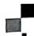

# 第一章 勾股定理

# 本章内容我会学


怎么学？一

# 类比学习

思考：直角三角形的内角有怎样的关系？三条边有怎样的关系？

<table><tr><td>直角三角形内角关系</td><td>研究路径</td><td>直角三角形三边关系</td></tr><tr><td>如图,有一个直角三角形纸板破损了一个角,如果把它补成完整的三角形纸板,需要补的角的度数是多少?</td><td rowspan="4">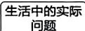 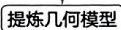 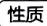 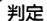 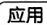</td><td>如图,点A,C之间隔有一湖,在与AC方向成90°角的CB方向上的点B处测得AB=500m,BC=400m,则AC的长为多少?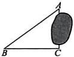</td></tr><tr><td>有一个内角是直角的三角形是直角三角形</td><td></td></tr><tr><td>直角三角形的两个锐角互余</td><td></td></tr><tr><td>1求与直角三角形有关的角度;2根据角的关系判定直角三角形</td><td></td></tr></table>

# 知识概览

学什么？一

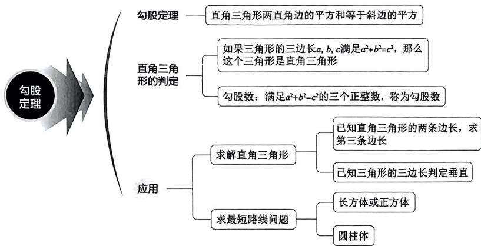

<details>
<summary>flowchart</summary>

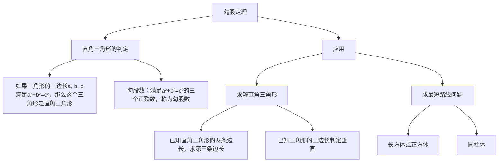
</details>

# 学习目标

# 教辅资源，关注公众号★全科AA+

学到什么程度？一

1. 理解勾股定理: 直角三角形两直角边的平方和等于斜边的平方.  
2. 掌握勾股定理: 能运用勾股定理解决一些简单的实际问题.  
3. 理解直角三角形的判定: 如果三角形的三边长 a, b, c 满足 $a^{2} + b^{2} = c^{2}$ ，那么这个三角形是直角三角形.  
4. 掌握直角三角形的判定.  
5. 了解勾股数: 满足 $a^2 + b^2 = c^2$ 的三个正整数, 称为勾股数.

# 1 第1课时 探索勾股定理


# 探究与应用

探新知 悟本质 会迁移 ……

# 探究 直角三角形的三边关系

# 问题导入

如图 1-1-1, 从电线杆离地面 8 m 处向地面拉一条钢索, 如果这条钢索在地面的固定点距离电线杆底部 6 m, 那么需要多长的钢索?

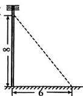  
图1-1-1

# 思考交流

(1)在纸上画若干个直角三角形,分别测量它们的三条边,看看三边长的平方之间有怎样的关系.与同伴进行交流.

(2)如图1-1-2①,直角三角形三边长的平方分别是多少,它们满足上面所猜想的数量关系吗?你是如何计算的?与同伴进行交流.图②中的直角三角形是否也具有这样的关系?你又是如何计算的呢?(网格中小正方形的边长均为1)

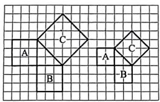

<details>
<summary>text_image</summary>

A
B
C
A
B
C
</details>

①

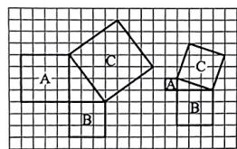

<details>
<summary>text_image</summary>

A
B
C
A
B
C
</details>

②   
图1-1-2

(3)如果直角三角形的两直角边长分别为1.6个单位长度和2.4个单位长度,那么上面所猜想的数量关系还成立吗?说说你的理由.

# 敲黑板

# 概括新知

勾股定理：直角三角形两直角边的平方和等于斜边的\_\_\_\_。如果用 $a, b$ 和 $c$ 分别表示直角三角形的两直角边和斜边，那么\_\_\_\_。

# 尝试思考

在图 1-1-1 的问题中,需要多长的钢索?

# 应用1 利用勾股定理求直角三角形的边长

例1（1）如图1-1-3，在Rt△ABC中，∠C=90°,a=9,b=12，求c的值；

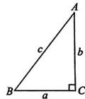  
图1-1-3

(2)如图1-1-4，在Rt△ABC中，∠B=90°,AC=25,BC=20.求AB的长.

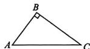  
图1-1-4

例2 在 Rt△ABC 中, AC=6, BC=10. 求 $AB^{2}$ 的值.

# 敲黑板

# 知要点

勾股定理只适用于直角三角形，揭示了直角三角形的三边关系，如果用 a, b, c 分别表示直角三角形的两直角边和斜边，那么 $a^{2} + b^{2} = c^{2}$ ，可变形为 $a^{2} = c^{2} - b^{2}, b^{2} = c^{2} - a^{2}$ .

# 防易错

已知直角三角形的两边求第三边或第三边的平方时，如果题目中没有明确指明斜边和直角边，应分情况讨论.

例3 如图1-1-5，在锐角三角形 $ABC$ 中，高 $AD = 12$ ，边 $AC = 13, BC = 14$ 求 $AB$ 的长.

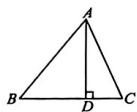  
图1-1-5

# 应用2 利用勾股定理求图形的面积

# 1. 借助图形面积之间的关系求面积

例4（1）如图1-1-6，正方形A，B，C的边长分别为直角三角形的三边长，若正方形A，C的边长分别为4和7，则正方形B的面积为\_\_\_\_；

(2)如图1-1-7,在 $\mathrm{Rt}\triangle ABC$ 中， $\angle ACB = 90^{\circ}$ ，若 $AB = 10$ 则正方形ADEC和正方形BCFG的面积和为多少？

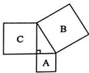  
图1-1-6

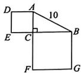  
图1-1-7

# 2. 求非直角三角形的面积

例 5 如图 1-1-9, 在 $\triangle EFG$ 中, $EF = 15 \, cm$ , $FG = 14 \, cm$ , $EG = 13 \, cm$ , 求 $\triangle EFG$ 的面积.

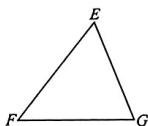  
图1-1-9

# 敲黑板

# 会观察

当图形中含有多个直角三角形时，应结合已知条件观察图形，寻找解题突破口，通过多次应用勾股定理得到结论.

# 归模型

(1) 如图 1-1-8 甲, 分别以直角三角形的三边为边向外作正方形, 三个正方形的面积分别是 $S_{1}$ , $S_{2}, S_{3}$ , 则有 $S_{1} = S_{2} + S_{3}$ ;

(2) 推广: 如图乙所示, 三个半圆的面积 $S_{1}, S_{2}, S_{3}$ 具有相同的关系: $S_{1} = S_{2} + S_{3}$ .

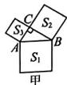

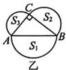  
图1-1-8

# 学方法

构造直角三角形解题

当题目中已知的三角形为非直角三角形时，可通过作高构造直角三角形，借助勾股定理建立边长之间的关系，进而求得结论.

# 【延伸拓展】

借助面积求直角三角形斜边上的高

如图1-1-10，在 $\mathrm{Rt}\triangle ABC$ 中， $\angle C = 90^{\circ},AC = 10,BC = 24.$ 求点 $C$ 到 $AB$ 的距离.

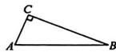  
图1-1-10

# 敲黑板

# 学方法

等面积法求直角三角形斜边上的高已知直角三角形的两条直角边的长，求斜边上的高，先根据勾股定理求出斜边的长，再借助三角形的面积 $= \frac{1}{2} \times$ 直角边 $\times$ 直角边 $= \frac{1}{2} \times$ 斜边 $\times$ 斜边上的高求解.

# 课堂小结与检测

|认知逻辑|

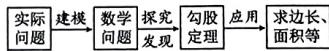

课堂检测

1. 如图 1-1-11, 在 $\triangle ABC$ 中, $\angle C = 90^{\circ}$ , 则 ( )

A. $BC = AB + AC$

B. $AC^2 = AB^2 +BC^2$

C. $AB^{2} = AC^{2} + BC^{2}$

D. $BC^{2} = AB^{2} + AC^{2}$

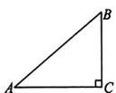  
图1-1-11

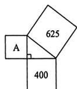  
图1-1-12

2. 如图 1-1-12,400,625 表示所在正方形的面积,则字母 A 所代表的正方形的面积为 \_\_\_\_.

3. 在 Rt△ABC 中，∠C=90°, AB 则 BC 的长为 \_\_\_\_.

4. 如图 1-1-13, 在 $\triangle ABC$ 中, $\angle C = 90^{\circ}$ , $D$ 是 $BC$ 边上一点, $AB = 17 \mathrm{~cm}, AD = 10 \mathrm{~cm}, AC = 8 \mathrm{~cm}$ , 则 $BD$ 的长为 \_\_\_\_ cm.

5. 如图 1-1-14, 在 Rt△ABC 中, ∠ACB = 90°, AC = 12, BC = 16, 以点 A 为圆心, AC 长为半径画弧, 交 AB 于点 D, 求 BD 的长.

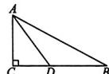  
图1-1-13

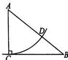  
图1-1-14

# 第2课时 勾股定理的验证及其简单应用

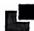

# 探究与应用

探断知 恪本质 会迁移 ……

# 探究1 勾股定理的验证方法

# 问题导入

上一课,我们通过测量和数格子的方法发现了勾股定理.在图1-1-15中,分别以直角三角形的三条边为边长向外作正方形,你能利用这个图说明勾股定理的正确性吗?

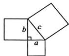  
图1-1-15

# 尝试思考

为了计算图 1-1-15 中大正方形的面积, 小明对这个大正方形适当割补后, 分别得到图 1-1-16①②.

(1) 将所有三角形和正方形的面积用含 a, b, c 的式子表示出来；  
(2)图①、图②中正方形ABCD的面积分别是多少？你有哪些表示方式？  
(3)你能分别利用图①、图②验证勾股定理吗？

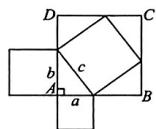  
①

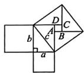  
②   
图1-1-16

# 应用1 验证勾股定理

例1（1）图1-1-17①②都是由边长均为1的小正方形组成的，把图①按图中的分割方法分割成5部分后可拼接成一个大正方形（内部的粗实线表示分割线），请你在图②中画出拼接成的大正方形；

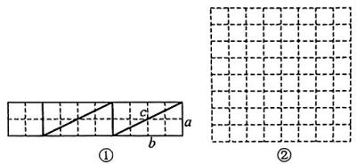

<details>
<summary>text_image</summary>

①
②
</details>

图1-1-17

(2)如果(1)中分割成的直角三角形两直角边长分别为 $a, b (b > a)$ , 斜边长为 $c$ . 请你利用图②中拼成的大正方形验证勾股定理.

# 敲黑板

# 学方法

验证勾股定理的方法

借助图形的面积验证勾股定理,基本思路是利用两种不同的方法表示出图形的面积,进而列出等式,化简后得到 $a^{2}+b^{2}=c^{2}$ .

# 理思路

拼图法验证勾股定理的步骤: 拼图形→写出表示相关图形面积的式子→找出等量关系→变形整理→推导出勾股定理.

# 应用2 运用勾股定理解决实际问题

例2（教材典题）在一次军事演习中，红方侦察员王叔叔在距离一条东西向公路 $400\mathrm{m}$ 处侦察，发现一辆蓝方汽车在这条公路上疾驶。他用红外测距仪测得汽车与他相距 $400\mathrm{m}$ ；过了 $10\mathrm{s}$ ，测得汽车与他相距 $500\mathrm{m}$ 。你能帮王叔叔计算蓝方汽车这 $10\mathrm{s}$ 的平均速度吗？

# 探究2 非直角三角形中 $a^2 + b^2$ 与 $c^2$ 的关系

# 思考交流

如果一个三角形是钝角三角形或锐角三角形,那么它的三边长仍然满足“较长边的平方等于另外两边的平方和”吗?以图1-1-18为例,说说你的判断和理由,并与同伴进行交流.

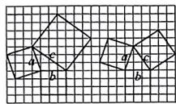  
图 1-1-18

# 概括新知

在 $\triangle ABC$ 中，三边长分别是a,b,c(c为最长边).

(1) 当 $\triangle ABC$ 为直角三角形时, $a^{2} + b^{2} = c^{2}$ ;  
(2) 当 $\triangle ABC$ 为锐角三角形时, $a^{2} + b^{2} > c^{2}$ ;  
(3) 当 $\triangle ABC$ 为钝角三角形时, $a^{2} + b^{2} < c^{2}$ .

# 应用3 根据三角形的三边关系判定非直角三角形

例3 已知 $\triangle ABC$ 的三边分别是 $a, b, c$ , 根据下列条件判断三角形的形状.

$$
(1) a = 4, b = 5, c = 7; \quad (2) a = 6, b = 9, c = 1 0.
$$

# ·课堂小结与检测

|认知逻辑

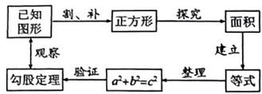

<details>
<summary>flowchart</summary>

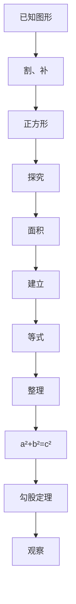
</details>

课堂检测

1. 如图 1-1-19 所示, 为修铁路需凿隧道 AC, 测得 $\angle ACB = 90^{\circ}, AB = 130 \, m, BC = 120 \, m$ , 若每天凿隧道 5 m, 则把隧道凿通需要 ( )

A. 10 天

B.9天

C.8天

D. 11 天

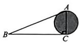  
图 1-1-19

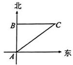  
图1-1-20

2. 如图 1-1-20, 小明从点 A 出发向正北方向走 120 米到达点 B, 接着向正东方向走 160 米到点 C, 此时小明离点 A \_\_\_\_ 米.

3.（教材例题变式）某段东西向公路限速 $25\mathrm{m / s}$ ，“流动测速小组”在距离此公路 $800~\mathrm{m}$ 的 $A$ 处观察，发现有一辆汽车在公路上疾驰，汽车从 $C$ 处行驶 $20\mathrm{s}$ 后到达 $B$ 处，测得 $AB = 1000\mathrm{m}$ ，若 $AC\bot BC$

(1) 求 BC 的长；  
(2)这辆汽车超速了吗？并说明理由.

课后作业，达标巩固

请完成对应课时作业，另见单本

# 2 一定是直角三角形吗


# 探究与应用

探断知 悟本质 会迁移 ……

# 探究 由三边关系判定直角三角形

# 问题导入

在一个直角三角形中，两直角边的平方和等于斜边的平方.反过来，如果一个三角形中有两边的平方和等于第三边的平方，那么这个三角形是直角三角形吗？

# 思考交流

下面的每组数分别是一个三角形的三边长 $a, b, c$ ，而且都满足 $a^2 + b^2 = c^2$ ：

3,4,5;5,12,13;8,15,17;7,24,25;9,40,41.

分别以每组数为三边长画出三角形，它们都是直角三角形吗？你是怎么想的？与同伴进行交流。


# 概括新知

(1)直角三角形的判定：如果三角形的三边长 $a, b, c$ 满足 \_\_\_\_，那么这个三角形是直角三角形.

注：当三边满足 $a^2 + b^2 = c^2$ 时，最长边 $c$ 所对的角为直角.

(2) 勾股数：满足 $a^2 + b^2 = c^2$ 的三个 \_\_\_\_ 数，称为勾股数.

注：常见的勾股数有3,4,5;6,8,10;5,12,13;7,24,25等.

# 应用 判定直角三角形

例1 下列几组数能否作为直角三角形的三边长？说说你的理由.

①12,16,20;②1.5,2,2.5;③ $\frac{1}{3},\frac{1}{4},\frac{1}{5}$ ;④ $3^{2},4^{2},5^{2}$ .

例2（教材典题）一个零件的形状如图1-2-1①所示，按规定这个零件中∠A和∠DBC都应为直角.工人师傅量得这个零件各边尺寸如图②所示(单位：cm)，这个零件符合要求吗？

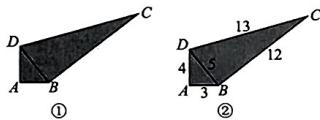

<details>
<summary>text_image</summary>

C
D
A B
①
D
4
A 3 B
②
13
5
12
C
</details>

图1-2-1

# 【延伸拓展】

# 勾股数组的规律

(1)在例1中，12,16,20是一组勾股数吗？1.5,2,2.5呢？

(2)3,4,5 是一组勾股数,将其扩大为原来的 10 倍,所得到的三个数还是一组勾股数吗?将其缩小为原来的 $\frac{1}{10}$ , 所得到的三个数还是一组勾股数吗?

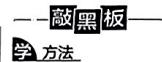

利用三角形的边长判断一个三角形是不是直角三角形的方法

(1) 确定最长边；  
(2) 计算较短两边的平方和及最长边的平方；  
(3) 比较计算的结果, 做出判断, 相等则是, 否则不是.

# 勤总结

一组勾股数扩大正整数倍后还是勾股数，但缩小为原来的 $\frac{1}{n} (n\geqslant 2,n$ 为正整数）后不一定是勾股数.

# ·课堂小结与检测·

|认知逻辑|

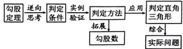

<details>
<summary>flowchart</summary>

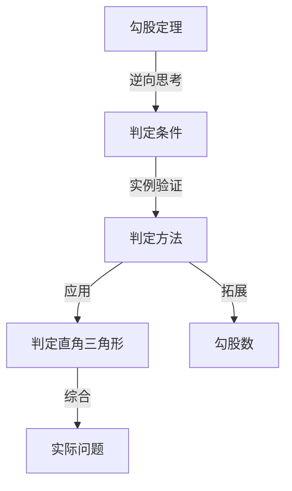
</details>

课堂检测

1. 下列几组数中,不能作为直角三角形三边长的是
()

A. 5,12,13

B.6.8,10

C. 0.5, 1.2, 1.3

D. 2,3,4

2. 下列各组数中, 是勾股数的是 ( )

A. 1,2,3

B.0.3,0.4,0.5

C. $1, \frac{4}{3}, \frac{5}{3}$

D. 11,60,61

3. 在 $\triangle ABC$ 中, 若其三条边的长度分别为9,12,15,则这个三角形的面积是\_\_\_\_.

4. 如图 1-2-2, 这是某推车的简化结构示意图. 现测得 $BC = 2 \mathrm{dm}, CD = 8 \mathrm{dm}, AD = 16 \mathrm{dm}, AB = 18 \mathrm{dm}$ , 其中 $AD$ 与 $BD$ 之间由一个固定为 $90^{\circ}$ 的零件连接 (即 $\angle ADB = 90^{\circ}$ ), 按照设计要求需满足 $BC \perp CD$ , 请判断该推车是否符合设计要求, 并说明理由.

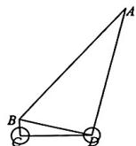  
图1-2-2

课后作业，达标巩固 请完成对应课时作业，另见单本

# 3 勾股定理的应用


# 探究与应用

探新知 悟本质 会迁移 ……

# 应用1 判定直角三角形说明垂直

例1 装修工人李叔叔想检测某块装修用砖(如图 1-3-1)的边 $AD$ 和边 $BC$ 是否分别垂直于底边 $AB$ .

(1)如果李叔叔随身只带了卷尺,那么你能替他想办法完成任务吗?  
(2) 李叔叔测得边 AD 长 30 cm, 边 AB 长 40 cm, 点 B, D 之间的距离是 50 cm. 边 AD 垂直于边 AB 吗?  
(3)如果李叔叔随身只带了一个长度为 $20\mathrm{cm}$ 的刻度尺，那么他能检验边 $AD$ 是否垂直于边 $AB$ 吗？

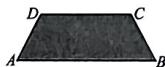  
图1-3-1

# 敲黑板

明思路

借助直角三角形的判定验证垂直的思路

先构造出相应的三角形，测量三角形的三条边长，如果满足两条短边的平方和等于最长边的平方，那么三角形为直角三角形，可说明垂直.

变式 在综合实践课上, 甲、乙两组同学分别设计方案, 检测背景墙面(如图1-3-2所示)的边 $AD$ 和边 $BC$ 是否分别垂直于底边 $AB$ .

(1)甲组的工具为卷尺,测量得边AD长为1 m,边AB长为2.4 m,点B和点D之间的距离是2.6 m.请你依据测量数据判断边AD是否垂直于边AB,并说明理由;  
(2)乙组的工具是量程为 $20 \, cm$ 的刻度尺,请你帮他们设计一个方案检验边 BC 是否垂直于边 AB.

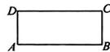  
图1-3-2

# 应用2 借助勾股定理构造方程求边长

例2 如图1-3-3, 正方形纸片ABCD的边长为 $8\mathrm{cm}$ , $E$ 是边 $AD$ 的中点, 将这个正方形纸片翻折, 使点 $C$ 落到点 $E$ 处, 折痕交边 $AB$ 于点 $G$ , 交边 $CD$ 于点 $F$ . 你能求出 $DF$ 的长吗?

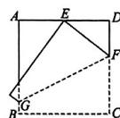  
图1-3-3

借助勾股定理列方程利用勾股定理解决问题时，当已知直角三角形的一条边及另外两条边之间的数量关系时，可设未知数表示出另外两条边长，根据勾股定理列方程即可求解.

例3（教材典题）今有池方一丈，葭生其中央，出水一尺。引葭赴岸，适与岸齐。问水深、葭长各几何？（选自《九章算术》）

题目大意:如图 1-3-4,有一个水池,水面是一个边长为 1 丈(“尺”“丈”是我国传统长度单位,1 丈=10 尺)的正方形.在水池正中央有一根新生的芦苇,它高出水面 1 尺.如果把这根芦苇垂直拉向岸边,那么它的顶端恰好到达岸边的水面.这个水池的深度和这根芦苇的长度各是多少?

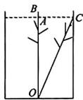  
图1-3-4

# 课堂小结与检测

# 课堂检测

1. 如图 1-3-5, 小明欲控制遥控轮船匀速垂直横渡一条河, 但由于水流的影响, 实际上岸地点 C 与欲到达地点 B 相距 10 米, 结果轮船在水中

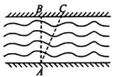  
图1-3-5

实际航行的路程 AC 比河的宽度 AB 多 2 米, 则河的宽度 AB 是 ( )

A. 8 米

B.12米

C. 16 米

D. 24 米

2.（教材随堂练习 T1 变式）五根小木棒的长度分别是 9 cm, 12 cm, 15 cm, 36 cm, 39 cm，现将它们摆成两个直角三角形，如图 1-3-6 所示的四个图形中正确的是 \_\_\_\_。（只填序号）

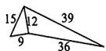  
①

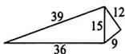  
②

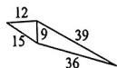  
③

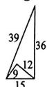  
图1-3-6

3.（教材尝试思考变式）如图1-3-7，在长方形纸片ABCD中， $AB = 12,BC = 5$ ，点 $\pmb{E}$ 在 $AB$ 上，将 $\triangle DAE$ 沿 $DE$ 折叠，使点 $A$ 落在对角线BD上的点 $F$ 处.

(1) 求 $BD$ 的长；

(2) 求 $AE$ 的长.

  
图1-3-7

# 问题解决策略：反思


# 探究与应用

探新知 语本质 会迁移 ……

# 敲黑板

# 探究 立体图形表面上最短路线问题

# 问题导入

如图 1-JY-1, 一个圆柱的高为 12 cm, 底面圆的周长为 18 cm. 在圆柱下底面的点 A 处有一只蚂蚁, 它想吃到上底面上与点 A 相对的点 B 处的食物, 那么它沿圆柱侧面爬行的最短路程是多少?

  
图1-JY-1

# 理解问题

(1)在这个问题中,已知条件有哪些?你认为已知条件足够解决这个问题吗?  
(2)沿侧面爬行的可能路线有哪些？什么情况下路线最短？请你用圆柱形水杯等物品实际感受一下.

# 拟订计划

(1)以前研究过最短路线问题吗？这个问题与以前研究的最短路线问题有什么不同？  
(2)如何将曲面上的最短路线问题转化为平面上的最短路线问题？各个点的位置如何确定？

# 实施计划

(1)如图 1-JY-2, 将圆柱侧面剪开, 确定展开图的形状, 以及与圆柱的对应关系;  
(2)在图中标出点 B 的位置；  
(3)在图中确定 A, B 两点之间最短的路线，并计算它的长度.


<details>
<summary>natural_image</summary>

Two grayscale images: a cylindrical container with an ant and a textured surface, labeled A (no text or symbols on the objects themselves)
</details>

图1-JY-2

# 回顾反思

(1)在拟订解决问题的方案和实施方案的过程中,你获得了哪些经验?与同伴进行交流;  
(2)这个问题中,影响结果的量有哪些?如果改变有关的量,你还能求解吗?例如,改变圆柱的形状,改变A,B两点的位置,改为沿着圆柱表面爬行……这时又会有哪些新的问题?选择部分问题进行研究,并与同伴进行交流;  
(3) 解决这个问题的经验, 还可以运用到哪些问题中? 例如, 能否解决正方体、长方体等几何体表面两点之间的最短路线问题?  
(4)生活中还有哪些现实问题涉及几何体表面上的最短路线？举几个实例，并思考解决问题的方案；  
(5)对于解决问题之后的回顾反思,你有哪些体会?与同伴进行交流.

# 应用 求立体图形中最短路径问题

例1 一只螳螂在一圆柱形松树树干的点 $A$ 处，发现它的正上方点 $B$ 处有一只小虫子，螳螂想捕到这只虫子，但又怕被发现，于是按如图1-JY-3所示的路线，绕到虫子后面吃掉它。已知树干横截面的周长为 $20 \mathrm{~cm}, A, B$ 两点间的距离为 $15 \mathrm{~cm}$ 。若螳螂想吃掉在点 $B$ 处的小虫子，求螳螂绕行的最短路程。

  
图1-JY-3

例2 如图1-JY-4, 长方体盒子的棱长 $AB, BC$ 均为 $6 \mathrm{~cm}, AA_{1} = 14 \mathrm{~cm}$ , 假设昆虫甲从盒外顶点 $C_{1}$ 开始以 $1 \mathrm{~cm} / \mathrm{s}$ 的速度在盒子的外部沿棱 $C_{1} C$ 向下爬行, 同时昆虫乙从盒外顶点 $A$ 以相同的速度在盒外壁的侧面上爬行, 那么昆虫乙至少需要多长时间才能捕捉到昆虫甲?

  
图1-JY-4

几何体上的最短路径问题

<table><tr><td></td><td>图例</td></tr><tr><td>圆柱</td><td></td></tr><tr><td>长方体</td><td rowspan="2"></td></tr><tr><td>台阶问题</td></tr></table>

# ·课堂小结与检测

认知逻辑


<details>
<summary>flowchart</summary>


</details>

课堂检测

1. 如图 1-JY-5, 一只电子蚂蚁从正方体的顶点 P 处沿着表面爬到顶点 Q 处, 电子蚂蚁的爬行路线(图 1-JY-6)在平面展开图(部分)中如实线所示, 其中路线最短的是 ( )

  
图1-JY-5


图1-JY-6  


2. 如图 1-JY-7, 一个圆柱的底面半径为 $\frac{8}{\pi}$ , BC=12, 动点 P 从点 A 出发, 沿着圆柱的侧面移动到 BC 的中点 S, 则移动的最短路程为 ( )

A. 10

B. 12

C. 14

D. 20

  
图1-JY-7

课后作业，达标巩固

请完成对应课时作业，另见单本

# 本章总结提升


# 知识结构关系

构建体系


<details>
<summary>flowchart</summary>


</details>


# 重点模块总结

厚积薄发

# 模块 1 勾股定理

直角三角形两直角边的平方和等于\_\_\_\_
如果用 a, b 和 c 分别表示直角三角形的两直角边和斜边，那么 \_\_\_\_

例1 已知: 如图 1-T-1, 在 $\triangle ABC$ 中, AB = AC = 10, BC = 16, 点 D 在 BC 上, $DA \perp CA$ 于点 A, 求 BD 的长.

  
图1-T-1


<details>
<summary>text_image</summary>

A
b
c
C
a
B
D
①
A
b
c
C
a
B
D
②
c
F
a
E
b
c
</details>

图1-T-2

# 模块2 勾股定理的验证

验证勾股定理的方法有很多,用拼图验证的基本思路是利用面积\_\_\_\_来验证.

例2 很早之前, 古人就通过拼图验证了勾股定理: 在直角三角形中两直角边 $a, b$ 与斜边 $c$ 满足关系式 $a^2 + b^2 = c^2$ . 如图1-T-2①, 在正方形ACDE的边 $CD$ 上取点 $B$ , 连接 $AB$ , 得到 $\mathrm{Rt}\triangle ACB$ , 三边分别为 $a, b, c$ , 剪下 $\triangle ACB$ 把它拼接到 $\triangle AEF$ 的位置, 如图②所示, 请利用面积不变验证勾股定理.

归纳

验证勾股定理的基本思路是利用整个几何图形的面积与组成该图形的各部分图形的面积之和相等为等量关系列式，整理后即可验证勾股定理.

# 模块3 直角三角形的判定

如果三角形的三边长 a, b, c 满足 \_\_\_\_，那么这个三角形是直角三角形。

例 3 如图 1-T-3, 有一张四边形纸片 AB-CD, $AB \perp BC$ . 测得 AB = 9 cm, BC = 12 cm, CD = 8 cm, AD = 17 cm.

(1) 求 A, C 两点之间的距离；  
(2) 求这张纸片的面积.

  
图1-T-3

# 模块4 勾股定理的实际应用

运用勾股定理解决实际问题时,要学会从实际问题中抽象出\_\_\_\_三角形模型,若没有可通过作\_\_\_\_来构建直角三角形模型.

例 4 核心素养 模型观念 葛藤是一种刁钻的植物, 它的腰杆不硬, 为了争夺雨露阳光, 常常绕着树干盘旋而上, 它还有一手绝招, 就是它绕树盘升的路线总是沿最短路线螺旋前进的, 难道植物也懂数学? 通过阅读以上信息, 解决下列问题:

(1) 若树干的周长(即图 1-T-4 中圆柱体的底面周长)为 30 cm, 绕一圈升高(即圆柱的高) 40 cm, 则它爬行一圈的路程是多少?

(2)若树干的周长为 $80 \, cm$ ，爬行一圈的路程为 $100 \, cm$ ，爬行 10 圈到达树顶，则树干高多少？

  
图1-T-4

归纳

运用勾股定理求立体图形上的最短路径问题时，先将立体图形展开成平面图形，确定直角三角形，再借助勾股定理求出答案.

# 综合能力提升

升华思维

例5 新情境日常生活学习了勾股定理后，某校数学兴趣小组的同学把“测量风筝离地面的高度”作为一项课题活动，利用课余时间完成了实践调查，并形成如下活动报告：

<table><tr><td colspan="2">活动报告</td></tr><tr><td>课题</td><td>测量风筝离地面的高度</td></tr><tr><td>成员</td><td>组长:××× 组员:×××,×××,×××</td></tr><tr><td>工具</td><td>皮尺等</td></tr><tr><td>示意图</td><td>图1-T-5</td></tr><tr><td>方案</td><td>如图1-T-5,先测量风筝到放风筝同学的水平距离BD,然后根据手中剩余风筝线的长度得出放出的风筝线长BF,最后测量握风筝线的手到地面的距离AB</td></tr><tr><td>数据</td><td>BD=16米,BF=20米,AB=1.7米</td></tr><tr><td>评价</td><td></td></tr></table>

请根据活动报告回答下列问题：

(1) 求此时风筝离地面的高度 EF；

(2)若站在点 A 处不动,想把风筝从点 F 的位置竖直上升 18 米放到点 C 的位置,则还需放出风筝线多少米?

课后作业，达标巩固 请完成周末自评（一），另见单本


# 第二章 实数

# 本章内容我会学


# 类比学习

怎么学？一

②思考：从非负数到有理数，再从有理数到实数，这两个研究过程有哪些类似之处？

<table><tr><td>有理数</td><td>研究路径</td><td>实数</td></tr><tr><td>通过负数的引入,进而得出有理数,再在有理数范围内进行混合运算,最后利用计算解决实际问题.</td><td></td><td>通过无理数的引入,进而得出实数,再在实数范围内进行运算,最后利用计算解决实际问题.</td></tr></table>

# 知识概览

学什么？


<details>
<summary>flowchart</summary>


</details>

# 学习目标

学到什么程度？

1. 了解无理数和实数,知道实数是由有理数和无理数组成,了解实数与数轴上的点一一对应.  
2. 能用数轴上的点表示一些具体的实数,能比较实数的大小.  
3. 能借助数轴理解有理数和绝对值的意义,会求实数的相反数、绝对值.   
4. 了解平方根、算术平方根、立方根的概念，会用根号表示平方根、算术平方根和立方根。  
5. 了解乘方与开方互为逆运算. 会用计算器计算平方根和立方根.  
6. 能用有理数估计一个无理数的大致范围.  
7. 了解二次根式、最简二次根式的概念，了解二次根式的加、减、乘、除运算法则，会用它们进行简单的四则运算.

# 1 第1课时 无限不循环小数


# 探究与应用

探断知 悟本质 会迁移 ……

# 探究 无限不循环小数

# 问题导入

图2-1-1中是两个边长为1的小正方形，剪一剪、拼一拼，设法得到一个大的正方形.

(1)设大正方形的边长为 $a, a$ 满足什么条件？  
(2)a 可能是整数吗？说说你的理由.  
(3) $\alpha$ 可能是分数吗？说说你的理由.


  
图2-1-1

# 尝试思考

(1)如图2-1-2,以直角三角形的斜边为边的正方形的面积是多少?  
(2)设该正方形的边长为 $b, b$ 满足什么条件？  
(3)b 是有理数吗?

  
图2-1-2

# 思考交流

面积为2的正方形的边长 $a$ 究竟是多少呢？

(1)如图2-1-3，三个正方形的边长之间有怎样的大小关系？说说你的理由.  
(2) 边长 a 的整数部分是几？十分位是几？百分位呢？千分位呢？……借助计算器进行探索.  
(3) 小明将他的探索过程整理如下：

<table><tr><td>边长a</td><td>面积S</td></tr><tr><td>11.96</td><td>1</td></tr><tr><td>1.41.9881</td><td>1.96</td></tr><tr><td>1.4141.999396</td><td>1.9881</td></tr><tr><td>1.41421.99996164</td><td>1.999396</td></tr></table>


  
图2-1-3

还可以继续算下去吗？ $a$ 可能是有限小数吗？

# 敲黑板

# 细琢磨

一个数既不是整数，也不是分数，这个数肯定不是\_\_\_\_。

(4)面积为5的正方形的边长 $b$ 的值是多少？ $b$ 可能是有限小数吗？与同伴进行交流.

# 敲黑板

# 概括新知

在现实世界中存在不同于有理数的数,这类数是\_\_\_\_小数.

# 应用 认识非有理数

例 如图 2-1-4 是由五个边长均为 1 的小正方形组成的图案, 如果把它们剪拼成一个正方形.

(1)所拼成的正方形的面积是多少?  
(2)设拼成的正方形的边长为a,a应满足什么条件?   
(3)a 是整数吗？是分数吗？是有理数吗？

  
图2-1-4

# ·课堂小结与检测·

|认知逻辑|


课堂检测

1. 下列说法中, 正确的是 ( )

A. 一个数不是整数就是分数  
B. 分数都是有限小数  
C. $a^2 = 6$ ，则 $a$ 是无限不循环小数  
D. $b^{3} = 8$ ，则 $b$ 是无限循环小数

2. 已知一个直角三角形的两条直角边长分别为 2 和 3.

(1)设直角三角形的斜边长是 $c, c$ 满足什么条件？  
(2)c 是整数吗？说说你的理由.  
(3)c 是分数吗？说说你的理由.

课后作业，达标巩固

请完成对应课时作业，另见单本

# 第2课时 实数

探究与应用

探断知 悟本质 会迁移 ……

教辅资源，关注公众号★全科AA+

# 探究1 认识无理数、实数

# 问题探究

一般地,不是有理数的数都是无限不循环小数吗?为了研究这个问题,我们不妨看看有理数的小数表示有什么共同特征.

把下列各数表示成小数,你发现了什么?

$$
3. \frac {4}{5}, \frac {5}{9}, - \frac {8}{4 5}, \frac {2}{1 1}.
$$

# 概括新知

有理数总可以用\_\_\_\_小数或\_\_\_\_小数表示.反过来,任何有限小数或无限循环小数也都是\_\_\_\_,无限\_\_\_\_小数称为无理数.

# 应用1 识别无理数

例1 下列各数中,哪些是有理数,哪些是无理数?

3.14, $-\frac{4}{3}, 0.57, 0.1010001000001 \cdots$ (相邻两个 1 之间 0 的个数逐次加 2).

# 概括新知

实数的概念：\_\_\_\_ 数和 \_\_\_\_ 数统称实数.

# 探究2 实数的分类、相关的概念及运算

# 尝试思考1

(1)请你把例 1 中的各数填入下面相应的集合内.

  
正数集合

  
负数集合

图2-1-5

(2)还记得有理数的分类方法吗？你能用类似的方法对实数进行分类吗？

# 敲黑板

# 记形式

无理数的常见形式

(1) 含有根号且被开方数不能被开尽的数（后面将学习），如： $\sqrt{3}$ ， $\sqrt[3]{6}$ ， $-\sqrt{31}$ ，…；

(2) 圆周率 $\pi$ 以及一些含有 $\pi$ 的数，
如： $\pi,3\pi,2-\pi,\cdots;$

(3)具有特定结构的无限不循环小数，如：0.1010010001…(相邻两个1之间0的个数逐次加1)，…

# 概括新知

实数按定义分类


<details>
<summary>flowchart</summary>


</details>

# 应用2 实数的分类

例2 把下列各数填在相应的括号内.

0.78, $-\frac{\pi}{2}$ , $\frac{2}{3}+\pi$ , -3.1415926, 20%, -1.666, 3.1010010001…(每相邻两个1之间逐次增加1个0)

①正实数集合：{ …};

②负实数集合：{ …};

③负有理数集合：{ …};

④无理数集合：{ …}.

# 尝试思考2

(1)在实数范围内,相反数、倒数、绝对值的意义与有理数范围内的相反数、倒数、绝对值的意义相同吗?

(2) 实数如何进行加、减、乘、除、乘方运算？

# 概括新知

(1)实数 a 的相反数是 \_\_\_\_，绝对值是 \_\_\_\_，当 $a \neq 0$ 时，a 的倒数是 \_\_\_\_.

(2)实数的运算律有加法的交换律、\_\_\_\_律,乘法的交换律、结合律和\_\_\_\_律.

# 应用3 实数的简单运算

例3 求下列各数的相反数、绝对值和倒数.

(1)2.5;(2) $-\frac{\pi}{2}$ ;(3) $-3\frac{1}{4}$ ;(4)3.14 $-\pi$ .

# —敲黑板

# 防易错

对实数进行分类时，应做到准而不漏，对而不乱。

# 知结论

与相反数、绝对值、倒数有关的结论

(1) $a$ 与 $b$ 互为相反数 $\Leftrightarrow a + b = 0$ ;

(2) 当 $a \neq 0, b \neq 0$ 时，a 与 b 互为倒数 $\Leftrightarrow ab=1$ ;

(3) $|a| = |b| \Leftrightarrow$

$a = b$ 或 $a = -b$ .

例4 计算： $\left(\frac{\pi}{2} -3\right)^{0} + |3 - \pi | - \left(\frac{3}{\pi}\right)^{-1}$

# 探究3 实数的数轴表示

# 思考交流

前面讨论的两个正方形，边长分别是 $a, b$ ，且满足 $a^2 = 2, b^2 = 5$ .

(1)如图2-1-6, $OA = OB$ ，数轴上点 $A$ 对应 $a,b$ 中的哪个数？  
(2)你能在数轴上找到另一个数对应的点吗？与同伴进行交流.

  
图2-1-6

# 概括新知

每一个实数都可以用数轴上的一个点表示；反过来，数轴上的每一个点都表示一个实数。也就是说，实数和数轴上的点是\_\_\_\_的。

# 应用4 用数轴上的点表示无理数

例5 在 Rt△ABC 中，∠C=90°，∠A，∠B，∠C 所对的边分别为 a, b, c，a=1, b=3，则 $c^{2}=1^{2}+3^{2}=10$ ，用数轴上的点表示 c.

# ·课堂小结与检测·

|认知逻辑|


<details>
<summary>flowchart</summary>


</details>

研究路径

课堂检测

1. 在 $0, \pi, 2.0101101110$ …（每相邻两个 0 之间依次多一个 1），3.14， $\frac{24}{11}$ 中，无理数有 （）

A. 4 个

B. 3 个

C. 2 个

D. 1 个

2. 下列说法正确的是 \_\_\_\_ (填序号).

①有理数就是有限小数；  
②无理数是无限不循环小数；  
③无限小数是无理数；  
④无限循环小数是无理数.

3. 若 $a, b, c, d$ 是不为零的实数，且 $a, b$ 互为相反数， $c, d$ 互为倒数，则 $a + b + cd$ 的值为

4. 小明用一枚直径是 1 个单位长度的纪念币在数轴上作滚动游戏, 如图 2-1-7, 纪念币从原点 $O$ 沿数轴向右滚动一周, 圆上的一点由原点 $O$ 到达点 $O'$ .

(1)你知道点 $O^{\prime}$ 对应的实数吗？  
(2)你能从小明的操作中发现什么结论?

  
图2-1-7

课后作业，达标巩固 请完成对应课时作业，另见单本

# 2 第1课时 算术平方根


# 探究与应用

探新知 悟本质 会迁移 ……

# 探究1 算术平方根的定义

# 问题导入

(1)根据图2-2-1填空： $x^{2} =$ \_\_\_\_, $y^{2} =$ \_\_\_\_, $z^{2} =$ \_\_\_\_, $w^{2} =$ \_\_\_\_.  
(2)x,y,z,w中哪些是有理数？哪些是无理数？你能表示它们吗？

  
图2-2-1

# 概括新知

算术平方根的概念：一般地，如果一个\_\_\_\_等于a，即 $x^{2}=a$ ，那么这个\_\_\_\_就叫作a的算术平方根，记作 $\sqrt{a}$ ，读作“根号a”。

特别地,我们规定:0的算术平方根是0,即 $\sqrt{0}=0$ .

# 应用1 求一个非负数的算术平方根

例1（教材典题）求下列各数的算术平方根：

(1)900;

(2)1;

(3) $\frac{49}{64}$ ;

(4)14.

变式1 求下列各数的算术平方根：

(1)0.36;

(2) $1\frac{7}{9}$ ;

(3) $(-4)^{2}$ ;

(4) $10^{-2}$ .

变式2 求下列各式的值：

(1) $\sqrt{81}$ ;

(2) $\sqrt{\frac{64}{25}}$ ;

(3) $\sqrt{0.04}$ ;

(4) $-\sqrt{5^{2}-4^{2}}$ .

# 探究2 $\sqrt{a^2}$ 和 $(\sqrt{a})^2 (a\geqslant 0)$ 的性质

# 思考交流

(1)在上面例1中,一些数的算术平方根的结果没有“ $\sqrt{}$ ”了,这些数有什么特点?  
(2) 在上面例 1 中, $\sqrt{900} = 30$ , 也就是 $\sqrt{30^2} = 30$ . 一般地, 当 $a \geqslant 0$ 时, $\sqrt{a^2} = a$ 成立吗? $a < 0$ 时, $\sqrt{a^2} = a$ 还成立吗?

(3) $(\sqrt{a})^{2}=a$ 成立吗？这里的a是什么数？你是怎么理解的？与同伴进行交流.

# 概括新知

$\sqrt{a^2}$ 和 $(\sqrt{a})^2 (a \geqslant 0)$ 的性质：当 $a \geqslant 0$ 时， $\sqrt{a^2} = \_$ ， $(\sqrt{a})^2 = \_$ ；当 $a < 0$ 时， $\sqrt{a^2} = \_$ 。

应用2 应用 $\sqrt{a^2}$ 和 $(\sqrt{a})^2 (a\geqslant 0)$ 的性质求值

例2 求下列各式的值：

(1) $\sqrt{6^2}$ ;

(2) $(\sqrt{1.2})^{2}$ ;

(3) $\sqrt{\left(-\frac{2}{3}\right)^2}$ .

# 应用3 能运用算术平方根解决实际问题

例3（教材典题）由静止自由下落的物体下落的距离 $s$ （单位：m)与下落时间 $t$ （单位：s)之间的关系为 $s = 4.9t^2$ .有一个铁球从 $19.6\mathrm{m}$ 高的建筑物上由静止自由下落，到达地面需要多长时间？

# 【延伸拓展】

# 算术平方根的双重非负性

(1)若 $\sqrt{2a + 1} +(b - 3)^2 = 0$ ，则 $a^b =$   
(2) 若 $\sqrt{x-2} + \sqrt{2-y} = 0$ ，则 xy = \_\_\_\_.

# 课堂小结与检测

|认知逻辑|


<details>
<summary>flowchart</summary>


</details>

# 课堂检测

1. 下列各数中, 没有算术平方根的数是 ( )

A.-11

B. 0

C. 6

D. 2

2. 算术平方根是它本身的数是 （）

A.0

B. 1

C. $\pm1$

D.0和1

3. 是7的算术平方根.

4. 将相邻两边长分别为 1 和 2 的长方形如图 2-2-2 剪开，拼成一个与长方形面积相等的正方形，则该正方形的边长是 \_\_\_\_。


→


图2-2-2

5. 求下列各数的算术平方根：

(1)0.64; (2) $\frac{49}{36}$ ; (3)81; (4) $(-3)^{2}$ .

课后作业，达标巩固

请完成对应课时作业，

另见单本

# 第2课时 平方根

# 探究与应用

探新知 悟本质 会迁移 ……

# 探究1 平方根的定义

# 问题导入

(1)3 的平方是 9, 还有其他数的平方也是 9 吗?  
(2)平方等于 $\frac{4}{25}$ 的数有几个？平方等于0.64的数呢？

# 概括新知

平方根的定义：一般地，如果一个数 $x$ 的 \_\_\_\_ 等于 $a$ ，即 \_\_\_\_ = a，那么这个数 $x$ 就叫作 $a$ 的平方根（也叫作二次方根）.

# 探究2 平方根的性质

# 尝试思考

(1) 平方根和算术平方根有哪些相同点和不同点?  
(2)一个正数有几个平方根？0有几个平方根？负数呢？

# 概括新知

(1) 平方根的性质: 一个正数有 \_\_\_\_ 个平方根; 0 只有 \_\_\_\_ 个平方根, 它是 0 本身; 负数 \_\_\_\_ 平方根.

(2)开平方：求一个数 $a$ 的 \_\_\_\_ 的运算，叫作开平方， $a$ 叫作被开方数. 注：开平方和平方互为逆运算.

# 应用1 求非负数的平方根

例1（教材典题改编）求下列各数的平方根：

(1)64; (2) $\frac{49}{121}$ ; -(3)0.0004; (4) $(-25)^{2}$ ; (5)11; (6) $10^{4}$ .

# -敲黑板

# 细琢磨

正数 $a$ 有两个平方根，一个是 $a$ 的算术平方根 $\sqrt{a}$ ，另一个是一 $\sqrt{a}$ ，它们互为相反数，这两个平方根合起来可以记作 $\pm \sqrt{a}$ ，读作“正、负根号 $a$ ”。

变式 求满足下列各式的未知数 $x$

(1) $x^{2}=\frac{25}{36};$

(2) $x^{2}=7.$

# 应用 2 化简求值

例2（教材典题改编）求下列各式的值：

(1) $\sqrt{225}$ ; (2) $-\sqrt{\frac{169}{4}}$ ; (3) $\sqrt{(-8)^{2}}$ ; (4) $\pm\sqrt{3^{-2}}$ .

# 【延伸拓展】

# 应用平方根的性质求被开方数

(1)一个正数的两个平方根分别是 $2a - 3$ 和 $5 - a$ ，求这个正数；  
(2)若 $2m - 4$ 与 $3m - 1$ 是同一个正数的平方根，求这个正数.

# ·课堂小结与检测

|认知逻辑


课堂检测

1. “4的平方根是±2”用数学式子表示正确的是（）

A. $\sqrt{4} = \pm 2$

B. $\pm \sqrt{4} = \pm 2$

C. $\sqrt{4} = 2$

D. $-\sqrt{4}=-2$

2. 下列说法正确的是 ( )

A. -9 的平方根是±3

B. $-a^2$ 一定没有平方根

C.16的平方根是4

D.4是16的一个平方根

3. 平方根是本身的数是

4. 若一个正数的一个平方根是-9, 则它的另一个平方根是 \_\_\_\_.

5. 求下列各数的平方根：

(1)81; (2) $(-7)^{2}$ ; (3) $10^{-4}$ ; (4) $1\frac{15}{49}$ .

课后作业，达标巩固 请完成对应课时作业，另见单本

# 敲黑板

防易错

若 $x^{2} = a (a > 0)$ 则 $x = \pm \sqrt{a}$ ，注意不要漏解.

# 15 转化

(1) 若正数 m 的平方根是 a 和 b，则 $a + b = 0$ ;

(2) 若 a, b 是正数 m 的平方根，则 a = b 或 $a + b = 0$ .

# 第3课时 立方根


# 探究与应用

探析知 悟本质 会迁移 ……

# 探究1 立方根的定义

# 问题导入

如图 2-2-3, 一个三阶魔方由形状和大小都相同的小正方体组成. 假如要制作一个体积为 $216 \, cm^{3}$ 的三阶魔方, 每个小正方体的棱长是多少?

  
图2-2-3

# 概括新知

立方根的定义：一般地，如果一个数 $x$ 的 \_\_\_\_ 等于 $a$ ，即 \_\_\_\_ = a，那么这个数 $x$ 就叫作 $a$ 的立方根，也叫作三次方根。

# 探究2 立方根的性质

# 尝试思考

(1)一个数的平方根可能有两个,一个数的立方根可能有几个呢?  
(2) 求 8,0,-27 的立方根.  
(3)正数有几个立方根？0有几个立方根？负数呢？

# 概括新知

(1)立方根的表示方法: 每个数 $a$ 都有 \_\_\_\_ 个立方根, 记作 $\sqrt[3]{a}$ , 读作 “三次根号 $a$ ”.  
(2)立方根的性质：正数的立方根是\_\_\_\_数，0的立方根是\_\_\_\_，负数的立方根是\_\_\_\_数.   
(3)开立方：求一个数 a 的 \_\_\_\_ 根的运算叫作开立方，a 叫作被开方数.

# —敲黑板

# 再体会

a 可以是正数，负数或 0.

# 细琢磨

开立方与立方互为逆运算,求一个数的立方根就是在求哪个数的立方等于这个数.

# 应用1 求一个数的立方根

例1（教材典题）求下列各数的立方根：

(1)-27; (2) $\frac{8}{125}$ ; (3)0.216; (4)-5.

变式求下列各数的立方根：

(1) $-3\frac{3}{8};$ (2) $10^{-3};$ $(3)\sqrt{64}.$

# 探究3 $\sqrt[3]{a^3}, (\sqrt[3]{a})^3$ 的性质

# 思考交流

(1)在例1中,一些数的立方根的结果没有“ $\sqrt[3]{-}$ ”了,这些数有什么特点?  
(2)在例1中， $\sqrt[3]{-27} = -3$ ，也就是 $\sqrt[3]{(-3)^{3}} = -3.$ 一般地， $\sqrt[3]{a^3} = a$ 成立吗？  
(3) $\left(\sqrt[3]{a}\right)^{3}=a$ 成立吗？与同伴进行交流.

# 概括新知

$$
\sqrt [ 3 ]{a ^ {3}} = \underline {{{\quad}}}; (\sqrt [ 3 ]{a}) ^ {3} = \underline {{{\quad}}}.
$$

# 应用2 利用 $\sqrt[3]{a^3} = a, (\sqrt[3]{a})^3 = a$ 求值

例2（教材典题）求下列各式的值：

(1) $\sqrt[3]{-8}$ ; (2) $\sqrt[3]{0.064}$ ; (3) $-\sqrt{\frac{8}{125}}$ ; (4) $(\sqrt[3]{9})^{3}$ .

变式 求下列各式的值：

(1) $(\sqrt[3]{-27})^{3}$ ; (2) $\sqrt[3]{-0.125}$ .

# 敲黑板

# 防易错

任何实数只有一个立方根，不要与平方根相混淆.

# 会转化

立方的立方根与立方根的立方

(1) 一个数 a 的立方的立方根等于 a，即 $\sqrt[3]{a^{3}} = a$ .

(2)一个数 a 的立方根的立方等于 a，即 $(\sqrt[3]{a})^{3}=a$ .

# 应用3 由立方根求未知数的值

例3 求下列各式中 $x$ 的值：

(1) $\sqrt{x}=-4;$ (2) $(x+1)^{3}=216.$

# 应用4 利用立方根解决实际问题

例 4 将体积为 $100 \, cm^{3}$ 和 $25 \, cm^{3}$ 的正方体铁块，熔成一个大正方体铁块，那么这个大正方体铁块的棱长是多少？

# 【延伸拓展】

平方根与立方根的综合应用

已知某正数的两个平方根分别是 $2m - 3$ 和 $5 - m, n - 1$ 的算术平方根为2，求 $3 + m + n - 7$ 的立方根.

# ·课堂小结与检测

|认知逻辑


课堂检测

1. 下列说法中正确的是 ( )

A.27的立方根是±3   
B. $\frac{27}{64}$ 的立方根是 $\frac{3}{8}$   
C.-2 是 -8 的立方根  
D.-8的立方根是2

2. 若一个数的立方根就是它本身, 则这个数是 \_\_\_\_.

3. 求下列各数的立方根：

(1)-125; (2) $\frac{27}{64}$ ; (3)-0.512; (4) $11^{3}$ .

4. 求下列各式的值：

(1) $\sqrt[3]{-\frac{1}{8}}$ ; (2) $\sqrt[3]{0.125}$ ; (3) $\sqrt[3]{6^{3}}$ ; (4) $(\sqrt[3]{19})^{3}$ .

课后作业，达标巩固 谓完成对应课时作业，另见单本

# 第4课时 估算


# 探究与应用

探断知 悟本质 会迁移 ……

# 探究1 估算无理数的大小

# 问题导入

某地开辟了一块长方形的荒地, 新建一个环保主题公园. 已知这块荒地的长是宽的 2 倍, 它的面积为 $400000 \mathrm{~m}^{2}$ .

(1)公园的宽大约是多少？它有 1000 m 吗？  
(2)如果要求结果精确到10 m,它的宽大约是多少?  
(3)该公园中心有一个圆形花圃,它的面积是 $800 \, m^{2}$ ,你能估计它的半径吗(结果精确到 $1 \, m$ )?

# 思考交流

$$
\sqrt {0 . 4 3} \approx 0. 0 6 6, \sqrt [ 3 ]{9 0 0} \approx 9 6, \sqrt {2 5 3 6} \approx 6 0. 4.
$$

(1)下列计算结果正确吗？你是怎样判断的？与同伴进行交流.  
(2)你能估计 $\sqrt[3]{900}$ 的大小吗(结果精确到1)?  
(3)宽与长之比为 $\frac{\sqrt{5} - 1}{2}$ 的长方形称为“黄金矩形”.你能比较 $\frac{\sqrt{5} - 1}{2}$ 与 $\frac{1}{2}$ 的大小吗？你是怎么想的？

# 概括新知

(1)用估算法确定无理数的大小：对于带根号的无理数的近似值的估算，可通过平方运算或立方运算，采用“夹逼法”（即两边逼近的方法）确定其近似值.一般思路：先估计大约是多少，再缩小范围进一步精确估计.  
(2)用估算的方法比较大小：用估算法比较两个数的大小时，若其中有无理数，先通过分析估算出无理数的大致取值范围，再进行具体比较.

# 敲黑板

# 应用1 估算无理数的大小

例1 估计下列各数的大小：

(1) $\sqrt{37}$ (结果精确到0.1);(2) $\sqrt[3]{600}$ (结果精确到1).

# 应用2 利用无理数的估算比较数的大小

例2 比较 $\sqrt{6}$ 与2.5的大小.

变式 比较下列各组数的大小：

(1) $\frac{\sqrt{6}+1}{2}$ 与1.5;

(2) $\sqrt[3]{26}$ 与2.1.

# 应用3 利用无理数的估算解决实际问题

例3（教材典题）生活经验表明，靠墙摆放梯子时，若梯子底端离墙的距离约为梯子长度的 $\frac{1}{3}$ ，则梯子比较稳定。如图2-2-4，现有一架长度为 $6\mathrm{m}$ 的梯子，当梯子稳定摆放时，它的顶端能抵达 $5.6\mathrm{m}$ 高的墙头吗？

  
图2-2-4

变式 例3中梯子的顶端能达到 $5.7\mathrm{m}$ 高的墙头吗？

# 敲黑板

# 学方法

比较两个实数大小的常用方法

(1)估算法:估算出所给无理数的近似值,再比较;  
(2)作差法:通过作差,看差值大于0还是小于0,进而作出比较;   
(3)乘方法:把两个无理数同时乘方(一般平方或立方),比较乘方后的数的大小,进而得出原数的大小.

# 探究2 计算器在估算中的应用

# 尝试思考

(1) 观察你的计算器面板, 对于开方运算, 可能用到哪些按键? 利用计算器求下列各式的值 (结果精确到 0.0001): ① $\sqrt{5.89}$ ; ② $\sqrt[3]{-1285}$ .  
(2)任意找一个你认为很大的正数,利用计算器对它进行开平方运算,对所得结果再进行开平方运算……随着开平方次数的增加,你发现了什么?改用另一个小于1的正数试一试,看看是否仍有类似的规律.

# 应用4 借助计算器求近似值

例4 用计算器求下列各式的值(结果精确到0.001):

(1) $\sqrt{0.0125}$ ;   
(2) $\sqrt[3]{\frac{3}{7}}$ ;   
(3) $\sqrt[3]{-7}$ ;   
(4) $\sqrt{5\times6}-\pi.$

# ·课堂小结与检测

|认知逻辑


<details>
<summary>flowchart</summary>


</details>

课堂检测

1. 估计 $\sqrt{35}$ 的值 （）  
A. 在 3 和 4 之间  
B. 在 4 和 5 之间  
C. 在 5 和 6 之间  
D. 在 6 和 7 之间  
2. 估计 $\sqrt[3]{90}$ 的结果为 \_\_\_\_. (结果精确到1)

3. 用计算器计算: $\sqrt[3]{3817} \approx$ \_\_\_\_. (精确到 0.01)

4. 比较下列各组数的大小.

3. 用计算器计算: $\sqrt[3]{3817} \approx$ \_\_\_\_. (精确到0.01)
4. 比较下列各组数的大小.

(1) $\sqrt{76}$ 与8.5;

(2) $\sqrt{3}$ 与 $\sqrt[3]{5}$ ;

$$
(3) \frac {\sqrt {5} + 1}{2} \text {与} \frac {5}{3}.
$$

课后作业，达标巩固 请完成对应课时作业，另见单本

# 3 第1课时 二次根式的概念及乘除运算


# 探究与应用

探新知 悟本质 会迁移 ……


# 探究1 二次根式的概念

# 观察发现

观察下列代数式：

$$
\sqrt {5}  , \sqrt {1 1}  , \sqrt {7 .   2}  , \sqrt {\frac {4 9}{1 2 1}}  , \sqrt {(c + b) (c - b)}   (\text { 其中 } b = 2 4, c = 2 5).
$$

这些代数式有什么共同特征？

# 概括新知

二次根式的概念：一般地，形如\_\_\_\_的式子叫作二次根式，a叫作被开方数.

注:二次根式中,被开方数为非负数,当被开方数是负数时,二次根式没有意义.

# 应用1 识别二次根式

例 1 下列各式中,一定是二次根式的是\_\_\_\_(填序号).

$$
① \sqrt {3}  ;   ② \sqrt {- 5}  ;   ③ \sqrt [ 3 ]{4}  ;   ④ \sqrt {- 4 ^ {2}}  ;   ⑤ \sqrt {a}  ;   ⑥ \sqrt {a + 2}  ;   ⑦ \sqrt {a ^ {2} + 1}  .
$$

# 探究2 二次根式的乘法和除法

# 尝试思考

(1) 计算下列各式,你能得到什么猜想?

$$
\begin{array}{r l} & \sqrt {4} \times \sqrt {9} = \underline {{\quad}}, \sqrt {4 \times 9} = \underline {{\quad}}; \sqrt {1 6} \times \sqrt {2 5} = \underline {{\quad}}, \sqrt {1 6 \times 2 5} = \\ & \underline {{\quad}}; \end{array}
$$

$$
\frac {\sqrt {4}}{\sqrt {9}} = \underline {{\quad}}, \sqrt {\frac {4}{9}} = \underline {{\quad}}; \frac {\sqrt {2 5}}{\sqrt {4 9}} = \underline {{\quad}}, \sqrt {\frac {2 5}{4 9}} = \underline {{\quad}}.
$$

(2)根据上面的猜想,估计下面每组中的两个式子是否相等,借助计算器进行验证.

$$
\sqrt {6} \times \sqrt {7}   \text {与} \sqrt {6 \times 7}  , \frac {\sqrt {6}}{\sqrt {7}}   \text {与} \sqrt {\frac {6}{7}}  .
$$

(3)用字母表示你发现的猜想,你能说说这个猜想为什么正确吗?

# 巧识别

识别二次根式的方法

(1) 形式上 (勿化简) 含有二次根号 “ $\sqrt{}$ ”.

(2) 若被开方数是常数, 则这个常数必须是非负数; 若被开方数是式子, 则必须能够明确判定这个式子的值是非负数.

# 概括新知

二次根式的乘法法则和除法法则： $\sqrt{a}\cdot\sqrt{b}=$ \_\_\_\_ ( $a\geqslant0,b\geqslant0$ ), $\frac{\sqrt{a}}{\sqrt{b}}=$ \_\_\_\_( $a\geqslant0,b>0$ ),

注：(1) $\sqrt{a} \cdot \sqrt{b}$ 中 $a, b$ 可以是具体的数，也可以是含有字母的代数式，但必须都是非负数.

(2) 在 $\frac{\sqrt{a}}{\sqrt{b}}$ 中，a 必须是非负数，b 必须是正数.

# 应用2 二次根式的乘除运算

例2（教材典题）计算：

(1) $\sqrt{6}\times\sqrt{\frac{2}{3}}$ ;

(2) $\frac{\sqrt{6} \times \sqrt{3}}{\sqrt{2}}$ .

变式 计算：

(1) $\sqrt{\frac{1}{2}} \times \sqrt{12} \times \sqrt{\frac{8}{3}}$ ;

(2) $\frac{\sqrt{5} \times \sqrt{2} \times \sqrt{6}}{\sqrt{10}}$ .

例3（教材典题）计算：

(1) $3\sqrt{2}\times2\sqrt{3}$ ;

(2) $\sqrt{12}\times\sqrt{3}-5;$

(3) $(\sqrt{5}+1)^{\pi}$ ;

(4) $(\sqrt{13} + 3)(\sqrt{13} - 3)$ ;

# 敲黑板

# 防 易错

二次根式乘除运算
易错提示

进行二次根式的乘除运算，依据是乘除法则，当结果中被开方数能开得尽方时，应注意开方、

# 雨回忆

以前学习过的运算律和乘法公式在二次根式乘法运算中仍然适用，在二次根式运算中，应根据算式的特点灵活选用。

(5) $\left(\sqrt{12}-\sqrt{\frac{1}{3}}\right)\times\sqrt{3}$

(6) $\frac{\sqrt{8}+\sqrt{18}}{\sqrt{2}}$

变式=计算：(1) $(2\sqrt{2}-1)^{2}$ ;

(2) $(3\sqrt{6}-2\sqrt{5})(3\sqrt{6}+2\sqrt{5})$

(3) $\sqrt{24}\times\left(3\sqrt{\frac{1}{6}}-\sqrt{6}\right)$

(4) $\frac{\sqrt{40}-\sqrt{90}}{\sqrt{10}}.$

# ·课堂小结与检测

|认知逻辑|

5. 计算：


<details>
<summary>flowchart</summary>


</details>

(1) $\sqrt{\frac{1}{4}} \times \sqrt{144}$ ;

(2) $3\sqrt{2}\times5\sqrt{8}$ ;

# 课堂检测

1. 下列式子不是二次根式的是

(3) $-2\sqrt{0.27}\times\sqrt{0.03}$ ; (4) $(\sqrt{6}-2)^{2}$ ;

A. $\sqrt{8}$

B. $\sqrt{-2}$

C. $\sqrt{0.5}$

D. $\sqrt{4}$

2. 计算 $\sqrt{5} \times \sqrt{6}$ 的结果是

A. $\sqrt{30}$

B. $\sqrt{11}$

C. $5\sqrt{6}$

D. $6\sqrt{5}$

(5) $\frac{\sqrt{54} - \sqrt{24}}{\sqrt{6}}$ .

3. 计算 $\frac{\sqrt{75}}{\sqrt{3}}$ 的结果是 \_\_\_\_.

4. 计算: $(\sqrt{27} - \sqrt{12}) \times \sqrt{\frac{1}{3}} =$ \_\_\_\_.

课后作业，达标巩固

请完成对应课时作业，另见单本

# 第2课时 二次根式的化简及加减运算


# 探究与应用

探新知 恬本质 会迁移 ……

# 探究1 二次根式的性质

# 观察发现

将 $\sqrt{a} \cdot \sqrt{b} = \sqrt{ab} (a \geqslant 0, b \geqslant 0), \frac{\sqrt{a}}{\sqrt{b}} = \sqrt{\frac{a}{b}} (a \geqslant 0, b > 0)$ 等号的左边与右边交换，能得到什么？

# 概括新知

二次根式的性质： $(1)\sqrt{ab} =$ （ $a\geqslant 0,b\geqslant 0)$ ，即积的算术平方根等于积中各因式的算术平方根的积；  
(2) $\sqrt{\frac{a}{b}}=\underline{\quad}$ ( $a\geqslant0,b>0$ ), 即商的算术平方根, 等于被除式的算术平方根除以除式的算术平方根.

# 应用1 二次根式的化简

例1（教材典题）化简：

(1) $\sqrt{81\times64}$ ;

(2) $\sqrt{25 \times 6}$ ;

(3) $\sqrt{\frac{5}{9}}.$

# 探究2 最简二次根式

# 尝试思考

在例1的化简结果 $5\sqrt{6}, \frac{\sqrt{5}}{3}$ 中，被开方数有什么特征？

# 概括新知

最简二次根式：一般地，被开方数不含\_\_\_\_，也不含\_\_\_\_的因数或因式，这样的二次根式，叫作最简二次根式.

注：化简时，通常要求最终结果中分母不含有根号，而且各个二次根式是最简二次根式.

# 敲黑板

# 应用2 化二次根式为最简二次根式

例2（教材典题）化简：

(1) $\sqrt{50}$ ;

(2) $\sqrt{\frac{2}{7}}$ ;

(3) $\sqrt{\frac{1}{3}}$ .

# 思考交流

(1)你是怎么发现 $\sqrt{50}$ 含有开得尽方的因数的？你是怎么判断 $\frac{\sqrt{14}}{7}$ 是最简二次根式的？  
(2) 将二次根式化成最简二次根式时, 你有哪些经验与体会? 与同伴进行交流.

# 探究3 二次根式的加减运算

# 回顾思考

我们学习了二次根式的乘除运算,你知道如何进行二次根式的加减运算吗?

# 概括新知

二次根式的加减,先把各个二次根式化成最简二次根式,后把\_\_\_\_相同的二次根式合并.

注：以前学习的实数的运算法则，运算律在二次根式运算中仍然适用.

# 应用3 二次根式的加减运算

例3（教材典题）计算：

(1) $\sqrt{48} + \sqrt{3}$ ;

(2) $\sqrt{5}-\sqrt{\frac{1}{5}}$ ;

(3) $\left(\sqrt{\frac{4}{3}} + \sqrt{3}\right) \times \sqrt{6}$ .

# 敲黑板

# 学技巧

最简二次根式的判断技巧

一看：被开方数中是否含有能开得尽方的因数（或因式），被开方数中是否含有分母；

二定：根据上面两个条件确定二次根式是不是最简二次根式.

# 懂步骤

二次根式加减法的步骤

化→将二次根式化成最简二次根式

找出化简后被开方数相同的二次根式

合并被开方数相同的二次根式

# ·课堂小结与检测·

|认知逻辑


<details>
<summary>flowchart</summary>


</details>

课堂检测

1. 下列二次根式中，属于最简二次根式的是（）

A. $\sqrt{24}$

B. $\sqrt{2}$

C. $\sqrt{\frac{1}{5}}$

D. $\sqrt{0.1}$

2. 化简 $\sqrt{64 \times 25}$ 的结果是 （）

A. 100

B. 60

C. 40

D. 20

3. 化简: $\sqrt{\frac{3}{16}} =$ \_\_\_\_ .

4. 计算 $\sqrt{2} \times (\sqrt{12} - \sqrt{3}) =$ \_\_\_\_.

5. 计算：

(1) $\sqrt{20}+\sqrt{5}$ ;

(2) $\sqrt{8}-\sqrt{\frac{9}{2}}$

(3) $2\sqrt{12}-6\sqrt{\frac{1}{3}}$

(4) $\left(\sqrt{3} - \sqrt{\frac{16}{3}}\right) \times \sqrt{15}$ .

课后作业，达标巩固 请完成对应课时作业，另见单本

# 第3课时 二次根式的混合运算


# 探究与应用

探新知 悟本质 会迁移 ……

# 敲黑板

# 探究1 二次根式的混合运算

# 计算思考

(1)请你计算： $\frac{\sqrt{3}}{\sqrt{2}} +\frac{\sqrt{6}}{2},\sqrt{28} -\frac{7}{\sqrt{7}}.$   
(2)小明是这样计算 $\frac{\sqrt{3}}{\sqrt{2}} +\frac{\sqrt{6}}{2}$ 的：

$$
\frac {\sqrt {3}}{\sqrt {2}} + \frac {\sqrt {6}}{2} = \frac {\sqrt {3} \times \sqrt {2}}{\sqrt {2} \times \sqrt {2}} + \frac {\sqrt {6}}{2} = \frac {\sqrt {6}}{2} + \frac {\sqrt {6}}{2} = \sqrt {6}.
$$

分子、分母同乘 $\sqrt{2}$ 的目的是什么？

(3) 计算 $\sqrt{28}-\frac{7}{\sqrt{7}}$ ，你有哪些方法？

# 方法技巧

二次根式的混合运算,一般先将二次根式化为最简二次根式,再将被开方数相同的二次根式加以合并.

# 应用1 二次根式的混合运算

例1（教材典题）计算：

(1) $\sqrt{\frac{3}{2}} - \sqrt{\frac{2}{3}}$ ;

(2) $\sqrt{18} - \sqrt{8} + \sqrt{\frac{1}{8}}$ ;

(3) $\left(\sqrt{24}-\sqrt{\frac{1}{6}}\right)\div\sqrt{3}$ ;

(4) $\sqrt{\frac{25}{2}} + \sqrt{99} - \sqrt{18}$ .

变式 计算：(1) $\left(2\sqrt{6}+\sqrt{\frac{2}{3}}\right)\times\sqrt{3}-\sqrt{32}$ ;  
(2) $\left(3\sqrt{24} - 6\sqrt{\frac{1}{6}} + \sqrt{45}\right) \div 2\sqrt{3}$ .

# 探究2 与二次根式有关的化简求值

# 尝试思考

化简 $\left(\sqrt{\frac{1}{a}} -\sqrt{b}\right)\cdot \sqrt{ab}$ ，其中 $a = 3,b = 2.$ 你是怎么做的？

# 应用2 化简求值

例2 先化简,再求值: $\left(\sqrt{\frac{1}{a}}-\sqrt{a}\right)\cdot\sqrt{ab}$ ,其中a=3,b=2.

# ——敲黑板

学方法

二次根式的混合运算顺序

二次根式的混合运算，一般先算乘方，再算乘除，最后算加减，有括号的先算括号内的或借助乘法公式、运算律简化计算.

# 应用3 计算图形的面积

# 敲黑板

例3（教材典题）如图2-3-1，方格纸中每个小方格的边长均为1.

(1) 求梯形 ABCD 的周长.  
(2) 求梯形 ABCD 的面积. 你有哪些求解方法? 与同伴进行交流.

  
图2-3-1

变式 如图 2-3-2, 每个小正方形的边长均为 1, 求四边形 ABCD 的面积和周长.

  
图2-3-2

# ·课堂小结与检测

|认知逻辑


<details>
<summary>flowchart</summary>


</details>

$$
3 \sqrt {2 0} - \sqrt {4 5} - \sqrt {\frac {1}{5}}; \tag {2}
$$

课堂检测

1. 下列计算, 正确的是

( )

$$
(3) \left(\sqrt {1 4} - \sqrt {\frac {2}{7}}\right) \div \sqrt {7}.
$$

A. $\sqrt{3} +\sqrt{3} = \sqrt{6}$

B. $3 \sqrt{3} - 2 \sqrt{3} = 1$

C. $\sqrt{12} -\sqrt{3} = \sqrt{3}$

D. $\sqrt{18} -\sqrt{5} = \sqrt{13}$

2. 三角形的三边长分别为 $\sqrt{8}, \sqrt{18}, \sqrt{32}$ , 这个三角形

的周长是\_\_\_\_。

3. 计算：

(1) $\sqrt{\frac{9}{2}} - \sqrt{\frac{1}{2}}$ ;

4. 当 $x = 4$ 时，求 $\sqrt{8x} - 6\sqrt{\frac{x}{18}} + \sqrt{\frac{2}{x}}$ 的值.

课后作业，达标巩固 请完成对应课时作业，另见单本

# 本章总结提升


# 知识结构关系

构建体系


<details>
<summary>flowchart</summary>


</details>


# 重点模块总结

厚积薄发

# 模块1 认识实数

(1)无限 小数称为无理数；  
(2) 数和 数统称为实数；  
(3)实数与数轴上的点是\_\_\_\_的.

例1 把下列各数分别填在相应的集合中：

$-\sqrt{16}, \frac{\pi}{3}, 3.1415926, 0.8080080008\cdots$ （相

邻两个8之间0的个数逐次加1), $0, \sqrt[3]{-9}, \frac{13}{6}$ .

有理数集合{ …};

无理数集合{ …};

负实数集合{ …}.

归纳 无理数的三种常见形式

一是含有根号且被开方数不能被开尽的数；  
二是化简后含 $\pi$ 的数；  
三是具有特定结构的数,如 0.3131131113…(相邻两个 3 之间 1 的个数逐次加 1).

例 2 如图 2-T-1, 长方形 OABC 的边 OA 在数轴上, O 是数轴的原点, 点 A 所对应的实数为 4, OC = 2, 以点 O 为圆心, OB 为半径作半圆, 与数轴相交于点 M 和点 N, 点 M 在点 N 的右侧, 求点 N 表示的实数.

  
图2-T-1

# 模块2 平方根与立方根

(1) 如果 $x^{2}=a$ ，那么 x 是 a 的 \_\_\_\_，0 的平方根是 \_\_\_\_.  
(2) 当 $a \geqslant 0$ 时， $\sqrt{a^{2}} =$ \_\_\_\_ ， $(\sqrt{a})^{2} =$ \_\_\_\_ ；当 a < 0 时， $\sqrt{a^{2}} =$ \_\_\_\_ .  
(3)一个正数有\_\_\_\_个平方根;0只有\_\_\_\_个平方根,它是0本身;负数\_\_\_\_平方根.  
(4) 如果 $x^{3}=a$ ，数 x 叫作 a 的 \_\_\_\_ 根（也叫作三次方根）.  
(5)正数的立方根是\_\_\_\_数,0的立方根是\_\_\_\_,负数的立方根是\_\_\_\_数.

例3 已知 $5x + 2$ 的立方根是 $3, 3x + y - 1$ 的算术平方根是4. 求：

(1)x,y的值；  
(2)3x-2y-2的平方根.

# 模块3 二次根式

(1)形如\_\_\_\_ $(a\geqslant0)$ 的式子叫作二次根式，a叫作被开方数.  
(2) $\sqrt{a}\cdot\sqrt{b}=$ \_\_\_\_ ( $a\geqslant0,b\geqslant0$ ); $\frac{\sqrt{a}}{\sqrt{b}}=$ $(a\geqslant0,b>0).$

# 应用3 计算图形的面积

# - 敲黑板

例3（教材典题）如图2-3-1，方格纸中每个小方格的边长均为1.

(1)求梯形 ABCD 的周长.  
(2) 求梯形 ABCD 的面积. 你有哪些求解方法? 与同伴进行交流.

  
图2-3-1

变式 如图 2-3-2, 每个小正方形的边长均为 1, 求四边形 ABCD 的面积和周长.

  
图2-3-2

# ·课堂小结与检测·

|认知逻辑|


<details>
<summary>flowchart</summary>


</details>

$$
(2) 3 \sqrt {2 0} - \sqrt {4 5} - \sqrt {\frac {1}{5}};
$$

课堂检测

1. 下列计算, 正确的是 ( )

A. $\sqrt{3} +\sqrt{3} = \sqrt{6}$

B. $3\sqrt{3} - 2\sqrt{3} = 1$

C. $\sqrt{12} -\sqrt{3} = \sqrt{3}$

D. $\sqrt{18} -\sqrt{5} = \sqrt{13}$

2. 三角形的三边长分别为 $\sqrt{8}, \sqrt{18}, \sqrt{32}$ , 这个三角形的周长是 \_\_\_\_.

3. 计算：

(1) $\sqrt{\frac{9}{2}} - \sqrt{\frac{1}{2}}$ ;

$$
(3) \left(\sqrt {1 4} - \sqrt {\frac {2}{7}}\right) \div \sqrt {7}.
$$

4. 当 $x = 4$ 时，求 $\sqrt{8x} - 6\sqrt{\frac{x}{18}} + \sqrt{\frac{2}{x}}$ 的值.

课后作业，达标巩固 谓完成对应课时作业，另见单本

# 本章总结提升


# 知识结构关系

构建体系


<details>
<summary>flowchart</summary>


</details>


# 重点模块总结

厚积薄发

# 模块1 认识实数

(1)无限 小数称为无理数；  
(2) 数和 数统称为实数；  
(3)实数与数轴上的点是\_\_\_\_的.

例1 把下列各数分别填在相应的集合中：

$-\sqrt{16}, \frac{\pi}{3}, 3.1415926, 0.8080080008\cdots$ （相

邻两个8之间0的个数逐次加1), $0, \sqrt[3]{-9}, \frac{13}{6}$ .

有理数集合{ …};

无理数集合{ …};

负实数集合{ …}.

归纳 无理数的三种常见形式

一是含有根号且被开方数不能被开尽的数；  
二是化简后含 $\pi$ 的数；  
三是具有特定结构的数,如 0.3131131113…(相邻两个 3 之间 1 的个数逐次加 1).

例2如图2-T-1，长方形OABC的边OA在数轴上， $O$ 是数轴的原点，点 $A$ 所对应的实数为 $4,OC = 2$ ，以点 $O$ 为圆心，OB为半径作半圆，与数轴相交于点 $M$ 和点 $N$ ，点 $M$ 在点 $N$ 的右侧，求点 $N$ 表示的实数.

  
图2-T-1

# 模块2 平方根与立方根

(1) 如果 $x^{2}=a$ ，那么 x 是 a 的 \_\_\_\_，0 的平方根是 \_\_\_\_.  
(2) 当 $a \geqslant 0$ 时, $\sqrt{a^2} = \_$ , $(\sqrt{a})^2 = \_$ ; 当 $a < 0$ 时, $\sqrt{a^2} = \_$ .  
(3)一个正数有\_\_\_\_个平方根；0只有\_\_\_\_个平方根，它是0本身；负数\_\_\_\_平方根.  
(4) 如果 $x^{3}=a$ ，数 x 叫作 a 的 \_\_\_\_ 根（也叫作三次方根）.  
(5)正数的立方根是\_\_\_\_数,0的立方根是\_\_\_\_,负数的立方根是\_\_\_\_数.

例3 已知 $5x + 2$ 的立方根是 $3, 3x + y - 1$ 的算术平方根是4. 求：

(1) $x, y$ 的值；  
(2) $3x - 2y - 2$ 的平方根.

# 模块3 二次根式

(1)形如\_\_\_\_ $(a\geqslant0)$ 的式子叫作二次根式,a叫作被开方数.  
(2) $\sqrt{a}\cdot\sqrt{b}=$ \_\_\_\_ $(a\geqslant0,b\geqslant0);\frac{\sqrt{a}}{\sqrt{b}}=$ $(a\geqslant0,b>0).$

(3)一般地,被开方数不含\_\_\_\_,也不含\_\_\_\_的因数或因式,这样的二次根式,叫作最简二次根式.
(4)二次根式的加减,先把各个二次根式化成\_\_\_\_二次根式,后把运算结果中\_\_\_\_相同的二次根式合并.

例4 化简：

(1) $\sqrt{128}$ ;

(2) $\sqrt{36^{2}+48^{2}}$ ;

(3) $\sqrt{3.5}$ ;

(4) $\sqrt{4\frac{1}{16}}.$

例5 计算：

(1) $\sqrt{2} + \sqrt{8} - 2\sqrt{32}$ ;

(2) $\left(\frac{5}{3}\sqrt{18} -\sqrt{50} +\sqrt{\frac{1}{5}}\right)\div \sqrt{5};$

(3) $(\sqrt{7} + \sqrt{3})(\sqrt{7} - \sqrt{3}) - (2 + \sqrt{5})^2 + \frac{1}{\sqrt{5} + 2}$ .

例6 已知 $a, b, c$ 满足 $(a - \sqrt{8})^2 + \sqrt{b - 5} + |c - 3\sqrt{2}| = 0.$

(1) 求 $a, b, c$ 的值.

(2)长度分别为 $a, b, c$ 的三条线段能否组成三角形？若能，求出三角形的周长；若不能，请说明理由.

归纳

二次根式 $\sqrt{a} (a\geqslant 0)$ 具有双重非负性，即被开方数 $a\geqslant 0,\sqrt{a}\geqslant 0.$ 通常用它来解决多个非负数和为0的问题.

# 综合能力提升

升华思维

例7 阅读理解 如图2-T-2，数轴上有 $A$ ， $B, C$ 三点，给出如下定义：若其中一个点表示的数是其他两个点表示的数的和，则称该点是其他两个点的“关联点”。例如数轴上点 $A, B, C$ 所表示的数分别是 $3 - \sqrt{7}, 3, -\sqrt{7}$ ，此时 $A$ 就是点 $B$ 与点 $C$ 的“关联点”。

(1) 若点 B 表示的数是一 $\sqrt{5}$ ，点 C 表示的数是 2，点 B 表示的数的相反数是点 $B'$ 表示的数，则点 $B'$ 与点 C 的关联点 $A'$ 表示的数是 \_\_\_\_；  
(2) 若点 A 表示的数是 $\sqrt{(2-\pi)^{2}}$ ，点 B 表示的数是 $(\sqrt{2\pi})^{2}$ ，其中 B 是点 A 与点 C 的关联点，则点 C 表示的数是 \_\_\_\_；  
(3) 若点 A 表示的数是 $\sqrt{18}-\sqrt{(-6)^{2}}$ ，点 P 表示的数是点 B 表示的数的 $\sqrt{2}$ 倍，若在点 A, B, P 中，有一个点恰好是其他两个点的“关联点”，求点 P 表示的数是多少.

$$
\begin{array}{c c c c c c c} C & & & A & & B \\ \hline - 3 & - 2 & - 1 & 0 & 1 & 2 & 3 \end{array}
$$

图2-T-2

课后作业，达标巩固

请完成周末自评（三），另见单本


# 第三章 位置与坐标

# 本章内容我会学


怎么学？

# 类比学习

思考：如何用数量确定一个点的位置？

<table><tr><td>直线上的点</td><td>研究路径</td><td>平面内的点</td></tr><tr><td>一条东西走向的商业街上,依次有书店(记为A)、冷饮店(记为B)、鞋店(记为C),冷饮店位于鞋店西边50m处,鞋店位于书店东边60m处,王平先去书店,然后沿着这条街向东走了30m至D处,接着向西走50m到达E处.以A为原点、向东为正方向画数轴,在数轴上表示出上述A,B,C,D,E的位置</td><td rowspan="4"></td><td>根据下列条件画一幅示意图,标出学校、工厂、体育馆、超市的相对位置.(1)从学校向东走300m,再向北走300m是工厂;(2)从学校向西走100m,再向北走200m是体育馆;(3)从学校向南走150m,再向东走250m是超市</td></tr><tr><td>数轴</td><td>平面直角坐标系</td></tr><tr><td>1实数与数轴上的点一一对应;2数轴正半轴上的点表示的数&gt;0&gt;负半轴上的点表示的数</td><td></td></tr><tr><td>求解实际问题</td><td></td></tr></table>

# 知识概览

学什么？一


<details>
<summary>flowchart</summary>


</details>

# 学习目标

学到什么程度？一

1. 理解平面直角坐标系的有关概念，能画出平面直角坐标系；在给定的平面直角坐标系中，能根据坐标描出点的位置，由点的位置写点的坐标.  
2. 在实际问题中，能建立适当的平面直角坐标系，描述物体的位置.  
3. 对于给定的正方形,会选择合适的平面直角坐标系,写出它的顶点坐标,体会可以用坐标表示简单图形.  
4. 在平面上, 运用方位角和距离刻画两个物体的相对位置.  
5. 在平面直角坐标系中, 以坐标轴为对称轴, 能写出一个已知顶点的坐标的多边形的对称图形的顶点坐标, 知道对应顶点坐标之间的关系.

# 1 确定位置


# 探究与应用

探断知 悟本质 会迁移 ……

# 探究 平面内确定物体位置所需数据的个数及方法

# 问题导入

(1)在电影院内如何找到电影票上所指的座位?  
(2)在电影票上，“3排6座”与“6排3座”中的“6”含义有什么不同？

# 思考交流

(1)在电影院内,确定一个座位一般需要几个数据?  
(2)在生活中,确定物体的位置还有其他方法吗?与同伴进行交流.

# 概括新知

行列定位法：在平面内，利用行号和 \_\_\_\_ 号表示物体位置的方法，称为行列定位法.

# 操作探究

我国海军某舰艇编队在某海域展开实兵对抗训练，红蓝双方的对阵情况如图3-1-1所示(图中 $1\mathrm{cm}$ 表示20nmile).对红方潜艇来说：

(1)北偏东 $40^{\circ}$ 方向上有哪些目标？要确定蓝方战舰 $B$ 的位置，还需要什么数据？  
(2)距离红方潜艇 20 n mile 的蓝方战舰有哪几艘?  
(3)要确定每艘蓝方战舰的位置,各需要几个数据?


<details>
<summary>text_image</summary>

小岛
蓝方战舰B
40°
红方潜艇
蓝方战舰C
红方战舰2号
蓝方战舰A
红方战舰1号
北
</details>

图3-1-1

# 概括新知

方位角和距离定位法:利用方位角和\_\_\_\_两个数据来确定平面内物体位置的方法称为方位角和距离定位法.

# 敲黑板


# 易错

行列定位法混淆行与列

在平面内每一个点的位置都可通过两个有顺序的数来确定，两个数的排列顺序不同，所表示的意义不同，一般行在前，列在后，不能乱放。

# 尝试思考

(1)2020年7月23日，我国首次火星探测任务探测器“天问一号”在中国文昌航天发射场发射升空.中国文昌航天发射场位于北纬 $19^{\circ}$ 、东经 $110^{\circ}$ 左右.你能在地图上找到中国文昌航天发射场的大致位置吗？请试一试.  
(2) 图 3-1-2 是北京奥林匹克公园简图的一部分, 如何向同伴介绍“国家体育馆”所在的区域? “国家体育场”呢?


<details>
<summary>text_image</summary>

国家体育馆
国家游泳中心 国家体育场
</details>

图3-1-2

# 概括新知

(1)经纬度定位法: 用 \_\_\_\_ 度和纬度来表示平面内物体位置的方法称为经纬度定位法.  
(2) 区域定位法: 将平面划分成横、纵区域, 用横、纵区域的 \_\_\_\_ 表示物体位置的方法称为区域定位法, 一般用大写英文字母和阿拉伯数字表示.

# 思考交流

(1)你能举出生活中需要确定位置的例子吗?  
(2)在平面内,确定一个物体的位置一般需要几个数据?

# 概括新知

在平面内,确定一个物体的位置一般需要\_\_\_\_个数据.

# 应用 平面内确定物体的位置


下列能确定北京地理位置的是

( )

A.与河北省相邻   
B. 北纬 $39^{\circ}54'20''$   
C. 在中华人民共和国  
D. 在石家庄北偏东约 $40^{\circ}$ ，约 290 km 处

例 2 新考法 跨学科《闻王昌龄左迁龙标遥有此寄》是唐代大诗人李白的诗作, 笑笑笑写该诗如图 3-1-3 所示. 如果用(1,4)表示“杨”字的位置, 那么图中错别字“到”的位置表示为 \_\_\_\_.

  
图3-1-3

  
图3-1-4

例3 如图 3-1-4, 在某一时刻, 一艘货轮与导航灯相距 10 km, 我们用 (北偏东 $60^{\circ}, 10$ km) 来描述货轮相对于导航灯的位置, 那么导航灯相对于货轮的位置可描述为 ( )

A.(北偏东 $30^{\circ}$ , 10 km)

B.(南偏东30°,10km)

C.(北偏西 $60^{\circ}$ , 10 km)

D.(南偏西60°,10km)

# ·课堂小结与检测

# |认知逻辑


<details>
<summary>flowchart</summary>


</details>

# 课堂检测

1. 根据下列表述,能确定准确位置的是 ( )

A. 华艺影城 3 号厅 2 排  
B. 解放路中段  
C. 南偏东 $40^{\circ}$   
D. 东经 $116^{\circ}$ , 北纬 $42^{\circ}$

2. 如图 3-1-5, 规定列号写在前面, 行号写在后面, 如用数对的方法, 棋盘中“帅”与“卒”的位置可分别表示为 E4 和 G3, 则“马”的位置可表示为 \_\_\_\_.

  
图3-1-5

3. 如图 3-1-6 是小颖家与周围地区的行走路线示意图.

(1)对小颖家来说,小颖家北偏东 $30^{\circ}$ 的方向上有几家店铺?分别是哪些?  
(2)要确定照相馆的位置,还需要几个数据?  
(3)要确定小颖家附近的学校的位置,需要几个数据?分别是哪些?

  
图3-1-6

课后作业，达标巩固

请完成对应课时作业，另见单本

# 2 第1课时 平面直角坐标系的有关概念


# 探究与应用

探新知 悟本质 会迁移 ……

# 探究

# 平面直角坐标系

# 问题导入

图 3-2-1 呈现了北京市部分景点的大致位置, 小亮和来访的朋友位于卢沟桥, 小亮如何向来访的朋友介绍图中各个景点的位置呢?


<details>
<summary>text_image</summary>

圆明园
北京奥林匹克公园
玉渊潭公园
地坛公园
朝阳公园
天安门广场
天坛公园
卢沟桥
北
</details>

图3-2-1

# 尝试思考

(1)如图3-2-2①,小亮在景点图上画上了方格,标上数字,并用(0,0)表示卢沟桥的位置,用(11,4)表示天安门广场的位置,那么北京奥林匹克公园的位置如何表示?(5,12)表示哪个景点的位置?(6,5)呢?  
(2)如图②,如果小亮和他的朋友位于天安门广场,并用(0,0)表示天安门广场的位置,那么你能表示北京奥林匹克公园的位置吗?卢沟桥的位置呢?


<details>
<summary>text_image</summary>

15
14
13
12
11
10
9
8
7
6
5
4
3
2
1
0 2 4 6 8 10 12 14 16 18
① 北
北京奥林匹克
圆明园
玉渊潭公园
地坛公园
天安门广场
朝阳公园
卢沟桥
</details>


<details>
<summary>text_image</summary>

北京奥林匹克公园
北京奥林匹克公园
玉渊潭公园
天安门广场
卢沟桥
②
</details>

图3-2-2

# —敲黑板

↑北

地坛公园

朝阳公园

天安门广场

天坛公园

↑北

(1)

/

/

/

/

/

# 概括新知

(1)平面直角坐标系: 在平面内, 两条互相垂直且有\_\_\_\_组成平面直角坐标系. 通常, 两条数轴分别置于水平位置与竖直位置, 取向右和向上的方向分别为两条数轴的正方向. 水平的数轴称为 $x$ 轴或横轴, 竖直的数轴称为 $y$ 轴或纵轴, $x$ 轴和 $y$ 轴统称\_\_\_\_, 它们的公共原点 $O$ 称为平面直角坐标系的\_\_\_\_.

(2)坐标：建立了平面直角坐标系，平面内的点就可以用一组\_\_\_\_来表示了.如图3-2-3，有序实数对\_\_\_\_称为点P的坐标.

  
图3-2-3


<details>
<summary>text_image</summary>

第二象限
第一象限
第三象限
第四象限
</details>

图3-2-4

(3)象限：如图 3-2-4，在平面直角坐标系中，两条坐标轴将坐标平面分成了四部分。右上方的部分称为 \_\_\_\_，其他三部分按 \_\_\_\_ 方向依次称为第二象限、第三象限和第四象限。\_\_\_\_ 的点不在任何一个象限内。

# 应用1 根据直角坐标系内点的位置写出点的坐标

例1 如图3-2-5，写出多边形 $ABCDEF$ 各个顶点的坐标.


<details>
<summary>text_image</summary>

y
F
E
1
A
O
1
D
x
B
C
</details>

图3-2-5

# 探究2 点与有序实数对的关系

# 操作思考

(1) 在图 3-2-6 所示的平面直角坐标系中，描出下列各点： $A(-5,0)$ ， $B(1,4)$ ， $C(3,3)$ ， $D(1,0)$ ， $E(3,-3)$ ， $F(1,-4)$ .  
(2) 依次连接 A, B, C, D, E, F, A, 你得到什么图形?  
(3)在平面直角坐标系中,点与有序实数对之间有何关系?


<details>
<summary>text_image</summary>

y
+
O 1
x
</details>

图3-2-6

# 敲黑板

# 学方法

由点求坐标，分别过该点向 $x, y$ 轴作垂线，垂足所对应的两个数分别是该点的横、纵坐标，注意横坐标写在前，纵坐标写在后.

# 概括新知

在平面直角坐标系中,对于平面上的任意一点,都有唯一的一个\_\_\_\_(即点的坐标)与它对应;反过来,对于任意一个\_\_\_\_,都有平面上唯一的一点与它对应.

# 应用2 根据点的坐标描出点的位置

例2 在平面直角坐标系中，描出下列各点： $(-5,2),(-4.5,-2),(-1,$ $-3),(0,0),\left(2,\frac{1}{2}\right),(3.5,1),(6,0)$ ，并将所得的点用线段顺次连接起来，观察所得的图形，你觉得它像什么？如果这是一个星空中的美丽图案，请指出它的名称.

# 【延伸拓展】

# 直角坐标系中的距离问题

已知点 $M$ 到 $x$ 轴的距离为1，到 $y$ 轴的距离为2，求点 $M$ 的坐标以及点 $M$ 到原点的距离.

# 敲黑板

# 勘总结

已知 $P(x,y)$ 是平面直角坐标系内一点，则点 $P$ 到 $x$ 轴的距离为 $|y|$ ，到 $y$ 轴的距离为 $|x|$ ，到原点的距离为 $\sqrt{x^2 + y^2}$ .

# ·课堂小结与检测·

|认知逻辑|


<details>
<summary>flowchart</summary>


</details>

课堂检测

1. 如图 3-2-7, 在平面直角坐标系中, $PA \perp x$ 轴于点 $A$ , $PB \perp y$ 轴于点 $B$ , 且 $PA = 3$ , $PB = 2$ , 则点 $P$ 的坐标为 ( )

A. $(3,2)$

B. $(2,3)$

C. $(3,-2)$

D. $(2,-3)$

  
图3-2-7

  
图3-2-8

2. 如图 3-2-8, 小明用手盖住的点所在的象限是（）

A. 第一象限

B. 第二象限

C. 第三象限

D. 第四象限

3. 写出图 3-2-9 中 A, B, C, D, E 各点的坐标.


<details>
<summary>text_image</summary>

y
4
3
A
2
1
B
-4 -3 -2 -1 O 1 2 3 4 x
-1
-2
-3
-4 E
图 3-2-9
</details>

课后作业，达标巩固

请完成对应课时作业，另见单本

# 第2课时 平面直角坐标系中点的坐标特征


# 探究与应用

探新知 悟本质 会迁移 ……

# 探究1 在坐标轴上的点或平行于坐标轴的直线上的点的坐标特点

# 操作思考

如图 3-2-10, 在平面直角坐标系中描出下列各点, 并将各组内的点用线段依次连接.

① $D(-3,5)$ , $E(-7,3)$ , $C(1,3)$ , $D(-3,5)$ ;

② $F(-6,3)$ , $G(-6,0)$ , $A(0,0)$ , $B(0,3)$ .

观察所描出的图形,它像什么?根据图形回答下列问题:


<details>
<summary>text_image</summary>

-7-6-5-4-3-2-10
y
6
5
4
3
2
1
x
</details>

图3-2-10

(1)图形中哪些点在坐标轴上,它们的坐标有什么特点?

(2)线段 $EC$ 与 $\pmb{x}$ 轴有什么位置关系？点 $E$ 和点 $C$ 的纵坐标有什么关系？线段 $EC$ 上其他点的坐标呢？

(3) 点 $F$ 和点 $G$ 的横坐标有什么关系？线段 $FG$ 与 $y$ 轴有怎样的位置关系？

# 思考交流

在平面直角坐标系中,坐标轴上的点的坐标有什么特点?平行于坐标轴的直线上的点的坐标有什么特点呢?

# 概括新知

(1)坐标轴上点的坐标特点：x 轴上的点的 \_\_\_\_ 为 0；y 轴上的点的 \_\_\_\_ 为 0.  
(2)与坐标轴平行的直线上的点的坐标特点：平行于 $x$ 轴的同一直线上，点的\_\_\_\_相同；平行于 $y$ 轴的同一直线上，点的\_\_\_\_相同.

# 应用1 根据点或者直线与坐标轴的位置关系确定点的坐标

例1（1）已知点 $P$ 的坐标为 $(5 - a, a + 2)$ ，且点 $P$ 在 $x$ 轴上，求点 $P$ 的坐标；

(2)已知点 Q 的坐标为 $(m+3, m-1)$ ，且点 Q 在 y 轴上，求点 Q 的坐标；  
(3)已知点 A 的坐标为 $(1,2)$ ，且 AB=5，直线 $AB \parallel x$ 轴，求点 B 的坐标.


# 易错

求坐标全面考虑不漏解

根据平行于坐标轴的直线上的点的坐标特征求坐标,有时答案不唯一,求解时需要根据可能存在的情况分类讨论.


# 探究2 各象限内点的坐标特点

# 尝试思考

图 3-2-11 中有一个“笑脸”.

(1)在“笑脸”上找出几个位于第一象限的点,指出它们的坐标,说说这些点的坐标有什么特点;  
(2) 在其他象限内分别找几个点, 看看其他各个象限内的点的坐标有什么特点;  
(3)不描出点,分别判断 $A(1,2),B(-1,-3),C(2,-1),D(-3,4)$ 所在的象限.

  
图3-2-11

# 概括新知

各象限内点的坐标特点：第一象限内点的坐标符号为\_\_\_\_，第二象限内点的坐标符号为\_\_\_\_，第三象限内点的坐标符号为\_\_\_\_，第四象限内点的坐标符号为\_\_\_\_。

# 应用2 判断平面直角坐标系中的点所在的象限

例2（1）在平面直角坐标系中，点 $(-3,2)$ 所在的象限是

(2)已知点 $P(m,1)$ 在第二象限，则点 $Q(m, - 3)$ 在第 \_\_\_\_ 象限；  
(3)已知点 $P(a,b)$ 在第三象限,则点 $M(b - 1, - a + 1)$ 在第 象限.

# 【延伸拓展】

坐标轴夹角的平分线上的点的特点

(1) 点 $P(2,2)$ 在第 \_\_\_\_ 象限, 横坐标与纵坐标的关系是 \_\_\_\_;  
(2)点 $Q(-3,3)$ 在第 \_\_\_\_ 象限，横坐标与纵坐标的关系是 \_\_\_\_；  
(3)在平面直角坐标系中,已知点 $A(-2,a+3)$ ,当点A在第二象限夹角的平分线上时,求a的值.

# ·课堂小结与检测·

|认知逻辑|


  
思考

# 课堂检测

1. 在平面直角坐标系中，点 $P(-2, -1)$ 位于（）

A. 第一象限

B. 第二象限

C. 第三象限

D. 第四象限

2. 在平面直角坐标系中, 已知点 $A(m+1,-2)$ 和点 $B(3,m-1)$ , 若直线 $AB \parallel x$ 轴, 则 $m$ 的值为 \_\_\_\_.  
3. 已知点 $P(2a - 2, a + 5)$ , (1) 若点 $P$ 在 $y$ 轴上, 求点 $P$ 的坐标; (2) 若点 $Q$ 的坐标为 $(4, 5)$ , 直线 $PQ // y$ 轴, 求点 $P$ 的坐标.

课后作业，达标巩固

谓完成对应课时作业，另见单本


# 特征

象限角平分线上的点的坐标特点  
在第一、三象限角平分线上的点的横坐标与纵坐标  
\_\_\_\_；在第二、四象限角平分线上的点的横坐标与纵坐标

# 第3课时 建立适当的坐标系描述图形的位置


# 探究与应用

探断知 悟本质 会迁移 ……

# 应用1 建立适当的直角坐标系求图形的顶点坐标

例1（教材典题）如图3-2-12，长方形ABCD的长与宽分别是6,4，建立适当的平面直角坐标系，写出各个顶点的坐标.

  
图3-2-12

例2（教材典题）如图3-2-13，对于边长为4的等边三角形ABC，建立适当的平面直角坐标系，写出各个顶点的坐标.

  
图3-2-13

# 应用2 已知两个点的坐标确定第三个点的位置

例3（教材典题）如图3-2-14，在一次“寻宝”游戏中，寻宝人已经找到了 $A(3,2)$ 和 $B(3, - 2)$ 两个标志点，并且知道藏宝地点的坐标为 $(4,4)$ ，除此之外不知道其他信息.如何确定平面直角坐标系找到“宝藏”？

  
图3-2-14

# 敲黑板

# 知要点

建立平面直角坐标系描述图形位置的两点注意

(1) 选择原点的原则是图形各顶点的坐标易于表示；
(2) 选择原点的方法不唯一. 建立不同的平面直角坐标系, 图形各顶点的坐标表示不同.

# 知关键

解决此类问题的关键是分析两个已知点的坐标特点及位置关系，在此基础上确定坐标原点的位置建立平面直角坐标系.

# ·课堂小结与检测·

# |认知逻辑|


<details>
<summary>flowchart</summary>


</details>

# 课堂检测

1. 正方形ABCD在平面直角坐标系中的位置如图3-2-15所示，它的边长是4，则点 $A$ 的坐标是（）

A. $(-4,4)$

C. $(4,4)$

B. $(4,-4)$

D. $(-4,-4)$

  
图3-2-15

  
图3-2-16

2. 如图 3-2-16 是一只蝴蝶标本，已知表示蝴蝶两“翅膀尾部”A, B 两点的坐标分别为 $(-2, -3)$ ， $(2, -3)$ ，则表示蝴蝶身体“尾部”C 点的坐标为（）

A. $(0, - 1)$

B. $(1,-1)$

C. $(-1,0)$

D. $(2,-1)$

3. 如图 3-2-17, 在 $\triangle ABC$ 中, $AB = AC$ , $BC = 4$ , 且 $BC$ 边上的高为 $\frac{3}{2}$ , 请你建立适当的平面直角坐标系, 并写出 $A, B, C$ 各点的坐标.

  
图 3-2-17

课后作业，达标巩固 请完成对应课时作业，另见单本

# 3 轴对称与坐标变化


# 探究与应用

探新知 悟本质 会迁移 ……

# 敲黑板

# 探究 轴对称与坐标之间的变化

# 操作发现

1. 在图 3-3-1 所示的平面直角坐标系中, 第一、第二象限内各有一面小旗.

(1)两面小旗有怎样的位置关系？对应点 $A$ 与 $A_{1}$ 的坐标有什么关系？其他的对应点也有这个特点吗？  
(2) 在这个平面直角坐标系中画出小旗 ABCD 关于 x 轴的对称图形, 它的各个“顶点”的坐标与其对应点的坐标有什么关系?


<details>
<summary>text_image</summary>

y
7
6
A
5
4
C
3
2
1
D₁
-5 -4 -3 -2 -1 O 1 2 3 4 5 x
+1
-2
-3
-4
-5
-6
-7
</details>

图3-3-1

2. (1) 在平面直角坐标系中依次连接下列各点: $(0,0)$ , $(5,4)$ , $(3,0)$ , $(5,1)$ , $(5,-1)$ , $(3,0)$ , $(4,-2)$ , $(0,0)$ . 你得到了一个怎样的图案?

(2)将所得图案的各个“顶点”的纵坐标保持不变,横坐标分别乘-1,依次连接这些点,你会得到怎样的图案?这个图案与原图案有怎样的位置关系?

# 操作思考

将操作发现2(1)中图案的各个“顶点”的横坐标保持不变，纵坐标分别乘一1，依次连接这些点，你会得到怎样的图案？这个图案与原图案又有怎样的位置关系？

# 思考交流

关于 $x$ 轴对称的两个点的坐标之间有什么关系？关于 $y$ 轴对称的两个点呢？坐标具有这样关系的两个点，关于坐标轴对称吗？

# 概括新知

轴对称与坐标之间的关系：

(1)关于 x 轴对称的两个点的坐标，\_\_\_\_坐标相同，\_\_\_\_坐标互为相反数；反过来，横坐标相同、纵坐标互为相反数的两个点关于 \_\_\_\_ 轴对称.   
(2)关于 y 轴对称的两个点的坐标，\_\_\_\_坐标相同，\_\_\_\_坐标互为相反数。反过来，纵坐标相同、横坐标互为相反数的两个点关于 \_\_\_\_ 轴对称。

# 应用1 求关于坐标轴对称的点的坐标

例 1 点 A(-1,-2) 关于 x 轴对称的点的坐标是 \_\_\_\_，关于 y 轴对称的点的坐标是 \_\_\_\_，点(3,-1)与点(-3,-1)关于 \_\_\_\_ 轴对称.  
例2 已知点 $A(a - 1,1)$ 与点 $B(2,b + 1)$ 关于 $x$ 轴对称，求 $A,B$ 两点的坐标.  
例3 若点 $P(a, b)$ 关于 $y$ 轴的对称点是 $P_{1}$ ，而点 $P_{1}$ 关于 $x$ 轴的对称点是 $P_{2}$ ，已知点 $P_{2}$ 的坐标为 $(-3, 4)$ ，求点 $P$ 的坐标.

# 应用2 作关于坐标轴对称的图形

例4 如图3-3-2, 方格纸中的每个小方格都是边长为1个单位长度的正方形, 在建立平面直角坐标系后, $\triangle ABC$ 的顶点均在格点上, 点 $C$ 的坐标为(4, -1).

(1)画出 $\triangle ABC$ 的各点纵坐标不变,横坐标乘-1后得到的 $\triangle A_{1}B_{1}C_{1}$ ;  
(2)画出 $\triangle A_{1}B_{1}C_{1}$ 的各点横坐标不变,纵坐标乘-1后得到的 $\triangle A_{2}B_{2}C_{2}$ ;  
(3)点 $C_{1}$ 的坐标是 \_\_\_\_，点 $C_{2}$ 的坐标是 \_\_\_\_。


<details>
<summary>text_image</summary>

y
O
C
x
A
B
</details>

图3-3-2

# 【延伸拓展】

利用关于坐标轴对称的点的坐标特点解决最短路径问题

如图 3-3-3, 在平面直角坐标系中, 已知点 A(0,2), B(4,2), P 是 x 轴上任意一点, 求当 PA + PB 有最小值时点 P 的坐标.

  
图3-3-3

# ·课堂小结与检测·

|认知逻辑|


<details>
<summary>flowchart</summary>

```mermaid
graph TD
    A["数学问题"] --> B["观察操作发现"]
    B --> C["轴对称与坐标变化"]
    C --> D["关于坐标轴对称的点的坐标特征"]
    C --> E["画关于坐标轴对称的图形"]
    A --> F["解决"]
```
</details>

# 课堂检测

1. 在平面直角坐标系中，将 $\triangle ABC$ 上所有点的横坐标都乘-1，纵坐标不变，得到新的三角形，则（）

A. 两个三角形关于 $x$ 轴对称  
B. 两个三角形关于 $y$ 轴对称  
C. 两个三角形重合  
D. 两个三角形关于直线 $x = -1$ 对称

2. 在平面直角坐标系中，点 $A, B$ 的坐标分别为（3，-7），(3,7)，则点 $A, B$ 关于 \_\_\_\_ 对称.

3. 若点 $P(2, -3)$ 与点 $Q$ 关于 $y$ 轴对称，则点 $Q$ 的坐标是 \_\_\_\_.  
4. 如图 3-3-4, 已知点 $A(0,4), B(-2,2), C(3,0)$ . (1) 作 $\triangle ABC$ 关于 $x$ 轴对称的 $\triangle A_{1}B_{1}C_{1}$ ; (2) 写出点 $A_{1}, B_{1}, C_{1}$ 的坐标.


<details>
<summary>text_image</summary>

y
5
4
A
3
B
2
1
O
-5 -4 -3 -2 -1 1 2 3 4 5 x
-1
-2
-3
-4
-5
</details>

图3-3-4

# 明思路

作一个图形关于坐标轴对称的图形，可依据轴对称的性质作图，也可先确定图形各关键点的对称点的坐标，根据坐标描出对称点后再按原图形的顺序连接.

# 学方法

根据轴对称求线段和的最小值的方法根据轴对称求线段和的最小值, 就是借助轴对称的性质作对称点, 将线段和的最小值问题转化为两点间的距离问题.

# 本章总结提升


# 知识结构关系

构建体系


<details>
<summary>flowchart</summary>

```mermaid
graph TD
    A["研究路径"] --> B["坐标"]
    B --> C["定义"]
    C --> D["特征"]
    D --> E["应用"]
    F["研究内容"] --> G["位置与坐标"]
    G --> H["确定位置"]
    G --> I["平面直角坐标系"]
    G --> J["轴对称与坐标变化"]
    H --> K["常用方法"]
    I --> L["坐标及其特征"]
    J --> M["关于坐标轴对称"]
    K --> N["解决实际问题"]
    L --> N
    M --> N
    N --> O["问题"]
    O --> P["尝试"]
    P --> Q["思考"]
    Q --> R["交流"]
    R --> S["归纳"]
    T["研究顺序"] --> U["研究"]
```
</details>


# 重点模块总结

厚积薄发

# 模块 1 位置的确定

1. 在平面内, 确定物体的位置一般需要 \_\_\_\_ 个数据;  
2. 常用的确定位置的四种方法有：\_\_\_\_，\_\_\_\_，\_\_\_\_，区域定位法。

例 1 如图 3-T-1, 在 $10 \times 9$ 的正方形网格中, 每个小正方形的边长均为 1, 请根据如图 3-T-1 解决问题.

(1)在学校南偏西 $27^{\circ}$ 的方向上有 \_\_\_\_ (填场所名).  
(2)若体育馆的坐标为(5,-2)，菜市场的坐标为(-1,-6).  
①请建立适当的平面直角坐标系并写出游乐园和电视塔的坐标；  
②(3,0)表示的位置是\_\_\_\_（填场所名）.


<details>
<summary>text_image</summary>

电视塔
图书馆
市政府
学校
27°
体育馆
游乐园
植物园
菜市场
北
东
</details>

图 3-T-1

# 模块2 点的坐标

1. 点的坐标是一对 \_\_\_\_ 实数对，先 \_\_\_\_ 后 \_\_\_\_；  
2. 直角坐标系中各象限内的点的符号特征可简单记为第一象限（\_\_\_\_，\_\_\_\_），第二象限（\_\_\_\_，\_\_\_\_），第三象限（\_\_\_\_，\_\_\_\_），第四象限（\_\_\_\_，\_\_\_\_）。  
3. x 轴上的点 \_\_\_\_ 为 0, y 轴上的点 \_\_\_\_ 为 0;  
4. 平行于 $x$ 轴的直线上的各点\_\_\_\_相同, 横坐标不同, 平行于 $y$ 轴的直线上的各点\_\_\_\_相同, 纵坐标不同;  
5. 第一、三象限夹角的平分线上的点的横坐标\_\_\_\_纵坐标,第二、四象限夹角的平分线上的点的横坐标与纵坐标\_\_\_\_.

例2 已知点 $P(2a - 2, a + 5)$ ，解答下列各题：

(1) 点 P 的横坐标与纵坐标互为相反数，则点 P 一定在第 \_\_\_\_ 象限；  
(2)若点 $P$ 在 $\pmb{x}$ 轴上.求点 $P$ 的坐标；  
(3) 若点 $P$ 到 $x$ 轴的距离是 3, 求点 $P$ 的坐标;  
(4) 若点 Q 的坐标为 $(4,5)$ ，直线 $PQ \parallel x$ 轴，求点 P 的坐标；  
(5)若点 $P$ 在第二象限，且它到 $x$ 轴、 $y$ 轴的距离相等，求点 $P$ 的坐标.

# 模块3 关于坐标轴对称的点的坐标特征

1. 关于 x 轴对称的两个点的坐标，\_\_\_\_坐标相同，\_\_\_\_坐标互为相反数。  
2. 关于 y 轴对称的两个点的坐标，\_\_\_\_坐标相同，\_\_\_\_坐标互为相反数。

例3 如图 3-T-2, 在平面直角坐标系中, 点 A 的坐标为 $(-1,5)$ , 点 B 的坐标为 $(-3,1)$ .

(1) 画出线段 AB 关于 y 轴对称的线段 $A_{1}B_{1}$ （点 A, B 的对称点分别为 $A_{1}, B_{1}$ ），并写出点 $A_{1}, B_{1}$ 的坐标；  
(2) 若点 $C(a,3)$ 关于 x 轴的对称点 $C_{1}$ 的坐标为 $(-2,b)$ ，则 a=\_\_\_\_，b=\_\_\_\_；  
(3)在(2)的条件下,求 $\triangle CA_{1}B_{1}$ 的面积.


<details>
<summary>line</summary>

| x | y |
|---|---|
| -3 | 1 |
| -2 | 2 |
| -1 | 3 |
| 0 | 4 |
| 1 | 5 |
| 2 | 6 |
| 3 | 7 |
| 4 | 8 |
| 5 | 9 |
| 6 | 10 |
</details>

图3-T-2


# 综合能力提升

升华思维

例4 如图3-T-3, 在平面直角坐标系中有一点 $A(-1,0), B, C$ 为动点, 以 $A$ 为直角顶点作等腰直角三角形 $ABC$ , 其中点 $B, C$ 分别在第一、二象限, 设 $B(m,n), C(a,b)$ .

(1) 若 $B(2, n), C(-5, b)$ , 求点 $B, C$ 的坐标.  
(2) 若点 B 的横坐标不变, 即 $B(2, n)$ , 当 n 的值发生变化时, $a + n$ 的值是否会发生变化? 若不变, 请求出其值; 若发生变化, 请说明理由.


<details>
<summary>text_image</summary>

C
B
A
O
x
y
</details>

图3-T-3

# 1 函数


# 探究与应用

教辅资源，关注公众号★全科AA+

探断知 悟本质 会迁移 ……


# 函数的定义及表示方法

# 操作思考

1. 你坐过摩天轮吗？想一想，如果你坐在摩天轮上，随着时间的变化，你离地面的高度是如何变化的？图4-1-1反映了一个摩天轮上某一点离地面的高度h（单位：m）与旋转时间t（单位：min）之间的关系.


<details>
<summary>line</summary>

| t/min | h/m |
|---|---|
| 0 | 5 |
| 1 | 10 |
| 2 | 20 |
| 3 | 35 |
| 4 | 45 |
| 5 | 30 |
| 6 | 10 |
| 7 | 5 |
| 8 | 10 |
| 9 | 20 |
| 10 | 35 |
| 11 | 45 |
| 12 | 5 |
</details>

图4-1-1

(1)根据图4-1-1填写下表： 

<table><tr><td>t/min</td><td>0</td><td>1</td><td>2</td><td>3</td><td>4</td><td>5</td><td>...</td></tr><tr><td>h/m</td><td></td><td></td><td></td><td></td><td></td><td></td><td>...</td></tr></table>

(2)对于给定的时间 t，相应的高度 h 确定吗？

2. 圆柱形物体常常像图 4-1-2 那样堆放. 随着层数的增加, 物体的总数是如何变化的?


<details>
<summary>natural_image</summary>

Diagram showing four groups of cylinders, no text or symbols present
</details>

图4-1-2

请填写下表：

<table><tr><td>层数n</td><td>1</td><td>2</td><td>3</td><td>4</td><td>5</td><td>...</td></tr><tr><td>物体总数y</td><td></td><td></td><td></td><td></td><td></td><td>...</td></tr></table>

3. 一定质量的气体在体积不变时，若温度降低到 $-273.15^{\circ}\mathrm{C}$ ，则气体的压强为零。因此，物理学中把 $-273.15^{\circ}\mathrm{C}$ 作为热力学温度的零度。热力学温度 $T$ （单位：K）与摄氏温度 $t$ （单位： $^{\circ}\mathrm{C}$ ）之间有如下数量关系： $T = t + 273.15, T \geqslant 0$ 。

(1) 当 t 分别为 $-43^{\circ}C$ , $-27^{\circ}C$ , $0^{\circ}C$ , $18^{\circ}C$ 时, 相应的热力学温度 T 是多少?  
(2) 给定一个大于 $-273.15^{\circ}C$ 的 t 值, 你都能求出相应的 T 值吗?

# 思考交流

上面三个问题都研究了两个变量之间的关系,它们有什么相同点和不同点?与同伴进行交流.

# 概括新知

(1) 函数的定义: 一般地, 如果在一个变化过程中有两个变量 $x$ 和 $y$ , 并且对于变量 $x$ 的每一个值, 变量 $y$ 都有 \_\_\_\_ 的值与它对应, 那么我们称 $y$ 是 $x$ 的函数, 其中 $x$ 是自变量.  
(2) 表示函数的方法一般有: \_\_\_\_、关系式法和 \_\_\_\_

# 尝试思考

(1)[操作思考]的三个问题中,自变量能取哪些值?   
(2)在自变量的取值范围内,给出一个自变量的值,你能求出函数的对应值吗?

# 概括新知

函数值：对于自变量在可取值范围内的一个确定的值 $a$ ，函数有唯一确定的对应值，这个对应值称为当自变量等于 $a$ 时的函数值.


# 判断函数关系并解决问题

例 如图 4-1-3 是某水库的库容曲线图, 其中 x (单位: m) 表示水库的平均水深, V (单位: 万 $m^{3}$ ) 表示水库的库容. 根据图象回答下面的问题:

(1)这个情境反映了哪两个变量之间的关系?  
(2) 填表：

<table><tr><td>x/m</td><td>5</td><td>10</td><td>15</td><td>20</td><td>25</td></tr><tr><td>V/万m3</td><td></td><td></td><td></td><td></td><td></td></tr></table>

(3) 当平均水深取 5\~25 m 之间的一个确定的值时, 相应的库容 V 确定吗?  
(4)库容 V 可以看成平均水深 x 的函数吗?  
(5) 当 x=18 时库容 V 的值是多少？并说明它的实际意义.


<details>
<summary>line</summary>

| 平均水深x/m | 库容V/万m³ |
| :--- | :--- |
| 0 | 0 |
| 5 | 25 |
| 10 | 50 |
| 15 | 75 |
| 20 | 100 |
| 25 | 125 |
| 30 | 150 |
| 35 | 175 |
</details>

图4-1-3


# 方法

判断一个关系是不是函数关系的方法一看是否存在一个变化过程；二看变化过程中是否存在两个变量；三看对于其中某一个变量每一个确定的值，另一个变量是否都有唯一确定的值与之对应。三者必须同时满足。


# 辨别

函数不是数, 它是指某一变化过程中两个变量之间的关系. 而函数值是一个数, 它是自变量确定时对应的因变量的值.

变式 已知两个变量 $x, y$ 满足关系 $2x - 3y + 1 = 0$ ，则 $y$ 是 $x$ 的函数吗？若是，写出 $y$ 与 $x$ 之间的关系式；若不是，请说明理由。

# 【延伸拓展】

# 由图象判断函数关系

下列曲线中,能表示 y 是 x 的函数的是

  
图4-1-4

# ·课堂小结与检测·

|认知逻辑|


课堂检测

1. 已知长方形的长是宽的 2 倍, 设长为 $y$ , 宽为 $x$ . 则 $y$ 与 $x$ 之间的函数关系式是 \_\_\_\_, 自变量 $x$ 的取值范围是 \_\_\_\_; 当 $x = 5$ 时, 对应的函数值是 \_\_\_\_.

2. 已知批发某种蔬菜的单价 $y$ (元) 和质量 $x$ (kg) 之间的关系如下表：

<table><tr><td>质量x/kg</td><td>020x&gt;40</td><td>20x&gt;40</td><td>x&gt;40</td></tr><tr><td>单价y/元</td><td>1.4</td><td>1.2</td><td>1.0</td></tr></table>

你能将其中某个变量看成另一个变量的函数吗？

3. 某气象研究中心观测一场沙尘暴，绘制了风速 $y(\mathrm{km/h})$ 与时间 $t(\mathrm{h})$ 的关系图象，如图 4-1-5 所示，回答下列问题：

(1)这个图象反映了哪两个变量之间的关系?

(2)根据图象填写下表：

<table><tr><td>时间t/h</td><td>0</td><td>5</td><td>10</td><td>25</td><td>50</td></tr><tr><td>风速y/(km/h)</td><td></td><td></td><td></td><td></td><td></td></tr></table>

(3) 当 t 取 0 h 到 50 h 之间的一个确定的值时，相应的风速是确定的吗？

(4) 风速 y 可以看成时间 t 的函数吗?

  
图4-1-5

课后作业，达标巩固 请完成对应课时作业，另见单本

# 2 第1课时 变量的均匀变化

# 探究与应用

探断知 悟本质 会迁移 ……

# 探究 实际问题中变量的均匀变化

# 问题导入

一个滴漏的水龙头一年的漏水量大约有多少？够一个人一年使用吗，先猜一猜，再设计一个方案具体估算一下，并与同伴进行交流。


<details>
<summary>text_image</summary>

2020年，我国人均生活用水量：城镇（含公共用水）207 L/d，农村100 L/d.
</details>

图4-2-1

# 操作思考1

(1) 将水龙头拧到适当位置, 造成滴漏现象, 在水龙头下方放一个量杯. 每隔 $1 \mathrm{~min}$ , 记录一下量杯中的水量, 并将数据填入下表. 在坐标纸上描出 $(t, V)$ 对应的点. 你认为漏水量的变化具有什么规律? 请你估计: 这个水龙头一天的漏水量是多少?

<table><tr><td>时间t/min</td><td>1</td><td>2</td><td>3</td><td>4</td><td>5</td><td>6</td><td>7</td><td>8</td><td>9</td><td>10</td><td>...</td></tr><tr><td>漏水量V/mL</td><td></td><td></td><td></td><td></td><td></td><td></td><td colspan="3"></td><td colspan="2"></td></tr></table>

(2)下表是小明通过实验得到的数据.请你根据小明得到的数据,在如图4-2-2所示的坐标纸上描出 $(t,V)$ 对应的点,并据此估计:小明实验用的这个水龙头一天的漏水量有多少?一年(365天)呢?够一个人一年使用吗?

<table><tr><td>时间t/min</td><td>1</td><td>2</td><td>3</td><td>4</td><td>5</td><td>6</td><td>7</td><td>8</td><td>9</td><td>10</td><td>...</td></tr><tr><td>漏水量V/mL</td><td>5.5</td><td>11.0</td><td>16.5</td><td>22.0</td><td>27.5</td><td>33.0</td><td>38.5</td><td>44.0</td><td>49.5</td><td>55.0</td><td>...</td></tr></table>

(3)分析小明的实验数据,你能帮他写出漏水量 V 与时间 t 之间的关系式吗?
(4)你的实验结果与小明的实验结果有何异同?


<details>
<summary>line</summary>

| t/min | V/mL |
|---|---|
| 0 | 5 |
| 1 | 10 |
| 2 | 15 |
| 3 | 20 |
| 4 | 25 |
| 5 | 30 |
| 6 | 35 |
| 7 | 40 |
| 8 | 45 |
| 9 | 50 |
| 10 | 55 |
</details>

图4-2-2

# 思考交流

分享各组的实验结果，并交流下列问题：

(1) 比较各组的实验数据与结果, 有什么共同之处, 又有什么不同之处?

(2)引起各组数据不一致的因素有哪些？这些因素的差别对表格、图象和表达式的影响分别体现在哪些方面？

(3)假如漏水严重一些,表格、图象和表达式可能会发生什么变化?为什么?

# 操作思考2

为了估计一根驱蚊线香可燃烧的时间,小颖点燃一根香,并每隔1 min测量一次香可燃烧部分的长度,数据如下:

<table><tr><td>燃烧时间t/min</td><td>1</td><td>2</td><td>3</td><td>4</td><td>5</td><td>...</td></tr><tr><td>香可燃烧部分的长度l/cm</td><td>22.4</td><td>21.9</td><td>21.4</td><td>20.9</td><td>20.4</td><td>...</td></tr></table>

(1)根据小颖得到的数据,在平面直角坐标系中描出 $(t,l)$ 对应的点.

(2)估计燃烧 10 min 后这根香可燃烧部分的长度,并说明理由.

(3)估计这根香可燃烧的时间,并说明理由.

(4)试写出这根香可燃烧部分的长度 l 与燃烧时间 t 的关系式.

# 思考交流

在小颖的实验中, 燃烧时间每增加 1 min, 香可燃烧部分的长度就减少 0.5 cm. 也就是说, 随着时间的增加, 香可燃烧部分的长度在“均匀”地减少. 为什么香的燃烧会有这样的“均匀”变化呢? 与同伴进行交流.

# 概括新知

均匀变化：所谓“均匀”变化是指：一个变量增加固定的数值时，另一个变量的改变量是 \_\_\_\_ 的.

# 敲黑板

# 应用

# “均匀”变化的应用

例 某兴趣小组通过实验估计某液体的沸点,经过测量,气压为标准大气压,并得到几组对应的数据如下表:

<table><tr><td>加热时间t/s</td><td>10</td><td>20</td><td>30</td><td>40</td></tr><tr><td>液体温度y/°C</td><td>18</td><td>28</td><td>38</td><td>48</td></tr></table>

(1)根据兴趣小组得到的数据,在如图4-2-3所示的平面直角坐标系中描出 $(t,y)$ 对应的点;  
(2)估计加热 22 s 时的液体温度,并说明理由;   
(3)试写出液体温度 y 与加热时间 t 的关系式；  
(4) 当加热 3 min 时该液体沸腾, 求该液体的沸点.


<details>
<summary>text_image</summary>

y/°C
55
50
45
40
35
30
25
20
15
10
5
O 5 10 15 20 25 30 35 40 45 t/s
</details>

图4-2-3

# ·课堂小结与检测·

|认知逻辑


课堂检测

1. 某商场根据调查发现,一商品的销售量 y(件)与销售单价 x(元)之间存在如下表所示的关系,估计当 x=150 时,y 的值为 \_\_\_\_.

<table><tr><td>销售单价x/元</td><td>90</td><td>100</td><td>110</td><td>120</td><td>130</td><td>140</td></tr><tr><td>销售量y/件</td><td>90</td><td>80</td><td>70</td><td>60</td><td>50</td><td>40</td></tr></table>

2. 小伟每天在健身房的跑步机上匀速跑步，他跑步的时间和路程的变化情况如下表：

<table><tr><td>时间t/min</td><td>10</td><td>20</td><td>30</td><td>40</td><td>50</td><td>60</td></tr><tr><td>路程s/km</td><td>1.8</td><td>3.6</td><td>5.4</td><td>7.2</td><td>9</td><td>10.8</td></tr></table>

(1)根据表中的数据,请你简单说一说小伟跑步的路程 s 是怎样随着时间 t 的变化而变化的,路程增加是均匀的吗?  
(2) 写出小伟跑步的路程 $s$ 与时间 $t$ 的关系式, 并说明理由.

课后作业，达标巩固

请完成对应课时作业，另见单本

# 敲黑板

# 导方法

用均匀变化求函数关系式的技巧

先判断函数值 y 随自变量 x 的变化是均匀变化的，再求出自变量每增加 1，函数的变化值 k 及当自变量为 0 时对应的函数值 b，则函数关系式为 $y = kx + b$ .

# 第2课时 一次函数与正比例函数


# 探究与应用

探新知 悟本质 会迁移 ……

# 探究1 一次函数和正比例函数的概念

# 问题导入

在弹性限度内,某弹簧的长度 y(单位:cm)与所挂物体的质量 x(单位:kg)的关系如下表所示:

<table><tr><td>x/kg</td><td>0</td><td>1</td><td>2</td><td>3</td><td>4</td><td>5</td></tr><tr><td>y/cm</td><td>3.0</td><td>3.5</td><td>4.0</td><td>4.5</td><td>5.0</td><td>5.5</td></tr></table>

(1)随着所挂物体质量x的增加,弹簧长度y的增长是“均匀”的吗?

(2) 写出 y 与 x 之间的关系式, 并说明理由.

# 尝试思考

某辆汽车油箱中原有汽油 40 L, 汽车每行驶 50 km 耗油 4 L.

(1)请完成下表：

<table><tr><td>行驶路程x/km</td><td>0</td><td>50</td><td>100</td><td>150</td><td>200</td><td>250</td><td>300</td></tr><tr><td>耗油量y/L</td><td></td><td></td><td></td><td></td><td></td><td></td><td></td></tr></table>

(2) 写出耗油量 y 与汽车行驶路程 x 之间的关系式.

(3) 写出油箱剩余油量 z (单位: L) 与汽车行驶路程 x 之间的关系式.

# 观察思考

(1)在上面情境中,我们得到 $y=0.5x+3$ , $y=\frac{4}{50}x$ , $z=40-\frac{4}{50}x$ , 它们有什么共同的特征?

(2)请你写出一个具有这种特点的关系式.

# 概括新知

一次函数和正比例函数的定义：

如果两个变量 x, y 之间的对应关系可以表示成 $y = \_\_\_\_(k, b \text{ 为常数，} k \neq 0)$ 的形式，那么称 y 是 x 的一次函数。特别地，当 \_\_\_\_ = 0 时，称 y 是 x 的正比例函数。

注：对一次函数而言，自变量每增加1，函数值就增加 $k$ ，函数值的变化是“均匀”的.

# 敲黑板

# 悟关系

一次函数与正比例函数的联系与区别
正比例函数是特殊的一次函数. 一次函数不一定是正比例函数.

# 应用1 识别一次函数与正比例函数

例 1 有下列函数: ①y = -x; ②y = -3x - 6; ③y = 2(x - 3); ④ $y = x^{2} + 3$ ; ⑤ $y = \sqrt{x - 4}$ . 其中是正比例函数的为 \_\_\_\_, 是一次函数的为 \_\_\_\_. (填写序号)  
例2（教材典题）写出下列各题中 $y$ 与 $x$ 之间的关系式，并判断： $y$ 是否为 $x$ 的一次函数？是否为正比例函数？

(1)汽车以 $60 \, km/h$ 的速度匀速行驶, 行驶路程 y (单位: km) 与行驶时间 x (单位: h) 之间的关系;  
(2)圆的面积 $y$ (单位： $\mathrm{cm}^2$ )与它的半径 $x$ （单位：cm）之间的关系；  
(3)某水池有水 $15 \, m^{3}$ ，现打开进水管进水，进水速度为 $5 \, m^{3}/h$ ，经过 x h 这个水池内有水 $y \, m^{3}$ .

# 探究2 一次函数 $y = kx + b$ 中 $k, b$ 的意义

# 思考交流

(1)例2中,两个一次函数的一次项系数k和常数项b分别是多少,它们的实际意义是什么?  
(2)一般地， $k,b$ 对一次函数 $y = kx + b$ 有怎样的影响？与同伴进行交流.

# 概括新知

在一次函数 $y = kx + b$ 中， $k$ 表示自变量 $x$ 每增加 1 时，函数的 \_\_\_\_， $b$ 是当 $x = 0$ 时对应的 \_\_\_\_ 值.

# 敲黑板

# 巧识别

识别一次函数 $y = kx + b$ 注意以下两点

(1)一次函数的表达式是一个等式，等号的右边是关于自变量 $x$ 的整式；(2)自变量 $x$ 的次数是1，系数不等于0.

# 应用2 实际问题中 $k, b$ 的实际意义

例3（教材典题）在一次测试中，某汽车紧急刹车后，每过1 s其速度减少35 km/h.

(1) 假设该汽车以 120 km/h 的速度行驶, 试写出该汽车刹车后的速度 y (单位: km/h) 与刹车后所经过的时间 t (单位: s) 之间的关系式 $y = kt + b$ , 并说明 k 和 b 的实际意义;

(2)求出(1)中汽车从刹车到停止所需的时间(结果精确到0.01s).

# 【延伸拓展】

# 根据一次函数定义解题

当 $m, n$ 为何值时，关于 $x$ 的函数 $y = (m - 1)x^{m^2} + n$

(1) 是一次函数；  
(2) 是正比例函数.

# ·课堂小结与检测

# |认知逻辑


<details>
<summary>flowchart</summary>

```mermaid
graph TD
    A["实际问题"] --> B["操作思考"]
    B --> C["函数关系"]
    C --> D["分析特征"]
    D --> E["一次函数、正比例函数"]
    E --> F["实例探究"]
    F --> G["k, b的意义"]
    G --> H["应用"]
    H --> I["解决实际问题"]
    I --> J["识别一次函数，正比例函数"]
    J --> K["应用"]
```
</details>

# 课堂检测

1. 下列关系式中, 表示 y 是 x 的正比例函数的是
()

A. $y = \frac{2}{x}$

B. $y = \frac{x}{2}$

C. $y=2x^{2}$

D. $y^{2}=4x$

2. 在弹性限度内，弹簧伸长的长度与所挂物体的质量成正比。某弹簧不挂物体时长 $15\mathrm{cm}$ ，当所挂物体质量为 $3\mathrm{kg}$ 时，弹簧长 $16.8\mathrm{cm}$ 。写出弹簧长度 $y(\mathrm{cm})$ 与所挂物体质量 $x(\mathrm{kg})$ 之间的关系式 $y = kx + b$ ，并说明 $k$ 和 $b$ 的实际意义。

# 细琢磨

根据一次函数的定义求字母的值

对于关于 $x$ 的形如 $y = kx^a + b$ 的函数，若它是一次函数，则 $k \neq 0, a = 1$ ；若它是正比例函数，则 $k \neq 0, a = 1, b = 0$ .

  
图4-2-4

3. 甲、乙两地相距 $480\mathrm{km}$ ，现有一列火车从乙地出发，以 $108\mathrm{km / h}$ 的速度向甲地行驶。设 $x(\mathrm{h})$ 表示火车行驶的时间， $y(\mathrm{km})$ 表示火车与甲地的距离。

(1) 写出 $y$ 与 $x$ 之间的关系式, 并判断 $y$ 是否为 $x$ 的一次函数;  
(2) 当 $x = 1.5$ 时, 求 $y$ 的值.

课后作业，达标巩固

请完成对应课时作业，另见单本

# 第3课时 计费问题


# 探究与应用

探新知 恪本质 会迁移 ……

# 探究 列函数关系式解决计费问题

# 问题导入

某单位需租一辆45座大客车，咨询了甲、乙两家出租车公司。甲公司的计费标准：直接按里程计费，每千米15元。乙公司的计费标准：除了每千米10元的里程费外，另有服务费200元(不足1 km按1 km计算)。

(1)假设该单位用车里程为 30 km,你建议租用哪家公司的客车?  
(2) 假设该单位用车里程为 52 km, 你建议租用哪家公司的客车?  
(3)用车里程为多少千米时,两家出租车公司的收费相同?

# 操作思考

（教材典题）为了鼓励市民节约用水，某市采用分档计费的方式计算水费。下表是家庭人口不超过4人时户年用水量及分档计费标准：

<table><tr><td>计费档</td><td>户年用水量 $x/{\mathrm{m}}^{3}$ </td><td>单价/(元/ ${\mathrm{m}}^{3}$ )</td></tr><tr><td>第一档</td><td> $0 < x \leqslant {220}$ </td><td>3.45</td></tr><tr><td>第二档</td><td> ${220} < x \leqslant {300}$ </td><td>4.83</td></tr><tr><td>第三档</td><td> $x >{300}$ </td><td>5.83</td></tr></table>

(1) 当 $220 < x \leqslant 300$ 时，写出水费 y（单位：元）与 x 之间的关系式；  
(2)某户一年用水量是 $250 \, m^{3}$ ，求该户这一年的水费；  
(3)某户去年一年的水费是1000.5元,求该户去年一年的用水量.

# 尝试思考

(1)在上例中,当x>300时,你能写出水费y(单位:元)与用水量x之间的关系式吗?   
(2)像上例这样计费有什么意义？设计计费规则时要注意什么？生活中还有哪些情况用到类似的计费方法？

# 敲黑板

# 明思路

借助一次函数解决计费问题的思路从实际问题中建立一次函数模型，写出函数关系式，把已知量代入函数关系式并求值，根据计算结果作出决策.

# 应用 借助一次函数解决分段计费问题

例 某市电力公司为鼓励居民节约用电,采用分档计费的方式计算电费,各档次计费方法如下表:

<table><tr><td>档次</td><td>标准</td></tr><tr><td>第一档</td><td>每月用电不超过  ${210}\mathrm{\;{kW}} \cdot  \mathrm{h}$  时,按 0.56 元/(kW・h)计费</td></tr><tr><td>第二档</td><td>每月用电超过  ${210}\mathrm{\;{kW}} \cdot  \mathrm{h}$  但不超过  ${400}\mathrm{\;{kW}} \cdot  \mathrm{h}$  时,其中的  ${210}\mathrm{\;{kW}} \cdot  \mathrm{h}$  按 0.56 元/(kW・h)计费, 超过  ${210}\mathrm{\;{kW}} \cdot  \mathrm{h}$  的部分按 0.7 元/(kW・h)计费</td></tr><tr><td>第三档</td><td>每月用电超过  ${400}\mathrm{\;{kW}} \cdot  \mathrm{h}$  时,其中的  ${210}\mathrm{\;{kW}} \cdot  \mathrm{h}$  按 0.56 元/(kW・h)计费,超过  ${210}\mathrm{\;{kW}} \cdot  \mathrm{h}$  但不 超过  ${400}\mathrm{\;{kW}} \cdot  \mathrm{h}$  的部分按 0.7 元/(kW・h)计费,超出  ${400}\mathrm{\;{kW}} \cdot  \mathrm{h}$  的部分按 0.9 元/(kW・h) 计费</td></tr></table>

(1) 小明家 5 月份用电 200 kW·h，需缴电费 \_\_\_\_ 元；  
(2) 若设某月用电量为 $x (210 < x \leqslant 400) \mathrm{kW} \cdot \mathrm{h}$ , 应缴电费为 $y$ 元, 求 $y$ 与 $x$ 之间的关系式;  
(3)若小明家8月份缴电费267.7元，求小明家8月份的用电量.

# ·课堂小结与检测·

# |认知逻辑|


# 课堂检测

1. 某单位要制作一批宣传材料，甲公司提出，每份材料收费20元，另收3000元设计费；乙公司提出，每份材料收费30元，不收设计费。设该单位要制作 $x$ 份宣传材料，所需费用为 $y$ 元，则 $y$ 与 $x$ 的关系式分别是 $y_{\Psi} =$ \_\_\_\_， $y_{Z} =$ \_\_\_\_。当这批宣传材料制作\_\_\_\_份时，两家公司收费相同。  
2. 我国居民个人劳务报酬所得税预扣预缴税款的计算方法是: 每次收入不超过800元的, 预扣预缴税款为0; 每次收入超过800元但不超过4000元的, 预扣预缴税款= $(每次收入-800)\times20\%$ ; ……如某人取得劳务报酬2000元, 他这笔所得应预扣预缴税款 $(2000-800)\times20\%=240(元)$ .

(1)当每次收入超过800元但不超过4000元时，写出劳务报酬所得税预扣预缴税款 $y$ （元）与每次收入 $x$ （元）之间的关系式；  
(2)某人某次取得劳务报酬 2400 元,他这笔所得应预扣预缴税款多少元?  
(3) 如果某人某次预扣预缴劳务报酬所得税 560 元, 那么此人这次取得的劳务报酬是多少元?

课后作业，达标巩固 请完成对应课时作业，另见单本

# 3 第1课时 正比例函数的图象及性质


# 探究与应用

探新知 悟本质 会迁移 ……

# 探究1 正比例函数的图象

# 概念导入

把一个函数自变量的每一个值与对应的函数值分别作为点的横坐标和纵坐标，在平面直角坐标系中描出相应的点，所有这些点组成的图形叫作该函数的图象，借助图象可以直观地认识函数。在前一节学习中，我们已经通过几个具体实例直观感受到一次函数的图象好像是一条直线，真是这样吗？

# 操作思考

画正比例函数 y=2x 的图象.

(1)为了画出函数的图象,首先需要选取一些自变量的值,并将自变量的值及其对应的函数值用表格表示.那么,列表时选取自变量x的哪些值呢?观察这个函数表达式,x可以取0吗?可以取正数吗?可以取负数吗?将下面的表格补充完整.

列表：


(2)以你所列表中各组对应值为点的坐标,在平面直角坐标系中描出相应的点.

  
图4-3-1

(3)这些点真的在一条直线上吗？你能画出这条直线吗？  
(4)其他满足 $y = 2x$ 的点 $(x,y)$ 也在上面画出的直线上吗？

# 概括新知

画函数图象的一般步骤：\_\_\_\_、\_\_\_\_、\_\_\_\_。

# 思考交流

(1) 在图 4-3-1 中画正比例函数 $y = -3x$ 的图象.

(2) 正比例函数 $y = 2x$ 和 $y = -3x$ 的图象有什么共同特点？一般地，正比例函数 $y = kx$ 的图象有何特点？与同伴进行交流。

# 概括新知

正比例函数 $y = kx$ 的图象是一条经过 \_\_\_\_（\_\_\_\_）的直线。因此，画正比例函数图象时，只要再确定一个点，过这个点与 \_\_\_\_ 画直线就可以了。

# 探究2 正比例函数的性质

# 尝试思考

(1)在同一平面直角坐标系中画出正比例函数 $y = x, y = 3x, y = -\frac{1}{2} x$ 和 $y = -4x$ 的图象.  
(2)上述四个函数中,随着 x 值的增大,y 的值分别如何变化?相应图象上的点的变化趋势如何?

# 概括新知

在正比例函数 $y = kx$ 中，当 $k > 0$ 时， $y$ 的值随着 $x$ 值的增大而 \_\_\_\_；当 $k < 0$ 时， $y$ 的值随着 $x$ 值的增大而 \_\_\_\_.

# 思考交流

(1) 正比例函数 $y = x$ 和 $y = 3x$ 中，随着 $x$ 值的增大， $y$ 的值都增加了，其中哪一个增加得更快？你能解释其中的道理吗？

# 敲黑板


# 画图

在画正比例函数图象时，我们通常过点(0,0)和点(1,k)画直线.

(2)类似地,正比例函数 $y=-\frac{1}{2}x$ 和 y=-4x 中,随着 x 值的增大,y 的值都减小了,其中哪一个减小得更快?你是如何判断的?与同伴进行交流.

# 应用 利用正比例函数图象的性质解决问题

例 1 (1) 已知正比例函数 $y = kx$ ( $k$ 是常数, $k \neq 0$ ) 的图象经过第二、四象限, 那么 $y$ 的值随着 $x$ 值的增大而 \_\_\_\_ (填“增大”或“减小”).  
(2)已知正比例函数 $y = kx (k \neq 0)$ 的函数值 $y$ 随着自变量 $x$ 值的增大而减小,那么符合条件的正比例函数可以是 \_\_\_\_ (只需写出一个).  
(3)已知点 $P_{1}(1,y_{1}), P_{2}(2,y_{2})$ 在正比例函数 $y = -\frac{1}{4} x$ 的图象上，则 $y_{1}$ \_\_\_\_ $y_{2}$ （填“>”“<”或“=”）.  
例2 已知正比例函数 $y = -\frac{1}{2}x$ 和 y = -3x. 它们的函数值 y 都随 x 的增大而 \_\_\_\_，且函数 y = -3x 的 y 值比函数 $y = -\frac{1}{2}x$ 的 y 值 \_\_\_\_ 得更快，即直线 y = -3x 比直线 $y = -\frac{1}{2}x$ 更 \_\_\_\_（填“陡”或“平”）.  
例3 如图4-3-2, 三个正比例函数的图象分别对应关系式: ① $y = ax$ , ② $y = bx$ , ③ $y = cx$ , 将 $a, b, c$ 从小到大排列, 并用“<”连接为 \_\_\_\_.

# 【延伸拓展】

根据正比例函数图象的性质求函数表达式中字母的值

已知函数 $y=(m-1)x^{m^{2}-3}$ 是正比例函数.

(1) 若 $y$ 随 $x$ 的增大而减小, 求 $m$ 的值;  
(2) 若函数的图象过第一、三象限, 求 $m$ 的值.


# 敲黑板

# 明关系

正比例函数 y=kx 的图象与 k 的关系 $\left|k\right|$ 越大，直线越陡，直线与 x 轴的夹角（锐角）就越大，直线越靠近 y 轴，y 的值随着 x 值的增大而增大（或减小）得越快.

# 寻方法

比较正比例函数值的大小的方法

(1) 已知函数关系式及相应自变量的值, 直接代入自变量的值求出函数值, 最后再比较函数值即可;  
(2) 当自变量的值未知时, 借助正比例函数 y=kx 的性质比较大小, 当 k>0 时, y 的值随 x 的值的增大而增大; 当 k<0 时, y 的值随 x 的值的增大而减小.

# 员规律

直线 y=kx ( $k \neq 0$ ) 与 x 轴夹角的大小与 k 的关系 |k| 越大，直线越陡，直线与 x 轴的夹角（锐角）就越大，直线越靠近 y 轴.

# ·课堂小结与检测·

|认知逻辑|


<details>
<summary>flowchart</summary>

```mermaid
graph TD
    A["提出问题"] --> B["尝试画图"]
    B --> C["正比例函数图象"]
    C --> D["思考交流"]
    D --> E["正比例函数图象的画法"]
    E --> F["尝试思考"]
    F --> G["正比例函数图象的性质"]
    G --> H["应用"]
    H --> I["借助性质解题"]
    I --> J["应用"]
    J --> K["画正比例函数图象"]
```
</details>

课堂检测

1. 正比例函数 $y=\frac{1}{3}x$ 的图象大致是 ( )


<details>
<summary>text_image</summary>

A
B
C
D
图 4-3-3
</details>

2. 关于正比例函数 y = -5x，下列结论正确的是（）

A. 图象必经过点 $(-1,-5)$

B. 图象经过第一、三象限  
C. $y$ 随 $x$ 的增大而减小  
D. 不论 $x$ 取何值，总有 $y < 0$

3. 对于正比例函数 $y = -3x$ ，当 $x_{1} = -3, x_{2} = 0, x_{3} = 2$ 时，对应的 $y_{1}, y_{2}, y_{3}$ 之间的大小关系为 \_\_\_\_（用“>”连接）.

4. 已知正比例函数 $y = kx$ .

(1)若函数 $y$ 的值随着 $x$ 的增大而减小，则 $k$ 的取值范围是什么？  
(2) 若点 $(1, -2)$ 在它的图象上，求它的表达式.

课后作业，达标巩固

请完成对应课时作业，

另见单本

# 第2课时 一次函数的图象及性质


# 探究与应用

教辅资源，关注公众号★全科AA+

探新知 悟本质 会迁移 ……

# 探究1 一次函数的图象

# 问题导入

正比例函数 $y = kx$ 的图象是一条过原点的直线,那么一次函数 $y = kx + b$ 的图象又是怎样的呢?与正比例函数的表达式相比,一次函数的表达式多了一个 $b, b$ 对函数图象会有什么影响?

# 操作思考

(1)用列表、描点、连线的方法画一次函数 $y=2x+1$ 的图象.  
(2)一次函数 $y = 2x + 1$ 的图象真的是一条直线吗？  
(3)一次函数 $y=2x+1$ 的图象与正比例函数 y=2x 的图象有什么关系？  
(4)一般地,一次函数 $y=kx+b$ 的图象与正比例函数 y=kx 的图象有什么关系?

# 敲黑板

# 巧画图

画一次函数图象一般选择 $(0, b)$ 和

$$
\left(- \frac {b}{k}, 0\right) \text {两点,有}
$$

时为了描点简单，也可取横、纵坐标为整数的点.

# 概括新知

一次函数 $y = kx + b$ 的图象是一条 \_\_\_\_ 线，它与正比例函数 $y = kx$ 的图象相互 \_\_\_\_. 因此，画一次函数图象时，只要确定 \_\_\_\_ 个点，再过这两个点画直线就可以了. 一次函数 $y = kx + b$ 的图象也称为直线 $y = kx + b$ .

# 探究2 一次函数的性质

# 尝试思考

在一次函数 $y = 3x + 1, y = -x + 1, y = 3x - 2, y = 4x - 3$ 中，

(1)哪个函数 $y$ 的值随着 $x$ 值的增大而增大？哪个函数 $y$ 的值随着 $x$ 值的增大而减小？  
(2)随着 $x$ 值的增大， $y$ 的值增大速度最快的函数是哪个？  
(3)哪两个函数的图象相互平行?  
(4) 图象与 $y$ 轴相交于同一点的函数有哪些？  
(5)画出这四个函数的图象,验证你的结论.

# 思考交流

对于一次函数 $y = kx + b$ 的图象，你有哪些结论？

# 概括新知

# 一次函数图象的性质：

(1)一次函数 $y=kx+b$ 的图象经过点(0, \_\_\_\_, )，与函数 y=kx 的图象 \_\_\_\_.  
(2)在一次函数 $y = kx + b$ 中，当 $k > 0$ 时， $y$ 的值随着 $x$ 值的增大而 \_\_\_\_；当 $k < 0$ 时， $y$ 的值随着 $x$ 值的增大而 \_\_\_\_

注： $k$ 值相同（b值不同）的两个一次函数图象平行，如直线 $y = 2x$ 与直线 $y = 2x + 3, y = 2x - 1$ 平行. 将直线 $y = 2x$ 沿 $y$ 轴向上平移3个单位长度可得到直线 $y = 2x + 3$ ；将直线 $y = 2x$ 沿 $y$ 轴向下平移1个单位长度可得到直线 $y = 2x - 1$ .

# 应用 应用一次函数的性质解决问题

例1（1）函数 $y = 3x - 10$ 的图象不经过第 \_\_\_\_ 象限；

(2)一次函数 $y=kx+b$ 的图象如图 4-3-4 所示，则 b 的值为 \_\_\_\_，k 的值为 \_\_\_\_；  
(3) 将直线 y = -2x - 1 向上平移 2 个单位长度，平移后的直线所对应的函数表达式为 \_\_\_\_；  
(4)已知点 $(-2,y_{1}),(2,y_{2})$ 都在直线y=2x+b上，则 $y_{1}\_y_{2}$ （填“<”“>”或“=”）.

例2 请根据下列的一次函数表达式的特征按要求分类(填写序号).

$$
① y = 3 x; ② y = x - 4; ③ y = - 5 x - 4; ④ y = 3 x + 6; ⑤ y = - 5 x + 1.
$$

(1)一次函数中,函数值 y 随 x 的增大而增大的有 \_\_\_\_;  
(2)一次函数中,图象经过y轴上同一点的有\_\_\_\_;  
(3)一次函数中,图象经过y轴负半轴的有\_\_\_\_,图象过原点的有\_\_\_\_,图象经过y轴正半轴的有\_\_\_\_;  
(4)一次函数中,图象平行的有\_\_\_\_.

例3 $x$ 从0开始逐渐增大时，函数 $y = -3x + 3$ 和 $y = -2x - 4$ 哪一个的值先到达-10？哪一个的值先到达-30？这说明了什么？

# 【延伸拓展】

一次函数图象的共存问题

一次函数 $y_{1} = ax + b$ 与一次函数 $y_{2} = bx - a$ 在同一平面直角坐标系中的图象可能是 （）

  
A

  
B

  
C

  
D   
图4-3-5

# - 敲黑板

# 识关系

一次函数的图象与系数的关系

  
图4-3-4

<table><tr><td rowspan="2">k,b的符号</td><td colspan="2">k&gt;0</td><td colspan="2">k&lt;0</td></tr><tr><td>b&gt;0</td><td>b&lt;0</td><td>b&gt;0</td><td>b&lt;0</td></tr><tr><td>直线y=kx+b的示意图</td><td></td><td></td><td></td><td></td></tr><tr><td>直线y=kx+b所经过的象限</td><td>第一、二、三象限</td><td>第一、三、四象限</td><td>第一、一、四象限</td><td>第二、三、四象限</td></tr></table>

# 课堂小结与检测

# 认知逻辑


<details>
<summary>flowchart</summary>

```mermaid
graph TD
    A["已知一次函数"] --> B["尝试画图"]
    B --> C["一次函数图象"]
    C --> D["思考归纳"]
    D --> E["画一次函数图象的方法"]
    E --> F["应用"]
    F --> G["画一次函数图象"]
    G --> H["应用"]
    H --> I["解决问题"]
    I --> J["应用"]
    J --> K["一次函数图象的性质"]
    K --> L["探究"]
```
</details>

# 课堂检测

1. 一次函数 $y = x + 1$ 的图象大致是 ( )

  
A

  
B

  
D   
图4-3-6

2. 若一次函数 $y = 2x + 1$ 的图象经过点 $(-3, y_1)$ ,

$(4,y_{2})$ ，则 $y_{1}$ 与 $y_{2}$ 的大小关系是 \_\_\_\_.

3. 已知一次函数 $y = -2x + 4$ .

(1)在如图4-3-7所示的平面直角坐标系中画出该函数的图象；  
(2)图象与 x 轴的交点 A 的坐标是 \_\_\_\_，与 y 轴的交点 B 的坐标是 \_\_\_\_；  
(3)随着 x 的增大, y 的值将 \_\_\_\_ (填“增大”或“减小”).


<details>
<summary>text_image</summary>

y
5
4
3
2
1
-5 -4 -3 -2 -1 0 1 2 3 4 5 x
-2
3
4
5
</details>

图4-3-7

课后作业，达标巩固

请完成对应课时作业，另见单本

# 4 第1课时 借助一次函数表达式解决一些简单实际问题


# 探究与应用

探断知 悟本质 会迁移 ……

# 敲黑板

# 探究 确定正比例函数和一次函数的表达式

问题导入

某物体沿一个斜坡下滑,它的速度 v(单位:m/s)与其下滑时间 t(单位:s)的关系如图 4-4-1 所示.

(1) 写出 $v$ 与 $t$ 之间的关系式；  
(2)物体下滑3s时速度是多少?

  
图4-4-1

# 思考交流

确定正比例函数的表达式需要几个条件？确定一次函数的表达式呢？与同伴进行交流.

# 概括新知

确定正比例函数和一次函数的表达式：

(1) 正比例函数 $y = kx$ 中只有一个不确定的系数 \_\_\_\_，因此确定正比例函数的表达式只需要 \_\_\_\_ 个条件。如一组 $x, y$ 的对应值，或一个点的坐标（原点除外）即可：
(2)一次函数 $y=kx+b$ 中有两个不确定的参数 \_\_\_\_ 和 \_\_\_\_ ，因此需要两个独立的条件确定 k, b 的值.

# 应用1 确定一次函数表达式并解决实际问题

例 1 在弹性限度内, 弹簧的长度 y (单位: cm) 是所挂物体质量 x (单位: kg) 的一次函数. 某弹簧不挂物体时长 14.5 cm; 当所挂物体的质量为 3 kg 时, 弹簧长 16 cm. 写出 y 与 x 之间的关系式, 并求当所挂物体的质量为 4 kg 时弹簧的长度.

例2 某根蜡烛燃烧前长 30 cm; 燃烧时, 剩下的长度 y (单位: cm) 是燃烧时间 x (单位: h) 的一次函数. 当这根蜡烛燃烧 2 h 时, 其长度为 12 cm.

(1) 写出 $y$ 与 $x$ 之间的关系式；  
(2)这根蜡烛最多能燃烧多长时间？

# 应用2 借助一次函数表达式解决与图象有关的问题

例3 在平面直角坐标系中,一次函数 $y=kx+b$ 的图象经过 A(0,5), B(3,3)两点.

(1)求一次函数 $y = kx + b$ 的表达式；  
(2)求一次函数 $y=kx+b$ 的图象与 x 轴的交点坐标；  
(3)点 $C(-3,7), D(6,9)$ 是否在该函数图象上？

# 敲黑板

# 明思路

根据实际问题确定一次函数表达式的思路

(1) 设: 先设出一次函数表达式 $y = kx + b (k \neq 0)$ ;  
(2)代:从实际问题中,找到x,y的两组对应值并代入函数表达式;   
(3) 求: 求出 k, b 的值, 写出函数表达式.

变式1 正比例函数的图象过点 $A(2, -8), B(m, 4)$ ，求 $m$ 的值.

变式2 一次函数 $y = kx + 3 (k \neq 0)$ 的图象经过点 $A(2,5)$ .

(1) 求一次函数的表达式；  
(2) 求该一次函数图象与坐标轴围成的三角形的面积.

# 【延伸拓展】

根据两个代数式成正比例求一次函数的表达式

已知: $y+4$ 与 $x+3$ 成正比例,且x=-4时,y=-2,求y与x之间的函数表达式.

# ·课堂小结与检测

|认知逻辑|


<details>
<summary>flowchart</summary>

```mermaid
graph TD
    A["实际问题"] --> B["建模"]
    B --> C["正比例函数"]
    C --> D["操作"]
    D --> E["求正比例函数表达式"]
    E --> F{类比操作}
    F --> G["求一次函数表达式"]
    E --> H["应用"]
    H --> I["借助表达式解决问题"]
    I --> J["应用"]
```
</details>

课堂检测

1. 已知正比例函数 $y = kx$ 的图象经过点(1,2)，则 $k$ 的值为（）；

A. 2

B.-2

C. $\frac{1}{2}$

D. $-\frac{1}{2}$

2. 如图 4-4-2, 已知一次函数 $y=kx+b$ 的图象经过 A(0,1) 和 B(2,0) 两点, 则该一次函数的表达式为 \_\_\_\_.

  
图4-4-2

3. 如图 4-4-3 是气象台某天用仪器记录的空中气温 $t(\mathrm{^{\circ}C})$ 与距地面高度 $h(\mathrm{km})$ 之间的函数图象.

(1)根据图象,求出图中的 t 关于 h 的函数表达式;
(2) 当空中气温为 $12^{\circ}C$ 时, 求此时距离地面的高度.

  
图4-4-3

课后作业，达标巩固

请完成对应课时作业，另见单本

# 学方法

$y + a$ 与 $x + b$ 成正比例题型的求解方法已知代数式 $y + a$ 与 $x + b$ 成正比例，可设 $y + a = k(x + b)$ ，其中 $k$ 为待定系数，将 $x$ 和 $y$ 的一组对应值代入，求得 $k$ 的值，代入 $y + a = k(x + b)$ 后，整理可得出 $y$ 与 $x$ 的函数表达式.

成对应课时作业，另见单本

# 第2课时 借助单个一次函数图象解决有关问题


# 探究与应用

探新知 悟本质 会迁移 ……

# 探究1 获取单个图象信息并探究一次函数与一次方程的关系

# 问题导入

某辆摩托车的油箱加满油后，油箱中的剩余油量 $y$ （单位：L）与摩托车行驶路程 $x$ （单位：km)之间的关系如图4-4-4所示.根据图象回答下列问题：

(1)油箱最多可储油多少升?

(2)一箱油可供摩托车行驶多少千米?

(3)摩托车每行驶 100 km 消耗多少升油?

(4)油箱中的剩余油量小于1 L时,摩托车将自动报警.加满油行驶多少千米后,摩托车将自动报警?


<details>
<summary>line</summary>

| x/km | y/L |
|---|---|
| 0 | 10 |
| 100 | 9 |
| 300 | 6 |
| 500 | 1 |
| 700 | 0 |
</details>

图4-4-4

# 应用1 获取图象信息解题

例1（教材典题）由于持续高温和连日无雨，某水库的蓄水量随着时间的增加而减少，蓄水量 $V$ （单位：万 $\mathrm{m}^3$ ）与干旱持续时间 $t$ （单位：天）之间的关系如图4-4-5所示.根据图象回答下列问题：

(1)干旱开始时水库的蓄水量是多少?

(2) 干旱持续 10 天,该水库的蓄水量是多少? 干旱持续 23 天呢?

(3)该水库蓄水量小于400万 $\mathrm{m}^3$ 时，将发出严重干旱警报.干旱持续约多少天将发出严重干旱警报？


<details>
<summary>line</summary>

| t/天 | V/万 m³ |
|---|---|
| 0 | 1200 |
| 20 | 800 |
| 50 | 200 |
</details>

图4-4-5

# 敲黑板

变式 根据例1求解下列问题：

(1)图象上点(20,800)表示的实际意义是什么?

(2) 求出 $V$ 与 $t$ 之间的函数表达式 $V = kt + b$ , 并说明 $k, b$ 的实际意义.

# 概括新知

从单个图象获取信息,首先确定横轴、纵轴表示的量及实际意义,当已知自变量的值时,可借助图象找到对应的\_\_\_\_值;当已知函数值时,可借助图象找到对应的\_\_\_\_的值.

# 探究2 一元一次方程与一次函数的联系

# 尝试思考

按照例1呈现的规律，预计干旱持续多少天水库将干涸？你是怎么做的？

# 思考交流

结合例1想一想，一元一次方程 $-20x + 1200 = 0$ 与一次函数 $y = -20x + 1200$ 有什么联系？一般地，一元一次方程 $kx + b = 0$ 与一次函数 $y = kx + b$ 有什么联系？与同伴进行交流.

# 概括新知

一元一次方程 $kx + b = 0$ 与一次函数 $y = kx + b$ 的联系：

一般地, 当一次函数 $y = kx + b$ 的函数值为 0 时, 相应的 \_\_\_\_ 的值就是方程 $kx + b = 0$ 的解. 从图象上看, 一次函数 $y = kx + b$ 的图象与 $x$ 轴交点的 \_\_\_\_ 坐标就是方程 $kx + b = 0$ 的解.

# 应用2 借助一次函数图象求一元一次方程的解

例2如图4-4-6，根据一次函数 $y = kx + b$ 的图象，直接写出下列问题的答案：

(1)关于 x 的方程 $kx + b = 0$ 的解；

(2)关于 x 的方程 $kx + b = -3$ 的解.

  
图4-4-6

# 【延伸拓展】

# 根据折线型图象解决实际问题

一列快车从甲地驶往乙地，一列慢车从乙地驶往甲地，两车同时出发，匀速行驶，设慢车行驶的时间为 $x(\mathrm{h})$ ，两车之间的距离为 $y(\mathrm{km})$ ，图4-4-7中的折线表

示 $y$ 与 $x$ 之间的关系. 根据图象回答下列问题:


(1)甲、乙两地之间的距离为 \_\_\_\_ km;   
(2)两车同时出发后 h 相遇；  
(3)线段 CD 表示的实际意义是 \_\_\_\_；  
(4) 慢车和快车的速度分别为多少?

图4-4-7

# ·课堂小结与检测

|认知逻辑


<details>
<summary>flowchart</summary>

```mermaid
graph LR
    A["已知图象"] --> B["观察"]
    B --> C["获取图象信息"]
    C --> D["应用"]
    D --> E["求解实际问题"]
    E --> F["思考分析"]
    F --> G["一次函数与一元一次方程的联系"]
    G --> H["应用"]
    H --> I["借助图象求方程的解"]
```
</details>

课堂检测

1. 如图4-4-8，直线 $y = ax + b$ 经过点 $A(0,2), B(-3,0)$ ，则方程 $ax + b = 0$ 的解是（）

A. x=2

B. x=0

C. x = -1

D. x = -3

  
图4-4-8

  
图4-4-9

2. 图 4-4-9 是某地气温 $t(\mathrm{°C})$ 随着高度 h(km) 的增加而降低的关系图象，观察图象可知该地地面气温是 \_\_\_\_℃；当高度超过 \_\_\_\_ km 时，气温就会低于 0℃.

3. 如图 4-4-10, 线段 AB 是某辆轿车油箱中的剩余油量 y (升) 关于行驶时间 x (时) 的函数图象, 请解答下列问题:

(1)行驶前,轿车油箱中的油量是多少?  
(2)轿车行驶1小时后油箱中的剩余油量是多少升?  
(3)当油箱中的剩余油量为12升时,轿车油表灯亮.试问轿车行驶多少小时后油表灯亮.

  
图4-4-10

课后作业，达标巩固

请完成对应课时作业，另见单本

# 敲黑板

# 会观察

观察图象两看点

(1) 看两轴: 看清 x 自表达的意义, y 轴表达的意义;  
(2) 看交点: 看清图象与两轴的交点或图象中两线段的交点所表达的意义.

# 第3课时 借助两个一次函数图象解决有关问题

# 探究与应用

报新知 语本质 会迁移……

教辅资源，关注公众号★全科AA+

# 应用1 借助图象解决销售问题

例1 如图4-4-11, $l_{1}$ 表示某公司产品的销售收入与销售量之间的关系, $l_{2}$ 表示该公司产品的销售成本与销售量之间的关系, 根据图象回答下列问题:

(1) 当销售量为 2 t 时, 销售收入 = \_\_\_\_ 元, 销售成本 = \_\_\_\_ 元;  
(2) 当销售量为 6 t 时, 销售收入 = \_\_\_\_ 元, 销售成本 = \_\_\_\_ 元;  
(3)当销售量等于\_\_\_\_时,销售收入等于销售成本;   
(4)当销售量\_\_\_\_时,该公司赢利(收入大于成本);当销售量\_\_\_\_时,该公司亏损(收入小于成本);  
(5)当销售量等于\_\_\_\_时,该公司赢利(收入减成本)1000元;  
(6) $l_{1}$ 对应的函数表达式是 \_\_\_\_， $l_{2}$ 对应的函数表达式是 \_\_\_\_；  
(7)你能借助(6)的结论求解(5)吗?


<details>
<summary>line</summary>

| x/t | y/元 (J1) | y/元 (J2) |
|---|---|---|
| 0 | 2000 | 0 |
| 2 | 3000 | 1000 |
| 4 | 4000 | 2000 |
| 6 | 5000 | 3000 |
| 8 | 6000 | 4000 |
</details>

图4-4-11

# 思考交流

图 4-4-11 中，设 $l_{1}$ 对应的一次函数为 $y=k_{1}x+b_{1}, k_{1}$ 和 $b_{1}$ 的实际意义各是什么？设 $l_{2}$ 对应的一次函数为 $y=k_{2}x+b_{2}, k_{2}$ 和 $b_{2}$ 的实际意义各是什么？与同伴进行交流.

# 应用2 借助图象解决行程问题

例2（教材典题）图4-4-12①是某景区游览路线示意图.甲在观景台1联系乙，发现乙在观景台2，于是沿着游览路线追赶乙.图②中 $l_{1}, l_{2}$ 分别表示两人到观景台1的路程与追赶时间之间的关系.


<details>
<summary>text_image</summary>

观景台1
800 m
1300 m
1000 m
400 m
观景台5
观景台2
观景台3
观景台4
…… 索道
— 步行道
①
</details>


<details>
<summary>line</summary>

| t/min | s /m (I₁) | s /m (I₂) |
|-------|-----------|-----------|
| 0     | 0         | 0         |
| 4     | 200       | 200       |
| 8     | 400       | 400       |
| 12    | 600       | 600       |
| 16    | 800       | 800       |
| 20    | 1000      | 1000      |
| 24    | 1200      | 1200      |
| 28    | 1400      | 1400      |
| 32    | 1600      | 1600      |
</details>

图4-4-12

# 敲黑板

# 学方法

在同一坐标系中，同时出现两个一次函数的图象，即两条直线，利用所给图象的位置关系，交点坐标，获取其中要表达的信息，进而解决有关问题。

假设甲、乙两人保持现有的速度,根据图象回答下列问题:

(1)哪条线表示甲到观景台1的路程与追赶时间之间的关系?  
(2)甲和乙哪个人的速度快?  
(3)30 min 内甲能否追上乙?  
(4)到达观景台3后道路分岔,甲能否在到达观景台3前追上乙?  
(5) 设 $l_{1}$ 与 $l_{2}$ 对应的两个一次函数分别为 $s = k_{1} t + b_{1}$ 与 $s = k_{2} t + b_{2}, k_{1}, k_{2}$ 的实际意义各是什么？甲、乙两人的速度各是多少？

变式(1)请用其他方法解决例 2(1)～(4)(写出解决方法即可,不用写具体解题过程);

(2)借助函数表达式求出甲追上乙的时间.

# 应用3 借助图象解决决策问题

例3 某单位要印制“市民文明出行，遵守交通安全”的宣传材料. 甲印刷厂提出：每份材料收2元印制费，另收1000元的制版费；乙印刷厂提出：每份材料收3元印制费，不收制版费.

(1) 分别写出两个印刷厂的收费 $y_{甲}$ （元）、 $y_{乙}$ （元）与印制数量 x（份）之间的关系式（不用写出自变量的取值范围）；  
(2)在同一坐标系内画出 $y_{\text{甲}}$ 、 $y_{\text{乙}}$ 关于 $x$ 的图象，并求出当印制多少份宣传材料时，两个印刷厂的收费相同？此时费用为多少？  
(3)结合图象回答:选哪家印刷厂印制宣传材料更省钱?


<details>
<summary>line</summary>

| x/份 | y/元 |
|---|---|
| 200 | 4000 |
| 400 | 3500 |
| 600 | 3000 |
| 800 | 2500 |
| 1000 | 2000 |
| 1200 | 1500 |
| 1400 | 1000 |
| 1600 | 500 |
</details>

图4-4-13


# 巧总结

# 看图象作决策

图象  
  
获取信息

当自变量的取值为 $x_0$ 时，两个函数值相等，都是 $y_0$ 。当自变量 $x > x_0$ 时，函数值 $y_1 > y_2$ ，即对于同一自变量 $x$ 的值，图象在上方的函数值大。当自变量的值 $x < x_0$ 时，函数值 $y_1 < y_2$ ，即对于同一自变量 $x$ 的值，图象在下方的函数值小

# ·课堂小结与检测

# 认知逻辑

借助两个一次函数图象解决问题

直接观察图象，从中获取信息解决问题

先根据图象信息求函数表达式，再解决问题

# 课堂检测

1. 小甬、小真两人同时进行跑步训练，他俩距离起点的路程 $y$ （米）和跑步时间 $x$ （分）之间的关系如图4-4-14所示，已知小甬的跑步速度比小真快，则下列说法正确的是（）

  
图4-4-14

A. 小甬每分钟跑 200 米, 小真每分钟跑 100 米  
B. 小甬每跑 100 米时, 小真只能跑 60 米  
C. 相遇时，小甬、小真两人都跑了 500 米  
D. 经过 4 分钟时, 小甬、小真两人都跑了 800 米

2. 图 4-4-15 是甲、乙两个探测气球所在位置的海拔 y (单位: m) 关于上升时间 x (单位: min) 的函数图象. 根据图象解决下列问题:

  
图4-4-15

(1) 当 $x =$ \_\_\_\_ 时, 两个探测气球位于同一高度;  
(2) 当 x > 10 时，\_\_\_\_ 气球位置高；  
(3) 当 $0 \leqslant x < 10$ 时，\_\_\_\_ 气球位置高.

课后作业，达标巩固

请完成对应课时作业，另见单本

# 本章总结提升


# 知识结构关系

构建体系


<details>
<summary>flowchart</summary>

```mermaid
graph TD
    A["研究路径"] --> B["定义"]
    B --> C["图象性质"]
    C --> D["应用"]
    E["研究内容"] --> F["函数"]
    F --> G["一次函数"]
    G --> H["定义"]
    G --> I["图象"]
    I --> J["性质"]
    J --> K["函数表达式"]
    K --> L["解决实际问题"]
    M["研究方法"] --> N["列表"]
    N --> O["描点"]
    O --> P["连线"]
    P --> Q["观察"]
    Q --> R["归纳函数性质"]
    R --> S["学习一次函数图像与性质的过程"]
```
</details>


# 重点模块总结

厚积薄发

# 模块1 一次函数的定义、图象与性质

(1)如果两个变量 $x, y$ 之间的对应关系可以表示成 $y = \underline{\quad} (k, b$ 为常数， $k \neq 0)$ 的形式，那么称 $y$ 是 $x$ 的一次函数。特别地，当 $\underline{\quad} = 0$ 时，称 $y$ 是 $x$ 的正比例函数。

(2) 正比例函数 $y = kx$ 的图象是一条经过点 (0,0) 和 (1, \_\_\_\_) 的直线. 当 $k > 0$ 时, $y$ 的值随着 $x$ 值的增大而 \_\_\_\_; 当 $k < 0$ 时, $y$ 的值随着 $x$ 值的增大而 \_\_\_\_.  
(3)一次函数 $y=kx+b$ 的图象经过点(0, \_\_\_\_, 与函数 y=kx 的图象 \_\_\_\_.

当 $k > 0$ 时， $y$ 的值随着 $x$ 值的增大而 \_\_\_\_；当 $k < 0$ 时， $y$ 的值随着 $x$ 值的增大而 \_\_\_\_.

例1已知 $y$ 关于 $x$ 的函数 $y = (m - 2)x^{3 - |\mathbf{m}|} + m + 7.$

(1)当 $m$ 为何值时， $y$ 是 $x$ 的一次函数？

(2)若函数是一次函数,则 x 为何值时,y 的值为 3?

例2 已知一次函数 $y = -2x + 3$ .

(1)试判断点 $\left(\frac{5}{4},-4\right)$ 与点 $\left(-\frac{5}{6},\frac{14}{3}\right)$ 是否在这个函数的图象上.
(2)在如图4-T-1所示的平面直角坐标系中画出这个函数的图象，并回答：通过平移这个函数的图象，能否得到正比例函数y=-2x的图象？如果能，请直接写出平移方法；如果不能，请说明理由.


<details>
<summary>text_image</summary>

-4-3-2-1 O 1 2 3 4 x
-1
-2
-3
-4
</details>

图4-T-1

# 模块2 确定一次函数的表达式

确定一次函数表达式的一般步骤是:先设出表达式 $y=kx+b$ ,确定\_\_\_\_个已知条件代入表达式求出k,b的值.

例3如图4-T-2，在平面直角坐标系 $xO_{y}$ 中，已知点 $A(-3,0),B(0,6)$

(1) 求直线 AB 对应的函数表达式；

(2) 若 D 为坐标平面内一点，且 $S_{\triangle ABD} = 15$ ，求所有的点 D 组成图形对应的函数表达式.

  
图4-T-2

# 模块3 一次函数与一元一次方程的关系

一般地，当一次函数 $y = kx + b$ 的函数值为0时，相应的\_\_\_\_的值就是方程 $kx + b = 0$ 的解。从图象上看，一次函数 $y = kx + b$ 的图象与 $x$ 轴交点的\_\_\_\_坐标就是方程 $kx + b = 0$ 的解。

例4（1）如图4-T-3，直线 $l$ 是一次函数 $y = kx + b$ 的图象，点 $A(-2,0), B(2,2)$ 在直线 $l$ 上. 请根据图象写出方程 $kx + b = 0$ 的解为 \_\_\_\_.

  
图 4-T-3

(2)已知关于 x 的方程 ax-b=1 的解为 x=-1，则一次函数 y=ax-b-1 的图象与 x 轴交点的坐标为 \_\_\_\_.

# 模块4 一次函数的实际应用

例5“生活即教育，行为即课程”.某校将劳动教育融入立德树人全过程.学校给每个班划分一块地供学生“种菜”，某班现要购买肥料对该地施肥，该班班长与农资店店主商量后，店主给出了两种购买方案(如下表)，且都送货上门.

<table><tr><td>方案</td><td>运费</td><td>肥料价格</td></tr><tr><td>方案一</td><td>15元</td><td>2.5元/kg</td></tr><tr><td>方案二</td><td>0元</td><td>3元/kg</td></tr></table>

若该班购买 $x\mathrm{kg}$ 肥料，按方案一购买的付款总金额为 $y_{1}$ 元，按方案二购买的付款总金额为 $y_{2}$ 元.

(1)请分别写出 $y_{1}, y_{2}$ 与 $x$ 之间的函数表达式；  
(2)若该班计划用 180 元钱购买肥料,请问该班选择哪种购买方案购买的肥料较多.

例6 无人快递车在某市的城市道路上正式“上岗”. 现有一条笔直的路上依次有 $M, P, N$ 三个快递网点, 其中 $M, N$ 两网点相距 1000 米. 甲、乙两车分别从 $M, N$ 两网点同时出发, 匀速行驶去往目的地 $N, M$ . 图 4-T-4 中 $OA, BC$ 分别表示甲、乙两车离 $M$ 地的距离 $y$ (米) 与行驶时间 $x$ (分) 的函数图象.

(1) 直线 OA 对应的函数表达式为 \_\_\_\_；  
(2) 出发后甲快递车行驶多长时间, 与乙快递车相遇?  
(3)甲快递车到 P 网点后,再经过 1 分钟乙快递车也到 P 网点,求 P,N 两网点间的距离.

  
图4-T-4


# 综合能力提升

升华思维

例7 如图4-T-5，在平面直角坐标系中，直线 $AB$ 与 $x$ 轴、 $y$ 轴分别交于点 $A(3,0), B(0,4)$ ，点 $C$ 在 $y$ 轴的负半轴上，若将 $\triangle CAB$ 沿直线 $AC$ 折叠，点 $B$ 恰好落在 $x$ 轴正半轴上的点 $D$ 处.

(1)AB的长为\_\_\_\_，点D的坐标是\_\_\_\_。  
(2) 求点 C 的坐标.  
(3) M 是 y 轴上一动点, 若 $S_{\triangle MAB} = \frac{1}{2}S_{\triangle OCD}$ , 求出点 M 的坐标.  
(4)在第一象限内是否存在点 $P$ ，使 $\triangle PAB$ 为等腰直角三角形？若存在，直接写出点 $P$ 的坐标；若不存在，请说明理由.

  
图4-T-5

# 本章内容我会学


# 类比学习

怎么学？

# 思考：方程的学习一般会经历怎样的过程？

<table><tr><td>一元一次方程</td><td>研究路径</td><td>二元一次方程组</td></tr><tr><td>房间里有4条腿的椅子和3条腿的凳子共18个.如果椅子腿和凳子腿加起来共有68条,那么有几把椅子和几个凳子?</td><td rowspan="3"></td><td>房间里有4条腿的椅子和3条腿的凳子共18个.如果椅子腿和凳子腿加起来共有68条,那么有几把椅子和几个凳子?</td></tr><tr><td>解:设有x把椅子,则有(18-x)个凳子.由题意得 $4x+3(18-x)=68$ .</td><td>解:设有x把椅子,y个凳子.由题意得 $\begin{cases}x+y=18,\\4x+3y=68.\end{cases}$ </td></tr><tr><td>解得x=14,18-x=4.故有14把椅子和4个凳子.</td><td></td></tr></table>

# 知识概览

学什么？


<details>
<summary>flowchart</summary>

```mermaid
graph LR
    A["二元一次方程组"] --> B["二元一次方程"]
    A --> C["二元一次方程组"]
    A --> D["三元一次方程组"]
    
    B --> E["定义"]
    B --> F["解"]
    B --> G["与一次函数关系"]
    
    C --> H["定义"]
    C --> I["解法"]
    C --> J["应用"]
    C --> K["与一次函数关系"]
    
    H --> L["代入消元法"]
    H --> M["加减消元法"]
    
    D --> N["定义"]
    D --> O["解法"]
    D --> P["应用"]
```
</details>

# 学习目标

学到什么程度？

1. 能根据现实情境理解二元一次方程(组)的意义,能针对具体问题列出二元一次方程(组).  
2. 理解二元一次方程(组)解的意义,经历估计二元一次方程(组)解的过程.  
3. 掌握代入消元法和加减消元法，能选择适当的方法解二元一次方程组.  
4. 能列二元一次方程组解简单的实际问题.  
5. 体会一次函数与二元一次方程的关系, 能列二元一次方程组求解一次函数表达式.  
6. 能解简单的三元一次方程组.

# 1 认识二元一次方程组

# 探究与应用

权新知 悟本质 会迁移 ……

# 敲黑板

# 探究1 二元一次方程和二元一次方程组的定义

# 问题导入

小明和小颖参加课外种植实践活动,他们分别栽种了若干株绿植.已知小明栽种的绿植比小颖多2株,如果将小颖栽种的绿植给小明1株,那么小明的绿植株数是小颖的2倍.

(1)这个情境涉及哪些量？这些量之间有怎样的等量关系？  
(2)设小明栽种了 $x$ 株绿植, 小颖栽种了 $y$ 株绿植, 由此你能得到怎样的方程?

# 尝试思考

周末,小亮一家和朋友们到公园徒步锻炼,他们一共8个人,买门票花了34元.已知每张成人票5元,每张学生票3元.

(1)这个情境涉及哪些量？这些量之间有怎样的等量关系？  
(2)设他们中有 $x$ 个成人、 $y$ 名学生，由此你能得到怎样的方程？

# 观察思考

在上面两个情境中,我们分别得到方程 x-y=2 和 $x+1=2(y-1)$ , 以及 $x+y=8$ 和 $5x+3y=34$ . 观察这些方程, 它们有什么共同特征?

# 概括新知

二元一次方程的定义: 含有\_\_\_\_个未知数, 并且含有未知数的项的次数都是\_\_\_\_的方程叫作二元一次方程.

# 思考交流

在上面的方程 $x + y = 8$ 和 $5x + 3y = 34$ 中， $x$ 所表示的对象相同吗？ $y$ 呢？与同伴进行交流.

# 学方法

二元一次方程必备三个条件：①等号两边都是整式；②有且只有两个未知数；③含有未知数的项的次数都是1.

# 概括新知

二元一次方程组的定义：共含有\_\_\_\_个未知数的\_\_\_\_个一次方程所组成的一组方程，叫作二元一次方程组.

# 应用1 识别二元一次方程组

例1 下列方程组中是二元一次方程组的是 （）

A. $\left\{\begin{aligned}xy&=1,\\ x+y&=2\end{aligned}\right.$ B. $\left\{\begin{aligned}5x-2y&=3,\\ \frac{1}{x}+y&=3\end{aligned}\right.$ C. $\left\{\begin{aligned}2x+z&=0,\\ 3x-y&=\frac{1}{5}\end{aligned}\right.$ D. $\left\{\begin{aligned}x&=5,\\ \frac{x}{2}+\frac{y}{3}&=7\end{aligned}\right.$

# 探究2 二元一次方程（组）的解

# 尝试思考

(1) $x = 6, y = 2$ 满足方程 $x + y = 8$ 吗？ $x = 5, y = 3$ 呢？ $x = 4, y = 4$ 呢？你还能找到其他 $x, y$ 的值满足方程 $x + y = 8$ 吗？

(2)x=5,y=3 满足方程 $5x+3y=34$ 吗?x=2,y=8 呢?

(3)你能找到一组 $x, y$ 的值，同时满足方程 $x + y = 8$ 和 $5x + 3y = 34$ 吗？

# 概括新知

二元一次方程（组）的解：

(1)二元一次方程的解:使一个二元一次方程左、右两边的值相等的一组\_\_\_\_的值,叫作这个二元一次方程的一个解.

注：①二元一次方程的每个解都是一对数值；

②一般情况下,一个二元一次方程有\_\_\_\_解;

③写二元一次方程的解要用大括号括起来.

(2)二元一次方程组的解:二元一次方程组中各个方程的\_\_\_\_,叫作这个二元一次方程组的解.

注:一般情况下,一个二元一次方程组\_\_\_\_解.

# 应用2 二元一次方程（组）的解及其应用

例2(1) $\left\{ \begin{array}{l}x = 2,\\ y = 1 \end{array} \right.$ 是下列哪个方程的一个解 （）

A. $-2x+y=-3$

B. $3x + y = 6$

C. $6x + y = 8$

D. $-x+y=1$

# 敲黑板

# 学方法

验证二元一次方程（组）解的方法

(1) 验证一组数值是不是二元一次方程的解, 将这组数值代入方程, 若等号两边的值相等, 则是方程的解; 否则, 不是.

(2) 验证一组数值是不是二元一次方程组的解, 将这组数值分别代入方程组中的两个方程, 同时满足两个方程时, 是方程组的解; 否则, 不是.

(2)方程组 $\left\{ \begin{array}{l}x + y = 5,\\ x - y = 1 \end{array} \right.$ 的解是 （）

A. $\left\{\begin{aligned}x=2,\\ y=3\end{aligned}\right.$

B. $\left\{\begin{aligned}x&=3,\\ y&=2\end{aligned}\right.$

C. $\left\{\begin{aligned}x&=1,\\ y&=4\end{aligned}\right.$

D. $\left\{\begin{aligned}x&=4,\\ y&=1\end{aligned}\right.$

变式已知 $\left\{ \begin{array}{l}x = 1,\\ y = -2 \end{array} \right.$ 是二元一次方程 $x + ky = 9$ 的一个解，求 $k$ 的值，并检验 $\left\{ \begin{array}{ll}x = -1,\\ y = -3 \end{array} \right.$ 是不是这个方程的解.

# 【延伸拓展】

根据二元一次方程的定义解题

已知关于 $x, y$ 的方程 $(2m - 6)x^{|m - 2|} + (n - 2)y^{n^2 - 3} = 0$ 是二元一次方程，求 $m, n$ 的值.

# ·课堂小结与检测·

|认知逻辑|


<details>
<summary>flowchart</summary>

```mermaid
graph TD
    A["具体实际问题"] --> B["抽象"]
    B --> C["方程模型"]
    C --> D["二元一次方程（组）"]
    D --> E["二元一次方程的定义，二元一次方程的解"]
    D --> F["二元一次方程组的定义，二元一次方程组的解"]
    A <--> G["解决"]
```
</details>

课堂检测

1. 下列各组数：(1) $\left\{\begin{aligned}x&=2,\\ y&=1;\end{aligned}\right.$ (2) $\left\{\begin{aligned}x&=2,\\ y&=-1;\end{aligned}\right.$ (3) $\left\{\begin{aligned}x&=-2,\\ y&=-1;\end{aligned}\right.$ (4) $\left\{\begin{aligned}x&=-2,\\ y&=1.\end{aligned}\right.$ 是二元一次方程组： $\left\{\begin{aligned}2x-y=5,\\ x+y=1\end{aligned}\right.$ 的解的是\_\_\_\_。(填序号)

2. 已知 $\left\{\begin{aligned} x &= 3, \\ y &= 1 \end{aligned}\right.$ 是二元一次方程 $2x - 4y + 2a = 3$ 的一个解，则 a = \_\_\_\_.

3. 为增强学生体质,减轻学习压力,培养团队意识,增进班级凝聚力. 某校九年级组织了一场拔河比赛,并为获得一等奖和二等奖的8个班级购买奖品,共花费600元,其中每个一等奖奖品价值100元,每个二等奖奖品价值60元,求获得一等奖、二等奖的班级分别有多少个. 根据题意列方程组.

课后作业，达标巩固

请完成对应课时作业，另见单本

# 敲黑板

# 防易错

根据二元一次方程的定义求字母的值的注意点

(1) 含有未知数的项的次数是 1;

(2) 未知数的系数不为 0.

# 2 第1课时 代入消元法


# 探究与应用

探断知 悟本质 会迁移 ……

# 探究 代入消元法解二元一次方程组

# 问题导入

在上一节的种植问题中,要想知道小明和小颖各栽种了几株绿植,就需要解方程组 $\left\{\begin{aligned}x-y=2,\text{①}\\ x+1=2(y-1).\text{②}\end{aligned}\right.$

(1)两个方程中的未知数 $x$ 有什么关系？未知数 $y$ 呢？  
(2)未知数 $x$ 与未知数 $y$ 之间满足什么关系？你能用其中一个未知数表示另一个未知数吗？  
(3)你能设法把这个二元一次方程组转化为一元一次方程吗?

# 操作思考

由问题导入方程组中的方程①, 得 y= \_\_\_\_. ③

由于方程组中相同的未知数表示同一对象,所以方程②中的 y 也等于\_\_\_\_,可以用 x-2 代替方程②中的 y.于是有 $x+1=$ \_\_\_\_.④

解一元一次方程④, 得 x=7.

再把 x=7 代入③, 得 y= \_\_\_\_.

这样,我们就得到二元一次方程组 $\left\{\begin{aligned}x-y=2,\\ x+1=2(y-1)\end{aligned}\right.$ 的解为 $\left\{\begin{aligned}x=7,\\ y=\underline{\hspace{2cm}}\end{aligned}\right.$

因此,小明栽种了7株绿植,小颖栽种了\_\_\_\_株绿植.

# 实践应用


(教材典题) 解方程组：

(1) $\left\{\begin{aligned}3x+2y&=14,\\ x&=y+3;\end{aligned}\right.$

(2) $\left\{\begin{aligned}&2x+3y=16,\\ &x+4y=13.\end{aligned}\right.$

# 敲黑板

# 懂步骤

# 用代入消元法解二元一次方程组的一般步骤

(1) 变形: 将方程组的一个简单方程变形为用含一个未知数的代数式表示另一个未知数;  
(2)代入:将变形后的方程代入方程组的另一个方程,得到一元一次方程;  
(3) 求解: 解一元一次方程, 得到一个未知数的值;  
(4) 回代: 把所得到的未知数的值代入方程组的其中一个方程（或变形后的方程）求出另一个未知数的值；  
(5) 写解: 写出原方程组的解.

变式 解方程组：

(1) $\left\{\begin{aligned}0.3x-y=1,\\ 0.2x+0.5y=3;\end{aligned}\right.$

(2) $\left\{\begin{aligned}\frac{2}{3}x+\frac{1}{2}y=2,\\ x-3y=-27.\end{aligned}\right.$

# 思考交流

上面解方程组的基本思路是什么？主要步骤有哪些？与同伴进行交流.

# 概括新知

# 代入消元法解二元一次方程组：

(1)基本思路:“消元”——把“二元”变为“\_\_\_\_”.  
(2)定义:将其中一个方程中的某个未知数用含有另一个未知数的代数式表示出来,并代入另一个方程中,从而消去一个未知数,化二元一次方程组为\_\_\_\_方程.这种解方程组的方法称为代入消元法.

# ·课堂小结与检测

认知逻辑


2. 用代入消元法解下列方程组：

(1) $\left\{\begin{aligned}3x-2y&=8,\\ x&=y+3;\end{aligned}\right.$

(2) $\left\{\begin{aligned}&2x-3y=3,\\ &4x+3y=15.\end{aligned}\right.$

课堂检测

1. 用代入法解方程组 $\left\{ \begin{array}{l} x + 3y = 0, \\ 3x - 5y = 2, \end{array} \right.$ 较简便的步骤：

先把方程\_\_\_\_变形为\_\_\_\_，再代入方程\_\_\_\_，求得\_\_\_\_的值，然后再求\_\_\_\_

的值.

课后作业，达标巩固

请完成对应课时作业，另见单本

# 敲黑板

# 学技巧

用代入消元法解二元一次方程组，当方程中未知数的系数出现小数或分数时，为了计算方便，可先把小数、分数转化为整数.

# 第2课时 加减消元法


# 探究与应用

探析知 悟本质 会迁移 ……

# 探究 加减消元法解二元一次方程组

# 问题导入

怎样解下面的二元一次方程组呢？

$$
\left\{ \begin{array}{l} 3 x + 5 y = 2 1, \\ 2 x - 5 y = - 1 1. \end{array} \right. \tag {①}
$$

(1)你能用代入消元法解上面这个二元一次方程组吗？你是怎么做的？与同伴进行交流.  
(2) 小明注意到两个方程中的 $5y$ 和 $-5y$ 互为相反数, 于是想把两个方程相加. 你认为他的这种想法有道理吗? 这样能把“二元”化为“一元”吗?

# 操作思考

将上面的两个方程相加，得 5x = \_\_\_\_ ，解得 x = 2.

将 $x = 2$ 代入①，得 $6 + 5y = 21$ ，解得 $y =$

所以方程组 $\left\{\begin{aligned}3x+5y=21,\\ 2x-5y=-11\end{aligned}\right.$ 的解是\_\_\_\_.

# 实践应用


(教材典题) 解方程组:

$$
(1) \left\{ \begin{array}{l} 2 x - 5 y = 7, \\ 2 x + 3 y = - 1; \end{array} \right. \tag {1}
$$

$$
(2) \left\{ \begin{array}{l} 2 x + 3 y = 1 2, \\ 3 x + 4 y = 1 7. \end{array} \right.
$$

变式 用加减消元法解含分数系数的方程组：

$$
\left\{ \begin{array}{l} \frac {x + 1}{3} = \frac {y + 2}{4}, \\ \frac {x - 3}{4} - \frac {y - 3}{3} = \frac {1}{1 2}; \end{array} \right. \tag {1}
$$

$$
(2) \frac {3 x + 2 y}{4} = \frac {2 x + y + 2}{5} = - \frac {x + 5 y}{3}.
$$

# 敲黑板


# 方法

用加减消元法解二元一次方程组的“四步法”

(1)变形:把方程组中的一个方程或者两个方程进行变形,使其中一个未知数的系数相等或互为相反数;  
(2) 加减: 若同一个未知数的系数相等 (或互为相反数), 则两式相减 (或相加);  
(3) 求解: 解一元一次方程, 求出一个未知数的值, 再用代入法求出另一个未知数的值;  
(4)作答:写出方程组的解.


# 方法

用加减消元法解含分数系数的二元一次方程组的基本思路

先将方程组中的方程变形为整数系数的方程，组成新的方程组，再利用加减消元法求解.

# 思考交流

上面解方程组的基本思路是什么？主要步骤有哪些？

# 概括新知

加减消元法解二元一次方程组：

(1)基本思路:“消元”,把“二元”转化为“\_\_\_\_”.   
(2)定义:通过两式相加(或\_\_\_\_)消去其中一个未知数,这种解二元一次方程组的方法称为加减消元法.

# 【延伸拓展】

整体思想解方程组

若方程组 $\left\{\begin{aligned}&3x+4y=12.5,\\ &2x+5y=13\end{aligned}\right.$ 的解是 $\left\{\begin{aligned}x=1.5,\\ y=2,\end{aligned}\right.$ 求方程组 $\left\{\begin{aligned}3(m-5)+4(n+3)=12.5,\\ 2(m-5)+5(n+3)=13\end{aligned}\right.$ 的解.

# ·课堂小结与检测

# |认知逻辑|


3. 用加减消元法解二元一次方程组：

$$
\left\{ \begin{array}{l} x - 2 y = 3, \\ x + 4 y = - 3; \end{array} \right. \tag {1}
$$

$$
(2) \left\{ \begin{array}{l} 3 x + 2 y = 1 4, \\ 2 x - 3 y = - 8. \end{array} \right.
$$

# 课堂检测

1. 用加减消元法解方程组 $\left\{ \begin{array}{l} 5x - 2y = 3, \\ x + 2y = -19, \end{array} \right.$ 下列做法正确的是 （）

$$
\mathrm{A.} ① + ②
$$

$$
\textcircled {B}. ① - ②
$$

$$
\textcircled {C}. ① + ② \times 5
$$

$$
\textcircled {D}. ① \times 5 - ②
$$

2. 二元一次方程组 $\left\{ \begin{array}{l} x - 3y = 5, \\ 2x - 3y = 9 \end{array} \right.$ 的解为 \_\_\_\_.

课后作业，达标巩固

谓完成对应课时作业，另见单本

# 敲黑板

# 3 第1课时 直接找等量关系列二元一次方程组解决问题


# 探究与应用

探新知 悟本质 会迁移 ……

# 探究 列二元一次方程组解决问题

# 问题导入

《孙子算经》中有一个“雉兔同笼”问题:今有雉(鸡)兔同笼,上有三十五头,下有九十四足.问:雉兔各几何?

(1)这个问题涉及哪些量？这些量之间有怎样的等量关系？  
(2)你能列方程组解决这个有趣的问题吗？你是怎么做的？与同伴进行交流.

# 尝试思考

若甲从乙处得到7第纳尔(货币单位)，则甲拥有的第纳尔是乙的5倍；若乙从甲处得到5第纳尔，则乙拥有的第纳尔是甲的7倍。甲、乙两人原来各拥有多少第纳尔？

# 实践应用

例 今有甲、乙怀钱，各不知其数。甲得乙十钱，多乙余钱五倍。乙得甲十钱，适等。问：甲、乙怀钱各几何？（选自《张丘建算经》）

题目大意:甲、乙两人各带了若干钱.如果甲得到乙的10钱,那么甲的钱数比乙剩余的钱数多5倍;如果乙得到甲的10钱,那么两人钱数相等.甲、乙两人各带了多少钱?

# 思考交流

列二元一次方程组解决问题与列一元一次方程解决问题有什么区别和联系？与同伴进行交流.

# 概括新知

列二元一次方程组解决实际问题的基本步骤：理解题意，寻找两个等量关系，设两个未知数，列方程组，解方程组，检验作答.

# 敲黑板

# 明思路

列方程组解古代数学问题,首先要读懂题意,理解古文内容,然后从中确定两个等量关系,设两个未知数,根据等量关系列方程组,再解方程组即可.

# 课堂小结与检测

认知逻辑


<details>
<summary>flowchart</summary>

```mermaid
graph TD
    A["实际问题"] --> B{找等量关系，设未知数，列方程(组)}
    B --> C["数学问题"]
    C --> D["解方程(组)"]
    D --> E["双检验"]
    E --> F["实际问题的解"]
    F --> G["课堂检测"]
```
</details>

我国古典数学文献《增删算法统宗·六均输》中有一个“隔沟计算”的问题：“甲乙隔沟牧放，二人暗里参

详.甲云得乙九只羊,多乙一倍之上.乙说得甲九只羊,两家之数相当."翻译成现代文,其大意如下:甲乙两人隔一条沟放牧,二人心里暗中合计.甲对乙说:"我得到你的九只羊,我的羊就比你多一倍."乙对甲说:"我得到你的九只羊,咱俩家的羊就一样多."求甲、乙各有多少只羊.

课后作业，达标巩固 请完成对应课时作业，另见单本

# 第2课时 列表法找等量关系列二元一次方程组解决问题

# 探究与应用

探新知 悟本质 会迁移 ……

# 应用 借助表格分析较为复杂问题中的数量关系，建立方程组

例1（教材典题）某工厂前年的总利润(总收入一总支出)为200万元.去年的总收入比前年增加了 $20\%$ ，总支出比前年减少了 $10\%$ ，去年的总利润为780万元.前年的总收入、总支出各是多少万元？

(1)这个问题涉及哪些量？这些量之间有怎样的等量关系？  
(2)你能用表格梳理问题中的已知量和未知量吗？与同伴进行交流.

设前年的总收入为 $x$ 万元，总支出为 $y$ 万元，则有

<table><tr><td>年份</td><td>总收入/万元</td><td>总支出/万元</td><td>总利润/万元</td></tr><tr><td>前年</td><td>x</td><td>y</td><td></td></tr><tr><td>去年</td><td></td><td></td><td></td></tr></table>

根据上表,可以列出方程组\_\_\_\_.解这个方程组,得\_\_\_\_.因此,前年的总收入是\_\_\_\_,总支出是\_\_\_\_

例2（教材典题）医院用甲、乙两种原料为手术后的患者配制营养品.每克甲原料含0.5单位蛋白质和1单位铁质，每克乙原料含0.7单位蛋白质和0.4单位铁质.如果患者每餐需要35单位蛋白质和40单位铁质，那么每餐用甲、乙两种原料各多少克可以恰好满足患者的需要？

分析:设每餐用甲原料 x g、乙原料 y g, 则有

<table><tr><td>成分</td><td>甲原料 x g</td><td>乙原料 y g</td><td>所配制的营养品</td></tr><tr><td>其中所含蛋白质</td><td></td><td></td><td></td></tr><tr><td>其中所含铁质</td><td></td><td></td><td></td></tr></table>

# 敲黑板

# 学方法

(1) 列表法分析数量关系, 有助于明确各种数量间的关系, 使复杂的数量关系更加清晰, 简洁;
(2) 当直接设元不利于列方程时, 可考虑采用间接设元的方法来求解.

# ·课堂小结与检测

# 课堂检测

(2)求去年的总产值和总支出各多少万元.

某工厂前年的总产值比总支出多500万元，由于去年总产值比前年增加了15%，总支出比前年节约了10%，因此，去年总产值比总支出多950万元。

(1) 设前年的总产值为 x 万元, 总支出为 y 万元. 请填写下表:

<table><tr><td>年份</td><td>总产值/万元</td><td>总支出/万元</td><td>总产值与总支出的差/万元</td></tr><tr><td>前年</td><td>x</td><td>y</td><td>500</td></tr><tr><td>去年</td><td></td><td></td><td></td></tr></table>

课后作业，达标巩固 谓完成对应课时作业，另见单本

# 第3课时 画图法找等量关系列二元一次方程组解决问题


# 探究与应用

探断知 悟本质 会迁移 ……

# 应用1

# 列二元一次方程组求解图形问题

例1 如图5-3-1(单位：cm)，8块相同的小长方形墙砖拼成一个大长方形，每块小长方形墙砖的长和宽分别是多少？

(1)这个问题涉及哪些量？这些量之间有怎样的等量关系？  
(2)你能列方程组解决这个问题吗?

  
图5-3-1

# 敲黑板

# 学方法

列二元一次方程组解与图形有关的问题时，应注意数形结合，仔细观察图形，找出其中隐含的等量关系（如长方形的对边相等），进而建立方程，列二元一次方程组求解.

# 应用2

# 列二元一次方程组求解行程问题

例2（教材典题）火车以 $40 \, m/s$ 的速度经过一个隧道，从车头进入隧道到车尾驶出隧道，共用时 $30 \, s$ ，其中火车全身都在隧道里的时间是 $20 \, s$ ，求隧道和火车的长度.

# 敲黑板

# 防易鑽

对于火车过隧道问题，一定要考虑车身的长度。

# 学方法

列二元一次方程组求解行程问题，通常借助画示意图法来直观分析，找出等量关系，进而设未知数列出二元一次方程组.

# 善总结

列二元一次方程组解决实际问题的一般步骤

(1)审:审题,分析题中的已知条件和未知条件,明确各数量之间的关系.  
(2)设:设未知数(一般求什么,设什么).  
(3)列:根据等量关系,列两个方程,组成方程组.   
(4) 解: 解所列的方程组, 求出未知数的值.  
(5) 验: 检验所求未知数的值是不是所列方程组的解, 且是否符合题意.  
(6)答:写出答案(包括单位名称).

# ·课堂小结与检测

# 课堂检测

1. 在长为 $14\mathrm{m}$ ，宽为 $10\mathrm{m}$ 的长方形展厅划出三个形状、大小完全相同的小长方形摆放水仙花，其示意图如图5-3-2所示，则小长方形的长和宽分别是

2. 哥哥和弟弟在 400 米的环形跑道上跑步. 若两人同时同地反向出发, 则 4 分钟第一次相遇; 若同时同地同向出发, 40 分钟哥哥第一次追上弟弟, 求哥哥、弟弟每分钟各跑多少米.

  
图5-3-2

课后作业，达标巩固 请完成对应课时作业，另见单本

# 4 第1课时 用图象法求二元一次方程组的解


# 探究与应用

教辅资源，关注公众号★全科AA+ 探新知 悟本质 会迁移……

# 探究1 二元一次方程与一次函数的关系

# 操作发现

(1)方程 $x + y = 5$ 的解有多少个？写出其中的几个.  
(2)在平面直角坐标系中分别描出以这些解为坐标的点,它们在一次函数y=5-x的图象上吗?  
(3) 在一次函数 $y = 5 - x$ 的图象上任取一点, 它的坐标适合方程 $x + y = 5$ 吗?  
(4)以方程 $x + y = 5$ 的解为坐标的所有点组成的图象与一次函数 $y = 5 - x$ 的图象相同吗？

# 概括新知

二元一次方程与一次函数的关系：一般地，以一个二元一次方程的\_\_\_\_为坐标的点组成的图象与相应的一次函数的图象相同，是同一条\_\_\_\_。

# 应用1 根据二元一次方程与一次函数的关系解题

例1 在下列图象中, 直线上每个点的坐标都适合二元一次方程 2x - y = 2 的是 ( )

  
图5-4-1

# 探究2 二元一次方程组与一次函数的关系

# 操作思考

如图 5-4-2, 在同一平面直角坐标系中分别画出一次函数 y = 5 - x 和 y = 2x - 1 的图象, 这两个图象有交点吗? 交点的坐标与方程组 $\left\{\begin{aligned} x + y &= 5, \\ 2x - y &= 1 \end{aligned}\right.$ 的解有什么关系?

  
图5-4-2

# 敲黑板


# 要点

一个二元一次方程对应着平面上的一条直线.


# 要点

二元一次方程组的解对应着平面上两条直线的交点，

# 概括新知

二元一次方程组与一次函数的关系:一般地,从图形的角度看,确定两条直线交点的坐标,相当于求相应的二元一次方程组的\_\_\_\_;解一个二元一次方程组相当于确定相应两条直线交点的\_\_\_\_.

# 思考交流

如图 5-4-3, 在同一平面直角坐标系中, 一次函数 $y = x + 1$ 和 y = x - 2 的图象有怎样的位置关系? 方程组 $\left\{\begin{aligned}x-y &=-1,\\ x-y &=2\end{aligned}\right.$ 解的情况如何? 你发现了什么? 与同伴进行交流.

  
图5-4-3

# 概括新知

两个一次函数的图象平行,则两个函数所对应的二元一次方程组\_\_\_\_.


# 借助一次函数图象的交点坐标求二元一次方程组的解

例2 已知一次函数 $y = kx + 2$ 与 $y = x - 1$ 的图象相交，交点的横坐标为2.

(1) 求 $k$ 的值；  
(2) 直接写出二元一次方程组 $\left\{\begin{aligned} y &= kx + 2, \\ y &= x - 1 \end{aligned}\right.$ 的解.

变式 已知一次函数 $y = 2x - 3$ 和 $y = 2x + 1$ .

(1)在同一平面直角坐标系中画出两个函数的图象；  
(2)根据图象回答,方程组 $\left\{\begin{aligned}y-2x&=-3,\\ y-2x&=1\end{aligned}\right.$ 的解存在吗?

# 敲黑板

# 找规律

(1)二元一次方程组无解,对应的两个一次函数的图象平行.  
(2)二元一次方程组有一组解,对应的两个一次函数的图象有一个交点.  
(3)二元一次方程组有无数组解,对应的两个一次函数的图象重合.  
(1)二元一次方程组无解,对应的两个一次函数的图象平行.
(2)二元一次方程组有一组解,对应的两个一次函数的图象有一个交点.
(3)二元一次方程组有无数组解,对应的两个一次函数的图象重合.  
(1)二元一次方程组无解,对应的两个一次函数的图象平行.
(2)二元一次方程组有一组解,对应的两个一次函数的图象有一个交点.
(3)二元一次方程组有无数组解,对应的两个一次函数的图象重合.  
(1)二元一次方程组无解，对应的两个一次函数的图象平行.  
(2)二元一次方程组有一组解，对应的两个一次函数的图象有一个交点.  
(3)二元一次方程组有无数组解，对应的两个一次函数的图象重合.  
(1)二元一次方程组无解，对应的两个一次函数的图象平行.  
(2)二元一次方程组有一组解，对应的两个一次函数的图象有一个交点.  
(3)二元一次方程组有无数组解，对应的两个一次函数的图象重合.  
(1)二元一次方程组无解，对应的两个一次函数的图象平行.  
(2)二元一次方程组有一组解，对应的两个一次函数的图象有一个交点.  
(3)二元一次方程组有无数组解，对应的两个一次函数的图象重合.  
(1)二元一次方程组无解，对应的两个一次函数的图象平行.  
(2)二元一次方程组有一组解，对应的两个一次函数的图象有一个交点.  
(3)二元一次方程组有无数组解，对应的两个一次函数的图象重合.  
(1)二元一次方程组无解，对应的两个一次函数的图象平行.  
(2)二元一次方程组有一组解，对应的两个一次函数的图象有一个交点.  
(3)二元一次方程组有无数组解，对应的两个一次函数的图象重合.  
(1)二元一次方程组无解，对应的两个一次函数的图象平行.  
(2)二元一次方程组有一组解，对应的两个一次函数的图象有一个交点.  
(3)二元一次方程组有无数组解，对应的两个一次函数的图象重合.  
(1)二元一次方程组无解，对应的两个一次函数的图象平行.  
(2)二元一次方程组有一组解，对应的两个一次函数的图象有一个交点.  
(3)二元一次方程组有无数组解，对应的两个一次函数的图象重合.

# ·课堂小结与检测·

|认知逻辑|

数

形

二元一次方程的解 $\xleftrightarrow{\text{对应}}$ 一次函数图象上点的坐标

二元一次方程组的解（无解）对应两个一次函数图象的交点坐标（两函数图象平行，无交点）

课堂检测

1. 如图 5-4-4, 已知一次函数 $y = 2x + b$ 与 $y = kx - 3$ 的图象交于点 $P$ , 则关于 $x, y$ 的方程组 $\left\{\begin{aligned}&2x-y=-b,\\ &kx-y=3\end{aligned}\right.$ 的解是\_\_\_\_.

  
图5-4-4

2. 图 5-4-5 中两条直线的交点的坐标可以看作是方程组 \_\_\_\_ 的解.

3. 已知一次函数 $y = 2x + a$ 与 $y = -x - 2$ 的图象都经过点 $A(-2, b)$ ，试确定关

于 $x, y$ 的方程组 $\left\{ \begin{array}{l} 2x - y + a = 0, \\ x + y + 2 = 0 \end{array} \right.$ 的解和 $a, b$ 的值.

  
图5-4-5

课后作业，达标巩固 请完成对应课时作业，另见单本

# 第2课时 用待定系数法确定一次函数表达式


# 探究与应用

探断知 悟本质 会迁移 ……

# 探究 待定系数法

# 问题情境

A, B 两地相距 100 km, 甲、乙两人骑车同时分别从 A, B 两地相向而行. 假设他们都匀速骑行, 则他们各自与 A 地之间的距离 s (单位: km) 都是骑行时间 t (单位: h) 的一次函数. 骑行 1 h 乙距离 A 地 80 km, 骑行 2 h 甲距离 A 地 30 km. 经过多长时间两人相遇?

为解决这个问题，小亮、小明、小颖三名同学给出了不同的解决办法.

小亮: 可以分别画出两人 s 与 t 之间关系的图象(图 5-4-6), 找出交点的横坐标就行了!

小明:对于乙,s 是 t 的一次函数,可以设 $s=kt+b$ . 当 t=0 时,s=100; 当 t=1 时,s=80. 将它们分别代入 $s=kt+b$ 中,可以求出 k,b 的值,从而确定乙的 s 与 t 之间的关系式. 同样可以求出甲的 s 与 t 之间的关系式,再联立这两个关系式,求解方程组就行了!

小颖: 骑行 1 h 乙距离 A 地 80 km, 即乙的速度是 20 km/h; 骑行 2 h 甲距离 A 地 30 km, 即甲的速度是 15 km/h. 由此可以求出甲、乙两人的速度和……

# 敲黑板

# 细琢磨

用画图象的方法可以直观地获得问题的结果，但有时却难以获得问题的准确结果。为了获得准确的结果，我们一般用代数方法。

  
图5-4-6

(1)你明白他们的想法吗？用他们的方法做一做，看看和你的结果是否一致.
(2)小亮的方法求出的结果准确吗？

# 实践应用

例1 在某汽车客运站,乘坐长途车的乘客可以免费携带一定质量的行李,超过该质量需购买行李票,且行李费 y(单位:元)是行李质量 x(单位:kg)的一次函数.已知李明带了 60 kg 的行李,交了行李费 5 元;张华带了 90 kg 的行李,交了行李费 10 元.

(1) 写出 $y$ 与 $x$ 之间的关系式；  
(2)每名乘客最多可免费携带多少千克的行李?

# 概括新知

待定系数法: 先设出\_\_\_\_, 再根据所给条件确定表达式中\_\_\_\_, 从而得到函数表达式的方法, 叫作待定系数法.

# 应用 利用待定系数法确定一次函数表达式

例2（教材典题）已知一次函数 $y = 2x + b$ 的图象经过点 $(a,7)$ 和 $(-2,a)$ ，求这个函数的表达式.  
例3 某剧院举办文艺演出. 经调研, 票价为每张 30 元时, 1200 张门票可以全部售出. 为增加收入, 剧院合理调高票价, 发现实际销售门票数和票价满足如下一次函数关系:

<table><tr><td>票价/(元/张)</td><td>31</td><td>32</td><td>33</td><td>...</td></tr><tr><td>实际销售门票数/张</td><td>1170</td><td>1140</td><td>1110</td><td>...</td></tr></table>

要使门票收入达到36750元，该剧院应将每张的票价调高几元？

# 敲黑板

# 提要点

一次函数的表达式有两个参数 $k, b$ ，因此要确定一次函数的表达式，需要两个条件。

# 懂步骤

用待定系数法求一次函数表达式的“四步法”

(1)设:设一次函数的表达式为 $y = kx + b$ ;  
(2)代:将已知点的坐标代入所设的表达式中,列出关于待定系数 k 和 b 的方程组;  
(3) 求: 解方程组, 求出 k, b 的值;  
(4) 写: 写出一次函数的表达式.

# ·课堂小结与检测

|认知逻辑


课堂检测

1. 已知一次函数的图象过点(0,7)与(-4,-9)，求这个一次函数的表达式.

2. 物理实验证实: 在弹性限度内, 某弹簧长度 $y(\mathrm{cm})$ 与所挂物体质量 $x(\mathrm{kg})$ 满足一次函数 $y = kx + b$ . 下表是测量物体时, 该弹簧长度与所挂物体质量的数量关系.

<table><tr><td>x</td><td>2</td><td>5</td></tr><tr><td>y</td><td>19</td><td>25</td></tr></table>

(1) 求 $y$ 与 $x$ 之间的函数关系式；  
(2) 当弹簧长度为 20 cm 时, 求所挂物体的质量.

课后作业，达标巩固 请完成对应课时作业，另见单本

# 5 三元一次方程组


# 探究与应用

探断知 悟本质 会迁移 ……

# 探究1 三元一次方程与三元一次方程组的定义

# 问题导入

今有上禾三乘，中禾二乘，下禾一乘，实三十九斗；上禾二乘，中禾三乘，下禾一乘，实三十四斗；上禾一乘，中禾二乘，下禾三乘，实二十六斗。问：上、中、下禾实一乘各几何？（选自《九章算术》）

题目大意:有上禾3束,中禾2束,下禾1束,可得米39斗;上禾2束,中禾3束,下禾1束,可得米34斗;上禾1束,中禾2束,下禾3束,可得米26斗.上、中、下禾每束各可得米多少斗?

在这个问题中，设每束上禾可得米 $x$ 斗，每束中禾可得米 $y$ 斗，每束下禾可得米 $z$ 斗，根据题意可得方程组： $\begin{cases} 3x + 2y + z = 39, \\ 2x + 3y + z = 34, \\ x + 2y + 3z = 26. \end{cases}$ 这个方程组和前面学过的二

元一次方程组有什么区别和联系？

# 敲黑板

# 概括新知

(1)三元一次方程: 含有三个未知数,并且含有未知数的项的次数都是\_\_\_\_,这样的方程叫作三元一次方程.  
(2)三元一次方程组：共含有三个未知数的\_\_\_\_个一次方程所组成的一组方程，叫作三元一次方程组.  
(3)三元一次方程组的解：三元一次方程组中各个方程的\_\_\_\_解，叫作这个三元一次方程组的解.

# 应用1 识别三元一次方程（组）

例1（1）下列方程是三元一次方程的是 （）

A. $x + 3y = 2z - 1$   
B. $xy + z = 8$   
C. $y + 3z = 7$   
D. $xy + xz = 11$

(2)下列方程组是三元一次方程组的是 （）

A. $\left\{\begin{aligned}x+y+2&=4,\\ x-2y&=2\end{aligned}\right.$

B. $\left\{\begin{aligned}x+y&=4,\\ y-z&=3,\\ 2x+z&=5\end{aligned}\right.$

C. $\left\{\begin{aligned}x^{2}+y&=9,\\ y+z&=2,\\ 2y-x&=3\end{aligned}\right.$

D. $\left\{\begin{aligned}&2x+y+z=4,\\ &y-x=1,\\ &3p=z\end{aligned}\right.$

# 探究2 三元一次方程组的解法

# 问题导入

怎样解三元一次方程组 $\left\{\begin{aligned}3x+2y+z=39,\\ 2x+3y+z=34,\text{呢?}\\ x+2y+3z=26\end{aligned}\right.$

解二元一次方程组的基本思路是什么？你认为用类似的思路可以求解这个三元一次方程组吗？

# 操作思考

解方程组： $\begin{cases} 3x + 2y + z = 39, \\ 2x + 3y + z = 34, \\ x + 2y + 3z = 26. \end{cases}$

# 敲黑板

# 提要点

三元一次方程组必备的三个条件

(1)一共含有三个未知数；(2)含未知数的项的次数都是1；(3)每个方程都是整式方程.

# 尝试交流

(1)在解上面的方程组时,你能用代入消元法先消去未知数 x(或 y),从而得到方程组的解吗?  
(2)你还有其他方法吗？与同伴交流各自的解法，并思考不同方法之间的区别和联系.

# 概括新知

解三元一次方程组的基本思路：解三元一次方程组的基本思路是“\_\_\_\_”，把“三元”化为“二元”，再化为“一元”。

# 应用2 解三元一次方程组

$$
\text {   例   } 2 \text {   解方程组:   } \left\{ \begin{array}{l l} 2 x + 3 y - z = 1 1, \\ 2 x + y - 5 z = 8, \\ - 2 x + 7 y + z = 1 9. \end{array} \right.
$$

变式 现有 A, B, C 三箱橘子, 其中 A, B 两箱共 100 个橘子, A, C 两箱共 102 个橘子, B, C 两箱共 106 个橘子, 求每箱各有多少个橘子.

# 课堂小结与检测

认知逻辑


<details>
<summary>flowchart</summary>

```mermaid
graph TD
    A["现实问题"] --> B["数学问题"]
    B --> C["数量关系"]
    C --> D["方程模型"]
    D --> E["三元一次方程(组)"]
    E --> F["三元一次方程组的定义"]
    E --> G["三元一次方程组的解"]
    E --> H["解三元一次方程组"]
    C --> I["解决"]
    I --> A
```
</details>

2. 已知某个三角形的周长为 $18\mathrm{cm}$ ，其中两条边的长度之和等于第三条边长度的2倍，而它们的差等于第三条边长度的 $\frac{1}{3}$ ，这个三角形三边的长度分别是

课堂检测

1. 解三元一次方程组 $\left\{\begin{aligned}x-y+z=3,①\\ x+2y-z=1,②\end{aligned}\right.$ 要使解法较 $x+y=0,③$

为简便,首先应进行的变形为 ( )

A. ①+②

B.①-②

C. ①+③

D. ②-③

课后作业，达标巩固 请完成对应课时作业，另见单本

# 问题解决策略：逐步确定


# 探究与应用

探断知 悟本质 会迁移……

# 敲黑板

# 探究 问题的逐步确定解决策略

# 问题导入

今有物不知其数：三三数之余二，五五数之余三，七七数之余二.问：物几何？

你知道物品最少有多少个吗？（选自《孙子算经》）

# 理解问题

(1)你能用自己的语言叙述一下这个问题吗?  
(2)所求物品的个数应同时满足哪些条件?

# 拟订计划

(1) 解决这个问题你有什么困难?  
(2) 怎样逐步满足每个条件呢？写出你的方案，并与同伴进行交流.

# 实施计划

(1)找出物品的个数应同时满足的条件.物品的个数为正整数,需要符合三个条件:①除以3余2,②除以5余3,③除以7余2.

(2)逐步确定满足以上三个条件的最小正整数.符合条件①的正整数有：

2,5,8,11,14,17,20,23,26,29,32,35,38,…(A)

在(A)中,符合条件②的正整数有:\_\_\_\_,…(B)

在(B)中,符合条件③的正整数有:\_\_\_\_,…

因此,同时满足三个条件的最小正整数是\_\_\_\_.所以,物品最少有\_\_\_\_个.

# 回顾反思

(1)通过解决上述问题,你对“逐步确定”的策略有怎样的认识?

(2)在以往的学习中,还有哪些问题可以采用“逐步确定”的策略来解决?

# 概括新知

采用“逐步确定”策略解决问题的一般过程：根据题意找出问题的解需要满足的各个\_\_\_\_；按照某个顺序，逐步满足这些条件，最终确定问题的解.

# 应用 利用逐步确定策略解决问题

例 对于一个三位正整数 $n$ ，如果 $n$ 满足：它的百位数字、十位数字之和与个位数字的差等于7，那么称这个数为“七巧数”。例如： $n_1 = 452$ ，因为 $4 + 5 - 2 = 7$ ，所以452是“七巧数”； $n_2 = 724$ ，因为 $7 + 2 - 4 = 5 \neq 7$ ，所以724不是“七巧数”。

(1)最小的“七巧数”是\_\_\_\_；

(2)若“七巧数” $m$ 满足：所有数位的数字之和是9的倍数，且它的百位数字大于十位数字，确定 $m$ 的最大值.

# ·课堂小结与检测

|认知逻辑

提出问题 $\xrightarrow{\text{分析条件}}$ 理解问题 $\xrightarrow{\text{确定思路}}$ 拟订计划 $\xrightarrow{\text{逐步求解}}$ 实施计划 $\xrightarrow{\text{归纳总结}}$ 回顾反思

课堂检测

1. 在平面直角坐标系中，点 P 位于 y 轴左边，距 y 轴 3 个单位长度，位于 x 轴上方，距 x 轴 4 个单位长度，则点 P 的坐标为 \_\_\_\_.

2. 一个四位数是 $\overline{7a4b}$ , 它既是 2 的倍数, 又有因数 5, 同时又能被 3 整除, 这个数最小是 \_\_\_\_.

3. 某兴趣小组去过五台山、普陀山、峨眉山、九华山这四大名山的人数同时满足以下三个条件：

(1) 去过五台山的人数多于去过峨眉山的人数；

(2) 去过峨眉山的人数多于去过普陀山的人数；

(3)去过普陀山的人数的2倍多于去过五台山的人数.

若去过普陀山的人数为 4，则去过峨眉山的人数的最大值为 \_\_\_\_.

课后作业，达标巩固

请完成对应课时作业，另见单本

# 本章总结提升

# 知识结构关系

构建体系


<details>
<summary>flowchart</summary>

```mermaid
graph TD
    A["研究路径"] --> B["二元一次方程 (组)"]
    B --> C["定义"]
    C --> D["解法"]
    D --> E["应用"]
    F["研究内容"] --> G["二元一次方程"]
    G --> H["代入消元法"]
    G --> I["加减消元法"]
    H --> J["消元"]
    I --> J
    J --> K["解实际问题"]
    J --> L["解三元一次方程组"]
    J --> M["一次函数问题"]
    N["研究方法"] --> O["问题"]
    O --> P["尝试"]
    P --> Q["操作"]
    Q --> R["思考"]
    R --> S["交流"]
```
</details>

# 重点模块总结

厚积薄发

# 模块1 二（三）元一次方程组的解法

1. 解二元一次方程组的基本思路是\_\_\_\_，解二元一次方程组的方法有\_\_\_\_消元法和\_\_\_\_消元法。

2. 解三元一次方程组的基本思路: 通过消元法, 把三元一次方程组转化为二元一次方程组.

例1 解方程组：

(1) $\left\{\begin{aligned}4x-y=1,\\ y=2x+3;\end{aligned}\right.$

(2) $\left\{\begin{aligned}&2x+3y=16,\\ &x+4y=13;\end{aligned}\right.$

(3) $\left\{\begin{aligned}x+3y+2z&=3,\\ 2x-3y-z&=-2,\\ 4x+3y-3z&=-2.\end{aligned}\right.$

# 模块2 二元一次方程组的实际应用

利用二元一次方程组解决实际应用题的关键是找

例2（2024山西）当下电子产品更新换代速度加快，废旧智能手机数量不断增加。科学处理废旧智能手机，既可减少环境污染，还可回收其中的可利用资源。据研究，从每吨废旧智能手机中能提炼出的白银比黄金多760克。已知从2.5吨废旧智能手机中提炼出的黄金，与从0.6吨废旧智能手机中提炼出的白银克数相等。求从每吨废旧智能手机中能提炼出黄金与白银各多少克。

  
图5-T-1

# 模块 3 二元一次方程（组）与一次函数的关系

1. 二元一次方程的 \_\_\_\_ 对应着一次函数图象上点的坐标，  
2. 二元一次方程组的解对应着两个一次函数图象的 \_\_\_\_ 坐标.

例3 如图5-T-2, 已知点 $A(0,4), C(-2,0)$ 在直线 $l: y = kx + b$ 上, 直线 $l$ 和函数 $y = -4x + a$ 的图象交于点 $B$ , 点 $B$ 的横坐标是1.

(1) 求直线 $l$ 的函数表达式；  
(2)求关于 x, y 的方程组 $\left\{\begin{aligned}y &= kx + b, \\ y &= -4x + a\end{aligned}\right.$ 的解及 a 的值；  
(3) 若点 A 关于 x 轴的对称点为 P，求 $\triangle PBC$ 的面积.

  
图5-T-2

# 综合能力提升

升华思维

例4 要将240吨新鲜蔬菜由A地运往B地. 现有甲、乙、丙三种型号的车供选择, 每辆车的运载能力和运费如下表所示(假设每辆车均满载):

<table><tr><td></td><td>甲</td><td>乙</td><td>丙</td></tr><tr><td>汽车运载量/(吨/辆)</td><td>10</td><td>16</td><td>20</td></tr><tr><td>汽车运费/(元/辆)</td><td>800</td><td>1000</td><td>1200</td></tr></table>

(1)全部蔬菜可用甲型车8辆,乙型车5辆,丙型车\_\_\_\_辆来运送;   
(2)若全部蔬菜都用甲、乙两种车型的车来运送，且运费为16400元，则需要甲、乙两种型号的车各几辆？  
(3)为了节省运费,该地打算用甲、乙、丙三种型号的车同时参与运送,已知它们的总辆数为16辆,请分别求出三种型号的车的辆数,此时的运费是多少元?

课后作业，达标巩固

请完成周末自评（九），另见单本

# 1 第1课时 众数和算术平均数


# 探究与应用

深新知 悟本质 会迁移 ……


# 众数和算术平均数

# 问题导入

在某次射击训练中，甲、乙、丙、丁四人的成绩如图6-1-1所示.

  
图6-1-1

(1) 观察统计图, 甲的哪个射击成绩出现次数最多? 其他选手呢?   
(2)不计算,请你尝试判断谁的射击成绩最好.你是怎么判断的?  
(3)算一算,验证你的判断是否正确.

# 概括新知

(1)众数：一组数据中出现次数\_\_\_\_的那个数据叫作这组数据的众数.  
(2)算术平均数: 一组数据中所有数据之和除以这组数据的\_\_\_\_, 就得到这组数据的算术平均数, 简称平均数. 平均数是刻画一组数据\_\_\_\_的一项指标, 反映了一组数据的“中心”.

# 思考交流

(1)一组数据的平均数一定在这组数据中吗?  
(2) 在 [问题导入] 中如果甲又射击一次, 意外脱靶, 成绩为 0 环, 那么这时甲的平均成绩会发生什么变化?  
(3)在某些比赛评分时,常常去掉一个最高分和一个最低分,然后计算平均成绩,你能说说这样做的好处吗?

# 细

# 敲黑板

众数是一组数据中出现次数最多的数据，而不是出现的次数。一组数据的众数有时不唯一。

# 应用 求一组数据的众数和平均数

例（教材典题）某店铺一种商品10天中每天的销售量及顾客对店铺的评分如图6-1-2①和图②所示.

(1)请你计算这种商品10天的平均销售量；  
(2)顾客对店铺评分的众数是多少？顾客对店铺评分的平均数呢？


<details>
<summary>line</summary>

| 时间/天 | 每天的销售量/件 |
|---|---|
| 1 | 121 |
| 2 | 138 |
| 3 | 156 |
| 4 | 148 |
| 5 | 152 |
| 6 | 141 |
| 7 | 128 |
| 8 | 130 |
| 9 | 125 |
| 10 | 122 |
</details>


<details>
<summary>pie</summary>

| Category | Value | Percentage (%) |
|---|---|---|
| 32人 | 3.2 | 3.2 |
| 101人 | 10.1 | 10.1 |
| 21人 | 2.1 | 2.1 |
| 10人 | 1.0 | 1.0 |
| 836人 | 83.6 | 83.6 |
The chart displays a single data point labeled '②'. The other four categories are not explicitly labeled but are visually represented as smaller slices of the pie. There is no explicit numerical values or trends beyond the label.
</details>

  
图6-1-2

变式 在某校进行的“慈善捐赠”活动中,为了解某班学生的捐款情况,抽样调查了该班部分学生的捐款数(单位:元),并绘制成如图6-1-3所示的统计图.

(1)本次调查捐款数的众数为\_\_\_\_元；  
(2) 求这组捐款数的平均数.

  
图6-1-3

# 敲黑板

# 学方法

(1) 利用统计图求众数的方法: 在条形统计图中, 众数是最高的直条所对应横轴上的数; 在扇形统计图中, 众数是所占比例最大部分对应的数; 在折线统计图中, 某一水平线上对应点最多的纵坐标为所给数据的众数.  
(2)从统计图中获取平均数的方法:从统计图中获取数据,计算数据总和及数据的个数和,用数据总和除以数据的个数和.

# 【延伸拓展】

已知一组数据的平均数求相关的另一组数据的平均数

已知一组数据 $a_{1}, a_{2}, \cdots, a_{n}$ 的平均数为 $\bar{a}$ ，另一组数据 $b_{1}, b_{2}, \cdots, b_{n}$ 的平均数为 $\bar{b}$ .

(1) 求数据 $a_{1} + b_{1}, a_{2} + b_{2}, \cdots, a_{n} + b_{n}$ 的平均数；  
(2) 求数据 $5a_{1} + 9b_{1}, 5a_{2} + 9b_{2}, \cdots, 5a_{n} + 9b_{n}$ 的平均数.

# ·课堂小结与检测·

|认知逻辑


课堂检测

1. 小丽某周每天的睡眠时间如下(单位:h):8,9,7,9,7,8,8,则小丽该周每天的睡眠时间的众数为()

A. 7 h

B. 8 h

C. 8.5 h

D. 9 h

2. 某地统计了连续 10 天日最高气温, 并绘制成如图 6-1-4 所示的扇形统计图.

(1)这10天中,日最高气温的众数是多少?  
(2) 计算这 10 天日最高气温的平均值.

  
图6-1-4

课后作业，达标巩固

请完成对应课时作业，另见单本

# ——敲黑板

# 得规律

若 $x_{1}, x_{2}, \cdots, x_{n}$ 的平均数为 $\overline{x}, y_{1}, y_{2}, \cdots, y_{n}$ 的平均数为 $\overline{y}$ ，则有如下结论：

(1) $kx_{1}, kx_{2}, \cdots, kx_{n}$ 的平均数为 $k\overline{x}_{1}$ ;  
(2) $x_{1}+a,x_{2}+$ $a,\cdots,x_{n}+a$ 的平均数为 $\overline{x}+a$ ;  
(3) $kx_{1}+a, kx_{2}+a,\cdots,kx_{n}+a$ 的平均数为 $k\overline{x}+a$ ;  
(4) $x_{1}+y_{1},x_{2}+$ $y_{2},\cdots,x_{n}+y_{n}$ 的
平均数为 $\overline{x}+\overline{y}$ ;  
(5) $ax_{1}+by_{1},ax_{2}+by_{2},\cdots,ax_{n}+by_{n}$ 的平均数为 $a\overline{x}+b\overline{y}$ .

  
图6-1-4

# 第2课时 加权平均数


# 探究与应用

探断知 悟本质 会迁移 ……

# 探究1 加权平均数

# 问题导入

某馄饨店每碗有10个馄饨.其中蛋黄鲜肉馄饨15元/碗，虾仁鲜肉馄饨15元/碗，荠菜鲜肉馄饨12元/碗，玉米鲜肉馄饨10元/碗，香芹鲜肉馄饨10元/碗.现在计划推出一份“全家福”馄饨，其中含蛋黄鲜肉馄饨、虾仁鲜肉馄饨各1个，荠菜鲜肉馄饨2个，玉米鲜肉馄饨、香芹鲜肉馄饨各3个.你认为这种“全家福”馄饨每碗定价多少元较为合理？你是怎么想的？

# 尝试交流

(1)小亮认为“全家福”馄饨每碗定价应为 $15\times\frac{1}{10}+15\times\frac{1}{10}+12\times\frac{2}{10}+10\times\frac{3}{10}+10\times\frac{3}{10}=11.4$ （元）.你认为他的算法合理吗？为什么？

(2)如果“全家福”馄饨含蛋黄鲜肉馄饨3个,虾仁鲜肉馄饨3个,荠菜鲜肉馄饨2个,玉米鲜肉馄饨1个,香芹鲜肉馄饨1个,那么该如何定价呢?若每种馄饨各2个,又该如何定价呢?

(3)你认为这种“全家福”馄饨的定价与什么有关？

# 概括新知

加权平均数：一组数据里各个数据的“重要程度”未必相同，因而在计算这组数据的平均数时，往往根据各个数据的“重要程度”赋一个“权”，用每个数据乘其\_\_\_\_，求和得到的数据称为这组数据的加权平均数.

# 敲黑板

# 细琢磨

加权平均数与算术平均数的区别与联系

区别：当一组数据中每个数据的权重不同时，得到的平均数为加权平均数；当一组数据中每个数据的权重相同时，得到的平均数为算术平均数.联系：算术平均数是加权平均数的一种特殊情况，即各数据的权重都相等.


# 应用加权平均数解决实际问题

例1（教材典题）某校进行广播体操比赛，评分包括以下几项(每项满分10分)：服装统一、进退场有序、动作规范、动作整齐.其中三个班的成绩见下表：

<table><tr><td rowspan="2">班级</td><td colspan="4">评分项</td></tr><tr><td>服装统一</td><td>进退场有序</td><td>动作规范</td><td>动作整齐</td></tr><tr><td>一班</td><td>9</td><td>8</td><td>9</td><td>8</td></tr><tr><td>二班</td><td>10</td><td>9</td><td>7</td><td>8</td></tr><tr><td>三班</td><td>8</td><td>9</td><td>8</td><td>9</td></tr></table>

如果将服装统一、进退场有序、动作规范、动作整齐这四项得分依次按 $10\%$ ， $20\%$ ， $30\%$ ， $40\%$ 的比例计算各班的广播体操比赛成绩，那么哪个班的成绩最高？

# 探究2 分布式计算

# 思考交流

(1)已知 A, B 两家网站客户的日人均上网时间分别是 2 h 和 1 h, 这两家网站所有用户的日人均上网时间是 $(2+1)\div2=1.5(h)$ 吗? 为什么?

(2) 设 A, B 两家网站用户的日人均上网时间分别是 a h 和 b h, A, B 两家网站平均每天的上网用户分别为 m 人和 n 人, 你能求出这两家网站所有用户的日人均上网时间吗?

# 概括新知

加权平均数的分布式计算法: 在一组数据中, 数据 a 有 m 个, 数据 b 有 n 个, 则这组数据的平均数为 $\frac{m}{m+n}a + \frac{n}{m+n}b = \frac{ma + nb}{m+n}$ , 此计算平均数的方法称为加权平均数的分布式计算法.

# 应用2 用加权平均数的分布式计算法解决问题


现有甲、乙两种糖果的单价与质量如下表所示：

<table><tr><td></td><td>甲种糖果</td><td>乙种糖果</td></tr><tr><td>单价(元/千克)</td><td>30</td><td>20</td></tr><tr><td>质量(千克)</td><td>a</td><td>b</td></tr></table>

将这 $a$ 千克甲种糖果和 $b$ 千克乙种糖果混合成什锦糖果, 则什锦糖果的单价为 \_\_\_\_ 元/千克 (用含 $a$ 和 $b$ 的代数式表示).

# ——敲黑板

# 细体会

对于同一组数据，当我们对每个数给出不同的“权”时，计算出的平均数一般不同.

# ·课堂小结与检测

# |认知逻辑


# 课堂检测

1. 某校规定学生的体育成绩由三部分组成: 早锻炼及体育课外活动表现占 10%, 体育理论测试占 20%, 体育技能测试占 70%. 小亮的上述三项成绩依次是 90 分、85 分、80 分, 则小亮这学期的体育成绩是 ( )

A. 80 分

B. 82 分

C.85分

D. 90 分

2、在一次数学考试中，六年级一班的23名男生的平均分为 $a$ 分，22名女生的平均分为 $b$ 分，则这个班全体同学的平均分为 （）

A. $\frac{a+b}{45}$ 分

B. $\frac{a+b}{2}$ 分

C. $\frac{23a+22b}{45}$ 分

D. $\frac{23(a+b)}{45}$ 分

3. 彤彤参加某实验室测试，她在专业知识笔试、现场答辩、实验操作三个方面的成绩分别为85分、80分、90分。由于实验室更看重实验操作能力，所以评委决定对三方面测试依次按照 $2:3:5$ 的比例确定最终成绩，求彤彤的最终成绩。

课后作业，达标巩固 谓完成对应课时作业，另见单本

# 第3课时 离差平方和、方差和标准差


# 探究与应用

探新知 悟本质 会迁移 ……

# 探究 离差平方和、方差和标准差

# 问题导入

在本节一开始的射击问题中，甲与丁每次的射击成绩如图6-1-5所示，他们的平均成绩都是8环，两个人的射击表现一样吗？你对甲、丁的射击表现有什么评价？

(1)你觉得谁发挥得更稳定？你的理由是什么？  
(2)你能设法通过计算说明两人成绩的稳定程度吗?


<details>
<summary>scatter</summary>

| 次序 | 成绩/环 |
|---|---|
| 1 | 6 |
| 2 | 7 |
| 3 | 8 |
| 4 | 8 |
| 5 | 8 |
| 6 | 8 |
| 7 | 9 |
| 8 | 7 |
| 9 | 9 |
| 10 | 9 |
| 11 | 8 |
| 12 | 8 |
| 13 | 8 |
</details>

(甲)


<details>
<summary>scatter</summary>

| 次序 | 成绩/环 |
|---|---|
| 1 | 6 |
| 2 | 9 |
| 3 | 9 |
| 4 | 7 |
| 5 | 6 |
| 6 | 7 |
| 7 | 9 |
| 8 | 9 |
| 9 | 10 |
| 10 | 10 |
| 11 | 6 |
| 12 | 10 |
</details>

(丁)   
图6-1-5

# 敲黑板

# 概括初一

(1) 离差平方和：各个数据与它们平均数之差的 \_\_\_\_，即 $S^2 = (x_1 - \overline{x})^2 + (x_2 - \overline{x})^2 + \cdots + (x_n - \overline{x})^2$

其中 $\overline{x}$ 是 $x_{1}, x_{2}, \cdots, x_{n}$ 的平均数.

(2)方差：各个数据与它们平均数之差的平方的\_\_\_\_，即 $s^2 = \frac{1}{n} [(x_1 - \overline{x})^2 + (x_2 - \overline{x})^2 + \cdots + (x_n - \overline{x})^2]$ .

其中 $\overline{x}$ 是 $x_{1}, x_{2}, \cdots, x_{n}$ 的平均数.

(3)标准差：方差的\_\_\_\_.

# 应用1 离差平方和、方差或标准差的计算

例1（教材典题）计算图6-1-5中甲射击成绩的标准差(结果精确到0.01环).

例2 已知数据6,3,4,7,6,3,5,6.

(1)求这组数据的离差平方和；  
(2)求这组数据的方差；  
(3) 求这组数据的标准差.

# 应用2 利用方差分析数据

例3（教材典题）(1)计算P111图6-1-1中丙射击成绩的方差，并对甲、丙的射击成绩进行比较；

(2)丁又进行了几次射击,这时他所有射击成绩的平均数没变,但方差变小了.你认为丁后面几次射击的成绩有什么特点?

# 【延伸拓展】

# 根据一组数据的方差求另一组相关数据的方差

若一组数据 $x_{1}, x_{2}, \cdots, x_{n}$ 的方差为 9，则数据 $2x_{1} + 3, 2x_{2} + 3, \cdots, 2x_{n} + 3$ 的方差为 \_\_\_\_.

# 敲黑板

# 提重点

一般而言，一组数据的方差或标准差越小，这组数据就越稳定。

# 学方法

求一组数据的离差平方和、方差、标准差的方法

先计算出这组数据的平均数，再代入离差平方和、方差、标准差的计算公式计算求值.

# 细琢磨

方差是衡量一组数据波动大小的统计量，一般而言，只有在两组数据的平均数相等或比较接近时，才采用方差来比较两组数据的离散程度，方差越大，说明数据的离散程度越大，这组数据越不稳定；反之，数据越稳定.

# 得规律

如果一组数据 $x_{1}, x_{2}, \cdots, x_{n}$ 的平均数为 $\overline{x}$ ，方差为 $s^{2}$ ，那么另一组数据 $ax_{1} + b, ax_{2} + b, \cdots, ax_{n} + b$ 的平均数为 $a\overline{x} + b$ ，方差为 $a^{2} \cdot s^{2}$ .

# ·课堂小结与检测

|认知逻辑|


# 课堂检测

1、3个旅游团游客年龄的方差分别是 $s_{甲}^{2}=1.4,s_{乙}^{5}=18.8,s_{丙}^{2}=2.5$ ，导游小方喜欢带游客年龄相近的团队，则他应该选择（）

A. 甲团

B. 乙团

C. 丙团

D. 哪一个都可以

2. 一组数据 5,6,7,8,9 的标准差为 \_\_\_\_.

3. 某中学开设了文明礼仪校本课程，为了解学生的学习情况，学校组织七、八年级学生进行文明礼仪知

识测试，从七、八年级各随机抽取了10名学生的测试成绩（单位：分），整理分析如下：

七年级：99,98,98,98,95,93,91,90,89,79;

八年级：99,99,99,91,96,90,93,87,91,85.

计算两个年级测试成绩的方差，并说明哪个年级的成绩更稳定.

课后作业，达标巩固

调完成对应课时作业，另见单本

# 第4课时 方差和离差平方和的实际应用


# 探究与应用

探新知 俗本质 会迁移 ……

# 探究1 方差的实际应用

问题导入

某日，A，B两地的气温如图6-1-6所示：


<details>
<summary>line</summary>

| 时间 | 气温 (℃) |
| :--- | :--- |
| 4:00 | 18 |
| 6:00 | 16 |
| 8:00 | 20 |
| 12:00 | 24 |
| 16:00 | 26 |
| 20:00 | 20 |
| 24:00 | 18 |
</details>


<details>
<summary>line</summary>

| 时间 | 气温 (℃) |
|---|---|
| 4:00 | 20 |
| 8:00 | 18 |
| 12:00 | 24 |
| 16:00 | 25 |
| 20:00 | 22 |
| 24:00 | 20 |
</details>

图6-1-6

(1)不进行计算,说说 A,B 两地这一天气温的特点;  
(2) 分别计算这一天 A, B 两地气温的平均数和方差, 所得结果与你刚才的看法一致吗?

# 敲黑板

# 学方法

从折线统计图获取信息,分析两组数据的稳定性.折线波动幅度大的方差大,折线波动幅度小的方差小,方差小的一组数据较稳定.


# 借助平均数、方差对实际问题作分析

例 1（教材典题）某校要从甲、乙两名跳远运动员中挑选一人参加一项比赛。在最近的 10 次选拔赛中，他们的成绩(单位:cm)如下：

甲:585 596 610 598 612 597 604 600 613 601  
乙:613 618 580 574 618 593 585 590 598 624

(1)甲、乙的平均成绩分别是多少?   
(2)甲、乙这10次选拔赛成绩的方差分别是多少?  
(3) 这两名运动员的选拔赛成绩各有什么特点?  
(4)历届比赛成绩表明,成绩达到5.96 m就很有可能夺冠,你认为为了夺冠应选谁参加这项比赛?如果历届比赛成绩表明,成绩达到6.10 m就能打破纪录,那么你认为为了打破纪录应选谁参加这项比赛呢?

# 探究2 离差平方和的应用

# 思考交流

10个苹果的直径如图6-1-7所示.

(1)若想把这 10 个苹果分成两组,使每组苹果的“个头”差不多,你想怎么分?说说你分组的理由.   
(2)一般情况下,如果想把一组数据分成若干组,使每组组内的数据差距不大,且组与组之间的数据差别明显,那么你认为应遵循怎样的分组原则?


<details>
<summary>scatter</summary>

| 苹果编号 | 直径/mm |
|---|---|
| 1 | 80 |
| 2 | 69 |
| 3 | 81 |
| 4 | 80 |
| 5 | 70 |
| 6 | 65 |
| 7 | 78 |
| 8 | 76 |
| 9 | 76 |
| 10 | 75 |
</details>

图6-1-7

# 概括新知

在统计学里,分组的方法有很多,其中较常用的方法是使“组内离差平方和达到最\_\_\_\_”. 多组数据的组内离差平方和是指每组数据的离差平方和的和.

# 敲黑板

# 细体会

依据统计量进行数据的分析、比较和判断的时候，依据不同的统计量，得到的结果不一定相同，不要认为方差小的成绩就好，应根据实际问题进行分析推断。

# 应用 2 按照 “组内离差平方和最小” 的原则将数据分组

例2（教材典题）按照“组内离差平方和达到最小”的方法，把图6-1-7中的10个苹果按直径大小分成两组.

# 敲黑板

# ·课堂小结与检测·

|认知逻辑


课堂检测

1. 按照“组内离差平方和达到最小”的方法, 小明将一组数据分成了两组(80, 82)和(87, 86, 90, 85), 计算这两组数据的组内离差平方和为 \_\_\_\_.

2. 某校要从两名跳远选手中挑选一人参加市中学生运动会，在7次选拔赛中，他们的成绩如下表：

<table><tr><td>选手</td><td colspan="7">选拔赛成绩(m)</td><td>中位数 (m)</td><td>平均数 (m)</td><td>方差</td></tr><tr><td>A</td><td>6.035</td><td>896</td><td>6.025</td><td>5.966</td><td>6.046</td><td>6.126</td><td>6.08</td><td>6.03</td><td>_</td><td>0.0049</td></tr><tr><td>B</td><td>5.965</td><td>785</td><td>5.966</td><td>6.285</td><td>5.906</td><td>6.315</td><td>5.95</td><td>5.96</td><td>6.02</td><td>_</td></tr></table>

课后作业，达标巩固

请完成对应课时作业，另见单本

# 2 第1课时 中位数和百分位数


# 探究与应用

探断知 恬本质 会迁移 ……

# 探究1 中位数

问题导入

某公司员工的月工资如下：

<table><tr><td>员工</td><td>经理</td><td>副经理</td><td>职员A</td><td>职员B</td><td>职员C</td><td>职员D</td><td>职员E</td><td>职员F</td><td>杂工</td></tr><tr><td>月工资/元</td><td>10000</td><td>8000</td><td>5200</td><td>5000</td><td>4800</td><td>4500</td><td>4500</td><td>4500</td><td>2100</td></tr></table>

# -敲黑板

经理：“我公司员工收入很高，月平均工资为5400元。”

职员 C: “我的工资是 4800 元, 在公司算中等收入.”

职员 D: “我们好几个人的工资都是 4500 元。”

应聘者：“这个公司员工的收入到底怎么样？”

你怎样看待该公司员工的收入情况？

# 概括新知

中位数：一般地， $n$ 个数据按大小顺序排列，处于最\_\_\_\_位置的一个数据(或最中间两个数据的\_\_\_\_数)叫作这组数据的中位数.

# 尝试思考

(1)你认为用哪个数据描述上述公司员工的收入情况更合适?  
(2)为什么该公司员工收入的平均数比中位数高得多?

# 应用 计算一组数据的中位数


下表是六位中学生每天的学习时间：

<table><tr><td>学生姓名</td><td>小丽</td><td>小明</td><td>小颖</td><td>小华</td><td>小乐</td><td>小强</td></tr><tr><td>学习时间(h)</td><td>4</td><td>5</td><td>3</td><td>4</td><td>4</td><td>6</td></tr></table>

这六位学生学习时间的中位数是\_\_\_\_。

# 探究2 众数、平均数和中位数的特征及百分位数

# 思考交流

(1) 小军是篮球队员, 身高 1.84 m. 如果他所在篮球队队员身高的中位数是 1.82 m, 那么能说小军的身高在篮球队里中等偏上吗? 如果他所在篮球队队员身高的平均数是 1.82 m, 那么能说小军的身高在篮球队里中等偏上吗?  
(2)一组数据,如前面提到的1.50,1.50,1.60,1.65,1.70,1.70,1.75,1.80,如果把1.80换成2.20,那么中位数会变吗?平均数会变吗?  
(3)众数、平均数和中位数各有哪些特征？

# 敲黑板

# 明要点

求一组数据的中位数，一定先按大小顺序排列，当数据个数为奇数个时，中位数为最中间的数据；当数据的个数为偶数个时，中位数为最中间两个数的平均数.

# 概括新知

(1)在一组数据中,当某些数据多次重复出现时,\_\_\_\_数往往是人们尤为关心的一个量.但当各个数据的重复次数大致相等时,众数往往没有特别意义.  
(2)在计算平均数时,所有数据都参加运算.平均数能充分地利用数据所提供的信息,因此在现实生活中较为常用,但它容易受\_\_\_\_的影响.  
(3)中位数是一组由小到大排列的数据里\_\_\_\_位置上的数据,优点是计算简单,受极端值影响较小.但仅有中位数,还不能完整地反映数据的分布.为此,通常还可以找出其他百分位位置上的数据(处于\_\_\_\_位置的数据称第p百分位数,记为p%分位数),制作百分位数值表.

# 观察思考

下表是根据世界卫生组织的相关数据制作的14岁学生的身高百分位数值表,你能读懂这张表吗?你能判断自己的身高在同龄人中的大致位置吗?

<table><tr><td rowspan="2">性别</td><td colspan="7">身高百分位数/cm</td></tr><tr><td>3%分位数</td><td>10%分位数</td><td>25%分位数</td><td>50%分位数</td><td>75%分位数</td><td>90%分位数</td><td>97%分位数</td></tr><tr><td>男</td><td>152.3</td><td>156.7</td><td>161.0</td><td>165.9</td><td>170.7</td><td>175.1</td><td>179.4</td></tr><tr><td>女</td><td>147.9</td><td>151.3</td><td>154.8</td><td>158.6</td><td>162.4</td><td>165.9</td><td>169.3</td></tr></table>

# ·课堂小结与检测

# |认知逻辑|


<details>
<summary>flowchart</summary>

```mermaid
graph TD
    A["实际问题"] --> B["中位数"]
    B --> C["中位数定义"]
    B --> D["计算方法"]
    B --> E["众数、平均数、中位数的特征"]
    B --> F["百分位数"]
    A --> G["解决"]
    G --> B
    C --> H["探究路径"]
    D --> H
    E --> H
    F --> H
```
</details>

# 课堂检测

1. 世界读书日活动中,老师调查了本班同学近半年内阅读课外书的数量,调查结果如图6-2-1所示,则该班同学阅读课外书数量的中位数是\_\_\_\_本.


<details>
<summary>bar</summary>

| 课外书数量 (本) | 人数 |
|---|---|
| 0 | 7 |
| 7 | 12 |
| 8 | 10 |
| 9 | 4 |
</details>

图6-2-1

2. 某商场一天中售出运动鞋 16 双, 其中各种尺码的鞋的销售情况如下表所示:

<table><tr><td>鞋的尺码/cm</td><td>23.5</td><td>24</td><td>24.5</td><td>25</td><td>26</td></tr><tr><td>销量/双</td><td>1</td><td>3</td><td>4</td><td>6</td><td>2</td></tr></table>

(1)在这 16 双鞋的尺码中,众数和中位数分别是多少?  
(2)通过(1)的计算,如果厂商每10天进一次货,对以上尺码的运动鞋应怎样进货?

课后作业，达标巩固

请完成对应课时作业，另见单本

# 第2课时 四分位数与箱线图


# 探究与应用

探新知 悟本质 会迁移 ……

# 探究1 四分位数

# 新知导入

四分位数：在百分位数中，除了最小值与最大值外，我们尤为关注 $25\%$ 分位数、 $50\%$ 分位数、 $75\%$ 分位数，它们把一组数据分为个数相等的四部分，因此分别称为 \_\_\_\_ 数、中位数和 \_\_\_\_ 数，记为 $m_{25}, m_{50}, m_{75}$ ，统称四分位数。

# 应用1 计算四分位数

例 1（教材典题）某市 12 月 16—31 日每日的最高气温(单位:℃)依次如下:

5 3 2 2 2 2 3 3 5 5 -2 -2 -5 -1 -1 -1

求这组数据的四分位数 $m_{25}, m_{50}, m_{75}$ .

# 探究2 箱线图

# 尝试思考

老师记录了全班40名学生 $1\mathrm{min}$ 跳绳的次数：

<table><tr><td>132</td><td>136</td><td>144</td><td>162</td><td>144</td><td>115</td><td>132</td><td>136</td><td>123</td><td>144</td></tr><tr><td>136</td><td>132</td><td>132</td><td>159</td><td>136</td><td>144</td><td>129</td><td>136</td><td>139</td><td>153</td></tr><tr><td>123</td><td>133</td><td>144</td><td>137</td><td>152</td><td>138</td><td>136</td><td>129</td><td>129</td><td>134</td></tr><tr><td>138</td><td>149</td><td>125</td><td>128</td><td>128</td><td>133</td><td>138</td><td>134</td><td>146</td><td>148</td></tr></table>

(1) 求全班学生 1 min 跳绳次数的最小值、下四分位数、中位数、上四分位数和最大值；  
(2)老师绘制了如图6-2-2所示的统计图.你能读懂这个统计图吗？图中出现了5条横线，分别对应5个数据，它们是怎样的数据？你认为这个统计图是如何画出的？


<details>
<summary>boxplot</summary>

| Value |
|-------|
| 162   |
| 144   |
| 136   |
| 132   |
| 115   |
</details>

图6-2-2

# 敲黑板 防 易错

计算一组数据的四分位数，应先把数据按从小到大的顺序排列好，再计算下四分位数、中位数、上四分位数.

(3)根据图6-2-2,中间的“箱子”被136分成了两部分,其中“下半截箱子”比较短,这说明什么?  
(4)请你估计一下,全班学生1 min跳绳次数的平均数和中位数哪个大?你是怎么估计的?

# 概括新知

如图 6-2-2 所示的这种统计图叫作箱线图、箱线图有时也画成如图 6-2-3 所示的形式.

  
图6-2-3

# 观察思考

为了反映全班学生 1 min 跳绳次数的整体情况, 小颖和小亮分别画出了图 6-2-4① 和图②.

(1)在图①的直方图中,数据的分布有什么特点?图②的箱线图是否也反映了数据的这种特征?  
(2)读取箱线图时,你可以借鉴之前学习统计图的哪些经验?


<details>
<summary>histogram</summary>

| 跳绳次数 (min) | 人数 |
| :--- | :--- |
| 115 | 1 |
| 120 | 3 |
| 125 | 5 |
| 130 | 8 |
| 135 | 11 |
| 140 | 5 |
| 145 | 3 |
| 150 | 2 |
| 155 | 1 |
| 160 | 1 |
1 min: 1 min. The chart displays the frequency distribution of jump rope occurrences in minutes. The x-axis represents the time intervals (in minutes), and the y-axis represents the count of occurrences. Error bars are present on the bars.
</details>

①


<details>
<summary>boxplot</summary>

| 跳绳次数 | 数值 |
| :--- | :--- |
| 1 min | 115 |
| 1 min | 132 |
| 1 min | 136 |
| 1 min | 144 |
| 1 min | 162 |
</details>

②   
图6-2-4

# 敲黑板

# 说特征

箱线圈的特征

箱线图是一种统计图，用于展示数据的集中趋势和离散情况。它主要显示数据的五个统计量：最小值、下四分位数、中位数、上四分位数和最大值。通过箱线图，可以直观地观察数据的分布特征。

# 谈方法

画箱线圈的方法

先将数据按从小到大的顺序排列，找出其中的最小值、最大值，计算四分位数，连接上四分位数与下四分位数画出箱体；再将最小值和最大值与箱体相连接，中位数在箱体中间，

# 思考交流

(1)图 6-2-5 是同一班级学生两次 1 min 跳绳成绩的箱线图. 该班学生第二次跳绳成绩有什么变化? 你是如何得出结论的?  
(2)你认为箱线图在表示数据方面有什么特点?


<details>
<summary>boxplot</summary>

| 跳绳类型 | 第一次跳绳 (1 min) | 第二次跳绳 (1 min) |
| :--- | :--- | :--- |
| 第一次跳绳 | 115 | 130 |
| 第一次跳绳 | 132 | 146 |
| 第一次跳绳 | 136 | 153 |
| 第一次跳绳 | 144 | 160 |
| 第一次跳绳 | 162 | 181 |
</details>

图6-2-5

# 应用2 获取箱线图信息

例2 八年级甲、乙、丙三个班学生身高情况如图6-2-6所示，请你分析各班学生的身高特点.


<details>
<summary>boxplot</summary>

| 组别 | 身高/cm |
| ---- | ------- |
| 甲   | 150-180 |
| 乙   | 150-170 |
| 丙   | 150-180 |
</details>

图6-2-6

# 课堂小结与检测

# 认知逻辑


# 课堂检测

1. 样本数据 45,50,51,53,53,57,60 的下四分位数为

3. 下表是校篮球队某队员若干场比赛的得分.

<table><tr><td>每场比赛得分/分</td><td>3</td><td>6</td><td>7</td><td>10</td><td>11</td><td>13</td><td>30</td></tr><tr><td>频数</td><td>2</td><td>1</td><td>2</td><td>3</td><td>1</td><td>1</td><td>1</td></tr></table>

分别求出该队员得分的中位数、下四分位数和上四分位数.

A. 50

B. 53

C. 57

D, 45

2. 如图 6-2-7 是八年级二班全班同学 1 min 跳绳次数

的箱线图,则该班学生 1 min 跳绳次数的最小值是 \_\_\_\_,最大值是 \_\_\_\_,中位数是 \_\_\_\_


<details>
<summary>boxplot</summary>

| 1 min跳绳次数 |
| :--- |
| 172 |
| 159 |
| 145 |
| 131 |
| 120 |
</details>

图6-2-7

课后作业，达标巩固

请完成对应课时作业，另见单本

# 3 哪个团队收益大


# 探究与应用

探新知 悟木质 会迁移 ……

# 应用 应用平均数、方差或四分位数、箱线圈分析问题

例1 某银行有 A 和 B 两个理财经营团队. 2018—2020 年, 这两个理财团队分别负责经营 12 项理财产品, 收益率如下:

% 

<table><tr><td>A</td><td>4.77</td><td>3.98</td><td>6.44</td><td>4.89</td><td>2.15</td><td>3.85</td><td>3.64</td><td>3.21</td><td>3.18</td><td>2.02</td><td>4.11</td><td>4.10</td></tr><tr><td>B</td><td>3.18</td><td>3.84</td><td>3.99</td><td>3.67</td><td>3.40</td><td>3.60</td><td>4.10</td><td>4.21</td><td>4.15</td><td>4.44</td><td>3.87</td><td>3.91</td></tr></table>

试用本章学习的知识,评价 A 和 B 两个团队的经营水平.

例2（教材典题）在某次知识竞赛中，八(1)班每名学生的得分如下：

<table><tr><td>77</td><td>76</td><td>73</td><td>87</td><td>81</td><td>88</td><td>76</td><td>83</td><td>84</td><td>80</td><td>52</td><td>82</td><td>83</td><td>66</td><td>83</td></tr><tr><td>82</td><td>72</td><td>86</td><td>76</td><td>79</td><td>82</td><td>66</td><td>66</td><td>79</td><td>89</td><td>78</td><td>75</td><td>72</td><td>82</td><td>84</td></tr><tr><td>80</td><td>88</td><td>74</td><td>79</td><td>74</td><td>78</td><td>66</td><td>84</td><td>80</td><td>33</td><td>79</td><td>80</td><td>81</td><td>81</td><td></td></tr></table>

八(2)班每名学生的得分如下：

<table><tr><td>83</td><td>85</td><td>82</td><td>91</td><td>83</td><td>91</td><td>87</td><td>81</td><td>86</td><td>79</td><td>78</td><td>80</td><td>83</td><td>95</td><td>76</td></tr><tr><td>30</td><td>95</td><td>83</td><td>71</td><td>78</td><td>81</td><td>87</td><td>84</td><td>78</td><td>80</td><td>80</td><td>80</td><td>74</td><td>76</td><td>71</td></tr><tr><td>51</td><td>81</td><td>64</td><td>77</td><td>82</td><td>86</td><td>82</td><td>81</td><td>81</td><td>79</td><td>89</td><td>74</td><td>89</td><td>82</td><td></td></tr></table>

请你利用所学的统计知识对这两个班的得分情况进行分析和评价.

# ·课堂小结与检测

课堂检测

从甲、乙两种饮料中各抽取10盒250毫升的果汁饮料，检查其中的维生素C的含量，所得数据如下（单位：毫克）：

<table><tr><td>甲:120</td><td>123</td><td>119</td><td>121</td><td>122</td><td>124</td><td>119</td><td>122</td></tr><tr><td>121</td><td>119</td><td></td><td></td><td></td><td></td><td></td><td></td></tr><tr><td>乙:121</td><td>119</td><td>124</td><td>119</td><td>123</td><td>124</td><td>123</td><td>122</td></tr><tr><td>123</td><td>122</td><td></td><td></td><td></td><td></td><td></td><td></td></tr></table>

课后作业，达标巩固 请完成对应课时作业，另见单本

# 敲黑板

明方法

比较两组数据的整体情况,方法多样,可以借助平均数和方差反映数据的集中趋势和离散程度,也可以借助四分位数和箱线图直观反映数据的分布情况.

# 本草总结提升


# 知识结构关系

构建体系


<details>
<summary>flowchart</summary>

```mermaid
graph TD
    A["研究路径"] --> B["统计量"]
    B --> C["特征"]
    C --> D["应用"]
    E["研究内容"] --> F["数据分析"]
    F --> G["众数"]
    F --> H["方差"]
    F --> I["中位数"]
    F --> J["平均数"]
    F --> K["标准差"]
    F --> L["箱线图"]
    M["研究方法"] --> N["问题"]
    N --> O["思考"]
    O --> P["交流"]
    P --> Q["获得"]
    Q --> R["学习数据分析过程"]
    R --> S["解决实际问题"]
```
</details>


# 重点模块总结

厚积薄发

# 模块1 众数、平均数

1. 一组数据中出现次数\_\_\_\_的那个数据叫作这组数据的众数。  
2. 一组数据中所有数据之和除以这组数据的\_\_\_\_，就得到这组数据的算术平均数，简称平均数。平均数是刻画一组数据\_\_\_\_的一项指标，反映了一组数据的“中心”。  
3. 一组数据里各个数据的“重要程度”未必相同，因而在计算这组数据的平均数时，往往根据各个数据的“重要程度”赋一个“权”，用每个数据乘其\_\_\_\_，求和得到的数据称为这组数据的加权平均数。

例1 某校七年级第二学期数学一共进行了四次测试,小丽和小明的成绩(单位:分)如下表所示:

<table><tr><td>学生</td><td>单元测验1</td><td>期中考试</td><td>单元测验2</td><td>期末考试</td></tr><tr><td>小丽</td><td>80</td><td>70</td><td>90</td><td>80</td></tr><tr><td>小明</td><td>60</td><td>90</td><td>80</td><td>90</td></tr></table>

(1) 求小丽、小明四次成绩的众数；  
(2) 求小丽和小明成绩的平均数；  
(3)若老师计算学生的学期总评成绩按照以下的标准:单元测验1占10%,期中考试占30%,单元测验2占20%,期末考试占40%.请你通过计算,比较谁的学期总评成绩高.

# 模块2 方差、标准差

1. 离差平方和是各个数据与它们平均数之差的 \_\_\_\_，
即 $S^{2}=(x_{1}-\overline{x})^{2}+(x_{2}-\overline{x})^{2}+\cdots+(x_{n}-\overline{x})^{2}$ .
其中 $\overline{x}$ 是 $x_{1}, x_{2}, \cdots, x_{n}$ 的平均数.  
2. 方差是各个数据与它们平均数之差的平方的 \_\_\_\_，
即 $s^{2}=\frac{1}{n}\left[(x_{1}-\overline{x})^{2}+(x_{2}-\overline{x})^{2}+\cdots+(x_{n}-\overline{x})^{2}\right]$ ,
其中 $\overline{x}$ 是 $x_{1}, x_{2}, \cdots, x_{n}$ 的平均数.
3. 标准差是方差的 \_\_\_\_

例2 为迎接“国学小名士”中华经典诵读电视大赛，甲、乙两位学生参加了赛前培训，现分别从他们在培训期间参加的若干次预赛成绩中随机抽取8次，记录这8次成绩（单位：分），并按成绩从低到高整理成如下表所示，由于表格被污损，甲的第5个数据看不清，但知道甲的中位数比乙的众数大3分.

<table><tr><td>甲</td><td>78</td><td>79</td><td>81</td><td>82</td><td>x</td><td>88</td><td>93</td><td>95</td></tr><tr><td>乙</td><td>75</td><td>80</td><td>80</td><td>83</td><td>85</td><td>90</td><td>92</td><td>95</td></tr></table>

(1) 求 $x$ 的值；  
(2) 现要从中选派一人参加比赛, 从平均数和方差的角度考虑, 你认为选派哪位学生参加更合适? 请说明理由.

# 模块 3 中位数、箱线图

1. 一般地，n个数据按大小顺序排列，处于最\_\_\_\_位置的一个数据（或最中间两个数据的\_\_\_\_数）叫作这组数据的中位数。  
2. 在百分位数中， $25\%$ 分位数、 $50\%$ 分位数、 $75\%$ 分位数把一组数据分为个数相等的四部分，因此分别称为 \_\_\_\_ 数、中位数和 \_\_\_\_ 数，记为 $m_{23}, m_{20}, m_{17}$ ，统称四分位数。  
3. 箱线图是一种统计图,用于展示数据的集中趋势和离散情况. 它主要显示数据的五个统计量: 最小值、\_\_\_\_数、中位数、上四分位数和\_\_\_\_值. 通过箱线图,可以直观地反映数据的整体分布情况.

例3 随着互联网的普及、大数据的驱动，线上线下相结合的新零售时代已全面开启，新零售背景下，即时配送行业稳定快速增长。某即时配送公司为更好地了解客户需求，优化自身服务，提高客户满意度，在其A，B两个分公司的客户中各随机抽取10位客户进行了满意度评分调查（满分100分），评分结果（单位：分）如下：

分公司 A: 66, 80, 72, 79, 80, 78, 87, 86, 91, 91.

分公司 B: 62, 77, 82, 70, 73, 86, 85, 94, 92, 89.

(1) 求抽取的这 20 位客户评分的四分位数 $m_{25}, m_{50}, m_{75}$ ;  
(2) 分别画出两个分公司 10 位客户评分的箱线图；  
(3) 利用箱线图对两个分公司满意度加以评价.

# 综合能力提升

升华思维

例4随着互联网的快速发展，人工智能也快速地兴起.某公司开发了甲、乙两款人工智能软件，为了解用户对这两款人工智能软件的满意程度，该公司在全市范围内进行了问卷调查，调查

内容是对甲、乙两款人工智能软件进行评分，分值 $x$ 分为四组（单位：分）：A: $60 < x \leqslant 70, \mathrm{B}: 70 < x \leqslant 80, \mathrm{C}: 80 < x \leqslant 90, \mathrm{D}: 90 < x \leqslant 100$ ，下面给出了部分信息：

抽取的对 A 款人工智能软件的所有评分数据: 64, 70, 75, 76, 78, 78, 85, 85, 85, 85, 86, 89, 90, 90, 94, 95, 98, 98, 99, 100.

抽取的对 B 款人工智能软件的评分数据(20个)中 C 组包含的所有数据: 85, 86, 87, 88, 88, 88, 90, 90.

抽取的对A、B两款人工智能软件的评分统计表

<table><tr><td>软件</td><td>A</td><td>B</td></tr><tr><td>平均数/分</td><td>86</td><td>86</td></tr><tr><td>中位数/分</td><td>85.5</td><td>a</td></tr><tr><td>众数/分</td><td>b</td><td>88</td></tr><tr><td>方差</td><td>96.6</td><td>69.8</td></tr></table>

抽取的对B款人工智能软件的评分扇形统计图  
  
图6-T-1

根据以上信息,解答下列问题:

(1) 填空: $a = \_\_\_\_ , b = \_\_\_\_ ; m = \_\_\_\_ ;$   
(2)根据以上数据,你认为哪款人工智能软件更受用户欢迎?请说明理由(写出一条理由即可);  
(3)若本次调查有600名用户对A款人工智能软件进行了评分，有800名用户对B款人工智能软件进行了评分，估计其中对A，B两款人工智能软件非常满意 $(90 < x\leqslant 100)$ 的用户总人数.

课后作业，达标巩固 请完成周末自评（十一），另见单本


# 第七章 证明

# 1 为什么要证明


# 探究与应用

探新知 悟本质 会迁移 ……

# 探究 证明的必要性

# 问题导入

以前,我们通过观察、实验、归纳得到了很多正确的结论. 观察、实验、归纳得到的结论一定正确吗? 我们再感受几个!

(1)图7-1-1①中两条线段 $a, b$ 的长度相等吗？图②中的四边形是正方形吗？请你先观察，再设法检验你观察到的结论.


  
图7-1-1

(2)在教材第180页图7-3中,把地球看成球形,假如用一根比地球赤道长1 m的铁丝将地球赤道围起来,铁丝与地球赤道之间的间隙能有多大?能放进一个拳头吗?先凭感觉想象一下,再具体算一算,看看与你的感觉是否一致,并与同伴进行交流.

# 尝试思考

(1)代数式 $n^2 - n + 11$ 的值是质数吗？取 $n = 0, 1, 2, 3, 4, 5$ 试一试，你能否由此得到结论“对于所有自然数 $n, n^2 - n + 11$ 的值都是质数”？  
(2)如图7-1-2,在 $\triangle ABC$ 中， $D,E$ 分别是 $AB,AC$ 的中点，连接 $DE,DE$ 与 $BC$ 有怎样的位置关系和数量关系？请你先猜一猜，再设法检验你的猜想.你能肯定你的结论对所有的 $\triangle ABC$ 都成立吗？

  
图7-1-2

# 思考交流

观察、实验、归纳是人们认识事物的重要手段。通过观察、实验、归纳得到的结论都正确吗？在上面的问题中，你是怎样判断一个结论是否正确的？说说你的经验与困惑。

# 概括新知

观察、实验、归纳得到的结论可能正确，也可能不正确。因此，要判断一个数学结论是否正确，仅仅依靠观察、实验、归纳是不够的，必须进行\_\_\_\_。

# 应用1 实验验证结论

例1 先观察再验证：

(1)图 7-1-3①中的实线是直的还是弯曲的?  
(2)图②中两条线段 a 与 b 哪一条更长?

  
①

  
②   
图7-1-3

# 应用2 计算验证结论

例2（教材典题）当 $n$ 为正整数时， $n^2 + 3n + 1$ 的值一定是质数吗？

# 应用3 推理验证结论

例3 小玲认为“如果一个角的两边与另一个角的两边分别平行，那么这两个角相等”，你是否认同小玲的观点？

# ·课堂小结与检测·

|认知逻辑|

问题情境 $\xrightarrow{\text{实验}}$ 结论验证的必要性

实验验证结论计算验证结论推理验证结论

课堂检测

1. 下列问题用到推理的是 （）

A. 根据 $a = 10, b = 10$ ，得到 $a = b$   
B. 观察得到三角形有三个角  
C. 老师告诉我们关于金字塔的许多奥秘  
D. 由经验可知过两点有且只有一条直线

2. 在学习中, 小明发现: 当 $n = 0, 1, 2$ 时, $n^2 - 3n - 2$ 的值都是负数, 于是小明猜想: 当 $n$ 为任意自然数时, $n^2 - 3n - 2$ 的值都是负数, 小明的猜想正确吗? 请说明理由.

课后作业，达标巩固 请完成对应课时作业，另见单本

# 敲黑板

# 学方法

验证结论的常用方法

(1) 实验验证法；  
(2)举反例法：  
(3) 推理论证法. 其中实验验证法用于检验一些比较简单的结论; 举反例用于说明结论不正确; 推理论证主要用于严格的推理证明.  
(3) 推理论证法. 其中实验验证法用于检验一些比较简单的结论; 举反例用于说明结论不正确; 推理论证主要用于严格的推理证明.

# 2 第1课时 定义与命题


# 探究与应用

探新知 悟本质 会迁移 ……

# 敲黑板

# 探究1 定义

# 启发导入

为了进行有理有据的证明,必须对某些名称和术语形成共同的认识.为此,就要对名称和术语的含义加以描述,作出明确的规定,也就是给出它们的定义.那么什么是定义呢?

# 概括新知

定义：对名称和术语的含义加以描述，作出\_\_\_\_的规定.

定义必须是严密的，避免使用含糊不清的词语，如“一些”“大概”“差不多”等。定义的常用句式：“……是……”“……叫作……”“……称为……”等。

# 应用1 识别定义

例1 下列描述属于定义的是 （）

A. 三角形两边之和大于第三边  
B. 两点之间线段最短   
C. 含有未知数的等式叫作方程  
D.三角形的中线是一条线段

# 探究2 命题

# 尝试思考

下列语句中，哪些语句对事情作出了判断，哪些没有？

(1)任何一个三角形一定有一个角是直角；  
(2) 对顶角相等；  
(3)无论 $n$ 为怎样的自然数，式子 $n^2 - n + 11$ 的值都是质数；  
(4)如果两条直线都和第三条直线平行,那么这两条直线也互相平行;  
(5)你喜欢数学吗?   
(6)作线段 AB=CD.

# 概括新知

命题：\_\_\_\_的句子，叫作命题.


# 易错

如果一个句子没有对某一件事情作出任何判断,那么它就不是命题.

# 思考交流

观察下列命题,你能发现这些命题有什么共同的结构特征?其他命题是否也有这样的结构特征呢?与同伴进行交流.

(1) 如果一个三角形是等腰三角形, 那么这个三角形的两个底角相等;  
(2) 如果 a=b，那么 $a^{2}=b^{2}$ ;  
(3)如果两个三角形中有两边和一个角分别相等,那么这两个三角形全等.

# 概括新知

命题的构成：一般地，每个命题都由\_\_\_\_和\_\_\_\_两部分组成。条件是已知的事项，结论是由已知事项推断出的事项。

注:命题通常可以写成“如果……,那么……”的形式,其中“如果”引出的部分是条件,“那么”引出的部分是结论.

# 尝试思考

指出下列各命题的条件和结论,其中哪些命题是错误的?你是如何判断的?

(1)如果两个角相等,那么它们是对顶角;  
(2)如果 $a \neq b, b \neq c$ ，那么 $a \neq c$ ;  
(3)全等三角形的面积相等；  
(4)三角形三个内角的和等于 $180^{\circ}$ .

# 概括新知

(1)真命题：正确的命题.

(2) 假命题：不正确的命题.

(3) 反例：要说明一个命题是假命题，常常可以举出一个例子，使它具备命题的条件，而不具有命题的 \_\_\_\_ ，这种例子称为反例.

# 应用2 识别命题

例2 下列语句中是命题的有\_\_\_\_（填序号）.

①两条直线相交只有一个交点；②同位角相等；③作一个角的平分线；  
④延长线段 AO 到点 C，使 OC=OA；⑤分别等于同一个角的两个角相等吗？

# 敲黑板

# 应用3 改写命题的形式

例3 指出下列命题的条件和结论，并改写成“如果……，那么……”的形式.

(1)两直线平行,同位角相等;   
(2)垂直于同一直线的两条直线平行；  
(3)对顶角相等.

# 应用4 识别真假命题，并举反例说明假命题

例4 判断下列命题的真假,如果是假命题,请举出反例.

(1)大于锐角的角是钝角；  
(2) 如果一个实数有算术平方根, 那么它的算术平方根是整数;  
(3) 如果 AC = BC，那么 C 是线段 AB 的中点.

# ·课堂小结与检测

|认知逻辑


<details>
<summary>flowchart</summary>

```mermaid
graph TD
    A["实际问题"] --> B["分析"]
    B --> C["发现"]
    C --> D["定义"]
    C --> E["命题"]
    D --> F["概念"]
    D --> G["结构"]
    D --> H["真命题"]
    D --> I["假命题"]
    F --> J["条件"]
    F --> K["结论"]
    J --> L["研究路径"]
    K --> L
    L --> M["判断方法"]
```
</details>

# 课堂检测

1. 下列语句中, 属于定义的是 ( )

A. 直线 $a$ 和 $b$ 垂直吗?  
B. ${AB} > {CD}$   
C. 两直线平行, 内错角相等  
D. 无限不循环小数是无理数

2. 有下列命题: ①不相等的两个角一定不是对顶角;

②直角三角形的两个锐角互余；③互补的角是同旁内角；④两点之间直线最短.其中是真命题的有\_\_\_\_.(填序号)

3. 指出下列命题中的条件和结论，并判断真假，通过举反例说明其中的假命题.

(1)如果两个角的和等于 $180^{\circ}$ ，那么这两个角互为补角；  
(2)等式两边都加上同一个代数式,等式仍然成立;  
(3)两个钝角相等；  
(4) 如果 $a = b, b = c$ ，那么 $a = c$ .

课后作业，达标巩固

请完成对应课时作业，另见单本

# - 敲黑板

# 知 关键

将一个命题改写成“如果……，那么……”的形式，注意不要简单地加上“如果”“那么”，还要注意利用语言文字的扩充，把省略的成分补充进去。既要符合语序，叙述完整，又要注意不能去掉大前提。

# 学方法

举反例说明假命题要说明一个命题是假命题，只要举一个例子，使命题的条件成立，而命题结论不成立即可。

# 第2课时 定理与证明


# 探究与应用

探新知 悟木质 会迁移 ……

# 探究 公理、定理、证明

# 问题导入

举一个反例就可以说明一个命题是假命题,那么如何证实一个命题是真命题呢?


<details>
<summary>text_image</summary>

用我们以前学过的观察、实验、验证特例等方法。
这些方法往往不可靠。
能不能根据已经知道的真命题证实呢？
那已经知道的真命题又是如何证实的？
哦……那可怎么办？
</details>

图7-2-1

# 概括新知

1. 公理、定理、证明：

(1)公认的\_\_\_\_命题称为公理；

(2) \_\_\_\_ 推理的过程称为证明；

(3)经过\_\_\_\_的真命题称为定理.每个定理都只能用公理、定义和已经证明为真的命题来证明.

2. 证明的出发点和依据：

(1)教科书选用九条基本事实作为证明的出发点和依据；

(2)数与式的运算律和运算法则、等式的有关性质，以及反映大小关系的有关性质都可以作为证明的依据.

# 敲黑板

# 细琢磨

公理与定理的区别
公理是公认的真命题,不需要证明,可以作为证明的依据;定理是经过证明的真命题,可以作为证明的依据.


# 公理、定理概念的辨析

例1 下列命题不是公理(基本事实)的是 ( )

A. 两点确定一条直线  
B. 两点之间线段最短   
C. 两条平行线被第三条直线所截, 内错角相等  
D. 三边分别相等的两个三角形全等

例2 下列命题可作为定理的有 （）

①两直线平行，同旁内角互补；②相等的角是对顶角；③等角的补角相等；④垂线段最短.

A. 1 个

B. 2 个

C. 3 个

D. 4 个

# 应用2 证明一个命题为真命题

例3 写出下列命题的已知、求证，并完成证明过程.

命题: 如果一个三角形的两个角相等, 那么这两个角所对的边也相等(简称: “等角对等边”).

已知:如图 7-2-2,在 $\triangle ABC$ 中,\_\_\_\_.

求证：\_\_\_\_。

证明：

  
图7-2-2

# ·课堂小结与检测·

|认知逻辑|


<details>
<summary>flowchart</summary>

```mermaid
graph TD
    A["问题导入"] -->|对话导入| B{公理}
    A -->|对话导入| C{定理}
    A -->|对话导入| D{证明}
    B -->|归纳| E["证明的依据"]
    C --> E
    D --> F["证明真命题"]
```
</details>

课堂检测

1. 下列叙述中错误的是 （）

A. 所有的命题都有条件和结论  
B. 所有的命题都是定理  
C. 所有定理都是命题  
D. 所有公理都是命题

2. 写出下列命题的证明过程.

命题:对顶角相等.

已知:如图 7-2-3, $\angle AOC$ 和 $\angle BOD$ 是对顶角.

求证: $\angle AOC=\angle BOD.$

# ——敲黑板

# 学方法

用证明语言描述真命题的方法

(1) 找出命题的条件和结论；(2) 根据条件画出图形，写出已知、求证；(3) 结合图形和已知条件分析证明思路；(4) 写出证明过程.

  
图7-2-3

课后作业，达标巩固 请完成对应课时作业，另见单本

# 3 第1课时 平行线的判定


# 探究与应用

探新知 悟本质 会迁移 ……

# 探究 证明平行线的判定定理

# 问题导入

前面我们探索过两条直线平行的哪些判别条件？利用“同位角相等，两直线平行”这个基本事实，你能证明它们吗？试一试。

# 证明探究

1. 定理 两条直线被第三条直线所截, 如果内错角相等, 那么这两条直线平行. 简述为: 内错角相等, 两直线平行.

已知: 如图 7-3-1, $\angle1$ 和 $\angle2$ 是直线 a, b 被直线 c 截出的内错角, 且 $\angle1=\angle2$ .

求证： $a / / b$

  
图7-3-1

2. 定理 两条直线被第三条直线所截, 如果同旁内角互补, 那么这两条直线平行. 简述为: 同旁内角互补, 两直线平行.

已知:如图 7-3-2, $\angle1$ 和 $\angle2$ 是直线 a, b 被直线 c 截出的同旁内角, 且 $\angle1$ 与 $\angle2$ 互补.

求证: $a//b.$

  
图7-3-2

# 敲黑板

# 明 依据

已给的基本事实、定义和已经证明的定理以后都可以作为依据，用来证明新的结论。


# 利用平行线的判定定理构造平行线


(1)我们可以用图7-3-3的方法画出平行线，你能说说其中的道理吗？

  
图7-3-3

(2) 在一张不规则的四边形纸片上折出平行线, 并予以证明.

# ·课堂小结与检测·

# 认知逻辑

基本事实：同位角相等，两直线平行

证明

内错角相等，两直线平行；同旁内角互补，两直线平行

# 课堂检测

1. 下列图形中，由 $\angle 1 = \angle 2$ 能得到 $AB / / CD$ 的是（）


  
图7-3-4

2. 如图 7-3-5, 将两个含 $30^{\circ}$ 角的三角尺的最长边靠在一起滑动, 可知直角边 $AB \parallel CD$ , 则其依据是 \_\_\_\_.

  
图 7-3-5

3. 如图 7-3-6, 已知: $\angle 1 + \angle 2 = 180^{\circ}$ . 求证: $a // b$ .

  
图7-3-6

# 第2课时 平行线的性质


# 探究与应用

深新知 恒本质 会迁移 ……

# 证明1 证明“两直线平行，同位角相等”

已知:如图7-3-7,直线 $AB \parallel CD$ , $\angle 1$ 和 $\angle 2$ 是直线AB,CD被直线EF截出的同位角.求证: $\angle 1 = \angle 2$ .

  
图7-3-7

# 证明2 证明“两直线平行，内错角相等”

已知：如图7-3-8，直线 $l_{1} / / l_{2},\angle 1$ 和 $\angle 2$ 是直线 $l_{1},l_{2}$ 被直线 $l$ 截出的内错角.求证： $\angle 1 = \angle 2$

  
图7-3-8

# 证明3 证明“平行于同一条直线的两条直线平行”

（教材典题）已知：如图7-3-9, $b / / a, c / / a, \angle 1, \angle 2, \angle 3$ 是直线 $a, b, c$ 被直线 $d$ 截出的同位角. 求证: $b / / c$ .

  
图7-3-9

# 课堂小结与检测·

|课堂检测|

已知：如图7-3-10，直线 $a / / b, \angle 1$ 和 $\angle 2$ 是直线 $a, b$ 被直线 $c$ 截出的同旁内角. 求证： $\angle 1 + \angle 2 = 180^{\circ}$ .

  
图7-3-10

课后作业，达标巩固

请完成对应课时作业，另见单本

# 本章总结提升


# 知识结构关系

构建体系


<details>
<summary>flowchart</summary>

```mermaid
graph TD
    A["研究路径"] --> B["概念"]
    B --> C["定理"]
    C --> D["应用"]
    D --> E["研究内容"]
    E --> F["认识证明"]
    F --> G["公理证明"]
    F --> H["定理命题"]
    F --> I["平行线的证明"]
    I --> J["判定定理性质定理"]
    J --> K["应用"]
    K --> L["命题的证明"]
    L --> M["研究方法"]
    M --> N["问题"]
    N --> O["尝试"]
    O --> P["思考"]
    P --> Q["交流"]
    Q --> R["学习证明的过程"]
    R --> S["研究路径"]
```
</details>


# 重点模块总结

厚积薄发

# 模块1 命题及其证明

1. 判断一件事情的句子，叫作 \_\_\_\_.  
2. 命题是由条件和 \_\_\_\_ 构成的.  
3. 命题有真有假,其中正确的命题叫作\_\_\_\_,错误的命题叫作\_\_\_\_.  
4. 要说明一个命题是假命题, 只要举出一个符合命题条件, 但不符合命题结论的例子就可以, 像这样的例子称为

例 1 下列句子是命题吗？若是，把它改写成“如果……，那么……”的形式，并判断是真命题还是假命题，是假命题的举出一个反例.

(1)垂线段最短,对吗?   
(2) 同旁内角互补, 两直线平行;  
(3)两个负数之和仍为负数；  
(4) 若 $a > b$ ，则 $\frac{a}{b} > 1$ ;  
(5)一个角的补角一定是钝角.

例2 已知命题“如果两条平行线被第三条直线所截,那么一对内错角的平分线互相平行”.

(1) 写出命题的条件和结论.   
(2)画出符合命题的几何图形.   
(3)用几何语言叙述这个命题.  
(4) 判断这个命题是真命题还是假命题, 如果是真命题, 请给出证明; 如果是假命题, 举一个反例说明.

# 模块2 平行线的性质与判定

1. 平行线的性质: 两直线平行, \_\_\_\_ 角相等; 两直线平行, \_\_\_\_ 角相等; 两直线平行, \_\_\_\_ 角互补.  
2. 平行线的判定: 同位角相等, 两直线 \_\_\_\_; 内错角相等, 两直线 \_\_\_\_; 同旁内角互补, 两直线 \_\_\_\_.

例3 如图 7-T-1, 已知 $AB \parallel CD$ , $\angle 1 = \angle 2$ .

(1) 求证: $EF \parallel NP$ ;

(2) 若 FH 平分 $\angle EFG$ ，交 CD 于点 H，交 NP 于点 O，且 $\angle1 = 40^{\circ}$ ， $\angle FHG = 10^{\circ}$ ，求 $\angle FGD$ 的度数.

  
图 7-T-1


# 综合能力提升

升华思维

# 例4【问题情境】

在综合实践课上,老师组织班上的同学开展了探究两角之间数量关系的数学活动,如图7-T-2,已知射线AM//BN,连接AB,P是射线AM上的一个动点(与点A不重合),BC,BD分别平分∠ABP和∠PBN,且分别交射线AM于点C,D.

# 【探索发现】

(1) 当 $\angle A = 60^{\circ}$ 时, 求证: $\angle CBD = \angle A$ .  
(2)“快乐小组”经过探索后发现:不断改变∠A的度数,∠CBD与∠A始终存在某种数量关系.  
①当 $\angle A=40^{\circ}$ 时, $\angle CBD=$ \_\_\_\_°;   
②当 $\angle A=x^{\circ}$ 时, $\angle CBD=$ \_\_\_\_°(用含 $x$ 的代数式表示).

# 【操作探究】

(3)“智慧小组”利用量角器量出∠APB和∠ADB的度数后,探究二者之间的数量关系.他们惊奇地发现,当点P在射线AM(不含点A)上运动时,无论点P在射线AM上的什么位置,∠APB与∠ADB之间的数量关系都保持不变.请写出它们的关系,并说明理由.

  
图 7-T-2

全科AA+初中教辅资源导航  


<details>
<summary>text_image</summary>

QR code with a blue logo in the center, likely linking to a digital resource or website.
</details>

教辅资源更新，关注公众号★全科AA+


<details>
<summary>text_image</summary>

QR code with a central logo containing a triangle and plus sign, likely linking to a digital resource or website.
</details>