# 参考答案

# 听课手册

# 第一章 勾股定理

# 1 第1课时 探索勾股定理

# 【探究与应用】

# 探究

# [思考交流]

解:(1)画图、测量略.直角三角形两直角边的平方和等于斜边的平方.

(2)题图①中,左右两个直角三角形的三边长的平方分别是9,9,18和4,4,8;题图②中,左右两个直角三角形三边长的平方分别是9,16,25和1,9,10.它们都满足(1)所猜想的数量关系.计算方法:分别求出正方形A,B,C的面积即可得出直角三角形三边长的平方.

(3)成立.理由:通过画出两直角边长分别为1.6个单位长度和2.4个单位长度的直角三角形,测量斜边长,计算得出结论(理由不唯一).

[概括新知] 平方 $a^2 + b^2 = c^2$

[尝试思考] 10 m

# 应用1

例1 (1)15 (2)15 例2 136或64 例3 15

# 应用2

例4 (1)65 (2)100 例5 $84~\mathrm{cm}^3$

[延伸拓展] $\frac{120}{13}$

# 【课堂小结与检测】

# [课堂检测]

1. C 2. 225 3. 8 4. 9 5. 8

# 第2课时 勾股定理的验证及其简单应用

# 【探究与应用】

# 探究1

# [尝试思考]

解:(1)题图①中正方形的面积分别是 $a^{2}$ , $b^{2}$ , $c^{2}$ ,

$(a+b)^{z}$ ，三角形的面积都是 $\frac{1}{2}ab$ ；题图②中正方形的面积分别是 $a^{z},b^{z},c^{z},(b-a)^{z}$ ，三角形的面积都是 $\frac{1}{2}ab$ .

(2)题图①中正方形ABCD的面积可表示为 $(a + b)^{2}$ 或 $c^2 +4\times \frac{1}{2} ab$ ；题图②中正方形ABCD的面积可表示为 $(b - a)^{2}$ 或 $c^2 -4\times \frac{1}{2} ab.$

(3)能.在题图①中，由正方形ABCD的面积可得 $(a + b)^{2} = c^{2} + 4\times \frac{1}{2} ab$ ，整理，得 $a^2 +b^2 = c^2$ ；在题图②中，由正方形ABCD的面积可得 $(b - a)^{2} =$ $c^2 -4\times \frac{1}{2} ab$ ，整理，得 $a^2 +b^2 = c^2$

# 应用1

# 例1略

# 应用2

例 2 能, 蓝方汽车这 10 s 的平均速度为 30 m/s 探究 2

# [思考交流]

# 不满足 理由略

# 应用3

例 3 (1) 钝角三角形 (2) 锐角三角形

# 【课堂小结与检测】

# [课堂检测]

1. A 2. 200

3. (1)600 m (2)这辆汽车超速了 理由略

# 2 一定是直角三角形吗

# 【探究与应用】

# 探究

# [思考交流]

解:画图略.通过画图、测量可知,这五个三角形都是直角三角形.由此可知,如果三角形的三边长a,b,c满足 $a^{2}+b^{2}=c^{2}$ ,那么这个三角形是直角三角形.

[概括新知] (1) $a^{2}+b^{2}=c^{2}$ (2)正整

# 应用

例 1 ①②能, ③④不能 理由略

# 例2 符合

# [延伸拓展]

解:(1)12,16.20 是一组勾股数;1.5,2,2.5 不是一组勾股数.

(2) 将 3,4,5 扩大为原来的 10 倍, 所得到的三个数还是一组勾股数, 但将其缩小为原来的 $\frac{1}{10}$ , 所得到的三个数不是一组勾股数.

# 【课堂小结与检测】

# [课堂检测]

1. D 2. D 3. 54

4. 该推车符合设计要求 理由略

# 3 勾股定理的应用

# 【探究与应用】

# 应用1

例1（1）只要量得 $AD, BC, AB$ 的长及 $A, C_1B, D$ 间的距离，验证 $AD^2 + AB^2$ 是否等于 $BD^1, BC^2 + AB^2$ 是否等于 $AC^2$ 即可。（答案不唯一）

# (2) $AD \perp AB$

(3)能.方法如下(答案不唯一):用刻度尺在AD上量出AE=6cm,在AB上量出AF=8cm,再用刻度尺测量EF的长.如果EF=10cm,则 $\angle BAD=90^{\circ}$ ,此时, $AD\perp AB$ ;否则,AD与AB不垂直.

# 变式 (1) 边 $AD$ 垂直于边 $AB$ 理由略

(2) 在 BC 上量取 BE = 3 cm，在 AB 上量取 BF = 4 cm，若 E, F 两点间的距离为 5 cm，则边 BC 垂直于边 AB，否则就不垂直。（答案合理即可）

# 应用2

例 2 能, DF 的长为 3 cm

例 3 水池的深度是 12 尺, 芦苇的长度是 13 尺

# 【课堂小结与检测】

# [课堂检测]

1. D 2. ②④ 3. (1)13 (2) $\frac{10}{3}$

# 问题解决策略：反思

# 【探究与应用】

# 探究

[理解问题]略

[拟订计划]略

[实施计划]略

[回顾反思]略

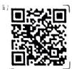  
扫码查看详解详析

# 应用

85

[Non-Text]

[Non-Text]

[Non-Text]

[Non-Text]

# [Non-Text]

# 【探究与应用】

# 探究1

# [问题探究]

解: 把各数表示成小数略. 发现: 有理数总可以用有

限小数或无限循环小数表示。

# [概括新知]

有限 无限循环 有理数 不循环

# 应用1

例1 解:有理数有:3.14, $-\frac{4}{3}$ ,0.57;

无理数有:0.1010001000001…(相邻两个1之间0的个数逐次加2).

# [概括新知] 有理 无理

# 探究2

# [尝试思考1]

(1)正数集合:3.14,0.57,0.1010001000001…(相

邻两个1之间0的个数逐次加2).

负数集合： $-\frac{4}{3}$

# (2)略

# 应用2

例2 解:①正实数集合: $(0.78,\frac{2}{3}+\pi,20\%$

3.1010010001…(每相邻两个1之间逐次增加1个0)，…);

②负实数集合： $\left\{-\frac{\pi}{2},-3.1415926,-1.666,\cdots\right\}$

③负有理数集合： $(-3.1415926,-1.666,\cdots)$

④无理数集合： $\left\{-\frac{\pi}{2},\frac{2}{3}+\pi,3.1010010001\cdots\right.$

(每相邻两个1之间逐次增加1个0)，…}。

# [尝试思考2]

解:(1)在实数范围内,相反数、倒数、绝对值的意义与有理数范围内的相反数、倒数、绝对值的意义完全一样.

(2) 实数可以进行加、减、乘、除、乘方运算，有理数的运算法则和运算律对实数仍然适用.

[概括新知] (1) $-a$ $|a|\frac{1}{a}$ (2) 结合 分配应用 3

例3 解:(1)2.5的相反数是-2.5,绝对值是2.5,倒数是 $\frac{2}{5}$ .

(2) $-\frac{\pi}{2}$ 的相反数是 $\frac{\pi}{2}$ ，绝对值是 $\frac{\pi}{2}$ ，倒数是 $-\frac{2}{\pi}$ .

(3) $-3\frac{1}{4}$ 的相反数是 $3\frac{1}{4}$ ，绝对值是 $3\frac{1}{4}$ ，倒数是 $-\frac{4}{13}$ .

(4)3.14-π的相反数是π-3.14，绝对值是π-

3.14, 倒数是 $\frac{1}{3.14 - \pi}$ .

例4 $\frac{2\pi}{3} - 2$

# 探究3

# [思考交流] (1)a (2)略

# [概括新知]一一对应

# 应用4

# 例5略

# 【课堂小结与检测】

# [课堂检测]

# 1. C 2. ② 3. 1

4. (1) $\pi$ (2)数轴上的点可以表示任何实数

# 2 第1课时 算术平方根

# 【探究与应用】

# 探究1

# [问题导入]

解:(1)2 3 4 5

(2) $z$ 是有理数， $x, y, w$ 是无理数。 $x = \sqrt{2}, y = \sqrt{3}$ ，

$z = 2, w = \sqrt{5}$ .

[概括新知] 正数 $x$ 的平方 正数 $x$

# 应用1

例 1 (1)30 (2)1 (3) $\frac{7}{8}$ (4) $\sqrt{14}$

变式1 (1)0.6 (2) $\frac{4}{3}$ (3)4 (4) $10^{-1}$

变式2 (1)9 (2) $\frac{8}{5}$ (3)0.2 (4)-3

# 探究2

# [思考交流]

解:(1)这些数是有理数的平方.

(2) 当 $a \geqslant 0$ 时 $\sqrt{a^2} = a$ 成立; 当 $a < 0$ 时 $\sqrt{a^2} = a$ 不成立

(3) $(\sqrt{a})^{2}=a$ 成立, 这里的 a 是非负数, 非负数算术平方根的平方等于本身.

[概括新知] a a -a

# 应用2

例 2 (1)6 (2)1.2 (3) $\frac{2}{3}$

# 应用3

例3 2s

[延伸拓展] (1) $-\frac{1}{2}$ (2)4

# 【课堂小结与检测】

# [课堂检测]

1. A 2. D 3. $\sqrt{7}$ 4. $\sqrt{2}$

5. (1)0.8 (2) $\frac{7}{6}$ (3)9 (4)3

# 第2课时 平方根

# 【探究与应用】

# 探究1

# [问题导入]

解:(1)有,-3的平方也等于9.

(2) 平方等于 $\frac{4}{25}$ 的数有两个，分别是 $\frac{2}{5}$ 和 $-\frac{2}{5}$ . 平方等于 0.64 的数有两个，分别是 0.8 和 -0.8.

[概括新知] 平方 $x^{2}$

# 探究2

# [尝试思考]

# 解:(1)略.

(2)一个正数有两个平方根；0只有一个平方根，它是0本身；负数没有平方根.

[概括新知] (1)两 一 没有 (2)平方根

# 应用1

例1 (1) $\pm 8$ (2) $\pm \frac{7}{11}$ (3) $\pm 0.02$ (4) $\pm 25$

(5) $\pm\sqrt{11}$ (6) $\pm10^{2}$

变式 解: (1) $x = \pm \sqrt{\frac{25}{36}} = \pm \frac{5}{6}$ . (2) $x = \pm \sqrt{7}$ .

# 应用2

例 2 (1)15 (2) $-\frac{13}{2}$ (3)8 (4) $\pm\frac{1}{3}$

[延伸拓展](课本/【2024版】【北师大版】/【2024版】【北师大版】七年级上册数学/知识点/生活中的截面.md)49 (2)4或100

# 【课堂小结与检测】

# [课堂检测]

1. B 2. D 3. 0 4. 9

5. (1) ±9 (2) ±7 (3) ±10 $^{-1}$ (4) ± $\frac{8}{7}$

# 第3课时 立方根

# 【探究与应用】

# 探究1

[问题导入] 2 cm

[概括新知] 立方 $x^{3}$

# 探究2

# [尝试思考]

(1)1个 (2)8,0.-27的立方根分别为 $2_{4}0_{3}-3$

(3) 都只有 1 个立方根

# [概括新知]

(1)一 (2)正 0 负 (3)立方

# 应用1

例1 (1)-3 (2) $\frac{2}{5}$ (3)0.6 (4) $\sqrt[3]{-5}$

变式 (1) $-\frac{3}{2}$ (2) $\frac{1}{10}$ (3)2

# 探究3

# [思考交流]

解:(1)这些数势能写成一个有理数的立方.

(2) 成立、 (3) 成立、

[概括新知] a a

# 应用2

例 2 (1)-2 (2)0.4 (3) $-\frac{2}{5}$ (4)9

变式 解:(1) $\left(\sqrt[1]{-27}\right)^{3}=-27.$

(2) $\sqrt[3]{-0.125} = \sqrt[1]{(-0.5)^{3}} = -0.5.$

# 应用3

例3 (1)-64 (2)5

# 应用4

例4 5cm

# [延伸拓展]

解: 因为某正数的两个平方根分别是 2m-3 和 5-m，所以 $2m-3+5-m=0$ ，解得 m=-2。

因为 $n - 1$ 的算术平方根为2，所以 $n - 1 = 4$ ，解得 $n = 5$ ，所以 $3 + m + n - 7 = 3 - 2 + 5 - 7 = -1$ ，故它的立方根为-1.

# 【课堂小结与检测】

# [课堂检测]

1. C 2. 1, -1, 0

3. (1)-5 (2) $\frac{3}{4}$ (3)-0.8 (4)11

4. (1) $-\frac{1}{2}$ (2)0.5 (3)6 (4)19

# 第4课时 估算

# 【探究与应用】

# 探究1

# [问题导入]

(1)公园的宽大约几百米,它没有1000m

(2)450 m (3)16 m

# [思考交流]

解:(1)因为 $0.066^{2}=0.004356$ ，远小于 0.43，所以 $\sqrt{0.43}\approx0.066$ 不正确；因为 $96^{2}=884736,884736$ 远远大于 900，所以 $\sqrt[3]{900}\approx96$ 不正确；因为 $60.4^{2}=9648.16,3648.16$ 与 2536 相差很大，所以 $\sqrt{2536}\approx60.4$ 不正确。

(2) 因为 $9^{3}=729,10^{3}=1000.900$ 比较接近 1000，因此估算 $\sqrt[3]{900}\approx10$ .

(3) 因为 $\frac{\sqrt{5}-1}{2}-\frac{1}{2}=\frac{\sqrt{5}-2}{2},\sqrt{5}>2,$

所以 $\frac{\sqrt{5} - 2}{2} > 0$ ，所以 $\frac{\sqrt{5} - 1}{2} > \frac{1}{2}$ .

应用1

例1 (1)6.1 (2)8

应用2

例2 $2.5 > \sqrt{6}$

变式 (1) $\frac{\sqrt{6} + 1}{2} > 1.5$ (2) $\sqrt[3]{26} > 2.1$

应用3

例3 能变式不能

探究2

[尝试思考]

解:(1)对于开方运算可能用到的按键略.

① $\sqrt{5.89} \approx 2.4269$ . ② $\sqrt[3]{-1285} \approx -10.8718$ .

(2)随着开平方次数的增加、运算结果越来越接近1. 改用小于1的正数试一试仍有类似的规律.

应用4

例4 (1)0.112 (2)0.754 (3)-1.913 (4)2.336

【课堂小结与检测】

[课堂检测]

1. C 2. 4 3. 15.63

4. (1) $\sqrt{76} > 8.5$ (2) $\sqrt{3} > \sqrt[3]{5}$ (3) $\frac{\sqrt{5} + 1}{2} < \frac{5}{3}$

3 第1课时 二次根式的概念及乘除运算

【探究与应用】

探究1

[观察发现]

解：都含有开方运算，并且被开方数都是非负数。

[概括新知] $\sqrt{a} (a\geqslant 0)$

应用1

例1 ①⑦

探究2

[尝试思考]

解:(1)6 6 20 20 $\frac{2}{3}$ $\frac{2}{3}$ $\frac{5}{7}$ $\frac{5}{7}$

猜想： $\sqrt{4} \times \sqrt{9} = \sqrt{4 \times 9}$ ， $\sqrt{16} \times \sqrt{25} =$

$\sqrt{16\times 25},\frac{\sqrt{4}}{\sqrt{9}} = \sqrt{\frac{4}{9}},\frac{\sqrt{25}}{\sqrt{49}} = \sqrt{\frac{25}{49}}.$

(2) $\sqrt{6} \times \sqrt{7} = \sqrt{6 \times 7}, \frac{\sqrt{6}}{\sqrt{7}} = \sqrt{\frac{6}{7}}$ . 借助计算器进行验

证略.

(3) 猜想: $\sqrt{a} \cdot \sqrt{b} = \sqrt{ab} (a \geqslant 0, b \geqslant 0), \frac{\sqrt{a}}{\sqrt{b}} =$

$\sqrt{\frac{a}{b}} (a \geqslant 0, b > 0)$ . 理由略.

[概括新知] $\sqrt{ab}$ $\sqrt{\frac{a}{b}}$

应用2

例2 (1)2 (2)3 变式 (1)4 $(2)\sqrt{6}$

例3 (1) $6\sqrt{6}$ (2)1 (3) $6 + 2\sqrt{5}$

(4)4 (5)5 (6)5

变式 (1) $9 - 4\sqrt{2}$ (2)34 (3)-6 (4)-1

【课堂小结与检测】

[课堂检测]

.B 2.A 3.5 4.1

. (1)6 (2)60 (3)-0.18 (4) $10-4\sqrt{6}$ (5)1

第2课时 二次根式的化简及加减运算

探究与应用】

探究1

观察发现]

解： $\sqrt{ab}=\sqrt{a}\cdot\sqrt{b}(a\geqslant0,b\geqslant0),\sqrt{\frac{a}{b}}=\frac{\sqrt{a}}{\sqrt{b}}(a\geqslant b>0).$

[概括新知] (1) $\sqrt{a} \cdot \sqrt{b}$ (2) $\frac{\sqrt{a}}{\sqrt{b}}$

应用1

例1 (1)72 (2) $5\sqrt{6}$ (3) $\frac{\sqrt{5}}{3}$

探究2

[尝试思考]

解:都不含分母,也不含能开得尽方的因数.

[概括新知] 分母 能开得尽方

应用2

例2 (1) $5\sqrt{2}$ (2) $\frac{\sqrt{14}}{7}$ (3) $\frac{\sqrt{3}}{3}$

[思考交流]

解:(1)受例1的启发,将50分解为 $25\times2$ ,其中25是能开得尽方的因数: $\frac{\sqrt{14}}{7}$ 中被开方数不含分母,也不

含能开得尽方的因数,因此, $\frac{\sqrt{14}}{7}$ 是最简二次根式.

(2)如果被开方数是一个整数,一般先将被开方数写成一个完全平方数和另一个数的积的形式,再将完全平方数“开方”到根号外;如果被开方数是分数,通常将分数的分子、分母同乘一个适当的数,使分母成为完全平方数,再利用商的算术平方根,将分子、分母分别开方.

探究3

[回顾思考]

解:先化简,后合并被开方数相同的二次根式.

[概括新知] 被开方数

应用3

例3 (1) $5\sqrt{3}$ (2) $\frac{4}{5}\sqrt{5}$ (3) $5\sqrt{2}$

【课堂小结与检测】

[课堂检测]

1. B 2. C 3. $\frac{\sqrt{3}}{4}$ 4. $\sqrt{6}$

5. (1) $3\sqrt{5}$ (2) $\frac{\sqrt{2}}{2}$ (3) $2\sqrt{3}$ (4) $-\sqrt{5}$

第3课时 二次根式的混合运算

【探究与应用】

探究1

[计算思考]

解：(1) $\frac{\sqrt{3}}{\sqrt{2}}+\frac{\sqrt{6}}{2}=\sqrt{\frac{3}{2}}+\frac{\sqrt{6}}{2}=\sqrt{\frac{3\times2}{2\times2}}+\frac{\sqrt{6}}{2}=$

$\frac{\sqrt{6}}{2} + \frac{\sqrt{6}}{2} = \sqrt{6}, \sqrt{28} - \frac{7}{\sqrt{7}} = 2\sqrt{7} - \frac{\sqrt{49}}{\sqrt{7}} = 2\sqrt{7} - \sqrt{7} = \sqrt{7}$ .

(2) 分子、分母同乘 $\sqrt{2}$ 的目的是化去分母中根号，将根式化为最简二次根式.

(3) 方法 1: (1) 中的解法.

方法 2: $\sqrt{28} - \frac{7}{\sqrt{7}} = 2\sqrt{7} - \frac{7 \times \sqrt{7}}{\sqrt{7} \times \sqrt{7}} = 2\sqrt{7} - \sqrt{7} = \sqrt{7}$ .

方法3： $\sqrt{28} -\frac{7}{\sqrt{7}} = 2\sqrt{7} -\frac{(\sqrt{7})^2}{\sqrt{7}} = 2\sqrt{7} -\sqrt{7} = \sqrt{7}.$

应用1

例1 $(1)\frac{1}{6}\sqrt{6}$ (2) $\frac{5}{4}\sqrt{2}$ (3) $\frac{11}{6}\sqrt{2}$

(4) $-\frac{1}{2}\sqrt{2}+\sqrt{99}$

变式 (1) $3\sqrt{2}$ (2) $\frac{5}{2}\sqrt{2} +\frac{1}{2}\sqrt{15}$

探究2

[尝试思考]

解： $\left(\sqrt{\frac{1}{a}} -\sqrt{b}\right)\cdot \sqrt{ab} = \sqrt{\frac{1}{a}}\cdot \sqrt{ab} -\sqrt{b}$

$\sqrt{ab} = \sqrt{b} - b\sqrt{a}$ ，当 $a = 3, b = 2$ 时，原式 $= \sqrt{2} - 2\sqrt{3}$ .

应用2

例2解：原式 $= \sqrt{\frac{1}{a}}\cdot \sqrt{ab} -\sqrt{a}\cdot \sqrt{ab} = \sqrt{b}-$

$a\sqrt{b} = (1 - a)\sqrt{b}$

当 $a = 3, b = 2$ 时，原式 $= (1 - 3) \times \sqrt{2} = -2\sqrt{2}$ .

应用3

例3解：(1)由题意得 $AD = 6, CD = \sqrt{1^2 + 1^2}$

$\sqrt{2}, BC = \sqrt{4^2 + 2^2} = 2\sqrt{5}, AB = \sqrt{5^2 + 5^2} = 5\sqrt{2}$

所以梯形ABCD的周长为 $6 + \sqrt{2} + 2\sqrt{5} + 5\sqrt{2} =$

$6 + 6\sqrt{2} + 2\sqrt{5}$ .

(2)梯形ABCD的面积为18.方法有：补图法和割图法等，补图法（不唯一），就是补成一个长方形，用长方形的面积减去三个直角三角形的面积；割图法（不唯一），就是图形分割成一个正方形和三个三角形，分别计算它们的面积并相加.

变式 四边形ABCD的面积是17.5，周长是 $5\sqrt{2} + 3\sqrt{5} + 5$

【课堂小结与检测】

[课堂检测]

1. C 2. $9\sqrt{2}$

3. (1) $\sqrt{2}$ (2) $\frac{14\sqrt{5}}{5}$ (3) $\frac{6}{7}\sqrt{2}$ 4. $\frac{5}{2}\sqrt{2}$

本章总结提升

【重点模块总结】

模块1

(1)不循环 (2)有理 无理 (3)一一对应

例 1 解:有理数集合 $\left\{-\sqrt{16},3.1415926,0,\frac{13}{6},\cdots\right\}$

无理数集合 $\left\{\frac{\pi}{3}, 0.8080080008 \cdots (\text{相邻两个} 8 \text{之}\right.$

间 0 的个数逐次加 1), $\sqrt[3]{-9}, \cdots$ ;

负实数集合 $\{-\sqrt{16},\sqrt[3]{-9},\cdots\}$ .

例2 $-2\sqrt{5}$

模块2

(1) 平方根 0 (2)a a -a

(3)两 一 没有 (4)立方 (5)正 0 负

例 3 (1)x=5,y=2 (2)±3

模块3

(1) $\sqrt{a}$ (2) $\sqrt{ab}$ $\sqrt{\frac{a}{b}}$

(3)分母 能开得尽方 (4)最简 被开方数

例 4 (1) $8\sqrt{2}$ (2)60 (3) $\frac{\sqrt{14}}{2}$ (4) $\frac{\sqrt{65}}{4}$

例5 (1) $-5\sqrt{2}$ (2) $\frac{1}{5}$ (3) $-3\sqrt{5} - 7$

例6 (1) $a = 2\sqrt{2}, b = 5, c = 3\sqrt{2}$

(2)能.三角形的周长为 $5\sqrt{2}+5$

【综合能力提升】

例7 (1) $2 + \sqrt{5}$ (2) $\pi + 2$

(3)-6或6或 $12\sqrt{2}-18$

第三章 位置与坐标

1 确定位置

【探究与应用】

探究

[问题导入]

解:(1)先根据电影票上的排数确定所在的排,再根据电影票上的座位数确定所在排的座位.

(2)3 排 6 座中的 6 是座位数, 6 排 3 座中的 6 是排数.

[思考交流]

(1)一般需要两个数据 (2)略

[概括新知]列

[操作探究]

解:(1)对红方潜艇来说,北偏东 $40^{\circ}$ 方向上有两个目标,分别是蓝方战舰B和小岛,要确定蓝方战舰B的位置,还需要知道蓝方战舰B与红方潜艇之间的距离.

(2)距离红方潜艇 20 n mile 的蓝方战舰有两艘；蓝方战舰 A 和蓝方战舰 C.

(3)要确定每艘蓝方战舰的位置,各需要两个数据:距离和方位角.例如:对红方潜艇来说,蓝方战舰A在正南方向,距离为20 n mile处;蓝方战舰B在北偏东40°方向,距离为28 n mile处;蓝方战舰C在正东方向,距离为20 n mile处.

[概括新知] 距离

[尝试思考]

解:(1)能.先在地图上找到北纬19°的纬线,再在地图上找到东经110°的经线,两线的交点即为中国文昌航天发射场的大致位置.

(2) 国家体育馆所在的区域为 B2 区, 国家体育场所在的区域为 C3 区.

[概括新知] (1)经 (2)编号

[思考交流]

解:(1)生活中需要确定位置的例子很多,如确定小明在教室内的座位,确定某个景点的位置等.

(2)在平面内,确定一个物体的位置一般需要两个数据.

[概括新知]两

应用

例 1 D 例 2 (2,3) 例 3 D

【课堂小结与检测】

[课堂检测]

1. D 2. C3

3. 解:(1)小颍家北偏东 $30^{\circ}$ 的方向上有 2 家店铺, 分别是超市和照相馆.

(2)要确定照相馆的位置,还需要1个数据.

(3)要确定小颖家附近的学校的位置,需要2个数据,分别是距离和方位角.

2 第1课时 平面直角坐标系的有关概念【探究与应用】

探究1

[问题导入]

解:借助方位角和距离定位法,区域定位法等介绍.

[尝试思考]

解:(1)北京奥林匹克公园的位置表示为(11,12),

(5,12)表示圆明园，(6,5)表示玉渊潭公园.

(2)北京奥林匹克公园的位置为(0,8)，卢沟桥的位置为(-11,-4).

[概括新知]

(1)公共原点的数轴 坐标轴 原点

(2)有序实数对 $(a,b)$

(3)第一象限 逆时针 坐标轴上

应用1

例1 解: 各个顶点的坐标分别为 A(-2,0), B(0,-3), C(3,-3), D(4,0), E(3,3), F(0,3).

探究2

[操作思考]

(1)略 (2)略

(3)在平面直角坐标系中,点与有序实数对之间是一一对应关系

[概括新知] 有序实数对 有序实数对

应用2

例 2 图略, 像勺形, 如果这是一个星空中的美丽图案, 那么是北斗七星

[延伸拓展]

解: 因为点 M 到 x 轴的距离为 1,

所以点 M 的纵坐标为 1 或 -1.

因为点 M 到 y 轴的距离为 2.

所以点 M 的横坐标为 2 或 -2，

所以点 M 的坐标为 $(2,1)$ 或 $(2,-1)$ 或 $(-2,1)$ 或 $(-2,-1)$ . 故点 M 到原点的距离为 $\sqrt{5}$ .

【课堂小结与检测】

[课堂检测]

1. D 2. B

3. 解: $A(1,3)$ , $B(3,1)$ , $C(-2,3)$ , $D(-3,-2)$ , $E(0,-4)$ .

第2课时 平面直角坐标系中点的坐标特征【探究与应用】

探究1

[操作思考]

解:如图,各点连接起来的图形像“房子”.

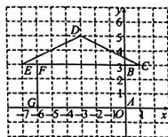

(1)线段 $AG$ 上的点都在 $\pmb{x}$ 轴上，它们的纵坐标都是0；线段 $AB$ 上的点、线段 $CD$ 与 $\pmb{y}$ 轴的交点都在 $\pmb{y}$ 轴上，它们的横坐标都是0.

(2)线段 EC 与 x 轴平行, 点 E 和点 C 的纵坐标相同. 线段 EC 上其他点的纵坐标也相同, 都是 3.

(3) 点 F 和点 G 的横坐标相同, 线段 FG 与 y 轴平行.

[思考交流]略

[概括新知] (1)纵坐标 横坐标 (2)纵坐标 横坐标应用1

例1 (1)(7,0) (2)(0,-4) (3)(6,2)或(-4,2)

探究2

[尝试思考]

解:(1)点(5,2),(2,3),(1,1),(1,2),(2,2),(2,1)等在第一象限内,它们的横坐标和纵坐标都是正数.

(2) 点 $(-5,2)$ , $(-2,3)$ , $(-1,1)$ , $(-1,2)$ ,

(-2,1)等在第二象限，它们的横坐标是负数，纵坐

标是正数；点 $(-3,-3)$ ， $(-1,-1)$ 等在第三象限，

它们的横坐标和纵坐标都是负数；点 $(1,-1)$ ， $(3,$

-3)等在第四象限，它们的横坐标是正数，纵坐标是负数.

(3) 点 A 在第一象限, 点 B 在第三象限, 点 C 在第四象限, 点 D 在第二象限.

[概括新知]

$(+, +)\quad (-, +)\quad (-, -)\quad (+, -)$

应用2

例2 (1)第二象限 (2)三 (3)二

[延伸拓展]

(1)一 相等 (2)二 互为相反数 (3)-1

寻特征相等 互为相反数

【课堂小结与检测】

[课堂检测]

1. C 2. -1 3. (1)(0,6) (2)(4,8)

第3课时 建立适当的坐标系描述图形的位置

【探究与应用】

例1略

例2解：如图，以边 $BC$ 所在直线为 $x$ 轴，以边 $BC$ 的中垂线为 $y$ 轴建立平面直角坐标系.由等边三角形的性质可知， $\triangle ABO$ 是直角三角形，所以

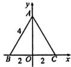

$AO=\sqrt{AB^{2}-BO^{2}}=\sqrt{4^{2}-2^{2}}=2\sqrt{3}$ ，所以顶点A,B,C的坐标分别为 $A(0,2\sqrt{3})$ , $B(-2,0)$ , $C(2,$

0). (答案不唯一, 合理即可)

应用2

例3略

【课堂小结与检测】

[课堂检测]

1. A 2. A

3. 解: (答案不唯一) 过点 A 作 $AO \perp BC$ 于点 O, 以 BC 所在直线为 x 轴, AO 所在直线为 y

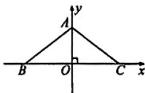

轴，建立如图所示的平面直角坐标系，则 $OA = \frac{3}{2}$

因为 AB = AC，所以 OB = OC = $\frac{1}{2}$ BC = 2，

所以 $A\left(0,\frac{3}{2}\right)$ , $B(-2,0)$ , $C(2,0)$ .

3 轴对称与坐标变化

【探究与应用】

探究

[操作发现]

1. 解: (1) 两面小旗关于 y 轴对称, 对应点 A(2,6) 与 A₁(-2,6) 的横坐标互为相反数, 纵坐标相同其他的对应点也有这个特点.

(2)图略. 它的各个顶点的坐标与其对应点的横坐标相同, 纵坐标互为相反数.

2. 略

[操作思考]

解:图略.得到的图案是与原图案形状相同,大小样的“鱼”.所得到的图案与原图案关于x轴对称[思考交流]略

[概括新知] (1) 横 纵 x (2) 纵 横 y

应用1

例 1 $(-1,2)$ $(1,-2)$ y

例 2 点 A 的坐标为 $(2,1)$ ，点 B 的坐标为 $(2,$

例 3 (3,-4)

应用2

例 4 (1) 略 (2) 略 (3) (-4, -1) (-4, 1)

[延伸拓展] (2,0)

【课堂小结与检测】

[课堂检测]

1. B 2. x 轴 3. $(-2,-3)$

4. (1) 略 (2) $A_{1}(0, -4), B_{1}(-2, -2), C_{1}(3, 1)$

本章总结提升

【重点模块总结】

模块1

1. 两

2. 行列定位法 方位角和距离定位法 经纬度
例 1 （1）游乐园、菜市场

(2)①图略,游乐园的坐标为(0,-4),电视标为(-3,1) ②图书馆

# 模块2

1. 有序 横 纵

2. + + - + - - + -

3. 纵坐标 横坐标 4. 纵坐标 横坐标

5. 等于 互为相反数

例2 (1)二 (2)(-12,0)

(3)(-6,3)或(-18,-3) (4)(-2,5)

(5)(-4,4)

# 模块3

1. 横纵 2. 纵横

例3 (1)图略， $A_{1}(1,5),B_{1}(3,1)$

(2)-2 -3 (3)8

# 【综合能力提升】

例4 (1) $B(2,4),C(-5,3)$

(2) $a+n$ 的值不发生变化, $a+n=-1$

# 第四章 一次函数

# 1 函数

# 【探究与应用】

# 探究

# [操作思考]

1. (1)表格中从左到右依次填3,13,36,47,36,13

(2) 确定

2. 从左到右依次填1,3,6,10,15

3. 解:(1) T 分别为 230.15 K, 246.15 K, 273.15 K, 291.15 K.

(2)能.

# [思考交流]

解:相同点;在上面三个问题的两个变量中,给定其中某一个变量的值,相应地就确定了另一个变量的值.

不同点:上面三个问题中两变量之间的关系用图象、表格、关系式三种不同方法表示出来.

# [概括新知]

(1) 唯一 (2) 列表法 图象法

# [尝试思考]

解:(1)1中, $t\geqslant0$ ;2中,n取正整数;3中, $t\geqslant-273.15$ .

(2)能、

# 应用

例 解:(1)根据图象可知,这个情境反映了水库的库容与平均水深之间的关系.

(2)

<table><tr><td>x/m</td><td>5</td><td>10</td><td>15</td><td>20</td><td>25</td></tr><tr><td>V/万m3</td><td>15</td><td>45</td><td>90</td><td>150</td><td>250</td></tr></table>

(3)根据图象可知,当平均水深取5\~25 m之间的一个确定的值时,相应的库容V确定.

(4)根据图象及函数的定义可知,库容 V 可以看成平均水深 x 的函数.

(5)根据图象可知,当 x=18 时的库容 V 的值为 125, 表示的意义是: 当该水库的平均水深为 18 m 时, 水库的库容是 125 万 m $^{3}$ .

变式 $y$ 是 $x$ 的函数， $y$ 与 $x$ 之间的关系式为 $y = \frac{2x + 1}{3}$

# [延伸拓展] C

# 【课堂小结与检测】

# [课堂检测]

1. $y = 2x$ $x > 0$ 10

2. 能将 $y$ 看成 $x$ 的函数

3. (1) 反映了风速 $y(\mathrm{km/h})$ 与时间 $t(\mathrm{h})$ 这两个变量之间的关系

(2)略 (3)是确定的 (4)可以

# 2 第1课时 变量的均匀变化

# 【探究与应用】

# 探究

# [操作思考1]

# (1) 略

(2)图略,一天的调水量为7.92 L.

一年的漏水量为 2890.8 L, 不够一个人一年使用

(3)V=5.5t (4)略

# [思考交流]略

# [操作思考2]

# (1)略

(2)17.9 cm. 理由略

(3)45.8 min. 理由略

(4) $l=22.9-0.5t$

# [思考交流]略

# [概括新知]相同

# 应用

# 例 (1)略

(2)30℃.理由略 (3)y=t+8 (4)188℃

# 【课堂小结与检测】

# [课堂检测]

# 1. 30

2. (1) 根据题意每跑步 10 min, 跑步的路程增加

1.8 km, 路程增加是均匀的

(2)s=0.18t.理由略

# 第2课时 一次函数与正比例函数

# 【探究与应用】

# 探究1

# [问题导入]

(1) 是 (2) $y = 0.5x + 3$ . 理由略

# [尝试思考]

(1)略 (2) $y=\frac{4}{50}x$ (3) $z=40-\frac{4}{50}x$

# [观察思考]

解:(1)表示函数的代数式都是关于自变量的一次整式.

(2) 答案不唯一，如 $y = 2x - 3, s = 3t$ 等.

[概括断知] $kx + b$ b

# 应用1

# 例1 ① ①②③

例 2 (1) y=60x, y 是 x 的一次函数, 也是 x 的正比例函数

(2) $y=\pi x^{2}$ ，y不是x的正比例函数，也不是x的一次函数

(3) $y=15+5x$ , y 是 x 的一次函数, 但不是 x 的正比例函数

# 探究2

# [思考交流]

解:(1)y=60x 中,k=60,b=0.k 的实际意义是汽车的速度为 60 km/h,b 的实际意义是 x=0 时,行

驶路程为 $0 \, km. y = 5x + 15$ 中，k = 5, b = 15. k 的实际意义是进水速度为 $5 \, m^{3}/h$ , b 的实际意义是水池原有水 $15 \, m^{3}$ .

# (2)略

# [概括新知] 变化量 函数

# 应用2

例3 (1) $y = -35t + 120$ , $k = -35$ 表示每秒汽车速度的变化量, $b = 120$ 表示刹车开始时汽车的速度

(2)约为3.43s

# [延伸拓展]

(1) $m=-1,n$ 为任意实数

(2)m=-1 且 n=0

# 【课堂小结与检测】

# [课堂检测]

# 1. B

2. 解: $y=0.6x+15, k=0.6$ 表示每增加 1 kg 物体弹簧长度的变化量, b=15 表示开始没挂物体时弹簧的长度.

3. 解: (1) 根据题意得 y = 480 - 108x，根据一次函数的定义知 y 是 x 的一次函数.

(2) 当 x=1.5 时, y=480-108×1.5=318.

# 第3课时 计费问题

# 【探究与应用】

# 探究

# [问题导入]

(1)甲公司 (2)乙公司

(3)用车里程大于 $39\mathrm{km}$ ，不超过 $40~\mathrm{km}$

# [操作思考]

(1) $y=4.83x-303.6(220<x\leqslant300)$

(2)903.9元 (3)270 m³

# [尝试思考]

解:(1)能. $y=3.45\times220+4.83\times(300-220)+5.83(x-300)=5.83x-603.6.$

(2)略.

# 应用

# 例 (1)112

(2) $y=0.7x-29.4(210<x\leqslant400)$

(3)419 kW·h.

# 【课堂小结与检测】

# [课堂检测]

1. 20x+3000 30x 300

2. (1) $y = \frac{1}{5} x - 160(800 < x \leqslant 4000)$

(2)320元 (3)3600元

# 3 第1课时 正比例函数的图象及性质

# 【探究与应用】

# 探究1

# [操作思考]

(1)x 可以取任意实数,可以是 0,正数,负数;列表略
(2)略

(3)在一条直线上,可以画出、图略

(4)在

# [概括新知] 列表 描点 连线

# [思考交流]

# (1)略

(2) 正比例函数 $y = 2x$ 和 $y = -3x$ 的图象都是过原点的一条直线，正比例函数 $y = kx$ 的图象也是过原点的一条直线

# [概括新知] 原点 0.0 原点

# 探究2

# [尝试思考]

# (1)略

(2)在正比例函数 $y = x, y = 3x$ 中， $y$ 的值随着 $x$ 值的增大而增大，图象上的点从左到右在升高； $y = -\frac{1}{2} x$ 和 $y = -4x$ 中， $y$ 的值随着 $x$ 值的增大而减小，图象上的点从左到右在降低.

# [概括新知] 增大 减小

# [思考交流]

(1) 正比例函数 $y = 3x$ 增加得更快. 解释其中的道理略

# (2) 函数 y = -4x 减小得更快. 判断方法略

# 应用

例 1 (1) 减小 (2) y = -2x (答案不唯一) (3) >

例2 减小 减小 陡 例3 $a < c < b$

[延伸拓展] (1)-2 (2)2

# 【课堂小结与检测】

# [课堂检测]

1. A 2. C 3. $y_{1} > y_{2} > y_{3}$

1. (1) k < 0 (2) y = -2x

# 第2课时 一次函数的图象及性质

# 【探究与应用】

# 探究1

# [操作思考]

(1)略 (2)真的是一条直线

(3)一次函数 $y = 2x + 1$ 的图象与正比例函数 $y = 2x$ 的图象平行

(4)一次函数 $y = kx + b$ 的图象与正比例函数 $y = kx$ 的图象平行

# [概括新知] 直 平行 两

# 探究2

# [尝试思考]

(1)函数 $y$ 的值随着 $x$ 值的增大而增大的函数是 $y = 3x + 1,y = 3x - 2,y = 4x - 3;$ 函数 $y$ 的值随着 $x$ 值的增大而减小的函数是 $y = -x + 1$

(2)随着 x 值的增大，y 的值增大速度最快的函数是 y=4x-3

(3)函数 $y = 3x + 1$ 与 $y = 3x - 2$ 的图象相互平行

(4) 函数 $y=3x+1, y=-x+1$ 的图象与 y 轴相交于同一点

# (5)略

# [思考交流]略

# [概括新知] (1)b 平行 (2)增大 减小

# 应用

例1 (1)二 (2)2 1 (3) $y=-2x+1$ (4)<

例 2 (1)①②④ (2)②③

(3)②③ ① ④⑤ (4)③与⑤,①与④

例3解：当 $y = -10$ 时，函数 $y = -3x + 3$ 对应的自变量 $x$ 的值为 $\frac{13}{3}$ ，函数 $y = -2x - 4$ 对应的自变

量 $x$ 的值为3.因为 $\frac{13}{3} > 3$ ，所以函数 $y = -2x - 4$

的值先到达-10.

当 $y = -30$ 时，函数 $y = -3x + 3$ 对应的自变量 $x$ 的值为11，函数 $y = -2x - 4$ 对应的自变量 $x$ 的值为13.因为 $13 > 11$ ，所以函数 $y = -3x + 3$ 的值先到达-30

这说明了对于一次函数 $y = kx + b$ ，当 $k < 0$ 时， $k$ 越小函数值 $y$ 减小得越快。

# [延伸拓展] D

# 【课堂小结与检测】

# [课堂检测]

1. D 2. $y_{1}<y_{2}$

3. (1) 略 (2)(2,0) (0,4) (3) 减小

# 4 第1课时 借助一次函数表达式解决一些简单实际问题

# 【探究与应用】

# 探究

[问题导入] (1) $v=\frac{5}{2}t$ (2) $\frac{15}{2}$ m/s

# [思考交流]

解: 确定正比例函数的表达式需要一个条件, 确定一次函数的表达式需要两个条件.

# [概括新知] (1)k — (2)k b

# 应用1

例 1 y=0.5x+14.5

当所挂物体的质量为 4 kg 时, 弹簧长度为 16.5 cm

例 2 (1) $y = -9x + 30$ (2) $\frac{10}{3}b$

# 应用2

例3 (1) $y = -\frac{2}{3} x + 5$ (2) $\left(\frac{15}{2},0\right)$

(3) 点 C(-3,7) 在该函数图象上

点 $D(6,9)$ 不在该函数图象上

变式 1 -1 变式 2 (1) $y = x + 3$ (2) $\frac{9}{2}$

[延伸拓展] y = -2x - 10

# 【课堂小结与检测】

[课堂检测] 1. A 2. $y = -\frac{1}{2}x + 1$

3. (1) $t = -6h + 24$ (2) $2\mathrm{km}$

# 第2课时 借助单个一次函数图象解决有关问题

# 【探究与应用】

# 探究1

# [问题导入]

(1)10 L (2)500 km (3)2 L (4)450 km

# 应用1

例 1 解: (1) 1200 万 $m^{3}$ .

(2)干旱持续10天，蓄水量是 $1000\mathrm{万m}^3$ ，干旱持续23天，蓄水量是740万 $\mathrm{m}^3$

(3)40天.

变式 解:(1)点(20,800)表示的实际意义是干旱持续20天时,水库的蓄水量为800万 $m^{3}$ .

(2) $V=-20t+1200$ ，其中k=-20，表示水库的蓄水量每天减少20万 $m^{3}$ ;b=1200，表示干旱开始时水库的蓄水量为1200万 $m^{3}$ .

# [概括新知] 函数 自变量

# 探究2

# [尝试思考] 60 天. 做法略

[思考交流] 略

[概括新知] 自变量 横

# 应用2

例 2 (1)x=2 (2)x=-1

# [延伸拓展]

解:(1)900 (2)4

(3)快车到达乙地后，慢车继续行驶到甲地

(4)慢车和快车的速度分别为75km/h,150km/h

# 【课堂小结与检测】

# [课堂检测]

1. D 2. 30 5 3. (1)60升 (2)45升 (3)3.2小时

# 第3课时 借助两个一次函数图象解决有关问题【探究与应用】

# 应用1

例 1 解:(1)2000 3000 (2)6000 5000

(3)4 t (4)大于 4 t 小于 4 t

(5)6 t (6)y=1000x y=500x+2000

(7)能.由 $1000x - (500x + 2000) = 1000$ ，解得 $x =$

6. 因此，当销售量等于 61 时，该公司赢利（收入减成本）1000 元。

# [思考交流]

解： $k_{1}$ 的实际意义为每销售 1 t 产品的销售收入， $b_{3}$ 的实际意义为未销售时，销售收入为 0 元； $k_{2}$ 的实际意义为每销售 1 t 产品的销售成本， $b_{3}$ 的实际意义为未销售时，销售成本为 2000 元.

# 应用2

例 2 (1) $l_{1}$ (2)甲 (3)不能 (4)能

(5) $k_{1}$ 表示甲的速度, $k_{2}$ 表示乙的速度.甲的速度

是 50 m/min, 乙的速度是 30 m/min.

# 变式 (1)略

(2) $l_{1}$ 的函数表达式为 $x=50x,l_{2}$ 的函数表达式为

$s=30t+800$ ，由 $50t=30t+800$ ，解得t=40，

因此，甲迫上乙的时间为40min

# 应用3

例3 (1) $y_{甲}=2x+1000$ $y_{乙}=3x$

(2) 图象略. 当印制 1000 份宣传材料时, 两个印刷厂的收费相同, 此时费用为 3000 元

(3) 当印制宣传材料不足 1000 份时, 选择乙印刷厂更省钱; 当印制宣传材料为 1000 份时, 两家费用都一样; 当印制宣传材料超过 1000 份时, 选择甲印刷厂更省钱

# 【课堂小结与检测】

# [课堂检测]

1. B 2. (1)10 (2)乙 (3)甲

# 本章总结提升

# 【重点模块总结】

# 模块1

(1) $kx+b$ b (2)k 增大 减小

(3)b 平行 增大 减小

例 1 (1)-2 (2) $\frac{1}{2}$

例2 (1)点 $\left(\frac{5}{4}, -4\right)$ 不在这个函数的图象上

点 $\left(-\frac{5}{6}, \frac{14}{3}\right)$ 在这个函数的图象上

# (2)画图略

能,向下平移3个单位长度(或向左平移 $\frac{3}{2}$ 个单位长度)

# 模块2两

例3 (1) $y = 2x + 6$ (2) $y = 2x - 4$ 或 $y = 2x + 16$

# 模块 3 自变量 横

例 4 (1)x=-2 (2)(-1,0)

# 模块4

例 5 (1) $y_{1}=2.5x+15$ $y_{2}=3x$ (2) 方案一

例 6 (1)y=200x (2) $\frac{10}{3}$ 分钟 (3)400 米

# 【综合能力提升】

例7 解:(1)5 (8,0)

(2) 设 OC = x，则 $BC = OB + OC = 4 + x$ ，由折叠的性质知 $CD = BC = 4 + x$ 。

在 Rt△COD 中，由勾股定理得 $OC^{2} + OD^{2} = CD^{2}$ ，所以 $x^{2} + 8^{2} = (x + 4)^{2}$ ，解得 x = 6，即 OC = 6。

所以点 C 的坐标为 $(0, -6)$ .

(3) 因为 $C(0,-6)$ , $D(8,0)$ .

所以 $OC = 6, OD = 8$ ，则 $S_{\triangle COD} = \frac{1}{2} CO \cdot DO =$

$\frac{1}{2}\times 6\times 8 = 24$ ，则 $S_{\triangle MAB} = 12.$

因为 M 是 y 轴上一动点, 所以设点 M 的坐标为 $(0, m)$ .

所以 $BM = \{m - 4\}$ ，则 $S_{\triangle MAB} = \frac{1}{2} BM \cdot OA =$

$\frac{1}{2}|m-4|\times3=12$ ，所以 m=12 或 -4，

所以点 M 的坐标为 $(0,12)$ 或 $(0,-4)$ .

(4)第一象限内存在点 $P$ ，使 $\triangle PAB$ 为等腰直角三

角形，点 P 的坐标为 $(7,3)$ 或 $(4,7)$ 或 $\left(\frac{7}{2},\frac{7}{2}\right)$ .

# 第五章 二元一次方程组

# 认识二元一次方程组

# 【探究与应用】

# 探究1

# [问题导入]

解:(1)涉及的量有小明栽种的绿植株数和小螟栽 种的绿植株数等. 等量关系为小明栽种的绿植株数一小颖栽种的绿植株数=2, 小明栽种的绿植株数+1=2(小颖栽种的绿植株数-1).
(2) $x-y=2,x+1=2(y-1)$ .

# [尝试思考]

解:(1)涉及的量有成人数、学生数、成人学生总数、学生票价、成人票价、成人票款、学生票款、学生成人总票款等.等量关系为成人数+学生数=8,成人票款+学生票款=34.

(2) $x+y=8,5x+3y=34.$

# [观察思考]

解：都含有两个未知数，含未知数的项的次数都是1.

# [概括新知] 两 ]

# [思考交流]

解: 在方程 $x + y = 8$ 和 $5x + 3y = 34$ 中, x, y 所表示的对象分别相同.

# [概括新知] 两 两

应用1

例1 D

# 探究2

# [尝试思考]

(1)略

(2)x=5,y=3;x=2,y=8都满足方程 $5x+3y=34$ .

(3) 他，x=5, y=3.

# [概括新知]

(1)未知数 无数个 (2)公共解 只有一组应用2

例2 (1)A (2)B

变式 $k = -4, \begin{cases} x = -1, \\ y = -3 \end{cases}$ 不是这个方程的解

[延伸拓展] $m = 1$ $n = -2$

# 【课堂小结与检测】

# [课堂检测]

1. (2) 2. 0.5

3. 解: 设获得一等奖、二等奖的班级分别有 x 个、

y个，根据题意得 $\left\{\begin{aligned}x+y&=8,\\ 100x+60y&=600.\end{aligned}\right.$

# 2 第1课时 代入消元法

# 【探究与应用】

# 探究

# [问题导入]略

[操作思考]

$x - 2\quad x - 2\quad 2(x - 2 - 1)\quad 5\quad 5\quad 5$

# [实践应用]

例 (1) $\left\{ \begin{array}{l} x = 4, \\ y = 1 \end{array} \right.$ (2) $\left\{ \begin{array}{l} x = 5, \\ y = 2 \end{array} \right.$

变式 (1) $\left\{ \begin{array}{l} x = 10, \\ y = 2 \end{array} \right.$ (2) $\left\{ \begin{array}{l} x = -3, \\ y = 8 \end{array} \right.$

# [思考交流]略

[概括新知] (1)一元 (2)一元一次

# 【课堂小结与检测】

# [课堂检测]

1. ① $x = -3y$ ② $y \quad x$

2. (1) $\left\{ \begin{array}{l} x = 2, \\ y = -1 \end{array} \right.$ (2) $\left\{ \begin{array}{l} x = 3, \\ y = 1 \end{array} \right.$

# 第2课时 加减消元法

# 【探究与应用】

# 探究

# [问题导入]

解:(1)能.将方程②变形为 $x=\frac{5y-11}{2}$ 代入①,从而消元求解(做法不唯一).

(2) 小明的这种想法有道理, 能把“二元”化为“一元”。

[操作思考] 10 3 $\left\{\begin{aligned}x&=2,\\ y&=3\end{aligned}\right.$

# [实践应用]

例 (1) $\left\{ \begin{array}{l} x = 1, \\ y = -1 \end{array} \right.$ (2) $\left\{ \begin{array}{l} x = 3, \\ y = 2 \end{array} \right.$

变式 (1) $\left\{ \begin{array}{l} x = 2, \\ y = 2 \end{array} \right.$ (2) $\left\{ \begin{array}{l} x = 2, \\ y = -1 \end{array} \right.$

# [思考交流]

解: 基本思路是“消元”. 主要步骤是通过两式相加 (或相减) 消去其中一个未知数.

[概括新知] (1)一元 (2)相减

[延伸拓展] $\left\{\begin{aligned}m&=6.5,\\ n&=-1\end{aligned}\right.$

# 【课堂小结与检测】

# [课堂检测]

1. A 2. $\left\{ \begin{array}{l} x = 4, \\ y = -\frac{1}{3} \end{array} \right.$

3. (1) $\left\{ \begin{array}{l} x = 1, \\ y = -1 \end{array} \right.$ (2) $\left\{ \begin{array}{l} x = 2, \\ y = 4 \end{array} \right.$

# 3 第1课时 直接找等量关系列二元一次方程组解决问题

# 【探究与应用】

# 探究

# [问题导入]

解:(1)涉及的量为鸡、兔的只数及其脚数等.等量关系为鸡的只数+兔的只数=35,鸡的脚数+兔的脚数=94.

(2)设笼中有鸡 x 只、兔 y 只，根据(1)中分析，得方程组 $\left\{\begin{aligned}x+y=35,\\ 2x+4y=94.\end{aligned}\right.$ 解这个方程组，得 $\left\{\begin{aligned}x=23,\\ y=12.\end{aligned}\right.$ 所以，笼中有鸡 23 只、兔 12 只.

# [尝试思考]

甲原来拥有 $\frac{121}{17}$ 第纳尔，乙原来拥有 $\frac{167}{17}$ 第纳尔

# [实践应用]

例 甲带了38钱，乙带了18钱

# [思考交流]略

# 【课堂小结与检测】

# [课堂检测]

甲有63只羊，乙有45只羊

# 第2课时 列表法找等量关系列二元一次方程组解决问题

# 【探究与应用】

# 应用

例1 (1)略

(2) 填表略 $\left\{\begin{aligned}x-y=200,\\ (1+20\%)x-(1-10\%)y=780\end{aligned}\right.$ $\left\{\begin{aligned}x=2000,\\ y=1800\end{aligned}\right.$ 2000万元 1800万元

例 2 填表略,用甲原料 28 g、乙原料 30 g

# 【课堂小结与检测】

# [课堂检测]

(1) $(1 + 15\%)$ x (1-10%)y 950

(2)去年的总产值为2300万元,总支出为1350万元

# 第3课时 画图法找等量关系列二元一次方程组解决问题

# 【探究与应用】

# 应用1

例 1 (1) 涉及的量有小长方形的长和宽, 大长方形的长和宽等.等量关系:小长方形的长+小长方形

的宽=40;1个小长方形的长=3个小长方形的宽.

(2)每块小长方形墙砖的长为30 cm，宽为10 cm

# 应用2

例 2 隧道和火车的长度分别是 1000 m 和 200 m

# 【课堂小结与检测】

# [课堂检测]

1. 6 m 2 m

2. 哥哥每分钟跑55米，弟弟每分钟跑45米

# 4 第1课时 用图象法求二元一次方程组的解

# 【探究与应用】

# 探究1

# [操作发现]

解:(1)方程 $x+y=5$ 的解有无数个,写出几个略、

(2) 描点略, 它们都在一次函数 y=5-x 的图象上.

(3)适合方程 $x + y = 5$ .

(4)相同.

# [概括新知]解 直线

# 应用1

例1 A

# 探究2

# [操作思考]

解: 这两个图象有交点, 即 $A(2,3)$ , 而 $\left\{\begin{aligned}x=2,\\ y=3\end{aligned}\right.$ 就是

方程组 $\left\{ \begin{array}{l} x + y = 5, \\ 2x - y = 1 \end{array} \right.$ 的解.

# [概括新知] 解 坐标

# [思考交流]略

# [概括新知] 无解

# 应用2

例2 (1) $-\frac{1}{2}$ (2) $\left\{ \begin{array}{l}x = 2,\\ y = 1 \end{array} \right.$

变式 (1)略 (2)不存在

# 【课堂小结与检测】

# [课堂检测]

1. $\left\{ \begin{array}{l}x = 4,\\ y = -6 \end{array} \right.$ 2. $\left\{ \begin{array}{l}2x - y = 0,\\ x + y = 4 \end{array} \right.$

3. 方程组 $\left\{ \begin{array}{l} 2x - y + a = 0, \\ x + y + 2 = 0 \end{array} \right.$ 的解是 $\left\{ \begin{array}{l} x = -2, \\ y = 0, \end{array} \right.$ $a = 4, b = 0$

# 第2课时 用待定系数法确定一次函数表达式

# 【探究与应用】

# 探究

# [问题情境]

解:(1)小亮利用图象法,小明利用将关系式组成方程组的方法,小颖利用直接列式计算的方法.具体过程略.小

亮得到的结果是不近似值,小颖和小明的结果是相同的.
(2) 不准确.

# [实践应用]

例1 $(1)y = \frac{1}{6} x - 5$ (2) $30\mathrm{kg}$

[概括新知] 函数表达式 未知的系数

# 应用

例 2 y=2x+5 例 3 5 元

# 【课堂小结与检测】

# [课堂检测]

1. $y=4x+7$ 2. (1) $y=2x+15$ (2) 2.5 kg

# 5 三元一次方程组

# 【探究与应用】

# 探究1

# [问题导入]略

[概括新知] (1)1 (2)三 (3)公共

应用1

例1 (1)A (2)B

# 探究2

# [问题导入]略

# [操作思考]

$\left\{ \begin{array}{l} x = \frac{37}{4}, \\ y = \frac{17}{4}, \\ z = \frac{11}{4} \end{array} \right.$

[尝试交流] (1)能 (2)略

# [概括新知] 消元

# 应用2

例2 $\left\{ \begin{array}{l}x = \frac{5}{8},\\ y = 3,\\ z = -\frac{3}{4} \end{array} \right.$

变式 A 箱有 48 个橘子, B 箱有 52 个橘子, C 箱有 54 个橘子

# 【课堂小结与检测】

# [课堂检测]

1. A 2. $7\mathrm{cm},5\mathrm{cm},6\mathrm{cm}$ 3. $\left\{ \begin{array}{l}x = 10,\\ y = 9,\\ z = 7 \end{array} \right.$

# 问题解决策略：逐步确定

# 【探究与应用】

# 探究

# [理解问题]

解:(1)有一些物品,其数量不知道,3个3个数,多2个;5个5个数,多3个;7个7个数,多2个.请问这些物品有多少个.

(2)同时满足三个条件：①除以3余2；②除以5余3；③除以7余2.

# [拟订计划]

解:(1)不容易列方程来解决.

(2)先确定满足条件①的数,再在条件①的基础上确定满足条件②的数,再在条件②的基础上,确定满足条件③的数,进而得到答案.

[实施计划]8,23,38 23 23 23

# [回顾反思]

解:(1)“逐步确定”的策略就是根据题意找出问题的解需要满足的各个条件;按照某个顺序,逐步满足这些条件,最终确定问题的解.

# (2)略

# [概括新知] 条件

# 应用

例 (1)160 (2)801

# 【课堂小结与检测】

# [课堂检测]

1. (-3,4) 2. 7140 3. 6

# 本章总结提升

# 【重点模块总结】

# 模块1

1. 消元 代入 加减

例1 (1) $\left\{ \begin{array}{l}x = 2,\\ y = 7 \end{array} \right.$ (2) $\left\{ \begin{array}{l}x = 5,\\ y = 2 \end{array} \right.$ (3) $\left\{ \begin{array}{l}x = 0,\\ y = \frac{1}{3},\\ z = 1 \end{array} \right.$

# 模块 2 等量关系

例2 从每吨废旧智能手机中能提炼出黄金240克，白银1000克

模块3

1. 解 2. 交点

例3 (1) $y = 2x + 4$

(2) 关于 x, y 的方程组 $\left\{\begin{aligned}y&=kx+b,\\ y&=-4x+a\end{aligned}\right.$ 的解为

$\left\{ \begin{array}{l} x = 1, \\ y = 6. \end{array} \right.$ $a = 10$

(3)12

# 【综合能力提升】

例 4 (1)4 (2)需要甲型车8辆,乙型车10辆

(3)需要甲型车4辆、乙型车10辆、丙型车2辆，此时的运费是15600元

# 第六章 数据的分析

# 1 第1课时 众数和算术平均数

# 【探究与应用】

# 探究

# [问题导入]

(1)甲8环的次数最多，5次；乙7环的次数最多，5次；丙9环的次数最多，6次；丁6环和10环的次数最多，都是4次.

(2) 观察可知, 丙得 10 环和 9 环的次数多, 而得 6 环和 7 环的次数都只有 1 次, 因此, 猜测丙的平均成绩最高, 故丙的射击成绩最好.

(3)甲的平均成绩为8环，乙的平均成绩为7.3环。丙的平均成绩为8.7环，丁的平均成绩为8环。因此，(2)的判断正确

# [概括新知] (1) 最多 (2) 个数 集中趋势 [思考交流]

解:(1)一组数据的平均数不一定在这组数据中.
(2)甲的平均成绩会减小.

(3) 这样做的好处是减少平均数受极端值的影响.

# 应用

例 (1)136.1 件

(2)顾客对店铺评分的众数是5分,平均数是4.732分
变式 (1)10 (2)12元

[延伸拓展] (1) $\overline{a}+\overline{b}$ (2) $5\overline{a}+9\overline{b}$

# 【课堂小结与检测】

# [课堂检测]

1. B 2. (1)35℃ (2)34.3℃

# 第2课时 加权平均数

# 【探究与应用】

# 探究1

# [问题导入]

解：“全家福”馄饨中，蛋黄鲜肉馄饨、虾仁鲜肉馄饨、荠菜鲜肉馄饨、玉米鲜肉馄饨、香芹鲜肉馄饨所占的百分比分别是10%，10%，20%，30%，30%，则每碗定价为 $15\times10\%+15\times10\%+12\times20\%+10\times30\%+10\times30\%=11.4$ （元）比较合理.

# [尝试交流]

(1) 合理、因为小亮考虑到了不同类型的馄饨个数和价格不同，所以不能直接利用算术平均数计算，而应该依据各自所占的比例来计算.

(2)若“全家福”馄饨含蛋黄鲜肉馄饨3个，虾仁鲜肉馄饨3个，荠菜鲜肉馄饨2个，玉米鲜肉馄饨1个，香芹鲜肉馄饨1个，则每碗应定价为13.4元；若每种馄饨各2个，则每碗应定价为12.4元

(3)定价与一碗“全家福”铌钝中不同馅料的铌钝的个数有关.

# [概括新知]权

# 应用1

# 例1 三班

探究2

# [思考交流]

(1)不是.因为所有用户的日人均上网时间受人数的影响,而A,B两家网站用户的日平均上网人数不一定相等.

(2) $\frac{ma+nb}{m+n}h$

# 应用2

例2 $\frac{30a + 20b}{a + b}$

# 【课堂小站与检测】

# [课堂检测]

1. B 2. C 3. 86分

# 第 3 课时 离差平方和、方差和标准差

# 【探究与应用】

# 探究

# [问题导入]

(1)甲发挥得更稳定.理由:从题图中看甲数据波动较小,而丁数据波动较大,所以甲发挥得更稳定.

# (2)略

# [概括断知]

(1) 平方和 (2) 平均数 (3) 算术平方根

# 应用1

例1 1.04环例2 (1)16 (2)2 (3) $\sqrt{2}$

# 应用2

例3 解:(1)丙射击成绩的平均数为 $\frac{113}{13}$ 环,方差约为1.29,由于丙的平均数与甲的平均数相差不大,丙的方差大于甲的方差,因此,甲的成绩相对稳定。(2)平均数没变,方差变小了,说明丁后面几次射击的成绩靠近平均成绩.

# [延伸拓展]36

# 【课堂小结与检测】

# [课堂检测]

1. A 2. $\sqrt{2}$

3、 $s_{七}^{2}=34$ 、 $s_{八}^{2}=23.4$

因为 23.4<34，所以八年级的成绩更稳定

# 第4课时 方差和离差平方和的实际应用

# 【探究与应用】

# 探究1

# [问题导入]

(1) A 地的日温差较大, B 地的日温差较小, 但平均气温相近.

(2) $\overline{x}_{A}=20.42\ ^{\circ}C,\overline{x}_{B}=21.35\ ^{\circ}C,s_{A}^{2}=7.76,s_{B}^{2}=2.78$ A、B两地平均气温相近，但A地日温差较大，B地日温差较小，因此与刚才看法一致.

# 应用1

例 1 (1) $\overline{x}_{甲}=601.6\ cm,\overline{x}_{乙}=599.3\ cm$

(2) $x_{\text{甲}}^{2}=65.84, s_{乙}^{2}=284.21$

(3)甲运动员的成绩较稳定,因为其方差比较小;乙运动员比较有潜质,因为乙的最远成绩好.(答案不唯一,合理即可)

(4)为了夺冠应选甲参赛,因为10次比赛中,甲有9次达到5.96 m,面乙只有5次;

为了打破纪录应选乙参赛，因为乙的成绩超过6.10 m的有4次，比甲的次数多。

# 探究2

# [思考交流]略

# [概括新知] 小

# 应用2

例 2 {65,69,70},{75,76,76,78,80,80,81}

# 【课堂小结与检测】

# [课堂检测]

1. 16

2. (1)6.02 0.0337

(2)从中位数来看，A的成绩好；从成绩的平均数来看，A，B成绩的“平均水平”一样；从成绩的方差来看，A的成绩比B的稳定；从最高成绩来看，A没有较高的成绩，B有较高的成绩.
(3) B

# 2 第1课时 中位数和百分位数

# 【探究与应用】

探究1

[问题导入]略

[概括新知] 中间 平均

# [尝试思考]

解：(1)用中位数描述该公司员工的收入情况更合适.

(2)因为经理的工资比职员的工资要高得多,正是由于极端值的影响,导致该公司员工收入的平均数比中位数高得多.

应用

例 4 h

探究2

# [思考交流]

解:(1)当小军所在篮球队队员身高的中位数是1.82 m时,可以说明小军的身高在篮球队里中等偏上;当他所在篮球队队员身高的平均数是1.82 m时,不能说明小军的身高在篮球队里中等偏上.
(2)中位数不变,平均数会变. (3)略

[概括新知] (1)众 (2)极端值 (3)50% p%

[观察思考]略

# 【课堂小结与检测】

# [课堂检测]

1.8

2. (1) 众数是 $25 \mathrm{~cm}$ , 中位数是 $24.75 \mathrm{~cm}$

(2)多进 25 cm 的鞋,少进 23.5 cm 的鞋. 原因是:23.5 cm 的鞋的销量最少,25 cm 的鞋的销量最多(答案不唯一).

# 第2课时 四分位数与箱线图

# 【探究与应用】

探究1

[新知导入] 下四分位 上四分位

应用1

例1 $m_{25} = -1^{\circ}\mathrm{C}, m_{50} = 2^{\circ}\mathrm{C}, m_{75} = 3^{\circ}\mathrm{C}$

探究2

# [尝试思考]

(1) 最小值为 115, 下四分位数为 132, 中位数为 136, 上四分位数为 144, 最大值为 162

(2)能.图中的5条横线从下到上分别对应最小值、下四分位数、中位数、上四分位数、最大值.

画这个统计图需要将数据按从小到大的顺序排列，分别求出最小值、下四分位数、中位数、上四分位数、最大值.

(3)“下半截箱子”比较短,这说明从下四分位数到中位数,这部分数据相差较小,相对集中.

(1)根据上四分数与中位数相差比较大,而下四分位数与中位数相差比较小,并结合最大值与最小值,可估计平均数比中位数大.

[观察思考] 略

# [思考交流] (1)略

(2)箱线图中包含了最小值、最大值和四分位数信息,可以用来反映一组数据的整体分布情况,特别适用于多组数据整体分布情况的比较.

应用2

例2略

# 【课堂小结与检测】

# [课堂检测]

1. A 2. 120 172 145

3. 中位数是 10 分, 下四分位数是 6 分, 上四分位数是 11 分

# 3 哪个团队收益大

# 【探究与应用】

应用

例1略例2略

# 【课堂小结与检测】

# [课堂检测]

解:(1)方法1:借助平均数、方差分析;

因为 $\overline{x}_{\text{甲}} = \frac{1}{10} (120 + 123 + 119 + 121 + 122 + 124 +$

$119 + 122 + 121 + 119) = 121$ （毫克），

$\overline{x}_{z} = \frac{1}{10}(121 + 119 + 124 + 119 + 123 + 124 + 123 +$

122+123+122)=122(毫克),

所以乙种饮料维生素C的含量高.

$s_{\varphi}^{2} = \frac{1}{10} [(120 - 121)^{2} + \dots +(119 - 121)^{2}] = 2.8,$

$s_{乙}^{2} = \frac{1}{10} [(121 - 122)^{2} + \dots +(122 - 122)^{2}] = 3.$

因为甲和乙的维生素C的含量的平均数相差不大，甲的方差小于乙的方差，

所以甲种饮料维生素C的含量较稳定、

方法 2: 利用四分位数、箱线图进行分析:

<table><tr><td rowspan="2">饮料</td><td colspan="5">最小值、四分位数和最大值</td></tr><tr><td>最小值</td><td> $m_{25}$ </td><td> $m_{50}$ </td><td> $m_{75}$ </td><td>最大值</td></tr><tr><td>甲</td><td>119</td><td>119</td><td>121</td><td>122</td><td>124</td></tr><tr><td>乙</td><td>119</td><td>121</td><td>122.5</td><td>123</td><td>124</td></tr></table>

维生素C含量/毫克

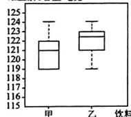

由箱线图,可以发现乙的维生素C的含量比甲的波动大,由此可判断甲种饮料的维生素C的含量相对稳定.
(2)略

# 本章总结提升

# 【重点模块总结】

模块1

1. 最多 2. 个数 集中趋势 3. 权

例1 (1)小丽四次成绩的众数是80分, 小明四次成绩的众数是90分.

(2)小丽和小明成绩的平均数都是80分

(3) 小明

模块2

1. 平方和 2. 平均数 3. 算术平方根

例 2 (1)84 (2)选派甲参加更合适. 理由略模块 3

1. 中间 平均 2. 下四分位 上四分位

3. 下四分位 最大

例 3 (1) $m_{25}=75$ 分, $m_{50}=81$ 分, $m_{75}=88$ 分

(2)略 (3)略

# 【综合能力提升】

例 4 (1)86.5 85 20

(2)认为B款人工智能软件更受用户欢迎.理由略

(3)340名

# 第七章 证明

# 1 为什么要证明

# 【探究与应用】

探究

[问题导入]

解:(1)直接观察可能得出结论,题图①中线段a比线段b长,题图②中的四边形不是正方形.而实际上,线段a与b相等,四边形是正方形,可借助测量检验.

(2)凭感觉可能认为铁丝与地球赤道的间隙很小，放不进一个拳头，而事实上铁丝与地球赤道的间隙

为 $\frac{C + 1}{2\pi} -\frac{C}{2\pi} = \frac{1}{2\pi}\approx 0.16(\mathrm{m})(C$ 表示地球赤道的

周长). 显然, 这样的间隙能放进一个拳头, 与感觉是不一致的.

[尝试思考]

解:(1)代数式 $n^{2}-n+11$ 的值不一定是质数. 当 n=0 时, $n^{2}-n+11=11$ ; 当 n=1 时, $n^{2}-n+11=$

11: 当 n=2 时, $n^{2}-n+11=13$ ; 当 n=3 时, $n^{2}-$

$n + 11 = 17$ 当 $n = 4$ 时， $n^2 - n + 11 = 23$ 当 $n = 5$

时， $n^{2}-n+11=31$ 。所以当n=0,1,2,3,4,5时。

$n^2 - n + 11$ 的值都是质数. 不能由此得到结论. 因为当

$n = 11$ 时， $n^2 - n + 11 = 121, 121$ 不是质数，所以并不是

对于所有的自然数 $n, n^2 - n + 11$ 的值都是质数.

(2) DE 与 BC 的位置关系是 DE // BC, DE 与 BC 的

数量关系是 $DE = \frac{1}{2} BC.$ 可以通过测量检验，检验

略. 此结论对所有的 $\triangle ABC$ 都成立.

[思考交流]

解:通过观察、实验、归纳得到的结论不一定都正确;要说明得到的结论是否正确,需通过有理有据的证明.

[概括新知]有理有据的证明

应用1

例1 解: 观察可能得出的结论:

(1)题图①中的实线是弯曲的；

(2)a 更长一些.

用科学的方法验证可发现：

(1)题图①中的实线是直的；

(2)a 与 b 一样长.

应用2

例2 解: 不一定. 当 $n = 6$ 时, $n^2 + 3n + 1 = 55 = 5 \times 11$ , 是一个合数.

应用3

例3 不认同

# 【课堂小结与检测】

[课堂检测]

1. A 2. 小明的猜想不正确. 理由略

# 2 第1课时 定义与命题

# 【探究与应用】

探究1

[启发导入]略

[概括新知] 明确

应用1

例1 C

探究2

[尝试思考]

解:(1)(2)(3)(4)对事情作出了判断,(5)(6)没有.

[概括新知] 判断一件事情

[思考交流]

解:这些命题都有“如果……,那么……”的结构特征,其他命题也有这样的结构特征.

[概括新知] 条件 结论

# [尝试思考]

解:(1)条件:两个角相等;结论:它们是对顶角.

(2) 条件 $a \neq b, b \neq c$ 结论 $a \neq c$ .

(3) 条件: 两个三角形全等; 结论: 这两个三角形的面积相等.

(4) 条件: 三个角是一个三角形的内角; 结论: 它们的和等于 $180^{\circ}$ .

(1)(2)是错误的. 判断方法不唯一. 如：

(1) 如图， $\angle AOB = \angle AOC =$

$90^{\circ}$ , 但 $\angle AOB$ 和 $\angle AOC$ 为邻补角.

(2) $a=2,b=3,c=2$ 满足 $a\neq b,b\neq c$ ，但 $a=c$ .

[概括新知]

(3)结论

应用2

例 2 ①②

应用3

例 3 解:(1)条件是“两直线平行”、结论是“同位角相等”.

可以改写成“如果两条平行直线被第三条直线所截，那么同位角相等”

(2)条件是“两条直线垂直于同一直线”，结论是“这两条直线平行”.

可以改写成“如果两条直线垂直于同一直线，那么这两条直线平行”

(3) 条件是“两个角是对顶角”，结论是“这两个角相等”。

可以改写成“如果两个角是对顶角，那么这两个角相等”.应用4

例 4 解: (1)(2)(3) 都是假命题.

(1)的反例: $90^{\circ}$ 的角大于锐角,但不是钝角.

(2)的反例不唯一.如:5有算术平方根,但算术平方根不是整数.

(3)的反例:点 C 在线段 AB 的垂直平分线上,但点 C 不在线段 AB 上,则 AC=BC,但 C 不是线段 AB 的中点.

# 【课堂小结与检测】

[课堂检测]

1. D 2. ①②

3. 解: (1) 条件: 两个角的和等于 $180^{\circ}$ , 结论: 这两个角互为补角. 真命题.

(2) 条件: 等式两边都加上同一个代数式, 结论: 等式仍然成立. 真命题.

(3)条件:两个角是钝角,结论:这两个角相等.假命题,举反例不唯一,如 $120^{\circ}$ 角与 $130^{\circ}$ 角都是钝角,但它们不相等.

(4) 条件: a=b, b=c, 结论: a=c. 真命题.

# 第2课时 定理与证明

# 【探究与应用】

探究

[问题导入]略

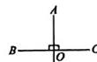

[概括新知] 1. (1) 真 (2) 演绎 (3) 正明

应用1

例1 C 例2 C

应用2

例3解：已知，如图，在 $\triangle ABC$ 中，

$\angle B = \angle C.$

求证:AB=AC,

证明：如图，过点 A 作 $AD \perp BC$ 于点 D.

则 $\angle ADB = \angle ADC = 90^{\circ}.$

在 $\triangle ABD$ 和 $\triangle ACD$ 中，

$\because \angle B = \angle C, \angle ADB = \angle ADC, AD = AD.$

$\therefore \triangle ABD \cong \triangle ACD, \therefore AB = AC.$

【课堂小结与检测】

[课堂检测] 1. B 2. 略

# 3 第1课时 平行线的判定

# 【探究与应用】

探究

[证明探究]

1. 略

2. 证明: 如图. $\because \angle1$ 与 $\angle2$ 互

补(已知)，

∴∠1+∠2=180°(互补的定义).

$\therefore\angle1=180^{\circ}-\angle2$ (等式的性质).

$\because\angle3+\angle2=180^{\circ}$ (平角的定义),

$\therefore\angle3=180^{\circ}-\angle2$ （等式的性质）.

$\therefore \angle 1 = \angle 3$ （等量代换）.

∴a//b(同位角相等,两直线平行).

应用

例 (1) 内错角相等, 两直线平行 (2) 略

# 【课堂小结与检测】

[课堂检测]

1. B 2. 内错角相等，两直线平行 3. 略

# 第2课时 平行线的性质

# 【探究与应用】

证明1略

证明2

证明:如图. $\because l_{1}\parallel l_{2}$ (已知).

$\therefore \angle 1 = \angle 3$ （两直线平行，同位

角相等).

又∵∠2=∠3(对顶角相等)，

∴∠1=∠2(等量代换).

证明3

证明：∵b∥a（已知），

∴∠2=∠1(两直线平行,同位角相等).

$\because c//a$ （已知），

∴∠3=∠1(两直线平行,同位角相等).

∴∠2=∠3(等量代换).

∴b//c(同位角相等,两直线平行).

# 【课堂小结与检测】

[课堂检测]略

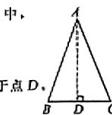

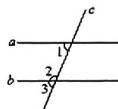

# 本章总结提升

# 【重点模块总结】

模块1

1. 命题 2. 结论 3. 真命题 假命题 4. 反例

例1 解：(1)不是命题；(2)(3)(4)(5)是命题.

(2)两条直线被第三条直线所截,如果同旁内角互

补、那么这两条直线平行、真命题

(3) 如果两个负数相加, 那么它们的和为负数. 真命题.

(4) 如果 $a > b$ ，那么 $\frac{a}{b} > 1$ 。假命题，反例 $a = 4, b =$

-2,a>b, $\frac{a}{b}$ = $\frac{4}{-2}$ =-2,-2<1.

(5)如果一个角是另一个角的补角,那么这个角一定是钝角.假命题.反例: $\angle1=60^{\circ},\angle2=120^{\circ},\angle1$ 是 $\angle2$ 的补角,但 $\angle1$ 不是钝角.

例 2 解: (1) 命题的条件为: 两条平行线被第三条直线所截;

结论为：一对内错角的平分线互相平行.

(2)如图所示.

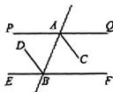

(3) 若 PQ//EF, AC 平分 $\angle BAQ$ , BD 平分 $\angle ABE$ , 则 AC//BD.

(4)这个命题是真命题.

证明：∵PQ//EF，∴∠QAB=∠ABE.

∵AC平分∠BAQ.BD平分∠ABE.

$\therefore \angle CAB = \frac{1}{2}\angle QAB, \angle ABD = \frac{1}{2}\angle ABE.$

$\therefore \angle CAB = \angle ABD, \therefore AC \parallel BD,$

模块2

1. 同位 内错 同旁内 2. 平行 平行 平行

例 3 (1) 证明: ∵ AB // CD, ∴ ∠ BNP = ∠2.

$\because \angle 1 = \angle 2, \therefore \angle BNP = \angle 1, \therefore EF // NP.$

(2)60°

# 【综合能力提升】

例 4 (1) 证明, ∵AM∥BN, ∠A=60°.

$\therefore \angle ABN = 180^{\circ} - \angle A = 120^{\circ}$

∵BC、BD分别平分∠ABP和∠PBN，

$\therefore \angle PBD = \frac{1}{2}\angle PBN, \angle CBP = \frac{1}{2}\angle ABP,$

$\therefore \angle PBD + \angle CBP = \frac{1}{2} (\angle PBN + \angle ABP) = \frac{1}{2}\angle ABN,$

$\therefore \angle CBD = \angle PBD + \angle CBP = \frac{1}{2}\angle ABN = 60^{\circ},$

$\therefore\angle CBD=\angle A.$

(2)①70 ② $\left(90-\frac{1}{2}x\right)$

(3) $\angle APB$ 与 $\angle ADB$ 之间的数量关系是 $\angle APB=2\angle ADB$ .理由略

# 作业手册

# 第2课时 勾股定理的验证及其简单应用

1. D 2. A 3. 195

4. 解: 因为 $AC + AB = 12 \, m, AC = 4.5 \, m$ ,

所以 AB=7.5 m.

在 Rt△ABC 中，由勾股定理、得

$BC^{2} = AB^{2} - AC^{2} = 7.5^{2} - 4.5^{2} = 36,$

所以 BC=6 m,

所以 $BD = CD - BC = 0.5\mathrm{m}$

所以大树顶端着地处 B 到小轿车的距离 BD 为 0.5 m.

5. 解: (1) 正方形 $(b-a)^{2}$

(2) 因为 $S_{正方形ABCD}=4\times S_{R\triangle ABE}+S_{正方形EFGIT}$

所以 $c^2 = 4 \times \frac{1}{2} ab + (b - a)^2$

整理，得 $a^2 + b^2 = c^2$ ，因此， $a^2 + b^2 = c^2$ 正确.

6. C 7. 能通过 理由略

8. (1)相等 理由略 (2)9

9. 解: (1) 农场 A 会受到台风的影响. 理由如下, 如图, 过点 A 作 $AH \perp BC$ 于点 H.

因为 $AB \perp AC$ ，所以 $\angle BAC = 90^{\circ}$

所以 $BC^{2} = AC^{2} + AB^{2} = 500^{2}$

所以 BC=500 km.

因为 $\triangle ABC$ 的面积 $= \frac{1}{2} BC\cdot AH = \frac{1}{2} AB\cdot AC,$ 所以 $500AH = 300\times 400$ ，所以 $AH = 240~\mathrm{km}$ 因为 $AH <   250~\mathrm{km}$

所以农场 A 会受到台风的影响.

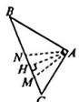

(2)如图,设台风从点 M 开始影响农场 A,到点 N 以后结束影响,连接 AN,AM,

则 $AM = AN = 250\mathrm{km}$

因为 AM=AN, AH⊥BC, 所以 MH=NH.

由勾股定理，得 $MH^2 = 250^2 - 240^2 = 70^2$

所以 MH=70 km，所以 $MN=2\times70=140$ (km).

因为台风中心的移动速度为 20 km/h.

所以台风影响农场 A 的持续时间是 $140 \div 20 = 7(h)$ .

# 2 一定是直角三角形吗

1. C 2. D 3. A 4. 合格

5. (1) 不是直角三角形 理由略

(2)是直角三角形 理由略

(3)不是直角三角形 理由略

6. 15

7. (1) $\triangle AEF$ 是直角三角形 理由略 (2) $54\mathrm{m}^2$

8. C 9. 45° 10. (1)30 (2)84 m²

11. (1) 是 理由略 (2) $m^{2} + n^{2}$ 2mn $m^{2} - n^{2}$ (3) 以 a, b, c 为边长的三角形一定是直角三角形 理由略

# 3 勾股定理的应用

1. C 2. A 3. 垂直 4. 8 5. 7.5 cm

6. C 7. 2.5 m 8. $\frac{100}{7}$ 9. 3600 元

10. 解: (1) $\triangle ABC$ 是直角三角形. 理由如下:
因为支架 AC=8 dm, AB=6 dm, 两轮中心的距离 BC=10 dm, 所以 $AC^{2}+AB^{2}=BC^{2}$ ,
所以 $\triangle ABC$ 是直角三角形.

(2) 因为 $AD = 13 \, dm, AE = 5 \, dm, AE \perp DE,$

所以在 Rt△ADE 中，由勾股定理，得 $DE^{2}=AD^{2}-AE^{2}=13^{2}-5^{2}=12^{2}$ ，所以 DE=

如图, 过点 A 作 $AG \perp BC$ 于点 G.

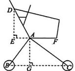

由(1)得 $\triangle ABC$ 是直角三角形， $\angle BAC=90^{\circ}$ ，
所以 $S_{\triangle ABC}=\frac{1}{2}AB\cdot AC=\frac{1}{2}BC\cdot AG,$

所以 $AG = \frac{AB\cdot AC}{BC} = \frac{6\times 8}{10} = 4.8(\mathrm{dm})$

所以购物车上篮子的左边缘 D 到地面的距离为 $DE + AG + r = 12 + 4.8 + 1 = 17.8 \, (\text{dm})$ .

# 问题解决策略：反思

1. C 2. D 3. C 4. 15 5. 41 m 6. 2.5

7.2.6米

8. (1)左 上 (2)④

[简单应用] 50 [问题回归]13

# 专题训练（一） 利用勾股定理解决折叠问题

1. A 2. A 3. B 4. 12 5. (1)4 (2)24

6. C 7. C 8. 3. 6

# 画图解题能力培养

典例1 $\frac{7}{6}$

[作图区]

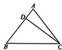

# [解答区]

如图，设 $AB = AC = a$

因为 $BC = 5, CD = 4, BD = 3$

所以 $BD^{2} + CD^{2} = BC^{2}$

所以 $\angle BDC = 90^{\circ}$ ，则 $\angle ADC = 90^{\circ}$

在 Rt△ADC 中，由勾股定理得 $AC^{2}=AD^{2}+CD^{2}$

即 $a^2 = (a - 3)^2 + 4^2$ ，解得 $a = \frac{25}{6}$

则 $AD = \frac{25}{6} - 3 = \frac{7}{6}$ .

典例2 [作图区]

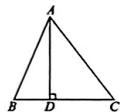

# [解答区]

如图，设 $BD = x$

因为 $BC = 14$ ，所以 $DC = 14 - x$

在 Rt△ABD 中，AB=13，BD=x，

由勾股定理，得 $AB^{2} = AD^{2} + BD^{2}$

则 $AD^{2} = 13^{2} - x^{2}$

在 Rt△ACD 中，AC=15，DC=14-x，

由勾股定理，得 $AC^2 = AD^2 + CD^2$

则 $AD^{2} = 15^{2} - (14 - x)^{2}$

所以 $13^{2} - x^{2} = 15^{2} - (14 - x)^{2}$ ，解得 $x = 5$

所以 $AD = 12$

# 【实战练兵】

1. $\frac{24}{5}$ 2. (1) $90^{\circ}$ (2)48

典例 3 52 或 28

[作图区]

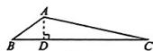  
图①

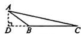  
图②

# [解答区]

如图①，当∠ABC是锐角时，过点A作AD⊥BC于点D.

因为 $AD$ 是 $\triangle ABC$ 的高，

所以 $\angle ADB = \angle ADC = 90^{\circ}$

由勾股定理，易得 $BD = 12, CD = 40$

所以 $BC = BD + CD = 12 + 40 = 52.$

如图②，当∠ABC是钝角时，过点A作 $AD\perp BC$ 交CB的延长线于点D.易得CD=40,BD=12,

所以 $BC = CD - BD = 40 - 12 = 28.$

综上所述，BC边的长为52或28.

# 【实战练兵】

1. 210或90 2. 3或 $\frac{18}{5}$ 或1

# 本章中考演练

1. D 2. C 3. 50 4. 10 5. 60 6. 48

7. (1) 因为 $CD \perp AB, BE \perp AC$ ,

所以 $\angle AEB = \angle ADC = 90^{\circ}$

在 $\triangle ABE$ 和 $\triangle ACD$ 中，

因为 $\angle AEB = \angle ADC, \angle BAE = \angle CAD,$

AB=AC,

所以 $\triangle ABE\cong \triangle ACD(AAS)$

(2)4

# 综合与实践

1. (1)14.08米

(2) 小于 0.26 米/秒且不大于 0.29 米/秒

(3)略

2. (1)13个 (2)8个 (3)600

# 反思提升：

2 监控器 $M_{1}$ 监测范围 $AB$ 的长度最大，水利部门需要布设监控器的个数最少

# 第二章 实数

# 1 第1课时 无限不循环小数

1. D 2. B 3. A 4. 无限不循环

5. 不是有理数,理由略

6. D 7. C 8. 2

9. (1) 这根玻璃棒的最大长度不是整数, 也不是分数, 理由略

(2)7

(3)这根玻璃棒的最大长度的十分位是9,百分位是2

# 第2课时 实数

1. A 2. C 3. C 4. B 5. C 6. 3

7. 解: 0.351, $-\frac{2}{3}$ , 4.96, 3.14159 均是分数, 它们都为有理数;

-5.2323332…(相邻两个2之间3的个数逐次

加2)， $\frac{\pi}{3}$ 均是无限不循环小数，它们都是无理数.

8. 解: (1)3.1 的相反数是 -3.1, 绝对值是 3.1.

(2) $-\frac{1}{7}$ 的相反数是 $\frac{1}{7}$ ，绝对值是 $\frac{1}{7}$ .

(3) $1.5\pi$ 的相反数是 $-1.5\pi$ ，绝对值是 $1.5\pi$ .

(4) $\pi-3.15$ 的相反数是 $3.15-\pi$ ，绝对值是 $3.15-\pi$ .

9. D 10. $-1 - 2a$ 11. 8

12. (1)他的说法正确, 理由略 (2)没有

# 2 第1课时 算术平方根

1. D 2. A 3. A 4. 5 5. $\sqrt{30}$ 6. $\sqrt{6}$

7. (1)6 (2) $\frac{8}{9}$ (3)1.3 (4) $\sqrt{30}$

(5) $\frac{1}{1000}$ (6) $\frac{7}{5}$

8. (1) $\frac{3}{8}$ (2)-9 (3)7 (4)0.34 (5)12

9. (1)5秒 (2)20米 10.C 11.C

12. B 13. $a^2 + 5$ 14. 3或4 15. $10000m$

16. 解: (1) $\sqrt{5}$

(2)存在.当 $x$ 的值为0或1时，始终输不出 $y$ 值.因为0的算术平方根是0,1的算术平方根是1，即0和1得到的算术平方根一定是有理数，所以始终输不出 $y$ 值.

(3) 输入的数据 $x < 0$ , 理由: 只有非负数才存在算术平方根.

(4) 输入的 x 值不唯一. 如 3,9,81.

# 申题训练

1. (1)0.5 (2) $\frac{1}{4}$ 2. (1)2-x (2) $\pi-3.14$

3. 3a-b-c

# 第2课时 平方根

1. C 2. C 3. D 4. D 5. C 6. 16 7. $-\sqrt{7}$

8. (1) $\pm 0.3$ (2) $\pm \frac{8}{3}$ (3) $\pm 5$ (4) $\pm 10^{-4}$

9. (1) $\frac{4}{5}$ (2) $\pm \frac{9}{7}$ (3) $-\frac{13}{20}$ (4) -0.1

10. (1) $\pm \frac{10}{13}$ (2)4或0 11. D 12. D 13. C

14. $\pm\frac{1}{2}$ 15. $\pm60$ 16. 2或-8

17. (1)4 (2) $\frac{49}{4}$ 或 196 18. 1 或 41

19. (1) $\sqrt{2}-1$ (2) $\pm1$

20. 解: 当 9 是 $4 \cdot a$ 的一个平方根时, 有 4a = 81,

因此 $a = \frac{81}{4}$

当4是 $9\cdot a$ 的一个平方根时，有 $9a = 16$ ，因此

a 9

当 $a$ 是 $4 \times 9$ 的一个平方根时，有 $a = \pm \sqrt{4 \times 9} = \pm 6$ ，因此 $a = \pm 6$ .

故 $a$ 的值为 $\frac{81}{4}$ 或 $\frac{16}{9}$ 或 6 或 -6.

# 第3课时 立方根

1. C 2. C 3. B 4. C 5. C 6. 64

7. (1) 6 (2) - 0.3 (3) $\frac{5}{3}$ (4) $\sqrt[3]{9}$

(5) $\sqrt[3]{10^{-8}}$

8. (1)0.2 (2) $-\frac{5}{4}$ (3)-15 (4)-8

9. C 10. A 11. B 12. A

13. $-\sqrt[3]{3}$ 14. 0 或 2 15. (1)0.4 (2) $\frac{3}{2}$

16. (1) $a = 5, b = 2, c = 3$ (2)4

17. 解: (1) $\sqrt[3]{64} + \sqrt[3]{-64} = 4 + (-4) = 0$ (答案不唯一)

(2) $a+b$

(3) 若 $\sqrt[3]{6 - 2x}$ 与 $\sqrt[3]{x + 1}$ 的值互为相反数，

则 $6-2x+x+1=0$ ，解得 x=7。

故 x 的立方根是 $\sqrt[3]{7}$ .

# 第4课时 估算

1. B 2. C 3. B 4. C 5. 6 6. < 7. 2(或3)

8. (1)4.5 (2)9 (3)5.7 (4)5

9. (1) $\frac{\sqrt{7} + 1}{2} > \frac{3}{2}$ (2) $\sqrt[3]{24} > 2.2$

(3) $\sqrt{41} > 6.23$ (4) $\frac{3 - \sqrt{15}}{2} < \frac{7}{8}$

10. D 11. 2024 12. -6 13. 45

14. (1)24 m (2)能

15. 解:(1)因为 $\sqrt{225}<\sqrt{249}<\sqrt{256}$ ,

所以 $15 < \sqrt{249} < 16$ ，所以 $\sqrt{249}$ 的整数部分是15.

(2)因为面积为 249 的正方形的边长是 $\sqrt{249}$ ,

且 $15 < \sqrt{249} < 16$

所以设 $\sqrt{249} = 15 + x$ ，其中 $0 < x < 1$

画出示意图,如图所示.

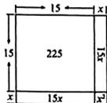

根据示意图,可得图中正方形的面积 $S_{正方形} = 15^{2} + 2 \times 15 \cdot x + x^{2}$ .

又因为 $S_{正方形}=249$ ，所以 $15^{2}+2\times15\cdot x+x^{2}=249$ ，

当 $x^{2} < 1$ 时，可忽略 $x^{2}$ ，得 $30x + 225 \approx 249$ ，得到 $x \approx 0.8$ ，即 $\sqrt{249} \approx 15.8$ .

# 3 第1课时 二次根式的概念及乘除运算

1. D 2. D 3. D 4. A 5. 3 6. -10 7. 6

8. 解: (1) $\sqrt{0.4}$ 是二次根式.

(2) $\sqrt{-11}$ 不是二次根式,理由t被开方数小于0.

(3) $\sqrt[3]{9}$ 不是二次根式,理由:不是形如 $\sqrt{a}(a\geqslant0)$ 的式子.

(4) $\sqrt{-\frac{1}{a}}(a<0)$ 是二次根式.

9. (1)12 (2)4 (3)2 (4) $46+6\sqrt{5}$

(5) $\frac{1}{2}$ (6)-1

10. C 11. C 12. B 13. B 14. 120

15. 2 16. (1)-18 (2) $\frac{3}{4}$

17. (1) $\sqrt{n(n + 1)}$ (2)120960

# 第2课时 二次根式的化简及加减运算

1. A 2. D 3. D 4. B 5. C 6. $6\sqrt{3}$ 7. $\sqrt{2}$

8. (1) $4\sqrt{2}$ (2) $2\sqrt{10}$ (3) $\frac{\sqrt{6}}{2}$ (4) $\frac{\sqrt{14}}{4}$

9. (1) $8\sqrt{2}$ (2) $\frac{31}{8}\sqrt{2}$ (3) $3\sqrt{3}$

10. C 11. B 12. A 13. $2\sqrt{6}$

14. (1) $\frac{5}{2}$ (2) $\frac{11\sqrt{10}}{20}$ (3) $40\sqrt{2}$

15. 解: (1) $4\sqrt{\frac{1}{8}} - 3\sqrt{\frac{1}{18}} - 4\sqrt{0.5} = 4 \times \frac{\sqrt{2}}{4} -$

$3 \times \frac{\sqrt{2}}{6} - 4 \times \frac{\sqrt{2}}{2} = \sqrt{2} - \frac{\sqrt{2}}{2} - 2\sqrt{2} = -\frac{3}{2}\sqrt{2}$ .

(2) 设“■”处的数字为 a，根据题意，得

$a\sqrt{\frac{1}{8}} - 3\sqrt{\frac{1}{18}} - 4\sqrt{0.5} = 3\sqrt{2}$

化简，得 $a \times \frac{\sqrt{2}}{4} - 3 \times \frac{\sqrt{2}}{6} - 4 \times \frac{\sqrt{2}}{2} = 3\sqrt{2}$ ，

整理，得 $\frac{a}{4} -\frac{1}{2} -2 = 3$ ，解得 $a = 22$

# 第3课时 二次根式的混合运算

1. C 2. B 3. B 4. $6-3\sqrt{10}$ 5. $\sqrt{2}$

6. 5 7. $-\sqrt{3}$ 8. $\frac{1}{2}$

9. (1) $\frac{17\sqrt{3}}{12}$ (2) $\frac{4\sqrt{2}}{3}$ (3) $\frac{4\sqrt{3}}{3}$ (4) $18\sqrt{3}$

(5) $3\sqrt{2}-2\sqrt{3}$ (6) $\frac{5}{3}\sqrt{6}$

10. 四边形 $ABCD$ 的面积为 10.5, 周长为 $4\sqrt{5} + \sqrt{26}$

11. C 12. B 13. $\sqrt{2} + 2\sqrt{3}$ 14. 0

15. $-\sqrt{3}+4\sqrt{2}$ 16. $-\frac{3\sqrt{2}}{4}$

17. (1) $\sqrt{3}$ (2)小明的说法正确. 理由略

18. (1) $\sqrt{6}-\sqrt{5}$ (2)80

# 专题训练（二） 二次根式混合

# 运算中的易错类型

1. $\frac{2\sqrt{2}}{3}$ 2. $\frac{15}{8}$ 3. $\sqrt{6}$

4. $\sqrt{5} - 1$ 5. $-12\sqrt{2}$ 6. $\sqrt{5} + \frac{1}{2}$

7. 解: $(x+\sqrt{5})(x-\sqrt{5})-x(x-2)=x^{2}-5-x^{2}+2x=2x-5.$

当 $x = \sqrt{2} + 1$ 时，原式 $= 2(\sqrt{2} + 1) - 5 = 2\sqrt{2} - 3.$

8. $-\sqrt{-5a}$ 9. 5

# 专题训练（三）二次根式的运算及化简求值技巧

1. 5 2. 1 3. $8\sqrt{6}$ 4. 1 5. $11 - 4\sqrt{3}$

6. (1)16 (2) $8\sqrt{7}$ 7. $2\sqrt{6}$ 8. $\frac{\sqrt{5}}{5}$

# 本章中考演练

1. D 2. A 3. B 4. B 5. C

6. B 7. C 8. B 9. C 10. C

11. -2 12. 4 13. 3

14. 2(答案不唯一) 15. $-2\sqrt{3}$

16. > 17. 10 18. 1

19. 2(答案不唯一) 20. 0

21. $-31+\sqrt{3}$ 22. 7 23. $6\sqrt{2}$ 24. -6

25. (1) $9+2\sqrt{3}$ $15+2\sqrt{3}$

(2) $S_{n+1}-S_{n}=6n-3+2\sqrt{3}$ 证明略

(3)7500+100 $\sqrt{3}$

# 第三章 位置与坐标

# 1 确定位置

1. B 2. C 3. (4,240°) 4. (2,7)

5. 解:(1)东华门

(2)“故宫”和“大北门”所在的区域分别为 E7 和 F6.

6. A 7. CAT

# 2 第1课时 平面直角坐标系的有关概念

1. A 2. A

3. 解: (1) A(2,9), C(5,8), E(5,6), G(7,4), M(8,1).

(2)(3,6),(7,9),(8,7),(3,3)分别代表点B，D,F,H.

4. 四

5. (1)略

(2)体育场(-2,5)，菜市场(6,5)，超市(4,-1)

(3)略

# 串题训练

1. C 2. 4 3 5 3. 8或4

# 第2课时 平面直角坐标系中点的坐标特征

1. D 2. A 3. C 4. -2

5. (1)(0,5) (2)点 $P$ 在第二象限. 理由略

6. B 7、B 8. 四 9. 3 10. 4

11. (1) $m = \frac{1}{3}$ $n = -\frac{5}{2}$

(2)m 的值为 1, n 的值为 1 或 -3

# 第3课时 建立适当的坐标系描述图形的位置

1. C 2. C 3. A 4. A

5. $(-3,3\sqrt{3})$ 6.略

7. 解: $A(0,0)$ , $B(2\sqrt{2},2\sqrt{2})$ , $C(4\sqrt{2},0)$ ,

$D(2\sqrt{2}, - 2\sqrt{2})$

8. B 9. A 10. (2,4)或(8,4)

11. 解: 答案不唯一. 如图, 以 D 为坐标原点, DC 和 AD 所在直线为 x 轴和 y 轴建立平面直角坐标系. 点 A 的坐标是 $(0,4)$ , 点 B 的坐标是 $(6,4)$ , 点 C 的坐标是 $(6,0)$ , 点 D 的坐标是 $(0,0)$ .

过点 E 作 $EG \perp CD$ 于点 G 交 AB 于点 F，则易知 $EF \perp AB$ .

因为 $AE = BE$

所以 $AF=\frac{1}{2}AB=\frac{1}{2}\times6=3.$

在 Rt△AEF 中，

$EF=\sqrt{AE^{2}-AF^{2}}=\sqrt{5^{2}-3^{2}}=4.$

所以 $EG = 4 + 4 = 8$ ，所以点 $\pmb{E}$ 的坐标是(3,8).

12. 解: (1) 建立平面直角坐标系如图, “未来水世界”的坐标为 (5, 5).

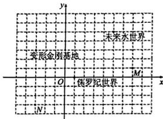

text_image

未来水世界
变形金刚基地
O 保罗纪世界
M
x
y
N

(2)如图所示.

(3) $35\times6=210$ （米）.“好莱坞”位于“变形金刚基地”的正南方向，距离“变形金刚基地”210米的地方.

# 3 轴对称与坐标变化

1. B 2. D 3. A 4. C 5. D

6. (4,3) 7. (4,2)

8. (1)(4,4) (-1,-3) (2)图略 关于 y 轴对称

9. (1) $A(0,3), B(-4,4)$

(2)略 (3) $B_{2}(4,4),C_{2}(2,1)$

10. A 11. D 12. (-3, -2) 13. 4

14. (1) $a = 1, b = 2$

(2)猜想点 P 的位置在原点. 理由略

15. 解:(1)建立平面直角坐标系如图所示.

(2) 因为村庄 B, C 关于 y 轴对称, 所以村庄 C 的坐标是 $(-2, -2)$ .

(3)如图,连接AC交y轴于点P,连接BP,此时 $PA+PB=PA+PC=AC$ ,为最小值,则点P即为所求.

由勾股定理得 $AC=\sqrt{6^{2}+4^{2}}=2\sqrt{13}$ ，
所以此时汽车到 A, B 两村庄的距离和为 $2\sqrt{13}$ .

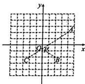

# 专题训练（四）巧用点的坐标求线段的长和图形的面积

A 2. B 3. C 4. B 5. B 6. 32

7. 50 8. 18 9. (1)略 (2)略 (3)4

0. (1) 图略, 点 B 的坐标为 $(-2,0)$ 或 $(-8,0)$

(2) $\frac{15}{2}$

11. 24.5 12. C 13. (5,0)或(0,-1)或(0,5)

14. (1) 图略, 点 $C_{1}$ 的坐标为 $(-4, 3)$

(2)(-6.0)或(10.0)

15. (1)(0,6) (2)(-10,0)或(-2,0)

# 专题训练（五） 平面直角坐标系中点的坐标变化

1. C 2. C 3. B 4. C 5. B 6. B

# 本章中考演练

1. C 2. C 3. A 4. 四 5. (7,0)

6. (3,30°) 7. (2,1) 8. (2891,-√3)

# 综合与实践

(1)(6.5,5) (6.5,6.5) B (-3,-2)

(2)略

(3)从宿舍楼 $A_{2}$ 到实验楼E通行距离最远，学生最远通行距离约为1162.5m

# 第四章 一次函数

# 1 函数

1. D 2. D 3. (1) y = 540 - 20x (2) 1260 元

4. A 5. ①④

6. 解: (1)y 是关于 x 的函数. 理由: 根据图象知, 对于变量 x 取值范围内的每一个值, y 都有唯一的值与它对应, 所以 y 是关于 x 的函数.

(2)点 D 的实际意义是学习 24 h 后, 记忆留存率为 33.7%.

(3)由图象知,知识记忆遗忘是先快后慢,故建议学习新事物后要及时复习,做到温故而知新(合理即可).

# 2 第1课时 变量的均匀变化

1. C 2. 100

3. (1) 是

(2) 每降价 5 元, 月销量增加 40 件, 降价之前的月销量是 640 件

(3) $y=8x+640$ (4)1600件

4. 500

5. 解:(1)15 (2)y=0.25x.

(3)该汽车不会和前车追尾. 理由如下：
当 x=110 时， $y=110\times0.25=27.5$

因为 27.5<31，所以该汽车不会和前车追尾。

# 第2课时 一次函数与正比例函数

1. D 2. C 3. D 4. -1 5. 42

6. $y = 10 + 0.2x$ 100

7. 解: (1) $y = 2x + 50$ , 是一次函数, 不是正比例函数.

(2) $y=10x$ ，是一次函数，也是正比例函数.

8. (1) $y = -80x + 350$ , 其中 $k = -80$ 表示每小时小轿车与 B 地的距离的变化量, $b = 350$ 表示小轿车没有出发前与 B 地的距离
(2)3.75 h

9. C 10. B 11. $\neq 2$ -2 12. $y = 4x + 7$

13. (1) $Q = -0.17s + 80, k = -0.17$ 表示每千米汽车电量的变化量， $b = 80$ 表示汽车没有行驶时的电量

(2)4 h

14. 解:(1)从表中数据可知,气温每升高10℃,声音在空气中传播的速度提高了6 m/s,
所以气温每升高1℃,声音在空气中传播的速度提高了0.6m/s.

(2) 因为气温每升高 $1^{\circ}C$ ，声音在空气中传播的速度提高 0.6 m/s，且当 t=0 时，v=331，所以声音在空气中的传播速度 v 与气温 t 的关系式为 $v=331+0.6t$ .

(3) 当 t = 15 时， $v = 331 + 0.6 \times 15 = 340$ ，

$340 \times 5 = 1700(\mathrm{~m})$

所以，小莹同学与燃放烟花所在地大约相距

1700

# 第3课时 计费问题

1. C 2. A

3. (1) $y = \begin{cases} 3x(0 \leqslant x \leqslant 10), \\ 4x - 10(x > 10) \end{cases}$ (2)24元 (3) $13\ m^{3}$

4. (1)720 520

(2) $y_{甲}=21x+300(x>100)$

$y_{z} = 24x + 200(x > 100)$

(3) 当 x=150 时， $y_{甲}=21x+300=21\times150+300=3450$ （元），

$y_{乙}=24x+200=24\times150+200=3800$ （元）.

因为 3450<3800，所以选择甲供应商比较省钱

5. (1)83.2

(2) $y=0.60x-16$

(3)280 kW·h

6. A 7. 222.2

8. 解:(1)由题意得 $180 \times 0.55 + (280 - 180) \times$

$(0.55+a)=164$ , 解得 a=0.1.

(2)①当 $0 \leqslant x \leqslant 180$ 时，y = 0.55x；

②当 $180 < x \leqslant 300$ 时， $y = 180 \times 0.55 + (x - 180) \times (0.55 + 0.1) = 0.65x - 18$ ;

③当 $x > 300$ 时， $y = 180 \times 0.55 + (300 - 180) \times$

(0.55+0.1)+(x-300)×(0.55+0.30)=0.85x-78,

所以 $y$ 与 $\pmb{x}$ 之间的关系式为

$$
y = \left\{ \begin{array}{l l} 0. 5 5 x (0 \leqslant x \leqslant 1 8 0), \\ 0. 6 5 x - 1 8 (1 8 0 <   x \leqslant 3 0 0), \\ 0. 8 5 x - 7 8 (x > 3 0 0). \end{array} \right.
$$

(3) 当 x=300 时, $y=0.65\times300-18=177,262>177$ ,

因此，该用户7月份用电量大于 $300\mathrm{kW}\cdot \mathrm{h}$ 由 $0.85x - 78 = 262$ ，解得 $x = 400$

因此，该户7月份的用电量为 $400\mathrm{kW}\cdot \mathrm{h}$

# 3 第1课时 正比例函数的图象及性质

1. A 2. C 3. A 4. A 5. A

6. ①③④ 7. $y = -\sqrt{3} x$

8. (1) 略

(2)①一、三 升高 ②(0,0) ③增大 快陡

9. (1) $m > 2$ (2) $m <   2$ (3)5

10. C 11. B 12. $\frac{3}{4}$ 或 $-\frac{3}{4}$

13. $(-2\sqrt{2}, -4\sqrt{2})$

14. (1)2 (2)略

(3) 自变量 x 每增加 1, y 增加 $\frac{5}{2}$

自变量 $x$ 每减小2， $y$ 减小5

15. 解:(1)这三个正比例函数的图象都具有的性质:经过原点的一条直线(合理即可).

(2)由题意知 $A\left(m,\frac{1}{2}m\right)$ , $B(m,km)$ ,

$C(m,-2m)$ .

因为 AB=BC，所以 B 为线段 AC 的中点，

所以 $\frac{1}{2}m-km=km-(-2m)$ .

解得 $k = -\frac{3}{4}$

# 第2课时 一次函数的图象及性质

1. B 2. B

3. $y = 5x + 3, y = -5x + 3$ $y = -5x - 4, y = -5x + 3$

4. < 5. (1) 略 (2) 不在

6. (1)不可以,理由略 (2)-3或-4(答案不唯一)
(3)-4 (4)-1

7. B 8. B 9. C 10. $x_{1} > x_{3} > x_{2}$

11. (1) $l_{1}$ 是直线 $y = 2x$ 向上平移3个单位长度得到的，其函数表达式为 $y = 2x + 3$ ； $l_{2}$ 是直线 $y = 2x$ 向下平移2个单位长度得到的，其函数表达式为 $y = 2x - 2$

(2) 图略

直线 $y = -\frac{3}{2} x$ 向上平移 2 个单位长度得到

的直线所对应的函数表达式为 $y = -\frac{3}{2} x + 2$

直线 $y = -\frac{3}{2} x$ 向下平移 3 个单位长度得到

的直线所对应的函数表达式为 $y = -\frac{3}{2} x - 3$

12. 解:(1)这个图象由两条射线组成,关于 y 轴对称,图象有最低点 $(0,-1)$ (合理即可).

(2) 把直线 y = x - 1 在 y 轴左侧部分关于直线 y = -1 对称，y 轴右侧部分（含 y 轴）不变，这样可得到 $y = |x| - 1$ 的图象（答案不唯一）.

(3) 可以, 如图所示.

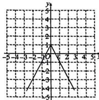

line

| x | y |
|---|---|
| -4 | -4 |
| -3 | -2 |
| -2 | 0 |
| -1 | 2 |
| 0 | 4 |
| 1 | 6 |
| 2 | 8 |
| 3 | 10 |
| 4 | 12 |
| 5 | 14 |

# 串题训练

1. B 2. C 3. B 4. A

# 4 第1课时 借助一次函数表达式解决一些简单实际问题

1. C 2. D 3. C 4. B 5. $y=\frac{4}{3}x-2$ 6. 34

7. (1) 斑马的奔跑路程与奔跑时间的关系式为 $s = 1.2t$

长颈鹿的奔跑路程与奔跑时间的关系式为 s = 0.8t

(2)斑马和长颈鹿分别跑了 21600 m 和 14400 m

8. (1)1 (2)2 9. C 10. 12

11. (1) $y = \frac{9}{5} x + 32$ (2) $-17.8^{\circ}\mathrm{C}$

(3)有.理由略

12. (1) $y = \frac{2}{3} x + 2$ (2)4 (3) $\frac{15}{2}$

13. 解:(1)因为四边形 ABCO 是长方形, 所以 AB=OC=4, OA=BC=3,

所以 $A(0,3)$ , $C(4,0)$ .

设直线 $AC$ 对应的函数表达式为 $y = cx + d$ ，则有 $d = 3,4c + d = 0$ ，解得 $c = -\frac{3}{4}$

所以直线 $AC$ 对应的函数表达式为 $y = -\frac{3}{4} x + 3$ .

(2)由题意,得点D的坐标为 $(0,-3)$ .

设直线 $CD$ 对应的函数表达式为 $y = mx + n$

则 $n = -3,4m + n = 0$ ，解得 $m = \frac{3}{4}$

所以直线 $CD$ 对应的函数表达式为 $y = \frac{3}{4} x - 3$ .

直线 $y=kx+b$ 关于 x 轴的对称直线对应的函数表达式为 y=-kx-b.

(3) 存在. 由三角形的三边关系得 $|PA - PB| \leqslant AB$ , 所以当点 $P, A, B$ 共线时, $|PA - PB|$ 的值最大, 最大值为 4 , 此时点 $P$ 的坐标为 (8,3).

# 第2课时 借助单个一次函数图象解决有关问题

1. A 2. A 3. B 4. 85

5. (1)5.5 cm (2)13 cm (3)8.4天

(4) k 表示植物每天长高的高度, b 表示植物栽种时的高度

6. (1) $y = -\frac{1}{5} x + 100$ (2) 能. 理由略

7. D 8. C

9. (1) $y = \begin{cases} \frac{1}{5} x + 50 (0 \leqslant x \leqslant 150), \\ 80 (150 < x \leqslant 200) \end{cases}$ (2) $80\%$

10. 解:(1)设小亮从度假村到 A 服务区的过程中, y 与 x 之间的函数表达式是 $y = kx + b (k \neq 0)$ .

因为图象经过点(0,270),(1,180),

所以 b=270, $k+b=180$ , 解得 k=-90,

所以小亮从度假村到 A 服务区的过程中，y 与 x 之间的函数表达式是 $y = -90x + 270 (0 \leqslant x \leqslant 2)$ .

(2) 当 x=2 时， $y=-90\times2+270=90$ ，

2.5+ $\frac{90}{60}$ =2.5+1.5=4(h).

因此，小亮从度假村回到自己家共用了4小时。

# 第3课时 借助两个一次函数图象解决有关问题

1. B 2. D

3. (1) 10 t, 20 t (2) 20 600 t (3) 700 t, 800 t

(4) $y_{甲}=10x+400,y_{乙}=20x+200,$

$y_{甲}, y_{乙}$ 的一次项系数分别表示甲、乙两车间每天的产量， $y_{甲}, y_{乙}$ 的常数项分别表示开始生产时甲、乙两车间已有的产量

4. C 5. 165

6. (1)250x+3000 500x+1000 (2)略

(3) 在 $y_{1}$ 中, 一次项系数的实际意义是每月垃圾处理费用 250 元, 常数项的实际意义是买分类垃圾桶需要费用 3000 元

(4)①当使用时间大于8个月时,方案1省钱;

②当使用时间小于8个月时，方案2省钱；

③当使用时间等于8个月时，方案1与方案2一样省钱

7. 解: (答案不唯一) 如题图, 小王开车从甲地开往乙地, 同时, 小张骑自行车在小王前面 10 km 处, 也在向乙地行驶, 此图表示小王、小张距甲地的距离 s (km) 与时间 t (h) 之间的关系, 观察图象并回答下列问题:

(1)哪条线表示的是小张距甲地的距离与时间的关系？

(2)小王与小张的速度各是多少?

(3)出发几小时后小王追上小张？此时他们距甲地有多远？

解:(1)根据题意由图象可以看出, $l_{1}$ 表示的是小张距甲地的距离与时间的关系.

(2)由图象知 $\frac{1}{2}$ h小张骑行了15-10=

5(km)，小王行驶了20km。

所以小张的速度为 $5 \div \frac{1}{2} = 10 \, (\text{km/h})$ ，小王的

速度为 $20 \div \frac{1}{2} = 40 \, (\text{km/h})$ .

(3)由图象知,直线 $l_{1}$ 过点(0,10)和 $\left(\frac{1}{2},15\right)$ .

设直线 $l_{1}$ 对应的函数表达式为 $s_1 = k_1t + b$ ，则

$b=10,\frac{1}{2}k_{1}+b=15$ , 解得 $k_{1}=10$ ,

所以 $s_{1}=10t+10.$

由图象知直线 $l_{2}$ 过原点和 $\left(\frac{1}{2},20\right)$ ,

设直线 $l_{2}$ 对应的函数表达式为 $s_2 = k_2t$

则 $20 = \frac{1}{2} k_{2}$ 解得 $k_{2} = 40$

所以 $s_{2}=40t$ .

当小王追上小张时，

即 $10t + 10 = 40t$ ，解得 $t = \frac{1}{3}$

此时 $s_{2}=40\times\frac{1}{3}=\frac{40}{3}.$

因此，出发 $\frac{1}{3}\mathrm{h}$ 后小王追上小张，此时他们距甲

地的距离为 $\frac{40}{3}$ km.

# 专题训练（六） 一次函数与图形的面积问题

1.8 2.2或11

3. 解: (1) 因为直线 $y = -\frac{4}{3}x + 4$ 与 x 轴、y 轴分别交于点 A, B,

令 x=0，得 y=4，所以点 B 的坐标为 $(0,4)$ ，

令 y=0，得 x=3，所以点 A 的坐标为 $(3,0)$ ，
所以 OB = 4, OA = 3,

所以 $AB = \sqrt{OB^{2} + OA^{2}} = 5.$

因为将 $\triangle DAB$ 沿直线 $AD$ 折叠，点 $B$ 恰好落在 $x$ 轴正半轴上的点 $C$ 处，

所以 AC=AB=5，所以 OC=AC+OA=8，
所以点 C 的坐标为(8,0).

(2) 由翻折的性质得 $\angle ABD = \angle ACD$ ， $\angle BDA = \angle ADC.$

因为 $\angle BAO=\angle CAE$ ，所以 $\angle AOB=\angle AEC=90^{\circ}$ ，所以 $\angle AOD=\angle AED$ 。

又因为 AD=AD，所以 $\triangle AOD \cong \triangle AED$ .

因为点 $D(0, -6)$ ，所以 $OD = 6$

所以 $S_{\triangle ADE}=S_{\triangle AOD}=\frac{1}{2}\times3\times6=9.$

4. $y = -\frac{3}{2} x + 3$ 5. $y = -\frac{2}{3} x + 4$ 或 $y = \frac{2}{3} x + 4$

6. 解: (1) 在 $y = x + 3$ 中, 令 x = 0 得 y = 3, 令 y = 0 得 x = -3, 所以点 A(-3, 0), C(0, 3).

因为直线 BC 与直线 AC 关于 y 轴对称，
点 A, B 为对称点，

所以 $B(3,0)$ .

(2) 因为 $A(-3,0)$ , $C(0,3)$ , $B(3,0)$ ,

所以 $S_{\triangle ABC}=\frac{1}{2}\times6\times3=9.$

①设直线 l 交 AC 于

点 $K$ ，则仅存在 $S_{\triangle AOK}$

: $S_{四边形KOBC}=1:2,$

过点 K 作 KH ⊥ AB
于点 H，如图⑧所示，

所以 $S_{\triangle AOK}=\frac{1}{3}S_{\triangle ABC}=3,$

所以 $\frac{1}{2}\times3\cdot HK=3$ ，则KH=2.

在 $y = x + 3$ 中，令 $y = 2$ ，即 $2 = x + 3$

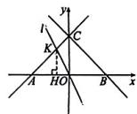  
a

解得 x = -1，所以 $K(-1,2)$ .

设直线 l 的表达式为 y = px。

所以 $2 = -p$ ，解得 $p = -2$

所以直线 l 的表达式为 $y = -2x$

②设直线 l 交 BC 于点

T, 则仅存在 $S_{\triangle DOT}$

$S_{四边形AOTC}=1:2,$ 过

点 T 作 $TH' \perp AB$ 于点 $H'$ ，如图⑥所示，

同①可得 $\frac{1}{2}\times3$

$TH' = 3$ , 则 $TH' = 2$ .

易得直线 $BC_{1}y = -x + 3$ ，令 $y = 2$ ，得 $x = 1$ ，则

点 $T(1,2)$

则直线 l 的表达式为 y=2x.

综上所述，直线 l 的表达式为 y = -2x 或 y = 2x.

1、 $(-4,0)$ 或 $(6,0)$

8. (1)b=1 A(3,0) (2)(0,3)或(0,-1)

9. 解: (1) 因为正比例函数 y = -3x 的图象过点 C(-1, m),

所以 $m = -3 \times (-1) = 3$ ，所以 $C(-1, 3)$ 。

直线 AB 对应的函数表达式为 $y=kx+b$ 。把 B(0,

4), $C(-1,3)$ 代入，可得 $b = 4, -k + b = 3$

解得 k=1.

所以直线 AB 对应的函数表达式为 $y=x+4$ .

(2)因为直线 $AB$ 对应的函数表达式为 $y = x +$

4, 所以设 $P(p, p+4)$ , $A(-4,0)$ .

所以 OA = 4.

①当点 P 在 x 轴上方时，如图⑧所示.

因为 $S_{\triangle OAP} = \frac{1}{2}\times 4(p + 4) = 4$ ，所以 $p = -2$

所以点 P 的坐标为 $(-2,2)$ .

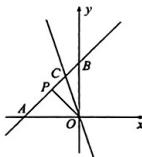  
a

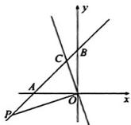  
6

②当点 P 在 x 轴下方时，如图⑥所示.

因为 $S_{\triangle OAP}=\frac{1}{2}\times4(-p-4)=4$

所以 p = -6，所以点 P 的坐标为 $(-6, -2)$ .

综上可知，点 $P$ 的坐标为 $(-2, 2)$ 或 $(-6, -2)$ .

# 本章中考演练

1. B 2. A 3. A 4. D 5. A

6. $y = 2x + 3$ 7. 减小 8. 1(答案不唯一)

9. $x = -2$ 10. 15 11. 5 12. 9 13. $(-3,1)$

14. (1) $y = -\frac{1}{5} x + 80 (0 \leqslant x \leqslant 240)$ (2) $32\%$

15. 解: (1) 由题意可知, A 档速度为 $4000 \div 50 = 80$ (米/分),

则 B 档速度为 $80+40=120$ （米/分），

C 档速度为 $120+40=160$ (米/分).

所以 A, B, C 各档速度分别为 80 米/分、120 米/分、160 米/分.

(2) 小丽第一段跑步时间为 $1800 \div 120 = 15$ (分)，

小丽第二段跑步时间为 $1200 \div 120 = 10$ （分），小丽第三段跑步时间为 $1600 \div 160 = 10$ （分），

则小丽两次休息时间的总和为 50-10-15-10-10=5(分).

所以小丽两次休息时间的总和为5分钟.

(3)因为小丽第二次休息后，在a分钟时两人

跑步累计里程相等，

所以此时小丽在跑第三段，所跑时间为 $a$

10-15-10-5=(a-40)分、

所以 $80a=3000+160(a-40)$ ，解得 a=42.5。

# 综合与实践

1. (1) $y = t \quad e = -\frac{1}{4}s + 100$ (2)有

2、任务1略

任务2：

猜想两个函数均为一次函数.

函数表达式分别为 $y_{A} = -x + 25, y_{B} = 2x + 10$

任务 $3\frac{10}{3}$ mg 或 $\frac{20}{3}$ mg

# 第五章 二元一次方程组

# 1 认识二元一次方程组

1. A 2. B 3. B 4. D 5. C 6. A

7. $\left\{\begin{aligned}x+y=7,\\ x-y=1\end{aligned}\right.$ (答案不唯一)

8. ②④ ①②③ ②

9. (1)5 (2) $\left\{ \begin{array}{l} x = 1, \\ y = 3, \end{array} \right.$ $\left\{ \begin{array}{l} x = 2, \\ y = 1 \end{array} \right.$

10. (1)20x+35y=380 (2)4 (3)5

11. C 12. 3 13. 6

14. $\left\{\begin{aligned}x-4y&=20,\\ 5x+4y&=4\end{aligned}\right.$

15. 解: (1) $\left\{\begin{aligned}&2x+y=280,\\ &3x+2y=460.\end{aligned}\right.$

(2) $\left\{\begin{aligned}x=100,\\ y=80\end{aligned}\right.$ 是(1)中方程组的解.

16. (1)6(答案不唯一)

(2) 因为 $33 \div 3 = 11$ (场), 19 - 11 = 8 (场), 所以甲队胜 11 场, 负 8 场.

设乙队胜 $m$ 场，负 $\pmb{n}$ 场，则平(19-m-n)场.

根据题意得 $3m+(19-m-n)=33$ ，所以 n=

2m-14.

因为 $m, n, 19 - m - n$ 均为自然数，

所以 $\left\{ \begin{array}{l}m = 7,\\ n = 0 \end{array} \right.$ 或 $\left\{ \begin{array}{l}m = 8,\\ n = 2 \end{array} \right.$ 或 $\left\{ \begin{array}{l}m = 9,\\ n = 4 \end{array} \right.$

或 $\left\{ \begin{array}{l} m = 10, \\ n = 6 \end{array} \right.$ 或 $\left\{ \begin{array}{l} m = 11, \\ n = 8. \end{array} \right.$

又因为甲、乙两队负场数不同，且甲队负8场，

所以 $m$ 的最大值为10.

所以乙队最多胜10场.

# 2 第1课时 代入消元法

1. D 2. D 3. C 4. $4x - 5$ 5. $\left\{ \begin{array}{l} x = 6, \\ y = 3 \end{array} \right.$

6. $\left\{\begin{aligned}x&=2,\\ y&=1\end{aligned}\right.$

7. (1) $\left\{ \begin{array}{l} x = -5, \\ y = 4 \end{array} \right.$ (2) $\left\{ \begin{array}{l} x = 3, \\ y = 2 \end{array} \right.$ (3) $\left\{ \begin{array}{l} x = 3, \\ y = -1 \end{array} \right.$

(4) $\left\{ \begin{array}{l} m = 0, \\ n = 1 \end{array} \right.$

8. A 9. B 10. B 11. 3 12. 2-x

13. -1 14. -3

15. (1) $\left\{ \begin{array}{l} x = 4, \\ y = 2 \end{array} \right.$ (2) $\left\{ \begin{array}{l} x = 5, \\ y = 1 \end{array} \right.$

16. (1) $\left\{ \begin{array}{l} x = 10, \\ y = -3.5 \end{array} \right.$ (2)1

# 第2课时 加减消元法

1. C 2. B 3. B 4. $\left\{ \begin{array}{l} x = -\frac{1}{2}, \\ y = 4 \end{array} \right.$

5.31

6. (1) $\left\{ \begin{array}{l} x = 3, \\ y = -1 \end{array} \right.$ (2) $\left\{ \begin{array}{l} x = -7, \\ y = -8 \end{array} \right.$ (3) $\left\{ \begin{array}{l} x = 6, \\ y = -1 \end{array} \right.$

(4) $\left\{\begin{aligned}x&=1,\\ y&=2\end{aligned}\right.$

7. (1) $\left\{ \begin{array}{l} x = -5, \\ y = -12 \end{array} \right.$ (2) $\left\{ \begin{array}{l} m = 1, \\ n = 6 \end{array} \right.$

8. A 9. A 10. $\frac{3}{2}$ 11. $-\frac{11}{2}$

12. a=-4, b=7

13. 解:(1)设 $m+n=x$ , m-n=y, 则原方程组可

化为 $\left\{ \begin{array}{l} ax + by = 6, \\ bx + ay = 3. \end{array} \right.$

因为 $\left\{ \begin{array}{l} ax + by = 6, \\ bx + ay = 3 \end{array} \right.$ 的解为 $\left\{ \begin{array}{l} x = -2, \\ y = 4, \end{array} \right.$

所以 $\left\{ \begin{array}{l} m + n = -2, \\ m - n = 4, \end{array} \right.$ 解得 $\left\{ \begin{array}{l} m = 1, \\ n = -3. \end{array} \right.$

(2) 设 $x + y = m, x - y = n$ ，则原方程组可化

为 $\left\{\begin{aligned}\frac{m}{2}-\frac{n}{3}&=4,\\ 2m-n&=16,\end{aligned}\right.$

化简整理，得 $\left\{ \begin{array}{l}3m - 2n = 24,\\ 2m - n = 16, \end{array} \right.$ 解得 $\left\{ \begin{array}{l}m = 8,\\ n = 0, \end{array} \right.$

所以 $\left\{ \begin{array}{l} x + y = 8, \\ x - y = 0, \end{array} \right.$ 解得 $\left\{ \begin{array}{l} x = 4, \\ y = 4. \end{array} \right.$

# 专题训练（七） 根据方程的特征巧解二元一次方程组

1. $\left\{ \begin{array}{l} x = 2, \\ y = 1 \end{array} \right.$ 2. $\left\{ \begin{array}{l} x = -2, \\ y = 3 \end{array} \right.$ 3. $\left\{ \begin{array}{l} x = 3, \\ y = 5 \end{array} \right.$

4. $\left\{ \begin{array}{l} x = \frac{1}{2}, \\ y = \frac{3}{2} \end{array} \right.$ 5. $\left\{ \begin{array}{l} x = \frac{4}{3}, \\ y = \frac{3}{2} \end{array} \right.$ 6. $\left\{ \begin{array}{l} x = 9, \\ y = 3 \end{array} \right.$

# 专题训练（八） 含字母参数的二元一次方程（组）的解法

1. (1) $k = 2, b = -3$ (2)7

2. 11 3. 1 4. -3

5. $a = 1, b = 10$ ，原方程组的解为 $\left\{ \begin{array}{l} x = \frac{14}{3}, \\ y = \frac{31}{15} \end{array} \right.$

6. $a = 8, b = -1$

# 3 第1课时 直接找等量关系列二元一次方程组解决问题

1. C 2. $\left\{ \begin{array}{ll} x + y = 300, \\ x + 600 = 3(y + 200) \end{array} \right.$

3. 每只雀、燕的重量分别为 $\frac{32}{19}$ 两， $\frac{24}{19}$ 两

4. 该店有客房8间，该批住店房客有63人

5. C 6. $\frac{5}{6}$ 7. D

8. 上、下禾每束之“实”分别为8升和3升

9. (1)①(100-x-y) $\frac{100-x-y}{3}$

② $3x + 5y + \frac{100 - x - y}{3} = 100$

(2)公鸡有4只,母鸡有18只,小鸡有78只

# 第2课时 列表法找等量关系列二元一次方程组解决问题

1. C 2. A 3. D 4. 160

5. 填表略, x=4, y=5, 甲的速度是 4 km/h, 乙的速度是 5 km/h

6. C 7. 99 8. $\frac{20}{3}$

9. 填表略, x=400, y=600, 甲商品的进价为 400 元, 乙商品的进价为 600 元

10. (1) A 商品的标价为 80 元/个, B 商品的标价为 100 元/个

(2)6折

(3) 小林的购买方案有 3 种, 方案一: 购买

15个A商品，4个B商品；方案二：购买10个

A 商品, 8 个 B 商品; 方案三: 购买 5 个 A 商品, 12 个 B 商品

# 第3课时 画图法找等量关系列二元一次方程组解决问题

1. B 2. 50 200

3. 甲的速度为45米/分，乙的速度为35米/分

4. 44 厘米 $^{2}$ 5. C 6. 60 7. 18

8. 平路是30千米，上坡路是16千米，下坡路是28千米

9. (1) $(6x + 2y + 18)\mathrm{m}^2$ (2)4500元

10. 解: (1) 设小王的实际行车时间为 x 分钟, 小张的实际行车时间为 y 分钟. 由题意, 得

1.8×6+0.3x=1.8×8.5+0.3y+0.8×

(8.5-7),

所以 x-y=19，

所以这两辆快车的实际行车时间相差19分钟.

(2)由(1)及题意得 $\left\{\begin{aligned}x-y=19,\\ 1.5y=\frac{1}{2}x+8.5,\end{aligned}\right.$

化简得 $\left\{ \begin{array}{l} x - y = 19, \\ 3y - x = 17. \end{array} \right.$

①+②，得 2y=36，解得 y=18.

将 y=18 代入①，得 x=37.

所以小王的实际乘车时间为 37 分钟, 小张的实际乘车时间为 18 分钟.

# 4 第1课时 用图象法求二元一次方程组的解

1. D 2. B 3. A 4. A 5. (0,-2)

6. (1) $\left\{ \begin{array}{l} x = 1, \\ y = -3 \end{array} \right.$ (2) $a = 2, b = -6$

7. 图略 (1) 平行 (2) 不能. 理由略

8. C 9. $\left\{ \begin{array}{ll} x = -1, \\ y = -3 \end{array} \right.$ 10. 二

11. $k = -4$ ，二元一次方程组 $\left\{ \begin{array}{l}x + y = 1,\\ kx - y + 5 = 0 \end{array} \right.$ 的解

为 $\left\{\begin{aligned}x&=\frac{4}{3},\\ y&=-\frac{1}{3}\end{aligned}\right.$

12. (1)2 (2) $\left\{ \begin{array}{ll}x = 2,\\ y = 3 \end{array} \right.$ (3) $\frac{27}{4}$

13. 解: 如图.

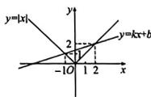

由图象可知,这两个函数图象的交点坐标为

(2,2)和(-1,1)，所以方程组 $\left\{\begin{aligned}y&=|x|,\\ y&=kx+b\end{aligned}\right.$ 的解

为 $\left\{\begin{aligned}x=2,\\ y=2\end{aligned}\right.$ 或 $\left\{\begin{aligned}x=-1,\\ y=1.\end{aligned}\right.$

# 第2课时 用待定系数法确定一次函数表达式

1. C 2. D 3. y=2x-1

4. 10 5. 36 ℃

6. (1) $y = 3x - 2$ (2) $\left(\frac{2}{3}, 0\right)$

(3) 点 $M(3,7)$ 在该一次函数图象上，点 $N(-2,$

-7) 不在该一次函数图象上

7. A 8. ①②④

9. (1) AC 段的函数关系式为 $F_{1}=10h(h\geqslant0,1)$ .

BC 段的函数关系式为 $F_{2}=5h+1,5(h\geqslant0.1)$

(2)0.22 m 或 0.38 m

10. (1)270千米

(2) $y=110x-195(2.5\leqslant x\leqslant4.5)$

(3)2.1小时或2.7小时

# 专题训练（九） 一次函数的实际应用问题

1. (1) $y = \begin{cases} 30x (0 \leqslant x \leqslant 50), \\ 24x + 300 (x > 50) \end{cases}$

(2)购买甲种跳绳40根、乙种跳绳60根

2. (1)15 (2)4元

(3) $y=\frac{1}{6}x-\frac{5}{2}(x>15)$

(4)当骑行时间少于 $\frac{75}{2}$ 分钟时,用手机支付较合算,

当骑行时间等于 $\frac{75}{2}$ 分钟时，两种支付方式金额相同，

当骑行时间大于 $\frac{75}{2}$ 分钟时，用会员卡支付较合算

3. (1) 方案一: $y = 180x + 270$ .

方案二：y=234x

(2)A(0,270),B(5,1170),

点 $B$ 所表示的实际意义为当小明所在的团队有

5人时，方案一和方案二的花费一样，都需要花费1170元

(3)x>5

4. (1)30 (2) $y=12x+180(x\geqslant10)$

(3)在乙采摘园采摘更划算.理由略

# 5 三元一次方程组

1. A 2. C 3. B 4. B

5. $\left\{ \begin{array}{ll} x = 4, \\ y = 3, \\ z = 2 \end{array} \right.$ 6. -15 7. $\left\{ \begin{array}{ll} x = 2, \\ y = 3, \\ z = 1 \end{array} \right.$

8. 毛笔的价格为 65 元, 现台的价格为 53 元, 笔洗的价格为 43 元

9. C 10. 1 11. 473 12. 14 人

13. 解: 旅游团安排三人间 15 间, 二人间 0 间, 单人间 5 间才能使得住宿费最低. 理由, 设三人间、二人间、单人间分别住了 x 间、y 间、z 间 (其中 x, y, z 都是自然数), 总的住宿费为 W 元.

根据题意，得 $\left\{ \begin{array}{l} x + y + z = 20, \\ 3x + 2y + z = 50 \end{array} \right.$

解得 $\left\{\begin{aligned}x&=10+z,\\ y&=10-2z.\end{aligned}\right.$

因为 $x, y, z$ 都是自然数，

所以 $\left\{\begin{aligned}x=10,\\ y=10,\\ z=0\end{aligned}\right.$ 或 $\left\{\begin{aligned}x=11,\\ y=8,\\ z=1\end{aligned}\right.$ 或 $\left\{\begin{aligned}x=12,\\ y=6,\\ z=2\end{aligned}\right.$

或 $\left\{\begin{aligned}x=13,\\ y=4,\end{aligned}\right.$ 或 $\left\{\begin{aligned}x=14,\\ y=2,\end{aligned}\right.$ 或 $\left\{\begin{aligned}x=15,\\ y=0,\\ z=5.\end{aligned}\right.$

因为 $W=60x+60y+50z=-10z+1200$

所以 z 越大, W 越小.

所以当 z=5，即 x=15, y=0, z=5 时，住宿费最低，为 1150 元.

# 问题解决策略：逐步确定

1. B 2. B 3. B 4. 408 5. 12

6. 略 7、A 8、7或9

# 本章中考演练

1. C 2. A 3. C 4. D 5. B

6. $\left\{\begin{aligned}x&=1,\\ y&=2\end{aligned}\right.$ 7. $\left\{\begin{aligned}x&=5,\\ y&=-1\end{aligned}\right.$ 8. 4500

9. (1) $\left\{ \begin{array}{l} x = 2, \\ y = \frac{1}{2} \end{array} \right.$ (2) $\left\{ \begin{array}{l} x = \frac{1}{2}, \\ y = -4 \end{array} \right.$

10. A 种农作物的种植面积是 3 公顷，B 种农作物的种植面积是 4 公顷

11. 有30个客人，13个盘子

12. (1) $\frac{1}{5}$ (2) $y = 90x + 2\left(\frac{1}{12} \leqslant x \leqslant \frac{1}{5}\right)$

(3)没有超速

# 综合与实践

解:任务1;

方法① $60\div8=7\cdots4$ ，即当只裁剪8dm长的用料时，最多可裁剪7根。

方法②：(60-20)÷8=40÷8=5，即当先裁剪下

1根 $20\mathrm{dm}$ 长的用料时，余下部分最多能裁剪8dm长的用料5根.

方法③： $(60-2\times20)\div8=2\cdots4$ ，即当先裁剪下

2根 $20\mathrm{dm}$ 长的用料时，余下部分最多能裁剪8dm长的用料2根.故答案为7,5,2.

任务2：

设方法②裁剪 x 根，方法③裁剪 y 根.

根据题意得 $\left\{ \begin{array}{l} x + 2y = 16, \\ 5x + 2y = 40, \end{array} \right.$ 解得 $\left\{ \begin{array}{l} x = 6, \\ y = 5. \end{array} \right.$

因此，用方法②裁剪6根，用方法③裁剪5根。

任务3：

根据题意得 $32+8a+10b=60$ 、正整数解为 $\left\{\begin{aligned}a&=1,\\ b&=2.\end{aligned}\right.$

因为 $160 \div 16 = 10$ ，所以搭建围栏 160 dm，即搭建 10 副围栏。

搭建10副围栏共需20根 $16\mathrm{dm}$ 的用料，20根 $10\mathrm{dm}$ 的用料，30根8dm的用料.

买10根 $60\mathrm{dm}$ 的材料可得20根 $16\mathrm{dm}$ 的用料，20根 $10\mathrm{dm}$ 的用料，10根8dm的用料，则少20根8dm的用料，

再买3根60dm的材料，每根可得7根8dm的用料，所以剩余材料的长度为 $4+4+12=20(\mathrm{dm})$ ，

费用至少为 $(10+3)\times50=650$ （元）.

# 第六章 数据的分析

# 1 第1课时 众数和算术平均数

1. C 2. C 3. B 4. 92 5. 15

6. (1)80 分 (2)80 分

7. C 8. A 9. D 10. D 11. 4

12. (1)93 (2)a 分是最低分. 理由略

13. (1)50 补全条形统计图略

(2)11吨 (3)11.6吨 (4)210户

# 第2课时 加权平均数

1. B 2. A 3. D 4. 92.2 5. 67

6. 乙班将获胜，通过计算说明略

7. D 8. C 9. 面试

10. (1)17万元

(2)从材料一数据可知,2025年6月销售量最大的车型为紧凑型车,所以建议多生产紧凑型车.(答案合理即可)

11. (1)甲 (2)139 148

(3) 最终当选的是乙, 通过计算判断过程略

# 第3课时 离差平方和、方差和标准差

1. A 2. D 3. D 4. 5,2,5,4 4 1.5

5. 16 6. $\frac{5}{2}$ $\frac{5}{12}$ $\frac{\sqrt{15}}{6}$ 7. (1)甲 (2)<

8. 解: 社会科学类图书借阅本数的平均数为 $\overline{x}=\frac{1}{5}(40+46+46+40+43)=43$ (本),

方差 $s^{2}=\frac{1}{5}[2\times(40-43)^{2}+2\times(46-43)^{2}+$

(43-43) $^{2}$ ]=7.2.

因为 3.2<7.2，所以自然科学类图书近 5 天的借阅情况较稳定。

9. A 10. D 11. C

12. (1) 平均分为 85 分, 标准差为 6 分

(2)数学

13. (1)m=20

全校学生中年龄不低于15岁的大约有600人(2)不认同.方差为1.5

# 第4课时 方差和离差平方和的实际应用

1. A

2. $\{21,21,22\},\{23,23,24,25,25\}$ 或 $\{21,21,22,23,23\},\{24,25,25\}$

3. (1)8 0.8

(2)甲的射击成绩更好.理由略 (3)变小

4. B

5. (1)597

(2)张浩同学7次测试成绩的平均数为603分，李勇同学7次测试成绩的方差为 $\frac{346}{7}$

(3)选李勇更有把握、理由略

# 2 第1课时 中位数和百分位数

1. C 2. D 3. C 4. B 5. 甲

6. (1) 平均数为 267 秒, 中位数为 265 秒, 众数为 265 秒

(2)该名学生的成绩处于平均水平.理由略

7. C 8. A 9. C 10. 4 11. 2.1

12. (1)这次成绩的中位数是86分，

不低于85分的有25人

(2) 不正确. 理由略

(3)该校学生对“核心价值观”的掌握达到90分及以上的百分比大约为 $36\%$ ，掌握程度较好（答案合理即可）

13. 解:从整体分位数来看,甲试验田玉米的高度普遍比乙试验田玉米的高度高.

从 50% 分位数看, 甲试验田有一半的玉米高度在 170 cm 以上, 从 90% 分位数来看, 乙试验田只有 10% 的玉米高度达到 170 cm 以上. 从 97% 分位数看, 甲试验田有 3% 的玉米高度在 180 cm 以上, 而乙试验田只有 3% 的玉米高度在 175 cm 以上. (合理即可)

# 第2课时 四分位数与箱线图

1. C 2. B 3. C

4. 6.65

5. (1)100人 (2)不够

6. 解:从箱线图来看,英语、地理成绩好,其中英语、地理的最高分均接近100分,有一半人的英语成绩在85分以上,地理有一多半人的成绩在80分以上;语文成绩波动不大;

数学成绩不太理想,有75%的学生成绩在80分以下;历史有超过50%的同学成绩在80分以上.
(答案合理即可)

7. D 8. ③④

9. 解:从统计图看,7月份杭州气温普遍偏高,乌鲁木齐的气温相对偏低;气温波动比较大的是北京和乌鲁木齐,波动相对较小的是广州和武汉;从中位数来看,武汉,杭州有一半以上的天数气温超过30℃,(合理即可)

10. 解: 因为 $50 \times 0.05 = 2.5, 50 \times 0.95 = 47.5$ ,
所以女性的“小腿加足高”数据的第5百分位数为女性的第3个数据，即356，

男性的“小腿加足高”数据的第95百分位数为男性的第48个数据，即452，

则工作椅座高的范围为 $356 \, mm \sim 452 \, mm$ ，所以本次调查所得范围不在国家标准范围 $360 \, mm \sim 480 \, mm$ 内。

产生差异的主要原因有：由样本的代表性所引起的，因为该市的调查结果不能代表全国的调查结果；样本数目过小；测量产生的误差等。（合理即可）

# 3 哪个团队收益大

1. 甲 2. 甲

3. (1) $\overline{x}_{\text{男}} \approx 61$ 分, $s_{\text{男}}^{2} \approx 253$ , $\overline{x}_{\text{女}} \approx 71$ 分, $s_{\text{女}}^{2} \approx 162$ (2) 四分位数如下所示:

<table><tr><td rowspan="2">性别</td><td colspan="3">四分位数</td></tr><tr><td> $m_{25}$ </td><td> $m_{50}$ </td><td> $m_{75}$ </td></tr><tr><td>男</td><td>50</td><td>58</td><td>71.5</td></tr><tr><td>女</td><td>63</td><td>69.5</td><td>77</td></tr></table>

(3)略

4. ①②③

5. (1) 四分位数如下所示：

<table><tr><td> $m_{25}$ </td><td> $m_{50}$ </td><td> $m_{75}$ </td></tr><tr><td>7.5</td><td>13.5</td><td>20</td></tr></table>

箱线图略

(2)这40名顾客的平均等待时间是14.3 min，这40名顾客的等待时间中，在2\~9 min最多。应该增加窗口，减少顾客的等待时间（合理即可）

# 本章中考演练

1. C 2. C 3. B 4. B 5. D 6. A

7. 甲 8, 7 9. ①② 10. 6.1

11. (1)86 分 (2)不能.举例略

12. (1)80 79.5 83 (2)甲 (3)600个

# 综合与实践

(1)3.75 2.0 桂花树叶的长宽比的平均数为 1.91

(2)B

(3)更可能来自橘子树.理由略

# 第七章 证明

# 1 为什么要证明

1. D 2. C

3. 解: 观察可能得出的结论: (1) 题图①中的实线是弯曲的; (2)a 更长一些; (3) AB 与 CD 不平行. 用科学的方法验证可发现: (1) 题图①中的实线是直的; (2)a 与 b 一样长; (3) AB 与 CD 平行.

4. 红、蓝、白

5. 解: 小明的猜想不正确.

理由：因为当 $n = 7$ 时， $n^2 - 6n = 7 > 0$

所以当 n 为任意正整数时， $n^{2}-6n$ 的值不一定是负数.

# 2 第1课时 定义与命题

1. D 2. B

3. 一个角是已知角的补角 这个角大于已知角

4. 1 2 -1(本题答案不唯一)

5. 解:(1)(2)(4)是命题,(3)不是命题.

(1) 假命题. 改写: 如果两个数同号, 那么这两个数的和一定不是负数.

(2)假命题.改写:如果x=2,那么1-5x=0.

(4)真命题.改写:如果两个数互为倒数,那么这两个数的积为1.

6. B 7. C

8. 两个角是同一个角(或相等角)的补角 这两个角相等

9. 解:(1)为真命题.

(2) 假命题. 反例不唯一. 如: 若 $a = 1, b = -1$ , 则 $|a| = |b|$ , 但 $a^3 \neq b^3$ .

(3)假命题.因为3,3,7不能组成三角形,所以

(3)为假命题.

# 第2课时 定理与证明

1. B 2. C 3. 略 4. B 5. C

6. 解: 答案不唯一, 如:

真命题：①③④⇒②.

证明：∵BE=CF，

$\therefore BE+CE=CF+CE,$ 即 BC=EF.

在 $\triangle ABC$ 和 $\triangle DEF$ 中，

∵AB=DE,∠ABC=∠DEF,BC=EF,

$\therefore \triangle ABC \cong \triangle DEF(SAS), \therefore AC = DF,$

# 3 第1课时 平行线的判定

1. A 2. C 3. C

4. $\angle C = \angle D$ (答案不唯一) 5. 略

6. 证明：∵OF⊥OE，∴∠FOE=90°.

$\because \angle DOE = 55^{\circ}, \therefore \angle DOF = 35^{\circ}.$

∵OF 平分∠AOD，

$\therefore \angle AOD = 2\angle DOF = 2\times 35^{\circ} = 70^{\circ},$

$\therefore \angle AOD + \angle D = 70^{\circ} + 110^{\circ} = 180^{\circ}, \therefore CD \parallel AB.$

7. D 8. ①③④

9. 平行 同旁内角互补，两直线平行

10. ABC ACB DBC ECB ECB F 同位角相等,两直线平行

11. 略

12. 解:由题意,得射线 CD 转动一周用时: $\frac{360}{6}=60(s)$ ,

在射线 $CD$ 转动一周的过程中，射线 $AB$ 始终在 $EF$ 右侧.

分三种情况：

①当 $0 \leqslant t < 20$ 时，如图⑧.

AB 与 CD 在 EF 的两侧，

$\angle ACD = 180^{\circ} - 60^{\circ} -$

$6t^{\circ} = 120^{\circ} - 6t^{\circ},\angle BAC =$

$110^{\circ} - t^{\circ}$

要使 $AB \parallel CD$ ，则 $\angle ACD =$

∠BAF

即 $120^{\circ}-6t^{\circ}=110^{\circ}-t^{\circ}$ ，解得 t=2；

②当 $20 < t < 50$ 时，如图⑥，CD

与 $AB$ 都在 $EF$ 的右侧，

$\angle DCF = 360^{\circ} - 6t^{\circ} - 60^{\circ} = 300^{\circ} -$

$6t^{\circ}, \angle BAC = 110^{\circ} - t^{\circ}$ ,

要使 $AB \parallel CD$ ，则 $\angle DCF =$

∠BAC,

即 $300^{\circ}-6t^{\circ}=110^{\circ}-t^{\circ}$ ，解得 t=38；
③当 $50 < t \leqslant 60$ 时，如图©, CD

与 $AB$ 在 $EF$ 的两侧，

$\angle DCE = 480^{\circ} - 6t^{\circ}, \angle BAF = 110^{\circ} - t^{\circ}$ .

要使 $AB \parallel CD$ ，则 $\angle DCE =$

/BA

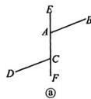

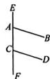  
b

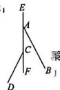  
©

即 $480^{\circ} - 6t^{\circ} = 110^{\circ} - t^{\circ}$ ，解得 $t = 74$

∵74>60，∴此情况不存在；

④当 t=20 或 t=50 时，CD 在直线 EF 上，此种情况不成立.

综上所述，当 $t$ 的值为2或38时，CD与AB平行.

# 第2课时 平行线

A 2. C 3. D 4. $\angle 1 + \angle 2 = \angle 3$

48 6. 略

证明：∵AD∥BC，∴∠EAD=∠B.

$\because \angle B = \angle D, \therefore \angle EAD = \angle D,$

$\therefore BE \parallel CD, \therefore \angle E = \angle ECD.$

B 9. B 10. 110

1. $15^{\circ}$ 或 $105^{\circ}$ 12. 略

3. (1) 证明: $\because AC \parallel DE, \therefore \angle C = \angle 1$ .

又∵∠AFD=∠1,

$\therefore \angle C = \angle AFD, \therefore DF \parallel BC.$

(2) $70^{\circ}$

4. 解:(1)75 (2) $360^{\circ}-\alpha-\beta$

(3)猜想: $\angle BEC=180^{\circ}-\alpha+\beta.$

证明,如图,过点 E 作 EF//AB,

则 $\angle BEF = 180^{\circ} - \angle B = 180^{\circ} - \alpha .$

∵AB∥EF,AB∥CD,

∴ EF // CD.

$\therefore \angle CEF = \angle C = \beta .$

$\therefore \angle BEC = \angle BEF + \angle CEF = 180^{\circ} - \alpha +\beta .$

# 专题训练（十） 平行线性质与

# 判定的综合应用

B 2. B 3. 112.5 4. 65

$110^{\circ}$ 6. $70^{\circ}$ 7.略

解:(1)AB//DE.理由如下:

∵MN//BC(已知)，

$\therefore\angle ABC=\angle1=60^{\circ}$ （两直线平行，内错角相等）.

又∵∠1=∠2(已知)，

∴∠ABC=∠2(等量代换).

∴AB//DE(同位角相等,两直线平行).

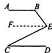

(2)证明：∵MN//BC，

$\therefore \angle NDE + \angle 2 = 180^{\circ}.$

$\therefore \angle NDE = 180^{\circ} - \angle 2 = 180^{\circ} - 60^{\circ} = 120^{\circ}$

∵DC 是∠NDE 的平分线，

$\therefore \angle EDC = \angle NDC = \frac{1}{2}\angle NDE = 60^{\circ}.$

∵MN//BC,

$\therefore \angle C = \angle NDC = 60^{\circ}.$

$\therefore \angle ABC = \angle C.$

(3) 证明: $\angle ADC = 180^{\circ} - \angle NDC = 180^{\circ} -$

$60^{\circ} = 120^{\circ}$

$\because BD \perp DC, \therefore \angle BDC = 90^{\circ}.$

$\therefore \angle ADB = \angle ADC - \angle BDC = 120^{\circ} - 90^{\circ} = 30^{\circ}$

∵MN∥BC,∴∠DBC=∠ADB=30°.

$\therefore \angle ABD = \angle ABE - \angle DBE = 30^{\circ} = \angle DBC.$

∴BD 是∠ABC 的平分线.

9. 略

10. 证明：∵DG⊥BC, AC⊥BC,

$\therefore \angle DGB = \angle ACB = 90^{\circ},$

∴ DG∥AC, ∴∠2=∠ACD.

$\because \angle 1 = \angle 2, \therefore \angle 1 = \angle ACD,$

$\therefore EF \parallel CD, \therefore \angle AEF = \angle ADC.$

$\because EF \perp AB, \therefore \angle AEF = 90^{\circ}.$

$\therefore \angle ADC = \angle AEF = 90^{\circ},$

$\therefore CD \perp AB.$

# 专题训练（十一） 平行线的拐点问题

1. D 2. B 3. B 4. $25^{\circ}$

5. $\angle ABD + \angle DEF - \angle BDE = 180^{\circ}$ 理由略

6. 解: (1) 证明, 如图, 过点 F 作 MN // AB.

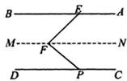

∵MN∥AB,AB∥CD,

$\therefore \angle BEF = \angle EFN, MN \parallel CD.$

$\therefore \angle NFP = \angle FPD.$

$\therefore \angle EFP = \angle EPN + \angle NFP = \angle BEF + \angle FPD.$

(2) $\angle AEG=2\angle FPD$ . 理由如下：

由题意，得 $\angle AEG + 2\angle BEF = 180^{\circ}$

由(1)可知 $\angle FPD + \angle BEF = \angle EFP = 90^{\circ}$

$\therefore 2 \angle FPD + 2 \angle BEF = 180^{\circ}$

$\therefore \angle AEG = 2\angle FPD.$

7. 24 $^{a}$ 8. 70

9. $\angle B + \angle D - \angle E = 180^{\circ}$

10. $\angle AQC = \angle 1 + \angle 2 + 35^{\circ}$

11. (1) $90^{\circ}$ (2) $85^{\circ}$

(3) $\angle 2 + \angle 4 + \angle 6 = \angle 1 + \angle 3 + \angle 5 + \angle 7$

# 本章中考演练

1. C 2. B 3. A 4. B

5. A 6. C 7. $109^{\circ}$

8. 证明：∵E是AC的中点，

$\therefore AE=CE.$

在 $\triangle ADE$ 和 $\triangle CFE$ 中，

$\because AE = CE, \angle AED = \angle CEF, DE = FE,$

$\therefore \triangle ADE \cong \triangle CFE(SAS)$ ,

$\therefore \angle ADE = \angle CFE.$

∴CF∥AB.

9. (1) 证明: ∵ DE∥BC,

$\therefore \angle C = \angle AED.$

$\because \angle EDF = \angle C,$

$\therefore \angle AED = \angle EDF,$

$\therefore DF \parallel AC, \therefore \angle BDF = \angle A.$

(2)△ABC是等腰直角三角形

# 综合与实践

(1)34

(2) $\angle1$ 与 $\angle2$ 间的数量关系是 $\angle2-\angle1=120^{\circ}$ .
理由略

(3)射线 $BA$ 与直线 $a$ 所夹锐角的度数为 $84^{\circ}$ 或 $20^{\circ}$

# 周末自评本

# 周末自评（一）

C 2. C 3. C 4. C 5. C 6. B

②④ 8. $\frac{60}{13}$ 9. 8 10. 24

1. 101寸 12. (1)20 (2)6

13. (1)9 (2) $\triangle ABC$ 是直角三角形 理由略

4. (1)15 m (2)4 m

15. 公路 AB 段没有危险, 不需要暂时封锁理由略

# 周末自评（二）

A 2. D 3. A 4. C 5. B 6. A

$3\sqrt{5}$ 8. $\frac{\sqrt{5}}{4}$ 9. $14\sqrt{3}$ 10. 2

1. $\frac{3\sqrt{2ab}}{b^2}$ 12. $\frac{6\sqrt{15}}{5}$ $4\sqrt{2} - 5$

(3. (1) $\frac{\sqrt{10}}{2}$ (2) $\frac{2\sqrt{10}}{5}$ (3) $\sqrt{3}$ (4) $\frac{\sqrt{5}}{30}$

14. (1) $6\sqrt{2} - 3\sqrt{6}$ (2)0 (3) $\frac{4}{3} + \frac{\sqrt{2}}{12}$

(4) $-12\sqrt{2}$

15. 20 16. (1) $2 - \sqrt{3}$ (2)3

17. (1) $\sqrt{10} - 3$ $\sqrt{17} - 4$

(2)11 (3)2024

# 周末自评（三）

1. B 2. D 3. A 4. A 5. B 6. C

7. 3 8. 1 9. 3 10. 4 11. $\frac{\sqrt{2}}{2}$ 12. <

13. 解: (1) 有理数集合: $\{0, |-3.5|, 0.3, -0.34, \sqrt{(-3)^{2}}, \cdots\}$ ;

(2) 无理数集合: $\left\{\pi, -\sqrt{\frac{1}{3}}, -\sqrt[3]{20}, \right.$

2.030030003…(相邻两个3之间0的个数逐次加1)，…}；

(3)正数集合： $\left\{\left|-3.5\right|,0.3,\pi,\sqrt{(-3)^{2}},2.030030003\cdots\right.$ （相邻两个3之间0的个数逐次加1），…）；

(4)负数集合： $\left\{-0.\dot{3}\dot{4},-\sqrt{\frac{1}{3}},-\sqrt[3]{20},\cdots\right\}$

14. (1) $8\sqrt{3}$ (2)-1 (3) $2 - \sqrt{2}$ (4) $2 + 2\sqrt{2}$

15. (1)4 (2) $8\sqrt{2}$ (3) $-1-2\sqrt{2}$

16. (1) $\sqrt{11}$ 在表中的3.31与3.32之间 理由略(2)3.35s

17. (1) $a = 144, b = 4, c = 1$ (2) $\pm 4$

(3) $\sqrt{20753} - 144$

# 周末自评（四）

1. B 2. C 3. D 4. A 5. C 6. D

7. (1,-2) 8. (1,2) 9. $\left(5,\frac{5}{4}\right)$

10. (3,3)或(6,-6) 11. $(2,\sqrt{3})$ 12. (5,-3)

13、(1)略 (2)5

(3) $A_{1}(1,-4),B_{1}(3,-4),C_{1}(3,1)$

14. (1) $\left(2, \frac{7}{2}\right)$ (2) $(-13, 26)$ 或 $\left(\frac{13}{7}, \frac{26}{7}\right)$

15. (1) 略 (2) AB = CD, AB // CD

(3) 在 $y$ 轴上存在点 $P$ , 使 $S_{\triangle PAB} = S_{\text{四边形} ABCD}$ ,

点 $P$ 的坐标为 $(0,4)$ 或 $(0,-8)$

# 周末自评（五）

1. C 2. C 3. C 4. C 5. B 6. A 7.

8. y=2x-4 9. y=-x+1(答案不唯一)

10. -2 11. $-\frac{5}{4}$ 12. $y = \frac{1}{3} x - 4$

.3. 解: (1) 设此正比例函数的表达式为 y = kx.

将 $(-3,6)$ 代入 y=kx，得 6=-3k，解得 k=-2 则这个正比例函数的表达式为 y=-2x。

(2) 把 $(a,8)$ 代入 y = -2x，得 8 = -2a，

解得 $a = -4$

故点 A 的坐标是 $(-4,8)$ .

14. (1) 略 (2) $y_{1} < y_{2}$ 理由略

15. (1)-2 (2) $y=-x+9$ (3)±3

16. (1) $m = 1$ 直线 $l_{2}$ 的表达式为 $y = 5x$

(2) $\sqrt{2}$ (3)4

# 周末自评（六）

1. B 2. A 3. C 4. D

5. (1) < (2) 15 6. $\frac{10}{3}$ 7. 24. 6 8. 20

9. (1)880 (2) $s = -80t + 880(0 \leqslant t \leqslant 11)$ (3)6.25小时

0. (1) $l_{1}$

(2)甲印刷厂 $y=x+1500(x\geqslant0$ ,且x取整数)

乙印刷厂 $y = 2.5x(x\geqslant 0$ ，且 $\pmb{x}$ 取整数）

(3) 找甲印刷厂印刷宣传材料能多一些、能多印 300 份

# 周末自评（七）

1. C 2. D 3. A 4. A 5. B

6. D 7. 二 8. 299.6 9. -1

20. 1 11. 0.35 12. $y = -\frac{1}{5} x + 2$

13. (1) $y = \begin{cases} 50x (0 \leqslant x \leqslant 20, \text{且 } x \text{ 为整数}), \\ 40x + 200 (x > 20, \text{且 } x \text{ 为整数}) \end{cases}$ (2)2040元

14. (1) $y = 6x - 3$ (2)-2

.5. (1) $y = x + 2$

(2)存在.点 $P$ 的坐标为(1,3)或(-5,-3)

(3) $(\sqrt{2},\sqrt{2}+2)$ 或 $(- \sqrt{2},- \sqrt{2}+2)$

# 周末自评（八）

A 2. C 3. D 4. C 5. A 6. A

7. 200 800 8. 52 9. 12 20

10. 45 60 11. 250 12. 40

13. A, B 两种型号的新能源汽车一辆的进价分别为 21 万元和 36 万元

4. (1) 现在这个旅游团有 63 人, 原计划订 2 人间 26 间
(2)3 人间

15. (1)54元 (2)5瓶

# 周末自评（九）

1. B 2. D 3. B 4. C 5. A 6. C

7. ⑤ 8. (-5, -8) 9. 5

10. 28 11. -24 12. (0,5)或(0,-7)

# 第一章质量评估

.. B 2. B 3. B 4. C 5. B 6. C

7. D 8. A 9. D 10. A 11. 12

12. 16 或 34 13. 120 14. 10

15. 24 16. 2

17. (1) $a = 6$ $b = 8$ (2)30 18. 24

19. (1)9米 (2) $\frac{36}{5}$ 米

20. (1) 因为 $OB \perp OC$ ,

所以 $\angle BOD + \angle COE = 90^{\circ}$

因为 $CE \perp OA, BD \perp OA$

所以 $\angle CEO = \angle ODB = 90^{\circ}$

所以 $\angle BOD + \angle B = 90^{\circ}$

所以 $\angle COE = \angle B$

13. (1) $\left\{ \begin{array}{l} x = 3, \\ y = 1 \end{array} \right.$ (2) $\left\{ \begin{array}{l} x = -3, \\ y = -\frac{7}{3} \end{array} \right.$

14. (1) $y = -x + 2$ (2)(0,2)

(3)3 (4) $\left\{\begin{aligned}x&=-1,\\ y&=3\end{aligned}\right.$

15. (1) $\left\{ \begin{array}{l} x = -1, \\ y = 2 \end{array} \right.$ (2) $\left\{ \begin{array}{l} x = \frac{7}{2}, \\ y = -\frac{5}{2} \end{array} \right.$

# 周末自评（十）

1. A 2. C 3. D 4. D 5. C 6. D

7. 平均数 8. 9.4 9. 23.5 cm

10、6 11、② 12、6.5 13、(1)2 (2)2.5

14. 解: 第一箱橙子的平均质量为 $\frac{1}{5}(195+190+190+185+190)=190(g)$ ,

则第一箱橙子质量的方差为 $\frac{1}{5} \times [(185 - 190)^2 + 3 \times (190 - 190)^2 + (195 - 190)^2] = 10.$

由题可知，两箱橙子质量的平均数相同，因为第一箱橙子质量的方差小于第二箱橙子质量的方差，所以第一箱橙子的大小更均匀.

15. (1) 甲三项成绩之和为 23 分，

乙三项成绩之和为22分，会录用甲

(2)甲的综合成绩为7分，

乙的综合成绩为7.6分，

会改变(1)的录用结果

16. (1) 平均数为 300 件, 众数是 150 件

(2)不合理.销售定额可定为150件.理由略

# 周末自评（十一）

1. C 2. A 3. A 4. C 5. D 6. B

7. 丁 8. $\sqrt{2}$ 9. (72,74,74) (77)

10. 7 11. ③④ 12. 85 分

13. 估计该校八年级这次数学测试成绩的下四分位数为 43.5,

中位数为59.5，上四分位数为81.5.

从四分位数,得半数学生的成绩在 43.5 分至 81.5 分之间,

考虑到最低分为13分，最高分为97分，结合下四分位数、上四分位数可说明成绩在最小值与第 $25\%$ 分位数之间的学生分数差距相对较大，在第 $75\%$ 分位数与最大值之间的学生的分数差距较小

14. 解:(1)7.5 7 25%

(2)理由不唯一,如:①甲组成绩的优秀率为37.5%,高于乙组成绩的优秀率25%,

# 质量评估卷

在 $\triangle COE$ 和 $\triangle OBD$ 中，

因为 $\angle CEO = \angle ODB, \angle COE = \angle B, OC = BO,$

所以 $\triangle COE \cong \triangle OBD$ (AAS),

所以 OE=BD.

(2)7 cm

21. (1) 不是 理由略 (2)5 或 3

22. (1) $a^{2}+b^{2}=c^{2}$

(2) $(a+b)^{2}$ $S_{正方形MNPQ}$ $4S_{\triangle ABC}$

$S_{正方形ABDE}$ $a^2 +b^2 = c^2$

(3)5

# 第二章质量评估

1. C 2. B 3. B 4. B 5. D 6. D

7. D 8. B 9. A 10. D 11. $\sqrt{5} - 2$

所以从优秀率的角度看，甲组成绩比乙组好；②甲组成绩的中位数为7.5，高于乙组成绩的中位数。

所以从中位数的角度看，甲组成绩比乙组好，（合理即可）

(3) 四分位数和箱线图如下：

<table><tr><td rowspan="2">小组</td><td colspan="5">最小值、四分位数和最大值</td></tr><tr><td>最小值</td><td> $m_{25}$ </td><td> $m_{50}$ </td><td> $m_{75}$ </td><td>最大值</td></tr><tr><td>甲</td><td>3</td><td>7</td><td>7.5</td><td>9.5</td><td>10</td></tr><tr><td>乙</td><td>7</td><td>7</td><td>7</td><td>8.5</td><td>9</td></tr></table>

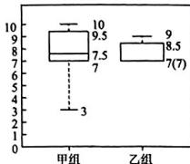

boxplot

| 组别 | 数值 |
|---|---|
| 甲组 | 9.5 |
| 甲组 | 7.5 |
| 甲组 | 3 |
| 乙组 | 8.5 |
| 乙组 | 7(7) |
| 乙组 | 10 |

由四分位数和箱线图可以知道甲组与乙组的中位数相差不大，但甲组的成绩明显比乙组的波动大，乙组成绩比较均匀(合理即可).

# 周末自评（十二）

1. A 2. D 3. C 4. D 5. D 6. B

7. 如果两个角是等角的余角,那么这两个角相等

8. 两个角为一个直角三角形的两个锐角

9. CD//EF 10. ③ 11. 115° 12. 10°或138°

13. 解:(1)条件:两个角是直角.

结论: 这两个角相等.

真命题.

(2) 条件: 两个数的绝对值相等.

结论: 这两个数相等.

绝对值相等的两个数,还可以互为相反数,不一定相等,故原命题是假命题.

(3) 条件: 两个角是钝角.

结论: 这两个角的和一定大于 $180^{\circ}$ .

钝角大于 $90^{\circ}$ ，故两个钝角的和一定大于 $180^{\circ}$ 故原命题是真命题.

14. 解: 如果 $\angle1 = \angle2$ ，那么 $AB \parallel CD$ ，不是真命题.

添加条件为： $BE \parallel DF$ （不唯一）.

证明：∵BE∥DF，∴∠MBE=∠BDF.

又∵∠1=∠2,∴∠MBA=∠BDC,

∴AB∥CD

15. (1) 略 (2) CD 与 EF 平行. 证明略

(3)

12. $2 - \sqrt{3}$ 或 $\sqrt{3} + 2$ 13. $< 14, 2$

15. $\frac{1}{7}$ 16. $32\sqrt{3}$ 17. (1)3 (2)-3

18. (1)2或-6 (2)4

19. (1) $\frac{7}{2}\sqrt{2}$ (2) $5 - 2\sqrt{6} + 4\sqrt{3}$ (3) $8\sqrt{2}$

20. (1) $a = 11$ $b = -3$ (2) $\pm 2$

21. (1) $11 + 2\sqrt{30}$

(2)①△ABC为直角三角形 理由略

② $\sqrt{6} +\sqrt{5} >\sqrt{11}$

22. (1)220 米 (2)不能

23. (1) $S_{2} - S_{1} = 2 + 2\sqrt{2}$ $S_{3} - S_{2} = 6 + 2\sqrt{2}$

$S_{4} - S_{3} = 10 + 2\sqrt{2}$

(2) $S_{n+1}-S_{n}=4n-2+2\sqrt{2}$ 理由略

(3) $2nb - b + 2a\sqrt{b}$

# 第三章质量评估

1. C 2. B 3. C 4. C 5. C 6. D

7. A 8. A 9. B 10. C II. 1

12 8 13. 12 14. $(-2\sqrt{3},2)$

15. (4,4) 16. $(1 + \sqrt{5},0)$

17. 图略 第二象限中“蝴蝶”各个“顶点”的坐标

为 $(-3,7)$ ， $(-2,2)$ ， $(-8,2)$ ， $(-7,7)$ ， $(-5,$

5),(-5,4),(-6,5),(-4,5)

18. 解:(1)建立平面直角坐标系,如图所示,

$A(-4,-2),D(2,1).$

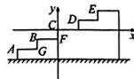

(2)如图,因为使台阶拐角顶点中的3个顶点落在第一象限,

所以原点在折线 G-B-F 上(不含点 F).

19. (1)(-3,2) (2)6

20. (1) 学校和公园

(2)学校在小明家北偏东 $45^{\circ}$ 的方向上,且到小明家的距离为 2 km;

商场在小明家北偏西 $30^{\circ}$ 的方向上，且到小明家的距离为 3.5 km；

停车场在小明家南偏东 $60^{\circ}$ 的方向上，且到小明家的距离为 4 km.

21. (1)4 (2)9或1 (3)略

22. (1) $A'(2,-1)$ $B'(1,m)$ (2)-2

# 第四章质量评估

1. D 2. B 3. A 4. A 5. C 6. C

7. B 8. D 9. C 10. C 11. x=2

12. 减小 13. 2 14. 大于 10

15. $y=3x+3$ 16. 450

17. (1) 是 (2) $-\frac{160}{9}$ ℃

18. (1)1 (2)-2 (3)-1

19. (1) $A(3,0), B(0,4)$ 图略 (2) $y = \frac{2}{3} x - 2$

20. (1) $y_{1}=24x+30(x>10),y_{2}=20x+200(x>10)$

(2)甲方案.理由略

21. (1) 图略 $y = 4x + 2$ (2) $26\mathrm{cm}$

22. 解:(1)因为点 A(4,0), 所以 OA=4.

因为 $C$ 是OA的中点，

所以 $OC=\frac{1}{2}OA=2$ ，所以 $C(2,0)$ .

因为直线 $y=-\frac{1}{2}x+b$ 与 x 轴交于点 A(4,0)，

所以 $-\frac{1}{2}\times4+b=0$ ,

所以 b=2，所以 $B(0,2)$ .

(2) 设 $D(0, n)$ .

因为 $S_{\triangle BCD} = S_{\triangle ABC}$

所以 $\frac{1}{2}|n-2|\times2=\frac{1}{2}\times2\times(4-2)$ ,

所以 n=4 或 n=0，

所以点 D 的坐标为 $(0,0)$ 或 $(0,4)$ .

(3) 存在. 设点 $P(m,0)$ .

因为 $A(4,0)$ , $B(0,2)$ ，所以 $AB^{2}=20$ ，

$AP^{2} = (4 - m)^{2}, BP^{2} = m^{2} + 4.$

当 $\triangle ABP$ 是直角三角形时, 显然 $\angle PAB \neq 90^{\circ}$ , 故分两种情况:

①当 $\angle APB=90^{\circ}$ 时，易得点 $P$ 与原点重合，此时 $P(0,0)$ ；

②当 $\angle ABP = 90^{\circ}$ 时， $AB^{2} + BP^{2} = AP^{2}$ ，

所以 $20 + m^2 + 4 = (4 - m)^2$

解得 m = -1，此时 $P(-1,0)$ .

综上所述，点 P 的坐标为 $(0,0)$ 或 $(-1,0)$ .

# 第五章质量评估

1. C 2. A 3. A 4. A 5. C 6. D

7. B 8. B 9. A 10. C 11. 3 12. 3

13. $\left\{ \begin{array}{l} x = 1, \\ y = 3 \end{array} \right.$ 14. $\left\{ \begin{array}{l} x = 4, \\ y = -3 \end{array} \right.$

15. -1 16. 7 5

17. (1) $\left\{ \begin{array}{l} x = 3, \\ y = 1 \end{array} \right.$ (2) $\left\{ \begin{array}{l} x = -1, \\ y = 5 \end{array} \right.$

18. (1) $y = 2x + 4$ (2) $\left\{ \begin{array}{l} x = -\frac{3}{2}, \\ y = 1 \end{array} \right.$

19. (1)y=7x-5. (2)175.6 cm

20. (1)-1 3 (2)54

21. (1) A 型车每辆有 45 个座位, B 型车每辆有 60 个座位

(2)共有2种租车方案.分别是租用A型车4辆，B型车5辆；租用A型车8辆，B型车2辆

22. (1)3 (2)6 (3)20 g

# 第六章质量评估

1. B 2. A 3. B 4. D 5. C 6. B

7. B 8. D 9. A 10. C 11. 360

12. 65 13. 9.1 14. 12或8

15. 9 16. $\sqrt{2}$

17. (1)58 km/h (2)60 km/h (3)60 km/h

18. 解:由两个班级的成绩箱线图可知,A 班的上四分位数与 B 班的中位数相等,均为 120 分,且 B 班的下四分位数大于 A 班的下四分位数,B 班的最小值也大于 A 班的最小值,

所以估计 B 班的平均分大于 A 班的平均分.

19. (1)82分

(2)由题意,得 $\frac{92\times2+80\times3+94\times5}{2+3+5}=89.4$ (分).

因为学期综合评价成绩在90分以上，评为“优秀”，

∴小勇该学科不能被评为“优秀”.

20. (1) $s_{甲}^{2}=376,s_{乙}^{2}=116$

(2)选择乙组同学代表学校参加复赛.

理由略

21.【应用】(1) $a = 70, m = 90, b = 96$ (2)略 【理解】根据箱线图和四分位数，可知甲组成绩比较分散，乙组成绩比较集中（答案不唯一）.

22. 解:(1)由题意得 $a\% = 1 - 10\% - 45\% - \frac{6}{20} \times 100\% = 15\%$ , 即 a = 15,

把 A 款 AI 聊天机器人的评分数据从小到大排列，排在中间的两个数是 88, 89，故中位数 $b = \frac{88 + 89}{2} = 88.5$ ，在 B 款 AI 聊天机器人的评分数据中，98 出现的次数最多，故众数 c = 98。故答案为 15, 88.5, 98。

(2) A 款 AI 聊天机器人更受用户喜爱、理由如下：

因为两款的评分数据的平均数相同都是88，但A款“非常满意”所占百分比比B款的高，

所以 A 款 AI 聊天机器人更受用户喜爱(答案不唯一).

(3) $240\times10\%+300\times\frac{3}{20}=69$ （人），

因此，估计此次测验中对 A、B 两款 AI 聊天机器人不满意的共有 69 人。

# 第七章质量评估

1. C 2. A 3. C 4. C S. C 6. B

7. B 8, B 9, C 10, D 11, 同位角机等

12. 他 13. $90^{\circ}$ 14. $105^{\circ}$ 或 $15^{\circ}$

15. 60°或120° 16. ①②④

17. 解: (1) 股命题, 反例; 两个边长不相等的等边三角形三个角对应相等, 但不是全等三角形 (反例不唯一).

(2) 假命题, 反例; 如图, $\angle AOB = \angle COD$ , 有公共顶点 O, 但不是对顶角 (反例不唯一).

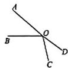

18. 略

19. 解: (1) 在同一平面内, 如果两条直线垂直于同一条直线, 那么这两条直线平行

(2)如图、

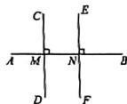

已知: $CD \perp AB$ 于点M, $EF \perp AB$ 于点N.
求证:CD//EF.

证明：∵CD⊥AB于点M，EF⊥AB于点N，

$\therefore \angle CMN = \angle ENB = 90^{\circ}, \therefore CD \parallel EF,$

20. 垂直的定义 同位角相等,两直线平行 两直线平行,同位角相等 两直线平行,内错角相等 $\angle 1$ $\angle 2$ 等量代换 角平分线的定义

21. 解:(1)证明:∵EF⊥AB,

$\therefore \angle EFA = \angle EFB = 90^{\circ}.$

$\because \angle \theta_{1} = \angle \theta_{2}, \therefore \angle \alpha = \angle \beta.$

(2)如图.由(1)知 $\angle1=\angle2,3=\angle4.$

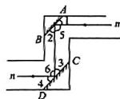

∵AB∥CD, ∴∠2=∠3.

$\therefore \angle 1 = \angle 2 = \angle 3 = \angle 4.$

$\because \angle 5 = 180^{\circ} - \angle 1 - \angle 2, \angle 6 = 180^{\circ} - \angle 3 - \angle 4,$

$\therefore \angle 5 = \angle 6, \therefore m \parallel n.$

22. 解: (1) $12^{2}-10^{2}=44=4\times11$

(2) 证明: 由题意得 $(2n + 2)^{2} - (2n)^{2} = (2n + 2 +$

$2n)(2n+2-2n)=(4n+2)\times2=4(2n+1)$ .

∵4(2n+1)能被4整除，且2n+1为奇数，

∴任意两个连续偶数的平方差都是4的奇数倍.

(3)设两个连续奇数分别为 $2n+1$ 和 $2n-1$ .

$(2n + 1)^{2} - (2n - 1)^{2} = (2n + 1 + 2n - 1)(2n + 1 - 2n + 1) = 4n \times 2 = 4 \times 2n.$

∵2n是偶数，

∴任意两个连续奇数的平方差都是4的奇数倍不正确.

反例： $7^{2} - 5^{2} = 12 \times 2 = 24 = 4 \times 6$ ，即 $7^{2} - 5^{2}$ 是

4的偶数倍，不是奇数倍.

应用1

例 1 (1)6.1 (2)8

应用2

例2 $2.5 > \sqrt{6}$

变式 (1) $\frac{\sqrt{6}+1}{2}>1.5$ (2) $\sqrt[3]{26}>2.1$

应用3

例3 他变式不能

探究2

[尝试思考]

解:(1)对于开方运算可能用到的按键略.

① $\sqrt{5.89} \approx 2.4269$ . ② $\sqrt[3]{-1285} \approx -10.8718$ .

(2)随着开平方次数的增加,运算结果越来越接近1. 改用小于1的正数试一试仍有类似的规律.

应用4

例4 (1)0.112 (2)0.754 (3)-1.913 (4)2.336

【课堂小结与检测】

[课堂检测]

1. C 2. 4 3. 15.63

4. (1) $\sqrt{76} > 8.5$ (2) $\sqrt{3} > \sqrt[3]{5}$ (3) $\frac{\sqrt{5} + 1}{2} < \frac{5}{3}$

3 第1课时 二次根式的概念及乘除运算

【探究与应用】

探究1

[观察发现]

解：都含有开方运算，并且被开方数都是非负数。

[概括新知] $\sqrt{a} (a\geqslant 0)$

应用1

例1 ①⑦

探究2

[尝试思考]

解:(1)6 6 20 20 $\frac{2}{3}$ $\frac{2}{3}$ $\frac{5}{7}$ $\frac{5}{7}$

猜想： $\sqrt{4} \times \sqrt{9} = \sqrt{4 \times 9}, \quad \sqrt{16} \times \sqrt{25} =$

$\sqrt{16\times 25},\frac{\sqrt{4}}{\sqrt{9}} = \sqrt{\frac{4}{9}},\frac{\sqrt{25}}{\sqrt{49}} = \sqrt{\frac{25}{49}}.$

(2) $\sqrt{6}\times\sqrt{7}=\sqrt{6\times7},\frac{\sqrt{6}}{\sqrt{7}}=\sqrt{\frac{6}{7}}$ .借助计算器进行验证略.

(3) 猜想: $\sqrt{a} \cdot \sqrt{b} = \sqrt{ab} (a \geqslant 0, b \geqslant 0)$ , $\frac{\sqrt{a}}{\sqrt{b}} = \sqrt{\frac{a}{b}} (a \geqslant 0, b > 0)$ . 理由略.

[概括新知] $\sqrt{ab}$ $\sqrt{\frac{a}{b}}$

应用2

例2 (1)2 (2)3 变式 (1)4 $(2)\sqrt{6}$

例3 (1) $6\sqrt{6}$ (2)1 (3) $6 + 2\sqrt{5}$

(4)4 (5)5 (6)5

变式 (1) $9 - 4\sqrt{2}$ (2)34 (3)-6 (4)-1

【课堂小结与检测】

[课堂检测]

1. B 2. A 3. 5 4. 1

5. (1)6 (2)60 (3)-0.18 (4) $10-4\sqrt{6}$ (5)

第2课时 二次根式的化简及加减运算

【探究与应用】

探究1

[观察发现]

解： $\sqrt{ab}=\sqrt{a}\cdot\sqrt{b}(a\geqslant0,b\geqslant0),\sqrt{\frac{a}{b}}=\frac{\sqrt{a}}{\sqrt{b}}(a\geqslant0,b>0).$

[概括新知] (1) $\sqrt{a} \cdot \sqrt{b}$ (2) $\frac{\sqrt{a}}{\sqrt{b}}$

应用1

例1 (1)72 (2) $5\sqrt{6}$ (3) $\frac{\sqrt{5}}{3}$

探究2

[尝试思考]

解：都不含分母，也不含能开得尽方的因数.

[概括新知] 分母 伽开得尽方

应用2

例 2 (1) $5\sqrt{2}$ (2) $\frac{\sqrt{14}}{7}$ (3) $\frac{\sqrt{3}}{3}$

[思考交流]

解：(1)受例1的启发，将50分解为 $25 \times 2$ ，其中25是能开得尽方的因数； $\frac{\sqrt{14}}{7}$ 中被开方数不含分母，也不

含能开得尽方的因数，因此， $\frac{\sqrt{14}}{7}$ 是最简二次根式.

(2)如果被开方数是一个整数,一般先将被开方数写成一个完全平方数和另一个数的积的形式,再将完全平方数“开方”到根号外;如果被开方数是分数,通常将分数的分子、分母同乘一个适当的数,使分母成为完全平方数,再利用商的算术平方根,将分子、分母分别开方.

探究3

[回顾思考]

解：先化简、后合并被开方数相同的二次根式.

[概括新知] 被开方数

应用3

例3 (1) $5\sqrt{3}$ (2) $\frac{4}{5}\sqrt{5}$ (3) $5\sqrt{2}$

【课堂小结与检测】

[课堂检测]

1. B 2. C 3. $\frac{\sqrt{3}}{4}$ 4. $\sqrt{6}$

5. (1) $3\sqrt{5}$ (2) $\frac{\sqrt{2}}{2}$ (3) $2\sqrt{3}$ (4) $-\sqrt{5}$

第3课时 二次根式的混合运算

【探究与应用】

探究1

[计算思考]

解：(1) $\frac{\sqrt{3}}{\sqrt{2}}+\frac{\sqrt{6}}{2}=\sqrt{\frac{3}{2}}+\frac{\sqrt{6}}{2}=\sqrt{\frac{3\times2}{2\times2}}+\frac{\sqrt{6}}{2}=$ $\frac{\sqrt{6}}{2}+\frac{\sqrt{6}}{2}=\sqrt{6},\sqrt{28}-\frac{7}{\sqrt{7}}=2\sqrt{7}-\frac{\sqrt{49}}{\sqrt{7}}=2\sqrt{7}-\sqrt{7}=\sqrt{7}.$

(2) 分子、分母同乘 $\sqrt{2}$ 的目的是化去分母中根号，将根式化为最简二次根式.

(3) 方法 1: (1) 中的解法.

方法 2: $\sqrt{28}-\frac{7}{\sqrt{7}}=2\sqrt{7}-\frac{7\times\sqrt{7}}{\sqrt{7}\times\sqrt{7}}=2\sqrt{7}-\sqrt{7}=\sqrt{7}$ .

方法3： $\sqrt{28} -\frac{7}{\sqrt{7}} = 2\sqrt{7} -\frac{(\sqrt{7})^2}{\sqrt{7}} = 2\sqrt{7} -\sqrt{7} = \sqrt{7}.$

应用1

例1 (1) $\frac{1}{6}\sqrt{6}$ (2) $\frac{5}{4}\sqrt{2}$ (3) $\frac{11}{6}\sqrt{2}$

(4) $-\frac{1}{2}\sqrt{2} + \sqrt{99}$

变式 (1) $3\sqrt{2}$ (2) $\frac{5}{2}\sqrt{2}+\frac{1}{2}\sqrt{15}$

探究2

[尝试思考]

解： $\left(\sqrt{\frac{1}{a}} -\sqrt{b}\right)\cdot \sqrt{ab} = \sqrt{\frac{1}{a}}\cdot \sqrt{ab} -\sqrt{b}$

$\sqrt{ab}=\sqrt{b}-b\sqrt{a}$ ，当a=3,b=2时，原式 $=\sqrt{2}-2\sqrt{3}$ .

应用2

例2 解1原式 $= \sqrt{\frac{1}{a}}\cdot \sqrt{ab} -\sqrt{a}\cdot \sqrt{ab} = \sqrt{b} -$

$a\sqrt{b} = (1 - a)\sqrt{b}$

当 $a = 3, b = 2$ 时，原式 $= (1 - 3) \times \sqrt{2} = -2\sqrt{2}$ .

应用3

例3 解：(1)由题意得 $AD = 6, CD = \sqrt{1^2 + 1^2}$

$\sqrt{2}, BC = \sqrt{4^1 + 2^1} = 2\sqrt{5}, AB = \sqrt{5^2 + 5^2} = 5\sqrt{2}$

所以梯形ABCD的周长为 $6 + \sqrt{2} + 2\sqrt{5} + 5\sqrt{2} = 6 + 6\sqrt{2} + 2\sqrt{5}$

(2) 梯形 ABCD 的面积为 18. 方法有: 补图法和割图法等, 补图法 (不唯一), 就是补成一个长方形, 用长方形的面积减去三个直角三角形的面积; 割图法 (不唯一), 就是图形分割成一个正方形和三个三角形, 分别计算它们的面积并相加.

变式 四边形 $ABCD$ 的面积是 17.5，周长是 $5\sqrt{2} + 3\sqrt{5} + 5$

【课堂小结与检测】

[课堂检测]

1. C 2. $9\sqrt{2}$

3. (1) $\sqrt{2}$ (2) $\frac{14\sqrt{5}}{5}$ (3) $\frac{6}{7}\sqrt{2}$ 4. $\frac{5}{2}\sqrt{2}$

本章总结提升

【重点模块总结】

模块1

(1)不循环 (2)有理 无理 (3)一一对应

例 1 解:有理数集合 $\left\{-\sqrt{16},3.1415926,0,\frac{13}{6},\cdots\right\}$

无理数集合 $\left\{\frac{\pi}{3}, 0.8080080008 \cdots (\text{相邻两个} 8 \text{之}\right.$

间 0 的个数逐次加 1), $\sqrt[3]{-9}, \cdots$

负实数集合 $(- \sqrt{16}, \sqrt[3]{-9}, \cdots)$ .

例2 $-2\sqrt{5}$

模块2

(1) 平方根 0 (2)a a -a

(3)两 — 没有 (4)立方 (5)正 0 负

例 3 (1)x=5,y=2 (2)±3

模块3

(1) $\sqrt{a}$ (2) $\sqrt{ab}$ $\sqrt{\frac{a}{b}}$

(3)分母 能开得尽方 (4)最简 被开方数

例4 (1) $8\sqrt{2}$ (2)60 (3) $\frac{\sqrt{14}}{2}$ (4) $\frac{\sqrt{65}}{4}$

例 5 (1) $-5\sqrt{2}$ (2) $\frac{1}{5}$ (3) $-3\sqrt{5}-7$

例6 (1) $a = 2\sqrt{2}, b = 5, c = 3\sqrt{2}$

(2)能.三角形的周长为 $5\sqrt{2}+5$

【综合能力提升】

例 7 (1) $2+\sqrt{5}$ (2) $\pi+2$

(3)-6或6或12 $\sqrt{2}$ -18

第三章 位置与坐标

1 确定位置

【探究与应用】

探究

[问题导入]

解:(1)先根据电影票上的排数确定所在的排,再根据电影票上的座位数确定所在排的座位.

(2)3 排 6 座中的 6 是座位数, 6 排 3 座中的 6 是排数.

[思考交流]

(1)一般需要两个数据 (2)略

[概括新知]列

[操作探究]

解:(1)对红方滑艇来说,北偏东40°方向上有两个目标,分别是蓝方战舰B和小岛.要确定蓝方战舰B的位置,还需要知道蓝方战舰B与红方滑艇之间的距离.

(2)距离红方潜艇 20 n mile 的蓝方战舰有两艘；蓝方战舰 A 和蓝方战舰 C.

(3)要确定每艘蓝方战舰的位置,各需要两个数据:距离和方位角.例如:对红方潜舰来说,蓝方战舰A在正街方向,距离为20n mile处;蓝方战舰B在北偏东40°方向,距离为28n mile处;蓝方战舰C在正东方向,距离为20n mile处.

[概括新知] 距离

[尝试思考]

解:(1)能.先在地图上找到北纬19°的纬线,再在地图上找到东经110°的经线、两线的交点即为中国文昌航天发射场的大致位置.

(2) 国家体育馆所在的区域为 B2 区, 国家体育场所在的区域为 C3 区.

[概括新知] (1) 经 (2) 编号

[思考交流]

解:(1)生活中需要确定位置的例子很多,如确定小明在教室内的座位,确定某个景点的位置等.

(2)在平面内,确定一个物体的位置一般需要两个数据.

[概括新知] 两

应用

例 1 D 例 2 (2,3) 例 3 D

【课堂小结与检测】

[课堂检测]

1. D 2. C3

3. 解:(1)小颖家北偏东 $30^{\circ}$ 的方向上有 2 家店铺, 分别是超市和照相馆.

(2)要确定照相馆的位置,还需要1个数据.

(3)要确定小颖家附近的学校的位置,需要2个数据,分别是距离和方位角.

2 第1课时 平面直角坐标系的有关概念
【探究与应用】

探究1

[问题导入]

解:借助方位角和距离定位法,区域定位法等介绍.
[尝试思考]

解:(1)北京奥林匹克公园的位置表示为(11,12).

(5,12)表示圆明园，(6,5)表示玉渊潭公园.

(2)北京奥林匹克公园的位置为(0,8)，卢沟桥的位置为(-11,-4).

[概括新知]

(1)公共原点的数轴 坐标轴 原点

(2)有序实数对 $(a,b)$

(3)第一象限 逆时针 坐标轴上

应用1

例1 解: 各个顶点的坐标分别为 $A(-2,0)$ , $B(0,-3)$ , $C(3,-3)$ , $D(4,0)$ , $E(3,3)$ , $F(0,3)$ .

探究2

[操作思考]

(1)略 (2)略

(3)在平面直角坐标系中，点与有序实数对之间是一一对应关系

[概括新知] 有序实数对 有序实数对

应用2

例 2 图略, 像勺形, 如果这是一个星空中的美丽图案, 那么是北斗七星

[延伸拓展]

解: 因为点 M 到 x 轴的距离为 1.

所以点 M 的纵坐标为 1 或 -1.

因为点 M 到 y 轴的距离为 2，

所以点 M 的横坐标为 2 或 -2。

所以点 M 的坐标为 $(2,1)$ 或 $(2,-1)$ 或 $(-2,1)$ 或 $(-2,-1)$ . 故点 M 到原点的距离为 $\sqrt{5}$ .

【课堂小结与检测】

[课堂检测]

1. D 2. B

3. 解: $A(1,3)$ , $B(3,1)$ , $C(-2,3)$ , $D(-3,-2)$ , $E(0,-4)$ .

第2课时 平面直角坐标系中点的坐标特征【探究与应用】

探究1

[操作思考]

解:如图,各点连接起来的图形像“房子”.

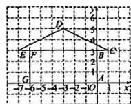

(1)线段 $AG$ 上的点都在 $\pmb{x}$ 轴上，它们的纵坐标都是0；线段 $AB$ 上的点、线段 $CD$ 与 $\pmb{y}$ 轴的交点都在 $\pmb{y}$ 轴上，它们的横坐标都是0.

(2)线段 $EC$ 与 $\pmb{x}$ 轴平行，点 $E$ 和点 $C$ 的纵坐标相同.线段 $EC$ 上其他点的纵坐标也相同，都是3.

(3) 点 F 和点 G 的横坐标相同, 线段 FG 与 y 轴平行.

[思考交流]略

[概括新知] (1)纵坐标 横坐标 (2)纵坐标 横坐标应用1

例1 (1)(7,0) (2)(0,-4) (3)(6,2)或(-4,2)探究2

[尝试思考]

解:(1)点(5,2),(2,3),(1,1),(1,2),(2,2),(2,1)等在第一象限内、它们的横坐标和纵坐标都是正数.

(2) 点 $(-5,2)$ , $(-2,3)$ , $(-1,1)$ , $(-1,2)$ ,

$(-2,1)$ 等在第二象限，它们的横坐标是负数，纵坐标是正数；点 $(-3,-3),(-1,-1)$ 等在第三象限

它们的横坐标和纵坐标都是负数: 点(1,-1),(3)

-3)等在第四象限，它们的横坐标是正数，纵坐标是负数.

(3) 点 A 在第一象限, 点 B 在第三象限, 点 C 在第四象限, 点 D 在第二象限.

[概括新知]

$(+, +)\quad (-, +)\quad (-, -)\quad (+, -)$

应用2

例2 (1)第二象限 (2)三 (3)二

[延伸拓展]

(1)一 相等 (2)二 互为相反数 (3)-1

寻特征相等互为相反数

【课堂小结与检测】

[课堂检测]

1. C 2. -1 3. (1)(0,6) (2)(4,8)

第3课时 建立适当的坐标系描述图形的位置

【探究与应用】

应用1

例1略

例2解：如图，以边 $BC$ 所在直线为 $x$ 轴，以边 $BC$ 的中垂线为 $y$ 轴建立平面直角坐标系，由等边三角形的性质可知， $\triangle ABO$ 是直角三角形，所以

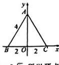

$AO=\sqrt{AB^{2}-BO^{2}}=\sqrt{4^{2}-2^{2}}=2\sqrt{3}$ ，所以顶点A,B,C的坐标分别为 $A(0,2\sqrt{3}),B(-2,0),C(2,0)$ 、(答案不唯一；合理即可)

应用2

例3略

【课堂小结与检测】

[课堂检测]

1. A 2. A

3. 解: (答案不唯一) 过点 A 作 $AO \perp BC$ 于点 O, 以 BC 所在直线为 x 轴, AO 所在直线为 y

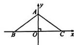

轴，建立如图所示的平面直角坐标系，则 $OA=\frac{3}{2}$

因为 AB = AC，所以 OB = OC = $\frac{1}{2}$ BC = 2，

所以 $A\left(0,\frac{3}{2}\right)$ , $B(-2,0)$ , $C(2,0)$ .

3 轴对称与坐标变化

【探究与应用】

探究

[操作发现]

1. 解:(1)两面小旗关于 y 轴对称,对应点 A(2,6) 与 A₁(-2,6) 的横坐标互为相反数,纵坐标相同. 其他的对应点也有这个特点.

(2)图略. 它的各个顶点的坐标与其对应点的横坐标相同, 纵坐标互为相反数.

2、略

[操作思考]

解:图略.得到的图案是与原图案形状相同,大小一样的“鱼”.所得到的图案与原图案关于x轴对称.

[思考交流]略

[概括新知] (1) 横纵 x (2) 纵横 y

应用1

例 1 $(-1,2)$ $(1,-2)$ y

例 2 点 A 的坐标为 $(2,1)$ ，点 B 的坐标为 $(2,-1)$ 例 3 $(3,-4)$

应用2

例4 (1)略 (2)略 (3)(-4,-1) (-4,1)

[延伸拓展] (2,0)

【课堂小结与检测】

[课堂检测]

1. B 2. x 轴 3. $(-2,-3)$

4. (1) 略 (2) $A_{1}(0, -4), B_{1}(-2, -2), C_{1}(3, 0)$

本章总结提升

【重点模块总结】

模块1

1. 两

2. 行列定位法 方位角和距离定位法 经纬度定位法
例 1 (1) 游乐园、菜市场

(2)①图略,游乐园的坐标为(0,-4),电视塔的坐标为(-3,1) ②图书馆

全科AA+初中教辅资源导航  

text_image

QR code with a blue logo in the center, likely linking to a digital resource or website.

教辅资源更新，关注公众号★全科AA+

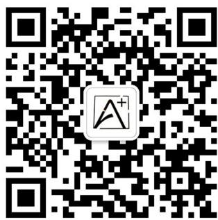

text_image

QR code with a central logo containing stylized letters A and B, likely for digital linking or authentication.

