# 全品作业本 QUANPINZUOYEBEN

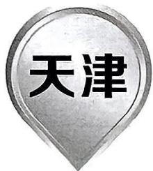

text_image

天津

主 编 肖德好

本册主编 王彦

编者 王晓敏

图书在版编目（CIP）数据

全品作业本. 数学八年级. 上册: RJ. 4 / 肖德好
主编. -- 石家庄: 河北科学技术出版社, 2021.5 (2025.5重印)

ISBN 978-7-5717-0799-6

I. ①全… II. ①肖… III. ①中学数学课—初中—习题集 IV. ①G634

中国版本图书馆CIP数据核字(2021)第099968号

全品作业本·数学八年级·上册·RJ·4
QUANPIN ZUOYEBEN SHUXUE BANIANJI SHANGCE RJ 4

肖德好 主编

<table><tr><td>出版发行</td><td>河北科学技术出版社</td></tr><tr><td>地址</td><td>石家庄市友谊北大街330号(邮编:050061)</td></tr><tr><td>经销</td><td>新华书店</td></tr><tr><td>印刷</td><td>天津泰宇印务有限公司</td></tr><tr><td>开本</td><td>880毫米×1230毫米 1/16</td></tr><tr><td>印张</td><td>15</td></tr><tr><td>字数</td><td>390千字</td></tr><tr><td>版次</td><td>2021年5月第1版</td></tr><tr><td>印次</td><td>2025年5月第5次印刷</td></tr><tr><td>定价</td><td>59.80元</td></tr></table>

# 版权所有 侵权必究

# 声明

本书在编写过程中选用了部分资料和图片，因条件所限未能与作者一一取得联系，在此深表歉意并致谢。请相关作者与我们联系，以便按照相关规定支付稿酬。联系电话：400-0555-100

# 第十三章 三角形

公众号\*满满分享库

13.1 三角形的概念 /1

13.2 与三角形有关的线段 /3

13.2.1 三角形的边 /3

13.2.2 三角形的中线、角平分线、高 /5

◆ 专题训练（一）与三角形中线或高相关的面积问题 /7

◆ 专题训练（二） 三角形的角平分线与高的夹角探究 /8

13.3 三角形的内角与外角 /9

13.3.1 三角形的内角 /9

第1课时 三角形的内角和定理 /9

第2课时 直角三角形的两个锐角互余 /11

13.3.2 三角形的外角 / 12

◆ 专题训练（三） 三角形的角平分线模型 /14

◆ 专题训练（四） 与三角形的角相关的常见模型 / 16

数学活动 多边形的三角剖分 /17

本章考点专练 /19

知识结构关系——天津经典考题——全国创新考题

# 第十四章 全等三角形

14.1 全等三角形及其性质 /21

14.2 三角形全等的判定 /23

第1课时 三角形全等的判定(一)(“SAS”) /23

第2课时 三角形全等的判定（二）(“ASA”“AAS”) / 25

第3课时 三角形全等的判定(三)(“SSS”) /27

第4课时 与全等三角形判定有关的尺规作图 /29

第5课时 直角三角形全等的判定(“HL”) /30

◆ 专题训练（五） 证明三角形全等的基本模型 /32

14.3 角的平分线 / 34

第1课时 角的平分线的画法及性质 /34

第2课时 角的平分线的判定 /36

$\spadesuit$ 专题训练（六） 构造全等三角形的常用辅助线方法 /38

本章考点专练 /40

知识结构关系□天津经典考题□全国创新考题

# 第十五章 轴对称

15.1 图形的轴对称 /43

15.1.1 轴对称及其性质 /43

15.1.2 线段的垂直平分线 / 45

第1课时 线段垂直平分线的性质及判定 /45

第2课时 尺规作图——线段垂直平分线 /47

15.2 画轴对称的图形 /48

第1课时 画轴对称的图形 /48

第2课时 用坐标表示轴对称 /49

15.3 等腰三角形 /51

15.3.1 等腰三角形 /51

第1课时 等腰三角形的性质 /51

第2课时 等腰三角形的判定 /53

◆ 专题训练（七） 与轴对称相关的尺规作图 /55

◆ 专题训练（八） 等腰三角形中的分类讨论
思想 /57

15.3.2 等边三角形 /58

第1课时 等边三角形的性质与判定 /58

第2课时 含 $30^{\circ}$ 角的直角三角形的性质 /60

◆ 专题训练（九） 构造等腰三角形的常用方法 /61

本章考点专练 /63

知识结构关系○天津经典考题

综合与实践 最短路径问题 /66

# 第十六章 整式的乘法

16.1 幂的运算 /68

16.1.1 同底数幂的乘法 / 68

16.1.2 幂的乘方与积的乘方 / 69

16.2 整式的乘法 /71

第1课时 单项式与单项式相乘 /71

第2课时 单项式与多项式相乘 /72

第3课时 多项式与多项式相乘 /74

第4课时 整式的除法 /76

16.3 乘法公式 /78

16.3.1 平方差公式 /78

16.3.2 完全平方公式 /80

第1课时 完全平方公式 /80

串题训练 变形乘法公式巧求式子的值 /81

第2课时 添括号法则 /82

数学活动 月历问题与规律探究 /83

本章考点专练 /85

知识结构关系□天津经典考题□全国创新考题

# 第十七章 因式分解

17.1 用提公因式法分解因式 /87

第1课时 提公因式法1 /87

第2课时 提公因式法2 /88

17.2 用公式法分解因式 /89

第1课时 运用平方差公式分解因式 /89

第2课时 运用完全平方公式分解因式 /90

第3课时 用公式法分解因式 /91

◆ 专题训练（十） 特殊方法分解因式 /93

◆ 专题训练（十一） 乘法公式在几何图形中的

应用 /95

◆ 专题训练（十二） 因式分解中的整除问题 /97

数学活动 利用因式分解生成密码 /98

本章考点专练 /99

知识结构关系——天津经典考题——全国创新考题

# 第十八章 分式

18.1 分式及其基本性质 /101

18.1.1 从分数到分式 /101

18.1.2 分式的基本性质 / 102

第1课时 分式的基本性质 /102

第2课时 分式的约分和通分 /103

18.2 分式的乘法与除法 / 105

第1课时 分式的乘法与除法 /105

第2课时 分式乘方及其乘除混合运算 /107

18.3 分式的加法与减法 / 109

第1课时 分式的加法与减法 /109

第2课时 分式的混合运算 /111

◆ 专题训练（十三） 分式的化简求值专练 /113

18.4 整数指数幂 / 115

第1课时 负整数指数幂 /115

第2课时 用科学记数法表示绝对值小于1的数/116

18.5 分式方程 / 117

第1课时 分式方程及其解法 /117

串题训练 利用分式方程“增根”的意义解决字母取值问题 /118

◆ 专题训练（十四） 分式方程的含参问题 /119

第2课时 列分式方程解决实际问题 /120

本章考点专练 /122

知识结构关系□天津经典考题

# 《基本功》(另见单本)

# 《周末自评本》(另见单本)

# 公众号\*满满分享库

周末自评（一）[范围：第十三章] / 评2

周末自评（二）[范围：14.1～14.2] / 评 4

周末自评（三）[范围：第十四章] / 评6

周末自评（四）[范围：15.1～15.2] / 评8

周末自评（五）[范围:15.3] / 评 10

周末自评（六）[范围：第十五章] / 评 12

周末自评（七）[范围:第十六章] / 评 14

周末自评（八）[范围：第十七章] / 评 16

周末自评（九）[范围：18.1～18.3] / 评 18

周末自评（十）[范围：18.4～18.5] / 评 20

周末自评（十一）[范围：第十八章] / 评 22

# 《质量评估卷》(另见单本)

第十三章质量评估 / 活 1

第十四章质量评估 / 活 3

第十五章质量评估 / 活 5

期中质量评估 / 活 7

第十六章质量评估 / 活 9

第十七章质量评估 / 活 10

第十八章质量评估 / 活 11

期末质量评估（一） / 活 13

期末质量评估（二） / 活 15

# 13.1 三角形的概念

# 知识梳理

1. 由不在\_\_\_\_的三条线段首尾顺次相接所组成的图形叫作三角形。组成三角形的线段叫作三角形的边，相邻两边的\_\_\_\_叫作三角形的顶点，相邻两边所组成的角叫作三角形的内角，简称三角形的角。  
2. 有\_\_\_\_相等的三角形叫作等腰三角形, 其中相等的两边叫作腰, 另一边叫作底边, \_\_\_\_的夹角叫作顶角, \_\_\_\_的夹角叫作底角. \_\_\_\_都相等的三角形叫作等边三角形, 等边三角形是特殊的等腰三角形, 即\_\_\_\_相等的等腰三角形.

# 知识要点分类练

夯实基础

# 知识点 1 三角形及其相关概念

1. 一位同学用三根木棒拼成如下图形, 则其中符合三角形概念的是 ( )

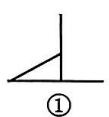

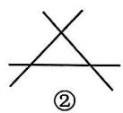

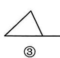

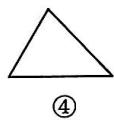  
图13-1-1

A. ①

B. ②

C. ③

D. ④

2.（教材习题13.1T1变式）（2024宁河区月考）图13-1-2中以 $AB$ 为边的三角形的个数是（

A. 4

B. 3

C. 2

D. 1

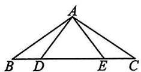  
图13-1-2

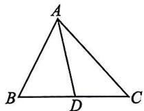  
图13-1-3

3. 如图 13-1-3, 在 $\triangle ABC$ 中, $\angle B$ 的对边是 \_\_\_\_; 在 $\triangle ABD$ 中, $\angle B$ 的对边是 \_\_\_\_; 在 $\triangle ACD$ 中, 边 $AC$ 的对角是 \_\_\_\_.  
4. 如图 13-1-4, 在 $\triangle ABC$ 中, $D, E$ 分别是边 $BC, AC$ 上的点, 连接 $BE, AD$ , 相交于点 $F$ .

(1)图中共有多少个三角形？用符号表示这些三角形.  
(2)请写出 $\triangle BDF$ 的三个顶点、三条边及三个内角.  
(3)以线段 $AB$ 为边的三角形有哪些?

(4)以 $\angle C$ 为内角的三角形有哪些?

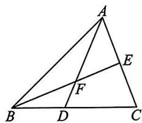

text_image

Geometric diagram of triangle ABC with internal points D, E, F and line segments AD, BE, EF labeled

图13-1-4

# 知识点 2 三角形的分类

5. 如图 13-1-5 所示, 小手盖住了一个三角形的一部分, 则这个三角形是 ( )

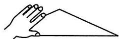  
图13-1-5

A. 直角三角形

B.锐角三角形

C. 钝角三角形

D. 等边三角形

6. 下列关于三角形按边分类的集合中, 正确的是 ( )

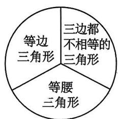

text_image

三边都不相等的三角形
等边三角形
等腰三角形

A

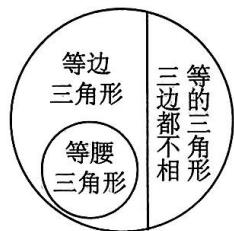

text_image

等边三角形
等腰三角形
三边都不相
等的三角形

B

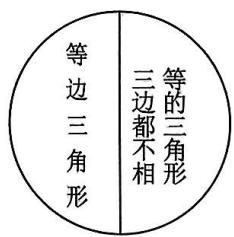

text_image

等边三角形
三边都不相
等的三角形

C

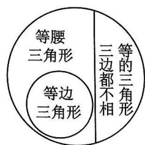

text_image

等腰三角形
等边三角形
三边都不相
等的三角形

D   
图13-1-6

7. 说出图13-1-7中的锐角三角形，直角三角形和钝角三角形.

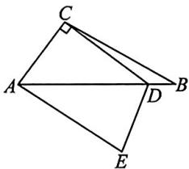

text_image

Geometric diagram of quadrilateral ABCD with right angle at C and point E on side DE, labeled with vertices A, B, C, D, E.

图13-1-7

8.（教材例题变式）如图13-1-8， $\triangle AEF$ 中，点 $C$ 在 $AE$ 上，点 $B, D$ 在 $AF$ 上， $AB = BC = CD = DE = EF = DF$ .

(1)写出以点 D 为顶点的三角形；  
(2) 写出以 $DE$ 为边的三角形；  
(3)写出图中的等腰三角形和等边三角形.

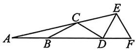  
图13-1-8

# B 规律方法综合练

训练思维

9. 下列说法正确的是 ( )

A. 一个直角三角形一定不是等腰三角形  
B. 一个钝角三角形一定不是等腰三角形  
C. 一个等腰三角形一定不是锐角三角形  
D. 一个等边三角形一定不是钝角三角形

10. 若 $\triangle ABC$ 三个内角的度数分别为 $m, n, p$ ，且 $|m - n| + (n - p)^2 = 0$ ，则这个三角形为（）

A. 等腰三角形

B. 等边三角形

C. 直角三角形

D. 等腰直角三角形

11. 若 $a, b, c$ 是 $\triangle ABC$ 的三边长，且 $a, b, c$ 满足 $(a - b)(a - c) = 0$ ，则 $\triangle ABC$ 的形状为

A. 等腰三角形

B. 等边三角形

C. 直角三角形

D. 无法判断

12. 如图 13-1-9 所示，在 $\triangle ABC$ 中， $\angle ACB$ 是钝角，让点 $C$ 在射线 $BD$ 上向右移动，则（）

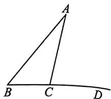

text_image

A
B C D

图13-1-9

A. $\triangle ABC$ 将先变成直角  
三角形,然后再变成锐角三角形,而不会再变成钝角三角形  
B. $\triangle ABC$ 将变成锐角三角形, 而不会再变成钝角三角形  
C. $\triangle ABC$ 将先变成直角三角形, 然后再变成锐角三角形, 接着又由锐角三角形变为钝角三角形  
D. $\triangle ABC$ 先由钝角三角形变为直角三角形, 再变为锐角三角形, 接着又变为直角三角形, 然后再次变为钝角三角形

# 拓广探究创新练

提升素养

13. 如图 13-1-10, 在 $\triangle ABC$ 中, $A_{1}, A_{2}, A_{3}, \cdots$ , $A_{n}$ 为 $AC$ 边上不同的 $n$ 个点, 首先连接 $BA_{1}$ , 图中出现了 3 个不同的三角形, 再连接 $BA_{2}$ , 图中出现了 6 个不同的三角形……

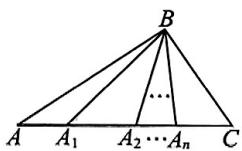  
图13-1-10

(1) 完成下表:

<table><tr><td>连接点的个数</td><td>1</td><td>2</td><td>3</td><td>4</td><td>5</td><td>6</td></tr><tr><td>出现三角形的个数</td><td></td><td></td><td></td><td></td><td></td><td></td></tr></table>

(2)若图中出现了45个三角形,则共连接了\_\_\_\_个点;   
(3)若一直连接到 $BA_{n}$ , 则图中共有 \_\_\_\_ 个三角形.

# 13.2.1 三角形的边

# 知识梳理

1. 三角形两边的和\_\_\_\_第三边,三角形两边的差\_\_\_\_第三边.  
2. 三角形是具有\_\_\_\_的图形.

# 知识要点分类练

夯实基础.

# 知识点 1 三角形的三边关系

1. (教材练习 T1 变式)(2024 红桥区期末)以下列长度的各组线段为边,能组成三角形的是 ( )

A. $1 \mathrm{~cm}, 2 \mathrm{~cm}, 5 \mathrm{~cm}$

B. 4 cm, 5 cm, 5 cm

C. 3 cm, 3 cm, 6 cm

D. 3 cm, 4 cm, 7 cm

2. 新情境日常生活 如图 13-2-1, 为估计湖岸边 A, B 两点之间的距离, 小华在湖的一侧选取一点 O, 测得

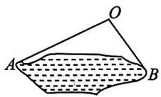  
图13-2-1

OA=15 米, OB=10 米, 则 A, B 间的距离可能是 ( )

A. 5 米

B. 15 米

C. 25 米

D. 30 米

3. 新考法日常生活 如图 13-2-2 是折叠凳及其侧面示意图, 若 AC = BC = 18 cm, 则折叠凳的宽 AB 可能为 ( )

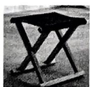

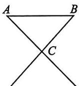  
图13-2-2

A. $70 \mathrm{~cm}$

B. $55 \mathrm{~cm}$

C. $40 \mathrm{~cm}$

D. ${25}\mathrm{\;{cm}}$

4. 已知三角形的三边长分别为 2,9,x, 若 x 为整数, 则这样的三角形个数为 ( )

A. 1

B. 2

C. 3

D. 4

5.（2024 南开区期中）已知三角形的三边长分别是 2,7,x,那么整数 x 的值是 \_\_\_\_.

6.（教材例题变式）用一条长为 $20 \mathrm{~cm}$ 的细绳围成一个等腰三角形.

(1)如果腰长是底边长的2倍,那么三边长分别是多少?

(2)能围成有一边的长为 $6 \, cm$ 的等腰三角形吗？若能，写出所围成等腰三角形的三边长；若不能，请说明理由.

# 知识点 2 三角形的稳定性

7. (2024 河西区期中) 如图 13-2-3, 木工师傅做门框时, 常用木条 EF 固定长方形门框 ABCD, 使其不易变形, 这种做法的依据是 ( )

A. 三角形具有稳定性  
B. 长方形的对称性  
C. 两点之间线段最短   
D. 两点确定一条直线

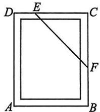

text_image

D E C
A B F

图13-2-3

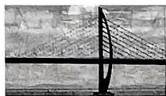  
图13-2-4

8. (2024 滨海区期中) 我国建造的港珠澳大桥全长 55 千米, 集桥、岛、隧于一体. 如图 13-2-4 是港珠澳大桥中的斜拉索桥, 那么斜拉索桥中运用的数学原理是 \_\_\_\_。

# 规律方法综合练

训练思维

9.（教材习题13.2T2变式）长度分别为2,3,3,4的四根细木棒首尾相连，围成一个三角形（木棒允许连接，但不允许折断），得到的三角形的最长边长为 （）

A. 4

B. 5

C. 6

D. 7

10. 如果一个三角形的三边长都是自然数,且边长的比是 $2:3:4$ ,那么三角形的周长不可能是 ( )

A. $18 \mathrm{~cm}$ B. $19 \mathrm{~cm}$ C. $54 \mathrm{~cm}$ D. $36 \mathrm{~cm}$

11. 如图 13-2-5, 由三角形两边的和大于第三边, 可得的结论错误的是 ( )

A. ${AB} + {AD} > {BD}$   
B. $PD + CD > PC$   
C. ${AB} + {AC} > {BC}$   
D. ${AP} + {BP} > {BC}$

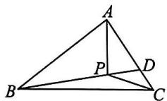  
图13-2-5

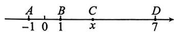  
图13-2-6

12. 如图 13-2-6, 已知数轴上点 A, B, C, D 对应的数分别为 -1, 1, x, 7, 点 C 在线段 BD 上且不与端点重合, 若线段 AB, BC, CD 能围成三角形, 则 x 的取值范围是 ( )

A. $1 < x < 7$

B. $2 < x < 6$

C. $3 < x < 5$

D. $3 < x < 4$

13. 如图 13-2-7, 加油站 A 和商店 B 在马路 MN 的同一侧, 加油站 A 到 MN 的距离大于商店 B 到 MN 的距离, AB = 700

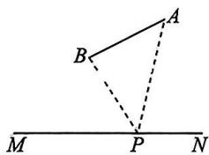

text_image

Geometric diagram showing triangle ABC with auxiliary points M, N, and P, including dashed lines from A to B and P.

图13-2-7

米. 一个行人 $P$ 在马路 $MN$ 上行走, 则 $P$ 到加油站 $A$ 的距离与 $P$ 到商店 $B$ 的距离之差最大等于 \_\_\_\_ 米.

14. (2024 和平区期中) 已知 $\triangle ABC$ 的三边长是 $a, b, c$ .

(1) 若 a=6, b=8，且三角形的周长是小于 22 的偶数，求 c 的值；

(2)化简： $|a+b-c|+|c-a-b|$

# 拓广探究创新练

# 囊库素养

15. 已知 M, N 是直线 l 上两点, MN = 20, O, P 为线段 MN 上两动点, 过点 O, P 分别作长方形 OABC 与长方形 PDEF (如图 13-2-8), 其中, 两边 OA, PF 均在直线 l 上, 图形在直线 l 的同侧, 且 OA = PF = 4, CO = DP = 3, 动点 O 从点 M 出发, 以 1 单位长度/秒的速度向右运动; 同时, 动点 P 从点 N 出发, 以 2 单位长度/秒的速度向左运动, 设运动的时间为 t 秒.

(1) 若 t=2.5，求点 A 与点 F 之间的距离；  
(2)求当 t 为何值时,两长方形重叠部分为正方形;  
(3)运动过程中,在两长方形没有重叠前,若能使线段AB,BC,AF构成三角形,求t的取值范围.

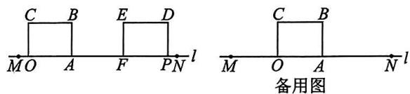

text_image

C B E D
MO A F PN l
备用图
M O A N l

图13-2-8

# 13.2.2 三角形的中线、角平分线、高

# 知识梳理

1. 连接△ABC 的顶点 A 和它所对的边 BC 的 \_\_\_\_ D，所得线段 AD 叫作△ABC 的边 BC 上的中线。  
2. 一个三角形有三条中线, 这三条中线相交于一点. 三角形三条中线的交点叫作三角形的  
3. 画△ABC 的∠A 的平分线 AD，交∠A 所对的边 BC 于点 D，所得线段 AD 叫作△ABC 的角平分线。三角形的三条角平分线 \_\_\_\_ 于一点。  
4. 从△ABC 的顶点 A 向它所对的边 BC 所在直线画 \_\_\_\_，垂足为 D，所得线段 AD 叫作 △ABC 的边 BC 上的高线。三角形的高线简称三角形的高。锐角三角形的三条高都在三角形的 \_\_\_\_；直角三角形有 \_\_\_\_ 高恰好是它的两条 \_\_\_\_；钝角三角形有两条高在三角形的 \_\_\_\_，两个垂足落在边的延长线上。

# 知识要点分类练

夯实基础\_

# 知识点 1 三角形的中线和重心

1. 如图 13-2-9, CM 是 $\triangle ABC$ 的中线, $AB = 10 \mathrm{~cm}$ , 则 $BM$ 的长为 ( )

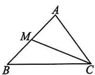

A. $7 \mathrm{~cm}$

B. $6 \mathrm{~cm}$

C. $5 \mathrm{~cm}$

D. $4\mathrm{\;{cm}}$

2.（2024部分区期中）三角形一边上的中线把原三角形分成两个 （）

A. 形状相同的三角形  
B. 面积相等的三角形  
C. 直角三角形  
D. 周长相等的三角形

3. 如图 13-2-10, 点 O 是△ABC 的重心, 则 BD \_\_\_\_ CD. (填“＞”“＝”或“＜”)

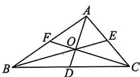

text_image

Geometric diagram of triangle ABC with internal points D, E, F and intersection point O

图13-2-10

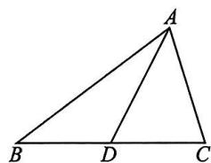

text_image

Geometric diagram of triangle ABC with point D on base BC, showing segments AD and AC

图13-2-11

4. 如图 13-2-11, AD 是 $\triangle ABC$ 的中线.

(1) 若 $AB = 8 \, cm, AC = 5 \, cm$ ，则 $\triangle ABD$ 与 $\triangle ACD$ 的周长之差为 \_\_\_\_；  
(2)若 $\triangle ABC$ 的面积为 $24cm^{2}$ ,则 $\triangle ACD$ 的面积为\_\_\_\_.

# 知识点 2 三角形的角平分线

5. 如图 13-2-12, 若 $\angle1 = \angle2, \angle3 = \angle4$ , 则下列结论中错误的是 ( )

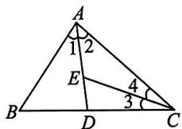  
图13-2-12

A. ${AD}$ 是 $\bigtriangleup  {ABC}$ 的角平分线  
B. CE 是△ABC 的角平分线  
C. $\angle 3 = \frac{1}{2}\angle ACB$   
D. $CE$ 是 $\triangle ACD$ 的角平分线

6.（教材习题13.2T8变式）如图13-2-13, $AD$ 是 $\triangle ABC$ 的角平分线, $DE \parallel CA$ , $DE$ 交 $AB$ 于点 $E$ , $DF$ 交 $AC$ 于点 $F$ , $\angle 1 = \angle 2$ , 则 $DF$ 与 $AB$ 是否平行？为什么？

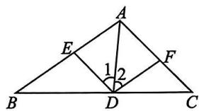

text_image

A
E
1
2
B
D
C
F

图13-2-13

# 知识点 3 三角形的高

7. 如图 13-2-14, 用三角尺作 $\triangle ABC$ 的边 $AB$ 上的高, 下列三角尺的摆放位置正确的是 ( )

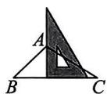  
A

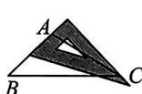  
B

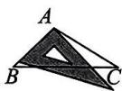  
C

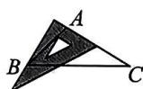  
D   
图13-2-14

8.（2024津南区期中）下列图形中，正确画出 $\triangle ABC$ 中 $AC$ 边上的高是 （）

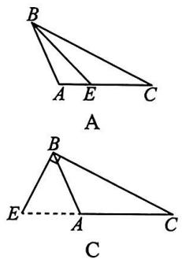

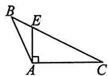  
B

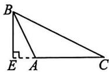  
D   
图13-2-15

9. 如图 13-2-16, 在 $\triangle ABC$ 中, $BC$ 边上的高是 \_\_\_\_; 在 $\triangle AEC$ 中, $AE$ 边上的高是 \_\_\_\_.

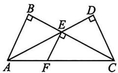  
图13-2-16

10. 若一个三角形三条高的交点在这个三角形的顶点上, 则这个三角形是 \_\_\_\_ 三角形.

11. 如图 13-2-17, 画出 $\triangle ABC$ 的三条高.

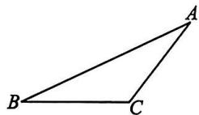  
图13-2-17

12.（教材习题13.2T7变式）如图13-2-18, AD, BE是△ABC的高, AC=5, BC=4, AD=4, 求BE的长.

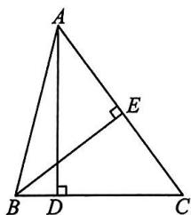

text_image

Geometric diagram of triangle ABC with perpendiculars from A and B to base BC, labeled points A, B, C, D, E, and right-angle symbols.

图13-2-18

# B 规律方法综合练

训练思维

13. 如图 13-2-19, 在 $\triangle ABC$ 中, $\angle C = 90^{\circ}, D, E$ 是 $AC$ 上两点, 且 $AE = DE$ , $BD$ 平分 $\angle EBC$ , 那么下列说法中不正确的是 ( )

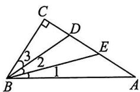  
图13-2-19

A. ${BE}$ 是 $\bigtriangleup  {ABD}$ 的中线

B. ${BD}$ 是 $\bigtriangleup  {BCE}$ 的角平分线

C. $\angle 1 = \angle 2 = \angle 3$

D. $BC$ 是 $\triangle ABE$ 的高

14. (2024 和平区期末) 如图 13-2-20, 在 $\triangle ABC$ 中, $AB = BC$ , 中线 $AD$ 将这个三角形的周长分为 15 和 21 两部分, 则 $AC$ 的长为 ( )

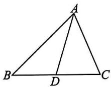  
图 13-2-20

A. 16

B. 11

C. 16 或 8

D. 11 或 1

15. 如图 13-2-21, 在每个小正方形的边长均为 1 的方格纸内, 将 $\triangle ABC$ 平移一次后得到 $\triangle A'B'C'$ , 图中标出了点 $B$ 的对应点 $B'$ .

根据下列条件,利用格点和三角尺画图:

(1)补全 $\triangle A^{\prime}B^{\prime}C^{\prime}$ ;

(2)请在 $AC$ 边上找一点 $D$ , 使得线段 $BD$ 平分 $\triangle ABC$ 的面积, 在图上作出线段 $BD$ ;

(3)利用格点在图中画出 $AC$ 边上的高线 $BE$ ;

(4) 找 $\triangle ABF$ (要求各顶点在格点上, 点 F 不与点 C 重合), 使其面积等于 $\triangle ABC$ 的面积. 满足这样条件的点 F 共有 \_\_\_\_ 个.

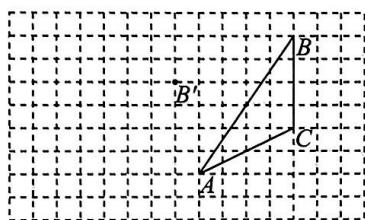

text_image

Geometric diagram showing triangle ABC with point B' on a grid background

图13-2-21

# 专题训练（一） 与三角形中线或高相关的面积问题

# ▶ 类型一 三角形中的等面积法

1. 如图 1-ZT-1, $\angle ACB = 90^{\circ}$ , $CD \perp AB$ 于点 $D$ . 若 $AC = 8$ , $BC = 6$ , $AB = 10$ , 则 $CD$ 的长为 \_\_\_\_.

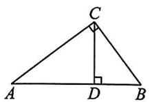  
图1-ZT-1

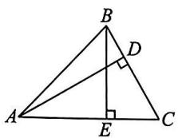  
图1-ZT-2

2. 如图 1-ZT-2, 在 $\triangle ABC$ 中, $AD \perp BC$ 于点 $D$ , $BE \perp AC$ 于点 $E$ . 若 $AC=8, BC=6, AD=7$ , 则 $BE$ 的长为 \_\_\_\_.

3. 如图 1-ZT-3, 已知等边三角形 ABC 的高为 7 cm, P 为 $\triangle ABC$ 内一点, $PD \perp AB$ 于点 D, $PE \perp AC$ 于点 E, $PF \perp BC$ 于点 F, 则 $PD + PE + PF =$ \_\_\_\_.

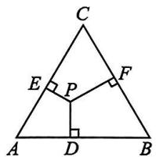

text_image

C
E
P
F
A
D
B

图1-ZT-3

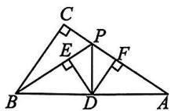  
图1-ZT-4

4. 如图 1-ZT-4, 在 $\triangle ABC$ 中, $\angle C = 90^{\circ} (\angle A < \angle ABC)$ , 点 $D, P$ 分别在边 $AB, AC$ 上, 且 $BP = AP, DE \perp BP, DF \perp AP$ , 垂足分别为 $E, F$ . 若 $BC = 5$ , 则 $DE + DF =$ \_\_\_\_.

# ▶ 类型二 三角形的中线平分三角形面积问题

5. 如图 1-ZT-5, 在 $\triangle ABC$ 中, $D, E$ 分别是 $BC$ , $AD$ 的中点, 且 $\triangle ABC$ 的面积是 4 , 则 $\triangle ABE$ 的面积是 ( )

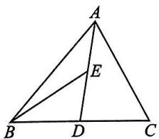

text_image

A
E
B
D
C

图1-ZT-5

A. 2

B. 1

C. 0.5

D. 0.25

6. (2024 河东区期中) 如图 1-ZT-6, 在 $\triangle ABC$ 中, $D$ 是 $BC$ 的中点, $E$ 是 $AD$ 的中点, 且 $S_{\triangle ABC} = 7 \mathrm{~cm}^2$ , 则阴影部分的面积为 ( )

A. $3 \mathrm{~cm}^{2}$

B. $3.5 \mathrm{~cm}^{2}$

C. $4 \mathrm{~cm}^{2}$

D. 4.5 cm $^{2}$

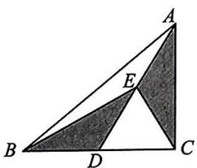

text_image

Geometric diagram of triangle ABC with internal points D and E, showing shaded regions for area or similarity.

图1-ZT-6

text_image

Geometric diagram of triangle ABC with internal points D, E, F and shaded sub-triangle DEF

图 1-ZT-7

7. 如图 1-ZT-7, 在 $\triangle ABC$ 中, $D, E, F$ 分别是 $BC, AD, CE$ 的中点, 且 $\triangle ABC$ 的面积为 16, 则 $\triangle BEF$ 的面积为 ( )

A. 2

B. 4

C. 6

D. 8

8. (2024 和平区期中) 如图 1-ZT-8, G 为 $\triangle ABC$ 三边中线 $AD$ , BE, CF 的交点, $S_{\triangle ABC} = 12 \mathrm{~cm}^{2}$ , 则阴影部分的面积为

  
图 1-ZT-8

A. $4 \mathrm{~cm}^{2}$

B. $5 \mathrm{~cm}^{2}$

C. $6 \mathrm{~cm}^{2}$

D. $8 \mathrm{~cm}^{2}$

9. 如图 1-ZT-9, 在 $\triangle ABC$ 中, $G$ 是边 $BC$ 上任意一点, $D, E, F$ 分别是 $AG, BD, CE$ 的中点. 若 $S_{\triangle ABC} = 48$ , 则 $S_{\triangle DEF} = \_$ .

text_image

Geometric diagram of triangle ABC with internal points D, E, F, G and connecting line segments

图1-ZT-9

  
图1-ZT-10

10. 如图 1-ZT-10, 在 $\triangle ABC$ 中, $\angle ACB = 90^{\circ}$ , $AC = 4$ , $BC = 3$ , $AB = 5$ , 射线 $CD$ 与边 $AB$ 交于点 $D$ . $E$ , $F$ 分别为 $AD$ , $BD$ 的中点. 设点 $E$ , $F$ 到射线 $CD$ 的距离分别为 $m$ , $n$ , 则线段 $CD$ 的最小值为 \_\_\_\_, $m + n$ 的最大值为 \_\_\_\_.

# 专题训练（二） 三角形的角平分线与高的夹角探究

1.（2024河东区期末改编）如图2-ZT-1，在 $\triangle ABC$ 中， $\angle BAC = 90^{\circ}$ ，AD是高，BE是中线，CF是

text_image

Geometric diagram of triangle ABC with altitudes and intersection points labeled

图2-ZT-1

角平分线, $CF$ 交 $AD$ 于点 $G$ , 交 $BE$ 于点 $H$ . 下列结论: ① $S_{\triangle ABE} = S_{\triangle BCE}$ ; ② $\angle AFG = \angle AGF$ ; ③ $\angle FAG = 2\angle ACF$ , 其中正确的有 ( )

A. ①②

B. ②③

C. ①②③

D. ①③

2.（2024河东区期中）如图2-ZT-2，在 $\triangle ABC$ 中， $CD \perp AB$ 于点 $D, CE$ 是 $\angle ACB$ 的平分线， $\angle A = 20^{\circ}, \angle B = 60^{\circ}$ .

求 $\angle BCD$ 和 $\angle ECD$ 的度数.

text_image

Geometric diagram of triangle ABC with altitude CD and perpendicular from C to AB at D, labeled with points A, B, C, D, E.

图2-ZT-2

3. (2024 和平区期中) 如图 2-ZT-3 在 $\triangle ABC$ 中, $\angle A = \frac{1}{2}\angle B = \frac{1}{3}\angle ACB$ , $CD$ 是 $\triangle ABC$ 的高, $CE$ 是 $\angle ACB$ 的平分线, 求 $\angle DCE$ 的度数.

  
图2-ZT-3

4. 如图 2-ZT-4, 在 $\triangle ABC$ 中, $AD \perp BC$ 于点 $D$ , $AE$ 平分 $\angle BAC$ 交 $BC$ 于点 $E$ .

(1) 若 $\angle B = 46^{\circ}, \angle C = 80^{\circ}$ , 求 $\angle DAE$ 的度数;  
(2) 若 $\angle C > \angle B$ , 探究 $\angle DAE$ 与 $\angle B, \angle C$ 之间的数量关系, 并说明理由.

text_image

Geometric diagram of triangle ABC with points D and E on base BC, showing perpendicular lines from A to BC at D.

图2-ZT-4

# 13.3.1 第1课时 三角形的内角和定理

# 知识要点分类练

夯实基础

# 知识点1 探索三角形内角和定理

1. 已知： $\triangle ABC$ 的三个内角为 $\angle A, \angle B, \angle ACB$ .

求证: $\angle A+\angle B+\angle ACB=180^{\circ}$ .

证明:如图 13-3-1,延长 BC 到点 D,过点 C 作CE//\_\_\_\_,

$\therefore \angle A =$ （两直线平行，内错角相等）， $\angle B =$ （ ）.

$\because\angle1+\angle2+\angle3=180^{\circ}$ （平角定义），

$\therefore \angle 1 + \_\_\_\_ + \_\_\_\_ = 180^{\circ}$ （等量代换），

即 $\angle A + \angle B + \angle ACB =$

  
图13-3-1

  
图13-3-2

2. 如图 13-3-2, 折叠一张三角形纸片, 把三角形三个角拼在一起, 就能验证一个几何定理. 请写出这个定理的名称: \_\_\_\_.

# 知识点2 三角形内角和定理的应用

3.（2024红桥区期中）如图13-3-3， $x$ 的值是（ ）

A. 33

B. 34

C. 67

D. 69

text_image

x°
39° 108°

图13-3-3

text_image

Geometric diagram showing a right triangle with an inscribed circle and labeled points A, B, and O

图13-3-4

4.（2024南开区期中）将一副透明三角尺按图13-3-4中方式叠放，则∠AOB等于 （）

A. $90^{\circ}$

B. $105^{\circ}$

C. ${120}^{ \circ  }$

D. $135^{\circ}$

5.（教材习题13.3T1变式）如图13-3-5， $\triangle ABC$ 的三个内角的大小分别为 $x^{\circ}, x^{\circ}, 3x^{\circ}$ ，则 $x$ 的值为 （）

A. 24

B. 30

C. 36

D. 40

  
图13-3-5

  
图13-3-6

6. 如图 13-3-6, 一种滑翔伞的形状是左右对称的四边形 ABCD, 其中 $\angle B = 40^{\circ}, \angle CAD = 60^{\circ}$ , 则 $\angle BCD =$ \_\_\_\_ $^{\circ}$ .

7. (2024 红桥区期末) 如图 13-3-7, 在 $\triangle ABC$ 中, $\angle BCD = 30^{\circ}, \angle ACB = 80^{\circ}, CD$ 是边 $AB$ 上的高, $AE$ 是 $\angle CAB$ 的平分线.

(1)求 $\angle CAB$ 的大小；

(2)求 $\angle AEB$ 的大小。

text_image

Geometric diagram of triangle ABC with altitude CD and point E on AC, showing right angle at D

图13-3-7

# 规律方法综合练

训练思维

8.（教材习题13.3T3变式）在 $\triangle ABC$ 中， $\angle B$ 是 $\angle A$ 的3倍， $\angle C$ 比 $\angle A$ 大 $30^{\circ}$ ，则 $\angle A$ 的度数是 （）

A. $30^{\circ}$

B. $50^{\circ}$

C. $70^{\circ}$

D. $90^{\circ}$

9. 如图 13-3-8, 点 E, D 分别在 AB, AC 上. 若 $\angle B = 30^{\circ}, \angle C = 55^{\circ}$ , 则 $\angle 1 + \angle 2$ 的度数为 ( )

  
图13-3-8

A. $85^{\circ}$

B. ${80}^{ \circ  }$

C. $75^{\circ}$

D. ${70}^{ \circ  }$

10. 一个三角形的三个内角中, 至少有 ( )

A. 一个锐角

B. 两个锐角

C. 一个钝角

D. 一个直角

11. 如图 13-3-9, 在 $\triangle ABC$ 中, $\angle A = 70^{\circ}, \angle C = 30^{\circ}$ , $BD$ 平分 $\angle ABC$ 交 $AC$ 于点 $D$ , $DE \parallel AB$ 交 $BC$ 于点 $E$ , 则 $\angle BDE$ 的度数是 ( )

A. ${30}^{ \circ  }$

B. ${40}^{ \circ  }$

C. ${50}^{ \circ  }$

D. ${60}^{ \circ  }$

  
图13-3-9

text_image

C
E 1
A'
2
A D B

图13-3-10

12. 如图 13-3-10, 将 $\triangle ABC$ 的一角沿 $DE$ 折叠, 点 $A$ 落在点 $A'$ 处. 若 $\angle 1 + \angle 2 = 130^\circ$ , 则 $\angle B + \angle C$ 等于 ( )

A. $50^{\circ}$

B. $65^{\circ}$

C. ${115}^{ \circ  }$

D. ${130}^{ \circ  }$

13. 如图 13-3-11, 在 $\triangle ABC$ 中, $AE$ 平分 $\angle BAC, AD \perp BC$ 于点 $D$ , $\angle ABD$ 的平分线 $BF$ 所在直线与射线 $AE$ 相交于点 $G$ , 若

text_image

Geometric diagram with labeled points and right angles, showing triangle ABC with auxiliary lines and right angle at D.

图13-3-11

$\angle ABC = 3\angle C$ ，且 $\angle G = 18^{\circ}$ ，则 $\angle DFB$ 的度数为 （）

A. ${40}^{ \circ  }$

B. ${44}^{ \circ  }$

C. $50^{\circ}$

D. ${54}^{ \circ  }$

14.（教材例2变式）如图13-3-12所示， $B$ 岛在 $A$ 岛的南偏西 $55^{\circ}$ 方向， $B$ 岛在 $C$ 岛的北偏西 $60^{\circ}$ 方向， $C$ 岛在 $A$ 岛南偏东 $30^{\circ}$ 方向.从 $B$ 岛看 $A,C$ 两岛的视角 $\angle ABC$ 是多少度？

text_image

A
B
南
北
C

图13-3-12

15. (2023 和平区期中) 如图 13-3-13, 在 $\triangle ABC$ 中, $\angle C > \angle B$ , $AD \perp BC$ 于点 $D$ , $AE$ 平分 $\angle BAC$ 交 $BC$ 于点 $E$ . 若 $\angle C = 60^{\circ}$ , $\angle B = 30^{\circ}$ , 求 $\angle DAE$ 的度数.

text_image

Geometric diagram of triangle ABC with altitude AD and point E on base BC, showing right angle at D.

图13-3-13

# 拓广探究创新练

提升素养

16. 如图 13-3-14, 在 $\triangle ABC$ 中, $\angle ABC$ 与 $\angle ACB$ 的平分线相交于点 $O$ , 若 $\angle BOC = 140^{\circ}$ , 求 $\angle A$ 的度数.

text_image

A
O
B
C

图13-3-14

# 第2课时 直角三角形的两个锐角互余

# 知识要点分类练

夯实基础

# 知识点 1 直角三角形的性质

1.（2024部分区期中）在Rt△ABC中，∠C=90°，∠B=32°，则∠A的度数为 （）

A. $58^{\circ}$

B. ${48}^{ \circ  }$

C. $38^{\circ}$

D. $28^{\circ}$

2.（2024和平区期中）如图13-3-15，已知 $AC \perp BC$ 于点 $C$ ， $CD \perp AB$ 于点 $D, \angle A = 56^{\circ}$ ，则 $\angle DCB$ 的度数是

  
图13-3-15

A. $30^{\circ}$

B. ${45}^{ \circ  }$

C. $56^{\circ}$

D. $60^{\circ}$

# 知识点 2 直角三角形的判定

3. 在 $\triangle ABC$ 中, 已知 $\angle A = 37^{\circ}, \angle B = 53^{\circ}$ , 则 $\triangle ABC$ 为 ( )

A.锐角三角形

B. 钝角三角形

C. 直角三角形

D. 以上都有可能

4.（教材练习T2变式）如图13-3-16， $E$ 是 $\triangle ABC$ 的边 $AC$ 上一点，过点 $E$ 作 $ED\bot AB$ ，垂足为 $D.$ 若 $\angle 1 = \angle 2$ ，则 $\triangle ABC$ 是直角三角形吗？为什么？

  
图13-3-16

# 规律方法综合练

训练思维

5. 已知 $\triangle ABC$ 的内角为 $\angle A, \angle B, \angle C$ . 在下列条件: ① $\angle A + \angle B = \angle C$ ; ② $\angle A : \angle B : \angle C = 5 : 3 : 2$ ; ③ $\angle A = 90^\circ - \angle B$ ; ④ $\angle A = 2\angle B = 3\angle C$ 中, 能确定 $\triangle ABC$ 是直角三角形的有 ( )

A. 1 个

B. 2 个

C. 3 个

D. 4 个

6. (2024 滨海新区期中) 如图 13-3-17, 在四边形 $ABCD$ 中, $\angle B = \angle C = 90^{\circ}$ , 点 $E$ 在边 $BC$ 上, 连接 $AE, DE$ . 若 $\angle AED = 90^{\circ}, DE$ 平分

text_image

A
1
B
E
C
D

图13-3-17

$\angle ADC$ ，则图中一定与 $\angle 1$ 相等的角（除去 $\angle 1)$ 有 （）

A. 1 个

B. 2 个

C. 3 个

D. 4 个

7. 如图 13-3-18, 在 $\triangle ACB$ 中, $\angle ACB = 90^{\circ}$ , $CD \perp AB$ 于点 $D$ .

(1) 求证: $\angle ACD = \angle B$ ;

(2) 若 $AF$ 平分 $\angle CAB$ 分别交 $CD, BC$ 于点 $E, F$ , 求证: $\angle CEF = \angle CFE$ .

text_image

Geometric diagram of triangle ABC with perpendiculars and labeled points D, E, F

图13-3-18

# 拓广探究创新练

提升素养

8. 数学思想 分类讨论 如图 13-3-19, BD 为 $\triangle ABC$ 的角平分线, 若 $\angle ABC = 60^{\circ}, \angle CDB = 110^{\circ}$ , $E$ 为线段 $BC$ 上一点, 当 $\triangle DCE$ 为直角三角形时, 求 $\angle BDE$ 的度数.

text_image

A
D
B
C

图13-3-19

# 13.3.2 三角形的外角

# 知识梳理

1. 如图 13-3-20, 把 $\triangle ABC$ 的一边 $BC$ 延长, 得到 $\angle ACD$ . 像这样, 三角形的一边与另一边的 \_\_\_\_ 组成的角, 叫作三角形的 \_\_\_\_.  
2. 一般地,由三角形的内角和定理可以推出下面的推论:三角形的外角等于与它不相邻的

  
图13-3-20

# 知识要点分类练

夯实基础

# 知识点1 三角形的外角的概念及性质

1. 图 13-3-21 中, $\angle1$ 是 $\triangle ABC$ 的外角的是 ( )

  
图13-3-21

2.（2024滨海新区期中）如图13-3-22是一副透明三角尺拼成的图案，则∠AEB的度数为()

A. $60^{\circ}$

B. $75^{\circ}$

C. ${90}^{ \circ  }$

D. $105^{\circ}$

  
图13-3-22

  
图13-3-23

3.（2024 南开区期中）如果将一副三角尺按如图 13-3-23 方式叠放,那么∠1 的度数为（）

A. $45^{\circ}$

B. $60^{\circ}$

C. ${105}^{ \circ  }$

D. ${120}^{ \circ  }$

4.（2024滨海新区期末）如图13-3-24，从 $A$ 处观察 $C$ 处的仰角 $\angle CAD = 35^{\circ}$ ，从 $B$ 处观察 $C$ 处的仰角 $\angle CBD = 46^{\circ}$ ，从 $C$ 处观察 $A, B$ 两处的视角 $\angle ACB =$ \_\_\_\_°.

  
图13-3-24

  
图13-3-25

5. 图 13-3-25 中 x 的值为 \_\_\_\_.

6. 如图 13-3-26, AD 平分 $\triangle ABC$ 的外角 $\angle CAE$ , 交 $BC$ 的延长线于点 $D$ , $\angle B = 35^{\circ}, \angle DAE = 60^{\circ}$ , 则 $\angle ACD =$ \_\_\_\_°.

text_image

Geometric diagram showing triangle ABC with extended line to point E, labeled vertices A, B, C, D, E

图13-3-26

7. 如图 13-3-27 所示, 在 $\triangle ABC$ 中, $D$ 是 $BC$ 边上一点, $\angle 1 = \angle 2$ , $\angle 3 = \angle 4$ , $\angle BAC = 63^\circ$ , 求 $\angle DAC$ 的度数.

text_image

A
1
2
3 4
B D C

图13-3-27

# 知识点2 三角形的外角和

8.（教材例4变式）如图13-3-28， $\angle BAE, \angle CBF, \angle ACD$ 是 $\triangle ABC$ 的三个外角， $\angle ACD = 125^{\circ}$ ，则 $\angle BAE + \angle CBF =$

  
图13-3-28

# 规律方法综合练

训练思维\_

9.（2024滨海新区期中）如图13-3-29，在 $\triangle ABC$ 中， $\angle A = 60^{\circ}$ ，点 $D, E$ 分别在 $AB, AC$ 上，则 $\angle 1 + \angle 2$ 的大小为 （）

text_image

C
E 1
A D 2 B

图13-3-29

A. ${140}^{ \circ  }$

B. ${190}^{ \circ  }$

C. $320^{\circ}$

D. ${240}^{ \circ  }$

10. 已知三角形的一个外角等于 $60^{\circ}$ , 且三角形中与这个外角不相邻的两个内角中, 一个比另一个大 $10^{\circ}$ , 则这个三角形三个内角的度数分别是 ( )

A. $120^{\circ}, 35^{\circ}, 25^{\circ}$

B. $110^{\circ}, 45^{\circ}, 25^{\circ}$

C. ${100}^{ \circ  },{55}^{ \circ  },{25}^{ \circ  }$

D. $120^{\circ}, 40^{\circ}, 20^{\circ}$

11. 新考法日常生活 如图 13-3-30, 起重机在工作时, 起吊物体前机械臂 AB 与操作台 BC 的夹角 $\angle ABC = 120^{\circ}$ , 支撑臂 BD 为 $\angle ABC$ 的平分线. 物体被吊起后, 机械臂 AB 的位置不变, 支撑臂绕点 B 旋转一定的角度并缩短, 此时 $\angle CBD = 2\angle ABD, \angle BDC$ 增大了 $10^{\circ}$ , 则 $\angle DCE$ 的变化情况为 ( )

text_image

支撑臂
机械臂
操作台

text_image

A
D
B
C
E

图13-3-30

A. 增大 $10^{\circ}$

B. 减小 ${10}^{ \circ  }$

C. 增大 $30^{\circ}$

D. 减小 $30^{\circ}$

12. 一个零件的形状如图 13-3-31 所示, 按规定满足 $\angle A = 90^{\circ}, \angle B = 32^{\circ}, \angle C = 21^{\circ}$ 的零件为合格零件, 现质检工人量得 $\angle BDC = 149^{\circ}$ , 就断定这个零件不合格, 请你运用三角形的有关知识说明零件不合格的理由.

  
图13-3-31

13.（2024西青区月考）如图13-3-32， $CE$ 是 $\triangle ABC$ 的外角 $\angle ACD$ 的平分线，且 $CE$ 交 $BA$ 的延长线于点 $E$

(1) 若 $\angle B = 42^{\circ}, \angle E = 26^{\circ}$ , 求 $\angle BAC$ 的度数;  
(2)直接写出 $\angle BAC, \angle B, \angle E$ 三个角之间存在的等量关系.

text_image

Geometric diagram with labeled points A, B, C, D, E and line segments forming triangles and a trapezoid

图13-3-32

# 拓广探究创新练

提升素养

14. 核心素养推理能力 如图 13-3-33, $\angle MON = 90^{\circ}$ , 点 $A, B$ 分别在射线 $OM, ON$ 上运动 (不与点 $O$ 重合), $BE$ 平分 $\angle NBA, BE$ 的反向延长线与 $\angle BAO$ 的平分线相交于点 $C$ . (1) 当 $\angle BAO = 45^{\circ}$ 时, $\angle C =$ \_\_\_\_°; (2) 当 $\angle BAO = 60^{\circ}$ 时, $\angle C =$ \_\_\_\_°; (3) 由 (1)(2) 猜想 $\angle C$ 的度数是否随点 $A, B$ 的运动而发生变化, 并说明理由.

text_image

Geometric diagram with labeled points and lines, including perpendicular markers and a right angle at point O.

图13-3-33

# 专题训练（三） 三角形的角平分线模型

# ▶ 模型一 双内角平分线夹角模型

# 方法点睛

模型介绍:如图 3-ZT-1 所示,
BO, CO 分别平分 $\angle ABC, \angle ACB$ ,
求证： $\angle BOC=90^{\circ}+\frac{1}{2}\angle A.$

  
图3-ZT-1

证明：∵ BO, CO 分别平分 ∠ABC, ∠ACB,

$$
\therefore \angle O B C = \frac {1}{2} \angle A B C, \angle O C B = \frac {1}{2} \angle A C B.
$$

$$
\therefore \angle B O C = 1 8 0 ^ {\circ} - \angle O B C - \angle O C B = 1 8 0 ^ {\circ} -
$$

$$
\frac {1}{2} \angle A B C - \frac {1}{2} \angle A C B = 1 8 0 ^ {\circ} - \frac {1}{2} (\angle A B C + \angle A C B) =
$$

$$
1 8 0 ^ {\circ} - \frac {1}{2} (1 8 0 ^ {\circ} - \angle A) = 9 0 ^ {\circ} + \frac {1}{2} \angle A.
$$

1. 如图 3-ZT-2 所示, 在四边形 ABCD 中, $\angle A + \angle D = \alpha$ , $\angle ABC$ 的平分线与 $\angle BCD$ 的平分线交于点 P, 则 $\angle BPC$ 的度数为 ( )

A. $90^{\circ} - \frac{1}{2}\alpha$

B. $90^{\circ} + \frac{1}{2}\alpha$

C. $\frac{1}{2}\alpha$

D. $360^{\circ} - \alpha$

text_image

A
D
P
B
C

图3-ZT-2

  
图3-ZT-3

2. 如图 3-ZT-3, 在 $\triangle ABC$ 中, $\angle ABC = 80^{\circ}$ , $\angle ACB = 50^{\circ}$ , $BP$ 平分 $\angle ABC$ , $CP$ 平分 $\angle ACB$ , 则 $\angle BPC$ 的度数为 \_\_\_\_.

3. (1) 如图 3-ZT-4①, 在 $\triangle ABC$ 中, $\angle ABC$ 的三等分线分别与 $\angle ACB$ 的平分线交于点 $O_1$ , $O_2$ , 若 $\angle 1 = 115^\circ$ , $\angle 2 = 135^\circ$ , 则 $\angle A =$ \_\_\_\_;

(2)如图②,若 $\angle A=60^{\circ},\angle ABC,\angle ACB$ 的三等分线交于点 $O_{1},O_{2}$ ,连接 $O_{1}O_{2}$ ,则 $\angle BO_{1}C=$ \_\_\_\_, $\angle BO_{2}O_{1}=$ \_\_\_\_.

text_image

A
O₂
1
O₁
2
B
C

①

  
②   
图3-ZT-4

4. (2023 红桥区期中改编) 如图 3-ZT-5, 在 $\triangle ABC$ 中, $BE$ 是角平分线, 点 $D$ 在边 $AB$ 上 (不与点 $A, B$ 重合), $CD$ 与 $BE$ 交于点 $O$ .

(1)若 $CD$ 是中线， $BC = 3, AC = 2$ ，则 $\triangle BCD$ 与 $\triangle ACD$ 的周长差为 \_\_\_\_；  
(2) 若 $\angle ABC = 62^{\circ}$ , $CD$ 是 $\triangle ABC$ 的高, 求 $\angle BOC$ 的度数;  
(3)若 $\angle A=78^{\circ}$ , $CD$ 是 $\triangle ABC$ 的角平分线,直接写出 $\angle BOC$ 的度数为\_\_\_\_.

text_image

Geometric diagram of triangle ABC with internal points D, E, O and intersecting lines

图3-ZT-5

# ▶ 模型二 一内一外角平分线夹角模型

# 方法点睛

模型介绍:如图 3-ZT-6, BD 是 $\angle ABC$ 的平分线, CD 是 $\triangle ABC$ 的外角 $\angle ACE$ 的平分线, 求证: $\angle D = \frac{1}{2} \angle A$ .

  
图3-ZT-6

证明：∵BD是∠ABC的平分线，

$$
\therefore \angle D B C = \frac {1}{2} \angle A B C.
$$

∵CD 是∠ACE 的平分线，∴∠DCE= $\frac{1}{2}$ ∠ACE.

$\because \angle DCE$ 是 $\triangle BCD$ 的外角，

$$
\therefore \angle D C E = \angle D + \angle D B C.
$$

$$
\begin{array}{r l} & {\therefore \angle D = \angle D C E - \angle D B C = \frac {1}{2} \angle A C E - \frac {1}{2} \angle A B C =} \\ & {\frac {1}{2} (\angle A C E - \angle A B C).} \end{array}
$$

$\because \angle ACE$ 是 $\triangle ABC$ 的外角，

$$
\therefore \angle A = \angle A C E - \angle A B C. \therefore \angle D = \frac {1}{2} \angle A.
$$

5.（2023东丽区期末改编）如图3-ZT-7①，BE平分∠ABC，且与△ABC的外角∠ACD的平分线交于点E.

(1) 若 $\angle ABC = 80^{\circ}, \angle ACB = 50^{\circ}$ , 则 $\angle E =$ \_\_\_\_;   
(2)若把∠A截去,得到四边形MBCN,如图②,猜想∠E,∠BMN,∠MNC之间的数量关系并证明.

text_image

A
B
C
D
①
E

text_image

M
N
E
B
C
D
②

图3-ZT-7

# ▶ 模型三 双外角平分线夹角模型

# 方法点睛

模型介绍:如图 3-ZT-8 所示, 已知 BO, CO 分别是 $\triangle ABC$ 的外角 $\angle CBD, \angle BCE$ 的平分线, 求证: $\angle BOC = 90^{\circ} - \frac{1}{2} \angle A$ .

text_image

Geometric diagram with labeled points A, B, C, D, E, and O forming intersecting lines and triangles

图3-ZT-8

6.（2024 南开区月考）如图 3-ZT-9, BO, CO 分别是 $\triangle ABC$ 的外角平分线.

(1) 若 $\angle ABC = 40^{\circ}, \angle ACB = 60^{\circ}$ ，则 $\angle BOC =$ \_\_\_\_ ;  
(2) 若 $\angle A = 60^{\circ}$ , 则 $\angle BOC =$ \_\_\_\_.

7.（2023南开区月考）如图3-ZT-10①，在 $\triangle ABC$ 中， $\angle A = 40^{\circ}$ ，外角平分线 $BN$ 和 $CN$ 相交于点 $N$ ，求 $\angle BNC$ 的度数.

(1)请你直接写出 $\angle BNC=$ \_\_\_\_；  
(2) 如图 ②, 在 $\triangle ABC$ 中, $\angle A = 80^{\circ}$ , 若 $\angle CBN = \frac{3}{8} \angle CBE, \angle BCM = \frac{3}{8} \angle BCD, BN$ 与 $CM$ 交于点 $O$ , 求 $\angle BOC$ 的度数;  
(3) 如图 ③, 在 $\triangle ABC$ 中, $\angle A = n^{\circ}$ , 若 $\angle CBN = \frac{3}{4} \angle CBE$ , $\angle BCM = \frac{3}{4} \angle BCD$ , 当射线 $CM$ 与 $BN$ 相交时, $n$ 的取值范围是什么? 试说明理由.

  
①

  
②

  
③   
图3-ZT-10

text_image

Geometric diagram with labeled points A, B, C, E, F, and O, showing triangles and line segments

图3-ZT-9

# 专题训练（四） 与三角形的角相关的常见模型

# ▶ 模型一 “8” 字模型

# 方法点睛

模型介绍：“8”字模型顾名思义，就是外形酷似“8”字的模型，如图4-ZT-1所示，AD, BC相交于点O，则 $\angle A + \angle B = \angle C + \angle D$ .

text_image

B
D
O
A
C

图4-ZT-1

1. 如图 4-ZT-2, AC, BD 相交于点 O, $\angle A = 35^{\circ}$ , $\angle B = \angle C = 80^{\circ}$ , 则 $\angle D$ 的度数是()

text_image

图 4.7T-8

图4-ZT-2

A. $35^{\circ}$

B. ${55}^{ \circ  }$

C. ${65}^{ \circ  }$

D. ${75}^{ \circ  }$

2. 图 4-ZT-3①中 $\angle A + \angle B + \angle C + \angle D + \angle E$ 的度数等于 \_\_\_\_；

图②中 $\angle A + \angle B + \angle C + \angle D + \angle E$ 的度数等于 \_\_\_\_；

图③中 $\angle A+\angle B+\angle C+\angle D+\angle E$ 的度数等于\_\_\_\_；

图④中 $\angle A+\angle B+\angle C+\angle D+\angle E+\angle F$ 的度数等于\_\_\_\_.

  
①

  
②

  
③

  
④   
图4-ZT-3

3. 如图 4-ZT-4, $\angle A = 40^{\circ}$ , $\angle C = 70^{\circ}$ , $\angle 1 = \angle 2$ , $\angle 3 = \angle 4$ , 则 $\angle F =$ \_\_\_\_.

text_image

A
B
1
2
F
C
3
4
D

图4-ZT-4

# ▶ 模型二 燕尾模型

# 方法点睛

模型介绍: 燕尾模型以其酷似燕子的尾巴而得名, 如图 4-ZT-5 所示, 求证: $\angle BOC = \angle A + \angle B + \angle C$ .

  
图4-ZT-5

  
图4-ZT-6

证明: 连接 AO 并延长, 如图 4-ZT-6.

$\because \angle BOM$ 是 $\triangle AOB$ 的外角，

$$
\therefore \angle B O M = \angle B A M + \angle B.
$$

$\because \angle COM$ 是 $\triangle AOC$ 的外角，

$$
\therefore \angle C O M = \angle C A M + \angle C.
$$

$$
\therefore \angle B O C = \angle B O M + \angle C O M = \angle B A M + \angle B +
$$

$$
\angle C A M + \angle C = \angle B A C + \angle B + \angle C.
$$

4. 如图 4-ZT-7, $\angle A = 50^{\circ}$ , $\angle B = 20^{\circ}$ , $\angle C = 30^{\circ}$ , 则 $\angle BOC$ 的度数为 \_\_\_\_.

text_image

A
O
B
C

图4-ZT-7

text_image

A
H
O
G
B
D
C

图4-ZT-8

5. 如图 4-ZT-8, BG 是 $\angle ABD$ 的平分线, CH 是 $\angle ACD$ 的平分线, BG 与 CH 相交于点 O. 若 $\angle BDC = 150^{\circ}$ , $\angle BOC = 110^{\circ}$ , 则 $\angle A =$ \_\_\_\_ $^{\circ}$ .

6.（2024 河北区期中）如图 4-ZT-9，已知 $\angle BOF = 120^{\circ}$ ，则 $\angle A + \angle B + \angle C + \angle D + \angle E + \angle F$ 的度数为 \_\_\_\_。

text_image

Geometric diagram with labeled points A, B, C, D, E, F, and intersection O

图4-ZT-9

# 数学活动 多边形的三角剖分

1. 定义: 连接多边形任意两个不相邻顶点的线段叫作多边形的对角线.

(1)试验分析:如图 13-S-1①,经过四边形 ABCD 的一个顶点(如点 A)可以作 \_\_\_\_ 条对角线,对角线把四边形 ABCD 分为 \_\_\_\_ 个三角形.  
(2)拓展延伸:运用(1)的分析方法,可得:如图②,经过五边形的一个顶点作所有的对角线,对角线把五边形分为\_\_\_\_个三角形;如图③,经过六边形的一个顶点作所有的对角线,对角线把六边形分为\_\_\_\_个三角形.  
(3)探索归纳:对于 n 边形(n>3),经过一个顶点的所有对角线把这个 n 边形分为 \_\_\_\_ 个三角形(用含 n 的式子表示).由三角形的内角和等于 $180^{\circ}$ ,可得 n 边形的内角和为 \_\_\_\_.  
(4)特例验证:经过十边形的一个顶点的所有对角线把十边形分为\_\_\_\_个三角形.十边形的内角和为\_\_\_\_.  
(5)探究多边形的内角和公式时,从 n 边形的一个顶点出发引出 $(n-3)$ 条对角线,这些对角线把 n 边形分为 $(n-2)$ 个三角形,这 $(n-2)$ 个三角形的所有内角之和即为 n 边形的内角和.这一探究过程运用的数学思想是()

A. 方程思想

B. 函数思想

C. 数形结合思想

D. 化归思想

  
图13-S-1

2.【问题】用 $n$ 边形 $(n\geqslant 4)$ 的对角线把 $n$ 边形分割成 $(n - 2)$ 个三角形，共有多少种不同的分割方案？

【探究】为了解决上面的问题,我们采取一般问题特殊化的策略,先从最简单的情形入手,再逐次递进转化,最后猜想得出结论.不妨假设 n 边形的分割方案有 $D_{n}$ 种.

探究一:用四边形的对角线把四边形分割成2个三角形,共有多少种不同的分割方案?

如图 13-S-2, 显然只有 2 种不同的分割方案.

  
①

  
②   
图13-S-2

探究二:用五边形的对角线把五边形分割成3个三角形,共有多少种不同的分割方案?不妨把分割方案分成三类:

第1类:如图13-S-3①,用点A,E与点B连接,先把五边形分割成1个三角形和1个四边形,再把四边形分割成2个三角形,由探究一知,有2种不同的分割方案,∴此类共有2种不同的分割方案;

第2类:如图②,用点A,E与点C连接,把五边形分割成3个三角形,有1种不同的分割方案;

text_image

E
A
D
B
C
①

text_image

E
A
D
B
C
②

text_image

E
A
D
B
C
③

图13-S-3

第3类:如图③,用点A,E与点D连接,先把五边形分割成1个三角形和1个四边形,再把四边形分割成2个三角形,由探究一知,有2种不同的分割方案,∴此类共有2种不同的分割方案, $\therefore D_{5}=2+1+2=5.$

探究三:用六边形的对角线把六边形分割成4个三角形,共有多少种不同的分割方案?不妨把分割方案分成四类:

第1类:如图13-S-4①,用点A,F与点B连接,先把六边形分割成1个三角形和1个五边形,再把五边形分割成3个三角形,由探究二知,有5种不同的分割方案,∴此类共有5种不同的分割方案;

第2类:如图②,用点A,F与点C连接,先把六边形分割成2个三角形和1个四边形,再把四边形分割成2个三角形,由探究一知,有2种不同的分割方案,∴此类共有2种不同的分割方案;

第3类:如图③,用点A,F与点D连接,先把六边形分割成2个三角形和1个四边形,再把四边形分割成2个三角形,由探究一知,有2种不同的分割方案,∴此类共有2种不同的分割方案;

text_image

A
F
B
E
C
D
①

text_image

A
B
C
D
E
F
②

text_image

A
F
B
C
D
E
③

text_image

A
F
B
E
C
D
④

图13-S-4

第 4 类: 如图④, 用点 A, F 与点 E 连接, 先把六边形分割成 1 个三角形和 1 个五边形, 再把五边形分割成 3 个三角形, 由探究二知, 有 5 种不同的分割方案, ∴ 此类共有 5 种不同的分割方案,

$$
\therefore D _ {6} = 5 + 2 + 2 + 5 = 1 4.
$$

●●●●●●

【结论】后来数学家发现并证明: 当 $n \geqslant 3$ 时, $\frac{D_{n+1}}{D_n} = \frac{4n - 6}{n} (D_3 = 1)$ . 请你利用这个公式, 验证前面探究中的结果.

【应用】用九边形的对角线把九边形分割成7个三角形,共有多少种不同的分割方案?（应用上述结论中的关系式求解）

flowchart

# T天津经典考题IANJIN

# 考点1 三角形的三边关系

1. (2024 和平区期末) 一木工师傅有两根长分别为 $4 \mathrm{~cm}, 8 \mathrm{~cm}$ 的木条, 他要找第三根木条, 将它们钉成一个三角形框架, 以下长度的 4 根木条, 他应选择 ( )

A. $3 \mathrm{~cm}$

B. $4 \mathrm{~cm}$

C. $10 \mathrm{~cm}$

D. $13 \mathrm{~cm}$

2. (2023 和平区期中) 已知三角形的两边长分别是 $2 \mathrm{~cm}$ 和 $5 \mathrm{~cm}$ , 第三边长是奇数, 则第三边长是 \_\_\_\_.

# 考点2 与三角形有关的重要线段

3.（2024滨海新区期中）画 $\triangle ABC$ 的 $BC$ 边上的高，正确的是 （）

text_image

A
B
C
D

图13-X-1

4. (2024 部分区期中) 下列说法正确的是 ( )

A. 三角形的角平分线是射线  
B. 过三角形的顶点, 且过对边中点的直线是三角形的一条中线

C. 三角形的高、中线、角平分线一定在三角形的内部  
D. 锐角三角形的三条高交于一点

5.（2024河东区第七中学月考）如图13-X-2所示， $\triangle ABC$ 中，点 $D, E, F$ 分别在三边上， $E$ 是 $AC$ 的中点， $AD, BE, CF$ 交于一点 $G, BD = 2DC, S_{\triangle GEC} = 3, S_{\triangle GDC} = 4$ ，则 $\triangle ABC$ 的面积是 （）

text_image

Geometric diagram of triangle ABC with internal points D, E, F, G and intersecting lines

图13-X-2

A. 25

B. 30

C. 35

D. 40

6. (2023 河北区期中) 如图 13-X-3, 在 $\triangle ABC$ 中, $E$ 是 $BC$ 上一点, $EC = 2BE$ , $BD$ 是边 $AC$ 上的中线, 交 $AE$ 于点 $F$ . 若 $S_{\triangle ABC} = 18$ , 则 $S_{\triangle ADF} - S_{\triangle BEF} = \_$ .

  
图13-X-3

# 考点3 三角形的内角与外角

7.（2023河东区期末）如图13-X-4，将一副三角尺的直角顶点重合放置，其中 $\angle A = 30^{\circ},\angle CDE =$ $45^{\circ}$ ，则 $\angle DFB$ 的度数为 （）

A. ${135}^{ \circ  }$

B. $125^{\circ}$

C. ${155}^{ \circ  }$

D. ${165}^{ \circ  }$

text_image

Geometric diagram with labeled points A, B, C, D, E, F and intersecting lines forming triangles and a quadrilateral

图13-X-4

text_image

Geometric diagram with labeled points A, B, C, D, E, F, G and intersecting lines forming triangles and quadrilaterals

图13-X-5

8.（2024 南开区期中）如图 13-X-5, $\angle ACF$ 和 $\angle FBG$ 均为 $\triangle ABC$ 的外角, $\angle ACF$ 的平分线所在直线与 $\angle ABC$ 的平分线相交于点 $D$ , 与 $\angle FBG$ 的平分线相交于点 $E$ , 则下列结论错误的是 ( )

A. $\angle E = \angle A$   
B. $\angle DBE = 90^{\circ}$   
C. $2 \angle D = \angle A$   
D. $\angle E + \angle DCF = 90^{\circ} + \angle ABD$

9. (2023 西青区期末) 如图 13-X-6, 在 $\triangle ABC$ 中, $D$ 是 $BC$ 上一点, $\angle BAD = \angle ABC = 25^{\circ}$ , 将 $\triangle ABD$ 沿着 $AD$ 翻折得到 $\triangle AED$ , 则 $\angle CDE =$ \_\_\_\_°.

text_image

Geometric diagram with labeled points A, B, C, D, E and dashed/solid lines forming triangles and a quadrilateral

图13-X-6

10. (2024 河西区海河中学月考) 在 $\triangle ABC$ 中, $\angle B = \angle A + 10^{\circ}$ , $\angle C = \angle B + 10^{\circ}$ , 求 $\triangle ABC$ 的各内角的度数.

11. (2023 和平区期中) 如图 13-X-7, 点 $D$ 在 $AB$ 上, 点 $E$ 在 $AC$ 上, $BE, CD$ 相交于点 $O$ .

(1) 若 $\angle A = 50^{\circ}, \angle BOD = 70^{\circ}, \angle C = 30^{\circ}$ , 求 $\angle B$ 的度数;  
(2)试猜想 $\angle BOC$ 与 $\angle A + \angle B + \angle C$ 之间的关系，并证明你的猜想.

text_image

Geometric diagram of triangle ABC with points D, E, O and line segments BD, CE, OE drawn

图13-X-7

# 全国创新考题

# UANGUO

12.（2024 西藏）如图 13-X-8，已知直线 $l_{1} \parallel l_{2}$ ， $AB \perp CD$ 于点 $D, \angle 1 = 50^{\circ}$ ，则 $\angle 2$ 的度数是（）

  
图13-X-8

A. ${40}^{ \circ  }$

B. ${45}^{ \circ  }$

C. ${50}^{ \circ  }$

D. $60^{\circ}$

13. (2024 山西) 一只杯子静止在斜面上, 其受力分析如图 13-X-9 所示, 重力 $G$ 的方向竖直向下, 支持力 $F_{1}$ 的方向与斜面垂直, 摩擦力 $F_{2}$ 的方向与斜面平行. 若斜面的坡角 $\alpha = 25^{\circ}$ , 则摩擦力 $F_{2}$ 与重力 $G$ 方向的夹角 $\beta$ 的度数为 ( )

text_image

F₁
β
α
G
F₂

图13-X-9

A. ${155}^{ \circ  }$

B. ${125}^{ \circ  }$

C. ${115}^{ \circ  }$

D. $65^{\circ}$

# 14.1 全等三角形及其性质

# 知识梳理

1. \_\_\_\_的图形放在一起能够完全重合. 能够完全重合的两个图形叫作全等形.  
2. 能够完全 \_\_\_\_ 的两个三角形叫作全等三角形.  
3. 全等三角形的性质: 全等三角形的对应边 \_\_\_\_ , 全等三角形的对应角 \_\_\_\_.

# 知识要点分类练

夯实基础

# 知识点1 全等形的概念

1.（2024 南开区期中）如图 14-1-1 所示的各组中的两个图形属于全等图形的是 （）

  
A

  
B

  
C

  
D   
图14-1-1

2.（2024津南区期中）下列选项中表示两个全等的图形的是 （）

A. 形状相同的两个图形  
B. 周长相等的两个图形  
C. 面积相等的两个图形  
D. 能够完全重合的两个图形

# 知识点2 全等三角形及其相关概念

3.（2023 红桥区期中）如图 14-1-2, $\triangle DBC \cong \triangle ECB$ , 且 $BE$ 与 $CD$ 相交于点 $A$ , 下列结论中错误的是 ( )

A. $BE = CD$

B. $\angle ABD = \angle ACE$

C. $\angle D = \angle E$

D. ${BD} = {AE}$

text_image

Geometric diagram with labeled points A, B, C, D, E forming intersecting triangles and a quadrilateral

图14-1-2

  
图14-1-3

4. 如图 14-1-3, 沿直线 BD 对折, $\triangle ABD$ 和 $\triangle CBD$ 重合, 则 $\triangle ABD \cong$ \_\_\_\_ , AB 的对应边是 \_\_\_\_ , BD 的对应边是 \_\_\_\_ , $\angle ADB$ 的对应角是 \_\_\_\_ .

# 知识点 3 全等三角形的性质

5.（教材习题14.1T2变式）如图14-1-4， $\triangle ABE \cong \triangle ACD$ ，点 $B$ 和点 $C$ ，点 $E$ 和点 $D$ 是对应顶点，则下列结论中，不一定成立的是（）

A. ${AB} = {AC}$

B. $\angle BAE = \angle CAD$

C. ${BE} = {DC}$

D. ${AD} = {DE}$

text_image

A
B D E C
2 1

图14-1-4

图14-1-5  

D. ${50}^{ \circ  }$

6.（2024南开区期末）已知图14-1-5中的两个三角形全等，则∠1等于 （）

A. $72^{\circ}$

B. $60^{\circ}$

C. ${58}^{ \circ  }$

7.（教材习题14.1T5变式）(2024成都）如图14-1-6， $\triangle ABC \cong \triangle CDE$ ，若 $\angle D = 35^{\circ},\angle ACB = 45^{\circ}$ 则 $\angle DCE$ 的度数为

text_image

Geometric diagram with labeled points A, B, C, D, E forming triangles and quadrilaterals

图14-1-6

8.（教材习题14.1T4变式）如图14-1-7，点 $B, F$ ， $C, E$ 在一条直线上， $\triangle ABC \cong \triangle DEF, BC = 5 \mathrm{~cm}, CE = 2 \mathrm{~cm}, \angle B = 45^{\circ}, \angle ACB = 30^{\circ}$ . 求线段 $FC$ 的长和 $\angle D$ 的度数.

text_image

A
B
F
C
E
D

图14-1-7

9.（2024部分区期末）如图14-1-8，已知 $\triangle ABC \cong \triangle ADE$ ，且点 $D$ 恰好在 $\triangle ABC$ 的边 $BC$ 上，下列结论不一定正确的是 （）

A. ${AD} = {AB}$

B. $\angle E = \angle C$

C. $\angle ADE = \angle ADB$

D. ${AE} = {BD}$

text_image

Geometric diagram with labeled points A, B, C, D, E and intersecting lines forming triangles and a quadrilateral

图14-1-8

text_image

Geometric diagram with labeled points A, B, C, D, E, F and right angle at F

图14-1-9

10.（2024 河北区期中）如图 14-1-9, $\triangle ABC \cong \triangle DEC, AF \perp CD$ 于点 $F$ . 若 $\angle BCE = 65^{\circ}$ , 则 $\angle CAF$ 的度数为 （）

A. $30^{\circ}$

B. $25^{\circ}$

C. ${20}^{ \circ  }$

D. ${15}^{ \circ  }$

11. 如图 14-1-10, 在平面直角坐标系中, 已知点 $O(0,0), B(0,4), A(2,0), CE \perp x$ 轴于点 $E$ , 且 $\triangle ABO \cong \triangle CAE$ .

(1)求 $OE$ 的长；

(2) 求点 C 的坐标；

(3)求 $\angle BAC$ 的度数.

text_image

y
B
C
O
A
E
x

图14-1-10

12. (2024 滨海新区月考) 如图 14-1-11, 在 $\triangle ABC$ 中, $AB = AC = 24 \mathrm{~cm}, BC = 16 \mathrm{~cm}, D$ 为 $AB$ 的中点. 如果点 $P$ 在线段 $BC$ 上以 $4 \mathrm{~cm} / \mathrm{s}$ 的速度由 $B$ 点向 $C$ 点运动. 同时, 点 $Q$ 在线段 $CA$ 上由 $C$ 点以 $a \mathrm{~cm} / \mathrm{s}$ 的速度向 $A$ 点运动. 设运动的时间为 $t \mathrm{~s}$ .

(1) 直接写出: $BP = \_\_\_\_ \mathrm{cm}; CP = \_\_\_\_ \mathrm{cm}; CQ = \_\_\_\_ \mathrm{cm}$ . (用含 $t, a$ 的式子表示)

(2)若以 $D, B, P$ 为顶点的三角形和以 $P, C, Q$ 为顶点的三角形全等，且点 $B$ 是点 $C$ 的对应顶点，试求 $a, t$ 的值.

text_image

Geometric diagram of triangle ABC with points D, P, Q and directional arrows indicating paths or transformations

图14-1-11

# 14.2 第 1 课时 三角形全等的判定 (一)(“SAS”)

知识梳理

\_\_\_\_ 分别相等的两个三角形全等(可以简写成“边角边”或“\_\_\_\_”).

# 知识要点分类练

夯实基础

# 知识点 1 判定两个三角形全等的基本事实——“边角边”

1. 根据图 14-2-1 中所给定的条件, 可知全等三角形是 ( )

  
①

  
②

  
③   
图14-2-1

A. ①和②

B. ②和③

C. ①和③

D. ①②③均不全等

2.（2024河西区期末）如图14-2-2所示， $AB = DB, BC = BE$ ，欲证 $\triangle ABE \cong \triangle DBC$ ，则可增加的条件是 （）

A. $\angle 1 = \angle 2$

B. $\angle A = \angle D$

C. $\angle E = \angle C$

D. $\angle ABE = \angle DBE$

  
图14-2-2

  
图14-2-3

3. 如图 14-2-3 所示, 点 D 在 AB 上, 点 E 在 AC 上, AB = AC, AD = AE, 则 \_\_\_\_ ≅ △AEB, 理由是 \_\_\_\_.

4.（2024河东区期末）如图14-2-4， $AD$ 平分 $\angle BAC$ $AB = AC$ ，点 $E$ 在 $AD$ 上.求证： $\angle 1 = \angle 2$

text_image

A
E
1
2
D
B
C

图14-2-4

知识点 2 全等三角形的判定（“SAS”）的简单应用

5.（教材习题14.2T3变式）如图14-2-5所示， $AA'$ ， $BB'$ 表示两根长度相同的木条。若O是 $AA'$ ， $BB'$ 的中点，经测量AB=9cm，则容器的内径 $A'B'$ 为()

  
图14-2-5

A. $8 \mathrm{~cm}$

B. $9 \mathrm{~cm}$

C. $10 \mathrm{~cm}$

D. $11 \mathrm{~cm}$

6. (2024 北京房山区期末) 如图 14-2-6①, 小涵在解决该问题时想到这样的测量方法: 在陆地上选一点 $C$ , 使得从点 $C$ 能够直接走到点 $A$ 和点 $B$ . 延长 $AC$ 到点 $D$ , 使 $CD = CA$ , 再延长 $BC$ 到点 $E$ , 使 $CE = CB$ . 量出 $ED$ 的长, 那么 $ED$ 的长便是鱼塘的宽 $AB$ 的长. 请根据小涵的方法, 在图②中画出图形, 并说明理由.

text_image

关于鱼塘大小的测量
刘大伯承包了一个鱼塘，他想知道鱼塘的宽AB究竟有多长，请你用学过的知识，帮助刘大伯解决这个问题.
A B
①
A B
②

图14-2-6

7. 新情境日常生活 如图 14-2-7 所示, 小阳同学为电力公司设计了一个安全用电的标识, 点 A, D, C, F 在同一条直线上, 且 AF = DC, BC = EF, BC // EF. 求证: AB = DE.

natural_image

Two geometric shapes: a lightning bolt and a triangle with labeled vertices (no text or symbols)

图14-2-7

# B 规律方法综合练 公众号\*满满分享廊训练思维

8.（2024河东区月考）如图14-2-8, $AB = AC,AD = AE,\angle BAC = \angle DAE$ ，点 $B,D,E$ 在同一直线上.若 $\angle 1 = 25^{\circ},\angle 2 = 35^{\circ}$ ，则∠3的度数是 （）

A. $50^{\circ}$

B. ${55}^{ \circ  }$

C. ${60}^{ \circ  }$

D. ${70}^{ \circ  }$

text_image

A
2
3
D
E
1
B
C

图14-2-8

text_image

Geometric diagram with labeled points A, B, C, D and line segments forming triangles and a right angle

图14-2-9

9.（2024 河西区期中）如图 14-2-9, $\angle BAD = 90^{\circ}$ , $AC$ 平分 $\angle BAD, CB = CD$ , 则 $\angle B$ 与 $\angle ADC$ 满足的数量关系为 （）

A. $\angle B = \angle ADC$   
B. $2 \angle B = \angle A D C$   
C. $\angle B + \angle ADC = 180^{\circ}$   
D. $\angle B + \angle ADC = 90^{\circ}$

10. 如图 14-2-10, 在四边形 $ABCD$ 中, $E$ 为 $BC$ 边的中点. $AE$ 平分 $\angle BAD$ , $\angle AED = 90^\circ$ , $F$ 为 $AD$ 上一点, $AF = AB$ .

求证:(1) $\triangle ABE\cong\triangle AFE$ ;

(2) $AD = AB + CD$ .

text_image

Geometric diagram of a quadrilateral with labeled vertices A, B, C, D, E, F and internal diagonals

图14-2-10

# 拓广探究创新练

提升素养

11. 如图 14-2-11, 在 $\triangle ABC$ 中, $\angle BAC = \angle B = 60^{\circ}, AB = AC, D, E$ 分别是边 $BC, AB$ 所在直线上的动点, 且 $BD = AE$ , 直线 $AD$ 与 $EC$ 交于点 $F$ .

(1)当点 $D, E$ 分别在边 $BC, AB$ 上运动时， $\angle DFC$ 的度数是否发生变化？若不变，求出其度数；若变化，写出其变化规律.  
(2) 当点 $D, E$ 分别运动到 $CB, BA$ 的延长线上时，(1) 中的结论是否改变？请说明理由.

text_image

Geometric diagram of triangle ABC with internal points D, E, F and line segments AD, BE, EF labeled

图14-2-11

# 第 2 课时 三角形全等的判定 (二) (“ASA” “AAS”)

# 知识梳理

1. \_\_\_\_分别相等的两个三角形全等(可以简写成“\_\_\_\_”或“ASA”).  
2. \_\_\_\_的两个三角形全等(可以简写成“角角边”或“AAS”)

# 知识要点分类练

夯实基础

# 知识点1 全等三角形的判定（“ASA”）的应用

1.（2024西青区期末改编）如图14-2-12，在 $\triangle ABC$ 和 $\triangle DEF$ 中， $AB = DE,\angle A = \angle D$ ，添加下列一个条件后可以用ASA判定 $\triangle ABC\cong$ $\triangle DEF$ 的是 （）

A. $AB \parallel DE$

B. ${BF} = {CE}$

C. $\angle ACE = \angle DFB$

D. $AC = DF$

  
图14-2-12

  
图14-2-13

2. 如图 14-2-13, 已知 AB = AD, $\angle 1 = \angle 2$ , 要根据“ASA”使 $\triangle ABC \cong \triangle ADE$ , 还需添加的条件是 \_\_\_\_.  
3. (2024 北京房山区期末) 如图 14-2-14, B 是线段 AD 上一点, BC // DE, AB = ED, $\angle A = \angle E$ .
求证: $\triangle ABC\cong\triangle EDB$ .

text_image

Geometric diagram showing two triangles sharing base BD, with points A, B, C, D, and E labeled.

图14-2-14

4.（2024部分区期末改编）如图14-2-15，已知点B,C,E在同一条直线上， $\angle B=\angle E=\angle ACD=60^{\circ},AB=CE$ ，求证：BC=DE.

text_image

Geometric diagram of quadrilateral ABCD with diagonals AC and BD intersecting at point C, labeled with vertices A, B, C, D, E.

图14-2-15

# 知识点 2 全等三角形的判定（“AAS”）的应用

5.（2024西青区期末改编）如图14-2-16，在 $\triangle ABC$ 和 $\triangle DEF$ 中， $AB = DE,\angle A = \angle D$ ，添加下列一个条件后可以用AAS判定 $\triangle ABC\cong$ $\triangle DEF$ 的是 （）

A. $AB \parallel DE$   
B. ${BF} = {CE}$   
C. $\angle ACE = \angle DFB$   
D. $AC = DF$

  
图14-2-16

6. 如图 14-2-17, 点 E 在 $\triangle ABC$ 的外部, 点 D 在 BC 边上. 若 $\angle 1 = \angle 2, \angle E = \angle C, AE = AC$ , 则 $\triangle ABC$ 与 $\triangle ADE$ 全等吗? 请说明理由.

text_image

A
1
B
D
2
C
E

图14-2-17

7. (2024 河北区期末) 如图 14-2-18, $CB \perp AD$ , $AE \perp CD$ , 垂足分别为 $B, E, AE, BC$ 相交于点 $F$ , 若 $AB = BC = 16, CF = 8$ , 连接 $DF$ , 则图中阴影部分的面积为 \_\_\_\_.

text_image

Geometric diagram of triangle ABC with perpendicular lines and shaded regions, labeled with points A, B, C, D, E, F.

图14-2-18

text_image

C
y
A
B
O
x

图14-2-19

8. 如图 14-2-19, 在平面直角坐标系中有点 $B(-1,0)$ 和点 $A(0,2)$ , 以点 $A$ 为直角顶点在第二象限内作等腰直角三角形 $ABC$ , 则点 $C$ 的坐标为 \_\_\_\_.  
9.（教材例2变式）如图14-2-20，已知点 $D$ 在 $AC$ 上，点 $E$ 在 $AB$ 上， $\triangle ABD \cong \triangle ACE, BD, CE$ 交于点 $O$ ，则 $\triangle OBE$ 与 $\triangle OCD$ 全等吗？请说明理由.

text_image

A
E
D
O
B
C

图14-2-20

10.（2024 红桥区期末）如图 14-2-21，在 $\triangle ABC$ 中， $D$ 为边 $BC$ 的中点，过点 $B$ 作 $BE \parallel AC$ 交 $AD$ 的延长线于点 $E$ .

(1) 求证: $\triangle BDE \cong \triangle CDA$ ;   
(2) 若 $AD \perp BC$ , 求证: $\angle ABD = \angle EBD$ .

text_image

Geometric diagram with labeled points A, B, C, D, E forming triangles and intersecting lines

图14-2-21

# 拓广探究创新练

提升素养

11. 如图 14-2-22, AE 与 BD 交于点 C, AC = EC, BC = DC, AB = 6 cm, 点 P 从点 A 出发, 沿 A → B → A 的方向以 3 cm/s 的速度运动; 点 Q 从点 D 出发, 沿 D → E 的方向以 1 cm/s 的速度运动. 点 P, Q 同时出发, 当点 P 回到点 A 时, P, Q 两点同时停止运动. 设点 P 的运动时间为 t(s).

(1) 直接写出线段 $BP$ 的长；（用含 $t$ 的式子表示）  
(2) 连接 PQ，当线段 PQ 经过点 C 时，求 t 的值.

text_image

A
B
C
D
E

图14-2-22

# 第 3 课时 三角形全等的判定（三）(“SSS”)

知识梳理

三边分别相等的两个三角形全等（可以简写成“边边边”或“SSS”）.

# 知识要点分类练

夯实基础.

# 知识点1 用“SSS”判定三角形全等

1. 我国传统工艺中, 油纸伞制作非常巧妙, 其中蕴含着数学知识. 如图 14-2-23 是油纸伞的张开示意图, $AE = AF$ , $GE = GF$ , 则 $\triangle AEG \cong \triangle AFG$ 的依据是 ( )

A. SAS

B. ASA

C. AAS

D. SSS

  
图14-2-23

natural_image

Geometric diagram of a quadrilateral ABCD with diagonal AC, no text or symbols present

图14-2-24

2.（2024滨海新区期末）如图14-2-24，已知 $BC = DC$ ，添加下列条件后，能判定 $\triangle ABC\cong$ $\triangle ADC$ 的是 （）

A. ${AB} = {AD}$

B. $\angle BAD = \angle BCD$

C. $\angle B = \angle DAC$

D. $\angle BAC = \angle DAC$

3.（2024内江）如图14-2-25，点 $A, D, B, E$ 在同一条直线上， $AD = BE, AC = DF, BC = EF$ .

(1)求证: $\triangle ABC\cong\triangle DEF$ ;

(2) 若 $\angle A = 55^{\circ}, \angle E = 45^{\circ}$ , 求 $\angle F$ 的度数.

text_image

C
F
A D B E

图14-2-25

# 知识点 2 有关尺规作图

4. 如图 14-2-26, 已知 $\triangle ABC$ , 小明通过尺规作图、裁剪、重合的操作, 探究一种三角形全等的判定方法, 以下是小明的操作过程:

第一步:尺规作图.

作法:(1)作射线 DM;

(2)以点 $D$ 为圆心, 线段 $BC$ 的长为半径画弧, 交射线 $DM$ 于点 $E$ ;  
(3) 以点 $D$ 为圆心, 线段 $AB$ 的长为半径画弧;  
(4)以点 $E$ 为圆心，线段 $AC$ 的长为半径画弧，与前弧相交于点 $F$ ；  
(5) 连接 $DF, EF$ .

第二步: 把作出的 $\triangle DEF$ 剪下来, 放到 $\triangle ABC$ 上.

第三步: 观察发现 $\triangle ABC$ 和 $\triangle DEF$ 重合.

根据小明的操作过程,请你写出小明探究的判定三角形全等的方法是\_\_\_\_.

  
图14-2-26

# 知识点3 全等三角形的判定和性质的综合应用

5. 要测量圆形工件的外径,工人师傅设计了如图 14-2-27 所示的卡钳, $O$ 为卡钳两柄交点,且有 $OA = OB = OC = OD$ ,若圆形工件恰好通过卡钳 $AB$ ,则此工件的外径必是 $CD$ 的长了,其中的依据是全等三角形的判定条件

( )

  
图14-2-27

A. SSS

B. SAS

C. ASA

D. AAS

6. 如图 14-2-28, 在 $\triangle ABC$ 和 $\triangle BDE$ 中, 点 $C$ 在边 $BD$ 上, 边 $AC$ 交边 $BE$ 于点 $F$ . 若 $AC = BD$ , $AB = ED$ , $BC = BE$ , 则 $\angle ACB$ 等于 ( )

A. $\angle EDB$

B. $\angle BED$

C. $2 \angle A B F$

D. $\frac{1}{2} \angle AFB$

text_image

Geometric diagram of triangle ABC with points D, E, F and line segments BE and CD intersecting at F

图14-2-28

  
图14-2-29

7.（2024滨海新区月考）如图14-2-29所示，某同学把一块三角形的玻璃不小心打碎成了三块，现在要到玻璃店去配一块完全一样的玻璃，那么最省事的办法是带去 （）

A. ①

B. ②

C. ③

D. ①和②

8. 如图 14-2-30, 已知 $AB = AC$ , $AD = AE$ , $BD = CE$ , 且 $B, D, E$ 三点共线.

求证: $\angle3=\angle1+\angle2.$

text_image

A
1
3
D
2
B
C
E

图14-2-30

# B 规律方法综合练

训练思维

9. 已知: 如图 14-2-31 所示, AB = CD, AD = BC, 给出以下结论: ① $\angle A = \angle C$ ; ② $AB \parallel CD$ ; ③ $AD \parallel BC$ , 其中正确的是 ( )

A. ①②

B. ②③

C. ①③

D. ①②③

  
图14-2-31

text_image

Geometric diagram of triangle ABC with point D on AB and perpendicular from C to AB at E, labeled with vertices A, B, C, D, E.

图14-2-32

10. 如图 14-2-32, 在 $\triangle ABC$ 中, $AB = AC$ , $BD = CD$ , $\angle BAD = 20^{\circ}$ , $DE \perp AC$ 于点 $E$ , 则 $\angle EDC =$ \_\_\_\_.

11. 已知: 如图 14-2-33, $\triangle AOD$ 和 $\triangle BOC$ 的边 $AD$ 与 $BC$ 相交于点 $E$ , 连接 $OE$ , 且 $CE = DE, OC = OD, AE = BE$ .

(1)求证:OE 平分∠COD;  
(2)求证: $\angle {AOC} = \angle {BOD}$ .

text_image

Geometric diagram of triangle OAB with internal points C, D, E and connecting lines forming triangles

图14-2-33

# 拓广探究创新练

提升素养

12. 在 $\triangle ABC$ 中, $AB = AC, D, E$ 分别是边 $AC$ , $BC$ 上一点, 连接 $AE, BD$ 交于点 $G$ .

(1)如图14-2-34①， $F$ 是 $AE$ 上一点，连接 $CF$ ，若 $\angle BAC = \angle BGE = \angle EFC$ ，求证： $AG = CF;$ (2)如图②， $\angle BAC = 90^{\circ},AE\bot BD$ 于点 $G$ $CF\bot AC$ ，交 $AE$ 的延长线于点 $F$ ，连接DE.若 $\angle ADB = \angle CDE$ ，求证： $AD = DC.$

text_image

Geometric diagram of triangle ABC with internal points D, E, F, G and intersecting lines

①

text_image

Geometric diagram with labeled points and right-angle markers, likely from a math problem or proof

②   
图14-2-34

# 第4课时 与全等三角形判定有关的尺规作图

# 知识要点分类练

夯实基础

# 知识点 作一个角等于已知角

1. 如图 14-2-35, 已知: $\angle AOB$ .

求作: $\angle A^{\prime}O^{\prime}B^{\prime}$ ，使 $\angle A^{\prime}O^{\prime}B^{\prime}=\angle AOB$ .

text_image

Geometric diagram showing two triangles with labeled points and dashed lines, likely illustrating a similarity or projection concept.

图14-2-35

作法：

(1)以点 O 为圆心,任意长为半径画弧,分别交 OA, OB 于点 C, D;

(2)画一条射线 $O^{\prime}A^{\prime}$ , 以点 $O^{\prime}$ 为圆心, 长为半径画弧, 交 $O^{\prime}A^{\prime}$ 于点 $C^{\prime}$ ;

(3)以点\_\_\_\_为圆心，\_\_\_\_长为半径画弧，与上一步中所画的弧交于点 $D'$ ;

(4) 过点 $D'$ 画射线 $O'B'$ , 则 $\angle A'O'B' = \angle AOB$ . 这样作出的 $\angle A'O'B'$ 和 $\angle AOB$ 就是相等的. 依据是 \_\_\_\_.

2. 下面四个图是小明用尺规过点 C 作 AB 边的平行线所留下的作图痕迹, 其中正确的是 ( )

  
A

  
B

  
C

  
D   
图14-2-36

3. 已知: 如图 14-2-37, 线段 a 和 $\angle\alpha$ .

求作 $\triangle ABC$ ，使 $AB = AC = a, \angle A = \angle \alpha$

  
图14-2-37

# B规律方法综合练

训练思维

4. 如图 14-2-38, 在 Rt $\triangle ABC$ 中, $\angle A = 90^{\circ}$ , $\angle ACB = 62^{\circ}$ , 按以下步骤作图:

(1)以点 B 为圆心,适当长为半径画弧,分别交线段 BA, BC 于点 M,N;(2)以点 C 为圆心,BM 的长为半径画弧,

text_image

Geometric diagram with labeled points and angles, including triangle ABC and intersecting lines

图14-2-38

交线段 $CB$ 于点 $D$ ; (3) 以点 $D$ 为圆心, $MN$ 的长为半径画弧, 与 (2) 中所画的弧相交于点 $E$ ; (4) 过点 $E$ 作射线 $CE$ , 与 $AB$ 相交于点 $F$ , 则 $\angle AFC =$ \_\_\_\_°.

5. 用圆规、直尺作图, 不写作法, 但要保留作图痕迹. 一个缺角的三角形残片如图 14-2-39 所示, 请你利用尺规作一个和原三角形全等的三角形, 并说出作图依据.

  
图14-2-39

6. 如图 14-2-40, 以 B 为顶点, 射线 BC 为一边, 利用尺规作 $\angle EBC$ , 使得 $\angle EBC = \angle A$ .

  
图14-2-40

# 第5课时 直角三角形全等的判定（“HL”）

# 知识梳理

\_\_\_\_分别相等的两个直角三角形全等(可以简写成“斜边、直角边”或“HL”).

# 知识要点分类练

夯实基础

# 知识点1 用“HL”判定直角三角形全等

1. 如图 14-2-41, $\angle A = \angle D = 90^{\circ}, AC = DB$ , 则判定 $\triangle ABC \cong \triangle DCB$ 的依据是 ( )

A. HL

B. ASA

C. AAS

D. SAS

natural_image

Geometric diagram of a square with labeled vertices A, B, C, D and diagonal line (no text or symbols)

图14-2-41

text_image

B
E
A
D
C
F

图14-2-42

2. 如图 14-2-42, 已知点 A, D, C, F 在同一条直线上, $\angle B = \angle E = 90^{\circ}$ , AB = DE, 若添加一个条件后, 能利用 “HL” 判定 Rt $\triangle ABC \cong Rt\triangle DEF$ , 则添加的条件可以是 \_\_\_\_ (只需写一个, 不添加辅助线).

3. 如图 14-2-43, AB = CD, BE ⊥ AC 于点 E, DF ⊥ AC 于点 F, AF = CE.

(1) 求证: $\triangle ABE \cong \triangle CDF$ ;

(2) 求证: $AB \parallel CD$ .

text_image

Geometric diagram showing two triangles with perpendiculars from vertices A and B to diagonal AC, labeled points A, B, C, D, E, F.

图14-2-43

# 知识点 2 直角三角形全等的灵活运用

4. 如图 14-2-44, 有两个长度相同的滑梯靠在一面竖直的墙上. 已知左边滑梯的高度 AC 与右边

text_image

Geometric diagram showing a vertical rectangle ABCD with points E, F, C, D and tangent lines forming triangles and a curved base.

图14-2-44

滑梯水平方向的长度 $DF$ 相等. 若 $\angle ABC = 32^{\circ}$ , 则 $\angle DFE$ 的度数是 ( )

A. $32^{\circ}$

B. ${62}^{ \circ  }$

C. $58^{\circ}$

D. ${68}^{ \circ  }$

5. 如图 14-2-45, 小明和小芳以相同的速度分别同时从点 C, B 出发, 小明沿 CD 行走, 小芳沿 BA 行走, 并同时到达点 D, A. 若 $AC \perp BC$ , $DB \perp BC$ , 则 AC 与 DB 相等吗? 为什么?

  
图14-2-45

6. 如图 14-2-46 所示, C, D 两地分别位于路段 AB 的端点的正北方向与正南方向, 现有两车分别从 E, F 两地出发 (点 A, F, E, B 在同一直线上), 以相同的速度沿直线行驶, 相同时间后分别到达 C, D 两地, 休整一段时间后又以原来的速度沿直线行驶, 最终同时到达 A, B 两点, 那么 CE 与 DF 平行吗? 为什么?

text_image

北
东
C
A F E B
D

图14-2-46

7. 如图 14-2-47, 在

Rt△ABC 中, $\angle ACB = 90^{\circ}$ , D 是 AC 上一点, $DE \perp AB$ 于点 E, 且 BE=BC. 若 AC=8，则 $AD+ED$ 等于（）

text_image

Geometric diagram of triangle ABC with perpendiculars from points D and E to sides AC and BC, respectively.

图14-2-47

A. 7

B. 8

C. 9

D. 10

8. 如图 14-2-48, 四边形 ABCD 中, 连接 BD, AB ⊥ AD, CE ⊥ BD 于点 E, AB = CE, BD = CD. 若 AD = 5, CD = 7, 则 BE = \_\_\_\_.

text_image

Geometric diagram of quadrilateral ABCD with perpendiculars from A and B to diagonal BD, and point E on BC.

图14-2-48

text_image

Geometric diagram showing triangle ABC with perpendiculars from point P to sides AB and AC, labeled with points A, B, C, X, P, Q.

图14-2-49

9. 如图 14-2-49, 在 Rt△ABC 中, ∠C=90°, AC=12 cm, BC=6 cm, 一条线段 PQ=AB, P, Q 两点分别在直线 AC 和 AC 的垂线 AX 上移动, 点 P 从点 A 开始移动, 且移动的速度为 3 cm/s. 设点 P 移动的时间为 t s, 若以点 A, B, C 为顶点的三角形与以点 A, P, Q 为顶点的三角形全等, 则 t 的值为 \_\_\_\_.

10.（2024 南开区期中）如图 14-2-50, AB = BC, $\angle BAD = \angle BCD = 90^{\circ}, D$ 是 EF 上一点， $AE \perp EF$ 于点 E, $CF \perp EF$ 于点 F, AE =
CF, 求证: Rt△ADE≌Rt△CDF.

text_image

Geometric diagram of a quadrilateral with labeled vertices A, B, C, D, E, F and right-angle markers at E and F.

图14-2-50

11. 如图 14-2-51①, $AB = 12$ , $AC \perp AB$ , $BD \perp AB$ , $AC = BD = 8$ . 点 $P$ 在线段 $AB$ 上以每秒 2 个单位长度的速度由点 $A$ 向点 $B$ 运动, 同时, 点 $Q$ 在线段 $BD$ 上由点 $B$ 向点 $D$ 运动. 它们的运动时间为 $t(s)$ .

(1)若点 $Q$ 的运动速度与点 $P$ 的运动速度相等, 当 $t = 2$ 时, $\triangle ACP$ 与 $\triangle BPQ$ 是否全等, 请说明理由, 并判断此时线段 $PC$ 和线段 $PQ$ 的位置关系;

(2)如图②,将图①中的“ $AC \perp AB$ , $BD \perp AB$ ”改为“ $\angle CAB = \angle DBA = 60^{\circ}$ ”,其他条件不变.设点Q的运动速度为每秒x个单位长度,是否存在实数x,使得 $\triangle ACP$ 与 $\triangle BPQ$ 全等?若存在,求出相应的x,t的值;若不存在,请说明理由.

text_image

C
D
A → P
B
Q

①

text_image

Geometric diagram showing triangle ABC with points D and Q, and directional arrows from A to P and B

②   
图14-2-51

# 专题训练（五） 证明三角形全等的基本模型

# ▶ 模型一 手拉手模型

方法点睛

常见的手拉手模型：

  
①

text_image

Geometric diagram of triangle ABC with internal points M, N, O and shaded regions forming smaller triangles

②

  
③

  
④

  
⑤

  
⑥

  
⑦   
图5-ZT-1

1. 如图 5-ZT-2, 在 $\triangle AOB$ 和 $\triangle COD$ 中, $OA = OB$ , $OC = OD$ , $\angle AOB = \angle COD = 60^\circ$ .

(1) 求证: AC = BD;   
(2)求 $\angle APB$ 的度数.

text_image

Geometric diagram with labeled points A, B, C, D, O, and P, showing intersecting lines forming triangles and quadrilaterals.

图5-ZT-2

2. 如图 5-ZT-3, $\angle AOB = \angle EOF = 90^{\circ}$ , $OA = OB$ , $OE = OF$ , 连接 $AE$ , $BF$ , 试着判断 $AE$ 与 $BF$ 的数量关系和位置关系, 并证明你的结论.

text_image

Geometric diagram of triangle ABC with internal points E, F, O and perpendicular lines from A to B and F

图5-ZT-3

3. 如图 5-ZT-4, CA = CB, CD = CE, $\angle ACB = \angle DCE = \alpha$ , AD, BE 交于点 H, 连接 CH.

(1)求证: $\triangle ACD\cong\triangle BCE$ ;   
(2)求证: $HC$ 平分 $\angle AHE$ (提示:过点 $C$ 作 $CM \perp AH$ 于点 $M, CN \perp BE$ 于点 $N$ );  
(3)求 $\angle CHE$ 的度数(用含 $\alpha$ 的式子表示)

text_image

Geometric diagram with labeled points A, B, C, D, E, H and intersecting lines forming triangles and quadrilaterals

图5-ZT-4

# ▶ 模型二 一线三等角模型

# 方法点睛

常见的一线三等角模型：

text_image

C
1
A
2
3
P
B
D

  
图5-ZT-5

4.（2024和平区汉阳道中学期中）如图5-ZT-6，在 $\triangle ABC$ 中， $AB = AC, D$ 为 $BC$ 边上一点，过点 $D$ 作 $\angle EDF = \angle B$ ，分别与 $AB, AC$ 相交于点 $E, F$ .

(1)求证: $\angle BED=\angle FDC$ ;   
(2) 若 $DE = DF$ , 求证: $BE = CD$ .

text_image

Geometric diagram of triangle ABC with internal points D, E, F and connecting segments

图5-ZT-6

5. 三个等角的顶点在同一条直线上,称一线三等角模型(角度有锐角、直角、钝角,若为直角,则又称一线三垂直模型).解决此模型问题的一般方法是利用三等角关系找全等三角形所需角的相等条件,利用全等三角形解决问题.

(1)已知:如图5-ZT-7,在 $\triangle ABC$ 中, $\angle BAC=90^{\circ},AB=AC$ ,直线 $m$ 经过点 $A,BD\perp$ 直线 $m,CE\perp$ 直线 $m$ ,垂足分别为 $D,E$ .
求证: $DE=BD+CE$ .

text_image

Geometric diagram showing triangle ABC with perpendiculars from B and D to line m, labeled points A, B, C, D, E.

图5-ZT-7

(2) 如图 5-ZT-8, 将 (1) 中的条件改为: 在 $\triangle ABC$ 中, $AB = AC, D, A, E$ 三点都在直线 $m$ 上, 并且有 $\angle BDA = \angle AEC = \angle BAC = \alpha$ , 其中 $\alpha$ 为任意锐角或钝角. 那么结论 $DE = BD + CE$ 是否仍成立? 若成立, 请你给出证明; 若不成立, 请说明理由.

text_image

Geometric diagram with labeled points A, B, C, D, E and line m, showing triangles and a horizontal line.

图5-ZT-8

(3) 如图 5-ZT-9, 将 (1) 中的条件改为: $AB = AC, A, E, D$ 三点都在直线 $m$ 上, 且有 $\angle BDF = \angle DEC = \angle BAC = \beta$ , 其中 $\beta$ 为任意锐角. 那么结论 $DE = BD + CE$ 是否仍成立? 若成立, 请你给出证明; 若不成立, 请说明理由.

text_image

A
E
D
F
m
B
C

图5-ZT-9

# 14.3 第1课时 角的平分线的画法及性质

# 知识点1 角的平分线的画法

1. (2024 天津) 如图 14-3-1, Rt△ABC 中, ∠C = 90°, ∠B = 40°, 以点 A 为圆心, 适当长为半径画弧, 交 AB 于点 E, 交 AC 于点 F; 再分别以点 E, F 为圆心, 大于 $\frac{1}{2} EF$ 的长为半径画弧, 两弧(所在圆的半径相等)在 ∠BAC 的内部相交于点 P; 画射线 AP, 与 BC 相交于点 D, 则 ∠ADC 的大小为 ( )

A. $60^{\circ}$

B. ${65}^{ \circ  }$

C. ${70}^{ \circ  }$

D. ${75}^{ \circ  }$

  
图14-3-1

text_image

A
O
B

图14-3-2

2. 如图 14-3-2 是用直尺和圆规作一个角的平分线的示意图, 则此作法的数学依据是\_\_\_\_ (请从“SSS, SAS, AAS, ASA, HL”中选择一个填入).

3. 如图 14-3-3, 已知 $E$ 是 $\angle AOB$ 的边 $AO$ 上一点, $EF \parallel OB$ . 请用尺规作图的方法在 $EF$ 上求作一点 $P$ , 连接 $OP$ , 使得 $\angle EOP = \frac{1}{2} \angle AEF$ . (保留作图痕迹, 不写作法)

text_image

A
E
F
O
B

图14-3-3

# 知识点2 角的平分线的性质

4.（2024 红桥区期中）如图 14-3-4，在 Rt△ABC 中，∠B=90°，AD 平分∠BAC，交 BC 于点 D，DE⊥AC，垂足为 E，若 BD=4，则 DE 的长为 （）

A. 8

B. 2

C. 4

D. 6

text_image

Geometric diagram of triangle ABC with perpendiculars from points D and E to base BC, labeled with right angles at B and D.

图14-3-4

  
图14-3-5

5. 如图 14-3-5, 在 Rt△ABC 中, ∠C=90°, 以点 A 为圆心, 适当长为半径作弧, 分别交 AB, AC 于点 D, E, 再分别以点 D, E 为圆心, 大于 $\frac{1}{2}DE$ 的长为半径作弧, 两弧交于点 F, 作射线 AF, 交 BC 于点 G, 若 AB=12, CG=3, 则 △ABG 的面积是 ( )

A. 12

B. 18

C. 24

D. 36

6. (2024 西青区期中) 如图 14-3-6, $\triangle ABC$ 的外角的平分线 $BD$ 与 $CE$ 相交于点 $P$ , 若点 $P$ 到 $AC$ 的距离为 3, 则点 $P$ 到 $AB$ 的距离为 ( )

A. 1

B. 2

C. 3

D. 4

  
图14-3-6

  
图14-3-7

7. 如图 14-3-7, 已知在四边形 ABCD 中, $\angle BCD = 90^{\circ}$ , BD 平分 $\angle ABC, AB = 6, BC = 9, CD = 4$ , 则四边形 ABCD 的面积是 \_\_\_\_.

8. 如图 14-3-8, $CD \perp AB$ , $BE \perp AC$ , 垂足分别为 $D, E, BE$ 与 $CD$ 相交于点 $O$ , 且 $\angle 1 = \angle 2$ . 求证: $OB = OC$ .

text_image

A
1 2
D
O
E
B
C

图14-3-8

9. 如图 14-3-9, 四边形 ABCD 中, $\angle A = 90^{\circ}$ , AD = 3, 连接 BD, $BD \perp CD$ , 垂足是 D, 且 $\angle ADB = \angle C$ , P 是边 BC 上的一个动点, 则 DP 的最小值是 ( )

A. 1

B. 2

C. 3

D. 4

text_image

Geometric diagram of triangle ABC with perpendiculars from A and D to sides BC and BC, labeled points A, B, C, D, P, and right-angle symbols.

图14-3-9

text_image

Geometric diagram of triangle ABC with altitude OD and right angle at D, labeled with points A, B, C, D, and O.

图14-3-10

10. 如图 14-3-10, 已知 $\triangle ABC$ 的周长是 21, BO, CO 分别平分 $\angle ABC$ 和 $\angle ACB$ , $OD \perp BC$ 于点 D, 且 OD = 3, 则 $\triangle ABC$ 的面积是  
11. (2024 南开区期中) 在 $\triangle ABC$ 中, $BD$ 是角平分线, 点 $E$ 在边 $AB$ 上, $BD$ 与 $CE$ 交于点 $O$ . 公众号\*满满分享库

(1)如图 14-3-11(a)，若 CE 是△ABC 的中线，BC=3, AC=2，则△BCE 与△ACE 的周长差为 \_\_\_\_.  
(2)如图(b)，若 $CE$ 是 $\triangle ABC$ 的高， $\angle ABC = 62^{\circ}$ ，则 $\angle BOC =$ \_\_\_\_°.  
(3) ① 请在图 (c) 中利用尺规作图画出 $\angle ACB$ 的平分线 $CF$ , 射线 $CF$ 分别与 $AB$ , $BD$ 相交于点 $F, G$ ; (保留作图痕迹, 不写作法) ② 若 $\angle A = 78^{\circ}$ , 根据你的作图求出 $\angle BGC$ 的度数.

  
(a)

  
(b)

text_image

A
D
B
C

(c)   
图14-3-11

12.【发现】如图 14-3-12①, 在四边形 $ABCD$ 中, $\angle ABC = \angle C = 90^{\circ}, E$ 为 $BC$ 的中点, $DE$ 平分 $\angle ADC$ , 过点 $E$ 作 $EF \perp AD$ , 垂足为 $F$ , 连接 $AE$ .

(1)求证:AE 是∠DAB 的平分线;

【拓展】如图②, $AB \parallel DC$ , $\angle BAD$ 和 $\angle ADC$ 的平分线 AE 和 DE 相交于点 E, 过点 E 的直线与 AB, DC 分别相交于点 B, C (点 B, C 在 AD 的同侧).

(2) 判断 E 是否为线段 BC 的中点, 并说明理由;  
(3)若四边形 ABCD 的面积为 16, $\triangle ABE$ 的面积为 2, 则 $\triangle CDE$ 的面积是 \_\_\_\_.

  
①

  
②   
图14-3-12

# 第2课时 角的平分线的判定

# 公众号\*满满分享库

# 知识要点分类练

夯实基础

# 知识点 1 角的平分线的判定

1. 如图 14-3-13, 直线 $AB, CD$ 相交于点 $O, PE \perp AB$ 于点 $E, PF \perp CD$ 于点 $F$ . 若 $PE = PF$ , 且 $\angle AOC = 50^\circ$ , 则 $\angle EOP$ 的度数为 ( )

A. $65^{\circ}$

B. ${60}^{ \circ  }$

C. ${45}^{ \circ  }$

D. ${30}^{ \circ  }$

text_image

C
O
B
E
F
A
D
P

图14-3-13

  
图14-3-14

2. 小明同学在学习了全等三角形的相关知识后发现, 只用两把完全相同的长方形直尺就可以作出一个角的平分线. 如图 14-3-14, 一把直尺压住射线 OB, 另一把直尺压住射线 OA 并且与第一把直尺交于点 P, 小明说: “射线 OP 就是 $\angle AOB$ 的平分线.” 他这样做的依据是 ( )

A. 角的内部到角的两边的距离相等的点在角的平分线上  
B. 角的平分线上的点到角的两边的距离相等  
C. 三角形三条角平分线的交点到三条边的距离相等  
D. 以上均不正确

3. 尺规作图: 已知 $\triangle ABC$ , 在 $AC$ 上找一点 $D$ , 使点 $D$ 到 $BA, BC$ 的距离相等 (保留作图痕迹, 不写作法).

  
图14-3-15

4. 如图 14-3-16, 在 $\triangle ABC$ 中, $D$ 是 $BC$ 的中点, $DE \perp AB$ 于点 $E$ , $DF \perp AC$ 于点 $F$ , 且 $\angle BDE = \angle CDF$ . 求证: $AD$ 平分 $\angle BAC$ .

text_image

A
E
F
B
D
C

图14-3-16

# 知识点 2 三角形三内角的平分线

5. 如图 14-3-17 所示， $\triangle ABC$ 的三边 $AB, BC, CA$ 的长分别为 40, 50, 60, 其三条角平分线相交

  
图14-3-17

于点 $O$ ，则 $S_{\triangle ABO}: S_{\triangle BCO}: S_{\triangle CAO} =$

6. 求证: 三角形的三条角平分线相交于一点, 并且这一点到三条边的距离相等.

7. 如图 14-3-18, 在 $\triangle ABC$ 中, $AB = 9$ , $AC = 3$ , $BC = 7$ , 点 $D$ 在边 $BC$ 上, 点 $D$ 到边 $AB$ , $AC$ 的距离相等, 且 $AE = AC$ , 则 $\triangle BDE$ 的周长等于 ( )

A. 10

B. 13

C. 16

D. 19

  
图14-3-18

text_image

l₃ l₁
l₂

图14-3-19

8.（2024部分区期末）如图14-3-19，直线 $l_{1}, l_{2}, l_{3}$ 表示三条公路。现要建造一个中转站 $P$ ，使 $P$ 到三条公路的距离都相等，则中转站 $P$ 可选择的点有 （）

A. 一处

B. 二处

C. 三处

D. 四处

9.（2024滨海新区期末）如图14-3-20，在 $\triangle AOB$ 和

  
图14-3-20

$$
\triangle C O D \text {   中,   } O A = O B, O C =
$$

$$
O D, O A <   O C, \angle A O B =
$$

$\angle COD = 36^{\circ}$ .连接 $AC,BD$ 交于点 $M$ ，连接OM.下列结论：

① $\angle AMB=36^{\circ}$ ; ② $AC=BD$ ; ③ $OM$ 平分 $\angle AOD$ ; ④ $MO$ 平分 $\angle AMD$ .

其中正确结论的个数为 （）

A. 4

B. 3

C. 2

D. 1

10. 如图 14-3-21, 要在河流的右侧、公路的左侧 M 区建一个工厂, 位置选在到河流和公路的距离相等, 并且到河流与公路交叉点 A 处的距离为 1 cm (指图上距离) 的地方, 则图中工厂的位置应选在哪里? 请画出图形.

text_image

A
河流
公路
M区

图14-3-21

11.（教材练习T2变式）如图14-3-22， $\angle ABC$ 的平分线与 $\triangle ABC$ 的外角 $\angle ACP$ 的平分线相交于点 $D$ ，连接 $AD$ .求证： $AD$ 是 $\triangle ABC$ 的外角 $\angle CAQ$ 的平分线.

text_image

Geometric diagram with labeled points A, B, C, D, P, Q and intersecting lines forming triangles and quadrilaterals

图14-3-22

# 拓广探究创新练

提升素养

12. 如图 14-3-23, 在 $\triangle ABC$ 中, 点 $D$ 在 $BC$ 边上, $\angle BAD = 80^{\circ}$ , $\angle ABC$ 的平分线交 $AC$ 于点 $E$ , 过点 $E$ 作 $EF \perp AB$ , 垂足为 $F$ , 且 $\angle AEF = 40^{\circ}$ , 连接 $DE$ .

(1)求 $\angle CAD$ 的度数；  
(2)求证:DE 平分∠ADC;  
(3) 若 $AB = 6, AD = 3, CD = 7.2$ , 且 $S_{\triangle ACD} = 10.2$ , 求 $\triangle ABE$ 的面积.

text_image

Geometric diagram with labeled points A, B, C, D, E, F and right angle at F

图14-3-23

# 专题训练（六） 构造全等三角形的常用辅助线方法

公众号\*满满分享库

# 一、与角平分线有关的常用辅助线

# ▶ 类型一 作垂线段

# 方法点睛

text_image

∠1=∠2
PA=PB, △POA≌△POB

图6-ZT-1

text_image

∠1=∠2, AP⊥OP
ΔPOA≌ΔPOB

图6-ZT-2

1. 如图 6-ZT-3, AD 是 $\triangle ABC$ 的角平分线, $DF \perp AB$ , 垂足为 $F$ , $DE = DG$ . 若 $\triangle ADG$ 和 $\triangle AED$ 的面积分别为 50 和 38, 则 $\triangle DEF$ 的面积为

text_image

Geometric diagram of triangle ABC with internal points D, E, F, G and perpendicular line from E to AC

图 6-ZT-3

2.（2024部分区期中）如图6-ZT-4，在四边形AB-CD中，AC平分∠BAD,CE⊥AB于点E，∠ADC+∠B=180°.

(1)求证: $2AE = AB + AD$ ;   
(2) 当 AD=4, BE=3 时, AB= \_\_\_\_.

  
图6-ZT-4

# ▶ 类型二 在角的一边上截取某线段

# 方法点睛

text_image

∠1=∠2
ΔPOA≌ΔPOB

图6-ZT-5

3. 如图 6-ZT-6, OA = OB, $\angle AOB = 90^{\circ}$ , BD 平分 $\angle ABO$ 交 OA 于点 D, $AE \perp BD$ 交 BD 的延长线于点 E. 求证: BD = 2AE.

text_image

Geometric diagram of triangle ABC with perpendiculars from point D and E to base BC, labeled with points A, B, O, D, E.

图6-ZT-6

4. 如图 6-ZT-7 所示, 在 $\triangle ABC$ 中, $AB = AC$ , $\angle ABC = 40^{\circ}$ , $BD$ 是 $\triangle ABC$ 的角平分线, 延长 $BD$ 至点 $E$ , 使 $DE = DA$ .

求证: $\angle ECA=40^{\circ}$ .

  
图6-ZT-7

# 二、截长补短法

# 方法点睛

截长补短模型: 当题目条件或结论中, 出现两段线段之和等于第三段的情形, 我们经常考虑截长补短的技巧.

截长是指从长的线段中截取一段,使截取的长度等于短线段中的一条,再证明余下的部分等于另一条短线段;

补短是指将一条短线段延长,使其与长线段相等,然后证明所延长的部分等于另一条短线段.

5. 如图 6-ZT-8, 在 $\triangle ABC$ 中, $\angle C = 2\angle B$ , $AD$ 平分 $\angle CAB$ 交 $BC$ 于点 $D$ . 求证: $AB = AC + CD$ .

请按以下不同提示作出图形,并完成证明:

(1) 在 $AB$ 上截取 $AM$ , 使得 $AM = AC$ , 连接 $MD$ , 过点 $M$ 作 $MN \perp BD$ 于点 $N$ .  
(2) 延长 $AC$ 到点 $H$ , 使得 $AH = AB$ , 连接 $DH$ , 过点 $C$ 作 $CE \perp DH$ 于点 $E$ .

text_image

Geometric diagram of triangle ABC with point D on base BC, showing segments AD and AC

图6-ZT-8

# ▶ 类型三 中线倍长法

# 方法点睛

典型图形：

<table><tr><td>倍长中线</td><td></td><td>AD是△ABC的中线,延长AD至点E,使DE=AD,连接BE.结论:1△ACD≌△EBD;2AC=BE,∠CAD=∠BED;3AC//BE</td></tr><tr><td>倍长类中线</td><td></td><td>在△ABC中,D是BC的中点,延长ED至点F,使DF=DE,连接CF.结论:1△BED≌△CFD;2CF=BE,∠CFD=∠BED;3CF//BE</td></tr></table>

text_image

Geometric diagram of triangle ABC with point D on base BC, showing segments AD and AC

图6-ZT-9

6. 如图 6-ZT-9, 在 $\triangle ABC$ 中, $AB = 8$ , $AC = 5$ , $AD$ 是 $\triangle ABC$ 的中线, 则 $AD$ 的取值范围是 \_\_\_\_.

7.（2024和平区期中）在通过构造全等三角形解决问题的过程中，有一种方法叫作倍长中线法.

(1)如图6-ZT-10①,AD是△ABC的中线,且AB>AC,延长AD至点E,使ED=AD,连接BE,可证得△ADC≌△EDB,其中判定全等的依据为:\_\_\_\_.  
(2)如图②,AD是△ABC的中线,点E在BC的延长线上,CE=AB,∠BAC=∠BCA,求证:AE=2AD.

text_image

A
B
D
C
E
①

①

  
②   
图6-ZT-10

# 本章考点专练

flowchart

# T天津经典考题 IANJIN

# 考点1 全等形和全等三角形的定义

1.（2023东丽区一模）两个全等图形中可以不同的是 （）

A. 位置

B. 长度

C. 角度

D. 面积

2.（2024河东区月考）有下列说法，其中正确的有（ ）

①两个等边三角形一定能完全重合；  
②如果两个图形是全等图形,那么它们的形状和大小一定相同;  
③两个等腰三角形一定是全等图形；  
④面积相等的两个图形一定是全等图形.

A. 1 个

B. 2 个

C. 3 个

D. 4 个

# 考点2 全等三角形的性质与判定

3.（2024西青区期中）如图14-X-1所示， $\triangle ABC \cong \triangle ADC$ ，若 $\angle ABC = 60^{\circ}$ ，则 $\angle ADC$ 的度数

是 （）

A. $60^{\circ}$

B. ${45}^{ \circ  }$

C. ${30}^{ \circ  }$

D. $35^{\circ}$

text_image

A
B
C
D

图14-X-1

text_image

A
D
C
B

图14-X-2

4.（2023南开区期末）如图14-X-2，点 $A, D$ 在线段 $BC$ 的同侧，连接 $AB, AC, DB, DC$ ，已知 $\angle ABC = \angle DCB$ ，老师要求同学们补充一个条件使 $\triangle ABC \cong \triangle DCB$ . 以下是四位同学补充的条件，其中错误的是 （）

A. $\angle A = \angle D$

B. ${AC} = {DB}$

C. ${AB} = {DC}$

D. $\angle ABD = \angle DCA$

5.（2024滨海新区大港第六中学期中）如图14-X-3是用直尺和圆规作一个角等于已知角的示意图，说明 $\angle O' = \angle O$ 的依据是 （）

  
图14-X-3

A. SAS

B. SSS

C. AAS

D. ASA

6. 如图 14-X-4, 在四边形草地 ABCD 中, $\angle B = \angle C$ , AB = 12 m, BC = 8 m, CD = 14 m, E 是 AB 边的中点. 甲机器人从点 B 出发以 2 m/s 的速度沿 BC 向点 C 运动, 同时乙机器人从点 C 出发沿 CD 向点 D 运动, 将甲、乙机器人各自到达的位置分别记为点 P 和点 Q. 若能够在某一时刻使 $\triangle BEP$ 与 $\triangle CPQ$ 全等, 则乙机器人的运动速度为 ( )

A. $\frac{3}{2} \mathrm{~m/s}$ 或 $\frac{5}{2} \mathrm{~m/s}$

B. $2 \mathrm{~m} / \mathrm{s}$ 或 $\frac{3}{2} \mathrm{~m} / \mathrm{s}$

C. 3 m/s 或 $\frac{5}{2}$ m/s

D. 2 m/s 或 3 m/s

text_image

A
D
E
B
P
C
Q

图14-X-4

7. (2023 部分区期末) 如图 14-X-5, AC ⊥ BC, DC ⊥ EC, AC = BC, DC = EC, AE 与 BD 交于点 F.

(1) 求证: $AE = BD$ ;

(2)求 $\angle AFD$ 的度数.

text_image

Geometric diagram with labeled points A, B, C, D, E, F and right angle at C

图14-X-5

# 考点3 角平分线的性质与判定

8.（2024部分区期末）如图14-X-6，在Rt△ABC中，∠ACB=90°，BD是角平分线，若AC=6cm，AD:CD=2:1，则点D到AB的距离是()

A. $2 \mathrm{~cm}$

B. $3 \mathrm{~cm}$

C. $4 \mathrm{~cm}$

D. $5 \mathrm{~cm}$

  
图14-X-6

text_image

A
C
3
M
1
2
O
D
B

图14-X-7

9. (2023 红桥区期末) 阅读以下作图步骤:

①如图14-X-7，在 $OA$ 和 $OB$ 上分别截取 $OC$ ， $OD$ ，使 $OC = OD$ ；  
②分别以点 C, D 为圆心, 以大于 $\frac{1}{2}CD$ 的长为半径画弧, 两弧在 $\angle AOB$ 内交于点 M;  
③作射线 OM, 连接 CM, DM.

根据以上作图步骤,一定可以推得的结论是()

A. $\angle 1 = \angle 2$ 且 $CM = DM$   
B. $\angle 1 = \angle 3$ 且 $CM = DM$   
C. $\angle 1 = \angle 2$ 且 $OD = DM$   
D. $\angle 2 = \angle 3$ 且 $OD = DM$

10. (2023 滨海新区期末) 如图 14-X-8, 在 $\triangle ABC$ 中, $\angle C = 90^{\circ}$ , 以点 $A$ 为圆心, 适当长为半径画弧, 分别交 $AB, AC$ 于点 $M, N$ , 再分别以点 $M, N$ 为圆心, 以大于 $\frac{1}{2} MN$ 的长为半径画弧, 两弧在 $\angle CAB$ 内部交于点 $P$ , 连接 $AP$ 并延长交 $BC$ 于点 $D$ . 若点 $D$ 到 $AB$ 的距离为 2 , 则 $CD = \_\_\_\_\_.$

text_image

Geometric diagram of triangle ABC with points D, M, N, P and perpendicular markings

图14-X-8

11. (2024 西青区期中) 如图 14-X-9①, 点 $A, D$ 在 $y$ 轴正半轴上, 点 $B, C$ 在 $x$ 轴上, $CD$ 平分 $\angle ACB$ 与 $y$ 轴交于点 $D$ , $\angle CAO = 90^\circ - \angle BDO$ .

(1)求证:AC=BC;
(2)如图②,点C的坐标为(4,0),E为AC上一点,且 $\angle DEA=\angle DBO$ ,求 $BC+EC$ 的长.

text_image

y
A
D
B O C x
①

text_image

y
A
E
D
B O C x
②

图14-X-9

13. (2024 淄博) 如图 14-X-11, 已知 $AB = CD$ , 点 $E, F$ 在线段 $BD$ 上, 且 $AF = CE$ .

请从 ① BF = DE; ② $\angle BAF = \angle DCE$ ; ③ AF = CF 中. 选择一个合适的选项作为已知条件, 使得 $\triangle ABF \cong \triangle CDE$ .

你添加的条件是: \_\_\_\_ (只填写一个序号).
添加条件后,请证明 AE//CF.

text_image

Geometric diagram with labeled points A, B, C, D, E, F forming intersecting triangles and quadrilaterals

图14-X-11

# 全国创新考题

# UANGUO /

12. (2024 齐齐哈尔) 如图 14-X-10, 在平面直角坐标系中, 以点 $O$ 为圆心, 适当长为半径画弧, 交 $x$ 轴正半轴于点 $M$ , 交 $y$ 轴正半轴于点 $N$ ,

text_image

y
N
H
O
M
x

图14-X-10

再分别以点 M, N 为圆心, 大于 $\frac{1}{2}MN$ 的长为半径画弧, 两弧在第一象限交于点 H, 画射线 OH, 若 $H(2a-1, a+1)$ , 则 a = \_\_\_\_.

# 15.1.1 轴对称及其性质

# 知识梳理

1. 如果一个平面图形沿一条直线折叠, 直线两旁的部分能够 \_\_\_\_, 这个图形就叫作轴对称图形, 这条直线就是它的对称轴, 折叠后重合的点是对应点, 叫作对称点.  
2. 把一个图形沿着某一条直线折叠, 如果它能够与另一个图形 \_\_\_\_, 那么就说这两个图形关于这条直线成轴对称, 也称这两个图形关于这条直线对称.  
3. 轴对称的性质: 成轴对称的两个图形中, 连接对称点的线段被对称轴 \_\_\_\_.  
4. 经过线段\_\_\_\_并且\_\_\_\_于这条线段的直线,叫作这条线段的垂直平分线.  
5. 由轴对称的性质可知,无论是成轴对称的两个图形,还是轴对称图形,其对称轴都是其任意一对对称点所连线段的\_\_\_\_。

# 知识要点分类练

夯实基础

# 知识点 1 轴对称图形

1.（2025 红桥区模拟）在一些美术字中，有的汉字是轴对称图形。下面 4 个汉字中，可以看作是轴对称图形的是 （）

A. 别

B. 出

C. 机

D. 杏

2.（教材练习T1变式）如图15-1-1所示的每个图形是轴对称图形吗？如果是，在括号里打“√”，并画出它的对称轴.

( )

( )

( )

( )

图15-1-1

# 知识点2 两个图形成轴对称

3. 如图 15-1-2, 其中乙、丙、丁中与甲成轴对称的图形是

  
甲

  
乙

  
丙

  
丁  
图15-1-2

4.（教材习题15.1T2变式）如图15-1-3，在正方形ABCD中， $G,F,H,E$ 分别是各边的中点.三角形⑧与哪些三角形成轴对称？它们分别以

哪条直线为对称轴？

text_image

D E C
⑧ ⑦
① ⑥
G H
② ⑤
③ ④
A F B

图15-1-3

# 知识点3 轴对称及成轴对称的两个图形的性质

5. 如图 15-1-4 所示, $\triangle ABC$ 与 $\triangle A'B'C'$ 关于直线 l 对称, 则 $\angle B$ 的度数为 ( )

A. $30^{\circ}$

B. ${50}^{ \circ  }$

C. ${90}^{ \circ  }$

D. ${100}^{ \circ  }$

text_image

A
50°
B
C
l
A'
B'
30°
C'

图15-1-4

text_image

M
P
A
B
N

图15-1-5

6. 如图 15-1-5, 直线 MN 是四边形 AMBN 的对称轴, P 是直线 MN 上的点, 则下列判断错误的是 ( )

A. ${AM} = {BM}$

B. ${AP} = {BN}$

C. $\angle MAP = \angle MBP$

D. $\angle ANM = \angle BNM$

7. 如图 15-1-6, $\triangle ABC$ 与 $\triangle A'B'C'$ 关于直线 $l$ 对称, 对应点所连线段 $CC'$ 与直线 $l$ 交于点 $D$ , 则 \_\_\_\_ 是 \_\_\_\_ 的垂直平分线.

text_image

E
A
A'
B
B'
C
C'
D
l

图15-1-6

若 $CC' = 6$ ，则 CD = \_\_\_\_，

$\angle CDE =$

8. 如图 15-1-7, 将长方形 ABCD 沿对角线 BD 折叠, 点 C 落在点 E 处, BE 交 AD 于点 F. 若 $\angle BDC = 62^{\circ}$ , 则 $\angle DFE$ 的度数为 ( )

A. ${31}^{ \circ  }$

B. $28^{\circ}$

C. $62^{\circ}$

D. $56^{\circ}$

  
图15-1-7

text_image

Geometric diagram with labeled points A, B, C, D, E and right angle at D, showing triangle relationships and perpendicular lines.

图15-1-8

9. 如图 15-1-8, $\triangle ACD$ 和 $\triangle ECB$ 均是 $\triangle ACB$ 的轴对称图形, 对称轴分别是 $AC, BC$ 所在直线, 若 $AD \perp BE$ , 则 $\angle DCE =$ \_\_\_\_°.

10. 如图 15-1-9, $\triangle ABC$ 与 $\triangle ADE$ 关于直线 $MN$ 对称, $BC$ 与 $DE$ 的交点 $F$ 在直线 $MN$ 上, 连接 $EC$ . 已知 $ED = 4 \mathrm{~cm}, FC = 1 \mathrm{~cm}, \angle BAC = 76^{\circ}, \angle EAC = 58^{\circ}$ .

(1)求 $BF$ 的长；  
(2)求 $\angle CAD$ 的度数；  
(3)线段 $EC$ 与直线 $MN$ 有什么关系?

text_image

Geometric diagram with labeled points and lines, likely from a math problem or proof

图15-1-9

11. 如图 15-1-10, 已知 $\triangle ABC$ 是一张三角形纸片.

(1)如图①,将三角形纸片沿 DE 折叠,使点 A 落在边 AC 上点 $A'$ 的位置,则 $\angle DA'E$ 与 $\angle 1$ 之间存在怎样的数量关系?为什么?  
(2)如图②,将三角形纸片沿 DE 折叠,使点 A 落在四边形 BCED 的内部点 $A'$ 的位置,则 $\angle A, \angle 1, \angle 2$ 之间存在怎样的数量关系?为什么?  
(3)如图③,将三角形纸片沿 DE 折叠,使点 A 落在四边形 BCED 的外部点 $A'$ 的位置,则 $\angle A, \angle 1, \angle 2$ 之间存在怎样的数量关系?为什么?

  
①

  
②

  
③   
图15-1-10

# 15.1.2 第1课时 线段垂直平分线的性质及判定

# 知识梳理

1. 线段的垂直平分线的性质：\_\_\_\_。  
2. 与线段两个端点距离相等的点在这条线段的 \_\_\_\_.  
3. 两个命题的题设、结论正好相反。我们把具有这种关系的两个命题叫作\_\_\_\_。如果把其中一个叫作原命题，那么另一个叫作它的逆命题。如果一个定理的逆命题经过证明是真命题，那么它也是一个定理，这两个定理叫作\_\_\_\_，其中一个定理叫作另一个定理的逆定理。

# 知识要点分类练

夯实基础

# 知识点1 线段垂直平分线的性质

1. 如图 15-1-11, 已知 CD 垂直平分 AB, 若 AC = 3 cm, AD = 5 cm, 则四边形 ADBC 的周长是 ( )

A. $16 \mathrm{~cm}$

B. $17 \mathrm{~cm}$

C. $18 \mathrm{~cm}$

D. $19 \mathrm{~m}$

text_image

C
A
B
D

图15-1-11

text_image

Geometric diagram of triangle ABC with points D and E, showing perpendicular line DE

图15-1-12

2. 如图 15-1-12, 在 $\triangle ABC$ 中, $AC$ 的垂直平分线交 $BC$ 于点 $D$ , 交 $AC$ 于点 $E$ , 连接 $AD$ , 若 $BC = 10 \mathrm{~cm}, BD = 4 \mathrm{~cm}$ , 则 $AD$ 的长为 ( )

A. $4 \mathrm{~cm}$

B. $5 \mathrm{~cm}$

C. $6 \mathrm{~cm}$

D. $10 \mathrm{~cm}$

3.（2024部分区期中）如图15-1-13，在 $\triangle ABC$ 中， $AB = 5, BC = 6, AC$ 的垂直平分线分别交 $BC, AC$ 于点 $D, E$ ，则 $\triangle ABD$ 的周长为（）

A. 8

B. 11

C. 16

D. 17

text_image

Geometric diagram of triangle ABC with points D and E, showing perpendicular line from A to BC at E

图15-1-13

  
图15-1-14

4.（教材习题15.1T13变式）如图15-1-14所示，线段 $AB, AC$ 的垂直平分线相交于点 $P$ ，则 $PB$ 与 $PC$ 的关系是 （）

A. $PB > PC$

B. ${PB} = {PC}$

C. $PB < PC$

D. ${PB} = {2PC}$

5.（教材习题15.1T4变式）如图15-1-15，已知在 $\triangle ABC$ 中， $AB < AC, BC$ 边的垂直平分线 $DE$ 交 $BC$ 于点 $D$ ，交 $AC$ 于点 $E$ .若 $AC = 9\mathrm{cm}, \triangle ABE$ 的周长为 $16\mathrm{cm}$ ，求 $AB$ 的长.

text_image

Geometric diagram of triangle ABC with perpendicular line from E to base BC, and point D on BC with right angle at D.

图15-1-15

# 知识点 2 线段垂直平分线的判定

6. 如图 15-1-16, P 是△ABC 内的一点, 若 PB = PC, 则 ( )

A. 点 $P$ 在 $\angle ABC$ 的平分线上  
B. 点 $P$ 在 $\angle ACB$ 的平分线上  
C. 点 $P$ 在边 $AB$ 的垂直平分线上

D. 点 $P$ 在边 $BC$ 的垂直平分线上

  
图15-1-16

7. 如图 15-1-17, 在 $\triangle ABC$ 中, $\angle B = \angle C$ , 点 $P$ , $Q, R$ 分别在 $AB, BC, AC$ 上, 且 $PB = QC$ , $QB = RC$ .

求证: 点 Q 在 PR 的垂直平分线上.

text_image

A
P
R
B
Q
C

图15-1-17

# 知识点3 互逆命题与互逆定理

8. 下列说法正确的是 ( )

A. 真命题的逆命题是真命题  
B. 原命题是假命题, 则它的逆命题也是假命题  
C. 定理一定有逆定理  
D. 命题一定有逆命题

9. 下列命题的逆命题是真命题的是 （）

A. 如果两个角是直角,那么这两个角相等  
B. 如果两个有理数相等,那么它们的平方相等  
C. 对顶角相等  
D. 两直线平行, 内错角相等

10. 写出下列命题的逆命题,并判断其真假:

(1)三角形的内角和等于 $180^{\circ}$ ;  
(2)互为相反数的两数的绝对值相等；  
(3) 若 $a = b$ ，则 $a^3 = b^3$ ；  
(4)钝角三角形有两个锐角.

# B 规律方法综合练

训练思维

11. 如图 15-1-18, 在 $\triangle ABC$ 中, $AB$ 边的垂直平分线 $l_{1}$ 交 $BC$ 于点 $D$ , $AC$ 边的垂直平分线 $l_{2}$ 交 $BC$ 于点

text_image

l₁
A
l₂
B
D
E
C
O

图15-1-18

$E, l_{1}$ 与 $l_{2}$ 相交于点 O, $\triangle ADE$ 的周长为 6 cm.

(1)BC 的长为\_\_\_\_；  
(2)分别连接 OA, OB, OC, 若 $\triangle OBC$ 的周长为 16 cm, 则 OA 的长为 \_\_\_\_.

12. 如图 15-1-19, 已知 $AC \perp BC$ , $BD \perp AD$ , 垂足分别为 $C, D, AC$ 与 $BD$ 交于点 $O, AC = BD$ , $E$ 是 $AB$ 的中点, 连接 $OE$ .

求证:(1)BC=AD;

(2)线段 $OE$ 所在的直线是线段 $AB$ 的垂直平分线.

text_image

Geometric diagram of triangle ABC with perpendiculars from point O to sides, labeled with points A, B, C, D, E, and O.

图15-1-19

13.（2024东丽区期中）如图15-1-20，在 $\triangle ABC$ 中， $\angle BAC$ 的平分线与 $BC$ 边的垂直平分线交于点 $D, DG \perp AB, DH \perp AC$ ，垂足分别为 $G, H$ .

(1) 求证: BG = CH;   
(2) 若 $AB = 8, AC = 6$ , 求 $AG$ 的长.

text_image

Geometric diagram with labeled points A, B, C, D, E, G, H and right-angle markers at E and G

图15-1-20

# 第2课时 尺规作图——线段垂直平分线

# 知识要点分类练

夯实基础

# 知识点1 作线段的垂直平分线

1. 如图 15-1-21, 已知线段 AB = 6, 利用尺规作 AB 的垂直平分线, 步骤如下:

①分别以点 A 和点 B 为圆心, b 为半径作弧, 两弧相交于 C, D 两点;

②作直线 $CD$ .

直线 $CD$ 就是线段 $AB$ 的垂直平分线.

$b$ 的值可能是 （）

A. 1

B. 2

C. 3

D. 4

2. 如图 15-1-22, 已知在 $\triangle ABC$ 中, $AB = 3$ , $AC = 7$ .

(1)用尺规作 BC 边的垂直平分线,交 AC 于点 D,交 BC 于点 E;(保留作图痕迹,不写作法)
(2)连接 BD, 求 $\triangle ABD$ 的周长.

  
图15-1-22

3.（教材练习T1变式）画出下列各图形的对称轴：

natural_image

Five geometric shapes: star, pentagon, trapezoid, hexagon, and rhombus (no text or symbols)

图15-1-23

text_image

A
B
C
D

图15-1-21

# 知识点2 过一点作已知直线的垂线

4. 如图 15-1-24, 在 Rt△ABC 中, ∠C=90°.

  
图15-1-24

(1)尺规作图,求作 BC 的垂直平分线交 BC 于点 D;(保留作图痕迹,不写作法)  
(2)尺规作图,求作 $\angle B$ 的平分线交AC于点E;(保留作图痕迹,不写作法)  
(3)由(2)可知点 E 到 AB, BC 的距离相等, 依据是 \_\_\_\_;  
(4) 连接 AD, 作出 $\triangle ABD$ 的边 AD 上的高 BF (保留作图痕迹, 不写作法);  
(5)若 $\triangle ABC$ 的面积是20,AD=8,则BF= \_\_\_\_.

# B 规律方法综合练

训练思维

5. 如图 15-1-25, 已知 $\triangle ABC, AB < BC$ , 用尺规作图的方法在 $BC$ 上取一点 $P$ , 使得 $PA + PC = BC$ , 则下列选项正确的是（）

  
图15-1-25

  
图15-1-26

6.（教材习题15.1T9变式）如图15-1-27，分别以线段 $a, c$ 为两条直角边，求作一个直角三角形。（保留作图痕迹，不写作法）

  
图15-1-27

# 15.2 第1课时 画轴对称的图形

# 知识要点分类练

夯实基础\_

# 知识点 画轴对称的图形

1. 如图 15-2-1, 已知直线 $AB$ 和 $\triangle DEF$ , 画出与 $\triangle DEF$ 关于直线 $AB$ 对称的图形. 将作图步骤补充完整:

text_image

G
A
D
M
I
N
P
H
B
E
F

图15-2-1

(1)分别过点 D, E, F 作直线 AB 的垂线, 垂足分别是 \_\_\_\_;

(2)分别延长DM,EP,FN至点\_\_\_\_，使\_\_\_\_=\_\_\_\_，\_\_\_\_=\_\_\_\_，\_\_\_\_=\_\_\_\_；

(3)顺次连接\_\_\_\_，\_\_\_\_，\_\_\_\_，则△GHI即为所求.

2. 如图 15-2-2, 已知 $\triangle ABC$ 和直线 $l$ , 画出与 $\triangle ABC$ 关于直线 $l$ 对称的 $\triangle A'B'C'$ .

  
①

  
②

text_image

l
A
B
C

③   
图15-2-2

# 规律方法综合练

训练思维

3. 如图 15-2-3, $\triangle ABC$ 在 $3 \times 3$ 的正方形网格中, 点 A, B, C 均在正方形的顶点上. 请在图①、图②中画出不同的 $\triangle DEF$ , 使 $\triangle ABC$ 和 $\triangle DEF$ 关于某条直线成轴对称.

  
①

  
②   
图15-2-3

4. (2024 长春) 如图 15-2-4①②③均是 $3 \times 3$ 的正方形网格, 每个小正方形的边长均为 1 , 每个小正方形的顶点称为格点. 点 $A, B$ 均在格点上, 只用无刻度的直尺, 分别在给定的网格中按下列要求作四边形 $ABCD$ , 使其是轴对称图形且点 $C, D$ 均在格点上.

(1)在图①中,四边形ABCD的面积为2;   
(2)在图②中,四边形ABCD的面积为3;   
(3)在图③中,四边形ABCD的面积为4.

  
①

  
②

  
③   
图15-2-4

# 拓广探究创新练

提升素养

5. 请按要求完成下面三道小题(本题作图不要求尺规作图).

(1)如图 15-2-5①,AB=AC,这两条线段一定关于∠BAC 的 \_\_\_\_ 所在直线对称,请画出该直线.  
(2)如图②,已知线段AB和点C,求作线段CD,使它与AB成轴对称,且A与C是对称点,对称轴是线段AC的\_\_\_\_.   
(3)如图③,任意位置(不成轴对称)的两条线段AB,CD,AB=CD.你能根据从(1)(2)问中获得的启示,对其中一条线段作两次轴对称使它们重合吗?如果能,请描述操作方法,并画出图形.

  
①

C.   
  
②

  
③

  
图15-2-5

# 第2课时 用坐标表示轴对称

# 知识要点分类练

夯实基础

# 知识点1 关于坐标轴对称的点的坐标规律

1. 在平面直角坐标系中, 点 $P(3,1)$ 关于 $x$ 轴对称的点的坐标是 ( )

A. (3,1)

B. $(3, - 1)$

C. $(-3,1)$

D. $(-3,-1)$

2. 若点 A 和点 $B(2, -3)$ 关于 y 轴对称，则 A，B 两点间的距离为（）

A. 4

B. 5

C. 6

D. 10

3. (2024 部分区期末) 已知点 $A, B$ 关于 $x$ 轴对称, 点 $B, C$ 关于 $y$ 轴对称, 若点 $A$ 的坐标为 $(1, 2)$ , 则点 $C$ 的坐标为 ( )

A. $(1, -2)$

B. $(-2,-1)$

C. $(-1,2)$

D. $(-1, -2)$

4. 已知点 $A(2a + b, 5 + a), B(2b - 1, -a + b)$ .

(1)若点 A, B 关于 x 轴对称, 求 a, b 的值;

(2)若点 A, B 关于 y 轴对称, 求 $(4a + 4b)^{2024}$ 的值.

# 知识点2 图形关于坐标轴对称

5. 如图 15-2-6 是战机在空中展示的轴对称队形. 以飞机 B, C 所在直线为 x 轴、队形的对称轴为 y 轴, 建立平面直角坐标系. 若飞机 E 的坐标为 $(a, b)$ , 则飞机 D

text_image

y
A
B
C
O
x
D
E

图15-2-6

的坐标为

( )

A. $(a, -b)$

B. $(-a,b)$

C. $(-b,-a)$

D. $(-a,-b)$

6. 如图 15-2-7 所示, x 轴是 $\triangle AOB$ 的对称轴, y 轴是 $\triangle BOC$ 的对称轴, 点 A 的坐标为 (1, 2), 则点 C 的坐标为 ( )

text_image

y
2
A
1
O
-1
1
2 x
-1
C
-2
B

图15-2-7

A. $(-1,-2)$

B. $(1,-2)$

C. $(-1,2)$

D. $(-2, - 1)$

7. (2024 红桥区期末) 在平面直角坐标系中, $\triangle ABC$ 的顶点 $A, B, C$ 的坐标分别为 $(-3, 2), (-4, -2), (-1, -3)$ . 若 $\triangle A'B'C'$ 与 $\triangle ABC$ 关于 $y$ 轴对称, 点 $A, B, C$ 的对应点分别为 $A', B', C'$ . 请在图 15-2-8 中作出 $\triangle A'B'C'$ , 并写出点 $A', B', C'$ 的坐标.

text_image

A
B
C
-4
-5
-3
-2
-1
0
1
2
3
4
5
x
y
z

图15-2-8

8. 如图 15-2-9, 以长方形 ABCD 的两条对称轴为 x 轴和 y 轴建立平面直角坐标系, 点 A 的坐标为 (4,3).

(1)写出长方形的另外三个顶点 $B, C, D$ 的坐标；

(2)求该长方形的面积.

text_image

y
D
A(4,3)
O
x
C
B

图15-2-9

9.（2024 河北区期中）剪纸是中国古代最古老的民间艺术之一. 如图 15-2-10 是一张蕴含着轴对称变换的蝴蝶剪纸, 点 A 与点 B 对称, 点

text_image

y
C
D
O
A
B
x

图15-2-10

C 与点 D 对称, 将其放置在平面直角坐标系中, 点 A, B, C 的坐标分别为 $(3,0)$ , $(5,0)$ , $(1,4)$ , 则点 D 的坐标为 ()

A. $(7,4)$

B. $(6,4)$

C. (5,4)

D. $(4,4)$

10. 一个轴对称图形(只有一条对称轴)放置在平面直角坐标系中, 其中点 A(1, -2) 和点 A'(-9, -2) 是这个图形上的对称点, 若此图形上另有一点 B(-2.5, 3), 则点 B 的对称点的坐标是 ( )

A. $\left(-\frac{11}{2},3\right)$

B. $\left(\frac{11}{2},3\right)$

C. $\left(-\frac{11}{2}, -3\right)$

D. $\left(\frac{11}{2}, -3\right)$

11. (2024 滨海新区期末) 如图 15-2-11 所示, 在平面直角坐标系中, 点 $A(1,2), B(3,0), C(6,4)$ .

(1)请在图中作出 $\triangle ABC$ 关于 $y$ 轴的对称图形 $\triangle A'B'C'$ , 并写出点 $A', B', C'$ 的坐标;

(2)求 $\triangle A^{\prime}B^{\prime}C^{\prime}$ 的面积；

(3)已知 $P$ 为 $x$ 轴上一点, 若 $\triangle ABP$ 的面积为 8 , 求点 $P$ 的坐标.

text_image

y
6
5
4
3
2
1
A
B
C
-6 -5 -4 -3 -2 -1 O 1 2 3 4 5 6 x
-1
-2
-3
-4
-5
-6

图15-2-11

# 拓广探究创新练

提升素养

12. 核心素养 几何直观 在平面直角坐标系中, 直线 $l$ 过点 $(2,0)$ 且平行于 $y$ 轴. 如果点 $P$ 的坐标是 $(-a,0)$ , 其中 $a > 0$ , 点 $P$ 关于 $y$ 轴的对称点是点 $P_{1}$ , 点 $P_{1}$ 关于直线 $l$ 的对称点是点 $P_{2}$ , 求 $P_{1}P_{2}$ 的长 (用含 $a$ 的式子表示).

# 15.3.1 第1课时 等腰三角形的性质

# 知识梳理

等腰三角形的性质：

等腰三角形的\_\_\_\_（简写成“等边对等角”）；

等腰三角形底边上的中线、\_\_\_\_重合(简写成“三线合一”)。

# 知识要点分类练

夯实基础

# 知识点1 等腰三角形的性质（等边对等角）

1. 若一个等腰三角形的顶角为 $50^{\circ}$ , 则这个等腰三角形的底角的度数是 ( )

A. $50^{\circ}$

B. $65^{\circ}$

C. ${75}^{ \circ  }$

D. ${130}^{ \circ  }$

2. 如图 15-3-1, 在 $\triangle ABC$ 中, $AB = AC$ , $AC$ 的垂直平分线 $l$ 交 $BC$ 于点 $D$ . 若 $\angle B = 35^{\circ}$ , 则 $\angle CAD$ 的度数为 ( )

A. $32^{\circ}$

B. $33^{\circ}$

C. ${34}^{ \circ  }$

D. ${35}^{ \circ  }$

  
图15-3-1

  
图15-3-2

3. 如图 15-3-2, 在 $\triangle ABC$ 中, 以点 $B$ 为圆心, $BA$ 长为半径画弧, 交 $BC$ 边于点 $D$ , 连接 $AD$ . 若 $\angle BAC = 104^{\circ}, \angle B = 40^{\circ}$ , 则 $\angle DAC$ 的度数为 ( )

A. $32^{\circ}$

B. $34^{\circ}$

C. ${38}^{ \circ  }$

D. ${40}^{ \circ  }$

4.（2024红桥区期中）如图15-3-3，“三等分角”大约是在公元前五世纪由古希腊人提出来的，借助如图15-3-3所示的“三等分角仪”能三等分任一角。这个三等分角仪由两根有槽的棒 $PB,PD$ 组成，两根棒在 $P$ 点相连并可绕 $P$ 点转动， $C$ 点固定， $CP = OC = OA$ ，点 $O,A$ 可在槽中滑动，若 $\angle AOB = 72^{\circ}$ ，则 $\angle P$ 的度数是 （）

text_image

Geometric diagram showing a trapezoid with labeled points A, B, C, D, O, P and connecting lines forming angles and segments.

  
图15-3-3

A. ${24}^{ \circ  }$

B. $36^{\circ}$

C. $48^{\circ}$

D. ${54}^{ \circ  }$

5. (2024 南开区期末) 若等腰三角形有一个内角为 $100^{\circ}$ , 则这个等腰三角形的底角是

6. [教材习题 15.3T1(1)变式] 等腰三角形的一个角是 $70^{\circ}$ , 它的另外两个角的度数分别是 \_\_\_\_.

7. 如图 15-3-4, 四边形 ABCD 的对角线 AC, BD 相交于点 O, OA = OB, OC = OD.
求证:AB//CD.

text_image

D
C
O
A
B

图15-3-4

8.（教材例1变式）如图15-3-5，在 $\triangle ABC$ 中， $AB = BC = AD, BD = CD$ ，求 $\angle ABC$ 的度数.

text_image

B
A D C

图15-3-5

# 知识点 2 等腰三角形的性质（三线合一）

9.（2024 红桥区期末）如图 15-3-6，在△ABC 中，AB=AC, AF 是底边 BC 上的高，若点 F 到直线 AB 的距离为 3，则点 F 到直线 AC 的距离为 （）

A. 1.5

B. 2

C. 3

D. 3.5

  
图15-3-6

text_image

A
E
B
D
C

图15-3-7

10. 如图 15-3-7, 在 $\triangle ABC$ 中, $AB = AC$ , $AD$ , $CE$ 分别是 $\triangle ABC$ 的中线和角平分线. 若 $\angle CAB = 40^{\circ}$ , 则 $\angle ACE$ 的度数是 ( )

A. $20^{\circ}$

B. ${30}^{ \circ  }$

C. ${35}^{ \circ  }$

D. ${70}^{ \circ  }$

11. 如图 15-3-8, 已知在 $\triangle ABC$ 中, $AB = AC$ , $\angle BAC = 80^{\circ}, AD \perp BC, AD = AB$ , 连接 $BD$ 并延长, 交 $AC$ 的延长线于点 $E$ , 求 $\angle ADE$ 的度数.

text_image

Geometric diagram of triangle ABC with perpendicular line from A to BC at C, and point D on AE connected to B and C.

图15-3-8

# B 规律方法综合练

训练思维

12. 如图 15-3-9, 在 $\triangle ABC$ 中, $\angle BAC = 108^{\circ}$ , 现将三角形的一个角 $\angle C$ 沿 $AD$ 折叠, 使得点 $C$ 落在

  
图15-3-9

边 $AB$ 上的点 $C'$ 处，若 $\triangle BC'D$ 是等腰三角形，则 $\angle C$ 的度数为 （）

A. $36^{\circ}$

B. $38^{\circ}$

C. $48^{\circ}$

D. $84^{\circ}$

13.（2024 河北区二模）如图 15-3-10，已知 $\angle ABC$ ，以点 $B$ 为圆心，以任意长为半径作弧分别交射线 $BA, BC$ 于点 $M, N$ ，分别以点 $M, N$ 为圆心，大于 $\frac{1}{2} MN$ 的长为半径作弧，两弧相交于点 $P$ ；在射线 $BC$ 上取点 $H$ ，以点 $H$ 为圆心，以线段 $BH$ 的长为半径作弧交射线 $BP$ 于点 $D$ ；点 $E, F$ 分别在射线 $BA, HD$ 上， $\angle AEF = 68^\circ$ ，射线 $EF, BD$ 交于点 $G, \angle FDG = 39^\circ$ ，则 $\angle EGB$ 的度数为（）

A. $29^{\circ}$

B. ${30}^{ \circ  }$

C. $38^{\circ}$

D. ${39}^{ \circ  }$

text_image

Geometric diagram with labeled points and intersecting lines, likely from a math problem or proof

图15-3-10

  
图15-3-11

14.（教材练习T3变式）如图15-3-11，在 $\triangle ABC$ 中， $F$ 是 $AC$ 的中点，且 $BF = CF$ ，则 $\angle ABC =$ \_\_\_\_.

15.（2024部分区期中）如图15-3-12，在 $\triangle ABC$ 中，已知 $AB = AC, \angle BAC = 72^{\circ}, D$ 是 $BC$ 的中点.

(1)求 $\angle C$ 和 $\angle CAD$ 的度数；  
(2) 若 E 为 AC 上一点, 且 EA = ED, 求证: $ED \parallel AB$ .

  
图15-3-12

# 第2课时 等腰三角形的判定

# 知识梳理

有两个角相等的三角形是等腰三角形(简写成“等角对等边”).

# 知识要点分类练

夯实基础

# 知识点 1 等腰三角形的判定

1. 下列三角形中,不是等腰三角形的是 ( )

  
图15-3-13

2. 如图 15-3-14, $\angle A = 36^{\circ}$ , $\angle DBC = 36^{\circ}$ , $\angle C = 72^{\circ}$ , 则图中等腰三角形有 ( )

A. 0 个

B. 1 个

C. 2 个

D. 3 个

  
图15-3-14

text_image

C
B
A
E
D

图15-3-15

3.（教材例2变式）如图15-3-15，AD平分 $\triangle ABC$ 的外角 $\angle EAC$ ，且 $AD / / BC$ ，则 $\triangle ABC$ 一定是（）

A. 等腰直角三角形  
B. 等边三角形  
C. 等腰三角形  
D. 直角三角形

4. 如图 15-3-16, $\triangle ABC$ 中, $AD$ 是 $\angle BAC$ 的平分线, $DE \parallel AB$ 交 $AC$ 于点 $E$ , 若 $DE = 7$ , $CE = 8$ , 则 $AC$ 的长为 \_\_\_\_.

text_image

Geometric diagram of triangle ABC with internal points D, E and line segments DE and DE intersecting at D and AB respectively

图15-3-16

5. 如图 15-3-17, AD = BC, AC = BD, 求证: $\triangle EAB$ 是等腰三角形.

text_image

Geometric diagram of triangle ABC with points D, E, and line segments AE, BE, and CE drawn

图15-3-17

6. 如图 15-3-18 所示, AB = AC, 点 E 在 CA 的延长线上, $EP \perp BC$ 交 AB 于点 F, 交 BC 于点 P.

求证:AE=AF.

text_image

E
A
F
B P C

图15-3-18

# 知识点 2 公众号\*满满分享库 作等腰三角形

7. 如图 15-3-19, 在 $\triangle ABC$ 中, 已知 $\angle BAC = 90^{\circ}, AB \neq AC$ , 若用无刻度的直尺和圆规在 $BC$ 上找一点 $D$ , 使 $\triangle ACD$ 是等腰三角形, 则下列作法中, 正确的有 ( )

  
①

  
②

  
③   
图15-3-19

A. ②③

B. ①②

C. ①③

D. ①②③

8.（教材例3变式）如图15-3-20，已知等腰三角形的底边长为 $a$ ，顶角的平分线的长为 $b$ ，求作这个等腰三角形.

  
图15-3-20

# 规律方法综合练

公众号\*满满洲缪尊

9. 在 $\triangle ABC$ 中, 与 $\angle A$ 相邻的外角是 $130^{\circ}$ , 要使 $\triangle ABC$ 为等腰三角形, 则 $\angle B$ 的度数是 ( )

A. ${50}^{ \circ  }$

B. $65^{\circ}$

C. $50^{\circ}$ 或 $65^{\circ}$

D. ${50}^{ \circ  }$ 或 ${65}^{ \circ  }$ 或 ${80}^{ \circ  }$

10. 如图 15-3-21, AD = BC, $AB = AC = BD, \angle C = 72^{\circ}$ , 则图中的等腰三角形的个数为 ( )

  
图15-3-21

A. 3

B. 4

C. 5

D. 6

11. 如图 15-3-22, 在 $\triangle ABC$ 中, $AB = AC$ , 则经过三角形的一个顶点的一条直线能够将这个三角形分成两个小等腰三角形的是 ( )

text_image

A
36°
B C
A
45°
B C
A
B C
A
108°
B C
①
②
③
④

图15-3-22

A. ①③④

B. ①②③④

C. ①②④

D. ①③

12. (2024 河东区期末) 如图 15-3-23, 在 $\triangle ABC$ 中, $AB = AC$ , $BD$ 平分 $\angle ABC$ 交 $AC$ 于点 $D$ , 点 $E$ 在 $BA$ 的延长线上, $DB = DE$ , 若 $BC = 7$ , $AE = 2$ , 则线段 $AD$ 的长为

text_image

Geometric diagram of triangle ABC with internal points D and E, showing segments AD and DE

图15-3-23

13. 如图 15-3-24, $\triangle ABC$ 中, $\angle ABC = \angle ACB$ , 点 $D$ 在 $BC$ 所在的直线上, 点 $E$ 在射线 $AC$ 上, 且 $AD = AE$ , 连接 $DE$ .

(1)如图①,若 $\angle B=\angle C=35^{\circ},\angle BAD=80^{\circ}$ ,求 $\angle CDE$ 的度数;   
(2) 如图 ②, 若 $\angle ABC = \angle ACB = 75^{\circ}$ , $\angle CDE = 18^{\circ}$ , 求 $\angle BAD$ 的度数;  
(3)当点 D 在直线 BC 上(不与点 B, C 重合)运动时, 则 $\angle BAD$ 与 $\angle CDE$ 之间的数量关系为 \_\_\_\_.

  
①

  
②

  
备用图  
图15-3-24

# 专题训练（七） 与轴对称相关的尺规作图

# 公众号\*满满分享库

# 一、由尺规作图痕迹结合相关性质解决问题

1. (2024 河西区期末) 如图 7-ZT-1, 在 $\triangle ABC$ 中, $AB = AC$ , $\angle A = 40^{\circ}$ , 以点 $B$ 为圆心, 以 $BC$ 的长为半径画弧, 交 $AC$ 于点 $D$ , 连接 $BD$ , 则 $\angle ABD$ 的度数为 ( )

A. $20^{\circ}$

B. ${30}^{ \circ  }$

C. ${40}^{ \circ  }$

D. ${70}^{ \circ  }$

text_image

A
B
C
D

图7-ZT-1

text_image

Geometric diagram with labeled points A, B, C, D, E, M, N and intersecting lines forming triangles and chords

图7-ZT-2

2.（2024红桥区三模）如图7-ZT-2，在 $\triangle ABC$ 中，分别以顶点 $A, B$ 为圆心，大于 $\frac{1}{2} AB$ 的长为半径画弧，两弧相交于点 $M, N$ ，连接 $MN$ ，分别与边 $AB, BC$ 相交于点 $D, E$ ，连接 $AE$ ，若 $AC = 5, \triangle AEC$ 的周长为17，则 $BC$ 的长为 （）

A. 7

B. 10

C. 12

D. 17

3. (2024 西青区期末) 如图 7-ZT-3, 在等腰三角形 $ABC$ 中, $AB = AC$ , $AD$ 是边 $BC$ 上的高, 在 $BA$ , $BC$ 上分别

text_image

Geometric diagram of triangle ABC with perpendiculars and labeled points

图7-ZT-3

截取线段 BE, BF, 使 BE = BF; 分别以点 E, F 为圆心, 大于 $\frac{1}{2}EF$ 的长为半径画弧, 两弧在 $\angle ABC$ 内部交于点 P, 作射线 BP, 交 AD 于点 M, 过点 M 作 $MN \perp AB$ 于点 N. 若 MN = 2, BD = 3, AD = 4MD, 则 $\triangle ABC$ 的面积是 ( )

A. 6

B. 12

C. 18

D. 24

# 二、网格中用无刻度直尺作图

# 方法点睛

利用全等的知识作一条格点线段(线段的两个端点均在格点上)的平行线和垂线.

# ▶ 类型一 在网格中作平行

4. 如图 7-ZT-4①②都是 $4 \times 4$ 的正方形网格, 每个小正方形的顶点叫作格点, 每个小正方形的边长相等, 已知点 $A, B, M$ 都在格点上, 请只用无刻度的直尺, 分别在图①、图②中过点 $M$ 作出 $AB$ 的平行线. (保留作图痕迹, 不要求写出画法)

  
①

  
②   
图7-ZT-4

# ▶ 类型二 在网格中作垂直

5. 如图 7-ZT-5 都是 $4 \times 3$ 的正方形网格, 按要求作图, 不要求写作法, 但要保留作图痕迹:

(1)如图①,点A,B在格点上,过点A作 $AD\perp AB$ 于点A,且点D在格点上;  
(2)如图②,点A,B,C都在格点上,过点C作 $CE\perp AB$ 于点E;   
(3)我们知道,三角形具有如下性质:三条角平分线相交于一点,三条中线相交于一点,三条高所在直线相交于一点.请运用上述性质,只用直尺(不带刻度)作图.

如图 ③, $\triangle ABC$ 的顶点都在格点上, 作 $\triangle ABC$ 的高 $AH$ .

  
①

text_image

A
B
C

②

text_image

A
B
C

③   
图7-ZT-5

# 公众号\*满满分享库

6. 如图 7-ZT-6, 在平面直角坐标系 $xOy$ 中, $A(4,4), B(1,0), C(5,1)$ , 请只用无刻度的直尺在 $\triangle ABC$ 内部确定一个格点 $M$ , 使 $BM \perp AC$ , 并求点 $M$ 的坐标.

text_image

y
A
C
O B x

图7-ZT-6

7. (2024 滨海新区期末) 如图 7-ZT-7, 在每个小正方形的边长为 1 的网格中, 点 $A$ 和点 $B$ 均为格点, 请利用无刻度直尺作出线段 $AB$ 的垂直平分线, 并简要说明作图方法(不要求证明).

text_image

A
B

图7-ZT-7

# ▶ 类型三 在网格中作角平分线

8. 如图 7-ZT-8, 每一个小方格的边长都是 1, 五边形 ABCDE 的每一个顶点都在格点上.

(1)利用网格,作出 $\angle BCD$ 的平分线;  
(2)连接 $AD$ , 利用网格作 $AD$ 的垂直平分线, 与 $\angle BCD$ 的平分线交于点 $O$ .

text_image

A
E
D
B
C

图7-ZT-8

9. (2024 部分区期末) 如图 7-ZT-9, 在每个小正方形的边长均为 1 的网格中, $\triangle ABC$ 的顶点 $A$ , $B, C$ 均在格点上, 且 $AB = 5$ .

(1) $\triangle ABC$ 中 BC 边上的高为 \_\_\_\_；  
(2)请用无刻度的直尺在网格中画出 $\triangle ABC$ 的角平分线 $BD$ , 简要说明 $BD$ 是如何找到的 (不要求证明).

text_image

A
B C

图7-ZT-9

# ▶ 类型四 在网格中等分面积

10. 如图 7-ZT-10, 在正方形网格中, $\triangle ABC$ 是一个格点三角形, 请只用无刻度的直尺在 $AB$ 上找一点 $P$ , 使 $CP$ 将 $\triangle ABC$ 的面积平分. 简要说明点 $P$ 是如何找到的. (不要求证明)

text_image

Geometric diagram of triangle ABC on a grid, with vertices labeled A, B, and C

图7-ZT-10

# 专题训练（八） 等腰三角形中的分类讨论思想

# 公众号\*满满分享库

# ▶ 类型一 锐角与钝角不明确

1. (2024 河西区期中) 等腰三角形中, 一个角为 $40^{\circ}$ , 则这个等腰三角形的顶角的度数为 ( )

A. $40^{\circ}$ 或 $100^{\circ}$

B. $40^{\circ}$ 或 $70^{\circ}$

C. ${140}^{ \circ  }$

D. ${40}^{ \circ  }$

2. 等腰三角形一腰上的高与另一腰的夹角为 $45^{\circ}$ , 求这个三角形的底角的度数.

# ▶ 类型二 腰与底不明确

3. 已知等腰三角形的两边长分别为 6 和 3，则此等腰三角形的周长为 （）

A. 9

B. 12

C. 15

D. 12 或 15

4. 在平面直角坐标系中, 已知 $A(2,2), B(4,0)$ . 若在坐标轴上取点 $C$ (原点除外), 使 $\triangle ABC$ 为等腰三角形, 则满足条件的点 $C$ 有 \_\_\_\_ 个.

# ▶ 类型三 图形运动产生的分类讨论

5.（2024和平区期中）如图8-ZT-1，坐标平面内有一点 $A(3, - 2),O$ 为原点， $P$ 是坐标轴上的一个动点，如果以点 $P,O,A$ 为顶点的三角形是等腰三角形，那么符合条件的动点 $P$ 的个数为 （）

text_image

y
O
P
x
A

图8-ZT-1

A. 7

B. 8

C. 9

D. 10

6. (2024 河西区期末) 如图 8-ZT-2, 在 Rt△ABC 中, ∠ACB = 90°, ∠A = 30°, BC = 12, CD 平分∠ACB 交斜边 AB 于点 D, 动点 P 从点 C 出发, 沿着三角形的边由点 C 到点 A, 再向终点 D 运动.

(1) 点 $P$ 在 $CA$ 上运动的过程中, 当 $\triangle CPD$ 与 $\triangle CBD$ 的面积相等时, 求 $CP$ 的长度; (2) 点 $P$ 在线段 $CA$ 和线段 $AD$ 上运动的过程中, 若 $\triangle CPD$ 是等腰三角形, 求 $\angle CPD$ 度数.

text_image

A
P
C
D
B
A
P
C
D
B
备用图

图8-ZT-2

# 15.3.2 第1课时 等边三角形的性质与判定

# 公众号\*满满分享库

# 知识梳理

1. 等边三角形的三个角都相等,并且每一个角都等于\_\_\_\_°.  
2. \_\_\_\_个角都相等的三角形是等边三角形.  
3. 有一个角是 \_\_\_\_°的等腰三角形是等边三角形.

# 知识要点分类练

夯实基础

# 知识点1 等边三角形的性质

1. 如图 15-3-25, $\triangle ABC$ 是等边三角形, 点 D 在 AC 边上, $\angle DBC = 35^{\circ}$ , 则 $\angle ADB$ 的度数为 ( )

A. $25^{\circ}$

B. ${60}^{ \circ  }$

C. ${85}^{ \circ  }$

D. $95^{\circ}$

text_image

A
D
B
C

图15-3-25

  
图15-3-26

2. 如图 15-3-26, 若 $\triangle ABC$ 是等边三角形, $AB = 6$ , $BD$ 是 $\angle ABC$ 的平分线, 延长 $BC$ 到点 $E$ , 使 $CE = CD$ , 则 $BE$ 的长为 ( )

A. 7

B. 8

C. 9

D. 10

3.（2024滨海新区期中）如图15-3-27，已知 $\triangle ABC$ 是等边三角形，点 $B, C, D, E$ 在同一直线上，且 $CG = CD, DF = DE$ ，则 $\angle E$ 的度数为 （ ）

A. ${25}^{ \circ  }$

B. $20^{\circ}$

C. ${15}^{ \circ  }$

D. $7,5^{\circ}$

text_image

A
G
F
B
C
D
E

图15-3-27

text_image

A A'
B B' C C'

图15-3-28

4.（2024 南开区期中）如图 15-3-28，边长为 5 cm 的正三角形 ABC 向右平移 1 cm，得到正三角形 $A'B'C'$ ，此时阴影部分的周长为 \_\_\_\_ cm.  
5. (2024 宜宾) 如图 15-3-29, 点 $D, E$ 分别是等边三角形 $ABC$ 的边 $BC, AC$ 上的点, 且 $BD = CE, BE$ 与 $AD$ 交于点 $F$ , 求证: $AD = BE$ .

text_image

Geometric diagram of triangle ABC with internal points D, E, F and line segments AD, BE, EF labeled

图15-3-29

# 知识点2 等边三角形的判定

6. 下列四个说法中, 正确的有 ( )

①三个角都相等的三角形是等边三角形；  
②有两个角等于 $60^{\circ}$ 的三角形是等边三角形；  
③有一个角是 $60^{\circ}$ 的等腰三角形是等边三角形；  
④有两个角相等的等腰三角形是等边三角形.

A. 1 个

B. 2 个

C. 3 个

D. 4 个

7.（2024部分区期中）在 $\triangle ABC$ 中， $AB = AC$ ，添加下列一个条件后不能判断 $\triangle ABC$ 是等边三角形的是 （）

A. $\angle A = 60^{\circ}$   
B. $AC = BC$   
C. $\angle B$ 与 $\angle C$ 互余  
D. $AB$ 边上的高也是 $AB$ 边上的中线

8.（2024和平区期末）如图15-3-30，工人在某施工现场作业，有一个长为1.6米的梯子(图中CM)斜靠在墙上，此时梯子的倾斜角为 $75^{\circ}$ ，如果梯子底端不动，顶端靠

text_image

M
75°
45°
A
C
B
N

图15-3-30

在对面的墙上,此时梯子(图中 CN)的倾斜角为 $45^{\circ}$ ,那么 MN 的长是 \_\_\_\_ 米.

9. 如图 15-3-31, 在 $\triangle ABC$ 中, $\angle A = 60^{\circ}$ , 分别以点 $A, B$ 为圆心, 大于 $\frac{1}{2} AB$ 的长为半径画弧交于两点, 过这两点的直线交

text_image

Geometric diagram with labeled points A, B, C, D and intersecting lines forming triangles and arcs

图15-3-31

AC 于点 D，连接 BD，判定 $\triangle ABD$ 是等边三角形的依据是 \_\_\_\_.

10. 如图 15-3-32, 在 $\triangle ABC$ 中, $D$ 是 $AB$ 上一点, $DE \perp AC$ 于点 $E, ED$ 的延长线与 $CB$ 的延长线交于点 $F, BD = BF$ , $\angle ABC = \angle A$ , 试判断 $\triangle ABC$ 的形状, 并说明理由.

text_image

Geometric diagram showing triangle ABC with perpendicular line from D to AB at E, labeled points F, A, B, C, D, E

图15-3-32

# B 规律方法综合练

训练思维

11.（2024河东区期末）如图15-3-33，平移图形①与图形②可以拼成一个等边三角形，则图中 $\alpha$ 的度数是 （）

A. ${110}^{ \circ  }$

B. ${120}^{ \circ  }$

C. ${140}^{ \circ  }$

D. ${150}^{ \circ  }$

  
图15-3-33

text_image

Geometric diagram of triangle ABC with perpendicular line from A to base BC, labeled points E and D on sides AB and AC respectively.

图15-3-34

12. 如图 15-3-34, AB = AC, D 是 BC 的中点, AB 平分 $\angle DAE$ , $AE \perp BE$ , 垂足为 E. 若 $BE \parallel AC$ , 则 $\angle C =$ \_\_\_\_ $^{\circ}$ .

13.（2024北辰区期中）如图14-3-35， $\triangle ABC$ ， $\triangle ADE$ 都是等边三角形，点 $B, C, D$ 在同一直线上.

求证:(1) $CE=AC+CD$ ;

(2) $\angle ECD = 60^{\circ}$ .

text_image

Geometric diagram with labeled points A, B, C, D, E forming triangles and quadrilaterals

图14-3-35

# 拓广探究创新练

提升素养

14. (2024 河北区期末样卷) 如图 15-3-36, $O$ 是等边三角形 $ABC$ 内一点, $D$ 是三角形 $ABC$ 外的一点, $\angle AOB = 130^{\circ}$ , $\angle BOC = \alpha$ , $\triangle BOC \cong \triangle ADC$ , $\angle OCD = 60^{\circ}$ , 连接 $OD$ .

(1)求证: $\triangle OCD$ 是等边三角形;  
(2) 当 $\alpha=150^{\circ}$ 时, 试判断 $\triangle AOD$ 的形状, 并说明理由;  
(3) 探究: 当 $\alpha$ 为多少度时, $\triangle AOD$ 是等腰三角形. (直接写出答案)

text_image

A
O
α
B
C
D

图15-3-36

# 第2课时 含 $30^{\circ}$ 角的直角三角形的性质

知识梳理

在直角三角形中,如果一个锐角等于 $30^{\circ}$ ,那么它所对的直角边等于\_\_\_\_.

# 知识要点分类练

夯实基础

# 知识点 含 $30^{\circ}$ 角的直角三角形的性质

1. 在 Rt△ABC 中，∠C=90°，∠B=30°，AC=4，则 AB 等于 （）

A. 2

B. 4

C. 6

D. 8

2. 如图 15-3-37, 在 $\triangle ABC$ 中, $AD$ 是边 $BC$ 的垂直平分线, $\angle B = 60^{\circ}, BD = 2$ , 那么 $AC$ 的长度是 \_\_\_\_.

text_image

A
B D C

图15-3-3.7

  
图15-3-38

3. 如图 15-3-38, 在 $\triangle ABC$ 中, $\angle ACB = 90^{\circ}$ , $\angle A = 30^{\circ}, CD \perp AB$ 于点 $D, AB = 8$ , 则 $BD =$ \_\_\_\_.

4.（2023部分区期末）如图15-3-39，在等边三角形ABC中， $AB = 4\mathrm{cm}$ $BD$ 平分 $\angle ABC$ ，点 $E$ 在 $BC$ 的延长线上，且 $\angle E = 30^{\circ}$ ，则 $CE$ 的长为

text_image

Geometric diagram of triangle ABC with points D and E on sides AB and AC, and segment DC drawn

图15-3-39

5. 如图 15-3-40, 在 $\triangle ABC$ 中, $AB = AC$ , $\angle BAC = 120^{\circ}$ , $AD \perp AC$ 交 $BC$ 于点 $D$ . 求证: $CD = 2AD$ .

text_image

A
B D C

图15-3-40

# 规律方法综合练

训练思维

6. 如图 15-3-41, 在等腰三角形 $ABC$ 中, $AB = AC = 12$ , $\angle A = 30^\circ$ , 则 $\triangle ABC$ 的面积等于 \_\_\_\_.

  
图15-3-41

  
图15-3-42

7. 如图 15-3-42, $\angle MAN = 60^{\circ}$ , 点 $B$ 在射线 $AM$ 上, 且 $AB = 2$ , 点 $C$ 在射线 $AN$ 上. 若 $\triangle ABC$ 是锐角三角形, 则 $AC$ 的取值范围是 \_\_\_\_.

8. 如图 15-3-43, 在等边三角形 ABC 中, D, E 分别在边 BC, AC 上, 且 DE // AB, 过点 E 作 EF ⊥ DE 交 BC 的延长线于点 F. 若 CD = 3 cm, 求 DF 的长.

text_image

A
E
B D C F

图15-3-43

9. 如图 15-3-44, $\angle AOE = \angle BOE = 15^{\circ}$ , $EF \parallel OB$ 交 $OA$ 于点 $F$ , $EC \perp OB$ 于点 $C$ . 若 $EC = 1$ , 求 $OF$ 的长.

text_image

Geometric diagram showing triangle OAB with perpendicular lines and labeled points O, F, A, B, C, E

图15-3-44

# 专题训练（九） 构造等腰三角形的常用方法

公众号\*满满分享库

# ▶ 类型一 作等腰三角形腰或底的平行线构造等腰三角形

# 方法点睛

①作等腰三角形腰的平行线

②作等腰三角形底的平行线

  
图9-ZT-1

  
图9-ZT-2

若 $DE \parallel AC$ ，则 $\triangle DBE$ 是等腰三角形

若 $DE \parallel BC$ ，则 $\triangle ADE$ 是等腰三角形

例 1 如图 9-ZT-3, 在 $\triangle ABC$ 中, AB = AC, 点 D 在 AB 上, 点 E 在 AC 的延长线上, 且 BD = CE, 连接 DE 交 BC 于点 F.

求证:DF=EF.

text_image

Geometric diagram of triangle ABC with internal points D, E, F and line segments BD, CE, CF labeled

图9-ZT-3

变式 （2024 西青区期末）
如图 9-ZT-4, D 是等边三角形 ABC 的边 AB 上一点, 延长 BC 至点 E, 使 CE = AD, 连接 DE, 与 AC 相交于点 F, 过点D 作 $DH \perp AC$ ，垂足为 H，若 AB = 12，则 HF 的长度为 \_\_\_\_.

text_image

Geometric diagram of triangle ABC with altitudes and intersection point D, labeled with points A, B, C, D, E, F, H.

图9-ZT-4

# ▶ 类型二 利用角的倍半关系构造等腰三角形

# 方法点睛

①如图9-ZT-5(a)，若 $\angle ABC = 2\angle C$ ，作 $\angle ABC$ 的平分线 $BD$ ，则 $\triangle BCD$ 是等腰三角形；  
②如图(b)，若 $\angle ABC = 2\angle C$ ，延长 $CB$ 到点 $D$ ，使 $BD = BA$ ，连接 $AD$ ，则 $\triangle ACD$ 是等腰三角形；  
③如图(c)，若 $\angle ABC = 2\angle ACB$ ，以点 $C$ 为顶点，CA为一边，在 $\triangle ABC$ 外作 $\angle ACD = \angle ACB$ ，交BA的延长线于点 $D$ ，则 $\triangle DBC$ 是等腰三角形.

  
(a)

  
(b)

  
(c)   
图9-ZT-5

例 2 如图 9-ZT-6, 在 $\triangle ABC$ 中, $\angle ABC = 2\angle C$ , $AD \perp BC$ 于点 D, AE 为 BC 边上的中线.
求证: $BE+DE=AB+BD.$

text_image

A
B D E C

图9-ZT-6

变式 如图 9-ZT-7, 在 $\triangle ABC$ 中, AD 为 BC 边上的中线, $AC = \frac{1}{2} BC$ , $\angle ACB = 2\angle B$ .
求证: $\angle BAC=90^{\circ}$ .

text_image

Geometric diagram of triangle ABC with point D on base BC, showing segments AD and AC

图9-ZT-7

# ▶ 类型三 利用角平分线+平行线构造等腰三角形

# 方法点睛 公众号\*满满分享库

在有关等腰三角形的问题中,若“等边、角平分线(等角)、平行”这三个关系出现在同一图形中,一般以其中任意两个条件为题设,就可以推导证明出第三个条件成立,因此我们称它为等腰三角形中的“知二推一”.有两种情况:如图9-ZT-8,AB//CD, $\angle1=\angle2$ .

  
①

  
②   
图9-ZT-8

例 3 如图 9-ZT-9, 在 $\triangle ABC$ 中, BE 是角平分线, DE // BC 交 AB 于点 D. 若 DE = 8, AD = 5, 则 AB 的长为 ( )

A. 12

B. 13

C. 14

D. 15

  
图9-ZT-9

text_image

A
E F G D
B C

图9-ZT-10

变式 1 （2024 南开区期中）如图 9-ZT-10，在 $\triangle ABC$ 中， $DE \parallel BC, \angle ABC$ 和 $\angle ACB$ 的平分线分别交 ED 于点 G, F，若 FG = 4, ED = 9，则 $BE + DC$ 的值为（）

A. 13

B. 14

C. 15

D. 16

变式 2 如图 9-ZT-11, E 是 $\angle ABC$ 的平分线和 $\triangle ABC$ 的外角 $\angle ACG$ 的平分线的交点，且 $ME \parallel BC, ME$ 分别交 AB, AC 于点 M, N，则线段 MN, BM, NC 之间有何数量关系？请证明你的结论.

text_image

Geometric diagram with labeled points A, B, C, E, M, N, G and intersecting lines forming triangles and a quadrilateral

图9-ZT-11

变式 3 如图 9-ZT-12, 在四边形 ABCD 中, AD // BC, AE 平分 ∠DAB 交 BC 的延长线于点 E, BG ⊥ AE 于点 F, 交 DC 于点 G.

(1)求证:BG 平分∠ABE;   
(2) 若 $\angle DCB = 94^{\circ}, \angle DAB = 60^{\circ}$ , 求 $\angle BGC$ 的度数.

text_image

Geometric diagram with labeled points A, B, C, D, E, F, G and intersecting lines forming triangles and a right angle at F

图9-ZT-12

# 本章考点专练

flowchart

# T天津经典考题 IANJIN/

# 考点1 轴对称图形和轴对称的性质

1.（2024西青区期末）下列图案是轴对称图形的是 （）

  
A

  
B

  
C

  
D   
图15-X-1

2. (2024 西青区期末) 如图 15-X-2, 将 $\triangle ABC$ 沿 $DE$ 折叠, 使点 $C$ 与点 $A$ 重合, 若 $\triangle ABD$ 的周长为 $8, CE = 3$ , 则 $\triangle ABC$ 的周长是 \_\_\_\_.

  
图15-X-2

# 考点2 线段垂直平分线的性质与判定

3.（2024 河西区期中）如图 15-X-3，在 $\triangle ABC$ 中， $\angle B=40^{\circ}, \angle C=50^{\circ}$ ，通过观察尺规作图的痕迹， $\angle DAE$ 的度数是 （）

  
图15-X-3

A. ${25}^{ \circ  }$

B. ${30}^{ \circ  }$

C. ${50}^{ \circ  }$

D. $90^{\circ}$

4.（2024南开区期末）如图15-X-4，在 $\triangle ABC$ 中， $AC = 7, \angle A = 50^{\circ}, \angle B = 30^{\circ}$ .

(1)尺规作图:作线段 BC 的垂直平分线,分别与 AB, BC 相交点于 D, E(保留作图痕迹,不写作法);

(2)在(1)的条件下,连接 CD, 若 $\triangle ACD$ 的周长是 19, 求 AB 的长和 $\angle ACD$ 的度数.

  
图15-X-4

# 考点3 坐标系中的轴对称 公众号\*满满分享库

5.（2023部分区期末）在平面直角坐标系中，将点 $A(-3, - 2)$ 向右平移5个单位长度得到点 $B$ ，则点 $B$ 关于 $y$ 轴的对称点 $B^{\prime}$ 的坐标为 （）

A. $(2,2)$

B. $(-2,2)$

C. $(-2,-2)$

D. $(2, - 2)$

6. (2024 滨海新区期中) 如图 15-X-5 所示的方格纸中, 每个小方格的边长都是 1.

(1)写出点 A, B, C 关于 y 轴对称的点 $A'$ , $B'$ , $C'$ 的坐标；

(2)画出 $\triangle ABC$ 关于 $x$ 轴对称的 $\triangle A_{1}B_{1}C_{1}$ ;

(3)点 B 关于直线 x = -1 对称的点的坐标为 \_\_\_\_；

(4) 在 $x$ 轴上找出点 $P$ , 使 $PA + PC$ 最小, 并直接写出点 $P$ 的坐标.

text_image

y
5
4
B
3
C
2
A
-1
O 1 2 3 4 5 x
-5 4 3 2 -1
+1
-2
+3
+4
-5

图15-X-5

# 考点4 等腰三角形的性质与判定

7. (2023 南开区期末) 如图 15-X-6, 在 $\triangle ABC$ 中, $\angle CAB = \angle CBA = 48^{\circ}$ , $O$ 为 $\triangle ABC$ 内一点, $\angle OAB = 12^{\circ}$ , $\angle OBC = 18^{\circ}$ , 则 $\angle ACO$ 的度数为

  
图15-X-6

A. $60^{\circ}$

B. ${72}^{ \circ  }$

C. $70^{\circ}$

D. $65^{\circ}$

8. (2024 河北区期中) 如图 15-X-7, 在 $\triangle ABC$ 中, $AD$ 平分 $\angle BAC$ , 过线段 $CD$ 上一点 $E$ 作 $EG \parallel AD$ , 交 $AC$ 于点 $F$ , 交 $BA$ 的延长线于点 $G$ .

(1) 求证: $\triangle AFG$ 是等腰三角形.

(2) 若 $CE = EF, \angle BAC = 80^{\circ}$ , 求 $\angle B$ 的度数.

text_image

Geometric diagram with labeled points A, B, C, D, E, F, G and intersecting lines forming triangles and a quadrilateral

图15-X-7

# 考点5 等边三角形的性质与判定

9.（2023 红桥区期中）如图 15-X-8，等边三角形 ABC 中，AD 是 BC 边上的高，点 E, F 分别在 AB, AC 上，且 $\angle BDE = \angle CDF = 60^{\circ}$ ，则图中与 BD 相等的线段（不包含 BD）一共有（）

A. 4 条

B. 6 条

C. 7 条

D. 8 条

text_image

A
E
F
B
D
C

图15-X-8

text_image

Geometric diagram of triangle ABC with internal points D, E, M, N and connecting line segments

图15-X-9

10. (2023 河东区期末) 如图 15-X-9, 在等边三角形 ABC 中, 点 D, E 分别在边 AB, AC 上, 且满足 AD = CE, 连接 CD, BE, 交于点 M, $\angle ADC$ , $\angle ABE$ 的平分线交于点 N. 连接 MN. 当 $\angle DCB = 34^{\circ}$ 时, $\angle MND$ 的度数为 \_\_\_\_.

11. (2024 北辰区期中) 如图 15-X-10, $\triangle ABC$ 是边长为 $16 \mathrm{~cm}$ 的等边三角形, 动点 $P, Q$ 同时从 $A, B$ 两点出发, 分别沿 $AB, BC$ 方向匀速移动, 其中点 $P$ 运动的速度是 $3 \mathrm{~cm} / \mathrm{s}$ , 点 $Q$ 运动的速度是 $2 \mathrm{~cm} / \mathrm{s}$ , 当点 $P$ 到达点 $B$ 时, $P, Q$ 两点都停止运动, 设运动时间为 $t \mathrm{~s}$ , 解答下列问题:

(1)在点 P 与点 Q 的运动过程中, $\triangle BPQ$ 是否能成为等边三角形? 若能,请求出 t 的值;若不能,请说明理由.

(2) 当 $t$ 为何值时, $\triangle BPQ$ 是直角三角形?

text_image

A
P
B
Q →
C

图15-X-10

# 考点6 最短路径问题

12. (2024 河东区期末) 如图 15-X-11, $\angle AOB = 46^{\circ}$ , $P$ 为 $\angle AOB$ 内一定点, 动点 $M$ 在 $OA$ 上, 动点 $N$ 在 $OB$ 上, 当 $\triangle PMN$ 的周长取最小值时, $\angle MPN$ 的度数为 \_\_\_\_.

text_image

Geometric diagram showing triangle OAB with points M, N, P and line segments forming triangles and intersecting lines

图15-X-11

13.（2024红桥区期末）如图15-X-12，在 $\triangle ABC$ 中， $\angle B = 90^{\circ}, AB = 4, BC = 3.$

(1) $\triangle ABC$ 的面积等于\_\_\_\_.

(2) $D$ 是边 $AB$ 上的定点, $P, Q$ 是边 $AC$ 上的动点 $(AP < AQ)$ , 且 $AD = PQ = 1$ , 连接 $PD, QB$ . 当 $PD + QB$ 取得最小值时, 请用无刻度的直尺和圆规, 画出点 $Q$ , 并简要说明点 $Q$ 的位置是如何找到的 (保留作图痕迹, 不要求证明).

text_image

Right triangle diagram labeled with vertices A, B, C and point D on base AB, showing right angle at B.

图15-X-12

# 综合与实践 最短路径问题

# 公众号\*满满分享库

# 活动1 牧民饮马问题

1. 如图 15-ZH-1, 点 A, B 在直线 l 的同侧, 在直线 l 上找一点 P, 使 $PA + PB$ 最小, 则下列图形中符合题意的是

  
图15-ZH-1

text_image

A
B
C
D

图15-ZH-2

2. 如图 15-ZH-3, 在 $\triangle ABC$ 中, $AB$ 的垂直平分线 $EF$ 分别交 $AB, AC$ 边于点 $E, F, K$ 为 $EF$ 上一动点, 则 $BK + CK$ 的最小值是以下哪条线段的长度 ( )

A. ${EF}$

B. ${AB}$

C. AC

D. $BC$

text_image

Geometric diagram with labeled points A, B, C, E, F, K and intersecting lines forming triangles and a right angle at E

图15-ZH-3

text_image

y
A
O
x
P
B

图15-ZH-4

3. 如图 15-ZH-4 所示, 在平面直角坐标系中, 点 A 的坐标为 $(4,2)$ , 点 B 的坐标为 $(1,-3)$ , 在 y 轴上有一动点 P, 使 $PA+PB$ 的值最小, 则点 P 的坐标为 ( )

A. $(2,0)$

B. $(-2,0)$

C. $(0,2)$

D. $(0, -2)$

4. 如图 15-ZH-5, 等腰三角形 ABC 的底边 BC 的长为 4 cm, 面积为 $16 \, cm^2$ , 腰 AC 的垂直平分线 EF 交 AC 于点 E, 交 AB 于点 F, D 为 BC 的中点, M 为直线 EF 上的动点, 则 $\triangle CDM$ 周长的最小值为 ( )

  
图15-ZH-5

A. $6 \mathrm{~cm}$

B. $8 \mathrm{~cm}$

C. $9 \mathrm{~cm}$

D. $10 \mathrm{~cm}$

5. 如图 15-ZH-6, 小河边有两个村庄 A, B, 要在河边建一自来水厂向 A 村与 B 村供水.

(1)若要使自来水厂到 A, B 两村的距离相等, 则应选择在哪儿建厂? 请在图①中画出, 并用点 $P_{1}$ 表示;

(2)若要使自来水厂到 A, B 两村的水管最省料, 则应选择在哪儿建厂? 请在图②中画出, 并用点 $P_{2}$ 表示.

text_image

A
B
E	F
①
A
B
E	F
②

图15-ZH-6

6. 如图 15-ZH-7, $\triangle ABC$ 是等边三角形, AD 是 BC 边上的高, E 是 AC 的中点, P 是 AD 上的一个动点, 当 $PC + PE$ 最小时, 求 $\angle ACP$ 的度数.

text_image

A
P
E
B
D
C

图15-ZH-7

# 活动2 牧民饮马问题的拓展 公众号\*满满分享磨动3 造桥选址问题

7. 如图 15-ZH-8, 在四边形 ABCD 中, $\angle A = \angle C = 90^{\circ}$ , M, N 分别是 BC, AB 边上的动点, $\angle B = 56^{\circ}$ . 当 $\triangle DMN$ 的周长最小时, $\angle MDN$ 的度数是 ( )

A. ${124}^{ \circ  }$

B. $68^{\circ}$

C. ${60}^{ \circ  }$

D. $56^{\circ}$

  
图15-ZH-8

text_image

y
•M
Q
O
N x

图15-ZH-9

8. 如图 15-ZH-9, 在平面直角坐标系中, 点 $M$ , $N$ 的坐标分别为 $(1,4)$ 和 $(3,0)$ , $Q$ 是 $y$ 轴上的一个动点, 且 $M, N, Q$ 三点不在同一直线上. 当 $\triangle MNQ$ 的周长最小时, 点 $Q$ 的坐标是 \_\_\_\_.

9. 如图 15-ZH-10, 在锐角 $\angle AOB$ 内有一定点 $P$ , 试分别在 $OA, OB$ 上确定点 $C, D$ , 使 $\triangle PCD$ 的周长最小。(保留作图痕迹, 不写作法)

  
图15-ZH-10

10. 如图 15-ZH-11, 小华每天都要去李奶奶家, 在途中她要先到草场打一捆草, 再到林区捡一捆柴, 然后到达李奶奶家, 最后回家. 她选择怎样的路线才能使行程最短? (保留作图痕迹, 不写作法)

  
图15-ZH-11

11. 如图 15-ZH-12, A, B
两地在一条河的两岸，
现要在河上造一座桥
MN，使从A到B的路

text_image

A
M
N
B

图15-ZH-12

径 AMNB 最短的是图 15-ZH-13 中的(假定河的两岸是平行的直线,桥要与河岸垂直)
()

text_image

(BM垂直于a) (AM与BN不平行) (AN垂直于b) (AM平行于BN)
A B C D

图15-ZH-13

12. 如图 15-ZH-14, P, Q 两村之间隔着两条河, 需要架设两座桥, 桥与河岸垂直. 设两条河的宽度相同且保持不变, 则桥建在何处才能使两村之间的路程最短? (保留作图痕迹, 不写作法)

text_image

P
l₁
l₂
l₃
l₄
Q•

图15-ZH-14

13. 如图 15-ZH-15, 牧民从 A 地出发, 先到草地边某一处牧马, 再到河边饮马, 最后回到 B 处. 牧民怎样走可使所走的路程最短?

text_image

草地
河
A
B

图15-ZH-15

# 16.1.1 同底数幂的乘法

# 公众号\*满满分享库

知识梳理

$a^m \cdot a^n = a^{m+n} (m, n$ 都是正整数），即同底数幂相乘，底数不变，指数相加.

# 知识要点分类练

夯实基础

# 知识点1 同底数幂的乘法法则

1. 若 $7^{4} \times 7^{2} = 7^{m}$ , 则 $m$ 的值为 ( )

A. 8

B. 6

C. 5

D. 2

2. 下列算式中, 结果等于 $a^6$ 的是 ( )

A. $a^4 + a^2$

B. $a^2 + a^2 + a^2$

C. $a^3 \cdot a^2$

D. $a^2 \cdot a^2 \cdot a^2$

3. 计算 $(-x)^{2} \cdot (-x)^{3}$ 的结果是 ( )

A. $-x^{6}$

B. $x^6$

C. $x^{5}$

D. $-x^{5}$

4.（2024 河西区期末）计算 $m^{2} \cdot m^{3}$ 的结果等于 \_\_\_\_.

5.（2023·河北区一模）计算 $a^5 \cdot (-a)^3$ 的结果为 \_\_\_\_.

6. 计算: $y \cdot y^{2} \cdot y^{4}=$ \_\_\_\_.

7. 若 $x \cdot x^{a} \cdot x^{b} \cdot x^{c} = x^{2024} (x \neq 0 \text{ 且 } x \neq \pm 1)$ ,
则 $a + b + c = \_\_\_\_$ .

8. 计算：

(1) $c \cdot c^{11}$ ;

(2) $(-3)\times(-3)^{2}\times(-3)^{3}$ ;

(3) $x^{m-1} \cdot x^{m+1} (m > 1)$ ;

(4) $\left(-\frac{1}{4}\right)^2 \times \left(-\frac{1}{4}\right)^2 \times \left(-\frac{1}{4}\right)$ .

# 知识点2 逆用同底数幂的乘法法则

9.（2023德阳）已知 $3^{x} = y$ ，则 $3^{x + 1}$ 的值为 （）

A. $y$

B. $1+y$

C. $3 + y$

D. $3y$

10.（2024滨海新区期中）如果 $a^m = 6, a^n = 9$ ，那么 $a^{m + n} =$ \_\_\_\_.

11. 已知 $a^m = 3, a^n = 2$ ，化简 $a^{m+n+2}$ .

# 规律方法综合练

训练思维

12. 若 $2^{m} \times 2^{n} = 32$ ，则 $m + n$ 的值为 （）

A. 6

B. 5

C. 4

D. 3

13. 若 $2^{n} + 2^{n} + 2^{n} + 2^{n} = 8$ ，则 $n$ 等于 （）

A. 1

B. 2

C. 3

D. 4

14. 计算: (1) $3^{5} \times (-3)^{3} \times (-3)^{2}$ ;

(2) $32\times(-2)^{2n}\times(-2)(n$ 为正整数).

15. 计算: $(1)(b + 2)^{3} \cdot (b + 2)^{5} \cdot (b + 2)$ ;

(2) $(x - 2y)^{2} \cdot (2y - x)^{3}$ .

# 16.1.2 幂的乘方与积的乘方

# 公众号\*满满分享库

# 知识梳理

1. $(a^{m})^{n} = a^{mn}(m,n$ 都是正整数), 即幂的乘方, 底数不变, 指数相乘.  
2. $(ab)^{n} = a^{n}b^{n}$ （ $n$ 是正整数），即积的乘方，等于把积的每一个因式分别乘方，再把所得的幂相乘.

# 知识要点分类练

夯实基础

# 知识点1 幂的乘方法则

1. (2024 河西区期末) 计算 $(x^{2})^{4}$ 的结果是（）

A. $x^{6}$

B. $4x^{2}$

C. $2x^{4}$

D. $x^{8}$

2. 在下列各式中的括号内可填入 $a^3$ 的是（）

A. $a^{12} = (\quad)^{2}$

B. $a^{12} = (\quad)^{3}$

C. $a^{12} = (\quad)^{4}$

D. $a^{12} = (\quad)^{6}$

3. $x^{18}$ 不能写成 （）

A. $(x^{2})^{16}$

B. $(x^{2})^{9}$

C. $(x^{3})^{6}$

D. $x^{9} \cdot x^{9}$

4. 若 $k$ 为正整数, 则 $(k^3)^4$ 的意义为 ( )

A. 4 个 $k^3$ 相加

B. 3 个 $k^4$ 相加

C. 4 个 $k^3$ 相乘

D. 7 个 $k$ 相乘

5. 计算：

(1) $(10^{4})^{3}$ ;

(2) $(a^4)^3$ ;

(3) $-(x^{2})^{m}$ ;

(4) $(a^2)^4 \cdot a^4$ .

# 知识点 2 逆用幂的乘方法则

6. 若 $x^{3}=-2$ ，则 $2x^{6}=$ \_\_\_\_.  
7. 若 $a^{3m}=4$ ，则 $a^{9m}=$ \_\_\_\_.

# 知识点3 积的乘方法则

8. 计算 $(-a^2)^3$ 的结果是 （）

A. $-a^{6}$

B. $a^6$

C. $-a^{5}$

D. $a^5$

9. 若 $(a^{m}b^{n})^{3} = a^{9}b^{15}$ , 则 $m, n$ 的值分别为 ( )

A. 9,5

B. 3,5

C. 5,3

D. 6,12

10. (2024 河北区二模) 计算 $(-3ab^{3})^{2}$ 的结果为 \_\_\_\_.  
11. 计算：

(1) $(-xy)^{4}$ ;

(2) $(x^{m}y^{n})^{2}$ ;

(3) $\left(-\frac{1}{3}ab\right)^{4}$ ;

(4) $(-5 \times 10^{5})^{3}$ .

# 知识点4 逆用积的乘方法则

12.（2024滨海新区期末）计算 $\left(\frac{3}{5}\right)^{2023} \times \left(-\frac{5}{3}\right)^{2024}$ 的结果为 （ ）

A. $\frac{5}{3}$

B. $\frac{3}{5}$

C. $-\frac{3}{5}$

D. $-\frac{5}{3}$

13. 已知 $ab^{2} = 2$ ，则 $3a^{3}b^{6}$ 的值为 \_\_\_\_.

# 规律方法综合练

训练思维

14. 如果 $(9^{n})^{2} = 3^{12}$ , 那么 $n$ 的值为 ( )

A. 4

B. 3

C. 2

D. 1

15.（2024 河北）若 a, b 是正整数，且满足 $\underbrace{2^{a}+2^{a}+\cdots+2^{a}}_{8个2^{a}相加}=\underbrace{2^{b}\times2^{b}\times\cdots\times2^{b}}_{8个2^{b}相乘}$ ，则 a 与 b 的关系正确的是（）

A. $a+3=8b$

B. 3a = 8b

C. $a + 3 = b^{8}$

D. $3a = 8 + b$

16. 若 $x^{n} = 5, y^{n} = 3$ ，则 $(xy)^{2n}$ 的值为 （）

A. 15

B. 45

C. 75

D. 225

17. 计算 $0.25^{6} \times (-32)^{2}$ 的结果为 （）

A. $-\frac{1}{4}$

B. $\frac{1}{4}$

C. 1

D.-1

18. 若 $x^{3}=-8a^{6}b^{9}$ ，则 x= \_\_\_\_.  
19. 计算：  
(1) $(y^{2})^{2n} \cdot (-y)$ ;   
(2) $(3\times 10^{2})^{2}\times (2\times 10^{4})^{3}$ ;   
(3) $(-3x^{2})^{3} + (-5x)^{2} \cdot x^{4}$ ;   
(4) $\left[(-a)^{2n}\right]^2 \cdot a^{2n} + (-a^{2n})^3$ ;   
(5) $(n - m)^2 \cdot (m - n)^3 \cdot [(n - m)^5]^4$ .   
20. [教材习题 16.1T8(1) 变式] 若 $2^{m} = a, 8^{n} = b$ , $m, n$ 为正整数, 求 $2^{3m + 9n}$ .

# 拓广探究创新练

提升素养

21. 核心素养推理能力 在比较 $2^{16}$ 和 $3^{12}$ 的大小时, 我们可以这样来处理:

$$
2 ^ {1 6} = (2 ^ {4}) ^ {4} = 1 6 ^ {4}, 3 ^ {1 2} = (3 ^ {3}) ^ {4} = 2 7 ^ {4}.
$$

因为 16<27，所以 $16^{4}<27^{4}$ ，即 $2^{16}<3^{12}$ 。

根据上述材料,回答下列问题:

(1)请比较下列两组数的大小：

① $2^{100}$ 和 $3^{75}$ ; ② $3^{555}$ , $4^{444}$ 和 $5^{333}$ .

(2)(1)中的两道题都是通过“幂的乘方”法则构造了相同的\_\_\_\_，从而比较大小，试用类似的方法，比较 $81^{31}, 27^{41}, 9^{61}$ 的大小.

# 16.2 第1课时 单项式与单项式相乘

# 公众号\*满满分享库

# 知识要点分类练

夯实基础

# 知识点1 单项式与单项式相乘

1. (2024 长春) 下列运算一定正确的是 ( )

A. $2a \cdot 3a = 6a$

B. $a^2 \cdot a^3 = a^6$

C. $(ab)^{2} = a^{2}b^{2}$

D. $(a^3)^2 = a^5$

2.（2024西青区二模）计算 $3a \cdot 2a^2$ 的结果为 \_\_\_\_.

3. (1)(2024滨海新区一模) 计算 $4xy \cdot (-2xy^2)$ 的结果为 \_\_\_\_.

(2)(2024 河东区模拟) 计算: $(2x^{2})^{3} \cdot (-3xy^{3}) =$ \_\_\_\_.

4. 计算：

(1) $2m^{2}\cdot(-2mn)\cdot\left(-\frac{1}{2}m^{2}n^{3}\right);$

(2) $(-8ab^{2})\cdot(-ab)^{2}\cdot3abc.$

# 知识点2 单项式与单项式相乘的应用

5. 若长方形的长为 $3x^{2}y$ ，宽为 $2xy^{3}$ ，则它的面积为 （）

A. $5x^{3}y^{4}$

B. $6x^{2}y^{3}$

C. $6x^{3}y^{4}$

D. $\frac{3}{2} xy^{2}$

6. 某市环保局欲将一个长为 $2 \times 10^{3} \mathrm{dm}$ , 宽为 $4 \times 10^{2} \mathrm{dm}$ , 高为 $8 \times 10 \mathrm{dm}$ 的长方体废水池中的满池废水注入正方体贮水池净化, 恰好装满, 求这个正方体贮水池的棱长.

# B 规律方法综合练

训练思维

7. 若单项式 $-8x^{a}y$ 和 $\frac{1}{4} x^{2}y^{b}$ 的积为 $-2x^{5}y^{6}$ , 则 $ab$ 的值为 ( )

A. 2

B. 30

C. -15

D. 15

8. 计算: $x^{3}y \cdot x^{3}y^{2} - (-2x^{2}y)^{3} =$

9. 计算(1) $10a \cdot \left(-\frac{3}{5}ab\right) - 4a^{2} \cdot \left(-\frac{1}{2}b\right) + 8ab \cdot \left(-\frac{3}{4}a\right)$ ;

(2) $(-2a^2 b^3) \cdot (-ab^2)^2 + \left(-\frac{1}{2} a^2 b^3\right)^2 \cdot 4b.$

# 拓广探究创新练

提升素养

10. 核心素养 推理能力 已知 $(x^{5m}y^{2m - 2n})^3$ $(2x^n y^n)^3 = 8x^{48}y^{15}$ , 求 $(m + n)^{m - n}$ 的值.

# 第2课时 单项式与多项式相乘

# 公众号\*满满分享库

# 知识要点分类练

夯实基础.

# 知识点 1 单项式与多项式相乘

1. 计算 $a^2 (a - 2b)$ 的结果是 （）

A. $a^3 - a^2 b$

B. $a^3 - 2a^2b$

C. $a^3 - 2ab^2$

D. $a^3 - a^2 b^2$

2. 观察图16-2-1, 有一边为 $m$ 的三个长方形拼在一起, 用不同的方法表示整个图

  
图16-2-1

形的面积可以说明下列哪个等式成立（）

A. $m(a + b + c) = ma + mb + mc$   
B. $(a + b)m = (b + c)m$   
C. $a(a + b + c) = a^2 +ab + ac$   
D. $ma + mb + mc = a^2 +b^2 +c^2$

3. 数学课上,老师讲了单项式乘多项式,小明放学回到家,拿出课堂笔记复习,发现一道题:

$(-7xy) \cdot (2y - x - 3) = -14xy^2 + 7x^2y$ □，□的地方被弄污了，你认为□内应填写（）

A. +21xy

B. $-21xy$

C.-3

D. $-10xy$

4. (2024 南开区三模) 计算 $a(a - 2) - (a^2 + 2a)$ 的结果为 \_\_\_\_.

5. 计算：

(1) $(-6x)\cdot(x-3y)$ ;   
(2) $(-2ab)\cdot(2a^{2}+ab-2b^{2})$ ;   
(3) $-12x^{2}y\cdot\left(\frac{1}{3}x^{3}y^{2}-\frac{3}{4}x^{2}y+\frac{1}{6}\right);$

(4) $(-2a^{2}b)^{3}\cdot(3b^{2}-4a+6).$

# 知识点2 单项式与多项式相乘的应用

6. (2024 西青区期末) 一个长方体的长、宽、高分别是 $2a, a^2, (3a + 1)$ , 这个长方体的体积是 ( )

A. $6a^{2} + 2$

B. $6a^{3} + 2a$

C. $6a^{4} + 2a^{2}$

D. $6a^{4} + 2a^{3}$

7. 某中学扩建教学楼, 测量地基时, 量得地基长为 $2a \mathrm{~m}$ , 宽为 $(2a - 24) \mathrm{~m}$ , 试用含 $a$ 的式子表示地基的面积, 并计算当 $a = 25$ 时地基的面积.

# 规律方法综合练

训练思维

8. 要使 $(y^{2} - ky + 2y)(-y)$ 的展开式中不含 $y^{2}$ 项，则 $k$ 的值为 （）

A.-2

B. 0

C. 2

D. 3

9. 如图 16-2-2①是长为 a，宽为 $b(a > b)$ 的小长方形纸片，将 6 张小长方形纸片按图②的方式不重叠地放在长方形 ABCD 内，已知 CD 的长度固定不变，BC 的长度可以变化，图中阴影部分（即两个长方形）的面积分别表示为 $S_{1}, S_{2}$ ，若 a = 4, b = 2，则 $S_{1} - S_{2}$ 的值是（）

  
①

  
②   
图16-2-2

A. 8

B. 16

C. 12

D. 32

10. 先化简,再求值:

(1) $3a(a^{2}-2a+1)-2a^{2}(a-3)$ ，其中a=2；

(2) $(-3ab)^{2}(a^{2}+ab+b^{2})-3ab(3a^{3}b+3a^{2}b^{2}-ab^{3})$ ，其中 $a=-\frac{3}{4},b=\frac{2}{3}$ .

11. 一条防洪堤坝, 其横断面是梯形, 上底宽 $a \mathrm{~m}$ , 下底宽 $(a + 2b) \mathrm{~m}$ , 坝高 $\frac{1}{2} a \mathrm{~m}$ .

(1)求防洪堤坝的横断面的面积；  
(2)如果防洪堤坝长 $100\mathrm{m}$ ，那么这段防洪堤坝的体积是多少立方米？

12. (2024 北辰区期末) 李先生购买了一套经济适用房, 他准备将地面铺上地板砖, 地面结构如图 16-2-3 所示. 根据图中的数据 (单位: m), 解答下列问题:

(1)用含 x 的式子表示客厅的面积；
(2)用含 x 的式子表示地面总面积；
(3)若铺 $1 \, m^{2}$ 地板砖的平均费用为 100 元，
求当 x=3 时，铺地板砖的总费用为多少元.

text_image

x
1.5
卧室
卫生间
2/3 x
厨房
客厅
6
2
x

图16-2-3

# ©拓广探究创新练

提升素养\_

13. 某同学在计算一个多项式乘 $-3x^{2}$ 时, 算成了加上 $-3x^{2}$ , 得到的结果是 $x^{2} - \frac{1}{2} x + 1$ , 那么正确的计算结果是多少?

# 第3课时 多项式与多项式相乘

# 公众号\*满满分享库

# 知识要点分类练

夯实基础

# 知识点1 多项式与多项式相乘

1. 计算 $(a - 2)(a + 3)$ 的结果是 （）

A. $a^2 - 6$

B. $a^2 + a - 6$

C. $a^2 + 6$

D. $a^2 - a + 6$

2. 下列各式中, 计算结果是 $x^{2}+7x-18$ 的是
()

A. $(x - 2)(x + 9)$

B. $(x + 2)(x + 9)$

C. $(x - 3)(x + 6)$

D. $(x - 1)(x + 18)$

3.（2023南开区期中）已知 $x - y = 7,xy = 5$ ，则 $(x + 1)(y - 1)$ 的值为 （）

A. 1

B. 3

C.-1

D. -3

4.（教材练习T1变式）计算：

(1) $(3x + 2)(x + 2)$ ;

(2) $(x + 3y)(2x - y)$ ;

(3) $(x - 2)^{2}$ ;

(4) $(m + 2n)(m - 2n)$ ;

(5) $(2x^{2}-3)(x-5)$ ;

(6)(2024重庆B卷) $a(3-a)+(a-1)(a+2)$ .

# 知识点2 多项式与多项式相乘的应用

5. 三个连续奇数, 若中间一个数为 n, 则它们的积是 ( )

A. $6n^{3} - 6n$

B. $4n^{3} - n$

C. $n^3 - 4n$

D. $n^3 - n$

6. (2022 津南区期中) 将一块边长为 $x$ 的正方形铁皮按图 16-2-4 所示的方法截去一部分后, 剩余的长方形铁皮 (阴影部分) 的面积是多少? 几名同学

  
图16-2-4

经过讨论后给出了以下不同的答案,其中正确的是
()

① $(x-5)(x-6)$ ; ② $x^{2}-5x-6(x-5)$ ;

③ $x^{2}-6x-5x$ ; ④ $x^{2}-6x-5(x-6)$ .

A. ①②④

B. ①②③④

C. ①

D. ②④

7.（教材“问题2”变式）某公司门前一块长为 $(6a + 2b)\mathrm{m}$ ，宽为 $(4a + 2b)\mathrm{m}$ 的长方形空地要铺地砖，如图16-2-5所示，空白的甲、乙两正方形区域是建筑物，不需要铺地砖。两正方形区域的边长均为 $(a + b)\mathrm{m}$ 。

(1)求需要铺地砖的面积是多少平方米；  
(2)当 $a = 2, b = 3$ 时，需要铺地砖的面积是多少？

text_image

甲
乙
4a+2b
6a+2b

图16-2-5

# B规律方法综合练

训练思维

8. 已知 $(x + a)(x + b) = x^2 + mx - 6$ ，若 $a, b$ 都是整数，则 $m$ 的值不可能是 （）

A. 1

B. -1

C.-5

D.-7

9. 先化简, 再求值: $(3a + 2b)(2a - 3b) - (a - 2b)(2a - b)$ , 其中 $a = -2, b = -1$ .

10. 已知 $(x^{2} + ax + 4)(x^{2} - 2x + b)$ 的乘积中不含 $x^{2}$ 和 $x^{3}$ 项，求 $a - 2b$ 的值.

11. 小奇计算一道整式的混合运算题: $(x - a) \cdot$

$(4x + 3) - 2x$ ，由于小奇将第一个多项式中的“-a”抄成“+a”，得到的结果为 $4x^{2} + 13x + 9$

(1) 求 $a$ 的值；  
(2)请计算出这道题的正确结果.

# 拓广探究创新练

提升素养

12. 阅读下列式子：

$$
\begin{array}{l} (x + 5) (x + 6) = x ^ {2} + 1 1 x + 3 0; \\ (x - 5) (x - 6) = x ^ {2} - 1 1 x + 3 0; \\ (x - 5) (x + 6) = x ^ {2} + x - 3 0; \\ (x + 5) (x - 6) = x ^ {2} - x - 3 0. \\ \end{array}
$$

(1) 观察积中的一次项系数、常数项与两因式中的常数项有何关系.

答：\_\_\_\_。

(2) 将以上的规律用公式表示出来:

(3)根据规律,直接写出下列各式的结果:

① $(a + 99)(a - 100) =$   
② $(y-80)(y-81)=$ \_\_\_\_.

# 第4课时 整式的除法

# 公众号\*满满分享库

# 知识要点分类练

夯实基础

# 知识点1 同底数幂的除法法则

1. (2023 常州) 计算 $a^8 \div a^2$ 的结果是 ( )

A. $a^4$

B. $a^6$

C. $a^{10}$

D. $a^{16}$

2. 计算 $(-a)^{6} \div a^{3}$ 的结果是 （）

A. $-a^{3}$

B. $-a^{2}$

C. $a^3$

D. $a^2$

3.（2024烟台）下列运算结果为 $a^6$ 的是 （ ）

A. $a^2 \cdot a^3$

B. $a^{12} \div a^2$

C. $a^3 + a^3$

D. $(a^2)^3$

4. 若 $(x-3)^{0}=1$ 有意义, 则 x 的取值范围是 \_\_\_\_.

5. 若 $a^{m}=2, a^{n}=8$ ，则 $a^{m-n}=$ \_\_\_\_.

6. 计算：

(1) $-m^{9}\div m^{3}$ ;

(2) $(-a)^{6} \div (-a)^{3}$ ;

(3) $6^{2m+3}\div6^{m}$ ;

(4) $a^{10}\div a^{2}\div a^{3}.$

# 知识点2 单项式除以单项式

7. 计算 $3a^6 \div a$ 的结果是 （）

A. $3a^{6}$

B. $2a^{5}$

C. $2a^{6}$

D. $3a^{5}$

8. 计算 $(-a^2)^3 \div (-a^2)$ 的结果是 （）

A. $a^4$

B. $a^3$

C. $-a^{3}$

D. $-a^{4}$

9. 在括号内填入适当的式子,使等式成立.

(1) $\left(\underline{\quad}\right)\cdot7x^{3}y=28x^{4}y^{2};$

(2) $15a^{3}b\cdot(\underline{\quad})=-5a^{5}b^{5}.$

10. 计算：

(1) $8a^{2}b^{2}\div4ab$ ;

(2) $-6x^{3}y^{2}\div2x^{2}y;$

(3) $-24x^{2}y^{3}\div(-8y^{3})$ .

# 知识点 3 多项式除以单项式

11. 计算 $(a^2 + ab) \div a$ 的结果是 （）

A. $a + b$

B. $a^2 + b$

C. $a + ab$

D. $a^3 + a^2 b$

12. $8a^{6}b^{4}c \div (\quad) = 4a^{2}b^{2}$ , 则括号内应填的代数式是

A. $2a^{3}b^{2}c$

B. $2a^{3}b^{2}$

C. $2a^{4}b^{2}c$

D. $\frac{1}{2} a^4 b^2 c$

13. 已知一个长方形的面积是 $3a^2 - 3ab + 6a$ ，一边长为 $3a$ ，则它的周长为 （）

A. $8a - 2b + 4$

B. ${2a} - b + 2$

C. $8a - 2b$

D. 4a-b+2

14. [教材例 5(3) 变式] 计算:

(1) $(9x^{2}y-6xy^{2})\div3xy;$

(2) $(x^{4} - 3x^{2}y)\div (-x)$

(3) $(9x^{3}y^{2} - 6x^{2}y + 3xy^{2})\div (-3xy)$ ;

(4) $\left(3x^{2}y - xy^{2} + \frac{1}{2} xy\right) \div \left(-\frac{1}{2} xy\right)$ .

15. 一个等边三角形框架的面积是 $4a^{2} - 2a^{2}b + ab^{2}$ , 其一边上的高为 $2a$ , 求该三角形框架的周长.

# 规律方法综合练

训练思维

16. 计算 $\left[-a^2\right]^3 - 3a^2\left(-a^2\right] \div (-a)^2$ 的结果是 （）

A. $-a^{3} + 3a^{2}$

B. $a^3 - 3a^2$

C. $-a^{4} + 3a^{2}$

D. $-a^{4} + a^{2}$

17. 若 $2^{m}=5,8^{n}=4$ ，则 $2^{2m-3n}=$ \_\_\_\_.

18. 计算：

(1) $(x^{2}y)^{5}\div (x^{2}y)^{2}$ ;

(2) $2x^{2}y\cdot(-3xy)\div x^{2}y^{2};$

(3) $(p - q)^4 \div (q - p)^3 \cdot (p - q)^2$ .

(4) $(-3.6\times10^{10})\div(-2\times10^{2})^{2}.$

19. 先化简, 再求值: $\left[ \left( -\frac{1}{2} x^3 y^4 \right)^3 + \left( -\frac{1}{6} xy^2 \right)^2 \cdot 3xy^2 \right] \div \left( -\frac{1}{2} xy^2 \right)^3$ , 其中 $x = -2, y = \frac{1}{2}$ .

20. 已知 $A$ 是一个多项式, 单项式 $B$ 等于 $2x$ , 某同学计算 $A \div B$ 时, 把 $A \div B$ 误写成 $A + B$ , 得出的结果是 $5x^{4} - 4x^{3} + 3x^{2}$ , 求 $A \div B$ .

# 拓广探究创新练

提升素养

21. 已知 $5^{a} = 4, 5^{b} = 6, 5^{c} = 9$ .

(1)求 $5^{2a + b}$ 的值；

(2) 求 $5^{b - 2c}$ 的值；

(3) 求证: $a + c = 2b$ .

# 16.3.1 平方差公式

# 公众号\*满满分享库

# 知识要点分类练

夯实基础

# 知识点 1 平方差公式

1. $(1 + y)(1 - y)$ 等于 （）

A. $1 + y^{2}$

B. $-1 - y^{2}$

C. $1-y^{2}$

D. $- 1 + {y}^{2}$

2. 下列多项式乘法中可以用平方差公式计算的是 ( )

A. $(x + 2)(2 + x)$

B. $(x + y)(-x - y)$

C. $(2x + y)(y - 2x)$

D. $(2x - y)(x + 2y)$

3. 能够用图 16-3-1 中图形的面积说明的等式是（）

text_image

a
2
a 2

图16-3-1

A. $a(a + 4) = a^2 + 4a$

B. $(a + 4)(a - 4) = a^{2} - 16$

C. $(a + 2)(a - 2) = a^{2} - 4$

D. $(a + 2)^{2} = a^{2} + 4a + 4$

4. (2024 南开区期末) 计算 $(3y + 2)(3y - 2)$ 的结果为 \_\_\_\_.

5. 运用平方差公式计算：

(1)[教材例 1(1)变式] $\left(\frac{2}{3}x+5\right)\left(\frac{2}{3}x-5\right)$ ;

(2) $(2m + 3n)(2m - 3n)$ ;

(3)[教材例1(2)变式] $(-2y + x)(-2y - x)$ ;

(4) $(3x + 2)(3x - 2)(9x^{2} + 4)$ ;

(5) $(x + 5)(x - 5) + (x - 3)(3 - x)$ .

6. 某同学化简 $a(a + 2b) - (a + b)(a - b)$ 时出现了错误, 其解答过程如下:

原式 $= a^{2} + 2ab - (a^{2} - b^{2})$ （第一步）

$= a^{2} + 2ab - a^{2} - b^{2}$ （第二步）

$= 2ab - b^{2}$ . (第三步)

(1)该同学的解答过程从第\_\_\_\_步开始出错,错误原因是\_\_\_\_;

(2) 写出此题正确的解答过程.

7. (2024 吉林) 先化简, 再求值: $(a+1)(a-1)+a^{2}+1$ , 其中 $a=\sqrt{3}$ .

# 知识点 2 利用平方差公式简便计算

8. 利用乘法公式简算：公众号\*满满分享库

(1) $99 \times 101$ ;

(2) $2025^{2}-2026\times2024.$

# 规律方法综合练

训练思维

9. 若 $m^2 - n^2 = 5$ ，则 $(m + n)^2 (m - n)^2$ 的值是（）

A. 25

B. 5

C. 10

D. 15

10. 化简 $(3 + 1)(3^{2} + 1)(3^{4} + 1)(3^{8} + 1)$ 的结果为 （）

A. $(3^{8} + 1)^{2}$

B. $(3^{8} - 1)^{2}$

C. $3^{16} - 1$

D. $\frac{1}{2} (3^{16} - 1)$

11. 如图 16-3-2, 有一个边长为 $2a (a > 10)$ 米的正方形池塘, 为了创建文明农村, 需在南北方向上扩大 3 米, 东西方向上减少 3 米, 从而得到一个长方形池塘.

(1)改造后的长方形池塘的面积为\_\_\_\_；

(2)改造后的长方形池塘的面积与原正方形池塘的面积相比变大了还是变小了,请通过计算说明.

text_image

北
东

图16-3-2

# 拓广探究创新练

提升素养

12. 核心素养推理能力 已知 $x \neq 1$ ，观察下列各式：

$(1 - x)(1 + x) = 1 - x^{2}$

$(1 - x)(1 + x + x^2) = 1 - x^3,$

$(1 - x)(1 + x + x^{2} + x^{3}) = 1 - x^{4}$

(1)猜想: $(1-x)(1+x+x^{2}+\cdots+x^{n})=$ (n为正整数).

(2) 计算：

①(1-2) $(1+2+2^{2}+2^{3}+2^{4}+2^{5})$ ;

② $2+2^{2}+2^{3}+\cdots+2^{n}$ （n为正整数）；

③ $(x-1)(x^{199}+x^{198}+\cdots+x+1)$ .

(3)通过以上规律,请你进行下面的探索:

① $(a - b)(a + b) =$

② $(a - b)(a^2 + ab + b^2) =$

③ $(a-b)(a^{3}+a^{2}b+ab^{2}+b^{3})=$ \_\_\_\_.

# 16.3.2 第1课时 完全平方公式

# 公众号\*满满分享库

# 知识要点分类练

夯实基础\_

# 知识点 1 完全平方公式

1. 运用乘法公式计算 $(m - 2)^{2}$ 的结果是（）

A. $m^2 - 4$

B. $m^2 - 2m + 4$

C. $m^{2} - 4 m + 4$

D. $m^{2} + 4 m - 4$

2. 如图 16-3-3, 能根据图形中的面积说明的乘法公式是（）

  
图16-3-3

A. $(a + b)(a - b) = a^{2} - b^{2}$

B. $(a + b)^{2} = a^{2} + 2ab + b^{2}$

C. $(a - b)^{2} = a^{2} - 2ab + b^{2}$

D. $(x + p)(x + q) = x^{2} + (p + q)x + pq$

3. 计算 $(-x - y)^2$ 的结果是 （）

A. $-x^{2} - y^{2}$

B. $x^{2} + y^{2}$

C. $x^{2} + 2xy + y^{2}$

D. $-x^{2} - 2xy - y^{2}$

4. (2024 红桥区二模) 计算 $(x + 2)^{2} - x(x + 4)$ 的结果等于

5. 计算：

(1) $(2y - 1)^{2}$ ;

(2) $(3a + 2b)^{2}$ ;

(3) $(-x+2y)^{2}$ ;

(4) $(-3x-4y)^{2}$ .

6. 先化简, 再求值: (1) (2024 陕西) $(x + y)^{2} + x(x - 2y)$ , 其中 $x = 1, y = -2$ ;

(2)(2024 甘肃) $\left[(2a+b)^{2}-(2a+b)(2a,b)\right]\div2b$ ，其中 a=2, b=-1.

# 知识点2 利用完全平方公式简便计算

7. $9.7^{2}$ 变形正确的是

A. $9.7^{2} = 9^{2} + 0.7^{2}$

B. $9.7^{2} = 9^{2} - 9 \times 0.7 \div 0.7^{2}$

C. $9.7^{2} = (10 + 0.3) \times (10 - 0.3)$

D. $9.7^{2} = 10^{2} - 2 \times 10 \times 0.3 + 0.3^{2}$

8.（教材例4变式）运用完全平方公式计算：

(1) $\left(60\frac{1}{60}\right)^2;$

(2) $9.8^{2}$ .

# 规律方法综合练

训练思维\_

9. 若 $(x + m)^2 = x^2 + kx + 16$ ，则 $m$ 的值为（）

A. 4

B. ±4

C. 8

D. ±8

10.（2024 河西区期末）将完全相同的四张长方形纸片按如图 16-3-4 所示的位置摆放，利用外围正方形、中间正方形和四个长方形面积之间的关系可以得到的等式是（）

A. $(a + b)^{2} = a^{2} + 2ab + b^{2}$

B. $(a - b)^{2} = a^{2} - 2ab + b^{2}$

C. $(a - b)(a + b) = a^2 -b^2$

D. $(a - b)^2 = (a + b)^2 - 4ab$

  
图16-3-4

# 公众号\*满满分享库

11.（2024西青区期末）已知 $a - b = 2,ab = 1$ ，则 $a^2 +b^2$ 的值为 （）

A. 6

B. 4

C. 3

D. 1

12. 先化简, 再求值: $4(x+1)^{2}-7(x-1)(x+1)+3(1-x)^{2}$ , 其中 $x=-\frac{1}{2}$ .

13. 计算: (1) $(x + y)(-x + y)(x^2 - y^2)$ ;

(2) $(x + 2y)^{2}(x - 2y)^{2}$ .

14. (1) 化简: $(a - b)^2 + (b - c)^2 + (c - a)^2$ ;

(2)已知 $a - b = 10, b - c = 5$ ，利用(1)中的结果求 $a^2 + b^2 + c^2 - ab - bc - ca$ 的值.

# 典题变式

# 变形乘法公式巧求式子的值

# 典例呈现

# 公众号\*满满分享库

已知 $a + b = 6, ab = 2$ ，求下列各式的值：

(1) $a^{2}+b^{2}$ ;

(2) $(a - b)^{2}$ ;

(3) $a^{2}-ab+b^{2}$ .

# 变式训练

1. (1) 若 $m + n = 3, mn = 1$ , 则 $m^2 + n^2 = \underline{\quad}$ ;

(2) 若 $x - y = 3, xy = 8$ ，则 $x^2 + y^2 =$ \_\_\_\_；

(3) 若 $a^2 - b^2 = 16, a + b = 8$ , 则 $a - b = \underline{\hspace{2cm}}$ ;

(4) 若 $a, b$ 是正数, $a - b = 1$ , $ab = 2$ , 则 $a + b = \_$ .

2. 设 $M = x + y, N = x - y, P = xy.$ 若 M = 1,
N=2, 则 P= \_\_\_\_.

3. 已知 $(x + y)^2 = 6, (x - y)^2 = 2$ ，求下列各式的值：

(1) $x^{2}+y^{2}$ ;

(2) $xy$ .

# 第2课时 添括号法则

# 公众号\*满满分享库

# 知识要点分类练

夯实基础

# 知识点1 添括号法则

1. 在 $-x^{2} + 3x - 2 = -( )$ 的括号里应填上的式子是 （）

A. $x^{2} - 3x - 2$

B. $x^{2} + 3x - 2$

C. $x^{2} - 3x + 2$

D. $x^{2} + 3x + 2$

2. 在等号右边的括号内填上适当的项：

(1) $a+b-c+d=a+(\underline{\hspace{2cm}})$ ;   
(2) $a-b+c-d=a-(\quad)$ ;   
(3) $a - b - c - d = a - (\underline{\quad})$ ;   
(4) $a+b+c+d=a-(\quad)$ ;   
(5) $a-(b-c+d)=a-d+(\underline{\hspace{2cm}})$ .

3. 若 $2m+n=4$ ，则 6-2m-n 的值为 \_\_\_\_.

# 知识点2 添括号法则在乘法公式中的应用

4. 为了应用平方差公式计算 $(x + 3y - 1)(x - 3y + 1)$ , 下列变形正确的是 ( )

A. $[x - (3y + 1)]^2$   
B. $\left[x+(3y+1)\right]^{2}$   
C. $[x + (3y - 1)][x - (3y - 1)]$   
D. $[(x - 3y) + 1][(x - 3y) - 1]$

5. 在用平方差公式计算 $(x + y + a - b)(x - y + a + b)$ 时, 第一步正确的是 ( )

A. $(x + b)^{2} - (y - a)^{2}$ B. $(x - y)^{2} - (a - b)^{2}$   
C. $(x + a)^{2} - (y - b)^{2}$ D. $(x - b)^{2} - (y + a)^{2}$

6.（教材例5变式）计算：

(1) $(a + b + c)(a + b - c)$ ;

(2) $(x - y - z)^{2}$ .

# 规律方法综合练

训练思维

7. 利用乘法公式计算：

(1) $\left(\frac{1}{2} a - 2b - 1\right)^2$ ;

(2) $(x + 2y - 3z)(x - 2y - 3z)$ .

8. 若 $(2a + 2b + 1)(2a + 2b - 1) = 63$ ，试求 $(a + b)^2$ 的值.

# 数学活动 月历问题与规律探究

# 公众号\*满满分享库

# 活动 1 月历中的奥秘

# 1. 问题情境

图 16-S-1①是某月的月历,选择图中所示的方框部分,将这 4 个数字按照“右上角数字×左下角数字—左上角数字×右下角数字”进行计算:

<table><tr><td>日</td><td>一</td><td>二</td><td>三</td><td>四</td><td>五</td><td>六</td></tr><tr><td></td><td></td><td></td><td>1</td><td>2</td><td>3</td><td>4</td></tr><tr><td>5</td><td>6</td><td>7</td><td>8</td><td>9</td><td>10</td><td>11</td></tr><tr><td>12</td><td>13</td><td>14</td><td>15</td><td>16</td><td>17</td><td>18</td></tr><tr><td>19</td><td>20</td><td>21</td><td>22</td><td>23</td><td>24</td><td>25</td></tr><tr><td>26</td><td>27</td><td>28</td><td>29</td><td>30</td><td>31</td><td></td></tr></table>

①

<table><tr><td>日</td><td>一</td><td>二</td><td>三</td><td>四</td><td>五</td><td>六</td></tr><tr><td></td><td></td><td></td><td>1</td><td>2</td><td>3</td><td>4</td></tr><tr><td>5</td><td>6</td><td>7</td><td>8</td><td>9</td><td>10</td><td>11</td></tr><tr><td>12</td><td>13</td><td>14</td><td>15</td><td>16</td><td>17</td><td>18</td></tr><tr><td>19</td><td>20</td><td>21</td><td>22</td><td>23</td><td>24</td><td>25</td></tr><tr><td>26</td><td>27</td><td>28</td><td>29</td><td>30</td><td>31</td><td></td></tr></table>

②   
图16-S-1

$$
4 \times 1 0 - 3 \times 1 1 = \underline {{\quad}}; 6 \times 1 2 - 5 \times 1 3 = \underline {{\quad}}.
$$

# 归纳猜想

(1)在方框部分,若设左上角数字为 m,则右下角数字为 (用含 m 的代数式表示).  
(2) 在问题情境和 (1) 的基础上, 请猜想方框部分的 4 个数字计算的结果, 并对猜想加以证明.

# 变式应用

如图②,选择任意的16个数字方框,将四个角上的数字仍按照问题情境中的运算方法计算,(2)中的规律还成立吗?请说明理由.

2. 如图 16-S-2①是 2025 年 6 月的月历,用图中所示的“Z”形框任意框住月历中的 5 个数(如图中的阴影部分).如图②,将“Z”形框位置 B,D 上的数相乘,位置 A,E 上的数相乘,再相减,例如:在图①中, $9 \times 23 - 8 \times 24 = 15$ , $6 \times 20 - 5 \times 21 = 15$ ,不难发现,结果都等于 15.

设“Z”形框中位置 C 上的数为 x.

(1)用含 x 的代数式分别表示“Z”形框中其余四个位置上的数为 A: \_\_\_\_, B: \_\_\_\_, D: \_\_\_\_, E: \_\_\_\_;

<table><tr><td colspan="7">2025年6月</td></tr><tr><td>日</td><td>一</td><td>二</td><td>三</td><td>四</td><td>五</td><td>六</td></tr><tr><td>1</td><td>2</td><td>3</td><td>4</td><td>5</td><td>6</td><td>7</td></tr><tr><td>8</td><td>9</td><td>10</td><td>11</td><td>12</td><td>13</td><td>14</td></tr><tr><td>15</td><td>16</td><td>17</td><td>18</td><td>19</td><td>20</td><td>21</td></tr><tr><td>22</td><td>23</td><td>24</td><td>25</td><td>26</td><td>27</td><td>28</td></tr><tr><td>29</td><td>30</td><td></td><td></td><td></td><td></td><td></td></tr></table>

①

  
②   
图16-S-2

(2)用含 x 的式子表示发现的规律：\_\_\_\_；  
(3)利用整式的运算对(2)中的规律加以证明；  
(4)若“Z”形框框住部分最小的数和最大的数的乘积为57,求C位置上的数.

3. 先将下列算式补充完整,再回答后面的问题.

(a) $100 \times 100 = 100^{2} = 10000$ ,   
(b) $99 \times 101 = 100^{2} - 1 = 9999$ ,   
(c) $98 \times 102 = \_\_\_\_\_\_\_\_\_\_\_\_\_\_\_\_\_\_\_\_\_\_\_\_\_\_\_\_\_\_\_\_\_\_\_\_\_\_\_\_\_\_\_\_\_\_\_\_\_\_\_\_\_\_\_\_\_\_\_\_\_\_\_$   
(d) $97 \times$ \_\_\_\_ = \_\_\_\_ - \_\_\_\_ = \_\_\_\_.

(1)用含 n 的式子表示上述规律：\_\_\_\_。  
(2)上述式子左边两因数的和总是 200, 而积却因两因数接近程度的不同而不同. 当两因数越接近时, 其积就越\_\_\_\_; 而当两因数\_\_\_\_时, 其积最大, 最大值为\_\_\_\_.  
(3)已知 $a + b = 100$ ，则 $ab$ 的最大值为  
(4)用10米长的绳子围成一个长方形,怎样围才能使这个长方形的面积最大?最大面积是多少?

4. 为探究“十位上的数和为10,个位上的数相同”的两个数乘积的规律,现得到如下等式:

$$
\begin{array}{l} 2 6 \times 8 6 = 2 2 \times 1 0 0 + 3 6, \\ 3 7 \times 7 7 = 2 8 \times 1 0 0 + 4 9, \\ 4 5 \times 6 5 = 2 9 \times 1 0 0 + 2 5, \\ 5 3 \times 5 3 = 2 8 \times 1 0 0 + 9, \\ 6 4 \times 4 4 = 2 8 \times 1 0 0 + 1 6, \\ \end{array}
$$

...

(1) $55 \times 55$ 结果的后两位为 \_\_\_\_；  
(2)设其中一个数的十位上的数为 $a$ ，个位上的数为 $b(a, b$ 均为小于 10 的正整数），请用含 $a, b$ 的代数式分别表示上述两个数，并说明两个数乘积的后两位等于 $b^2$ ；  
(3)若两个数的十位上的数相同,个位上的数和为10,设其中一个数的个位上的数为c(c为小于10的正整数),则这两个数乘积的后两位等于\_\_\_\_(用含c的代数式表示).

flowchart

# T天津经典考题 IANJIN

# 考点1 幂的运算

1.（2023滨海新区期末）下列运算中正确的是（ ）

A. $x^{2} \cdot x^{5} = x^{10}$

B. $(-x^{2})^{4} = -x^{8}$

C. $(-xy^{2})^{2} = xy^{4}$

D. $x^{5} \div x^{3} = x^{2}$

2.（2024滨海新区期末）计算 $\left(-\frac{1}{5}\right)^{2024} \times 5^{2025}$ 的结果为 （）

A.-5

B. 5

C. $-\frac{1}{5}$

D. $\frac{1}{5}$

3. (2024 津南区一模) 计算: $(-m^2) \cdot (-m)^4 =$

4.（2024武清区三模）计算 $(-ab^{3})^{3}$ 的结果为

5. (2024 天津) 计算 $x^{8} \div x^{6}$ 的结果为 \_\_\_\_.

6.（2023河东区期末）若 $a - 2b - 1 = 0$ ，则 $4^{a}\div$ $16^{b} = \_$

7.（2023西青区期末）已知 $4^{m} = 2,8^{n} = 5$ ，则 $2^{2m + 3n} =$

# 考点2 整式的混合运算

8. (2023 西青区期末) 计算 $(-3x)\left(-2x^{2} + \frac{2}{3} x - 4\right)$ 的结果是

A. $-6x^{3} - 2x^{2} + 12x$

B. $6x^{3} - 2x^{2} + 12$

C. $6x^{3} + 2x^{2} - 12x$

D. $6x^{3} - 2x^{2} + 12x$

9. (2024 红桥区期末) 下列计算正确的是 ( )

A. $(2m + n)(m - n) = 2m^{2} - n^{2}$

B. $(m + 2n)(m - n) = m^2 - mn - 2n^2$

C. $\left(\frac{1}{2} m - n\right)\left(\frac{1}{2} m + n\right) = \frac{1}{2} m^2 - n^2$

D. $\left(m - \frac{1}{2} n\right)^2 = m^2 - mn + \frac{1}{4} n^2$

10. (2023 滨海新区期末) 计算: $2a^{2} \cdot (-3a) =$ \_\_\_\_.

11. (2023 南开区期末) 计算: $(3 - \pi)^{0} =$

# 考点3 乘法公式的运用

12.（2023西青区期末）已知 $x - y = -1,xy = 4,$ 则 $(x + y)^{2}$ 的值为 （）

A.1

B. 7

C. 15

D. 17

13. (2023 河东区期末) 若 $xy = 3, x^2 + y^2 = 10$ ，且 $x < y$ ，则代数式 $(x - y)^2 - 4(x - y) + 4$ 的值为 （）

A.-4

B. 0

C. 4

D. 16

14. 计算 $(a+3)(a-3)$ 的结果等于 \_\_\_\_.  
15. (2023 南开区期末) 如果 $x^{2} + kx + 81$ 是一个完全平方式, 那么 $k$ 的值为 \_\_\_\_.  
16.（2023部分区期末）计算： $202^{2}+98^{2}+202\times$ 196= \_\_\_\_.

# 考点4 整式的化简求值

17. (2023 红桥区期末) 先化简, 再求值:

$(2x + 3y)^{2} - (2x + 3y)(2x - y)$ , 其中 $x = \frac{1}{3}, y = \frac{1}{2}$ .

# 全国创新考题

# UANGUO /

18. (2023 河北) 现有甲、乙、丙三种长方形卡片各若干张, 卡片的边长如图 16-X-1 ① 所示 $(a > 1)$ . 某同学分别用 6 张卡片拼出了两个长方形 (不重叠无缝隙), 如图 ② 和图 ③, 其面积分别为 $S_{1}, S_{2}$ .

(1)请用含 $a$ 的式子分别表示 $S_{1}, S_{2}$ , 当 $a = 2$ 时, 求 $S_{1} + S_{2}$ 的值;  
(2) 比较 $S_{1}$ 与 $S_{2}$ 的大小, 并说明理由.

图16-X-1  
  
③

# 17.1 第1课时 提公因式法1

# 知识要点分类练

夯实基础.

# 知识点 1 因式分解的概念

1. 对于① $x - 3xy = x(1 - 3y)$ , ② $(x + 3)(x - 1) = x^2 + 2x - 3$ 从左到右的变形, 表述正确的是 ( )

A. 都是因式分解  
B. 都是乘法运算  
C. ①是因式分解, ②是乘法运算   
D. ①是乘法运算, ②是因式分解

2.（2024南开区期末）下列由左到右的变形，属于因式分解的是 （）

A. $(a + b)(a - b) = a^{2} - b^{2}$   
B. $a^2 - b^2 = (a + b)(a - b)$   
C. $(a + b)^{2} = a^{2} + 2ab + b^{2}$   
D. $a^2 + 2ab = (a + b)^2 - b^2$

# 知识点 2 公因式

3. $5y^{3}$ 与 $y$ 的公因式是 （）

A. $5y^{3}$

B. $y$

C. $5y$

D. 5

4. 多项式 $x^{3}+12xy$ 的公因式是 \_\_\_\_.

# 知识点 3 提公因式法

5. 把 $3a^{2}-ab+a$ 因式分解时, 提出公因式后, 另一个因式是 \_\_\_\_.  
6. 分解因式:

(1)(2024 福建) $x^{2}+x=$ \_\_\_\_ ;  
(2)(2024 吉林) $a^{2}-3a=$ \_\_\_\_.

7. 分解因式：

(1) $m^{2}-5m$ ;

(2) $ab+ac$ ;

(3) $3xy - 2xz + 5x^{2}$ .

# 规律方法综合练

训练思维

8. 若二次三项式 $x^{2} + ax - 6$ 可分解为 $(x + 2) \cdot (x + b)$ , 则 $a + b =$ \_\_\_\_.  
9. 用简便方法计算：

(1) $3.25 \times 1.8 + 6.75 \times 1.8$ ;

(2) $13.7 \times \frac{29}{31} + 19.8 \times \frac{29}{31} - 2.5 \times \frac{29}{31}$ ;   
(3) $999 \times 118 \frac{4}{5} + 333 \times \left(-\frac{3}{5}\right) - 999 \times 18 \frac{3}{5}.$

10. 先分解因式, 再求值: $IR_{1} + IR_{2} + IR_{3}$ , 其中 $R_{1}=25.4, R_{2}=39.2, R_{3}=35.4, I=2.5.$

# 第2课时 提公因式法2

# 公众号\*满满分享库

# 知识要点分类练

夯实基础

# 知识点1 公因式

1. 把 $9mn + 6mn^2$ 分解因式, 应提取的公因式是 ( )

A. $3m$

B. $mn$

C. $3mn$

D. $mn^{2}$

2. (2024 滨海新区期末) 把多项式 $4x^{2}y^{2}z - 12xy^{2}z - 6xyz^{2}$ 分解因式时, 应提取的公因式是 ( )

A. xyz

B. 2xy

C. $2xyz$

D. $2x^{2}y^{2}z^{2}$

3. 观察下列各式: ① $2a + b$ 和 $a + b$ ; ② $5m(a - b)$ 和 $-a + b$ ; ③ $3(a + b)$ 和 $-a - b$ ; ④ $x^{2} - y^{2}$ 和 $x^{2} + y^{2}$ . 其中有公因式的是 \_\_\_\_.

# 知识点 2 提公因式法

4. 把多项式 $(1 + x)(1 - x) - (1 - x)$ 提取公因式 $1 - x$ 后，余下的部分是 （）

A. $x + 1$

B. $-(x+2)$

C. $x$

D. $x + 2$

5.（2024 河北区期末）如图 17-1-1, 长、宽分别为 $a, b$ 的长方形周长为 16, 面积为 12, 则 $a^2b + ab^2$ 的值为（）

  
图17-1-1

A. 80

B. 96

C. 192

D. 240

6. 分解因式:(1)(2024 枣庄) $x^{2}y+2xy=$ \_\_\_\_；

(2) $3a^{2}-21ab=$

7.（教材例1、例2变式）把下列各式分解因式：

(1) $-3ma^{3}+6ma^{2}-12ma$ ;

(2) $6p(p+q)-4q(p+q)$ ;

(3) $2x(a-b)-(b-a)$ .

# 规律方法综合练

训练思维

8. 多项式 $2x^{m}y^{n - 1} - 4x^{m - 1}y^{n}(m,n$ 均为大于1的整数)各项的公因式是 （）

A. $4x^{m - 1}y^{n - 1}$

B. $2x^{m - 1}y^{n - 1}$

C. $2x^{m}y^{n}$

D. $4x^{m}y^{n}$

9. 若 $m - n = -1$ ，则 $(m - n)^2 - 2m + 2n$ 的值是（）

A. 3

B. 2

C. 1

D.-1

10. 计算 $(-2)^{2026} + (-2)^{2025}$ 的结果是 （）

A. $2^{2025}$

B.-2

C. $-2^{2025}$

D.-1

11. 已知 $3x^{2}-x=1$ ，则 $6x^{3}+7x^{2}-5x+2015=$ \_\_\_\_.

12.（教材例2变式）把下列各式分解因式：

(1) $(a^2 - ab) + c(a - b)$ ;

(2) $(x-2y)(2x+3y)-2(2y-x)(5x-y).$

13. 先分解因式,再求值:

(1) $(a - 1)^{2} + 2a(a - 1)$ , 其中 $a = 2$ ;

(2) $4a(b-2)+3a(2-b)^{2}$ ，其中 $a=\frac{3}{2},b=6.$

# 17.2 第1课时 运用平方差公式分解因式

# 公众号\*满满分享库

# 知识要点分类练

夯实基础

# 知识点 直接运用平方差公式分解因式

1.（2024 河北区期末）下列多项式能用平方差公式分解因式的是 （）

A. $x^{2} + y^{2}$

B. $x^{2} - y^{2}$

C. $-x^{2}-y^{2}$

D. $x^{2} - 2xy + y^{2}$

2. 多项式 $16 - x^{2}$ 分解因式的结果是 （）

A. $(4 - x)(4 + x)$

B. $(x-4)(x+4)$

C. $(8 + x)(8 - x)$

D. $(4 - x)^{2}$

3.（2024凉山州）已知 $a^2 - b^2 = 12$ ，且 $a - b = -2$ ，则 $a + b =$ \_\_\_\_.

4. 分解因式：

(1)(2024 临夏州) $x^{2}-\frac{1}{4}$ ;

(2) $1-4y^{2}$ ;

(3) $a^{2}-16b^{2}$ ;

(4) $25m^{2}-4n^{2}$ ;

(5) $-16 + a^{2}b^{2}$ .

# 规律方法综合练

训练思维

5.（2024南开区期末）对于任何整数 $x$ ，多项式 $(4x + 5)^{2} - 9$ 一定能 （

A. 被 8 整除

B. 被 $x$ 整除

C. 被 9 整除

D. 被 $(x - 1)$ 整除

6.（2024西青区期末）计算： $2025^{2}-2024^{2}=$ \_\_\_\_.

7. 分解因式:

(1) $(x - 1)^{2} - 9$ ;

(2) $(x + 2y)^{2} - (x - y)^{2}$ .

8. 在实数范围内分解因式:

(1) $x^{2}-3;$

(2) $x^{4}-4.$

# 第2课时 运用完全平方公式分解因式

# 公众号\*满满分享库

# 知识要点分类练

夯实基础.

# 知识点1 完全平方式

1. 下列式子为完全平方式的是 ( )

A. $x^{2} + xyb + y^{2}$

B. $x^{2} + 2x + 2$

C. $x^{2} - 2y + y^{2}$

D. $y^{2} + 2y + 1$

2. (1)(2024 滨海新区期末) 已知 $y^{2} + my + 9$ 是完全平方式, 则 $m =$ \_\_\_\_;

(2)(2024 河东区期末) 如果 $9x^{2}-12x+k$ 是一个完全平方式, 那么 k= \_\_\_\_.

# 知识点2 直接运用完全平方公式分解因式

3. 下列多项式能直接运用完全平方公式进行因式分解的是 （）

A. $x^{2} + 2x - 1$

B. $x^{2} - x + \frac{1}{4}$

C. $x^{2} + xy + y^{2}$

D. $9 + {x}^{2} - {3x}$

4. 把多项式 $x^{2} - 6x + 9$ 分解因式, 结果是 ( )

A. $(x - 3)^{2}$

B. $(x - 9)^{2}$

C. $(x + 3)(x - 3)$

D. $(x + 9)(x - 9)$

5.（教材例3变式）把下列各式分解因式：

(1) $a^{2}-14ab+49b^{2}$ ;

(2) $4a^{2}-12ab+9b^{2}$ ;

(3) $1+x+\frac{1}{4}x^{2}.$

6. 分解因式:

(1) $(m + n)^2 - 6(m + n) + 9$ ;

(2) $2mn - m^{2} - n^{2}$ .

# 规律方法综合练

训练思维

7. (2024 南开区期末) 若 $a^2 + 2(m - 3)a + 16$ 是完全平方式, 则 $m$ 的值为 \_\_\_\_.

8. 已知 $a = 7 - 3b$ ，则式子 $a^2 + 6ab + 9b^2$ 的值为 \_\_\_\_.

9. 用简便方法计算: $2024^{2} - 4048 \times 2025 + 2025^{2}$ .

10. 若 $a, b$ 满足 $a^2 + b^2 - 2a + 6b + 10 = 0$ , 求 $a + b$ 的值.

# 第3课时 用公式法分解因式

# 知识要点分类练

夯实基础

# 知识点1 先提公因式，再运用平方差公式分解因式

1. (2024 红桥区期末) 将多项式 $a^3 - 9a$ 分解因式的结果为 \_\_\_\_.

2. 分解因式：

(1)(2024 赤峰) $3ax^{2}-3a$ ;

(2)(2024 齐齐哈尔) $2a^{3}-8ab^{2}$ ;

(3) $5x^{4}-5x^{2}$ .

# 知识点2 先提公因式，再运用完全平方公式分解因式

3. 把多项式 $2x^{3} - 4x^{2} + 2x$ 分解因式的结果为（）

A. $2x(x - 1)^{2}$

B. $2x(x+1)^{2}$

C. $x(2x - 1)^{2}$

D. $x(2x + 1)^{2}$

4.（2024达州）分解因式： $3x^{2} - 18x + 27 =$

5. [教材例 6(1) 变式] 把下列各式分解因式:

(1) $-2ax^{2} + 4axy - 2ay^{2}$ ;

(2) $4x^{2}y-4xy^{2}-x^{3}$ .

6. 用简便方法计算: $\frac{1}{2} \times 3.7^2 - 3.7 \times 2.7 + \frac{1}{2} \times 2.7^2$ .

# 知识点3 多次运用公式法分解因式

7. 分解因式:

(1) $16x^{4}-1;$

(2)(2023 东丽区期末) $(9a^{2}+1)^{2}-36a^{2}$ ;

(3) $(a^2 + 2a)^2 + 2(a^2 + 2a) + 1$ ;

(4)(2023 东丽区期末) $(x^{2}-5)^{2}+8(x^{2}-5)+16.$

# B 规律方法综合练 公众号\*满满分享库 训练思维

8.（2024广西）如果 $a + b = 3,ab = 1$ ，那么 $a^3 b+$ $2a^{2}b^{2} + ab^{3}$ 的值为 （）

A. 0

B. 1

C. 4

D. 9

9. 若 $\triangle ABC$ 的三边长 $a, b, c$ 满足 $a^2 + 2b^2 + c^2 - 2ab - 2bc = 0$ ，则对 $\triangle ABC$ 的形状描述最准确的是 （）

A. 直角三角形

B. 等腰三角形

C. 等腰直角三角形

D. 等边三角形

10. 分解因式:(1)(2024 威海) $(x+2)(x+4)+1=$ \_\_\_\_；

(2)(2024广元) $(a+1)^{2}-4a=$ \_\_\_\_.

11. 分解因式:

(1) $3x(x-4)+12;$

(2) $(x+2)(x-6)+16;$

(3) $16m^{4} - 8m^{2}n^{2} + n^{4}$ .

# 拓广探究创新练

12. 在学习完因式分解后,为了开拓学生的思维,张老师在黑板上写了下面两道题目让学生解答.

分解因式:① $x^{2}-xy+6x-6y$ ;② $25-x^{2}-9-6x$ .

下面是晶晶和小舒的解法：

<table><tr><td>晶晶: $x^{2}-xy+6x-6y$  $=(x^{2}-xy)+(6x-6y)$ (分成两组) $=x(x-y)+6(x-y)$ (直接提公因式) $=(x-y)(x+6).$ </td><td>小舒: $25-x^{2}-9-6x$  $=5^{2}-(x^{2}+6x+3^{2})$ (分成两组) $=5^{2}-(x+3)^{2}$ (直接运用公式) $=(5+x+3)(5-x-3)$  $=(8+x)(2-x).$ </td></tr></table>

请在她们的解法的启发下解答下面两道题：

(1)分解因式: $a^{2}+b^{2}-16-2ab$ ;   
(2)已知 $\triangle ABC$ 的三边长 $a, b, c$ 满足 $a^2 - b^2 - ac + bc = 0$ , 则 $\triangle ABC$ 的形状是什么?

# 专题训练（十） 特殊方法分解因式

# 公众号\*满满分享库

# ▶ 类型一 十字相乘法

1. 分解因式：

(1) $x^{2}+5x+4;$

(2) $x^{2}-6x-7;$

(3) $m^{2}-7m+12;$

(4) $3x^{2}-5x-12.$

# ▶ 类型二 分组分解法

2. 阅读与思考: 分组分解法指通过分组分解的方式来分解用提公因式法和公式法无法直接分解的多项式, 比如: 四项的多项式一般按照“两两”分组或“三一”分组, 进行分组分解.

例 1: “两两分组”: $ax + ay + bx + by$ .

解: 原式= $(ax+ay)+(bx+by)$

$$
= a (x + y) + b (x + y)
$$

$$
= (a + b) (x + y).
$$

例 2: “三一分组”: $2xy + x^{2} - 1 + y^{2}$ .

解: 原式= $(x^{2}+2xy+y^{2})-1$

$$
= (x + y) ^ {2} - 1
$$

$$
= (x + y + 1) (x + y - 1).
$$

归纳总结:用分组分解法分解因式要先恰当分组,然后用提公因式法或运用公式法继续分解.

请同学们在阅读材料的启发下,解答下列问题:

分解因式：

(1) $x^{2}-xy+4x-4y;$

(2) $x^{2}-y^{2}+4y-4.$

3. (2024 河西区期末) 已知 $a = 2023m + 2024n + 2022, b = 2023m + 2024n + 2024, c = 2023m + 2024n + 2025$ ，那么 $a^2 + b^2 + c^2 - ab - bc - ca$ 的值为 \_\_\_\_.

# ▶ 类型三 “配方法” 分解因式

4.【阅读材料】把代数式通过配凑等手段,得到局部完全平方式,再进行有关运算和解题,这种解题方法叫作配方法.配方法在因式分解、最值问题中都有着广泛的应用.

例如：

①用配方法分解因式: $a^{2}+6a+8$ .

解: $a^{2}+6a+8$

$$
= a ^ {2} + 6 a + 9 - 1
$$

$$
= (a + 3) ^ {2} - 1
$$

$$
= (a + 3 - 1) (a + 3 + 1)
$$

$$
= (a + 2) (a + 4).
$$

②求 $a^2 + 6a + 8$ 的最小值.

# 公众号\*满满分享库

解: $a^{2}+6a+8$

$$
= a ^ {2} + 6 a + 9 - 1
$$

$$
= (a + 3) ^ {2} - 1.
$$

$$
\because (a + 3) ^ {2} \geqslant 0,
$$

$$
\therefore (a + 3) ^ {2} - 1 \geqslant - 1,
$$

即 $a^2 + 6a + 8$ 的最小值为 $-1$ .

请根据上述材料解决下列问题：

(1)在横线上添上一个常数项使之成为完全平方式: $a^{2}+4a+$ \_\_\_\_；

(2) 利用上述方法进行因式分解: $a^2 - 10a + 21$ ;

(3) 求 $x^{2} - 4x - 12$ 的最小值.

# 类型四 “换元法”分解因式

5. 阅读理解: 对一些次数较高或者是比较复杂的式子进行因式分解时, 换元法是一种常用的方法, 下面是某同学用换元法对多项式 $(a^{2}-2a-1)(a^{2}-2a+3)+4$ 进行因式分解的过程.

解: 设 $a^{2}-2a=m$ ，则

$$
\begin{array}{l} (a ^ {2} - 2 a - 1) (a ^ {2} - 2 a + 3) + 4 \\ = (m - 1) (m + 3) + 4 (\text {第一步}) \\ = m ^ {2} + 2 m + 1 (\text {   第二步   }) \\ = (m + 1) ^ {2} (\text { 第   三   步 }) \\ = (a ^ {2} - 2 a + 1) ^ {2} (\text { 第四步 }). \\ \end{array}
$$

回答下列问题:

(1)该同学第二步到第三步运用了 ( )

A. 平方差公式  
B. 两数和的完全平方公式  
C. 两数差的完全平方公式

(2)按照“分解因式必须进行到每一个多项式因式都不能再分解为止”的要求,多项式 $(a^{2}-2a-1)(a^{2}-2a+3)+4$ 因式分解的最后结果为\_\_\_\_.

(3)请你用换元法对多项式 $(x^{2} - 4x - 3)(x^{2} - 4x + 11) + 49$ 进行因式分解.

# 专题训练（十一） 乘法公式在几何图形中的应用

# ▶ 类型一 平方差公式在几何图形中的应用方法点睛

平方差公式： $(a + b)(a - b) = a^{2} - b^{2}$

常见验证平方差公式的几何图形(利用图形的面积和作为相等关系列出等式即可验证平方差公式)如下：

text_image

a
b
→
a b
a-b
①

text_image

b
b b
b
a →
b b
a-b
a a
②

text_image

b
a
③
a b

图11-ZT-1

1. 从边长为 $a$ 的正方形中剪掉一个边长为 $b$ 的正方形（如图11-ZT-2①），然后将剩余部分拼成一个长方形（如图②）.

(1)通过计算两个图形的面积(阴影部分的面积),可以验证的等式是\_\_\_\_.  
(2)应用(1)中得出的等式,完成下列各题:

①已知 $x^{2} - 4y^{2} = 12, x + 2y = 4$ ，求 $x - 2y$ 的值；  
②计算： $\left(1 - \frac{1}{2^2}\right)\left(1 - \frac{1}{3^2}\right)\left(1 - \frac{1}{4^2}\right)\dots \left(1-\right.$ $\frac{1}{2023^2})\left(1 - \frac{1}{2024^2}\right).$

  
图11-ZT-2

# ▶ 类型二 完全平方公式在几何图形中的应用

# 方法点睛

完全平方公式： $(a\pm b)^{2} = a^{2}\pm 2ab + b^{2}$

可巧记为：“首平方，末平方，首末两倍中间放”.

常见验证完全平方公式的几何图形如下：

text_image

b
a
a
b

图11-ZT-3

$(a + b)^2 = a^2 + 2ab + b^2$ 。（大正方形的面积等于边长为 $a$ 和边长为 $b$ 的两个正方形与两个长、宽分别是 $a, b$ 的长方形的面积和）

2.（2024滨海新区期末）如图11-ZT-4，4个全等的小长方形与1个小正方形拼成了一个大正方形图案，已知大正方形的边长为 $a$ ，小正方形的边长为 $b$ ，小长方形的长和宽分别为 $m,n$ $(m > n)$ .下列说法不正确的是 （）

A. $m + n = a$

B. $mn = \frac{a^2 - b^2}{4}$

C. $m^2 - n^2 = ab$

D. $m^2 + n^2 = \frac{a^2 + b^2}{4}$

text_image

m
n

图11-ZT-4

text_image

A
a
B
C
G
D
E
F
b

图11-ZT-5

3. 如图 11-ZT-5 所示, 两个正方形的边长分别为 a, b, 如果 $a + b = 10$ , ab = 20, 那么两个正方形的面积之和为 \_\_\_\_, 阴影部分的面积是 \_\_\_\_.

4.（2024和平区期中）小天在课外研究代数式 $(a + b)^2$ 与 $a^2 + 2ab + b^2$ 的关系时，做了如下工作：

(1)计算:根据表格中所给的字母 a 和 b 的值,分别计算代数式 $(a+b)^{2}$ 和 $a^{2}+2ab+b^{2}$ 的值,填在表格空白处. 公众号\*满满分享库

<table><tr><td></td><td>a=1,b=2</td><td>a=3,b=-1</td></tr><tr><td>(a+b)2的值</td><td></td><td></td></tr><tr><td>a2+2ab+b2的值</td><td></td><td></td></tr></table>

(2)猜想:通过比较两个代数式的计算结果,直接写出 $(a+b)^{2}$ 与 $a^{2}+2ab+b^{2}$ 有什么关系?  
(3)验证:小天发现可以用几何图形说明上述猜想.

如图11-ZT-6是用三种不同大小的正方形与长方形，拼成的一个大正方形，用两种方法表示大正方形的面积：

text_image

a b
a b
a b

图11-ZT-6

方法 1: \_\_\_\_；

方法 2: \_\_\_\_.

由以上过程可知，(2)中的猜想成立.

(4)应用:利用上面发现的结论,求下列两个式子的值.

$$
\begin{array}{l} ① 2 0 2 4 ^ {2} + 2 \times 2 0 2 4 \times 9 7 6 + 9 7 6 ^ {2}; \\ ② 1 0 0 1 ^ {2} - 2 \times 1 0 0 1 \times 9 9 9 + 9 9 9 ^ {2}. \\ \end{array}
$$

5. “数缺形时少直观, 形少数时难入微. 数形结合百般好, 隔离分家万事休.” 数形结合是解决数学问题的重要思想方法. 通常情况下, 通过用两种不同的方法计算同一个图形的面积, 可以得到一个代数恒等式. 如图 11-ZT-7① 是一个长为 $4n$ , 宽为 $m$ 的长方形, 沿图中虚线用剪刀平均分成四个小长方形, 然后按图② 的方式拼成一个大正方形.

text_image

4n
m
①

  
图11-ZT-7

# 【知识生成】

(1)请用两种不同的方法表示图②中阴影部分的面积(直接用含 m, n 的代数式表示):

方法一：\_\_\_\_；

方法二：\_\_\_\_

# 【得出结论】

(2)根据(1)中的结论,请你写出代数式 $(m+n)^{2}$ , $(m-n)^{2}$ ,mn之间的等量关系为\_\_\_\_.

# 【知识迁移】

(3)根据(2)中的等量关系,解决如下问题:

已知实数 a, b 满足: $a + b = 8$ , ab = 7, 求 a - b 的值.

(4) 若 $a$ 满足 $(a - 2025)^{2} + (2023 - a)^{2} = 2024$ ，求 $(2025 - a)(a - 2023)$ 的值.

# 专题训练（十二） 因式分解中的整除问题

# 公众号\*满满分享库

1. 对于任意整数 $n$ ，多项式 $(n + 7)^2 - n^2$ 都能被（）

A. 2 整除

B. $n$ 整除

C. 7 整除

D. $n + 7$ 整除

2. 对于任何整数 $a (a \neq 0)$ , 多项式 $(3a + 5)^{2} - 4$ 都能

A. 被 9 整除

B. 被 $a$ 整除

C. 被 $a + 1$ 整除

D. 被 $a - 1$ 整除

3. 若 $n$ 为整数, 则代数式 $(3n + 3)(n + 3) + 3$ 的值一定可以 ( )

A. 被 2 整除

B. 被 3 整除

C. 被 5 整除

D. 被 9 整除

4. 若 $5^{8} - 1$ 可以被20到30之间的某两个整数整除, 则这两个整数是 ( )

A. 24,26

B. 25,27

C. 26,28

D. 27,29

5. 求证: 对任意整数 n, 整式 $(3n+1)(3n-1)-(3-n)(3+n)$ 的值都能被 10 整除.

6. 如图 12-ZT-1, 边长为 $a$ 的大正方形中有一个边长为 $b$ 的小正方形, 把图①中的阴影部分拼成一个长方形(如图②所示).

  
①

  
②   
图12-ZT-1

(1)上述操作能验证的等式是: (请选择正确的选项):

A. $a^2 - ab = a(a - b)$   
B. $a^2 - 2ab + b^2 = (a - b)^2$   
C. $a^2 + ab = a(a + b)$   
D. $a^2 - b^2 = (a + b)(a - b)$

(2)请利用你从(1)选出的等式,完成下列各题:

①已知 $a^2 - b^2 = 28, a - b = 4$ ，则 $a + b =$ \_\_\_\_；  
②试说明 $(n + 5)^2 -(n + 3)^2 (n$ 为整数)是4的倍数.

# 数学活动 利用因式分解生成密码

# 公众号\*满满分享库

1. 在日常生活中, 微信、QQ 这些 App 的登录都需要密码, 有一种利用因式分解法生成的密码, 方便记忆, 其原理是: 如对于多项式 $x^{4} - y^{4}$ , 因式分解的结果是 $(x - y)(x + y)(x^{2} + y^{2})$ , 若取 $x = 9, y = 9$ , 则各个因式的值是 $x - y = 0, x + y = 18, x^{2} + y^{2} = 162$ , 于是就可以把“018162”作为一个六位数密码.

(1)对于多项式 $16x^{4}y - 81y^{5}$ ，取 $x = 5, y = 2$ 时，用上述方法生成的密码可以是 （）

A. 264136

B. 2416136

C. 416136

D. 816136

(2)当 $x = 15, y = 5$ 时，对于多项式 $x^{3} - xy^{2}$ 分解因式后可以形成的密码是 \_\_\_\_（写出一个即可）；

(3) 将关于 $x$ 的多项式 $(m - n)x^{3} - (m + \frac{1}{2} n)x$ 分解因式后, 利用题目所示的方法, 当 $x = 18$ 时可以得到密码 182016, 求 $m, n$ 的值.

2. 阅读与思考：

在现今信息化时代,智能手机几乎人手必备,应用到了生活的各个领域,锁屏密码为保护我们个人隐私起到了至关重要的作用,而诸如“1234”、生日等简单密码又容易被破解,因此利用简单方法产生一组容易记忆的密码就很有必要了.有一种用“因式分解”法产生的密码,方便记忆,其原理是:将一个多项式分解因式,如多项式: $x^{2}-1$ 分解因式的结果为 $(x-1)(x+1)$ 或 $(x+1)(x-1)$ ,取个人年龄作为x的值,当x=13时, $x-1=12,x+1=14$ ,此时可以得到密码1214或1412.

(1)已知多项式为 $x^{2} + 2x + 1$ ，小明今年18岁，取小明的年龄作为 $x$ 的值，根据上述方法，则小明的手机锁屏密码为

(2)设王老师的年龄为 $x$ 岁，且选取的多项式为 $x^{3} - x$ ，已知王老师手机的锁屏密码是353334，请你尝试分析王老师的年龄是多少岁，并说明理由.

flowchart

# T天津经典考题 IANJIN/

# 考点1 因式分解的概念

1.（2024西青区期末）下列从左到右的变形中，是因式分解的是 （）

A. $x^{3} + 2x^{2} - 3 = x^{2}(x + 2) - 3$   
B. $m^2 + 10m + 25 = (m + 5)^2$   
C. $a^5 b^3 = ab \cdot a^4 b^2$   
D. $2x(x - y) = 2x^{2} - 2xy$

2.（2023河东区期末）如果二次三项式 $x^{2} + ax - 2$ 可分解为 $(x - 2)(x + b)$ ，那么 $a + b$ 的值为 （）

A.-2

B. -1

C. 1

D. 0

# 考点2 提公因式法和公式法因式分解

3.（2023滨海新区期末）把多项式 $5a^{2}b - 10ab^{2}$ 分解因式时，应提取的公因式是 （）

A. $ab$

B. $5ab$

C. $5a^{2}b$

D. $a^2 b$

4.（2023红桥区期末）把多项式 $m^2 + mn - 6n^2$ 分解因式，其结果是 （）

A. $(m + 3n)(m + 2n)$   
C. $(m - 3n)(m + 2n)$

B. $(m + 3n)(m - 2n)$

D. $(m - 3n)(m - 2n)$

5.（2023 红桥区期末）把多项式 $xy^{2}-4x$ 分解因式的结果为 \_\_\_\_.  
6.（2023西青区期末）计算： $24 \times \frac{3}{17} - 33 \times \frac{3}{17} + 43 \times \frac{3}{17} =$ \_\_\_\_.

7. (2024 和平区期末) 分解因式:

(1) $(x - y)^2 + 4y(x - y) + 4y^2$ ;   
(2) $-x^{2}y^{4}+16y^{2}.$

8. 分解因式: ①(2024 河西区期末) $a^{2}+6ab+9b^{2}$ ;

(Ⅱ)(2024 河西区期末) $(2x+y)^{2}-(x+2y)^{2}$ ;  
(Ⅲ)(2023滨海新区期末) $mx^{2}-2m^{2}x+m^{3}$ ;

(Ⅳ)(2023滨海新区期末) $8m^{2}n+2mn$ .

9. (2024 北京东城区期中) 如图 17-X-1①有三种纸片, A 种纸片是边长为 $a$ 的正方形, B 种纸片是边长为 $b$ 的正方形, C 种纸片是长为 $b$ , 宽为 $a$ 的长方形, 老师用 A 种纸片一张, B 种纸片一张, C 种纸片两张拼成如图②的大正方形.

(1)观察图②的面积关系,写出一个数学公式:\_\_\_\_;  
(2)根据数学公式,解决问题:已知 $a+b=7$ , $a^{2}+b^{2}=29$ , 求 $(a-b)^{2}$ 的值.

text_image

a
A
b
B
b
C
①
a
b
a
②

图17-X-1

(2) 因式分解: $a^2 - 9 - 2ab + b^2$ ;  
(3) 因式分解: $(a^{2} - 4a + 1)(a^{2} - 4a + 7) + 9$ .

11.【观察】 $(2 + 3)^{2} - 2^{2} = (2 + 3 + 2)\times (2 + 3 -$

$$
\begin{array}{l} 2) = 7 \times 3, (4 + 3) ^ {2} - 4 ^ {2} = (4 + 3 + 4) \times (4 + \\ 3 - 4) = 1 1 \times 3, (6 + 3) ^ {2} - 6 ^ {2} = (6 + 3 + 6) \times \\ (6 + 3 - 6) = 1 5 \times 3 \dots \dots \\ \end{array}
$$

【猜想】比任意一个偶数大3的数与这个偶数的平方差能被3整除.

# 【验证】

(1)若这个偶数是10,通过计算说明13和10的平方差能被3整除;  
(2)若设这个偶数为 2n,试说明比 2n 大 3 的数与 2n 的平方差能被 3 整除;

# 【延伸】

(3)试说明比任意一个整数大9的数与这个整数的平方差能被9整除.

# 全国创新考题

# UANGUO /

10. 因式分解课后, 张老师给同学们布置了如下作业:

因式分解: $(x+y)^{2}+2(x+y)+1$ .

小明: 将“ $x+y$ ”看成整体, 令 $x+y=A$ , 则原式 $=A^{2}+2A+1=(A+1)^{2}$ , 再将“A”还原, 得到原式 $=(x+y+1)^{2}$ .

张老师:上述解题用到的是“整体思想”,整体思想是数学解题中常用的一种思想方法,请大家仿照小明的做法完成下列题目.

(1)因式分解: $x^{2}+2xy+y^{2}$ ;

# 18.1.1 从分数到分式

# 知识梳理

1. 一般地, 如果 $A, B$ 表示两个整式, 并且 $B$ 中含有字母, 那么式子 $\frac{A}{B}$ 叫作分式, 在分式 $\frac{A}{B}$ 中, $A$ 叫作分子, $B$ 叫作分母.  
2. 分式的分母表示除数, 因为除数不能为 \_\_\_\_, 所以分式的分母不能为 0 , 即当 $B \neq 0$ 时, 分式 $\frac{A}{B}$ 才有意义.

# A知识要点分类练

夯实基础\_

# 知识点 1 分式的概念

1. 如图 18-1-1, 甲、乙、丙、丁四人手中各有一个圆形卡片, 则卡片上的式子是分式的有 ( )

  
图18-1-1

A. 1 个

B. 2 个

C. 3 个

D. 4 个

2. 列式表示下列各量：

(1)某校计划投资 80000 元建设 a 间新教室, 则平均每间新教室的建设费用是 \_\_\_\_ 元;

(2)一艘轮船在静水中的最大航速为 m km/h, 它以最大航速沿江顺流航行 90 km 所用时间为 \_\_\_\_ h; (江水的流速为 6 km/h)

(3)一个梯形的面积为 S，上底与下底的和为 a，则高是 \_\_\_\_。

# 知识点 2 分式有意义、无意义的条件

3.（2024河西区期末）当 $x$ 为何值时，分式 $\frac{x - 1}{x + 1}$ 有意义 （）

A. $x <   - 1$

B. $x > - 1$

C. $x \neq -1$

D. $x \neq 1$

4.（教材例1变式）下列分式中的字母满足什么条件时分式有意义？

(1) $\frac{3x}{2x - 4}$ ;

(2) $\frac{3}{x^2 - 1}$ ;

(3) $\frac{2}{3x - y}$ ;

(4) $\frac{a + b}{a - 2b}$ .

# 知识点 3 分式的值为 0 的条件

5. (2024济南) 若分式 $\frac{x - 1}{2x}$ 的值为0, 则实数 $x$ 的值为 \_\_\_\_.

6. (2024 河东区期末) 若分式 $\frac{x^2 - 9}{x + 3}$ 的值为 0, 则 $x$ 的值为 \_\_\_\_.

# B 规律方法综合练

训练思维

7. (2024 吉林) 当分式 $\frac{1}{x + 1}$ 的值为正数时, 写出一个满足条件的 $x$ 的值为 \_\_\_\_.

8. (2024 甘南州) 若分式 $\frac{|x| - 2}{(x + 1)(x - 2)}$ 的值为 0, 则 $x$ 的值为 \_\_\_\_.

9. 某市对一段全长 1500 米的道路进行改造, 原计划每天修 x 米, 为了尽量减少施工对城市交通所造成的影响, 实际施工时, 每天修路比原计划的 2 倍还多 35 米, 那么修这条路实际用了 \_\_\_\_ 天.

10. 若分式 $\frac{2x + 1}{x^2 + 1}$ 有意义, 则 $x$ 满足的条件为 \_\_\_\_; 若该分式的值为 0 , 则 $x$ 的值是 \_\_\_\_; 若该分式的值为正数, 则 $x$ 的取值范围是 \_\_\_\_.

# 18.1.2 第1课时 分式的基本性质

# 知识梳理

分式的基本性质: 分式的分子与分母乘(或除以)同一个\_\_\_\_的整式, 分式的值不变.

# 知识要点分类练

夯实基础

# 知识点 分式的基本性质

1. 下列各式中, 正确的是 ( )

A. $\frac{b^2}{a^2} = \frac{b}{a}$

B. $\frac{b}{a} = \frac{bc}{ac} (c \neq 0)$

C. $\frac{b}{a + c} = \frac{3b}{3a + c}$

D. $\frac{a - b}{a} = \frac{ab - b^2}{ab}$

2. 若 $\frac{2(x + 1)}{3(x + 1)} = \frac{2}{3}$ 成立, 则 $x$ 的取值范围是 \_\_\_\_.

3.（教材例3变式）填空：(1) $\frac{3c}{2ab} = \frac{15ac}{()}$

(2) $\frac{m + n}{m - n} = \frac{(m + n)^2}{(\quad)} (m + n \neq 0)$ ;

(3) $\frac{xy + x}{x^2} = \frac{y + 1}{(\quad)}$ .

4.（教材例2变式）下列等式，从左到右是如何运用分式的基本性质变形的？

(1) $\frac{b}{2b} = \frac{1}{2}$ ;

(2) $\frac{b}{x^2y} = \frac{bx}{x^3y}$ ;

(3) $\frac{ab}{4a^2b} = \frac{1}{4a}$ ;

(4) $\frac{y}{2x} = \frac{aby}{2abx} (ab \neq 0)$ .

5.（教材习题18.1T5变式）不改变分式的值，使下列分式的分子和分母都不含“一”号：

(1) $-\frac{3b}{-5a};$

(2) $-\frac{-3a}{-5a}$ ;

(3) $\frac{-3x-3}{-2x}$ ;

(4) $-\frac{2}{-3x-2}.$

# B 规律方法综合练

训练思维\_

6. 不改变分式的值,使分母的首项系数为正数,
下列式子正确的是 ( )

A. $\frac{-a + b}{-a - b} = \frac{a + b}{a - b}$

B. $\frac{-x + 1}{-x - 1} = \frac{x - 1}{x + 1}$

C. $\frac{1}{-x + y} = \frac{1}{x + y}$

D. $\frac{-b - a}{-a - b} = \frac{a + b}{a - b}$

7.（教材练习T3变式）不改变分式的值，把下列各式中分子与分母的各项系数化为整数：

(1) $\frac{\frac{2}{3}x - \frac{3}{2}y}{\frac{5}{6}x + y}$ ;

(2) $\frac{0.3a - 2b}{-a + 0.7b}$ .

# 第2课时 分式的约分和通分

# 知识梳理

1. 根据分式的基本性质, 把一个分式的分子与分母的公因式约去, 叫作分式的约分. 经过约分后的分式, 其分子与分母没有公因式. 像这样分子与分母没有公因式的分式, 叫作最简分式.  
2. 根据分式的基本性质, 把几个异分母的分式分别化成与原来的分式相等的同分母的分式, 叫作分式的通分. 分式的通分, 关键是确定几个分式的公分母, 一般取各分母的所有因式的最高次幂的积作公分母, 它叫作最简公分母.

# 知识要点分类练

夯实基础

# 知识点 1 分式的约分

1. 化简 $\frac{a^3}{a}$ 的结果为 （）

A. $a$

B. $a^2$

C. $a^3$

D. $a^4$

2.（2023兰州）计算 $\frac{a^2 - 5a}{a - 5}$ 的结果为 （）

A. $a - 5$

B. $a + 5$

C. 5

D. $a$

3. 下列分式中属于最简分式的是 （）

A. $\frac{6xy}{5x^2}$

B. $\frac{x - y}{y - x}$

C. $\frac{x^2 + y^2}{x + y}$

D. $\frac{x^{2}-9y^{2}}{x+3y}$

4.（2024滨海新区期末）下列分式变形正确的是（ ）

A. $\frac{1 - y}{3} = \frac{y + 1}{3}$

B. $\frac{x + y}{x - y} = \frac{x^2 + y^2}{(x - y)^2}$

C. $\frac{x - 2}{y - 2} = \frac{x}{y}$

D. $\frac{x^2 - x}{x^2 - 2x + 1} = \frac{x}{x - 1}$

5.（教材例4变式）约分：

(1) $\frac{18ab}{24a^3b}$ ;

(2) $\frac{10a^3bc}{-5a^2b^2c}$ ;

(3) $\frac{(a - x)^2}{(x - a)^3}$ ;

(4) $\frac{-ab}{ab - b^2}$ ;

(5) $\frac{x^{2}+x}{x^{2}-1};$

(6) $\frac{2a^2 - ab}{4a^2 - 4ab + b^2}$ .

# 知识点 2 最简公分母

6. 确定最简公分母：

(1)分式 $\frac{1}{8a}$ 与 $\frac{1}{6b}$ 的最简公分母是\_\_\_\_；  
(2)分式 $\frac{6}{a^{2}b}$ 与 $\frac{1}{3ab^{2}}$ 的最简公分母是\_\_\_\_；  
(3) 分式 $\frac{1}{4x^3y}$ 与 $\frac{1}{6xyz}$ 的最简公分母是 \_\_\_\_；  
(4) $\frac{1}{a^{2}-b^{2}}$ 与 $\frac{1}{a^{2}+ab}$ 的最简公分母是\_\_\_\_.

# 知识点 3 分式的通分

7. 若将分式 $\frac{3m}{m + n}$ 与 $\frac{5n}{2(m - n)}$ 通分, 则分式 $\frac{3m}{m + n}$ 的分子应变为 ( )

A. $6m^{2} - 6mn$

B. $6m - 6n$

C. $2(m - n)$

D. $2(m - n)(m + n)$

8. 通分:

(1) $\frac{x}{3y}$ 与 $\frac{3x}{2y^2}$ ;

(2) $\frac{3}{2a^2b}$ 与 $\frac{a - b}{ab^2c}$ ;

(3) $\frac{2x}{x-5}$ 与 $\frac{3x}{x+5}$ ;

(4) $\frac{2mn}{4m^{2}-9}$ 与 $\frac{2m-3}{2m+3}.$

# B 规律方法综合练

训练思维

9. 如果把 $\frac{2y}{2x - 3y}$ 中的 $x$ 和 $y$ 的值都扩大为原来的5倍, 那么分式的值 ( )

A. 扩大为原来的 5 倍 B. 不变 C. 缩小为原来的 $\frac{1}{5}$ D. 扩大为原来的 4 倍

10. 如果把分式 $\frac{2x - 3y}{xy}$ 中的 $x$ 和 $y$ 的值都扩大为原来的3倍, 那么分式的值 ( )

A. 不变 B. 扩大为原来的 9 倍 C. 缩小为原来的 $\frac{1}{3}$ D. 扩大为原来的 3 倍

11.（2024河西区期末）已知 $\frac{x + 5}{(x + 1)(x - 3)} =$ $\frac{A}{x + 1} -\frac{B}{x - 3}$ ，则 $A = \_\_ ,B = \_\_ .$

12. 若 $m$ 为实数, 分式 $\frac{x(x + 2)}{x^2 + m}$ 不是最简分式, 则 $m =$ \_\_\_\_.

13. 甲安装队为 A 小区安装 78 台空调后, 乙安装队为 B 小区安装 65 台空调, 甲队比乙队每天多安装 3 台. 若设乙队每天安装 x 台, 则安装完两个小区共用 \_\_\_\_ 天.

14. 通分:

(1) $\frac{x}{9-x^{2}}$ 与 $\frac{3}{x^{2}-6x+9}$ ;

(2) $\frac{1}{(x - 1)^2}, \frac{1}{x^2 - 1}$ 与 $\frac{3}{(x - 1)(x - 2)}$ .

15. 已知 $2a - b = 3$ ，求代数式 $\frac{4a^2 - 4ab + b^2}{2(3a - b) - 2a}$ 的值.

# 拓广探究创新练

提升素养

16. 甲完成一项工作需要用 $(2a - 6)$ 天, 乙完成这项工作要比甲多用8天, 设工作总量为1, 写出表示甲、乙两人工作效率的式子, 若两式的分母不同, 则将两个式子进行通分.

# 18.2 第1课时 分式的乘法与除法

# 知识梳理

乘法法则:分式乘分式,用分子的积作为\_\_\_\_分子,分母的积作为积的分母.

除法法则:分式除以分式,把除式的分子、分母\_\_\_\_后,与被除式相乘.

# 知识要点分类练

夯实基础\_

# 知识点 1 分式的乘法

1. 计算 $\frac{a}{b} \cdot \frac{b}{ac}$ 的结果是 （）

A. $\frac{ab}{abc}$

B. $\frac{a}{c}$

C. $\frac{1}{c}$

D. 0

2. 计算 $\frac{8x}{x - y} \cdot \frac{y - x}{8y}$ 的结果是 （）

A. $\frac{y}{x}$

B. $-\frac{x}{y}$

C. $\frac{x}{y}$

D. $-\frac{y}{x}$

3. [教材例 1(1)、例 2(1) 变式] 计算：

(1) $\frac{5c^2}{6ab} \cdot \frac{3b}{a^2c}$ ;

(2) $\frac{-m^2n}{3x} \cdot \frac{-6xy}{5mn^2}$ ;

(3) $\frac{x}{x - y} \cdot \frac{x^2 - y^2}{x}$ ;

(4) $\frac{x - 2}{x + 3} \cdot \frac{x^2 - 9}{x^2 - 4x + 4}$ .

# 知识点 2 分式的除法

4. 计算 $\frac{1}{a} \div a$ 的结果为 （）

A. $a$

B. $\frac{1}{a^2}$

C. 1

D. $a^2$

5. 计算 $\frac{2}{x^2 - 4} \div \frac{1}{x^2 - 2x}$ 的结果是 （）

A. $\frac{x}{x + 2}$

B. $\frac{2x}{x + 2}$

C. $\frac{2x}{x - 2}$

D. $\frac{2}{x(x + 2)}$

6. [教材例 1(2)、例 2(2) 变式] 计算：

(1) $\frac{a^2b}{2c^2} \div \frac{3a^2b}{4cd}$ ;

(2) $\frac{12x}{7y} \div 8x^2y$ ;

(3) $\frac{a^2}{a + 3} \div \frac{6a}{a^2 - 9}$ ;

(4) $\frac{x^2 - 16}{x + 4} \div \frac{2x - 8}{4x}$ ;

(5) $\frac{a + 3}{1 - a} \div \frac{a^2 + 3a}{a^2 - 2a + 1}$ .

# 知识点3 分式的乘除法在实际生活中的应用

7. 如果 $a$ 名同学 $b$ 小时共搬运 $c$ 块砖, 那么 $c$ 名同学以同样速度搬运 $a$ 块砖所需的时间是 ( )

A. $\frac{c^2}{a^2b}$ 小时 B. $\frac{c^2}{ab}$ 小时 C. $\frac{ab}{c^2}$ 小时 D. $\frac{a^2b}{c^2}$ 小时

8. 一艘船顺流航行 n 千米用了 m 小时, 如果逆流航速是顺流航速的 $\frac{p}{q}$ , 那么这艘船逆流航行 t 小时走了 \_\_\_\_ 千米.  
9. 绿化队原来用漫灌方式浇灌绿化带, $a$ 天用水 $m$ 吨. 现改用喷灌方式, 可使 $m$ 吨的水比原来多用 5 天. 漫灌方式浇灌绿化带每天的用水量是喷灌方式浇灌绿化带每天用水量的多少倍?

# B 规律方法综合练

训练思维

10. 关于式子 $\frac{x^2 + 2x + 1}{x^2 - 1} \div \frac{x}{x - 1}$ , 下列说法正确的是

A. 当 $x = 1$ 时, 其值为 2  
B. 当 $x = -1$ 时, 其值为 0  
C. 当 $-1 < x < 0$ 时, 其值为正数  
D. 当 $x < -1$ 时, 其值为正数

11.（2024岳阳期中）如果 $\frac{\text{■}}{xy + y} \div \frac{x}{2x + 2}$ 的计算结果为整式，则被遮挡的式子可能是（）

A. $\frac{x}{3}$

B. $3xy$

C. $5y$

D. $x + y$

12. 甲、乙两个工程队合修一条公路, 已知甲工程队每天修 $(a^2 - 4)$ 米 (其中 $a > 2$ ), 乙工程队每天修 $(a - 2)^2$ 米, 则甲工程队修 900 米所用时间是乙工程队修 600 米所用时间的 \_\_\_\_ 倍.

13. 如图 18-2-1, 将四张长、宽分别为 $a, b$ 的长方形硬纸片拼成一个中间带“孔”的大正方形, 已知拼成的大正方形的面积为 49, 中间小正方形的面积为 1, 求 $(a^4 - b^4) \div \frac{a^2 + b^2}{ab} \div (6a - 6b)$ 的值.

natural_image

Geometric diagram of a square divided into four smaller rectangles, with labels 'a' and 'b' at top corners (no text or symbols within the shapes)

图18-2-1

# 拓广探究创新练

提升素养

14. 核心素养 推理能力 (1) 用“＞”“＝”或“＜”
填空：

若 $a > b > 0$ ，则 $\frac{a}{b}$ \_\_\_\_1；

若 $a = b \neq 0$ ，则 $\frac{a}{b}$ \_\_\_\_1；

若 $0 < a < b$ ，则 $\frac{a}{b}$ \_\_\_\_ 1.

(2) 比较大小: $a^2 - b^2$ 与 $(a - b)^2$ (其中 $a > b > 0$ ).  
(3)有甲、乙两筐水果,甲筐水果重 $(x-1)^{2}$ 千克,乙筐水果重 $(x^{2}-1)$ 千克,其中x>1,售完后,两筐水果都卖了50元,则哪筐水果的单价低?

# 第2课时 分式乘方及其乘除混合运算

# A知识要点分类练

夯实基础

# 知识点1 分式的乘除混合运算

1. 计算 $x \div (x - 1) \cdot \frac{1}{x - 1}$ 的结果是 （）

A. $x$

B. $\frac{x}{x - 1}$

C. $\frac{x}{(x - 1)^2}$

D. $\frac{x - 1}{x}$

2. 计算：

(1) $\frac{3b^2}{16a} \div \frac{bc}{2a^2} \cdot \left(-\frac{2a}{b}\right)$ ;

(2) $(-2ab)\div \frac{ab^2}{a - b}\cdot \frac{1}{2(b - a)^2};$

(3)(教材例4变式) $\frac{81-a^{2}}{a^{2}+6a+9}\div\frac{a-9}{2a+6}\cdot\frac{a+3}{a+9}.$

# 知识点2 分式的乘方

3. 计算 $\left(-\frac{3y}{x}\right)^2$ 的结果是 （）

A. $\frac{3y^2}{x^2}$

B. $\frac{9y^2}{x^2}$

C. $\frac{9y^{2}}{x}$

D. $\frac{6y^2}{x^2}$

4. 计算 $\left(\frac{a^{2}b}{-cd}\right)^{3}$ 的结果是 \_\_\_\_.

5. 计算：

(1) $\left(\frac{-y^2}{x}\right)^2$ ;

(2) $\left(\frac{2a^{2}b}{c}\right)^{3}$ ;

(3) $\left(\frac{-3x}{y^3z}\right)^2;$

(4) $\left(\frac{-3x^2y}{2x}\right)^3$ .

# 知识点 3 分式的乘除、乘方混合运算

6. 计算 $a^5 \cdot \left(-\frac{1}{a}\right)^2$ 的结果是 （）

A. $-a^{3}$

B. $a^3$

C. $a^7$

D. $a^{10}$

7. 计算 $\left(\frac{y}{x}\right)^3 \div \frac{y}{x^3}$ 的结果是 （）

A. $\frac{y^4}{x^6}$

B. $y^{2}$

C. $y^{4}$

D. $x^{2}y^{2}$

8. 计算 $\left(-\frac{n^2}{2m}\right) \cdot \left(\frac{m}{n}\right)^2$ 的结果是 （）

A. $-\frac{mn}{2}$

B. $\frac{mn}{2}$

C. $-\frac{m}{2}$

D. $\frac{m}{2}$

9. 计算：

(1) $\left(-\frac{2a}{c}\right)^3 \cdot \frac{c^4}{6ab}$ ;

(2) $\left(-\frac{2a}{b}\right)^3 \div \left(\frac{2a^2}{3b}\right)^2;$

(3) $\left(\frac{a^2}{3b}\right)^3 \cdot \left(\frac{c}{ab}\right)^2 \cdot \left(\frac{b^3}{ac}\right)^2$ ;

(4) $\left(\frac{a^2b}{-c}\right)^4 \cdot \left(\frac{c^2}{ab}\right)^3 \div \left(\frac{ac}{-b}\right)^5.$

(4) $\left(\frac{a^2 - b^2}{b}\right)^2 \div (a^2 + ab)^2 \cdot \left(\frac{ab}{b - a}\right)^2.$

# B 规律方法综合练 公众号\*满满分享库 训练思维

13. 先化简, 再求值: $\left[\frac{xy}{(x - y)^2}\right]^2 \cdot \left(\frac{x - y}{xy^2}\right)^2 \div \left(\frac{1}{xy - y^2}\right)^3$ , 其中 $x = -2, y = 4$ .

10. 计算 $\left(-\frac{b^2}{a}\right)^{2n}$ ( $n$ 为正整数) 的结果是（）

A. $\frac{b^{2 + 2n}}{a^{2n}}$

B. $-\frac{b^{2n + 2}}{a^{2n}}$

C. $\frac{b^{4n}}{a^{2n}}$

D. $-\frac{b^{4n}}{a^{2n}}$

11. 计算 $\frac{m - m^2}{m^2 - 1} \div \frac{m}{m - 1} \cdot \left(-\frac{m + 1}{m - 1}\right)^2$ 的结果是 \_\_\_\_.

12. 计算: (1) $\left(\frac{a-b}{ab}\right)^{2} \cdot \left(\frac{-a}{b-a}\right)^{3} \cdot (a^{2}-b^{2})$ ;

(2) $\left(\frac{x^2 - y^2}{xy}\right)^2 \div (x + y)^2 \cdot \left(\frac{x}{x - y}\right)^3$ ;

(3) $\left(\frac{a}{b - a}\right)^4 \div \frac{1}{a^2 - b^2} \cdot \left(\frac{a - b}{ab}\right)^3$ ;

# ©拓广探究创新练 提升素养

14. 已知 $\frac{b}{a} = \frac{4}{5}$ , 求 $\left(\frac{a - b}{a}\right)^{2023} \cdot \left(\frac{a}{b - a}\right)^{2024}$ 的值.

# 18.3 第1课时 分式的加法与减法

# 知识梳理

分式的加减法法则是：

同分母分式相加减，分母不变，把\_\_\_\_；

异分母分式相加减,先通分,变为\_\_\_\_的分式,再加减.

# 知识要点分类练

夯实基础

# 知识点1 同分母分式的加减

1.（2023广东）计算 $\frac{3}{a} +\frac{2}{a}$ 的结果为 （ ）

A. $\frac{1}{a}$

B. $\frac{6}{a^2}$

C. $\frac{5}{a}$

D. $\frac{6}{a}$

2.（2024天津）计算 $\frac{3x}{x - 1} -\frac{3}{x - 1}$ 的结果为（

A. 3

B. $x$

C. $\frac{x}{x - 1}$

D. $\frac{3}{x^{2} - 1}$

3.（2025滨海新区模拟）若 $\frac{3 - 2x}{x - 3} = A - \frac{3}{x - 3}$ ，则 $A$ 是 （

A.-1

B.-2

C. $-\frac{2x}{x-3}$

D. 任意实数

4.（2024红桥区二模）计算 $\frac{x^2}{x - 1} +\frac{1}{1 - x}$ 的结果为 （）

A. $x + 1$

B. $1 - x$

C. $x - 1$

D. $\frac{x + 1}{x - 1}$

5.（2024南开区二模）计算 $1 - \frac{2}{a + 1}$ 的结果为 （）

A. 0

B. $\frac{a - 1}{a + 1}$

C. $\frac{1}{a + 1}$

D. $\frac{a}{a + 1}$

6. 计算：

(1) $\frac{2x + y}{3x^2y} + \frac{x - 2y}{3x^2y} - \frac{x - y}{3x^2y}$ ;

(2) $\frac{x^2}{x - 2} -\frac{4x - 4}{x - 2};$

(3) $\frac{a}{a^2 - 1} + \frac{3a + 1}{a^2 - 1} + \frac{2a + 3}{1 - a^2}$ .

# 知识点2 异分母分式的加减

7. 计算 $\frac{1}{a} + \frac{1}{b}$ 的结果是 （）

A. $\frac{2}{a + b}$

B. $\frac{1}{ab}$

C. $\frac{ab}{a + b}$

D. $\frac{a + b}{ab}$

8. 计算 $\frac{2m - 1}{m(m - 1)} - \frac{1}{m - 1}$ 的结果是 （）

A. 1

B.-1

C. $\frac{1}{m}$

D. $\frac{1}{m - 1}$

9.（2025北辰区一模）计算 $\frac{1}{x - 3} +\frac{3}{x^2 - 9}$ 的结果是 （）

A. $\frac{3}{x + 1}$

B. $\frac{x + 6}{x^2 - 9}$

C. $x + 6$

D. $x + 12$

10.（教材练习T2变式）计算：

(1) $\frac{1}{4ab^3} + \frac{1}{6a^2b}$ ;

(2) $\frac{2}{x - 1} - \frac{x - 1}{x^2 - 2x + 1}$ ;

(3) $\frac{2x}{x^2 - 4y^2} - \frac{1}{x - 2y}$ ;

(4) $\frac{x^2}{x + 1} - x + 1.$

# 规律方法综合练

训练思维

11. 若轮船在静水中航行的速度是 $a \mathrm{~km} / \mathrm{h}$ , 水流的速度是 $b \mathrm{~km} / \mathrm{h} (a > b)$ , 则轮船顺水航行 $s \mathrm{~km}$ 比逆水航行 $s \mathrm{~km}$ 所用的时间少 （）

A. $\frac{2as}{a^2 - b^2}\mathrm{h}$

B. $\frac{2bs}{a^2 - b^2}\mathrm{h}$

C. $\frac{2bs}{b^2 - a^2}\mathrm{h}$

D. $\frac{2s}{a - b}\mathrm{h}$

12.（2024河北）已知 $A$ 为整式，若计算 $\frac{A}{xy + y^2} - \frac{y}{x^2 + xy}$ 的结果为 $\frac{x - y}{xy}$ ，则 $A$ 等于 （）

A. $x$

B. $y$

C. $x + y$

D. $x - y$

13. 已知 $\frac{1}{a} - \frac{1}{b} = 2$ ，则 $\frac{2a + 5ab - 2b}{3b - 3a - 5ab}$ 的值为 \_\_\_\_.

14. 已知 $\frac{x + 6}{(x + 1)(2x - 3)} = \frac{M}{x + 1} - \frac{N}{2x - 3}$ （其中 $M, N$ 均为常数），求 $M^{2024} \cdot N$ 的值.

# 拓广探究创新练

提升素养

15. 核心素养 运算能力 我们定义: 若两个分式 A 与 B 的差为常数, 且这个常数为正数, 则称 A 是 B 的“和雅式”, 这个常数称为 A 关于 B 的“和雅值”.

如分式 $A = \frac{2x}{x + 1}, B = \frac{-2}{x + 1}, A - B = \frac{2x}{x + 1} - \frac{-2}{x + 1} = \frac{2x + 2}{x + 1} = \frac{2(x + 1)}{x + 1} = 2$ ，则 $A$ 是 $B$ 的“和雅式”， $A$ 关于 $B$ 的“和雅值”为 2.

(1)已知分式 $C = \frac{1}{x + 2}, D = \frac{x^2 + 5x + 6}{x^2 + 4x + 4}$ , 判断 $C$ 是不是 $D$ 的“和雅式”. 若不是, 请说明理由; 若是, 请证明, 并求出 $C$ 关于 $D$ 的“和雅值”.

(2) 已知分式 $M = \frac{(x - b)(x - 1)}{x}, N = \frac{x(x - a)}{x}$ , $M$ 是 $N$ 的“和雅式”, 且 $M$ 关于 $N$ 的“和雅值”是 1, 求 $a + b$ 的值.

(3)已知分式 $P = \frac{E}{9 - x^2}, Q = \frac{x}{3 - x}, P$ 是 $Q$ 的“和雅式”，且 $P$ 关于 $Q$ 的“和雅值”是 $1, x$ 为整数，且“和雅式” $P$ 的值也为整数，求 $E$ 所代表的式子及所有符合条件的 $x$ 的值之和.

# 第2课时 分式的混合运算

# 公众号\*满满分享库

# 知识要点分类练

夯实基础

# 知识点 1 分式的混合运算

1. 计算 $\frac{1}{x^2 - 1} \div \frac{1}{x^2 - 2x + 1} + \frac{2}{x + 1}$ 的结果是 （）

A. $\frac{x - 1}{x + 1}$

B. $\frac{x + 1}{x - 1}$

C. 1

D. $\frac{x^{2} + 4x - 1}{x^{2} - 1}$

2. 计算 $\left(a - \frac{1}{a}\right) \div \frac{a - 1}{a}$ 的结果为 （）

A. $a - 1$

B. $a + 1$

C. $\frac{1}{a - 1}$

D. $\frac{1}{a + 1}$

3. 若 $\frac{x + 2}{x - 1} \frac{3}{x - 1}$ 的运算结果是1, 则被阴影覆盖的运算符号是 ( )

A. +

B. -

C. ×

D. $\div$

4. 计算: $\left(\frac{x}{x-3}+\frac{2}{3-x}\right)\cdot\frac{x-3}{x-2}=$ \_\_\_\_.

5.（2023通辽）以下是某同学化简式子 $\frac{a - b}{a}\div$ $\left(a - \frac{2ab - b^2}{a}\right)$ 的部分运算过程：

解: 原式 $=\frac{a-b}{a}\div a-\frac{a-b}{a}\div\frac{2ab-b^{2}}{a}$ 第一步 $=\frac{a-b}{a}\cdot\frac{1}{a}-\frac{a-b}{a}\cdot\frac{a}{2ab-b^{2}}$ 第二步 $=\frac{a-b}{a^{2}}-\frac{a-b}{2ab-b^{2}}$ 第三步
……

(1)上面的运算过程从第\_\_\_\_步开始出现错误；

(2)请你写出完整的解答过程.

6. (2024 和平区期末) 计算:

(1) $\frac{2a}{a^2 - 4} + \frac{1}{2 - a}$ ;

(2) $\frac{a^2 - 6a + 9}{b^2 - 4} \div \frac{a - 3}{b + 2} \cdot \frac{b^2 - 2b}{3a - 9}$ ;

(3) $\frac{x - 3}{x - 2} \div (x + 2 - \frac{5}{x - 2})$ .

# 知识点2 分式的加减法在实际生活中的应用

7. 绿化队原来用漫灌方式浇绿地, a 天用水 m 吨, 现改用喷灌方式, 可使 m 吨水比原来多用 3 天, 则现在比原来每天节约用水的吨数是 ( )

A. $\frac{m}{a} -\frac{m}{a + 3}$

B. $\frac{m}{a + 3} -\frac{m}{a}$

C. $\frac{m}{a} - \frac{m}{a - 3}$

D. $\frac{m}{a - 3} - \frac{m}{a}$

8. 小丽家和小明家到学校的路程都是 $3 \mathrm{~km}$ , 其中小丽家到学校是平路, 小丽的骑车速度是 $2v \mathrm{~km} / \mathrm{h}$ . 小明家到学校需要走 $1 \mathrm{~km}$ 的上坡路, $2 \mathrm{~km}$ 的下坡路, 小明在上坡时的骑车速度为 $v \mathrm{~km} / \mathrm{h}$ , 在下坡时的骑车速度为 $3v \mathrm{~km} / \mathrm{h}$ , 那么小丽在路上花费的时间比小明在路上花费的时间 ( )

A. 相同

B. 少 $\frac{1}{6v} h$

C. 多 $\frac{1}{6v} h$

D. 不能确定

# B 规律方法综合练

训练思维

公众号\*满满分享库

9. 若式子 $\left(M + \frac{2}{1 - x}\right) \div \frac{x - 2}{2x - 2}$ 的化简结果为 $2x + 2$ ，则整式 $M$ 为 （）

A.-x

B. $x$

C. $1 - x$

D. $x + 1$

10. 已知 $x^{2} - x - 1 = 0$ ，计算 $\left(\frac{2}{x + 1} - \frac{1}{x}\right) \div \frac{x^2 - x}{x^2 + 2x + 1}$ 的值是 （）

A. 1

B.-1

C. 2

D.-2

11. (1) 先化简, 再求值: $\left(\frac{x + 2}{x - 2} + \frac{x - x^2}{x^2 - 4x + 4}\right) \div \frac{x - 4}{x - 2}$ , 其中 $x = 3$ ;

(2) 计算: $\left(\frac{a}{b^2 + ab} - \frac{2}{a + b} + \frac{b}{a^2 + ab}\right) \div \frac{a - b}{ab}$ ;

(3) 计算: $\frac{4 - a}{a} \div \left( \frac{a + 2}{a^2 - 2a} - \frac{a - 1}{a^2 - 4a + 4} \right)$ .

# 拓广探究创新练

提升素养

12. 汽车为人们出行的交通工具之一. 小李和小王相约一起到某加油站加油, 当天 95 号汽油的单价为 $m$ 元, 他们两人与加油站工作人员的对话如图 18-3-1 所示. 半个月后, 他们再次相约到该加油站加油, 此时 95 号汽油的单价下调为 $n$ 元, 他们加油的情况与上次相同, 请你运用所学的数学知识比较小李、小王两次加油谁的平均单价低.

text_image

小李：师傅，帮我加300元95号的汽油。
小王：师傅，帮我加30升95号的汽油。

图18-3-1

# 专题训练（十三） 分式的化简求值专练

# 公众号\*满满分享库

# ▶ 类型一 着眼全局，整体代入

1. 已知 $m + n = -3$ , 则式子 $\frac{m + n}{m} \div \left( \frac{-m^2 - n^2}{m} - 2n \right)$ 的值是 \_\_\_\_.  
2. 若 $a + b = 1$ ，求式子 $\left(\frac{a}{b} - 1\right) \cdot \frac{b}{a^2 - b^2}$ 的值.

3. 已知 $\frac{1}{x} - \frac{1}{y} = 5$ ，求 $\frac{3x + 2xy - 3y}{x - 3xy - y}$ 的值.

# ▶ 类型二 巧妙变形，构造代入

4. 如果 $3x - 2y = 0$ ，求式子 $\left(\frac{x}{y} + 1\right) \cdot \frac{3x}{x + y}$ 的值.

5. 已知 $a, b, c$ 均不等于 0，且 $a + b + c = 0$ ，求 $a\left(\frac{1}{b} + \frac{1}{c}\right) + b\left(\frac{1}{a} + \frac{1}{c}\right) + c\left(\frac{1}{a} + \frac{1}{b}\right)$ 的值.

# ▶ 类型三 打破常规，倒数代入

6. 已知 $x + \frac{1}{x} = 4$ ，求 $\frac{x^2}{x^4 + x^2 + 1}$ 的值.

7. 若 $\frac{x}{x^2 - 3x + 1} = 2$ ，求 $\frac{x^2}{x^4 + x^2 + 1}$ 的值.

▶ 类型四 参数辅助，多元归一

8. 已知 $\frac{x}{2} = \frac{y}{3} = \frac{z}{4} \neq 0$ ，求 $\frac{xy + yz + zx}{x^2 + y^2 + z^2}$ 的值.

9. 已知 $\frac{b + c}{a} = \frac{a + c}{b} = \frac{a + b}{c}$ ，求 $\frac{(a + b)(b + c)(c + a)}{abc}$ 的值.

▶ 类型五 双向整理代入

10. (2024 天津一中模拟) 先化简, 再求值: $\left(a + 2 - \frac{5}{a - 2}\right) \div \frac{a^2 + 6a + 9}{a - 2}$ , 其中 $a$ 从 $-2, 2, -3, 3$ 中选一个合适的数代入求值.

11. (2023 南开区期末) 先化简, 再求值: $\left(\frac{2x + 1}{x + 1} + x - 1\right) \div \frac{x + 2}{x^2 + 2x + 1}$ , 其中 $x$ 满足 $x^2 + x + \frac{1}{4} = 0$ .

# 18.4 第1课时 负整数指数幂

# A知识要点分类练

夯实基础

# 知识点 负整数指数幂

1. $3^{-2}$ 的计算结果为 （）

A. 6

B. $\frac{1}{9}$

C. $\frac{1}{6}$

D. 9

2. 下列运算正确的是 ( )

A. $-4^{0} = 1$

B. $(-2)^{-1}=\frac{1}{2}$

C. $2^{-1} + \frac{1}{2} = 1$

D. $\left(-\frac{1}{a}\right)^{-2} = \frac{1}{a^2}$

3. 若 $a = (0.3)^2, b = -3^{-2}, c = \left(-\frac{1}{3}\right)^{-2}$ , 则 $a, b, c$ 的大小关系为 \_\_\_\_ (用“<”连接).

4. 若 $(x-3)^{-2}$ 无意义, 则 x= \_\_\_\_.

5. 计算：

(1) $(n^2)^{-4} \div n^{10}$ ;

(2) $\left(-\frac{n}{m}\right)^{-3}$ ;

(3) $(3x^{2}y^{-2})^{-3}$ ;

(4) $2x^{-2}y\cdot(xy^{-2})^{-3}.$

# B 规律方法综合练

训练思维\_

6. 若 $a + a^{-1} = 3$ ，则 $a^2 + a^{-2}$ 等于 （）

A. 9

B. 1

C. 7

D. 11

7.（教材练习T2变式）计算：

(1) $(x^{-2}y^{-3})^{-1}\cdot (x^{2}y^{-3})^{2};$

(2) $4x^{2}y^{-3}z\div(-2x^{-1}yz^{-2})^{2}$

8. 已知 $\left(\frac{1}{3}\right)^m = 2, \frac{1}{3^n} = 5$ ，求 $9^{2m - n}$ 的值.

# C 拓广探究创新练

提升素养

9. 核心素养 推理能力 比较 $2023^{-2024}$ 与 $2024^{-2023}$ 的大小, 我们可以采用“从特殊到一般”的思想方法.

(1)通过计算比较下列各式中两数的大小:
(填“＞”“＜”或“＝”)

① $1^{-2}$ \_\_\_\_ $2^{-1}$ ; ② $2^{-3}$ \_\_\_\_ $3^{-2}$ ;

③ $3^{-4}$ \_\_\_\_ $4^{-3}$ ; ④ $4^{-5}$ \_\_\_\_ $5^{-4}$ .

(2)由(1)猜想 $n^{-(n + 1)}$ 与 $(n + 1)^{-n}$ （ $n$ 为正整数)的大小关系.

(3) 根据上面的猜想, 有 $2023^{-2024}$ \_\_\_\_ $2024^{-2023}$ (填“>”“<”或“=”).

# 第2课时 用科学记数法表示绝对值小于1的数

# 知识要点分类练

夯实基础

# 知识点 用科学记数法表示绝对值小于1的数

1. 某岛屿的面积约为 0.0008 平方千米,请用科学记数法表示该岛的面积约为 \_\_\_\_ 平方千米. ( )

A. $0.8 \times 10^{-4}$

B. $8 \times 10^{-4}$

C. $0.8 \times 10^{-3}$

D. $8 \times 10^{-3}$

2.（2024河东区期末）宋朝·杨万里有诗曰：“只道花无十日红，此花无日不春风。一尖已剥胭脂笔，四破犹包翡翠茸”。月季被誉为“花中皇后”，具有非常高的观赏价值。某品种的月季花粉直径约为0.0000352米，则数据0.0000352用科学记数法表示为（）

A. $3.52 \times 10^{-5}$

B. $0.352 \times 10^{-5}$

C. $3.52 \times 10^{-6}$

D. $35.2 \times 10^{-6}$

3. 用科学记数法表示下列各数, 正确的是 ( )

A. $7800 = 78 \times 10^{2}$

B. 0.00000103=10.3×10 $^{-6}$

C. $-0.0008 = -8 \times 10^{-4}$

D. 0.000306 = 3.06 × 10 $^{-5}$

4. 下列用科学记数法表示的数, 原来各是什么数?

(1) $3 \times 10^{-3}$ ;

(2) $8.32 \times 10^{-5}$ ;

(3) $-6.06\times10^{-6}$ ;

(4) $1.001 \times 10^{-7}$ .

# 规律方法综合练

训练思维

5.（2024烟台）目前全球最薄的手撕钢产自中国，厚度只有0.015毫米，约是A4纸厚度的六分之一。已知1毫米=1百万纳米，0.015毫米等于多少纳米？将结果用科学记数法表示为 （）

A. $0.15 \times 10^{3}$ 纳米

B. $1.5 \times 10^{4}$ 纳米

C. $15 \times 10^{-5}$ 纳米

D. $1.5 \times 10^{-6}$ 纳米

6. 已知一个水分子的直径约为 $3.85 \times 10^{-10}$ 米, 某花粉的直径约为 $5 \times 10^{-4}$ 米, 用科学记数法表示一个水分子的直径是这种花粉直径的 ( )

A. $0.77 \times 10^{-5}$ 倍

B. $77 \times 10^{-4}$ 倍

C. $7.7 \times 10^{-7}$ 倍

D. $7.7 \times 10^{-5}$ 倍

7. 近似数 $2.3 \times 10^{-3}$ 精确到了 \_\_\_\_ 位.

8. 已知 $0.003 \times 0.005 = 1.5 \times 10^{n}$ , 则 $n$ 的值是 \_\_\_\_.

9.（教材练习T2变式）计算：

(1) $(2.4\times 10^{-7})\times (5\times 10^{3})$

(2) $(3 \times 10^{-3})^{3} \div (2 \times 10^{-2})^{2}$ .

# 18.5 第1课时 分式方程及其解法

# 知识梳理

1. 分母中含\_\_\_\_的方程叫作分式方程。  
2. 解分式方程的关键是将分式方程化为\_\_\_\_，具体做法是“去分母”，即方程两边乘\_\_\_\_。得到整式方程的解后，要对其进行\_\_\_\_。

# A知识要点分类练

夯实基础.

# 知识点 1 分式方程

1. 下列方程中, 是分式方程的是 ( )

A. $\frac{1}{2} + \frac{x}{3} = 1$

B. $x + \frac{1}{x} = 2$

C. ${2x} = x - 5$

D. $x - 4y = 1$

2. (2024 河北区期末) 已知 A, B 两地相距 90 千米, C 地在 A, B 两地之间, A, C 两地相距 40 千米, 甲, 乙两车分别从 A, B 两地同时出发到 C 地. 若乙车每小时比甲车多行驶 12 千米, 则两车同时到达 C 地. 设乙车的速度为 $x$ 千米/时, 依题意列方程正确的是 ( )

A. $\frac{40}{x} = \frac{90 - 40}{x - 12}$

B. $\frac{40}{x - 12} = \frac{90 - 40}{x}$

C. $\frac{40}{x} = \frac{90 - 40}{x + 12}$

D. $\frac{40}{x + 12} = \frac{90 - 40}{x}$

# 知识点 2 分式方程的解法

3. (2024济宁)解分式方程 $1 - \frac{1}{3x - 1} = -\frac{5}{2 - 6x}$ 时,去分母变形正确的是 （）

A. $2 - 6x + 2 = -5$

B. ${6x} - 2 - 2 =  - 5$

C. 2-6x-1=5

D. ${6x} - 2 + 1 = 5$

4.（2024德阳）分式方程 $\frac{1}{x} = \frac{5}{x + 3}$ 的解是（ ）

A. $x = 3$

B. $x = 2$

C. $x = \frac{3}{2}$

D. $x = \frac{3}{4}$

5. (2024 河北区期末) 解分式方程:

(1) $\frac{1}{x - 2} = \frac{1 - x}{2 - x} - 3;$

(2) $\frac{1}{2} + \frac{2}{1 - 3x} = \frac{1}{6x - 2}$ ;

(3)(2024 南开区期末) $\frac{1 - 2x}{2x - 4} = 2 + \frac{3}{2 - x}$ .

6. (2023 嘉兴) 小丁和小迪分别解方程 $\frac{x}{x - 2} - \frac{x - 3}{2 - x} = 1$ , 过程如下:

小丁：
解:去分母,得 $x-(x-3)=x-2$ .
去括号, 得 $x - x + 3 = x - 2$ .
合并同类项, 得 3 = x - 2.
解得 x = 5.
所以原方程的解是 x = 5.

小迪：
解:去分母,得 $x+(x-3)=1$ .
去括号,得 $x+x-3=1$ .
合并同类项,得 2x-3=1.
解得 x=2.
经检验,x=2 是方程的增根,所以原方程无解.

你认为小丁和小迪的解法是否正确？若正确，请在框内打“√”；若错误，请在框内打“×”，并写出你的解答过程。

7.（2024遂宁）分式方程 $\frac{2}{x - 1} = 1 - \frac{m}{x - 1}$ 的解为正数，则 $m$ 的取值范围是 （）

A. $m > - 3$

B. $m > -3$ 且 $m \neq -2$

C. $m <   3$

D. $m <   3$ 且 $m\neq -2$

8. 当 $a =$ \_\_\_\_时, 关于 $x$ 的方程 $\frac{ax}{a - 1} - \frac{2}{x - 1} = 1$ 的解与方程 $\frac{x - 4}{x} = 3$ 的解相同.  
9. 若分式 $\frac{2}{3 - x}$ 与 $\frac{3}{x + 1}$ 的值互为相反数, 则 $x$ 的值是 \_\_\_\_.  
10. 当 $x$ 取何值时, 式子 $3(2x - 3)^{-1}$ 与 $\frac{1}{2}(x - 1)^{-1}$ 的值相等?

11. 核心素养 推理能力 先阅读下面的材料, 然后回答问题:

方程 $x + \frac{1}{x} = 2 + \frac{1}{2}$ 的解为 $x = 2$ 或 $x = \frac{1}{2}$ ;  
方程 $x + \frac{1}{x} = 3 + \frac{1}{3}$ 的解为 $x = 3$ 或 $x = \frac{1}{3}$ ;  
方程 $x + \frac{1}{x} = 4 + \frac{1}{4}$ 的解为 $x = 4$ 或 $x = \frac{1}{4}$ ;  
……

(1)根据上面的规律,猜想关于x的方程 $x+\frac{1}{x}=a+\frac{1}{a}$ 的解是\_\_\_\_;  
(2)利用(1)的结论解关于 $x$ 的方程： $x + \frac{x + 2}{x + 1} = \frac{10}{3}$ ;  
(3)利用(1)的结论解关于 $x$ 的方程: $x + \frac{1}{4x - 6} = \frac{a^2 + 3a + 1}{2a}$ .

# 典题变式 利用分式方程“增根”的意义解决字母取值问题

# ● 方法指引

一般地,分式方程的增根就是使最简公分母为0的未知数的值.解决此类问题的步骤:①化分式方程为整式方程;②让最简公分母等于0求出增根的值;③把增根代入整式方程即可求得相关字母的值.注意:分式方程无解的原因有:①化成的整式方程无解;②整式方程的解使最简公分母为0.

# 典例呈现

若关于 $x$ 的分式方程 $\frac{3x}{x - 2} = \frac{m + 3}{x - 2} + 1$ 有增根，则 $m =$ \_\_\_\_.

# 变式训练

1.（2024龙东地区）已知关于 $x$ 的分式方程 $\frac{kx}{x - 3} - 2 = \frac{3}{3 - x}$ 无解，则 $k$ 的值为 （）

A. 2 或 -1

B.-2

C. 2 或 1

D. -1

2.（2023巴中）关于 $x$ 的分式方程 $\frac{x + m}{x - 2} +\frac{1}{2 - x} = 3$ 有增根，则 $m =$ \_\_\_\_.

# 题训练

# 专题训练（十四） 分式方程的含参问题

# 方法点睛

巧用分式方程的解求字母的值或取值范围主要体现在以下两个方面：

(1)利用分式方程解的定义求字母的值,解决这类问题的方法是将其解代入分式方程,即可求出字母的值;
(2)利用分式方程有解、有增根、无解求字母的值或取值范围时,一般都是列出关于该字母的方程或不等式,通过解方程或不等式得到字母的值或取值范围.

# ▶ 类型一 已知分式方程的解求字母的值

1. (2023 淄博) 已知 $x = 1$ 是方程 $\frac{m}{2 - x} - \frac{1}{x - 2} = 3$ 的解, 那么实数 $m$ 的值为 ( )

A.-2

B. 2

C. -4

D. 4

2. 若关于 $x$ 的分式方程 $\frac{3}{x - a} = \frac{2}{x}$ 的解为 $x = 2$ , 则常数 $a$ 的值为 ( )

A.-1

B. 1

C. 2

D. 5

# ▶ 类型二 已知分式方程有增根，求字母的值

3. 若关于 x 的分式方程 $\frac{3}{x-4}=1-\frac{x+m}{4-x}$ 有增根，则 m 的值是（）

A. 0

B. 1

C. 2

D.-1

4. 若关于 x 的方程 $\frac{1}{x-3} + \frac{k}{x+3} = \frac{3+k}{x^{2}-9}$ 有增根，则 k 的值为 \_\_\_\_.

▶ 类型三 已知分式方程的解的范围，求字母的取值范围

5. (2023 日照) 若关于 $x$ 的方程 $\frac{x}{x - 1} - 2 = \frac{3m}{2x - 2}$ 的解为正数, 则 $m$ 的取值范围是 ( )

A. $m > - \frac{2}{3}$

B. $m < \frac{4}{3}$

C. $m > -\frac{2}{3}$ 且 $m \neq 0$

D. $m < \frac{4}{3}$ 且 $m \neq \frac{2}{3}$

6. (2024 齐齐哈尔) 如果关于 $x$ 的分式方程 $\frac{1}{x} - \frac{m}{x + 1} = 0$ 的解是负数, 那么实数 $m$ 的取值范围是

A. $m <   1$ 且 $m\neq 0$

B. $m <   1$

C. $m > 1$

D. $m < 1$ 且 $m \neq -1$

7. (2024 重庆 B 卷) 若关于 $x$ 的一元一次不等式组 $\left\{ \begin{array}{l} \frac{2x + 1}{3} \leqslant 3, \\ 4x - 2 < 3x + a \end{array} \right.$ 的解集为 $x \leqslant 4$ , 且关于 $y$ 的分式方程 $\frac{a - 8}{y + 2} - \frac{y}{y + 2} = 1$ 的解均为负整数, 则所有满足条件的整数 $a$ 的值之和是 \_\_\_\_.

▶ 类型四 已知分式方程无解（有解），求字母的值（或取值范围）

8. 若关于 $x$ 的分式方程 $\frac{x}{x + 2} + 1 = \frac{n - 1}{x + 2}$ 无解，则 $n$ 的值为 （）

A.-1

B. 0

C. 1

D. $\frac{3}{2}$

9. (2024 达州) 若关于 $x$ 的方程 $\frac{3}{x - 2} - \frac{kx - 1}{x - 2} = 1$ 无解, 则 $k$ 的值为 \_\_\_\_.

10. 若关于 $x$ 的分式方程 $\frac{3}{x} + \frac{6}{x - 1} - \frac{x + k}{x(x - 1)} = 0$ 有解, 求 $k$ 的取值范围.

# 第2课时 列分式方程解决实际问题

# 知识要点分类练

夯实基础

# 知识点 列分式方程解决实际问题

1. (2024 北京西城区二模) 某农业合作社在春耕期间采购了 A, B 两种型号无人驾驶农耕机器。已知每台 A 型机器的进价比每台 B 型机器进价的 2 倍少 0.7 万元；采购相同数量的 A, B 两种型号机器，分别花费了 21 万元和 12.6 万元。若设每台 B 型机器的进价为 x 万元，根据题意可列出关于 x 的方程为 ( )

A. 12.6x=21(2x-0.7)  
B. $\frac{21}{x} = \frac{12.6}{2x - 0.7}$   
C. $\frac{21}{2x - 0.7} = \frac{12.6}{x}$   
D. $\frac{21}{x} = 2 \times \frac{12.6}{x} - 0.7$

2.（2024 河西区期末）某工厂计划 $x$ 天内生产 120 件零件，由于采用新技术，实际每天比计划每天多生产 10 件，因此提前 6 天完成任务，列方程为 （）

A. $\frac{120}{x} = \frac{120}{x - 6} - 10$

B. $\frac{120}{x} = \frac{120}{x - 6} + 10$

C. $\frac{120}{x + 6} = \frac{120}{x} - 10$

D. $\frac{120}{x + 6} = \frac{120}{x} + 10$

3.（2023 河西区二模）《九章算术》中有一道关于古代驿站送信的题目，其白话译文为：一份文件，若用慢马送到 900 里远的城市，所需时间比规定时间多 1 天；若改为快马派送，则所需时间比规定时间少 3 天，已知快马的速度是慢马的 2 倍，求规定时间，设规定时间为 $x$ 天，则可列出正确的方程为（）

A. $\frac{900}{x + 3} = 2 \times \frac{900}{x - 1}$

B. $\frac{900}{x - 3} = 2 \times \frac{900}{x + 1}$

C. $\frac{900}{x - 1} = 2 \times \frac{900}{x + 3}$

D. $\frac{900}{x + 1} = 2 \times \frac{900}{x - 3}$

4.（2024北京丰台区期末）新考法跨学科在物理学中，物质的密度 $\rho$ 等于由物质组成的物体的质量 $m$ 与它的体积 $V$ 之比，即 $\rho = \frac{m}{V}$ 已知A,B两个物体的密度之比为 $2:1$ ，当物体A的质量是 $100\mathrm{g}$ ，物体B的质量是 $200\mathrm{g}$ 时，物体B的体积比物体A的体积大 $27~\mathrm{cm}^3$ .如果设物体A的体积是 $x\mathrm{cm}^3$ ，那么根据题意列方程为 （）

A. $\frac{100}{x} = 2 \times \frac{200}{x + 27}$

B. $2 \times \frac{100}{x} = \frac{200}{x + 27}$

C. $\frac{100}{x} = 2 \times \frac{200}{x - 27}$

D. $2 \times \frac{100}{x} = \frac{200}{x - 27}$

5. (2024 泰达实验学校期末) 小刚到离家 1200 米的电影院看电影, 到电影院时发现钱包丢在家里, 此时距电影放映还有 20 分钟, 于是他立即步行(匀速)回家, 在家拿钱包用了 2 分钟, 然后骑自行车(匀速)返回电影院, 已知小刚骑自行车的速度是步行速度的 2.5 倍, 小刚骑自行车到电影院比他从电影院步行到家少用了 9 分钟.

(1)小刚步行的速度是每分钟多少米?   
(2) 小刚能否在电影放映前赶到电影院？请说明理由.

6. (2024 滨海新区期末) 某工厂加工一批零件. 现有甲、乙两种机器同时开工. 已知甲、乙两种机器每分钟共加工 40 个零件, 甲种机器加工 95 个零件所用的时间与乙种机器加工 105 个零件所用的时间相等. 求甲、乙两种机器每分钟各加工零件的个数. 更多资料更新, 关注设甲种机器每分钟加工 $x$ 个零件.

(1)根据题意,用含x的式子填写下表:

<table><tr><td></td><td>加工零件(个/分)</td><td>加工数量(个)</td><td>加工时间(分)</td></tr><tr><td>甲种机器</td><td>x</td><td>95</td><td></td></tr><tr><td>乙种机器</td><td></td><td>105</td><td></td></tr></table>

(2)列出方程,完成本题解答.

# B 规律方法综合练

训练思维

7. “甲、乙两名同学做中国结，已知

解:设甲每小时做 x 个中国结.

由题意, 得 $\frac{30}{x} = \frac{45}{x + 6}$ .

◆◆◆◆◆◆

图18-5-1

所用的时间与乙做45个所用的时间相同,求甲每小时做中国结的个数。”阴影部分为被墨迹弄污的条件.根据图18-5-1中的解题过程,可知被墨迹弄污的条件应是

8. (2024 河东区期末) 在某一工程招标时, 接到甲、乙两个工程队的投标书. 已知甲工程队的报价为 1.5 万元/天, 乙工程队的报价为 1.1 万元/天. 该工程的负责人根据甲、乙两工程队的投标书测算, 初步制定了三种施工方案:

方案①:甲工程队单独完成这项工程,刚好如期完成;

方案②:乙工程队单独完成这项工程,比规定日期多用5天;

方案③:若甲、乙两工程队合作4天后,余下满满分享由乙工程队单独做也正好如期完成.

(I)求甲、乙两工程队单独完成这项工程各需多少天；

(Ⅱ)在确保如期完成的情况下,你认为选择方案\_\_\_\_最节省工程款.(请直接填①②③)

9. (2024 和平区期末) 小天和小津各经营一家“天津特产超市”, 在今年 11 月两人以相同的价格购进同一品牌的天津大麻花, 小天用 1260 元购进的大麻花数量比小津用 1500 元购进的数量少 16 盒.

(I)求这种大麻花的单价；

(Ⅱ)12月,这种大麻花的价格降至a元/盒 $(a>0)$ ,两人均决定再次购进这种大麻花,并且与11月相比,两人购进大麻花的总价均不变.比较小天两次购进大麻花的平均单价与小津两次购进大麻花的平均单价的大小.

# 本章考点专练

# 知识结构关系

# 更多资料更新，关注满满分享库

[Non-Text]

flowchart

# T天津经典考题 IANJIN/

# 考点1 分式的概念、有无意义和值为0的条件

1.（2023部分区期末）下列式子中，是分式的是（ ）

A. $\frac{1}{\pi}$

B. $\frac{x}{3}$

C. $\frac{2}{5}$

D. $\frac{1}{x - 1}$

2.（2023红桥区期末）若分式 $\frac{x}{2x - 1}$ 有意义，则该分式中的字母 $x$ 满足的条件是 （）

A. $x < \frac{1}{2}$

B. $x > \frac{1}{2}$

C. $x \neq \frac{1}{2}$

D. $x = \frac{1}{2}$

3.（2024部分区期末）若分式 $\frac{x - 2}{2x + 1}$ 的值为0，则 $x$ 的值为 （）

A. 2

B.-2

C. $\frac{1}{2}$

D. $-\frac{1}{2}$

# 考点2 分式的基本性质

4.（2023南开区期末）下列各式从左到右的变形，一定正确的是 （）

A. $\frac{b}{a} = \frac{b^2}{a^2}$

B. $\frac{b}{a} = \frac{b + 1}{a + 1}$

C. $\frac{b}{a} = \frac{ab}{a^2}$

D. $\frac{-b + 1}{a} = -\frac{b + 1}{a}$

5. (2023 滨海新区期末) 下列分式变形正确的是
()

A. $\frac{1 - y}{-x} = \frac{y + 1}{x}$

B. $\frac{x - y}{y - x} = 1$

C. $\frac{m - 1}{n - 1} = \frac{m}{n}$

D. $\frac{x^2 - 2x}{x^2 - 4x + 4} = \frac{x}{x - 2}$

# 考点3 分式的运算与化简求值

6.（2024河西区期末）计算 $\frac{4}{a - 2} -\frac{2a}{a - 2}$ 的结果是 （）

A. $\frac{4 - 2a}{a - 2}$

B.-2

C. 2

D. 4

7.（2024河东区期末）化简 $\frac{a}{a - 1} +\frac{1}{1 - a}$ 的结果是 （）

A. $a$

B. $a + 1$

C. 0

D. 1

8. 计算:(1)(2024滨海新区期末) $\frac{m^{2}-16}{m^{2}+8m+16}\div\frac{m-4}{m}-1;$

(2)(2024 和平区期末) $\left(\frac{x + y}{x - y}\right)^2 \cdot \frac{2x - 2y}{3x + 3y} - \frac{x^2}{x^2 - y^2} \div \frac{x}{y}$ .

# 考点4 负整数指数幂及其应用

9. (2023 南开区期末) 下列运算正确的是 ( )

A. $x^{-2} \div x^5 = x^{-3}$

B. $\left(\frac{x^3}{y^2}\right)^{-2} = \frac{y^4}{x^5}$

C. $(x^{-1}y^{2})^{3} = x^{3}y^{6}$

D. $x^{2} \div x^{8} = \frac{1}{x^{6}}$

10.（2024红桥区期末）一种病毒的直径约为0.000043 mm，将数据0.000043用科学记数法表示应为 （）

A. $0.043 \times 10^{-3}$

B. $0.43 \times 10^{-4}$

C. $4.3 \times 10^{-5}$

D. $43 \times 10^{-4}$

11. (2023 西青区期末) 计算: $5a^{2}b^{-2} \cdot 2a^{-3}b^{3} =$

# 考点5 分式方程的解法

12. (2024 红桥区期末) 分式方程 $\frac{x - 3}{x - 2} + 1 = \frac{3}{2 - x}$ 的解为 \_\_\_\_.

13. (2024 滨海新区期末) 解分式方程:

(1) $\frac{2x}{2x - 5} -\frac{1}{x} = 1;$

(2) $\frac{x}{x - 1} -\frac{3}{(x - 1)(x + 2)} = 1.$

# 考点6 列分式方程解应用题

14.（2024部分区期末）甲、乙两个工程队共同参与一项筑路工程，甲队先单独施工30天，这时增加了乙队，两队又共同工作了15天，全部完成此项筑路工程。已知甲队单独施工需90天完成。若设乙队单独施工需 $x$ 天完成，根据题意可列方程为 （）

A. $\frac{30}{90} + \frac{15}{x} = 1$

B. $\frac{30}{90} + \frac{15}{90} + \frac{15}{x} = 1$

C. $\frac{15}{90} + \frac{30}{x} = 1$

D. $\frac{15}{90} + \frac{30}{x} + \frac{15}{x} = 1$

15. (2024 红桥区期末) 某校组织师生去距离学校 36 km 的纪念馆开展研学活动. 骑行爱好者张老师骑自行车先行 2 h 后, 其余师生乘汽车出发, 结果同时到达. 已知汽车的速度是张老师骑自行车的速度的 3 倍. 设张老师骑自行车的速度为 x km/h.

请根据相关信息,回答下列问题:

(1)用含有 $x$ 的代数式填空：

①汽车的速度为 \_\_\_\_ km/h;

②张老师骑自行车从学校到纪念馆所用的时间为\_\_\_\_h;

③其余师生乘汽车从学校到纪念馆所用的时间为\_\_\_\_h.

(2)求张老师骑自行车的速度.

16. (2024 河北区期末) 列分式方程解应用题: 随着快递业务的增加, 某快递公司为快递员更换了快捷的交通工具, 公司投递快件的能力由每周 2000 件提高到每周 3200 件, 平均每人每周比原来多投递 90 件, 若快递公司的快递员人数不变, 求原来平均每人每周投递快件多少件. 设原来平均每人每周投递快件 x 件.

(1)根据题意,用含 x 的式子填空:
更换交通工具后平均每人每周投递快件
\_\_\_\_件;更换交通工具前每周投递 2000
件需快递人员为 \_\_\_\_人;更换交通工具
后每周投递 3200 件需快递人员为 \_\_\_\_人.

(2)列出方程,完成本题解答.

# CANPOINT

# 全心全意 品质为真

