# 第十三章 三角形

# 13.1 三角形的概念

# 知识梳理

1. 同一条直线上 公共端点  
2. 两边 两腰 腰和底边 三边 底边和腰  
1. D 2. B 3. AC AD $\angle ADC$

4. 解: (1) 题图中共有 8 个三角形, 分别是 $\triangle ABF, \triangle AEF, \triangle ABE, \triangle ABD, \triangle ACD, \triangle ABC, \triangle BDF, \triangle BCE.$

(2) $\triangle BDF$ 的三个顶点是点B,D,F,三条边是线段BD,DF,BF,三个内角是 $\angle FBD$ , $\angle FDB$ , $\angle BFD$ .

(3) 以线段 AB 为边的三角形有 $\triangle ABF$ ， $\triangle ABD, \triangle ABE, \triangle ABC.$

(4) 以 $\angle C$ 为内角的三角形有 $\triangle ACD$ ， $\triangle BCE, \triangle ACB.$

5. C 6. D

7. 解: 题图中锐角三角形有 $\triangle AED$ ，直角三角形有 $\triangle ACD$ ，钝角三角形有 $\triangle ABC$ ， $\triangle BDC$ .

8. 解:(1)以点 D 为顶点的三角形是 $\triangle BCD$ , $\triangle ACD, \triangle ECD, \triangle EFD, \triangle ADE.$

(2) 以 DE 为边的三角形是 $\triangle DEC$ , $\triangle DEA, \triangle EFD.$

(3) 题图中的等腰三角形是 $\triangle ABC$ ， $\triangle BCD$ ， $\triangle ECD$ ， $\triangle EFD$ ，等边三角形是 $\triangle EFD$ .

9. D 10. B 11. A 12. D

13. (1)3 6 10 15 21 28

(2)8 (3) $\frac{1}{2} (n + 1)(n + 2)$

# 13.2.1 三角形的边

# 知识梳理

1. 大于 小于 2. 稳定性  
1. B 2. B 3. D 4. C 5. 6或7或8   
6. 解:(1)设底边长为 a cm, 则腰长为 2a cm.
根据题意, 得 $2a + 2a + a = 20$ , 解得 a = 4.  
$\therefore 2a=8.$ ∴三边长分别为 8 cm, 8 cm, 4 cm.  
(2)能.∵长为6cm的边可能是腰,也可能是底边,∴需要分情况讨论.   
若长为 $6\mathrm{cm}$ 的边为底边，设腰长为 $x\mathrm{cm}$ ，则 $6 + 2x = 20$ ，解得 $x = 7$ 。

若长为 $6 \, cm$ 的边为腰，设底边长为 $y \, cm$ ，则 $6 \times 2 + y = 20$ ，解得 y = 8。

$\because 6+7>7,6+6>8,\therefore$ 两种情况均能围成等腰三角形，即当长为6 cm的边为底边时，所围成的等腰三角形的三边长分别为7 cm, 7 cm, 6 cm;

当长为 $6 \, cm$ 的边为腰时，所围成的等腰三角形的三边长分别为 $6 \, cm, 6 \, cm, 8 \, cm$ .

7. A 8. 三角形具有稳定性

9. B 10. B 11. D 12. C 13. 700

14. (1)4 或 6 (2) $2a+2b-2c$

15. (1)4.5 (2)5或 $\frac{17}{3}$ (3) $\frac{5}{3} < t < \frac{11}{3}$

# 13.2.2 三角形的中线、角平分线、高知识梳理

1. 中点 2. 重心 3. 相交 4. 垂线 内部
两条 直角边 外部

1. C 2. B 3. =   
4. (1) $3 \mathrm{~cm}$ (2) $12 \mathrm{~cm}^{2}$ 5 B   
6. 解: $DF \parallel AB$ .

理由：∵DE∥CA，∴∠1=∠CAD.

∵AD 是△ABC 的角平分线，

$\therefore \angle BAD = \angle CAD.$

又∵∠1=∠2,∴∠2=∠BAD.∴DF∥AB.

7. B 8. D 9. AB CD 10. 直角

11. 解: 如图.

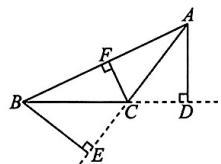

12. $\frac{16}{5}$ 13.C 14.C

15. 解:(1)如图, $\triangle A^{\prime}B^{\prime}C^{\prime}$ 即为所求.

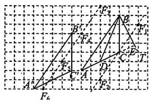

text_image

Geometric diagram with labeled points and lines on a grid, showing triangle constructions and intersections

(2)如图,线段 BD 即为所求.  
(3)如图,线段 BE 即为所求.   
(4)如图,满足条件的点 F 有 6 个.故答案为 6.

# 专题训练（一）与三角形中线或高相关的面积问题

1. 4.8 2. $\frac{21}{4}$ 3. $7\mathrm{cm}$ 4. 5 5. B   
6. B 7. B 8. A 9. 6 10. 2.4 2.5

# 专题训练（二） 三角形的角平分线与高的夹角探究

1. C 2. $\angle BCD = 30^{\circ}$ $\angle ECD = 20^{\circ}$ 3. $15^{\circ}$   
4. 解:(1)∵在△ABC中, $\angle B=46^{\circ},\angle C=80^{\circ}$ ,

$\therefore \angle BAC = 180^{\circ} - 46^{\circ} - 80^{\circ} = 54^{\circ}$ $\because AE$ 平分

$$
\angle B A C, \therefore \angle B A E = \frac {1}{2} \angle B A C = 2 7 ^ {\circ}.
$$

$$
\begin{array}{l} \because A D \perp B C, \therefore \angle A D B = 9 0 ^ {\circ}. \therefore \angle B A D = \\ 1 8 0 ^ {\circ} - \angle A D B - \angle B = 4 4 ^ {\circ}. \therefore \angle D A E = \\ \angle B A D - \angle B A E = 4 4 ^ {\circ} - 2 7 ^ {\circ} = 1 7 ^ {\circ}. \\ \end{array}
$$

(2) $\angle DAE = \frac{1}{2} (\angle C - \angle B)$ . 理由如下：

$$
\because A D \perp B C, \therefore \angle A D B = 9 0 ^ {\circ}. \therefore \angle B A D =
$$

$$
1 8 0 ^ {\circ} - \angle A D B - \angle B = 9 0 ^ {\circ} - \angle B.
$$

$$
\because \angle B A C + \angle B + \angle C = 1 8 0 ^ {\circ}, \therefore \angle B A C =
$$

$$
1 8 0 ^ {\circ} - \angle B - \angle C. \because A E \text {平分} \angle B A C,
$$

$$
\therefore \angle B A E = \frac {1}{2} \angle B A C = \frac {1}{2} (1 8 0 ^ {\circ} - \angle B -
$$

$$
\angle C) = 9 0 ^ {\circ} - \frac {1}{2} \angle B - \frac {1}{2} \angle C.
$$

$$
\therefore \angle D A E = \angle B A D - \angle B A E = 9 0 ^ {\circ} - \angle B ^ {-}
$$

$$
\left(9 0 ^ {\circ} - \frac {1}{2} \angle B - \frac {1}{2} \angle C\right) = \frac {1}{2} (\angle C - \angle B).
$$

# 13.3.1 第1课时 三角形的内角和定理

1. AB ∠2 ∠3 两直线平行, 同位角相等 $\angle A$ $\angle B$ $180^{\circ}$

2. 三角形内角和定理 3. A 4. B

5. C 6. 160 7. (1) $40^{\circ}$ (2) $100^{\circ}$

8. A 9. A 10. B 11. B 12. C 13. D

14. $65^{\circ}$ 15. $15^{\circ}$

16. 解：∵ 在 $\triangle BOC$ 中， $\angle BOC + \angle OBC + \angle OCB = 180^{\circ}$ ， $\angle BOC = 140^{\circ}$ ，∴ $\angle OBC + \angle OCB = 180^{\circ} - \angle BOC = 180^{\circ} - 140^{\circ} = 40^{\circ}$ .
∵ BO, CO 分别平分 ∠ABC, ∠ACB,
∴∠ABC=2∠OBC, ∠ACB=2∠OCB.
∴∠ABC+∠ACB=2(∠OBC+∠OCB)=2×40°=80°. ∴∠A=180°-(∠ABC+∠ACB)=180°-80°=100°.

# 第2课时 直角三角形的两个锐角互余

1. A 2. C 3. C

4. 解: $\triangle ABC$ 是直角三角形. 理由: $\because ED \perp AB, \therefore \angle ADE = 90^{\circ}.$ $\therefore \angle 1 + \angle A = 90^{\circ}$ . 又 $\because \angle 1 = \angle 2, \therefore \angle 2 + \angle A = 90^{\circ}.$ $\therefore \triangle ABC$ 是直角三角形.

5. C 6. B

7 证明:(1) $\because\angle ACB=90^{\circ},CD\perp AB,$ $\therefore\angle ACD+\angle BCD=90^{\circ},\angle B+\angle BCD=90^{\circ}.\therefore\angle ACD=\angle B.$ (2) 在 Rt△AFC 中，∠CFE=90°-∠CAF.
在 Rt△AED 中，∠AED=90°-∠DAE.
∵AF 平分∠CAB，
∴∠CAF=∠DAE. ∴∠AED=∠CFE.
又∵∠CEF=∠AED, ∴∠CEF=∠CFE.

8. $20^{\circ}$ 或 $60^{\circ}$

# 13.3.2 三角形的外角

# 知识梳理

1. 延长线 外角 2. 两个内角的和  
1. D 2. B 3. C 4. 11 5. 60 6. 95   
7. $24^{\circ}$ 8. 235 9. D 10. A 11. C   
12. 解: 如图, 延长 BD 交 AC 于点 E.

若零件为合格零件，则

$$
\angle D E C = \angle A + \angle B =
$$

$$
9 0 ^ {\circ} + 3 2 ^ {\circ} = 1 2 2 ^ {\circ}.
$$

$$
\text { 又 } \because \angle C = 2 1 ^ {\circ},
$$

$$
\therefore \angle B D C = \angle C + \angle D E C = 2 1 ^ {\circ} + 1 2 2 ^ {\circ} =
$$

$143^{\circ}$ . 而质检工人量得 $\angle BDC = 149^{\circ}$ , $\therefore$ 这个零件不合格.

13. (1) $94^{\circ}$ (2) $\angle BAC = \angle B + 2\angle E$   
14. 解:(1)根据三角形的外角性质,得 $\angle NBA=\angle AOB+\angle BAO=90^{\circ}+45^{\circ}=135^{\circ}$ . $\because BE$ 平分 $\angle NBA,AC$ 平分 $\angle BAO$ , $\therefore \angle ABE=\frac{1}{2}\angle NBA=67.5^{\circ},\angle BAC=\frac{1}{2}\angle BAO=22.5^{\circ}.\therefore \angle C=\angle ABE-$

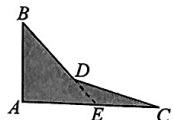

$$
\angle B A C = 6 7. 5 ^ {\circ} - 2 2. 5 ^ {\circ} = 4 5 ^ {\circ}.
$$

故答案为 45.

(2)根据三角形的外角性质,得 $\angle NBA=\angle AOB+\angle BAO=90^{\circ}+60^{\circ}=150^{\circ}$ .

∵BE 平分∠NBA, AC 平分∠BAO,

$$
\begin{array}{l} \therefore \angle A B E = \frac {1}{2} \angle N B A = 7 5 ^ {\circ}, \angle B A C = \\ \frac {1}{2} \angle B A O = 3 0 ^ {\circ}. \therefore \angle C = \angle A B E - \\ \end{array}
$$

$\angle BAC = 75^{\circ} - 30^{\circ} = 45^{\circ}$ . 故答案为 45.

(3) $\angle C$ 的度数不随点A,B的运动而发生变化.

理由:根据三角形的外角性质,得 $\angle NBA=\angle AOB+\angle BAO.$

∵BE 平分∠NBA, AC 平分∠BAO,

$$
\begin{array}{l} \therefore \angle A B E = \frac {1}{2} \angle N B A, \angle B A C = \\ \frac {1}{2} \angle B A O. \therefore \angle C = \angle A B E - \angle B A C = \\ \frac {1}{2} \angle N B A - \frac {1}{2} \angle B A O = \frac {1}{2} (\angle A O B + \\ \angle B A O) - \frac {1}{2} \angle B A O = \frac {1}{2} \angle A O B. \\ \end{array}
$$

$\because \angle AOB = 90^{\circ}, \therefore \angle C = 45^{\circ}.\therefore \angle C$ 的度数不随点 $A, B$ 的运动而发生变化.

# 专题训练（三） 三角形的角平分线模型

1. C 2. $115^{\circ}$ 3. (1) $70^{\circ}$ (2) $140^{\circ}$ $50^{\circ}$

4. (1)1 (2) $121^{\circ}$ (3) $129^{\circ}$

5. (1) $25^{\circ}$

(2) $\angle E=\frac{1}{2}(\angle BMN+\angle MNC-180^{\circ})$ . 证明略

# 方法点睛

证明：∵ BO, CO 分别是 $\angle CBD, \angle BCE$ 的平分线，

$$
\begin{array}{l} \therefore \angle O B C = \frac {1}{2} \angle C B D, \angle O C B = \frac {1}{2} \angle B C E. \\ \angle O C B = 1 8 0 ^ {\circ} - \frac {1}{2} \angle C B D - \frac {1}{2} \angle B C E = 1 8 0 ^ {\circ} - \\ \frac {1}{2} (\angle C B D + \angle B C E) = 1 8 0 ^ {\circ} - \frac {1}{2} (1 8 0 ^ {\circ} - \\ \angle A B C + 1 8 0 ^ {\circ} - \angle A C B) = 1 8 0 ^ {\circ} - \frac {1}{2} [ 3 6 0 ^ {\circ} - \\ (1 8 0 ^ {\circ} - \angle A) ] = 9 0 ^ {\circ} - \frac {1}{2} \angle A. \\ \end{array}
$$

∴ 在 $\triangle OBC$ 中， $\angle BOC = 180^{\circ} - \angle OBC -$

也可以理解成：∵BO,CO分别是∠CBD,∠BCE的平分线，

$$
\therefore \angle O B C = \frac {1}{2} \angle C B D, \angle O C B = \frac {1}{2} \angle B C E.
$$

$\because \angle CBD$ 和 $\angle BCE$ 是 $\triangle ABC$ 的外角，

$$
\begin{array}{l} \therefore \angle C B D = \angle A + \angle A C B, \angle B C E = \\ \angle A + \angle A B C. \end{array}
$$

∴ 在 $\triangle OBC$ 中， $\angle BOC = 180^{\circ} - \angle OBC -$

$$
\angle O C B = 1 8 0 ^ {\circ} - \frac {1}{2} \angle C B D - \frac {1}{2} \angle B C E = 1 8 0 ^ {\circ} -
$$

$$
\frac {1}{2} (\angle A + \angle A C B + \angle A + \angle A B C) = 1 8 0 ^ {\circ} -
$$

$$
\frac {1}{2} (1 8 0 ^ {\circ} + \angle A) = 9 0 ^ {\circ} - \frac {1}{2} \angle A.
$$

6. (1) $50^{\circ}$ (2) $60^{\circ}$

7. 解: (1) $70^{\circ}$

$$
\begin{array}{l} {(2) \because \angle C B E = \angle A + \angle A C B, \angle B C D =} \\ {\angle A + \angle A B C,} \end{array}
$$

$$
\begin{array}{l} \therefore \angle C B E + \angle B C D = 1 8 0 ^ {\circ} + \angle A. \\ \because \angle C B N = \frac {3}{8} \angle C B E, \angle B C M = \frac {3}{8} \angle B C D, \\ \therefore \angle C B N + \angle B C M = \frac {3}{8} \angle C B E + \\ \frac {3}{8} \angle B C D = \frac {3}{8} (\angle C B E + \angle B C D) = \\ \frac {3}{8} (1 8 0 ^ {\circ} + \angle A) = \frac {3}{8} \times 2 6 0 ^ {\circ} = 9 7. 5 ^ {\circ}, \\ \therefore \angle B O C = 1 8 0 ^ {\circ} - (\angle C B N + \angle B C M) = \\ 1 8 0 ^ {\circ} - 9 7. 5 ^ {\circ} = 8 2. 5 ^ {\circ}. \\ \end{array}
$$

(3)0<n<60. 理由如下：

由(2)可知： $\angle BCD + \angle CBE = 180^{\circ} + \angle A.$

$$
\because \angle C B N = \frac {3}{4} \angle C B E, \angle B C M = \frac {3}{4} \angle B C D,
$$

$$
\therefore \angle C B N + \angle B C M = \frac {3}{4} \angle C B E +
$$

$$
\frac {3}{4} \angle B C D = \frac {3}{4} (\angle C B E + \angle B C D) =
$$

$$
\frac {3}{4} (1 8 0 ^ {\circ} + \angle A) = \frac {3}{4} \times 1 8 0 ^ {\circ} + \frac {3}{4} \angle A =
$$

$135^{\circ} + \frac{3}{4} n^{\circ},\therefore$ 当射线 $CM$ 与 $BN$ 相交时，

$180^{\circ} - \left(135^{\circ} + \frac{3}{4} n^{\circ}\right) > 0$ ，解得 $n < 60$

∴n 的取值范围是 0<n<60.

# 专题训练（四）与三角形的角相关的常见模型

1. A 2. ${180}^{ \circ  }\;{180}^{ \circ  }\;{180}^{ \circ  }\;{360}^{ \circ  }$

3. $55^{\circ}$ 4. $100^{\circ}$ 5. 70 6. 240

# 数学活动 多边形的三角剖分

1. (1)1 2 (2)3 4

$$
(3) (n - 2) \quad (n - 2) \times 1 8 0 ^ {\circ}
$$

$$
(4) 8 \quad 1 4 4 0 ^ {\circ} \quad (5) D
$$

2. 解:【结论】当 n=3 时, $\frac{D_{4}}{D_{3}}=\frac{4\times3-6}{3}=2.$

$$
\text { 又 } \because D _ {3} = 1, \therefore D _ {4} = 2.
$$

当 $n = 4$ 时， $\frac{D_5}{D_4} = \frac{4\times 4 - 6}{4} = 2.5.$

$$
\text { 又 } \because D _ {4} = 2, \therefore D _ {5} = 5.
$$

当 $n = 5$ 时， $\frac{D_6}{D_5} = \frac{4\times 5 - 6}{5} = 2.8.$

$$
\text { 又 } \because D _ {5} = 5, \therefore D _ {6} = 1 4.
$$

【应用】当 $n = 6$ 时， $\frac{D_7}{D_6} = \frac{4\times 6 - 6}{6} = 3.$

又 $\because D_{6} = 14, \therefore D_{7} = 42.$

当 $n = 7$ 时， $\frac{D_8}{D_7} = \frac{4\times 7 - 6}{7} = \frac{22}{7}$

又 $\because D_{7} = 42, \therefore D_{8} = 132.$

当 $n = 8$ 时， $\frac{D_9}{D_8} = \frac{4\times 8 - 6}{8} = \frac{13}{4}.$

又 $\because D_{8} = 132, \therefore D_{9} = 429.$

故用九边形的对角线把九边形分割成7个三角形，共有429种不同的分割方案.

# 本章考点专练

# 知识结构关系

①大于 ②小于 ③内 ④重心 ⑤内 ⑥稳定 ⑦不稳定 ⑧ $180^{\circ}$ ⑨等于

1. C 2. $5\mathrm{cm}$ 3. C 4. D

5. B 6. 3 7. D 8. A 9. 80

10. $\angle A = 50^{\circ}$ $\angle B = 60^{\circ}$ $\angle C = 70^{\circ}$

11. 解:(1) $\because\angle A=50^{\circ},\angle C=30^{\circ},$

$$
\therefore \angle B D O = \angle A + \angle C = 8 0 ^ {\circ}.
$$

$$
\text { 又 } \because \angle B O D = 7 0 ^ {\circ},
$$

$$
\therefore \angle B = 1 8 0 ^ {\circ} - \angle B D O - \angle B O D = 3 0 ^ {\circ}.
$$

$$
(2) \angle B O C = \angle A + \angle B + \angle C.
$$

证明： $\because \angle BEC = \angle A + \angle B$

$$
\begin{array}{l} \therefore \angle B O C = \angle B E C + \angle C = \angle A + \\ \angle B + \angle C. \end{array}
$$

12. A 13. C

# 第十四章 全等三角形

# 14.1 全等三角形及其性质

# 知识梳理

1. 形状、大小相同 2. 重合

3. 相等 相等

1. C 2. D 3. D

4. $\triangle CBD$ CB BD $\angle CDB$

5. D 6. C 7. $100^{\circ}$

8. $FC = 3\mathrm{cm}$ $\angle D = 105^{\circ}$

9. D 10. B

11. (1)6 (2)(6,2) (3) $90^{\circ}$

12. (1)4t (16-4t) at

(2) $a$ 的值为 $6, t$ 的值为 2 或 $a$ 的值为 $4, t$ 的值为 1

# 14.2 第1课时 三角形全等的判定（一）（“SAS”）

# 知识梳理

两边和它们的夹角 SAS

1. C 2. A 3. $\triangle ADC$ SAS

4. 略 5. B 6. 略 7. 略

8. C 9. C 10. 略

11. 解:(1) $\angle DFC$ 的度数不发生变化.

在 $\triangle ABD$ 和 $\triangle CAE$ 中， $\left\{\begin{aligned}AB&=CA,\\ \angle B&=\angle CAE,\\ BD&=AE,\end{aligned}\right.$

$$
\therefore \triangle A B D \cong \triangle C A E (\mathrm{SAS}).
$$

$$
\therefore \angle B A D = \angle A C E.
$$

$$
\therefore \angle D F C = \angle D A C + \angle A C E = \angle D A C +
$$

$$
\angle B A D = \angle B A C = 6 0 ^ {\circ}.
$$

(2) 不改变.

理由如下: 当点 D, E 分别运动到 CB, BA 的延长线上时, 如图.

$$
\because \angle A B D = 1 8 0 ^ {\circ} -
$$

$$
\angle A B C = 1 2 0 ^ {\circ},
$$

$$
\angle C A E = 1 8 0 ^ {\circ} -
$$

$$
\angle B A C = 1 2 0 ^ {\circ},
$$

$$
\therefore \angle A B D = \angle C A E.
$$

在 $\triangle ABD$ 和 $\triangle CAE$ 中，

$$
\left\{ \begin{array}{l} A B = C A, \\ \angle A B D = \angle C A E, \\ B D = A E, \end{array} \right.
$$

$$
\therefore \triangle A B D \cong \triangle C A E (\mathrm{SAS}). \therefore \angle D = \angle E.
$$

$$
\because \angle E A F = \angle B A D,
$$

$$
\therefore \angle D F C = \angle E A F + \angle E = \angle B A D +
$$

$$
\angle D = \angle A B C = 6 0 ^ {\circ}.
$$

# 第2课时 三角形全等的判定（二）（“ASA”“AAS”）

# 知识梳理

1. 两角和它们的夹边 角边角
2. 两角分别相等且其中一组等角的对边相等

1. A 2. $\angle B = \angle D$ 3. 略

4. 证明： $\because \angle B = \angle E = \angle ACD = 60^{\circ}$ ，

$$
\therefore \angle B A C = 1 8 0 ^ {\circ} - \angle B - \angle A C B = 1 2 0 ^ {\circ} -
$$

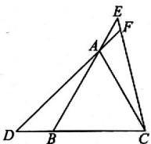

$$
\begin{array}{r l} & {\angle A C B, \angle E C D = 1 8 0 ^ {\circ} - \angle A C D - \angle A C B =} \\ & {1 2 0 ^ {\circ} - \angle A C B, \therefore \angle B A C = \angle E C D.} \end{array}
$$

在 $\triangle ABC$ 和 $\triangle CED$ 中， $\left\{\begin{aligned}\angle BAC&=\angle ECD,\\ AB&=CE,\\ \angle B&=\angle E,\end{aligned}\right.$

$$
\therefore \triangle A B C \cong \triangle C E D (\mathrm{ASA}), \therefore B C = D E.
$$

5.C

6 解: $\triangle ABC \cong \triangle ADE$ . 理由: $\because \angle ADC = \angle B + \angle 1 = \angle 2 + \angle ADE, \angle 1 = \angle 2,$

$\therefore \angle B = \angle ADE.$ 在 $\triangle ABC$ 和 $\triangle ADE$ 中， $\left\{ \begin{array}{l}\angle B = \angle ADE,\\ \angle C = \angle E,\quad \therefore \triangle ABC\cong \triangle ADE(AAS).\\ AC = AE, \end{array} \right.$

7. 32 8. (-2,3)

9. 解: $\triangle OBE \cong \triangle OCD$ . 理由如下: $\because \triangle ABD \cong \triangle ACE, \therefore \angle B = \angle C, AB = AC, AD = AE.$

$\therefore AB - AE = AC - AD$ ，即 $BE = CD.$ 在 $\triangle OBE$ 和 $\triangle OCD$ 中， $\left\{ \begin{array}{l}\angle BOE = \angle COD,\\ \angle B = \angle C,\\ BE = CD, \end{array} \right.$ $\therefore \triangle OBE\cong \triangle OCD(AAS).$

10. 略

11. (1) 当 $0 \leqslant t \leqslant 2$ 时, $BP = (6 - 3t)\mathrm{cm}$ , 当 $2 < t \leqslant 4$ 时, $BP = (3t - 6)\mathrm{cm}$ .

(2)1.5或3

# 第3课时 三角形全等的判定（三）（“SSS”）

1. D 2. A 3. (1)证明略 (2) $80^{\circ}$

4. SSS 5. B 6. D 7. C

8. 证明: 在 $\triangle ABD$ 和 $\triangle ACE$ 中, $\left\{\begin{aligned}AB&=AC,\\ AD&=AE,\\ BD&=CE,\end{aligned}\right.$

$$
\therefore \triangle A B D \cong \triangle A C E (\mathrm{SSS}).
$$

$$
\therefore \angle B A D = \angle 1, \angle A B D = \angle 2.
$$

$$
\because \angle 3 = \angle B A D + \angle A B D, \therefore \angle 3 = \angle 1 + \angle 2.
$$

9. D 10. 20 11. 略

12. 证明：(1) $\because \angle BGE = \angle BAG + \angle ABG,$ $\angle BAC = \angle BAG + \angle CAF, \angle BAC =$

$$
\angle B G E, \therefore \angle B A G + \angle A B G = \angle B A G +
$$

$$
\angle C A F, \therefore \angle A B G = \angle C A F. \text {又} \because \angle E F C =
$$

$$
\angle C A F + \angle A C F, \angle B A C = \angle E F C,
$$

$$
\therefore \angle B A G + \angle C A F = \angle C A F + \angle A C F,
$$

$$
\therefore \angle B A G = \angle A C F.
$$

在 $\triangle ABG$ 和 $\triangle CAF$ 中， $\left\{\begin{aligned}\angle ABG&=\angle CAF,\\ AB&=CA,\\ \angle BAG&=\angle ACF,\end{aligned}\right.$

$$
\therefore \triangle A B G \cong \triangle C A F (\text { ASA }), \therefore A G = C F.
$$

(2)在 $\triangle ABC$ 中， $AB=AC, \angle BAC=90^{\circ}$ ，

$$
\therefore \angle A B C = \angle A C B = 4 5 ^ {\circ}. \because C F \perp A C,
$$

$$
\begin{array}{l} \therefore \angle D C E = \angle F C E = 4 5 ^ {\circ}, \angle F + \\ \angle C A F = 9 0 ^ {\circ}. \end{array}
$$

$$
\because A E \perp B D, \therefore \angle C A F + \angle A D B = 9 0 ^ {\circ},
$$

$$
\therefore \angle F = \angle A D B.
$$

又 $\because \angle ADB = \angle CDE, \therefore \angle CDE = \angle F.$

在 $\triangle CDE$ 和 $\triangle CFE$ 中， $\left\{\begin{aligned}\angle DCE&=\angle FCE,\\ \angle CDE&=\angle F,\\ CE&=CE,\end{aligned}\right.$

$$
\therefore \triangle C D E \cong \triangle C F E (\mathrm{AAS}), \therefore D C = F C.
$$

$$
\because \angle B A C = 9 0 ^ {\circ}, C F \perp A C, \therefore \angle A C F =
$$

$\angle BAD = 90^{\circ}$ .在 $\triangle ACF$ 和 $\triangle BAD$ 中，

$$
\left\{ \begin{array}{l l} \angle A C F = \angle B A D, \\ \angle F = \angle A D B, \\ A C = B A, \end{array} \right. \quad \therefore \triangle A C F \cong \triangle B A D
$$

$$
(\mathrm{AAS}), \therefore A D = F C, \therefore A D = D C.
$$

# 第4课时 与全等三角形判定有关的尺规作图

1. OC C' CD SSS

2. A 3. 略 4. 56 5. 略

6. 解: ① 当所作的角在 BC 上方时, 如图.

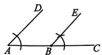

②当所作的角在 BC 下方时, 如图.

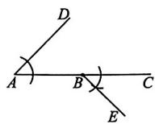

# 第5课时 直角三角形全等的判定（“HL”）知识梳理

斜边和一直角边

1. A 2. AC = DF (或 AD = CF) 3. 略

4. C

5. 解: AC = DB. 理由: $\because AC \perp BC, DB \perp BC,$ $\therefore \triangle ACB$ 与 $\triangle DBC$ 均为直角三角形. 由题意得 BA = CD. 在 Rt $\triangle ACB$ 与 Rt $\triangle DBC$

中， $\left\{\begin{aligned}BA&=CD,\\ CB&=BC,\end{aligned}\right.$ $\therefore Rt\triangle ACB\cong Rt\triangle DBC$ (HL). $\therefore AC = DB.$

6. $CE \parallel DF$ . 理由略

7. B 8. 2 9. 2 或 4 10. 略

11. 解: (1) $\triangle ACP$ 与 $\triangle BPQ$ 全等, $PC \perp PQ$ . 理由如下: 当 t = 2 时, $AP = BQ = 2 \times 2 = 4$ ,

$$
B P = A B - A P = 1 2 - 4 = 8 = A C. \because A C \perp
$$

$$
A B, B D \perp A B, \therefore \angle P A C = \angle P B Q = 9 0 ^ {\circ}.
$$

在 $\triangle PAC$ 和 $\triangle QBP$ 中， $\left\{\begin{aligned}AP&=BQ,\\ \angle CAP&=\angle PBQ,\\ AC&=BP,\end{aligned}\right.$

$$
\therefore \triangle P A C \cong \triangle Q B P, \therefore \angle A P C = \angle P Q B.
$$

$$
\because \angle P Q B + \angle Q P B = 9 0 ^ {\circ}, \therefore \angle A P C +
$$

$$
\angle Q P B = 9 0 ^ {\circ}, \therefore \angle C P Q = 9 0 ^ {\circ} \text {, 即} P C \perp P Q.
$$

(2) 存在实数 $x$ , 使得 $\triangle ACP$ 与 $\triangle BPQ$ 全等. 理由如下:

若 $\triangle ACP\cong \triangle BQP$ ，则 $AC = BQ,AP = BP$

即 $\left\{ \begin{array}{l}8 = xt,\\ 2t = 12 - 2t, \end{array} \right.$ 解得 $\left\{ \begin{array}{l}x = \frac{8}{3},\\ t = 3; \end{array} \right.$

若 $\triangle ACP\cong \triangle BPQ$ ，则 $AC = BP,AP = BQ$

即 $\left\{ \begin{array}{l}8 = 12 - 2t,\\ xt = 2t, \end{array} \right.$ 解得 $\left\{ \begin{array}{l}x = 2,\\ t = 2. \end{array} \right.$

# 专题训练（五） 证明三角形全等的基本模型

1. 解:(1)证明: $\because \angle AOB = \angle COD$ ,

$$
\therefore \angle A O B + \angle B O C = \angle C O D + \angle B O C,
$$

$$
\therefore \angle A O C = \angle B O D.
$$

在 $\triangle AOC$ 和 $\triangle BOD$ 中， $\left\{\begin{aligned}OA&=OB,\\ \angle AOC&=\angle BOD,\\ OC&=OD,\end{aligned}\right.$

$$
\therefore \triangle A O C \cong \triangle B O D (\mathrm{SAS}).
$$

$$
\therefore A C = B D.
$$

(2)如图所示,设 AC 与 OB 交于点 E.

$$
\because \triangle A O C \cong \triangle B O D,
$$

$$
\therefore \angle O A C = \angle O B D.
$$

$$
\text { 又 } \because \angle B E P = \angle A E O,
$$

$$
\therefore \angle A P B = 1 8 0 ^ {\circ} -
$$

$$
(\angle O B D + \angle B E P) = 1 8 0 ^ {\circ} - (\angle O A C +
$$

$$
\angle A E O) = \angle A O B = 6 0 ^ {\circ}.
$$

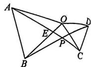

2. $AE = BF, AE \perp BF$ . 证明略

3. 解:(1)证明: $\because \angle ACB = \angle DCE = \alpha$ ,

$$
\therefore \angle A C B + \angle B C D = \angle D C E + \angle B C D,
$$

$$
\therefore \angle A C D = \angle B C E. \text {   又   } \because C A = C B, C D =
$$

$$
C E, \therefore \triangle A C D \cong \triangle B C E (\text { SAS }).
$$

(2) 证明: 如图, 过点 $C$ 作 $CM \perp AH$ 于点 $M, CN \perp BE$ 于点 $N$ .

$$
\because \triangle A C D \cong \triangle B C E, \therefore S _ {\triangle A C D} = S _ {\triangle B C E}, A D =
$$

$$
B E, \therefore \frac {1}{2} A D \cdot C M = \frac {1}{2} B E \cdot C N, \therefore C M =
$$

$$
C N. \because C M \perp A H, C N \perp B E, \therefore \angle C M H =
$$

$$
\angle C N H = 9 0 ^ {\circ}. \text {在} \mathrm{Rt} \triangle C H M \text {和} \mathrm{Rt} \triangle C H _ {N}
$$

中， $\left\{ \begin{array}{l} CM = CN, \\ CH = CH, \end{array} \right.\therefore \mathrm{Rt}\triangle CHM\cong \mathrm{Rt}\triangle CHN$

$$
(\mathrm{HL}), \therefore \angle C H M = \angle C H N,
$$

∴HC平分∠AHE.

(3) 如图, 设 BC 与

$AD$ 相交于点 $F$ .

$$
\because \triangle A C D \cong \triangle B C E,
$$

$$
\therefore \angle C A D = \angle C B E.
$$

$$
\because \angle B F H = \angle A F C, \therefore \angle A H B = \angle A C B = _ {\alpha},
$$

$$
\therefore \angle A H E = 1 8 0 ^ {\circ} - \alpha ,
$$

$$
\therefore \angle C H E = \frac {1}{2} \angle A H E = 9 0 ^ {\circ} - \frac {1}{2} \alpha .
$$

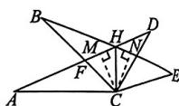

4. 略

5. 解:(1)证明:∵BD⊥直线m,CE⊥直线m,

$$
\therefore \angle B D A = \angle A E C = 9 0 ^ {\circ}.
$$

$$
\therefore \angle B A D + \angle A B D = 9 0 ^ {\circ}.
$$

$$
\because \angle B A C = 9 0 ^ {\circ}, \therefore \angle B A D + \angle C A E = 9 0 ^ {\circ}.
$$

$$
\therefore \angle A B D = \angle C A E.
$$

在 $\triangle ADB$ 和 $\triangle CEA$ 中， $\left\{\begin{aligned}\angle BDA&=\angle AEC,\\ \angle ABD&=\angle CAE,\\ AB&=CA,\end{aligned}\right.$

$$
\therefore \triangle A D B \cong \triangle C E A (\mathrm{AAS}). \therefore B D = A E,
$$

$$
A D = C E. \therefore D E = A E + A D = B D + C E.
$$

(2) 成立.

证明： $\because \angle BDA = \angle BAC = \alpha$

$$
\therefore \angle D B A + \angle B A D = \angle B A D + \angle E A C =
$$

$$
1 8 0 ^ {\circ} - \alpha . \therefore \angle D B A = \angle E A C.
$$

在 $\triangle ADB$ 和 $\triangle CEA$ 中， $\left\{\begin{aligned}\angle BDA&=\angle AEC,\\ \angle DBA&=\angle EAC,\\ AB&=CA,\end{aligned}\right.$

$$
\therefore \triangle A D B \cong \triangle C E A (\mathrm{AAS}). \therefore B D = A E,
$$

$$
A D = C E. \therefore D E = A E + A D = B D + C E.
$$

(3)不成立.

理由：∵ $\angle BDF = \angle DEC, \therefore \angle BDA =$

$$
\angle A E C. \because \angle B D F = \angle D B A + \angle B A D,
$$

$$
\angle B A C = \angle E A C + \angle B A D, \angle B D F =
$$

$$
\angle B A C, \therefore \angle D B A = \angle E A C.
$$

在 $\triangle ADB$ 和 $\triangle CEA$ 中， $\left\{\begin{aligned}\angle DBA&=\angle EAC,\\ \angle BDA&=\angle AEC,\\ AB&=CA,\end{aligned}\right.$

$$
\therefore \triangle A D B \cong \triangle C E A (\mathrm{AAS}). \therefore B D = A E,
$$

$$
A D = C E. \therefore D E = A D - A E = C E - B D.
$$

# 14.3 第1课时 角的平分线的画法及性质

1. B 2. SSS 3. 略 4. C 5. B 6. C

7. 30

8. 证明：∵ CD ⊥ AB, BE ⊥ AC，且 ∠1 = ∠2，

$$
\therefore O D = O E, \angle O D B = \angle O E C = 9 0 ^ {\circ}.
$$

在 $\triangle OBD$ 和 $\triangle OCE$ 中， $\left\{\begin{aligned}\angle ODB&=\angle OEC,\\ OD&=OE,\\ \angle BOD&=\angle COE,\end{aligned}\right.$

$$
\therefore \triangle O B D \cong \triangle O C E (\mathrm{ASA}). \therefore O B = O C.
$$

9. C 10. $\frac{63}{2}$

11. (1)1 (2)121 (3)①略 ② $129^{\circ}$

12. 解:(1)证明: $\because \angle C = 90^{\circ}, \therefore EC \perp CD.$ 又 $\because EF\perp AD, DE$ 平分 $\angle ADC, \therefore EF=EC.$ $\because E$ 为 BC 的中点, $\therefore EB=EC, \therefore EF=EB.$

在 Rt△AEB 和 Rt△AEF 中， $\left\{\begin{aligned}AE&=AE,\\ EB&=EF,\end{aligned}\right.$

$\therefore \mathrm{Rt} \triangle AEB \cong \mathrm{Rt} \triangle AEF, \therefore \angle BAE = \angle FAE, \therefore AE$ 是 $\angle DAB$ 的平分线.

(2) $E$ 为线段 $BC$ 的中点.

理由: 过点 E 作 AB 的垂线, 交 AB 的延长线于点 F, 交 CD 于点 G, 如图.

∵ AB∥CD,

$\therefore FG \perp CD.$

作 $EP \perp AD$ 于点 $P$ , 由角平分线的性质可得 $EF = EP = EG$ .

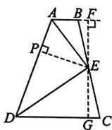

在 $\triangle BEF$ 与 $\triangle CEG$ 中，

$$
\left\{ \begin{array}{l} \angle E F B = \angle E G C = 9 0 ^ {\circ}, \\ E F = E G, \\ \angle B E F = \angle C E G, \end{array} \right.
$$

$\therefore \triangle BEF \cong \triangle CEG(ASA)$ ,

$\therefore BE = CE, \therefore E$ 为线段 $BC$ 的中点.

(3)6

# 第2课时 角的平分线的判定

1. A 2. A

3. 解: 如图, 点 D 即为所求.

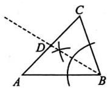

4. 略 5. 4:5:6

6. 解: 已知: 如图, 在 $\triangle ABC$ 中, 角平分线 $BM$ 与 $CN$ 相交于点 $P$ , 过点 $P$ 分别作 $AB, BC, AC$ 的垂

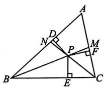

线，垂足分别为 D, E, F.

求证: $\angle A$ 的平分线经过点 P，且 PD = PE = PF.

证明：∵BM 是△ABC 的角平分线，点 P 在 BM 上，且 $PD \perp AB, PE \perp BC$ ，

$\therefore PD = PE$ （角的平分线上的点到角的两边的距离相等). 同理， $PE = PF.$ $\therefore PD = PE = PF.$

∴点 P 在 $\angle A$ 的平分线上（角的内部到角的两边的距离相等的点在角的平分线上），即 $\angle A$ 的平分线经过点 P.

故三角形的三条角平分线相交于一点，并且这一点到三条边的距离相等.

7. B 8. D 9. B

10. 解: 工厂的位置应选在 $\angle A$ 的平分线上, 且距点 A 1 cm 处(图略).

11. 证明: 过点 D 分别作 $DE \perp BQ$ 于点 E, $DF \perp AC$ 于点 F, $DG \perp BP$ 于点 G, 如图.

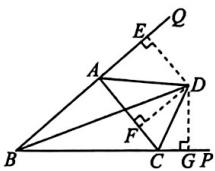

∵BD, CD分别是∠ABC与∠ACP的平分线，∴DE=DG, DF=DG.

$$
\therefore D E = D F. \text {又} \because D E \perp B Q, D F \perp A C,
$$

∴AD 是△ABC 的外角∠CAQ 的平分线.

12. 解:(1) $\because EF\perp AB,\angle AEF=40^{\circ},$

$$
\therefore \angle F A E = 9 0 ^ {\circ} - \angle A E F = 9 0 ^ {\circ} - 4 0 ^ {\circ} = 5 0 ^ {\circ}.
$$

$$
\text { 又 } \because \angle B A D = 8 0 ^ {\circ},
$$

$$
\begin{array}{l} \therefore \angle C A D = 1 8 0 ^ {\circ} - \angle B A D - \angle F A E = \\ 1 8 0 ^ {\circ} - 8 0 ^ {\circ} - 5 0 ^ {\circ} = 5 0 ^ {\circ}. \end{array}
$$

(2) 证明: 过点 E 分别作 $EG \perp AD$ 于点 G, $EH \perp BC$ 于点 H, 如图.

$$
\because \angle F A E =
$$

$$
\angle C A D = 5 0 ^ {\circ},
$$

$$
E F \perp B F,
$$

$$
E G \perp A D,
$$

$$
\therefore E F = E G.
$$

∵ BE 平分∠ABC, EF⊥BF, EH⊥BC,

$\therefore EF = EH, \therefore EG = EH.$ 又 $\because EG \perp AD,$ $EH \perp BC, \therefore DE$ 平分 $\angle ADC.$

(3) $\because S_{\triangle ACD} = 10.2, \therefore \frac{1}{2} AD \cdot EG +$

$\frac{1}{2} CD \cdot EH = 10.2$ ，即 $\frac{1}{2} \times 3EG + \frac{1}{2} \times$

7.2EG=10.2.∴EG=2.∴EF=EG=2.

∴△ABE 的面积= $\frac{1}{2}AB\cdot EF=\frac{1}{2}\times6\times2=6.$

# 专题训练（六） 构造全等三角形的常用辅助线方法

1. 6 2. (1)证明略 (2)10

3. 证明: 如图, 延长 BO, AE 交于点 F.

∵ BD 平分 ∠ABO,

$$
\therefore \angle 1 = \angle 2.
$$

$$
\because A E \perp B D,
$$

$$
\therefore \angle A E B =
$$

$$
\angle F E B = 9 0 ^ {\circ}.
$$

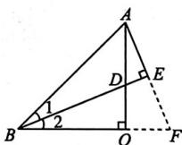

在 $\triangle ABE$ 和 $\triangle FBE$ 中， $\left\{\begin{aligned}\angle1&=\angle2,\\ BE&=BE,\\ \angle AEB&=\angle FEB,\end{aligned}\right.$

$\therefore \triangle ABE \cong \triangle FBE(ASA). \therefore AE = FE.$

$$
\because \angle A O B = \angle A E D = 9 0 ^ {\circ}, \angle A D E = \angle B D O,
$$

$$
\therefore \angle 2 = \angle O A F.
$$

$$
\because \angle A O B = 9 0 ^ {\circ}, \therefore \angle A O F = 9 0 ^ {\circ} = \angle A O B.
$$

在 $\triangle OBD$ 和 $\triangle OAF$ 中， $\left\{\begin{aligned}\angle2&=\angle OAF,\\ OB&=OA,\\ \angle BOD&=\angle AOF,\end{aligned}\right.$

$$
\therefore \triangle O B D \cong \triangle O A F (\mathrm{ASA}). \therefore B D = A F.
$$

$$
\text {又} \because A E = F E, \therefore B D = 2 A E.
$$

4. 证明: 如图, 在 BC 上截取 BF, 使得 BF = AB, 连接 DF.

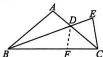

∵ BD 是△ABC 的角平分线，∠ABC=40°，
∴ $\angle ABD = \angle FBD = 20^{\circ}$ .

在 $\triangle ABD$ 和 $\triangle FBD$ 中， $\left\{ \begin{array}{l} AB = FB, \\ \angle ABD = \angle FBD, \\ BD = BD, \end{array} \right.$

$$
\therefore \triangle A B D \cong \triangle F B D (\mathrm{SAS}). \therefore D A = D F,
$$

$$
\angle A = \angle B F D. \because D E = D A, \therefore D E = D F.
$$

$$
\because A B = A C, \therefore \angle A C B = \angle A B C = 4 0 ^ {\circ}.
$$

$$
\therefore \angle A = 1 0 0 ^ {\circ}. \therefore \angle D F C = 1 8 0 ^ {\circ} - \angle B F D =
$$

$$
1 8 0 ^ {\circ} - \angle A = 8 0 ^ {\circ}. \therefore \angle F D C = 6 0 ^ {\circ}.
$$

$$
\because \angle E D C = \angle A D B = 1 8 0 ^ {\circ} - \angle A B D - \angle A =
$$

$$
1 8 0 ^ {\circ} - 2 0 ^ {\circ} - 1 0 0 ^ {\circ} = 6 0 ^ {\circ}, \therefore \angle E D C = \angle F D C.
$$

在 $\triangle DCE$ 和 $\triangle DCF$ 中， $\left\{\begin{aligned}DE&=DF,\\ \angle EDC&=\angle FDC,\\ DC&=DC,\end{aligned}\right.$

$$
\therefore \triangle D C E \cong \triangle D C F (\text { SAS }).
$$

$$
\therefore \angle E C A = \angle D C B = 4 0 ^ {\circ}.
$$

5. 解:(1)作图如图①.

证明：∵ AD 平

分∠CAB，

$$
\therefore \angle M A D = \angle C A D.
$$

在 $\triangle AMD$ 和 $\triangle ACD$

中， $\left\{\begin{aligned}AM&=AC,\\ \angle MAD&=\angle CAD,\\ AD&=AD,\end{aligned}\right.$

$$
\therefore \triangle A M D \cong \triangle A C D (\mathrm{SAS}).
$$

$$
\therefore M D = C D, \angle A M D = \angle C.
$$

$$
\because \angle C = 2 \angle B, \therefore \angle A M D = 2 \angle B.
$$

$$
\text { 又 } \because \angle A M D = \angle B + \angle M D B,
$$

$$
\therefore \angle B = \angle M D B.
$$

$$
\because M N \perp B D, \therefore \angle M N B = \angle M N D = 9 0 ^ {\circ}.
$$

在 $\triangle MBN$ 和 $\triangle MDN$ 中， $\left\{\begin{aligned}\angle B&=\angle MDN,\\ \angle MNB&=\angle MND,\\ MN&=MN,\end{aligned}\right.$

$$
\therefore \triangle M B N \cong \triangle M D N (\mathrm{AAS}). \therefore M B = M D.
$$

$$
\therefore A B = A M + M B = A C + M D = A C + C D.
$$

(2)作图如图②.

证明：∵AD平分∠CAB，

$$
\therefore \angle B A D = \angle H A D.
$$

在 $\triangle ABD$ 和

$\triangle AHD$ 中，

$\left\{ \begin{array}{l} AB = AH, \\ \angle BAD = \angle HAD, \\ AD = AD, \end{array} \right.$

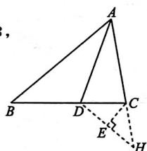

text_image

Geometric diagram of triangle ABC with points D, E, H and auxiliary lines, labeled with vertices and a right angle at E.

图②

$$
\therefore \triangle A B D \cong \triangle A H D (\mathrm{SAS}). \therefore \angle B =
$$

$$
\angle A H D. \because \angle A C B = 2 \angle B, \angle A C B =
$$

$$
\angle A H D + \angle C D H, \therefore 2 \angle B = \angle A H D +
$$

$$
\angle C D H. \therefore \angle A H D = \angle C D H. \because C E \perp
$$

$$
D H, \therefore \angle C E D = \angle C E H = 9 0 ^ {\circ}.
$$

在 $\triangle CDE$ 和 $\triangle CHE$ 中， $\left\{\begin{aligned}\angle CDE&=\angle CHE,\\ \angle CED&=\angle CEH,\\ CE&=CE,\end{aligned}\right.$

$$
\therefore \triangle C D E \cong \triangle C H E (\mathrm{AAS}). \therefore C D = C H.
$$

$$
\text {又} \because A B = A H = A C + C H,
$$

$$
\therefore A B = A C + C D.
$$

6. 1.5 < AD < 6.5 7. (1) SAS (2) 证明略

# 本章考点专练

# 知识结构关系

①SSS ②SAS ③SAS ④HL ⑤ASA

⑥SAS ⑦AAS ⑧AAS

⑨HL ⑩ASA ⑪AAS

1. A 2. A 3. A 4. B 5. B 6. D

7. (1) 证明: $\because AC \perp BC, DC \perp EC, \therefore \angle ACB = \angle DCE = 90^{\circ}.$ $\therefore \angle ACB + \angle BCE = \angle DCE + \angle BCE$ , 即 $\angle ACE = \angle BCD$ .

在 $\triangle ACE$ 和 $\triangle BCD$ 中， $\left\{\begin{aligned}AC&=BC,\\ \angle ACE&=\angle BCD,\\ EC&=DC,\end{aligned}\right.$ $\therefore \triangle ACE \cong \triangle BCD (SAS). \therefore AE = BD.$ (2) $90^{\circ}$

8. A 9. A 10. 2

11. (1) 证明: $\because CD$ 平分 $\angle ACB$ ,

$$
\begin{array}{l} \therefore \angle A C D = \angle B C D. \\ \because \angle C A O = 9 0 ^ {\circ} - \angle B D O, \angle C B D + \\ \angle B D O = 9 0 ^ {\circ}, \therefore \angle C A O = \angle C B D. \\ \end{array}
$$

在 $\triangle ACD$ 和 $\triangle BCD$ 中， $\left\{\begin{aligned}\angle ACD&=\angle BCD,\\ \angle CAD&=\angle CBD,\\ CD&=CD,\end{aligned}\right.$ $\therefore \triangle ACD \cong \triangle BCD (AAS), \therefore AC = BC.$ (2)8

12. 2

13. 解: 证明: 当选取①时,

在 $\triangle ABF$ 与 $\triangle CDE$ 中，

$$
\begin{array}{l} \left\{ \begin{array}{l} A B = C D, \\ A F = C E, \therefore \triangle A B F \cong \triangle C D E (\mathrm{SSS}), \\ B F = D E, \end{array} \right. \\ \therefore \angle B = \angle D. \because B F = D E, \\ \therefore B F + E F = D E + E F, \therefore B E = D F, \\ \end{array}
$$

在 $\triangle ABE$ 与 $\triangle CDF$ 中， $\left\{\begin{aligned}AB&=CD,\\ \angle B&=\angle D,\\ BE&=DF,\end{aligned}\right.$ ∴ $\triangle ABE \cong \triangle CDF(SAS)$ ,
∴ $\angle AEB = \angle CFD, \therefore AE // CF.$ 当选取②时，

在 $\triangle ABF$ 与 $\triangle CDE$ 中， $\left\{\begin{aligned}AB&=CD,\\ \angle BAF&=\angle DCE,\\ AF&=CE,\end{aligned}\right.$

$$
\therefore \triangle A B F \cong \triangle C D E (\text { SAS }),
$$

$$
\therefore \angle B = \angle D, B F = D E,
$$

$$
\therefore B F + E F = D E + E F, \therefore B E = D F.
$$

在 $\triangle ABE$ 与 $\triangle CDF$ 中， $\left\{\begin{aligned}AB&=CD,\\ \angle B&=\angle D,\\ BE&=DF,\end{aligned}\right.$ $\therefore \triangle ABE \cong \triangle CDF(SAS),$ $\therefore \angle AEB = \angle CFD, \therefore AE // CF.$

# 第十五章 轴对称

# 15.1.1 轴对称及其性质

# 知识梳理

1. 互相重合 2. 重合 3. 垂直平分

4. 中点 垂直 5. 垂直平分线

1. B 2. 略 3. 丁

4. 解:三角形⑧与三角形①③⑤⑦成轴对称,它们分别以直线 BD,GH,AC,EF 为对称轴.

5. D 6. B 7. 直线 l 线段 CC' 3 90

8. D 9. 45

10. (1)3 cm (2) $18^{\circ}$

(3) 直线 $MN$ 垂直平分线段 $EC$

11. (1) $\angle 1 = 2\angle DA'E$ . 理由如下:

由折叠的性质, 得 $\angle DA'E = \angle A$ .

由三角形外角的性质, 得 $\angle1 = \angle A + \angle DA'E = 2\angle DA'E$ .

(2) $2\angle A=\angle1+\angle2$ . 理由如下：

由折叠的性质，得 $\angle ADE = \angle A'DE$ $\angle AED = \angle A'ED,$

$$
\begin{array}{l} \therefore \angle A D E = \frac {1}{2} (1 8 0 ^ {\circ} - \angle 1), \angle A E D = \\ \frac {1}{2} (1 8 0 ^ {\circ} - \angle 2). \\ \end{array}
$$

在 $\triangle ADE$ 中， $\angle A + \angle ADE + \angle AED = 180^{\circ}$

$$
\therefore \angle A + \frac {1}{2} (1 8 0 ^ {\circ} - \angle 1) + \frac {1}{2} (1 8 0 ^ {\circ} -
$$

$$
\angle 2) = 1 8 0 ^ {\circ}, \text {整理,得}   2 \angle A = \angle 1 + \angle 2.
$$

(3) $\angle1=\angle2+2\angle A$ . 理由略

# 15.1.2 第1课时 线段垂直平分线的性质及判定

# 知识梳理

1. 线段垂直平分线上的点与这条线段两个端点的距离相等

2. 垂直平分线上 3. 互逆命题 互逆定理

1. A 2. C 3. B 4. B

5. 7 cm 6. D 7. 略 8. D 9. D

10. 解: (1) 内角和等于 $180^{\circ}$ 的多边形是三角形, 真命题.

(2) 绝对值相等的两个数互为相反数, 假命题.

(3) 若 $a^3 = b^3$ ，则 $a = b$ ，真命题。

(4)有两个锐角的三角形是钝角三角形,假命题.

11. (1)6 cm (2)5 cm 12. 略

13. (1) 证明: 如图, 连接 BD, CD.

∵ DE 垂直平分线段 BC，

$$
\therefore B D = D C.
$$

$$
\because A D \text {   平分   } \angle B A C,
$$

$$
D G \perp A B, D H \perp A C,
$$

$$
\therefore D G = D H,
$$

$$
\angle D G B = \angle H = 9 0 ^ {\circ}.
$$

在 Rt $\triangle BDG$ 与 Rt $\triangle CDH$ 中，

$$
\left\{ \begin{array}{l} D G = D H, \\ B D = C D, \end{array} \right. \therefore \mathrm{Rt} \triangle B D G \cong \mathrm{Rt} \triangle C D H (\mathrm{HL}),
$$

$$
\therefore B G = C H.
$$

(2)7

# 第2课时 尺规作图——线段垂直平分线

1. D

2. (1) 如图.

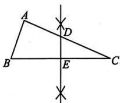

(2)10

3. 略

4. 解:(1)如图所示.(2)如图所示.

(3)角平分线的性质

(4)如图所示,线段 BF 即为所求.

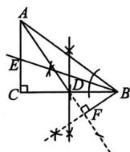

(5)2.5

5. B

6. 解: 如图所示, Rt△OAB 即为所求.

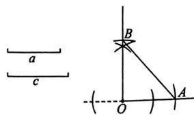

text_image

a
c
B
O
A

# 15.2 第1课时 画轴对称的图形

1. (1) $M, P, N$

(2)G,H,I MG DM PH EP NI

FN

(3)GH HI IG

2. 略

3. 解: 如图所示(答案不唯一).

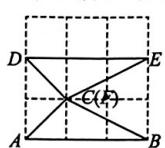  
①

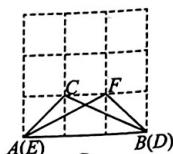  
②

4. 略

5. 解:(1)平分线

如图①, 直线 a 即为所求.

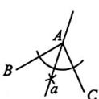  
图①

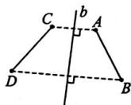  
图②

(2)如图②所示.

垂直平分线

(3)能. 操作方法: 如图③所示,

连接 BD, 作线段 BD 的垂直平分线 c, 即为对称轴; 作点 C 关于直线 c 的对称点 E; 连接 BE, 作 $\angle ABE$

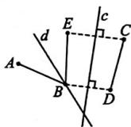  
图③

的平分线所在直线 $d$ ，即为对称轴。故对其中一条线段作两次轴对称可使它与另一条线段重合。（操作方法及所画图形不唯一）

# 第2课时 用坐标表示轴对称

1. B 2. A 3. D

4. (1) $a = -3, b = -5$ (2) 1 5. B 6. A

7. 作图略, $A'(3,2), B'(4,-2), C'(1,-3)$

8. (1) $B(4, -3), C(-4, -3), D(-4, 3)$

(2)48

9. A 10. A

11. (1)作图略, $A'(-1,2)$ , $B'(-3,0)$ ,

$$
C ^ {\prime} (- 6, 4)
$$

(2)7 (3)(11,0)或(-5,0)

12. 解: ∵ 点 P 与点 $P_{1}$ 关于 y 轴对称, $P(-a, 0)$ , ∴ $P_{1}(a, 0)$ .

设 $P_{2}(x,0)$

∵点 $P_{1}$ 与点 $P_{2}$ 关于直线 l:x=2 对称，

$$
\therefore \frac {x + a}{2} = 2, \text {即} x = 4 - a. \therefore P _ {2} (4 - a, 0).
$$

$$
\therefore P _ {1} P _ {2} = | 4 - a - a | = | 4 - 2 a |.
$$

当 $0 < a \leqslant 2$ 时， $P_{1}P_{2} = |4 - 2a| = 4 - 2a$ ；

当 $a > 2$ 时， $P_{1}P_{2} = |4 - 2a| = 2a - 4.$

综上所述，当 $0 < a \leqslant 2$ 时， $P_{1}P_{2} = 4 - 2a$ ；当 $a > 2$ 时， $P_{1}P_{2} = 2a - 4$ .

# 15.3.1 第1课时 等腰三角形的性质

# 知识梳理

两个底角相等 高及顶角平分线

1. B 2. D 3. B 4. A 5. $40^{\circ}$

6. $55^{\circ}, 55^{\circ}$ 或 $70^{\circ}, 40^{\circ}$ 7. 略

8. $108^{\circ}$ 9. C 10. C 11. $110^{\circ}$ 12. C

13. A 14. $90^{\circ}$

15. (1) $\angle C = 54^{\circ}$ $\angle CAD = 36^{\circ}$ (2)略

# 第2课时 等腰三角形的判定

1. A 2. D 3. C 4. 15

5. 证明: 在 $\triangle ADB$ 和 $\triangle BCA$ 中,

$$
\left\{ \begin{array}{l} A D = B C, \\ B D = A C, \\ A B = B A, \end{array} \right.
$$

$$
\therefore \triangle A D B \cong \triangle B C A (\text { S   S   S }).
$$

$$
\therefore \angle D B A = \angle C A B. \therefore A E = B E.
$$

$$
\therefore \triangle E A B \text {   是等腰三角形.   }
$$

6. 略 7. A

8. 解: 如图.(1)画射线 AE, 在射线 AE 上截取 AB = a;

(2)作线段 AB 的垂直平分线 MN，与 AB 相交于点 O；

(3) 在 MN 上取一点 C，使 OC = b；

(4) 连接 AC, BC, 则 $\triangle ABC$ 即为所求.

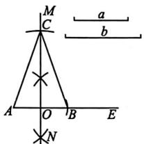

text_image

M
C
a
b
A
O
B
E
N

9. D 10. C 11. A 12. 5

13. (1) $40^{\circ}$ (2) $36^{\circ}$ (3) $2 \angle CDE = \angle BAD$

# 专题训练（七） 与轴对称相关的尺规作图

1. B 2. C 3. D 4. 略

5. 解:(1)如图①,找到格点D,连接AD,则 $AD\perp AB$ ,AD即为所求(可利用三角形全等证明).

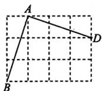  
图①

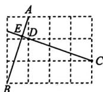  
图②

(2)如图②,找到格点D,连接CD并延长,交AB于点E,则CE即为所求.

(3) 如图③, 找到格点 $D$ , 连接 $BD$ , 则 $BD \perp AC$ , 找到格点 $E$ , 连接 $CE$ 并延长, 交 $AB$ 于点 $F$ , 则 $CF \perp AB$ , $BD$ 与

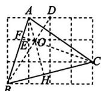  
图③

CF 的交点 O 为 $\triangle ABC$ 三条高的交点，连接 AO 并延长交 BC 于点 H，则 $AH \perp BC, AH$ 即为所求.

6. 画图略, 点 M 的坐标为(4,1)

7. 解：如图，连接格点 EF，交 AB 于点 D，则 D 为 AB 的中点，再找到格点 C，使得 AC = BC，然后作直线 CD，则直线 CD 即为所求.

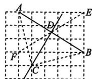

8. 略

9. 解:(1)4

(2)如图，BD即为所求.取格点B右侧第5个格点E，连接AE，得到△ABE为等腰三角形，取AE的中点F，连

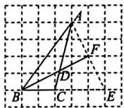

接 $BF$ 交 $AC$ 于点 $D$ , 根据三线合一, 即可得到 $BD$ 为 $\triangle ABC$ 的角平分线.

10. 略

# 专题训练（八） 等腰三角形中的分类讨论思想

1. A 2. $67.5^{\circ}$ 或 $22.5^{\circ}$

3. C 4. 4 5. B

6. (1)12 (2) $67.5^{\circ}$ 或 $45^{\circ}$ 或 $37.5^{\circ}$ 或 $90^{\circ}$

# 15.3.2 第1课时 等边三角形的性质与判定

# 知识梳理

1. 60 2. 三 3. 60

1. D 2. C 3. C 4. 12

5. 证明：∵△ABC为等边三角形，

$$
\therefore \angle A B D = \angle C = 6 0 ^ {\circ}, A B = B C.
$$

在 $\triangle ABD$ 和 $\triangle BCE$ 中， $\left\{\begin{aligned}AB&=BC,\\ \angle ABD&=\angle C,\\ BD&=CE,\end{aligned}\right.$

$$
\therefore \triangle A B D \cong \triangle B C E (\mathrm{SAS}), \therefore A D = B E.
$$

6. C 7. C 8. 1. 6

9. 有一个角是 $60^{\circ}$ 的等腰三角形是等边三角形

10. $\triangle ABC$ 是等边三角形. 理由略

11. D 12. 60 13. 略

14. 解:(1)证明:∵△BOC≌△ADC,

$$
\therefore O C = D C. \text {   又   } \because \angle O C D = 6 0 ^ {\circ},
$$

$\therefore \triangle OCD$ 是等边三角形.

(2) $\triangle ADO$ 是直角三角形. 理由如下:

∵△OCD 是等边三角形，∴∠CDO=60°.

当 $\alpha = 150^{\circ}$ 时， $\because \triangle BOC \cong \triangle ADC$

$$
\therefore \angle B O C = \angle A D C = 1 5 0 ^ {\circ},
$$

$$
\therefore \angle A D O = \angle A D C - \angle O D C = 9 0 ^ {\circ},
$$

∴△ADO 是直角三角形.

(3) $100^{\circ}$ 或 $115^{\circ}$ 或 $130^{\circ}$ .

# 第2课时 含 $30^{\circ}$ 角的直角三角形的性质

# 知识梳理

斜边的一半

1. D 2. 4 3. 2 4. $2 \mathrm{~cm}$

5. 证明：∵AB=AC, ∠BAC=120°,

$$
\therefore \angle B = \angle C = 3 0 ^ {\circ}.
$$

$$
\because A D \perp A C, \therefore \angle D A C = 9 0 ^ {\circ}.
$$

$$
\therefore \text {   在   } \mathrm{Rt} \triangle A C D \text {   中,   } C D = 2 A D.
$$

6. 36 7. $1 < AC < 4$ 8. $6\mathrm{cm}$ 9. 2

# 专题训练（九） 构造等腰三角形的常用方法

例 1 证明: 如图, 过点 D 作 DN // AE, 交 BC 于点 N, 则 $\angle DNB = \angle ACB, \angle NDE = \angle E.$

$\because AB=AC,$

$$
\therefore \angle B = \angle A C B.
$$

$$
\therefore \angle B = \angle D N B.
$$

$$
\therefore B D = N D.
$$

又∵BD=CE,∴ND=CE.

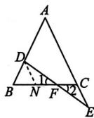

在 $\triangle DNF$ 和 $\triangle ECF$ 中， $\left\{\begin{aligned}\angle1&=\angle2,\\ \angle NDF&=\angle E,\\ ND&=CE,\end{aligned}\right.$

$\therefore \triangle DNF \cong \triangle ECF(AAS). \therefore DF = EF.$

# 变式 6 例2略

变式 证明: 如图, 作 $\angle ACB$ 的平分线交 AB 于点 E, 连接 ED, 则 $\angle ACE = \angle DCE = \frac{1}{2} \angle ACB$ .

$$
\because \angle A C B = 2 \angle B,
$$

$$
\therefore \angle B = \angle E C B.
$$

$$
\therefore C E = B E.
$$

又∵AD为BC边上的中线,即D为BC的中点,

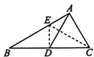

$$
\therefore D C = \frac {1}{2} B C, E D \perp B C.
$$

$$
\therefore \angle E D C = 9 0 ^ {\circ}.
$$

$$
\text { 又 } \because A C = \frac {1}{2} B C,
$$

$$
\therefore A C = D C.
$$

在 $\triangle AEC$ 和 $\triangle DEC$ 中， $\left\{\begin{aligned}AC&=DC,\\ \angle ACE&=\angle DCE,\\ CE&=CE,\end{aligned}\right.$

$$
\therefore \triangle A E C \cong \triangle D E C (\text { SAS }).
$$

$$
\therefore \angle B A C = \angle E D C = 9 0 ^ {\circ}.
$$

例3 B

变式1 A

变式2 $MN = BM - NC.$ 证明略

变式 3 (1) 证明: $\because AD \parallel BC$ ,

$$
\therefore \angle D A E = \angle E. \because A E \text {平分} \angle D A B,
$$

$$
\therefore \angle D A E = \angle B A E, \therefore \angle B A E = \angle E,
$$

$$
\therefore B A = B E. \text {又} \because B G \perp A E, \therefore B G \text {平分} \angle A B E.
$$

(2) $26^{\circ}$

# 本章考点专练

# 知识结构关系

①中点 ②垂直于 ③相等 ④相等 ⑤垂直平

分 ⑥垂直平分线 ⑦全等 ⑧相等 ⑨相等

⑩垂直平分 ⑪相等 ⑫互为相反数 ⑬互为相

反数 ⑭相等 ⑮相等 ⑯相等 ⑰相等

⑱60° ⑲相等 ⑳等腰 ㉑一半

1. A 2. 14 3. A

4. (1) 略 (2) AB = 12 ∠ACD = 70° 5. C

6. (1) $A'(4,1)$ , $B'(3,3)$ , $C'(1,2)$

(2)略 (3)(1,3) (4)画图略 $P(-3,0)$

7. B

8. (1) 证明: $\because AD$ 平分 $\angle BAC$ ,

$$
\therefore \angle B A D = \angle C A D. \because E G / / A D,
$$

$$
\therefore \angle B A D = \angle G, \angle C A D = \angle A F G,
$$

$$
\therefore \angle G = \angle A F G, \therefore A F = A G,
$$

∴△AFG 是等腰三角形.

(2) $60^{\circ}$

9. C 10. $73^{\circ}$

11. (1) 能. t=3.2 (2) $\frac{16}{7}$ 或 4

12. $88^{\circ}$

13. (1)6

(2)作点 $B$ 关于 $AC$ 的对称点 $E$ , 再过点 $E$ 作 $EF \perp BE$ , 垂足为 $E$ , 在 $EF$ 上截取 $EF = 1$ , 连接 $DF$ 交 $AC$ 于点 $P$ , 再在 $AC$ 上截取 $PQ = 1$ , 点 $Q$ 的位置如图所示.

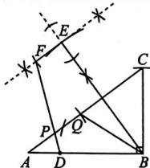

text_image

Geometric diagram with labeled points and lines, including triangle ABC and auxiliary constructions

# 综合与实践 最短路径问题

1. B 2. C 3. D 4. D

5. 解:(1)如图①,连接AB,作AB的垂直平分线交EF于点 $P_{1}$ ,点 $P_{1}$ 即为建厂的位置.

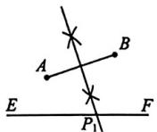  
图①

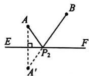  
图②

(2)如图②,画出点A关于河岸EF的对称点 $A'$ ,连接 $A'B$ 交EF于点 $P_{2}$ ,点 $P_{2}$ 即为建厂的位置.

6. $30^{\circ}$ 7. B 8. (0,3)

9. 解: $\triangle PCD$ 的周长等于 $PC + CD + PD$ , 要使 $\triangle PCD$ 的周长最短, 根据“两点之间, 线段最短”, 只需使得 $PC + CD + PD$ 的大小等于某两点之间的距离, 于是考虑作点 $P$ 关于射线 $OA$ 和 $OB$ 的对称点 $E, F$ , 则 $\triangle PCD$ 的最短周长等于线段 $EF$ 的长.

作法:如图,①作点 P 关于射线 OA 的对称点 E;

②作点 P 关于射线 OB 的对称点 F；

③连接 EF，分别与 OA, OB 交于点 C, D，则 C, D 就是所要求作的点。（连接 PC 与 PD 可证明 $\triangle PCD$ 的周长最短）

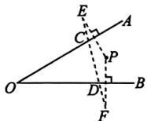

10. 解: 提示: 利用轴对称将小华家、李奶奶家看成的点分别沿草场、林区所在直线进行翻折.
(图略)

11. D

12. 解: 如图所示:

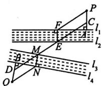

(1) 过点 P 作 $PA \perp l_{1}$ ，垂足为 A，过点 Q 作 $QB \perp l_{4}$ ，垂足为 B；  
(2) 分别在 PA 和 QB 上截取 PC = QD = 河的宽度；  
(3) 连接 $CD$ , 分别交 $l_{2}$ 和 $l_{3}$ 于点 $E$ 和 $M$ ;  
(4) 过点 E 和 M 分别作 $l_{1}$ 和 $l_{4}$ 的垂线段，垂足分别为 F 和 N；  
(5)连接 PF 和 QN. 则桥建在 FE 和 MN 处才能使两村之间的路程最短.

13. 解: 如图, 作出点 A 关于草地边 EF 的对称点 $A'$ , 点 B 关于河岸 FM 的对称点 $B'$ , 连接 $A'B'$ , 交草地边 EF 于点 C, 交河岸 FM 于点 D, 连接 AC, BD,

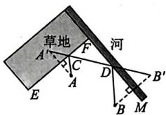

text_image

草地
河
A
F
C
D
B'
E
A
B
M

则牧民沿折线 ACDB 走可使所走的路程最短.

# 第十六章 整式的乘法

# 16.1.1 同底数幂的乘法

1. B 2. D 3. D 4. $m^5$ 5. $-a^8$   
6. $y^{7}$ 7. 2023

8. (1) $c^{12}$ (2)729 (3) $x^{2m}$ (4) $-\frac{1}{1024}$

9. D 10. 54 11. $6a^{2}$ 12. B 13. A

14. (1) $-3^{10}$ (2) $-2^{6 + 2n}$   
15. (1) $(b + 2)^{9}$ (2) $(2y - x)^{5}$

# 16.1.2 幂的乘方与积的乘方

1. D 2. C 3. A 4. C   
5. (1) $10^{12}$ (2) $a^{12}$ (3) $-x^{2m}$ (4) $a^{12}$   
6. 8 7. 64 8. A 9. B 10. $9a^{2}b^{6}$   
11. (1) $x^{4}y^{4}$ (2) $x^{2m}y^{2n}$

$$
(3) \frac {1}{8 1} a ^ {4} b ^ {4} (4) - 1. 2 5 \times 1 0 ^ {1 7}
$$

12. A 13. 24 14. B 15. A   
16. D 17. B 18. $-2a^{2}b^{3}$   
19. (1) $-y^{4n + 1}$ (2) $7.2\times 10^{17}$

$$
(3) - 2 x ^ {6} \quad (4) 0 \quad (5) (m - n) ^ {2 5}
$$

20. $a^3 b^3$

21. (1) ① $2^{100} < 3^{75}$ ② $5^{333} < 3^{555} < 4^{444}$   
(2)指数 $9^{61} < 27^{41} < 81^{31}$

# 16.2 第1课时 单项式与单项式相乘

1. C 2. $6a^{3}$   
3. (1) $-8x^{2}y^{3}$ (2) $-24x^{7}y^{3}$   
4. (1) $2m^{5}n^{4}$ (2) $-24a^{4}b^{5}c$   
5. C 6. $4 \times 10^{2} \mathrm{dm}$ 7. D 8. $9x^{6}y^{3}$   
9. (1) $-10a^{2}b$ (2) $-a^{4}b^{7}$ 10. 16

# 第2课时 单项式与多项式相乘

1. B 2. A 3. A 4. -4a   
5. (1) $-6x^{2} + 18xy$ (2) $-4a^{3}b - 2a^{2}b^{2} + 4ab^{3}$

$$
- 4 x ^ {5} y ^ {3} + 9 x ^ {4} y ^ {2} - 2 x ^ {2} y \tag {3}
$$

$$
- 2 4 a ^ {6} b ^ {5} + 3 2 a ^ {7} b ^ {3} - 4 8 a ^ {6} b ^ {3} \tag {4}
$$

6. D   
7. 地基的面积是 $(4a^{2} - 48a)\mathrm{m}^{2}$

当 a=25 时, 地基的面积为 $1300 \, m^{2}$

8. C 9. B   
10. (1) 原式 $= a^{3} + 3a$ 当 $a = 2$ 时, 原式 $= 14$

$$
(2) \text { 原式 } = 1 2 a ^ {2} b ^ {4}
$$

$$
\text {   当   } a = - \frac {3}{4}, b = \frac {2}{3} \text {   时,原式   } = \frac {4}{3}
$$

11. (1) $\left(\frac{1}{2} a^2 + \frac{1}{2} ab\right)\mathrm{m}^2$

$$
(2) (5 0 a ^ {2} + 5 0 a b) \mathrm{m} ^ {3}
$$

12. (1) $6x\mathrm{m}^2$ (2) $\left(\frac{2}{3} x^2 + 7x + 12\right)\mathrm{m}^2$

$$
(3) 3 9 0 0 \text {   元   }
$$

13. $-12x^{4} + \frac{3}{2} x^{3} - 3x^{2}$

# 第3课时 多项式与多项式相乘

1. B 2. A 3. D   
4. (1) $3x^{2} + 8x + 4$ (2) $2x^{2} + 5xy - 3y^{2}$

$$
(3) x ^ {2} - 4 x + 4 \quad (4) m ^ {2} - 4 n ^ {2}
$$

$$
(5) 2 x ^ {3} - 1 0 x ^ {2} - 3 x + 1 5 \quad (6) 4 a - 2
$$

5. C 6. A

7. (1) $(22a^{2} + 16ab + 2b^{2})\mathrm{m}^{2}$ (2) $202\mathrm{m}^2$   
8. D

9. 原式 $= 4a^{2} - 8b^{2}$

当 $a = -2, b = -1$ 时，原式 $= 8$

10. 2 11. (1)3 (2) $4x^{2}-11x-9$

12. (1)积中的一次项系数是两因式中的常数项的和,常数项是两因式中的常数项的积

$$
\begin{array}{l} (2) (x + a) (x + b) = x ^ {2} + (a + b) x + a b \\ (3) ① a ^ {2} - a - 9 9 0 0 \quad ② y ^ {2} - 1 6 1 y + 6 4 8 0 \\ \end{array}
$$

# 第4课时 整式的除法

1. B 2. C 3. D 4. $x \neq 3$ 5. $\frac{1}{4}$   
6. (1) $-m^6$ (2) $-a^3$ (3) $6^{m + 3}$ (4) $a^5$   
7. D 8. A 9. (1) $4xy$ (2) $-\frac{1}{3} a^2 b^4$   
10. (1)2ab (2)-3xy (3) $3x^{2}$   
11. A 12. C 13. A   
14. (1) $3x - 2y$ (2) $-x^{3} + 3xy$

$$
(3) - 3 x ^ {2} y + 2 x - y \quad (4) - 6 x + 2 y - 1
$$

15. $12a - 6ab + 3b^{2}$ 16.C 17. $\frac{25}{4}$   
18. (1) $x^{6}y^{3}$ (2)-6x

$$
(3) - (p - q) ^ {3} \quad (4) - 9 \times 1 0 ^ {5}
$$

19. 原式 $= x^{6}y^{6} - \frac{2}{3}$

$$
\text {   当   } x = - 2, y = \frac {1}{2} \text {   时   }, \text {   原式   } = \frac {1}{3}
$$

20. $\frac{5}{2} x^3 - 2x^2 + \frac{3}{2} x - 1$   
21. 解: (1) $5^{2a+b}=5^{2a}\times5^{b}=(5^{a})^{2}\times5^{b}=4^{2}\times6=96.$

(3)证明： $\because 5^{a + c} = 5^a\times 5^c = 4\times 9 = 36,5^{2b} =$

$$
\begin{array}{l} 5 ^ {b - 2 c} = 5 ^ {b} \div (5 ^ {c}) ^ {2} = 6 \div 9 ^ {2} = 6 \div 8 1 = \frac {2}{2 7}. \tag {2} \\ (5 ^ {b}) ^ {2} = 6 ^ {2} = 3 6, \therefore 5 ^ {a + c} = 5 ^ {2 b}. \\ \therefore a + c = 2 b. \\ \end{array}
$$

# 16.3.1 平方差公式

1. C 2. C 3. C 4. $9y^{2} - 4$   
5. (1) $\frac{4}{9} x^2 - 25$ (2) $4m^2 - 9n^2$ (3) $4y^2 - x^2$

$$
(4) 8 1 x ^ {4} - 1 6 \quad (5) 6 x - 3 4
$$

6. 解:(1)二 去括号法则用错

$$
\begin{array}{r l} & {(2) \text {原式} = a ^ {2} + 2 a b - (a ^ {2} - b ^ {2}) = a ^ {2} + 2 a b -} \\ & {a ^ {2} + b ^ {2} = 2 a b + b ^ {2}.} \end{array}
$$

7. 原式 $= 2a^{2}$ 当 $a = \sqrt{3}$ 时，原式 $= 6$   
8. (1)9999 (2)1 9. A 10. D   
11. 解: (1) $(4a^{2}-9)m^{2}$

(2)原来的面积为 $2a \times 2a = 4a^{2} \, (\text{m}^{2})$ .

$$
\begin{array}{r l} & {\because 4 a ^ {2} - (4 a ^ {2} - 9) = 9 > 0, \therefore \text {改造后的长方形池塘的面积与原来相比变小了}.} \end{array}
$$

12. (1) $1 - x^{n+1}$

$$
\begin{array}{l} (2) ① - 6 3 \quad ② 2 ^ {n + 1} - 2 \quad ③ x ^ {2 0 0} - 1 \\ (3) ① a ^ {2} - b ^ {2} \quad ② a ^ {3} - b ^ {3} \quad ③ a ^ {4} - b ^ {4} \\ \end{array}
$$

# 16.3.2 第1课时 完全平方公式

1. C 2. B 3. C 4. 4   
5. (1) $4y^{2} - 4y + 1$ (2) $9a^{2} + 12ab + 4b^{2}$

$$
4 y ^ {2} - 4 x y + x ^ {2} \quad (4) 9 x ^ {2} + 2 4 x y + 1 6 y ^ {2}
$$

6. (1) 原式 $= 2x^{2} + y^{2}$

当 $x = 1, y = -2$ 时，原式 $= 6$

(2) 原式 $= 2a + b$

当 $a = 2, b = -1$ 时，原式 $= 3$

7. D 8. (1)3602 $\frac{1}{3600}$ (2)96.04   
9. B 10. D 11. A

12. 原式 $= 2x + 14$

$$
\text { 当 } x = - \frac {1}{2} \text { 时 }, \text { 原式 } = 1 3
$$

13. (1) $-x^{4} + 2x^{2}y^{2} - y^{4}$

$$
(2) x ^ {4} - 8 x ^ {2} y ^ {2} + 1 6 y ^ {4}
$$

14. (1) $2a^{2} + 2b^{2} + 2c^{2} - 2ab - 2bc - 2ca$

$$
(2) 1 7 5
$$

# 串题训练

# 典例呈现

(1)32 (2)28 (3)30

# 变式训练

1. (1)7 (2)25 (3)2 (4)3

2. $-\frac{3}{4}$ 3. (1)4 (2)1

# 第2课时 添括号法则

1. C

2. (1) $b - c + d$ (2) $b - c + d$ (3) $b + c + d$

$$
(4) - b - c - d \quad (5) - b + c
$$

3. 2 4. C 5. C

6. (1) $a^2 + 2ab + b^2 - c^2$

$$
x ^ {2} + y ^ {2} + z ^ {2} - 2 x y + 2 y z - 2 x z \tag {2}
$$

7. (1) $\frac{1}{4} a^2 + 4b^2 - 2ab - a + 4b + 1$

$$
x ^ {2} - 6 x z + 9 z ^ {2} - 4 y ^ {2} \tag {2}
$$

8. 16

# 月历问题与规律探究

1. 解:问题情境 7 7

归纳猜想 (1) $m + 8$

(2)猜想： $(m + 1)(m + 7) - m(m + 8) = 7.$

证明：左边 $= (m + 1)(m + 7) - m(m + 8) =$

$$
m ^ {2} + 8 m + 7 - m ^ {2} - 8 m = 7 = \text {右边}.
$$

变式应用 (2)中的规律不成立.

理由:设左上角数字为 n，则左下角数字为 $n+21$ ，右上角数字为 $n+3$ ，右下角数字为 $n+24$ 。∵ $(n+3)(n+21)-n(n+24)=n^{2}+24n+63-n^{2}-24n=63$ ，

∴(2)中的规律不成立.

2. 解:(1)x-8 x-7 x+7 x+8

$$
(2) (x - 7) (x + 7) - (x - 8) (x + 8) = 1 5
$$

(3)证明： $(x - 7)(x + 7) - (x - 8)(x + 8) =$ $(x^{2} - 49) - (x^{2} - 64) = x^{2} - 49 - x^{2}+$ $64 = 15.$

(4)由题意,得 $(x-8)(x+8)=57,\therefore x^{2}=121.\because x$ 为正整数, $\therefore x=11.$ 故C位置上的数为11.

3. 解: (c) $100^{2}$ $2^{2}$ 9996

(d)103 $100^{2}$ $3^{2}$ 9991

(1) $(100 - n)(100 + n) = 100^{2} - n^{2}$ （ $n$ 为自然数）

(2)大 相等 10000 (3)2500

(4)设长方形的一边长为 $a$ 米，与其相邻的另一边长为 $b$ 米，则 $a + b = 5$

由(2)中的结论可得: 当 a=b=2.5 时, ab 有最大值, 最大值为 6.25.

故当围成一个边长为2.5米的正方形时，面积最大，最大面积为6.25平方米.

4. 解:(1)25

(2)由题意, 可知两个数分别表示为 $10a + b$ , $10(10-a)+b=100-10a+b.$

$$
\because (1 0 a + b) (1 0 0 - 1 0 a + b) = 1 0 0 0 a -
$$

$$
1 0 0 a ^ {2} + 1 0 a b + 1 0 0 b - 1 0 a b + b ^ {2} = 1 0 0 0 a -
$$

$$
1 0 0 a ^ {2} + 1 0 0 b + b ^ {2} = 1 0 0 (1 0 a - a ^ {2} + b) + b ^ {2},
$$

∴两个数乘积的后两位等于 $b^{2}$ .

$$
(3) 1 0 c - c ^ {2}
$$

# 本章考点专练

# 知识结构关系

$$
① a ^ {m + n} \quad ② a ^ {m n} \quad ③ a ^ {n} b ^ {n} \quad ④ m a + m b + m c
$$

$$
⑤ a p + a q + b p + b q \quad ⑥ a ^ {m - n} \quad ⑦ a ^ {2} - b ^ {2}
$$

$$
⑧ a ^ {2} \pm 2 a b + b ^ {2}
$$

1. D 2. B 3. $-m^{6}$ 4. $-a^{3}b^{9}$ 5. $x^{2}$

6. 4 7. 10 8. D 9. D 10. $-6a^{3}$

11. 1 12. D 13. D 14. $a^2 - 9$

15. ±18 16. 90000

17. 原式 $= 8xy + 12y^{2}$

$$
\text {当} x = \frac {1}{3}, y = \frac {1}{2} \text {时,原式} = \frac {1 3}{3}
$$

18. 解:(1)由图可知 $S_{1}=(a+2)(a+1)=a^{2}+$

$$
3 a + 2, S _ {2} = (5 a + 1) \times 1 = 5 a + 1.
$$

$$
\text {当} a = 2 \text {时,} S _ {1} + S _ {2} = a ^ {2} + 3 a + 2 + 5 a + 1 =
$$

$$
a ^ {2} + 8 a + 3 = 4 + 1 6 + 3 = 2 3.
$$

$$
(2) S _ {1} > S _ {2}.
$$

$$
\text {理由:} \because S _ {1} - S _ {2} = a ^ {2} + 3 a + 2 - 5 a - 1 = a ^ {2} -
$$

$$
2 a + 1 = (a - 1) ^ {2},
$$

$$
\text { 又 } \because a > 1, \therefore (a - 1) ^ {2} > 0. \therefore S _ {1} > S _ {2}.
$$

# 第十七章 因式分解

# 17.1 第1课时 提公因式法1

1. C 2. B 3. B 4. x 5. $3a - b + 1$

6. (1) $x(x + 1)$ (2) $a(a - 3)$

7. (1) $m(m - 5)$ (2) $a(b + c)$

$$
(3) x (3 y - 2 z + 5 x)
$$

8. -4 9. (1)18 (2)29 (3)99900

10. 原式 $= I(R_{1} + R_{2} + R_{3})$

当 $R_{1} = 25.4, R_{2} = 39.2, R_{3} = 35.4, I = 2.5$

时，原式 $= 250$

# 第2课时 提公因式法2

1. C 2. C 3. ②③ 4. C 5. B

6. (1) $xy(x + 2)$ (2) $3a(a - 7b)$

7. (1) $-3ma(a^{2} - 2a + 4)$

$$
(2) 2 (p + q) (3 p - 2 q)
$$

$$
(3) (a - b) (2 x + 1)
$$

8. B 9. A 10. A 11. 2018

12. (1) $(a + c)(a - b)$

$$
(2) (x - 2 y) (1 2 x + y)
$$

13. (1) 原式 $= (a - 1)(3a - 1)$

当 $a = 2$ 时，原式 $= 5$

(2) 原式 $= a(b - 2)(3b - 2)$

当 $a = \frac{3}{2}, b = 6$ 时，原式 $= 96$

# 17.2 第1课时 运用平方差公式分解因式

1. B 2. A 3. -6

4. (1) $\left(x + \frac{1}{2}\right)\left(x - \frac{1}{2}\right)$ (2) $(1 - 2y)(1 + 2y)$

$$
(3) (a + 4 b) (a - 4 b)
$$

$$
(4) (5 m + 2 n) (5 m - 2 n)
$$

$$
(5) (a b + 4) (a b - 4)
$$

5. A 6. 4049

7. (1) $(x + 2)(x - 4)$ (2) $3y(2x + y)$

8. (1) $(x + \sqrt{3})(x - \sqrt{3})$

$$
(2) (x ^ {2} + 2) (x + \sqrt {2}) (x - \sqrt {2})
$$

# 第2课时 运用完全平方公式分解因式

1. D 2. (1)±6 (2)4 3. B 4. A

5. (1) $(a - 7b)^2$ (2) $(2a - 3b)^2$

$$
(3) \left(1 + \frac {1}{2} x\right) ^ {2}
$$

6. (1) $(m + n - 3)^2$ (2) $-(m - n)^2$

7. 7 或 -1 8. 49 9. 1 10. -2

# 第3课时 用公式法分解因式

1. $a(a + 3)(a - 3)$

2. (1) $3a(x + 1)(x - 1)$ (2) $2a(a + 2b)(a - 2b)$

$$
5 x ^ {2} (x + 1) (x - 1) \tag {3}
$$

3. A 4. $3(x - 3)^{2}$

5. (1) $-2a(x - y)^{2}$ (2) $-x(x - 2y)^{2}$ 6. $\frac{1}{2}$

7. (1) $(4x^{2} + 1)(2x + 1)(2x - 1)$

$$
(2) (3 a + 1) ^ {2} (3 a - 1) ^ {2} \quad (3) (a + 1) ^ {4}
$$

$$
(4) (x + 1) ^ {2} (x - 1) ^ {2}
$$

8. D 9. D

10. (1) $(x + 3)^{2}$ (2) $(a - 1)^{2}$

11. (1) $3(x - 2)^{2}$ (2) $(x - 2)^{2}$

$$
(3) (2 m + n) ^ {2} (2 m - n) ^ {2}
$$

12. (1) $(a - b + 4)(a - b - 4)$

(2) $\triangle ABC$ 是等腰三角形

# 专题训练（十） 特殊方法分解因式

1. (1) $(x + 1)(x + 4)$ (2) $(x + 1)(x - 7)$

$$
(3) (m - 3) (m - 4) \quad (4) (x - 3) (3 x + 4)
$$

2. (1) $(x - y)(x + 4)$

$$
(2) (x + y - 2) (x - y + 2)
$$

3. 7 4. (1)4 (2)(a-3)(a-7) (3)-16

5. 解:(1)B (2) $(a-1)^{4}$

$$
(3) \text { 设 } x ^ {2} - 4 x = a.
$$

$$
(x ^ {2} - 4 x - 3) (x ^ {2} - 4 x + 1 1) + 4 9
$$

$$
= (a - 3) (a + 1 1) + 4 9
$$

$$
= a ^ {2} + 8 a + 1 6 = (a + 4) ^ {2}
$$

$$
= (x ^ {2} - 4 x + 4) ^ {2}
$$

$$
= (x - 2) ^ {4}.
$$

# 专题训练（十一） 乘法公式在几何图形中的应用

1. (1) $a^{2}-b^{2}=(a+b)(a-b)$

$$
(2) ① 3 \quad ② \frac {2 0 2 5}{4 0 4 8}
$$

2. D 3. 60 20

4. (1)

<table><tr><td></td><td>a=1,b=2</td><td>a=3,b=-1</td></tr><tr><td>(a+b)2的值</td><td>9</td><td>4</td></tr><tr><td>a2+2ab+b2的值</td><td>9</td><td>4</td></tr></table>

$$
(2) (a + b) ^ {2} = a ^ {2} + 2 a b + b ^ {2}
$$

$$
(3) (a + b) ^ {2} \quad a ^ {2} + 2 a b + b ^ {2}
$$

$$
(4) ① 9 0 0 0 0 0 0 \quad ② 4
$$

5. (1) $(m + n)^{2} - 4mn$ $(m - n)^{2}$

$$
(2) (m + n) ^ {2} - 4 m n = (m - n) ^ {2}
$$

$$
(3) 6 \text {或} - 6 (4) - 1 0 1 0
$$

# 专题训练（十二） 因式分解中的整除问题

1. C 2. C 3. B 4. A

5. 证明: 原式 $= (3n)^{2} - 1 - (3^{2} - n^{2}) = 9n^{2} - 1 - 9 + n^{2} = 10n^{2} - 10 = 10(n^{2} - 1)$ .

$\because n$ 为整数， $\therefore 10(n^2 -1)$ 能被10整除，

∴对任意整数 n，整式 $(3n+1)(3n-1)-(3-n)(3+n)$ 的值都能被 10 整除.

6. (1)D

$$
(2) ① 7
$$

$$
② (n + 5) ^ {2} - (n + 3) ^ {2}
$$

$$
= (n + 5 + n + 3) (n + 5 - n - 3) = 2 (2 n + 8)
$$

$$
= 4 (n + 4),
$$

$\therefore (n + 5)^2 - (n + 3)^2$ ( $n$ 为整数)是4的倍数.

# 数学活动 利用因式分解生成密码

1. (1)B (2)152010(答案不唯一)

(3)m 的值为 3, n 的值为 2

2. (1)1919 (2)王老师的年龄是34岁. 理由略

# 本章考点专练

# 知识结构关系

① $ma + mb + mc$ ② $a^{2} - b^{2}$ ③ $a^{2} \pm 2ab + b^{2}$

1. B 2. D 3. B 4. B

5. $x(y + 2)(y - 2)$ 6.6

7. (1) $(x + y)^2$ (2) $-y^{2}(xy + 4)(xy - 4)$

8. (Ⅰ) $(a+3b)^{2}$ (Ⅱ) $3(x+y)(x-y)$

(Ⅲ) $m(x-m)^{2}$ (Ⅳ)2mn(4m+1)

9. (1) $(a + b)^2 = a^2 + 2ab + b^2$ (2)9

10. (1) $(x + y)^2$ (2) $(a - b + 3)(a - b - 3)$

(3) $(a - 2)^{4}$

11. 解: (1) $13^{2}-10^{2}=(13+10)\times(13-10)=$

69. $69 \div 3 = 23$ ,

所以 13 和 10 的平方差能被 3 整除.

(2) $(2n + 3)^{2} - (2n)^{2} = (2n + 3 + 2n)(2n +$

$3 - 2n) = 3(4n + 3)$ ,

所以比 $2n$ 大3的数与 $2n$ 的平方差能被3整除.

(3)设这个整数为 $n$ ，比 $n$ 大9的数为 $n + 9$

$(n + 9)^{2} - n^{2} = (n + 9 + n)(n + 9 - n) =$

$9(2n + 9)$ , 所以比任意一个整数大 9 的数与这个整数的平方差能被9整除.

# 第十八章 分式

# 18.1.1 从分数到分式

# 知识梳理

2.0

1. B

2. (1) $\frac{80000}{a}$ (2) $\frac{90}{6 + m}$ (3) $\frac{2S}{a}$ 3. C

4. (1) $x \neq 2$ (2) $x \neq \pm 1$ (3) $3x \neq y$

(4) $a \neq 2b$

5. 1 6. 3

7. 0(答案不唯一) 8. -2 9. $\frac{1500}{2x + 35}$

10. $x$ 为任意实数 $-\frac{1}{2} x > -\frac{1}{2}$

# 18.1.2 第1课时 分式的基本性质

# 知识梳理

不等于0

1. B 2. $x \neq -1$

3. (1) $10a^{2}b$ (2) $m^{2}-n^{2}$ (3)x 4. 略

5. (1) $\frac{3b}{5a}$ (2) $-\frac{3}{5}$ (3) $\frac{3x + 3}{2x}$ (4) $\frac{2}{3x + 2}$

6. B 7. (1) $\frac{4x - 9y}{5x + 6y}$ (2) $\frac{3a - 20b}{-10a + 7b}$

# 第2课时 分式的约分和通分

1. B 2. D 3. C 4. D

5. (1) $\frac{3}{4a^2}$ (2) $-\frac{2a}{b}$ (3) $\frac{1}{x - a}$ (4) $\frac{a}{b - a}$

(5) $\frac{x}{x-1}$ (6) $\frac{a}{2a-b}$

6. (1)24ab (2) $3a^{2}b^{2}$

(3) $12x^{3}yz$ (4) $a(a+b)(a-b)$

7. A

8. 解: (1) $\because \frac{x}{3y}$ 与 $\frac{3x}{2y^{2}}$ 的最简公分母是 $6y^{2}$ ,

$$
\therefore \frac {x}{3 y} = \frac {2 x y}{6 y ^ {2}}, \frac {3 x}{2 y ^ {2}} = \frac {9 x}{6 y ^ {2}}.
$$

(2) $\because \frac{3}{2a^2b}$ 与 $\frac{a - b}{ab^2c}$ 的最简公分母是 $2a^{2}b^{2}c$

$$
\therefore \frac {3}{2 a ^ {2} b} = \frac {3 \cdot b c}{2 a ^ {2} b \cdot b c} = \frac {3 b c}{2 a ^ {2} b ^ {2} c},
$$

$$
\frac {a - b}{a b ^ {2} c} = \frac {(a - b) \cdot 2 a}{a b ^ {2} c \cdot 2 a} = \frac {2 a ^ {2} - 2 a b}{2 a ^ {2} b ^ {2} c}.
$$

(3) $\because\frac{2x}{x-5}$ 与 $\frac{3x}{x+5}$ 的最简公分母是 $(x-5)$ .

$(x+5)$ ,

$$
\therefore \frac {2 x}{x - 5} = \frac {2 x (x + 5)}{(x - 5) (x + 5)} = \frac {2 x ^ {2} + 1 0 x}{x ^ {2} - 2 5},
$$

$$
\frac {3 x}{x + 5} = \frac {3 x (x - 5)}{(x + 5) (x - 5)} = \frac {3 x ^ {2} - 1 5 x}{x ^ {2} - 2 5}.
$$

(4) $\because \frac{2mn}{4m^2 - 9}$ 与 $\frac{2m - 3}{2m + 3}$ 的最简公分母是 $4m^{2} - 9$

$$
\therefore \frac {2 m n}{4 m ^ {2} - 9} = \frac {2 m n}{4 m ^ {2} - 9}, \frac {2 m - 3}{2 m + 3} = \frac {(2 m - 3) ^ {2}}{4 m ^ {2} - 9}.
$$

9. B 10. C 11. -1 -2 12. 0 或 -4

13. $\frac{143x + 195}{3x + x^2}$

14. 解:(1)最简公分母是 $(3+x)(3-x)^{2}$ .

$$
\frac {x}{9 - x ^ {2}} = \frac {3 x - x ^ {2}}{(3 + x) (3 - x) ^ {2}},
$$

$$
\frac {3}{x ^ {2} - 6 x + 9} = \frac {9 + 3 x}{(3 + x) (3 - x) ^ {2}}.
$$

(2)最简公分母是 $(x - 1)^{2}(x + 1)(x - 2)$

$$
\frac {1}{(x - 1) ^ {2}} = \frac {(x + 1) (x - 2)}{(x - 1) ^ {2} (x + 1) (x - 2)},
$$

$$
\frac {1}{x ^ {2} - 1} = \frac {(x - 1) (x - 2)}{(x - 1) ^ {2} (x + 1) (x - 2)},
$$

$$
\frac {3}{(x - 1) (x - 2)} = \frac {3 (x + 1) (x - 1)}{(x - 1) ^ {2} (x + 1) (x - 2)}.
$$

15. $\frac{3}{2}$

16. 解: 甲的工作效率为 $\frac{1}{2a-6}$ ,

乙的工作效率为 $\frac{1}{2a - 6 + 8} = \frac{1}{2a + 2}$ .

∵最简公分母是 $2(a-3)(a+1)$ ,

$$
\therefore \frac {1}{2 a - 6} = \frac {1 \cdot (a + 1)}{2 (a - 3) \cdot (a + 1)} = \frac {a + 1}{2 (a - 3) (a + 1)},
$$

$$
\frac {1}{2 a + 2} = \frac {1 \cdot (a - 3)}{2 (a + 1) \cdot (a - 3)} = \frac {a - 3}{2 (a - 3) (a + 1)}.
$$

# 18.2 第1课时 分式的乘法与除法

# 知识梳理

积的 颠倒位置

1. C 2. B

3. (1) $\frac{5c}{2a^3}$ (2) $\frac{2my}{5n}$ (3) $x + y$ (4) $\frac{x - 3}{x - 2}$

4. B 5. B

6. (1) $\frac{2d}{3c}$ (2) $\frac{3}{14xy^2}$ (3) $\frac{a^2 - 3a}{6}$

(4)2x (5) $\frac{1-a}{a}$

7. D 8. $\frac{npt}{mq}$ 9. $\frac{a + 5}{a}$ 倍

10. D 11. B 12. $\frac{3a - 6}{2a + 4}$ 13. 14

14. (1) $> = <$

(2) $a^{2}-b^{2}>(a-b)^{2}$

(3)乙筐水果的单价低

# 第2课时 分式乘方及其乘除混合运算

1. C 2. (1) $-\frac{3a^2}{4c}$ (2) $-\frac{1}{ab - b^2}$ (3)-2

3. B 4. $-\frac{a^6b^3}{c^3d^3}$

5. (1) $\frac{y^4}{x^2}$ (2) $\frac{8a^6b^3}{c^3}$ (3) $\frac{9x^2}{y^6z^2}$ (4) $-\frac{27x^3y^3}{8}$

6. B 7. B 8. C

9. (1) $-\frac{4a^2c}{3b}$ (2) $-\frac{18}{ab}$ (3) $\frac{a^2b}{27}$ (4) $-\frac{b^0}{c^3}$

10. C 11. $-\frac{m+1}{m-1}$

12. (1) $\frac{a^2 + ab}{b^2}$ (2) $\frac{x}{xy^2 - y^3}$ (3) $\frac{a^2 + ab}{b^3}$ (4) 1

13. 原式 $= xy - y^{2}$

当 $x = -2, y = 4$ 时，原式 $= -24$

14.5

# 18.3 第1课时 分式的加法与减法

# 知识梳理

分子相加减 同分母

1. C 2. A 3. B 4. A 5. B

6. (1) $\frac{2}{3xy}$ (2) $x - 2$ (3) $\frac{2}{a + 1}$

7. D 8. C 9. B

10. (1) $\frac{3a + 2b^2}{12a^2b^3}$ (2) $\frac{1}{x - 1}$ (3) $\frac{1}{x + 2y}$

(4) $\frac{1}{x + 1}$

11. B 12. A 13. 1 14. -3

15. 解:(1)C 不是 D 的“和雅式”.

理由： $\because C - D = \frac{1}{x + 2} -\frac{x^2 + 5x + 6}{x^2 + 4x + 4} =$

$$
\frac {1}{x + 2} - \frac {(x + 2) (x + 3)}{(x + 2) ^ {2}} = \frac {1}{x + 2} - \frac {x + 3}{x + 2} =
$$

$$
\frac {1 - (x + 3)}{x + 2} = \frac {- x - 2}{x + 2} = - 1 <   0,
$$

∴C不是D的“和雅式”.

(2)由题意,得 M-N=1,

即 $\frac{(x - b)(x - 1)}{x} -\frac{x(x - a)}{x} = 1,$

$$
\therefore (a - b - 1) x + b = x.
$$

$$
\therefore \left\{ \begin{array}{l l} a - b - 1 = 1, \\ b = 0, \end{array} \right. \text {解得} \left\{ \begin{array}{l l} a = 2, \\ b = 0. \end{array} \right. \therefore a + b = 2.
$$

(3)由题意,得 P-Q=1,

即 $\frac{E}{9 - x^2} -\frac{x}{3 - x} = 1.\therefore E = 3x + 9.$

$\because P = \frac{E}{9 - x^2} = \frac{3x + 9}{9 - x^2} = \frac{3}{3 - x}$ 为整数， $x$ 为整

数，∴3-x 的值为±1 或 ±3. ∴x 的值为

0,2,4,6. $\because0+2+4+6=12,$

∴所有符合条件的 x 的值之和为 12.

# 第2课时 分式的混合运算

1. C 2. B 3. B 4. 1

5. 解:(1)一

(2) 原式 $= \frac{a - b}{a} \div \frac{a^2 - 2ab + b^2}{a} = \frac{a - b}{a}$

$$
\frac {a}{(a - b) ^ {2}} = \frac {1}{a - b}.
$$

6. (1) $\frac{1}{a + 2}$ (2) $\frac{b}{3}$ (3) $\frac{1}{x + 3}$

7. A 8. B 9. B 10. A

11. (1) 原式 $= \frac{1}{x - 2}$

当 $x = 3$ 时，原式 $= 1$

(2) $\frac{a-b}{a+b}$ (3) $-(a-2)^{2}$

12. 解: 根据题意, 得小李两次加油每次 300 元的

平均单价为 $\frac{300 + 300}{\frac{300}{m} + \frac{300}{n}} = \frac{2mn}{m + n}$ （元），

小王两次加油每次30升的平均单价为

$$
\frac {3 0 m + 3 0 n}{3 0 + 3 0} = \frac {m + n}{2} (\text {   元   }), \therefore \frac {m + n}{2} - \frac {2 m n}{m + n} =
$$

$$
\frac {(m + n) ^ {2}}{2 (m + n)} - \frac {4 m n}{2 (m + n)} = \frac {(m - n) ^ {2}}{2 (m + n)}.
$$

$$
\because m \neq n, \therefore \frac {(m - n) ^ {2}}{2 (m + n)} > 0, \text {则} \frac {m + n}{2} > \frac {2 m n}{m + n},
$$

故小李两次加油的平均单价更低.

专题训练（十三） 分式的化简求值专练

1. $\frac{1}{3}$ 2. 1 3. $\frac{13}{8}$ 4. 2 5. -3 6. $\frac{1}{15}$

$$
\frac {4}{4 5} \quad 8. \frac {2 6}{2 9}
$$

9. 解: 设 $\frac{b+c}{a}=\frac{a+c}{b}=\frac{a+b}{c}=k$ ,

则 $b + c = ak, a + c = bk, a + b = ck$ .

把这3个等式左右两边分别相加，得

$$
2 (a + b + c) = (a + b + c) k.
$$

若 $a + b + c = 0$ ，则 $a + b = -c$ ，即 $k = -1$

若 $a + b + c \neq 0$ ，则 $k = 2$ .

$$
\frac {(a + b) (b + c) (c + a)}{a b c} = \frac {c k \cdot a k \cdot b k}{a b c} = k ^ {3}.
$$

当 $k = -1$ 时，原式 $= -1$

当 k=2 时, 原式 =8.

10. 原式 $= \frac{a - 3}{a + 3}$

由题意可得， $a\neq 2$ 且 $a\neq -3$

当 $a = 3$ 时，原式 $= 0$

当 $a = -2$ 时，原式 $= -5$

11. 原式 $= x^{2} + x$

$\because x$ 满足 $x^{2} + x + \frac{1}{4} = 0, \therefore$ 原式 $= -\frac{1}{4}$

# 18.4 第1课时 负整数指数幂

1. B 2. C 3. $b < a < c$ 4. 3

5. (1) $\frac{1}{n^{18}}$ (2) $-\frac{m^3}{n^3}$ (3) $\frac{y^6}{27x^6}$ (4) $\frac{2y^7}{x^5}$

6. C 7. (1) $\frac{x^6}{y^3}$ (2) $\frac{x^4z^5}{y^5}$ 8. $\frac{25}{16}$

9. 解:(1)①＞ ②＞ ③＜ ④＜

(2)由(1)猜想: 当 $n \leqslant 2$ 时, $n^{-(n+1)} > (n + 1)^{-n}$ ; 当 n > 2 时, $n^{-(n+1)} < (n+1)^{-n}$ .

(3) 根据 (2), 得当 $n = 2023$ 时, $2023^{-2024} < 2024^{-2023}$

故答案为<.

# 第2课时 用科学记数法表示绝对值小于1的数

1. B 2. A 3. C

4. (1)0.003 (2)0.0000832 (3)-0.00000606

(4)0.0000001001

5. B 6. C 7. 万分 8. -5

9. (1) $1.2 \times 10^{-3}$ (2) $6.75 \times 10^{-5}$

# 18.5 第1课时 分式方程及其解法

# 知识梳理

1. 未知数

2. 整式方程 最简公分母 检验

1. B 2. B 3. A 4. D

5. (1) 原分式方程无解

$$
(2) x = 2 \quad (3) x = 2. 5
$$

6. 解: 小丁和小迪的解法都不正确, 在框内均打“×”. 正确的解答过程如下:

方程两边乘 $(x - 2)$ ，得 $x + (x - 3) = x - 2$

解得 $x = 1$ 检验：当 $x = 1$ 时， $x - 2 \neq 0$

∴原分式方程的解是 x=1.

7. B 8. $\frac{1}{7}$ 9. 11

10. 当 $x = \frac{3}{4}$ 时，式子 $3(2x - 3)^{-1}$ 与 $\frac{1}{2} (x - 1)^{-1}$ 的值相等

11. (1) $x = a$ 或 $x = \frac{1}{a}$ (2) $x = 2$ 或 $x = -\frac{2}{3}$ (3) $x = \frac{3 + a}{2}$ 或 $x = \frac{1 + 3a}{2a}$

# 串题训练

典例呈现

3

变式训练

1. A 2. -1

# 专题训练（十四） 分式方程的含参问题

1. B 2. A 3. D 4. $-\frac{3}{7}$ 或3 5. D

6. A 7. 12 8. A 9. 2 或 -1

10. $k \neq -3$ 且 $k \neq 5$

# 第2课时 列分式方程解决实际问题

1. C 2. A 3. B 4. A

5. (1) 每分钟 80 米

(2) 小刚不能在电影放映前赶到电影院. 理由略

6. 解:(1)填表如下:

<table><tr><td></td><td>加工零件 (个/分)</td><td>加工数量 (个)</td><td>加工时间 (分)</td></tr><tr><td>甲种机器</td><td>x</td><td>95</td><td> $\frac{95}{x}$ </td></tr><tr><td>乙种机器</td><td>40-x</td><td>105</td><td> $\frac{105}{40-x}$ </td></tr></table>

(2)根据题意,得 $\frac{95}{x}=\frac{105}{40-x}$ ,解得x=19.

经检验，x=19 是所列方程的解，且符合题意，
∴40-x=40-19=21(个).

答:甲种机器每分钟加工19个零件,乙种机器每分钟加工21个零件.

7. 乙每小时比甲多做6个

8.（I）甲工程队单独完成这项工程需要20天，乙工程队单独完成这项工程需要25天(Ⅱ)③

9. (I)15元

(Ⅱ)小天两次购进大麻花的平均单价=小津
两次购进大麻花的平均单价

# 本章考点专练

知识结构关系

①0 ②0 ③0 ④公因式 ⑤ $A \cdot C$ ⑥ $A \div C$

⑦0 ⑧ $\frac{A}{B}$ ⑨最简分式 ⑩整式 ⑪相等

⑫最简公分母 ⑬ $\frac{a\cdot c}{b\cdot d}$ ⑭ $\frac{d}{c}$ ⑮ $\frac{a\cdot d}{b\cdot c}$

⑯ $\frac{a^{n}}{b^{n}}$ ⑰分母 ⑱分子 ⑲通分 ⑳ $\frac{1}{a^{n}}$

②分母

1. D 2. C 3. A 4. C 5. D 6. B

7. D 8. (1) $-\frac{4}{m + 4}$ (2) $\frac{2x^2 + xy + 2y^2}{3x^2 - 3y^2}$

9. D 10. C 11. $\frac{10b}{a}$ 12. $x = 1$

13. (1) $x = -\frac{5}{3}$ (2)原方程无解 14. B

15. 解:(1)①3x ② $\frac{36}{x}$ ③ $\frac{12}{x}$

(2)根据题意,得 $\frac{36}{3x}=\frac{36}{x}-2$ ,解得x=12.

经检验，x=12 是原分式方程的解，且符合题意，∴张老师骑自行车的速度为 12 km/h.

16. 解: (1) $(x+90)$ $\frac{2000}{x}$ $\frac{3200}{x+90}$

(2)依题意,得 $\frac{2000}{x}=\frac{3200}{x+90}$ ,解得x=150,

经检验, x = 150 是分式方程的解, 且符合题意.

答:原来平均每人每周投递快件150件.

# 基本功

# 第十三章 三角形

# 13.1 三角形的概念

1. C 2. D 3. B 4. A 5. C

6. $\angle B$ BC 点C

7. (1)3 $\triangle ABD, \triangle ABC, \triangle DBC$ (2) $\triangle ABD, \triangle ABC$ (3) $\triangle DBC, \triangle ABC$ (4) $BD, BC$

# 13.2.1 三角形的边

1. 最短 $>$ > 大于 小于 2. B 3. C

4. B 5. C 6. 6 7. $7 \mathrm{~cm}, 7 \mathrm{~cm}$

# 13.2.2 三角形的中线、角平分线、高

1. (1)EC BC (2)BAD CAD BAC (3)AFB AFC $\frac{1}{2} BC\cdot AF$

2. C 3. D 4. 5 5. ABN ACM

6. 二条中线 7. (1)4.8 cm (2) $12\mathrm{cm}^2$ (3)2 cm

# 13.3.1 三角形的内角

1. $\angle A$ $\angle B$ $180^{\circ}$ A B ACB

2. (1)4

(2)垂直的定义 $\angle B$ $\angle B$ 直角三角形的两个锐角互余 同角的余角相等  
(3)略

3. B 4. D 5. B 6. D

7. $\angle C = 40^{\circ},\angle B = 50^{\circ}$

# 13.3.2 三角形的外角

1. $60^{\circ} 180^{\circ} 120^{\circ}$ 2. DEC ABD < <

3. (1) $\angle A$ $\angle ABD$ 三角形的外角等于与它不相邻的两个内角的和 75

(2)180 三角形的内角和等于 $180^{\circ}$ 20

4. (1)70 38 (2)60 60

5. 50 6. $75^{\circ}$ 7. $75^{\circ}$ 8. $126^{\circ}$ $234^{\circ}$

# 第十四章 全等三角形

# 14.1 全等三角形及其性质

1. B 2. D 3. C 4. ②④ 5. 9

6. 解: 相等. 理由:

$\because \triangle DCE \cong \triangle ABE, \therefore \angle DEC = \angle AEB.$ $\therefore \angle DEC - \angle AEC = \angle AEB - \angle AEC,$ 即 $\angle AED = \angle BEC.$

# 14.2 第1课时 三角形全等的判定（一）（“SAS”）

1. AB AB $\angle B$ $\angle B$ AC 不全等一边的对角

2. CB $\angle B$ ACD CBE AC CB $\angle B$ ACD CBE SAS

3. D

4. 两边和它们的夹角分别相等的两个三角形全等  
5. $AB = AC$ 6.略

# 14.2 第2课时 三角形全等的判定（二）（“ASA”“AAS”）

1. ECF F ECF F AAS 2. AAS   
3. (1) $BD = CD$ (2) $\angle BAD = \angle CAD$   
(3) $\angle B = \angle C$   
4. 略  
5 证明:(1)∵BE⊥AC,CD⊥AB,

$$
\therefore \angle A E B = \angle A D C = 9 0 ^ {\circ}.
$$

在 $\triangle ABE$ 和 $\triangle ACD$ 中， $\left\{\begin{aligned}\angle AEB&=\angle ADC,\\ \angle BAE&=\angle CAD,\\ AB&=AC,\end{aligned}\right.$

$$
\therefore \triangle A B E \cong \triangle A C D (\mathrm{AAS}).
$$

$$
(2) \because \triangle A B E \cong \triangle A C D, \therefore A E = A D.
$$

$$
\because A B = A C, \therefore A B - A D = A C - A E,
$$

$$
\text { 即 } B D = C E.
$$

# 14.2 第3课时 三角形全等的判定（三）（“SSS”）

1. CD ABD ACD BD CD $\triangle ABD$ $\triangle ACD$ SSS   
2. B 3. $BC = DC$   
4. 三边分别相等的两个三角形全等  
5. 证明: 在 $\triangle ABC$ 和 $\triangle CDA$ 中, $\left\{ \begin{array}{l} AB = CD, \\ BC = DA, \\ AC = CA, \end{array} \right.$

$$
\therefore \triangle A B C \cong \triangle C D A (\text { SSS }).
$$

6. 证明: $\because C$ 是 $BD$ 的中点, $\therefore BC = DC$ .

在 $\triangle ABC$ 和 $\triangle EDC$ 中， $\left\{\begin{aligned}AB&=ED,\\ AC&=EC,\\ BC&=DC,\end{aligned}\right.$

$$
\therefore \triangle A B C \cong \triangle E D C (\text { SSS }).
$$

# 14.2 第4课时 与全等三角形判定有关的尺规作图

1. D 2. B 3. C 4. 略 5. 略

# 14.2 第5课时 直角三角形全等的判定（“HL”）

1 FC FC BC=EF BC EF HL   
2. A 3. B 4. AB = AC   
5. 证明：∵AE⊥BD, CF⊥BD,

$$
\therefore \angle A E B = \angle C F D = 9 0 ^ {\circ}.
$$

$\because BF = DE, \therefore BF + EF = DE + EF$ ，即 $BE = DF$ .

在 Rt△AEB 和 Rt△CFD 中， $\left\{\begin{aligned}AB&=CD,\\ BE&=DF,\end{aligned}\right.$

$$
\begin{array}{l} \therefore \mathrm{Rt} \triangle A E B \cong \mathrm{Rt} \triangle C F D (\mathrm{HL}). \\ \therefore \angle B = \angle D. \therefore A B \parallel C D. \\ \end{array}
$$

# 14.3 第1课时 角的平分线的画法及性质

1. $PE = PF$ 2.C 3.D   
4. $PD \perp OA$ 于点 $D, PE \perp OB$ 于点 $E$   
5. (1)3 (2)5   
6. 证明: (1) $\because AD$ 是 $\triangle ABC$ 的角平分线, $\angle C = 90^{\circ}, DE \perp AB, \therefore DE = DC$ .

$$
(2) \because D E \perp A B, \therefore \angle D E B = 9 0 ^ {\circ} = \angle C.
$$

在 $\triangle BDE$ 和 $\triangle FDC$ 中， $\left\{ \begin{array}{l} BE = FC, \\ \angle DEB = \angle C, \\ DE = DC, \end{array} \right.$

$$
\therefore \triangle B D E \cong \triangle F D C (\mathrm{SAS}). \therefore B D = F D.
$$

# 14.3 第2课时 角的平分线的判定

1. 证明: 连接 OP. ∵ PC⊥OA, PD⊥OB,

$$
\therefore \angle P C O = \angle P D O = 9 0 ^ {\circ}.
$$

在 Rt△PCO 和 Rt△PDO 中， $\left\{\begin{aligned}PO&=PO,\\ PC&=PD,\end{aligned}\right.$

$\therefore \mathrm{Rt}\triangle PCO\cong \mathrm{Rt}\triangle PDO(\mathrm{HL}).\therefore \angle POC =$ $\angle POD.\therefore OP$ 是 $\angle AOB$ 的平分线，即点 $P$ 在 $\angle AOB$ 的平分线上.

2. A 3. B 4. $125^{\circ}$

# 第十五章 轴对称

# 15.1.1 轴对称及其性质

1. C 2. D 3. A 4. C 5. D   
6. (1)8 (2) $\angle E = 54^{\circ}$

# 15.1.2 第1课时 线段垂直平分线的性质及判定

1. BC $\triangle PBC$ PB   
2. 垂直的定义 AD AD HL 全等三角形的对应边相等

3. C 4. 6 5. 5 cm

6. 证明: 连接 BC. $\because AB = AC, \therefore$ 点 A 在线段 BC 的垂直平分线上. $\because DB = DC, \therefore$ 点 D 在线段 BC 的垂直平分线上. $\therefore AD$ 垂直平分线段 BC. $\because E$ 是 AD 延长线上的一点, $\therefore BE = CE.$

# 15.1.2 第2课时 尺规作图——线段垂直平分线

1. 略 2. ①适当 ②大于 $\frac{1}{2} AB$   
3. ①A,B 大于 $\frac{1}{2}AB$ C,D ②C,D CD  
4. IV I II III 5. 略

# 15.2 画轴对称的图形

1. B 2. C 3. A 4. B 5. 略 6. 略   
7. (1) $A(5,5), B(2,3), C(4,2)$ (2) 略

# 15.3.1 第1课时 等腰三角形的性质

1. C 2. D 3. B 4. B 5. D 6. D   
7. 20 8. (1)22 (2) $\angle EBC = 30^{\circ}$

# 15.3.1 第2课时 等腰三角形的判定

1. B 2. B 3. 6 4. 2   
5. 证明：∵CE∥DA，∴∠A=∠CEB.

$$
\text { 又 } \because \angle A = \angle B, \therefore \angle C E B = \angle B.
$$

$$
\therefore C E = C B. \therefore \triangle C E B \text {   是等腰三角形.   }
$$

6. 略

# 15.3.2 第1课时 等边三角形的性质与判定

1. C 2. C 3. C 4. D 5. 30   
6. $\angle BAC = 120^{\circ}$   
7. 证明： $\because CE \perp AB$ ，且 $DE = DC, \therefore BD$ 垂直平分 $CE, \therefore BC = BE, \because AC = BC, \angle ACB = 120^\circ, CE \perp AB, \therefore \angle ECB = 60^\circ, \therefore \triangle CEB$ 为等边三角形.

# 15.3.2 第2课时含 $30^{\circ}$ 角的直角三角形的性质

1. 高角平分线 30 直角 $AB$   
2. A 3. D 4. B 5. 9米  
6. 三角形具有稳定性 0.65  
7. 证明:(1)∵DE垂直平分AB,∴AD=BD.

$$
\therefore \angle D A B = \angle B. \because A D \text {平分} \angle C A B,
$$

$$
\therefore \angle C A D = \angle D A B = \angle B. \because \angle C = 9 0 ^ {\circ},
$$

$$
\therefore \angle C A B + \angle B = 9 0 ^ {\circ}, \text {即} 3 \angle B = 9 0 ^ {\circ}.
$$

$$
\therefore \angle B = 3 0 ^ {\circ}.
$$

$$
\begin{array}{l} (2) \because \angle C A D = \angle B = 3 0 ^ {\circ}, \angle C = 9 0 ^ {\circ}, \\ \therefore A D = 2 C D. \text {   又   } \because B D = A D, \\ \therefore B D = 2 C D. \\ \end{array}
$$

# 综合与实践 最短路径问题

1. (1) 对称点 (2) $A'B$ a  
2. B 3. 12 4. 20 5. 略 6. 略

# 第十六章 整式的乘法

# 16.1 幂的运算

1. B 2. C 3. B 4. B 5. D   
6. (1) $a^{10}$ (2) $-a^5$ (3) $2^{12}$ (4) $2a^5$

$$
(5) 6 a ^ {8} \quad (6) - 1 6 x ^ {6}
$$

# 16.2 (1) 整式的乘法

$$
\begin{array}{l} 3 m ^ {2} \quad (- 2 m) \quad (- 1) \quad 1 8 m ^ {3} - 1 2 m ^ {2} - 6 m \\ (3 x y) \quad (- 3 x y ^ {2}) \quad 2 x ^ {2} - y \\ \end{array}
$$

1. C

2. (1) $-8xy^{4}$ (2) $1.2x^{6}y^{3}$

$$
\begin{array}{l} - 1 5 x ^ {3} + 2 0 x ^ {2} - 2 5 x \tag {3} \\ (4) - 2 a ^ {3} b + a ^ {3} b ^ {2} - 3 a ^ {2} b ^ {2} \quad (5) 2 x ^ {2} + 7 x + 3 \\ (6) 2 7 - 8 y ^ {3} \quad (7) 3 x ^ {2} + 3 x - 2 6 \\ \end{array}
$$

# 16.2 (2) 整式的除法

1. C 2. D 3. C 4. C 5. 3   
6. (1) $2a^{2} - 6a$ (2) $-y^{7}$

$$
\begin{array}{l} (3) - \frac {3}{2} x + \frac {1}{2} y - 2 \quad (4) 5 x ^ {2} \\ (5) x ^ {5} \quad (6) (a - b) ^ {2} \\ \end{array}
$$

# 16.3.1 平方差公式

1. $a^2 - ab + ab - b^2$ $a^2 - b^2$

2. 第一行: 1 x $1^{2}-x^{2}$

3. (1) $x^{2} - 4y^{2}$ (2) $4y^{2} - x^{2}$

4. (1)899 (2)39975

$$
\begin{array}{l} a ^ {2} - b ^ {2} = (a + b) (a - b) \\ \text { 第二行 }: - 3 \quad a \quad (- 3) ^ {2} - a ^ {2} \\ \text { 第三行 }: a \quad 1 \quad a ^ {2} - 1 ^ {2} \\ \text { 第四行 }: 0. 3 x \quad 1 \quad (0. 3 x) ^ {2} - 1 ^ {2} \\ (3) \frac {9}{1 6} x ^ {2} - \frac {4}{2 5} y ^ {2} (4) y ^ {4} - 9 x ^ {4} (5) x ^ {4} - 1 6 \\ \end{array}
$$

# 16.3.2 第1课时 完全平方公式

1. (1) $ab$ ab 2ab (2)略

2. (1) $x^{2} + 2x + 1$ (2) $x^{2} - 2x + 1$

$$
4 a ^ {2} + 4 a b + b ^ {2} \tag {3}
$$

3. $6a + 10$

4. (1) $x^{2} - 12x + 36$ (2) $4x^{2} + 4xy + y^{2}$

$$
(3) p ^ {2} - 6 p q + 9 q ^ {2}
$$

$$
(4) x ^ {2} y ^ {2} - 1 0 x y + 2 5 \quad (5) 4 x ^ {2} + 1 2 x y + 9 y ^ {2}
$$

$$
x ^ {2} + 4 y ^ {2} + z ^ {2} + 4 x y - 4 y z - 2 x z \tag {6}
$$

5. 原式 $= 8ab$ 当 $a = \frac{1}{2}, b = -2$ 时，原式 $= -8$

# 16.3.2 第2课时 添括号法则

1. C 2. C

3. (1) $a^2 + 2a + 1 - 4b^2$ (2) $x^2 - y^2 + 12y - 36$

$$
\begin{array}{l} m ^ {2} + 4 n ^ {2} - 6 m - 1 2 n + 4 m n + 9 (3) \\ x ^ {2} + 4 y ^ {2} + 1 + 4 x y - 2 x - 4 y (4) \\ (5) x ^ {2} - z ^ {2} - 9 y ^ {2} - 6 y z \quad (6) 8 a + 5 \\ \end{array}
$$

# 第十七章 因式分解

# 17.1 用提公因式法分解因式

1. C 2. C 3. D 4. C 5. $2ab^{2}$   
6. (1) $x(x - 2025)$ (2) $2x(3x - 2y)$   
7. (1) $ab(a - b)$ (2) $3am(2a - 1)$

$$
(3) (a - 2) (m - n) \quad (4) (y - z) (2 a + 3 b)
$$

$$
(5) - 5 b c (2 a ^ {2} - 3 c + 4 a b)
$$

# 17.2 （1）用公式法分解因式

1. (1) $(9 + y)(9 - y)$ (2) $(4n + 1)(4n - 1)$

(3) $(1 + 2a)(1 - 2a)$ (4) $(3 + 2a)(3 - 2a)$

(5) $(a + 3b)(a - 3b)$ (6) $(6a - 5b)(6a + 5b)$

(7) $(3m + n)(3n - m)$ (8) $(3b + c)(b - c)$

(9) $(3x - y)(x + 3y)$

2. (1) $(m - 2)^{2}$ (2) $(2a + 3)^{2}$

(3) $(3a - 2)^{2}$ (4) $(3x - 2y)^{2}$

(5) $(4x - 3)^{2}$ (6) $(x + y - 5)^{2}$

# 17.2 （2）综合运用提公因式法和公式法分解因式

1. (1) $a^2 + 2ab + b^2$ $a(a + b)^2$

(2) $m^2 - 8m + 16 - 2n(m - 4)^2$

2. B

3. (1) $2(m + 3)(m - 3)$ (2) $x(x + 3)^{2}$

(3) $-a(a-1)^{2}$ (4) $6b(a+1)^{2}$

(5) $2n(m-2)^{2}$ (6) $4m(a+3b)(a-3b)$

(7) $12a(b + 1)^{2}$ (8) $(x - y)(a + 3b)(a - 3b)$

(9) $-4a(2a - b)^{2}$

# 第十八章 分式

# 18.1.2 第1课时 分式的基本性质

1. C 2. D 3. B 4. ×(或÷)

5. (1) $ab$ (2) $2ax$ (3) $ab^3$ (4) $ab + b^2$

6. (1) $\frac{2 - 20x}{30x - 3}$ (2) $\frac{3x - 2y}{4x - 3y}$

# 18.1.2 第2课时 分式的约分和通分

1. D 2. B

3. (1)6 $6x^{2}y$

(2) $x(x - 1)$ $(x + 1)(x - 1)$ $(x + 1)^{2}$

$x(x - 1)(x + 1)^{2}$

4. (1) $10xy^{2}$ (2) $12x^{2}y(x-y)$

5. $(x - 3)$ $x$ $x(x - 3)$ 通分

6. (1) $\frac{2a}{3b^2}$ (2) $\frac{x - 3}{x + 3}$ (3) $\frac{2x}{3y}$

# 18.2 分式的乘法与除法

1. A

2. (1) $x$ (2) $-\frac{1}{6c}$ (3) $\frac{x - 3}{x - 2}$ (4) $\frac{1}{a - b}$

(5) $\frac{x - 5}{x + 3}$ (6) $-\frac{b}{8a}$ (7) $\frac{a + 2}{a^2 - a - 2}$ (8) $\frac{x}{2}$

# 18.3 第1课时 分式的加法与减法

1. A

2. (1) $\frac{3}{5}$ (2) $\frac{3}{a}$ (3) $\frac{3}{x - 2}$ (4) $\frac{a - 2}{x + 1}$ (5) $x$

3. (1)1 (2)1 (3) $\frac{2}{a-b}$ (4) $\frac{x}{x+1}$

(5) $\frac{27bc^3 - 12a^4 + 16abc^2}{36a^3b^2c^2}$ (6) $\frac{6}{x + 2}$ (7) $2a$

# 18.3 第2课时 分式的混合运算

1. (1) $\frac{x + 1}{x + 2}$ (2) $\frac{a}{a - 2}$ (3) - y

(4) $\frac{b}{a + 1}$ (5) $\frac{x - 2}{x + 1}$

2. (1) 原式 $= \frac{a + 1}{a - 1}$ 当 $a = 2$ 时, 原式 $= 3$

(2)4050

# 18.5 第1课时 分式方程及其解法

1. $(x-1)(x+1)$ $2(x-1)+3(x+1)=6$

$5x + 1 = 6$ $5x = 5$ $x = 1$

2. $1 - (x - 2) = x$ $1 - x + 2 = x$ $-2x = -3$

除以(-2)

3. (1) $x = -5$ (2) $x = 3$ (3) $x = 3$

(4) 原分式方程无解 (5) $x = 3$

(6) 原分式方程无解

# 18.5 第2课时 列分式方程解决实际问题

1. $2x$ 2x $\frac{600}{x}$ $\frac{3000 - 600}{2x}$

$$
\frac {6 0 0}{x} + \frac {3 0 0 0 - 6 0 0}{2 x} = 3 0
$$

2. $(1 + 40\%)x$ $\frac{700}{x}$ $\frac{700}{(1 + 40\%)x}$

$$
\frac {7 0 0}{x} - \frac {7 0 0}{(1 + 40 \%) x} = 8 0 \quad x = 2. 5 \quad 2. 5
$$

$(1 + 40\%)x \neq 0$ $x = 2.5$ 3.5 2.5 3.5

3. 75 棵

4. 每本书的原价为 15 元, 小明实际购买图书 30 本

5. 樱花树的单价是 200 元, 棵数为 20

6. 甲、乙两人分别计划每年缴纳养老保险金0.6万元，0.4万元

7. 小明步行的速度是 50 米/分, 小刚骑自行车的速度是 150 米/分

# 周末自评本

# 周末自评（一）

1. D 2. A 3. B 4. A 5. A 6. B

7. A 8. C 9. 三角形具有稳定性

10. 5 11. 10 cm, 10 cm 或 12 cm, 8 cm

12. 83 13. $130^{\circ}$ 14. (1)略 (2)略 (3)60

15. $\angle CAD = 20^{\circ}$

16. (1) $\angle CAD = 53^{\circ}$ (2) $56^{\circ}$ 或 $19^{\circ}$

17. 解: (1) 证明: ∵ 在四边形 ABCD 中, ∠A = ∠C = 90°,

$$
\begin{array}{l} \therefore \angle A B C + \angle A D C = 3 6 0 ^ {\circ} - \angle A - \angle C = \\ 3 6 0 ^ {\circ} - 9 0 ^ {\circ} - 9 0 ^ {\circ} = 1 8 0 ^ {\circ}. \end{array}
$$

(2) $DE \perp BF.$

证明:如图,延长 DE 交 BF 于点 G.

$$
\begin{array}{l} \because \angle A B C + \angle A D C = \\ 1 8 0 ^ {\circ}, \angle A B C + \angle C B M = \\ 1 8 0 ^ {\circ}, \end{array}
$$

$$
\therefore \angle A D C = \angle C B M.
$$

∵ DE 平分∠ADC, BF 平分∠CBM,

$$
\therefore \angle C D E = \frac {1}{2} \angle A D C, \angle E B F = \frac {1}{2} \angle C B M.
$$

$$
\begin{array}{r l} & {\therefore \angle C D E = \angle E B F. \text {又} \because \angle D E C =} \\ & {\angle B E G, \therefore \angle E G B = \angle C = 9 0 ^ {\circ}. \therefore D E \perp B F.} \end{array}
$$

(3) $BF \parallel DE.$

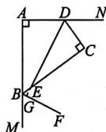

# 周末自评（二）

1. C 2. C 3. D 4. C 5. B 6. A

7. A 8. C 9. 25 10. 8 11. 1.8

12. $55^{\circ}$ 13. ①③④

14. 证明：∵ DE∥AC，∴ ∠EDB = ∠C.

在 $\triangle BDE$ 和 $\triangle ACB$ 中， $\left\{ \begin{array}{l} \angle E = \angle ABC, \\ \angle EDB = \angle C, \\ BD = AC, \end{array} \right.$

$\therefore \triangle BDE \cong \triangle ACB(AAS). \therefore DE = CB.$

15. 解:(1)如图, $\angle DEF$ 即为所求.

(2) 证明：∵ DM ∥ BC，

$\therefore \angle B = \angle FDE.$

$\because BD = AF, \therefore BD -$

$AD = AF - AD$

即 $AB = FD$

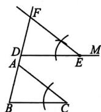

在 $\triangle ABC$ 和 $\triangle FDE$ 中， $\left\{\begin{aligned}\angle C&=\angle DEF,\\ \angle B&=\angle FDE,\\ AB&=FD,\end{aligned}\right.$

$\therefore \triangle ABC \cong \triangle FDE(AAS).$

$\therefore \angle BAC = \angle DFE.\therefore AC / / FE.$

16. 当点 $Q$ 的运动速度为 $2\mathrm{cm / s}, t$ 的值为 1 时, $\triangle ABP \cong \triangle PCQ$ ; 当点 $Q$ 的运动速度为 $\frac{8}{3}\mathrm{cm / s}, t$ 的值为 $\frac{3}{2}$ 时, $\triangle ABP \cong \triangle QCP$

# 周末自评（三）

1. C 2. A 3. B 4. B 5. D 6. A

7. A 8. A 9. 8 米 10. 3 11. ${80}^{ \circ  }$

12. 4 13. (2, -1) 14. 略

15. 证明：∵在△ABC中，∠B=50°，∠C=20°，

$$
\therefore \angle C A B = 1 8 0 ^ {\circ} - \angle B - \angle C = 1 1 0 ^ {\circ}.
$$

$$
\because A E \perp B C, \therefore \angle A E C = 9 0 ^ {\circ}.
$$

$$
\therefore \angle D A F = \angle A E C + \angle C = 1 1 0 ^ {\circ}.
$$

$$
\therefore \angle D A F = \angle C A B.
$$

在 $\triangle DAF$ 和 $\triangle CAB$ 中， $\left\{\begin{aligned}AD&=AC,\\ \angle DAF&=\angle CAB,\\ AF&=AB,\end{aligned}\right.$

$\therefore \triangle DAF \cong \triangle CAB(SAS). \therefore DF = CB.$

16. 证明:(1)∵AE=CF,

$$
\therefore A E - E F = C F - E F, \text {即} A F = C E.
$$

$$
\because B F \perp A C, D E \perp A C,
$$

$\therefore \angle AFB$ 和 $\angle CED$ 均是直角.

在 Rt△ABF 和 Rt△CDE 中， $\left\{\begin{aligned}AB&=CD,\\ AF&=CE,\end{aligned}\right.$

$$
\therefore \mathrm{Rt} \triangle A B F \cong \mathrm{Rt} \triangle C D E (\mathrm{HL}).
$$

$$
\therefore \angle A = \angle C. \therefore A B \parallel C D.
$$

(2) $\because \mathrm{Rt}\triangle ABF\cong \mathrm{Rt}\triangle CDE, \therefore BF = DE.$

在 $\triangle BFG$ 和 $\triangle DEG$ 中， $\left\{\begin{aligned}\angle BGF&=\angle DGE,\\\angle BFG&=\angle DEG=90^{\circ},\\BF&=DE,\end{aligned}\right.$

$\therefore \triangle BFG \cong \triangle DEG(AAS). \therefore BG = DG.$

# 周末自评（四）

1. C 2. C 3. C 4. D 5. A 6. D

7. D 8. B 9. $100^{\circ}$ 10. 13 11. 4,3

12. $32 \, cm^{2}$ 13. $(-6,5)$ 14. 略

15. $\angle ADE = 110^{\circ}$

16. (1)略

(2) $\triangle A^{\prime}B^{\prime}C^{\prime}$ 和 $\triangle DEF$ 成轴对称 作图略

(3)(-1,0)或(-5,0)

17. 证明:(1)在 $\triangle AOB$ 与 $\triangle COD$ 中,

$$
\left\{ \begin{array}{l} \angle A = \angle C, \\ O A = O C, \\ \angle A O B = \angle C O D, \end{array} \right.
$$

$\therefore \triangle AOB \cong \triangle COD(ASA).$

(2) $\because\triangle AOB\cong\triangle COD,\therefore OB=OD.$

∴点 O 在线段 BD 的垂直平分线上.

∵BE=DE,∴点E在线段BD的垂直平分

线上. $\therefore OE$ 垂直平分 $BD$ .

# 周末自评（五）

1. C 2. C 3. B 4. C 5. B 6. B

7. D 8. C 9. 15 海里 10. 6

11. $50^{\circ}$ 或 $65^{\circ}$ 12.4 13. $140^{\circ}$ 14.略

15. 解: $\triangle ABC$ 是等腰三角形.

理由：连接 $DE$ ， $DF$ ，如图所示.

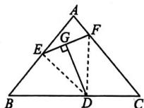

∵DG 是 EF 的垂直平分线，∴DE=DF.

在 $\triangle BDE$ 和 $\triangle CFD$ 中， $\left\{\begin{aligned}BD&=CF,\\ BE&=CD,\\ DE&=FD,\end{aligned}\right.$

$$
\therefore \triangle B D E \cong \triangle C F D (\text { SSS }).
$$

$$
\therefore \angle B = \angle C. \therefore A B = A C.
$$

∴△ABC 是等腰三角形.

16. 证明：∵△ABC 是等边三角形，

$$
\therefore \angle B A C = \angle A B C = \angle A C B = 6 0 ^ {\circ}, A B =
$$

$$
A C = B C. \therefore \angle E A F = \angle D B E = 1 2 0 ^ {\circ}.
$$

$\because BE = CD, \therefore BE + AB = CD + BC,$ 即 $AE = BD.$

在 $\triangle BDE$ 和 $\triangle AEF$ 中， $\left\{\begin{aligned}BE&=AF,\\ \angle DBE&=\angle EAF,\\ BD&=AE,\end{aligned}\right.$

$$
\therefore \triangle B D E \cong \triangle A E F (\mathrm{SAS}). \therefore D E = E F
$$

同理可证 $\triangle AEF\cong \triangle CFD$

$$
\therefore E F = F D, \therefore D E = E F = F D.
$$

∴△DEF 是等边三角形.

17. (1) 证明: $\because AB = AD + BD, AB = AD + CE,$ $\therefore BD = CE.$

在 $\triangle DBE$ 和 $\triangle ECF$ 中， $\left\{\begin{aligned}BE&=CF,\\ \angle B&=\angle C,\\ BD&=CE,\end{aligned}\right.$

$$
\therefore \triangle D B E \cong \triangle E C F (\text { SAS }). \therefore D E = E F.
$$

$$
(2) \angle D E F = 7 0 ^ {\circ} (3) 6 0 ^ {\circ}
$$

# 周末自评（六）

1. A 2. B 3. C 4. B 5. B 6. D

7. D 8. D 9. $\angle 6$ 10. $50^{\circ}$ 或 $80^{\circ}$

11. 52 12. ①②③⑤ 13. 9.5

14. (1) 略 (2) $B'(-3, -1), C'(-2, 1)$

15. 证明： $\because AB = AC, \angle BAC = 36^{\circ}$

$$
\therefore \angle B = \angle A C B = \frac {1}{2} (1 8 0 ^ {\circ} - \angle B A C) = 7 2 ^ {\circ}.
$$

$\because CD$ 平分 $\angle ACB, \therefore \angle DCB = \frac{1}{2} \angle ACB =$

$$
3 6 ^ {\circ}. \because A E / / B C, \therefore \angle E A D = \angle B = 7 2 ^ {\circ}.
$$

$$
\because \angle B = 7 2 ^ {\circ}, \angle D C B = 3 6 ^ {\circ},
$$

$$
\therefore \angle A D E = \angle B D C = 1 8 0 ^ {\circ} - 7 2 ^ {\circ} - 3 6 ^ {\circ} = 7 2 ^ {\circ}.
$$

$$
\therefore \angle E A D = \angle A D E. \therefore A E = D E.
$$

16. 解：(1) 证明： $\because \angle ACB = 90^{\circ}, AC = BC, CH \perp AB, \therefore \angle A = \angle ABC = \angle ACH = \angle BCH = 45^{\circ}$ . $\because$ 将 $\triangle ABC$ 沿 $CE$ 折叠，使点 $A$ 落在直线 $CH$ 上的点 $A'$ 处， $\therefore \angle ACE = \angle ECH = 22.5^{\circ}$ . $\because BM$ 是 $\angle ABC$ 的平分线， $\therefore \angle CBM = \angle ABM = 22.5^{\circ}$ .

$$
\therefore \angle A C E = \angle C B M.
$$

在 $\triangle ACE$ 和 $\triangle CBN$ 中， $\left\{\begin{aligned}\angle A&=\angle BCN,\\ AC&=CB,\\ \angle ACE&=\angle CBN,\end{aligned}\right.$

$$
\therefore \triangle A C E \cong \triangle C B N (\mathrm{ASA}), \therefore A E = C N.
$$

(2)BM垂直平分CE.理由如下：

$$
\because \angle C E B = \angle A + \angle A C E = 6 7. 5 ^ {\circ}, \angle B C E =
$$

$$
\angle B C H + \angle E C H = 6 7. 5 ^ {\circ},
$$

$$
\therefore \angle C E B = \angle B C E, \therefore B C = B E.
$$

又∵BM是∠ABC的平分线，

∴BM垂直平分CE.

# 周末自评（七）

1. D 2. D 3. B 4. B 5. D 6. D

7. B 8. C 9. b-c b-c 10. -4

11. 16 12. 1 13. ±3

14. (1) $-\frac{15}{4} x^{8} y^{7}$ (2) $6x^{3} + 7x^{2} - 15x + 4$

15. (1) $-6x + 2y - 1$ (2)-4

16. $36y^{2}$ 17. $-3$

18. 解: (1) $A \cdot B + 13$ 不可能为负数. 理由如下:
由题意, 得 $A \cdot B + 13 = (2t + 3)(2t - 3) + 13 = 4t^{2} - 9 + 13 = 4t^{2} + 4.$

$$
\because 4 t ^ {2} \geqslant 0, \therefore 4 t ^ {2} + 4 > 0.
$$

$\therefore A \cdot B + 13$ 不可能为负数.

(2)由题意,得 $A^{2}-B^{2}=(2t+3)^{2}-(2t-3)^{2}=(4t^{2}+12t+9)-(4t^{2}-12t+9)=4t^{2}+12t+9-4t^{2}+12t-9=24t.$

$\because t$ 是整数，

∴24t一定能被24整除.

∴当 t 是整数时， $A^{2}-B^{2}$ 一定能被 24 整除.

19. (1) $(a + 2b)(2a + b) = 2a^2 + 5ab + 2b^2$

(2)略

# 周末自评（八）

1. D 2. C 3. C 4. C 5. A 6. D

7. D 8. B 9. $2a + b$ 10. ab 11. 2026

12.5 13. 等腰

14. (1) $mn(m+3)(m-3)$ (2) $(x-2)(x-3)$

(3) $y(x-3)(x+3)$ (4) $(x+2)^{2}(x-2)^{2}$ (5) $xy(2x+y)^{2}$

15. (1)390 (2)36 16. -4

17. (1)① $(m - y)(3 + a)$ ② $(x + y)(a^2 +b^2)$

$$
(2) (a + b + 1) (a + b - 1)
$$

18. 解:(1)1919

(2) 王老师的年龄是 34 岁. 理由如下:

$$
x ^ {3} - x = x \left(x ^ {2} - 1\right) = x (x + 1) (x - 1).
$$

∵王老师手机的锁屏密码是353334, $x+1>$

$$
x > x - 1, \therefore x + 1 = 3 5, x = 3 4, x - 1 = 3 3.
$$

∴王老师的年龄是34岁.

# 周末自评（九）

1. A 2. A 3. C 4. B 5. D 6. A

7. A 8. C 9. 1 10. $-\frac{x - y}{x(x + y)}$ 11. $\frac{1}{3}$

12. $\frac{b}{a}$ 13. $\frac{2}{3}$ 14. (1) $\frac{1}{ab}$ (2) $\frac{2}{a - 2}$

15. 原式 $= \frac{1}{a - 1}$

$$
\because a + 1 \neq 0, a ^ {2} - 1 \neq 0,
$$

$$
\therefore a \neq \pm 1.
$$

又∵-2<a<3，且a为整数，

$$
\therefore a = 0 \text {或} a = 2.
$$

当 $a = 0$ 时，原式 $= -1$ （或当 $a = 2$ 时，原式 $= 1$ ）

16. 解:任务一:①分配律

②分式的基本性质(或分式的分子与分母乘(或除以)同一个不等于0的整式,分式的值不变)

③四 括号前面是“一”，去掉括号后，括号里面的第二项没有变号

任务二： $2x + 8$

17. (1)C (2) $m - 1 + \frac{4}{m + 1}$

# 周末自评（十）

1. D 2. B 3. C 4. B 5. C 6. C

7. A 8. B 9. 5 10. 10

11. $3ax^{2}y^{2}(m + 2n)^{-3}$ 12. $\frac{s}{t(t - 1)}$ 13. -4

14. (1) $x = 4$ (2) $x = 2$ 15. $350\mathrm{km / h}$

16. (1) 小强说得对. 理由如下:

解这个关于 x 的分式方程, 得到方程的解为 x=a-2.

$$
\because \text { 解是正数 }, \therefore a - 2 > 0. \therefore a > 2.
$$

$$
\because x \neq 1, \therefore a - 2 \neq 1, \text {即} a \neq 3.
$$

故 $a$ 的取值范围是 $a > 2$ 且 $a \neq 3$ .

∴小强说得对.

(2)3或4或0

17. 解:(1)甲、乙两队合作4天

(2)C 方案更省钱. 理由: 解方程 $4\left(\frac{1}{x}+\frac{1}{2x}\right)+\frac{x-4}{2x}=1$ , 得 x=8.

经检验，x=8 是原分式方程的解，且符合题意.
∴ 规定的工期为 8 天.

如期完成的两种施工方案需要的费用分别为：

A方案:1.1×8=8.8(万元);

C方案: $4\times1.1+8\times0.5=8.4$ (万元).

$\because 8.8 > 8.4, \therefore C$ 方案更省钱.

# 周末自评（十一）

1. B 2. D 3. B 4. A 5. D 6. A

7. D 8. A 9. $x \neq 5$ 10. $\frac{a + 10}{a}$

11. $-\frac{4}{ab}$ 12. 5 13. $-\frac{1}{4}$

14. (1) $2m + 6$ (2) $\frac{1}{x - 1}$

15. 原分式方程无解

16. 解: 原式 = $\left[\frac{a+3}{(a+3)(a-3)}-\frac{2}{a-3}\right]\div$

$$
\frac {1}{a - 3} + a = \left(\frac {1}{a - 3} - \frac {2}{a - 3}\right) \cdot (a - 3) + a =
$$

$$
\frac {- 1}{a - 3} \cdot (a - 3) + a = a - 1.
$$

当 $a = 2025$ 时，该式子的值为 $2025 - 1 = 2024$

∴小虎马上判断小蓝做错了

$\because$ 原式 $= a - 1, \therefore$ 只要小蓝任意报一个 $a$ 的值 $(a \neq \pm 3)$ , 他都可以用这个数减去 1, 马上求出这个式子的值.

17. (1) $x = -1$ (2) $-1$ 或 $\frac{3}{2}$ 或 $-6$

18. (1)甲、乙两队单独完成这项工程分别需要60天和90天

(2)①工程预算的施工费用不够用,需追加预算2万元 ②40天

# 质量评估卷

# 第十三章质量评估

1. B 2. C 3. C 4. A 5. D

6. B 7. D 8. C 9. C 10. C

11. D 12. D 13. 三角形具有稳定性

14. 等腰 15. 12 16. 9 17. 2 18. $540^{\circ}$

19. 三角形各边的长分别为 $20 \mathrm{~cm}, 20 \mathrm{~cm}, 14 \mathrm{~cm}$ 或 $16 \mathrm{~cm}, 16 \mathrm{~cm}, 22 \mathrm{~cm}$

20. 解: (1)(2)(3) 如图所示.

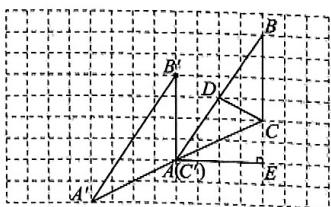

text_image

Geometric diagram with labeled points and right angles on a grid background

(4)8

21. (1) $-3a + b + 3c$ (2)-4

22. $31^{\circ}$

23. (1) 填表如下：

<table><tr><td>∠A的度数</td><td>50°</td><td>60°</td><td>70°</td></tr><tr><td>∠BOC的度数</td><td>115°</td><td>120°</td><td>125°</td></tr></table>

(2) $\angle BOC=90^{\circ}+\frac{1}{2}\angle A.$ 证明略

24. 解:(1)证明:∵BD,CE是△ABC的两条高,

$$
\therefore \angle O E B = \angle B D C = 9 0 ^ {\circ}.
$$

$$
\therefore \angle B A C + \angle A C E = 9 0 ^ {\circ}.
$$

$\because \angle BOC$ 是 $\triangle COD$ 的外角，

$$
\therefore \angle B O C = \angle O C D + \angle C D O =
$$

$$
\angle O C D + 9 0 ^ {\circ}.
$$

$$
\therefore \angle B O C + \angle B A C = \angle O C D + 9 0 ^ {\circ} +
$$

$$
\angle B A C = (\angle O C D + \angle B A C) + 9 0 ^ {\circ} = 9 0 ^ {\circ} +
$$

$$
9 0 ^ {\circ} = 1 8 0 ^ {\circ}.
$$

(2)如图所示,(1)中的结论成立.

证明：∵ BD，CE 是 $\triangle ABC$ 的两条高，

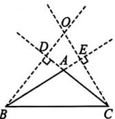

$$
\therefore \angle O E B = \angle B D C = 9 0 ^ {\circ}.
$$

$$
\therefore \angle B O C + \angle O B E = 9 0 ^ {\circ}, \angle D A B + \angle O B E =
$$

$$
9 0 ^ {\circ}. \therefore \angle B O C = \angle D A B. \therefore \angle B O C +
$$

$$
\angle B A C = \angle D A B + \angle B A C. \because \angle D A B +
$$

$$
\angle B A C = 1 8 0 ^ {\circ}, \therefore \angle B O C + \angle B A C = 1 8 0 ^ {\circ}.
$$

# 第十四章质量评估

1. C 2. C 3. D 4. B 5. A

6. B 7. A 8. A 9. B 10. D

11. B 12. B 13. 70 14. 48 15. $82^{\circ}$

16. 7 17. $\frac{9}{2}$ 18. (6,6)

19. 解: 如图, 点 P 即为所求. 过点 P 分别作 $PD \perp BC$ 于点 D, $PE \perp AC$ 于点 E, $PF \perp AB$ 于点 F, 连接 PC.

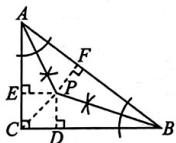

∵AP 平分∠BAC, ∴PE=PF.

同理可得 $PD = PF$

$$
\therefore P D = P E = P F.
$$

设 $PD = PE = PF = R$ cm.

$$
\because S _ {\triangle A B C} = S _ {\triangle A P C} + S _ {\triangle A P B} + S _ {\triangle B P C},
$$

$$
\therefore \frac {1}{2} A C \cdot B C = \frac {1}{2} A C \cdot R + \frac {1}{2} A B \cdot R +
$$

$$
\frac {1}{2} B C \cdot R. \therefore 3 \times 4 = 3 R + 5 R + 4 R,
$$

解得 $R = 1$ . $\therefore PD = PE = PF = 1$ cm.

故点 $P$ 到 $\triangle ABC$ 三边的距离均为 $1\mathrm{cm}$ .

20. 证明：∵ $\angle BAC = \angle DAM, \angle BAC =$

$$
\angle B A D + \angle D A C, \angle D A M = \angle D A C +
$$

$\angle NAM, \therefore \angle BAD = \angle NAM.$ 在 $\triangle BAD$ 和

$$
\triangle N A M \text {中}, \left\{ \begin{array}{l l} A B = A N, \\ \angle B A D = \angle N A M, \\ A D = A M, \end{array} \right.
$$

$$
\therefore \triangle B A D \cong \triangle N A M (\text { SAS }).
$$

$$
\therefore \angle B = \angle A N M.
$$

21. (1) 证明: $\because AD \perp DE, BE \perp DE$ ,

$$
\therefore \angle A D C = \angle C E B = 9 0 ^ {\circ}. \text {   又   } \because \angle A C B =
$$

$$
9 0 ^ {\circ}, \therefore \angle A C D + \angle B C E = 9 0 ^ {\circ}.
$$

$$
\text { 又 } \because \angle A C D + \angle D A C = 9 0 ^ {\circ},
$$

$$
\therefore \angle B C E = \angle D A C.
$$

在 $\triangle ADC$ 和 $\triangle CEB$ 中， $\left\{\begin{aligned}\angle ADC&=\angle CEB,\\ \angle DAC&=\angle ECB,\\ AC&=CB,\end{aligned}\right.$

$$
\therefore \triangle A D C \cong \triangle C E B (\mathrm{AAS}).
$$

$$
(2) 2 0 \mathrm{cm}
$$

22. (1) 证明: $\because \angle BED = \angle BAE + \angle ABE$ ,

$$
\angle B A C = \angle B A E + \angle C A F,
$$

$$
\angle B E D = \angle B A C, \therefore \angle A B E = \angle C A F.
$$

$$
\because \angle C F D = \angle A C F + \angle C A F,
$$

$$
\angle B A C = \angle B A E + \angle C A F,
$$

$$
\angle C F D = \angle B A C, \therefore \angle B A E = \angle A C F.
$$

在 $\triangle ABE$ 和 $\triangle CAF$ 中，

$$
\left\{ \begin{array}{l} \angle A B E = \angle C A F, \\ A B = C A, \\ \angle B A E = \angle A C F, \end{array} \right.
$$

$$
\therefore \triangle A B E \cong \triangle C A F (\mathrm{ASA}).
$$

(2) $EF+CF=BE.$ 理由略

23. 解:(1)证明:∵AD是BC边上的中线,

$$
\therefore C D = B D.
$$

在 $\triangle ACD$ 和 $\triangle EBD$ 中，

$$
\left\{ \begin{array}{l} A D = E D, \\ \angle A D C = \angle E D B, \\ C D = B D, \end{array} \right.
$$

$$
\therefore \triangle A C D \cong \triangle E B D (\mathrm{SAS}).
$$

(2)AD 与 BC 的数量关系为 $AD=\frac{1}{2}BC$ .

理由如下：

延长 $AD$ 到点 $E$ , 使 $ED = AD$ , 连接 $BE$ , 如

图所示.

同(1)可得 $\triangle ACD\cong$

$$
\triangle E B D,
$$

$$
\therefore \quad A C = B E,
$$

$$
\angle D A C = \angle D E B.
$$

$$
\therefore A C \parallel B E,
$$

$$
\therefore \angle B A C + \angle A B E = 1 8 0 ^ {\circ}.
$$

$$
\text { 又 } \because \angle B A C = 9 0 ^ {\circ},
$$

$$
\therefore \angle A B E = 9 0 ^ {\circ} = \angle B A C.
$$

在 $\triangle BAC$ 和 $\triangle ABE$ 中，

$$
\left\{ \begin{array}{l} A C = B E, \\ \angle B A C = \angle A B E, \\ A B = B A, \end{array} \right.
$$

$$
\therefore \triangle B A C \cong \triangle A B E (\mathrm{SAS}). \therefore B C = A E.
$$

$$
\because A D = E D = \frac {1}{2} A E, \therefore A D = \frac {1}{2} B C.
$$

24. 证明: 如图, 过点 C 作 $CF \perp AD$ 交 AD 的延长线于点 F.

∵AC平分∠BAD，

$$
C E \perp A B, C F \perp A D,
$$

$$
\therefore C E = C F, \angle C F D = \angle A E C = \angle C E B =
$$

$$
9 0 ^ {\circ}. \because \angle B + \angle A D C = 1 8 0 ^ {\circ}, \angle A D C +
$$

$$
\angle C D F = 1 8 0 ^ {\circ}, \therefore \angle C D F = \angle B.
$$

在 $\triangle CDF$ 和 $\triangle CBE$ 中，

$$
\left\{ \begin{array}{l} \angle C D F = \angle B, \\ \angle C F D = \angle C E B, \\ C F = C E, \end{array} \right.
$$

$$
\therefore \triangle C D F \cong \triangle C B E (\mathrm{AAS}), \therefore D F = B E.
$$

在 Rt△ACF 和 Rt△ACE 中， $\left\{\begin{aligned}AC&=AC,\\ CF&=CE,\end{aligned}\right.$

$$
\therefore \mathrm{Rt} \triangle A C F \cong \mathrm{Rt} \triangle A C E (\mathrm{HL}). \therefore A F = A E.
$$

$$
\because A F = A D + D F, \therefore A E = A D + B E.
$$

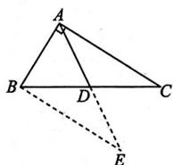

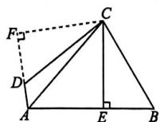

# 第十五章质量评估

1. A 2. B 3. D 4. B 5. C 6. A

7. C 8. A 9. A 10. B 11. D 12. D

13. 4 14. $40^{\circ}$ 或 $140^{\circ}$ 15. $37^{\circ}$ 16. $15^{\circ}$

17. (1,0) 18. 15 19. 略 20. $78^{\circ}$

21. (1) 证明: $\because \triangle ABC$ 为等边三角形, $\therefore \angle B = \angle ACB = 60^{\circ}, AB = AC$ . $\therefore \angle ACD = 120^{\circ}$ . $\because CE$ 平分 $\angle ACD$ , $\therefore \angle ACE = \angle DCE = 60^{\circ}$ . $\therefore \angle B = \angle ACE$ . 在 $\triangle ABD$ 和 $\triangle ACE$

$$
\text {中,} \left\{ \begin{array}{l l} A B = A C  , \\ \angle B = \angle A C E  , \\ B D = C E  , \end{array} \right.
$$

$$
\therefore \triangle A B D \cong \triangle A C E (\text { SAS }).
$$

(2) $\triangle ADE$ 是等边三角形. 证明略

22.3 海里 23.9.2

24. (1)(3,3) (2) $AC = CD$ . 理由略

(3)线段 $AQ$ 的值不变， $AQ$ 的长度为6

# 期中质量评估

1. C 2. B 3. A 4. D 5. C 6. A

7. C 8. D 9. B 10. D 11. A 12. B

13. 5 14. 4 15. $48^{\circ}$ 16. 7 17. 4

18. (1)45

(2)如图,取格点 H, 连接 AH 交 BC 于点 E, 连接 BH, 易得 AB = BH = $\sqrt{17}$ , $\angle ABH = 90^{\circ}$ , 则 Rt△ABH 是等腰直角三

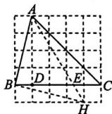

角形, 可得 $\angle BAH = 45^{\circ}$ , 则 $\angle BAH = \angle DAC = 45^{\circ}$ , 由 $\angle BAD + \angle DAE = \angle DAE + \angle EAC = 45^{\circ}$ , 可得 $\angle EAC = \angle BAD$ , 故点 $E$ 即为所求作.

19. 解:(1)如图所示, $\triangle A_{1}B_{1}C_{1}$ 即为所求;
观察图象,得点A,B,C与点 $A_{2},B_{2},C_{2}$ 三个对应点的横、纵坐标分别互为相反数.

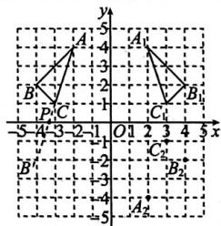

text_image

y
5
4
A
3
B
2
P
1
C
0 1 2 3 4 5 x
-5 -3 -2 -1 O 1 2 3 4 5
B'
-2
-3
-4
-5
A'
B'
C'
C'
B'
A'
B'

(2)如图,作点 B 关于 x 轴的对称点 $B'$ , 连接 $CB'$ 交 x 轴于点 P, 点 P 就是所要求的点.

20. 44

21. 解: 小军的方案可行.

理由如下:在 $\triangle AOB$ 和 $\triangle COD$ 中,

$\left\{ \begin{array}{l} AO = CO, \\ \angle AOB = \angle COD, \therefore \triangle AOB \cong \triangle COD, \\ BO = DO, \end{array} \right.$ $\therefore DC = AB, \therefore$ 测出 $DC$ 的长即为雕塑底座两端 $A, B$ 间的距离.

22. (1) $3^{\circ}$ (2)2.4

23. (1) $\because \angle ACB = 110^{\circ}, \therefore \angle ACD = 180^{\circ} - \angle ACB = 70^{\circ}$ . $\because EH \perp BD, \angle CEH = 55^{\circ}, \therefore \angle DCE = 90^{\circ} - \angle CEH = 35^{\circ}, \therefore \angle ACE = \angle ACD - \angle DCE = 35^{\circ}$ .

(2) 证明: 如图, 过点 E 作 $EM \perp BF$ 于点 M, 作 $EN \perp AC$ 于点 N.

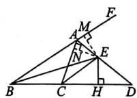

∵ BE 平分∠ABC, EM⊥BF, EH⊥BD,

$\therefore EM = EH.$ 由（1）可知， $\angle ACE =$

$\angle DCE = 35^{\circ}$ ，即 $CE$ 平分 $\angle ACD$ ，同理可得

$EN = EH, \therefore EM = EN,$ 又 $\because$ 点 $E$ 在 $\angle CAF$ 的内部，∴AE平分∠CAF.

(3) $\frac{51}{4}$

24. (1) $m - 4$ (2) $D(2, - 2),\angle DOC = 45^{\circ}$

(3) $EF = BC + EC$ . 证明略

# 第十六章质量评估

1. D 2. D 3. D 4. D 5. C

6. B 7. A 8. $2xy$ 9. $4 - m^2$

10. 7 或 -1 11. $2m = n + 1$ 12. -3.5

13. 解: (1) 原式 = $(9x^{2}y^{4}) \cdot (-6x^{3}y) \div$

$$
(9 x ^ {4} y ^ {5}) = - (9 \times 6 \div 9) x ^ {2 + 3 - 4} y ^ {4 + 1 - 5} = - 6 x.
$$

(2) 原式 $= x^{2} + 2x + 1 - x^{2} + 4 + x - 5 = 3x$ .

(3) $(15x^{3}y^{5} - 10x^{4}y^{4} - 20x^{3}y^{2})\div$

$$
\left(- 5 x ^ {3} y ^ {2}\right) = \left(1 5 x ^ {3} y ^ {5}\right) \div \left(- 5 x ^ {3} y ^ {2}\right) -
$$

$$
(1 0 x ^ {4} y ^ {4}) \div (- 5 x ^ {3} y ^ {2}) - (2 0 x ^ {3} y ^ {2}) \div
$$

$$
(- 5 x ^ {3} y ^ {2}) = - 3 y ^ {3} + 2 x y ^ {2} + 4.
$$

14. 解:(1)y

(2) 原式 $= (16x^{2} - 8xy + y^{2} - 16x^{2} + y^{2}) \div$

$$
(- 2 y) = (2 y ^ {2} - 8 x y) \div (- 2 y) = - y + 4 x.
$$

当 $x = -\frac{1}{4}, y = 2$ 时，

原式 $= -2 + 4 \times \left(-\frac{1}{4}\right) = -2 - 1 = -3$

15. 解: 小隽的发现正确. 理由如下:

$\because$ 原式 $= 6a^{2}b - 4ab^{2} - 2ab + 2ab + 4ab^{2}-$

$$
6 a ^ {2} b + 1 = 1, \therefore \text {式子} 2 a b (3 a - 2 b - 1) - 2 a b
$$

$(-1 - 2b) + (-6a^2 b + 1)$ 的值与 $a, b$ 的取值无关. $\therefore$ 小隽的发现正确.

16. 解: (1) $4xy = (x + y)^{2} - (x - y)^{2}$

(2)由(1)知 $(3x + 2y)^{2} - (3x - 2y)^{2} = 4\times$

$3x \times 2y$ ，即 $9 - 5 = 24xy, \therefore xy = \frac{1}{6}$ .

(3) 由 (1) 知 $(2x + y)^{2} - (2x - y)^{2} = 4 \times$

$$
2 x \times y, \text {即} 5 ^ {2} - (2 x - y) ^ {2} = 8 \times 2, \therefore (2 x -
$$

$$
y) ^ {2} = 9. \therefore 2 x - y = \pm 3.
$$

# 第十七章质量评估

1. D 2. D 3. D 4. A 5. D 6. A

7. B 8. $x(x - 5)$ 9. $4xmyn$ 10. $-2$

11. $x^{2} - 1$ (答案不唯一) 12. 2025.5

13. (1) $7x(3y - 2z + 5x)$ (2) $a(a - 1)^{2}$

$$
(3) 3 x (x - 2 y) ^ {2} \quad (4) (x - 2) (x - 3)
$$

$$
(5) (m + 2) ^ {2} (m - 2) ^ {2}
$$

14. 解: 他们的计算过程均不正确.

正确的计算过程如下：

$$
3 (x - y) ^ {3} - (y - x) ^ {2}
$$

$$
= 3 (x - y) ^ {3} - (x - y) ^ {2}
$$

$$
= (x - y) ^ {2} [ 3 (x - y) - 1 ]
$$

$$
= (x - y) ^ {2} (3 x - 3 y - 1).
$$

15. 解: $8x^{3}(x-3)-12x^{2}(x-3)=4x^{2}(x-3)(2x-3)$ .

当 $x = \frac{3}{2}$ 时，原式 $= 4\times \left(\frac{3}{2}\right)^2\times \left(\frac{3}{2} -\right.$

$$
3) \times \left(2 \times \frac {3}{2} - 3\right) = 0.
$$

16. (1) $(x - 1)(x + 10)$

$$
(2) (x - 1) (x - 3) (x + 2)
$$

$$
(3) (x - 2) (x + 2) \left(x ^ {2} + 5 x + 5\right)
$$

# 第十八章质量评估

1. B 2. B 3. D 4. D 5. B 6. D 7. C

8. B 9. A 10. A 11. C 12. C

13. $12a^{3}bc$ 14. 2 15. $\frac{m}{2n}$ 16. 4

17. $m > -6$ 且 $m \neq -4$ 18. $\frac{1}{61}$

19. (1) $\frac{n^3}{4m^5}$

(2) $\left(\frac{1}{a + b} -\frac{1}{a - b}\right)\div \frac{b}{a^2 - 2ab + b^2} =$

$$
\frac {(a - b) - (a + b)}{(a + b) (a - b)} \cdot \frac {(a - b) ^ {2}}{b} = - \frac {2 a - 2 b}{a + b}.
$$

当 $a = 1, b = 2$ 时，原式 $= \frac{2}{3}$ .

(3) 原式 $= \left[\frac{a + 2}{a(a - 2)} - \frac{a - 1}{(a - 2)^2}\right] \div \frac{a - 4}{a}$

$$
= \left[ \frac {a ^ {2} - 4}{a (a - 2) ^ {2}} - \frac {a ^ {2} - a}{a (a - 2) ^ {2}} \right] \cdot \frac {a}{a - 4}
$$

$$
= \frac {a - 4}{a (a - 2) ^ {2}} \cdot \frac {a}{a - 4}
$$

$$
= \frac {1}{(a - 2) ^ {2}}.
$$

当 $a = 1$ 时，原式 $= \frac{1}{(1 - 2)^2} = 1.$

20. (1) $x = 3$ (2) 原分式方程无解

21. (1)-6 (2)-1 或 $\frac{3}{2}$ 或 -6

22. (1) 淇淇的速度为 $150 \mathrm{~m} / \mathrm{min}$ , 嘉嘉的速度为 $180 \mathrm{~m} / \mathrm{min}$

(2) 淇淇

23. (1)60个 (2)100元/个

24. 解:(1)由题意,得“丰收1号”小麦的单位面积产量为 $\frac{500}{a^{2}-1}\ kg/m^{2}$ ,“丰收2号”小麦的单位面积产量为 $\frac{500}{(a-1)^{2}}\ kg/m^{2}$ , $\therefore\frac{500}{a^{2}-1}-$

$$
\frac {5 0 0}{(a - 1) ^ {2}} = \frac {5 0 0 (a - 1) - 5 0 0 (a + 1)}{(a - 1) ^ {2} (a + 1)} =
$$

$$
- \frac {1 0 0 0}{(a - 1) ^ {2} (a + 1)}.
$$

$$
\because a > 1, \therefore \frac {5 0 0}{a ^ {2} - 1} \quad \frac {5 0 0}{(a - 1) ^ {2}} =
$$

$$
- \frac {1 0 0 0}{(a - 1) ^ {2} (a + 1)} <   0, \therefore \frac {5 0 0}{a ^ {2} - 1} <   \frac {5 0 0}{(a - 1) ^ {2}},
$$

∴“丰收2号”小麦的单位面积产量高.

(2)由题图②可知，“丰收1号”和“丰收2号”小麦的试验田的周长分别为 $4a\mathrm{m}, 4(a - 1)\mathrm{m}$ . 根据题意，得 $\frac{3300}{4(a - 1)} = 2 \times \frac{1800}{4a}$ ，解得 $a = 12$ 。经检验， $a = 12$ 是方程的解，且符合题意。 $\therefore a$ 的值为12.

# 期末质量评估（一）

1. B 2. B 3. C 4. B 5. A 6. C

7. B 8. A 9. A 10. D 11. B 12. C

13. -1 14. 1 15. ±8 16. $\frac{xy}{x + y}$ 17. $\frac{5}{2}$

18. 如图, 取格点 $B'$ , 连接 $CB', AB'$ , 在 $CB'$ 上取点 $E'$ , 使得 $CE' = CE$ , 连接 $DE'$ , 交 $AC$ 于点 $F$ , 则点 $F$ 即为所求.

说明：取格点 $B^{\prime}$ ，得到 $\triangle AB^{\prime}C$ 与 $\triangle ABC$ 关于 $AC$ 对称，在 $CB^{\prime}$ 上取点 $E^{\prime}$ ，使得 $CE^{\prime} = CE$ ，则点 $E^{\prime}$ 与点 $E$ 关于 $AC$ 对称，

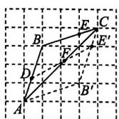

连接 $DE^{\prime}$ ，交 $AC$ 于点 $F,DF + EF = DF+$ $E^{\prime}F = DE^{\prime}$ 为最短，故点 $F$ 即为所求.

19. 解:(1)原式= $(a+2b)(a-2b)$ . …… 1分

(2) 原式 $= (4x + 3)^{2}$ . …… 2 分

(3) 原式 $= (3x + 2)(-x^{6} + 3x^{5} - 2x^{6} +$

$$
x ^ {5}) + (x + 1) \left(3 x ^ {6} - 4 x ^ {5}\right)
$$

$$
= (3 x + 2) (- 3 x ^ {6} + 4 x ^ {5}) + (x + 1) (3 x ^ {6} - 4 x ^ {5} \dots \dots 1 \text {分}
$$

$$
= - (3 x ^ {6} - 4 x ^ {5}) (3 x + 2 - x - 1) \dots 2 \text {分}
$$

$$
= - (3 x ^ {6} - 4 x ^ {5}) (2 x + 1) \quad \dots\dots
$$

$$
= - x ^ {5} (3 x - 4) (2 x + 1). \quad \dots\dots
$$

(4) 原式 $= \left[\frac{1}{x + 1} + \frac{(x - 1)^2}{(x + 1)(x - 1)}\right] \div \frac{x - 1}{x + 1}$

$$
= \frac {x}{x + 1} \cdot \frac {x + 1}{x - 1} \dots\dots1 \text {分}
$$

$$
= \frac {x}{x - 1}. \dots \dots 2 \text {分}
$$

当 $x = 2$ 时，原式 $= \frac{2}{2 - 1} = 2.$ ……5分

20. 解: 去分母, 得 3-2x=x-2. …… 1 分

移项,合并同类项,得-3x=-5. …… 2分

解得 $x = \frac{5}{3}$ 3分

经检验, $x=\frac{5}{3}$ 是原分式方程的解. … 5 分

21. 解: $\because E$ 为等边三角形 $ABC$ 的边 $AC$ 上一点,

$$
\therefore A B = A C, \angle B A E = 6 0 ^ {\circ}. \dots\dots1 \text {分}
$$

在 $\triangle ABE$ 和 $\triangle ACD$ 中， $\left\{\begin{aligned}AB&=AC,\\ \angle1&=\angle2,\\ BE&=CD,\end{aligned}\right.$

$$
\begin{array}{l} \therefore \triangle A B E \cong \triangle A C D (\text { SAS }), \\ \begin{array}{r l} & {\therefore A D = A E, \angle C A D = \angle B A E = 6 0 ^ {\circ}, \quad \dots \dots} \\ & {\qquad \dots \dots 3 \text {分}} \end{array} \\ \end{array}
$$

∴△ADE 是等边三角形，∴∠AED=60°.
…… 5 分

22. 解:(1)证明:∵∠BAD=∠CAE,

$$
\therefore \angle B A D + \angle D A C = \angle C A E + \angle D A C,
$$

即 $\angle BAC = \angle DAE.$ 1分

在 $\triangle ABC$ 和 $\triangle ADE$ 中，

$$
\left\{ \begin{array}{l} {\angle C = \angle E  ,} \\ {\angle B A C = \angle D A E  ,   \dots\dots2 \text {分}} \\ {A B = A D  ,} \end{array} \right.
$$

$$
\therefore \triangle A B C \cong \triangle A D E (\mathrm{AAS}). \quad \dots\dots3 \text {分}
$$

(2) $\because \triangle ABC \cong \triangle ADE$ ,

$$
\therefore \angle B = \angle A D E. \dots\dots4 \text {分}
$$

又∵∠ADC=∠B+∠BAD=∠ADE+
∠CDE,

$$
\therefore \angle B A D = \angle C D E = 4 6 ^ {\circ} \quad \dots \dots 6 \text {分}
$$

23. 解:(1)设这项工程的规定时间是 x 天.

根据题意，得

$\left(\frac{1}{x} + \frac{1}{3x}\right) \times 15 + \frac{10}{x} = 1$ ，解得 $x = 30$ .

经检验, x = 30 是原分式方程的解, 且符合题意.

答:这项工程的规定时间是30天.……4分

(2)该工程由甲、乙两队共同完成，

所需时间为 $1 \div \left(\frac{1}{30} + \frac{1}{30 \times 3}\right) = 22.5$ （天）.

答:该工程施工需要22.5天.……8分

24. 解：(1) 证明：∵∠ACB=90°, AC=BC,

$$
\therefore \angle A = \angle A B C = 4 5 ^ {\circ}, \angle B C D = 9 0 ^ {\circ}.
$$

$$
\begin{array}{l} \therefore \angle C D B + \angle C B D = 9 0 ^ {\circ}, \angle C F D + \\ \angle C D F = 9 0 ^ {\circ}. \end{array}
$$

$$
\because \angle C F D = \angle E F B = \angle C D B,
$$

$$
\therefore \angle C D F = \angle C B D. \quad \dots\dots1 \text {分}
$$

$$
\text { 又 } \because \angle D E B = \angle A + \angle C D F = 4 5 ^ {\circ} +
$$

$$
\begin{array}{l} \angle C D F, \angle D B E = \angle A B C + \angle C B D = \\ 4 5 ^ {\circ} + \angle C B D, \end{array}
$$

$$
\therefore \angle D E B = \angle D B E. \quad \dots \dots 2 \text {分}
$$

$$
\therefore D E = B D. \dots\dots3 \text {分}
$$

(2)证明:如图①,过点 E 作 $EN \perp AC$ 于点 N,

$$
\begin{array}{r l} & {\text {则} \angle A N E = \angle D N E =} \\ & {\angle B C D = 9 0 ^ {\circ}.} \end{array}
$$

由（1）可得 $\angle NDE = \angle CBD, DE = DB,$

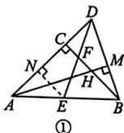

$$
\therefore \triangle D N E \cong \triangle B C D (\mathrm{AAS}).
$$

$$
\therefore N E = C D. \dots\dots4 \text {分}
$$

$$
\because \angle N A E = 4 5 ^ {\circ}, \angle A N E = 9 0 ^ {\circ},
$$

$\therefore \triangle ANE$ 是等腰直角三角形.

$$
\therefore N A = N E = C D.
$$

$$
\because A M \perp D B, \therefore \angle B M H = 9 0 ^ {\circ} = \angle A C H.
$$

$$
\text { 又 } \because \angle B H M = \angle A H C,
$$

$$
\therefore \angle C A H = \angle C B D. \quad \dots\dots 5 \text {分}
$$

$$
\text { 又 } \because C A = C B, \angle A C H = \angle B C D = 9 0 ^ {\circ},
$$

$$
\therefore \triangle A C H \cong \triangle B C D (\mathrm{ASA}). \quad \dots\dots 6 \text {分}
$$

$$
\therefore C H = C D. \therefore C H = N A.
$$

$$
\therefore A C - N A = B C - C H,
$$

$$
\text { 即 } C N = B H.
$$

$$
\because N A + C N + C D = A D,
$$

$$
\therefore C D + B H + C D = A D,
$$

$$
\text { 即 } B H + 2 C D = A D. \quad \dots\dots7 \text { 分 }
$$

(3) 如图 ②, 过点 E 作 $EN \perp AC$ 于点 N. …… 8 分

由(2)可知, NA = NE =
CH = CD.

$$
\begin{array}{r l} & {\text {设} N A = N E = C H = C D = x, \text {则} A C = B C =} \\ & {B H + C H = 8 + x, A D = A C + C D = 8 + x +} \\ & {x = 8 + 2 x. \quad \dots\dots9 \text {分}} \end{array}
$$

$$
\because S _ {\triangle A B C} - S _ {\triangle A C E} = S _ {\triangle B C E} = 8 0,
$$

$$
\therefore \frac {1}{2} (8 + x) (8 + x) - \frac {1}{2} (8 + x) \cdot x = 8 0,
$$

$$
\text { 解得 } x = 1 2.
$$

$$
\therefore N E = 1 2, A D = 8 + 2 \times 1 2 = 3 2.
$$

$$
\begin{array}{l} \therefore S _ {\triangle A D E} = \frac {1}{2} A D \cdot N E = \frac {1}{2} \times 3 2 \times 1 2 = \\ 1 9 2, \end{array}
$$

$$
\text { 即 } \triangle A D E \text { 的面积为 } 1 9 2. \dots\dots1 0 \text { 分 }
$$

# 期末质量评估（二）

1. C 2. A 3. B 4. B 5. B

6. C 7. D 8. B 9. C 10. A

11. A 12. D 13. $(-7, -9)$ 14. 3

15. 18 16. 3 或 $\pm \sqrt{6}$ 17. 6

18. (1)90

(2)如图,延长CB交格线于点E,取格点F,G,连接CF,CG并延长,分别交格线于点P,Q,连接PQ与点C

所在的格线相交于点 $H$ ，连接 $EH$ 与 $AB$ AD分别相交于点 $M,N$ ，点 $M,N$ 即为所求

19. 解:(1)原式=3xy(4z-3xy). …… 2分

$$
\begin{array}{l} (2) \text { 原式 } = x ^ {2} (y - 4) - 9 (y - 4) \\ = (y - 4) (x ^ {2} - 9) \dots\dots1 \text {分} \\ = (y - 4) (x + 3) (x - 3). \quad \dots \dots 2 \text {分} \\ \end{array}
$$

20. 解: (1) $(6x^{4} - 8x^{3}) \div (-2x^{2})$

$$
= 6 x ^ {4} \div (- 2 x ^ {2}) - 8 x ^ {3} \div (- 2 x ^ {2}) \dots \dots 1 \text { 分 }
$$

$$
= - 3 x ^ {2} + 4 x. \dots \dots 2 \text {分}
$$

$$
\begin{array}{l} (2) (2 x + y) (2 x - y) - (x + y) ^ {2} \\ = (4 x ^ {2} - y ^ {2}) - (x ^ {2} + 2 x y + y ^ {2}) \dots \dots 1 \text { 分 } \\ = 4 x ^ {2} - y ^ {2} - x ^ {2} - 2 x y - y ^ {2} \\ = 3 x ^ {2} - 2 x y - 2 y ^ {2}. \dots \dots 2 \text {分} \\ \end{array}
$$

$$
(3) \text {   原式   } = (- 3 x y) \div \frac {2 y ^ {2}}{3 x} \cdot \frac {y ^ {2}}{x ^ {2}}
$$

$$
= (- 3 x y) \cdot \frac {3 x}{2 y ^ {2}} \cdot \frac {y ^ {2}}{x ^ {2}} \dots\dots1 \text {分}
$$

$$
= - \frac {9 y}{2}. \quad \dots\dots 2 \text {分}
$$

21. 解:(1)去分母,得 $2(x-2)=3x$ . …… 1 分

去括号, 得 2x-4=3x. …… 2 分

解得 $x = -4$ …… 3 分

$$
\begin{array}{r l} & {\text {经检验}, x = - 4 \text {是原分式方程的解}. \dots \dots} \\ & {\dots \dots 4 \text {分}} \end{array}
$$

$$
\begin{array}{r l} {(2) \text {去分母}, \text {得} - 3 + 2 (x - 4) = 1 - x.} & {\dots \dots} \\ & {\dots \dots 1 \text {分}} \end{array}
$$

去括号,得 $-3+2x-8=1-x$ ．……2分

解得 $x = 4$ ……3分

经检验， $x = 4$ 是分式方程的增根，

故原分式方程无解. …… 4 分

22. 解: $\left(\frac{1}{x-1}-\frac{1}{x+1}\right) \div \frac{x+2}{x^2-1}$

$$
= \left[ \frac {x + 1}{(x + 1) (x - 1)} - \frac {x - 1}{(x + 1) (x - 1)} \right] \cdot
$$

$$
\frac {(x - 1) (x + 1)}{x + 2}
$$

$$
= \frac {x + 1 - x + 1}{(x + 1) (x - 1)} \cdot \frac {(x - 1) (x + 1)}{x + 2} \quad \dots 2 \text {分}
$$

$$
= \frac {2}{(x + 1) (x - 1)} \cdot \frac {(x - 1) (x + 1)}{x + 2}
$$

$$
= \frac {2}{x + 2}. \dots\dots4 \text { 分 }
$$

当 $x = 2$ 时，原式 $= \frac{2}{2 + 2} = \frac{1}{2}$ ……6分

23. 解:(1)BH=AC. …… 1 分

理由：∵AD和BE是△ABC的高，

$$
\therefore \angle B D H = \angle A D C = \angle B E C = 9 0 ^ {\circ}.
$$

$$
\therefore \angle D B H + \angle C = \angle D A C + \angle C = 9 0 ^ {\circ}.
$$

$$
\therefore \angle D B H = \angle D A C. \quad \dots\dots2 \text {分}
$$

在 $\triangle BDH$ 和 $\triangle ADC$ 中，

$$
\left\{ \begin{array}{l} \angle D B H = \angle D A C, \\ B D = A D, \\ \angle B D H = \angle A D C, \end{array} \right.
$$

$$
\therefore \triangle B D H \cong \triangle A D C (\mathrm{ASA}).
$$

$$
\therefore B H = A C. \dots\dots3 \text {分}
$$

(2)如图. 4分

text_image

Geometric diagram of triangle ABC with perpendiculars from point A to sides, labeled points H, E, D, and right-angle symbols

(1)中的结论还成立. 5分

理由：∵AD和BE是△ABC的高，

$$
\therefore \angle B D H = \angle A D C = \angle B E C = 9 0 ^ {\circ}.
$$

$$
\therefore \angle D B H + \angle C = \angle D A C + \angle C = 9 0 ^ {\circ}.
$$

$$
\therefore \angle D B H = \angle D A C. \quad \dots\dots6 \text {分}
$$

在 $\triangle BDH$ 和 $\triangle ADC$ 中，

$$
\left\{ \begin{array}{l} \angle D B H = \angle D A C, \\ B D = A D, \\ \angle B D H = \angle A D C, \end{array} \right.
$$

$$
\therefore \triangle B D H \cong \triangle A D C (\mathrm{ASA}).
$$

$$
\therefore B H = A C. \dots\dots7 \text {分}
$$

24. 解:(1)

<table><tr><td></td><td>速度 (千米/时)</td><td>所用时间(时)</td><td>所走的路程(千米)</td></tr><tr><td>骑自行车</td><td>x</td><td>10/x</td><td>10</td></tr><tr><td>乘汽车</td><td>2x</td><td>10/2x</td><td>10</td></tr></table>

$$
\dots\dots3 \text {分}
$$

(2)由(1)可列方程 $\frac{10}{x}=\frac{10}{2x}+\frac{20}{60},\cdots\cdots4$ 分

解得 $x = 15$ …… 5 分

经检验，x=15 是原方程的解，且符合题意.
…… 6 分

答:骑自行车同学的速度为15千米/时. …
…… 7分

25. 解: (1) $\triangle ABO$ 是等边三角形. …… 1 分理由如下:

$$
\because a ^ {2} + c ^ {2} + 2 b ^ {2} - 2 a b - 2 b c = 0,
$$

$$
\therefore (a ^ {2} - 2 a b + b ^ {2}) + (b ^ {2} - 2 b c + c ^ {2}) = 0.
$$

$$
\therefore (a - b) ^ {2} + (b - c) ^ {2} = 0. \quad \dots \dots 2 \text {分}
$$

$$
\because (a - b) ^ {2} \geqslant 0, (b - c) ^ {2} \geqslant 0,
$$

$$
\therefore a - b = 0, b - c = 0.
$$

$$
\therefore a = b = c.
$$

$$
\therefore B O = A O = A B.
$$

∴△ABO 是等边三角形. …… 3 分

(2) 证明: 如图, 连接 OE, 在 EB 上截取 EM, 使得 ME = AE, 连接 AM.

text_image

y
B
M
A
E
O
D
C
x

$\because AO=AC, AO\perp AC, D$ 为 OC 的中点，

$$
\therefore O D = D C, A D \perp O C, \angle A O D = \angle A C D =
$$

$$
\angle D A C = \angle D A O = 4 5 ^ {\circ}. \therefore O E = C E.
$$

$\because \triangle ABO$ 是等边三角形, $\therefore \angle BAO=60^{\circ}$ .

$$
\therefore \angle B A C = 9 0 ^ {\circ} + 6 0 ^ {\circ} = 1 5 0 ^ {\circ}.
$$

$$
\because A B = A O, A O = A C, \therefore A B = A C.
$$

$$
\therefore \angle A B C = \angle A C B = 1 5 ^ {\circ}. \quad \dots\dots4 \text { 分 }
$$

$$
\therefore \angle A E B = \angle E A C + \angle A C E = 6 0 ^ {\circ}.
$$

又∵ME=AE,∴△AEM是等边三角形.

$$
\therefore \angle M A E = 6 0 ^ {\circ} = \angle B A O, A M = A E.
$$

$$
\therefore \angle B A M = \angle O A E. \text {   又   } \because A B = A O,
$$

$$
\therefore \triangle B A M \cong \triangle O A E (\text { SAS }). \quad \dots\dots 5 \text { 分 }
$$

$$
\therefore B M = O E = C E.
$$

$$
\therefore B E = M E + B M = A E + C E. \quad \dots \dots 6 \text {分}
$$

(3)4 8分