# 全品作业本

# 周末自评本

天津

主编 肖德好

数学

34

# 目录

周末自评（一） …… 评2

周末自评（二） …… 评4

周末自评（三） …… 评6

周末自评（四） …… 评8

周末自评（五） …… 评 10

周末自评（六） …… 评 12

周末自评（七） …… 评 14

周末自评（八） …… 评 16

周末自评（九） …… 评 18

周末自评（十） …… 评 20

周末自评（十一） …… 评 22

参考答案 …… 活 22

# 周末自评（一）

[范围:第十三章 建议时间:40 分钟 分值:100 分]

# 一、选择题(本大题共8小题,每小题4分,共32分)

1. 如图 1-M-1, 一只手握住了一个三角形的一部分, 则这个三角形是 ( )

A. 钝角三角形

B. 直角三角形

C. 锐角三角形

D. 以上都有可能

2. 已知三角形的三边长分别为 3, a, 8，且 a 为奇数，则这样的三角形有 （）

A. 2 个

B. 3 个

C. 4 个

D. 5 个

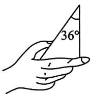  
图1-M-1

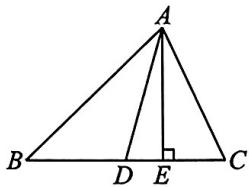

text_image

A
B D E C

图1-M-2

3. 如图 1-M-2, 在 $\triangle ABC$ 中, $AD, AE$ 分别是边 $BC$ 上的中线与高, $AE = 4$ , $\triangle ABC$ 的面积为 12, 则 $CD$ 的长为 ( )

A. 2

B. 3

C. 4

D. 5

4. 如图 1-M-3, 将一张含有 $30^{\circ}$ 角的三角形纸片的两个顶点分别放在长方形的两条对边上. 若 $\angle 2 = 44^{\circ}$ , 则 $\angle 1$ 的度数为 ( )

A. ${14}^{ \circ  }$

B. ${16}^{ \circ  }$

C. $90^{\circ} - \alpha$

D. $\alpha - 44^{\circ}$

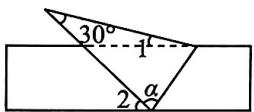  
图1-M-3

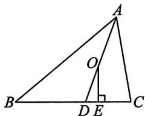

text_image

Geometric diagram of triangle ABC with altitude OE and point D on BC, showing right angle at E.

图1-M-4

5. 如图 1-M-4, AD 是 $\triangle ABC$ 的角平分线, 点 $O$ 在 $AD$ 上, 且 $OE \perp BC$ 于点 $E$ , $\angle BAC = 60^{\circ}$ , $\angle C = 80^{\circ}$ , 则 $\angle EOD$ 的度数为 ( )

A. $20^{\circ}$

B. ${30}^{ \circ  }$

C. $10^{\circ}$

D. ${15}^{ \circ  }$

6. 如图 1-M-5, BD 为 $\triangle ABC$ 的角平分线, $CE$ 为 $\triangle ABC$ 的高, $CE$ 交 $BD$ 于点 $F$ . 若 $\angle A = 80^{\circ}$ , $\angle BCA = 50^{\circ}$ , 则 $\angle BFC$ 的度数是 ( )

A. ${110}^{ \circ  }$

B. $115^{\circ}$

C. $120^{\circ}$

D. $125^{\circ}$

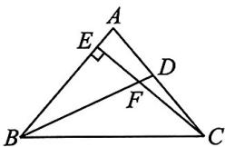

text_image

Geometric diagram of triangle ABC with perpendiculars from points E and D to sides AB and BC, labeled with points A, B, C, D, E, F.

图1-M-5

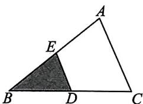

text_image

A
E
B D C

图1-M-6

7. 如图 1-M-6, 在 $\triangle ABC$ 中, $D, E$ 分别是边 $BC, AB$ 的中点. 若 $\triangle ABC$ 的面积等于 8 , 则 $\triangle BDE$ 的面积等于 ( )

A. 2

B. 3

C. 4

D. 5

8. 如图 1-M-7, 把 $\triangle ABC$ 沿 $EF$ 翻折, 点 $B, C$ 分别落在点 $B', C'$ 处. 若 $\angle A = 60^{\circ}, \angle 1 = 95^{\circ}$ , 则 $\angle 2$ 的度数是 ( )

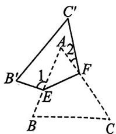

text_image

C'
A
2
B'
1
F
E
B
C

图1-M-7

A. ${15}^{ \circ  }$

B. ${20}^{ \circ  }$

C. ${25}^{ \circ  }$

D. $35^{\circ}$

# 二、填空题(本大题共5小题,每小题4分,共20分)

9. 如图 1-M-8, 自行车的车身为三角形结构, 这样做根据的数学道理是 \_\_\_\_.

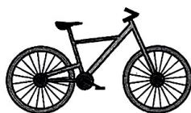  
图1-M-8

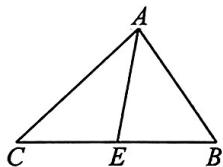  
图1-M-9

10. 如图 1-M-9, 已知 AE 是 $\triangle ABC$ 的边 BC 上的中线. 若 AC = 6, $\triangle AEC$ 的周长比 $\triangle AEB$ 的周长多 1, 则 AB = \_\_\_\_.

11. 一个等腰三角形的周长为 $28 \mathrm{~cm}$ , 其中一边长为 $8 \mathrm{~cm}$ , 则另外两边长为

12. 如图 1-M-10, 若 B 处在 A 处的南偏西 $57^{\circ}$ 方向, C 处在 A 处的南偏东 $15^{\circ}$ 方向, C 处在 B 处的北偏东 $82^{\circ}$ 方向, 则 $\angle C =$ \_\_\_\_ $^{\circ}$ .

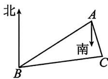  
图1-M-10

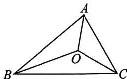

text_image

A
O
B
C

图1-M-11

13. 如图 1-M-11, O 是 $\triangle ABC$ 三条角平分线的交点, $\angle BAO = 40^{\circ}$ , 则 $\angle BOC$ 的度数为 \_\_\_\_.

# 三、解答题（共48分）

14. (10 分)如图 1-M-12, 已知 $\triangle ABC$ .

(1)画 BC 边上的中线 AM;  
(2)画△AMC 的高 CH;

(3) 若 $AM = 10, CH = 6$ , 求 $\triangle ABC$ 的面积.

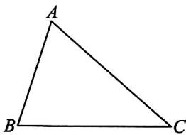

natural_image

Simple geometric diagram of a triangle labeled A, B, C (no additional text or symbols)

图1-M-12

15. (12 分) 如图 1-M-13, 在 $\triangle ABC$ 中, $AD$ 是 $BC$ 边上的高, $AE, BF$ 分别是 $\angle BAC$ , $\angle ABC$ 的平分线, 它们相交于点 $O$ , $\angle AOB = 125^\circ$ , 求 $\angle CAD$ 的度数.

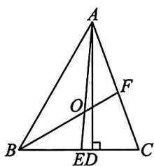

text_image

A
O
F
B
ED
C

图1-M-13

16. (12分)如图 1-M-14, AD 为 $\triangle ABC$ 的高, $BE$ 为 $\triangle ABC$ 的角平分线, 已知 $\angle EBA = 34^{\circ}, \angle AEB = 71^{\circ}$ .

(1)求 $\angle CAD$ 的度数；  
(2) 若 $F$ 为线段 $BC$ 上任意一点, 当 $\triangle EFC$ 为直角三角形时, 求 $\angle BEF$ 的度数.

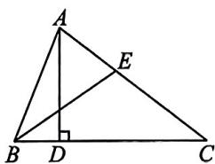

text_image

Geometric diagram of triangle ABC with perpendicular line from A to BC at D, and point E on AC

图1-M-14

17. (14 分) 在四边形 $ABCD$ 中, $\angle A = \angle C = 90^{\circ}$ , 点 $M, N$ 分别在 $AB, AD$ 的延长线上.

(1) 求证: $\angle ABC + \angle ADC = 180^{\circ}$ ;   
(2)如图1-M-15①,若 $DE$ 平分 $\angle ADC, BF$ 平分 $\angle CBM$ , 写出 $DE$ 与 $BF$ 之间的位置关系, 并证明;  
(3)如图②,若 $BF,DE$ 分别平分 $\angle CBM,\angle CDN$ ,请直接写出 $BF$ 与 $DE$ 之间的位置关系.

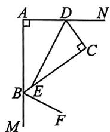

text_image

A
D
N
C
B
E
M
F

①

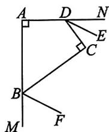

text_image

A
D
N
E
C
B
F
M

②   
图1-M-15

# 周末自评（二）

[范围:14.1\~14.2 建议时间:40 分钟 分值:100 分]

# 一、选择题(本大题共8小题,每小题4分,共32分)

1. 如图 2-M-1, AB = CB, 若要判定 $\triangle ABD \cong \triangle CBD$ , 则需要补充的一个条件可以是 ( )

A. ${AB} = {BD}$

B. $\angle A = \angle C$

C. ${AD} = {CD}$

D. $\angle ADB = \angle CDB$

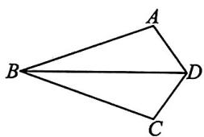

natural_image

Geometric diagram of a quadrilateral ABCD with diagonal BD (no labels or measurements)

图2-M-1

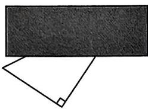

natural_image

Simple geometric diagram showing a rectangle and a right angle symbol (no text or labels)

图2-M-2

2. 如图 2-M-2, 用纸板挡住部分直角三角形后, 能画出与此直角三角形全等的三角形, 其画图依据是 ( )

A. SSS

B. SAS

C. ASA

D. AAS

3. 如图 2-M-3, 过直线 $l_{1}$ 外一点 $P$ 作它的平行线 $l_{2}$ , 其作图依据是 ( )

A. 两直线平行, 同位角相等  
B. 两直线平行, 内错角相等  
C. 同位角相等, 两直线平行  
D. 内错角相等, 两直线平行

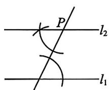  
图2-M-3

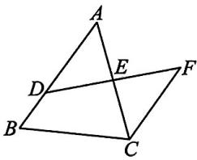

text_image

Geometric diagram of triangle ABC with points D, E, F and intersecting lines forming a quadrilateral

图2-M-4

4. 如图 2-M-4, D 是 AB 上一点, DF 交 AC 于点 E, DE = FE, FC // AB. 若 AB = 4.5, CF = 3, 则 BD 的长是 ( )

A. 0.5

B. 1

C. 1.5

D. 2

5. 如图 2-M-5, 已知 $\triangle ABC \cong \triangle ADE$ , $DE \perp AB$ , $\angle D = 60^{\circ}$ , 则 $\angle EAC$ 的大小是

( )

A. $20^{\circ}$

B. $30^{\circ}$

C. ${40}^{ \circ  }$

D. $50^{\circ}$

6. 如图 2-M-6, 甲、乙、丙三个三角形中, 和 $\triangle ABC$ 全等的是 ( )

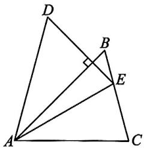

text_image

Geometric diagram of triangle ABC with points D, E, B and right angle at B

图2-M-5

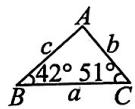

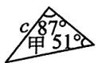

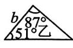

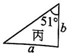  
图2-M-6

A. 甲和乙

B. 甲和丙

C. 乙和丙

D. 只有甲

7. 如图 2-M-7, 已知 $\angle 1 = \angle 2$ , 添加下列条件, 不能判定 $\triangle ABC \cong \triangle DCB$ 的是 ( )

A. ${AB} = {DC}$

B. ${AC} = {DB}$

C. $\angle A = \angle D$

D. $\angle ABC = \angle DCB$

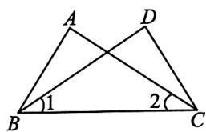

text_image

A
D
B
1
2
C

图2-M-7

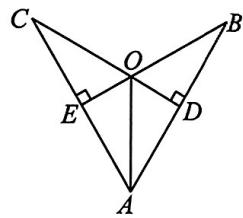

text_image

Geometric diagram of triangle ABC with perpendiculars from center O to sides, labeled points A, B, C, D, E and right-angle symbols

图2-M-8

8. 如图 2-M-8, CD ⊥ AB, BE ⊥ AC, 垂足分别为 D, E, BE, CD 相交于点 O. 如果 AB = AC, 那么图中全等的直角三角形有

A. 1 对

B.2对

C. 3 对

D. 4 对

二、填空题(本大题共5小题,每小题4分,共20分)

9. 如图 2-M-9 所示, 要测量河两岸相对的两点 A, B 的距离, 在 AB 的垂线 BF 上取两点 C, D, 使 BC = CD, 过点 D 作 BF 的垂线 DE, 与 AC 的

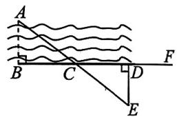

text_image

A
B C D F
E

图2-M-9

延长线交于点 E. 若测得 DE 的长为 25 米, 则河宽 AB 为 \_\_\_\_ 米.

10. 已知 $\triangle ABC \cong \triangle DEF, BC = EF = 10 \mathrm{~cm}$ . 若 $\triangle DEF$ 的面积是 $40 \mathrm{~cm}^2$ , 则 $\triangle ABC$ 的 $BC$ 边上的高是 \_\_\_\_ cm.  
11. 如图 2-M-10, 在 Rt△ABC 中, ∠ABC=90°, D 是 CB 延长线上的一点, BD=BA, DE⊥AC 于点 E, 交 AB 于点 F. 若 DC=7.8, BF=3, 则 AF 的长为 \_\_\_\_.

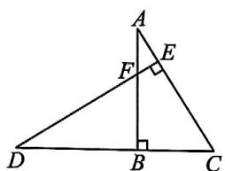

text_image

Geometric diagram of triangle ABC with perpendiculars from A and D to base BC, labeled points A, B, C, D, E, F

图2-M-10

12. 如图 2-M-11, 点 D 在 BC 上, $DE \perp AB$ 于点 E, $DF \perp BC$ 交 AC 于点 F, BD = CF, BE = CD. 若 $\angle AFD = 145^{\circ}$ , 则 $\angle B$ 的度数为 \_\_\_\_.

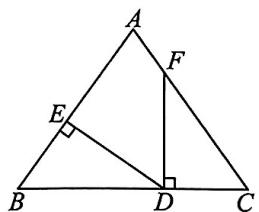

text_image

Geometric diagram of triangle ABC with perpendiculars from points D and E to sides, labeled with vertices A, B, C, D, E, F.

图2-M-11

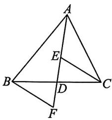

text_image

Geometric diagram of triangle ABC with internal points D, E, F and connecting line segments

图2-M-12

13. 如图 2-M-12, AD 是△ABC 的中线, E, F 分别是 AD 和 AD 延长线上的点, 且 DE = DF, 连接 BF, CE. 有下列说法: ①△ABD 和△ACD 的面积相等; ②∠BAD = ∠CAD; ③△BDF≌△CDE; ④BF∥CE; ⑤CE = AE. 其中正确的是 \_\_\_\_. (填序号)

# 三、解答题（共48分）

14. (14 分)(2023 淮安) 已知: 如图 2-M-13, D 为线段 BC 上一点, BD = AC, $\angle E = \angle ABC$ , DE // AC.
求证: DE = CB.

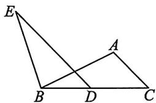

text_image

Geometric diagram with labeled points A, B, C, D, E and intersecting lines forming triangles and quadrilaterals

图2-M-13

15. (16 分) 如图 2-M-14, 在 $\triangle ABC$ 中, 点 $D$ 在边 $BA$ 的延长线上, 过点 $D$ 作射线 $DM \parallel BC$ , $E$ 是射线 $DM$ 上的一个定点.

(1)尺规作图:在射线 DM 的上方求作 $\angle DEF$ ，使得 $\angle DEF = \angle C$ ，与 BA 的延长线交于点 F；(不用写作图步骤，保留作图痕迹)

(2)在(1)的条件下,若 ${BD} = {AF}$ ,求证: ${AC}//{FE}$ .

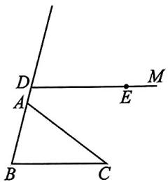

text_image

Geometric diagram showing two intersecting lines with labeled points A, B, C, D, E, M and a right angle at E.

图2-M-14

16. (18 分) 如图 2-M-15, $AB = 4 \mathrm{~cm}, BC = 6 \mathrm{~cm}$ , $\angle B = \angle C$ , 点 $P$ 在线段 $BC$ 上以 $2 \mathrm{~cm} / \mathrm{s}$ 的速度由点 $B$ 向点 $C$ 运动, 同时, 点 $Q$ 从点 $C$ 出发沿射线 $CD$ 运动. 若经过 $t \mathrm{~s}$ 后, $\triangle ABP$ 与 $\triangle CQP$ 全等, 求点 $Q$ 的运动速度及 $t$ 的值.

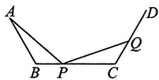  
图2-M-15

# 周末自评（三）

[范围:第十四章 建议时间:40 分钟 分值:100 分]

# 一、选择题(本大题共8小题,每小题4分,共32分)

1. 在图 3-M-2 所示的 4 个正方形图案中,与图 3-M-1 中的正方形图案全等的是 ( )

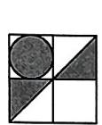  
图3-M-1

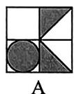

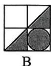

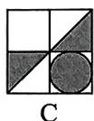

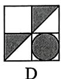  
图3-M-2

2. 数学课上老师布置了“测量锥形瓶底面的内径”的探究任务, 善思小组想到了以下方案: 如图 3-M-3, 用螺丝钉将两根小棒 AD, BC 的中点 O 固定, 只要测得 C, D 之间的距离, 就可知道内径 AB 的长度, 此方案依据的数学定理或基本事实是 ( )

A. SAS

B. ASA

C. AAS

D. HL

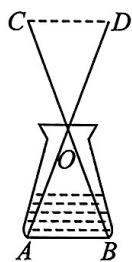  
图3-M-3

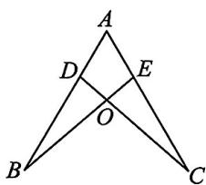

text_image

A
D
E
O
B
C

图3-M-4

3. 如图 3-M-4, 点 D, E 分别在线段 AB, AC 上, CD 与 BE 相交于点 O, 已知 AB = AC, 添加下列条件后, 仍不能判定 $\triangle ABE \cong \triangle ACD$ 的是 ( )

A. $\angle B = \angle C$

B. ${BE} = {CD}$

C. ${BD} = {CE}$

D. ${AD} = {AE}$

4. 如图 3-M-5, 在 $\triangle ABC$ 中, $\angle ACB = 90^{\circ}$ , 按如下步骤操作:

①以点 A 为圆心,适当长为半径作弧,分别交 AC, AB 于 D,E 两点;   
②以点 C 为圆心, AD 长为半径作弧, 交 AC 的延长线于点 F;  
③以点 F 为圆心, DE 长为半径作弧, 交②中所画的弧于点 G;  
④作射线 CG.

若 $\angle B = 40^{\circ}$ ，则 $\angle FCG$ 的度数为 （）

A. ${40}^{ \circ  }$

B. ${50}^{ \circ  }$

C. $60^{\circ}$

D. ${70}^{ \circ  }$

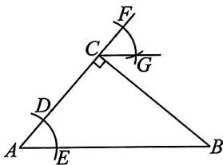

text_image

Geometric diagram of triangle ABC with points D, E, F, G and marked angles at C and D

图3-M-5

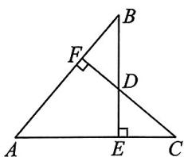

text_image

Geometric diagram of triangle ABC with perpendiculars from points D and E to sides AB and AC, labeled with points A, B, C, D, E, F.

图3-M-6

5. 如图 3-M-6, AB = AC, BE ⊥ AC 于点 E, CF ⊥ AB 于点 F, BE, CF 交于点 D, 则下列结论中不正确的是 ( )

A. $\triangle ABE \cong \triangle ACF$   
B. 点 $D$ 在 $\angle BAC$ 的平分线上  
C. $\triangle BDF \cong \triangle CDE$   
D. $D$ 是 $BE$ 的中点

6. 如图 3-M-7, AB = AC, AF = AE, $\angle EAF = \angle BAC$ , 点 C, D, E, F 共线. 有下列结论, 其中正确的是 ( )

① $\triangle AFB \cong \triangle AEC$ ;

② ${BF} = {CE}$ ;

③ $\angle BFC = \angle EAF$

④AB=BC.

A. ①②③   
B. ①②④   
C. ①②   
D. ①②③④

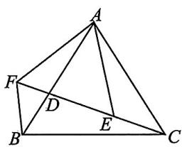

text_image

Geometric diagram of a tetrahedron with labeled vertices A, B, C, D, E, F and connecting line segments

图3-M-7

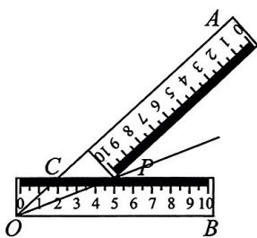

text_image

A
1 2 3 4 5 6 7 8
C
P
O
B

图3-M-8

7. 小明将两把完全相同的长方形直尺如图 3-M-8 放置在 $\angle AOB$ 上, 两把直尺的接触点为 $P$ , 边 $OA$ 与一把直尺边缘的交点为 $C$ , 点 $C, P$ 在这把直尺上的刻度读数 (单位: cm) 分别是 2,5, 则 $OC$ 的长度是 ( )

A. $3 \mathrm{~cm}$

B. $2 \mathrm{~cm}$

C. $2.5 \mathrm{~cm}$

D. $3.5 \mathrm{~cm}$

8. 如图 3-M-9, 将正方形 OABC 放在平面直角坐标系中, O 是原点, 点 A 的坐标为 $(1, \sqrt{3})$ , 则点 C 的坐标为 ( )

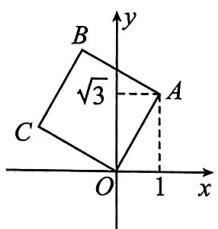

text_image

B
√3
C
O
1
x
y
A

图3-M-9

A. $(- \sqrt{3}, 1)$

B. $(-1, \sqrt{3})$

C. $(\sqrt{3}, 1)$

D. $(- \sqrt{3}, -1)$

# 二、填空题(本大题共5小题,每小题4分,共20分)

9. 如图 3-M-10, 为了测量小河两岸 A, B 间的距离, 在点 B 同侧选取点 C, 经测量 $\angle ACB = 30^{\circ}$ , 然后在 BC 的一侧找到一点 D, 使得 BC 为 $\angle ABD$ 的平分线, 且 $\angle DCB = 30^{\circ}$ . 若

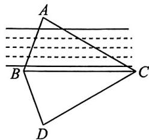

text_image

A
B
C
D

图3-M-10

BD 的长为 8 米, 则小河两岸 A, B 之间的距离为 \_\_\_\_.

10. (2023 重庆 A 卷) 如图 3-M-11, 在 Rt△ABC 中, ∠BAC=90°, AB=AC, D 为 BC 上一点, 连接 AD. 过点 B 作 BE⊥AD 于点 E, 过点 C 作 CF⊥AD, 交 AD 的延长线于点 F. 若 BE=4, CF=1, 则 EF 的长度是 \_\_\_\_.

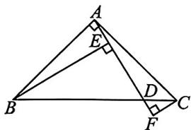

text_image

Geometric diagram of triangle ABC with perpendiculars from points D and E to sides, labeled with vertices A, B, C, D, E, F.

图3-M-11

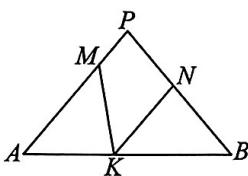

text_image

P
M
N
A
K
B

图3-M-12

11. 如图 3-M-12, 在 $\triangle PAB$ 中, $\angle A = \angle B, M, N, K$ 分别是 $PA, PB, AB$ 上的点, 且 $AM = BK, BN = AK$ . 若 $\angle MKN = 50^{\circ}$ , 则 $\angle P$ 的大小为 \_\_\_\_.  
12. 如图 3-M-13, BD 平分 $\angle ABC$ , 交 AC 于点 D, DE ⊥ AB 于点 E, $S_{\triangle ABC} = 40 \, cm^{2}$ , AB = 8 cm, BC = 12 cm, 则 DE = \_\_\_\_ cm.

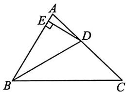

text_image

Geometric diagram of triangle ABC with perpendicular from A to line CD, labeled points E and D

图3-M-13

text_image

y
C
O
A
B
x

图3-M-14

13. 如图 3-M-14, $\triangle ABC$ 为等腰直角三角形, $AC = BC$ . 若 $A(-3,0), C(0,2)$ , 则点 $B$ 的坐标为 \_\_\_\_.

# 三、解答题（共48分）

14. (14 分) 如图 3-M-15, 已知 $\angle \alpha$ , $\angle AOB = 90^{\circ}$ , 在 $\angle AOB$ 内部求作 $\angle AOC$ , 使其等于 $\angle \alpha$ 的余角.

text_image

Two geometric angles labeled α and O, showing right angle at origin with perpendicular lines to point A and B.

图3-M-15

15. (16 分)(2023 陕西) 如图 3-M-16, 在 $\triangle ABC$ 中, $\angle B = 50^{\circ}, \angle C = 20^{\circ}$ . 过点 $A$ 作 $AE \perp BC$ , 垂足为 $E$ , 延长 $EA$ 至点 $D$ , 使 $AD = AC$ . 在边 $AC$ 上截取 $AF = AB$ , 连接 $DF$ .

求证:DF=CB.

text_image

Geometric diagram with labeled points A, B, C, D, E, F and right angle at E

图3-M-16

16. (18 分) 如图 3-M-17, BD 交 AC 于点 G, BF ⊥ AC, DE ⊥ AC, 垂足分别为 F, E. 已知 AE = CF, AB = CD.

求证:(1) $AB \parallel CD$ ;

(2) $BG = DG$ .

text_image

Geometric diagram showing two triangles ABC and DCD with perpendiculars from A to BC at F and G, and right-angle markers at E and F.

图3-M-17

# 周末自评（四）

[范围:15.1\~15.2 建议时间:40 分钟 分值:100 分]

# 一、选择题(本大题共8小题,每小题4分,共32分)

1. 中国“二十四节气”已被列入联合国教科文组织人类非物质文化遗产代表作名录,下列四幅作品分别代表“立春”“立夏”“芒种”“大雪”,其中不是轴对称图形的是()

  
A

  
B

  
C

  
D   
图4-M-1

2. 下列各组的两个图形中, 关于直线 l 对称的是 ( )

  
A

  
B

  
C

  
D   
图4-M-2

3. 在平面直角坐标系中, 点 $A, B$ 的坐标分别是 (1, 2), (-1, 2), 则 $A, B$ 两点关于 \_\_\_\_ 对称 ( )

A. 原点

B. $x$ 轴

C. $y$ 轴

D. $x$ 轴和 $y$ 轴

4. 下列命题的逆命题是真命题的是 （）

A. 全等三角形的对应角相等  
B. 如果两个有理数相等,那么它们的平方相等  
C. 如果两个角是对顶角,那么这两个角相等  
D. 两直线平行, 同位角相等

5. 如图 4-M-3, 在 $\triangle ABC$ 中, $M, N$ 分别是边 $AB, BC$ 上的点, 将 $\triangle BMN$ 沿 $MN$ 折叠, 使点 $B$ 落在点 $B'$ 处. 若 $\angle B = 34^\circ$ , $\angle BNM = 27^\circ$ , 则 $\angle AMB'$ 的度数为 ( )

A. $58^{\circ}$

B. $37^{\circ}$

C. ${54}^{ \circ  }$

D. ${63}^{ \circ  }$

text_image

Geometric diagram showing triangle ABC with points M, N and auxiliary lines, labeled with vertices A, B, C, B', and M.

图4-M-3

text_image

C
B
D
A
F
E

图4-M-4

6. 如图 4-M-4 所示的树叶是一个轴对称图形, 点 C, F 在对称轴上, 点 A 与点 E 关于对称轴对称, 点 B

与点 $D$ 关于对称轴对称, 则下列说法错误的是 ( )

A. ${AE}\bot {CF}$   
B. 连接 $BC, CD$ , 则 $BC = CD$   
C. 如果直线 $AB$ 与 $DE$ 有交点, 那么交点在直线 $CF$ 上  
D. 如果 AF = m，那么一定有 AE = 2m

7. 如图 4-M-5, 桌面上有 M, N 两个小球, 若要将 M 球射向桌面的任意一边, 使一次反弹后击中 N 球, 则 4 个点中, 可以瞄准的是 ( )

text_image

M
A B C D
N

图4-M-5

A. 点 A

B. 点 $B$

C. 点 $C$

D. 点 $D$

8. “一把剪刀蕴神技,一方红纸酿年味.”剪纸是中国传统的民间艺术,是中国的非物质文化遗产,随着社会的发展形成了一定特征的数学文化.如图4-M-6,小明在剪纸活动中,将一张正方形纸片对折三次后,沿着虚线剪去一个角,打开后得到的图形是()

图4-M-6  
  
A

  
B

  
C

  
D   
图4-M-7

# 二、填空题(本大题共5小题,每小题4分,共20分)

9. 如图 4-M-8, $\triangle ABC$ 与 $\triangle A'B'C'$ 关于直线 $l$ 对称, $\angle A = 50^{\circ}, \angle C' = 30^{\circ}$ , 则 $\angle B$ 的度数为 \_\_\_\_.

text_image

A
l
B
C
A'
B'
C'

图4-M-8

10. 如图 4-M-9, 在 $\triangle ABC$ 中, $BC = 9$ , $AC = 4$ , 分别以点 $A, B$ 为圆心, 大于 $\frac{1}{2} AB$ 的长为半径画弧, 两弧相交于点 $M, N$ , 作直线 $MN$ , 交 $BC$ 边于点 $D$ , 连接 $AD$ , 则 $\triangle ACD$ 的周长为

11. 已知点 $A(2m - n, m - 3), B(2n - 1, -m + n)$ . 若点 $A, B$ 关于 $x$ 轴对称，则 $m, n$ 的值分别是 \_\_\_\_.

text_image

Geometric diagram with labeled points A, B, C, D, M, N and intersecting lines forming triangles and a quadrilateral

图4-M-9

natural_image

Geometric diagram of a square divided into triangles and rectangles, with labeled vertices A, B, C, D (no text or symbols)

图4-M-10

12. 如图 4-M-10, 正方形 ABCD 的边长为 8 cm, 则图中阴影部分的面积为 \_\_\_\_.  
13. 点(4,5)关于直线 x = -1 的对称点 D 的坐标为 \_\_\_\_

# 三、解答题（共48分）

14. (10 分) 已知: 如图 4-M-11, 在 $\triangle ABC$ 中, $AB > AC$ , 在 $BC$ 上求作点 $P$ , 使 $\triangle APC$ 的周长等于 $AC + BC$ . (要求: 尺规作图, 不写作法, 保留作图痕迹)

  
图4-M-11

15. (12 分) 如图 4-M-12, 在 $\triangle ABC$ 中, $\angle B = 40^{\circ}$ , $D$ 为边 $BC$ 上一点, 将 $\triangle ADC$ 沿直线 $AD$ 折叠后, 点 $C$ 落到点 $E$ 处. 若 $DE \parallel AB$ , 求 $\angle ADE$ 的度数.

text_image

Geometric diagram with labeled points A, B, C, D, E and solid/dashed lines forming triangles and a quadrilateral

图4-M-12

16. (12 分) 如图 4-M-13 所示, 在平面直角坐标系中, 已知 $\triangle ABC$ 和 $\triangle DEF$ 的顶点均在格点上, 其中, $A(-1,1), B(-2,3), C(-3,0)$ .

(1)画出与 $\triangle ABC$ 关于 $y$ 轴对称的图形 $\triangle A^{\prime}B^{\prime}C^{\prime}$ .   
(2) 判断 $\triangle A^{\prime}B^{\prime}C^{\prime}$ 和 $\triangle DEF$ 是否成轴对称, 若成轴对称, 请在图中画出对称轴; 若不成轴对称, 请说明理由.  
(3)已知 $P$ 为 $\pmb{x}$ 轴上一点，若 $\triangle PBC$ 的面积为3，求点 $P$ 的坐标.

text_image

y
5
4
B
2
C
1
-5 -4 -3 -2 -1 O 1 2 3 4 5 x
-1
-2
D
-3
E
-4
-5

图4-M-13

17. (14 分) 如图 4-M-14, AD 与 BC 相交于点 O,
OA=OC, $\angle A=\angle C,BE=DE.$

求证:(1) $\triangle AOB\cong\triangle COD$ ;

(2)OE 垂直平分 BD.

text_image

Geometric diagram with labeled points A, B, C, D, E, and O, showing intersecting lines and a quadrilateral intersection.

图4-M-14

# 周末自评（五）

[范围:15.3 建议时间:40 分钟 分值:100 分]

# 一、选择题(本大题共8小题,每小题4分,共32分)

1. 若等腰三角形的两边长分别为 2 和 5, 则它的周长为 ( )

A. 9

B. 7

C. 12

D. 9 或 12

2.（2023眉山）如图5-M-1，在 $\triangle ABC$ 中， $AB = AC$ $\angle A = 40^{\circ}$ ，则 $\angle ACD$ 的度数为 （）

A. ${70}^{ \circ  }$

B. ${100}^{ \circ  }$

C. ${110}^{ \circ  }$

D. ${140}^{ \circ  }$

text_image

A
B C D

图5-M-1

text_image

A
B D C

图5-M-2

3. 如图 5-M-2, 在 $\triangle ABC$ 中, $AB = AC$ , $D$ 是 $BC$ 的中点, 下列结论中不一定正确的是 ( )

A. $\angle B = \angle C$

B. ${AB} = {2BD}$

C. ${AD}$ 平分 $\angle {BAC}$

D. ${AD}\bot {BC}$

4. 如图 5-M-3, 在 $\triangle ABC$ 中, $AB = AC$ , $\angle A = 120^\circ$ , 分别以点 $A, C$ 为圆心, 大于 $\frac{1}{2} AC$ 的长为半径作弧, 两弧相交于点 $P, Q$ , 作直线 $PQ$ , 分别交 $BC$ , $AC$ 于点 $D, E$ . 若 $CD = 3$ , 则 $BD$ 的长为 ( )

A. 4

B. 5

C. 6

D. 7

text_image

Geometric diagram with labeled points A, B, C, D, E, P, Q and intersecting lines forming triangles and a quadrilateral

图5-M-3

text_image

A
72°
O
72°
B
36°
C
36°

图5-M-4

5. 图 5-M-4 中等腰三角形的个数是 ( )

A. 4

B. 5

C. 3

D. 2

6. 如图 5-M-5 所示, 已知 $\angle AOB = 60^{\circ}$ , 点 $P$ 在边 $OA$ 上, $OP = 8$ , 点 $M, N$ 在边 $OB$ 上, $PM = PN$ . 若 $MN = 1$ , 则 $OM$ 的长为 ( )

A. 3

B. $\frac{7}{2}$

C. 4

D. $\frac{9}{2}$

text_image

A
P
O 60° M N B

图5-M-5

text_image

A
D F E
B C

图5-M-6

7. 如图 5-M-6, $\triangle ABC$ 是边长为 6 的等边三角形, $\angle ABC$ 和 $\angle ACB$ 的平分线交于点 $F$ , 过点 $F$ 作 $BC$ 的平行线, 交 $AB$ 于点 $D$ , 交 $AC$ 于点 $E$ , 则 $\triangle ADE$ 的周长是 ( )

A. 6

B. 8

C. 10

D. 12

8. 如图 5-M-7, 在 $\triangle ABC$ 中, $AB = AC$ , $\angle A = 52^{\circ}$ , $P$ 是 $AB$ 上的一个动点 (点 $P$ 不与点 $A$ , $B$ 重合), 则 $\angle APC$ 的度数可能是 ( )

A. $52^{\circ}$

B. $63^{\circ}$

C. ${120}^{ \circ  }$

D. $130^{\circ}$

text_image

A
P
B
C

图5-M-7

  
图5-M-8

# 二、填空题(本大题共5小题,每小题4分,共20分)

9. 如图 5-M-8, 上午 8 时, 一艘船从港口 A 出发, 以 15 海里/时的速度向正北方向航行, 10 时到达海岛 B 处, 从 A, B 两处望灯塔 C, 分别测得 $\angle NAC = 15^{\circ}, \angle NBC = 30^{\circ}$ . 若该船从海岛 B 继续向正北方向航行, 则船与灯塔 C 的最短距离为 \_\_\_\_

10. 如图 5-M-9 所示, 在等边三角形 ABC 中, BD 平分 $\angle ABC$ , 交 AC 于点 D, 过点 D 作 $DE \perp BC$ 于点 E, 且 CE = 1.5, 则 AB 的长为 \_\_\_\_.

text_image

Geometric diagram of triangle ABC with points D and E on sides AB and AC, showing right angle at E.

图5-M-9

11. 已知等腰三角形一个内角的度数是 $50^{\circ}$ , 则该等腰三角形底角的度数为 \_\_\_\_.

12. 如图 5-M-10, 在等边三角形 $ABC$ 中, $BC = 6$ , $BO$ 平分 $\angle ABC$ , $CO$ 平分 $\angle ACB$ , $MN$ 经过点 $O$ , 且分别与 $AB$ , $AC$ 相交于点 $M$ , $N$ . 若 $MN // BC$ , 则 $MN = \_$

text_image

A
M O N
B C

图5-M-10

13. 如图 5-M-11, 在 $\triangle OAB$ 和 $\triangle OCD$ 中, $OA = OB$ , $OC = OD$ , $\angle AOB = \angle COD = 40^\circ$ , 连接 $AC$ , $BD$ 交于点 $M$ , 则 $\angle CMB$ 的度数为 \_\_\_\_.

  
图5-M-11

# 三、解答题（共48分）

14. (10 分)(2023 荆州)如图 5-M-12, BD 是等边三角形 ABC 的中线, 以点 D 为圆心, DB 的长为半径画弧, 交 BC 的延长线于点 E, 连接 DE. 求证: CD = CE.

text_image

Geometric diagram of triangle ABC with points D and E on sides AB and AC, showing internal segments BD and CE.

图5-M-12

15. (12 分) 如图 5-M-13 所示, 在 $\triangle ABC$ 中, 点 $D, E$ , $F$ 分别在边 $BC, AB, AC$ 上, $BE = CD$ , $BD = CF, DG$ 是 $EF$ 的垂直平分线, 试判断 $\triangle ABC$ 的形状, 并说明理由.

text_image

Geometric diagram of triangle ABC with points D, E, F, G and perpendicular line from G to BC

图5-M-13

16. (12 分) 如图 5-M-14, $\triangle ABC$ 是等边三角形, 点 $D, E, F$ 分别在边 $BC, AB, CA$ 的延长线上, 且 $BE = AF = CD$ .

求证: $\triangle DEF$ 是等边三角形.

text_image

Geometric diagram of a triangle with internal points labeled A, B, C, D, E, F

图5-M-14

17. (14 分) 如图 5-M-15, 在 $\triangle ABC$ 中, $\angle B = \angle C$ , 点 $D, E, F$ 分别在边 $AB, BC, AC$ 上, 且 $BE = CF$ , $AD + CE = AB$ .

(1) 求证: DE = EF;   
(2)当 $\angle A=40^{\circ}$ 时,求 $\angle DEF$ 的度数;   
(3) 当 $\angle A$ 的度数为 \_\_\_\_ 时, $\angle EDF + \angle EFD = 120^{\circ}$ .

text_image

Geometric diagram of triangle ABC with internal points D, E, F and connecting line segments

图5-M-15

# 周末自评（六）

[范围:第十五章 建议时间:40 分钟 分值:100 分]

# 一、选择题(本大题共8小题,每小题4分,共32分)

1.（2023珠海）下列出版社的商标图案中，是轴对称图形的为 （）

  
A

  
B

  
C

  
D   
图6-M-1

2. 如图 6-M-2 所示, 在 $\triangle ABC$ 中, $AD$ 垂直平分 $BC$ , $AC = EC$ , 点 $B, D, C, E$ 在同一条直线上, 则 $AB + BD$ 与 $DE$ 的长度之间的关系为 ( )

A. $AB + BD > DE$

B. ${AB} + {BD} = {DE}$

C. ${AB} + {BD} < {DE}$

D. 无法确定

  
图6-M-2

  
图6-M-3

3. 如图 6-M-3, 在平面直角坐标系 $xOy$ 中, $\triangle ABC$ 为等腰三角形, $AB = AC$ , $BC \parallel x$ 轴. 若 $A(1,3)$ , $C(4,-1)$ , 则 $\triangle ABC$ 的面积为 ( )

A. 8

B. 9

C. 12

D. 24

4. 如图 6-M-4, 已知 $\triangle ABD$ 是等边三角形, $BC = DC$ , 点 $E$ 在 $AD$ 上, $CE$ 交 $BD$ 于点 $F$ , $AE = EC$ . 若 $\angle CBD = 2\angle DCE$ , 则 $\angle DCE$ 的度数为 ( )

A. $40^{\circ}$

B. $20^{\circ}$

C. $30^{\circ}$

D. $10^{\circ}$

text_image

A
B
C
D
E
F

图6-M-4

text_image

Geometric diagram of triangle ABC with internal points D, E, I and connecting line segments

图6-M-5

5. 如图 6-M-5, 在 $\triangle ABC$ 中, $\angle ABC$ 与 $\angle ACB$ 的平分线交于点 $I$ , 过点 $I$ 作 $DE \parallel BC$ , 交 $AB$ 于点 $D$ , 交 $AC$ 于点 $E$ , 且 $AB = 5, AC = 3, \angle A = 50^\circ$ , 则下列说法错误的是 ( )

A. $\triangle DBI$ 和 $\triangle EIC$ 均是等腰三角形

B. ${DI} = {1.5IE}$

C. $\triangle ADE$ 的周长是 8

D. $\angle BIC = 115^{\circ}$

6. 已知点 $P(2m + 3n, 2)$ 与点 $Q(6, 3m - 2n)$ 关于 $x$ 轴对称. 如图6-M-6，在 $\triangle ABC$ 中，边 $AB, AC$ 的垂直平分线分别交 $BC$ 于点 $M, G$ ，连接 $AM, AG$ . 若 $BC = 26m + 13n$ ，则 $\triangle AMG$ 的周长为（）

A. 28

B. 30

C. 32

D. 34

  
图6-M-6  
图6-M-7

7. 如图 6-M-7, O 是直线 BC 上一点, $\angle AOB = 30^{\circ}$ , OP 平分 $\angle AOC, PM \parallel BC$ , 交 OA 于点 M, PM = 8 cm, $PD \perp OC$ 于点 D, 则 PD 的长为 ( )

A. $7 \mathrm{~cm}$

B. $6 \mathrm{~cm}$

C. $5 \mathrm{~cm}$

D. $4 \mathrm{~cm}$

8. 在平面直角坐标系中, 已知 $A(-1,0), B(1,1)$ . 若在坐标轴上取点 $C$ , 使 $\triangle ABC$ 为等腰三角形, 则满足条件的点 $C$ 有 ( )

A. 5 个

B. 6 个

C. 7 个

D. 8 个

# 二、填空题(本大题共5小题,每小题4分,共20分)

9. 如图 6-M-8 所示的两个“M”关于直线 l 对称, 则与 $\angle1$ 对应的角为 \_\_\_\_.

10. 已知等腰三角形的一个外角为 $130^{\circ}$ , 则它的顶角的度数为

text_image

1
3
5
l
2
4
6

图6-M-8

text_image

A
B
D
C

图6-M-9

11. 如图 6-M-9, 在 $\triangle ABC$ 中, 若 $AB = AC$ , $AD = BD$ , $\angle CAD = 24^\circ$ , 则 $\angle C =$ \_\_\_\_°

12. 如图 6-M-10, 在四边形 ABCD 中, AB = AD, CB = CD, 对角线 AC, BD 相交于点 O, 有下列结论: ① $\angle ABC = \angle ADC$ ; ② AC 垂直平分 BD; ③ AC 平分 $\angle BAD$ , CA 平分 $\angle BCD$ ; ④ BD 平分 $\angle ABC$ , DB 平分 $\angle ADC$ ; ⑤ 四

text_image

A
B
O
D
C

图6-M-10

边形 ABCD 的面积 $=\frac{1}{2}AC \cdot BD$ . 其中正确的是 \_\_\_\_. (填序号)

13. 如图 6-M-11, 在 $\triangle ABC$ 中, $AB = AC$ , $S_{\triangle ABC} = 12$ , $BC = 3$ , $D$ 为边 $BC$ 的中点, $AC$ 的垂直平分线 $EF$ 分别交边 $AB$ , $AC$ 于点 $E$ , $F$ . $P$ 为线段 $EF$ 上一动点, 则 $\triangle PCD$ 周长的最小值为 \_\_\_\_.

  
图 6-M-11

# 三、解答题（共48分）

14. (14 分) 如图 6-M-12, 在平面直角坐标系中, $\triangle ABC$ 的顶点坐标分别为 $A(0, -2), B(3, -1)$ , $C(2, 1)$ .

(1)请在图中画出与 $\triangle ABC$ 关于y轴对称的图形 $\triangle AB^{\prime}C^{\prime}$ ;  
(2) 写出点 $B'$ 和点 $C'$ 的坐标.

text_image

y
C
O
x
A
B

图6-M-12

15. (16 分) 如图 6-M-13, 在 $\triangle ABC$ 中, $AB = AC$ , $\angle BAC = 36^{\circ}$ , $CD$ 平分 $\angle ACB$ , 交 $AB$ 于点 $D$ , 过点 $A$ 作 $AE // BC$ , 交 $CD$ 的延长线于点 $E$ . 求证: $AE = DE$ .

text_image

Geometric diagram with labeled points A, B, C, D, E forming triangles and intersecting lines

图6-M-13

16. (18 分) 如图 6-M-14, 在 $\triangle ABC$ 中, $\angle ACB = 90^\circ$ , $AC = BC$ , $CH \perp AB$ 于点 $H$ , 将 $\triangle ABC$ 沿 $CE$ 折叠, 使点 $A$ 落在直线 $CH$ 上的点 $A'$ 处, $BM$ 是 $\angle ABC$ 的平分线, 交 $AC$ 于点 $M$ , 交 $CH$ 于点 $N$ , 连接 $EN$ .

(1) 求证: AE = CN;   
(2)试判断 $CE$ 与 $BM$ 的关系,并说明理由.

text_image

Geometric diagram with labeled points and lines, including triangle ABC and auxiliary constructions

图6-M-14

# 周末自评（七）

[范围:第十六章 建议时间:40 分钟 分值:100 分]

# 一、选择题(本大题共8小题,每小题4分,共32分)

1. 下列各式计算正确的是 ( )

A. $3x \cdot 4x = 12x$

B. $(x^{2}y)^{3} = x^{6}y$

C. $x^{3} \cdot x^{4} = x^{12}$

D. $(x^{3})^{4} = x^{12}$

2.（2023广安）下列运算中，正确的是 （）

A. $a^2 + a^4 = a^6$

B. $3a^{3} \cdot 4a^{2} = 12a^{6}$

C. $(2a + b)^{2} = 4a^{2} + b^{2}$

D. $(-2ab^{2})^{3} = -8a^{3}b^{6}$

3. 若 $\bullet 4a^{2}b^{3} = -12a^{3}b^{5}c$ ，则 $\bullet$ 代表的整式是（）

A. -3abc

B. $-3ab^{2}c$

C. $-3b^{2}c$

D. $3abc$

4. 下列运算正确的是 ( )

A. $\left(a - \frac{1}{2}\right)^2 = a^2 -\frac{1}{4}$

B. $(a + 3)(a - 3) = a^2 - 9$

C. $-2(3a + 1) = -6a - 1$

D. $(a + b)(a - 2b) = a^2 - 2b^2$

5. 若 $(2x + m)(x - 3)$ 的展开式中不含 $x$ 项，则实数 $m$ 的值为 （）

A.-6

B. 0

C. 3

D. 6

6. 下面四个整式中,不能表示图 7-M-1 中阴影部分面积的是 ( )

  
图7-M-1

A. $(x + 6)(x + 4) - 6x$

B. $x(x + 4) + 24$

C. $4(x + 6) + x^{2}$

D. $x^{2} + 24$

7. 若 $x + 2y - 4 = 0$ ，则 $2^{2y} \times 2^{x - 2}$ 的值为 （）

A. 16

B. 4

C. 32

D. 8

8. (2023 随州) 设有边长分别为 $a$ 和 $b (a > b)$ 的 A 类和 B 类正方形纸片, 长为 $a$ 、宽为 $b$ 的 C 类长方形纸片若干张. 如图 7-M-2 所示, 要拼一个边长为 $a + b$ 的正方形, 需要 1 张 A 类纸片、1 张 B 类纸片和 2 张 C 类纸片. 若要拼一个长为 $3a + b$ 、宽为

$2a + 2b$ 的长方形，则需要C类纸片的张数为

( )

  
图7-M-2

A. 6

B. 7

C. 8

D. 9

# 二、填空题(本大题共5小题,每小题4分,共20分)

9. 在等号右边的括号内填上适当的项: $a + b - c = a + (\_)$ ; $a - b + c - d = (a - d) - (\_)$ .

10. 计算: $(-4)^{2025} \times (-0.25)^{2024} =$ \_\_\_\_.

11.（2023乐山）若 $m, n$ 满足 $3m - n - 4 = 0$ ，则 $8^{m} \div 2^{n} =$ \_\_\_\_.

12. 若 $x^{2} - y^{2} = 1$ ，则 $(x + y)^{2025} \cdot (x - y)^{2025} =$

13. 已知 $x + y = 5, xy = 4$ ，则 $x - y =$ \_\_\_\_.

# 三、解答题（共48分）

14. (6 分) 计算: (1) $\frac{5}{9} x^{3} y \cdot (-3xy^{2})^{3} \cdot \left(\frac{1}{2} x\right)^{2}$ ;

(2) $(3x-1)(2x^{2}+3x-4)$ .

15. (6 分)老师在黑板上书写了一个正确的演算过程,随后用手掌捂住了一个多项式,形式如下:

$$
\cdot \left(- \frac {1}{2} x y\right) = 3 x ^ {2} y - x y ^ {2} + \frac {1}{2} x y.
$$

(1)求所捂住的多项式；

(2) 当 $x = \frac{2}{3}, y = \frac{1}{2}$ 时, 求所捂住的多项式的值.

16. (8 分) 计算: $(x + 3y)^2 - 2(x + 3y)(x - 3y) + (x - 3y)^2$ .

17. (8 分) 已知 $x^{2} - 4 = 0$ ，求式子 $x(x + 1)^{2} - x(x^{2} + x) - x - 7$ 的值.

18. (10 分) 已知 $A = 2t + 3, B = 2t - 3$ .

(1) $A \cdot B + 13$ 可能为负数吗？请说明理由；
(2)请通过计算说明:当 t 是整数时, $A^{2}-B^{2}$ 一定能被24整除.

19. (10 分)先阅读后作答:当我们利用两种不同的方法计算同一图形的面积时,可以得到一个等式,例如:(2a+b)(a+b)=2a²+3ab+b² 就可以用图7-M-3①的面积关系来说明.

(1)根据图②写出一个等式：\_\_\_\_；
(2)已知等式 $(2x+m)(2x+n)=4x^{2}+2(m+n)x+mn$ ，请你画出一个相应的几何图形加以说明.

  
①

text_image

b ← a → a
↑ a ↓
b ← a → a → b

②   
图7-M-3

# 周末自评（八）

[范围:第十七章 建议时间:40 分钟 分值:100 分]

# 一、选择题(本大题共8小题,每小题4分,共32分)

1. 下列各式中,从左到右的变形不是因式分解的是
( )

A. $2a^{2} + a = a(2a + 1)$   
B. $a^2 - 9 = (a + 3)(a - 3)$   
C. $a^2 + 2ab + b^2 = (a + b)^2$   
D. $(a - b)^{2} = a^{2} - 2ab + b^{2}$

2. 将 $3a(x - y) - 9b(x - y)$ 用提公因式法分解因式，应提的公因式是 （）

A. $3 a - b$   
C. $3(x - y)$

B. $x - y$

D. $3a + b$

3. 若 $x^{2} + mx + 16 = (x - 4)^{2}$ , 则 $m$ 的值是 （）

A. 4

B. 8

C.-8

D. $\pm 8$

4.（2023济宁）下列各式从左到右的变形，因式分解正确的是 （）

A. $(a + 3)^{2} = a^{2} + 6a + 9$   
B. $a^2 - 4a + 4 = a(a - 4) + 4$   
C. $5ax^{2} - 5ay^{2} = 5a(x + y)(x - y)$   
D. $a^2 - 2a - 8 = (a - 2)(a + 4)$

5. 如果 $a - b = 4, ab = 6$ ，那么 $ab^2 - a^2b$ 的值是（）

A.-24

B. -10

C. 24

D. 2

6. 若 $x^{2} + (m - 1)x + 1$ 可以用完全平方公式进行因式分解, 则 $m$ 的值为 ( )

A.-3

B. 1

C.-3或1

D.-1或3

7. 下列多项式分解因式后, 含因式 $x - 2$ 的是 ( )

A. $x^{2} - 1$

B. $x^{2} + 4x + 4$

C. $x^{2} - 2x + 1$

D. $x^{2} - 2x$

8.（2023河北）若 $k$ 为任意整数，则 $(2k + 3)^{2} - 4k^{2}$ 总能 （）

A. 被 2 整除  
C. 被 5 整除

B. 被 3 整除

D. 被 7 整除

# 二、填空题(本大题共5小题,每小题4分,共20分)

9. 分解因式: $4a^{2} - b^{2} = (2a - b)$ ( ).  
10. 单项式 $2ab^{2}$ 与 $ab$ 的公因式是  
11. 若 $x + y = 1013, x - y = 2$ ，则代数式 $x^2 - y^2$ 的值是 \_\_\_\_.

12. 已知 $4x^{2} - 9y^{2} = 10, 4x + 6y = 4$ ，则 $2x - 3y$ 的值为 \_\_\_\_.  
13. 已知 $a, b, c$ 为三角形的三边长. 若 $a^2 + ac - b^2 - bc = 0$ , 则该三角形为 \_\_\_\_ 三角形.

# 三、解答题（共48分）

14. (15 分)分解因式:

(1) $m^{3}n-9mn;$

(2) $(x - 2)^{2} - x + 2$ ;

(3) $x^{2}y-9y;$

(4) $(x^{2} + 4)^{2} - 16x^{2}$ ;

(5) $4x^{3}y+4x^{2}y^{2}+xy^{3}$ .

15. (6 分) 利用因式分解计算：

(1) $39 \times 37 - 13 \times 3^{4}$ ;

$$
(2) 3 0 3 ^ {2} - 6 0 6 \times 2 9 7 + 2 9 7 ^ {2}
$$

16. (7 分) 已知 $x - y = 2, xy = -1$ , 用因式分解法求 $x(x + y)(x - y) - x(x - y)^2$ 的值.

17. (10 分) 阅读下列材料:

一般地,没有公因式的多项式,当项数为四项或四项以上时,经常把这些项分成若干组,然后各组运用提公因式法或公式法分别进行分解,之后各组之间再运用提公因式法或公式法进行分解,这种分解因式的方法叫作分组分解法.如:

分解因式: $am+bm+an+bn$ .

解: $am+bm+an+bn$

$$
\begin{array}{l} = (a m + b m) + (a n + b n) \\ = m (a + b) + n (a + b) \\ = (a + b) (m + n). \\ \end{array}
$$

(1)利用分组分解法分解因式:

①3m-3y+am-ay;   
② $a^{2}x+a^{2}y+b^{2}x+b^{2}y.$   
(2)分解因式: $a^{2}+2ab+b^{2}-1=$ \_\_\_\_.

18. (10 分) 阅读与思考:

在现今信息化时代,智能手机几乎人手必备,应用到了生活的各个领域,锁屏密码为保护我们个人隐私起到了至关重要的作用,而诸如“1234”、生日等简单密码又容易被破解,因此利用简单方法产生一组容易记忆的密码就很有必要了.有一种用“因式分解”法产生的密码,方便记忆,其原理是:将一个多项式分解因式,如多项式: $x^{2}-1$ 分解因式的结果为 $(x-1)(x+1)$ 或 $(x+1)(x-1)$ ,取个人年龄作为x的值,当x=13时,x-1=12,x+1=14,此时可以得到密码1214或1412.

(1)已知多项式 $x^{2} + 2x + 1$ ，小明今年18岁，取小明的年龄作为 $x$ 的值，根据上述方法，则小明的手机锁屏密码为  
(2)若王老师选取的多项式为 $x^{3} - x$ ，已知王老师手机的锁屏密码是353334，请你尝试分析王老师的年龄是多少岁，并说明理由.

# 周末自评（九）

[范围:18.1\~18.3 建议时间:40 分钟 分值:100 分]

# 一、选择题(本大题共8小题,每小题4分,共32分)

1. 有下列各式,其中分式的个数是 ( )

$$
\frac {1}{5} (1 - x), \frac {4 x}{\pi - 3}, \frac {x ^ {2} - y ^ {2}}{2}, \frac {1 + x ^ {2}}{x}, \frac {5 x ^ {2}}{x}.
$$

A. 2

B. 3

C. 4

D. 5

2. 要使分式 $\frac{5}{x - 5}$ 有意义, 则 $x$ 的取值范围是 ( )

A. $x \neq 5$

B. $x > 5$

C. $x <   5$

D. $x \neq -5$

3. 根据分式的基本性质, 分式 $\frac{-x}{x - y}$ 可变形为 ( )

A. $\frac{x}{-x - y}$

B. $\frac{x}{x + y}$

C. $-\frac{x}{x-y}$

D. $-\frac{-x}{x + y}$

4. 若 $\frac{4 - \star}{x - 2}$ 表示的是一个最简分式, 则 $\star$ 可以是 ( )

A. 4

B. $x$

C. $2x$

D. $x^{2}$

5.（2024泰安岱岳区期末）下列关于分式的判断，正确的是 （）

A. 当 $x = 3$ 时, $\frac{x + 3}{x(x - 3)}$ 的值为 0  
B. 当 $x \neq -2$ 时, $\frac{x + 2}{x}$ 有意义  
C. 无论 $x$ 为何值, $\frac{5}{2x - 1}$ 不可能是整数  
D. 无论 $x$ 为何值, $\frac{3}{x^2 + 2x + 2}$ 的值总为正数

6. 某施工队每天挖掘 $a$ 米隧道, 改进施工技术后每天能多挖掘 $20\%$ , 那么同样挖掘 $b$ 米隧道, 比原来少用的天数为 ( )

A. $\frac{b}{6a}$

B. $\frac{5b}{a}$

C. $\frac{4b}{a}$

D. $\frac{b}{5a}$

7. 若分式 $\frac{x^2 + 1}{2x - 5}$ 的值为负数，则 $x$ 的值可以为（）

A. 2

B. 3

C. 4

D. 5

8. 如图 9-M-1, 设 $k=\frac{S_{\text{甲阴影}}}{S_{\text{乙阴影}}}(a>b>0)$ , 则 ( )

  
甲

  
乙  
图9-M-1

A. $0 < k < \frac{1}{2}$

B. $\frac{1}{2} < k < 1$

C. $1 < k < 2$

D. $k > 2$

# 二、填空题(本大题共5小题,每小题4分,共20分)

9. 当 $x =$ \_\_\_\_时，分式 $\frac{x^2 - 1}{x + 1}$ 的值为0.  
10. 若分式 $\frac{x^2 - y^2}{x}$ 乘一个分式后结果为 $-\frac{(x - y)^2}{x^2}$ , 则所乘的分式为 \_\_\_\_.  
11. (2023 衡阳) 已知 $x = 5$ , 则式子 $\frac{3}{x - 4} - \frac{24}{x^2 - 16}$ 的值为 \_\_\_\_.  
12. 李明同学从家骑自行车上学用了 a 分钟, 放学时沿原路返回到家用了 b 分钟, 则李明同学上学与回家的速度之比是 \_\_\_\_.  
13.（2023 成都）若 $3ab - 3b^{2} - 2 = 0$ ，则式子 $\left(1 - \frac{2ab - b^{2}}{a^{2}}\right) \div \frac{a - b}{a^{2}b}$ 的值为 \_\_\_\_.

# 三、解答题（共48分）

14. (10 分) 计算：

(1) $\frac{(a + b)^2 - 4ab}{ab(a - b)^2}$ ;

(2) $\left(\frac{a}{a^2 - 4a + 4} + \frac{a + 2}{2a - a^2}\right) \div \frac{2}{a^2 - 2a}$ .

15. (12 分) (2023 广安) 先化简 $\left(\frac{a^2}{a + 1} - a + 1\right) \div \frac{a^2 - 1}{a^2 + 2a + 1}$ , 再从不等式 $-2 < a < 3$ 中选择一个适当的整数作为 $a$ 的值代入求值.

16. (12 分)下面是嘉琪同学进行分式化简的过程,请认真阅读并完成相应任务.

$$
\begin{array}{l} \left(\frac {3 x}{x - 2} - \frac {x}{x + 2}\right) \cdot \frac {x ^ {2} - 4}{x} \\ = \frac {3 x}{x - 2} \cdot \frac {x ^ {2} - 4}{x} - \frac {x}{x + 2} \cdot \frac {x ^ {2} - 4}{x} \dots \text {第一步} \\ = \frac {3 x}{x - 2} \cdot \frac {(x + 2) (x - 2)}{x} - \frac {x}{x + 2} \cdot \frac {(x + 2) (x - 2)}{x} \dots \text {第} \\ = 3 (x + 2) - (x - 2) \dots \text { 第   三   步 } \\ = 3 x + 6 - x - 2 \dots \text { 第四步 } \\ = 2 x + 4. \dots \text { 第五步 } \\ \end{array}
$$

二步

任务一：

①以上化简过程中,第一步的依据是\_\_\_\_(填运算律);  
②第三步是分式的约分, 约分的依据是\_\_\_\_;   
(3)以上化简过程从第\_\_\_\_步开始出现错误, 这一步错误的原因是\_\_\_\_\_\_\_\_;

任务二:请直接写出该分式化简后的正确结果.

17. (14 分) 我们知道: 分式和分数有着很多的相似点. 如类比分数的基本性质, 我们得到了分式的基本性质. 小学里, 把分子比分母小的分数叫作真分数. 类似地, 我们把分子的次数小于分母的次数的分式称为真分式, 分子的次数大于或等于分母的次数的分式, 称为假分式. 任何一个假分式都可以化成整式与真分式的和的形式, 如 $\frac{x + 1}{x - 1} = \frac{x - 1 + 2}{x - 1} = \frac{x - 1}{x - 1} + \frac{2}{x - 1} = 1 + \frac{2}{x - 1}$ .

(1)下列分式中,属于真分式的是 ( )

A. $\frac{x^{2}}{x - 1}$

B. $\frac{x - 1}{x + 1}$

C. $-\frac{3}{2x - 1}$

D. $\frac{x^2 + 1}{x^2 - 1}$

(2) 将假分式 $\frac{m^2 + 3}{m + 1}$ 化成整式与真分式的和的形式.

# 周末自评（十）

[范围:18.4\~18.5 建议时间:40 分钟 分值:100 分]

# 一、选择题(本大题共8小题,每小题4分,共32分)

1. 每到四月,许多地方的杨絮、柳絮如雪花漫天飞舞,人们不堪其扰.据测定,杨絮纤维的直径约为0.0000105 m,该数值用科学记数法表示为( )

A. $1.05 \times 10^{5}$

B. $0.105 \times 10^{-6}$

C. ${105} \times  {10}^{-7}$

D. $1.05 \times 10^{-5}$

2. $3^{-1}$ 的值为 （）

A. 3

B. $\frac{1}{3}$

C. $-\frac{1}{3}$

D.-3

3. 下列方程中,属于分式方程的是 ( )

A. $3x = \frac{1}{2}$

B. $\frac{x + 2}{5} = \frac{3 + x}{4}$

C. $\frac{1}{x} = 2$

D. ${3x} - {2y} = 1$

4. 下列等式成立的是 ( )

A. $(-3)^{-2} = -9$

B. $(-3)^{-2}=\frac{1}{9}$

C. $(a^{-12})^2 = a^{14}$

D. $(-a^{-1}b^{-3})^{-2} = -a^2 b^6$

5. 分式方程 $\frac{1}{x - 2} - \frac{1 - x}{2 - x} = 1$ 去分母，得 （）

A. $1 - (1 - x) = 1$

B. $1 - (1 - x) = x - 2$

C. $1 + (1 - x) = x - 2$

D. $1 + (1 - x) = 1$

6. 分式方程 $\frac{2}{x - 5} = \frac{3}{x}$ 的解为 （）

A. $x = 5$

B. $x =  - 5$

C. $x = 15$

D. $x = -15$

7. 若分式 $\frac{1}{5 + x}$ 与 $\frac{1}{x}$ 的值互为相反数，则 $x =$ （ ）

A. $-\frac{5}{2}$

B. 1

C. 5

D. $\frac{5}{2}$

8. 为创建“绿意蓬勃校园”，学校购买了一批树苗，已知购买银杏树树苗花费7000元，购买枫树树苗花费16000元，其中枫树树苗平均每棵的价格是银杏树树苗平均每棵价格的 $\frac{10}{7}$ 倍，且购买银杏树树苗的数量比购买枫树树苗的数量少60棵，求买了多少棵银杏树树苗。若设买了 $x$ 棵银杏树树苗，则可列方程为 （）

A. $\frac{7000}{x} = \frac{16000}{x + 60} \times \frac{10}{7}$

B. $\frac{7000}{x} \times \frac{10}{7} = \frac{16000}{x + 60}$

C. $\frac{7000}{x} = \frac{16000}{x - 60} \times \frac{7}{10}$

D. $\frac{7000}{x} \times \frac{7}{10} = \frac{16000}{x - 60}$

# 二、填空题(本大题共5小题,每小题4分,共20分)

9. 计算 $\left(-\frac{1}{2}\right)^{-2}+2026^{0}$ 的结果是\_\_\_\_.

10. 若关于 $x$ 的分式方程 $\frac{2}{x} + \frac{3}{x - a} = 0$ 的解为 $x = 4$ , 则常数 $a$ 的值为 \_\_\_\_.  
11. 将分式 $\frac{3ax^2}{y^{-2}(m + 2n)^3}$ 表示成不含有分母的形式：  
12. 公路全长 s 千米, 骑车 t 小时可走完, 要提前 1 小时走完, 每小时应多走 \_\_\_\_ 千米.  
13. 如果关于 $x$ 的分式方程 $\frac{m}{x - 2} - \frac{2x}{2 - x} = 1$ 无解, 那么 $m$ 的值为 \_\_\_\_.

# 三、解答题（48分）

14. (10 分) 解方程: (1) $\frac{x - 3}{2x + 1} = \frac{1}{9}$ ;

(2) $\frac{2x - 3}{x + 1} = 1 - \frac{x}{x + 1}$ .

15. (12 分)已知某高铁的平均速度提高 50 km/h 后, 行驶 700 km 所用的时间与提速前行驶 600 km 所用的时间相同. 求该高铁提速后的平均速度.

16. (12 分)老师提出这样的一个问题:如果关于 x 的分式方程 $\frac{a}{x-1} + \frac{3}{1-x} = 1$ 的解为正数,那么 a 的取值范围是什么?

经过交流后,形成下面两种不同的答案:

小明说：“解这个关于 x 的分式方程，得到该方程的解为 x=a-2. ∵ 该方程的解是正数，∴ a-2>0. ∴ a>2.”

小强说：“本题还必须满足 $a \neq 3, \therefore a$ 的取值范围是 $a > 2$ 且 $a \neq 3$ .”

(1)小明与小强谁说得对,为什么?

(2)已知关于 $x$ 的方程 $\frac{mx - 1}{x - 2} +\frac{1}{2 - x} = 2$ 有整数解，求整数 $m$ 的值.

17. (14 分) 某区在一项工程招标时, 接到甲、乙两个工程队的投标书, 从投标书中得知有以下三种方案:

A 方案: 甲队单独完成这项工程, 刚好如期完成;
B 方案: 乙队单独完成这项工程需要的时间是规定时间的 2 倍;
C 方案: \* \* \* \* \* \* \* \* \* , 剩下的工程由乙队单独做, 也正好如期完成.

已知一名同学按照 C 方案, 设规定的工期为 x 天, 根据题意列出方程: $4\left(\frac{1}{x} + \frac{1}{2x}\right) + \frac{x - 4}{2x} = 1$ .

(1)根据所列方程，C方案中“\* \* \* \* \* \* \* \* \* \* ”部分描述的已知条件应该是\_\_\_\_；

(2)从投标书中得知,甲队每施工一天所需费用为1.1万元,乙队每施工一天所需费用为0.5万元,请你在如期完成的两种方案中,判断哪种方案更省钱,并说明理由.

# 周末自评（十一）

[范围:第十八章 建议时间:40分钟 分值:100分]

# 一、选择题(本大题共8小题,每小题4分,共32分)

1.（2023常州）若式子 $\frac{x}{x^2 - 1}$ 的值是0，则实数 $x$ 的值是 （）

A.-1

B. 0

C. 1

D. 2

2. 若分式 $\frac{x^2 - y^2}{\triangle}$ 是最简分式, 则 $\triangle$ 表示的整式可能是 ( )

A. $2x + 2y$

B. $(x - y)^{2}$

C. $x^{2} + 2xy + y^{2}$

D. $x^{2} + y^{2}$

3. 量子计算原型机“九章三号”在百万分之一秒时间内所处理的最高复杂度的样本,需要当前最强的超级计算机花费超过二百亿年的时间.将“百万分之一”用科学记数法表示为 ( )

A. $1 \times 10^{-5}$

B. $1 \times 10^{-6}$

C. $1 \times 10^{-7}$

D. $1 \times 10^{-8}$

4. 计算 $(a - 1) \div \left(\frac{1}{a} - 1\right) \cdot a$ 的结果是 （）

A. $-a^{2}$

B. 1

C. $a^2$

D. -1

5. 解分式方程 $\frac{2}{x - 1} - 3 = \frac{5}{1 - x}$ , 去分母, 得 ( )

A. $2 - 3(1 - x) = 5$

B. $2 - 3x + 3 = 5$

C. 2-3x-3=-5

D. $2 - 3(x - 1) = -5$

6. 分式方程 $\frac{x + 1}{x} + \frac{1}{x - 2} = 1$ 的解是 （）

A. $x = 1$

B. x = -1

C. $x = 3$

D. $x = -3$

7.（2023内江）用计算机处理数据，为了防止数据输入出错，某研究室安排两名程序操作员各输入一遍，比较两人的输入是否一致，本次操作需输入2640个数据。已知甲的输入速度是乙的2倍，结果甲比乙少用2小时输完。这两名操作员每分钟各能输入多少个数据？设乙每分钟能输入 $x$ 个数据，根据题意得方程正确的是 （）

A. $\frac{2640}{2x} = \frac{2640}{x} + 2$

B. $\frac{2640}{2x} = \frac{2640}{x} - 2$

C. $\frac{2640}{2x} = \frac{2640}{x} + 2 \times 60$

D. $\frac{2640}{2x} = \frac{2640}{x} - 2 \times 60$

8.（2023聊城）若关于 $x$ 的分式方程 $\frac{x}{x - 1} + 1 = \frac{m}{1 - x}$ 的解为非负数，则 $m$ 的取值范围是 （）

A. $m \leqslant 1$ 且 $m \neq -1$

B. $m \geqslant -1$ 且 $m \neq 1$

C. $m < 1$ 且 $m \neq -1$

D. $m > - 1$ 且 $m \neq 1$

# 二、填空题(本大题共5小题,每小题4分,共20分)

9. 若分式 $\frac{3}{x - 5}$ 有意义, 则 $x$ 应满足 \_\_\_\_.

10. 学校绿化养护原本采用漫灌的方式, $b$ 吨水可用 $a$ 天. 为了节约用水, 现采用喷灌的方式, $b$ 吨水可多用 10 天, 则漫灌每天的用水量是喷灌每天用水量的 \_\_\_\_ 倍.

11. 计算: $\left(-\frac{b}{a}\right)^3 \cdot \left(-\frac{b}{2a}\right)^2 \div \left(\frac{b^3}{4a^2}\right)^2 =$ \_\_\_\_.

12. 已知 $a \neq b$ , 如果 $x = 1$ 满足方程 $ax^2 + bx - 10 = 0$ , 那么式子 $\frac{a^2 - b^2}{2a - 2b}$ 的值是 \_\_\_\_.

13. 定义一种新运算 $\int_{b}^{a} nx^{n-1} \mathrm{d}x = a^n - b^n$ ，例如 $\int_{m}^{k} 2x \mathrm{d}x = k^2 - m^2$ ，则 $\int_{2}^{4} -x^{-2} \mathrm{d}x =$ \_\_\_\_.

# 三、解答题（共48分）

14. (8 分) 计算: (1) $\left(m + 2 - \frac{5}{m - 2}\right) \div \frac{m - 3}{2m - 4}$ ;

(2) $\left(1 + \frac{1}{x}\right) \div \left(2x - \frac{1 + x^2}{x}\right)$ .

15. (6 分) 解方程: $\frac{x + 1}{x - 1} + \frac{4}{1 - x^2} = 1$ .

16. (10 分) 对于式子 $\left(\frac{a + 3}{a^2 - 9} + \frac{2}{3 - a}\right) \div \frac{1}{a - 3} + a$ ，小蓝说：“当 $a = 2025$ 时，该式子的值为 2026.” 小虎马上判断小蓝做错了，并且说只要小蓝任意报一个 $a$ 的值 ( $a \neq \pm 3$ )，他都可以马上求出这个式子的值。你能通过计算说明小虎快速判断的依据吗？

17.（10分）已知关于 $x$ 的分式方程 $\frac{2}{x - 1} + \frac{mx}{(x - 1)(x + 2)} = \frac{1}{x + 2}$ .

(1) 若 $m = 4$ , 求方程的解;   
(2)若该分式方程无解,试求 m 的值.

18. (14 分) 某项工程, 乙队单独完成所需天数是甲队单独完成所需天数的 1.5 倍; 若由甲队先做 10 天, 剩下的工程再由甲、乙两队合作 30 天刚好如期完成.

(1) 求甲、乙两队单独完成这项工程各需要多少天.  
(2)已知甲队每天的施工费用为 2.5 万元,乙队每天的施工费用为 2 万元,工程预算的施工费用为 160 万元.  
①若在甲、乙两队工作效率不变的情况下使施工时间最短,则工程预算的施工费用是否够用?若不够用,需追加预算多少万元?  
②若要求施工总费用不超过预算又要如期完工，则甲队需要施工几天？