# 全品作业本

# 基本功

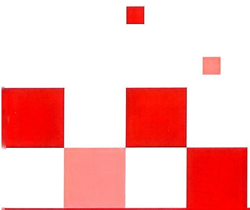

natural_image

Abstract geometric composition of red and pink squares on white background (no text or symbols)

主编 肖德好

text_image

天津

数学

24

八年级上册

RJ

4

# 目录

# 第十三章 三角形

13.1 三角形的概念 /2  
13.2.1 三角形的边 /3  
13.2.2 三角形的中线、角平分线、高 /4  
13.3.1 三角形的内角 /5  
13.3.2 三角形的外角 /6

# 第十四章 全等三角形

14.1 全等三角形及其性质 /7  
14.2 第1课时 三角形全等的判定（一）（“SAS”）/8  
14.2 第2课时 三角形全等的判定（二）（“ASA”“AAS”）/9  
14.2 第3课时 三角形全等的判定（三）（“SSS”）/10  
14.2 第4课时 与全等三角形判定有关的尺规作图 /11  
14.2 第5课时 直角三角形全等的判定（“HL”）/12  
14.3 第1课时 角的平分线的画法及性质 /13  
14.3 第2课时 角的平分线的判定 / 14

# 第十五章 轴对称

15.1.1 轴对称及其性质 / 15   
15.1.2 第1课时 线段垂直平分线的性质及判定 /16  
15.1.2 第2课时 尺规作图——线段垂直平分线 /17  
15.2 画轴对称的图形 /18  
15.3.1 第1课时 等腰三角形的性质 / 19

15.3.1 第2课时 等腰三角形的判定 /20  
15.3.2 第1课时 等边三角形的性质与判定 / 21  
15.3.2 第2课时含 $30^{\circ}$ 角的直角三角形的性质/22

综合与实践 最短路径问题 /23

# 第十六章 整式的乘法

16.1 幂的运算 / 24   
16.2 (1) 整式的乘法 / 25  
16.2 (2) 整式的除法 / 26  
16.3.1 平方差公式 / 27  
16.3.2 第1课时 完全平方公式 /28  
16.3.2 第2课时 添括号法则 /29

# 第十七章 因式分解

17.1 用提公因式法分解因式 /30  
17.2 （1）用公式法分解因式 /31  
17.2 （2）综合运用提公因式法和公式法分解因式 /32

# 第十八章 分式

18.1.1 从分数到分式（略）  
18.1.2 第1课时 分式的基本性质 /33  
18.1.2 第2课时 分式的约分和通分 /34  
18.2 分式的乘法与除法 /35  
18.3 第1课时 分式的加法与减法 / 36  
18.3 第2课时 分式的混合运算 / 37  
18.4 整数指数幂（略）  
18.5 第1课时 分式方程及其解法 /38  
18.5 第2课时 列分式方程解决实际问题 /39

# 参考答案 / 活 21

# 第十三章 三角形

# 13.1 三角形的概念

# 基础应用巩固

1. 图 13-1-1 中共有三角形

( )

A. 4 个

B. 5 个

C. 6 个

D. 7 个

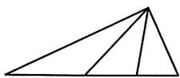  
图13-1-1

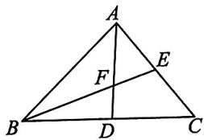

text_image

Geometric diagram of triangle ABC with internal points D, E, F and line segments AD, BE, EF labeled

图13-1-2

2. 如图 13-1-2, 在 $\triangle ABC$ 中, 点 $D$ 在 $BC$ 上, 点 $E$ 在 $AC$ 上, $BE$ , $AD$ 交于点 $F$ , 则以 $AB$ 为边的三角形的个数是 ( )

A. 1

B. 2

C. 3

D. 4

3. 图 13-1-3 中是钝角三角形的是

( )

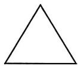  
A

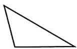  
B

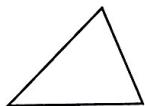  
C

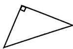  
D   
图13-1-3

4. 将三角形按边的相等关系分类: 三角形 $\left\{ \begin{array}{l} \text{三边都不相等的三角形,} \\ \square, \end{array} \right.$ 则“□”表示的是 ( )

A. 等腰三角形

B. 等边三角形

C. 直角三角形

D. 锐角三角形

5. 下列说法正确的是

( )

A. 三角形按边分类可分为三边都不相等的三角形和直角三角形  
B. 三角形按角分类可分为锐角三角形和钝角三角形  
C. 等腰三角形可分为等边三角形和底边与腰不相等的等腰三角形  
D. 等边三角形不一定是等腰三角形

6. 如图 13-1-4, 在 $\triangle ABC$ 中, $AB$ 与 $BC$ 的夹角是 \_\_\_\_, $\angle A$ 的对边是 \_\_\_\_, 边 $AB$ 所对的顶点是 \_\_\_\_.

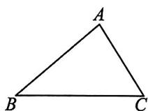  
图13-1-4

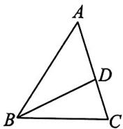  
图13-1-5

7. (1) 图 13-1-5 中有 \_\_\_\_ 个三角形, 用符号表示为 \_\_\_\_;  
(2)以 AB 为边的三角形是 \_\_\_\_；  
(3)以 $\angle C$ 为角的三角形是\_\_\_\_；  
(4) $\angle A$ 的对边是\_\_\_\_.

# 13.2.1 三角形的边

# 基础概念生成

1. 对于任意一个 $\triangle ABC$ , 如果把其中任意两个顶点(例如 $B, C$ ) 看成定点, 由“两点之间, 线段 \_\_\_\_, 可得 $AB + AC > BC$ ①. 同理有 $AC + BC$ \_\_\_\_ AB②, $AB + BC$ \_\_\_\_ AC③. 这样, 我们就证明了, 三角形两边的和\_\_\_\_第三边. 进一步, 由不等式②③, 移项可得 $BC > AB - AC$ , $BC > AC - AB$ . 这就是说, 三角形两边的差\_\_\_\_第三边.

# 基础应用巩固

2. 下列长度的各组线段中,不能组成三角形的是 ( )

A. 3,4,5

B. 5,6,11

C. 5,6,10

D. 5,5,2

3. 下列生产和生活实例: ①三角形的屋顶钢架结构; ②商店的推拉活动防盗门; ③在长方形栅栏门的两个角上各斜钉一根木条. 其中应用了三角形稳定性的有 ( )

A. 0 个

B. 1 个

C. 2 个

D. 3 个

4. 如图 13-2-1, 在 $\triangle ABC$ 中, $AB + AC > BC$ , 其理由是 ( )

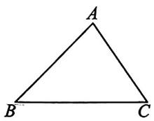  
图13-2-1

A. 两点确定一条直线  
B. 两点之间, 线段最短  
C. 垂线段最短   
D. 在同一平面内, 过一点有且只有一条直线与已知直线垂直

5. 已知一个三角形的两边长分别为 4 和 9, 第三边的长为奇数, 则该三角形第三边的长可能是 ( )

A. 5

B. 10

C. 11

D. 12

6. 已知 $a, b, c$ 是 $\triangle ABC$ 的三边长，且满足 $|a - 1| + (b - 6)^2 = 0, c$ 为整数，则 $c$ 的值为 \_\_\_\_.  
7. 已知一个等腰三角形的周长是 $18 \mathrm{~cm}$ , 其中一边长是 $4 \mathrm{~cm}$ , 求这个三角形另两边的长.

# 13.2.2 三角形的中线、角平分线、高

# 公众号\*满满分享库

# 基础概念符号化

# 1. 中线、角平分线、高

(1)如图 13-2-2①, AE 是△ABC 的中线,
则 BE=\_\_\_\_= $\frac{1}{2}$ \_\_\_\_;

(2)如图②,AD是△ABC的角平分线,则 $\angle$ \_\_\_\_= $\angle$ \_\_\_\_= $\frac{1}{2}\angle$ \_\_\_\_;

(3)如图③,AF是△ABC的高,则∠\_\_\_\_=∠\_\_\_\_=90°,S△ABC=\_\_\_\_.

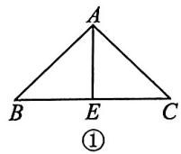

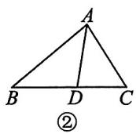

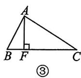  
图13-2-2

# 基础作图提示

2. 数学课上,同学们在练习画边 AC 上的高时,出现下列四种图形,其中正确的是 ( )

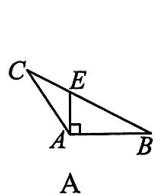

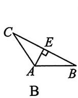

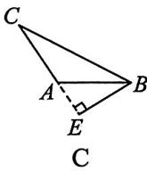

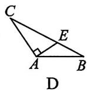  
图13-2-3

# 基础应用巩固

3. 如图 13-2-4, 线段 BE 是 $\triangle ABC$ 的高的是

( )

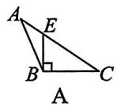

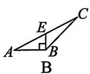

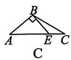

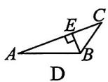  
图13-2-4

4. 如图 13-2-5, 在 $\triangle ABC$ 中, $CD$ 为 $AB$ 边上的中线. 若 $AB = 10$ , 则 $AD =$   
5. 如图 13-2-6, 若 $\angle1 = \angle2 = \angle3$ , 则 AM 为 $\triangle$ 的角平分线, AN 为 $\triangle$ 的角平分线.

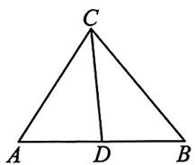

text_image

C
A D B

图13-2-5

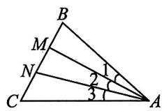  
图13-2-6

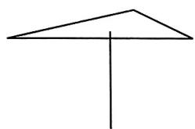

natural_image

Simple geometric diagram of a triangle with a vertical line (no text or symbols)

图13-2-7

6. 如图 13-2-7, 小明用一支铅笔支起一张质地均匀的三角形卡片, 则他支起的这个点应是三角形 \_\_\_\_ 的交点.  
7. 如图 13-2-8 所示, 已知 $AD, AE$ 分别是 $\triangle ABC$ 的高和中线, $AB = 6 \mathrm{~cm}, AC = 8 \mathrm{~cm}, BC = 10 \mathrm{~cm}, \angle CAB = 90^{\circ}$ . 试求:

(1) $AD$ 的长；(2) $\triangle ABE$ 的面积；(3) $\triangle ACE$ 和 $\triangle ABE$ 的周长的差.

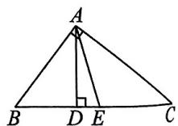  
图13-2-8

# 13.3.1 三角形的内角

公众号\*满满分享库

# 基础知识生成

1. 三角形的内角和等于 $180^{\circ}$

推理过程：

如图 13-3-1, 延长 $\triangle ABC$ 的边 $BC$ , 过点 $C$ 作直线 $l // AB$ .

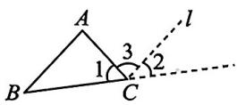

图13-3-1  
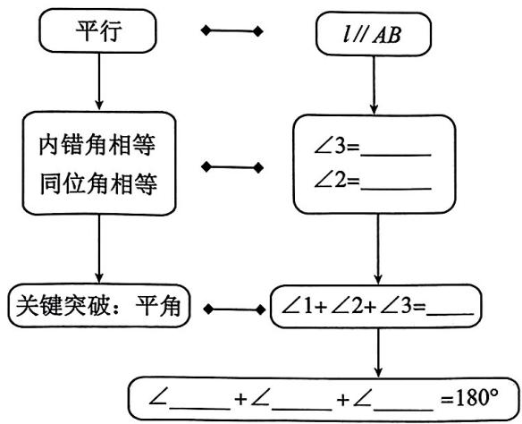

flowchart

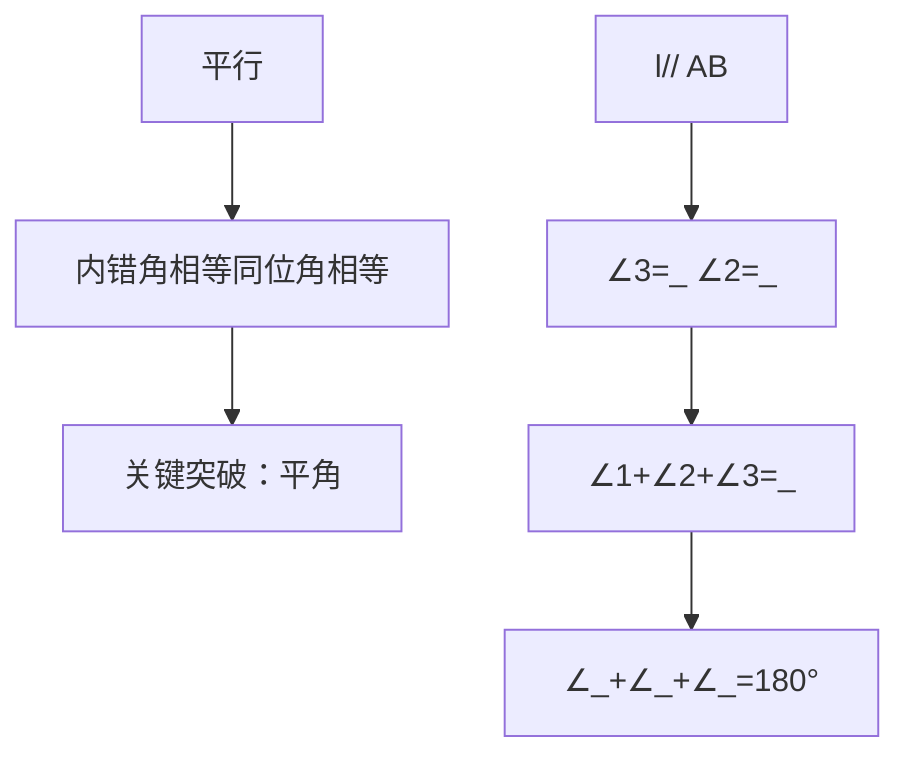

图13-3-2

# 基础规范推理

2. 如图 13-3-3, 在 Rt△ABC 中, ∠ACB = 90°, CD ⊥ AB 于点 D. 请回答下列问题:

(1)图中有\_\_\_\_对互余的角.   
(2)求证: $\angle1=\angle A$ .(请将证明过程补充完整)

证明：∵CD⊥AB(已知)，

$$
\therefore \angle C D B = \angle C D A = 9 0 ^ {\circ} (\underline {{\quad}}).
$$

在 Rt△ABC 中，∠A+\_\_\_\_=90°，

在 Rt△BCD 中，∠1+\_\_\_\_=90°

$$
(\quad),
$$

$$
\therefore \angle 1 = \angle A (\underline {{\quad}}).
$$

(3)仿照(2)的证明过程证明: $\angle2=\angle B$ .

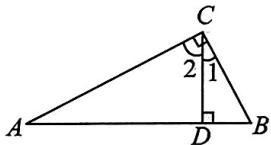

text_image

C
2 1
A D B

图13-3-3

# 基础应用巩固

3. 在 $\triangle ABC$ 中， $\angle A = 60^{\circ}$ ， $\angle B = 40^{\circ}$ ，则 $\angle C$ 等于 （）

A. ${100}^{ \circ  }$

B. ${80}^{ \circ  }$

C. $60^{\circ}$

D. ${40}^{ \circ  }$

4. 在 $\triangle ABC$ 中, $\angle A = 15^{\circ}, \angle B = 65^{\circ}$ , 则 $\triangle ABC$ 的形状是 ( )

A. 等边三角形

B.锐角三角形

C. 直角三角形

D. 钝角三角形

5. 在 $\triangle ABC$ 中， $\angle A:\angle B:\angle C=1:3:5$ ，则 $\angle B$ 的度数为 （）

A. ${80}^{ \circ  }$

B. ${60}^{ \circ  }$

C. ${40}^{ \circ  }$

D. ${20}^{ \circ  }$

6. 下列条件中,不能判定 $\triangle ABC$ 是直角三角形的是 ( )

A. $\angle A + \angle B = \angle C$

B. $\angle A - \angle B = \angle C$

C. $\angle A: \angle B: \angle C = 1:2:3$

D. $\angle A = \angle B = 2\angle C$

7. 如图 13-3-4, 已知 $\angle A = 30^{\circ}, \angle ADC = 110^{\circ}$ , 点 $B$ 在 $CD$ 的延长线上, $BE \perp AC$ , 垂足为 $E$ , 求 $\angle C, \angle B$ 的度数.

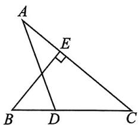

text_image

A
E
B D C

图13-3-4

# 13.3.2 三角形的外角

# 公众号\*满满分享库

# > 基础知识生成

1. 三角形的外角等于与它不相邻的两个内角的和如图 13-3-5, $\angle 1 = \angle C + \angle B$ .

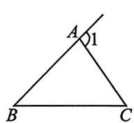  
图13-3-5

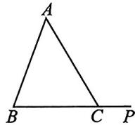  
图13-3-6

如图 13-3-6, P 是 $\triangle ABC$ 的 BC 边的延长线上一点，在 $\triangle ABC$ 中，若 $\angle A = 50^{\circ}$ ， $\angle B = 70^{\circ}$ ，则 $\angle ACB =$ \_\_\_\_.

又∵∠ACB+∠ACP=\_\_\_\_，

$$
\therefore \angle A C P = \underline {{\quad}}.
$$

$$
\therefore \angle A C P = \angle A + \angle B.
$$

2. 三角形的一个外角大于与它不相邻的任何一个内角如图13-3-7, 点 $D, E$ 分别在 $BC, AD$ 上, 则 $\angle 1$ 是 $\triangle$ 的外角, $\angle 2$ 是

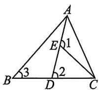  
图13-3-7

△ 的外角，

$$
\therefore \angle 3 \_ \_ \_ \_ \angle 2 \_ \_ \_ \_ \angle 1.
$$

# 基础规范推理

3. 如图 13-3-8, D 是 $\triangle ABC$ 的边 AC 上一点, $\angle A = \angle ABD, \angle BDC = 150^{\circ}, \angle ABC = 85^{\circ}.$

求:(1) $\angle A$ 的度数;

(2) $\angle C$ 的度数.

解：（1）∵∠BDC 是△ABD 的外角(已知)，

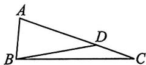  
图13-3-8

$$
\therefore \angle B D C = \underline {{\quad}} + \underline {{\quad}} (\underline {{\quad}}).
$$

又∵∠A=∠ABD,∠BDC=150°(已知),

$$
\therefore \angle A = \underline {{\quad}} ^ {\circ}
$$

(2) $\because \angle A + \angle ABC + \angle C =$ \_\_\_\_°
(\_\_\_\_),

$\therefore \angle C = 180^{\circ} - \angle ABC - \angle A$ (等式的性质). 又 $\because \angle ABC = 85^{\circ}, \therefore \angle C =$

# 基础应用巩固

4. (1)如图 13-3-9①, 已知 $\angle ABE = 142^{\circ}, \angle C = 72^{\circ}$ , 则 $\angle A =$ \_\_\_\_°, $\angle ABC =$ \_\_\_\_°;

(2)如图②,若 $\angle3=120^{\circ}$ ,则 $\angle4=$ \_\_\_\_°, $\angle1-\angle2=$ \_\_\_\_°.

5. 如图 13-3-10, CE 平分△ABC 的外角∠ACD. 若∠A=60°, ∠B=40°, 则∠ECD=\_\_\_\_°.

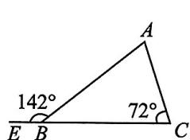

text_image

142°
72°

①

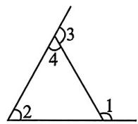  
②   
图13-3-9

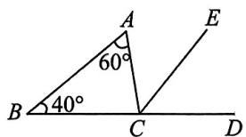

text_image

A
60°
B 40° C D
E

图13-3-10

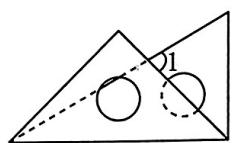  
图13-3-11

6. 将一副三角尺按图 13-3-11 所示的方式放置, 则 $\angle 1$ 的度数为  
7. 如图 13-3-12, $AB \parallel CD$ , $\angle A + \angle E = 75^{\circ}$ , 则 $\angle C$ 的度数为 \_\_\_\_.

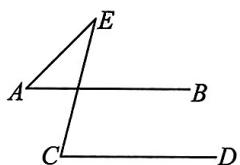

text_image

Geometric diagram with labeled points A, B, C, D, E forming intersecting lines and triangles

图13-3-12

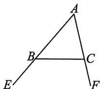  
图13-3-13

8. 如图 13-3-13, $\angle CBE$ 和 $\angle BCF$ 是 $\triangle ABC$ 的两个外角. 若 $\angle A = 54^{\circ}$ , 则 $\angle ABC + \angle ACB =$ \_\_\_\_, $\angle CBE + \angle BCF =$ \_\_\_\_.

# 第十四章 全等三角形

# 公众号\*满满分享库

# 14.1 全等三角形及其性质

# 基础应用巩固

1. 下列各选项中的两个三角形, 是全等三角形的是 ( )

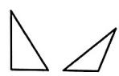  
A

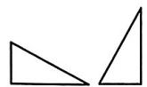  
B

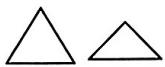  
C

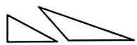  
D   
图14-1-1

2. 如图 14-1-2, 已知 $\triangle AOC \cong \triangle DOB, AO = 3$ , 则下列结论正确的是 ( )

A. ${AB} = 3$

B. ${BO} = 3$

C. ${DB} = 3$

D. ${DO} = 3$

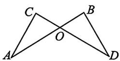  
图14-1-2

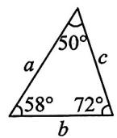

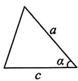  
图14-1-3

3. 已知图14-1-3中的两个三角形全等，则 $\angle \alpha$ 的度数是 （）

A. $72^{\circ}$

B. ${60}^{ \circ  }$

C. ${50}^{ \circ  }$

D. ${58}^{ \circ  }$

4. 如图 14-1-4, 已知 $\triangle ABC \cong \triangle CDA$ , 有下列结论:

①AB 与 AD 是对应边；②AC 与 CA 是对应边；  
③∠BAC 与∠DAC 是对应角；④∠CAB 与∠ACD 是对应角.

其中正确的是\_\_\_\_（填序号）.

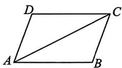  
图14-1-4

5. 如图 14-1-5, 已知 $\triangle ABC \cong \triangle DFE$ , $AB = 3$ , $AC = 2$ , $EF = 4$ , 求 $\triangle DFE$ 的周长.

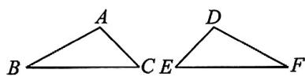  
图14-1-5

6. 如图 14-1-6, 已知 $\triangle DCE \cong \triangle ABE$ , 则 $\angle AED$ 和 $\angle BEC$ 相等吗? 为什么?

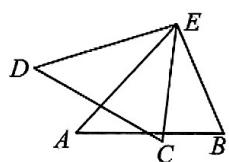  
图14-1-6

# 14.2 第 1 课时 三角形全等的判定 (一)(“SAS”)

# 公众号\*满满分享库

# 基础推理引导

1. 实验: 如图 14-2-1, 把一长一短的两根木棍的一端固定在一起, 摆出 $\triangle ABC$ . 固定住长木棍, 转动短木棍, 得到 $\triangle ABD$ (点 $B, C, D$ 在一条直线上).

观察: 在 $\triangle ABC$ 和 $\triangle ABD$ 中, 有一条公共边相等, 即 \_\_\_\_ = \_\_\_\_;

  
图14-2-1

有一个公共角相等, 即 \_\_\_\_ \_\_\_\_ ; 在旋转过程中, 由题意得 AD = \_\_\_\_ , 发现: △ABC 与 △ABD \_\_\_\_ (填“全等”或“不全等”).

归纳:有两边和其中\_\_\_\_分别相等的两个三角形不一定全等.

# 基础规范推理

2. 如图 14-2-2, C 是线段 AB 的中点, CD = BE, CD // BE.

求证: $\angle D=\angle E.$

证明：∵C是线段AB的中点，∴AC=\_\_\_\_.

$$
\because C D \parallel B E,
$$

$$
\therefore \angle A C D = \underline {{\quad}}
$$

在△\_\_\_\_和△\_\_\_\_中，

$$
\left\{ \begin{array}{l} \underline {{\quad}} = \underline {{\quad}}, \\ \angle A C D = \underline {{\quad}}, \\ C D = B E, \end{array} \right.
$$

$$
\therefore \triangle \_ \_ \_ \_ \cong \triangle \_ \_ \_ \_ (\_).
$$

$$
\therefore \angle D = \angle E.
$$

text_image

A
C
D
B
E

图14-2-2

# 基础应用巩固

3. 图 14-2-3 中的全等三角形是

( )

A. ①和②

B. ②和③

C. ②和④

D. ①和③

4. 如图 14-2-4, 工人师傅设计了一种测零件内径 AB 只要量出 $A^{\prime}B^{\prime}$ 的长度就可以知道该零件内径 AB 全等的判定方法, 此判定方法是 \_\_\_\_

的卡钳, 卡钳交叉点 $O$ 为 $AA'$ , $BB'$ 的中点. 的长度, 在这个操作过程中, 运用了三角形 \_\_\_\_.

  
①

  
②

  
③

  
④

  
图14-2-4

text_image

Geometric diagram with labeled points A, B, C, D, and P forming triangles and intersecting lines

图14-2-5  
图14-2-3

5. 如图 14-2-5 所示, 已知 $P$ 是 $\angle BAC$ 的平分线 $AD$ 上的一点, 请添加一个条件: \_\_\_\_, 使得可直接根据“SAS”判定 $\triangle ABP \cong \triangle ACP$ .

6. 如图 14-2-6, 点 D 在 AB 上, 点 E 在 AC 上, AB = AC, AD = AE.

求证:BE=CD.

text_image

A
D	E
B	C

图14-2-6

# 14.2 第 2 课时 三角形全等的判定 (二)(“ASA”“AAS”)

# 公众号\*满满分享库

# 基础规范推理

1. 如图 14-2-7, D 是 AB 上一点, DF 交 AC 于点 E, DE = FE, FC // AB.

求证:AE=CE.

证明：∵FC∥AB，∴∠A=∠\_\_\_\_，∠ADE=∠\_\_\_\_。

在 $\triangle ADE$ 和 $\triangle CFE$ 中，

$$
\left\{ \begin{array}{l} \angle A = \angle \_, \\ \angle A D E = \angle \_, \therefore \triangle A D E \cong \triangle C F E (\_). \therefore A E = C E. \\ D E = F E, \end{array} \right.
$$

text_image

A
E
F
D
B
C

图14-2-7

# 基础应用巩固

2. 如图 14-2-8, 在 $\triangle ABC$ 中, $\angle B = \angle C$ , $D$ 为 $BC$ 的中点, 过点 $D$ 分别向 $AB$ , $AC$ 作垂线段 $DE$ , $DF$ , 则直接判定 $\triangle BDE \cong \triangle CDF$ 的依据是 \_\_\_\_.

  
图14-2-8

  
图14-2-9

3. 如图 14-2-9.

(1)已知 $\angle 1 = \angle 2$ ,如果想用“SAS”证明 $\triangle ABD \cong \triangle ACD$ ,那么应补充的一个条件是\_\_\_\_;  
(2)已知 $\angle1=\angle2$ ，如果想用“ASA”证明 $\triangle ABD\cong\triangle ACD$ ，那么应补充的一个条件是\_\_\_\_；  
(3)已知 $\angle1=\angle2$ ,如果想用“AAS”证明 $\triangle ABD\cong\triangle ACD$ ,那么应补充的一个条件是\_\_\_\_.

4. 如图 14-2-10, E 是 CD 上一点, BE 交 AD 于点 F, $\angle B = \angle BED$ , EF = BF. 求证: AF = DF.

  
图14-2-10

5. 如图 14-2-11, AB = AC, CD ⊥ AB, BE ⊥ AC, 垂足分别为 D, E.

求证:(1) $\triangle ABE\cong\triangle ACD$ ;

(2) ${BD} = {CE}$ .

text_image

A
D
E
B
C

图14-2-11

# 14.2 第3课时 三角形全等的判定（三）(“SSS”)

# 基础规范推理

1. 如图 14-2-12, 在 $\triangle ABC$ 中, $AB = AC$ , $AD$ 是边 $BC$ 上的中线.

  
图14-2-12

求证: AD 是 $\triangle ABC$ 的角平分线.

证明: $\because AD$ 是 $\triangle ABC$ 的边 $BC$ 上的中线,

$$
\therefore B D = \underline {{\quad}}.
$$

在△\_\_\_\_和△\_\_\_\_中，

$$
\left\{ \begin{array}{l} A B = A C, \\ A D = A D, \\ \underline {{\quad}} = \underline {{\quad}}, \end{array} \right.
$$

$$
\therefore \underline {{\underline {{\underline {{\underline {{S}}}}}}}} \underline {\underline {{\underline {{}}} (\underline {{\underline {{}}}})}}.
$$

$$
\therefore \angle B A D = \angle C A D.
$$

∴AD 是△ABC 的角平分线.

# 基础应用巩固

2. 图 14-2-13 中, 全等的三角形是

( )

A. 甲和乙

B. 乙和丁

C. 甲和丙

D. 甲和丁

3. 如图 14-2-14, 在 $\triangle ABC$ 和 $\triangle ADC$ 中, $AB = AD$ . 如果用“SSS”证明 $\triangle ABC \cong \triangle ADC$ , 那么需要添加的条件是 \_\_\_\_.

text_image

甲
3
5
3
2
乙
3
4
6
丙
3.2
3
4
丁
2
3

图14-2-13

natural_image

Simple geometric diagram of a quadrilateral ABCD with diagonal AC, no text or labels present

图14-2-14

flowchart

图14-2-15

4. 如图 14-2-15 是一个平分角的仪器, 其中 AB = AD, BC = DC, 将点 A 放在角的顶点, AB 和 AD 沿着角的两边放下, 沿 AC 画一条射线, 这条射线就是角的平分线, 在这个操作过程中, 运用了三角形全等的判定方法, 此判定方法是 \_\_\_\_.

5. 如图 14-2-16, 在四边形 ABCD 中, DA = BC, AB = CD. 求证: $\triangle ABC \cong \triangle CDA$ .

  
图14-2-16

6. 如图 14-2-17, C 是 BD 的中点, AB = ED, AC = EC. 求证: $\triangle ABC \cong \triangle EDC$ .

  
图14-2-17

# 14.2 第4课时 与全等三角形判定有关的尺规作图

# 基础作图提示

1. 下面是黑板上出示的一道尺规作图题,需要回答横线上符号代表的内容.

如图 14-2-18 所示, 已知 $\angle AOB$ , 求作: $\angle DEF$ , 使 $\angle DEF = \angle AOB$ .

作法:如图.(1)以 $\heartsuit$ 为圆心,任意长为半径作弧,分别交 OA,OB 于点 P,Q;

(2)作一条射线 $EG$ , 以点 $E$ 为圆心, $\text{😊}$ 为半径作弧, 交 $EG$ 于点 $D$ ;

(3)以点 D 为圆心， $\otimes$ 为半径作弧，与上一步作的弧相交于点 F；

(4) 过点 $F$ 作射线 $\oplus$ ，则 $\angle DEF = \angle AOB$ .

  
图14-2-18

下列回答正确的是

( )

A. ♡表示点 E

B. ☺表示 PQ

C. ⊗表示 $OQ$

D. ⊕表示 EF

# 基础应用巩固

2. 尺规作图中蕴含着丰富的数学知识和思想方法. 如图 14-2-19, 已知 $\angle POQ$ , 求作 $\angle P'O'Q'$ , 使 $\angle P'O'Q' = \angle POQ$ . 在用尺规作图的过程中, 判定 $\triangle AOB \cong \triangle A'O'B'$ 的依据是 ( )

  
图14-2-19

A. SAS

B. SSS

C. ASA

D. AAS

3. 如图 14-2-20, 已知 $\angle AOB$ , 点 $C$ 在 $OB$ 上, 用尺规作 $\angle BCD = \angle AOB$ , 则下列作图步骤正确的顺序是 ( )

①以点 C 为圆心, OE 为半径作弧, 交 OB 于点 M;  
②过点 N 作射线 CD，则 $\angle BCD = \angle AOB$ ；  
③以点 M 为圆心, EF 为半径作弧, 与上一步作的弧交于点 N;  
④以点 O 为圆心,任意长为半径作弧,分别交 OA, OB 于点 E, F.

A. ①②③④

B. ③②④①

C. ④①③②

text_image

Geometric diagram showing angles and points labeled O, A, B, C, D, E, F, M, N with arcs and lines

图14-2-20

D. ④③①②

4. 利用你学过的基本作图完成作图: 已知三边作三角形. (保留作图痕迹, 不写作法)

已知:如图 14-2-21, 线段 a, b, c. 求作: $\triangle ABC$ , 使 BC = a, AC = b, AB = c.

  
图14-2-21

5. 如图 14-2-22, 已知 $\angle AOB, C$ 是 $OB$ 边上的一点. 用直尺和圆规作出经过点 $C$ 且与 $OA$ 平行的直线.

  
图14-2-22

# 14.2 第5课时 直角三角形全等的判定（“HL”）

# 基础规范推理

1. 如图 14-2-23, $\angle A = \angle D = 90^{\circ}, AB = DE, BF = EC$ .

求证: $\triangle ABC\cong\triangle DEF.$

证明：∵BF=EC，

$\therefore BF + \_\_\_\_ = EC + \_\_\_\_ ,$ 即

$\because \angle A = \angle D = 90^{\circ}, \therefore \triangle ABC$ 和 $\triangle DEF$ 都是直角三角形.

text_image

A
D
B
F
C
E

图14-2-23

在 Rt△ABC 和 Rt△DEF 中， $\left\{\frac{—}{AB=DE},\right.$ ， $^{'}$ : $Rt\triangle ABC \cong Rt\triangle DEF(\_\_\_\_)$ .

# 基础应用巩固

2. 如图 14-2-24, $AB \perp BD$ , $CD \perp BD$ , $AD = CB$ , 则判定 Rt△ABD≌Rt△CDB 的依据是（）

A. HL

B. ASA

C. SAS

D. SSS

3. 如图 14-2-25, 在四边形 $ABCD$ 中, $CD \perp AD$ , $CB \perp AB$ , 垂足分别是 $D, B, CD = CB$ . 求证: Rt△ADC≌Rt△ABC.

以下是排乱的证明过程: ① $\therefore \angle D = \angle B = 90^{\circ}$ ; ② $\therefore \mathrm{Rt} \triangle ADC \cong \mathrm{Rt} \triangle ABC (\mathrm{HL})$ ; ③ $\because CD \perp AD, CB \perp AB$ ; ④ 在 Rt△ADC 和 Rt△ABC 中, $\left\{ \begin{array}{l} AC = AC, \\ CD = CB. \end{array} \right.$

证明步骤正确的顺序是

( )

A. ③②④①

B. ③①④②

C. ①②③④

D. ①③④②

  
图14-2-24

text_image

D
C
A
B

图14-2-25

text_image

A
B D C

图14-2-26

4. 如图 14-2-26 所示, 已知 $AD \perp BC$ 于点 $D$ , 若要根据“HL”判定 Rt△ABD ≌ Rt△ACD, 则还需添加的一个条件是 \_\_\_\_.

5. 如图 14-2-27, 已知 $AB = CD$ , $AE \perp BD$ , $CF \perp BD$ , 垂足分别为 $E, F, BF = DE$ .

求证: $AB \parallel CD$ .

text_image

Geometric diagram showing two intersecting triangles with labeled points and perpendicular lines

图14-2-27

# 14.3 第1课时 角的平分线的画法及性质

# 基础概念生成

1. 角的平分线的性质：角的平分线上的点到角两边的距离相等

如图 14-3-1, DC 平分 $\angle ADB$ , P 是 DC 上一点, 且 $PE \perp AD$ 于点 E, $PF \perp DB$ 于点 F, 则 \_\_\_\_.

text_image

Geometric diagram showing triangle with perpendiculars and labeled points A, B, C, D, E, F, P

图14-3-1

# 基础应用巩固

2. 如图 14-3-2, CD 是 $\triangle ABC$ 的 ( )

A. 中线

B. 高

C. 角平分线

D. 不能确定

3. 已知 $OP$ 是 $\angle MON$ 的平分线, 点 $E, F, G$ 分别在射线 $OM, ON, OP$ 上, 则下列图形中可根据角的平分线的性质得到 $EG = FG$ 的是 ( )

text_image

Geometric diagram of triangle ABC with internal point D and marked equal segments, including a perpendicular line from C to AB.

图14-3-2

  
A

  
B

  
C

  
D   
图14-3-3

4. 如图 14-3-4, 点 P 在 $\angle AOB$ 的平分线上, 在利用角的平分线的性质推证 PD = PE 时, 必须满足的条件是 \_\_\_\_。

text_image

Geometric diagram showing angles and points labeled O, A, B, E, P, D

图14-3-4

  
图14-3-5

5. 如图 14-3-5, 在 $\triangle ABC$ 中, $\angle C = 90^{\circ}$ , $BD$ 平分 $\angle ABC$ 交 $AC$ 于点 $D$ .

(1)若 $CD = 3$ ，则点 $D$ 到 $AB$ 边的距离是  
(2)若 AB=5, CD=2, 则 $\triangle ABD$ 的面积为 \_\_\_\_.

6. 如图 14-3-6, 在 $\triangle ABC$ 中, $AD$ 是它的角平分线, $\angle C = 90^{\circ}, DE \perp AB$ 于点 $E$ , 点 $F$ 在 $AC$ 上,且 $BE = CF$ . 求证: (1) $DE = DC$ ; (2) $BD = FD$ .

  
图14-3-6

# 14.3 第2课时 角的平分线的判定

# 基础概念生成

1. 角的平分线的判定：角的内部到角两边距离相等的点在角的平分线上

已知:如图 14-3-7, 点 P 在 $\angle AOB$ 的内部, $PC \perp OA$ , $PD \perp OB$ , 垂足分别为 C, D, 且 PC = PD.

求证: 点 P 在 $\angle AOB$ 的平分线上.

  
图14-3-7

# 基础应用巩固

2. 在正方形网格中, $\angle AOB$ 的位置如图 14-3-8 所示, 到 $\angle AOB$ 两边距离相等的点应是 ( )

A. 点 $M$

B. 点 $N$

C. 点 $P$

D. 点 $Q$

text_image

O
A
P
Q
M
N
B

图14-3-8

text_image

A
B
C
D

图14-3-9

3. 如图 14-3-9, $\angle B = \angle D = 90^{\circ}, AB = AD, \angle BCA = 50^{\circ}$ , 则 $\angle DCA$ 的度数为 ( )

A. ${40}^{ \circ  }$

B. ${50}^{ \circ  }$

C. ${60}^{ \circ  }$

D. $75^{\circ}$

4. 如图 14-3-10, $O$ 是 $\triangle ABC$ 内一点, 且点 $O$ 到 $AB, BC, CA$ 的距离相等, 连接 $OB, OC$ . 若 $\angle BAC = 70^{\circ}$ , 求 $\angle BOC$ 的度数.

text_image

A
O
B
C

图14-3-10

# 第十五章 轴对称

# 15.1.1 轴对称及其性质

# 基础应用巩固

1. 下列关于体育运动的图标中, 是轴对称图形的是 ( )

  
A

  
B

  
C

  
D   
图15-1-1

2. 下列图形中, 是轴对称图形的是 ( )

  
A

  
B

  
C

  
D   
图15-1-2

3. 下列图形中, 点 $A$ 与点 $B$ 关于直线 $l$ 对称的是 ( )

  
A

  
B

  
C

  
D   
图15-1-3

4. 图 15-1-4 中的图形为轴对称图形,该图形的对称轴有 ( )

A. 1 条

B. 2 条

C. 5 条

D. 无数条

  
图15-1-4

natural_image

Geometric diagram of a tetrahedron with vertices labeled A, B, C, D, E (no text or symbols)

图15-1-5

5. 如图 15-1-5 是一个飞镖的设计图, 其主体部分 (四边形 $ABED$ ) 关于 $AE$ 所在的直线对称, $C$ 为 $AE$ 上一点, 则下列结论不一定正确的是 ( )

A. ${AB} = {AD}$

B. ${BC} = {DC}$

C. $BE = DE$

D. $BC = AC$

6. 如图 15-1-6, $\triangle ABC$ 与 $\triangle DEF$ 关于直线 $l$ 对称, 且 $\angle A = 78^{\circ}, \angle F = 48^{\circ}$ .

(1)若点 B 到直线 l 的距离为 4，则 B, E 两点间的距离为 \_\_\_\_；

(2)求 $\angle E$ 的度数.

text_image

l
B A D E
C F

图15-1-6

# 15.1.2 第1课时 线段垂直平分线的性质及判定

# 基础概念生成

1. 线段的垂直平分线的性质：线段垂直平分线上的点与这条线段两个端点的距离相等如图 15-1-7，直线 l 垂直平分线段 AB，垂足为 C，点 P 在 l 上，则 AC = \_\_\_\_， $\triangle PAC \cong$ \_\_\_\_ ，PA = \_\_\_\_

text_image

l
P
A C B

图15-1-7

text_image

A
B D C

图15-1-8

2. 线段的垂直平分线的判定：与线段两个端点距离相等的点在这条线段的垂直平分线上

已知:如图 15-1-8, A 为线段 BC 外一点, 且 AB = AC.

求证: 点 A 在线段 BC 的垂直平分线上.
证明: 如图, 过点 A 作 $AD \perp BC$ 于点 D,
则 $\angle ADB = \angle ADC = 90^{\circ}$ (\_\_\_\_).

在 Rt△ABD 和 Rt△ACD 中，

$$
\left\{ \begin{array}{l} A B = A C, \\ \underline {{\quad}} = \underline {{\quad}}, \end{array} \right.
$$

$$
\therefore \mathrm{Rt} \triangle A B D \cong \mathrm{Rt} \triangle A C D (\underline {{\quad}}).
$$

$$
\therefore B D = C D (\underline {{\quad}}).
$$

∴直线 AD 是线段 BC 的垂直平分线.

∴点 A 在线段 BC 的垂直平分线上.

# 基础应用巩固

3. 如图 15-1-9, P 是线段 AB 垂直平分线上的点, PA = 6 cm, 则线段 PB 的长为 ( )

A. $3 \mathrm{~cm}$

B. $4 \mathrm{~cm}$

C. $6 \mathrm{~cm}$

D. $8 \mathrm{~cm}$

4. 如图 15-1-10, 在 $\triangle ABC$ 中, $AB$ 的垂直平分线分别交 $AB, BC$ 于点 $D, E$ , 连接 $AE$ . 若 $AE = 4$ , $EC = 2$ , 则 $BC$ 的长是 \_\_\_\_.

  
图15-1-9

text_image

Geometric diagram showing triangle ABC with intersecting lines and a right angle at D, labeled with points A, B, C, D, E.

图15-1-10

text_image

A
N
B
C

图15-1-11

5. 如图 15-1-11, 在 $\triangle ABC$ 中, $AC = 7 \mathrm{~cm}$ , 线段 $BC$ 的垂直平分线交 $AC$ 于点 $N$ . 若 $\triangle ABN$ 的周长为 $12 \mathrm{~cm}$ , 则 $AB$ 的长为 \_\_\_\_.

6. 如图 15-1-12, AB = AC, DB = DC, E 是 AD 延长线上的一点, 连接 BE, CE. 求证: BE = CE.

text_image

A
D
B
C
E

图15-1-12

# 15.1.2 第2课时 尺规作图——线段垂直平分线

# 基础作图引导

1. 过直线 $l$ 上一点 $P$ 作已知直线 $l$ 的垂线，按下面的作图步骤作图：

① 在直线 $l$ 上点 $P$ 的两旁分别截取线段 $PA, PB$ , 使 $PA = PB$ ;  
②分别以点 A, B 为圆心, 大于 $\frac{1}{2}AB$ 的长为半径作弧, 两弧相交于点 C;  
③过点 $C, P$ 作直线 $CP$ , 则直线 $CP$ 即为所求作的垂线.

①以点 P 为圆心，\_\_\_\_ 长为半径作弧，交直线 l 于 A, B 两点；  
②分别以点 A, B 为圆心，\_\_\_\_的长为半径作弧，两弧相交于点 N；  
③作直线 $PN$ .

直线 $PN$ 即为所求作的垂线.

text_image

P
A B l
N

图15-1-13

text_image

C
A
B
D

图15-1-14

3. 已知: 线段 AB.

求作:线段 AB 的垂直平分线.

作法:如图 15-1-14.

2. 已知: 直线 l 和直线 l 外一点 P.

求作: 直线 l 的垂线, 使它经过点 P.

作法:如图 15-1-13.

①分别以\_\_\_\_两点为圆心，\_\_\_\_的长为半径作弧，两弧相交于\_\_\_\_两点；  
②过\_\_\_\_两点作直线.

直线\_\_\_\_就是线段 $AB$ 的垂直平分线.

# 公众号\*满满分享库

# 基础应用巩固

4. 尺规作图要求: I. 过直线外一点作这条直线的垂线; II. 作线段的垂直平分线; III. 过直线上一点作这条直线的垂线; IV. 作角的平分线. 如图 15-1-15 是按上述要求排乱顺序的尺规作图, 则正确的配

对是:①—\_\_\_\_,②—\_\_\_\_,③—\_\_\_\_,④—\_\_\_\_.

  
①

  
②

  
③

  
④   
图15-1 15

5. 如图 15-1-16, 已知 $\angle AOB$ 及点 $P$ , 分别画出点 $P$ 到直线 $OA, OB$ 的垂线段 $PM$ 及 $PN$ . (尺规作图, 不写作法, 保留作图痕迹)

  
图15-1-16

# 15.2 画轴对称的图形

# 基础应用巩固

1. 作已知点关于某直线的对称点的第一步是

( )

A. 过已知点作一条直线与已知直线相交

B. 过已知点作一条直线与已知直线垂直

C. 过已知点作一条直线与已知直线平行

D. 不确定

2. 在平面直角坐标系中, 与点 $(-4,8)$ 关于 $y$ 轴对称的点的坐标是

( )

A. $(4,-8)$

B. $(-4,-8)$

C. (4,8)

D. $(8,-4)$

3. 若点 $P(a, -2)$ 与点 $Q(-3, b)$ 关于 $x$ 轴对称，则 $a - b$ 的值为

( )

A. -5

B. 5

C. -1

D. 1

4. 下面是四名同学作的与 $\triangle ABC$ 关于直线 $MN$ 对称的图形, 其中正确的是

( )

text_image

M
A'
C
B
B'
C'
A
N

A

text_image

M
B'
C'
C
B
A'
A
N

B

text_image

M
B'
C'
C
B
A'
A
N

C

text_image

Geometric diagram showing two triangles ABC and A'B'C' with auxiliary lines and points M, N labeled

D   
图15-2-1

5. 如图 15-2-2, $\triangle ABC$ 和 $\triangle DEF$ 关于某直线成轴对称, 请作出这条直线.

text_image

C
A
B
F
D
E

图15-2-2

  
图15-2-3

6. 如图 15-2-3, 已知 $\triangle ABC$ 和直线 $l$ , 画出与 $\triangle ABC$ 关于直线 $l$ 对称的图形.

7. 如图 15-2-4, 在平面直角坐标系 $xOy$ 中, 每个小正方形的边长均为 1, $\triangle ABC$ 是格点三角形 (顶点都是网格线交点的三角形是格点三角形).

(1)请写出点 A, B, C 的坐标;

(2)分别画出与 $\triangle ABC$ 关于x轴和y轴对称的图形.

text_image

y
A
B
C
O
x

图15-2-4

# 15.3.1 第1课时 等腰三角形的性质

# 公众号\*满满分享库

# 基础应用巩固

1. 已知等腰三角形的两边长分别是 $4 \mathrm{~cm}$ 和 $9 \mathrm{~cm}$ , 则此三角形的周长是 ( )

A. ${17}\mathrm{\;{cm}}$

B. $13 \mathrm{~cm}$

C. $22 \mathrm{~cm}$

D. $17 \mathrm{~cm}$ 或 $22 \mathrm{~cm}$

2. 若等腰三角形的底角为 $40^{\circ}$ , 则这个等腰三角形的顶角为 ( )

A. $70^{\circ}$

B. ${40}^{ \circ  }$

C. $40^{\circ}$ 或 $70^{\circ}$

D. ${100}^{ \circ  }$

3. 如图 15-3-1, 直线 AD 垂直平分线段 BC, $\angle B = 50^{\circ}$ , 则 $\angle C$ 的度数为 ( )

A. $60^{\circ}$

B. ${50}^{ \circ  }$

C. ${40}^{ \circ  }$

D. ${30}^{ \circ  }$

4. 如图 15-3-2, 在等腰三角形 $ABC$ 中, $AB = AC$ , $AD$ 是边 $BC$ 上的高, 则下列结论不正确的是 ( )

A. ${BD} = {CD}$

B. $\angle BAC = \angle ABC$

C. ${AD}$ 平分 $\angle {BAC}$

D. $S_{\triangle ABD} = S_{\triangle ACD}$

text_image

A
B
D
C

图15-3-1

text_image

A
B D C

图15-3-2

text_image

A
B D C

图15-3-3

5. 如图 15-3-3, 在 $\triangle ABC$ 中, $AB = AD = CD$ , $\angle C = 40^{\circ}$ , 则 $\angle BAD$ 的度数为 ( )

A. $35^{\circ}$

B. ${30}^{ \circ  }$

C. $25^{\circ}$

D. ${20}^{ \circ  }$

6. 如图 15-3-4 为生活中常见的折叠桌及其侧面示意图, 已知 $\angle ABO = 60^{\circ}, OC = OD, AB // CD$ , 则 $\angle BOD$ 的度数为 ( )

A. ${150}^{ \circ  }$

B. ${140}^{ \circ  }$

C. ${130}^{ \circ  }$

D. ${120}^{ \circ  }$

  
图15-3-4

text_image

A
B D C

图15-3-5

7. 如图 15-3-5, 在 $\triangle ABC$ 中, $AB = AC$ , $AD \perp BC$ 于点 $D$ . 若 $AB = 6$ , $CD = 4$ , 则 $\triangle ABC$ 的周长是 \_\_\_\_.

8. 如图 15-3-6, 在 $\triangle ABC$ 中, $AB = AC$ , $AB$ 的垂直平分线 $DE$ 分别交 $AB$ , $AC$ 于点 $D$ , $E$ .

(1) 若 $AC = 12, BC = 10$ , 求 $\triangle EBC$ 的周长;

(2)若 $\angle A=40^{\circ}$ ,求 $\angle EBC$ 的度数.

text_image

Geometric diagram of triangle ABC with intersecting line and perpendicular from D to AB at E

图15-3-6

# 15.3.1 第2课时 等腰三角形的判定

# 公众号\*满满分享库

# 基础应用巩固

1. 在 $\triangle ABC$ 中, $\angle B = \angle C$ , 则下列结论中一定正确的是 ( )

A. ${AB} = {BC}$

B. ${AB} = {AC}$

C. $BC = AC$

D. $\angle A = 60^{\circ}$

2. 根据下列条件,能判定 $\triangle ABC$ 是等腰三角形的是 ( )

A. $\angle A = 50^{\circ}, \angle B = 70^{\circ}$

B. $\angle A = 70^{\circ}, \angle B = 40^{\circ}$

C. $\angle A = 30^{\circ}, \angle B = 90^{\circ}$

D. $\angle A = 80^{\circ}, \angle B = 60^{\circ}$

3. 如图 15-3-7, 已知 OC 平分 ∠AOB, CD // OB. 若 OD = 6 cm, 则 CD 的长为 \_\_\_\_ cm.

  
图15-3-7

  
图15-3-8

4. 如图 15-3-8, 在 $\triangle ABC$ 中, $AB=AC$ , $\angle A=36^{\circ}$ , $BD$ 平分 $\angle ABC$ 交 $AC$ 于点 $D$ . 若 $BC=2$ , 则 $AD$ 的长度为\_\_\_\_.

5. 如图 15-3-9, $\angle A = \angle B$ , $CE \parallel DA$ , $CE$ 交 $AB$ 于点 $E$ . 求证: $\triangle CEB$ 是等腰三角形.

  
图15-3-9

6. 如图 15-3-10, D 是△ABC 的 BC 边的中点, $DE \perp AC$ , $DF \perp AB$ , 垂足分别是 E, F, 且 DF = DE. 求证: AB = AC.

text_image

A
F
E
B
D
C

图15-3-10

# 15.3.2 第1课时 等边三角形的性质与判定

# 基础应用巩固

1. 在 $\triangle ABC$ 中, $AB = AC = BC$ , 则 $\angle A$ 的度数是 ( )

A. ${40}^{ \circ  }$

B. ${50}^{ \circ  }$

C. $60^{\circ}$

D. ${70}^{ \circ  }$

2. 如图 15-3-11, 以点 O 为圆心, 任意长为半径作弧, 与射线 OA 交于点 B, 再以点 B 为圆心, BO 为半径作弧, 两弧交于点 C, 作射线 OC, 则 $\angle O$ 的度数为 ( )

A. ${30}^{ \circ  }$

B. ${45}^{ \circ  }$

C. ${60}^{ \circ  }$

D. ${75}^{ \circ  }$

3. 如图 15-3-12, 在一村庄旁有一池塘, 池塘的两侧分别有一段笔直的小路 BC 和一棵小树 A, 测得 $\angle ABC = 60^{\circ}, \angle ACB = 60^{\circ}, BC = 50$ 米, 则 AB 的长度为 ( )

A. 40 米

B. 45 米

C. 50 米

D. 55 米

4. 有以下结论: ①在 $\triangle ABC$ 中, 若 $AB=BC=CA$ , 则 $\triangle ABC$ 为等边三角形; ②在 $\triangle ABC$ 中, 若 $\angle A=\angle B=\angle C$ , 则 $\triangle ABC$ 为等边三角形; ③有两个角都是 $60^{\circ}$ 的三角形是等边三角形; ④有一个角是 $60^{\circ}$ 的等腰三角形是等边三角形. 其中正确的有 ( )

A. 1 个

B. 2 个

C. 3 个

D. 4 个

text_image

Geometric diagram showing a sector with angle C, point O on the arc, and perpendicular from C to line AB at B.

图15-3-11

text_image

A
池塘
B
C

图15-3-12

text_image

A
B D C

图15-3-13

5. 如图 15-3-13, 在 $\triangle ABC$ 中, $AB=BC=CA$ , $D$ 是 $BC$ 边的中点, 则 $\angle BAD=$ \_\_\_\_°

6. 如图 15-3-14, 在 $\triangle ABC$ 中, $D, E$ 是 $BC$ 的三等分点, 且 $\triangle ADE$ 是等边三角形, 求 $\angle BAC$ 的度数.

  
图15-3-14

7. 如图 15-3-15, 在 $\triangle ABC$ 中, $AC = BC$ , $\angle ACB = 120^{\circ}$ , $CE \perp AB$ 于点 $D$ , 且 $DE = DC$ . 求证: $\triangle CEB$ 为等边三角形.

text_image

Geometric diagram showing triangle ABC with perpendicular line from D to AB at point E, labeled with points A, B, C, D, E.

图15-3-15

# 15.3.2 第 2 课时 含 $30^{\circ}$ 角的直角三角形的性质

# 公众号\*满满分享库

# 基础概念生成

1. 在直角三角形中, 如果一个锐角等于 $30^{\circ}$ , 那么它所对的直角边等于斜边的一半如图 15-3-16, $\triangle ABC$ 是等边三角形, $AD$ 是 $\triangle ABC$ 的中线, 那么 $AD$ 也是 $\triangle ABC$ 的 \_\_\_\_ 与 \_\_\_\_. 由此推出 $\angle BAD =$ \_\_\_\_°, $\triangle ABD$ 是 \_\_\_\_ 三角形, $BD = \frac{1}{2} BC = \frac{1}{2}$ \_\_\_\_.

  
图15-3-16

# 基础应用巩固

2. 如图 15-3-17, 在 Rt△ABC 中, ∠C=90°, ∠B=60°, AB=5 cm, 则 BC 的长为 ( )

A. $2.5 \mathrm{~cm}$

B. $3 \mathrm{~cm}$

C. $1.5 \mathrm{~cm}$

D. $2 \mathrm{~cm}$

3. 如图 15-3-18, 在 $\triangle ABC$ 中, $AB=AC$ , $\angle C=30^{\circ}$ , $AB\perp AD$ , $AD=5cm$ , 则 $BC$ 的长为（）

A. $8 \mathrm{~cm}$

B. $12 \mathrm{~cm}$

C. $16 \mathrm{~cm}$

D. $15 \mathrm{~cm}$

4. 如图 15-3-19, 在 $\triangle ABC$ 中, $\angle ACB = 90^{\circ}$ , $\angle A = 30^{\circ}$ , $CD$ 是 $AB$ 边上的高. 若 $BC = 8$ , 则 $AD$ 的长为 ( )

A. 16

B. 12

C. 10

D. 8

  
图15-3-17

  
图15-3-18

  
图15-3-19

  
图15-3-20

5. 如图 15-3-20, 一棵树在一次强台风中于离地面 3 米处折断倒下, 倒下部分与地面成 $30^{\circ}$ 角, 则这棵树在折断前的高度为 \_\_\_\_.

6. 如图 15-3-21①, 新移栽的树苗需要用木杆支撑, 这种做法应用的数学知识为 \_\_\_\_. 如图②, $AB$ 为笔直的树苗, 支撑木杆 $CD$ 的长为 1.3 米. 当支撑木杆与地面的夹角 $\angle BCD$ 为 $60^{\circ}$ 时, 支撑效果最好, 此时木杆底端 $C$ 离树苗根部 $B$ 的距离为 \_\_\_\_ 米.

  
①

  
②   
图15-3-21

7. 如图 15-3-22, 在 Rt△ABC 中, ∠C=90°, AD 平分∠CAB, 交 BC 于点 D, DE 垂直平分 AB.
求证:(1) $\angle B=30^{\circ}$ ;

(2) $BD = 2CD$ .

text_image

Geometric diagram of triangle ABC with perpendiculars from points D and E to sides, labeled with right angles at C and D.

图15-3-22

# 综合与实践 最短路径问题

# 公众号\*满满分享库

# 基础知识生成

1. 已知: 直线 a 和在 a 同侧的两点 A, B, 如图 15-ZH-1 所示.

求作: 点 C, 使点 C 在直线 a 上, 并且使 $AC + BC$ 最小.

作法:如图.(1)作点 A 关于直线 a 的 \_\_\_\_ $A'$ ;

(2)连接\_\_\_\_交直线\_\_\_\_于点C,则点C就是所求作的点.

  
图15-ZH-1

# 基础应用巩固

2. 如图 15-ZH-2, 在 $\triangle ABC$ 中, $AB = AC$ , $AD$ , $CE$ 是 $\triangle ABC$ 的两条中线, $P$ 是 $AD$ 上一个动点, 则下列线段的长度等于 $BP + EP$ 的最小值的是 ( )

A. $BC$

B. ${CE}$

C. ${AD}$

D. AC

3. 如图 15-ZH-3, 在等边三角形 $ABC$ 中, $AD$ 是 $BC$ 边上的高, $E$ 为 $AC$ 的中点, $P$ 为 $AD$ 上一动点. 若 $AD = 12$ , 则 $PC + PE$ 的最小值为 \_\_\_\_.

text_image

Geometric diagram of triangle ABC with internal points D, E, P and connecting line segments

图15-ZH-2

text_image

Geometric diagram of triangle ABC with points D, E, P and perpendicular line AD, labeled for mathematical analysis

图15-ZH-3

text_image

A
Q
P
B D C

图15-ZH-4

4. 如图 15-ZH-4, 在等腰三角形 $ABC$ 中, $AB = AC$ , $\angle BAC = 40^\circ$ , $AD \perp BC$ 于点 $D, P, Q$ 分别为 $AD, AB$ 上的动点, 连接 $BP, PQ$ , 当 $BP + PQ$ 的值最小时, $\angle PBD =$ \_\_\_\_°.  
5. 如图 15-ZH-5, A, B 表示两个村子, 要在河边选取一个取水口 C, 使得取水口 C 到 A, B 两村的距离之和最小, 则取水口 C 应选在什么地方?

  
图15-ZH-5

6. 如图 15-ZH-6, 动点 $M, N$ 分别在 $OA, OB$ 上, 网格内有一个固定点 $P$ , 要使得 $\triangle PMN$ 的周长最小, 请在图中规范地作出点 $M, N$ 的位置, 并说明理由.

text_image

A
P
O
B

图15-ZH-6

# 第十六章 整式的乘法

# 公众号\*满满分享库

# 16.1 幂的运算

# 基础应用巩固

1. 若 $2^{4} \times 2^{2} = 2^{m}$ , 则 $m$ 的值为 ( )

A. 8

B. 6

C. 5

D. 2

2. 老师在黑板上书写了一个正确的算式, 随后用手遮住了一个单项式: $a \cdot \sqrt{3} = a^3$ , 则被手遮住的部分为 ( )

A. 3

B. $a$

C. $a^2$

D. $a^3$

3. 计算 $\left(-\frac{1}{3} m^3\right)^3$ 的结果为 （）

A. $-\frac{1}{27} m^{6}$

B. $-\frac{1}{27} m^{9}$

C. $\frac{1}{27} m^{6}$

D. $\frac{1}{27} m^{9}$

4. 下列运算正确的是 （）

A. $a^2 \cdot a^5 = a^{10}$

B. $(a^2)^3 = a^6$

C. $(3ab)^{2} = 3a^{2}b^{2}$

D. $a^2 + a^2 = 2a^4$

5. $(xy^{2})^{3}$

$= x^{3}(y^{2})^{3}$ ……第一步

$= x^{3}y^{6}.$ ……第二步

其中,从第一步到第二步的依据是 ( )

A. 同底数幂的乘法法则

B. 积的乘方法则

C. 分配律

D. 幂的乘方法则

6. 计算: (1) $a^{3} \cdot a^{6} \cdot a$ ;

(2) $(-a)^{2}\cdot(-a)^{3}$ ;

(3) $4 \times 2^{7} \times 8$ ;

(4) $a^{2}\cdot(-a)^{2}\cdot a+a^{3}\cdot(-a)^{2};$

(5) $a^{3}\cdot a^{5}+(a^{2})^{4}+(2a^{4})^{2};$

(6) $(-2x^{2})^{3}+x^{2}\cdot x^{4}-(-3x^{3})^{2}.$

# 16.2 (1) 整式的乘法

公众号\*满满分享库

# 基础算理引导

<table><tr><td>单项式×多项式</td><td>单项式与多项式相乘: $m(a+b)=ma+mb$  $6m(3m^{2}-2m-1)=6m\cdot\_+6m\cdot\_+6m\cdot\_=$ </td></tr><tr><td>多项式×多项式</td><td>多项式的乘法: $(a+b)(m+n)=am+an+bm+bn$ </td></tr><tr><td>多项式÷单项式</td><td> $(6x^{3}y-3xy^{2})\div(3xy)=(6x^{3}y)\div\_+\_\div(3xy)=$ </td></tr></table>

# 基础应用巩固

1. 在一次数学课上学习了单项式与多项式相乘, 小明回家后, 拿出课堂笔记本复习, 发现这样一道题: $(-3x)(-2x^{2}+3x-1)=6x^{3}-9x^{2}+\square$ , “□”的地方被墨水弄污了, 你认为“□”内应填写 ( )

A. 1

B. -1

C. $3x$

D. $-3x$

2. 计算：

(1) $4y \cdot (-2xy^{3})$ ;

(2) $(-2.4x^{2}y^{3})(-0.5x^{4})$ ;

(3) $(-5x)(3x^{2}-4x+5)$ ;

(4) $(-a^{2}b)(2a-ab+3b)$ ;

(5) $(2x + 1)(x + 3)$ ;

(6) $(3-2y)(9+6y+4y^{2})$ ;

(7) $(x - 2)(x + 7) - 2(3 - x)(2 + x)$ .

# 16.2 (2) 整式的除法

# 公众号\*满满分享库

# 基础应用巩固

1. 若 $a^3 \div a = a^2$ ，则“?”是 （）

A. 0

B. 1

C. 2

D. 3

2. 若等式 $12x^{3}\star 3x = 4x^{2}(x\neq 0)$ 成立，则“★”表示的运算符号是 （）

A. +

B. -

C. $\times$

D. $\div$

3. 计算 $(12x^{3} - 8x^{2} + 4x) \div (-4x)$ 的结果为 （）

A. $-3x^{2} + 2x$

B. $-3x^{2} - 2x$

C. $-3x^{2} + 2x - 1$

D. $3x^{2} - 2x + 1$

4. 若一个长方形的面积为 $2a^2 - 4ab + 2a$ ，它的长为 $2a$ ，则它的宽为 （）

A. $2a^{2}-4ab$

B. $a - {2b}$

C. $a - 2b + 1$

D. ${2a} - {2b} + 1$

5. 计算 $(\pi-1)^{0}+2$ 的结果为 \_\_\_\_.

6. 计算：

(1) $(2a^{3} - 6a^{2})\div a$

(2) $(-y^{2})^{4} \div y^{4} \cdot (-y)^{3}$ ;

(3) $(3x^{2}y - xy^{2} + 4xy)\div (-2xy)$ ;

(4) $3x \cdot 2x - x^{3}y \div xy$ ;

(5) $x^{10}\div x^{3}\div x^{2}$ ;

(6) $(a - b)^{5} \div (b - a)^{2} \div (a - b)$ .

# 16.3.1 平方差公式

# 公众号\*满满分享库

# 基础知识生成

1. 平方差公式： $(a + b)(a - b) = a^{2} - b^{2}$

验证方式 1:

$$
(a + b) (a - b) = a (a - b) + b (a - b) = \underline {{{\quad}}} = \underline {{{\quad}}};
$$

验证方式 2:

如图 16-3-1, 根据阴影图形的面积相等可得出 \_\_\_\_.

text_image

a
a²-b²
b
b
a
→
a
b
a-b
(a+b)(a-b)
b
b
a-b

图16-3-1

2. 填一填：

<table><tr><td>(a+b)(a-b)</td><td>a</td><td>b</td><td> $a^2 - b^2$ </td></tr><tr><td>(1+x)(1-x)</td><td>_</td><td>_</td><td>_</td></tr><tr><td>(-3+a)(-3-a)</td><td>_</td><td>_</td><td>_</td></tr><tr><td>(1+a)(-1+a)</td><td>_</td><td>_</td><td>_</td></tr><tr><td>(0.3x-1)(1+0.3x)</td><td>_</td><td>_</td><td>_</td></tr></table>

# 基础应用巩固

3. 计算：

(1) $(x - 2y)(x + 2y)$ ;

(2) $(-x - 2y)(x - 2y)$ ;

(3) $\left(\frac{3}{4} x + \frac{2}{5} y\right)\left(-\frac{2}{5} y + \frac{3}{4} x\right)$ ;

(4) $(-3x^{2}+y^{2})(y^{2}+3x^{2})$ ;

(5) $(x + 2)(x - 2)(x^2 +4)$ .

4. 利用乘法公式有时能进行简便计算.

例： $102 \times 98 = (100 + 2)(100 - 2) = 100^{2} - 2^{2} = 10000 - 4 = 9996.$

请参考给出的例题,通过简便方法计算:

(1) $31 \times 29$ ;

(2) $195 \times 205$ .

# 16.3.2 第1课时 完全平方公式

# 基础概念生成

1. 在多项式的乘法公式中, 完全平方公式 $(a + b)^2 = a^2 + 2ab + b^2$ 是其中重要的一个.

(1)请补全完全平方公式的推导过程:

$$
\begin{array}{l} (a + b) ^ {2} = (a + b) (a + b) \\ = a ^ {2} + \underline {{\quad}} + \underline {{\quad}} + b ^ {2} \\ = a ^ {2} + \underline {{\quad}} + b ^ {2}. \\ \end{array}
$$

(2)如图16-3-2,将边长为 $a + b$ 的正方形分割成I，II，III，IV四部分，请你结合图形给出完全平方公式的几何解释.

text_image

↓
b
II
IV
I
III
a
a
b

图16-3-2

# 基础应用巩固

2. 根据完全平方公式填空：

(1) $(x + 1)^{2} = x^{2} + 2\cdot x\cdot 1 + 1^{2} =$   
(2) $(-x+1)^{2}=(-x)^{2}+2\cdot(-x)\cdot1+1^{2}=$ \_\_\_\_；  
(3) $(-2a-b)^{2}=(-2a)^{2}+2\cdot(-2a)\cdot(-b)+(-b)^{2}=$

3. 计算: $(1 + a)(1 - a) + (a + 3)^{2} =$

4. 计算：

(1) $(x - 6)^{2}$ ;

(2) $(-2x-y)^{2}$ ;

(3) $(-p+3q)^{2}$ ;

(4) $(-xy+5)^{2}$ ;

(5) $(-2x-3y)^{2}$ ;

(6) $(x + 2y - z)^{2}$ .

5. 先化简, 再求值: $(a + 2b)^{2} - (a - 2b)^{2}$ , 其中 $a = \frac{1}{2}, b = -2$ .

# 16.3.2 第2课时 添括号法则

# 基础应用巩固

1. 下列添括号正确的是

( )

A. $a - b - c = a - (b - c)$

B. $a - b - c = a - (-b - c)$

C. $a - b - c = a - (b + c)$

D. $a - b - c = a - (-b + c)$

2. $-3y^{2} + y - 4 = -(\quad)$ , 则括号里应填的是

( )

A. $3y^{2} - y - 4$

B. $3y^{2}+y-4$

C. $3y^{2} - y + 4$

D. $3y^{2} + y + 4$

3. 计算：

(1) $(a - 2b + 1)(a + 2b + 1)$ ;

(2) $(x + y - 6)(x - y + 6)$ ;

(3) $(m + 2n - 3)^{2}$ ;

(4) $(x + 2y - 1)^{2}$ ;

(5) $(x - 3y - z)(x + 3y + z)$ ;

(6) $4(a+1)^{2}-(2a-1)(2a+1)$ .

# 第十七章 因式分解

# 17.1 用提公因式法分解因式

# 基础应用巩固

1. 下列等式中,由左到右的变形是因式分解的是 ( )

A. $x(x + 1) = x^{2} + x$

B. $x^{2} + xy - 3 = x(x + y) - 3$

C. $x^{2} - 2x + 1 = (x - 1)^{2}$

D. $x^{2} + 6x + 4 = (x + 3)^{2} - 5$

2. 在多项式 $3m^{2} + 6mn$ 中，各项的公因式是 （）

A. 3

B. $m$

C. $3m$

D. $3n$

3. 在多项式 $8a^{2}b - 12a^{3}b^{2}c$ 中，各项的公因式是 （）

A. $8a^{2}b$

B. $12a^{3}b^{2}c$

C. $4ab$

D. $4a^{2}b$

4. 下列因式分解正确的是 ( )

A. $12abc - 9a^{2}b^{2}c^{2} = 3abc(4 - 3ab)$

B. $3x^{2}y - 3xy + 6y = 3y(x^{2} - x + 2y)$

C. $-a^{2}+ab-ac=-a(a-b+c)$

D. $x^{2}y + 5xy - y = y(x^{2} + 5x)$

5. 在多项式 $8a^{3}b^{2} + 6ab^{3}c$ 中, 各项的公因式是

6. 分解因式: 公众号\*满满分享库

(1) $x^{2}-2025x=$ \_\_\_\_; (2) $6x^{2}-4xy=$ \_\_\_\_.

7. 分解因式:

(1) $a^{2}b-ab^{2}$ ;

(2) $6a^{2}m-3am;$

(3) $m(a-2)+n(2-a)$ ;

(4) $2a(y-z)-3b(z-y)$ ;

(5) $-10a^{2}bc+15bc^{2}-20ab^{2}c.$

# 17.2 (1) 用公式法分解因式

# 基础应用巩固 公众号\*满满分享库

# 1. 用平方差公式分解因式:

(1) $81 - y^{2}$ ;

(2) $16n^{2}-1$ ;

(3) $1-4a^{2}$ ;

(4) $9-4a^{2}$ ;

(5) $a^{2}-9b^{2}$ ;

(6) $36a^{2}-25b^{2}$ ;

(7) $(m + 2n)^{2} - (2m - n)^{2}$ ;

(8) $4b^{2}-(b+c)^{2}$ ;

(9) $(2x + y)^{2} - (x - 2y)^{2}$ .

# 2. 用完全平方公式分解因式：

(1) $m^{2}-4m+4;$

(2) $12a+9+4a^{2}$ ;

(3) $9a^{2}-12a+4;$

(4) $9x^{2}-12xy+4y^{2}$ ;

(5) $16x^{2}-24x+9;$

(6) $(x + y)^{2} - 10(x + y) + 25.$

# 17.2 （2）综合运用提公因式法和公式法分解因式

公众号\*满满分享库

# 基础知识生成

1. 分解因式:

(1) $a^{3}+2a^{2}b+ab^{2}=a(\underline{\hspace{2cm}})=\underline{\hspace{2cm}}$ ;   
(2) $-2m^{2}n+16mn-32n=-2n(\underline{\hspace{2cm}})=\underline{\hspace{2cm}}$ .

# 基础应用巩固

2. 下列因式分解正确的是

( )

A. $x^{2} - xy + x = x(x - y)$

B. $a^3 - 2a^2b + ab^2 = a(a - b)^2$

C. $x^{2} - 2x - 1 = (x - 1)^{2}$

D. $ax^2 - 9 = a(x + 3)(a - 3)$

3. 分解因式:

(1) $2m^{2}-18;$

(2) $x^{3}+6x^{2}+9x$ ;

(3) $-a^{3}+2a^{2}-a;$

(4) $12ab + 6b + 6a^{2}b$

(5) $2nm^{2}-8nm+8n$ ;

(6) $4ma^{2}-36mb^{2}$ ;

(7) $12ab^{2}+24ab+12a$ ;

(8) $a^{2}(x-y)+9b^{2}(y-x);$

(9) $16a^{2}b-16a^{3}-4ab^{2}$

# 第十八章 分式

# 公众号\*满满分享库

# 18.1.2 第1课时 分式的基本性质

# 基础应用巩固

1. 若 $a \neq b$ ，则下列分式化简正确的是 （）

A. $\frac{a + 2}{b + 2} = \frac{a}{b}$

B. $\frac{a - 2}{b - 2} = \frac{a}{b}$

C. $\frac{2 a}{2 b} = \frac{a}{b}$

D. $\frac{a^2}{b^2} = \frac{a}{b}$

2. 分式 $\frac{-x}{x - y}$ 可变形为 （）

A. $\frac{x}{-x - y}$

B. $\frac{x}{x + y}$

C. $-\frac{x}{x + y}$

D. $-\frac{x}{x-y}$

3. 不改变分式 $\frac{0.2x - 1}{4x + 30}$ 的值, 把它的分子和分母的各项系数都化为整数, 则所得结果是 ( )

A. $\frac{2x - 1}{40x + 300}$

B. $\frac{x - 5}{20x + 150}$

C. $\frac{2x - 1}{4x + 3}$

D. $\frac{2x - 10}{4x + 30}$

4. 若 $a \neq b \neq 0$ , 且 $\frac{a}{b} = \frac{a \square 2}{b \square 2}$ , 则“□”里的运算符号可以为 \_\_\_\_. (写出一种情况即可)

5. 填空：

(1) $\frac{a}{b} = \frac{()}{b^2}$ ; (2) $\frac{a}{xy} = \frac{()}{2x^2y}$ ; (3) $\frac{ab}{c} = \frac{()}{b^2c}$ ; (4) $\frac{a + b}{bc} = \frac{()}{b^2c}$ .

6. 不改变分式的值, 把下列各式中分子和分母的各项系数化为整数:

(1) $\frac{0.02 - 0.2x}{0.3x - 0.03}$ ; (2) $\frac{\frac{1}{2}x - \frac{1}{3}y}{\frac{2}{3}x - \frac{1}{2}y}$ .

# 18.1.2 第2课时 分式的约分和通分

公众号\*满满分享库

# 基础应用巩固

1. 下列分式中,不是最简分式的是

( )

① $\frac{3}{3+x}$ ; ② $\frac{9a^{2}}{4b}$ ; ③ $\frac{x+2}{x^{2}+4}$ ; ④ $\frac{x-y}{y-x}$ .

A. ①

B. ②

C. ③

D. ④

2. 下列分式化简正确的是

( )

A. $\frac{x^2}{x^3} = x$

B. $\frac{2x}{x^2} = \frac{2}{x}$

C. $\frac{mn}{mn^2} = \frac{1}{2}$

D. $\frac{3 \times 3}{m \cdot m} = \frac{3}{m}$

3. (1) 在 $\frac{a}{2xy}, \frac{b}{3x^2}$ 中, $\because$ 分母系数的最小公倍数是 \_\_\_\_, 字母 $x, y$ 的最高次幂分别是 $x^2$ 和 $y$ , $\therefore$ 最简公分母是 \_\_\_\_;

(2) 在 \(\frac{x}{x^2 - x}, \frac{2}{x^2 - 1}, \frac{-1}{x^2 + 2x + 1}\) 中，\(\because\) 各分母分解因式为 \(x^2 - x = \_\)，\(x^2 - 1 = \_\)，\(x^2 + 2x + 1 = \_\)，\(\therefore\) 最简公分母是 \_\).

4. (1)分式 $\frac{1}{2x}, \frac{1}{2y^2}, \frac{1}{5xy}$ 的最简公分母是 \_\_\_\_；

(2)分式 $\frac{3}{4xy},\frac{2}{3x^{2}(x-y)},\frac{1}{2x-2y}$ 的最简公分母是\_\_\_\_。

5. 通分: $\frac{1}{x}, \frac{1}{x-3}$ . 其中 $\frac{1}{x} = \frac{x-3}{x(x-3)}$ 从左到右的变形是分子、分母同乘 \_\_\_\_, $\frac{1}{x-3} = \frac{x}{x(x-3)}$ 从左到右的变形是分子、分母同乘 \_\_\_\_, $\frac{1}{x}$ 与 $\frac{1}{x-3}$ 的分母都变成了 \_\_\_\_, 这个变形过程就是 \_\_\_\_.

6. 约分：

(1) $\frac{6a^2b^4}{9ab^6}$ ;

(2) $\frac{x^2 - 6x + 9}{x^2 - 9}$ ;

(3) $\frac{2xy - 2x^2}{3y^2 - 3xy}$ .

# 18.2 分式的乘法与除法

# 公众号\*满满分享库

# 基础应用巩固

1. 计算 $\left(-\frac{a}{2b}\right)^3$ 的结果是

( )

A. $-\frac{a^3}{8b^3}$

B. $-\frac{a^{3}}{6b^{3}}$

C. $-\frac{a^3}{2b^3}$

D. $\frac{a^3}{8b^3}$

2. 计算: (1) $x^{-1}y^{2}\cdot(xy^{-1})^{2}$ ;

(2) $\frac{7c}{15ab} \cdot \frac{-5ab}{14c^2}$ ;

(3) $\frac{x+2}{x-3}\cdot\frac{x^{2}-6x+9}{x^{2}-4};$

(4) $\frac{a}{a^2 - b^2} \div \frac{a}{a + b}$ ;

(5) $\frac{x - 3}{x + 5} \cdot \frac{x^2 - 25}{x^2 - 9}$ ;

(6) $\frac{3b^2}{4a^2} \cdot \left(-\frac{a}{6b}\right)$ ;

(7) $\frac{a - 1}{a^2 - 4a + 4} \div \frac{a^2 - 1}{a^2 - 4}$ ;

(8) $\frac{x^2 - 6xy + 9y^2}{x^2 - 9y^2} \div \frac{2x - 6y}{x^2 + 3xy}$ .

# 18.3 第1课时 分式的加法与减法

# 基础应用巩固

1. 计算 $\frac{a + 1}{a + 2} + \frac{1}{a + 2}$ 的结果是 （）

A. 1

B. $\frac{2}{a + 2}$

C. $a + 2$

D. $\frac{a}{a + 2}$

2. 计算：

(1) $\frac{1}{5} + \frac{2}{5} =$ \_\_\_\_; (2) $\frac{1}{a} + \frac{2}{a} =$ \_\_\_\_;   
(3) $\frac{1}{x - 2} +\frac{2}{x - 2} =$ \_\_\_\_；(4) $\frac{a}{x + 1} -\frac{2}{x + 1} =$ \_\_\_\_；  
(5) $\frac{x^2 - x - 2}{x - 1} + \frac{2}{x - 1} =$

3. 计算: (1) $\frac{x}{x - 2} - \frac{2}{x - 2}$ ; (2) $\frac{a}{a - 1} + \frac{1}{1 - a}$ ; (3) $\frac{3a + 2b}{a^2 - b^2} - \frac{a}{a^2 - b^2}$ ;

(4) $\frac{x + 2}{x + 1} -\frac{x - 1}{x + 1} +\frac{x - 3}{x + 1};$

(5) $\frac{3c}{4a^3b} - \frac{a}{3b^2c^2} + \frac{4b}{9a^2b^2};$

(6) $\frac{x^{2}+4x}{x^{2}+2x}-\frac{x^{2}-4}{x^{2}+4x+4};$

(7) $\frac{a^2 - 4}{a + 2} + a + 2.$

# 18.3 第2课时 分式的混合运算

# 基础应用巩固

1. 计算：

(1) $\frac{x - 2}{x + 1} \cdot \left(1 + \frac{2x + 5}{x^2 - 4}\right)$ ;

(2) $\left(1 + \frac{4}{a^2 - 4}\right) \cdot \frac{a + 2}{a}$ ;

(3) $(x^{2} - 4y^{2})\div \frac{2y + x}{xy}\cdot \frac{1}{x(2y - x)};$

(4) $\left(\frac{b}{a + b} -\frac{2ab}{a^2 - b^2}\right)\div \frac{a + 1}{b - a};$

(5) $\frac{x}{x + 1} -\frac{2x + 6}{x^2 - 1}\div \frac{x + 3}{x - 1}.$

2. (1) 先化简, 再求值: $\left(a + \frac{1}{a + 2}\right) \div \frac{a^2 - 1}{a + 2}$ , 其中 $a = 2$ ;

(2)已知 $a = b + 2025$ ，求式子 $\frac{2}{a - b}\cdot \frac{a^2 - b^2}{a^2 + 2ab + b^2}\div \frac{1}{a^2 - b^2}$ 的值.

# 18.5 第1课时 分式方程及其解法

# 基础算理引导

# 1. 解分式方程：

flowchart

# 基础规范解题

2. 小明解方程 $\frac{1}{x} - \frac{x - 2}{x} = 1$ 的过程如下：

去分母, 得 \_\_\_\_.

去括号,得

移项, 得 -x - x = -1 - 2.

合并同类项, 得 \_\_\_\_.

两边同\_\_\_\_，得 $x = \frac{3}{2}$

经检验, $x=\frac{3}{2}$ 是原方程的解.

# 基础应用巩固

# 3. 解下列方程:

(1) $\frac{5}{x} = \frac{7}{x - 2}$ ;

(2) $\frac{3}{x^2 - x} + 1 = \frac{x}{x - 1}$ ;

(3) $\frac{x - 2}{x + 2} + \frac{4}{x^2 - 4} = 1$ ;

(4) $\frac{x + 1}{x - 1} -\frac{4}{x^2 - 1} = 1;$

(5) $\frac{x}{x - 1} -\frac{3}{1 - x} = 3;$

(6) $\frac{x - 2}{x + 2} -\frac{16}{x^2 - 4} = \frac{x + 2}{x - 2}.$

# 18.5 第2课时 列分式方程解决实际问题

# 基础应用分析

1. 某工程队承接了 $3000 \mathrm{~m}$ 的修路任务, 在修好 $600 \mathrm{~m}$ 后, 引进了新设备, 工作效率是原来的 2 倍, 一共用 30 天完成了任务. 求引进新设备前平均每天修路多少米.

若设引进新设备前平均每天修路 $x \mathrm{~m}$ , 则引进新设备后平均每天修路 \_\_\_\_ m.

数量关系分析如下表:

<table><tr><td></td><td>引进新设备前</td><td>引进新设备后</td></tr><tr><td>工作总量(m)</td><td>600</td><td>3000-600</td></tr><tr><td>工作效率(m/天)</td><td>x</td><td>_</td></tr><tr><td>工作时间(天)</td><td>_</td><td>_</td></tr></table>

根据“引进新设备前的工作时间+引进新设备后的工作时间 = 30 天”列方程为 \_\_\_\_.

# 基础规范解题

2. 徐州至北京的高铁里程约为 700 km, 甲、乙两人从徐州出发, 分别乘坐“徐州号”高铁 A 与“复兴号”高铁 B 前往北京. 已知 A 车的平均速度比 B 车的平均速度慢 80 km/h, A 车的行驶时间比 B 车的行驶时间多 40%, 两车的行驶时间分别为多少?

解:设 B 车的行驶时间为 x h, 则 A 车的行驶时间为 \_\_\_\_ h, B 车的平均速度为 \_\_\_\_ km/h, A 车的平均速度为 \_\_\_\_ km/h.

根据题意列方程,得\_\_\_\_.

解得

检验: 当 x=\_\_\_\_ 时, \_\_\_\_.

∴原分式方程的解为\_\_\_\_。

$$
\therefore (1 + 40 \%) x = \underline{\hspace{2cm}}.
$$

答: B 车的行驶时间为 \_\_\_\_ h, A 车的行驶时间为 \_\_\_\_ h.

# 基础应用巩固

3. 为了创造良好的生态环境,防止水土流失,某村计划在荒坡上种树600棵.由于青年志愿者的加入,实际每天种树的棵数是原计划的2倍,结果提前4天完成任务,则原计划每天种树多少棵?

4. 小明计划用 360 元从书店购买某科普丛书(每本的价格相同). 六一期间, 书店推出优惠活动: 该系列丛书 8 折销售. 这样, 小明比原计划多买了 6 本. 求每本书的原价和小明实际购买图书的数量.

5. 某市启动“绿茵行动,青春聚力”植树活动,某单位筹集7000元购买了桂花树和樱花树共30棵,其中购买桂花树花费3000元.已知桂花树比樱花树的单价高 $50\%$ ,求樱花树的单价及棵数.

6. 近年来,我国逐步完善养老金保险制度.甲、乙两人计划用相同的年数分别缴纳养老保险金15万元和10万元,甲计划比乙每年多缴纳养老保险金0.2万元.求甲、乙两人分别计划每年缴纳养老保险金多少万元.

7. 小明和小刚约定周末到某体育公园打羽毛球. 他们两家到体育公园的距离分别是 1200 米, 3000 米, 小明准备步行, 小刚准备骑自行车, 已知小刚骑自行车的速度是小明步行速度的 3 倍. 若二人同时到达, 则小明需提前 4 分钟出发, 求小明步行的速度和小刚骑自行车的速度.