# 一、选择题（本大题共12小题，每小题3分，共36分.在每小题给出的四个选项中，只有一个是符合要求的）

1. 有四根细木棒，长度分别为 $3\mathrm{cm}, 5\mathrm{cm}, 7\mathrm{cm}, 9\mathrm{cm}$ ，从中任取三根拼成三角形，则所拼得的三角形的周长不可能是 （）

A. $21 \mathrm{~cm}$

B. 17 cm

C. $19~\mathrm{cm}$

D. 15 cm

2. 用一把含 $45^{\circ}$ 角的透明三角尺画已知 $\triangle ABC$ 的边 $AB$ 上的高，下列三角尺的摆放位置正确的是 （）

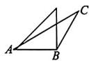  
A

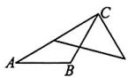  
B

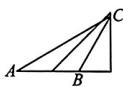  
C

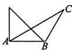  
D   
图Z13-1

3. 如图 Z13-2, 小方格都是边长为 1 的正方形, 则 $\triangle ABC$ 的面积是 ( )

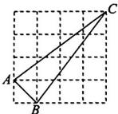  
图Z13-2

A. 1.5

B. 2.5

C. 3.5

D. 4.5

4. 一定在三角形内部(不包括边界)的线段是

A. 锐角三角形的三条高、三条角平分线、三条中线  
B.钝角三角形的三条高、三条中线、一条角平分线  
C. 任意三角形的一条中线、两条角平分线、三条高  
D. 直角三角形的三条高、三条角平分线、三条中线

5. 下列是真命题的是

A. 过三角形的顶点和它对边中点的直线是三角形的中线  
B. 三角形的角平分线其实就是角的平分线  
C. 三角形的高就是顶点到对边的垂线  
D. 三角形的三条中线的交点叫作重心, 重心一定在三角形内部

6. 下列三角形一定为直角三角形的有 （）

①三角形的三条高的交点在三角形内部；  
② $\triangle ABC$ 的三个内角的关系为 $\angle A = \frac{1}{2}\angle B = \frac{1}{2}\angle C;$   
③三角形的三个内角之比为 4:5:9;  
④三角形的一个外角与它不相邻的两个内角和为 $180^{\circ}$ .

A. 1 个

B. 2 个

C. 3 个

D. 4 个

7. 将一副三角尺按图 Z13-3 所示的方式叠放在一起, 则图中 $\angle\alpha$ 的度数是

A. $40^{\circ}$

B. $45^{\circ}$

C. $65^{\circ}$

D. ${75}^{ \circ  }$

8. 在 $\triangle ABC$ 中, 已知 $\angle A + \angle C = 2\angle B, \angle C - \angle A = 80^{\circ}$ , 则 $\angle C$ 的度数是

A. $60^{\circ}$

B. $80^{\circ}$

C. $100^{\circ}$

D. ${120}^{ \circ  }$

9. 如图 Z13-4, BP 是 $\triangle ABC$ 中 $\angle ABC$ 的平分线, CP 是 $\triangle ABC$ 的外角 $\angle ACM$ 的平分线, 如果 $\angle ABP = 20^{\circ}, \angle ACP = 50^{\circ}$ , 那么 $\angle A + \angle P$ 等于 ( )

A. $70^{\circ}$

B. $80^{\circ}$

C. $90^{\circ}$

D. $100^{\circ}$

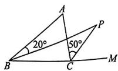  
图Z13-4

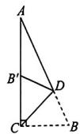  
图Z13-5

10. 如图 Z13-5, 在 Rt△ABC 中, ∠ACB=90°, ∠A=25°, D 是 AB 上一点, 将 Rt△ABC 沿 CD 折叠, 使点 B 落在 AC 边上的点 B' 处, 则 ∠CDB' 等于

A. $40^{\circ}$

B. $60^{\circ}$

C. $70^{\circ}$

D. $80^{\circ}$

11. 如图 Z13-6, 在 $\triangle ABC$ 中, $\angle ABC, \angle ACB$ 的三等分线交于点 $E, D, CD$ 的延长线与 $BE$ 交于点 $F, BD$ 的延长线与 $CE$ 交于点 $G$ . 若 $\angle BFC = 132^\circ$ , $\angle BGC = 120^\circ$ , 则 $\angle E$ 的度数为 ( )

A. $102^{\circ}$

B. $104^{\circ}$

C. $106^{\circ}$

D. $108^{\circ}$

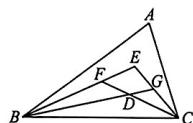  
图Z13-6

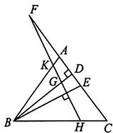  
图 Z13-7

12. 如图 Z13-7, 在 $\triangle ABC$ 中, BD, BE 分别是高和角平分线, 点 F 在 CA 的延长线上, $FH \perp BE$ , 交 AB 于点 K, 交 BD 于点 G, 交 BC 于点 H. 下列结论中正确的为 ( )

① $\angle DBE=\angle F$ ；② $\angle F=\frac{1}{2}(\angle BAC-\angle C)$ ；③ $2\angle BEF=\angle BAF+\angle C$ ；④ $\angle BGH=\angle ABE+\angle C$ .

A. ①②③

B.①③④

C. ①②④

D. ①②③④

二、填空题(本大题共6小题,每小题3分,共18分)

13. 如图 Z13-8, 生活中自行车的横梁部分(图中圈住部分)都是三角形形状的, 这样设计的数学原理是 \_\_\_\_

  
图Z13-8

14. 已知三角形的三边长分别为 $a, b, c$ ，且 $(a - b - c)(b - c) = 0$ ，此三角形为 \_\_\_\_ 三角形.  
15. 已知一个三角形的一边长为 $5 \, cm$ ，另一边长为 $2 \, cm$ ，若第三边长为 $x \, cm$ ，且 x 为奇数，则此三角形的周长为 \_\_\_\_ cm.  
16. 如图 Z13-9, BD 是 $\triangle ABC$ 的高, E 是 BD 的中点. 若 BD = AC = 6, 则阴影部分的面积为 \_\_\_\_  
17. 如图 Z13-10, 在 $\triangle ABC$ 中, $CE$ 是高, $D$ 是 $BC$ 上一点, 连接 $AD$ 与 $CE$ 交于点 $H$ , 且满足 $AE = EC$ , $EB = EH$ , 若 $AB = 12$ , $CE = 7$ , 则 $CH = \_$

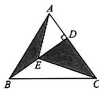  
图Z13-9

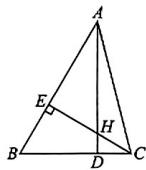  
图Z13-10

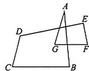  
图Z13-11

18. 如图 Z13-11, $\angle A + \angle B + \angle C + \angle D + \angle E + \angle F + \angle G$ 的度数是 \_\_\_\_.  
三、解答题(本大题共6小题,共46分.解答应写出文字说明、演算步骤或推理过程)  
19. (6 分) 如图 Z13-12 所示, 在 $\triangle ABC$ 中, $AB = AC$ , $AC$ 边上的中线 $BD$ 把三角形的周长分为 $24 \mathrm{~cm}$ 和 $30 \mathrm{~cm}$ 两部分, 求三角形各边的长.

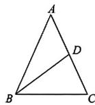  
图Z13-12

20. (8分)如图 Z13-13, 每个小正方形的边长均为 1, 在网格内将 $\triangle ABC$ 经过一次平移后得到 $\triangle A'B'C'$ , 图中标出了点 $B$ 的对应点 $B'$ . 公介号\*满满分享库

(1)补全 $\triangle A^{\prime}B^{\prime}C^{\prime}$ ;   
(2)画出 AB 边上的中线 CD;  
(3)画出 BC 边上的高 AE;  
(4) $\triangle A^{\prime}B^{\prime}C^{\prime}$ 的面积为 \_\_\_\_.

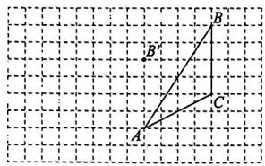

text_image

Geometric diagram showing triangle ABC on a grid with labeled vertices A, B, and C

图Z13-13

21. (8 分) 已知 $a, b, c$ 是三角形的三边长.

(1)化简： $|a-b-c|+|b+c-a|-|c-a-b|$ ;  
(2) 若 $a = 10, b = 8, c = 6$ , 求 (1) 中式子的值.

22. (8 分) 如图 Z13-14, $\angle ABC = 38^\circ$ , $\angle ACB = 100^\circ$ , $AD$ 平分 $\angle BAC$ 交 $BC$ 于点 $D$ , $AE$ 是 $BC$ 边上的高, 求 $\angle DAE$ 的度数.

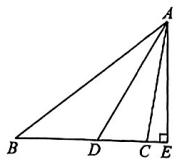  
图Z13-14

食

23. (8 分) 如图 Z13-15, 在 $\triangle ABC$ 中, $BO, CO$ 分别是 $\angle ABC$ , $\angle ACB$ 的平分线.

(1)填写下面的表格.

<table><tr><td>∠A的度数</td><td>50°</td><td>60°</td><td>70°</td></tr><tr><td>∠BOC的度数</td><td></td><td></td><td></td></tr></table>

(2)试猜想 $\angle A$ 与 $\angle BOC$ 之间存在一个怎样的数量关系，并证明你的猜想.

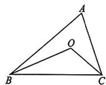  
图Z13-15

24. (8 分) 在 $\triangle ABC$ 中, 两条高 $BD, CE$ 所在的直线相交于点 $O$ .

(1) 当 $\angle BAC$ 为锐角时, 如图 Z13-16①, 求证: $\angle BOC + \angle BAC = 180^{\circ}$ ;  
(2)当 $\angle BAC$ 为钝角时,请在图②中画出相应的图形(用三角尺),并回答(1)中的结论是否成立,不需证明.

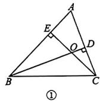

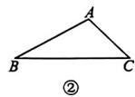  
图Z13-16

# 第十四章质量评估

[范围：全等三角形 时间：90分钟 分值：100分]

# 一、选择题（本大题共12小题，每小题3分，共36分.在每小题给出的四个选项中，只有一个是符合要求的）

1. 下列两个图形是全等形的是 ( )

A.两张同底版的照片

B. 周长相等的两个长方形

C. 面积相等的两个正方形

D. 面积相等的两个三角形

2. 如图 Z14-1，在四边形 ABCD 中，AB = AD, CB = CD，连接 AC，BD 相交于点 O，则图中全等三角形共有（）

A.1对

B.2对

C. 3 对

D. 4 对

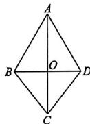  
图Z14-1

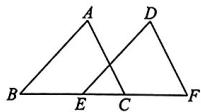  
图Z14-2

3 如图 Z14-2, 在 $\triangle ABC$ 和 $\triangle DEF$ 中, $\angle B = \angle DEF$ , $AB = DE$ , 添加下列一个条件后, 仍然不能证明 $\triangle ABC \cong \triangle DEF$ 的是 ( )

A. $\angle A = \angle D$

B. $BC = EF$

C. $\angle ACB = \angle F$

D. $AC = DF$

4. 如图 Z14-3 是一块三角形的草坪，现要在草坪上建一凉亭供大家休息，要使凉亭到草坪三条边的距离相等，凉亭的位置应选在

A. $\triangle ABC$ 的三条中线的交点处  
B. $\triangle ABC$ 三条角平分线的交点处  
C. $\triangle ABC$ 三条高所在直线的交点处  
D. 无法确定

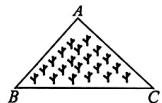  
图Z14-3

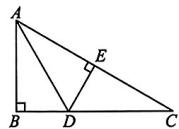  
图Z14-4

5. 如图 Z14-4，在 Rt△ABC 中，∠B=90°，AD 平分∠BAC 交 BC 于点 D，DE⊥AC，垂足为 E. 若 BD=3，则 DE 的长为（）

A. 3

B. $\frac{3}{2}$

C. 2

D. 6

6. 如图 Z14-5, 点 C 在 $\angle AOB$ 的边 OB 上, 利用尺规过点 C 作 OA 的平行线 CM, 其作图过程如下: 在 OB 上取一点 D, 以点 O 为圆心, OD 长为半径画弧, 交 OA 于点 F, 再以点 C 为圆心, OD 长为半径画弧, 交 CB 于点 E, 再以点 E 为圆心, DF 长为半径画弧, 圆心为点 C 的弧与圆心为点 E 的弧交于点 M, 作射线 CM, 则 OF = OD = CM = CE, DF = EM, 可得 $\triangle CEM \cong \triangle ODF$ , 进而可以得到 $\angle BCM = \angle AOB$ , 则 $CM \parallel OA$ . 以上作图过程中的依据不包括公众号 \* 满满分享库 ( )

A. 圆的半径相等   
B. 两边和它们的夹角分别相等的两个三角形全等  
C. 同位角相等, 两直线平行  
D. 全等三角形的对应角相等

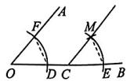  
图Z14-5

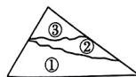  
图Z14-6

7. 小明不小心把一块玻璃打碎了,变成了如图 Z14-6 所示的三块,现在要到玻璃店配一块完全一样的玻璃,那么应带哪块去才能配好 ( )

A. ①

B. ②

C. ③

D. 任意一块

8. 如图 Z14-7, $\triangle ABC \cong \triangle EBD, \angle E = 50^{\circ}, \angle D = 62^{\circ}$ , 则 $\angle ABC$ 的度数是 ( )

A. $68^{\circ}$

B. $62^{\circ}$

C. $60^{\circ}$

D. $50^{\circ}$

9. 如图Z14-8是由4个相同的小正方形组成的网格图， $\angle 1 + \angle 2$ 等于（）

A. ${150}^{ \circ  }$

B. $180^{\circ}$

C. $210^{\circ}$

D. $225^{\circ}$

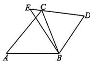  
图Z14-7

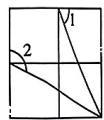  
图Z14-8

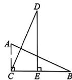  
图Z14-9

10. 如图 Z14-9, 在 $\triangle ABC$ 和 $\triangle CDE$ 中, 若 $\angle ACB = \angle CED = 90^{\circ}$ , AB = CD, BC = DE, 则下列结论中不正确的是 ( )

A. $\triangle ABC \cong \triangle CDE$

B. $CE = AC$

C. $AB \perp CD$

D. $E$ 为 $BC$ 的中点

11. 如图 Z14-10, BD = BC, BE = CA, $\angle DBE = \angle C = 62^{\circ}$ , $\angle BDE = 75^{\circ}$ , 则 $\angle AFD$ 的度数为 ( )

A. $30^{\circ}$

B. $32^{\circ}$

C. $33^{\circ}$

D. $35^{\circ}$

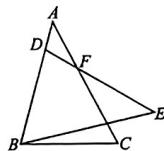  
图Z14-10

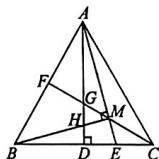  
图 Z14-11

12. 如图 Z14-11, AD, CF 分别是 $\triangle ABC$ 的高和角平分线, AD 与 CF 相交于点 G, AE 平分 $\angle CAD$ 交 BC 于点 E, 交 CF 于点 M, 连接 BM 交 AD 于点 H, 且 $BM \perp AE$ . 有下列结论: ① $\angle AMC = 135^{\circ}$ ; ② $\triangle AMH \cong \triangle BME$ ; ③ $AH + CE = AC$ ; ④ $BM + MH = BC$ . 其中, 正确的结论是 ( )

A. ①②

B.①②③

C. ③④

D. ①②③④

# 二、填空题（本大题共6小题，每小题3分，共18分）

13. 如图 Z14-12, $\triangle ABC \cong \triangle ADE$ , $\angle B = 86^{\circ}$ , $\angle BAC = 24^{\circ}$ , 则 $\angle AED =$ \_\_\_\_ $^{\circ}$ .  
14. 如图 Z14-13, 两个大小一样的直角三角形重叠在一起, 将其中一个三角形沿着点 B 到点 C 的方向平移到 $\triangle DEF$ 的位置, AB = 10, DH = 4, 平移距离为 6, 则阴影部分的面积是 \_\_\_\_.

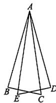  
图Z14-12

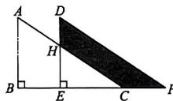  
图Z14-13

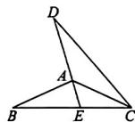  
图Z14-14

15. 如图 Z14-14, CA 平分 $\angle DCB, CB = CD, DA$ 的延长线交 BC 于点 E. 若 $\angle EAC = 49^{\circ}$ ，则 $\angle BAE$ 的度数为 \_\_\_\_  
16. 如图 Z14-15, 已知在 $\triangle ABC$ 中, $CD$ 是 $AB$ 边上的高, $BE$ 平分 $\angle ABC$ 交 $CD$ 于点 $E$ , $BC = 7$ , $DE = 2$ , 则 $\triangle BCE$ 的面积等于  
17. 如图 Z14-16, 在 $\triangle ABC$ 和 $\triangle AED$ 中, $\angle ACB = \angle ADE = 90^\circ$ , $AB = AE$ , $\angle B = \angle E$ , 线段 $BC$ 的延长线交 $DE$ 于点 $F$ , 连接 $AF$ . 若 $S_{\triangle ABF} = 14$ , $AD = 4$ , $CF = \frac{5}{4}$ , 则线段 $EF$ 的长度为 \_\_\_\_

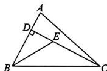  
图Z14-15

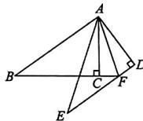  
图Z14-16

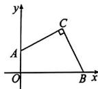  
图 Z14-17

18. 如图 Z14-17, 在平面直角坐标系中, 已知点 $A(0,3), B(9,0)$ , 点 $C$ 在第一象限, 且 $\angle ACB = 90^\circ$ , $CA = CB$ , 则点 $C$ 的坐标为 \_\_\_\_.

# 三、解答题（本大题共6小题，共46分. 解答应写出文字说明、演算步

骤或推理过程）

# 公众号\*满满分享库

19. (6 分) 如图 Z14-18, 在 $\triangle ABC$ 中, $\angle ACB = 90^{\circ}$ , $AB = 5 \mathrm{~cm}$ , $AC = 3 \mathrm{~cm}$ , $BC = 4 \mathrm{~cm}$ , $P$ 为 $\triangle ABC$ 三内角平分线的交点, 在图中作出点 $P$ (要求尺规作图, 不写作法, 保留作图痕迹), 并求点 $P$ 到 $\triangle ABC$ 三边的距离.

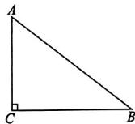  
图Z14-18

20. (8 分) 已知: 如图 Z14-19 所示, 点 D, N 分别在 BC, AC 上, $\angle BAC = \angle DAM, AB = AN, AD = AM$ . 求证: $\angle B = \angle ANM$ .

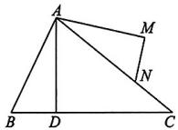  
图Z14-19

21. (8分)如图Z14-20, 王强同学用10块高度都是 $2\mathrm{cm}$ 的相同长方体小木块, 垒了两堵与地面垂直的木墙 $AD, BE$ , 木墙之间刚好可以放进一个等腰直角三角尺 $ABC(AC = BC, \angle ACB = 90^{\circ})$ , 点 $C$ 在 $DE$ 上, 点 $A, B$ 分别与木墙的顶端重合.

(1) 求证: $\triangle ADC \cong \triangle CEB$ ;   
(2) 求两堵木墙之间的距离.

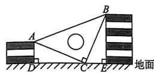  
图Z14-20

22. (8分)如图Z14-21, 点 $B, C$ 分别在射线 $AM, AN$ 上, 点 $E, F$ 都在 $\angle MAN$ 内部的射线 $AD$ 上, 已知 $AB = AC$ , 且 $\angle BED = \angle CFD = \angle BAC$ .

(1) 求证: $\triangle ABE \cong \triangle CAF$ ;   
(2)试判断 EF, BE, CF 之间的数量关系, 并说明理由.

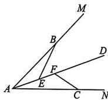  
图Z14-21

23. (8分)如图Z14-22,在 $\triangle ABC$ 中, $AD$ 是 $BC$ 边上的中线.

(1)如图①,延长AD到点E,使ED=AD,连接BE.求证: $\triangle ACD\cong\triangle EBD;$   
(2)如图②,若 $\angle BAC=90^{\circ}$ ,试探究AD与BC有何数量关系,并说明理由.

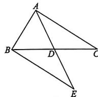  
①

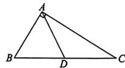  
②   
图Z14-22

24. (8 分) 已知: 如图 Z14-23, AC 平分 $\angle BAD, CE \perp AB$ 于点 E, $\angle B + \angle D = 180^{\circ}$ , 求证: $AE = AD + BE$ .

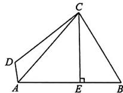  
图Z14-23

# 一、选择题（本大题共12小题，每小题3分，共36分.在每小题给出的四个选项中，只有一个是符合要求的）

1 下列图标中, 是轴对称图形的是

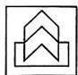  
A

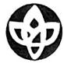  
B

  
C

  
D

图Z15-1

2. 在平面直角坐标系中, 点(3,4)关于 x 轴对称的点的坐标是 ( )

A. $(-3,4)$

B. $(3,-4)$

C. $(-4,3)$

D. $(-3,-4)$

3. 如图 Z15-2, $\triangle ABC$ 与 $\triangle A'B'C'$ 关于直线 MN 对称, P 为 MN 上一点 (点 P 不与点 A, $A'$ 共线), 连接 AP, $A'P$ , 下列结论中错误的是 ()

A. $\triangle AA' P$ 是等腰三角形

B. MN 垂直平分 $AA'$ , $CC'$

C. $\triangle ABC$ 与 $\triangle A'B'C'$ 的面积相等

D. 直线 $AB, A'B'$ 的交点不一定在 $MN$ 上

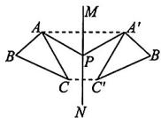  
图Z15-2

4. 如图 Z15-3, 在 $\triangle ABC$ 中, DE 是 AC 的垂直平分线, 且分别交 BC, AC 于点 D, E, $\angle B = 60^{\circ}$ , $\angle C = 25^{\circ}$ , 则 $\angle BAD$ 的度数为 ( )

A. $50^{\circ}$

B. $70^{\circ}$

C. $75^{\circ}$

D. $80^{\circ}$

5. 如图 Z15-4, 在 $\triangle ABC$ 中, AB = AC, 从以下条件: ① $\angle B = \angle C$ ; ② BD = CE; ③ BE = CD; ④ $\angle BAE = \angle CAD$ 中, 选出一个条件证明 AD = AE, 那么符合要求的条件有 ( )

A. 1 个

B. 2 个

C. 3 个

D. 4 个

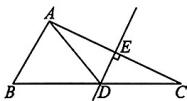  
图Z15-3

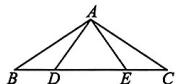  
图Z15-4

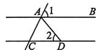  
图Z15-5

6. 如图 Z15-5, $AB \parallel CD$ , AD = CD, $\angle 1 = 65^{\circ}$ , 则 $\angle 2$ 的度数是 ( )

A. $50^{\circ}$

B. $60^{\circ}$

C. $65^{\circ}$

D. $70^{\circ}$

7. 如图 Z15-6, 在等边三角形 ABC 中, D 是 AB 的中点, $DE \perp AC$ 于点 E, $EF \perp BC$ 于点 F. 若 AB = 8, 则 BF 的长为

A. 3

B. 4

C. 5

D. 6

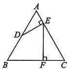  
图Z15-6

8. 实数 $x, y$ 满足 $x^{2} - 10x + 25 + |y - 10| = 0$ ，则以 $x, y$ 的值为两边长的等腰三角形的周长是 （）

A. 25

B. 20

C. 16

D. 20 或 25

9. 直线 $l_{1}, l_{2}$ 表示一条河的两岸，且 $l_{1} // l_{2}$ ，若村庄 $P$ 和村庄 $Q$ 在这条河的两岸。现要在这条河上建一座桥 $EF$ （桥 $EF$ 与河的两岸 $l_{1}, l_{2}$ 垂直），使得从村庄 $P$ 经桥 $EF$ 过河到村庄 $Q$ 的路径最短，即 $PE + EF + FQ$ 最小，则图 Z15-7 中满足条件的是 ( )

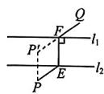  
A

  
B

  
C

  
D   
图Z15-7

10. 如图 Z15-8, $\triangle DAC$ 和 $\triangle EBC$ 均是等边三角形, A, C, B 三点共线, AE 与 BD 相交于点 P, AE 与 BD 分别与 CD, CE 交于点 M, N. 则下列结论: ① $\triangle ACE \cong \triangle DCB$ ; ② $\angle DPA = 60^{\circ}$ ; ③ AC = DN; ④ EM = BN. 其中正确的结论有 ( )

A. 4 个

B. 3 个

C. 2 个

D. 1 个

11. 如图 Z15-9, 已知 $AB = A_{1}B$ , $A_{1}C = A_{1}A_{2}$ , $A_{2}D = A_{2}A_{3}$ , $A_{3}E = A_{3}A_{4}$ , $\cdots$ , 以此类推, 若 $\angle B = 20^{\circ}$ , 则 $\angle A_{6}$ 的度数为 ( )

A. $10^{\circ}$

B. $7.5^{\circ}$

C. $5^{\circ}$

D. 2.5°

  
图Z15-8

  
图Z15-9

  
图Z15-10

12. 如图 Z15-10, O 是边长为 9 的等边三角形 ABC 内的任意一点，且 $OD \parallel BC$ 交 AB 于点 D, $OF \parallel AB$ 交 AC 于点 F, $OE \parallel AC$ 交 BC 于点 E，则 $OD + OE + OF$ 的值为 ( )

A. 3

B. 6

C. 8

D. 9

二、填空题（本大题共6小题，每小题3分，共18分）

13. 正方形是轴对称图形,它共有 \_\_\_\_ 条对称轴.

14. 等腰三角形一腰上的高与另一腰的夹角为 $50^{\circ}$ , 则它的顶角的度数为

15. 如图 Z15-11, 在 $\triangle ABC$ 中, $AB = AC$ , 点 $D$ 在 $AC$ 的延长线上, 且 $BC = CD$ . 若 $\angle A = 32^\circ$ , 则 $\angle CDB$ 的度数为

  
图Z15-11

  
图Z15-12

16. 如图 Z15-12, 在等边三角形 $ABC$ 中, $AD$ 是中线, $AD = AE$ , 则 $\angle EDC$ 的度数为

17. 如图 Z15-13, 将 $\triangle ABC$ 放在由边长均为 1 的小正方形组成的网格中, 点 A, B, C 均落在格点上, 若点 B 的坐标为 $(3, -1)$ , 点 C 的坐标为 $(2, 2)$ , 则到 $\triangle ABC$ 三个顶点距离相等的点的坐标为

  
图Z15-13

  
图Z15-14

18. 如图 Z15-14, P 为 $\angle AOB$ 内一点, OP = 15, 点 M 在射线 OB 上运动, 点 N 在射线 OA 上运动. 若 $\angle AOB = 30^{\circ}$ , 则 $\triangle PMN$ 的周长的最小值为 \_\_\_\_

三、解答题（本大题共6小题，共46分. 解答应写出文字说明、演算步骤或推理过程）

19. (5 分) 如图 Z15-15, 在平面直角坐标系中, $\triangle ABC$ 位于第二象限, 请按要求在坐标系中作图:

(1)作出把 $\triangle ABC$ 向右平移4个单位长度后得到的 $\triangle A_{1}B_{1}C_{1}$ (2)作出与 $\triangle A_{1}B_{1}C_{1}$ 关于 $x$ 轴对称的 $\triangle A_{2}B_{2}C_{2}$ .

text_image

y
A
B
C
O
x

图Z15-15

20. (6 分) 如图 Z15-16, 在四边形 ABCD 中, E 为 AB 的中点, $DE \perp AB$ , $\angle A = 66^{\circ}$ , $\angle ABC = 90^{\circ}$ , BC = AD, 求 $\angle C$ 的度数.

  
图Z15-16

21. (6 分) 如图 Z15-17, 已知 $\triangle ABC$ 为等边三角形, $D$ 为 $BC$ 延长线上的一点, $CE$ 平分 $\angle ACD$ , $CE = BD$ .

(1) 求证: $\triangle ABD \cong \triangle ACE$ ;   
(2)试判断 $\triangle ADE$ 的形状,并证明.

  
图Z15-17

22. (6 分) 如图 Z15-18, 货轮在海上以 6 海里/时的速度沿南偏东 $40^{\circ}$ 的方向航行, 已知货轮在 $B$ 处时, 测得灯塔 $A$ 在其北偏东 $80^{\circ}$ 的方向上, 航行半小时后货轮到达 $C$ 处, 此时测得灯塔 $A$ 在其北偏东 $20^{\circ}$ 的方向上, 求货轮到达 $C$ 处时与灯塔 $A$ 的距离.

text_image

货轮
80°
B
40°
A
灯塔
北
东
C
20°

图Z15-18

23. (7 分) 如图 Z15-19, 在 $\triangle ABC$ 中, $AB$ 边的垂直平分线 $DE$ 分别与 $AB$ 边和 $AC$ 边交于点 $D_{\text{和点}}E$ , $BC$ 边的垂直平分线 $FG$ 分别与 $BC$ 边和 $AC$ 边交于点 $F_{\text{和点}}G$ . 已知 $\triangle BEG$ 的周长为 16, 且 $EG = 3.4$ , 求 $AC$ 的长.

  
图Z15-19

24. (16 分)(2024 河北区期末) 如图 Z15-20, 已知点 $A(a, b), AB \perp y$ 轴于点 $B$ , 且满足 $(a - b)^2 + (a - 3)^2 = 0$ .

(1) 求点 A 的坐标.

(2)分别以 $AB, AO$ 为边作等边三角形 $ABC$ 和等边三角形 $AOD$ , 如图①, 试判断线段 $AC$ 和 $CD$ 的数量关系, 并说明理由. (3)如图②, 若 $P$ 为 $y$ 轴负半轴上的一个动点, 连接 $PA$ , 过点 $P$ 作 $PE \perp PA$ , 且 $PE = PA$ , 连接 $AE$ , 射线 $EO$ 交 $AB$ 的延长线于点 $Q$ , 当点 $P$ 在 $y$ 轴负半轴上移动时, 线段 $AQ$ 的值是否发生变化? 若不变, 直接写出 $AQ$ 的长度; 若变化, 请说明理由.

text_image

y
B
A
C
O
D
x
①
y
Q
B
A
O
P
E
x
②

图Z15-20

全品

数学八年级

# 期中质量评估

[范围：第十三章\~第十五章 时间：90分钟 分值：100分]

# 一、选择题(本大题共12小题,每小题3分,共36分.在每小题给出的四个选项中,只有一个是符合要求的)

1. 下列各组图形中,属于全等形的是

  
A

  
B

  
C

  
D

图QZ1-1

2. 下列生活实例中, 利用了“三角形稳定性”的是

  
A

  
B

  
C

  
D

图QZ1-2

3. 如图 QZ1-3, 已知 $\triangle BAD \cong \triangle CDA$ , 若 BD = 8, OC = 4.8, 则 OA 的长为 ( )

A. 3.2

B. 3.6

C. 4

D. 4.2

4. 如图 QZ1-4, 在 $\triangle ABC$ 中, $AB$ 边上的高线是 ( )

A. 线段 ${AD}$

B. 线段 $AF$

C. 线段 BG

D. 线段 $CE$

  
图QZ1-3

  
图QZ1-4

  
图QZ1-5

5. 把一副三角板按如图 QZ1-5 所示那样拼在一起, 那么 $\angle ABC$ 的度数是 ( )

A. $150^{\circ}$

B. $135^{\circ}$

C. $120^{\circ}$

D. ${105}^{ \circ  }$

6. 如图 QZ1-6, 点 E 在 $\triangle ABC$ 的内部, AE 平分 $\angle CAB$ , $CE \perp AE$ 于点 E, F 是 BC 的中点, 连接 EF, 若 AC = 5, AB = 9, 则 EF 的长为 ( )

A. 2

B. 2.4

C. 3

D. 3.5

  
图QZ1-6

  
图QZ1-7

7. 如图 QZ1-7, 已知 $CA = CD$ , $\angle 1 = \angle 2$ , 在不添加辅助线的情况下, 增加下列四个条件中的一个: ① $BC = EC$ ; ② $\angle B = \angle E$ ; ③ $AB = DE$ ; ④ $\angle A = \angle D$ , 能使 $\triangle ABC \cong \triangle DEC$ 的条件的个数为 ( )

A.1

B. 2

C. 3

D. 4

8. 如图 QZ1-8, 在四边形 $ABCD$ 中, $AB \parallel CD$ , $AD = BC$ , $AB = 9$ , $AD = 5$ , $DF$ 平分 $\angle ADC$ , $CE$ 平分 $\angle BCD$ , 则 $EF$ 的长为 ( )

A. 2.5

B. 2

C. 1.5

D. 1

  
图QZ1-8

  
图QZ1-9

9. 如图 QZ1-9, 在 $\triangle ABC$ 中, $\angle ABC = \angle ACB$ , $AD \perp BC$ 于点 $D$ , $DE \perp AB$ 于点 $E$ , $BF \perp AC$ 于点 $F$ , $DE = 5$ , 则 $BF$ 的长为

A. 7.5

B. 10

C. 12

D. 12.5

10. 如图 QZ1-10, 将三角形纸片 ABC 沿 DE 折叠, 使点 A 落在点 $A'$ 处, 并测得 $\angle 1 = 70^{\circ}, \angle 2 = 135^{\circ}$ , 则 $\angle A$ 的度数为

A. $40^{\circ}$

B. $52^{\circ}$

C. ${30}^{ \circ  }$

D. $25^{\circ}$

11. 如图 QZ1-11, 点 P, Q 分别是边长为 10 cm 的等边三角形 ABC 的边 AB, BC 上的动点, 点 P 从顶点 A, 点 Q 从顶点 B 同时出发, 且它们的速度都是 1 cm/s, 连接 CP, AQ 交于点 M, 当运动时间为 \_\_\_\_ s 时, △CMQ 是直角三角形 ( )

A. 5

B. 5 或 $\frac{10}{3}$

C. 5 或 $\frac{20}{3}$

D. $\frac{10}{3}$ 或 $\frac{20}{3}$

  
图QZ1-10

  
图QZ1-11

  
图QZ1-12

12. 如图 QZ1-12, 已知钝角三角形 ABC 中, $\angle ABC = 30^{\circ}$ 且 AB > AC, (1) 以 C 为圆心, CA 长为半径画弧; (2) 以 B 为圆心, BA 长为半径画弧, 交前弧于点 E; (3) 连接 AE 交 BC 的延长线于点 D. 下列叙述不一定正确的是 ()

A. $\triangle ABE$ 是等边三角形

B. AC 平分 $\angle BAD$

C. $S_{\triangle ABC} = \frac{1}{2} BC\cdot AD$

D. $BD$ 垂直平分 $AE$

二、填空题（本大题共6小题，每小题3分，共18分）

13. 在平面直角坐标系中，点 $(m, -2)$ 与点 $(3, n)$ 关于 $x$ 轴对称，则 $m + n =$

14. 如图 QZ1-13, 点 A, E, F, C 在同一直线上, $AB \parallel CD$ , $BF \parallel DE$ , BF = DE, 且 AE = 2, AC = 8, 则 EF = \_\_\_\_

15. 如图 QZ1-14, 在 $\triangle ABC$ 中, $DE, DF$ 分别是 $AC, BC$ 边的垂直平分线, 连接 $AD, BD, CD$ , 若 $\angle ACB = 42^\circ$ , 则 $\angle BAD$ 的度数为 \_\_\_\_.

  
图QZ1-13

  
图QZ1-14

  
图QZ1-15

16. 如图 QZ1-15, 在 $\triangle ABC$ 中, $\angle BAC > 90^\circ$ , $AB$ 的垂直平分线交 $BC$ 于点 $E$ , $AC$ 的垂直平分线交 $BC$ 于点 $F$ , 连接 $AE$ , $AF$ , 若 $\triangle AEF$ 的周长为 7, 则 $BC$ 的长为 \_\_\_\_.

17. 如图 QZ1-16, $\angle AOE = \angle BOE = 15^{\circ}$ , $EF \parallel OB$ , $EC \perp OB$ 于点 C, 若 EC = 2, 则 OF = \_\_\_\_

  
图QZ1-16

  
图 QZ1-17

18. 如图 QZ1-17, 在每个小正方形的边长均为 1 的网格中, 点 $A, B$ $C, D$ 均在格点上, 连接 $AB, AC, BC$ .

(1) $\angle C =$

(2)若点 E 在线段 BC 上,且满足 $\angle EAC = \angle BAD$ . 请用无刻度的直尺,在如图所示的网格中,画出点 E,并简要说明点 E 的位置是如何找到的 \_\_\_\_ (不要求证明).

三、解答题（本大题共6小题，共46分. 解答应写出文字说明、演算步骤或推理过程）

19. (6 分) $\triangle ABC$ 在平面直角坐标系中的位置如图 QZ1-18 所示, 其中每个小正方形的边长为 1 个单位长度.

(1) $\triangle ABC$ 关于 $y$ 轴对称的图形为 $\triangle A_{1}B_{1}C_{1}$ , 画出 $\triangle A_{1}B_{1}C_{1}$ . 点 $A_{1}, B_{1}, C_{1}$ 关于 $x$ 轴的对称点是 $A_{2}, B_{2}, C_{2}$ , 观察点 $A, B, C$ 与点 $A_{2}, B_{2}, C_{2}$ 的坐标有什么特点? 请用一句话叙述.

(2)若点 $P$ 在 $x$ 轴上，当 $BP + CP$ 最小时，在图中作出点 $P$ 的位置.

text_image

y
-5 4
A
3
2
1
B
C
-5 -4 -3 -2 -1 O 1 2 3 4 5 x
-2
-3
-4
-5

图QZ1-18

20. (6 分) 如图 QZ1-19, 将 Rt△ABC 沿 BC 方向平移得到 Rt△DEF, 其中 AB = 8, BE = 8, DM = 5, 求阴影部分的面积.

  
图QZ1-19

21. (8 分) 小军想要测量如图 QZ1-20 所示的雕像底座两端的距离, $A, B$ 两点分别为雕像底座的两端 (其中 $A, B$ 两点均在地面上). 因为 $A, B$ 两点间的实际距离无法直接测量, 小军设计出了如下方案: 在平地上取一个可以直接到达点 $A, B$ 的点 $O$ , 连接 $AO$ 并延长到点 $C$ , 连接 $BO$ 并延长到点 $D$ , 使 $CO = AO$ , $DO = BO$ , 连接 $DC$ , 测出 $DC$ 的长即为雕塑底座两端 $A, B$ 间的距离. 小军的方案可行吗? 请说明理由.

  
图QZ1-20

22. (8 分) 如图 QZ1-21, 在 $\triangle ABC$ 中, $AD$ 是 $BC$ 边上的高, $\angle B = 42^\circ$ , $\angle C = 48^\circ$ . 公众号\*满满分享库

(1) 若 $AF$ 是 $\triangle ABC$ 的角平分线, 求 $\angle DAF$ 的度数;
(2) 若 $AF$ 是 $\triangle ABC$ 的中线, $\triangle ABF$ 的周长比 $\triangle ACF$ 的周长大, 且 $AC = 3, BC = 5$ , 求 $AD$ 的长度.

  
图QZ1-21

23.（8分）如图QZ1-22， $\triangle ABC$ 中，点 $D$ 在边 $BC$ 的延长线上， $\angle ACB = 110^{\circ}$ ， $\angle ABC$ 的平分线交 $AD$ 于点 $E$ ，过点 $E$ 作 $EH \perp BD$ ，垂足为 $H$ ，且 $\angle CEH = 55^{\circ}$ .

(1)求 $\angle ACE$ 的度数；  
(2) 求证: AE 平分 $\angle CAF$ ;  
(3) 若 $AC + CD = 14, AB = 8.5$ ，且 $S_{\triangle ACD} = 21$ ，求 $\triangle ABE$ 的面积.

  
图QZ1-22

24. (10 分) 如图 QZ1-23①, 等腰直角三角形 ABO 放置在平面直角坐标系中, 点 $O(0,0), A(4,4), \angle ABO = 90^{\circ}$ . 点 $C$ 在 $x$ 轴上, 连接 $AC$ , 以 $AC$ 为腰作等腰直角三角形 $ACD$ , 其中 $\angle ACD = 90^{\circ}$ . 若点 $C$ 的横坐标为 $m$ , 且 $4 < m < 8$ .

(1)用含有 $m$ 的式子表示线段 $BC$ 的长（直接写出结果）；  
(2)如图②, 若 m=6, 连接 OD, 求点 D 的坐标以及 $\angle DOC$ 的度数;  
(3)如图③,延长AD交y轴于点E,连接EC,过点A作AF⊥y轴于点F.猜想线段EF,EC,BC之间的数量关系,并证明.

text_image

y
A
O B C x
①
y
A
O B C x
D
②
y
F
A
O B C x
D
E
③

图QZ1-23

[范围：整式的乘法 时间：45分钟 分值：60分]

一、选择题（本大题共7小题，每小题3分，共21分.在每小题给出的四个选项中，只有一个是符合要求的）

1. 下列计算正确的是 ( )

A. $x^{2} \cdot x^{3} = x^{6}$

B. $(x^{3})^{2} = x^{5}$

C. $(3x)^{2} = 6x^{2}$

D. $x^{3} \div x = x^{2}$

2. 如果 $a \neq 0$ ，那么下列计算正确的是 （）

A. $(-a)^{0}=0$

B. $(-a)^{0}=-1$

C. $-a^{0}=1$

D. $-a^{0}=-1$

3. 下列各式不能用乘法公式进行计算的是 ( )

A. $(-4x + 5y)(-4x - 5y)$

B. $(-4x+5y)(5y+4x)$

C. $(5y+4x)(-5y-4x)$

D. $(-4y - 5x)(-5y + 4x)$

4. 下列运算正确的是 ( )

A. $a^4 \cdot a^3 = a^{12}$

B. $(a^2)^4 = a^6$

C. $a^6 \div a^2 = a^3$

D. $(2b)^{3} = 8b^{3}$

5. 若 $3^{x} = 4, 9^{y} = 7$ ，则 $3^{x - 2y}$ 的值为 （）

A.-3

B. $\frac{2}{7}$

C. $\frac{4}{7}$

D. $\frac{7}{4}$

6. 小莹计算 $(a - \square)^2$ 时，得出的正确结果是 $a^2 - 4ab + (\square)^2$ ，则“□”是 （）

A. $b$

B. $2b$

C. $4b$

D. $4b^{2}$

7. 聪聪计算一道整式乘法的题: $(x+m)(5x-4)$ ，由于聪聪将第一个多项式中的“+m”抄成“-m”，得到的结果为 $5x^{2}-34x+24$ 。这道题的正确结果是（）

A. $5x^{2} + 26x - 24$

B. $5x^{2} - 26x - 24$

C. $5x^{2} + 34x - 24$

D. $5x^{2} - 34x - 24$

# 二、填空题（本大题共5小题，每小题3分，共15分）

8. 计算: $(8x^{3}y) \div (2x)^{2} =$

9. 计算: $(2-m)(2+m)=$

10. 若 $x^{2} + 2(k - 3)x + 16$ 可以写成一个多项式的平方的形式, 则 $k$ 的值为

11. 若 $9^{m} = \frac{3}{2}, 3^{n} = \frac{1}{2}$ , 则 $m, n$ 之间的数量关系为 \_\_\_\_.

12. 如图 Z16-1 是一个“数值转换机”的示意图, 当 $x = -1, y = -2$ 时, 输出的结果是 \_\_\_\_.

flowchart

图 Z16-1

三、解答题(本大题共4小题,共24分,解答应写出文字说明,演算步骤或推理过程)

13. (6 分) 计算下列各题:

(1) $(-3xy^{2})^{2}\cdot(-6x^{3}y)\div(9x^{4}y^{5})$ ;

(2) $(x + 1)^{2} - (x + 2)(x - 2) + (x^{2} - 5x)\div x;$

(3) $(15x^{3}y^{5}-10x^{4}y^{4}-20x^{3}y^{2})\div(-5x^{3}y^{2}).$

14. (6 分) 已知 $[(4x - y)^2 - (4x + y)(4x - \square)] \div (-2y)$ .

(1)请在“□”中填一个字母使 $(4x+y)(4x-\Box)$ 能用平方差公式,直接写出“□”为\_\_\_\_;

(2)在(1)的条件下,先化简,再求值: $\left[(4x-y)^{2}-(4x+y)(4x-\square)\right]\div(-2y)$ ,其中 $x=-\frac{1}{4},y=2.$

15. (6分)数学课上, 刘老师布置了一道自主探究的试题: 请计算当 $a = -\frac{2}{3}, b = \frac{4}{5}$ 时, 式子 $2ab(3a - 2b - 1) - 2ab(-1 - 2b) + (-6a^2b + 1)$ 的值. 小隽同学很快计算出了答案, 喜欢思考、善于探究的她, 自己给 $a, b$ 分别取 $a = 2, b = -3$ 并计算. 经过计算她发现式子的值不变. 小隽的发现正确吗? 请说明理由.

16. (6 分)(1)如图 Z16-2, 用四块完全相同的长方形拼成正方形, 用不同的方法计算图中阴影部分的面积, 你发现: \_\_\_\_; (用含 x, y 的等式表示)

(2)若 $(3x - 2y)^{2} = 5,(3x + 2y)^{2} = 9$ ，求 $xy$ 的值；

(3) 若 $2x + y = 5, xy = 2$ ，求 $2x - y$ 的值.

  
图Z16-2

# 第十七章质量评估

[范围：因式分解 时间：45分钟 分值：60分]

# 一、选择题（本大题共7小题，每小题3分，共21分.在每小题给出的四个选项中，只有一个是符合要求的）

1. 下列属于因式分解的是 （）

A. $18x^{2}y=2x^{2}\cdot9y$   
B. $(a - 2)^{2} = a^{2} - 4a + 4$   
C. $a(b + c) = ab + ac$   
D. $a(a - b) + b(b - a) = (a - b)^2$

2. 下列多项式中不能用公式法分解因式的是 ( )

A. $a^2 + a + \frac{1}{4}$

B. $a^2 + b^2 - 2ab$

C. $-a^{2} + 25b^{2}$

D. $-4 - b^{2}$

3. 下列因式分解正确的是 （）

A. $x^{2} - y^{2} = (x - y)^{2}$   
B. $-x^{2}-y^{2}=-(x+y)(x-y)$   
C. $x^{2} - 2xy + 4y^{2} = (x - 2y)^{2}$   
D. $-x^{2}-2xy-y^{2}=-(x+y)^{2}$

4. 若 $x^{2} + kx - 10 = (x - 5)(x + 2)$ ，则 $k$ 的值为 （）

A.-3

B. 3

C. 7

D.-7

5. 已知多项式 $x^{2} + \frac{1}{4}$ , 把它加上下列单项式后不可以用完全平方公式分解因式的是 ( )

A. $x$

B.-x

C. $x^4$

D. $-x^{4}$

6. 若 $x = 2y + 1$ ，则 $x^{2} - 4xy + 4y^{2}$ 的值是 （）

A. 1

B. 2

C. 3

D. 4

7. 对任意整数 $n, (2n - 1)^2 - 25$ 都能 （）

A. 被 3 整除

B. 被 4 整除

C. 被 5 整除

D. 被6整除

# 二、填空题（本大题共5小题，每小题3分，共15分）

8. 分解因式: $x^{2} - 5x =$   
9. 多项式 $8x^{2}myn - 12xmyn$ 中各项的公因式为  
10. 若实数 a, b 满足 $a + b = 5, a^{2}b + ab^{2} = -10$ ，则 ab 的值是 \_\_\_\_  
11. 一个多项式,把它分解因式后有一个因式为 $x + 1$ ,请你写出一个符合条件的多项式:  
12. 若 $a = 2026, b = 2025$ ，则计算 $\frac{1}{2} a^2 - \frac{1}{2} b^2$ 的结果为 \_\_\_\_.

三、解答题(本大题共4小题，共 $24$ 分. 解答应写出文字说明、演算步骤或推理过程)

13. (6 分)分解因式：

(1) $21xy - 14xz + 35x^{2}$ ; (2) $a^3 - 2a^2 + a$ ;   
(3) $3x^{3}-12x^{2}y+12xy^{2};$ (4) $(x-2)^{2}-x+2;$   
(5) $(m^2 + 4)^2 - 16m^2$

14. (6 分)在讲“用提公因式法分解因式”一课时,张老师出了这样一道题目:把多项式 $3(x - y)^{3} - (y - x)^{2}$ 分解因式.请甲、乙两名同学在黑板上演算.

甲的计算过程：

$$
\begin{array}{l} 3 (x - y) ^ {3} - (y - x) ^ {2} = 3 (x - y) ^ {3} + (x - y) ^ {2} = (x - y) ^ {2} [ 3 (x - \\ y) + 1 ] = (x - y) ^ {2} (3 x - 3 y + 1). \end{array}
$$

乙的计算过程：

$$
3 (x - y) ^ {3} - (y - x) ^ {2} = 3 (x - y) ^ {3} - (x - y) ^ {2} = (x - y) ^ {2} (3 x - 3 y).
$$

他们的计算过程正确吗？若不正确，请你写出正确的计算过程。

15. (6 分) 先分解因式, 再求值: $8x^{3}(x - 3) - 12x^{2}(x - 3)$ , 其中 $x = \frac{3}{2}$ .

16. (6 分)下面介绍一种分解因式的新方法——拆项补项法:把多项式的某一项拆开或填补上互为相反数的两项(或几项),使原式适合用已学过的方法分解因式.

例题:用拆项补项法分解因式: $x^{3}-9x+8$ .

解: 原式= $x^{3}-x^{2}+x^{2}-9x+8$

$$
= x ^ {3} - x ^ {2} + x ^ {2} - x - 8 x + 8
$$

$$
= x ^ {2} (x - 1) + x (x - 1) - 8 (x - 1)
$$

$$
= (x - 1) \left(x ^ {2} + x - 8\right).
$$

请你结合自己的思考和理解将下列多项式分解因式：

(1) $x^{2}+9x-10;$ (2) $x^{3}-2x^{2}-5x+6;$

(3) $x^{4}+5x^{3}+x^{2}-20x-20.$

[范围：分式 时间：90分钟 分值：100分]

# 一、选择题（本大题共12小题，每小题3分，共36分.在每小题给出的四个选项中，只有一个是符合要求的）

1. 有下列分式：① $\frac{a + 2}{a^3 + 3}$ ；② $\frac{a - b}{a^2 - b^2}$ ；③ $\frac{4a}{12(a - b)}$ ；④ $\frac{1}{x - 2}$ . 其中最简分式有 （）

A.1个

B. 2 个

C. 3 个

D. 4 个

2. PM2.5是指大气中直径小于或等于0.0000025米的颗粒物.将0.0000025用科学记数法表示为 （）

A. $2.5 \times 10^{-7}$

B. $2.5 \times 10^{-6}$

C. $25 \times 10^{-7}$

D. $0.25 \times 10^{-5}$

3. 若分式 $\frac{x - 2}{1 - 3x}$ 有意义，则 $x$ 的取值范围是 （）

A. $x \neq \frac{1}{3}$ 且 $x \neq 2$

B. $x \neq \frac{1}{3}$ 且 $x \neq 0$

C. $x \neq 2$

D. $x \neq \frac{1}{3}$

4. 分式 $-\frac{1}{1 - x}$ 可变形为 （）

A. $-\frac{1}{x-1}$

B. $-\frac{1}{1+x}$

C. $\frac{1}{1 + x}$

D. $\frac{1}{x - 1}$

5. 下列各式从左到右的变形正确的是 （）

A. $\frac{a}{b} = \frac{ax^2}{bx^2}$

B. $\frac{y(a + 1)}{x(a + 1)} = \frac{y}{x}$

C. $\frac{y+m}{x+m}=\frac{y}{x}$

D. $\frac{x^2 - 1}{x - 1} = x - 1$

6. 若分式 $\frac{1}{x - 2}$ 的值为整数，则整数 $x$ 的值为

A. 1

B. ±1

C. 3

D.1或3

7. 把分式 $\frac{2ab}{a + b}$ 中 $a, b$ 的值都扩大到原来的6倍，则分式的值（）

A. 扩大到原来的 12 倍

B. 不变

C. 扩大到原来的 6 倍

D. 缩小到原来的 $\frac{1}{6}$

8. 对分式 $\frac{1}{a - b}, \frac{1}{a + b}, \frac{1}{a^2 - b^2}$ 通分以后, $\frac{1}{a + b}$ 的结果是 ( )

A. $\frac{a+b}{a^{2}-b^{2}}$

B. $\frac{a - b}{a^2 - b^2}$

C. $\frac{a^2 - b^2}{(a + b)(a^2 + b^2)}$

D. $\frac{(a + b)(a - b)}{(a^2 - b^2)^2}$

9. 不改变分式 $\frac{0.2x + 3}{0.5x - 1}$ 的值, 把它的分子与分母中的系数化为整数, 下列式子正确的是 ( )

A. $\frac{2x + 30}{5x - 10}$

B. $\frac{2x + 3}{5x - 1}$

C. $\frac{2x + 30}{5x - 1}$

D. $\frac{2x + 3}{5x - 10}$

10. 化简 $\left(\frac{x}{x - 1} - \frac{2x + 2}{x^2 - 1}\right) \div \frac{x - 2}{x^2 - x}$ 的结果是 （）

A. $x$

B. $\frac{1}{x}$

C. $\frac{x + 1}{x - 1}$

D. $\frac{x - 1}{x + 1}$

11. 分式方程 $\frac{3}{2x} = \frac{1}{x - 1}$ 的解为 （）

A. x=1

B. $x = 2$

C. $x = 3$

D. x=4

12. 图 Z18-1①的大正方形(边长为 a) 中有一个小正方形(边长为 b)，图②中大正方形上部有一个小长方形(宽为 b)，两图中阴影部分的面积分别为 $S_{1}, S_{2}$ ，设 $k = \frac{S_{1}}{S_{2}}$ ，则 k 的值可以是（）

A. $\frac{1}{3}$

B. $\frac{2}{3}$

C. $\frac{5}{3}$

D. $\frac{7}{3}$

  
图Z18-1

二、填空题（本大题共6小题，每小题3分，共18分）

13. 分式 $-\frac{b}{4a^{3}}$ 与 $\frac{1}{6abc}$ 的最简公分母是

14. 如果分式 $\frac{|a| - 2}{a + 2}$ 的值为0, 那么 $a$ 的值为

15. 将 $\frac{3m^2n}{6mn^2}$ 化为最简分式为

16. 若 $x = 2$ 是关于 $x$ 的分式方程 $\frac{k}{x} + \frac{x - 3}{x - 1} = 1$ 的解, 则实数 $k$ 的值等于 \_\_\_\_.

17. 已知关于 $x$ 的方程 $\frac{2x + m}{x - 2} = 3$ 的解是正数, 则 $m$ 的取值范围是 \_\_\_\_.

18. 已知 $\frac{x}{x^2 - x + 1} = \frac{1}{7}$ , 则 $\frac{x^2}{x^4 - x^2 + 1} =$ \_\_\_\_.

# 三、解答题(本大题共6小题,共46分.解答应写出文字说明、演算步骤或推理过程)

19. (6 分)(1)化简: $(m^3 n)^{-3} \cdot (2m^{-2}n^{-3})^{-2}$ ;

(2)先化简,再求值: $\left(\frac{1}{a+b}-\frac{1}{a-b}\right)\div\frac{b}{a^{2}-2ab+b^{2}}$ ,其中a=1, b=2;

(3)先化简,再求值: $\left(\frac{a+2}{a^{2}-2a}-\frac{a-1}{a^{2}-4a+4}\right)\div\frac{a-4}{a}$ ,其中a=1.

20. (6 分) 解方程:

(1) $\frac{1}{x - 1} + \frac{2x}{x + 1} = 2$ ;

(2) $\frac{x - 2}{x + 2} -\frac{x + 2}{x - 2} = \frac{16}{x^2 - 4}.$

21. (5 分) 已知关于 $x$ 的分式方程 $\frac{2}{x - 1} + \frac{mx}{(x - 1)(x + 2)} = \frac{1}{x + 2}$ .  
(1)若方程的增根为 x=1，求 m 的值；  
(2) 若方程无解, 求 m 的值.

22. (8 分) 如图 Z18-2, 嘉嘉家和淇淇家分别在点 A, B 处, 学校在点 C 处, $AC = 1800 \, m$ , $BC = 1500 \, m$ . 嘉嘉和淇淇同时从自家出发匀速去学校, 嘉嘉比淇淇的速度快 a m/min (a > 0).

(1) 若 $a = 30$ , 结果二人同时到达学校, 求二人的速度;  
(2)设淇淇的速度为 $6a \, m/min$ ，则嘉嘉和淇淇谁先到学校？

  
图Z18-2

23. (10 分) 某网店直接从工厂购进 A, B 两款文创纪念品, 已知 A, B 两款纪念品的进价分别为 30 元/个、25 元/个.

(1)网店第一次用2800元购进A,B两款纪念品共100个，求A款纪念品的购进个数；  
(2)网店打算把A款纪念品降价 $20\%$ 销售，则降价后销售A款纪念品要比按照原价销售多卖4个才能获得同样1600元的销售额，求A款纪念品降价以前的售价.

24. (11 分)如图 Z18-3①, “丰收 1 号”小麦的试验田是边长为 $a \mathrm{~m}$ ( $a > 1$ ) 的正方形去掉一个边长为 $1 \mathrm{~m}$ 的正方形蓄水池后余下的部分, “丰收 2 号”小麦的试验田是边长为 $(a - 1) \mathrm{~m}$ 的正方形, 两块试验田都收获了 $500 \mathrm{~kg}$ 的小麦.

(1)哪种小麦的单位面积产量高?   
(2)如图②,在试验田四周修建隔离网(图中虚线部分),“丰收1号”和“丰收2号”小麦试验田隔离网的总造价分别为1800元和3300元,且“丰收2号”小麦试验田的隔离网每米造价是“丰收1号”小麦试验田的隔离网每米造价的2倍,求a的值.

text_image

1 m
a m
①
(a-1) m
1 m
a m
(a-1) m
②

图Z18-3

一、选择题（本大题共12小题，每小题3分，共36分.在每小题给出的四个选项中，只有一个是符合要求的）

1. 下列四个图形中，轴对称图形有

  
图QM1-1

A. 4 个

B. 3 个

C. 2 个

D. 1 个

2. 已知每个光量子的波长约为 688 纳米，1 纳米 = 0.000000001 米，则每个光量子的波长可用科学记数法表示为 \_\_\_\_ 米（）

A. $6.88 \times 10^{-11}$

B. $6.88 \times 10^{-7}$

C. $0.688 \times 10^{-3}$

D. $0.688 \times 10^{-6}$

3. 下列各式从左到右的变形属于因式分解的是 （）

A. $6a^{2}b^{2} = 3ab\cdot 2ab$

B. $(x+1)(x-1)=x^{2}-1$

C. $x^{2} - 4x + 4 = (x - 2)^{2}$

D. $x^{2} - x - 4 = x(x - 1) - 4$

4. 若分式 $\frac{x^2 - 25}{2x - 10}$ 的值为零，则 $x$ 的值是 （）

A. 5

B.-5

C. $\pm 5$

D. 0

5. 下列计算正确的是

A. $\left(\frac{2a}{b}\right)^3 = \frac{8a^3}{b^3}$

B. $(-2a^{-1})^{-2} = 4a^2$

C. $(b^{2})^{5} = b^{7}$

D. $m^{25} \div m^5 = m^5$

6. 下列分式从左到右的变形一定成立的是 ( )

A. $\frac{a}{b} = \frac{a^2}{b^2}$

B. $\frac{a}{b} = \frac{ac}{bc}$

C. $\frac{ac}{bc} = \frac{a}{b}$

D. $\frac{a}{b} = \frac{a + m}{b + m}$

7 若 $(a - 2)^{2} + |b - 5| = 0$ ，则以 $a, b$ 为边长的等腰三角形的周长为（）

A.7

B. 12

C. 9

8. 如图 QM1-2, 已知 $\triangle ABC$ 的顶角为 $120^{\circ}$ , $AB = AC$ , $EC = 4$ , 现将 $\triangle ABC$ 折叠, 使点 $B$ 与点 $A$ 重合, 折痕为 $DE$ , 则 $DE$ 的长为

  
图QM1-2

( )

A. 1

B. 2

C. 1.5

D. 1.8

9. 从前，一位庄园主把一块长为 $a \mathrm{~m}$ ，宽为 $b \mathrm{~m} (a > b > 100)$ 的长方形土地租给租户张老汉，第二年，他对张老汉说：“我把这块地的长增加 $10 \mathrm{~m}$ ，宽减少 $10 \mathrm{~m}$ ，继续租给你，租金不变，你也没有吃

亏,你看如何?”如果这样,你认为张老汉的租地面积

A. 变小了

B.变大了

C. 没有变化

D. 无法确定

10. 学校要举行校庆活动, 现计划在教学楼之间的广场上搭建舞台. 已知广场中心有一座边长为 $b$ 的正方形的花坛. 学生会提出两个方案:

方案一:如图 QM1-3①,围绕花坛搭建外围为正方形的“回”字形舞台(阴影部分),舞台的面积记为 $S_{1}$ ;

方案二:如图②,在花坛的三面搭建“凹”字形舞台(阴影部分),舞台的面积记为 $S_{2}$ .具体数据如图所示.

则下列说法一定正确的是 （）

A. $S_{1} = (a - b)^{2}$

B. $S_{2} = a^{2} - b^{2}$

C. $\frac{S_1}{S_2} = \frac{a + b}{a - b}$

D. $S_{1} - S_{2} = b^{2}$

text_image

a
b
b'
①
a
b
a-b
②

图QM1-3

  
图QM1-4

11. 如图 QM1-4, 在 $\triangle ABC$ 中, $AB = AC$ , $BC = 4$ , $\triangle ABC$ 的面积是 16, $AC$ 边的垂直平分线 $EF$ 分别交 $AB$ , $AC$ 边于点 $E$ , $F$ . 若 $D$ 为 $BC$ 边的中点, $P$ 为线段 $EF$ 上一动点, 则 $\triangle PCD$ 周长的最小值是

A.8

B. 10

C. 12

D. 14

12. 如图 QM1-5, 已知 $\angle AOB = 120^{\circ}$ , $D$ 是 $\angle AOB$ 的平分线上的一个定点, 点 $E, F$ 分别在射线 $OA$ 和射线 $OB$ 上, 且 $\angle EDF = 60^{\circ}$ . 有下列结论:

① $\triangle DEF$ 是等边三角形；  
②四边形 DEOF 的面积是定值；  
③当 $DE \perp OA$ 时， $\triangle DEF$ 的周长最小；  
④当 $DE \parallel OB$ 时， $DF \parallel OA$ .

其中正确的有

  
图QM1-5

A.1个

B. 2 个

C. 3 个

D. 4 个

# 二、填空题（本大题共6小题，每小题3分，共18分）

13. $-2024^{0}=$

14. 若点 $M(a,3)$ 和点 $N(4,b)$ 关于 $y$ 轴对称，则 $(a + b)^{2024}$ 的值为  
15. 若 $x^{2}+mx+16$ 是一个完全平方式, 那么 m 的值是 \_\_\_\_.  
16. 一项工程,甲单独做 x 小时完成,乙单独做 y 小时完成,则两人一起完成这项工程需 \_\_\_\_ 小时.

17. 如图 QM1-6, 在 $\triangle ABC$ 中, $AH$ 是高, $AE // BC$ , $AB = AE$ , 在 $AB$ 边上取点 $D$ , 连接 $DE$ , $DE = AC$ , 若 $S_{\triangle ABC} = 5S_{\triangle ADE}$ , $BH = 1$ , 则 $BC = \_$

  
图QM1-6

  
图QM1-7

18. 如图 QM1-7, 在每个小正方形的边长均为 1 的网格中, $\triangle ABC$ 的顶点 $A, B, C$ 均在格点上, $D$ 是 $AB$ 边上任意一点, $E$ 是 $BC$ 边上任意一点. 若点 $F$ 在 $AC$ 边上, 使 $FD + FE$ 的值最小. 请用无刻度的直尺在如图所示的网格中, 画出点 $F$ . 并简要说明点 $F$ 的位置是如何找到的 \_\_\_\_ (不要求证明)

# 三、解答题（本大题共6小题，共46分. 解答应写出文字说明、演算步骤或推理过程）

19. (12 分)(1)分解因式: $a^2 - 4b^2$ ; (2)分解因式: $16x^2 + 24x + 9$ ;

(3)分解因式： $(3x + 2)(-x^{6} + 3x^{5}) + (3x + 2)(-2x^{6} + x^{5})+$ $(x + 1)\cdot (3x^{6} - 4x^{5})$

(4)先化简,再求值: $\left(\frac{1}{x+1}+\frac{x^{2}-2x+1}{x^{2}-1}\right)\div\frac{x-1}{x+1}$ ,其中x=2.

20. (5 分) 解分式方程: $\frac{3}{2(x - 2)} + \frac{x}{2 - x} = \frac{1}{2}$ .

21. (5 分) 如图 QM1-8, E 是等边三角形 ABC 的边 AC 上一点, $\angle1=\angle2$ , CD=BE, 求 $\angle AED$ 的度数.

  
图QM1-8

22. (6 分) 如图 QM1-9, 已知 $\angle C = \angle E, AB = AD, \angle BAD = \angle CAE$ , 点 $D$ 在 $BC$ 边上.

(1) 求证: $\triangle ABC \cong \triangle ADE$ ;   
(2) 若 $\angle CDE = 46^{\circ}$ , 求 $\angle B_{AD}$ 的度数.

  
图QM1-9

24. (10 分) 如图 QM1-10, 在 $\triangle ABC$ 中, $\angle ACB = 90^{\circ}$ , $AC = BC$ , $D$ 是射线 $AC$ 上一点, 点 $F$ 在线段 $BC$ 上, 连接 $DF$ 并延长交 $AB$ 于点 $E$ , $\angle CDB = \angle EFB$ .

(1)如图①,求证:DE=BD;   
(2)如图②, $AM \perp DB$ 于点M,交BC于点H,求证: $BH + 2CD = AD$ ;   
(3)如图③,在(2)的条件下,连接CE,交AM于点G,当BH=8,S $_{\triangle BCE}$ =80时,求 $\triangle ADE$ 的面积.

  
图QM1-10

23. (8 分)某县为了落实中央的“强基惠民工程”，计划将某村的居民自来水管道进行改造。该工程若由甲队单独施工恰好在规定时间内完成；若由乙队单独施工，则完成工程所需天数是规定天数的 3 倍。如果由甲、乙两队共同施工 15 天，那么余下的工程由甲队单独完成还需 10 天。

(1)求这项工程的规定时间是多少天；  
(2)为了缩短工期以减少对居民用水的影响,工程指挥部最终决定该工程由甲、乙两队共同完成,则该工程施工需要多少天?

全品

数学八年级

[范围：全书 时间：90分钟 分值：100分]

# 一、选择题（本大题共12小题，每小题3分，共36分.在每小题给出的四个选项中，只有一个是符合要求的）

汉字是世界上最美的文字,形美如画,有的汉字是轴对称图形,下面四个汉字是轴对称图形的是()

  
A

  
B

  
C

  
[Non-Text]

图QM2-1

已知三角形的两边长分别为 3 cm 和 4 cm, 则该三角形第三边的长不可能是 ( )

A. $1 \mathrm{~cm}$

B. 3 cm

C. 5 cm

D. 6 cm

3. 下列计算正确的是 ( )

A. $a+a=a^{2}$

B. $a \cdot a^2 = a^3$

C. $(a^2)^4 = a^6$

D. $a^3 \div a^{-1} = a^2$

4. 某种病毒毒种的直径约为 0.00008 毫米, 则 0.00008 用科学记数法表示为 ( )

A. $0.8 \times 10^{-7}$

B. $8 \times 10^{-5}$

C. $8 \times 10^{-6}$

D. $80 \times 10^{-6}$

5. 分式 $\frac{1}{3 + x}$ 有意义的条件是

A. $x = -3$

B. $x \neq -3$

C. $x \neq 3$

D. $x \neq 0$

6. 化简分式 $\frac{a^2 - b^2}{(a - b)^2}$ 的结果为 （）

A. $a + b$

B. a - b

C. $\frac{a + b}{a - b}$

D. $\frac{a - b}{a + b}$

7. 下列各式中, 能用平方差公式分解因式的是

A. $x^{2} + y^{2}$

B. $-x^{2}-y^{2}$

C. $x^{2} - y^{2} + 1$

D. $-x^{2} + 4y^{2}$

8. 如果将一副三角尺按图 QM2-2 所示方式叠放, 那么 $\angle1$ 等于 ( )

A. $120^{\circ}$

B. $105^{\circ}$

C. $60^{\circ}$

D. ${45}^{ \circ  }$

  
图QM2-2

9. 已知 $(-x)(2x^{2} - ax - 1) - 2x^{3} + 3x^{2}$ 中不含 $x$ 的二次项，则 $a$ 的值是 （）

A. 3

B. 2

C.-3

D.-2

10. 如图 QM2-3 所示, $AC \perp BC$ , $BD \perp AD$ , $AC = BD$ , 则判定 $\triangle ABC$ 与 $\triangle BAD$ 全等的依据是 ( )

A. HL

B. SAS

C. ASA

D. AAS

  
图QM2-3

  
图QM2-4

11. 如图 QM2-4, 在三角形纸片 $ABC$ 中, $AB = 10 \mathrm{~cm}, BC = 7 \mathrm{~cm}$ , $AC = 6 \mathrm{~cm}$ , 沿过点 $B$ 的直线折叠这个三角形, 使顶点 $C$ 落在 $AB$ 边上的点 $E$ 处, 折痕为 $BD$ , 则 $\triangle AED$ 的周长为 ( )

A. 9 cm

B. 13 cm

C. 16 cm

D. 10 cm

12. 某市对农村实施“户户通”修路计划, 已知该市计划在某村修路 $5000 \mathrm{~m}$ , 在修了 $1000 \mathrm{~m}$ 后, 由于引入新技术, 工作效率提高到原来的 1.2 倍, 结果提前 5 天完成了任务. 若设原来每天修路 $x \mathrm{~m}$ , 则可列方程为 ( )

A. $\frac{5000}{x} = \frac{4000}{x} + \frac{1000}{1.2x} - 5$

B. $\frac{5000}{x} + 5 = \frac{1000}{x} + \frac{4000}{1.2x}$

C. $\frac{5000}{x} - 5 = \frac{4000}{x} + \frac{1000}{1.2x}$

D. $\frac{5000}{x} - 5 = \frac{1000}{x} + \frac{4000}{1.2x}$

二、填空题（本大题共6小题，每小题3分，共18分）

13. 在平面直角坐标系中，点 $P(-7,9)$ 关于 $x$ 轴的对称点的坐标为 \_\_\_\_.

14. 若 $a + b = 2, a^2 - b^2 = 6$ ，则 $a - b =$

15. 若 $2^{x} = 3, 4^{y} = 6$ ，则 $2^{x + 2y}$ 的值为

16. 若关于 $x$ 的分式方程 $\frac{3x - m}{mx - 2} = 1$ 无解，则 $m$ 的值为

17. 如图 QM2-5, 在 $\triangle ABC$ 中, $\angle ACB = 90^{\circ}, \angle A = 30^{\circ}, BC = 4$ , 以点 $C$ 为圆心, $CB$ 长为半径作弧, 交 $AB$ 于点 $D$ ; 再分别以点 $B$ 和点 $D$ 为圆心, 大于 $\frac{1}{2} BD$ 的长为半径作弧, 两弧相交于点 $E$ , 作射线 $CE$ 交 $AB$ 于点 $F$ , 则 $AF$ 的长为 \_\_\_\_.

  
图QM2-5

  
图QM2-6

18. 如图 QM2-6, 在每个小正方形的边长均为 1 的网格中, 每个小正方形的顶点叫作格点. 四边形 $ABCD$ 的顶点 $B$ 在格点上, 顶点 $A$ , $C, D$ 均在网格线上, 且 $\angle BAD = 70^{\circ}, \angle ADC = 80^{\circ}, \angle DCB = 120^{\circ}$ .

(1) $\angle ABC=$ \_\_\_\_°;

(2)请用无刻度的直尺,在如图所示的网格中,在AB,AD上分别画出点M,N,使得 $\triangle CMN$ 的周长最小.简要说明点M,N的位置是如何找到的\_\_\_\_(不要求证明).

# 三、解答题（本大题共7小题，共46分. 解答应写出文字说明、演算步骤或推理过程）

19. (4 分)分解因式:

(1) $12xyz - 9x^{2}y^{2}$ ;

(2) $x^{2}(y-4)+9(4-y)$ .

20. (6 分) 计算：

(1) $(6x^{4} - 8x^{3})\div (-2x^{2})$

(2) $(2x + y)(2x - y) - (x + y)^{2}$ ;

(3) $(-3xy) \div \frac{2y^2}{3x} \cdot \left(\frac{y}{x}\right)^2$ .

21. (8 分) 解分式方程:

(1) $\frac{2}{x} = \frac{3}{x - 2}$ ;

(2) $\frac{3}{4 - x} + 2 = \frac{1 - x}{x - 4}$ .

22. (6 分) 先化简, 再求值: $\left(\frac{1}{x-1}-\frac{1}{x+1}\right) \div \frac{x+2}{x^2-1}$ , 其中 $x=2$ .

23. (7 分) 如图 QM2-7①, H 是 $\triangle ABC$ 的高 AD 和 BE 所在直线的交点, 且 AD = BD.

(1)请你猜想 BH 和 AC 的数量关系，并说明理由；
(2)若将图①中的∠BAC改成钝角，其他条件不变，请你在图②中画出图形，此时(1)中的结论还成立吗？请说明理由.

  
图QM2-7

25. (8分)如图QM2-8,在平面直角坐标系中,已知点A在第一象限,点B在y轴的正半轴上,BO=a,AO=b,AB=c,且 $a^{2}+c^{2}+2b^{2}-2ab-2bc=0$ .

(1)请判断△ABO的形状，并说明理由；
(2)如图①， $AO \perp AC$ ，且AO=AC，D为OC的中点，BC和AD交于点E，求证： $BE=AE+CE$ ；
(3)如图②, 点 P 在 y 轴上运动且在点 B 的上方, 以 AP 为边在第一象限内作一个等边三角形 APF, 连接 FB 并延长, 交 x 轴于点 G. 已知 AO=2, 则 BG 的长度为 \_\_\_\_.

text_image

y
B
A
E
O
D
C
x
①

text_image

y
P
F
B
A
G
O
x
②

图QM2-8

24. (7 分)天津市奥林匹克中心体育场——“水滴”位于天津市西南部的奥林匹克中心内. 某校八年级同学由距“水滴”10千米的学校出发前往参观, 一部分同学骑自行车先走, 过了 20 分钟后, 其余同学乘汽车出发, 结果他们同时到达. 已知汽车的速度是骑自行车同学速度的 2 倍, 求骑自行车同学的速度.

(1)设骑自行车同学的速度为 x 千米/时, 利用速度、时间、路程之间的关系填写下表: (要求填上适当的式子, 完成表格)

<table><tr><td></td><td>速度(千米/时)</td><td>所用时间(时)</td><td>所走的路程(千米)</td></tr><tr><td>骑自行车</td><td>x</td><td></td><td>10</td></tr><tr><td>乘汽车</td><td></td><td></td><td>10</td></tr></table>

(2)列出方程,并求出问题的解.