# 基础小练习

# 数学

# 七年级上册

班级：\_\_\_\_

姓名：\_\_\_\_

# 第一章 有理数

# 1.1 正数和负数

# 第 1 课时 正数和负数(一)

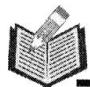

# 要点梳理

1.(1)\_\_\_\_的数叫做正数，\_\_\_\_的数叫做负数；

(2)0 既不是\_\_\_\_，也不是\_\_\_\_。

2. 在同一个问题中, 可以用 \_\_\_\_ 和 \_\_\_\_ 表示具有相反意义的量.

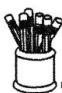

# 基础练

3. 下列各组量中: ①“长 $3.2 \mathrm{~m}$ 与重 5.2 千克”; ②“水库水位上升 1.6 米”与“下降 0.8 米”; ③温度计上“零上 $4^{\circ} \mathrm{C}$ ”与“零下 $5^{\circ} \mathrm{C}$ ”; ④收入 5 元与支出 3 元. 其中具有相反意义的有( )

A. 1 组

B. 2 组

C. 3 组

D. 4 组

4. 下列说法错误的是( )

A. 不是负数的数是正数或 0

B. 不是正数的数就是负数

C. 正、负数可以用来表示相反意义的量

D. $-3\frac{1}{2}$ 是非正数

5. 在数 -7, 2.5, 0, -1.732, + $\frac{5}{4}$ , 100, - $\frac{1}{2}$ 中, 正数有 \_\_\_\_ 个, 负数有 \_\_\_\_ 个.

6. 通常将收入 1000 元, 记为 \_\_\_\_ 元, 支出 800 元记为 \_\_\_\_ 元.

7. 某条鲸鱼位于海平面下方 100 米, 一只海鸥位于鲸鱼正上方 250 米, 请用正, 负数表示鲸鱼和海鸥的位置 (海平面为 0 米).

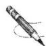

# 能力练

8. 下表列出了国外几个城市与北京的时差(带正号表示同一时刻比北京早的时数).

<table><tr><td>城市</td><td>纽约</td><td>巴黎</td><td>东京</td><td>芝加哥</td></tr><tr><td>时差</td><td>-13</td><td>-7</td><td>+1</td><td>-14</td></tr></table>

已知现在北京时间是 7:00.

(1)问现在纽约时间是多少?

(2) 小华现在想给远在巴黎的妈妈打电话, 你认为合适吗?

# 第 2 课时 正数和负数(二)

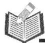

# 要点梳理

1. 是正数与负数的分界,有特定的意义,在实践中有着广泛的应用;

2. 可以用来表示允许偏差.

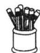

# 基础练

3. 中国是最早使用正负数表示具有相反意义的量的国家。如果大风车顺时针旋转 $66^{\circ}$ , 记作 $+66^{\circ}$ , 那么大风车逆时针旋转 $88^{\circ}$ , 记作 \_\_\_\_.

4. 一包零食的质量标识为“70±2克”, 则下列质量合格的是( )

A. 66 克

B. 67 克

C. 71 克

D. 74 克

5. 某空军大队举行特技飞行表演, 其中一架飞机起飞 0.5 km 后完成 4 个表演动作, 飞机的高度变化如下表所示:

<table><tr><td>动作</td><td>动作1</td><td>动作2</td><td>动作3</td><td>动作4</td></tr><tr><td>高度变化</td><td>上升4.5km</td><td>下降3km</td><td>上升2km</td><td>下降2.5km</td></tr><tr><td>记作</td><td>___</td><td>___</td><td>___</td><td>___</td></tr></table>

6. 市场调研机构公布的数据显示,2024年前六周,A,B,C,D四款手机的销量同比有升有降,增长率分别为+10%, -8%, 0%, -3%,请说明这四款手机销量的变化情况.

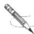

# 能力练

7. 科技改变世界。快递分拣机器人从微博火到了朋友圈，据介绍，这些机器人不仅可以自动规划最优路线，将包裹准确放入相应的路口，还会感应避让障碍物、自动归队取包裹，没电的时候还会自己找充电桩充电。某分拣仓库计划平均每天分拣20万件包裹，但实际每天的分拣量与计划相比会有出入，下表是该仓库10月份第三周分拣包裹的情况（超过计划量的部分记为正，未达到计划量的部分记为负）：

<table><tr><td>星期</td><td>一</td><td>二</td><td>三</td><td>四</td><td>五</td><td>六</td><td>日</td></tr><tr><td>分拣情况(单位:万件)</td><td>+6</td><td>0</td><td>-4</td><td>+5</td><td>-1</td><td>+7</td><td>-6</td></tr></table>

(1)根据表中数据回答哪几天分拣的包裹量不足平均值,哪几天达到平均值?

(2)该仓库本周实际分拣了多少包裹?

# 1.2 有理数及其大小比较

# 第 1 课时 有理数的概念

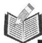

# 要点梳理

1. 可以写成分数形式的数称为  
2. 有理数可分为 \_\_\_\_，\_\_\_\_ 和 \_\_\_\_.

# 基础练

3. 下列各数中, 负有理数是( )

A. 0.2

B. -12

C. $\frac{2}{3}$

D. 0

4. 关于 0.25 说法: ①是分数; ②是小数; ③是有理数; ④是正数. 其中正确的个数有( )

A. 1 个

B. 2 个

C. 3 个

D. 4 个

5. 在 $-1,3,0,\frac{1}{3}, -0.1$ 中，正有理数有（ ）

A. 2 个

B. 3 个

C. 4 个

D. 5 个

6. 下列说法正确的是( )

A. 0 不可以写成分数形式

B. 有理数可分为正有理数, 负有理数

C. 非正整数包含负整数和零

D. 前面带负号的数是负数

7. 整数包括\_\_\_\_, 0, \_\_\_\_，非负整数包括\_\_\_\_和\_\_\_\_。

8. $-0.3, \frac{1}{2}$ 都是 \_\_\_\_ 数，-0.3 是 \_\_\_\_ 分数， $\frac{1}{2}$ 是正 \_\_\_\_.

9. 有理数中, 最小的正整数是\_\_\_\_, 最大的负整数是\_\_\_\_.

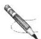

# 能力练

10. 在 1.5 和 7.8 之间的整数有 \_\_\_\_ 个, 在 -9.5 和 1.8 之间的整数有 \_\_\_\_ 个.

11. 下列各数: 4, -3.2, +133, -1, 0, 6 $\frac{4}{5}$ , 9.05.

正有理数有：\_\_\_\_；

负有理数有：\_\_\_\_；

整数有：\_\_\_\_；

负整数有：\_\_\_\_；

非负有理数有：\_\_\_\_。

# 第 2 课时 数轴

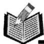

# 要点梳理

1. 规定了\_\_\_\_、\_\_\_\_和\_\_\_\_的直线叫数轴，\_\_\_\_表示0.

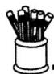

# 基础练

2. 下列各数轴画法正确的是( )

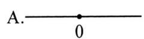

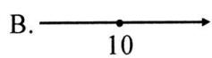

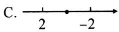

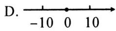

3. 如图, 小亮从永宁大道的街房花园(原点)向东步行 500 米后, 又掉头向西走了 1000 米. 下面数轴中表示其最终位置的点是( )

永宁大道 D C E A B 东
-1000 -500 0 500 1000（米）

A. 点 $A$

B. 点 $B$

C. 点 C

D. 点 $D$

4. 在数轴上距原点 5 个单位长度的点表示的数为( )

A. 5

B. -5 或 5

C. -5

D. 以上都不是

5. 如图所示, 点 $A$ 表示数 , 点 $B$ 表示数 , 点 $C$ 表示数 .

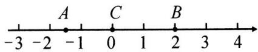  
第5题图

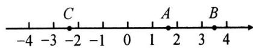  
第6题图

6. 如图, 数轴上表示 $a, b, c$ 三个有理数的点分别为 $A, B, C$ .

(1)其中 $a$ \_\_\_\_ 0, b \_\_\_\_ 0, c \_\_\_\_ 0; (2)点 $B$ 与点 $C$ 间的整数有 \_\_\_\_.

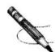

# 能力练

7. 在数轴上表示下列各数.

$$
- 2, 2 \frac {1}{2}, 3. 5, 0, - 0. 5, + 1 \frac {3}{4}, 4 \frac {1}{2}.
$$

8. 数轴上表示整数的点为整点, 某数轴上的单位长度是 $1 \mathrm{~cm}$ . 若在这个数轴上随意放上一根长为 $5 \mathrm{~cm}$ 火柴棒, 则该火柴棒能盖住的整点个数为多少个?

# 第 3 课时 相反数

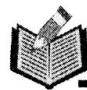

# 要点梳理

1. 在数轴上表示互为相反数的两个点, 分别位于原点的 \_\_\_\_, 并且到原点距离 \_\_\_\_. 特别地, 0 的相反数是 \_\_\_\_.

2.(1)5的相反数是\_\_\_\_；(2)-3的相反数是\_\_\_\_。

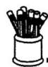

# 基础练

3.2022的相反数是（ ）

A. 0

B. 2022

C. -2 022

D. $\frac{1}{2022}$

4. 下列说法中, 错误的是( )

A. 0.2 与 $-\frac{1}{5}$ 互为相反数

B. -2 与 $-\frac{1}{2}$ 互为相反数

C. -7 的相反数是 7

D. 10 的相反数是 -10

5. 下列几组数中, 互为相反数的是( )

A. $-(+3)$ 或 $+(-3)$

B. -5 和 $-(+5)$

C. +(-7) 和 -(-7)

D. $-(-2)$ 和 $+(+2)$

6. 如果 a 表示有理数, 那么下列说法中正确的是()

A. +a 与 $-(-a)$ 互为相反数

B. $+a$ 和 $-a$ 一定不相等

C. -a 一定是负数

D. $-(a)$ 与 $+(-a)$ 一定相等

7. 化简: $(1) - (-1 \frac{1}{2}) =$ \_\_\_\_; $(2) - (+ \frac{3}{8}) =$ \_\_\_\_; $(3) - [ -(-9)] =$ \_\_\_\_.

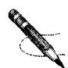

# 能力练

8. 数轴上点 $A$ 表示的数为 $-6, B, C$ 两点表示的数互为相反数, 且点 $B$ 到点 $A$ 的距离为 3 个单位, 问点 $B, C$ 各表示什么数?

9. 一滴墨水洒在一个数轴上, 如图所示, 由图中标出的数值, 判断墨迹盖住的整数共有多少个? 有多少对相反数被盖住呢?

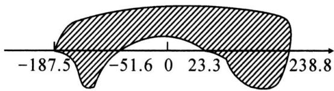

area

| x     | y      |
|-------|--------|
| -187.5| -51.6  |
| 0     | 0      |
| 23.3  | 23.3   |
| 238.8 | 238.8  |

# 第 4 课时 绝对值

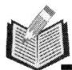

# 要点梳理

1. 一般地, 数轴上表示数 $a$ 的点与原点的\_\_\_\_叫做数 $a$ 的绝对值, 记作 \_\_\_\_.

2. 化简: (1) $|3| =$ \_\_\_\_; (2) $|-3| =$ \_\_\_\_; (3) $|0| =$ \_\_\_\_.

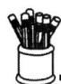

# 基础练

3. 下列说法正确的是( )

A. 整数的绝对值有 2 个

B. 有理数的绝对值不是负数

C. 有理数的绝对值都是正数

D. 绝对值最小的有理数是 1

4. 下列说法正确的是( )

A. 绝对值最小的有理数是 -1

B. 绝对值等于本身的数是 0

C. 绝对值大于本身的数是负数

D. 绝对值不大于本身的数是正数

5. 若 a > 0，则 $\left|a\right| =$ \_\_\_\_；若 a = 0，则 $\left|a\right| =$ \_\_\_\_；若 a < 0，则 $\left|a\right| =$ \_\_\_\_.

6. 填空: $\left| -3\frac{1}{2} \right| =$ \_\_\_\_, $-\left| -\frac{1}{2} \right| =$ \_\_\_\_.

7. 若 m > 0，则 $\left|m\right| =$ \_\_\_\_；若 n < 0，则 $\left|n\right| =$ \_\_\_\_.

8. 若 $|x| = 3$ ，则 $x =$ \_\_\_\_；若 $|-y| = 2$ ，则 $y =$ \_\_\_\_.

9. 数轴上到原点距离为 10 的点表示的数为 \_\_\_\_，其绝对值为 \_\_\_\_.

10. 已知 a, b 互为相反数, x 的绝对值等于 1, 则 $a + b + x$ 的值是 \_\_\_\_.

11. 已知 $\left|x-2\right|+\left|y+1\right|=0$ ，则 x= \_\_\_\_，y= \_\_\_\_.

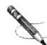

# 能力练

12. 计算：

(1) $-\left|-12\right|+\left|-5\right|$ ;

(2) $|-3|\times|-2|-|-6|$ .

13. 正式足球比赛所用足球的质量有严格的规定. 下面是 6 个足球的质量检测结果(用正数记超过规定质量的克数, 用负数记不足规定质量的克数):

$$
- 2 5, + 1 0, - 2 0, + 3 0, + 1 5, - 4 0.
$$

请指出哪个足球的质量好一些,并用绝对值知识进行说明.

# 第5课时 有理数的大小比较

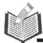

# 要点梳理

1. 在数轴上表示的两个有理数，\_\_\_\_边的数小于\_\_\_\_边的数。

2. 一般地，(1) 大于 0,0 大于 \_\_\_\_，正数大于 \_\_\_\_；

(2)两个负数,绝对值大的反而\_\_\_\_.

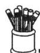

# 基础练

3. 下列各式正确的是( )

A. $-\vert-6\vert>0$

B. $|2| > |-2|$

C. $-4 < -5$

D. $|-6|>0$

4. 若 $\left|a\right|=-a$ ，则 a 的取值范围是（）

A. $a > 0$

B. $a <   0$

C. $a > 0$

D. $a \leqslant 0$

5. 下列比 -1 大而比 0 小的数为( )

A. $\frac{1}{2}$

B. $-\frac{1}{3}$

C. $\frac{2}{3}$

D. $-1 \frac{1}{3}$

6. 下列说法错误的是( )

A. 最大的负整数是 -1

B. 绝对值最小的数是 0

C. 绝对值等于本身的数是正数

D. 相反数等于本身的数是 0

7. 有理数 a, b 在数轴上的位置如图所示, 则下列结论正确的是( )

A. $|a| > |b|$

B. $\left| b\right|  < 1$

C. $\left|a\right| < 0$

D. $-b > a$

8. 用“<”或“>”填空.

(1)-2.7\_\_\_\_5;(2)0\_\_\_\_-|-2|;(3)-3.14\_\_\_\_- $\pi$ ;(4)- $\frac{1}{3}$ \_\_\_\_- $\frac{1}{4}$ .

9. 绝对值大于 2 而小于等于 5 的整数有 \_\_\_\_.

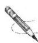

# 能力练

10. 比较大小:

(1) $-\frac{7}{8}$ 与 $-\frac{6}{7}$ ;

(2) $-\left|-2\frac{1}{3}\right|$ 与-2.3.

11. 若 $\left|a\right|=5,\left|b\right|=4$ 且 a>b，求 a,b 的值.

# 第二章 有理数的运算

# 2.1 有理数的加法与减法

# 第 1 课时 有理数的加法

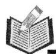

# 要点梳理

1. 同号两数相加, 取\_\_\_\_的符号, 且和的绝对值等于\_\_\_\_的绝对值的\_\_\_\_.

2. 绝对值不相等的异号两数相加, 和取绝对值 的加数的符号, 且和的绝对值等于加数的绝对值中较大者与较小者的 . 互为相反数的两个数相加得 .

# 基础练

3. 计算：

(1) $(+2)+(+5)=$ \_\_\_\_;

(2) $(-3)+(-2)=$ \_\_\_\_ ;

(3) $(-0.6)+(-1.5)=$ \_\_\_\_;

(4) $(- \frac{1}{2}) + \frac{1}{2} =$ \_\_\_\_.

4. 如果两个数的和为负数,那么( )

A. 这两个数都是负数

B. 这两个数中一个为负数, 一个为零

C. 这两个数异号,且负数的绝对值比正数大

D. 以上三种情况都有可能

5. 若 $x$ 的相反数是 3, $|y|=5$ , 则 $x+y$ 的值为 ( )

A.-8

B. 2

C. 8 或 -2

D. -8 或 2

6. 计算：

(1) $(-26)+(-73)$ ;

(2) $(-1\frac{1}{2})+(+\frac{5}{6})$ ;

(3) $-3\frac{1}{2}+4.8;$

(4) $(-8\frac{2}{3})+6\frac{1}{2}.$

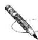

# 能力练

7. 实际测量一座山的高度时, 可在若干个观测点中, 测量每两个相邻可视观测点的相对高度, 然后用这些相对高度计算出山的高度, 下表是某次测量数据的部分记录 (用 $A - C$ 表示观测点 $A$ 相对观测点 $C$ 的高度).

<table><tr><td>A-C</td><td>C-D</td><td>D-E</td><td>E-F</td><td>F-G</td><td>G-B</td></tr><tr><td>90米</td><td>80米</td><td>-60米</td><td>60米</td><td>-70米</td><td>40米</td></tr></table>

求观测点 A 相对观测点 B 的高度是多少米?

# 第 2 课时 有理数加法的运算律

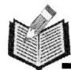

# 要点梳理

1. 加法交换律: 两个数相加, 交换 \_\_\_\_ 的位置, 和 \_\_\_\_.

2. 加法结合律: 三个数相加, 先把\_\_\_\_相加, 或者先把\_\_\_\_相加, 和\_\_\_\_.

# 基础练

3. 计算: (1) $(-2)+(+5)+(-8)+7=$ \_\_\_\_ ; (2) $(-0.6)+0.3+(-0.4)+0.7=$

4. 飞机飞行的高度是 8000 m, 上升 300 m, 又下降 500 m, 又上升 200 m, 最后飞机的高度为 \_\_\_\_ m.

5. 绝对值不小于 5 但小于 7 的所有整数的和是 \_\_\_\_.

6. $(- \frac{1}{2}) + \frac{1}{2} + (- \frac{2}{5}) + (+ \frac{3}{5})$ 运用运算律计算恰当的是()

A. $\left[-\frac{1}{2} + \frac{1}{2}\right] + \left[-\frac{2}{5} + \left(+\frac{3}{5}\right)\right]$

B. $\left[\frac{1}{2} + (-\frac{2}{5})\right] + \left[(-\frac{1}{2}) + (+\frac{3}{5})\right]$

C. $(- \frac{1}{2}) + [\frac{1}{2} + (-\frac{2}{5})] + (+ \frac{3}{5})$

D. 以上都不对

7. 如图所示, 则下列结论错误的是( )

A. $b + c < 0$

B. $a + b < 0$

C. $a + b + c < 0$

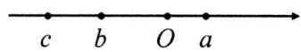

D. $\left| {a + b}\right|  = a + b$

8. 计算：

(1) $(-8)+3+(-2)+7;$

(2) $(- \frac{1}{2}) + \frac{1}{4} + (- \frac{1}{8})$ ;

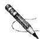

# 能力练

9. 用简便方法计算：

(1) $0.75 + (-2\frac{3}{4}) + (+0.125) + (-4\frac{1}{8})$

(2) $(-6.8)+4\frac{2}{5}+(-3.2)+6\frac{3}{5}+(-5.7)+(+5.7).$

# 第 3 课时 有理数的减法

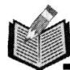

# 要点梳理

1. 有理数减法法则: 减去一个数, 等于 \_\_\_\_ 这个数的 \_\_\_\_.

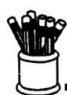

# 基础练

2. 计算: (1) 6 - 8 = \_\_\_\_; (2) 0 - (-2) = \_\_\_\_;

(3)-2.5-6.5=\_\_\_\_; (4)-1 $\frac{1}{2}$ -(-3 $\frac{1}{2}$ )=\_\_\_\_.

3.(1)比-10℃低3℃的气温是\_\_\_\_；(2)-2比\_\_\_\_小3.

4. 甲地海拔高为 $-12 \mathrm{~m}$ , 乙地海拔高为 $20 \mathrm{~m}$ , 则乙地比甲地高 \_\_\_\_ m.

5.填上适当的数:(1)-7-8=\_\_\_\_;(2)3-12=\_\_\_\_;(3)(-17)+19=\_\_\_\_.

6. 下列计算: ① -15 - 8 = -23; ② -9 + 5 + 7 = 3; ③ $\left| {-\frac{1}{2}}\right|  - \frac{1}{3} = \frac{1}{6}$ ; ④ ${15} - {16} = 1$ . 其中计算正确的个数是(   )

A. 1 个

B. 2 个

C. 3 个

D. 4 个

7. 若 $|a| = 5, |b| = 3$ 且 $a > b$ ，则 $a - b = (\quad)$

A. 2 或 8

B. -2 或 -8

C. -5 或 -3

D. ±3 或 ±8

8. 计算：

(1) $-3 - (-2)$ ;

(2) $5-8\frac{1}{3}$ ;

(3)-2.3-3.7;

(4) $-(-1\frac{2}{3})-(+3\frac{1}{3}).$

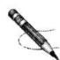

# 能力练

9. 已知 $a = 1 \frac{2}{3}, b = -2 \frac{4}{5}, c = -3 \frac{3}{4}$ , 计算下列各式的值:

(1) $-a - b$ ;

(2) $b-|c|$ .

# 第 4 课时 有理数的加减混合运算

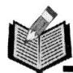

# 要点梳理

1. 引入相反数后,有理数的加减混合运算可以统一为 \_\_\_\_ 运算.

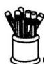

# 基础练

2. 把下列算式中的减法转化为加法：

(1) $(-6)-(+9)+(-3)-(-10)=$ \_\_\_\_.   
(2) $3\frac{1}{2}+(-\frac{5}{6})-(-\frac{1}{3})-(+0.8)=$ \_\_\_\_.

3. 将 $-8-(-3)+7-(+2)$ 写成省略括号和加号的形式正确的是()

A. $-8 + 3 + 7 - 2$

B. $8 + 3 + 7 - 2$

C. $-8 - 3 + 7 - 2$

D. $8 + 3 + 7 + 2$

4. $-2 - 3 + 5$ 读法正确的是( )

A. 负 2, 负 3, 正 5 的和

B. 负 2 减 3, 正 5 的和

C. 负 2,3, 正 5 的和

D. 以上都不对

5. 计算：

(1) $0-(-10)-(-15)-(+5)$ ;

(2) $(-18.25)-4\frac{3}{5}+(+18\frac{1}{4})+4.4;$

(3) $-5\frac{3}{4}-9\frac{2}{3}+17\frac{3}{4}-3\frac{1}{3};$

(4) $(-5.2)+(+3.8)-(-1.2)+(-0.5).$

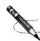

# 能力练

6. 已知 $x = 2.8, y = -4\frac{1}{5}, z = -1\frac{4}{5}$ , 求代数式 $-x + y + |-z|$ 的值.

# 2.2 有理数的乘法与除法

# 第1课时 有理数的乘法

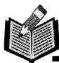

# 要点梳理

1. 有理数乘法法则: 两数相乘, 同号得 \_\_\_\_, 异号得 \_\_\_\_, 且积的绝对值等于 \_\_\_\_ 的绝对值的 \_\_\_\_. 任何数与 0 相乘, 都得 \_\_\_\_.

2. 乘积是 \_\_\_\_ 的两个数互为倒数.

# 基础练

3. 计算: (1) $2 \times 5 =$ \_\_\_\_; (2) $-2 \times (-5) =$ \_\_\_\_; (3) $2025 \times 0 =$ \_\_\_\_;

(4) $-2\times5=$ \_\_\_\_; (5) $2\times(-5)=$ \_\_\_\_; (6) $-2024\times0=$ \_\_\_\_.

4. 计算: (1) $\left(-1 \frac{1}{2}\right) \times \frac{4}{9} =$ \_\_\_\_; (2) $6 \times \left(-2 \frac{1}{3}\right) =$ \_\_\_\_.

5. 用“＞”、“＜”或“＝”填空：

(1) 若 $a > 0, b > 0$ , 则 $ab$ \_\_\_\_ 0; (2) 若 $a < 0, b < 0$ , 则 $ab$ \_\_\_\_ 0;

(3)若 $a > 0, b < 0$ , 则 $ab$ \_\_\_\_ 0; (4)若 $a < 0, b > 0$ , 则 $ab$ \_\_\_\_ 0.

6. 写出下列各数的倒数：

$$
- 1, 1, - 3, 2. 5, - \frac {3}{1 0}, - 3 \frac {1}{4}, - 3. 2.
$$

7. 计算：

(1) $(-6)\times(-7)$ ;

(2) $12\times(-5)$ ;

(3) $25\times(-0.04)$ ;

(4) $-\frac{1}{4}\times(-\frac{8}{9})$ ;

(5) $0.2 \times (-\frac{10}{3})$

(6) $-\frac{3}{20}\times\frac{5}{6}.$

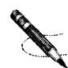

# 能力练

8. 若定义运算“\*”为 $a * b = a + b + ab$ ，求 $3 * (-2)$ 值.

# 第 2 课时 乘法的运算律

# 要点梳理

1. 几个不是 0 的数相乘, 负的乘数的个数是偶数时, 积为 \_\_\_\_ 数; 负的乘数的个数是奇数时, 积为 \_\_\_\_ 数; 几个数相乘, 如果其中有乘数为 0 , 那么积为 \_\_\_\_.

# 基础练

2. 计算: (1) $(-1) \times (-1) \times (-2) =$ \_\_\_\_ ; (2) $(-1.25) \times (-8) \times \frac{1}{2} =$ \_\_\_\_ .

3. 计算: (1) $5 \times (-6) \times \left(-\frac{1}{5}\right) = \left[5 \times \_\right] \times (-6) = \_$ ;

(2) $-0.01\times\frac{1}{3}\times(-200)=\frac{1}{3}\times[(-0.01)\times\_\_\_\_]=\_\_\_\_.$

4. 计算: $(- \frac{1}{2} - \frac{1}{5} + \frac{3}{10}) \times (-30) =$ \_\_\_\_.

5. 如果三个有理数的积为负, 则这三个有理数中( )

A. 只有 1 个负数 B. 有 2 个负数 C. 3 个都是负数 D. 恰有 1 个或 3 个负数
6. 计算：

(1) $-1\frac{1}{3}\times3\times(-\frac{3}{4})$ ;

(2) $\left(-\frac{5}{6}\right)\times15\times\left(-1\frac{11}{25}\right);$

(3) $-1\frac{5}{7}\times(-\frac{3}{4})\times\frac{5}{6}\times(-\frac{5}{12})$ ;

(4) $(- \frac{4}{5}) \times (-1 \frac{2}{3}) - (- \frac{5}{8}) \times (-1 \frac{1}{3}).$

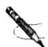

# 能力练

7. 用简便方法计算：

(1) $(-0.25)\times\frac{2}{13}\times(-8)\times\left(-6\frac{1}{2}\right);$

(2) $(-12 - 1\frac{1}{3} + 1\frac{1}{8}) \times (-\frac{3}{4})$ .

# 第 3 课时 有理数的除法

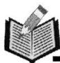

# 要点梳理

1. 除以一个不等于 0 的数, 等于 \_\_\_\_ 这个数的 \_\_\_\_.

2. 两数相除, 同号得 \_\_\_\_, 异号得 \_\_\_\_, 且商的绝对值等于被除数的绝对值除以除数的绝对值的商, 0 除以任何一个不等于 0 的数, 都得 \_\_\_\_.

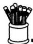

# 基础练

3. 计算: (1) $(-4) \div 2 =$ ; (2) $(-1) \div (-0.05) =$

(3) $|-4|\div2=$ ;(4) $\div(-8.5)=0.$

4. 某数乘以 -2 等于 3, 则这个数为 \_\_\_\_.

5. $2 \frac{1}{2}$ 除以 -2 的商为 \_\_\_\_.

6. 化简: (1) $\frac{-12}{-3} =$ \_\_\_\_; (2) $\frac{-20}{5} =$ \_\_\_\_; (3) $\frac{2}{-0.3} =$ \_\_\_\_; (4) $\frac{7}{-0.5} =$ \_\_\_\_.

7. 计算: (1) $(- \frac{1}{12}) \div (- \frac{1}{4}) =$ \_\_\_\_; (2) $-6 \div \frac{1}{3} =$ \_\_\_\_.

8. 某冷冻厂的一个冷冻库的室温是 $-3^{\circ} \mathrm{C}$ , 现有一批食品需 $-29^{\circ} \mathrm{C}$ 冷藏, 如果要每小时能降温 $4^{\circ} \mathrm{C}$ , 则 \_\_\_\_ 小时能降到所要的温度.

9. 计算：

(1) $(-8)\div(-4)$ ;

(2) $0 \div (-3)$ ;

(3) $\left(-\frac{8}{5}\right)\div\left(-\frac{2}{5}\right)$ ;

(4) $2\frac{1}{4}\times(-\frac{4}{9})\div(-16).$

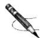

# 能力练

10. 计算：

(1) $(+1\frac{2}{7})\div (-\frac{3}{4})\div (-\frac{15}{14})\times (-\frac{5}{8})$

(2) $-60\div4-(-2.5)\div(-0.1)$ .

# 第4课时 有理数的加减乘除混合运算

# 要点梳理

1. 有理数的加、减、乘、除混合运算, 如无括号指出先做什么运算, 则“先\_\_\_\_\_, 后\_\_\_\_”的顺序进行.

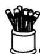

# 基础练

2. 计算: (1) $(-8) \times 5 - 40 =$ \_\_\_\_; (2) $(-1.2) \div (-0.3) - (-2) =$ \_\_\_\_.

3. 计算: (1) $-4 \div 4 \times \frac{1}{4} =$ \_\_\_\_; (2) $(-1) \times (-3) - 4 =$ \_\_\_\_.

4. 计算 $-5 + 5 \div (-0.3) \times 6$ 的结果为()

A. 0

B. -7.5

C. -14

D. -105

5. 当 a > 0 时， $\frac{|a|}{a} =$ \_\_\_\_，当 a < 0 时， $\frac{|a|}{a} =$ \_\_\_\_.

6. 计算：

(1) $(-3)\times (-0.5) + (-2.6)\div 2;$

(2) $-20\div5\times\frac{1}{4}+5\times(-3)\div15.$

7. 计算：

(1) $\frac{11}{5}\times\left(\frac{1}{3}-\frac{1}{2}\right)\times\left(-\frac{3}{11}\right)\div\frac{5}{4};$

(2) $|-24|\div\left(-1\frac{1}{2}\right)\times\frac{1}{4}-5^{2}.$

# 能力练

8. 某公司去年 1\~3 月平均每月亏损 1.5 万元, 4\~6 月平均每月盈利 2 万元, 7\~10 月平均每月盈利 1.7 万元, 11\~12 月平均每月亏损 2.35 万元. 这个公司去年平均每月的盈亏情况如何?

# 2.3 有理数的乘方

# 第1课时 乘方

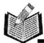

# 要点梳理

1. 一般地, $n$ 个相同的因数 $a$ 相乘, 即 $\underbrace{a \cdot a \cdot \cdots \cdot a}_{n\text{个} a}$ , 记作 \_\_\_\_, 读作 \_\_\_\_.

2. 负数的奇次幂是\_\_\_\_，负数的偶次幂是\_\_\_\_。正数的任何次幂都是\_\_\_\_，0 的任何正整数次幂都是\_\_\_\_。

# 基础练

3. $(-3)^{5}$ 的底数是\_\_\_\_，指数是\_\_\_\_，读作\_\_\_\_。

4. 把 $(-1\frac{1}{5})\times(-1\frac{1}{5})\times(-1\frac{1}{5})\times(-1\frac{1}{5})$ 写成乘方的形式为 \_\_\_\_.

5. 计算: (1) $(-0.1)^{3}=$ \_\_\_\_; (2) $(-\frac{3}{4})^{2}=$ \_\_\_\_.

6. 平方等于本身的数是\_\_\_\_，立方等于本身的数是\_\_\_\_。

7. 下列计算错误的是( )

A. $-2^{5} = -(2\times 2\times 2\times 2\times 2) = -32$

B. $(- \frac{1}{3})^3 = (-\frac{1}{3}) \times (-\frac{1}{3}) \times (-\frac{1}{3}) = -\frac{1}{27}$

C. $-5^{2} = -25$

D. $(- \frac{2}{3})^{2} = -\frac{4}{9}$

8. 下列各数值相等的是( )

A. $-3^{3}$ 与 $-2^{3}$

B. $3^{2}$ 与 $\vert -2\vert^{3}$

C. $-3^{2}$ 与 $-(-3)^{2}$

D. $(-3)^{2}$ 与 $-3^{2}$

9. 计算：

(1) $(-4)^{3}$ ;

(2) $\left(-\frac{1}{2}\right)^{4}$ ;

(3) $-5^{3}$ ;

(4) $0^{2022}$ .

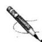

# 能力练

10. 计算: (1) $-2 \times (-3)^{2}$ ;

(2) $-1^{2}+(-2)^{2}$ ;

(3) $-3^{2}+(-2)^{3}\times2;$

(4) $(-4)^{2}\div(-8)-5^{2}$

# 第2课时 有理数的混合运算

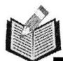

# 要点梳理

1. 运算顺序: 先\_\_\_\_, 再\_\_\_\_, 最后\_\_\_\_; 同级运算, 从\_\_\_\_到\_\_\_\_进行; 如有括号, 先做\_\_\_\_的运算, 按\_\_\_\_、\_\_\_\_、\_\_\_\_依次进行.

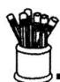

# 基础练

2. 下列计算错误的是( )

A. $(-5)^{2} \times \frac{1}{25} = 1$

B. $\left(\frac{3}{2}\right)^{2}\div\left(-\frac{3}{2}\right)=\frac{3}{2}$

C. $-2^{2} - 2^{2} = -8$

D. $-1^{2}+(-1)^{2}=0$

3. 计算：

(1) $2 \times 3^{2} - 2^{4} \div (-2)^{3}$ ;

(2) $-9\div3+(\frac{1}{2}-\frac{2}{3})\times12.$

4. 计算：

(1) $(-1)^{3}+(-2)^{2}\div4;$

(2) $-12\times\left(\frac{1}{2}-\frac{1}{3}\right)-8\div(-2)$ ;

(3) $-3^{2}+2\times\left[4-1\div\left(-\frac{1}{2}\right)^{2}\right]$ ;

(4) $3^{2}\div(-3)^{2}+|-4|$ .

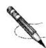

# 能力练

5. 规定: $a * b = (a - 2b) \div (2a - b)$ , 求 $(-4) * (-\frac{1}{4})$ 的值.

# 第 3 课时 科学记数法

# 要点梳理

1. 把一个绝对值大于 10 的数表示成 \_\_\_\_ 的形式 (其中 \_\_\_\_ ≤ |a| < \_\_\_\_, n 是 \_\_\_\_, 这种记数法叫 \_\_\_\_.

2. 用科学记数法表示一个 n 位整数, 其中 10 的指数是 \_\_\_\_.

# 基础练

3. 2022 年我国粮食生产再获丰收, 全国粮食总产量为 13390 亿斤, 数 13390 亿用科学记数法表示为( )

A. $0.1339 \times 10^{13}$

B. $1.339 \times 10^{12}$

C. ${13.39} \times  {10}^{11}$

D. $1339 \times 10^{9}$

4. 某省今年有 56.84 万人报名参加高考, 比去年增加了 3 万人. 将数据 56.84 万用科学记数法表示为( )

A. $56.84 \times 10^{2}$

B. $56.84 \times 10^{4}$

C. $5.684 \times 10^{5}$

D. $0.5684 \times 10^{6}$

5. 国家体育场“鸟巢”建筑面积达 25.8 万 $\mathrm{m}^{2}$ , 用科学记数法表示为 ( )

A. $25.8 \times 10^{4} \mathrm{~m}^{2}$

B. $25.8 \times 10^{5} \mathrm{~m}^{2}$

C. $2.58 \times 10^{5} \, m^{2}$

D. $2.58 \times 10^{6} \mathrm{~m}^{2}$

6. 有关资料表明, 被称为“地球之肺”的森林正以每年 15 000 000 公顷的速度从地球上消失, 每年森林的消失量用科学记数法表示应是 \_\_\_\_ 公顷.

7. 用科学记数法表示下列各数: (1) -578000 = \_\_\_\_ ; (2) 50340.6 = \_\_\_\_.

8. 下列用科学记数法表示的数, 请写出原数.

(1) $5.06 \times 10^{4} =$ \_\_\_\_; (2) $-9.689 \times 10^{6} =$ \_\_\_\_.

9. 以下是与地球相关数据,用科学记数法表示各数:

(1)地球的半径约为 6400 km;

(2)赤道长约为 40 000 km;

(3)地球的海洋面积为 $360\ 000\ 000\ km^{2}$ .

# 能力练

10. 计算：

(1) $2 \times 10^{3} \times 3 \times 10^{2}$ ;

(2) $5 \times 10^{7} \times 7 \times 10^{5}$ .

# 要点梳理

1. 接近准确数但与准确数有差别的数是

2. 精确到 0.1, 就是精确到 \_\_\_\_ 位.

# 基础练

3. 将 34.945 取近似数精确到十分位, 正确的是( )

A. 34.9

B. 35.0

C. 35

D. 35.05

4. 把 1.952 精确到十分位的近似数是( )

A. 1.9

B. 2.0

C. 2

D. 1.95

5. 用四舍五入法对 0.06045 取近似值, 错误的是()

A. 0.1(精确到 0.1)

B.0.06(精确到百分位)

C. 0.061(精确到千分位)

D. 0.0605(精确到 0.0001)

6. 小明称得一个物体的质量为 3.016 kg, 用四舍五入法将 3.016 精确到 0.01 的近似值为( )

A. 3

B. 3.0

C. 3.01

D. 3.02

7. 由四舍五入得到的近似数 88.35 万, 精确到了( )

A. 十分位

B. 百分位

C. 百位

D. 十位

8. 将数 $x$ 精确到十分位是 3.2, 则 $x$ 的取值范围是 ( )

A. 3.1 < x < 3.3

B. 3.15 < x < 3.25

C. $3.15 \leq x < 3.25$

D. 3.15≤x<3.20

9. 用四舍五入法取近似值:

(1)1.8946(精确到0.01);

(2)2.7982(精确到0.01).

# 能力练

10. 用四舍五入法, 按括号要求, 求下列各数近似值.

(1) $4.096 \times 10^{4}$ （精确到千位）；

(2)56 708(精确到百位).

# 第三章 代数式

# 3.1 列代数式表示数量关系

# 第1课时 代数式

# 要点梳理

1. 用 把数或表示数的字母连接起来的式子叫作代数式.

2. 代数式书写要求：

(1)在含有字母的式子中如果出现乘号,通常将\_\_\_\_,乘号写作“·”或省略不写.  
(2)除法运算通常写成\_\_\_\_,带分数要化成\_\_\_\_.   
(3)加减运算后面有单位的代数式

# 基础练

3. 在式子 $x - 5, 2ab^{2}, C = \pi d, \frac{2}{x}, 0$ 中，代数式有（）

A. 1 个

B. 2 个

C. 3 个

D. 4 个

4. 下列代数式的书写中, 规范的是( )

A. -1b

B. $3 \div a$

C. $1 \frac{1}{2} a^{2} b$

D. -0.1xy

5. 用代数式表示“x 与 y 的 2 倍的和”，正确的是（）

A. $2x + y$

B. $x + 2y$

C. $2(x+y)$

D. ${2xy}$

6. (教材 $\mathbf{P}_{71}$ 练习 $\mathrm{T}_{1}$ 改编) 填空:

(1)每包书有12册，n包书有册；  
(2)底边长为 $a \mathrm{~cm}$ , 高为 $h \mathrm{~cm}$ 的三角形的面积是 $\mathrm{cm}^{2}$ ;  
(3)某天甲送快递 m 件,乙送快递的件数比甲的 2 倍还多 6 件,则乙送快递 \_\_\_\_ 件.  
(4) 将 $m \mathrm{~kg}$ 糖装入 $n$ 个包装袋中, 每袋糖的质量相同, 每袋装入糖 \_\_\_\_ kg.

# 能力练

7. (教材 $\mathbf{P}_{77}$ 习题 $\mathbf{T}_{7}$ 改编)说出下列各组代数式的意义.

(1) $4m+1$ 与 $4(m+1)$ ;

(2) $\frac{1}{2}a-4$ 与 $\frac{1}{2}(a-4)$ .

8. 代数式 $100 - 2x$ 的实际意义可以是: \_\_\_\_. (写一种即可)

# 第2课时 列代数式

# 要点梳理

1. a, b 两数的和与差的积为 \_\_\_\_.

# 基础练

2. (教材 $\mathbf{P}_{73}$ 练习 $\mathbf{T}_{1}$ 改编) 下列表达错误的是( )

A. 比 $a$ 的一半大 1 的数是 $\frac{1}{2} a + 1$

B. $a$ 的相反数与 $b$ 的和是 $-a + b$

C. 比 $a$ 的平方小 1 的数是 $a^2 - 1$

D. $a$ 的平方除以 $b$ 的商是 $\left(\frac{a}{b}\right)^2$

3. (教材 $\mathbf{P}_{72}$ 例 3 改编) 苹果的单价为 $a$ 元/kg, 香蕉的单价为 $b$ 元/kg, 买 $5 \mathrm{~kg}$ 苹果和 $3 \mathrm{~kg}$ 香蕉共需( )

A. $(a + b)$ 元

B. $(5a + 3b)$ 元

C. $(3a + 5b)$ 元

D. $3(a+b)$ 元

4. (教材 $\mathbf{P}_{75}$ 习题 $\mathbf{T}_{1}$ 改编)用代数式表示:

(1)x 的倒数与 5 的差表示为 \_\_\_\_；

(2)x 的立方除以 y 的商表示为 \_\_\_\_；

(3)a,b两数的和与a,b两数的差的商表示为

5. (教材 $\mathbf{P}_{77}$ 习题 $\mathbf{T}_{10}$ 改编)一个两位数, 如果个位上的数字为 $b$ , 十位上的数字为 $a$ , 那么这个两位数可用代数式表示为 \_\_\_\_; 如果一个三位数的个位上的数字为 $a$ , 十位上的数字为 $b$ , 百位上的数字为 $c$ , 那么这个三位数可用代数式表示为 \_\_\_\_.

6. (教材 $\mathbf{P}_{76} \mathbf{T}_{3}$ 改编) 甲、乙两地相距 $s \mathrm{~km}$ , 李明原计划骑车从甲地到乙地需用时 $t \mathrm{~h}$ , 后因天气原因改乘公交车前往, 结果提前 $1 \mathrm{~h}$ 到达乙地. 求公交车的速度.

# 能力练

7. (教材第 76 页第 3 题(3)改)设银行一年定期存款的年利率是 $1.5\%$ , 存入 $a$ 元钱.

(1)一年后得到的利息是多少元?

(2)本金与利息的和是多少元?

# 第 3 课时 用代数式表示反比例关系

# 要点梳理

1. 两个相关联的量,一个量变化,另一个量也随着变化,且这两个量的\_\_\_\_\_,这两个量就叫作成反比例的量,它们之间的关系叫作\_\_\_\_\_.

2. 如果用字母 $x$ 和 $y$ 表示两个相关联的量, 用 $k$ 表示它们的积 ( $k$ 是一个确定的值, 且 $k \neq 0$ ), 反比例关系可以用 \_\_\_\_ 来表示, 其中 $k$ 叫作 \_\_\_\_.

# 基础练

3. 下面各题中的两个量不成反比例关系的是( )

A. 路程一定,汽车行驶的速度和时间  
B. 分子一定, 分母和分数值  
C. 平行四边形的面积一定, 它的底和高  
D. 每块方砖的面积一定, 教室的面积和所需的块数

4. (教材 $\mathbf{P}_{75}$ 练习 $\mathbf{T}_{2}$ 改编) 判断下面各题中的两种量成什么比例关系?

(1)一批书的总册数一定,按每包册数相等的规定打包,打包数与每包的册数；  
(2)每袋化肥的质量一定,化肥的总质量与袋数;

5. (教材 $\mathbf{P}_{76}$ 习题 $\mathbf{T}_{4}$ 改编) 写出下列各题中的关系式, 并判断下列各题中的两个变量是否成反比例关系.

(1)120 名同学参加队列操表演, 按每排人数相等的规定排列, 每排的人数 $m$ 与排数 $n$ ;  
(2)三角形的面积是 $12 \mathrm{~cm}^{2}$ , 它的一条边的长 $a$ 与这条边上的高 $h$ .

# 能力练

6.(20分)(教材 $\mathrm{P}_{75}$ 练习 $\mathrm{T}_{3}$ 改编)运一批货物,每天运的吨数和运货的天数如下表:

<table><tr><td>每天运的吨数x/t</td><td>300</td><td>150</td><td>100</td><td>75</td><td>60</td><td>50</td></tr><tr><td>运货的天数y/天</td><td>10</td><td>20</td><td>30</td><td>40</td><td>50</td><td>60</td></tr></table>

运货的天数与每天运的吨数成反比例吗？写出 y 与 x 的关系式，此时比例系数 k 为多少？

# 3.2 代数式的值

# 第 1 课时 求代数式的值(一)

# 要点梳理

1. 用数值代替代数式中的 , 按照代数式中的运算关系计算得出的结果, 叫作代数式的值。当字母取 的数值时, 代数式的值一般也 .

# 基础练

2. 当 $m = -1$ 时, 代数式 $m + 3$ 的值是 ( )

A. -1

B. 0

C. 1

D. 2

3. 根据下列 $x, y$ 的值, 分别求代数式 $2x - 3y$ 的值:

(1) $x = -3, y = -5$ ;

(2) $x = \frac{1}{2}, y = -\frac{4}{3}$ .

4. 根据下列 $x, y$ 的值, 分别求代数式 $x^{2} - 2xy + y^{2}$ 的值:

(1) $x = -2, y = 3$ ;

(2) $x = \frac{1}{2}, y = -3.$

# 能力练

5. (教材第 76 页第 3 题(4)改) $A, B$ 两地相距 $s \mathrm{~km}$ , 甲、乙两人驾车分别以 $a \mathrm{~km} / \mathrm{h}, b \mathrm{~km} / \mathrm{h}$ 的速度从 $A$ 地到 $B$ 地, 且甲用的时间较少.

(1)用代数式表示甲比乙少用的时间；

(2)当 $s = 360, a = 72, b = 60$ 时, 求(1)中代数式的值, 并说明这个值表示的实际意义.

# 第 2 课时 求代数式的值(二)

# 要点梳理

1. 三角形的底为 a，高为 h，则三角形的面积为 \_\_\_\_.  
2. 圆的半径为 r，则圆的周长为 \_\_\_\_，面积为 \_\_\_\_.  
3. 若圆柱底面半径为 r，高为 h，则它的体积为 \_\_\_\_.

# 基础练

4. 若 a, b 分别表示平行四边形的底和高，则面积 S = \_\_\_\_；当 $a = 3 \, cm, b = 4 \, cm$ 时， $S =$ \_\_\_\_ $\, cm^{2}$ .

5. 如图, 三角尺(阴影部分)的面积是()

A. $ab - 2\pi r$

B. $\frac{1}{2} ab - \pi r^2$

C. $ab - \pi r^{2}$

D. $\frac{1}{2} ab - 2\pi r$

text_image

a
r
b

6. (教材 $\mathbf{P}_{81}$ 练习 $\mathbf{T}_2$ 改编) 如果一个长方体纸箱的长为 $a$ , 宽和高都是 $b$ .

(1)用含有 a, b 的代数式表示这个长方体的体积；  
(2) 当 $a = 50 \mathrm{~cm}, b = 30 \mathrm{~cm}$ 时, 求这个长方体纸箱的体积.

# 能力练

7. (教材 $\mathbf{P}_{80}$ 例3改编)如图,一个跑道由两条半圆形的跑道和两条直道组成.已知每条直道的长都是 $a \mathrm{~m}$ , 半圆形跑道的直径都是 $b \mathrm{~m}$ .

(1)用含 $a, b$ 的代数式表示该跑道的周长；  
(2) 当 $a = 100, b = 40$ 时, 求该跑道的周长 $(\pi \approx 3)$ .

text_image

b
a

# 第四章 整式的加减

# 4.1 整式

# 第1课时 单项式

# 要点梳理

1. 由\_\_\_\_的积组成的式子称为单项式。单独的一个\_\_\_\_或一个\_\_\_\_也是单项式，例如：a,5。

2. 单项式是由数字因数和字母因数两部分组成的，\_\_\_\_叫做单项式的系数；单项式中，\_\_\_\_叫做这个单项式的次数。

# 基础练

3. $-\frac{a}{2}$ 的系数是

4. 单项式 $-\frac{5ab^{3}}{8}$ 的系数是 \_\_\_\_ ，次数是 \_\_\_\_ 。

5. 请你写出一个单项式, 使它的系数为 -1, 次数为 3:

6. 友谊商场国庆期间进行八折优惠促销活动, 则定价为 $a$ 元的物品, 售价为 \_\_\_\_ 元; 售价为 $b$ 元的物品, 原定价为 \_\_\_\_ 元.

7. 单项式 $-\frac{2^3xy^4}{7}$ 的次数是（ ）

A. 3 次

B. 4 次

C. 5 次

D. 8 次

8. 在代数式 $\frac{m+n}{2}, 2x^{2}y, \frac{1}{x}, -5, a$ 中，单项式有（）

A. 1 个

B. 2 个

C. 3 个

D. 4 个

9. 下列说法中, 正确的是( )

A. 单项式 $3a$ 的次数是 0

B. $2xy^{3}$ 的次数为 2

C. -2 不是单项式

D. $- {xy}^{2}$ 的系数是 -1

# 能力练

10. 按照规律填上所缺的单项式并回答问题:

(1) $a, -2a^{2}, 3a^{3}, -4a^{4}, \quad$

(2)试写出第2022个和第2023个单项式；

(3)试写出第 n 个单项式.

# 第2课时 多项式

# 要点梳理

1. 几个 叫做多项式.

2. 多项式里，叫做这个多项式的次数。

3. 与 统称整式.

# 基础练

4. 下列代数式: $\frac{2 - x}{3}, a + b - c, -3, \frac{b + c}{a}, 2x^{2} - x + 1$ , 其中多项式有 ( )

A. 1 个

B. 2 个

C. 3 个

D. 4 个

5. 下列代数式: $\frac{2}{x}, x^{2} + x - 1, \frac{x + a}{2}, x - \frac{1}{y}, -2.5$ , 其中整式有 ( )

A. 4 个

B. 3 个

C. 2 个

D. 1 个

6. 正方形边长为 $a \mathrm{~cm}$ , 边长增加 $3 \mathrm{~cm}$ 后, 面积增加 ( )

A. $9 \mathrm{~cm}^{2}$

B. $(a^{2}+9)\mathrm{cm}^{2}$

C. $(a + 3)^{2}\mathrm{cm}^{2}$

D. $[(a + 3)^2 - a^2] \mathrm{cm}^2$

7. 观察下表, 则相应的代数式是( )

<table><tr><td>x</td><td>0</td><td>1</td><td>2</td><td>3</td></tr><tr><td>代数式的值</td><td>2</td><td>-1</td><td>-4</td><td>-7</td></tr></table>

A. $x + 2$

B. ${2x} - 3$

C. ${3x} - {10}$

D. $-3x + 2$

8. 多项式 $1 + a + b^{4} - a^{2}b$ 是 \_\_\_\_ 次 \_\_\_\_ 项式, 最高次项是 \_\_\_\_.

9. 某市出租车收费标准为: 起步价 8 元, 3 千米后每千米 1.8 元, 则某人乘坐出租车 $x (x > 3)$ 千米的费用为 \_\_\_\_ 元.

10. 如果多项式 $3x^{2} + 2xy^{n} + y^{2}$ 是三次多项式, 那么 n 的值为 \_\_\_\_.

11. 一张长方形的桌子可坐 6 人, 按下图将桌子拼起来.

natural_image

Simple diagram of a rectangular structure with eight circular nodes at the top and bottom corners (no text or symbols)

按这样规律做下去,4 张桌子可以坐\_\_\_\_人;n 张桌子可以坐\_\_\_\_人.

# 能力练

12. 已知关于 $x, y$ 的多项式 $-3x^{3}y^{m+1} + xy^{3} + (n-1)x^{3}y^{4} - 4$ 是六次多项式, 求 $(m+1)^{2n} - 3$ 的值.

# 4.2 整式的加法与减法

# 第1课时 合并同类项

# 要点梳理

1. 所含字母\_\_\_\_，并且相同字母的\_\_\_\_也相同的项叫做同类项。

2. 把多项式中的同类项合并成一项, 叫做\_\_\_\_. 合并同类项后, 所得项的系数是合并前各同类项的系数的\_\_\_\_, 且\_\_\_\_不变.

# 基础练

3. 下列各式中, 与 $2 a$ 是同类项的是 ( )

A. ${3a}$

B. ${2ab}$

C. $- {3}^{2}$

D. $a^2 b$

4. 下列各组单项式是同类项的是( )

A. $\frac{2}{3} xyz$ 与 $\frac{2}{3} xy$

B. $x^{2}$ 和 $2 x$

C. $0.5x^{3}y^{2}$ 和 $7x^{2}y^{3}$

D. $5m^{2}n$ 与 $-4nm^{2}$

5. 计算 $3a^{2} - 2a^{2}$ 的结果是( )

A. 1

B. $-a^{2}$

C. ${a}^{2}$

D. 5

6. 下列计算正确的是( )

A. $3x^{2} - x^{2} = 3$

B. $3a^{2} + 2a^{3} = 5a^{5}$

C. $3 + x = {3x}$

D. -0.25ab + $\frac{1}{4}ba = 0$

7. 若 $\frac{1}{2}a^{n-2}b^{n-1}$ 与 $\frac{1}{2}a^{3}b^{m+3}$ 的和仍是单项式，则 m= \_\_\_\_, n= \_\_\_\_.

8. 合并同类项：

(1) $a^{2}b-b^{2}c+3a^{2}b+2b^{2}c;$

(2) $-a^{2}b+2ab^{2}-3a^{2}b-4ab^{2}.$

# 能力练

9. 一种商品每件进价为 $a$ 元, 商家在进价的基础上增加 $50\%$ 定为售价, 由于库存积压, 决定打八折出售, 每件还能盈利多少元?

# 第2课时 去括号

# 要点梳理

1. 去括号就是用括号外的数乘括号内的\_\_\_\_，再把所得的积\_\_\_\_。

2. 去括号: $2(a-b)-(3-c)=$ \_\_\_\_.

# 基础练

3. 下列去括号正确的是( )

A. $x - (z + y) = x - z + y$

B. $x + (z - y) = x + z + y$

C. $x - (z - y) = x - z - y$

D. $x - (z - y) = x - z + y$

4. 化简 -3(2a - 1) 的结果是()

A. $-2a + 1$

B. $- {6a} + 3$

C. $-6a - 3$

D. $6a + 3$

5. 计算 $2a - 3(a - b)$ 的结果是（ ）

A.-a-3b

B. $a - 3b$

C. $a + 3b$

D. $-a + 3b$

6. 化简: (1) $(a + b) - (a - b) =$ \_\_\_\_ ;

(2) $(a + b) - 2(a - b) =$

7. 计算：

(1) $(3x-5y)+(3x+5y)$ ;

(2) $(2-7x)-(6x+5)$ ;

(3) $(5x-3y)-(4x-8y)$ ;

(4) $3(-\frac{1}{3}x-2y)-2(\frac{1}{2}y-x).$

8. 先化简, 再求值: $3x^{2} + (2x^{2} - 3x) - 2(-x + \frac{5}{2} x^{2})$ , 其中 $x = -2$ .

# 能力练

9. 先化简, 再求值: $8m^{2} - [4m^{2} - 2m - 2(m^{2} - \frac{5}{2} m)]$ , 其中 $m = \frac{1}{2}$ .

# 第 3 课时 整式的加减

# 要点梳理

1. 一般地, 几个整式相加减, 如果有括号就先\_\_\_\_, 然后再\_\_\_\_.

# 基础练

2. 计算 $-2x^{2}+3x^{2}$ 的结果是()

A. $-5x^{2}$

B. $5x^{2}$

C. $-x^{2}$

D. $x^{2}$

3. 下面计算正确的是( )

A. $6a - 5a = 1$

B. $a + 2{a}^{2} = 3{a}^{3}$

C. $-(a - b) = -a + b$

D. $2(a+b)=2a+b$

4. 计算 $4(x - 2y) - 3(x - 2y)$ 的结果是（ ）

A. $x - 2y$

B. $x + 2y$

C. -x - 2y

D. $-x+2y$

5. 一个多项式加上 $-2 + x - x^{2}$ 得到 $x^{2} - 1$ , 则这个多项式是

6. 计算：

(1) $(7a-2b)-(3a+5b)$ ;

(2) $2(x^{2}-2x+4)-3(-1+x-x^{2})$ .

7. 先化简, 再求值: $2a^{2} - [8ab + 2(ab - 4a^{2})] + ab$ , 其中 $a = -1, b = 2$ .

# 能力练

8. 已知多项式 $A = x^{3} - 3x^{2}y - 2y^{2}$ , 小勤在计算“ $2A - B$ ”时, 错看成了“ $2A + B$ ”, 得到的结果为 $-x^{3} + 3x^{2}y - 2y^{2}$ . 求 $2A - B$ 的结果.

# 第五章 一元一次方程

# 5.1 方程

# 第 1 课时 从算式到方程

# 要点梳理

1. 含有的等式叫作方程.  
2. 根据实际问题, 设\_\_\_\_, 用含有未知数的\_\_\_\_表示\_\_\_\_列出方程.  
3. 只含有\_\_\_\_个未知数(元), 且含有未知数的式子都是整式, 未知数的次数都是\_\_\_\_, 这样的方程叫作一元一次方程.  
4. 使方程左、右两边的值 的未知数的值是方程的解.

# 基础练

5. 下列各式: ① $x + y = 4$ ; ② $3x - 5 = x^{2} + 2x$ ; ③ $2x + 1 = -1$ ; ④ $\frac{2}{x} = 1$ ; ⑤ $3x + 2$ . 其中是方程的有( )

A. 1 个

B. 2 个

C. 3 个

D. 4 个

6. 下列方程中, 是一元一次方程的是( )

A. $3x + 2y = 5$

B. ${y}^{2} - {6y} + 5 = 0$

C. $\frac{1}{3}x-3=\frac{1}{x}$

D. ${4x} - 3 = 0$

7. 在方程: ① $3 x - 4 = 1$ ; ② $5 x - 2 = 3$ ; ③ $3 (x + 1) = 2 (2 x + 1)$ 中, 解为 $x = 1$ 的方程是( )

A. ①②

B. ①③

C. ②③

D. 只有②

8. 根据下列问题, 列出方程:

(1)x 的 20% 与 15 的差的一半等于 -2;  
(2)正方形的面积为 $16 \, cm^{2}$ ，它的边长是 x $cm$ ;  
(3)商场把一件进价为 160 元,标价为 x 元的衬衫按照八折销售后,仍可获利 20%.

# 能力练

9. 已知方程 $(m - 2)x^{|m| - 1} + 3 = m - 5$ 是关于 $x$ 的一元一次方程, 则 $m$ 的值为 \_\_\_\_.

10. (教材 $\mathbf{P}_{115}$ 练习 1 改编) $x = 2$ 是下列方程的解吗?

(1) $3x+(10-x)=20;$

(2) $2x^{2}+6=7x.$

# 第 2 课时 等式的性质

# 要点梳理

1. 两个基本事实: 如果 a=b, 那么 b= ; 如果 a=b, b=c, 那么 a c.

2. 等式的性质 1: 等式两边加(或减), 结果仍相等.

3. 等式的性质 2: 等式两边乘同一个数, 或除以 \_\_\_\_ 的数, 结果仍相等.

# 基础练

4. 若 $m = 2n, 2n = -3t$ , 则 $m =$ \_\_\_\_; 若 $4x = 5y$ , 则 $5y =$ \_\_\_\_.

5. 在 $4x - 2 = 1 + 2x$ 两边都减去 \_\_\_\_, 得 $2x - 2 = 1$ , 两边再同时加上 \_\_\_\_, 得 $2x = 3$ , 变形依据是 \_\_\_\_.

6. 在 $\frac{1}{4} x - 1 = 2$ 中两边乘以 \_\_\_\_, 得 $x - 4 = 8$ , 两边再同时加上 4, 得 $x = 12$ . 变形依据分别是 \_\_\_\_.

7. 下列变形正确的是( )

A. 若 $x + 3 = y - 7$ , 则 $x + y = -10$

B. 若 $m - 2 = n + 1$ ，则 $m - n = 1 + 2$

C. 若 0.25x = -4，则 x = -1

D. 若 $\frac{1}{2} y = -1$ ，则 $y = -\frac{1}{2}$

8. (教材 $\mathbf{P}_{116}$ 例3改编)根据等式的性质填空,并说明依据:

(1)3x=-9-2x,那么3x+\_\_\_\_=-9;

(2)2x=6,那么 x= \_\_\_\_.

9. 用等式的性质解下列方程：

(1)4x-7=13;

(2) $\frac{1}{2} x - 2 = 4 + \frac{1}{3} x.$

# 能力练

10. (教材 $\mathbf{P}_{118}$ 第 6 题改编) 如图, 为做一个试管架, 在 $19 \mathrm{~cm}$ 长的木板上钻若干个半径为 $1 \mathrm{~cm}$ 的圆孔, 已知相邻两个圆孔的间距为 $1 \mathrm{~cm}$ , 求木板上能钻多少个圆孔?

text_image

......
1 | 1 | 1 | 1

# 5.2 解一元一次方程

# 第1课时 合并同类项法解一元一次方程

# 要点梳理

1. “系数化为 1”是指由 $mx = n (m \neq 0)$ 变形为 \_\_\_\_, 它的依据是 \_\_\_\_.

2.“合并同类项”: $ax+bx+cx=$ \_\_\_\_.它的依据是乘法 \_\_\_\_ 律.

# 基础练

3. 方程 $2x = -4 - 2$ 的解是（ ）

A. $x = 3$

B. $x =  - 3$

C. $x = -\frac{1}{3}$

D. $x = \frac{1}{3}$

4. 方程 $3x - x = 2 + 4$ 的解是（ ）

A. $x = 3$

B. $x =  - 3$

C. $x = 4$

D. $x = 2$

5. 解方程 5x-2x=-9, 得 x= \_\_\_\_.

6. 解方程 $-\frac{x}{2} + \frac{3}{2}x = 7$ ，得 x = \_\_\_\_.

7. 解方程:

(1) $-2x+0.5x=8;$

(2) $-3x-4x+4.5x=0.5.$

# 能力练

8. 某电视机厂今年计划生产彩电 24000 台, 其中 42 英寸, 32 英寸, 29 英寸的彩电台数的比为 $1: 2: 5$ , 求这三种彩电各生产多少台.

解:设42英寸,32英寸,39英寸的彩电分别为x台,2x台,5x台,依题意,得 $x+2x+5x=$ \_\_\_\_,合并,得\_\_\_\_=\_\_\_\_.

系数化为 1, 得 x = \_\_\_\_.

答：\_\_\_\_。

9. (教材 $\mathbf{P}_{121}$ 练习3改编)《孙子算经》中记载: 今有百鹿入城, 家取一鹿, 不尽, 又三家共鹿适尽, 问: 城中家几何? 大意为: 今有100头鹿进城, 每家取一头鹿, 没有取完, 剩下的鹿每3家共取一头, 恰好取完, 问: 城中有多少户人家?

# 第 2 课时 移项法解一元一次方程

# 要点梳理

1. 把等式一边的某项 \_\_\_\_ 后移到另一边, 叫作 \_\_\_\_.

# 基础练

2. 下列变形属于移项的是( )

A. 由 $2x = 2$ ，得 $x = 1$

B. 由 $3x - 2x = -1$ ，得 $x = -1$

C. 由 $3x - \frac{7}{2} = 0$ ，得 $3x = \frac{7}{2}$

D. 由 $-2x = 1$ ，得 $x = -\frac{1}{2}$

3. 解方程 $4x - 2 = 3 - x$ 的过程顺序是( )

①合并, 得 $5x = 5$ ; ②移项, 得 $4x + x = 3 + 2$ ; ③系数化为 1 , 得 $x = 1$ .

A. ①②③

B. ③②①

C. ②①③

D. ③①②

4. 方程 $3x + 7 = 4x + 5$ 的解是 x = \_\_\_\_.

5. 当 $x =$ \_\_\_\_ 时, 式子 $3x + 7$ 的值与式子 $32 - 2x$ 的值相等.

6. 一艘轮船在同一水域顺流航行的速度为 $27 \mathrm{~km} / \mathrm{h}$ , 逆流航行的速度为 $21 \mathrm{~km} / \mathrm{h}$ , 则水流速度为 \_\_\_\_ km/h.

7. 解方程：

(1) $0.3x + 1.2 - 2x = 1.2 - 2.7x$

(2) $-x-1=25+12x.$

# 能力练

8. 已知父子俩年龄和为 55 岁, 并且父亲的年龄比儿子年龄的 3 倍小 1 岁, 则儿子的年龄是 \_\_\_\_ 岁.

9. (教材 $\mathrm{P}_{130} \mathrm{T}_{6}$ 改编) 某校开展读书月活动, 学校想给参加活动的同学分发书签作为纪念品, 下面是阅览室两位同学的部分对话:

求参加活动的同学有多少人？

text_image

每人分3个，还剩余20个
每人分4个，还缺25个

# 第 3 课时 去括号法解一元一次方程

# 要点梳理

1. 当方程中带有括号的式子时, 常常先通过 \_\_\_\_ 进行化简.

# 基础练

2. 方程 $2(x - 1) + 5 = 0$ 的解是（ ）

A. $x = -2$

B. $x = 2$

C. $x=\frac{3}{2}$

D. $x = -\frac{3}{2}$

3. 在解方程 $3(2x - 4) - (x - 7) = 5$ 时, 下列去括号正确的是 ( )

A. $6x - 4 - x - 7 = 5$

B. $6x - 4 - x + 7 = 5$

C. $6x - 12 - x - 7 = 5$

D. ${6x} - {12} - x + 7 = 5$

4. 在一个笼子里面放着几只鸡与几只兔, 数了数一共有 14 个头, 44 只脚, 问鸡兔各有几只? 设鸡为 $x$ 只, 可列方程 ( )

A. $2x + 4(14 - x) = 44$

B. $4x + 2(14 - x) = 44$

C. $4x + 2(x - 14) = 44$

D. $2x + 4(x - 14) = 44$

5. 方程 $5x - 2(x + 2) = 17$ 的解是 x = \_\_\_\_.

6. 解下列方程：

(1) $2(x-2)-(4x-4)=9(1-x)$ ;

(2)0.2(x-2)-(0.4x-1)=0.3(x-1).

# 能力练

7. 方程 $-3(\star-9)=5x-1$ ，★处被盖住了一个数字，若方程的解是 x=5，则★处的数字是（）

A. 1

B. 2

C. 3

D. 4

8. (教材 $\mathbf{P}_{131} \mathbf{T}_{10}$ 改编)元旦期间, 在“美丽校园我做主”志愿者活动中, 七年级(1)班的甲、乙两名同学主动承担了 $160 \mathrm{~m}^{2}$ 校园的清洁任务. 已知甲每小时清洁的面积比乙的 2 倍少 $10 \mathrm{~m}^{2}$ , 甲乙两人一起清洁 2 小时恰好完成任务. 求乙每小时清洁的面积?

# 第 4 课时 去分母法解一元一次方程

# 要点梳理

1. 解一元一次方程的一般步骤是: \_\_\_\_、\_\_\_\_、\_\_\_\_、\_\_\_\_、\_\_\_\_。

2. 去分母时, 容易出现的两个错误是: \_\_\_\_、\_\_\_\_。

# 基础练

3. 解方程 $2 - \frac{2x - 4}{3} = \frac{x - 7}{6}$ 时, 去分母得()

A. $2 - 2(2x - 4) = -(x - 7)$

B. $12 - 2(2x - 4) = -x - 7$

C. 12-4x-8=- $(x-7)$

D. $12 - 2(2x - 4) = x - 7$

4. 解方程 $\frac{x}{12}-\frac{2x-1}{20}=1$ 时，去分母得 \_\_\_\_.

5. 解方程 $t - \frac{t - 2}{4} = 5$ 时，去分母得 $4t - (t - 2) = 20$ ，解得 t = \_\_\_\_.

6. 若式子 $\frac{3x+1}{2}$ 与式子 $\frac{2x-2}{3}$ 的值相等, 则 $x$ 的值为 \_\_\_\_.

7. 解方程.

(1) $\frac{x}{2} - 1 = \frac{2x - 8}{3}$ ;

(2) $x+\frac{1-x}{3}=\frac{x+2}{6}-1.$

# 能力练

8. 若干本书分给某班同学, 每人 6 本则余 18 本, 每人 7 本则少 24 本. 设共有 $x$ 本书, 可列方程

9. (教材 $\mathrm{P}_{129} \mathrm{T}_{3}$ 改编) 轮船沿江从 A 港顺流航行到 B 港, 比从 B 港返回 A 港少用 $3 \mathrm{~h}$ . 若轮船在静水中的速度为 $26 \mathrm{~km} / \mathrm{h}$ , 水速为 $2 \mathrm{~km} / \mathrm{h}$ , 求 A 港和 B 港相距多少千米.

# 5.3 实际问题与一元一次方程

# 第1课时 实际问题与一元一次方程(一) 配套问题和工程问题

# 要点梳理

1. 在工程问题中, 如果工作量为 $a$ , 完成这个工作量需 $n \mathrm{~h}$ , 则工作效率是 \_\_\_\_. 如果工作量为 1, 完成这个工作量需 $n \mathrm{~h}$ , 则工作效率是 \_\_\_\_.

# 基础练

2. 某村原有林地 108 公顷, 旱地 54 公顷, 为保护环境, 需把一部分旱地改造为林地, 使旱地面积占林地面积的 $20\%$ . 设把 $x$ 公顷旱地改为林地, 则可列方程为 \_\_\_\_.

3. 某车间有 26 名工人, 每人每天可以生产 800 个螺栓或 1000 个螺母, 1 个螺栓需要配 2 个螺母, 为使每天生产的螺栓和螺母刚好配套, 安排多少名工人生产螺栓? 设安排 $x$ 名工人生产螺栓, 则可列方程为 \_\_\_\_.

4. 整理一批图书,由一个人做要 $40 \mathrm{~h}$ 完成,现计划由一部分人先做 $4 \mathrm{~h}$ ,然后增加 2 人与他们一起做 $8 \mathrm{~h}$ ,完成这项工作,假设这些人的工作效率相同,具体应先安排多少人工作?设安排 $x$ 人先做 $4 \mathrm{~h}$ ,则可列方程为 \_\_\_\_.

5. 整理一批数据, 由一人做需 $80 \mathrm{~h}$ 完成, 现在计划先由一些人做 $2 \mathrm{~h}$ , 再增加 5 人做 $8 \mathrm{~h}$ , 完成这项工作的 $\frac{3}{4}$ . 怎样安排参与整理数据的具体人数?

# 能力练

6. 某机械厂加工车间有 34 名工人, 平均每名工人每天加工大齿轮 20 个或小齿轮 15 个. 已知 3 个大齿轮和 2 个小齿轮配成一套, 问分别安排多少名工人加工大、小齿轮, 才能刚好配套?

# 第 2 课时 实际问题与一元一次方程(二) 利润问题

# 要点梳理

1. 利润 = \_\_\_\_ - \_\_\_\_ ; 2. 利润 = \_\_\_\_ × \_\_\_\_ ; 3. 利润率 = \_\_\_\_.

# 基础练

4. 某件衣服的售价为 240 元, 若这件衣服的利润率为 $20\%$ , 则该衣服的进价为 \_\_\_\_ 元.  
5. 某商品标价 3000 元, 打七折出售后仍获利 100 元, 则该商品的进价是 \_\_\_\_ 元.  
6. 某商店销售一批服装, 每件售价 150 元, 可获利 $25\%$ , 求这种服装的成本价. 设这种服装的成本价为 $x$ 元, 则得到方程  
7. 一商家进行促销活动,某商品的优惠措施是“第二件商品半价”. 现购买 2 件该商品,相当于这 2 件商品共打了折.  
8. 一商店在某一段时间以每件 60 元的价格卖出两件衣服, 其中一件盈利 20%, 另一件亏损 20%, 则该商店卖两件衣服总的盈亏情况是 (盈利或亏损多少元).  
9. 一件商品在进价基础上提价 $20 \%$ 后, 又以九折销售, 获利 20 元, 则进价是多少元 (列方程解答)?

# 能力练

10. 某种衬衫因换季打折出售, 如果按原价的七折出售, 那么每件赔本 10 元; 如果按原价的九折出售, 那么每件盈利 20 元, 则这种衬衫的原价是 \_\_\_\_ 元.  
11. 一商店在某一时间以每件 $a$ 元的价格卖出两件衣服, 其中一件盈利 $25\%$ , 另一件亏损 $25\%$ , 若卖出这两件衣服商店共亏损 10 元, 求 $a$ 的值.

# 第 3 课时 实际问题与一元一次方程(三) 积分表问题

# 要点梳理

1. 胜场积分+负场积分+平场积分= \_\_\_\_.

# 基础练

2. 数学竞赛共有 24 道题, 答对一题得 5 分, 不答或答错一题倒扣 3 分, 问要得到 88 分需答对几道题? 设答对 $x$ 道题, 可列方程 \_\_\_\_.

3. 篮球比赛中, 胜一场记 2 分, 负一场记 1 分, 每队均比赛 14 场. 某中学篮球队在这次比赛中积分为 20 分, 则负场数为 \_\_\_\_.

4. 足球比赛的记分规则为: 胜一场得 3 分, 平一场得 1 分, 输一场得 0 分. 一支足球队在某个赛季中共需比赛 14 场, 现已比赛了 8 场, 输了 1 场, 得 17 分.

(1)前8场比赛中,这支球队共胜了多少场?  
(2)这支球队打满14场比赛,最高能得多少分?

# 能力练

5. 在某足球联赛中, 某队在已赛的 11 场比赛中保持连续不败, 积 25 分. 已知胜一场得 3 分, 平一场得 1 分, 负一场得 0 分, 那么该队已胜 \_\_\_\_ 场.  
6. 下表是德国足球甲级联赛某赛季的部分球队积分榜：

<table><tr><td>球队</td><td>比赛场次</td><td>胜场</td><td>负场</td><td>平场</td><td>积分</td></tr><tr><td>沃尔夫斯堡</td><td>34</td><td>21</td><td>7</td><td>6</td><td>69</td></tr><tr><td>斯图加特</td><td>34</td><td>20</td><td>8</td><td>6</td><td>66</td></tr><tr><td>柏林赫塔</td><td>34</td><td></td><td>8</td><td></td><td>64</td></tr></table>

规定:负一场积0分.

(1)根据题意得出胜一场积分,平一场积分;   
(2)求柏林赫塔队在这个赛季的胜场次数.

# 第 4 课时 实际问题与一元一次方程(四) 方案问题

# 要点梳理

1. 分段计费的特点是\_\_\_\_，所以题目中的相等关系也相应地分为几段，并且各段中的相等关系各\_\_\_\_，由此列出的方程也\_\_\_\_。

# 基础练

2. 为了提倡节约用水,采用“阶梯水价”收费办法:每户用水不超过 $5 \mathrm{~m}^{3}$ , 每立方米水费 $x$ 元; 超过 $5 \mathrm{~m}^{3}$ , 超过部分每立方米加收 2 元. 小张家今年 3 月份用水 $11 \mathrm{~m}^{3}$ 共交水费 56 元, 根据题意列出的方程是 \_\_\_\_.

3. 参加保险公司的医疗保险,住院治疗的病人可享受分段累加报销,保险公司制定的报销细则如下表:

<table><tr><td>住院医疗费用</td><td>报销率(%)</td></tr><tr><td>不超过500元的部分</td><td>0%</td></tr><tr><td>超过500元,不超过1000元的部分</td><td>60%</td></tr><tr><td>超过1000元,不超过3000元的部分</td><td>80%</td></tr></table>

某人住院治疗后得到保险公司报销的金额是 1 000 元,那么此人住院的医疗费用是多少?

# 能力练

4. 根据国家发改委实施“阶梯电价”的有关文件要求, 某市结合地方实际, 决定对居民生活用电实施“阶梯电价”收费, 具体收费标准见下表:

<table><tr><td>一户居民一个月用电量的范围</td><td>电费价格(单位:元/千瓦时)</td></tr><tr><td>不超过150千瓦时的部分</td><td>a</td></tr><tr><td>超过150千瓦时,但不超过300千瓦时的部分</td><td>0.6</td></tr><tr><td>超过300千瓦时的部分</td><td>a+0.3</td></tr></table>

实施“阶梯电价”收费以后,该市居民陈先生家积极响应号召节约用电,10月用电100千瓦时,交电费50元.

(1) 填空: a = ;

(2)陈先生家11月交费153元,若12月份比11月的电费多出60元,求陈先生家12月份用电量是多少?

# 第六章 几何图形初步

# 6.1 几何图形

# 第1课时 立体图形与平面图形

# 要点梳理

1. 我们把从实物中抽象出的各种图形统称为\_\_\_\_。几何图形分为\_\_\_\_和\_\_\_\_。

# 基础练

2. 下面几种图形: ①三角形; ②长方形; ③正方体; ④圆; ⑤圆锥; ⑥圆柱. 其中属于立体图形的是( )

A. ③⑤⑥

B. ①②③

C. ③⑥

D. ④⑤

3. 下列说法错误的是( )

A. 长方体和正方体都是四棱柱

B. 棱柱的侧面都是四边形

C. 柱体的上下底面形状相同

D. 圆柱只有底面为圆的两个面

4. 如图所示, 立体图形是柱体的是( )

  
①

  
②

  
③

  
④

A. ①②

B. ③④

C. ①③

D. ①④

5. 柱体包括圆柱和\_\_\_\_，锥体包括棱锥和\_\_\_\_，长方体是一种特殊的\_\_\_\_棱柱。

6. 请在如图所示每个几何体下面写出它们的名称.

7. 如图, 请在每个实物图下面写出几何体的名称, 按面的特征分类: (1) 与 \_\_\_\_ 是一类, (2) 与 \_\_\_\_ 是一类.

(1)

(2)

(3)

(4)

# 能力练

8. 如图是用积木摆放的一组图案, 观察图形并探索: 第五个图案中共有 \_\_\_\_ 块积木, 第 n 个图案中共有 \_\_\_\_ 块积木.

natural_image

Three 3D block arrangements of increasing cubes, no text or symbols present

# 第 2 课时 从不同方向看立体图形及立体图形的展开图

# 要点梳理

1. 对于一些立体图形的问题, 常把它们转化为\_\_\_\_来研究和处理. 从不同方向看立体图形, 往往会得到不同形状的平面图形. 通常我们是从\_\_\_\_、\_\_\_\_、\_\_\_\_三个方向看, 从而得到相应的平面图形.

# 基础练

2. 由六个正方体摆成如图所示的模型,从前面观察,看到的图形是( )

  
A

  
B

  
C

  
D

3. 如图所示,从上面看三棱柱得到的平面图形为( )

  
A

  
B

  
C

  
D

4. 如图, 从前面看这个几何体得到的平面图形是\_\_\_\_\_, 从左边看这个几何体得到的平面图形是\_\_\_\_\_, 从上面看这个几何体得到的平面图形是\_\_\_\_\_.

  
前面

  
(1)

  
(2)

  
(3)

  
(4)

5. 下列图形中, 不能经过折叠围成正方体的是( )

  
A

  
B

  
C

  
D

6. 如图为一个正方体的展开图,与数字 3 所在的平面相对的平面上的数字是( )

A. 1

B. 2

C. 3

D. 4

# 能力练

7. 如图, 是正方体的一种表面展开图, 各面都标有数字, 则数字为 -4 的面与它对面的数字之和是 \_\_\_\_.

# 第 3 课时 点、线、面、体

# 要点梳理

1. 几何图形都是由\_\_\_\_、\_\_\_\_、\_\_\_\_、\_\_\_\_组成的，\_\_\_\_是构成图形的基本元素，用运动观点看，点动成\_\_\_\_，线动成\_\_\_\_，面动成\_\_\_\_。

# 基础练

2. 下列结论: ①圆柱由 3 个面围成, 这 3 个面都是平的; ②圆锥由 2 个面围成, 这 2 个面中, 1 个是平的, 1 个是曲的; ③球仅由 1 个面围成, 这个面是平的; ④正方体由 6 个面围成, 这 6 个面都是平的. 其中结论正确的是( )

A. ①②

B. ②③

C. ②④

D. ③④

3. 一个长方形的长为 $4 \mathrm{~cm}$ , 宽为 $2 \mathrm{~cm}$ , 以它的长边所在的直线为轴, 把长方形绕轴旋转一周后, 得到的圆柱体的体积为 ( )

A. $8 \pi \mathrm{~cm}^{3}$

B. $16 \pi \mathrm{~cm}^{3}$

C. $32 \pi \mathrm{~cm}^{3}$

D. $12 \pi \mathrm{~cm}^{3}$

4. 如图所示的几何体由\_\_\_\_个面围成, 面与面相交有\_\_\_\_条线, 直的线有\_\_\_\_条, 曲的线有\_\_\_\_条.

  
第 4 题图

natural_image

Geometric diagram of a triangular pyramid (tetrahedron) with dashed lines indicating hidden edges (no labels or text)

第5题图

  
第6题图

5. 如图所示为一个棱锥, 它是由 \_\_\_\_ 个三角形和 \_\_\_\_ 个四边形所围成的.

6. 在桌面上,棱长为 $a$ 的若干个正方体摆放成如图的模型, 模型中共有 \_\_\_\_ 个正方体.

7. 如图所示要给这个长, 宽, 高分别为 $x, y, z$ 的箱子打包, 其打包方式如图所示, 则打包带的长至少要 \_\_\_\_ (单位: cm, 用含 $x$ , $y, z$ 的代数式表示).

text_image

z
x
y

# 能力练

8. 说出如图中的图形绕虚线旋转一周可以形成怎样的几何体？

  
(1)

  
(2)

  
(3)

# 6.2 直线、射线、线段

# 第 1 课时 直线、射线、线段

# 要点梳理

1. 经过\_\_\_\_有一条直线,并且\_\_\_\_一条直线,即\_\_\_\_确定一条直线.

# 基础练

2. 下列说法正确的是( )

A. 射线 $AB$ 与射线 $BA$ 是一条射线

B. 数轴是一条射线

C. 线段 $AB$ 与线段 $BA$ 是同一条线段

D. 直线 $AB$ 与射线 $AB$ 表示同一条直线

3.有三个点 $A, B, C$ , 过其中每两个点画直线, 可以画出直线 ( )

A. 1 条

B. 2 条

C. 1 条或 3 条

D. 无法确定

4. 下列语句中, 正确的是( )

A. 直线比射线长

B. 射线比线段长

C. 无数条直线不可能相交于一点

D. 两条直线相交, 只有一个交点

5. 如图, $A, B, C$ 是同一条直线上的三点, 图中共有 \_\_\_\_ 条线段, 图中能用字母标出的共有 \_\_\_\_ 条射线, 它们分别是射线 \_\_\_\_.

6. 小明用一个钉子把木条钉在墙上时, 发现木条会转动, 然后再钉一个钉子时, 木条就被固定了, 这是根据 \_\_\_\_ 原理.

7. 如图有四点 A, B, C, D，请按照下列语句画出图形.

(1)画直线 $AB$ ;

D.

(2)画射线 $BD$ ;

A •

(3)线段 AC 和射线 BD 相交于点 O.

• B

# 能力练

8. 已知线段 $AB$ .

(1)如图(1)所示,在线段AB之间画出1个点,这时图中共有几条线段?

(2)如图(2)所示,在线段AB之间画出2个点,这时图中共有几条线段?

(3)如图(3)所示,在线段AB之间画出3个点,这时图中共有几条线段?

(4)当在线段 AB 之间画出 n 个点时,则共有几条线段?

  
(1)

  
(2)

  
(3)

# 第 2 课时 线段的比较与运算

# 要点梳理

1. 如图, 点 $C$ 是线段 $AB$ 的中点, 则有 $AC = \underline{\hspace{2cm}} = \frac{1}{2}$ .  
2. 两点的所有连线中，最短，简单说成：两点之间，最短。  
3. 连接两点间的线段的 \_\_\_\_，叫做这两点的距离。

# 基础练

4. 如图, $C$ 是 $AB$ 的中点, $D$ 是 $BC$ 的中点, 下列等式错误的是( )

A. $CD = AC - DB$

B. ${CD} = {AD} - {BC}$

C. ${CD} = {AB} - {AD}$

D. ${CD} = {AB}$

5. 如图, $AB$ 的长为 $1 \mathrm{~cm}$ , 延长 $AB$ 到点 $C$ , 使 $BC = 2AB$ , 再延长 $BA$ 到点 $D$ , 使 $BD = 2BC$ . 求 $CD$ 的长.

6. 如图, $P$ 是线段 $AB$ 上一点, $M, N$ 分别是线段 $AB, AP$ 的中点, 若 $AB = 16, BP = 4$ , 求 $MN$ 的长.

# 能力练

7. 已知线段 $AB, C$ 是直线 $AB$ 上的一点, $AB = 8$ , $BC = 4$ , $M$ 是 $AC$ 的中点. 求 $AM$ 的长.

# 6.3 角

# 第1课时 角的概念

# 要点梳理

1. 如图所示的角的顶点是点\_\_\_\_，两边分别是射线\_\_\_\_，可表示为\_\_\_\_或\_\_\_\_。

# 基础练

2. 下列对角的表示方法理解错误的是( )

A. 角可用三个大写字母表示, 顶点字母写在中间, 每边上的点写在两旁  
B. 任何角都可以用一个字母表示  
C. 记角时可靠近顶点处加上弧线, 注上数字表示  
D. 记角时可靠近顶点处加上弧线, 注上希腊字母来表示

3. 如图, 下列说法正确的是( )

A. $\angle 1$ 就是 $\angle ABC$   
B. $\angle 2$ 就是 $\angle ADB$   
C. 以 B 为顶点的角有三个, 它们是 $\angle1, \angle2, \angle ABC$   
D. $\angle ADB$ 也可表示为 $\angle D$

text_image

A
1
2
B
C
D

4. 如图, 下列说法错误的是( )

A. $OA$ 的方向是北偏西 $22^{\circ}$   
B. $OB$ 方向是西南方向  
C. OC 的方向是南偏东 $60^{\circ}$   
D. ${OD}$ 的方向是北偏东 ${60}^{ \circ  }$

text_image

北
68°
45°
O
30°
东
B
C
A
D

5.(1) $18^{\circ}15'$ = \_\_\_\_°;(2)18. $16^{\circ}$ = \_\_\_\_°\_\_\_\_'\_\_\_\_".

6. 计算: (1) $90^{\circ} 30' =$ \_\_\_\_度; (2) $35.125^{\circ} =$ \_\_\_\_度\_\_\_\_分\_\_\_\_秒.

7. 把图中用数字和希腊字母表示的角用三个大写字母表示.

text_image

A
1
2
β
α
B
C
D

# 能力练

8. 如图, 在 $\angle AOB$ 的内部引一条射线 $OC$ , 可得几个小于平角的角? 引两条射线 $OC, OD$ 呢? 引三条射线 $OC, OD, OE$ 呢? 若引十条射线一共有多少个角?

# 第2课时 角的比较与运算

# 要点梳理

1. 如图, $\angle AOB$ \_\_\_\_ $\angle BOC$ , $\angle AOC$ \_\_\_\_ $\angle AOB$ . $\angle AOB =$ \_\_\_\_ + \_\_\_\_, $\angle AOC =$ \_\_\_\_ - \_\_\_\_, $\angle BOC =$ \_\_\_\_ - \_\_\_\_.

text_image

A
C
O
B

# 基础练

2. 如图, $\angle AOD = \angle AOB + \_\_\_\_\_\_\_\_\_\_\_\_\_\_\_\_\_\_\_\_\_\_\_\_\_\_\_\_\_\_\_\_\_\_\_\_\_\_\_\_\_\_\_\_\_\_\_\_\_\_ .$

text_image

A
B
C
D
O
E

3. 如图, 已知 $M$ 是直线 $AB$ 上一点, $\angle AMC = 54^{\circ}48'$ , $\angle BMD = 64^{\circ}19'$ . 求 $\angle CMD$ 的度数.

text_image

C
D
A
M
B

4. 计算：

(1) $48^{\circ}39' + 67^{\circ}31'$ ;

(2) $41^{\circ}12^{\prime}-11^{\circ}27^{\prime}$ .

5. 如图, $\angle AOB = 100^{\circ}, \angle AOD = 130^{\circ}, \angle BOC = 60^{\circ}$ . 求 $\angle COD$ 的度数.

text_image

B
C
O
A
D

# 能力练

6. 如图, $\angle AOB: \angle BOC: \angle COD = 1:2:3$ , 作射线 $OE$ , 满足 $\angle BOE = 30^{\circ}$ . 若 $\angle COD = 108^{\circ}$ , 求 $\angle COE$ 的度数.

text_image

C
B
O
A
D

# 第 3 课时 角的平分线

# 要点梳理

1. 从一个角的顶点出发, 把这个角分成两个相等的角的射线, 叫作这个角的

2. 如图, 射线 $OB, OC$ 在 $\angle AOD$ 内, 若 $\angle AOB = \angle BOC = \angle COD = \frac{1}{3} \angle AOD$ , 则 $OB, OC$ 是 $\angle AOD$ 的 \_\_\_\_ 线.

text_image

D
C
B
O
A

# 基础练

3. 如图, $OC$ 是 $\angle AOB$ 平分线, $OD$ 平分 $\angle AOC$ , 且 $\angle AOB = 60^{\circ}$ , 则 $\angle COD$ 的度数为 ( )

A. ${15}^{ \circ  }$

B. ${30}^{ \circ  }$

C. ${45}^{ \circ  }$

D. ${20}^{ \circ  }$

text_image

B
C
D
O
A

第 3 题图

text_image

D
A
C
O
B

第4题图

text_image

D
C
E
A
O
B

第5题图

4. 如图, $\angle AOB$ 是直角, $\angle COD$ 也是直角, $\angle AOC = 40^{\circ}$ , 则 $\angle BOD$ 等于( )

A. ${120}^{ \circ  }$

B. ${130}^{ \circ  }$

C. $140^{\circ}$

D. ${150}^{ \circ  }$

5. 如图, $O$ 是直线 $A B$ 上一点, $O D$ 是 $\angle A O C$ 的平分线, $O E$ 是 $\angle C O B$ 的平分线, 则 $\angle D O E$ 的度数为 \_\_\_\_.

6. 如图, $O$ 是直线 $AC$ 上一点, $OB$ 是一条射线, $OD$ 平分 $\angle AOB$ , $OE$ 在 $\angle BOC$ 内, $\angle BOE = \frac{1}{2} \angle EOC$ , $\angle DOB = 30^{\circ}$ . 求 $\angle EOC$ 的度数.

text_image

D
B
E
A
O
C

# 能力练

7. 如图, $\angle COD = 146^{\circ}, \angle BOD = 90^{\circ}$ , 作射线 $OA$ , 满足 $\angle AOB = \angle AOC$ . 求 $\angle AOD$ 的度数.

text_image

D
O
B
C

# 第 4 课时 余角和补角

# 要点梳理

1. 若 $\angle 1 + \angle 2 = 90^{\circ}$ , 则 $\angle 1$ 与 $\angle 2$ 互为 $\quad$ , $\angle 1$ 的余角是 $\quad$ , $\angle 2$ 的余角是 $\quad$ .

2. 若 $\angle1+\angle2=180^{\circ}$ , 则 $\angle1$ 与 $\angle2$ 互为 $\quad$ , $\angle1$ 的补角是 $\quad$ , $\angle2$ 的补角是 $\quad$ .

3. 同角(等角)的余角\_\_\_\_，同角(等角)的补角\_\_\_\_。

# 基础练

4. 下列结论: ①互余且相等的两个角的度数都是 $45^{\circ}$ ; ②锐角的补角是钝角; ③锐角没有余角,钝角没有补角; ④两个钝角不可能互补. 其中结论正确的个数有( )

A. 1 个

B. 2 个

C. 3 个

D. 4 个

5. 如图, $\angle AOE = \angle EOB = \angle DOC = 90^{\circ}$ , 则下列说法错误的是 ( )

A. $\angle 1$ 与 $\angle 2, \angle 3$ 与 $\angle 4$ 互为余角

B. $\angle 4 = \angle 3, \angle 2 = \angle 4$

C. $\angle 1$ 与 $\angle 4, \angle 2$ 与 $\angle 3$ 互为余角

D. $\angle 1 = \angle 3, \angle 2 = \angle 4$

text_image

E
D
3 2
4 1
A O B
C

6. 若 $\angle A=64^{\circ}24'$ ，则 $\angle A$ 的补角的度数为\_\_\_\_。

7. $\angle 1$ 与 $\angle 2$ 互为余角， $\angle 1 = 37^{\circ}45'$ ，则 $\angle 2 =$ \_\_\_\_.

8. 一个角的余角比它的补角的 $\frac{2}{3}$ 还少 $40^{\circ}$ , 求这个角的度数.

# 能力练

9. 如图, $\angle AOC = \angle DOB = 90^{\circ}$ . 写出图中互余、互补的角, 说明理由.

text_image

A
D
C
O
B

