# 期末复习

# 数学

# 七年级上册

免费赠阅 教师用书

# 目录

# I 期末复习专题

# 第一章 有理数

期末复习专题 1 有理数 …… 1

# 第二章 有理数的运算

期末复习专题 2 有理数的加减乘除运算 …… 3

期末复习专题3 有理数的乘方及混合运算 …… 5

# 第三章 代数式

期末复习专题 4 代数式 …… 7

# 第四章 整式的加减

期末复习专题 5 整式的有关概念 …… 9

期末复习专题6 整式的加减 11

# 第五章 一元一次方程

期末复习专题 7 解一元一次方程 …… 13

期末复习专题8 实际问题与一元一次方程 15

# 第六章 几何图形初步

期末复习专题 9 线段 …… 18

期末复习专题 10 角 …… 21

# Ⅱ 期末复习小卷

(可平时使用)

期末复习小卷(一) (1.1\~1.2) 23

期末复习小卷(二)(2.1) 25

期末复习小卷(三)(2.2) 27

期末复习小卷(四)(2.3) 29

期末复习小卷(五) (3.1) 31

期末复习小卷(六)(3.2) 33

期末复习小卷(七)(4.1) 35

期末复习小卷(八)(4.2) 37

期末复习小卷(九) (5.1\~5.2) 39

期末复习小卷(十) (5.3) 41

期末复习小卷(十一) (6.1\~6.2) 43

期末复习小卷(十二)(6.3) 45

# I 期末复习专题

# 第一章 有理数

# 期末复习专题1 有理数

# 一、正数和负数

1. 如果水位升高 3m 时水位变化记作 +3m, 那么水位下降 2m 时水位变化记作 -2 m.

2. 给出下列各数: $-3, 0, +5, -3 \frac{1}{2}, +3.1, -\frac{3}{4}, 2023, +2022$ . 其中是负数的有 ( B )

A. 2 个

B. 3 个

C. 4 个

D. 5 个

# 二、有理数的概念与分类

3. 把下列各数填入它所属的集合内：

5.2,0, $\frac{\pi}{2}$ , $\frac{22}{7}$ ,+(-4),-2 $\frac{3}{4}$ ,-(-3),0.25555 $\cdots$ ,-0.030030003 $\cdots$ .

(1)分数集合: $\left\{\begin{array}{l}5.2,\frac{22}{7},-2\frac{3}{4},0.25555\cdots\cdots\end{array}\right\}$ ;

(2)非负整数集合: $\{0,-(-3)\cdots\}$ ;

(3)有理数集合: $\left\{\begin{array}{l}5.2,0,\frac{22}{7},+(-4),-2\frac{3}{4},-(-3),0.25555\cdots\cdots\end{array}\right\}.$

# 三、数轴、相反数、绝对值

4.3 的相反数是( B )

A. 3

B. -3

C. $\frac{1}{3}$

D. 0

5. -5 的绝对值是( B )

A. - 5

B. 5

C. $-\frac{1}{5}$

D. $\frac{1}{5}$

6. 化简 $-[-(-2)]$ 的结果是( B )

A. 2

B. -2

C. ±2

D. 0

7. 若 $a + b < 0$ , 且 $ab < 0$ , 则下列说法正确的是 (A)

A. a, b 异号, 且负数的绝对值大

B. $a, b$ 异号，且 $a > b$

C. a, b 异号，且 $\left|a\right| > \left|b\right|$

D. a, b 异号，且正数的绝对值大

8. 已知 a, b 为有理数, 下列说法: ① 若 $a + b = 0$ , 则 $|a| = |b|$ ; ② 若 a, b 互为相反数, 则 $\frac{a}{b} = -1$ ; ③ 若 $a + b < 0, ab > 0$ , 则 $|a + b| = -a - b$ ; ④ 若 $|a - b| + a - b = 0$ , 则 b > a. 其中正确的有 ( B )

A. 1 个

B. 2 个

C. 3 个

D. 4 个

9. 若 a, b 互为相反数, c, d 互为倒数, m 的绝对值为 2, 则 $\frac{a+b}{m}-m^{2}-cd$ 的值是 -5.

10. 若 $\vert -x\vert = 5$ ，则 $x = \pm 5$ ；若 $\vert 2x - 1\vert = 3$ ，则 $x = 2$ 或 -1。

11. 已知 $|x| = 2, |y - 1| = 3, x < y$ ，求 $x - y$ 的值.

解: $x = \pm 2, y = 4. \therefore x - y = -2$ 或 -6.

12. 已知 $\left|x+2\right|$ 与 $\left|y-5\right|$ 互为相反数，求 x, y 的值.

解:依题意,得 $|x+2|+|y-5|=0$ .

$$
\because | x + 2 | \geqslant 0, | y - 5 | \geqslant 0 \text {, 且} | x + 2 | + | y - 5 | = 0,
$$

$$
\therefore x + 2 = 0, y - 5 = 0, \therefore x = - 2, y = 5.
$$

13. 已知 a, b, c 在数轴上对应的点如图所示, 化简: $2|b - c| - |b + c| + |a - c| - |a - b|$ .

解: 观察数轴可知: a < c < 0 < b, 且 $\left|a\right| > \left|c\right| > \left|b\right|$ .

$$
\therefore b - c > 0, b + c <   0, a - c <   0, a - b <   0,
$$

$$
\therefore \text {   原式   } = 2 (b - c) + (b + c) + (c - a) + (a - b) = 2 b.
$$

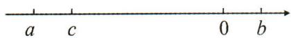

# 四、规律与新定义

14. 对于有理数 $a, b$ , 定义一种新运算“ $\odot$ ”, 规定 $a \odot b = |a + b| + |a - b|$ .

(1) 计算: $2 \odot (-3)$ 的值;

(2)已知 $a>0,(a\odot a)\odot a=8$ ,求 a 的值.

解:(1) $2\odot3=|2+(-3)|+|2-(-3)|=1+5=6;$

$$
(2) a \odot a = | a + a | + | a - a | = | 2 a | = 2 a,
$$

$$
2 a \odot a = | 2 a + a | + | 2 a - a | = | 3 a | + | a | = 4 a = 8 \text {, 解得} a = 2.
$$

15. 将正整数 1 至 2024 按照一定规律排成下表:

<table><tr><td>1</td><td>2</td><td>3</td><td>4</td><td>5</td><td>6</td><td>7</td><td>8</td></tr><tr><td>9</td><td>10</td><td>11</td><td>12</td><td>13</td><td>14</td><td>15</td><td>16</td></tr><tr><td>17</td><td>18</td><td>19</td><td>20</td><td>21</td><td>22</td><td>23</td><td>24</td></tr><tr><td>25</td><td>26</td><td>27</td><td>28</td><td>29</td><td>30</td><td>31</td><td>32</td></tr><tr><td colspan="8">......</td></tr></table>

记 $a(m,n)$ 表示第 m 行第 n 个数, 如 $a(3,2)=18$ 表示第 3 行第 2 个数是 18.

(1)直接写出: $a(4,4)=28$ , $a(8,8)=64$ ;

(2)①若 $a(m,n)=2023$ ，那么 m-n=246；

②用 m, n 表示 $a(m, n) = 8m - 8 + n$ .

解:(1)28,64;

(2)①246;②8m-8+n

# 第二章 有理数的运算

# 期末复习专题2 有理数的加减乘除运算

# 有理数的加减乘除

简便运算常用方法:①对消;②凑整;③归类;④组合;⑤逆用;⑥裂项;⑦整体;⑧倒数.

# 一、有理数的加减

1. 计算: (1) -2.4 + (-3.7) + (-4.6) + 5.7; (2) (-2.6) - (+4.7) - (-9.8) + (-3.2);

解: 原式 = -5;

解: 原式 = -0.7;

(3) $3\frac{1}{4}+(-2\frac{3}{5})+5\frac{3}{4}+(-8\frac{2}{5})$ ;

(4) $\frac{1}{1\times2}+\frac{1}{2\times3}+\frac{1}{3\times4}+\cdots+\frac{1}{99\times100}.$

解: 原式 = -2;

解: 原式= $\frac{99}{100}$ .

# 二、有理数的乘除

2. 计算：

(1) $0.25 \times (-1.25) \times (-4) \times 8;$

(2) $(-24)\times\left(\frac{1}{3}-\frac{1}{4}-\frac{1}{6}\right)$ ;

解: 原式 = 10;

解: 原式 = 2;

(3) $(-125\frac{5}{7})\div(-5)$ ;

(4) $-4\frac{1}{2}\div\frac{7}{25}\div(-2\frac{1}{4})\times(-1\frac{2}{5}).$

解: 原式 = 25 $\frac{1}{7}$ ;

解: 原式 = -10.

3. 计算：

(1) $(-3)\div3\times(-\frac{1}{3})$ ;

(2) $(- \frac{3}{4}) \times (-1 \frac{1}{2}) \div (-2 \frac{1}{4})$ .

解: 原式= $\frac{1}{3}$ ;

解: 原式 = - $\frac{1}{2}$ .

4. 计算：

(1) $\left(-\frac{5}{6}+\frac{1}{8}\right)\div\left(-\frac{1}{24}\right)$ ;

(2) $(-36\frac{9}{11})\div9.$

解: 原式 = 17;

解: 原式 = -4 $\frac{1}{11}$ .

# 三、有理数的四则混合运算

5. 计算：

(1) $(-5)\times3-(+7)\times[-2]-(-8)$ ;

(2) $-(-8)\div(-2)+3\times(-8)$ ;

解: 原式 = -57;

解: 原式 = -28;

(3) $-5-\left[-6-(-3)\times(-7)\right]$ ;

(4) $1 \div (1 \frac{1}{6} - 8 \frac{3}{4} \times \frac{2}{7}) + \frac{7}{18} \div \frac{14}{27};$

解: 原式 = 22;

解: 原式 = 0;

(5) $-8-\left[-7+\frac{3}{5}\div(-3)\right]$ ;

(6) $(-24\frac{6}{7})\div(-6)-3.5\div\frac{7}{8}\times(-\frac{3}{4})$ ;

解: 原式 = - $\frac{4}{5}$ ;

解: 原式 = 7 $\frac{1}{7}$ ;

(7) $3 \times (-5) - (-3) \div \frac{3}{8}$ ;

(8) $-13\times\frac{2}{3}+(-13)\times\frac{1}{3}+2\times13;$

解: 原式 = -7;

解: 原式 = 13;

(9) $\left(\frac{1}{2}+\frac{1}{6}-\frac{7}{12}\right)\div\left(-\frac{1}{12}\right)$ ;

(10) $99\times(-99\frac{98}{99})$ .

解: 原式 = -1;

解: 原式= $99\times(-100+\frac{1}{99})$

$$
= - 9 8 9 9.
$$

# 四、有理数的实际应用

6. 个体服装老板以每件 100 元的价格购进 30 件外套, 针对不同的顾客, 30 件外套的售价不完全相同, 若以 150 元为标准, 将超过的钱数记为正, 不足的钱数记为负, 记录的结果如下表所示:

<table><tr><td>售出件数(单位:件)</td><td>7</td><td>6</td><td>3</td><td>6</td><td>4</td><td>4</td></tr><tr><td>售价(单位:元)</td><td>+15</td><td>+10</td><td>+5</td><td>0</td><td>-5</td><td>-10</td></tr></table>

请问:(1)这30件外套中,最贵的一件比最便宜的一件贵 25 元.

(2)该老板售完30件外套,平均每件比标准价格多还是少?多或少几元?

(3)该老板售完30件外套,一共赚了多少钱?

解：(1)25；

(2) $[15 \times 7 + 10 \times 6 + 5 \times 3 + 0 \times 6 + (-5) \times 4 + (-10) \times 4] \div 30 = 120 \div 30 = 4$ (元).

答: 平均每件比标准价格多, 多 4 元;

(3) $(150+4-100)\times30=54\times30=1620$ （元）.

答:该老板售完30件外套,一共赚了1620元钱.

# 期末复习专题3 有理数的乘方及混合运算

# 一、科学记数法与近似数

1. 我国南海探明可燃冰储量约 194 亿立方米, 194 亿用科学记数法表示为 ( A )

A. $1.94 \times 10^{10}$

B. $0.194 \times 10^{10}$

C. $1.94 \times 10^{9}$

D. $19.4 \times 10^{9}$

2. 用四舍五入法按要求对 0.05802 分别取近似值, 其中错误的是 ( D )

A. 0.1(精确到 0.1)

B.0.06(精确到百分位)

C. 0.058(精确到千分位)

D. 0.058(精确到 0.0001)

# 二、有理数的乘方

3. 填空：

(1) $2^{4}=$ 16 ;

(2) $(-2)^{4}=$ 16 ;

(3) $-2^{4}=-16$ ;

(4) $(-1)^{2024}= \underline{1}$ ;

(5) $-1^{2024}=-1$ ;

(6) $-(-1)^{2024}=-1$

4. 填空：

(1) $(-3)^{2}=9$ ;

(2) $(-3)^{3}=$ -27 ;

(3) $-(-3)^{2}=-9$

5. 下列各式: ①-(-5); ②-|-5|; ③ $(-5)^{2}$ ; ④ $-5^{2}$ ; ⑤ $-(-5)^{4}$ ; ⑥ $-(-5)^{3}$ . 其结果为正数的是 ①③⑥ (填序号).

6. 对任意有理数 a，下列式子不一定成立的是（C）

A. $a^2 = (-a)^2$

B. $(-a)^{3}=-a^{3}$

C. $\left| -a \right|^3 = a^3$

D. $\left| -a^{2} \right| = a^{2}$

# 三、乘方与混合运算

7. 计算：

(1) $3^{2}\times(-\frac{1}{3})^{3}-2^{4}\div(-\frac{1}{2})$ ;

(2) $4-(-2)^{2}-3^{3}\div(-1)^{2023}+0\times(-2)^{3}$ ;

解: 原式 = 31 $\frac{2}{3}$ ;

解: 原式 = 27;

(3) $-1^{4}+8\div(-2)^{2}-(-4)\times(-3)$ ;

(4) $-3^{2}\div(-3)^{2}+3\times(-6).$

解: 原式 = -11;

解: 原式 = -19.

8. 计算：

(1) $(-2)^{3}\div\frac{4}{9}\times(-\frac{2}{3})^{3}$ ;

(2) $-2^{2}+(-2)^{3}\times5-(-\frac{3}{4})\div\frac{1}{4};$

解: 原式= $\frac{16}{3}$ ;

解: 原式 = -41;

(3) $(-3)^{2}+(-2-\frac{1}{2})^{2}\times(-\frac{4}{25})+|-2^{2}|$ ;

(4) $-2^{2}+(-2)^{2}-2^{3}+|(-2)^{3}-2|$ .

解: 原式 = 12;

解: 原式 = 2.

# 四、乘方规律

9. 如图, 下列各图中, 正方形里的四个数之间具有相同的规律, 根据此规律, 第 $n$ 个图中, $d = 2564$ , 则 $n$ 的值为 10 .

<table><tr><td>-2</td><td>2</td></tr><tr><td>-1</td><td>-1</td></tr></table>

第1个图

<table><tr><td>4</td><td>8</td></tr><tr><td>2</td><td>14</td></tr></table>

第2个图

<table><tr><td>-8</td><td>-4</td></tr><tr><td>-4</td><td>-16</td></tr></table>

第3个图

<table><tr><td>16</td><td>20</td></tr><tr><td>8</td><td>44</td></tr></table>

第4个图

...

<table><tr><td>a</td><td>b</td></tr><tr><td>c</td><td>d</td></tr></table>

第 $n$ 个图

提示:由已知图形得出 $a=(-2)^{n}, b=a+4, c=\frac{1}{2}a, d=a+b+c, \therefore a+a+4+\frac{1}{2}a=2564$ ,
解得 a = 1024, $\therefore (-2)^{n} = 1024, n = 10.$

10. 观察下列各式: $3^{1} = 3, 3^{2} = 9, 3^{3} = 27, 3^{4} = 81, 3^{5} = 243, 3^{6} = 729, \cdots$ . 小亮发现: 底数为 3 的幂的个位数字的变化有一定的规律. 请根据小亮发现的规律填空: $3^{2022}$ 的个位数字是 9 .

11. 观察下面三行数：

$$
\begin{array}{r l} & {- 2, \quad 4, - 8, \quad 1 6, - 3 2, \quad 6 4, \dots ;   ①} \\ & {0, \quad 6, - 6, \quad 1 8, - 3 0, \quad 6 6, \dots ;   ②} \\ & {3, - 3, \quad 9, - 1 5, \quad 3 3, - 6 3, \dots .   ③} \end{array}
$$

(1)第①行数的第 $n$ 个数是 $(-2)^{n}$ ;

(2)请将第②行数中的每一个数分别减去第①行数中对应位置的数,并找出规律,根据你得到的结论,直接写出第②行数的第n个数是 $(-2)^{n}+2$ ;同理直接写出第③行数的第n个数是 $-(-2)^{n}+1$ ;

(3)取每行的第 $k$ 个数,这三个数的和能否等于 $-509$ ? 如果能,请求出 $k$ 的值;如果不能,请说明理由.

解:(1)第①行数的第 n 个数是 $(-2)^{n}$ ;

(2)第②行数的第 n 个数是 $(-2)^{n}+2$ ; 第③行数的第 n 个数是 $-(-2)^{n}+1$ ;

(3) $\because (-2)^{k} + [(-2)^{k} + 2] + [-(-2)^{k} + 1] = -509, \therefore (-2)^{k} = -512, \therefore k = 9.$

即-512为第一行第9个数,所以能.

12.(1)观察一列数 $a_{1}=3, a_{2}=3^{2}, a_{3}=3^{3}, a_{4}=3^{4}, \cdots$ , 发现从第二项开始, 每一项与前一项之比是一个常数, 这个常数是 3; 根据此规律, 如果 $a_{n}$ (n 为正整数) 表示这个数列的第 $n$ 项, 那么 $a_{6}=\underline{3^{6}}$ , $a_{n}=\underline{3^{n}}$ (可用幂的形式表示);

(2)如果想要求 $1+2+2^{2}+2^{3}+\cdots+2^{10}$ 的值, 可令 $S_{10}=1+2+2^{2}+2^{3}+\cdots+2^{10}$ ①, 将①式两边同乘以 2, 得 $2S_{10}=2+2^{2}+2^{3}+\cdots+2^{11}$ ②, 由②-①, 得 $S_{10}=2^{11}-1$ ;

(3)若(1)中数列共有20项,设 $S_{20}=3+3^{2}+3^{3}+3^{4}+\cdots+3^{20}$ ,请利用上述规律和方法计算 $S_{20}$ 的值.

解:(1)每一项与前一项之比是一个常数,这个常数是3,则 $a_{6}=3^{6},a_{n}=3^{n}$ ;

(2) $\because S_{10} = 1 + 2 + 2^2 + 2^3 + \cdots + 2^{10}, \therefore 2S_{10} = 2 + 2^2 + 2^3 + \cdots + 2^{11}$ ②, $\therefore S_{10} = 2^{11} - 1$ .

(3)∵设 $S_{20}=3+3^{2}+3^{3}+3^{4}+\cdots+3^{20}$ ①,

$$
\therefore 3 S _ {2 0} = 3 ^ {2} + 3 ^ {3} + 3 ^ {4} + \dots + 3 ^ {2 1} ②,
$$

②-①, 得 $2S_{20} = 3^{21} - 3$ , $\therefore S_{20} = \frac{3^{21} - 3}{2}$ .

# 第三章 代数式

# 期末复习专题4 代数式

# 一、代数式

1. 下列式子: ① $a + b = c$ ; ② $5a$ ; ③ $x > 0$ ; ④ $x^{3}$ . 其中属于代数式的是 ( B )

A. ①③

B. ②④

C. ①②④

D. ①③④

2. 下列各式: ① $1 \frac{1}{4} x$ ; ② $20 \% x$ ; ③ $a - b \div c$ ; ④ $\frac{m - n}{3}$ ; ⑤ $(x - 5)$ 千克. 其中符合代数式书写要求的有 ( C )

A. 5 个

B. 4 个

C. 3 个

D. 2 个

# 二、代数式的意义

3. 代数式 $\frac{1}{2} (y - 3)$ 的正确含义是 (D)

A. $\frac{1}{2}$ 乘 $y$ 减3

B. $y$ 的一半减去3

C. $\frac{1}{2}y$ 的积减去3

D. y 与 3 的差的一半

4. 下列赋予 3a 实际意义的例子, 其中错误的是( D )

A. 若葡萄的价格是 3 元/kg, 则 3a 表示买 a kg 葡萄的总价

B. 若 a 表示一个等边三角形的边长, 则 3a 表示这个等边三角形的周长

C. 某款运动鞋进价为 a 元, 销售这款运动鞋盈利 50%, 则销售两双的销售额为 3a 元

D. 若 3 和 a 分别表示一个两位数中的十位数字和个位数字, 则 3a 表示这个两位数

# 三、列代数式

5. 一个两位数, 它的十位数字是 $x$ , 个位数字是 $y$ , 那么这个两位数是 (D)

A. $x + y$

B. ${10xy}$

C. ${10}\left( {x + y}\right)$

D. ${10x} + y$

6. 大米单价是每千克 3.20 元, 食用油单价是每千克 8.40 元, 买 $a$ 千克大米和 $b$ 千克食用油的总价 $(3.2a + 8.4b)$ 元.

7. 圆柱的高为 $x$ , 底面半径为 $r$ , 则圆柱的体积是 (C)

A. $\frac{1}{4}\pi r^2 x$

B. $\frac{1}{2}\pi r^{2}x$

C. $\pi r^{2}x$

D. $\frac{1}{3}\pi r^{2}x$

# 四、反比例关系

8. 下面各种关系中, 成反比例关系的是 ( C )

A. 铺地面积一定,每块砖的边长和砖的数量

B. 如果 3x=4y，则 y 与 x

C. 长方形的面积一定, 它的长和宽

D. 速度一定,行驶的路程和时间

9. 某商店要销售一批榨汁机, 平均每天销售量和所需天数如下表:

<table><tr><td>平均每天销售量m/台</td><td>30</td><td>20</td><td>18</td><td>15</td></tr><tr><td>所需天数t/天</td><td>6</td><td>9</td><td>10</td><td>12</td></tr></table>

(1)平均每天销售量 m 和所需天数 t 的关系式是 $mt = 180$ ;

(2)如果计划用5天销售完这批榨汁机,那么平均每天销售量是 36 台.

# 五、求代数式的值

# (一) 直接求值

10. 根据下列条件, 求 $\frac{x^2 + y^2}{x - y}$ 的值.

(1) $x = -3, y = 1$ ;

(2) $x=\frac{3}{2},y=-\frac{1}{2}.$

解:(1)当 x=-3,y=1 时, $\frac{x^{2}+y^{2}}{x-y}=\frac{(-3)^{2}+1^{2}}{-3-1}=-\frac{5}{2}$ ;

(2) 当 $x = \frac{3}{2}, y = -\frac{1}{2}$ 时, $\frac{x^2 + y^2}{x - y} = \frac{\left(\frac{3}{2}\right)^2 + \left(-\frac{1}{2}\right)^2}{\frac{3}{2} - \left(-\frac{1}{2}\right)} = \frac{5}{4}$ .

# (二)整体求值

11. 若 $2 y - 3 x = 5$ , 则代数式 $8 + 6 x - 4 y$ 的值是 ( A )

A.-2

B. 0

C. 7

D. -3

12. 当 x=2 时, 代数式 $ax^{3}+bx-1$ 的值为 -100, 那么当 x=-2 时, 代数式 $ax^{3}+bx-1$ 的值为 ( C )

A. 100

B. -100

C. 98

D. -98

# (三)列式求值

13. 师傅每小时加工 a 个零件, 徒弟每小时加工 b 个零件, 两人合做 m 小时.

(1)用含有字母的式子表示师徒两人共加工的零件数是 $(ma+mb)$ 件；  
(2) 如果 a=6, b=4, m=5，求师徒两人共加工的零件数.

解:(1)(ma+mb);

(2) 当 a=6, b=4, m=5 时，

$$
m a + m b = 5 \times 6 + 5 \times 4 = 3 0 + 2 0 = 5 0.
$$

答:师徒两人共加工 50 件零件.

14. 如图, 一个十字形花坛铺上了草皮, 四个角没有植草的部分都是正方形.

(1)此花坛草地的面积,可以用代数式表示为 $ab-4c^{2}$ ;  
(2) 若 $a=14\ m, b=8\ m, c=2\ m$ ，此花坛草地的面积是多少平方米？

解:(1)因为 $S_{草地部分} + 4S_{小正方形} = S_{大长方形}$ ，所以 $S_{草地部分} = ab - 4c^{2}$ ，

故答案为 $ab - 4c^2$ ；

(2) 当 $a = 14, b = 8, c = 2$ 时, $ab - 4c^2 = 14 \times 8 - 4 \times 2^2 = 96(\mathbf{m}^2)$ ,

答:花坛草地的面积是 $96 \, m^{2}$ .

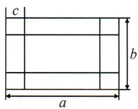

text_image

c
b
a

# (四)程序求值

15. 按下面的程序计算：

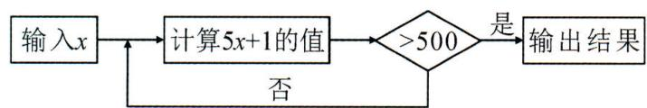

flowchart

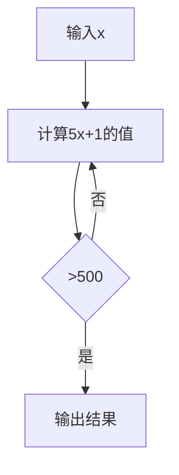

若输入 x=100，输出结果是 501；若输入 x=25，输出结果是 631。

# 第四章 整式的加减

# 期末复习专题5 整式的有关概念

# 一、单项式的系数与次数

1. 单项式 $-xy^{3}z^{4}$ 的系数及次数分别是 (D)

A. 系数是 0, 次数是 7

B. 系数是 1, 次数是 8

C. 系数是 -1, 次数是 7

D. 系数是 -1, 次数是 8

2. 单项式 $\frac{3^{2}\pi x^{2}y}{5}$ 的次数是 3，系数是 $\frac{9\pi}{5}$ .

# 二、多项式的项数与次数

3. 关于多项式 $x^{2} + y^{2} - 1$ 的项数及次数, 下列说法正确的是 ( C )

A. 项数是 2, 次数是 2

B. 项数是 2, 次数是 4

C. 项数是 3, 次数是 2

D. 项数是 3, 次数是 4

4. 当 $m = \underline{2}$ 时， $(m + 2)x^{m^{2}-1}y^{2} - 3xy^{3}$ 是五次二项式.

# 三、同类项与合并同类项

5. 下列各组单项式中为同类项的是( D )

A. $3x^{2}y$ 和 $-3xy^{2}$

B. $-0.2a^{2}b$ 和 $-\frac{2}{3} b^{2}a$

C. $3abc$ 和 $\frac{1}{3} ab$

D. -x 和 $\pi x$

6. 下列各组整式中, 不是同类项的是 ( D )

A.-ab 与 ba

B. $5^{2}$ 与 $2^{5}$

C. $0.2a^{2}b$ 与 $-\frac{1}{2}a^{2}b$

D. $a^2 b^3$ 与 $-a^3 b^2$

7. 若 $2a^{x + 7}b^4$ 与 $3a^4 b^{2y}$ 是同类项, 则 $x^y$ 的值是 (A)

A. 9

B. -9

C. 6

D. - 6

8. 下列运算中正确的是( B )

A. $2 a + 3 b = 5 a b$

B. $a^2 b - ba^2 = 0$

C. $a^3 + 3a^2 = 4a^5$

D. $3a^{2} - 2a^{2} = 1$

9. 下列运算中正确的是( A )

A. $3x^{2} - 2x^{2} = x^{2}$

B. $2m - 3m = -1$

C. $a^2 b - ab^2 = 0$

D. $3a + 2a = 5a^{2}$

10. 若单项式 $3x^{m-5}y^{2}$ 与 $x^{3}y^{2}$ 的和是单项式，则常数 m 的值是 \_\_\_\_。

# 四、代数式表示实际问题

11. 长方形的长为 $3a$ , 宽为 $2a - b$ , 则这个长方形的周长为 (A)

A. ${10a} - {2b}$

B. ${10a} + {2b}$

C. $6 a - 2 b$

D. ${10a} - b$

12. 如图“L”形图形的面积有如下四种表示方法：

① $a^{2}-b^{2}$ ; ② $a(a-b)+b(a-b)$ ; ③ $(a+b)(a-b)$ ; ④ $(a-b)^{2}$ ，其中正确的表示方法有（C）

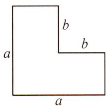

A. 1 种

B. 2 种

C. 3 种

D. 4 种

13. 某种商品进价为 $a$ 元/件, 在销售旺季, 商品售价比进价高 $30\%$ ; 销售旺季过后, 商品又以 7 折 (即原售价的 $70\%$ ) 开展促销活动, 这时一件该商品的售价为 (D)

A. $a$ 元

B. $0.7 a$ 元

C. $1.03a$ 元

D. 0.91a 元

14. 甲地的海拔高度是 $h$ 米, 乙地的海拔高度比甲地海拔高度的 3 倍多 20 米, 丙地的海拔高度比甲地海拔高度的 2 倍少 30 米.

(1)三地的海拔高度和是多少米?
(2)乙地的海拔高度比丙地海拔高度高多少米?

解:(1) $h+3h+20+2h-30=6h-10.$

答:三地的海拔高度和是 $(6h-10)$ 米.

(2) $3h+20-(2h-30)=3h+20-2h+30=h+50.$

答: 乙地比丙地高 $(h+50)$ 米.

# 五、整式中的整体代入思想

15. 设 a - 3b = 5，则 $2(a - 3b)^{2} + 3b - a - 15$ 的值是 \_\_\_\_。  
16. 若 a-b=-7, c+d=3，则 $(b+c)-(a-d)$ 的值是 10。  
17. 已知当 $x = 1$ 时, 多项式 $ax^3 + bx - 3$ 的值为 $-2023$ , 当 $x = -1$ 时, 多项式 $ax^3 + bx + 3$ 的值为 2023 .

# 六、整式与图形拼接问题

18. 如图 1, 把一个长为 $m$ , 宽为 $n$ 的长方形 $(m > n)$ 沿虚线剪开, 拼接成图 2, 成为在一角去掉一个小正方形后的一个大正方形, 则去掉的小正方形的边长为 ( A )

A. $\frac{m - n}{2}$

B. $m - n$

C. $\frac{m}{2}$

D. $\frac{n}{2}$

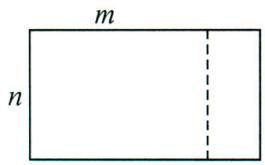  
图1

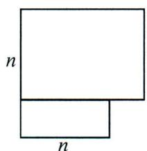  
图2  
第 18 题图

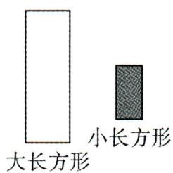

text_image

大长方形
小长方形

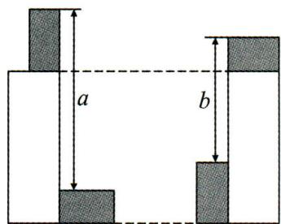

text_image

a
b

第 19 题图

19. 如图,有四个大小相同的小长方形和两个大小相同的大长方形按如图位置摆放,按照图中所示尺寸,则小长方形的长与宽的差是( B )

A. ${3b} - {2a}$

B. $\frac{a-b}{2}$

C. $\frac{a - b}{3}$

D. $\frac{a}{3}-\frac{b}{4}$

解:设小长方形的长为 x, 宽为 y, 则 $a + y - x = b + x - y$ , 即 2x - 2y = a - b, $\therefore x - y = \frac{a - b}{2}$ , $\therefore$ 选 B.

# 期末复习专题6 整式的加减

# 一、整式计算

1. 计算：

(1) $a-(2a-2)$ ;

(2) $-(5x+y)-3(2x-3y)$ ;

解: $2 - a$ ;

解：-11x+8y；

(3) $2a+(a+b)-2(a+b)$ ;

(4) $2a-\left[3b-5a-(2a-7b)\right]$ ;

解: $a - b$ ;

解:9a-10b;

(5) $-3x^{2}y+2x^{2}y+3xy^{2}-2xy^{2};$

(6) $5(a+b)-4(3a-2b)+3(2a-3b)$ .

解： $-x^{2}y+xy^{2}$ ;

解： $-a + 4b$

# 二、化简求值

2. 先化简, 再求值: $\frac{1}{2} x - 2\left(x - \frac{1}{3} y^{2}\right) + \left(-\frac{3}{2} x + \frac{1}{3} y^{2}\right)$ , 其中 $x = -2, y = \frac{1}{2}$ .

解: 原式 $= -3x + y^{2}$ ，将 x = -2, $y = \frac{1}{2}$ 代入，得原式 $= \frac{25}{4}$ .

3. 先化简, 再求值: $5(3x^{2}y - xy^{2}) - (xy^{2} + 3x^{2}y)$ , 其中 $x = 1, y = -1$ .

解: 原式 $=15x^{2}y-5xy^{2}-xy^{2}-3x^{2}y=12x^{2}y-6xy^{2}$ ,

当 x=1, y=-1 时，原式 $=12x^{2}y-6xy^{2}=-12-6=-18$ .

4. 先化简, 再求值: $\frac{1}{2} x - 2\left(x - \frac{1}{3} y^2\right) + \left(-\frac{2}{3} x + \frac{1}{3} y^2\right)$ , 其中 $x = -3, y = 2$ .

解: 原式= $\frac{1}{2}x-2x+\frac{2}{3}y^{2}-\frac{2}{3}x+\frac{1}{3}y^{2}=-\frac{13}{6}x+y^{2}$ ,

当 x = -3, y = 2 时，原式 $= -\frac{13}{6} \times (-3) + 2^{2} = \frac{13}{2} + 4 = \frac{21}{2}$ .

5. 先化简, 再求值: $-3x^{2}y + [4xy - 2(3xy - 2x^{2}y) + xy]$ , 其中 x = -3, y = 2.

解: 原式 $= -3x^{2}y + [4xy - 6xy + 4x^{2}y + xy] = x^{2}y - xy$ ,

当 x = -3, y = 2 时，原式 $= (-3)^{2} \times 2 - (-3) \times 2 = 18 + 6 = 24.$

# 三、重点考试题型: 多项式中不含某项或多项式的值与某字母无关

6. 已知关于 $x, y$ 的多项式 $ax^2 + 2bxy + x^2 - x - 2xy + y$ 不含二次项，求 $a, b$ 的值.

解: 原式 $=(a+1)x^{2}+(2b-2)xy-x+y$ , 依题意, 有 $a+1=0$ 且 2b-2=0,

$$
\therefore a = - 1, b = 1.
$$

7. 已知 $A=2x^{2}+4xy-2x-3, B=-x^{2}+xy+2$ . 若 $3A+6B$ 的值与 x 无关, 求常数 y 的值.

解: 将 $A=2x^{2}+4xy-2x-3$ , $B=-x^{2}+xy+2$ 代入 $3A+6B$ ,

$$
\begin{array}{l} = 6 x ^ {2} + 1 2 x y - 6 x - 9 - 6 x ^ {2} + 6 x y + 1 2 \\ = 1 8 x y - 6 x + 3 \\ = (1 8 y - 6) x + 3. \\ \end{array}
$$

得 $3A + 6B = 3(2x^{2} + 4xy - 2x - 3) + 6(-x^{2} + xy + 2)$

因为 $3A + 6B$ 的值与 x 无关, 所以 18y - 6 = 0, 所以 $y = \frac{1}{3}$ .

# 四、整式规律

8. 观察下面的三行单项式

$$
\begin{array}{l} x, \quad 2 x ^ {2}, \quad 4 x ^ {3}, \quad 8 x ^ {4}, \quad 1 6 x ^ {5}, \quad 3 2 x ^ {6}, \dots \dots ① \\ - 2 x, \quad 4 x ^ {2}, \quad - 8 x ^ {3}, \quad 1 6 x ^ {4}, \quad - 3 2 x ^ {5}, \quad 6 4 x ^ {6}, \dots \dots \textcircled {2} \\ 2 x ^ {2}, - 3 x ^ {3}, \quad 5 x ^ {4}, - 9 x ^ {5}, \quad 1 7 x ^ {6}, - 3 3 x ^ {7}, \dots \dots \textcircled {3} \\ \end{array}
$$

(1)根据你发现的规律,第①行第8个单项式为 $128x^{8}$ ;  
(2)第②行第8个单项式为 $256x^{8}$ ，第③行第8个单项式为 $-129x^{9}$ ；  
(3)取每行的第9个单项式,令这三个单项式的和为A,当 $x=\frac{1}{2}$ 时,求 $512(A+\frac{1}{4})$ 的值.

解:(1) $128x^{8}$ ;

(2) $256x^{8}$ , $-129x^{9}$ ;

(3) $A=2^{8}x^{9}-2^{9}x^{9}+(2^{8}+1)x^{10}$ ，当 $x=\frac{1}{2}$ 时， $512(A+\frac{1}{4})=2^{9}\left(\frac{1}{2}-1+\frac{1}{4}+\frac{1}{2^{10}}+\frac{1}{4}\right)=\frac{1}{2}$ .

# 第五章 一元一次方程

# 期末复习专题7 解一元一次方程

# 一、等式性质

1. 下列等式变形正确的是( D )

A. 由 $7x = 5$ 得 $x = \frac{7}{5}$

B. 由 $\frac{x}{0.2} = 1$ 得 $\frac{x}{2} = 10$

C. 由 $2 - x = 1$ 得 $x = 1 - 2$

D. 由 $\frac{x}{2} - 2 = 1$ 得 $x - 4 = 2$

2. 已知 $m = n$ , 则下列变形中: ① $m + 2 = n + 2$ ; ② $bm = bn$ ; ③ $\frac{m}{n} = 1$ ; ④ $\frac{m}{b^2 + 2} = \frac{n}{b^2 + 2}$ . 其中结论正确的个数为 (C)

A. 1 个

B. 2 个

C. 3 个

D. 4 个

# 二、一元一次方程

(一)运用合并同类项解一元一次方程

3. ${2x} - {4x} - {3x} = 5$ .

4. ${10m} - {8m} = 2 - 6$ .

解: $x = -1$ .

解:m = -2.

5. $\frac{7}{5}y-\frac{4}{5}y=-4+9.$

6. $\frac{x}{3} + \frac{x}{15} + \frac{x}{35} = 1$ .

解: $y = \frac{25}{3}$ .

解: $x = \frac{7}{3}$ .

(二)运用移项解一元一次方程

7. $4 x = 5 + 3 x$ .

8. $3y + 7 = -3y - 5.$

解:x=5.

解:y=-2.

9. $\frac{4}{3}-8x=3-\frac{11}{2}x.$

10. $|x - 2| = 3$ .

解: $x = -\frac{2}{3}$ .

解: $x - 2 = \pm 3, x = 5$ 或 $-1$ .

(三)运用去括号解一元一次方程

11. $5x + 2 = 3(x + 2)$ .

12. $3-(1+2x)=2x$ .

解:x=2.

解: $x = \frac{1}{2}$ .

13. $15-(7-5x)=2x+(5-3x)$ .

14. $3(y+2)-2(y-\frac{3}{2})=5-4y.$

解: $x = -\frac{1}{2}$ .

解: $y = -\frac{4}{5}$ .

# (四)运用去分母解一元一次方程

15. $\frac{x - 1}{2} -\frac{3}{8} x = 1.$

16. $\frac{2y - 1}{4} = 1 - \frac{3 - y}{8}$ .

解:x=12.

解: $y=\frac{7}{3}$ .

17. $\frac{x + 1}{3} -\frac{x - 2}{6} = 2 - \frac{x}{2}.$

18. $\frac{x + 2}{4} +\frac{x}{8} -\frac{2x - 1}{12} -1 = 0.$

解:x=2.

解:x=2.

# (五)方程中参数问题

19. 已知关于 $x$ 的方程 $5x + 1 = 4x + a$ 的解是 $x = -3$ , 求代数式 $6a^2 + (5a^2 - 2a) - 2(a^2 - 3a)$ 的值.

解：∵方程 $5x+1=4x+a$ 的解是 x=-3，∴ $5\times(-3)+1=4\times(-3)+a$ ，解得 a=-2，
原式 $=9a^{2}+4a=28.$

20. 关于 x 的方程 $\frac{3x+a}{2}-2=a$ 与方程 $8x-2(3x+2)=-5$ 的解互为倒数，求 a 的值.

解: $8x - 2(3x + 2) = -5, 2x = -1, \therefore x = -\frac{1}{2}, \therefore$ 方程 $\frac{3x + a}{2} - 2 = a$ 的解为 x = -2,

$$
\therefore 3 x + a - 4 = 2 a, \therefore 3 x - 4 = a, \therefore a = 3 \times (- 2) - 4 = - 1 0.
$$

21. 已知关于 $x$ 的方程 $4x - 1 = 3x - 2a$ ①与方程 $x + 2a = 4x + 1$ ②的解相同, 求 $a$ 的值.

解:由①,得 x=1-2a,由②,得 $x=\frac{2a-1}{3}$ ,

∵①与②同解，∴ $1-2a=\frac{2a-1}{3}$ ，解得 $a=\frac{1}{2}$ .

# 期末复习专题8 实际问题与一元一次方程

# 一、相遇问题

1. A, B 两地相距 70 千米, 甲从 A 地出发, 每小时行 15 千米, 乙从 B 地出发, 每小时行 20 千米.

(1)若两人同时出发,相向而行,则经过几小时两人相遇?   
(2)若两人同时出发,相向而行,则几小时后两人相距10千米?

解:(1)设经过 x 小时两人相遇,依题意,得 $15x + 20x = 70$ , 解得 x = 2.

答:经过2小时两人相遇:

(2) 设 b 小时后两人相距 10 千米, $156 + 50b \pm 10 = 70$ , 解得 $b = \frac{16}{7}$ 或 $b = \frac{12}{7}$ ,

答: $\frac{12}{7}$ 小时或 $\frac{16}{7}$ 小时后两人相距10千米.

# 二、追击问题

2. 如图, 现有两条乡村公路 $AB, BC, AB$ 长为 1200 米, $BC$ 长为 1600 米, 一个人骑摩托车从 $A$ 处以 200 米/分的速度匀速沿公路 $AB, BC$ 向 $C$ 处行驶; 另一人骑自行车从 $B$ 处以 100 米/分的速度从 $B$ 向 $C$ 行驶, 并且两人同时出发.

(1)求经过多少分钟摩托车追上自行车?  
(2)求两人均在行驶途中时,经过多少分钟两人在行进路线上相距150米?

解:(1)设经过 x 分钟摩托车追上自行车,依题意,得 $200x=100x+1\ 200$ , 解得 x=12.
答: 经过 12 分钟摩托车追上自行车;

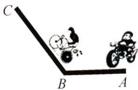

natural_image

Simple line drawing of two tractors on a slope, labeled A, B, and C (no text or symbols beyond labels)

(2)设经过 $v$ 分钟两人相距 150 米,

第一种情况:摩托车还差150米追上自行车时,200v-1 200=100v-150,解得y=10.5;

第二种情况:摩托车超过自行车150米时, $200y=150+100y+1200$ ,解得y=13.5.

答:经过 10.5 分钟或 13.5 分钟两人相距 150 米.

# 三、顺、逆航行问题

3. 一架飞机从 $A$ 城市飞往 $B$ 城市顺风行驶, 用了 2.8 小时; 从 $B$ 城市返回 $A$ 城市逆风飞行,用了 3 小时. 已知风的速度是 24 千米/时, 求飞机在无风航行时的平均速度.

解:设飞机在无风航行时的平均速度是 v 千米/时.依题意,得 $2.8(v+24)=3(v-24)$ , 解得 v=696.

答:飞机在无风时平均速度是696千米/时.

# 四、上下坡问题

4. 少先队从夏令营到学校, 先下山再走平路, 一队员骑自行车以每小时 12 千米的速度下山, 以每小时 9 千米的速度走平路, 到学校共用了 55 分钟; 回来时, 通过平路的速度不变, 但以每小时 6 千米的速度上山, 回到营地共花去了 70 分钟的时间, 问夏令营到学校多少千米?

解:设走平路用了 x 小时,则下坡用了 $\left(\frac{11}{12}-x\right)$ 小时,上坡用了 $\left(\frac{7}{6}-x\right)$ 小时;

依题意, 得 $12\left(\frac{11}{12}-x\right)=6\left(\frac{7}{6}-x\right)$ , 解得 $x=\frac{2}{3}$ , 所以 $12\left(\frac{11}{12}-x\right)+9x=9$ .

答:夏令营到学校9千米.

# 五、配套问题

5. 一张圆桌由一个桌面和四条桌腿组成. 如果 $1 \mathrm{~m}^{3}$ 木料可以制作圆桌的桌面 50 个, 或制作桌腿 300 条, 那么 $5 \mathrm{~m}^{3}$ 的木料如何分配可以使桌面和桌腿正好配套? 最多能制作成多少张圆桌?

解: 设 $x \, m^{3}$ 制作桌面, 依题意, 得 $4 \times 50x = 300(5 - x)$ , 解得 x = 3, 5 - x = 2.

$3 \times 50 = 150$ (张).

答: 略.

# 六、调配问题

6. 一车间原有工人 83 人,二车间原有工人 378 人. 现因工作需要,从三车间调了 4 人到一车间. 问:还需要从二车间调多少人到一车间,才能使一车间的人数是二车间人数的一半?

解:设需从二车间调 x 人去一车间,依题意,得 $83+4+x=\frac{1}{2}(378-x)$ , 解得 x=68.

答:还需要从二车间调68人到一车间,才能使一车间的人数是二车间人数的一半.

# 七、分配问题

7. 志愿者小组准备利用午休时间把校门口的自行车摆放整齐,小组长进行分工时(小组长也参与摆放)发现:如果每人摆放 10 辆自行车,则还剩 6 辆自行车;如果每人摆放 12 辆自行车,则有一名同学少摆放 6 辆自行车.请问:这个志愿者小组有几名同学,校门口有几辆自行车需要摆放?

解:设这个志愿者小组有 x 名同学,根据题意,得 $10x+6=12x-6$ , 解得 x=6, $10x+6=66$ .

答: 这个志愿者小组有 6 名同学, 校门口有 66 辆自行车需要摆放.

# 八、数字问题

8. 一个三位数, 三个数位上的数的和是 17, 百位上的数比十位上的数大 7, 个位上的数是十位上数的 3 倍, 求这个数.

解:设十位上数字为 x, 百位上的数为 $x+7$ , 个位上的数为 3x,

依题意, 得 $x+7+x+3x=17$ , 解得 x=2.

答: 这个三位数是 926.

# 九、工程问题

9. 某车间每天需生产 50 个零件才能在规定的时间内完成一批零件的生产任务,实际上该车间每天比计划多生产了 6 个零件,结果比规定的时间提前三天并超额生产 120 个零件,问该车间要完成的零件任务为多少个?

解:设该车间要完成的零件任务为 x 个,实际完成的零件的个数为 $x+120$ , 实际每天生产的零件个数为 $50+6$ , 依题意, 得 $\frac{x}{50}-\frac{x+120}{50+6}=3$ , 解得 x=2400.

答:该车间要完成的零件任务为 2400 个.

# 十、日历表问题

10. 把正整数 1,2,3,4,…,2009 排列成如图所示的一个表.

(1)用一正方形在表中随意框住 4 个数, 把其中最小的数记为 $x$ , 另三个数用含 $x$ 的式子表示出来, 从小到大依次是 $\underline{x+1}$ , $\underline{x+7}$ , $\underline{x+8}$ ;

1 2 3 4 5 6 7
8 9 10 11 12 13 14
15 16 17 18 19 20 21
22 23 ... ... ... ... ...

(2)在(1)前提下,当被框住的4个数之和等于416时,x的值是多少?

(3)在(1)前提下,被框住的4个数之和能否等于660?如果能,请求出此时x的值;如果不能,请说明理由.

解:(2)依题意,得 $x+(x+1)+(x+7)+(x+8)=416$ , 解得 x=100;

(3) 被框住的 4 个数之和不可能等于 660, 理由如下:

$$
\because x + (x + 1) + (x + 7) + (x + 8) = 6 6 0, 4 x + 1 6 = 6 6 0,
$$

x=161, $161=7\times23$ , 是第 23 行最后一个数, 不合题意, ∴ 被框住的 4 个数之和不可能等于 660.

# 第六章 几何图形初步

# 期末复习专题9 线段

# 一、视图、展开图

1. 如图, 是一个由多个相同小正方体堆积而成的几何体的俯视图 (从上往下看), 图中所示数字为该位置小正方体的个数, 则这个几何体的主视图 (从正面看) 是 ( B )

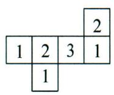

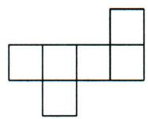  
A

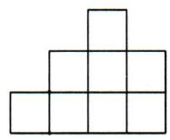  
B

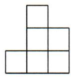  
C

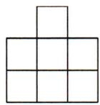  
D

2. 下列图形中可以作为一个正方体的展开图的是 ( C )

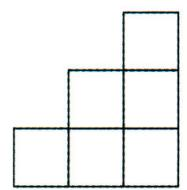  
A

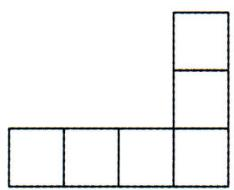  
B

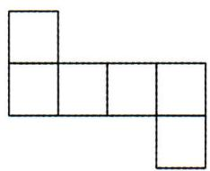  
C

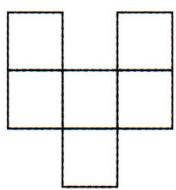  
D

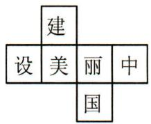

3. 如图是每个面上都有一个汉字的正方体的一种展开图,那么在正方体的表面与“建”相对的汉字是 国 .

# 二、线段作图问题

4.(1)如图1,在一条笔直的公路两侧,分别有A,B两个村庄,现在要在公路l上建一座供电厂,向A,B两个村庄供电,为使所用的电线最短,请问供电厂P应建在何处?画出图形,不写作法,保留作图痕迹

(2)如图2,若要向4个村庄A,B,C,D供电,供电厂P又该建立在何处呢?画出图形,不写作法,保留作图痕迹.

解:(1)连AB交l于点P;

(2) 连接 AC, BD 交于点 P.

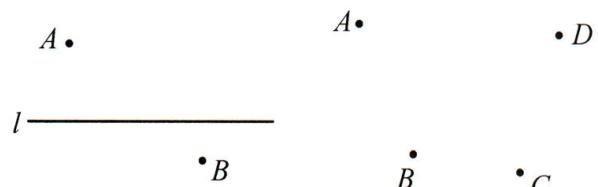

text_image

A
l
B
A
B
C
D

图1  
图2

5. 如图, 已知线段 $AB$ .

(1)尺规作图:反向延长AB到点C,使AC=AB;   
(2) 若点 M 是 AC 中点, 点 N 是 BM 中点, MN = 3cm, 求 AB 的长.

解:(1)图略;

A B

(2)由点 M 是 AC 中点, 点 N 是 BM 中点, 得 $MN = \frac{1}{2}BM$ , $MC = \frac{1}{2}AC = \frac{1}{2}AB$ , BC = 2AB,

$$
M N = \frac {1}{2} (B C - C M) = \frac {1}{2} (2 A B - \frac {1}{2} A B) = \frac {3}{4} A B. \because M N = 3 \mathrm{cm}, \therefore A B = 4 \mathrm{cm}.
$$

# 三、已知部分求整体

6. 如图, $M$ 是线段 $AB$ 的中点, $N$ 是线段 $AM$ 上的点, 且满足 $AN: MN = 1: 2$ , 若 $AN = 2 \mathrm{~cm}$ , 求 $AB$ 的长.

解：∵AN:MN=1:2，且AN=2cm，∴MN=4cm，∴AM=6cm.

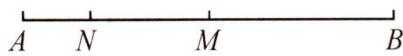

∵M是线段AB的中点，∴AB=2AM，∴AB=12cm.

# 四、已知整体求部分

7. 如图, 已知 AB = 20, C 是 AB 上的一点, D 为 CB 上的一点, E 为 DB 的中点, DE = 3.

(1) 若 CE=8，求 AC 的长；

(2) 若 C 是 AB 的中点, 求 CD 的长.

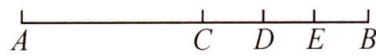

解:(1)∵E为DB的中点,∴BE=DE=3,∵CE=8,∴BC=CE+BE=11,∴AC=AB-BC=9;

(2) $\because E$ 为DB的中点, $\therefore BD=2DE=6$ ,

∵C 是 AB 的中点, ∴ $BC = \frac{1}{2}AB = 10$ , ∴ CD = BC - BD = 10 - 6 = 4.

# 五、已知部分求部分

8. 如图, $AB = 30$ , $C$ 是 $AB$ 的中点, $D$ 是 $AB$ 的延长线上的一点, 且 $CB: BD = 3: 2$ . 求 $CD$ 的长.

解：∵AB=30,C 是 AB 的中点，∴BC=15，

$$
\because C B: B D = 3: 2, \therefore B D = 1 0, \therefore C D = C B + B D = 1 5 + 1 0 = 2 5.
$$

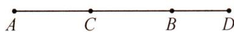

9. 如图, $AB = 38 \mathrm{~cm}$ , 延长线段 $AB$ 到点 $C$ , 使 $BC = 10 \mathrm{~cm}$ , 再反向延长 $AB$ 到点 $D$ , 使 $AD = 30 \mathrm{~cm}, E$ 是 $AD$ 中点, $F$ 是 $CD$ 的中点. 求 $EF$ 的长.

解：∵AD=30cm,AB=38cm,BC=10cm,

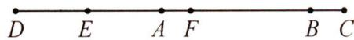

$$
\therefore D C = A D + A B + B C = 7 8 \mathrm{cm},
$$

∵ F 是 CD 的中点, ∴ $DF = \frac{1}{2} DC = 39cm$ ,

∵E是AD中点，∴ $DE=\frac{1}{2}AD=15cm$ ，∵EF=DF-DA，∴EF=39cm-15cm=24cm.

# 六、整体法求线段长

10. 如图, $C$ 是线段 $AB$ 上一点, $M$ 是 $AC$ 的中点, $N$ 是 $BC$ 的中点.

(1) 若 AM=1, BC=4, 求 MN 的长;  
(2) 若 MN=5，求 AB 的长度.

解:(1)∵N是BC的中点,M是AC的中点,AM=1,BC=4,

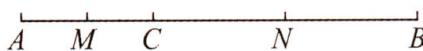

$$
\therefore C N = 2, A M = C M = 1, \therefore M N = M C + C N = 3;
$$

(2) $\because M$ 是AC的中点,N是BC的中点,MN=5,

$$
\therefore A B = A C + B C = 2 C M + 2 C N = 2 (C M + C N) = 2 M N = 1 0.
$$

# 七、列方程求线段长

11. 如图, 点 $A, M, B, C, N, D$ 在一条直线上, 若 $AB: BC: CD = 2: 3: 2$ , $AB$ 的中点 $M$ 与 $CD$ 的中点 $N$ 的距离是 $11 \mathrm{~cm}$ , 求 $AD$ 的长.

解: 设 $AB = 2x \, cm, BC = 3x \, cm, CD = 2x \, cm.$

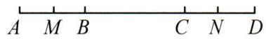

∵M是AB的中点，∴MB=xcm.∵N是CD的中点，∴NC=xcm,

∵MN=11cm,∴x+3x+x=11.解得x=2.2,AD=2x+3x+2x=7x=15.4cm.

12. 如图, E 是线段 AB 的中点, C 是 EB 上一点, AC = 12cm.

(1) 若 $EC: CB = 1:4$ , 求 $AB$ 的长:  
(2)若 F 为 CB 的中点,求 EF 长.

解:(1)设 EC=x, 则 CB=4x, AE=EB=5x, AC=6x=12, x=2,

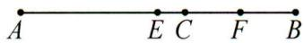

$$
\therefore A B = 1 0 x = 2 0 (\mathrm{cm}).
$$

(2) 设 $EC = x$ ，则 $AE = 12 - x = EB, CB = EB - EC = 12 - 2x, CF = FB = 6 - x$

$$
E F = E C + C F = 6 \mathrm{cm}.
$$

# 八、分类讨论求线段长

13. 在直线 l 上有四个点 A, B, C, D, 已知 AB = 24, AC = 6, 点 D 是 BC 的中点, 求 AD 的长.

解:AD=15 或 9.

14. 如图, $AB = 14$ , $AC: BC = 3:4$ , 若点 $D$ 是 $AC$ 的三等分点, 点 $E$ 是 $BC$ 的中点, 求 $DE$ 的长.

解: $DE = 6$ 或 8.

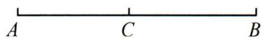

15.(1)如图,点 C 在线段 AB 上,且 AC=6cm,BC=4cm,M,N 分别是 AC,BC 的中点,求 MN 的长;

(2)若点 C 是直线 AB 上任意一点, 且 AC = a, BC = b, 点 M, N 分别是 AC, BC 的中点, 求 MN 的长. (用含 a, b 的代数式表示)

解：(1) $5 \mathrm{~cm}$ ;

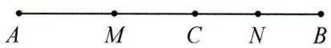

(2) 当点 C 在线段 AB 上时, $MN = \frac{1}{2}(a + b)$ ;

当点 C 在线段 AB 的延长线时, 则 AC = a > BC = b, MN = CM - CN = $\frac{1}{2}(a - b)$ ;

当点 C 在线段 BA 的延长线时, 则 AC = a < BC = b, MN = CN - CM = $\frac{1}{2}(b - a)$ .

综上,线段 MN 的长度会变化, $MN=\frac{1}{2}(a+b)$ 或 $\frac{1}{2}(a-b)$ 或 $\frac{1}{2}(b-a)$ .

# 期末复习专题10 角

# 一、角度换算与技巧

1.(1)32.43°= 32° 25' 48";

(2) $78.36^{\circ} = \underline{78}^{\circ}\underline{21}^{\prime}\underline{36}^{\prime \prime}$ .

2.(1) $23^{\circ}30'=\underline{23.5}$ ℃;

(2) $65^{\circ}43'12''= \underline{65.72}^{\circ}$ .

3. 计算：

(1) $37^{\circ}28' + 44^{\circ}49' = \underline{82^{\circ}17'}$ ;

(2) $108^{\circ}18'-52^{\circ}30''=$ $56^{\circ}17'30''$ ;

(3) $25^{\circ}36'\times4=$ $102^{\circ}24'$ ;

(4) $40^{\circ}40^{\prime}\div3=$ $13^{\circ}33^{\prime}20^{\prime\prime}$

# 二、方位角

4. 如图, $OA$ 的方向是北偏东 $15^{\circ}, OC$ 的方向是北偏西 $40^{\circ}$ , 若 $\angle AOC = \angle AOB$ , 则 $OB$ 的方向是 北偏东 $70^{\circ}$ .

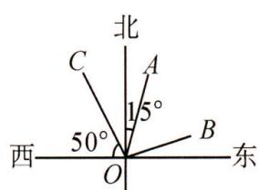

text_image

北
C
A
15°
西
50°
O
B
东

第 4 题图

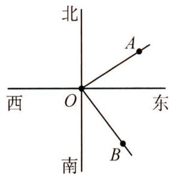

text_image

北
西 O 东
南
A
B

第 5 题图

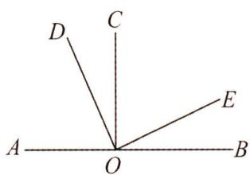

text_image

D
C
A
O
B
E

第 7 题图

5. 如图, 某海域有三个小岛 $A, B, O$ , 在小岛 $O$ 处观测到小岛 $A$ 在它北偏东 $61^{\circ}$ 的方向上, 观测到小岛 $B$ 在它南偏东 $38^{\circ}$ 的方向上, 则 $\angle AOB$ 的度数是 $81^{\circ}$ .

# 三、钟表中角度的问题

6.(1)现代人常常受到颈椎不适的困扰,其症状包括:酸胀、隐痛、发紧、僵硬等,而将两臂向上抬,举到10点10分处,每天连续走200米,能有效缓解此症状;这里的10点10分处指的是时钟在10点10分时时针和分针的夹角,这个夹角的度数为 $115^{\circ}$ .

(2)当时间为5点40分时,钟表上时针和分针所成的角度是 $70^{\circ}$ .

# 四、互余与互补

7. 如图, 点 $A, O, B$ 在同一直线上, $\angle AOC = 90^{\circ}, \angle DOE = 90^{\circ}$ , 图中互为补角的角共有 ( C )

A. 5 对

B. 6 对

C. 7 对

D. 8 对

8. 如图, 将一副三角尺按不同的位置摆放, 其中 $\angle \alpha$ 与 $\angle \beta$ 互余的是 ( A )

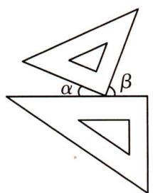

text_image

α
β

A

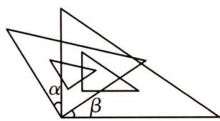

text_image

α
β

B

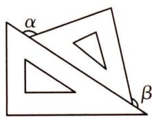  
C

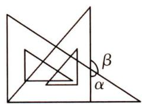  
D

9. 如图, 点 $O$ 在直线 $AB$ 上, $\angle BOC = 90^{\circ}$ , 则 $\angle AOE$ 的余角是 ( A )

A. $\angle COE$

B. $\angle {BOC}$

C. $\angle BOE$

D. $\angle {AOE}$

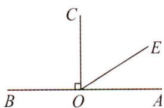

10. 如图, 直线 $a, b$ 相交于点 $O$ , 因为 $\angle 1 + \angle 2 = 180^{\circ}, \angle 3 + \angle 2 = 180^{\circ}$ , 所以 $\angle 1 = \angle 3$ , 这是根据 (C)

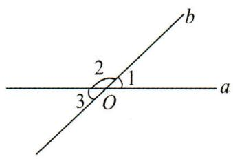

text_image

b
2
1
3 O a

A. 同角的余角相等

B. 等角的余角相等

C. 同角的补角相等

D. 等角的补角相等

# 五、运用角的和、差、倍、分求角

11. 如图, 射线 $OB, OC$ 在 $\angle AOD$ 的内部, 下列说法: ① 若 $\angle AOC = \angle BOD = 90^\circ$ , 则与 $\angle BOC$ 互余的角有 2 个; ② 若 $\angle AOD + \angle BOC = 180^\circ$ , 则 $\angle AOC + \angle BOD = 180^\circ$ ; ③ 若 $OM, ON$ 分别平分 $\angle AOD, \angle BOD$ , 则 $\angle MON = \frac{1}{2} \angle AOB$ ; ④ 若 $\angle AOD = 150^\circ, \angle BOC = 30^\circ$ , 作 $\angle AOP = \frac{1}{2} \angle AOB, \angle DOQ = \frac{1}{2} \angle COD$ , 则 $\angle POQ = 90^\circ$ . 其中结论正确的有 (D)

A. 0 个

B. 1 个

C. 2 个

D. 3 个

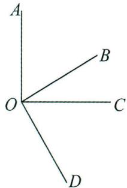

text_image

A
B
O
C
D

第 11 题图

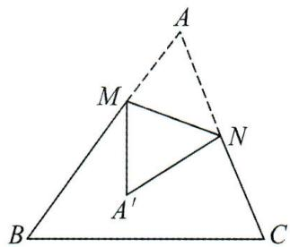

text_image

A
M
N
A'
B
C

第 12 题图

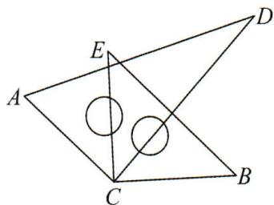

text_image

Geometric diagram showing two overlapping triangles ABC and ABD with intersection points E and C, and two circles inside the triangle.

第 13 题图

12. 如图, 将三角形 $ABC$ 纸片沿 $MN$ 折叠, 使点 $A$ 落在点 $A'$ 处, 若 $\angle A'MB = 50^\circ$ , 则 $\angle AMN = \underline{65}$ 度.

13. 如图, 将一副直角三角尺的直角顶点 $C$ 叠放在一起, 若 $\angle ECD$ 比 $\angle ACB$ 的 $\frac{1}{2}$ 小 $6^{\circ}$ , 则 $\angle BCD$ 的度数为 $34^{\circ}$ .

14. 如图, $\angle AOB = 50^{\circ}, \angle AOD = 90^{\circ}, OC$ 平分 $\angle AOB$ , 求 $\angle COD$ 的度数.

解： $\because \angle AOB = 50^{\circ}, \angle AOD = 90^{\circ}, OC$ 平分 $\angle AOB$ ，

$$
\therefore \angle B O D = \angle A O D - \angle A O B = 9 0 ^ {\circ} - 5 0 ^ {\circ} = 4 0 ^ {\circ}, \angle B O C = \frac {1}{2} \angle A O B = \frac {1}{2} \times 5 0 ^ {\circ} = 2 5 ^ {\circ},
$$

$$
\therefore \angle C O D = \angle B O C + \angle B O D = 2 5 ^ {\circ} + 4 0 ^ {\circ} = 6 5 ^ {\circ}.
$$

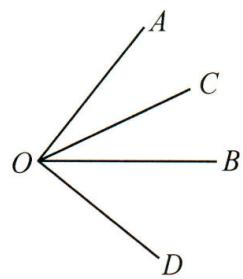

text_image

A
C
O
B
D

15. 如图, 点 $O$ 在直线 $AB$ 上, $\angle COE = 90^{\circ}$ , $OD$ 平分 $\angle AOE$ , $\angle COD = 25^{\circ}$ , 求 $\angle BOD$ 的度数.

解： $\because \angle COE = 90^{\circ}, \angle COD = 25^{\circ}, \therefore \angle DOE = 90^{\circ} - 25^{\circ} = 65^{\circ}$ ,

∵OD 平分 $\angle AOE, \therefore \angle AOD = \angle DOE = 65^{\circ}$ ,

$$
\therefore \angle B O D = 1 8 0 ^ {\circ} - \angle A O D = 1 1 5 ^ {\circ}.
$$

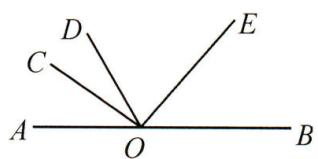

text_image

D
C
E
A
O
B

# Ⅱ 期末复习小卷

# 期末复习小卷(一)(1.1\~1.2)

(时间:45 分钟 满分:100 分)

# 一、选择题(每小题5分,共40分)

1. 在 $-1, 0, 1, 2$ 这四个数中, 既不是正数也不是负数的数是 ( B )

A. -1

B. 0

C. 1

D. 2

2. 如果 $+10\%$ 表示“增加 $10\%$ ”，那么“减少 $8\%$ ”可以记作（B）

A. $-18\%$

B. -8%

C. +2%

D. +8%

3. -3 的相反数是( A )

A. 3

B. $\frac{1}{3}$

C.-3

D. $-\frac{1}{3}$

4. -6 的绝对值是( A )

A. 6

B. - 6

C. $+\frac{1}{6}$

D. $-\frac{1}{6}$

5. 检测 4 个排球的重量, 其中超过标准质量的克数记为正数, 不足标准质量的克数记为负数. 从轻重的角度看, 最接近标准的是 ( B )

A. +2

B. +0.4

C.-0.5

D.-1.9

6. 有理数 $3, -2, 0, -10$ 中, 最大的是 (A)

A. 3

B. -2

C. 0

D. -10

7. 如图, 若 $A$ 是实数 $a$ 在数轴上对应的点, 则 $a, -a, 1$ 的大小关系正确的是 ( C )

A 0 1

A. $1 < -a < a$

B. $a < - a < 1$

C. $a <   1 <   - a$

D. $-a < a < 1$

8. 已知 a, b 是不为 0 的有理数，且 $\left|a\right| = -a, \left|b\right| = b, \left|a\right| > \left|b\right|$ ，那么用数轴上的点来表示 a, b 时，正确的是（C）

b 0 a

A

b 0 a

B

a 0 b

C

a 0 b

D

# 二、填空题(每小题5分,共20分)

9. 化简: $|-2| = \underline{2}$ , $-(-2) = \underline{2}$ .

10. 比较大小: -7 < -6, 0 > -4, 2 > -1 (填“<”或“>”填空).

11. 在数轴上,与表示数-1的点距离为2个单位长度的点表示的数是 1 或 -3 .

12. 小说《达·芬奇密码》中的一个故事里出现了一串神密排列的数, 将这串令人费解的数按从小到大的顺序排列为 $1, 1, 2, 3, 5, 8, \cdots$ , 则这列数的第 10 个数是 \_55\_.

# 三、解答题(共4题,共40分)

13. (8 分) 把下列各数分类, 并填在表示相应集合的大括号内:

$$
- 1 1, - \frac {3}{5}, - 9, 0, + 1 2, - 6. 4, - \pi , - 4 \%.
$$

(1)整数集合: $\{-11,-9,0,+12,\cdots\}$ ;

(2)分数集合: $\left\{-\frac{3}{5},-6.4,-4\%,\cdots\right\}$ ;

(3)非负整数集合: $\{0,+12,\cdots\}$ ;

(4)负有理数集合: $\left\{-11,-9,-\frac{3}{5},-6.4,-4\%,\cdots\right\}$ .

14.(10分)某中学七年级学生的平均体重是41kg.

(1)下面给出该年级5名同学的体重情况(单位:kg),试完成下表(差值:体重与平均体重的差):

<table><tr><td>姓名</td><td>李小红</td><td>周小亮</td><td>张新</td><td>王雨</td><td>赵星</td></tr><tr><td>体重</td><td>34</td><td></td><td>45</td><td></td><td></td></tr><tr><td>差值</td><td>-7</td><td>+3</td><td></td><td>-4</td><td>0</td></tr></table>

(2)这5名学生中,谁最重?谁最轻?

(3)最重与最轻的学生相差多少?

解:(1)略;

(2) 张新最重; 李小红最轻;

(3)最重与最轻的学生相差 $45 - 34 = 11(\mathrm{kg})$

15.(10分)已知 $|a-4|$ 与 $|2-b|$ 互为相反数,求a,b的值.

解:由题意,得 $|a-4|+|2-b|=0$ ,

$$
\because | a - 4 | \geqslant 0, | 2 - b | \geqslant 0,
$$

$$
\therefore a - 4 = 0, 2 - b = 0,
$$

$$
\therefore a = 4, b = 2.
$$

16.(12分)(1)已知a=2,|b|=3,若a>b,则b的值是-3;

(2)已知 a=1, $|b|=2$ , 若 a<b, 则 b 的值是 2;

(3)已知 $|a|=2,|b|=1$ ,若a>b,求a,b的值.

解:(1)因为 $|b|=3$ ,所以 $b=\pm3$ ,

因为 a > b, a = 2, 所以 b = -3;

(2) 因为 $\left|b\right|=2$ ，所以 $b=\pm2$ ，

因为 a<b, a=1, 所以 b=2;

(3) 因为 $\left|a\right|=2$ ，所以 $a=\pm2$ 。

因为 $\left|b\right|=1$ , 所以 $b=\pm1$

因为 a > b，所以 $a = 2, b = \pm 1$ .

# 期末复习小卷(二)(2.1)

(时间:45 分钟 满分:100 分)

# 一、选择题(每小题5分,共40分)

1. 计算 $2022 + (-2022)$ 的结果是 ( B )

A. -4 044

B. 0

C. 2022

D. 4 044

2. 比 -3 大 1 的数是( C )

A. 1

B. -1

C.-2

D. -4

3. 把 $-2-(+3)-(-5)+(-4)+(+3)$ 写成省略加号和括号的和的形式, 正确的是 ( A )

A. $-2 - 3 + 5 - 4 + 3$

B. $- 2 + 3 + 5 - 4 + 3$

C. $-2 - 3 - 5 + 4 + 3$

D. $- 2 - 3 - 5 + 4 - 3$

4. 某天的最高气温是 $4^{\circ} \mathrm{C}$ , 最低气温是 $-2^{\circ} \mathrm{C}$ , 则这天的最高气温比最低气温高 ( C )

A. $8^{\circ} \mathrm{C}$

B. $- 8{}^{ \circ  }\mathrm{C}$

C. $6^{\circ} \mathrm{C}$

D. $- 6{}^{ \circ  }\mathrm{C}$

5. 若 $\left|a\right|=4,\left|b\right|=1,a$ 与 b 异号，则 a-b 的值为（D）

A. 3

B. 5

C. ±3

D. ±5

6. 如果 $a=\frac{1}{4}$ , b=-5, $c=-2\frac{3}{4}$ , 那么 $\left|a+b\right|-\left|c\right|$ 等于 ( C )

A. -2

B. $7 \frac{1}{2}$

C. 2

D. $-7 \frac{1}{2}$

7. 若 $x < 0$ , 则 $|x - (-x)|$ 等于 (D)

A.-x

B. 0

C. ${2x}$

D. $- {2x}$

8. 在数轴上 $a, b, c, d$ 对应的点如图所示, 且 $|a| = |b|$ , 则下列结论: ① $a + b = 0$ ; ② $d < c < b$ ; ③ $d + c > 0$ ; ④ $b + c < 0$ . 其中正确的结论的序号是 (D)

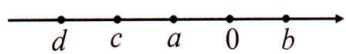

A. ③④

B.①③

C. ②③

D. ①②④

# 二、填空题(每小题5分,共20分)

9. 计算: $5-(-3)=8$ .

10. 矿井下 $A, B, C$ 三处的高度分别是 $-37.4 \mathrm{~m}, -129.8 \mathrm{~m}, -71.3 \mathrm{~m}$ , 则矿井最高处比最低处高 92.4 米.

11. 观察下列各式: $-1+2=1$ , $-1+2-3+4=2$ , $-1+2-3+4-5+6=3$ , …, 那么 $-1+2-3+4-\cdots-2017+2018=$ 1009.

12. 已知 $\left|a\right|=1,\left|b\right|=2,\left|c\right|=3$ , 且 a>b>c ，那么 $a+b-c=$ 2 或 0 .

# 三、解答题(共4题,共40分)

13.(10分)计算:

(1) $(-3)+(+1)$ ;

(2) $(-8)-(-3)$ .

解:(1)原式=-2;

(2) 原式 $= -8 + 3$

$$
\begin{array}{l} = - (8 - 3) \\ = - 5. \\ \end{array}
$$

14.(10分)用简便方法计算:

(1) $-5.75+3\frac{3}{4}+5\frac{1}{8}-3.125;$

(2) $\left(-1\frac{1}{2}\right)-1\frac{1}{4}+\left(-2\frac{1}{2}\right)-\left(-3\frac{3}{4}\right)-\left(-1\frac{1}{4}\right).$

解: 原式 = -5 $\frac{3}{4}$ + 3 $\frac{3}{4}$ + 5 $\frac{1}{8}$ - 3 $\frac{1}{8}$

$$
= \left(- 5 \frac {3}{4} + 3 \frac {3}{4}\right) + \left(5 \frac {1}{8} - 3 \frac {1}{8}\right)
$$

$$
= (- 2) + 2
$$

$$
= 0;
$$

解: 原式= $\left[\left(-1\frac{1}{2}\right)+\left(-2\frac{1}{2}\right)\right]$ -

$$
\left[ 1 \frac {1}{4} + \left(- 3 \frac {3}{4}\right) + \left(- 1 \frac {1}{4}\right) \right]
$$

$$
= (- 4) - \left(- 3 \frac {3}{4}\right)
$$

$$
= (- 4) + 3 \frac {3}{4}
$$

$$
= - \frac {1}{4}.
$$

15.(10分)有4箱水果,以每箱15kg为标准,超过的部分记为正,不足的部分记为负.这4箱水果的记录分别为+3,-4,+2,+3.求这4箱水果的总重量.

解： $+3+(-4)+(+2)+(+3)=4(kg)$ ,

$$
1 5 \times 4 + 4 = 6 4 (\mathrm{kg}).
$$

答: 这 4 箱水果总重 64 kg.

16.(10分)某检修小组乘汽车检修供电线路,约定前进为正,后退为负.某天自A地出发到收工时,所走路程(单位:km)为:+22,-3,+4,-2,-8,+17,-2,-3,+12,+7,-5,问收工时距A地多远?若每公里耗油2L,问从A地出发到收工共耗油多少升?

解: 收工时距 A 地为 $(+22)+(-3)+(+4)+(-2)+(-8)+(+17)+(-2)+(-3)+(+12)+(+7)+(-5)=39(\text{km})$ ;

从 A 地出发到收工的行程为 $\left|+22\right|+\left|-3\right|+\left|+4\right|+\left|-2\right|+\left|-8\right|+\left|+17\right|+\left|-2\right|+\left|-3\right|+\left|+12\right|+\left|+7\right|+\left|-5\right|=85\ km$ ，则耗油是 $85\times2=170(L)$ .

# 期末复习小卷(三)(2.2)

(时间:45 分钟 满分:100 分)

# 一、选择题(每小题5分,共40分)

1. -2022 的倒数( C )

A. -2 022

B. 2022

C. $-\frac{1}{2022}$

D. $\frac{1}{2022}$

2. 下列各式计算错误的是( B )

A. $0 \times 7 = 0$

B. $-4\div\frac{1}{4}=-1$

C. $-4 \times 6 = -24$

D. $-18 \div 6 = -3$

3. 如果 $\square \times \left(-\frac{2}{3}\right) = 1$ ，则“ $\square$ ”内应填的有理数是（D）

A. $\frac{3}{2}$

B. $\frac{2}{3}$

C. $-\frac{2}{3}$

D. $-\frac{3}{2}$

4. 计算 $\frac{1}{6} \times (-6) \times 6$ 的结果是 ( A )

A. - 6

B. 6

C. -36

D. 36

5. 计算 $-1 - 2 \times (-3)$ 的结果是 ( A )

A. 5

B. - 5

C. 7

D. -7

6. 用正负数表示气温的变化量,上升为正,下降为负,登山队攀登一座山峰,每登高 $1 \mathrm{~km}$ 气温的变化量为 $-6^{\circ} \mathrm{C}$ , 攀登 $3 \mathrm{~km}$ 后, 气温 (D)

A. 上升 $6^{\circ}$ C

B. 下降 $6^{\circ}$ C

C. 上升 $18^{\circ} \mathrm{C}$

D. 下降 $18^{\circ} \mathrm{C}$

7. 已知 a > b, ab < 0, 那么 a - b 的值( A )

A. 大于 0

B. 小于 0

C. 等于 0

D. 以上三种都有可能

8. 计算 $-19 \frac{8}{9} \times 18$ 时, 最简便的方法是 (D)

A. $-19\frac{8}{9}\times 18 = \left(-19 + \frac{8}{9}\right)\times 18$

B. $-19\frac{8}{9}\times 18 = \left(-20 + \frac{8}{9}\right)\times 18$

C. $-19\frac{8}{9}\times 18 = \left(-19 - \frac{8}{9}\right)\times 18$

D. $-19\frac{8}{9}\times 18 = \left(-20 + \frac{1}{9}\right)\times 18$

# 二、填空题(每小题5分,共20分)

9. 化简: $\frac{-56}{24} = -\frac{7}{3}$ .

10. 计算: $-9 \times 6 = -54$ ; $10 \div (-2 \frac{1}{2}) = -4$ .

11. 在 3, -4, 5, -6 这四个数中, 任取两个数相乘, 所得的积最小的是 -30 .

12. 已知三个有理数 $a, b, c$ , 满足 $c < b < a$ , 且 $a + b + c = 0$ . 下列式子: ① $ab > 0$ ; ② $\frac{c}{a} < 0$ ; ③ $b + c < 0$ ; ④ $\frac{b}{c} > 0$ ; ⑤ $abc < 0$ . 其中一定正确的是 ②③.

# 三、解答题(共4题,共40分)

13.(10分)计算:

(1) $-5\times(-3)\times(-2)$ ;

(2) $-2\frac{1}{3}\div\left(-1\frac{1}{6}\right).$

解: 原式 = -5 × 3 × 2

$$
= - 3 0;
$$

解: 原式= $\frac{7}{3}\times\frac{6}{7}$

$$
= 2.
$$

14. (10 分) 计算：

(1) $(-12)\div4\times(-6)\div(-3)$ ;

(2) $\left(-\frac{5}{8}\right)\times6-(2-5)\div0.5.$

解: 原式 = -3 × 6 ÷ 3

$$
= - 6;
$$

解: 原式 $= -\frac{15}{4} - (-3) \times 2$

$$
= \frac {9}{4}.
$$

15.(10 分)今抽查 10 袋精盐,每袋精盐的标准质量是 500 克,超出的记为正数,不足的记为负数,统计成下表:

<table><tr><td>精盐袋数</td><td>2</td><td>3</td><td>3</td><td>1</td><td>1</td></tr><tr><td>每袋超出标准的质量/克</td><td>+1</td><td>-2</td><td>0</td><td>+2</td><td>-3</td></tr></table>

求平均每袋盐的质量.

解: $2 \times (+1) + 3 \times (-2) + 3 \times 0 + 1 \times (+2) + 1 \times (-3) = -5$ ,

$500+(-5)\div10=499.5$ （克）.

答:平均每袋盐的质量为 499.5 克.

16.(10分)已知 $|a|=1,|b|=2,a>b$ ，求a-b的值.

解: a=1 或 -1, b=-2,

①当 a=1, b=-2 时, a-b=3;   
②当 a = -1, b = -2 时, a - b = 1.

则 $a - b = 1$ 或3.

# 期末复习小卷(四)(2.3)

(时间:45 分钟 满分:100 分)

# 一、选择题(每小题5分,共40分)

1. 计算 $2^{3}$ 的结果为 ( C )

A. 5

B. 6

C. 8

D. 9

2. 太阳的直径约为 $1390000 \mathrm{~km}$ , 这个数用科学记数法表示为 ( B )

A. $0.139 \times 10^{7}$ km

B. $1.39 \times 10^{6} \mathrm{~km}$

C. $13.9 \times 10^{5}$ km

D. $139 \times 10^{4} \mathrm{~km}$

3. 计算 $(-1)^{2} + (-1)^{3}$ 等于 (C)

A.-2

B.-1

C. 0

D. 2

4. 下列各组数中, 结果相等的是 ( A )

A. $(-3)^{3}$ 与 $-3^{3}$

B. $-2^{2}$ 与 $\frac{1}{2^{2}}$

C. $-1^{2}$ 与 $(-1)^{2}$

D. $-2^{3}$ 与 $-3^{2}$

5. 下列近似数的精确度正确的是( B )

A. 0.10(精确到 0.1)

B.0.50(精确到百分位)

C. 0.05(精确到百位)

D. 1.0(精确到个位)

6. 一个有理数的平方一定 ( D )

A. 是正数

B. 是负数

C. 是非正数

D.是非负数

7. 数学家斐波那契的《计算书》中有这样一个问题: “在罗马有 7 位老妇人, 每人赶着 7 头毛驴, 每头驴驮着 7 只口袋, 每只口袋里装着 7 个面包, 则面包数量为( C )

A. $7 \times  4$

B. $7 \times 7$

C. ${7}^{4}$

D. ${7}^{6}$

8. 小明发明了一个魔术盒, 当数对 $(a, b)$ 进入其中时 $(a, b$ 为有理数), 会得到一个新有理数: $a^{2} + b + 1$ , 例如把 $(3, -2)$ 放入其中, 就会得到 $3^{2} + (-2) + 1 = 8$ . 现将数对 $(-m, n)$ 和数对 $(m, -n)$ 分别放入其中, 若得到的新有理数的值分别为 $x$ 和 $y$ , 则 $x + y$ 的结果是 ( A )

A. 正数

B. 非负数

C. 零

D. 负数

# 二、填空题(每小题5分,共20分)

9. 计算 $-5^{2}$ 的结果为 -25 .

10. 将 32.954 精确到百分位得到的近似数为 32.95 .

11. 按照下图所示的操作步骤, 若输入 x 的值为 -2 , 则给出的值为 7 .

输入x → 平方 → 乘以3 → 减去5 → 输出x

12. $2^{3}, 3^{3}$ 和 $4^{3}$ 分别可以按如图所示方式“分裂”成 2 个、3 个和 4 个连续奇数的和, $6^{3}$ 也能按此规律进行“分裂”, 则 $6^{3}$ “分裂”出的奇数中最大的数是 41 .

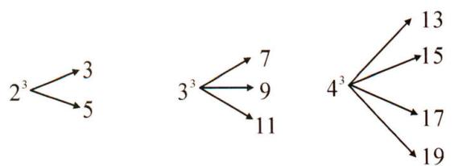

flowchart

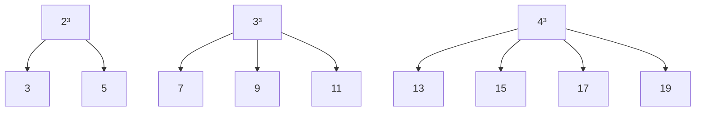

# 三、解答题(共4题,共40分)

13.(10分)计算：

(1) $-2^{2}-(-3)^{2}$ ;

(2) $-\left(-\frac{1}{4}\right)^{2} \times 2^{3} - 1^{2022}$ .

解: 原式 = -4 - 9

$$
= - 1 3;
$$

解: 原式 = $-\frac{1}{16} \times 8 - 1$

$$
= - \frac {3}{2}.
$$

14. (10 分) 计算：

(1) $-1^{4}-\frac{1}{6}\times[3-(-3)^{2}]$ ;

(2) $-1^{6}-\left(1-\frac{2}{3}\right)\div\frac{1}{3}\times\left[-2-(-3)^{2}\right].$

解: 原式 = -1 - $\frac{1}{6} \times (3 - 9)$

$$
= - 1 - \frac {1}{6} \times (- 6)
$$

$$
= - 1 + 1
$$

$$
= 0;
$$

解: 原式 $= -1 - \frac{1}{3} \times 3 \times (-2 - 9)$

$$
= - 1 - \frac {1}{3} \times 3 \times (- 1 1)
$$

$$
= 1 0.
$$

15.(8分)规定一种关于a,b的运算: $a*b=a^{2}-b^{2}$ ，求 $3*(-2)$ 的值.

解: $3 \times (-2) = 3^{2} - (-2)^{2}$

$$
= 9 - 4
$$

$$
= 5.
$$

16.(12 分)如图,将一个边长为 1 的正方形纸片分割成 7 个部分,部分①是边长为 1 的正方形纸片面积的一半,部分②是部分①面积的一半,部分③是部分②面积的一半,依此类推……

(1)根据图形填写如表:

<table><tr><td></td><td>1</td><td>2</td><td>3</td></tr><tr><td>面积</td><td></td><td></td><td></td></tr></table>

(2)阴影部分的面积是多少?

(3) 计算: $\frac{1}{2} + \frac{1}{4} + \frac{1}{8} + \cdots + \frac{1}{2^{10}}$ ;

(4)猜想: $\frac{1}{2}+\frac{1}{4}+\frac{1}{8}+\cdots+\frac{1}{2^{n}}$ 的结果是 $1-\frac{1}{2^{n}}$ .

解:(1)① $\frac{1}{2}$ ,② $\frac{1}{4}$ ,③ $\frac{1}{8}$ ;

(2)阴影部分的面积为 $\frac{1}{2^6}$ ;

(3) $\frac{1}{2} + \frac{1}{4} + \frac{1}{8} + \cdots + \frac{1}{2^{10}} = 1 - \frac{1}{2^{10}}$ ;

(4) $\frac{1}{2} + \frac{1}{4} + \frac{1}{8} + \cdots + \frac{1}{2^n} = 1 - \frac{1}{2^n}$ .

<table><tr><td rowspan="3">2</td><td rowspan="2">4</td><td>6</td></tr><tr><td>5</td></tr><tr><td colspan="2">3</td></tr><tr><td colspan="3">1</td></tr></table>

# 期末复习小卷(五)(3.1)

(时间:45 分钟 满分:100 分)

# 一、选择题(每小题5分,共40分)

1. 下列各式: $-x+1, \pi+3, 9>2, \frac{x-y}{x+y}, s=\frac{1}{2}ab$ , 其中代数式的个数是( C )

A. 5

B. 4

C. 3

D. 2

2. 下列各式符合书写要求的是( C )

A. ${ab3}$

B. $1 \frac{3}{4} a$

C. $a + 4$

D. $a \div {bp}$

3. 代数式 $\frac{x}{y + 3}$ 的意义是 (D)

A. $x$ 除以 $y$ 加3

B. y 加 3 除 x

C. $y$ 与3的和除以 $x$

D. $x$ 除以 $y$ 与3的和所得的商

4. 用代数式表示“比 a 的 $\frac{3}{2}$ 大 1 的数”是( A )

A. $\frac{3}{2} a + 1$

B. $\frac{2}{3} a + 1$

C. $\frac{5}{2} a$

D. $\frac{5}{2} a - 1$

5. 甲每小时走 $a$ 千米, 乙每小时走 $b$ 千米, 两人同时同地出发背向行走, $t$ 小时后, 他们之间的距离为 ( A )

A. $(a + b)t$

B. $\frac{a}{t} + \frac{b}{t}$

C. $\frac{t}{a} +\frac{t}{b}$

D. ${at} - {bt}$

6. 一件服装降价 $10 \%$ 后卖 $x$ 元, 则原价是 (C)

A. $\frac{9}{10} x$ 元

B. $\frac{1}{10} x$ 元

C. $\frac{10}{9} x$ 元

D. $10 x$ 元

7. 今年学校运动会参加的人数是 m 人, 比去年增加 10%, 那么去年运动会参加的人数是 ( C )

A. $(1+10\%)m$ 人

B. $(1-10\%)m$ 人

C. $\frac{m}{110\%}$ 人

D. $\frac{m}{10\%}$ 人

8. 下列代数式的意义表述不正确的是( D )

A. $a + 2b$ 的意义是 $a$ 与 $2b$ 的和

B. $x - \frac{y}{2}$ 的意义是 $x$ 与 $\frac{y}{2}$ 的差

C. $m(n+3)$ 的意义是 m 与 $(n+3)$ 的积

D. $(a+b)^{2}$ 的意义是 a 加上 b 的平方

# 二、填空题(每小题5分,共20分)

9. 每箱有 m 只茶杯, 7 箱有 7m 只茶杯.

10. 一个两位数, 其十位数字是 $a$ , 个位数字比十位数字的 2 倍少 1. 则这个两位数可表示为 $10a + 2a - 1$ .

11. 某种商品原价每件 b 元, 第一次降价打八折, 第二次降价每件又减 10 元, 第二次降价后的售价是 $(0.8b - 10)$ 元.

12. 如图, 用火柴棍拼成一个由三角形组成的图形, 拼第一个图形共需要 3 根火柴棍, 拼第二个图形共需要 5 根火柴棍; 拼第三个图形共需要 7 根火柴棍; ……照这样拼图, 则第 $n$ 个图形需要 $(2n+1)$

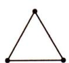  
图1

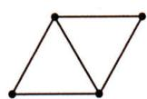  
图2

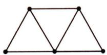  
图3

# 三、解答题(共40分)

13.(8分)下列表述中,字母a各表示什么意义?

(1)正方形的周长为 4a;  
(2)买单价为3.5元的毛巾,花了3.5a元钱.

解:(1)正方形的周长为4a, 字母a表示正方形的边长;

(2)买单价为3.5元的毛巾,花了3.5a元钱,字母a表示毛巾的条数.

14.(10 分)一批冻枣平均分装在若干不同的包装袋中,每袋装入的颗数和总袋数如下表:

(1)这批冻枣共有多少颗?   
(2)总袋数随着每袋的颗数增加而 减少；  
(3)用 n 表示总袋数, m 表示每袋装的颗数,

用式子表示 n 与 m 的关系. n 与 m 成什么比例关系?

<table><tr><td>每袋装的颗数</td><td>10</td><td>12</td><td>18</td><td>20</td><td>24</td><td>...</td></tr><tr><td>总袋数</td><td>720</td><td>600</td><td>400</td><td>360</td><td>300</td><td>...</td></tr></table>

解:(1)这批冻枣共有7200颗;

(2)总袋数随着每袋的颗数的增加而减少:   
(3)mn=7 200 或 $n=\frac{7\ 200}{m}$ , n 与 m 成反比例关系.

15.(10分)陈老师利用假期带学生外出游玩,已知每张车票50元,甲车车主说,如果乘我的车,师生全部可以享受八折优惠;乙车车主说,如果乘我的车,学生7折优惠,老师买全票.已知这个老师带了x名学生,分别写出乘甲、乙两车所需的车费.

解:乘甲车的费用为 $50(x+1)\times80\%=40(x+1)$ 元;

乘乙车的费用为 $50 \times 70\% x + 50 = (35x + 50)$ 元。

答:乘甲车的费用为 $40(x+1)$ 元,乘乙车的费用为 $(35x+50)$ 元.

16.(12分)某餐厅中,一张桌子可坐6人,有以下两种摆放方式:

(1) 当有 n 张桌子时, 第一种摆放方式能坐 $(4n+2)$ 人, 第二种摆放方式能坐 $(2n+4)$ 人;

(2)一天中午餐厅要接待 80 位顾客共同就餐,但餐厅只有 25

第一种

第二种

张这样的餐桌,应选择哪种方式来摆放餐桌,为什么?

解:(1)第一种中,有一张桌子是6人,后边多一张桌子多4人.

即有 n 张桌子时, 有 $6+4(n-1)=(4n+2)$ 人:

第二种中,有一张桌子是6人,后边多一张桌子多2人,即 $6+2(n-1)=(2n+4)$ 人:

(2)打算用第一种摆放方式来摆放餐桌。

因为当 n=25 时, 第一种摆放: $4 \times 25 + 2 = 102 > 80$ , 第 2 种方式: $2 \times 25 + 4 = 54 < 80$ , 所以选用第一种摆放方式.

# 期末复习小卷(六)(3.2)

(时间:45 分钟 满分:100 分)

# 一、选择题(每小题5分,共40分)

1. 已知 a=4, b=-1，则代数式 2a-b-3 的值是（B）

A. 4

B. 6

C. 7

D. 12

2. 若 m = -1, n = 2，则 $m^{2} - 2n + 1$ 的值是（C）

A. 6

B. 0

C. -2

D. -4

3. 已知 $|a| = 3, b = 2$ , 则 $a + b$ 的值是 (D)

A. 5

B. - 5

C.-5或1

D. 5 或 -1

4. 已知 $a + 2b = 5$ ，则代数式 $1 + 2a + 4b$ 的值是（A）

A. 11

B. 6

C. -4

D. -9

5. 如图, 将边长为 $a$ 的正方形沿虚线剪去边长为 $b$ 的小正方形后, 剩余图形的周长是 ( B )

A. $2 a + 2 b$

B. ${4a}$

C. $4a + 2b$

D. ${4a} - {2b}$

text_image

a
a
b
b

6. 如图, 圆环的面积是( B )

A. $R^{2} - r^{2}$

B. $\pi R^{2} - \pi r^{2}$

C. $\pi R^{2} - r^{2}$

D. $\pi r^2 -\pi R^2$

7. 在等式 $\frac{1}{m} = \frac{1}{n} + \frac{1}{q}$ 中, 若 $m = 5, n = 2$ , 则 $q$ 的值为 ( B )

A. $-\frac{3}{10}$

B. $-\frac{10}{3}$

C. $\frac{10}{3}$

D. $\frac{3}{10}$

8. 若 $x^{2}+3x=-1$ ，则 $2021-2x^{2}-6x$ 的值为（D）

A. 2020

B. 2021

C. 2022

D. 2023

# 二、填空题(每小题5分,共20分)

9. 一个圆柱体的底面半径是 $2 \mathrm{~cm}$ , 高是 $3 \mathrm{~cm}$ , 这个圆柱体的体积是 $\underline{12 \pi} \mathrm{~cm}^{3}$ , 若底面半径为 $2 \mathrm{~cm}$ , 高为 $h \mathrm{~cm}$ 的圆柱体的体积是 $\underline{4 \pi h} \mathrm{~cm}^{3}$ .

10. 当 $x=\frac{1}{2}$ 时, 代数式 $\frac{1}{2}(x^{2}+1)$ 的值是 $\frac{5}{8}$ .

11. 当 $x = -\frac{7}{2}$ , y = 2 时，代数式 $x^{2} + xy - y^{2}$ 的值为 $\frac{5}{4}$ .

12. 如图, 在一个长方形硬纸板上, 挖去两个完全相同的小长方形, 则根据图中标注的字母表示剩余部分 (即阴影部分) 的面积为 $mn - 2ab$ .

text_image

a
b
m
n

# 三、解答题(共40分)

13.(8分)根据下列条件,求代数式 $x^{2}y-\frac{y}{x}$ 的值.

(1) $x = -3, y = 2$ ;

(2) $x=\frac{3}{2},y=-1.$

解:(1)当 x=-3,y=2 时,

$$
x ^ {2} y - \frac {y}{x} = (- 3) ^ {2} \times 2 - \frac {2}{- 3}
$$

$$
= 1 8 \frac {2}{3};
$$

(2) 当 $x = \frac{3}{2}, y = -1$ 时，

$$
x ^ {2} y - \frac {y}{x} = \left(\frac {3}{2}\right) ^ {2} \times (- 1) - \frac {- 1}{\frac {3}{2}}
$$

$$
= - \frac {9}{4} + \frac {2}{3}
$$

$$
= - \frac {1 9}{1 2}.
$$

14.(10分)已知 $x^{2}+3x+5$ 的值是7,求代数式 $2x^{2}+6x-2$ 的值.

解:根据题意,得 $x^{2}+3x+5=7$ ,

$$
\therefore x ^ {2} + 3 x = 2,
$$

$$
\therefore 2 x ^ {2} + 6 x - 2 = 2 \left(x ^ {2} + 3 x\right) - 2
$$

$$
= 2 \times 2 - 2
$$

$$
= 2.
$$

15.(10分)某公园的门票价格是:成人票每张32元,学生票每张15元,一个旅行团有成人x人,学生y人,那么该旅行团应付多少门票费?如果该旅行团有成人28人,学生12人,那么该旅行团应付多少门票费?

解:根据题意知旅游团应付门票费为 $(32x+15y)$ 元;

当 x=28, y=12 时，该旅行团应付门票费为 $32 \times 28 + 15 \times 12 = 1076$ (元).

16.(12分)如图,在长和宽分别为a,b的长方形中,有两个半径相同的扇形.

(1)用含 $a, b$ 的式子表示图中阴影部分的面积 $S$ ;  
(2) 当 $a = 5 \, cm, b = 2 \, cm$ 时，求阴影部分的面积 ( $\pi \approx 3$ ).

解:(1)根据题意,得

$$
S = a b - \frac {1}{2} \pi b ^ {2};
$$

(2) 当 $a=5 \, cm, b=2 \, cm$ 时，

$$
S \approx 5 \times 2 - \frac {1}{2} \times 3 \times 2 ^ {2} = 1 0 - 6 = 4 (\mathrm{cm} ^ {2}).
$$

# 期末复习小卷(七)(4.1)

(时间:45 分钟 满分:100 分)

# 一、选择题(每小题5分,共40分)

1. 单项式 $-ab^{2}$ 的系数是 ( B )

A. 1

B. -1

C. 2

D. 3

2. 多项式 $a^2 - a + 2$ 是 (B)

A. 二次二项式

B. 二次三项式

C. 三次二项式

D. 三次三项式

3. 若 $(a-2)x^{3}+x^{2}(b+1)+1$ 是关于x的二次二项式，则a,b的值可以是( C )

A. $0,0$

B. $0, - 1$

C. $2,0$

D. 2, -1

4. 下列式子: $x^{2}+2$ , $\frac{1}{a}+4$ , $\frac{3ab^{2}}{7}$ , $\frac{ab}{c}$ , -5x, 0 中, 整式的个数有 ( C )

A. 6

B. 5

C. 4

D. 3

5. 买一个足球需 m 元, 买一个篮球需 n 元, 则买 5 个足球和 4 个篮球共需 ( C ) 元.

A. $9 m n$

B. ${20}\mathrm{{mn}}$

C. $5m + 4n$

D. $4m + 5n$

6. 已知多项式 $x^{2}-3xy^{2}-4$ 的常数项是 a，次数是 b，那么 $a+b$ 为（B）

A.-2

B. -1

C. 1

D. 2

7. 若 $m^{2}-2m=1$ ，则 $2m^{2}-4m+2022$ 的值是（D）

A. 2021

B. 2022

C. 2023

D. 2024

8. 搭一个正方形需要 4 根火柴棒, 按照图中的方式搭 $n$ 个正方形需要 ( B ) 根火柴棒.

A. $4 n$

B. $4+3(n-1)$

C. $3n$

D. $4n - (n + 1)$

......

# 二、填空题(每小题5分,共20分)

9. $-\frac{\pi ab^{2}c^{5}}{3}$ 是8次单项式,系数是 $-\frac{\pi}{3}$ .

10. 多项式 $xy^{2} + x^{2} - 1$ 的次数是 3 .

11. 若多项式 $x^{3}+(2m+2)x^{2}-3x-1$ 不含二次项，则 m=-1。

12. 如图, 是一个运算程序的示意图, 若开始输入 $x$ 的值为 625 , 则第 5 次输出的结果为 5 .

解: 当 x=625 时, $\frac{1}{5}x=125$ , 当 x=125 时, $\frac{1}{5}x=25$ ,
当 x=25 时, $\frac{1}{5}x=5$ , 当 x=5 时, $\frac{1}{5}x=1$ ,
当 x=1 时, $x+4=5$ .

flowchart

# 三、解答题(共4题,共40分)

13.(8分)用整式填空:

(1)某种苹果的售价是每千克 x 元 (x < 10), 小明用 100 元买 10 千克苹果应找回 (100 - 10x) 元;

(2)当温度每上升 $1^{\circ} \mathrm{C}$ 时,某种金属丝伸长 $0.002 \mathrm{~mm}$ ,当温度每下降 $1^{\circ} \mathrm{C}$ 时,金属丝缩短 $0.002 \mathrm{~mm}$ ,把 $x^{\circ} \mathrm{C}$ 的这种金属丝加热到 $y^{\circ} \mathrm{C}$ ,最后的长度比原长度伸长了 $\underline{0.002(y-x)}$ mm.

14. (10 分) 已知单项式 $3x^{2}y^{n}$ 的次数为 5, 多项式 $6 + x^{2}y - \frac{1}{2}x^{2} - \frac{1}{2}x^{2}y^{m+3}$ 的次数为 6, 求单项式 $(m+n)x^{m}y^{n}$ 的次数与系数的和.

解: ∵ 单项式 $3x^{2}y^{n}$ 的次数为 5,

多项式 $6 + x^{2}y - \frac{1}{2} x^{2} - \frac{1}{6} x^{2}y^{m + 3}$ 的次数为6，

$\therefore 2+n=5,2+m+3=6$ , 解得 m=1,n=3,

$$
\therefore (m + n) x ^ {m} y ^ {n} = 4 x y ^ {3},
$$

系数是 4, 次数是 $1+3=4, 4+4=8$ ,

即单项式 $(m+n)x^{m}y^{n}$ 的次数与系数的和是8.

15.(10 分)窗户的形状如图所示,其上部是半圆形,下部是边长相同的 4 个小正方形,求这个窗户的面积.

解：∵窗户的面积=4个小正方形的面积+半圆的面积，

∴窗户的面积= $4a^{2}+\frac{1}{2}\pi a^{2}$ .

text_image

a

16.(12分)已知当 x=1 时,代数式 $3ax^{3}+4bx+5$ 值为 11,求当 x=-1 时,代数式 $3ax^{3}+4bx+5$ 的值.

解: 当 x=1 时, $3ax^{3}+4bx+5=3a\times1^{3}+4b\times1+5=11$ ,

即 $3a + 4b + 5 = 11, 3a + 4b = 6$ .

当 x = -1 时，

$$
\begin{array}{l} 3 a x ^ {3} + 4 b x + 5 = 3 a \times (- 1) ^ {3} + 4 b \times (- 1) + 5 \\ = - 3 a - 4 b + 5 \\ = - (3 a + 4 b) + 5, \\ \end{array}
$$

把 $3a + 4b = 6$ 代入上式, 原式 = -6 + 5 = -1.

# 期末复习小卷(八)(4.2)

(时间:45 分钟 满分:100 分)

# 一、选择题(每小题5分,共40分)

1. 下列各组是同类项的是( B )

A. $a^3$ 与 $a^2$

B. $\frac{1}{2} a^2$ 与 $2a^{2}$

C. 2xy 与 2y

D. 3 与 $a$

2. 下列各题中, 合并同类项结果正确的是 ( A )

A. $2a^{2} + 3a^{2} = 5a^{2}$

B. $3m + 3n = 6mn$

C. 4xy - 3xy = 1

D. $2m^{2}n - 2mn^{2} = 0$

3. 化简 $x - (y - z)$ 的结果是( A )

A. $x - y + z$

B. $-x+y-z$

C. $-x + y + z$

D. x - y - z

4. 三个连续的整数, 中间一个是 n, 则三个数的和为 ( B )

A. $2 n$

B. $3 n$

C. $4 n$

D. $3n + 1$

5. 已知 $2a^{n}b^{n}$ 与 $3a^{3}b^{m+2}$ 是同类项，则 $m+n$ 的值为（B）

A. 3

B. 4

C. -4

D. -3

6. 已知 $A = x^{2}y - 2xy, B = x^{2}y - 3xy$ ，计算 A - B 的结果是（B）

A. $2x^{2}y$

B. ${xy}$

C. -xy

D. $5 x y$

7. 如图, 阴影部分的面积是( A )

A. 3.5xy

B. 4.5xy

C. 4xy

D. ${2xy}$

text_image

2y
0.5x
y
2x

8. 若多项式 $3x^{2}-2(5+y-2x^{2})+mx^{2}$ 的值与 x 的值无关，则 m 的值是 (D)

A. 0

B. 1

C.-1

D.-7

# 二、填空题(每小题5分,共20分)

9. 某工厂一月份的产量为 $a$ , 二月份比上月增产 $10\%$ , 那么这两个月的总产量为 $\underline{2.1a}$ . (用含有 $a$ 的代数式表示)

10. 如果多项式 $4x^{3}-2x^{2}-(kx^{2}+17x-6)$ 中不含 $x^{2}$ 的项，则 k 的值为 -2。

11. 某小区要打造一个长方形花圃, 已知花圃的长为 $(a + 2b)$ 米, 宽比长短 $b$ 米, 则花圃的周长为 $(4a + 6b)$ 米. (请用含 $a, b$ 的代数式表示)

12. 一个多项式减去 -3m 等于 $2m^{2}-3m-2$ ，则这个多项式是 $2m^{2}-6m-2$ 。

# 三、解答题(共5题,共40分)

13.(8分)计算:

(1) $2x+(y-2x)$ ;

(2) $x-4(x+y)$ .

解: 原式 = 2x - 2x + y

解: 原式 = x - 4x - 4y

$$
= y;
$$

$$
= - 3 x - 4 y.
$$

14.(8分)已知 $A=2x^{2}-5x+3$ , $B=x^{2}+2x-1$ ,求A-B.

$$
\begin{array}{l} = 2 x ^ {2} - 5 x + 3 - x ^ {2} - 2 x + 1 \\ = x ^ {2} - 7 x + 4. \\ \end{array}
$$

解: $A-B=(2x^{2}-5x+3)-(x^{2}+2x-1)$

15.(8分)已知a-b=5,ab=-1,求3a-3(ab+b)的值.

$$
\begin{array}{l} = 3 (a - b) - 3 a b, \\ \because a - b = 5, a b = - 1. \\ = 1 5 + 3 \\ = 1 8. \\ \end{array}
$$

解: 原式 = 3a - 3ab - 3b

∴原式=3×5-3×(-1)

16.(8分)三角形的三边长分别为(3x-5)cm,(x+4)cm,(2x-1)cm.

(1)用含 x 的式子表示这个三角形的周长；  
(2) 当 x=3 时, 求这个三角形的周长.

解:(1)三角形的周长为

$$
\begin{array}{l} (3 x - 5) + (x + 4) + (2 x - 1) \\ = 3 x - 5 + x + 4 + 2 x - 1 \\ = 6 x - 2 (\mathrm{cm}); \\ \end{array}
$$

(2) 当 x=3 时, 三角形的周长为

$$
\begin{array}{l} 6 x - 2 = 6 \times 3 - 2 \\ = 1 6 (\mathrm{cm}). \\ \end{array}
$$

17.(8分)已知a,b,c在数轴上的位置如图所示,且 $|a|<|c|$ ,化简: $|a+c|+|a-b|-|c-b|$ .

解:由数轴知 a < b < 0 < c,

$$
\begin{array}{l} \therefore | a - b | = b - a, | c - b | = c - b. \\ \because | a | <   | c |, \\ \therefore a + c > 0, \\ \therefore | a + c | = a + c, \\ = a + c + b - a - c + b \\ = 2 b. \\ \end{array}
$$

∴原式=a+c+(b-a)-(c-b)

$$
\begin{array}{l} = a + c + b - a - c + b \\ = 2 b. \\ \end{array}
$$

# 期末复习小卷(九)(5.1\~5.2)

(时间:45 分钟 满分:100 分)

# 一、选择题(每小题5分,共40分)

1. 方程 $3x - 1 = 5$ 的解是( D )

A. $x = \frac{4}{3}$

B. $x = \frac{5}{3}$

C. $x = 18$

D. $x = 2$

2. 方程 $4(2x - 1) - 2(-1 + 10x) = 2$ 可化简为 (D)

A. 8x - 4 - 2 - 10x = 2

B. $8x - 4 + 2 + 20x = 2$

C. $8x + 4 + 2 - 20x = 2$

D. $8x - 4 + 2 - 20x = 2$

3. 如果 $2x - 3 = 5$ , 那么 $6x + 10$ 的值为 ( B )

A. 33

B. 34

C. 35

D. 36

4. 方程 $\frac{2x + 3}{2} - x = \frac{9x - 5}{3} + 1$ 去分母得 (D)

A. $3(2x+3)-x=2(9x-5)+6$   
B. $3(2x+3)-6x=2(9x-5)+1$   
C. $3(2x+3)-x=2(9x-5)+1$   
D. $3(2x+3)-6x=2(9x-5)+6$

5. 已知 x=1 是方程 $\frac{x-k}{3}=\frac{3}{2}x-\frac{1}{2}$ 的解，则 $2k+3$ 的值是 (D)

A.-2

B. 2

C. 0

D. -1

6. 若“ $\triangle$ ”是新规定的某种运算符号, 设 $x\triangle y = xy + x + y$ , 则 $2\triangle m = -16$ 中, $m$ 的值为 ( D )

A. 8

B. -8

C. 6

D.-6

7. 月历中同一竖列相邻三个数的和不可能是( B )

A. 72

B. 26

C. 24

D. 45

8. 如图, 用黑白两种颜色的菱形纸片按黑色纸片数逐渐增加 1 的规律拼成下列图案. 若第 $n$ 个图案中有 2026 个白色纸片, 则 $n$ 的值为 ( B )

A. 674

B. 675

C. 676

D. 677

text_image

第1个
第2个
第3个...

# 二、填空题(每小题5分,共20分)

9. 解方程 $4y - 1 = 5 - 2y$ ，移项，得 $4y + 2y = 5 + 1$ 。（不用求解）

10. 已知 $x = 2$ 是关于 $x$ 的方程 $ax - 5x - 6 = 0$ 的解, 则 $a$ 的值为 8 .

11. 当 $x = \underline{6}$ 时, 代数式 $-\frac{1}{2}x + 8$ 与 3x - 23 互为相反数.

12. 若 a, b 互为相反数, c, d 互为倒数, p 的绝对值等于 2, 则关于 x 的方程 $(a + b)x^{2} + 3cd \cdot x - p^{2} = 0$ 的解为 $x = \frac{4}{3}$ .

# 三、解答题(共4题,共40分)

13.(8分)解方程:

(1) $7x+6=8-3x$ ;

(2) $7x - 2.5x + 3x - 1.5x = -15 \times 4 - 6 \times 3.$

解：移项，得 $7x + 3x = 8 - 6$ ，

合并同类项, 得 10x = 2,

系数化为 1, 得 x = 0.2;

解:合并同类项,得 6x = -78.

系数化为 1, 得 x = -13.

14.(10分)根据下列条件列方程:

(1)某数比它的5倍小8;

(2)某数的 $\frac{1}{3}$ 与2的和比该数的2倍少4.

解:(1)设这个数为 x,依题意,得 x=5x-8;

(2) 设这个数为 x，依题意，得 $\frac{1}{3}x + 2 = 2x - 4$ .

15.(10分)已知关于x的方程 $3a-x=\frac{x}{2}+3$ 的解是x=4,求 $(-a)^{2}-2a$ 的值.

解: 将 x=4 代入原方程,

得 3a - 4 = 2 + 3,

移项, 得 $3a = 2 + 3 + 4$ ,

合并同类项, 得 3a = 9,

系数化为 1, 得 a = 3,

当 $a = 3$ 时， $(-a)^{2} - 2a = (-3)^{2} - 2\times 3$

$$
= 9 - 6
$$

$$
= 3.
$$

16.(12 分)从甲地到乙地,快车走完全程需要 $6 \, h$ ,慢车走完全程需要 $10 \, h$ ,现在两车分别从甲、乙两地出发,相向而行.问:

(1)两车同时开出几小时后相遇?   
(2)如果快车先开 $2 \, h$ ，慢车才开出，这样在慢车出发几小时后两车相遇？

解:(1)设两车同时出发 x h 后相遇,

依题意, 得 $\frac{1}{6}x + \frac{1}{10}x = 1$ , 解得 $x = \frac{15}{4}$ .

答:两车同时开出 $\frac{15}{4}$ h 后相遇;

(2)设慢车开出 y h 后两车相遇，

根据题意,得 $\frac{1}{6}(2+y)+\frac{1}{10}y=1$ ,

解得 $y=\frac{5}{2}$ .

答:慢车开出 2.5 h 后两车相遇.

# 期末复习小卷(十)(5.3)

(时间:45 分钟 满分:100 分)

# 一、选择题(每小题5分,共40分)

1. 用式子表示“比 $x$ 的 3 倍小 5 的数等于 $x$ 的 4 倍”为( A )

A. $3 x - 5 = 4 x$

B. $5 - 3x = 4x$

C. $\frac{1}{3}x-5=4x$

D. 3x - 5 = $\frac{1}{4}$ x

2. 一个长方形的周长为 $26 \mathrm{~cm}$ , 这个长方形的长减少 $1 \mathrm{~cm}$ , 宽增加 $2 \mathrm{~cm}$ , 就可成为一个正方形, 设长方形的长为 $x \mathrm{~cm}$ , 则可列方程 ( B )

A. $x - 1 = (26 - x) + 2$

B. $x - 1 = (13 - x) + 2$

C. $x + 1 = (26 - x) - 2$

D. $x + 1 = (13 - x) - 2$

3. 为了节约用水, 某市决定调整居民用水收费方法, 规定: 如果每户每月用水不超过 10 吨, 每吨水收费 2 元; 如果每户每月用水超过 10 吨, 则超过部分每吨水收费 2.5 元. 小红家 10 月的水费为 45 元, 则该月她家用水量是 ( A )

A. 20 吨

B. 22 吨

C. 24 吨

D. 25 吨

4. 某商人一次卖出两件商品, 一件赚了 $15\%$ , 一件赔了 $15\%$ , 售价都是 1955 元, 在这次买卖过程中, 商人 (A)

A. 赔了 90 元

B.赚了90元

C. 赚了 100 元

D. 不赔不赚

5. 某超市迎春节让利促销, 若某商品按 8 折销售的价格为 20 元, 则该商品的原价是 ( C )

A. 12 元

B. 16 元

C. 25 元

D. 28 元

6. 某车间 21 名工人生产螺栓和螺母, 每人每天平均生产螺栓 4 个或螺母 6 个. 现有 $x$ 名工人生产螺栓, 其他工人生产螺母, 恰好每天生产的螺栓和螺母按 1:2 配套, 为求 $x$ 列出的方程正确的是 ( C )

A. $2 \times 4(21 - x) = 6x$

B. $2 \times 6x = 4(21 - x)$

C. $2 \times 4x = 6(21 - x)$

D. $4x = 2 \times 6(21 - x)$

7. 近年来,网购的蓬勃发展方便了人们的生活. 某快递分派站现有包裹若干件需快递员派送,若每个快递员派送 10 件,还剩 6 件; 若每个快递员派送 12 件,还差 6 件,那么该分派站现有包裹( B )

A. 60 件

B. 66 件

C. 68 件

D. 72 件

8. 某市对城区主干道进行绿化, 计划把某一段公路的一侧全部栽上桂花树, 要求路的两端各栽一棵, 并且每两棵树的间隔相等. 如果每隔 $5 \mathrm{~m}$ 栽一棵, 则树苗缺 21 棵; 如果每隔 $6 \mathrm{~m}$ 栽 1 棵, 则树苗正好用完, 设原有树苗 $x$ 棵, 则根据题意列出方程正确的是 ( A )

A. $5(x+21-1)=6(x-1)$

B. $5(x+21)=6(x-1)$

C. $5(x+21-1)=6x$

D. $5(x+21)=6x$

# 二、填空题(每小题5分,共20分)

9. 比 a 的 3 倍大 5 的数是 10, 列出方程是 $3a + 5 = 10$ .

10. 一商场销售某款羊毛衫, 若这款羊毛衫每件销售价为 $120$ 元, 则盈利 $20\%$ , 那么这款羊毛衫每件的成本价为 $\underline{100}$ 元.

11. 某校为学生购买名著《三国演义》100套、《西游记》80套,共用了 12400 元,《三国演义》每套比《西游记》每套多 16 元,求《三国演义》和《西游记》每套各多少元? 设《西游记》每套 $x$ 元,可列方程为 $100(x + 16) + 80x = 12400$ .

12. 甲列车从 A 地开往 B 地, 速度是 $60 \mathrm{~km} / \mathrm{h}$ , 乙列车同时从 B 地开往 A 地, 速度是 $90 \mathrm{~km} / \mathrm{h}$ , 已知 A, B 两地相距 $200 \mathrm{~km}$ , 则两车相遇的地方离 A 地 $80 \mathrm{~km}$ .

# 三、解答题(共3题,共40分)

13.(12分)某中学的学生自己动手整修操场,如果让七年级学生单独工作,需要6 h完成;如果让八年级学生单独工作,需要4 h完成.现在由七、八年级学生一起工作,需多少小时才能完成任务?

解:设需 x h 才能完成任务.

由题意, 得 $\frac{1}{6}x + \frac{1}{4}x = 1$ , 解得 $x = \frac{12}{5}$ .

答:需 $\frac{12}{5}$ h才能完成任务.

14.(12分)甲班有45人,乙班有39人,现在需要从甲、乙两班各抽调一些同学去参加歌咏比赛,如果从甲班抽调的人数比乙班多1人,那么甲班剩余人数恰好是乙班剩余人数的2倍,请问从甲、乙两班各抽调了多少人参加歌咏比赛?

解:设从甲班抽调了 x 人,

那么从乙班抽调了 $(x-1)$ 人，

依题意, 得 45 - x = 2 [39 - (x - 1)],

解得 x=35, x-1=34.

答:从甲班抽调了35人,从乙班抽调了34人.

15.(16 分)“元旦”期间,某文具店购进 100 只两种型号的文具进行销售,其进价和售价如下表:

(1)该店用 1300 元可以购进 A, B 两种型号的文具各多少只?

(2)在(1)的条件下,若把所购进 A,B 两种型号的文具全部销售完,利润率超过 40% 没有?请你说明理由.

<table><tr><td>型号</td><td>进价(元/只)</td><td>售价(元/只)</td></tr><tr><td>A型</td><td>10</td><td>12</td></tr><tr><td>B型</td><td>15</td><td>23</td></tr></table>

解:(1)设可以购进 A 种型号的文具 x 只,

则购进 B 种型号的文具(100-x)只,

根据题意, 得 $10x + 15(100 - x) = 1300$ ,

解得 x=40，

∴100-x=60.

答:该店用 1300 元可以购进 A 种型号文具 40 只,B 种型号文具 60 只;

(2) $(12-10)\times40+(23-15)\times60=560$ （元），

利润率为 $560 \div 1300 \times 100\% \approx 43.1\% > 40\%$

答:若把所购进 A、B 两种型号的文具全部销售完,则利润率超过 40%.

# 期末复习小卷(十一)(6.1\~6.2)

(时间:45 分钟 满分:100 分)

# 一、选择题(每小题5分,共30分)

1. 如图, 比较线段 $a$ 和线段 $b$ 的长度, 结果正确的是 ( B )

A. a > b   
B. a < b   
C. a = b   
D. 无法确定

2. 如图, 点 $A, B, C$ 是直线 $l$ 上的三个点, 图中共有线段 (C)

A. 1 条

B. 2 条

C. 3 条

D. 4 条

3. 下列四个生活、生产现象: ①用两个钉子就可以把木条固定在墙上; ②植树时, 只要定出两棵树的位置, 就能确定同一行树所在的直线; ③从 $A$ 地到 $B$ 地架设电线, 总是尽可能沿着线段 $AB$ 架设; ④把弯曲的公路改直, 就能缩短路程. 其中可用公理: “两点之间, 线段最短” 来解释的现象有 ( D )

A. ①②

B. ①③

C. ②④

D. ③④

4. 已知线段 $AB$ , 在 $BA$ 的延长线上取一点 $C$ , 使 $CA = 3AB$ , 则线段 $CA$ 与线段 $CB$ 之比为 ( A )

A. 3:4

B. 2:3

C. 3:5

D. 1:2

5. 在直线 m 上取 A, B, C 三点, 使 AB = 10 cm, BC = 4 cm, 如果 O 是线段 AC 的中点, 则线段 OB 的长为 ( C )

A. $3 \mathrm{~cm}$

B. $7 \mathrm{~cm}$

C. 3 cm 或 7 cm

D. 5 cm 或 2 cm

6. 如图, $A, B, C, D$ 是直线 $l$ 上顺次四点, $M, N$ 分别是 $A B, C D$ 的中点, 且 $M N = 6 \mathrm{~cm}, B C = 1 \mathrm{~cm}$ , 则 $A D$ 的长等于 ( B )

A. $10 \mathrm{~cm}$

B. $11 \mathrm{~cm}$

C. $12 \mathrm{~cm}$

D. $13 \mathrm{~cm}$

  
第6题图

  
第7题图

text_image

A
B C

第8题图

  
第9题图

# 二、填空题(每小题5分,共20分)

7. 如图是每个面上都有一个汉字的正方体的一种展开图,那么在正方体的表面与“建”相对的汉字是 国 .  
8. 直线 $AB, BC, CA$ 的位置关系如图所示, 则下列语句: ①点 $A$ 在直线 $BC$ 上; ②直线 $AB$ 经过点 $C$ ; ③直线 $AB, BC, CA$ 两两相交; ④点 $B$ 是直线 $AB, BC, CA$ 的公共点. 其中正确的是 ③ . (只填写序号)  
9. 如图, $C, D$ 是线段 $AB$ 上的两点, 若 $AC = 4, CD = 5, DB = 3$ , 则图中所有线段的和是 $\underline{41}$ .

10. 已知线段 AB = 12，在直线 AB 上取一点 P，恰好使 $AP = \frac{1}{3} AB$ ，Q 为线段 PB 的中点，则 AQ 的长为 \_\_\_\_。

# 三、解答题(共3题,共50分)

11.(15分)如图,C为线段AB的中点,点D在线段BC上,且AD=9,BD=5,求线段CD的长.

解：∵AB=AD+BD，且AD=9,BD=5,

$$
\therefore A B = 9 + 5 = 1 4,
$$

∵C为AB的中点，

$$
\therefore A C = B C = \frac {1}{2} A B = 7,
$$

$$
\because C D = A D - A C,
$$

$$
\therefore C D = 9 - 7 = 2.
$$

12.(15 分)画出如图所示的底面为直角三角形的直棱柱的表面展开图,并计算它的侧面积和表面积.

解: 展开图如图所示.

侧面积为: $3 \times 2.5 + 3 \times 2 + 3 \times 1.5 = 18 \, (\text{cm}^2)$ ;

表面积为：

$$
1 8 + 2 \times \frac {1}{2} \times 2 \times 1. 5 = 2 1 (\mathrm{cm} ^ {2}).
$$

text_image

1.5 2 2.5
3

text_image

1.5 cm
2.5 cm
3 cm
2 cm

13.(20分)如图, $AD=\frac{1}{2}DB$ ,E是BC的中点, $BE=\frac{1}{3}AB=2cm$ ,求线段AC和DE的长.

解：∵BE= $\frac{1}{3}$ AB=2 cm,

$$
\therefore B E = 2 \mathrm{cm}, A B = 6 \mathrm{cm},
$$

∵E是BC的中点，∴BE=CE=2cm，

$$
\because A C = A B + B E + E C = 6 + 2 + 2 = 1 0 (\mathrm{cm}).
$$

$\because AD=\frac{1}{2}DB$ ，且 $AD+DB=AB=6(cm)$

$$
\therefore \frac {1}{2} D B + D B = 6 (\mathrm{cm}),
$$

$$
\therefore D B = 4 (\mathrm{cm}),
$$

$$
\therefore D E = D B + B E = 4 + 2 = 6 (\mathrm{cm}).
$$

# 期末复习小卷(十二)(6.3)

(时间:45 分钟 满分:100 分)

# 一、选择题(每小题5分,共30分)

1. 下列四个图中, 能用 $\angle 1, \angle AOB, \angle O$ 三种方法表示同一个角的是 ( D )

  
A

  
B

  
C

  
D

2. 如图, 点 $Q$ 位于点 $O$ 的 \_\_\_\_ 方向上. ( B )

A. 北偏东 $30^{\circ}$

B. 北偏东 $60^{\circ}$

C. 南偏东 $30^{\circ}$

D. 南偏东 $60^{\circ}$

text_image

北
Q
30°
西 O 东
南

第2题图

text_image

A
D
1
B
2
O
C

第3题图

text_image

D
C
A O B

第5题图

3. 如图, $\angle AOB = \angle COD$ , 则 ( B )

A. $\angle 1 > \angle 2$

B. $\angle 1 = \angle 2$

C. $\angle 1 < \angle 2$

D. $\angle 1$ 与 $\angle 2$ 的大小无法比较

4. 用一副三角尺,不能画出下面哪一个度数的角( D )

A. ${15}^{ \circ  }$

B. ${75}^{ \circ  }$

C. ${165}^{ \circ  }$

D. ${145}^{ \circ  }$

5. 如图, 点 $O$ 在直线 $AB$ 上, 射线 $OC$ 平分 $\angle DOB$ . 若 $\angle DOC = 36^{\circ}$ , 则 $\angle AOC$ 等于 (C)

A. ${140}^{ \circ  }$

B. $142^{\circ}$

C. $144^{\circ}$

D. ${146}^{ \circ  }$

6. 若 $\angle A, \angle B$ 为互补角, 且 $\angle A<\angle B$ , 则 $\angle A$ 的余角是( C )

A. $\frac{1}{2} (\angle A + \angle B)$

B. $\frac{1}{2} \angle B$

C. $\frac{1}{2} (\angle B - \angle A)$

D. $\frac{1}{2} \angle A$

# 二、填空题(每小题5分,共20分)

7. $36^{\circ}36' = \underline{36.6}$ 度.

8. 已知 OA, OB, OC 是以点 O 为端点的 3 条射线, $\angle AOB = 70^{\circ}$ , $\angle AOC = 30^{\circ}$ , 则 $\angle BOC$ 的度数为 $100^{\circ}$ 或 $40^{\circ}$ .

9. 一个锐角的补角比它的余角的 3 倍少 $10^{\circ}$ , 则这个锐角的度数为 $\underline{40^{\circ}}$ .

10. 已知 $\angle AOB = 60^{\circ}$ , 作射线 $OC$ , 使 $\angle AOC$ 等于 $40^{\circ}$ , $OD$ 是 $\angle BOC$ 的平分线, 那么 $\angle BOD$ 的度数是 $10^{\circ}$ 或 $50^{\circ}$ .

# 三、解答题(共4题,共50分)

11.(10 分)计算:

(1) $90^{\circ}23' - 36^{\circ}12'$ ;

(2) $40^{\circ}26' + 30^{\circ}30' \div 6.$

解: $54^{\circ}11'$ ;

解: $45^{\circ} 31'$ .

12.(10分)已知O为直线AB上一点, $\angle DOE=90^{\circ}$ .

(1)如图1,若 $\angle AOC=130^{\circ},OD$ 平分 $\angle AOC$ ,求 $\angle BOE$ 的度数;  
(2)如图 2, 若 $\angle BOE : \angle AOE = 2 : 7$ , 求 $\angle AOD$ 的度数.

解:(1)∵OD 平分∠AOC,且∠AOC=130°,

$$
\therefore \angle D O C = \frac {1}{2} \angle A O C = 6 5 ^ {\circ}.
$$

$$
\because \angle D O C + \angle C O E = 9 0 ^ {\circ},
$$

$$
\therefore \angle C O E = 9 0 ^ {\circ} - \angle D O C = 2 5 ^ {\circ}.
$$

$$
\because \angle B O E + \angle A O C + \angle C O E = 1 8 0 ^ {\circ},
$$

$$
\therefore \angle B O E = 1 8 0 ^ {\circ} - 1 3 0 ^ {\circ} - 2 5 ^ {\circ} = 2 5 ^ {\circ};
$$

(2) $\because \angle BOE: \angle AOE = 2:7,$

$$
\therefore \angle B O E = \frac {2}{9} \angle A O B = 4 0 ^ {\circ}.
$$

$$
\because \angle A O D + \angle D O E + \angle E O B = 1 8 0 ^ {\circ},
$$

$$
\therefore \angle A O D = 1 8 0 ^ {\circ} - 9 0 ^ {\circ} - 4 0 ^ {\circ} = 5 0 ^ {\circ}.
$$

text_image

D
C
E
A
O
B

图1

text_image

D
E
A
O
B

图2

13. (15 分) 如图, $\angle AOB$ 是平角, $\angle AOC = 30^{\circ}$ , $\angle BOD = 60^{\circ}$ , $OM$ , $ON$ 分别是 $\angle AOC$ , $\angle BOD$ 的平分线, 求 $\angle MON$ 的度数.

解： $\because \angle AOC + \angle COD + \angle BOD = 180^{\circ}$

$$
\therefore \angle C O D = 1 8 0 ^ {\circ} - \angle A O C - \angle B O D = 9 0 ^ {\circ},
$$

∵OM,ON分别是∠AOC,∠BOD的平分线，

$$
\therefore \angle M O C = \frac {1}{2} \angle A O C = 1 5 ^ {\circ},
$$

$$
\angle D O N = \frac {1}{2} \angle B O D = 3 0 ^ {\circ},
$$

$$
\therefore \angle M O N = \angle M O C + \angle C O D + \angle D O N = 1 3 5 ^ {\circ}.
$$

text_image

C
M
A
O
B
D
N

14.(15分)如图,O是直线AB上一点,OC平分∠AOD.

(1)若 $\angle AOC=35^{\circ}$ ,求 $\angle BOD$ 的度数;   
(2) 若 $\angle COE = 84^{\circ}, \angle AOE = \frac{9}{5} \angle DOE$ , 求 $\angle BOD$ 的度数.

解:(1)∵OC 平分∠AOD, ∠AOC=35°,

$$
\therefore \angle A O D = 7 0 ^ {\circ},
$$

$$
\therefore \angle B O D = 1 8 0 ^ {\circ} - 7 0 ^ {\circ} = 1 1 0 ^ {\circ};
$$

(2) 设 $\angle DOE = 5x$ ，

则 $\angle AOE = \frac{9}{5}\angle DOE = 9x$

$$
\therefore \angle A O D = \angle A O E - \angle D O E = 4 x,
$$

$\because {OC}$ 平分 $\angle {AOD}$ ,

$$
\begin{array}{l} \therefore \angle C O D = \frac {1}{2} \angle A O D = 2 x, \\ \because \angle C O E = \angle C O D + \angle D O E \\ = 2 x + 5 x, \\ \end{array}
$$

$$
\therefore 7 x = 8 4 ^ {\circ}, x = 1 2 ^ {\circ},
$$

$$
\therefore \angle B O D = 1 8 0 ^ {\circ} - 4 x = 1 3 2 ^ {\circ}.
$$

text_image

D
C
A
O
B
E

