# 综合与实践

# 数学

# 七年级上册

班级：\_\_\_\_

姓名：\_\_\_\_

# 目录

# 第一章 有理数 …… 1

综合与实践(一) 磁悬浮轨道架上的钢球碰撞实验 …… 1

综合与实践(二) 体重调查 2

综合与实践(三) 怎样邮寄瓯柑更经济 3

# 第二章 有理数的运算 …… 4

综合与实践(四) 整理生活收支账目 4

综合与实践(五) 探究喷墨打印机的工作原理 …… 5

综合与实践(六) 数轴上两点间的距离的认识与应用 6

综合与实践(七) 关于数轴折叠的探究 …… 7

# 第三章 代数式 8

综合与实践(八) 用火柴棒搭建三角形 8

综合与实践(九) 装裱对联 9

综合与实践(十) 燃油车与新能源车行驶费用对比 …… 10

综合与实践(十一) 设计比赛场地 11

# 第四章 整式的加减 12

综合与实践(十二) 月历与幻方 …… 12

综合与实践(十三) 游泳馆的设计方案 …… 13

综合与实践(十四) 探究新概念 …… 14

# 第五章 一元一次方程 …… 15

综合与实践(十五) 设计制作包装盒 …… 15

综合与实践(十六) 购物选择 …… 16

综合与实践(十七) 市场销售问题的调研 …… 17

综合与实践(十八) 征集长方体纸盒设计方案 …… 18

综合与实践(十九) 阶梯水费 …… 19

# 第六章 几何图形初步 …… 20

综合与实践(二十) 钟表的数学问题 …… 20

综合与实践(二十一) 广播体操中的数学问题 …… 21

综合与实践(二十二) 跑道起点依次延伸问题 …… 22

# 第一章 有理数

# 综合与实践(一) 磁悬浮轨道架上的钢球碰撞实验

在一个磁悬浮的轨道架上做钢球碰撞实验,如图1所示,轨道长为 $180 \mathrm{~cm}$ , 轨道架上有三个大小、质量完全相同的钢球 $A, B, C$ , 轨道左右各有一个钢制挡板 $D$ 和 $E$ , 其中 $C$ 到左挡板的距离为 $30 \mathrm{~cm}, B$ 到右挡板的距离为 $60 \mathrm{~cm}, A, B$ 两球相距 $40 \mathrm{~cm}$ . 碰撞实验中 (钢球大小、相撞时间不计), 钢球的运动都是匀速, 当一钢球以一定速度撞向另一静止钢球时, 这个钢球停留在被撞钢球的位置, 被撞钢球则以同样的速度向前运动, 钢球撞到左右挡板则以相同的速度反向运动.

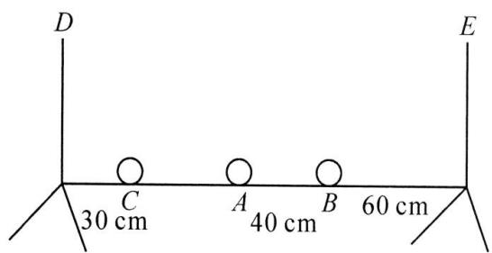

text_image

D
E
C
A
B
30 cm
40 cm
60 cm

图1

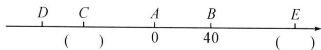

text_image

D C A B E
( ) 0 40 ( )

图2

【数学建模】以 A 球所在位置为原点, 轨道所在直线向右为正方向建立数轴, 设 B 球代表的数为 40.

(1)在如图2所示的数轴上,直接写出C球及右挡板E所代表的数是C:\_\_\_\_,E:\_\_\_\_;

【实践探究】现在 A 球从原点开始以每秒 10 cm 的速度向右匀速运动.

(2)利用数轴探究下列碰撞事件依次发生时运动的时间及三个小球对应的数,并填写下表:

<table><tr><td>事件</td><td>A 碰B</td><td>B 碰E</td><td>B 碰A</td><td>A 碰C</td><td>C 碰D</td><td>C 碰A</td><td>A 碰B</td></tr><tr><td>运动时间/秒</td><td></td><td></td><td></td><td></td><td></td><td></td><td></td></tr><tr><td>A 对应数</td><td></td><td></td><td></td><td></td><td></td><td></td><td></td></tr><tr><td>B 对应数</td><td></td><td></td><td></td><td></td><td></td><td></td><td></td></tr><tr><td>C 对应数</td><td></td><td></td><td></td><td></td><td></td><td></td><td></td></tr></table>

# 【延伸运用】

(3)经过12秒时，A球在数轴上所对应的数是\_\_\_\_，B球在数轴上所对应的数是\_\_\_\_；经过63秒时，A球在数轴上所对应的数是\_\_\_\_，B球在数轴上所对应的数是\_\_\_\_，C球在数轴上所对应的数是\_\_\_\_；

(4)直接写出 A 球第二次到达 C 球所在位置时所用的时间为\_\_\_\_秒.

# 综合与实践(二) 体重调查

阅读下列材料并解答以下问题：

<table><tr><td>素材1</td><td colspan="8">党和国家非常重视青少年的身心健康,采取多种举措增强青少年体质.世界卫生组织给出了一个标准体重的计算方法:男性标准体重(kg)=(身高cm-80)x70%,女性标准体重(kg)=(身高cm-70)x60%,标准体重±10%为正常体重,标准体重±10%~±20%为体重过重或过轻,标准体重±20%以上为肥胖或体重不足.</td></tr><tr><td rowspan="2">素材2</td><td rowspan="2" colspan="8">表一 60分钟各项运动消耗热量表运动 骑车 快跑 慢跑 爬楼梯 游泳热量变化/卡 -184 -700 -655 -480 -1036</td></tr><tr></tr><tr><td>素材3</td><td colspan="8">表二 常见食物摄入热量表食物 炸薯片 方便面 猪肉 巧克力 曲奇饼 基围虾热量变化/(卡/100g) +612 +472 +816 +586 +544 +126</td></tr><tr><td>任务1</td><td colspan="8">(1)七年级男生小明身高165cm,体重70kg;女生小勤身高158cm,体重48kg,通过上述材料说明小明和小勤的体重情况.</td></tr><tr><td>任务2</td><td colspan="8">(2)小明所在活动小组有6名成员(都是男生),他们的体重情况统计如下(超出标准体重的百分比计为正,不足标准体重的百分比计为负):编号 1 2 3 4 5 6体重指标 -11.1% +21.3% 0.8% +10.7% -2.6% +17.6%根据上表中统计数据分析该小组6位同学的体重状况.</td></tr><tr><td>任务3</td><td colspan="8">(3)针对目前中学生中肥胖率偏高的实际情况,李老师和同学们一同分析了形成这些问题的原因,多数学生喜欢吃一些零食、炸薯条,汉堡等高糖、高脂和高热量的食品,还有一些学生根本就不正常吃饭.根据素材2,3提供的信息,请给小明及所在小组同学提出一些关于饮食方面的建议,并制订适合他们的体育锻炼方案.</td></tr></table>

# 综合与实践(三) 怎样邮寄瓯柑更经济

瓯柑是温州的特产,每年秋冬季是其盛产期.小温家的瓯柑每年通过网络进行包邮销售,因此需要较多快递费的支出.现有以下素材:

【素材1】一客户在小温家定了瓯柑共100千克，分装10箱后称重为：10.3, 10.1, 9.9, 9.8, 10.1, 9.9, 10.1, 9.8, 9.9, 10.1（单位：千克）.

小温每箱以 10 千克为标准, 超过的千克数记为正数, 不足的千克数记为负数, 记录如表所示:

<table><tr><td>与标准质量的差值(单位:千克)</td><td>+0.3</td><td>+0.1</td><td>-0.1</td><td>-0.2</td></tr><tr><td>箱数</td><td>1</td><td>4</td><td>3</td><td>2</td></tr></table>

【素材 2】据调查,某快递公司收费标准:首重1千克以内8元(含1千克),续重(超过1千克的部分)2元/千克,不足1千克按1千克计,超过20千克的需要额外支付包装费30元.

根据以上素材完成以下任务：

【任务1】将这10箱瓯柑与标准质量的4种差值按从大到小的顺序排列,并求出这些瓯柑与标准质量最多相差多少,最少相差多少?

【任务2】现有两种邮寄方案：

方案一: 分 10 箱邮寄, 每箱一个包裹; 方案二: 10 箱打成一个大包裹邮寄.

请通过计算说明,选哪种方案邮寄,小温家支付的快递费更省?省多少钱?

# 第二章 有理数的运算

# 综合与实践(四) 整理生活收支账目

小红用学过的知识制作了自己某周的零用钱收支情况(表 1)和周六采购生活物品清单(表 2),其中收入用正数表示,支出用负数表示.

表 1 2024 年 12 月某周零用钱的收支情况

<table><tr><td>时间</td><td>摘要</td><td>收支</td></tr><tr><td>周一</td><td>家人给零用钱</td><td>100</td></tr><tr><td>周二</td><td>生活支出</td><td>-20</td></tr><tr><td>周三</td><td>学习用品支出</td><td>-34</td></tr><tr><td>周四</td><td>生活支出</td><td>-10</td></tr><tr><td>周五</td><td>生活支出</td><td>-16</td></tr><tr><td rowspan="2">周六</td><td>家人预付采购生活物品</td><td>200</td></tr><tr><td>采购生活物品</td><td>-182</td></tr><tr><td>周日</td><td>生活支出</td><td>-8</td></tr><tr><td></td><td>本周结余</td><td></td></tr></table>

表 2 周六采购生活物品清单

<table><tr><td>物品</td><td>数量/市斤</td><td>单价/元</td><td>金额</td></tr><tr><td>胡萝卜</td><td>2</td><td>2.5</td><td>5</td></tr><tr><td>白菜</td><td>3</td><td>1.5</td><td>4.5</td></tr><tr><td>大米</td><td>5</td><td>3.5</td><td>17.5</td></tr><tr><td>青菜</td><td>2</td><td>4</td><td>8</td></tr><tr><td>猪肉</td><td>3</td><td></td><td></td></tr><tr><td>牛肉</td><td>2.5</td><td></td><td></td></tr></table>

(1)小红这一周结束后结余多少钱?   
(2) 小红由于疏忽, 忘记了猪肉和牛肉的单价, 只记得牛肉单价是猪肉单价的 3 倍. 你能根据表格帮她计算出猪肉的价格吗? 若能, 写出计算过程.

# 综合与实践(五) 探究喷墨打印机的工作原理

阅读下列材料并解答以下问题：

<table><tr><td colspan="4">探究喷墨打印机的工作原理</td></tr><tr><td>素材1</td><td colspan="2">喷墨式双向打印机通过喷射墨水完成文件打印.如图1,打印机外框架上有一根水平杆,喷头架在水平杆上来回移动完成喷墨.第一次,喷头架从左到右喷墨,停止后纸张向前移动;第二次,喷头架从停止处出发,反向完成喷墨,如此往复.</td><td>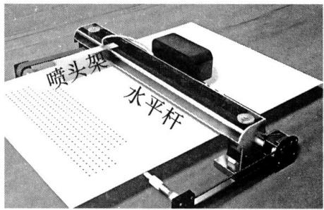 图1</td></tr><tr><td>素材2</td><td colspan="2">如图2,以这根水平杆所在的直线建立数轴,以水平杆的中点为原点,以向右的方向为正方向,用一个单位长度表示1cm.已知喷头架的初始位置为-10,向右2个单位长度记为+2,向左3个单位长度记为-3,以下记录了喷头架的6次运动情况:+18,-10,+6,-10,+8,-12.</td><td>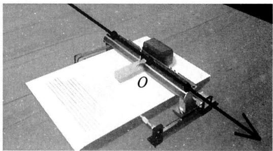 图2</td></tr><tr><td colspan="4">问题解决</td></tr><tr><td>任务1</td><td>确定位置</td><td colspan="2">经过6次喷墨后,确定喷头架的最终位置.</td></tr><tr><td>任务2</td><td>确定路程</td><td colspan="2">经过6次喷墨后,求出喷头架移动的总路程.</td></tr></table>

# 综合与实践(六) 数轴上两点间的距离的认识与应用

【知识再现】我们知道,数轴上表示数 a 的点与原点的距离叫做数 a 的绝对值,记作 $\left|a\right|$ , 因为原点表示的数是 0, 所以 $\left|a\right| = \left|a - 0\right|$ , 由此可知, $\left|7 - (-2)\right|$ 表示 7 与 -2 之差的绝对值, 实际上也可理解为数轴上分别表示 7 与 -2 的两点之间的距离, 所以 $\left|7 - (-2)\right| = 9$ .

【问题初探】阅读以下材料,并回答问题:

如图, 把一根长度为 $a \mathrm{~cm}$ 木棒 $M N$ 放在一条数轴 (单位长度为 $1 \mathrm{~cm}$ ) 上, 它的两端 $M, N$ 分别落在点 $A, B$ 处, 将木棒在数轴上水平移动, 当点 $M$ 移动到 $B$ 处时, 点 $N$ 与点 $D$ 重合, 此时点 $N$ 对应的数为 17 , 当点 $N$ 移动到 $A$ 处时, 点 $M$ 与点 $C$ 重合, 此时点 $M$ 对应的数为 5 .

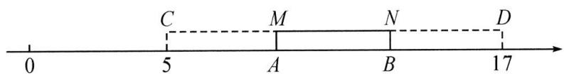

text_image

C
M
N
D
0
5
A
B
17

(1)由此可得, $CD=$ \_\_\_\_ cm,a 的值为\_\_\_\_;  
(2)图中点 A 所表示的数是\_\_\_\_，点 B 所表示的数是\_\_\_\_。

# 【拓展应用】

(3)借助上述方法解决下列问题:一天,小华去问奶奶的年龄,奶奶说:“我若是你现在这么大,你还要35年才出生;你若是我现在这么大,我已经是109岁的老寿星了,哈哈.”小华纳闷,奶奶到底是多少岁?请你画出示意图,求出小华和奶奶现在的年龄,并说明解题思路.

# 综合与实践(七) 关于数轴折叠的探究

数轴是一个非常重要的数学工具,它使数和数轴上的点建立起一一对应的关系,揭示了数与点之间的内在联系,它是“数形结合”的基础.小明在一条长方形纸带上画了一条数轴,进行如图所示的操作探究:

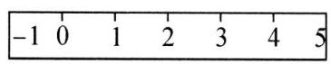  
图1

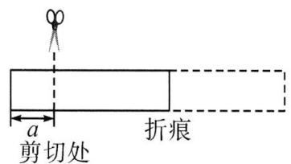

text_image

剪切处
折痕

图2

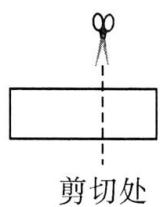  
图3

(1)操作 1: 折叠纸带, 使数轴上表示 1 的点与表示 -1 的点重合, 则表示 -2.5 的点与表示数 \_\_\_\_ 的点重合;

(2)操作 2: 折叠纸带, 使数轴上表示 1 的点与表示 3 的点重合, 回答以下问题:

①那么数轴上表示-2的点与表示数\_\_\_\_的点重合,表示数m的点与表示数\_\_\_\_的点重合(用含m的代数式表示);

(2)若数轴上 $A, B$ 两点之间距离为 $11(A$ 在 $B$ 的左侧), 且 $A, B$ 两点经折叠后重合, 则 $A, B$ 两点表示的数分别是 $\_ \_ \_ \_ \_ \_ \_ \_ \_ \_ \_ \_ \_ \_ \_ \_ \_ \_ \_ \_ \_ \_ \_ \_ \_ \_ \_ \_ \_ \_ \_ \_ \_ \_ \_ \_ \_ \_ \_ \_ \_ \_ \_ \_$

(3)操作 3: 在数轴上剪下 6 个单位长度 (从 -1 到 5) 的一段纸带 (如图 1), 将纸带按图 2 所示向左折叠, 剪掉不重叠部分, 不重叠部分的纸带长度为 $a$ 个单位长度, 将重叠部分按图 3 所标注的剪切处剪切, 得到三条长度相等的纸带, 请求出图 3 剪切处对应的点所表示的数 (用含 $a$ 的代数式表示).

# 第三章 代数式

# 综合与实践(八) 用火柴棒搭建三角形

【操作】用火柴棒按下列方式搭建三角形：

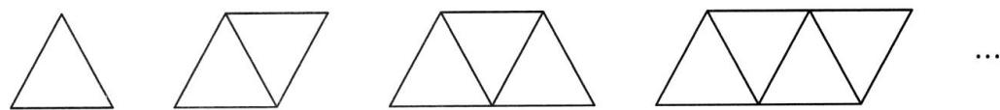

natural_image

Sequence of geometric figures forming triangles and parallelograms (no text or symbols)

【问题】当三角形的个数为 n 时, 火柴棒的根数是多少? 请填写下面表格.

【探究 1】小明发现:从第二个图形起,与前一图形相比,增加 2 根火柴棒,可得:

<table><tr><td>三角形个数</td><td>1</td><td>2</td><td>3</td><td>4</td><td>...</td></tr><tr><td>火柴棒根数</td><td>3</td><td>3+2</td><td>3+2+2</td><td>_</td><td>...</td></tr></table>

【探究 2】小旭发现:每个三角形由三根火柴棒组成,从第一个三角形起,火柴棒根数等于所含三角形的个数乘以 3 再减去重复的火柴棒根数,可得:

<table><tr><td>三角形个数</td><td>1</td><td>2</td><td>3</td><td>4</td><td>...</td></tr><tr><td>火柴棒根数</td><td>1×3</td><td>2×3-1</td><td>3×3-2</td><td>_</td><td>...</td></tr></table>

【探究 3】小晗发现: 观察火柴棒的根数与三角形个数的对应关系, 可得:

<table><tr><td>三角形个数</td><td>1</td><td>2</td><td>3</td><td>4</td><td>...</td></tr><tr><td>火柴棒根数</td><td> $3=1 \times 2+1$ </td><td> $5=2 \times 2+1$ </td><td> $7=3 \times 2+1$ </td><td>_</td><td>...</td></tr></table>

【探究 4】小亮发现: 把组成图形的火柴棒分为“横”放和“斜”放, 可得:

<table><tr><td>三角形个数</td><td>1</td><td>2</td><td>3</td><td>4</td><td>...</td></tr><tr><td>火柴棒根数</td><td>1+2</td><td>2+3</td><td>3+4</td><td>_</td><td>...</td></tr></table>

【归纳】(1)当三角形的个数为 n 时,火柴棒的根数是 \_\_\_\_ (用含 n 的整式表示);

(2)当图形中含有2026个三角形时,需要多少根火柴棒?

【拓展】(3)如图所示是一组有规律的图案,它们是由边长相同的小正方形组成,其中部分小正方形涂有阴影.按照这样的规律,第n个图案中有4425个涂有阴影的小正方形,求n的值.

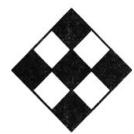  
第1个图案

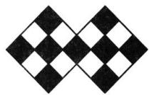  
第2个图案

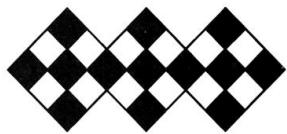  
第3个图案

...

# 综合与实践(九) 装裱对联

李老师写了一副对联,并计划装裱起来.根据以下材料,解决问题.

<table><tr><td colspan="2">问题背景</td></tr><tr><td>素材1</td><td>对联的一种装裱方式如图所示,上、下空白处分别称为天头和地头,左、右空白处统称为边.一般情况下,天头长与地头长的比是3:2,左、右边的宽相等,均为天头长和地头长的和的 $\frac{1}{10}$ .李老师要以这种装裱方式装裱一副对联,对联的长为100cm,宽为33cm. 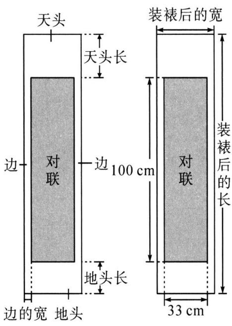</td></tr><tr><td>素材2</td><td>对联装裱一般有两种方式:一种是普通机器装裱,另一种是手工装裱.据调查,某装裱服务公司的收费标准为:一副对联如果装裱左、右宽度为3cm,则普通机器装裱收费为装裱后的面积每平方米100元,满50元减5元;手工装裱收费为装裱后的面积在0.3平方米内,每平方米150元,若超出0.3平方米,超出的部分打八折.</td></tr><tr><td colspan="2">问题解决</td></tr><tr><td>问题1</td><td>若李老师装裱的对联天头长为24cm,则地头长为____cm,左、右两边的宽度为____cm.</td></tr><tr><td>问题2</td><td>若左、右两边的宽度均为a cm,李老师这副对联装裱后的长和宽各为多少厘米?</td></tr><tr><td>问题3</td><td>如果李老师选择装裱的左、右宽度为3cm,请问李老师选择哪种装裱方式更省钱?</td></tr></table>

# 综合与实践(十) 燃油车与新能源车行驶费用对比

随着新能源汽车的快速发展,数学小组选择价格相近的两款国产汽车进行使用费用的对比,其中一款是燃油车,另一款是新能源车.阅读以下素材并解决以下问题.

<table><tr><td colspan="2">问题背景</td></tr><tr><td>素材1</td><td>燃油车油箱容积:50升,油价:8元/升,续航里程:a千米,每千米行驶费用为(50×8)/a元;新能源车电池电量:100千瓦时,综合电价:1元/千瓦时,续航里程:a千米,每千米行驶费用为 元.</td></tr><tr><td>素材2</td><td>燃油车的每千米行驶费用为0.8元.</td></tr><tr><td>素材3</td><td>燃油车和新能源车每年的其它费用分别为4800元和7500元.</td></tr><tr><td colspan="2">问题解决</td></tr><tr><td>任务1</td><td>用含a的代数式表示新能源车的每千米行驶费用.</td></tr><tr><td>任务2</td><td>求新能源车每千米行驶的费用.</td></tr><tr><td>任务3</td><td>每年行驶里程为x千米时,用x表示燃油车和新能源车每年的费用,并分别求出当x=4000千米和x=5000千米时,哪种车的年费用较少?(年费用=年行驶费用+年其它费用)</td></tr></table>

# 综合与实践(十一) 设计比赛场地

根据素材,设计比赛场地.(用直线和曲线表示跑道,跑道宽度忽略不计)

<table><tr><td colspan="2">问题背景</td></tr><tr><td>素材1</td><td>如图1是某学校操场最内侧的跑道,由两段直道和两段半圆形的弯道组成,其中直道的长为a米,半圆形弯道的直径为b米.</td></tr><tr><td>素材2</td><td>如图2,兴趣小组在跑道内侧设计了“铁饼投掷”项目的圆形比赛场地和“掷标枪”项目的四边形比赛场地.(阴影部分为比赛场地)</td></tr><tr><td colspan="2">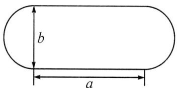 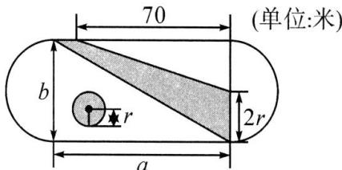 图1 图2</td></tr><tr><td colspan="2">问题解决</td></tr><tr><td>任务1</td><td>用含a,b,r的代数式表示两项比赛场地的总面积S(阴影部分面积的和);</td></tr><tr><td>任务2</td><td>若a=80,b=40,r=10,求S的值(π取3).</td></tr></table>

# 第四章 整式的加减

# 综合与实践(十二) 月历与幻方

幻方起源于中国,月历常用于生活,它们有很多奥秘,探究并完成填空.

<table><tr><td>主题</td><td>探究月历与幻方的奥秘</td></tr><tr><td>活动1</td><td>如图1是某月的月历,用方框选取了其中的9个数.(1)移动方框,若方框中的部分数如图2所示,则a是_,b是_;(2)移动方框,若方框中的部分数如图3所示,则c是_,d是_;(注:用含n的代数式表示c和d.) 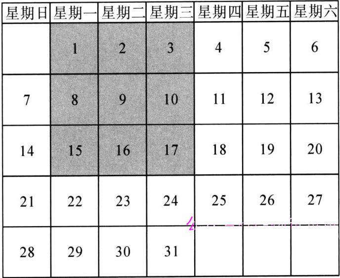 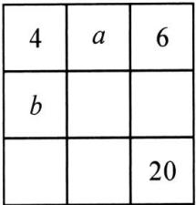 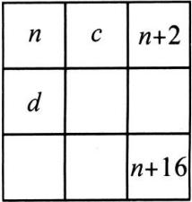 图1 图2 图3</td></tr><tr><td>活动2</td><td>移动方框选取月历中的9个数,调整它们的位置,使其满足“三阶幻方”分布规律:每一横行、每一竖列以及两条斜对角线上的三个数的和都相等.(3)若方框选取的9个数如图4所示,调整后,部分数的位置如图5所示,则e是_,f是_;(4)若方框选取的9个数中最小的数是n,调整后,部分数的位置如图6所示,则用含n的代数式表示g是_. 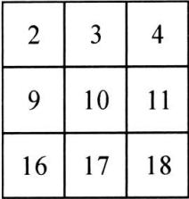 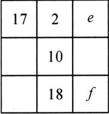 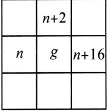 图4 图5 图6</td></tr></table>

# 综合与实践(十三) 游泳馆的设计方案

阅读下列材料并解答以下问题：

<table><tr><td>主题</td><td>游泳馆的设计方案</td></tr><tr><td>设计方案</td><td>如图是小华为某体育中心游泳馆的设计方案,半圆形休息区和小长方形游泳区以外的地方都是自由活动区域,各个区域的有关数据如图所示,其中 $m=\frac{2}{3}a$ , $n=\frac{1}{2}b$ .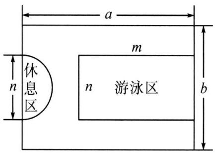</td></tr><tr><td>任务1</td><td>(1)用含 $a$ , $b$ 的整式表示游泳区的面积;</td></tr><tr><td>任务2</td><td>(2)若长方形空地的长与宽之间满足 $a=\frac{3}{2}b$ ,现要求自由活动区域不小于游泳馆总面积的 $\frac{7}{12}$ ,小华的设计方案是否符合要求?请你通过计算说明.</td></tr></table>

# 综合与实践(十四) 探究新概念

【阅读材料】定义 n 个关于 x 的一次整式 $A_{1}, A_{2}, \cdots, A_{n}$ ，存在不等于零的数 $k_{1}, k_{2}, \cdots, k_{n}$ ，使 $k_{1}A_{1} + k_{2}A_{2} + \cdots + k_{n}A_{n} = a$ ，其中 a 是常数，我们称这 n 个一次整式为常数 a 的“相关整式”。例如：对于一次整式 x - 4, -3x + 8, -x - 1，存在 $k_{1} = 1, k_{2} = -1, k_{3} = 4$ ，使 $(x - 4) - (-3x + 8) + 4(-x - 1) = -16$ ，我们就称一次整式 x - 4, -3x + 8, -x - 1 为常数 -16 的“相关整式”。

# 【数学理解】

(1)若整式 $A_{1} = x, A_{2} = 3x + 1, A_{3} = x + 4$ 为常数 $a$ 的“相关整式”，其中 $k_{1} = k_{2} = 1$ ，则常数 $a$ 的值为 $\_$ ， $k_{3}$ 的值为 $\_$ ；  
(2)若整式 $A_{1} = px + q, A_{2} = x + 1, A_{3} = -\frac{2}{3} x + \frac{1}{3}$ 为常数2的“相关整式”，其中 $k_{1} = 1$ ， $k_{2} = -1, k_{3} = 3$ ，求 $p, q$ 的值；

# 【拓展应用】

(3)若整式 $A_{1} = m_{1}x + n_{1}, A_{2} = m_{2}x + n_{2}$ 为常数0的“相关整式”，试说明 $m_{1}n_{2} = m_{2}n_{1}$ ; (4)若整式 $A_{1} = x + 3, A_{2} = 2x + 6, A_{3} = mx + 7$ 为常数0的“相关整式”，直接写出 $m$ 的值.

# 第五章 一元一次方程

# 综合与实践(十五) 设计制作包装盒

小明和小红假期到某厂参加社会实践, 发现该厂用一批长为 $24 \mathrm{~cm}$ , 宽为 $15 \mathrm{~cm}$ 的白纸板做无盖包装盒 (不考虑连接的重叠部分), 制作时, 工厂一般将白纸板分隔成两个长方形分别制作底面和侧面, 截得底面后的剩余部分不再使用. 请根据活动完成相应的任务.

<table><tr><td>活动1</td><td>如图1是常见的一种设计方案甲:在白纸板上截去两部分(图中阴影部分),盒子底面的四边形ABCD是正方形,然后沿虚线折成一个无盖的长方体包装盒.</td><td>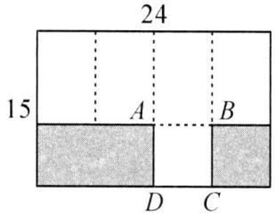图1</td></tr><tr><td colspan="3">任务1:请直接计算出方案甲中包装盒的容积为____cm3.</td></tr><tr><td>活动2</td><td>为了增加包装盒的容积,有人提议将包装盒设计成圆柱形.小明横着裁剪把长方形的长作为底面圆的周长进行设计,如图2得方案乙.</td><td>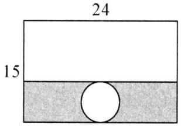图2</td></tr><tr><td colspan="3">任务2:请计算方案乙中无盖圆柱形包装盒的容积(π取3).并判断容积是否变大.</td></tr><tr><td>活动3</td><td>小明:设计成圆柱形的容积确实变化了.小红:那么是否还有容积更大的情况呢?小明与小红通过研究发现了无盖圆柱形包装盒设计的新方案,且容积还大于400 cm3.</td><td></td></tr><tr><td colspan="3">任务3:请在下列白纸板上画出他们的方案,并计算其容积(π取3)15 24</td></tr></table>

# 综合与实践(十六) 购物选择

阅读下列材料并解答以下问题：

<table><tr><td>问题背景</td><td colspan="2">2025年某市全民健身10 000米挑战赛,将在3月到11月期间举办春、夏、秋、冬四个赛季,赛事吸引了广大马拉松爱好者.活动期间,丫丫所在班级开展了相关知识竞赛,需要在网上购买手办和奖牌作为奖品.</td></tr><tr><td>素材1</td><td>网上在没有促销活动时,买2个手办和3个奖牌,共需45元;买1个手办和1个奖牌,共需20元.</td><td>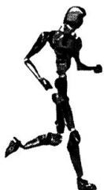 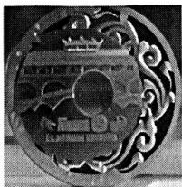 手办 奖牌</td></tr><tr><td>素材2</td><td colspan="2">网上促销活动信息如下:方式一:非会员所有商品打9折;方式二:购买50元会员卡后,所有商品打7折.</td></tr><tr><td colspan="3">问题解决</td></tr><tr><td>问题1</td><td colspan="2">根据素材1,网上在没有促销活动时,手办和奖牌的销售单价各是多少元?</td></tr><tr><td rowspan="2">问题2</td><td colspan="2">丫丫和李老师计划在促销期间购买手办和奖牌共30个,其中手办a个(0</td></tr><tr><td colspan="2">若按方式一购买,共需要____元;若按方式二购买,共需要____元.(均用含a的代数式表示,结果化到最简)</td></tr><tr><td>问题3</td><td colspan="2">在问题2的条件下,当购买手办的数量a为何值时,两种购买方式的费用一样?</td></tr></table>

# 综合与实践(十七) 市场销售问题的调研

第十五届中国国际航空航天博览会于 2024 年 11 月 12 日至 17 日在珠海成功举行. 期间, 各类珠海航展文创纪念品深受广大军迷热情追捧, 尤其是以歼-20 和歼-35A 为主题的飞机模型成为畅销品. 某班数学组对某商场进行调研后了解到如下信息:

<table><tr><td colspan="2">市场调研</td></tr><tr><td>信息1</td><td>某商场从厂家购进了A品牌飞机模型7个,B品牌飞机模型5个,共付款920元,已知每个B品牌飞机模型比每个A品牌飞机模型进价贵40元.</td></tr><tr><td>信息2</td><td>某商场将B品牌飞机模型按信息1中的进价提高50%后标价,实际销售时再打折出售,此时每个B品牌飞机模型仍可获利35元.</td></tr><tr><td colspan="2">问题解决</td></tr><tr><td>问题1</td><td>(1)设每个A品牌飞机模型进价为x元,则每个B品牌飞机模型进价为____元,根据题意可列方程____.</td></tr><tr><td>问题2</td><td>(2)由(1)求得每个A品牌飞机模型进价为____元,每个B品牌飞机模型进价为____元.</td></tr><tr><td>问题3</td><td>(3)利用一元一次方程求出信息2中B品牌飞机模型的打折数.</td></tr></table>

# 综合与实践(十八) 征集长方体纸盒设计方案

阅读下列材料并解答问题：

<table><tr><td>问题情境</td><td colspan="2">现有若干张边长为xcm的正方形纸板,利用这些纸板制作无盖的长方体纸盒,要求纸盒体积大于10cm3,学校面向全体同学征集设计方案.</td></tr><tr><td>莉莉的设计方案</td><td>如图1,在四角处剪去四个小正方形,制作底面边长为2cm的长方体纸盒.</td><td>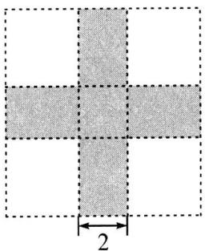图1</td></tr><tr><td>欣欣的设计方案</td><td>按如图2所示的方式裁剪</td><td>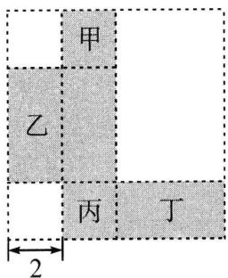图2</td></tr><tr><td>方案实施</td><td colspan="2">莉莉独立完成,欣欣在制作长方体纸盒时想请求阳阳的帮助,阳阳给欣欣提出了一个问题,只要欣欣答上来就帮助她,问题如下:将图2设计图纸的甲、乙、丙、丁四个面上分别标上3(n+1),2n,-4和6,若长方体纸盒中相对的面上的两个整式的和相等,则n的值为多少?</td></tr><tr><td colspan="3">根据以上内容,完成下列问题:</td></tr><tr><td>问题1</td><td colspan="2">边长为xcm的正方形纸板的面积为 cm2,图1中纸板折成的长方体高为 cm(用含x的代数式表示).</td></tr><tr><td>问题2</td><td colspan="2">1帮助欣欣完成阳阳出的题目;2若图2中折成的纸盒体积为16cm3,判断图1中折成的纸盒的体积是否满足要求,并比较两种方案纸盒的使用率哪个更高(使用率为使用纸盒面积与总面积的比).</td></tr></table>

# 综合与实践(十九) 阶梯水费

【素材】某市居民生活用水实行阶梯水费,标准如下(注:水费按月份结算):

<table><tr><td>阶梯等级</td><td>基础水费</td><td>污水处理费</td></tr><tr><td>一级</td><td>不超过 $15\ m^{3}$ 时, $1.4$ 元/ $m^{3}$ ;</td><td rowspan="3"> $1.2$ 元/ $m^{3}$ </td></tr><tr><td>二级</td><td>不超过 $15\ m^{3}$ 的部分 $1.4$ 元/ $m^{3}$ ,超过 $15\ m^{3}$ 但不超过 $30\ m^{3}$ 的部分 $2$ 元/ $m^{3}$ ;</td></tr><tr><td>三级</td><td>不超过 $15\ m^{3}$ 的部分 $1.4$ 元/ $m^{3}$ ,超过 $15\ m^{3}$ 但不超过 $30\ m^{3}$ 的部分 $2$ 元/ $m^{3}$ ,超过 $30\ m^{3}$ 的部分 $3$ 元/ $m^{3}$ .</td></tr><tr><td colspan="3">每月水费=基础水费+污水处理费</td></tr></table>

根据以上素材,解决下列问题:

【问题 1】(1)某居民 7 月份和 8 月份的用水量分别为 $12 \, m^{3}$ 和 $25 \, m^{3}$ ，求该居民 7 月份和 8 月份的水费分别为多少元？

【问题 2】(2)某居民的月用水量为 $x \, m^{3}$ ，用含 x 的式子表示该居民当月的水费；

【问题 3】(3)若张老师家 10 月份的水费为 80.6 元,求张老师家 10 月份的用水量.

# 第六章 几何图形初步

# 综合与实践(二十) 钟表的数学问题

【问题提出】随着时间的变化,钟面上时针和分针形成夹角的度数也随之变化,记时针和分针的夹角为 $\alpha(a$ 大于等于 $0^{\circ}$ ,且小于等于 $180^{\circ}$ ).我们可以求出任意时刻 $\angle\alpha$ 的度数吗?

<table><tr><td>分针运动规律</td><td>分针每分钟走6°</td><td rowspan="2">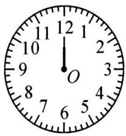</td></tr><tr><td>时针运动规律</td><td>时针每小时走30°,即每分钟走0.5°</td></tr><tr><td>规定</td><td>当时针和分针都指向刻度12时记为0°</td><td></td></tr><tr><td>特例探究1(8点50分)</td><td>分针绕点O旋转所得角的度数是6°×50=300°,时针绕点O旋转所得角的度数是30°×8+0.5°×50=265°,所以∠α=300°-265°=35°.</td><td>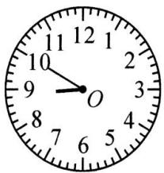</td></tr><tr><td>特例探究2(8时30分)</td><td>分针绕点O旋转所得角的度数是6°×30=180°,时针绕点O旋转所得角的度数是30°×8+0.5°×30=255°,所以∠α=255°-180°=75°.</td><td>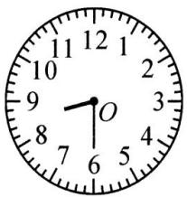</td></tr><tr><td>特例探究3(8时10分)</td><td>分针绕点O旋转形成的角的度数是6°×10=60°,时针绕点O旋转形成的角的度数是30°×8+0.5°×10=245°,此时245°-60°=185°,由于185°&gt;180°,所以∠α=360°-185°=175°.</td><td>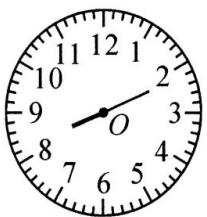</td></tr></table>

# 【问题解决】

(1) 当时间为 7 时 30 分时, 请你求出 $\angle\alpha$ 的度数;

(2)王老师7时整从家中出门散步,当她返回家中时还不到8时,此时她发现时针与分针形成的夹角正好是直角,求王老师外出散步用了多少分钟?

# 综合与实践(二十一) 广播体操中的数学问题

【问题背景】如图1,大课间的广播操展让我们充分体会到了一种整体的图形之美.洋洋和乐乐想从数学角度分析下如何能让班级同学们的广播操做得更好,他们搜集了标准广播操图片进行讨论,如图2,为了方便研究,定义两手手心位置分别为A,B两点,两脚脚跟位置分别为C,D两点,定义A,B,C,D平面内O为定点,将手脚运动看作绕点O进行旋转.

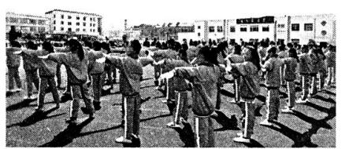

natural_image

Group of children performing synchronized exercises outdoors in front of buildings (no visible text or symbols)

图1

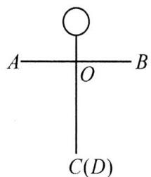

text_image

A
O
B
C(D)

图2

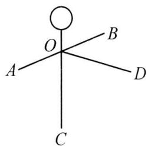

text_image

O
A
B
D
C

图3

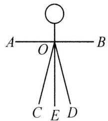

text_image

A
O
B
C E D

图4

【任务1】如图2，A，O，B三点共线，且 $\angle AOC=\angle BOC$ ，则 $\angle AOC=$ \_\_\_\_°；

【任务2】第三节腿部运动中,如图3,洋洋发现,虽然A,O,B三点共线,却不在水平方向上,且 $\angle AOD:\angle BOC=3:2$ .他经过计算发现, $\angle AOC-\frac{2}{3}\angle BOD$ 的值为定值,请判断洋洋的发现是否正确?如果正确,请求出这个定值;如果不正确,请说明理由;

【任务3】第四节体侧运动中, 乐乐发现, 两腿左右等距张开且 $\angle COD = 30^{\circ}$ , 开始运动前 $A, O, B$ 三点在同一水平线上, $OA, OB$ . 绕点 $O$ 顺时针旋转, $OA$ 旋转速度为 $50^{\circ} / \mathrm{s}$ , $OB$ 旋转速度为 $25^{\circ} / \mathrm{s}$ , 当 $OB$ 旋转到与 $OD$ 重合时, 运动停止, 如图4, 运动停止时, 直接写出 $\angle AOD$ 的度数是 \_\_\_\_.

# 综合与实践(二十二) 跑道起点依次延伸问题

在田径比赛中,某校的跑道是由长为 85.96 米的两条直道和半径为 36 米的两条半圆弧跑道组成.跑道分为 8 道,每条跑道宽 1.25 米.规定:

①第一道全程长度应由离开内圈30厘米处沿跑圈丈量；

(即 $l_{1}=2\pi R+2\times85.96=2\times[3.1416\times(36+0.3)+85.96]=400$ 米).

②跑第二道至第八道的运动员不能踩着分道线跑,而是沿着各自分道线向外20厘米跑(踩线将取消成绩);

③终点线设置在第一分界(如图中 AE 处).

问:在举行 400 米跑比赛时,为消除跑外圈与跑内圈的差距,起跑时让运动员处于不同的起跑线上(如图中 $P_{1}, P_{2}, \cdots P_{8}$ ),那么各外圈跑道起跑点较相邻内圈跑道起点依次应向前延伸多少米?(π 取 3.1416, 结果精确到 0.01)

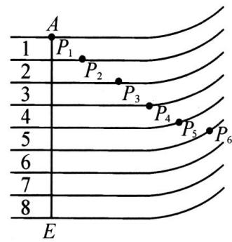

text_image

A
1 P₁
2 P₂
3 P₃
4 P₄
5 P₅
6 P₆
7
8
E

