# 自学好帮手

# 数学

# 七年级上册

班级：\_\_\_\_

姓名：\_\_\_\_

# 目录

# 第一章 有理数

微课小专题 1 数轴、相反数、绝对值 …… 1

微课小专题 2 绝对值的性质及应用 …… 2

# 第二章 有理数的运算

微课小专题3 有理数的加减的实际应用 …… 3

微课小专题4 有理数的计算技巧(一) …… 4

微课小专题 5 有理数的计算技巧(二) …… 5

微课小专题 6 乘方与数式规律 …… 6

微课小专题 7 绝对值与分类讨论思想 …… 7

微课小专题8 绝对值与最值问题 8

微课小专题 9 数轴与点的距离问题 …… 9

微课小专题 10 数轴与动点问题(一) 行程问题 …… 10

微课小专题 11 数轴与动点问题(二)和差倍分问题 …… 11

微课小专题 12 数轴与动点问题(三) 动点定值问题 …… 12

# 第三章 代数式

微课小专题 13 列代数式 …… 13

微课小专题 14 利用代数式揭示规律…… 14

微课小专题 15 求代数式的值…… 15

# 第四章 整式的加减

微课小专题 16 整式的有关概念…… 16

微课小专题 17 整式的加减(一) 化简与求值 …… 17

微课小专题 18 整式的加减(二)不含某些项问题讨论 …… 18

微课小专题 19 整式的加减(三) 绝对值的化简 …… 19

微课小专题 20 整式的加减(四)整式加减的实际应用 …… 20

微课小专题 21 整式的加减(五)整式加减的综合应用 …… 21

# 第五章 一元一次方程

微课小专题 22 方程的解与字母系数 …… 22

微课小专题 23 等式的性质与整体思想 …… 23

微课小专题 24 解方程之易错点(一) 移项忘变号 …… 24

微课小专题 25 解方程之易错点(二) 去括号漏乘 …… 25

微课小专题 26 解方程之易错点(三) 去分母漏乘 …… 26

微课小专题 27 列方程的基本方法(一) 部分量之和等于总量 …… 27

微课小专题 28 列方程的基本方法(二) 不同的式子表示同一个量 …… 28

微课小专题 29 一元一次方程的应用(一) 数字问题 …… 29

微课小专题 30 一元一次方程的应用(二) 配套问题 …… 30

微课小专题 31 一元一次方程的应用(三)盈亏问题 …… 31

微课小专题 32 一元一次方程的应用(四) 工程问题 …… 32

微课小专题 33 一元一次方程的应用(五) 行程问题 …… 33

微课小专题 34 一元一次方程的应用(六) 利润问题 …… 34

微课小专题 35 一元一次方程的应用(七) 积分问题 …… 35

微课小专题 36 一元一次方程的应用(八) 方案问题 …… 36

微课小专题 37 一元一次方程的应用(九) 分段计费问题 …… 37

微课小专题 38 一元一次方程的应用(十) 图表问题 …… 38

微课小专题 39 一元一次方程的应用(十一) 动点问题 …… 39

# 第六章 几何图形初步

微课小专题 40 正方体的展开图与三视图 …… 40

微课小专题 41 直线、射线、线段的计数问题…… 41

微课小专题 42 分步计算求线段长…… 42

微课小专题 43 列方程求线段长…… 43

微课小专题 44 分类讨论求线段长…… 44

微课小专题 45 整体思想求线段长…… 45

微课小专题 46 线段中点问题…… 46

微课小专题 47 线段中的定值问题…… 47

微课小专题 48 分步计算求角度…… 48

微课小专题 49 余角与补角 …… 49

微课小专题 50 列方程求角度 …… 50

微课小专题 51 分类讨论求角度…… 51

微课小专题 52 整体思想求角度…… 52

微课小专题 53 角中的定值问题…… 53

# 第一章 有理数

# 微课小专题 1 数轴、相反数、绝对值

【方法技巧】熟练掌握数轴、相反数、绝对值的概念和性质,依据其概念和性质解题.

# 【金例讲析】

【例 1】有理数 a, b, c 在数轴上的位置如图所示：

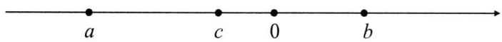

(1)请在数轴上标出 $|a|,-|b|,-c$ ;  
(2) 比较 a, b, c, $|a|$ , $-|b|$ , -c 的大小(用“<”将它们连接起来).

【例 2】已知 a, b 为有理数, 下列说法:

①若 a, b 互为相反数，则 $\frac{a}{b} = -1$ ;   
②若 $|a|=|b|$ ，则a=b；  
③若数轴上表示数 a, b 的点到原点的距离相等，则 $\left|a\right| = \left|b\right|$ ;  
④ $|a|>|b|$ ，且a大于其相反数，则a>b.

其中正确的结论有\_\_\_\_（填序号）.

# 【实战演练】

1. 已知有理数 a, b, c 在数轴上的位置如图所示，且 $\left|a\right| = \left|b\right|$ .

(1) $a$ \_\_\_\_ 0, $b$ \_\_\_\_ 0, $c$ \_\_\_\_ 0, $a$ \_\_\_\_ $b$ , $c$ \_\_\_\_ $b$ (用“>”, “=”或“<”填空);   
(2) $a+b=$ \_\_\_\_， $\frac{a}{b}=$ \_\_\_\_；  
(3)在数轴上标出-b与-c,试比较a,b,c,-b,-c的大小(按从小到大的顺序排列).

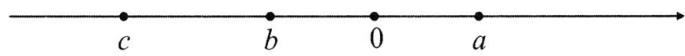

# 微课小专题 2 绝对值的性质及应用

【方法技巧】熟练掌握绝对值的意义和性质,依据其意义和性质解题.

1. 绝对值的几何意义: 数轴上表示数 $a$ 的点与原点的距离叫做数 $a$ 的绝对值, 记作 $|a|$ , 故绝对值表示的是数轴上两点之间的距离;

2. 绝对值的代数意义: (1) 一个正数的绝对值是它本身; (2) 一个负数的绝对值是它的相反数; (3) 0 的绝对值是 0;

3. 去绝对值的法则: $|a| = \begin{cases} a & (a \geqslant 0), \\ -a & (a \leqslant 0); \end{cases}$

4. 绝对值的性质: $|a| \geqslant 0$ . 若 $|a| + |b| = 0$ , 则 $a = 0$ 且 $b = 0$ .

# 【金例讲析】

【例】（1）若 $|a|=3$ ，则a=\_\_\_\_，若 $|a-2|=3$ ，则a=\_\_\_\_；

(2)已知 $|a|=2,|b+1|=5,a>b$ ，求 $|a+b|$ 的值；

(3)已知 $|a+b|$ 与2|b-6|互为相反数,求 $|a-b|$ 的值.

# 【实战演练】

1.(1)数轴上点 A 表示的数为 a，若点 A 到原点的距离为 5，则 a = \_\_\_\_；若点 B 表示的数为 1，点 A 到点 B 的距离为 5，则 a = \_\_\_\_；

(2)若 $|a-2|=5$ ，则a=\_\_\_\_；

(3) 若 $\left|a+1\right|=2,\left|2b-1\right|=7,a<b$ , 求 $\left|a\right|+\left|b\right|$ 的值；

(4) 若 $\left|a+3\right|$ 与 $\left|b-5\right|$ 互为相反数，求 $\left|a-b\right|$ 的值.

# 第二章 有理数的运算

# 微课小专题3 有理数的加减的实际应用

【方法技巧】解答此类问题,要理解正数和负数以及绝对值在实际生活中的意义,通过有理数的加减混合运算解决问题,弄清题意是解答此类问题的关键.

# 【金例讲析】

【例】高速公路养护小组,乘车沿东西向公路巡视维护,如果约定向东为正,向西为负,当天的行驶记录如下(单位:千米):

$$
+ 1 8, - 9, + 7, + 1 1, - 1 4, - 3, - 6, - 8, + 9, + 1 5.
$$

(1)养护小组最后到达的地方在出发点的哪个方向？距出发点多远？

(2)养护过程中,最远处离出发点有多远?

(3)若汽车行驶每千米耗油量为0.08升,求这次养护小组的汽车共耗油多少升?

# 【实战演练】

1. 某支股票上周末的收盘价格是 10.00 元,本周一到周五的收盘情况如下表: (“+”表示股票比前一天上涨,“-”表示股票比前一天下跌).

<table><tr><td>上周末收盘价</td><td>周一</td><td>周二</td><td>周三</td><td>周四</td><td>周五</td></tr><tr><td>10.00</td><td>+0.28</td><td>-2.36</td><td>+1.80</td><td>-0.35</td><td>+0.08</td></tr></table>

(1)周一至周五这支股票每天的收盘价各是多少元?

(2)本周末的收盘价比上周末收盘价是上涨了,还是下跌了?

(3)这五天的收盘价中最高的是周 ;最低的是周 ;相差 元.

2. 小虫从某点 $A$ 出发在一直线上来回爬行, 假定向右爬行的路程记为正数, 向左爬行的路程记为负数, 爬行的各段路程依次为: (单位: $\mathrm{cm}) + 5, -3, +10, -8, -6, +12, -10$ .

(1)小虫最后是否回到出发点A?

(2)小虫离开原点最远是多少?

(3)在爬行过程中,如果每爬行1cm奖励一粒芝麻,则小虫一共得到多少粒芝麻?

# 微课小专题 4 有理数的计算技巧(一)

【方法技巧】学习有理数的运算,除了要熟练掌握基本的运算方法以外,若能根据题目的结构特点,采用一些适当的计算技巧即简便运算,不仅能够提高速度,而且还能提高正确率,达到事半功倍的效果.比如有理数的加减通常可采用对消与凑整、归类与组合、裂项相消等方法.

# 【金例讲析】

【例】 计算：

(1) $-1.3+(-2.7)+4.5-5.7+3.5+2.7;$   
(2)27.45-(-32.39)+72.55+(-12.39);   
(3) $-2\frac{4}{15}+(-\frac{2}{3})-5\frac{3}{16}+7\frac{14}{15}+(-10\frac{5}{16})$ ;   
(4) $\frac{1}{2}+\frac{1}{6}+\frac{1}{12}+\cdots+\frac{1}{9900}.$

# 【实战演练】

1. 计算：

(1) $-19+6-(+11)-(-14)$ ;   
(2) $(-0.7) + 3.8 + (-1.3) + (-3.8) + 5$   
(3) $1\frac{1}{3}+(-\frac{2}{5})+\frac{4}{15}+(-\frac{4}{3})+(-\frac{1}{5})$ ;   
(4) $12\frac{1}{4} - (+1.75) - (-5\frac{1}{2}) + (-7.25) - (-2\frac{3}{4}) - 2.5.$   
(5) $\frac{1}{1 \times 3} + \frac{1}{3 \times 5} + \frac{1}{5 \times 7} + \cdots + \frac{1}{2019 \times 2021}$ .

# 微课小专题 5 有理数的计算技巧(二)

【方法技巧】有理数的乘除及混合运算,通常可采用交换律、结合律、分配律、变序、逆用、拆项等方法.

# 【金例讲析】

【例】 计算：

(1) $(-3)\times(-\frac{7}{5})\times(-\frac{1}{3})\times\frac{4}{7};$   
(2) $-4\frac{1}{5}\div\frac{7}{25}\div(-5\frac{1}{4})\times(-1\frac{2}{5})$ ;   
(3) $-\frac{4}{7}\times3.59-\frac{4}{7}\times2.41+\frac{4}{7}\times(-3)$ ;   
(4) $(- \frac{1}{4} + \frac{1}{3} - \frac{5}{12}) \times (-24)$ ;   
(5) $(-105\frac{7}{9})\div(-7)$ .

# 【实战演练】

1. 计算：

(1) $(-2.5)\times0.37\times1.25\times(-4)\times(-8)$ ;   
(2) $(-138)\times (-\frac{8}{7}) + 52\times \frac{8}{7} +183\times (-\frac{8}{7});$   
(3) $\left(\frac{5}{6}-\frac{3}{4}-\frac{7}{12}\right)\div\left(-\frac{1}{36}\right)$ ;   
(4)89 $\frac{1}{10}\div(-9)$ ;   
(5) $-\frac{5}{12}\div(1\frac{1}{4}-\frac{5}{8}-\frac{5}{12})$ .

# 微课小专题6 乘方与数式规律

【方法技巧】从特殊中找规律,得出一般结论.

# 【金例讲析】

【例】 观察下列三行数：

① 1, -2, 4, -8, 16, -32, ……   
② 2,-4,8,-16,32,-64,……   
③ 4,-2,10,-14,34,-62,……

(1)第①行数第8个数为\_;第②行数的第8个数为\_;第③行第8个数为\_;   
(2)第①行是否存在连续的三个数使得三个数的和是384？若存在，求出这三个数，若不存在，请说明理由；  
(3)取每一行的第 $n$ 个数,这三个数的和能否为 $-2558$ ? 若能,求出这三个数,若不能,请说明理由.

# 【实战演练】

1. 观察下列三行数：

① -2, 4, -8, 16, -32, 64, …;   
② -1, 2, -4, 8, -16, 32, …;   
③ 0, 6, -6, 18, -30, 66, …;

(1)第①行数中的第 $n$ 个数为 (用含 $n$ 的式子表示);  
(2)取每行数的第 n 个数,这三个数的和能否等于 -318? 如果能,求出 n 的值;如果不能,请说明理由;  
(3)如图,用一个长方形方框框住六个数,左右移动方框,若方框中的六个数之和为-156,求方框中左上角的数.

<table><tr><td>-2</td><td>4</td><td>-8</td><td>16</td><td>-32</td><td>64</td><td> $\cdots$ </td></tr><tr><td>-1</td><td>2</td><td>-4</td><td>8</td><td>-16</td><td>32</td><td> $\cdots$ </td></tr><tr><td>0</td><td>6</td><td>-6</td><td>18</td><td>-30</td><td>66</td><td> $\cdots$ </td></tr></table>

# 微课小专题 7 绝对值与分类讨论思想

【方法技巧】运用零点分段法分类讨论解决多绝对值问题.

# 【金例讲析】

【例】 阅读下列材料并解决有关问题.

我们知道 $|x| = \begin{cases} x & (x > 0), \\ 0 & (x = 0), \\ -x & (x < 0), \end{cases}$ 现在我们可以用这一结论来化简含有绝对值的代数式. 例如: 化简代数式 $|x + 1| + |x - 2|$ 时, 可令 $x + 1 = 0$ 和 $x - 2 = 0$ , 分别求得 $x = -1$ 和 $x = 2$ (称 $-1, 2$ 分别为 $|x + 1|$ 与 $|x - 2|$ 的零点值). 在有理数范围内, 零点值 $x = -1$ 和 $x = 2$ 可将全体有理数分成不重复且不遗漏的如下3种情况: ① $x < -1$ ; ② $-1 \leqslant x < 2$ ; ③ $x \geqslant 2$ .

从而在化简代数式 $|x+1|+|x-2|$ 时,可分以下三种情况:

①当 x<-1 时，原式= $-(x+1)-(x-2)=-2x+1$ ;

②当 $-1 \leqslant x < 2$ 时，原式 $= (x + 1) - (x - 2) = 3$ ;

③ $x\geqslant2$ 时,原式= $(x+1)+(x-2)=2x-1$ .

通过以上阅读,请你解决问题:

(1) $|x+2|$ 和 $|x-4|$ 的零点值是 \_\_\_\_；

(2)化简： $|x+2|+|x-4|$ ;

(3) 解方程: $\left|x+2\right|+\left|x-4\right|=10$ .

# 【实战演练】

1.(1) $|x-12|$ 和 $|x+4|$ 的零点值是\_\_\_\_；

(2)化简： $|x-12|+|x+4|$ ;

(3) 解方程: $|x - 12| + |x + 4| = 20$ ;

(4)若 $|x-12|=2|x+1|+4$ ，直接写出x的值为\_\_\_\_。

# 微课小专题 8 绝对值与最值问题

【方法技巧】利用数形结合及分类讨论思想解决绝对值最值问题.

# 【金例讲析】

【例】认真阅读下面的材料,完成有关问题.

材料:在学习绝对值时,老师教过我们绝对值的几何意义,如 $|5-3|$ 表示5,3在数轴上对应的两点之间的距离; $|5+3|=|5-(-3)|$ ,所以 $|5+3|$ 表示5,-3在数轴上对应的两点之间的距离; $|5|=|5-0|$ ,所以 $|5|$ 表示5在数轴上对应的点到原点的距离.一般地,点A,B在数轴上分别表示有理数a,b,那么A,B之间的距离可表示为 $|a-b|$ .

(1) 点 $A, B, C$ 在数轴上分别表示有理数 $x, -2, 1$ , 那么 $A$ 到 $B$ 的距离与 $A$ 到 $C$ 的距离之和可表示为 \_\_\_\_ (用含绝对值的式子表示);

(2) 利用数轴探究：

① $|x-3|+|x-2|$ 的最小值是\_\_\_\_；

②求 $|x-3|+|x-2|+|x+1|$ 的最小值以及此时x的值.

# 【实战演练】

1. 利用数轴探究：

(1) $|x-1|+|x-2|$ 的最小值为\_\_\_\_；

(2) $|x-1|+|x-2|+|x-3|$ 的最小值为\_\_\_\_；

(3) $|x-1|+|x-2|+|x-3|+|x-2020|$ 的最小值为\_\_\_\_，此时x的取值范围为\_\_\_\_。

# 微课小专题 9 数轴与点的距离问题

【方法技巧】熟练掌握数轴上两点间的距离的表示方法,运用分类讨论思想及方程思想解题.

# 【金例讲析】

【例】如图, $A, B, C$ 是数轴上的三点 (点 $B$ 在点 $A$ 的右边), 点 $A$ 表示的数为 $-8, A, B$ 两点的距离 $AB$ 是点 $A$ 到原点 $O$ 的距离 $OA$ 的 3 倍, 即 $AB = 3OA$ .

(1)求点 B 表示的数;

(2) 若 $AC + BC = 32$ ，求点 C 表示的数；

(3) 若 AC = 3BC，求点 C 表示的数.

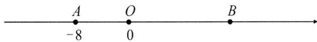

text_image

A
-8
O
0
B

# 【实战演练】

1. 如图, 点 $A, B$ 在数轴上表示的数分别为 $-4$ 和 $+16, A, B$ 两点间的距离可记为 $AB$ .

(1)点 C 在数轴上 A, B 两点之间, 且 AC = BC , 则点 C 对应的数是 \_\_\_\_ ;

(2)点 C 在数轴上 A, B 两点之间，且 BC = 3AC，求点 C 对应的数；

(3)点 C 在数轴上, 且 $AC + BC = 30$ , 求点 C 对应的数?

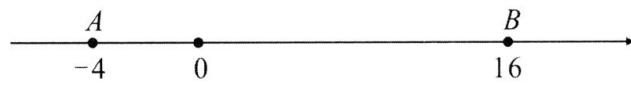

text_image

A
-4 0 16
B

# 微课小专题 10 数轴与动点问题(一) 行程问题

【方法技巧】数轴上的行程问题一般设运动时间为 $t$ ，用含 $t$ 的式子表示出点与点之间的距离，运用方程思想及分类讨论思想计算即可得结果。

# 【金例讲析】

【例】如图,已知数轴上点 $A$ 表示的数为 6 ,点 $B$ 是数轴上点 $A$ 左侧的一点,且 $A,B$ 两点间的距离为 11 ,动点 $P$ 从点 $A$ 出发,以每秒 3 个单位长度的速度沿数轴向左匀速运动,设运动时间为 $t(t > 0)$ 秒.

(1)数轴上点 $B$ 表示的数是 , 当点 $P$ 运动到 $AB$ 中点时, 它所表示的数是 ; (2) 动点 $Q$ 从点 $B$ 出发, 以每秒 2 个单位长度的速度沿数轴向左匀速运动, 若 $P, Q$ 两点同时出发, 求:

①当点 P 运动多少秒时, 点 P 追上点 Q?  
②当点 P 与点 Q 之间的距离为 8 个单位长度时, 求此时点 P 在数轴上所表示的数.

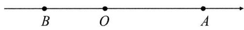

# 微课小专题 11 数轴与动点问题(二)和差倍分问题

【方法技巧】数轴上的动点问题,若是告诉了运动速度,一般设运动时间为 t ,用含 t 的式子表示出动点及点与点之间的距离,通过题目中的和差倍分关系建立方程求解即可,若是求定值,含参数计算也可得结果.

# 【金例讲析】

【例】如图,在数轴上,点 $A$ 表示 $-10$ , 点 $B$ 表示 11, 点 $C$ 表示 18. 动点 $P$ 从点 $A$ 出发,沿数轴正方向以每秒 2 个单位长度的速度匀速运动; 同时, 动点 $Q$ 从点 $C$ 出发, 沿数轴负方向以每秒 1 个单位长度的速度匀速运动. 设运动时间为 $t$ 秒.

(1)当 $t$ 为何值时, $P, Q$ 两点相遇? 相遇点 $M$ 所对应的数是多少?  
(2)在点 $Q$ 出发后到达点 $B$ 之前, 求 $t$ 为何值时 $OP = BQ$ .

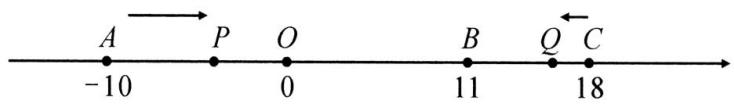

text_image

A → P O B Q C
-10 0 11 18

# 微课小专题 12 数轴与动点问题(三) 动点定值问题

【方法技巧】设参计算法解决动点定值问题. 设动点表示的数, 若是行程问题一般设运动时间, 从而表示出两点间的距离, 计算即可得结果.

# 【金例讲析】

【例】如图,数轴上有三点 A, B, C, 点 B, C 对应的数分别为 -800, 200, AB: AC = 2:3.

(1) 求点 A 对应的数；  
(2)动点 P, Q 分别从点 B 和原点 O 同时出发向左运动, 点 P, Q 的速度为 10 个单位长度 /s 和 5 个单位长度 /s , 点 M 到 P, Q 两点的距离相等, 点 Q 在从点 O 运动到点 A 的过程中, $\frac{3}{2}QC - AM$ 的值是否发生变化? 若不变, 求其值; 若变化, 说明理由.

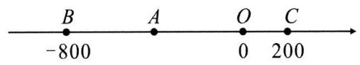

# 第三章 代数式

# 微课小专题 13 列代数式

【方法技巧】审清题意,正确表达量与量之间的关系,特别注意代数式的书写.

# 【金例讲析】

【例 1】随着计算机技术的迅猛发展,电脑价格不断降低,某品牌电脑原售价为 n 元,降低 m 元后,又降低 20%,那么该电脑的现售价为( )

A. $\left(\frac{1}{5}n+\frac{1}{5}m\right)$ 元

B. $\left(\frac{4}{5}n-\frac{4}{5}m\right)$ 元

C. $(n-\frac{1}{5}m)$ 元

D. $\left(\frac{1}{5}n-m\right)$ 元

【例 2】一项工作,甲单独做需 a 天完成,乙单独做需 b 天完成,甲、乙合做 7 天后,余下的由乙单独做,还要多少天完成?

# 【实战演练】

1. $a$ 表示一个两位数, $b$ 表示一个一位数, 如果把 $b$ 放在 $a$ 的右边组成一个三位数. 则这个三位数是 ( )

A. ${100b} + a$

B. ${10a} + b$

C. $a + b$

D. $100a + b$

2. 在一个地球仪的赤道上加铁丝箍, 若地球仪的半径增大 1 米, 需增加 $m$ 米长的铁丝; 假设在地球的赤道上加一个铁丝箍, 同样地球的半径增大 1 米, 需增加 $n$ 米长的铁丝, 则 $m$ 与 $n$ 大小关系 ( )

A. $m > n$

B. $m < n$

C. $m = n$

D. 不能确定

3. 李师傅下岗后, 做起了小生意, 第一次进货, 他以每件 $a$ 元的价格购进了 30 件甲种小商品, 以每件 $b$ 元的价格购进了 40 件乙种小商品, 且 $a < b$ .

(1)若李师傅将甲种商品提价 $40\%$ ，乙种商品提价 $30\%$ 全部出售，他获利多少元？（用含有 $a, b$ 的式子表示结果）；

(2)若李师傅将两种商品都以 $\frac{a+b}{2}$ 元的价格全部售出,他这次买卖是赚钱还是亏本?请说明理由.

# 微课小专题14 利用代数式揭示规律

【方法技巧】从特殊到一般,用不完全归纳法揭示规律.

# 【金例讲析】

【例 1】 古希腊数学家把 1,3,6,10,15,21,…叫做三角形数,它有一定的规律性.若把第一个三角形数记为 $a_{1}$ ,第二个三角形数记为 $a_{2},\cdots$ 第 $n$ 个三角形数记为 $a_{n}$ ,则 $\frac{1}{a_{1}}+\frac{1}{a_{2}}+\frac{1}{a_{3}}+\cdots+\frac{1}{a_{2020}}$ 的值是( )

A. $\frac{2020}{2021}$

B. $\frac{2019}{1010}$

C. $\frac{2021}{1011}$

D. $\frac{4040}{2021}$

【例 2】下列图案由边长相等的黑、白两色正方形按一定规律拼接而成。依此规律，第 n 个图案中白色正方形的个数为 \_\_\_\_.

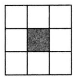  
第1个

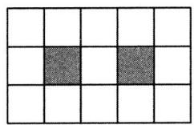  
第2个

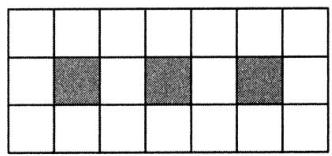

natural_image

Grid pattern with alternating shaded squares (no text or symbols)

第3个

# 【实战演练】

1. 用式子表示下列各数：

(1)数列:1,2,4,7,……,则第6个数为\_\_\_\_,第n个数为\_\_\_\_;   
(2)数列:2,5,10,17,26,……,则第6个数为\_\_\_\_;第n个数为\_\_\_\_;   
(3)数列: $-1,+3,-5,+7,\cdots$ ,则第n个数为\_\_\_\_.

2. 将一些半径相同的小圆按如图所示的规律摆放, 请仔细观察, 第 $n$ 个图形有 \_\_\_\_ 个小圆.

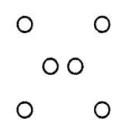  
第1个图形

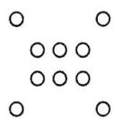  
第2个图形

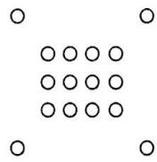  
第3个图形

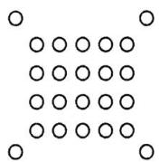  
第4个图形

3. 观察下面的三行代数式:

$$
x, \quad 2 x ^ {2}, \quad 4 x ^ {3}, \quad 8 x ^ {4}, \quad 1 6 x ^ {5}, \quad 3 2 x ^ {6}, \quad \dots ; ①
$$

$$
- 2 x, 4 x ^ {2}, \quad - 8 x ^ {3}, 1 6 x ^ {4}, \quad - 3 2 x ^ {5}, 6 4 x ^ {6}, \dots ; \textcircled {2}
$$

$$
2 x ^ {2}, \quad - 3 x ^ {3}, \quad 5 x ^ {4}, \quad - 9 x ^ {5}, \quad 1 7 x ^ {6}, \quad - 3 3 x ^ {7}, \quad \dots ; \textcircled {3}
$$

根据你发现的规律,第一行第8个代数式为\_\_\_\_;第二行第9个代数式为\_\_\_\_;第三行第n个代数式为\_\_\_\_.

# 微课小专题 15 求代数式的值

【方法技巧】运用整体思想求代数式的值.

# 【金例讲析】

【例 1】（1）若 $m^{2}-5m+2=0$ ，则 $2m^{2}-10m+2020=$ \_\_\_\_.

(2) 若 $a^2 + 2ab = 5, ab + 2b^2 = -2$ ，则 $a^2 - 4b^2 =$ ， $2a^2 + 5ab + 2b^2 =$ \_\_\_\_.

【例 2】已知代数式 $ax^{28}-bx^{14}+cx^{6}-8$ ，当 x=3 时，代数式的值为 2014，则当 x=-3 时， $ax^{28}-bx^{14}+cx^{6}+8$ 的值为 \_\_\_\_.

# 【实战演练】

1.(1)已知 $a^{2}-2a=1$ ，则 $6a-3a^{2}-1$ 的值为 \_\_\_\_；

(2) 若 $3x^{2}-4x+6=9$ ，则 $x^{2}-\frac{4}{3}x+6$ 的值为 \_\_\_\_.

2. 已知 $y = ax^7 + bx^5 + cx^3 + dx + e$ ，其中 $a, b, c, d, e$ 为常数。当 $x = 2$ 时， $y = 23$ ；当 $x = -2$ 时， $y = -35$ ，求 $e$ 的值。

3. 已知 $(x^{2} - x + 1)^{6} = a_{12}x^{12} + a_{11}x^{11} + a_{10}x^{10} + \dots + a_{2}x^{2} + a_{1}x + a_{0}$ , 求 $a_{12} + a_{10} + a_{8} + \dots + a_{2} + a_{0}$ 的值.

# 第四章 整式的加减

# 微课小专题 16 整式的有关概念

【方法技巧】理解单项式和多项式的次数、项和系数.

# 【金例讲析】

【例 1】多项式 $7x^{m} + kx^{2} - (3n + 1)x + 5$ 是关于 x 的三次三项式，并且一次项系数为 -7。求 $m + n - k$ 的值。

【例 2】若关于 x 的多项式 $(a-3)^{2}x^{3}+x^{|b|}-2x+b+1$ 的次数与单项式 $-\frac{2}{5}xy$ 的次数相同，求 a 与 b 的值.

# 【实战演练】

1. 按要求填空：

<table><tr><td>多项式</td><td>项</td><td>次数</td><td>几次几项式</td></tr><tr><td> $-x + 3x^{2} - 2xy^{2} + 1$ </td><td></td><td></td><td></td></tr><tr><td> $-x^{2} - 7$ </td><td></td><td></td><td></td></tr><tr><td> $\frac{3x - 2}{4}$ </td><td></td><td></td><td></td></tr></table>

2. 如果 $2x^{n}y^{4}$ 与 $\frac{1}{2} m^{2}x^{2}y^{|m - n|}$ 都是关于 $x, y$ 的六次单项式，且系数相等，求 $m, n$ 的值.

3. 若多项式 $5 - (m + 3)a + a^n$ 是关于 $a$ 的二次二项式, 求 $m^n$ 的值.

# 微课小专题 17 整式的加减(一)化简与求值

【方法技巧】灵活地去括号,合并同类项.

# 【金例讲析】

【例1】当 $\left|x + \frac{1}{5}\right| + (y + 5)^2 = 0$ 时，求整式 $-3(x^2 y - xy^2) - [2xy - \frac{2}{3}(1 - 6xy^2) - 4x^2 y] + \frac{1}{3} (1 + \frac{3}{2} xy)$ 的值.

【例 2】已知 a, b, c 满足: ① $5(a+3)^{2}+2|b-2|=0$ ; ② $\frac{1}{3}x^{2-a}y^{1+b+c}$ 是 7 次单项式. 求多项式 $a^{2}b-\left[a^{2}b-(2abc-a^{2}c-3a^{2}b)-4a^{2}c\right]-abc$ 的值.

# 【实战演练】

1. 已知: $a = 1, b = 2$ , 求整式 $-8ab - [4a - 36ab + 5(ab + a - b) - 7a]$ 的值.

2. 已知 $\frac{2}{5} (x - 5)^{2} + 2 \mid y - 2 \mid = 0$ , 求代数式 $(2x^{2} - 3xy + 6y^{2}) - 2(3x^{2} - xy + 9y^{2})$ 的值.

3. 小虎在计算某整式减去 $xy + 2yz - 4xz$ 时, 由于粗心, 误以为加上此式, 得到结果为 $xy - 2xz$ , 请你帮助小虎求出此题的正确结果.

# 微课小专题 18 整式的加减(二)不含某些项问题讨论

【方法技巧】不含某项或与字母取值无关,就是这项或含该字母的项的系数为零.

# 【金例讲析】

【例 1】已知关于 x 和 y 的代数式 $mx^{4} + 4nxy^{3} + 3x^{4} - xy^{3} + 2x - xy + 1$ 不含四次项，求 $m^{2} - 4n$ 的值.

【例 2】若代数式 $(2x^{2}+ax-y+6)-(2bx^{2}-3x+5y-1)$ 的值与字母 x 所取的值无关,求代数式 $2a^{3}-2b^{2}-(4a^{3}-2b^{2})$ 的值.

# 【实战演练】

1. 若关于 $x, y$ 的多项式 $mx^3 + 3nxy^2 + 2x^3 - xy^2 + y$ 不含三次项，求 $2m + 3n$ 的值.

2. 已知 $A = 2x^{2} + 4xy - 2x - 3, B = -x^{2} + xy + 2$ , 且 $3A + 6B$ 的值与 $x$ 无关, 你能求出字母 $y$ 的值吗?

3. 若代数式 $(2x^{2} + ax - y + b) - (2bx^{2} - 3x + 5y - 1)$ 的值与字母 $x$ 的取值无关, 那么请你求出 $3(a^{2} - ab - b^{2}) - (4a^{2} + ab + b^{2})$ 的值.

# 微课小专题 19 整式的加减(三) 绝对值的化简

【方法技巧】零点讨论法化简绝对值.

# 【金例讲析】

【例 1】有理数 a, b 在数轴上的对应点位置如图所示：

试化简 $|a| - 2|a + b - 1| - \frac{1}{3} |b - a - 1|$ .

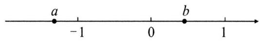

【例 2】当 x 在什么范围时， $|x-3|+|3-5x|+6x$ 为定值？并写出这个定值.

# 【实战演练】

1. $|x + 1| + |x - 2|$ 的最小值为 $\underline{\quad}$ , 此时 $x$ 的取值是 $\underline{\quad}$ ;

2. 已知如图, 数轴上有 $A, B, C$ 三点分别对应有理数 $a, b, c$ , 若 $|a| > |b| > |c|$ , 试化简: $3|b - c| - 2|a + 2b| + |b + c|$ .

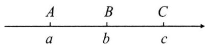

# 微课小专题 20 整式的加减(四)整式加减的实际应用

【方法技巧】挖掘隐含线段的关系,表达周长与面积.

# 【金例讲析】

【例】如图所示,用三种正方形六个和一个缺角的长方形 AFHGKE 拼成长方形 AB-CD,其中 GH=a,GK=2,设 BF=x.

(1) $DM =$ ;（用含 $x$ 和 $a$ 的代数式表示）  
(2)求长方形 $ABCD$ 的周长. (用含 $x$ 和 $a$ 的代数式表示)

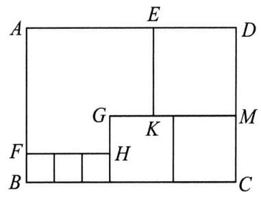

text_image

A
E
D
G
K
M
F
H
B
C

# 【实战演练】

1. 我国首个空间实验室“天宫一号”顺利升空,全国人民倍受鼓舞.某校开展了火箭模型制作比赛,下图为火箭模型的截面图,下面是梯形,中间是长方形,上面是三角形.

(1)用 a, b 的代数式表示该截面的面积 S;  
(2) 当 $a=2cm, b=3cm$ 时, 求这个截面的面积.

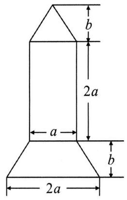

text_image

b
2a
a
b
2a

2. 某公园准备修建一块长方形草坪, 长为 40 米, 宽为 25 米. 并在草坪上修建如图所示的十字路, 已知十字路宽 $x$ 米, 回答下列问题:

(1)修建十字路的面积是多少平方米?   
(2)草坪(阴影部分)的面积是多少?  
(3)如果十字路宽2米,那么草坪(阴影部分)的面积是多少?

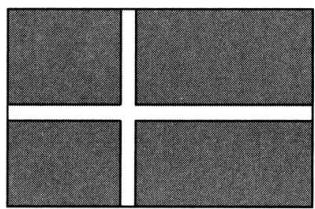

natural_image

Four identical dark gray rectangular panels arranged in a 2x2 grid with a white vertical dividing line (no text or symbols)

# 微课小专题 21 整式的加减(五)整式加减的综合应用

【方法技巧】比较代数式的大小,通常作差.

# 【金例讲析】

【例】甲、乙两商场分别出售 A 型、B 型两种风扇,零售价及运费如下表所示:某公司计划在甲商场或乙商场采购两种风扇共 100 台,其中 A 型风扇需要买 x 台.

<table><tr><td rowspan="2">商场</td><td rowspan="2">A型风扇</td><td rowspan="2">B型风扇</td><td colspan="2">运费</td></tr><tr><td>A风扇</td><td>B风扇</td></tr><tr><td>甲</td><td>200元/台</td><td>300元/台</td><td>10元/台</td><td>10元/台</td></tr><tr><td>乙</td><td>220元/台</td><td>290元/台</td><td>免运费</td><td>a元/台</td></tr></table>

(1)请用含 x 的代数式分别表示在两家商场购买风扇所需要的总费用(总费用=购买价+运费);  
(2)通过计算发现,在甲商场购买风扇的总费用比在乙商场购买风扇的总费用要低,且低的费用与购买 A 型风扇的数量无关,请求出 a 的值及总费用低多少?

# 【实战演练】

为了丰富工会活动,某客户将购买一些乒乓球拍和乒乓球,某商场销售一种乒乓球拍和乒乓球,乒乓球拍每副定价80元,乒乓球每盒定价20元,“国庆节”期间商场决定开展促销活动,活动期间向客户提供两种优惠方案.

方案一:买一副乒乓球拍送一盒乒乓球;

方案二: 乒乓球拍和乒乓球都按定价的 90% 付费.

某客户要到该商场购买乒乓球拍 20 副, 乒乓球 x 盒 (x > 20 且为整数)

(1)若该客户按方案一购买,需付款\_\_\_\_元(用含x的代数式表示);

若该客户按方案二购买,需付款\_\_\_\_元(用含 x 的代数式表示);

(2) 若 $x = 30$ , 通过计算说明此时按哪种方案购买较为合算?  
(3) 当 $x = 30$ 时, 你能给出一种更为省钱的购买方案吗? 试写出你的购买方法.

# 第五章 一元一次方程

# 微课小专题22 方程的解与字母系数

【方法技巧】根据方程的解的定义,将方程的解代入原方程,得到关于字母系数的方程,从而求出字母系数的值.

# 【金例讲析】

【例 1】如果关于 x 的方程 $2x + k = x - 1$ 的解是 x = -4，求 3k - 2 的值.

【例2】已知 $x = 3$ 是关于 $x$ 的方程 $(\frac{x}{3} + 1) + \frac{m(x - 1)}{2} = 1$ 的解， $n$ 满足关系式 $|2n + m| = 1$ ，求 $m + n$ 的值.

# 【实战演练】

1. 若关于 $x$ 的方程 $3x + 2a = 12$ 的解为 $x = 8$ , 则 $a$ 的值为 ( )

A. 6

B. 8

C.-6

D. 4

2. 若 $x = 1$ 是关于 $x$ 的方程 $x + 1 = -x - 1 + 2m$ 的解, 则 $m = (\quad)$

A. 1

B. 2

C. 3

D. 4

3. 已知 $x = 2$ 是关于 $x$ 的方程 $2(x - 3) + 1 = x + m$ 的解, 则 $m$ 的值为 ( )

A. 3

B. - 3

C. -4

D. 4

4. 若关于 $x$ 的一元一次方程 $k(x + 4) - 2k - x = 5$ 的解为 $x = -3$ , 则 $k$ 的值是 ( )

A.-2

B. 2

C. $\frac{1}{5}$

D. $-\frac{1}{5}$

5. 已知关于 $x$ 的方程 $2b = ax - 3ax$ 的解是 $x = 1$ , 其中 $a \neq 0$ 且 $b \neq 0$ , 求代数式 $\frac{a}{b} - \frac{b}{a}$ 的值.

# 微课小专题 23 等式的性质与整体思想

【方法技巧】先根据等式的性质,得到某个代数式整体的值,然后整体代入到要求的代数式中进行求值.

# 【金例讲析】

【例 1】若关于 x 的方程 $2x + a = x - 1$ 的解是 x = b，求 $3a + 3b - 5$ 的值.

【例 2】等式 $y=ax^{3}+bx+c$ 中，当 x=0 时，y=3；当 x=-1 时，y=5；求当 x=1 时，y 的值.

# 【实战演练】

1. 已知 $11x - 9y - 6 = 0$ ，请用含 $x$ 的代数式表示 $y$ .

2. 等式 $y = ax^{2} + bx + c$ 中, 当 $x = 0$ 时, $y = 4$ ; 当 $x = -1$ 和 $x = -3$ 时, $y$ 的值相等; 求 $2a - \frac{1}{2} b - 3c$ 的值.

# 微课小专题 24 解方程之易错点(一) 移项忘变号

【易错点睛】移项法解方程,就是将方程中的某一项改变符号后,从方程的一边移到另一边;而在方程的同一边改变项的位置,则不改变项的符号.

# 【金例讲析】

【例 1】 下列解方程中,移项正确的是( )

A. 由 $5 + x = 18$ 得 $x = 18 + 5$

B. 由 $5x + \frac{1}{3} = 3x$ 得 $5x - 3x = \frac{1}{3}$

C. 由 $\frac{1}{2} x + 3 = -\frac{3}{2} x - 4$ 得 $\frac{1}{2} x + \frac{3}{2} x = -4 - 3$

D. 由 $3x - 4 = 6x$ 得 $3x + 6x = 4$

【例 2】 解方程: $-7x + 2 = 2x - 4$

# 【实战演练】

1. 方程 $3x + 6 = 2x - 8$ 移项后, 正确的是 ( )

A. $3 x + 2 x = 6 - 8$

B. $3 x - 2 x = -8 + 6$

C. $3x - 2x = -6 - 8$

D. ${3x} - {2x} = 8 - 6$

2. 解下面的方程时, 既要移含未知数的项, 又要移常数项的是( )

A. $3 x = 7 - 2 x$

B. $3 x - 5 = 2 x + 1$

C. $3 x - 3 - 2 x = 1$

D. $x + {15} = {11}$

3. 若 $5x + 2$ 与 $-2x + 7$ 的值互为相反数，则 x - 2 的值为（）

A. -5

B. 5

C. -1

D. 1

4. 将 $4 - \frac{3}{2}x = \frac{5}{2}x + 2$ 变形为 $-\frac{3}{2}x - \frac{5}{2}x = 2 - 4$ ，这种变形叫 \_\_\_\_，其根据是 \_\_\_\_.

5. 解方程: $7x + 6 = 16 - 3x$ .

# 微课小专题 25 解方程之易错点(二)去括号漏乘

【易错点睛】去括号解方程时,用括号外的因式去乘括号内的每一项,千万不要漏乘某一项.若括号外的因式是负号,去括号后,每一项都要变号.

# 【金例讲析】

【例 1】 解方程: $10 - 4(x + 3) = 2(x - 1)$ .

【例 2】 解方程: $6(6x - 7) - \frac{1}{2} (6x - 7) + 2 = \frac{3}{2} (6x - 7) - 2(7 - 6x)$ .

# 【实战演练】

1. 解方程: $5(x - 1) - 2(3x - 1) = 4x - 1$ .

2. 解方程: $\frac{3}{4} (x - 5) = 1 - \frac{1}{4} (x - 5) + 3(5 - x)$ .

# 微课小专题 26 解方程之易错点(三) 去分母漏乘

【易错点睛】去分母解方程时,方程两边都乘以各分母的最小公倍数,要特别注意两点:

①不要漏乘不含分母的项；②分子是多项式时，去分母后要用括号将分子括起来。

# 【金例讲析】

【例 1】解方程 $\frac{2x+1}{3}-\frac{5x-3}{2}=1$ ，去分母正确的是()

A. $2(2x + 1) - 3(5x - 3) = 1$

B. $2 x + 1 - 5 x - 3 = 6$

C. $2(2x+1)-3(5x-3)=6$

D. $2x + 1 - 3(5x - 3) = 6$

【例2】解方程： $\frac{3x - 2}{4} -\frac{5x + 2}{6} = 1 - x.$

# 【实战演练】

1. 解方程 $1 - \frac{x + 3}{6} = \frac{x}{2}$ ，去分母，得（）

A. $1 - x - 3 = 3x$

B. $6 - x - 3 = 3x$

C. $6 - x + 3 = 3x$

D. $1 - x + 3 = {3x}$

2. 解方程: $1 - \frac{x - 1}{4} = \frac{2x + 1}{6}$ .

3. 解方程: $\frac{x}{2} - \frac{5x + 11}{6} = 1 + \frac{2x - 4}{3}$ .

# 微课小专题 27 列方程的基本方法(一) 部分量之和等于总量

【方法技巧】列方程解应用题的关键是找到符合题意的相等关系. 经常利用部分量之和等于总量列方程.

# 【金例讲析】

【例】“绿水青山就是金山银山”,某省委省政府高度重视环境生态保护,截至今年底,全省建立国家级、省级和市县级自然保护区共49个,其中国家级10个,省级比市县级多5个.问省级和市县级自然保护区各多少个?

# 【实战演练】

1. 据某统计数据显示, 在我国的 664 座城市中, 按水资源情况可分为三类: 暂不缺水城市、一般缺水城市和严重缺水城市. 其中, 暂不缺水城市数比严重缺水城市数的 4 倍少 50 座, 一般缺水城市数是严重缺水城市数的 2 倍. 求严重缺水城市有多少座?

2. 某班组织春游, $A, B$ 两个景点每人任选一处. 去 $A$ 景点的每人付费 20 元, 去 $B$ 景点的每人付费 30 元, 全班共付费 1200 元.

(1)若去 $A, B$ 两景点的人数相等,问该班有学生多少人?  
(2)若去 B 景点的人数比去 A 景点的多 5 人,问去 A,B 两景点的学生各多少人?

# 微课小专题 28 列方程的基本方法(二)不同的式子表示同一个量

【方法技巧】当问题情境中没有明显的语句或关键词反映相等关系,又不能用部分量之和等于总量来列方程时,经常用两个不同的式子表示同一个量来列方程.

# 【金例讲析】

【例】一艘货轮往返于上下游两个码头之间,逆流而上需要6小时,顺流而下需要4小时,若船在静水中的速度为20千米/时,则水流的速度是多少千米/时?

# 【实战演练】

1. 一轮船往返于 A, B 两地之间，逆水航行需 3h，顺水航行需 2h，水速为 3km/h，求轮船在静水中的速度。

2. 已知某一铁桥长 1000 米, 今有一列火车从桥上通过, 测得火车从开始上桥到完全过桥共用 1 分钟, 整列火车完全在桥上的时间是 40 秒. 求火车的速度和长度.

# 微课小专题 29 一元一次方程的应用(一) 数字问题

【方法技巧】1. 两位数 = 十位数字 × 10 + 个位数字, 三位数 = 百位数字 × 100 + 十位数字 × 10 + 个位数字, 依次类推; 2. 根据题目的数量关系列方程求解.

# 【金例讲析】

【例】一个两位数,十位数字比个位数字的两倍多1,将这两个数字对调,所得的数比原来小27,求原来的两位数.

# 【实战演练】

1. 一个两位数,个位上的数字比十位上的数字大4,这个两位数又是这两个数字的和的4倍,求这个两位数.

2. 一个两位数,个位上的数与十位上的数的和是 11,如果把十位与个位上的数对调,那么所得的两位数比原来两位数大 63,求原来两位数.

3. 一个三位数,个位数字比十位数字小1,比百位数字大1,若将百位数字与十位数字交换后所得的新三位数与原三位数的和为444,求原三位数.

# 微课小专题 30 一元一次方程的应用(二) 配套问题

【方法技巧】1.“甲与乙的数量比为 $a$ 比 $b$ 才配套”，就是“甲的数量的 $b$ 倍等于乙的数量的 $a$ 倍”；2.调配问题中注意调配后两方数据的增减.

# 【金例讲析】

【例】在手工制作课上,老师组织七年级2班的学生用硬纸制作圆柱形茶叶筒.七年级2班共有学生50人,其中男生人数比女生人数少2人,并且每名学生每小时剪筒身40个或剪筒底120个.

(1)七年级2班有男生、女生各多少人?   
(2)原计划男生负责剪筒底,女生负责剪筒身,要求一个筒身配两个筒底,那么每小时剪出的筒身与筒底能配套吗?如果不配套,那么男生应向女生支援多少人时,才能使每小时剪出的筒身与筒底配套.

# 【实战演练】

1. 某车间有 27 名工人, 平均每人每天加工小齿轮 12 个或大齿轮 10 个, 2 个大齿轮和 3 个小齿轮配成一套, 问需分别安排多少名工人加工大、小齿轮, 才能使每天加工的大小齿轮刚好配套?

2. 学校组织植树活动, 已知在甲处植树的有 220 人, 在乙处植树的有 96 人.

(1)若要使甲处植树的人数是乙处植树人数的3倍,应从乙处调多少人去甲处?  
(2)为了尽快完成植树任务,现调 m 人去两处支援,其中 90 < m < 100 ,若要使甲处植树的人数仍然是乙处植树人数的 3 倍,则应调往甲,乙两处各多少人?

# 微课小专题 31 一元一次方程的应用(三) 盈亏问题

【方法技巧】1.“盈”表示分配出现多余,“亏”指分配出现不足;2.适当设未知数,根据某个量的两种不同表示法列方程.

# 【金例讲析】

【例】我国古代《算法统宗》里有这样一首诗:我问开店李三公,众客都来到店中,一房七客多七客,一房九客一房空.诗中后两句的意思是:如果每间客房住七人,那么有7人无房可住;如果每间客房住9人,那么就空出一间房.求住店客人有几人.

# 【实战演练】

1.《九章算术》中有一道阐述“盈不足术”的问题,原文如下:今有人共买物,人出八,盈三;人出七,不足四,问人数,物价各几何?译文为:现有一些人共同买一个物品,每人出8元,还盈余3元;每人出7元,则还差4元,问共有多少人?

2. 汽车运送一批货物, 若每辆车装 3 吨, 则剩 5 吨; 若每辆车装 4 吨, 则可少用 5 辆车, 问共有汽车多少辆?

# 微课小专题 32 一元一次方程的应用(四) 工程问题

【方法技巧】1. 基本关系式: 工作量 = 工作效率 × 工作时间; 2. 当题目工作量没有具体给出来时, 可以把工作量看作整体 1.

# 【金例讲析】

【例】 完成一项工作,如果由两个人合做,要16天才能完成.开始先安排一些人做2天后,又增加1人和他们一起做4天,结果完成了这项工作的一半,假设这些人的工作效率相同.

(1)开始安排了多少名工人？  
(2)如果要求再用4天做完剩余的全部工作,还需要再增加几人一起做?

# 【实战演练】

1. 一件工程甲单独做 50 天可完成, 乙单独做 75 天可完成, 现在两个人合作. 但是中途乙因事离开几天, 从开工后 40 天把这件工程做完. 则乙中途离开的天数为 \_\_\_\_ 天.

2. 某中学库存若干套桌椅, 准备修理后支援贫困山区学校. 现有甲、乙两木工组, 甲每天修理桌椅 16 套, 乙每天修桌椅比甲多 8 套, 甲单独修完这些桌椅比乙单独修完多用 20 天, 学校每天付甲组 80 元修理费, 付乙组 120 元修理费.

(1)该中学库存多少套桌椅?

(2)在修理过程中,学校要派一名工人进行质量监督,学校负担他每天10元生活补助费,现有三种修理方案:a.由甲单独修理;b.由乙单独修理;c.甲、乙合作同时修理.你认为哪种方案省时又省钱?为什么?

# 微课小专题 33 一元一次方程的应用(五) 行程问题

【方法技巧】1. 基本关系式: 路程 = 速度 × 时间; 2. 注意顺流 (顺风) 速度 = 静水 (无风) 速度 + 水流 (风) 速度.

# 【金例讲析】

【例】一辆慢车与一辆快车分别从相距 560 千米的甲、乙两地同时出发, 匀速相向而行,两车经过 4 小时相遇, 然后分别按原速一同驶往甲地, 又经过 3 小时两车相距最远, 请列方程解决下列问题:

(1)快车的速度为\_\_\_\_千米/时,慢车的速度为\_\_\_\_千米/时;  
(2)两车首次相遇时距离甲地 千米；  
(3)相遇后,经过多长时间两车相距40千米?

# 【实战演练】

1. 两船从同一港口同时出发反向而行, 甲船顺水, 乙船逆水, 两船在静水中的速度都是 30 千米/时, 水流速度是 $a$ 千米/时.

(1)甲船顺水的速度是 千米/时;乙船逆水的速度是 千米/时;  
(2) 若 3 小时后甲船比乙船多航行 60 千米, 求 a 的值.

2. 一列火车行驶, 经过一条长 $300 \mathrm{~m}$ 的隧道需要 $20 \mathrm{~s}$ 的时间, 隧道的顶上有一盏灯, 垂直向下发光, 灯光照在火车上的时间是 $10 \mathrm{~s}$ , 假设这列火车的长度为 $a \mathrm{~m}$ .

(1)设从车头经过灯下到车尾经过灯下火车所走的这段时间内火车的平均速度为 $P \, m/s$ ，从车头进入隧道到车尾离开隧道火车所走的这段时间内火车的平均速度为 $Q \, m/s$ ，计算：5P-2Q（结果用含 a 的式子表示）.  
(2)当火车匀速行驶时,求8a-380的值.

# 微课小专题 34 一元一次方程的应用(六) 利润问题

【方法技巧】1. 利润 = 售价 - 进价 = 进价 × 利润率；2. 售价 = 进价 + 利润 = 进价 × (1 + 利润率) = 标价 × 折扣

# 【金例讲析】

【例】某商场于元旦之际搞优惠促销活动回馈新老客户,由顾客抽奖决定折扣.某顾客购买甲、乙两种商品,分别抽到七折和九折,共付402元.甲、乙两种商品的原价之和为500元.

(1)甲、乙两种商品原价各是多少元?

(2)若本次买卖中甲种商品最终亏损 20%, 乙种商品最终盈利 20%, 那么商场在本次买卖中是盈利还是亏损?

# 【实战演练】

1. 武汉大洋百货经销甲、乙两种服装, 甲种服装每件进价 500 元, 售价 800 元; 乙种服装商品每件售价 1200 元, 可盈利 50%.

(1)每件甲种服装利润率为\_\_\_\_，乙种服装每件进价为\_\_\_\_元；

(2)若该商场同时购进甲、乙两种服装共40件,恰好总进价用去27500元,求商场销售完这批服装,共盈利多少?

(3)在元旦当天,武汉大洋百货实行“满 1 000 元减 500 元的优惠”(比如:某顾客购物 1 200 元,他只需付款 700 元).到了晚上八点后,又推出“先打折”,再参与“满 1 000 元减 500 元”的活动.张先生买了一件标价为 3 200 元的羽绒服,张先生发现竟然比没打折前多付了 20 元钱,问大洋百货商场晚上八点后推出的活动是先打多少折之后再参加满减活动?

# 微课小专题 35 一元一次方程的应用(七) 积分问题

【方法技巧】1. 根据已知条件或积分表中隐含的条件, 得出胜 1 场, 平 1 场, 负 1 场所得的积分; 2. 基本等量关系式: 胜场总积分 + 负场总积分 + 平场总积分 = 总积分.

# 【金例讲析】

【例】在学完“有理数的运算”后,数学老师组织了一次计算能力竞赛.竞赛规则是:每人分别做50道题,答对一题得3分,不答或答错一题倒扣1分.

(1)如果参赛学生小红最后得分142分,那么小红答对了多少道题?

(2)参赛学生小明能得145分吗？请简要说明理由。

# 【实战演练】

1. 某校学生会为积极响应武汉市文明创建活动, 组织有关方面的知识竞赛, 共设有 20 道选择题, 各题分值相同, 每题必答, 下表记录了 3 个参赛者的得分情况.

(1)设答对一题记 a 分, 答错一题记 b 分, 则 a = , b = ;

(2)参赛者 E 说他得了 80 分,你认为可能吗,为什么?

<table><tr><td>参赛者</td><td>答对题数</td><td>答错题数</td><td>得分</td></tr><tr><td>A</td><td>20</td><td>0</td><td>100</td></tr><tr><td>B</td><td>19</td><td>1</td><td>94</td></tr><tr><td>C</td><td>18</td><td>2</td><td>88</td></tr></table>

# 微课小专题 36 一元一次方程的应用(八) 方案问题

【方法技巧】设计或选择最优方案时,先计算出不同方案的具体值,后得出最优方案.

# 【金例讲析】

【例】 公园门票价格规定如下表：

<table><tr><td>购票张数</td><td>1~50张</td><td>51~100张</td><td>100张以上</td></tr><tr><td>每张票的价格</td><td>13元</td><td>11元</td><td>9元</td></tr></table>

某校七(1)、(2)两个班共104人去游公园,其中(1)班人数较少,不足50人.经估算,如果两个班都以班为单位购票,则一共应付1240元,问:

(1)如果两班联合起来,作为一个团体购票,可省多少钱?

(2)两班各有多少学生?

(3)如果七(1)班单独组织去游公园,作为组织者的你将如何购票才最省钱?

# 【实战演练】

1. 某班将买一些乒乓球和乒乓球拍,现了解情况如下:甲、乙两家商店出售两种同样品牌的乒乓球和乒乓球拍. 乒乓球拍每副定价 30 元, 乒乓球每盒定价 5 元, 经洽谈后, 甲店每买一副球拍赠一盒乒乓球, 乙店全部按定价的 9 折优惠. 该班需球拍 5 副, 乒乓球若干盒 (不小于 5 盒).

问:(1)当购买乒乓球多少盒时,在两店购买付款一样?

(2)如果给你 450 元,让你选择一家商店去办这件事,你打算去哪家商店购买?为什么?

# 微课小专题 37 一元一次方程的应用(九) 分段计费问题

【方法技巧】理清每段收费的条件是解决此类问题的关键,每段收费的计算式是重点.

# 【金例讲析】

【例】为了鼓励市民节约用水,某市水费实行阶梯式计量水价.每户每月用水量不超过25吨,收费标准为每吨a元;若每户每月用水量超过25吨时,其中前25吨还是每吨a元,超出的部分收费标准为每吨b元.下表是小明家一至四月份用水量和缴纳水费情况.根据表格提供的数据,回答:

<table><tr><td>月份</td><td>一</td><td>二</td><td>三</td><td>四</td></tr><tr><td>用水量(吨)</td><td>16</td><td>18</td><td>30</td><td>35</td></tr><tr><td>水费(元)</td><td>32</td><td>36</td><td>65</td><td>80</td></tr></table>

(1) $a = \underline{\hspace{2cm}};b = \underline{\hspace{2cm}};$

(2)若小明家五月份用水32吨,则应缴水费\_\_\_\_元;

(3)若小明家六月份应缴水费102.5元,则六月份他们家的用水量是多少吨?

# 【实战演练】

1. 某购物网站上一种小礼品按销售量分三部分制定阶梯销售单价,如下表:

<table><tr><td>销售量</td><td>单价</td></tr><tr><td>不超过120件的部分</td><td>3.5元/件</td></tr><tr><td>超过120件不超过300件的部分</td><td>3.2元/件</td></tr><tr><td>超过300件的部分</td><td>3.0元/件</td></tr></table>

(1)“双十一”期间,购物总金额累计满300元可使用50元购物津贴(即累计总金额每满300减50元),若购买85件,花费\_\_\_\_元;若购买120件,花费\_\_\_\_元;若购买250件,花费\_\_\_\_元.

(2)“双十二”即将来临,但“双十二”期间不能使用购物津贴,王老师和李老师各自单独购买这种小礼品共400件,其中王老师的购买数量大于李老师的购买数量,她们一共花费1336元,请问王老师和李老师各购买这种小礼品多少件?

# 微课小专题 38 一元一次方程的应用(十) 图表问题

【方法技巧】读懂图表提供的信息是解题的关键.

# 【金例讲析】

【例】某校开展校园艺术节系列活动,派小明到文体超市购买若干个文具袋作为奖品.这种文具袋标价每个10元,请认真阅读结账时老板与小明的对话图片,解决下面两个问题:

(1)求小明原计划购买文具袋多少个?

(2)学校决定,再次购买钢笔和签字笔共50支作为补充奖品,其中钢笔标价每支8元,签字笔标价每支6元.经过沟通,这次老板给予8折优惠,合计272元.问小明购买了钢笔和签字笔各多少支?

text_image

那就多买一个吧,谢谢!
如果你多买一个,就可以全部打八五折,花费比现在还省17元!

# 【实战演练】

1. 甲、乙二人同时从学校出发, 沿同一方向匀速行走, $10 \mathrm{~min}$ 后, 甲加快速度继续匀速行走 (加速的时间忽略不计), 乙始终匀速行走, 两人都走了 $20 \mathrm{~min}$ . 两人在行走过程中得到如下表所示的信息:

<table><tr><td>离开学校的时间/min</td><td>0</td><td>10</td><td>t</td><td>20</td></tr><tr><td>甲离学校的距离/m</td><td>0</td><td>500</td><td>b</td><td>1200+a</td></tr><tr><td>乙离学校的距离/m</td><td>0</td><td>500+a</td><td>b</td><td>1200</td></tr></table>

(1)根据题意,甲出发时的速度为\_\_\_\_m/min,乙的速度为\_\_\_\_m/min;

(2)求表中 t 的值.

# 微课小专题 39 一元一次方程的应用(十一) 动点问题

【方法技巧】数轴上动点问题,关键是设合适的未知数,并用未知数表示出动点在数轴上对应的数,依题意列方程求解.

# 【金例讲析】

【例】在数轴上点 $A, B$ 对应的数分别为 $-4, 3$ , 若 $P, Q$ 两点分别从 $A, B$ 出发, 同时沿数轴正方向运动, $P$ 点的速度是 $Q$ 点速度的 2 倍, 且 3 秒后, $2OP = OQ$ , 求点 $Q$ 运动的速度.

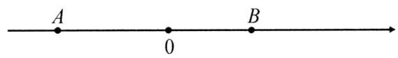

# 【实战演练】

1. 如图, 数轴上点 $A, B$ 表示的数分别为 $-12, 24$ , 点 $P, Q$ 分别从点 $A, B$ 同时出发沿数轴向右运动, 点 $P$ 的速度是每秒 2 个单位长度, 点 $Q$ 的速度是每秒 4 个单位长度, 当 $BQ = 2BP$ 时, $P$ 点对应的数是多少?

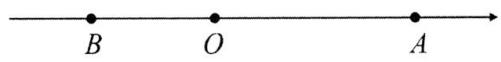

# 第六章 几何图形初步

# 微课小专题40 正方体的展开图与三视图

【方法技巧】正方体的展开图有 11 种, 其中同颜色的是正方体中相对的面.

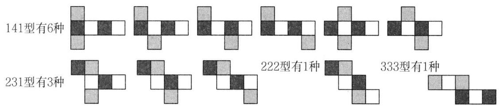

text_image

141型有6种
231型有3种
222型有1种
333型有1种

# 【金例讲析】

【例】 下面四个图形中是最左边的正方体的表面展开图的是( )

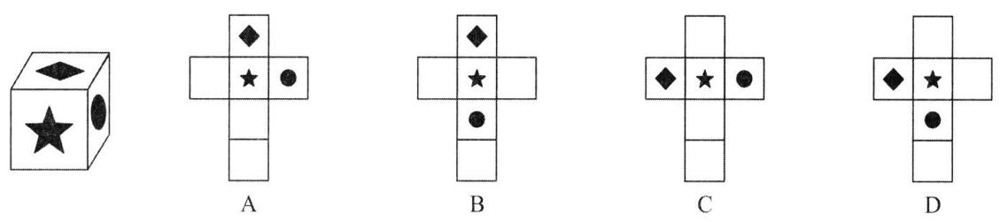

text_image

Five labeled diagrams (A, B, C, D) showing geometric shapes with stars and diamonds, likely illustrating a puzzle or logic concept.

# 【实战演练】

1. 左下图是一个正方体, 线段 $AB, BC, CA$ 是它的三个面的对角线. 下列图形中, 是该正方体的表面展开图的是 ( )

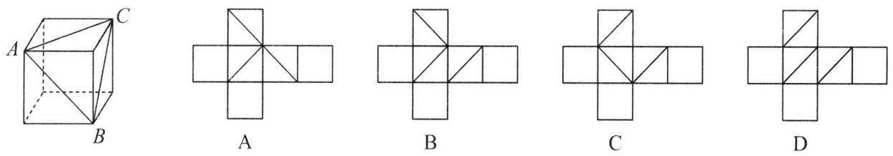

text_image

A
B
C
A
B
C
D

2. 用小立方块搭成的几何体,从正面和上面看的形状图如下图所示,则组成这样的几何体需要立方块个数为( )

A. 最多需要 8 块, 最少需要 6 块  
B. 最多需要 9 块, 最少需要 6 块  
C. 最多需要 8 块, 最少需要 7 块  
D. 最多需要 9 块,最少需要 7 块

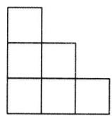  
从正面看

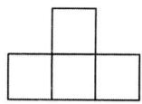  
从上面看

# 微课小专题 41 直线、射线、线段的计数问题

【方法技巧】① $1+2+3+\cdots+n=\frac{1}{2}n(n+1)$ ; ②线段 AB 之间有 n 个点, 则一共可组成不同线段的条数为 $1+2+3+\cdots+(n+1)=\frac{1}{2}(n+1)(n+2)$ .

# 【金例讲析】

【例 1】下表反映了平面内直线条数与它们最多交点个数的对应关系：

<table><tr><td>图形</td><td>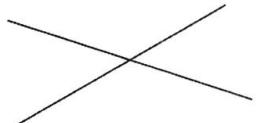</td><td>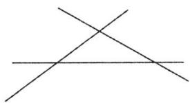</td><td>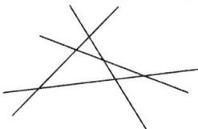</td><td>...</td></tr><tr><td>直线条数</td><td>2</td><td>3</td><td>4</td><td>...</td></tr><tr><td>最多交点个数</td><td>1</td><td>3=1+2</td><td>6=1+2+3</td><td></td></tr></table>

按此规律,6 条直线相交,最多有\_\_\_\_个交点;n 条直线相交,最多有\_\_\_\_个交点(n 为正整数).

【例 2】 A 站与 B 站之间还有 3 个车站, 那么往返于 A 站与 B 站之间的车辆, 应安排多少种车票?

# 【实战演练】

1. 平面内的 9 条直线任意两条都相交, 交点数最多有 $m$ 个, 最少有 $n$ 个, 求 $m + n$ 的值.

2. 淮北到上海的 N431 次列车(单程列车), 沿途停靠宿州、固镇、蚌埠、滁州、南京、镇江、常州、无锡、苏州, 那么需要准备多少种不同的车票?

# 微课小专题 42 分步计算求线段长

【方法技巧】根据图形的特征,不需要列方程,运用线段的和、差、倍、分关系,逐步求出有关线段长.

# 【金例讲析】

【例】如图, 将两根木棒 $AB$ 和 $CD$ 捆接成一根较长的木棒 $AD$ , 捆绑处 $AB$ 有三分之一部分与 $CD$ 重合, $M, N$ 分别是 $AB$ 和 $CD$ 的中点, 且 $AB = 12 \mathrm{~cm}, MN = 10 \mathrm{~cm}$ , 求木棒 $AD$ 的长.

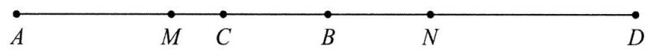

text_image

A M C B N D

# 【实战演练】

1. 如图, $E$ 是线段 $AB$ 上一点, $AE = 2$ , $EB = 10$ , $D$ 为 $EB$ 上一点, $M$ 为线段 $ED$ 的中点, 若 $DB = \frac{1}{3} AB$ , 求 $MD$ 的长.

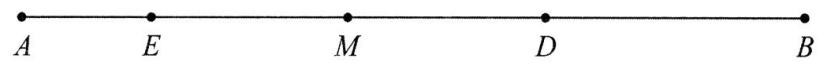

text_image

A E M D B

2. 如图, $M$ 是 $AB$ 的中点, $AB = \frac{2}{3} BC$ , $N$ 是 $BD$ 的中点, 且 $BC = 2CD$ , 如果 $AB = 2cm$ , 求 $AD, MN$ 的长.

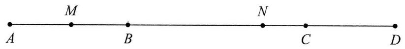

text_image

A M B N C D

# 微课小专题 43 列方程求线段长

【方法技巧】求线段长的问题中,有多个未知线段,且它们与某一条线段有关,这时我们设这条相关联的线段长为 $x$ ,根据线段的和、差、倍、分关系列方程求解.

# 【金例讲析】

【例】如图， $E$ 为线段 $AB$ 上一点，延长 $AB$ 至点 $C$ ，使 $BC = \frac{1}{5} AB, D$ 为 $AC$ 的中点，若 $AE = 2, BD = 4$ ，求 $EB$ 的长.

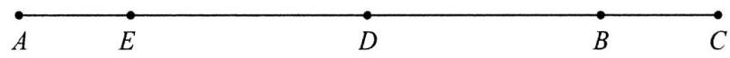

text_image

A E D B C

# 【实战演练】

1. 如图, 在同一直线上有四点 $A, B, C, D$ , 已知 $AD = \frac{5}{9} DB$ , $AC = \frac{9}{5} CB$ , 且 $CD = 4 \mathrm{~cm}$ , 求 $AB$ 的长.

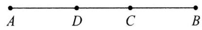

2. 如图, $C$ 为线段 $AB$ 的中点, $D, E$ 是线段 $AB$ 上不同的两点, $AE = 2EB$ , $\frac{AD}{DB} = \frac{2}{3}$ , 若 $CD = 2$ , 求 $DE$ 的长.

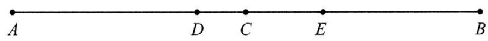

text_image

A
D C
E
B

# 微课小专题 44 分类讨论求线段长

【方法技巧】几何问题中没给出图形,或给出图形但已知点的位置没给出来,这时往往考虑分类讨论求解.

# 【金例讲析】

【例】已知点 A, B, C 在一条直线上，点 M 是线段 AC 的中点， $BC = \frac{1}{5} AB, AM = 6cm$ ，求 AB 的长.

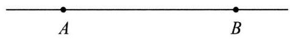

# 【实战演练】

1. 如图, 已知线段 $AB = 4$ , 延长 $AB$ 到点 $C$ , 使得 $AB = 2BC$ , 反向延长 $AB$ 到点 $D$ , 使 $AC = 2AD$ .

(1)求 $CD$ 的长;  
(2)若 $Q$ 为 $AB$ 的中点, $P$ 为线段 $CD$ 上一点, 且 $BP = \frac{1}{2} BC$ , 求 $PQ$ 的长.

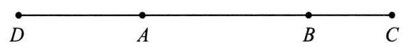

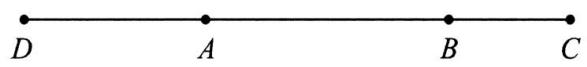  
备用图

2. 已知, $A, B, C, D$ 是直线 $l$ 上四点, 线段 $AB = 8$ , 线段 $CD = 4$ (点 $A$ 在点 $B$ 的左侧, 点 $C$ 在点 $D$ 的左侧), 若线段 $BC = 2$ , 求 $AD$ 的长.

# 微课小专题45 整体思想求线段长

【方法技巧】在求线段长度时,若已知条件个数少于未知量的个数,或动点运动问题中,部分线段的长是不确定的量,往往设参数,运用整体法求线段长.

# 【金例讲析】

【例】如图, 点 $C$ 是线段 $AB$ 上一点, $M$ 是 $AB$ 的中点, $N$ 是 $CB$ 的中点. 若 $AC = 10$ , 求 $MN$ 的长.

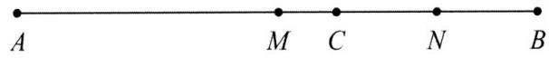

# 【实战演练】

1. 如图, $B, D$ 两点均为线段 $AE$ 上的动点, 若 $AE = 12, BD = 5$ , 求图中所有线段的和.

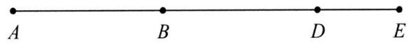

2. 已知线段 $AB = 12$ , 点 $C$ 为 $AB$ 上一点, 点 $P, Q$ 分别在线段 $BC, AC$ 上, 且满足 $CQ = 2AQ, CP = 2BP$ , 求 $PQ$ 的长.

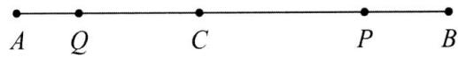

# 微课小专题46 线段中点问题

模型: $A, B, C$ 三点在同一条直线上, $M$ 为 $A B$ 的中点, $N$ 为 $B C$ 的中点,

(1)如图1,若点C在点B的右侧,则 ${MN} = \frac{1}{2}\left( {{AB} + {BC}}\right)  = \frac{1}{2}{AC}$ ；

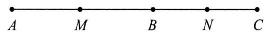  
图1

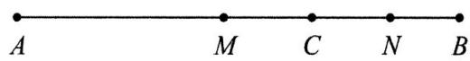  
图2

(2)如图2,若点C在点B的左侧,则 $MN=\frac{1}{2}(AB-BC)=\frac{1}{2}AC$ .

# 【金例讲析】

【例】如图, 点 $C$ 为线段 $AB$ 上一点, $M$ 为 $AB$ 的中点, $N$ 为 $BC$ 的中点.

(1) 若 MC=1, CN=2, 求 AB 的长;  
(2) 若 $MN = 3$ , 求 $AC$ 的长.

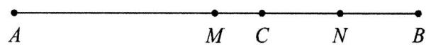

# 【实战演练】

1. 如图, $C$ 为线段 $AB$ 上一动点, $D$ , $E$ 分别为 $AC$ , $BC$ 的中点, $DE = 6$ , 求 $AB$ 的长.

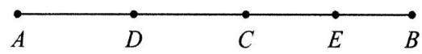

2. 如图, $A, B, C, D$ 四点在直线 $l$ 上, $AB = 8$ , 线段 $CD = 4$ , 点 $P, Q$ 分别为 $AD, BC$ 的中点, 求线段 $PQ$ 的长度

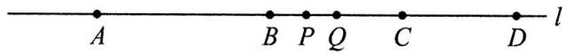

# 微课小专题 47 线段中的定值问题

【方法技巧】通过设参数表示有关动点的坐标或动线段的长,然后计算,求出定值.

# 【金例讲析】

【例】 点 A, B 分别对应数轴上的数 -2, 10, 点 P 是线段 AB 上一点, BP = 2AP. 点 C 从点 P 出发以每秒 1 个单位长度的速度向左运动, 点 D 从点 B 出发以每秒 2 个单位长度的速度向左运动, 设运动时间为 $t (t \neq 4)$ 秒. 在运动过程中, $\frac{PD}{AC}$ 的值是否发生变化? 若不变求出其值, 若变化, 写出变化范围.

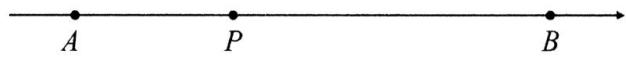

# 【实战演练】

1. 如图, 数轴上点 $A, B, C$ 对应的数分别为 16, 20, -8, 点 $P, Q$ 分别从 $A, B$ 出发, 以每秒 2 个单位长度向左运动, $E$ 为 $CP$ 的中点, $F$ 为 $CQ$ 的中点, 试问线段 $EF$ 的长度是否发生变化, 说明理由.

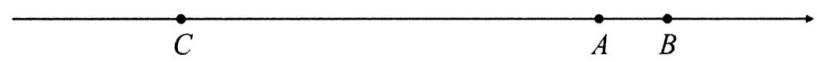

# 微课小专题48 分步计算求角度

【方法技巧】根据图形的特征,不需要列方程,运用角的和、差、倍、分关系,逐步求出有关角的度数.

# 【金例讲析】

【例】如图, 已知 $\angle AOB = 90^{\circ}$ , $\angle EOF = 60^{\circ}$ , $OE$ 平分 $\angle AOB$ , $OF$ 平分 $\angle BOC$ , 求 $\angle COB$ 和 $AOC$ 的度数.

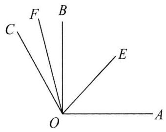

text_image

C
F
B
E
O
A

# 【实战演练】

1. 如图, $\angle AOB = 100^{\circ}$ , $OD$ , $OC$ , $OE$ 是 $\angle AOB$ 内的射线, 若 $\angle AOD = 80^{\circ}$ , $\angle BOE = 70^{\circ}$ , $OC$ 平分 $\angle DOE$ , 求 $\angle COE$ 的度数.

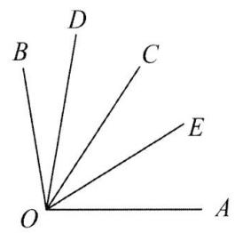

text_image

B
D
C
E
O
A

2. 如图, $\angle AOB = 160^{\circ}, \angle COE = 80^{\circ}, OF$ 平分 $\angle AOE$ , 若 $\angle COF = 14^{\circ}$ , 求 $\angle BOE$ 的度数.

text_image

C
F
A
O
E
B

# 微课小专题49 余角与补角

【方法技巧】角 $\alpha$ 的余角为 $90^{\circ} - \alpha$ ，角 $\alpha$ 的补角为 $180^{\circ} - \alpha$ ，当角度未知时，学会运用参数法探寻角的余角与补角.

# 【金例讲析】

【例】如图, 直线 $AB, CD$ 相交于点 $O, OE$ 平分 $\angle AOD$ , 若 $\angle FOC = 90^\circ$ , $\angle AOF = x$ .

(1) 若 $x=32^{\circ}18'40''$ ，求 $\angle EOD$ 的度数；

(2)图中 $\angle AOF$ 的余角有哪些?

text_image

F
A
C
E
O
D
B

# 【实战演练】

1. 如果 $\angle \alpha$ 与 $\angle \beta$ 互补, 且 $\angle \alpha < \angle \beta$ , 则下列表示 $\angle \alpha$ 的余角的式子中: ① $90^{\circ} - \angle \alpha$ ; ② $\angle \beta - 90^{\circ}$ ; ③ $\frac{1}{2} (\angle \alpha + \angle \beta)$ ; ④ $\frac{1}{2} (\angle \beta - \angle \alpha)$ . 其中结论正确的有 ( )

A. 1 个

B. 2 个

C. 3 个

D. 4 个

2. 如图, 点 $A, O, E$ 在同一直线上, $\angle AOB = 40^{\circ}, \angle EOD = 25^{\circ}, OD$ 平分 $\angle COE$ ,

(1)写出图中所有互补的角；

(2)求 $\angle COB$ 的度数.

text_image

B
C
D
A
O
E

# 微课小专题50 列方程求角度

【方法技巧】求角度大小问题中,有多个未知角,且它们与某一个角有关,这时我们设这个角为x,根据角的和、差、倍、分关系列方程求解.

# 【金例讲析】

【例】如图, $OB$ 平分 $\angle AOC,OD$ 平分 $\angle COE$ , 已知 $\angle AOE = 140^{\circ}, \angle BOC$ 比 $\angle COD$ 的 2 倍还多 $10^{\circ}$ , 求 $\angle AOB$ 的度数.

text_image

D
C
E
B
O
A

# 【实战演练】

1. 如图, $\angle BOC = 2\angle AOB$ , $OD$ 平分 $\angle AOC$ , $\angle BOD = 14^{\circ}$ , 求 $\angle AOC$ 的度数.

text_image

C
D
B
O
A

2. 如图, 点 $O$ 为直线 $AB$ 上一点, 在直线 $AB$ 的上方作 $\angle COD = 90^{\circ}$ , 过点 $O$ 作射线 $OE$ , 使 $OC$ 是 $\angle AOE$ 的角平分线, 另作射线 $OF$ , 使 $OF$ 是 $\angle COD$ 的平分线, 若 $\angle EOC = \frac{3}{2} \angle EOF$ , 求 $\angle AOE$ 的度数.

text_image

A
O
B
C
D
E
F

# 微课小专题51 分类讨论求角度

【方法技巧】关于角度计算问题中,若没给出图形,或给出图形但关键射线的位置没有给出来,这时往往考虑分类讨论求解.

# 【金例讲析】

【例】如图, 已知 $\angle AOB = 60^{\circ}$ , $OD$ 平分 $\angle AOB$ , 自点 $O$ 引射线 $OC$ , 若 $\angle AOC = 2\angle BOC$ , 求 $\angle COD$ 的度数.

text_image

B
D
O
A

text_image

B
D
O
A

备用图

# 【实战演练】

1. 如图, $O$ 为直线 $AB$ 上一点, 以 $O$ 为端点作射线 $OC$ , 使 $\angle BOC = 63^{\circ}$ , 在直线 $AB$ 上方作射线 $OD, OE$ , 若 $\angle DOE = 90^{\circ}, \angle COD = \frac{1}{4} \angle AOE$ . 求 $\angle BOD$ 的度数.

text_image

A
O
B
C

text_image

A
O
B
C

备用图

# 微课小专题52 整体思想求角度

【方法技巧】求角度大小时,若已知条件个数少于未知量的个数,或角的旋转运动问题中,部分角的大小是不确定的值,往往设参数,运用整体思想求角的大小.

# 【金例讲析】

【例】如图, $\angle AOD = 160^{\circ}, OB, OC, OM, ON$ 是 $\angle AOD$ 内的射线, 若 $\angle BOC = 20^{\circ}, OM$ 平分 $\angle AOC, ON$ 平分 $\angle BOD$ , 求 $\angle MON$ 的度数.

text_image

N
C
B
M
D
O
A

# 【实战演练】

1. 如图, $\angle AOD = 140^{\circ}, OB, OC, OM, ON$ 是 $\angle AOD$ 内的射线. 若 $\angle BOC = 30^{\circ}, OM$ 平分 $\angle AOC, ON$ 平分 $\angle BOD$ , 求 $\angle MON$ 的大小.

text_image

N
B
D
O
A

text_image

N
B
D
O
A

备用图

# 微课小专题 53 角中的定值问题

【方法技巧】探求角、角的和差或角的比值为定值问题时,其关键在于设某一个关键量为参数,其他量用该参数表示,再进行计算求值.

# 【金例讲析】

【例】如图，O 为 AB 上一点，OC 为动射线，若 $\angle AOD = \frac{1}{3} \angle AOC, \angle DOE = 60^{\circ}$ ，求 $\frac{\angle AOE}{\angle BOC}$ 的值.

text_image

A
D
O
B
C
E

# 【实战演练】

1. 如图, $\angle AOB = 110^{\circ}, \angle COD = 40^{\circ}, OE$ 平分 $\angle AOC, OF$ 平分 $\angle BOD$ . 当 $\angle COD$ 从图中的位置绕点 $O$ 以每秒 $3^{\circ}$ 的速度顺时针旋转 $t$ 秒 ( $0 < t < 10$ ); 在旋转过程中 $\angle AOE - \angle BOF$ 的值是否会因 $t$ 的变化而变化, 若不发生变化, 请求出该定值; 若发生变化, 请说明理由.

text_image

A
E
O
B (C)
F
D

  
备用图

# 学习心得