# 广东 25 秋勤学早八年级数学上册参考答案

# 第十三章 三角形

# 13.1 三角形的概念

# 【易错点睛】

△BCE △ACE

$\triangle ACD, \triangle BCD, \triangle DCE, \triangle ABC$

# 【基础题夯实】

1.AE ∠ADC ∠DAE

∠B, ∠BAE, ∠AEB

2.△OAB,△OAC,△OAD

$\triangle OBC, \triangle OBD$

$\triangle OCD, \triangle OBD, \triangle OAD$

6

3.(1)3 △ABC,△OBC,△DBC

(2)2 $\triangle ODC, \triangle BDC$

(3)5

$\triangle AOB, \triangle OBC, \triangle DOC, \triangle ABC,$

△DBC

4.D

5.4

$\triangle ABC, \triangle ADC, \triangle ABD, \triangle BCD$

2

$\triangle ABC, \triangle ADC$

6. 解: (1) $\triangle ABC$ ; $\triangle OBD$ , $\triangle OCD$ , $\triangle ABD, \triangle ACD;$ 钝角.

(2)等腰三角形有 $\triangle AOB, \triangle AOC,$

$\triangle BOC, \triangle ABC$ , 其中 $\triangle ABC$ 是等

边三角形.

# 【中档题运用】

7.1,2,5

8.6 2

9.6

$\triangle ABD, \triangle ADE, \triangle ACE, \triangle ABE,$

$\triangle ACD, \triangle ABC$

10. 解: (1) 3, △ABD, △ABC, △ADC;

(2)6;

(3)10.

# 【综合题探究】

11. 解: (1) 一共可以组成 3 个三角形, 它们是 $\triangle A_{1}BC, \triangle A_{1}BD, \triangle A_{1}CD$ ;

(2)一共可以组成9个三角形,它们

是 $\triangle A_{1}BC, \triangle A_{1}BD, \triangle A_{1}CD,$

$\triangle A_{2}BC,\quad\triangle A_{2}BD,\quad\triangle A_{2}CD,$

$\triangle A_{1}A_{2}B,\triangle A_{1}A_{2}C,\triangle A_{1}A_{2}D;$

(3)一共可以组成18个三角形,它

们是 $\triangle A_{1}BC, \triangle A_{1}BD, \triangle A_{1}CD,$

$\triangle A_{2}BC,\quad\triangle A_{2}BD,\quad\triangle A_{2}CD,$

$\triangle A_{3}BC,\quad\triangle A_{3}BD,\quad\triangle A_{3}CD,$

$\triangle A_{1}A_{2}B,\triangle A_{1}A_{2}C,\triangle A_{1}A_{2}D,$

$\triangle A_{1}A_{3}B,\triangle A_{1}A_{3}C,\triangle A_{1}A_{3}D,$

$\triangle A_{2}A_{3}B,\triangle A_{2}A_{3}C,\triangle A_{2}A_{3}D.$

# 13.2 与三角形有关的线段

# 13.2.1 三角形的边

# 【易错点睛】

1.16或17

2.15

# 【基础题夯实】

1. C  2. A  3. B  4. B

5.3<a<7

6. 解: $\because \triangle ABC$ 的三边长分别为 3,5,a,

∴5-3<a<3+5,

解得 2<a<8，

$\therefore |a - 2| + |a - 8|$

=a-2+8-a

=6.

7. D 8. A 9. C

# 【中档题运用】

10. A  11. C  12. A  13. B  14. O

15. 解: ①若腰长为 8 cm,

则底边长为 $36-8\times2=20$ .

$\because 8+8=16<20.$

∴不能组成三角形,此情况不成立;

②若底边长为8cm，

则腰长为 $(36-8)\div2=14$ .此情况

成立

综上所述,可以围成一边长为8cm

的等腰三角形.

16. 解: 由题意, 得

$$
\left\{ \begin{array}{l} m > 0, \\ 2 0 - 2 m > 0, \\ m + m > 2 0 - 2 m, \end{array} \right.
$$

解得 5<m<10

# 【综合题探究】

17. 解: (1) $\because BC - AB < AC < BC + AB$ .

∴4-2<AC<4+2,

即 2<AC<6.

∵△ABC为“好运三角形”，

∴AC为偶数，

$\therefore AC = 4$

(2) 设 AB = x (x 为偶数),

则 BC=12-x，

$$
\therefore \left\{ \begin{array}{l} x + 1 2 - x > 4, \\ x + 4 > 1 2 - x, \end{array} \right.
$$

$12 - x + 4 > x$

解得 4<x<8.

$\because x$ 为偶数，

$\therefore AB=x=6.$

$\therefore BC=12-6=6.$

又∵AC=4，

∴△ABC 是“好运三角形”.

10.2.2 一月四日

# 角平分线、高

# 【易错点睛】

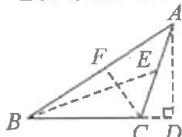  
【基础题夯实】

1. C  2. A  3. D

4.3 5.D 6.D

7. AC, BC, CD

# 【中档题运用】

8.64° 9.3 2.4 10.4

11. $80^{\circ}$ 或 $40^{\circ}$

12. 解: $\because AD \perp BC, CE \perp AB,$

$$
\therefore S _ {\triangle A B C} = \frac {1}{2} B C \cdot A D = \frac {1}{2} A B \cdot
$$

CE,

即 $\frac{1}{2}\times9\times8=\frac{1}{2}\times10\times CE,$

解得 CE=7.2.

13. 解: (1) ∵ △BDE 与四边形 ACDE 的周长相等,

$\therefore BD + DE + BE = AC + AE +$

CD+DE.

$\because BD=DC,$

$\therefore BE=AE+AC;$

(2) 设 AE = x，

则 BE=12-x，

由(1)得 $BE = AE + AC$ ，

∴12-x=x+9, 解得 $x=\frac{3}{2}$ ,

$\therefore AE = \frac{3}{2}.$

# 【综合题探究】

14. 解: 如图所示.

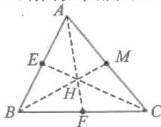  
图1

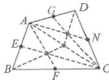  
图2

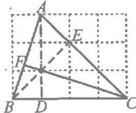  
图3

# 13.3 三角形的内角与外角

# 13.3.1 三角形的内角

# 第 1 课时 三角形的内角和

# 【易错点睛】

$90^{\circ}$

# 【基础题夯实】

1. D 2. B 3. C 4. 75°

5.35° 6.75° 7.60

8. 解: 设 $\angle A = x$ ,

则 $\angle B=2x,\angle C=2x+40^{\circ}$

$\because \angle A + \angle B + \angle C = 180^{\circ},$

$\therefore x + 2x + 2x + 40^{\circ} = 180^{\circ},$

解得 $x=28^{\circ}$

$\therefore \angle A = 28^{\circ}.$

9. 解: 在 $\triangle ABC$ 中,

$\because \angle BAC + \angle ABC + \angle C = 180^{\circ},$

$\angle ABC=70^{\circ},\angle C=50^{\circ}$

$\therefore \angle BAC = 180^{\circ} - 70^{\circ} - 50^{\circ} = 60^{\circ}$

∵AD平分∠BAC，

$\therefore \angle BAD = \frac{1}{2} \angle BAC = 30^{\circ}$ .

在 $\triangle ABD$ 中

$\because \angle BAD + \angle ABC + \angle ADB = 180^{\circ},$

$\therefore \angle ADB = 180^{\circ} - 30^{\circ} - 70^{\circ} = 80^{\circ}.$

# 【中档题运用】

10.230° 11.50° 12.80°

13. 解: 据题意得 $\angle DAB=54^{\circ}$ ,

$\angle ECB = 18^{\circ}$

$\angle DAC = \angle ACE = 90^{\circ}$

$\therefore \angle BAC = 90^{\circ} - 54^{\circ} = 36^{\circ},$

$\therefore \angle ACB = 90^{\circ} + 18^{\circ} = 108^{\circ}.$

$\because \angle BAC + \angle ACB + \angle B = 180^{\circ},$

$\therefore \angle B = 180^{\circ} - \angle BAC - \angle ACB$

$= 180^{\circ} - 36^{\circ} - 108^{\circ}$

$= 36^{\circ}$

∴∠B 的度数为 $36^{\circ}$ .

14. 解：(1)∵∠BAC=∠BED，

∴AC//DE,

$\therefore \angle ADE = \angle DAC.$

$\because \angle ADE = \angle CGF,$

$\therefore \angle DAC = \angle CGF,$

∴AD∥GF;

(2)由(1)知 AC//DE, AD//GF.

$\because \angle AED = 100^{\circ}$

$\therefore \angle BAC = 180^{\circ} - 100^{\circ} = 80^{\circ}$

∵AD平分∠BAC，

$\therefore \angle DAC = \frac{1}{2} \angle BAC = 40^{\circ}$ .

$\because \angle C = 55^{\circ},$

$\therefore \angle ADC = 180^{\circ} - 40^{\circ} - 55^{\circ} = 85^{\circ}$

∵AD∥GF，

$\therefore \angle CFG = \angle ADC = 85^{\circ}.$

# 【综合题探究】

15. 解: (1) $\angle C = 2\angle BOD$ ;

(2) 成立, 理由如下:

设 $\angle OAB=x,\angle OBA=y$ ，

∵AO,BO 分别平分∠CAB,∠CBA,

$\therefore \angle CAB = 2x, \angle CBA = 2y,$

$\therefore \angle AOB = 180^{\circ} - x - y,$

$\angle C = 180^{\circ} - 2x - 2y$

$$
= 2 (9 0 ^ {\circ} - x - y).
$$

$\because OD \perp OA,$

$\therefore \angle AOD = 90^{\circ}$

$\therefore \angle BOD = \angle AOB - 90^{\circ}$

$$
= 9 0 ^ {\circ} - x - y,
$$

$\therefore \angle C = 2\angle BOD.$

# 第 2 课时 直角三角形的两锐角互余 【易错点睛】

$50^{\circ}$ 或 $130^{\circ}$

# 【基础题夯实】

1. $35^{\circ}$ 2. $65^{\circ}$ 3. $122^{\circ}$ 4. $75^{\circ}$ 5. D

6. 解：∵CD⊥AB，

$\therefore \angle CDB = 90^{\circ}.$

$\because \angle BCD = 34^{\circ},$

$\therefore \angle CBD = 90^{\circ} - \angle BCD$

$$
\begin{array}{l} = 9 0 ^ {\circ} - 3 4 ^ {\circ} \\ = 5 6 ^ {\circ} \\ \end{array}
$$

∵ BE 平分∠ABC，

$$
\therefore \angle C B E = \frac {1}{2} \angle C B D = \frac {1}{2} \times 5 6 ^ {\circ} =
$$

28°

$\because \angle ECB = 90^{\circ}, \angle CBE = 28^{\circ}$

$\therefore \angle CEB = 90^{\circ} - 28^{\circ} = 62^{\circ}.$

7.D

8. 解: $\triangle ABC$ 为直角三角形.

理由如下：

∵AE∥BF,

$\therefore \angle BAE + \angle ABF = 180^{\circ}.$

∵AC,BC分别平分∠BAE和∠ABF,

$$
\therefore \angle C A B = \frac {1}{2} \angle B A E,
$$

$$
\angle A B C = \frac {1}{2} \angle A B F,
$$

$$
\therefore \angle C A B + \angle A B C
$$

$$
= \frac {1}{2} (\angle B A E + \angle A B F)
$$

$$
= 9 0 ^ {\circ},
$$

∴△ABC为直角三角形.

# 【中档题运用】

9. C 10. 11° 11. 71°

12. 解: (1) ∵ ∠ACB = 90°,

$\therefore \angle CAB + \angle B = 90^{\circ}.$

$\because \angle CAB = 2\angle B,$

$\therefore 3 \angle B = 90^{\circ}$ ,

$\therefore \angle B = 30^{\circ}$

(2)∵AD平分∠BAC，

$$
\therefore \angle C A D = \frac {1}{2} \angle C A B = 3 0 ^ {\circ},
$$

$$
\therefore \angle A D C = 9 0 ^ {\circ} - \angle C A D = 6 0 ^ {\circ}.
$$

$\because CE \perp AD,$

$\therefore \angle DCE = 90^{\circ} - \angle ADC = 30^{\circ}.$

13. 证明：(1) $\because \angle ACB = \angle CDA = 90^{\circ}$ ,

$\therefore \angle BAC + \angle ACD = 90^{\circ},$

$\angle BAC + \angle B = 90^{\circ},$

$\therefore \angle ACD = \angle B;$

(2)∵AE平分∠BAC,

$\therefore \angle CAE = \angle BAE.$

$\because \angle FDA = 90^{\circ}, \angle ACE = 90^{\circ},$

$\therefore \angle DAF + \angle AFD = 90^{\circ},$

$\angle CAE + \angle CEA = 90^{\circ},$

$\therefore \angle AFD = \angle CEA.$

$\because \angle AFD = \angle CFE,$

$\therefore \angle CFE = \angle CEA,$

即 $\angle CFE = \angle CEF$

# 【综合题探究】

14. 解: (1) $10^{\circ}$ ;

(2) $\triangle ABD, \triangle EDC$ 是“准互余三角形”.

理由如下：

$\because \angle ACB = 90^{\circ},$

$\therefore \angle B + \angle BAC = 90^{\circ}.$

∵AD平分∠BAC，

$\therefore \angle BAC = 2\angle BAD,$

$\therefore \angle B + 2\angle BAD = 90^{\circ},$

∴△ABD 是“准互余三角形”；

$\because \angle ACB = 90^{\circ},$

$\therefore \angle ADC + \angle DAC = 90^{\circ}.$

$\because \angle DAC = 2\angle E,$

$\therefore \angle ADC + 2\angle E = 90^{\circ},$

∴△EDC为“准互余三角形”.

# 13.3.2 三角形的外角

# 【易错点睛】

×

# 【基础题夯实】

1. $70^{\circ}$ 100° 2. $45^{\circ}$ 3. $35^{\circ}$ 4. $75^{\circ}$

5.(1) $140^{\circ}$ (2) $75^{\circ}$ (3) $15^{\circ}$ (4) $48^{\circ}$ (5) $60^{\circ}$

6. 解：∵∠ACF为△ABC的外角，

$\therefore \angle ACF = \angle A + \angle B$

$$
= 4 0 ^ {\circ} + 7 0 ^ {\circ}
$$

$$
= 1 1 0 ^ {\circ}.
$$

∵∠AEF为△CEF的外角，

$\therefore \angle AEF = \angle ACF + \angle F$

$$
= 1 1 0 ^ {\circ} + 3 0 ^ {\circ}
$$

$$
= 1 4 0 ^ {\circ}.
$$

7. 解：∵∠ACE 是△ABC 的外角，

$\therefore \angle ACE = \angle B + \angle BAC$

$$
= 2 0 ^ {\circ} + 1 2 0 ^ {\circ}
$$

$$
= 1 4 0 ^ {\circ}
$$

∵CD平分∠ACE，

$$
\therefore \angle D C E = \frac {1}{2} \angle A C E = 7 0 ^ {\circ}.
$$

∵∠DCE是△BCD的外角，

$\therefore \angle D = \angle DCE - \angle B$

$$
= 7 0 ^ {\circ} - 2 0 ^ {\circ}
$$

$$
= 5 0 ^ {\circ}.
$$

# 【中档题运用】

8.25° 9.105° 10.83°

11. 解： $\because \angle C = \angle DAC$

∴设 $\angle C=\angle DAC=x$ ，

则 $\angle B=\angle ADB=\angle DAC+\angle C=$

2x

$\because \angle BAC = 87^{\circ},$

$\therefore \angle B + \angle C = 93^{\circ},$

$\therefore x + 2x = 93^{\circ}$

∴x=31°

$\therefore \angle DAC = 31^{\circ}$

12. 证明：∵∠ADC 是△ABD 的外角，

$\therefore \angle ADC = \angle B + \angle BAD.$

$\because \angle ADC = \angle ADE + \angle CDE,$

$\therefore \angle ADE + \angle CDE = \angle B +$

∠BAD.

$\because \angle ADE = \angle B,$

$\therefore \angle CDE = \angle BAD,$

$\therefore \angle AED = \angle CDE + \angle C$

$= \angle BAD + \angle C.$

# 【综合题探究】

13. 解: (1) ∵ AE, BE 分别平分 ∠BAC, ∠ABC,

$$
\therefore \angle A B E + \angle B A E = \frac {1}{2} (\angle A B C +
$$

∠BAC).

$\because \angle BED = \angle ABE + \angle BAE$

$$
= 5 0 ^ {\circ},
$$

$\therefore \angle ABC + \angle BAC = 100^{\circ},$

$\therefore\angle C=80^{\circ};$

(2) $\angle BED = \angle ABE + \angle BAE$

$$
= \frac {1}{2} (\angle A B C + \angle B A C)
$$

$$
= \frac {1}{2} (1 8 0 ^ {\circ} - \angle C)
$$

$$
= 9 0 ^ {\circ} - \frac {1}{2} \angle C.
$$

# 回归教材 角度计算(一)

# 方程思想

1. 解: 设 $\angle B = x$ .

$\because \angle B = \angle A - 10^{\circ}, \angle C = \angle B + 20^{\circ},$

$\therefore \angle A = \angle B + 10^{\circ} = x + 10^{\circ},$

$\angle C = x + 20^{\circ}$

$\because \angle A + \angle B + \angle C = 180^{\circ},$

$\therefore x + 10^{\circ} + x + x + 20^{\circ} = 180^{\circ},$

解得 $x = 50^{\circ}$

$\therefore \angle B = 50^{\circ}.$

2. 解: 设 $\angle ABC = \angle ACB = x$ ,

则 $\angle BAC = 4x$

$\therefore x+x+4x=180^{\circ},$

∴ $x = 30^{\circ}$

$\therefore \angle DCB = 90^{\circ} - \angle B = 60^{\circ},$

$\therefore \angle DCA = \angle DCB - \angle ACB$

$$
= 6 0 ^ {\circ} - 3 0 ^ {\circ}
$$

$$
3 0 ^ {\circ}.
$$

3. 解: 设 $\angle CAD = x$ , 则 $\angle E = 3x$ .

∵AD平分∠BAC，

$\therefore \angle BAD = \angle CAD = x,$

$\therefore \angle EAD = \angle ADE$

$$
= \angle B + \angle B A D
$$

$$
5 0 ^ {\circ} + x.
$$

∵在△ADE中

$\angle E + \angle ADE + \angle DAE = 180^{\circ},$

$\therefore 3x + 2(50^{\circ} + x) = 180^{\circ},$

解得 $x = 16^{\circ}$

$\therefore \angle E = 3x = 48^{\circ}.$

4. 解: 设 $\angle BAD = x$ ,

则 $\angle DAC = \angle C = 2\angle BAD = 2x$

$\angle ABD = \angle ADB = 4x.$

$\because \angle ABD + \angle ADB + \angle BAD = 180^{\circ},$

∴ $4x + 4x + x = 180^{\circ}$ ，解得 $x = 20^{\circ}$ ，

$\therefore \angle DAC = 2x = 40^{\circ}.$

∵BE⊥AC，

$\therefore \angle AEF = 90^{\circ},$

$\therefore \angle AFE = 90^{\circ} - \angle DAC$

$$
= 9 0 ^ {\circ} - 4 0
$$

$$
= 5 0 ^ {\circ}.
$$

$\therefore \angle BFD = \angle AFE = 50^{\circ}$

# 回归教材 角度计算(二)

# 参数思想

1. 解: 设 $\angle B = \angle ACB = \alpha$ ,

则 $\angle A = 180^{\circ} - 2\alpha$

$\because CD \perp AB,$

$\therefore \angle ACD = 2\alpha - 90^{\circ}, \angle BCD = 90^{\circ} - \alpha.$

∵CE 平分∠ACD，

$\therefore \angle DCE = \alpha - 45^{\circ}$

$\therefore \angle BCE = (\alpha - 45^{\circ}) + (90^{\circ} - \alpha) =$

45°.

2. 解: $\angle CDE = \frac{1}{2} \angle BAD$ . 理由如下:

设∠BAD=x，

∵∠ADC 是△ABD 的外角，

$\therefore \angle ADC = \angle B + \angle BAD = 45^{\circ} + x.$

∵∠AED是△CDE的外角，

$\therefore \angle AED = \angle C + \angle CDE$

$\because \angle B = \angle C, \angle ADE = \angle AED,$

$\therefore \angle ADC - \angle CDE = \angle C + \angle CDE,$

即 $45^{\circ} + x - \angle CDE = 45^{\circ} + \angle CDE$

$$
\therefore \angle C D E = \frac {1}{2} x,
$$

即 $\angle CDE = \frac{1}{2}\angle BAD.$

3. 解: $\because AE$ 平分 $\angle DAC$ ,

$\therefore \angle DAE = \angle CAE.$

设 $\angle DAE=\angle CAE=x,\angle C=y$ ，

则 $\angle AEB = \angle CAE + \angle C = x + y$

$\angle ADB = \angle DAC + \angle C = 2x + y,$

$\therefore \angle ADB + \angle C = 2x + y + y$

$= 2x + 2y = 2\angle AEB.$

4. 解: 设 $\angle PCD = x, \angle EDP = y.$

∵CP,DP 分别平分∠BCD,∠ADE,

$$
\therefore \angle B C D = 2 x, \angle A D E = 2 y.
$$

$$
\because \angle P = \angle P D E - \angle P C D = y - x,
$$

$$
\angle C O D = \angle O D E - \angle B C D = 2 y - 2 x,
$$

$$
\therefore \angle A O B = \angle C O D = 2 \angle P
$$

$$
\because \angle A O B + \angle A + \angle B = 1 8 0 ^ {\circ},
$$

$$
\therefore 2 \angle P + \angle A + \angle B = 1 8 0 ^ {\circ},
$$

$$
\therefore \angle P = 9 0 ^ {\circ} - \frac {1}{2} (\angle A + \angle B).
$$

# 回归教材 角度计算(三) 整体思想

1. 解: $\because \angle1 = \angle AED + \angle A$ ,

$$
\angle 2 = \angle A D E + \angle A,
$$

$$
\therefore \angle 1 + \angle 2 = \angle A E D + \angle A +
$$

$$
\angle A D E + \angle A
$$

$$
= 1 8 0 ^ {\circ} + \angle A.
$$

$$
\because \angle 1 + \angle 2 = 4 \angle A,
$$

$$
\therefore 4 \angle A = 1 8 0 ^ {\circ} + \angle A, \therefore \angle A = 6 0 ^ {\circ}.
$$

2. 解：∵∠A=110°，

$$
\therefore \angle A B C + \angle A C B = 1 8 0 ^ {\circ} - \angle A = 7 0 ^ {\circ}.
$$

$$
\text { 即 } \angle 1 + \angle 2 + \angle 3 + \angle 4 = 7 0 ^ {\circ}.
$$

$$
\because \angle 1 = \angle 2, \angle 3 = \angle 4,
$$

$$
\therefore 2 \angle 2 + 2 \angle 4 = 7 0 ^ {\circ},
$$

$$
\therefore \angle 2 + \angle 4 = 3 5 ^ {\circ},
$$

$$
\because x ^ {\circ} + \angle 2 + \angle 4 = 1 8 0 ^ {\circ},
$$

$$
\text { 解得 } x = 1 4 5,
$$

$$
\therefore x \text {   的值为   } 1 4 5.
$$

3. 解: $\because \angle1 = \angle B + \angle C,$

$$
\angle 2 = \angle D + \angle E,
$$

$$
\therefore \angle A + \angle B + \angle C + \angle D + \angle E =
$$

$$
\angle A + \angle 1 + \angle 2 = 1 8 0 ^ {\circ}.
$$

4. 解: 设 $\angle E = \angle ADE = \alpha$ ,

$$
\therefore \angle C A D = \angle E + \angle A D E = 2 \alpha .
$$

$$
\because \angle B A D = 2 6 ^ {\circ},
$$

$$
\therefore \angle B A C = 2 \alpha + 2 6 ^ {\circ}.
$$

$$
\because \angle B = \angle C,
$$

$$
\therefore \angle C = \frac {1 8 0 ^ {\circ} - \angle B A C}{2} = 7 7 ^ {\circ} - \alpha .
$$

$$
\because \angle B D E = \angle C + \angle E,
$$

$$
\therefore \angle B D E = 7 7 ^ {\circ}.
$$

# 思想方法 角度计算(四) 分类讨论思想

1. $45^{\circ}$ 或 $30^{\circ}$

解:①当 $\angle B=90^{\circ}$ 时, $2\angle C=90^{\circ}$ ,

$$
\therefore \angle C = 4 5 ^ {\circ};
$$

$$
② \text { 当 } \angle A = 9 0 ^ {\circ} \text { 时 }, \angle B + \angle C = 9 0 ^ {\circ},
$$

$$
\therefore 2 \angle C + \angle C = 9 0 ^ {\circ},
$$

$$
\therefore \angle C = 3 0 ^ {\circ}.
$$

2. $60^{\circ}$ 或 $10^{\circ}$

解:①当 $\angle ADC=90^{\circ}$ 时,

$$
\angle B C D = 9 0 ^ {\circ} - 3 0 ^ {\circ} = 6 0 ^ {\circ};
$$

$$
② \text {当} \angle A C D = 9 0 ^ {\circ} \text {时，}
$$

$$
\angle A C B = 1 8 0 ^ {\circ} - 3 0 ^ {\circ} - 5 0 ^ {\circ} = 1 0 0 ^ {\circ},
$$

$$
\angle B C D = 1 0 0 ^ {\circ} - 9 0 ^ {\circ} = 1 0 ^ {\circ}.
$$

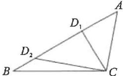

3.20°或40°

解:①当高 AD 在△ABC 内部时,

$$
\angle E A D = 2 0 ^ {\circ};
$$

②当高 AD 在 $\triangle ABC$ 外部时，

$$
\angle E A D = 4 0 ^ {\circ}.
$$

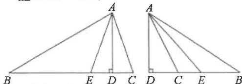

text_image

Geometric diagram showing two right triangles with labeled points and perpendicular lines, likely illustrating a theorem or proof.

4.25°或65°

解:①∠BAC为锐角时,

$$
\angle C = 6 5 ^ {\circ};
$$

②∠BAC 为钝角时，

$$
\angle C = 2 5 ^ {\circ}.
$$

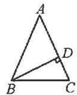

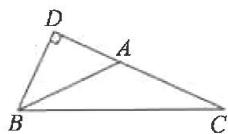

5.130°或50°

解:①当 $\triangle ABC$ 为锐角三角形时, $\angle BOC=130^{\circ}$ ;

②当 $\triangle ABC$ 为钝角三角形时，

$$
\angle B O C = 5 0 ^ {\circ}.
$$

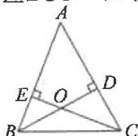

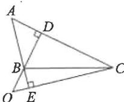

# 回归教材

# 基本图形(一) 、一线三等角

1. 证明：(1)∵AD⊥BC, CE⊥AB,

$$
\therefore \angle A D B = \angle C E B = 9 0 ^ {\circ},
$$

$$
\therefore \angle A + \angle B = \angle C + \angle B = 9 0 ^ {\circ},
$$

$$
\therefore \angle A = \angle C;
$$

$$
(2) \because \angle A E F = \angle A D B = 9 0 ^ {\circ},
$$

$$
\begin{array}{r l} \therefore \angle A F E + \angle A & = \angle B + \angle A \\ & = 9 0 ^ {\circ}, \end{array}
$$

$$
\therefore \angle A F E = \angle B.
$$

2. 证明：(1) 连接 BD.

$$
\text { 可得 } \angle A B C + \angle A D C + \angle A + \angle C =
$$

$$
1 8 0 ^ {\circ} \times 2 = 3 6 0 ^ {\circ}.
$$

$$
\because \angle A = \angle C = 9 0 ^ {\circ},
$$

$$
\therefore \angle A B C + \angle A D C = 1 8 0 ^ {\circ};
$$

(2)∵ BE 平分 ∠ABC, DF 平分 ∠ADC,

$$
\therefore \angle C B G = \frac {1}{2} \angle A B C,
$$

$$
\angle C D F = \frac {1}{2} \angle A D C,
$$

$$
\therefore \angle C B G + \angle C D F = \frac {1}{2} (\angle A B C +
$$

$$
\angle A D C) = 9 0 ^ {\circ}.
$$

$$
\because \angle C F D + \angle C D F = 9 0 ^ {\circ},
$$

$$
\therefore \angle C B G = \angle C F D,
$$

$$
\therefore D F \parallel B G.
$$

3. 证明: (1) ∵ ∠ADC = ∠ADE + ∠CDE

$$
= \angle A + \angle B,
$$

$$
\text { 又 } \because \angle A D E = \angle B,
$$

$$
\therefore \angle C D E = \angle A;
$$

$$
(2) \because \angle B D E = \angle A D B + \angle A D E
$$

$$
= \angle E + \angle C,
$$

$$
\angle A D E = \angle C,
$$

$$
\therefore \angle A D B = \angle E.
$$

# 回归教材 基本图形(二)

# 双内角平分线的夹角

1. 证明:由双内角平分线夹角模型知

$$
\angle A D B = 9 0 ^ {\circ} + \frac {1}{2} \angle A C B = 1 3 5 ^ {\circ}.
$$

$$
\because \angle B D E = 9 0 ^ {\circ}
$$

$$
\therefore \angle A D E = 3 6 0 ^ {\circ} - 1 3 5 ^ {\circ} - 9 0 ^ {\circ} = 1 3 5 ^ {\circ},
$$

$$
\therefore \angle A D E = \angle A D B.
$$

2.120° 解:延长 BA, CD 交于点 G.

$$
\because \angle B A D = 1 1 0 ^ {\circ}, \angle A D C = 1 3 0 ^ {\circ},
$$

$$
\therefore \angle G A D = 7 0 ^ {\circ}, \angle G D A = 5 0 ^ {\circ},
$$

$$
\therefore \angle G = 6 0 ^ {\circ}
$$

由双内角平分线夹角模型知

$$
\angle P = 9 0 ^ {\circ} + \frac {1}{2} \angle G = 1 2 0 ^ {\circ}.
$$

3. 解: $\angle D = 180^{\circ} - (\angle DBC + \angle DCB)$

$$
= 1 8 0 ^ {\circ} - \frac {1}{3} (\angle A B C +
$$

$$
\angle A C B)
$$

$$
= 1 8 0 ^ {\circ} - \frac {1}{3} (1 8 0 ^ {\circ} - \angle A)
$$

$$
= 1 2 0 ^ {\circ} + \frac {1}{3} \angle A.
$$

# 图形研究 基本图形(三) 双外角平分线的夹角

1. 解: 由双外角平分线夹角模型可得

$$
\angle D = 9 0 ^ {\circ} - \frac {1}{2} \angle B.
$$

$$
\text { 又 } \because \angle D = \angle B,
$$

$$
\therefore \angle B = 9 0 ^ {\circ} - \frac {1}{2} \angle B,
$$

$$
\therefore \angle B = 6 0 ^ {\circ}.
$$

2.55° 解:延长BA,CD交于点G.

$$
\because \angle B A D = 1 3 0 ^ {\circ}, \angle A D C = 1 2 0 ^ {\circ},
$$

$$
\therefore \angle G A D = 5 0 ^ {\circ}, \angle G D A = 6 0 ^ {\circ},
$$

$$
\therefore \angle G = 7 0 ^ {\circ}.
$$

由双外角平分线夹角模型得

$$
\angle P = 9 0 ^ {\circ} - \frac {1}{2} \angle G = 9 0 ^ {\circ} - 3 5 ^ {\circ} = 5 5 ^ {\circ}.
$$

3. 解: (1) $\angle D = 180^{\circ} - (\angle DBC + \angle DCB)$

$$
= 1 8 0 ^ {\circ} - \frac {1}{3} (\angle E B C +
$$

$$
\angle F C B)
$$

$$
= 1 8 0 ^ {\circ} - \frac {1}{3} (1 8 0 ^ {\circ} + \angle A)
$$

$$
= 1 2 0 ^ {\circ} - \frac {1}{3} \angle A
$$

$$
= 1 2 0 ^ {\circ} - \frac {1}{3} \times 6 0 ^ {\circ}
$$

$$
= 1 0 0 ^ {\circ};
$$

(2) 同(1) 可得 $\angle D = 180^{\circ} - \frac{1}{n} (180^{\circ} +$

$$
\angle A) = \frac {n - 1}{n} \times 1 8 0 ^ {\circ} - \frac {\alpha}{n}.
$$

# 图形研究 基本图形(四) 内、外角平分线的夹角

1. 解: $\because AD$ 平分 $\angle BAO, BC$ 平分 $\angle ABN$ ,

$$
\therefore \angle B A D = \frac {1}{2} \angle B A O,
$$

$$
\angle A B C = \frac {1}{2} \angle A B N,
$$

$$
\therefore \angle D = \angle A B C - \angle B A D
$$

$$
= \frac {1}{2} (\angle A B N - \angle B A O)
$$

$$
= \frac {1}{2} \angle M O N = \frac {1}{2} \times 9 0 ^ {\circ}
$$

$$
= 4 5 ^ {\circ}
$$

2. $60^{\circ}$ 解: 延长 $BE, CF$ 交于点 $G$ ,

$$
\begin{array}{r l} \text {则} \angle G E F + \angle G F E & = 3 6 0 ^ {\circ} - 2 1 0 ^ {\circ} \\ & = 1 5 0 ^ {\circ}, \end{array}
$$

$$
\therefore / G = 3 0 ^ {\circ},
$$

由内外角平分线模型可知 $\angle A = 2\angle G = 60^{\circ}$ .

3. 解: (1) $\angle D = \angle DCE - \angle DBC$

$$
= \frac {1}{3} \angle A C E - \frac {1}{3} \angle A B C
$$

$$
= \frac {1}{3} \angle A = \frac {1}{3} \times 6 0 ^ {\circ}
$$

$$
= 2 0 ^ {\circ};
$$

(2) 同(1)可得 $\angle D = \frac{1}{n} \angle A = \frac{\alpha}{n}$ .

# 图形研究 基本图形(五) 角平分线和高的夹角

1. 解：∵CD, BE 是锐角△ABC 的高，

$$
\therefore \angle A D C = \angle A E B = 9 0 ^ {\circ}.
$$

$$
\because \angle P B D = \angle A B E,
$$

$$
\therefore \angle B P D = \angle A = 5 2 ^ {\circ}.
$$

$$
\because \angle B P D = \angle P B C + \angle P C B,
$$

$$
\therefore \angle P B C + \angle P C B = 5 2 ^ {\circ}.
$$

2. 解：∵AD 是△ABC 的高，

$$
\therefore \angle A D C = 9 0 ^ {\circ}.
$$

$$
\because \angle B A C = 5 8 ^ {\circ}, \angle C = 7 2 ^ {\circ},
$$

$$
\therefore \angle A B C = 1 8 0 ^ {\circ} - \angle B A C - \angle C = 5 0 ^ {\circ},
$$

$$
\angle D A C = 1 8 0 ^ {\circ} - \angle A D C - \angle C = 1 8 ^ {\circ}.
$$

∵BE 是△ABC 的平分线，

$$
\therefore \angle D B F = \frac {1}{2} \angle A B C = 2 5 ^ {\circ},
$$

$$
\therefore \angle A F B = \angle D B F + \angle A D B = 1 1 5 ^ {\circ}.
$$

3. 证明：∵PE⊥BC，

$$
\therefore \angle P E D = 9 0 ^ {\circ},
$$

$$
\therefore 2 \angle P = 1 8 0 ^ {\circ} - 2 \angle P D E.
$$

$$
\because \angle P D E = \angle A D C = \angle B + \angle D A B,
$$

$$
2 \angle D A B = \angle B A C = 1 8 0 ^ {\circ} - (\angle B +
$$

$$
\angle C),
$$

$$
\therefore 2 \angle P = 1 8 0 ^ {\circ} - 2 \angle B - 2 \angle D A B
$$

$$
= 1 8 0 ^ {\circ} - 2 \angle B - 1 8 0 ^ {\circ} +
$$

$$
(\angle B + \angle C)
$$

$$
= \angle C - \angle B,
$$

$$
\therefore \angle P = \frac {\angle C - \angle B}{2}.
$$

# 新情境(一) 生活中的三角形

1. B 2. C 3. B 4. B 5. 65°

6. 解：∵CE⊥CF，

$$
\therefore \angle C = 9 0 ^ {\circ}
$$

$$
\because \angle D B F = \angle C + \angle A D B = 1 1 0 ^ {\circ},
$$

$$
\therefore \angle A D B = 1 1 0 ^ {\circ} - 9 0 ^ {\circ} = 2 0 ^ {\circ},
$$

$$
\therefore \angle A B D = \angle C A B - \angle A D B
$$

$$
= 3 0 ^ {\circ} - 2 0 ^ {\circ}
$$

$$
= 1 0 ^ {\circ}.
$$

7.50 解:延长 DF 交 CE 于点 M.

$$
\because \angle C A B = 5 0 ^ {\circ}, \angle C B A = 6 0 ^ {\circ},
$$

$$
\therefore \angle A C B = 1 8 0 ^ {\circ} - 5 0 ^ {\circ} - 6 0 ^ {\circ} = 7 0 ^ {\circ},
$$

$$
\therefore \angle D C E = \angle A C B = 7 0 ^ {\circ}.
$$

$$
\because \angle E F D = \angle E + \angle E M F,
$$

$$
\angle E M F = \angle D + \angle D C E,
$$

$$
\therefore \angle E F D = \angle E + \angle D + \angle D C E.
$$

$$
\because \angle C E F = 3 0 ^ {\circ}, \angle E F D = 1 5 0 ^ {\circ},
$$

$$
\therefore \angle C D F = 5 0 ^ {\circ}.
$$

# 数学活动 1 多边形的

# 三角剖分(教材变式)

1. 解: (1) 用 3 根等长的磁力棒最多可以搭 1 个等边三角形, 如图 1 的等边三角形;

(2)用6根等长的磁力棒最多可以搭4个等边三角形,如图2的三棱锥;

(3)用9根等长的磁力棒最多可以搭7个等边三角形,如图3的双三棱锥.

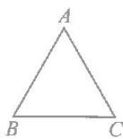  
图1

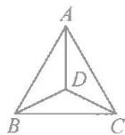  
图2

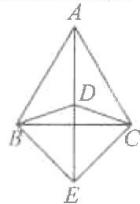  
图3

2. 解：(1)1,2;

$$
(2) 2, 3;
$$

$$
(3) 3, 4;
$$

$$
(4) n - 3, n - 2.
$$

3. 解：(1)5；

(2) 当 n=4 时， $\frac{D_{5}}{D_{4}}=\frac{4\times4-6}{4}$ .

$$
\because D _ {4} = 2,
$$

$\therefore\frac{D_{5}}{2}=\frac{10}{4}$ ，解得 $D_{5}=5$ ，

∴(1)中结果正确；

当 n=5 时， $\frac{D_{6}}{D_{5}}=\frac{4\times5-6}{5}$ .

$$
\because D _ {5} = 5,
$$

$$
\therefore \frac {D _ {6}}{5} = \frac {1 4}{5},
$$

解得 $D_{6} = 14$

同理可得 $D_{7} = 42$

综上所述,经验证前面结果正确,计算得六边形和七边形的三角剖分方法数分别为14和42.

# 综合与实践(一)

# 确定匀质薄板的重心位置

1. 解: 如图所示, 点 O 即为所求.

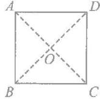  
正方形

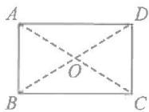  
长方形

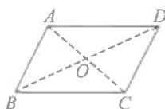  
平行四边形

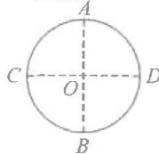  
圆

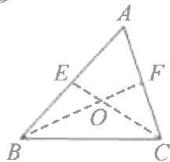  
三角形

2. 解: 以点 B 为坐标原点, 分别以 BC, BA 为 x 轴, y 轴建立如图所示的平面直角坐标系, 延长 FE 交 BC 于点 G, 连接 AG, BF 交于点 H, 连接 DG, CE 交于点 I, 则可将原“L”形薄板分割成两个正方形 ABGF 和 GC-DE, 它们的重心分别为点 H, I.
由已知可得点 F(4,4), D(6,2), G(4,0),

∴可得点 $H(2,2)$ , $I(5,1)$ ,

$$
S _ {\text {四边形} A B G F} = 4 \times 4 = 1 6.
$$

$$
S _ {\text { 四   边   形 } G C D E} = 2 \times 2 = 4.
$$

设原“L”形薄板的重心为点 P，

根据公式可得 $x_{P}=\frac{S_{1}x_{1}+S_{2}x_{2}}{S_{1}+S_{2}}=$

$$
1 6 \times 2 + 4 \times 5
$$

$$
\bar {1} 6 + - 4
$$

$$
y = \frac {S _ {1} y _ {1} + S _ {2} y _ {2}}{S _ {1} + S _ {2}} = \frac {1 6 \times 2 + 4 \times 1}{1 6 + 4} =
$$

$$
1. 8,
$$

∴原“L”形薄板的重心坐标为(2.6, 1.8).

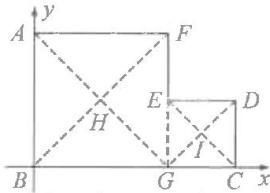

text_image

y
A
F
E
D
H
I
B
G
C
x

3.(1)下 低 小 (2)高 大

(3) 背越

# 章末复习

1.(1)3 $\triangle ACE,\triangle ACD,\triangle ACB$

$$
(2) B C E \quad C D E
$$

$$
(3) C E
$$

2.(1) $\triangle BCD$

$$
\triangle C E D, \triangle A C D, \triangle A B E
$$

$$
\triangle A D E, \triangle B D E, \triangle B C E, \triangle A B C
$$

(2) $\triangle CED, \triangle ACD, \triangle ABE, \triangle BCD$ $\triangle BCD$

3. 3 4. ①③ 5. ③ 6. B 7. B

8. 解：∵在△ABC中，

$$
\angle B A C = 6 2 ^ {\circ}, \angle C = 7 6 ^ {\circ},
$$

$$
\therefore \angle B = 1 8 0 ^ {\circ} - 6 2 ^ {\circ} - 7 6 ^ {\circ} = 4 2 ^ {\circ}.
$$

$$
\because A D \text {平分} \angle B A C,
$$

$$
\therefore \angle C A D = \frac {1}{2} \angle B A C = 3 1 ^ {\circ},
$$

$$
\therefore \angle A D C = 1 8 0 ^ {\circ} - 3 1 ^ {\circ} - 7 6 ^ {\circ} = 7 3 ^ {\circ}.
$$

$$
\because \angle A D E = \frac {1}{2} \angle B = 2 1 ^ {\circ},
$$

$$
\therefore \angle C D E = \angle A D C - \angle A D E
$$

$$
= 7 3 ^ {\circ} - 2 1 ^ {\circ} = 5 2 ^ {\circ}.
$$

9. 解: $\because BD$ 平分 $\angle ABC$ ,

$$
\therefore \angle 1 = \angle D B C,
$$

$$
\text {设} \angle A = x,
$$

$$
\text { 则 } \angle A B C = 2 x, \angle 2 = \angle C = 2 x,
$$

$$
\text {在} \triangle A B C \text {中，}
$$

$$
x + 2 x + 2 x = 1 8 0 ^ {\circ}, x = 3 6 ^ {\circ},
$$

$$
\therefore \angle A = 3 6 ^ {\circ}.
$$

10.2°或23°

11. 解：(1) $15^{\circ}$ ;

(2)∵AD平分∠BAC,

$$
\therefore \angle D A B = \frac {1}{2} \angle B A C = \frac {1}{2} (1 8 0 ^ {\circ} -
$$

$$
\alpha - \beta),
$$

$$
\therefore \angle A D C = \angle B + \angle D A B = 9 0 ^ {\circ} +
$$

$$
\frac {1}{2} \alpha - \frac {1}{2} \beta . \because P E \perp A D,
$$

$$
\therefore \angle P = 9 0 ^ {\circ} - \angle A D C = \frac {1}{2} (\beta - \alpha).
$$

12. 解：∵∠A=40°，

$$
\therefore \angle 1 + \angle 2 = 1 8 0 ^ {\circ} - 4 0 ^ {\circ} = 1 4 0 ^ {\circ},
$$

$$
\angle 3 + \angle 4 = 1 8 0 ^ {\circ} - 4 0 ^ {\circ} = 1 4 0 ^ {\circ},
$$

$$
\angle 5 + \angle 6 = 1 8 0 ^ {\circ} - 4 0 ^ {\circ} = 1 4 0 ^ {\circ},
$$

$$
\begin{array}{l} \therefore \angle 1 + \angle 2 + \angle 3 + \angle 4 + \angle 5 + \angle 6 = \\ 1 4 0 ^ {\circ} + 1 4 0 ^ {\circ} + 1 4 0 ^ {\circ} = 4 2 0 ^ {\circ}. \end{array}
$$

# 第十四章 全等三角形

# 14.1 全等三角形及其性质

# 【易错点睛】

②④

# 【基础题夯实】

1.

2. 解: $\angle DAC$ 和 $\angle EAB$ 是对应角, AC 和 AB, AD 和 AE, DC 和 EB 是对应边.

3.80° 4.6 5.38° 6.10

7. 解：∵△ABC≌△CDE，

$$
\therefore \angle A C B = \angle C E D = 4 5 ^ {\circ}.
$$

$$
\because \angle D = 3 5 ^ {\circ},
$$

$$
\begin{array}{l} \therefore \angle D C E = 1 8 0 ^ {\circ} - \angle C E D - \angle D = \\ 1 0 0 ^ {\circ}. \end{array}
$$

# 【中档题运用】

8. A 9. 6 10. 45

11. 解: (1) ∵ △ABE ≅ △DCF,

$$
\therefore \angle B = \angle C,
$$

$$
\therefore A B \parallel C D;
$$

$$
(2) \because \triangle A B E \cong \triangle D C F,
$$

$$
\therefore B E = C F,
$$

$$
\therefore B E - E F = C F - E F,
$$

$$
\therefore C E = B F.
$$

$$
\because B C = 1 0, E F = 7,
$$

$$
\therefore C E = B F = \frac {1}{2} \times (1 0 - 7) = 1. 5,
$$

$$
\therefore B E = B C - C E = 1 0 - 1. 5 = 8. 5.
$$

12. 解：∵△ABC≌△ADE，

$$
\therefore \angle A C B = \angle A E D = 1 1 0 ^ {\circ},
$$

$$
\angle D = \angle B = 3 0 ^ {\circ},
$$

$$
\therefore \angle C A B = 1 8 0 ^ {\circ} - \angle B - \angle A C B = 4 0 ^ {\circ},
$$

$$
\therefore \angle D A B = \angle D A C + \angle C A B = 5 0 ^ {\circ}.
$$

$$
\text {设} B F \text {与} A D \text {交于点} G,
$$

$$
\text {则} \angle D G B = \angle D F B + \angle D
$$

$$
= \angle D A B + \angle B,
$$

$$
\therefore \angle D F B = \angle D A B = 5 0 ^ {\circ}.
$$

# 【综合题探究】

13. 解：∵AB=20 cm, AE=6 cm,

$$
B C = 1 6 \mathrm{cm},
$$

点 P 的运动速度为 2 cm/s, 运动时间为 t s,

$$
\therefore B E = 1 4 \mathrm{cm}, B P = 2 t \mathrm{cm},
$$

$$
P C = (1 6 - 2 t) \mathrm{cm}.
$$

$$
\text { 当 } \triangle B P E \cong \triangle C Q P \text { 时 },
$$

$$
\text {则有} B E = P C,
$$

$$
\text { 即 } 1 4 = 1 6 - 2 t \text { ,   解   得 } t = 1;
$$

$$
\text {当} \triangle B P E \cong \triangle C P Q \text {时，}
$$

$$
\text {则有} B P = P C,
$$

$$
\text { 即 } 2 t = 1 6 - 2 t,
$$

$$
\text {解得} t = 4,
$$

故 $t$ 的值为1或4.

# 14.2 三角形全等的判定

# 第 1 课时 用“SAS”判定三角形全等 【易错点睛】

【解】不一定全等,反例如图:

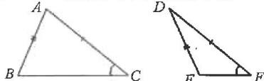  
【基础题夯实】

1. SAS 2. SAS 3. D 4. AB = DC

5. 证明：∵∠BAE=∠CAD，

$\therefore \angle BAE + \angle CAE = \angle CAD + \angle CAE,$ 即 $\angle BAC = \angle EAD.$

在 $\triangle ABC$ 与 $\triangle AED$ 中，

$$
\begin{array}{l} \left\{ \begin{array}{l} A B = A E, \\ \angle B A C = \angle E A D, \\ A C = A D, \end{array} \right. \\ \begin{array}{l} \therefore \triangle A B C \cong \triangle A E D (\text { SAS }), \\ \therefore B C = E D. \end{array} \\ \end{array}
$$

6. 解: 同意. 理由如下:

在 $\triangle ABO$ 与 $\triangle DCO$ 中，

$$
\left\{ \begin{array}{l} O A = O D, \\ \angle A O B = \angle D O C, \\ O B = O C, \end{array} \right.
$$

$$
\therefore \triangle A B O \cong \triangle D C O (\text { SAS }),
$$

$$
\therefore A B = D C = 1 2 \mathrm{m}.
$$

# 【中档题运用】

7.D

8. $32^{\circ}$

9.2

10. 证明： $\because \angle B = 50^{\circ}, \angle C = 20^{\circ}$ ，

$$
\therefore \angle C A B = 1 8 0 ^ {\circ} - \angle B - \angle C = 1 1 0 ^ {\circ}.
$$

$$
\because A E \perp B C,
$$

$$
\therefore \angle A E C = 9 0 ^ {\circ},
$$

$$
\therefore \angle D A F = \angle A E C + \angle C = 1 1 0 ^ {\circ},
$$

$$
\therefore \angle D A F = \angle C A B.
$$

$$
\text { 又 } \because A D = A C, A F = A B,
$$

$$
\therefore \triangle D A F \cong \triangle C A B (\text { SAS }),
$$

$$
\therefore D F = C B.
$$

11.

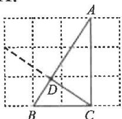  
图1

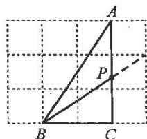  
图

# 【综合题探究】

12. 证明：(1) $\because \angle ACB = \angle ECD$

$$
\begin{array}{l} \therefore \angle A C B + \angle B C E = \angle E C D + \\ \angle B C E, \end{array}
$$

即 $\angle ACE=\angle BCD.$

$$
\because A C = B C, E C = D C,
$$

$$
\therefore \triangle A C E \cong \triangle B C D (\text { SAS }),
$$

$$
\therefore A E = B D, \angle A E C = \angle B D C,
$$

$$
\therefore \angle D B E = \angle D C E = 9 0 ^ {\circ},
$$

$$
\therefore A E \perp D B;
$$

$$
(2) \because \triangle A C E \cong \triangle B C D,
$$

$$
\therefore D B = A E, \angle C E A = \angle C D B.
$$

$$
\because A M \perp A E, D B \perp A E,
$$

$$
\therefore \angle M A E = \angle D B E = 9 0 ^ {\circ}.
$$

$$
\because A M = B E,
$$

$$
\therefore \triangle M A E \cong \triangle E B D (\text { SAS }),
$$

$$
\therefore \angle C E A = \angle E D B,
$$

$$
\therefore \angle C D B = \angle E D B,
$$

$$
\therefore D B \text {平分} \angle C D E.
$$

第 2 课时 用“ASA”或“AAS”

判定三角形全等

# 【易错点睛】

D

# 【基础题夯实】

1. $AE = AB$ 2. $BC = EF$   
3.∠B=∠D 4.D   
5. 证明：∵CD⊥AB,BE⊥AC,

$$
\therefore \angle A D C = \angle A E B = 9 0 ^ {\circ}.
$$

在 $\triangle ABE$ 和 $\triangle ACD$ 中，

$$
\left\{ \begin{array}{l} \angle A = \angle A, \\ A E = A D, \end{array} \right.
$$

$$
\angle A E B = \angle A D C,
$$

$$
\therefore \triangle A B E \cong \triangle A C D (\text { ASA }),
$$

$$
\therefore A B = A C.
$$

6. DE = EF

7. 证明: 在 $\triangle ABC$ 和 $\triangle BAD$ 中,

$$
\left\{ \begin{array}{l} \angle C = \angle D = 9 0 ^ {\circ}, \\ \angle C B A = \angle D A B, \\ A B = B A, \end{array} \right.
$$

$$
\therefore \triangle A B C \cong \triangle B A D (\text { A   A   S }),
$$

$$
\therefore A D = B C.
$$

$$
\because \angle D = \angle C = 9 0 ^ {\circ},
$$

$$
\angle A O D = \angle B O C
$$

$$
\therefore \triangle A D O \cong \triangle B C O (A A S).
$$

# 【中档题运用】

8.6 9.(-1,3) 10.8

11. 解：∵∠AEB=90°，

$$
A D \perp D C, B C \perp D C,
$$

$$
\begin{array}{l} \therefore \angle A E B = \angle A D E = \angle B C E = \\ 9 0 ^ {\circ}. \end{array}
$$

$$
\begin{array}{l} \therefore \angle A E D + \angle B E C = \angle E B C + \\ \angle B E C = 9 0 ^ {\circ}, \end{array}
$$

$$
\therefore \angle A E D = \angle E B C.
$$

$$
\text { 又 } \because A E = B E,
$$

$$
\therefore \triangle A D E \cong \triangle E C B (\text { A   A   S }),
$$

$$
\therefore A D = C E, D E = B C,
$$

$$
\therefore D C = D E + C E
$$

$$
= B C + A D
$$

$$
= 3 5 0 + 1 5 0 = 5 0 0 (\mathrm{m}).
$$

答:两个排污口之间的水平距离DC为500 m.

12. 解: (1) ∵ AD ⊥ BC, BE ⊥ AC,

$$
\therefore \angle A D B = \angle A D C = \angle B E C = 9 0 ^ {\circ},
$$

$$
\therefore \angle E B C + \angle C = 9 0 ^ {\circ},
$$

$$
\angle D A C + \angle C = 9 0 ^ {\circ},
$$

$$
\therefore \angle E B C = \angle D A C.
$$

在△CAD与△FBD中，

$$
\left\{ \begin{array}{l} \angle D A C = \angle F B D, \\ \angle A D C = \angle B D F, \\ A C = B F, \end{array} \right.
$$

$$
\therefore \triangle C A D \cong \triangle F B D (\text { A   A   S }),
$$

$$
\therefore F D = D C;
$$

$$
(2) \text {由} (1) \text {得} D F = D C = 3,
$$

$$
B D = A D.
$$

$$
\because B C = 9,
$$

$$
\therefore A D = B D = B C - C D = 6,
$$

$$
\therefore A F = A D - F D = 6 - 3 = 3,
$$

$$
\begin{array}{l} \therefore S _ {\triangle A B F} = \frac {1}{2} \cdot A F \cdot B D \\ = \frac {1}{2} \times 3 \times 6 \\ \end{array}
$$

$$
= 9.
$$

# 【综合题探究】

13. 解: (1) ∵ CD, BE 是 △ABC 的两条高,

$$
\therefore \angle C D A = \angle B E A = 9 0 ^ {\circ}
$$

$$
\text {又} \because \angle A = \angle A, A B = A C,
$$

$$
\therefore \triangle A C D \cong \triangle A B E (\text { A   A   S }),
$$

$$
\therefore C D = B E;
$$

(2)过点 G 作 GH ⊥ DC, 交 DC 的延长线于点 H.

$$
\because B E \perp A C, C D \perp A B,
$$

$$
\therefore \angle A C D + \angle C F E = 9 0 ^ {\circ},
$$

$$
\angle A + \angle A C D = 9 0 ^ {\circ},
$$

$$
\therefore \angle A = \angle C F E.
$$

$$
\text { 又 } \because A C = F G, \angle A D C = \angle H = 9 0 ^ {\circ},
$$

$$
\therefore \triangle A C D \cong \triangle F G H (\text { A   A   S }),
$$

$$
\therefore C D = G H.
$$

$$
\because S _ {\triangle C D G} = \frac {1}{2} C D \cdot G H = 3 2,
$$

$$
\therefore C D ^ {2} = 6 4,
$$

$$
\therefore B E = C D = 8.
$$

# 第 3 课时 用“SSS”判定三角形全等

# 【易错点睛】

①③

# 【基础题夯实】

1. SSS 2. AD=CE 3. 3

4. 解: (1) $\because AD = BE$ ,

$$
\therefore A D + B D = B E + B D,
$$

$$
\text { 即 } A B = D E.
$$

在 $\triangle ABC$ 和 $\triangle DEF$ 中，

$$
A B = D E,
$$

$$
\left\{A C = D F, \right.
$$

$$
B C = E F
$$

$$
\therefore \triangle A B C \cong \triangle D E F (\text { S   S   S });
$$

$$
(2) \because \triangle A B C \cong \triangle D E F,
$$

$$
\therefore \angle A = \angle F D E = 5 5 ^ {\circ}.
$$

$$
\because / E = 4 5 ^ {\circ}
$$

$$
\therefore \angle F = 1 8 0 ^ {\circ} - (\angle F D E + \angle E)
$$

$$
= 1 8 0 ^ {\circ} - (5 5 ^ {\circ} + 4 5 ^ {\circ})
$$

$$
= 8 0 ^ {\circ}.
$$

5. $\triangle MOC$ SSS

6.

(1)

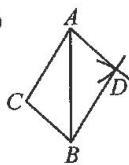  
图1

(2)

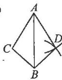  
图2

(3)

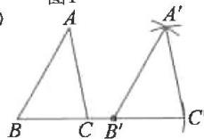  
图3

# 【中档题运用】

7.3

8.①②④

9.49°

10. 证明: 连接 BC.

在 $\triangle ABC$ 和 $\triangle DCB$ 中，

$$
| A B = D C,
$$

$$
\left\{A C = D B, \right.
$$

$$
B C = C B
$$

$$
\therefore \triangle A B C \cong \triangle D C B (\text { S   S   S }),
$$

$$
\therefore \angle A = \angle D.
$$

在 $\triangle AEB$ 和 $\triangle DEC$ 中，

$$
\angle A = \angle D,
$$

$$
\angle A E B = \angle D E C,
$$

$$
A B = D C
$$

$$
\therefore \triangle A E B \cong \triangle D E C (\text { A   A   S }),
$$

$$
\therefore A E = D E.
$$

11. 证明：(1) 连接 AO.

$$
\because A B = A C, B O = C O,
$$

$$
A O = A O.
$$

$$
\therefore \triangle A B O \cong \triangle A C O (\text { S   S   S }),
$$

$$
\therefore \angle B = \angle C;
$$

$$
(2) \because \angle B = \angle C,
$$

$$
\angle D O B = \angle E O C, B O = C O,
$$

$$
\therefore \triangle B O D \cong \triangle C O E (\text { ASA }),
$$

$$
\therefore B D = C E
$$

$$
\because A B = A C,
$$

$$
\therefore A B - B D = A C - C E,
$$

$$
\text { 即 } A D = A E.
$$

# 【综合题探究】

12. 解:(1)∵AF⊥BE,

$$
\therefore \angle B A F = \angle D A E = 9 0 ^ {\circ}.
$$

$$
\text { 在 } \triangle A B F \text { 与 } \triangle A D E \text { 中   , } A B = A D,
$$

$$
\angle B A F = \angle D A E, A F = A E,
$$

$$
\therefore \triangle A B F \cong \triangle A D E (\text { SAS }),
$$

$$
\therefore B F = D E;
$$

$$
(2) \text {连接} A C.
$$

$$
\because B F = D E, C E = B C + B F,
$$

$$
\therefore B C = D C.
$$

$$
\text {   在   } \triangle A B C \text {   与   } \triangle A D C \text {   中   },
$$

$$
A B = A D, A C = A C, B C = D C,
$$

$$
\therefore \triangle A B C \cong \triangle A D C (\text { S   S   S }),
$$

$$
\therefore \angle A B C = \angle A D C = 1 1 0 ^ {\circ}.
$$

$$
\because \angle B A C = \angle D A C = \frac {1}{2} \angle B A F = 4 5 ^ {\circ},
$$

$$
\begin{array}{r l} \therefore \angle A C B & = 1 8 0 ^ {\circ} - \angle A B C - \angle B A C \\ & = 2 5 ^ {\circ}, \end{array}
$$

$$
\therefore \angle A C D = \angle A C B = 2 5 ^ {\circ},
$$

$$
\therefore \angle B C E = 5 0 ^ {\circ}.
$$

第 4 课时 尺规作图

【易错点睛】

E DM

【基础题夯实】

1. B

2.

(1)

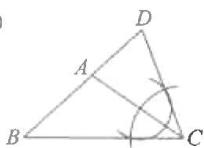

(2)

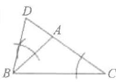  
图2

(3)

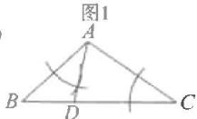  
图3

3.

(1)

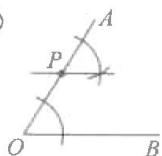

(2)

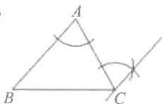  
图2

(3)

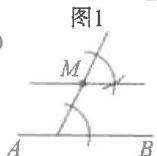  
图3

4.

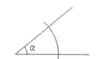

(2)

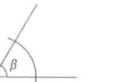

(1)

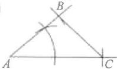

(2)

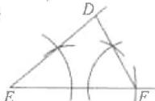

【】

5. D

6.

(1)

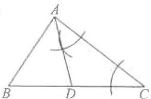  
图1

(2)

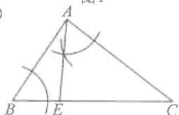  
图2

7.

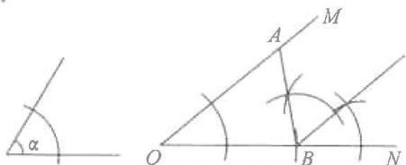

text_image

Geometric diagram showing two angles α and β formed by intersecting lines with labeled points O, A, B, M, N

【综合题探究】

8. 解: (1) 如图所示;

(2)如图所示；

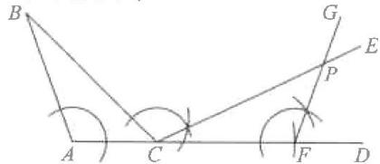

text_image

Geometric diagram with labeled points and angles, showing lines and arcs for mathematical analysis

(3)PF=AC.理由如下：

由以上作图可知，

$$
\angle B C P = \angle C F P = \angle A, C F = A B.
$$

$$
\because \angle B C P + \angle F C P = \angle B C D = \angle A +
$$

$$
\angle B, \angle B C P = \angle A,
$$

$$
\therefore \angle F C P = \angle B.
$$

$$
\text { 又 } \because C F = A B, \angle C F P = \angle A,
$$

$$
\therefore \triangle F C P \cong \triangle A B C (\text { ASA }),
$$

$$
\therefore P F = A C.
$$

第 5 课时 用“HL”判定

两个直角三角形全等

【易错点睛】

①③④

【基础题夯实】

1. D 2. B

3.(1) $\angle ABC=\angle DCB$

$$
(2) \angle A C B = \angle D B C
$$

$$
(3) A B = C D
$$

$$
(4) A C = B D
$$

4.8

5. 证明：∵ AB ⊥ BC, EF ⊥ DE,

$$
\therefore \angle B = \angle E = 9 0 ^ {\circ}.
$$

$$
\because A F = D C,
$$

$$
\therefore A F + F C = D C + F C,
$$

$$
\therefore A C = D F.
$$

$$
\text { 在 } \mathrm{Rt} \triangle A B C \text { 和 } \mathrm{Rt} \triangle D E F \text { 中   ， }
$$

$$
f A C = D F,
$$

$$
| B C = E F,
$$

$$
\therefore \mathrm{Rt} \triangle A B C \cong \mathrm{Rt} \triangle D E F (\mathrm{HL}),
$$

$$
\therefore \angle A = \angle D,
$$

$$
\therefore A B \parallel D E.
$$

6. 解: 哥哥的说法正确. 理由如下:

由已知可得 $\angle A=\angle D=90^{\circ}$

在 Rt△AEF 和 Rt△DGH 中，

$$
\int E F = G H,
$$

$$
\left. A E = D G, \right.
$$

$$
\therefore \mathrm{Rt} \triangle A E F \cong \mathrm{Rt} \triangle D G H (\mathrm{HL}),
$$

$$
\therefore A F = D H,
$$

哥哥的说法正确。

【中档题运用】

7. 证明：∵BD, CE 是△ABC 的高，

$$
\therefore \angle B E C = \angle A E C = \angle A D B =
$$

$$
\angle C D B = 9 0 ^ {\circ}
$$

在 Rt△BEC 和 Rt△CDB 中，

$$
\left. \right| B C = C B,
$$

$$
B E = C D,
$$

$$
\therefore \mathrm{Rt} \triangle B E C \cong \mathrm{Rt} \triangle C D B (\mathrm{HL}),
$$

$$
\therefore B D = C E
$$

在 $\triangle ABD$ 与 $\triangle ACE$ 中，

$$
\angle A E C = \angle A D B,
$$

$$
\angle A = \angle A, B D = C E,
$$

$$
\therefore \triangle A B D \cong \triangle A C E (\text { A   A   S }),
$$

$$
\therefore A D = A E.
$$

8. 证明: 连接 AB.

$\because \angle C = \angle D = 90^{\circ},$

∴在 Rt△ACB 和 Rt△BDA 中，

$$
\left| A B = B A, \right.
$$

$$
B C = A D,
$$

$\therefore \mathrm{Rt}\triangle ACB\cong \mathrm{Rt}\triangle BDA(\mathrm{HL})$

$$
\therefore A C = B D.
$$

在 $\triangle ACE$ 和 $\triangle BDE$ 中，

$$
\angle A E C = \angle B E D,
$$

$$
\angle C = \angle D,
$$

$$
A C = B D,
$$

$\therefore \triangle ACE \cong \triangle BDE (AAS)$ ,

$$
\therefore C E = D E
$$

9. 证明: 连接 CD.

$$
\because D M \perp A C, D N \perp B C,
$$

$$
\therefore \angle A M D = \angle B N D = 9 0 ^ {\circ}.
$$

∴D为AB的中点，

$\therefore AD = BD.$

在 Rt△DAM 和 Rt△DBN 中，

$$
\int A D = B D,
$$

$$
D M = D N,
$$

$$
\therefore \mathrm{Rt} \triangle D A M \cong \mathrm{Rt} \triangle D B N (\mathrm{HL}),
$$

$$
\therefore A M = B N;
$$

同理可证 Rt△CDM≌Rt△CDN(HL).

$$
\therefore C M = C N,
$$

$$
\therefore A C = B C.
$$

【综合题探究】

10. 解: (1) 在 Rt△ADB 和 Rt△AEC 中,

$AB = AC, AD = AE,$

$$
\therefore \mathrm{Rt} \triangle A D B \cong \mathrm{Rt} \triangle A E C (\mathrm{HL}),
$$

$$
\therefore E C = B D;
$$

(2) 连接 AF. $\because AD = AE, AC = AB,$

$$
\angle D = \angle A E C = 9 0 ^ {\circ},
$$

$$
\therefore \triangle A E C \cong \triangle A D B, \therefore E C = B D.
$$

$$
\because \angle A E C = 9 0 ^ {\circ}
$$

$$
\therefore \angle A E F = 9 0 ^ {\circ},
$$

$$
\therefore \angle A E F = \angle D = 9 0 ^ {\circ}.
$$

$$
\because A F = A F, A D = A E,
$$

$$
\therefore \mathrm{Rt} \triangle A D F \cong \mathrm{Rt} \triangle A E F (\mathrm{HL}),
$$

$$
\therefore D F = E F,
$$

$$
\therefore C F = E F + C E = D F + D B;
$$

(3) 过点 A 分别作 $AM \perp x$ 轴于点

$M, AN \perp y$ 轴于点 $N$ .

$$
\because A (2, 2),
$$

$$
\therefore \angle A N B = \angle A M C = 9 0 ^ {\circ},
$$

$$
A N = A M = O M = O N = 2.
$$

$$
\because A B = A C.
$$

$$
\text {由(1)知} B N = M C,
$$

$$
\therefore O C - O B = O M + M C - (B N - O N)
$$

$$
= O M + O N
$$

$$
= 4.
$$

回归教材 找全等(一)

知二寻一

1. 证明：∵∠ACF+∠AED=180°，

$$
\angle A C F + \angle A C B = 1 8 0 ^ {\circ},
$$

$$
\therefore \angle A C B = \angle A E D.
$$

在 $\triangle ABC$ 和 $\triangle ADE$ 中，

$$
\vert A C = A E,
$$

$$
\angle A C B = \angle A E D,
$$

$$
B C = D E,
$$

$$
\therefore \triangle A B C \cong \triangle A D E (\text { SAS }),
$$

$$
\therefore A B = A D.
$$

2. 证明：∵∠BAC=∠DAE，

$$
\therefore \angle B A C - \angle B A E = \angle D A E - \angle B A E,
$$

$$
\therefore \angle C A E = \angle B A D.
$$

$$
\text { 又 } \because A B = A C, \angle A B D = \angle A C E,
$$

$$
\therefore \triangle A B D \cong \triangle A C E (\text { ASA }),
$$

$$
\therefore B D = C E.
$$

3. 证明：∵BF=CE，

$$
\therefore B F + F C = E C + F C,
$$

即 BC=EF.

在 $\triangle ABC$ 与 $\triangle DEF$ 中，

$$
| A B = D E,
$$

$$
\angle B = \angle E,
$$

$$
B C = E F,
$$

$$
\therefore \triangle A B C \cong \triangle D E F (\text { SAS }),
$$

$$
\therefore \angle A = \angle D.
$$

4. 证明: 连接 AD.

$$
\because D E \perp A B, D F \perp A C,
$$

$$
\therefore \angle A E D = \angle A F D = 9 0 ^ {\circ},
$$

$$
\angle B E D = \angle C F D = 9 0 ^ {\circ}
$$

在 Rt△ADE 和 Rt△ADF 中，

$$
\int A D = A D,
$$

$$
\left. A E = A F, \right.
$$

$$
\therefore \mathrm{Rt} \triangle A D E \cong \mathrm{Rt} \triangle A D F (\mathrm{HL}),
$$

$$
\therefore D E = D F.
$$

在 $\triangle BDE$ 和 $\triangle CDF$ 中，

$$
\angle B E D = \angle C F D,
$$

$$
\left\{D E = D F, \right.
$$

$$
\angle B D E = \angle C D F,
$$

$$
\therefore \triangle B D E \cong \triangle C D F (\text { ASA }),
$$

$$
\therefore B D = C D.
$$

基础夯实 找全等(二)

二次全等

1. 证明: 在 $\triangle AEF$ 和 $\triangle CFE$ 中,

$$
| A E = C F,
$$

$$
\left\langle A F = C E, \right.
$$

$$
E F = F E,
$$

$\therefore \triangle AEF \cong \triangle CFE(SSS)$ ,

$\therefore \angle AEB = \angle CFD.$

$\because BF=DE,$

$\therefore BF + EF = DE + EF$

即 BE = DF.

在 $\triangle ABE$ 和 $\triangle CDF$ 中，

$\left\{ \begin{array}{l} AE = CF, \\ \angle AEB = \angle CFD, \\ BE = DF, \end{array} \right.$

$\therefore \triangle ABE \cong \triangle CDF(SAS)$ ,

$\therefore \angle B = \angle D,$

$\therefore AB \parallel CD.$

2. 证明：∵EF=HG，

$\therefore EF + FG = HG + FG,$

即 $EG = HF$

在 $\triangle EBG$ 和 $\triangle HDF$ 中，

$\left\{ \begin{array}{l} BE = DH, \\ \angle E = \angle H, \\ EG = HF, \end{array} \right.$

$\therefore \triangle EBG \cong \triangle HDF(SAS)$ ,

$\therefore \angle BGE = \angle DFH.$

$\because \angle AFE = \angle DFH, \angle CGH = \angle BGE,$

$\therefore \angle AFE = \angle CGH.$

在 $\triangle AEF$ 和 $\triangle CHG$ 中，

$\left\{ \begin{array}{l} \angle E = \angle H, \\ EF = HG, \end{array} \right.$

$\angle AFE = \angle CGH,$

$\therefore \triangle AEF \cong \triangle CHG(ASA)$ ,

$\therefore AF = CG.$

3. 解: (1) 延长 BE 交 AC 于点 G.

∵AD⊥BC,

$\therefore \angle BDE = \angle ADC = 90^{\circ}.$

在 Rt△BDE 和 Rt△ADC 中，

$BE = AC$

$DE = DC$

$\therefore \mathrm{Rt}\triangle BDE \cong \mathrm{Rt}\triangle ADC (\mathrm{HL})$

$\therefore \angle CBE = \angle CAD.$

$\because \angle CAD + \angle ACD = 90^{\circ},$

$\therefore \angle CBE + \angle ACD = 90^{\circ},$

$\therefore BE \perp AC;$

(2) $AC = MC$ 且 $AC \perp MC$ .

理由：

∵F为BC的中点，

$\therefore BF=CF.$

在 $\triangle BFE$ 与 $\triangle CFM$ 中，

$\left\{ \begin{array}{l}BF = CF,\\ \angle BFE = \angle CFM,\\ EF = FM, \end{array} \right.$

$\therefore \triangle BFE \cong \triangle CFM(SAS),$

$\therefore \angle CBE = \angle BCM,$

BE=MC=AC,

∴BE//MC.

∵BE⊥AC,∴AC⊥MC,

∴AC=MC 且 AC⊥MC.

# 回归教材 构全等(一)

# 连接构造

1. 证明: 连接 BD.

在 $\triangle ABD$ 和 $\triangle CDB$ 中，

$AB=CD,$

$\left\{AD = BC, \right.$

$BD = DB$

$\therefore \triangle ABD \cong \triangle CDB (SSS)$ ,

$\therefore \angle A = \angle C.$

2. 证明: 连接 AC.

在 $\triangle ABC$ 和 $\triangle ADC$ 中，

$AB = AD$

$CB = CD$

$AC = AC$

$\therefore \triangle ABC \cong \triangle ADC(SSS)$ ,

$\therefore \angle B = \angle D.$

3. 证明: 连接 AC, AD,

∵AB=AE,∠B=∠E,BC=ED,

$\therefore \triangle ABC \cong \triangle AED(SAS),$

$\therefore AC=AD.$

∵AF⊥CD,

$\therefore \angle AFC = \angle AFD = 90^{\circ}.$

$\therefore \mathrm{Rt}\triangle ACF \cong \mathrm{Rt}\triangle ADF (\mathrm{HL})$

$\therefore CF = DF$

即 F 为 CD 的中点.

4. 证明: 连接 AF

$\because \angle ACB = \angle ADE = 90^{\circ},$

AC=AD,∠BAC=∠EAD,

$\therefore \triangle ABC \cong \triangle AED(ASA)$ ,

$\therefore BC=DE.$

在 Rt△ACF 与 Rt△ADF 中，

$\int AF = AF,$

$AC = AD$

$\therefore Rt\triangle ACF\cong Rt\triangle ADF(HL)$ ,

$\therefore CF = DF$

$\therefore BC = DE = DF + EF = CF + EF.$

# 方法归纳 构全等(二)

# SA 构造(一题多法)

方法一：

解: 在 BD 上截取 BN = CD, 连接 AN.

$\because \angle BDC = \angle BAC,$

$\therefore \angle ABN = \angle ACD.$

在 $\triangle ABN$ 和 $\triangle ACD$ 中，

$\left\{ \begin{array}{l} AB = AC, \\ \angle ABN = \angle ACD, \\ BN = CD, \end{array} \right.$

$\therefore \triangle ABN \cong \triangle ACD(SAS)$ ,

$\therefore AN=AD.$

∵AE⊥BD，

$\therefore \angle AEN = \angle AED = 90^{\circ}.$

在 Rt△ANE 和 Rt△ADE 中，

$AN=AD,$

AE=AE

$\therefore \mathrm{Rt}\triangle ANE \cong \mathrm{Rt}\triangle ADE (\mathrm{HL})$

$\therefore NE=DE,$

$\therefore BE=BN+NE=CD+DE.$

方法二：

解: 过点 A 作 $AF \perp CD$ , 交 CD 的延长

线于点F，

则 $\angle AFC=90^{\circ}$

∵AE⊥BD,

$\therefore \angle AEB = \angle AED = 90^{\circ}.$

$\because \angle BDC = \angle BAC$

$\therefore \angle ABE = \angle ACF$

$\therefore \triangle ABE \cong \triangle ACF(AAS)$ ,

$\therefore BE=CF, AE=AF.$

在 Rt△ADF 和 Rt△ADE 中，

$AD = AD,$

$AF = AE$

$\therefore \mathrm{Rt}\triangle ADF \cong \mathrm{Rt}\triangle ADE (\mathrm{HL})$

$\therefore DF = DE$

$\therefore BE = CF = CD + DF = CD + DE.$

方法三：

解: 在 BD 上取点 N, 连接 AN, 使

$\angle BAN = \angle CAD.$

$\because \angle BDC = \angle BAC,$

$\therefore \angle ABD = \angle ACD.$

又∵AB=AC，

$\therefore \triangle ABN \cong \triangle ACD(ASA)$ ,

$\therefore BN=CD,AN=AD.$

∵AE|BD,

$\therefore \angle AEN = \angle AED = 90^{\circ}.$

在 Rt△ANE 和 Rt△ADE 中，

$AN=AD,$

$AE = AE$

$\therefore \mathrm{Rt}\triangle ANE \cong \mathrm{Rt}\triangle ADE (\mathrm{HL})$

$\therefore NE=DE,$

$\therefore BE = BN + NE = CD + DE.$

# 方法归纳 构全等(三)

# 知中点

1. 2 < AD < 6

2. 证明:延长 OP 至点 E,使 PE=OP,

连接 BE.

∵P为BD的中点，

$\therefore BP=PD,$

$\therefore \triangle BPE \cong \triangle DPO(SAS)$ ,

$\therefore BE = OD, \angle E = \angle DOP,$

∴BE//OD,

$\therefore \angle EBO + \angle BOD = 180^{\circ}.$

$\because \angle AOB = \angle COD = 90^{\circ}$

$\therefore \angle BOD + \angle AOC = 360^{\circ} - 180^{\circ} = 180^{\circ},$

$\therefore \angle EBO = \angle AOC.$

$\because BE=OD,OD=OC,$

$\therefore BE=OC$

$\therefore \triangle EBO \cong \triangle COA (SAS)$ ,

$\therefore OE=AC.$

又∵OE=2OP，

$\therefore AC = 2OP.$

3. 证明: 延长 FD 至点 G, 使 GD = DF, 连接 BG, EG.

∵DE|DF,

$\therefore \angle EDF = \angle EDG = 90^{\circ},$

$\therefore \triangle EDF \cong \triangle EDG(SAS)$ ,

$\therefore EF=EG.$

$\because BD=CD,\angle BDG=\angle CDF,$

$GD = DF$

$\therefore \triangle DFC \cong \triangle DGB(SAS),$

$\therefore BG=CF.$

在 $\triangle BEG$ 中， $BG+BE>EG.$

又∵EF=EG,BG=CF,

$\therefore BE+CF>EF.$

4. 证明: 过点 B 作 AF 的垂线, 交 AF 的延长线于点 M.

则 $\angle EAF=\angle M=90^{\circ}$

在 $\triangle EAF$ 与 $\triangle BMF$ 中，

$\angle EAF = \angle M,$

$\angle EFA = \angle MFB, EF = BF,$

$\therefore \triangle EAF \cong \triangle BMF(AAS)$

$\therefore AF = MF, BM = AE = AD.$

在 Rt△ADC 与 Rt△BMA 中，

$AB = AC, BM = AD,$

∴ Rt△ADC≌Rt△BMA(HL),

$\therefore DC=AM=2AF$

# 方法归纳 构全等(四)

# 证中点

1. 证明: 过点 E 作 $EH \perp AC$ 于点 H,
则 $\angle EHC=\angle CAD=90^{\circ}$ ,

$\angle ECH = 90^{\circ} - \angle ACD = \angle ADC.$

又∵CE=CD，

$\therefore \triangle ACD \cong \triangle HEC(AAS)$ ,

$\therefore EH = CA = AB.$

$\because \angle A = \angle EHF = 90^{\circ},$

$\angle AFB = \angle HFE$

$\therefore \triangle ABF \cong \triangle HEF(AAS)$ ,

$\therefore EF = BF,$

∴F 是 BE 的中点.

2. 证明: (1) 过点 D 作 $DG \perp AC$ 交 AC 的延长线于点 G.

∵EF⊥AC,

$\therefore \angle AFE = \angle G = 90^{\circ}.$

$\because \angle A = \angle DBG, AE = BD,$

$\therefore \triangle AEF \cong \triangle BDG,$

$\therefore EF=DG.$

$\because \angle G = \angle EFC = 90^{\circ},$

$\angle DCG = \angle FCE$

$\therefore \triangle DCG \cong \triangle ECF(AAS)$ ,

$\therefore CD=CE,\therefore C$ 是DE的中点；

(2)由(1)可知,AF=BG,CF=CG,

$\therefore AB + BF = FG + BF$

$\therefore AB = FG = 2CF$

3. 证明: 过点 E 作 EH // AD 交 AB 于点 H.

$\because \angle ACB = 90^{\circ}, \angle CAB = 30^{\circ},$

$\therefore \angle EHA = \angle BAD = \angle ABC = 60^{\circ},$

$\angle EAH = \angle ACB = 90^{\circ}, AE = AC,$

$\therefore \triangle AEH \cong \triangle CAB(AAS),$

$\therefore EH=AB=AD.$

∵EH∥AD,

$\therefore \angle EHF = \angle FAD,$

$\angle HEF = \angle ADF,$

$\therefore \triangle HEF \cong \triangle ADF(ASA)$ ,

∴EF=DF.

# 14.3 角的平分线

# 第1课时 角的平分线的性质 【易错点睛】

D

1.

2.

3.

4.6 5.A 6.3

7. 证明：∵AD平分∠BAC，

$$
D E \perp A B, \angle C = 9 0 ^ {\circ},
$$

$$
\text { 即 } D C \perp A C,
$$

$$
\therefore D E = D C.
$$

在 Rt△CDF 和 Rt△EDB 中，

$$
\int B D = F D,
$$

$$
D E = D C
$$

$$
\therefore \mathrm{Rt} \triangle C D F \cong \mathrm{Rt} \triangle E D B (\mathrm{HL}),
$$

$$
\therefore B E = C F.
$$

# 【中档题运用】

8.8 9.2 10.2:3 2

11. 解: (1) $\angle ABC$ 的平分线如图所示;

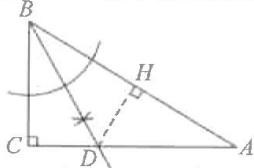

(2) 过点 D 作 $DH \perp AB$ 于点 H.

∵BD平分∠ABC，

$DC\perp BC, DH\perp AB,$

$$
\therefore C D = D H = 3,
$$

$$
\therefore S _ {\triangle A B C} = S _ {\triangle B C D} + S _ {\triangle A B D}
$$

$$
= \frac {1}{2} B C \cdot C D + \frac {1}{2} A B \cdot D H
$$

$$
= \frac {1}{2} \times 3 \times B C + \frac {1}{2} \times 3 \times A B
$$

$$
= \frac {1}{2} \times 3 (B C + A B)
$$

$$
= \frac {1}{2} \times 3 \times 1 6
$$

$$
= 2 4.
$$

12. 证明: 方法一: 过点 E 作 $EH \perp CD$ 交 CD 的延长线于点 H.

∵CE平分∠BCD，∠B=90°，

$\therefore EH = BE = AD.$

又∵DE=ED，

$\therefore \mathrm{Rt}\triangle ADE \cong \mathrm{Rt}\triangle HED(\mathrm{HL})$

$\therefore AE = DH.$

$\because CE=CE,BE=EH,$

$\therefore \mathrm{Rt}\triangle BCE \cong \mathrm{Rt}\triangle HCE (\mathrm{HL})$

$\therefore BC = CH,$

$\therefore BC - CD = CH - CD = DH = AE,$

$\therefore BC - CD = AE;$

方法二: 在 CB 上截取 CF = CD，

则 $\triangle CFE\cong\triangle CDE(SAS)$ ,

$\therefore FE=DE,$

$\therefore \mathrm{Rt}\triangle BEF \cong \mathrm{Rt}\triangle ADE (\mathrm{HL})$

$\therefore AE = BF = BC - CF = BC - CD.$

# 【综合题探究】

13. 证明: (1) 过点 C 分别作 $CE \perp AB$ 于点 E, $CF \perp AD$ 交 AD 延长线于点 F, 则 $\angle CEB = \angle CFD = 90^{\circ}$ .

$\because \angle ADC + \angle CDF = 180^{\circ},$

$$
\angle A D C + \angle A B C = 1 8 0 ^ {\circ},
$$

$$
\therefore \angle C D F = \angle A B C.
$$

∵AC平分∠DAB,CE⊥AB,

$$
C F \perp A D,
$$

$$
\therefore C E = C F,
$$

$\therefore \triangle CDF \cong \triangle CBE (AAS)$ ,

$$
\therefore C D = C B;
$$

(2)延长 DO 至点 N, 使 ON = DO, 连接 AN.

∵AO=OC,∠AON=∠COD,

$\therefore \triangle AON \cong \triangle COD(SAS)$ ,

$\therefore AN=CD,\angle N=\angle CDO,$

$$
\therefore C D \parallel A N,
$$

$\therefore \angle DAN + \angle ADC = 180^{\circ},$

$\therefore \angle DAN = 180^{\circ} - \angle ADC = \angle B.$

$$
\text {由(1)知} C D = C B,
$$

$$
\because C D = A N,
$$

$$
\therefore A N = B C.
$$

又∵∠ADN=∠BEC=90°,

$\therefore \triangle AND \cong \triangle BCE(AAS)$ ,

$\therefore CE = DN = 2DO.$

# 第 2 课时 角的平分线的判定

# 【易错点睛】

A

# 【基础题夯实】

1. B 2. $55^{\circ}$ 3. $120^{\circ}$

4. 证明：∵BE⊥AC, CF⊥AB,

$$
\therefore \angle B F D = \angle C E D = 9 0 ^ {\circ}.
$$

在 $\triangle DFB$ 和 $\triangle DEC$ 中，

$$
\angle D F B = \angle D E C = 9 0 ^ {\circ},
$$

$$
\angle B D F = \angle C D E,
$$

$$
B D = C D,
$$

$$
\therefore \triangle D F B \cong \triangle D E C (\text { A   A   S }),
$$

$$
\therefore D E = D F.
$$

又∵DE⊥AC,DF⊥AB,

∴AD平分∠BAC.

5. 证明：(1) 过点 E 作 $EF \perp CD$ 于点 F.

$$
\because D E \text {平分} \angle A D C,
$$

$$
\therefore \angle A D E = \angle C D E.
$$

$$
\because E A \perp A D,
$$

$$
\therefore E A = E F.
$$

$$
\because E A = E B,
$$

$$
\therefore E B = E F
$$

$$
\because E B \perp B C, E F \perp C D,
$$

∴CE平分∠BCD；

(2)由(1)可得 EA=EF=EB.

$$
\because E D = E D, E C = E C,
$$

$$
\therefore \triangle A D E \cong \triangle F D E,
$$

$$
\triangle B E C \cong \triangle F E C,
$$

$$
\therefore A D = D F, B C = C F,
$$

$$
\therefore A D + B C = C D.
$$

# 【中档题运用】

6. 证明：∵PD⊥OA, PE⊥OB, PD=PE,

$$
\therefore \angle A O C = \angle B O C.
$$

$$
\because \angle D P O = 9 0 ^ {\circ} - \angle A O C,
$$

$$
\angle E P O = 9 0 ^ {\circ} - \angle B O C,
$$

$$
\therefore \angle D P O = \angle E P O,
$$

$$
\therefore \angle D P F = \angle E P F.
$$

$$
\because P D = P E, P F = P F,
$$

$$
\therefore \triangle D P F \cong \triangle E P F (\text { SAS }),
$$

$$
\therefore \angle 1 = \angle 2.
$$

7. 证明：(1) $\because \angle ACD = \angle BCE$

$$
\therefore \angle B C E + \angle A C E = \angle A C D +
$$

$$
\angle A C E,
$$

$$
\therefore \angle B C A = \angle E C D.
$$

$$
\text {又} \because B C = E C, A C = D C,
$$

$$
\therefore \triangle A B C \cong \triangle D E C (\text { SAS }),
$$

$$
\therefore A B = D E;
$$

(2) 过点 C 作 $CG \perp AB$ 于点 G，

CH⊥DE于点H.

$$
\because \triangle A B C \cong \triangle D E C
$$

$$
\therefore \angle B = \angle E, B C = E C.
$$

$$
\because \angle B G C = \angle E H C = 9 0 ^ {\circ},
$$

$$
\therefore \triangle B G C \cong \triangle E H C (\text { A   A   S }),
$$

$$
\therefore C G = C H,
$$

∴MC 平分∠BMD.

8. 解: (1) 过点 P 分别作 AB, BC, CA 所

$$
\text {在直线的垂线，垂足分别为} M, F, N.
$$

$$
\because C P \text {平分} \angle B C D, B P \text {平分} \angle C B E,
$$

$$
\therefore P N = P F, P F = P M,
$$

$$
\therefore P N = P M,
$$

∴点 P 在 $\angle BAC$ 的平分线上；

(2) 连接 AP

由(1)知 $\angle CAP=\angle BAP=35^{\circ}$ ,

$$
\therefore \angle N P A = \angle M P A = 9 0 ^ {\circ} - 3 5 ^ {\circ} = 5 5 ^ {\circ},
$$

$$
\therefore \angle M P N = 1 1 0 ^ {\circ}.
$$

$$
\because C P \text {平分} \angle B C D, B P \text {平分} \angle C B E,
$$

$$
\angle P N C = \angle P F C = \angle P M B = 9 0 ^ {\circ},
$$

$$
\therefore \angle C P N = \angle C P F, \angle B P F = \angle B P M,
$$

$$
\begin{array}{l} \therefore \angle C P B = \frac {1}{2} \angle N P M = \frac {1}{2} \times 1 1 0 ^ {\circ} = \\ 5 5 ^ {\circ}. \end{array}
$$

# 【综合题探究】

9. 证明: (1) 过点 P 作 PF ⊥ AD 于点

$$
F, P E \perp B C \text {于点} E
$$

$$
\therefore \angle P F A = \angle P E B = 9 0 ^ {\circ}.
$$

$$
\because \angle D A P = \angle P B C, P A = P B,
$$

$$
\therefore \triangle P A F \cong \triangle P B E (A A S),
$$

$$
\therefore P F = P E.
$$

$$
\because P F \perp A D, P E \perp B C,
$$

$$
\therefore C P \text {平分} \angle D C B;
$$

(2) 在 CD 上截取 CE=CM, 连接 PE.

由(1)得 CP 平分∠DCB，

$$
\therefore \angle P C E = \angle P C M.
$$

$$
\because P C = P C,
$$

$$
\therefore \triangle P C E \cong \triangle P C M (\text { SAS }),
$$

$$
\therefore \angle E P C = \angle M P C.
$$

$$
\because \angle A P B = 2 \angle C P A,
$$

$$
\therefore \angle A P B = \angle A P E.
$$

$$
\because \angle D A P = \angle P B C, P A = P B,
$$

$$
\therefore \triangle P B M \cong \triangle P A E (\text { ASA }),
$$

$$
\therefore B M = A E = A C + C E = A C + C M.
$$

# 回归教材 角平分线

# 处理(一) 垂直构造

1. 解: 过点 D 作 $DF \perp AC$ , 垂足为 F.

$$
\because A D \text {平分} \angle B A C, D E \perp A B,
$$

$$
\therefore D F = D E = 2,
$$

$$
\therefore S _ {\triangle A B C} = S _ {\triangle A B D} + S _ {\triangle A D C}
$$

$$
= \frac {1}{2} A B \cdot D E + \frac {1}{2} A C \cdot D F
$$

$$
= 5 + A C = 9,
$$

$$
\therefore A C = 4.
$$

2. 证明: 过点 P 分别作 $PE \perp AO, PF \perp OB$ ，垂足分别为 E, F，

$$
\therefore \angle P E A = \angle P F B = 9 0 ^ {\circ}.
$$

$$
\because \angle 1 + \angle 2 = 1 8 0 ^ {\circ},
$$

$$
\angle 2 + \angle P B O = 1 8 0 ^ {\circ},
$$

$$
\therefore \angle 1 = \angle P B O.
$$

$$
\text {又} \because P A = P B,
$$

$$
\therefore \triangle P A E \cong \triangle P B F (A A S),
$$

$$
\therefore P E = P F,
$$

$$
\therefore O P \text {平分} \angle A O B.
$$

3. 解：(1) $\because \angle ACB = \angle DCE = 90^{\circ}$ ,

$$
\therefore \angle B C E = \angle A C D
$$

$$
\because B C = A C, E C = D C,
$$

$$
\therefore \triangle B C E \cong \triangle A C D,
$$

$$
\therefore \angle A = \angle B,
$$

$$
\therefore \angle A F B = \angle A C B = 9 0 ^ {\circ},
$$

$$
\therefore B F \perp A D;
$$

(2) 过点 C 作直线 AD, BE 的垂线，垂足分别为 M, N.

由(1)知 $\triangle BCE\cong\triangle ACD$ ,

$$
\therefore \angle B = \angle A.
$$

$$
\because \angle C N B = \angle M = 9 0 ^ {\circ}, B C = A C,
$$

$$
\therefore \triangle B C N \cong \triangle A C M,
$$

$$
\therefore C M = C N
$$

$$
\because C M \perp A D, C N \perp B E,
$$

$$
\therefore F C \text {平分} \angle B F D.
$$

$$
\because \angle B F D = \angle A F B = 9 0 ^ {\circ},
$$

$$
\therefore \angle B F C = \frac {1}{2} \angle B F D = 4 5 ^ {\circ},
$$

$$
\therefore \angle A F C = 9 0 ^ {\circ} + 4 5 ^ {\circ} = 1 3 5 ^ {\circ}.
$$

# 回归教材 角平分线 处理(二) 截长补短

1. 证明: 在 BC 上截取 BM = BA, 连接 DM.

∵BD 平分∠ABC，

$$
\begin{array}{l} \therefore \angle A B D = \angle M B D = \frac {1}{2} \angle A B C = \\ 2 0 ^ {\circ}. \end{array}
$$

$$
\because B D = B D,
$$

$$
\therefore \triangle A B D \cong \triangle M B D,
$$

$$
\begin{array}{l} \therefore D A = D M, \angle A D B = \angle B D M = \\ 1 8 0 ^ {\circ} - \angle A - \angle A B D = 6 0 ^ {\circ}, \end{array}
$$

$$
\begin{array}{l} \therefore \angle E D C = \angle A D B = 6 0 ^ {\circ}, \\ \angle M D C = 6 0 ^ {\circ}, \end{array}
$$

$$
\therefore \angle E D C = \angle M D C.
$$

$$
\because D E = A D,
$$

$$
\therefore D E = D M,
$$

$$
\therefore \triangle E D C \cong \triangle M D C,
$$

$$
\therefore M C = E C,
$$

$$
\therefore B C = B M + M C = A B + E C.
$$

2. 解: (1) ∵ AD, CE 分别平分 ∠BAC, ∠ACB,

$$
\therefore \angle P A C = \frac {1}{2} \angle B A C,
$$

$$
\angle P C A = \frac {1}{2} \angle A C B,
$$

$$
\therefore \angle A P C = 1 8 0 ^ {\circ} - (\angle P A C + \angle P C A)
$$

$$
= 1 8 0 ^ {\circ} - \frac {1}{2} (\angle B A C + \angle A C B)
$$

$$
= 1 2 0 ^ {\circ},
$$

$$
\therefore \angle C P D = 6 0 ^ {\circ};
$$

(2) 在 AC 上截取 CF = CD，连接 PF.

$\because \angle PCD = \angle PCF,PC = PC,$

$$
\therefore \triangle P C D \cong \triangle P C F,
$$

$$
\therefore \angle C P F = \angle C P D = 6 0 ^ {\circ},
$$

$$
\therefore \angle A P F = 1 2 0 ^ {\circ} - 6 0 ^ {\circ} = 6 0 ^ {\circ}.
$$

$$
\text { 又 } \angle A P E = \angle C P D = 6 0 ^ {\circ},
$$

$$
\therefore \angle A P E = \angle A P F.
$$

$$
\because \angle B A D = \angle C A D, A P = A P,
$$

$$
\therefore \triangle A P E \cong \triangle A P F,
$$

$$
\therefore A F = A E.
$$

$$
\because C D = C F,
$$

$$
\therefore A C = A F + C F = A E + C D.
$$

3. 证明: 方法一: (补短法) 延长 AD 至点 F, 使 AF = AB, 连接 EF, 先证 $\triangle AEF \cong \triangle AEB$ , 再证 $\triangle EDF \cong \triangle ECB$ , DF = BC 即可.

方法二:(截长法)在 AB 上截取 AF=AD, 连接 EF.

先证 $\triangle AED\cong\triangle AEF$ ，再证 $\triangle BEC\cong\triangle BEF$ 即可.

方法三:(作垂线)过点 E 分别向 AD, AB, BC 作垂线, 垂足分别为点 G, M, N, EG = EM = EN.

再证 AG=AM, BM=BN,

$$
\triangle D E G \cong \triangle C E N, D G = C N,
$$

$$
\therefore A D + B C = (A G - D G) + (B N +
$$

$$
C N) = A G + B N = A M + B M = A B.
$$

# 回归教材 角平分线 处理(三) 延长构造

1. 证明: 延长 AE 交 BO 的延长线于点 F.
由模型知 $\triangle ABE \cong \triangle FBE(ASA)$ ,

$$
\therefore A E = F E,
$$

$$
\therefore A F = 2 A E.
$$

$$
\because \angle A E B = \angle A O B = 9 0 ^ {\circ},
$$

$$
\therefore \angle O A F + \angle A F O = 9 0 ^ {\circ},
$$

$$
\angle O B D + \angle A F O = 9 0 ^ {\circ},
$$

$$
\therefore \angle O A F = \angle O B D.
$$

$$
\text {又} \because O A = O B,
$$

$$
\angle A O F = \angle B O D = 9 0 ^ {\circ},
$$

$$
\therefore \triangle A O F \cong \triangle B O D (\text { ASA }),
$$

$$
\therefore A F = B D,
$$

$$
\therefore B D = 2 A E.
$$

2. 解：(1) $\because \angle C = 90^{\circ}$ ,

$$
\therefore \angle C A B + \angle C B A = 9 0 ^ {\circ}.
$$

$$
\because A E \text {平分} \angle C A B, B E \text {平分} \angle A B C,
$$

$$
\therefore \angle B A E = \angle C A D = \frac {1}{2} \angle C A B,
$$

$$
\angle A B E = \angle D B E = \frac {1}{2} \angle A B C,
$$

$$
\therefore \angle D E B = \angle B A E + \angle A B E =
$$

$$
\frac {1}{2} (\angle C A B + \angle A B C) = 4 5 ^ {\circ};
$$

(2)延长FE交AB于点M.

$$
\because E F \perp A E,
$$

$$
\therefore \angle A E F = \angle A E M = \angle D E M = 9 0 ^ {\circ}.
$$

$$
\because \angle D E B = 4 5 ^ {\circ},
$$

$$
\therefore \angle B E M = \angle B E D = 4 5 ^ {\circ}.
$$

$$
\because A E = A E, B E = B E,
$$

$$
\therefore \triangle A E F \cong \triangle A E M, \triangle B E D \cong \triangle B E M,
$$

$$
\therefore A M = A F, B M = B D,
$$

$$
\therefore A B = A M + B M = A F + B D.
$$

3. 解：(1) $\because \angle ABE + \angle BAE = \frac{1}{2} (\angle DAB + \angle CBA) = 90^{\circ}$ ,

$$
\therefore A E \perp B E;
$$

(2)延长 AE 交 BC 的延长线于点 F，

$$
\text {证} \triangle A B E \cong \triangle F B E,
$$

$$
\therefore A E = F E,
$$

再证 $\triangle ADE\cong \triangle FCE$

$$
\therefore D E = C E;
$$

$$
S _ {\triangle A B F} = \frac {1}{2} A F \cdot B E = \frac {1}{2} \times 8 \times
$$

$$
6 = 2 4,
$$

$$
S _ {\text {四边形} A B C D} = S _ {\triangle A B F} = 2 4.
$$

# 图形研究 基本图形(一)

# 对角互补

1. 解: (1) 过点 C 作 $CF \perp AD$ 于点 F.

$$
\because A C \text {平分} \angle B A D, C E \perp A B,
$$

$$
\therefore C E = C F.
$$

$$
\because \angle B + \angle A D C = 1 8 0 ^ {\circ},
$$

$$
\angle C D F + \angle A D C = 1 8 0 ^ {\circ},
$$

$$
\therefore \angle C D F = \angle B
$$

$$
\therefore \triangle C F D \cong \triangle C E B,
$$

$$
\therefore C B = C D;
$$

$$
(2) \because \angle F A C = \angle B A C,
$$

$$
\angle F = \angle C E A = 9 0 ^ {\circ}, A C = A C,
$$

$$
\therefore \triangle C A F \cong \triangle C A E,
$$

$$
\therefore A E = A F
$$

$$
\text { 又 } \because \triangle C D F \cong \triangle C B E,
$$

$$
\therefore B E = D F,
$$

$$
\therefore A B + A D = (A E + B E) + (A F - D F)
$$

$$
= A E + A F
$$

$$
= 2 A E
$$

$$
= 1 0,
$$

$$
\therefore A E = 5.
$$

2. 解: (1) 过点 C 作 $CF \perp AD$ 于点 F.

$$
\because A C \text {平分} \angle B A D, C E \perp A B,
$$

$$
\therefore C E = C F
$$

$$
\because C D = C B,
$$

$$
\therefore \mathrm{Rt} \triangle C F D \cong \mathrm{Rt} \triangle C E B,
$$

$$
\therefore \angle C D F = \angle C B E.
$$

$$
\because \angle C D F + \angle A D C = 1 8 0 ^ {\circ},
$$

$$
\therefore \angle A D C + \angle A B C = 1 8 0 ^ {\circ};
$$

(2) 在 Rt△CAF 和 Rt△CAE 中，

$$
\because C F = C E, A C = A C,
$$

$$
\therefore \mathrm{Rt} \triangle C A F \cong \mathrm{Rt} \triangle C A E (\mathrm{HL}),
$$

$$
\therefore A E = A F.
$$

$$
\text { 又 } \because \triangle C F D \cong \triangle C E B,
$$

$$
\therefore D F = B E,
$$

$$
\therefore A B - A D = (A E + B E) - (A F - D F)
$$

$$
= B E + D F
$$

$$
= 2 B E
$$

$$
= 4.
$$

3. 解: 过点 A 作 $AF \perp BD$ ,

交 $DB$ 的延长线于点 $F$ , 连接 $AD$ .

可得 $\angle BAC + \angle ABD + \angle BDC + \angle C = 180^{\circ} \times 2 = 360^{\circ}$ .

$$
\because \angle B A C + \angle B D C = 1 8 0 ^ {\circ},
$$

$$
\therefore \angle A B D + \angle C = 1 8 0 ^ {\circ}.
$$

$$
\text {又} \because \angle A B D + \angle A B F = 1 8 0 ^ {\circ},
$$

$$
\therefore \angle C = \angle A B F.
$$

$$
\because A F \perp B D, A E \perp C D,
$$

$$
\therefore \angle F = \angle A E C = 9 0 ^ {\circ}.
$$

$$
\because A B = A C.
$$

$$
\therefore \triangle A B F \cong \triangle A C E,
$$

$$
\therefore B F = E C, A F = A E.
$$

$$
\because A D = A D,
$$

$$
\therefore \mathrm{Rt} \triangle A D F \cong \mathrm{Rt} \triangle A D E,
$$

$$
\therefore D F = D E,
$$

$$
\therefore B D = D F - B F = D E - E C = 1.
$$

# 图形研究 基本图形(二) 夹半角

1.(1)证明:延长 MB 至点 G,使 BG = CN,连接 AG,

证 $\triangle ABG\cong\triangle ACN(SAS)$ ,

$$
\therefore A N = A G,
$$

$$
\angle B A G = \angle N A C.
$$

$$
\because \angle G A M = \angle G A B + \angle B A M
$$

$$
= \angle C A N + \angle B A M
$$

$$
= 4 5 ^ {\circ} = \angle M A N
$$

证△AMN≌△AMG(SAS),

$$
\therefore M N = M G = B M + B G = B M + N C;
$$

(2) 解: 不成立, 结论是 MN = CN - BM.

理由如下：

在 CN 上截取 CG，使 CG = BM，连接 AG，

证△ACG≌△ABM(SAS)，

$$
\therefore A G = A M, \angle C A G = \angle B A M,
$$

$$
\therefore \angle M A G = \angle B A C = 9 0 ^ {\circ}.
$$

$$
\because \angle M A N = 4 5 ^ {\circ},
$$

$$
\therefore \angle G A N = 4 5 ^ {\circ} = \angle M A N,
$$

证△MAN≌△GAN(SAS),

$$
\therefore M N = G N.
$$

$$
\because N G = C N - C G,
$$

$$
\therefore M N = C N - B M.
$$

2. 证明: (补短法) 延长 EB 至点 F, 使 BF = AD, 连接 CF,

$$
\text { 可求 } \angle C A B = \angle C B A = 3 0 ^ {\circ},
$$

$$
\therefore \angle D A C = \angle C B F = 1 5 0 ^ {\circ}.
$$

$$
\text { 又 } \because C A = C B,
$$

$$
\therefore \triangle C B F \cong \triangle C A D,
$$

$$
\therefore C D = C F
$$

$$
\because \angle D C E = \angle F C E = 6 0 ^ {\circ}, C E = C E,
$$

$$
\therefore \triangle C E D \cong \triangle C E F,
$$

$$
\therefore D E = E F,
$$

$$
\therefore D E - A D = E F - B F
$$

$$
= B E.
$$

3. 证明: (截长法) 在 BE 上截取 BF = AD, 连接 CF.

$$
\because \angle A C B = 1 2 0 ^ {\circ}, C A = C B,
$$

$$
\therefore \angle C A B = \angle B = 3 0 ^ {\circ},
$$

$$
\therefore \angle D A C = 3 0 ^ {\circ} = \angle B,
$$

$$
\because A D = B F; C A = C B,
$$

$$
\therefore \triangle C B F \cong \triangle C A D (\text { SAS }),
$$

$$
\therefore C D = C F, \angle B C F = \angle A C D,
$$

$$
\therefore \angle D C F = \angle A C B = 1 2 0 ^ {\circ},
$$

$$
\therefore \angle D C E = \angle E C F = 6 0 ^ {\circ}.
$$

$$
\text { 又 } \because C E = C E,
$$

$$
\therefore \triangle C E D \cong \triangle C E F (\text { SAS }),
$$

$$
\therefore D E = E F
$$

$$
\therefore A D + D E = B F + E F = B E.
$$

# 回归教材 基本图形(三) 一线三等角

教材变式 1 4 或 8

解: 当点 A, B 在直线 l 的两侧时, 如图 1.

$$
\because B E \perp l, A D \perp l,
$$

$$
\therefore \angle B E C = \angle A D C = 9 0 ^ {\circ}
$$

$$
\because \angle A C B = 9 0 ^ {\circ},
$$

$\therefore \angle BCE + \angle ACD = 90^{\circ},$ $\angle BCE + \angle CBE = 90^{\circ},$ $\therefore \angle CBE = \angle ACD.$ $\because AC = BC,$ $\therefore \triangle CBE\cong \triangle ACD,$ $\therefore CD = BE = 2,CE = AD = 6,$ $\therefore DE = CE - CD = 6 - 2 = 4;$ 当点 $A,B$ 在直线 $l$ 的同侧时，如图2.同理 $\triangle CBE\cong \triangle ACD,$ $\therefore CD = BE = 2,CE = AD = 6,$ $\therefore DE = CE + CD = 6 + 2 = 8.$ 综上所述， $DE$ 的长为4或8.

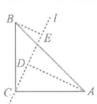

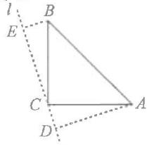  
图1

教材变式 2 解: 过点 D 作 $DM \perp BC$ 交 BC 延长线于点 M,
则 $/DMC=90^{\circ}//ABC.$

$\because CD \perp AC,$ $\therefore \angle ACB + \angle MCD = 90^{\circ}.$ 又 $\because \angle ACB + \angle BAC = 90^{\circ},$ $\therefore \angle BAC = \angle MCD.$ $\because CD = AC,$ $\therefore \triangle ABC \cong \triangle CMD(AAS),$ $\therefore BC = DM.$

$\therefore S_{\triangle BCD} = \frac{1}{2} BC \cdot DM = \frac{1}{2} BC^2 = \frac{9}{2},$ $\therefore BC = 3.$

教材变式3 证明：(1) $\because \angle EDC = \angle EDF + \angle FDC = \angle B + \angle BED,$ $\angle EDF = \angle B,$ $\therefore \angle BED = \angle FDC;$ (2)在 $\triangle BDE$ 与 $\triangle CFD$ 中， $\left\{ \begin{array}{l}\angle B = \angle C,\\ \angle BED = \angle CDF,\\ DE = DF, \end{array} \right.$ $\therefore \triangle DBE\cong \triangle FCD(AAS),$ $\therefore BE = CD.$

教材变式 4 证明：∵ $\angle DEC = \angle EAC + \angle C$ , $\angle BAC = \angle BAD + \angle EAC,$ $\angle DEC = \angle BAC,$ $\therefore \angle BAD = \angle C.$ $\because \angle BDF = \angle DEC,$ $\therefore \angle BDA = \angle AEC.$

在 $\triangle ADB$ 和 $\triangle CEA$ 中， $\left\{\begin{aligned}\angle BAD&=\angle C,\\\angle BDA&=\angle AEC,\\AB&=AC,\end{aligned}\right.$ $\therefore \triangle ADB \cong \triangle CEA (AAS),$ $\therefore AD = CE, AE = BD,$ $\therefore CE = AD = AE + DE = BD + DE,$ $\therefore DE = CE - BD.$

# 实践操作 尺规作图 ——全等与证明计算

1. 解: 能, 作法如图:

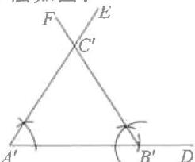

text_image

F
E
C'
A'
B'
D

(1)作 $\angle DA'E=\angle A$ ；
(2)在射线 $A'D$ 上截取线段 $A'B'=AB$ ；
(3)以 $B'$ 为顶点，以 $B'A'$ 为一边作 $\angle A'B'F=\angle B,B'F$ 与 $A'E$ 交于点 $C'$ ，则 $\triangle A'B'C'$ 就是所求作的三角形.

2. 解:(1)如图所示,∠ADE 即为所求

作的角；

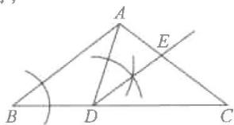

(2) $\because \angle B = \angle C, \angle ADE = \angle B,$ $\therefore \angle ADE = \angle C.$ $\because \angle ADB = 180^{\circ} - \angle ADE - \angle CDE,$ $\angle CED = 180^{\circ} - \angle CDE - \angle C,$ $\therefore \angle ADB = \angle CED.$ $\because \angle B = \angle C, CD = AB,$ $\therefore \triangle ABD \cong \triangle DCE(AAS),$ $\therefore BD = CE.$

3. 解: (1) 如图所示, CE 即为所求.

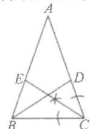

(2)∵BD平分∠ABC,CE平分∠ACB,

$\therefore \angle CBD = \angle ABD = \frac{1}{2}\angle ABC,$ $\angle BCE = \angle ACE = \frac{1}{2}\angle ACB.$ $\because \angle ABC = \angle ACB,$ $\therefore \angle ABD = \angle CBD = \angle ACE =$ $\angle BCE.$ $\because BC = CB,$ $\therefore \triangle BCE\cong \triangle CBD(ASA),$ $\therefore CE = BD.$ $\because \angle A = \angle A,$ $\therefore \triangle ACE\cong \triangle ABD(AAS),$ $\therefore AD = AE.$

4. 解: (1) 如图所示;

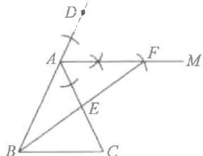

text_image

Geometric diagram with labeled points A, B, C, D, E, F, M and intersecting lines and marked angles

(2)∵AM//BC,
∴∠CAM=∠C.
又∵∠AEF=∠CEB,AF=BC,
∴△AEF≌△CEB(AAS),
∴AE=CE,
即E为AC的中点.

# 新情境(二) 全等三角形 在实际生活中的应用

1.9.5 2.18 3.17 △EDC ASA

4. D

5. 解: 由题意, 得 $\angle AGF = \angle EDC = 90^{\circ}$ ,

$\therefore \angle CED + \angle ECD = 90^{\circ}.$ $\because CH / / BD,$ $\therefore \angle HCE = \angle CED.$ $\because \angle HCE + \angle AFG = 90^{\circ},$ $\therefore \angle ECD = \angle AFG.$ $\because BE = GF = CD = 20,$ $\therefore \triangle AGF\cong \triangle EDC(ASA),$ $\therefore AG = ED = BD - BE = 50 - 20 =$ $30(m)$ $\therefore AB = AG + BG = 31.5(m)$ 即单元楼 $AB$ 的高为 $31.5\mathrm{m}$

6. 解: (1) 延长 CB 至点 G, 使 BG = ED, 连接 AG, $\therefore BC+DE=BC+BG=GC,$ $\because \angle ABG = \angle E, AB = AE,$ $\therefore \triangle AGB \cong \triangle ADE,$ $\therefore \angle GAB = \angle DAE, AG = AD.$ $\because \angle BAC + \angle DAE = \angle CAD,$

∴∠BAC+∠GAB=∠CAD，
即∠GAC=∠CAD，
∴△AGC≌△ADC，∴GC=CD，
∴BC+ED=CD=60 m，
∴所需木栅栏的长度为 $3 \times 60 + 60 = 240 \, (m)$ ;
(2)∵ $S_{\triangle ADE} + S_{\triangle ABC} = S_{\triangle AGC} = \frac{1}{2}GC \cdot AB = \frac{1}{2} \times 60 \times 60 = 1800$ ,
∴需小麦种数量为 $11.25 \times 1800 \div 1000 = 20.25$ （千克）.

# 数学活动 2 用全等三角形证明拼图猜想(教材变式)

1. 解：(1) 如图；

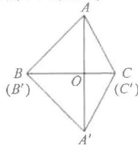

text_image

A
B (B')
O
C (C')
A'

图1

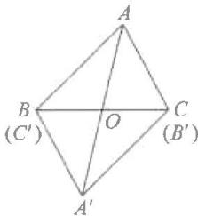

text_image

A
B
(C')
O
C
(B')
A'

图2

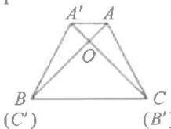  
图3

(2)①如图1,当点B与点 $B^{\prime}$ .点C与点 $C^{\prime}$ 重合时, $BC\perp AA^{\prime}$ 且BC平分 $AA^{\prime}$ .证明如下:设BC与 $AA^{\prime}$ 交于点O.

$\because \triangle ABC \cong \triangle A'B'C'$ , $\therefore AC = A'C'$ , $\angle ACB = \angle A'CB$ . $\because OC = OC, \therefore \triangle ACO \cong \triangle A'CO(SAS)$ , $\therefore OA = OA'$ , $\angle AOC = \angle A'OC$ .  
又 $\because \angle AOC + \angle A'OC = 180^\circ$ ,

$\therefore \angle AOC = 90^{\circ},$

∴BC|AA'且BC平分AA';

②如图 2, 当点 B 与点 $C'$ , 点 C 与点 $B'$ 重合且点 A, $A'$ 在 BC 的异侧时, BC 与 $AA'$ 互相平分. 证明如下: 设 BC 与 $AA'$ 交于点 O.

$\because \triangle ABC \cong \triangle A^{\prime}B^{\prime}C^{\prime},$ $\therefore AC = A^{\prime}B, \angle ACB = \angle A^{\prime}BC.$ $\because \angle AOC = \angle A^{\prime}OB,$ $\therefore \triangle AOC \cong \triangle A^{\prime}OB (AAS),$ $\therefore OA = OA^{\prime}, OB = OC,$ $\therefore BC$ 与 $AA^{\prime}$ 互相平分；

③如图3,当点B与点 $C'$ ,点C与点 $B'$ 重合且点A, $A'$ 在BC的同侧时, $BC//AA'$ .证明如下:

设 AB 与 A'C 交于点 O.

$\because \triangle ABC \cong \triangle A^{\prime}B^{\prime}C^{\prime},$

$\therefore AB = A^{\prime}C, AC = A^{\prime}B.$

又∵ $AA'=A'A$ ,

$\therefore \triangle ABA' \cong \triangle A'CA(SSS)$ ,

$\therefore \angle BAA' = \angle CA'A.$

$\because \angle ABC = \angle A^{\prime}CB, \angle AOA^{\prime} = \angle BOC,$

$\therefore \angle BAA' = \angle ABC, \therefore BC // AA'$

2. 解: (1) 共能拼出 6 种不同的图形;

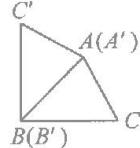  
图1

  
图2

  
图3

  
图4

  
图5

(2)如图1,2,当AB与 $A^{\prime}B^{\prime}$ 边重合时,周长为 $4+4+6+6=20$ ;

如图 3,4, 当 BC 与 $B^{\prime}C^{\prime}$ 边重合时, 周长为 $4+4+5+5=18$ ;

如图 5,6, 当 AC 与 $A^{\prime}C^{\prime}$ 边重合时, 周长为 $5+5+6+6=22$ .

# 综合与实践(二)

# 构造全等测距离

解:(1)在 $\triangle ABC$ 和 $\triangle DEC$ 中,

$\because CA=CD,\angle ACB=\angle DCE,$

$CB = CE$

$\therefore \triangle ABC \cong \triangle DEC(SAS)$ ,

$\therefore DE = AB;$

(2)如图4,延长AE至点F,使得EF=BD,连接CF.

$\because CE \perp CD, BD \perp CD, CE \perp AE,$

$\therefore \angle D = \angle AEC = \angle CEF = 90^{\circ}.$

$\because BD=EF,CD=CE,$

$\therefore \triangle CDB \cong \triangle CEF(SAS)$ ,

$\therefore \angle DCB = \angle ECF, CB = CF.$

$\because \angle ECD = 90^{\circ}, \angle ACB = 45^{\circ},$

$\therefore \angle ACE + \angle BCD = \angle ACE +$

$\angle ECF = \angle ACF = 45^{\circ}$

$\therefore \angle ACF = \angle ACB.$

$\because AC=AC,$

$\therefore \triangle ACF \cong \triangle ACB(SAS)$ ,

$\therefore AF = AB$

$\therefore AE + BD = AE + EF = AF = AB =$

14.4+13.8=28.2(m),

∴AB的长为28.2m.

# 章末复习

1. $95^{\circ}$ 2.2

3.D 4.B

5. $\angle 1 = \angle 2$ 或 $\angle ABC = \angle DBE$

ABC DBE

6. C 7. 30 8. 20

9.125°

10. 解: (1) 过点 C 作 $CG \perp AE$ 交 EA 的延长线于点 G.

$\because CF \perp BE,$

$\therefore \angle G = \angle CFB = 90^{\circ} = \angle AEB,$

$\therefore CG \parallel EF, \therefore \angle GCF = 90^{\circ} = \angle ACB,$

$\therefore \angle ACG = \angle BCF.$

又∵AC=BC，

$\therefore \triangle ACG \cong \triangle BCF(AAS)$

$\therefore CG=CF, \therefore EC$ 平分 $\angle AEB$ ;

(2) $\because \triangle ACG \cong \triangle BCF$ ,

$\therefore AG = BF.$

$\because CG = CF, CE = CE,$

$\therefore \mathrm{Rt}\triangle CEG \cong \mathrm{Rt}\triangle CEF (\mathrm{HL})$

$\therefore EG = EF.$

设 AG=BF=x，

则 $EG = x + 2, EF = 4 - x$

$\therefore x + 2 = 4 - x, \therefore x = 1,$

$\therefore BF = 1.$

11. 证明: 方法一(截长法):

在 AB 上截取 AE=AC.

∵AB=2AC,∴AE=BE.

连接 DE. ∵∠EAD=∠CAD,

$\therefore \triangle ADE \cong \triangle ADC,$

$\therefore \angle ACD = \angle AED.$

$\because AD = BD, AE = BE, DE = DE,$

$\therefore \triangle AED \cong \triangle BED,$

$\therefore \angle AED = \angle BED.$

又∵∠AED+∠BED=180°，

$\therefore \angle AED = \angle ACD = 90^{\circ},$

$\therefore CD \perp AC.$

方法二(补短法):

延长 AC 至点 F，使 CF = AC，

连接 $DF$ ，先证 $\triangle ADB\cong \triangle ADF$

再证 $\triangle ACD\cong \triangle FCD, CD \perp AF$ 即可.

12. 解: (1) 如图所示;

text_image

Geometric diagram with labeled points and perpendicular lines, likely from a math problem or proof

(2) $\angle PMB + \angle PNB = 180^{\circ}$ . 证明如下：

过点 P 分别作 $PG \perp AB$ 于点 G， $PH \perp BC$ 于点 H.

∵PG⊥AB,PH⊥BC,

$\therefore \angle PGM = \angle PHN = 90^{\circ}.$

∵BP平分∠ABC,∴PG=PH.

又∵PM=PN，

$\therefore \mathrm{Rt}\triangle PMG \cong \mathrm{Rt}\triangle PNH (\mathrm{HL})$

$\therefore \angle PMG = \angle PNB.$

$\because \angle PMG + \angle PMB = 180^{\circ}$

$\therefore \angle PMB + \angle PNB = 180^{\circ}$

# 第十五章 轴对称

# 15.1 图形的轴对称

# 15.1.1 轴对称及其性质

# 【易错点睛】

②④

# 【基础题夯实】

1. C  2. A  3. A  4. D

5. 解: (2)(4)(5) 为轴对称图形, 对称轴的条数分别为 2 条, 1 条, 2 条, 画图略.

6.D   
7. (1) $AB = A'B', BC = B'C', AC = A'C'$ 直线 $l \cong \angle A'B'C'$ (2) $110^\circ$

8. 解: 图 1 中的两个图案成轴对称, A, $A'$ 是一对对称点; 图 3 中的两个图案成轴对称, $C, C'$ 是一对对称点.

  
图1

  
图3

# 【中档题运用】

9. $132^{\circ}$ 10. $52^{\circ}$ 6

11. 3:40 12. (1) $40^{\circ}$ (2)6<c<8

text_image

13.

【综合题探究】

14.6

  
图1

  
备用图

# 15.1.2 线段的垂直平分线

# 第 1 课时 线段的垂直平分线(一)

# 【易错点睛】

④

【点睛】如图, 可知①②③不正确.

# 【基础题夯实】

1.6 2.80°

3.(1)11 (2)4 4.AC

5. 证明：∵ AB = AC, DB = DC,

∴A,D两点都在线段BC的垂直平分线上，

∴直线 AD 为 BC 的垂直平分线.

∵点E在直线AD上，

$\therefore BE=CE.$

6. C 7. 同旁内角互补,两直线平行

# 【中档题运用】

8. 解: (1) 逆命题为“如果 $a^{3}=b^{3}$ ，那么 $|a|=|b|$ ”，逆命题成立；

(2)逆命题为“如果 AC=BC,那么 C 是线段 AB 的中点”;逆命题不成立;

(3)逆命题为“余角相等的角是等角”，逆命题成立.

9. 证明: 连接 CA.

∵CE 是 AD 的垂直平分线, CF 是 AB 的垂直平分线,

$\therefore CD=CA, CB=CA,$

$\therefore CD=CB.$

10. 解: (1) 如图所示;

text_image

Geometric diagram of triangle ABC with points D, E, F and intersecting lines, including a marked angle at A.

(2)∵AD平分∠BAC，

$\therefore \angle DAE = \angle DAF.$

$\because \angle AED = \angle AFD = 90^{\circ},$

$AD = AD,$

$\therefore \triangle ADE \cong \triangle ADF(AAS)$ ,

$\therefore AE = AF, DE = DF,$

∴AD 是线段 EF 的垂直平分线.

# 【综合题探究】

11. 解: (1) 10.

∵AB,AC的垂直平分线分别交BC于点D,E,

$\therefore AD = BD, AE = CE,$

∴△ADE 的周长 $C_{\triangle ADE} = AD + DE + AE = BD + DE + CE = BC = 10$ ;

(2) 点 O 在 BC 的垂直平分线上. 理由如下:

连接 AO, BO, CO.

∵DM,EN分别是AB,AC的垂直平分线，

$\therefore OA=OB,OA=OC,$

$\therefore OB=OC,$

∴点 O 在 BC 的垂直平分线上；

(3)∵OM,ON 分别垂直平分 AB,AC,

∴△ABO,△ACO均为轴对称图形，

$\therefore \angle BOM = \angle AOM,$

$\angle CON = \angle AON$

$\because OM \perp AB, ON \perp AC,$

$\therefore \angle AMO = \angle ANO = 90^{\circ},$

$\therefore \angle MON = 90^{\circ} - \angle BAO + 90^{\circ} - \angle NAO$

$= 180^{\circ} - \angle BAC = 80^{\circ},$

$\therefore \angle BOC = \angle BOM + \angle AOM + \angle AON + \angle CON = 2\angle MON = 160^{\circ}.$

(4)12.

# 第 2 课时 线段的垂直平分线(二)

# 【易错点睛】

D

# 【基础题夯实】

1.5 2.26

3.C

4.C

5. 解: 已知: 直线 AB 和 AB 上一点 C, 求作: AB 的垂线, 使它经过点 C. 如图, 直线 EF 即是所求作的垂线.

6. 解: 画图略.

# 【中档题运用】

7. B

8. 解: 如图所示, 公共汽车站在点 P 的位置.

text_image

A
P
B
l

9. 解: 如图, 作 AB 的垂直平分线 PD 交 BC 于点 P, 垂足为 D, 连接 PA, 点 P 即为所求.

理由如下：

∵PD垂直平分AB，

$\therefore PA=PB,$

$\therefore PA + PC = PB + PC = BC.$

text_image

Geometric diagram with triangle ABC and intersecting lines, labeled points A, B, C, D, P

10. 解: 如图所示.

text_image

Geometric diagram with labeled points A, B, C, D and intersecting lines, likely from a math problem or proof.

# 【综合题探究】

11. 解: 分别作 $\angle COD$ 和 $\angle FOD$ 的平分线 $l_{1}, l_{2}$ ，作 AB 的垂直平分线 $l_{3}, l_{3}$ 与 $l_{1}, l_{2}$ 的交点 $P_{1}, P_{2}$ 即为发射塔的位置.

text_image

A
C
E
O
P₁
l₁
F
B
D
P₂
l₂
l₃

# 15.2 画轴对称的图形

第 1 课时 画轴对称的图形(一)

# 【易错点睛】

【解】如图所示.

# 【基础题夯实】

1. 解: 如图所示.

2. 解: 如图所示.

3. 解: 如图所示.

  
(1)

  
(2)

  
(3)

4. 解: 如图所示.

5. 解: 如图所示.

6. 解: 如图所示.

7.

  
(1)

  
(2)

  
(3)

# 【中档题运用】

8.

9. 解: (1)(2) 如图所示;

(3) $\triangle ABC$ 向右平移 4 个单位长度得到 $\triangle A_{2}B_{2}C_{2}$ .

text_image

A D A₁ E A₂
B B₁ B₂
C C₁ C₂
a b

10. 解: (1) 如图所示, $\triangle A_{1}B_{1}C$ 即为所求;

(2)如图所示；

(3)如图所示, $C_{1}E_{1}$ 即为所求.

text_image

A
M
A₁
C
C
E
E
D
B
B₁
N

# 【综合题探究】

11.

  
$S = 2$

  
$S = 3$

  
$S = 4$

第 2 课时 画轴对称的图形(二)

# 【易错点睛】

(3,-2)

# 【基础题夯实】

1. B

2. $(2,-3)$

3.x y

4.2 1 -2 -1

5. $(-2,-3)$

6.4

7.13

8. (3,1)

9. 解: 如图所示.

text_image

C
B₁
B₂
C₂
D
A₁
D₂
O
x
y
C₁
B

10. 解: (1) 如图所示;

(2)如图所示；

(3) 点 $B_{2}$ 的坐标为 (2,1).

text_image

y
A
C
B
O
x
A₁
C₁
B₂
A₂

# 【中档题运用】

11. C 12. -8

13. 解: (1) 如图所示, $B_{1}(-2,-1)$ ;

(2)如图所示, $C_{2}(3,1)$ .

text_image

y
x=1
A₁
C₁
C₂
A₂
A
B₁
O
x
B₂
B

14. 解: (1) 四边形 $A'B'C'D'$ 如图所示;
(2)6.

text_image

y
D'
D
A
C'
A'
O
B
x
B'

15. 解: (1) 如图所示, $A_{1}(6,3)$ , $B_{1}(8,1)$ , $C_{1}(5,2)$ ;

(2)如图所示, $A_{2}(-2,-5)$ , $B_{2}(-4,-3)$ , $C_{2}(-1,-4)$ .

text_image

y
x=2
A₁
C₁
B₁
B₂
C₂
A₃
O
x
y=-1

【综合题探究】

16. 解: (1)(2) 如图所示;

(3) $(m,2-n)$ ;(4)如图所示.

text_image

x=1
y
5
B
4
D
A
2
C1
y=1
-5 -4 -2 1 O 1 2 3 4 5
-1
B
-2
-3
-4

15.3 等腰三角形  
15.3.1 等腰三角形

# 第 1 课时 等腰三角形的性质

# 【易错点睛】

$36^{\circ}$ 或 $90^{\circ}$

# 【基础题夯实】

1. $100^{\circ}$ 2. $35^{\circ}$ 3. $15^{\circ}$

4.20°或80° 5.5

6. 解: $\because AB = AC, AD$ 为 $\triangle ABC$ 的中线,

$$
\therefore A D \perp B C,
$$

$$
\angle B A D = \frac {1}{2} \angle B A C = 4 0 ^ {\circ}.
$$

$$
\because A D = A E,
$$

$$
\therefore \angle A D E = \angle A E D = 7 0 ^ {\circ},
$$

$$
\therefore \angle B D E = 9 0 ^ {\circ} - \angle A D E = 2 0 ^ {\circ}.
$$

7. 证明: 过点 A 作 $AF \perp BC$ 于点 F.

$$
\because A B = A C, A D = A E,
$$

$$
\therefore B F = C F, D F = E F,
$$

$$
\therefore B D = C E.
$$

# 【中档题运用】

8.52° 9.56° 10.35°或55°

11. 证明: 过点 A 作 $AE \perp BC$ 于点 E.

$$
\because A B = A C,
$$

$$
\therefore \angle C A E = \angle B A E,
$$

$$
\therefore \angle B A C = 2 \angle C A E.
$$

$$
\because B D \text { 为 } \triangle A B C \text { 的高 }
$$

$$
\therefore \angle B D C = \angle A E C = 9 0 ^ {\circ},
$$

$$
\therefore \angle C A E + \angle C = \angle C B D + \angle C,
$$

$$
\therefore \angle C A E = \angle C B D,
$$

$$
\therefore \angle B A C = 2 \angle C B D.
$$

12. 证明: 连接 OC.

∵CA=CB,O为AB的中点，

$\therefore CO \perp AB, \angle ACO = \angle BCO = 45^{\circ}.$

又∵OD⊥OE，

$$
\therefore \angle A O C = \angle D O E = 9 0 ^ {\circ},
$$

$$
\therefore \angle A O D = \angle C O E.
$$

$$
\text {又} \because \angle O C E = \angle A = 4 5 ^ {\circ}, O A = O C,
$$

$$
\therefore \triangle O C E \cong \triangle O A D (\text { ASA }),
$$

$$
\therefore C E = A D = 2,
$$

$$
\therefore A C = 6,
$$

$$
\therefore S _ {\text { 四   边   形 } C D O E} = S _ {\triangle A O C}
$$

$$
= \frac {1}{2} S _ {\triangle A B C}
$$

$$
= \frac {1}{2} \times \frac {1}{2} \times 6 \times 6
$$

$$
= 9.
$$

# 【综合题探究】

13. 证明: 延长 AD, 至点 E, 使 DE = BD, 连接 CE.

$$
\because \angle B D A = \angle C D E, A D = C D,
$$

$$
\therefore \triangle A B D \cong \triangle C E D (\mathrm{SAS}),
$$

$$
\therefore C E = A B = A C.
$$

$$
\because C M \perp A D,
$$

$$
\begin{array}{l} \therefore A M = M E = M D + D E = M D + \\ B D. \end{array}
$$

另证:在 AM 上截取 MF=DM,再证

$\triangle AFC \cong \triangle BDA, AF = BD$ 即可.

# 第 2 课时 等腰三角形的判定

# 【易错点睛】

等腰直角三角形

# 【基础题夯实】

1.8 2.4 3.9

4. 证明：∵ BE = CF，

$$
\therefore B E + E F = C F + E F,
$$

$$
\therefore B F = E C.
$$

$$
\text { 在 } \triangle A B F \text { 和 } \triangle D C E \text { 中   ， }
$$

$$
A B = D C, \angle B = \angle C, B F = E C,
$$

$$
\therefore \triangle A B F \cong \triangle D C E (\text { SAS }),
$$

$$
\therefore \angle A F B = \angle D E C,
$$

$$
\therefore O E = O F
$$

$\triangle OEF$ 为等腰三角形.

5. 证明：∵BD=BE，

$$
\therefore \angle D = \angle B E D = \angle C E F.
$$

$$
\because D F \perp A C,
$$

$$
\therefore \angle A F D = \angle E F C = 9 0 ^ {\circ},
$$

$$
\therefore \angle C + \angle C E F = \angle A + \angle D = 9 0 ^ {\circ},
$$

$$
\therefore \angle C = \angle A,
$$

$$
\therefore A B = B C.
$$

6. 解: 由作图过程可知 DG 平分 $\angle ADC$ ,

$$
\therefore \angle A D G = \angle C D G.
$$

$$
\because A D \parallel B C,
$$

$$
\therefore \angle A D G = \angle C G D,
$$

$$
\therefore \angle C D G = \angle C G D,
$$

$$
\therefore C G = C D = 3,
$$

$$
\therefore B G = B C - C G = 5 - 3 = 2.
$$

# 【中档题运用】

7.2

8. 证明：∵ AB = AC，

$$
\therefore \angle A B C = \angle A C B,
$$

$$
\because \angle A B D = \angle C D E,
$$

$$
\begin{array}{l} \therefore \angle A B C - \angle A B D = \angle A C B - \\ \angle C D E, \end{array}
$$

$$
\text { 即 } \angle D B C = \angle E,
$$

$$
\therefore B D = D E.
$$

9. 证明: ∵ BF 平分 ∠ABC, FA ⊥ AB, FC ⊥ BC,

$$
\therefore F A = F C.
$$

$$
\because F A \perp A B, A D \perp B C,
$$

$$
\therefore \angle A F B + \angle A B F = 9 0 ^ {\circ},
$$

$$
\angle D E B + \angle D B E = 9 0 ^ {\circ}.
$$

$$
\because \angle A B F = \angle D B E,
$$

$$
\therefore \angle A F B = \angle D E B.
$$

$$
\because \angle A E F = \angle D E B,
$$

$$
\therefore \angle A F B = \angle A E F,
$$

$$
\therefore A E = A F,
$$

$$
\therefore A E = F C.
$$

10. 证明: 在 AB 上截取 AE = AC, 连接 DE.

$$
\because A D \text {   平分   } \angle B A C,
$$

$$
\therefore \angle B A D = \angle D A C.
$$

$$
\text {又} \because A E = A C, A D = A D,
$$

$$
\therefore \triangle A D E \cong \triangle A D C (\text { SAS }),
$$

$$
\therefore \angle A E D = \angle A C D = 1 0 5 ^ {\circ},
$$

$$
\therefore \angle B E D = 7 5 ^ {\circ}.
$$

$$
\because \angle B = 3 0 ^ {\circ},
$$

$$
\therefore \angle B D E = 7 5 ^ {\circ} = \angle B E D,
$$

$$
\therefore B D = B E,
$$

$$
\therefore A B = A E + B E = A C + B D.
$$

# 【综合题探究】

11. 证明:(1)设∠DCE=x,

$$
\therefore \angle B A D = 2 \angle D C E = 2 x.
$$

$$
\because C E \perp A E,
$$

$$
\therefore \angle A D B = \angle C D E = 9 0 ^ {\circ} - x,
$$

$$
\therefore \angle B = 1 8 0 ^ {\circ} - \angle B A D - \angle A D B
$$

$$
= 9 0 ^ {\circ} - x,
$$

$$
\therefore \angle B = \angle A D B,
$$

$$
\therefore A B = A D,
$$

∴△ABD为等腰三角形；

(2) 过点 C 作 CF // AB 交 AE 的延长线于点 F，

$$
\therefore \angle F C D = \angle B, \angle F = \angle B A D.
$$

$$
\because A D \text {平分} \angle B A C,
$$

$$
\angle B = \angle A D B,
$$

$$
\therefore \angle B A D = \angle C A F,
$$

$$
\angle F C D = \angle A D B = \angle F D C,
$$

$$
\therefore \angle F = \angle C A F, C F = F D,
$$

$$
\therefore A C = C F = D F
$$

$$
\therefore A D + A C = A D + D F = A F.
$$

$$
\because A C = C F, C E \perp A F,
$$

$$
\therefore A E = E F,
$$

$$
\therefore A D + A C = A F = 2 A E.
$$

注:也可延长 AE 至点 F,使 EF = AE 来证明.

# 图形研究 巧构“三线合一”

1. 证明: 连接 BE.

∵BA=BC,E为AC的中点，

$$
\therefore B E \perp A C, \angle A B C = 2 \angle E B C,
$$

$$
\therefore \angle E B C + \angle C = 9 0 ^ {\circ}.
$$

$$
\because E D \perp B C,
$$

$$
\therefore \angle D E C + \angle C = 9 0 ^ {\circ},
$$

$$
\therefore \angle E B C = \angle D E C
$$

$$
\therefore \angle A B C = 2 \angle D E C.
$$

2. 证明: 连接 OC, 过点 O 作 $OF \perp BC$ 于点 F,

$$
O G \perp A C \text {于点} G.
$$

$$
\because A C = B C, O A = O B,
$$

$$
\therefore \angle A C O = \angle B C O = 4 5 ^ {\circ},
$$

$$
\angle A O C = \angle B O C = 9 0 ^ {\circ},
$$

$$
\therefore O F = O G.
$$

$$
\text {又} \because O D = O E,
$$

$$
\angle O G D = \angle O F E = 9 0 ^ {\circ},
$$

$$
\therefore \mathrm{Rt} \triangle O D G \cong \mathrm{Rt} \triangle O E F (\mathrm{HL}),
$$

$$
\therefore \angle D = \angle E.
$$

$$
\because \angle A = \angle O C E = 4 5 ^ {\circ}, O C = O A,
$$

$$
\therefore \triangle O A D \cong \triangle O C E,
$$

$$
\therefore A D = C E.
$$

$$
\because A C = B C,
$$

$$
\therefore C D = B E.
$$

3. 证明: 过点 A 作 $AF \perp CD$ 于点 F,

$$
\because D E \perp C D,
$$

$$
\therefore \angle A F C = \angle C D E = \angle A C E = 9 0 ^ {\circ},
$$

$$
\begin{array}{r l} \therefore \angle C A F + \angle A C F & = \angle D C E + \angle A C F \\ & = 9 0 ^ {\circ}, \end{array}
$$

$$
\therefore \angle C A F = \angle D C E.
$$

$$
\text {又} \because A C = C E,
$$

$$
\therefore \triangle A F C \cong \triangle C D E,
$$

$$
\therefore D E = C F.
$$

$$
\because A C = A D,
$$

∴CF=DF，

$\therefore CD=2DE$

4. 解: 过点 C 作 $CF \perp BE$ 于点 F.

$\because CB=CE,$

$\therefore BF = EF.$

∵AB=AC,

$\therefore \angle ABC = \angle ACB.$

又∵∠CFB=∠BDC=90°,BC=CB,

$\therefore \triangle BFC \cong \triangle CDB(AAS)$ ,

$\therefore CD=BF,$

∴BE=2CD.

# 思想方法 求角技巧(一) 方程思想

1. 解: 设 $\angle A = x$ .

$\because AD=BD,$

$\therefore \angle ABD = \angle A = x.$

$\because DB=BC,$

$\therefore \angle C = \angle BDC = \angle A + \angle ABD = 2x.$

在 $\triangle BDC$ 中，

$\angle DBC + \angle C + \angle BDC = 180^{\circ},$

$\therefore 2x + 2x + 20^{\circ} = 180^{\circ},$

解得 $x=40^{\circ}$ ,

即 $\angle A = 40^{\circ}$

2. 解: 设 $\angle C = x$ .

$\because AB=AD=DE=EC,$

$\therefore \angle EDC = \angle C = x,$

$\angle DAE = \angle AED = \angle EDC + \angle C = 2x,$

$\angle B = \angle ADB = \angle DAE + \angle C = 3x.$

在 $\triangle ABC$ 中，

$\angle B + \angle C + \angle BAC = 180^{\circ},$

$\therefore 3x + x + 100^{\circ} = 180^{\circ},$

解得 $x=20^{\circ}$ ,

$\therefore \angle C = 20^{\circ}$

3. 解：∵ BE = DE = AD，

∴设 $\angle EBD=\angle EDB=x$ ，

则 $\angle A = \angle AED = 2x$ ,

$\therefore \angle BDC = 3x.$

$\because AB=AC,BD=BC,$

$\therefore \angle BDC = 3x = \angle C = \angle ABC,$

∴在 $\triangle ABC$ 中，

$2x + 3x + 3x = 180^{\circ}$

解得 $x=22.5^{\circ}$ ,

$\therefore \angle C = 67.5^{\circ}.$

4. 解: (1) 设 $\angle BAC = x = \angle ABD$ ,

则 $\angle BDC=2x=\angle BCD=\angle ABC$ ，

$\therefore 5x=180^{\circ}$ ,

解得 $x=36^{\circ}$ ,

即 $\angle BAC = 36^{\circ}$

(2) 连接 DE，

易求 $\angle CDE = \angle DEC = \frac{1}{2}\angle BCD =$

$36^{\circ}$

$\therefore DE=BD=AD,$

$\therefore \angle CAE = \frac{1}{2}\angle CDE = 18^{\circ}.$

# 思想方法 求角技巧(二) 整体思想

1. 解：∵OA=OB=OC，

$\therefore \angle OAB = \angle OBA, \angle OAC = \angle OCA,$

∴ $\angle OAB + \angle OAC = \angle OBA + \angle OCA$ ,

$\therefore \angle OBA + \angle OCA = \angle BAC = 40^{\circ},$

$\angle ABC + \angle ACB = 180^{\circ} - \angle BAC = 140^{\circ},$

$\therefore \angle OBC + \angle OCB = 140^{\circ} - 40^{\circ} = 100^{\circ},$

$\therefore \angle BOC = 180^{\circ} - (\angle OBC + \angle OCB)$ $= 80^{\circ}$

2. 解：∵ AC = AE, BC = BD,

∴设 $\angle AEC=\angle ACE=x$ ，

$\angle BDC = \angle BCD = y,$

$\therefore \angle A = 180^{\circ} - 2x, \angle B = 180^{\circ} - 2y.$

$\because \angle ACB + \angle A + \angle B = 180^{\circ},$

$\therefore \angle ACB = 2(x + y) - 180^{\circ}.$

$\because \angle BDC + \angle AEC + \angle DCE = 180^{\circ},$

$\therefore x+y+40^{\circ}=180^{\circ},$

$\therefore x + y = 140^{\circ}$

$\therefore \angle ACB = 2\times 140^{\circ} - 180^{\circ}$

$= 100^{\circ}$

3. 解: (1) $45^{\circ}$ ;

(2) $90^{\circ}-\frac{1}{2}\alpha.$

$\because \angle A + \angle B = 180^{\circ} - \alpha ,$

$\therefore \angle AFD + \angle ADF + \angle BDE +$

$\angle BED = 360^{\circ} - (180^{\circ} - \alpha) = 180^{\circ} + \alpha .$

$\because AD=AF,BD=BE,$

$\therefore \angle AFD = \angle ADF,$

$\angle BDE = \angle BED$

$\therefore \angle EDF = 180^{\circ} - (\angle ADF + \angle BDE)$

$$
= 1 8 0 ^ {\circ} - \frac {1 8 0 ^ {\circ} + \alpha}{2}
$$

$$
= 9 0 ^ {\circ} - \frac {1}{2} \alpha .
$$

4. 解: (1) $\because CA = CB$ ,

$\therefore \angle A = \angle B.$

又∵AF=BD,AD=BE,

$\therefore \triangle ADF \cong \triangle BED,$

$\therefore \angle ADF = \angle DEB$

$\because CA=CB,\angle C=40^{\circ},$

$\therefore \angle A = \angle B = 70^{\circ},$

$\therefore \angle DEB + \angle EDB = 110^{\circ}$

$\therefore \angle ADF + \angle EDB = 110^{\circ},$

$\therefore \angle EDF = 180^{\circ} - 110^{\circ} = 70^{\circ};$

(2) 同(1) 可得 $\angle EDF = 90^{\circ} - \frac{1}{2}\alpha.$

# 思想方法 求角技巧(三) 分类讨论思想

1.10 或 11 2.B 3.B 4.5

5. $55^{\circ}$ , $40^{\circ}$ 或 $70^{\circ}$ 6. $110^{\circ}$ 7. $45^{\circ}$ 或 $72^{\circ}$

8.70°或20°

解:①当∠C为锐角时, $\angle B=70^{\circ}$ ;

②当 $\angle C$ 为钝角时， $\angle B=20^{\circ}$ .

text_image

Two right triangles labeled ABC and CD with right angles at C and D, showing right angle markings.

9.45°或135°

解:证 $\triangle BDF\cong\triangle ADC$ .

①如图1，当∠ABC为锐角时，

$\angle ABC = 45^{\circ}$

②如图 2, 当 $\angle ABC$ 为钝角时,

$\angle ABC = 135^{\circ}.$

  
图1

  
图2

10.30°或37.5°或52.5°

# 图形研究 构等腰(一) 作平行线

1. 证法一: 过点 D 作 DM//AC 交 BC 于点 M, 先证 BD = DM = CE, 再证 $\triangle DMF \cong \triangle ECF$ ;

证法二: 过点 E 作 EN // AB 交 BC 的延长线于点 N, 证 $\triangle DBF \cong \triangle ENF$ ;

证法三: 过点 D 作 $DG \perp BC$ 于点 G，
过点 E 作 EM⊥BC 于点 M，

证 $\triangle BDG \cong \triangle CEM, \triangle DGF \cong \triangle EMF.$

2. 证明: 方法一: 过点 D 作 DM // AB 交 BC 的延长线于点 M 即可得证; 方法二: 过点 C 作 CM // AB 交 DE 于点 M 也可;

方法三: 过点 C 作 $CM \perp AB$ 于点 M, 再证 DE // CM 也可;

方法四: 过点 E 作 EM // AB 交 AC 于点 M,

由 $\angle CME = \angle CEM, \angle D = \angle CED,$

可得 $\angle D + \angle DME = 90^{\circ}$ ，即可得证.

3. 证明： $\because CE$ 为 $\angle ABC$ 的角平分线， $\therefore \angle ACB = 2\angle ECB.$

又∵∠ACB=2∠B，

$\therefore \angle ECB = \angle B,$

$\therefore BE = EC.$

过点 A 作 AH // BC, 交 CF 延长线于点 H,

则 $\angle ECB = \angle H, \angle B = \angle HAE$

$\because \angle ECB = \angle ACH, \angle ECB = \angle B,$

$\therefore \angle H = \angle ACH = \angle HAE,$

∴ HE = AE, AH = AC.

又∵BE=CE，

$\therefore AE + BE = HE + CE,$

即 AB = CH.

$\because AF \perp CE$

∴ HF = CF

$\therefore AB=HC=2CF.$

# 图形研究 构等腰(二) 中线倍长

1. 证明: 方法一: 延长 AD 至点 G, 使 DG = AD, 连接 CG, 易证 $\triangle ABD \cong \triangle GCD$ .

∴ AB = CG，再证 $\angle G = \angle EAF =$

$\angle EFA = \angle GFC,$

$\therefore CG=CF,$

$\therefore AB = CF;$

方法二:延长 AD 至点 M,使 DM=DF,连接 BM,同理可证 CF=BM=AB;

方法三: 过点 B 作 $BM \perp AD$ 于点 M, 过点 C 作 $CN \perp AD$ 于点 N.

先证△BMD≌△CND，

∴BM=CN.再证 $\triangle ABM\cong\triangle FCN$ 即可.

2. 证明: 延长 EA 至点 F, 使 AF = AE, 连接 CF.

$\because AD=AC,\angle DAE=\angle CAF,$

$\therefore \triangle ADE \cong \triangle ACF(SAS)$ ,

$\therefore DE = CF,$

$\angle AED = \angle F$

$\because \angle AED = \angle B,$

$\therefore \angle F = \angle B,$

$\therefore BC = CF = DE = AB.$

$\because AB-BE=AE,$

$\therefore DE - BE = AE.$

3. 证明: (1) ∵ AD 平分 ∠BAC,

$\therefore \angle BAD = \angle DAC.$

∵AD∥EF,

$\therefore \angle BAD = \angle F,$

$\angle DAC = \angle AGF,$

$\therefore \angle AGF = \angle F,$

$\therefore AF = AG;$

(2)延长 GE 至点 M, 使 EM = EG,

连接 BM，则 $\triangle CEG \cong \triangle BEM$ ，

$\therefore \angle CGE = \angle M, CG = BM = BF;$

(3) $AB+AC=(BF-AF)+(CG+$

$$
A G)
$$

$$
= B F + C G
$$

$$
= 2 C G.
$$

# 图形研究 构等腰(三) 截长补短

1. 证明: 过点 D 作 $DE \perp BC$ 于点 E.

$\because AC=AB,\angle BAC=90^{\circ},$

$\therefore \angle B = \angle ACB = 45^{\circ}.$

$\because \angle BED = 90^{\circ},$

$\therefore \angle B = \angle BDE = 45^{\circ},$

$\therefore BE=DE.$

∵CD平分∠ACB，

$\therefore \angle ACD = \angle ECD.$

$\because CD=CD,$

$\angle BAC = \angle DEC = 90^{\circ}$

$\therefore \triangle ACD \cong \triangle ECD,$

$\therefore AC = EC, AD = DE = BE.$

$\because BC = EC + BE,$

$\therefore BC = AC + AD.$

2. 证明: 方法一: (截长法) 在 AB 上截取 BE = BC, 连接 DE,

∵BD平分∠ABC，

$\therefore \angle 1 = \angle 2.$

又∵BD=BD，

$\therefore \triangle BCD \cong \triangle BED,$

$\therefore \angle BED = \angle ACB = 108^{\circ},$

$\therefore \angle AED = 72^{\circ}$

$\because CA = CB, \angle ACB = 108^{\circ},$

$\therefore \angle A = \angle ABC = 36^{\circ},$

$\therefore \angle ADE = 72^{\circ},$

$\therefore \angle AED = \angle ADE,$

$\therefore AD = AE$

$\therefore AB = BE + AE = BC + AD;$

方法二:(补短法)如图,延长 BC 至点 F,使 BF=AB,连接 FD,只需证 AD=DF=CF 即可.

3. 证明: 在 BC 上截取 BE = BA, 连接 DE.

∵BD平分∠ABC，

$\therefore \angle ABD = \angle DBE.$

$\because BD=BD,$

$\therefore \triangle ABD \cong \triangle EBD (SAS)$ ,

$\therefore \angle DEB = \angle A = \alpha ,$

$\therefore \angle DEC = 180^{\circ} - \angle DEB$

$$
= 1 8 0 ^ {\circ} - \alpha ,
$$

$$
\therefore \angle E D C = 1 8 0 ^ {\circ} - \angle D E C - \angle C
$$

$$
= 1 8 0 ^ {\circ} - (1 8 0 ^ {\circ} - \alpha) -
$$

$$
(2 \alpha - 1 8 0 ^ {\circ}).
$$

$$
= 1 8 0 ^ {\circ} - \alpha ,
$$

$\therefore \angle EDC = \angle DEC,$

$\therefore CE=CD,$

$\therefore BC = BE + CE = AB + CD.$

# 图形研究 构等腰(四)

# 二倍角处理

1. 证明: 方法一: 延长 CA 至点 E, 使 EA = AD, 证 $\triangle CDE \cong \triangle CDB$ 即可;

方法二: 延长 DA 至点 E, 使 EA = AC, 证 ED = EC = BC 即可;

方法三: 在 BC 上截取 CE = AC, 证 AD = DE = BE 即可.

【点评】方法一,方法二实质是补短法,方法三实质是截长法.

2. 解: 方法一: (截短法) 在 CD 上截取 DE = BD = 2, 连接 AE.

$\because AD \perp BC,$

$\therefore AB=AE,$

$\therefore \angle AEB = \angle B = 2\angle C.$

$\because \angle AEB = \angle C + \angle EAC,$

$\therefore \angle C = \angle EAC$

$\therefore AE=EC=CD-DE=6.$

$\because AE=AB,$

$\therefore AB=6;$

方法二:(延长法)延长 DB 至点 F,
使得 BF=AB, 连接 AF,

$\therefore \angle F = \angle BAF,$

$\therefore \angle ABC = \angle F + \angle BAF = 2\angle F.$

$\because \angle ABC = 2\angle C,$

$\therefore \angle F = \angle C,$

$\therefore AF = AC.$

∵AD⊥BC,

$\therefore FD=DC=8.$

$\because BD=2,$

$\therefore FB=FD-BD=6,$

$\therefore AB = FB = 6.$

# 15.3.2 等边三角形

# 第1课时 等边三角形的

# 性质和判定

# 【易错点睛】

4或8

# 【基础题夯实】

1. $15^{\circ}$ 2.9 3. $100^{\circ}$

4. 解: (1) ∵ △ABC 是等边三角形,

$\therefore AB = AC, \angle BAC = \angle ABC = 60^{\circ}$

$\because BD=AE,$

$\therefore \triangle ABD \cong \triangle CAE,$

$\therefore AD=CE;$

(2) $\because\triangle ABD\cong\triangle CAE,$

$\therefore \angle BAD = \angle ACE,$

$\therefore \angle AFC = \angle AEC + \angle BAD$

$$
= \angle A E C + \angle A C E
$$

$$
= 1 8 0 ^ {\circ} - \angle B A C
$$

$$
= 1 2 0 ^ {\circ}.
$$

5.2

6. 证明：∵ AB = AD, ∠B = ∠D,
BC = DE,

$\therefore \triangle ABC \cong \triangle ADE,$

$\therefore \angle DAE = \angle BAC = 60^{\circ}, AC = AE,$

∴△ACE 为等边三角形，

$\therefore CE=AE.$

# 【中档题运用】

7. 解: $\triangle APD$ 为等边三角形.

证明如下：

$\because \angle APC = \angle APD + \angle CPD = \angle B +$

∠BAP,

$\angle APD = \angle B$

$\therefore \angle CPD = \angle BAP.$

$\because \angle B = \angle C, CP = AB,$

$\therefore \triangle CPD \cong \triangle BAP(ASA)$ ,

$\therefore PD = AP.$

$\because \angle APD = \angle B = 60^{\circ},$

∴△APD 为等边三角形.

8. 证明：(1) $\because \angle AOB = 60^{\circ}, OA = OB$

∴△AOB 为等边三角形

$\therefore AB = OA, \angle OAB = 60^{\circ} = \angle CAD,$

$\therefore \angle OAC = \angle BAD.$

$\because AC=AD,$

$\therefore \triangle AOC \cong \triangle ABD,$

$\therefore \angle ABD = \angle O = 60^{\circ} = \angle OAB,$

∴BD//CA

(2) $\because\triangle AOC\cong\triangle ABD,$

$\therefore BD=OC,$

$\therefore CB + BD = CB + OC = OB = AB.$

9. 证明：(1)∵DE∥BC，

$\therefore \angle ADE = \angle B = 60^{\circ},$

$\angle AED = \angle ACB = 60^{\circ}$

∴△ADE 是等边三角形，

$\therefore AD=AE.$

∵AB=AC,

$\therefore BD=CE;$

(2) 连接 CD.

$\because CG \perp DF, DG = FG,$

$\therefore CF=CD,$

$\therefore \angle F = \angle CDF = \angle BCD.$

又∵∠CEF=∠AED=∠B=60°,

$\therefore \triangle BDC \cong \triangle ECF,$

$\therefore EF=BC$

# 【综合题探究】

10. 证明: (1) ∵ △ABC 为等边三角形,

$\therefore \angle BAC = \angle ABC = 60^{\circ},$

$AB = AC = BC.$

∵AD=CE,

$\therefore BD=AE.$

$\because {AD} = {BF}$

$\therefore \triangle ADE \cong \triangle BFD,$

$\therefore DE=DF,\angle AED=\angle BDF,$

$\therefore \angle EDF = 180^{\circ} - (\angle BDF +$

$$
\angle A D E)
$$

$$
= 1 8 0 ^ {\circ} - (\angle A E D +
$$

$$
\angle A D E)
$$

$$
= \angle B A C
$$

$$
= 6 0 ^ {\circ};
$$

(2) 延长 AM 交 BC 于点 N, 连接 EN.

$\because \angle MAE = \angle EBC,$

$AC = BC, \angle C = \angle C,$

$\therefore \triangle CAN \cong \triangle CBE,$

$\therefore CN=CE.$

$\because \angle C = 60^{\circ},$

∴△ECN 为等边三角形，

$\therefore EN = CE = AD$

$\angle NEC = 60^{\circ} = \angle BAC$

∴EN∥AB,

$\therefore \angle ENM = \angle DAM.$

$\because \angle NME = \angle AMD,$

$\therefore \triangle NME \cong \triangle AMD,$

$\therefore DM = ME$

# 第 2 课时 $30^{\circ}$ 角的

# 直角三角形的性质

# 【易错点睛】

$30^{\circ}$ 或 $150^{\circ}$

# 【基础题夯实】

1.4 2.30° 6 9

3.2 4.6 5.30° 9

6. 解：∵DB⊥BC，

$\therefore \angle DBC = 90^{\circ}$

$\because \angle ABC = 120^{\circ},$

$\therefore \angle DBA = 30^{\circ}.$

∵点D在AB的垂直平分线上，

$\therefore DA = DB = 2,$

$\therefore \angle A = \angle DBA = 30^{\circ}.$

$\because \angle ABC = 120^{\circ},$

$\therefore \angle C = 30^{\circ}.$

$\because \angle DBC = 90^{\circ},$

$\therefore CD=2DB=4,$

$\therefore AC=AD+CD=6.$

7. 解: (1) $\because \angle A = 90^{\circ}, CE \perp BD,$

$\therefore \angle A = \angle CEB = 90^{\circ}.$

$\because AD=BE,BD=BC,$

∴ Rt△ABD≌Rt△ECB(HL);

(2) $\because\angle DCE=15^{\circ},CE\perp BD,$

$\therefore \angle BDC = \angle BCD = 75^{\circ},$

$\therefore \angle BCE = 60^{\circ}$

$\therefore \angle CBE = 30^{\circ},$

$\therefore BC = 2CE.$

又∵△ABD≌△ECB，

$\therefore AB=CE=2,$

$\therefore BC = 4$

# 【中档题运用】

8.8

9. 证明：(1) $\because \triangle ABC$ 是等边三角形，

$\therefore AB=BC,\angle ABC=\angle ACB=60^{\circ}.$

$\because CD=CE,$

$\therefore \angle E = \angle CDE.$

$\because \angle ACB = \angle E + \angle CDE,$

$\therefore \angle E = \angle CDE = 30^{\circ},$

$\therefore \angle ABC + \angle E = 90^{\circ},$

$\therefore \angle BFE = 90^{\circ},$

$\therefore BE=2BF;$

(2) 连接 BD

∵AB=BC,D 是AC 的中点，

$\therefore BD$ 平分 $\angle ABC$ ,

$\therefore \angle ABD = \angle CBD = 30^{\circ} = \angle E.$

$\because \angle BFE = 90^{\circ},$

$\therefore DE=BD=2DF.$

10. 解: 连接 BE, BH

∵ HF 垂直平分 AB, DE 垂直平分 BC,

$\therefore AH=BH, BE=CE,$

$\therefore \angle A = \angle ABH = 15^{\circ},$

$\angle C = \angle EBC = 45^{\circ},$

$\therefore \angle BHE = 2\angle A = 30^{\circ},$

$\angle BEH = 2\angle C = 90^{\circ},$

$\therefore BH=2BE,$

$\therefore AH=2CE,$

$\therefore \frac{CE}{AH} = \frac{1}{2}.$

# 【综合题探究】

11. 解: (1) ∵ ∠BAC = ∠BCE = 120°,

$$
\angle B C D = \angle B C E + \angle D C E
$$

$$
= \angle B A C + \angle A B C,
$$

$$
\therefore \angle D C E = \angle A B C;
$$

(2) 在 CD 上截取 CF = AB，连接 EF.

$$
\because \angle D C E = \angle A B C, B C = C E,
$$

$$
\therefore \triangle A B C \cong \triangle F C E,
$$

$$
\therefore A C = E F = 2,
$$

$$
\angle B A C = \angle C F E = 1 2 0 ^ {\circ},
$$

$$
\therefore \angle E F D = 6 0 ^ {\circ},
$$

$$
\therefore \angle F E D = 3 0 ^ {\circ}.
$$

$$
\because \angle D = 9 0 ^ {\circ},
$$

$$
\therefore F D = \frac {1}{2} E F = 1,
$$

$$
\therefore C D = C F + D F = 5 + 1 = 6.
$$

# 回归教材 $30^{\circ}$ 角的用法

1. 解: 连接 AE.

∵ DE 垂直平分 AB，

$$
\therefore B E = A E.
$$

$$
\because A B = A C,
$$

$$
\therefore \angle B = \angle C = \angle B A E = 3 0 ^ {\circ},
$$

$$
\therefore \angle A E C = 6 0 ^ {\circ},
$$

$$
\angle E A C = 9 0 ^ {\circ},
$$

$$
\therefore C E = 2 A E = 2 B E.
$$

2. 证明: 过点 C 作 $CE \perp AD$ 交 AD 的延长线于点 E.

$$
\because A C \text {平分} \angle B A D, \angle D A B = 3 0 ^ {\circ},
$$

$$
\therefore \angle D A C = \angle B A C = 1 5 ^ {\circ},
$$

$$
C E = C B.
$$

$$
\because D C \parallel A B,
$$

$$
\therefore \angle D C A = \angle B A C = \angle D A C = 1 5 ^ {\circ},
$$

$$
\therefore \angle C D E = 3 0 ^ {\circ},
$$

$$
\therefore A D = C D = 2 C E = 2 B C.
$$

3. 证明: 过点 A 作 $AE \perp CD$ 交 CD 的延长线于点 E,

$$
\therefore \angle E = 9 0 ^ {\circ}, A C = 2 A E.
$$

$$
\because C D \perp C B,
$$

$$
\therefore \angle B C D = \angle E = 9 0 ^ {\circ}.
$$

$$
\because C D \text {   是   } \triangle A B C \text {   的中线，   }
$$

$$
\therefore A D = B D.
$$

$$
\because \angle A D E = \angle B D C,
$$

$$
\therefore \triangle A D E \cong \triangle B D C (\text { A   A   S }),
$$

$$
\therefore A E = B C,
$$

$$
\therefore A C = 2 B C.
$$

4. 证明: 延长 AD, BC 交于点 E.

$$
\because \angle A = \angle B = 6 0 ^ {\circ},
$$

$$
\therefore \angle E = 6 0 ^ {\circ},
$$

$$
\text {即} \angle A = \angle B = \angle E,
$$

$$
\therefore \triangle A B E \text {为等边三角形，}
$$

$$
\therefore A B = B E = A E = 5.
$$

$$
\because B C = 4,
$$

$$
\therefore C E = 1.
$$

$$
\because \angle B C D = 9 0 ^ {\circ},
$$

$$
\therefore \angle C D E = 3 0 ^ {\circ},
$$

$$
\therefore D E = 2 C E = 2,
$$

$$
\therefore A D = A E - D E = 3.
$$

# 回归教材 $60^{\circ}$ 角的用法

1. 证明: 方法一:

过点 D 作 DF // BC 交 AB 于点 F.

∵△ABC 是等边三角形，

$$
\therefore \angle A B C = \angle A C B = 6 0 ^ {\circ}, A B = A C,
$$

$$
\therefore \angle A F D = \angle A B C = 6 0 ^ {\circ},
$$

$$
\angle A D F = \angle A C B = 6 0 ^ {\circ},
$$

$$
\therefore \triangle A F D \text {为等边三角形，}
$$

$$
\therefore A F = D F = A D = C E,
$$

$$
\therefore A B - A F = A C - A D,
$$

$$
\therefore B F = D C.
$$

$$
\because \angle A F D = \angle A C B = 6 0 ^ {\circ},
$$

$$
\therefore \angle B F D = \angle D C E = 1 2 0 ^ {\circ},
$$

$$
\therefore \triangle B D F \cong \triangle D E C (\text { SAS }),
$$

$$
\therefore D B = D E;
$$

$$
\mathrm{方法二}
$$

过点 D 作 DG//AB 交 BC 于点 G，

证△DBG≌△DEC即可.

2. ①②③④

3. 证明: 在 CD 上截取 CF = AE, 连接 BF.

$$
\because \triangle A B C \text {   为等边三角形，   }
$$

$$
\therefore A B = B C, \angle A = \angle A B C.
$$

$$
\because C D \parallel A B,
$$

$$
\therefore \angle B C F = \angle A B C,
$$

$$
\therefore \angle A = \angle B C F.
$$

$$
\because A E = C F
$$

$$
\therefore \triangle A B E \cong \triangle C B F (\text { SAS }),
$$

$$
\therefore \angle A B E = \angle C B F, \angle A E B = \angle C F B.
$$

$$
\because \angle A E B + \angle B E C = \angle C F B + \angle B F D
$$

$$
= 1 8 0 ^ {\circ},
$$

$$
\therefore \angle B E C = \angle B F D.
$$

$$
\because \angle C B D = \angle C B F + \angle F B D
$$

$$
= \angle A B E + \angle B E C,
$$

$$
\therefore \angle F B D = \angle B E C,
$$

$$
\therefore \angle F B D = \angle B F D,
$$

$$
\therefore B D = D F,
$$

$$
\therefore C D = C F + D F = A E + B D.
$$

# 图形研究 45°角的用法 (一题练透)

1. 证明: 过点 C 作 $CE \perp CD$ 交 DA 的延长线于点 E,

$$
\therefore \angle D C E = 9 0 ^ {\circ}.
$$

$$
\because \angle A C B = 9 0 ^ {\circ},
$$

$$
\therefore \angle A C E = \angle B C D.
$$

$$
\because \angle A D C = 4 5 ^ {\circ},
$$

$$
\therefore C E = D C.
$$

$$
\because A C = B C,
$$

$$
\therefore \triangle A C E \cong \triangle B C D (\text { SAS }),
$$

$$
\therefore \angle E = \angle C D B = 4 5 ^ {\circ},
$$

$$
\therefore \angle A D B = \angle A D C + \angle C D B = 9 0 ^ {\circ},
$$

$$
\therefore A D \perp B D.
$$

2.(1)证明:在 BE 上截取 BF=CE, 连接 AF.

$$
\because C E \perp B D,
$$

$$
\therefore \angle C E D = \angle B A C = 9 0 ^ {\circ},
$$

$$
\therefore \angle A C E + \angle C D E = \angle A B F +
$$

$$
\angle A D B = 9 0 ^ {\circ}.
$$

$$
\text { 又 } \because \angle A D B = \angle C D E,
$$

$$
\therefore \angle A B F = \angle A C E.
$$

$$
\text {又} \because A B = A C,
$$

$$
\triangle A B F \cong \triangle A C E (\text {SAS}),
$$

$$
\therefore A F = A E, \angle B A F = \angle C A E,
$$

$$
\therefore \angle B A F + \angle C A F = \angle C A F +
$$

$$
\angle C A E = 9 0 ^ {\circ},
$$

$$
\therefore \angle E A F = 9 0 ^ {\circ}.
$$

$$
\text {又} \because A F = A E,
$$

∴△AEF 为等腰直角三角形，

$$
\therefore \angle A E B = 4 5 ^ {\circ};
$$

(2)证明:过点 A 作 $AF \perp AE$ 交 BE 于点 F.

$$
\because \angle A E B = 4 5 ^ {\circ},
$$

∴△AFE 为等腰直角三角形，

$$
\therefore A F = A E, \angle A F E = \angle A E B = 4 5 ^ {\circ}.
$$

$$
\because \angle B A F + \angle C A F = \angle C A E +
$$

$$
\angle C A F = 9 0 ^ {\circ},
$$

$$
\therefore \angle B A F = \angle C A E.
$$

$$
\because A B = A C,
$$

$$
\therefore \triangle B A F \cong \triangle C A E (\text { SAS }),
$$

$$
\therefore \angle B F A = \angle C E A = 1 3 5 ^ {\circ},
$$

$$
\therefore \angle C E D = 9 0 ^ {\circ},
$$

$$
\therefore C E \perp B D;
$$

(3)证明:过点 A 向上作 $AF \perp AE$ 交 CE 的延长线于点 F.

$$
\because \angle A E C = 1 3 5 ^ {\circ},
$$

$$
\therefore \angle A E F = 4 5 ^ {\circ},
$$

∴△AEF为等腰直角三角形，

$$
\therefore A E = A F.
$$

$$
\because \angle B A C = \angle E A F = 9 0 ^ {\circ},
$$

$$
\therefore \angle B A C + \angle C A E = \angle C A E +
$$

$$
\angle E A F,
$$

$$
\therefore \angle B A E = \angle C A F.
$$

$$
\because A B = A C, A E = A F,
$$

$\therefore \triangle BAE \cong \triangle CAF(SAS)$ ,

$$
\therefore \angle B E A = \angle F = 4 5 ^ {\circ},
$$

$$
\therefore \angle C E B = \angle A E C - \angle A E B = 9 0 ^ {\circ},
$$

$$
\therefore C E \perp B D.
$$

# 实践操作 尺规作图

# 与等腰三角形

1. 解: (1) 如图所示;

(2)∵DE垂直平分AB，

$$
\therefore B E = A E,
$$

$$
\therefore \triangle B E C \text {   的周长   } = B C + B E + C E
$$

$$
= B C + A E + C E
$$

$$
= B C + A C
$$

$$
= B C + A B
$$

$$
= 4 + 6 = 1 0.
$$

2. 解: (1) ∵ BD ⊥ AC, D 是边 AC 的中点,

∴BD 是 AC 的垂直平分线，

$$
\therefore B A = B C.
$$

$$
\because A B = A C,
$$

$$
\therefore A B = A C = B C,
$$

∴△ABC 是等边三角形；

(2)如图，

∵△ABC 是等边三角形，

$$
\therefore \angle A C B = 6 0 ^ {\circ},
$$

作∠ACB的平分线交BD于点E，

易得 $\angle ECB = \angle EBC = 30^{\circ}$

$$
\therefore B E = C E.
$$

根据 $30^{\circ}$ 角所对的直角边等于斜边一半，

得 BE = CE = 2DE.

3. 解: (1) 如图所示;

text_image

Geometric diagram of triangle ABC with points D, E, F and marked angles at B and C

(2)∵△ABC是等边三角形，

$$
\therefore \angle A = \angle A B C = 6 0 ^ {\circ}.
$$

$$
\because D E \perp A B,
$$

$$
\therefore \angle A E D = \angle B E F = 9 0 ^ {\circ},
$$

$$
\therefore \angle A D E = \angle B F E = 3 0 ^ {\circ},
$$

$$
\therefore A D = 2 A E = 4, B F = 2 B E.
$$

∵BD 是∠ABC 的平分线，

$$
\therefore A D = D C = 4,
$$

$$
\therefore A B = 2 A D = 8,
$$

$$
\therefore B E = A B - A E = 8 - 2 = 6,
$$

$$
\therefore B F = 2 B E = 1 2.
$$

# 新情境(三) 生活中的轴对称

1. 三边垂直平分线 2. D 3. A

4.(7,4) 5.62 6.6

7. 解：∵ OB = OB', OA = OA',

$$
\angle B O B ^ {\prime} = \angle A O A ^ {\prime} = 6 0 ^ {\circ},
$$

$\therefore\triangle BOB',\triangle AOA'$ 都是等边三角形，

$$
\therefore A A ^ {\prime} = O A = O A ^ {\prime} = 1 \mathrm{m},
$$

$$
\angle B ^ {\prime} = \angle A A ^ {\prime} O = 6 0 ^ {\circ}.
$$

$$
\because A A ^ {\prime} \perp D E, B B ^ {\prime} \perp D E,
$$

$$
\therefore \angle E = 3 0 ^ {\circ},
$$

$$
\therefore B ^ {\prime} D = \frac {1}{2} B ^ {\prime} E, A ^ {\prime} C = \frac {1}{2} A ^ {\prime} E.
$$

设 $A^{\prime}C=x$ m，则 $AC=(x+1)\mathrm{m}$ ，

$$
\therefore A ^ {\prime} E = (x + 6) \mathrm{m},
$$

$$
\therefore 2 x = x + 6,
$$

$$
\therefore x = 6,
$$

$$
\therefore A ^ {\prime} E = 1 2 \mathrm{m},
$$

$$
\therefore B ^ {\prime} E = B ^ {\prime} O + O A ^ {\prime} + A ^ {\prime} E
$$

$$
= 2 1 \mathrm{m},
$$

$$
\therefore B ^ {\prime} D = \frac {2 1}{2} \mathrm{m},
$$

∴ $B'$ 到水平地面的距离是 $\frac{21}{2}$ m.

# 数学活动 3 轴对称 (教材变式)

1. 书 2. 20:51

3. 解: 略.

4.

5. 解: 如图所示(答案不唯一).

  
图1

  
图2

6. 解: $\because AB = AC, D$ 为 $BC$ 的中点,

$$
\therefore A D \perp B C, B D = C D,
$$

$$
\angle A B C = \angle A C B,
$$

$$
\therefore B P = C P
$$

$$
\therefore \angle P B D = \angle P C D,
$$

$$
\because B C = C B,
$$

$$
\therefore \triangle E B C \cong \triangle F C B,
$$

$$
\therefore B E = C F.
$$

7. 证明：∵F为BC的中点，

$$
\therefore B F = C F
$$

$\because AB = AC, M, N$ 分别为 $AB, AC$ 的中点，

$$
\therefore \angle B = \angle C,
$$

$$
A M = B M = C N = A N,
$$

$$
\therefore \triangle B M F \cong \triangle C N F,
$$

$$
\therefore \angle B M F = \angle C N F
$$

$$
\because \angle A M D = \angle B M F,
$$

$$
\angle A N E = \angle C N F,
$$

$$
\therefore \angle A M D = \angle A N E.
$$

$$
\because A D \perp D F, A E \perp E F,
$$

$$
\therefore \angle D = \angle E = 9 0 ^ {\circ}.
$$

$$
\because A M = A N,
$$

$$
\therefore \triangle A D M \cong \triangle A E N,
$$

$$
\therefore A D = A E.
$$

# 综合与实践(三) 最短路径

1. D 2. $\sqrt{3}$ 3. (2,0) 4. (0,-2)

5.25 解: 作点 A 关于直线 l 的对称点 $A'$ 交直线 l 于点 D, 连接 $A'B$ 交直线 l 于点 P, 连接 AP, 作 $BC \perp l$ 于点 C,

则 $A^{\prime}B=140$ 里， $AD=A^{\prime}D=45$ 里， $\angle APB=120^{\circ}$

$$
\angle A P D = \angle A ^ {\prime} P D = \angle B P C = 3 0 ^ {\circ},
$$

∴AP=90里，BP=50里，

∴BC=25里，

∴小镇 B 到公路距离为 25 里.

6.7 7.10

8. 解: 作 A 关于草地的对称点 $A'$ ，作 B 关于河边的对称点 $B'$ ，连接 $A'B'$ 与草地边、河边分别交于点 C, D，则从 A 到 C，再到 D，再到 B 即为最短路径.

text_image

草地
A
C
D
B'
E
F
G
H
I
J
K
L
M
N
O
P
Q
R
S
T
U
V
W
X
Y
Z

9. 解: (1) $\because BC = 6, \triangle MBC$ 的周长为 14,

$$
\therefore M B + M C = 1 4 - 6 = 8.
$$

∵MN 是 AB 的垂直平分线，

$$
\therefore M A = M B,
$$

$$
\therefore A C = M A + M C = M B + M C = 8,
$$

$$
\therefore A B = A C = 8,
$$

∴△ABC 的周长为 $8+8+6=22$ ;

(2)连接 $PA$ ，则 $PA = PB$

$$
\therefore P B + P C = P A + P C \geqslant A C.
$$

当点 P 在 AC 上时, $PB + PC$ 取得最小值,

即 AC 的长为 8.

10. 解: 分别作点 P 关于 OA, OB 的对称点 $P_{1}, P_{2}$ ,

连接 $P_{1}P_{2}$ ，交OA于点M，

交 OB 于点 N，连接 PM, PN, $OP_{1}, OP_{2}$ ,

此时 $\triangle PMN$ 的周长最小，

$\triangle PMN$ 的周长 $= P_{1}P_{2}$

$$
\because \angle A O B = 3 0 ^ {\circ}, \angle P _ {1} O P _ {2} = 6 0 ^ {\circ},
$$

$$
\therefore P _ {1} P _ {2} = O P _ {1} = O P _ {2} = O P = 1 0,
$$

即 $\triangle PMN$ 周长的最小值为10.

text_image

P₁
M
A
P
O
N
B
P₂

11. FG DC⊥PQ

12. 解: 如图所示, $M(5,1)$ , $N(5,0)$ .

line

| Point | x | y |
|---|---|---|
| A | 1 | 3 |
| B | 7 | -1 |
| M | 5 | 0 |
| N | 5 | 0 |

章末复习

1.1 --7

2. 解: (1) 图略, $B_{1}(3,2)$ ;

(2)图略, $B_{2}(5,2)$ ;

(3)由图可知 $\triangle AB_{1}C_{1}$ 与 $\triangle A_{1}B_{2}C_{2}$

关于直线 x=4 对称.

3. 证明: 连接 DE, DF.

$\because {CA} = {CB}$

$$
\therefore \angle A = \angle B.
$$

$$
\because A F = B D, A D = B E,
$$

$$
\therefore \triangle F A D \cong \triangle D B E (\text { SAS }),
$$

$\therefore DF = DE.$

∵G是EF的中点，

∴DG⊥EF

4. 证明：∵∠OAB=∠OBA，

$$
\therefore O A = O B.
$$

$$
\because \angle O A C = \angle O B C,
$$

$$
\therefore \angle O A C + \angle O A B = \angle O B C + \angle O B A,
$$

$$
\text { 即 } \angle C A B = \angle C B A,
$$

$$
\therefore C A = C B.
$$

又 OA=OB，

∴CO 垂直平分 AB，

$\therefore OC \perp AB.$

5. 解: (1) ∵ △ABC 是等边三角形,

$$
B D \perp A C, A E \perp B C
$$

$$
\therefore \angle C = 6 0 ^ {\circ}, C E = \frac {1}{2} B C,
$$

$$
C D = \frac {1}{2} A C, B C = A C,
$$

$$
\therefore C D = C E,
$$

∴△CDE 是等边三角形；

(2)由(1)知 AE,BD 分别是等边

$\triangle ABC$ 的中线

$$
\therefore \angle B A E = \angle D B A = \angle O B E = 3 0 ^ {\circ},
$$

$$
\therefore O A = O B.
$$

$$
\because A E \perp C B,
$$

$$
\therefore O B = 2 O E,
$$

$$
\therefore A O = 2 O E = 1 2,
$$

$$
\therefore O E = 6.
$$

6. 解: 连接 CE.

$$
\because C A = C B,
$$

$$
\therefore \angle A = \angle C B A.
$$

$$
\because B C \text {   平分   } \angle A B D,
$$

$$
\therefore \angle A B C = \angle D B C.
$$

$$
\because \angle D = 9 0 ^ {\circ},
$$

$$
\therefore \angle A + \angle A B C + \angle D B C = 9 0 ^ {\circ},
$$

$$
\therefore \angle A = \angle A B C = 3 0 ^ {\circ}.
$$

$$
\because E A = E C,
$$

$$
\therefore \angle E C A = \angle A = 3 0 ^ {\circ}.
$$

$$
\because \angle A C B = 1 8 0 ^ {\circ} - \angle A - \angle A B C =
$$

$$
1 2 0 ^ {\circ},
$$

$$
\therefore \angle B C E = \angle A C B - \angle E C A = 9 0 ^ {\circ}.
$$

在 Rt△CEB 中，∠CBE=30°，

$$
\therefore C E = \frac {1}{2} B E.
$$

$$
\because A E = C E,
$$

$$
. A E 1
$$

$$
\therefore \overline {{B E}} = \overline {{2}}.
$$

7. 解: 设 $\angle B = \angle BAC = x$ ,

$$
\therefore \angle A C D = \angle B + \angle B A C = 2 x.
$$

$$
\because A C = A D,
$$

$$
\therefore \angle D = \angle A C D = 2 x.
$$

$$
\because \angle B + \angle D + \angle B A D = 1 8 0 ^ {\circ},
$$

$$
\angle B A D = 6 3 ^ {\circ}
$$

$\therefore 3x + 63^{\circ} = 180^{\circ},$

解得 $x = 39^{\circ}$

$$
\therefore \angle C A D = \angle B A D - \angle B A C
$$

$$
= 6 3 ^ {\circ} - 3 9 ^ {\circ}
$$

$$
= 2 4 ^ {\circ}.
$$

8. 解: 设 $\angle A = x$ .

$$
\because A E = D E,
$$

$$
\therefore \angle A D E = \angle A = x,
$$

$$
\therefore \angle D E B = 2 x.
$$

$$
\because D E = D B,
$$

$$
\therefore \angle D B E = \angle D E B = 2 x,
$$

$$
\therefore \angle B D C = 3 x.
$$

$$
\because B D = B C,
$$

$$
\therefore \angle C = \angle B D C = 3 x.
$$

$$
\because A B = A C,
$$

$$
\therefore \angle A B C = \angle C = 3 x.
$$

$$
\because \angle A + \angle C + \angle A B C = 1 8 0 ^ {\circ},
$$

$$
\therefore x + 3 x + 3 x = 1 8 0 ^ {\circ}, \text {解得} x = \frac {1 8 0 ^ {\circ}}{7},
$$

$$
\therefore \angle A = \frac {1 8 0 ^ {\circ}}{7}.
$$

9. 解: 连接 AC, 由题意知 AB = AC = AD.

设 $\angle B = \angle ACB = \alpha$

$$
\angle A C D = \angle D = \beta ,
$$

$$
\begin{array}{l} \because \angle B A D + \angle B + \angle B C D + \angle D = \\ 3 6 0 ^ {\circ}, \end{array}
$$

$$
\therefore 1 4 0 ^ {\circ} + 2 \alpha + 2 \beta = 3 6 0 ^ {\circ},
$$

$$
\therefore \alpha + \beta = 1 1 0 ^ {\circ},
$$

$$
\therefore \angle B C D = \alpha + \beta = 1 1 0 ^ {\circ}.
$$

10. 解: 设 $\angle A = x$ .

$$
\because \angle C = 9 0 ^ {\circ}, \therefore \angle B = 9 0 ^ {\circ} - x.
$$

$$
\because A E = A D, B D = B F,
$$

$$
\therefore \angle A D E = \angle A E D = 9 0 ^ {\circ} - \frac {1}{2} x,
$$

$$
\angle B F D = \angle B D F = 4 5 ^ {\circ} + \frac {1}{2} x,
$$

$$
\therefore \angle A D E + \angle B D F = 9 0 ^ {\circ} - \frac {1}{2} x +
$$

$$
4 5 ^ {\circ} + \frac {1}{2} x = 1 3 5 ^ {\circ},
$$

$$
\therefore \angle E D F = 4 5 ^ {\circ}.
$$

11. $C(4,0)$ 或 $(2,0)$

# 第十六章 整式的乘法

# 16.1 幂的运算

# 16.1.1 同底数幂的乘法【易错点睛】

B

# 【基础题夯实】

1. (1) $x^{5}$ (2) $x^{5}$ (3) $y^{n+2}$

2.(1)× $a^5\cdot a^5 = a^{10}$

(2) $\times a \cdot a^{5} = a^{6}$

(3) $\times a^{2} \cdot a^{5} = a^{7}$

(4)× $x^{3} \cdot x^{m+1} = x^{m+4}$

3. B

4. (1) $a^{3n+1}$ (2) $x^{3m}$ (3) $a^{8}$ (4)64

5. 解: (1) 原式 = $m^{4}$ ;

(2) 原式 $= \left(-\frac{1}{2}\right)^6$

$$
= \frac {1}{6 4};
$$

(3) 原式 = $y^{2n+2}$ ;

(4) 原式= $(x+y)^{13}$ ;

(5) 原式 $= (-x)^{10}$

$$
= x ^ {1 0};
$$

(6) 原式= $10^{3+m-1+2m+2}$

$$
= 1 0 ^ {3 m + 4}.
$$

6. $10^{13}$ 7. $10^{18}$

# 【中档题运用】

8. (1) $-a^{3}$ (2) $-x^{5}$

9.C 10.C

11. 解: (1) 原式 = $-p^{2} \cdot p^{4} \cdot (-p^{5})$

$$
= p ^ {2} \cdot p ^ {4} \cdot p ^ {5}
$$

$$
= p ^ {1 1};
$$

(2) 原式 $= (a - b)^{3} \cdot (a - b)^{2}$ 。

$$
(a - b)
$$

$$
= (a - b) ^ {6};
$$

(3) 原式 $= -a^{3} \cdot a^{2} - a^{4} \cdot a$

$$
= - a ^ {5} - a ^ {5}
$$

$$
= - 2 a ^ {5};
$$

(4) 原式 $= (-m)^{8} - m^{3 + 2 + 3}$

$$
= m ^ {8} - m ^ {8}
$$

$$
= 0.
$$

12. 解: (1) $\because a * b = 5^{a} \times 5^{b}$ ,

$$
\therefore 1 * 2 = 5 ^ {1} \times 5 ^ {2}
$$

$$
= 5 ^ {3}
$$

$$
= 1 2 5;
$$

(2) $\because a*b=5^{a}\times5^{b}$

$$
\therefore 2 * (x + 1) = 5 ^ {2} \times 5 ^ {x + 1} = 5 ^ {x + 3}
$$

$$
\because 2 * (x + 1) = 6 2 5,
$$

$$
\therefore 5 ^ {x + 3} = 6 2 5 = 5 ^ {4},
$$

∴ $x + 3 = 4$ ，解得 x = 1。

13. 解: (1) $\because 7^{m-1} \cdot 7^{2m+1} = 7^{m-1 + 2m + 1}$

$$
= 7 ^ {3 m} = 7 ^ {6},
$$

$$
\therefore 3 m = 6,
$$

$$
\therefore m = 2;
$$

$$
(2) \because 3 ^ {n} \times 2 7 = 3 ^ {n} \times 3 ^ {3} = 3 ^ {n + 3} = 3 ^ {8},
$$

$$
\therefore n + 3 = 8,
$$

$$
\therefore n = 5.
$$

# 【综合题探究】

14. 解：(1) $\because a=2^{13}$

$$
\therefore b = 2 ^ {2 1}, c = 2 ^ {3 4},
$$

$$
\therefore a b c = 2 ^ {1 3} \times 2 ^ {2 1} \times 2 ^ {3 4}
$$

$$
= 2 ^ {6 8};
$$

$$
(2) a b = c
$$

理由: 设 $a=2^{x}, b=2^{y}, c=2^{z}$ ,

且 $x + y = z$

则 $ab = 2^{x} \cdot 2^{y} = 2^{z}$ ,

$$
\therefore a b = c,
$$

# 16.1.2 幂的乘方与积的乘方

# 【易错点睛】

(1)× (2)

# 【基础题夯实】

1. (1) $x^{6}$ (2) $x^{6}$ (3) $x^{9}$

2.D

3. 解: (1) 原式 = $10^{10}$ ;

(2) 原式= $a^{3m}$ ;

(3) 原式 $= -x^{6}$ ;

(4) 原式 $= a^{14}$ .

4. (1) $x^{3}y^{6}$ (2) $64x^{6}$

5.D

6. (1) × $(ab)^{2}=a^{2}b^{2}$

(2)× $(-3x^{3})^{2}=9x^{6}$

7. 解: (1) 原式 $= a^{3} b^{3}$ ;

(2) 原式 $= x^{6}y^{8}$ ;

(3) 原式 $= -x^{6}y^{6}$ ;

(4) 原式= $8 \times 10^{6}$ .

8. 解: (1) 原式 = $x^{6} + x^{6}$

$$
= 2 x ^ {6};
$$

(2) 原式= $a^{8}-9a^{8}$

$$
= - 8 a ^ {8};
$$

(3) 原式 $= -a^{6} + 4a^{6}$

$$
= 3 a ^ {6};
$$

(4) 原式 $= m^{6} + 2m^{6} - 8m^{6}$

$$
= - 5 m ^ {6}.
$$

# 【中档题运用】

9.(1)64 (2)16 (3)9 (4)4

10.(1)1 000 (2)36

11.(1)1 (2) $\frac{4}{5}$

12. $4 \times 10^{6}$

13. 解: (1) 原式 = $(-2x^{3}y^{2})^{6}$

$$
= 6 4 x ^ {1 8} y ^ {1 2};
$$

(2) 原式= $(2xy^{2})^{4}$

$$
= 1 6 x ^ {4} y ^ {8};
$$

(3) 原式= $x^{12}y^{6}-27x^{12}y^{6}$

$$
= - 2 6 x ^ {1 2}
$$

(4) 原式 $=9a^{10}+16a^{10}$

$$
= 2 5 a ^ {1 0};
$$

(5) 原式 $= 7a^{6} - a^{6} + 3a^{6}$

$$
= 9 a ^ {6};
$$

(6) 原式 $=a^{8}+a^{8}-4a^{8}$

$$
= - 2 a ^ {8}.
$$

14. 解: (1) $\because m + 4n - 3 = 0$ ,

$$
\therefore m + 4 n = 3,
$$

原式= $2^{m}\cdot2^{4n}$

$$
= 2 ^ {m + 4 n}
$$

$$
= 2 ^ {3}
$$

$$
= 8;
$$

(2) $\because 2^{m}=3,8^{n}=2^{3n}=5,$

∴原式= $2^{3m}\cdot2^{6n}$

$$
= (2 ^ {m}) ^ {3} \cdot (2 ^ {3 n}) ^ {2}
$$

$$
= 3 ^ {3} \times 5 ^ {2}
$$

$$
= 2 7 \times 2 5
$$

$$
= 6 7 5.
$$

# 【综合题探究】

15. 解：∵ $2^{x+3} \cdot 3^{x+3} = 36^{x+1}$ ,

$$
\therefore (2 \times 3) ^ {x + 3} = 6 ^ {2 (x + 1)},
$$

$$
= 6 ^ {2 x + 2}.
$$

∴ $x+3=2x+2$ , 解得 x=1.

# 回归教材 幂的运算法则

1. (1) $x^{7}$ (2) $a^{5}$ (3) $10^{10}$ (4) $m^{10}$

$$
(5) 3 ^ {3 n + 7}
$$

2. (1) $-a^{9}$ (2) $a^{5}$ (3) $a^{10}$

(4) $(x - y)^{7}$ (5) $(2y - x)^{5}$

3. (1) $a^{10}$ (2) $a^{2x}$ (3) $-m^{2x}$

(4) $a^{2}b^{2}$ (5) $-8a^{3}$ (6) $-27m^{12}$

4. 解: (1) 原式 $=5a^{6}+a^{6}-3a^{6}$

$$
= 3 a ^ {6};
$$

(2) 原式 $= 2a^{8} + a^{8} - 81a^{8}$

$$
= - 7 8 a ^ {8};
$$

(3) 原式 $= 25x^{6} + 16x^{6}$

$$
= 4 1 x ^ {6};
$$

(4) 原式 $= x^{6} + 4x^{6}$

$$
= 5 x ^ {6};
$$

(5) 原式= $8a^{6m}-a^{6m}$

$$
= 7 a ^ {6 m};
$$

(6) 原式 = $x \cdot x^{2} \cdot (-x^{2n+1})$ —

$$
x ^ {2 n + 4}
$$

$$
= - x ^ {2 n + 4} - x ^ {2 n + 4}
$$

$$
= - 2 x ^ {2 n + 4}.
$$

5. 解: (1) 原式 = $(8 \times 0.125)^{30}$

$$
= 1;
$$

(2) 原式 = $\left\lceil\left(-\frac{5}{9}\right)\times\left(-\frac{9}{5}\right)\right\rceil^{23}$ ×

$$
\left(- \frac {9}{5}\right)
$$

$$
= 1 \times \left(- \frac {9}{5}\right) = - \frac {9}{5};
$$

(3) 原式 $= 0.25^{17} \times (2^2)^{17}$

$$
= (0. 2 5 \times 4) ^ {1 7}
$$

$$
= 1;
$$

(4) 原式= $\left[(-9)\times\left(-\frac{2}{3}\right)\times\frac{1}{3}\right]^{3}$

$$
= 2 ^ {3}
$$

$$
= 8.
$$

# 回归教材 活用幂的

# 运算法则

1. 解：∵ $2x + y - 3 = 0$ ，

$$
\therefore 2 x + y = 3,
$$

$$
\therefore 5 ^ {2 x} \cdot 5 ^ {y} = 5 ^ {2 x + y}
$$

$$
= 5 ^ {3}
$$

$$
= 1 2 5.
$$

2. 解: $4^{x} \cdot 32^{y} = (2^{2})^{x} \cdot (2^{5})^{y}$

$$
= 2 ^ {2 x} \cdot 2 ^ {5 y}
$$

$$
= 2 ^ {2 x + 5 y}.
$$

$$
\because 2 x + 5 y - 3 = 0,
$$

$$
\therefore 2 x + 5 y = 3,
$$

原式 $= 2^{3} = 8$

3.(1)3 (2)2 (3)8 (4)3

4. 解： $\because 3^{x+1} \cdot 5^{x+1}=15^{2x-3}$ ，

$$
\therefore 1 5 ^ {x + 1} = 1 5 ^ {2 x - 3},
$$

$$
\therefore x + 1 = 2 x - 3,
$$

$$
\therefore x = 4.
$$

5.18 6.144

7. 解: (1) $2^{2m+3n}=2^{2m}\cdot2^{3n}$

$$
= 4 ^ {m} \cdot 8 ^ {n}
$$

$$
= 6 \times 1 6
$$

$$
= 9 6;
$$

$$
(2) 1 2 ^ {2 m} = [ (4 \times 3) ^ {m} ] ^ {2}
$$

$$
= (4 ^ {m} \cdot 3 ^ {m}) ^ {2}
$$

$$
= (6 \times 5) ^ {2}
$$

$$
= 3 0 ^ {2}
$$

$$
= 9 0 0.
$$

8. 解: 原式 $= (x^{2n})^3 - 2(x^{2n})^2$

$$
= 4 ^ {3} - 2 \times 4 ^ {2}
$$

$$
= 3 2.
$$

# 16.2 整式的乘法

# 第1课时 单项式乘单项式

# 【易错点睛】

(1) $-8x^{4}$ (2) $4.5\times10^{8}$

# 【基础题夯实】

1. D 2. C

3. (1) $3a^{5}$ (2) $15a^{3}b$ (3) $18x^{3}$

(4) $-24x^{5}$

4. 解: (1) 原式 = $10x^{7}$ ;

(2) 原式=6ab $^{4}$ ;

(3) 原式 $= 14a^{4}b^{3}$ ;

(4) 原式 = -8x $^{3}$ ;

(5) 原式 $= -\frac{3}{2} x^{3} y^{3}$ ;

(6) 原式 $= 12 \times 10^{10}$

$$
= 1. 2 \times 1 0 ^ {1 1};
$$

(7) 原式= $2ab^{2}\cdot9a^{2}b^{2}$

$$
= 1 8 a ^ {3} b ^ {4};
$$

(8) 原式 $=4a^{4}b^{2}\cdot(-3ab^{2})$

$$
= - 1 2 a ^ {5} b ^ {4};
$$

(9) 原式 $= -27m^{3}n^{6} \cdot 4m^{4}n^{2}$

$$
= - 1 0 8 m ^ {7} n ^ {8}.
$$

5. $1.2 \times 10^{12}$

6. $9 \times 10^{10}$ 7. $\frac{13}{2} xy$

# 【中档题运用】

8. (1) $2a^{8}$ (2) $9x^{10}y^{10}$

9. A 10. B

11. 解: (1) 原式 $= 6a^{6} + 9a^{6} - 14a^{6}$

$$
= a ^ {6};
$$

(2) 原式 $= 9x^{2}y^{4} - 8x^{2}y^{4}$

$$
= x ^ {2} \gamma^ {4};
$$

(3) 原式 = $-27a^{6}b^{3}-4a^{6}b^{2}$

$$
(- 3 b)
$$

$$
= - 2 7 a ^ {6} b ^ {3} + 1 2 a ^ {5} b ^ {3}
$$

$$
= - 1 5 a ^ {6} b ^ {3};
$$

(4) 原式 $= -32a^{5} - 36a^{5}$

$$
= - 6 8 a ^ {5}.
$$

12. 解: 原式 = -16x^5y^7 + 8x^5y^7

$$
= - 8 x ^ {5} y ^ {7}.
$$

当 $x = 4, y = \frac{1}{4}$ 时，

原式 $= -8 \times 4^{5} \times \left(\frac{1}{4}\right)^{7}$

$$
= - 8 \times \left(\frac {1}{4}\right) ^ {2} \times \left(4 \times \frac {1}{4}\right) ^ {5}
$$

$$
= - 8 \times \frac {1}{1 6} \times 1
$$

$$
= - \frac {1}{2}.
$$

# 【综合题探究】

13. 解: $\frac{3}{2} x \cdot x - \frac{x}{2} \cdot \frac{3}{4} x - \frac{1}{2} \pi \left( \frac{x}{4} \right)^{2}$

$$
= \frac {3}{2} x ^ {2} - \frac {3}{8} x ^ {2} - \frac {\pi}{3 2} x ^ {2}
$$

$$
= \frac {3 6 - \pi}{3 2} x ^ {2}.
$$

$$
\because \pi <   4,
$$

$$
\therefore 3 6 - \pi > 3 2,
$$

$$
\therefore \frac {3 6 - \pi}{3 2} x ^ {2} > x ^ {2},
$$

∴小明的设计方案符合要求.

# 第 2 课时 单项式乘多项式

# 【易错点睛】

12

# 【基础题夯实】

1. (1) $a^{2}+a$ (2) $3x^{3}-2x^{2}$

2.(1)× $(-2x)(x^{2}-y)=-2x^{3}+$

$$
2 x y
$$

$$
(2) \times 3 a ^ {2} b (a - 2 b + 1) = 3 a ^ {3} b -
$$

$$
6 a ^ {2} b ^ {2} + 3 a ^ {2} b
$$

3. D

4. 解: (1) 原式 $=a^{2}b^{4}-3ab^{2}$ ;

(2) 原式 $= -2x^{3}y^{3} + 2x^{2}y^{3}$ ;

(3) 原式= $(2x-y)\cdot x^{4}y^{6}$

$$
= 2 x ^ {5} y ^ {6} - x ^ {4} y ^ {7};
$$

(4) 原式 $= 2x^{3} - 2x^{2} + 6x$ ；

(5) 原式= $\frac{1}{3}a^{2}b^{3}-2a^{2}b^{2}$ ;

(6) 原式 = ac - bc + bc - ab - ab - ac
= -2ab.

5. 解: 原式 $=3a^{3}-6a^{2}+3a-2a^{3}+6a^{2}$

$$
= a ^ {3} + 3 a,
$$

当 $a = 2$ 时，

$$
\mathrm{原式} = 2 ^ {3} + 3 \times 2
$$

$$
= 8 + 6
$$

$$
= 1 4.
$$

6. A $7.5m^{2}-\frac{5}{2}m$

# 【中档题运用】

8. D 9. 3 10. -12 11. (3ab + 5b)

12. 解: (1) 原式 = $2a^{2}b - ab^{2} - 2a^{2}b +$

$$
2 a b ^ {2} - a b ^ {2} + 3 a b
$$

$$
= 3 a b.
$$

当 $a = -\frac{3}{2}, b = -2$ 时，

原式= $3\times\left(-\frac{3}{2}\right)\times(-2)=9$ ;

(2) 原式 $= x^{3} - x^{2} - x + 2x^{2} + 2-$

$$
x ^ {3} - 2 x ^ {2}
$$

$$
= - x ^ {2} - x + 2.
$$

当 $x = -1$ 时，

原式 $= -(-1)^{2} - (-1) + 2 = 2.$

13. 解: (1) $\because A = -2x^{2}$ ,

$B = x^{2} - 3x - 1, C = -x + 1,$

$$
\therefore A \cdot B + A \cdot C = (- 2 x ^ {2}) \cdot
$$

$$
(x ^ {2} - 3 x - 1) + (- 2 x ^ {2}) \cdot (- x +
$$

$$
1) = - 2 x ^ {4} + 6 x ^ {3} + 2 x ^ {2} + 2 x ^ {3} -
$$

$$
2 x ^ {2} = - 2 x ^ {4} + 8 x ^ {3};
$$

(2) $\because A=-2x^{2},B=x^{2}-3x-1,$

$$
C = - x + 1,
$$

$$
\therefore A \cdot (B + C) = (- 2 x ^ {2}) (x ^ {2} - 3 x -
$$

$$
1 - x + 1)
$$

$$
= (- 2 x ^ {2}) \left(x ^ {2} - 4 x\right)
$$

$$
= - 2 x ^ {4} + 8 x ^ {3}.
$$

# 【综合题探究】

14. 解: (1) $S_{\text{阴影}} = 2ab - \frac{1}{2}b (a + b) -$

$$
\frac {1}{2} a b = a b - \frac {1}{2} b ^ {2};
$$

(2)依题意,得 $ab=28,ab-\frac{1}{2}b^{2}=20$ ,

$$
\therefore 2 8 - \frac {1}{2} b ^ {2} = 2 0,
$$

解得 b=4(舍负值)，

$$
\therefore a = 2 8 \div 4 = 7,
$$

则其中一个长方形的周长是

$$
2 \times (4 + 7) = 2 2.
$$

# 第 3 课时 多项式乘多项式

# 【易错点睛】

$$
\begin{array}{c} \frac {2}{3} \end{array}
$$

# 【基础题夯实】

1. (1) $x^{2}+3x+2$

$$
2 a ^ {2} + a - 3 \tag {2}
$$

2. $x^{2} - 2x + 1$

3. 解: (1) 原式 = $x^{2} + 6x + 5x + 30$

$$
= x ^ {2} + 1 1 x + 3 0;
$$

(2) 原式 $=a^{2}-6a+3a-18$

$$
= a ^ {2} - 3 a - 1 8;
$$

(3) 原式 $= 2x^{2} - 2x + x - 1$

$$
= 2 x ^ {2} - x - 1;
$$

(4) 原式 $= m^{2} - 3mn + 2mn - 6n^{2}$

$$
= m ^ {2} - m n - 6 n ^ {2};
$$

(5) 原式= $4x^{3}-2x^{2}-10x+5$ ;

(6) 原式 $=4a^{2}+6a-6a-9$

$$
= 4 a ^ {2} - 9;
$$

(7) 原式 $= 4a^{2} - 6a - 6a + 9$

$$
= 4 a ^ {2} - 1 2 a + 9;
$$

(8) 原式 $= a^{3} + a^{2} + a - a^{2} - a - 1$

$$
= a ^ {3} - 1.
$$

4. 解: (1) 原式 $=a^{2}-2a+3a-6+$

$$
2 a - a ^ {2}
$$

$$
= 3 a - 6.
$$

当 a=10 时，

原式=3×10-6

$$
= 2 4;
$$

(2) 原式 $= 3a^{2} - 9ab + 2ab - 6b^{2}-$

$$
1 0 a b + 6 b ^ {2}
$$

$$
= 3 a ^ {2} - 1 7 a b.
$$

当 $a = 2, b = -1$ 时，

原式 $= 3 \times 2^{2} - 17 \times 2 \times (-1)$

$$
= 1 2 + 3 4
$$

$$
= 4 6.
$$

# 【中档题运用】

5. A 6.8 7.4ab-3a-2

8. 解: 原式 $=a^{3}+b^{3}-a^{3}-ab^{2}+a^{2}b+b^{3}$

$$
= 2 b ^ {3} - a b ^ {2} + a ^ {2} b.
$$

当 $a = \frac{1}{2}, b = -2$ 时，

原式 $= 2 \times (-2)^{3} - \frac{1}{2} \times (-2)^{2} +$

$$
\left(\frac {1}{2}\right) ^ {2} \times (- 2)
$$

$$
= - 1 6 - 2 - \frac {1}{2}
$$

$$
= - 1 8 \frac {1}{2}.
$$

9. 解: (1) $(x+2)(y+2)=xy+2(x+$

$$
y) + 4 = 1 2.
$$

$$
\because x + y = 3,
$$

$$
\therefore x y + 6 + 4 = 1 2,
$$

$$
\therefore x y = 2;
$$

(2) 原式 = xy + 5(x + y) + 25

$$
= 2 + 5 \times 3 + 2 5
$$

$$
= 4 2.
$$

# 【综合题探究】

10. 解: (1) $x^{2}-1, x^{3}-1, x^{4}-1$ ;

$$
x ^ {n + 1} - 1; \tag {2}
$$

(3) $\because(x-1)(x^{6}+x^{5}+x^{4}+x^{3}+$

$$
x ^ {2} + x + 1) = - 2,
$$

$$
\therefore x ^ {7} - 1 = - 2,
$$

$$
\therefore x ^ {7} = - 1,
$$

$$
\therefore x ^ {2 1} = (x ^ {7}) ^ {3} = (- 1) ^ {3} = - 1.
$$

# 第 4 课时 整式的除法

# 【易错点睛】

$$
- 0. 5 + a
$$

# 【基础题夯实】

1. A

2. (1) $a^{3}$ (2) $-a^{3}$ (3) $a^{3}b^{3}$

3.(1)1 (2)1 (3)1

4. $x \neq 1$ 5. A

6. 解: (1) 原式 $=4x^{4}y^{6}$ ;

(2) 原式 $= -\frac{1}{2} ab$ ;

(3) 原式 = -2b $^{3}$ ;

(4) 原式 $= 3 \times 10^{4}$ ;

(5) 原式 $= \frac{1}{2} b^{2}$ ;

(6) 原式 = 2xyz.

7.(1) $3x^{2}-4x$

(2) $-2n + 2n^{2} + 1$

8. 解: (1) 原式 = 6a + 5;

(2) 原式 $= -6a^{2} + 3a$ ；

(3) 原式 $= 2x^{3}y - 3$ ;

(4) 原式 $= x^{3}y^{2} - 2x^{2}y + 3$ .

# 【中档题运用】

$$
9. - m ^ {2} n
$$

10. 8a - 2b + 4

11.(1)2 (2)9 12.0或2或4

13. 解：(1) 原式 $= -3b^{3} + 2ab^{2} + 4$ ；

(2) 原式= $(4a^{2}b^{4}-ab^{4})\div(2ab^{4})$

$$
= 2 a - \frac {1}{2};
$$

(3) 原式 $= 4x^{3} + 2x - 4x^{2}(x + 1)$

$$
= 4 x ^ {3} + 2 x - 4 x ^ {3} - 4 x ^ {2}
$$

$$
= - 4 x ^ {2} + 2 x;
$$

(4) 原式 $= 7x^{3} - 4x^{2} + 3x$ .

14. 解: 原式 = $(4x^{3}y - 4x^{2}y^{2} + 2x^{2}y^{2} -$

$$
2 x ^ {3} y) \div (2 x ^ {2})
$$

$$
= \left(2 x ^ {3} y - 2 x ^ {2} y ^ {2}\right) \div \left(2 x ^ {2}\right)
$$

$$
= x y - y ^ {2}.
$$

当 $x = 2, y = -\frac{1}{2}$ 时，

原式= $2\times\left(-\frac{1}{2}\right)-\left(-\frac{1}{2}\right)^{2}$

$$
= - \frac {5}{4}.
$$

# 【综合题探究】

15. 解：(1) 由题意，得 $\left[\pi a^2 H + \pi \left(\frac{1}{2} a\right)^2 h\right] \div \left[\pi \left(\frac{1}{4} a\right)^2 \times 8\right] = \left(\pi a^2 H + \frac{1}{4} \pi a^2 h\right) \div \left(\frac{1}{2} \pi a^2\right) = 2H + \frac{1}{2} h;$

(2) 当 h=20, H=40 时，

原式=2×40+ $\frac{1}{2}$ ×20=90.

答: 当 $h = 20 \, cm, H = 40 \, cm$ 时需要杯子 90 个.

# 回归教材 整式的运算

1. 解: (1) 原式 $=3a^{3}b^{2}c$ ;

(2) 原式 $= -\frac{7}{5} a^{4} b^{2} c$ ;

(3) 原式 $= a^{6}b^{2}c^{2}\cdot (2a^{2}c)$

$$
= 2 a ^ {8} b ^ {2} c ^ {3};
$$

(4) 原式 $= 9a^{4}b^{2}\cdot (-a^{6}c^{9})$

$$
= - 9 a ^ {1 0} b ^ {2} c ^ {9}.
$$

2.(1)原式= $3x^{2}-x$ ;

(2) 原式 $= -6a^{3}b^{2} + 9a^{3}b^{3}$ ;

(3) 原式 $= 2x^{2} - 3xy + 4xy - 6y^{2}$

$$
= 2 x ^ {2} + x y - 6 y ^ {2};
$$

(4) 原式 $= 6a^{3} - 8a^{2} - 9a + 12$ .

3. (1) $x^{2}+7x-8$

(2) $x^{2}-3x-4$

(3) $3x^{2}+7x+2$

(4) $x^{2}-9xy+8y^{2}$

4. 解：(1) 原式 = 2x；

(2) 原式 $= a^{6}b^{3} \div 2a$

$$
= \frac {1}{2} a ^ {5} b ^ {3};
$$

(3) 原式 $= 4a^{2} - 2a + 1$ ;

(4) 原式 $= -2x^{2} + 3x + 1$ .

5. 解：(1) 原式 $= 9a^{2}b^{4} \cdot a^{9}b^{3} \div (3ab)$

$$
= 3 a ^ {1 0} b ^ {6};
$$

(2) 原式 $= 7a^{4} - a^{4} + 4a^{4}$

$$
= 1 0 a ^ {4};
$$

(3) 原式 $= (2a^{2} + ab - 6b^{2} - 2a^{2} +$

$$
a b) \div (2 b)
$$

$$
= (- 6 b ^ {2} + 2 a b) \div (2 b)
$$

$$
= - 3 b + a;
$$

(4) 原式 $= 5x^{3} + 10x^{2} + 5x - 2x^{2}+$

$$
7 x + 1 5
$$

$$
= 5 x ^ {3} + 8 x ^ {2} + 1 2 x + 1 5.
$$

# 回归教材 化简求值

1. 解: 原式 = $5m^{3}n \cdot (9n^{2}) + 36m^{2}n^{2}$

$$
(- m n) - m n ^ {3} \cdot (1 6 m ^ {2})
$$

$$
= 4 5 m ^ {3} n ^ {3} - 3 6 m ^ {3} n ^ {3} - 1 6 m ^ {3} n ^ {3}
$$

$$
= - 7 m ^ {3} n ^ {3}
$$

当 $m = 2, n = -1$ 时，

原式 $= -7 \times 2^{3} \times (-1)^{3} = 56.$

2. 解: 原式 $=\frac{1}{8}a^{3}+\frac{1}{4}a^{2}b-\frac{1}{4}a^{2}b-$

$$
\frac {1}{2} a b ^ {2} + \frac {1}{2} a b ^ {2} + b ^ {3}
$$

$$
= \frac {1}{8} a ^ {3} + b ^ {3}.
$$

当 $a = 2, b = 1$ 时，

原式 $= \frac{1}{8}\times 2^{3} + 1^{3} = 2.$

3. 解: 原式= $(9m^{2}+18mn+8n^{2}-6mn-$

$$
8 n ^ {2}) \div (- 6 m)
$$

$$
= (9 m ^ {2} + 1 2 m n) \div (- 6 m)
$$

$$
= - \frac {3}{2} m - 2 n.
$$

当 $m = 2, n = 3$ 时，

原式 $= -\frac{3}{2} \times 2 - 2 \times 3 = -9.$

4. (1)8 (2)12 (3)1

5. 解: 由题意, 得 $\begin{vmatrix} x+1 & x-2 \\ 3x & x-1 \end{vmatrix} = (x$

$$
+ 1) (x - 1) - 3 x (x - 2) = x ^ {2} + x -
$$

$$
x - 1 - 3 x ^ {2} + 6 x = - 2 x ^ {2} + 6 x - 1.
$$

$$
\because x ^ {2} - 3 x + 1 = 0,
$$

$$
\therefore x ^ {2} - 3 x = - 1, - 2 x ^ {2} + 6 x = 2,
$$

∴原式=2-1=1.

# 16.3 乘法公式

# 16.3.1 平方差公式

# 【易错点睛】

$b^{2}-a^{2}$

# 【基础题夯实】

1. (1) $x^{2}-1$

$$
(2) a ^ {2} - b ^ {2}
$$

$$
4 x ^ {2} - 1 \tag {3}
$$

(4)2m-3

2.D

3. 解: (1) 原式 = $x^{2} - 25$ ;

(2) 原式= $16m^{2}-9n^{2}$ ;

(3) 原式 $= x^{2} - 9y^{2}$ ;

(4) 原式= $\frac{1}{4}x^{2}-\frac{1}{9}y^{2}$ ;

(5) 原式 $= 9x^{2}y^{2} - 25$ ;

(6) 原式= $\frac{1}{4}b^{2}-9a^{2}$ ;

(7) 原式 $= (a^{2} - b^{2})(a^{2} + b^{2})$

$$
= a ^ {4} - b ^ {4};
$$

(8) 原式 $= 4x^{2} - 9 - (4x^{2} + x - 3)$

$$
= - x - 6.
$$

4. 解: (1) 原式 = $(100 + 3)(100 - 3)$

$$
= 1 0 0 ^ {2} - 3 ^ {2}
$$

$$
= 9 9 9 1;
$$

(2) 原式= $\left(9+\frac{1}{7}\right)\left(9-\frac{1}{7}\right)$

$$
= 9 ^ {2} - \left(\frac {1}{7}\right) ^ {2}
$$

$$
= 8 1 - \frac {1}{4 9}
$$

$$
= 8 0 \frac {4 8}{4 9}.
$$

# 【中档题运用】

5. A 6. (1) $a^{4}b^{4}-81$ (2)1

7.12

8. 解:(1) 原式=(60-0.2)×(60+0.2)

$$
= 6 0 ^ {2} - 0. 2 ^ {2}
$$

$$
= 3 6 0 0 - 0. 0 4
$$

$$
= 3 5 9 9. 9 6;
$$

(2) 原式= $500^{2}-(500-1)\times(500+1)$

$$
= 5 0 0 ^ {2} - 5 0 0 ^ {2} + 1
$$

$$
= 1.
$$

9. 解: (1) 原式 $=2m - m^{2} + 2m + m^{2} - 9$ =4m - 9.

当 $m=\frac{5}{2}$ 时，

原式= $4\times\frac{5}{2}-9=10-9=1$ ;

(2) 原式 $= a^{2} - b^{2} + 6a^{2} - 5ab + b^{2}$

$$
= 7 a ^ {2} - 5 a b.
$$

当 a=1, b=-2 时，

原式= $7\times1^{2}-5\times1\times(-2)$

$$
= 7 + 1 0
$$

$$
= 1 7.
$$

10. 解: 增加了. 理由如下:

由题意知,原长方形草坪长为 $(x+$

12)米，宽为 $(x - 12)$ 米.

$$
\because x ^ {2} - (x + 1 2) (x - 1 2) = x ^ {2} -
$$

$$
x ^ {2} + 1 4 4 = 1 4 4,
$$

∴改造后的草坪面积增加了144平

方米.

# 【综合题探究】

11. 解：∵ $a - b + b - c = 10 + 5$ ,

$$
\therefore a - c = 1 5,
$$

$$
\therefore a ^ {2} - c ^ {2} = (a + c) (a - c)
$$

$$
= 1 5 \times 2 0
$$

$$
= 3 0 0.
$$

# 16.3.2 完全平方公式

# 第 1 课时 完全平方公式(一)

# 【易错点睛】

(1) $a^{2}-2ab+b^{2}$

(2) $a^{2}+2ab+b^{2}$

# 【基础题夯实】

1. B 2. A 3. D

4. 解: (1) 原式 = $a^{2} + 2a + 1$ ;

(2) 原式 $=49x^{2}-28x+4;$

(3) 原式=9+12a+4a $^{2}$ ;

(4) 原式= $4x^{2}-4xy+y^{2}$ ;

(5) 原式= $9p^{2}+30pq+25q^{2}$ ;

(6) 原式 $= 4x^{2} - 12xy + 9y^{2}$ ;

(7) 原式 $= (ab + 2)^{2}$

$$
= a ^ {2} b ^ {2} + 4 a b + 4;
$$

(8) 原式= $\frac{4}{9}x^{2}-\frac{2}{3}xy+\frac{1}{4}y^{2}$ ;

(9) 原式 $= x^{2} + 2xy + y^{2} - x^{2}+$

$$
2 x y - y ^ {2}
$$

$$
= 4 x y.
$$

5. 解: (1) 原式 = $(100 + 3)^{2}$

$$
= 1 0 0 ^ {2} + 2 \times 1 0 0 \times 3 + 3 ^ {2}
$$

$$
= 1 0 6 0 9;
$$

(2) 原式= $(50-0.5)^{2}$

$$
= 5 0 ^ {2} - 2 \times 5 0 \times 0. 5 + 0. 5 ^ {2}
$$

$$
= 2 4 5 0. 2 5.
$$

6. 解: 原式 $=x^{2}+4x+4-x^{2}-3$

$$
= 4 x + 1.
$$

当 x = -2 时，

原式=4×(-2)+1=-7.

# 【中档题运用】

7. B 8. 29 9. 7

10. 解： $\because (a+b)^{2}=25,(a-b)^{2}=9,$

$$
\therefore a ^ {2} + b ^ {2} + 2 a b = 2 5, \quad ①
$$

$$
a ^ {2} + b ^ {2} - 2 a b = 9, \quad ②
$$

$$
① + ② \text {, 得} 2 (a ^ {2} + b ^ {2}) = 3 4,
$$

$\therefore a^{2}+b^{2}=17.$

①-②，得4ab=16，

$$
\therefore a b = 4.
$$

11. 解: 原式 = $\left[4a^{2} + 4ab + b^{2} - (4a^{2} - \right.$

$$
\left. b ^ {2}) \right] \div (2 b)
$$

$$
= (4 a b + 2 b ^ {2}) \div (2 b)
$$

$$
= 2 a + b.
$$

当 $a = 2, b = -1$ 时，

原式=2×2-1

$$
= 3,
$$

12. 解: 小红的说法正确. 理由如下:

$$
(x + 2 y) (x - 2 y) - (x + 3 y) ^ {2} + 6 x y
$$

$$
= x ^ {2} - 4 y ^ {2} - \left(x ^ {2} + 6 x y + 9 y ^ {2}\right) +
$$

$$
6 x y = x ^ {2} - 4 y ^ {2} - x ^ {2} - 6 x y - 9 y ^ {2} +
$$

$$
6 x y = - 1 3 y ^ {2},
$$

∴这道题的结果与x的取值无关，

$$
\text {当} y = 2 \text {时，}
$$

原式 $= -13 \times 2^{2} = -52$ .

# 【综合题探究】

13. 解: $\because AB = a, BG = b, M$ 是 $AG$ 的中点,

$$
\therefore A M = G M = \frac {a + b}{2},
$$

$$
\therefore S _ {\text {阴影}} = S _ {\text {正方形} A B C D} + S _ {\text {正方形} B E F G} -
$$

$$
S _ {\triangle A D M} - S _ {\triangle M G F}
$$

$$
= a ^ {2} + b ^ {2} - \frac {1}{2} a \cdot \frac {a + b}{2} -
$$

$$
\frac {1}{2} b \cdot \frac {a + b}{2}
$$

$$
= a ^ {2} + b ^ {2} - \frac {1}{4} (a + b) ^ {2}
$$

$$
= (a + b) ^ {2} - 2 a b - \frac {1}{4} (a + b) ^ {2}
$$

$$
= \frac {3}{4} (a + b) ^ {2} - 2 a b.
$$

当 $a + b = 12, ab = 9$ 时，

原式 $= \frac{3}{4} \times 12^{2} - 2 \times 9 = 90.$

# 第2课时 完全平方公式(二)

# 【易错点睛】

$$
a ^ {2} + b ^ {2} + c ^ {2} - 2 a b + 2 a c - 2 b c
$$

# 【基础题夯实】

1.(1)b-c (2)b-c (3)b+c

$$
(4) a + c
$$

2.C 3.C

4. 解: (1) 原式 = $(a + b)^{2} - 1$

$$
= a ^ {2} + 2 a b + b ^ {2} - 1;
$$

(2) 原式 $= [x - (y + z)][x + (y + z)]$

$$
= x ^ {2} - (y + z) ^ {2}
$$

$$
= x ^ {2} - y ^ {2} - 2 y z - z ^ {2}.
$$

5. 解: (1) 原式 $=(a-b)^{2}-2(a-b)c+c^{2}$

$$
= a ^ {2} + b ^ {2} + c ^ {2} - 2 a b -
$$

$$
2 a c + 2 b c;
$$

(2) 原式 $= (a + b)^{2} - 2(a + b) + 1$

$$
= a ^ {2} + b ^ {2} + 1 + 2 a b - 2 a - 2 b.
$$

6. 解: (1) 原式 = $(x^{2}-1)^{2}$

$$
= x ^ {4} - 2 x ^ {2} + 1;
$$

(2) 原式= $\left(a^{2}-\frac{1}{4}\right)^{2}$

$$
= a ^ {4} - \frac {1}{2} a ^ {2} + \frac {1}{1 6}.
$$

# 【中档题运用】

7. C 8. $a + 2b - c$ 9. 8

10. 解: (1) 原式 = $[a + (2b - 3c)]$ [a -

$$
(2 b - 3 c) ]
$$

$$
= a ^ {2} - (2 b - 3 c) ^ {2}
$$

$$
= a ^ {2} - \left(4 b ^ {2} - 1 2 b c + 9 c ^ {2}\right)
$$

$$
= a ^ {2} - 4 b ^ {2} + 1 2 b c - 9 c ^ {2};
$$

(2) 原式 = $[2m + (n - 3p)]$ [2m -

$$
(n - 3 p) ]
$$

$$
= (2 m) ^ {2} - (n - 3 p) ^ {2}
$$

$$
= 4 m ^ {2} - \left(n ^ {2} - 6 n p + 9 p ^ {2}\right)
$$

$$
= 4 m ^ {2} - n ^ {2} + 6 n p - 9 p ^ {2};
$$

(3) 原式 $= (3a - 2b)^{2} + 10(3a -$

$$
2 b) + 2 5
$$

$$
= 9 a ^ {2} + 4 b ^ {2} - 1 2 a b + 3 0 a -
$$

$$
2 0 b + 2 5;
$$

(4) 原式= $\left[2a-(b+3)\right]^{2}$

$$
= 4 a ^ {2} - 4 a (b + 3) + (b + 3) ^ {2}
$$

$$
= 4 a ^ {2} - 4 a b - 1 2 a + b ^ {2} + 6 b + 9.
$$

11. 解: 原式 = $(a^{2} + 4b^{2} + 9c^{2} + 4ab -$

$$
6 a c - 1 2 b c) - \left(a ^ {2} + 4 b ^ {2} \right.
$$

$$
+ 9 c ^ {2} - 4 a b + 6 a c -
$$

$$
1 2 b c)
$$

$$
= a ^ {2} + 4 b ^ {2} + 9 c ^ {2} + 4 a b -
$$

$$
6 a c - 1 2 b c - a ^ {2} - 4 b ^ {2} -
$$

$$
9 c ^ {2} + 4 a b - 6 a c + 1 2 b c
$$

$$
= 8 a b - 1 2 a c.
$$

# 【综合题探究】

12. 解: (1) $a^{2} + b^{2} + c^{2} + 2ab + 2ac + 2bc$ ;

(2) $\because(a+b+c)^{2}=a^{2}+b^{2}+c^{2}+$

$$
2 a b + 2 a c + 2 b c,
$$

$$
\therefore 1 1 ^ {2} = a ^ {2} + b ^ {2} + c ^ {2} + 2 \times 3 6,
$$

$$
\therefore a ^ {2} + b ^ {2} + c ^ {2} = 4 9.
$$

# 回归教材 运用乘法公式计算

1. 解: (1) 原式 $= 4n^{2} - 9m^{2}$ ;

(2) 原式 $= 16 - x^{2}y^{2}$ ;  
(3) 原式 $= 4a^{2} - b^{2}$ ;  
(4) 原式 $= (4 - x^{2})(x^{2} + 4)$

$$
= 1 6 - x ^ {4}.
$$

2. 解：(1) 原式 $= x^{2} - xy + \frac{1}{4} y^{2}$ ;

(2) 原式 $= 9a^{2} - 12ab + 4b^{2}$ ;

(3) 原式 $= 4m^{2} + 4mn + n^{2}$ .

3. 解: (1) 原式 = $(200 - 2)(200 + 2)$

$$
= 4 0 0 0 0 - 4
$$

$$
= 3 9 9 9 6;
$$

(2) 原式= $(100+1)^{2}$

$$
= 1 0 0 0 0 + 2 0 0 + 1
$$

$$
= 1 0 2 0 1;
$$

(3) 原式= $(20-0.1)^{2}$

$$
= 4 0 0 - 2 \times 2 0 \times 0. 1 + 0. 0 1
$$

$$
= 3 9 6. 0 1.
$$

4. 解: (1) 原式 = $[m + (n + 1)]$ [m -

$$
(n + 1) ]
$$

$$
= m ^ {2} - (n + 1) ^ {2}
$$

$$
= m ^ {2} - n ^ {2} - 2 n - 1;
$$

(2) 原式 $= [(2a - c) - b][(2a -$

$$
c) + b ]
$$

$$
= (2 a - c) ^ {2} - b ^ {2}
$$

$$
= 4 a ^ {2} - 4 a c + c ^ {2} - b ^ {2};
$$

(3) 原式= $(2x-y)^{2}-2(2x-y)+1$

$$
= 4 x ^ {2} - 4 x y + y ^ {2} - 4 x +
$$

$$
2 y + 1;
$$

(4) 原式= $(3x-2y+1)^{2}$

$$
= (3 x - 2 y) ^ {2} + 2 (3 x - 2 y) + 1
$$

$$
= 9 x ^ {2} - 1 2 x y + 4 y ^ {2} + 6 x -
$$

$$
4 y + 1.
$$

# 回归教材 $a^{2} \pm b^{2}, (a \pm b)^{2}$ , $a \pm b, ab$ 之间的互化技巧

教材母题 解: $a^2 + b^2 = (a + b)^2 -$

$$
2 a b
$$

$$
= 2 5 - 6
$$

$$
= 1 9.
$$

教材变式 1 37

教材变式2 解： $\because (x - y)^{2} = 2$

$$
\therefore x ^ {2} + y ^ {2} - 2 x y = 2.
$$

又 $\because x^{2} + y^{2} = 1,$

$$
\therefore 1 - 2 x y = 2,
$$

$$
\therefore x y = - \frac {1}{2}.
$$

教材变式 3 解： $\because a^{2}+b^{2}=13$ ，

$$
a + b = 5,
$$

$$
\therefore 2 a b = (a + b) ^ {2} - \left(a ^ {2} + b ^ {2}\right) = 2 5 -
$$

$$
1 3 = 1 2,
$$

$$
\therefore a b = 6,
$$

$$
\therefore (a - b) ^ {2} = a ^ {2} + b ^ {2} - 2 a b
$$

$$
= 1 3 - 1 2
$$

$$
= 1,
$$

$$
\therefore a - b = \pm 1.
$$

教材变式 4 解: $\because a^{2}+b^{2}=5,ab=2,$

$$
\therefore (a + b) ^ {2} = \left(a ^ {2} + b ^ {2}\right) + 2 a b
$$

$$
= 5 + 4 = 9,
$$

$$
(a - b) ^ {2} = (a ^ {2} + b ^ {2}) - 2 a b
$$

$$
= 5 - 4 = 1,
$$

$$
\therefore a + b = \pm 3,
$$

$$
a - b = \pm 1.
$$

教材变式 5 4

教材变式 6 20

教材变式 7 解: (1) $\because a - \frac{1}{a} = \sqrt{5}$ ,

$$
\therefore \left(a - \frac {1}{a}\right) ^ {2} = 5,
$$

$$
\therefore a ^ {2} + \frac {1}{a ^ {2}} = 7;
$$

(2) $\because\left(a+\frac{1}{a}\right)^{2}=a^{2}+\frac{1}{a^{2}}+2=9,$

$$
\therefore a + \frac {1}{a} = \pm 3;
$$

(3) $a^{4}+\frac{1}{a^{4}}=\left(a^{2}+\frac{1}{a^{2}}\right)^{2}-2$

$$
= 7 ^ {2} - 2
$$

$$
= 4 7.
$$

# 数学活动 4 规律探究 (教材变式)

1. 解: (1) $6 \times 14 - 7 \times 13 = 84 - 91 = -7$ , $16 \times 24 - 17 \times 23 = 384 - 391 = -7$ , 由此发现方框部分中的 4 个位置上的数交叉相乘再相减, 结果为定值;

(2)设左上方的数为 a，则另三个数分别为 $a+1, a+7, a+8$ ，

则 $a(a + 8) - (a + 1)(a + 7) = a^2 + 8a - (a^2 + 8a + 7) = a^2 + 8a - a^2 - 8a - 7 = -7$

∴每个方框部分中的4个位置上的数交叉相乘,再相减,结果为定值.

活动 1 变式 解: (1) $2 \times 16 - 1 \times 17 = 32 - 17 = 15, 5 \times 19 - 4 \times 20 = 95 - 80 = 15$ , 由此发现中间数字的上、下两数相乘, 左上、右下两数相乘, 再相减, 结果为定值 15;

(2)设中间的数为 a，则上、下两数分别为 $a-7, a+7$ ，左上、右下两数分别为 $a-8, a+8$ ，

则 $(a-7)(a+7)-(a-8)(a+8)=a^{2}-49-(a^{2}-64)=a^{2}-49-a^{2}+64=15$

∴中间数字的上、下两数相乘，左上、右下两数相乘，再相减，结果都为15.

2. 解: (1) ① 1 600, 1 599, 1 575, 1 456; ② 2 500, 2 491, 2 356, 2 244;

设这两个数的和为 2m，两个数分别为 m-x 和 $m+x$ 。由题意，得 $(m+x)(m-x)=m^{2}-x^{2}\leqslant m^{2}$ ，

由此可知这两数的乘积等于这两数和的一半与这两数差的一半的平方差,当这两数相等时,这两数的积最大;

(2)∵长方形的周长为10 m,相邻两边之和为定值,根据(1)中发现的规律,知当相邻两边相等时,长方形的面积最大,最大面积为 $2.5^{2}=6.25$ .

活动 2 变式 解:(1)末尾的两位数总是 25;

(2)由题意,得 $(10n+5)^{2}=100n^{2}+100n+25=100n(n+1)+25;$

$$
(3) 5 9 5 ^ {2} = (5 9 \times 1 0 + 5) ^ {2}
$$

$$
= 1 0 0 \times 5 9 \times (5 9 + 1) + 2 5
$$

$$
= 3 5 4 0 2 5.
$$

# 综合与实践(四)

# 整式乘法的应用

1. 解: (1) $(a+b)^{2}=a^{2}+2ab+b^{2}$ ;

(2) 拼出的长方形的面积为 $(2a + b)$ $(3a+2b)=6a^{2}+2b^{2}+7ab,$

即为 $S_{长方形}=6S_{A}+2S_{B}+7S_{C}$

$$
\therefore x = 6, y = 2, z = 7,
$$

∴x+y+z=6+2+7=15;

(3)根据题意可知,阴影部分是边长为 $(a-b)$ 的正方形,

$\therefore$ 阴影部分的面积 $= (a - b)^{2} = a^{2} - 2ab + b^{2}$ ;

(4)∵图2中阴影部分的面积为 $a^{2}+b^{2}=17$ ，图4中阴影部分的面积为 $a^{2}-ab-b(a-b)=8$ ，

$$
\therefore 2 a b = 9,
$$

∴图2整个正方形的面积为 $(a+b)^{2}=a^{2}+2ab+b^{2}=17+9=26.$

2. 解: (1) 设 6 - x = m, x - 2 = n,

则 $(6-x)(x-2)=mn=3,m+n=4,$

$$
\therefore (6 - x) ^ {2} + (x - 2) ^ {2} = m ^ {2} + n ^ {2} =
$$

$$
(m + n) ^ {2} - 2 m n = 4 ^ {2} - 2 \times 3 = 1 6 -
$$

6=10;

(2) 设 2024-x=a, 2022-x=b,

∴a-b=2024-x-(2022-x)=2.

$\because(2024-x)(2022-x)=2023,$

∴ab=2023,

$\therefore (2024 - x)^{2} + (x - 2022)^{2} =$

$a^2 + b^2 = (a - b)^2 + 2ab = 2^2 + 2 \times$

2023=4+4046=4050;

(3) $\because AB=10,BC=6,BE=DF=x,$

∴FC=AB-DF=10-x，

$EC = BC - BE = 6 - x$

∵长方形 CEPF 的面积为 40, 即有 $(10-x)(6-x)=40$ ,

设 $10 - x = m,6 - x = n$ ，则 $m - n =$

(10-x)-(6-x)=4,mn=40,

$\therefore (m - n)^{2} = m^{2} - 2mn + n^{2} = 16,$

$\therefore m^{2} + n^{2} = 16 + 2mn$

$= 16 + 2 \times 40 = 96$

∴图中阴影部分的面积和是(10-

$x)^{2} + (6 - x)^{2} = m^{2} + n^{2} = 96.$

# 章末复习

1. A

2. (1) $a^{8}$ (2)27

3. (1) $4x^{4}y^{2}$ (2) $-8x^{6}y^{3}$

4. (1) $6x^{5}$ (2) $-3x^{3}y^{2}$

5. (1) $-3x^{2} + 3xy$

(2) $9x^{3}y^{2}-18x^{2}y^{3}$

6. (1) $x^{2}+4x-5$

(2) $4x^{2}-4x-3$

7. (1) $x^{3}$ (2) $a^{2}b^{2}$ (3) $a^{2}$

8. A

0. (1) 2 x 2 x (2) $c_{x}^{2}$ 1

9. (1) 2x - 3y (2) - 6a + $\frac{1}{2}$ ab

10. 解: (1) $a^{x+y} = a^{x} \cdot a^{y}$

$$
= - 2 \times 3
$$

$$
= - 6;
$$

(2) $a^{3x}=(a^{x})^{3}$

$$
= (- 2) ^ {3}
$$

$$
= - 8;
$$

(3) $a^{3x+2y}=a^{3x}\cdot a^{2y}$

$$
= (a ^ {x}) ^ {3} \cdot (a ^ {y}) ^ {2}
$$

$$
= (- 2) ^ {3} \times 3 ^ {2}
$$

$$
= - 8 \times 9
$$

$$
= - 7 2.
$$

11. B 
12. B

13. 解: (1) 原式 = $(a^{6} + 8a^{6}) \div 3a^{3}$

$$
= 3 a ^ {3};
$$

(2) 原式 $= 3m^{9} + m^{9} - 8m^{9}$

$$
= - 4 m ^ {9}.
$$

14. (1)2 499 (2)-1

15. ①③④

16. 解: (1) 原式 $= x^{2} - (2y)^{2}$

$$
= x ^ {2} - 4 y ^ {2};
$$

(2) 原式 $= (y + 3x)(y - 3x)$

$$
= y ^ {2} - (3 x) ^ {2}
$$

$$
= y ^ {2} - 9 x ^ {2};
$$

(3) 原式 $= \left(y^{2} + \frac{1}{4} x\right)\left(y^{2} - \frac{1}{4} x\right)$

$$
= (y ^ {2}) ^ {2} - \left(\frac {1}{4} x\right) ^ {2}
$$

$$
= y ^ {4} - \frac {1}{1 6} x ^ {2}.
$$

17. ±8 18. ①③⑥

19. 解: (1) 原式 = $(2x)^{2} + 2 \times 2x \times 3 + 3^{2}$

$$
= 4 x ^ {2} + 1 2 x + 9;
$$

(2) 原式 $= (3a)^{2} - 2 \times 3a$

$$
2 b + (2 b) ^ {2}
$$

$$
= 9 a ^ {2} - 1 2 a b + 4 b ^ {2};
$$

(3) 原式= $\left(\frac{3}{2}x\right)^{2}-2\times\frac{3}{2}x$

$$
5 y + (5 y) ^ {2}
$$

$$
= \frac {9}{4} x ^ {2} - 1 5 x y + 2 5 y ^ {2}.
$$

20. 解: (1) 原式 = $[2x - (y - z)]^{2}$

$$
= (2 x) ^ {2} - 4 x (y - z) +
$$

$$
(y - z) ^ {2}
$$

$$
= 4 x ^ {2} - 4 x y + 4 x z + y ^ {2}
$$

$$
- 2 y z + z ^ {2};
$$

(2) 原式 $= [(b - c) + 2a][(b - c)$

$$
- 2 a ]
$$

$$
= (b - c) ^ {2} - (2 a) ^ {2}
$$

$$
= b ^ {2} - 2 b c + c ^ {2} - 4 a ^ {2}.
$$

21. 解: 原式 = $(9x^{2}-4y^{2}+4y^{2}-4xy)$

$$
- 3 x ^ {2}) \div (4 x)
$$

$$
= (6 x ^ {2} - 4 x y) \div (4 x)
$$

$$
= \frac {3}{2} x - y,
$$

当 x=2, y=-1 时，

原式=4.

# 第十七章 因式分解

# 17.1 用提公因式法分解因式

# 第 1 课时 用提公因式法分解因式(一)

# 【易错点睛】

①

# 【基础题夯实】

1. (1) × (2) × (3) √ (4) ×

(5)× (6)√

2.(1)y (2)a (3)-a (4)x

3.(1) $x(x+1)$ (2) $a(x-y)$

(3) $b(a^{2}-4a+8)$

(4) $-m(3m-4)$

4. 解: (1) 原式 = a(1 - a);

(2) 原式 = z(a + b);

(3) 原式=3(2x-1);

(4) 原式 = a (8a - 15b);

(5) 原式 $= x(m^{2} + n^{2})$

(6) 原式= $a(x^{2}-2x-1)$ .

5. 解: (1) 原式 = 53.9 × (53.9 - 43.9)

$$
= 5 3. 9 \times 1 0
$$

$$
= 5 3 9;
$$

(2) 原式 = 17.28 × (87 + 16 - 3)

$$
= 1 7. 2 8 \times 1 0 0
$$

$$
= 1 7 2 8.
$$

# 【中档题运用】

6. D 7.220

8. 解: (1) 原式 = x(10z - 7y);

(2) 原式 $= n(4n - 3m + 2)$ ;

(3) 原式 = a $(5a^{2}-7a+1)$ ;

(4) 原式= $n(3m-2n+5)$ ;

(5) 原式 $= -y(5y - 8x - 1)$ ;

(6) 原式 $= -a(7ab - 8c + 9a^2bc)$ .

9. 解: (1) 原式 = $123 \times 6.28 + 6.28 \times$

$$
1 3 2 - 1 5 5 \times 6. 2 8
$$

$$
= 6. 2 8 \times (1 2 3 + 1 3 2 -
$$

$$
1 5 5)
$$

$$
= 6. 2 8 \times 1 0 0
$$

$$
= 6 2 8;
$$

(2) 原式 $= 7 \times 2^{5} + 14 \times 2^{5} - 2^{5}$

$$
= 2 ^ {5} \times (7 + 1 4 - 1)
$$

$$
= 2 ^ {5} \times 2 0
$$

$$
= 6 4 0.
$$

10. 解: (1) 剩下的钢板的周长 $=\frac{1}{2}\pi(a+$

$$
b) + \frac {1}{2} \pi a + \frac {1}{2} \pi b = \pi a + \pi b;
$$

(2)剩下的钢板的周长= $\pi(a+b)$ ，当a=16.75cm,b=13.25cm时，

剩下的钢板的周长= $\pi(16.75+13.25)=30\pi=30\times3.14=94.2\approx94(\text{cm})$ .

# 【综合题探究】

11. 解: (1) 连接 OA, OB, OC,

则 $S_{\triangle ABC} = \frac{1}{2} BC\cdot OD + \frac{1}{2} AC\cdot$

$$
O E + \frac {1}{2} A B \cdot O F = \frac {1}{2} m a +
$$

$$
\frac {1}{2} m b + \frac {1}{2} m c.
$$

(2) $\frac{1}{2}ma+\frac{1}{2}mb+\frac{1}{2}mc=\frac{1}{2}m(a+$

$b+c)$ .

$$
\because m = 8. 4 8, a = 4 1, b = 3 4, c = 2 5,
$$

∴原式= $\frac{1}{2}\times8.48\times(41+34+$

25) = 424.

答: 这块空地的面积为 424 平方米.

# 第 2 课时 用提公因式法

# 分解因式(二)

# 【易错点睛】

2(x-y)(a-2)

# 【基础题夯实】

1.B

2.(1)2m (2) $a^{2}$ (3) $3a^{2}$ (4)3ma

$$
(5) 7 a ^ {2} b ^ {2} \quad (6) - 4 x ^ {2} y ^ {2}
$$

$$
(7) 2 (a - 2 b) \quad (8) 1 0 (a + b) ^ {2}
$$

3.(1) $xy(x+2)$ (2) $4ab^{2}(2a^{2}+3bc)$

$$
(3) (a - 7) (2 a + 3 b)
$$

(4) $(y-1)(x+4)$

4. 解: (1) 原式 $= ax^{2}(y + x)$ ;

(2) 原式 = 4ma (3a $^{2}$ - 5a + 8);

(3) 原式 = -5a (4 + 3x);

(4) 原式 = -ab( $4a^{2}-6a+5b$ );

(5) 原式=2(m+n)(3m-2n);

(6) 原式 $= (a - b)^{2}(a - b + c)$ .

5. 解：(1) 原式 $= 4x^{2}(x - 5)(2x - 3)$ .

当 $x = \frac{3}{2}$ 时，

原式 $= 4 \times \left(\frac{3}{2}\right)^{2} \times \left(\frac{3}{2} - 5\right) \times$

$$
\left(2 \times \frac {3}{2} - 3\right) = 0;
$$

(2) 原式 $= 3n(m - 3) + n(m - 3)^{2}$

$$
= n (m - 3) (3 + m - 3)
$$

$$
= m n (m - 3).
$$

当 $m = 4, n = -2$ 时，

原式 $= -2 \times 4 \times (4 - 3) = -8$ .

# 【中档题运用】

6.2 7.440 8.D

9. 解：(1) 原式 = -7ab (2c + 1 - 7bc);

(2) 原式=3(m-n)(2a+b);

(3) 原式 = $3(m+n)[3(m+n)-(m-n)]$

$$
= 3 (m + n) (2 m + 4 n)
$$

$$
= 6 (m + n) (m + 2 n);
$$

(4) 原式= $2a^{2}(b-2)+3a(b-2)$

$$
= a (b - 2) (2 a + 3);
$$

(5) 原式 $= 6(a - b)^{2}[3(a - b) - 2b]$

$$
= 6 (a - b) ^ {2} (3 a - 3 b - 2 b)
$$

$$
= 6 (a - b) ^ {2} (3 a - 5 b);
$$

(6) 原式 $= 2mn(m - n) + (m - n)^{3}$

$$
= (m - n) [ 2 m n + (m -
$$

$$
n) ^ {2} ]
$$

$$
= (m - n) (2 m n + m ^ {2} - 2 m n +
$$

$$
n ^ {2})
$$

$$
= (m - n) \left(m ^ {2} + n ^ {2}\right).
$$

10. 解： $\because a^{2}-ac=ab-bc$

$$
\therefore a ^ {2} - a c - a b + b c = 0,
$$

$$
\therefore a (a - c) - b (a - c) = 0,
$$

$$
\therefore (a - c) (a - b) = 0,
$$

$$
\therefore a - c = 0 \text {或} a - b = 0,
$$

$$
\therefore a = c \text {或} a = b,
$$

∴这个三角形是等腰三角形.

# 【综合题探究】

11. 解: (1) 原式 = $(mb - 3mc) + (b^{2} - 3bc)$

$$
= m (b - 3 c) + b (b - 3 c)
$$

$$
\begin{array}{l} = (b - 3 c) (m + b); \\ \because x ^ {2} y + y - x y ^ {2} - x = 2 8, \tag {2} \\ \therefore \left(x ^ {2} y - x y ^ {2}\right) - (x - y) = 2 8, \\ \therefore x y (x - y) - (x - y) = 2 8, \\ \therefore (x y - 1) (x - y) = 2 8. \\ \because x y = 1 5, \\ \therefore (1 5 - 1) (x - y) = 2 8, \\ \therefore x - y = 2. \\ \end{array}
$$

# 17.2 用公式法分解因式

# 第1课时 用平方差公式分解因式【易错点睛】

$$
3 (a - b) (a + b)
$$

# 【基础题夯实】

$$
1. (1) \times \quad (2) \checkmark \quad (3) \times \quad (4) \times
$$

$$
2, \mathrm{C}
$$

$$
3. (1) (x + 2) (x - 2)
$$

$$
(2) (3 x + 1 1) (3 x - 1 1)
$$

$$
4. \mathrm{C}
$$

$$
5. \text { 解 }: (1) \text { 原式 } = (a + 6) (a - 6);
$$

$$
(2) \text {   原式   } = (a + 4 b) (a - 4 b);
$$

$$
(3) \text {原式} = (x y + 9) (x y - 9);
$$

$$
(4) \text {   原式   } = (1 0 + x) (1 0 - x);
$$

$$
(5) \text {   原式   } = (y + 8 x) (y - 8 x);
$$

$$
(6) \text {原式} = \left(\frac {1}{5} a + 1\right) \left(\frac {1}{5} a - 1\right).
$$

$$
6. \text { 解 }: (1) \text { 原式 } = (7 2 + 2 8) \times (7 2 - 2 8)
$$

$$
= 1 0 0 \times 4 4
$$

$$
= 4 4 0 0;
$$

$$
(2) \text {   原式   } = (1 0. 5 + 0. 5) \times (1 0. 5 - 0. 5)
$$

$$
= 1 1 \times 1 0
$$

$$
= 1 1 0.
$$

$$
7. \text { 解 }: (1) \text { 原式 } = 3 (a ^ {2} - 1)
$$

$$
= 3 (a + 1) (a - 1);
$$

$$
(2) \text {   原式   } = 2 \left(x ^ {2} - \frac {1}{9}\right)
$$

$$
= 2 \left(x + \frac {1}{3}\right) \left(x - \frac {1}{3}\right);
$$

$$
(3) \text {   原式   } = - 2 (a ^ {2} - 2 5 b ^ {2})
$$

$$
= - 2 (a + 5 b) (a - 5 b).
$$

# 【中档题运用】

$$
8. - 6 \quad 9. B
$$

$$
1 0. \text { 等腰三角形 } \quad 1 1. 4 a b
$$

$$
1 2. \text { 解 }: (1) \text { 原式 } = - 4 (x ^ {2} y ^ {2} - 4)
$$

$$
= - 4 (x y + 2) (x y - 2);
$$

$$
(2) \text {   原式   } = (x - 1 + 6) (x - 1 - 6)
$$

$$
= (x + 5) (x - 7);
$$

$$
(3) \text {原式} = (3 b + b - 2 c) (3 b - b +
$$

$$
2 c)
$$

$$
= (4 b - 2 c) (2 b + 2 c)
$$

$$
= 4 (2 b - c) (b + c);
$$

$$
(4) \text {   原式   } = (a + b - c + a - b - c) \cdot
$$

$$
(a + b - c - a + b + c)
$$

$$
= (2 a - 2 c) \cdot 2 b
$$

$$
= 4 b (a - c);
$$

$$
(5) \text {   原式   } = [ 9 (a - b) + 7 (a + b) ] \cdot
$$

$$
[ 9 (a - b) - 7 (a + b) ]
$$

$$
= (1 6 a - 2 b) (2 a - 1 6 b)
$$

$$
= 2 (8 a - b) \times 2 (a - 8 b)
$$

$$
= 4 (8 a - b) (a - 8 b).
$$

$$
1 3. \text { 解 }: (1) \text { 原式 } = (5 5 ^ {2} - 5 4 ^ {2}) - (5 0 ^ {2} - 4 9 ^ {2})
$$

$$
= (5 5 + 5 4) \times (5 5 - 5 4) -
$$

$$
(5 0 + 4 9) \times (5 0 - 4 9)
$$

$$
= (5 5 + 5 4) - (5 0 + 4 9)
$$

$$
= 1 0 9 - 9 9 = 1 0;
$$

$$
(2) \text {   原式   } = \left(1 - \frac {1}{2}\right) \left(1 + \frac {1}{2}\right) \times
$$

$$
\left(1 - \frac {1}{3}\right) \left(1 + \frac {1}{3}\right) \times
$$

$$
\left(1 - \frac {1}{4}\right) \left(1 + \frac {1}{4}\right)
$$

$$
= \frac {1}{2} \times \frac {3}{2} \times \frac {2}{3} \times \frac {4}{3} \times
$$

$$
\frac {3}{4} \times \frac {5}{4}
$$

$$
= \frac {5}{8}.
$$

$$
1 4. \text {   解:原式   } = (4 x + 5 y + 3 x - 5 y) \cdot
$$

$$
(4 x + 5 y - 3 x + 5 y)
$$

$$
= 7 x (x + 1 0 y).
$$

$$
\text {   当   } x = \frac {1}{7}, y = 1 \text {   时   },
$$

$$
\mathrm{原式} = 7 \times \frac {1}{7} \times \left(\frac {1}{7} + 1 0\right) \times 1
$$

$$
= 1 0 \frac {1}{7}.
$$

# 【综合题探究】

$$
1 5. \text { 解 }: (1) \because 1 7 ^ {2} - 1 5 ^ {2} = (1 7 + 1 5) \times
$$

$$
(1 7 - 1 5)
$$

$$
= 3 2 \times 2
$$

$$
= 6 4
$$

$$
= 8 \times 8,
$$

$$
\therefore 1 7 ^ {2} - 1 5 ^ {2} \text {   的结果是   } 8 \text {   的   } 8 \text {   倍;   }
$$

$$
(2) \because (2 n + 1) ^ {2} - (2 n - 1) ^ {2} = (2 n +
$$

$$
\begin{array}{l} 1 + 2 n - 1) (2 n + 1 - 2 n + 1) = 4 n \times \\ 2 = 8 n, \end{array}
$$

$$
\therefore \text { 两个连续奇数 } 2 n + 1 \text { 与 } 2 n - 1 (n
$$

$$
\text {   为整数)的平方差是   } 8 \text {   的整数倍.   }
$$

# 第 2 课时 用完全平方公式分解因式

# 【易错点睛】

±12

# 【基础题夯实】

$$
1. \mathrm{C} 2. (1) 9 (2) \pm 4 3. \mathrm{D}
$$

$$
4. (1) (x + 1) ^ {2} \quad (2) (x - 7) ^ {2}
$$

$$
(3) (x - 2 y) ^ {2} \quad (4) (3 x + 1) ^ {2}
$$

$$
5. \text { 解 }: (1) \text { 原   式 } = (x - 5) ^ {2};
$$

$$
(2) \text { 原式 } = (a + 4 b) ^ {2};
$$

$$
(3) \text {   原式   } = \left(m + \frac {1}{2}\right) ^ {2};
$$

$$
(4) \text {   原式   } = (5 m - 2 n) ^ {2};
$$

$$
(5) \text { 原式 } = (2 m - 3 n) ^ {2};
$$

$$
(6) \text {原式} = (x y - 3) ^ {2}.
$$

$$
6. \text { 解 }: (1) \text { 原式 } = 2 (x ^ {2} - 4 x + 4)
$$

$$
= 2 (x - 2) ^ {2};
$$

$$
(2) \text {原式} = 2 (a ^ {2} - 6 a b + 9 b ^ {2})
$$

$$
= 2 (a - 3 b) ^ {2};
$$

$$
(3) \text {   原式   } = \frac {1}{3} (x ^ {2} + 6 x + 9)
$$

$$
= \frac {1}{3} (x + 3) ^ {2}.
$$

$$
7. \text { 解 }: (1) \text { 原式 } = - (a ^ {2} - 1 4 a b + 4 9 b ^ {2})
$$

$$
= - (a - 7 b) ^ {2};
$$

$$
(2) \text {   原式   } = - (4 a ^ {2} + 2 0 a b + 2 5 b ^ {2})
$$

$$
= - (2 a + 5 b) ^ {2};
$$

$$
(3) \text { 原式 } = (x - y - 1) ^ {2}.
$$

# 【中档题运用】

$$
8. \pm 1 2 \quad 9. 4 9
$$

$$
1 0. \text { 解 }: (1) \text { 原式 } = (8 7 + 1 3) ^ {2}
$$

$$
= 1 0 0 ^ {2} = 1 0 0 0 0;
$$

$$
(2) \text { 原式 } = (1 0 1 - 9 5) ^ {2}
$$

$$
= 6 ^ {2} = 3 6.
$$

$$
1 1. \text { 解 }: (1) \text { 原式 } = (x - y + 2 y) ^ {2}
$$

$$
= (x + y) ^ {2};
$$

$$
(2) \text {   原式   } = [ 2 (x + y) - 5 ] ^ {2}
$$

$$
= (2 x + 2 y - 5) ^ {2};
$$

$$
(3) \text {   原式   } = (a - 2 b - 3 c) ^ {2};
$$

$$
(4) \text {   原式   } = (x ^ {2} + 3 x) ^ {2} + 1 0 (x ^ {2} +
$$

$$
3 x) + 2 5
$$

$$
= (x ^ {2} + 3 x + 5) ^ {2}.
$$

$$
1 2. \text { 解 }: \because a ^ {2} + b ^ {2} - 6 a + 1 0 b + 3 4 = 0,
$$

$$
\therefore (a ^ {2} - 6 a + 9) + (b ^ {2} + 1 0 b + 2 5) = 0,
$$

$$
\therefore (a - 3) ^ {2} + (b + 5) ^ {2} = 0.
$$

$$
\because (a - 3) ^ {2} \geqslant 0, (b + 5) ^ {2} \geqslant 0,
$$

$$
\therefore (a - 3) ^ {2} = 0, (b + 5) ^ {2} = 0,
$$

$$
\therefore a = 3, b = - 5.
$$

# 【综合题探究】

$$
1 3. \text {   证明:   } \because 3 m + n = \frac {b}{a}, m n = \frac {c}{a},
$$

$$
\therefore b = 3 m a + n a, c = a m n,
$$

$$
\therefore b ^ {2} - 1 2 a c
$$

$$
= (3 m a + n a) ^ {2} - 1 2 a \cdot a m n
$$

$$
= 9 m ^ {2} a ^ {2} + 6 m n a ^ {2} + n ^ {2} a ^ {2} - 1 2 m n a ^ {2}
$$

$$
= 9 m ^ {2} a ^ {2} - 6 m n a ^ {2} + n ^ {2} a ^ {2}
$$

$$
= a ^ {2} \left(9 m ^ {2} - 6 m n + n ^ {2}\right)
$$

$$
= a ^ {2} (3 m - n) ^ {2} \geqslant 0,
$$

$$
\therefore b ^ {2} - 1 2 a c \text {为非负数.}
$$

# 第3课时 提公因式法与公式法的综合运用

# 【易错点睛】

$$
3 x (1 + 2 x) (1 - 2 x) \tag {1}
$$

$$
(2) 2 x y (x - 3 y) ^ {2}
$$

# 【基础题夯实】

$$
1. \mathrm{A} 2. \mathrm{D}
$$

$$
3. \text { 解 }: (1) \text { 原式 } = 2 m (x ^ {2} - 4 y ^ {2})
$$

$$
= 2 m (x + 2 y) (x - 2 y);
$$

$$
(2) \text {   原式   } = a (1 + 2 b + b ^ {2})
$$

$$
= a (1 + b) ^ {2};
$$

$$
(3) \text { 原式 } = - 3 a (x ^ {2} - 2 x y + y ^ {2})
$$

$$
= - 3 a (x - y) ^ {2};
$$

$$
(4) \text {   原式   } = (a - b) (x ^ {2} - 2 5)
$$

$$
= (a - b) (x + 5) (x - 5).
$$

$$
4. \mathrm{D}
$$

$$
5. \text { 解 }: (1) \text { 原式 } = (a ^ {2} + 1) (a ^ {2} - 1)
$$

$$
= (a ^ {2} + 1) (a + 1) (a - 1);
$$

$$
(2) \text {   原式   } = (x ^ {2} + 9 y ^ {2}) (x ^ {2} - 9 y ^ {2})
$$

$$
= \left(x ^ {2} + 9 y ^ {2}\right) (x + 3 y) (x -
$$

$$
3 y);
$$

$$
(3) \text {   原式   } = (a ^ {2} + 3 a + a - 1) (a ^ {2} +
$$

$$
3 a - a + 1);
$$

$$
= (a ^ {2} + 4 a - 1) (a ^ {2} + 2 a +
$$

$$
1)
$$

$$
= (a ^ {2} + 4 a - 1) (a + 1) ^ {2};
$$

$$
(4) \text {   原式   } = (a ^ {2} - 4 a + 4) ^ {2}
$$

$$
= [ (a - 2) ^ {2} ] ^ {2}
$$

$$
= (a - 2) ^ {4}.
$$

$$
6. \text { 解 }: (1) \text { 原式 } = a ^ {2} + 2 a b + b ^ {2} - 4 a b
$$

$$
= a ^ {2} - 2 a b + b ^ {2}
$$

$$
= (a - b) ^ {2};
$$

$$
(2) \text { 原式 } = 4 x ^ {2} - 3 x + 1 2 x - 9 - 9 x
$$

$$
= 4 x ^ {2} - 9
$$

$$
= (2 x + 3) (2 x - 3).
$$

# 【中档题运用】

$$
7. \mathrm{D} \quad 8. 9
$$

$$
9. (1) (a - 5) ^ {2} \quad (2) (x - 2 y) ^ {2}
$$

$$
1 0. \text {   解:   (1)   原式   } = \frac {1}{2} \times (3. 7 ^ {2} - 2 \times 3. 7 \times
$$

$$
2. 7 + 2. 7 ^ {2})
$$

$$
= \frac {1}{2} \times (3. 7 - 2. 7) ^ {2}
$$

$$
= \frac {1}{2} \times 1 ^ {2} = \frac {1}{2};
$$

$$
(2) \text {   原式   } = 5 0 3 ^ {2} + 2 \times 5 0 3 \times 5 0 2 +
$$

$$
5 0 2 ^ {2} - 1 0 0 6 ^ {2}
$$

$$
= (5 0 3 + 5 0 2) ^ {2} - 1 0 0 6 ^ {2}
$$

$$
= 1 0 0 5 ^ {2} - 1 0 0 6 ^ {2}
$$

$$
= (1 0 0 5 + 1 0 0 6) \times
$$

$$
(1 0 0 5 - 1 0 0 6)
$$

$$
= 2 0 1 1 \times (- 1)
$$

$$
= - 2 0 1 1.
$$

$$
1 1. \text { 解 }: (1) \text { 原式 } = (x - 1) (x ^ {2} - 4)
$$

$$
= (x - 1) (x + 2) (x - 2);
$$

$$
(2) \text {原式} = (9 a ^ {2} + 1 + 6 a) (9 a ^ {2} + 1 - 6 a)
$$

$$
= (3 a + 1) ^ {2} (3 a - 1) ^ {2};
$$

$$
(3) \text {原式} = (a ^ {2} - b ^ {2} - c ^ {2} + a ^ {2} + b ^ {2} - c ^ {2}) \cdot
$$

$$
(a ^ {2} - b ^ {2} - c ^ {2} - a ^ {2} - b ^ {2} + c ^ {2})
$$

$$
= (2 a ^ {2} - 2 c ^ {2}) (- 2 b ^ {2})
$$

$$
= - 4 b ^ {2} (a + c) (a - c);
$$

(4) 原式 $= (1 + y)^{2} - 14(1 + y)$

$$
\begin{array}{l} (1 - y) + 4 9 (1 - y) ^ {2} \\ = [ 1 + y - 7 (1 - y) ] ^ {2} \\ = (8 y - 6) ^ {2} \\ = [ 2 (4 y - 3) ] ^ {2} \\ = 4 (4 y - 3) ^ {2} \\ \end{array}
$$

# 【综合题探究】

12. 解: (1) 设 $x^{2}-4x=y$ ,

则原式 $= y(y + 8) + 16 = y^2 + 8y+$

$$
\begin{array}{l} 1 6 = (y + 4) ^ {2} = \left(x ^ {2} - 4 x + 4\right) ^ {2} = \\ (x - 2) ^ {4}; \\ \end{array}
$$

(2)设最小的整数为 n，

则 $n(n+1)(n+2)(n+3)+1=$

$$
(n ^ {2} + 3 n) (n ^ {2} + 3 n + 2) + 1.
$$

设 $n^2 + 3n = y$

$$
\text { 则原式 } = (y + 2) y + 1 = y ^ {2} + 2 y +
$$

$$
1 = (y + 1) ^ {2} = (n ^ {2} + 3 n + 1) ^ {2},
$$

∴四个连续整数的积与1的和一定

是某个整数的平方.

# 回归教材 因式分解

1. 解: (1) 原式 = 7a (a - 3);

(2) 原式 $= a(a - 3b)$ ;  
(3) 原式=2 $(p+q)(3q-2p)$ ;  
(4) 原式= $(x-a)(a-b)$ .

2. 解: (1) 原式 = $(x + 8)(x - 8)$ ;

(2) 原式= $(a+2b)(a-2b)$ ;

(3) 原式= $\left(\frac{1}{2}x+\frac{1}{3}y\right)\left(\frac{1}{2}x-\frac{1}{3}y\right)$ ;

(4) 原式= $(x-y)(a^{2}-b^{2})$

$$
= (x - y) (a + b) (a - b);
$$

(5) 原式= $x(x^{2}-16)$

$$
= x (x + 4) (x - 4);
$$

(6) 原式= $(7x-7y+4x+4y)$

$$
\begin{array}{l} (7 x - 7 y - 4 x - 4 y) \\ = (1 1 x - 3 y) (3 x - 1 1 y). \\ \end{array}
$$

3. 解: (1) 原式 = $(a - 4)^{2}$

(2) 原式 $= -(x - y)^{2}$ ;  
(3) 原式= $(a+b-1)^{2}$ ;  
(4) 原式= $(2x+5y)^{2}$ ;  
(5) 原式 $= 3(x - 2y)^{2}$ ;  
(6) 原式= $\left(\frac{1}{2}x-3y\right)^{2}$ .

4. 解:(1)原式=4(3x-2y)(a²-16)

$$
= 4 (3 x - 2 y) (a + 4) (a -
$$

$$
4);
$$

(2) 原式 $= (a - 1)^{2} - b^{2}$

(3) 原式= $(a-b)(a^{2}-ab+b^{2}-ab)$

$$
\begin{array}{l} = (a - 1 + b) (a - 1 - b); \\ = (a - b) \left(a ^ {2} - 2 a b + b ^ {2}\right) \\ = (a - b) (a - b) ^ {2} \\ = (a - b) ^ {3}. \\ \end{array}
$$

5. 解: (1) 原式 = $(x+1)(x+6)$ ;

(2) 原式= $(x-4)(x+2)$ ;

(3) 原式 $= (x - 3)(x - 5)$ .

# 回归教材 因式分解的运用

1. 解:(1) 原式=1.99×(1.99+0.01)

$$
= 1. 9 9 \times 2
$$

$$
= 3. 9 8;
$$

(2) 原式 $= (165 + 35)^{2}$

$$
= 2 0 0 ^ {2}
$$

$$
= 4 0 0 0 0;
$$

(3) 原式=259×(259+1)-260²

$$
= 2 5 9 \times 2 6 0 - 2 6 0 ^ {2}
$$

$$
= 2 6 0 \times (2 5 9 - 2 6 0)
$$

$$
= 2 6 0 \times (- 1)
$$

$$
= - 2 6 0;
$$

(4) 原式 = (202 + 54) × (202 - 54) +

$$
2 5 6 \times 3 5 2
$$

$$
= 2 5 6 \times 1 4 8 + 2 5 6 \times 3 5 2
$$

$$
= 2 5 6 \times (1 4 8 + 3 5 2)
$$

$$
= 2 5 6 \times 5 0 0
$$

$$
1 2 8 0 0 0.
$$

2.(1)证明： $\because(n+7)^{2}-(n-5)^{2}$

$$
\begin{array}{l} = (n + 7 + n - 5) (n + 7 - n + 5) \\ = (2 n + 2) \times 1 2 \\ = 2 (n + 1) \times 1 2 \\ = 2 4 (n + 1), \\ \end{array}
$$

$\therefore(n+7)^{2}-(n-5)^{2}$ 能被 24 整除；

(2) 解：∵ $36^{7}-6^{12}=6^{14}-6^{12}=$

$6^{12}(6^2 - 1) = 6^{12} \times 35 = 6^{11} \times 210,$

$\therefore 36^{7}-6^{12}$ 能被210整除.

3. 解: (1) $\triangle ABC$ 为等腰三角形.

理由如下：

$$
\because a ^ {2} b - a ^ {2} c + b ^ {2} c - b ^ {3} = 0,
$$

$$
\therefore a ^ {2} (b - c) - b ^ {2} (b - c) = 0,
$$

$$
\therefore (b - c) \left(a ^ {2} - b ^ {2}\right) = 0,
$$

$$
\therefore (b - c) (a + b) (a - b) = 0.
$$

$$
\because a + b > 0,
$$

$$
\therefore a - b = 0 \text {或} b - c = 0,
$$

$$
\therefore a = b \text {或} b = c,
$$

∴△ABC为等腰三角形.

(2) $\triangle ABC$ 为等边三角形.理由如下:

$$
\because 2 a ^ {2} + b ^ {2} + c ^ {2} - 2 a (b + c) = 0,
$$

$$
\therefore a ^ {2} - 2 a b + b ^ {2} + a ^ {2} - 2 a c + c ^ {2} = 0,
$$

$$
\therefore (a - b) ^ {2} + (a - c) ^ {2} = 0.
$$

$$
\because (a - b) ^ {2} \geqslant 0, (a - c) ^ {2} \geqslant 0,
$$

$$
\therefore a - b = 0, a - c = 0,
$$

$$
\therefore a = b = c,
$$

∴△ABC为等边三角形.

# 数学活动 5 规律、密码探究 (教材变式)

1. 解: 设这个数的十位数字为 n,

则 $(10n + 5)^2 = 100n(n + 1) + 25.$

证明如下： $(10n + 5)^{2} = 100n^{2}+$

100n+25=100n(n+1)+25.

活动 1 变式 解: (1) $10a + b, 10b + a$ ;

(2) $\because \overline{ab} -\overline{ba} = (10a + b) - (10b + a)$

$$
= 9 a - 9 b = 9 (a - b),
$$

∴数学小组的猜想是正确的；

(3) $\because \overline{ab} +\overline{ba} = (10a + b) + (10b + a)$

$$
= 1 1 a + 1 1 b
$$

$$
= 1 1 (a + b),
$$

∴ab+ba的值一定能被11整除.

2.1525425

活动 2 变式 解: (1) $\because x^{3} - xy^{2} =$

$x(x^{2} - y^{2}) = x(x + y)(x - y),$

∴当 x=16, y=4 时

$x + y = 20, x - y = 12$

∴形成的数字密码为121620;

(2)∵当 x=10 时可以得到密码 101213,

$$
\therefore x ^ {3} + (m - n) x ^ {2} + n x = x (x +
$$

$$
2) (x + 3),
$$

即 $x^{3} + (m - n)x^{2} + nx = x^{3} +$

$$
5 x ^ {2} + 6 x,
$$

$$
\therefore m - n = 5, n = 6,
$$

$$
\therefore m = 1 1, n = 6.
$$

# 综合与实践(五)

# 再探因式分解的方法

解:(1)①原式= $(x+1)(x+5)$ ;

②原式= $(x-3)(x-5)$ ;

③原式= $(x-2y)(x+4y)$ ;

(2)①原式= $(a^{2}-b^{2})+(2a-2b)$

$$
= (a + b) (a - b) +
$$

$$
2 (a - b)
$$

$$
= (a - b) (a + b + 2);
$$

②△ABC为等腰三角形.理由如下：

$$
\because a c - b c + a ^ {2} - 2 a b + b ^ {2} = 0,
$$

$\therefore (a - b)c + (a - b)^{2} = 0,$

$\therefore (a - b)(a - b + c) = 0.$

∵a,b,c分别为△ABC三边的长，

$$
\therefore a + c > b,
$$

$$
\therefore a - b + c > 0,
$$

$$
\therefore a - b = 0,
$$

$$
\therefore a = b
$$

即△ABC为等腰三角形；

(3)①设 $x^{2}-4x+1=m$

则原式 $= m(m + 6) + 9$

$$
= m ^ {2} + 6 m + 9
$$

$$
= (m + 3) ^ {2}
$$

$$
= (x ^ {2} - 4 x + 1 + 3) ^ {2}
$$

$$
= (x ^ {2} - 4 x + 4) ^ {2}
$$

$$
= (x - 2) ^ {4}
$$

$$
② (x + 1) (x + 2) (x + 3) (x + 4) + 1
$$

$$
= (x ^ {2} + 5 x + 4) (x ^ {2} + 5 x + 6) + 1.
$$

设 $x^{2} + 5x = y$

则原式=(y+4)(y+6)+1

$$
= y ^ {2} + 1 0 y + 2 5
$$

$$
= (y + 5) ^ {2}
$$

$$
= (x ^ {2} + 5 x + 5) ^ {2} \geqslant 0,
$$

∴多项式 $(x+1)(x+2)(x+3)(x+$

4)+1的值一定是非负数.

# 章末复习

1. C  2. B  3. D  4. C

5. 解：(1) 原式 = a (b + 4);

(2) 原式 = a (a - 7);

(3) 原式=3a(a-7b+2);

(4) 原式 = xy(x + 2);

(5) 原式 $= 4x^{2}y^{3}(7yz - 5x^{2})$

(6) 原式 = 2xyz(2xy - 6y - 3z);

(7) 原式 = x(x+2)-(x+2)

$$
= (x + 2) (x - 1);
$$

(8) 原式 = x(y-1)-4(y-1)

$$
= (y - 1) (x - 4).
$$

6. 解：(1) 原式 = (2x + 3)(2x - 3);

(2) 原式=(7+5y)(7-5y);

(3) 原式= $(4x+3)^{2}$ ;

(4) 原式= $(5x-7)^{2}$ ;

(5) 原式= $(x^{2}-9)(x^{2}+9)$

$$
= (x + 3) (x - 3) \left(x ^ {2} + 9\right);
$$

(6) 原式= $(x^{2}-4x+4)^{2}$

$$
= (x - 2) ^ {4};
$$

(7) 原式= $(2x+x-2y)(2x-x+$

$$
2 y)
$$

$$
= (3 x - 2 y) (x + 2 y);
$$

(8) 原式= $(x-2+6)^{2}$

$$
= (x + 4) ^ {2}.
$$

7. 解: (1) 原式 = 5a $(a^2 - 4)$

$$
= 5 a (a + 2) (a - 2);
$$

(2) 原式=3(a²-2ab+b²)

$$
= 3 (a - b) ^ {2};
$$

(3) 原式 $= (b - 1)(a^{2} - 9)$

$$
= (b - 1) (a + 3) (a - 3);
$$

(4) 原式= $(3a+2b+2a+3b)(3a+$

$$
2 b - 2 a - 3 b)
$$

$$
= (5 a + 5 b) (a - b)
$$

$$
= 5 (a + b) (a - b);
$$

(5) 原式 $= (x^{2} + 4 + 4x)(x^{2} + 4 -$

$$
4 x)
$$

$$
= (x + 2) ^ {2} (x - 2) ^ {2};
$$

(6) 原式 $= (m^{2} - 6 - 3)^{2}$

$$
= (m ^ {2} - 9) ^ {2}
$$

$$
= (m + 3) ^ {2} (m - 3) ^ {2}.
$$

8. 解: 原式 = ab(a² + 2ab + b²)

$$
= a b (a + b) ^ {2}.
$$

$\because a+b=5,ab=6,$

∴原式=6×25=150.

9. 解: 原式 = 7 × (505² - 495²)

$$
= 7 \times (5 0 5 + 4 9 5) \times (5 0 5 -
$$

$$
4 9 5)
$$

$$
= 7 \times 1 0 0 0 \times 1 0
$$

$$
= 7 0 0 0 0.
$$

10. 解： $\because 25^{7}-5^{12}=(5^{2})^{7}-5^{12}$

$$
= 5 ^ {1 4} - 5 ^ {1 2}
$$

$$
= 5 ^ {1 2} \times (5 ^ {2} - 1)
$$

$$
= 5 ^ {1 2} \times 2 4,
$$

$$
\therefore 2 5 ^ {7} - 5 ^ {1 2} \text { 能被 } 2 4 \text { 整除. }
$$

# 第十八章 分式

# 18.1 分式及其基本性质

# 18.1.1 从分数到分式

# 【易错点睛】

-1

# 【基础题夯实】

1. ①④⑧ ②③⑤⑥⑦

2. $x \neq 4$ 3.C

4. 解: (1) $x \neq 0$ ; (2) $x \neq \frac{1}{2}$ ;

(3) $b\neq\frac{5}{2}$ ; (4) $a\neq-2b$ ;

(5) $x \neq \pm 1$ ; (6) $x \neq 1$ ;

(7)x 为全体实数.

5.1

6. (1) $\frac{V}{S}$ (2) $\frac{100}{m + n}$

7. $\frac{m}{n}$ 汽车以 $n$ 千米/时的速度行驶 $m$ 千米所用的时间为 $\frac{m}{n}$ 小时

# 【中档题运用】

8.C

9. (1) $\frac{1}{n + 3}$ (2) $\frac{a}{b - 1}$ (3) $\frac{b}{a}$ $\frac{2b + n}{a + m}$

10. 解: (1) 若 $\frac{3x^{2}-3}{x-1}$ 的值为 0,

则 $3x^{2} - 3 = 0$ ，且 $x \neq 1$

∴当 x = -1 时，分式 $\frac{3x^{2}-3}{x+1}$ 的值为 0；

(2)若 $\frac{3a-b}{a+2b}$ 的值为0，

则 3a-b=0 且 $a+2b\neq0$ ,

∴当 b=3a 且 $b\neq0$ 时，分式 $\frac{3a-b}{a+2b}$ 的值为 0；

(3)若 $\frac{|x|-4}{(x+1)(x+4)}$ 的值为0，
则 $|x|-4=0$ ，

且 $(x+1)(x+4)\neq0$ ,

∴当 x=4 时，分式 $\frac{|x|-4}{(x+1)(x+4)}$ 的值为 0.

11. 解: $\because$ 当 $x \neq 6$ 时, 分式 $\frac{2x}{x - 2m}$ 有意义,

∴6-2m=0,解得m=3,

∴分式 $\frac{mx}{x+m}=\frac{3x}{x+3}$ ,

当 $x = 3$ 时， $\frac{3x}{x + 3} = \frac{3\times 3}{3 + 3} = \frac{3}{2}$

# 【综合题探究】

12. 解: (1) ∵ 分式 $\frac{3}{x-3}$ 的值为正, 且 3 > 0,

∴x-3>0, 解得 x>3,

∴当 x>3 时，分式 $\frac{3}{x-3}$ 的值为正；

(2)∵分式 $\frac{x^{2}+4}{8-2x}$ 的值为负，

且 $x^{2}+4>0$ ,

∴8-2x<0, 解得 x>4,

∴当 x>4 时，分式 $\frac{x^{2}+4}{8-2x}$ 的值为负；

(3)∵分式 $\frac{x-2}{3-4x}$ 的值为正，

∴ $\left\{\begin{aligned}x-2&>0,\\ 3-4x&>0\end{aligned}\right.$ 或 $\left\{\begin{aligned}x-2&<0,\\ 3-4x&<0,\end{aligned}\right.$ 不等式

组 $\left\{\begin{aligned}x-2&>0,\\ 3-4x&>0\end{aligned}\right.$ 无解，不等式组 $\left\{\begin{aligned}x-2&<0,\\ 3-4x&<0\end{aligned}\right.$ 的解集为 $\frac{3}{4}<x<2$ ,
∴当 $\frac{3}{4}<x<2$ 时，分式 $\frac{x-2}{3-4x}$ 的值为正.

# 18.1.2 分式的基本性质

# 第1课时 分式的基本性质

# 【易错点睛】

①

# 【基础题夯实】

1. D

2.(1)bc (2)3m (3)x-y

3. 解: (1) 分式 $\frac{b}{3a}$ 的分子、分母乘同一个不等于 0 的整式 c，分式的值不变，即 $\frac{b}{3a} = \frac{bc}{3ac}$ ;

(2)分式 $\frac{a^2}{4ab^2}$ 的分子、分母除以同一个不等于0的整式 $a$ ，分式的值不变，即 $\frac{a^2}{4ab^2} = \frac{a}{4b^2}$

(3)分式 $\frac{m - n}{m^2 - n^2}$ 的分子、分母除以同一个不等于0的整式 $(m - n)$ ，分式的值不变，即 $\frac{m - n}{m^2 - n^2} = \frac{1}{m + n}$ .

4. 解: (1) 原式= $\frac{5a}{13x^{2}}$ ;

(2) 原式 $= -\frac{x^3y}{3ab^2}$ ;

(3) 原式= $\frac{a^{3}}{17b^{2}}$ ;

(4) 原式 $= \frac{(a + b)^2}{m}$ .

5. 解: (1) 原式= $\frac{10(0.2x+0.1)}{10(0.4x-0.3)}$ $=\frac{2x+1}{4x-3}$ ;

(5) 原式= $\frac{6\left(3m-\frac{1}{2}n\right)}{6\left(\frac{2}{3}m-3n\right)}$ $=\frac{18m-3n}{4m-18n}.$

# 【中档题运用】

6. D 7. B

8. (1) $x^{2}+xy$ (2)x-3 (3)a-b

9. 解: (1) 原式= $\frac{100(0.4x+0.03)}{100(0.4x-0.5)}$ $=\frac{40x+3}{40x-50}$ ;

(2) 原式 $= \frac{12\left(\frac{4}{3} - \frac{1}{4}a^3 + a^2\right)}{12\left(\frac{1}{2}a^2 - a + \frac{1}{3}\right)}$ $= -\frac{3a^3 - 12a^2 - 16}{6a^2 - 12a + 4}.$

# 【综合题探究】

10. 解: (1) $\because x - \frac{1}{x} = 2$ ,

$$
\therefore \left(x - \frac {1}{x}\right) ^ {2} = 4,
$$

即 $x^{2} + \frac{1}{x^{2}} - 2 = 4, \therefore x^{2} + \frac{1}{x^{2}} = 6,$

$$
\therefore \frac {3 x ^ {2}}{x ^ {4} + 1} = \frac {3}{x ^ {2} + \frac {1}{x ^ {2}}} = \frac {3}{6} = \frac {1}{2};
$$

(2)由题意,知 $x \neq 0$ , 根据分式的基本性质, 将等式左边分式的分子、分母同时除以 $x^{2}$ ,

得 $\frac{5x^2 + 3m + \frac{5}{x^2}}{3x - \frac{3}{x}} = 6,$

即 $\frac{5\left(x^2 + \frac{1}{x^2}\right) + 3m}{3\left(x - \frac{1}{x}\right)} = 6.$

$\because x-\frac{1}{x}=2,x^{2}+\frac{1}{x^{2}}=6,$

$\therefore\frac{5\times6+3m}{3\times2}=6$ , 解得 m=2,

即 m 的值为 2.

# 第2课时 约分与通分 【易错点睛】

$\frac{3}{2}$

# 【基础题夯实】

1. A 2. ①②③ 3. B 4. D

5. (1) $\frac{1}{4a}$ (2) $\frac{x}{x + 1}$ (3) $\frac{a - b}{a + b}$

6. 解: (1) 原式 = $\frac{3xy}{2z^{2}}$ ;

(2) 原式 $= -\frac{4m^{2}}{5n^{2}}$ ；

(3) 原式 $= \frac{a(a + 2b)}{(a + 2b)^2}$ $= \frac{a}{a + 2b}$ ;

(4) 原式= $\frac{3(x-y)^{2}}{6(x-y)}$ $=\frac{x-y}{2}$ .

7. (1) $12x^{2}y^{3}z$ (2) $a(a+b)(a-b)$

8. 解: (1) $\frac{a}{xy^2} = \frac{ax}{x^2y^2}, \frac{b}{x^2y} = \frac{by}{x^2y^2}$ ;

(2) $\frac{x}{3y}=\frac{2xy}{6y^{2}},\frac{3x}{2y^{2}}=\frac{9x}{6y^{2}};$

(3) $\frac{b}{(a+2)(a-2)}=\frac{3b}{3(a+2)(a-2)}$ $\frac{2b}{3a+6}=\frac{2ab-4b}{3(a+2)(a-2)}.$

# 【中档题运用】

9. (1) $\frac{2}{x + 2}$ (2) $-\frac{1}{m + 2n}$ (3) -ab

10.-3 11.2 12.2或4

13. 解: (1) $\frac{2}{3a^{2}} = \frac{4b^{2}}{6a^{2}b^{2}}$ ,

$$
\frac {1}{- 6 a b ^ {2}} = - \frac {a}{6 a ^ {2} b ^ {2}};
$$

(2) $\frac{1}{x^2 + 2x} = \frac{3}{3x(x + 2)} = \frac{3}{3x^2 + 6x},$ $\frac{2x}{3x + 6} = \frac{2x^2}{3x(x + 2)} = \frac{2x^2}{3x^2 + 6x};$

(3) $a+2=\frac{a^{2}-4}{a-2}$ , $\frac{4}{a-2}=\frac{4}{a-2};$

(4) $\frac{2}{a^2 - 2ab + b^2} = \frac{2}{(a - b)^2} =$

$$
\begin{array}{l} \frac {2 a + 2 b}{(a - b) ^ {2} (a + b)}, \\ \frac {3}{a ^ {2} - b ^ {2}} = \frac {3}{(a + b) (a - b)} = \\ \frac {3 a - 3 b}{(a - b) ^ {2} (a + b)}. \\ \end{array}
$$

14. 解: $\frac{(a-b)^2+4ab}{4(a+b)}=\frac{a^2+2ab+b^2}{4(a+b)}=$

$$
\frac {(a + b) ^ {2}}{4 (a + b)} = \frac {a + b}{4} \mathrm{m}.
$$

则大长方形的宽为 $\frac{a+b}{4}$ m.

# 【综合题探究】

15. 解： $\because S_{1}=a^{2}-b^{2}, S_{2}=a(a-b)$

$$
\begin{array}{l} \therefore \frac {S _ {1}}{S _ {2}} = \frac {a ^ {2} - b ^ {2}}{a (a - b)} \\ = \frac {(a + b) (a - b)}{a (a - b)} \\ = \frac {a + b}{a}. \\ \end{array}
$$

$$
\begin{array}{l} \because a > b > 0, \\ \therefore a <   a + b <   2 a, \\ \end{array}
$$

$$
\therefore 1 <   \frac {a + b}{a} <   2,
$$

$$
\therefore 1 <   \frac {S _ {1}}{S _ {2}} <   2.
$$

# 18.2 分式的乘法与除法 第 1 课时 分式的乘法与除法 【易错点睛】

$$
\frac {b ^ {2}}{a}
$$

# 【基础题夯实】

1. (1) $\frac{c}{ab}$ (2) $\frac{2a^2}{3b^2}$ (3) $\frac{7n}{3m}$

2. (1) $-9a^{2}b^{2}$ (2) $a^{5}b$ (3) $\frac{3a}{16bc}$

3. (1) $\frac{2x}{x+2}$ (2) $\frac{a-1}{a}$

4. (1) $-\frac{1}{a + b}$ (2) $\frac{4b}{a(x - y)}$

5. 解: (1) 原式 $=\frac{4(a+b)}{5ab} \cdot \frac{5ab \cdot 3a}{(a+b)(a-b)}$ $=\frac{12a}{a-b};$

$$
\begin{array}{l} (2) \text {   原式   } = \frac {2 a ^ {2}}{(a + 2) (a - 2)} \cdot \frac {a + 2}{6 a ^ {3}} \\ = \frac {1}{3 a (a - 2)} = \frac {1}{3 a ^ {2} - 6 a}. \\ \end{array}
$$

6. 解: 原式 $=\frac{m+1}{m+2}\cdot\frac{(m+2)(m-2)}{(m+1)^{2}}$

$$
= \frac {m - 2}{m + 1}.
$$

当 $m = 1$ 时，原式 $= \frac{1 - 2}{1 + 1} = -\frac{1}{2}$

7. (1) $\frac{ab}{mn}$ (2) $\frac{a + 5}{a}$

# 【中档题运用】

8. C 9. $\frac{b}{am}$

10. 解: (1) 原式 $= \frac{(a+b)(a-b)}{(a+b)^{2}}$ $\frac{a+b}{2(a-b)}$ $=\frac{1}{2};$

(2) 原式 = $\frac{x(x^{2}-4y^{2})}{(x+2)^{2}}$

$$
\begin{array}{l} \frac {9 (x + 2)}{3 x (x + 2 y)} = \frac {x (x + 2 y) (x - 2 y)}{(x + 2) ^ {2}}. \\ \frac {9 (x + 2)}{3 x (x + 2 y)} = \frac {3 (x - 2 y)}{x + 2} = \frac {3 x - 6 y}{x + 2}. \\ \end{array}
$$

11. 解：∵ $A = xy - x^{2}$ ,

$$
B = \frac {x ^ {2} - 2 x y + y ^ {2}}{x y},
$$

$$
\begin{array}{l} \therefore A \div B = (x y - x ^ {2}) \div \frac {x ^ {2} - 2 x y + y ^ {2}}{x y} \\ = x (y - x) \cdot \frac {x y}{(x - y) ^ {2}} \\ = - \frac {x ^ {2} y}{x - y}. \\ \end{array}
$$

$$
\because A \div B = C \cdot D,
$$

$$
\therefore C \cdot D = - \frac {x ^ {2} y}{x - y}.
$$

$$
\because C = \frac {x ^ {2}}{x - y},
$$

$$
\therefore D = - \frac {x ^ {2} y}{x - y} \div \frac {x ^ {2}}{x - y}
$$

$$
= - \frac {x ^ {2} y}{x - y} \cdot \frac {x - y}{x ^ {2}}
$$

$$
= - y.
$$

$$
\begin{array}{l} \frac {a ^ {2} - 1}{(a - 1) ^ {2}} = \frac {(a + 1) (a - 1)}{(a - 1) ^ {2}} = \\ \frac {a + 1}{a - 1}. \\ \end{array}
$$

12. 解： $\frac{F}{\pi(a-1)^{2}}\div\frac{F}{\pi(a^{2}-1)}=$

# 【综合题探究】

13. 解: (1) >, =, <;

$$
\begin{array}{l} \frac {5 0}{(x - 2) ^ {2}} \div \frac {5 0}{x ^ {2} - 4} = \frac {x ^ {2} - 4}{(x - 2) ^ {2}} = \\ \frac {x + 2}{x - 2}. \\ \end{array}
$$

$$
\because x > 2,
$$

$$
\therefore x + 2 > x - 2 > 0,
$$

$$
\therefore \frac {x + 2}{x - 2} > 1,
$$

$$
\therefore \frac {5 0}{(x - 2) ^ {2}} > \frac {5 0}{x ^ {2} - 4},
$$

∴乙筐水果的平均单价低.

# 第2课时 分式的乘方及乘除混合运算【易错点睛】

$$
- \frac {1}{a ^ {5} b}
$$

# 【基础题夯实】

1. C 2. D

3. (1) $\frac{a^4}{b^6}$ (2) $\frac{y^3}{8x^6}$ (3) $\frac{a^2}{b^4}$

(4) $-\frac{8a^{3}}{b^{3}}$

4. (1) $\frac{16}{9} a^2 b^4 c^2$ (2) $\frac{x}{2y^4}$

5. 解: (1) 原式 $= a^{3} \cdot \frac{1}{a^{2}} = a$ ;

(2) 原式 $= \frac{a^2}{b} \cdot \frac{b^2}{a^2} = b$ ；

(3) 原式 $=\frac{4y^{2}}{x^{2}}\cdot\frac{x}{4y^{3}}\cdot x$ $=\frac{1}{y}$ ;

(4) 原式 $=\frac{(a+b)^{3}}{(a-b)^{3}}\cdot\frac{(a-b)^{2}}{(a+b)^{2}}$ $=\frac{a+b}{a-b};$

(5) 原式 $= \frac{2(x - 3)}{(x - 2)^2} \cdot \frac{(x + 2)(x - 2)}{4(x - 3)}$ 。 $(x - 2)$ $= \frac{x + 2}{2}$ ;

(6) 原式 $= \frac{a + 1}{a - 2} \cdot \frac{(a + 2)(a - 2)}{(a + 1)^2}$ .

$$
\begin{array}{l} \begin{array}{l} (a + 1) (a - 1) \\ = (a + 2) (a - 1) \end{array} \\ = a ^ {2} + a - 2. \\ \end{array}
$$

# 【中档题运用】

6. A 7. (1) 6 (2) $-\frac{1}{2}x$ 8. 9

9. 解: (1) 原式 $=\frac{x^{9}y^{3}}{z^{3}}\cdot\frac{y^{3}z^{3}}{x^{6}}$ $=x^{3}y^{6}$ ;

(2) 原式 $=\frac{b^{3}}{8a^{3}}\cdot\frac{a^{5}}{b}\cdot\frac{16b^{2}}{9a^{2}}$ $=\frac{2b^{4}}{9}$ ;

(3) 原式 $=\frac{(a-b)^{3}}{a^{3}b^{3}}\cdot\frac{a^{2}b^{2}}{(a-b)^{2}}$ $\frac{1}{(a-b)^{2}}$ $=\frac{1}{ab(a-b)}$ ;

(4) 原式 $= \frac{(x + 1)(x - 1)}{(x - 2)^2} \cdot \frac{x^2(x + 2)}{(x - 1)^2}$ $\cdot \frac{(x - 2)^2}{x^2(x + 1)^2}$ $= \frac{x + 2}{x^2 - 1}$ .

10. 解: 原式 $=\frac{x^{2}}{x+1}\cdot\frac{x-2}{(x+1)(x+2)}$ $\frac{(x+1)^{2}}{x(x-2)}$ $=\frac{x}{x+2}.$ 当 $x=-\frac{1}{2}$ 时，

$$
\text {原式} = \frac {- \frac {1}{2}}{- \frac {1}{2} + 2} = - \frac {1}{3}.
$$

# 【综合题探究】

$$
\begin{array}{l} \frac {1}{4 (a - b) ^ {2}} = 4, \\ \therefore \frac {2 a}{a + b} = 4, \therefore 2 a = 4 a + 4 b, \\ \therefore 2 a + 4 b = 0, \therefore a + 2 b = 0. \\ \end{array}
$$

11. 解: $\because \frac{8a^{3}b^{6}}{(a+b)^{3}}\cdot\frac{(a+b)^{2}(a-b)^{2}}{a^{2}b^{6}}$

# 18.3 分式的加法与减法第1课时 分式的加法与减法

# 【易错点睛】

x

# 【基础题夯实】

1. (1) $\frac{3}{2}$ (2) 1 (3) 2 (4) - x - 2

2. 解: (1) 原式 $=\frac{a^{2}+2-3}{a+1}$ $=\frac{(a+1)(a-1)}{a+1}$ a-1;

(2) 原式= $\frac{a+3a+1-2a-3}{a^{2}-1}$

$$
= \frac {2 a - 2}{a ^ {2} - 1} = \frac {2 (a - 1)}{(a + 1) (a - 1)}
$$

$$
= \frac {2}{a + 1}.
$$

3.(1) $\frac{1}{2}$ (2) $\frac{3x+4}{18x^{2}}$ (3) $\frac{1}{a}$

(4)2x (5) $\frac{1}{a-b}$ (6) $-\frac{7}{2(x+3)}$

4. 解: (1) 原式 = $\frac{18mn}{12m^{2}n^{2}} + \frac{8n}{12m^{2}n^{2}} +$

$$
\begin{array}{l} \frac {3 m}{1 2 m ^ {2} n ^ {2}} \\ = \frac {1 8 m n + 8 n + 3 m}{1 2 m ^ {2} n ^ {2}}; \\ \end{array}
$$

(2) 原式 $= \frac{1}{a(a - 1)} + \frac{a - 3}{(a + 1)(a - 1)}$

$$
= \frac {a + 1}{a (a + 1) (a - 1)} +
$$

$$
\frac {a (a - 3)}{a (a + 1) (a - 1)} = \frac {a ^ {2} - 2 a + 1}{a (a + 1) (a - 1)}
$$

$$
= \frac {(a - 1) ^ {2}}{a (a + 1) (a - 1)}
$$

$$
= \frac {a - 1}{a (a + 1)}.
$$

# 【中档题运用】

5. D 6. A 7. (1) - 1 (2) $\frac{5}{2}$

8. 解: (1) 原式= $\frac{4-(x-2)(x+2)}{x+2}$

$$
= \frac {8 - x ^ {2}}{x + 2};
$$

(2) 原式= $\frac{3x+3}{(x+1)(x-1)}+$

$$
\frac {2 x}{(x + 1) (x - 1)} -
$$

$$
\frac {x - 1}{(x + 1) (x - 1)}
$$

$$
= \frac {4 x + 4}{(x + 1) (x - 1)}
$$

$$
= \frac {4}{x - 1}.
$$

9. 解: 原式= $\frac{1}{x-3}+\frac{1-x}{2(x+3)}$

$$
\begin{array}{l} \frac {6}{(x + 3) (x - 3)} \\ = \frac {2 x + 6 + x - 3 - x ^ {2} + 3 x - 1 2}{2 (x + 3) (x - 3)} \\ = \frac {- x ^ {2} + 6 x - 9}{2 (x + 3) (x - 3)} \\ = - \frac {(x - 3) ^ {2}}{2 (x + 3) (x - 3)} \\ = - \frac {x - 3}{2 (x + 3)}. \\ \end{array}
$$

当 $x = -2$ 时，

原式 $= -\frac{-2 - 3}{2 \times (-2 + 3)}$

$$
= \frac {5}{2}.
$$

# 【综合题探究】

10. 解: (1) $\frac{2x+1}{x-1}=\frac{2(x-1)+3}{x-1}=2+$

$$
\frac {3}{x - 1};
$$

(2) $\frac{x^{2}+1}{x+1}=\frac{(x+1)^{2}-2(x+1)+2}{x+1}$

$$
= x + 1 - 2 + \frac {2}{x + 1}
$$

$$
= x - 1 + \frac {2}{x + 1}.
$$

∵分式的值为整数，

∴x+1=±1或±2，

∴x 可取 0,1,-2,-3.

# 第2课时 分式的混合运算【易错点睛】

×

解: 不正确, 应改为 $\frac{1}{ab} \div \left( \frac{1}{a} - \frac{1}{b} \right) = \frac{1}{ab} \div \frac{b - a}{ab} = \frac{1}{ab} \cdot \frac{ab}{b - a} = \frac{1}{b - a}.$

# 【基础题夯实】

1. A

2. (1) $\frac{5x}{4y}$ (2) $\frac{9a}{2b^2}$ (3) $\frac{a - 1}{a + 2}$

(4)x-1

3. 解: (1) 原式 $=\frac{a-3}{(a+2)^{2}}\cdot\frac{(a+2)(a-2)}{a-3}$

$$
\begin{array}{l} + \frac {2}{a + 2} \\ = \frac {a - 2}{a + 2} + \frac {2}{a + 2} \\ = \frac {a}{a + 2}; \\ \end{array}
$$

(2) 原式= $\frac{x-y}{x}\div\frac{x^{2}-2xy+y^{2}}{x}$

$$
= \frac {x - y}{x} \cdot \frac {x}{(x - y) ^ {2}}
$$

$$
= \frac {1}{x - y};
$$

(3) 原式= $\frac{x-2+2}{x-2}\div\frac{(x+2)(x-2)}{(x-2)^{2}}$

$$
= \frac {x}{x - 2} \cdot \frac {x - 2}{x + 2}
$$

$$
= \frac {x}{x + 2};
$$

(4) 原式= $\frac{x-2}{x}\cdot\frac{(x+2)(x-2)}{(x-2)^{2}}$

$$
\begin{array}{l} \underline {{x + 4}} \\ = \frac {x + 2}{x} - \frac {x + 4}{x} \\ = - \frac {2}{x}. \\ \end{array}
$$

4. $\frac{2mn}{m+n}$

5. 解: 由题意, 得 $\left(\frac{1}{v} + \frac{2}{3v}\right) \div \frac{3}{2v} = \frac{5}{3v} \cdot$

$$
\frac {2 v}{3} = \frac {1 0}{9}.
$$

答:小明的路上花费的时间是小丽的 $\frac{10}{9}$ 倍.

# 【中档题运用】

6.9 7. $\frac{2xy}{x + y}$

8. 解: (1) 原式= $\frac{b-a}{ab}\div\frac{b-a}{a+b}+\frac{a-b}{b^{2}}$

$$
= \frac {b - a}{a b} \cdot \frac {a + b}{b - a} + \frac {a - b}{b ^ {2}}
$$

$$
= \frac {a + b}{a b} + \frac {a - b}{b ^ {2}}
$$

$$
= \frac {a b + b ^ {2} + a ^ {2} - a b}{a b ^ {2}}
$$

$$
= \frac {a ^ {2} + b ^ {2}}{a b ^ {2}};
$$

(2) 原式 $= \frac{(x - 2y)^2}{(x + 2y)^2} \cdot \frac{3(x + 2y)}{2(x - 2y)}$

$$
\frac {x ^ {2}}{(x + 2 y) (x - 2 y)} \cdot \frac {x - 2 y}{x}
$$

$$
= \frac {3 (x - 2 y)}{2 (x + 2 y)} - \frac {x}{x + 2 y}
$$

$$
= \frac {3 x - 6 y - 2 x}{2 (x + 2 y)}
$$

$$
= \frac {x - 6 y}{2 x + 4 y}.
$$

9. 解: 原式= $\frac{(a-3)^{2}}{a-2}\div\frac{4-a^{2}+5}{2-a}$

$$
= \frac {(a - 3) ^ {2}}{a - 2} \cdot \frac {2 - a}{(3 - a) (3 + a)}
$$

$$
= \frac {(a - 3) ^ {2}}{a - 2} \cdot \frac {a - 2}{(a - 3) (a + 3)}
$$

$$
= \frac {a - 3}{a + 3}.
$$

$\because\frac{a-1}{2}\leqslant1,$ 解得 $a\leqslant3,$

∵a 是使不等式 $\frac{a-1}{2}\leqslant1$ 成立的正整数，

且 $a-2\neq0, a-3\neq0,$ ∴a=1,

∴原式= $\frac{1-3}{1+3}=-\frac{1}{2}$ .

# 【综合题探究】

10. 解: (1) $\frac{2xy}{x+y}, \frac{x+y}{2}$ ;

(2) $\frac{2xy}{x + y} - \frac{x + y}{2} = \frac{4xy - (x + y)^2}{2(x + y)}$

$$
= \frac {4 x y - x ^ {2} - 2 x y - y ^ {2}}{2 (x + y)}
$$

$$
= \frac {- (x - y) ^ {2}}{2 (x + y)}.
$$

$$
\because x \neq y,
$$

$$
\therefore \frac {- (x - y) ^ {2}}{2 (x + y)} <   0,
$$

∴小王的加油方式平均单价更低.

# 回归教材 分式的运算 (教材变式)

1. 解：(1) 原式 $= \frac{3ab^2}{2x^3y} \cdot \frac{8xy}{9a^2b} \cdot \frac{4b}{3x}$

$$
= \frac {1 6 b ^ {2}}{9 a x ^ {3}};
$$

(2) 原式= $\frac{2(x-3)}{(x-2)^{2}}\cdot\frac{4(x+2)(x-2)}{x(3-x)}$

$$
\frac {x - 2}{x + 2}
$$

$$
= - \frac {8}{x}.
$$

2. 解: (1) 原式= $\frac{3x-(x+y)-7y}{x-4y}$

$$
= \frac {2 x - 8 y}{x - 4 y}
$$

$$
= \frac {2 (x - 4 y)}{x - 4 y}
$$

$$
= 2;
$$

(2) 原式= $\frac{3xy}{18x^{2}y^{2}}+\frac{4y}{18x^{2}y^{2}}-\frac{30x}{18x^{2}y^{2}}$

$$
= \frac {3 x y + 4 y - 3 0 x}{1 8 x ^ {2} y ^ {2}};
$$

(3) 原式= $\frac{x-2+x(x+1)-2(x-1)}{x(x-1)}$

$$
= \frac {x ^ {2}}{x (x - 1)} = \frac {x}{x - 1};
$$

(4) 原式 $= \frac{2}{a - 1} - \frac{(a - 2)(a - 1)}{a - 1}$

$$
= \frac {2 - (a ^ {2} - 3 a + 2)}{a - 1}
$$

$$
= \frac {3 a - a ^ {2}}{a - 1}.
$$

3. 解：(1) 原式 $= \frac{27x^3}{y^6} \cdot \frac{y^3}{4x^2} - \frac{2}{x^2} \cdot \frac{x^3}{y^3}$

$$
= \frac {2 7 x}{4 y ^ {3}} - \frac {2 x}{y ^ {3}}
$$

$$
= \frac {1 9 x}{4 y ^ {3}};
$$

(2) 原式= $\frac{(a+3)(a-3)}{a+2}\div$

$$
\frac {(a + 4) (a + 2) + 1}{a + 2}
$$

$$
= \frac {(a + 3) (a - 3)}{a + 2} \cdot \frac {a + 2}{(a + 3) ^ {2}}
$$

$$
= \frac {a - 3}{a + 3};
$$

(3) 原式= $\frac{m-3n}{m-2n}\cdot\frac{mn}{m-3n}+$

$$
\frac {2 m n ^ {2}}{(m - 2 n) ^ {2}}
$$

$$
= \frac {m n}{m - 2 n} + \frac {2 m n ^ {2}}{(m - 2 n) ^ {2}}
$$

$$
= \frac {m n (m - 2 n) + 2 m n ^ {2}}{(m - 2 n) ^ {2}}
$$

$$
= \frac {m ^ {2} n}{(m - 2 n) ^ {2}};
$$

(4) 原式= $\frac{(a+b)^{2}}{(a-b)^{2}}\cdot\frac{a-b}{a+b}$

$$
\frac {\cdot a ^ {2}}{(a + b) (a - b)} \cdot \frac {4 b}{a}
$$

$$
= \frac {a + b}{a - b} - \frac {4 a b}{(a + b) (a - b)}
$$

$$
= \frac {(a + b) ^ {2} - 4 a b}{(a + b) (a - b)}
$$

$$
= \frac {(a - b) ^ {2}}{(a + b) (a - b)}
$$

$$
= \frac {a - b}{a + b}.
$$

# 回归教材 分式的化简求值 (教材变式)

1. 解: 原式= $\frac{a^{2}-1-a^{2}-2a}{(a+2)(a-1)}$

$$
\frac {(a + 2) (a - 2)}{2 a + 1}
$$

$$
= \frac {- (1 + 2 a)}{\frac {(a + 2) (a - 1)}{(a + 2) (a - 2)}} \cdot
$$

$$
= - \frac {a - 2}{a - 1}.
$$

当 a=5 时，

原式 $= -\frac{5 - 2}{5 - 1} = -\frac{3}{4}$

2. 解: 原式= $\frac{a}{a-b}\div\frac{(a+b)(a-b)}{(a-b)^{2}}$

$$
\frac {a - b}{a + b}
$$

$$
= \frac {a}{a - b} \div \frac {a + b}{a - b} - \frac {a - b}{a + b}
$$

$$
= \frac {a - a + b}{a + b} = \frac {b}{a + b}.
$$

$$
\because b - 2 a = 0,
$$

$$
\therefore b = 2 a,
$$

原式 $= \frac{2a}{a + 2a} = \frac{2}{3}$

3. 解: 原式= $\left(\frac{m}{m+3}-\frac{2m}{m-3}\right)$

$$
(m + 3) (m - 3)
$$

$$
\begin{array}{l} m \\ = m - 3 - 2 (m + 3) \\ = - m - 9. \end{array}
$$

∵分式的分母不能为0，

$$
\therefore m \neq 0, m - 3 \neq 0, m + 3 \neq 0,
$$

即 $m \neq -3, 0, 3,$

则选 m=1 代入，

得原式 $= -m - 9 = -1 - 9 = -10.$

4. 解: 原式= $\left(\frac{a^{2}}{a}-\frac{2a-1}{a}\right)\div\frac{a-1}{a^{2}}$

$$
= \frac {a ^ {2} - 2 a + 1}{a} \div \frac {a - 1}{a ^ {2}}
$$

$$
= \frac {(a - 1) ^ {2}}{a} \cdot \frac {a ^ {2}}{a - 1}
$$

$$
= a (a - 1)
$$

$$
= a ^ {2} - a.
$$

$$
\because 2 a ^ {2} - 7 = 2 a,
$$

$$
\therefore 2 a ^ {2} - 2 a = 7,
$$

$$
\therefore a ^ {2} - a = \frac {7}{2},
$$

∴原式= $\frac{7}{2}$ .

5. 解: 原式= $\frac{x^{2}-1}{x+2}\div\frac{(x-1)^{2}}{x+2}$

$$
= \frac {(x + 1) (x - 1)}{x + 2} \cdot \frac {x + 2}{(x - 1) ^ {2}}
$$

$$
= \frac {x + 1}{x - 1}.
$$

$$
\because | x | = 2,
$$

$$
\therefore x = \pm 2,
$$

由分式有意义的条件可知 $x = -2$

$$
\therefore x = 2,
$$

∴原式=3.

# 18.4 整数指数幂

# 第 1 课时 整数指数幂

# 【易错点睛】

$$
- \frac {b ^ {3}}{2 7 a ^ {3}}
$$

# 【基础题夯实】

1. (1) $\frac{1}{9}$ (2) $\frac{1}{9}$ (3) 9 (4) $\frac{1}{8}$

(5) $-\frac{1}{8}$ (6)-8 (7) $\frac{1}{a^{4}}$ (8) $a^{4}$

$$
(9) - a ^ {3}
$$

2. $x \neq 2$

3. 解: (1) 原式= $\frac{1}{8}+1+9$

$$
= 1 0 \frac {1}{8};
$$

(2) 原式 $= 4 - 7 \times 1 \times \frac{2}{7}$

$$
\begin{array}{l} = 4 - 2 \\ = 2. \end{array}
$$

4. (1) $\frac{1}{a^5}$ (2) $\frac{1}{a^6}$ (3) $\frac{b^6}{a^4}$ (4) $a^7$

(5)1 (6) $\frac{a^{4}}{b^{2}}$

5. 解: (1) 原式 $= -\frac{1}{8}x^{3}y^{-3}$

$$
= - \frac {x ^ {3}}{8 y ^ {3}};
$$

(2) 原式= $3^{-2}a^{-6}c^{2}$

$$
= \frac {c ^ {2}}{9 a ^ {6}};
$$

(3) 原式 $= (x^{2})^{3}$

$$
= x ^ {6};
$$

(4) 原式 $= 4x^{-4}y^{4} \cdot x^{3}y^{-2}$

$$
= 4 x ^ {- 1} y ^ {2}
$$

$$
= \frac {4 y ^ {2}}{x};
$$

(5) 原式= $\frac{1}{9}x^{-2}y^{-2}\div(x^{-5}y)$

$$
= \frac {1}{9} x ^ {3} y ^ {- 3}
$$

$$
= \frac {x ^ {3}}{9 y ^ {3}};
$$

(6) 原式 $= (-2x^{2}y^{-3})^{-4}$

$$
= \frac {1}{1 6} x ^ {- 8} y ^ {1 2}
$$

$$
= \frac {y ^ {1 2}}{1 6 x ^ {8}}.
$$

# 【中档题运用】

6. C 7. C 8. 3 -4

9. (1) $\frac{1}{400}$ (2) $\frac{1}{36}$

10. 解: (1) 原式 $=9x^{-4}y^{-2}\cdot\frac{1}{3}x^{-1}y^{-1}$

$$
\begin{array}{l} = 3 x ^ {- 5} y ^ {- 3} \\ = \frac {3}{x ^ {5} y ^ {3}}; \\ \end{array}
$$

(2) 原式 $= 9x^{4}y^{-6} \div \left(-\frac{1}{8} x^{6}y^{-6}\right)$

$$
\begin{array}{l} = - 7 2 x ^ {- 2} \\ = - \frac {7 2}{x ^ {2}}; \\ \end{array}
$$

(3) 原式 $= \frac{-2a^{-1}b^{-6}}{4a^{-4}b^{-8}}$

$$
= - \frac {1}{2} a ^ {3} b ^ {2};
$$

(4) 原式= $\left(\frac{1}{x-2}\right)^{-2}\div(-1)^{-3}$

$$
\begin{array}{l} = (x - 2) ^ {2} \div (- 1) \\ = - (x - 2) ^ {2} \\ \end{array}
$$

# 【综合题探究】

11. 解: (1) $\because x + x^{-1} = -3$ ,

$$
\therefore (x + x ^ {- 1}) ^ {2} = 9,
$$

即 $x^{2} + x^{-2} + 2 = 9$

$$
\therefore x ^ {2} + x ^ {- 2} = 7;
$$

$$
x ^ {3} + x ^ {- 3} = \left(x ^ {2} + x ^ {- 2}\right) (x + \tag {2}
$$

$$
x ^ {- 1}) - (x + x ^ {- 1})
$$

$$
= 7 \times (- 3) - (- 3)
$$

$$
= - 1 8.
$$

# 第 2 课时 科学记数法

# 【易错点睛】

$10^{18}$

# 【基础题夯实】

1.C 2.C

3.(1) $5.8\times10^{-5}$ (2) $2.5\times10^{-8}$

$$
(3) 7 \times 1 0 ^ {- 1 0} \quad (4) - 1. 2 5 \times 1 0 ^ {- 4}
$$

4. $2 \times 10^{-8}$

5.(1)0.001 293 (2)0.000 000 568

6.-5

7. 解：(1) 原式 = 8.1×10 $^{-2}$ ;

(2) 原式 $= 12 \times 10^{2}$

$$
= 1. 2 \times 1 0 ^ {3};
$$

(3) 原式= $9 \times 10^{-10} \div (9 \times 10^{-2})$

$$
= 1 \times 1 0 ^ {- 8};
$$

(4) 原式= $\frac{1}{8}\times10^{-15}\times1.6\times10^{20}$

$$
= 2 \times 1 0 ^ {4}.
$$

8. $4.3 \times 10^{-17}$ $9.9 \times 10^{-3}$

10. 解: 这种细胞的直径约为 $1.56 \times 10^{-6}$ m,

$$
1 \div (1. 5 6 \times 1 0 ^ {- 6}) \approx 6. 4 \times 1 0 ^ {5} (\text {个}).
$$

答:人体内一种细胞的直径约为1.56 $\mu$ m,相当于1.56×10 $^{-6}$ m;大约6.4×10 $^{5}$ 个这样的细胞首尾连接起来能达到1 m.

# 【中档题运用】

11. B 12. $10^{-3}$ 13. $4 \times 10^{-6}$

14. 解: (1) 0.0006 m = 6 × 10 $^{-4}$ m,

$$
0. 0 0 0 3 3 \mathrm{m} = 3. 3 \times 1 0 ^ {- 4} \mathrm{m},
$$

$$
0. 0 0 0 0 0 0 0 0 5 \mathrm{g} = 5 \times 1 0 ^ {- 8} \mathrm{g};
$$

$$
\begin{array}{l} (2) 7 0 \div (5 \times 1 0 ^ {- 8}) = 1 4 \times 1 0 ^ {8} = 1. 4 \times \\ 1 0 ^ {9} (\text {个}). \end{array}
$$

答:一个橘子的质量相当于 $1.4 \times 10^{9}$ 粒澳大利亚出水浮萍果实的质量.

15. 解:由题意,得 $1.674 \times 10^{-27} \times 2+$

$$
2. 6 5 7 \times 1 0 ^ {- 2 6} = 1 0 ^ {- 2 6} \times (0. 1 6 7 4 \times
$$

$$
2 + 2. 6 5 7) = 2. 9 9 1 8 \times 1 0 ^ {- 2 6} (\mathrm{kg})
$$

答:一个水分子的质量大约是 $2.9918\times10^{-26}$ kg.

# 【综合题探究】

16. 解: (1) 0.1 nm = 0.1 × 10 $^{-9}$ m =

$$
1 \times 1 0 ^ {- 1 0} \mathrm{m}, 1 \times 1 0 ^ {- 1 0} \mathrm{m} \div 1 0 ^ {- 5} =
$$

$$
1 0 ^ {- 5} \mathrm{m};
$$

$$
(2) 4. 5 \mathrm{cm} = 4. 5 \times 1 0 ^ {- 2} \mathrm{m},
$$

$$
4. 5 \times 1 0 ^ {- 2} \div 1 \times 1 0 ^ {- 1 0} = 4. 5 \times 1 0 ^ {8}.
$$

答:最大的蜂鸟的长度相当于该标尺最小刻度的 $4.5 \times 10^{8}$ 倍.

# 18.5 分式方程

# 第 1 课时 分式方程的解法

# 【易错点睛】

无解

# 【基础题夯实】

1. C 2. B 3. C 4. x = -3

5. 解: (1) 两边同乘以 $x(x-3)$ ，得

$$
2 x = 3 (x - 3),
$$

$$
\text { 解得 } x = 9,
$$

$$
\text { 检验:当 } x = 9 \text { 时, } x (x - 3) \neq 0,
$$

$$
\therefore \text {   原分式方程的解为   } x = 9;
$$

$$
(2) \text { 两   边   同   乘   以 } 3 (x + 1), \text { 得 }
$$

$$
3 x - 4 x = x + 1,
$$

解得 $x = -\frac{1}{2}$

检验: 当 $x = -\frac{1}{2}$ 时, $3(x + 1) \neq 0$ ,

∴原分式方程的解为 $x=-\frac{1}{2}$ ;

(3)两边同乘以 $(x-2)(x+2)$ ，得

$$
3 (x - 2) + (x - 2) (x + 2) = x (x + 2),
$$

$$
\text { 解得 } x = 1 0,
$$

$$
\text { 检验:当 } x = 1 0 \text { 时, } (x - 2) (x + 2) \neq 0,
$$

$$
\therefore \text {   原分式方程的解为   } x = 1 0;
$$

(4)方程两边乘 $(x-1)(x-2)$ ，得

$$
2 x (x - 1) - 2 (x - 1) (x - 2) = 4,
$$

$$
\text {解得} x = 2,
$$

$$
\text { 检验:当 } x = 2 \text { 时, }
$$

$$
(x - 1) (x - 2) = 0,
$$

因此 x=2 不是原分式方程的解，

所以原分式方程无解.

# 【中档题运用】

6.D 7.C 8.5

9. 解: (1) 两边同时乘 $(x+1)(x-1)$ ,

$$
\text {得} x (x - 1) - 2 = x ^ {2} - 1,
$$

$$
\text { 解得 } x = - 1.
$$

检验: 当 x = -1 时,

$$
(x + 1) (x - 1) = 0,
$$

$$
\therefore \text { 原分式方程无解 };
$$

$$
(2) \text {两边同乘} (x - 3) ^ {2}, \text {得}
$$

$$
3 + x (x - 3) = (x - 3) ^ {2},
$$

$$
\text {整理,得} 3 x = 6,
$$

$$
\text { 解得 }, x = 2.
$$

检验: 当 x=2 时, $(x-3)^{2} \neq 0$ ,

$$
\therefore \text {   原分式方程的解为   } x = 2;
$$

(3)两边同乘 $x(x + 5)(x - 5)$ ，得

$$
8 (x - 5) + 2 (x + 5) = 0,
$$

$$
\text { 解得 } x = 3.
$$

$$
\text { 检验:当 } x = 3 \text { 时, }
$$

$$
x (x + 5) (x - 5) \neq 0,
$$

$$
\therefore \text {   原分式方程的解为   } x = 3;
$$

$$
(4) \text { 两边同时乘 } (x - 2), \text { 得 }
$$

$$
1 + m (x - 2) = x - 2,
$$

$$
\because m \neq 1,
$$

解得 $x=\frac{3-2m}{1-m}$ .

检验: 当 $x=\frac{3-2m}{1-m}$ 时, $x-2\neq0$ ,

∴原分式方程的解为 $x=\frac{3-2m}{1-m}$ .

# 【综合题探究】

10. 解:(1)两边同时乘 x-3, 得 kx-2

$$
(x - 3) = - 3,
$$

$$
\text { 整理,得 } (k - 2) x = - 9,
$$

$$
\text { 当 } k - 2 = 0, \text { 即 } k = 2 \text { 时 }, \text { 方   程   无   解 };
$$

$$
\text { 当 } k - 2 \neq 0,
$$

即 $k \neq 2$ 时, $x = -\frac{9}{k - 2}$ ,

若 $-\frac{9}{k - 2} - 3 = 0$ 时，分式方程无

$$
\text { 解 }, \text { 此时 } k = - 1.
$$

综上所述,若方程无解,则 k=2 或 k=-1;

$$
(2) \because \text { 方程有解， }
$$

$$
\therefore k \neq 2 \text {   且   } k \neq - 1, \text {   方程的解为   } x =
$$

$$
- \frac {9}{k - 2}.
$$

∵方程的解为正整数，k 为整数，

$$
\therefore k - 2 = - 1 \text {或} - 3 \text {或} - 9,
$$

$$
\therefore k = 1 \text {或} - 1 \text {或} - 7.
$$

$$
\because k \neq - 1,
$$

$$
\therefore k = 1 \text {或} - 7.
$$

# 第 2 课时 实际问题与分式方程

# 【易错点睛】

$$
\frac {1 0}{x} - \frac {1 0}{2 x} = \frac {1}{3}
$$

# 【基础题夯实】

1. C 2. $\frac{12}{x}-\frac{12}{3x}=40$

3. 解: 设每台新型机器人每天搬运的货物量为 x 吨, 则每台旧型机器人每天搬运的货物量为 $(x-20)$ 吨.

由题意, 得 $\frac{960}{x} = \frac{720}{x - 20}$ ,

$$
\text { 解得 } x = 8 0.
$$

经检验,x=80 是原方程的解,且符合题意.

答:新型机器人每天搬运的货物量为80吨.

4. A

5. 解: 设第一块试验田每公顷的产量为 x kg.

根据题意, 得 $\frac{m}{x} = \frac{n}{x + a}$ ,

解得 $x = \frac{am}{n - m}$

经检验, $x=\frac{am}{n-m}$ 是分式方程的解且符合题意,

$$
\therefore x + a = \frac {a n}{n - m}.
$$

答:这两块试验田每公顷的产量分别是 $\frac{am}{n-m}$ kg 和 $\frac{an}{n-m}$ kg.

# 【中档题运用】

6. D

7. $\frac{a}{x} +\frac{160 - a}{x(1 + 20\%)} = t$

8. 解: 设乙同学单独清点这批图书需要

x 小时.

根据题意,得 $\left(\frac{1}{4}+\frac{1}{x}\right)\times1.5=\frac{1}{2}.$

解得 x=12，

经检验，x=12 是分式方程的解，且符合题意.

答:乙同学单独清点这批图书需要12小时.

# 【综合题探究】

9. 解: (1) 设 R1 单独处理需要 x 小时, 则 R2 单独处理数据需要 1.5x 小时.

依题意, 得 $\frac{1}{x} + \frac{1}{1.5x} = \frac{1}{1.2}$ ,

$$
\text { 解得 } x = 2.
$$

经检验,x=2 是分式方程的解,且符合题意.

$$
\text { 答 }: \mathrm{R} 1 \text { 单   独   处   理   需   要 } 2 \text { 小   时 };
$$

(2) 设 R1 单独处理需要 x 小时, 则 R2 单独处理数据需要 ax 小时.

依题意，得 $\frac{1}{x} +\frac{1}{ax} = \frac{1}{t}$

解得 $x=\frac{(a+1)t}{a}$ .

经检验, $x=\frac{(a+1)t}{a}$ 是分式方程的解,且符合题意.

答:R1单独处理需要 $\frac{(a+1)t}{a}$ 小时.

# 回归教材 分式方程及应用

# (教材变式)

1. 解: (1) 两边同时乘 $2(x-1)$ , 得

$$
2 = 3 + 2 (x - 1),
$$

解得 $x=\frac{1}{2}$ .

检验: 当 $x=\frac{1}{2}$ 时, $2(x-1)\neq0$ ,

∴原分式方程的解是 $x=\frac{1}{2}$ ;

(2)两边同时乘 $x(x+2)(x-2)$ ,

$$
\text {   得   } 3 (x - 2) - (x + 2) = 0,
$$

$$
\text { 解得 } x = 4.
$$

$$
\text { 检验:当 } x = 4 \text { 时, }
$$

$$
x (x + 2) (x - 2) = 0,
$$

$$
\therefore \text {   原分式方程的解是   } x = 4;
$$

(3)两边同时乘 $(2x+1)(2x-1)$ ，得

$$
x + 1 = 3 (2 x - 1) - 2 (2 x + 1),
$$

$$
\text { 解得 } x = 6.
$$

$$
\text { 检验:当 } x = 6 \text { 时, }
$$

$$
(2 x + 1) (2 x - 1) \neq 0,
$$

$$
\therefore \text {原分式方程的解为} x = 6;
$$

(4)两边同时乘 $(x-2)(x+1)$ ，得

$$
a (x + 1) - (x - 2) = 0,
$$

$$
(a - 1) x = - (a + 2).
$$

$$
\because a \neq 1,
$$

$$
\therefore x = - \frac {a + 2}{a - 1}.
$$

检验: 当 $x = -\frac{a + 2}{a - 1}$ 时,

$$
(x - 2) (x + 1) \neq 0,
$$

∴原分式方程的解为 $x=-\frac{a+2}{a-1}$ .

2. 解: (1) 设该工程限期 x 天.

依题意, 得 $\frac{3}{x} + \frac{x - 1}{x + 4} = 1$ , 解得 x = 6.
经检验，x=6 是原分式方程的解，且符合题意.

答:该工程限期6天;

(2)甲工程队的效率为 $\frac{1}{6}$ ，乙队的效率为 $\frac{1}{10}$ .

设乙队施工 y 天，

则甲队需要施工的天数为 $\frac{30-3y}{5}$ .

由题意, 得 $1000 \times \frac{30 - 3y}{5} + 800y \leqslant 7000$ ,

解得 $y \leqslant 5$ .

答:乙队最多施工5天.

3. 解: (1) 设大巴的平均速度为 x km/h, 则小车的平均速度为 1.5x km/h,

根据题意, 得 $\frac{90}{x} = \frac{90}{1.5x} + \frac{1}{2} + \frac{1}{4}$ ,

解得 x=40.

经检验,x=40 是原分式方程的解,且符合题意,1.5x=60.

答: 大巴与小车的平均速度分别是 40 km/h 和 60 km/h;

(2)设苏老师追上大巴的地点到基地的路程有 y km.

由题意, 得 $\frac{1}{2} + \frac{90 - y}{60} = \frac{90 - y}{40}$ ,

解得 y=30.

答:苏老师追上大巴的地点到基地的路程为 30 km.

# 数学活动 6

探究 $x^{2} + \frac{1}{x^{2}}$ 取值的规律

# (教材变式)

1. $9 \frac{1}{9}$ $4 \frac{1}{4}$ 2 $4 \frac{1}{4}$ $9 \frac{1}{9}$ $9 \frac{1}{9}$

$$
4 \frac {1}{4} 2 4 \frac {1}{4} 9 \frac {1}{9}
$$

2. $\pm3,\pm\frac{1}{3}\quad\pm5,\pm\frac{1}{5}\quad\pm n,\pm\frac{1}{n}$

3. 解： $\because x^{2}+\frac{1}{x^{2}}=n^{2}+\frac{1}{n^{2}}$

$$
\therefore x ^ {2} + \frac {1}{x ^ {2}} + 2 = n ^ {2} + \frac {1}{n ^ {2}} + 2,
$$

$$
\therefore \left(x + \frac {1}{x}\right) ^ {2} = \left(n + \frac {1}{n}\right) ^ {2},
$$

$$
\therefore x + \frac {1}{x} = n + \frac {1}{n} \text {或} x + \frac {1}{x} + n + \frac {1}{n} =
$$

0,

当 $x + \frac{1}{x} = n + \frac{1}{n}$ 时，

$$
x - n + \frac {n - x}{x n} = 0,
$$

$$
(x - n) \left(1 - \frac {1}{x n}\right) = 0,
$$

∴x=n 或 $x=\frac{1}{n}$ ;

当 $x + \frac{1}{x} + n + \frac{1}{n} = 0$ ,

$$
(x + n) \left(1 + \frac {1}{x n}\right) = 0,
$$

$$
\therefore x = - n \text {或} x = - \frac {1}{n},
$$

∴原方程的解为 $x=\pm n$ 或 $x=\pm\frac{1}{n}$ .

4.25 或 -1 或 1 解: ∵ 当 x = m 和 x = m - 10 时, 分式 $x^{2} + \frac{1}{x^{2}}$ 的值相

等，

$\therefore m + m - 10 = 0$ 或 $m(m - 10) = 1$

或 $m(m - 10) = -1$

当 $m+m-10=0$ 时，m=5，

$\therefore 10m - m^{2} = 50 - 25 = 25;$

当 $m(m - 10) = 1$ 时， $m^2 - 10m = 1$

$\therefore 10m - m^{2} = -1;$

当 $m(m - 10) = -1$ 时，

$m^2 - 10m = -1$

$\therefore 10m - m^{2} = 1.$

5. 解: $\because\left(x-\frac{1}{x}\right)^{2}\geqslant0,$

$$
\therefore x ^ {2} - 2 x \cdot \frac {1}{x} + \frac {1}{x ^ {2}} \geqslant 0.
$$

即 $x^{2} + \frac{1}{x^{2}}\geqslant 2$

∴ $x^{2}+\frac{1}{x^{2}}$ 的值一定不小于2.

# 综合与实践(六) 购车建议

解:(1)燃油车 A 每千米行驶费用为 $\frac{7.6m}{a}$ 元,

新能源车 B 每千米行驶费用是 $\frac{70n}{a}$ (元);

(2)由题意,得 $\frac{380}{a}-\frac{35}{a}=0.69$ ,

解得 a=500.

经检验, a = 500 是原分式方程的解, 且符合题意, $\frac{380}{500} = 0.76$ , $\frac{35}{500} = 0.07$ .

答:燃油车 A 每千米行驶费用为 0.76 元,新能源车 B 每千米行驶费用为 0.07 元;

(3) 解: 设每年行驶里程为 x km. 由题意, 得 0.76x + 3200 > 0.07x + 5960,

解得 x > 4 000，即当每年行驶里程大于 4 000 km 时，买新能源车的年费用更低。

建议: 如果每年行驶里程超过 4 000 km, 就买新能源车; 如果每年行驶里程小于 4 000 km, 就买燃油车; 如果每年行驶里程等于 4 000 km, 买两种车一样.

# 章末复习

1. B 2. ①② 3. $x \neq 5$ 4. 0 5. B

6. m > -6 且 $m \neq -4$ 7. D

8. 解: (1) 原式 $=1+(0.25\times4)^{-4}-2$ $=1+1-2=0;$

(2) 原式 $= a^{-2}b^{2} \cdot a^{-6}b^{6}$

$$
= a ^ {- 8} b ^ {8} = \frac {b ^ {8}}{a ^ {8}}.
$$

9. 解: (1) 原式 = $-\frac{5abc \cdot 5ac^{2}}{5abc \cdot 3b}$

$$
= - \frac {5 a c ^ {2}}{3 b};
$$

(2) 原式= $\frac{(a+2)(a-2)}{b(a+2)}$

$$
= \frac {a - 2}{b}.
$$

10. 解: (1) $\frac{a}{2b} = \frac{5a^{3}bc}{10a^{2}b^{2}c}$ ,

$$
\frac {2}{5 a ^ {2} b ^ {2} c} = \frac {4}{1 0 a ^ {2} b ^ {2} c};
$$

(2) $\frac{1}{x^2 - x} = \frac{x - 1}{x(x - 1)^2}$ ,

$$
\frac {- 1}{x ^ {2} - 2 x + 1} = - \frac {x}{x (x - 1) ^ {2}}.
$$

11. 解：(1) 原式 = $\frac{(x+1)(x-1)}{2x}$

$$
\frac {4 x ^ {2}}{x + 1}
$$

$$
= 2 x ^ {2} - 2 x;
$$

(2) 原式= $\frac{4}{(x+2)(x-2)}$ 。 $\frac{x-2}{2}$

$$
= \frac {2}{x + 2}.
$$

12. 解: (1) 原式= $\frac{x^{2}+1-2x}{x-1}$

$$
= \frac {(x - 1) ^ {2}}{x - 1}
$$

$$
= x - 1;
$$

(2) 原式 $= \frac{4}{2(x^2 - 4)} - \frac{x + 2}{2(x^2 - 4)}$

$$
= \frac {2 - x}{2 (x + 2) (x - 2)}
$$

$$
= - \frac {1}{2 (x + 2)}.
$$

13. 解: 原式 = $\frac{(x+2)(x-2)}{x^{2}} \cdot \frac{x}{x+2}$

$$
+ \frac {3}{x}
$$

$$
= \frac {x - 2}{x} + \frac {3}{x} = \frac {x + 1}{x}.
$$

当 x=3 时，

原式= $\frac{3+1}{3}=\frac{4}{3}$ .

14. 解: (1) 两边同时乘 2(x-3), 得

2x-1=x-3,

解得 x = -2，

检验: 当 x = -2 时, $2(x - 3) \neq 0$ ,

∴原分式方程的解是 x = -2;

(2)两边同时乘 $x(x-3)$ ，得

$m(x - 3) = x$ ，解得 $x = \frac{3m}{m - 1}$

检验: 当 $x=\frac{3m}{m-1}$ 时, $x(x-3)\neq0$ ,

∴原分式方程的解是 $x=\frac{3m}{m-1}$ .

15. 解: 设乙组同学平均每小时包 x 个粽子, 则甲组同学平均每小时包 $(x+20)$ 个粽子.

根据题意, 得 $\frac{150}{x+20}=\frac{120}{x}$ ,

解得 x=80.

经检验,x=80 是原方程的解,且符合题意,

∴x+20=100.

答:甲组同学平均每小时包100个粽子,乙组同学平均每小时包80个粽子.

# 自学好帮手参考答案

# 第十三章 三角形

# 微课小专题 导角基本模型(一)

# 8 字模型及应用

【例】 分析: 图中包含多个“8 字形”, 尝试应用“8 字形”求解.

解：∵ BE 平分 ∠ABC, DE 平分 ∠ADC,

$$
\therefore \text {   可设   } \angle A B E = \angle E B C = x  ,
$$

$$
\angle A D E = \angle E D C = y,
$$

设 AD, BE 交于点 G,

$$
\begin{array}{l} {\text {则} \angle A + \angle A B E = \angle E + \angle A D E =} \\ {\angle A G E,} \end{array}
$$

$$
\text { 即 } \angle A + x = \angle E + y \quad ①,
$$

同理可得 $\angle C + y = \angle E + x$ ②，

$$
\text { 由 } ① + ②, \text { 得 }
$$

$$
\begin{array}{l} \angle A + x + \angle C + y = \angle E + y + \angle E \\ + x, \end{array}
$$

整理得 $2\angle E = \angle A + \angle C = 56^{\circ}$ ,

$$
\therefore \angle E = 2 8 ^ {\circ}.
$$

# 实战演练

分析: 应用 8 字模型可得 $\angle BFC =$

$$
\angle B A C = 6 0 ^ {\circ},
$$

$$
\therefore \angle B F D = 1 2 0 ^ {\circ}.
$$

解: 设 AC, BF 交于点 E,

$$
\text { 则 } \angle B A C + \angle A B F = \angle B F C +
$$

$$
\angle A C D = \angle B E C,
$$

$$
\because \angle A B F = \angle A C D,
$$

$$
\therefore \angle B F C = \angle B A C = 6 0 ^ {\circ},
$$

$$
\therefore \angle B F D = 1 8 0 ^ {\circ} - 6 0 ^ {\circ} = 1 2 0 ^ {\circ}.
$$

# 微课小专题 导角基本模型(二)

# 余补角模型及应用

【例】解:AM//GN.理由如下:

$$
\because A M \text {   平分   } \angle B A C,
$$

$$
\therefore \text { 设 } \angle B A M = \angle C A M = x,
$$

$$
\because B D, C E \text {   是高，   }
$$

$$
\therefore \angle A E G = \angle A D G = 9 0 ^ {\circ},
$$

$$
\therefore \angle M F C = \angle A F E = 9 0 ^ {\circ} - x.
$$

$$
\because \angle E G D + \angle E A D = 3 6 0 ^ {\circ} - 1 8 0 ^ {\circ}
$$

$$
= 1 8 0 ^ {\circ},
$$

$$
\therefore \angle B G C = \angle E G D = 1 8 0 ^ {\circ} - 2 x,
$$

$$
\because G N \text {   平分   } \angle B G C,
$$

$$
\therefore \angle N G C = \frac {1}{2} \angle B G C = \frac {1}{2} (1 8 0 ^ {\circ} -
$$

$$
2 x) = 9 0 ^ {\circ} - x,
$$

$$
\therefore \angle M F C = \angle N G C,
$$

$$
\therefore A M \parallel G N.
$$

# 实战演练

解:延长 AM 交 EN 于点 H.

$$
\because A C \perp B E, E D \perp A B,
$$

$$
\therefore \angle A C B = \angle E D B = 9 0 ^ {\circ},
$$

$$
\begin{array}{r l} \therefore \angle D A F + \angle B & = \angle D E B + \angle B \\ & = 9 0 ^ {\circ}, \end{array}
$$

$$
\therefore \angle D A F = \angle D E B.
$$

$$
\because A M \text {   平分   } \angle D A F,
$$

$$
E N \text {平分} \angle D E B,
$$

$$
\therefore \angle D A M = \angle D E N.
$$

$$
\therefore \angle A H E = \angle A D M = 9 0 ^ {\circ},
$$

$$
\therefore A M \perp E N.
$$

# 微课小专题 导角基本模型(三)

# 一线三等角模型及应用

【例】 分析:由条件可得 $\angle DFE=\angle A=$

$\angle B=\angle C=60^{\circ}$ ，则可用一线三等角模型得 $\angle EFC=\angle BDF$ .

$$
\text { 解 }: \because \angle A + \angle B + \angle C = 1 8 0 ^ {\circ},
$$

$$
\angle B = \angle C = 6 0 ^ {\circ},
$$

$$
\therefore \angle A = 6 0 ^ {\circ},
$$

$$
\because \angle D F E = \angle A,
$$

$$
\therefore \angle D F E = 6 0 ^ {\circ} = \angle B,
$$

$$
\because \angle B + \angle B D F = \angle D F C = \angle D F E +
$$

$$
\angle C F E,
$$

$$
\therefore \angle B D F = \angle C F E.
$$

# 实战演练

解：∵ $\angle B + \angle BAD = \angle ADC =$

$$
\angle A D E + \angle C D E,
$$

$$
\angle B = \angle A D E,
$$

$$
\therefore \angle B A D = \angle C D E.
$$

$$
\therefore \angle C D E = 2 1 ^ {\circ},
$$

$$
\therefore \angle C = \angle A E D - \angle C D E
$$

$$
= 9 1 ^ {\circ} - 2 1 ^ {\circ} = 7 0 ^ {\circ},
$$

$$
\therefore \angle B = \angle C = 7 0 ^ {\circ}.
$$

# 微课小专题 求角思想方法(一)

# 转化思想求角度

【例】证明: 方法 1: 如图 1, 延长 BC 交 AD 于点 E,

$$
\text { 则 } \angle A + \angle B = \angle C E D,
$$

$$
\angle C E D + \angle D = \angle B C D,
$$

$$
\therefore \angle A + \angle B + \angle D = \angle B C D;
$$

  
图1

  
图2

  
图3

方法 2: 如图 2, 连接 AC 并延长至点 E,

$$
\text { 则 } \angle B A C + \angle B = \angle B C E,
$$

$$
\angle D A C + \angle D = \angle D C E,
$$

$$
\therefore \angle B A C + \angle D A C + \angle B + \angle D =
$$

$$
\angle B C E + \angle D C E,
$$

$$
\text { 即 } \angle A + \angle B + \angle D = \angle B C D;
$$

$$
\text {   方法   } 3: \text {   连接   } B D,
$$

$$
\angle A + \angle A B C + \angle C D A = 1 8 0 ^ {\circ} -
$$

$$
(\angle 1 + \angle 2),
$$

$$
\text { 又 } \because \angle B C D = 1 8 0 ^ {\circ} - (\angle 1 + \angle 2),
$$

$$
\therefore \angle A + \angle B + \angle D = \angle B C D.
$$

# 实战演练

1. 解: 连接 AD, BC. 由已知可得,

$$
\angle P A D + \angle P D A = 1 8 0 ^ {\circ} - 1 0 0 ^ {\circ} = 8 0 ^ {\circ},
$$

$$
\angle Q B C + \angle Q C B = 1 8 0 ^ {\circ} - 1 2 0 ^ {\circ} = 6 0 ^ {\circ},
$$

$$
\therefore \angle P A B + \angle A B Q + \angle Q C D +
$$

$$
\angle C D P = 3 6 0 ^ {\circ} - 8 0 ^ {\circ} - 6 0 ^ {\circ} = 2 2 0 ^ {\circ}.
$$

2. 解：连接 EB, AF, 则 $\angle BEF +$

$$
\angle E B A = \angle B A F + \angle E F A,
$$

$$
\therefore \angle B A G + \angle A B C + \angle C + \angle D +
$$

$$
\angle D E F + \angle E F G + \angle G = 3 6 0 ^ {\circ} +
$$

$$
1 8 0 ^ {\circ} = 5 4 0 ^ {\circ}.
$$

# 微课小专题 求角思想方法(二)

# 整体思想求角度

【例】分析: 将 $\angle B + \angle C$ 看成整体.

$$
\text { 解 }: \text { 设 } \angle B E D = \angle B = x,
$$

$$
\angle D F C = \angle C = y,
$$

$$
\because \angle A + \angle B + \angle C = 1 8 0 ^ {\circ}, \angle A = 6 0 ^ {\circ},
$$

$$
\therefore x + y = 1 2 0 ^ {\circ}.
$$

$$
\because \angle B D E = 1 8 0 ^ {\circ} - 2 x,
$$

$$
\angle C D F = 1 8 0 ^ {\circ} - 2 y,
$$

$$
\therefore \angle B D E + \angle C D F = 3 6 0 ^ {\circ} - 2 (x + y)
$$

$$
= 3 6 0 ^ {\circ} - 2 4 0 ^ {\circ}
$$

$$
= 1 2 0 ^ {\circ},
$$

$$
\therefore \angle E D F = 1 8 0 ^ {\circ} - (\angle B D E + \angle C D F)
$$

$$
= 1 8 0 ^ {\circ} - 1 2 0 ^ {\circ}
$$

$$
= 6 0 ^ {\circ}.
$$

# 实战演练

1. 分析: 将 $(\angle1+\angle2)$ 和 $(\angle3+\angle4)$ 看成整体求解.

解:由三角形的内角和定理,得:

$$
\angle 1 + \angle 2 = 1 8 0 ^ {\circ} - 5 0 ^ {\circ} = 1 3 0 ^ {\circ},
$$

$$
\angle 3 + \angle 4 = 1 8 0 ^ {\circ} - 5 0 ^ {\circ} = 1 3 0 ^ {\circ},
$$

$$
\therefore \angle 1 + \angle 2 + \angle 3 + \angle 4 = 1 3 0 ^ {\circ} +
$$

$$
1 3 0 ^ {\circ} = 2 6 0 ^ {\circ}.
$$

2. 分析: 设 $\angle BEF = x, \angle BFE = y$ ,

可将 $x + y$ 视为一个整体计算.

解：设 $\angle BEF = x, \angle BFE = y$

$$
\text { 则 } x + y = 1 8 0 ^ {\circ} - \angle B = 1 4 7 ^ {\circ}.
$$

由折叠的性质得

$$
\angle D E F = \angle B E F = x,
$$

$$
\angle D F E = \angle B F E = y,
$$

$$
\therefore \angle 1 = 1 8 0 - 2 x,
$$

$$
\angle 2 = 2 y - 1 8 0 ^ {\circ},
$$

$$
\therefore \angle 1 - \angle 2 = (1 8 0 - 2 x) - (2 y
$$

$$
- 1 8 0 ^ {\circ})
$$

$$
= 3 6 0 ^ {\circ} - 2 (x + y)
$$

$$
= 3 6 0 ^ {\circ} - 2 \times 1 4 7 ^ {\circ}
$$

$$
= 6 6 ^ {\circ}.
$$

# 微课小专题 求角思想方法(三)

# 方程思想求角度

【例】解:设 $\angle BDE=x,\angle A=\angle B=y,$

$$
\text {则} \angle C D E = \angle C E D = x + y,
$$

$$
\because \angle B D C = \angle A + \angle A C D,
$$

$$
\therefore 2 x + y = y + 3 6 ^ {\circ},
$$

$$
\therefore x = 1 8 ^ {\circ},
$$

$$
\therefore \angle B D E = 1 8 ^ {\circ}.
$$

# 实战演练

1. 分析: 图中的角都与 $\angle B$ 有关, 设 $\angle B$ ,

则可用三角形内角和列方程求解.

$$
\text {解}: \text {设} \angle B = x,
$$

$$
\angle A D C = \angle C = 2 \angle B = 2 x,
$$

$$
\because \angle A D C = \angle B + \angle B A D = 2 \angle B,
$$

$$
\therefore \angle B A D = \angle B,
$$

$$
\text { 又 } A D \text { 平分 } \angle B A C,
$$

$$
\therefore \angle D A C = \angle B A D = \angle B = x,
$$

$$
\because \text {   在   } \triangle A D C \text {   中   },
$$

$$
\angle D A C + \angle A D C + \angle C = 1 8 0 ^ {\circ},
$$

$$
\therefore x + 2 x + 2 x = 1 8 0 ^ {\circ},
$$

$$
\therefore x = 3 6 ^ {\circ},
$$

$$
\therefore \angle B A C = 2 x = 7 2 ^ {\circ}.
$$

2. 解: 设 $\angle B = x$ , 则 $\angle C = 20^{\circ} + x$ ,

$$
\angle B A C = 1 8 0 ^ {\circ} - (x + 2 0 ^ {\circ} + x) =
$$

$$
1 6 0 ^ {\circ} - 2 x,
$$

$$
\because A D \text {平分} \angle B A C,
$$

$$
\therefore \angle B A D = \frac {1}{2} (1 6 0 ^ {\circ} - 2 x) = 8 0 ^ {\circ} - x,
$$

$$
\therefore \angle A D C = x + 8 0 ^ {\circ} - x = 8 0 ^ {\circ},
$$

$$
\because D E \text {平分} \angle A D C,
$$

$$
\therefore \angle E D C = \frac {1}{2} \angle A D C = 4 0 ^ {\circ},
$$

$$
\therefore 4 0 ^ {\circ} + 2 0 ^ {\circ} + x = 1 1 0 ^ {\circ},
$$

$$
\therefore x = 5 0 ^ {\circ},
$$

$$
\therefore \angle B A C = 1 6 0 ^ {\circ} - 2 x
$$

$$
= 1 6 0 ^ {\circ} - 1 0 0 ^ {\circ} = 6 0 ^ {\circ}.
$$

# 微课小专题 求角思想方法(四) 分类讨论思想求角度

【例】解:分两种情况讨论:

①当 $\triangle ABC$ 为锐角三角形时,如图1,

$$
\angle M O N = 1 8 0 ^ {\circ} - \angle A
$$

$$
= 1 8 0 ^ {\circ} - 5 0 ^ {\circ} = 1 3 0 ^ {\circ};
$$

②当 $\triangle ABC$ 为钝角三角形时,如图

2, 图 3, $\angle MON = \angle A = 50^{\circ}$ .

综上所述， $\angle MON=50^{\circ}$ 或 $130^{\circ}$ .

  
图1

  
图2

  
图3

# 实战演练

分析:题目无图, $\triangle ABC$ 的形状不确定,高AD可能在三角形的内部,也可能在三角形的外部,不同情形下 $\angle BAC$ 的大小不同,因此需分类讨论.

解：∵AD⊥BC，

$$
\begin{array}{l} \therefore \angle A D B = 9 0 ^ {\circ}, \\ \because \angle B = 4 0 ^ {\circ}, \\ \therefore \angle B A D = 5 0 ^ {\circ}. \\ \end{array}
$$

分两种情况讨论：

①如图 1, 当高 AD 在 $\triangle ABC$ 的内部时,

$$
\begin{array}{l} \angle B A C = \angle B A D + \angle C A D \\ = 5 0 ^ {\circ} + 2 0 ^ {\circ} = 7 0 ^ {\circ}; \\ \end{array}
$$

②如图 2, 当高 AD 在 $\triangle ABC$ 的外部时,

$$
\begin{array}{l} \angle B A C = \angle B A D - \angle C A D \\ = 5 0 ^ {\circ} - 2 0 ^ {\circ} = 3 0 ^ {\circ}. \\ \end{array}
$$

综上所述， $\angle BAC=30^{\circ}$ 或 $70^{\circ}$ .

text_image

A
B D C

图1  
  
图2

# 微课小专题 双角平分线的夹角模型(一) 双内角平分线夹角

【例】解:(1)∵∠ABC,∠ACB的三等分线交于点 $O_{1},O_{2}$ ,

$$
\begin{array}{l} \therefore \angle O _ {1} B C = \frac {1}{3} \angle A B C, \\ \angle O _ {1} C B = \frac {1}{3} \angle A C B. \\ \end{array}
$$

$$
\therefore \angle B O _ {1} C = 1 8 0 ^ {\circ} - (\angle O _ {1} B C +
$$

$$
\angle O _ {1} C B) = 1 8 0 ^ {\circ} - \frac {1}{3} (\angle A B C +
$$

$$
\angle A C B) = 1 8 0 ^ {\circ} - \frac {1}{3} (1 8 0 ^ {\circ} - 7 2 ^ {\circ}) =
$$

$$
1 4 4 ^ {\circ};
$$

(2) 同理可得

$$
\begin{array}{l} \angle B O _ {2} C = 1 8 0 ^ {\circ} - \frac {2}{3} (\angle A B C + \angle A C B) \\ = 1 8 0 ^ {\circ} - \frac {2}{3} (1 8 0 ^ {\circ} - 7 2 ^ {\circ}) \\ = 1 0 8 ^ {\circ}. \\ \end{array}
$$

∵三角形的三条角平分线交于一点，
∴ $O_{1}O_{2}$ 平分 $\angle BO_{2}C$ ，

$$
\therefore \angle B O _ {2} O _ {1} = \frac {1}{2} \angle B O _ {2} C = 5 4 ^ {\circ}.
$$

# 实战演练

分析: 可利用三角形两内角平分线夹角模型结论直接写出结果.

解： $\angle AEB = 90^{\circ} + \frac{1}{2}\angle AOB$

$$
= 9 0 ^ {\circ} + \frac {1}{2} \times 9 0 ^ {\circ} = 1 3 5 ^ {\circ}.
$$

# 微课小专题 双角平分线的夹角模型(二) 双外角平分线夹角

【例】 分析: 可利用三角形两外角平分线夹角模型求出结果.

解:由模型结论得

$$
\angle C = 9 0 ^ {\circ} - \frac {1}{2} \angle A O B
$$

$$
= 9 0 ^ {\circ} - \frac {1}{2} \times 9 0 ^ {\circ} = 4 5 ^ {\circ}.
$$

# 实战演练

解：设 $\angle ABC = x, \angle ACB = y,$

则 $x + y = 180^{\circ} - \angle A$ .

$$
\begin{array}{l} \because \angle Q B C = \frac {1}{3} \angle D B C \\ = \frac {1}{3} (1 8 0 ^ {\circ} - x) = 6 0 ^ {\circ} - \frac {1}{3} x, \\ \end{array}
$$

同理 $\angle QCB=60^{\circ}-\frac{1}{3}y$ ,

$$
\begin{array}{l} \therefore \angle Q = 1 8 0 ^ {\circ} - (\angle Q B C + \angle Q C B) \\ = 1 8 0 ^ {\circ} - (6 0 ^ {\circ} - \frac {1}{3} x + 6 0 ^ {\circ} - \\ \frac {1}{3} y) \\ = 6 0 ^ {\circ} + \frac {1}{3} (x + y) \\ = 1 2 0 ^ {\circ} - \frac {1}{3} \angle A. \\ \end{array}
$$

# 微课小专题 双角平分线的夹角模型(三)一内一外角平分线夹角

【例】 分析: 符合一内一外角平分线夹角模型特点可用模型解答.

解： $\angle D=\frac{1}{2}\angle AOB=\frac{1}{2}\times90^{\circ}=45^{\circ}.$

# 实战演练

解:延长 BM, CN 交于点 A.

$$
\begin{array}{l} \because \angle B M N = \angle A N M + \angle A, \\ \angle C N M = \angle A M N + \angle A, \\ \therefore \angle A = \angle B M N + \angle C N M - 1 8 0 ^ {\circ} \\ = 5 0 ^ {\circ} \\ \end{array}
$$

易得 $\angle D = \frac{1}{2}\angle A = 25^{\circ}.$

# 综合与实践(一) 三角形的折叠

解:(1) $\angle ABD$ 和 $\angle CBD$ 的大小关系

是 $\angle ABD=\angle CBD$ ，直线 $BC,AE$ 的位置关系是 $BC\perp AE$ .

故答案为 $\angle ABD=\angle CBD$ ，

$$
B C \perp A E;
$$

(2) $\angle DBF=\angle BDF$ . 理由如下：

由(1)，得 $\angle CBD=\angle FBD$ ，

$$
A E \perp B C, A E \perp D F,
$$

$$
\therefore D F \parallel B C,
$$

$$
\therefore \angle C B D = \angle B D F,
$$

$$
\therefore \angle D B F = \angle B D F;
$$

$$
(3) \because \angle A B C = 5 8 ^ {\circ}, \angle A C B = 4 8 ^ {\circ},
$$

$$
\therefore \angle B A C = 1 8 0 ^ {\circ} - \angle A B C -
$$

$$
\angle A C B = 7 4 ^ {\circ}.
$$

$$
\because \angle A B D = \angle C B D,
$$

$$
\therefore \angle A B D = \frac {1}{2} \angle A B C = 2 9 ^ {\circ},
$$

$$
\begin{array}{l} \therefore \angle B D C = \angle A B D + \angle B A C = \\ 1 0 3 ^ {\circ}. \end{array}
$$

# 第十四章 全等三角形

# 微课小专题 构全等(一) 两组等边连共边

【例】 证明: 连接 AC,

$$
\because A B = C D, A D = B C, A C = C A,
$$

$$
\therefore \triangle A D C \cong \triangle C B A (\text { S   S   S }).
$$

$$
\therefore \angle A C B = \angle C A D,
$$

$$
\therefore A D \parallel B C,
$$

$$
\therefore \angle A E F = \angle C F E.
$$

# 实战演练

1. 证明: 连接 AD,

$$
\because A B = A C, B D = C D, A D = A D,
$$

$$
\therefore \triangle A B D \cong \triangle A C D (\text { S   S   S }).
$$

$$
\therefore \angle B A D = \angle C A D.
$$

$$
\because D E \perp A B, D F \perp A C,
$$

$$
\therefore \angle E = \angle F = 9 0 ^ {\circ},
$$

$$
\because A D = A D, \angle E = \angle F,
$$

$$
\angle E A D = \angle F A D,
$$

$$
\therefore \triangle A E D \cong \triangle A F D (\text { A   A   S }),
$$

$$
\therefore A E = A F.
$$

2. 证明: 连接 BE.

$$
\because \angle A = \angle D, A B = D E,
$$

$$
\angle A B C = \angle D E F,
$$

$$
\therefore \triangle A B C \cong \triangle D E F (\text { ASA }).
$$

$$
\therefore B C = E F,
$$

$$
\because B F = C E, B E = E B,
$$

$$
\therefore \triangle B F E \cong \triangle E C B (\text { S   S   S }),
$$

$$
\therefore \angle F E B = \angle C B E,
$$

$$
\therefore B C \parallel E F.
$$

# 微课小专题 构全等(二)

# 中点联想(1) 知中点， 倍长中线(SA→SAS)

【例】证明:延长 CD 至点 E,使 DE=CD,连接 BE.

∵CD 是△ABC 的中线，

$$
\therefore A D = B D.
$$

$$
\because D E = C D, \angle B D E = \angle A D C,
$$

$$
\therefore \triangle B E D \cong \triangle A C D (\text { SAS }),
$$

$$
\therefore A C = B E,
$$

$$
\text {   在   } \triangle B C E \text {   中,   } B C - B E <   C E,
$$

$$
\therefore B C - A C <   2 C D.
$$

# 实战演练

证明:延长 AM 至点 N, 使 MN=AM,
连接 NE.

∵AM 是△ADE 的中线，

$$
\therefore E M = D M,
$$

$$
\because \angle E M N = \angle A M D,
$$

$$
\therefore \triangle E M N \cong \triangle D M A (\text { SAS }),
$$

$$
\therefore N E = A D = A B, \angle N = \angle M A D,
$$

$$
\therefore N E \parallel A D.
$$

$$
\therefore \angle A E N + \angle E A D = 1 8 0 ^ {\circ}.
$$

$$
\because A D \perp A B, A E \perp A C,
$$

$$
\therefore \angle B A D = \angle C A E = 9 0 ^ {\circ},
$$

$$
\therefore \angle B A C + \angle E A D = 1 8 0 ^ {\circ},
$$

$$
\therefore \angle B A C = \angle A E N,
$$

$$
\because A B = E N, A E = A C,
$$

$$
\therefore \triangle A B C \cong \triangle E N A (\text { SAS }),
$$

$$
\therefore B C = A N = 2 A M.
$$

# 微课小专题 构全等(三)

# 中点联想(2)知中点，两端作垂(SA→AAS)

【例】证明: 分别过点 C, E 作 AD 的垂线,

垂足分别为 G, H.

$$
\therefore \angle A G C = \angle B G C = \angle B H E = 9 0 ^ {\circ}.
$$

在 $\triangle BGC$ 和 $\triangle BHE$ 中，

$$
\left\{ \begin{array}{l} \angle B G C = \angle B H E, \\ \angle C B G = \angle E B H, \\ B C = B E, \end{array} \right.
$$

$$
\therefore \triangle B G C \cong \triangle B H E (\text { A   A   S }).
$$

$$
\therefore C G = E H.
$$

$$
\begin{array}{l} \because \angle A + \angle A D E = 1 8 0 ^ {\circ} = \angle E D H + \\ \angle A D E, \end{array}
$$

$$
\therefore \angle A = \angle E D H,
$$

在 $\triangle AGC$ 和 $\triangle DHE$ 中，

$$
\left\{ \begin{array}{l} \angle A G C = \angle E H D, \\ \angle A = \angle E D H, \\ C G = E H, \end{array} \right.
$$

$$
\therefore \triangle A G C \cong \triangle D H E (\text { A   A   S }).
$$

$$
\therefore A C = D E.
$$

# 实战演练

证明: 分别过点 C, D 作 AB 的垂线, 垂足分别为 M, N.

$$
\therefore \angle C M B = \angle D N B = 9 0 ^ {\circ}.
$$

在 $\triangle CBM$ 和 $\triangle DBN$ 中，

$$
\left\{ \begin{array}{l} \angle C M B = \angle D N B, \\ \angle C B M = \angle D B N, \\ B C = B D, \end{array} \right.
$$

$$
\therefore \triangle C B M \cong \triangle D B N (\text { A   A   S }).
$$

$$
\therefore C M = D N.
$$

在 $\triangle ACM$ 和 $\triangle EDN$ 中，

$$
\left\{ \begin{array}{l} \angle A = \angle B E D, \\ \angle A M C = \angle E N D, \\ C M = D N, \end{array} \right.
$$

$$
\therefore \triangle A C M \cong \triangle E D N (\mathrm{AAS}).
$$

$$
\therefore A C = D E.
$$

# 微课小专题 构全等(四)

# 中点联想(3)证中点，

# 两端作垂(SA→AAS,ASA)

【例】证明: 过点 E 作 $EH \perp BF$ 交 BF 的延长线于点 H,

$$
\because \angle A C B = 9 0 ^ {\circ}, B E \perp A B,
$$

$$
\begin{array}{l} \therefore \angle A B C + \angle E B H = \angle A B C + \\ \angle B A C = 9 0 ^ {\circ}, \end{array}
$$

$$
\therefore \angle B A C = \angle E B H,
$$

$$
\because \angle E H B = \angle A C B = 9 0 ^ {\circ},
$$

$$
B E = A B,
$$

$$
\therefore \triangle A B C \cong \triangle B E H (\text { AAS }),
$$

$$
\therefore E H = B C = C D,
$$

$$
\because \angle E H F = \angle D C F = 9 0 ^ {\circ},
$$

$$
\angle E F H = \angle D F C,
$$

$$
\therefore \triangle E H F \cong \triangle D C F (\mathrm{AAS}),
$$

$$
\therefore D F = E F.
$$

# 实战演练

证明: 过点 A 作 $AH \perp BE$ 于点 H.

∵EA 平分∠DEB，

$$
\therefore A H = A D.
$$

$$
\because A D = B C,
$$

$$
\therefore A H = B C,
$$

$$
\text { 又 } \because B E \perp B C,
$$

$$
\therefore \angle C B F = \angle A H F = 9 0 ^ {\circ}.
$$

在 $\triangle AFH$ 和 $\triangle CFB$ 中，

$$
\left\{ \begin{array}{l} \angle A F H = \angle C F B, \\ \angle A H F = \angle C B F, \\ A H = C B, \end{array} \right.
$$

$$
\therefore \triangle A F H \cong \triangle C F B (\text { A   A   S }).
$$

∴AF=CF. 即 F 为 AC 的中点.

# 微课小专题 构全等(五)

# 线段和差联想

# 截长补短(SA→SAS)

【例】分析:由已知条件“ $\angle BDC = \angle BAC$ ”

不难发现 $\angle ABD=\angle ACD$ ，

又 $AB = AC$

因此联想“SA $\xrightarrow{构}$ SAS”的思路, 即在 CD 上截取 CF = BD,

连接 AD, AF, 得 $\triangle ABD \cong \triangle ACF$ (SAS),

再证 $\triangle AED\cong \triangle AEF$ (HL),

$\therefore DE=EF,$

$\therefore CD - BD = CD - CF = DF = 2DE.$

证明: 在 CD 上截取 CF = BD, 连接 AD, AF,

$$
\because \angle B D C = \angle B A C,
$$

$$
\therefore \angle A B D = \angle A C F,
$$

$$
\because A B = A C, \angle A B D = \angle A C F,
$$

$$
B D = C F,
$$

$$
\therefore \triangle A B D \cong \triangle A C F (\text { SAS }),
$$

$$
\therefore A D = A F.
$$

$$
\because A E \perp C D,
$$

$$
\therefore \angle A E D = \angle A E F = 9 0 ^ {\circ},
$$

$$
\because A E = A E, A D = A F,
$$

$$
\therefore \mathrm{Rt} \triangle A D E \cong \mathrm{Rt} \triangle A F E (\mathrm{HL}),
$$

$$
\therefore D E = E F.
$$

$$
\therefore C D - B D = C D - C F = D F = 2 D E.
$$

# 实战演练

分析:由 $\angle ADC=90^{\circ},\angle BCD=45^{\circ}$ ,考虑补形,将 $DA,CB$ 延长交于点 $E$ ,将四边形 $ABCD$ 补成等腰直角 $\triangle DEC$ .由 $AC\perp BD,\angle ADC=90^{\circ}$ ,易得 $\angle ADB=\angle DCA$ ,而 $DE=DC$ ,联想“SA $\xrightarrow{构}SAS$ ”的思路,采取截长或补短的方法.

证明: 方法一(截长法): 延长 DA, CB 交于点 E, 在 CA 上截取 CF = BD, 连接 DF, 则 $\triangle CDF \cong \triangle DEB(SAS)$ ,

$$
\therefore D F = B E, \angle C D F = \angle E = 4 5 ^ {\circ},
$$

$$
\therefore \angle A D F = 9 0 ^ {\circ} - 4 5 ^ {\circ} = 4 5 ^ {\circ} = \angle E,
$$

$$
\text { 又 } \angle E A B = \angle D A F, D F = B E,
$$

$$
\therefore \triangle A D F \cong \triangle A E B (\text { A   A   S }),
$$

$$
\therefore A F = A B,
$$

$$
\begin{array}{l} \therefore A C - B D = A C - C F = A F = \\ A B. \end{array}
$$

方法二(补短法): 延长 DA, CB 交于点 E, 延长 DB 至点 G, 使 DG = AC, 连接 EG,

同方法一得 $\triangle ACD \cong \triangle GDE$ (SAS),

$$
\therefore \angle D A C = \angle G = \angle E A B,
$$

$$
\angle G E D = \angle A D C = 9 0 ^ {\circ},
$$

$$
\because \angle A E B = 4 5 ^ {\circ},
$$

$$
\therefore \angle G E B = 9 0 ^ {\circ} - 4 5 ^ {\circ} = 4 5 ^ {\circ} = \angle A E B,
$$

$$
\therefore \triangle E A B \cong \triangle E G B (\mathrm{AAS}),
$$

$$
\therefore A B = B G,
$$

$$
\therefore A C - B D = D G - B D = B G = A B.
$$

text_image

Geometric diagram of triangle ABC with auxiliary lines and points D, E, F, M labeled

text_image

Geometric diagram with labeled points A, B, C, D, E, G, M and connecting lines, likely from a math problem or proof.

# 微课小专题 构全等(六)

# 角平分线联想(1)

# 两边作垂(SA→AAS,HL)

【例】分析:要证 CD 平分 $\angle ACD$ ，即证点 D 到 AC，BC 的距离相等，因此，要过点 D 作 $DM \perp BC$ 于点 M， $DN \perp AC$ 于点 N，证 DM = DN 即可。由两个三角形的面积之比等于底边之比，不难得出 DM = DN。

证明: 过点 D 作 $DM \perp BC$ 于点 M, $DN \perp AC$ 于点 N.

$$
\because B C = 8, A C = 6,
$$

$$
S _ {\triangle A C D}: S _ {\triangle B C D} = 3: 4,
$$

$$
\therefore \frac {\frac {1}{2} \times 6 D N}{\frac {1}{2} \times 8 D M} = \frac {3}{4},
$$

$$
\therefore D N = D M,
$$

$$
\therefore C D \text {平分} \angle A C B.
$$

# 实战演练

分析:要求点 B 到 AD 的距离, 必须过点 B 作 $BF \perp AD$ 于点 F, 考虑到已知条件 AC 平分 $\angle BCD$ , $\angle ADC = 90^{\circ}$ , 故过点 A 作 $AE \perp BC$ 于点 E, 联想 “SA $\xrightarrow{构}$ AAS, HL” 构全等, 只需证 CD = CE, BF = BE 即可.

解: 过点 B 作 $BF \perp AD$ 交 DA 的延长线于点 F, 过点 A 作 $AE \perp BC$ 于点 E.

$$
\because C A \text {   平分   } \angle B C D,
$$

$$
\angle A D C = \angle A E C = 9 0 ^ {\circ},
$$

$$
\therefore A E = A D,
$$

$$
\therefore \mathrm{Rt} \triangle A C E \cong \mathrm{Rt} \triangle A C D (\mathrm{HL}),
$$

$$
\therefore C D = C E = 5,
$$

$$
\therefore B E = 7 - 5 = 2.
$$

$$
\because \angle B A F + \angle C A D = 1 8 0 ^ {\circ} - 9 0 ^ {\circ} = 9 0 ^ {\circ},
$$

$$
\angle B A E + \angle C A E = \angle B A C = 9 0 ^ {\circ},
$$

$$
\text { 且 } \angle C A D = \angle C A E,
$$

$$
\therefore \angle B A F = \angle B A E,
$$

$$
\text { 又 } \because \angle A F B = \angle A E B = 9 0 ^ {\circ}, A B = A B.
$$

$$
\therefore \triangle A B F \cong \triangle A B E (\text { A   A   S }),
$$

$$
\therefore B F = B E = 2.
$$

∴点 B 到 AD 的距离为 2.

# 微课小专题 构全等(七)

# 角平分线联想(2)

# 截长补短(SA→SAS)

【例】分析：由已知条件“CD是

△ABC 的角平分线”，联想“SA $\xrightarrow{构}$ SAS”构全等的思路，在 CB 上截取 CF = AC = 5，再证 BF = BE，即可求出 BC 的长. 通过计算, 不难得出 $\angle ADC = 60^{\circ}$ , 由于 $\triangle ACD \cong \triangle FCD$ , 故 $\angle CDF = \angle ADC = 60^{\circ}$ ,

$$
\therefore \angle B D E = \angle A D C = 6 0 ^ {\circ},
$$

$$
\angle B D F = 1 8 0 ^ {\circ} - 6 0 ^ {\circ} - 6 0 ^ {\circ} = 6 0 ^ {\circ},
$$

$\therefore \angle EDB = \angle FDB$ ，而 $AD = DE = DF$ ，故可证 $\triangle BDE \cong \triangle BDF$ ，从而得出 $BF = BE$

解: 在 CB 上截取 CF = CA, 连接 DF.

$$
\because C D \text {   平分   } \angle A C B,
$$

$$
\therefore \angle A C D = \angle F C D,
$$

$$
\text { 又 } \because C D = C D,
$$

$$
\therefore \triangle A C D \cong \triangle F C D (\text { SAS }),
$$

$$
\therefore C F = A C = 5,
$$

$$
\angle A D C = \angle C D F
$$

$$
= 1 8 0 ^ {\circ} - 1 0 0 ^ {\circ} - 2 0 ^ {\circ} = 6 0 ^ {\circ},
$$

$$
\therefore \angle E D B = \angle A D C = 6 0 ^ {\circ},
$$

$$
\therefore \angle B D F = 1 8 0 ^ {\circ} - 6 0 ^ {\circ} - 6 0 ^ {\circ} = 6 0 ^ {\circ},
$$

$$
\therefore \angle E D B = \angle F D B,
$$

$$
\text { 又 } \because A D = D F = D E, D B = D B,
$$

$$
\therefore \triangle D B E \cong \triangle D B F (\text { SAS }),
$$

$$
\therefore B F = B E = 3,
$$

$$
\therefore B C = B F + C F = 3 + 5 = 8.
$$

# 实战演练

证明: 在射线 CE 上截取 CM=CA，
则 $AC + BC = CM + BC = BM$ ,
连接 DM.

$$
\because C D \text {   平分   } \angle A C E,
$$

$$
\therefore \angle A C D = \angle E C D,
$$

$$
\because A C = C M, C D = C D,
$$

$$
\therefore \triangle A C D \cong \triangle M C D (\text { SAS }),
$$

$$
\therefore A D = D M,
$$

$$
\because D M + B D > B M,
$$

$$
\therefore A D + B D > A C + B C.
$$

# 微课小专题 构全等(八) 角平分线联想(3)

# 延长垂线段(SA→ASA)

【例】 分析：

∵CE 是△BCD 的高, 只要求出 BD 的长, 就能求出△BCD 的面积. BD 的长与已知边 CE 有何关系呢? 由已知条件“BD 是△ABC 的角平分线, CE⊥BD”联想“SA $\xrightarrow{构}$ ASA”的思路, 即延长 CE 交 BA 的延长线于点 F, 构造出 △BCE ≅ △BFE (ASA), 得出 CF = 2CE. 再证 BD = CF, 为此只需证 △BAD ≅ △CAF (ASA) 即可.

解:延长 CE 交 BA 的延长线于点 F,
∵BD 平分∠ABC,

$$
\therefore \angle A B D = \angle C B D,
$$

$$
\because C E \perp B D,
$$

$$
\therefore \angle B E C = \angle B E F = 9 0 ^ {\circ},
$$

$$
\because B E = B E,
$$

$$
\therefore \triangle B E C \cong \triangle B E F (\text { ASA }),
$$

$$
\therefore C E = E F,
$$

$$
\therefore C F = 2 C E = 6.
$$

$$
\because \angle B A D = \angle B E C = 9 0 ^ {\circ},
$$

$\therefore \angle ABD + \angle ADB = \angle DCE + \angle CDE = 90^{\circ},$

$$
\text { 又 } \because \angle A D B = \angle C D E,
$$

$$
\therefore \angle A B D = \angle D C E,
$$

$$
\because A B = A C, \angle B A D = \angle C A F = 9 0 ^ {\circ},
$$

$$
\therefore \triangle A B D \cong \triangle A C F (\text { ASA }),
$$

$$
\therefore B D = C F = 6.
$$

$$
\therefore S _ {\triangle B C D} = \frac {1}{2} B D \cdot C E
$$

$$
= \frac {1}{2} \times 6 \times 3
$$

$$
= 9.
$$

# 实战演练

证明:延长 AD 交 BC 于点 E.

$$
\because C D \text {   平分   } \angle A C B,
$$

$$
\therefore \angle A C D = \angle E C D.
$$

$$
\because A D \perp C D,
$$

$$
\therefore \angle A D C = \angle E D C = 9 0 ^ {\circ},
$$

$$
\because C D = C D,
$$

$$
\therefore \triangle A C D \cong \triangle E C D (\text { ASA }),
$$

$$
\therefore A D = E D,
$$

$$
\therefore S _ {\triangle A B D} = S _ {\triangle B D E}, S _ {\triangle A C D} = S _ {\triangle C D E},
$$

$$
\therefore S _ {\triangle A B D} + S _ {\triangle A C D} = S _ {\triangle B D E} + S _ {\triangle C D E}
$$

$$
= S _ {\triangle B C D}
$$

# 微课小专题 模型探究(一) 对角互补模型

【例】证明: 过点 D 分别作 $DE \perp AB$ 于点 E,

$$
D F \perp B C \text { 于点 } F.
$$

$$
\because \angle A B C = 9 0 ^ {\circ},
$$

$$
\angle D E A = \angle D F B = \angle D F C = 9 0 ^ {\circ},
$$

$$
\therefore \angle E D F = 9 0 ^ {\circ},
$$

$$
\because A D \perp C D,
$$

$$
\therefore \angle A D E + \angle A D F = \angle C D F +
$$

$$
\angle A D F = 9 0 ^ {\circ},
$$

$$
\therefore \angle A D E = \angle C D F,
$$

$$
\because A D = C D, \angle D E A = \angle D F C = 9 0 ^ {\circ},
$$

$$
\therefore \triangle D A E \cong \triangle D C F (\text { A   A   S }),
$$

$$
\therefore D E = D F,
$$

$$
\therefore B D \text {   平分   } \angle A B C.
$$

# 实战演练

证明: 方法一: 在 CE 上截取 CF = CD,
连接 AF,

$$
\because C A \text {平分} \angle B C D,
$$

$$
\therefore \angle A C D = \angle A C F,
$$

$$
\because C F = C D, A C = A C,
$$

$$
\therefore \triangle C A D \cong \triangle C A F (\text { SAS }),
$$

$$
\therefore A D = A F = A B,
$$

$$
\because A E \perp B C,
$$

$$
\therefore \angle A E B = \angle A E F = 9 0 ^ {\circ},
$$

$$
\because A B = A F, A E = A E,
$$

$$
\therefore \mathrm{Rt} \triangle A B E \cong \mathrm{Rt} \triangle A F E (\mathrm{HL}),
$$

$$
\therefore B E = E F,
$$

$$
\therefore B E + C D = E F + C F = C E.
$$

方法二: 过点 A 作 $AH \perp CD$ 交 CD 的延长线于点 H,

则 AE = AH，易证 Rt△ABE ≅ Rt△ADH(HL)，

$$
\mathrm{Rt} \triangle A C E \cong \mathrm{Rt} \triangle A C H (\mathrm{HL}),
$$

$$
\therefore B E = D H, C E = C H,
$$

$$
\therefore B E + C D = D H + C D
$$

$$
= C H = C E.
$$

# 微课小专题 模型探究(二) 手拉手模型

【例】证明: 过点 A 作 $AM \perp BD$ 于点 M, $AN \perp CE$ 于点 N.

$$
\because \angle B A C = \angle D A E,
$$

$$
\therefore \angle B A C + \angle C A D = \angle D A E + \angle C A D,
$$

$$
\therefore \angle B A D = \angle C A E,
$$

$$
\text { 又 } \because A B = A C,
$$

$$
A D = A E,
$$

$$
\therefore \triangle A B D \cong \triangle A C E (\text { SAS }),
$$

$$
\therefore S _ {\triangle A B D} = S _ {\triangle A C E}, B D = C E,
$$

$$
\therefore \frac {1}{2} B D \cdot A M = \frac {1}{2} C E \cdot A N,
$$

$$
\therefore A M = A N,
$$

$$
\therefore O A \text {   平分   } \angle B O E.
$$

# 实战演练

证明:(1) $\because\angle BAD=\angle CAE=90^{\circ}$ ,

$$
\therefore \angle B A C + \angle C A D = 9 0 ^ {\circ},
$$

$$
\angle C A D + \angle D A E = 9 0 ^ {\circ},
$$

$$
\therefore \angle B A C = \angle D A E,
$$

在 $\triangle BAC$ 和 $\triangle DAE$ 中，

$$
\vert A B = A D,
$$

$$
\angle B A C = \angle D A E,
$$

$$
A C = A E,
$$

$$
\therefore \triangle B A C \cong \triangle D A E (\text { SAS });
$$

(2)延长 BF 到点 G, 使得 FG =

FB, 连接 AG,

$$
\because A F \perp B G,
$$

$$
\therefore \angle A F G = \angle A F B = 9 0 ^ {\circ},
$$

在 $\triangle AFB$ 和 $\triangle AFG$ 中，

$$
| B F = G F,
$$

$$
\left\{ \begin{array}{l} \angle A F B = \angle A F G, \\ A F = A F, \end{array} \right.
$$

$$
\therefore \triangle A F B \cong \triangle A F G (\text { SAS }),
$$

$$
\therefore A B = A G, \angle A B F = \angle G,
$$

$$
\because \triangle B A C \cong \triangle D A E,
$$

$$
\therefore A B = A D, \angle C B A = \angle E D A,
$$

$$
C B = E D,
$$

$$
\therefore A G = A D, \angle A B F = \angle C D A,
$$

$$
\therefore \angle G = \angle C D A,
$$

$$
\because \angle G C A = \angle E = \angle A C D,
$$

在 $\triangle CGA$ 和 $\triangle CDA$ 中，

$$
\left\{ \begin{array}{l} \angle G C A = \angle D C A, \\ \angle C G A = \angle C D A, \\ A G = A D, \end{array} \right.
$$

$$
\therefore \triangle C G A \cong \triangle C D A (A A S).
$$

$$
\therefore C G = C D,
$$

$$
\because C G = C B + B F + F G
$$

$$
= C B + 2 B F = D E + 2 B F,
$$

$$
\therefore C D = 2 B F + D E.
$$

# 综合与实践(二) 利用全等 测体育馆高度

解:由题意,得 $AB \perp BD, ED \perp BD,$

$$
\therefore \angle A B D = \angle D = 9 0 ^ {\circ}.
$$

$$
\because \angle A C B = 7 2. 2 ^ {\circ},
$$

$$
\therefore \angle B A C = 9 0 ^ {\circ} - \angle A C B = 1 7. 8 ^ {\circ},
$$

$$
\because \angle E C D = 1 7. 8 ^ {\circ},
$$

$$
\therefore \angle B A C = \angle E C D = 1 7. 8 ^ {\circ},
$$

$$
\because B C = D E = 2. 5 \mathrm{m},
$$

$$
\therefore \triangle A B C \cong \triangle C D E (\text { A   A   S }),
$$

$$
\therefore A B = C D = 8 \mathrm{m},
$$

∴体育馆的高度 AB 的值为 8 m.

# 第十五章 轴对称

# 微课小专题 等腰三角形的性质(一) 方程思想求角度

【例】解:(1) $\because AB=AC,\angle BAC=100^{\circ}$

$$
\therefore \angle A B C = \angle A C B = 4 0 ^ {\circ},
$$

$$
\because B D \text {   平分   } \angle A B C,
$$

$$
\therefore \angle A B D = \angle D B C = 2 0 ^ {\circ}.
$$

$$
\because A B = B D,
$$

$$
\therefore \angle B A D = \angle B D A = 8 0 ^ {\circ},
$$

$$
\therefore \angle C A D = \angle B A C - \angle B A D
$$

$$
= 1 0 0 ^ {\circ} - 8 0 ^ {\circ} = 2 0 ^ {\circ},
$$

$$
\therefore \angle C A D = \angle D B C;
$$

$$
(2) \because \angle C A D = \angle D B C,
$$

$$
B D = B A = A C, B E = A D,
$$

$$
\therefore \triangle B D E \cong \triangle A C D,
$$

$$
\text {得} \angle B D E = \angle A C D, D E = D C.
$$

$$
\text { 设 } \angle B D E = \angle A C D = x,
$$

$$
\therefore \angle D C E = \angle D E C
$$

$$
= \angle D B C + \angle B D E
$$

$$
\begin{array}{l} = x + 2 0 ^ {\circ}, \\ \therefore \angle A C B = \angle A C D + \angle D C E \\ = x + x + 2 0 ^ {\circ} = 4 0 ^ {\circ}, \\ \therefore 2 x = 2 0 ^ {\circ}, x = 1 0 ^ {\circ}, \\ \therefore \angle D C E = x + 2 0 ^ {\circ} = 3 0 ^ {\circ}. \\ \end{array}
$$

实战演练

解: 设 $\angle DBC = x$ .

$$
\begin{array}{l} \because \angle A B D = 4 5 ^ {\circ}, \\ \therefore \angle A B C = \angle A B D + \angle D B C \\ = x + 4 5 ^ {\circ} \\ \end{array}
$$

$$
\because A B = A C, B D = B C,
$$

$$
\therefore \angle C = \angle A B C = x + 4 5 ^ {\circ},
$$

$$
\angle B D C = \angle C = x + 4 5 ^ {\circ}.
$$

在 $\triangle BDC$ 中，

$$
\angle D B C + \angle B D C + \angle C = 1 8 0 ^ {\circ},
$$

$$
\therefore x + x + 4 5 ^ {\circ} + x + 4 5 ^ {\circ} = 1 8 0 ^ {\circ},
$$

解得 $x=30^{\circ}$ ,

$$
\begin{array}{l} \therefore \angle A B C = \angle A C B = x + 4 5 ^ {\circ} = 7 5 ^ {\circ}, \\ \therefore \angle A = 1 8 0 ^ {\circ} - \angle A B C - \angle A C B \\ = 1 8 0 ^ {\circ} - 7 5 ^ {\circ} - 7 5 ^ {\circ} = 3 0 ^ {\circ}. \\ \end{array}
$$

# 微课小专题 等腰三角形的

# 性质(二) 整体思想求角度

【例】解: 连接 BC 并延长到点 F，

$$
\text { 设 } \angle A B C = x, \angle C B D = y.
$$

$$
\because A (0, 2), B (0, - 2),
$$

$$
\therefore O A = O B = 2,
$$

$$
\because A O \perp O C, A C = C D,
$$

$$
\therefore C B = A C = C D,
$$

$$
\therefore \angle C A B = \angle A B C = x,
$$

$$
\angle C D B = \angle C B D = y,
$$

$$
\because \angle A C F = \angle C A B + \angle A B C = 2 x,
$$

$$
\angle D C F = \angle C D B + \angle C B D = 2 y,
$$

$$
\begin{array}{l} \therefore \angle A C D = \angle A C F + \angle D C F \\ = 2 x + 2 y = 9 0 ^ {\circ}, \\ \end{array}
$$

$$
\therefore x + y = 4 5 ^ {\circ},
$$

$$
\begin{array}{l} \text { 即 } \angle A B D = \angle A B C + \angle C B D \\ = x + y = 4 5 ^ {\circ}, \\ \end{array}
$$

$$
\therefore \angle D E C = \angle B O E + \angle A B E
$$

$$
= 9 0 ^ {\circ} + 4 5 ^ {\circ} = 1 3 5 ^ {\circ}.
$$

实战演练

1. 解: 设 $\angle OAB = x, \angle OAC = y,$ $\angle OBC = z.$

∵AB,AC的垂直平分线相交于点O,

$$
\therefore O A = O B = O C,
$$

$$
\therefore \angle O A B = \angle O B A = x,
$$

$$
\angle O A C = \angle O C A = y,
$$

$$
\angle O B C = \angle O C B = z,
$$

$$
\therefore \angle B A C = x + y = 7 6 ^ {\circ}.
$$

在 $\triangle ABC$ 中,有 $2x+2y+2z=180^{\circ}$ ,

$$
\begin{array}{l} \therefore x + y + z = 9 0 ^ {\circ}, 7 6 ^ {\circ} + z = 9 0 ^ {\circ}, z = 1 4 ^ {\circ}, \\ \therefore \angle O B C = 1 4 ^ {\circ}. \\ \end{array}
$$

2. 解: $\because \angle BAC = 130^{\circ}$ ,

$$
\therefore \angle B + \angle C = 5 0 ^ {\circ},
$$

∵AB,AC的垂直平分线分别交BC于点D,E,

$$
\begin{array}{l} \therefore \angle D A B = \angle B, \angle E A C = \angle C, \\ \begin{array}{l} \therefore \angle D A B + \angle E A C = \angle B + \angle C = \\ 5 0 ^ {\circ}, \end{array} \\ \begin{array}{l} \therefore \angle D A E = \angle B A C - (\angle B A D + \\ \angle C A E) = 1 3 0 ^ {\circ} - 5 0 ^ {\circ} = 8 0 ^ {\circ}. \end{array} \\ \end{array}
$$

# 微课小专题 等腰三角形的

# 性质(三) 分类讨论思想求边角

【例】解:(1)当点D在AB上时,

①如图1,当CD为腰时,AC只能为底,CD=AD,

$$
\begin{array}{l} \therefore \angle D C A = \angle C A B = 9 0 ^ {\circ} - \angle B \\ = 9 0 ^ {\circ} - 5 0 ^ {\circ} = 4 0 ^ {\circ}, \\ \end{array}
$$

$$
\therefore \angle B C D = \angle A C B - \angle D C A
$$

$$
\begin{array}{l} = 9 0 ^ {\circ} - 4 0 ^ {\circ} = 5 0 ^ {\circ}; \\ \therefore \angle A C D = \angle A D C \\ = \frac {1}{2} (1 8 0 ^ {\circ} - \angle C A B) \\ = \frac {1}{2} (1 8 0 ^ {\circ} - 4 0 ^ {\circ}) = 7 0 ^ {\circ}, \\ \therefore \angle B C D = \angle A C B - \angle A C D \\ = 9 0 ^ {\circ} - 7 0 ^ {\circ} = 2 0 ^ {\circ}; \\ \end{array}
$$

②如图 2, 当 CD 为底时, AC 为腰, AC = AD,

$$
\begin{array}{l} \therefore \angle B C D = \angle A C B - \angle A C D \\ = 9 0 ^ {\circ} - 7 0 ^ {\circ} = 2 0 ^ {\circ}; \\ \end{array}
$$

(2)如图3,当点D在BA的延长线上时,AC=AD,

$$
\begin{array}{l} \therefore \angle A C D = \angle A D C = \frac {1}{2} \angle C A B = \\ \frac {1}{2} \times 4 0 ^ {\circ} = 2 0 ^ {\circ}, \\ \therefore \angle B C D = \angle A C B + \angle A C D \\ = 9 0 ^ {\circ} + 2 0 ^ {\circ} = 1 1 0 ^ {\circ}. \\ \end{array}
$$

综上所述， $\angle BCD$ 的度数为 $110^{\circ}$ ， $20^{\circ}$ 或 $50^{\circ}$ .

  
图1

  
图2

text_image

C
B A D

图3

实战演练

1. 解: 设腰长为 x,

(1)若底边长为 $x+6$ ，

∵三角形周长为24，

$$
\therefore x + x + x + 6 = 2 4, 3 x = 1 8, x = 6,
$$

此时三边长分别为 6,6,12,6+6=12,不合题意,舍去;

(2)若底边长为 x-6，

∵三角形周长为24，

$$
\therefore x + x + x - 6 = 2 4,
$$

$$
3 x = 3 0, x = 1 0,
$$

此时三边长分别为 10,10,4,

故等腰三角形的腰长为 10.

2. 解: $\angle A = 180^{\circ} - 130^{\circ} = 50^{\circ}$ . 如图 1,

当 $\angle A$ 是顶角时,则 $\angle B$ 是底角,

$$
\angle B = \angle C = \frac {1}{2} (1 8 0 ^ {\circ} - 5 0 ^ {\circ}) = 6 5 ^ {\circ};
$$

当 $\angle A$ 是底角时.①如图2,若 $\angle B$ 是底角,则 $\angle B=\angle A=50^{\circ}$ ;②如图3,若 $\angle B$ 是顶角,则 $\angle B=180^{\circ}-2\times50^{\circ}=80^{\circ}$ ,综上所述, $\angle B$ 的度数为 $50^{\circ},65^{\circ}$ 或 $80^{\circ}$ .

  
图1

  
图2

  
图3

# 微课小专题 等腰三角形的

# 性质(四)“三线合一”直接用

【例】证明：∵AB=BC，

$$
\angle A B C = 9 0 ^ {\circ}, B O \perp A C,
$$

$$
\therefore \angle O B C = \frac {1}{2} \angle A B C = 4 5 ^ {\circ}.
$$

$$
\because D E \perp A C,
$$

$$
\therefore \angle E D C = \angle C = 4 5 ^ {\circ},
$$

$$
\therefore E C = D E.
$$

$$
\because P B = P D,
$$

$$
\therefore \angle P B D = \angle P D B,
$$

$$
\therefore \angle P B O + \angle O B C = \angle D P C + \angle C,
$$

$$
\because \angle O B C = \angle C,
$$

$$
\therefore \angle P B O = \angle D P C,
$$

$$
\because \angle B O P = \angle P E D = 9 0 ^ {\circ}, P B = P D,
$$

$$
\therefore \triangle B P O \cong \triangle P D E, \therefore P O = D E,
$$

$$
\because D E = E C, \therefore P O = E C.
$$

实战演练

证明：∵AB=AE,AD⊥BC,

$$
\therefore B E = 2 B D, \angle B = \angle A E B.
$$

$$
\because A F \parallel B C,
$$

$$
\therefore \angle F A E = \angle A E B,
$$

$$
\therefore \angle B = \angle F A E.
$$

$$
\because A E \perp E F, \angle B A C = 9 0 ^ {\circ},
$$

$$
\therefore \angle A E F = \angle B A C = 9 0 ^ {\circ},
$$

$$
\therefore \triangle A E F \cong \triangle B A C,
$$

$$
\therefore A F = B C,
$$

$$
\therefore \frac {A F - E C}{B D} = \frac {B C - E C}{B D} = \frac {B E}{B D} = 2.
$$

# 微课小专题 构造“三线合一”

# 解题(一) 作“三线”解决

# a=2b 型问题

【例】 分析:本题采用补短构等腰,用三线来处理.

延长 DE, AC 交于点 F, 连接 AD,

易证 $\triangle DCF\cong \triangle ACB$

得 $AB = DF = 2DE$

$$
\therefore D E = E F,
$$

易证 AD = AF，

$$
\therefore \angle B A C = \frac {1}{2} \angle D A C = 2 2. 5 ^ {\circ}.
$$

解:延长 DE, AC 交于点 F, 连接 AD.

$$
\because D E \perp A B, A C \perp C D,
$$

$$
\therefore \angle B A C + \angle A B C = 9 0 ^ {\circ},
$$

$$
\angle C D F + \angle D B E = 9 0 ^ {\circ}.
$$

$$
\because \angle A B C = \angle D B E,
$$

$$
\therefore \angle B A C = \angle C D F.
$$

$$
\because C D = A C, \angle A C B = \angle D C F = 9 0 ^ {\circ},
$$

$$
\therefore \triangle A C B \cong \triangle D C F,
$$

$$
\therefore A B = D F.
$$

$$
\because A B = 2 D E,
$$

$$
\therefore D F = 2 D E,
$$

$$
\therefore D E = E F
$$

$$
\because D E \perp A E,
$$

$$
\therefore A D = A F,
$$

$$
\therefore \angle B A C = \frac {1}{2} \angle D A C.
$$

$$
\because A C = C D, A C \perp C D,
$$

$$
\therefore \angle D A C = 4 5 ^ {\circ},
$$

$$
\therefore \angle B A C = \frac {1}{2} \angle D A C = 2 2. 5 ^ {\circ}.
$$

实战演练

分析: 过点 E 作 $EF \perp AC$ ，垂足为 F，
则 AC = 2AF，

$$
\text { 证 } \triangle A B E \cong \triangle A F E, \text { 得 } A F = A B,
$$

$$
\therefore A C = 2 A B.
$$

证明: 过点 E 作 $EF \perp AC$ , 垂足为 F,

$$
\begin{array}{l} \because E A = E C, \\ \therefore A C = 2 A F, \\ \because A D \text {   平分   } \angle B A C, \\ E F \perp A C, E B \perp A B, \\ \therefore E F = E B, \\ \because A E = A E, \\ \therefore \mathrm{Rt} \triangle A B E \cong \mathrm{Rt} \triangle A F E, \\ \therefore A F = A B, \\ \because A C = 2 A F, \\ \therefore A C = 2 A B. \\ \end{array}
$$

# 微课小专题 构造“三线合一”

# 解题(二) 倍长中线构等腰证垂直

【例】证明:延长 AG 到点 H, 使得 GH = AG, 连接 DH, AD, 延长 DF 交 AB 于点 E,

$$
\because \angle A G B = \angle H G F, B G = F G,
$$

$$
\therefore \triangle A G B \cong \triangle H G F,
$$

$$
\therefore H F = A B = A C, \angle B = \angle B F H,
$$

$$
\therefore A B \parallel H F,
$$

$$
\therefore \angle H F D = \angle B E D.
$$

$$
\because \angle B A C = \angle C D F = 9 0 ^ {\circ},
$$

$$
\begin{array}{l} \therefore \angle A E D + \angle A C D = 3 6 0 ^ {\circ} - 1 8 0 ^ {\circ} = \\ 1 8 0 ^ {\circ}, \end{array}
$$

$$
\because \angle B E D + \angle A E D = 1 8 0 ^ {\circ},
$$

$$
\therefore \angle A C D = \angle B E D = \angle H F D,
$$

$$
\because \text {   又   } D F = D C,
$$

$$
\therefore \triangle H F D \cong \triangle A C D,
$$

$$
\therefore H D = A D, \angle H D F = \angle A D C,
$$

$$
\therefore \angle H D A = \angle C D F = 9 0 ^ {\circ},
$$

$$
\because A G = G H,
$$

$$
\therefore A G \perp D G,
$$

$$
\angle G D A = \frac {1}{2} \angle H D A = 4 5 ^ {\circ},
$$

$$
\therefore A G = G D,
$$

$$
\therefore A G \perp D G, A G = D G.
$$

# 实战演练

证明: 延长 SM 交 BC 于点 D, 连接 AS, AD,

$$
\because \angle T S B = \angle S B C,
$$

$$
\therefore T S \parallel B C.
$$

$$
\therefore \angle S T M = \angle M C D,
$$

$$
\angle T S M = \angle M D C,
$$

$$
\text { 又 } \because T M = M C,
$$

$$
\therefore \triangle T S M \cong \triangle C D M,
$$

$$
\therefore S M = M D, C D = T S = S B.
$$

$$
\because T S = S B,
$$

$$
\angle T S B = \angle S B C = 9 0 ^ {\circ},
$$

$$
\therefore \angle S B T = 4 5 ^ {\circ} = \angle S B A,
$$

$$
\because A C = A B, \angle B A C = 9 0 ^ {\circ},
$$

$$
\therefore \angle A C B = 4 5 ^ {\circ} = \angle S B A,
$$

$$
\because A C = A B, S B = C D,
$$

$$
\therefore \triangle A S B \cong \triangle A D C,
$$

$$
\text {   得   } A S = A D  ,
$$

$$
\because S M = M D,
$$

$$
\therefore S M \perp A M.
$$

# 微课小专题 构等腰技巧(一)

# 角平分线+垂线构等腰

【例】证明:(1)∵BD平分∠ABC, EF⊥BD,

$$
\therefore \angle A B D = \angle C B D,
$$

$$
\angle E F B = \angle B F H = 9 0 ^ {\circ},
$$

$$
\text { 又 } B F = B F
$$

$$
\therefore \triangle B E F \cong \triangle B H F,
$$

$$
\therefore B H = B E,
$$

$$
\therefore B C = B H + H C = B E + H C;
$$

(2) 过点 F 分别作 BC, AC 的垂线，垂足分别为 M, N.

$$
\because E F \perp B D, \angle E D B = 4 5 ^ {\circ},
$$

$$
\therefore E F = F D.
$$

$$
\because \triangle B E F \cong \triangle B H F,
$$

$$
\therefore E F = H F,
$$

$$
\therefore F D = F H.
$$

在四边形 FHCD 中，

$$
\because \angle A C B = \angle H F D = 9 0 ^ {\circ},
$$

$$
\therefore \angle F D C + \angle F H C + \angle A C B +
$$

$$
\angle H F D = 3 6 0 ^ {\circ},
$$

$$
\therefore \angle F D C + \angle F H C = 1 8 0 ^ {\circ}.
$$

$$
\because \angle F H B + \angle F H C = 1 8 0 ^ {\circ},
$$

$$
\therefore \angle F D N = \angle F H B.
$$

$$
\text { 又 } \because \angle F M H = \angle F N D = 9 0 ^ {\circ},
$$

$$
\therefore \triangle F M H \cong \triangle F N D,
$$

$$
\therefore F M = F N.
$$

$$
\because F M \perp B C, F N \perp A C,
$$

$$
\therefore C F \text {   平分   } \angle A C B,
$$

$$
\therefore \angle B C F = \frac {1}{2} \angle A C B = 4 5 ^ {\circ}.
$$

# 实战演练

证明:延长 FE,AB 交于点 M,

$$
\because A E \perp E F,
$$

$$
\therefore \angle A E F = \angle A E M = 9 0 ^ {\circ}.
$$

$$
\because A E \text {平分} \angle B A C,
$$

$$
\therefore \angle M A E = \angle F A E,
$$

$$
\text {又} A E = A E,
$$

$$
\therefore \triangle A E M \cong \triangle A E F,
$$

$$
\therefore \angle M = \angle A F E = \angle C + \angle F E C.
$$

$$
\because \angle A B C = 2 \angle C = \angle M + \angle B E M,
$$

$$
\therefore 2 \angle C = \angle C + \angle F E C + \angle B E M,
$$

$$
\because \angle F E C = \angle B E M,
$$

$$
\therefore 2 \angle C = \angle C + 2 \angle F E C,
$$

$$
\therefore \angle C = 2 \angle F E C.
$$

# 微课小专题 构等腰技巧(二)

# 角平分线+平行线构等腰

【例】证明:延长CF,AE交于与点H.

$$
\because A B \parallel C F,
$$

$$
\therefore \angle A = \angle H.
$$

$$
\because \angle A = \angle E D F,
$$

$$
\therefore \angle H = \angle E D F,
$$

$$
\therefore D F = F H.
$$

$$
\because E \text {   为   } B C \text {   的中点，   }
$$

$$
\therefore C E = E B.
$$

$$
\text {又} \because \angle A E B = \angle C E H,
$$

$$
\therefore \triangle A E B \cong \triangle H E C,
$$

$$
\therefore A B = C H = C F + F H = C F + D F.
$$

# 实战演练

1. 解: $\because DE \parallel BC, BI$ 平分 $\angle ABC, CI$ 平分 $\angle ACF$ ,

$$
\therefore \angle D I B = \angle I B C = \angle A B I,
$$

$$
\angle E I C = \angle I C F = \angle A C I,
$$

$$
\therefore D I = B D = 8, E I = E C = 5,
$$

$$
\therefore D E = D I - E I = 3.
$$

2. 解: 延长 AE, DC 交于点 F,

$$
\because A B \parallel C D,
$$

$$
\therefore \angle F = \angle B A E, \angle B = \angle E C F,
$$

$$
\text {又} \because B E = E C,
$$

$$
\therefore \triangle A B E \cong \triangle F C E,
$$

$$
\therefore C F = A B = 4.
$$

$$
\because A E \text {平分} \angle D A B,
$$

$$
\therefore \angle D A F = \angle B A E = \angle F,
$$

$$
\therefore A D = D F = D C + C F = 1 + 4 = 5.
$$

# 微课小专题 构等腰技巧(三)

# 作腰的平行线构等腰

【例】证明:如图,过点 E 作 EH//AC

$$
\text { 交 } B C \text { 于   点 } H,
$$

$$
\therefore \angle H E D = \angle F,
$$

$$
\because \angle A = 9 0 ^ {\circ}, A B = A C,
$$

$$
\therefore \angle B E H = 9 0 ^ {\circ}, \angle A C B = \angle B = 4 5 ^ {\circ},
$$

$$
\therefore B E = E H,
$$

$$
\because E M \mid B C,
$$

$$
\therefore B M = M H,
$$

$$
\because B E = C F,
$$

$$
\therefore E H = C F,
$$

$$
\because \angle H E D = \angle F, \angle E D H = \angle F D C,
$$

$$
\therefore \triangle D E H \cong \triangle D F C,
$$

$$
\therefore D H = D C,
$$

$$
\therefore D M = D H + M H = C D + B M.
$$

# 实战演练

证明: 过点 E 作 EH//AC 交 BC 于点 H.

$$
\because A B = A C,
$$

$$
\therefore \angle A B C = \angle A C B.
$$

$$
\because H E \parallel A C, A B \parallel C E,
$$

$$
\therefore \angle E C H = \angle A B C,
$$

$$
\angle E H C = \angle A C B,
$$

$$
\therefore \angle E H C = \angle E C H,
$$

$$
\therefore H E = E C.
$$

$$
\text {又} \because B D = E C,
$$

$$
\therefore B D = H E.
$$

$$
\because B D \parallel A C, H E \parallel A C,
$$

$$
\therefore B D \parallel H E,
$$

$$
\therefore \angle D = \angle F E H,
$$

$$
\angle D B F = \angle E H F,
$$

$$
\therefore \triangle D B F \cong \triangle E H F,
$$

$$
\therefore D F = E F.
$$

# 微课小专题 构等腰技巧(四)

# 倍长中线构等腰

【例】解:延长 BA, EF 交于点 M.

$$
\because A D \parallel E F, A D \text {平分} \angle B A C,
$$

$$
\therefore \angle M = \angle B A D = \angle D A C = \angle E F C =
$$

$$
\angle A F M,
$$

$$
\therefore A F = A M. \text {   延长   } F E \text {   至点   } N, \text {   使   }
$$

$$
E N = E F \text {, 连接} B N
$$

$$
\because \angle B E N = \angle F E C, B E = E C,
$$

$$
\therefore \triangle C F E \cong \triangle B N E,
$$

$$
\therefore B N = C F, \angle N = \angle E F C,
$$

$$
\therefore \angle M = \angle N,
$$

$$
\therefore B M = B N = F C.
$$

$$
\text {设} A F = A M = x,
$$

$$
\text {则} B M = 3 + x, F C = 7 - x,
$$

$$
\therefore 3 + x = 7 - x \text {, 解 得} x = 2,
$$

$$
\therefore A F = 2.
$$

# 实战演练

解:延长 ED 至点 H,使 DH=ED,连接 CH.

$$
\because B D = D C, \angle E D B = \angle H D C,
$$

$$
\therefore \triangle E B D \cong \triangle H C D,
$$

$$
\therefore C H = B E = 7. 5,
$$

$$
\angle H = \angle B E D = \angle A E F.
$$

$$
\because E F = A F,
$$

$$
\therefore \angle C A D = \angle A E F,
$$

$$
\therefore \angle H = \angle C A D,
$$

$$
\therefore A C = C H = 7. 5.
$$

$$
\therefore E F = A F = A C - C F = 7. 5 - 6 = 1. 5.
$$

# 微课小专题 构等腰技巧(五)

# 截长补短构等腰

【例】解: 连接 AC, 设 $\angle E = x$ .

∵CM垂直平分AE，

$$
\therefore A C = C E,
$$

$$
\therefore \angle C A E = \angle E = x.
$$

$$
\because A B + B C = B E, C E + B C = B E,
$$

$$
\therefore A B = C E,
$$

$$
\therefore A B = A C,
$$

$$
\therefore \angle B = \angle A C B = \angle C A E + \angle E = 2 x.
$$

$$
\text {在} \triangle A B E \text {中，}
$$

$$
\angle B + \angle E + \angle B A E = 1 8 0 ^ {\circ},
$$

$$
\angle B A E = 1 0 5 ^ {\circ},
$$

$$
\therefore 2 x + x + 1 0 5 ^ {\circ} = 1 8 0 ^ {\circ}, x = 2 5 ^ {\circ},
$$

$$
\therefore \angle B = 2 x = 5 0 ^ {\circ}.
$$

# 实战演练

解:(1) $\because OA=AB,AD\perp x$ 轴,

$$
\therefore \angle O A D = \angle D A B.
$$

∵AD⊥x轴,OP⊥x轴,

$$
\therefore A D \parallel O P,
$$

$$
\therefore \angle O A D = \angle P O A,
$$

$$
\text { 又 } \angle P O A = \angle P B A,
$$

$$
\therefore \angle P O A = \angle P B A = \angle D A B;
$$

(2)延长 BA 交 y 轴于点 C. 作 AE ⊥ OC 于点 E,

则 $OE = 4$

$$
\because A D \parallel O P,
$$

$$
\therefore \angle O C B = \angle D A B.
$$

$$
\text { 又 } \because \angle P O A = \angle P B A = \angle D A B,
$$

$$
\therefore \angle O C B = \angle P B C = \angle P O A,
$$

$$
\therefore O A = A C, P B = P C,
$$

$$
\therefore O C = O P + P C = O P + P B.
$$

$$
\because A E \perp O C,
$$

$$
\therefore O C = 2 O E = 8,
$$

$$
\therefore O P + P B = 8.
$$

# 微课小专题 构等腰技巧(六)

# 二倍角构等腰

【例】解法一: 延长 CB 至点 E, 使 BE = BA = 3, 连接 AE,

$$
\therefore \angle E = \angle E A B = \frac {1}{2} \angle A B C,
$$

$$
\because \angle A B C = 2 \angle C,
$$

$$
\therefore \angle C = \angle E,
$$

$$
\therefore A E = A C.
$$

$$
\because A D \perp B C,
$$

$$
\therefore D C = E D = 4,
$$

$$
\therefore B C = B D + D C = 5;
$$

解法二:作 AC 的垂直平分线交 BC 于点 N,

连接 AN，则 AN = NC，

$$
\therefore \angle N A C = \angle C,
$$

$$
\therefore \angle A N B = \angle N A C + \angle C
$$

$$
= 2 \angle C = \angle A B C.
$$

$$
\therefore A B = A N = 3.
$$

$$
\because A D \perp B C,
$$

$$
\therefore B D = D N = 1,
$$

$$
\therefore B C = B N + N C = 2 B D + A N = 5.
$$

# 实战演练

证明:作 DB 的垂直平分线交 AB 于点 E, 交 DB 于点 F, 连接 DE, 则 ED = EB,

$$
\begin{array}{l} \therefore \angle E D B = \angle B, \\ \therefore \angle A E D = \angle E D B + \angle B \\ = 2 \angle B = \angle D A B = 4 5 ^ {\circ}, \\ \end{array}
$$

$$
\therefore \angle A D E = 9 0 ^ {\circ}, A D = D E,
$$

$$
\therefore \angle A D C + \angle E D F = 9 0 ^ {\circ}.
$$

$$
\because \angle C = 9 0 ^ {\circ},
$$

$$
\therefore \angle C A D + \angle A D C = 9 0 ^ {\circ},
$$

$$
\therefore \angle C A D = \angle E D B.
$$

$$
\because \angle C = \angle E F D = 9 0 ^ {\circ}, A D = D E,
$$

$$
\therefore \triangle A C D \cong \triangle D F E,
$$

$$
\therefore D F = A C,
$$

$$
\therefore D B = 2 D F = 2 A C.
$$

# 微课小专题 $30^{\circ}$ 角的用法——构 $30^{\circ}$ 的直角三角形

【例】解: 过点 E 作 $EF \perp BC$ , 垂足为 F,

$$
\because \angle A B C = 6 0 ^ {\circ},
$$

$$
\therefore \angle B E F = 3 0 ^ {\circ},
$$

$$
\therefore B F = \frac {1}{2} B E = \frac {1}{2} (B A + A E) =
$$

$$
\frac {1}{2} (3 + 4) = 3. 5,
$$

$$
\because B C = 5,
$$

$$
\therefore F C = B C - B F = 5 - 3. 5 = 1. 5.
$$

$$
\because E D = E C, E F \perp B C,
$$

$$
\therefore D C = 2 F C = 2 \times 1. 5 = 3,
$$

$$
\therefore B D = B C - D C = 5 - 3 = 2.
$$

# 实战演练

1. 解: 过点 C 作 AB 的垂线, 垂足为 D, $\because \angle A = 30^{\circ}$ ,

$$
\therefore C D = \frac {1}{2} A C = 3,
$$

∴△ABC 的面积 $S=\frac{1}{2}AB\cdot CD=$

$$
\frac {1}{2} \times 6 \times 3 = 9.
$$

2. 解: 过点 C 作 $CD \perp BA$ , 交 BA 的延长线于点 D.

$$
\because A B = A C, \angle B = 1 5 ^ {\circ},
$$

$$
\therefore \angle B = \angle A C B = 1 5 ^ {\circ},
$$

$$
\therefore \angle C A D = \angle B + \angle A C B = 3 0 ^ {\circ},
$$

$$
\therefore C D = \frac {1}{2} A C = 2,
$$

∴△ABC 的面积 $S=\frac{1}{2}AB\cdot CD=$

$$
\frac {1}{2} \times 4 \times 2 = 4.
$$

# 微课小专题 $60^{\circ}$ 角的用法 ——构等边三角形

【例】 分析：

$$
\begin{array}{l} \because \angle F A C = \angle F C A = 3 0 ^ {\circ}, \\ \therefore F A = F C, \angle E F C = 6 0 ^ {\circ}, \\ \end{array}
$$

构造 AD 与 CE 所在的三角形全等.

构造等边△FCH，

则 $\angle H = \angle B = 60^{\circ}$

得 $\angle BCH=\angle BAE$ ，

易证 $\triangle CHE \cong \triangle AFD$

$$
\therefore A D = C E.
$$

证明:在 FC 的右侧作 $\angle FCH=60^{\circ}$ ,

与 FE 的延长线交于点 H.

$$
\because \angle F A C = \angle F C A = 3 0 ^ {\circ},
$$

$$
\therefore F A = F C,
$$

$$
\angle E F C = \angle F A C + \angle F C A = 6 0 ^ {\circ},
$$

$$
\because \angle F C H = 6 0 ^ {\circ},
$$

∴△FCH 为等边三角形，

$$
\therefore C H = F C = F A, \angle H = 6 0 ^ {\circ} = \angle B,
$$

$$
\because \angle B E A = \angle H E C,
$$

$$
\therefore \angle D A E = \angle B C H,
$$

$$
\text { 又 } \angle D F A = \angle E F C = 6 0 ^ {\circ},
$$

$$
\therefore \angle D F A = \angle H,
$$

$$
\text { 又 } \because H C = F A,
$$

$$
\therefore \triangle C H E \cong \triangle A F D,
$$

$$
\therefore A D = C E,
$$

# 实战演练

分析: 取 AB 的中点 M, 易证 $\triangle AMP$ 为等边三角形,

得 $MP = AP = PC$

$$
\therefore \angle P M E = \angle P C F = 1 2 0 ^ {\circ},
$$

易证 $\triangle EMP \cong \triangle FCP$

得 $CF = ME = BM + BE = CP + BE.$

证明:取 AB 的中点 M, 连接 MP.

∵△ABC 是等边三角形,P 为 AC 的中点,

∴△AMP 为等边三角形，

$$
\therefore \angle A = \angle A M P = \angle A C B = 6 0 ^ {\circ},
$$

$$
B M = A M = M P = A P = P C,
$$

$$
\therefore \angle E M P = \angle F C P = 1 2 0 ^ {\circ}.
$$

$$
\text { 又 } \because \angle E = \angle F,
$$

$$
\therefore \triangle E M P \cong \triangle F C P,
$$

$$
\therefore C F = E M = M B + B E.
$$

$$
\because M B = P C,
$$

$$
\therefore C F = P C + B E.
$$

# 微课小专题 45°角的用法——构等腰直角三角形

【例】 分析:利用 $45^{\circ}$ 角构造等腰直角三角形造全等.

由 $\angle BAC = \angle BDC = 90^{\circ}$

得 $\angle B=\angle C.$

过点 A 作 AD 的垂线交 BD 于点 E，则 $\triangle ADE$ 为等腰直角三角形，AE = AD，易证 $\triangle BAE \cong \triangle CAD$ ，

$\therefore AB=AC.$

证明: 过点 A 作 AD 的垂线交 BD 于点 E,

$$
\because \angle A D B = 4 5 ^ {\circ},
$$

$$
\therefore \angle A E D = \angle A D E = 4 5 ^ {\circ},
$$

$$
\therefore A D = A E, \angle A E B = 1 3 5 ^ {\circ},
$$

$$
\text { 又 } \because D C \perp B D,
$$

$$
\therefore \angle A D C = \angle A D B + \angle B D C = 1 3 5 ^ {\circ},
$$

$$
\therefore \angle A E B = \angle A D C.
$$

$$
\text { 又 } \because \angle B = \angle C,
$$

$$
\therefore \triangle A B E \cong \triangle A C D,
$$

$$
\therefore A B = A C.
$$

# 实战演练

分析:本题有特殊角,需要作高构造特殊三角形, $AC^{2}$ 出现了,与面积有关,本题需要构造AC为直角边和斜边的直角三角形,求解.

解: 过点 A 作 $AD \perp AC$ , 交 BC 于点 D,
作 $AE \perp BC$ , 垂足为 E,

$$
\because \angle C = 4 5 ^ {\circ}, A D \perp A C,
$$

$$
\therefore A D = A C,
$$

$$
\text {又} \because A E \perp B C, \angle C = 4 5 ^ {\circ},
$$

$$
\therefore C E = A E = E D,
$$

$$
\therefore S _ {\triangle A C D} = \frac {1}{2} C D \cdot A E
$$

$$
= \frac {1}{2} A C \cdot A D,
$$

$$
\frac {1}{2} \times 2 A E \cdot A E = \frac {1}{2} \times A C \cdot A C,
$$

$$
2 A E ^ {2} = A C ^ {2} = 8, A E ^ {2} = 4, A E = 2.
$$

$$
\because A E \perp B C, \angle B = 3 0 ^ {\circ},
$$

$$
\therefore A B = 2 A E = 4.
$$

# 综合与实践(三)

# 裁剪等腰三角形

解:(1)∵点 P 在线段 AB 的垂直平分线上,

∴PA=PB(线段垂直平分线上的点到线段两端点的距离相等)，

同理, 得 PA = PC,

$$
\therefore P A = P B = P C,
$$

∴△PAB, △PBC, △PAC 都是等腰三角形.

故答案为: PA = PB, 线段垂直平分线上的点与这条线段两个端点的距离相等;

(2)答案不唯一,如图2,连接BD,DE,则BD,DE即为所求.

$$
\because A B = A C, \angle A = 3 6 ^ {\circ},
$$

$$
\therefore \angle A B C = \angle A C B = \frac {1}{2} \times (1 8 0 ^ {\circ} -
$$

$$
3 6 ^ {\circ}) = 7 2 ^ {\circ}.
$$

$$
\because B D = B C,
$$

$$
\therefore \angle B D C = \angle B C D,
$$

$$
\therefore \angle D B C = 1 8 0 ^ {\circ} - 7 2 ^ {\circ} \times 2 = 3 6 ^ {\circ},
$$

∴△BDC 是顶角为 $36^{\circ}$ 的等腰三角形.

$$
\begin{array}{l} \because \angle D B E = \angle A B C - \angle D B C = \\ 3 6 ^ {\circ}, B D = B E, \end{array}
$$

∴△BDE 是顶角为 $36^{\circ}$ 的等腰三角形.

$$
\begin{array}{l} \because \angle B E D = \angle B D E = \frac {1}{2} \times (1 8 0 ^ {\circ} - \\ 3 6 ^ {\circ}) = 7 2 ^ {\circ}, \end{array}
$$

$$
\therefore \angle A E D = 1 8 0 ^ {\circ} - \angle B E D = 1 0 8 ^ {\circ},
$$

$$
\begin{array}{l} \therefore \angle A D E = 1 8 0 ^ {\circ} - \angle A E D - \angle A = \\ 3 6 ^ {\circ}, \end{array}
$$

$$
\therefore \angle A D E = \angle A,
$$

$$
\therefore A E = D E,
$$

∴△AED 是顶角为 $108^{\circ}$ 的等腰三角形；

  
图2

(3)如图3,作AB,AC的垂直平分线,交BC于点D,E,连接AD,AE.裁剪线为AD和AE.

text_image

Geometric diagram of triangle ABC with internal points D, E and marked angles and dashed lines indicating construction or proof.

图3

# 第十六章 整式的乘法

# 微课小专题 整式的乘法(一) 幂的运算正反用

【例 1】解：∵ $m+4n-3=0$ ，

$$
\therefore m + 4 n = 3,
$$

$$
\therefore 2 ^ {m} \cdot 1 6 ^ {n} = 2 ^ {m} \cdot 2 ^ {4 n} = 2 ^ {m + 4 n} = 2 ^ {3} = 8.
$$

【例2】解： $2^{3m + 10n} = 2^{3m}\cdot 2^{10n} =$ $(2^{m})^{3}\cdot (2^{5n})^{2} = (2^{m})^{3}\cdot (32^{n})^{2} =$ $a^3 b^2.$

1. 解: 原式 = $\left(-\frac{3}{2} \times \frac{2}{3}\right)^{2019} \times \frac{2}{3} = -\frac{2}{3}$ .

2. 解: $\because 2 \times 8^{n} \times 16^{n} = 2 \times 2^{3n} \times 2^{4n} = 2^{7n+1} = 2^{8}$ ,

$$
\therefore 7 n + 1 = 8 \text {, 解 得} n = 1.
$$

# 微课小专题 整式的乘法(二) 待定系数巧确定

【例 1】解: 去括号, 得 $15x^{2}+(9-5p)x-3p=15x^{2}-6x+q$ ,

根据题意得 $\left\{ \begin{array}{l} 9 - 5p = -6, \\ -3p = q, \end{array} \right.$

解得 $\left\{\begin{aligned}p&=3,\\ q&=-9,\end{aligned}\right.$ $\therefore p+q=-6.$

【例 2】解： $(ax-b)(2x^{2}-x+2)=$ $2ax^{3}-ax^{2}+2ax-2bx^{2}+bx-2b=$ $2ax^{3}-(a+2b)x^{2}+(2a+b)x-2b$

∵乘积展开式中不含 x 的一次项，
且常数项为 4，

$\therefore \left\{ \begin{array}{l} 2a + b = 0, \\ 2b = -4, \end{array} \right.$ 解得 $\left\{ \begin{array}{l} a = 1, \\ b = -2. \end{array} \right.$

实战演练

1. 解： $\because (x+3)(x+a)=x^{2}-bx-15,$

$$
\therefore 3 a = - 1 5, 3 + a = - b,
$$

$$
\therefore a = - 5, b = 2,
$$

$$
\therefore a ^ {b} = (- 5) ^ {2} = 2 5.
$$

2. 解: 原式 = 150x - 3mx + 10 000 -

$$
1 0 0 x + 2 0 0 m - 2 m x
$$

$$
= (5 0 - 5 m) x + 2 0 0 m +
$$

$$
1 0 0 0 0,
$$

∵代数式(150-3m)x+(100+2m)

(100-x)的结果与x的取值无关，

∴50-5m=0, 解得 m=10.

# 微课小专题 乘法公式(一) 巧用平方差公式

【例 1】解：(1) $4x^{2}-y^{2}$ ;

(2) $\frac{1}{64}m^{2}-\frac{1}{49};$

(3) $-3x^{2}-2y^{2}$ ;

(4)a,b-1.

【例 2】 解:(1)原式= $(600-2)(600+2)$

$$
= 6 0 0 ^ {2} - 2 ^ {2}
$$

$$
= 3 6 0 0 0 0 - 4
$$

$$
= 3 5 9 9 9 6;
$$

(2) 原式= $(10-1)\times(10+1)(10^{2}+1)+1$

$$
= (1 0 ^ {2} - 1) (1 0 ^ {2} + 1) + 1
$$

$$
= 1 0 ^ {4} - 1 + 1
$$

$$
= 1 0 ^ {4}.
$$

(3) 原式 $= 98^{2} - 2^{2} + 2^{2}$

$$
= (9 8 + 2) (9 8 - 2) + 2 ^ {2}
$$

$$
= 1 0 0 \times 9 6 + 4
$$

$$
= 9 6 0 4.
$$

实战演练

1. 解: 原式 = $[(ab+1)+(ab-1)]$ [(ab

$$
+ 1) - (a b - 1) ]
$$

$$
= 2 a b \cdot 2
$$

$$
= 4 a b.
$$

2. 解： $\because (a - 2b)(a + 2b) = a^{2} - 4b^{2}$ ，

且 $a^2 - 4b^2 = 12, a - 2b = -3$

$$
\therefore a + 2 b = - 4,
$$

联立 $\left\{ \begin{array}{l}a + 2b = -4,\\ a - 2b = -3, \end{array} \right.$ 解得 $\left\{ \begin{array}{ll}a = -3.5,\\ b = -0.25, \end{array} \right.$

$$
\therefore a + b = - 3. 5 - 0. 2 5 = - 3. 7 5.
$$

# 微课小专题 乘法公式(二) 巧用完全平方公式

【例 1】 解:(1)解法一:

原式 $= (-2x)^{2} - 2(-2x)y + y^{2}$

$$
= 4 x ^ {2} + 4 x y + y ^ {2};
$$

解法二: 原式= $(-2x)^{2}+2(-2x)(-y)$

$$
+ (- y) ^ {2} = 4 x ^ {2} + 4 x y + y ^ {2};
$$

解法三: 原式= $\left[-(2x+y)\right]^{2}$

$$
= (2 x + y) ^ {2}
$$

$$
= 4 x ^ {2} + 4 x y + y ^ {2};
$$

(2) 原式 $= (x - 2y)^{2} + 2(x - 2y)$

$$
3 z + (3 z) ^ {2}
$$

$$
= x ^ {2} + 4 y ^ {2} + 9 z ^ {2} - 4 x y +
$$

$$
6 x z - 1 2 y z.
$$

【例 2】解: 令 a-2=x,3-a=y,

则有 $x+y=1,xy=-5,$

原式 $= x^{2} + y^{2} = (x + y)^{2} - 2xy =$

$1-2\times(-5)=11.$

实战演练

1. 解: (1) 原式 = $(100 + 3)^{2}$

$$
= 1 0 0 ^ {2} + 2 \times 1 0 0 \times 3 + 3 ^ {2}
$$

$$
= 1 0 0 0 0 + 6 0 0 + 9
$$

$$
= 1 0 6 0 9;
$$

(2) 原式 $= (100 - 0.2)^{2}$

$$
= 1 0 0 ^ {2} - 2 \times 1 0 0 \times 0. 2 + 0. 2 ^ {2}
$$

$$
= 1 0 0 0 0 - 4 0 + 0. 0 4
$$

$$
= 9 9 6 0. 0 4;
$$

(3) 原式 $= 201^{2} - 402 + 1$

$$
= 2 0 1 ^ {2} - 2 \times 2 0 1 + 1 ^ {2}
$$

$$
= (2 0 1 - 1) ^ {2}
$$

$$
= 2 0 0 ^ {2}
$$

$$
= 4 0 0 0 0.
$$

2. 解： $\because (x-y)^{2}-2x+2y+1=0$

$\therefore (x - y)^{2} - 2(x - y) + 1 = 0,$

即 $(x-y-1)^{2}=0$ ，

$$
\therefore x - y = 1;
$$

$$
\because (x + y) ^ {2} + 6 x + 6 y + 9 = 0,
$$

$$
\therefore (x + y) ^ {2} + 6 (x + y) + 9 = 0,
$$

即 $(x + y + 3)^2 = 0$

$$
\therefore x + y = - 3;
$$

联立 $\left\{ \begin{array}{l} x - y = 1, \\ x + y = -3, \end{array} \right.$ 解得 $\left\{ \begin{array}{l} x = -1, \\ y = -2. \end{array} \right.$

# 微课小专题 乘法公式(三) 巧用配方法

【例 1】解析: 如果 $4a^{2}$ 和 1 分别是两个平方项, 那么可以添加单项式 4a 或 -4a; 如果 $4a^{2}$ 是积的 2 倍项, 1 是一个平方项, 那么可以添加单项式 $4a^{4}$ ; 如果式子里只有 $4a^{2}$ 或 1, 也能成为完全平方式, 所以还可以添加 $-4a^{2}$ 或 -1. 答案: 4a, -4a, $4a^{4}$ , $-4a^{2}$ , -1 中一个即可.

【例 2】 解:(1)

$$
\begin{array}{l} \because x ^ {2} - 6 x + 1 = (x ^ {2} - 6 x + 9) - 8 = \\ (x - 3) ^ {2} - 8, \end{array}
$$

$$
\because (x - 3) ^ {2} \geqslant 0,
$$

∴当 x=3 时,代数式 $x^{2}-6x+1$ 有最小值 -8;

(2) $\because -x^{2}+3x+8=-\left(x^{2}-3x+\right.$

$$
\frac {9}{4}) + 8 + \frac {9}{4} = - (x - \frac {3}{2}) ^ {2} + \frac {4 1}{4},
$$

$$
\because (x - \frac {3}{2}) ^ {2} \geqslant 0,
$$

∴当 $x=\frac{3}{2}$ 时，代数式 $-x^{2}+3x+8$ 有最大值 $\frac{41}{4}$ .

实战演练

1. 解: $\because x^{2}-2(m-1)x+16$ 是一个完全平方式,

$$
\therefore - 2 (m - 1) = 2 \times (\pm 4),
$$

$$
\therefore m = 5 \text {或} - 3.
$$

2. 解： $\because a^{2}+4b^{2}-a+4b+\frac{5}{4}=0$

$$
\therefore \left(a ^ {2} - a + \frac {1}{4}\right) + (4 b ^ {2} + 4 b + 1) = 0,
$$

即 $\left(a - \frac{1}{2}\right)^2 +(2b + 1)^2 = 0,$

$$
\therefore a = \frac {1}{2}, b = - \frac {1}{2},
$$

$$
\therefore \pm \sqrt {- a b} = \pm \sqrt {\frac {1}{4}} = \pm \frac {1}{2}.
$$

3. 解： $\because a^{2}+b^{2}+c^{2}-ab-bc-ac=0$ ，

$$
\begin{array}{l} \therefore 2 a ^ {2} + 2 b ^ {2} + 2 c ^ {2} - 2 a b - 2 b c - 2 a c \\ = 0, \end{array}
$$

$$
\therefore (a ^ {2} - 2 a b + b ^ {2}) + (b ^ {2} - 2 b c + c ^ {2}) +
$$

$$
\left(a ^ {2} - 2 a c + c ^ {2}\right) = 0,
$$

$$
\therefore (a - b) ^ {2} + (b - c) ^ {2} + (a - c) ^ {2} = 0,
$$

$$
\because (a - b) ^ {2} \geqslant 0, (b - c) ^ {2} \geqslant 0,
$$

$$
(a - c) ^ {2} \geqslant 0,
$$

$$
\therefore a - b = 0, b - c = 0, a - c = 0,
$$

$$
\text { 即 } a = b = c,
$$

$$
\therefore \text { 三角形是等边三角形. }
$$

# 微课小专题 乘法公式(四)

# $a \pm b, ab, a^2 \pm b^2$ 的互化技巧

【例1】解：(1) $a^2 + b^2 = (a + b)^2 -$

$$
2 a b = 3 ^ {2} - 2 \times \frac {5}{4} = 9 - \frac {5}{2} = \frac {1 3}{2};
$$

$$
(2) (a - b) ^ {2} = a ^ {2} + b ^ {2} - 2 a b
$$

$$
= \frac {1 3}{2} - 2 \times \frac {5}{4} = 4;
$$

$$
(3) \because (a - b) ^ {2} = 4,
$$

$$
\therefore a - b = \pm 2,
$$

$$
a ^ {2} - b ^ {2} = (a + b) (a - b)
$$

$$
= 3 \times (\pm 2)
$$

$$
= \pm 6;
$$

$$
(4) (1 - 2 a) (1 - 2 b) = 1 - 2 (a + b) +
$$

$$
4 a b = 1 - 2 \times 3 + 4 \times \frac {5}{4} = 0.
$$

【例 2】解：(1) $\because (x+y)^{2}=x^{2}+$

$$
2 x y + y ^ {2},
$$

$$
\therefore x y = \frac {(x + y) ^ {2} - (x ^ {2} + y ^ {2})}{2}
$$

$$
= \frac {4 9 - 2 5}{2}
$$

$$
= 1 2;
$$

$$
(2) \because (x - y) ^ {2} = x ^ {2} - 2 x y + y ^ {2}
$$

$$
= 2 5 - 2 \times 1 2 = 1,
$$

$$
\therefore x - y = \pm 1;
$$

$$
(3) (x - 3 y) (3 x - y) = 3 x ^ {2} - x y -
$$

$$
9 x y + 3 y ^ {2} = 3 \left(x ^ {2} + y ^ {2}\right) - 1 0 x y =
$$

$$
3 \times 2 5 - 1 0 \times 1 2 = 7 5 - 1 2 0 = - 4 5.
$$

# 实战演练

1. 解: (1) $x^{2}+4y^{2}=(x+2y)^{2}-4xy$

$$
= 4 + 4 = 8;
$$

$$
(2) (x - 2 y) ^ {2} = x ^ {2} + 4 y ^ {2} - 4 x y
$$

$$
= 8 + 4 = 1 2;
$$

$$
(3) (x - 2 y) \left(x ^ {2} - 4 y ^ {2}\right) = (x - 2 y) ^ {2}
$$

$$
(x + 2 y) = 1 2 \times 2 = 2 4.
$$

2. 解: $(a - b)^{2} + c^{2} = [(a - b) - c]^{2} +$

$$
2 (a - b) c = (- 1 0) ^ {2} + 2 \times (- 1 2) =
$$

$$
1 0 0 - 2 4 = 7 6.
$$

# 微课小专题 乘法公式(五)

# $x \pm \frac{1}{x}$ 型变形技巧

【例1】解：(1) $x^{2} + \frac{1}{x^{2}} = \left(x + \frac{1}{x}\right)^{2}-$

$$
2 \cdot x \cdot \frac {1}{x} = 3 ^ {2} - 2 = 7;
$$

$$
x ^ {4} + \frac {1}{x ^ {4}} = \left(x ^ {2} + \frac {1}{x ^ {2}}\right) ^ {2} - 2 \cdot x ^ {2} \cdot \tag {2}
$$

$$
\frac {1}{x ^ {2}} = 7 ^ {2} - 2 = 4 7;
$$

$$
(3)
$$

$$
\because \left(x - \frac {1}{x}\right) ^ {2} = x ^ {2} + \frac {1}{x ^ {2}} - 2 = 7 - 2 = 5,
$$

$$
\therefore x - \frac {1}{x} = \pm \sqrt {5}.
$$

【例 2】解： $\because x^{2}-3x-1=0$ ，

$$
\therefore x \neq 0,
$$

$$
\therefore x - 3 - \frac {1}{x} = 0,
$$

$$
\therefore x - \frac {1}{x} = 3,
$$

$$
x ^ {2} + \frac {1}{x ^ {2}} = \left(x - \frac {1}{x}\right) ^ {2} + 2 = 1 1.
$$

# 实战演练

1. 解: $\because a - \frac{2}{a} = 1$ ,

$$
\therefore \left(a - \frac {2}{a}\right) ^ {2} = 1,
$$

$$
\therefore a ^ {2} - 4 + \left(\frac {2}{a}\right) ^ {2} = 1, \text {即} a ^ {2} + \frac {4}{a ^ {2}} = 5,
$$

$$
\because \left(a + \frac {2}{a}\right) ^ {2} = a ^ {2} + \frac {4}{a ^ {2}} + 4 = 9,
$$

$$
\text { 且 } a > 0,
$$

$$
\therefore a + \frac {2}{a} = 3.
$$

2. 解：∵ $x - 2 = \sqrt{3}$ ,

$$
\therefore (x - 2) ^ {2} = 3,
$$

$$
\therefore x ^ {2} - 4 x + 1 = 0,
$$

$$
\because x \neq 0,
$$

$$
\therefore x - 4 + \frac {1}{x} = 0 \text {即} x + \frac {1}{x} = 4,
$$

$$
\therefore (x - \frac {1}{x}) ^ {2} = (x + \frac {1}{x}) ^ {2} - 4
$$

$$
= 1 6 - 4 = 1 2.
$$

# 综合与实践(四)

# 整式乘法与数形结合

解:(1) $(a+b)^{2}=a^{2}+2ab+b^{2}$ ;

(2) 拼出的长方形的面积为 $(2a +$

$b)(3a + 2b) = 6a^{2} + 2b^{2} + 7ab,$

即为 $S_{\text{长方形}} = 6S_{A} + 2S_{B} + 7S_{C}$

$$
\therefore x = 6, y = 2, z = 7,
$$

$$
\therefore x + y + z = 6 + 2 + 7 = 1 5;
$$

(3)根据题意可知,阴影部分是边长为 $(a-b)$ 的正方形,

∴阴影部分的面积

$$
S _ {\text { 阴影 }} = (a - b) ^ {2} = a ^ {2} - 2 a b + b ^ {2};
$$

(4)∵图2中阴影部分的面积为 $a^{2}+b^{2}=17$ ，图4中阴影部分的面积为 $a^{2}-2ab+b^{2}=8$ ，

$$
\therefore 2 a b = 9,
$$

∴图 2 整个正方形的面积为 $(a+$

$$
b) ^ {2} = a ^ {2} + 2 a b + b ^ {2} = 1 7 + 9 = 2 6.
$$

# 第十七章 因式分解

# 微课小专题 因式分解(一)

# 十字相乘法

【例 1】解:(1) 原式= $(x+1)(x+8)$ ;

(2) 原式 $= (x + 5)(x - 3)$ ;

(3) 原式= $(x-2y)(x-3y)$ ;

(4) 原式 $= (x - 9y)(x + 3y)$ .

【例 2】解:(1)原式= $(x+2)(2x+3)$ ;

(2) 原式 $= (2x - 3)(3x + 1)$ ;

(3) 原式 $= (6xy + 1)(xy - 3)$ .

# 实战演练

1. 解: 原式= $(x^{2}-4x-5)(x^{2}-4x+3)$

$$
= (x - 5) (x + 1) (x - 1) (x - 3)
$$

2. 解: 原式 $=x^{2}-(2a+1)x+a(a+1)$

$$
= (x - a) (x - a - 1).
$$

# 微课小专题 因式分解(二)

# 换元法

【例 1】解:(1)令 $a^{2}=x$ ,

原式 $= x^{2} - 18x + 81$

$$
= (x - 9) ^ {2}
$$

$$
= (a ^ {2} - 9) ^ {2}
$$

$$
= (a + 3) ^ {2} (a - 3) ^ {2};
$$

(2)令 $a + b = x$

原式 $= x^{2} + 2x + 1$

$$
= (x + 1) ^ {2}
$$

$$
= (a + b + 1) ^ {2}
$$

【例 2】解: 设 $(x+3)(x+5)=t$ ,

则 $(x+1)(x+7)=t-8$ ,

原式 $= t(t - 8) + 15$

$$
= t ^ {2} - 8 t + 1 5 = (t - 3) (t - 5).
$$

$$
\because t = x ^ {2} + 8 x + 1 5,
$$

∴原式= $(x^{2}+8x+12)(x^{2}+8x+$

10) $= (x + 2)(x + 6)(x^2 +8x+$ 10).

# 实战演练

1. 解: (1) 令 $x^{2} + x = m$ ,

则原式 $= m^{2} - 4m - 12 = (m - 6)(m$

$$
+ 2) = (x ^ {2} + x - 6) (x ^ {2} + x + 2) =
$$

$$
(x + 3) (x - 2) \left(x ^ {2} + x + 2\right);
$$

(2) 令 $x^{2} + 8x + 7 = y$

则原式 $= y(y + 8) + 16 = y^2 +8y+$

$$
1 6 = (y + 4) ^ {2} = \left(x ^ {2} + 8 x + 1 1\right) ^ {2}.
$$

2. 解： $\because x^{2}+\frac{1}{x^{2}}-2(x+\frac{1}{x})-1=0$ ，

$$
\therefore \left(x + \frac {1}{x}\right) ^ {2} - 2 (x + \frac {1}{x}) - 3 = 0,
$$

设 $x + \frac{1}{x} = m$ ，则 $m^2 - 2m - 3 = 0$

$$
(m - 3) (m + 1) = 0,
$$

$$
\therefore m = 3 \text {或} m = - 1,
$$

$$
\because x > 0,
$$

$$
\therefore x + \frac {1}{x} > 0,
$$

$$
\therefore x + \frac {1}{x} = 3,
$$

$$
\therefore \left(x - \frac {1}{x}\right) ^ {2} = \left(x + \frac {1}{x}\right) ^ {2} - 4
$$

$$
= 9 - 4 = 5.
$$

# 综合与实践(五) 奇妙的平方数

解:(1)2 023×2 025+1

$$
= 2 0 2 3 (2 0 2 3 + 2) + 1
$$

$$
= 2 0 2 3 ^ {2} + 2 \times 2 0 2 3 + 1
$$

$$
= (2 0 2 3 + 1) ^ {2}
$$

$$
= 2 0 2 4 ^ {2},
$$

∴正数 m 的值为 2024;

(2)设4个连续正整数依次为n,n

$$
+ 1, n + 2, n + 3,
$$

$$
\therefore n (n + 1) (n + 2) (n + 3) + 1
$$

$$
= [ n (n + 3) ] [ (n + 1) (n + 2) ] + 1
$$

$$
= (n ^ {2} + 3 n) (n ^ {2} + 3 n + 2) + 1
$$

$$
= (n ^ {2} + 3 n) ^ {2} + 2 (n ^ {2} + 3 n) + 1
$$

$$
= (n ^ {2} + 3 n + 1) ^ {2}.
$$

∵n为正整数，

$\therefore n^{2} + 3n + 1$ 为正整数.

即四个连续正整数的积与1的和一定是某个正整数的平方；

(3)由规律得 $50 \times 51 \times 52 \times 53 + 1$

$$
= (5 0 ^ {2} + 3 \times 5 0 + 1) ^ {2} = 2 6 5 1 ^ {2},
$$

$$
2 6 4 9 \times 2 6 5 1 + 1 = 2 6 5 0 ^ {2},
$$

$$
\therefore 5 0 \times 5 1 \times 5 2 \times 5 3 - 2 6 4 9 \times 2 6 5 1
$$

$$
= 5 0 \times 5 1 \times 5 2 \times 5 3 + 1 - (2 6 4 9 \times
$$

$$
2 6 5 1 + 1)
$$

$$
= 2 6 5 1 ^ {2} - 2 6 5 0 ^ {2}
$$

$$
= (2 6 5 1 + 2 6 5 0) (2 6 5 1 - 2 6 5 0)
$$

$$
= 5 3 0 1.
$$

# 第十八章 分式

# 微课小专题 分式求值的技巧(一) 整体思想

【例 1】解： $\because\frac{1}{x}+\frac{1}{y}=5$ ，

$$
\begin{array}{l} \therefore x + y = 5 x y, \\ \therefore \frac {2 x - 5 x y + 2 y}{x + 2 x y + y} = \frac {2 (x + y) - 5 x y}{(x + y) + 2 x y} \\ = \frac {5 x y}{7 x y} = \frac {5}{7}. \\ \end{array}
$$

【例 2】解:由 $a^{2}-3b^{2}=2ab$ ,

得 $a = 3b$ 或 $a = -b$

∴ $\frac{a+2b}{a-b}$ 的值为 $\frac{5}{2}$ 或 $-\frac{1}{2}$ .

实战演练

$$
\begin{array}{l} = \frac {- 2}{- 4 - 3 + 1} \\ = \frac {1}{3}. \\ \end{array}
$$

1. 解: $\frac{1}{x+1}+\frac{1}{y+1}=\frac{x+y+2}{xy+(x+y)+1}$

2. 解: 方法一:

$$
\begin{array}{l} \text {原式} = \frac {\frac {4 x}{y} + 1 0 + \frac {6 y}{x}}{\frac {2 x}{y} + \frac {3 y}{x}} \\ = \frac {- 1 0 + 1 0}{- 5} \\ = 0. \\ \end{array}
$$

方法二：

由已知得 $2x^{2} + 3y^{2} = -5xy$

$$
\begin{array}{l} \therefore \text {   原式   } = \frac {2 (2 x ^ {2} + 3 y ^ {2}) + 1 0 x y}{(2 x ^ {2} + 3 y ^ {2})} \\ = \frac {- 1 0 x y + 1 0 x y}{- 5 x y} \\ = 0. \\ \end{array}
$$

# 微课小专题 分式求值的技巧(二) 等比设 k

【例 1】解: 设 $\frac{a}{2} = \frac{b}{3} = \frac{c}{4} = k$ ,

则 $a = 2k, b = 3k, c = 4k$

$$
\therefore \frac {a - b - 2 c}{3 a - 2 b + c} = \frac {2 k - 3 k - 8 k}{6 k - 6 k + 4 k} = - \frac {9}{4}.
$$

【例 2】解: 设 $\frac{y+z}{x}=\frac{z+x}{y}=\frac{x+y}{z}=k$ ,

则 $y + z = xk$ ，

$z + x = yk, x + y = zk$ ，三式相加，

得 $(x + y + z)k = 2(x + y + z)$

$$
\because x + y + z \neq 0,
$$

∴k=2，即 $x+y=2z$ ，

$$
\therefore \frac {x + y - z}{x + y + z} = \frac {1}{3}.
$$

实战演练

1. 解: 设 x=3k，则 y=2k，

$$
\therefore \frac {4 x - 9 y}{2 x + 3 y} = \frac {1 2 k - 1 8 k}{6 k + 6 k} = - \frac {1}{2}.
$$

2. 解: 设 $\frac{a}{b+c} = \frac{b}{c+a} = \frac{c}{a+b} = k$ ,

则 $a = (b + c)k, b = (a + c)k$

$$
c = (a + b) k,
$$

三式相加，

得 $2(a+b+c)k=(a+b+c)$ ,

当 $a + b + c \neq 0$ 时, $k = \frac{1}{2}$ ,

即 $a + b = 2c$

代入得 $\frac{2a+2b+c}{a+b-3c}=-5;$

当 $a + b + c = 0$ 时， $a + b = -c$

代入得 $\frac{2a+2b+c}{a+b-3c}=\frac{1}{4}.$

# 微课小专题 分式方程的应用(一) 行程问题

【例】解:设自行车的速度为 $x \, km/h$ ，则公共汽车的速度为 $3x \, km/h$ ，

根据题意得 $\frac{9}{x}-\frac{9}{3x}=\frac{1}{2}$ ，

解得 x=12，

经检验 x=12 是原分式方程的解且符合题意，

$$
\therefore 3 x = 3 6.
$$

答: 自行车的速度是 12km/h, 公共汽车的速度是 36km/h.

实战演练

解:(1)设第一组的速度为 $x \, m/min$ ,
则第二组的速度为 $1.2x \, m/min$ ,

由题意得 $\frac{450}{x}-\frac{450}{1.2x}=15$ ，

解得 x=5，

经检验 x=5 是原分式方程的解，
且符合题意，则 1.2x=6.

答:第一组的攀登速度 5m/min, 第二组的攀登速度为 6m/min;

(2) 设第一组的平均速度为 $ym/min$ ，则第二组的平均速度为 $aym/min$ ，

由题意得 $\frac{h}{y} -\frac{\dot{h}}{ay} = 30$

解得 $y = \frac{ah - h}{30a}$

经检验 $y=\frac{ah-h}{30a}$ 是原分式方程的解且符合题意.

则 $ay - y = \frac{ah - h}{30} -\frac{ah - h}{30a} =$

$$
\frac {a ^ {2} h - 2 a h + h}{3 0 a}.
$$

答:第二组的平均攀登速度比第一组快 $\frac{a^{2}h-2ah+h}{30a}$ m/min.

# 微课小专题 分式方程的应用(二) 工程问题

【例】解:(1)设乙队每天能完成的绿化面积为 $x \, m^{2}$ ，则甲队每天能完成的绿化面积为 $2x \, m^{2}$ ，根据题意，得 $\frac{600}{x} - \frac{600}{2x} = 6$ ，解得 x = 50，

经检验 $x = 50$ 是原方程的解且符合题意，

$$
\therefore 2 x = 1 0 0.
$$

答:甲队每天能完成的绿化面积为 $100m^{2}$ ，乙队每天能完成的绿化面积为 $50m^{2}$ ;

(2)设甲工程队施工 a 天,乙工程队施工 b 天刚好完成绿化任务.

由题意, 得 $100a + 50b = 3600$ ,

则 $a = \frac{72 - b}{2} = -\frac{1}{2} b + 36$

根据题意, 得 $1.2 \times \frac{72 - b}{2} + 0.5b \leqslant 40$ ,
解得, $b\geqslant32$ .

答: 至少应安排乙工程队绿化 32 天.
实战演练

解:(1)设乙队每天维修公路的长度是xkm,则甲队每天维修2xkm,

依题意得 $\frac{48}{x}-\frac{48}{2x}=6$ ，解得x=4，

经检验 x=4 是原方程的解且符合题意，则甲工程队每天维修公路 $4 \times 2 = 8 \, (\text{km})$ .

答:甲、乙工程队每天维修公路的长度分别是8km和4km.

(2)乙队每千米的工程费用比甲队低,尽量多安排乙队完成则总费用较低.

设可安排乙队单独做 x 天，则甲、乙两队合做 $\frac{200-4x}{8+4}$ 天，则 $x+$

$\frac{200 - 4x}{8 + 4} \leqslant 20$ ，解得 $x \leqslant 5$ ，总费用

为 $[(4 + 1.2)\times \frac{200 - 4x}{8 + 4} +1.2x]$ 万

元，即 $\left(-\frac{8}{15}x+\frac{260}{3}\right)$ 万元，

当 x=5 时，最低费用为 84 万，甲、乙两队合做 $\frac{200-4x}{8+4}=15$ （天）.

答:安排乙队单独做5天,再由甲乙两队合做15天,费用最低,最低费用为84万元.

# 综合与实践(六) 作差比大小

解:(1)甲两次买菜的均价为 $(3+2)\div2=2.5$ （元/千克），

乙两次买菜的均价为 $(3+3)\div(1+1.5)=2.4$ （元/千克），

∴甲两次买菜的均价为2.5元/千克，乙两次买菜的均价为2.4元/千克；

(2) $\overline{x_{甲}}=\frac{ma+mb}{2m}=\frac{a+b}{2}$ ,

$$
\overline {{x _ {\text {乙}}}} = \frac {2 n}{\frac {n}{a} + \frac {n}{b}} = \frac {2 a b}{a + b},
$$

$$
\therefore \overline {{x _ {\text { 甲 }}}} - \overline {{x _ {\text { 乙 }}}} = \frac {a + b}{2} - \frac {2 a b}{a + b} =
$$

$$
\frac {(a - b) ^ {2}}{2 (a + b)} \geqslant 0,
$$

$$
\therefore \overline {{x _ {\text { 甲}}}} \geqslant \overline {{x _ {\text { 乙 }}}};
$$

$$
t _ {1} = \frac {2 S}{v}, \tag {3}
$$

$$
t _ {2} = \frac {S}{v + p} + \frac {S}{v - p} = \frac {2 S v}{v ^ {2} - p ^ {2}},
$$

$$
\therefore t _ {1} - t _ {2} = \frac {2 S}{v} - \frac {2 S v}{v ^ {2} - p ^ {2}} = \frac {- 2 S p ^ {2}}{v (v ^ {2} - p ^ {2})}.
$$

$$
\because 0 <   p <   v,
$$

$$
\therefore v ^ {2} - p ^ {2} > 0,
$$

$$
\therefore t _ {1} - t _ {2} <   0,
$$

$$
\therefore t _ {1} <   t _ {2}.
$$

# 课堂导练参考答案

# 第十三章 三角形

# 13.1 三角形的概念

【例 1】解: 图中共有 6 个三角形;
用符号表示为: $\triangle ABD, \triangle ABE,$ $\triangle ABC, \triangle ADE, \triangle ADC, \triangle AEC.$

【练1】解:图中共有5个三角形;
用符号表示为: $\triangle ABO, \triangle ADO,$ $\triangle CDO, \triangle ABD, \triangle ACD.$

【例 2】解: 以 $\angle A$ 为角的三角形有: $\triangle ABE, \triangle ABC;$ 以 BC 为边的三角形有: $\triangle BCE,$ $\triangle BCA, \triangle BCD.$

【练2】解:以∠B为角的三角形有: $\triangle BCD, \triangle BCA;$ 以 CD 为边的三角形有: $\triangle CDB$ , $\triangle CDE, \triangle CDA.$

【例 3】解: 图中的等腰三角形有: $\triangle ABD, \triangle CBD, \triangle ABC, \triangle ADC;$ 图中的等边三角形有: $\triangle ABC$ 和 $\triangle ADC.$

【练3】解：等腰三角形有： $\triangle ABD$ ， $\triangle ADE, \triangle ACE, \triangle ABC$ ；等边三角形有 $\triangle ADE$ 。

【例 4】解: 锐角三角形是 $\triangle ACE$ ;
直角三角形是 $\triangle ABD, \triangle ACD,$ $\triangle ABC, \triangle ADE;$ 钝角三角形是 $\triangle ABE$ .

【练 4】解:钝角三角形是 $\triangle ABC, \triangle ABD$ ;
直角三角形是 $\triangle ABE, \triangle ACE,$ $\triangle ADE, \triangle ADC.$

# 13.2 与三角形有关的线段

# 13.2.1 三角形的边

【例 1】5<a<9
解:由 $7-2<a<7+2$ , 得 5<a<9.

【练1】 $1 < c < 13$

【例2】两

解:有两种选法.
∵30+50>70, 故 70 cm, 50 cm,
30 cm 的三根木条能组成三角形;
∵30+50<100, 故 100 cm, 50 cm,
30 cm 的三根木条不能组成三角形;
∵30+70=100, 故 100 cm, 70 cm,
30 cm 的三根木条不能组成三角形;
∵50+70>100, 故 100 cm, 70 cm,
50 cm 的三根木条能组成三角形.

【练2】120
解：∵10+30=40，故10cm,30cm,
40cm的三根木条不能组成三角形；
∵10+30<50，故10cm,30cm,
50cm的三根木条不能组成三角形；
∵10+40=50，故10cm,40cm,
50cm的三根木条不能组成三角形；
∵30+40>50，故30cm,40cm,
50cm的三根木条能组成三角形；

∴这个三角形的周长为 $30 + 40 + 50 = 120 \, cm$ .

【例3】解：当腰长为6时，底边长为 $20 - 6 - 6 = 8$ $\because 6 + 6 > 8,$ ∴此时另两边的长为6和8；当底边长为6时， $(20 - 6)\div 2 = 7,$ 符合三边关系，∴此时另两边的长为7和7；故其他两边的长为6,8或7,7.

【练3】解：当腰长为6时，底边长为 $24 - 6 - 6 = 12$ $\because 6 + 6 = 12$ ，不符合三边关系，舍去；当底边长为6时， $(24 - 6)\div 2 = 9$ 符合三边关系；故这个等腰三角形的另两条边的长为9,9.

【例4】三角形具有稳定性

【练 4】A

# 13.2.2 三角形的中线、角平分线、高

【例1】(1)CD AC AF BF (2)6 6 6

【练1】(1)CD AD (2)12 6

【例 2】∠2 ∠ABC ∠ACF ∠ACB

【练 2】(1) $35^{\circ}$ (2) $40^{\circ}$

【例 3】2m 解： $S_{\triangle ABC} = \frac{1}{2} BC \cdot AD = \frac{1}{2} AB \cdot CE,$ ∴6m=3CE,∴CE=2m.

【练3】解：(1) $S_{\triangle ABC} = \frac{1}{2} AB\cdot AC =$ 24；

(2) $\because S_{\triangle ABC}=\frac{1}{2}BC\cdot AD=24,$ $\therefore AD=4.8.$

# 13.3 三角形的内角与外角

# 13.3.1 三角形的内角第1课时 三角形的内角和

【例 1】解:(1)x=33;

(2)x=60;
(3)x=54;
(4)x=60.

【练1】B

【练2】解：∵∠C比∠B大20°，
∴∠C=∠B+20°，
∵∠A+∠B+∠C=180°，
∴2∠B+∠B+∠B+20°=180°，
解得∠B=40°.
∴∠A=2∠B=80°.

【例 2】解：∵∠A+∠B+∠C=180°，

$\angle A + \angle ADE + \angle AED = 180^{\circ},$ $\angle A = 40^{\circ}$ $\therefore \angle B + \angle C = 140^{\circ},$ $\angle ADE + \angle AED = 140^{\circ};$ $\therefore \angle B + \angle C + \angle ADE + \angle AE$ $280^{\circ}.$

【练3】解： $\because \angle A + \angle C + \angle ABC = 180^{\circ}, \angle A = 60^{\circ}, \angle C = 80^{\circ}, \therefore \angle ABC = 40^{\circ}.$ $\because BD$ 平分 $\angle ABC,$ $\therefore \angle ABD = \angle CBD = 20^{\circ}.$ 又 $\because DE // BC,$ $\therefore \angle BDE = \angle CBD = 20^{\circ}.$

# 第2课时 直角三角形的两锐角互余

【例1】解：∵AD⊥BC，
∴∠ADB=∠ADC=90°，
∴∠1+∠2=90°，∠C+∠DAC=90°，
∵∠1=∠2，∠C=65°，
∴∠1=∠2=45°，∠DAC=25°，
∴∠BAC=∠1+∠DAC=70°.

【练1】证明：∵CD⊥AB，∠ACB=90°，
∴∠ADC=90°=∠ACB.
∵∠A+∠ACD=90°，
∠A+∠B=90°，
∴∠ACD=∠B.

【例 2】解: $\triangle ADE$ 是直角三角形. $\because \angle C = 90^{\circ}$ , $\therefore \angle A + \angle 2 = 90^{\circ}$ ,
又 $\because \angle 1 = \angle 2$ , $\therefore \angle A + \angle 1 = 90^{\circ}$ , $\therefore \triangle ADE$ 是直角三角形.

【练2】解： $\triangle ADC$ 是直角三角形，理由： $\because \angle BAC = 90^{\circ}$ ， $\therefore \angle B + \angle C = 90^{\circ}$ ，又 $\because \angle DAC = \angle B$ ， $\therefore \angle DAC + \angle C = 90^{\circ}$ ， $\therefore \triangle ADC$ 为直角三角形.

# 13.3.2 三角形的外角

【例1】解：(1) $\angle 1 = 40^{\circ},\angle 2 = 140^{\circ};$ (2) $\angle 1 = 110^{\circ},\angle 2 = 70^{\circ};$ (3) $\angle 1 = 50^{\circ},\angle 2 = 140^{\circ};$ (4) $\angle 1 = 55^{\circ},\angle 2 = 70^{\circ};$ (5) $\angle 1 = 80^{\circ},\angle 2 = 40^{\circ};$ (6) $\angle 1 = 60^{\circ},\angle 2 = 30^{\circ}.$

【练1】C

【练2】60

【例 2】外角 $\angle BAC$ $\angle BCA$ 360

【练3】解： $\because \angle A = 30^{\circ}, \angle D = 40^{\circ}$ ， $\angle BFD$ 是 $\triangle ADF$ 的外角， $\therefore \angle BFD = \angle A + \angle D = 70^{\circ}$ ，又 $\because \angle BED = 80^{\circ}, \angle BED$ 是 $\triangle BEF$

的外角，

$$
\therefore \angle B = \angle B E D - \angle B F D = 1 0 ^ {\circ}.
$$

# 第十四章 全等三角形

# 14.1 全等三角形及其性质

【例1】C 【练1】D

【例 2】(1)BD OD OB

$$
(2) \angle D \quad \angle B \quad \angle D O B
$$

【练2】C 【例3】D

【练3】3 $64^{\circ}$

【例 4】解：∵△ABC≌△DEF，

$$
\therefore B C = E F.
$$

$$
\text { 又 } \because B C = 7,
$$

$$
\therefore E F = 7.
$$

$$
\because E C = 5,
$$

$$
\therefore C F = E F - E C = 7 - 5 = 2.
$$

【练4】解：(1) $\because \triangle ACF \cong \triangle DBE$

$$
\begin{array}{l} \therefore \angle E = \angle F = 4 0 ^ {\circ}, \angle D = \angle A = \\ 5 0 ^ {\circ}, \end{array}
$$

$$
\therefore \angle E B D = 1 8 0 ^ {\circ} - 4 0 ^ {\circ} - 5 0 ^ {\circ} = 9 0 ^ {\circ};
$$

$$
(2) \because \triangle A C F \cong \triangle D B E,
$$

$$
\therefore A C = B D,
$$

$$
\therefore A B + B C = B C + C D,
$$

$$
\text { 即 } A B = C D,
$$

$$
\therefore A B = \frac {A D - B C}{2} = \frac {1 6 - 1 0}{2} = 3.
$$

# 14.2 三角形全等的判定

# 第 1 课时 用“SAS”判定三角形全等

【例 1】SAS △ACD

【练 1】OA = OB

【例 2】解: C, D 两地到 B 端的距离相等.

理由如下: 由题意, 得 $\angle DAB = \angle CAB = 90^{\circ}, AD = AC.$

在 $\triangle ABD$ 和 $\triangle ABC$ 中，

$$
\left\{ \begin{array}{l} A D = A C, \\ \angle D A B = \angle C A B, \\ A B = A B, \end{array} \right.
$$

$$
\therefore \triangle A B D \cong \triangle A B C (\mathrm{SAS}),
$$

$$
\therefore B C = B D,
$$

∴C,D两地到B端的距离相等.

【练 2】证明：∵BE=CF，

$$
\therefore B E + E F = C F + E F,
$$

$$
\therefore B F = C E.
$$

在 $\triangle ABF$ 和 $\triangle DCE$ 中，

$$
\left\{ \begin{array}{l} A B = C D, \\ \angle B = \angle C, \\ B F = C E, \end{array} \right.
$$

$$
\therefore \triangle A B F \cong \triangle D C E (\mathrm{SAS}),
$$

$$
\therefore \angle A = \angle D.
$$

【例 3】证明：∵AB⊥BD,ED⊥BD,

$$
\therefore \angle B = \angle D = 9 0 ^ {\circ},
$$

在 $\triangle ABC$ 和 $\triangle CDE$ 中，

$$
\left\{ \begin{array}{l} A B = C D, \\ \angle B = \angle D, \\ B C = D E, \end{array} \right.
$$

$$
\therefore \triangle A B C \cong \triangle C D E (\mathrm{SAS}),
$$

$$
\therefore A C = C E.
$$

【练 3】证明：∵BD∥AC，

$$
\therefore \angle A C B = \angle E B D.
$$

在 $\triangle ABC$ 和 $\triangle EDB$ 中，

$$
\left\{ \begin{array}{l} C B = B D, \\ \angle A C B = \angle E B D, \\ A C = B E, \end{array} \right.
$$

$$
\therefore \triangle A B C \cong \triangle E D B (\mathrm{SAS}),
$$

$$
\therefore \angle A B C = \angle D.
$$

# 第 2 课时 用“ASA”或“AAS”判定三角形全等

【例1】A 【练1】ASA 【例2】13

【练2】证明：∵AB⊥BC,AD⊥DC,

$$
\therefore \angle B = \angle D = 9 0 ^ {\circ}.
$$

在 $\triangle ABC$ 和 $\triangle ADC$ 中，

$$
\left\{ \begin{array}{l} \angle 1 = \angle 2, \\ \angle B = \angle D, \\ A C = A C, \end{array} \right.
$$

$$
\therefore \triangle A B C \cong \triangle A D C (\mathrm{AAS}),
$$

$$
\therefore B C = D C.
$$

【例 3】证明：∵ $BD \perp AC, CE \perp AB$ ,

$$
\therefore \angle A D B = \angle A E C = 9 0 ^ {\circ},
$$

$$
\text { 又 } \because \angle A = \angle A, B D = C E,
$$

$$
\therefore \triangle A D B \cong \triangle A E C (A A S),
$$

$$
\therefore A B = A C.
$$

【练3】证明：∵BE=FC，

$$
\therefore B E + E F = F C + E F,
$$

即 $BF = CE$

在 $\triangle ABF$ 和 $\triangle DCE$ 中，

$$
\left\{ \begin{array}{l} \angle A = \angle D, \\ \angle B = \angle C, \\ B F = C E, \end{array} \right.
$$

$$
\therefore \triangle A B F \cong \triangle D C E (\text { A   A   S }),
$$

$$
\therefore A B = D C.
$$

# 第 3 课时 用“SSS”判定三角形全等

【例 1】SSS

【练1】证明：∵AF=DE，

$$
\therefore A F - D F = D E - D F,
$$

$$
\therefore A D = E F,
$$

$$
\text {又} \because A B = E C, B D = C F,
$$

$$
\therefore \triangle A B D \cong \triangle E C F (\text { S   S   S }).
$$

【例 2】证明：∵点 C 是 AB 的中点，

$$
\therefore A C = C B.
$$

在 $\triangle ACD$ 和 $\triangle CBE$ 中，

$$
\left\{ \begin{array}{l} A D = C E, \\ C D = B E, \\ A C = C B, \end{array} \right.
$$

$$
\therefore \triangle A C D \cong \triangle C B E (\text { S   S   S }).
$$

【练2】证明：∵BE=CF，

$$
\therefore B E + E C = C F + E C,
$$

即 $BC = EF$

在 $\triangle ABC$ 和 $\triangle DEF$ 中，

$$
\left\{ \begin{array}{l} A C = D F, \\ A B = D E, \\ B C = E F, \end{array} \right.
$$

$$
\therefore \triangle A B C \cong \triangle D E F (\text { S   S   S }),
$$

$$
\therefore \angle A = \angle D.
$$

# 第 4 课时 尺规作图

【例 1】解: 如图所示, 直线 PQ 即为所

求.

【练 1】解: 如图所示, 直线 CD 即为所求.

text_image

Geometric diagram showing triangle ABC with points A, B, C, D and arcs, likely illustrating a geometry problem or proof.

【例 2】解: 如图所示, $\triangle ABC$ 即为所求.

text_image

a
b
α
A
B
C

【练 2】解: 如图所示, $\triangle ABC$ 即为所求.

text_image

a
α
C
A
B

# 第5课时 用“HL”判定两个直角三角形全等

【例1】A 【练1】HL

【例 2】证明：∵AE⊥BC,DF⊥BC,

$$
\therefore \angle D F C = \angle A E B = 9 0 ^ {\circ}.
$$

$$
\text { 又 } \because C E = B F,
$$

$$
\therefore C E - E F = B F - E F,
$$

即 $CF = BE$

在 Rt△DFC 和 Rt△AEB 中，

$$
\left\{ \begin{array}{l} C F = B E, \\ C D = A B, \end{array} \right.
$$

$$
\therefore \mathrm{Rt} \triangle D F C \cong \mathrm{Rt} \triangle A E B (\mathrm{HL}),
$$

$$
\therefore A E = D F.
$$

【练 2】解: D, E 与路段 AB 的距离相等.

理由：∵C是路段AB的中点，

$$
\therefore A C = B C.
$$

∵两人从点 C 同时出发,以相同的速度分别沿两条直线行走,

$$
\therefore D C = E C.
$$

$$
\because D A \perp A B, E B \perp A B,
$$

$$
\therefore \angle A = \angle B = 9 0 ^ {\circ}.
$$

在 Rt△ACD 和 Rt△BCE 中，

$$
\because \left\{ \begin{array}{l} C D = C E, \\ A C = B C, \end{array} \right.
$$

$$
\therefore \mathrm{Rt} \triangle A C D \cong \mathrm{Rt} \triangle B C E (\mathrm{HL}),
$$

$$
\therefore A D = B E,
$$

∴D,E到路段AB的距离相等.

# 14.3 角的平分线

# 第1课时 角的平分线的性质

【例1】DF 【练1】B

【例 2】解：∵ AD 是角平分线， $DE \perp AB, DC \perp AC$ ，

$$
\therefore \angle D A C = \angle D A E, C D = D E,
$$

在 Rt△CAD 与 Rt△EAD 中，

$$
\left\{ \begin{array}{l} C D = D E, \\ A D = A D, \end{array} \right.
$$

$$
\therefore \mathrm{Rt} \triangle C A D \cong \mathrm{Rt} \triangle E A D (\mathrm{HL}),
$$

$$
\therefore A E = A C,
$$

$$
\therefore \triangle B D E \text {   的周长为   } B D + D E +
$$

$$
E B = B D + C D + B E = B C + B E =
$$

$$
A C + B E = A E + B E = A B = 8.
$$

【练 2】证明: 过点 P 分别作 $PF \perp BC$ 于点 F, $PG \perp AB$ 于点 G, $PH \perp AC$ 于点 H.

∵△ABC 的∠ABC 的外角的平分线 BD 与∠BAC 的外角的平分线 AE 相交于点 P，

$$
\therefore P F = P G, P G = P H,
$$

$$
\therefore P F = P G = P H,
$$

∴点 P 到三边 AB, BC, CA 所在直线的距离相等.

# 第2课时 角的平分线的判定

【例 1】 $\angle CAD$ $\angle CBD$

【练1】90

【例 2】证明: 过点 P 作 $PF \perp AC$ 于点 F, $PG \perp BC$ 于点 G, $PH \perp AB$ 于点 H, $\because \angle ABC$ 的外角平分线 BD 与 $\angle ACB$ 的外角平分线 CE 相交于点 P,

$$
\therefore P F = P G, P G = P H,
$$

$$
\therefore P F = P H,
$$

∴点 P 在 $\angle BAC$ 的平分线上.

【练 2】证明:(1)∵△AOB≌△COD,

$$
\therefore \angle A = \angle C, O A = O C.
$$

$$
\because O E \perp A B, O F \perp C D,
$$

$$
\therefore \angle A E O = \angle C F O = 9 0 ^ {\circ},
$$

$$
\therefore \triangle A O E \cong \triangle C O F (\text { A   A   S });
$$

$$
(2) \because \triangle A O E \cong \triangle C O F,
$$

$$
\therefore O E = O F.
$$

$$
\text { 又 } \because O E \perp A B, O F \perp A C,
$$

$$
\therefore P O \text {   平分   } \angle A P D.
$$

# 第十五章 轴对称

# 15.1 图形的轴对称

# 15.1.1 轴对称及其性质

【例1】B 【练1】B

【例 2】解:(1)(2)(3)(5)是轴对称图形.

  
(4)   
(5)

【练 2】解:(1)(3)是轴对称图形;

(2)不是轴对称图形.
对称轴与对称点略.

【例 3】解:(1)点 A 与点 D 关于直线 MN 成轴对称,线段 AD 被直线 MN 垂直平分;

(2) $\because \triangle ABC$ 与 $\triangle DEF$ 关于直线 $MN$ 对称，

$$
\therefore \triangle A B C \cong \triangle D E F,
$$

$$
\therefore \angle C = \angle F,
$$

$$
\because \angle C = 9 0 ^ {\circ},
$$

$$
\therefore \angle F = 9 0 ^ {\circ};
$$

(3) $\because \triangle ABC$ 与 $\triangle DEF$ 关于直线 $MN$ 对称，

$$
\therefore D F = A C = 4 \mathrm{cm}, E F = B C = 3 \mathrm{cm},
$$

∴△DEF 的周长为 $4+3+5=12$ (cm).

【练 3】解:(1)8;

(2)∵△ABC与△DEF关于直线l对称，且 $\angle A=78^{\circ},\angle F=48^{\circ}$ ,

$$
\begin{array}{l} \therefore \angle D = \angle A = 7 8 ^ {\circ}, \\ \therefore \angle E = 1 8 0 ^ {\circ} - \angle D - \angle F \\ = 1 8 0 ^ {\circ} - 7 8 ^ {\circ} - 4 8 ^ {\circ} \\ = 5 4 ^ {\circ}. \\ \end{array}
$$

# 15.1.2 线段的垂直平分线

# 第 1 课时 线段的垂直平分线(一)

【例 1】解:(1)∵AD⊥BC,BD=CD,

$$
\therefore A B = A C.
$$

∵点 C 在 AE 的垂直平分线上，

$$
\begin{array}{l} \therefore A C = C E. \\ \therefore A B = A C = C E; \\ (2) \because A B = C E, B D = C D, \\ \therefore A B + B D = C E + C D, \\ \therefore A B + B D = D E. \\ \end{array}
$$

【练1】解：∵DE垂直平分AB，

$$
\begin{array}{l} \therefore A E = B E, \\ \therefore A C = A E + E C = B E + E C = 8 \mathrm{cm}. \\ \because B E + E C + B C = 1 4 \mathrm{cm}, \\ \therefore B C = 1 4 - 8 = 6 (\mathrm{cm}). \\ \end{array}
$$

【例 2】解: AM 是 BC 的垂直平分线, 理由:

$$
\because A B = A C, M B = M C,
$$

∴点 A，点 M 在 BC 的垂直平分线上，  
∴直线 AM 是线段 BC 的垂直平分线.

【练2】证明：(1) $\because \angle A = \angle C$

$$
O A = O C, \angle A O B = \angle C O D,
$$

$$
\therefore \triangle A O B \cong \triangle C O D,
$$

$$
\therefore O B = O D;
$$

(2)由(1)得 OB=OD，

∴点 O 在线段 BD 的垂直平分线上，
∵ BE = DE，

∴点 E 在线段 BD 的垂直平分线上，
∴OE 垂直平分 BD.

【例 3】解:(1)同位角相等,两直线平行,成立;

(2)如果两个数的绝对值相等,那么它们相等,不成立;  
(3)三个角对应相等的两个三角形全等,不成立.

【练 3】解:(1)两直线平行,同旁内角互补,成立;

(2)如果两个实数的平方相等,那么它们相等,不成立;  
(3)三边对应相等的两个三角形全等,成立.

# 第 2 课时 线段的垂直平分线(二)

【例1】A 【练1】D

【例 2】解: 如图所示.

natural_image

Two simple geometric diagrams: a rectangle with vertical lines and a triangle with cross marks (no text or symbols)

【练 2】解: 如图所示.

natural_image

Three geometric shapes: pentagon, triangle, and square with dashed lines (no text or symbols)

是轴对称图形  
不是轴对称图形  
是轴对称图形

# 15.2 画轴对称的图形

# 第 1 课时 画轴对称的图形(一)

【例1】(1) $M,N,O$

$$
\begin{array}{l} (2) D, E, F \quad M D = M A \quad N E = N B \\ O F = O C \\ \end{array}
$$

$$
(3) D E \quad E F \quad D F
$$

【练 1】解:如图所示.

  
图1  
图2  
图3

【例2】5

【练2】4

# 第 2 课时 画轴对称的图形(二)

【例 1】 $(-2,-6)$ $(2,6)$ $(1,2)$

$$
(- 1, - 2) \quad (1, - 3) \quad (- 1, 3)
$$

$$
(- 4, 2) \quad (4, - 2) \quad (1, 0) \cdot (- 1, 0)
$$

【练1】B 【练2】A【例 2】解: 如图所示. $\triangle ABC$ 关于 x 轴和 y 轴对称的 $\triangle A'B'C'$ 和 $\triangle A''B''C''$ 即为所求.

text_image

C(-3,2)
A(-4,1)
B'
-4
-3
-2
-1
O
-1
A'
B(-1,-1)
C'
-2
y
x
1
2
3
4
C''
A''

【练 3】解:(1) $A(0,3)$ , $B(-4,4)$ ;

(2)根据轴对称的性质,可得 $B_{1}(-4,-4)$ , $C_{1}(-2,-1)$ ;

(3)根据轴对称的性质,可得 $B_{2}(4,4)$ , $C_{2}(2,1)$ .

# 15.3 等腰三角形

# 15.3.1 等腰三角形

# 第1课时 等腰三角形的性质

【例 1】(1) $72^{\circ}$

$$
(2) 3 0 ^ {\circ}
$$

【练1】 $65^{\circ}$ 或 $50^{\circ}$

【例 2】解：∵AB=AC，

$$
\begin{array}{l} \therefore \angle A B C = \angle A C B \\ = \frac {1}{2} (1 8 0 ^ {\circ} - \angle A) \\ = 7 0 ^ {\circ}. \\ \end{array}
$$

∵MN垂直平分AB，

$$
\begin{array}{l} \therefore D A = D B, \\ \therefore \angle A = \angle A B D = 4 0 ^ {\circ}, \\ \therefore \angle D B C = \angle A B C - \angle A B D = 7 0 ^ {\circ} \\ - 4 0 ^ {\circ} = 3 0 ^ {\circ}. \\ \end{array}
$$

【练 2】证明：∵ AD 是 ∠EAC 的平分线，

$$
\therefore \angle 1 = \angle 2.
$$

$$
\because A B = A C,
$$

$$
\therefore \angle B = \angle C.
$$

$$
\because \angle 1 + \angle 2 = \angle B + \angle C,
$$

$$
\therefore 2 \angle 1 = 2 \angle B,
$$

$$
\therefore \angle 1 = \angle B,
$$

$$
\therefore A D \parallel B C.
$$

【例 3】解：∵AB=AC，∠BAC=90°，

$$
\begin{array}{l} \therefore \angle B = \angle C = 4 5 ^ {\circ}. \\ \because A D \perp B C, \\ \therefore \angle B A D = \angle D A C \\ = \frac {1}{2} \angle B A C \\ = 4 5 ^ {\circ}. \\ \end{array}
$$

【练 3】60°

解：∵AB=AC，

$$
\therefore \angle A C B = \angle B = 7 5 ^ {\circ},
$$

$$
\therefore \angle A = 1 8 0 ^ {\circ} - 2 \times 7 5 ^ {\circ} = 3 0 ^ {\circ}.
$$

$$
\because D A = D C,
$$

$$
\therefore \angle D C A = \angle A = 3 0 ^ {\circ},
$$

$$
\therefore \angle A D C = 1 2 0 ^ {\circ}.
$$

∵AD=DC,E为AC的中点，

$$
\therefore \angle C D E = \frac {1}{2} \angle A D C = 6 0 ^ {\circ}.
$$

第 2 课时 等腰三角形的判定

【例 1】解：∵∠DBC=36°，∠C=72°，

$$
\therefore \angle 1 = 1 8 0 ^ {\circ} - \angle D B C - \angle C = 7 2 ^ {\circ},
$$

$$
\therefore \angle 1 = \angle C,
$$

∴△BDC 是等腰三角形.

$$
\because \angle A = 3 6 ^ {\circ},
$$

$$
\therefore \angle 2 = \angle 1 - \angle A = 7 2 ^ {\circ} - 3 6 ^ {\circ} = 3 6 ^ {\circ},
$$

$$
\therefore \angle 2 = \angle A,
$$

∴△ABD 是等腰三角形.

$$
\begin{array}{l} \because \angle A B C = \angle 2 + \angle D B C = 3 6 ^ {\circ} + 3 6 ^ {\circ} \\ = 7 2 ^ {\circ}, \end{array}
$$

$$
\therefore \angle A B C = \angle C,
$$

∴△ABC 是等腰三角形，

故 $\angle1=72^{\circ},\angle2=36^{\circ}$ ,等腰三角形有 $\triangle BDC,\triangle ABD,\triangle ABC$ .

【练1】D

【例 2】证明：∵AO=BO，

$$
\therefore \angle A = \angle B.
$$

$$
\because D C \parallel A B,
$$

$$
\therefore \angle D = \angle B, \angle C = \angle A,
$$

$$
\therefore \angle C = \angle D,
$$

$$
\therefore C O = D O.
$$

【练 2】证明：∵CD 平分∠ACE，

$$
\therefore \angle A C D = \angle E C D = \frac {1}{2} \angle A C E.
$$

$$
\because C D \parallel A B,
$$

$$
\therefore \angle A = \angle A C D, \angle B = \angle E C D,
$$

$$
\therefore \angle A = \angle B,
$$

$$
\therefore A C = B C,
$$

∴△ABC为等腰三角形.

# 15.3.2 等边三角形

# 第1课时 等边三角形的性质和判定

【例 1】证明：∵△ABD，△AEC 都是等边三角形，

$$
\begin{array}{l} \therefore A D = A B, A E = A C, \\ \angle D A B = \angle C A E = 6 0 ^ {\circ}, \\ \therefore \angle D A C = \angle B A C + 6 0 ^ {\circ}, \\ \angle B A E = \angle B A C + 6 0 ^ {\circ}, \\ \therefore \angle D A C = \angle B A E, \\ \therefore \triangle D A C \cong \triangle B A E, \\ \therefore B E = D C. \\ \end{array}
$$

【练 1】2 解：∵△ABC 与△ADE 均为等边三角形，

$$
\begin{array}{l} \therefore A B = A C = B C = 6, A D = A E, \\ \angle B A C = \angle D A E = 6 0 ^ {\circ}, \\ \therefore \angle B A D = \angle C A E, \\ \therefore \triangle A B D \cong \triangle A C E, \\ \therefore C E = B D. \\ \because B C = 3 B D = 6, \\ \therefore C E = B D = 2. \\ \end{array}
$$

【例 2】证明：∵∠ADB=120°，

$$
\angle A D B + \angle A D C = 1 8 0 ^ {\circ},
$$

$$
\begin{array}{l} \therefore \angle A D C = 1 8 0 ^ {\circ} - \angle A D B = 1 8 0 ^ {\circ} - \\ 1 2 0 ^ {\circ} = 6 0 ^ {\circ}. \end{array}
$$

$$
\because A E \perp B C,
$$

$$
\therefore \angle A E C = 9 0 ^ {\circ},
$$

$$
\therefore \angle C + \angle C A E = 9 0 ^ {\circ}.
$$

$$
\because \angle C A E = 3 0 ^ {\circ},
$$

$$
\therefore \angle C = 9 0 ^ {\circ} - \angle C A E = 9 0 ^ {\circ} - 3 0 ^ {\circ} =
$$

$$
6 0 ^ {\circ},
$$

$$
\therefore \angle A D C = \angle C = 6 0 ^ {\circ},
$$

$$
\therefore A D = A C,
$$

∴△ACD为等边三角形.

【练 2】7 解：∵△ABC 为等边三角形，

$$
\therefore A B = A C = B C, \angle B = \angle C = 6 0 ^ {\circ},
$$

$$
\begin{array}{l} \angle B A D = \angle D A C = \frac {1}{2} \angle B A C = \\ 3 0 ^ {\circ}. \end{array}
$$

$$
\begin{array}{l} \because A D \perp B C, \angle B D E = \angle C D F = \\ 6 0 ^ {\circ}, \end{array}
$$

$\therefore BD=CD,\triangle BDE,\triangle CDF$ 为等边三角形， $\angle ADE=\angle ADF=30^{\circ}$

$$
\begin{array}{l} \therefore E D = B E = B D, F D = C D = F C, \\ \angle B A D = \angle A D E = 3 0 ^ {\circ}, \angle A D F = \\ \angle C A D = 3 0 ^ {\circ}, \end{array}
$$

$$
\therefore A E = E D, A F = D F,
$$

$$
\begin{array}{l} \therefore A E = B E = E D = B D = C D = \\ D F = A F = F C. \end{array}
$$

# 第 2 课时 $30^{\circ}$ 角的直角三角形的性质

【例 1】C 解：∵△ABC 为等边三角形，

$$
\therefore \angle C = 6 0 ^ {\circ},
$$

$$
\because D E \perp A C,
$$

$$
\therefore \angle E D C = 9 0 ^ {\circ} - \angle C = 3 0 ^ {\circ},
$$

$$
\therefore D C = 2 E C = 6,
$$

故选C.

【练1】D 解：∵ D 为 AB 的中点， $DE \perp AB, \angle C = 90^{\circ}$ ,

$$
\therefore E A = E B,
$$

$$
\therefore \angle E A B = \angle B = 1 5 ^ {\circ},
$$

$$
\therefore \angle A E C = \angle B + \angle E A B = 3 0 ^ {\circ},
$$

$$
\therefore B E = E A = 2 A C = 1 6.
$$

故选D.

【例 2】解：∵∠C=90°，

$$
\begin{array}{l} \therefore \angle A + \angle B = 9 0 ^ {\circ}. \\ \because \angle B = 2 \angle A, \\ \therefore \angle A = 3 0 ^ {\circ}, \angle B = 6 0 ^ {\circ}, \\ \therefore A B = 2 B C. \\ \end{array}
$$

【练2】解：∵DE∥AB，

∴△CDE为等边三角形，

$$
\begin{array}{l} \begin{array}{l} \therefore \angle E D C = \angle B = 6 0 ^ {\circ}, \angle C E D = \\ \angle A = 6 0 ^ {\circ}. \end{array} \\ \because \angle A C B = 6 0 ^ {\circ}, \\ \therefore C D = D E = 2. \\ \because D E \perp E F, \\ \therefore \angle F = 3 0 ^ {\circ}, \\ \therefore D F = 2 D E = 4. \\ \end{array}
$$

# 第十六章 整式的乘法

# 16.1 幂的运算

# 16.1.1 同底数幂的乘法

【例 1】解:(1)不正确, $a^{2}\cdot a^{3}=a^{2+3}$ $=a^{5}$ ;

(2)不正确, $a\cdot a^{3}=a^{1+3}=a^{4}$ ;   
(3)不正确, $m^{3}\cdot m^{3}=m^{3+3}=m^{6}$

【练1】解：(1)不正确， $a^4\cdot a^4 = a^{4 + 4}$ $= a^{8}$

(2)不正确, $a^{3}\cdot a^{4}\cdot a=a^{3+4+1}=a^{8}$ ;

(3)不正确, $a^{m+2}\cdot a^{2m}=a^{m+2+2m}=a^{3m+2}$ .

【例 2】解：(1) $a \cdot a^{6} = a^{1+6} = a^{7}$ ;

(2) $x^{m}\cdot x^{3m+1}=x^{m+3m+1}=x^{4m+1}$ ;

(3) $(-2) \times (-2)^{4} \times (-2)^{3} =$

$(-2)^{1 + 4 + 3} = (-2)^{8} = 256.$

【练2】解：(1) $a^2 \cdot a^6 = a^{2 + 6} = a^8$

(2) $b^{5}\cdot b=b^{5+1}=b^{6}$ ;

(3) $y^{2n} \cdot y^{n+1} = y^{2n+n+1} = y^{3n+1}$ .

【例3】解： $10^{16}\times 10^{3} = 10^{16 + 3} = 10^{19}$

答: 它工作 $10^{3}$ s 可进行 $10^{19}$ 次运算.

【练3】解： $64\times 2^{10}\times 2^{10}\times 2^{10} = 2^6\times 2^{30}$ $= 2^{36}$

答:一个存储量为 64 GB 的闪存盘, 其容量有 $2^{36}$ 个字节.

# 16.1.2 幂的乘方与积的乘方

【例 1】解：(1) $(10^{3})^{5}=10^{3\times5}=10^{15}$ ;

(2) $(a^{m})^{2} = a^{m\times 2} = a^{2m}$ ;

(3) $-(x^4)^3 = -x^{4\times 3} = -x^{12}$ .

【练1】解：(1) $(x^{3})^{2} = x^{3\times 2} = x^{6}$

(2) $-(x^{m})^{5}=-x^{m\times5}=-x^{5m}$ ;

(3) $(a^2)^3 \cdot a^5 = a^6 \cdot a^5 = a^{11}$ .

【例 2】解： $(1)(2a)^{3}=2^{3}\cdot a^{3}=8a^{3}$ ;

(2) $(-5b)^{3} = (-5)^{3} \cdot b^{3} = -125b^{3}$ ;

(3) $(xy^{2})^{2} = x^{2}\cdot (y^{2})^{2} = x^{2}y^{4}$ .

【练 2】解：(1) $(ab)^{4}=a^{4}b^{4}$ ;

(2) $(-3 \times 10^{2})^{3} = (-3)^{3} \times (10^{2})^{3}$

$= -27 \times 10^{6} = -2.7 \times 10^{7}$ ;

(3) $(2ab^{2})^{3} \cdot 2ab^{2} = (2ab^{2})^{4} =$

$16a^{4}b^{8}$

【例 3】解: 原式= $a^{8}+a^{8}+4a^{8}=6a^{8}$ .

【练3】解：原式 $= 3x^{6}\cdot x^{3} - x^{9}+$

$$
x ^ {2} \cdot x ^ {7}
$$

$$
= 3 x ^ {9} - x ^ {9} + x ^ {9}
$$

$$
= 3 x ^ {9}.
$$

# 16.2 整式的乘法

# 第1课时 单项式乘单项式

【例 1】解:(1) $3xy^{2} \cdot 2y^{3}$

$$
= (3 \times 2) x \cdot \left(y ^ {2} \cdot y ^ {3}\right)
$$

$$
= 6 x y ^ {5};
$$

(2) $(-5a^{2}b)(-3a)$

$$
= [ (- 5) \times (- 3) ] (a ^ {2} \cdot a) \cdot b
$$

$$
= 1 5 a ^ {3} b.
$$

【练1】解：(1) $4y \cdot (-2xy^{2}) = -8xy^{3}$

(2) $-2ab^{2} \cdot (-3ab) = 6a^{2}b^{3}$

【例 2】解:(1) $(2x)^{3}(-5xy^{2})$

$$
= 8 x ^ {3} \cdot (- 5 x y ^ {2})
$$

$$
= [ 8 \times (- 5) ] (x ^ {3} \cdot x) \cdot
$$

$$
y ^ {2}
$$

$$
= - 4 0 x ^ {4} y ^ {2};
$$

(2) $(-3x^{2}y)^{2}(-xy^{3})^{2}$

$$
= 9 x ^ {4} y ^ {2} \cdot x ^ {2} y ^ {6}
$$

$$
= 9 \left(x ^ {4} \cdot x ^ {2}\right) \left(y ^ {2} \cdot y ^ {6}\right)
$$

$$
= 9 x ^ {6} y ^ {8}.
$$

【练2】解：(1)原式 $= 9x^{2}y^{4}\cdot (4x^{2}y^{2})$

$$
= 3 6 x ^ {4} y ^ {6};
$$

(2) 原式 $= -a^{5} - (6a^{2})^{2} \cdot (-a)$

$$
= - a ^ {5} - \left(3 6 a ^ {4}\right) \cdot (- a)
$$

$$
= - a ^ {5} + 3 6 a ^ {5}
$$

$$
= 3 5 a ^ {5}.
$$

【例 3】解: $1 \, h = 60 \times 60 \, s = 3 \, 600 \, s = 3.6 \times 10^{3} \, s$ ,

$$
7. 9 \times 1 0 ^ {3} \times 3. 6 \times 1 0 ^ {3} = 2 8. 4 4 \times 1 0 ^ {6}
$$

$$
= 2. 8 4 4 \times 1 0 ^ {7}.
$$

答:卫星绕地球运行 1 h 飞过的路程为 $2.844 \times 10^{7}$ m.

【练3】解：由题意，得 $2.5 \times 10^{3} \times 2.3 \times 10^{6} = 5.75 \times 10^{9}$ （千克）.

答:胡夫金字塔总质量约为 $5.75 \times 10^{9}$ 千克.

# 第2课时 单项式乘多项式

【例 1】解:(1) 原式= $-12x^{3}-4x^{2}$ ;

(2) 原式= $\frac{1}{3}a^{2}b^{3}-a^{2}b^{2}$ ;

(3) 原式 $= xy - xz - yz + xy + xz -$

$$
y z
$$

$$
= 2 x y - 2 y z.
$$

【练1】解：(1)原式 $= 15a^{2} - 6ab$

(2) 原式 $= -6x^{2} + 18xy$ ;

(3) 原式 $= (4a^{2}b^{2})(2a - b + 1)$

$$
= 8 a ^ {3} b ^ {2} - 4 a ^ {2} b ^ {3} + 4 a ^ {2} b ^ {2}.
$$

【例 2】解: 原式= $x^{2}-x+2x^{2}+2x-$

$$
6 x ^ {2} + 1 5 x
$$

$$
= - 3 x ^ {2} + 1 6 x.
$$

【练2】解：原式 $= 6a^{3} - 3a^{2} + 9a-$

$$
6 a ^ {3} + 8 a ^ {2}
$$

$$
= 5 a ^ {2} + 9 a.
$$

【例 3】解: 原式= $x^{3}-x^{2}-x^{3}-x^{2}+x$

$$
= - 2 x ^ {2} + x,
$$

当 $x=\frac{1}{2}$ 时，

原式 $= -2 \times \left(\frac{1}{2}\right)^{2} + \frac{1}{2}$

$$
= - \frac {1}{2} + \frac {1}{2} = 0.
$$

【练3】解：原式 $= 2x^{4} - 2x^{3} + 2x^{2}-$

$$
2 x ^ {4} + 1 0 x ^ {3} - 2 x ^ {2}
$$

$$
= 8 x ^ {3},
$$

当 $x = -2$ 时，

原式 $= 8 \times (-2)^{3} = -64$ .

# 第3课时 多项式乘多项式

【例 1】解:(1) 原式= $a \cdot a + a \cdot (-2) +$

$$
3 \cdot a + 3 \times (- 2)
$$

$$
= a ^ {2} - 2 a + 3 a - 6
$$

$$
= a ^ {2} + a - 6;
$$

(2) 原式 $= (3x) \cdot x + (3x) \cdot 2 + 1$

$$
x + 1 \times 2
$$

$$
= 3 x ^ {2} + 6 x + x + 2
$$

$$
= 3 x ^ {2} + 7 x + 2;
$$

(3) 原式 $= a^{3} - a^{2}b + ab^{2} + a^{2}b -$

$$
a b ^ {2} + b ^ {3}
$$

$$
= a ^ {3} + b ^ {3}.
$$

【练1】解：(1)原式 $= (a - 1)(a - 1) =$

$$
a ^ {2} - a - a + 1
$$

$$
= a ^ {2} - 2 a + 1;
$$

(2) 原式 $= a^{2} - 3ab + 3ab - 9b^{2}$

$$
= a ^ {2} - 9 b ^ {2};
$$

(3) 原式 $= 2x^{3} - 8x^{2} - x + 4$ .

【例 2】解:(1) 原式= $x^{2}+x-4x-4$

$$
= x ^ {2} - 3 x - 4;
$$

(2) 原式 $= x^{2} - 3x - 5x + 15$

$$
= x ^ {2} - 8 x + 1 5.
$$

【练2】解：(1)原式 $= x^{2} + 5x - 24$

(2) 原式 $= x^{2} + 7xy + 12y^{2}$ .

【例 3】解: 原式 = $x^{3} + x^{2}y + xy^{2} -$

$$
x ^ {2} y - x y ^ {2} - y ^ {3} -
$$

$$
(x ^ {3} - x y ^ {2} + x ^ {2} y -
$$

$$
y ^ {3})
$$

$$
= x ^ {3} - y ^ {3} - x ^ {3} + x y ^ {2}
$$

$$
- x ^ {2} y + y ^ {3}
$$

$$
= x y ^ {2} - x ^ {2} y.
$$

当 $x=\frac{1}{5}$ , y=5 时，

原式 $= \frac{1}{5}\times 5^{2} - \left(\frac{1}{5}\right)^{2}\times 5$

$$
= 5 - \frac {1}{5} = 4 \frac {4}{5}.
$$

【练3】解：原式 $= x^{2} - 3x + 3x - 9+$

$$
3 (x ^ {2} - 4 x + 3 x -
$$

$$
1 2) - 4 \left(x ^ {2} - 2 x - \right.
$$

$$
2 x + 4)
$$

$$
= x ^ {2} - 9 + 3 x ^ {2} - 3 x -
$$

$$
3 6 - 4 x ^ {2} + 1 6 x - 1 6
$$

$$
= 1 3 x - 6 1.
$$

当 x=2 时，

原式=13×2-61=-35.

# 第4课时 整式的除法

【例1】解：(1) $x^{8} \div x^{2} = x^{8 - 2} = x^{6}$

(2) $(ab)^{5} \div (ab)^{2} = (ab)^{5 - 2} = (ab)^{3}$

$$
= a ^ {3} b ^ {3}.
$$

【练1】解：(1) 原式 $= m^{8 - 8} = m^0 = 1$

(2) 原式 $= (-a)^{10 - 7}$

$$
= (- a) ^ {3}
$$

$$
= - a ^ {3}.
$$

【例 2】(1)1 (2)0

【练2】解：原式 $= 1 - 2 + 4 = 3$

【例 3】解:(1)原式= $(28\div7)x^{4-3}y^{2-1}$

$$
= 4 x y;
$$

(2) 原式 $= [(-5) \div 15] a^{5 - 4} b^{3 - 1} c$

$$
= - \frac {1}{3} a b ^ {2} c.
$$

【练3】解：(1)原式 $= 7y$

(2) 原式 $= 2 \times 10^{3}$ .

【例 4】解：原式 = $(12a^{3}) \div (3a)$ —

$$
(6 a ^ {2}) \div (3 a) +
$$

$$
(3 a) \div (3 a)
$$

$$
= 4 a ^ {2} - 2 a + 1.
$$

【练 4】解:(1)原式=6b+5;

(2) 原式 = 3x - 2y.

# 16.3 乘法公式

# 16.3.1 平方差公式

【例1】解：(1)原式 $= (3x)^{2} - 2^{2}$

$$
= 9 x ^ {2} - 4;
$$

(2) 原式 $= (-x)^{2} - (2y)^{2}$

$$
= x ^ {2} - 4 y ^ {2}.
$$

【练1】解：(1)原式 $= a^{2} - (3b)^{2}$

$$
= a ^ {2} - 9 b ^ {2};
$$

(2) 原式 $= (2a + 3)(2a - 3)$

$$
= (2 a) ^ {2} - 3 ^ {2}
$$

$$
= 4 a ^ {2} - 9.
$$

【例 2】解：(1) 原式= $(x^{2}-1)(x^{2}+1)$

$$
= x ^ {4} - 1;
$$

(2) 原式 $= y^{2} - 2^{2} - (y^{2} + 4y - 5)$

$$
= y ^ {2} - 4 - y ^ {2} - 4 y + 5
$$

$$
= - 4 y + 1.
$$

【练2】解：(1) 原式 $= (xy + 1)(xy -$

$$
1) \left(x ^ {2} y ^ {2} + 1\right)
$$

$$
= (x ^ {2} y ^ {2} - 1)
$$

$$
(x ^ {2} y ^ {2} + 1)
$$

$$
= x ^ {4} y ^ {4} - 1;
$$

(2) 原式 $= (3x)^{2} - 4^{2} - (6x^{2} - 4x +$

$$
9 x - 6)
$$

$$
= 9 x ^ {2} - 1 6 - 6 x ^ {2} + 4 x -
$$

$$
9 x + 6
$$

$$
= 3 x ^ {2} - 5 x - 1 0.
$$

【例 3】解: 原式= $(100+2)(100-2)$

$$
= 1 0 0 ^ {2} - 2 ^ {2}
$$

$$
= 1 0 0 0 0 - 4
$$

$$
= 9 9 9 6.
$$

【练 3】解:(1)原式= $(50+1)\times(50-1)$

$$
= 5 0 ^ {2} - 1 ^ {2}
$$

$$
= 2 5 0 0 - 1
$$

$$
= 2 4 9 9;
$$

(2) 原式 $= \left(200 + \frac{1}{5}\right) \times \left(200 - \frac{1}{5}\right)$

$$
= 2 0 0 ^ {2} - \left(\frac {1}{5}\right) ^ {2}
$$

$$
= 4 0 0 0 0 - \frac {1}{2 5}
$$

$$
= 3 9 9 9 9 \frac {2 4}{2 5}.
$$

# 16.3.2 完全平方公式

第 1 课时 完全平方公式(一)

【例 1】解:(1)原式= $(4m)^{2}+2$

$$
(4 m) \cdot n + n ^ {2}
$$

$$
= 1 6 m ^ {2} + 8 m n +
$$

$$
n ^ {2};
$$

(2) 原式 $= y^{2} - 2 \cdot y \cdot \frac{1}{2} + \left(\frac{1}{2}\right)^{2}$

$$
= y ^ {2} - y + \frac {1}{4}.
$$

【练1】解：(1)原式 $= y^{2} - 2\cdot y\cdot 5+$

$$
5 ^ {2}
$$

$$
= y ^ {2} - 1 0 y + 2 5;
$$

(2) 原式 $= (-2x)^{2} + 2 \cdot (-2x)$

$$
5 + 5 ^ {2}
$$

$$
= 4 x ^ {2} - 2 0 x + 2 5.
$$

【例 2】解：(1) $102^{2}=(100+2)^{2}$

$$
= 1 0 0 ^ {2} + 2 \times 1 0 0 \times
$$

$$
2 + 2 ^ {2}
$$

$$
= 1 0 4 0 4;
$$

(2) $99^{2}=(100-1)^{2}$

$$
= 1 0 0 ^ {2} - 2 \times 1 0 0 \times 1 + 1 ^ {2}
$$

$$
= 9 8 0 1.
$$

【练2】解：(1) $98^{2}=(100-2)^{2}$

$$
= 1 0 0 ^ {2} - 2 \times 1 0 0 \times
$$

$$
2 + 2 ^ {2}
$$

$$
= 1 0 0 0 0 - 4 0 0 + 4
$$

$$
= 9 6 0 4;
$$

(2) $70.5^{2} = (70 + 0.5)^{2}$

$$
= 7 0 ^ {2} + 2 \times 7 0 \times 0. 5 + 0. 5 ^ {2}
$$

$$
= 4 9 0 0 + 7 0 + 0. 2 5
$$

$$
= 4 9 7 0. 2 5.
$$

# 第 2 课时 完全平方公式(二)

【例 1】解：(1)b-c；

(2)b-c;

(3)-b-c.

【练1】解：(1) $-b + c$

(2)2b-c-d;

(3) $c+d$ .

【例 2】解: 原式= $[x+(2y-3)]$ [x-

$$
(2 y - 3) ]
$$

$$
= x ^ {2} - (2 y - 3) ^ {2}
$$

$$
= x ^ {2} - (4 y ^ {2} - 1 2 y + 9)
$$

$$
= x ^ {2} - 4 y ^ {2} + 1 2 y - 9.
$$

【练 2】解: 原式= $\left[(x-1)+y\right]\left[(x-\right.$

$$
1) - y ]
$$

$$
= (x - 1) ^ {2} - y ^ {2}
$$

$$
= x ^ {2} - 2 x + 1 - y ^ {2}.
$$

【例 3】解: 原式= $\left[(a+b)+c\right]^{2}$

$$
= (a + b) ^ {2} + 2 (a + b) c
$$

$$
+ c ^ {2}
$$

$$
= a ^ {2} + 2 a b + b ^ {2} + 2 a c
$$

$$
+ 2 b c + c ^ {2}
$$

$$
= a ^ {2} + b ^ {2} + c ^ {2} + 2 a b +
$$

$$
2 a c + 2 b c.
$$

【练3】解：(1)原式 $= [(a + 2b) - 1]^2$

$$
= (a + 2 b) ^ {2} -
$$

$$
2 (a + 2 b) + 1
$$

$$
= a ^ {2} + 4 a b + 4 b ^ {2} -
$$

$$
2 a - 4 b + 1;
$$

(2) 原式 $= [(2x - y) + 1]^2$

$$
= (2 x - y) ^ {2} + 2 (2 x - y) + 1
$$

$$
= 4 x ^ {2} - 4 x y + y ^ {2} + 4 x - 2 y
$$

$$
+ 1.
$$

# 第十七章 因式分解

# 17.1 用提公因式法分解因式

# 第 1 课时 用提公因式法分解因式(一)

【例 1】D

【练1】(1)× (2)√ (3)× (4)×

【例 2】解:(1)原式=a(2-a);

(2) 原式 $= m(a + b)$ ;

(3) 原式 = 3(3x - 2);

(4) 原式 = a (7a - 13b);

(5) 原式 $= m(a^{2} + b^{2} + 1)$ ;

(6) 原式 $= -n(x^{2} - 2x - 7)$ .

【练 2】解:(1)原式=a(a-5);

(2) 原式= $k(a-b)$ ;

(3) 原式 = 4(5x - 4);

(4) 原式 = -y(9y + 11x);

(5) 原式 $= t(x^{2} + 2y^{2} - 1)$ ;

(6) 原式 $= m(3x^{2} + 5x - 19)$ .

【例 3】解:(1)原式=37.8×(37.8-

$$
2 7. 8)
$$

$$
= 3 7. 8 \times 1 0 = 3 7 8;
$$

(2) 原式 = 16.74 × (92 + 14 - 6)

$$
= 1 6. 7 4 \times 1 0 0 = 1 6 7 4.
$$

【练3】解：原式(1) $= 48.7 \times (58.7 -$

$$
4 8. 7)
$$

$$
= 4 8. 7 \times 1 0 = 4 8 7;
$$

(2) 原式 = 2.905 × (33 - 29 + 96)

$$
= 2. 9 0 5 \times 1 0 0 = 2 9 0. 5.
$$

# 第 2 课时 用提公因式法分解因式(二)

【例 1】(1)4m

(2) $7x^{2}y^{2}$

(3) $3(x-2y)$

【练1】(1) $n^2$

(2) $-4m^{2}n^{2}$

(3) $3y(p+q)^{2}$

【例 2】解:(1) 原式= $ma^{2}(b+2a)$ ;

(2) 原式=3xy(2y $^{2}$ -5y+9);

(3) 原式 $= -xy(2x^{2} - 4x + 1)$ ;

(4) 原式 $= (m - n)^{2}(3m - 3n + t)$ .

【练2】解：(1)原式 $= np^{2}(3q + p)$

(2) 原式 = -3a (7 + 4b);

(3) 原式 = -3mn(2m² - 10m + 1);

(4) 原式 $= 2(y - x)^{3}(2y - 2x + a)$ .

【例 3】解: 原式= $4a^{2}(a-3)(a-2)$ .

当 $a = \frac{3}{2}$ 时，

原式= $4\times\frac{9}{4}\times\left(-\frac{3}{2}\right)\times\left(-\frac{1}{2}\right)$

$$
= \frac {2 7}{4}.
$$

【练3】解：原式 $= 5x(y - 2) + 10x(y$

$$
- 2) ^ {2}
$$

$$
= 5 x (y - 2) (2 y - 3).
$$

当 $x = 4, y = -2$ 时，

原式 $= 5 \times 4 \times (-4) \times (-4 - 3)$

$$
= 5 6 0.
$$

# 17.2 用公式法分解因式

第 1 课时 用平方差公式分解因式

【例1】D 【练1】B

【例 2】解:(1) 原式= $(5x+7y)(5x-7y)$ ;

(2) 原式 $= (a + 2b + 3a + b)(a+$

$$
2 b - 3 a - b)
$$

$$
= (4 a + 3 b) (b - 2 a).
$$

【练2】解：(1)原式 $= \left(\frac{1}{3} x + 4\right)$

$$
\left(\frac {1}{3} x - 4\right);
$$

(2) 原式 $= (2ab + 3)(2ab - 3)$ .

【例 3】解: 原式 = (63 + 37) × (63 -

$$
3 7)
$$

$$
= 1 0 0 \times 2 6
$$

$$
= 2 6 0 0.
$$

【练3】解：原式 $= (12.6 + 2.6)\times$

$$
(1 2. 6 - 2. 6)
$$

$$
= 1 5. 2 \times 1 0
$$

$$
= 1 5 2.
$$

【例 4】解: 原式= $3a\left(a^{2}-\frac{1}{9}\right)$

$$
= 3 a \left(a + \frac {1}{3}\right) \left(a - \frac {1}{3}\right).
$$

【练4】解：原式 $= 5xy(x^{2} - 4y^{2})$

$$
= 5 x y (x + 2 y) (x -
$$

$$
2 y).
$$

# 第2课时 用完全平方公式分解因式

【例1】B 【练1】C

【例 2】解：(1) 原式 = $(m - 7)^{2}$ ;

(2) 原式 $= \left(\frac{1}{2} x + y\right)^2$ ;

(3) 原式 $= (a^{2}b^{2} + 2c)^{2}$ .

【练 2】解:(1)原式= $(2a-5b)^{2}$ ;

(2) 原式 $= (1 - xy)^{2}$ ;

(3) 原式 $= \left(\frac{a}{5} - \frac{b}{4}\right)^2$ .

【例 3】解:(1)原式= $-(x-2y)^{2}$ ;

(2) 原式 $= a^{2} + 6a(b - c) + 9(b - c)^{2}$

$$
= [ a + 3 (b - c) ] ^ {2}
$$

$$
= (a + 3 b - 3 c) ^ {2}.
$$

【练3】解：(1)原式 $= -\frac{1}{2} (a^2 - 4a + 4)$

$$
= - \frac {1}{2} (a - 2) ^ {2};
$$

(2) 原式 $= 4 + 12(x - y) + 9(x - y)^{2}$

$$
= [ 2 + 3 (x - y) ] ^ {2}
$$

$$
= (2 + 3 x - 3 y) ^ {2}.
$$

# 第3课时 提公因式法与公式法的综合运用

【例 1】解: 原式= $3a(a^{2}-4b^{2})$

$$
= 3 a (a + 2 b) (a - 2 b).
$$

【练1】解：原式 $= x(4 + 4y + y^2)$

$$
= 4 (2 + y) ^ {2}.
$$

【例 2】解:(1)原式= $(x^{2}+1)(x^{2}-1)$

$$
= (x ^ {2} + 1) (x + 1)
$$

$$
(x - 1);
$$

(2) 原式 $= (a^{2} + 1 + 2a)(a^{2} + 1 -$

$$
2 a)
$$

$$
= (a + 1) ^ {2} (a - 1) ^ {2};
$$

(3) 原式 $= (x^{2} - 2x + 1)^{2} = [(x -$

$$
1) ^ {2} ] ^ {2}
$$

$$
= (x - 1) ^ {4}.
$$

【练2】解：(1)原式 $= (9m^{2} + a^{2})(9m^{2}$

$$
- a ^ {2})
$$

$$
= (9 m ^ {2} + a ^ {2}) (3 m
$$

$$
+ a) (3 m - a);
$$

(2) 原式 $= (16t^{2} - 5 + 4)^{2}$

$$
= (1 6 t ^ {2} - 1) ^ {2}
$$

$$
= (4 t + 1) ^ {2} (4 t - 1) ^ {2};
$$

(3) 原式 $= (9 - 6y + y^2)^2$

$$
= [ (3 - y) ^ {2} ] ^ {2}
$$

$$
= (3 - y) ^ {4}.
$$

【例 3】解: 原式= $x^{2}-2xy+y^{2}+4xy$

$$
= x ^ {2} + 2 x y + y ^ {2}
$$

$$
= (x + y) ^ {2}.
$$

【练3】解：原式 $= (y^{2} - 4y + 4)^{2}$

$$
= (y - 2) ^ {4}.
$$

# 第十八章 分式

# 18.1 分式及其基本性质

# 18.1.1 从分数到分式

【例1】B 【练1】B

【例 2】解:(1) $x\neq1$ ;

(2) $x \neq 1$ 且 $x \neq -1$ ;

(3)全体实数.

【练2】B 【例3】D

【练3】解：∵分式 $\frac{m^{2}-4}{2m-4}$ 的值为0，

$$
\therefore m ^ {2} - 4 = 0 \text {且} 2 m - 4 \neq 0,
$$

$$
\therefore m = - 2.
$$

【例 4】 $\frac{120}{b}$ $\frac{120}{b-1}$

【练4】(1) $\frac{m}{n}$ (2) $\frac{2S}{a}$

# 18.1.2 分式的基本性质

# 第1课时 分式的基本性质

【例1】B 【练1】A

【例2】 $a - 3b$ $a + b$

【练2】 $x^{2} - xy$ $x^{2} - 2x + 1$

【例 3】解：(1) $\frac{-5y}{-x^{2}}=\frac{5y}{x^{2}}$ ;

(2) $\frac{-a}{2b}=-\frac{a}{2b};$

(3) $\frac{4m}{-3n} = -\frac{4m}{3n}$ ;

(4) $-\frac{-x}{2y}=\frac{x}{2y}.$

【练3】解：(1)原式 $= \frac{4x + 3}{4x - 5}$

(2) 原式 $= -\frac{3a^3 - 12a^2 - 16}{6a^2 - 12a + 4}$ .

# 第2课时 约分与通分

【例1】B 【练1】C

【例2】D 【练2】C

【例3】解：(1) $\frac{-4m^3n^2}{2m^3n^6} = -\frac{2m^3n^2\cdot 2}{2m^3n^2\cdot n^4}$

$$
= - \frac {2}{n ^ {4}};
$$

(2) $\frac{a^{2}+ab}{a^{2}+2ab+b^{2}}=\frac{a(a+b)}{(a+b)^{2}}=\frac{a}{a+b}.$

【练3】解：(1)原式 $= \frac{x + y}{xy}$

(2) 原式 $= \frac{x(x - y)}{(x - y)^2} = \frac{x}{x - y}$ .

【例 4】解：(1) $\frac{2c}{bd}=\frac{2c\cdot4b}{bd\cdot4b}=\frac{8bc}{4b^{2}d}$

$$
\frac {3 a c}{4 b ^ {2}} = \frac {3 a c \cdot d}{4 b ^ {2} \cdot d} = \frac {3 a c d}{4 b ^ {2} d};
$$

(2) $\frac{2xy}{(x + y)^2} = \frac{2xy(x - y)}{(x + y)^2(x - y)} =$

$$
\frac {2 x ^ {2} y - 2 x y ^ {2}}{(x + y) ^ {2} (x - y)},
$$

$$
\frac {x}{x ^ {2} - y ^ {2}} = \frac {x (x + y)}{(x - y) (x + y) (x + y)} =
$$

$$
\frac {x ^ {2} + x y}{(x + y) ^ {2} (x - y)}.
$$

【练4】 $\frac{5}{x + 3} = \frac{5x - 15}{x^2 - 9}$

$$
\frac {1}{3 - x} = - \frac {x + 3}{x ^ {2} - 9}
$$

# 18.2 分式的乘法与除法

# 第1课时 分式的乘法与除法

【例1】D 【练1】 $-\frac{5x}{6a^2b}$

【例 2】(1) $\frac{1}{a}$

(2)1

【练2】解：原式 $= \frac{(m + 4)(m - 4)}{m(m + 4)^2}$

$$
\frac {2 (m + 4)}{m - 4}.
$$

$$
\frac {(m + 2) (m - 2)}{m + 2}
$$

$$
= \frac {2 m - 4}{m}.
$$

【例 3】解: 火车速度为 $\frac{s}{a}$ km/h, 汽车速度为 $\frac{ms}{b}$ km/h,

则火车速度是汽车速度的 $\frac{s}{a} \div \frac{ms}{b} = \frac{s}{a} \cdot \frac{b}{ms} = \frac{b}{am}$ 倍.

【练3】解：依题意，得 $\frac{s}{a} \div \frac{s}{b} = \frac{b}{a}$ . 答：汽车从甲地到乙地需要的时间是返回时的 $\frac{b}{a}$ 倍.

# 第2课时 分式的乘方及乘除混合运算

【例1】B 【练1】 $-\frac{64y^3}{27x^6z^3}$

【例2】A 【练2】D

【例 3】解: 原式= $\frac{n^{4}}{m^{2}}\div\left(-\frac{n^{3}}{m^{6}}\right)\cdot\frac{1}{m^{4}n^{4}}$

$$
= - \frac {n ^ {4}}{m ^ {2}} \times \frac {m ^ {6}}{n ^ {3}} \times \frac {1}{m ^ {4} n ^ {4}}
$$

$$
= - \frac {1}{n ^ {3}}.
$$

【练3】解：原式 $= \frac{4a^2b^6}{c^4d^2}\cdot \frac{b^3}{6a^4}$

$$
\begin{array}{l} \left(- \frac {2 7 c ^ {3}}{b ^ {6}}\right) \\ = - \frac {1 8 b ^ {3}}{a ^ {2} c d ^ {2}}. \\ \end{array}
$$

# 18.3 分式的加法与减法第1课时 分式的加法与减法

【例1】B 【练1】 $\frac{1}{m}$

【例 2】解: 原式= $\frac{a+1}{(a+1)^{2}}$

$$
= \frac {1}{a + 1}.
$$

【练2】解：原式 $= \frac{3 - 3x}{x - 1}$

$$
\begin{array}{l} = \frac {- 3 (x - 1)}{x - 1} \\ = - 3. \\ \end{array}
$$

【例 3】A

【练3】解：原式 $= \frac{x^2 - x^2 + x}{x - 1}$

$$
= \frac {x}{x - 1}.
$$

【例 4】解: 原式= $\frac{2}{5ab}+\frac{3}{10ab}$

$$
= \frac {7}{1 0 a b}.
$$

【练 4】解: 原式= $\frac{3y}{2(x+y)}+\frac{2xy}{x(x+y)}$

$$
= \frac {3 y}{2 (x + y)} + \frac {2 y}{x + y}
$$

$$
= \frac {7 y}{2 (x + y)}.
$$

# 第2课时 分式的混合运算

【例1】解：原式 $= \left(\frac{1}{a + 1} -\frac{1}{a - 1}\right)\times$

$$
(a + 1) (a - 1)
$$

$$
= \frac {- 2}{(a + 1) (a - 1)} \times
$$

$$
(a + 1) (a - 1)
$$

$$
= - 2.
$$

【练1】解： $\left(1 - \frac{1}{x - 2}\right)\div \frac{x^2 - 9}{x^2 - 4x + 4}$

$$
= \frac {x - 2 - 1}{x - 2} \cdot \frac {(x - 2) ^ {2}}{(x + 3) (x - 3)}
$$

$$
= \frac {x - 3}{x - 2} \cdot \frac {(x - 2) ^ {2}}{(x + 3) (x - 3)}
$$

$$
= \frac {x - 2}{x + 3}.
$$

【例 2】解：依题意，得 $\frac{x}{t}-\frac{x}{t+4}=\frac{4x}{t(t+4)}$ (吨).

答:现在比原来每天少用水 $\frac{4x}{t(t+4)}$ 吨.

【练2】解： $\frac{m}{a} -\frac{m}{2a} = \frac{m}{2a}$ （吨）.

答:现在比原来每天节约用水 $\frac{m}{2a}$ 吨.

# 18.4 整数指数幂第1课时 整数指数幂

【例1】B 【练1】A

【例 2】1 【练 2】 $\frac{9q^{2}}{p^{2}}$

【例3】解：原式 $= x^{-10}y^{-4}z^6$

$$
= \frac {z ^ {6}}{x ^ {1 0} y ^ {4}}.
$$

【练3】解：原式 $= a^{-4}b^{6}\cdot a^{-4}b^{6}$

$$
= a ^ {- 8} b ^ {1 2}
$$

$$
= \frac {b ^ {1 2}}{a ^ {8}}.
$$

【例4】解：原式 $= 6a^{-2 + 1}b^{1 - 2}$

$$
= 6 a ^ {- 1} b ^ {- 1}
$$

$$
= \frac {6}{a b}.
$$

【练4】解：原式 $= -2x^{1 + 2}y^{2 - 1}z^{1 + 1}$

$$
= - 2 x ^ {3} y z ^ {2};
$$

# 第2课时 科学记数法

【例1】B 【练1】 $9.63 \times 10^{-5}$

【例 2】解:0.000 01=10 $^{-5}$ ;

$$
0. 0 0 0 0 2 = 2 \times 1 0 ^ {- 5};
$$

$$
0. 0 0 0 0 0 0 5 6 7 = 5. 6 7 \times 1 0 ^ {- 7}.
$$

【练 2】解:(1)0.000 000 123=1.23× $10^{-7}$ ;

$$
- 0. 0 0 0 3 4 = - 3. 4 \times 1 0 ^ {- 4}; \tag {2}
$$

$$
(3) - 0. 0 0 0 0 1 3 \times 0. 0 0 0 0 0 5 = - 1. 3 \times
$$

$$
1 0 ^ {- 5} \times 5 \times 1 0 ^ {- 6} = - 6. 5 \times 1 0 ^ {- 1 1}.
$$

【例 3】解: $0.001^{3}=1\times10^{-9}(m^{3})$

$$
1 \div 1 0 ^ {- 9} = 1 \times 1 0 ^ {9} = 1 0 ^ {9} (\text {个}).
$$

答: 小正方体的体积是 $10^{-9} \, m^{3}$ ，制成一个边长为 1 m 的正方体塑料块，需要 $10^{9}$ 个颗粒.

【练 3】解:(1)∵一个正方体箱子的棱长为0.8 m,

∴这个箱子的体积是: $0.8\times0.8\times0.8=0.512=5.12\times10^{-1}(m^{3})$ .

答:这个箱子的体积是 $5.12 \times 10^{-1} \, m^{3}$ ;

(2)∵一个小立方块的棱长为 $2 \times 10^{-2}$ m,

$$
\begin{array}{l} \therefore 5. 1 2 \times 1 0 ^ {- 1} \div (2 \times 1 0 ^ {- 2}) ^ {3} = \\ 6 4 0 0 0 (\text {个}). \end{array}
$$

答:需要 64 000 个这样的小立方块才能将箱子装满.

# 18.5 分式方程

# 第1课时 分式方程的解法

【例 1】D 【练 1】A

【例2】C 【练2】5

【例 3】解:(1)方程两边乘 $x(x-1)$ ,
得 $3(x-1)=2x$ ,

解得 x=3，

检验: 当 x=3 时, $x(x-1)\neq0$ ,

所以 $x = 3$ 是分式方程的解；

(2)方程两边乘 $(x-2)$ ，得

$$
1 + 3 (x - 2) = x - 1,
$$

解得 x=2，

检验: 当 x=2 时, x-2=0,

所以原分式方程无解.

【练3】解:(1)方程两边都乘2(x-1),得2x=3-4(x-1).

解得 $x=\frac{7}{6}$ .

检验: 当 $x=\frac{7}{6}$ 时, $2(x-1)\neq0$ .

所以，原分式方程的解是 $x=\frac{7}{6}$ ;

(2)方程两边都乘 $(x-3)(x-1)$ ，得 $x(x-1)=(x+1)(x-3)$ .

解得 x = -3.

检验: 当 x = -3 时, $(x - 3)(x - 1) \neq 0$ .

所以，原分式方程的解是 x = -3.

# 第2课时 实际问题与分式方程

【例1】B

【练1】解:(1)x 1.5x $\frac{180-x}{1.5x}$

(2) 根据题意, 得 $\frac{180}{x} - \frac{40}{60} = 1 + \frac{180 - x}{1.5x}$ ,

解得 x=60.

经检验，x=60 是原分式方程的解，
且符合题意.

所以 x 的值为 60.

【例 2】解: 设甲筑路队每天筑路 x 米, 则乙筑路队每天筑路 $(x - a)$ 米,

由题意, 得 $\frac{1800}{x} = \frac{1500}{x - a}$ ,

解得 $x = 6a$

经检验 $x = 6a$ 是原方程的解且符合题意，

$$
\therefore x - a = 5 a (\text {米}).
$$

答:甲筑路队每天筑路6a米,则乙筑路队每天筑路5a米.

【练 2】解: 设绿茶每千克的售价为 x 元,

根据题意列方程, 得 $\frac{1500}{x}-\frac{1200}{1.5x}=t$ ,

解得 $x = \frac{700}{t}$

经检验 $x=\frac{700}{t}$ 是所列方程的解，且符合题意.

$$
\therefore 1. 5 x = \frac {1 0 5 0}{t} (\text {元}).
$$

答:绿茶每千克的售价 $\frac{700}{t}$ 元,红茶每千克的售价 $\frac{1050}{t}$ 元.

# 同步计算参考答案

# 同步计算1 三角形的中线和高

1.6 2.6 3.8 4.4

5.2 6.20 7.8

8. 解: $\because S_{\triangle ABC} = \frac{1}{2} AC \cdot BC$

$$
= \frac {1}{2} A B \cdot C D,
$$

且 $BC = 3, AC = 4, AB = 5$

$$
\therefore 4 \times 3 = 5 C D,
$$

解得 $CD = \frac{12}{5}$ .

9. 解: (1) 当高 AD 在 $\triangle ABC$ 内部时,

$$
B C = B D + C D = 9 + 5 = 1 4,
$$

$$
\begin{array}{l} S _ {\triangle A B C} = \frac {1}{2} B C \cdot A D \\ = \frac {1}{2} \times 1 4 \times 1 2 \\ = 8 4; \\ \end{array}
$$

(2) 当高 AD 在 $\triangle ABC$ 外部时，

$$
B C = B D - C D = 9 - 5 = 4,
$$

$$
S _ {\triangle A B C} = \frac {1}{2} B C \cdot A D
$$

$$
= \frac {1}{2} \times 4 \times 1 2
$$

$$
= 2 4.
$$

# 同步计算2 三角形的内角和定理

1. $70^{\circ}$

2.(1) $72^{\circ}$ $36^{\circ}$

$$
(2) 1 5 ^ {\circ} \quad 1 5 ^ {\circ}
$$

3.(1) $180^{\circ}-2\alpha$

$$
(2) 9 0 ^ {\circ} - \frac {1}{2} \alpha
$$

4. $15^{\circ}$ 5. $128^{\circ}$

6.(1)60 (2)29 (3)90

7. $120^{\circ}$ 8. $80^{\circ}$ 9. $30^{\circ}$ $100^{\circ}$

10.(1)60 (2)35 (3)54

11. 解: 设 $\angle A = 4x, \angle B = 5x$ ,

则 $\angle C = 180^{\circ} - 4x - 5x = 180^{\circ} - 9x.$

$$
\because \angle B + \angle C = 2 \angle A,
$$

$$
\therefore 5 x + 1 8 0 ^ {\circ} - 9 x = 2 \times 4 x,
$$

解得 $x=15^{\circ}$ ,

$$
\therefore \angle A = 4 \times 1 5 ^ {\circ} = 6 0 ^ {\circ},
$$

$$
\angle B = 5 \times 1 5 ^ {\circ} = 7 5 ^ {\circ},
$$

$$
\angle C = 1 8 0 ^ {\circ} - 6 0 ^ {\circ} - 7 5 ^ {\circ} = 4 5 ^ {\circ}.
$$

综上所述， $\triangle ABC$ 中各角的度数分别

为 $\angle A = 60^{\circ},\angle B = 75^{\circ},\angle C = 45^{\circ}.$

# 同步计算3 三角形的外角

1. $110^{\circ}$ 2. $105^{\circ}$ 3. $42^{\circ}$ 4. $70^{\circ}$ $100^{\circ}$

5.(1) $65^{\circ}$ (2) $\alpha$

6. 解: $\because \angle AED$ 为 $\triangle BED$ 的外角,

$$
\therefore \angle A E D = \angle 2 + \angle 3.
$$

$\because \angle4$ 为 $\triangle AEF$ 的外角，

$$
\therefore \angle 4 = \angle 1 + \angle A E D,
$$

$$
\therefore \angle 4 = \angle 1 + \angle 2 + \angle 3.
$$

7. A

8.(1)60 (2)50

9. 解: 设 $\angle B = x^{\circ}$ ,

$$
\text {则} \angle 1 = x ^ {\circ},
$$

$$
\therefore \angle A D C = \angle 1 + \angle B = 2 x ^ {\circ}.
$$

$$
\because \angle C = \angle A D C,
$$

$$
\therefore \angle C = 2 x ^ {\circ}.
$$

$$
\because \angle C + \angle C A B + \angle B = 1 8 0 ^ {\circ},
$$

$$
\therefore 2 x ^ {\circ} + 8 4 ^ {\circ} + x ^ {\circ} = 1 8 0 ^ {\circ},
$$

$$
\therefore x = 3 2,
$$

$$
\therefore \angle B = 3 2 ^ {\circ}.
$$

# 同步计算 4 用“SAS”判定三角形全等

1. 解: $\because \angle 1 = \angle 2 = 110^{\circ}$ ,

$$
\angle A D C = \angle 1 8 0 ^ {\circ} - \angle 1,
$$

$$
\angle A E B = 1 8 0 ^ {\circ} - \angle 2,
$$

$$
\therefore \angle A D C = \angle A E B.
$$

在 $\triangle ACD$ 和 $\triangle ABE$ 中，

$$
\left\{ \begin{array}{l} A D = A E, \\ \angle A D C = \angle A E B, \\ C D = B E, \end{array} \right.
$$

$$
\therefore \triangle A C D \cong \triangle A B E (\mathrm{SAS}),
$$

$$
\therefore \angle C A D = \angle B A E = 6 0 ^ {\circ},
$$

$$
\therefore \angle C = \angle 1 - \angle C A D = 5 0 ^ {\circ}.
$$

2. 解: (1) ∵ ∠DAB = ∠EAC,

$$
\therefore \angle D A B + \angle B A E = \angle E A C + \angle B A E,
$$

即 $\angle DAE = \angle BAC.$

$$
\because A B = A D, \angle D A E = \angle B A C,
$$

$$
A C = A E,
$$

$$
\therefore \triangle A B C \cong \triangle A D E (\text { SAS }),
$$

$$
\therefore \angle D = \angle A B C.
$$

$$
\because \angle A B C + \angle A B F = 1 8 0 ^ {\circ},
$$

$$
\therefore \angle D + \angle A B F = 1 8 0 ^ {\circ};
$$

$$
(2) \because \angle D A B + \angle D + \angle A B F +
$$

$$
\angle D F B = 3 6 0 ^ {\circ},
$$

$$
\therefore \angle D A B + \angle D F B = 1 8 0 ^ {\circ},
$$

$$
\therefore \angle D F B = 1 4 0 ^ {\circ}.
$$

3. 解：∵ AB // CD，

$$
\therefore \angle A = \angle C.
$$

$$
\because A E = C F,
$$

$$
\therefore A F = E C.
$$

在 $\triangle DEC$ 和 $\triangle BFA$ 中，

$$
\left\{ \begin{array}{l} A B = C D, \\ \angle A = \angle C, \\ A F = E C, \end{array} \right.
$$

$$
\therefore \triangle D E C \cong \triangle B F A,
$$

$$
\therefore B F = D E,
$$

$$
\therefore \triangle B F A \text {   的周长   } = B F + A B + A F
$$

$$
= D E + A B + A F
$$

$$
= 2 8.
$$

$$
\text { 又 } \because D E + A B = 1 8.
$$

$$
\therefore A F = 1 0.
$$

$$
\because A C = 1 2,
$$

$$
\therefore C F = A C - A F = 2.
$$

4. 解: $\because AB = DF, \angle A = \angle D, AC = DE$ ,

$$
\therefore \triangle A B C \cong \triangle D F E,
$$

$$
\therefore B C = E F,
$$

$$
\therefore \text { 设 } B E = C F = x,
$$

则 $2x + 2 = 10$

$$
\therefore x = 4,
$$

$$
\therefore B C = 6.
$$

# 同步计算 5 用“ASA”或“AAS” 判定三角形全等

1. 解: $\because \angle EAB = \angle DAC$ ,

$$
\therefore \angle E A B + \angle B A D = \angle D A C + \angle B A D,
$$

$$
\therefore \angle E A D = \angle B A C.
$$

$$
\text { 又 } \angle E = \angle B, A B = A E,
$$

$$
\therefore \triangle A E D \cong \triangle A B C (\mathrm{ASA}),
$$

$$
\therefore \angle D = \angle C = 6 0 ^ {\circ},
$$

$$
\therefore \angle D A E = 1 8 0 ^ {\circ} - \angle D - \angle E = 8 0 ^ {\circ}.
$$

2. 解: $\because \angle A = \angle A, AC = AB, \angle C = \angle B,$

$$
\therefore \triangle A C D \cong \triangle A B E (\mathrm{ASA}),
$$

$$
\therefore \angle A D C = \angle A E B = 1 0 8 ^ {\circ},
$$

$$
\therefore \angle B D C = 7 2 ^ {\circ}.
$$

3. 解: $\because AB \perp CD, CE \perp AD, BF \perp AD,$

$$
\therefore \angle A + \angle D = 9 0 ^ {\circ},
$$

$$
\angle C + \angle D = 9 0 ^ {\circ},
$$

$$
\angle C E D = \angle A F B = 9 0 ^ {\circ},
$$

$$
\therefore \angle A = \angle C.
$$

在 $\triangle ABF$ 和 $\triangle CDE$ 中，

$$
\left\{ \begin{array}{l} \angle A F B = \angle C E D, \\ \angle A = \angle C, \\ A B = C D, \end{array} \right.
$$

$$
\therefore \triangle A B F \cong \triangle C D E (\mathrm{AAS}),
$$

$$
\therefore A F = C E = 4,
$$

$$
\therefore A E = A F - E F = 4 - 2 = 2.
$$

4. 解: $\because CD \perp AB$ ,

$$
\therefore \angle B D C = \angle F D A = 9 0 ^ {\circ},
$$

$$
\angle B + \angle C = 9 0 ^ {\circ}.
$$

$$
\because A E \perp B C,
$$

$$
\therefore \angle A E B = 9 0 ^ {\circ},
$$

$$
\therefore \angle B + \angle A = 9 0 ^ {\circ},
$$

$$
\therefore \angle A = \angle C.
$$

在 $\triangle BDC$ 和 $\triangle FDA$ 中，

$$
\left\{ \begin{array}{l} \angle C = \angle A, \\ \angle B D C = \angle A D F, \\ B D = D F, \end{array} \right.
$$

$$
\therefore \triangle B D C \cong \triangle F D A (\mathrm{AAS}),
$$

$$
\therefore S _ {\triangle B D C} = S _ {\triangle A D F} = 6,
$$

$$
\therefore \frac {1}{2} B D \cdot D C = 6,
$$

$$
\therefore \frac {1}{2} \times 3 \times (3 + C F) = 6,
$$

解得 $CF = 1$

# 同步计算 6 用“SSS”判定三角形全等

1. 解: $\because D$ 是 $BC$ 的中点,

$$
\therefore B D = C D.
$$

在 $\triangle ABD$ 和 $\triangle ACD$ 中，

$$
\begin{array}{l} \left\{ \begin{array}{l} A B = A C, \\ B D = C D, \\ A D = A D, \end{array} \right. \\ \therefore \triangle A B D \cong \triangle A C D (\text { S   S   S }), \\ \therefore \angle A D B = \angle A D C. \\ \mathrm{又} \angle A D B + \angle A D C = 1 8 0 ^ {\circ}, \\ \therefore \angle A D B = 9 0 ^ {\circ}, \\ \therefore \angle B A D = 9 0 ^ {\circ} - \angle B = 3 5 ^ {\circ}. \\ \end{array}
$$

2. 解: 在 $\triangle ACD$ 和 $\triangle BCE$ 中,

$$
\begin{array}{l} \left\{ \begin{array}{l} A C = B C, \\ A D = B E, \\ C D = C E, \end{array} \right. \\ \therefore \triangle A C D \cong \triangle B C E (\text { S   S   S }), \\ \therefore \angle A C D = \angle B C E, \angle A = \angle B, \\ \therefore \angle B C A + \angle A C E = \angle A C E + \angle E C D, \\ \therefore \angle A C B = \angle E C D \\ = \frac {1}{2} (\angle B C D - \angle A C E) \\ = \frac {1}{2} \times (1 5 5 ^ {\circ} - 5 5 ^ {\circ}) \\ = 5 0 ^ {\circ}. \\ \end{array}
$$

$$
\because \angle B + \angle A C B = \angle A + \angle A P B,
$$

$$
\therefore \angle A P B = \angle A C B = 5 0 ^ {\circ},
$$

$$
\therefore \angle B P D = 1 8 0 ^ {\circ} - 5 0 ^ {\circ} = 1 3 0 ^ {\circ}.
$$

3. 解: 在 $\triangle ABC$ 和 $\triangle DCB$ 中,

$$
\left\{ \begin{array}{l} A C = D B, \\ A B = D C, \\ B C = C B, \end{array} \right.
$$

$$
\therefore \triangle A B C \cong \triangle D C B (\text { S   S   S }),
$$

$$
\therefore S _ {\triangle D C B} = S _ {\triangle A B C} = 1 0,
$$

可求得点 D 到 BC 的距离为 4.

4. 解: 在 $\triangle ABC$ 与 $\triangle ADE$ 中,

$$
\left\{ \begin{array}{l} A B = A D, \\ B C = D E, \\ A C = A E, \end{array} \right.
$$

$$
\therefore \triangle A B C \cong \triangle A D E (\text { S   S   S }),
$$

$$
\therefore D E = B C, S _ {\triangle A B C} = S _ {\triangle A E D},
$$

$$
\begin{array}{r l} \therefore \frac {1}{2} \times D E \times A F & = \frac {1}{2} \times B C \times A F \\ & = 1 6, \end{array}
$$

$$
\therefore B C = 8.
$$

# 同步计算 7 用“HL”判定两个直角三角形全等

1. 解：∵AD⊥BC，

$$
\therefore \angle B D F = \angle A D C = 9 0 ^ {\circ}.
$$

在 Rt△BDF 和 Rt△ADC 中，

$$
\left\{ \begin{array}{l} A C = B F, \\ D C = D F, \end{array} \right.
$$

$$
\therefore \mathrm{Rt} \triangle B D F \cong \mathrm{Rt} \triangle A D C (\mathrm{HL}),
$$

$$
\therefore A D = B D,
$$

∴△ABD 是等腰直角三角形，

$$
\therefore \angle A B D = \angle D A B = 4 5 ^ {\circ},
$$

$$
\begin{array}{l} \begin{array}{r l} \therefore \angle D B F & = \angle A B D - \angle A B F \\ & = 4 5 ^ {\circ} - 1 0 ^ {\circ} \end{array} \\ = 3 5 ^ {\circ}. \\ \end{array}
$$

2. 解： $\because \angle AFD = 145^{\circ}$ ，

$$
\therefore \angle D F C = 3 5 ^ {\circ}.
$$

$$
\because D E \perp A B, D F \perp B C,
$$

$$
\therefore \angle D E B = \angle F D C = 9 0 ^ {\circ}.
$$

在 Rt△BDE 和 Rt△CFD 中，

$$
\because \left\{ \begin{array}{l} B D = C F, \\ B E = C D, \end{array} \right.
$$

$$
\therefore \mathrm{Rt} \triangle B D E \cong \mathrm{Rt} \triangle C F D (\mathrm{HL}),
$$

$$
\therefore \angle B D E = \angle C F D = 3 5 ^ {\circ},
$$

$$
\begin{array}{l} \therefore \angle E D F = 1 8 0 ^ {\circ} - \angle F D C - \\ \angle B D E \\ = 5 5 ^ {\circ}. \\ \end{array}
$$

3. 解：∵ AB ⊥ BD, ED ⊥ BD,

$$
\therefore \angle B = \angle D = 9 0 ^ {\circ}.
$$

∵在 Rt△ABC 与 Rt△CDE 中，

$$
\left\{ \begin{array}{l} A C = C E, \\ B C = D E, \end{array} \right.
$$

$$
\therefore \mathrm{Rt} \triangle A B C \cong \mathrm{Rt} \triangle C D E (\mathrm{HL}),
$$

$$
\therefore C D = A B = 6,
$$

$$
\therefore B D = B C + C D = 2 + 6 = 8,
$$

$$
\begin{array}{l} \therefore S _ {\text { 四   边   形 } A B D E} = \frac {1}{2} (A B + D E) \cdot B D \\ = \frac {1}{2} \times (6 + 2) \times 8 \\ = 3 2. \\ \end{array}
$$

4. 解: 在 Rt△OCD 和 Rt△AOP 中,

$$
\left\{ \begin{array}{l} O C = O A, \\ C D = O P, \end{array} \right.
$$

$$
\therefore \mathrm{Rt} \triangle O C D \cong \mathrm{Rt} \triangle A O P (\mathrm{HL}),
$$

$$
\therefore O D = A P.
$$

∵D 是OA 的中点，

$$
\therefore O D = A D = \frac {1}{2} O A = 2,
$$

$$
\therefore A P = 2,
$$

$$
\therefore P (4, 2).
$$

# 同步计算8 一线三垂直模型

1. 解: 分别过点 A, B 作 x 轴的垂线, 垂足分别为 D, E.

$$
\because \angle A O D + \angle B O E = 9 0 ^ {\circ},
$$

$$
\angle O B E + \angle B O E = 9 0 ^ {\circ},
$$

$$
\therefore \angle A O D = \angle O B E.
$$

$$
\because \angle A D O = \angle B E O = 9 0 ^ {\circ},
$$

$$
O A = O B,
$$

$$
\therefore \triangle A O D \cong \triangle O B E,
$$

$$
\therefore B E = O D = 2, O E = A D = 4,
$$

$$
\therefore B (- 4, 2).
$$

2. 解: 过点 C 作 $CD \perp x$ 轴于点 D.

$$
\because \angle C A D + \angle B A O = 9 0 ^ {\circ},
$$

$$
\angle C A D + \angle A C D = 9 0 ^ {\circ},
$$

$$
\therefore \angle A C D = \angle B A O.
$$

$$
\because \angle A D C = \angle A O B = 9 0 ^ {\circ},
$$

$$
A C = A B,
$$

$$
\therefore \triangle A C D \cong \triangle B A O,
$$

$$
\therefore A D = O B = 4,
$$

$$
C D = O A = 2,
$$

$$
\therefore C (- 6, - 2).
$$

3. 解: 过点 C 作 $CD \perp y$ 轴于点 D，
可证 $\triangle BCD\cong\triangle ABO$ ，

$$
\therefore O B = C D = 4,
$$

$$
\therefore B (0, - 4).
$$

4. 解: 过点 C 作 $CD \perp y$ 轴于点 D，
可证 $\triangle BCD\cong\triangle ABO$ ，

$$
\therefore C D = O B = 4, B D = O A = 2,
$$

$$
\therefore O D = 4 - 2 = 2,
$$

$$
\therefore C (- 4, 2).
$$

# 同步计算9 角平分线

1.3 2.16 3.8

4. 解：∵BD平分∠ABE，

$$
D E \perp B C, D A \perp A B,
$$

$$
\therefore A D = D E.
$$

$$
\text {又} \because B D = B D,
$$

$$
\therefore \mathrm{Rt} \triangle B A D \cong \mathrm{Rt} \triangle B E D (\mathrm{HL}),
$$

$$
\therefore A B = B E.
$$

$$
\text {又} \because A B = A C,
$$

$$
\therefore B E = A C,
$$

$$
\therefore B C = B E + E C
$$

$$
= A C + E C
$$

$$
= A D + D C + E C
$$

$$
= D E + D C + E C
$$

$$
= 1 0 \mathrm{cm},
$$

∴△DEC 的周长是 10 cm.

5.5 6.5 7.27

# 同步计算10 运用等腰三角形的性质求角度

1.54 2. $55^{\circ}$ 3. $48^{\circ}$

4. 解：∵AD为高，

$$
\therefore \angle A D B = 9 0 ^ {\circ}.
$$

$$
\because \angle D A B = 2 0 ^ {\circ},
$$

$$
\therefore \angle B = 7 0 ^ {\circ}.
$$

$$
\because A C = B C,
$$

$$
\therefore \angle B = \angle B A C = 7 0 ^ {\circ},
$$

$$
\therefore \angle C = 4 0 ^ {\circ}.
$$

5. 解：∵ $\angle A = 30^{\circ}$ ， $\angle ACB = 70^{\circ}$ ，

$$
\therefore \angle A B C = 8 0 ^ {\circ}.
$$

$$
\because B D = B C,
$$

$$
\therefore \angle B D C = \angle B C D = 5 0 ^ {\circ}.
$$

$$
\because B E = B C,
$$

$$
\therefore \angle B E C = \angle A C B = 7 0 ^ {\circ},
$$

$$
\therefore \angle A B E = \angle B E C - \angle A
$$

$$
= 7 0 ^ {\circ} - 3 0 ^ {\circ}
$$

$$
= 4 0 ^ {\circ}.
$$

6.22° 7.57°

# 同步计算 11 方程思想求角度

1. $36^{\circ}$

2. $50^{\circ}$ 3. $57^{\circ}$

4. 解：∵ AB = AC = CD，

$$
\therefore \angle B = \angle A C B, \angle C A D = \angle D.
$$

$$
\mathrm{设} \angle D = \alpha ,
$$

则 $\angle B = \angle ACB = 2\alpha, \angle BAD = 5\alpha.$ 在 $\triangle ABD$ 中，

$$
5 \alpha + 2 \alpha + \alpha = 1 8 0 ^ {\circ},
$$

$$
\therefore 2 \alpha = 4 5 ^ {\circ},
$$

$$
\therefore \angle B = 4 5 ^ {\circ}.
$$

5. 解：∵ AB = AC = CD，

$$
\therefore \angle B = \angle C, \angle C A D = \angle C D A.
$$

$$
\text { 设 } \angle B = \angle C = \alpha ,
$$

$$
\angle C D A = \angle C A D = \alpha + 1 8 ^ {\circ}.
$$

$$
\text {   在   } \triangle A D C \text {   中，   }
$$

$$
\angle C + \angle C A D + \angle C D A = 1 8 0 ^ {\circ},
$$

$$
\therefore \alpha + (\alpha + 1 8 ^ {\circ}) + (\alpha + 1 8 ^ {\circ}) = 1 8 0 ^ {\circ},
$$

$$
\mathrm{解得} \alpha = 4 8 ^ {\circ},
$$

$$
\therefore \angle B A C = 8 4 ^ {\circ}.
$$

6. 解: $\because AB = AD = DC$ ,

$$
\therefore \angle B = \angle A D B, \angle C = \angle C A D.
$$

$$
\because \angle A D B = \angle C + \angle C A D,
$$

$$
\therefore \angle A D B = 2 \angle C = 2 \angle C A D.
$$

设 $\angle C = \alpha$ ，则 $\angle B = 2\alpha$

$$
\because \angle C A D - \angle B A D = 1 0 ^ {\circ},
$$

$$
\therefore \angle B A D = \alpha - 1 0 ^ {\circ}.
$$

在 $\triangle ABD$ 中，

$$
\angle B A D + \angle B + \angle A D B = 1 8 0 ^ {\circ},
$$

$$
\therefore (\alpha - 1 0 ^ {\circ}) + 2 \alpha + 2 \alpha = 1 8 0 ^ {\circ},
$$

$$
\therefore \alpha = 3 8 ^ {\circ},
$$

$$
\therefore \angle B = 7 6 ^ {\circ}, \angle C = 3 8 ^ {\circ}.
$$

7. 解：∵AD=DE=CE=CB，

$$
\therefore \angle A = \angle A E D, \angle C D E = \angle D C E,
$$

$$
\angle B E C = \angle B.
$$

设 $\angle A = x$

则 $\angle CDE = \angle DCE = 2x$

$$
\angle B E C = \angle B = 3 x.
$$

$$
\because \angle A C B = 9 0 ^ {\circ},
$$

$$
\therefore \angle A + \angle B = 9 0 ^ {\circ},
$$

$$
\therefore x + 3 x = 9 0 ^ {\circ},
$$

$$
\therefore 2 x = 4 5 ^ {\circ},
$$

$$
\therefore \angle C E D = 1 8 0 ^ {\circ} - 2 \times 4 5 ^ {\circ} = 9 0 ^ {\circ}.
$$

# 同步计算12 分类讨论求角度

1. $20^{\circ}, 80^{\circ}$ 或 $50^{\circ}, 50^{\circ}$   
2. $40^{\circ}$ 或 $80^{\circ}$   
3. $45^{\circ}$ 或 $72^{\circ}$   
4. $78^{\circ}$ 或 $51^{\circ}$   
5.34°或146°   
6.76°或104°   
7.15°或105°   
8. 解: ① 当 OA = AP 时,

则 $\angle O = \angle APO = 40^{\circ}$

②当 $OA = OP$ 时，

则 $\angle A = \angle APO = 70^{\circ}$

③当 OP = AP 时，

则有 $\angle O = \angle A = 40^{\circ}$

$$
\angle A P O = 1 0 0 ^ {\circ},
$$

综上所述, 当 $\angle APO$ 为 $40^{\circ}$ 或 $70^{\circ}$ 或 $100^{\circ}$ 时, $\triangle AOP$ 为等腰三角形.

9. 解: (1) 如图 1, 当顶角为锐角时,

此时可求得 $\angle A=40^{\circ}$ ，

所以 $\angle B = \angle C = \frac{1}{2} (180^{\circ} - 40^{\circ}) = 70^{\circ}$

(2)如图 2, 当顶角为钝角, 交点在腰 CA 的延长线上时,

此时可求得 $\angle BAC = 140^{\circ}$

所以 $\angle B = \angle C = \frac{1}{2} (180^{\circ} - 140^{\circ}) = 20^{\circ}$

(3)当顶角为直角时,不合题意.

故等腰三角形的底角为 $70^{\circ}$ 或 $20^{\circ}$ .

  
图1

  
图2

# 同步计算 13 含 $30^{\circ}$ 的直角三角形

1.6

2. 解： $\because \angle C = 90^{\circ}, \angle DBC = 60^{\circ}$ ，

$$
\therefore \angle B D C = 3 0 ^ {\circ},
$$

$$
\therefore B D = 2 B C = 8.
$$

$$
\because \angle B D C = \angle A + \angle A B D,
$$

$$
\therefore \angle A B D = 1 5 ^ {\circ},
$$

$$
\therefore A D = B D,
$$

$$
\therefore A D = 8.
$$

3. 解： $\because \angle C = 90^{\circ}, \angle BAC = 60^{\circ}$ ，

$$
\therefore \angle B = 3 0 ^ {\circ}.
$$

∵AD平分∠BAC，

$$
\therefore \angle C A D = \angle B A D = 3 0 ^ {\circ},
$$

$$
\therefore A D = 2 C D, A D = B D.
$$

$$
\because A D = 3,
$$

$$
\therefore C D = \frac {3}{2},
$$

$$
\therefore B C = B D + C D = 3 + \frac {3}{2} = \frac {9}{2}.
$$

4. 解: 过点 C 作 $CD \perp AB$ 于点 D.

$$
\because \angle A = 3 0 ^ {\circ},
$$

$$
\therefore C D = \frac {1}{2} A C.
$$

$$
\because A B = A C,
$$

$$
\therefore S _ {\triangle A B C} = \frac {1}{2} A B \cdot C D = \frac {1}{4} A B ^ {2} = 4,
$$

$$
\therefore A B ^ {2} = 1 6,
$$

$$
\therefore A B = 4.
$$

5. 解: 连接 AD.

∵AB=AC,D为BC的中点，

$$
\therefore A D \perp B C, \angle D A E = \frac {1}{2} \angle B A C,
$$

$$
\therefore \angle A D B = 9 0 ^ {\circ}.
$$

$$
\because \angle B A C = 1 2 0 ^ {\circ},
$$

$$
\therefore \angle C = 3 0 ^ {\circ}, \angle D A E = 6 0 ^ {\circ}.
$$

$$
\because D E \perp A C,
$$

$$
\therefore \angle A D E = 3 0 ^ {\circ},
$$

$$
\therefore A D = 2 A E, A C = 2 A D,
$$

$$
\therefore A C = 4 A E.
$$

$$
\because A E = 1,
$$

$$
\therefore A C = 4,
$$

$$
\therefore C E = A C - A E = 4 - 1 = 3.
$$

# 同步计算14 同底数幂的乘法

1. (1) $2^{4}$ (2) $20^{m + n}$

2. (1) $3^{4}$ (2) $-10^{15}$

(3) $\left(\frac{3}{2}\right)^{5}$ (4) $\left(\frac{1}{2}\right)^{4}$

3. (1) $a^5$ (2) $x^{15}$ (3) $-x^8$ (4) $-a^7$

4. (1) $x^{m+2}$ (2) $-a^{n+2}$

5. 解: (1) $m^{4}$ ;

(2) $3^{6}$ ;

(3) $y^{3n+6}$ ;

(4) $-y^{4n+2}$

6. (1) $(x - 1)^{4}$

(2) $(x + m)^{5}$

(3) $(a - b)^8$

(4) $(x - y)^{6}$

7.8 27

8. 解： $\because x \cdot x^{m} \cdot x^{n} = x^{1+m+n} = x^{14}$ ，

$$
\therefore 1 + m + n = 1 4,
$$

$$
\therefore m + n = 1 3.
$$

9.(1)8 (2)20

10. 解: $2^{m+n+2}=2^{m} \times 2^{n} \times 2^{2}$

$$
= 3 \times 5 \times 4
$$

$$
= 6 0.
$$

# 同步计算15 幂的乘方

1. (1) $2^{6}$ (2) $10^{15}$ (3) $-4^{6}$

(4) $\left(\frac{1}{2}\right)^{6}$ (5) $\left(\frac{2}{3}\right)^{6}$ (6) $-\left(\frac{2}{3}\right)^{6}$

2. (1) $a^{16}$ (2) $x^{6}$ (3) $a^{10}$

(4) $-x^{6}$ (5) $a^{2mm}$ (6) $-x^{9m}$

3. 解: (1) $a^{mn+5}$ ;

(2) $a^{11}$ ;

(3) $x^{19}$ ;

(4) $x^{2n+mn}$ ;

(5) $a^{2x+3y}$ ;

(6) $a^{8xy}$

4.4 8 5.9 27

6.3 729 7.10 200

8. 解: $a^{2m+n} = (a^m)^2 \cdot a^n$

$$
= 2 0.
$$

9. 解: $2^{3m+2n+1}=(2^{m})^{3}\cdot(2^{n})^{2}\cdot2$

$$
= a ^ {3} \cdot b ^ {2} \cdot 2
$$

$$
= 2 a ^ {3} b ^ {2}.
$$

# 同步计算16 积的乘方

1. (1) $a^{5}b^{5}$ (2) $8a^{3}$ (3) $\frac{8}{27}a^{3}$

(4) $a^{10}b^{15}$ (5) $27a^{6}$ (6) $8a^{3}b^{9}$

(7) $9a^{4}b^{6}$ (8) $3.2\times10^{16}$ (9) $\frac{4}{9}a^{4}b^{6}c^{8}$

2. 解: (1) $16a^{12}$ ;

(2) $\frac{1}{4}a^{4}b^{2}$ ;

(3) $-16a^{8}b^{4}$ ;

(4) $-243a^{10}b^{5}$ ;

(5) $-\frac{27}{8}a^{6}b^{9}$ ;

(6) $-2.7\times10^{7}$

3. 解: (1) 原式 = $10a^{8}$ ;

(2) 原式 $= x^{6}$ ;

(3) 原式 $= 6a^{8}$ .

4. 解: (1) 原式 = $(0.25 \times 4)^{100}$

$$
= 1;
$$

(2) 原式 $= (-0.125 \times 8)^{10} \times 8$

$$
= 8.
$$

5. 解: $2^{x+3} \cdot 3^{x+3} = (2 \times 3)^{x+3} = 6^{x+3}$ ,

$36^{x + 1} = 6^{2x + 2}$

则 $x + 3 = 2x + 2$

$$
\therefore x = 1.
$$

# 同步计算17 单项式乘以多项式

1. 解: (1) 原式 = mx + 3my + mz;

(2) 原式 = 2mx - 6my + 2mz;

(3) 原式 = 5mx - 15my - 5mz.

2. 解: (1) 原式 = 2mx - 8my + 2mz;

(2) 原式 $= -\frac{mx}{5} - \frac{2my}{3} - \frac{mz}{5}$ ;

(3) 原式 $= -\frac{mx}{4} + my + 2mz.$

3. 解: (1) 原式 $= a^{2}b + 2ab^{2}$ ;

(2) 原式 $= 3a^{2}bc - 3ab^{3}c^{2} + 6abc$ ；

(3) 原式 $= 4a^{3}b^{3}c^{2} + 12a^{4}b^{2}c + 8a^{2}b^{2}c.$

4. 解：(1) 原式 $= -15a^{3}b + 6ab^{2}$ ;

(2) 原式 $= -5x^{3}y + 15x^{2}y^{3} - 10x^{2}y$ ;

(3) 原式 $= -4a^{3}b^{3} + 12a^{4}b^{2} + 20a^{2}b^{2}$ .

5. 解: 原式 $= x^{3} - 4x^{2} + 3x$

当 $x = 2$ 时，原式 $= -2$

6. 解: 原式 $= -3x^{3} - 3x^{2}$ ,

当 x = -1 时, 原式 = 0.

7. 解: 原式 $=3x^{2}y^{2}$ .

当 $x = -1, y = -2$ 时，原式 $= 12$ .

8. 解: 原式 $= 8m^{3}n^{3} - 4mn^{2} - 3m^{2}n^{2}$ ,

当 $m = 1, n = -2$ 时，原式 $= -92$ .

# 同步计算18 多项式乘以多项式

1. 解：(1) 原式 $= x^{2} - 3x + 2$ ；

(2) 原式 $= x^{2} - x - 12$ ;

(3) 原式 $= x^{2} + 8x + 15$ .

2. 解：(1) 原式 $= 2x^{2} - 13x + 21$ ；

(2) 原式 $= 6x^{2} - 23x + 20$ ;

(3) 原式 $= 10x^{2} - 43x - 9$ .

3. 解：(1) 原式 $= x^{2} + xy - 42y^{2}$ ;

(2) 原式 $= x^{2} - 5xy - 36y^{2}$ ;

(3) 原式 $= x^{2} + 2xy - 15y^{2}$ .

4. 解: (1) 原式 $= 14x^{2} - 29xy + 12y^{2}$ ;

(2) 原式 $= 6x^{2} + 5xy - 4y^{2}$ ;

(3) 原式 $= 15x^{2} - 32xy - 7y^{2}$ .

5. 解: (1) 原式 = $x^{2} - \frac{7}{3}x - 2$ ;

(2) 原式 $= 12x^{2} - 4x - 1$ ;

(3) 原式 $= x^{2} - \frac{25}{3} xy - 6y^{2}$ .

6. 解: (1) 原式 $= x^{3} + y^{3}$ ;

(2) 原式 $= 2x^{3} - x^{2} - 4x - 15$ ;

(3) 原式 $= x^{2} - 8xy + x + y - 9y^{2}$ .

# 同步计算19 幂的综合运算

1. 解: (1) 原式 = 1 - 4 + 9

$$
= 6;
$$

(2) 原式 $= 4x^{4} + x^{4} - x^{4}$

$$
= 4 x ^ {4}.
$$

2. 解: (1) 原式 $= 4 \times (a^{20} \div a^{12})^2 \cdot (-2a^4)$

$$
= 4 \times (a ^ {8}) ^ {2} \cdot (- 2 a ^ {4})
$$

$$
= 4 \times a ^ {1 6} \cdot (- 2 a ^ {4})
$$

$$
= - 8 a ^ {2 0};
$$

(2) 原式 $= a^{2} \cdot a^{4} \div a^{3}$

$$
= a ^ {6} \div a ^ {3}
$$

$$
= a ^ {3}.
$$

3. 解: (1) 原式 $= x^{8} - x^{8} + x^{8}$

$$
= x ^ {8};
$$

(2) 原式 $= a^{9 - 2 + 1} + a^8 - 4a^8$

$$
= a ^ {8} + a ^ {8} - 4 a ^ {8}
$$

$$
= - 2 a ^ {8}.
$$

4. 解: (1) 原式 = -4 + 4 × 1 - 8

$$
= - 4 + 4 - 8
$$

$$
= - 8;
$$

(2) 原式 $= 4a^{4} - a^{7} \div (-a^{3})$

$$
= 4 a ^ {4} + a ^ {4}
$$

$$
= 5 a ^ {4}.
$$

5. 解: (1) 原式 = 1 + 9 - 1

$$
= 9;
$$

(2) 原式 $= 27a^{6} + a^{6} - a^{6}$

$$
= 2 7 a ^ {6}.
$$

6. 解: (1) 原式 = 1 - 8 + 1 - 16

$$
= - 2 2;
$$

(2) 原式 $= a^{6} + 4a^{6} - a^{6}$

$$
= 4 a ^ {6}.
$$

# 同步计算20 多项式除以单项式

1. 解: (1) $6a + 5$ ;

(2) $4a^{2}-2a+1;$

(3) $4a^{n-2}-\frac{1}{3}a^{m-2}+5a.$

2. 解: (1)b+5;

(2) $3x - 2y$ ;

(3) $\frac{7}{8}y-xz.$

3. 解: (1) $x^{2}+x-1$ ;

(2)2x-1;

(3)6xy-4y+2;

(4) $24a^{2}b-4.$

4. 解：(1) $-\frac{x^{2}y}{3}+\frac{x}{3}-1$ ;

(2) $-0.5 + ab + \frac{1}{3} a^2 b^2$ .

5. 解: 原式 = xy - y $^{2}$ ,

当 $x = 2, y = -3$ 时，原式 $= -15$ .

6. 解: 原式 = $x + \frac{1}{2}y$ ,

当 $6x + 3y = 2$ 时，原式 $=\frac{1}{3}$ .

# 同步计算21 平方差公式

1. 解: (1) 原式 = $x^{2}-1^{2}$

$$
= x ^ {2} - 1;
$$

(2) 原式 $= x^{2} - 2^{2}$

$$
= x ^ {2} - 4;
$$

(3) 原式 $= x^{2} - \left(\frac{1}{2}\right)^{2}$

$$
= x ^ {2} - \frac {1}{4}.
$$

2. 解: (1) 原式 = $(3x)^{2} - 2^{2}$

$$
= 9 x ^ {2} - 4;
$$

(2) 原式 $= x^{2} - (2y)^{2}$

$$
= x ^ {2} - 4 y ^ {2};
$$

(3) 原式 $= x^{2} - \left(\frac{1}{2} y\right)^{2}$

$$
= x ^ {2} - \frac {1}{4} y ^ {2}.
$$

3. 解: (1) 原式 $= (5x)^{2} - (4y)^{2}$

$$
= 2 5 x ^ {2} - 1 6 y ^ {2};
$$

(2) 原式 $= (2x)^{2} - \left(\frac{1}{3} y\right)^{2}$

$$
= 4 x ^ {2} - \frac {1}{9} y ^ {2};
$$

(3) 原式 $= (5x)^{2} - \left(\frac{y}{5}\right)^{2}$

$$
= 2 5 x ^ {2} - \frac {y ^ {2}}{2 5}.
$$

4. 解: (1) 原式 = $(5 - x)(5 + x)$

$$
= 2 5 - x ^ {2};
$$

(2) 原式 $= (3a + 2)(3a - 2)$

$$
= 9 a ^ {2} - 4;
$$

(3) 原式 $= (-3a + b)(-3a - b)$

$$
= 9 a ^ {2} - b ^ {2}.
$$

5. 解: (1) 原式 = $(200 - 1)(200 + 1)$

$$
= 2 0 0 ^ {2} - 1
$$

$$
= 3 9 9 9 9;
$$

(2) 原式 $= (60 + 0.2)(60 - 0.2)$

$$
= 6 0 ^ {2} - 0. 2 ^ {2}
$$

$$
= 3 5 9 9. 9 6;
$$

(2) 原式一 $2023^{2}$

$$
(2 0 2 3 - 1) \times (2 0 2 3 + 1) + 1
$$

$$
= \frac {2 0 2 3 ^ {2}}{2 0 2 3 ^ {2} - 1 + 1}
$$

$$
= 1.
$$

6. 解: 原式 $= (2x)^{2} - 3^{2} - 4x^{2} + 4x$

$$
= 4 x ^ {2} - 9 - 4 x ^ {2} + 4 x
$$

$$
= 4 x - 9.
$$

当 x=2 时，原式 $=4 \times 2 - 9 = -1$ .

# 同步计算22 完全平方公式

1. 解: (1) 原式 = $x^{2}-2 \cdot x \cdot 1+1^{2}$

$$
= x ^ {2} - 2 x + 1;
$$

(2) 原式 $= x^{2} + 2 \cdot x \cdot 3 + 3^{2}$

$$
= x ^ {2} + 6 x + 9;
$$

(3) 原式 $= x^{2} + 2 \cdot x \cdot \frac{1}{2} + \left(\frac{1}{2}\right)^{2}$

$$
= x ^ {2} + x + \frac {1}{4}.
$$

2. 解: (1) 原式 = $16x^{2} - 8xy + y^{2}$ ;

(2) 原式 $= 9x^{2} + 12xy + 4y^{2}$ ;

(3) 原式 $= 9n^{2} + 2n + \frac{1}{9}$ .

3. 解: (1) 原式 $= (3 - x)^{2}$

$$
= 9 - 6 x + x ^ {2};
$$

(2) 原式 $= (2x - 3y)^{2}$

$$
= 4 x ^ {2} - 1 2 x y + 9 y ^ {2};
$$

(3) 原式 $= (x + 2y)^{2}$

$$
= x ^ {2} + 4 x y + 4 y ^ {2}.
$$

4. 解: (1) 原式 = $(50 + 2)^{2}$

$$
= 2 5 0 0 + 2 0 0 + 4
$$

$$
= 2 7 0 4;
$$

(2) 原式 $= (100 + 1)^{2}$

$$
= 1 0 0 ^ {2} + 2 0 0 + 1
$$

$$
= 1 0 2 0 1;
$$

(2) 原式 $= 85^{2} - 2 \times 85 \times 65 + 65^{2}$

$$
= (8 5 - 6 5) ^ {2}
$$

$$
= 2 0 ^ {2}
$$

$$
= 4 0 0.
$$

5. 解: 去括号,

得 $x + x - x^2 + 2x - 1 = 4$

移项,合并同类项,得 3x=5,

系数化为 1, 得 $x=\frac{5}{3}$ .

6. 解: 原式 $=4x^{2}-12x+9-(2x^{2}+x-6x-3)=4x^{2}-12x+9-2x^{2}+5x+3=2x^{2}-7x+12.$

当 $x^{2} - \frac{7}{2} x = 4$ 时，

$$
\begin{array}{l} \mathrm{原式} = 2 \left(x ^ {2} - \frac {7}{2} x\right) + 1 2 \\ = 8 + 1 2 \\ = 2 0. \\ \end{array}
$$

# 同步计算23 用提公因式法分解因式

1. 解: (1) 原式 = 2(x + 2y);

(2) 原式 = 5(2a + 3bc);

(3) 原式 = -3(x - 3y).

2. 解: (1) 原式 = a(x + y);

(2) 原式 $= m(a + b - c)$ ;

(3) 原式 $= x^{2}y^{3}(x^{2} - y)$ .

3. 解: (1) 原式 = -2m(2m² - 8m + 13);

(2) 原式 = 3a ( $a - 4ab + 4b^{2}$ );

(3) 原式 = 3ab (3c - 2ab + 4c $^{2}$ );

(4) 原式 $= a^{3}bc(a^{2}b^{2}c + 5ab - 7)$ .

4. 解: (1) 原式 = $(b + c)(2a - 3)$ ;

(2) 原式 = 2(a - b)(3p - 4q);

(3) 原式 $= (x - y)(x + y)$ ;

(4) 原式 $= (a - b)(2m + 3n)$ ;

(5) 原式= $(a-3)(a-4)$ ;

(6) 原式 $= (a - b)(x - y + 3)$ .

5. 解: (1) 原式 = 999 × (99 + 1)

$$
= 9 9 9 0 0;
$$

(2) 原式 $=7^{2} \times (35 - 18 - 7)$ =490.

# 同步计算24 用平方差公式分解因式

1. ①④⑤

2. 解: (1) 原式 = $(x + 3)(x - 3)$ ;

(2) 原式 $= (x + y)(x - y)$ ;

(3) 原式= $(2x+3)(2x-3)$ ;

(4) 原式= $(4x-5y)(4x+5y)$ ;

(5) 原式 $= \left(2x + \frac{1}{3}\right)\left(2x - \frac{1}{3}\right)$ ;

(6) 原式 $= \left(\frac{3}{2} x + y\right)\left(\frac{3}{2} x - y\right)$ .

3. 解: (1) 原式 = b(a + 4)(a - 4);

(2) 原式 $= x(x + 2)(x - 2)$ ;

(3) 原式 $= y(x + y)(x - y)$ ;

(4) 原式 = xy(3x + 1)(3x - 1);

(5) 原式 $= (a + b)(2 - x)(2 + x)$ ;

(6) 原式 $= (a - b)(x + 1)(x - 1)$ .

4. 解: (1) 原式 = $(99 + 1)(99 - 1)$

$$
\begin{array}{l} = 1 0 0 \times 9 8 \\ = 9 8 0 0; \\ \end{array}
$$

(2) 原式 = $(996 + 4)(996 - 4)$

$$
= 1 0 0 0 \times 9 9 2
$$

$$
= 9 9 2 0 0 0.
$$

5. 解: (1) 原式= $(a^{2}+b^{2})(a+b)(a-b)$ ;

(2) 原式 $= (4 + x^{2})(2 + x)(2 - x)$ .

# 同步计算25 用完全平方公式分解因式

1.9 25 2.±6 ±10

3. 解: (1) 原式 = $(x + 2)^{2}$ ;

(2) 原式 $= (x - 4)^{2}$ ;

(3) 原式 $= \left(x - \frac{1}{2}\right)^2$ ;

(4) 原式 $= (2x - 3)^{2}$ ;

(5) 原式 $= (2x - 5y)^{2}$ ;

(6) 原式 $= \left(x - \frac{2}{3} y\right)^2$ .

4. 解: (1) 原式 = 3(x - y) $^{2}$ ;

(2) 原式 $= -(x - 2y)^{2}$ ;

(3) 原式 $= 2a(a - b)^{2}$ ;

(4) 原式 $= (x - y)(a^2 + 1)^2$ .

5. 解: (1) 原式 = $(100 + 1)^{2}$

$$
\begin{array}{l} = 1 0 0 ^ {2} + 2 0 0 + 1 \\ = 1 0 2 0 1; \\ \end{array}
$$

(2) 原式 $= (102 - 2)^{2}$

$$
\begin{array}{l} = 1 0 0 ^ {2} \\ = 1 0 0 0 0. \\ \end{array}
$$

6. 解: (1) 原式 = $(a + 2b + 2c)^{2}$ ;

(2) 原式 $= 4(y - x)^{2}$ .

# 同步计算26 分式的乘除、乘方混合运算

1. 解: (1) 原式= $\frac{3x^{2}y}{4ab^{2}}\cdot\frac{5a^{2}b}{4xy^{2}}\cdot\frac{4b}{5xya}$

$$
= \frac {3}{4 y ^ {2}};
$$

(2) 原式 $= -a(a - b) \cdot \frac{ab}{(a - b)^2}$ .

$$
\begin{array}{l} \frac {a - b}{a ^ {2}} \\ = - b. \\ \end{array}
$$

2. 解: (1) 原式= $\frac{x-2}{x+3}\cdot\frac{1}{x-3}$

$$
\frac {(x + 3) (x - 3)}{(x + 2) (x - 2)}
$$

$$
= \frac {1}{x + 2};
$$

(2) 原式 $= \frac{(x + 2)(x - 2)}{x + 2} \cdot \frac{1}{x - 2}$ .

$$
\begin{array}{l} \frac {1}{x - 2} \\ = \frac {1}{x - 2}. \\ \end{array}
$$

3. 解: (1) 原式= $\frac{(2c^{3})^{2}}{(a^{2}b)^{2}}\cdot\frac{b^{3}}{(ac^{2})^{3}}$

$$
= \frac {4 c ^ {6}}{a ^ {4} b ^ {2}} \cdot \frac {b ^ {3}}{a ^ {3} c ^ {6}}
$$

$$
= \frac {4 b}{a ^ {7}};
$$

(2) 原式 $= -\frac{8a^3}{b^3} \div \frac{4a^4}{9b^2}$

$$
= - \frac {8 a ^ {3}}{b ^ {3}} \cdot \frac {9 b ^ {2}}{4 a ^ {4}}
$$

$$
= - \frac {1 8}{a b};
$$

(3) 原式 $= \frac{3b^2}{16a} \cdot \frac{2a^2}{bc} \cdot \frac{4a^2}{b^2}$

$$
= \frac {3 a ^ {3}}{2 b c}.
$$

4. 解: (1) 原式= $\frac{(p-q)^{2}}{(p+q)^{2}}\cdot\frac{3(p+q)}{2(p-q)}$

$$
\frac {(p + q) (p - q)}{p q}
$$

$$
= \frac {3 (p - q) ^ {2}}{2 p q};
$$

(2) 原式 $= \frac{(x + 2)^2}{(x + 1)^2} \cdot \frac{4x^2}{(x + 2)^2}$ .

$$
x (x + 1)
$$

$$
= \frac {4 x ^ {3}}{x + 1}.
$$

# 同步计算27 异分母分式的加减

1. 解: (1) 原式 = $\frac{2a}{a+b} + \frac{2ab}{a(a+b)}$

$$
= \frac {2 a}{a + b} + \frac {2 b}{a + b}
$$

$$
= \frac {2 a + 2 b}{a + b}
$$

$$
= \frac {2 (a + b)}{a + b}
$$

$$
= 2;
$$

(2) 原式= $\frac{x+1}{(x+1)(x-1)}+$

$$
\frac {x ^ {2} - 3 x}{(x + 1) (x - 1)}
$$

$$
= \frac {x ^ {2} - 2 x + 1}{(x + 1) (x - 1)}
$$

$$
= \frac {(x - 1) ^ {2}}{(x + 1) (x - 1)}
$$

$$
= \frac {x - 1}{x + 1}.
$$

2. 解: (1) 原式 = $\frac{8}{(a+2)(a-2)}$ -

$$
\frac {2 (a + 2)}{(a + 2) (a - 2)}
$$

$$
= \frac {8 - 2 (a + 2)}{(a + 2) (a - 2)}
$$

$$
= \frac {4 - 2 a}{(a + 2) (a - 2)}
$$

$$
= - \frac {2 (a - 2)}{(a + 2) (a - 2)}
$$

$$
= - \frac {2}{a + 2};
$$

(2) 原式 $= \frac{2x^2 - x + 1}{(x + 1)(x - 1)} -$

$$
\frac {x (x + 1)}{(x + 1) (x - 1)}
$$

$$
= \frac {2 x ^ {2} - x + 1 - x ^ {2} - x}{(x + 1) (x - 1)}
$$

$$
= \frac {x ^ {2} - 2 x + 1}{(x + 1) (x - 1)}
$$

$$
= \frac {(x - 1) ^ {2}}{(x + 1) (x - 1)}
$$

$$
= \frac {x - 1}{x + 1}.
$$

3. 解: (1) 原式 = a - 2 - a

$$
= - 2;
$$

(2) 原式 $= \frac{x}{x - 1} - \frac{x - 1}{x - 1}$

$$
= \frac {x - x + 1}{x - 1}
$$

$$
= \frac {1}{x + 1};
$$

(3) 原式 $= \frac{(a - b)(a + b)}{a + b} + \frac{2b^2}{a + b}$

$$
= \frac {a ^ {2} + b ^ {2}}{a + b}.
$$

4. 解: 原式 = $\frac{x}{(x+2)(x-2)} - \frac{1}{2(x-2)}$

$$
+ \frac {1}{x + 2} = \frac {2 x}{2 (x + 2) (x - 2)} -
$$

$$
\frac {x + 2}{2 (x + 2) (x - 2)} + \frac {2 (x - 2)}{2 (x + 2) (x - 2)} =
$$

$$
\frac {3 x - 6}{2 (x + 2) (x - 2)} = \frac {3}{2 x + 4}.
$$

# 同步计算28 分式的化简求值

1. 解: 原式= $\frac{x^{2}+x}{(x+1)(x-1)}$

$$
\frac {x ^ {2} + 1}{(x + 1) (x - 1)}
$$

$$
= \frac {x - 1}{(x + 1) (x - 1)} = \frac {1}{x + 1}.
$$

当 x=2 时, 原式 $=\frac{1}{3}$ .

2. 解：原式 $= \left(\frac{1}{x - 1} -\frac{1}{x + 1}\right)\div$

$$
\frac {x + 2}{(x - 1) (x + 1)} = \left(\frac {1}{x - 1} - \frac {1}{x + 1}\right) \cdot
$$

$$
\frac {(x - 1) (x + 1)}{x + 2} = \frac {1}{x - 1}.
$$

$$
\frac {(x - 1) (x + 1)}{x + 2} - \frac {1}{x + 1}.
$$

$$
\frac {(x - 1) (x + 1)}{x + 2} = \frac {x + 1}{x + 2} - \frac {x - 1}{x + 2} =
$$

$$
\frac {x + 1 - x + 1}{x + 2} = \frac {2}{x + 2}.
$$

由分式有意义的条件可知: x 不能取 $\pm1$ 和 -2，

$$
\therefore x = 3, \therefore \text {   原式   } = \frac {2}{3 + 2} = \frac {2}{5}.
$$

3. 解: 原式= $\frac{2(x-2)-2x}{x-2}\div\frac{(x+2)(x-2)}{(x-2)^{2}}$

$$
= \frac {- 4}{x - 2} \cdot \frac {(x - 2) ^ {2}}{(x + 2) (x - 2)}
$$

$$
= - \frac {4}{x + 2}.
$$

当 x=2,-2 时, 原式没有意义;
当 x=0 时, 原式 = -2.

4. 解: 原式= $\frac{x^{2}+x-3x}{x+1}\div\frac{x-2}{(x+1)^{2}}$

$$
= \frac {x (x - 2)}{x + 1} \cdot \frac {(x + 1) ^ {2}}{x - 2}
$$

$$
= x (x + 1)
$$

$$
= x ^ {2} + x.
$$

$$
\because x ^ {2} + x - 3 = 0,
$$

$$
\therefore x ^ {2} + x = 3,
$$

∴原式=3.

5. 解: 原式= $\frac{x^{2}-1-x^{2}+2x}{x(x+1)}\cdot\frac{(x+1)(x+2)}{x(2x-1)}$

$$
= \frac {2 x - 1}{x (x + 1)} \cdot \frac {(x + 1) (x + 2)}{x (2 x - 1)}
$$

$$
= \frac {x + 2}{x ^ {2}}.
$$

$$
\because x ^ {2} - 2 x - 4 = 0,
$$

$$
\therefore x ^ {2} = 2 x + 4,
$$

∴原式= $\frac{x+2}{2x+4}=\frac{x+2}{2(x+2)}=\frac{1}{2}$ .

# 同步计算29 分式方程的解法

1. 解: 圆圆的解答过程错误, -2 没有乘 $(x-3)$ , 正确的解法是:

$$
\frac {2 - x}{x - 3} = \frac {1}{3 - x} - 2,
$$

方程两边都乘 $(x-3)$ ，

得 2-x=-1-2(x-3)，

去括号，得 $2 - x = -1 - 2x + 6$

移项,得 $-x+2x=-1+6-2$ ,

合并同类项, 得 x=3.

检验: 当 x=3 时, x-3=0,

所以原方程无解.

2. 解: (1) 方程两边同时乘以 $x(x+3)$ ，得 $x+3=5x$ ，

解得 $x=\frac{3}{4}$ .

检验: 当 $x=\frac{3}{4}$ 时,

$$
x (x + 3) \neq 0,
$$

∴原分式方程的解为 $x=\frac{3}{4}$ ;

(2)方程两边同时乘以 $(x-2)$ ,

得 $2x = x - 2 + 1$ ,

解得 x = -1.

检验: 把 x = -1 代入得

$$
x - 2 \neq 0,
$$

∴原分式方程的解为 x = -1;

(3)方程两边同时乘以 $(2x-3)$ ,

得 x-5=4(2x-3)，

解得 x=1.

检验: 当 x=1 时,

$$
2 x - 3 \neq 0,
$$

∴原方程的解为 x=1.

3. 解: (1) 方程两边同时乘以 $2(x-1)$ ,
得 $2x=3+4(x-1)$ ,

解得 $x=\frac{1}{2}$ ,

检验: 当 $x=\frac{1}{2}$ 时, $2(x-1)\neq0$ ,

∴分式方程的解为 $x=\frac{1}{2}$ .

(2)方程两边同时乘以 $(x+3)(x-3)$ ,
得 $4 + x(x + 3) = x^{2} - 9$ ,

去括号，得 $4 + x^{2} + 3x = x^{2} - 9$

解得 $x = -\frac{13}{3}$ ,

检验：

当 $x = -\frac{13}{3}$ 时， $(x + 3)(x - 3)\neq 0$

∴分式方程的解为 $x=-\frac{13}{3}$ .

4. 解: (1) 方程两边同时乘以 $(x-2)$ ,
得 $1 - x = -1 - 2(x - 2)$ ,

移项,合并同类项,得 x=2,

检验: 当 x=2 时, x-2=0,

∴原分式方程无解；

(2)方程两边同时乘以 $(x-1)(x-2)$ ,
得 $x(x-1)-(x-1)(x-2)=2$ ,
解得 x=2,

检验: 当 x=2 时, $(x-1)(x-2)=0$ ,
∴原分式方程无解.

# 同步计算30 实际问题与分式方程

1. 解: 设现在平均每天生产 x 个零件.

根据题意, 得 $\frac{800}{x} = \frac{600}{x - 20}$ ,

解得 x=80.

经检验,x=80 是原方程的解,且符合题意.

答: 现在平均每天生产 80 个零件.

2. 解: 设公司原计划每天取冰块 m 吨, 则实际每天取冰 $(1+20\%)m$ 吨.

依题意, 得 $\frac{600}{m}-\frac{600}{(1+20\%)m}=1$ ,
解得 m=100.

经检验, m = 100 是原方程的解, 且符合题意.

答:公司原计划每天取冰块 100 吨.

3. 解: 设甲单独施工需要 x 天.

根据题意, 得 $\frac{15}{x} + \frac{15}{1.5x} + \frac{5}{x} = 1$ ,
解得 x=30.

经检验,x=30 是原方程的根,且符合题意.

答:甲单独施工需要30天.

4. 解: 设第一次慢跑速度为 x 米/分, 则第二次慢跑速度为 1.2x 米/分.

由题意, 得 $\frac{4000}{x}-\frac{4000}{1.2x}=5$ ,

解得 $x=\frac{400}{3}$ .

经检验, $x=\frac{400}{3}$ 是原分式方程的解,且符合题意, $1.2\times\frac{400}{3}=160$ (米/分).

答:第一次慢跑速度为 $\frac{400}{3}$ 米/分,则第二次慢跑速度为160米/分.

# 期末复习参考答案

# I 期末复习专题

# 第十三章 三角形

# 期末复习专题1 与三角形有关的线段和角

1. C  2. B  3. 19

4. C 5. 2 6. 35°

7. B 8. $50^{\circ}$

9. A 10. $55^{\circ}$

# 期末复习专题2 角度计算与证明——解答题

1. 解: 设 $\angle1 = \angle2 = x$ .

$$
\because \angle 4 = \angle 3 = \angle 1 + \angle 2 = 2 x,
$$

$$
\therefore \angle D A C = 1 8 0 ^ {\circ} - 4 x.
$$

$$
\because \angle B A C = 1 0 8 ^ {\circ},
$$

$$
\therefore x + 1 8 0 ^ {\circ} - 4 x = 1 0 8 ^ {\circ},
$$

$$
\therefore x = 2 4 ^ {\circ},
$$

$$
\therefore \angle D A C = 1 8 0 ^ {\circ} - 4 \times 2 4 ^ {\circ}
$$

$$
= 8 4 ^ {\circ}.
$$

2. 解: 设 $\angle C = 2x$ ，则 $\angle ADB = 3x$ .

∵BD 平分∠ABC，

$$
\therefore \angle C B D = \frac {1}{2} \angle A B C = 3 6 ^ {\circ}.
$$

$$
\because \angle A D B = \angle C B D + \angle C,
$$

$$
\therefore 3 6 ^ {\circ} + 2 x = 3 x,
$$

$$
\therefore x = 3 6 ^ {\circ},
$$

$$
\therefore \angle A D B = 3 x = 1 0 8 ^ {\circ}.
$$

$$
\because A E \perp B D,
$$

$$
\therefore \angle E = 9 0 ^ {\circ},
$$

$$
\therefore \angle D A E = \angle A D B - \angle E
$$

$$
= 1 0 8 ^ {\circ} - 9 0 ^ {\circ}
$$

$$
= 1 8 ^ {\circ}.
$$

3. 解: 设 $\angle ABP = \angle DBP = x$ ,

$$
\angle A C P = \angle D C P = y.
$$

$$
\because \angle A + x = \angle P + y,
$$

$$
\therefore \angle P = 5 0 ^ {\circ} + x - y.
$$

$$
\because \angle P + \angle D + x = y,
$$

$$
\therefore 5 0 ^ {\circ} + x - y + 1 0 ^ {\circ} + x = y,
$$

$$
y - x = 3 0 ^ {\circ},
$$

$$
\therefore \angle P = 3 0 ^ {\circ} - 1 0 ^ {\circ} = 2 0 ^ {\circ}.
$$

4. 解: (1) ① 设 $\angle EDC = x$ ,

$$
\angle B = \angle C = y,
$$

$$
\text { 则 } \angle A D E = \angle A E D = x + y,
$$

$$
\angle A D C = \angle B A D + \angle B
$$

$$
= 4 0 ^ {\circ} + y
$$

$$
= 2 x + y,
$$

$$
\therefore x = 2 0 ^ {\circ},
$$

即 $\angle CDE=20^{\circ}$ ;

②同①可得 $\angle CDE=25^{\circ}$ ;

(2) $\angle CDE = \frac{1}{2}\angle BAD.$

设 $\angle BAD = \alpha$

$$
\angle E D C = x, \angle B = \angle C = y,
$$

则 $\angle ADE = \angle AED = x + y$

$$
\angle A D C = \angle B A D + \angle B
$$

$$
= \alpha + y
$$

$$
= 2 x + y,
$$

$\therefore x = \frac{1}{2}\alpha$ ，即 $\angle CDE = \frac{1}{2}\angle BAD.$

# 第十四章 全等三角形

# 期末复习专题1 全等三角形的性质与判定、角的平分线

1. $70^{\circ}$ 2. 2 $90^{\circ}$

3. A 4. ①②③④

5. B 6. ②④ 7. 10 8. 3

# 期末复习专题2 简单的全等三角形的构造

1. 证明: 连接 BC.

在 $\triangle ACB$ 和 $\triangle DBC$ 中，

$$
\left\{ \begin{array}{l} A C = D B, \\ C B = B C, \\ A B = D C, \end{array} \right.
$$

$$
\therefore \triangle A C B \cong \triangle D B C (\text { S   S   S }),
$$

$$
\therefore \angle A = \angle D.
$$

2. 证明: 连接 AC, AD.

$$
\because A F \perp C D, C F = D F,
$$

$$
\therefore A C = A D,
$$

在 Rt△ABC 和 Rt△AED 中，

$$
\left\{ \begin{array}{l} A C = A D, \\ A B = A E, \end{array} \right.
$$

$$
\therefore \mathrm{Rt} \triangle A B C \cong \mathrm{Rt} \triangle A E D (\mathrm{HL}),
$$

$$
\therefore B C = D E.
$$

3. 证明: 延长 DE 交 AB 的延长线于点 F.

$$
\because A B \parallel C D,
$$

$$
\therefore \angle C D E = \angle F, \angle C = \angle E B F.
$$

∵E是BC的中点，

$$
\therefore C E = B E,
$$

$$
\therefore \triangle D C E \cong \triangle F B E (\text { A   A   S }),
$$

$$
\therefore C D = B F, D E = E F,
$$

$$
\because A B + C D = A D,
$$

$$
\therefore A B + B F = A D,
$$

$$
\therefore A D = A F,
$$

$$
\therefore A E \perp D E.
$$

4. 解: 过点 C 作 $CF \perp AD$ 于点 F,

$$
\therefore \angle C F D = 9 0 ^ {\circ}.
$$

$$
\because B E \perp A D,
$$

$$
\therefore \angle E = 9 0 ^ {\circ} = \angle C F D.
$$

∵D是BC的中点，

$$
\therefore B D = C D,
$$

$$
\therefore \triangle B E D \cong \triangle C F D (\text { A   A   S }),
$$

$$
\therefore D E = D F.
$$

$$
\because A C = C D,
$$

$$
\therefore A F = D F,
$$

$$
\therefore A D = 2 D F = 2 D E,
$$

$$
_ {\text {即}} A D
$$

即 $\overline{DE} = 2.$

5. 证明: 过点 F 作 $FG \perp AC$ 于点 G,

$$
\therefore \angle F G A = 9 0 ^ {\circ},
$$

$$
\therefore \angle F A G + \angle A F G = 9 0 ^ {\circ}.
$$

$$
\because A F \perp D E,
$$

$$
\therefore \angle F A G + \angle A E D = 9 0 ^ {\circ},
$$

$$
\therefore \angle A F G = \angle A E D.
$$

$$
\because \angle D A E = \angle A G F = 9 0 ^ {\circ}, A F = D E,
$$

$$
\therefore \triangle A F G \cong \triangle D E A (\text { A   A   S }),
$$

$$
\therefore A D = A G, A E = F G,
$$

易证 $\triangle FCG$ 为等腰直角三角形，

$$
\therefore F G = C G,
$$

$$
\therefore A G = C E = A D.
$$

# 期末复习专题3 角平分线的运用与证明

1. 证明: (1) ∵ AD 是角平分线,

$$
\angle C = 9 0 ^ {\circ}, D E \perp A B,
$$

$$
\therefore \angle D E A = \angle C = 9 0 ^ {\circ}, D E = D C.
$$

$$
\because A D = A D,
$$

$$
\therefore \mathrm{Rt} \triangle A D E \cong \mathrm{Rt} \triangle A D C (\mathrm{HL}),
$$

$$
\therefore A E = A C;
$$

(2)由(1)知 $\angle DEB=\angle C=90^{\circ}$ .

$$
\text { 又 } \because D E = D C, B D = D F,
$$

$$
\therefore \mathrm{Rt} \triangle B D E \cong \mathrm{Rt} \triangle F D C (\mathrm{HL}),
$$

$$
\therefore B E = F C = A F + A C = A F + A E.
$$

2. 解: $\angle ACE = \angle B + \angle ECD$ .

证明如下:延长CE交AB于点F,

$$
\because C E \perp A D,
$$

$$
\therefore \angle A E F = \angle A E C = 9 0 ^ {\circ}.
$$

$$
\because A D \text {   平分   } \angle B A C,
$$

$$
\therefore \angle E A F = \angle E A C,
$$

$$
\because A E = A E,
$$

$$
\therefore \triangle A E F \cong \triangle A E C (\text { ASA }),
$$

$$
\therefore \angle A C E = \angle A F E = \angle B + \angle E C D.
$$

3. 证明: 延长 AD 交 BC 的延长线于点 F.

$$
\because A D \perp B D,
$$

$$
\therefore \angle A D B = \angle B D F = 9 0 ^ {\circ}.
$$

$$
\because B D \text {   平分   } \angle A B F,
$$

$$
\therefore \angle A B D = \angle F B D.
$$

$$
\text { 又 } \because B D = B D,
$$

$$
\therefore \triangle A B D \cong \triangle F B D (\text { ASA }),
$$

$$
\therefore A D = D F
$$

$$
\because \angle A D B = \angle A C B = 9 0 ^ {\circ},
$$

$$
\therefore \angle C A F = \angle C B E.
$$

$$
\because \angle B C E = \angle A C F = 9 0 ^ {\circ}, A C = B C,
$$

$$
\therefore \triangle B C E \cong \triangle A C F (\text { ASA }),
$$

$$
\therefore B E = A F = 2 A D.
$$

4. 证明: 在 AB 上截取 AE = AC, 连接 DE.

∵AD 是△ABC 的角平分线，

$$
\therefore \angle C A D = \angle E A D.
$$

$$
\text { 又 } \because A D = A D
$$

$$
\therefore \triangle A D E \cong \triangle A D C (\text { SAS }),
$$

$$
\therefore \angle C = \angle A E D = 2 \angle B,
$$

$$
C D = D E.
$$

$$
\because \angle A E D = \angle B + \angle B D E,
$$

$$
\therefore \angle B = \angle B D E,
$$

$$
\therefore B E = D E = C D,
$$

$$
A B = A E + B E = A C + C D.
$$

# 第十五章 轴对称

# 期末复习专题1 轴对称

1. D 2. $40^{\circ}$ 3. 10 4. 8

5. $(-2,-3)$ 6. $(- \sqrt{2},\sqrt{3})$ 7.1

8. $(-1,1)$ $(3,-3)$

9. 解: (1) $A_{1}(2,3)$ ;

(2)略；

(3)关于直线 $x=\frac{3}{2}$ 对称.

# 期末复习专题2 等腰三角形

1. B 2. B 3. D 4. C 5. $40^{\circ}$

6.50°或130° 7.40° 8.32°

9.4 提示: 过点 B 作 $BE \perp CD$ 分别交 CD 的延长线和 CA 的延长线于点 E, F, 则 $\triangle ACD \cong \triangle ABF, \triangle CEF \cong \triangle CEB$ ,

$$
\therefore B F = C D, B E = E F,
$$

$$
\therefore B E = \frac {1}{2} B F = \frac {1}{2} C D = 2,
$$

$$
\therefore S _ {\triangle B C D} = \frac {1}{2} C D \cdot B E = 4.
$$

10. 解：∵ AB = AC, AD ⊥ BC,

$$
\therefore \angle B = \angle C, \angle B A D = \angle C A D.
$$

$$
\because D E \parallel A C,
$$

$$
\therefore \angle A D E = \angle C A D, \angle E D B = \angle C,
$$

$$
\therefore \angle A D E = \angle B A D, \angle B = \angle E D B,
$$

$$
\therefore A E = D E, B E = D E,
$$

$$
\therefore D E = \frac {1}{2} A B = \frac {1}{2} A C = 3.
$$

# 期末复习专题3 等边三角形

1. C  2. A  3. B  4. 3  5. 10

6. 等边三角形

7.C 8.B 9.C 10.B

# 期末复习专题4 等腰三角形中的证明与计算

1. 解: (1) ∵ AD 平分 ∠BAC,

$$
\therefore \angle N A H = \angle C A H.
$$

$$
\text { 又 } \because C N \perp A D,
$$

$$
\therefore \angle A H N = \angle A H C = 9 0 ^ {\circ},
$$

$$
\therefore \angle A N H = \angle A C H,
$$

$$
\therefore A N = A C,
$$

∴△ANC为等腰三角形；

(2) 连接 ND, 证 $\triangle ADN \cong \triangle ADC$ ,

$$
\therefore A N = A C = 6,
$$

$$
\angle A N D = \angle A C D, D N = C D,
$$

$$
\text { 又 } \because \angle A N D = \angle A C B
$$

$$
= 2 \angle B
$$

$$
= \angle B + \angle B D N,
$$

$$
\therefore \angle B = \angle B D N, \therefore B N = N D = C D.
$$

$$
\text { 又 } \because A B = 1 0,
$$

$$
\therefore C D = B N = A B - A N = 1 0 - 6 = 4.
$$

2. 解: (1) 证 $\triangle EAD \cong \triangle ACB$ 即可;

(2) $\angle AED=\angle BAC=20^{\circ}$ ,

证 $AE = AC = AB = DE$

$$
\therefore \angle D A E = \angle A D E = 8 0 ^ {\circ},
$$

$$
\therefore \angle C A E = 6 0 ^ {\circ},
$$

△ACE 为等边三角形，

$\therefore \angle DEC = 40^{\circ}$ ，易证 $DE = CE$

$$
\therefore \angle D C E = 7 0 ^ {\circ}.
$$

3. 解：(1) 略；

(2) 过点 F 作 $FG \perp AC$ 于点 G，则 $\triangle AGF \cong \triangle ECA$ ，

$$
\therefore A G = C E = \frac {1}{2} B C = \frac {1}{2} A C,
$$

$$
F G = A C = B C.
$$

易证 $\triangle DGF\cong \triangle DCB$

$$
\therefore D G = C D = 1.
$$

$$
\therefore A G = C G = 2, A C = B C = F G = 4,
$$

$$
A D = A G + D G = 3.
$$

$$
\therefore S _ {\triangle A D F} = \frac {1}{2} A D \cdot F G = 6.
$$

# 期末复习专题5 最值问题

1.4 解:作点 D 关于 AB 的对称点 E, 连接 BE, CE, PE.

则 $\angle CBE = 90^{\circ}, PD = PE.$

$$
P C + P D = P E + P C \geqslant C E,
$$

易证△CBE≌△ACD.

$$
\therefore C E = A D = 4.
$$

故 $PC + PD$ 的最小值为4.

2. a 解: 将点 A 向下平移 1 个单位长度后得到点 E, 则点 C 与点 E 关于直线 l 对称, BC 交直线 l 于点 N, 将点 N 向上平移 1 个单位长度得到点 M, 连接 AM, 此时 $AM + BN$ 的值最小, 最小值为 BC = a.

text_image

l
A
M
E
C
N
B

3.42 解: 连接 PC,

易证 PE = PC, AE = AC = 7, BE =

$$
A B - A E = 2 5 - 7 = 1 8.
$$

$\triangle PEB$ 的周长为 $PE + PB + BE = PC + PB + 18.$

$$
\because P C + P B \geqslant B C = 2 4,
$$

当 C, P, B 三点共线时取等号，即点 P 与点 D 重合时， $\triangle PEB$ 的周长最小，最小值为 $24 + 18 = 42$ .

4.6 解: 连接 AD, 过点 A 作 AH ⊥ BC, 垂足为 H.

$$
\therefore S _ {\triangle A B C} = \frac {1}{2} B C \cdot A H = \frac {1}{2} \times 4 \times
$$

$AH = 12$ ，解得 $AH = 6\mathrm{cm}$

∵EF 是线段 AB 的垂直平分线，

$$
\therefore B D = A D.
$$

$$
\begin{array}{l} \therefore B D + D M = A D + D M \geqslant A H = \\ 6 \mathrm{cm}, \end{array}
$$

∴BD+DM 最小值为 6 cm.

5.6 解: 作点 F 关于 AD 的对称点 M, 作 AB 边上的高 CH, $EF + EC = EM + EC$ ,

即 $EM + EC \geqslant MC \geqslant CH$ (垂线段最短),

∵△ABC 的面积是 30, AB = 10,

$$
\therefore \frac {1}{2} \times 1 0 \times H C = 3 0,
$$

$$
\therefore H C = 6,
$$

即 $CE + EF$ 的最小值为 6.

# 第十六章 整式的乘法

# 期末复习专题1 整式的乘除

1. D 2. D

3. (1) $x^{5}$

(2) $x^{6}$

(3) $x^{3}$

(4) $x^{8}$

(5) $x^{3}$

(6) $\frac{x}{y^{9}}$

4.(1)5 (2)3 (3)1

5. 解: (1) 原式 $= m^{8} + m^{8} + m^{8}$

$$
= 3 m ^ {8};
$$

(2) 原式 $= x^{6 - 3 + 2} + x^3 \cdot x^2$

$$
= x ^ {5} + x ^ {5}
$$

$$
= 2 x ^ {5}.
$$

解：(1) $-12x^{5}y^{3}$ ;

(2) $36x^{7}y^{4}$ ;   
(3) $-12x^{7}y+6x^{3}y^{4};$   
(4) $-20a^{5}b^{8}+12a^{7}b^{7};$   
(5)6ax+4bx-3ay-2by;   
(6) $9a^{2}-3ab-2b^{2}$

7. 解: (1) 原式 = -15a³b² + 30a⁵;

(2) 原式 $= 4a^{2} - 2ab - 3b^{2}$ .

解:(1)原式 $=-4x+2y-\frac{4}{3}$ ;  
(2) 原式= $\frac{2}{3}xy-\frac{2}{3}$ .

# 期末复习专题2 乘法公式

1. B 2. A

3. 解: (1) 原式 $=4x^{2}-9$ ;

(2) 原式 $= 4x^{2} - 12x + 9$ ;  
(3) 原式 $= x^{2} + x - 6$ .

4. 解: (1) 原式 $= x^{2} - 4 - 8x + 4$

$$
= x ^ {2} - 8 x;
$$

(2) 原式 $= 3x^{2} - 4x - 5$ .

5. 解: (1) 原式 = 2(x² - 1) - (x² - 2x

$$
+ 1) - (x ^ {2} + 2 x + 1)
$$

$$
= - 4;
$$

(2) 原式 $= x^{2} + 4xy + 4y^{2} - 9$ .

6.(1)13 (2)16 (3)3 (4)32

7. 解: (1)2 2

(2)23

(3) $\because a^{2}-3a+1=0,$

两边同除以 a 得 $a - 3 + \frac{1}{a} = 0$ ,

移项得 $a + \frac{1}{a} = 3$ ，

$$
\begin{array}{l} \therefore a ^ {2} + \frac {1}{a ^ {2}} = \left(a + \frac {1}{a}\right) ^ {2} - 2 \\ = 7. \\ \end{array}
$$

# 期末复习专题 3 乘法公式

# 变形及应用

1. 解：(1) 原式 $= 4y^{2} - x^{2} - 2(y^{2} - 2xy$

$$
+ x ^ {2})
$$

$$
= 4 y ^ {2} - x ^ {2} - 2 y ^ {2} + 4 x y
$$

$$
- 2 x ^ {2}
$$

$$
= 2 y ^ {2} + 4 x y - 3 x ^ {2};
$$

(2) 原式 $= a^{2} - 4ab + 4b^{2} - (b^{2} -$

$$
\left. 4 a ^ {2}\right) - \left(4 a ^ {2} - 4 a b\right)
$$

$$
= a ^ {2} - 4 a b + 4 b ^ {2} - b ^ {2} + 4 a ^ {2}
$$

$$
- 4 a ^ {2} + 4 a b
$$

$$
= a ^ {2} + 3 b ^ {2}.
$$

2. 解: x = 2.

3. 解: $x < -\frac{3}{4}$ .

4.3或-5 5.3

6. 解: (1) $(x+1)(y+1)=xy+(x+y)+1$

$$
= - 3 + \frac {1}{2} + 1
$$

$$
= - 1 \frac {1}{2};
$$

(2) $x^{2}+y^{2}=(x+y)^{2}-2xy$

$$
= \frac {1}{4} + 6
$$

$$
= 6 \frac {1}{4}.
$$

7. 解: (1) $\because (a+b)^{2}=a^{2}+b^{2}+2ab=7$ ,

$$
(a - b) ^ {2} = a ^ {2} + b ^ {2} - 2 a b = 3,
$$

$$
\therefore a ^ {2} + b ^ {2} = 5, a b = 1;
$$

(2) $\because x^{2}+y^{2}=(x+y)^{2}-2xy,$

$$
\therefore x ^ {2} + y ^ {2} = 5.
$$

$$
\because (x - y) ^ {2} = x ^ {2} + y ^ {2} - 2 x y = 1,
$$

$$
\therefore x - y = \pm 1;
$$

(3) $\because m^{2}-n^{2}=(m+n)(m-n)=40,$

∴ $\left\{\begin{aligned}m-n=5,\\ m+n=8,\end{aligned}\right.$ 解得 $\left\{\begin{aligned}m=\frac{13}{2},\\ n=\frac{3}{2},\end{aligned}\right.$

$$
\therefore m n = \frac {3 9}{4},
$$

$$
\therefore m + n = 8.
$$

# 第十七章 因式分解

# 期末复习专题1 因式分解

1. D  2. D  3. D  4. A   
5. 解: (1) 原式 = x(x - 3);

(2) 原式 $= (x + 3)(x - 3)$ ;

(3) 原式 $= 3(a^{2} - 2ab + b^{2})$

$$
= 3 (a - b) ^ {2}.
$$

6. 解: (1) 原式 = $a(x^{2} + 2x + 1)$

$$
= a (x + 1) ^ {2};
$$

(2) 原式= $x^{2}-4x+4$

$$
= (x - 2) ^ {2};
$$

(3) 原式 $= (x + 3)(x - 5)$ .

7. 解: (1) 原式 = $y(3x - y)^{2}$ ;

(2) 原式 $= (a + b - 6)^{2}$ ;

(3) 原式 $= (x - y)(a + 1)(a - 1)$ .

8.A 9.A

# 期末复习专题 2 因式分解 及应用

1. A  2. D  3. D  4. A  5. 6

6.B 7.A 8.C 9.A 10.D

11. 解: (1) $x^{2}-2x+3=(x-1)^{2}+2$ .

$\because$ 无论 $x$ 为何实数， $(x - 1)^{2}\geqslant 0$

$\therefore x^{2}-2x+3=(x-1)^{2}+2>0,$

即原式的值为正；

(2) $\because x^{2}-2x+3=(x-1)^{2}+2\geqslant2,$

∴原式有最小值为2,此时x=1.

# 第十八章 分式

# 期末复习专题1 分式及基本性质

1. C 2. D 3. $x \neq 0$ 4. 2 5. -2

6. C 7. D 8. D 9. $-\frac{5ac^{2}}{3b}$ 10. B

# 期末复习专题 2 分式的运算

1. $x \neq 3$ 且 $x \neq 2$ 2.C 3.C 4.D

5.D 6.D 7.C 8.2019 9. $\frac{x}{x-3}$

10. 解: (1) $\frac{2-x}{x+1}$ ;

(2)a-2.

# 期末复习专题3 分式的化简求值

1.B 2.D

3. 解: 原式= $\frac{(a+1)(a-1)}{a(a-1)}\cdot\frac{a}{(a+1)^{2}}$

$$
= \frac {1}{a + 1}.
$$

当 $a = 4$ 时，

原式= $\frac{1}{5}$ .

4. 解: 原式= $\frac{x+2}{2x(x-2)}\cdot\frac{x-2}{(x+2)^{2}}$

$$
= \frac {1}{2 x (x + 2)}
$$

$$
= \frac {1}{2 \left(x ^ {2} + 2 x\right)}.
$$

当 $x^{2} + 2x - 1 = 0$

即 $x^{2} + 2x = 1$ 时，

原式= $\frac{1}{2}$ .

5. 解: 原式= $\frac{2x^{2}+8x}{(x-1)(x+1)}$

$$
\frac {x (x + 1) (x - 1)}{4 x}
$$

$$
= \frac {x ^ {2} + 4 x}{2}.
$$

当 $x = -2$ 时

原式 $= \frac{4 + 4\times(-2)}{2} = -2.$

6. 解: 原式= $\frac{(a-3b)^{2}}{a(a-2b)}$

$$
\frac {a - 2 b}{(3 b + a) (3 b - a)} - \frac {1}{a}
$$

$$
= \frac {3 b - a}{a (3 b + a)} - \frac {1}{a}
$$

$$
= - \frac {2}{a + 3 b}.
$$

当 $a = 3, b = 1$ 时，

原式 $= -\frac{2}{3 + 3\times 1}$

$$
= - \frac {1}{3}.
$$

# 期末复习专题4 分式方程

1. 解:(1)方程两边乘 $(x-1)(x+2)$ ,

得 $x(x + 2) - (x - 1)(x + 2) = 3$

解得 x=1.

检验: 当 x=1 时, $(x-1)(x+2)=0$ ,

所以，原分式方程无解；

(2)方程两边乘 $(x-2)$ ,

得 $2x=x-2+1$ ，

解得 x = -1.

检验: 当 x = -1 时, $x - 2 \neq 0$ ,

所以，原分式方程的解为 x = -1；

(3)方程两边乘 $(x+1)(x-1)$ ,

得 $(x + 1)(x + 1) = (x + 1)(x - 1) + 5,$

解得 $x = \frac{3}{2}$

检验: 当 $x=\frac{3}{2}$ 时, $(x+1)(x-1)\neq0$ ,

所以，原分式方程的解为 $x = \frac{3}{2}$

(4)方程两边乘 $(x+2)(x-2)$ ,

得 $4 + (x + 3)(x + 2) = (x - 1)(x - 2)$ ，

解得 x = -1.

检验：

当 $x = -1$ 时， $(x + 2)(x - 2) \neq 0$

所以，原分式方程的解为 x = -1；

(5)方程两边乘 $(x+3)(x-3)$ ,

得 $x - 1 = (x + 3)(x - 3) - x(x + 3)$

解得 x = -2.

检验：

当 $x = -2$ 时， $(x + 3)(x - 3)\neq 0$

所以，原分式方程的解为 $x = -2$

(6)方程两边乘 $2(x+1)$ ,

得 $2x = 3x + 2(x + 1)$

解得 $x=-\frac{2}{3}$ .

检验: 当 $x = -\frac{2}{3}$ 时, $2(x + 1) \neq 0$ ,

所以，原分式方程的解为 $x = -\frac{2}{3}$

2.5 3.-2或1 4.k>-3

5.0或- $\frac{2}{3}$

# 期末复习专题5 分式方程的应用

1. 解: (1) 设一台 A 型号机器每小时加工 x 个零件, 则一台 B 型机器每小时加工 $(x-2)$ 个零件.

依题意，得 $\frac{80}{x} = \frac{60}{x - 2}$ 解得 $x = 8$

经检验，x=8 是原方程的解，且符合题意.

答: A 型机器每小时加工零件 8 个,
B 型机器每小时加工零件 6 个;

(2)设 A 型号机器安排 y 台,则 B 型号机器安排 $(10-y)$ 台.

依题意,可得 $72 \leqslant 8y + 6(10 - y) \leqslant$

76, 解得 $6 \leqslant y \leqslant 8$ , 即 y 的可取值为

6,7,8.

所以 A, B 两种型号的机器可以作如下安排：

①A型号机器6台，B型号机器4台；

②A型号机器7台，B型号机器3台；

③A型号机器8台，B型号机器2台.

2. 解: (1) 设购买一个 B 商品为 x 元, 则购买一个 A 商品为 $(x+10)$ 元,

则 $\frac{300}{x+10}=\frac{100}{x}$ ，解得x=5。

经检验,x=5 是原分式方程的解,且符合题意.

答:购买一个 A 商品需要 15 元,购买一个 B 商品需要 5 元;

(2)设购买 A 商品 y 个,则购买 B 商品 $(80-y)$ 个,

由题意,得

$$
\left. \right| y \geqslant 4 (8 0 - y),
$$

$$
1 0 0 0 \leqslant 1 5 y + 5 (8 0 - y) \leqslant 1 0 5 0,
$$

解得 $64 \leqslant y \leqslant 65$ ;

所以商店有两种方案：

①买 A 商品 64 个，B 商品 16 个；

②买 A 商品 65 个，B 商品 15 个.

# Ⅱ 期末复习小卷 期末复习小卷(一) (13.1\~13.3)

1. B 2. D 3. C 4. A 5. C 6. C

7.50° 8.19 9.70° 10.20°

11. 解：∵6-4<c<6+4，

$$
\therefore 2 <   c <   1 0.
$$

又∵三角形的周长是大于14的偶数，

$$
\therefore c > 4 \text {, 且} c \text {为偶数，}
$$

$$
\therefore c = 6 \text {或} 8.
$$

12. 解： $\because \angle B = 20^{\circ}, \angle C = 80^{\circ}$ ，

$$
\therefore \angle B A C = 1 8 0 ^ {\circ} - \angle B - \angle C = 8 0 ^ {\circ}.
$$

$$
\because A E \text {是角平分线，}
$$

$$
\therefore \angle B A E = 4 0 ^ {\circ},
$$

$$
\therefore \angle A E D = \angle B + \angle B A E
$$

$$
= 2 0 ^ {\circ} + 4 0 ^ {\circ}
$$

$$
= 6 0 ^ {\circ},
$$

$$
\therefore \angle E A D = 3 0 ^ {\circ}.
$$

13. 解: 易知 $\angle BEC = 90^{\circ} + \frac{1}{2} \angle A$ ,

$$
\therefore \angle D C E = 9 0 ^ {\circ} - \angle D E C
$$

$$
= 9 0 ^ {\circ} - (1 8 0 ^ {\circ} - \angle B E C)
$$

$$
= \angle B E C - 9 0 ^ {\circ}
$$

$$
= \left(9 0 ^ {\circ} + \frac {1}{2} \angle A\right) - 9 0 ^ {\circ}
$$

$$
= \frac {1}{2} \angle A.
$$

14. 解: (1) 在 $\triangle ABC$ 中, $\angle A = 30^{\circ}$ , $\angle ACB = 80^{\circ}$ ,

$$
\therefore \angle C B D = \angle A + \angle A C B = 1 1 0 ^ {\circ}.
$$

∵BE 是∠CBD 的平分线，

$$
\therefore \angle C B E = \frac {1}{2} \angle C B D = 5 5 ^ {\circ};
$$

$$
(2) \because \angle A C B = 8 0 ^ {\circ}, \angle C B E = 5 5 ^ {\circ},
$$

$$
\therefore \angle C E B = \angle A C B - \angle C B E = 2 5 ^ {\circ}.
$$

$$
\because D F \parallel B E,
$$

$$
\therefore \angle F = \angle C E B = 2 5 ^ {\circ}.
$$

15. 解: (1) 设 $\angle ADE = \angle A'DE = x$ , $\angle AED = \angle A'ED = y,$

$$
\text {则} \angle 1 = 1 8 0 ^ {\circ} - 2 x, \angle 2 = 1 8 0 ^ {\circ} - 2 y,
$$

$$
\therefore \angle 1 + \angle 2 = 3 6 0 ^ {\circ} - 2 (x + y)
$$

$$
= 3 6 0 ^ {\circ} - 2 (1 8 0 ^ {\circ} - \angle A)
$$

$$
= 2 \angle A;
$$

$$
(2) 2 \angle A = \angle 1 - \angle 2
$$

$$
\text {设} \angle A D E = \angle A ^ {\prime} D E = x,
$$

$$
\angle A E D = \angle A ^ {\prime} E D = y,
$$

$$
\angle 1 = 1 8 0 ^ {\circ} - 2 x, \angle 2 = 2 y - 1 8 0 ^ {\circ},
$$

$$
\therefore \angle 1 - \angle 2 = 3 6 0 ^ {\circ} - 2 (x + y)
$$

$$
= 3 6 0 ^ {\circ} - 2 (1 8 0 ^ {\circ} - \angle A)
$$

$$
2 \angle A.
$$

# 期末复习小卷(二)

# (14.1\~14.2)

1. D 2. B 3. D

4. B 5. A 6. C

7. AB = DE (答案不唯一)

8. AB = AC 或 AD = AE

9.5或10

10. $(1,-1),(5,3)$ 或 $(5,-1)$

11. 证明：∵ BD = EC, ∠B = ∠E,
AB = FE,

$$
\therefore \triangle A B D \cong \triangle F E C (\text { SAS }),
$$

$$
\therefore \angle A D B = \angle F C E.
$$

12. 证明：∵AE=CF，

$$
\therefore A E + E F = C F + E F,
$$

$$
\text { 即 } A F = C E.
$$

$$
\because \angle A = \angle C, \angle B = \angle D,
$$

$$
\therefore \triangle A D F \cong \triangle C B E (\text { A   A   S }),
$$

$$
\therefore A D = B C.
$$

13. 证明：∵AD=AE,BD=CE,

$$
\therefore A D + B D = A E + C E,
$$

$$
\therefore A B = A C.
$$

在 $\triangle ABE$ 和 $\triangle ACD$ 中，

$$
A B = A C,
$$

$$
\angle B A E = \angle C A D,
$$

$$
A E = A D,
$$

$$
\therefore \triangle A B E \cong \triangle A C D (\text { SAS }).
$$

$$
\therefore \angle B = \angle C.
$$

14. 解: 在 $\triangle AMK$ 和 $\triangle BKN$ 中,

$$
| A M = B K,
$$

$$
\angle A = \angle B,
$$

$$
A K = B N,
$$

$$
\therefore \triangle A M K \cong \triangle B K N (\text { SAS }).
$$

$$
\therefore \angle A M K = \angle B K N.
$$

$$
\because \angle B K M = \angle A + \angle A M K,
$$

$$
\therefore \angle B K N + \angle M K N = \angle A +
$$

$$
\angle A M K,
$$

$$
\therefore \angle M K N = \angle A = 4 2 ^ {\circ},
$$

$$
\therefore \angle B = 4 2 ^ {\circ},
$$

$$
\therefore \angle P = 1 8 0 ^ {\circ} - \angle A - \angle B = 9 6 ^ {\circ}.
$$

15. 解: (1) $\because ED \perp AC, FB \perp AC,$

$$
\therefore \angle D E C = \angle B F A = 9 0 ^ {\circ},
$$

$$
\because A E = C F,
$$

$$
\therefore A E + E F = C F + E F,
$$

$$
\text { 即 } A F = C E,
$$

$$
\text { 证 } \mathrm{Rt} \triangle A B F \cong \mathrm{Rt} \triangle C D E (\mathrm{HL}),
$$

$$
\therefore B F = D E,
$$

$$
\text { 再证 } \triangle B F G \cong \triangle D E G (\mathrm{AAS}),
$$

$$
\therefore E G = F G;
$$

(2)结论仍然成立,理由:

$$
\because A E = C F, A E - E F = C F - E F,
$$

$$
\therefore A F = C E.
$$

$$
\because E D \perp A C, F B \perp A C,
$$

$$
\therefore \angle A F B = \angle C E D = 9 0 ^ {\circ},
$$

$$
\text { 证 } \mathrm{Rt} \triangle A B F \cong \mathrm{Rt} \triangle C D E (\mathrm{HL}),
$$

$$
\therefore B F = D E,
$$

$$
\text { 再证 } \triangle B F G \cong \triangle D E G,
$$

$$
\therefore E G = F G.
$$

# 期末复习小卷(三)

# (14.2\~14.3)

1. A 2. D 3. B 4. B 5. A 6. B

7. $\angle A = \angle D$ (答案不唯一) 8.7

9.2 10.2

11. 证明：∵AD⊥BC, BE⊥AC,

$$
\therefore \angle B D F = 9 0 ^ {\circ}, \angle A E F = 9 0 ^ {\circ}.
$$

$$
\because \angle A F E = \angle B F D,
$$

$$
\therefore \angle C A D = \angle F B D.
$$

在 $\triangle BDF$ 和 $\triangle ADC$ 中，

$$
\angle F B D = \angle C A D,
$$

$$
\angle F D B = \angle C D A,
$$

$$
D F = D C
$$

$$
\therefore \triangle B D F \cong \triangle A D C (\text { A   A   S })
$$

$$
\therefore B F = A C.
$$

12. 证明: 过点 P 作 $PM \perp OA, PN \perp$

OB,垂足是M,N,

则 $\angle PME=\angle PNF=90^{\circ}$

$$
\because O P \text {   平分   } \angle A O B,
$$

$$
\therefore P M = P N.
$$

$$
\because \angle A O B = \angle P M E = \angle P N F = 9 0 ^ {\circ},
$$

$$
\therefore \angle M P N = 9 0 ^ {\circ}.
$$

$$
\because \angle E P F = 9 0 ^ {\circ}
$$

$$
\therefore \angle M P E = \angle F P N,
$$

$$
\text { 证 } \triangle P E M \cong \triangle P F N,
$$

$$
\therefore P E = P F.
$$

13. 解: (1) 证 $\triangle ABC \cong \triangle AED(SAS)$ ,

$$
\therefore A C = A D;
$$

$$
(2) \because \triangle A B C \cong \triangle A E D,
$$

$$
\therefore \angle A D E = \angle A C B = 2 0 ^ {\circ}.
$$

$$
\because \angle B C D = \angle C D E = 9 0 ^ {\circ},
$$

$$
\therefore \angle A C D = \angle A D C = 9 0 ^ {\circ} - 2 0 ^ {\circ} =
$$

$$
7 0 ^ {\circ},
$$

$$
\therefore \angle C A D = 1 8 0 ^ {\circ} - \angle A C D - \angle A D C
$$

$$
= 4 0 ^ {\circ}.
$$

14. 解: 作 $DF \perp AC$ 于点 F.

$$
\because A D \text {平分} \angle B A C, D E \perp A B,
$$

$$
\therefore D E = D F = 3,
$$

$$
\therefore \frac {1}{2} \times 6 \times 3 + \frac {1}{2} \times A C \times 3 = 1 5,
$$

$$
\therefore A C = 4.
$$

15. 解: (1) 过 C 作 $CE \perp AB$ 于点 E, 证

$$
\triangle O C D \cong \triangle E C B,
$$

$$
\therefore C D = C B;
$$

$$
(2) \because \triangle O C D \cong \triangle E C B,
$$

$$
\therefore B E = O D.
$$

$$
\because A C \text {   是   } \angle B A O \text {   的平分线，   }
$$

$$
C E \perp A B, C O \perp A O,
$$

$$
\therefore \triangle A O C \cong \triangle A E C,
$$

$$
\therefore A O = A E,
$$

$$
\therefore A B = A E + B E = A O + E B = A D +
$$

$$
O D + B E = A D + 2 O D,
$$

$$
\therefore A B - A D = 2 O D = 4.
$$

# 期末复习小卷(四)

# (15.1\~15.2)

1. C  2. B  3. A  4. D  5. C  6. C

7.80° 8.(2,3) 9.116° 10.4

11. 解: $\because ED$ 垂直平分 CB,

$$
\therefore E C = E B.
$$

$$
\because C E: A E = 3: 2,
$$

$$
\therefore B E: A E = 3: 2,
$$

$$
\because B E + A E = A B = 1 0,
$$

$$
: 4 E = 1 0 \times^ {2} = 4
$$

$$
\therefore A E = 1 0 \times \frac {1}{5} = 4.
$$

12. 解：∵AD⊥BC,BD=CD,

$$
\therefore A B = A C = 4.
$$

∵点 C 在 AE 的垂直平分线上，

$$
\therefore A C = C E = 4.
$$

$$
\therefore B E = B D + C D + C E
$$

$$
= 3 + 3 + 4
$$

$$
= 1 0.
$$

13. 解: (1) 略;

$$
(2) \because \angle C A E = 2 0 ^ {\circ}, \angle C = 6 0 ^ {\circ},
$$

$$
\therefore \angle A E B = \angle C + \angle C A E = 8 0 ^ {\circ}.
$$

$$
\because E D \text { 垂直平分 } A B,
$$

$$
\therefore A E = B E,
$$

$$
\therefore \angle B = \angle E A B
$$

$$
= \frac {1 8 0 ^ {\circ} - 8 0 ^ {\circ}}{2}
$$

$$
= 5 0 ^ {\circ}.
$$

14. 解: (1) $\because MC \perp CD$ ,

$$
\therefore \angle D C M = 9 0 ^ {\circ},
$$

$$
\therefore \angle D C B + \angle B C M = 9 0 ^ {\circ},
$$

$$
\angle A C D + \angle G C M = 9 0 ^ {\circ}.
$$

$$
\because C D \text {平分} \angle A C B,
$$

$$
\therefore \angle A C D = \angle D C B,
$$

$$
\therefore \angle B C M = \angle G C M;
$$

(2)作 $MN \perp BC$ 于点 $N$ .

$$
\because C M \text {   平分   } \angle G C B, M G \perp A C,
$$

$$
\therefore M N = M G,
$$

$$
\text { 易证 } \mathrm{Rt} \triangle B M N \cong \mathrm{Rt} \triangle A M G (\mathrm{HL}),
$$

$$
\therefore B N = A G
$$

$$
\text { 易证 } \mathrm{Rt} \triangle C M N \cong \mathrm{Rt} \triangle C M G (\mathrm{HL}),
$$

$$
\therefore C N = C G = 2 \text {, 故} B C - A G = B C
$$

$$
- B N = N C = 2;
$$

$$
(3) \angle A M B = 6 0 ^ {\circ} \text {, 设} \angle A C D = x,
$$

$$
\text { 易证 } \angle A C D = \angle B C D = \angle D B C =
$$

$$
x, 3 x = 9 0 ^ {\circ}, x = 3 0 ^ {\circ},
$$

$$
\therefore \angle A C B = 2 x = 6 0 ^ {\circ}.
$$

$$
\because \mathrm{Rt} \triangle B M N \cong \mathrm{Rt} \triangle A M G,
$$

$$
\therefore \angle N B M = \angle G A M.
$$

$$
\text { 又 } \angle A O C = \angle B O M,
$$

$$
\therefore \angle A M B = \angle A C B = 6 0 ^ {\circ}.
$$

# 期末复习小卷(五) (15.3)

1. D  2. B  3. D  4. C  5. A  6. D

7.60°或30° 8.15° 9.4或8 10.10

11. 解: (1) ∵ △ABC 是等腰直角三角形, △ABD 是等边三角形,

$$
\therefore A B = B C, A B = D B,
$$

$$
\angle A B D = 6 0 ^ {\circ},
$$

$$
\therefore \angle C B D = 9 0 ^ {\circ} + 6 0 ^ {\circ} = 1 5 0 ^ {\circ},
$$

$$
\therefore \angle B C D = \angle B D C = \frac {1 8 0 ^ {\circ} - 1 5 0 ^ {\circ}}{2} =
$$

$$
1 5 ^ {\circ},
$$

$$
\begin{array}{l} \therefore \angle A E D = \angle A B D + \angle B D C = \\ 7 5 ^ {\circ}: \end{array}
$$

(2) 过点 D 作 DM⊥BC 于点 M，
在 Rt△DBM 中，

$$
\angle D B M = 3 0 ^ {\circ}, D M = \frac {1}{2} B D = 2,
$$

$$
S _ {\triangle C B D} = \frac {1}{2} B C \cdot D M = 4.
$$

12. 解: 作 $PE \perp MN$ 于点 E,

$$
\because \angle P O N = 6 0 ^ {\circ},
$$

$$
\therefore O E = \frac {1}{2} O P = 6.
$$

$$
\because O M = 3,
$$

$$
\therefore M E = 3.
$$

$$
\because P M = P N,
$$

$$
\therefore M E = N E = 3,
$$

$$
\therefore M N = 6.
$$

13. 解: (1) 在 CE 上取点 F, 使 AB = AF, 连接 DF,

则 $\triangle ADF$ 与 $\triangle ABD$ 关于 AD 对称；

(2) 易证 $\triangle ABD \cong \triangle AFD$ ,

得 $BD = DF, \angle B = \angle AFD.$

$$
\text { 由 } \angle B + \angle B A C + \angle C = \angle D E C +
$$

$$
\angle E D C + \angle C = 1 8 0 ^ {\circ},
$$

$$
\therefore \angle B = \angle D E C,
$$

$$
\therefore \angle D E C = \angle A F D,
$$

$$
\therefore D E = D F,
$$

$$
\text { 故 } B D = E D.
$$

14. 解：(1) $90^{\circ}$ ;

$$
(2) \alpha + \beta = 1 8 0 ^ {\circ},
$$

证 $\triangle ABD\cong\triangle ACE$ ，

$$
\therefore \angle A B D = \angle A C E,
$$

$$
\therefore \angle B C E + \angle B A C
$$

$$
= \angle B C A + \angle A C E + \angle B A C
$$

$$
= \angle B C A + \angle A B C + \angle B A C
$$

$$
= 1 8 0 ^ {\circ};
$$

(3) $\alpha+\beta=180^{\circ}$

# 期末复习小卷(六)

# (16.1\~16.3)

1. B 2. C 3. D 4. B 5. B 6. C

7. $\frac{1}{4} m^2 n^6$ 8. $a^2 - 2a - 3$

9.25 10.20

11. 解: (1) 原式 = $a^{18}$ ;

(2) 原式 $= 2m^{8} + m^{8}$

$$
= 3 m ^ {8}.
$$

12. 解： $\because (a^x)^y = a^6$

$$
\therefore x y = 6.
$$

$$
\because (a ^ {x}) ^ {2} \div a ^ {y} = a ^ {2 x - y} = a ^ {3},
$$

$$
\therefore 2 x - y = 3.
$$

13. 解: 原多项式为 $(8a^{4}b-4a^{3}+2a^{2})\div$

$$
\frac {1}{2} a = 1 6 a ^ {3} b - 8 a ^ {2} + 4 a,
$$

正确的结果是 $(16a^{3}b - 8a^{2} + 4a)\div$

$$
\frac {1}{2} a = 3 2 a ^ {2} b - 1 6 a + 8.
$$

14. 解: 原式 $= (a^{2} + 4ab + 4b^{2} - 4a^{2} +$

$$
b ^ {2} + 3 a ^ {2} - 9 a b) \div (- 5 b)
$$

$$
= (- 5 a b + 5 b ^ {2}) \div (- 5 b)
$$

$$
= a - b.
$$

当 $a = -2, b = 3$ 时，

原式 $= -2 - 3 = -5.$

15. 解：(1) $\because a + b = 3, ab = -12,$

$$
\therefore (a + b) ^ {2} = 9,
$$

即 $a^2 + 2ab + b^2 = 9$

$$
\therefore a ^ {2} + b ^ {2} = 9 - 2 a b
$$

$$
= 9 - 2 \times (- 1 2)
$$

$$
= 3 3;
$$

(2)由(1)，得 $a^{2}+b^{2}=33$ ，

$$
\therefore a ^ {2} - a b + b ^ {2} = 3 3 - (- 1 2) = 4 5;
$$

(3) $(a - b)^{2} = a^{2} - 2ab + b^{2}$

$$
= 3 3 - 2 \times (- 1 2)
$$

$$
= 5 7.
$$

16. 解:(1)-5,5;

(2) $\because a^{2}+b^{2}-6a-8b+25=0,$

$$
\therefore (a ^ {2} - 6 a + 9) + (b ^ {2} - 8 b + 1 6) = 0,
$$

$$
\therefore (a - 3) ^ {2} + (b - 4) ^ {2} = 0,
$$

$$
\therefore a = 3, b = 4,
$$

$$
\therefore 1 <   c <   7.
$$

又∵c为最大边，

$$
\therefore 4 \leqslant c <   7.
$$

又∵c是正整数，

$\therefore c = 4,5$ 或6.

# 期末复习小卷(七)

# (17.1\~17.2)

1. C  2. D  3. B  4. C  5. A  6. C

7. $a(a - 1)$ 8. $3ab(a - b)^{2}$

9.98 10.2

11. 解: (1) 原式 = $(x + 2)(x - 2)$ ;

(2) 原式 $= (2m - 3n)^{2}$ .

12. 解: (1) 原式 = $(a^{2} + 1 + 2a)(a^{2} +$

$$
1 - 2 a)
$$

$$
= (a + 1) ^ {2} (a - 1) ^ {2};
$$

(2) 原式 $= [(2x - 1) - 3]^2$

$$
= (2 x - 4) ^ {2}
$$

$$
= 4 (x - 2) ^ {2}.
$$

13. 解：∵m=2n+1，

$$
\therefore m - 2 n = 1,
$$

$$
\therefore (m - 2 n) ^ {2} = 1,
$$

$$
\therefore m ^ {2} - 4 m n + 4 n ^ {2} = (m - 2 n) ^ {2} = 1.
$$

14. 解: 原式 $= x^{2}-4xy+4y^{2}-x^{2}+$

$$
y ^ {2} - 2 y ^ {2}
$$

$$
= - 4 x y + 3 y ^ {2}
$$

$$
= - y (4 x - 3 y),
$$

$$
\because 4 x = 3 y,
$$

∴原式=0.

15. 解： $\because x^{2}+y^{2}+6x-4y+13=0$ ，

$$
\therefore x ^ {2} + 6 x + 9 + y ^ {2} - 4 y + 4 = 0,
$$

$$
\therefore (x + 3) ^ {2} + (y - 2) ^ {2} = 0.
$$

$$
\because (x + 3) ^ {2} \geqslant 0, (y - 2) ^ {2} \geqslant 0,
$$

$$
\therefore x + 3 = 0, y - 2 = 0,
$$

$$
\therefore x = - 3, y = 2,
$$

$$
\therefore x + y = - 1,
$$

$$
\therefore (x + y) ^ {2 0 2 1} = - 1.
$$

16. 解: (1) $(2m+n)(m+2n)$ ;

$$
\because m n = 1 0, 2 m ^ {2} + 2 n ^ {2} = 5 8,
$$

$$
\therefore m n = 1 0, m ^ {2} + n ^ {2} = 2 9,
$$

$$
\therefore (m + n) ^ {2} = m ^ {2} + n ^ {2} + 2 m n = 4 9,
$$

$$
\therefore m + n = 7.
$$

所以裁剪线长之和为 $(2m + n)\times$

$$
2 + (m + 2 n) \times 2 = 6 m + 6 n =
$$

$$
6 (m + n) = 4 2 (\mathrm{cm}).
$$

# 期末复习小卷(八)

# (18.1\~18.2)

1. A  2. A  3. A  4. D  5. C  6. B

7. $x \neq \frac{1}{2}$ 8. $6y^{2}$ 9.1 10. $x - 2$

11. 解:(1) 原式= $\frac{4a}{3b^{2}}$ ;

(2) 原式= $\frac{4(a-b)}{8(a+b)(a-b)}$

$$
= \frac {1}{2 (a + b)}.
$$

12. 解: (1) $\frac{2}{3a^{2}}=\frac{4b^{2}}{6a^{2}b^{2}}$ ,

$$
\frac {1}{- 6 a b ^ {2}} = - \frac {a}{6 a ^ {2} b ^ {2}};
$$

(2) $\frac{x}{x^2 - 4} = \frac{x(x + 2)}{(x + 2)^2(x - 2)}$

$$
\frac {x - 1}{(x + 2) ^ {2}} = \frac {(x - 1) (x - 2)}{(x + 2) ^ {2} (x - 2)}.
$$

13. 解: (1) 原式 = - $\frac{3}{10ax}$ ;

(2) 原式 $= -\frac{1}{y^2}$ .

14. 解: 原式= $\frac{a(a-3)}{a(a+1)}\cdot\frac{(a+1)(a-1)}{a-3}$

$$
a + 1
$$

$$
a - 1
$$

$$
= a + 1.
$$

当 a=2 024 时，

原式=2 024+1=2 025.

15. 解: (1) 甲框桃子单价为 $\frac{180}{(m-1)^{2}}$ ,

乙框桃子单价为 $\frac{180}{m^{2}-1}$ .

$$
\because (m - 1) ^ {2} = (m - 1) (m - 1),
$$

$$
m ^ {2} - 1 = (m + 1) (m - 1), m > 1,
$$

$$
\therefore (m - 1) ^ {2} <   m ^ {2} - 1,
$$

$\therefore\frac{180}{(m-1)^{2}}>\frac{180}{m^{2}-1}$ 即甲单价高；

(2) $\frac{180}{(m - 1)^2} \div \frac{180}{m^2 - 1} = \frac{m + 1}{m - 1}$ ,

∴高的单价是低的单价的 $\frac{m+1}{m-1}$ 倍.

16. 解: 由题知 a=10, $b=10^{2}-1=99$ ,

原式 $= \frac{(a + b)^2}{ab(a + b)} = \frac{a + b}{ab} = \frac{10 + 99}{10\times 99} =$

$$
\frac {1 0 9}{9 9 0}.
$$

# 期末复习小卷(九)

# (18.3\~18.5)

1. A 2. D 3. C 4. D 5. B 6. B

7.1 8.6 9.7

10. a > -1 且 $a \neq -\frac{1}{2}$

11. 解: (1) 方乘两边乘 $(2x - 1)(2x +$

1), 得 $4 = 2(2x + 1)$ . 解得 $x = \frac{1}{2}$ .

检验: 当 $x=\frac{1}{2}$ 时,

$$
(2 x - 1) (2 x + 1) = 0.
$$

所以，原分式方程无解；

(2)方程两边乘3x,得

$$
3 (2 x + 1) + 1 = 3 x.
$$

解得 $x = -\frac{4}{3}$ .

检验: 当 $x = -\frac{4}{3}$ 时, $3x \neq 0$ .

所以，原分式方程的解为 $x = -\frac{4}{3}$

12. 解: (1) 原式 = 1 + 9

$$
= 1 0;
$$

(2) 原式= $(-1)+3+5$

$$
= 7.
$$

13. 解: 原式= $\frac{(a+b)^{2}}{(a+b)(a-b)}-\frac{b}{a-b}$

$$
= \frac {a + b}{a - b} - \frac {b}{a - b}
$$

$$
= \frac {a}{a - b}.
$$

14. 解: 原式= $\frac{2a}{(a+2)(a-2)}\div$

$$
\left(\frac {a + 2}{a + 2} + \frac {a - 2}{a + 2}\right)
$$

$$
= \frac {2 a}{(a + 2) (a - 2)} \div \frac {2 a}{a + 2}
$$

$$
= \frac {2 a}{(a + 2) (a - 2)} \cdot \frac {a + 2}{2 a}
$$

$$
= \frac {1}{a - 2}.
$$

当 a=4 时, 原式= $\frac{1}{2}$ .

15. 解: 设步行学生每小时走 x km, 骑自行车的速度为 2x km/h,

依题意, 得 $\frac{4}{x}-\frac{4}{2x}=\frac{1}{3}$ ,

解得 x=6，

经检验，x=6 是方程的解，也符合实际.

答:步行的学生每小时走6km.

# 测试卷参考答案

# 第十三章《三角形》测试卷

1.C 2.D 3.D 4.D 5.B 6.B

7. A 8. B 9. D

10. B 解: 设点 D 对应的数为 x,

$$
\therefore A B = 1 0, A C = 3, C D = x + 2,
$$

$$
B D = 5 - x.
$$

根据题意, 得 CE = AC = 3,

$$
D E = D B = 5 - x.
$$

由三角形的三边关系，

得 $\left\{\begin{aligned}CE+DE&>CD,\\ CE+CD&>DE,\end{aligned}\right.$

则 $\left\{\begin{aligned}3+5-x&>x+2,\\ 3+x+2&>5-x,\end{aligned}\right.$

解得 0 < x < 3. 故选 B.

11. 稳定

12. 在 2 < x < 10 之间的数都可

13. 直角 14. $39^{\circ}$ 15. $110^{\circ}$

16. 解: 设 $\angle A = 2x$ ,

则 $\angle C = \angle B = \frac{1}{2}\angle A = x.$

$$
\because \angle A + \angle B + \angle C = 1 8 0 ^ {\circ},
$$

$$
\therefore 2 x + x + x = 1 8 0 ^ {\circ}, x = 4 5 ^ {\circ},
$$

$$
\therefore \angle C = 4 5 ^ {\circ}.
$$

17. 解: (1) $S_{\triangle ABC} = \frac{1}{2} \cdot AC \cdot BE$

$$
= \frac {1}{2} \times 8 \times 3
$$

$$
= 1 2 \left(\mathrm{cm} ^ {2}\right);
$$

(2) $S_{\triangle ABC}=\frac{1}{2}\cdot BC\cdot AD$

$$
= \frac {1}{2} \times 5 \cdot A D
$$

$$
= 1 2,
$$

$$
\therefore A D = 4. 8 \mathrm{cm}.
$$

18. 解：∵ AB // CD，

$$
\therefore \angle B F D = \angle B = 5 0 ^ {\circ},
$$

$$
\angle B E D = \angle B F D + \angle D = 1 3 0 ^ {\circ}.
$$

19. 解: (1) ∵ CD 是△ABC 的高,

$$
\therefore \angle B D C = \angle A D C = 9 0 ^ {\circ},
$$

$$
\therefore \angle A + \angle A C D = 9 0 ^ {\circ},
$$

$$
\angle B + \angle B C D = 9 0 ^ {\circ}.
$$

$$
\because \angle A = \angle B C D,
$$

$$
\therefore \angle B = \angle A C D;
$$

$$
(2) \because \angle A + \angle A C D = 9 0 ^ {\circ},
$$

$$
\angle B = \angle A C D,
$$

$$
\therefore \angle A + \angle B = 9 0 ^ {\circ},
$$

∴△ABC为直角三角形.

20. 解: (1) $\angle DAE = \angle B + \angle D$ ,

$$
\begin{array}{l} \therefore \angle D = \angle D A E - \angle B = 5 5 ^ {\circ} - 3 0 ^ {\circ} = \\ 2 5 ^ {\circ}; \end{array}
$$

(2)∵AD 是∠CAE 的平分线，

$$
\therefore \angle C A D = \angle D A E = 5 5 ^ {\circ},
$$

$$
\therefore \angle A C D = 1 8 0 ^ {\circ} - \angle C A D - \angle D
$$

$$
= 1 8 0 ^ {\circ} - 5 5 ^ {\circ} - 2 5 ^ {\circ}
$$

$$
= 1 0 0 ^ {\circ}.
$$

21. 解: (1) 设底边长为 $x \, cm$ ，则腰长为 $2x \, cm$ ，依题意，

得 $x + 2x + 2x = 18$

解得 x=3.6 cm.

∴底边长为3.6cm；

(2)分两种情况讨论：

①当腰长为 $4 \, cm$ 时，

底边长为 18-4-4=10 cm，

$\because 4+4=8<10$ ,不能构成三角形,

∴腰为 4 cm 不成立；

②当底边长为 4 cm 时，

腰长为 $(18-4)\div2=7\ cm$ ，此时三边长为4 cm,7 cm,7 cm,可以构成三角形.综上所述，可以构成一边为4 cm的等腰三角形，底为4 cm，腰为7 cm.

22. 解: (1) $\because \angle BAC = 180^{\circ} - \angle B -$

$$
\angle C, \angle B A E = \frac {1}{2} \angle B A C,
$$

$$
\angle B A D = 9 0 ^ {\circ} - \angle B,
$$

$$
\therefore \angle E A D = \angle B A D - \angle B A E = 9 0 ^ {\circ} -
$$

$$
\angle B - \frac {1}{2} (1 8 0 ^ {\circ} - \angle B - \angle C) = 9 0 ^ {\circ} -
$$

$$
\angle B - 9 0 ^ {\circ} + \frac {1}{2} \angle B + \frac {1}{2} \angle C =
$$

$$
\frac {1}{2} (\angle C - \angle B),
$$

$$
\therefore \angle E A D = \frac {1}{2} (\angle C - \angle B);
$$

(2) 过点 A 作 $AG \perp BC$ 于点 G.

$\because FD \perp BC, AG \perp BC,$

$$
\therefore F D \parallel A G,
$$

$$
\therefore \angle E F D = \angle E A G.
$$

同(1)可得 $\angle DFE=\angle EAG=20^{\circ}$ ;

(3) 设 $AF, DP$ 的交点为 $Q$ .

$$
\because \angle A Q P = \angle D Q F,
$$

$$
\therefore \angle Q A P + \angle Q P A = \angle Q D F +
$$

$$
\angle Q F D.
$$

∵FD⊥BC,DP平分∠EDF,

$$
\therefore \angle Q D F = 4 5 ^ {\circ}.
$$

$\because \angle B = x, \angle C = y, AF$ 平分 $\angle BAC,$

$$
\therefore \angle B A F = \angle C A F = \frac {1}{2} \angle B A C =
$$

$$
\frac {1}{2} (1 8 0 ^ {\circ} - x - y),
$$

$$
\therefore \angle Q A P = \frac {1}{2} \angle C A F = \frac {1}{4} (1 8 0 ^ {\circ} -
$$

$$
x - y).
$$

$$
\because \angle D E F = \angle B + \angle B A F = x +
$$

$$
\frac {1}{2} (1 8 0 ^ {\circ} - x - y) = 9 0 ^ {\circ} + \frac {1}{2} x - \frac {1}{2} y,
$$

$$
\therefore \angle F = 9 0 ^ {\circ} - \angle D E F = \frac {1}{2} y - \frac {1}{2} x.
$$

由 $\angle QAP + \angle QPA = \angle QDF + \angle QFD,$

得 $45^{\circ} + \frac{1}{2} y - \frac{1}{2} x = \angle P +$

$$
\frac {1}{4} (1 8 0 ^ {\circ} - x - y),
$$

整理, 得 $\angle P = \frac{1}{4}(3y - x)$ .

故答案为 $\angle P = \frac{1}{4} (3y - x)$

23. 解: (1) 设 $QP$ 与 $OR$ 交于点 $D$ .

$$
\because R P \perp Q P,
$$

$$
\therefore \angle R P Q = 9 0 ^ {\circ}.
$$

$$
\because \angle O Q P + \angle Q O R = \angle Q D R,
$$

$$
\angle O R P + \angle R P Q = \angle Q D R,
$$

$$
\therefore \angle O Q P + \angle Q O R = \angle O R P +
$$

$$
\angle R P Q.
$$

$$
\text { 又 } \because \angle Q O R = \angle R P Q = 9 0 ^ {\circ},
$$

$$
\therefore \angle O Q P = \angle O R P;
$$

(2) $2\angle M-\angle P=90^{\circ}$ ，理由：

设 $\angle MQO = \angle MQP = x$

$$
\angle M R P = \angle M R O = y,
$$

由八字型可得 $90^{\circ}+2x=2y+\angle P①$ ,

$$
\angle M + x = y + \angle P ②,
$$

由①，②得 $2\angle M - \angle P = 90^{\circ}$ ;

(3) 连接 QR，

设 $\angle MQO = \angle MQP = x$

$$
\angle M R P = \angle M R O = y,
$$

易证 $\angle QOR=90^{\circ}=\angle M+x+y①$ ，

$$
\angle Q O R = 9 0 ^ {\circ} = \angle P + 2 (x + y) ②,
$$

由①, ②得 $2\angle M - \angle P = 90^{\circ}$ .

# 第十四章《全等三角形》测试卷

1. D  2. A  3. B  4. A  5. A  6. C

7. C 8. A 9. C 10. D

11.6 12.19 17

13. CD = CB (答案不唯一)

14.8 15.4

16. 解：∵ $\angle ABC + \angle 3 = 180^{\circ} =$

$$
\angle A B D + \angle 4, \angle 3 = \angle 4,
$$

$$
\therefore \angle A B C = \angle A B D.
$$

$$
\because \angle 1 = \angle 2, A B = A B,
$$

$$
\therefore \triangle A B C \cong \triangle A B D,
$$

$$
\therefore A C = A D.
$$

17. 解: 结论正确.

证明如下：

在 $\triangle ABD$ 和 $\triangle ACD$ 中，

$$
\left\{ \begin{array}{l} A B = A C, \\ B D = D C, \\ A D = A D, \end{array} \right.
$$

$$
\therefore \triangle A B D \cong \triangle A C D (\text { S   S   S }),
$$

$$
\therefore \angle B A D = \angle C A D,
$$

$$
\angle B D A = \angle C D A,
$$

即 AD 不仅平分 $\angle BAC$ ，且平分 $\angle BDC$ ，

∴结论正确.

18. 证明: (1) $\because AC \parallel DF$ ,

$$
\therefore \angle A = \angle D.
$$

$$
\because A E = D B,
$$

$$
\therefore A E + B E = D B + B E,
$$

即 $AB = DE$

∴在 $\triangle ABC$ 与 $\triangle DEF$ 中，

$$
\left\{ \begin{array}{l} A B = D E \\ \angle A = \angle D, \\ A C = D B \end{array} \right.
$$

$$
\therefore \triangle A B C \cong \triangle D E F (\text { SAS }),
$$

$$
\therefore B C = E F;
$$

(2)由(1)知 $\triangle ABC\cong\triangle DEF$ ,

$$
\therefore \angle A B C = \angle D E F,
$$

$$
\therefore B C \parallel E F.
$$

19. 证明：∵FB=CE，

$$
\therefore F B + B E = C E + B E,
$$

即 $FE = CB$

在 Rt△ABC 和 Rt△DEF 中，

$$
\left\{ \begin{array}{l} A C = D F, \\ C B = F E, \end{array} \right.
$$

$$
\begin{array}{l} \therefore \mathrm{Rt} \triangle A B C \cong \mathrm{Rt} \triangle D E F (\mathrm{HL}), \\ \therefore \angle C = \angle F, \\ \therefore A C \parallel D F. \\ \end{array}
$$

20. 解: (1) 如图所示;

text_image

Geometric diagram with labeled points A, B, C, M, N, P and perpendicular markings

(2)作法:以点 P 为圆心,以 PB 的长为半径画弧交 AC 于点 M,连接 PM,则 $\angle PMC$ 即为所求.证明如下:

过点 P 作 $PN \perp AB$ 于点 N. 由作法可知 PM = PB.

∵AP平分∠CAB,PN⊥AB,PC⊥AC,

$\therefore PC=PN,$

∴ Rt△PMC≌Rt△PBN(HL),

$\therefore \angle PMC = \angle B.$

21. 解: (1) DCO, OD;

(2)理由：

$\because AO \perp OD,$

$\therefore \angle AOB = \angle DOC = 90^{\circ}.$

又∵∠ABO=∠DCO,AB=DC,

$\therefore \triangle AOB \cong \triangle DOC(AAS),$

$\therefore OA=OD;$

(3)同意小明的观点.理由：

$\because \triangle AOB \cong \triangle DOC,$

$\therefore OB=OC,OA=OD,$

$\angle OAB = \angle ODC$

$\therefore OA - OC = OD - OB,$

即 $AC = DB$

又∵∠AEC=∠DEB，

$\therefore \triangle ACE \cong \triangle DBE(AAS)$ ,

$\therefore AE=DE.$

22. 解: (1) $\triangle CGO$ 与 $\triangle OFB$ 全等.
理由如下：

由题意, 得 $\angle BFO = \angle OGC = 90^{\circ}$ ,
OB=OC.

$$
\because \angle B O C = 9 0 ^ {\circ},
$$

$$
\begin{array}{l} \therefore \angle C O G + \angle B O F = \angle B O F + \\ \angle O B F = 9 0 ^ {\circ}. \end{array}
$$

$$
\therefore \angle C O G = \angle O B F.
$$

在 $\triangle COG$ 和 $\triangle OBF$ 中，

$$
\left\{ \begin{array}{l} \angle C O G = \angle O B F, \\ \angle C G O = \angle O F B, \\ O C = O B, \end{array} \right.
$$

$$
\therefore \triangle C O G \cong \triangle O B F (\mathrm{AAS});
$$

(2)延长 $FA$ 与地面交于点 $H$ .

$$
\because \triangle C O G \cong \triangle O B F,
$$

$$
\therefore C G = O F, O G = B F.
$$

∵BF,CG分别为1.8m和2.2m,

$$
\begin{array}{l} \therefore F G = O F - O G = C G - B F = 2. 2 - \\ 1. 8 = 0. 4 (\mathrm{m}). \end{array}
$$

$$
\because H F = 1. 2 \mathrm{m},
$$

∴HG=HF+FG=1.6(m),

答:爸爸是在距离地面 1.6 m 的地方接住小明的.

23. 解: (1) 易证 OA = OB = 4. 证明 $\triangle OAP \cong \triangle OBC(ASA)$ ,

∴ OP = OC = 1，则 $P(0, -1)$ ;

(2) 过点 O 分别作 $OM \perp CB$ 于点 M, $ON \perp HA$ 于点 N,

$\therefore \triangle COM \cong \triangle PON(AAS)$ ,

$$
\begin{array}{l} \therefore O M = O N, H O \text {   平分   } \angle C H A, \\ \therefore \angle O H P = \frac {1}{2} \angle C H A = 4 5 ^ {\circ}; \\ \end{array}
$$

(3) $S_{\triangle BDM}-S_{\triangle ADN}$ 的值不发生改变. $S_{\triangle BDM}-S_{\triangle ADN}=4$ .

连接 $OD$ ，则 $OD \perp AB$

证明 $\triangle ODM\cong \triangle ADN$ (ASA),

$$
\begin{array}{l} \therefore S _ {\triangle O D M} = S _ {\triangle A D N}, \\ S _ {\triangle B D M} - S _ {\triangle A D N} = S _ {\triangle B D M} - S _ {\triangle O D M} = \\ S _ {\triangle B O D} = \frac {1}{2} S _ {\triangle A O B} = 4. \\ \end{array}
$$

# 第十五章《轴对称》测试卷

1. B 2. D 3. D 4. B 5. B 6. D

7.C 8.B 9.D 10.A

11. $x > 2$ 12. $2\pi$ 13. $120^{\circ}$

14.4或6 15.25°

16. 证明: 过点 A 作 $AM \perp BC$ 于点 M,

则 $BM = CM, DM = EM$

则 $BM - DM = CM - EM$

即 $BD = CE$

17. 解: 略.

18. 解： $\because \angle A = 40^{\circ}, AB = AC$ ，

$$
\begin{array}{l} \therefore \angle A B C = \angle C = \frac {1 8 0 ^ {\circ} - \angle A}{2} = \\ 7 0 ^ {\circ}, \end{array}
$$

又 $BD = BC$

$$
\therefore \angle C = \angle B D C = 7 0 ^ {\circ},
$$

$$
\begin{array}{l} \therefore \angle A B D = \angle B D C - \angle A = 7 0 ^ {\circ} - \\ 4 0 ^ {\circ} = 3 0 ^ {\circ}. \end{array}
$$

19. 解：

20. 解: (1) 作图略, $C_{1}(1,1)$ ;

(2)作图略, $C_{2}(5,1)$ ;

(3)作图略,对称轴为 x=3.

21. 解: (1) 连接 AE.

∵EF垂直平分AB，

$\therefore AE=BE.$

$\because BE=AC,$

$\therefore AE=AC.$

∵D是EC的中点，

$\therefore AD \perp BC;$

(2) 设 $\angle B = x$ .

$\because AE=BE,$

$$
\therefore \angle B A E = \angle B = x,
$$

$$
\therefore \angle A E C = 2 x.
$$

$\because AE=AC,$

$$
\therefore \angle C = \angle A E C = 2 x.
$$

$$
\because \angle B + \angle C + \angle B A C = 1 8 0 ^ {\circ},
$$

$$
\therefore 3 x + 7 5 ^ {\circ} = 1 8 0 ^ {\circ}, x = 3 5 ^ {\circ},
$$

$$
\therefore \angle B = 3 5 ^ {\circ}.
$$

22. 解: (1)6;

(2) 分别作出点 A 关于 OM, ON 的对称点 B, C,

连接 BC 分别交 OM, ON 于点 D,
E, 连接 AD, AE,

则线段 $AD, DE, EA$ 之和即为所求的最短路径.

由题意, 得 OB = OA = OC = 5,

$$
\angle B O D = \angle A O D,
$$

$$
\angle C O E = \angle A O E.
$$

$$
\begin{array}{l} \because \angle M O N = \angle A O D + \angle A O E = \\ 3 0 ^ {\circ}, \end{array}
$$

$$
\therefore \angle B O C = \angle B O D + \angle A O D +
$$

$$
\angle C O E + \angle A O E = 6 0 ^ {\circ},
$$

$\therefore \triangle OBC$ 为等边三角形，

$$
\therefore B C = O B = 5, A D + D E + E A =
$$

$$
B D + D E + E C = B C = 5 \mathrm{km},
$$

∴整个过程所行的路程为 5 km.

23. 解: (1) 过点 C 作 $CD \perp AB$ 于点 D,
易求得:a=-2,b=8,

$$
\therefore A (- 2, 0), B (8, 0),
$$

$$
\because C (3, c),
$$

$$
\therefore D (3, 0),
$$

$\therefore AD = DB = 5$ ，则 $CD$ 为线段 $AB$ 的中垂线，

$$
\therefore A C = B C,
$$

即 $\triangle ABC$ 为等腰三角形；

(2)①过点 P 作 PE∥BC 交 AB 于点 E，

易证 $\triangle PEH\cong \triangle QBH$

则 $PE = BQ$

$$
\text { 又 } \because \angle P E A = \angle P A B = \angle C B A,
$$

$$
\therefore P A = P E = B Q,
$$

∵运动时间为t，

则 $AP = t, BQ = 3t - 13$

$\therefore t = 3t - 13$ ，解得 $t = 6.5$

②AM=CN. 理由如下：

延长 CM 交 AB 于点 H.

$$
\because C (3, 5), M (3, m),
$$

$$
\therefore C M \perp A B, \text {且} H (3, 0), C H = 5,
$$

$$
\therefore H A = H C = H B,
$$

易证 $AC = CB$ ，且 $\angle ACB = 90^{\circ}$

易求 $\angle ACM = \angle CBA = 45^{\circ}$

又∵CN⊥AQ，

∴易证 $\angle CAM=\angle NCB$ ，

$$
\therefore \triangle A C M \cong \triangle C B N,
$$

$\therefore AM=CN.$

# 期中测试卷

1. D  2. A  3. C  4. B  5. D  6. A

7. C 8. A 9. D 10. C

11. 在 $4 < x < 12$ 之间的数都可

12. $130^{\circ}$ 13.4:3 14.40 15.50°

16. 解: (1) 图中有 3 个直角三角形, 分别是 $\triangle ACD, \triangle BCD, \triangle ABC$ .

$$
(2) \angle 1 + \angle A = 9 0 ^ {\circ},
$$

$$
\angle 2 = \angle A, \angle 1 = \angle B.
$$

17. 证明：∵AE∥CD，

$$
\therefore \angle C = \angle A E B.
$$

$$
\because \angle B = \angle C,
$$

$$
\therefore \angle B = \angle A E B,
$$

∴△ABE 是等腰三角形.

18. 解: (1) 如图所示;

(2)如图所示, $C_{2}(-3,2)$ .

text_image

y
A₂
A₁
C₂₁
B
B
C
O
x
A₁
C₁
B̄

19. 证明：∵ BE = CF，

$$
\therefore B E + E C = C F + E C,
$$

$$
\therefore B C = E F.
$$

$$
\because \angle A = \angle D, \angle B = \angle D E F,
$$

$$
\therefore \triangle A B C \cong \triangle D E F (\mathrm{AAS}),
$$

$$
\therefore A C = D F.
$$

20. 解: (1) 如图;

(2) $\because BA=BC,\angle B=80^{\circ},$

$$
\begin{array}{l} \therefore \angle A = \angle A C B = \frac {1}{2} (1 8 0 ^ {\circ} - 8 0 ^ {\circ}) = \\ 5 0 ^ {\circ}, \end{array}
$$

$$
\therefore \angle A C D = 1 8 0 ^ {\circ} - \angle A C B = 1 3 0 ^ {\circ}.
$$

∵CE 平分∠ACD，

$$
\therefore \angle D C E = \frac {1}{2} \angle A C D = 6 5 ^ {\circ},
$$

∴∠DCE 的度数为 $65^{\circ}$ .

21. 解: 过点 D 作 $DF \perp BC$ 于点 F.

∵ BD 平分 $\angle ABC, DE \perp AB,$ DE=2 cm,

$$
\therefore D F = D E = 2 \mathrm{cm}.
$$

$$
\because A B = 9 \mathrm{cm}, B C = 6 \mathrm{cm},
$$

$$
\therefore S _ {\triangle A B D} = \frac {1}{2} A B \cdot D E = 9 \mathrm{cm} ^ {2},
$$

$$
S _ {\triangle B C D} = \frac {1}{2} B C \cdot D F = 6 \mathrm{cm} ^ {2},
$$

$$
\therefore S _ {\triangle A B C} = S _ {\triangle A B D} + S _ {\triangle B C D} = 1 5 \mathrm{cm} ^ {2}.
$$

22. 解: (1) $\because AB = AD, BC = DC, AC = AC,$

$$
\therefore \triangle A B C \cong \triangle A D C,
$$

$$
\therefore \angle B A C = \angle D A C,
$$

∴AC平分∠BAD;

(2)实践小组的判断对;理由如下:

∵AC 是∠BAD 的平分线,AB=AD,
∴AC|BD,

∵AC是铅锤线，

∴BD 是水平的，

∴门框是水平的，

∴实践小组的判断对；

(3) $\because\angle M=90^{\circ},\angle N=30^{\circ},$

$$
\therefore \angle M P N = 6 0 ^ {\circ}.
$$

∵四边形MEFP为“筝形”，

$\therefore ME=EF,MP=FP$ 或 ME=MP,
EF=PF,

①当 ME=EF, MP=FP 时, 如图 4.

∵四边形MEFP为“筝形”，

$\therefore \triangle MPE \cong \triangle FPE,$

$$
\therefore \angle M P E = \angle F P E,
$$

$$
\therefore \angle M = \angle E F P = 9 0 ^ {\circ},
$$

$$
\therefore \angle N F E = 9 0 ^ {\circ},
$$

②当 ME=MP, EF=PF 时, 如图 5.

∵四边形MEFP为“筝形”，

$\therefore \triangle MFE \cong \triangle MFP,$

$$
\therefore \angle M E F = \angle M P F = 6 0 ^ {\circ},
$$

$$
\therefore \angle N F E = \angle M E F - \angle N = 3 0 ^ {\circ}.
$$

综上所述， $\angle NFE$ 的度数为 $30^{\circ}$ 或 $90^{\circ}$

text_image

M
E
N
F
P

图4  

text_image

M
E
N
F
P

图5

23. 解: (1) 作 $CH \perp y$ 轴于点 $H$ , 证 $\triangle CHA \cong \triangle AOB$ (AAS),

$$
\therefore A H = O B = 1, C H = O A = 4,
$$

$$
\therefore O H = 4 - 1 = 3,
$$

$$
\therefore C (4, 3);
$$

(2) 过点 C 作 $CH \perp AE$ 于点 H.

由(1)得 $\triangle CHA\cong\triangle AOB$ ,
CH=OA=OD,

$$
\therefore \triangle C E H \cong \triangle D E O (\text { A   A   S }),
$$

$$
\therefore O E = E H = \frac {1}{2} O H,
$$

$$
\because O D = O A, O B = A H,
$$

$$
\therefore D B = O H = 2 O E;
$$

(3) $OF=\frac{1}{2}AN$ 且 $OF\perp AN$ .延长OF至点G,使FG=OF,连接DG,则 $\triangle DFG\cong\triangle MFO$ ,

$DG = OM = ON$

可证 $\triangle ODG\cong\triangle AON(SAS)$ ,

$$
O G = A N \text {, 且} O G \perp A N
$$

$$
\therefore O F = \frac {1}{2} A N \text {且} O F \perp A N.
$$

# 第十六章《整式的乘法》测试卷

1. D  2. C  3. C  4. B  5. C  6. D

7. A 8. A 9. D 10. A

11. $-8x^{3}$ 12.48

13. -2 14. $x^{2} - 1$ 15. $4m + 12$

16. 解: 原式 = -15a · 4a $^{2}$ b $^{4}$

$$
= - 6 0 a ^ {3} b ^ {4}.
$$

17. 解: 原式 = $\left(\frac{2}{3}a^{4}b^{7}-\frac{1}{9}a^{2}b^{6}\right)\div$

$$
\left(\frac {1}{9} a ^ {2} b ^ {6}\right)
$$

$$
= 6 a ^ {2} b - 1.
$$

18. 解: 原式 = $[m - (2n - 3)]$ $[m + (2n - 3)]$

$$
= m ^ {2} - (2 n - 3) ^ {2}
$$

$$
= m ^ {2} - (4 n ^ {2} - 1 2 n + 9)
$$

$$
= m ^ {2} - 4 n ^ {2} + 1 2 n - 9.
$$

19. 解: 原式 $=a^{2}-b^{2}+a^{2}+2ab+b^{2}-2a^{2}$

$$
= 2 a b,
$$

当 $a = 3, b = -\frac{1}{3}$ 时，原式 $= -2$

20. 解: (1) $(a+3b)(a+2b)-(a-b)^{2}=$ $a^{2}+2ab+3ab+6b^{2}-(a^{2}-2ab+$

$$
\begin{array}{l} b ^ {2}) = a ^ {2} + 6 b ^ {2} + 5 a b - a ^ {2} - b ^ {2} + 2 a b = \\ 7 a b + 5 b ^ {2}; \end{array}
$$

(2) 当 $a = 5, b = 2$ 时， $7ab + 5b^2 = 7$

$$
\times 5 \times 2 + 5 \times 2 ^ {2} = 9 0.
$$

21. 解: (1) $\because (a+b)^{2}-(a-b)^{2}=a^{2}+b^{2}+2ab-a^{2}-b^{2}+2ab=4ab$ ,

$$
\therefore 4 a b = 2 0 - 8 = 1 2,
$$

$$
\therefore a b = 3;
$$

(2) $\because(a+b)^{2}+(a-b)^{2}=a^{2}+b^{2}+$

$$
2 a b + a ^ {2} + b ^ {2} - 2 a = 2 \left(a ^ {2} + b ^ {2}\right),
$$

$$
\therefore 2 \left(a ^ {2} + b ^ {2}\right) = 2 0 + 8 = 2 8,
$$

$$
\therefore a ^ {2} + b ^ {2} = 1 4;
$$

(3) $a^{4}+b^{4}=(a^{2}+b^{2})^{2}-2a^{2}b^{2}$

$$
= 1 4 ^ {2} - 2 \times 3 ^ {2}
$$

$$
= 1 7 8.
$$

22. 解: $(1)S_{2}-S_{1}=(a+2)^{2}-a(a+4)=4>0$ ,

$$
\therefore S _ {1} <   S _ {2};
$$

(2) $\because S_{\triangle APD} = S_{\text{梯形}ACED} - S_{\triangle ACP}$

$$
S _ {\triangle D E P} = \frac {1}{2} (a + b) (a + b) - \frac {1}{2} \times
$$

$$
\frac {1}{2} (a + b) a - \frac {1}{2} \times \frac {1}{2} (a + b) b =
$$

$$
\frac {1}{4} a ^ {2} + \frac {1}{4} b ^ {2} + \frac {1}{2} a b,
$$

$$
S _ {\triangle A B D} = S _ {\text {梯形} A C E D} - S _ {\triangle A C B} - S _ {\triangle D E B}
$$

$$
= \frac {1}{2} (a + b) (a + b) - \frac {1}{2} a ^ {2} -
$$

$$
\frac {1}{2} b ^ {2}
$$

$$
= a b,
$$

$$
\therefore S _ {\triangle A P D} - S _ {\triangle A B D} = \frac {1}{4} a ^ {2} + \frac {1}{4} b ^ {2} +
$$

$$
\frac {1}{2} a b - a b = \frac {1}{4} (a ^ {2} + b ^ {2} - 2 a b) =
$$

$$
\frac {1}{4} (a - b) ^ {2}.
$$

$$
\because a <   b,
$$

$$
\therefore \frac {1}{4} (a - b) ^ {2} > 0,
$$

$$
\therefore S _ {\triangle A P D} > S _ {\triangle A B D}.
$$

23. 解: (1) 根据题中的新定义, 得 (-2)

$\oplus3=(-2+1)^{2}+(3+1)^{2}=1+$ 16=17;

$$
1 \oplus x - 2 \oplus (x + 1) > 6, \tag {2}
$$

$$
2 ^ {2} + (x + 1) ^ {2} - \left[ 3 ^ {2} + (x + 2) ^ {2} \right] > 6,
$$

$$
4 + x ^ {2} + 2 x + 1 - (9 + x ^ {2} + 4 x + 4) > 6,
$$

$$
- 2 x - 8 > 6,
$$

$$
- 2 x > 1 4,
$$

$$
x <   - 7;
$$

(3)实数 a, b 的这种新运算 $\oplus$ 也满足交换律, 理由如下:

$$
a \oplus b = (a + 1) ^ {2} + (b + 1) ^ {2},
$$

$$
b \oplus a = (b + 1) ^ {2} + (a + 1) ^ {2} = (a +
$$

$$
1) ^ {2} + (b + 1) ^ {2},
$$

则 $a \oplus b = b \oplus a$ ;

(4)∵实数a,b满足10a+10b-

$$
2 a b - 3 4 = 0,
$$

$$
\therefore 2 a b = 1 0 (a + b) - 3 4.
$$

$$
a \oplus b = (a + 1) ^ {2} + (b + 1) ^ {2}
$$

$$
= a ^ {2} + 2 a + 1 + b ^ {2} + 2 b + 1
$$

$$
= \left(a ^ {2} + b ^ {2}\right) + 2 (a + b) + 2
$$

$$
= (a + b) ^ {2} + 2 (a + b) + 2 - 2 a b
$$

$$
\begin{array}{r l} & = (a + b) ^ {2} + 2 (a + b) + 2 - \\ & 1 0 (a + b) + 3 4 \end{array}
$$

$$
= (a + b) ^ {2} - 8 (a + b) + 1 6 + 2 0
$$

$$
= (a + b - 4) ^ {2} + 2 0 \geqslant 2 0,
$$

当 $a + b - 4 = 0$ ，即 $a + b = 4$ 时，

$a \oplus b$ 的最小值为 20.

# 第十七章《因式分解》测试卷

1. C  2. B  3. A  4. B  5. A  6. D

7. A 8. D 9. D

10. B 解: 设 k 是正整数,

$\because (k + 1)^{2} - k^{2} = (k + 1 + k)(k + 1 - k) = 2k + 1,$

∴除1外,所有的奇数都是智慧数,所以A,C选项都是智慧数,不符合题意;

$\because (k + 1)^{2} - (k - 1)^{2} = (k + 1 + k - 1)(k + 1 - k + 1) = 4k,$

∴除4外,所有的能被4整除的偶数都是智慧数,所以 D 选项是智慧数,不符合题意,

B选项2022不是奇数也不是4的倍数,不是智慧数,符合题意.故选B.

11. $(a+2b)(a-2b)$

12.12 13.2 14. $(x + 3)^{2}$ 15.±12

16. 解: (1) 原式 = 2xy(2 - x);

(2) 原式 $= (x + 3y)(x - 3y)$ .

17. 解: (1) 原式 = 3x(x² - 4y²)

$$
= 3 x (x + 2 y) (x - 2 y);
$$

(2) 原式 $= 2m^{2}n(m^{2} - 6mn + 9n^{2})$

$$
= 2 m ^ {2} n (m - 3 n) ^ {2}.
$$

18. 解: (1) 原式 = $(655 + 345) \times (655 - 345)$

$$
= 1 0 0 0 \times 3 1 0
$$

$$
= 3 1 0 0 0 0;
$$

(2) 原式 $= 83^{2} + 2 \times 83 \times 17 + 17^{2}$

$$
= (8 3 + 1 7) ^ {2}
$$

$$
= 1 0 0 ^ {2}
$$

$$
= 1 0 0 0 0.
$$

19. 解: 原式= $(2x-3y+2x+3y)$ (2x-

$$
3 y - 2 x - 3 y)
$$

$$
= 4 x \cdot (- 6 y)
$$

$$
= - 2 4 x y.
$$

当 $x = \frac{1}{3}, y = \frac{1}{8}$ 时，

原式 $= -24 \times \frac{1}{3} \times \frac{1}{8} = -1.$

20. 解: (1) 被墨水污染的一次式为:

$$
\begin{array}{l} (x - 2) (2 x + 5) - (2 x ^ {2} + 3 x - 6) = \\ 2 x ^ {2} + 5 x - 4 x - 1 0 - 2 x ^ {2} - 3 x + 6 = \\ - 2 x - 4; \end{array}
$$

(2)根据题意,得 $2 \leqslant -2x - 4 < 6$ ,
解得 $-5 < x \leqslant -3$ ,

即 $x$ 的取值范围为 $-5 < x \leqslant -3$ .

21. 解:【验证】 $15^{2}-13^{2}=(15+13)\times(15-13)=56$ ,

$$
5 6 \div 8 = 7,
$$

即 $15^{2}-13^{2}$ 的结果是 8 的 7 倍；

【探究】由题意可知较小的奇数为2n-1，

$$
\begin{array}{l} (2 n + 1) ^ {2} - (2 n - 1) ^ {2} = (2 n + 1 - \\ 2 n + 1) (2 n + 1 + 2 n - 1) = 2 \times 4 n = \\ 8 n. \end{array}
$$

$\because n$ 为正整数，

∴两个连续奇数的平方差是8的倍数；

【延伸】不正确.

反例： $4^{2} - 2^{2} = 12$

因为 12 不是 8 的倍数，

故这个结论不正确.

22. 解: (1) 由图可知 $2a^{2} + 5ab + 2b^{2} = (2a + b)(a + 2b)$ ;

(2)由题意知 $2a^{2}+2b^{2}=58,ab=10.$

$$
\therefore a ^ {2} + b ^ {2} = 2 9.
$$

① $\because(a+b)^{2}=a^{2}+2ab+b^{2}=29+$ 20=49,

$$
\text {且} a + b > 0,
$$

$$
\therefore a + b = 7;
$$

$$
② a ^ {3} b + a b ^ {3} = a b \left(a ^ {2} + b ^ {2}\right)
$$

$$
= 1 0 \times 2 9
$$

$$
= 2 9 0.
$$

23. 解: (1) ①依题意, 得图 2 中阴影部分正方形的边长为 a-b;

②∵图2中大正方形的边长为 $a+b$ ,
∴图2中大正方形的面积为 $(a+b)^{2}$ .

∵图2中阴影部分正方形的边长为a-b，

∴图 2 中阴影部分正方形的面积为 $(a-b)^{2}$ .

由拼图可知 $(a + b)^2 - 4ab = (a - b)^2$ .

故答案为 $(a + b)^2 - 4ab = (a - b)^2$ ;

(2) 设 AC = a, BC = b.

$$
\because A B = 1 1,
$$

$$
\therefore A B = A C + B C = a + b = 1 1.
$$

∵△ACD 和△BCE 是等腰直角三角形，且∠ACD=∠BCE=90°，

$$
\therefore A C = C D = a, B C = C E = b.
$$

$$
\therefore D E = C D - C E = a - b.
$$

$$
\begin{array}{l} \because S _ {\triangle A C E} = \frac {1}{2} A C \cdot C E = \frac {1}{2} a b = \\ 1 4, \end{array}
$$

$$
\therefore a b = 2 8,
$$

$$
\begin{array}{l} \therefore (a - b) ^ {2} = (a + b) ^ {2} - 4 a b = 1 1 ^ {2} - \\ 4 \times 2 8 = 9. \end{array}
$$

$$
\because a > b,
$$

$$
\therefore a - b > 0,
$$

$\therefore a - b = 3$ ，即 $DE = 3$

# 第十八章《分式》测试卷

1. B 2. A 3. B 4. A 5. A 6. D

7. D 8. A 9. A 10. D

11. $4 \times 10^{-5}$ 12. $a - 1$ 13. $x = 1$

14.6 15. $\frac{1}{a - 4}$

16. 解: 原式 $=\frac{4(a+b)}{5ab} \cdot \frac{15a^{2}b}{(a+b)(a-b)}$

$$
= \frac {1 2 a}{a - b}.
$$

17. 解: 本题答案不唯一, 如:

$$
\frac {4 x ^ {2} - y ^ {2}}{2 x y + y ^ {2}} = \frac {(2 x + y) (2 x - y)}{y (2 x + y)}
$$

$$
= \frac {2 x - y}{y}.
$$

18. 解: (1) 最简公分母为 $15xy^{2}$ ,

$$
\therefore \frac {x}{3 y} = \frac {5 x ^ {2} y}{1 5 x y ^ {2}}, \frac {4}{5 x y ^ {2}} = \frac {1 2}{1 5 x y ^ {2}};
$$

(2)最简公分母为 $6(a - 2)^{2}$

$$
\begin{array}{l} \therefore \frac {a}{3 a - 6} = \frac {a}{3 (a - 2)} \\ = \frac {2 a ^ {2} - 4 a}{6 (a - 2) ^ {2}}, \\ \end{array}
$$

$$
\frac {a}{2 (2 - a) ^ {2}} = \frac {a}{2 (a - 2) ^ {2}}
$$

$$
= \frac {3 a}{6 (a - 2) ^ {2}}.
$$

19. 解: 去分母, 得 $x + 1 - 3 = 0$ ,
解得 x=2，

经检验 $x = 2$ 是分式方程的解.

∴原方程的解为 x=2.

20. 解: 原式= $\frac{(x-2)^{2}}{x(x-2)}\div\left(\frac{x^{2}-4}{x}\right)$

$$
= \frac {(x - 2) ^ {2}}{x (x - 2)} \cdot \frac {x}{(x + 2) (x - 2)}
$$

$$
= \frac {1}{x + 2},
$$

$\because -\sqrt{5} < x < \sqrt{5}$ ，且 $x$ 为整数，

∴若使原式有意义，x 只能取-1或1.

当 x=1 时, 原式 $=\frac{1}{3}$ (或当 x=-1 时, 原式 =1)

21. 解: (1) 购买甲种足球的数量为 $\frac{2000}{x}$ 个, 购买乙种足球的数量为 $\frac{1400}{x+20}$ 个.

故答案为 $\frac{2\ 000}{x},\frac{1\ 400}{x+20};$

(2)根据题意,得 $\frac{2\ 000}{x}=\frac{1\ 400}{x+20}\times2$ ,
解得 x=50，

经检验，x=50 是原分式方程的解，
且符合题意，

$$
\therefore x + 2 0 = 5 0 + 2 0 = 7 0.
$$

答:甲种足球在此商场的销售单价为50元,乙种足球在此商场的销售单价为70元.

22. 解: (1) 设另外一个分式为 M,

则 $\frac{10x}{3 + 2x} + M = 5$

解得 $M = \frac{15}{3 + 2x}$

(2)由题意,得 xy=1,则 $y=\frac{1}{x}$ ,

把 $y = \frac{1}{x}$ 代入 $\frac{2x}{x + y^2} +\frac{2y}{y + x^2},$

得原式 $= \frac{2x}{x + \frac{1}{x^2}} +\frac{\frac{2}{x}}{\frac{1}{x} + x^2} = \frac{2x^3}{x^3 + 1} +$

$$
\frac {2}{x ^ {3} + 1} = 2,
$$

∴ $\frac{2x}{x+y^{2}}$ 与 $\frac{2y}{y+x^{2}}$ 互为“2阶分式”；

(3) $\because\frac{a}{a+4b^{2}}$ 与 $\frac{2b}{a^{2}+2b}$ 互为“1阶分式”，

$$
\therefore \frac {a}{a + 4 b ^ {2}} + \frac {2 b}{a ^ {2} + 2 b} = 1,
$$

$$
\frac {a ^ {3} + 2 a b}{(a + 4 b ^ {2}) (a ^ {2} + 2 b)} + \frac {2 a b + 8 b ^ {3}}{(a + 4 b ^ {2}) (a ^ {2} + 2 b)} = 1,
$$

$$
\frac {a ^ {3} + 2 a b + 2 a b + 8 b ^ {3}}{a ^ {3} + 2 a b + 4 a ^ {2} b ^ {2} + 8 b ^ {3}} = 1,
$$

即 $2ab = 4a^{2}b^{2}$

又∵a,b为正数，

$$
\therefore a b = \frac {1}{2}.
$$

23. 解: (1) 设日常情况下方案一需要的时间为 x 小时, 则方案二需要的时间为 $\left(x - \frac{1}{6}\right)$ 小时.

根据题意, 得 $\frac{108}{x-\frac{1}{6}}=2\times\frac{63}{x}$ ,

解得 $x = \frac{7}{6}$

经检验, $x=\frac{7}{6}$ 是所列方程的解,且符合题意.

答: 日常情况下方案一需要的时间为 $\frac{7}{6}$ 小时；

(2) 小明家先到达目的地. 理由如下:

设小明家的平均车速为 y 千米/小时，则小李家的平均车速为 $y + \frac{14}{\frac{20}{60}} = (y + 42)$ 千米/小时，

∴小明家需要的时间为 $\frac{63}{y}$ 小时，小李家需要的时间为 $\frac{108}{y+42}$ 小时，

$$
\begin{array}{l} \therefore \frac {6 3}{y} - \frac {1 0 8}{y + 4 2} = \frac {6 3 (y + 4 2) - 1 0 8 y}{y (y + 4 2)} \\ = \frac {2 6 4 6 - 4 5 y}{y (y + 4 2)}. \\ \end{array}
$$

$$
\because y > 6 0,
$$

$$
\therefore 2 6 4 6 - 4 5 y <   2 6 4 6 - 4 5 \times 6 0 =
$$

$$
- 5 4 <   0, y (y + 4 2) > 0,
$$

$$
\therefore \frac {2 6 4 6 - 4 5 y}{y (y + 4 2)} <   0,
$$

即 $\frac{63}{y}-\frac{108}{y+42}<0,$

$$
\therefore \frac {6 3}{y} <   \frac {1 0 8}{y + 4 2},
$$

∴小明家先到达目的地.

# 期末测试卷

1. B 2. D 3. B 4. A 5. B 6. A

7.B 8.B 9.C

10. A 解: 当 $PC \perp OB$ 时 PC 最小,
∵ P 是 $\angle AOB$ 的角平分线上的一点, $PD \perp OA$ , $PC \perp OB$ ,

$$
\therefore P D = P C = 3, \angle A O P = 3 0 ^ {\circ},
$$

$$
\therefore O P = 2 P D = 6, \angle O P D = 6 0 ^ {\circ}.
$$

$$
\because D M = P M,
$$

∴△DPM 是等边三角形，

$$
\therefore D M = 3.
$$

11.(1) $a^{6}$ (2) $a^{6}$ (3) $a^{2}b^{2}-1$

12.9 13.-2 14.40° 15.8

16. 解: (1) 原式 = $3x^{4} - 2x^{4}$

$$
= x ^ {4};
$$

(2) 原式 $= x^{2} - x - 6 - x^{2} + 1$

$$
= - x - 5.
$$

17. 解: (1) 原式 = 2x ( $x^{2} - 4$ )

$$
= 2 x (x + 2) (x - 2);
$$

(2) 原式=3a $(x^{2}+2xy+y^{2})$

$$
= 3 a (x + y) ^ {2}.
$$

18. 解: 原方程可变形为 $\frac{5}{x(x+1)}$ -

$\frac{1}{x(x - 1)} = 0,$

方程两边同时乘以 $x(x+1)(x-1)$ ,
得 $5(x-1)-(x+1)=0$ ,

解这个方程, 得 $x=\frac{3}{2}$ .

检验: 当 $x=\frac{3}{2}$ 时,

$$
x (x + 1) (x - 1) \neq 0,
$$

∴ $x = \frac{3}{2}$ 是原方程的解.

19. 证明: 在 $\triangle ABE$ 和 $\triangle ACD$ 中,

$$
\left\{ \begin{array}{l} A B = A C, \\ \angle A = \angle A, \\ A E = A D, \end{array} \right.
$$

$$
\therefore \triangle A B E \cong \triangle A C D (\text { SAS }),
$$

$$
\therefore \angle B = \angle C.
$$

20. 解: 原式= $\frac{x+3}{(x+2)(x-2)}\div\frac{x-2+5}{x-2}$

$$
= \frac {x + 3}{(x + 2) (x - 2)} \cdot \frac {x - 2}{x + 3}
$$

$$
= \frac {1}{x + 2}.
$$

当 $x = -4$ 时，

原式 $= \frac{1}{-4 + 2} = -\frac{1}{2}$

21. 解: (1) 设 B 种笔的单价为 x 元, 则 A 种笔的单价为 $(x + 20)$ 元,

$\frac{400}{x+20}=\frac{1}{2}\times\frac{160}{x}$ ，解得 x=5，

∴x+20=5+20=25，

经检验，x=5 为原分式方程的解，
且符合实际意义，

答: A 种笔的单价为 25 元, B 种笔的单价为 5 元;

(2)设需 A 种笔 a 支, 则需 B 种笔 $(2a+8)$ 支,

$25a + 5(2a + 8) - 5a \leqslant 670$

解得 $a \leqslant 21$ ，

∵a为正整数，

$$
\therefore a _ {\max} = 2 1,
$$

答:该公司最多可买21支A种笔.

22. 解: (1) BD = CE. 理由:

$$
\because \angle B A C = \angle D A E,
$$

$$
\therefore \angle B A C + \angle C A D = \angle D A E +
$$

$$
\angle C A D,
$$

$$
\therefore \angle B A D = \angle C A E.
$$

又∵AB=AC,AD=AE,

$$
\therefore \triangle A B D \cong \triangle A C E (\text { SAS }),
$$

$$
\therefore B D = C E;
$$

(2) $AD \perp BD$ . 理由：

延长 DF 至点 G，使 GF = DF，连接 CG.

text_image

Geometric diagram of a quadrilateral with labeled vertices and internal points, including dashed lines indicating auxiliary constructions.

∵F是BC的中点，

$\therefore BF = CF$

$$
\text {又} \because \angle B F D = \angle C F G,
$$

$$
\therefore \triangle B F D \cong \triangle C F G (\text { SAS }),
$$

$$
\therefore C G = B D = C E, \angle B D F = \angle G,
$$

$$
\therefore \angle C E G = \angle G = \angle B D F.
$$

$$
\because A E = A D,
$$

$$
\therefore \angle A E D = \angle A D E.
$$

$$
\text { 设 } \angle C E G = \angle G = \angle B D F = x,
$$

$$
\angle A E D = \angle A D E = y,
$$

则 $\angle ADB = \angle AEC = x + y.$

$$
\begin{array}{l} \because \angle A D E + \angle A D B + \angle B D F = \\ 1 8 0 ^ {\circ}, \end{array}
$$

$$
\therefore y + x + y + x = 1 8 0 ^ {\circ},
$$

$$
\therefore x + y = 9 0 ^ {\circ},
$$

$$
\therefore \angle A D B = x + y = 9 0 ^ {\circ},
$$

即 $AD \perp BD$ .

23. 解：(1) $A(4,0)$ ;

(2) $DE \parallel AB$ ，且 $DE = \frac{1}{2} AB$ 。理由如下：

连接 CE.

$$
\because A (4, 0), E (- 2, 0), A B = 8, B C = 2,
$$

$$
\therefore A E = A C = 6.
$$

$$
\text { 又 } \because \angle B A O = 6 0 ^ {\circ},
$$

∴△ACE 是等边三角形，

$$
\therefore C E = C A, \angle A C E = 6 0 ^ {\circ}.
$$

又∵△OCD 是等边三角形，

$$
\therefore C O = C D,
$$

$$
\angle O C D = 6 0 ^ {\circ} = \angle A C E,
$$

$$
\therefore \angle A C O = \angle E C D,
$$

$$
\therefore \triangle A C O \cong \triangle E C D (\text { SAS }),
$$

$$
\therefore D E = O A = 4 = \frac {1}{2} A B,
$$

$$
\angle D E C = \angle O A C = 6 0 ^ {\circ} = \angle A C E,
$$

$$
\therefore D E \parallel A B.
$$

综上所述， $DE \parallel AB$ 且 $DE = \frac{1}{2} AB$ ;

(3)作点 C 关于 y 轴的对称点 N，
连接 CN, BN, ON.

则 $\angle NBC=2\angle CBO=60^{\circ},BN=BC,$

∴△BCN 为等边三角形，

则 $\triangle BDC\cong\triangle NOC(SAS)$ ,

$$
\therefore B D = O N = O C.
$$