# 同步计算

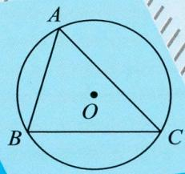

text_image

A
O
B
C

# 数学

八

RJ版
年级上

勤学早图书

# 目录

同步计算 1 三角形的中线和高 …… 1  
同步计算 2 三角形的内角和定理 …… 2  
同步计算 3 三角形的外角 …… 3  
同步计算 4 用“SAS”判定三角形全等 …… 4  
同步计算 5 用“ASA”或“AAS”判定三角形全等 …… 5  
同步计算 6 用“SSS”判定三角形全等 …… 6  
同步计算 7 用“HL”判定两个直角三角形全等 …… 7  
同步计算 8 一线三垂直模型 …… 8  
同步计算 9 角平分线 …… 9  
同步计算 10 运用等腰三角形的性质求角度 …… 10  
同步计算 11 方程思想求角度 …… 11  
同步计算 12 分类讨论求角度 …… 12  
同步计算 13 含 $30^{\circ}$ 的直角三角形 …… 13  
同步计算 14 同底数幂的乘法 …… 14  
同步计算 15 幂的乘方 …… 15  
同步计算 16 积的乘方 …… 16  
同步计算 17 单项式乘以多项式 …… 17  
同步计算 18 多项式乘以多项式 …… 18  
同步计算 19 幂的综合运算 …… 19

同步计算 20 多项式除以单项式 …… 20  
同步计算 21 平方差公式 …… 21  
同步计算 22 完全平方公式 …… 22  
同步计算 23 用提公因式法分解因式 …… 23  
同步计算 24 用平方差公式分解因式 …… 24  
同步计算 25 用完全平方公式分解因式 …… 25  
同步计算 26 分式的乘除、乘方混合运算 …… 26  
同步计算 27 异分母分式的加减 …… 27  
同步计算 28 分式的化简求值 …… 28  
同步计算 29 分式方程的解法 …… 29  
同步计算 30 实际问题与分式方程 …… 30

# 同步计算 1 三角形的中线和高

# 专项训练一 三角形的中线与周长

1. 如图, $AD$ 是 $\triangle ABC$ 的中线, $AB = 10$ , $AC = 8$ , $\triangle ABC$ 的周长为 30 , 则 $BD$ 的长为 \_\_\_\_。

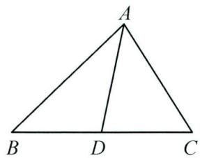

text_image

A
B D C

第1题图

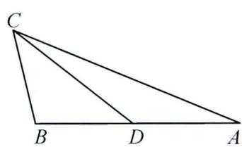

text_image

C
B D A

第2题图

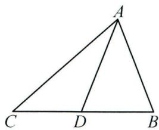

text_image

A
C D B

第3题图

2. 如图, $CD$ 是 $\triangle ABC$ 的中线, $AC = 9$ , $BC = 3$ , 那么 $\triangle ACD$ 和 $\triangle BCD$ 的周长的差是 \_\_\_\_。  
3. 如图, $AD$ 是 $\triangle ABC$ 的中线, $\triangle ADC$ 的周长比 $\triangle ABD$ 的周长大 2 , 已知 $AB = 6$ , 则 $AC$ 的长为 8 .

# 专项训练二 三角形的中线与面积

4. 如图, 在 $\triangle ABC$ 中, $D$ 是 $BC$ 的中点, $\triangle ABD$ 的面积为 2 , 则 $\triangle ABC$ 的面积为 \_\_\_\_ .

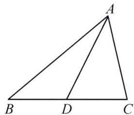

text_image

A
B D C

第 4 题图

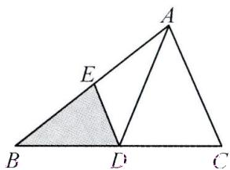

text_image

Geometric diagram of triangle ABC with internal points D and E, showing shaded region DE

第 5 题图

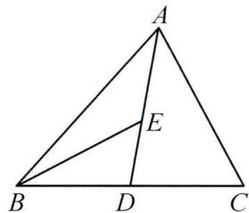

text_image

A
E
B
D
C

第6题图

5. 如图, 在 $\triangle ABC$ 中, $D, E$ 分别是边 $BC, AB$ 的中点. 若 $\triangle ABC$ 的面积等于 8 , 则 $\triangle BDE$ 的面积等于 2 .  
6. 在 $\triangle ABC$ 中， $D, E$ 分别是 $BC, AD$ 的中点， $S_{\triangle ABE}=5cm^{2}$ ，则 $S_{\triangle ABC}=\underline{20}cm^{2}$ .

# 专项训练三 等积法求高(底)

7. 已知 $AD, BE$ 为 $\triangle ABC$ 的两条高, 且 $AD = 4, BE = 3$ , 若 $BC = 6$ , 则 $AC$ 的长为 8 .  
8. 如图, 在 $\triangle ABC$ 中, $\angle ACB = 90^{\circ}, BC = 3, AC = 4, AB = 5$ , 求 $AB$ 边上的高 $CD$ .

解： $\because S_{\triangle ABC} = \frac{1}{2} AC \cdot BC = \frac{1}{2} AB \cdot CD$ ，且 $BC = 3, AC = 4, AB = 5$

$\therefore 4 \times 3 = 5CD$ , 解得 $CD = \frac{12}{5}$ .

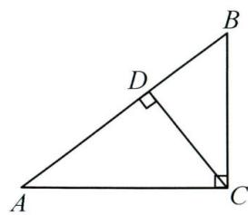

text_image

Geometric diagram of triangle ABC with right angles at D and C, showing perpendicular lines from D to AB and BC.

# 专项训练四 分类讨论求面积

9. $\triangle ABC$ 的高 $AD = 12$ , 若 $BD = 9, CD = 5$ , 求 $\triangle ABC$ 的面积.

解:(1)当高 AD 在 $\triangle ABC$ 内部时, $BC = BD + CD = 9 + 5 = 14$ , $S_{\triangle ABC} = \frac{1}{2} BC \cdot AD = \frac{1}{2} \times 14 \times 12 = 84$ ;

(2) 当高 AD 在 $\triangle ABC$ 外部时, BC = BD - CD = 9 - 5 = 4, $S_{\triangle ABC} = \frac{1}{2} BC \cdot AD = \frac{1}{2} \times 4 \times 12 = 24$ .

# 同步计算 2 三角形的内角和定理

# 专项训练一 直接计算求角度

1. 在 $\triangle ABC$ 中, 若 $\angle A=40^{\circ}, \angle B=70^{\circ}$ , 则 $\angle C$ 的度数为 $70^{\circ}$ .

2. 在 $\triangle ABC$ 中， $\angle A=\angle B$ 。

(1)若 $\angle A=72^{\circ}$ ,则 $\angle B$ 的度数为 $72^{\circ}$ , $\angle C$ 的度数为 $36^{\circ}$ ;  
(2)若 $\angle C=150^{\circ}$ ,则 $\angle A$ 的度数为 $15^{\circ}$ , $\angle B$ 的度数为 $15^{\circ}$ .

3. 在 $\triangle ABC$ 中， $\angle A=\angle B$ .

(1)若 $\angle A=\alpha$ ，则 $\angle C=\quad 180^{\circ}-2\alpha$ ；  
(2) 若 $\angle C = \alpha$ ，则 $\angle A = 90^{\circ} - \frac{1}{2}\alpha$ 。

4. 在 $\triangle ABC$ 中， $\angle A + \angle B = 150^{\circ}$ ， $\angle C = 2\angle A$ ，则 $\angle A$ 的度数为 $15^{\circ}$ 。  
5. 在 $\triangle ABC$ 中， $\angle A=20^{\circ}$ ， $\angle B=\angle A+12^{\circ}$ ，则 $\angle C$ 的度数为 $128^{\circ}$ 。  
6. 计算下列各图中的 $x$ 的值.

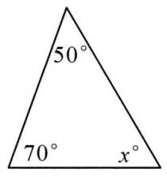

(1) $x=\underline{60}$ ;

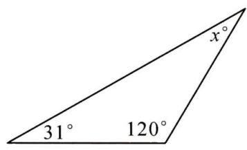

text_image

x°
31° 120°

(2) $x=\underline{29}$ ;

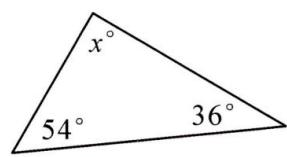

(3) $x=\underline{90}$ .

# 专项训练二 列方程求角度

7. 在 $\triangle ABC$ 中, 若 $\angle A=36^{\circ}, \angle B:\angle C=1:5$ , 则 $\angle C$ 的度数为 $120^{\circ}$ .  
8. 在 $\triangle ABC$ 中, 若 $\angle A=80^{\circ}$ , $\angle B$ 是 $\angle C$ 的4倍, 则 $\angle B$ 的度数为 $80^{\circ}$ .  
9. 在 $\triangle ABC$ 中, $\angle B - \angle A = 70^{\circ}$ , $\angle C = 50^{\circ}$ , 则 $\angle A$ 的度数为 $30^{\circ}$ , $\angle B$ 的度数为 $100^{\circ}$ .  
10. 计算下列各图中的 x 的值.

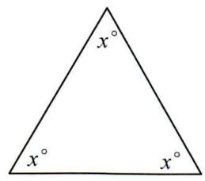

text_image

x°
x°
x°

(1) $x=\underline{60}$ ;

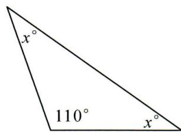

text_image

x°
110°
x°

(2) $x=\underline{35}$ ;

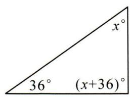

(3) $x = \underline{54}$ .

11. 在 $\triangle ABC$ 中, $\angle B + \angle C = 2\angle A$ , $\angle A : \angle B = 4 : 5$ , 求三角形中各角的度数.

解: 设 $\angle A = 4x, \angle B = 5x$ , 则 $\angle C = 180^{\circ} - 4x - 5x = 180^{\circ} - 9x$ .

$$
\because \angle B + \angle C = 2 \angle A,
$$

$\therefore 5x + 180^{\circ} - 9x = 2 \times 4x$ ，解得 $x = 15^{\circ}$ ，

$$
\therefore \angle A = 4 \times 1 5 ^ {\circ} = 6 0 ^ {\circ}, \angle B = 5 \times 1 5 ^ {\circ} = 7 5 ^ {\circ}, \angle C = 1 8 0 ^ {\circ} - 6 0 ^ {\circ} - 7 5 ^ {\circ} = 4 5 ^ {\circ}.
$$

综上所述， $\triangle ABC$ 中各角的度数分别为 $\angle A = 60^{\circ}, \angle B = 75^{\circ}, \angle C = 45^{\circ}$ .

# 同步计算 3 三角形的外角

# 专项训练一 直接计算求角度

1. 如图, $\angle A = 65^{\circ}, \angle B = 45^{\circ}$ , 则 $\angle ACD$ 的度数为 $110^{\circ}$ .

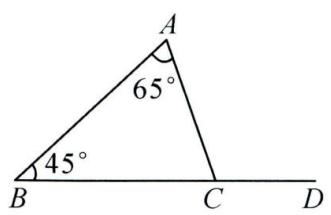

text_image

A
65°
45°
B C D

第 1 题图

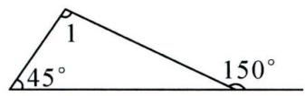  
第2题图

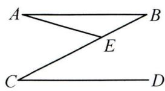  
第 3 题图

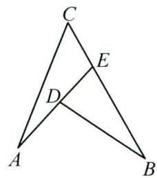

text_image

Geometric diagram of triangle ABC with internal points D and E, showing segments AD and DE

第 4 题图

2. 如图, $\angle 1$ 的度数为 $105^{\circ}$ .  
3. 如图, $AB \parallel CD$ , 连接 $BC$ , 点 $E$ 是 $BC$ 上一点, $\angle A = 15^{\circ}, \angle C = 27^{\circ}$ , 则 $\angle AEC$ 的度数为 $42^{\circ}$ .  
4. 如图, $\angle A = 20^{\circ}, \angle B = 30^{\circ}, \angle C = 50^{\circ}$ , 则 $\angle AEB = 70^{\circ}$ , $\angle ADB = 100^{\circ}$ .  
5. 如图, $\angle ACE = \angle B$ .

(1)若 $\angle A=65^{\circ}$ ,则 $\angle ECD=\underline{65^{\circ}}$ ；  
(2)若 $\angle A=\alpha$ ,则 $\angle ECD=\underline{\alpha}$ .

6. 如图, 探究 $\angle1, \angle2, \angle3, \angle4$ 之间的数量关系.

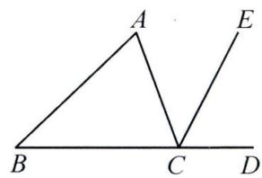

text_image

A
B
C
D
E

解：∵∠AED为△BED的外角，

$$
\therefore \angle A E D = \angle 2 + \angle 3.
$$

$\because \angle4$ 为 $\triangle AEF$ 的外角，

$$
\therefore \angle 4 = \angle 1 + \angle A E D,
$$

$$
\therefore \angle 4 = \angle 1 + \angle 2 + \angle 3.
$$

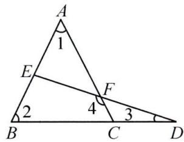

text_image

A
1
E
F
2
4
3
B
C
D

# 专项训练二 列方程求角度

7. 在 $\triangle ABC$ 中, $\angle A = x^{\circ}$ , $\angle B = (2x + 10)^{\circ}$ ,与 $\angle C$ 相邻的外角为 $(x + 40)^{\circ}$ ,则 $x$ 的值等于( A )

A. 15

B. 20

C. 30

D. 40

8. 求下列各图中的 x 的值.

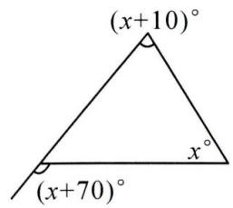

text_image

(x+10)°
(x+70)°
x°

(1) $x = \underline{60}$ ;

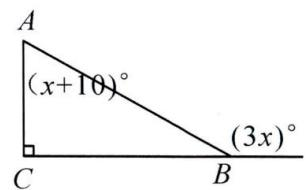

text_image

A
(x+10)°
C
B
(3x)°

(2) $x = \underline{50}$ .

9. 如图, $D$ 是 $\triangle ABC$ 的边 $BC$ 上一点, $\angle B = \angle 1$ , $\angle C = \angle ADC$ , $\angle BAC = 84^{\circ}$ , 求 $\angle B$ 的度数.

解: 设 $\angle B = x^{\circ}$ ，则 $\angle 1 = x^{\circ}$ ，∴ $\angle ADC = \angle 1 + \angle B = 2x^{\circ}$ .

$$
\because \angle C = \angle A D C, \therefore \angle C = 2 x ^ {\circ}.
$$

$$
\because \angle C + \angle C A B + \angle B = 1 8 0 ^ {\circ}, \therefore 2 x ^ {\circ} + 8 4 ^ {\circ} + x ^ {\circ} = 1 8 0 ^ {\circ},
$$

$$
\therefore x = 3 2, \therefore \angle B = 3 2 ^ {\circ}.
$$

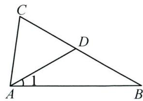

text_image

C
D
A
1
B

# 同步计算 4 用“SAS”判定三角形全等

# 专项训练一 求角度

1. 如图, 在 $\triangle ABC$ 中, $D, E$ 是 $BC$ 边上的两点, $AD = AE$ , $BE = CD$ , $\angle 1 = \angle 2 = 110^{\circ}$ , $\angle BAE = 60^{\circ}$ , 求 $\angle C$ 的度数.

解： $\because \angle 1 = \angle 2 = 110^{\circ}, \angle ADC = \angle 180^{\circ} - \angle 1, \angle AEB = 180^{\circ} - \angle 2,$

$\therefore \angle ADC = \angle AEB.$ 在 $\triangle ACD$ 和 $\triangle ABE$ 中， $\left\{ \begin{array}{l} AD = AE, \\ \angle ADC = \angle AEB, \\ CD = BE, \end{array} \right.$

$$
\therefore \triangle A C D \cong \triangle A B E (\mathrm{SAS}), \therefore \angle C A D = \angle B A E = 6 0 ^ {\circ},
$$

$$
\therefore \angle C = \angle 1 - \angle C A D = 5 0 ^ {\circ}.
$$

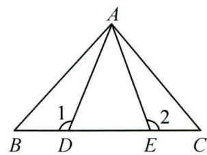

text_image

A
1
2
B D E C

2. 如图, ${AB} = {AD},{AC} = {AE},\angle {DAB} = \angle {EAC} = {40}^{ \circ  }$ , ${CB}$ 交 ${DE}$ 于点 $F$ .

(1)求 $\angle D+\angle ABF$ 的度数；  
(2)求 $\angle DFB$ 的度数.

解:(1) $\because\angle DAB=\angle EAC,\therefore\angle DAB+\angle BAE=\angle EAC+\angle BAE$ ,

即 $\angle DAE = \angle BAC. \because AB = AD, \angle DAE = \angle BAC, AC = AE,$

$$
\begin{array}{l} \therefore \triangle A B C \cong \triangle A D E (\mathrm{SAS}), \therefore \angle D = \angle A B C. \\ \because \angle A B C + \angle A B F = 1 8 0 ^ {\circ}, \therefore \angle D + \angle A B F = 1 8 0 ^ {\circ}; \\ \end{array}
$$

(2) $\because\angle DAB+\angle D+\angle ABF+\angle DFB=360^{\circ}$

$$
\therefore \angle D A B + \angle D F B = 1 8 0 ^ {\circ}, \therefore \angle D F B = 1 4 0 ^ {\circ}.
$$

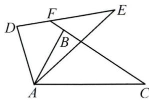

text_image

Geometric diagram with labeled points A, B, C, D, E, F forming intersecting triangles and quadrilaterals

# 专项训练二 求长度

3. 如图, 在 $\triangle DEC$ 和 $\triangle BFA$ 中, 点 $A, E, F, C$ 在同一直线上, 已知 $AB \parallel CD$ , 且 $AB = CD$ , $AE = CF$ , 若 $\triangle BFA$ 的周长为 $28, DE + AB = 18, AC = 12$ , 求 $FC$ 的长.

解：∵AB∥CD，∴∠A=∠C.∵AE=CF，∴AF=EC.

在 $\triangle DEC$ 和 $\triangle BFA$ 中， $\left\{\begin{aligned}AB&=CD,\\ \angle A&=\angle C,\therefore\triangle DEC\cong\triangle BFA,\therefore BF=DE,\\ AF&=EC,\end{aligned}\right.$

$\therefore \triangle BFA$ 的周长 $= BF + AB + AF = DE + AB + AF = 28.$

又∵ $DE+AB=18,\therefore AF=10.$ ∵AC=12,∴CF=AC-AF=2.

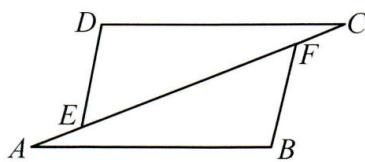

text_image

D
C
E
F
A
B

4. 在 $\triangle ABC$ 与 $\triangle DFE$ 中， $\angle A=\angle D,AB=DF,AC=DE$ ，若 $BF=10,EC=2$ ，求 $BC$ 的长.

解：∵AB=DF，∠A=∠D，AC=DE，

$$
\therefore \triangle A B C \cong \triangle D F E, \therefore B C = E F,
$$

∴设 BE=CF=x，则 $2x+2=10$ ，

$$
\therefore x = 4, \therefore B C = 6.
$$

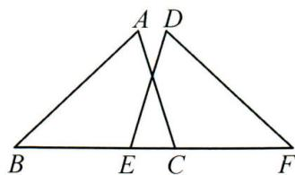

text_image

A D
B E C F

# 同步计算 5 用“ASA”或“AAS”判定三角形全等

# 专项训练一 求角度

1. 如图, 已知 $AB = AE$ , $\angle EAB = \angle DAC$ , $\angle E = \angle B = 40^\circ$ , $\angle C = 60^\circ$ , 求 $\angle DAE$ 的度数.

解： $\because \angle EAB = \angle DAC, \therefore \angle EAB + \angle BAD = \angle DAC + \angle BAD,$

$$
\therefore \angle E A D = \angle B A C. \text {   又   } \angle E = \angle B, A B = A E,
$$

$$
\therefore \triangle A E D \cong \triangle A B C (\mathrm{ASA}), \therefore \angle D = \angle C = 6 0 ^ {\circ},
$$

$$
\therefore \angle D A E = 1 8 0 ^ {\circ} - \angle D - \angle E = 8 0 ^ {\circ}.
$$

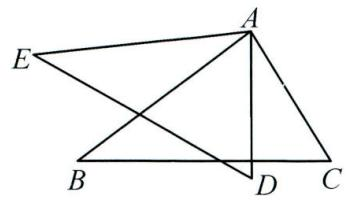

text_image

Geometric diagram with labeled points A, B, C, D, E and intersecting lines forming triangles and quadrilaterals

2. 如图, $AC = AB$ , $\angle C = \angle B$ , 若 $\angle AEB = 108^{\circ}$ , 求 $\angle BDC$ 的度数.

解：∵∠A=∠A,AC=AB,∠C=∠B,

$$
\therefore \triangle A C D \cong \triangle A B E (\mathrm{ASA}),
$$

$$
\therefore \angle A D C = \angle A E B = 1 0 8 ^ {\circ},
$$

$$
\therefore \angle B D C = 7 2 ^ {\circ}.
$$

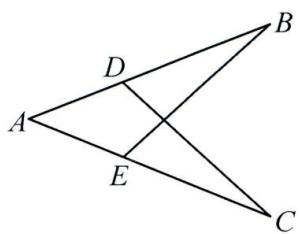

text_image

Geometric diagram with labeled points A, B, C, D, E forming intersecting triangles and quadrilaterals

# 专项训练二 求长度

3. 如图, $AB \perp CD$ , 且 $AB = CD$ , $CE \perp AD$ , $BF \perp AD$ , 垂足分别为 $E, F$ , 若 $CE = 4$ , $EF = 2$ , 求 $AE$ 的长.

解：∵AB⊥CD,CE⊥AD,BF⊥AD,∴∠A+∠D=90°,

$$
\angle C + \angle D = 9 0 ^ {\circ}, \angle C E D = \angle A F B = 9 0 ^ {\circ}, \therefore \angle A = \angle C.
$$

在 $\triangle ABF$ 和 $\triangle CDE$ 中， $\left\{\begin{aligned}\angle AFB&=\angle CED,\\ \angle A&=\angle C,\\ AB&=CD,\end{aligned}\right.$ $\therefore\triangle ABF\cong\triangle CDE(AAS),$

$$
\therefore A F = C E = 4, \therefore A E = A F - E F = 4 - 2 = 2.
$$

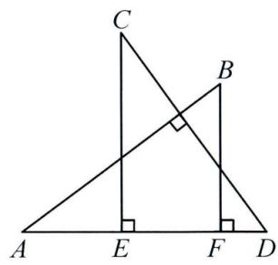

text_image

Geometric diagram showing triangle ABC with perpendiculars from points E and F to base AD, labeled with right angles at C and D.

4. 如图, $CD \perp AB$ , $AE \perp BC$ , 垂足分别为 $D, E, CD$ 与 $AE$ 交于点 $F$ , 若 $BD = DF = 3$ , $S_{\triangle ADF} = 6$ , 求 $CF$ 的长.

解：∵CD⊥AB，∴∠BDC=∠FDA=90°，∠B+∠C=90°.

$$
\because A E \perp B C, \therefore \angle A E B = 9 0 ^ {\circ}, \therefore \angle B + \angle A = 9 0 ^ {\circ}, \therefore \angle A = \angle C.
$$

在 $\triangle BDC$ 和 $\triangle FDA$ 中， $\left\{\begin{aligned}\angle C&=\angle A,\\ \angle BDC&=\angle ADF,\\ BD&=DF,\end{aligned}\right.$ $\therefore\triangle BDC\cong\triangle FDA(AAS),$

$$
\therefore S _ {\triangle B D C} = S _ {\triangle A D F} = 6, \therefore \frac {1}{2} B D \cdot D C = 6,
$$

$\therefore\frac{1}{2}\times3\times(3+CF)=6$ , 解得 CF=1.

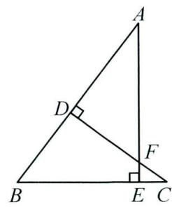

text_image

Geometric diagram of triangle ABC with perpendiculars from D and E to sides AB and AC, labeled points A, B, C, D, E, F.

# 同步计算 6 用“SSS”判定三角形全等

# 专项训练一 求角度

1. 在如图所示的钢架中, $AB = AC$ , $AD$ 是连接点 $A$ 与 $BC$ 中点 $D$ 的支架. 若 $\angle B = 55^{\circ}$ , 求 $\angle BAD$ 的度数.

解：∵D是BC的中点，∴BD=CD.在△ABD和△ACD中， $\left\{\begin{aligned}AB&=AC,\\ BD&=CD,\\ AD&=AD,\end{aligned}\right.$

$$
\therefore \triangle A B D \cong \triangle A C D (\text { S   S   S }), \therefore \angle A D B = \angle A D C.
$$

$$
\text { 又 } \angle A D B + \angle A D C = 1 8 0 ^ {\circ}, \therefore \angle A D B = 9 0 ^ {\circ}, \therefore \angle B A D = 9 0 ^ {\circ} - \angle B = 3 5 ^ {\circ}.
$$

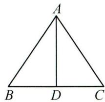

2. 如图, 在 $\triangle ACD$ 和 $\triangle BCE$ 中, $AC = BC$ , $AD = BE$ , $CD = CE$ , $\angle ACE = 55^{\circ}$ , $\angle BCD = 155^{\circ}$ , $AD$ 与 $BE$ 相交于点 $P$ , 求 $\angle ACB$ , $\angle BPD$ 的度数.

解: 在 $\triangle ACD$ 和 $\triangle BCE$ 中, $\left\{\begin{aligned}AC&=BC,\\ AD&=BE,\therefore\triangle ACD\cong\triangle BCE(SSS),\\ CD&=CE,\end{aligned}\right.$

$$
\therefore \angle A C D = \angle B C E, \angle A = \angle B, \therefore \angle B C A + \angle A C E = \angle A C E + \angle E C D,
$$

$$
\therefore \angle A C B = \angle E C D = \frac {1}{2} (\angle B C D - \angle A C E) = \frac {1}{2} \times (1 5 5 ^ {\circ} - 5 5 ^ {\circ}) = 5 0 ^ {\circ}.
$$

$$
\because \angle B + \angle A C B = \angle A + \angle A P B, \therefore \angle A P B = \angle A C B = 5 0 ^ {\circ}, \therefore \angle B P D = 1 8 0 ^ {\circ} - 5 0 ^ {\circ} = 1 3 0 ^ {\circ}.
$$

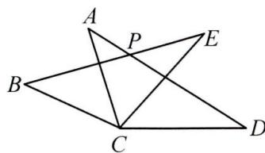

text_image

A
P
E
B
C
D

# 专项训练二 求长度

3. 如图, 已知 $AB = DC$ , $AC = DB$ , 若 $\triangle ABC$ 的面积为 $10, BC = 5$ , 求点 $D$ 到 $BC$ 的距离.

解: 在 $\triangle ABC$ 和 $\triangle DCB$ 中, $\left\{\begin{aligned}AC &= DB, \\ AB &= DC, \\ BC &= CB,\end{aligned}\right.$ $\therefore \triangle ABC \cong \triangle DCB$ (SSS),

$\therefore S_{\triangle DCB}=S_{\triangle ABC}=10$ , 可求得点 D 到 BC 的距离为 4.

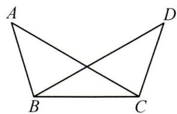

text_image

A
B
C
D

4. 如图, 在 $\triangle ADE$ 和 $\triangle ABC$ 中, $AB = AD$ , $DE = BC$ , $EA = CA$ , 过点 $A$ 作 $AF \perp DE$ , 垂足为 $F$ , 若 $\triangle ADE$ 的面积为 $16$ , $AF = 4$ , 求 $BC$ 的长.

解: 在 $\triangle ABC$ 与 $\triangle ADE$ 中, $\left\{\begin{aligned}AB&=AD,\\ BC&=DE,\\ AC&=AE,\end{aligned}\right.$ $\therefore\triangle ABC\cong\triangle ADE(SSS)$ ,

$$
\therefore D E = B C, S _ {\triangle A B C} = S _ {\triangle A E D}, \therefore \frac {1}{2} \times D E \times A F = \frac {1}{2} \times B C \times A F = 1 6, \therefore B C = 8.
$$

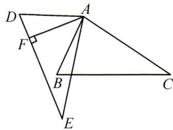

text_image

Geometric diagram with labeled points A, B, C, D, E, F and right angle at F

# 同步计算 7 用“HL”判定两个直角三角形全等

# 专项训练一 求角度

1. 如图, 在 $\triangle ABC$ 中, $AD \perp BC$ 于点 $D, F$ 为 $AD$ 上的一点, 且 $AC = BF$ , $DF = DC$ . 若 $\angle ABF = 10^{\circ}$ , 求 $\angle DBF$ 的度数.

解：∵AD⊥BC，∴∠BDF=∠ADC=90°.

在 Rt△BDF 和 Rt△ADC 中， $\left\{\begin{aligned}AC&=BF,\\ DC&=DF,\end{aligned}\right.$ $\therefore$ Rt△BDF≌Rt△ADC(HL)，

$\therefore AD=BD, \therefore \triangle ABD$ 是等腰直角三角形, $\therefore \angle ABD=\angle DAB=45^{\circ}$

$$
\therefore \angle D B F = \angle A B D - \angle A B F = 4 5 ^ {\circ} - 1 0 ^ {\circ} = 3 5 ^ {\circ}.
$$

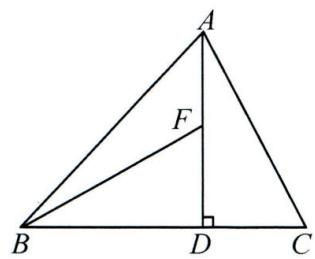

text_image

A
F
B
D
C

2. 如图, 在 $\triangle ABC$ 中, $D, F$ 分别为 $BC, AC$ 上的一点, $BD = CF$ , $FD \perp BC$ 于点 $D, DE \perp AB$ 于点 $E$ , 且 $BE = CD$ . 若 $\angle AFD = 145^{\circ}$ , 求 $\angle EDF$ 的度数.

解： $\because \angle AFD=145^{\circ},\therefore \angle DFC=35^{\circ}.\because DE\perp AB,DF\perp BC,$

$\therefore \angle DEB = \angle FDC = 90^{\circ}$ . 在 Rt $\triangle BDE$ 和 Rt $\triangle CFD$ 中, $\because \left\{ \begin{array}{l} BD = CF, \\ BE = CD, \end{array} \right.$

$$
\therefore \mathrm{Rt} \triangle B D E \cong \mathrm{Rt} \triangle C F D (\mathrm{HL}), \therefore \angle B D E = \angle C F D = 3 5 ^ {\circ},
$$

$$
\therefore \angle E D F = 1 8 0 ^ {\circ} - \angle F D C - \angle B D E = 5 5 ^ {\circ}.
$$

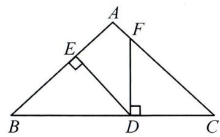

text_image

A
E
F
B
D
C

# 专项训练二 求长度

3. 如图, $AB \perp BD$ , $ED \perp BD$ , 垂足分别为 $B, D, C$ 为 $BD$ 上的一点, 若 $AB = 6$ , $BC = ED = 2$ , $AC = CE$ , 求四边形 $ABDE$ 的面积.

解：∵AB⊥BD,ED⊥BD,∴∠B=∠D=90°.

∵ 在 Rt△ABC 与 Rt△CDE 中， $\left\{\begin{aligned}AC&=CE,\\ BC&=DE,\end{aligned}\right.$ $\therefore$ Rt△ABC≌Rt△CDE(HL)，

$$
\therefore C D = A B = 6, \therefore B D = B C + C D = 2 + 6 = 8,
$$

$$
\therefore S _ {\text {四边形} A B D E} = \frac {1}{2} (A B + D E) \cdot B D = \frac {1}{2} \times (6 + 2) \times 8 = 3 2.
$$

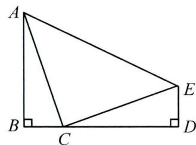

text_image

A
B
C
D
E

4. 如图, 点 $B$ 的坐标为 $(4, 4)$ , 过点 $B$ 分别作 $BA \perp x$ 轴, $BC \perp y$ 轴, 垂足分别为 $A, C, D$ 为线段 $OA$ 的中点, 点 $P$ 在线段 $AB$ 上, 当 $OP = CD$ 时, 求点 $P$ 的坐标.

解: 在 Rt△OCD 和 Rt△AOP 中, $\left\{\begin{aligned}OC &= OA, \\ CD &= OP,\end{aligned}\right.$

$$
\therefore \mathrm{Rt} \triangle O C D \cong \mathrm{Rt} \triangle A O P (\mathrm{HL}), \therefore O D = A P.
$$

∵D 是 OA 的中点，∴ $OD = AD = \frac{1}{2}OA = 2$ ，

$$
\therefore A P = 2, \therefore P (4, 2).
$$

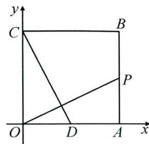

text_image

y
C
B
P
O
D
A
x

# 同步计算 8 一线三垂直模型

# 专项训练 直角顶点在坐标轴上

1. 在平面直角坐标系中, 已知 $A(2,4)$ . 点 $B$ 在第二象限, $OB \perp OA$ , 且 $OB = OA$ , 求点 $B$ 的坐标.

解: 分别过点 A, B 作 x 轴的垂线, 垂足分别为 D, E.

$$
\begin{array}{l} \because \angle A O D + \angle B O E = 9 0 ^ {\circ}, \angle O B E + \angle B O E = 9 0 ^ {\circ}, \\ \therefore \angle A O D = \angle O B E. \\ \because \angle A D O = \angle B E O = 9 0 ^ {\circ}, O A = O B, \\ \therefore \triangle A O D \cong \triangle O B E, \\ \therefore B E = O D = 2, O E = A D = 4, \\ \therefore B (- 4, 2). \\ \end{array}
$$

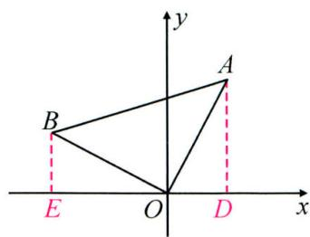

text_image

y
A
B
E O D x

2. 在平面直角坐标系中, 已知 $A(-2,0)$ . 以 $A$ 为直角顶点, $AB$ 为腰在第三象限作等腰 Rt $\triangle ABC$ , 若 $B(0,-4)$ , 求点 $C$ 的坐标.

解: 过点 C 作 $CD \perp x$ 轴于点 D.

$$
\begin{array}{l} \because \angle C A D + \angle B A O = 9 0 ^ {\circ}, \angle C A D + \angle A C D = 9 0 ^ {\circ}, \\ \therefore \angle A C D = \angle B A O. \\ \because \angle A D C = \angle A O B = 9 0 ^ {\circ}, A C = A B. \\ \therefore \triangle A C D \cong \triangle B A O, \\ \therefore A D = O B = 4, C D = O A = 2, \\ \therefore C (- 6, - 2). \\ \end{array}
$$

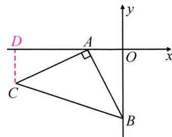

text_image

D
A
O
x
y
C
B

3. 如图, 在等腰 Rt△ABC 中, ∠ABC = 90°, AB = BC, A, B 两点分别在 x 轴和 y 轴上. 若点 C 的横坐标为 -4, 求点 B 的坐标.

解: 过点 C 作 $CD \perp y$ 轴于点 D, 可证 $\triangle BCD \cong \triangle ABO$ ,

$$
\therefore O B = C D = 4,
$$

$$
\therefore B (0, - 4).
$$

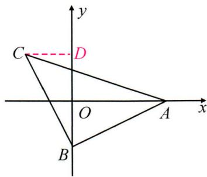

text_image

y
C
D
O
A
x
B

4. 如图, 在平面直角坐标系中, 点 $A(2,0), B(0,4)$ , 以 $AB$ 为直角边, $B$ 为直角顶点作等腰 Rt $\triangle ABC$ , 求点 $C$ 的坐标.

解: 过点 C 作 $CD \perp y$ 轴于点 D, 可证 $\triangle BCD \cong \triangle ABO$ ,

$$
\begin{array}{l} \therefore C D = O B = 4, B D = O A = 2, \\ \therefore O D = 4 - 2 = 2, \\ \therefore C (- 4, 2). \\ \end{array}
$$

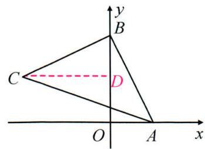

text_image

y
B
C
D
O
A
x

# 同步计算 9 角平分线

# 专项训练一 角平分线与周长

1. 如图, 在 $\triangle ABC$ 中, $\angle ACB = 90^{\circ}$ , $BE$ 平分 $\angle ABC$ 交 $AC$ 于点 $E$ , $ED \perp AB$ 于点 $D$ , 如果 $AE + DE = 3$ , 那么 $AC$ 的长为 3 .

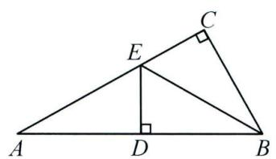

text_image

Geometric diagram of triangle ABC with perpendiculars from E and D to AB, labeled points A, B, C, D, E

第1题图

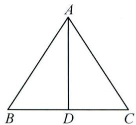

text_image

A
B D C

第2题图

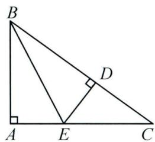

text_image

Geometric diagram of triangle ABC with perpendiculars from points A and E to sides, labeled points A, B, C, D, E

第 3 题图

2. 如图, $AD$ 是 $\triangle ABC$ 的角平分线, 且 $AD \perp BC$ , $AB = 5$ , $CD = 3$ , 则 $\triangle ABC$ 的周长为 16 .

3. 如图, 在 $\triangle ABC$ 中, $\angle A = 90^{\circ}$ , $BE$ 是 $\triangle ABC$ 的角平分线, $ED \perp BC$ 于点 $D$ , $CD = 4$ , $\triangle CDE$ 的周长为 12 , 则 $AC$ 的长是 8 .

4. 如图, 在 $\triangle ABC$ 中, $\angle A = 90^{\circ}, AB = AC, BD$ 平分 $\angle ABC$ 交 $AC$ 于点 $D, DE \perp BC$ 于点 $E$ . 若 $BC = 10 \mathrm{~cm}$ , 求 $\triangle DEC$ 的周长.

解：∵BD 平分∠ABE, DE⊥BC, DA⊥AB, ∴AD=DE.

又∵BD=BD,∴Rt△BAD≌Rt△BED(HL),∴AB=BE.

又∵AB=AC,∴BE=AC,

$$
\therefore B C = B E + E C = A C + E C = A D + D C + E C = D E + D C + E C = 1 0 \mathrm{cm},
$$

$\therefore \triangle DEC$ 的周长是 10 cm.

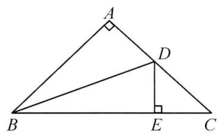

text_image

A
D
B
E
C

# 专项训练二 角平分线与面积

5. 如图, 在 $\triangle ABC$ 中, $AD$ 平分 $\angle BAC$ 交 $BC$ 于点 $D$ , $DE \perp AB$ 于点 $E$ . 若 $AC = 5 \mathrm{~cm}$ , $DE = 2 \mathrm{~cm}$ , 则 $\triangle ACD$ 的面积为 $5 \mathrm{~cm}^{2}$ .

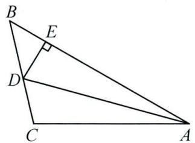

text_image

Geometric diagram of triangle ABC with perpendicular line from D to AB at E, and right angle at E.

第 5 题图

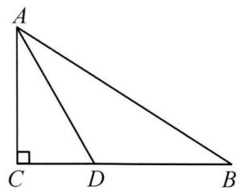

text_image

A
C D B

第6题图

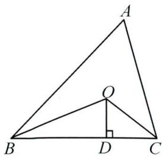

text_image

Geometric diagram of triangle ABC with altitude AD and right angle at D, labeled with points A, B, C, D, and O.

第 7 题图

6. 在 Rt△ABC 中, ∠ACB = 90°, AD 平分∠CAB, 若 AC = 6, AB = 10, CD = 3, 则 BD 的长为 \_\_\_\_.

7. 如图, $\triangle ABC$ 的周长是 $18 \mathrm{~cm}, \angle ABC$ 和 $\angle ACB$ 的角平分线交于点 $O, OD \perp BC$ 于点 $D$ . 若 $OD = 3 \mathrm{~cm}$ , 则 $\triangle ABC$ 的面积是 $27 \mathrm{~cm}^{2}$ .

# 同步计算 10 运用等腰三角形的性质求角度

# 专项训练一 等边对等角

1. 如图, 在 Rt△ABC 中, ∠C=90°, AF=EF. 若 ∠CFE=72°, 则 ∠B=54°.

text_image

Geometric diagram of triangle ABC with points E and F on sides AB and BC, and perpendicular from E to AC at C.

第1题图

text_image

A
D
E
B
C

第2题图

text_image

A
D
E
C
B

第 3 题图

2. 如图, 在 $\triangle ABC$ 中, $AC = BC$ , 点 $D, E$ 分别在 $AB, AC$ 上, 且 $AD = AE$ , 若 $\angle C = 40^{\circ}$ , 则 $\angle ADE$ 的度数是 $55^{\circ}$ .

3. 如图, 在 Rt△ABC 中, ∠C=90°, ∠B=42°, 点 D, E 分别在边 AB, AC 上, 且 AD=DE, 则 ∠AED 的度数是 48°.

4. 如图, 在 $\triangle ABC$ 中, $AC = BC$ , $AD$ 为高, $\angle DAB = 20^{\circ}$ . 求 $\angle C$ 的度数.

解：∵AD为高，∴∠ADB=90°.

$$
\because \angle D A B = 2 0 ^ {\circ}, \therefore \angle B = 7 0 ^ {\circ}.
$$

$$
\because A C = B C, \therefore \angle B = \angle B A C = 7 0 ^ {\circ},
$$

$$
\therefore \angle C = 4 0 ^ {\circ}.
$$

text_image

A
B D C

5. 如图, 在 $\triangle ABC$ 中, 点 $D, E$ 分别在边 $AB, AC$ 上, 连接 $CD, BE$ , 且 $BD = BC = BE$ . 若 $\angle A = 30^{\circ}, \angle ACB = 70^{\circ}$ , 求 $\angle BDC, \angle ABE$ 的度数.

解： $\because \angle A = 30^{\circ}, \angle ACB = 70^{\circ}, \therefore \angle ABC = 80^{\circ}$ .

$$
\because B D = B C, \therefore \angle B D C = \angle B C D = 5 0 ^ {\circ}.
$$

$$
\because B E = B C, \therefore \angle B E C = \angle A C B = 7 0 ^ {\circ},
$$

$$
\therefore \angle A B E = \angle B E C - \angle A = 7 0 ^ {\circ} - 3 0 ^ {\circ} = 4 0 ^ {\circ}.
$$

text_image

Geometric diagram of triangle ABC with points D and E on sides AB and BC respectively, and segment DE drawn

# 专项训练二 三线合一

6. 在 $\triangle ABC$ 中, $AB=AC$ , $AD$ 为中线, $\angle B=68^{\circ}$ , 则 $\angle CAD$ 的度数为 ${ }22^{\circ}$ .

7. 如图, 在 $\triangle ABC$ 中, $AB = AC$ , $AD$ 为高, $E$ 为 $BA$ 延长线上一点,且 $\angle DAE = 123^{\circ}$ , 则 $\angle CAD$ 的度数为 $57^{\circ}$ .

text_image

A
B
D
C
E

# 同步计算11 方程思想求角度

# 专项训练一 单等腰三角形求角度

1. 在 $\triangle ABC$ 中, $AB=AC$ , $\angle B=2\angle A$ , 则 $\angle A$ 的度数为 $36^{\circ}$ .  
2. 在 $\triangle ABC$ 中, $AB=AC$ , $2\angle B-\angle A=20^{\circ}$ , 则 $\angle C$ 的度数为 $\underline{50^{\circ}}$ .  
3. 如图, 在 Rt△ABC 中, ∠C = 90°, 点 D 在边 BC 上, 连接 AD, 若 AD = BD, ∠B - ∠CAD = 9°, 则 ∠BAC 的度数是 57°.

text_image

Geometric diagram of triangle ABC with point D on BC and right angle at C

# 专项训练二 双等腰三角形求角度

4. 如图, 在 $\triangle ABD$ 中, $\angle BAD = 5\angle D$ , 点 $C$ 在 $DB$ 边上, 连接 $AC$ , 若 $AB = AC = CD$ . 求 $\angle B$ 的度数.

解：∵AB=AC=CD，∴∠B=∠ACB，∠CAD=∠D.

设 $\angle D=\alpha$ ，则 $\angle B=\angle ACB=2\alpha$ ， $\angle BAD=5\alpha$ 。

在 $\triangle ABD$ 中, $5\alpha+2\alpha+\alpha=180^{\circ}$ ,

$$
\therefore 2 \alpha = 4 5 ^ {\circ}, \therefore \angle B = 4 5 ^ {\circ}.
$$

text_image

A
B C D

5. 如图, 在 $\triangle ABC$ 中, 点 $D$ 在 $BC$ 边上, $AB = AC = CD$ , $\angle BAD = 18^{\circ}$ . 求 $\angle BAC$ 的度数.

解： $\because AB=AC=CD, \therefore \angle B=\angle C, \angle CAD=\angle CDA.$

设 $\angle B = \angle C = \alpha$ ，则 $\angle CDA = \angle CAD = \alpha +13^{\circ}.$

在 $\triangle ADC$ 中， $\angle C+\angle CAD+\angle CDA=180^{\circ}$ ，

$\therefore\alpha+(\alpha+18^{\circ})+(\alpha+18^{\circ})=180^{\circ}$ ，解得 $\alpha=48^{\circ}$ ， $\therefore\angle BAC=84^{\circ}$

text_image

A
B D C

6. 如图, 在 $\triangle ABC$ 中, 点 $D$ 在边 $BC$ 上, $AB = AD = DC$ , $\angle CAD - \angle BAD = 10^{\circ}$ . 求 $\angle B$ 和 $\angle C$ 的度数.

解： $\because AB=AD=DC, \therefore \angle B=\angle ADB, \angle C=\angle CAD.$

$$
\because \angle A D B = \angle C + \angle C A D, \therefore \angle A D B = 2 \angle C = 2 \angle C A D.
$$

设 $\angle C=\alpha$ ，则 $\angle B=2\alpha$ ． $\because \angle CAD-\angle BAD=10^{\circ}$ ， $\therefore \angle BAD=\alpha-10^{\circ}$ ．

在 $\triangle ABD$ 中， $\angle BAD + \angle B + \angle ADB = 180^{\circ}$ ，

$$
\therefore (\alpha - 1 0 ^ {\circ}) + 2 \alpha + 2 \alpha = 1 8 0 ^ {\circ}, \therefore \alpha = 3 8 ^ {\circ}, \therefore \angle B = 7 6 ^ {\circ}, \angle C = 3 8 ^ {\circ}.
$$

text_image

A
B D C

# 专项训练三 多等腰三角形求角度

7. 如图, 在 Rt△ABC 中, ∠ACB = 90°, 点 D, E 分别在边 AC, AB 上, 且 AD = DE = CE = CB. 求 ∠CED 的度数.

解：∵AD=DE=CE/CB，

$$
\therefore \angle A = \angle A E D, \angle C D E = \angle D C E, \angle B E C = \angle B.
$$

设 $\angle A=x$ ，则 $\angle CDE=\angle DCE=2x$ ， $\angle BEC=\angle B=3x$ 。

$$
\because \angle A C B = 9 0 ^ {\circ}, \therefore \angle A + \angle B = 9 0 ^ {\circ}, \therefore x + 3 x = 9 0 ^ {\circ},
$$

$$
\therefore 2 x = 4 5 ^ {\circ}, \therefore \angle C E D = 1 8 0 ^ {\circ} - 2 \times 4 5 ^ {\circ} = 9 0 ^ {\circ}.
$$

text_image

Geometric diagram of triangle ABC with internal points D, E and connecting segments

# 同步计算 12 分类讨论求角度

# 专项训练一 顶角、底角不确定

1. 若等腰三角形的一个内角为 $80^{\circ}$ , 则另两个内角的度数为 $\quad 20^{\circ}, 80^{\circ}$ 或 $\quad 50^{\circ}, 50^{\circ}$ .  
2. 若等腰三角形的一个内角比另一内角大 $30^{\circ}$ , 则顶角的度数为 $40^{\circ}$ 或 $80^{\circ}$ .  
3. 若等腰三角形的一个内角是另一内角的 2 倍, 则底角的度数为 $45^{\circ}$ 或 $72^{\circ}$ .  
4. 若等腰三角形的一个外角为 $102^{\circ}$ , 则这个等腰三角形的底角的度数为 $78^{\circ}$ 或 $51^{\circ}$ .

# 专项训练二 高的位置不确定

5. 若等腰三角形一腰上的高与另一腰的夹角为 $56^{\circ}$ ，则这个等腰三角形的顶角的度数为 $34^{\circ}$ 或 $146^{\circ}$ .  
6. 若等腰三角形两腰上的高所在的直线的夹角为 $76^{\circ}$ ，则顶角的度数为 $76^{\circ}$ 或 $104^{\circ}$ .

# 专项训练三 动点的位置不确定

7. 已知 $\triangle ABC$ 是以 $BC$ 为底边的等腰直角三角形, $P$ 是 $\triangle ABC$ 外一点, $\triangle PBC$ 为等边三角形, 则 $\angle ABP$ 的度数为 $15^{\circ}$ 或 $105^{\circ}$ .

8. 如图, 已知 $P$ 是射线 $O M$ 上一动点, $\angle A O M = 40^{\circ}$ , 当 $\angle A P O$ 为多少度时, $\triangle A O P$ 为等腰三角形?

解: ①当 OA = AP 时, 则 $\angle O = \angle APO = 40^{\circ}$ ;

②当 OA = OP 时, 则 $\angle A = \angle APO = 70^{\circ}$ ;   
③当 OP = AP 时, 则有 $\angle O = \angle A = 40^{\circ}, \angle APO = 100^{\circ}$ ,

综上所述, 当 $\angle APO$ 为 $40^{\circ}$ 或 $70^{\circ}$ 或 $100^{\circ}$ 时, $\triangle AOP$ 为等腰三角形.

text_image

A
O P M

# 专项训练四 顶角的大小不确定

9. 在 $\triangle ABC$ 中, $AB = AC$ , $AB$ 的垂直平分线与 $AC$ 所在的直线相交所得的锐角是 $50^{\circ}$ , 求底角的度数.

解:(1)如图1,当顶角为锐角时,

此时可求得 $\angle A=40^{\circ}$ ,

所以 $\angle B = \angle C = \frac{1}{2} (180^{\circ} - 40^{\circ}) = 70^{\circ}$

(2)如图 2, 当顶角为钝角, 交点在腰 CA 的延长线上时, 此时可求得 $\angle BAC = 140^{\circ}$ ,

所以 $\angle B = \angle C = \frac{1}{2} (180^{\circ} - 140^{\circ}) = 20^{\circ}$

text_image

A
B C

图1

  
图2

(3) 当顶角为直角时, 不合题意.

故等腰三角形的底角为 $70^{\circ}$ 或 $20^{\circ}$ .

# 同步计算 13 含 $30^{\circ}$ 的直角三角形

# 专项训练一 直接用 $30^{\circ}$ 的性质求线段的长

1. 如图, 在 $\triangle ABC$ 中, $\angle BAC = 90^{\circ}, \angle C = 30^{\circ}, AD \perp BC$ , 垂足为 $D$ . $BD = 2$ , 则 $CD$ 的长度为 6 .

text_image

B
D
A
C

2. 如图, 在 $\triangle ABC$ 中, $\angle C = 90^{\circ}, \angle A = 15^{\circ}, \angle DBC = 60^{\circ}, BC = 4$ . 求 $AD$ 的长.

解： $\because \angle C = 90^{\circ}, \angle DBC = 60^{\circ}$ ，

$$
\therefore \angle B D C = 3 0 ^ {\circ}, \therefore B D = 2 B C = 8.
$$

$$
\because \angle B D C = \angle A + \angle A B D, \therefore \angle A B D = 1 5 ^ {\circ},
$$

$$
\therefore A D = B D, \therefore A D = 8.
$$

text_image

Geometric diagram of triangle ABC with point D on base AC, showing segments AD and BD

3. 如图, 在 Rt△ABC 中, ∠C = 90°, ∠BAC = 60°, AD 为△ABC 的角平分线, AD = 3. 求 BC 的长.

解： $\because \angle C = 90^{\circ}, \angle BAC = 60^{\circ}, \therefore \angle B = 30^{\circ}.$

∵AD 平分∠BAC, ∴∠CAD=∠BAD=30°, ∴AD=2CD, AD=BD.

$$
\because A D = 3, \therefore C D = \frac {3}{2}, \therefore B C = B D + C D = 3 + \frac {3}{2} = \frac {9}{2}.
$$

text_image

A
C D B

# 专项训练二 构含 $30^{\circ}$ 的直角三角形求线段长

4. 如图, 在 $\triangle ABC$ 中, $AB = AC$ , $\angle A = 30^{\circ}$ , 且 $\triangle ABC$ 的面积为 4. 求 $AB$ 的长.

解: 过点 C 作 CD ⊥ AB 于点 D.

$$
\because \angle A = 3 0 ^ {\circ}, \therefore C D = \frac {1}{2} A C.
$$

$$
\because A B = A C, \therefore S _ {\triangle A B C} = \frac {1}{2} A B \cdot C D = \frac {1}{4} A B ^ {2} = 4,
$$

$$
\therefore A B ^ {2} = 1 6, \therefore A B = 4.
$$

text_image

A
D
B C

5. 如图, 在 $\triangle ABC$ 中, $AB = AC$ , $\angle BAC = 120^{\circ}$ , $D$ 是 $BC$ 的中点, $DE \perp AC$ 于点 $E$ , 若 $AE = 1$ , 求 $CE$ 的长.

解: 连接 AD. $\because AB = AC, D$ 为 BC 的中点,

$$
\therefore A D \perp B C, \angle D A E = \frac {1}{2} \angle B A C, \therefore \angle A D B = 9 0 ^ {\circ}.
$$

$$
\because \angle B A C = 1 2 0 ^ {\circ}, \therefore \angle C = 3 0 ^ {\circ}, \angle D A E = 6 0 ^ {\circ}.
$$

$$
\because D E \perp A C, \therefore \angle A D E = 3 0 ^ {\circ}, \therefore A D = 2 A E, A C = 2 A D, \therefore A C = 4 A E.
$$

$$
\because A E = 1, \therefore A C = 4, \therefore C E = A C - A E = 4 - 1 = 3.
$$

text_image

A
E
B
D
C

# 同步计算 14 同底数幂的乘法

# 专项训练一 直接运用公式

计算下列各题：

1. (1) $2 \times 2^{3} = 2^{4}$ ;

2. (1) $(-3) \times (-3)^{3} = 3^{4}$ ;

(3) $\left(\frac{3}{2}\right)^{2}\times\left(\frac{3}{2}\right)^{3}=\underline{\left(\frac{3}{2}\right)^{5}}$ ;

3.(1) $a \cdot a^{4} = a^{5}$ ;

(3) $-x^{3}\cdot x^{5}=-x^{8}$ ;

4. (1) $x \cdot x^{m+1} = x^{m+2}$ ;

5. (1) $m \cdot m^{3}$ ;

解: $m^{4}$ ;

(3) $y^{2n+1} \cdot y^{n+3} \cdot y^{2}$ ;

解： $y^{3n+6}$ ;

(2) $20^{m}\times20^{n}=20^{m+n}$   
(2) $(-10)^{7}\times(-10)^{8}=\underline{-10^{15}}$ ;   
(4) $\left(-\frac{1}{2}\right)\times\left(-\frac{1}{2}\right)^{3}=\frac{\left(\frac{1}{2}\right)^{4}}{2}$   
(2) $x^{7}\cdot x^{8}=\underline{x^{15}}$ ;   
(4) $-a^{2}\cdot a^{5}=-a^{7}$   
(2) $-a^{2}\cdot a^{n}=-a^{n+2}$   
(2) $(-3)\times(-3)^{3}\times(-3)^{2}$ ;

解: $3^{6}$ ;

(4) $-y^{2n}\cdot y^{n+3}\cdot y^{n-1}.$

解： $-y^{4n+2}$

# 专项训练二 底数为多项式的运算

6. (1) $(x - 1)(x - 1)^{3} = (x - 1)^{4}$ ;

(3) $(a - b)(a - b)^{3}(a - b)^{4} = \underline{(a - b)^{8}}$

# 专项训练三 $a^m \cdot a^n = a^{m + n}$ 的应用

(2) $(x+m)^{2}(x+m)^{3}=\underline{(x+m)^{5}}$ ;   
(4) $(x-y)^{2}(y-x)^{4}=\underline{(x-y)^{6}}$ .

7. 若 $x + y = 3$ ，则 $2^{x} \cdot 2^{y}$ 的值为 8， $3^{x} \cdot 3^{y}$ 的值为 27。

8. 若 $x \cdot x^{m} \cdot x^{n} = x^{14}$ ，求 $m + n$ 的值.

解： $\because x \cdot x^{m} \cdot x^{n} = x^{1+m+n} = x^{14}$ ，

$$
\therefore 1 + m + n = 1 4,
$$

$$
\therefore m + n = 1 3.
$$

# 专项训练四 $a^m \cdot a^n = a^{m + n}$ 的逆用

9.(1)已知 $3^{x}=2,3^{y}=4$ ，则 $3^{x+y}=8$ ；  
10. 已知 $2^{m}=3,2^{n}=5$ ，求 $2^{m+n+2}$ 的值.

解: $2^{m+n+2}=2^{m}\times2^{n}\times2^{2}$

$$
= 3 \times 5 \times 4
$$

$$
= 6 0.
$$

# 同步计算 15 幂的乘方

# 专项训练一 直接运用公式

计算下列各题:

1. (1) $(2^{2})^{3} = 2^{6}$ ;

(4) $\left[\left(\frac{1}{2}\right)^{2}\right]^{3}=\underline{\left(\frac{1}{2}\right)^{6}}$ ;

2. (1) $(a^4)^4 = a^{16}$ ;

(4) $-(x^{2})^{3}=$ - $x^{6}$ ;

3. (1) $(a^{m})^{n} \cdot a^{5}$ ;

解: $a^{mn+5}$ ;

(2) $(10^{3})^{5} = \underline{10^{15}}$   
(5) $\left[\left(\frac{2}{3}\right)^{3}\right]^{2}=\underline{\left(\frac{2}{3}\right)^{6}}$ ;   
(2) $(x^{3})^{2}=$ x $^{6}$ ;   
(5) $(a^{m})^{2n} = a^{2mm}$ ;   
(2) $(a^{2})^{3}\cdot a^{5};$

解: $a^{11}$ ;

(3) $-(4^{2})^{3}=-4^{6}$ ;   
(6) $-\left[\left(\frac{2}{3}\right)^{3}\right]^{2}=-\left(\frac{2}{3}\right)^{6}$   
(3) $(a^{5})^{2}= \underline{a^{10}}$ ;   
(6) $-(x^{3m})^{3}=-x^{9m}$   
(3) $(x^{3})^{3}\cdot(x^{5})^{2}$ ;

解： $x^{19}$

(4) $(x^{2})^{n}\cdot(x^{m})^{n}$ ;

(5) $(a^{x})^{2}\cdot(a^{y})^{3}$ ;

(6) $(a^{2x})^{2y}\cdot(a^{xy})^{4}.$

解： $x^{2n + mn}$

解: $a^{2x+3y}$ ;

解: $a^{8xy}$ .

# 专项训练二 $(a^{m})^{n} = (a^{n})^{m}$ 的应用

4. 已知 $a^{x}=2$ ，则 $(a^{x})^{2}=\underline{4}$ ， $a^{3x}=\underline{8}$ 。  
5. 已知 $m^{x}=3$ ，则 $m^{2x}=\underline{9}$ ， $m^{3x}=\underline{27}$ .  
6. 已知 $m^{3x}=27$ ，则 $m^{x}=\underline{3}$ ， $m^{6x}=\underline{729}$ .

专项训练三 $(a^{m})^{n} = a^{mn}$ 和 $a^m\cdot a^n = a^{m + n}$ 的综合应用

7. 已知 $3^{m}=2,3^{n}=5$ ，则 $3^{m+n}=\underline{10}$ ， $3^{3m+2n}=\underline{200}$ .  
8. 若 $a^{m}=2, a^{n}=5$ ，求 $a^{2m+n}$ 的值.

解: $a^{2m+n}=(a^{m})^{2}\cdot a^{n}$

$$
= 2 0.
$$

9. 已知 $2^{m}=a, 2^{n}=b$ ，求 $2^{3m+2n+1}$ 的值（用含 a, b 的式子表示）.

解: $2^{3m+2n+1}=(2^{m})^{3}\cdot(2^{n})^{2}\cdot2$

$$
\begin{array}{l} = a ^ {3} \cdot b ^ {2} \cdot 2 \\ = 2 a ^ {3} b ^ {2}. \\ \end{array}
$$

# 同步计算 16 积的乘方

# 专项训练一 直接运用公式

1. (1) $(ab)^{5} = a^{5}b^{5}$ ;

(2) $(2a)^{3} = 8a^{3}$

(3) $\left(\frac{2}{3}a\right)^{3}=\frac{8}{27}a^{3}$ ;

(4) $(a^{2}b^{3})^{5}=$ $a^{10}b^{15}$ ;

(5) $(3a^{2})^{3} = 27a^{6}$

(6) $(2ab^{3})^{3} = 8a^{3}b^{9}$

(7) $(3a^{2}b^{3})^{2} = 9a^{4}b^{6}$

(8) $(2\times 10^{3})^{5} = 3.2\times 10^{16}$

(9) $\left(\frac{2}{3}a^{2}b^{3}c^{4}\right)^{2}=\frac{4}{9}a^{4}b^{6}c^{8}$

# 专项训练二 公式混合运算

2. (1) $(-2a^3)^4$ ;

(2) $\left(-\frac{1}{2}a^{2}b\right)^{2};$

(3) $-(-2a^{2}b)^{4}$ ;

解: $16a^{12}$ ;

解： $\frac{1}{4} a^4 b^2$

解： $-16a^{8}b^{4}$ ;

(4) $(-3a^{2}b)^{5}$ ;

(5) $\left(-\frac{3}{2}a^{2}b^{3}\right)^{3};$

(6) $(-3\times10^{2})^{3}$ .

解： $-243a^{10}b^{5}$ ;

解： $-\frac{27}{8}a^{6}b^{9}$ ;

解: $-2.7 \times 10^{7}$ .

# 3. 计算下列各题：

(1) $a^{3}\cdot a^{5}+(3a^{4})^{2}$ ;

(2) $x^{2}\cdot x^{3}+(-x)^{5}+(x^{2})^{3};$

(3) $a^{3}\cdot a\cdot a^{4}+(-2a^{4})^{2}+(a^{2})^{4}.$

解: 原式 $= 10a^{8}$ ;

解: 原式 $= x^{6}$ ;

解: 原式 = $6a^{8}$ .

# 专项训练三 $a^n b^n = (ab)^n$ 的应用

4. 计算: (1) $(0.25)^{100} \times 4^{100}$ ;

(2) $(-0.125)^{10} \times 8^{11}$ .

解: 原式= $(0.25 \times 4)^{100}$

解: 原式= $(-0.125 \times 8)^{10} \times 8$

$$
= 1;
$$

$$
= 8.
$$

5. 已知 $2^{x+3} \cdot 3^{x+3} = 36^{x+1}$ ，求 x 的值.

解: $2^{x+3}\cdot3^{x+3}=(2\times3)^{x+3}=6^{x+3},36^{x+1}=6^{2x+2}$

则 $x+3=2x+2$ ,

$$
\therefore x = 1.
$$

# 同步计算 17 单项式乘以多项式

# 专项训练一 直接计算

计算下列各题：

1. (1) $m(x + 3y + z)$ ;

(2) $2m(x-3y+z)$ ;

(3) $5m(x - 3y - z)$ .

解: 原式 = mx + 3my + mz ;

解: 原式 = 2mx - 6my + 2mz ;

解: 原式 = 5mx - 15my - 5mz.

2. (1) $-2m(-x + 4y - z)$ ;

(2) $\frac{m}{5}\left(-x-\frac{10}{3}y-z\right);$

(3) $-\frac{m}{4}(x-4y-8z)$ .

解: 原式 = 2mx - 8my + 2mz ;

解: 原式 $= -\frac{mx}{5} - \frac{2my}{3} - \frac{mz}{5}$ ;

解: 原式 $= -\frac{mx}{4} + my + 2mz$ .

3. (1) $ab(a + 2b)$ ;

(2) $3abc(a-b^{2}c+2)$ ;

(3) $4a^{2}b^{2}c(abc+3a^{2}+2)$ .

解: 原式= $a^{2}b+2ab^{2}$ ;

解: 原式 $=3a^{2}bc - 3ab^{3}c^{2} + 6abc$ ;

解: 原式 $=4a^{3}b^{3}c^{2}+12a^{4}b^{2}c+8a^{2}b^{2}c$ .

4. (1) $-3ab(5a^{2} - 2b)$ ;

(2) $(x-3y^{2}+2)(-5x^{2}y)$ ;

(3) $-4a^{2}b^{2}(ab-3a^{2}-5).$

解: 原式 $= -15a^{3}b + 6ab^{2}$ ;

解: 原式 $= -5x^{3}y + 15x^{2}y^{3} - 10x^{2}y$ ;

解: 原式 $= -4a^{3}b^{3} + 12a^{4}b^{2} + 20a^{2}b^{2}$ .

# 专项训练二 化简求值

5. 先化简, 再求值: $3x \cdot (x^{2} - 2x + 1) - 2x^{2}(x - 1)$ , 其中 x = 2.

解: 原式 $= x^{3} - 4x^{2} + 3x$ ，当 x = 2 时，原式 = -2。

6. 先化简, 再求值: $x \cdot (x + 1) + x(x^{2} - 1) - (2x)^{2}(x + 1)$ , 其中 x = -1.

解: 原式 $= -3x^{3} - 3x^{2}$ ，当 x = -1 时，原式 = 0。

7. 先化简, 再求值: $(-2xy)^{2} \cdot (3xy^{2}) - 3x(4x^{2}y^{4} - xy^{2})$ , 其中 x = -1, y = -2.

解: 原式 $=3x^{2}y^{2}$ . 当 x = -1, y = -2 时, 原式 = 12.

8. 先化简, 再求值: $2mn(-2mn)^{2} - 3n(mn + m^{2}n) - mn^{2}$ , 其中 $m = 1, n = -2$ .

解: 原式 $=8m^{3}n^{3}-4mn^{2}-3m^{2}n^{2}$ ，当 m=1, n=-2 时，原式 =-92.

# 同步计算 18 多项式乘以多项式

# 计算下列各题:

1. (1) $(x - 1)(x - 2)$ ;

(2) $(x + 3)(x - 4)$ ;

(3) $(x+3)(x+5)$ .

解: 原式 $= x^{2} - 3x + 2$ ;

解: 原式= $x^{2}-x-12$ ;

解: 原式= $x^{2}+8x+15$ .

2. (1) $(2x - 7)(x - 3)$ ;

(2) $(3x-4)(2x-5)$ ;

(3) $(5x+1)(2x-9)$ .

解: 原式= $2x^{2}-13x+21$ ;

解: 原式 $=6x^{2}-23x+20$ ;

解: 原式 $=10x^{2}-43x-9$ .

3. (1) $(x + 7y)(x - 6y)$ ;

(2) $(x-9y)(x+4y)$ ;

(3) $(x-3y)(x+5y)$ .

解: 原式 $= x^{2} + xy - 42y^{2}$ ;

解: 原式= $x^{2}-5xy-36y^{2}$ ;

解: 原式 $= x^{2} + 2xy - 15y^{2}$ .

4. (1) $(7x - 4y)(2x - 3y)$ ;

(2) $(3x + 4y)(2x - y)$ ;

(3) $(5x+y)(3x-7y)$ .

解: 原式 $=14x^{2}-29xy+12y^{2}$ ;

解: 原式 $=6x^{2}+5xy-4y^{2}$ ;

解: 原式 $=15x^{2}-32xy-7y^{2}$ .

5. (1) $(x - 3)\left(x + \frac{2}{3}\right)$ ;

(2) $(4x-2)\left(3x+\frac{1}{2}\right)$ ;

(3) $(x-9y)\left(x+\frac{2}{3}y\right).$

解: 原式= $x^{2}-\frac{7}{3}x-2$ ;

解: 原式 = $12x^{2} - 4x - 1$ ;

解: 原式 $= x^{2} - \frac{25}{3}xy - 6y^{2}$ .

6. (1) $(x + y)(x^2 - xy + y^2)$ ;

(2) $(x^{2}+2x+3)(2x-5)$ ;

(3) $(x-9y+1)(x+y)$ .

解: 原式= $x^{3}+y^{3}$ ;

解: 原式= $2x^{3}-x^{2}-4x-15$ ;

解: 原式 $= x^{2} - 8xy + x + y - 9y^{2}$ .

# 同步计算 19 幂的综合运算

# 1. 计算：

(1) $(\pi-2)^{0}-2^{2}+3^{2}$ ;

(2) $(-2x^{2})^{2}+x^{3}\cdot x-x^{5}\div x.$

解: 原式 = 1 - 4 + 9

$$
= 6;
$$

解: 原式 $=4x^{4}+x^{4}-x^{4}$

$$
= 4 x ^ {4}.
$$

# 2. 计算：

(1) $(-2)^{2}\cdot\left[(-a^{5})^{4}\div a^{12}\right]^{2}\cdot(-2a^{4})$ ;

(2) $(-a)^{2}\cdot(a^{2})^{2}\div a^{3}.$

解: 原式 $=4 \times (a^{20} \div a^{12})^{2} \cdot (-2a^{4})$

$$
= 4 \times (a ^ {8}) ^ {2} \cdot (- 2 a ^ {4})
$$

$$
= 4 \times a ^ {1 6} \cdot (- 2 a ^ {4})
$$

$$
= - 8 a ^ {2 0};
$$

解: 原式= $a^{2}\cdot a^{4}\div a^{3}$

$$
= a ^ {6} \div a ^ {3}
$$

$$
= a ^ {3}.
$$

# 3. 计算：

(1) $x^{2}\cdot x^{6}-(x^{4})^{2}+x^{9}\div x;$

(2) $a^{9}\div a^{2}\cdot a+(a^{2})^{4}-(-2a^{4})^{2}.$

解: 原式= $x^{8}-x^{8}+x^{8}$

$$
= x ^ {8};
$$

解: 原式 $=a^{9-2+1} + a^{8} - 4a^{8}$

$$
= a ^ {8} + a ^ {8} - 4 a ^ {8}
$$

$$
= - 2 a ^ {8}.
$$

# 4. 计算：

(1) $-2^{2}+(-2)^{2}\times5^{0}+(-2)^{3}$ ;

(2) $(2a^{2})^{2}-a^{7}\div(-a)^{3}$

解: 原式 = -4 + 4 × 1 - 8

$$
= - 4 + 4 - 8
$$

$$
= - 8;
$$

解: 原式 $=4a^{4}-a^{7}\div(-a^{3})$

$$
= 4 a ^ {4} + a ^ {4}
$$

$$
= 5 a ^ {4}.
$$

# 5. 计算：

(1) $(\pi - 1)^{0} + (-3)^{2} - (-1)^{2022}$ ;

(2) $(3a^{2})^{3} + a^{2}\cdot a^{4} - a^{8}\div a^{2}$

解: 原式 = 1 + 9 - 1

$$
= 9;
$$

解: 原式 $=27a^{6} + a^{6} - a^{6}$

$$
= 2 7 a ^ {6}.
$$

# 6. 计算：

(1) $|-1|+(-2)^{3}+(7-\pi)^{0}-(-2)^{4};$

(2) $a \cdot a^{2} \cdot a^{3} + (-2a^{3})^{2} - a^{8} \div a^{2}.$

解: 原式 = 1 - 8 + 1 - 16

$$
= - 2 2;
$$

解: 原式 $=a^{6}+4a^{6}-a^{6}$

$$
= 4 a ^ {6}.
$$

# 同步计算 20 多项式除以单项式

# 专项训练一 直接用法则计算

1. 计算: (1) $(6a^{2} + 5a) \div a$ ;

(2) $(12a^{3}-6a^{2}+3a)\div3a;$

(3) $(12a^{n} - a^{m} + 15a^{3})\div 3a^{2}$ .

解: $6a + 5$ ;

解: $4a^{2}-2a+1$ ;

解: $4a^{n-2}-\frac{1}{3}a^{m-2}+5a$ .

2. 计算: (1) $(ab + 5a) \div a$ ;

(2) $(15x^{2}y-10xy^{2})\div5xy;$

(3) $(7x^{2}y^{3} - 8x^{3}y^{2}z)\div 8x^{2}y^{2}$ .

解： $b+5$ ;

解:3x-2y;

解: $\frac{7}{8}y-xz.$

3. 计算: (1) $(x^{4} + x^{3} - x^{2}) \div (-x)^{2}$ ;

(2) $(8x^{3}y^{2}-4x^{2}y^{2})\div(2xy)^{2};$

解: $x^{2}+x-1$ ;

解:2x-1;

(3) $(3x^{2}y^{2}-2xy^{2}+xy)\div\left(\frac{1}{2}xy\right);$

(4) $\left(\frac{2}{3} a^4 b^7 -\frac{1}{9} a^2 b^6\right)\div \left(-\frac{1}{6} ab^3\right)^2.$

解: $6xy - 4y + 2$ ;

解： $24a^{2}b-4$

4. 计算：

(1) $\left[x\left(x^{2}y^{2}-xy\right)+3xy\right]\div(-3xy)$ ;

(2) $\left(0.25a^{2}b - \frac{1}{2} a^{3}b^{2} - \frac{1}{6} a^{4}b^{3}\right)\div (-0.5a^{2}b).$

解： $-\frac{x^{2}y}{3}+\frac{x}{3}-1$ ;

解：-0.5+ab+ $\frac{1}{3}a^{2}b^{2}$ .

# 专项训练二 化简求值

5. 先化简, 再求值: $\left[4x\left(x^{2}y-xy^{2}\right)+2xy\left(xy-x^{2}\right)\right]\div2x^{2}$ , 其中 x=2, y=-3.

解: 原式 $= xy - y^{2}$ ，当 x = 2, y = -3 时，原式 = -15.

6. 已知 $6x + 3y = 2$ ，求 $\left[y(2x - y) + (x - y)(x - y) - (x + y)(x + y)\right] \div (-2y)$ 的值.

解: 原式 $= x + \frac{1}{2}y$ ，当 $6x + 3y = 2$ 时，原式 $= \frac{1}{3}$ .

# 同步计算 21 平方差公式

# 专项训练一 直接用

1. 计算: (1) $(x+1)(x-1)$ ;

(2) $(x + 2)(x - 2)$ ;

(3) $\left(x+\frac{1}{2}\right)\left(x-\frac{1}{2}\right).$

解: 原式 = $x^{2} - 1^{2}$

$$
= x ^ {2} - 1;
$$

解: 原式 = $x^{2}-2^{2}$

$$
= x ^ {2} - 4;
$$

解: 原式= $x^{2}-\left(\frac{1}{2}\right)^{2}$

$$
= x ^ {2} - \frac {1}{4}.
$$

2. 计算: (1) $(3x + 2)(3x - 2)$ ;

(2) $(x + 2y)(x - 2y)$ ;

(3) $\left(x + \frac{1}{2} y\right)\left(x - \frac{1}{2} y\right)$ .

解: 原式= $(3x)^{2}-2^{2}$

$$
= 9 x ^ {2} - 4;
$$

解: 原式= $x^{2}-(2y)^{2}$

$$
= x ^ {2} - 4 y ^ {2};
$$

解: 原式= $x^{2}-\left(\frac{1}{2}y\right)^{2}$

$$
= x ^ {2} - \frac {1}{4} y ^ {2}.
$$

3. 计算: (1) $(5x + 4y)(5x - 4y)$ ;

(2) $\left(2x+\frac{1}{3}y\right)\left(2x-\frac{1}{3}y\right)$ ;

(3) $\left(5x-\frac{y}{5}\right)\left(5x+\frac{y}{5}\right).$

解: 原式= $(5x)^{2}-(4y)^{2}$

$$
= 2 5 x ^ {2} - 1 6 y ^ {2};
$$

解: 原式= $(2x)^{2}-\left(\frac{1}{3}y\right)^{2}$

$$
= 4 x ^ {2} - \frac {1}{9} y ^ {2};
$$

解: 原式= $(5x)^{2}-\left(\frac{y}{5}\right)^{2}$

$$
= 2 5 x ^ {2} - \frac {y ^ {2}}{2 5}.
$$

# 专项训练二 变形用

4. 计算: (1) $(-x+5)(5+x)$ ;

(2) $(2+3a)(-2+3a)$ ;

(3) $(-3a+b)(-b-3a)$ .

解: 原式= $(5-x)(5+x)$

解: 原式= $(3a+2)(3a-2)$

解: 原式 $= (-3a + b)(-3a - b)$

$$
= 2 5 - x ^ {2};
$$

$$
= 9 a ^ {2} - 4;
$$

$$
= 9 a ^ {2} - b ^ {2}.
$$

# 专项训练三 简便计算

5. 计算: (1) $199 \times 201$ ;

(2)60.2×59.8;

(3) $\frac{2023^{2}}{2022\times2024+1}.$

$$
\begin{array}{l} = 2 0 0 ^ {2} - 1 \\ = 6 0 ^ {2} - 0. 2 ^ {2} \\ = \frac {2 0 2 3 ^ {2}}{2 0 2 3 ^ {2} - 1 + 1} \\ = 3 9 9 9 9; \\ = 3 5 9 9. 9 6; \\ = 1. \\ \end{array}
$$

解: 原式 = $(200 - 1)(200 + 1)$ 解: 原式 = $(60 + 0.2)(60 - 0.2)$ 解: 原式 = $\frac{2023^{2}}{(2023 - 1) \times (2023 + 1) + 1}$

# 专项训练四 化简求值

6. 先化简, 再求值: $(2x+3)(2x-3)-4x(x-1)$ , 其中 x=2.

解: 原式= $(2x)^{2}-3^{2}-4x^{2}+4x$

$$
= 4 x ^ {2} - 9 - 4 x ^ {2} + 4 x
$$

$$
= 4 x - 9.
$$

当 x=2 时, 原式 $=4 \times 2 - 9 = -1$ .

# 同步计算 22 完全平方公式

# 专项训练一 直接用

1. 计算: (1) $(x - 1)^{2}$ ;

(2) $(x + 3)^{2}$ ;

(3) $\left(x+\frac{1}{2}\right)^{2}$ .

$$
\text {   解   :   原式   } = x ^ {2} - 2 \cdot x \cdot 1 + 1 ^ {2}
$$

$$
= x ^ {2} - 2 x + 1;
$$

解: 原式 $=x^{2}+2 \cdot x \cdot 3+3^{2}$

$$
= x ^ {2} + 6 x + 9;
$$

解: 原式 $=x^{2}+2\cdot x\cdot\frac{1}{2}+\left(\frac{1}{2}\right)^{2}$

$$
= x ^ {2} + x + \frac {1}{4}.
$$

2. 计算: (1) $(4x - y)^{2}$ ;

(2) $(3x + 2y)^{2}$ ;

(3) $\left(3n+\frac{1}{3}\right)^{2}$ .

解: 原式 $=16x^{2}-8xy+y^{2}$ ;

解: 原式 $=9x^{2}+12xy+4y^{2}$ ;

解: 原式 $=9n^{2}+2n+\frac{1}{9}$ .

# 专项训练二 变形用

3. 计算: (1) $(-x+3)^{2}$ ;

(2) $(-3y+2x)^{2}$ ;

(3) $(-x-2y)^{2}$ .

解: 原式= $(3-x)^{2}$

$$
= 9 - 6 x + x ^ {2};
$$

解: 原式= $(2x-3y)^{2}$

$$
= 4 x ^ {2} - 1 2 x y + 9 y ^ {2};
$$

解: 原式= $(x+2y)^{2}$

$$
= x ^ {2} + 4 x y + 4 y ^ {2}.
$$

# 专项训练三 简便计算

4. 计算: (1) $52^{2}$ ;

(2) $101^{2}$ ;

(3) $85^{2}-130\times85+65^{2}$ .

解: 原式= $(50+2)^{2}$

$$
= 2 5 0 0 + 2 0 0 + 4
$$

$$
= 2 7 0 4;
$$

解: 原式 = $(100 + 1)^{2}$

$$
= 1 0 0 ^ {2} + 2 0 0 + 1
$$

$$
= 1 0 2 0 1;
$$

解: 原式 $=85^{2}-2\times85\times65+65^{2}$

$$
= (8 5 - 6 5) ^ {2}
$$

$$
= 2 0 ^ {2}
$$

$$
= 4 0 0.
$$

# 专项训练四 解方程

5. 解方程: $x(x+1)-(x-1)^{2}=4$ .

解: 去括号, 得 $x^{2} + x - x^{2} + 2x - 1 = 4$ , 移项, 合并同类项, 得 3x = 5, 系数化为 1, 得 $x = \frac{5}{3}$ .

# 专项训练五 化简求值

6. 先化简, 再求值: $(2x-3)^{2}-(x-3)(2x+1)$ , 其中 $x^{2}-\frac{7}{2}x=4$ .

解: 原式 $=4x^{2}-12x+9-(2x^{2}+x-6x-3)=4x^{2}-12x+9-2x^{2}+5x+3=2x^{2}-7x+12.$

当 $x^{2}-\frac{7}{2}x=4$ 时, 原式 $=2\left(x^{2}-\frac{7}{2}x\right)+12=8+12=20.$

# 同步计算 23 用提公因式法分解因式

# 专项训练一 提公约数

# 1. 分解因式:

(1) $2x+4y$ ;

(2) $10a+15bc$ ;

(3) $-3x+9y.$

解: 原式=2(x+2y);

解: 原式 = 5(2a + 3bc);

解: 原式 = -3(x - 3y).

# 专项训练二 提单项式

# 2. 分解因式:

(1) $ax + ay$ ;

(2) $ma + mb - mc$ ;

(3) $x^{4}y^{3}-x^{2}y^{4}.$

解: 原式 = a(x + y);

解: 原式 = m (a + b - c);

解: 原式= $x^{2}y^{3}(x^{2}-y)$ .

# 3. 分解因式:

(1) $-4m^{3}+16m^{2}-26m;$

(2) $3a^{2}-12a^{2}b+12ab^{2}$ ;

解: 原式 = -2m ( $2m^{2} - 8m + 13$ );

解: 原式 = 3a ( $a - 4ab + 4b^{2}$ );

(3) $9abc-6a^{2}b^{2}+12abc^{2}$ ;

(4) $a^{5}b^{3}c^{2}+5a^{4}b^{2}c-7a^{3}bc.$

解: 原式=3ab(3c-2ab+4c $^{2}$ );

解: 原式 $=a^{3}bc(a^{2}b^{2}c+5ab-7)$ .

# 专项训练三 提多项式

# 4. 分解因式:

(1) $2a(b+c)-3(b+c)$ ;

(2) $6p(a-b)-8q(a-b)$ ;

解: 原式= $(b+c)(2a-3)$ ;

解: 原式=2(a-b)(3p-4q);

(3) $x(x-y)-y(y-x)$ ;

(4) $2m(a-b)-3n(b-a)$ ;

解: 原式= $(x-y)(x+y)$ ;

解: 原式= $(a-b)(2m+3n)$ ;

(5) $(a-3)^{2}+(3-a)$ ;

(6) $x(a-b)+y(b-a)-3(b-a)$ .

解: 原式= $(a-3)(a-4)$ ;

解: 原式= $(a-b)(x-y+3)$ .

# 专项训练四 提公因式的应用

# 5. 用简便方法计算：

(1) $999 \times 99 + 999$ ;

(2) $5 \times 7^{3} - 18 \times 7^{2} - 7^{3}$ .

解: 原式 = 999 × (99 + 1)

解: 原式 $=7^{2} \times (35-18-7)$

$$
= 9 9 9 0 0;
$$

$$
= 4 9 0.
$$

# 同步计算 24 用平方差公式分解因式

# 专项训练一 运用平方差公式分解因式

1. 下列多项式:

① $-x^{2}+y^{2}$ ;

② $-x^{2}-y^{2}$ ;

③ $x^{2}+y^{2}$ ;

④ $x^{2}-y^{2}$ ;

⑤-4+x $^{2}$ .

其中可以用平方差公式分解的是 ①④⑤ (填序号).

2. 分解因式:

(1) $x^{2}-9;$

(2) $x^{2}-y^{2}$ ;

(3) $4x^{2}-9;$

解: 原式= $(x+3)(x-3)$ ;

解: 原式= $(x+y)(x-y)$ ;

解: 原式= $(2x+3)(2x-3)$ ;

(4) $16x^{2}-25y^{2}$ ;

(5) $4x^{2}-\frac{1}{9}$ ;

(6) $-y^{2}+\frac{9}{4}x^{2}.$

解: 原式= $(4x-5y)(4x+5y)$ ;

解: 原式= $\left(2x+\frac{1}{3}\right)\left(2x-\frac{1}{3}\right)$ ;

解: 原式= $\left(\frac{3}{2}x+y\right)\left(\frac{3}{2}x-y\right)$ .

# 专项训练二 先提公因式再用平方差公式分解因式

3. 分解因式:

(1) $a^{2}b-16b;$

(2) $x^{3}-4x$ ;

(3) $x^{2}y-y^{3}$ ;

解: 原式= $b(a+4)(a-4)$ ;

解: 原式= $x(x+2)(x-2)$ ;

解: 原式 = $y(x + y)(x - y)$ ;

(4) $9x^{3}y - xy$ ;

(5) $4(a+b)-x^{2}(a+b)$ ;

(6) $x^{2}(a-b)+(b-a)$ .

解: 原式 = xy(3x + 1)(3x - 1);

解: 原式= $(a+b)(2-x)(2+x)$ ;

解: 原式= $(a-b)(x+1)(x-1)$ .

# 专项训练三 用简便方法计算

4. 计算：

(1) $99^{2}-1$ ;

(2) $996^{2}-16.$

解: 原式= $(99+1)(99-1)$

解: 原式 = $(996 + 4)(996 - 4)$

$$
= 1 0 0 \times 9 8
$$

$$
= 1 0 0 0 \times 9 9 2
$$

$$
= 9 8 0 0;
$$

$$
= 9 9 2 0 0 0.
$$

# 专项训练四 多次运用平方差公式分解因式

5. 分解因式:

(1) $a^{4}-b^{4}$ ;

(2) $16-x^{4}$ .

解: 原式= $(a^{2}+b^{2})(a+b)(a-b)$ ;

解: 原式= $(4+x^{2})(2+x)(2-x)$ .

# 同步计算 25 用完全平方公式分解因式

# 专项训练一 完全平方式

1. 若 $x^{2}-6x+k$ 是完全平方式，则 k=9；若 $x^{2}+10x+k$ 是完全平方式，则 k=25。  
2. 若 $x^{2}+kx+9$ 是完全平方式，则 $k=\pm6$ ；若 $x^{2}-kx+25$ 是完全平方式，则 $k=\pm10$ 。

# 专项训练二 用完全平方公式分解因式

3. 分解因式:

(1) $x^{2}+4x+4;$

(2) $x^{2}-8x+16;$

(3) $x^{2}-x+\frac{1}{4};$

解: 原式= $(x+2)^{2}$ ;

解: 原式= $(x-4)^{2}$ ;

解: 原式= $\left(x-\frac{1}{2}\right)^{2}$ ;

(4) $4x^{2}-12x+9;$

(5) $4x^{2}-20xy+25y^{2}$ ;

(6) $x^{2}-\frac{4}{3}xy+\frac{4}{9}y^{2}.$

解: 原式= $(2x-3)^{2}$ ;

解: 原式= $(2x-5y)^{2}$ ;

解: 原式= $\left(x-\frac{2}{3}y\right)^{2}$ .

# 专项训练三 先提公因式再用完全平方公式分解因式

4. 分解因式:

(1) $3x^{2}-6xy+3y^{2}$ ;

(2) $-x^{2}+4xy-4y^{2}$ ;

解: 原式= $3(x-y)^{2}$ ;

解: 原式 = - $(x-2y)^{2}$ ;

(3) $2a^{3}-4a^{2}b+2ab^{2}$ ;

(4) $(x-y)a^{4}+2(x-y)a^{2}+x-y.$

解: 原式 $=2a(a-b)^{2}$ ;

解: 原式= $(x-y)(a^{2}+1)^{2}$ .

# 专项训练四 用简便方法计算

5. 用简便方法计算：

(1) $101^{2}$ ;

(2) $102^{2}-4\times102+4.$

解: 原式 $= (100 + 1)^{2}$

$$
= 1 0 0 ^ {2} + 2 0 0 + 1
$$

$$
= 1 0 2 0 1;
$$

解: 原式 = $(102 - 2)^{2}$

$$
= 1 0 0 ^ {2}
$$

$$
= 1 0 0 0 0.
$$

# 专项训练五 整体思想和完全平方公式分解因式

6. 分解因式:

(1) $a^{2}+4a(b+c)+4(b+c)^{2}$ ;

(2) $(x + 2y)^{2} - 6x(x + 2y) + 9x^{2}$ .

解: 原式= $(a+2b+2c)^{2}$ ;

解: 原式= $4(y-x)^{2}$ .

# 同步计算 26 分式的乘除、乘方混合运算

# 专项训练一 乘除混合运算

1. 计算: (1) $\frac{3x^{2}y}{4ab^{2}} \cdot \frac{5a^{2}b}{4xy^{2}} \div \frac{5xya}{4b}$ ;

解: 原式= $\frac{3x^{2}y}{4ab^{2}}\cdot\frac{5a^{2}b}{4xy^{2}}\cdot\frac{4b}{5xya}$

$$
= \frac {3}{4 y ^ {2}};
$$

(2) $(ab - a^2) \div \frac{a^2 - 2ab + b^2}{ab} \cdot \frac{a - b}{a^2}$ .

解: 原式 $= -a(a - b) \cdot \frac{ab}{(a - b)^{2}} \cdot \frac{a - b}{a^{2}}$ = -b.

2. 计算: (1) $\frac{x - 2}{x + 3} \div (x - 3) \cdot \frac{x^2 - 9}{x^2 - 4}$ ;

解: 原式= $\frac{x-2}{x+3}\cdot\frac{1}{x-3}\cdot\frac{(x+3)(x-3)}{(x+2)(x-2)}$

$$
= \frac {1}{x + 2};
$$

(2) $\frac{x^{2}-4}{x+2}\div(x-2)\cdot\frac{1}{x-2}.$

解: 原式= $\frac{(x+2)(x-2)}{x+2}\cdot\frac{1}{x-2}\cdot\frac{1}{x-2}$

$$
= \frac {1}{x - 2}.
$$

# 专项训练二 分式的乘方

3. 计算: (1) $\left(\frac{2c^{3}}{a^{2}b}\right)^{2} \cdot \left(\frac{b}{ac^{2}}\right)^{3}$ ;

$$
\begin{array}{l} = \frac {4 c ^ {6}}{a ^ {4} b ^ {2}} \cdot \frac {b ^ {3}}{a ^ {3} c ^ {6}} \\ = \frac {4 b}{a ^ {7}}; \\ \end{array}
$$

解: 原式= $\frac{(2c^{3})^{2}}{(a^{2}b)^{2}}\cdot\frac{b^{3}}{(ac^{2})^{3}}$

(2) $\left(-\frac{2a}{b}\right)^{3}\div\left(\frac{2a^{2}}{3b}\right)^{2};$

$$
\begin{array}{l} = - \frac {8 a ^ {3}}{b ^ {3}} \cdot \frac {9 b ^ {2}}{4 a ^ {4}} \\ = - \frac {1 8}{a b}; \\ \end{array}
$$

解: 原式 $= -\frac{8a^{3}}{b^{3}} \div \frac{4a^{4}}{9b^{2}}$

(3) $\frac{3b^2}{16a} \div \frac{bc}{2a^2} \cdot \left(-\frac{2a}{b}\right)^2.$

解: 原式= $\frac{3b^{2}}{16a}\cdot\frac{2a^{2}}{bc}\cdot\frac{4a^{2}}{b^{2}}$

$$
= \frac {3 a ^ {3}}{2 b c}.
$$

# 专项训练三 乘、除、乘方混合运算

4. 计算: (1) $\left(\frac{p-q}{p+q}\right)^{2} \cdot \frac{3p+3q}{2p-2q} \div \frac{pq}{p^{2}-q^{2}}$ ;

解: 原式= $\frac{(p-q)^{2}}{(p+q)^{2}}\cdot\frac{3(p+q)}{2(p-q)}\cdot\frac{(p+q)(p-q)}{pq}$

$$
= \frac {3 (p - q) ^ {2}}{2 p q};
$$

(2) $\frac{x^2 + 4x + 4}{x^2 + 2x + 1} \div \left(\frac{x + 2}{2x}\right)^2 \cdot (x^2 + x)$ .

解: 原式= $\frac{(x+2)^{2}}{(x+1)^{2}}\cdot\frac{4x^{2}}{(x+2)^{2}}\cdot x(x+1)$

$$
= \frac {4 x ^ {3}}{x + 1}.
$$

# 同步计算 27 异分母分式的加减

# 专项训练一 两分式加减

1. 计算: (1) $\frac{2a}{a + b} + \frac{2ab}{a^2 + ab}$ ;

(2) $\frac{1}{x-1}+\frac{x^{2}-3x}{x^{2}-1}.$

$$
\begin{array}{l} = \frac {2 a}{a + b} + \frac {2 b}{a + b} \\ = \frac {2 a + 2 b}{a + b} \\ = \frac {2 (a + b)}{a + b} \\ = 2; \\ \end{array}
$$

解: 原式= $\frac{2a}{a+b}+\frac{2ab}{a(a+b)}$

$$
\begin{array}{l} = \frac {x ^ {2} - 2 x + 1}{(x + 1) (x - 1)} \\ = \frac {(x - 1) ^ {2}}{(x + 1) (x - 1)} \\ = \frac {x - 1}{x + 1}. \\ \end{array}
$$

原式 $= \frac{x + 1}{(x + 1)(x - 1)} +\frac{x^2 - 3x}{(x + 1)(x - 1)}$

2. 计算：

(1) $\frac{8}{a^{2}-4}-\frac{2}{a-2};$

(2) $\frac{2x^{2}-x+1}{x^{2}-1}-\frac{x}{x-1}.$

$$
\begin{array}{l} = \frac {8 - 2 (a + 2)}{(a + 2) (a - 2)} \\ = \frac {4 - 2 a}{(a + 2) (a - 2)} \\ = - \frac {2 (a - 2)}{(a + 2) (a - 2)} \\ = - \frac {2}{a + 2}; \\ \end{array}
$$

解: 原式= $\frac{8}{(a+2)(a-2)}-\frac{2(a+2)}{(a+2)(a-2)}$

$$
\begin{array}{l} = \frac {2 x ^ {2} - x + 1 - x ^ {2} - x}{(x + 1) (x - 1)} \\ = \frac {x ^ {2} - 2 x + 1}{(x + 1) (x - 1)} \\ = \frac {(x - 1) ^ {2}}{(x + 1) (x - 1)} \\ = \frac {x - 1}{x + 1}. \\ \end{array}
$$

解: 原式= $\frac{2x^{2}-x+1}{(x+1)(x-1)}-\frac{x(x+1)}{(x+1)(x-1)}$

# 专项训练二 整式与分式加减

3. 计算: (1) $\frac{a^{2}-2a}{a}-a$ ;

(2) $\frac{x}{x-1}-1;$

(3) $a-b+\frac{2b^{2}}{a+b}.$

解: 原式 = a - 2 - a
= -2;

$$
\begin{array}{l} = \frac {x - x + 1}{x - 1} \\ = \frac {1}{x + 1}; \\ \end{array}
$$

解: 原式= $\frac{x}{x-1}-\frac{x-1}{x-1}$

解: 原式= $\frac{(a-b)(a+b)}{a+b}+\frac{2b^{2}}{a+b}$

$$
= \frac {a ^ {2} + b ^ {2}}{a + b}.
$$

# 专项训练三 多个分式加减

4. 计算: $\frac{x}{x^2 - 4} - \frac{1}{2x - 4} + \frac{1}{x + 2}$ .

解: 原式= $\frac{x}{(x+2)(x-2)}-\frac{1}{2(x-2)}+\frac{1}{x+2}$

$$
= \frac {2 x}{2 (x + 2) (x - 2)} - \frac {x + 2}{2 (x + 2) (x - 2)} + \frac {2 (x - 2)}{2 (x + 2) (x - 2)} = \frac {3 x - 6}{2 (x + 2) (x - 2)} = \frac {3}{2 x + 4}.
$$

# 同步计算 28 分式的化简求值

# 专项训练一 给值求值

1. 先化简, 再求值: $\frac{x}{x - 1} - \frac{x^2 + 1}{x^2 - 1}$ , 其中 $x = 2$ .

解: 原式= $\frac{x^{2}+x}{(x+1)(x-1)}-\frac{x^{2}+1}{(x+1)(x-1)}=\frac{x-1}{(x+1)(x-1)}=\frac{1}{x+1}$ .

当 x=2 时, 原式= $\frac{1}{3}$ .

# 专项训练二 选值求值

2. 先化简, 再求值: $\left(\frac{1}{x - 1} - \frac{1}{x + 1}\right) \div \frac{x + 2}{x^2 - 1}$ , 然后从 $-1, 1, 3$ 中选择适当的数代入求值.

解: 原式= $\left(\frac{1}{x-1}-\frac{1}{x+1}\right)\div\frac{x+2}{(x-1)(x+1)}=\left(\frac{1}{x-1}-\frac{1}{x+1}\right)\cdot\frac{(x-1)(x+1)}{x+2}=\frac{1}{x-1}\cdot\frac{(x-1)(x+1)}{x+2}-$

$$
\frac {1}{x + 1} \cdot \frac {(x - 1) (x + 1)}{x + 2} = \frac {x + 1}{x + 2} - \frac {x - 1}{x + 2} = \frac {x + 1 - x + 1}{x + 2} = \frac {2}{x + 2}.
$$

由分式有意义的条件可知: x 不能取±1 和 -2,

∴ x=3, ∴ 原式 $=\frac{2}{3+2}=\frac{2}{5}$ .

3. 先化简, 再求值: $\left(2 - \frac{2x}{x - 2}\right) \div \frac{x^2 - 4}{x^2 - 4x + 4}$ , 然后选一个你喜欢的 $x$ 的值代入求值.

解: 原式= $\frac{2(x-2)-2x}{x-2}\div\frac{(x+2)(x-2)}{(x-2)^{2}}=\frac{-4}{x-2}\cdot\frac{(x-2)^{2}}{(x+2)(x-2)}=-\frac{4}{x+2}$ .

当 x=2,-2 时, 原式没有意义;

当 x=0 时, 原式 = -2.

# 专项训练三 整体求值

4. 先化简, 再求值: $\left(x - \frac{3x}{x + 1}\right) \div \frac{x - 2}{x^2 + 2x + 1}$ , 其中 $x$ 满足 $x^2 + x - 3 = 0$ .

解: 原式= $\frac{x^{2}+x-3x}{x+1}\div\frac{x-2}{(x+1)^{2}}=\frac{x(x-2)}{x+1}\cdot\frac{(x+1)^{2}}{x-2}=x(x+1)=x^{2}+x.$

$\because x^{2}+x-3=0,\therefore x^{2}+x=3,\therefore$ 原式 =3.

5. 先化简, 再求值: $\left(\frac{x - 1}{x} - \frac{x - 2}{x + 1}\right) \div \frac{2x^2 - x}{(x + 1)(x + 2)}$ , 其中 $x$ 满足 $x^2 - 2x - 4 = 0$ .

解: 原式= $\frac{x^{2}-1-x^{2}+2x}{x(x+1)}\cdot\frac{(x+1)(x+2)}{x(2x-1)}=\frac{2x-1}{x(x+1)}\cdot\frac{(x+1)(x+2)}{x(2x-1)}=\frac{x+2}{x^{2}}$ .

$\because x^{2}-2x-4=0, \therefore x^{2}=2x+4, \therefore$ 原式 $= \frac{x+2}{2x+4} = \frac{x+2}{2(x+2)} = \frac{1}{2}$ .

# 同步计算 29 分式方程的解法

# 专项训练一 阅读理解题

1. 以下是圆圆解分式方程 $\frac{2 - x}{x - 3} = \frac{1}{3 - x} - 2$ 的解答过程：

解:方程两边都乘以 $(x-3)$ ，得2-x=-1-2①.移项得-x=-1-2-2②.解得 $x=5③$ .
圆圆的解答过程是否有错误？如果有错误，请写出正确的解答过程.

解: 圆圆的解答过程错误, -2 没有乘 $(x-3)$ , 正确的解法是:

$\frac{2 - x}{x - 3} = \frac{1}{3 - x} - 2$ ，方程两边都乘 $(x - 3)$ ，得 $2 - x = -1 - 2(x - 3)$ ，去括号，得 $2 - x = -1 - 2x + 6$

移项, 得 $-x + 2x = -1 + 6 - 2$ , 合并同类项, 得 x = 3. 检验: 当 x = 3 时, x - 3 = 0, 所以原方程无解.

# 专项训练二 常规解方程

2. 解方程: (1) $\frac{1}{x} = \frac{5}{x + 3}$ ;

(2) $\frac{2x}{x - 2} = 1 + \frac{1}{x - 2}$ ;

(3) $\frac{x}{2x - 3} + \frac{5}{3 - 2x} = 4.$

解: 方程两边同时乘以 $x(x+3)$ ,
得 $x+3=5x$ ，

解得 $x=\frac{3}{4}$ .

检验: 当 $x=\frac{3}{4}$ 时,

$$
x (x + 3) \neq 0,
$$

解:方程两边同时乘以 $(x-2)$ ,

得 $2x = x - 2 + 1$ ,

解得 x = -1.

检验: 把 x = -1 代入得

$$
x - 2 \neq 0.
$$

∴原分式方程的解为 x = -1;

解:方程两边同时乘以 $(2x-3)$ ,

得 x-5=4(2x-3)，

解得 x=1.

检验: 当 x=1 时,

$$
2 x - 3 \neq 0,
$$

∴原方程的解为 x=1.

∴原分式方程的解为 $x=\frac{3}{4}$ ;

3. 解方程: (1) $\frac{x}{x - 1} = \frac{3}{2x - 2} + 2$ ;

解:方程两边同时乘以 $2(x-1)$ , 得

$2x=3+4(x-1)$ ，解得 $x=\frac{1}{2}$ ，

检验: 当 $x=\frac{1}{2}$ 时, $2(x-1)\neq0$ ,

∴分式方程的解为 $x=\frac{1}{2}$ .

(2) $\frac{4}{x^{2}-9}-\frac{x}{3-x}=1.$

解:方程两边同时乘以 $(x+3)(x-3)$ ，得

$$
4 + x (x + 3) = x ^ {2} - 9,
$$

去括号, 得 $4 + x^{2} + 3x = x^{2} - 9$ , 解得 $x = -\frac{13}{3}$ ,

检验: 当 $x = -\frac{13}{3}$ 时, $(x + 3)(x - 3) \neq 0$ ,

∴分式方程的解为 $x=-\frac{13}{3}$ .

4. 解方程: (1) $\frac{1-x}{x-2}=\frac{1}{2-x}-2$ ;

解:方程两边同时乘以 $(x-2)$ ,

得 $1 - x = -1 - 2(x - 2)$ ,

移项,合并同类项,得 x=2,

检验: 当 x=2 时, x-2=0,

∴原分式方程无解；

(2) $\frac{x}{x - 2} - 1 = \frac{2}{(x - 1)(x - 2)}$ .

解:方程两边同时乘以 $(x-1)(x-2)$ ,

得 $x(x-1)-(x-1)(x-2)=2$ ,

解得 x=2，

检验: 当 x=2 时, $(x-1)(x-2)=0$ ,

∴原分式方程无解.

# 同步计算30 实际问题与分式方程

1. 某工厂生产某种零件,由于技术上的改进,现在平均每天比原计划多生产 20 个零件,现在生产 800 个零件所需时间与原计划生产 600 个零件所需时间相同.求现在平均每天生产多少个零件?

解:设现在平均每天生产 x 个零件.

根据题意, 得 $\frac{800}{x} = \frac{600}{x - 20}$ , 解得 x = 80.

经检验,x=80 是原方程的解,且符合题意.

答: 现在平均每天生产 80 个零件.

2. 长春冰雪新天地是美丽春城的一道亮丽的风景线, 它的设计和造型每年都有变化. 在 2021 年长春冰雪新天地的建造过程中, 某工程公司承担了为某项建设取 600 吨冰块的任务, 由于任务紧急, 实际取冰时的工作效率比原计划提高了 $20\%$ , 结果提前 1 天完成任务, 该公司原计划每天取冰块多少吨?

解:设公司原计划每天取冰块 m 吨,则实际每天取冰(1+20%)m 吨.

依题意, 得 $\frac{600}{m}-\frac{600}{(1+20\%)m}=1$ , 解得 m=100.

经检验, $m = 100$ 是原方程的解,且符合题意.

答:公司原计划每天取冰块 100 吨.

3. 某村计划将自来水管道进行改造. 该工程若由甲队单独施工, 恰好在规定时间内完成. 若乙队单独施工, 则完成工程所需天数是规定天数的 1.5 倍. 如果由甲、乙两队先合作施工 15 天, 那么余下的工程由甲队单独完成还需 5 天. 试问甲单独施工需要多少天?

解:设甲单独施工需要 x 天.

根据题意, 得 $\frac{15}{x} + \frac{15}{1.5x} + \frac{5}{x} = 1$ , 解得 x = 30.

经检验,x=30 是原方程的根,且符合题意.

答: 甲单独施工需要 30 天.

4. 学校田径队的小勇同学参加了两次有氧耐力训练, 每一次训练内容都是在 400 米环形跑道上慢跑 10 圈. 若第二次慢跑速度比第一次慢跑速度提高了 $20\%$ , 则第二次比第一次提前 5 分钟跑完. 小勇同学两次慢跑的速度各是多少?

解:设第一次慢跑速度为 x 米/分,则第二次慢跑速度为 1.2x 米/分.

由题意, 得 $\frac{4\ 000}{x}-\frac{4\ 000}{1.2x}=5$ , 解得 $x=\frac{400}{3}$ .

经检验, $x=\frac{400}{3}$ 是原分式方程的解,且符合题意, $1.2\times\frac{400}{3}=160$ (米/分).

答:第一次慢跑速度为 $\frac{400}{3}$ 米/分,则第二次慢跑速度为160米/分.

natural_image

Blank white image with a light blue background and a solid blue rectangle at the bottom (no text or symbols)

