# 期末复习

natural_image

Three yellow stars arranged vertically on a light background (no text or symbols)

# 目录

# I 期末复习专题

# 第十三章 三角形

期末复习专题 1 与三角形有关的线段和角 …… 1

期末复习专题 2 角度计算与证明——解答题 …… 2

# 第十四章 全等三角形

期末复习专题 1 全等三角形的性质与判定、角的平分线 …… 3

期末复习专题 2 简单的全等三角形的构造 …… 4

期末复习专题3 角平分线的运用与证明 …… 5

# 第十五章 轴对称

期末复习专题1 轴对称 …… 6

期末复习专题 2 等腰三角形 …… 7

期末复习专题3 等边三角形 8

期末复习专题 4 等腰三角形中的证明与计算 …… 9

期末复习专题5 最值问题 10

# 第十六章 整式的乘法

期末复习专题 1 整式的乘除 …… 11

期末复习专题2 乘法公式 …… 12

期末复习专题 3 乘法公式变形及应用 …… 13

# 第十七章 因式分解

期末复习专题1 因式分解 14

期末复习专题2 因式分解及应用 15

# 第十八章 分式

期末复习专题 1 分式及基本性质 …… 16

期末复习专题 2 分式的运算 …… 17

期末复习专题3 分式的化简求值 18

期末复习专题4 分式方程 19

期末复习专题 5 分式方程的应用 …… 20

# Ⅱ 期末复习小卷

# (可平时使用)

期末复习小卷(一) (13.1\~13.3) 21

期末复习小卷(二) (14. 1\~14. 2) …… 23

期末复习小卷(三) (14.2\~14.3) 25

期末复习小卷(四)(15.1\~15.2)…… 27

期末复习小卷(五) (15.3) 29

期末复习小卷(六) (16. 1\~16. 3) …… 31

期末复习小卷(七) (17.1\~17.2) 33

期末复习小卷(八)（18.1～18.2）…… 35

期末复习小卷(九)（18.3～18.5）…… 37

# I 期末复习专题

# 第十三章 三角形

# 期末复习专题1 与三角形有关的线段和角

# 高频考点1 三角形三边关系

1. 一个等腰三角形的两边长分别为 2 和 5, 则它的周长为( )

A. 7

B. 9

C. 12

D. 9 或 12

2. 设三角形三边长分别为 3,8,1-2a，则 a 的取值范围为（）

A. $-6 < a < -3$

B. $-5 < a < -2$

C. $-2 < a < 5$

D. $a < -5$ 或 $a > 2$

3. 一个三角形的两边长分别为 3 和 7, 且第三边长为整数, 则这个三角形的周长的最大值是

# 高频考点 2 三角形的高、中线与角平分线

4. 下列所作出的△ABC 的高, 正确的图形是( )

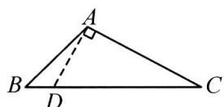  
A

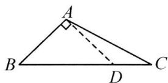  
B

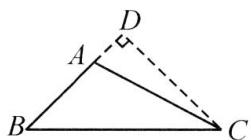  
C

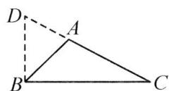  
D

5. 如图, 在 $\triangle ABC$ 中, $AB = 2022$ , $AC = 2020$ , $AD$ 为中线, 则 $\triangle ABD$ 与 $\triangle ACD$ 的周长之差为 \_\_\_\_.

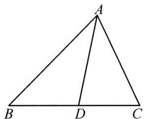

text_image

A
B D C

第 5 题图

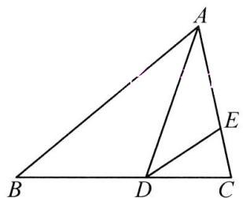

text_image

Geometric diagram of triangle ABC with points D and E, showing segments AD and DE

第6题图

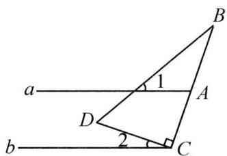

text_image

a
1
B
A
D
2
C
b

第 7 题图

6. 如图, $AD$ 是 $\triangle ABC$ 的角平分线, $DE$ 是 $\triangle ACD$ 的角平分线, $\angle B = 40^{\circ}, \angle C = 80^{\circ}$ , 则 $\angle CDE$ 的度数为 \_\_\_\_.

# 高频考点 3 三角形的内角

7. 已知直线 $a \parallel b$ , Rt△DCB 按如图所示的方式放置, 点 C 在直线 b 上, ∠DCB = 90°, 若 ∠B = 20°, 则 ∠1 + ∠2 的度数为 ( )

A. ${90}^{ \circ  }$

B. ${70}^{ \circ  }$

C. ${60}^{ \circ  }$

D. ${45}^{ \circ  }$

8. 如图, 在 $\triangle ABC$ 中, $\angle ABC$ 的平分线与 $\angle ACB$ 的平分线交于点 $D$ , 若 $\angle D = 115^{\circ}$ , 则 $\angle A$ 的度数为 \_\_\_\_.

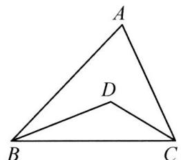

text_image

A
D
B
C

第8题图

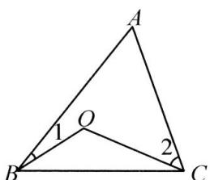

text_image

A
1
O
2
B
C

第9题图

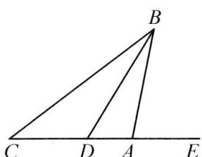

text_image

B
C D A E

第10题图

# 高频考点 4 三角形的外角

9. 如图, 点 $O$ 是 $\triangle ABC$ 内一点, $\angle A = 80^{\circ}, \angle 1 = 15^{\circ}, \angle 2 = 40^{\circ}$ , 则 $\angle BOC$ 的度数是 ( )

A. ${135}^{ \circ  }$

B. ${120}^{ \circ  }$

C. ${95}^{ \circ  }$

D. ${100}^{ \circ  }$

10. 如图, $BD$ 是 $\angle ABC$ 的平分线, $\angle EAB$ 是 $\triangle ABC$ 的外角, 若 $\angle C = 40^{\circ}, \angle EAB = 70^{\circ}$ , 则 $\angle BDE$ 的度数为 \_\_\_\_.

# 期末复习专题2 角度计算与证明——解答题

# 高频考点 1 方程思想

1. 如图, 在 $\triangle ABC$ 中, $D$ 为 $BC$ 上一点, $\angle 1 = \angle 2$ , $\angle 3 = \angle 4$ , $\angle BAC = 108^{\circ}$ , 求 $\angle DAC$ 的度数.

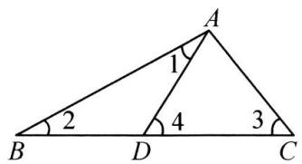

text_image

A
1
2
4
3
B
D
C

2. 如图, $BD$ 是 $\triangle ABC$ 的角平分线, $AE \perp BD$ 交 $BD$ 的延长线于点 $E$ , $\angle ABC = 72^{\circ}$ , $\angle C: \angle ADB = 2:3$ . 求 $\angle DAE$ 的度数.

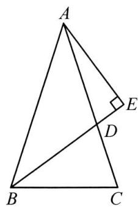

text_image

A
E
D
B
C

# 高频考点 2 整体思想

3. 如图, $\angle ABD$ , $\angle ACD$ 的平分线交于点 $P$ . 若 $\angle A = 50^{\circ}$ , $\angle D = 10^{\circ}$ , 求 $\angle P$ 的度数.

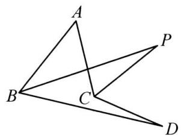

text_image

Geometric diagram with labeled points A, B, C, D, and P forming intersecting triangles

4. 如图, 在 $\triangle ABC$ 中, $D, E$ 分别为 $BC, AC$ 边上的点, $\angle B = \angle C$ , $\angle ADE = \angle AED$ .

(1)①若 $\angle BAD=40^{\circ}$ ,求 $\angle CDE$ 的度数; ②若 $\angle BAD=50^{\circ}$ ,直接写出 $\angle CDE$ 的度数为\_\_\_\_;

(2)试探究 $\angle CDE$ 与 $\angle BAD$ 之间的数量关系,写出结论并证明.

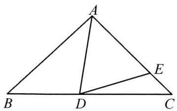

text_image

A
B D C
E

# 第十四章 全等三角形

# 期末复习专题1 全等三角形的性质与判定、角的平分线

# 高频考点 1 全等三角形的性质

1. 如图是两个全等三角形, 图中的字母表示三角形的边长, 那么 $\angle 1$ 的度数为 \_\_\_\_.

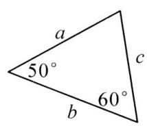

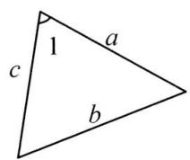  
第1题图

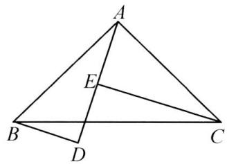

text_image

Geometric diagram of triangle ABC with internal points D and E, showing segments AD and AE

第2题图

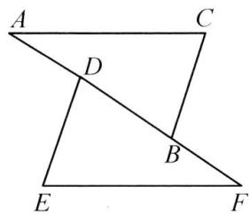

text_image

A
C
D
B
E
F

第 3 题图

2. 如图, $\triangle ABD \cong \triangle CAE$ , $BD \parallel CE$ , $CE = 5$ , $BD = 3$ , 则 $DE = \_\_\_\_, \angle BAC = \_\_\_\_.$

# 高频考点 2 全等三角形的判定

3. 如图, 已知 $AC = EF$ , $BC = DE$ , 点 $A, D, B, F$ 在同一直线上, 要利用“SSS”证明 $\triangle ABC \cong \triangle FDE$ , 还可以添加的一个条件是 ( )

A. ${AD} = {BF}$

B. ${DE} = {BD}$

C. ${BF} = {BD}$

D. 以上都不对

4. 已知 $\triangle ABC$ 和 $\triangle DEF$ 中, $\angle A = \angle D = 90^\circ$ , $BC = EF$ , 下列条件: ① $\angle C = \angle F$ ; ② $AB = DE$ ; ③ $\angle B = \angle E$ ; ④ $AC = DF$ ; ⑤ $AB = EF$ ; ⑥ $BC = DE$ . 其中一定能得到 $\triangle ABC \cong \triangle DEF$ 的是 \_\_\_\_. (填序号)

# 高频考点 3 角的平分线的性质

5. 如图, $AC$ 平分 $\angle PAQ$ , 点 $B, B'$ 分别在边 $AP, AQ$ 上, 如果添加一个条件, 即可得到 $AB = AB'$ , 那么该条件不能是 ( )

A. $B B^{\prime} \perp A C$

B. ${BC} = {B}^{\prime }C$

C. $\angle ACB = \angle ACB'$

D. $\angle ABC = \angle AB'C$

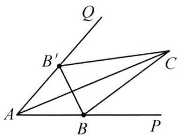

text_image

Q
B'
C
A
B
P

第 5 题图

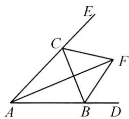

text_image

Geometric diagram with labeled points A, B, C, D, E, F and intersecting lines forming triangles and a quadrilateral

第6题图

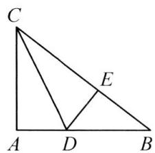

text_image

Geometric diagram of triangle ABC with internal points D and E, showing segments AD and DE

第 7 题图

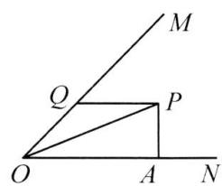

text_image

Geometric diagram showing two right triangles sharing a common vertex O, with points M, Q, P, A, N labeled and lines connecting them.

第8题图

6. 如图, 在 $\triangle ABC$ 中, 两条外角平分线交于点 $F$ , 则下列结论: ① $\angle CFB = \angle CAB$ ; ② $AF$ 平分 $\angle BAC$ ; ③ $AF \perp BC$ ; ④ 点 $F$ 到 $AB, AC, BC$ 的距离相等. 其中正确的是 \_\_\_\_. (填序号)

7. 如图, 在 $\triangle ABC$ 中, $\angle A = 90^{\circ}, CD$ 是角平分线, $DE \perp BC$ 于点 $E$ , 若 $BD = 7, DE = 3$ , 则 $AB$ 的长为 \_\_\_\_.

8. 如图, $OP$ 平分 $\angle MON$ , $PA \perp ON$ 于点 $A$ , $Q$ 是射线 $OM$ 上一点, 若 $PA = 3$ , 则 $PQ$ 的最小值是 \_\_\_\_.

# 期末复习专题2 简单的全等三角形的构造

# 高频考点1 连线或延长相交构造全等三角形

1. 如图, $AB, CD$ 交于点 $O, AB = CD, AC = BD$ , 求证: $\angle A = \angle D$ .

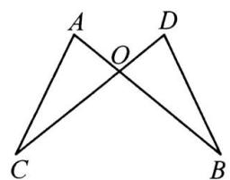

text_image

A
O
D
C
B

2. 如图, 在五边形 ${ABCDE}$ 中, $\angle B = \angle E = {90}^{ \circ  },{AB} = {AE},{AF} \bot  {CD}$ 于点 $F,{CF} = {DF}$ . 求证： ${BC} = {DE}$ .

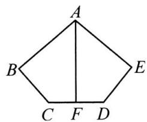

text_image

A
B
C
F
D
E

3. 如图, 四边形 $ABCD$ 中, $AB \parallel CD$ , $AB > CD$ , $E$ 是 $BC$ 的中点, 连接 $DE$ , $AE$ , $AB + CD = AD$ , 求证: $AE \perp DE$ .

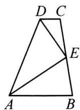

# 高频考点2 作垂线构造直角三角形全等

4. 如图, $\triangle ABC$ 中, $D$ 是 $BC$ 的中点, $BE \perp AD$ 于点 $E$ , $AC = CD$ , 求 $\frac{AD}{DE}$ 的值.

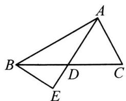

5. 在 $\triangle ABC$ 中, $\angle BAC=90^{\circ}$ , $AB=AC$ , $D$ , $E$ 分别是 $AB$ , $AC$ 上的点, $AF\perp DE$ 交 $BC$ 于点 $F$ ,若 $AF=DE$ ,求证: $AD=CE$ .

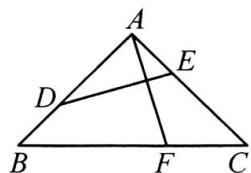

# 期末复习专题3 角平分线的运用与证明

1. 如图, 在 $\triangle ABC$ 中, $\angle C = 90^{\circ}, AD$ 是角平分线, $DE \perp AB$ 于点 $E, F$ 是 $CA$ 延长线上一点, $BD = DF$ .

(1) 求证: AC = AE;   
(2) 求证: $BE = AE + AF$ .

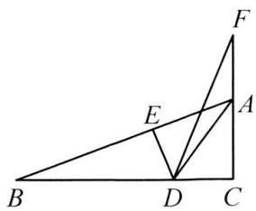

text_image

Geometric diagram with labeled points A, B, C, D, E, F and line segments forming triangles and a quadrilateral

2. 如图, 在 $\triangle ABC$ 中, $AD$ 平分 $\angle BAC, CE \perp AD$ 于点 $E$ , 写出 $\angle ACE, \angle B, \angle ECD$ 之间的数量关系并证明.

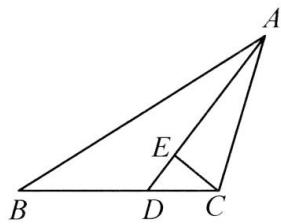

text_image

Geometric diagram of triangle ABC with internal points D and E, showing segments AD and CE

3. 如图, 在 $\triangle ABC$ 中, $\angle C = 90^{\circ}, AC = BC, BD$ 平分 $\angle ABC$ , 交 $AC$ 于点 $E$ , 且 $AD \perp BD$ , 求证: $BE = 2AD$ .

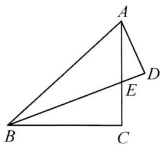

text_image

Geometric diagram of triangle ABC with points D and E on sides AB and AC, respectively, and segment DE drawn

4. 如图, $AD$ 是 $\triangle ABC$ 的角平分线, $\angle C = 2\angle B$ , 求证: $AB = AC + CD$ .

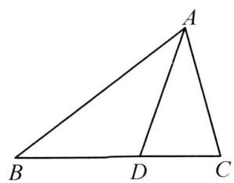

text_image

A
B D C

# 第十五章 轴对称

# 期末复习专题1 轴对称

# 高频考点1 轴对称图形

1. 各地积极普及科学防控知识,下面是科学防控知识的图片,图片上有图案和文字说明,其中的图案是轴对称图形的是( )

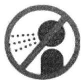

A. 打喷嚏捂口鼻

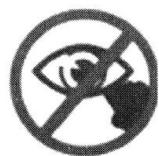

B. 喷嚏后慎揉眼

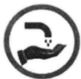

C. 勤洗手勤通风

D. 戴口罩讲卫生

# 高频考点 2 线段的垂直平分线

2. 如图, 在 Rt△ABC 中, ∠B=90°, ED 是 AC 的垂直平分线, 交 AC 于点 D, 交 BC 于点 E. 已知 ∠BAE=10°, 则 ∠C 的度数为 \_\_\_\_.

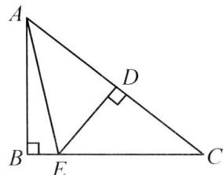

text_image

Geometric diagram of triangle ABC with perpendiculars from points D and E to base BC, labeled with vertices A, B, C, D, E.

第2题图

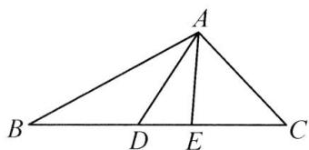

text_image

A
B D E C

第 3 题图

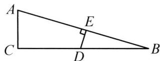  
第 4 题图

3. 如图, 在 $\triangle ABC$ 中, $AB$ 的垂直平分线交 $BC$ 于点 $D$ , $AC$ 的垂直平分线交 $BC$ 于点 $E$ , 若 $\triangle ADE$ 的周长为 $10 \mathrm{~cm}$ , 则 $BC$ 的长是 \_\_\_\_ cm.

4. 如图, 在 $\triangle ABC$ 中, $\angle C = 90^{\circ}, \angle B = 15^{\circ}, AB$ 的垂直平分线交 $BC$ 于点 $D$ , 若 $BD + AC = 24$ , 则 $BD - AC =$ \_\_\_\_.

# 高频考点 3 用坐标表示轴对称

5. 点(2, -3)关于 y 轴对称的点的坐标是 \_\_\_\_.

6. $P(-\sqrt{2}, -\sqrt{3})$ 关于 x 轴对称的对称点的坐标是 \_\_\_\_.

7. 若点 $P(-2, b)$ 和点 $Q(a, -3)$ 关于 x 轴对称，则 $a + b$ 的值是 \_\_\_\_.

8. 点(3,1)关于直线 x=1 对称的点的坐标是 \_\_\_\_；关于 y=-1 对称的点的坐标是 \_\_\_\_.

# 高频考点4 画轴对称图形

9. $\triangle ABC$ 在平面直角坐标系中的位置如图所示.

(1)作出与 $\triangle ABC$ 关于 $y$ 轴对称的 $\triangle A_{1}B_{1}C_{1}$ ,并写出点 $A_{1}$ 的坐标为\_\_\_\_;

(2) 将 $\triangle ABC$ 向右平移 3 个单位长度, 画出平移后的 $\triangle A_{2}B_{2}C_{2}$ ;

(3) 观察 $\triangle A_{1}B_{1}C_{1}$ 与 $\triangle A_{2}B_{2}C_{2}$ ，它们是否关于某直线对称？若是，请在图上画出这条对称轴。

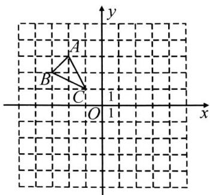

text_image

y
A
B
C
1
O
1
x

# 期末复习专题2 等腰三角形

# 高频考点1 等腰三角形的性质

1. 一个等腰三角形的两边长分别为 $2 \mathrm{dm}$ 和 $9 \mathrm{dm}$ , 则它的周长是( )

A. $13 \mathrm{dm}$

B. $20 \mathrm{dm}$

C. $13 \mathrm{dm}$ 或 $20 \mathrm{dm}$

D. 无法确定

2. 已知等腰三角形的一边长为 $4 \mathrm{~cm}$ , 周长是 $18 \mathrm{~cm}$ , 则它的腰长是 ( )

A. $4 \mathrm{~cm}$

B. $7 \mathrm{~cm}$

C. $10 \mathrm{~cm}$

D. 4 cm 或 7 cm

3. 等腰三角形的一个角是 $50^{\circ}$ , 则它的底角是( )

A. ${50}^{ \circ  }$

B. ${65}^{ \circ  }$

C. ${80}^{ \circ  }$

D. $50^{\circ}$ 或 $65^{\circ}$

4. 在等腰 $\triangle ABC$ 中， $\angle A=70^{\circ}$ ，则 $\angle C$ 的度数不可能是（ ）

A. ${40}^{ \circ  }$

B. ${55}^{ \circ  }$

C. ${65}^{ \circ  }$

D. ${70}^{ \circ  }$

5. 若等腰三角形中有一个角等于 $100^{\circ}$ , 则这个等腰三角形的底角的度数是  
6. 等腰三角形一腰上的高与另一腰的夹角为 $40^{\circ}$ ，则其顶角为 \_\_\_\_.

# 高频考点2 三线合一

7. 如图, 在 $\triangle ABC$ 中, 已知 $AB = AC$ , $D$ 为 $BC$ 的中点, 若 $\angle B = 50^{\circ}$ , 则 $\angle DAC$ 的度数为

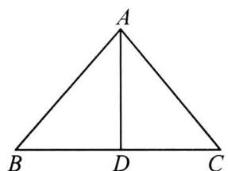

text_image

A
B D C

第7题图

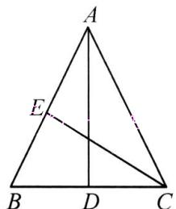

text_image

A
E
B D C

第8题图

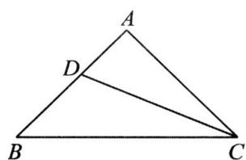

text_image

A
D
B
C

第9题图

8. 如图, $AD$ 是 $\triangle ABC$ 的中线, $CE$ 是 $\triangle ABC$ 的角平分线. 若 $AB = AC$ , $\angle CAD = 26^{\circ}$ , 则 $\angle ACE =$ \_\_\_\_.  
9. 如图, 在 $\triangle ABC$ 中, $AB = AC$ , $AB \perp AC$ , $CD$ 平分 $\angle ACB$ 交 $AB$ 于点 $D$ , 若 $CD = 4$ , 则 $\triangle BCD$ 的面积为 \_\_\_\_.  
10. 如图, 在 $\triangle ABC$ 中, $AB = AC$ , $AD \perp BC$ , 垂足为 $D$ . $DE \parallel AC$ 交 $AB$ 于点 $E$ , 若 $AC = 6$ , 求 $DE$ 的长.

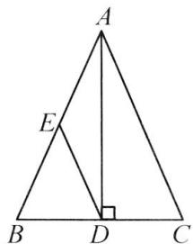

text_image

A
E
B D C

# 期末复习专题3 等边三角形

# 高频考点1 等边三角形的性质

1. 如图, 在等边三角形 $ABC$ 中, $D$ 是 $AC$ 边上的中点, 延长 $BC$ 到点 $E$ , 使 $CE = CD$ , 则 $\angle E$ 的度数为 ( )

A. ${15}^{ \circ  }$

B. ${20}^{ \circ  }$

C. ${30}^{ \circ  }$

D. ${40}^{ \circ  }$

2. 如图, 等边三角形 $ABC$ 中, $AD \perp BC$ , 垂足为 $D$ , 点 $E$ 在线段 $AD$ 上, $\angle EBC = 45^\circ$ , 则 $\angle ACE$ 的度数为 ( )

A. ${15}^{ \circ  }$

B. ${30}^{ \circ  }$

C. ${45}^{ \circ  }$

D. ${60}^{ \circ  }$

3. 如图, 在等边三角形 $ABC$ 中, $BD$ 平分 $\angle ABC$ , $BD=BF$ , 则 $\angle CDF$ 的度数是( )

A. ${10}^{ \circ  }$

B. ${15}^{ \circ  }$

C. ${20}^{ \circ  }$

D. ${25}^{ \circ  }$

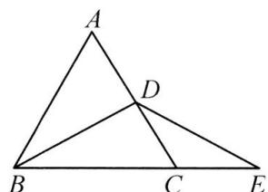

text_image

A
D
B
C
E

第 1 题图

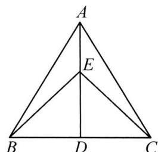

text_image

A
E
B D C

第2题图

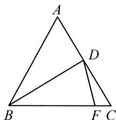

text_image

A
D
B
F C

第 3 题图

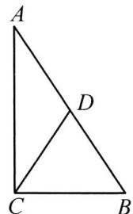  
第 5 题图

# 高频考点2 等边三角形的判定

4. 在 $\triangle ABC$ 中, $AB=AC=3cm$ , 且 $\angle A=60^{\circ}$ , 则 $BC$ 的长度为\_\_\_\_cm.  
5. 如图, 在 $\triangle ABC$ 中, $D$ 为 $AB$ 上一点, $AD = DC = BC$ , 且 $\angle A = 30^{\circ}, AD = 5$ , 则 $AB =$ \_\_\_\_.  
6. 如图, $\triangle ABO$ 是等边三角形, $CD \parallel AB$ , 分别交 $AO, BO$ 的延长线于点 $C, D$ . 则 $\triangle OCD$ 的形状为 \_\_\_\_.  
7. 如图, $AC \perp BC$ , $AD = BD$ , 为了使图中的 $\triangle BCD$ 是等边三角形, 再增加一个条件可以是 ( )

A. $CD \perp AB$

B. ${CD} = {BD}$

C. $BC = \frac{1}{2} AB$

D. $BC = \frac{1}{2} AC$

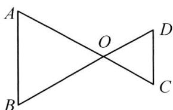

text_image

A
O
D
B
C

第6题图

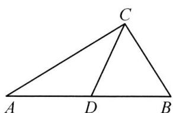

text_image

C
A D B

第 7 题图

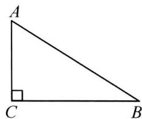  
第8题图

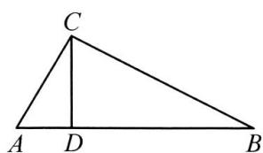

text_image

C
A D B

第9题图

text_image

Geometric diagram of triangle ABC with point D on side AC and right angle at B

第 10 题图

# 高频考点 3 $30^{\circ}$ 的角所对的直角边等于斜边的一半

8. 如图, 在 Rt $\triangle ACB$ 中, $\angle C=90^{\circ}, \angle B=30^{\circ}, AB=4$ , 则 $AC$ 的长是( )

A. 1

B. 2

C. 3

D. 4

9. 如图, 在 $\triangle ABC$ 中, $\angle ACB = 90^{\circ}, CD \perp AB$ 于点 $D, \angle A = 60^{\circ}, AD = 2$ , 则 $BD$ 的长为 ( )

A. 2

B. 4

C. 6

D. 8

10. 如图, 在 $\triangle ABC$ 中, $AB=BC$ , $\angle ABC=120^{\circ}$ , 过点 $B$ 作 $BD \perp BC$ , 交 $AC$ 于点 $D$ , 若 $AD=1$ , 则 $CD$ 的长度为 ( )

A. 1

B. 2

C. 3

D. 4

# 期末复习专题4 等腰三角形中的证明与计算

1. 如图, 在 $\triangle ABC$ 中, $\angle ACB = 2\angle B$ , $\angle BAC$ 的平分线 $AD$ 交 $BC$ 于点 $D$ , 过点 $C$ 作 $CN \perp AD$ 于点 $H$ , 交 $AB$ 于点 $N$ .

(1)求证: $\triangle ANC$ 为等腰三角形;  
(2) 若 AB=10, AC=6, 求 CD 的长.

text_image

A
N
H
B
D
C

2. 如图, 在 $\triangle ABC$ 中, $AB = AC$ , 点 $D$ 在 $AB$ 上, 使 $AD = BC$ , 过点 $D$ 作 $DE \parallel BC$ , 且 $DE = AB$ , 连接 $EC, AE$ .

(1) 求证: $\angle AED = \angle BAC$ ;   
(2)若 $\angle BAC=20^{\circ}$ ,求 $\angle DCE$ 的度数.

text_image

Geometric diagram with labeled points A, B, C, D, E forming triangles and intersecting lines

3. 如图, 在 $\triangle ABC$ 中, $\angle ACB = 90^{\circ}, AC = BC, E$ 是 $CB$ 上一动点, 连接 $AE$ , 作 $AF \perp AE$ , 且 $AF = AE$ .

(1)如图 1, 过点 F 作 $FG \perp AC$ 于点 G, 求证: $\triangle AGF \cong \triangle ECA$ ;  
(2)如图2,连接BF交AC于点D,若E为BC的中点,CD=1,求 $S_{\triangle ADF}$ .

text_image

Geometric diagram showing triangle ABC with perpendiculars from F and G to sides AB and AC, labeled points A, B, C, E, F, G.

图1

text_image

Geometric diagram with labeled points A, B, C, D, E, F and right angle at C

图2

# 期末复习专题5 最值问题

# 高频考点1 将军饮马问题

1. 如图, 在等腰 Rt△ABC 中, AC = BC, ∠ACB = 90°, D 为 BC 的中点, AD = 4, P 为 AB 上一个动点, 当 P 点运动时, PC + PD 的最小值为 \_\_\_\_.

text_image

Geometric diagram of triangle ABC with points D and P, showing right angle at C and internal segments AD and DP

# 高频考点 2 建桥问题

2. 如图是 $4 \times 4$ 的正方形网格, $A, B, C$ 是各小正方形网格的顶点. $BC = a$ , 小正方形的边长为 $1, M, N$ 在直线 $l$ 上, $MN = 1$ , 点 $M$ 在 $N$ 的上方, 则使 $AM + BN$ 的最小值为 \_\_\_\_ (用含 $a$ 的式子表示).

text_image

l
A
C
B

# 高频考点 3 周长最值→轴对称转化为两点之间线段最短

3. 如图, 在 Rt△ABC 中, AC⊥BC, 若 AC=7, BC=24, AB=25, 将△ABC 折叠, 使得点 C 落在 AB 边的点 E 处, 折痕为 AD. 点 P 为 AD 上一动点, 则△PEB 的周长的最小值为 \_\_\_\_.

text_image

Geometric diagram with labeled points A, B, C, D, E, and P forming triangles and intersecting lines

# 高频考点4 和最值 $\rightarrow$ 轴对称转化为垂线段最短

4. 如图, 等腰三角形 $ABC$ 底边 $BC$ 的长为 $4 \mathrm{~cm}$ , 面积是 $12 \mathrm{~cm}^{2}$ , 腰 $AB$ 的垂直平分线 $EF$ 交 $AC$ 于点 $F$ , 交 $AB$ 于点 $E$ . 若 $M$ 为 $BC$ 边上的动点, $D$ 为线段 $EF$ 上一动点, 则 $BD + DM$ 的最小值为 \_\_\_\_ cm.

text_image

Geometric diagram of triangle ABC with intersecting lines and labeled points D, E, F, M, C

5. 如图, $\triangle ABC$ 中, $AC = 8$ , $AB = 10$ , $\triangle ABC$ 的面积为 $30$ , $AD$ 为 $\triangle ABC$ 的角平分线, $F$ , $E$ 分别为 $AC$ , $AD$ 上两动点, 连接 $CE$ , $EF$ , 则 $CE + EF$ 的最小值为 \_\_\_\_.

text_image

Geometric diagram of triangle ABC with internal points D, E, F and connecting segments

# 第十六章 整式的乘法

# 期末复习专题1 整式的乘除

# 高频考点 1 幂的运算

1. 下列运算正确的是( )

A. $a^6 \cdot a^2 = a^{12}$

B. $a^6 \div a^2 = a^3$

C. $(-3a^{2})^{3} = -9a^{6}$

D. $(a^6)^2 = a^{12}$

2. 下列各式计算正确的是( )

A. $b^{3} \cdot b^{3} = 2b^{3}$

B. $(a^5)^2 = a^7$

C. $(-2a)^{2} = -4a^{2}$

D. $(ab^{-2})^3 = a^3 b^{-6}$

3. 填空：

(1) $x^{2}\cdot x^{3}=$ \_\_\_\_; (2) $(x^{3})^{2}=$ \_\_\_\_; (3) $x^{6}\div x^{3}=$ \_\_\_\_;   
(4) $x^{2}\cdot(x^{3})^{2}=$ \_\_\_\_; (5) $x^{5}\div(x^{5}\div x^{3})=$ \_\_\_\_; (6) $(x^{-2}y^{3})^{-3}=$ \_\_\_\_.

4.(1)若 $a^{m} \cdot a^{2} = a^{7}$ ，则 m 的值为 \_\_\_\_；(2)已知 $3^{x-3} \cdot 9^{x} = 27^{2}$ ，则 x 的值是 \_\_\_\_；

(3) 计算: $\left(\frac{1}{2}\right)^{2020} \cdot (-4)^{1010} =$ \_\_\_\_ .

5. 计算：

(1) $(m^4)^2 + m^5 \cdot m^3 + (-m)^4 \cdot m^4$ ;

(2) $x^{6}\div x^{3}\cdot x^{2}+x^{3}\cdot(-x)^{2}.$

# 高频考点 2 整式的乘除

6. 计算: (1) $(-3x^{2}y) \cdot (4x^{3}y^{2}) =$ \_\_\_\_; (2) $(-3x^{2}y)^{2} \cdot (4x^{3}y^{2}) =$ \_\_\_\_;

(3) $-3x^{2}\cdot(4x^{5}y-2xy^{4})=$ \_\_\_\_; (4) $(2a^{2}b^{3})^{2}\cdot(-5ab^{2}+3a^{3}b)=$ \_\_\_\_;   
(5) $(3a + 2b)(2x - y) =$ \_\_\_\_; (6) $(3a + b)(3a - 2b) =$ \_\_\_\_.

7. 计算：

(1) $-5a^{2}(3ab^{2}-6a^{3})$ ;

(2) $(a + b) \cdot (2a - b) + (2a + b) \cdot (a - 2b)$ .

8. 计算：

(1) $(24x^{2}y-12xy^{2}+8xy)\div(-6xy)$ ;

(2) $[x(x^2 y^2 - xy) - y(x^2 - x^3 y)] \div 3x^2y$ .

# 期末复习专题2 乘法公式

# 高频考点1 乘法公式

1. 下列各式中, 不能用平方差公式计算的是( )

A. $(x+y)(x-y)$

B. $(-x + y)(x - y)$

C. $(4x^{2} - y^{2})(4x^{2} + y^{2})$

D. $(3x+1)(3x-1)$

2. 若多项式 $9x^{2} - mx + 16$ 是一个完全平方式, 则 $m$ 的值为 ( )

A. ±24

B. ±12

C. 24

D. 12

# 高频考点 2 用乘法公式计算

3. 计算: (1) $(2x + 3)(2x - 3)$ ;

(2) $(2x-3)^{2}$ ;

(3) $(x-2)(x+3)$ .

4. 计算: (1) $(x - 2)(x + 2) - 4(2x - 1)$ ;

(2) $(2x + 1)(2x - 1) - (x + 2)^{2}$ .

5. 计算: (1) $(2x-2)(x+1)-(x-1)^{2}-(x+1)^{2}$ ;

(2) $(x+2y+3)(x+2y-3)$ .

# 高频考点3 乘法公式的应用

6. 填空：

(1) 若 $a + b = 7, ab = 12$ , 则 $a^2 - ab + b^2$ 的值是 \_\_\_\_;

(2)已知 $m+n=4$ ，则 $m^{2}-n^{2}+8n=$ \_\_\_\_；

(3)已知 $(m+n)^{2}=7$ , $m^{2}+n^{2}=5$ , 则 $(m-n)^{2}=$ \_\_\_\_ ;

(4)如图,两个正方形边长分别为a,b,且满足 $a+b=10$ ,ab=12,图中阴影部分的面积为\_\_\_\_.

7. 解答下列问题:

(1) 填空: $a^2 + \frac{1}{a^2} = \left(a + \frac{1}{a}\right)^2 - \underline{\quad} = \left(a - \frac{1}{a}\right)^2 + \underline{\quad}$ ;

(2) 若 $a + \frac{1}{a} = 5$ ，则 $a^2 + \frac{1}{a^2} =$ \_\_\_\_；

(3) 若 $a^2 - 3a + 1 = 0$ , 求 $a^2 + \frac{1}{a^2}$ 的值.

# 期末复习专题3 乘法公式变形及应用

# 高频考点1 计算

1. 计算：

(1) $(2y - x)(2y + x) - 2(y - x)^{2}$ ;

(2) $(a - 2b)^{2} - (2a + b)(b - 2a) - 4a(a - b)$ .

# 高频考点 2 解方程与不等式

2. 解方程: $2x(x-1)-(x-4)(x+4)=(x+2)^{2}$ .

3. 解不等式: $(2x - 3)^{2} - (3x + 4)^{2} > -5(x + 2)(x - 2)$ .

# 高频考点 3 乘法公式变形

4. 若 $x^{2}-2(m+1)x+16$ 是一个完全平方公式，则 m 的值为 \_\_\_\_.

5. 若 $x + y = 3, xy = 2$ ，则 $x^{2} - xy + y^{2}$ 的值为 \_\_\_\_.

6. 已知有理数 $x, y$ 满足 $x + y = \frac{1}{2}, xy = -3$ .

(1)求 $(x+1)(y+1)$ 的值；

(2) 求 $x^{2} + y^{2}$ 的值.

7.(1)已知 $(a+b)^{2}=7,(a-b)^{2}=3$ ，求 $a^{2}+b^{2}$ 和ab的值；

(2)已知 $xy = 2, x + y = 3$ ，求 $x^{2} + y^{2}$ 和 $x - y$ 的值；

(3)已知 m-n=5, $m^{2}-n^{2}=40$ , 求 $m+n$ 和 mn 的值.

# 第十七章 因式分解

# 期末复习专题1 因式分解

# 高频考点 1 因式分解

1. 下列从左边到右边的变形, 是因式分解的是( )

A. $12ab = 3a \cdot 4b$

B. $(a + b)^2 = a^2 + 2ab + b^2$

C. $a^2 - b^2 + 1 = (a + b)(a - b) + 1$

D. $3(a - b) - c(a - b) = (a - b)(3 - c)$

2. 下列因式分解结果正确的是( )

A. $x^{2} + 3x + 2 = x(x + 3) + 2$

B. $4x^{2} - 9 = (4x + 3)(4x - 3)$

C. $a^{2}-2a+1=(a+1)^{2}$

D. $x^{2}-5x+6=(x-2)(x-3)$

3. 多项式 $x^{2} + mx + 6$ 可因式分解为 $(x - 2)(x - 3)$ , 则 $m$ 的值为 ( )

A. 6

B. ±5

C. 5

D. - 5

4. 已知多项式 $x^{2} - 4x + m$ 可以分解因式, 其中一个因式是 $x - 6$ , 则另一个因式为 ( )

A. $x + 2$

B. $x - 2$

C. $x + 3$

D. $x - 3$

5. 因式分解：

(1) $x^{2}-3x$ ;

(2) $x^{2}-9;$

(3) $3a^{2}-6ab+3b^{2}$ .

6. 因式分解：

(1) $ax^{2}+2ax+a;$

(2) $x(x-4)+4;$

(3) $x^{2}-2x-15.$

7. 因式分解：

(1) $9x^{2}y-6xy^{2}+y^{3}$ ;

(2) $(a + b)^{2} - 12(a + b) + 36$ ;

(3) $a^{2}(x-y)+(y-x)$ .

# 高频考点 2 因式分解的应用

8. 若 $mn = -2, m + n = 3$ ，则代数式 $m^2 n + mn^2$ 的值是（）

A. - 6

B. - 5

C. 1

D. 6

9. 若 $a^{2}+2ab+b^{2}-c^{2}=10, a+b+c=5$ ，则 $a+b-c$ 的值是（）

A. 2

B. 5

C. 20

D. 9

# 期末复习专题2 因式分解及应用

# 高频考点1 整体求值

1. 若 $x + y = -1$ ，则 $x^2 + y^2 + 2xy$ 的值为（）

A. 1

B. -1

C. 3

D. -3

2. 已知 $d = x^{4} - 2x^{3} + x^{2} - 10x - 4$ ，则当 $x^{2} - 2x - 4 = 0$ 时， $d$ 的值为（）

A. 4

B. 8

C. 12

D. 16

3. 若实数 $x$ 满足 $x^{2} - 2x - 1 = 0$ , 则 $2x^{3} - 7x^{2} + 4x - 2017$ 的值为 ( )

A. 2019

B. $- {2019}$

C. $2020$

D. -2 020

4. 已知 $m^{2}=4n+a, n^{2}=4m+a, m \neq n$ ，则 $m^{2}+2mn+n^{2}$ 的值为（）

A. 16

B. 12

C. 10

D. 无法确定

5. 若 $(x^{2}+y^{2})^{2}-5(x^{2}+y^{2})-6=0$ ，则 $x^{2}+y^{2}$ 的值为 \_\_\_\_.

# 高频考点 2 判断结论

6. 已知 $a, b, c$ 为 $\triangle ABC$ 的三边长, 且满足 $ac + bc = b^2 + ab$ , 则 $\triangle ABC$ 的形状是 ( )

A. 等边三角形

B. 等腰三角形

C. 直角三角形

D. 等腰直角三角形

7. 已知三角形的三边 $a, b, c$ 满足 $(b - a)(b^2 + c^2) = a^3 - a^2b$ ，则 $\triangle ABC$ 的形状是（ ）

A. 等腰三角形

B. 等腰直角三角形

C. 等边三角形

D. 等腰三角形或直角三角形

8. 小明是一位密码翻译爱好者, 在他的密码手册中, 有这样一条信息: $a - b, x - y, x + y, a + b$ , $x^{2} - y^{2}, a^{2} - b^{2}$ 分别对应下列六个字: 国, 爱, 我, 中, 丽, 美. 现将 $(x^{2} - y^{2})a^{2} - (x^{2} - y^{2})b^{2}$ 因式分解, 结果呈现的密码信息可能是( )

A. 我爱美

B. 中国美

C. 我爱中国

D. 中国美丽

# 高频考点 3 判断整除

9. 对于任何整数 $m$ ，多项式 $(4m + 5)^2 - 9$ 都能（）

A. 被 8 整除

B. 被 $m$ 整除

C. 被 $(m - 1)$ 整除

D. 被(2m-1)整除

10. 当 n 为自然数时， $(n+1)^{2}-(n-3)^{2}$ 一定能()

A. 被 5 整除

B. 被 6 整除

C. 被 7 整除

D. 被 8 整除

# 高频考点4 判断正负或求最值

11.(1)无论 x 为何实数,代数式 $x^{2}-2x+3$ 的值的正负是确定的吗?请说明理由;

(2)试确定代数式 $x^{2}-2x+3$ 有最大值还是最小值,并求此时 x 为何值?

# 第十八章 分式

# 期末复习专题1 分式及基本性质

# 高频考点 1 分式的概念

1. 下列式子: ① $\frac{2}{x}$ ; ② $\frac{x + y}{5}$ ; ③ $\frac{1}{2 - a}$ ; ④ $\frac{x}{\pi + 1}$ . 其中是分式的有( )

A. 只有①②

B. 只有①③④

C. 只有①③

D. 只有①②④

# 高频考点 2 分式有意义的条件

2. 下列分式中, $x$ 取任意实数都有意义的是( )

A. $\frac{1}{x + 2}$

B. $\frac{1}{x - 2}$

C. $\frac{1}{x^{2} - 2}$

D. $\frac{1}{x^{2} + 2}$

3. 若分式 $\frac{x - 2}{x^2}$ 有意义, 则 $x$ 的取值范围为 \_\_\_\_.

# 高频考点 3 分式的值为零

4. 若分式 $\frac{x - 2}{x^2 - 1}$ 的值为 0, 则 $x =$ \_\_\_\_.  
5. 当 x 为 \_\_\_\_ 时, 分式 $\frac{x^{2}-4}{3x-6}$ 的值为 0.

# 高频考点4 分式的基本性质

6. 下列等式成立的是( )

A. $\frac{1}{a}+\frac{2}{b}=\frac{3}{a+b}$

B. $\frac{2}{2a + b} = \frac{1}{a + b}$

C. $\frac{ab}{ab - b^2} = \frac{a}{a - b}$

D. $\frac{a}{-a + b} = -\frac{a}{a + b}$

# 高频考点 5 约分

7. 化简 $\frac{x^{2} + xy}{(x + y)^{2}}$ 的结果是（ ）

A. $\frac{y}{x + y}$

B. $\frac{xy}{x+y}$

C. $\frac{2x}{x+y}$

D. $\frac{x}{x + y}$

8. 下列分式中, 是最简分式的是( )

A. $\frac{9b}{3a}$

B. $\frac{a-b}{b-a}$

C. $\frac{a^{2}-4}{a-2}$

D. $\frac{a^{2}+4}{a+2}$

9. 约分: $\frac{-25a^{2}bc^{3}}{15ab^{2}c} =$ \_\_\_\_.

# 高频考点 6 通分

10. 把 $\frac{6c}{a^2b}, \frac{c}{3ab^2}$ 通分, 下列计算正确的是 ( )

A. $\frac{6c}{a^2b} = \frac{6bc}{a^2b^2},\frac{c}{3ab^2} = \frac{ac}{3a^2b^2}$

B. $\frac{6c}{a^2b} = \frac{18bc}{3a^2b^2},\frac{c}{3ab^2} = \frac{ac}{3a^2b^2}$

C. $\frac{6c}{a^2b} = \frac{18c}{3a^2b},\frac{c}{3ab^2} = \frac{ac}{3a^2b^2}$

D. $\frac{6c}{a^2b} = \frac{18bc}{3a^2b},\frac{c}{3ab^2} = \frac{c}{3ab^2}$

# 期末复习专题2 分式的运算

# 高频考点 1 负整数指数的意义

1. 若 $(x-3)^{0}-2(3x-6)^{-2}$ 有意义,那么x的取值范围是\_\_\_\_.

2. 下列计算正确的是( )

A. $2a^{2} + 3a^{3} = 5a^{5}$

B. $\frac{a^8}{a^4} = a^2$

C. $(\frac{1}{3})^{-3} = 27$

D. $(-2a^{3})^{-3} = -6a^{-9}$

# 高频考点 2 科学记数法

3. 2019 年下半年猪肉价格上涨, 是因为猪周期与某种病毒叠加导致, 生物学家发现该病毒的直径为 $0.00000032 \mathrm{~mm}$ , 数据 $0.00000032$ 用科学记数法表示正确的是 ( )

A. $3.2 \times 10^{7}$

B. $3.2 \times 10^{8}$

C. $3.2 \times 10^{-7}$

D. $3.2 \times 10^{-8}$

# 高频考点 3 分式的混合运算

4. 计算 $\frac{3}{a - 3} + \frac{a}{3 - a}$ 的结果为（ ）

A. 1

B. 0

C. $\frac{a + 3}{a - 3}$

D. -1

5. 计算 $12a^{2}b^{4} \cdot (-\frac{3a}{2b^{3}}) \div (-\frac{a^{2}b}{2})$ 的结果是（ ）

A. $-9a$

B. ${9a}$

C. $-36a$

D. ${36a}$

6. 计算 $\frac{x^2 + 2x + 1}{x^2 - 1} - \frac{x}{x - 1}$ 的结果为（ ）

A. 1

B. $-\frac{1}{x-1}$

C. $\frac{x}{x - 1}$

D. $\frac{1}{x-1}$

7. 化简 $\frac{a^2}{a - 1} - (a - 1)$ 的结果是（ ）

A. $-\frac{1}{a-1}$

B. $\frac{1}{a - 1}$

C. $\frac{2a-1}{a-1}$

D. $\frac{2a+1}{a-1}$

8. 当 x=2020 时， $\frac{x^{2}-2x}{x-1}-\frac{1}{1-x}$ 的值为 \_\_\_\_.

9. 化简 $\left(1 - \frac{2}{x - 1}\right) \cdot \frac{x^2 - x}{x^2 - 6x + 9}$ 的结果是 \_\_\_\_.

10. 计算：

(1) $\left(\frac{1}{x-1}-1\right)\div\frac{x^{2}+2x+1}{x^{2}-1};$

(2) $\left(\frac{a^{2}+4}{a}-4\right)\div\frac{a^{2}-4}{a^{2}+2a}.$

# 期末复习专题3 分式的化简求值

# 高频考点1 运用分式的基本性质求值

1. 式子 $\frac{a}{bc} + \frac{b}{ca} + \frac{c}{ab}$ 的值不可能为（ ）

A. -3

B. 0

C. 1

D. 3

2. 已知 $\frac{1}{x} - \frac{1}{y} = 3$ , 则代数式 $\frac{2x + 3xy - 2y}{x - xy - y}$ 的值是 ( )

A. $-\frac{7}{2}$

B. $-\frac{11}{2}$

C. $\frac{9}{2}$

D. $\frac{3}{4}$

# 高频考点 2 化简求值

3. 先化简, 再求值: $\frac{a^2 - 1}{a^2 - a} \div \left(2 + \frac{a^2 + 1}{a}\right)$ , 其中 $a = 4$ .

4. 先化简, 再求值: $\frac{x + 2}{2x^2 - 4x} \div (x - 2 + \frac{8x}{x - 2})$ , 其中 $x^2 + 2x - 1 = 0$ .

5. 先化简, 再求值: $\left(\frac{5x}{x-1}-\frac{3x}{x+1}\right) \div \frac{4x}{x^3-x}$ , 其中 $x = -2$ .

6. 先化简, 再求值: $\frac{a^2 - 6ab + 9b^2}{a^2 - 2ab} \div \left(\frac{5b^2}{a - 2b} - a - 2b\right) - \frac{1}{a}$ , 其中 $a = 3, b = 1$ .

# 期末复习专题4 分式方程

# 高频考点 1 解分式方程

1. 解下列分式方程：

(1) $\frac{x}{x - 1} - 1 = \frac{3}{(x - 1)(x + 2)}$ ;

(2) $\frac{2x}{x-2}=1+\frac{1}{x-2};$

(3) $\frac{x+1}{x-1}=1+\frac{5}{x^{2}-1};$

(4) $\frac{4}{x^2 - 4} + \frac{x + 3}{x - 2} = \frac{x - 1}{x + 2}$ ;

(5) $\frac{x - 1}{x^2 - 9} = 1 + \frac{x}{3 - x}$ ;

(6) $\frac{x}{x + 1} = \frac{3x}{2x + 2} + 1.$

# 高频考点2 含参数的分式方程

2. $x = 3$ 是分式方程 $\frac{a - 2}{x} -\frac{1}{x - 2} = 0$ 的解，则 $a$ 的值是

3. 关于 $x$ 的分式方程 $\frac{x - a}{x - 1} - \frac{3}{x} = 1$ 在实数范围内无解, 则实数 $a$ 的值是 \_\_\_\_.

4. 关于 $x$ 的分式方程 $\frac{k}{x + 1} + \frac{4}{1 + x} = 1$ 的解是正数, 则 $k$ 的取值范围是 \_\_\_\_.

5. 关于 $x$ 的方程 $\frac{tx}{x - 3} + t = \frac{2}{3 - x}$ 无解, 则 $t$ 的值为 \_\_\_\_.

# 期末复习专题5 分式方程的应用

1. 某小微企业为加快产业转型升级步伐,引进一批 A,B 两种型号的机器. 已知一台 A 型机器比一台 B 型机器每小时多加工 2 个零件,且一台 A 型机器加工 80 个零件与一台 B 型机器加工 60 个零件所用时间相等.

(1)每台A,B两种型号的机器每小时分别加工多少个零件?

(2)如果该企业计划安排 A,B 两种型号的机器共 10 台一起加工一批该零件,为了如期完成任务,要求两种机器每小时加工的零件不少于 72 件,同时为了保障机器的正常运转,两种机器每小时加工的零件不能超过 76 件,那么 A,B 两种型号的机器可以各安排多少台?

2. 某商店购进 A、B 两种商品, 购买 1 个 A 商品比购买 1 个 B 商品多花 10 元, 并且花费 300 元购买 A 商品和花费 100 元购买 B 商品的数量相等.

(1)购买一个 A 商品和一个 B 商品各需多少元?

(2)商店准备购买 A、B 两种商品共 80 个,若 A 商品的数量不少于 B 商品数量的 4 倍,并且购买 A、B 商品的总费用不低于 1 000 元且不高于 1 050 元,那么商店有哪几种购买方案?

# Ⅱ 期末复习小卷

# 期末复习小卷(一) (13.1\~13.3)

(测试范围:13.1\~13.3 时间:45 分钟 满分:100 分)

# 一、选择题（每小题4分，共24分）

1. 某三角形的两边长分别为 3 和 4, 则下列长度的线段能作为其第三边的是( )

A. 1

B. 5

C. 7

D. 9

2. 下列图形中具有稳定性的是( )

A. 正方形

B. 正五边形

C. 正六边形

D. 等边三角形

3. 下列说法中正确的是( )

A. 三角形的三条高都在三角形内  
B. 三角形的三条角平分线可能在三角形内,也可能在三角形外  
C. 三角形的三条中线相交于一点  
D. 三角形的角平分线是射线

4. 一个三角形的三个内角的度数之比为 $2:3:7$ , 则这个三角形一定是( )

A. 钝角三角形

B. 直角三角形

C. 锐角三角形

D. 等腰三角形

5. 如图, 若 $\angle A = 27^{\circ}, \angle B = 45^{\circ}, \angle C = 38^{\circ}$ , 则 $\angle DFE$ 的度数为 ( )

A. ${120}^{ \circ  }$

B. ${115}^{ \circ  }$

C. ${110}^{ \circ  }$

D. ${105}^{ \circ  }$

text_image

Geometric diagram of triangle ABC with internal points D, E, F and intersecting lines

第 5 题图

text_image

Geometric diagram of triangle ABC with perpendicular line from E to AC at D, labeled points A, B, C, D, E

第6题图

text_image

A
l₁
2
l₂
1
B
C

第9题图

text_image

Geometric diagram of a tetrahedron with labeled vertices A, B, C, D, E and dashed lines indicating hidden edges.

第 10 题图

6. 如图, $AD$ 是 $\triangle ABC$ 的角平分线, $CE$ 是 $\triangle ABC$ 的高, $\angle BAC = 60^{\circ}, \angle BCE = 50^{\circ}$ , 则 $\angle ADC$ 的度数为 ( )

A. ${50}^{ \circ  }$

B. ${60}^{ \circ  }$

C. ${70}^{ \circ  }$

D. ${80}^{ \circ  }$

# 二、填空题（每小题4分，共16分）

7. 若直角三角形的一个锐角为 $40^{\circ}$ , 则另一个锐角的度数是  
8. 若等腰三角形的两边长分别为 3 cm 和 8 cm, 则它的周长是 \_\_\_\_ cm.  
9. 如图, 直线 $l_{1} \parallel l_{2}$ , 且分别与 $\triangle ABC$ 的两边 $AB, AC$ 相交. 若 $\angle A = 60^{\circ}, \angle 1 = 50^{\circ}$ , 则 $\angle 2$ 的度数为 \_\_\_\_.  
10. 如图, 在 $\triangle ABC$ 中, 点 $D$ 是 $BC$ 上的点, $\angle BAD = \angle ABC = 40^{\circ}$ . 将 $\triangle ABD$ 沿着 $AD$ 翻折得到 $\triangle AED$ , 则 $\angle CDE$ 的度数为 \_\_\_\_.

# 三、解答题（共60分）

11.(12分)已知a,b,c是△ABC的三边,a=4,b=6,且三角形的周长是大于14的偶数.求c的值.

12.(12分)如图,AD,AE分别是△ABC的高和角平分线, $\angle B=20^{\circ},\angle C=80^{\circ}$ ,求 $\angle EAD$ 的度数.

text_image

A
B E D C

13.(12分)如图, $\angle1=\angle2,\angle3=\angle4,CD\perp BD$ 于点D,探究 $\angle DCE$ 与 $\angle A$ 之间的数量关系.

text_image

A
D
E
1
2
B
3
4
C

14.(12分)如图,在 $\triangle ABC$ 中, $\angle A=30^{\circ},\angle ACB=80^{\circ},\triangle ABC$ 的外角 $\angle CBD$ 的平分线 $BE$ 交 $AC$ 的延长线于点 $E$ .

(1)求 $\angle CBE$ 的度数；

(2) 过点 D 作 $DF \parallel BE$ ，交 AC 的延长线于点 F，求 $\angle F$ 的度数.

text_image

Geometric diagram with labeled points A, B, C, D, E, F forming triangles and intersecting lines

15.(12 分)(1)如图 1, 把 $\triangle ABC$ 沿 $DE$ 折叠, 使点 $A$ 落在四边形 $BCED$ 的内部点 $A'$ 的位置,试说明 $2 \angle A = \angle 1 + \angle 2$ ;

(2)如图 2, 若把 $\triangle ABC$ 沿 $DE$ 折叠, 使点 $A$ 落在四边形 $BCED$ 的外部点 $A'$ 的位置, 此时 $\angle A$ 与 $\angle 1, \angle 2$ 之间的等量关系是 (直接写出).

text_image

A
D
1
E
2
A'
B
C

图1

text_image

A
D
E
1
2
A'
B
C

图2

# 期末复习小卷(二) (14.1\~14.2)

(测试范围:14.1\~14.2 时间:45 分钟 满分:100 分)

# 一、选择题（每小题4分，共24分）

1. 如图, $\triangle ABC \cong \triangle EFD$ , 且 $AB = EF$ , $CE = 3$ , 则 $AD$ 的长为 ( )

A. 1

B. 2

C. 1.5

D. 3

text_image

B
A     C     E
D
F

第1题图

text_image

C
A
D
B

第2、3题图

text_image

y
2
A
B
O
1 x

第 5 题图

text_image

A
B E C
D

第6题图

2. 如图, $\triangle ACD \cong \triangle ABD$ , $\angle CAB = 130^{\circ}$ , 则 $\angle CAD$ 的度数为 ( )

A. ${50}^{ \circ  }$

B. ${65}^{ \circ  }$

C. ${70}^{ \circ  }$

D. ${75}^{ \circ  }$

3. 如图, $\angle ADB = \angle ADC$ , 要证 $\triangle ABD \cong \triangle ACD$ , 补充一个条件, 不成立的是 ( )

A. $\angle BAD = \angle CAD$

B. $\angle B = \angle C$

C. ${BD} = {CD}$

D. ${AB} = {AC}$

4. $\triangle ABC \cong \triangle DEF$ , 且 $\triangle ABC$ 的周长为 $11, AB = 5, DF = 2$ , 则 $BC$ 的长为 ( )

A. 2

B. 4

C. 5

D. 11

5. 如图, 将等腰 Rt△AOB 放在平面直角坐标系中, O 是原点, 点 A 的坐标为 (1,2), 则点 B 的坐标为( )

A. $(-2,1)$

B. $(-1,2)$

C. $(2,1)$

D. $(-2,-1)$

6. 如图, 四边形 $ABCD$ 中, $\angle BAD = \angle C = 90^{\circ}, AB = AD, AE \perp BC$ 于点 $E$ . 若 $AE = 3$ , 则四边形 $ABCD$ 的面积是 ( )

A. 3

B. 6

C. 9

D. 81

# 二、填空题(每小题4分,共16分)

7. 如图, $BC \parallel EF$ , $AC \parallel DF$ , 添加一个条件 , 使得 $\triangle ABC \cong \triangle DEF$ .

text_image

Geometric diagram showing two overlapping triangles labeled ABC and DEF, with points D and E on sides AC and BC respectively.

第 7 题图

text_image

A
E
O
D
B
C

第8题图

text_image

Geometric diagram showing right triangle ABC with points P and Q on sides AB and AC, and perpendicular lines from P to AB at A.

第9题图

text_image

y
C
A B
O x

第 10 题图

8. 如图, $\triangle ABC$ 的高 $BD, CE$ 相交于点 $O$ , 请你添加一个条件 , 使 $BD=CE$ .

9. 如图, 在 Rt△ABC 中, ∠C=90°, AC=10, BC=5, 线段 PQ=AB, P, Q 两点分别在 AC 和 AC 的垂线 AX 上移动, 则当 AP=\_\_\_\_时, △ABC 与 △APQ 全等.

10. 如图, 在平面直角坐标系 $xOy$ 中, $A(2,1), B(4,1), C(1,3)$ . 与 $\triangle ABC$ 与 $\triangle ABD$ 全等, 则点 $D$ 的坐标为 \_\_\_\_.

# 三、解答题（共60分）

11.(12分)如图,在 $\triangle ABD$ 和 $\triangle FEC$ 中,点 $B,C,D,E$ 在同一直线上,且 $AB=FE,BD=EC,\angle B=\angle E$ .求证: $\angle ADB=\angle FCE$ .

text_image

A
F
B C D E

12. (12 分) 如图, 在 $\triangle AFD$ 和 $\triangle CEB$ 中, 点 $A, E, F, C$ 在同一直线上, $AE = CF$ , $\angle B = \angle D$ , $\angle A = \angle C$ , 求证: $AD = BC$ .

text_image

A
E
D
F
B
C

13.(12分)如图,已知D,E分别为AB,AC上两点,AD=AE,BD=CE.求证: $\angle B=\angle C$ .

text_image

A
D
E
B
C

14. (12分)如图, 在 $\triangle PAB$ 中, $\angle A = \angle B, M, N, K$ 分别是 $PA, PB, AB$ 上的点, 且 $AM = BK, BN = AK$ , 已知 $\angle MKN = 42^{\circ}$ , 求 $\angle P$ 的度数.

text_image

P
M
N
A
K
B

15.(12分)如图1,点A,E,F,C在同一条直线上,AE=CF,过点E,F分别作ED⊥AC,FB⊥AC,AB=CD.

(1)若 BD 与 EF 交于点 G, 求证: EG = FG;

(2)若将 $\triangle DEC$ 沿 $AC$ 方向移动到图2的位置,其余条件不变,上述结论是否仍然成立?请说明理由.

text_image

Geometric diagram with labeled points and perpendicular lines, likely from a math problem or proof

图1

text_image

Geometric diagram showing triangle ABC with perpendiculars from points D, E, F to line AC, labeled with vertices and right-angle markers.

图2

# 期末复习小卷(三) (14.2\~14.3)

(测试范围:14.2\~14.3 时间:45 分钟 满分:100 分)

# 一、选择题（每小题4分，共24分）

1. 如图, 点 $E, F$ 在线段 $BC$ 上, $\triangle ABF \cong \triangle DCE$ , 则 $\angle DCE = (\quad)$

A. $\angle B$

B. $\angle A$

C. $\angle EMF$

D. $\angle {AFB}$

text_image

A
D
M
B
E
F
C

第1题图

text_image

Geometric diagram of triangle ABC with internal points D, E and connecting lines forming smaller triangles

第2题图

text_image

A
B D E C

第 3 题图

text_image

M
N
O
P
Q

第 4 题图

text_image

D
C
A
B

第5题图

2. 如图, $\triangle ABC \cong \triangle ADE$ , $\angle D = 55^{\circ}$ , $\angle AED = 76^{\circ}$ , 则 $\angle C = (\quad)$

A. ${50}^{ \circ  }$

B. ${55}^{ \circ  }$

C. ${60}^{ \circ  }$

D. ${76}^{ \circ  }$

3. 如图, $AB = AC$ , $AD = AE$ , 点 $B, D, E, C$ 在同一条直线上, 要利用“SSS”推理得出 $\triangle ABD \cong \triangle ACE$ , 还需要添加的一个条件可以是 ( )

A. ${BD} = {DE}$

B. ${BD} = {CE}$

C. ${DE} = {CE}$

D. ${BE} = {CE}$

4. 如图, 小强利用全等三角形的知识测量池塘两端 $M, N$ 的距离, 如果 $\triangle PQO \cong \triangle NMO$ , 则只需测出其长度的线段是 ( )

A. ${PO}$

B. $P Q$

C. MO

D. ${MQ}$

5. 如图, $\angle ABC = \angle BAD$ , 添加下列条件还不能判定 $\triangle ABC \cong \triangle BAD$ 的是 ( )

A. ${AC} = {BD}$

B. $\angle CAB = \angle DBA$

C. $\angle C = \angle D$

D. ${BC} = {AD}$

6. 如图, 在 Rt△ABC 中, ∠C=90°, 利用尺规作图得∠CAB 的平分线 AP 交边 BC 于点 D. 若 CD=4, AB=15, 则△ABD 的面积是( )

A. 15

B. 30

C. 45

D. 60

text_image

Geometric diagram of triangle ABC with points M, N, D, P and intersecting lines, labeled for mathematical analysis.

第6题图

text_image

A
B
F
C
E
D

第 7 题图

  
第8题图

text_image

A
P
O
C
B

第9题图

text_image

Geometric diagram of triangle ABC with internal points D and E, showing segments BD and CE

第10题图

# 二、填空题（每小题4分，共16分）

7. 如图, 点 $B, F, C, E$ 在同一条直线上, $FB = CE$ , $\angle B = \angle E$ , 请你添加一个适当的条件 \_\_\_\_, 使得 $\triangle ABC \cong \triangle DEF$ .

8. 如图, $MN \parallel PQ$ , $AB \perp PQ$ , 点 $A, D$ 在直线 $MN$ 上, 点 $B, C$ 在直线 $PQ$ 上, 点 $E$ 在 $AB$ 上, $AD + BC = 7$ , $AD = EB$ , $DE = EC$ , 则 $AB$ 的长是 \_\_\_\_.

9. 如图, $OP$ 为 $\angle AOB$ 的平分线, $PC \perp OB$ 于点 $C$ , 且 $PC = 2$ , 则 $P$ 到 $OA$ 的距离为 \_\_\_\_.

10. 如图, 在 $\triangle ABC$ 中, $\angle C = 90^{\circ}$ , $BD$ 是 $\angle ABC$ 的平分线, $DE \perp AB$ 于点 $E$ , $AB = 8$ , $BC = 6$ , $S_{\triangle ABC} = 14$ , 则 $DE$ 的长是 \_\_\_\_.

# 三、解答题（共60分）

11.(12分)如图,在锐角 $\triangle ABC$ 中, $AD \perp BC$ 于点 $D,BE \perp AC$ 于点 $E$ ,交 $AD$ 于点 $F,DF=DC$ .求证: $BF=AC$ .

text_image

Geometric diagram of triangle ABC with perpendiculars from A and D to base BC, labeled points A, B, C, D, E, F

12. (12 分) 如图, $\angle AOB = 90^{\circ}$ , $OC$ 平分 $\angle AOB$ , 将一直角三角尺的直角顶点落在 $OC$ 的任意一点 $P$ 上, 使三角尺的两条直角边与 $\angle AOB$ 的两边分别相交于点 $E, F$ . 求证: $PE = PF$ .

text_image

A
E
P
C
O
F
B

13.(12分)如图,在五边形 $ABCDE$ 中, $AB = AE$ , $BC = ED$ , $\angle B = \angle E$ .

(1) 求证: AC = AD;

(2) 当 $\angle ACB = 20^{\circ}$ ， $\angle BCD = \angle CDE = 90^{\circ}$ 时，求 $\angle CAD$ 的度数.

natural_image

Geometric diagram of a pentagon with vertices labeled A, B, C, D, E (no text or symbols beyond labels)

14. (12 分) 如图, 在 $\triangle ABC$ 中, $AD$ 平分 $\angle BAC$ , $DE \perp AB$ 于点 $E$ , $S_{\triangle ABC} = 15$ , $DE = 3$ , $AB = 6$ , 求 $AC$ 的长.

text_image

Geometric diagram of triangle ABC with points D and E, showing perpendicular from A to BD at E

15.(12分)如图,点A,B分别在y轴,x轴的正半轴上,AC平分∠OAB交x轴于点C,∠ADC+∠ABO=180°.

(1) 求证: CD = CB;

(2)已知 $D(0,2)$ ，求 AB-AD 的值.

text_image

y
A
D
O C B x

# 期末复习小卷(四) (15.1\~15.2)

(测试范围:15.1\~15.2 时间:45 分钟 满分:100 分)

# 一、选择题（每小题4分，共24分）

1. 下列图形中, 不一定是轴对称图形的是()

A. 圆

B. 线段

C. 平行四边形

D. 角

2. 在平面直角坐标系中, 点 $A(3, -4)$ , 若点 $B$ 与点 $A$ 关于 $y$ 轴对称, 则点 $B$ 的坐标是 ( )

A. $(-3,4)$

B. $(-3,-4)$

C. (3,4)

D. $(-4,3)$

3. 甲和乙下棋, 甲执白子, 乙执黑子. 如图, 共下了 7 枚棋子, 棋盘中心黑子的位置用 $(-1,0)$ 表示, 其右下角黑子的位置用 $(0,-1)$ 表示. 甲将第 4 枚白子放入棋盘后, 所有棋子构成一个轴对称图形. 他放的位置是 ( )

A. $(-1,1)$

B. $(-2,1)$

C. $(1,-2)$

D. $(-1, -2)$

  
第3题图

text_image

Geometric diagram with labeled points A, B, C, D, M, N and intersecting lines forming triangles and a dashed arc

第4题图

text_image

P₁
M
A
P
O
B
N
P₂

第 5 题图

text_image

E
4
D
B
1
2
3
A
C

第6题图

4. 如图, 在 $\triangle ABC$ 中, 按以下步骤作图: ①分别以 $B, C$ 为圆心, 以大于 $\frac{1}{2} BC$ 的长为半径作弧,两弧相交于两点 $M, N$ ; ②作直线 $MN$ 交 $AB$ 于点 $D$ , 连接 $CD$ . 若 $\angle CDA = \angle A$ , $\angle B = 25^\circ$ , 则 $\angle ACB = (\quad)$

A. ${90}^{ \circ  }$

B. ${95}^{ \circ  }$

C. ${100}^{ \circ  }$

D. ${105}^{ \circ  }$

5. 如图, $\angle MON$ 内有一点 $P, PP_{1}, PP_{2}$ 分别被 $OM, ON$ 垂直平分, $P_{1}P_{2}$ 与 $OM, ON$ 分别交于点 $A, B$ . 若 $P_{1}P_{2}=10\ \text{cm}$ , 则 $\triangle PAB$ 的周长为 ( )

A. $6 \mathrm{~cm}$

B. $8 \mathrm{~cm}$

C. $10 \mathrm{~cm}$

D. $15 \mathrm{~cm}$

6. 如图, $\triangle ABC$ 关于 $AB$ , $BC$ 边所在直线对称的轴对称图形分别是 $\triangle ABE$ , $\triangle BDC$ . 若 $\angle 1: \angle 2: \angle 3 = 9: 2: 1$ , 则 $\angle 4 = (\quad)$

A. ${70}^{ \circ  }$

B. ${80}^{ \circ  }$

C. ${90}^{ \circ  }$

D. ${95}^{ \circ  }$

# 二、填空题（每小题4分，共16分）

7. 如图, $\triangle ABC$ 与 $\triangle A'B'C'$ 关于直线 $MN$ 对称. 若 $\angle A = 35^{\circ}, \angle B' = 65^{\circ}$ , 则 $\angle C$ 的度数是

text_image

A
M
B
C
N
A'
C'
B'

第 7 题图

text_image

A
D
P
B
E
C

第9题图

text_image

A
B
C

第 10 题图

8. 点 $P(2,1)$ 关于直线 y=2 对称的点的坐标为 \_\_\_\_.

9. 如图, 在 $\triangle ABC$ 中, $\angle A = 58^{\circ}$ , $PD$ 垂直平分 $AB$ 于点 $D$ , $PE$ 垂直平分 $BC$ 于点 $E$ , 则 $\angle BPC$ 的度数为 \_\_\_\_.

10. 如图, 在 $2 \times 5$ 的正方形网格中, $\triangle ABC$ 的顶点都在小正方形的格点上, 这样的三角形称为格点三角形. 在网格中与 $\triangle ABC$ 成轴对称的格点三角形一共有 \_\_\_\_ 个.

# 三、解答题（共60分）

11. (14 分) 如图, 在 $\triangle ABC$ 中, $\angle A = 90^{\circ}$ , $ED$ 垂直平分 $CB$ 交 $BC$ 于点 $D$ , 交 $AB$ 于点 $E$ , 连接 $CE$ . 若 $AB = 10$ , $CE: AE = 3: 2$ , 求 $AE$ 的长.

text_image

A
E
C
D
B

12. (14 分) 如图, $AD \perp BC$ , $BD = CD$ , 点 $C$ 在 $AE$ 的垂直平分线上 (点 $E$ 在 $BC$ 的延长线上). 若 $BD = 3$ , $AB = 4$ , 求 $BE$ 的长.

text_image

A
B D C E

13.(14分)如图,在 $\triangle ABC$ 中, $\angle A>\angle B$ .

(1)作边 $AB$ 的垂直平分线 $DE$ , 与 $AB, BC$ 分别相交于点 $D, E$ (用尺规作图, 保留作图痕迹, 不要求写作法);

(2)在(1)的条件下,连接AE.若 $\angle CAE=20^{\circ},\angle C=60^{\circ}$ ,求 $\angle B$ 的度数.

natural_image

Simple geometric diagram of a triangle labeled with vertices A, B, and C (no additional text or symbols)

14. (18 分) 如图, $\angle BAC = 90^{\circ}$ , $CD$ 平分 $\angle ACB$ 交 $AB$ 于点 $D$ , $CM \perp CD$ , 点 $M$ 在 $AB$ 的垂直平分线上, $AM$ 交 $BC$ 于点 $O$ , $MG \perp AC$ 于点 $G$ .

(1)求证: $\angle {BCM} = \angle {GCM}$ ;

(2) 若 $CG = 2$ , 求 $BC - AG$ 的长;

(3)若点 D 在 BC 的垂直平分线上,直接写出 $\angle AMB$ 的度数为 \_\_\_\_.

text_image

Geometric diagram with labeled points A, B, C, D, G, M, O and intersecting lines forming triangles and quadrilaterals

# 期末复习小卷(五)(15.3)

(测试范围:15.3 时间:45 分钟 满分:100 分)

# 一、选择题（每小题4分，共24分）

1. 如图, 在 $\triangle ABC$ 中, $AB = AC$ , $D$ 是 $BC$ 的中点, 下列结论中错误的是 ( )

A. $\angle B = \angle C$

B. ${AD}\bot {BC}$

C. ${AD}$ 平分 $\angle {BAC}$

D. ${AB} = {2BD}$

text_image

A
B D C

第 1 题图

text_image

Geometric diagram of triangle ABC with points D and E on sides AB and AC, respectively, and segment DE drawn

第 3 题图

text_image

A
E
D
B
F
C

第 4 题图

text_image

A
F
E
B D C

第 5 题图

2. 一个等腰三角形的两边长分别为 2 和 4, 则该等腰三角形的周长为( )

A. 8

B. 10

C. 8 或 10

D. 6 或 8

3. 如图, 在 $\triangle ABC$ 中, $D$ 为 $AB$ 上一点, $E$ 为 $BC$ 上一点, 且 $AC = CD = BD = BE$ , $\angle A = 50^{\circ}$ , 则 $\angle CDE = (\quad)$

A. ${50}^{ \circ  }$

B. ${51}^{ \circ  }$

C. ${51.5}^{ \circ  }$

D. ${52.5}^{ \circ  }$

4. 如图, 在 $\triangle ABC$ 中, $AB = AC$ , $BC = 12 \mathrm{~cm}$ , 点 $D$ 在 $AC$ 上, $DC = 4 \mathrm{~cm}$ , 将线段 $DC$ 沿 $CB$ 方向平移 $7 \mathrm{~cm}$ 得到线段 $EF$ , 点 $E, F$ 分别落在边 $AB, BC$ 上, 则 $\triangle EBF$ 的周长为 ( )

A. $7 \mathrm{~cm}$

B. ${11}\mathrm{\;{cm}}$

C. $13 \mathrm{~cm}$

D. $16 \mathrm{~cm}$

5. 如图, 在 $\triangle ABC$ 中, $AB = AC$ , $BF = CD$ , $BD = CE$ , $\angle FDE = 65^\circ$ , 则 $\angle A = (\quad)$

A. ${50}^{ \circ  }$

B. ${45}^{ \circ  }$

C. ${55}^{ \circ  }$

D. ${40}^{ \circ  }$

6. 如图, 在 Rt△ABC 中, ∠C=90°, 以△ABC 的一边为边画等腰三角形, 使得它的第三个顶点在△ABC 的其他边上, 则可以画出不同的等腰三角形的个数最多为( )

A. 4

B. 5

C. 6

D. 7

  
第6题图

text_image

A
G
F
B
C
D
E

第8题图

natural_image

Simple geometric triangle labeled with vertices A, B, and C (no additional text or symbols)

第9题图

text_image

Geometric diagram with labeled points and lines, including triangle ABC and intersecting segments

第 10 题图

# 二、填空题（每小题4分，共16分）

7. 如果一个等腰三角形一腰上的高与另一腰的夹角是 $30^{\circ}$ , 则它的底角度数是

8. 如图, $\triangle ABC$ 是等边三角形, 点 $B, C, D, E$ 在同一直线上, 且 $CG = CD$ , $DF = DE$ , 则 $\angle E$ 的度数为 \_\_\_\_.

9. 如图, 等边 $\triangle ABC$ 的边长为 $6, D$ 为直线 $BC$ 上一点, $BD = 2$ , $DE \parallel AB$ 交直线 $AC$ 于点 $E$ , 则 $DE$ 的长为 \_\_\_\_.

10. 如图, 等腰三角形 $ABC$ 的底边 $BC$ 长为 4 , 面积是 16 , $AC$ 的垂直平分线 $EF$ 分别交 $AC$ , $AB$ 于点 $E, F$ . 若 $D$ 为 $BC$ 边的中点, $M$ 为线段 $EF$ 上一动点, 则 $\triangle CDM$ 周长的最小值为 \_\_\_\_.

# 三、解答题（共60分）

11. (14 分) 如图, $\triangle ABC$ 是等腰直角三角形, $\angle ABC = 90^{\circ}$ , $\triangle ABD$ 是等边三角形, 且 $AB = 4$ , 连接 $CD$ 交 $AB$ 于点 $E$ .

(1)求 $\angle AED$ 的度数；

(2)求 $\triangle CBD$ 的面积.

text_image

Geometric diagram of a tetrahedron with labeled vertices A, B, C, D and internal point E

12. (14 分) 如图, 在 $\triangle PON$ 中, $\angle PON = 60^{\circ}, OP = 12$ , 点 $M$ 在 $ON$ 上, 且 $PM = PN$ . 若 $OM = 3$ , 求 $MN$ 的长.

text_image

P
O M N

13.(14分)如图,在 $\triangle ABC$ 中, $AD$ 是角平分线, $E$ 为 $AC$ 上一点, $\angle EDC=\angle BAC$ .

(1)画出 $\triangle ABD$ 关于直线 $AD$ 对称的三角形；

(2) 求证: BD = ED.

text_image

A
E
B
D
C

14. (18 分) 在 $\triangle ABC$ 中, $AB = AC$ , $D$ 是直线 $BC$ 上一点 (不与 $B, C$ 重合), 以 $AD$ 为一边在 $AD$ 的右侧作 $\triangle ADE$ , 使 $AE = AD$ , $\angle DAE = \angle BAC$ . 设 $\angle BAC = \alpha$ , $\angle BCE = \beta$ .

(1)如图1,若 $\angle BAC=90^{\circ}$ ,则 $\angle BCE$ 的度数是\_\_\_\_;

(2)如图 2,你认为 $\alpha,\beta$ 之间有怎样的数量关系？并说明理由；

(3)当点 D 在线段 BC 的延长线上移动时, $\alpha,\beta$ 之间又有怎样的数量关系?请在备用图上画出图形,并直接写出你的结论.

text_image

Geometric diagram of triangle ABC with internal points D, E and perpendicular line AD

图1

text_image

A
B D C E

图2

  
备用图

# 期末复习小卷(六)(16.1\~16.3)

(测试范围:16.1\~16.3 时间:45 分钟 满分:100 分)

# 一、选择题（每小题4分，共24分）

1. 计算 $a^2 \cdot a^4$ 的结果是（ ）

A. $a^{8}$

B. $a^6$

C. $2a^{6}$

D. $2a^{8}$

2. 计算 $6x^{6} \div 3x^{2}$ 的结果是( )

A. $2x^{3}$

B. $3x^{4}$

C. $2x^{4}$

D. $3x^{3}$

3. 下列运算正确的是( )

A. $a^3 \cdot a^4 = a^{12}$

B. $(a^{3})^{2}=a^{5}$

C. $(-3a^{2})^{3} = -9a^{6}$

D. $(-a^{2})^{3} = -a^{6}$

4. 计算 $(2a^{2})^{3} \cdot \frac{1}{2} a$ 的结果是（ ）

A. $3a^{7}$

B. $4a^{7}$

C. $a^{7}$

D. $4a^{6}$

5. 设 $(5a + 3b)^2 = (5a - 3b)^2 + A$ ，则 $A = (\quad)$

A. ${30ab}$

B. ${60ab}$

C. ${15ab}$

D. ${12ab}$

6. $(x^{2}-mx+6)(3x-2)$ 的积中不含x的二次项，则m的值是()

A. 0

B. $\frac{2}{3}$

C. $-\frac{2}{3}$

D. $- \frac{3}{2}$

# 二、填空题(每小题4分,共16分)

7. 计算: $\left(-\frac{1}{2}mn^{3}\right)^{2} =$ \_\_\_\_.  
8. 计算: $(a+1)(a-3)=$ \_\_\_\_.  
9. 已知 $(a-b)^{2}=13, ab=6$ ，则 $a^{2}+b^{2}=$ \_\_\_\_.  
10. 已知 $(x^{m})^{n} = x^{5}$ , 则 $mn(mn - 1)$ 的值为 \_\_\_\_.

# 三、解答题（共60分）

11.(8 分)计算:

(1) $a^{6}\cdot a^{5}\cdot a^{7};$

(2) $2(m^{2})^{4}+m^{4}(m^{2})^{2}$ .

12.(10分)已知 $(a^{x})^{y}=a^{6},(a^{x})^{2}\div a^{y}=a^{3}$ ，求xy和2x-y的值.

13.(10分)小明在做一个多项式除以 $\frac{1}{2}a$ 的题时,由于粗心误认为乘以 $\frac{1}{2}a$ ,结果是 $8a^{4}b-4a^{3}+2a^{2}$ ,那么你能知道正确的结果是多少吗?

14. (10 分) 先化简, 再求值: $\left[(a + 2b)^{2} - (2a + b)(2a - b) + 3a(a - 3b)\right] \div (-5b)$ , 其中 $a = -2, b = 3$ .

15.(10分)已知 $a+b=3,ab=-12$ ,求下列各式的值.

(1) $a^{2}+b^{2}$ ;

(2) $a^{2}-ab+b^{2}$ ;

(3) $(a - b)^2$ .

16.(12分)阅读材料:若 $2a^{2}-2ab+b^{2}-6a+9=0$ ,求a,b的值.

解： $\because 2a^{2} - 2ab + b^{2} - 6a + 9 = 0,\therefore (a^{2} - 2ab + b^{2}) + (a^{2} - 6a + 9) = 0,$

即 $(a-b)^{2}+(a-3)^{2}=0,\therefore a=3,b=3.$

根据你的观察,探究下面的问题:

(1)已知 $x^{2}+2xy+2y^{2}-10y+25=0$ ，则 x= \_\_\_\_，y= \_\_\_\_；

(2)已知 $\triangle ABC$ 的三边长 $a,b,c$ 都是正整数,且满足 $a^{2}+b^{2}-6a-8b+25=0$ ,求 $\triangle ABC$ 的最长边 $c$ 的值.

# 期末复习小卷(七) (17.1\~17.2)

(测试范围:17.1\~17.2 时间:45 分钟 满分:100 分)

# 一、选择题（每小题4分，共24分）

1. 把多项式 $2x^{2} - x$ 分解因式, 应提的公因式是 ( )

A. ${2x}$

B. 2

C. $x$

D. $x^{2}$

2. 因式分解: $a^2 - \frac{1}{4} = (\quad)$

A. $\left(a - \frac{1}{2}\right)^2$

B. $\left(a + \frac{1}{2}\right)^2$

C. $\left(a-\frac{1}{4}\right)\left(a+\frac{1}{4}\right)$

D. $\left(a - \frac{1}{2}\right)\left(a + \frac{1}{2}\right)$

3. 若多项式 $x^{2} - x - 20$ 分解为 $(x - a)(x - 5)$ , 则 $a$ 的值为 ( )

A. 4

B. -4

C. 2

D. -2

4. 将下列多项式因式分解, 结果中不含有因式 $a + 1$ 的是 ( )

A. ${a}^{2} - 1$

B. $a^{2} + a$

C. $a^{2} + 2a$

D. $(a + 2)^{2} - 2(a + 2) + 1$

5. 如图 1, 从边长为 $a$ 的正方形中剪去一个边长为 $b$ 的小正方形, 然后将剩余部分剪拼成一个长方形 (如图 2), 则上述操作所能验证的公式是 ( )

A. $a^2 - b^2 = (a + b)(a - b)$

B. $(a-b)^{2}=a^{2}-2ab+b^{2}$

C. $(a + b)^{2} = a^{2} + 2ab + b^{2}$

D. $a^2 + ab = a(a + b)$

text_image

a
b

图1

text_image

a
b

图2

6. 将代数式 $x^{2} + 4x - 1$ 化成 $(x + p)^{2} + q$ 的形式是（）

A. $(x - 2)^{2} + 3$

B. $(x + 2)^{2} - 4$

C. $(x + 2)^{2} - 5$

D. $(x+2)^{2}+4$

# 二、填空题（每小题4分，共16分）

7. 因式分解: $a^2 - a =$

8. 因式分解: $3a^{3}b + 3ab^{3} - 6a^{2}b^{2} =$ \_\_\_\_.

9. 若 $x + y = 10, xy = 1$ ，则 $x^{3}y + xy^{3} =$ \_\_\_\_.

10. 若 $x=3-\sqrt{2}$ ，则 $x^{2}-6x+9$ 的值为 \_\_\_\_.

# 三、解答题（共60分）

11.(8 分)分解因式:

(1) $x^{2}-4;$

(2) $4m^{2}-12mn+9n^{2}$ .

12.(10分)因式分解:

(1) $(a^2 + 1)^2 - 4a^2$ ;

(2) $(2x - 1)^{2} - 6(2x - 1) + 9.$

13.(10分)已知 $m=2n+1$ ,求 $m^{2}-4mn+4n^{2}$ 的值.

14.(10分)已知 $4x = 3y$ ，求 $(x - 2y)^{2} - (x - y)(x + y) - 2y^{2}$ 的值.

15.(10分)已知 $x^{2}+y^{2}+6x-4y+13=0$ ，求 $(x+y)^{2021}$ 的值.

16.(12 分)如图,将一张长方形纸板按图中虚线裁剪成九块,其中有两块是边长都为 m 的大正方形,两块是边长都为 n 的小正方形,五块是长为 m,宽为 n 的全等小长方形,且 m > n (单位:cm).

(1)观察图形,可以发现代数式 $2m^{2}+5mn+2n^{2}$ 可以因式分解为 \_\_\_\_ ;

(2)若每块小长方形的面积为 $10 \, cm^{2}$ ，四个正方形的面积和为 $58 \, cm^{2}$ ，试求图中所有裁剪线的长度之和。

text_image

m
n
n
m
n

# 期末复习小卷(八) (18.1\~18.2)

(测试范围:18.1\~18.2 时间:45 分钟 满分:100 分)

# 一、选择题（每小题4分，共24分）

1. 下列分式是最简分式的是( )

A. $\frac{x - 1}{x + 1}$

B. $\frac{x - 1}{x^2 - x}$

C. $\frac{x - 1}{x^2 - 1}$

D. $\frac{ab^2c}{2a}$

2. 若分式 $\frac{|x| - 1}{x + 1}$ 的值为零, 则 $x$ 的值是 ( )

A. 1

B. -1

C. ±1

D. 2

3. 下列各式与 $\frac{b}{a}$ 相等的是( )

A. $\frac{ab}{a^{2}}$

B. $\frac{b + 2}{a + 2}$

C. $\frac{b^2}{a^2}$

D. $\frac{a + b}{2a}$

4. 如果把 $\frac{x}{x+y}$ 中的 x 与 y 都扩大为原来的 10 倍, 那么这个代数式的值()

A. 扩大为原来的 10 倍

B. 扩大为原来的 5 倍

C. 缩小为原来的 $\frac{1}{2}$

D. 不变

5. 化简 $\frac{16-a^{2}}{a^{2}+4a+4}\div\frac{a-4}{2a+4}\cdot\frac{a+2}{a+4}$ ，其结果是（）

A. $-\frac{2}{(a + 2)^{2}}$

B. 2

C. -2

D. $\frac{2}{(a + 2)^{2}}$

6. 如图, 设 $k=\frac{S_{\text{甲阴影}}}{S_{\text{乙阴影}}}(a>b>0)$ , 则有()

A. $k > 2$

B. $1 < k < 2$

C. $\frac{1}{2} < k < 1$

D. $0 < k < \frac{1}{2}$

# 二、填空题（每小题4分，共16分）

7. 分式 $\frac{2x}{2x-1}$ 有意义, 则 x 的取值范围是 \_\_\_\_.  
8. 分式 $\frac{x}{3y}$ 与 $\frac{3x}{2y^2}$ 的最简公分母是 \_\_\_\_.  
9. 计算: $\left(\frac{a^2 - 4}{a + 2}\right)^2 \div (a - 2) \cdot \frac{1}{a - 2} =$ \_\_\_\_.  
10. 若 $\frac{x}{x^{2}+2x}\div N=\frac{1}{x^{2}-4}$ ，则 N= \_\_\_\_.

# 三、解答题（共60分）

11.(8分)约分:

(1) $\frac{32a^{6}b^{4}}{24a^{5}b^{6}};$

(2) $\frac{4a - 4b}{8a^2 - 8b^2}$ .

text_image

a
b
b
a
甲

text_image

a
b
a
乙

12. (10 分)通分:

(1) $\frac{2}{3a^2}, \frac{1}{-6ab^2}$ ;

(2) $\frac{x}{x^2 - 4}, \frac{x - 1}{(x + 2)^2}$ .

13.(10分)计算：

(1) $\frac{12xy}{5a} \div (-8x^2y)$ ;

(2) $\left(-\frac{x}{y^2}\right)^2 \cdot \left[-\left(\frac{y}{x}\right)^2\right]^3 \div \left(-\frac{-y}{x}\right)^4.$

14.(10分)先化简,再求值: $\frac{a^{2}-3a}{a^{2}+a}\div\frac{a-3}{a^{2}-1}\cdot\frac{a+1}{a-1}$ ,其中a=2024.

15.(10分)有甲、乙两筐桃子,甲筐桃子重为 $(m-1)^{2}\ \mathrm{kg}$ ,乙筐桃子重为 $(m^{2}-1)\ \mathrm{kg}(m>1)$ ,售完后,两筐桃子都卖了180元.

(1)哪筐桃子卖的单价高?

(2)高的单价是低的单价的多少倍?

16.(12分)已知: $2+\frac{2}{3}=2^{2}\times\frac{2}{3},3+\frac{3}{8}=3^{2}\times\frac{3}{8},4+\frac{4}{15}=4^{2}\times\frac{4}{15},\cdots$ 若 $10+\frac{a}{b}=10^{2}\times\frac{a}{b}(a,b$ 是正整数),求分式 $\frac{a^{2}+2ab+b^{2}}{ab^{2}+a^{2}b}$ 的值.

# 期末复习小卷(九) (18.3\~18.5)

(测试范围:18.3\~18.5 时间:45 分钟 满分:100 分)

# 一、选择题（每小题4分，共24分）

1. 将 0.000 015 用科学记数法表示为( )

A. $1.5 \times 10^{-5}$

B. $1.5 \times 10^{-4}$

C. $1.5 \times 10^{-3}$

D. $1.5 \times 10^{-2}$

2. 下列方程中是分式方程的是( )

A. $\frac{2x}{3} - 3x = 1$

B. $2x - \frac{x - 1}{2} = 1$

C. $\frac{x}{2} - 2x = 0$

D. $\frac{1}{x - 1} - 2 = 0$

3. 计算 $\frac{1}{a + 1} + \frac{1}{a(a + 1)}$ 的结果是（ ）

A. $\frac{1}{a + 1}$

B. $\frac{a}{a + 1}$

C. $\frac{1}{a}$

D. $\frac{a + 1}{a}$

4. 化简 $(a^{-2}b^2)^{-3} \div \left(-\frac{1}{2} ab\right)^{-1}$ 的结果为（ ）

A. $\frac{2a^5}{b^7}$

B. $\frac{2a^7}{b^5}$

C. $\frac{a^{5}}{2b^{7}}$

D. $-\frac{a^{7}}{2b^{5}}$

5. 某特快列车在最近一次的铁路大提速后, 时速提高了 $30 \mathrm{~km} / \mathrm{h}$ , 则该列车行驶 $350 \mathrm{~km}$ 所用的时间比原来少用 $1 \mathrm{~h}$ . 若该列车提速前的速度是 $x \mathrm{~km} / \mathrm{h}$ , 下列所列方程正确的是 ( )

A. $\frac{350}{x} - \frac{350}{x - 30} = 1$

B. $\frac{350}{x} - \frac{350}{x + 30} = 1$

C. $\frac{350}{x + 30} -\frac{350}{x} = 1$

D. $\frac{350}{x - 30} -\frac{350}{x} = 1$

6. 已知 $a, b$ 为实数, 且 $ab = 1, a \neq 1$ , 设 $M = \frac{a}{a + 1} + \frac{b}{b + 1}, N = \frac{1}{a + 1} + \frac{1}{b + 1}$ , 则 $M, N$ 的大小关系是 ( )

A. $M > N$

B. $M = N$

C. $M < N$

D. 无法确定

# 二、填空题（每小题4分，共16分）

7. 计算: $\frac{a-1}{a+2}+\frac{3}{a+2}=$ \_\_\_\_.  
8. 要使 $\frac{5}{x-1}$ 与 $\frac{4}{x-2}$ 的值相等，则 x= \_\_\_\_.  
9. 已知 $a + b = 3, ab = 1$ ，则 $\frac{a}{b} + \frac{b}{a}$ 的值等于 \_\_\_\_.  
10. 关于 $x$ 的方程 $\frac{ax + 1}{x - 2} = -1$ 的解是正数, 则 $a$ 的取值范围是 \_\_\_\_.

# 三、解答题（共60分）

11.(12分)解分式方程:

(1) $\frac{4}{4x^2 - 1} = \frac{2}{2x - 1}$ ;

(2) $\frac{2x + 1}{x} + \frac{1}{3x} = 1.$

12.(12分)计算：

(1) $(3.14-\pi)^{0}+\left(-\frac{1}{3}\right)^{-2};$

(2) $(-1)^{2021}+\sqrt{9}+\left(\frac{1}{5}\right)^{-1}.$

13.(12分)化简: $\frac{a^{2}+2ab+b^{2}}{a^{2}-b^{2}}-\frac{b}{a-b}.$

14.(12分)化简求值: $\frac{2a}{a^{2}-4}\div\left(1+\frac{a-2}{a+2}\right)$ ，其中a=4.

15.(12分)A地距学校4km,一学生从A地步行去学校,过了20min,另一学生骑自行车也从A地去学校,结果他们同时到达学校.已知骑自行车的速度是步行速度的2倍,求步行的学生每小时走多少千米?

# 黑发不知勤学早 白首方悔读书迟