# 勤学早

2025

广东B

# 期末复习

# 目录

# I 期末复习专题

# 第十三章 三角形

期末复习专题 1 与三角形有关的线段和角 …… 1

期末复习专题 2 角度计算与证明——解答题 …… 2

# 第十四章 全等三角形

期末复习专题 1 全等三角形的性质与判定、角的平分线 …… 3

期末复习专题 2 简单的全等三角形的构造 …… 4

期末复习专题3 角平分线的运用与证明 …… 5

# 第十五章 轴对称

期末复习专题 1 轴对称 …… 6

期末复习专题 2 等腰三角形 …… 7

期末复习专题 3 等边三角形 …… 8

期末复习专题 4 等腰三角形中的证明与计算 …… 9

期末复习专题 5 最值问题 …… 10

# 第十六章 整式的乘法

期末复习专题 1 整式的乘除 …… 11

期末复习专题 2 乘法公式 …… 12

期末复习专题 3 乘法公式变形及应用 …… 13

# 第十七章 因式分解

期末复习专题1 因式分解 14

期末复习专题 2 因式分解及应用 …… 15

# 第十八章 分式

期末复习专题 1 分式及基本性质 …… 16

期末复习专题 2 分式的运算 …… 17

期末复习专题 3 分式的化简求值 …… 18

期末复习专题4 分式方程 19

期末复习专题 5 分式方程的应用 …… 20

# Ⅱ 期末复习小卷

# (可平时使用)

期末复习小卷(一) (13.1\~13.3) 21

期末复习小卷(二) (14. 1\~14. 2) …… 23

期末复习小卷(三) (14.2\~14.3) 25

期末复习小卷(四)(15.1\~15.2)…… 27

期末复习小卷(五)(15.3)……29

期末复习小卷(六) (16. 1\~16. 3) …… 31

期末复习小卷(七) (17.1\~17.2) 33

期末复习小卷(八)(18.1\~18.2)…… 35

期末复习小卷(九)（18.3～18.5）…… 37

# I 期末复习专题

# 第十三章 三角形

# 期末复习专题1 与三角形有关的线段和角

# 高频考点1 三角形三边关系

1. 一个等腰三角形的两边长分别为 2 和 5, 则它的周长为 ( C )

A. 7

B. 9

C. 12

D. 9 或 12

2. 设三角形三边长分别为 3,8,1-2a, 则 a 的取值范围为( B )

A. -6<a<-3

B. -5 < a < -2

C. -2<a<5

D. a<-5 或 a>2

3. 一个三角形的两边长分别为 3 和 7, 且第三边长为整数, 则这个三角形的周长的最大值是 19.
高频考点 2 三角形的高、中线与角平分线

4. 下列所作出的△ABC 的高, 正确的图形是( C )

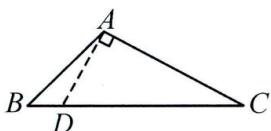  
A

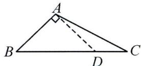  
B

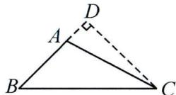  
C

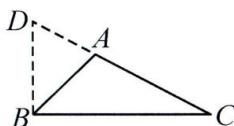  
D

5. 如图, 在 $\triangle ABC$ 中, $AB = 2022$ , $AC = 2020$ , $AD$ 为中线, 则 $\triangle ABD$ 与 $\triangle ACD$ 的周长之差为 2 .

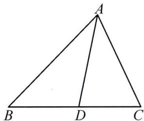

text_image

A
B D C

第 5 题图

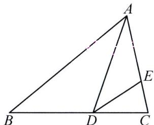

text_image

Geometric diagram of triangle ABC with points D and E, showing segments AD and DE

第6题图

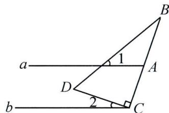

text_image

a
D
1
A
2
C
b
B

第 7 题图

6. 如图, $AD$ 是 $\triangle ABC$ 的角平分线, $DE$ 是 $\triangle ACD$ 的角平分线, $\angle B = 40^{\circ}, \angle C = 80^{\circ}$ , 则 $\angle CDE$ 的度数为 $35^{\circ}$ .

# 高频考点 3 三角形的内角

7. 已知直线 $a \parallel b$ , Rt△DCB 按如图所示的方式放置, 点 C 在直线 b 上, ∠DCB = 90°, 若 ∠B = 20°, 则 ∠1 + ∠2 的度数为 ( B )

A. ${90}^{ \circ  }$

B. ${70}^{ \circ  }$

C. ${60}^{ \circ  }$

D. ${45}^{ \circ  }$

8. 如图, 在 $\triangle ABC$ 中, $\angle ABC$ 的平分线与 $\angle ACB$ 的平分线交于点 $D$ , 若 $\angle D = 115^{\circ}$ , 则 $\angle A$ 的度数为 $50^{\circ}$ .

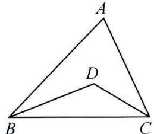

text_image

A
D
B
C

第8题图

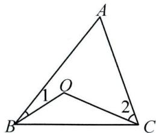

text_image

A
1
O
2
B
C

第9题图

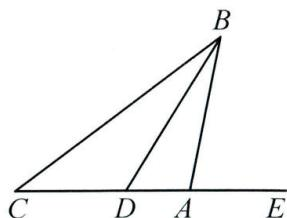

text_image

B
C D A E

第10题图

# 高频考点 4 三角形的外角

9. 如图, 点 $O$ 是 $\bigtriangleup  {ABC}$ 内一点, $\angle A = {80}^{ \circ  },\angle 1 = {15}^{ \circ  },\angle 2 = {40}^{ \circ  }$ ,则 $\angle {BOC}$ 的度数是(   )

A. ${135}^{ \circ  }$

B. ${120}^{ \circ  }$

C. ${95}^{ \circ  }$

D. ${100}^{ \circ  }$

10. 如图, $BD$ 是 $\angle ABC$ 的平分线, $\angle EAB$ 是 $\triangle ABC$ 的外角, 若 $\angle C = 40^{\circ}, \angle EAB = 70^{\circ}$ , 则 $\angle BDE$ 的度数为 $55^{\circ}$ .

# 期末复习专题2 角度计算与证明——解答题

# 高频考点 1 方程思想

1. 如图, 在 $\triangle ABC$ 中, $D$ 为 $BC$ 上一点, $\angle 1 = \angle 2$ , $\angle 3 = \angle 4$ , $\angle BAC = 108^{\circ}$ , 求 $\angle DAC$ 的度数.

解: 设 $\angle1 = \angle2 = x$ .

$$
\because \angle 4 = \angle 3 = \angle 1 + \angle 2 = 2 x,
$$

$$
\therefore \angle D A C = 1 8 0 ^ {\circ} - 4 x.
$$

$$
\because \angle B A C = 1 0 8 ^ {\circ},
$$

$$
\therefore x + 1 8 0 ^ {\circ} - 4 x = 1 0 8 ^ {\circ},
$$

$$
\therefore x = 2 4 ^ {\circ},
$$

$$
\therefore \angle D A C = 1 8 0 ^ {\circ} - 4 \times 2 4 ^ {\circ}
$$

$$
= 8 4 ^ {\circ}.
$$

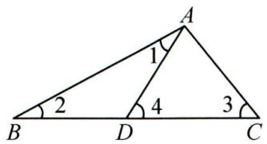

text_image

A
1
2
4
3
B
D
C

2. 如图, $BD$ 是 $\triangle ABC$ 的角平分线, $AE \perp BD$ 交 $BD$ 的延长线于点 $E$ , $\angle ABC = 72^{\circ}$ , $\angle C: \angle ADB = 2:3$ . 求 $\angle DAE$ 的度数.

解: 设 $\angle C = 2x$ ，则 $\angle ADB = 3x$ 。

∵BD 平分∠ABC，

$$
\therefore \angle C B D = \frac {1}{2} \angle A B C = 3 6 ^ {\circ}.
$$

$$
\because \angle A D B = \angle C B D + \angle C,
$$

$$
\therefore 3 6 ^ {\circ} + 2 x = 3 x,
$$

$$
\therefore x = 3 6 ^ {\circ},
$$

$\therefore \angle ADB = 3x = 108^{\circ}.$

$\because AE \perp BD,$

$$
\therefore \angle E = 9 0 ^ {\circ},
$$

$$
\therefore \angle D A E = \angle A D B - \angle E
$$

$$
= 1 0 8 ^ {\circ} - 9 0 ^ {\circ}
$$

$$
= 1 8 ^ {\circ}.
$$

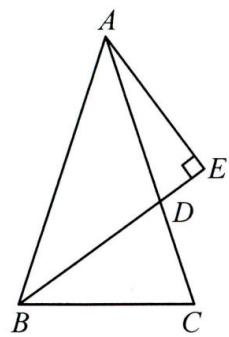

text_image

Geometric diagram of triangle ABC with perpendicular line from A to point E, and extended line BC to point D

# 高频考点 2 整体思想

3. 如图, $\angle ABD$ , $\angle ACD$ 的平分线交于点 $P$ . 若 $\angle A = 50^{\circ}$ , $\angle D = 10^{\circ}$ , 求 $\angle P$ 的度数.

解: 设 $\angle ABP = \angle DBP = x$ ,

$$
\angle A C P = \angle D C P = y.
$$

$$
\because \angle A + x = \angle P + y,
$$

$$
\therefore \angle P = 5 0 ^ {\circ} + x - y.
$$

$\because \angle P + \angle D + x = y,$

$$
\therefore 5 0 ^ {\circ} + x - y + 1 0 ^ {\circ} + x = y,
$$

$$
y - x = 3 0 ^ {\circ},
$$

$$
\therefore \angle P = 3 0 ^ {\circ} - 1 0 ^ {\circ} = 2 0 ^ {\circ}.
$$

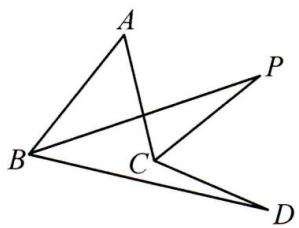

text_image

Geometric diagram with labeled points A, B, C, D, and P forming intersecting triangles

4. 如图, 在 $\triangle ABC$ 中, $D, E$ 分别为 $BC, AC$ 边上的点, $\angle B = \angle C$ , $\angle ADE = \angle AED$ .

(1)①若 $\angle BAD=40^{\circ}$ ,求 $\angle CDE$ 的度数;

②若 $\angle BAD=50^{\circ}$ ,直接写出 $\angle CDE$ 的度数为 $25^{\circ}$ ;

(2)试探究 $\angle CDE$ 与 $\angle BAD$ 之间的数量关系,写出结论并证明.

解:(1)①设 $\angle EDC=x$ , $\angle B=\angle C=y$ ,

则 $\angle ADE = \angle AED = x + y$

$$
\angle A D C = \angle B A D + \angle B
$$

$$
= 4 0 ^ {\circ} + y
$$

$$
= 2 x + y,
$$

$$
\therefore x = 2 0 ^ {\circ},
$$

即 $\angle CDE = 20^{\circ}$ ;

②同①可得 $\angle CDE=25^{\circ}$ ;

(2) $\angle CDE = \frac{1}{2}\angle BAD.$

设 $\angle BAD=\alpha$ ，

$$
\angle E D C = x, \angle B = \angle C = y,
$$

则 $\angle ADE = \angle AED = x + y$

$$
\angle A D C = \angle B A D + \angle B = \alpha + y = 2 x + y,
$$

$\therefore x=\frac{1}{2}\alpha$ ，即 $\angle CDE=\frac{1}{2}\angle BAD$ 。

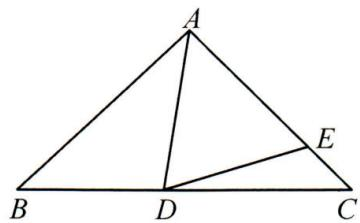

text_image

A
B D C
E

# 第十四章 全等三角形

# 期末复习专题1 全等三角形的性质与判定、角的平分线

# 高频考点1 全等三角形的性质

1. 如图是两个全等三角形, 图中的字母表示三角形的边长, 那么 $\angle 1$ 的度数为 $70^{\circ}$ .

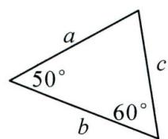

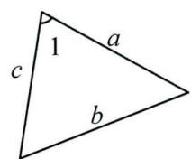  
第 1 题图

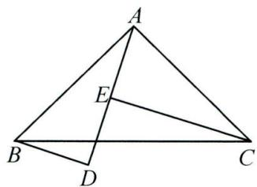

text_image

A
E
B
D
C

第 2 题图

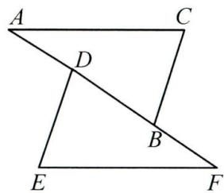

text_image

A
C
D
B
E
F

第 3 题图

2. 如图, $\triangle ABD \cong \triangle CAE$ , $BD // CE$ , $CE = 5$ , $BD = 3$ , 则 $DE = \underline{2}$ , $\angle BAC = \underline{90^\circ}$ .

# 高频考点 2 全等三角形的判定

3. 如图, 已知 $AC = EF$ , $BC = DE$ , 点 $A, D, B, F$ 在同一直线上, 要利用 “SSS” 证明 $\triangle ABC \cong \triangle FDE$ , 还可以添加的一个条件是 ( A )

A. ${AD} = {BF}$

B. ${DE} = {BD}$

C. ${BF} = {BD}$

D. 以上都不对

4. 已知 $\triangle ABC$ 和 $\triangle DEF$ 中, $\angle A = \angle D = 90^\circ$ , $BC = EF$ , 下列条件: ① $\angle C = \angle F$ ; ② $AB = DE$ ; ③ $\angle B = \angle E$ ; ④ $AC = DF$ ; ⑤ $AB = EF$ ; ⑥ $BC = DE$ . 其中一定能得到 $\triangle ABC \cong \triangle DEF$ 的是 ①②③④ . (填序号)

# 高频考点 3 角的平分线的性质

5. 如图, $AC$ 平分 $\angle PAQ$ , 点 $B, B'$ 分别在边 $AP, AQ$ 上, 如果添加一个条件, 即可得到 $AB = AB'$ , 那么该条件不能是 ( B )

A. $B B^{\prime} \perp A C$

B. ${BC} = {B}^{\prime }C$

C. $\angle ACB = \angle ACB'$

D. $\angle ABC = \angle AB'C$

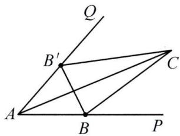

text_image

Q
B'
C
A
B
P

第 5 题图

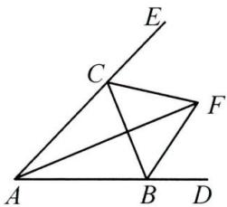

text_image

Geometric diagram with labeled points A, B, C, D, E, F and intersecting lines forming triangles and a line segment

第6题图

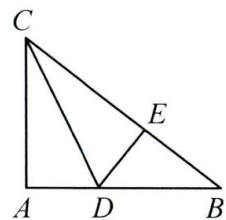

text_image

C
E
A D B

第 7 题图

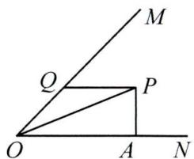

text_image

Geometric diagram with labeled points O, A, M, N, P, Q and line segments forming triangles and a rectangle

第8题图

6. 如图, 在 $\triangle ABC$ 中, 两条外角平分线交于点 $F$ , 则下列结论: ① $\angle CFB = \angle CAB$ ; ② $AF$ 平分 $\angle BAC$ ; ③ $AF \perp BC$ ; ④ 点 $F$ 到 $AB, AC, BC$ 的距离相等. 其中正确的是 ②④ . (填序号)

7. 如图, 在 $\triangle ABC$ 中, $\angle A = 90^{\circ}, CD$ 是角平分线, $DE \perp BC$ 于点 $E$ , 若 $BD = 7, DE = 3$ , 则 $AB$ 的长为 $\underline{10}$ .

8. 如图, $OP$ 平分 $\angle MON$ , $PA \perp ON$ 于点 $A$ , $Q$ 是射线 $OM$ 上一点, 若 $PA = 3$ , 则 $PQ$ 的最小值是 $\underline{3}$ .

# 期末复习专题2 简单的全等三角形的构造

# 高频考点1 连线或延长相交构造全等三角形

1. 如图, $AB, CD$ 交于点 $O, AB = CD, AC = BD$ , 求证: $\angle A = \angle D$ .

证明: 连接 BC. 在 $\triangle ACB$ 和 $\triangle DBC$ 中， $\left\{\begin{aligned}AC &= DB, \\ CB &= BC, \\ AB &= DC,\end{aligned}\right.$ $\therefore \triangle ACB \cong \triangle DBC(SSS)$ , $\therefore \angle A = \angle D.$

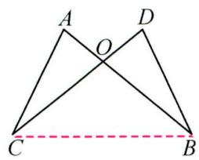

text_image

A
O
D
C
B

2. 如图, 在五边形 $ABCDE$ 中, $\angle B = \angle E = 90^{\circ}, AB = AE, AF \perp CD$ 于点 $F, CF = DF$ . 求证: $BC = DE$ .

证明: 连接 AC, AD.

$$
\because A F \perp C D, C F = D F,
$$

$$
\therefore A C = A D,
$$

在 Rt△ABC 和 Rt△AED 中，

$$
\vert A C = A D,
$$

$$
\boldsymbol {A} \boldsymbol {B} = \boldsymbol {A} \boldsymbol {E},
$$

$$
\therefore \mathrm{Rt} \triangle A B C \cong \mathrm{Rt} \triangle A E D (\mathrm{HL}),
$$

$$
\therefore B C = D E.
$$

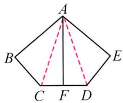

text_image

A
B
C
F
D
E

3. 如图, 四边形 $ABCD$ 中, $AB \parallel CD$ , $AB > CD$ , $E$ 是 $BC$ 的中点, 连接 $DE$ , $AE$ , $AB + CD = AD$ , 求证: $AE \perp DE$ .

证明:延长 DE 交 AB 的延长线于点 F.

$$
\because A B \parallel C D,
$$

$$
\therefore \angle C D E = \angle F, \angle C = \angle E B F.
$$

∵E是BC的中点，

$$
\therefore C E = B E,
$$

$$
\therefore \triangle D C E \cong \triangle F B E (\mathrm{AAS}),
$$

$$
\therefore C D = B F, D E = E F,
$$

$$
\because A B + C D = A D,
$$

$$
\therefore A B + B F = A D,
$$

$$
\therefore A D = A F,
$$

$$
\therefore A E \perp D E.
$$

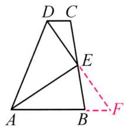

# 高频考点 2 作垂线构造直角三角形全等

4. 如图, $\triangle ABC$ 中, $D$ 是 $BC$ 的中点, $BE \perp AD$ 于点 $E$ , $AC = CD$ , 求 $\frac{AD}{DE}$ 的值.

解: 过点 C 作 $CF \perp AD$ 于点 F,

$$
\therefore \angle C F D = 9 0 ^ {\circ}.
$$

$$
\because B E \perp A D,
$$

$$
\therefore \angle E = 9 0 ^ {\circ} = \angle C F D.
$$

∵D 是 BC 的中点，

$$
\therefore B D = C D,
$$

$$
\therefore \triangle B E D \cong \triangle C F D (\mathrm{AAS}),
$$

$$
\therefore D E = D F.
$$

$$
\because A C = C D,
$$

$$
\therefore A F = D F,
$$

$$
\therefore A D = 2 D F = 2 D E,
$$

即 $\frac{AD}{DE}=2.$

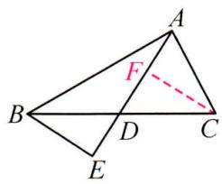

text_image

Geometric diagram of triangle ABC with internal points D, E, F and dashed line segment DC

5. 在 $\triangle ABC$ 中, $\angle BAC=90^{\circ}$ , $AB=AC$ , $D$ , $E$ 分别是 $AB$ , $AC$ 上的点, $AF\perp DE$ 交 $BC$ 于点 $F$ ,若 $AF=DE$ ,求证: $AD=CE$ .

证明: 过点 F 作 $FG \perp AC$ 于点 G,

$$
\therefore \angle F G A = 9 0 ^ {\circ},
$$

$$
\therefore \angle F A G + \angle A F G = 9 0 ^ {\circ}.
$$

$$
\because A F \perp D E,
$$

$$
\therefore \angle F A G + \angle A E D = 9 0 ^ {\circ},
$$

$$
\therefore \angle A F G = \angle A E D.
$$

$$
\because \angle D A E = \angle A G F = 9 0 ^ {\circ}, A F = D E,
$$

$$
\therefore \triangle A F G \cong \triangle D E A (\mathrm{AAS}),
$$

$$
\therefore A D = A G, A E = F G,
$$

易证 $\triangle FCG$ 为等腰直角三角形，

$$
\therefore F G = C G,
$$

$$
\therefore A G = C E = A D.
$$

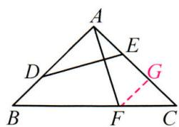

# 期末复习专题3 角平分线的运用与证明

1. 如图, 在 $\triangle ABC$ 中, $\angle C = 90^{\circ}, AD$ 是角平分线, $DE \perp AB$ 于点 $E, F$ 是 $CA$ 延长线上一点, $BD = DF$ .

(1) 求证: AC = AE;   
(2) 求证: $BE = AE + AF$ .

证明:(1)∵AD是角平分线,

$$
\begin{array}{l} \angle C = 9 0 ^ {\circ}, D E \perp A B, \\ \therefore \angle D E A = \angle C = 9 0 ^ {\circ}, D E = D C. \\ \because A D = A D, \\ \therefore \mathrm{Rt} \triangle A D E \cong \mathrm{Rt} \triangle A D C (\mathrm{HL}), \\ \therefore A E = A C; \\ \end{array}
$$

(2)由(1)知 $\angle DEB=\angle C=90^{\circ}$ .

$$
\text { 又 } \because D E = D C, B D = D F,
$$

$$
\therefore \mathrm{Rt} \triangle B D E \cong \mathrm{Rt} \triangle F D C (\mathrm{HL}),
$$

$$
\therefore B E = F C = A F + A C = A F + A E.
$$

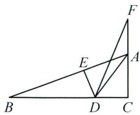

text_image

Geometric diagram with labeled points A, B, C, D, E, F and intersecting lines forming triangles and a quadrilateral

2. 如图, 在 $\triangle ABC$ 中, $AD$ 平分 $\angle BAC$ , $CE \perp AD$ 于点 $E$ , 写出 $\angle ACE$ , $\angle B$ , $\angle ECD$ 之间的数量关系并证明.

解: $\angle ACE = \angle B + \angle ECD$ .

证明如下:延长 CE 交 AB 于点 F,

$$
\because C E \perp A D,
$$

$$
\therefore \angle A E F = \angle A E C = 9 0 ^ {\circ}.
$$

∵AD 平分∠BAC，

$$
\therefore \angle E A F = \angle E A C,
$$

$$
\because A E = A E,
$$

$$
\therefore \triangle A E F \cong \triangle A E C (\mathrm{ASA}),
$$

$$
\therefore \angle A C E = \angle A F E = \angle B + \angle E C D.
$$

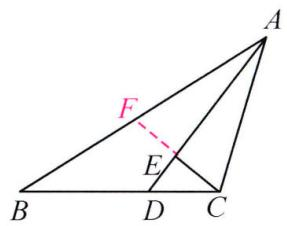

text_image

Geometric diagram of triangle ABC with internal points D, E, F and dashed line EF

3. 如图, 在 $\triangle ABC$ 中, $\angle C = 90^{\circ}, AC = BC, BD$ 平分 $\angle ABC$ , 交 $AC$ 于点 $E$ , 且 $AD \perp BD$ , 求证: $BE = 2AD$ .

证明:延长 AD 交 BC 的延长线于点 F.

$$
\because A D \perp B D,
$$

$$
\therefore \angle A D B = \angle B D F = 9 0 ^ {\circ}.
$$

∵BD 平分∠ABF，

$$
\therefore \angle A B D = \angle F B D.
$$

又∵BD=BD，

$$
\therefore \triangle A B D \cong \triangle F B D (\mathrm{ASA}),
$$

$$
\therefore A D = D F.
$$

$$
\because \angle A D B = \angle A C B = 9 0 ^ {\circ},
$$

$$
\therefore \angle C A F = \angle C B E.
$$

$$
\because \angle B C E = \angle A C F = 9 0 ^ {\circ}, A C = B C,
$$

$$
\therefore \triangle B C E \cong \triangle A C F (\mathrm{ASA}),
$$

$$
\therefore B E = A F = 2 A D.
$$

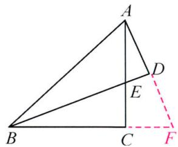

text_image

Geometric diagram of triangle ABC with points D, E, F and auxiliary lines, including a dashed extension from C to D.

4. 如图, $AD$ 是 $\triangle ABC$ 的角平分线, $\angle C = 2\angle B$ , 求证: $AB = AC + CD$ .

证明: 在 AB 上截取 AE = AC, 连接 DE.

∵AD 是△ABC 的角平分线，

$$
\therefore \angle C A D = \angle E A D.
$$

又∵AD=AD，

$$
\therefore \triangle A D E \cong \triangle A D C (\mathrm{SAS}),
$$

$$
\therefore \angle C = \angle A E D = 2 \angle B, C D = D E.
$$

$$
\because \angle A E D = \angle B + \angle B D E,
$$

$$
\therefore \angle B = \angle B D E,
$$

$$
\therefore B E = D E = C D,
$$

$$
A B = A E + B E = A C + C D.
$$

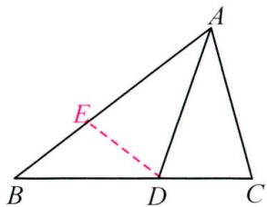

text_image

A
E
B
D
C

# 第十五章 轴对称

# 期末复习专题1 轴对称

# 高频考点1 轴对称图形

1. 各地积极普及科学防控知识,下面是科学防控知识的图片,图片上有图案和文字说明,其中的图案是轴对称图形的是( D )

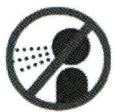

A. 打喷嚏捂口鼻

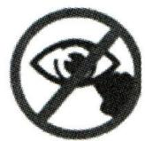

B. 喷嚏后慎揉眼

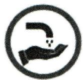

C. 勤洗手勤通风

D. 戴口罩讲卫生

# 高频考点 2 线段的垂直平分线

2. 如图, 在 Rt△ABC 中, ∠B=90°, ED 是 AC 的垂直平分线, 交 AC 于点 D, 交 BC 于点 E. 已知 ∠BAE=10°, 则 ∠C 的度数为 40°.

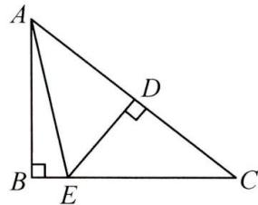

text_image

Geometric diagram of triangle ABC with perpendiculars from points D and E to base BC, labeled with vertices A, B, C, D, E.

第2题图

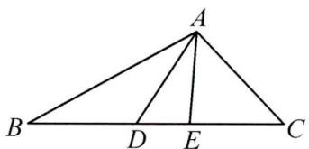

text_image

A
B D E C

第 3 题图

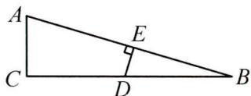  
第 4 题图

3. 如图, 在 $\triangle ABC$ 中, $AB$ 的垂直平分线交 $BC$ 于点 $D$ , $AC$ 的垂直平分线交 $BC$ 于点 $E$ , 若 $\triangle ADE$ 的周长为 $10 \mathrm{~cm}$ , 则 $BC$ 的长是 $\underline{10} \mathrm{~cm}$ .  
4. 如图, 在 $\triangle ABC$ 中, $\angle C = 90^{\circ}, \angle B = 15^{\circ}, AB$ 的垂直平分线交 $BC$ 于点 $D$ , 若 $BD + AC = 24$ , 则 $BD - AC = \underline{8}$ .

# 高频考点 3 用坐标表示轴对称

5. 点(2, -3)关于 y 轴对称的点的坐标是 $(-2, -3)$ .  
6. $P(-\sqrt{2}, -\sqrt{3})$ 关于 x 轴对称的对称点的坐标是 $(- \sqrt{2}, \sqrt{3})$ .  
7. 若点 $P(-2, b)$ 和点 $Q(a, -3)$ 关于 x 轴对称，则 $a + b$ 的值是 1.  
8. 点(3,1)关于直线 x=1 对称的点的坐标是 $(-1,1)$ ; 关于 y=-1 对称的点的坐标是 $(3,-3)$ .

# 高频考点 4 画轴对称图形

9. $\triangle ABC$ 在平面直角坐标系中的位置如图所示.

(1)作出与 $\triangle ABC$ 关于 $y$ 轴对称的 $\triangle A_{1}B_{1}C_{1}$ ,并写出点 $A_{1}$ 的坐标为\_\_\_\_;   
(2) 将 $\triangle ABC$ 向右平移 3 个单位长度, 画出平移后的 $\triangle A_{2}B_{2}C_{2}$ ;  
(3) 观察 $\triangle A_{1}B_{1}C_{1}$ 与 $\triangle A_{2}B_{2}C_{2}$ ，它们是否关于某直线对称？若是，请在图上画出这条对称轴。

解:(1) $A_{1}(2,3)$ ;(2)略;(3)关于直线 $x=\frac{3}{2}$ 对称.

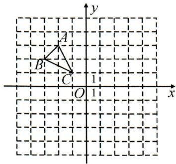

text_image

y
A
B
C
1
O
1
x

# 期末复习专题2 等腰三角形

# 高频考点1 等腰三角形的性质

1. 一个等腰三角形的两边长分别为 $2 \mathrm{dm}$ 和 $9 \mathrm{dm}$ , 则它的周长是 ( B )

A. ${13}\mathrm{\;{dm}}$

B. $20 \mathrm{dm}$

C. 13 dm 或 20 dm

D. 无法确定

2. 已知等腰三角形的一边长为 $4 \mathrm{~cm}$ , 周长是 $18 \mathrm{~cm}$ , 则它的腰长是 ( B )

A. $4 \mathrm{~cm}$

B. $7 \mathrm{~cm}$

C. $10 \mathrm{~cm}$

D. 4 cm 或 7 cm

3. 等腰三角形的一个角是 $50^{\circ}$ , 则它的底角是 (D)

A. ${50}^{ \circ  }$

B. ${65}^{ \circ  }$

C. ${80}^{ \circ  }$

D. $50^{\circ}$ 或 $65^{\circ}$

4. 在等腰 $\triangle ABC$ 中, $\angle A=70^{\circ}$ , 则 $\angle C$ 的度数不可能是( C )

A. ${40}^{ \circ  }$

B. ${55}^{ \circ  }$

C. ${65}^{ \circ  }$

D. ${70}^{ \circ  }$

5. 若等腰三角形中有一个角等于 $100^{\circ}$ , 则这个等腰三角形的底角的度数是 $\underline{40^{\circ}}$ .

6. 等腰三角形一腰上的高与另一腰的夹角为 $40^{\circ}$ , 则其顶角为 $\underline{50^{\circ}}$ 或 $\underline{130^{\circ}}$ .

# 高频考点 2 三线合一

7. 如图, 在 $\triangle ABC$ 中, 已知 $AB = AC$ , $D$ 为 $BC$ 的中点, 若 $\angle B = 50^{\circ}$ , 则 $\angle DAC$ 的度数为 $40^{\circ}$ .

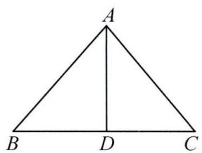

text_image

A
B D C

第 7 题图

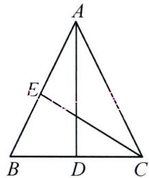

text_image

A
E
B D C

第8题图

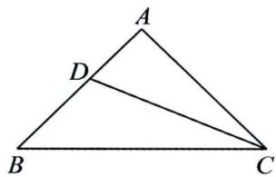

text_image

A
D
B
C

第9题图

8. 如图, $AD$ 是 $\triangle ABC$ 的中线, $CE$ 是 $\triangle ABC$ 的角平分线. 若 $AB = AC$ , $\angle CAD = 26^{\circ}$ , 则 $\angle ACE = 32^{\circ}$ .

9. 如图, 在 $\triangle ABC$ 中, $AB = AC$ , $AB \perp AC$ , $CD$ 平分 $\angle ACB$ 交 $AB$ 于点 $D$ , 若 $CD = 4$ , 则 $\triangle BCD$ 的面积为 $\underline{4}$ .

提示: 过点 B 作 $BE \perp CD$ 分别交 CD 的延长线和 CA 的延长线于点 E, F, 则 $\triangle ACD \cong \triangle ABF, \triangle CEF \cong \triangle CEB, \therefore BF = CD, BE = EF,$

$$
\therefore B E = \frac {1}{2} B F = \frac {1}{2} C D = 2,
$$

$$
\therefore S _ {\triangle B C D} = \frac {1}{2} C D \cdot B E = 4.
$$

10. 如图, 在 $\triangle ABC$ 中, $AB = AC$ , $AD \perp BC$ , 垂足为 $D$ . $DE \parallel AC$ 交 $AB$ 于点 $E$ , 若 $AC = 6$ , 求 $DE$ 的长.

解：∵AB=AC,AD⊥BC,

$$
\therefore \angle B = \angle C, \angle B A D = \angle C A D.
$$

$$
\because D E \parallel A C,
$$

$$
\therefore \angle A D E = \angle C A D, \angle E D B = \angle C,
$$

$$
\therefore \angle A D E = \angle B A D, \angle B = \angle E D B,
$$

$$
\therefore A E = D E, B E = D E,
$$

$$
\therefore D E = \frac {1}{2} A B = \frac {1}{2} A C = 3.
$$

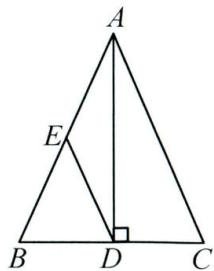

text_image

A
E
B D C

# 期末复习专题3 等边三角形

# 高频考点 1 等边三角形的性质

1. 如图, 在等边三角形 $ABC$ 中, $D$ 是 $AC$ 边上的中点, 延长 $BC$ 到点 $E$ , 使 $CE = CD$ , 则 $\angle E$ 的度数为 ( C )

A. ${15}^{ \circ  }$

B. ${20}^{ \circ  }$

C. ${30}^{ \circ  }$

D. ${40}^{ \circ  }$

2. 如图, 等边三角形 $ABC$ 中, $AD \perp BC$ , 垂足为 $D$ , 点 $E$ 在线段 $AD$ 上, $\angle EBC = 45^\circ$ , 则 $\angle ACE$ 的度数为 ( A )

A. ${15}^{ \circ  }$

B. ${30}^{ \circ  }$

C. ${45}^{ \circ  }$

D. ${60}^{ \circ  }$

3. 如图, 在等边三角形 $ABC$ 中, $BD$ 平分 $\angle ABC, BD = BF$ , 则 $\angle CDF$ 的度数是 ( B )

A. ${10}^{ \circ  }$

B. ${15}^{ \circ  }$

C. ${20}^{ \circ  }$

D. ${25}^{ \circ  }$

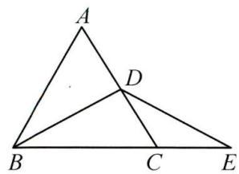

text_image

A
D
B
C
E

第 1 题图

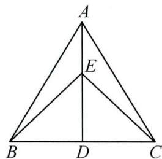

text_image

A
E
B D C

第2题图

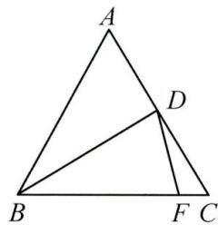

text_image

A
D
B
F C

第 3 题图

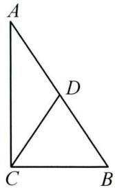  
第 5 题图

# 高频考点 2 等边三角形的判定

4. 在 $\triangle ABC$ 中, $AB=AC=3cm$ , 且 $\angle A=60^{\circ}$ , 则 $BC$ 的长度为 $3cm$ .

5. 如图, 在 $\triangle ABC$ 中, $D$ 为 $AB$ 上一点, $AD = DC = BC$ , 且 $\angle A = 30^{\circ}, AD = 5$ , 则 $AB = \underline{10}$ .

6. 如图, $\triangle ABO$ 是等边三角形, $CD \parallel AB$ , 分别交 $AO, BO$ 的延长线于点 $C, D$ . 则 $\triangle OCD$ 的形状为 \_\_\_\_ 等边三角形 \_\_\_\_.

7. 如图, $AC \perp BC$ , $AD = BD$ , 为了使图中的 $\triangle BCD$ 是等边三角形, 再增加一个条件可以是 ( C )

A. ${CD}\bot {AB}$

B. ${CD} = {BD}$

C. $BC=\frac{1}{2}AB$

D. $BC=\frac{1}{2}AC$

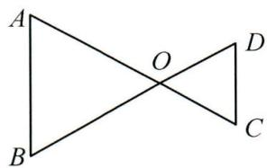

text_image

A
O
B
C
D

第6题图

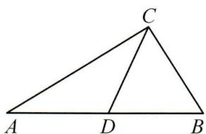

text_image

C
A D B

第7题图

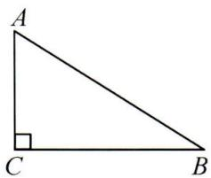  
第8题图

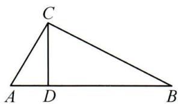

text_image

C
A D B

第9题图

text_image

Geometric diagram of triangle ABC with point D on AC and right angle at B

第10题图

# 高频考点 3 $30^{\circ}$ 的角所对的直角边等于斜边的一半

8. 如图, 在 Rt $\triangle ACB$ 中, $\angle C=90^{\circ}, \angle B=30^{\circ}, AB=4$ , 则 $AC$ 的长是 ( B )

A. 1

B. 2

C. 3

D. 4

9. 如图, 在 $\triangle ABC$ 中, $\angle ACB = 90^{\circ}, CD \perp AB$ 于点 $D$ , $\angle A = 60^{\circ}, AD = 2$ , 则 $BD$ 的长为 ( C )

A. 2

B. 4

C. 6

D. 8

10. 如图, 在 $\triangle ABC$ 中, $AB=BC$ , $\angle ABC=120^{\circ}$ , 过点 $B$ 作 $BD \perp BC$ , 交 $AC$ 于点 $D$ , 若 $AD=1$ , 则 $CD$ 的长度为 ( B )

A. 1

B. 2

C. 3

D. 4

# 期末复习专题4 等腰三角形中的证明与计算

1. 如图, 在 $\triangle ABC$ 中, $\angle ACB = 2\angle B$ , $\angle BAC$ 的平分线 $AD$ 交 $BC$ 于点 $D$ , 过点 $C$ 作 $CN \perp AD$ 于点 $H$ , 交 $AB$ 于点 $N$ .

(1)求证: $\triangle ANC$ 为等腰三角形;  
(2) 若 AB=10, AC=6, 求 CD 的长.

解:(1)∵AD 平分∠BAC,

$$
\therefore \angle N A H = \angle C A H.
$$

又∵CN⊥AD，

$$
\therefore \angle A H N = \angle A H C = 9 0 ^ {\circ},
$$

$$
\therefore \angle A N H = \angle A C H,
$$

$$
\therefore A N = A C,
$$

$\therefore \triangle ANC$ 为等腰三角形；

(2) 连接 ND, 证 $\triangle ADN \cong \triangle ADC$ ,

$$
\therefore A N = A C = 6,
$$

$$
\angle A N D = \angle A C D, D N = C D,
$$

又∵∠AND=∠ACB

$$
= 2 \angle B
$$

$$
= \angle B + \angle B D N,
$$

$$
\therefore \angle B = \angle B D N,
$$

$$
\therefore B N = N D = C D.
$$

又∵AB=10，

$$
\therefore C D = B N = A B - A N = 1 0 - 6 = 4.
$$

text_image

A
N
H
B
D
C

2. 如图, 在 $\triangle ABC$ 中, $AB = AC$ , 点 $D$ 在 $AB$ 上, 使 $AD = BC$ , 过点 $D$ 作 $DE \parallel BC$ , 且 $DE = AB$ , 连接 $EC, AE$ .

(1) 求证: $\angle AED = \angle BAC$ ;   
(2)若 $\angle BAC=20^{\circ}$ ,求 $\angle DCE$ 的度数.

解:(1)证 $\triangle EAD\cong\triangle ACB$ 即可;

(2) $\angle AED = \angle BAC = 20^{\circ}$ ,

证 $AE = AC = AB = DE$

$$
\therefore \angle D A E = \angle A D E = 8 0 ^ {\circ},
$$

$$
\therefore \angle C A E = 6 0 ^ {\circ},
$$

△ACE 为等边三角形，

$$
\therefore \angle D E C = 4 0 ^ {\circ},
$$

易证 $DE = CE$ ，

$$
\therefore \angle D C E = 7 0 ^ {\circ}.
$$

text_image

Geometric diagram with labeled points A, B, C, D, E and connecting lines forming triangles and a quadrilateral

3. 如图, 在 $\triangle ABC$ 中, $\angle ACB = 90^{\circ}, AC = BC, E$ 是 $CB$ 上一动点, 连接 $AE$ , 作 $AF \perp AE$ , 且 $AF = AE$ .

(1)如图1,过点F作 $FG\perp AC$ 于点G,求证: $\triangle AGF\cong\triangle ECA$ ;  
(2)如图 2, 连接 BF 交 AC 于点 D, 若 E 为 BC 的中点, CD = 1, 求 $S_{\triangle ADF}$ .

解:(1)略;

(2) 过点 F 作 $FG \perp AC$ 于点 G，则 $\triangle AGF \cong \triangle ECA$ ，

$$
\therefore A G = C E = \frac {1}{2} B C = \frac {1}{2} A C, F G = A C = B C.
$$

易证 $\triangle DGF\cong\triangle DCB$ ，

$$
\therefore D G = C D = 1.
$$

$$
\therefore A G = C G = 2, A C = B C = F G = 4,
$$

$$
A D = A G + D G = 3.
$$

$$
\therefore S _ {\triangle A D F} = \frac {1}{2} A D \cdot F G = 6.
$$

text_image

Geometric diagram showing triangle ABC with perpendiculars from points F and G to sides, forming right angles at C and E.

图1

text_image

Geometric diagram with labeled points and right angles, showing triangle relationships and dashed lines for construction.

图2

# 期末复习专题5 最值问题

# 高频考点 1 将军饮马问题

1. 如图, 在等腰 Rt△ABC 中, AC = BC, ∠ACB = 90°, D 为 BC 的中点, AD = 4, P 为 AB 上一个动点, 当 P 点运动时, PC + PD 的最小值为 \_\_\_\_。

解:作点 D 关于 AB 的对称点 E, 连接 BE, CE, PE. 则 $\angle CBE = 90^{\circ}, PD = PE$ . $PC + PD = PE + PC \geqslant CE$ , 易证 $\triangle CBE \cong \triangle ACD$ . $\therefore CE = AD = 4$ .

故 $PC + PD$ 的最小值为 4.

text_image

Geometric diagram of triangle ABC with internal points D, E, P and auxiliary lines, including a right angle at C.

# 高频考点 2 建桥问题

2. 如图是 $4 \times 4$ 的正方形网格, $A, B, C$ 是各小正方形网格的顶点. $BC = a$ , 小正方形的边长为 $1, M, N$ 在直线 $l$ 上, $MN = 1$ , 点 $M$ 在 $N$ 的上方, 则使 $AM + BN$ 的最小值为 $a$ (用含 $a$ 的式子表示).

解: 将点 A 向下平移 1 个单位长度后得到点 E, 则点 C 与点 E 关于直线 l 对称, BC 交直线 l 于点 N, 将点 N 向上平移 1 个单位长度得到点 M, 连接 AM, 此时 AM + BN 的值最小, 最小值为 BC = a.

text_image

l
A
M
E
C
N
B

# 高频考点 3 周长最值→轴对称转化为两点之间线段最短

3. 如图, 在 Rt△ABC 中, AC⊥BC, 若 AC=7, BC=24, AB=25, 将△ABC 折叠, 使得点 C 落在 AB 边的点 E 处, 折痕为 AD. 点 P 为 AD 上一动点, 则△PEB 的周长的最小值为 \_\_\_\_。

解: 连接 PC, 易证 PE = PC, AE = AC = 7, BE = AB - AE = 25 - 7 = 18. △PEB 的周长为 $PE + PB + BE = PC + PB + 18$ . ∵ $PC + PB \geq BC = 24$ , 当 C, P, B 三点共线时取等号, 即点 P 与点 D 重合时, △PEB 的周长最小, 最小值为 $24 + 18 = 42$ .

text_image

Geometric diagram of triangle ABC with internal points D, E, P and auxiliary lines, including a dashed line from P to C.

# 高频考点 4 和最值→轴对称转化为垂线段最短

4. 如图, 等腰三角形 $ABC$ 底边 $BC$ 的长为 $4 \mathrm{~cm}$ , 面积是 $12 \mathrm{~cm}^{2}$ , 腰 $AB$ 的垂直平分线 $EF$ 交 $AC$ 于点 $F$ , 交 $AB$ 于点 $E$ . 若 $M$ 为 $BC$ 边上的动点, $D$ 为线段 $EF$ 上一动点, 则 $BD + DM$ 的最小值为 $6 \mathrm{~cm}$ .

解: 连接 AD, 过点 A 作 $AH \perp BC$ , 垂足为 H. $\therefore S_{\triangle ABC} = \frac{1}{2} BC \cdot AH = \frac{1}{2} \times 4 \times AH = 12$ ,
解得 AH = 6 cm, $\because EF$ 是线段 AB 的垂直平分线, $\therefore BD = AD$ . $\therefore BD + DM = AD + DM \geqslant AH = 6 \, cm$ , $\therefore BD + DM$ 最小值为 6 cm.

text_image

Geometric diagram of triangle ABC with points D, E, F, H, M and auxiliary lines, including a dashed perpendicular from A to AB at D.

5. 如图, $\triangle ABC$ 中, $AC = 8$ , $AB = 10$ , $\triangle ABC$ 的面积为 $30$ , $AD$ 为 $\triangle ABC$ 的角平分线, $F$ , $E$ 分别为 $AC$ , $AD$ 上两动点, 连接 $CE$ , $EF$ , 则 $CE + EF$ 的最小值为 6 .

解:作点 F 关于 AD 的对称点 M, 作 AB 边上的高 CH, $EF + EC = EM + EC$ , 即 $EM + EC \geqslant MC \geqslant CH$ (垂线段最短), $\because \triangle ABC$ 的面积是 30, AB = 10, $\therefore \frac{1}{2} \times 10 \times HC = 30$ , $\therefore HC = 6$ , 即 $CE + EF$ 的最小值为 6.

text_image

Geometric diagram of triangle ABC with internal points D, E, F, H and auxiliary lines, labeled for mathematical analysis.

# 第十六章 整式的乘法

# 期末复习专题1 整式的乘除

# 高频考点1 幂的运算

1. 下列运算正确的是( D )

A. $a^6 \cdot a^2 = a^{12}$

B. $a^6 \div a^2 = a^3$

C. $(-3a^{2})^{3} = -9a^{6}$

D. $(a^6)^2 = a^{12}$

2. 下列各式计算正确的是( D )

A. $b^{3} \cdot b^{3} = 2b^{3}$

B. $(a^5)^2 = a^7$

C. $(-2a)^{2} = -4a^{2}$

D. $(ab^{-2})^3 = a^3 b^{-6}$

3. 填空：

(1) $x^{2}\cdot x^{3}=\underline{x^{5}}$ ;(2) $(x^{3})^{2}=\underline{x^{6}}$ ;(3) $x^{6}\div x^{3}=\underline{x^{3}}$ ;

(4) $x^{2}\cdot(x^{3})^{2}=\underline{x^{8}}$ ;(5) $x^{5}\div(x^{5}\div x^{3})=\underline{x^{3}}$ ;(6) $(x^{-2}y^{3})^{-3}=\frac{x^{6}}{y^{9}}$

4.(1)若 $a^{m} \cdot a^{2} = a^{7}$ ，则 m 的值为 5；(2)已知 $3^{x-3} \cdot 9^{x} = 27^{2}$ ，则 x 的值是 3；

(3) 计算: $\left(\frac{1}{2}\right)^{2020} \cdot (-4)^{1010} = \underline{1}$ .

5. 计算：

(1) $(m^4)^2 + m^5 \cdot m^3 + (-m)^4 \cdot m^4$ ;

(2) $x^{6}\div x^{3}\cdot x^{2}+x^{3}\cdot(-x)^{2}.$

解: 原式 $= m^{8} + m^{8} + m^{8}$

$$
= 3 m ^ {8};
$$

解：原式 $= x^{6 - 3 + 2} + x^3\cdot x^2$

$$
= x ^ {5} + x ^ {5}
$$

$$
= 2 x ^ {5}.
$$

# 高频考点2 整式的乘除

6. 计算: (1) $(-3x^{2}y) \cdot (4x^{3}y^{2}) =$ \_\_\_\_; (2) $(-3x^{2}y)^{2} \cdot (4x^{3}y^{2}) =$ \_\_\_\_;

(3) $-3x^{2}\cdot(4x^{5}y-2xy^{4})=$ \_\_\_\_; (4) $(2a^{2}b^{3})^{2}\cdot(-5ab^{2}+3a^{3}b)=$ \_\_\_\_;

(5) $(3a+2b)(2x-y)=$ \_\_\_\_; (6) $(3a+b)(3a-2b)=$ \_\_\_\_.

解：(1) $-12x^{5}y^{3}$ ; (2) $36x^{7}y^{4}$ ; (3) $-12x^{7}y+6x^{3}y^{4}$ ; (4) $-20a^{5}b^{8}+12a^{7}b^{7}$ ; (5) $6ax+4bx-3ay-2by$ ;

(6) $9a^{2}-3ab-2b^{2}$ .

7. 计算：

(1) $-5a^{2}(3ab^{2}-6a^{3})$ ;

(2) $(a+b)\cdot(2a-b)+(2a+b)\cdot(a-2b).$

解: 原式 $= -15a^{3}b^{2} + 30a^{5}$ ;

解: 原式 $=4a^{2}-2ab-3b^{2}$ .

8. 计算：

(1) $(24x^{2}y-12xy^{2}+8xy)\div(-6xy)$ ;

(2) $\left[x\left(x^{2}y^{2}-xy\right)-y\left(x^{2}-x^{3}y\right)\right]\div3x^{2}y.$

解: 原式 $= -4x + 2y - \frac{4}{3}$ ;

解: 原式= $\frac{2}{3}xy-\frac{2}{3}$ .

# 期末复习专题2 乘法公式

# 高频考点 1 乘法公式

1. 下列各式中,不能用平方差公式计算的是( B )

A. $(x+y)(x-y)$

B. $(-x+y)(x-y)$

C. $(4x^{2} - y^{2})(4x^{2} + y^{2})$

D. $(3x + 1)(3x - 1)$

2. 若多项式 $9x^{2} - mx + 16$ 是一个完全平方式, 则 $m$ 的值为 ( A )

A. ±24

B. ±12

C. 24

D. 12

# 高频考点 2 用乘法公式计算

3. 计算: (1) $(2x + 3)(2x - 3)$ ;

(2) $(2x-3)^{2}$ ;

(3) $(x-2)(x+3)$ .

解:(1)原式= $4x^{2}-9$ ;

(2) 原式 $= 4x^{2} - 12x + 9$ ;

(3) 原式 $= x^{2} + x - 6$ .

4. 计算: (1) $(x-2)(x+2)-4(2x-1)$ ;

(2) $(2x+1)(2x-1)-(x+2)^{2}$ .

解:(1)原式= $x^{2}-4-8x+4$

(2) 原式 $= 3x^{2} - 4x - 5$ .

$$
= x ^ {2} - 8 x;
$$

5. 计算: (1) $(2x-2)(x+1)-(x-1)^{2}-(x+1)^{2}$ ;

(2) $(x+2y+3)(x+2y-3)$ .

解:(1)原式= $2(x^{2}-1)-(x^{2}-2x+1)-(x^{2}+2x+1)$

(2) 原式 $= x^{2} + 4xy + 4y^{2} - 9$ .

$$
= - 4;
$$

# 高频考点 3 乘法公式的应用

6. 填空：

(1) 若 $a + b = 7, ab = 12$ ，则 $a^{2} - ab + b^{2}$ 的值是 13；  
(2)已知 $m+n=4$ ，则 $m^{2}-n^{2}+8n=16$ ；  
(3)已知 $(m+n)^{2}=7$ , $m^{2}+n^{2}=5$ , 则 $(m-n)^{2}=3$ ;   
(4)如图,两个正方形边长分别为a,b,且满足 $a+b=10$ ,ab=12,图中阴影部分的面积为32.

7. 解答下列问题：

(1) 填空: $a^{2} + \frac{1}{a^{2}} = \left(a + \frac{1}{a}\right)^{2} - \underline{2} = \left(a - \frac{1}{a}\right)^{2} + \underline{2}$ ;   
(2) 若 $a + \frac{1}{a} = 5$ ，则 $a^{2} + \frac{1}{a^{2}} = \underline{23}$ ;  
(3) 若 $a^2 - 3a + 1 = 0$ , 求 $a^2 + \frac{1}{a^2}$ 的值.

解:(3) $\because a^{2}-3a+1=0$ ,两边同除以a得 $a-3+\frac{1}{a}=0$ ,移项得 $a+\frac{1}{a}=3$ ,

$$
\therefore a ^ {2} + \frac {1}{a ^ {2}} = \left(a + \frac {1}{a}\right) ^ {2} - 2 = 7.
$$

# 期末复习专题3 乘法公式变形及应用

# 高频考点1 计算

1. 计算：

(1) $(2y-x)(2y+x)-2(y-x)^{2}$ ;

(2) $(a - 2b)^{2} - (2a + b)(b - 2a) - 4a(a - b)$ .

解: 原式 $=4y^{2}-x^{2}-2(y^{2}-2xy+x^{2})$

$$
= 4 y ^ {2} - x ^ {2} - 2 y ^ {2} + 4 x y - 2 x ^ {2}
$$

$$
= 2 y ^ {2} + 4 x y - 3 x ^ {2};
$$

解: 原式 $=a^{2}-4ab+4b^{2}-(b^{2}-4a^{2})-(4a^{2}-4ab)$

$$
= a ^ {2} - 4 a b + 4 b ^ {2} - b ^ {2} + 4 a ^ {2} - 4 a ^ {2} + 4 a b
$$

$$
= a ^ {2} + 3 b ^ {2}.
$$

# 高频考点 2 解方程与不等式

2. 解方程: $2x(x-1)-(x-4)(x+4)=(x+2)^{2}$ .

解:x=2.

3. 解不等式: $(2x - 3)^{2} - (3x + 4)^{2} > -5(x + 2)(x - 2)$ .

解: $x < -\frac{3}{4}$ .

# 高频考点 3 乘法公式变形

4. 若 $x^{2}-2(m+1)x+16$ 是一个完全平方公式，则 m 的值为 \_\_\_\_ 或 -5 .

5. 若 $x + y = 3, xy = 2$ ，则 $x^{2} - xy + y^{2}$ 的值为 3。

6. 已知有理数 $x, y$ 满足 $x + y = \frac{1}{2}, xy = -3$ .

(1) 求 $(x+1)(y+1)$ 的值；

(2) 求 $x^{2} + y^{2}$ 的值.

解:(1) $(x+1)(y+1)=xy+(x+y)+1$

$$
= - 3 + \frac {1}{2} + 1
$$

$$
= - 1 \frac {1}{2};
$$

(2) $x^{2}+y^{2}=(x+y)^{2}-2xy$

$$
= \frac {1}{4} + 6
$$

$$
= 6 \frac {1}{4}.
$$

7.(1)已知 $(a+b)^{2}=7,(a-b)^{2}=3$ ，求 $a^{2}+b^{2}$ 和ab的值；

(2)已知 $xy = 2, x + y = 3$ ，求 $x^{2} + y^{2}$ 和 $x - y$ 的值；

(3)已知 m-n=5, $m^{2}-n^{2}=40$ , 求 $m+n$ 和 mn 的值.

解:(1) $\because(a+b)^{2}=a^{2}+b^{2}+2ab=7$ ,

$$
(a - b) ^ {2} = a ^ {2} + b ^ {2} - 2 a b = 3,
$$

$$
\therefore a ^ {2} + b ^ {2} = 5, a b = 1;
$$

(2) $\because x^{2}+y^{2}=(x+y)^{2}-2xy,$

$$
\therefore x ^ {2} + y ^ {2} = 5.
$$

$$
\because (x - y) ^ {2} = x ^ {2} + y ^ {2} - 2 x y = 1,
$$

$$
\therefore x - y = \pm 1;
$$

(3) $\because m^{2} - n^{2} = (m + n)(m - n) = 40$

∴ $\left\{\begin{aligned}m-n=5,\\ m+n=8,\end{aligned}\right.$ 解得 $\left\{\begin{aligned}m=\frac{13}{2},\\ n=\frac{3}{2},\end{aligned}\right.$

$$
\therefore m n = \frac {3 9}{4},
$$

$$
\therefore m + n = 8.
$$

# 第十七章 因式分解

# 期末复习专题1 因式分解

# 高频考点 1 因式分解

1. 下列从左边到右边的变形, 是因式分解的是( D )

A. $12ab = 3a \cdot 4b$

B. $(a + b)^{2} = a^{2} + 2ab + b^{2}$

C. $a^2 - b^2 + 1 = (a + b)(a - b) + 1$

D. $3(a - b) - c(a - b) = (a - b)(3 - c)$

2. 下列因式分解结果正确的是( D )

A. $x^{2} + 3x + 2 = x(x + 3) + 2$

B. $4x^{2}-9=(4x+3)(4x-3)$

C. $a^2 - 2a + 1 = (a + 1)^2$

D. $x^{2} - 5x + 6 = (x - 2)(x - 3)$

3. 多项式 $x^{2} + mx + 6$ 可因式分解为 $(x - 2)(x - 3)$ ，则 m 的值为（D）

A. 6

B. ±5

C. 5

D. - 5

4. 已知多项式 $x^{2}-4x+m$ 可以分解因式, 其中一个因式是 x-6, 则另一个因式为 ( A )

A. $x + 2$

B. $x - 2$

C. $x + 3$

D. $x - 3$

5. 因式分解：

(1) $x^{2}-3x$ ;

(2) $x^{2}-9;$

(3) $3a^{2}-6ab+3b^{2}$ .

解:(1)原式= $x(x-3)$ ;

(2) 原式 $= (x + 3)(x - 3)$ ;

(3) 原式 $= 3(a^{2} - 2ab + b^{2})$

$$
= 3 (a - b) ^ {2}.
$$

6. 因式分解：

(1) $ax^{2}+2ax+a;$

(2) $x(x-4)+4;$

(3) $x^{2}-2x-15.$

解:(1)原式= $a(x^{2}+2x+1)$

(2) 原式 $= x^{2} - 4x + 4$

(3) 原式 $= (x + 3)(x - 5)$ .

$$
= a (x + 1) ^ {2};
$$

$$
= (x - 2) ^ {2};
$$

7. 因式分解：

(1) $9x^{2}y-6xy^{2}+y^{3}$ ;

(2) $(a+b)^{2}-12(a+b)+36;$

(3) $a^{2}(x-y)+(y-x)$ .

解:(1)原式= $y(3x-y)^{2}$ ;

(2) 原式 $= (a + b - 6)^{2}$ ;

(3) 原式 $= (x - y)(a + 1)(a - 1)$ .

# 高频考点 2 因式分解的应用

8. 若 $mn = -2, m + n = 3$ , 则代数式 $m^2 n + mn^2$ 的值是 ( A )

A. -6

B. - 5

C. 1

D. 6

9. 若 $a^{2}+2ab+b^{2}-c^{2}=10$ , $a+b+c=5$ , 则 $a+b-c$ 的值是( A )

A. 2

B. 5

C. 20

D. 9

# 期末复习专题2 因式分解及应用

# 高频考点1 整体求值

1. 若 $x + y = -1$ ，则 $x^{2} + y^{2} + 2xy$ 的值为（A）

A. 1

B. -1

C. 3

D. -3

2. 已知 $d = x^{4} - 2x^{3} + x^{2} - 10x - 4$ ，则当 $x^{2} - 2x - 4 = 0$ 时，d 的值为（D）

A. 4

B. 8

C. 12

D. 16

3. 若实数 $x$ 满足 $x^{2} - 2x - 1 = 0$ , 则 $2x^{3} - 7x^{2} + 4x - 2017$ 的值为 (D)

A. 2019

B. -2 019

C. $2020$

D. -2 020

4. 已知 $m^{2}=4n+a, n^{2}=4m+a, m \neq n$ ，则 $m^{2}+2mn+n^{2}$ 的值为（A）

A. 16

B. 12

C. 10

D. 无法确定

5. 若 $(x^{2}+y^{2})^{2}-5(x^{2}+y^{2})-6=0$ ，则 $x^{2}+y^{2}$ 的值为 6。

# 高频考点 2 判断结论

6. 已知 $a, b, c$ 为 $\triangle ABC$ 的三边长, 且满足 $ac + bc = b^2 + ab$ , 则 $\triangle ABC$ 的形状是 ( B )

A. 等边三角形

B. 等腰三角形

C. 直角三角形

D. 等腰直角三角形

7. 已知三角形的三边 $a, b, c$ 满足 $(b - a)(b^{2} + c^{2}) = a^{3} - a^{2}b$ , 则 $\triangle ABC$ 的形状是 ( A )

A. 等腰三角形

B. 等腰直角三角形

C. 等边三角形

D. 等腰三角形或直角三角形

8. 小明是一位密码翻译爱好者, 在他的密码手册中, 有这样一条信息: $a - b$ , $x - y$ , $x + y$ , $a + b$ , $x^{2} - y^{2}$ , $a^{2} - b^{2}$ 分别对应下列六个字: 国, 爱, 我, 中, 丽, 美. 现将 $(x^{2} - y^{2})a^{2} - (x^{2} - y^{2})b^{2}$ 因式分解, 结果呈现的密码信息可能是 (C)

A. 我爱美

B. 中国美

C. 我爱中国

D. 中国美丽

# 高频考点 3 判断整除

9. 对于任何整数 m，多项式 $(4m+5)^{2}-9$ 都能（A）

A. 被 8 整除

B. 被 $m$ 整除

C. 被 $(m - 1)$ 整除

D. 被(2m-1)整除

10. 当 n 为自然数时， $(n+1)^{2}-(n-3)^{2}$ 一定能( D )

A. 被 5 整除

B. 被 6 整除

C. 被 7 整除

D. 被 8 整除

# 高频考点4 判断正负或求最值

11.(1)无论 x 为何实数,代数式 $x^{2}-2x+3$ 的值的正负是确定的吗?请说明理由;

(2)试确定代数式 $x^{2}-2x+3$ 有最大值还是最小值,并求此时 x 为何值?

解:(1) $x^{2}-2x+3=(x-1)^{2}+2.$

∵无论 x 为何实数， $(x-1)^{2}\geqslant0$ ，

$$
\therefore x ^ {2} - 2 x + 3 = (x - 1) ^ {2} + 2 > 0,
$$

即原式的值为正；

(2) $\because x^{2}-2x+3=(x-1)^{2}+2\geqslant2,$

∴原式有最小值为2,此时x=1.

# 第十八章 分式

# 期末复习专题1 分式及基本性质

# 高频考点1 分式的概念

1. 下列式子: ① $\frac{2}{x}$ ; ② $\frac{x+y}{5}$ ; ③ $\frac{1}{2-a}$ ; ④ $\frac{x}{\pi+1}$ . 其中是分式的有 ( C )

A. 只有①②

B. 只有①③④

C. 只有①③

D. 只有①②④

# 高频考点 2 分式有意义的条件

2. 下列分式中, $x$ 取任意实数都有意义的是 ( D )

A. $\frac{1}{x + 2}$

B. $\frac{1}{x - 2}$

C. $\frac{1}{x^{2} - 2}$

D. $\frac{1}{x^{2} + 2}$

3. 若分式 $\frac{x - 2}{x^2}$ 有意义, 则 $x$ 的取值范围为 $x \neq 0$ .

# 高频考点 3 分式的值为零

4. 若分式 $\frac{x-2}{x^{2}-1}$ 的值为 0，则 x=2.  
5. 当 x 为 -2 时, 分式 $\frac{x^{2}-4}{3x-6}$ 的值为 0.

# 高频考点 4 分式的基本性质

6. 下列等式成立的是( C )

A. $\frac{1}{a}+\frac{2}{b}=\frac{3}{a+b}$

B. $\frac{2}{2a+b}=\frac{1}{a+b}$

C. $\frac{ab}{ab - b^2} = \frac{a}{a - b}$

D. $\frac{a}{-a + b} = -\frac{a}{a + b}$

# 高频考点 5 约分

7. 化简 $\frac{x^{2} + xy}{(x + y)^{2}}$ 的结果是 (D)

A. $\frac{y}{x + y}$

B. $\frac{xy}{x+y}$

C. $\frac{2x}{x+y}$

D. $\frac{x}{x + y}$

8. 下列分式中, 是最简分式的是( D )

A. $\frac{9b}{3a}$

B. $\frac{a - b}{b - a}$

C. $\frac{a^2 - 4}{a - 2}$

D. $\frac{a^2 + 4}{a + 2}$

9. 约分: $\frac{-25a^{2}bc^{3}}{15ab^{2}c} = -\frac{5ac^{2}}{3b}$ .

# 高频考点 6 通分

10. 把 $\frac{6c}{a^{2}b}, \frac{c}{3ab^{2}}$ 通分, 下列计算正确的是 ( B )

A. $\frac{6c}{a^2b} = \frac{6bc}{a^2b^2},\frac{c}{3ab^2} = \frac{ac}{3a^2b^2}$

B. $\frac{6c}{a^2b} = \frac{18bc}{3a^2b^2},\frac{c}{3ab^2} = \frac{ac}{3a^2b^2}$

C. $\frac{6c}{a^2b} = \frac{18c}{3a^2b},\frac{c}{3ab^2} = \frac{ac}{3a^2b^2}$

D. $\frac{6c}{a^2b} = \frac{18bc}{3a^2b},\frac{c}{3ab^2} = \frac{c}{3ab^2}$

# 期末复习专题2 分式的运算

# 高频考点 1 负整数指数的意义

1. 若 $(x-3)^{0}-2(3x-6)^{-2}$ 有意义,那么x的取值范围是 $x\neq3$ 且 $x\neq2$ .

2. 下列计算正确的是( C )

A. $2a^{2} + 3a^{3} = 5a^{5}$

B. $\frac{a^{8}}{a^{4}}=a^{2}$

C. $(\frac{1}{3})^{-3} = 27$

D. $(-2a^{3})^{-3} = -6a^{-9}$

# 高频考点 2 科学记数法

3. 2019 年下半年猪肉价格上涨, 是因为猪周期与某种病毒叠加导致, 生物学家发现该病毒的直径为 $0.00000032 \mathrm{~mm}$ , 数据 $0.00000032$ 用科学记数法表示正确的是 ( C )

A. $3.2 \times 10^{7}$

B. $3.2 \times 10^{8}$

C. $3.2 \times 10^{-7}$

D. $3.2 \times 10^{-8}$

# 高频考点 3 分式的混合运算

4. 计算 $\frac{3}{a - 3} + \frac{a}{3 - a}$ 的结果为 (D)

A. 1

B. 0

C. $\frac{a + 3}{a - 3}$

D. -1

5. 计算 $12a^{2}b^{4} \cdot \left(-\frac{3a}{2b^{3}}\right) \div \left(-\frac{a^{2}b}{2}\right)$ 的结果是 (D)

A. -9a

B. ${9a}$

C. $-36a$

D. ${36a}$

6. 计算 $\frac{x^{2}+2x+1}{x^{2}-1}-\frac{x}{x-1}$ 的结果为( D )

A. 1

B. $-\frac{1}{x-1}$

C. $\frac{x}{x-1}$

D. $\frac{1}{x - 1}$

7. 化简 $\frac{a^2}{a - 1} - (a - 1)$ 的结果是 (C)

A. $-\frac{1}{a - 1}$

B. $\frac{1}{a - 1}$

C. $\frac{2a - 1}{a - 1}$

D. $\frac{2a+1}{a-1}$

8. 当 x=2020 时， $\frac{x^{2}-2x}{x-1}-\frac{1}{1-x}$ 的值为 2019.

9. 化简 $\left(1-\frac{2}{x-1}\right)\cdot\frac{x^{2}-x}{x^{2}-6x+9}$ 的结果是 $\frac{x}{x-3}$ .

10. 计算：

(1) $\left(\frac{1}{x-1}-1\right)\div\frac{x^{2}+2x+1}{x^{2}-1};$

(2) $\left(\frac{a^{2}+4}{a}-4\right)\div\frac{a^{2}-4}{a^{2}+2a}.$

解:(1) $\frac{2-x}{x+1}$ ;

(2)a-2.

# 期末复习专题3 分式的化简求值

# 高频考点1 运用分式的基本性质求值

1. 式子 $\frac{a}{bc} + \frac{b}{ca} + \frac{c}{ab}$ 的值不可能为 ( B )

A. -3

B. 0

C. 1

D. 3

2. 已知 $\frac{1}{x} - \frac{1}{y} = 3$ , 则代数式 $\frac{2x + 3xy - 2y}{x - xy - y}$ 的值是 (D)

A. $-\frac{7}{2}$

B. $-\frac{11}{2}$

C. $\frac{9}{2}$

D. $\frac{3}{4}$

# 高频考点 2 化简求值

3. 先化简, 再求值: $\frac{a^2 - 1}{a^2 - a} \div \left(2 + \frac{a^2 + 1}{a}\right)$ , 其中 $a = 4$ .

解: 原式= $\frac{(a+1)(a-1)}{a(a-1)}\cdot\frac{a}{(a+1)^{2}}$

$$
= \frac {1}{a + 1}.
$$

当 $a = 4$ 时，

原式= $\frac{1}{5}$ .

4. 先化简, 再求值: $\frac{x + 2}{2x^2 - 4x} \div \left(x - 2 + \frac{8x}{x - 2}\right)$ , 其中 $x^2 + 2x - 1 = 0$ .

解: 原式= $\frac{x+2}{2x(x-2)}\cdot\frac{x-2}{(x+2)^{2}}$

$$
= \frac {1}{2 x (x + 2)} = \frac {1}{2 \left(x ^ {2} + 2 x\right)}.
$$

当 $x^{2}+2x-1=0$ ,

即 $x^{2}+2x=1$ 时，

原式= $\frac{1}{2}$ .

5. 先化简, 再求值: $\left(\frac{5x}{x-1}-\frac{3x}{x+1}\right) \div \frac{4x}{x^3-x}$ , 其中 $x = -2$ .

解: 原式= $\frac{2x^{2}+8x}{(x-1)(x+1)}\cdot\frac{x(x+1)(x-1)}{4x}$

$$
= \frac {x ^ {2} + 4 x}{2}.
$$

当 $x = -2$ 时，

原式= $\frac{4+4\times(-2)}{2}=-2.$

6. 先化简, 再求值: $\frac{a^2 - 6ab + 9b^2}{a^2 - 2ab} \div \left(\frac{5b^2}{a - 2b} - a - 2b\right) - \frac{1}{a}$ , 其中 $a = 3, b = 1$ .

解: 原式= $\frac{(a-3b)^{2}}{a(a-2b)}\cdot\frac{a-2b}{(3b+a)(3b-a)}-\frac{1}{a}$

$$
= \frac {3 b - a}{a (3 b + a)} - \frac {1}{a}
$$

$$
= - \frac {2}{a + 3 b}.
$$

当 $a = 3, b = 1$ 时，

原式 $= -\frac{2}{3 + 3\times 1}$

$$
= - \frac {1}{3}.
$$

# 期末复习专题4 分式方程

# 高频考点 1 解分式方程

1. 解下列分式方程：

(1) $\frac{x}{x - 1} - 1 = \frac{3}{(x - 1)(x + 2)}$ ;

解:方程两边乘 $(x-1)(x+2)$ ,

得 $x(x+2)-(x-1)(x+2)=3$ ,

解得 $x = 1$ .

检验: 当 x=1 时, $(x-1)(x+2)=0$ ,

所以,原分式方程无解;

(2) $\frac{2x}{x - 2} = 1 + \frac{1}{x - 2}$ ;

解: 方程两边乘 $(x-2)$ ,

得 $2x = x - 2 + 1$ ,

解得 x = -1.

检验: 当 x = -1 时, $x - 2 \neq 0$ ,

所以,原分式方程的解为 x = -1;

(3) $\frac{x+1}{x-1}=1+\frac{5}{x^{2}-1};$

解:方程两边乘 $(x+1)(x-1)$ ,

得 $(x+1)(x+1)=(x+1)(x-1)+5$ ,

解得 $x=\frac{3}{2}$ ,

检验: 当 $x=\frac{3}{2}$ 时, $(x+1)(x-1)\neq0$ ,

所以,原分式方程的解为 $x=\frac{3}{2}$ ;

(4) $\frac{4}{x^2 - 4} + \frac{x + 3}{x - 2} = \frac{x - 1}{x + 2}$ ;

解:方程两边乘 $(x+2)(x-2)$ ,

得 $4+(x+3)(x+2)=(x-1)(x-2)$ ,

解得 x = -1.

检验: 当 x = -1 时, $(x + 2)(x - 2) \neq 0$ ,

所以,原分式方程的解为 x = -1;

(5) $\frac{x-1}{x^{2}-9}=1+\frac{x}{3-x};$

解:方程两边乘 $(x+3)(x-3)$ ,

得 $x-1=(x+3)(x-3)-x(x+3)$ ,

解得 x = -2.

检验: 当 x = -2 时, $(x + 3)(x - 3) \neq 0$ ,

所以,原分式方程的解为 x = -2;

(6) $\frac{x}{x + 1} = \frac{3x}{2x + 2} + 1.$

解:方程两边乘 $2(x+1)$ ,

得 $2x=3x+2(x+1)$ ,

解得 $x = -\frac{2}{3}$ .

检验: 当 $x = -\frac{2}{3}$ 时, $2(x + 1) \neq 0$ ,

所以,原分式方程的解为 $x=-\frac{2}{3}$ .

# 高频考点 2 含参数的分式方程

2. x=3 是分式方程 $\frac{a-2}{x}-\frac{1}{x-2}=0$ 的解，则 a 的值是 \_\_\_\_。

3. 关于 $x$ 的分式方程 $\frac{x - a}{x - 1} - \frac{3}{x} = 1$ 在实数范围内无解, 则实数 $a$ 的值是 $-2$ 或 $1$ .

4. 关于 $x$ 的分式方程 $\frac{k}{x + 1} + \frac{4}{1 + x} = 1$ 的解是正数, 则 $k$ 的取值范围是 $-3 < k > -3$ .

5. 关于 x 的方程 $\frac{tx}{x-3} + t = \frac{2}{3-x}$ 无解，则 t 的值为 0 或 $-\frac{2}{3}$ .

# 期末复习专题5 分式方程的应用

1. 某小微企业为加快产业转型升级步伐,引进一批 A,B 两种型号的机器. 已知一台 A 型机器比一台 B 型机器每小时多加工 2 个零件,且一台 A 型机器加工 80 个零件与一台 B 型机器加工 60 个零件所用时间相等.

(1)每台A,B两种型号的机器每小时分别加工多少个零件?   
(2)如果该企业计划安排 A, B 两种型号的机器共 10 台一起加工一批该零件,为了如期完成任务,要求两种机器每小时加工的零件不少于 72 件,同时为了保障机器的正常运转,两种机器每小时加工的零件不能超过 76 件,那么 A, B 两种型号的机器可以各安排多少台?

解:(1)设一台 A 型号机器每小时加工 x 个零件,则一台 B 型机器每小时加工(x-2)个零件.

依题意, 得 $\frac{80}{x} = \frac{60}{x - 2}$ , 解得 x = 8.

经检验,x=8是原方程的解,且符合题意.

答: A型机器每小时加工零件8个,B型机器每小时加工零件6个;

(2)设 A 型号机器安排 y 台,则 B 型号机器安排(10-y)台.

依题意,可得 $72 \leqslant 8y + 6(10 - y) \leqslant 76$ , 解得 $6 \leqslant y \leqslant 8$ , 即 y 的可取值为 6, 7, 8.

所以 A,B 两种型号的机器可以作如下安排：

①A 型号机器 6 台, B 型号机器 4 台;  
②A型号机器7台,B型号机器3台:   
③A型号机器8台,B型号机器2台.

2. 某商店购进 A、B 两种商品, 购买 1 个 A 商品比购买 1 个 B 商品多花 10 元, 并且花费 300 元购买 A 商品和花费 100 元购买 B 商品的数量相等.

(1)购买一个 A 商品和一个 B 商品各需多少元?  
(2)商店准备购买 A、B 两种商品共 80 个, 若 A 商品的数量不少于 B 商品数量的 4 倍, 并且购买 A、B 商品的总费用不低于 1 000 元且不高于 1 050 元, 那么商店有哪几种购买方案?

解:(1)设购买一个B商品为x元,则购买一个A商品为(x+10)元.

则 $\frac{300}{x+10}=\frac{100}{x}$ ，解得x=5。

经检验, $x = 5$ 是原分式方程的解, 且符合题意.

答:购买一个 A 商品需要 15 元,购买一个 B 商品需要 5 元;

(2)设购买 A 商品 y 个,则购买 B 商品(80-y)个.

由题意, 得 $\left\{\begin{aligned}y&\geqslant4(80-y),\\ 1&000\leqslant15y+5(80-y)\leqslant1050,\end{aligned}\right.$

解得 $64 \leqslant y \leqslant 65$ ;

所以商店有两种方案:①买A商品64个,B商品16个;

②买A商品65个，B商品15个.

# Ⅱ 期末复习小卷

# 期末复习小卷(一) (13.1\~13.3)

(测试范围:13.1\~13.3 时间:45 分钟 满分:100 分)

# 一、选择题（每小题4分，共24分）

1. 某三角形的两边长分别为 3 和 4, 则下列长度的线段能作为其第三边的是 ( B )

A. 1

B. 5

C. 7

D. 9

2. 下列图形中具有稳定性的是( D )

A. 正方形

B. 正五边形

C. 正六边形

D. 等边三角形

3. 下列说法中正确的是( C )

A. 三角形的三条高都在三角形内

B. 三角形的三条角平分线可能在三角形内,也可能在三角形外

C. 三角形的三条中线相交于一点

D. 三角形的角平分线是射线

4. 一个三角形的三个内角的度数之比为 $2:3:7$ , 则这个三角形一定是 (A)

A. 钝角三角形

B. 直角三角形

C. 锐角三角形

D. 等腰三角形

5. 如图, 若 $\angle A = 27^{\circ}, \angle B = 45^{\circ}, \angle C = 38^{\circ}$ , 则 $\angle DFE$ 的度数为 (C)

A. ${120}^{ \circ  }$

B. ${115}^{ \circ  }$

C. ${110}^{ \circ  }$

D. ${105}^{ \circ  }$

text_image

A
D
F
B
E
C

第 5 题图

text_image

Geometric diagram of triangle ABC with perpendicular line from E to AC at D, labeled points A, B, C, D, E

第6题图

text_image

A
l₁
2
l₂
1
B
C

第9题图

text_image

Geometric diagram of a tetrahedron with labeled vertices A, B, C, D, E and dashed lines indicating hidden edges.

第 10 题图

6. 如图, $AD$ 是 $\triangle ABC$ 的角平分线, $CE$ 是 $\triangle ABC$ 的高, $\angle BAC = 60^{\circ}, \angle BCE = 50^{\circ}$ , 则 $\angle ADC$ 的度数为 ( C )

A. ${50}^{ \circ  }$

B. ${60}^{ \circ  }$

C. ${70}^{ \circ  }$

D. ${80}^{ \circ  }$

# 二、填空题（每小题4分，共16分）

7. 若直角三角形的一个锐角为 $40^{\circ}$ , 则另一个锐角的度数是 $\underline{50^{\circ}}$ .

8. 若等腰三角形的两边长分别为 $3 \, cm$ 和 $8 \, cm$ ，则它的周长是 \_\_\_\_ cm.

9. 如图, 直线 $l_{1} \parallel l_{2}$ , 且分别与 $\triangle ABC$ 的两边 $AB, AC$ 相交. 若 $\angle A = 60^{\circ}, \angle 1 = 50^{\circ}$ , 则 $\angle 2$ 的度数为 $70^{\circ}$ .

10. 如图, 在 $\triangle ABC$ 中, 点 $D$ 是 $BC$ 上的点, $\angle BAD = \angle ABC = 40^{\circ}$ . 将 $\triangle ABD$ 沿着 $AD$ 翻折得到 $\triangle AED$ , 则 $\angle CDE$ 的度数为 $20^{\circ}$ .

# 三、解答题（共60分）

11.(12分)已知a,b,c是△ABC的三边,a=4,b=6,且三角形的周长是大于14的偶数.求c的值.

解：∵6-4<c<6+4，∴2<c<10.

又∵三角形的周长是大于14的偶数,∴c>4,且c为偶数,∴c=6或8.

12. (12 分) 如图, $AD, AE$ 分别是 $\triangle ABC$ 的高和角平分线, $\angle B = 20^{\circ}, \angle C = 80^{\circ}$ , 求 $\angle EAD$ 的度数.

解： $\because \angle B = 20^{\circ}, \angle C = 80^{\circ}$ ，

$$
\therefore \angle B A C = 1 8 0 ^ {\circ} - \angle B - \angle C = 8 0 ^ {\circ}.
$$

∵AE 是角平分线，

$$
\therefore \angle B A E = 4 0 ^ {\circ},
$$

$$
\therefore \angle A E D = \angle B + \angle B A E
$$

$$
= 2 0 ^ {\circ} + 4 0 ^ {\circ}
$$

$$
= 6 0 ^ {\circ},
$$

$$
\therefore \angle E A D = 3 0 ^ {\circ}.
$$

text_image

A
B E D C

13. (12 分)如图, $\angle 1 = \angle 2, \angle 3 = \angle 4, CD \perp BD$ 于点 $D$ , 探究 $\angle DCE$ 与 $\angle A$ 之间的数量关系.

解: 易知 $\angle BEC = 90^{\circ} + \frac{1}{2} \angle A$ ,

$$
\therefore \angle D C E = 9 0 ^ {\circ} - \angle D E C = 9 0 ^ {\circ} - (1 8 0 ^ {\circ} - \angle B E C)
$$

$$
= \angle B E C - 9 0 ^ {\circ} = \left(9 0 ^ {\circ} + \frac {1}{2} \angle A\right) - 9 0 ^ {\circ}
$$

$$
= \frac {1}{2} \angle A.
$$

text_image

A
D
E
1
2
3
4
B
C

14.(12分)如图,在 $\triangle ABC$ 中, $\angle A=30^{\circ},\angle ACB=80^{\circ},\triangle ABC$ 的外角 $\angle CBD$ 的平分线 $BE$ 交 $AC$ 的延长线于点 $E$ .

(1)求 $\angle CBE$ 的度数；  
(2) 过点 D 作 $DF \parallel BE$ ，交 AC 的延长线于点 F，求 $\angle F$ 的度数.

解:(1)在 $\triangle ABC$ 中, $\angle A=30^{\circ},\angle ACB=80^{\circ},\therefore\angle CBD=\angle A+\angle ACB=110^{\circ}$ .

∵BE 是∠CBD 的平分线，∴∠CBE= $\frac{1}{2}$ ∠CBD=55°；

text_image

Geometric diagram with labeled points A, B, C, D, E, F forming triangles and a quadrilateral

(2) $\because \angle ACB = 80^{\circ}, \angle CBE = 55^{\circ}, \therefore \angle CEB = \angle ACB - \angle CBE = 25^{\circ}.$

$$
\because D F \parallel B E, \therefore \angle F = \angle C E B = 2 5 ^ {\circ}.
$$

15.(12 分)(1)如图 1, 把 $\triangle ABC$ 沿 $DE$ 折叠, 使点 $A$ 落在四边形 $BCED$ 的内部点 $A'$ 的位置,试说明 $2 \angle A = \angle 1 + \angle 2$ ;

(2)如图 2, 若把 $\triangle ABC$ 沿 $DE$ 折叠, 使点 $A$ 落在四边形 $BCED$ 的外部点 $A'$ 的位置, 此时 $\angle A$ 与 $\angle 1, \angle 2$ 之间的等量关系是 $2 \angle A = \angle 1 - \angle 2$ (直接写出).

解:(1)设 $\angle ADE=\angle A^{\prime}DE=x,\angle AED=\angle A^{\prime}ED=y$ ，

则 $\angle 1 = 180^{\circ} - 2x, \angle 2 = 180^{\circ} - 2y,$

$$
\begin{array}{l} \therefore \angle 1 + \angle 2 = 3 6 0 ^ {\circ} - 2 (x + y) \\ = 3 6 0 ^ {\circ} - 2 (1 8 0 ^ {\circ} - \angle A) \\ = 2 \angle A; \\ \end{array}
$$

(2) $2\angle A=\angle1-\angle2$

设 $\angle ADE=\angle A^{\prime}DE=x,\angle AED=\angle A^{\prime}ED=y$ ，

则 $\angle1=180^{\circ}-2x,\angle2=2y-180^{\circ}$

$$
\begin{array}{l} \therefore \angle 1 - \angle 2 = 3 6 0 ^ {\circ} - 2 (x + y) = 3 6 0 ^ {\circ} - 2 (1 8 0 ^ {\circ} - \angle A) \\ = 2 \angle A. \\ \end{array}
$$

text_image

A
D
1
E
2
A'
B
C

图1

text_image

A
D
E
1
2
A'
B
C

图2

# 期末复习小卷(二) (14.1\~14.2)

(测试范围:14.1\~14.2 时间:45 分钟 满分:100 分)

# 一、选择题（每小题4分，共24分）

1. 如图, $\triangle ABC \cong \triangle EFD$ , 且 $AB = EF$ , $CE = 3$ , 则 $AD$ 的长为 (D)

A. 1

B. 2

C. 1.5

D. 3

text_image

B
A D C E
F

第1题图

natural_image

Simple geometric diagram of a quadrilateral ABCD with diagonal BD (no labels or measurements)

第2、3题图

text_image

y
2
A
B
O
1 x

第 5 题图

text_image

A
B E C
D

第6题图

2. 如图, $\triangle ACD \cong \triangle ABD$ , $\angle CAB = 130^{\circ}$ , 则 $\angle CAD$ 的度数为 ( B )

A. ${50}^{ \circ  }$

B. $65^{\circ}$

C. $70^{\circ}$

D. ${75}^{ \circ  }$

3. 如图, $\angle ADB = \angle ADC$ , 要证 $\triangle ABD \cong \triangle ACD$ , 补充一个条件, 不成立的是 ( D )

A. $\angle BAD = \angle CAD$

B. $\angle B = \angle C$

C. ${BD} = {CD}$

D. ${AB} = {AC}$

4. $\triangle ABC \cong \triangle DEF$ , 且 $\triangle ABC$ 的周长为 $11, AB = 5, DF = 2$ , 则 $BC$ 的长为 ( B )

A. 2

B. 4

C. 5

D. 11

5. 如图, 将等腰 Rt△AOB 放在平面直角坐标系中, O 是原点, 点 A 的坐标为 (1,2), 则点 B 的坐标为 (A)

A. $(-2,1)$

B. $(-1,2)$

C. $(2,1)$

D. $(-2,-1)$

6. 如图, 四边形 $ABCD$ 中, $\angle BAD = \angle C = 90^{\circ}, AB = AD, AE \perp BC$ 于点 $E$ . 若 $AE = 3$ , 则四边形 $ABCD$ 的面积是 (C)

A. 3

B. 6

C. 9

D. 81

# 二、填空题(每小题4分,共16分)

7. 如图, $BC \parallel EF$ , $AC \parallel DF$ , 添加一个条件 $AB = DE$ (答案不唯一), 使得 $\triangle ABC \cong \triangle DEF$ .

text_image

Geometric diagram showing two overlapping triangles labeled ABC and DEF, with points D and E on sides AC and BC respectively.

第 7 题图

text_image

A
E
O
D
B
C

第8题图

text_image

Geometric diagram showing triangle ABC with perpendiculars from point P to sides AB and AC, labeled with points A, B, C, X, P, Q.

第9题图

text_image

y
C
A B
O x

第 10 题图

8. 如图, $\triangle ABC$ 的高 $BD, CE$ 相交于点 $O$ , 请你添加一个条件 $AB = AC$ 或 $AD = AE$ , 使 $BD = CE$ .

9. 如图, 在 Rt△ABC 中, ∠C=90°, AC=10, BC=5, 线段 PQ=AB, P, Q 两点分别在 AC 和 AC 的垂线 AX 上移动, 则当 AP=5 或 10 时, △ABC 与 △APQ 全等.

10. 如图, 在平面直角坐标系 $xOy$ 中, $A(2,1), B(4,1), C(1,3)$ . 与 $\triangle ABC$ 与 $\triangle ABD$ 全等, 则点 $D$ 的坐标为 $(1,-1), (5,3)$ 或 $(5,-1)$ .

# 三、解答题（共60分）

11.(12分)如图,在 $\triangle ABD$ 和 $\triangle FEC$ 中,点 $B,C,D,E$ 在同一直线上,且 $AB=FE,BD=EC,\angle B=\angle E$ .求证: $\angle ADB=\angle FCE$ .

证明：∵BD=EC,∠B=∠E,AB=FE,

$$
\therefore \triangle A B D \cong \triangle F E C (\mathrm{SAS}),
$$

$$
\therefore \angle A D B = \angle F C E.
$$

text_image

A
F
B C D E

12. (12 分) 如图, 在 $\triangle AFD$ 和 $\triangle CEB$ 中, 点 $A, E, F, C$ 在同一直线上, $AE = CF$ , $\angle B = \angle D$ , $\angle A = \angle C$ , 求证: $AD = BC$ .

证明：∵AE=CF，∴AE+EF=CF+EF，即 AF=CE.

$$
\because \angle A = \angle C, \angle B = \angle D,
$$

$$
\therefore \triangle A D F \cong \triangle C B E (\mathrm{AAS}),
$$

$$
\therefore A D = B C.
$$

text_image

A
E
D
F
B
C

13.(12分)如图,已知D,E分别为AB,AC上两点,AD=AE,BD=CE.求证: $\angle B=\angle C$ .

证明：∵AD=AE,BD=CE,

$$
\therefore A D + B D = A E + C E,
$$

$$
\therefore A B = A C.
$$

在 $\triangle ABE$ 和 $\triangle ACD$ 中，

$$
\vert A B = A C,
$$

$$
\left\{ \begin{array}{l} \angle B A E = \angle C A D, \\ A E = A D, \end{array} \right.
$$

$$
\therefore \triangle A B E \cong \triangle A C D (\mathrm{SAS}).
$$

$$
\therefore \angle B = \angle C.
$$

text_image

A
D
E
B
C

14. (12 分)如图, 在 $\triangle PAB$ 中, $\angle A = \angle B, M, N, K$ 分别是 $PA, PB, AB$ 上的点, 且 $AM = BK, BN = AK$ , 已知 $\angle MKN = 42^{\circ}$ , 求 $\angle P$ 的度数.

解: 在 $\triangle AMK$ 和 $\triangle BKN$ 中,

$$
| A M = B K,
$$

$$
\angle A = \angle B,
$$

$$
A K = B N,
$$

$$
\therefore \triangle A M K \cong \triangle B K N (\text { SAS }).
$$

$$
\therefore \angle A M K = \angle B K N.
$$

$\because \angle BKM = \angle A + \angle AMK,$

$$
\therefore \angle B K N + \angle M K N = \angle A + \angle A M K,
$$

$$
\therefore \angle M K N = \angle A = 4 2 ^ {\circ},
$$

$$
\therefore \angle B = 4 2 ^ {\circ},
$$

$$
\therefore \angle P = 1 8 0 ^ {\circ} - \angle A - \angle B = 9 6 ^ {\circ}.
$$

text_image

P
M
N
A
K
B

15.(12分)如图1,点A,E,F,C在同一条直线上,AE=CF,过点E,F分别作ED⊥AC,FB⊥AC,AB=CD.

(1) 若 BD 与 EF 交于点 G, 求证: EG = FG;  
(2)若将 $\triangle DEC$ 沿 $AC$ 方向移动到图2的位置,其余条件不变,上述结论是否仍然成立?请说明理由.

解:(1)∵ED⊥AC,FB⊥AC,

$$
\therefore \angle D E C = \angle B F A = 9 0 ^ {\circ},
$$

$$
\because A E = C F,
$$

$\therefore AE + EF = CF + EF$ ，即 AF = CE，

证 Rt△ABF≌Rt△CDE(HL),

$\therefore BF=DE$ , 再证 $\triangle BFG \cong \triangle DEG$ (AAS),

$$
\therefore E G = F G;
$$

text_image

Geometric diagram with labeled points and right-angle markers, likely from a math problem or proof

图1

text_image

Geometric diagram with labeled points A, B, C, D, E, F, G and right-angle markers at F and G

图2

(2) 结论仍然成立, 理由: $\because AE = CF, AE - EF = CF - EF, \therefore AF = CE$ .

$\because ED \perp AC, FB \perp AC, \therefore \angle AFB = \angle CED = 90^{\circ},$

证 Rt△ABF≌Rt△CDE(HL),

$\therefore BF=DE$ , 再证 $\triangle BFG \cong \triangle DEG$ , $\therefore EG=FG$ .

# 期末复习小卷(三) (14.2\~14.3)

(测试范围:14.2\~14.3 时间:45 分钟 满分:100 分)

# 一、选择题（每小题4分，共24分）

1. 如图, 点 $E, F$ 在线段 $BC$ 上, $\triangle ABF \cong \triangle DCE$ , 则 $\angle DCE = (\quad A)$

A. $\angle B$

B. $\angle A$

C. $\angle EMF$

D. $\angle AFB$

text_image

A
D
M
B E F C

第 1 题图

text_image

Geometric diagram of triangle ABC with internal points D, E and connecting lines forming smaller triangles

第2题图

text_image

A
B D E C

第 3 题图

text_image

M
N
O
P
Q

第 4 题图

text_image

D
C
A
B

第5题图

2. 如图, $\triangle ABC \cong \triangle ADE$ , $\angle D = 55^{\circ}$ , $\angle AED = 76^{\circ}$ , 则 $\angle C = (\quad D)$

A. ${50}^{ \circ  }$

B. ${55}^{ \circ  }$

C. ${60}^{ \circ  }$

D. ${76}^{ \circ  }$

3. 如图, $AB = AC$ , $AD = AE$ , 点 $B, D, E, C$ 在同一条直线上, 要利用“SSS”推理得出 $\triangle ABD \cong \triangle ACE$ , 还需要添加的一个条件可以是 ( B )

A. ${BD} = {DE}$

B. ${BD} = {CE}$

C. ${DE} = {CE}$

D. $BE = CE$

4. 如图, 小强利用全等三角形的知识测量池塘两端 $M, N$ 的距离, 如果 $\triangle PQO \cong \triangle NMO$ , 则只需测出其长度的线段是 ( B )

A. ${PO}$

B. $P Q$

C. ${MO}$

D. ${MQ}$

5. 如图, $\angle ABC = \angle BAD$ , 添加下列条件还不能判定 $\triangle ABC \cong \triangle BAD$ 的是 ( A )

A. ${AC} = {BD}$

B. $\angle CAB = \angle DBA$

C. $\angle C = \angle D$

D. ${BC} = {AD}$

6. 如图, 在 Rt $\triangle ABC$ 中, $\angle C=90^{\circ}$ , 利用尺规作图得 $\angle CAB$ 的平分线 AP 交边 BC 于点 D. 若 $CD=4, AB=15$ , 则 $\triangle ABD$ 的面积是 ( B )

A. 15

B. 30

C. 45

D. 60

text_image

Geometric diagram of triangle ABC with points M, N, D, P and line segments, including a perpendicular from C to AB at point P.

第6题图

text_image

A
B
F
C
E
D

第 7 题图

text_image

M A D N
E
P B C Q

第8题图

text_image

A
P
O
C
B

第9题图

text_image

Geometric diagram of triangle ABC with internal points D and E, showing segments BD and DE

第 10 题图

# 二、填空题(每小题4分,共16分)

7. 如图, 点 $B, F, C, E$ 在同一条直线上, $FB = CE$ , $\angle B = \angle E$ , 请你添加一个适当的条件 $\angle A = \angle D$ (答案不唯一), 使得 $\triangle ABC \cong \triangle DEF$ .

8. 如图, $MN \parallel PQ$ , $AB \perp PQ$ , 点 $A, D$ 在直线 $MN$ 上, 点 $B, C$ 在直线 $PQ$ 上, 点 $E$ 在 $AB$ 上, $AD + BC = 7$ , $AD = EB$ , $DE = EC$ , 则 $AB$ 的长是 7 .

9. 如图, $OP$ 为 $\angle AOB$ 的平分线, $PC \perp OB$ 于点 $C$ , 且 $PC = 2$ , 则 $P$ 到 $OA$ 的距离为 2 .

10. 如图, 在 $\triangle ABC$ 中, $\angle C = 90^{\circ}$ , $BD$ 是 $\angle ABC$ 的平分线, $DE \perp AB$ 于点 $E$ , $AB = 8$ , $BC = 6$ , $S_{\triangle ABC} = 14$ , 则 $DE$ 的长是 2 .

# 三、解答题（共60分）

11.(12分)如图,在锐角 $\triangle ABC$ 中, $AD\perp BC$ 于点 $D,BE\perp AC$ 于点 $E$ ,交 $AD$ 于点 $F,DF=DC$ .求证: $BF=AC$ .

证明：∵AD⊥BC，BE⊥AC，
∴∠BDF=90°，∠AEF=90°.
∵∠AFE=∠BFD，
∴∠CAD=∠FBD.
在△BDF和△ADC中， $\left\{\begin{array}{l}\angle FBD=\angle CAD,\\\angle FDB=\angle CDA,\\DF=DC,\end{array}\right.$ ∴△BDF≌△ADC(AAS)
∴BF=AC.

text_image

Geometric diagram of triangle ABC with perpendiculars from A and B to sides BC and AC, labeled points A, B, C, D, E, F, and right angle at D.

12. (12 分) 如图, $\angle AOB = 90^{\circ}$ , $OC$ 平分 $\angle AOB$ , 将一直角三角尺的直角顶点落在 $OC$ 的任意一点 $P$ 上, 使三角尺的两条直角边与 $\angle AOB$ 的两边分别相交于点 $E, F$ . 求证: $PE = PF$ .

证明: 过点 P 作 $PM \perp OA, PN \perp OB$ ，垂足是 M, N，则 $\angle PME = \angle PNF = 90^{\circ}$ .

$\because OP$ 平分 $\angle AOB, \therefore PM = PN.$ $\because \angle AOB = \angle PME = \angle PNF = 90^{\circ}, \therefore \angle MPN = 90^{\circ}.$ $\because \angle EPF = 90^{\circ}, \therefore \angle MPE = \angle FPN,$ 证 $\triangle PEM \cong \triangle PFN, \therefore PE = PF.$

text_image

A
E
P
C
O
F
B

13.(12分)如图,在五边形 $ABCDE$ 中, $AB=AE$ , $BC=ED$ , $\angle B=\angle E$ .

(1) 求证: AC = AD;
(2) 当 $\angle ACB = 20^{\circ}$ , $\angle BCD = \angle CDE = 90^{\circ}$ 时, 求 $\angle CAD$ 的度数.

解:(1)证 $\triangle ABC\cong\triangle AED(SAS),\therefore AC=AD$ ;

(2) $\because \triangle ABC\cong\triangle AED, \therefore \angle ADE=\angle ACB=20^{\circ}.\because \angle BCD=\angle CDE=90^{\circ}, \therefore \angle ACD=\angle ADC=90^{\circ}-20^{\circ}=70^{\circ}, \therefore \angle CAD=180^{\circ}-\angle ACD-\angle ADC=40^{\circ}.$

natural_image

Geometric diagram of a pentagon with vertices labeled A, B, C, D, E (no text or symbols beyond labels)

14. (12 分) 如图, 在 $\triangle ABC$ 中, $AD$ 平分 $\angle BAC$ , $DE \perp AB$ 于点 $E$ , $S_{\triangle ABC} = 15$ , $DE = 3$ , $AB = 6$ , 求 $AC$ 的长.

解:作 $DF \perp AC$ 于点 F.
∵AD 平分∠BAC, DE⊥AB,
∴DE=DF=3,
∴ $\frac{1}{2}\times6\times3+\frac{1}{2}\times AC\times3=15,\therefore AC=4.$

text_image

Geometric diagram of triangle ABC with perpendicular line from E to AD, labeled points A, B, C, D, E

15. (12 分) 如图, 点 $A, B$ 分别在 $y$ 轴, $x$ 轴的正半轴上, $AC$ 平分 $\angle OAB$ 交 $x$ 轴于点 $C$ , $\angle ADC + \angle ABO = 180^{\circ}$ .

(1)求证:CD=CB;
(2)已知 $D(0,2)$ ，求 AB-AD 的值.

解:(1)过 C 作 $CE \perp AB$ 于点 E, 证 $\triangle OCD \cong \triangle ECB, \therefore CD = CB$ ;

(2) $\because \triangle OCD \cong \triangle ECB, \therefore BE = OD.$ $\because AC$ 是 $\angle BAO$ 的平分线, $CE \perp AB, CO \perp AO$ , $\therefore \triangle AOC \cong \triangle AEC, \therefore AO = AE,$ $\therefore AB = AE + BE = AO + EB = AD + OD + BE = AD + 2OD,$ $\therefore AB - AD = 2OD = 4.$

text_image

y
A
D
O C B x

# 期末复习小卷(四) (15.1\~15.2)

(测试范围:15.1\~15.2 时间:45 分钟 满分:100 分)

# 一、选择题（每小题4分，共24分）

1. 下列图形中, 不一定是轴对称图形的是 ( C )

A. 圆

B. 线段

C. 平行四边形

D. 角

2. 在平面直角坐标系中, 点 $A(3, -4)$ , 若点 $B$ 与点 $A$ 关于 $y$ 轴对称, 则点 $B$ 的坐标是 ( B )

A. $(-3,4)$

B. $(-3,-4)$

C. (3,4)

D. $(-4,3)$

3. 甲和乙下棋, 甲执白子, 乙执黑子. 如图, 共下了 7 枚棋子, 棋盘中心黑子的位置用 $(-1,0)$ 表示, 其右下角黑子的位置用 $(0, -1)$ 表示. 甲将第 4 枚白子放入棋盘后, 所有棋子构成一个轴对称图形. 他放的位置是 ( A )

A. $(-1,1)$

B. $(-2,1)$

C. $(1,-2)$

D. $(-1,-2)$

  
第 3 题图

text_image

Geometric diagram showing triangle ABC with points D, M, N and auxiliary lines, including a dashed line MN intersecting AB at point D.

第 4 题图

text_image

P₁
M
A
P
O
B
N
P₂

第5题图

text_image

E
D
4
B
1
2
3
A
C

第6题图

4. 如图, 在 $\triangle ABC$ 中, 按以下步骤作图: ①分别以 $B, C$ 为圆心, 以大于 $\frac{1}{2} BC$ 的长为半径作弧,两弧相交于两点 $M, N$ ; ②作直线 $MN$ 交 $AB$ 于点 $D$ , 连接 $CD$ . 若 $\angle CDA = \angle A$ , $\angle B = 25^\circ$ , 则 $\angle ACB = (\quad D$ )

A. ${90}^{ \circ  }$

B. ${95}^{ \circ  }$

C. ${100}^{ \circ  }$

D. ${105}^{ \circ  }$

5. 如图, $\angle MON$ 内有一点 $P, PP_{1}, PP_{2}$ 分别被 $OM, ON$ 垂直平分, $P_{1}P_{2}$ 与 $OM, ON$ 分别交于点 $A, B$ . 若 $P_{1}P_{2}=10 \mathrm{~cm}$ , 则 $\triangle PAB$ 的周长为 ( C )

A. $6 \mathrm{~cm}$

B. $8\mathrm{\;{cm}}$

C. ${10}\mathrm{\;{cm}}$

D. $15 \mathrm{~cm}$

6. 如图, $\triangle ABC$ 关于 $AB$ , $BC$ 边所在直线对称的轴对称图形分别是 $\triangle ABE$ , $\triangle BDC$ . 若 $\angle 1: \angle 2: \angle 3 = 9: 2: 1$ , 则 $\angle 4 = (\quad C)$

A. ${70}^{ \circ  }$

B. ${80}^{ \circ  }$

C. ${90}^{ \circ  }$

D. ${95}^{ \circ  }$

# 二、填空题（每小题4分，共16分）

7. 如图, $\triangle ABC$ 与 $\triangle A'B'C'$ 关于直线 $MN$ 对称. 若 $\angle A = 35^{\circ}, \angle B' = 65^{\circ}$ , 则 $\angle C$ 的度数是 $80^{\circ}$ .

text_image

A
M
B
C
N
A'
C'
B'

第 7 题图

text_image

A
D
P
B
E
C

第9题图

text_image

A
B
C

第10题图

8. 点 $P(2,1)$ 关于直线 $y=2$ 对称的点的坐标为 $(2,3)$ .

9. 如图, 在 $\triangle ABC$ 中, $\angle A = 58^{\circ}$ , $PD$ 垂直平分 $AB$ 于点 $D$ , $PE$ 垂直平分 $BC$ 于点 $E$ , 则 $\angle BPC$ 的度数为 $116^{\circ}$ .

10. 如图, 在 $2 \times 5$ 的正方形网格中, $\triangle ABC$ 的顶点都在小正方形的格点上, 这样的三角形称为格点三角形. 在网格中与 $\triangle ABC$ 成轴对称的格点三角形一共有 4 个.

# 三、解答题（共60分）

11. (14 分) 如图, 在 $\triangle ABC$ 中, $\angle A = 90^{\circ}$ , $ED$ 垂直平分 $CB$ 交 $BC$ 于点 $D$ , 交 $AB$ 于点 $E$ , 连接 $CE$ . 若 $AB = 10, CE: AE = 3: 2$ , 求 $AE$ 的长.

解：∵ED垂直平分CB，

$$
\therefore E C = E B.
$$

$$
\because C E: A E = 3: 2,
$$

$$
\therefore B E: A E = 3: 2,
$$

$$
\because B E + A E = A B = 1 0,
$$

$$
\therefore A E = 1 0 \times \frac {2}{5} = 4.
$$

text_image

A
E
C
D
B

12. (14 分) 如图, $AD \perp BC$ , $BD = CD$ , 点 $C$ 在 $AE$ 的垂直平分线上 (点 $E$ 在 $BC$ 的延长线上). 若 $BD = 3$ , $AB = 4$ , 求 $BE$ 的长.

解：∵AD⊥BC,BD=CD,

$$
\therefore A B = A C = 4.
$$

∵点 C 在 AE 的垂直平分线上，

$$
\therefore A C = C E = 4.
$$

$$
\therefore B E = B D + C D + C E
$$

$$
= 3 + 3 + 4
$$

$$
= 1 0.
$$

text_image

A
B D C E

13.(14分)如图,在 $\triangle ABC$ 中, $\angle A>\angle B$ .

(1)作边 $AB$ 的垂直平分线 $DE$ , 与 $AB, BC$ 分别相交于点 $D, E$ (用尺规作图, 保留作图痕迹, 不要求写作法);  
(2)在(1)的条件下,连接AE.若 $\angle CAE=20^{\circ},\angle C=60^{\circ}$ ,求 $\angle B$ 的度数.

解：(1)略；

(2) $\because\angle CAE=20^{\circ},\angle C=60^{\circ},$

$$
\therefore \angle A E B = \angle C + \angle C A E = 8 0 ^ {\circ}.
$$

∵ED 垂直平分AB，

$$
\therefore A E = B E,
$$

$$
\therefore \angle B = \angle E A B = \frac {1 8 0 ^ {\circ} - 8 0 ^ {\circ}}{2}
$$

$$
= 5 0 ^ {\circ}.
$$

natural_image

Simple geometric triangle labeled with vertices A, B, and C (no additional text or symbols)

14.(18分)如图, $\angle BAC=90^{\circ}$ ,CD平分 $\angle ACB$ 交AB于点D, $CM\perp CD$ ,点M在AB的垂直平分线上,AM交BC于点O, $MG\perp AC$ 于点G.

(1) 求证: $\angle BCM = \angle GCM$ ;   
(2) 若 CG=2，求 BC-AG 的长；  
(3)若点 D 在 BC 的垂直平分线上, 直接写出 $\angle AMB$ 的度数为 \_\_\_\_.

解:(1) $\because MC\perp CD,\therefore\angle DCM=90^{\circ},$

$$
\therefore \angle D C B + \angle B C M = 9 0 ^ {\circ}, \angle A C D + \angle G C M = 9 0 ^ {\circ}.
$$

$\because {CD}$ 平分 $\angle {ACB}$ ,

$$
\therefore \angle A C D = \angle D C B, \therefore \angle B C M = \angle G C M;
$$

(2)作 $MN \perp BC$ 于点 N. ∵CM 平分 $\angle GCB, MG \perp AC$ ,

∴MN=MG, 易证 Rt△BMN≌Rt△AMG(HL),

$\therefore BN=AG$ , 易证 $Rt\triangle CMN\cong Rt\triangle CMG(HL)$ ,

$\therefore CN=CG=2$ , 故 BC-AG=BC-BN=NC=2;

(3) $\angle AMB=60^{\circ}$ ，设 $\angle ACD=x$ ，

易证 $\angle ACD = \angle BCD = \angle DBC = x, 3x = 90^{\circ}, x = 30^{\circ}, \therefore \angle ACB = 2x = 60^{\circ}$ .

∵ Rt△BMN≌Rt△AMG, ∴∠NBM=∠GAM.

又 $\angle AOC=\angle BOM,\therefore\angle AMB=\angle ACB=60^{\circ}.$

text_image

Geometric diagram with labeled points A, B, C, D, G, M, O and intersecting lines forming triangles and quadrilaterals

# 期末复习小卷(五) (15.3)

(测试范围:15.3 时间:45 分钟 满分:100 分)

# 一、选择题（每小题4分，共24分）

1. 如图, 在 $\triangle ABC$ 中, $AB = AC$ , $D$ 是 $BC$ 的中点, 下列结论中错误的是 ( D )

A. $\angle B = \angle C$

B. ${AD}\bot {BC}$

C. ${AD}$ 平分 $\angle {BAC}$

D. ${AB} = {2BD}$

text_image

A
B D C

第 1 题图

text_image

Geometric diagram of triangle ABC with points D and E, showing segments AD and DE

第 3 题图

text_image

A
E
D
B
F
C

第 4 题图

text_image

A
F
E
B
D
C

第5题图

2. 一个等腰三角形的两边长分别为 2 和 4, 则该等腰三角形的周长为 ( B )

A. 8

B. 10

C. 8 或 10

D. 6 或 8

3. 如图, 在 $\triangle ABC$ 中, $D$ 为 $AB$ 上一点, $E$ 为 $BC$ 上一点, 且 $AC = CD = BD = BE$ , $\angle A = 50^{\circ}$ , 则 $\angle CDE = (\quad D \quad)$

A. ${50}^{ \circ  }$

B. ${51}^{ \circ  }$

C. ${51.5}^{ \circ  }$

D. ${52.5}^{ \circ  }$

4. 如图, 在 $\triangle ABC$ 中, $AB = AC$ , $BC = 12 \mathrm{~cm}$ , 点 $D$ 在 $AC$ 上, $DC = 4 \mathrm{~cm}$ , 将线段 $DC$ 沿 $CB$ 方向平移 $7 \mathrm{~cm}$ 得到线段 $EF$ , 点 $E, F$ 分别落在边 $AB, BC$ 上, 则 $\triangle EBF$ 的周长为 ( C )

A. $7 \mathrm{~cm}$

B. ${11}\mathrm{\;{cm}}$

C. $13 \mathrm{~cm}$

D. $16 \mathrm{~cm}$

5. 如图, 在 $\triangle ABC$ 中, $AB = AC$ , $BF = CD$ , $BD = CE$ , $\angle FDE = 65^{\circ}$ , 则 $\angle A = (\quad A)$

A. ${50}^{ \circ  }$

B. ${45}^{ \circ  }$

C. ${55}^{ \circ  }$

D. ${40}^{ \circ  }$

6. 如图, 在 Rt $\triangle ABC$ 中, $\angle C = 90^{\circ}$ , 以 $\triangle ABC$ 的一边为边画等腰三角形, 使得它的第三个顶点在 $\triangle ABC$ 的其他边上, 则可以画出不同的等腰三角形的个数最多为 ( D )

A. 4

B. 5

C. 6

D. 7

  
第6题图

text_image

A
G
F
B
C
D
E

第8题图

natural_image

Simple geometric triangle diagram labeled A, B, C at vertices (no additional text or symbols)

第9题图

text_image

Geometric diagram of triangle ABC with points E, F, M, D and intersecting lines

第10题图

# 二、填空题(每小题4分,共16分)

7. 如果一个等腰三角形一腰上的高与另一腰的夹角是 $30^{\circ}$ , 则它的底角度数是 $\quad 60^{\circ}$ 或 $\quad 30^{\circ}$ .

8. 如图, $\triangle ABC$ 是等边三角形, 点 $B, C, D, E$ 在同一直线上, 且 $CG = CD$ , $DF = DE$ , 则 $\angle E$ 的度数为 $15^{\circ}$ .

9. 如图, 等边 $\triangle ABC$ 的边长为 $6, D$ 为直线 $BC$ 上一点, $BD = 2$ , $DE \parallel AB$ 交直线 $AC$ 于点 $E$ , 则 $DE$ 的长为 4 或 8 .

10. 如图, 等腰三角形 $ABC$ 的底边 $BC$ 长为 4 , 面积是 16 , $AC$ 的垂直平分线 $EF$ 分别交 $AC$ , $AB$ 于点 $E, F$ . 若 $D$ 为 $BC$ 边的中点, $M$ 为线段 $EF$ 上一动点, 则 $\triangle CDM$ 周长的最小值为 10 .

# 三、解答题（共60分）

11.(14分)如图, $\triangle ABC$ 是等腰直角三角形, $\angle ABC=90^{\circ}$ , $\triangle ABD$ 是等边三角形,且AB=4,连接CD交AB于点E.

(1)求 $\angle AED$ 的度数；  
(2)求 $\triangle CBD$ 的面积.

解:(1)∵△ABC 是等腰直角三角形,△ABD 是等边三角形,

$$
\begin{array}{l} \therefore A B = B C, A B = D B, \angle A B D = 6 0 ^ {\circ}, \\ \therefore \angle C B D = 9 0 ^ {\circ} + 6 0 ^ {\circ} = 1 5 0 ^ {\circ}, \\ \therefore \angle B C D = \angle B D C = \frac {1 8 0 ^ {\circ} - 1 5 0 ^ {\circ}}{2} = 1 5 ^ {\circ}, \\ \therefore \angle A E D = \angle A B D + \angle B D C = 7 5 ^ {\circ}; \\ \end{array}
$$

(2) 过点 D 作 $DM \perp BC$ 于点 M，

在 Rt△DBM 中，

$$
\begin{array}{l} \angle D B M = 3 0 ^ {\circ}, D M = \frac {1}{2} B D = 2, \\ S _ {\triangle C B D} = \frac {1}{2} B C \cdot D M = 4. \\ \end{array}
$$

text_image

A
E
C
B
D

12. (14 分) 如图, 在 $\triangle PON$ 中, $\angle PON = 60^{\circ}, OP = 12$ , 点 $M$ 在 $ON$ 上, 且 $PM = PN$ . 若 $OM = 3$ , 求 $MN$ 的长.

解:作 $PE \perp MN$ 于点 E,

$$
\because \angle P O N = 6 0 ^ {\circ},
$$

$$
\therefore O E = \frac {1}{2} O P = 6.
$$

$$
\because O M = 3,
$$

$$
\therefore M E = 3.
$$

$$
\because P M = P N,
$$

$$
\therefore M E = N E = 3,
$$

$$
\therefore M N = 6.
$$

text_image

P
O M N

13.(14分)如图,在 $\triangle ABC$ 中, $AD$ 是角平分线, $E$ 为 $AC$ 上一点, $\angle EDC=\angle BAC$ .

(1)画出 $\triangle ABD$ 关于直线AD对称的三角形；  
(2) 求证: BD = ED.

解:(1)在 CE 上取点 F, 使 AB = AF, 连接 DF,

则 $\triangle ADF$ 与 $\triangle ABD$ 关于AD对称；

(2) 易证 $\triangle ABD \cong \triangle AFD$ ，得 BD = DF， $\angle B = \angle AFD$ .

$$
\begin{array}{l} \text {   由   } \angle B + \angle B A C + \angle C = \angle D E C + \angle E D C + \angle C = 1 8 0 ^ {\circ}, \\ \therefore \angle B = \angle D E C, \therefore \angle D E C = \angle A F D, \therefore D E = D F, \\ \text {   故   } B D = E D. \\ \end{array}
$$

text_image

A
E
B
D
C

14. (18 分) 在 $\triangle ABC$ 中, $AB = AC$ , $D$ 是直线 $BC$ 上一点 (不与 $B, C$ 重合), 以 $AD$ 为一边在 $AD$ 的右侧作 $\triangle ADE$ , 使 $AE = AD$ , $\angle DAE = \angle BAC$ . 设 $\angle BAC = \alpha$ , $\angle BCE = \beta$ .

(1)如图1,若 $\angle BAC=90^{\circ}$ ,则 $\angle BCE$ 的度数是 $90^{\circ}$ ;   
(2)如图 2,你认为 $\alpha,\beta$ 之间有怎样的数量关系？并说明理由；  
(3)当点 D 在线段 BC 的延长线上移动时, $\alpha,\beta$ 之间又有怎样的数量关系?请在备用图上画出图形,并直接写出你的结论.

解:(1) $90^{\circ}$ ;

(2) $\alpha+\beta=180^{\circ}$ ,

证 $\triangle ABD \cong \triangle ACE$ ,

$$
\begin{array}{l} \therefore \angle A B D = \angle A C E, \\ \therefore \angle B C E + \angle B A C \\ = \angle B C A + \angle A C E + \angle B A C \\ = \angle B C A + \angle A B C + \angle B A C \\ = 1 8 0 ^ {\circ}; \\ \end{array}
$$

(3) $\alpha+\beta=180^{\circ}$ .

text_image

Geometric diagram of a triangular pyramid with labeled vertices A, B, C, D, E and an external point A connected to B and C.

图1

text_image

A
B D C E

图2

  
备用图

# 期末复习小卷(六) (16.1\~16.3)

(测试范围:16.1\~16.3 时间:45 分钟 满分:100 分)

# 一、选择题（每小题4分，共24分）

1. 计算 $a^2 \cdot a^4$ 的结果是 ( B )

A. $a^{8}$

B. $a^{6}$

C. $2a^{6}$

D. $2a^{8}$

2. 计算 $6x^{6} \div 3x^{2}$ 的结果是 (C)

A. $2x^{3}$

B. $3 x ^ { 4 }$

C. $2x^{4}$

D. $3x^{3}$

3. 下列运算正确的是( D )

A. $a^3 \cdot a^4 = a^{12}$

B. $(a^{3})^{2} = a^{5}$

C. $(-3a^{2})^{3} = -9a^{6}$

D. $(-a^{2})^{3} = -a^{6}$

4. 计算 $(2a^{2})^{3} \cdot \frac{1}{2} a$ 的结果是 (B)

A. $3a^{7}$

B. $4a^{7}$

C. $a^{7}$

D. $4a^{6}$

5. 设 $(5a+3b)^{2}=(5a-3b)^{2}+A$ ，则 $A=(\quad B)$

A. ${30ab}$

B. ${60ab}$

C. ${15ab}$

D. ${12ab}$

6. $(x^{2}-mx+6)(3x-2)$ 的积中不含x的二次项,则m的值是( C )

A. 0

B. $\frac{2}{3}$

C. $-\frac{2}{3}$

D. $-\frac{3}{2}$

# 二、填空题(每小题4分,共16分)

7. 计算: $\left(-\frac{1}{2}mn^{3}\right)^{2}=\frac{1}{4}m^{2}n^{6}$ .

8. 计算: $(a+1)(a-3)=\underline{a^{2}-2a-3}$ .

9. 已知 $(a-b)^{2}=13, ab=6$ ，则 $a^{2}+b^{2}=$ 25。

10. 已知 $(x^{m})^{n}=x^{5}$ ，则 $mn(mn-1)$ 的值为 20。

# 三、解答题（共60分）

11.(8 分)计算:

(1) $a^{6}\cdot a^{5}\cdot a^{7};$

(2) $2(m^{2})^{4}+m^{4}(m^{2})^{2}$ .

解: 原式= $a^{18}$ ;

解: 原式 $= 2m^{8} + m^{8}$

$$
= 3 m ^ {8}.
$$

12.(10分)已知 $(a^{x})^{y}=a^{6},(a^{x})^{2}\div a^{y}=a^{3}$ ，求xy和2x-y的值.

解： $\because(a^{x})^{y}=a^{6}$

$$
\therefore x y = 6.
$$

$$
\because (a ^ {x}) ^ {2} \div a ^ {y} = a ^ {2 x - y} = a ^ {3},
$$

$$
\therefore 2 x - y = 3.
$$

13.(10分)小明在做一个多项式除以 $\frac{1}{2}a$ 的题时,由于粗心误认为乘以 $\frac{1}{2}a$ ,结果是 $8a^{4}b-4a^{3}+2a^{2}$ ,那么你能知道正确的结果是多少吗?

解: 原多项式为 $(8a^{4}b-4a^{3}+2a^{2})\div\frac{1}{2}a=16a^{3}b-8a^{2}+4a$

正确的结果是 $(16a^{3}b-8a^{2}+4a)\div\frac{1}{2}a=32a^{2}b-16a+8.$

14.(10分)先化简,再求值: $\left[(a+2b)^{2}-(2a+b)(2a-b)+3a(a-3b)\right]\div(-5b)$ ,其中a=-2,b=3.

解: 原式= $(a^{2}+4ab+4b^{2}-4a^{2}+b^{2}+3a^{2}-9ab)\div(-5b)$

$$
\begin{array}{l} = (- 5 a b + 5 b ^ {2}) \div (- 5 b) \\ = a - b. \\ \end{array}
$$

当 a = -2, b = 3 时，

原式 $= -2 - 3 = -5.$

15.(10分)已知 $a+b=3,ab=-12$ ,求下列各式的值.

(1) $a^{2}+b^{2}$ ;

(2) $a^{2}-ab+b^{2}$ ;

(3) $(a-b)^{2}$ .

解：(1) $\because a + b = 3, ab = -12, \therefore (a + b)^2 = 9$ ，即 $a^2 + 2ab + b^2 = 9$

$$
\therefore a ^ {2} + b ^ {2} = 9 - 2 a b = 9 - 2 \times (- 1 2) = 3 3;
$$

(2)由(1)，得 $a^{2}+b^{2}=33,\therefore a^{2}-ab+b^{2}=33-(-12)=45;$

(3) $(a-b)^{2}=a^{2}-2ab+b^{2}=33-2\times(-12)=57.$

16.(12分)阅读材料:若 $2a^{2}-2ab+b^{2}-6a+9=0$ ,求a,b的值.

解： $\because 2a^{2}-2ab+b^{2}-6a+9=0, \therefore (a^{2}-2ab+b^{2})+(a^{2}-6a+9)=0,$

即 $(a-b)^{2}+(a-3)^{2}=0,\therefore a=3,b=3.$

根据你的观察,探究下面的问题:

(1)已知 $x^{2}+2xy+2y^{2}-10y+25=0$ ，则 $x=-5, y=5$ ;

(2)已知 $\triangle ABC$ 的三边长a,b,c都是正整数,且满足 $a^{2}+b^{2}-6a-8b+25=0$ ,求 $\triangle ABC$ 的最长边c的值.

解:(2) $\because a^{2}+b^{2}-6a-8b+25=0$ ,

$$
\therefore (a ^ {2} - 6 a + 9) + (b ^ {2} - 8 b + 1 6) = 0,
$$

$$
\therefore (a - 3) ^ {2} + (b - 4) ^ {2} = 0,
$$

$$
\therefore a = 3, b = 4, \therefore 1 <   c <   7.
$$

又∵c为最大边，∴ $4\leqslant c<7$ .

又∵c是正整数，∴c=4,5或6.

# 期末复习小卷(七) (17.1\~17.2)

(测试范围:17.1\~17.2 时间:45 分钟 满分:100 分)

# 一、选择题（每小题4分，共24分）

1. 把多项式 $2x^{2}-x$ 分解因式, 应提的公因式是 ( C )

A. $2 x$

B. 2

C. $x$

D. ${x}^{2}$

2. 因式分解: $a^{2} - \frac{1}{4} = (\quad D)$

A. $\left(a - \frac{1}{2}\right)^2$

B. $\left(a+\frac{1}{2}\right)^{2}$

C. $\left(a-\frac{1}{4}\right)\left(a+\frac{1}{4}\right)$

D. $\left(a-\frac{1}{2}\right)\left(a+\frac{1}{2}\right)$

3. 若多项式 $x^{2}-x-20$ 分解为 $(x-a)(x-5)$ ，则 a 的值为（B）

A. 4

B. -4

C. 2

D. -2

4. 将下列多项式因式分解, 结果中不含有因式 $a + 1$ 的是 ( C )

A. $a^2 - 1$

B. $a^2 + a$

C. $a^2 + 2a$

D. $(a+2)^{2}-2(a+2)+1$

5. 如图 1, 从边长为 $a$ 的正方形中剪去一个边长为 $b$ 的小正方形, 然后将剩余部分剪拼成一个长方形 (如图 2), 则上述操作所能验证的公式是 ( A )

A. $a^2 - b^2 = (a + b)(a - b)$

B. $(a-b)^{2}=a^{2}-2ab+b^{2}$

C. $(a+b)^{2}=a^{2}+2ab+b^{2}$

D. $a^2 + ab = a(a + b)$

text_image

a
b

图1

text_image

a
b

图2

6. 将代数式 $x^{2}+4x-1$ 化成 $(x+p)^{2}+q$ 的形式是( C )

A. $(x - 2)^{2} + 3$

B. $(x+2)^{2}-4$

C. $(x+2)^{2}-5$

D. $(x + 2)^{2} + 4$

# 二、填空题（每小题4分，共16分）

7. 因式分解: $a^{2} - a = \underline{a(a - 1)}$ .

8. 因式分解: $3a^{3}b + 3ab^{3} - 6a^{2}b^{2} = \underline{3ab(a - b)^{2}}$ .

9. 若 $x + y = 10, xy = 1$ ，则 $x^{3}y + xy^{3} = \underline{98}$ .

10. 若 $x=3-\sqrt{2}$ ，则 $x^{2}-6x+9$ 的值为 2。

# 三、解答题（共60分）

11.(8 分)分解因式:

(1) $x^{2}-4;$

(2) $4m^{2}-12mn+9n^{2}$ .

解: 原式= $(x+2)(x-2)$ ;

解: 原式 $= (2m - 3n)^{2}$ .

12.(10 分)因式分解:

(1) $(a^2 + 1)^2 - 4a^2$ ;

(2) $(2x-1)^{2}-6(2x-1)+9.$

解: 原式= $(a^{2}+1+2a)(a^{2}+1-2a)$

$$
= (a + 1) ^ {2} (a - 1) ^ {2};
$$

解: 原式= $\left[(2x-1)-3\right]^{2}$

$$
= (2 x - 4) ^ {2}
$$

$$
= 4 (x - 2) ^ {2}.
$$

13.(10分)已知 $m=2n+1$ ，求 $m^{2}-4mn+4n^{2}$ 的值.

解： $\because m=2n+1$ ，

$$
\therefore m - 2 n = 1,
$$

$$
\therefore (m - 2 n) ^ {2} = 1,
$$

$$
\therefore m ^ {2} - 4 m n + 4 n ^ {2} = (m - 2 n) ^ {2} = 1.
$$

14.(10分)已知 $4x = 3y$ ，求 $(x - 2y)^{2} - (x - y)(x + y) - 2y^{2}$ 的值.

解: 原式 $= x^{2} - 4xy + 4y^{2} - x^{2} + y^{2} - 2y^{2}$

$$
= - 4 x y + 3 y ^ {2}
$$

$$
= - y (4 x - 3 y),
$$

$$
\because 4 x = 3 y, \therefore \text {   原式   } = 0.
$$

15.(10分)已知 $x^{2}+y^{2}+6x-4y+13=0$ ，求 $(x+y)^{2021}$ 的值.

解： $\because x^{2}+y^{2}+6x-4y+13=0$ ，

$$
\therefore x ^ {2} + 6 x + 9 + y ^ {2} - 4 y + 4 = 0,
$$

$$
\therefore (x + 3) ^ {2} + (y - 2) ^ {2} = 0.
$$

$$
\because (x + 3) ^ {2} \geqslant 0, (y - 2) ^ {2} \geqslant 0,
$$

$$
\therefore x + 3 = 0, y - 2 = 0,
$$

$$
\therefore x = - 3, y = 2,
$$

$$
\therefore x + y = - 1,
$$

$$
\therefore (x + y) ^ {2 0 2 1} = - 1.
$$

16.(12 分)如图,将一张长方形纸板按图中虚线裁剪成九块,其中有两块是边长都为 m 的大正方形,两块是边长都为 n 的小正方形,五块是长为 m,宽为 n 的全等小长方形,且 m>n(单位:cm).

(1)观察图形,可以发现代数式 $2m^{2}+5mn+2n^{2}$ 可以因式分解为 $(2m+n)(m+2n)$ ;  
(2)若每块小长方形的面积为 $10 \, cm^{2}$ ，四个正方形的面积和为 $58 \, cm^{2}$ ，试求图中所有裁剪线的长度之和。

解:(1)(2m+n)(m+2n);

(2) $\because mn=10,2m^{2}+2n^{2}=58,$

$$
\therefore m n = 1 0, m ^ {2} + n ^ {2} = 2 9,
$$

$$
\therefore (m + n) ^ {2} = m ^ {2} + n ^ {2} + 2 m n = 4 9,
$$

$$
\therefore m + n = 7.
$$

所以裁剪线长之和为 $(2m+n)\times2+(m+2n)\times2=6m+6n=6(m+n)=42(\text{cm})$ .

text_image

m
n
n
m
n

# 期末复习小卷(八) (18.1\~18.2)

(测试范围:18.1\~18.2 时间:45 分钟 满分:100 分)

# 一、选择题（每小题4分，共24分）

1. 下列分式是最简分式的是( A )

A. $\frac{x - 1}{x + 1}$

B. $\frac{x - 1}{x^2 - x}$

C. $\frac{x - 1}{x^2 - 1}$

D. $\frac{ab^{2}c}{2a}$

2. 若分式 $\frac{|x|-1}{x+1}$ 的值为零, 则 x 的值是 ( A )

A. 1

B. -1

C. ±1

D. 2

3. 下列各式与 $\frac{b}{a}$ 相等的是( A )

A. $\frac{ab}{a^{2}}$

B. $\frac{b+2}{a+2}$

C. $\frac{b^{2}}{a^{2}}$

D. $\frac{a + b}{2a}$

4. 如果把 $\frac{x}{x+y}$ 中的 x 与 y 都扩大为原来的 10 倍, 那么这个代数式的值 ( D )

A. 扩大为原来的 10 倍

B. 扩大为原来的 5 倍

C. 缩小为原来的 $\frac{1}{2}$

D. 不变

5. 化简 $\frac{16-a^{2}}{a^{2}+4a+4}\div\frac{a-4}{2a+4}\cdot\frac{a+2}{a+4}$ ，其结果是（C）

A. $-\frac{2}{(a + 2)^2}$

B. 2

C.-2

D. $\frac{2}{(a + 2)^2}$

6. 如图, 设 $k=\frac{S_{\text{甲阴影}}}{S_{\text{乙阴影}}}(a>b>0)$ , 则有( B )

A. $k > 2$

B. $1 < k < 2$

C. $\frac{1}{2}<k<1$

D. $0 < k < \frac{1}{2}$

# 二、填空题(每小题4分,共16分)

7. 分式 $\frac{2x}{2x-1}$ 有意义, 则 x 的取值范围是 $x \neq \frac{1}{2}$ .

8. 分式 $\frac{x}{3y}$ 与 $\frac{3x}{2y^{2}}$ 的最简公分母是 $6y^{2}$ .

9. 计算: $\left(\frac{a^2 - 4}{a + 2}\right)^2 \div (a - 2) \cdot \frac{1}{a - 2} = \underline{1}$ .

10. 若 $\frac{x}{x^{2}+2x}\div N=\frac{1}{x^{2}-4}$ ，则 $N=\underline{x-2}$ .

# 三、解答题（共60分）

11.(8分)约分:

(1) $\frac{32a^{6}b^{4}}{24a^{5}b^{6}};$

(2) $\frac{4a-4b}{8a^{2}-8b^{2}}.$

解: 原式= $\frac{4a}{3b^{2}}$ ;

解: 原式= $\frac{4(a-b)}{8(a+b)(a-b)}=\frac{1}{2(a+b)}$ .

text_image

a
b
b
a

甲

text_image

a
b
a

乙

12.(10分)通分:

(1) $\frac{2}{3a^{2}},\frac{1}{-6ab^{2}};$

(2) $\frac{x}{x^{2}-4},\frac{x-1}{(x+2)^{2}}.$

解: $\frac{2}{3a^{2}}=\frac{4b^{2}}{6a^{2}b^{2}}$

解： $\frac{x}{x^{2}-4}=\frac{x(x+2)}{(x+2)^{2}(x-2)}$ ,

$$
\frac {1}{- 6 a b ^ {2}} = - \frac {a}{6 a ^ {2} b ^ {2}};
$$

$$
\frac {x - 1}{(x + 2) ^ {2}} = \frac {(x - 1) (x - 2)}{(x + 2) ^ {2} (x - 2)}.
$$

13.(10分)计算：

(1) $\frac{12xy}{5a}\div(-8x^{2}y)$ ;

(2) $\left(-\frac{x}{y^2}\right)^2 \cdot \left[-\left(\frac{y}{x}\right)^2\right]^3 \div \left(-\frac{-y}{x}\right)^4.$

解: 原式 = - $\frac{3}{10ax}$ ;

解: 原式 $= -\frac{1}{y^{2}}$ .

14.(10分)先化简,再求值: $\frac{a^{2}-3a}{a^{2}+a}\div\frac{a-3}{a^{2}-1}\cdot\frac{a+1}{a-1}$ ,其中a=2024.

解: 原式= $\frac{a(a-3)}{a(a+1)}\cdot\frac{(a+1)(a-1)}{a-3}\cdot\frac{a+1}{a-1}$

$$
= a + 1.
$$

当 a=2024 时, 原式 $=2024+1=2025$ .

15.(10分)有甲、乙两筐桃子,甲筐桃子重为 $(m-1)^{2}\ \mathrm{kg}$ ,乙筐桃子重为 $(m^{2}-1)\ \mathrm{kg}(m>1)$ ,售完后,两筐桃子都卖了180元.

(1)哪筐桃子卖的单价高?   
(2)高的单价是低的单价的多少倍?

解:(1)甲框桃子单价为 $\frac{180}{(m-1)^{2}}$ ，乙框桃子单价为 $\frac{180}{m^{2}-1}$ .

$$
\because (m - 1) ^ {2} = (m - 1) (m - 1), m ^ {2} - 1 = (m + 1) (m - 1), m > 1,
$$

$\therefore (m-1)^{2}<m^{2}-1,\therefore\frac{180}{(m-1)^{2}}>\frac{180}{m^{2}-1}$ 即甲单价高；

(2) $\frac{180}{(m-1)^{2}}\div\frac{180}{m^{2}-1}=\frac{m+1}{m-1},\therefore$ 高的单价是低的单价的 $\frac{m+1}{m-1}$ 倍.

16.(12分)已知: $2+\frac{2}{3}=2^{2}\times\frac{2}{3},3+\frac{3}{8}=3^{2}\times\frac{3}{8},4+\frac{4}{15}=4^{2}\times\frac{4}{15},\cdots$ 若 $10+\frac{a}{b}=10^{2}\times\frac{a}{b}(a,b$ 是正整数),求分式 $\frac{a^{2}+2ab+b^{2}}{ab^{2}+a^{2}b}$ 的值.

解:由题知 a=10, $b=10^{2}-1=99$ ,

原式 $= \frac{(a + b)^2}{ab(a + b)} = \frac{a + b}{ab} = \frac{10 + 99}{10\times 99} = \frac{109}{990}.$

# 期末复习小卷(九) (18.3\~18.5)

(测试范围:18.3\~18.5 时间:45 分钟 满分:100 分)

# 一、选择题（每小题4分，共24分）

1. 将 0.000 015 用科学记数法表示为( A )

A. $1.5 \times 10^{-5}$

B. $1.5 \times 10^{-4}$

C. $1.5 \times 10^{-3}$

D. $1.5 \times 10^{-2}$

2. 下列方程中是分式方程的是( D )

A. $\frac{2x}{3}-3x=1$

B. $2x - \frac{x - 1}{2} = 1$

C. $\frac{x}{2} - 2x = 0$

D. $\frac{1}{x-1}-2=0$

3. 计算 $\frac{1}{a + 1} + \frac{1}{a(a + 1)}$ 的结果是 (C)

A. $\frac{1}{a+1}$

B. $\frac{a}{a + 1}$

C. $\frac{1}{a}$

D. $\frac{a + 1}{a}$

4. 化简 $(a^{-2}b^{2})^{-3} \div \left(-\frac{1}{2}ab\right)^{-1}$ 的结果为（D）

A. $\frac{2a^5}{b^7}$

B. $\frac{2a^7}{b^5}$

C. $\frac{a^{5}}{2b^{7}}$

D. $-\frac{a^{7}}{2b^{5}}$

5. 某特快列车在最近一次的铁路大提速后, 时速提高了 $30 \mathrm{~km} / \mathrm{h}$ , 则该列车行驶 $350 \mathrm{~km}$ 所用的时间比原来少用 $1 \mathrm{~h}$ . 若该列车提速前的速度是 $x \mathrm{~km} / \mathrm{h}$ , 下列所列方程正确的是 ( B )

A. $\frac{350}{x} -\frac{350}{x - 30} = 1$

B. $\frac{350}{x} - \frac{350}{x + 30} = 1$

C. $\frac{350}{x + 30} -\frac{350}{x} = 1$

D. $\frac{350}{x - 30} -\frac{350}{x} = 1$

6. 已知 a, b 为实数，且 $ab = 1, a \neq 1$ ，设 $M = \frac{a}{a + 1} + \frac{b}{b + 1}, N = \frac{1}{a + 1} + \frac{1}{b + 1}$ ，则 M, N 的大小关系是（B）

A. $M > N$

B. $M = N$

C. $M <   N$

D. 无法确定

# 二、填空题（每小题4分，共16分）

7. 计算: $\frac{a-1}{a+2}+\frac{3}{a+2}=$ 1.

8. 要使 $\frac{5}{x-1}$ 与 $\frac{4}{x-2}$ 的值相等，则 x = 6.

9. 已知 $a + b = 3, ab = 1$ ，则 $\frac{a}{b} + \frac{b}{a}$ 的值等于 \_\_\_\_。

10. 关于 $x$ 的方程 $\frac{ax + 1}{x - 2} = -1$ 的解是正数, 则 $a$ 的取值范围是 $a > -1$ 且 $a \neq -\frac{1}{2}$ .

# 三、解答题（共60分）

11.(12 分)解分式方程:

(1) $\frac{4}{4x^{2}-1}=\frac{2}{2x-1};$

(2) $\frac{2x+1}{x}+\frac{1}{3x}=1.$

解:方乘两边乘 $(2x-1)(2x+1)$ ，得

$$
4 = 2 (2 x + 1).
$$

解得 $x=\frac{1}{2}$ .

检验: 当 $x=\frac{1}{2}$ 时, $(2x-1)(2x+1)=0$ .

所以,原分式方程无解;

解: 方程两边乘 3x, 得

$$
3 (2 x + 1) + 1 = 3 x.
$$

解得 $x = -\frac{4}{3}$ .

检验: 当 $x = -\frac{4}{3}$ 时, $3x \neq 0$ .

所以,原分式方程的解为 $x=-\frac{4}{3}$ .

12.(12分)计算：

(1) $(3.14-\pi)^{0}+\left(-\frac{1}{3}\right)^{-2};$

(2) $(-1)^{2021} + \sqrt{9} + \left(\frac{1}{5}\right)^{-1}$ .

解: 原式 = 1 + 9

$$
= 1 0;
$$

解: 原式= $(-1)+3+5$

$$
= 7.
$$

13.(12分)化简: $\frac{a^{2}+2ab+b^{2}}{a^{2}-b^{2}}-\frac{b}{a-b}.$

解: 原式= $\frac{(a+b)^{2}}{(a+b)(a-b)}-\frac{b}{a-b}$

$$
= \frac {a + b}{a - b} - \frac {b}{a - b} = \frac {a}{a - b}.
$$

14.(12分)化简求值: $\frac{2a}{a^{2}-4}\div\left(1+\frac{a-2}{a+2}\right)$ ，其中a=4.

$$
\begin{array}{l} = \frac {2 a}{(a + 2) (a - 2)} \div \frac {2 a}{a + 2} \\ = \frac {2 a}{(a + 2) (a - 2)} \cdot \frac {a + 2}{2 a} = \frac {1}{a - 2}. \\ \end{array}
$$

解: 原式= $\frac{2a}{(a+2)(a-2)}\div\left(\frac{a+2}{a+2}+\frac{a-2}{a+2}\right)$

当 a=4 时, 原式= $\frac{1}{2}$ .

15.(12分)A地距学校4km,一学生从A地步行去学校,过了20min,另一学生骑自行车也从A地去学校,结果他们同时到达学校.已知骑自行车的速度是步行速度的2倍,求步行的学生每小时走多少千米?

解:设步行学生每小时走 x km,

骑自行车的速度为 2x km/h,

依题意, 得 $\frac{4}{x}-\frac{4}{2x}=\frac{1}{3}$ ,

解得 x=6，

经检验,x=6 是方程的解,也符合实际.

答: 步行的学生每小时走 6 km.

# 黑发不知勤学早 白首方悔读书迟