# 第十三章 三角形

# 13.1 三角形的概念

# 知识点① 三角形的概念

<table><tr><td>【例1】(教材母题)图中有几个三角形?用符号表示这些三角形.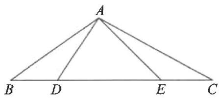</td><td>【练1】图中有几个三角形?用符号表示这些三角形.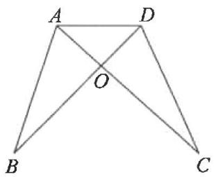</td></tr><tr><td>【例2】(教材母题)如图,写出以∠A为角的三角形;写出以BC为边的三角形.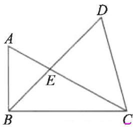</td><td>【练2】如图,写出以∠B为角的三角形;写出以CD为边的三角形.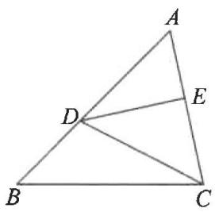</td></tr></table>

# 知识点② 三角形的分类

<table><tr><td>【例3】(教材母题)如图,AB=BC=CD=DA=AC,找出图中的等腰三角形和等边三角形.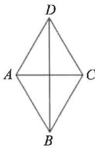</td><td>【练3】如图,AB=AC,BD=AD=DE=AE=EC,找出图中的等腰三角形和等边三角形.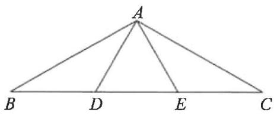</td></tr><tr><td>【例4】(教材母题)如图,在△ABC中,∠BAC是直角,AD⊥BC,垂足为D,点E在线段BD上,找出图中的锐角三角形、直角三角形和钝角三角形.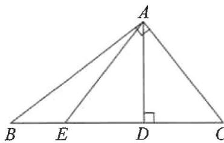</td><td>【练4】如图,在△ABC中,DA⊥AC交BC于点D,AE⊥BC,垂足为E,找出图中的直角三角形和钝角三角形.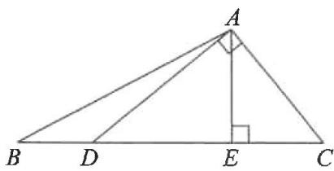</td></tr></table>

# 13.2 与三角形有关的线段

# 13.2.1 三角形的边

# 知识点1 三角形的三边关系

<table><tr><td>【例1】(教材母题)三角形的三边长分别为2,7,a,则a的取值范围是_.</td><td>【练1】在△ABC中,已知两条边a=6,b=7,则第三条边c的取值范围是_.</td></tr><tr><td>【例2】(教材变式)长为100cm,70cm,50cm,30cm的四根木条,选其中三根组成三角形,共有_种选法.</td><td>【练2】长为10cm,30cm,40cm,50cm的四根木条,选其中三根组成三角形,则这个三角形的周长为_cm.</td></tr><tr><td>【例3】(教材母题)一个等腰三角形的一边长为6,周长为20,求其他两边的长.</td><td>【练3】一个等腰三角形的周长为24,一条边的长为6,求这个等腰三角形的另两条边的长.</td></tr></table>

# 知识点② 三角形的稳定性

【例 4】如图,工人师傅砌门时,常用木条 EF 固定门框 ABCD,使其不变形,这种做法的根据是

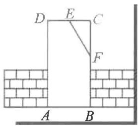

text_image

D E C
F
A B

【练4】下列图形具有稳定性的是（

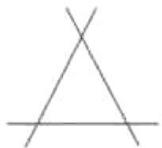  
A

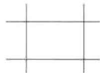  
B

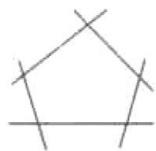  
C

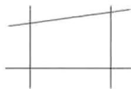  
D

# 13.2.2 三角形的中线、角平分线、高

# 知识点① 三角形的中线

【例 1】（教材变式）如图，AD, BE, CF 是 $\triangle ABC$ 的三条中线.

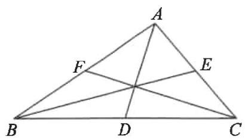

text_image

A
F
E
B
D
C

(1) $BD=$ \_\_\_\_; $AE=\frac{1}{2}$ \_\_\_\_;

$$
A B = 2 \quad = 2 \quad ;
$$

(2) 若 $S_{\triangle ABC} = 12$ ，则 $S_{\triangle ABD} =$ \_\_\_\_；

$$
S _ {\triangle B C E} = \quad ; S _ {\triangle A C F} = \quad .
$$

【练1】如图， $AD$ 是 $\triangle ABC$ 的中线， $CE$ 是 $\triangle ACD$ 的中线.

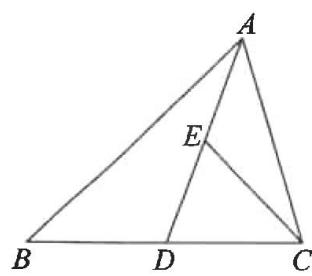

text_image

A
E
B
D
C

(1) $BD =$ \_\_\_\_ ; $AE = \frac{1}{2}$ \_\_\_\_ ;   
(2) 若 $S_{\triangle ABC} = 24$ ; 则 $S_{\triangle ABD} = \underline{\hspace{2cm}}$ ;

$$
S _ {\triangle A C E} = \underline {{\quad}}.
$$

# 知识点② 三角形的角平分线

【例 2】（教材变式）如图，AD, BE, CF 是 $\triangle ABC$ 的三条角平分线. 则 $\angle1=$ \_\_\_\_，

$$
\angle 3 = \frac {1}{2} \quad ;
$$

$$
2 \angle 4 = 2 \quad = \quad .
$$

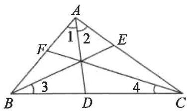

text_image

A
1 2
F
E
B 3 D 4 C

【练 2】如图,AD,CE 是△ABC 的两条角平分线.

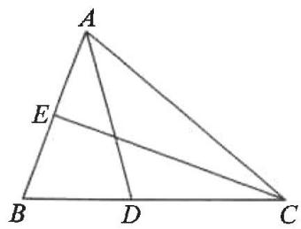

text_image

A
E
B D C

(1)若 $\angle BAC=70^{\circ}$ ,则 $\angle BAD$ 的度数为\_\_\_\_;   
(2)若 $\angle ACE=20^{\circ}$ ,则 $\angle BCA$ 的度数为

# 知识点③ 三角形的高

【例 3】(教材变式)如图, AD, CE 是△ABC 的两条高. 若 AB = 3, BC = 6, AD = m, 则 CE 的长为 \_\_\_\_. (用含 m 的式子表示)

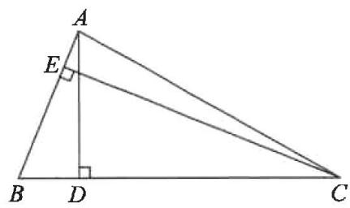

text_image

A
E
B D C

【练3】如图，在 $\triangle ABC$ 中， $\angle BAC = 90^{\circ}$ ， $AB = 8, AC = 6, BC = 10, AD$ 是高.

(1)求 $\triangle ABC$ 的面积；  
(2) 求 $AD$ 的长.

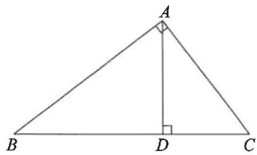

text_image

A
B D C

# 13.3 三角形的内角与外角

# 13.3.1 三角形的内角

# 第1课时 三角形的内角和

# 知识点 三角形的内角和

【例 1】(教材母题) 求出下列各图形中 x 的值.

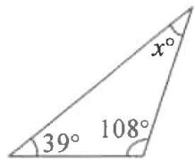  
(1)

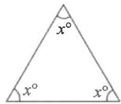  
(2)

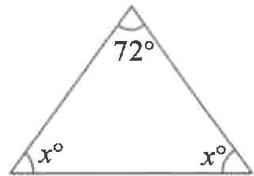  
(3)

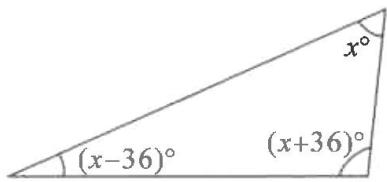

text_image

(x-36)°
(x+36)°
x°

(4)

【练 1】在 $\triangle ABC$ 中， $\angle A = 75^{\circ}$ ， $\angle B = 60^{\circ}$ ，则 $\angle C$ 的度数为（）

A. ${30}^{ \circ  }$

B. ${45}^{ \circ  }$

C. ${50}^{ \circ  }$

D. ${10}^{ \circ  }$

【练2】在 $\triangle ABC$ 中， $\angle A = 2\angle B, \angle C$ 比 $\angle B$ 大 $20^{\circ}$ ，求 $\angle A$ 的度数.

【例 2】（教材母题）如图，在 $\triangle ABC$ 中， $\angle A = 40^{\circ}$ ，求 $\angle B + \angle C + \angle ADE + \angle AED$ 的度数.

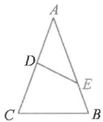

【练3】如图,在 $\triangle ABC$ 中, $BD$ 是 $\angle ABC$ 的平分线, $DE \parallel BC$ 交 $AB$ 于点 $E$ . $\angle A=60^{\circ}$ , $\angle C=80^{\circ}$ ,求 $\angle BDE$ 的度数.

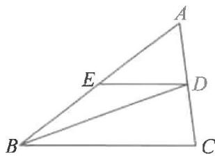

text_image

Geometric diagram of triangle ABC with internal points D and E, showing segments BD and CE

# 第2课时 直角三角形的两锐角互余

# 知识点① 直角三角形的两个锐角互余

【例 1】（教材母题）如图，在 $\triangle ABC$ 中， $AD \perp BC$ ，垂足为 D， $\angle 1 = \angle 2, \angle C = 65^{\circ}$ 。求 $\angle BAC$ 的度数。

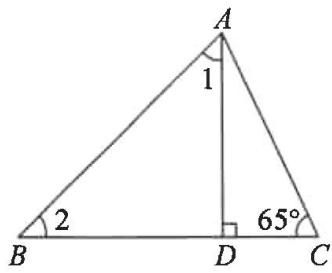

text_image

A
1
2
B
D
65°
C

【练 1】(教材变式)如图, $\angle ACB=90^{\circ},CD\perp AB$ ,垂足为D.求证: $\angle ACD=\angle B$ .

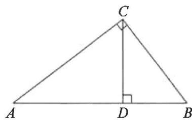

text_image

C
A D B

# 知识点 2 有两个角互余的三角形是直角三角形

【例2】（教材母题）如图，在 $\triangle ABC$ 中， $\angle C = 90^{\circ}$ ，点 $D, E$ 分别在边 $AB, AC$ 上，且 $\angle 1 = \angle 2, \triangle ADE$ 是直角三角形吗？为什么？

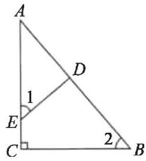

text_image

A
1
D
E
C
2
B

【练2】如图,在 $\triangle ABC$ 中, $\angle BAC=90^{\circ},D$ 是 $BC$ 边上的一点, $\angle DAC=\angle B$ .判断 $\triangle ADC$ 的形状,并说明理由.

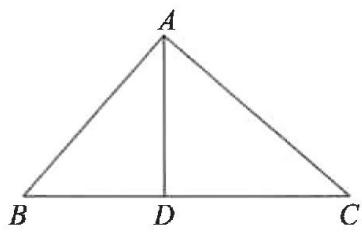

text_image

A
B D C

# 13.3.2 三角形的外角

# 知识点 三角形的外角

【例 1】(教材母题)说出下列各图形中∠1和∠2的度数.

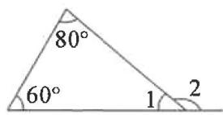  
(1)

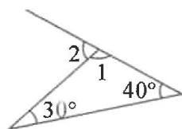  
(2)

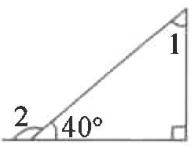  
(3)

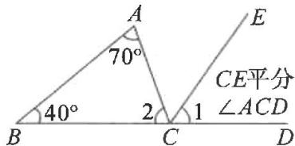

text_image

A
70°
40°
2
1
CE平分
∠ACD
B
C
D
E

(4)

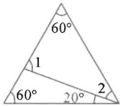

text_image

60°
1
60° 20° 2

(5)

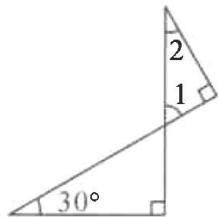  
(6)

【练 1】如图, 在 $\triangle ABC$ 中, $D$ 是 $BC$ 延长线上一点, $\angle B=40^{\circ}$ , $\angle ACD=120^{\circ}$ , 则 $\angle A$ 的度数是( )

A. ${60}^{ \circ  }$

B. ${70}^{ \circ  }$

C. ${80}^{ \circ  }$

D. ${90}^{ \circ  }$

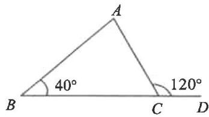

text_image

A
40°
B C D
120°

【练 2】图中 x 的值为 \_\_\_\_.

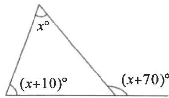

text_image

x°
(x+10)°
(x+70)°

【例 2】(教材变式)如图, $\angle1$ 是 $\triangle ABC$ 的一个\_\_\_\_, $\angle2=$ \_\_\_\_ + \_\_\_\_, $\angle1+\angle2+\angle3=$ \_\_\_\_ 度.

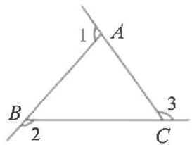

text_image

1
A
B
2
C
3

【练3】如图， $\triangle ABC$ 的边 $AC$ 的延长线上有一点 $D$ ，点 $F$ 为 $AB$ 边上一点，连接 $DF$ 交 $BC$ 于点 $E$ ，若 $\angle A = 30^{\circ}, \angle D = 40^{\circ}, \angle BED = 80^{\circ}$ ，求 $\angle B$ 的度数.

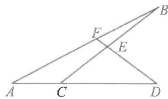

text_image

Geometric diagram with labeled points A, B, C, D, E, F forming intersecting triangles and lines

# 第十四章 全等三角形

# 14.1 全等三角形及其性质

# 知识点① 全等形的概念

【例 1】下列说法正确的是( )

A. 面积相等的图形叫做全等形  
B. 周长相等的图形叫做全等形  
C. 能完全重合的图形叫做全等形  
D. 形状相同的图形叫做全等形

【练 1】下列各组图形中,两个图形属于全等图形的是()

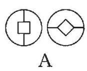

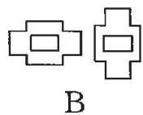

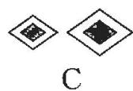

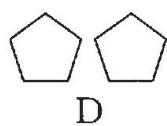

# 知识点② 全等三角形的对应边、对应角

【例 2】(教材变式)如图, $\triangle OCA \cong \triangle OBD$ ,
C 和 B, A 和 D 是对应顶点,说出这两个三角形中相等的边和角.

(1) 相等的边: $CA = \_$ , $OA = \_$ ;  
OC= \_\_\_\_ ;

(2)相等的角: $\angle A =$ \_\_\_\_; $\angle C =$

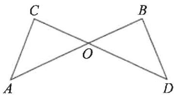

text_image

C
O
A
B
D

【练2】（教材变式）如图， $\triangle ABN \cong \triangle ACM$ ， $\angle B$ 和 $\angle C$ 是对应角， $AB$ 和 $AC$ 是对应边，其它对应边及对应角正确的是（ ）

A. AM 和 BM 是对应边  
B. $BN$ 和 $CN$ 是对应边  
C. $\angle ANB$ 和 $\angle AMC$ 是对应角

D. $\angle BAN$ 和 $\angle CAB$ 是对应角

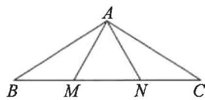

text_image

A
B M N C

# 知识点③ 全等三角形的性质

【例 3】(教材变式)如图是两个全等三角形, 图中的字母表示三角形的边长, 则∠1等于 ( )

A. ${60}^{ \circ  }$   
B. ${54}^{ \circ  }$   
C. ${56}^{ \circ  }$   
D. ${66}^{ \circ  }$

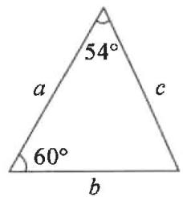

text_image

54°
a
c
60°
b

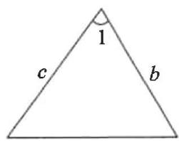

text_image

1
c b

【练3】如图, 若 $\triangle ABC \cong \triangle EFC$ , 且 $CF = 3 \mathrm{~cm}, \angle EFC = 64^{\circ}$ , 则 $BC$ 的长为 \_\_\_\_ cm, $\angle B$ 的度数为 \_\_\_\_.

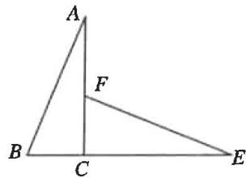

text_image

A
F
B
C
E

【例 4】（教材变式）如图，若 $\triangle ABC \cong \triangle DEF$ ，且 B, E, C, F 四个点在同一条直线上，BC = 7, EC = 5，求 CF 的长.

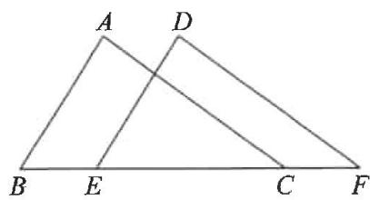

text_image

A
D
B E C F

【练4】如图， $\triangle ACF \cong \triangle DBE$ ，且点 $A, B, C, D$ 在同一条直线上， $\angle A = 50^\circ, \angle F = 40^\circ$ .

(1)求 $\triangle DBE$ 各内角的度数；  
(2) 若 $AD = 16, BC = 10$ , 求 $AB$ 的长.

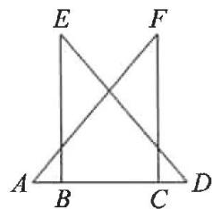

text_image

E
F
A
B
C
D

# 14.2 三角形全等的判定

# 第 1 课时 用“SAS”判定三角形全等

# 知识点① 三角形全等的判定——“SAS”

【例 1】如图所示, 如果 AB = AC, AD = AE, 那么不增加任何条件, 就可以根据“\_\_\_\_”定理, 判定: $\triangle ABE \cong$ \_\_\_\_.

text_image

A
D	E
O
B	C

【练1】如图, 点 $P$ 在 $\angle AOB$ 的平分线上, 要使 $\triangle AOP \cong \triangle BOP$ (SAS), 则需添加一个条件为

# 知识点 2 利用“SAS”证明边角关系

【例 2】两车从南北方向的路段 AB 的 A 端出发, 分别向东、向西行进相同的距离, 到达 C, D 两地. 此时 C, D 两地到 B 端的距离相等吗? 请说明理由.

text_image

B
D A C

【练2】（教材变式）如图，点 $E, F$ 在 $BC$ 上， $BE = CF, AB = DC, \angle B = \angle C$ . 求证： $\angle A = \angle D$ .

text_image

A
D
B E
F C

【例 3】如图, 已知 $AB \perp BD$ 于点 B, $ED \perp BD$ 于点 D, AB = CD, BC = DE. 求证: AC = CE.

text_image

A
B C D
E

【练3】如图， $BD \parallel AC, BD = BC$ ，点E在BC上，且BE=AC。求证： $\angle D=\angle ABC$ 。

text_image

A
B	E	C
D

# 第 2 课时 用“ASA”或“AAS”判定三角形全等

# 知识点① 三角形全等的判定——“ASA”

【例 1】如图, AB = AC, 若利用“ASA”来证明 $\triangle ABE \cong \triangle ACD$ , 需补充的一个条件是 ( )

A. $\angle B = \angle C$

B. $\angle BEA = \angle CDA$

C. ${AD} = {AE}$

D. ${BE} = {CD}$

text_image

A
D	E
B	C

【练1】如图,在 $\triangle ABC$ 和 $\triangle ABD$ 中, $\angle 1=\angle 2$ .当 $\angle 3=\angle 4$ 时, $\triangle ABC \cong \triangle ABD$ 的依据是\_\_\_\_.

text_image

A
1
2
3
B
4
C
D

# 知识点② 三角形全等的判定——“AAS”

【例 2】(教材变式)如图,要测量池塘两岸相对的两点 A, B 的距离,在池塘外取 AB 的垂线 BF 上的两点 C, D, 使 BC = CD, 再过点 D 画出 BF 的垂线 DE, 使 E 与 A, C 在一条直线上, 此时测得 DE = 13 米, 则 AB 的长为 \_\_\_\_ 米.

text_image

Geometric diagram showing a shaded circle with points A, B, C, D, E, F and perpendicular lines, likely illustrating a geometry problem or proof.

【练2】（教材变式）如图， $AB \perp BC, AD \perp DC$ ，垂足分别为 $B, D, \angle 1 = \angle 2$ . 求证： $BC = DC$ .

text_image

A
1 2
B
C
D

【例 3】(教材变式)如图, $BD \perp AC$ 于点 $D$ , $CE \perp AB$ 于点 $E$ , $BD = CE$ . 求证: $AB = AC$ .

text_image

A
E
D
B
C

【练3】（教材变式）如图，点 $E, F$ 在 $BC$ 上， $BE = CF, \angle A = \angle D, \angle B = \angle C.$ 求证： $AB = DC.$

text_image

A
D
B E F C

# 第 3 课时 用“SSS”判定三角形全等

# 知识点① 三角形全等的判定——“SSS”

【例 1】(教材变式)工人师傅常用角尺平分一个任意角. 做法如下: 如图, ∠AOB 是一个任意角, 在边 OA, OB 上分别取 OM = ON, 移动角尺, 使角尺两边相同的刻度分别与点 M, N 重合. 过角尺顶点 C 的射线 OC 便是 ∠AOB 的平分线. 在这个过程中先可以得到 △CMO≌△CNO, 其判定的依据是 \_\_\_\_.

text_image

O
M
A
C
N
B

【练1】(教材变式)如图, 点 D, F 在线段 AE 上, AF = DE, AB = EC, BD = CF. 求证: $\triangle ABD \cong \triangle ECF$ .

text_image

Geometric diagram with labeled points A, B, C, D, E, F and intersecting lines forming triangles

# 知识点② “SSS”与全等三角形性质的应用

【例 2】(教材变式)如图, C 是 AB 的中点, AD = CE, CD = BE. 求证: $\triangle ACD \cong \triangle CBE$ .

text_image

A
C
D
B
E

【练 2】(教材变式)如图, 点 B, E, C, F 在同一条直线上, 且 AB = DE, AC = DF, BE = CF. 求证: $\angle A = \angle D$ .

text_image

A
D
B E C F

# 第 4 课时 尺规作图

# 知识点① 过直线外一点作已知直线的平行线

【例 1】(教材变式)如图, 已知 $\angle AOB, P$ 为 OA 上一点, 过点 P 作 $PQ \parallel OB$ (保留作图痕迹, 不写作法).

text_image

A
P
O
B

【练 1】(教材母题)如图, 已知 $\triangle ABC$ , 过点 C 作 AB 的平行线 (保留作图痕迹, 不写作法).

natural_image

Simple geometric triangle diagram labeled A, B, C (no additional text or symbols)

# 知识点② 根据边角作三角形

【例 2】(教材母题)如图, 已知线段 a, b 和 $\angle\alpha$ , 求作 $\triangle ABC$ , 使 BC = a, AB = b, $\angle B = \angle\alpha$ (保留作图痕迹, 不写作法).

text_image

α

【练2】（教材变式）如图，已知线段 $a$ 和 $\angle \alpha$ 求作 $\triangle ABC$ ，使 $AB = AC = a, \angle ABC = \angle \alpha$ （保留作图痕迹，不写作法）.

text_image

a
α

# 第 5 课时 用“HL”判定两个直角三角形全等

# 知识点 直角三角形全等的判定——“HL”

【例 1】如图, 已知 $AB \perp BD, CD \perp BD$ , 若要用“HL”判定 Rt△ABD 和 Rt△CDB 全等, 则还需要添加的一个条件是()

A. ${AD} = {CB}$

B. $\angle A = \angle C$

C. $\angle ADB = \angle CBD$

D. ${AB} = {CD}$

text_image

A
D
B
C

【练1】如图，BE, CD 是 $\triangle ABC$ 的高，且 BD = EC，判定 $\triangle BCD \cong \triangle CBE$ 的依据是 \_\_\_\_.

text_image

A
D
E
B
C

【例 2】（教材母题）如图， $AB = CD, AE \perp BC, DF \perp BC$ ，垂足分别为 E, F, CE = BF. 求证：AE = DF.

text_image

C
D
F
E
A
B

【练 2】(教材变式)如图,C 是路段 AB 的中点,两人从点 C 同时出发,以相同的速度分别沿两条直线行走,并同时到达 D,E 两地, $DA \perp AB,EB \perp AB,D,E$ 到路段 AB 的距离相等吗?为什么?

text_image

Geometric diagram showing two stick figures at A, B, C, D, E with right angles at C and D, forming triangles.

# 14.3 角的平分线

# 第 1 课时 角的平分线的性质

# 知识点 角的平分线的性质

<table><tr><td>【例1】如图,AD是△ABC的角平分线,DE⊥AB交AB于点E,DF⊥AC交AC于点F,则图中与DE相等的线段是____.</td><td>【练1】如图,OP平分∠MON,PA⊥ON于点A,点Q是射线OM上的一个动点,若PA=2,则PQ的最小值为( )A.1B.2 C.3D.4</td></tr><tr><td>【例2】如图,在△ABC中,∠C=90°,AC=BC,AD是角平分线,DE⊥AB于点E,AB=8,求△BDE的周长.</td><td>【练2】(教材变式)如图,△ABC的∠ABC的外角的平分线BD与∠BAC的外角的平分线AE相交于点P.求证:点P到三边AB,BC,CA所在的直线的距离相等.</td></tr></table>

# 第 2 课时 角的平分线的判定

# 知识点① 角的平分线的判定

【例 1】如图, $\angle C=\angle D=90^{\circ}$ ,根据角的平分线的判定,由 BC=BD 可直接判定出 AB 平分 \_\_\_\_;由 AC=AD 可直接判定出 BA 平分 \_\_\_\_.

text_image

A
B
C
D

【练1】如图, $AB \parallel CD$ , 点 $P$ 到 $AB, BC, CD$ 距离都相等, 则 $\angle P =$ \_\_\_\_°.

text_image

A
B
P
C
D

# 知识点② 角的平分线的性质与判定的综合运用

【例 2】(教材变式)如图, $\triangle ABC$ 的外角的平分线 BD 与 CE 相交于点 P, 求证: 点 P 在 $\angle BAC$ 的平分线上.

text_image

Geometric diagram with labeled points A, B, C, D, E, and P, showing intersecting lines and triangles.

【练 2】如图, $\triangle AOB \cong \triangle COD, AB, CD$ 交于点P, $OE \perp AB$ 于点E, $OF \perp CD$ 于点F.

(1) 求证: $\triangle AOE \cong \triangle COF$ ;

(2)求证:PO 平分∠APD.

text_image

Geometric diagram with labeled points A, B, C, D, O, E, F and connecting lines forming triangles and intersections

# 第十五章 轴对称

# 15.1 图形的轴对称

# 15.1.1 轴对称及其性质

# 知识点 1 轴对称图形

【例 1】在以下四个标志中,是轴对称图形的是( )

A.

B.

C.

D.

【练 1】下列四个手机 APP 图标中, 是轴对称图形的是( )

  
A

  
B

  
C

  
D

【例 2】(教材母题)如图所示的每个图形是轴对称图形吗? 如果是, 指出它的对称轴.

  
(1)

  
(2)

  
(3)

  
(4)

  
(5)

【练 2】(教材母题)如图所示的每幅图形中的两个图案是轴对称图形吗? 如果是, 指出它们的对称轴, 并找出一对对称点.

  
(1)

  
(2)

  
(3)

# 知识点② 轴对称及其性质

【例 3】如图, $\triangle ABC$ 与 $\triangle DEF$ 关于直线MN对称,其中 $\angle C=90^{\circ},AC=4\ cm,DE=5\ cm,BC=3\ cm.$

(1)你认为点 A 与点 D 有何关系？连接 AD，则线段 AD 与直线 MN 有何关系？  
(2)求 $\angle F$ 的度数；  
(3)求 $\triangle DEF$ 的周长.

text_image

A
M
D
C
F
B
N
E

【练 3】如图, $\triangle ABC$ 与 $\triangle DEF$ 关于直线 l 对称,且 $\angle A=78^{\circ},\angle F=48^{\circ}$ .

(1)若点 B 到直线 l 的距离为 4, 则 B, E 两点间的距离为 \_\_\_\_;  
(2)求 $\angle E$ 的度数.

text_image

l
B A D E
C F

# 15.1.2 线段的垂直平分线

# 第1课时 线段的垂直平分线(一)

# 知识点1 线段的垂直平分线的性质

【例 1】（教材母题）如图， $AD \perp BC, BD = DC$ ，点 C 在 AE 的垂直平分线上.

(1)AB,AC,CE的长度有何关系?

(2) $AB+BD$ 与DE有什么关系?

text_image

A
B D C E

【练 1】如图, 在 $\triangle ABC$ 中, AC = 8 cm, ED 垂直平分 AB, 如果 $\triangle EBC$ 的周长是 14 cm, 求 BC 的长.

# 知识点② 线段的垂直平分线的判定

【例 2】（教材母题）如图，AB = AC, MB = MC，直线 AM 是线段 BC 的垂直平分线吗？为什么？

text_image

A
M
B
C

【练 2】(教材变式)如图, AD 与 BC 相交于点 O, OA = OC, $\angle A = \angle C$ , BE = DE.

(1) 求证: OB = OD;

(2) 求证: OE 垂直平分 BD.

text_image

A
O
B
D
E
C

# 知识点③ 互逆命题与互逆定理

【例 3】(教材母题)写出下列命题的逆命题,并判断这些逆命题是否成立.

(1)两直线平行,同位角相等;   
(2)如果两个实数相等,那么它们的绝对值相等;  
(3)全等三角形的对应角相等.

【练 3】(教材母题)下列各命题都成立,写出它们的逆命题,这些逆命题成立吗?

(1)同旁内角互补,两直线平行;   
(2)如果两个实数相等,那么它们的平方相等;  
(3)全等三角形的对应边相等.

# 第2课时 线段的垂直平分线(二)

# 知识点1 尺规作图作线段的垂直平分线

【例 1】如图, 在 $\triangle ABC$ 中, 分别以点 $A, B$ 为圆心, 大于 $\frac{1}{2}AB$ 长为半径画弧, 两弧相交于点 $E, F$ , 连接 $AE, BE$ , 作直线 $EF$ 交 $AB$ 于点 $M$ , 连接 $CM$ , 则下列判断不正确的是( )

text_image

A
E
M
C
F
B

A. ${AB} = {2CM}$

B. ${EF}\bot {AB}$

C. $AE = BE$

D. ${AM} = {BM}$

【练1】如图,在 $\triangle ABC$ 中, $\angle B=68^{\circ},\angle C=28^{\circ}$ ,分别以点A和点C为圆心,大于 $\frac{1}{2}AC$ 的长为半径画弧,两弧相交于点M,N,作直线MN,交BC于点D,连接AD,则 $\angle BAD$ 的度数为( )

text_image

A
N
B
D
M
C

A. ${50}^{ \circ  }$

B. ${52}^{ \circ  }$

C. ${54}^{ \circ  }$

D. $56^{\circ}$

# 知识点② 作轴对称图形的对称轴

【例 2】(教材变式)分别作出长方形和等边三角形的一条对称轴.

【练2】下列各图形是轴对称图形吗？如果是，画出它们的一条对称轴.

# 15.2 画轴对称的图形

# 第 1 课时 画轴对称的图形(一)

# 知识点 画轴对称的图形

<table><tr><td>【例1】如图,已知直线l和△ABC,作△ABC关于直线l的对称图形,将下列作图步骤补充完整:(1)分别过点A,B,C作直线l的垂线,垂足分别为_;(2)分别在AM,BN,CO的延长线上取点_,使_,_;(3)顺次连接_,_,_,_,得△ABC关于直线l的对称图形△DEF.</td><td>【练1】如图,把下列图形补成关于直线l对称的图形.  图1 图2 图3</td></tr><tr><td>【例2】如图是由两个阴影的小正方形组成的图形,请你在空白网格中补画一个阴影的小正方形,使补画后的三个阴影图形为轴对称图形,共有_种画法.</td><td>【练2】如图是4×4的正方形网格,其中已有3个小方格涂成了黑色.现在要从其余13个白色小方格中选出一个也涂成黑色,使涂成黑色的图形成为轴对称图形,这样的白色小方格有_个.</td></tr></table>

# 第 2 课时 画轴对称的图形(二)

# 知识点1 关于坐标轴对称的点的坐标特征

【例 1】(教材母题)分别写出下列各点关于 x 轴和 y 轴对称的点的坐标.

<table><tr><td></td><td>关于x轴对称</td><td>关于y轴对称</td></tr><tr><td>(-2,6)</td><td></td><td></td></tr><tr><td>(1,-2)</td><td></td><td></td></tr><tr><td>(1,3)</td><td></td><td></td></tr><tr><td>(-4,-2)</td><td></td><td></td></tr><tr><td>(1,0)</td><td></td><td></td></tr></table>

【练1】在平面直角坐标系中, 点 $A(2,3)$ 关于 $x$ 轴对称的点的坐标是( )

A. $(-2,-3)$

B. $(2,-3)$

C. $(-2,3)$

D. $(-3,-2)$

【练2】若点 $A(a,3)$ 与点 $B(-2,b)$ 关于 $y$ 轴对称，则点 $M(a,b)$ 所在的象限是（）

A. 第一象限

B. 第二象限

C. 第三象限

D. 第四象限

# 知识点② 在坐标系中作关于坐标轴对称的图形

【例 2】(教材母题)如图,利用关于坐标轴对称的点的坐标的特点,分别画出与 $\triangle ABC$ 关于x轴和y轴对称的图形.

line

| Point | x | y |
|---|---|---|
| A | -4 | 1 |
| B | -1 | -1 |
| C | -3 | 2 |
| D | -1 | -1 |

【练 3】 $\triangle ABC$ 在直角坐标系内的位置如图.

(1)分别写出 $A, B$ 两点的坐标；

(2)小颖在这个坐标系内画出了 $\triangle A_{1}B_{1}C_{1}$ , 使 $\triangle A_{1}B_{1}C_{1}$ 与 $\triangle ABC$ 关于 $x$ 轴对称, 请帮小颖写出 $B_{1}$ 点和 $C_{1}$ 点的坐标.

(3) 若 $\triangle A_{2}B_{2}C_{2}$ 与 $\triangle ABC$ 关于 $y$ 轴对称, 请写出 $B_{2}$ 点和 $C_{2}$ 点的坐标.

text_image

y
B
A
C
O
x

# 15.3 等腰三角形

# 15.3.1 等腰三角形

# 第1课时 等腰三角形的性质

# 知识点① 等边对等角

<table><tr><td>【例1】(教材变式)(1)顶角为36°的等腰三角形的底角度数为_; (2)顶角为120°的等腰三角形的底角度数为_.</td><td>【练1】若等腰三角形的一个角是50°,则这个等腰三角形的底角的度数为_.</td></tr><tr><td>【例2】(教材母题)如图,AB=AC,∠A=40°,AB的垂直平分线MN交AC于点D.求∠DBC的度数.</td><td>【练2】如图,在△ABC中,AB=AC,AD是∠EAC的平分线.求证:AD//BC.</td></tr></table>

# 知识点② “三线合一”

【例 3】如图, $\triangle ABC$ 是等腰直角三角形 $(AB=AC,\angle BAC=90^{\circ})$ , AD 是底边 BC 上的高. 求 $\angle B,\angle C,\angle BAD,\angle DAC$ 的度数.

text_image

A
B
D
C

【练3】如图,在 $\triangle ABC$ 中, $AB=AC$ , $\angle B=75^{\circ}$ , $E$ 为 $AC$ 的中点, $D$ 为 $AB$ 上一点, $DA=DC$ ,则 $\angle CDE$ 的度数为\_\_\_\_.

# 第 2 课时 等腰三角形的判定

# 知识点 等角对等边

【例 1】(教材母题)如图, $\angle A=36^{\circ},\angle DBC=36^{\circ},\angle C=72^{\circ}$ . 分别计算 $\angle1,\angle2$ 的度数,并说明图中有哪些等腰三角形.

text_image

A
2
1
B
C
D

【练 1】(教材变式)如图,把一张长方形的纸沿对角线折叠,则重合部分( $\triangle FBD$ )的形状为()

A. 直角三角形  
B. 长方形  
C. 等边三角形  
D. 等腰三角形

text_image

A
F
E
D
B
C

【例 2】(教材母题)如图, AC 和 BD 相交于点 O, 且 $AB \parallel DC$ , OA = OB. 求证: OC = OD.

text_image

D
C
O
A
B

【练2】如图,已知∠ACE是△ABC的一个外角,CD平分∠ACE,且CD∥AB.求证:△ABC为等腰三角形.

text_image

A
B
C
D
E

# 15.3.2 等边三角形

# 第 1 课时 等边三角形的性质和判定

# 知识点1 等边三角形的性质

【例 1】如图, $\triangle ABD, \triangle AEC$ 都是等边三角形. 求证: BE = DC.

text_image

Geometric diagram with labeled points A, B, C, D, E and connecting lines forming triangles and quadrilaterals

【练1】如图,在等边△ABC中,D是BC上一点,且BC=3BD,△ADE是等边三角形,若AB=6,则CE的长为\_\_\_\_.

text_image

A
B D C E

# 知识点② 等边三角形的判定

【例 2】如图, 在 $\triangle ABC$ 中, $AE \perp BC$ 于点 E, 点 D 在 BE 上, $\angle ADB = 120^{\circ}$ , $\angle CAE = 30^{\circ}$ . 求证: $\triangle ACD$ 为等边三角形.

text_image

A
B D E C

【练2】（教材母题）如图，在等边△ABC中，AD是BC上的高，点E，F分别在AB，AC上，且∠BDE=∠CDF=60°，则图中与BD相等的线段（不包含BD）共有\_\_\_\_条.

# 知识点 含 $30^{\circ}$ 的直角三角形的性质

【例 1】如图, $\triangle ABC$ 是等边三角形,D 是 BC 边上一点, $DE \perp AC$ 于点 E. 若 EC = 3, 则 DC 的长为()

A. 4

B. 5

C. 6

D. 7

text_image

A
B D C
E

【练1】如图，在 $\triangle ABC$ 中， $\angle ACB = 90^{\circ}$ ， $\angle B = 15^{\circ}$ ， $D$ 为 $AB$ 的中点且 $DE \perp AB$ ，交 $BC$ 于点 $E, AC = 8$ ，则 $BE$ 的长为（）

A. 4

B. 8

C. 12

D. 16

text_image

Geometric diagram showing triangle ABC with perpendicular from D to AB at E, and point E on BC

【例 2】(教材母题)如图, 在 Rt△ABC 中, ∠C=90°, ∠B=2∠A, ∠B 和 ∠A 各是多少度? 边 AB 与 BC 之间有什么数量关系?

text_image

B
C
A

【练2】如图,在等边三角形ABC中,点D,E分别在边BC,AC上,且 $DE\parallel AB$ ,过点E作 $EF\perp DE$ ,交BC的延长线于点F.若CD=2,求DF的长.

text_image

A
E
B
D
C
F

# 第十六章 整式的乘法

# 16.1 幂的运算

# 16.1.1 同底数幂的乘法

# 知识点① 同底数幂的乘法

<table><tr><td>【例1】(教材母题)下面的计算是否正确?如果不正确,应当怎样改正?(1) $a^{3} \cdot a^{2} = a^{6}$ ; (2) $a \cdot a^{3} = a^{0+3} = a^{3}$ ;(3) $m^{3} \cdot m^{3} = 2m^{3}$ .</td><td>【练1】下面的计算是否正确?如果不正确,应当怎样改正?(1) $a^{4} \cdot a^{4} = 2a^{4}$ ; (2) $a^{3} \cdot a^{4} \cdot a = a^{7}$ ;(3) $a^{m+2} \cdot a^{2m} = a^{2m+2}$ .</td></tr><tr><td>【例2】(教材母题)计算:(1) $a \cdot a^{6}$ ; (2) $x^{m} \cdot x^{3m+1}$ ;(3)(-2) $\times (-2)^{4} \times (-2)^{3}$ .</td><td>【练2】(教材母题)计算:(1) $a^{2} \cdot a^{6}$ ; (2) $b^{5} \cdot b$ ; (3) $y^{2n} \cdot y^{n+1}$ .</td></tr></table>

# 知识点② 同底数幂的乘法法则的实际应用

<table><tr><td>【例3】(教材母题)一种电子计算机每秒可进行1亿亿( $10^{16}$ )次运算,它工作 $10^{3}$ s可进行多少次运算?</td><td>【练3】(教材母题)信息存储设备常用B,KB,MB,GB,TB等作为存储量的单位,其中 $1\mathrm{{KB}} = {2}^{10}\mathrm{\;B}$ (字节), $1\mathrm{{MB}} = {2}^{10}\mathrm{{KB}},1\mathrm{{GB}} = {2}^{10}\mathrm{{MB}},1\mathrm{{TB}} = {2}^{10}\mathrm{{GB}}$ .例如,我们常说某计算机的硬盘容量是2TB,某移动硬盘的容量是512GB,某文件的大小是156KB等.对于一个存储量为64GB的闪存盘,其容量有多少字节?</td></tr></table>

# 16.1.2 幂的乘方与积的乘方

# 知识点① 幂的乘方

<table><tr><td>【例1】(教材母题)计算:(1) $(10^3)^5$ ; (2) $(a^m)^2$ ; (3) $-(x^4)^3$ .</td><td>【练1】(教材母题)计算:(1) $(x^3)^2$ ; (2) $-(x^m)^5$ ; (3) $(a^2)^3 \cdot a^5$ .</td></tr></table>

# 知识点 2 积的乘方

<table><tr><td>【例2】(教材母题)计算:(1) $(2a)^{3}$ ; (2) $(-5b)^{3}$ ; (3) $(xy^{2})^{2}$ .</td><td>【练2】(教材母题)计算:(1) $(ab)^{4}$ ; (2) $(-3\times 10^{2})^{3}$ ;(3) $(2ab^{2})^{3} \cdot 2ab^{2}$ .</td></tr></table>

# 知识点③ 幂的混合运算

<table><tr><td>【例3】计算: $a^{3} \cdot a^{5} + (a^{2})^{4} + (-2a^{4})^{2}$ .</td><td>【练3】计算: $3(x^{2})^{3} \cdot x^{3} - (x^{3})^{3} + (-x)^{2} \cdot x^{7}$ .</td></tr></table>

# 16.2 整式的乘法

# 第 1 课时 单项式乘单项式

# 知识点① 单项式乘单项式

<table><tr><td>【例1】(教材母题)计算:(1) $3xy^{2} \cdot 2y^{3}$ ; (2)( $-5a^{2}b$ )( $-3a$ ).</td><td>【练1】(教材母题)计算:(1) $4y \cdot (-2xy^{2})$ ; (2) $-2ab^{2} \cdot (-3ab)$ .</td></tr><tr><td>【例2】(教材母题)计算:(1) $(2x)^{3}(-5xy^{2})$ ; (2) $(-3x^{2}y)^{2}(-xy^{3})^{2}$ .</td><td>【练2】(教材母题)计算:(1) $(-3xy^{2})^{2}(-2xy)^{2}$ ;(2) $(-a)^{5}-(2a \cdot 3a)^{2} \cdot (-a)$ .</td></tr></table>

# 知识点② 单项式乘单项式的实际应用

<table><tr><td>【例3】(教材母题)卫星绕地球运动的速度(即第一宇宙速度)是 $7.9 \times 10^{3}$ m/s,求卫星绕地球运行1h飞过的路程.</td><td>【练3】世界上最大的金字塔——胡夫金字塔高达146.6米,底边长230.4米,用了约 $2.3 \times 10^{6}$ 块大石块,每块质量约 $2.5 \times 10^{3}$ 千克,请问胡夫金字塔总质量约为多少千克?</td></tr></table>

# 第2课时 单项式乘多项式

# 知识点1) 单项式乘多项式法则

<table><tr><td>【例1】(教材母题)计算:(1) $(-4x^{2})(3x+1)$ ;(2) $\left(\frac{2}{3}ab^{2}-2ab\right)\cdot\frac{1}{2}ab$ ;(3) $x(y-z)-y(z-x)+z(x-y)$ .</td><td>【练1】(教材母题)计算:(1) $3a(5a-2b)$ ;(2) $(x-3y)(-6x)$ ;(3) $(-2ab)^{2}(2a-b+1)$ .</td></tr><tr><td>【例2】(教材母题)化简: $x(x-1)+2x(x+1)-3x(2x-5)$ .</td><td>【练2】化简: $3a(2a^{2}-a+3)-2a^{2}(3a-4)$ .</td></tr></table>

# 知识点② 化简求值

<table><tr><td>【例3】(教材母题)求值: $x^{2}(x-1)-x(x^{2}+x-1)$ ,其中 $x=\frac{1}{2}$ .</td><td>【练3】求值: $2x^{2}(x^{2}-x+1)-x(2x^{3}-10x^{2}+2x)$ ,其中 $x=-2$ .</td></tr></table>

# 第 3 课时 多项式乘多项式

# 知识点① 多项式乘多项式法则

<table><tr><td>【例1】(教材母题)计算:(1) $(a+3)(a-2)$ ;(2) $(3x+1)(x+2)$ ;(3) $(a+b)(a^{2}-ab+b^{2})$ .</td><td>【练1】(教材母题)计算:(1) $(a-1)^{2}$ ;(2) $(a+3b)(a-3b)$ ;(3) $(2x^{2}-1)(x-4)$ .</td></tr><tr><td>【例2】(教材母题)计算:(1) $(x-4)(x+1)$ ;(2) $(x-5)(x-3)$ .</td><td>【练2】计算:(1) $(x-3)(x+8)$ ;(2) $(x+3y)(x+4y)$ .</td></tr></table>

# 知识点 2）化简求值

【例 3】（教材母题）求值： $(x-y)(x^{2}+xy+y^{2})-(x+y)(x^{2}-y^{2})$ ，其中 $x=\frac{1}{5}, y=5$ .

【练3】求值： $(x + 3)(x - 3) + 3(x + 3)(x-$ $4) - 4(x - 2)^{2}$ ，其中 $x = 2$

# 第 4 课时 整式的除法

# 知识点1 同底数幂的除法法则

<table><tr><td>【例1】(教材母题)计算:(1) $x^{8} \div x^{2}$ ; (2)( $ab$ ) $^{5} \div (ab)^{2}$ .</td><td>【练1】(教材母题)计算:(1) $m^{8} \div m^{8}$ ; (2)( $-a$ ) $^{10} \div (-a)^{7}$ .</td></tr></table>

# 知识点② 零指数幂

<table><tr><td>【例2】填空:(1) $2^{0}$ =_; (2) $3^{0}-1$ =.</td><td>【练2】计算: $(\pi-3.14)^{0}-\sqrt{4}+2^{5}\div2^{3}$ .</td></tr></table>

# 知识点③ 单项式除以单项式

<table><tr><td>【例3】(教材母题)计算:(1) $(28x^{4}y^{2})\div(7x^{3}y)$ ;(2) $(-5a^{5}b^{3}c)\div(15a^{4}b)$ .</td><td>【练3】(教材母题)计算:(1) $(-21x^{2}y^{4})\div(-3x^{2}y^{3})$ ;(2) $(6\times10^{8})\div(3\times10^{5})$ .</td></tr></table>

# 知识点4 多项式除以单项式

<table><tr><td>【例4】(教材母题)计算:( $12a^{3}-6a^{2}+3a$ )÷(3a).</td><td>【练4】(教材母题)计算:(1) $(6ab+5a)$ ÷ $a$ ;(2) $(15x^{2}y-10xy^{2})$ ÷(5xy).</td></tr></table>

# 16.3 乘法公式

# 16.3.1 平方差公式

# 知识点① 平方差公式

<table><tr><td>【例1】(教材母题)运用平方差公式计算:(1)(3x+2)(3x-2);(2)(-x+2y)(-x-2y).</td><td>【练1】(教材母题)计算:(1)(a+3b)(a-3b);(2)(3+2a)(-3+2a).</td></tr><tr><td>【例2】(教材母题)计算:(1)(x-1)(x+1)(x2+1);(2)(y+2)(y-2)-(y-1)(y+5).</td><td>【练2】(教材母题)计算:(1)(xy+1)(x2y2+1)(xy-1);(2)(3x+4)(3x-4)-(2x+3)(3x-2).</td></tr></table>

# 知识点② 运用平方差公式计算

<table><tr><td>【例3】(教材母题)计算:102×98.</td><td>【练3】(教材母题)运用平方差公式计算:(1)51×49;(2)200 $\frac{1}{5}$ ×199 $\frac{4}{5}$ .</td></tr></table>

# 16.3.2 完全平方公式

# 第1课时 完全平方公式(一)

# 知识点① 完全平方公式

<table><tr><td>【例1】(教材母题)运用完全平方公式计算: (1)(4m+n)2; (2)(y-1/2)2.</td><td>【练1】(教材母题)运用完全平方公式计算: (1)(y-5)2; (2)(-2x+5)2.</td></tr></table>

# 知识点② 运用完全平方公式计算

<table><tr><td>【例2】(教材母题)运用完全平方公式计算:(1) $102^2$ ; (2) $99^2$ .</td><td>【练2】(教材母题)运用完全平方公式计算:(1) $98^2$ ; (2) $70.5^2$ .</td></tr></table>

# 第 2 课时 完全平方公式(二)

# 知识点(1) 添括号

<table><tr><td>【例1】(教材母题)在等号右边的括号内填上适当的项.(1) $a + b - c = a + ( \quad )$ ;(2) $a - b + c = a - ( \quad )$ ;(3) $a + b + c = a - ( \quad )$ .</td><td>【练1】在括号内填上适当的项:(1) $a + b - c = a - ( \quad )$ ;(2) $a - 2b + c + d = a - ( \quad )$ ;(3) $a - 2b + c + d = a - 2b + ( \quad )$ .</td></tr></table>

# 知识点② 运用乘法公式计算

<table><tr><td>【例2】(教材母题)运用乘法公式计算:(x+2y-3)(x-2y+3).</td><td>【练2】(教材母题)运用乘法公式计算:(x+y-1)(x-y-1).</td></tr></table>

# 知识点③ 运用完全平方公式计算

<table><tr><td>【例3】(教材母题)运用乘法公式计算: (a+b+c)2.</td><td>【练3】(教材母题)运用乘法公式计算: (1)(a+2b-1)2; (2)(2x-y+1)2.</td></tr></table>

# 第十七章 因式分解

# 17.1 用提公因式法分解因式

# 第 1 课时 用提公因式法分解因式(一)

# 知识点① 因式分解的概念

<table><tr><td>【例1】(教材变式)下列由左边到右边的变形,是因式分解的是()A.  $a^{2} - b^{2} + 1 = (a + b)(a - 1) + 1$ B.  $a(x + y) = ax + ay$ C.  $3x^{2} - x + 1 = 3x(x - 1) + 1$ D.  $a^{2} - 4 = (a + 2)(a - 2)$ </td><td>【练1】判断下列从左边到右边的变形是不是因式分解,是的打“√”,不是的打“×”。(1)  $4a^{2} - 4a + 1 = 4a(a - 1) + 1$ ; ____(2)  $x^{2} - 4y^{2} = (x + 2y)(x - 2y)$ ; ____(3)  $(x + 3)(x - 3) = x^{2} - 9$ ; ____(4)  $x^{2} + 1 = x\left(x + \frac{1}{x}\right)$ .</td></tr></table>

# 知识点② 用提公因式法分解因式

<table><tr><td>【例2】(教材变式)分解因式:(1) $2a - a^{2}$ ; (2) $am + bm$ ;</td><td>【练2】分解因式:(1) $a^{2} - 5a$ ; (2) $ak - bk$ ;</td></tr><tr><td>(3) $9x - 6$ ; (4) $7a^{2} - 13ab$ ;</td><td>(3) $20x - 16$ ; (4) $-9y^{2} - 11xy$ ;</td></tr><tr><td>(5) $a^{2}m + b^{2}m + m$ ; (6) $-nx^{2} + 2nx + 7n$ .</td><td>(5) $x^{2}t + 2y^{2}t - t$ ; (6) $3mx^{2} + 5mx - 19m$ .</td></tr></table>

# 知识点③ 利用因式分解计算

<table><tr><td>【例3】(教材变式)利用因式分解计算:(1) $37.8^{2}$ - $27.8 \times 37.8$ ;(2) $92 \times 16.74 + 14 \times 16.74 - 6 \times 16.74$ .</td><td>【练3】利用因式分解计算:(1) $58.7 \times 48.7 - 48.7^{2}$ ;(2) $33 \times 2.905 - 29 \times 2.905 + 96 \times 2.905$ .</td></tr></table>

# 第 2 课时 用提公因式法分解因式(二)

# 知识点① 找公因式

【例 1】写出下列多项式在分解因式时应提取的公因式：

(1)4mn-12m;   
(2) $21x^{3}y^{2}+28x^{2}y^{3}z^{4}$ ;   
(3) $6x(x-2y)-9y(x-2y)$ .

【练1】写出下列多项式在分解因式时应提取的公因式：

(1) $n^{3}+5n^{2}$ ;   
(2) $-12m^{4}n^{2}+20m^{2}n^{4};$   
(3) $9y(p+q)^{2}-15y(p+q)^{3}$ .

# 知识点2 用提公因式法分解因式

【例 2】(教材变式)分解因式:

(1) $ma^{2}b+2ma^{3}$ ;   
(2) $6xy^{3}-15xy^{2}+27xy;$   
(3) $-2x^{3}y+4x^{2}y-xy;$   
(4) $3(m-n)^{3}+t(n-m)^{2}$ .

【练2】分解因式：

(1) $3np^{2}q + np^{3}$ ;   
(2) $-21a - 12ab$ ;   
(3) $-6m^{3}n + 30m^{2}n - 3mn$   
(4) $4(x-y)^{4}+2a(y-x)^{3}$

# 知识点③ 先分解因式再求值

【例 3】（教材变式）先分解因式, 再求值: $4a^{3}(a-3)-8a^{2}(a-3)$ , 其中 $a=\frac{3}{2}$ .

【练3】先分解因式,再求值: $5x(y-2)+10x(2-y)^{2}$ ,其中x=4,y=-2.

# 17.2 用公式法分解因式

# 第 1 课时 用平方差公式分解因式

# 知识点① 平方差公式

<table><tr><td>【例1】(教材变式)下列多项式能用平方差公式分解因式的是()A.  $x^{2} + y^{2}$  B.  $-x^{2} - y^{2}$ C.  $x^{2} - y^{3}$  D.  $-x^{2} + y^{2}$ </td><td>【练1】下列各式不能运用平方差公式进行因式分解的是()A.  $-4a^{2} + b^{2}$  B.  $-x^{2} - 9y^{2}$ C.  $49x^{2} - z^{2}$  D.  $16m^{2} - 25n^{2}$ </td></tr></table>

# 知识点②）用平方差公式分解因式

<table><tr><td>【例2】(教材变式)分解因式:(1) $25x^{2}-49y^{2}$ ;(2) $(a+2b)^{2}-(3a+b)^{2}$ .</td><td>【练2】分解因式:(1) $\frac{1}{9}x^{2}-16$ ;(2) $-9+4a^{2}b^{2}$ .</td></tr><tr><td>【例3】利用因式分解计算: $63^{2}-37^{2}$ .</td><td>【练3】利用因式分解计算: $12.6^{2}-2.6^{2}$ .</td></tr><tr><td>【例4】分解因式: $3a^{3}-\frac{1}{3}a$ .</td><td>【练4】分解因式: $5x^{3}y-20xy^{3}$ .</td></tr></table>

# 第 2 课时 用完全平方公式分解因式

# 知识点(1) 完全平方式

<table><tr><td>【例1】(教材变式)下列各式属于完全平方式的是()A.  $a^{2} + 2ab + 1$  B.  $a^{2} + 4a + 4$ C.  $a^{2} - 3a + 9$  D.  $a^{2} + 2a - 1$ </td><td>【练1】若 $x^{2} + 2ax + 9$ 是一个完全平方式,则 $a$ 的值是()A. 3 B. -3C. 3或-3 D. 9或-9</td></tr></table>

# 知识点② 用完全平方公式分解因式

<table><tr><td>【例2】(教材变式)因式分解:(1) $m^{2}-14m+49$ ;(2) $\frac{x^{2}}{4}+xy+y^{2}$ ;(3) $a^{4}b^{4}+4c^{2}+4a^{2}b^{2}c$ .</td><td>【练2】因式分解:(1) $4a^{2}-20ab+25b^{2}$ ;(2) $1-2xy+x^{2}y^{2}$ ;(3) $\frac{a^{2}}{25}-\frac{ab}{10}+\frac{b^{2}}{16}$ .</td></tr><tr><td>【例3】(教材变式)因式分解:(1) $-x^{2}+4xy-4y^{2}$ ;(2) $a^{2}-6a(c-b)+9(b-c)^{2}$ .</td><td>【练3】因式分解:(1) $-\frac{1}{2}a^{2}+2a-2$ ;(2) $4-12(y-x)+9(x-y)^{2}$ .</td></tr></table>

# 第 3 课时 提公因式法与公式法的综合运用

# 知识点1 先提公因式,再用公式法分解因式

<table><tr><td>【例1】(教材变式)分解因式:3a3-12ab2.</td><td>【练1】分解因式:4x+4xy+xy2.</td></tr></table>

# 知识点② 多次运用公式法分解因式

<table><tr><td>【例2】(教材变式)分解因式:(1) $x^{4}-1$ ;</td><td>【练2】分解因式:(1) $81m^{4}-a^{4}$ ;</td></tr><tr><td>(2) $(a^{2}+1)^{2}-4a^{2}$ ;</td><td>(2) $(16t^{2}-5)^{2}+8(16t^{2}-5)+16$ ;</td></tr><tr><td>(3) $(x^{2}-2x)^{2}+2(x^{2}-2x)+1$ .</td><td>(3) $(9-6y)^{2}+2y^{2}(9-6y)+y^{4}$ .</td></tr></table>

# 知识点③ 先整理,再分解因式

<table><tr><td>【例3】(教材变式)分解因式: $(x - y)^{2} + 4xy$ .</td><td>【练3】分解因式: $(y^{2} - 4y)(y^{2} - 4y + 8) + 16$ .</td></tr></table>

# 第十八章 分式

# 18.1 分式及其基本性质

# 18.1.1 从分数到分式

# 知识点① 分式的概念

【例 1】下列式子: $\frac{x+1}{x},\frac{3}{x+3},\frac{1}{x}-1,\frac{x-y}{3},$ $\frac{x}{\pi+1}$ ,其中分式有()

A. 2 个

B. 3 个

C. 4 个

D. 5 个

【练1】在 $\frac{a - b}{2},\frac{x(x + 3)}{x},\frac{5 + x}{\pi},\frac{a + b}{a - b}$ 中，是分式的有（

A. 1 个

B. 2 个

C. 3 个

D. 4 个

# 知识点2 分式有意义的条件

【例 2】(教材变式) 当 x 取何值时, 下列分式有意义?

(1) $\frac{1}{x - 1}$ ;

(2) $\frac{x+1}{x^{2}-1};$

(3) $\frac{2x}{x^{2}+1}.$

【练 2】若分式 $\frac{2}{x+5}$ 有意义,则 x 的取值范围是()

A. $x \neq 5$

B. $x \neq -5$

C. $x > 5$

D. $x > - 5$

# 知识点③ 分式的值为0

【例 3】若分式 $\frac{x-1}{x+2}$ 的值为0，则()

A. $x = -2$

B. $x = 0$

C. $x = 1$ 或 $x = -2$

D. $x = 1$

【练3】当 $m$ 为何值时，分式 $\frac{m^2 - 4}{2m - 4}$ 的值为0？

# 知识点④ 列分式

【例 4】一辆汽车 b h 行驶了 120 km，则它的平均速度为 \_\_\_\_ km/h；一列火车行驶 120 km 比这辆汽车少用 1 h，则它的平均速度为 \_\_\_\_ km/h。

【练 4】(教材变式)(1)某班有 n 名学生, 某次测试的总分为 m 分, 则人均分为 \_\_\_\_;

(2)Rt△ABC 的面积为 S，一条直角边的长为 a，则另一条直角边的长为 \_\_\_\_。

# 18.1.2 分式的基本性质

# 第1课时 分式的基本性质

# 知识点① 分式的基本性质

<table><tr><td>【例1】如果把 $\frac{5x}{x+y}$ 中的x与y都扩大10倍,那么这个分式的值()A.扩大50倍B.不变C.扩大10倍D.缩小为原来的 $\frac{1}{10}$ </td><td>【练1】如果把分式 $\frac{2x}{x^2-y^2}$ 中的x和y都扩大2倍,那么分式的值()A.缩小到原来的 $\frac{1}{2}$ B.扩大2倍C.不变D.缩小到原来的 $\frac{1}{4}$ </td></tr><tr><td>【例2】填空: $\frac{2a^2-6ab}{4ab}=\frac{(\quad)}{2b}$ , $\frac{a^2-ab}{a^2-b^2}=\frac{a}{(\quad)}$ .</td><td>【练2】填空: $\frac{x-y}{x+y}=\frac{(\quad)}{x^2+xy}$ , $\frac{x+1}{x-1}=\frac{x^2-1}{(\quad)}$ .</td></tr></table>

# 知识点 2 符号变化与系数变化

<table><tr><td>【例3】(教材母题)不改变分式的值,使下列分式的分子和分母都不含“-”号:(1) $\frac{-5y}{-x^2}$ ; (2) $\frac{-a}{2b}$ ;(3) $\frac{4m}{-3n}$ ; (4) $-\frac{-x}{2y}$ .</td><td>【练3】不改变分式的值,把分式中的分子、分母的各项系数化为整数,并使最高次项的系数为正数.(1) $\frac{\frac{2}{5}x+\frac{3}{10}}{0.4x-0.5}$ ; (2) $\frac{\frac{4}{3}-\frac{1}{4}a^3+a^2}{\frac{1}{2}a^2-a+\frac{1}{3}}$ .</td></tr></table>

# 第2课时 约分与通分

# 知识点① 最简分式

<table><tr><td>【例1】下列分式中,最简分式是( )A. $\frac{2x}{x^2}$  B. $\frac{x+1}{x-1}$ C. $\frac{x+2}{2x+4}$  D. $\frac{x^2-1}{x+1}$ </td><td>【练1】下列各式中,是最简分式的是( )A. $\frac{12(a-b)}{15(a+b)}$  B. $\frac{a^2-b^2}{a+b}$ C. $\frac{a^2+b^2}{a^2b+ab^2}$  D. $\frac{(a+b)^2}{a^2-b^2}$ </td></tr></table>

# 知识点② 约分

<table><tr><td>【例2】化简 $\frac{35a^4b^3c}{21a^2b^4d}$ 时,分子、分母应同时约去()A.7 B. $a^2b^3$  C.7ab D. $7a^2b^3$ </td><td>【练2】下列约分正确的是()A. $\frac{2a+1}{2a+1}=0$  B. $\frac{(a-b)^2}{(b-a)^2}=-1$ C. $\frac{6-2x}{-x+3}=2$  D. $\frac{x^2+y^2}{x+y}=x+y$ </td></tr><tr><td>【例3】约分:(1) $\frac{-4m^3n^2}{2m^3n^6}$ ; (2) $\frac{a^2+ab}{a^2+2ab+b^2}$ .</td><td>【练3】约分:(1) $\frac{(x+y)y}{xy^2}$ ; (2) $\frac{x^2-xy}{(x-y)^2}$ .</td></tr></table>

# 知识点③ 通分

<table><tr><td>【例4】通分:(1) $\frac{2c}{bd}$ 与 $\frac{3ac}{4b^{2}}$ ; (2) $\frac{2xy}{(x+y)^{2}}$ 与 $\frac{x}{x^{2}-y^{2}}$ .</td><td>【练4】将 $\frac{5}{x+3}$ , $\frac{1}{3-x}$ 进行通分,结果是____.</td></tr></table>

# 18.2 分式的乘法与除法

# 第1课时 分式的乘法与除法

# 知识点1 分子、分母为单项式的乘除法

【例1】化简 $\frac{a^2b}{mn^2} \cdot \frac{3mn}{ab}$ , 正确的是( )

A. $\frac{3b}{m}$

B. $\frac{3 a}{m n}$

C. $\frac{3b}{mn}$

D. $\frac{3a}{n}$

【练1】计算： $\frac{15x^4}{ab}\div (-18ax^3) =$

# 知识点② 分子、分母为多项式的乘除法

【例 2】计算：

(1) $\frac{a^{2}-1}{a^{2}+2a+1}\cdot\frac{a+1}{a^{2}-a}=$ \_\_\_\_；

(2) $\frac{2(a+1)}{a^{2}+2a+1}\div\frac{2}{a+1}=$ \_\_\_\_.

【练2】计算： $\frac{m^2 - 16}{16m + 8m^2 + m^3} \div \frac{m - 4}{2m + 8}$

$$
\frac {m ^ {2} - 4}{m + 2}.
$$

# 知识点③ 分式的乘除法的实际应用

【例 3】由甲地到乙地的一条铁路全程为 s km, 火车全程运行时间为 a h; 由甲地到乙地的公路全程为这条铁路全程的 m 倍, 汽车全程运行时间为 b h. 那么火车的速度是汽车速度的多少倍?

【练3】甲、乙两地之间公路全长 $s \mathrm{~km}$ , 汽车从甲地开往乙地, 行驶速度为 $a \mathrm{~km} / \mathrm{h}$ ; 返回时, 行驶速度为 $b \mathrm{~km} / \mathrm{h}$ . 则汽车从甲地到乙地需要的时间是返回时的多少倍?

# 第 2 课时 分式的乘方及乘除混合运算

# 知识点① 分式的乘方

<table><tr><td>【例1】计算 $\left(\frac{-2b}{a}\right)^{2}$ 的结果是( )A.  $-\frac{8a}{b^{6}}$  B.  $\frac{4b^{2}}{a^{2}}$  C.  $\frac{4b}{a^{2}}$  D.  $\frac{-4b^{2}}{a^{2}}$ </td><td>【练1】化简: $\left(-\frac{4xy^{2}z}{3x^{3}yz^{2}}\right)^{3}=$ _</td></tr></table>

# 知识点② 分式的乘除、乘方混合运算

<table><tr><td>【例2】下列分式运算,结果正确的是( )A. $\frac{m^4}{n^5}$ · $\frac{n^4}{m^3}$ = $\frac{m}{n}$  B. $\frac{a}{b}$ · $\frac{c}{d}$ = $\frac{ad}{bc}$ C. $\left(\frac{2a}{a-b}\right)^2=\frac{4a^2}{a^2-b^2}$  D. $\left(\frac{3x}{4y}\right)^3=\frac{3x^3}{4y^3}$ </td><td>【练2】计算 $\left(\frac{x}{2}\right)^3$ · $\left(\frac{4}{x}\right)^2$ 的结果是( )A. -3x B. 3x C. -2x D. 2x</td></tr><tr><td>【例3】化简: $\left(-\frac{n^2}{m}\right)^2÷\left(-\frac{n}{m^2}\right)^3$ · $\left(\frac{1}{mn}\right)^4$ .</td><td>【练3】计算: $\left(\frac{2ab^3}{-c^2d}\right)^2÷\frac{6a^4}{b^3}$ · $\left(\frac{-3c}{b^2}\right)^3$ .</td></tr></table>

# 18.3 分式的加法与减法

# 第 1 课时 分式的加法与减法

# 知识点1 同分母分式的加减法

<table><tr><td>【例1】化简 $\frac{a^2}{a-b}-\frac{b^2}{a-b}$ 的结果是( )A.  $a^2-b^2$  B.  $a+b$ C.  $a-b$  D. 1</td><td>【练1】计算 $\frac{m+n}{3mn}-\frac{m-2n}{3nm}$ 的结果是____.</td></tr><tr><td>【例2】计算: $\frac{a}{(a+1)^2}+\frac{1}{(a+1)^2}$ .</td><td>【练2】计算: $\frac{3}{x-1}-\frac{3x}{x-1}$ .</td></tr></table>

# 知识点② 异分母分式的加减法

<table><tr><td>【例3】计算 $\frac{1}{x}-\frac{1}{x-y}$ 的结果是( )A.  $-\frac{y}{x(x-y)}$  B.  $\frac{2x+y}{x(x-y)}$ C.  $\frac{2x-y}{x(x-y)}$  D.  $\frac{y}{x(x-y)}$ </td><td>【练3】计算: $\frac{x^2}{x-1}-x$ .</td></tr><tr><td>【例4】计算: $\frac{2a}{5a^2b}+\frac{3b}{10ab^2}$ .</td><td>【练4】计算: $\frac{3y}{2x+2y}+\frac{2xy}{x^2+xy}$ .</td></tr></table>

# 第 2 课时 分式的混合运算

# 知识点① 分式的混合运算

<table><tr><td>【例1】计算: $\left(\frac{1}{a+1}-\frac{1}{a-1}\right)\div\left(\frac{1}{a^2-1}\right)$ .</td><td>【练1】化简: $\left(1-\frac{1}{x-2}\right)\div\frac{x^2-9}{x^2-4x+4}$ .</td></tr></table>

# 知识点2 分式混合运算的实际应用

<table><tr><td>【例2】节约用水人人有责.某绿化养护公司原来用漫灌方式浇绿地,t天用水x吨,现在改用喷灌方式,可使这些水多用4天,求现在比原来每天少用水多少吨?</td><td>【练2】某绿化队原来用漫灌方式浇绿地,a天用水m吨,现改用喷灌方式,可使这些水所用的天数为2a天,求现在比原来每天节约用水多少吨?(用含a,m的代数式表示)</td></tr></table>

# 18.4 整数指数幂

# 第 1 课时 整数指数幂

# 知识点① 负整数指数幂

<table><tr><td>【例1】计算: $(-1)^{3}-\left(\frac{1}{2}\right)^{-1}$ =()A.1 B.-3 C.-1 D.3</td><td>【练1】若 $a=(-2)^{2}$ , $b=(-2)^{0}$ , $c=(-2)^{-2}$ ,则()A. $a>b>c$  B. $a>c>b$ C. $b>c>a$  D. $c>a>b$ </td></tr><tr><td>【例2】计算: $a^{2}\cdot a^{-4}\cdot a^{2}=$ ____.</td><td>【练2】计算: $(-3p^{-1}q)^{2}=$ ____.</td></tr></table>

# 知识点② 幂的运算

<table><tr><td>【例3】计算: $(x^5y^2z^{-3})^{-2}$ .</td><td>【练3】计算: $(a^2b^{-3})^{-2} \cdot (a^{-2}b^3)^2$ .</td></tr><tr><td>【例4】计算: $3a^{-2}b \cdot 2ab^{-2}$ .</td><td>【练4】计算: $4xy^2z \div (-2x^{-2}yz^{-1})$ .</td></tr></table>

# 第 2 课时 科学记数法

# 知识点① 科学记数法

<table><tr><td>【例1】一种花瓣的花粉颗粒直径约为0.000 006 5米,0.000 006 5用科学记数法表示为( )A. $6.5 \times 10^{-5}$  B. $6.5 \times 10^{-6}$ C. $6.5 \times 10^{-7}$  D. $65 \times 10^{-6}$ </td><td>【练1】在某核电站事故期间,我国某监测点监测到极微量的人工放射性核素碘-131,其浓度为0.000 096 3贝克/立方米。数据“0.000 096 3”用科学记数法可表示为_____.</td></tr><tr><td>【例2】用科学记数法表示下列数:0.000 01,0.000 02,0.000 000 567.</td><td>【练2】用科学记数法表示下列各数:(1)0.000 000 123;(2)-0.000 34;(3)-0.000 013×0.000 005.</td></tr></table>

# 知识点② 科学记数法的实际应用

<table><tr><td>【例3】一种塑料颗粒是边长为1mm的小正方体,它的体积是多少立方米?(用科学记数法表示)若用这种塑料颗粒制成一个边长为1m的正方体塑料块,要用多少个颗粒?</td><td>【练3】一个正方体箱子棱长为0.8m.(1)这个箱子的体积是多少(用科学记数法表示)?(2)若有一个小立方块的棱长为 $2 \times 10^{-2}$ m,则需要多少个这样的小立方块才能将箱子装满?</td></tr></table>

# 18.5 分式方程

# 第 1 课时 分式方程的解法

# 知识点① 分式方程的有关概念

<table><tr><td>【例1】下列关于x的方程是分式方程的是()A.2+x/5-3=3+xB.1-x/7=3-xC.2x/3+3x=3x/2D.3x/x-1=4</td><td>【练1】下列方程中,不是分式方程的是()A.3x+1/3=5x+3/6B.x+1/x=2C.-5x=1/7xD.5x+3/x=7</td></tr></table>

# 知识点② 分式方程的解法

<table><tr><td>【例2】分式方程 $\frac{3}{2x} = \frac{1}{x-1}$ 的解为( )A.  $x=1$  B.  $x=2$ C.  $x=3$  D.  $x=4$ </td><td>【练2】当 $x=$ ____时,分式 $\frac{x+3}{x-1}$ 的值等于2.</td></tr><tr><td>【例3】解方程:(1) $\frac{3}{x} = \frac{2}{x-1}$ ;(2) $\frac{1}{x-2} + 3 = \frac{1-x}{2-x}$ .</td><td>【练3】解下列方程:(1) $\frac{x}{x-1} = \frac{3}{2x-2} - 2$ ;(2) $\frac{x}{x-3} = \frac{x+1}{x-1}$ .</td></tr></table>

# 第 2 课时 实际问题与分式方程

# 知识点① 不含参数的实际问题

【例 1】(教材变式)某工厂现在平均每天比原计划多生产 50 台机器, 现在生产 600 台机器所需时间与原计划生产 450 台机器所需时间相同. 设原计划平均每天生产 x 台机器, 则可列方程为()

A. $\frac{600}{x} = \frac{450}{x + 50}$

B. $\frac{600}{x + 50} = \frac{450}{x}$

C. $\frac{600}{x} = \frac{450}{x - 50}$

D. $\frac{600}{x - 50} = \frac{450}{x}$

【练 1】(教材变式)一辆汽车开往距离出发地 180 km 的目的地, 出发后第一小时内按原计划的速度匀速行驶, 一小时后以原来速度的 1.5 倍匀速行驶, 并比原计划提前 40 min 到达目的地.

(1)设前一小时的行驶速度为 x km/h, 这 1 小时行驶了 \_\_\_\_ km; 一小时以后的行驶速度为 \_\_\_\_ km/h; 提速后行驶的时间为 \_\_\_\_ ;

(2) 根据 (1) 中的信息列方程求出 (1) 中 $x$ 的值.

# 知识点2 含参数的实际问题

【例 2】甲、乙两个筑路队,甲队每天比乙队每天多筑路 a 米,甲队筑路 1 800 米所用时间与乙队筑路 1 500 米所用时间相等.求甲、乙两个筑路队每天各筑路多少米?

【练2】中国是最早发现并利用茶的国家,形成了具有独特魅力的茶文化.已知某茶店3月份第一周绿茶、红茶的销售总额分别为1500元,1200元,红茶每千克的售价是绿茶每千克售价的1.5倍,红茶的销售量比绿茶的销售量少t千克.问绿茶、红茶每千克的售价分别是多少元?