# 勤学早

2025

广东B

text_image

微课堂

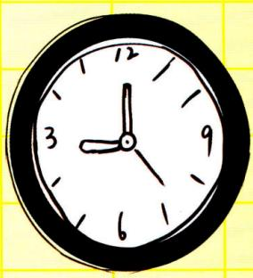

natural_image

Simple hand-drawn analog clock face with hour and minute hands (no numbers or text)

# 自学

# 好帮手

同步 微课小专题

名师微课  
  
扫一扫

勤学早图书  
  
微信公众号

教师用书

数学

八年级上 RJ

# 目录

# 第十三章 三角形

微课小专题 导角基本模型(一) 8 字模型及应用 …… 1

微课小专题 导角基本模型(二)余补角模型及应用 …… 2

微课小专题 导角基本模型(三)一线三等角模型及应用 …… 3

微课小专题 求角思想方法(一)转化思想求角度 …… 4

微课小专题 求角思想方法(二)整体思想求角度 …… 5

微课小专题 求角思想方法(三) 方程思想求角度 …… 6

微课小专题 求角思想方法(四) 分类讨论思想求角度 …… 7

微课小专题 双角平分线的夹角模型(一)双内角平分线夹角 8

微课小专题 双角平分线的夹角模型(二)双外角平分线夹角 9

微课小专题 双角平分线的夹角模型(三)一内一外角平分线夹角 …… 10

综合与实践(一) 三角形的折叠 …… 11

# 第十四章 全等三角形

微课小专题 构全等(一)两组等边连共边 …… 12

微课小专题 构全等(二)中点联想(1)知中点,倍长中线(SA→SAS) …… 13

微课小专题 构全等(三)中点联想(2)知中点,两端作垂(SA→AAS) …… 14

微课小专题 构全等(四)中点联想(3)证中点,两端作垂(SA→AAS,ASA) …… 15

微课小专题 构全等(五)线段和差联想 截长补短(SA→SAS)…… 16

微课小专题 构全等(六)角平分线联想(1)两边作垂(SA→AAS,HL) 17

微课小专题 构全等(七)角平分线联想(2)截长补短(SA→SAS)……18

微课小专题 构全等(八)角平分线联想(3)延长垂线段(SA→ASA) 19

微课小专题 模型探究(一) 对角互补模型 …… 20

微课小专题 模型探究(二) 手拉手模型 …… 21

综合与实践(二) 利用全等测体育馆高度 22

# 第十五章 轴对称

微课小专题 等腰三角形的性质(一) 方程思想求角度 …… 23

微课小专题 等腰三角形的性质(二)整体思想求角度 …… 24

微课小专题 等腰三角形的性质(三) 分类讨论思想求边角 …… 25

微课小专题 等腰三角形的性质(四)“三线合一”直接用 …… 26微课小专题 构造“三线合一”解题(一)作“三线”解决 a=2b 型问题…… 27

微课小专题 构造“三线合一”解题(二)倍长中线构等腰证垂直 …… 28

微课小专题 构等腰技巧(一)角平分线+垂线构等腰 …… 29

微课小专题 构等腰技巧(二)角平分线+平行线构等腰 …… 30

微课小专题 构等腰技巧(三)作腰的平行线构等腰 …… 31

微课小专题 构等腰技巧(四)倍长中线构等腰 …… 32

微课小专题 构等腰技巧(五)截长补短构等腰 …… 33

微课小专题 构等腰技巧(六)二倍角构等腰 …… 34

微课小专题 $30^{\circ}$ 角的用法——构 $30^{\circ}$ 的直角三角形 …… 35

微课小专题 $60^{\circ}$ 角的用法——构等边三角形 …… 36

微课小专题 45°角的用法——构等腰直角三角形 …… 37

综合与实践(三) 裁剪等腰三角形 38

# 第十六章 整式的乘法

微课小专题 整式的乘法(一)幂的运算正反用 …… 39

微课小专题 整式的乘法(二)待定系数巧确定 …… 40

微课小专题 乘法公式(一) 巧用平方差公式 …… 41

微课小专题 乘法公式(二)巧用完全平方公式 …… 42

微课小专题 乘法公式(三)巧用配方法 …… 43

微课小专题 乘法公式(四) $a \pm b, ab, a^{2} \pm b^{2}$ 的互化技巧 …… 44

微课小专题 乘法公式(五) $x \pm \frac{1}{x}$ 型变形技巧 …… 45

综合与实践(四) 整式乘法与数形结合 …… 46

# 第十七章 因式分解

微课小专题 因式分解(一) 十字相乘法 …… 47

微课小专题 因式分解(二)换元法 …… 48

综合与实践(五) 奇妙的平方数 49

# 第十八章 分式

微课小专题 分式求值的技巧(一)整体思想 …… 50

微课小专题 分式求值的技巧(二)等比设 k …… 51

微课小专题 分式方程的应用(一)行程问题 …… 52

微课小专题 分式方程的应用(二) 工程问题 …… 53

综合与实践(六) 作差比大小 54

# 第十三章 三角形

# 微课小专题 导角基本模型(一) 8 字模型及应用

模型介绍:如图,将线段 AB,CD 的两个端点交叉相连(即连接 AD,BC),得到的图形称之为 “8 字形 ABCD”. 结论:

① $\angle A+\angle B=\angle C+\angle D;$   
②若 $\angle A=\angle C$ ，则 $\angle B=\angle D$ 。

证明：

①∵∠A+∠B=∠BOD,∠C+∠D=∠BOD,∴∠A+∠B=∠C+∠D;   
②∵∠A+∠B=∠C+∠D=∠BOD,又∵∠A=∠C,∴∠B=∠D.

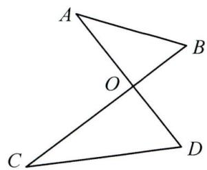

text_image

A
O
B
C
D

# 金例讲析

【例】如图, $\angle A+\angle C=56^{\circ}$ ,BE平分 $\angle ABC$ ,DE平分 $\angle ADC$ ,求 $\angle E$ 的度数.

分析: 图中包含多个“8 字形”, 尝试应用 “8 字形” 求解.

解: $\because$ BE 平分 $\angle ABC, DE$ 平分 $\angle ADC$ ,

∴可设 $\angle ABE=\angle EBC=x,\angle ADE=\angle EDC=y$ ,

设 AD, BE 交于点 G,

则 $\angle A + \angle ABE = \angle E + \angle ADE = \angle AGE$

即 $\angle A + x = \angle E + y$ ①,

同理可得 $\angle C+y=\angle E+x$ ②，

由①+②, 得 $\angle A + x + \angle C + y = \angle E + y + \angle E + x$ ,

整理得 $2 \angle E = \angle A + \angle C = 56^{\circ}, \therefore \angle E = 28^{\circ}$ .

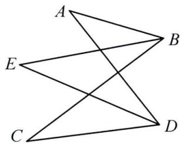

text_image

A
E
B
C
D

# 实战演练

如图, 在四边形 $ABCD$ 中, 点 $F$ 为 $CD$ 上一点, $\angle ABF = \angle ACD$ , $\angle BAC = 60^{\circ}$ , 求 $\angle BFD$ 的度数.

分析: 应用 8 字模型可得 $\angle BFC = \angle BAC = 60^{\circ}, \therefore \angle BFD = 120^{\circ}$ .

解: 设 AC, BF 交于点 E,

则 $\angle BAC + \angle ABF = \angle BFC + \angle ACD = \angle BEC$ ,

$$
\because \angle A B F = \angle A C D, \therefore \angle B F C = \angle B A C = 6 0 ^ {\circ},
$$

$$
\therefore \angle B F D = 1 8 0 ^ {\circ} - 6 0 ^ {\circ} = 1 2 0 ^ {\circ}.
$$

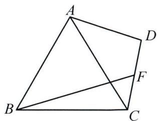

text_image

A
B
C
D
F

# 微课小专题 导角基本模型(二)余补角模型及应用

模型介绍：

互余模型:如图,在 Rt△ABC 中,∠ACB=90°.

(1)如图 1, $CD \perp AB$ 于点 $D$ , 则有: $\angle 1 = \angle B, \angle 2 = \angle A$ ;  
(2)如图 2, E 为 BC 延长线上一点, $ED \perp AB$ 于点 D, 交 AC 于点 F, 则有: $\angle1 = \angle2 = \angle B, \angle A = \angle E$ ;  
(3)如图 3, E 为 CB 延长线上一点, $\angle ABD = \angle BED = \angle C = 90^{\circ}$ , 则有: $\angle 1 = \angle D, \angle 2 = \angle A$ .

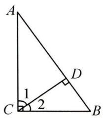

text_image

A
1
C
2
D
B

图1

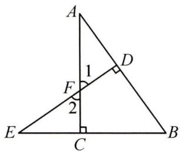

text_image

A
1
D
F
2
E
C
B

图2

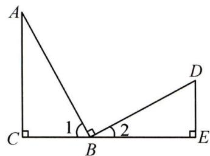

text_image

A
1
2
C
B
D
E

图3

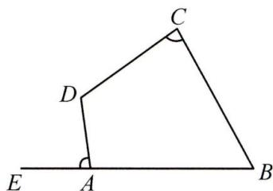

text_image

C
D
E A B

图4

互补模型:如图4,在四边形ABCD中,点E为BA延长线上一点,若 $\angle B+D=180^{\circ}$ ,则有 $\angle DAE=\angle C$ .

# 金例讲析

【例】在 $\triangle ABC$ 中,两条高 $BD,CE$ 交于点 $G,AM,GN$ 分别平分 $\angle BAC$ 和 $\angle BGC$ ,判断 $AM$ 与 $GN$ 的位置关系,并说明理由.

解:AM//GN. 理由如下:∵AM 平分∠BAC,

∴设 $\angle BAM=\angle CAM=x$ ，∵ $BD,CE$ 是高，

$$
\therefore \angle A E G = \angle A D G = 9 0 ^ {\circ}, \therefore \angle M F C = \angle A F E = 9 0 ^ {\circ} - x.
$$

$$
\because \angle E G D + \angle E A D = 3 6 0 ^ {\circ} - 1 8 0 ^ {\circ} = 1 8 0 ^ {\circ},
$$

$\therefore \angle BGC = \angle EGD = 180^{\circ} - 2x, \because GN$ 平分 $\angle BGC$ ,

$$
\therefore \angle N G C = \frac {1}{2} \angle B G C = \frac {1}{2} (1 8 0 ^ {\circ} - 2 x) = 9 0 ^ {\circ} - x, \therefore \angle M F C = \angle N G C, \therefore A M / / G N.
$$

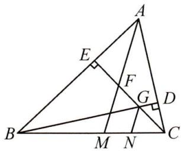

text_image

Geometric diagram of triangle ABC with perpendiculars and labeled points E, F, G, M, N

# 实战演练

如图, $AC \perp BE$ 于点 $C$ , $ED \perp AB$ 于点 $D$ , 交 $AC$ 于点 $F$ , 交 $\angle DAF$ 的平分线于点 $M$ , $EN$ 平分 $\angle DEB$ , 交 $AB$ 于点 $N$ . 求证: $AM \perp EN$ .

解:延长 AM 交 EN 于点 H.∵AC⊥BE,ED⊥AB,

$$
\therefore \angle A C B = \angle E D B = 9 0 ^ {\circ}, \therefore \angle D A F + \angle B = \angle D E B + \angle B = 9 0 ^ {\circ},
$$

$\therefore \angle DAF = \angle DEB. \because AM \text{ 平分 } \angle DAF, EN \text{ 平分 } \angle DEB,$

$$
\therefore \angle D A M = \angle D E N. \therefore \angle A H E = \angle A D M = 9 0 ^ {\circ}, \therefore A M \perp E N.
$$

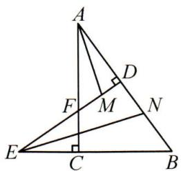

text_image

Geometric diagram of triangle ABC with perpendiculars and labeled points D, E, F, M, N

# 微课小专题 导角基本模型(三) 一线三等角模型及应用

模型介绍:顶点在同一条直线上的三个等角所构成的图形我们称之为“一线三等角”,如图1, 2, $\angle 1 = \angle 2 = \angle 3$ .

结论: $\angle D=\angle CBE,\angle ABD=\angle E.$

证明:(1)如图 1, $\because\angle1+\angle D=\angle DBC=\angle2+\angle CBE,\angle1=\angle2,\therefore\angle D=\angle CBE;$

同理， $\because \angle ABD + \angle 2 = \angle ABE = \angle 3 + \angle E, \angle 2 = \angle 3, \therefore \angle ABD = \angle E$ ；

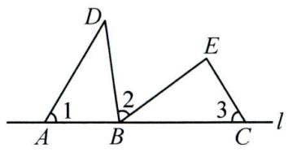

text_image

D
1
2
E
3
A
B
C
l

同侧型一线三等角
图1

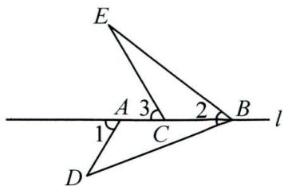

text_image

E
A 3 2 B
l
1 C
D

异侧型一线三等角图2

(2)如图 2, $\because \angle D = \angle 1 - \angle ABD, \angle CBE = \angle 2 - \angle ABD, \angle 1 = \angle 2, \therefore \angle D = \angle CBE$ ;

同理， $\because \angle ABD = \angle 2 - \angle CBE, \angle E = \angle 3 - \angle CBE, \angle 2 = \angle 3, \therefore \angle ABD = \angle E.$

# 金例讲析

【例】如图, 在 $\triangle ABC$ 中, $\angle B = \angle C = 60^{\circ}$ , 将 $\triangle ABC$ 沿 $DE$ 折叠, 点 $A$ 的对应点 $F$ 落在 $BC$ 上. 求证: $\angle BDF = \angle CFE$ .

分析:由条件可得 $\angle DFE=\angle A=\angle B=\angle C=60^{\circ}$ ,则可用一线三等角模型得 $\angle EFC=\angle BDF$ .

解： $\because \angle A + \angle B + \angle C = 180^{\circ}, \angle B = \angle C = 60^{\circ}$ ,

$$
\therefore \angle A = 6 0 ^ {\circ}, \because \angle D F E = \angle A, \therefore \angle D F E = 6 0 ^ {\circ} = \angle B,
$$

$$
\because \angle B + \angle B D F = \angle D F C = \angle D F E + \angle C F E,
$$

$$
\therefore \angle B D F = \angle C F E.
$$

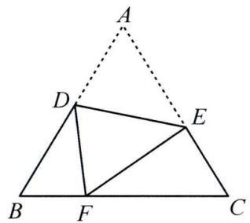

text_image

Geometric diagram with labeled points A, B, C, D, E, F and triangles, including a dashed line from A to D and from E to C.

# 实战演练

如图, 在 $\triangle ABC$ 中, $D, E$ 分别为 $BC, AC$ 上的点, $\angle B = \angle C = \angle ADE$ , $\angle BAD = 21^{\circ}$ , $\angle AED = 91^{\circ}$ . 求 $\angle B$ 的度数.

解： $\because \angle B + \angle BAD = \angle ADC = \angle ADE + \angle CDE, \angle B = \angle ADE,$

$$
\therefore \angle B A D = \angle C D E. \therefore \angle C D E = 2 1 ^ {\circ},
$$

$$
\therefore \angle C = \angle A E D - \angle C D E = 9 1 ^ {\circ} - 2 1 ^ {\circ} = 7 0 ^ {\circ},
$$

$$
\therefore \angle B = \angle C = 7 0 ^ {\circ}.
$$

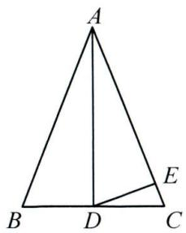

text_image

A
B D C
E

# 微课小专题 求角思想方法(一) 转化思想求角度

转化思想:人们在解决问题时,对未解决的问题作转化,使之逐步转化为已解决的问题,达到化繁为简,化难为易,变“正面强攻”为“侧翼进击”的思维方法,就是转化的策略思想.

# 金例讲析

【例】如图,求证: $\angle A+\angle B+\angle D=\angle BCD$ .

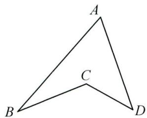

text_image

A
B
C
D

图1

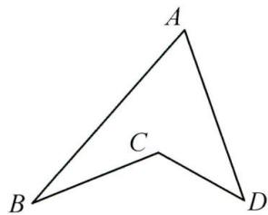

text_image

A
B C D

图2

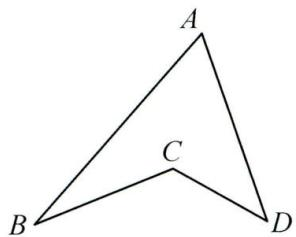

text_image

A
B
C
D

图3

证明: 方法 1: 如图 1, 延长 BC 交 AD 于点 E, 则 $\angle A + \angle B = \angle CED$ , $\angle CED + \angle D = \angle BCD$ ,

$$
\therefore \angle A + \angle B + \angle D = \angle B C D;
$$

方法 2: 如图 2, 连接 AC 并延长至点 E, 则 $\angle BAC + \angle B = \angle BCE$ , $\angle DAC + \angle D = \angle DCE$ ,

$\therefore \angle BAC + \angle DAC + \angle B + \angle D = \angle BCE + \angle DCE$ ，即 $\angle A + \angle B + \angle D = \angle BCD$ ；

方法 3: 连接 BD, 则 $\angle A + \angle ABC + \angle CDA = 180^{\circ} - (\angle CBD + \angle CDB)$ ,

又 $\because \angle BCD = 180^{\circ} - (\angle CBD + \angle CDB), \therefore \angle A + \angle B + \angle D = \angle BCD.$

# 实战演练

1. 如图, 求 $\angle A + \angle B + \angle C + \angle D$ 的度数.

解: 连接 AD, BC. 由已知可得,

$$
\angle P A D + \angle P D A = 1 8 0 ^ {\circ} - 1 0 0 ^ {\circ} = 8 0 ^ {\circ},
$$

$$
\angle Q B C + \angle Q C B = 1 8 0 ^ {\circ} - 1 2 0 ^ {\circ} = 6 0 ^ {\circ},
$$

$$
\therefore \angle P A B + \angle A B Q + \angle Q C D + \angle C D P = 3 6 0 ^ {\circ} - 8 0 ^ {\circ} - 6 0 ^ {\circ} = 2 2 0 ^ {\circ}.
$$

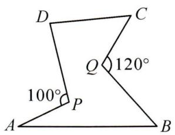

text_image

D
C
Q 120°
100°
P
A
B

2. 如图, 求 $\angle A + \angle B + \angle C + \angle D + \angle E + \angle F + \angle G$ 的度数.

解: 连接 EB, AF, 则 $\angle BEF + \angle EBA = \angle BAF + \angle EFA$ ,

$$
\therefore \angle B A G + \angle A B C + \angle C + \angle D + \angle D E F + \angle E F G + \angle G
$$

$$
= 3 6 0 ^ {\circ} + 1 8 0 ^ {\circ} = 5 4 0 ^ {\circ}.
$$

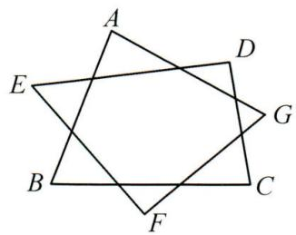

text_image

A
E
D
G
B
C
F

# 微课小专题 求角思想方法(二)整体思想求角度

整体思想:即是善于用“集成”的眼光,把某些式子或图形看成一个整体,有意识的整体运算,整体处理.

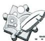

# 金例讲析

【例】如图, 在 $\triangle ABC$ 中, $\angle A = 60^{\circ}, D, E, F$ 分别为 $BC, AB, AC$ 上的点. $\angle BED = \angle B, \angle DFC = \angle C$ . 求 $\angle EDF$ 的度数.

分析: 将 $\angle B + \angle C$ 看成整体.

解: 设 $\angle BED = \angle B = x, \angle DFC = \angle C = y$ ,

$$
\because \angle A + \angle B + \angle C = 1 8 0 ^ {\circ}, \angle A = 6 0 ^ {\circ}, \therefore x + y = 1 2 0 ^ {\circ}.
$$

$$
\because \angle B D E = 1 8 0 ^ {\circ} - 2 x, \angle C D F = 1 8 0 ^ {\circ} - 2 y,
$$

$$
\therefore \angle B D E + \angle C D F = 3 6 0 ^ {\circ} - 2 (x + y) = 3 6 0 ^ {\circ} - 2 4 0 ^ {\circ} = 1 2 0 ^ {\circ},
$$

$$
\therefore \angle E D F = 1 8 0 ^ {\circ} - (\angle B D E + \angle C D F) = 1 8 0 ^ {\circ} - 1 2 0 ^ {\circ} = 6 0 ^ {\circ}.
$$

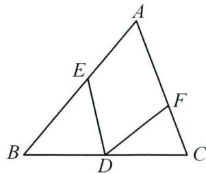

text_image

Geometric diagram of triangle ABC with internal points D, E, F and line segments AD, BE, EF labeled

# 实战演练

1. 如图, 求 $\angle 1 + \angle 2 + \angle 3 + \angle 4$ 的度数.

分析: 将 $(\angle1+\angle2)$ 和 $(\angle3+\angle4)$ 看成整体求解.

解:由三角形的内角和定理,得:

$$
\angle 1 + \angle 2 = 1 8 0 ^ {\circ} - 5 0 ^ {\circ} = 1 3 0 ^ {\circ},
$$

$$
\angle 3 + \angle 4 = 1 8 0 ^ {\circ} - 5 0 ^ {\circ} = 1 3 0 ^ {\circ},
$$

$$
\therefore \angle 1 + \angle 2 + \angle 3 + \angle 4 = 1 3 0 ^ {\circ} + 1 3 0 ^ {\circ} = 2 6 0 ^ {\circ}.
$$

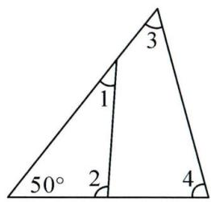

text_image

3
1
50° 2 4

2. 如图, 在 $\triangle ABC$ 中, $\angle B = 33^{\circ}$ , 将 $\triangle ABC$ 沿直线 $EF$ 翻折, 点 $B$ 落在点 $D$ 的位置, 求 $\angle 1 - \angle 2$ 的度数.

分析: 设 $\angle BEF = x, \angle BFE = y$ , 可将 $x + y$ 视为一个整体计算.

解: 设 $\angle BEF = x, \angle BFE = y$ ，则 $x + y = 180^{\circ} - \angle B = 147^{\circ}$ .

由折叠的性质得 $\angle DEF = \angle BEF = x, \angle DFE = \angle BFE = y$ ,

$$
\therefore \angle 1 = 1 8 0 - 2 x, \angle 2 = 2 y - 1 8 0 ^ {\circ},
$$

$$
\therefore \angle 1 - \angle 2 = (1 8 0 - 2 x) - (2 y - 1 8 0 ^ {\circ}) = 3 6 0 ^ {\circ} - 2 (x + y)
$$

$$
= 3 6 0 ^ {\circ} - 2 \times 1 4 7 ^ {\circ} = 6 6 ^ {\circ}.
$$

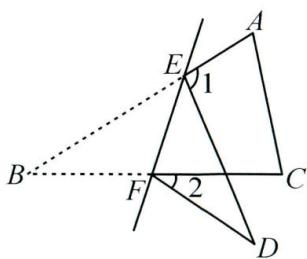

text_image

Geometric diagram with labeled points and angles, showing triangle ABC with auxiliary lines and angle markings

# 微课小专题 求角思想方法(三) 方程思想求角度

方程思想:通过设未知数建立方程解决问题的思想方法.

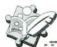

# 金例讲析

【例】如图, 在 $\triangle ABC$ 中, $\angle A = \angle B$ , 点 $D, E$ 分别在 $AB, BC$ 上, $\angle CDE = \angle CED$ , 若 $\angle ACD = 36^{\circ}$ , 求 $\angle BDE$ 的度数.

解: 设 $\angle BDE = x, \angle A = \angle B = y$ ,

则 $\angle CDE = \angle CED = x + y$

$$
\because \angle B D C = \angle A + \angle A C D,
$$

$$
\therefore 2 x + y = y + 3 6 ^ {\circ}, \therefore x = 1 8 ^ {\circ},
$$

$$
\therefore \angle B D E = 1 8 ^ {\circ}.
$$

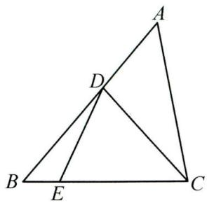

text_image

Geometric diagram of triangle ABC with internal points D and E, showing segments AD and DE

# 实战演练

1. 如图, $AD$ 是 $\triangle ABC$ 的角平分线, $\angle ADC = \angle C = 2\angle B$ . 求 $\angle BAC$ 的度数.

分析: 图中的角都与 $\angle B$ 有关, 设 $\angle B$ , 则可用三角形内角和列方程求解.

解: 设 $\angle B = x$ ，则 $\angle ADC = \angle C = 2\angle B = 2x$ ，

$$
\because \angle A D C = \angle B + \angle B A D = 2 \angle B, \therefore \angle B A D = \angle B,
$$

又 AD 平分 $\angle BAC, \therefore \angle DAC = \angle BAD = \angle B = x$ ,

∵在 $\triangle ADC$ 中， $\angle DAC + \angle ADC + \angle C = 180^{\circ}$ ，

$$
\therefore x + 2 x + 2 x = 1 8 0 ^ {\circ}, \therefore x = 3 6 ^ {\circ}, \therefore \angle B A C = 2 x = 7 2 ^ {\circ}.
$$

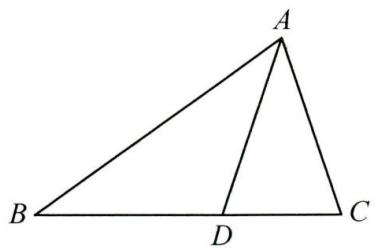

text_image

A
B
D
C

2. 在 $\triangle ABC$ 中, $AD$ 是 $\triangle ABC$ 的角平分线, $\angle C - \angle B = 20^{\circ}$ , $DE$ 平分 $\angle ADC$ , $\angle AED = 110^{\circ}$ , 求 $\angle BAC$ 的度数.

解: 设 $\angle B = x$ , 则 $\angle C = 20^{\circ} + x$ ,

则 $\angle BAC = 180^{\circ} - (x + 20^{\circ} + x) = 160^{\circ} - 2x$

∵AD 平分∠BAC, ∴∠BAD= $\frac{1}{2}(160^{\circ}-2x)=80^{\circ}-x$ ,

$$
\therefore \angle A D C = x + 8 0 ^ {\circ} - x = 8 0 ^ {\circ},
$$

∵ DE 平分 $\angle ADC, \therefore \angle EDC = \frac{1}{2} \angle ADC = 40^{\circ}, \therefore 40^{\circ} + 20^{\circ} + x = 110^{\circ}, \therefore x = 50^{\circ},$

$$
\therefore \angle B A C = 1 6 0 ^ {\circ} - 2 x = 1 6 0 ^ {\circ} - 1 0 0 ^ {\circ} = 6 0 ^ {\circ}.
$$

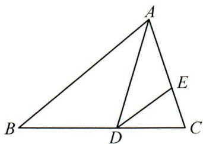

text_image

Geometric diagram of triangle ABC with internal points D and E, showing segments AD and DE

# 微课小专题 求角思想方法(四) 分类讨论思想求角度

分类讨论: 当问题情形指代不明确, 可能存在多种情况时, 按不同情况分类, 然后再逐一研究解决的数学思想, 称之为分类讨论思想.

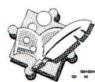

# 金例讲析

【例】在 $\triangle ABC$ (不是直角三角形)中, $\angle A=50^{\circ}$ , $\triangle ABC$ 的两条高 $BM, CN$ 所在直线相交于点 $O$ , 求 $\angle MON$ 的度数.

解: 分两种情况讨论:

①当 $\triangle ABC$ 为锐角三角形时,如图1, $\angle MON=180^{\circ}-\angle A=180^{\circ}-50^{\circ}=130^{\circ}$ ;

②当 $\triangle ABC$ 为钝角三角形时,如图2,图3, $\angle MON=\angle A=50^{\circ}$ .

综上所述， $\angle MON=50^{\circ}$ 或 $130^{\circ}$ .

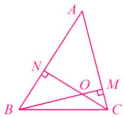

text_image

A
N
O
M
B
C

图1

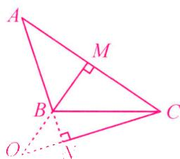

text_image

A
M
B
C
O

图2

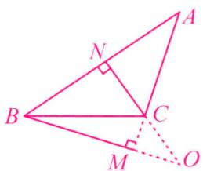

text_image

Geometric diagram with labeled points A, B, C, M, N, O and right-angle markers at C and M

图3

# 实战演练

在 $\triangle ABC$ 中,AD是BC边上的高, $\angle B=40^{\circ}$ , $\angle CAD=20^{\circ}$ ,求 $\angle BAC$ 的度数.

分析:题目无图, $\triangle ABC$ 的形状不确定,高AD可能在三角形的内部,也可能在三角形的外部,不同情形下 $\angle BAC$ 的大小不同,因此需分类讨论.

解：∵AD⊥BC，∴∠ADB=90°，

$$
\because \angle B = 4 0 ^ {\circ}, \therefore \angle B A D = 5 0 ^ {\circ}.
$$

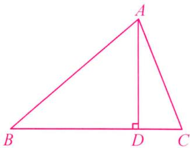

text_image

A
B D C

图1

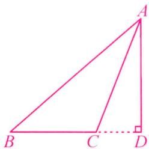

text_image

Geometric diagram of triangle ABC with altitude AD, showing right angle at D and point C on base BC

图2

分两种情况讨论：

①如图 1, 当高 AD 在 $\triangle ABC$ 的内部时, $\angle BAC = \angle BAD + \angle CAD = 50^{\circ} + 20^{\circ} = 70^{\circ}$ ;  
②如图2,当高AD在△ABC的外部时, $\angle BAC=\angle BAD-\angle CAD=50^{\circ}-20^{\circ}=30^{\circ}$

综上所述， $\angle BAC=30^{\circ}$ 或 $70^{\circ}$ .

# 微课小专题 双角平分线的夹角模型(一) 双内角平分线夹角

模型介绍:如图,在 $\triangle ABC$ 中,若 $BP$ 平分 $\angle ABC,CP$ 平分 $\angle ACB$ ,则 $\angle P=90^{\circ}+\frac{1}{2}\angle A$ .

证明：∵BP 平分∠ABC, CP 平分∠ACB,

$$
\therefore \angle P B C = \frac {1}{2} \angle A B C, \angle P C B = \frac {1}{2} \angle A C B.
$$

$$
\therefore \angle P = 1 8 0 ^ {\circ} - (\angle P B C + \angle P C B)
$$

$$
= 1 8 0 ^ {\circ} - \frac {1}{2} (\angle A B C + \angle A C B)
$$

$$
= 1 8 0 ^ {\circ} - \frac {1}{2} (1 8 0 ^ {\circ} - \angle A) = 9 0 ^ {\circ} + \frac {1}{2} \angle A.
$$

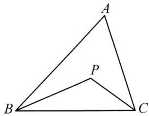

text_image

A
P
B
C

# 金例讲析

【例】如图,在 $\triangle ABC$ 中, $\angle A=72^{\circ},\angle ABC,\angle ACB$ 的三等分线交于点 $O_{1},O_{2}$ .

(1)求 $\angle BO_{1}C$ 的度数；  
(2)连接 $O_{1}O_{2}$ , 则 $\angle BO_{2}O_{1}$ 的度数为

解:(1) $\because\angle ABC,\angle ACB$ 的三等分线交于点 $O_{1},O_{2}$ ,

$$
\therefore \angle O _ {1} B C = \frac {1}{3} \angle A B C, \angle O _ {1} C B = \frac {1}{3} \angle A C B.
$$

$$
\begin{array}{l} \therefore \angle B O _ {1} C = 1 8 0 ^ {\circ} - (\angle O _ {1} B C + \angle O _ {1} C B) \\ = 1 8 0 ^ {\circ} - \frac {1}{3} (\angle A B C + \angle A C B) \\ = 1 8 0 ^ {\circ} - \frac {1}{3} (1 8 0 ^ {\circ} - 7 2 ^ {\circ}) = 1 4 4 ^ {\circ}; \\ \end{array}
$$

(2) 同理可得 $\angle BO_{2}C = 180^{\circ} - \frac{2}{3} (\angle ABC + \angle ACB) = 180^{\circ} - \frac{2}{3} (180^{\circ} - 72^{\circ}) = 108^{\circ}$ .

∵三角形的三条角平分线交于一点，∴ $O_{1}O_{2}$ 平分 $\angle BO_{2}C$ ，∴ $\angle BO_{2}O_{1}=\frac{1}{2}\angle BO_{2}C=54^{\circ}$

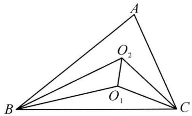

text_image

A
O₂
B
O₁
C

# 实战演练

在平面直角坐标系中, $\triangle AOB$ 的顶点 $A, B$ 分别在 $x$ 轴, $y$ 轴上, 点 $E$ 是 $\triangle ABO$ 的两条角平分线的交点, 求 $\angle AEB$ 的度数.

分析: 可利用三角形两内角平分线夹角模型结论直接写出结果.

解： $\angle AEB = 90^{\circ} + \frac{1}{2}\angle AOB = 90^{\circ} + \frac{1}{2}\times 90^{\circ} = 135^{\circ}.$

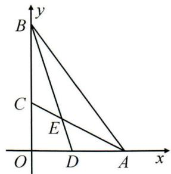

text_image

y
B
C
E
O
D
A
x

# 微课小专题 双角平分线的夹角模型(二) 双外角平分线夹角

模型介绍:如图,BP 平分∠DBC,CP 平分∠ECB,则 $\angle P=90^{\circ}-\frac{1}{2}\angle A$ .

证明：∵BP 平分∠DBC, CP 平分∠ECB,

$$
\therefore \angle P B C = \frac {1}{2} \angle D B C, \angle P C B = \frac {1}{2} \angle E C B.
$$

$$
\begin{array}{l} \therefore \angle P = 1 8 0 ^ {\circ} - (\angle P B C + \angle P C B) = 1 8 0 ^ {\circ} - \frac {1}{2} (\angle D B C + \angle E C B) \\ = 1 8 0 ^ {\circ} - \frac {1}{2} (1 8 0 ^ {\circ} - \angle A B C + 1 8 0 ^ {\circ} - \angle A C B) \\ = \frac {1}{2} (\angle A B C + \angle A C B) = \frac {1}{2} (1 8 0 ^ {\circ} - \angle A) = 9 0 ^ {\circ} - \frac {1}{2} \angle A. \\ \end{array}
$$

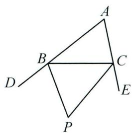

text_image

Geometric diagram with labeled points A, B, C, D, E, and P, showing intersecting lines and triangles.

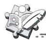

# 金例讲析

【例】在平面直角坐标系中, $\triangle AOB$ 的顶点 $A, B$ 分别在 $x$ 轴, $y$ 轴的正半轴上, $\angle ABy$ 与 $\angle BAx$ 的平分线相交于点 $C$ , 求 $\angle C$ 的度数.

分析: 可利用三角形两外角平分线夹角模型求出结果.

解:由模型结论得 $\angle C=90^{\circ}-\frac{1}{2}\angle AOB=90^{\circ}-\frac{1}{2}\times90^{\circ}=45^{\circ}$ .

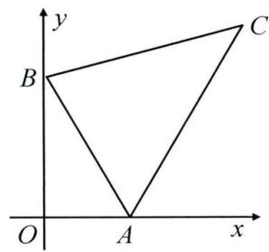

text_image

y
B
C
O
A
x

# 实战演练

如图, $\angle QBC = \frac{1}{3}\angle DBC$ , $\angle QCB = \frac{1}{3}\angle BCE$ , 探究 $\angle Q$ 与 $\angle A$ 的数量关系.

解: 设 $\angle ABC = x, \angle ACB = y$ , 则 $x + y = 180^{\circ} - \angle A$ .

$$
\because \angle Q B C = \frac {1}{3} \angle D B C = \frac {1}{3} (1 8 0 ^ {\circ} - x) = 6 0 ^ {\circ} - \frac {1}{3} x,
$$

同理 $\angle QCB = 60^{\circ} - \frac{1}{3} y$

$$
\therefore \angle Q = 1 8 0 ^ {\circ} - (\angle Q B C + \angle Q C B) = 1 8 0 ^ {\circ} - (6 0 ^ {\circ} - \frac {1}{3} x + 6 0 ^ {\circ} - \frac {1}{3} y)
$$

$$
= 6 0 ^ {\circ} + \frac {1}{3} (x + y) = 1 2 0 ^ {\circ} - \frac {1}{3} \angle A.
$$

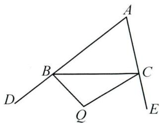

text_image

Geometric diagram with labeled points A, B, C, D, E, and Q forming triangles and intersecting lines

# 微课小专题 双角平分线的夹角模型(三) 一内一外角平分线夹角

模型介绍:如图,BP 平分 $\angle ABC$ ，CP 平分 $\triangle ABC$ 的外角 $\angle ACD$ ，则 $\angle P=\frac{1}{2}\angle A$ 。

证明：∵CP 平分∠ACD,BP 平分∠ABC,

$$
\therefore \angle P C D = \frac {1}{2} \angle A C D, \angle P B C = \frac {1}{2} \angle A B C.
$$

$$
\begin{array}{l} \therefore \angle P = \angle P C D - \angle P B C = \frac {1}{2} (\angle A C D - \angle A B C) \\ = \frac {1}{2} \angle A. \\ \end{array}
$$

$$
\left. \right.\left. \right.\left. \right.\left. \right.\left. \right.\left. \right.\left. \right.\left. \right.\left. \right.\left. \right.\left. \right.\left.\left.\left.\left.\left.\left.\left.\left.\left.\left.\left.\left.\left.\left.\left.\left.\left.\left.\left.\left.\left.\left.\left.\right.\right.\right.\right.\right.\right.\right.\right.\right.\right.\right.\right\rangle_ {0} ^ {2} + 1\right) _ {0} ^ {2}\right) _ {0} ^ {2}\right) _ {0} ^ {2}\right) _ {0} ^ {2}\right) _ {0} ^ {2}\right) _ {0} ^ {2}\right) _ {0} ^ {2}\right) _ {0} ^ {2}\right) _ {0} ^ {2}\right) _ {0} ^ {2}\right) _ {0} ^ {2}.
$$

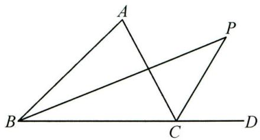

text_image

A
P
B
C
D

# 金例讲析

【例】在平面直角坐标系中, $\triangle AOB$ 的顶点 $A, B$ 分别在 $x$ 轴, $y$ 轴上, $\angle OAB$ 的平分线与 $\angle ABy$ 的平分线的反向延长线交于点 $D$ , 求 $\angle D$ 的度数.

分析: 符合一内一外角平分线夹角模型特点可用模型解答.

解： $\angle D=\frac{1}{2}\angle AOB=\frac{1}{2}\times90^{\circ}=45^{\circ}.$

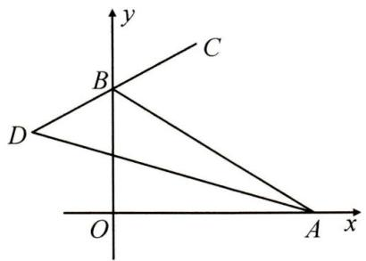

text_image

y
C
B
D
O
A x

# 实战演练

如图,在四边形 $MNCB$ 中, $BD$ 平分 $\angle MBC$ ,且与四边形 $MNCB$ 的外角 $\angle NCE$ 的角平分线交于点 $D$ ,若 $\angle BMN=130^{\circ},\angle CNM=100^{\circ}$ ,求 $\angle D$ 的度数.

解:延长 BM, CN 交于点 A.

$$
\because \angle B M N = \angle A N M + \angle A, \angle C N M = \angle A M N + \angle A,
$$

$\therefore \angle A = \angle BMN + \angle CNM - 180^{\circ} = 50^{\circ}$ ，易得 $\angle D = \frac{1}{2}\angle A = 25^{\circ}.$

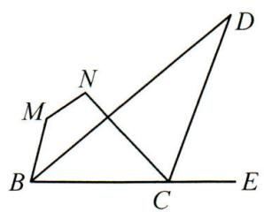

text_image

Geometric diagram with labeled points M, N, C, D, E and intersecting lines forming triangles and quadrilaterals

# 综合与实践(一) 三角形的折叠

综合与实践课上,老师让同学们以“三角形的折叠”为主题开展数学活动.

# (1) 操作判断：

操作一:折叠三角形纸片,使 BC 与 BA 边在一条直线上,得到折痕 BD;

操作二:折叠三角形纸片,得到折痕 AE,使 B,C,E 三点在一条直线上.

完成以上操作后把纸片展平,如图 1, 判断 $\angle ABD$ 和 $\angle CBD$ 的大小关系是 $\angle ABD = \angle CBD$ , 直线 $BC, AE$ 的位置关系是 $BC \perp AE$ .

# (2) 深入探究：

操作三:折叠三角形纸片,使点 A 落在折痕 AE 上,得到折痕 DF,把纸片展平.

根据以上操作,如图 2,判断 $\angle DBF$ 和 $\angle BDF$ 是否相等,并说明理由.

# (3) 结论应用：

如图 1, 已知 $\angle ABC = 58^{\circ}, \angle ACB = 48^{\circ}$ ，请求出 $\angle BDC$ 的度数.

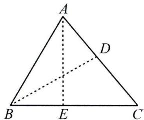

text_image

A
D
B
E
C

图1

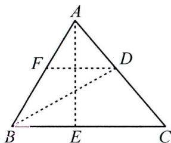

text_image

A
F
D
B
E
C

图2

解:(1) $\angle ABD$ 和 $\angle CBD$ 的大小关系是 $\angle ABD = \angle CBD$ , 直线 BC, AE 的位置关系是 $BC \perp AE$ .

故答案为 $\angle ABD = \angle CBD, BC \perp AE$ ;

(2) $\angle {DBF} = \angle {BDF}$ . 理由如下：

由(1)，得 $\angle CBD=\angle FBD,AE\perp BC,AE\perp DF,\therefore DF//BC,\therefore\angle CBD=\angle BDF,\therefore\angle DBF=\angle BDF;$

(3) $\because \angle ABC = 58^{\circ}, \angle ACB = 48^{\circ}, \therefore \angle BAC = 180^{\circ} - \angle ABC - \angle ACB = 74^{\circ}$ .

$$
\because \angle A B D = \angle C B D, \therefore \angle A B D = \frac {1}{2} \angle A B C = 2 9 ^ {\circ}, \therefore \angle B D C = \angle A B D + \angle B A C = 1 0 3 ^ {\circ}.
$$

# 第十四章 全等三角形

# 微课小专题 构全等(一)两组等边连共边

方法技巧: 当题中已知两组相等的边时, 常连接两点, 构造共边的两个三角形全等. 从思路上分析, 就是“SS $\xrightarrow{构}$ SSS”.

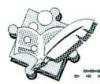

# 金例讲析

【例】如图,在四边形 ABCD 中,AB=CD,AD=BC,E,F 分别为 AD,BC 上一点.求证: $\angle AEF=\angle CFE$ .

证明: 连接 AC, $\because AB = CD, AD = BC, AC = CA$ ,

$$
\therefore \triangle A D C \cong \triangle C B A (\text { SSS }). \therefore \angle A C B = \angle C A D,
$$

$$
\therefore A D \parallel B C, \therefore \angle A E F = \angle C F E.
$$

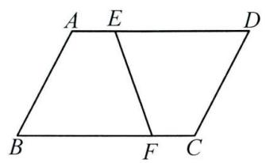

text_image

A E D
B F C

# 实战演练

1. 如图, $AB = AC$ , $BD = CD$ , $DE \perp AB$ 于点 $E$ , $DF \perp AC$ 于点 $F$ . 求证: $AE = AF$ .

证明: 连接 AD, $\because AB = AC, BD = CD, AD = AD$ ,

$$
\therefore \triangle A B D \cong \triangle A C D (\text { S   S   S }). \therefore \angle B A D = \angle C A D.
$$

$$
\because D E \perp A B, D F \perp A C, \therefore \angle E = \angle F = 9 0 ^ {\circ},
$$

$$
\because A D = A D, \angle E = \angle F, \angle E A D = \angle F A D,
$$

$$
\therefore \triangle A E D \cong \triangle A F D (\mathrm{AAS}), \therefore A E = A F.
$$

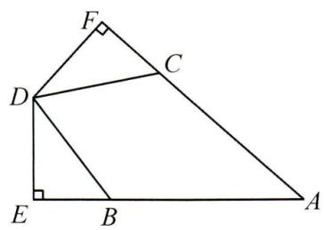

text_image

Geometric diagram of quadrilateral ABCD with perpendiculars from D to AB and BC, labeled points E, F, C, and right-angle symbols.

2. 如图, $\angle A = \angle D$ , $\angle ABC = \angle DEF$ , $AB = DE$ , $BF = CE$ . 求证: $BC \parallel EF$ .

证明: 连接 BE. $\because \angle A = \angle D, AB = DE, \angle ABC = \angle DEF,$

$$
\therefore \triangle A B C \cong \triangle D E F (\mathrm{ASA}). \therefore B C = E F,
$$

$$
\because B F = C E, B E = E B, \therefore \triangle B F E \cong \triangle E C B (\text { S   S   S }),
$$

$$
\therefore \angle F E B = \angle C B E, \therefore B C / / E F.
$$

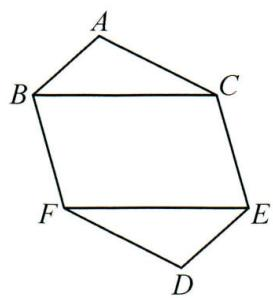

text_image

A
B
C
F
E
D

# 微课小专题 构全等(二)中点联想(1)

# 知中点,倍长中线(SA→SAS)

倍长中线: 当题目中已知某线段的中点时, 常联想到“SA $\xrightarrow{\text{构}}$ SAS”的思路, 通过倍长中点处的线段构造全等三角形, 从而将题中的已知和未知的条件集中到同一对全等三角形中.

基本模型:如图,若 M 是 BC 的中点,延长 AM 到点 D,使 AM = DM,则 $\triangle ACM \cong \triangle DBM$ (SAS).

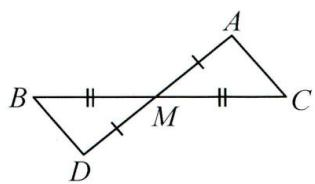

text_image

Geometric diagram showing two triangles ABC and DMD sharing a common vertex M, with side AB marked by perpendicular tick marks.

# 金例讲析

【例】如图,在 $\triangle ABC$ 中, $BC>AC$ , $CD$ 是 $\triangle ABC$ 的中线.求证: $BC-AC<2CD$ .

证明:延长 CD 至点 E,使 DE=CD,连接 BE.

∵CD 是△ABC 的中线, ∴AD=BD.

$$
\because D E = C D, \angle B D E = \angle A D C, \therefore \triangle B E D \cong \triangle A C D (\text { SAS }),
$$

$$
\therefore A C = B E \text {, 在} \triangle B C E \text {中}, B C - B E <   C E \therefore B C - A C <   2 C D.
$$

text_image

A
D
B
C

# 实战演练

如图, 过 $\triangle ABC$ 的顶点 $A$ 作 $AD \perp AB, AE \perp AC$ , 且 $AD = AB, AE = AC$ , 连接 $DE$ , 若 $AM$ 是 $\triangle ADE$ 的中线, 求证: $BC = 2AM$ .

证明:延长 AM 至点 N,使 MN=AM,连接 NE.

∵AM 是△ADE 的中线, ∴EM=DM,

$$
\because \angle E M N = \angle A M D, \therefore \triangle E M N \cong \triangle D M A (\text { SAS }),
$$

$$
\therefore N E = A D = A B, \angle N = \angle M A D, \therefore N E / / A D.
$$

$$
\therefore \angle A E N + \angle E A D = 1 8 0 ^ {\circ}.
$$

$$
\because A D \perp A B, A E \perp A C, \therefore \angle B A D = \angle C A E = 9 0 ^ {\circ},
$$

$$
\therefore \angle B A C + \angle E A D = 1 8 0 ^ {\circ}, \therefore \angle B A C = \angle A E N,
$$

$$
\because A B = E N, A E = A C, \therefore \triangle A B C \cong \triangle E N A (\text { SAS }),
$$

$$
\therefore B C = A N = 2 A M.
$$

text_image

Geometric diagram with labeled points A, B, C, D, E, M and connecting lines forming triangles and a quadrilateral

# 微课小专题 构全等(三)中点联想(2)

# 知中点,两端作垂(SA→AAS)

方法技巧: 当题目中已知某线段的中点时, 常联想到“SA $\xrightarrow{构}$ AAS”的思路, 即过已知中点的线段两端向中点处的线段作垂线(或作一组平行线), 构造全等三角形.

基本模型:如图,若 M 是 BC 的中点,BD⊥AM,CA⊥AM(或 BD∥AC),A,M,D 三点共线,

则 $\triangle ACM\cong\triangle DBM(AAS)$ .

text_image

Geometric diagram showing two right triangles ABC and ACD sharing a common vertex M, with perpendicular lines indicating equal sides.

# 金例讲析

【例】如图,在 $\triangle ABC$ 中, $D$ 为 $AB$ 延长线上一点, $E$ 为 $CB$ 延长线上一点, $B$ 为 $CE$ 中点, $\angle A+\angle ADE=180^{\circ}$ .求证: $AC=DE$ .

证明: 分别过点 C, E 作 AD 的垂线, 垂足分别为 G, H.

$\therefore \angle AGC = \angle BGC = \angle BHE = 90^{\circ}.$ 在 $\triangle BGC$ 和 $\triangle BHE$ 中，

$$
\left\{ \begin{array}{l} \angle B G C = \angle B H E, \\ \angle C B G = \angle E B H, \therefore \triangle B G C \cong \triangle B H E (\mathrm{AAS}). \therefore C G = E H. \\ B C = B E, \end{array} \right.
$$

$$
\because \angle A + \angle A D E = 1 8 0 ^ {\circ} = \angle E D H + \angle A D E, \therefore \angle A = \angle E D H,
$$

在 $\triangle AGC$ 和 $\triangle DHE$ 中， $\left\{\begin{aligned}\angle AGC&=\angle EHD,\\ \angle A&=\angle EDH,\\ CG&=EH,\end{aligned}\right.$ $\therefore\triangle AGC\cong\triangle DHE(AAS).\therefore AC=DE.$

text_image

Geometric diagram with labeled points A, B, C, D, E forming triangles and a line segment

# 实战演练

如图, 在 $\triangle ABC$ 中, $D$ 为 $CB$ 延长线上一点, $BD = BC$ , $E$ 为 $AB$ 上一点, $\angle A = \angle BED$ . 求证: $AC = DE$ .

证明: 分别过点 C, D 作 AB 的垂线, 垂足分别为 M, N.

$\therefore \angle CMB = \angle DNB = 90^{\circ}$ . 在 $\triangle CBM$ 和 $\triangle DBN$ 中，

$$
\left\{ \begin{array}{l} \angle C M B = \angle D N B, \\ \angle C B M = \angle D B N, \therefore \triangle C B M \cong \triangle D B N (\mathrm{AAS}). \therefore C M = D N. \\ B C = B D, \end{array} \right.
$$

在 $\triangle ACM$ 和 $\triangle EDN$ 中， $\left\{\begin{aligned}\angle A&=\angle BED,\\ \angle AMC&=\angle END,\\ CM&=DN,\end{aligned}\right.$

$$
\therefore \triangle A C M \cong \triangle E D N (\mathrm{AAS}). \therefore A C = D E.
$$

text_image

A
E
D
B
C

# 微课小专题 构全等(四) 中点联想(3)

# 证中点,两端作垂(SA→AAS,ASA)

方法技巧:要证线段的中点,常联想“SA $\xrightarrow{构}$ AAS,ASA”的思路,即过该线段的两端向要证的中点处的线段作垂线,或在该线段的两端构造一组平行线,从而构造出全等三角形,进而证明中点.

基本模型: 如图, $BC$ 与 $AD$ 交于点 $M$ , $AC = BD$ , $BD \perp AD$ , $AC \perp AD$ (或 $AC \parallel BD$ ), 则

$\triangle ACM \cong \triangle DBM$ (AAS 或 ASA), $\therefore BM = CM$ .

text_image

A
B
M
C
D

# 金例讲析

【例】如图, Rt△ABC 中, ∠ACB = 90°, D 是 AC 边上一点, CD = CB, 过点 B 作 BE ⊥ AB 且 BE = AB, 连接 DE 交 BC 的延长线于点 F, 求证: DF = EF.

证明: 过点 E 作 $EH \perp BF$ 交 BF 的延长线于点 H,

$$
\because \angle A C B = 9 0 ^ {\circ}, B E \perp A B,
$$

$$
\therefore \angle A B C + \angle E B H = \angle A B C + \angle B A C = 9 0 ^ {\circ},
$$

$$
\therefore \angle B A C = \angle E B H, \because \angle E H B = \angle A C B = 9 0 ^ {\circ}, B E = A B,
$$

$$
\therefore \triangle A B C \cong \triangle B E H (\text { AAS }), \therefore E H = B C = C D,
$$

$$
\because \angle E H F = \angle D C F = 9 0 ^ {\circ}, \angle E F H = \angle D F C,
$$

$$
\therefore \triangle E H F \cong \triangle D C F (\mathrm{AAS}), \therefore D F = E F.
$$

text_image

Geometric diagram of triangle ABE with internal points D, F, C and perpendicular line from C to AB

# 实战演练

如图,在四边形 $ABCD$ 中, $\angle ADC = 90^{\circ}, AD = BC, BE \perp BC$ 交 $CD$ 于点 $E$ , 交 $AC$ 于点 $F$ , $EA$ 平分 $\angle DEB$ . 求证: $F$ 为 $AC$ 的中点.

证明: 过点 A 作 $AH \perp BE$ 于点 H.

∵ EA 平分 ∠DEB, ∴ AH = AD.

$$
\because A D = B C, \therefore A H = B C, \text {   又   } \because B E \perp B C,
$$

$$
\therefore \angle C B F = \angle A H F = 9 0 ^ {\circ}.
$$

在 $\triangle AFH$ 和 $\triangle CFB$ 中， $\left\{\begin{aligned}\angle AFH&=\angle CFB,\\ \angle AHF&=\angle CBF,\\ AH&=CB,\end{aligned}\right.$

$\therefore \triangle AFH \cong \triangle CFB(AAS). \therefore AF = CF.$ 即 F 为 AC 的中点.

text_image

Geometric diagram of a parallelogram with labeled vertices and right-angle markers at D, E, F, and B.

# 微课小专题 构全等(五) 线段和差联想 截长补短(SA→SAS)

截长补短:在处理线段的和差问题时,常联想“SA $\xrightarrow{构}$ SAS”的思路,采取截长补短的方法.截长法就是在较长线段上截取一段等于某一短线段,再证剩下的部分等于另一短线段;补短法是将某短线段延长,使延长的部分等于另一短线段,或是使短线段延长至等于长线段.

# 金例讲析

【例】如图,在 $\triangle ABC$ 中, $AB=AC,D$ 是 $\triangle ABC$ 外一点, $\angle BDC=\angle BAC,AE\perp CD$ 于点 $E$ .求证: $CD-BD=2DE$ .

分析:由已知条件“ $\angle BDC = \angle BAC$ ”不难发现 $\angle ABD = \angle ACD$ , 又 $AB = AC$ , 因此联想“SA $\xrightarrow{\text{构}}$ SAS”的思路, 即在 $CD$ 上截取 $CF = BD$ , 连接 $AD, AF$ , 得 $\triangle ABD \cong \triangle ACF$ (SAS), 再证 $\triangle AED \cong \triangle AEF$ (HL), $\therefore DE = EF, \therefore CD - BD = CD - CF = DF = 2DE$ .

text_image

Geometric diagram of triangle ABC with points D and E, showing perpendicular line from A to BC at E

证明: 在 CD 上截取 CF = BD, 连接 AD, AF, ∵ $\angle BDC = \angle BAC$ , ∴ $\angle ABD = \angle ACF$ ,

$$
\because A B = A C, \angle A B D = \angle A C F, B D = C F, \therefore \triangle A B D \cong \triangle A C F (\mathrm{SAS}), \therefore A D = A F.
$$

$$
\because A E \perp C D, \therefore \angle A E D = \angle A E F = 9 0 ^ {\circ}, \because A E = A E, A D = A F, \therefore R t \triangle A D E \cong R t \triangle A F E (H L),
$$

$$
\therefore D E = E F, \therefore C D - B D = C D - C F = D F = 2 D E.
$$

# 实战演练

如图, 在四边形 $ABCD$ 中, $\angle ADC = 90^{\circ}, \angle BCD = 45^{\circ}$ , 对角线 $AC \perp BD$ , 外角 $\angle MAB = \angle DAC$ . 求证: $AC - BD = AB$ .

分析:由 $\angle ADC=90^{\circ},\angle BCD=45^{\circ}$ ,考虑补形,将 $DA,CB$ 延长交于点 $E$ ,将四边形 $ABCD$ 补成等腰直角 $\triangle DEC$ .由 $AC\perp BD,\angle ADC=90^{\circ}$ ,易得 $\angle ADB=\angle DCA$ ,而 $DE=DC$ ,联想“SA $\xrightarrow{构}$ SAS”的思路,采取截长或补短的方法.

text_image

Geometric diagram with labeled points A, B, C, D, M and a right angle at M

证明: 方法一(截长法): 延长 DA, CB 交于点 E, 在 CA 上截取 CF = BD, 连接 DF,

则 $\triangle CDF \cong \triangle DEB$ (SAS), $\therefore DF = BE, \angle CDF = \angle E = 45^{\circ}$ ,

$$
\therefore \angle A D F = 9 0 ^ {\circ} - 4 5 ^ {\circ} = 4 5 ^ {\circ} = \angle E,
$$

又 $\angle EAB = \angle DAF, DF = BE, \therefore \triangle ADF \cong \triangle AEB$ (AAS),

$$
\therefore A F = A B, \therefore A C - B D = A C - C F = A F = A B.
$$

方法二(补短法):延长 DA, CB 交于点 E, 延长 DB 至点 G, 使 DG = AC, 连接 EG, 同方法一得 $\triangle ACD \cong \triangle GDE$ (SAS),

$$
\therefore \angle D A C = \angle G = \angle E A B, \angle G E D = \angle A D C = 9 0 ^ {\circ}, \because \angle A E B = 4 5 ^ {\circ},
$$

$$
\therefore \angle G E B = 9 0 ^ {\circ} - 4 5 ^ {\circ} = 4 5 ^ {\circ} = \angle A E B, \therefore \triangle E A B \cong \triangle E G B (\mathrm{AAS}),
$$

$$
\therefore A B = B G, \therefore A C - B D = D G - B D = B G = A B.
$$

text_image

Geometric diagram with labeled points A, B, C, D, E, G, M and connecting lines, including a dashed auxiliary line from E to G.

# 微课小专题 构全等(六) 角平分线联想(1)

# 两边作垂(SA→AAS, HL)

方法技巧: 当题中出现角平分线的条件或结论时, 常向角的两边作垂线, 等同于“SA $\xrightarrow{构}$ AAS, HL”构全等的思路.

基本模型:如图, $PA\perp OA$ , $PB\perp OB$ .若 $\angle1=\angle2$ ,则PA=PB;

若 $PA = PB$ ，则 $\angle 1 = \angle 2$

text_image

O
1
2
A
P
B

# 金例讲析

【例】如图,在 $\triangle ABC$ 中, $BC=8,AC=6,D$ 是 $AB$ 边上一点, $S_{\triangle ACD}:S_{\triangle BCD}=3:4$ .求证: $CD$ 平分 $\angle ACB$ .

分析:要证 CD 平分 $\angle ACD$ , 即证点 D 到 AC, BC 的距离相等, 因此, 要过点 D 作 $DM \perp BC$ 于点 M, $DN \perp AC$ 于点 N, 证 DM = DN 即可. 由两个三角形的面积之比等于底边之比, 不难得出 DM = DN.

text_image

A
D
B
C

证明: 过点 D 作 $DM \perp BC$ 于点 M, $DN \perp AC$ 于点 N.

$$
\because B C = 8, A C = 6, S _ {\triangle A C D}: S _ {\triangle B C D} = 3: 4,
$$

$$
\therefore \frac {\frac {1}{2} \times 6 D N}{\frac {1}{2} \times 8 D M} = \frac {3}{4}, \therefore D N = D M, \therefore C D \text {平分} \angle A C B.
$$

# 实战演练

如图, 在四边形 $ABCD$ 中, 对角线 $CA$ 平分 $\angle BCD$ , $\angle BAC = \angle ADC = 90^\circ$ , 若 $BC = 7$ , $CD = 5$ . 求点 $B$ 到 $AD$ 的距离.

分析:要求点 B 到 AD 的距离,必须过点 B 作 $BF \perp AD$ 于点 F,考虑到已知条件 AC 平分 $\angle BCD, \angle ADC = 90^{\circ}$ , 故过点 A 作 $AE \perp BC$ 于点 E,联想 “SA $\xrightarrow{构}$ AAS, HL” 构全等,只需证 CD = CE, BF = BE 即可.

text_image

Geometric diagram of triangle ABC with right angles at D and A, showing perpendiculars from D to AB and BC.

解: 过点 B 作 $BF \perp AD$ 交 DA 的延长线于点 F, 过点 A 作 $AE \perp BC$ 于点 E.

∵CA 平分 $\angle BCD, \angle ADC = \angle AEC = 90^{\circ}, \therefore AE = AD, \therefore Rt\triangle ACE \cong Rt\triangle ACD(HL)$ ,

$$
\therefore C D = C E = 5, \therefore B E = 7 - 5 = 2. \because \angle B A F + \angle C A D = 1 8 0 ^ {\circ} - 9 0 ^ {\circ} = 9 0 ^ {\circ},
$$

$$
\angle B A E + \angle C A E = \angle B A C = 9 0 ^ {\circ}, \text {且} \angle C A D = \angle C A E, \therefore \angle B A F = \angle B A E,
$$

又∵∠AFB=∠AEB=90°,AB=AB.∴△ABF≌△ABE(AAS),

$\therefore BF=BE=2.$ ∴点 B 到 AD 的距离为 2.

# 微课小专题 构全等(七) 角平分线联想(2) 截长补短(SA→SAS)

方法技巧:利用角平分线的条件,在角的两边上进行截长补短,也就是联想“SA $\xrightarrow{构}$ SAS”的构全等思路,从而构造出全等三角形.

基本模型:如图,OP 平分 $\angle AOB$ ,OA=OB,则 $\triangle POA \cong \triangle POB$ (SAS).

text_image

O
A
P
B

# 金例讲析

【例】如图, $CD$ 是 $\triangle ABC$ 的角平分线, $\angle A = 100^{\circ}, \angle ACB = 40^{\circ}, E$ 为 $CD$ 延长线上一点, $DE = AD$ , 若 $BE = 3, AC = 5$ . 求 $BC$ 的长.

分析:由已知条件“CD 是 $\triangle ABC$ 的角平分线”,联想“SA $\xrightarrow{\text{构}}$ SAS”构全等的思路,在 $CB$ 上截取 $CF=AC=5$ ,再证 $BF=BE$ ,即可求出 $BC$ 的长.通过计算, 不难得出 $\angle ADC = 60^{\circ}$ , 由于 $\triangle ACD \cong \triangle FCD$ , 故 $\angle CDF = \angle ADC = 60^{\circ}$ , $\therefore \angle BDE = \angle ADC = 60^{\circ}$ , $\angle BDF = 180^{\circ} - 60^{\circ} - 60^{\circ} = 60^{\circ}$ , $\therefore \angle EDB = \angle FDB$ , 而 $AD = DE = DF$ , 故可证 $\triangle BDE \cong \triangle BDF$ , 从而得出 $BF = BE$ .

text_image

Geometric diagram with labeled points A, B, C, D, E forming triangles and intersecting lines

解: 在 CB 上截取 CF = CA, 连接 DF.

∵CD 平分∠ACB，∴∠ACD=∠FCD，又∵CD=CD，∴△ACD≌△FCD（SAS），

$$
\therefore C F = A C = 5, \angle A D C = \angle C D F = 1 8 0 ^ {\circ} - 1 0 0 ^ {\circ} - 2 0 ^ {\circ} = 6 0 ^ {\circ}, \therefore \angle E D B = \angle A D C = 6 0 ^ {\circ},
$$

$$
\therefore \angle B D F = 1 8 0 ^ {\circ} - 6 0 ^ {\circ} - 6 0 ^ {\circ} = 6 0 ^ {\circ}, \therefore \angle E D B = \angle F D B, \text {   又   } \because A D = D F = D E, D B = D B,
$$

$$
\therefore \triangle D B E \cong \triangle D B F (\mathrm{SAS}), \therefore B F = B E = 3, \therefore B C = B F + C F = 3 + 5 = 8.
$$

# 实战演练

如图, 点 $D$ 是 $\triangle ABC$ 的外角 $\angle ACE$ 的角平分线上一点, 连接 $AD, BD$ , 求证: $AD + BD > AC + BC$ .

证明: 在射线 CE 上截取 CM = CA,

则 $AC + BC = CM + BC = BM$ ，连接 DM.

∵CD 平分∠ACE, ∴∠ACD=∠ECD,

$$
\because A C = C M, C D = C D, \therefore \triangle A C D \cong \triangle M C D (\text { SAS }),
$$

$$
\therefore A D = D M, \because D M + B D > B M, \therefore A D + B D > A C + B C.
$$

text_image

Geometric diagram with labeled points A, B, C, D, E and intersecting lines forming triangles and a line segment

# 微课小专题 构全等(八) 角平分线联想(3) 延长垂线段(SA→ASA)

方法技巧: 当图中有垂直于角平分线的垂线段时, 常联想到“SA $\xrightarrow{构}$ ASA”的思路, 延长垂线段, 构造出全等三角形.

基本模型:如图,OC 平分 $\angle AOB, AB \perp OC$ 于点 C, 则 $\triangle AOC \cong \triangle BOC$ (ASA).

text_image

O
A
C
B

# 金例讲析

【例】如图, 在 Rt△ABC 中, ∠BAC=90°, AB=AC, BD 是△ABC 的角平分线, CE⊥BD 于点 E. 若 CE=3, 求 △BCD 的面积.

分析: $\because CE$ 是 $\triangle BCD$ 的高, 只要求出 $BD$ 的长, 就能求出 $\triangle BCD$ 的面积. $BD$ 的长与已知边 $CE$ 有何关系呢? 由已知条件“ $BD$ 是 $\triangle ABC$ 的角平分线, $CE \perp BD$ ”联想“SA $\xrightarrow{\text{构}}$ ASA”的思路, 即延长 $CE$ 交 $BA$ 的延长线于点 $F$ , 构造出 $\triangle BCE \cong \triangle BFE(ASA)$ , 得出 $CF = 2CE$ . 再证 $BD = CF$ , 为此只需证 $\triangle BAD \cong \triangle CAF(ASA)$ 即可.

text_image

Geometric diagram showing two right triangles ABC and AEC sharing a common vertex D, with right angles at A and E.

解:延长 CE 交 BA 的延长线于点 F, ∵ BD 平分 ∠ABC, ∴ ∠ABD = ∠CBD,

$$
\because C E \perp B D, \therefore \angle B E C = \angle B E F = 9 0 ^ {\circ}, \because B E = B E, \therefore \triangle B E C \cong \triangle B E F (\mathrm{ASA}),
$$

$$
\therefore C E = E F, \therefore C F = 2 C E = 6. \because \angle B A D = \angle B E C = 9 0 ^ {\circ},
$$

$$
\therefore \angle A B D + \angle A D B = \angle D C E + \angle C D E = 9 0 ^ {\circ},
$$

$$
\text { 又 } \because \angle A D B = \angle C D E, \therefore \angle A B D = \angle D C E, \because A B = A C, \angle B A D = \angle C A F = 9 0 ^ {\circ},
$$

$$
\therefore \triangle A B D \cong \triangle A C F (\mathrm{ASA}), \therefore B D = C F = 6. \therefore S _ {\triangle B C D} = \frac {1}{2} B D \cdot C E = \frac {1}{2} \times 6 \times 3 = 9.
$$

# 实战演练

如图, 在 $\triangle ABC$ 中, $BC > AC$ , $CD$ 平分 $\angle ACB$ , $AD \perp CD$ 于点 $D$ , 连接 $BD$ . 求证: $S_{\triangle ABD} + S_{\triangle ACD} = S_{\triangle BCD}$ .

证明:延长 AD 交 BC 于点 E.

∵CD 平分∠ACB，∴∠ACD=∠ECD.

$$
\because A D \perp C D, \therefore \angle A D C = \angle E D C = 9 0 ^ {\circ}, \because C D = C D,
$$

$$
\therefore \triangle A C D \cong \triangle E C D (\mathrm{ASA}), \therefore A D = E D,
$$

$$
\therefore S _ {\triangle A B D} = S _ {\triangle B D E}, S _ {\triangle A C D} = S _ {\triangle C D E},
$$

$$
\therefore S _ {\triangle A B D} + S _ {\triangle A C D} = S _ {\triangle B D E} + S _ {\triangle C D E} = S _ {\triangle B C D}.
$$

text_image

Geometric diagram of triangle ABC with point D on side AB and perpendicular from D to AC

# 微课小专题 模型探究(一) 对角互补模型

基本模型:如图,在四边形 ABCD 中, $\angle BAD + \angle BCD = 180^{\circ}, DE \perp BC$ 于点 E.

下列结论: ① $BD$ 平分 $\angle ABC$ ; ② $AD = CD$ ; ③ $AB + BC = 2BE$ ; ④ $BC - AB = 2EC$ . 若已知其中一个结论, 可推出其余三个结论成立, 即 “知一推三”.

text_image

A
D
B
E
C

# 金例讲析

【例】如图, $\angle ABC=90^{\circ},AD\perp CD,AD=CD.$ 求证:BD平分 $\angle ABC.$

证明: 过点 D 分别作 $DE \perp AB$ 于点 E, $DF \perp BC$ 于点 F.

$$
\because \angle A B C = 9 0 ^ {\circ}, \angle D E A = \angle D F B = \angle D F C = 9 0 ^ {\circ},
$$

$$
\therefore \angle E D F = 9 0 ^ {\circ}, \because A D \perp C D,
$$

$$
\therefore \angle A D E + \angle A D F = \angle C D F + \angle A D F = 9 0 ^ {\circ},
$$

$$
\therefore \angle A D E = \angle C D F, \because A D = C D, \angle D E A = \angle D F C = 9 0 ^ {\circ},
$$

$$
\therefore \triangle D A E \cong \triangle D C F (\mathrm{AAS}), \therefore D E = D F, \therefore B D \text {平分} \angle A B C.
$$

text_image

A
B
C
D

# 实战演练

如图, 在四边形 $ABCD$ 中, $AB = AD$ , $CA$ 平分 $\angle BCD$ , $AE \perp BC$ 于点 $E$ . 求证: $BE + CD = CE$ .

证明: 方法一: 在 CE 上截取 CF = CD, 连接 AF,

∵CA 平分∠BCD，∴∠ACD=∠ACF，∵CF=CD，

$$
A C = A C, \therefore \triangle C A D \cong \triangle C A F (\text { SAS }), \therefore A D = A F = A B,
$$

$$
\because A E \perp B C, \therefore \angle A E B = \angle A E F = 9 0 ^ {\circ}, \because A B = A F,
$$

$$
A E = A E, \therefore R t \triangle A B E \cong R t \triangle A F E (H L), \therefore B E = E F,
$$

$$
\therefore B E + C D = E F + C F = C E.
$$

方法二: 过点 A 作 $AH \perp CD$ 交 CD 的延长线于点 H, 则 AE = AH,

易证 Rt△ABE≌Rt△ADH(HL), Rt△ACE≌Rt△ACH(HL),

$$
\therefore B E = D H, C E = C H, \therefore B E + C D = D H + C D = C H = C E.
$$

text_image

Geometric diagram of quadrilateral ABCD with perpendicular AE from point A to base BC, labeled with points A, B, C, D, E and right angle at E.

# 微课小专题 模型探究(二) 手拉手模型

基本模型:如图,AB=AC,AD=AE, $\angle BAC=\angle DAE$ ,则 $\triangle BAD\cong\triangle CAE(SAS)$ .

text_image

Geometric diagram with labeled points A, B, C, D, E and marked angles and segments

# 金例讲析

【例】如图, $AB = AC$ , $AD = AE$ , $\angle BAC = \angle DAE$ , 连接 $BD$ , $CE$ 交于点 $O$ . 求证: $OA$ 平分 $\angle BOE$ .

证明: 过点 A 作 $AM \perp BD$ 于点 M, $AN \perp CE$ 于点 N.

$$
\because \angle B A C = \angle D A E, \therefore \angle B A C + \angle C A D = \angle D A E + \angle C A D,
$$

$$
\therefore \angle B A D = \angle C A E, \text {   又   } \because A B = A C, A D = A E,
$$

$$
\therefore \triangle A B D \cong \triangle A C E (\mathrm{SAS}), \therefore S _ {\triangle A B D} = S _ {\triangle A C E}, B D = C E,
$$

$$
\therefore \frac {1}{2} B D \cdot A M = \frac {1}{2} C E \cdot A N, \therefore A M = A N, \therefore O A \text {平分} \angle B O E.
$$

text_image

Geometric diagram with labeled points A, B, C, D, E and intersection O, likely from a math problem or proof.

# 实战演练

如图， $\angle BAD = \angle CAE = 90^{\circ}, AB = AD, AE = AC, AF \perp CB$ ，垂足为点 $F$ .

(1) 求证: $\triangle ABC \cong \triangle ADE$ ;   
(2) 求证: $CD = 2BF + DE$ .

证明:(1) $\because\angle BAD=\angle CAE=90^{\circ},\therefore\angle BAC+\angle CAD=90^{\circ}$

$$
\angle C A D + \angle D A E = 9 0 ^ {\circ}, \therefore \angle B A C = \angle D A E,
$$

在 $\triangle BAC$ 和 $\triangle DAE$ 中， $\left\{\begin{aligned}AB&=AD,\\ \angle BAC&=\angle DAE,\\ AC&=AE,\end{aligned}\right.$ $\therefore\triangle BAC\cong\triangle DAE(SAS)$ ;

text_image

Geometric diagram with labeled points A, B, C, D, E, F and connecting lines forming triangles and quadrilaterals

(2)延长 BF 到点 G, 使得 FG = FB, 连接 AG, ∵ AF ⊥ BG, ∴ ∠AFG = ∠AFB = 90°,

在 $\triangle AFB$ 和 $\triangle AFG$ 中， $\left\{\begin{aligned}BF&=GF,\\ \angle AFB&=\angle AFG,\\ AF&=AF,\end{aligned}\right.$ $\therefore\triangle AFB\cong\triangle AFG(SAS),$

$$
\therefore A B = A G, \angle A B F = \angle G, \because \triangle B A C \cong \triangle D A E, \therefore A B = A D, \angle C B A = \angle E D A, C B = E D,
$$

$$
\therefore A G = A D, \angle A B F = \angle C D A, \therefore \angle G = \angle C D A, \because \angle G C A = \angle E = \angle A C D,
$$

在 $\triangle CGA$ 和 $\triangle CDA$ 中， $\left\{\begin{aligned}\angle GCA&=\angle DCA,\\\angle CGA&=\angle CDA,\\AG&=AD,\end{aligned}\right.$ $\therefore\triangle CGA\cong\triangle CDA(AAS).\therefore CG=CD,$

$$
\because C G = C B + B F + F G = C B + 2 B F = D E + 2 B F, \therefore C D = 2 B F + D E.
$$

# 综合与实践(二) 利用全等测体育馆高度

某数学兴趣小组开展了测量体育馆高度 AB 的实践运动. 测量方案如表:

<table><tr><td>课题</td><td>测量体育馆的高度AB</td></tr><tr><td>测量工具</td><td>测角仪、皮尺等</td></tr><tr><td>测量方案示意图</td><td></td></tr><tr><td>测量步骤</td><td>1在体育馆外,选定一点C;2测量体育馆顶点A视线AC与地面的夹角∠ACB;3测量BC的长度;4放置一根与BC长度相同的标杆DE,DE垂直于地面;5测量标杆顶部E视线与地面夹角∠ECD.</td></tr><tr><td>测量数据</td><td>∠ACB=72.2°,∠ECD=17.8°,BC=DE=2.5m,CD=8m.</td></tr></table>

请你根据兴趣小组测量方案及数据,计算体育馆高度 AB 的值.

解:由题意,得 $AB \perp BD$ , $ED \perp BD$ ,

$$
\therefore \angle A B D = \angle D = 9 0 ^ {\circ}.
$$

$$
\because \angle A C B = 7 2. 2 ^ {\circ},
$$

$$
\therefore \angle B A C = 9 0 ^ {\circ} - \angle A C B = 1 7. 8 ^ {\circ},
$$

$$
\because \angle E C D = 1 7. 8 ^ {\circ},
$$

$$
\therefore \angle B A C = \angle E C D = 1 7. 8 ^ {\circ},
$$

$$
\because B C = D E = 2. 5 \mathrm{m},
$$

$$
\therefore \triangle A B C \cong \triangle C D E (\text {   AAS   }),
$$

$$
\therefore A B = C D = 8 \mathrm{m},
$$

∴体育馆的高度 AB 的值为 8 m.

# 第十五章 轴对称

# 微课小专题 等腰三角形的性质(一) 方程思想求角度

方程思想:等腰三角形中运用等边对等角定理,建立角之间的关系,一般来说设小角表示大角,运用三角形的内角和定理列方程.

# 金例讲析

【例】如图,在 $\triangle ABC$ 中, $AB=AC$ , $\angle BAC=100^{\circ}$ , $BD$ 平分 $\angle ABC$ ,且 $BD=AB$ ,连接 $AD,DC$ .

(1)求证: $\angle CAD=\angle DBC$ ;   
(2) 若 E 为 BC 上一点, BE = AD, 求 $\angle DEC$ 的度数.

解:(1) $\because {AB} = {AC},\angle {BAC} = {100}^{ \circ  }$ ,

$\therefore \angle ABC = \angle ACB = 40^{\circ}, \because BD$ 平分 $\angle ABC$ ,

$$
\therefore \angle A B D = \angle D B C = 2 0 ^ {\circ}. \because A B = B D,
$$

$$
\therefore \angle B A D = \angle B D A = 8 0 ^ {\circ},
$$

$$
\therefore \angle C A D = \angle B A C - \angle B A D = 1 0 0 ^ {\circ} - 8 0 ^ {\circ} = 2 0 ^ {\circ}, \therefore \angle C A D = \angle D B C;
$$

(2) $\because \angle CAD = \angle DBC, BD = BA = AC, BE = AD,$

$\therefore \triangle BDE \cong \triangle ACD$ ，得 $\angle BDE = \angle ACD, DE = DC$ . 设 $\angle BDE = \angle ACD = x$

$$
\therefore \angle D C E = \angle D E C = \angle D B C + \angle B D E = x + 2 0 ^ {\circ},
$$

$$
\therefore \angle A C B = \angle A C D + \angle D C E = x + x + 2 0 ^ {\circ} = 4 0 ^ {\circ},
$$

$$
\therefore 2 x = 2 0 ^ {\circ}, x = 1 0 ^ {\circ}, \therefore \angle D C E = x + 2 0 ^ {\circ} = 3 0 ^ {\circ}.
$$

text_image

A
D
B
E
C

# 实战演练

如图, 在 $\triangle ABC$ 中, $AB = AC$ , 点 $D$ 在 $AC$ 边上, $BD = BC$ . 若 $\angle ABD = 45^{\circ}$ , 求 $\angle A$ 的度数.

解: 设 $\angle DBC = x$ . $\because \angle ABD = 45^{\circ}$ ,

$$
\therefore \angle A B C = \angle A B D + \angle D B C = x + 4 5 ^ {\circ}.
$$

$$
\because A B = A C, B D = B C, \therefore \angle C = \angle A B C = x + 4 5 ^ {\circ},
$$

$$
\angle B D C = \angle C = x + 4 5 ^ {\circ}.
$$

在 $\triangle BDC$ 中， $\angle DBC + \angle BDC + \angle C = 180^{\circ}$ ，

$\therefore x+x+45^{\circ}+x+45^{\circ}=180^{\circ}$ ，解得 $x=30^{\circ}$

$$
\therefore \angle A B C = \angle A C B = x + 4 5 ^ {\circ} = 7 5 ^ {\circ},
$$

$$
\therefore \angle A = 1 8 0 ^ {\circ} - \angle A B C - \angle A C B = 1 8 0 ^ {\circ} - 7 5 ^ {\circ} - 7 5 ^ {\circ} = 3 0 ^ {\circ}.
$$

text_image

A
B
C
D

# 微课小专题 等腰三角形的性质(二)整体思想求角度

整体思想:多个未知量的题目里可以设几个参数,运用整体思想以及常见模型(燕尾型,垂直平分线模型等),求出角的和差.

# 金例讲析

【例】如图, 点 $A(0,2), B(0,-2), C$ 为 $x$ 轴正半轴上一点, 以 $AC$ 为直角边作等腰直角三角形, $AC=CD$ , $\angle ACD=90^{\circ}$ , 连接 $BD$ 交 $x$ 轴于点 $E$ , 求 $\angle DEC$ 的度数.

解: 连接 BC 并延长到点 F, 设 $\angle ABC = x, \angle CBD = y$ .

$$
\because A (0, 2), B (0, - 2), \therefore O A = O B = 2, \because A O \perp O C, A C = C D,
$$

$$
\therefore C B = A C = C D, \therefore \angle C A B = \angle A B C = x,
$$

$$
\angle C D B = \angle C B D = y, \because \angle A C F = \angle C A B + \angle A B C = 2 x,
$$

$$
\angle D C F = \angle C D B + \angle C B D = 2 y,
$$

$$
\therefore \angle A C D = \angle A C F + \angle D C F = 2 x + 2 y = 9 0 ^ {\circ}, \therefore x + y = 4 5 ^ {\circ},
$$

即 $\angle ABD = \angle ABC + \angle CBD = x + y = 45^{\circ}$

$$
\therefore \angle D E C = \angle B O E + \angle A B E = 9 0 ^ {\circ} + 4 5 ^ {\circ} = 1 3 5 ^ {\circ}.
$$

text_image

y
A
O C E x
B
D

# 实战演练

1. 如图, 在 $\triangle ABC$ 中, $AB, AC$ 的垂直平分线相交于点 $O$ , 若 $\angle BAC = 76^{\circ}$ , 求 $\angle OBC$ 的度数.

解: 设 $\angle OAB = x, \angle OAC = y, \angle OBC = z.$

∵AB,AC的垂直平分线相交于点O,∴OA=OB=OC,

$$
\therefore \angle O A B = \angle O B A = x, \angle O A C = \angle O C A = y,
$$

$$
\angle O B C = \angle O C B = z, \therefore \angle B A C = x + y = 7 6 ^ {\circ}.
$$

在 $\triangle ABC$ 中,有 $2x+2y+2z=180^{\circ}$ ,

$$
\therefore x + y + z = 9 0 ^ {\circ}, 7 6 ^ {\circ} + z = 9 0 ^ {\circ}, z = 1 4 ^ {\circ}. \therefore \angle O B C = 1 4 ^ {\circ}.
$$

text_image

A
O
B
C

2. 如图, 在 $\triangle ABC$ 中, $\angle BAC = 130^{\circ}$ , $AB$ , $AC$ 的垂直平分线分别交 $BC$ 于点 $D$ , $E$ , 求 $\angle DAE$ 的度数.

解： $\because \angle BAC = 130^{\circ}, \therefore \angle B + \angle C = 50^{\circ}$ ，

∵AB,AC的垂直平分线分别交BC于点D,E,

$$
\therefore \angle D A B = \angle B, \angle E A C = \angle C,
$$

$$
\therefore \angle D A B + \angle E A C = \angle B + \angle C = 5 0 ^ {\circ},
$$

$$
\therefore \angle D A E = \angle B A C - (\angle B A D + \angle C A E) = 1 3 0 ^ {\circ} - 5 0 ^ {\circ} = 8 0 ^ {\circ}.
$$

text_image

A
B D E C

# 微课小专题 等腰三角形的性质(三) 分类讨论思想求边角

分类思想:腰和底不明时往往需要分类讨论. 分类讨论求边长时,一定别忘记三角形的三边关系. 另外无图时可能多解.

# 金例讲析

【例】在 $\triangle ABC$ 中, $\angle B=50^{\circ},\angle ACB=90^{\circ}$ ,在射线 $BA$ 上找一点 $D$ ,使得 $\triangle ACD$ 为等腰三角形,求 $\angle BCD$ 的度数.

解:(1)当点D在AB上时,

①如图1,当 $CD$ 为腰时, $AC$ 只能为底, $CD = AD$ , $\therefore \angle DCA = \angle CAB = 90^{\circ} - \angle B = 90^{\circ} - 50^{\circ} = 40^{\circ}$ , $\therefore \angle BCD = \angle ACB - \angle DCA = 90^{\circ} - 40^{\circ} = 50^{\circ}$ ;  
②如图2,当 $CD$ 为底时, $AC$ 为腰, $AC = AD$ , $\therefore \angle ACD = \angle ADC = \frac{1}{2} (180^\circ - \angle CAB) = \frac{1}{2} (180^\circ - 40^\circ) = 70^\circ$ , $\therefore \angle BCD = \angle ACB - \angle ACD = 90^\circ - 70^\circ = 20^\circ$ ;

text_image

C
B D A

图1

text_image

C
B D A

图2

text_image

C
B A D

图3

(2)如图3,当点D在BA的延长线上时, $AC = AD$ , $\therefore \angle ACD = \angle ADC = \frac{1}{2}\angle CAB = \frac{1}{2} \times 40^{\circ} = 20^{\circ}$ , $\therefore \angle BCD = \angle ACB + \angle ACD = 90^{\circ} + 20^{\circ} = 110^{\circ}$ .

综上所述, $\angle BCD$ 的度数为 $110^{\circ},20^{\circ}$ 或 $50^{\circ}$ .

# 实战演练

1. 已知等腰三角形的周长为 24, 其中两边之差为 6, 求这个等腰三角形的腰长.

解:设腰长为 x, (1) 若底边长为 $x+6$ , ∵三角形周长为 24, ∴ $x+x+x+6=24$ , 3x=18, x=6, 此时三边长分别为 6, 6, 12, $6+6=12$ , 不合题意, 舍去; (2) 若底边长为 x-6, ∵三角形周长为 24, ∴ $x+x+x-6=24$ , 3x=30, x=10, 此时三边长分别为 10, 10, 4, 故等腰三角形的腰长为 10.

2. 在 $\triangle ABC$ 中,与 $\angle A$ 相邻的外角是 $130^{\circ}$ ,要使 $\triangle ABC$ 为等腰三角形,求 $\angle B$ 的度数.

解: $\angle A = 180^{\circ} - 130^{\circ} = 50^{\circ}$ . 如图 1, 当 $\angle A$ 是顶角时, 则 $\angle B$ 是底角, $\angle B = \angle C = \frac{1}{2}(180^{\circ} - 50^{\circ}) = 65^{\circ}$ ; 当 $\angle A$ 是底角时. ①如图 2, 若 $\angle B$ 是底角, 则 $\angle B = \angle A = 50^{\circ}$ ; ②如图 3, 若 $\angle B$ 是顶角, 则 $\angle B = 180^{\circ} - 2 \times 50^{\circ} = 80^{\circ}$ , 综上所述, $\angle B$ 的度数为 $50^{\circ}, 65^{\circ}$ 或 $80^{\circ}$ .

natural_image

Simple geometric triangle labeled ABC with no additional text or symbols

图1

natural_image

Simple geometric diagram of a triangle labeled A, B, C (no additional text or symbols)

图2

natural_image

Simple geometric diagram of a triangle labeled A, B, C (no additional text or symbols)

图3

# 微课小专题 等腰三角形的性质(四)“三线合一”直接用

方法技巧:已知等腰三角形的三线之一,可以直接运用三线合一性质得出边角关系.

# 金例讲析

【例】如图, 在 Rt△ABC 中, ∠ABC = 90°, AB = BC, ∠C = 45°, BO ⊥ AC 于点 O, 点 P, D 分别在 AO 和 BC 上, PB = PD, DE ⊥ AC 于点 E. 求证: PO = EC.

证明：∵AB=BC，∠ABC=90°，BO⊥AC，

$$
\therefore \angle O B C = \frac {1}{2} \angle A B C = 4 5 ^ {\circ}.
$$

$$
\because D E \perp A C, \therefore \angle E D C = \angle C = 4 5 ^ {\circ}, \therefore E C = D E.
$$

$$
\because P B = P D, \therefore \angle P B D = \angle P D B,
$$

$$
\therefore \angle P B O + \angle O B C = \angle D P C + \angle C,
$$

$$
\because \angle O B C = \angle C, \therefore \angle P B O = \angle D P C,
$$

$$
\because \angle B O P = \angle P E D = 9 0 ^ {\circ}, P B = P D,
$$

$$
\therefore \triangle B P O \cong \triangle P D E, \therefore P O = D E,
$$

$$
\because D E = E C, \therefore P O = E C.
$$

text_image

Geometric diagram of triangle ABC with points P, O, D, E and perpendicular lines from P to AB and BC

# 实战演练

如图, 在 $\triangle ABC$ 中, $\angle BAC = 90^{\circ}$ , $E$ 为 $BC$ 上一点, 且 $AB = AE$ , $AD \perp BC$ 于点 $D$ , 过点 $E$ 作 $EF \perp AE$ , 过点 $A$ 作 $AF \parallel BC$ , 求 $\frac{AF - EC}{BD}$ 的值.

证明：∵AB=AE,AD⊥BC,

$$
\therefore B E = 2 B D, \angle B = \angle A E B.
$$

$$
\because A F \parallel B C, \therefore \angle F A E = \angle A E B,
$$

$$
\therefore \angle B = \angle F A E.
$$

$$
\because A E \perp E F, \angle B A C = 9 0 ^ {\circ}, \therefore \angle A E F = \angle B A C = 9 0 ^ {\circ},
$$

$$
\therefore \triangle A E F \cong \triangle B A C, \therefore A F = B C,
$$

$$
\therefore \frac {A F - E C}{B D} = \frac {B C - E C}{B D} = \frac {B E}{B D} = 2.
$$

text_image

Geometric diagram with labeled points A, B, C, D, E, F and right-angle markers at D and E

# 微课小专题 构造“三线合一”解题(一)

# 作“三线”解决 $a = 2b$ 型问题

方法技巧:一类 a=2b 型问题,通过作三线运用等腰三角形三线合一来解决.

# 金例讲析

【例】如图, $AC \perp CD, AC = CD$ , 点 $B$ 在 $CD$ 上, $DE \perp AB$ 交 $AB$ 的延长线于点 $E$ , 若 $AB = 2DE$ , 求 $\angle BAC$ 的度数.

分析:本题采用补短构等腰,用三线来处理.

延长 DE, AC 交于点 F, 连接 AD, 易证 $\triangle DCF \cong \triangle ACB$ ,

得 AB = DF = 2DE, ∴ DE = EF, 易证 AD = AF,

$$
\therefore \angle B A C = \frac {1}{2} \angle D A C = 2 2. 5 ^ {\circ}.
$$

解: 延长 DE, AC 交于点 F, 连接 AD.

$$
\because D E \perp A B, A C \perp C D, \therefore \angle B A C + \angle A B C = 9 0 ^ {\circ}, \angle C D F + \angle D B E = 9 0 ^ {\circ}.
$$

$$
\because \angle A B C = \angle D B E, \therefore \angle B A C = \angle C D F.
$$

$$
\because C D = A C, \angle A C B = \angle D C F = 9 0 ^ {\circ}, \therefore \triangle A C B \cong \triangle D C F, \therefore A B = D F.
$$

$$
\because A B = 2 D E, \therefore D F = 2 D E, \therefore D E = E F,
$$

$$
\because D E \perp A E, \therefore A D = A F, \therefore \angle B A C = \frac {1}{2} \angle D A C.
$$

$$
\because A C = C D, A C \perp C D, \therefore \angle D A C = 4 5 ^ {\circ}, \therefore \angle B A C = \frac {1}{2} \angle D A C = 2 2. 5 ^ {\circ}.
$$

text_image

Geometric diagram of triangle ABD with perpendiculars from D and E to base AC, labeled with points A, B, C, D, E.

# 实战演练

如图, 在 $\triangle ABC$ 中, $AD$ 平分 $\angle BAC$ 交 $BC$ 于点 $D, E$ 是 $AD$ 上一点, 且 $EA = EC$ , $EB \perp AB$ . 求证: $AC = 2AB$ .

分析: 过点 E 作 $EF \perp AC$ ,

垂足为 F，则 AC = 2AF，

证 $\triangle ABE\cong\triangle AFE$ ，得AF=AB，

$$
\therefore A C = 2 A B.
$$

证明: 过点 E 作 $EF \perp AC$ ，垂足为 F，∵ EA = EC，∴ AC = 2AF，

∵AD 平分∠BAC,EF⊥AC,EB⊥AB,∴EF=EB,

$$
\because A E = A E, \therefore R t \triangle A B E \cong R t \triangle A F E, \therefore A F = A B,
$$

$$
\because A C = 2 A F, \therefore A C = 2 A B.
$$

text_image

Geometric diagram of triangle ABC with points D and E, showing perpendiculars from B to AC at E and D respectively.

# 微课小专题 构造“三线合一”解题(二) 倍长中线构等腰证垂直

方法技巧:等腰+中点证垂直的问题,往往通过倍长中线构等腰,运用等腰三角形三线合一证垂直.

# 金例讲析

【例】如图, $AB = AC, DC = DF, \angle BAC = \angle CDF = 90^{\circ}, G$ 为 $BF$ 的中点. 求证: $AG \perp DG, AG = DG$ .

证明:延长 AG 到点 H, 使得 GH = AG, 连接 DH, AD,

延长 DF 交 AB 于点 E，

$$
\because \angle A G B = \angle H G F, B G = F G, \therefore \triangle A G B \cong \triangle H G F,
$$

$$
\therefore H F = A B = A C, \angle B = \angle B F H, \therefore A B / / H F,
$$

$$
\therefore \angle H F D = \angle B E D. \because \angle B A C = \angle C D F = 9 0 ^ {\circ},
$$

$$
\therefore \angle A E D + \angle A C D = 3 6 0 ^ {\circ} - 1 8 0 ^ {\circ} = 1 8 0 ^ {\circ},
$$

$$
\because \angle B E D + \angle A E D = 1 8 0 ^ {\circ}, \therefore \angle A C D = \angle B E D = \angle H F D,
$$

$$
\because \text {   又   } D F = D C, \therefore \triangle H F D \cong \triangle A C D, \therefore H D = A D, \angle H D F = \angle A D C,
$$

$$
\therefore \angle H D A = \angle C D F = 9 0 ^ {\circ}, \because A G = G H, \therefore A G \perp D G, \angle G D A = \frac {1}{2} \angle H D A = 4 5 ^ {\circ},
$$

$$
\therefore A G = G D, \therefore A G \perp D G, A G = D G.
$$

text_image

Geometric diagram with labeled points A, B, C, D, G, F forming triangles and quadrilaterals

# 实战演练

如图, $AB = AC$ , $ST = SB$ , $\angle TSB = \angle SBC = \angle BAC = 90^{\circ}$ , $M$ 为 $TC$ 的中点, 求证: $SM \perp AM$ .

证明:延长 SM 交 BC 于点 D, 连接 AS, AD,

$$
\because \angle T S B = \angle S B C, \therefore T S / / B C.
$$

$$
\therefore \angle S T M = \angle M C D, \angle T S M = \angle M D C,
$$

又∵TM=MC，∴△TSM≌△CDM，

$$
\therefore S M = M D, C D = T S = S B.
$$

$$
\because T S = S B, \angle T S B = \angle S B C = 9 0 ^ {\circ}, \therefore \angle S B T = 4 5 ^ {\circ} = \angle S B A,
$$

$$
\because A C = A B, \angle B A C = 9 0 ^ {\circ}, \therefore \angle A C B = 4 5 ^ {\circ} = \angle S B A,
$$

$\because AC=AB,SB=CD,\therefore\triangle ASB\cong\triangle ADC,$ 得 AS=AD,

$$
\because S M = M D, \therefore S M \perp A M.
$$

text_image

Geometric diagram with labeled points A, B, C, T, M, S and right-angle markers at S and A

# 微课小专题 构等腰技巧(一) 角平分线+垂线构等腰

模型:如图,BD 平分∠ABC,E,F 分别为 BA,BC 上一点,EF⊥BD,垂足为 O,则 BE=BF,EO=OF.

易证 $\triangle BEO\cong\triangle BFO$ ，得 BE=BF，EO=OF。

text_image

Geometric diagram showing angles and line segments labeled with points A, B, C, D, E, F, and O

# 金例讲析

【例】如图, 在 Rt△ABC 中, ∠ACB = 90°, BD 平分∠ABC, 点 E 在 AB 上, ∠EDB = 45°, EF ⊥ BD, 垂足为 F, 延长 EF 交 BC 于点 H.

(1) 求证: $BC = BE + HC$ ;   
(2) 求证: $\angle BCF = 45^{\circ}$ .

证明:(1)∵BD 平分∠ABC,EF⊥BD,∴∠ABD=∠CBD,

$$
\angle E F B = \angle B F H = 9 0 ^ {\circ} \text {, 又} B F = B F, \therefore \triangle B E F \cong \triangle B H F,
$$

$$
\therefore B H = B E, \therefore B C = B H + H C = B E + H C;
$$

(2) 过点 F 分别作 BC, AC 的垂线, 垂足分别为 M, N.

$$
\because E F \perp B D, \angle E D B = 4 5 ^ {\circ}, \therefore E F = F D. \because \triangle B E F \cong \triangle B H F, \therefore E F = H F, \therefore F D = F H.
$$

在四边形 FHCD 中，∵ $\angle ACB = \angle HFD = 90^{\circ}$ ,

$$
\therefore \angle F D C + \angle F H C + \angle A C B + \angle H F D = 3 6 0 ^ {\circ}, \therefore \angle F D C + \angle F H C = 1 8 0 ^ {\circ}.
$$

$$
\because \angle F H B + \angle F H C = 1 8 0 ^ {\circ}, \therefore \angle F D N = \angle F H B. \text {   又   } \because \angle F M H = \angle F N D = 9 0 ^ {\circ},
$$

$$
\therefore \triangle F M H \cong \triangle F N D, \therefore F M = F N. \because F M \perp B C, F N \perp A C,
$$

∴CF 平分 $\angle ACB$ , ∴ $\angle BCF = \frac{1}{2} \angle ACB = 45^{\circ}$ .

text_image

Geometric diagram of triangle ABC with internal points D, E, F, H and right-angle markings at B and C

# 实战演练

如图, 在 $\triangle ABC$ 中, $\angle B = 2\angle C$ , $AE$ 平分 $\angle BAC$ 交 $BC$ 于点 $E$ , $EF \perp AE$ 交 $AC$ 于点 $F$ , 求证: $\angle C = 2\angle FEC$ .

证明:延长 FE,AB 交于点 M,∵AE⊥EF,

$$
\therefore \angle A E F = \angle A E M = 9 0 ^ {\circ}.
$$

∵AE 平分∠BAC, ∴∠MAE=∠FAE,

又 AE = AE, ∴ △AEM ≅ △AEF,

$$
\therefore \angle M = \angle A F E = \angle C + \angle F E C.
$$

$$
\because \angle A B C = 2 \angle C = \angle M + \angle B E M,
$$

$$
\therefore 2 \angle C = \angle C + \angle F E C + \angle B E M, \because \angle F E C = \angle B E M,
$$

$$
\therefore 2 \angle C = \angle C + 2 \angle F E C, \therefore \angle C = 2 \angle F E C.
$$

text_image

A
B
E
F
C

# 微课小专题 构等腰技巧(二) 角平分线+平行线构等腰

# 模型一 作角平分线边的平行线构等腰

如图 1, OC 平分 $\angle AOB$ , CD // OB 交 OA 于点 D, 则 OD = CD.

易证 $\angle C = \angle COB = \angle AOC, \therefore OD = CD$ .

  
图1

# 模型二 作角平分线的平行线构等腰

如图 2, 已知 AD 为 $\triangle ABC$ 的外角平分线, 则 $AD \parallel BC \Leftrightarrow AB = AC$ .

若 $AD \parallel BC$ ，则 $\angle B = \angle FAD = \angle DAC = \angle ACB, \therefore AB = AC$ .

若 AB = AC，则 $\angle B = \angle C$ ，∴ $\angle FAC = 2\angle B = 2\angle C$ ，

∵AD 平分∠FAC, ∴∠FAC=2∠FAD,

$$
\therefore \angle B = \angle F A D, \therefore A D \parallel B C.
$$

text_image

F
A
D
B
C

图2

# 金例讲析

【例】如图, $AB \parallel CF$ , $E$ 是 $BC$ 的中点, 点 $D$ 在线段 $AE$ 上, $\angle EDF = \angle BAE$ , 求证: $AB = DF + CF$ .

证明:延长 CF, AE 交于与点 H. ∵ AB // CF, ∴ ∠A = ∠H.

$$
\because \angle A = \angle E D F, \therefore \angle H = \angle E D F, \therefore D F = F H.
$$

∵E为BC的中点，∴CE=EB.又∵∠AEB=∠CEH,

$$
\therefore \triangle A E B \cong \triangle H E C, \therefore A B = C H = C F + F H = C F + D F.
$$

text_image

Geometric diagram with labeled points A, B, C, D, E, F forming triangles and a right angle at D

# 实战演练

1. 如图, 在 $\triangle ABC$ 中, $BI, CI$ 分别平分 $\angle ABC, \angle ACF$ , 直线 $DE$ 经过点 $I$ , 且 $DE \parallel BC$ , $BD = 8, CE = 5$ , 求 $DE$ 的长.

解：∵DE∥BC,BI平分∠ABC,CI平分∠ACF,

$$
\therefore \angle D I B = \angle I B C = \angle A B I, \angle E I C = \angle I C F = \angle A C I,
$$

$$
\therefore D I = B D = 8, E I = E C = 5, \therefore D E = D I - E I = 3.
$$

text_image

Geometric diagram with labeled points A, B, C, D, E, F, I forming intersecting lines and triangles

2. 如图, 在四边形 $ABCD$ 中, $AB \parallel CD$ , $E$ 为 $BC$ 的中点, $AE$ 平分 $\angle DAB$ , 若 $AB = 4$ , $CD = 1$ , 求 $AD$ 的长.

解:延长 AE, DC 交于点 F, ∵ AB // CD,

$$
\therefore \angle F = \angle B A E, \angle B = \angle E C F,
$$

又∵BE=EC,∴ $\triangle ABE\cong\triangle FCE$ ,

$\therefore CF=AB=4.$ ∵ AE 平分 $\angle DAB$ ,

$$
\therefore \angle D A F = \angle B A E = \angle F, \therefore A D = D F = D C + C F = 1 + 4 = 5.
$$

text_image

A
B
E
D
C

# 微课小专题 构等腰技巧(三)作腰的平行线构等腰

模型: 点 D 为直线 AB 上一点, AB = AC, 过点 D 作 $DE \parallel AC$ 交直线 BC 于点 E. 则 DE = DB.

证明：∵AB=AC，∴∠B=∠ACB。

$$
\because D E \parallel A C, \therefore \angle D E B = \angle A C B,
$$

$$
\therefore \angle B = \angle D E B,
$$

$$
\therefore D E = D B.
$$

text_image

Geometric diagram showing two triangles with labeled vertices and dashed lines indicating internal segments.

# 金例讲析

【例】如图, $AB = AC$ , $\angle A = 90^{\circ}$ , 点 $E$ 在 $AB$ 上, 点 $F$ 在 $AC$ 的延长线上, 且 $BE = CF$ , $EF$ 交直线 $BC$ 于点 $D$ , 过点 $E$ 作 $EM \perp BC$ , 垂足为 $M$ . 求证: $MD = BM + DC$ .

证明:如图,过点 E 作 $EH \parallel AC$ 交 BC 于点 H, ∴ $\angle HED = \angle F$ ,

$$
\because \angle A = 9 0 ^ {\circ}, A B = A C, \therefore \angle B E H = 9 0 ^ {\circ}, \angle A C B = \angle B = 4 5 ^ {\circ},
$$

$$
\therefore B E = E H, \because E M \perp B C, \therefore B M = M H, \because B E = C F,
$$

$$
\therefore E H = C F, \because \angle H E D = \angle F, \angle E D H = \angle F D C,
$$

$$
\therefore \triangle D E H \cong \triangle D F C, \therefore D H = D C,
$$

$$
\therefore D M = D H + M H = C D + B M.
$$

text_image

Geometric diagram with labeled points and right angles, showing triangle relationships and perpendiculars

# 实战演练

如图, $AB = AC, CE \parallel AB, BD \parallel AC, BD = CE, DE$ 交 $BC$ 于点 $F$ . 求证: $DF = FE$ .

证明: 过点 E 作 $EH \parallel AC$ 交 BC 于点 H. $\because AB = AC$ ,

$$
\therefore \angle A B C = \angle A C B. \because H E / / A C, A B / / C E,
$$

$$
\therefore \angle E C H = \angle A B C, \angle E H C = \angle A C B,
$$

$$
\therefore \angle E H C = \angle E C H, \therefore H E = E C. \text {   又   } \because B D = E C, \therefore B D = H E.
$$

$$
\because B D \parallel A C, H E \parallel A C, \therefore B D \parallel H E,
$$

$$
\therefore \angle D = \angle F E H, \angle D B F = \angle E H F,
$$

$$
\therefore \triangle D B F \cong \triangle E H F, \therefore D F = E F.
$$

text_image

Geometric diagram with labeled points A, B, C, D, E, F forming triangles and intersecting lines

# 微课小专题 构等腰技巧(四)倍长中线构等腰

模型:如图,D为BC的中点,E为AD上一点,则 $\angle BED=\angle DAC\Leftrightarrow BE=AC$ .

延长 ED 至点 H, 使得 DH = ED, 连接 CH,

易证 $\triangle BED\cong\triangle CHD,\therefore\angle BED=\angle H,BE=CH.$

故 $\angle BED = \angle DAC \Leftrightarrow \angle H = \angle DAC \Leftrightarrow BE = AC$ .

text_image

Geometric diagram of triangle ABC with points D, E, H and auxiliary lines, including a dashed extension from D to H.

# 金例讲析

【例】如图, $AD$ 为 $\triangle ABC$ 的角平分线, $E$ 为 $BC$ 的中点, $EF \parallel AD$ 交 $AC$ 于点 $F$ , 若 $AB = 3, AC = 7$ , 求 $AF$ 的长.

解:延长 BA, EF 交于点 M.

∵AD∥EF,AD平分∠BAC,

$$
\therefore \angle M = \angle B A D = \angle D A C = \angle E F C = \angle A F M,
$$

$$
\therefore A F = A M.
$$

延长 FE 至点 N, 使 EN = EF, 连接 BN,

$$
\because \angle B E N = \angle F E C, B E = E C,
$$

$$
\therefore \triangle C F E \cong \triangle B N E, \therefore B N = C F, \angle N = \angle E F C,
$$

$$
\therefore \angle M = \angle N, \therefore B M = B N = F C.
$$

设 AF = AM = x，则 BM = 3 + x，FC = 7 - x，

$\therefore 3+x=7-x$ , 解得 x=2, $\therefore AF=2$ .

text_image

A
F
B D E C

# 实战演练

如图, $AD$ 是 $\triangle ABC$ 的中线, $E$ 是 $AD$ 上一点, 连接 $BE$ 并延长交 $AC$ 于点 $F$ . 若 $EF = AF$ , $BE = 7.5$ , $CF = 6$ , 求 $EF$ 的长.

解:延长 ED 至点 H, 使 DH = ED, 连接 CH.

$$
\because B D = D C, \angle E D B = \angle H D C,
$$

$$
\therefore \triangle E B D \cong \triangle H C D,
$$

$$
\therefore C H = B E = 7. 5, \angle H = \angle B E D = \angle A E F.
$$

$$
\because E F = A F, \therefore \angle C A D = \angle A E F, \therefore \angle H = \angle C A D,
$$

$$
\therefore A C = C H = 7. 5 \therefore E F = A F = A C - C F = 7. 5 - 6 = 1. 5.
$$

text_image

Geometric diagram of triangle ABC with internal points D, E, F and line segments AD, BE, EF labeled

# 微课小专题 构等腰技巧(五) 截长补短构等腰

模型:如图,D 为△ABC 的边 BC 上一点,若要得出 $AB = AC + CD$ , 可采用直接或间接截长补短法转化为等腰三角形来处理.

方法一:(直接截长法)在 AB 上取一点 E, 使得 BE=CD, 连接 CE, 转化为处理 AE=AC 问题;

方法二:(直接补短法)延长 AC 至点 F, 使得 CF=CD, 连接 BF, 转化为处理 AF=AB 问题;

text_image

Geometric diagram of triangle ABC with internal points D and E, and auxiliary lines forming triangles and dashed segments

方法三:(间接补短法)延长 AC 至点 F, 使得 AF = AB, 连接 DF, 转化为处理 CF = CD 问题.

# 金例讲析

【例】如图, 在 $\triangle ABE$ 中, $\angle A = 105^{\circ}$ , $AE$ 的垂直平分线 $MN$ 交 $BE$ 于点 $C$ , 且 $AB + BC = BE$ , 求 $\angle B$ 的度数.

解: 连接 AC, 设 $\angle E = x$ . ∵ CM 垂直平分 AE,

$$
\therefore A C = C E, \therefore \angle C A E = \angle E = x. \because A B + B C = B E.
$$

$$
C E + B C = B E, \therefore A B = C E, \therefore A B = A C,
$$

$$
\therefore \angle B = \angle A C B = \angle C A E + \angle E = 2 x.
$$

在 $\triangle ABE$ 中， $\angle B + \angle E + \angle BAE = 180^{\circ}$ ， $\angle BAE = 105^{\circ}$

$$
\therefore 2 x + x + 1 0 5 ^ {\circ} = 1 8 0 ^ {\circ}, x = 2 5 ^ {\circ}, \therefore \angle B = 2 x = 5 0 ^ {\circ}.
$$

text_image

A
M
B
C
N
E

# 实战演练

如图, 点 $B$ 是 $x$ 轴上一点, 点 $A$ 在第一象限, $OA = AB$ , $P$ 为 $y$ 轴上一点, $\angle POA = \angle PBA$ , $AD \perp x$ 轴于点 $D$ .

(1) 求证: $\angle PBA = \angle DAB$ ;   
(2) 若点 A 的纵坐标为 4, 求 $OP + PB$ 的值.

解:(1)∵OA=AB,AD⊥x轴,∴∠OAD=∠DAB.

∵AD⊥x轴,OP⊥x轴,∴AD∥OP,∴∠OAD=∠POA,

又 $\angle POA = \angle PBA, \therefore \angle POA = \angle PBA = \angle DAB$ ;

(2)延长 BA 交 y 轴于点 C. 作 $AE \perp OC$ 于点 E, 则 OE = 4.

∵AD∥OP, ∴∠OCB=∠DAB. 又∵∠POA=∠PBA=∠DAB,

$$
\therefore \angle O C B = \angle P B C = \angle P O A, \therefore O A = A C, P B = P C, \therefore O C = O P + P C = O P + P B.
$$

$$
\because A E \perp O C, \therefore O C = 2 O E = 8, \therefore O P + P B = 8.
$$

text_image

y
A
P
O D B x

# 微课小专题 构等腰技巧(六)二倍角构等腰

模型:如图,在 $\triangle ABC$ 中, $\angle ABC=2\angle ACB$ .

构等腰法一:延长 CB 至点 E,使 BE=AB,连接 EA,则 $\angle E=\frac{1}{2}\angle ABC=\angle ACB,\therefore AE=AC;$

text_image

Geometric diagram of triangle ABC with internal points E, F, M and auxiliary lines, labeled for mathematical analysis.

构等腰法二:作 $\angle ABC$ 的平分线交 $AC$ 于点 $F$ ,则 $\angle FBC=\frac{1}{2}\angle ABC=\angle ACB,\therefore BF=FC;$

构等腰法三:作 AC 的垂直平分线交 BC 于点 M, 连接 AM, 则 AM = MC, $\angle AMB = 2\angle ACB = \angle ABC, \therefore AB = AM.$

# 金例讲析

【例】在 $\triangle ABC$ 中, $\angle B=2\angle C,AD\perp BC$ ,垂足为 $D$ .若 $BD=1,AB=3$ ,求 $BC$ 的长.

解法一:延长 CB 至点 E, 使 BE = BA = 3, 连接 AE,

$$
\therefore \angle E = \angle E A B = \frac {1}{2} \angle A B C, \because \angle A B C = 2 \angle C,
$$

$$
\therefore \angle C = \angle E, \therefore A E = A C. \because A D \perp B C,
$$

$$
\therefore D C = E D = 4, \therefore B C = B D + D C = 5;
$$

解法二:作 AC 的垂直平分线交 BC 于点 N, 连接 AN, 则 AN = NC,

$$
\therefore \angle N A C = \angle C, \therefore \angle A N B = \angle N A C + \angle C = 2 \angle C = \angle A B C. \therefore A B = A N = 3.
$$

$$
\because A D \perp B C, \therefore B D = D N = 1, \therefore B C = B N + N C = 2 B D + A N = 5.
$$

text_image

A
B D C

# 实战演练

如图, 在 $\triangle ABC$ 中, $\angle ACB = 90^{\circ}$ , $D$ 为 $BC$ 上一点, $\angle DAB = 2\angle B = 45^{\circ}$ . 求证: $DB = 2AC$ .

证明:作 DB 的垂直平分线交 AB 于点 E, 交 DB 于点 F, 连接 DE, 则 ED = EB, ∴ $\angle EDB = \angle B$ ,

$$
\therefore \angle A E D = \angle E D B + \angle B = 2 \angle B = \angle D A B = 4 5 ^ {\circ},
$$

$$
\therefore \angle A D E = 9 0 ^ {\circ}, A D = D E, \therefore \angle A D C + \angle E D F = 9 0 ^ {\circ}.
$$

$$
\because \angle C = 9 0 ^ {\circ}, \therefore \angle C A D + \angle A D C = 9 0 ^ {\circ}, \therefore \angle C A D = \angle E D B.
$$

$$
\because \angle C = \angle E F D = 9 0 ^ {\circ}, A D = D E, \therefore \triangle A C D \cong \triangle D F E, \therefore D F = A C,
$$

$$
\therefore D B = 2 D F = 2 A C.
$$

text_image

A
C D B

# 微课小专题 $30^{\circ}$ 角的用法——构 $30^{\circ}$ 的直角三角形

方法技巧:1. 利用 $30^{\circ}$ 角作高构直角三角形;2. 利用 $15^{\circ}$ 角作高构直角三角形;3. 利用 $60^{\circ}$ 角作高构直角三角形.

# 金例讲析

【例】在 $\triangle ABC$ 中, $\angle ABC=60^{\circ}, BA=3, BC=5$ , 点 $E$ 在 $BA$ 的延长线上, 点 $D$ 在 $BC$ 边上, 且 $ED=EC$ , 若 $AE=4$ , 求 $BD$ 的长.

解: 过点 E 作 $EF \perp BC$ ，垂足为 F，∵ $\angle ABC = 60^{\circ}$ ，∴ $\angle BEF = 30^{\circ}$ ，

$$
\therefore B F = \frac {1}{2} B E = \frac {1}{2} (B A + A E) = \frac {1}{2} (3 + 4) = 3. 5,
$$

$$
\because B C = 5, \therefore F C = B C - B F = 5 - 3. 5 = 1. 5.
$$

$$
\because E D = E C, E F \perp B C, \therefore D C = 2 F C = 2 \times 1. 5 = 3,
$$

$$
\therefore B D = B C - D C = 5 - 3 = 2.
$$

text_image

E
A
B D C

# 实战演练

1. 如图, 在 $\triangle ABC$ 中, $AB = AC = 6$ , $\angle A = 30^{\circ}$ , 求 $\triangle ABC$ 的面积.

解: 过点 C 作 AB 的垂线, 垂足为 D, $\because \angle A = 30^{\circ}, \therefore CD = \frac{1}{2} AC = 3$ ,

$\therefore \triangle ABC$ 的面积 $S = \frac{1}{2} AB \cdot CD = \frac{1}{2} \times 6 \times 3 = 9$ .

text_image

A
B C

2. 在等腰 $\triangle ABC$ 中, $AB=AC=4$ , $\angle B=15^{\circ}$ , 求 $\triangle ABC$ 的面积.

解: 过点 C 作 $CD \perp BA$ , 交 BA 的延长线于点 D.

$$
\because A B = A C, \angle B = 1 5 ^ {\circ}, \therefore \angle B = \angle A C B = 1 5 ^ {\circ},
$$

$$
\therefore \angle C A D = \angle B + \angle A C B = 3 0 ^ {\circ},
$$

$\therefore CD=\frac{1}{2}AC=2,\therefore\triangle ABC$ 的面积 $S=\frac{1}{2}AB\cdot CD=\frac{1}{2}\times4\times2=4.$

natural_image

Simple geometric diagram of a parallelogram labeled A, B, C (no text or symbols beyond labels)

# 微课小专题 $60^{\circ}$ 角的用法——构等边三角形

方法技巧:利用已有 $60^{\circ}$ 角构等边三角形,实现边、角的位置转化,为三角形全等创造条件.

# 金例讲析

【例】如图,在 $\triangle ABC$ 中, $\angle B=60^{\circ},D,E$ 分别为 $AB,AC$ 上的点, $AE$ 与 $CD$ 交于点 $F$ ,若 $\angle FAC=\angle FCA=30^{\circ}$ .求证: $AD=CE$ .

分析: $\because \angle FAC = \angle FCA = 30^{\circ}, \therefore FA = FC, \angle EFC = 60^{\circ}$ , 构造 $AD$ 与 $CE$ 所在的三角形全等. 构造等边 $\triangle FCH$ , 则 $\angle H = \angle B = 60^{\circ}$ , 得 $\angle BCH = \angle BAE$ , 易证 $\triangle CHE \cong \triangle AFD, \therefore AD = CE$ .

text_image

Geometric diagram of triangle ABC with internal points D, E, F and intersecting lines

证明: 在 FC 的右侧作 $\angle FCH = 60^{\circ}$ ，与 FE 的延长线交于点 H.

$$
\because \angle F A C = \angle F C A = 3 0 ^ {\circ}, \therefore F A = F C, \angle E F C = \angle F A C + \angle F C A = 6 0 ^ {\circ},
$$

$\because \angle FCH=60^{\circ},\therefore\triangle FCH$ 为等边三角形，

$$
\therefore C H = F C = F A, \angle H = 6 0 ^ {\circ} = \angle B,
$$

$$
\because \angle B E A = \angle H E C, \therefore \angle D A E = \angle B C H,
$$

又 $\angle DFA=\angle EFC=60^{\circ},\therefore\angle DFA=\angle H,$

又∵HC=FA，∴△CHE≌△AFD，∴AD=CE.

# 实战演练

如图, $P$ 是等边 $\triangle ABC$ 的边 $AC$ 的中点, $E, F$ 分别在 $AB, BC$ 的延长线上, $\angle E = \angle F$ . 求证: $CF = PC + BE$ .

分析: 取 AB 的中点 M, 易证 $\triangle AMP$ 为等边三角形, 得 MP = AP = PC, $\therefore \angle PME = \angle PCF = 120^{\circ}$ , 易证 $\triangle EMP \cong \triangle FCP$ , 得 CF = ME = BM + BE = CP + BE.

text_image

Geometric diagram with labeled points A, B, C, E, F, and P forming triangles and intersecting lines

证明: 取 AB 的中点 M, 连接 MP.

∵△ABC 是等边三角形,P 为 AC 的中点,

$\therefore \triangle AMP$ 为等边三角形，

$$
\therefore \angle A = \angle A M P = \angle A C B = 6 0 ^ {\circ},
$$

$$
B M = A M = M P = A P = P C,
$$

$$
\therefore \angle E M P = \angle F C P = 1 2 0 ^ {\circ}.
$$

又∵∠E=∠F，∴△EMP≌△FCP，

$$
\therefore C F = E M = M B + B E.
$$

$$
\because M B = P C, \therefore C F = P C + B E.
$$

# 微课小专题 $45^{\circ}$ 角的用法——构等腰直角三角形

方法技巧:1. 利用 $45^{\circ}$ 角的一边作为直角边构等腰直角三角形. 2. 利用 $45^{\circ}$ 角的一边作为斜边构等腰直角三角形.

# 金例讲析

【例】如图,在 $\triangle ABD$ 中, $\angle ADB=45^{\circ},AC\perp AB,DC\perp BD$ .求证:AB=AC.

分析: 利用 $45^{\circ}$ 角构造等腰直角三角形造全等. 由 $\angle BAC = \angle BDC = 90^{\circ}$ ，得 $\angle B = \angle C$ . 过点 A 作 AD 的垂线交 BD 于点 E，则 $\triangle ADE$ 为等腰直角三角形，AE = AD，易证 $\triangle BAE \cong \triangle CAD, \therefore AB = AC$ .

证明: 过点 A 作 AD 的垂线交 BD 于点 E,

$$
\because \angle A D B = 4 5 ^ {\circ}, \therefore \angle A E D = \angle A D E = 4 5 ^ {\circ}, \therefore A D = A E, \angle A E B = 1 3 5 ^ {\circ},
$$

$$
\text { 又 } \because D C \perp B D, \therefore \angle A D C = \angle A D B + \angle B D C = 1 3 5 ^ {\circ}, \therefore \angle A E B = \angle A D C.
$$

$$
\text { 又 } \because \angle B = \angle C, \therefore \triangle A B E \cong \triangle A C D, \therefore A B = A C.
$$

text_image

A
D
B
C

# 实战演练

如图, 在 $\triangle ABC$ 中, $\angle C = 45^{\circ}, \angle B = 30^{\circ}, AC^{2} = 8$ , 求 $AB$ 的长.

分析:本题有特殊角,需要作高构造特殊三角形, $AC^{2}$ 出现了,与面积有关,本题需要构造AC为直角边和斜边的直角三角形,求解.

解: 过点 A 作 $AD \perp AC$ , 交 BC 于点 D, 作 $AE \perp BC$ , 垂足为 E,

$$
\because \angle C = 4 5 ^ {\circ}, A D \perp A C, \therefore A D = A C,
$$

又∵AE⊥BC，∠C=45°，∴CE=AE=ED，

$$
\therefore S _ {\triangle A C D} = \frac {1}{2} C D \cdot A E = \frac {1}{2} A C \cdot A D,
$$

$$
\frac {1}{2} \times 2 A E \cdot A E = \frac {1}{2} \times A C \cdot A C, 2 A E ^ {2} = A C ^ {2} = 8, A E ^ {2} = 4, A E = 2.
$$

$$
\because A E \perp B C, \angle B = 3 0 ^ {\circ}, \therefore A B = 2 A E = 4.
$$

natural_image

Simple geometric diagram of a triangle labeled A, B, C (no additional text or symbols)

# 综合与实践(三) 裁剪等腰三角形

问题背景:在等腰三角形纸片 ABC 中, $AB = AC$ , $\angle BAC = 36^{\circ}$ . 现要将其剪成三张小纸片,使每张小纸片都是等腰三角形(不能有剩余). 下面是小文借助尺规解决这一问题的过程,请阅读后完成相应的任务.

作法:如图1.

①分别作 AB, AC 的垂直平分线, 交于点 P; ②连接 PA, PB, PC.

结论:沿线段 PA, PB, PC 剪开, 即可得到三个等腰三角形.

理由: $\because$ 点 $P$ 在线段 $AB$ 的垂直平分线上, $\therefore PA = PB$ . (依据)

同理, 得 PA = PC. $\therefore PA = PB = PC.$ $\therefore \triangle PAB, \triangle PBC, \triangle PAC$ 都是等腰三角形.

# 深入研究：

(1)上述过程中,横线上的结论为 $PA = PB$ , 括号中的依据为 线段垂直平分线上的点与这条线段两个端点的距离相等.  
(2)受小文的启发,同学们想到另一种思路:如图2,以点B为圆心,BC长为半径作弧,交AC于点D,交AB于点E.在此基础上构造两条线段(以图中标有字母的点为端点)作为裁剪线,也可解决问题.请在图2中画出一种裁剪方案,并求出得到的三个等腰三角形及相应顶角的度数.

# 实践操作：

(3)如图 3, 在等腰三角形纸片 ABC 中, AB = AC, $\angle BAC = 108^{\circ}$ , 请在图 3 中设计出一种裁剪方案, 将该三角形纸片分成三个等腰三角形. (要求: 尺规作图, 保留作图痕迹, 不写作法, 说明裁剪线)

text_image

A
P
B
C

图1

text_image

A
E
D
B
C

图2

text_image

A
B D E C

图3

解:(1)∵点 P 在线段 AB 的垂直平分线上,∴PA=PB(线段垂直平分线上的点到线段两端点的距离相等),同理,得 PA=PC,∴PA=PB=PC,∴△PAB,△PBC,△PAC 都是等腰三角形.

故答案为: $PA = PB$ , 线段垂直平分线上的点与这条线段两个端点的距离相等;

(2) 答案不唯一, 如图 2, 连接 $BD, DE$ , 则 $BD, DE$ 即为所求.

$$
\because A B = A C, \angle A = 3 6 ^ {\circ}, \therefore \angle A B C = \angle A C B = \frac {1}{2} \times (1 8 0 ^ {\circ} - 3 6 ^ {\circ}) = 7 2 ^ {\circ}. \because B D = B C,
$$

$\therefore \angle BDC = \angle BCD, \therefore \angle DBC = 180^{\circ} - 72^{\circ} \times 2 = 36^{\circ}, \therefore \triangle BDC$ 是顶角为 $36^{\circ}$ 的等腰三角形.

$\because \angle DBE = \angle ABC - \angle DBC = 36^{\circ}, BD = BE, \therefore \triangle BDE$ 是顶角为 $36^{\circ}$ 的等腰三角形.

$$
\because \angle B E D = \angle B D E = \frac {1}{2} \times (1 8 0 ^ {\circ} - 3 6 ^ {\circ}) = 7 2 ^ {\circ}, \therefore \angle A E D = 1 8 0 ^ {\circ} - \angle B E D = 1 0 8 ^ {\circ},
$$

$$
\therefore \angle A D E = 1 8 0 ^ {\circ} - \angle A E D - \angle A = 3 6 ^ {\circ}, \therefore \angle A D E = \angle A,
$$

$\therefore AE=DE, \therefore \triangle AED$ 是顶角为 $108^{\circ}$ 的等腰三角形；

(3)如图3,作AB,AC的垂直平分线,交BC于点D,E,连接AD,AE.裁剪线为AD和AE.

# 第十六章 整式的乘法

# 微课小专题 整式的乘法(一) 幂的运算正反用

方法技巧：1. $a^m\cdot a^n\Leftrightarrow a^{m + n}$ ；2. $(a^{m})^{n}\Leftrightarrow a^{mn}$ ；3. $(ab)^{m}\Leftrightarrow a^{m}b^{m}$

# 金例讲析

【例 1】已知 $m+4n-3=0$ ，求 $2^{m} \cdot 16^{n}$ 的值.

解： $\because m+4n-3=0, \therefore m+4n=3,$

$$
\therefore 2 ^ {m} \cdot 1 6 ^ {n} = 2 ^ {m} \cdot 2 ^ {4 n} = 2 ^ {m + 4 n} = 2 ^ {3} = 8.
$$

【例 2】已知 $2^{m}=a,32^{n}=b,m,n$ 为正整数，求 $2^{3m+10n}$ 的值（用含 a,b 的式子表示）.

解： $2^{3m + 10n} = 2^{3m}\cdot 2^{10n} = (2^m)^3\cdot (2^{5n})^2 = (2^m)^3\cdot (32^n)^2 = a^3b^2.$

# 实战演练

1. 计算: $(-1.5)^{2019} \times \left(\frac{2}{3}\right)^{2020}$ .

解: 原式= $\left(-\frac{3}{2}\times\frac{2}{3}\right)^{2019}\times\frac{2}{3}=-\frac{2}{3}$ .

2. 若 $2 \times 8^{n} \times 16^{n} = 256$ ，求 n 的值.

解： $\because 2 \times 8^{n} \times 16^{n} = 2 \times 2^{3n} \times 2^{4n} = 2^{7n+1} = 2^{8}$ ，

$\therefore 7n+1=8$ , 解得 n=1.

# 微课小专题 整式的乘法(二)待定系数巧确定

方法技巧: 若 $(x+p)(x+q)=x^{2}+mx+n$ ，则 $m=p+q, n=pq.$

# 金例讲析

【例 1】已知 $(3x-p)(5x+3)=15x^{2}-6x+q$ ，求 $p+q$ 的值.

解:去括号,得 $15x^{2}+(9-5p)x-3p=15x^{2}-6x+q$ ,

根据题意得 $\left\{\begin{aligned}9-5p&=-6,\\ -3p&=q,\end{aligned}\right.$ 解得 $\left\{\begin{aligned}p&=3,\\ q&=-9,\end{aligned}\right.$ $\therefore p+q=-6.$

【例 2】已知多项式 ax-b 与 $2x^{2}-x+2$ 的乘积展开式中不含 x 的一次项，且常数项为 4，试求 a, b 的值.

解： $(ax-b)(2x^{2}-x+2)=2ax^{3}-ax^{2}+2ax-2bx^{2}+bx-2b=2ax^{3}-(a+2b)x^{2}+(2a+b)x-2b$

∵乘积展开式中不含x的一次项,且常数项为4,

∴ $\left\{\begin{aligned}&2a+b=0,\\ &2b=-4,\end{aligned}\right.$ 解得 $\left\{\begin{aligned}&a=1,\\ &b=-2.\end{aligned}\right.$

# 实战演练

1. 已知 $(x+3)(x+a)=x^{2}-bx-15$ ，求 $a^{b}$ .

解： $\because (x+3)(x+a)=x^{2}-bx-15, \therefore 3a=-15,3+a=-b$

$$
\therefore a = - 5, b = 2, \therefore a ^ {b} = (- 5) ^ {2} = 2 5.
$$

2. 已知代数式 $(150-3m)x+(100+2m)(100-x)$ 的结果与x的取值无关, 求m的值.

解: 原式 = 150x - 3mx + 10 000 - 100x + 200m - 2mx = (50 - 5m)x + 200m + 10 000,

∵代数式 $(150-3m)x+(100+2m)(100-x)$ 的结果与x的取值无关，

$\therefore 50 - 5m = 0$ , 解得 m = 10.

# 微课小专题 乘法公式(一)巧用平方差公式

方法技巧:在公式 $(a+b)(a-b)=a^{2}-b^{2}$ 中,相同项为a,b前的符号相反.

# 金例讲析

【例 1】 填空:(1) $(-2x+y)(-2x-y)=$ \_\_\_\_；

(2) $\left(\frac{1}{7}+\frac{1}{8}m\right)\left(-\frac{1}{7}+\frac{1}{8}m\right)=$ \_\_\_\_;   
(3) $(-3x^{2}+2y^{2})$ (\_\_\_\_) $=9x^{4}-4y^{4}$ ;   
(4) $(a + b - 1)(a - b + 1) = (\underline{\quad})^2 - (\underline{\quad})^2.$

解：(1) $4x^{2}-y^{2}$ ; (2) $\frac{1}{64}m^{2}-\frac{1}{49}$ ; (3) $-3x^{2}-2y^{2}$ ; (4)a,b-1.

【例 2】 计算: (1) $598 \times 602$ ; (2) $9 \times (10 + 1)(10^{2} + 1) + 1$ ; (3) $98^{2}$ .

解:(1)原式= $(600-2)(600+2)=600^{2}-2^{2}=360\ 000-4=359\ 996$ ;

(2) 原式 = $(10 - 1) \times (10 + 1)(10^{2} + 1) + 1 = (10^{2} - 1)(10^{2} + 1) + 1 = 10^{4} - 1 + 1 = 10^{4}$ .  
(3) 原式 $=98^{2}-2^{2}+2^{2}=(98+2)(98-2)+2^{2}=100\times96+4=9604.$

# 实战演练

1. 计算: $(ab + 1)^{2} - (ab - 1)^{2}$ .

解: 原式= $\left[(ab+1)+(ab-1)\right]\left[(ab+1)-(ab-1)\right]$

$$
\begin{array}{l} = 2 a b \cdot 2 \\ = 4 a b. \\ \end{array}
$$

2. 已知 $a^{2}-4b^{2}=12$ ，且 a-2b=-3，求 $a+b$ 的值.

解： $\because (a - 2b)(a + 2b) = a^2 - 4b^2$ ，且 $a^2 - 4b^2 = 12, a - 2b = -3, \therefore a + 2b = -4$

联立 $\left\{ \begin{array}{l}a + 2b = -4,\\ a - 2b = -3, \end{array} \right.$ 解得 $\left\{ \begin{array}{ll}a = -3.5,\\ b = -0.25, \end{array} \right.\therefore a + b = -3.5 - 0.25 = -3.75.$

# 微课小专题 乘法公式(二)巧用完全平方公式

方法技巧:1. 在使用公式 $(a \pm b)^{2} = a^{2} \pm 2ab + b^{2}$ 时, 切记不要漏掉 2ab; 2. 公式 $(a - b)^{2}$ 中 “-b”的“-”既可看作减号, 也可看作负号.

# 金例讲析

【例 1】 计算: (1) $(-2x-y)^{2}$ ;

(2) $(x-2y+3z)^{2}$ .

解:(1)解法一:原式= $(-2x)^{2}-2(-2x)y+y^{2}=4x^{2}+4xy+y^{2}$ ;

解法二: 原式= $(-2x)^{2}+2(-2x)(-y)+(-y)^{2}=4x^{2}+4xy+y^{2}$ ;

解法三: 原式= $\left[-(2x+y)\right]^{2}=(2x+y)^{2}=4x^{2}+4xy+y^{2}$ ;

(2) 原式 $= (x - 2y)^{2} + 2(x - 2y) \cdot 3z + (3z)^{2} = x^{2} + 4y^{2} + 9z^{2} - 4xy + 6xz - 12yz$ .

【例 2】已知 $(2-a)(3-a)=5$ ，试求 $(a-2)^{2}+(3-a)^{2}$ 的值.

解: 令 a-2=x,3-a=y, 则有 $x+y=1$ , xy=-5,

原式 $= x^{2} + y^{2} = (x + y)^{2} - 2xy = 1 - 2\times (-5) = 11.$

# 实战演练

1. 计算: (1) $103^{2}$ ;

(2) $99.8^{2}$ ;

(3) $201^{2}-401.$

解:(1)原式= $(100+3)^{2}=100^{2}+2\times100\times3+3^{2}=10\ 000+600+9=10\ 609$ ;

(2) 原式 $= (100 - 0.2)^{2} = 100^{2} - 2 \times 100 \times 0.2 + 0.2^{2} = 10000 - 40 + 0.04 = 9960.04$ ;

(3) 原式 $= 201^{2} - 402 + 1 = 201^{2} - 2 \times 201 + 1^{2} = (201 - 1)^{2} = 200^{2} = 40000$ .

2. 若 $x, y$ 满足 $(x - y)^2 - 2x + 2y + 1 = 0, (x + y)^2 + 6x + 6y + 9 = 0$ , 求 $x, y$ 的值.

解： $\because(x-y)^{2}-2x+2y+1=0,$

$\therefore (x - y)^2 - 2(x - y) + 1 = 0$ ，即 $(x - y - 1)^2 = 0, \therefore x - y = 1;$

$$
\because (x + y) ^ {2} + 6 x + 6 y + 9 = 0,
$$

$\therefore(x+y)^{2}+6(x+y)+9=0$ , 即 $(x+y+3)^{2}=0$ , $\therefore x+y=-3$ ;

联立 $\left\{\begin{aligned}x-y=1,\\ x+y=-3,\end{aligned}\right.$ 解得 $\left\{\begin{aligned}x=-1,\\ y=-2.\end{aligned}\right.$

# 微课小专题 乘法公式(三)巧用配方法

方法技巧:1. 当式子中已含 $a^{2}, b^{2}$ ，可配 $\pm 2ab$ ; 2. 当式子中已含 $a^{2}, \pm 2ab$ ，可配 $b^{2}$ .

# 金例讲析

【例 1】如果在多项式 $4a^{2}+1$ 中添加一个单项式, 可使其成为一个完全平方式, 那么添加的单项式可以是 \_\_\_\_ (填一个即可).

解析: 如果 $4a^{2}$ 和 1 分别是两个平方项, 那么可以添加单项式 4a 或 -4a; 如果 $4a^{2}$ 是积的 2 倍项, 1 是一个平方项, 那么可以添加单项式 $4a^{4}$ ; 如果式子里只有 $4a^{2}$ 或 1, 也能成为完全平方式, 所以还可以添加 -4a 或 -1. 答案: 4a, -4a, $4a^{4}$ , $-4a^{2}$ , -1 中一个即可.

【例 2】（1）当 x 取何值时，代数式 $x^{2}-6x+1$ 有最大值或最小值？

(2) 当 x 取何值时, 代数式 $-x^{2} + 3x + 8$ 有最大值或最小值?

解：(1) $\because x^{2}-6x+1=(x^{2}-6x+9)-8=(x-3)^{2}-8,\because(x-3)^{2}\geqslant0,$

∴当 x=3 时,代数式 $x^{2}-6x+1$ 有最小值 -8;

(2) $\because-x^{2}+3x+8=-(x^{2}-3x+\frac{9}{4})+8+\frac{9}{4}=-(x-\frac{3}{2})^{2}+\frac{41}{4},\because(x-\frac{3}{2})^{2}\geqslant0,$

∴当 $x=\frac{3}{2}$ 时，代数式 $-x^{2}+3x+8$ 有最大值 $\frac{41}{4}$ .

# 实战演练

1. 若 $x^{2}-2(m-1)x+16$ 是一个完全平方式，则 m 的值为 \_\_\_\_.

解： $\because x^{2}-2(m-1)x+16$ 是一个完全平方式， $\therefore -2(m-1)=2\times(\pm4)$ ， $\therefore m=5$ 或 $-3$ .

2. 已知实数 $a, b$ 满足条件: $a^2 + 4b^2 - a + 4b + \frac{5}{4} = 0$ , 求 $-ab$ 的平方根.

解： $\because a^{2}+4b^{2}-a+4b+\frac{5}{4}=0, \therefore \left(a^{2}-a+\frac{1}{4}\right)+(4b^{2}+4b+1)=0,$

即 $\left(a - \frac{1}{2}\right)^2 + (2b + 1)^2 = 0, \therefore a = \frac{1}{2}, b = -\frac{1}{2},$

$$
\therefore \pm \sqrt {- a b} = \pm \sqrt {\frac {1}{4}} = \pm \frac {1}{2}.
$$

3. 若三角形的三边 $a, b, c$ 满足 $a^2 + b^2 + c^2 - ab - bc - ac = 0$ , 请判断三角形的形状, 并说明理由.

解： $\because a^{2}+b^{2}+c^{2}-ab-bc-ac=0, \therefore 2a^{2}+2b^{2}+2c^{2}-2ab-2bc-2ac=0,$

$$
\therefore \left(a ^ {2} - 2 a b + b ^ {2}\right) + \left(b ^ {2} - 2 b c + c ^ {2}\right) + \left(a ^ {2} - 2 a c + c ^ {2}\right) = 0,
$$

$$
\therefore (a - b) ^ {2} + (b - c) ^ {2} + (a - c) ^ {2} = 0, \because (a - b) ^ {2} \geqslant 0, (b - c) ^ {2} \geqslant 0, (a - c) ^ {2} \geqslant 0,
$$

$\therefore a-b=0,b-c=0,a-c=0$ , 即 a=b=c, $\therefore$ 三角形是等边三角形.

# 微课小专题 乘法公式(四) $a \pm b, ab, a^{2} \pm b^{2}$ 的互化技巧

方法技巧: $a^{2}+b^{2}=(a\pm b)^{2}\mp2ab$ ; $(a\pm b)^{2}=(a\mp b)^{2}\pm4ab$ .

# 金例讲析

【例 1】已知 $a + b = 3, ab = \frac{5}{4}$ ，求下列式子的值.

(1) $a^{2}+b^{2}$ ;

(2) $(a-b)^{2}$ ;

(3) $a^{2}-b^{2}$ ;

(4) $(1-2a)(1-2b)$ .

解：(1) $a^{2}+b^{2}=(a+b)^{2}-2ab=3^{2}-2\times\frac{5}{4}=9-\frac{5}{2}=\frac{13}{2}$ ;

(2) $(a - b)^{2} = a^{2} + b^{2} - 2ab = \frac{13}{2} - 2 \times \frac{5}{4} = 4$ ;   
(3) $\because(a-b)^{2}=4,\therefore a-b=\pm2,a^{2}-b^{2}=(a+b)(a-b)=3\times(\pm2)=\pm6;$   
(4) $(1 - 2a)(1 - 2b) = 1 - 2(a + b) + 4ab = 1 - 2 \times 3 + 4 \times \frac{5}{4} = 0.$

【例 2】已知 $x^{2}+y^{2}=25, x+y=7$ ，求下列各式的值.

(1) $xy$ ;

(2) $x - y$ ;

(3) $(x-3y)(3x-y)$ .

解：(1) $\because (x + y)^2 = x^2 + 2xy + y^2, \therefore xy = \frac{(x + y)^2 - (x^2 + y^2)}{2} = \frac{49 - 25}{2} = 12;$

(2) $\because(x-y)^{2}=x^{2}-2xy+y^{2}=25-2\times12=1,\therefore x-y=\pm1;$

(3) $(x - 3y)(3x - y) = 3x^{2} - xy - 9xy + 3y^{2} = 3(x^{2} + y^{2}) - 10xy = 3\times 25 - 10\times 12$

$$
= 7 5 - 1 2 0 = - 4 5.
$$

# 实战演练

1. 若 x, y 满足 $x + 2y = 2$ , xy = -1, 求下列各式的值.

(1) $x^{2}+4y^{2}$ ;

(2) $(x-2y)^{2}$ ;

(3) $(x-2y)(x^{2}-4y^{2})$ .

解：(1) $x^{2}+4y^{2}=(x+2y)^{2}-4xy=4+4=8$ ;

(2) $(x-2y)^{2}=x^{2}+4y^{2}-4xy=8+4=12;$   
(3) $(x-2y)(x^{2}-4y^{2})=(x-2y)^{2}(x+2y)=12\times2=24.$

2. 已知 $a - c - b = -10, (a - b)c = -12$ ，求 $(a - b)^2 + c^2$ 的值.

解： $(a - b)^{2} + c^{2} = [(a - b) - c]^{2} + 2(a - b)c = (-10)^{2} + 2\times (-12) = 100 - 24 = 76.$

# 微课小专题 乘法公式(五) $x \pm \frac{1}{x}$ 型变形技巧

方法技巧: $1. x^{2} + \frac{1}{x^{2}} = \left(x \pm \frac{1}{x}\right)^{2} \mp 2$ ; $2. x^{4} + \frac{1}{x^{4}} = \left(x^{2} \pm \frac{1}{x^{2}}\right)^{2} \mp 2$ ; $3. \left(x + \frac{1}{x}\right)^{2} - \left(x - \frac{1}{x}\right)^{2} = 4$ .

# 金例讲析

【例 1】已知 $x + \frac{1}{x} = 3$ ，试求下列各式的值：

(1) $x^{2}+\frac{1}{x^{2}};$

(2) $x^{4}+\frac{1}{x^{4}};$

(3) $x-\frac{1}{x}.$

解：(1) $x^{2}+\frac{1}{x^{2}}=\left(x+\frac{1}{x}\right)^{2}-2\cdot x\cdot\frac{1}{x}=3^{2}-2=7;$

(2) $x^{4}+\frac{1}{x^{4}}=\left(x^{2}+\frac{1}{x^{2}}\right)^{2}-2\cdot x^{2}\cdot\frac{1}{x^{2}}=7^{2}-2=47;$   
(3) $\because \left(x - \frac{1}{x}\right)^2 = x^2 + \frac{1}{x^2} - 2 = 7 - 2 = 5, \therefore x - \frac{1}{x} = \pm \sqrt{5}$ .

【例 2】若 $x^{2}-3x-1=0$ ，求式子 $x^{2}+\frac{1}{x^{2}}$ 的值.

解： $\because x^{2}-3x-1=0, \therefore x \neq 0, \therefore x-3-\frac{1}{x}=0, \therefore x-\frac{1}{x}=3,$

$$
x ^ {2} + \frac {1}{x ^ {2}} = \left(x - \frac {1}{x}\right) ^ {2} + 2 = 1 1.
$$

# 实战演练

1. 已知 $a > 0, a - \frac{2}{a} = 1$ ，求 $a + \frac{2}{a}$ 的值：

解： $\because a - \frac{2}{a} = 1, \therefore \left(a - \frac{2}{a}\right)^2 = 1, \therefore a^2 - 4 + \left(\frac{2}{a}\right)^2 = 1$ ，即 $a^2 + \frac{4}{a^2} = 5$

$$
\because \left(a + \frac {2}{a}\right) ^ {2} = a ^ {2} + \frac {4}{a ^ {2}} + 4 = 9, \text {且} a > 0, \therefore a + \frac {2}{a} = 3.
$$

2. 若 $x - 2 = \sqrt{3}$ ，求 $\left(x - \frac{1}{x}\right)^{2}$ 的值.

解： $\because x-2=\sqrt{3},\therefore(x-2)^{2}=3,\therefore x^{2}-4x+1=0,$

$\because x \neq 0, \therefore x - 4 + \frac{1}{x} = 0$ 即 $x + \frac{1}{x} = 4, \therefore (x - \frac{1}{x})^2 = (x + \frac{1}{x})^2 - 4 = 16 - 4 = 12.$

# 综合与实践(四) 整式乘法与数形结合

“数形结合”是数学上一种重要的数学思想,在整式乘法中,我们常用图形面积来解释一些公式.如图1,通过观察大长方形面积,可得 $(2a+b)(a+b)=2a^{2}+3ab+b^{2}$ .

(1)如图2,通过观察大正方形的面积,可以得到一个乘法公式,直接写出此公式;

(2)现有若干张如图3的三种纸片,A是边长为a的正方形,B是边长为b的正方形,C是长为a,宽为b的长方形.若要无缝无重叠拼出一个宽为 $(2a+b)$ ,长为 $(3a+2b)$ 的长方形,设需要A型纸片x张,B型纸片y张,C型纸片z张,直接写出 $x+y+z$ 的值;

(3)图 4 是由图 3 中的两张 A 型纸片和两张 B 型纸片拼成的一个正方形, 其中两张 A 型纸片有重叠(图中阴影部分), 直接写出阴影部分的面积(用含 a, b 的式子表示);

(4)若图 2 也是由图 3 中的三种纸片拼成的,且图 2 中的阴影部分面积为 17,图 4 中的阴影部分面积为 8,求图 2 整个正方形的面积.

  
图1

  
图2

text_image

a
A
b
B
a
C
b

图3

  
图4

解:(1) $(a+b)^{2}=a^{2}+2ab+b^{2}$ ;

(2) 拼出的长方形的面积为 $(2a + b)(3a + 2b) = 6a^{2} + 2b^{2} + 7ab$ .

即为 $S_{长方形}=6S_{A}+2S_{B}+7S_{C}$

$$
\begin{array}{l} \therefore x = 6, y = 2, z = 7, \\ \therefore x + y + z = 6 + 2 + 7 = 1 5; \\ \end{array}
$$

(3)根据题意可知,阴影部分是边长为(a-b)的正方形.

$\therefore$ 阴影部分的面积 $S_{\text{阴影}} = (a - b)^2 = a^2 - 2ab + b^2$ :

(4)∵图2中阴影部分的面积为 $a^{2}+b^{2}=17$ ，图4中阴影部分的面积为 $a^{2}-2ab+b^{2}=8$ 。

$$
\therefore 2 a b = 9,
$$

∴图2整个正方形的面积为 $(a+b)^{2}=a^{2}+2ab+b^{2}=17+9=26.$

# 第十七章 因式分解

# 微课小专题 因式分解(一) 十字相乘法

方法技巧: $x^{2}+(p+q)x+pq=(x+p)(x+q)$ .

# 金例讲析

【例 1】分解因式: (1) $x^{2}+9x+8$ ; (2) $x^{2}+2x-15$ ;

(3) $x^{2}-5xy+6y^{2}$ ; (4) $x^{2}-6xy-27y^{2}$ .

解:(1)原式= $(x+1)(x+8)$ ;

(2) 原式= $(x+5)(x-3)$ ;  
(3) 原式= $(x-2y)(x-3y)$ ;  
(4) 原式= $(x-9y)(x+3y)$ .

【例 2】分解因式:(1) $2x^{2}+7x+6$ ; (2) $6x^{2}-7x-3$ ; (3) $6x^{2}y^{2}-17xy-3$ .

解:(1)原式= $(x+2)(2x+3)$ ;

(2) 原式 = $(2x - 3)(3x + 1)$ ;  
(3) 原式 = $(6xy + 1)(xy - 3)$ .

# 实战演练

1. 分解因式: $(x^{2} - 4x)^{2} - 2(x^{2} - 4x) - 15$ .

解: 原式= $(x^{2}-4x-5)(x^{2}-4x+3)=(x-5)(x+1)(x-1)(x-3)$

2. 分解因式: $x^{2} - (2a + 1)x + a^{2} + a$ .

解: 原式 $= x^{2} - (2a + 1)x + a(a + 1) = (x - a)(x - a - 1)$ .

# 微课小专题 因式分解(二)换元法

方法技巧:选择多项式中的相同的部分换成另一个未知数,然后分解,再回代,这种方法能化繁为简事半功倍.

# 金例讲析

【例 1】分解因式: (1) $a^{4}-18a^{2}+81$ ; (2) $(a+b)^{2}+2(a+b)+1$ .

解:(1)令 $a^{2}=x$ ，原式 $=x^{2}-18x+81=(x-9)^{2}=(a^{2}-9)^{2}=(a+3)^{2}(a-3)^{2}$ ;

(2) 令 $a + b = x$ ，原式 $= x^{2} + 2x + 1 = (x + 1)^{2} = (a + b + 1)^{2}$ .

【例 2】用换元法分解因式: $(x+1)(x+3)(x+5)(x+7)+15$ .

解: 设 $(x+3)(x+5)=t$ ，则 $(x+1)(x+7)=t-8$ ，

原式 $= t(t - 8) + 15 = t^2 - 8t + 15 = (t - 3)(t - 5)$ .

$$
\because t = x ^ {2} + 8 x + 1 5,
$$

∴ 原式 = $(x^{2} + 8x + 12)(x^{2} + 8x + 10) = (x + 2)(x + 6)(x^{2} + 8x + 10)$ .

# 实战演练

1. (1) $(x^{2} + x)^{2} - 4(x^{2} + x) - 12$ ;

(2) $(x^{2}+8x+7)(x^{2}+8x+15)+16.$

解:(1)令 $x^{2}+x=m$ ，则原式 $=m^{2}-4m-12=(m-6)(m+2)=(x^{2}+x-6)(x^{2}+x+2)=(x+3)(x-2)(x^{2}+x+2)$ ;

(2) 令 $x^{2}+8x+7=y$ ,

则原式 $= y(y + 8) + 16 = y^2 +8y + 16 = (y + 4)^2 = (x^2 +8x + 11)^2.$

2. 已知 $x > 0$ ，且 $x^2 + \frac{1}{x^2} - 2(x + \frac{1}{x}) - 1 = 0$ ，求 $\left(x - \frac{1}{x}\right)^2$ 的值.

解： $\because x^{2}+\frac{1}{x^{2}}-2(x+\frac{1}{x})-1=0, \therefore \left(x+\frac{1}{x}\right)^{2}-2(x+\frac{1}{x})-3=0,$

设 $x + \frac{1}{x} = m$ ，则 $m^2 - 2m - 3 = 0, (m - 3)(m + 1) = 0, \therefore m = 3$ 或 $m = -1$

$$
\because x > 0, \therefore x + \frac {1}{x} > 0, \therefore x + \frac {1}{x} = 3, \therefore \left(x - \frac {1}{x}\right) ^ {2} = \left(x + \frac {1}{x}\right) ^ {2} - 4 = 9 - 4 = 5.
$$

# 综合与实践(五) 奇妙的平方数

阅读下列材料：

<table><tr><td>材料一:两个连续奇数的积与1的和</td><td>材料二:四个连续正整数的积与1的和</td></tr><tr><td>1 $3-1=2,1\times3+1=4=2^{2}$ ;2 $5-3=2,3\times5+1=16=4^{2}$ ;3 $7-5=2,5\times7+1=36=6^{2}$ ;...</td><td>1 $2\times3-1\times4=2,1\times2\times3\times4+1=25=5^{2}$ ,2 $3\times4-2\times5=2,2\times3\times4\times5+1=121=11^{2}$ ;3 $4\times5-3\times6=2,3\times4\times5\times6+1=361=19^{2}$ ;...</td></tr></table>

完成下列任务：

【任务一】(1)若 $2023 \times 2025 + 1 = m^{2}$ ，则正数 m 的值为 2024；

【任务二】(2)利用因式分解说明:四个连续正整数的积与1的和是某个正整数的平方;

【任务三】(3)利用以上规律计算: $50 \times 51 \times 52 \times 53 - 2649 \times 2651$ .

解:(1) $2\ 023\times2\ 025+1=2\ 023(2\ 023+2)+1$

$$
= 2 0 2 3 ^ {2} + 2 \times 2 0 2 3 + 1
$$

$$
= (2 0 2 3 + 1) ^ {2}
$$

$$
= 2 0 2 4 ^ {2},
$$

∴正数 m 的值为 2024;

(2) 设 4 个连续正整数依次为 $n, n + 1, n + 2, n + 3$ ,

$$
\therefore n (n + 1) (n + 2) (n + 3) + 1 = [ n (n + 3) ] [ (n + 1) (n + 2) ] + 1
$$

$$
= (n ^ {2} + 3 n) (n ^ {2} + 3 n + 2) + 1
$$

$$
= (n ^ {2} + 3 n) ^ {2} + 2 (n ^ {2} + 3 n) + 1
$$

$$
= (n ^ {2} + 3 n + 1) ^ {2}.
$$

$\because n$ 为正整数，

$\therefore n^{2}+3n+1$ 为正整数.

即四个连续正整数的积与 1 的和一定是某个正整数的平方；

(3)由规律得 $50 \times 51 \times 52 \times 53 + 1 = (50^{2} + 3 \times 50 + 1)^{2} = 2651^{2}$ ,

$$
2 6 4 9 \times 2 6 5 1 + 1 = 2 6 5 0 ^ {2},
$$

$$
\therefore 5 0 \times 5 1 \times 5 2 \times 5 3 - 2 6 4 9 \times 2 6 5 1 = 5 0 \times 5 1 \times 5 2 \times 5 3 + 1 - (2 6 4 9 \times 2 6 5 1 + 1)
$$

$$
= 2 6 5 1 ^ {2} - 2 6 5 0 ^ {2}
$$

$$
= (2 6 5 1 + 2 6 5 0) (2 6 5 1 - 2 6 5 0)
$$

$$
= 5 3 0 1.
$$

# 第十八章 分式

# 微课小专题 分式求值的技巧(一)整体思想

整体思想:将已知条件(或变形),整体代入.

# 金例讲析

【例 1】已知 $\frac{1}{x}+\frac{1}{y}=5$ ，求 $\frac{2x-5xy+2y}{x+2xy+y}$ 的值.

解： $\because \frac{1}{x} + \frac{1}{y} = 5, \therefore x + y = 5xy$ ，

$$
\therefore \frac {2 x - 5 x y + 2 y}{x + 2 x y + y} = \frac {2 (x + y) - 5 x y}{(x + y) + 2 x y} = \frac {5 x y}{7 x y} = \frac {5}{7}.
$$

【例 2】已知 $a^{2}-3b^{2}=2ab$ ，求 $\frac{a+2b}{a-b}$ 的值.

解:由 $a^{2}-3b^{2}=2ab$ , 得 a=3b 或 a=-b , $\therefore\frac{a+2b}{a-b}$ 的值为 $\frac{5}{2}$ 或 $-\frac{1}{2}$ .

# 实战演练

1. 若 $x + y = -4, xy = -3$ ，求 $\frac{1}{x + 1} + \frac{1}{y + 1}$ 的值.

解： $\frac{1}{x + 1} +\frac{1}{y + 1} = \frac{x + y + 2}{xy + (x + y) + 1} = \frac{-2}{-4 - 3 + 1} = \frac{1}{3}.$

2. 若 $\frac{2x}{y} + \frac{3y}{x} = -5$ ，求 $\frac{4x^2 + 10xy + 6y^2}{2x^2 + 3y^2}$ 的值.

解: 方法一: 原式= $\frac{\frac{4x}{y}+10+\frac{6y}{x}}{\frac{2x}{y}+\frac{3y}{x}}=\frac{-10+10}{-5}=0.$

方法二:由已知得 $2x^{2}+3y^{2}=-5xy$ , ∴ 原式 $=\frac{2(2x^{2}+3y^{2})+10xy}{(2x^{2}+3y^{2})}=\frac{-10xy+10xy}{-5xy}=0.$

# 微课小专题 分式求值的技巧(二)等比设 k

方法技巧:遇到等比式子,通常设比值为 k, 即 $\frac{a}{b} = \frac{c}{d} = \frac{e}{f} = k$ .

# 金例讲析

【例1】已知 $\frac{a}{2} = \frac{b}{3} = \frac{c}{4}$ 求 $\frac{a - b - 2c}{3a - 2b + c}$ 的值.

解: 设 $\frac{a}{2} = \frac{b}{3} = \frac{c}{4} = k$ ，则 a = 2k, b = 3k, c = 4k, $\therefore \frac{a - b - 2c}{3a - 2b + c} = \frac{2k - 3k - 8k}{6k - 6k + 4k} = -\frac{9}{4}$ .

【例 2】已知 $\frac{x}{a-b}=\frac{y}{b-c}=\frac{z}{c-a}$ (a,b,c 互不相等)，求 $x+y+z$ 的值.

解: 设 $\frac{x}{a-b} = \frac{y}{b-c} = \frac{z}{c-a} = k$ ，则 $x = k(a - b)$ , $y = k(b - c)$ , $z = k(c - a)$ , $\therefore x + y + z = 0$ .

依照上述方法解答下列问题：

已知 $\frac{y + z}{x} = \frac{z + x}{y} = \frac{x + y}{z}$ , 其中 $x + y + z \neq 0$ , 求 $\frac{x + y - z}{x + y + z}$ 的值.

解：设 $\frac{y + z}{x} = \frac{z + x}{y} = \frac{x + y}{z} = k$ ，则 $y + z = xk,z + x = yk,x + y = zk$

三式相加, 得 $(x + y + z)k = 2(x + y + z)$ , $\because x + y + z \neq 0$ , $\therefore k = 2$ , 即 $x + y = 2z$ , $\therefore \frac{x + y - z}{x + y + z} = \frac{1}{3}$ .

# 实战演练

1. 已知 $\frac{x}{y} = \frac{3}{2}$ , 求 $\frac{4x - 9y}{2x + 3y}$ 的值.

解: 设 x=3k，则 y=2k，∴ $\frac{4x-9y}{2x+3y}=\frac{12k-18k}{6k+6k}=-\frac{1}{2}$ .

2. 若 $\frac{a}{b + c} = \frac{b}{c + a} = \frac{c}{a + b}$ , 求 $\frac{2a + 2b + c}{a + b - 3c}$ 的值.

解: 设 $\frac{a}{b+c} = \frac{b}{c+a} = \frac{c}{a+b} = k$ ，则 $a = (b + c)k, b = (a + c)k, c = (a + b)k$ ，

三式相加, 得 $2(a+b+c)k=(a+b+c)$ ,

当 $a + b + c \neq 0$ 时, $k = \frac{1}{2}$ , 即 $a + b = 2c$ , 代入得 $\frac{2a + 2b + c}{a + b - 3c} = -5$ ;

当 $a+b+c=0$ 时， $a+b=-c$ ，代入得 $\frac{2a+2b+c}{a+b-3c}=\frac{1}{4}$ .

# 微课小专题 分式方程的应用(一)行程问题

行程问题: 路程、速度、时间三者关系中, 根据其一列方程.

# 金例讲析

【例】某校组织学生去 9km 外的郊区游玩,一部分学生骑自行车先走,半小时后,其他学生乘公共汽车出发,结果他们同时到达.已知公共汽车的速度是自行车速度的 3 倍,求自行车的速度和公共汽车的速度分别是多少?

解:设自行车的速度为 $x \, km/h$ ，则公共汽车的速度为 $3x \, km/h$ ，

根据题意得 $\frac{9}{x}-\frac{9}{3x}=\frac{1}{2}$ ,

解得 x=12，

经检验 x=12 是原分式方程的解且符合题意，∴3x=36.

答: 自行车的速度是 12km/h, 公共汽车的速度是 36km/h.

# 实战演练

元旦假期两个小组攀登一座 h 米高的山, 第二组的攀登速度是第一组的 a 倍.

(1) 若 $h = 450, a = 1.2$ , 两个小组同时开始攀登, 结果第二组比第一组早 $15 \mathrm{~min}$ 到达顶峰, 求两个小组的攀登速度;

(2)若第二组比第一组晚出发 30min, 结果两组同时到达顶峰, 求第二组的平均攀登速度比第一组快多少 (用含 a, h 的代数式表示)?

解:(1)设第一组的速度为 $x \, m/min$ , 则第二组的速度为 $1.2 \, x \, m/min$ ,

由题意得 $\frac{450}{x}-\frac{450}{1.2x}=15$ 解得,x=5,

经检验 x=5 是原分式方程的解, 且符合题意, 则 1.2x=6.

答: 第一组的攀登速度 5m/min, 第二组的攀登速度为 6m/min;

(2)设第一组的平均速度为 $y\mathrm{m}/\mathrm{min}$ ，则第二组的平均速度为 $a\mathrm{y}\mathrm{m}/\mathrm{min}$ ，

由题意得 $\frac{h}{y}-\frac{h}{ay}=30$ ，解得 $y=\frac{ah-h}{30a}$ ，

经检验 $y=\frac{ah-h}{30a}$ 是原分式方程的解且符合题意.

则 $ay - y = \frac{ah - h}{30} -\frac{ah - h}{30a} = \frac{a^2h - 2ah + h}{30a}.$

答: 第二组的平均攀登速度比第一组快 $\frac{a^{2}h-2ah+h}{30a}$ m/min.

# 微课小专题 分式方程的应用(二) 工程问题

工程问题:审清题意,找到等量关系.

# 金例讲析

【例】 在我市“青山绿水”行动中,某社区计划对面积为 $3600 \mathrm{~m}^{2}$ 的区域进行绿化,经投标由甲、乙两个工程队来完成.已知甲队每天能完成绿化的面积是乙队每天能完成绿化面积的 2 倍,如果两队各自独立完成面积为 $600 \mathrm{~m}^{2}$ 区域的绿化时,甲队比乙队少用 6 天.

(1)求甲、乙两工程队每天各能完成多少面积的绿化；

(2)若甲队每天绿化费用是1.2万元,乙队每天绿化费用为0.5万元,社区要使这次绿化的总费用不超过40万元,则至少应安排乙工程队绿化多少天?

解:(1)设乙队每天能完成的绿化面积为 $x \, m^{2}$ ，则甲队每天能完成的绿化面积为 $2x \, m^{2}$ ，

根据题意, 得 $\frac{600}{x}-\frac{600}{2x}=6$ , 解得 x=50,

经检验 x=50 是原方程的解且符合题意，∴2x=100.

答:甲队每天能完成的绿化面积为 $100m^{2}$ ，乙队每天能完成的绿化面积为 $50m^{2}$ ;

(2)设甲工程队施工 a 天, 乙工程队施工 b 天刚好完成绿化任务. 由题意, 得 $100a + 50b = 3600$ , 则 $a = \frac{72 - b}{2} = -\frac{1}{2}b + 36$ , 根据题意, 得 $1.2 \times \frac{72 - b}{2} + 0.5b \leqslant 40$ , 解得, $b \geqslant 32$ .

答: 至少应安排乙工程队绿化 32 天.

# 实战演练

武深高速公路有 200km 的路段需要维修,安排甲、乙两个工程队完成.已知甲队每天维修公路的长度是乙队每天维修公路长度的 2 倍,并且在独立完成长度为 48km 公路的维修时,甲队比乙队少用 6 天.

(1)求甲、乙两工程队每天维修公路的长度分别是多少?

(2)若地方政府需付给甲队的工程费用为每天4万元,付给乙队每天1.2万元,要求不超过20天完成工程,可以安排两个工程队合做,怎么安排所需工程费用最低?最低工程费用是多少万元?

解:(1)设乙队每天维修公路的长度是 x km, 则甲队每天维修 2x km, 依题意得 $\frac{48}{x}-\frac{48}{2x}=6$ ,
解得 x=4，经检验 x=4 是原方程的解且符合题意，则甲工程队每天维修公路 $4 \times 2 = 8 \, (\text{km})$ .
答: 甲、乙工程队每天维修公路的长度分别是 8km 和 4km.

(2)乙队每千米的工程费用比甲队低,尽量多安排乙队完成则总费用较低.

设可安排乙队单独做 x 天, 则甲、乙两队合做 $\frac{200-4x}{8+4}$ 天, 则 $x+\frac{200-4x}{8+4}\leqslant20$ , 解得 $x\leqslant5$ , 总费用为 $\left[(4+1.2)\times\frac{200-4x}{8+4}+1.2x\right]$ 万元, 即 $\left(-\frac{8}{15}x+\frac{260}{3}\right)$ 万元,

当 x=5 时, 最低费用为 84 万, 甲、乙两队合做 $\frac{200-4x}{8+4}=15$ (天).

答:安排乙队单独做5天,再由甲乙两队合做15天,费用最低,最低费用为84万元.

# 综合与实践(六) 作差比大小

生活观察:甲、乙两人买菜,甲习惯买一定质量的菜,乙习惯买一定金额的菜,两人每次买菜的单价相同.他们两次买菜的情况如下表:

第一次：

<table><tr><td></td><td>质量</td><td>金额</td></tr><tr><td>甲</td><td>1千克</td><td>3元</td></tr><tr><td>乙</td><td>1千克</td><td>3元</td></tr></table>

第二次：

<table><tr><td></td><td>质量</td><td>金额</td></tr><tr><td>甲</td><td>1千克</td><td>2元</td></tr><tr><td>乙</td><td>1.5千克</td><td>3元</td></tr></table>

(1)计算甲两次买菜的均价和乙两次买菜的均价；(均价=总金额÷总质量)

数学思考:(2)设甲每次买质量为 m 千克的菜,乙每次买金额为 n 元的菜,两次菜的单价分别是 a 元/千克、b 元/千克,用含有 m,n,a,b 的式子,分别表示出甲、乙两次买菜的均价 $\overline{x_{甲}},\overline{x_{乙}}$ , 比较 $\overline{x_{甲}},\overline{x_{乙}}$ 的大小,并说明理由;

知识迁移:(3)某河流上、下游甲、乙两码头间的距离为 S. 某船的静水速度为 v, 在静水中航程为 2S 时, 所需时间为 $t_{1}$ ; 如果水流速度为 $p(p < v)$ , 船在甲、乙两码头往返航行所需时间为 $t_{2}$ . 请根据上面的研究方法, 比较 $t_{1}, t_{2}$ 的大小, 并说明理由.

解:(1)甲两次买菜的均价为 $(3+2)\div2=2.5$ （元/千克），

乙两次买菜的均价为 $(3+3)\div(1+1.5)=2.4$ （元/千克），

∴甲两次买菜的均价为2.5元/千克,乙两次买菜的均价为2.4元/千克;

(2) $\overline{x_{甲}}=\frac{ma+mb}{2m}=\frac{a+b}{2},\overline{x_{乙}}=\frac{2n}{\frac{n}{a}+\frac{n}{b}}=\frac{2ab}{a+b},$

$$
\therefore \overline {{x _ {\text { 甲 }}}} - \overline {{x _ {\text { 乙 }}}} = \frac {a + b}{2} - \frac {2 a b}{a + b} = \frac {(a - b) ^ {2}}{2 (a + b)} \geqslant 0,
$$

$$
\therefore \overline {{x _ {\text { 甲}}}} \geqslant \overline {{x _ {\text { 乙 }}}};
$$

(3) $t_{1}=\frac{2S}{v},t_{2}=\frac{S}{v+p}+\frac{S}{v-p}=\frac{2Sv}{v^{2}-p^{2}},$

$$
\therefore t _ {1} - t _ {2} = \frac {2 S}{v} - \frac {2 S v}{v ^ {2} - p ^ {2}} = \frac {- 2 S p ^ {2}}{v (v ^ {2} - p ^ {2})}.
$$

$$
\because 0 <   p <   v,
$$

$$
\therefore v ^ {2} - p ^ {2} > 0,
$$

$$
\therefore t _ {1} - t _ {2} <   0,
$$

$$
\therefore t _ {1} <   t _ {2}.
$$

微课不微 “微”力无边