# 广东专用

# 1 第二十一章《一元二次方程》测试卷

(考试范围:第21章 满分:120分)

# 一、选择题(每小题3分,共30分)

1. 方程 $3x^{2}-8x-10=0$ 的二次项系数和一次项系数分别为（）

A. 3 和 8

B. 3 和 -8

C. 3 和 -10

D. 3 和 10

2. 若关于 $x$ 的一元二次方程 $x^{2} - ax + 6 = 0$ 的一个根是 2, 则 $a$ 的值为 ( )

A. 2

B. 3

C. 4

D. 5

3.一元二次方程 $x^{2} + x - 1 = 0$ 的根的情况是（

A. 有两个不相等的实数根

B. 有两个相等的实数根

C. 只有一个实数根

D. 没有实数根

4. 设 $x_{1}, x_{2}$ 是一元二次方程 $x^{2}-2x-3=0$ 的两个根，则 $x_{1}+x_{2}$ 的值为（）

A.-2

B.-3

C. 2

D. 3

5. 用配方法解方程 $x^{2} - 4x + 2 = 0$ ，正确的是（）

A. $(x - 2)^{2} = 2$

B. $(x + 2)^{2} = 2$

C. $(x - 2)^{2} = -2$

D. $(x-2)^{2}=6$

6. 若关于 $x$ 的方程 $x^{2} - x - m = 0$ 有实数根, 则 $m$ 的取值范围是 ( )

A. $m < \frac{1}{4}$

B. $m \leqslant \frac{1}{4}$

C. $m \geqslant -\frac{1}{4}$

D. $m > - \frac{1}{4}$

7. 某种商品原来每件售价为 150 元, 经过连续两次降价后, 该种商品每件售价为 96 元, 设平均每次降价的百分率为 $x$ , 根据题意, 所列方程正确的是 ( )

A. $150(1 - x^{2}) = 96$

B. $150(1-x)=96$

C. $150(1-x)^{2}=96$

D. $150(1-2x)=96$

8. 已知方程 $x^{2} + x = 2$ ，则下列说法正确的是（）

A. 方程两根之和为 1

B. 方程两根之积为 2

C. 方程两根之和为 -1

D. 方程两根之积比两根之和大 2

9. 将一块正方形铁皮的四角各剪去一个边长为 $3 \, cm$ 的小正方形, 做成一个无盖的盒子, 已知盒子的容积为 $300 \, cm^{3}$ , 则原铁皮的边长为( )

A. $10 \mathrm{~cm}$

B. ${13}\mathrm{\;{cm}}$

C. $14 \mathrm{~cm}$

D. $16 \mathrm{~cm}$

10. 设 $x_{1}, x_{2}$ 是方程 $x^{2} - 2x - 1 = 0$ 的两个实数根, 则 $\frac{x_{2}}{x_{1}} + \frac{x_{1}}{x_{2}}$ 的值是 ( )

A.-6

B. - 5

C.-6或-5

D. 6 或 5

# 二、填空题(每小题3分,共15分)

11. 把一元二次方程 $(x+1)(1-x)=2x$ 化成二次项系数大于零的一般式为 \_\_\_\_.

12. 一元二次方程 $(x - 2)(x + 7) = 0$ 的根是

13. 若 $x = -1$ 是方程 $x^{2} + x + m = 0$ 的一个根, 则此方程的另一个根是 \_\_\_\_.

14. 秋天到了,人容易着凉,某班有一同学患了流感,经过两轮传染后共有 49 名学生患了流感,那么每轮传染中平均一个人传染的人数为 \_\_\_\_ 人.

15. 对于任意实数 $a, b$ , 定义一种运算: $a \otimes b = a^2 + b^2 - ab$ , 若 $x \otimes (x - 1) = 3$ , 则 $x$ 的值为 \_\_\_\_.

# 三、解答题(一)(本大题共3小题,每题7分,共21分)

16.(7分)解方程: $x^{2}+6x=1$ .

17.(7分)x=-2 是一元二次方程 $x^{2}+2x+m=0$ 的一个根，求方程的另一个根及 m 的值.

18.(7分)某中学规划在校园内一块长36 m,宽20 m的矩形场地ABCD上修建三条同样宽的人行道,使其中两条与AB平行,另一条与AD平行,其余部分种草(如图所示),若使每一块草坪的面积都为96 m²,求人行道的宽为多少米?

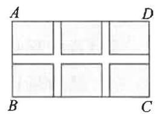

# 四、解答题(二)(本大题共3小题,每题9分,共27分)

19.(9分)已知 $w=(2a+3b)^{2}+(a+3b)(a-3b)+a^{2}$

(1)化简 w;   
(2)若关于 $x$ 的方程 $2x^{2} + 2ax - ab + 1 = 0$ 有两个相等的实数根，求 $\pmb{w}$ 的值.

20.(9分)已知 $x_{1}, x_{2}$ 是关于 $x$ 的方程 $x^{2} + (2m + 1)x + (m^{2} + 1) = 0$ 的两个实数根.

(1) 求 m 的取值范围；  
(2) 若 $x_{1} \cdot x_{2} = 5$ ，求 m 的值.

21.(9分)某水果超市经销一种高档水果,售价每千克50元.

(1)若连续两次降价后每千克32元,且每次下降的百分率相同,求每次下降的百分率;   
(2)若按现价销售,每千克盈利10元,每天可售出500千克,经市场调查发现,在进货价不变的情况下,超市决定采取适当的涨价措施,但超市规定每千克涨价不能超过8元,若每千克涨价1元,日销售量将减少20千克.现该超市希望每天盈利6000元,那么每千克应涨价多少元?

# 五、解答题(三)(本大题共2小题,共27分)

22.(13分)【项目学习】配方法是数学中一种常见的解题方法,利用配方法可求一元二次方程的根.所谓配方法是指将一个式子的某部分通过恒等变形化为完全平方式或几个完全平方式的和的方法.其实这种方法还经常被用到代数式的变形中,并结合非负数的意义解决某些问题.例1:把代数式 $x^{2}+8x+25$ 进行配方.解:原式 $=x^{2}+8x+4^{2}+9=(x+4)^{2}+9$ ;例2:求代数式 $-x^{2}+4x-7$ 的最大值.解:原式 $=-(x^{2}-4x+2^{2})-3=-(x-2)^{2}-3,\because(x-2)^{2}\geqslant0,\therefore-(x-2)^{2}\leqslant0,\therefore-(x-2)^{2}-3\leqslant-3,\therefore-x^{2}+4x-7$ 的最大值为-3.

【问题解决】(1)若 m, k, h 满足 $2m^{2}-12m+11=2(m-k)^{2}+h$ ，则 $k+h$ 的值为 \_\_\_\_；

(2) 若 Rt△ABC 的三边长分别为 a, b, c，且 a, b 满足 $a^{2} + b^{2} - 8a - 10b + 41 = 0$ ，求 △ABC 的周长.

【迁移应用】(3)用一段总长为 24 m 的竹篱笆围建一个面积为 $S(m^{2})$ 的矩形花圃.请运用“配方法”求 S 的最大值.

# 23.(14分)综合与实践

【问题背景】如图,校园中有两面直角围墙,墙角内的 P 处有一棵古树与墙 CD,AD 的距离分别是 15 m 和 6 m,在美化校园的活动中,某数学兴趣小组想借助围墙(两边足够长),用 28 m 长的篱笆围成一个矩形花园 ABCD(篱笆只围 AB,BC 两边且恰好用完),设 AB = x m.

【设计方案】设计一个矩形花园,且要将古树 P 围在花园内(含边界,不考虑树的粗细).

【解决问题】思路: 把矩形的面积 S 用含 x 的代数式表示出来.

(1)直接写出: S 与 x 的解析式为 \_\_\_\_ (用含 x 的式子表示 S), x 的取值范围是 \_\_\_\_ ;  
(2) 花园的面积能否为 $192 \, m^{2}$ ? 若能, 求出 x 的值; 若不能, 请说明理由;  
(3)若要使古树 P 恰好在矩形 ABCD 的对角线 BD 上, 求 x 及 S 的值.

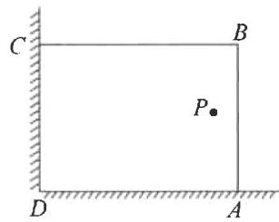

# 广东专用

# 2 第二十二章《二次函数》测试卷

(考试范围:第22章 满分:120分)

# 一、选择题(每小题3分,共30分)

1. 下列函数中属于二次函数的是()

A. $y = x(x + 1)$

B. $y = 2x$

C. $y = x^{2} - (x^{2} + 1)$

D. $y = x + 2$

2. 若抛物线 $y = m(x + 2)^2$ 开口向下, 则 $m$ 的值可以是 ( )

A. 0

B. -1

C. 1

D. 2

3. 抛物线 $y = 2(x - 1)^2 + 3$ 的顶点坐标是（）

A. $(1,3)$

B. $(-1,3)$

C. $(1,-3)$

D. $(-1,-3)$

4. 抛物线 $y = -3(x + 1)^{2} + 3$ 的对称轴是（）

A. 直线 $x = 1$

B. 直线 x = -3

C. 直线 $x = -1$

D. 直线 $x = 3$

5.二次函数 $y = (x - 3)^{2} - 4$ 的最小值是（

A. 4

B. 3

C.-3

D.-4

6. 抛物线 $y = -4x^{2} - 3x - 5$ 与 $y$ 轴交点的纵坐标为（）

A.-3

B. -4

C.-5

D. -1

7. 将抛物线 $y = -3(x - 4)^2$ 向右平移 3 个单位长度得到的抛物线为（）

A. $y = -3(x - 7)^{2}$

B. $y = -3(x - 1)^{2}$

C. $y = -3(x - 4)^{2} + 3$

D. $y = -3(x - 4)^{2} - 3$

8. 在二次函数 $y = -(x - 1)^2 + 2$ 的图象上, 若 $y$ 随 $x$ 的增大而增大, 则 $x$ 的取值范围是 ( )

A. $x > - 1$

B. $x > 1$

C. $x < -1$

D. $x <   1$

9. 如图, 抛物线状沙丘是大漠中常见的沙丘形状, 以沙丘顶端为原点建立平面直角坐标系, 沙丘中两点 M, N 的坐标分

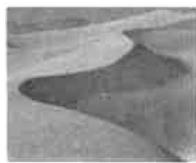

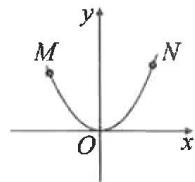

别为 $(-9,m)$ ， $(12,64)$ ，则m的值为()

A. 30

B. 36

C. 48

D. 56

10. 已知一元二次方程 $2x^{2} + bx - 1 = 0$ 的一个根是 1, 若二次函数 $y = 2x^{2} + bx - 1$ 的图象上有三个点 $(0, y_{1})$ 、 $(-1, y_{2})$ 、

$\left(\frac{2}{3},y_{3}\right)$ ，则 $y_{1},y_{2},y_{3}$ 的大小关系为（）

A. $y_{1}<y_{2}<y_{3}$

B. $y_{2} <   y_{1} <   y_{3}$

C. $y_{1} <   y_{3} <   y_{2}$

D. $y_{3} <   y_{1} <   y_{2}$

# 二、填空题(每小题3分,共15分)

11. 已知二次函数 $y = x^2 - bx$ 的图象过点 $(-1, 2)$ , 则 $b$ 的值为 \_\_\_\_.

12. 抛物线 $y=(x-3)(x+2)$ 与 x 轴的交点坐标是 \_\_\_\_.

13. 已知函数 $y = -(x - 3)^{2} + 2$ ，当 x = \_\_\_\_ 时，函数有最 \_\_\_\_ 值为 \_\_\_\_.

14. 在中考体育训练期间, 小明对自己某次实心球训练的录像进行分析, 发现实心球飞行高度 $y$ (米) 与水平距离 $x$ (米) 之间的关系式为 $y = -\frac{1}{10} x^2 + \frac{3}{5} x + \frac{8}{5}$ , 由此可知小明此次实心球训练的成绩为 \_\_\_\_ 米.

15. 如图, 抛物线 $y = ax^2 + bx + c (a \neq 0)$ 与 $x$ 轴交于点 $A(-1,0)$ 和 $B$ , 与 $y$ 轴交于点 $C$ . 下列结论: ① $abc < 0$ ; ② $2a + b > 0$ ; ③ $4a - 2b + c > 0$ ; ④ $3a + c > 0$ . 其中正确的结论为 \_\_\_\_ (填序号).

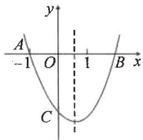

# 三、解答题(一)(本大题共3小题,每题7分,共21分)

16.(7分)已知抛物线 $y=x^{2}+kx+k+3$ ，根据下面的条件，直接写出 k 的值.

(1)抛物线经过原点,则 k= ;   
(2)抛物线的对称轴为 x = -3，则 k = \_\_\_\_.

17.(7分)已知关于x的二次函数的图象的顶点坐标为 $(-1,2)$ ，且图象过点 $(1,-3)$ .

(1)求这个二次函数的解析式；  
(2)写出它的开口方向,对称轴.

18.(7分)已知抛物线 $y=x^{2}+bx+c$ 经过(2,-1)和(4,3)两点.

(1)求出这条抛物线的解析式；  
(2)将该抛物线向右平移1个单位长度,再向下平移3个单位长度,得到的新抛物线的解析式为\_\_\_\_（直接写出答案）.

# 四、解答题(二)(本大题共3小题,每题9分,共27分)

19.(9分)已知二次函数的图象经过点(0,3)，(-3,0)，(2,-5)，且与x轴交于A，B两点(点A在点B的左侧).

(1)求此二次函数的解析式；  
(2) 判断点 $P(-2,3)$ 是否在这个二次函数的图象上？如果在，请求出 $\triangle PAB$ 的面积；如果不在，请说明理由。

20.(9分)已知抛物线 $y=-x^{2}+(m-1)x+m$ 上一点(1,4).

(1) 求 m 的值；  
(2)求抛物线与x轴的交点坐标；  
(3)画出这条抛物线的大致图象(草图),并根据图象回答:

①当 x 取什么值时, y > 0?

②当 x 取什么值时，y 的值随 x 的增大而减小？

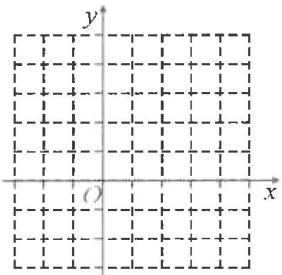

# 五、解答题(三)(本大题共2小题,共27分)

22.(13分)综合与实践:根据以下素材,探索完成任务.

<table><tr><td>素材1</td><td colspan="2">某学校一块劳动实践基地大棚的横截面如图所示,上部分的顶棚是抛物线形状,下部分是由两根立柱CE和DF组成,立柱高为1m,顶棚最高点距离地面EF是4m.EF的长为20m.</td><td>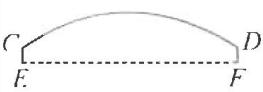</td></tr><tr><td>素材2</td><td colspan="2">为提高灌溉效率,学校在EF的中点M处安装了一款可垂直升降的自动喷灌器MA,从喷水口A喷出的水流可以看成抛物线,其形状与 $y = -0.05x^{2}$ 的图象相同, $MA = 1.45$ m,此时水流刚好喷到立柱的端点D处.</td><td>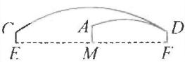</td></tr><tr><td colspan="4">问题解决</td></tr><tr><td>任务1</td><td>确定顶棚的形状</td><td colspan="2">以顶棚最高点为坐标原点建立平面直角坐标系,求出顶棚部分抛物线的解析式.</td></tr><tr><td>任务2</td><td>探索喷水的高度</td><td colspan="2">问MA处喷出的水流在距离A点水平距离为多少米时达到最高?</td></tr><tr><td>任务3</td><td>调整喷头的高度</td><td colspan="2">如何调整喷水口的高度(形状不变),使水流喷灌时恰好落在边缘F处?</td></tr></table>

21.(9分)某商店经销一种健身球,已知这种健身球的成本价为每个20元,市场调查发现,该种健身球每天的销售量y(个)与销售单价x(元)有如下关系: $y=-2x+80(20\leqslant x\leqslant40)$ ,设这种健身球每天的销售利润为w元.

(1) 求 $w$ 与 $x$ 之间的函数关系式；  
(2)该种健身球销售单价定为多少元时,每天的销售利润最大?最大利润是多少元?

23.(14分)如图,在平面直角坐标系中,抛物线 $y=x^{2}+mx+n$ 经过点 A(3,0), B(0,-3), P 是直线 AB 上的动点, 过点 P 作 x 轴的垂线交抛物线于点 M, 设点 P 的横坐标为 t.

(1)分别求出直线 $AB$ 和这条抛物线的解析式；  
(2) 若点 P 在第四象限, 连接 AM, BM, 当线段 PM 最长时, 求 $\triangle ABM$ 的面积;  
(3)是否存在这样的点 P, 使得以点 P, M, B, O 为顶点的四边形为平行四边形? 若存在, 请直接写出点 P 的横坐标; 若不存在, 请说明理由.

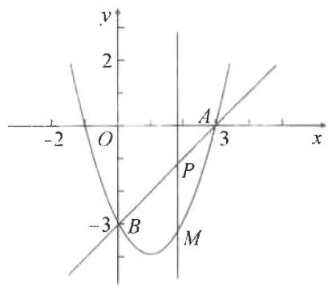

text_image

-2
O
y
2
A
3
x
-3
B
M

# 广东专用 3 第二十三章《旋转》测试卷

(考试范围:第23章 满分:120分)

# 一、选择题(每小题3分,共30分)

1. 将左图绕某点顺时针旋转 $90^{\circ}$ 后得到的图形是（）

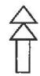

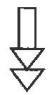  
A

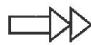  
B

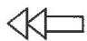  
C

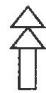  
D

2. 下列图案中, 不能由一个“基本图案”通过旋转而形成的是 ( )

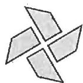  
A

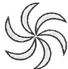  
B

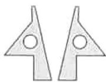  
C

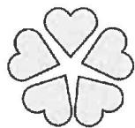  
D

3. 下列四个图形中, 是中心对称图形的是( )

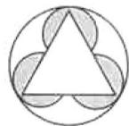  
A

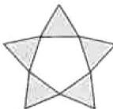  
B

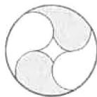  
C

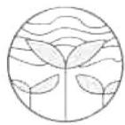  
D

4. 点 $P(2, -3)$ 关于原点对称的点的坐标是()

A. $(2,3)$

B. $(-2,3)$

C. $(-2,-3)$

D. $(-3,2)$

5. 如图, 将 $\triangle AOB$ 绕点 $O$ 按逆时针方向旋转 $60^{\circ}$ 后得到 $\triangle COD$ . 若 $\angle AOB = 15^{\circ}$ , 则 $\angle AOD$ 的度数是 ( )

A. ${30}^{ \circ  }$

B. ${35}^{ \circ  }$

C. ${45}^{ \circ  }$

D. $55^{\circ}$

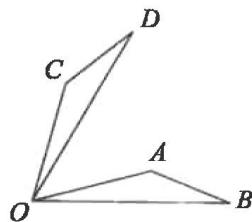  
第5题图

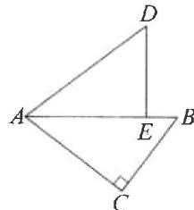  
第6题图

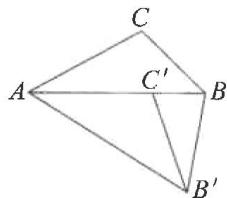  
第7题图

6. 如图, 在 $\triangle ABC$ 中, $\angle C = 90^{\circ}, BC = 3$ , 将 $\triangle ABC$ 绕点 $A$ 逆时针旋转, 使点 $C$ 落在线段 $AB$ 上的点 $E$ 处, 点 $B$ 落在点 $D$ 处. 若 $B, D$ 两点间的距离为 $\sqrt{10}$ , 则 $BE$ 的长为 ( )

A. 4

B. 3

C. 2

D. 1

7. 如图, 在 $\triangle ABC$ 中, $\angle BAC = 30^{\circ}$ , 将 $\triangle ABC$ 绕点 $A$ 顺时针旋转得到 $\triangle AB'C'$ , 使点 $C$ 的对应点 $C'$ 落在 $AB$ 边上, 连接 $BB'$ , 则 $\angle ABB'$ 的度数为 ( )

A. $60^{\circ}$

B. ${70}^{ \circ  }$

C. ${75}^{ \circ  }$

8. 如图, 在 $\triangle ABC$ 中, $\angle C = 90^{\circ}, AC = 3$ , $BC = 4$ . 若将 $\triangle ABC$ 绕点 $B$ 逆时针旋转 $120^{\circ}$ , 点 $A$ 的对应点为点 $D$ , 则 $AD$ 的长为 ( )

A. $5 \sqrt{2}$

B. $5\sqrt{3}$

C. $4\sqrt{2}$

D. ${55}^{ \circ  }$

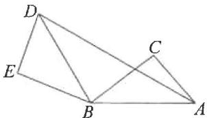

D. $4\sqrt{3}$

9. 如图, 在平面直角坐标系中, $\triangle ABC$ 绕点 $P$ 旋转后得到 $\triangle A'B'C'$ , 则点 $P$ 的坐标是 ( )

A. (1.5, 1.5)

B. $(1,0)$

C. $(1,-1)$

D. $(1.5,-0.5)$

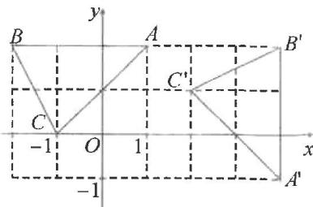

text_image

y
B
A
B'
C'
-1 O 1 x
-1
A'

第9题图

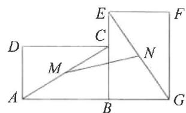  
第10题图

10. 如图, 将矩形 $ABCD$ 绕点 $B$ 顺时针旋转 $90^{\circ}$ 至矩形 $EBGF$ 的位置, 连接 $AC, EG$ , 分别取 $AC, EG$ 的中点 $M, N$ , 连接 $MN$ . 若 $MN = 5\sqrt{2}, AB = 8$ , 则 $BC$ 的长为 ( )

A. 6

B. $3\sqrt{2}$

C. 5

D. $2\sqrt{2}$

# 二、填空题(每小题3分,共15分)

11. 如图, $\triangle ABC$ , $\triangle ACD$ , $\triangle ADE$ 是三个全等的等边三角形, 那么 $\triangle ABC$ 绕点 $A$ 逆时针方向至少旋转 \_\_\_\_, 才能与 $\triangle ADE$ 完全重合.

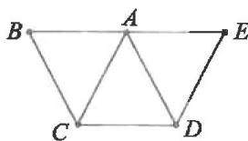  
第11题图

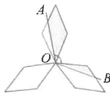  
第 12 题图

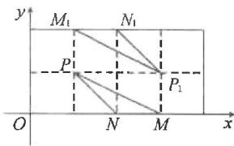  
第13题图

12. 如图所示的图案由三个菱形叶片组成, 绕点 O 旋转 $120^{\circ}$ 后可以和自身重合. 若每个叶片的面积为 $3 \, cm^{2}$ , 且 $\angle AOB = 120^{\circ}$ , 则图中阴影部分的面积为 \_\_\_\_ $cm^{2}$ .

13. 如图, 在平面直角坐标系中, 点 $P(1,1), N(2,0), \triangle MNP$ 和 $\triangle M_{1}N_{1}P_{1}$ 的顶点都在格点上. 若 $\triangle MNP$ 与 $\triangle M_{1}N_{1}P_{1}$ 关于某一点中心对称, 则对称中心的坐标是

14. 如图, 在 $\triangle ABC$ 中, $\angle B = 55^{\circ}, \angle BAC = 80^{\circ}$ , 将 $\triangle ABC$ 绕点 $A$ 逆时针旋转到 $\triangle ADE$ 的位置, 点 $D$ 在 $BC$ 边上, $DE$ 交 $AC$ 于点 $F$ , 则 $\angle AFE$ 的度数为

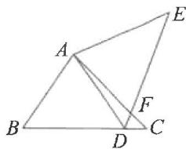  
第14题图

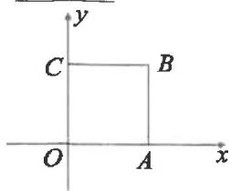  
第15题图

15. 如图, 正方形 $OABC$ 的边长为 1 , 若该正方形绕点 $O$ 逆时针旋转 $135^{\circ}$ , 则点 $B$ 的对应点的坐标为

# 三、解答题(一)(本大题共3小题,每题7分,共21分)

16.(7分)点 $A(x+3,2y+1)$ 与点 $A'(-8,x)$ 关于原点对称，求x,y的值.

17. (7 分) 如图, 在 $\triangle ABC$ 中, $\angle B = 40^{\circ}$ , 将 $\triangle ABC$ 绕点 $A$ 逆时针旋转至 $\triangle ADE$ , 使点 $B$ 落在 $BC$ 的延长线上的点 $D$ 处, 求 $\angle BDE$ 的度数.

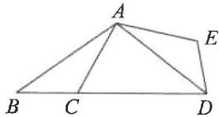

18.(7分)如图,已知点A(-4,2),B(-1,-2),□ABCD的对角线交于坐标原点O.

(1)请直接写出点 C, D 的坐标;

(2) 写出从线段 $AB$ 到线段 $CD$ 的变换过程 (其中 $A, C$ 是对应点).

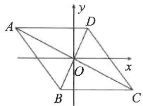

# 四、解答题(二)(本大题共3小题,每题9分,共27分)

19.(9分)如图,以锐角 $\triangle ABC$ 的边AC,AB为边向外作正方形ACDE和正方形ABGF,连接BE,CF交于点H.

(1)试说明 BE 与 CF 的关系；  
(2)图中 $\triangle BAE$ 可以通过旋转得到 $\triangle FAC$ ，请写出旋转中心、旋转方向、旋转角.

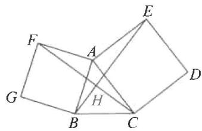

20.(9分)如图,在平面直角坐标系中,Rt△ABC的三个顶点分别是A(-3,1),B(0,3),C(0,1).

(1) 将 $\triangle ABC$ 以点 C 为旋转中心顺时针旋转 $90^{\circ}$ ，画出旋转后对应的 $\triangle A_{1}B_{1}C$ ;  
(2) 平移 $\triangle ABC$ ，若点 A 的对应点 $A_{2}$ 的坐标为 $(-1, -3)$ ，画出平移后对应的 $\triangle A_{2}B_{2}C_{2}$ ;  
(3)若将 $\triangle A_{1}B_{1}C$ 绕某一点旋转可以得到 $\triangle A_{2}B_{2}C_{2}$ ，请直接写出旋转中心的坐标.

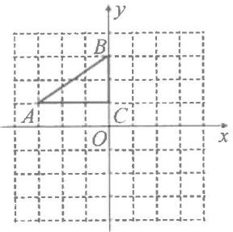

21.(9分)如图1是一台刷脸支付仪,由底柱、水平托板、支撑板和电子器材构成,图2是其上半部分的侧面示意图.电子器材长AC=16cm,支撑板长BD=16cm, $\angle CBD=75^{\circ}$ ,已知摄像头在点A处,支撑点B是AC的中点,电子器材AC可绕点B转动,支撑板BD可绕点D转动.

(1)如图3,当 $\angle BDE=60^{\circ}$ 时,将AC绕点B顺时针旋转 $15^{\circ}$ ,其延长线交水平托板DE于点F,连接CD.求证: $CD\perp AF;$

(2)如图4,为方便使用,在图2中,把AC绕点B逆时针旋转15°后,再将BD绕点D顺时针旋转,使点C落在水平托板DE上,求此时CD的长.

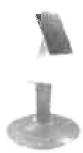  
图1

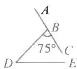  
图2

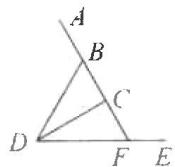  
图3

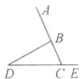  
图4

# 五、解答题(三)(本大题共2小题,共27分)

22.(13分)如图,在Rt△ABC中,∠ACB=90°,将△ABC绕点C顺时针旋转α(0°<α<90°)得到△ECF,使点B的对应点F恰好落在线段AB上.

(1)用直尺和圆规作出 $\triangle ECF$ ，不写作法，保留作图痕迹；  
(2) 若 $\angle BAC = 35^{\circ}$ , 求 $\alpha$ 的大小;  
(3) 连接 $BE$ ，若 $AF = 1, BF = 3$ ，求 $BE^2 - EF^2$ 的值.

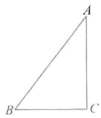

# 23.(14分)综合与实践

【问题情境】在图1所示的直角三角形纸片ABC中，O是斜边AB的中点.数学老师让同学们将△ABC绕中点O做图形的旋转实验，探究旋转过程中线段之间的关系.

【解决问题】(1)“实践小组”的同学们将 $\triangle ABC$ 以点 $O$ 为旋转中心按逆时针旋转,当点 $A$ 的对应点 $A'$ 与 $C$ 重合时, $BC$ 与它的对应边 $B'C'$ 交于点 $D$ .他们发现: $OD \perp B'C$ .请你帮助他们写出证明过程;

【数学思考】(2)在图2的基础上,“实践小组”的同学们继续将 $\triangle ABC$ 以点 $O$ 为旋转中心进行逆时针旋转,当 $AB$ 的对应边 $A'B'\perp AB$ 时,如图3,设 $A'B'$ 与 $BC$ 交于点 $F,B'C'$ 与 $AB$ 交于点 $E$ .他们认为 $ED+FD=AC$ .他们的认识是否正确?请说明理由;

【探究创新】(3)解决完上面两个问题后,“实践小组”的同学们在图3中连接OD,他们认为DF,DE与OD也具有一定的数量关系.请你写出这个数量关系\_\_\_\_.
(不要求证明)

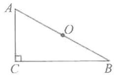  
图1

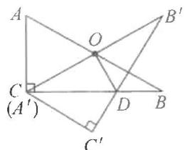  
图2

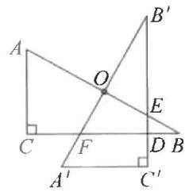  
图3

# 广东专用

# 4 期中测试卷

(考试范围:第21\~23章 满分:120分)

# 一、选择题(每小题3分,共30分)

1. 已知一个一元二次方程的二次项系数是 3, 常数项是 1, 则这个一元二次方程可能是( )

A. $3x + 1 = 0$

B. $x^{2} + 3 = 0$

C. $3x^{2}-1=0$

D. $3x^{2}+6x+1=0$

2. 下列图形是中心对称图形的是( )

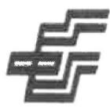  
A

  
B

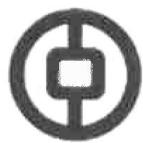  
C

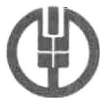  
D

3. 如图, 由图案(1)到图案(2)再到图案(3)的变化过程中, 不可能用到的图形变换是( )

[NO TEXT]

(1)

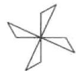  
(2)

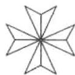  
(3)

A. 轴对称

B. 旋转

C. 中心对称

D. 平移

4. 在下列二次函数中, 其图象的对称轴为直线 $x = -2$ 的是 ( )

A. $y=(x+2)^{2}$

B. $y=2x^{2}-2$

C. $y = -2x^{2} - 2$

D. $y=2(x-2)^{2}$

5.一元二次方程 $2x^{2} - 5x + 3 = 0$ 的根的情况是（

A. 有两个不相等的实数根

B.有两个相等的实数根

C. 两个根都是整数

D. 无实数根

6. 已知 $x_{1}, x_{2}$ 是方程 $x^{2} - 7x = 12$ 的两个根, 则 $x_{1}x_{2}$ 的值为 ( )

A. 12

B.-12

C. 7

D.-7

7. 用配方法解方程 $x^{2} - 8x - 20 = 0$ ，下列变形正确的是（）

A. $(x + 4)^{2} = 24$

B. $(x-8)^{2}=44$

C. $(x + 4)^{2} = 36$

D. $(x-4)^{2}=36$

8. 已知点 $(-4, y_1), (-1, y_2), (2, y_3)$ 都在函数 $y = -x^2 + 2x + c$ 的图象上，则 $y_1, y_2, y_3$ 的大小关系为（）

A. $y_{1}>y_{2}>y_{3}$

B. $y_{3} > y_{2} > y_{1}$

C. $y_{2}>y_{3}>y_{1}$

D. $y_{3} > y_{1} > y_{2}$

9. 如图, 将 $\triangle ABC$ 绕点 $B$ 顺时针旋转到 $\triangle DBE$ , 点 $A$ 的对应点 $D$ 恰好落在 $AC$ 上, 且 $BE \parallel AC$ . 若 $\angle A = 70^{\circ}$ , 则 $\angle C$ 的度数为 ( )

A. ${30}^{ \circ  }$

B. ${40}^{ \circ  }$

C. ${45}^{ \circ  }$

  
D. $36^{\circ}$

10. 已知抛物线 $y = ax^2 + bx + c (a, b, c$ 为常数， $a \neq 0$ ) 的顶点坐标为(1,2)，与 $y$ 轴的交点在 $x$ 轴的下方。下列结论正确的是()

A. $a > 0$

B. $b <   0$

C. $b^{2}-4ac=0$

D. $a+b+c=2$

# 二、填空题(每小题3分,共15分)

11. 在平面直角坐标系中, 点 $A(-3,2)$ 关于原点对称的点的坐标为

12. 将二次函数 $y = x^{2} - 1$ 的图象沿 x 轴向左平移 3 个单位长度，则平移后的抛物线对应的二次函数的解析式为 \_\_\_\_。

13.为了响应全民阅读的号召,某校图书馆利用节假日面向社会开放.据统计,第一个月进馆560人次,进馆人次逐月增加,第三个月进馆830人次:设该校图书馆第二个月、第三个月进馆人次的平均增长率为x,则可列方程为

14. 已知关于 $x$ 的一元二次方程 $(a - 3)x^{2} - 4x + 4 = 0$ 有实数根, 则 $a$ 的取值范围为

15. 如图, 一名男生推铅球, 铅球行进的高度 $y(\mathrm{m})$ 与水平距离 $x(\mathrm{m})$ 之间的关系是二次函数的关系. 铅球行进起点的高度为 $\frac{5}{3} \mathrm{~m}$ , 行进到水平距离为 $4 \mathrm{~m}$ 时达

到最高处,最大高度为 $3 \, m$ , 则铅球推出的距离为 m.

# 三、解答题(一)(本大题共3小题,每题7分,共21分)

16.(7分)解方程: $x^{2}-3x+2=0$ .

17.(7分)若二次函数图象的顶点坐标为(2,-1)，且图象过点(0,3)，求二次函数的解析式.

18.(7分)如图,在 $\triangle ABC$ 中,将 $\triangle ABC$ 绕点A逆时针旋转得到 $\triangle ADE$ (点D与点B对应,点E与点C对应),点D恰好落在BC上,DE交AC于点F.

(1)用尺规作出△ADE(保留作图痕迹,不写作法);

(2) 若 $\angle ABC = 65^{\circ}, \angle ACB = 20^{\circ}$ , 求 $\angle EFC$ 的度数.

# 四、解答题(二)(本大题共3小题,每题9分,共27分)

19.(9分)已知关于 $x$ 的一元二次方程 $x^{2} + 2x - 3m = 0$ 有两个不相等的实数根.

(1) 求 m 的取值范围；

(2)当该方程有一个根为3时,求m的值及方程的另一个根.

20.(9分)已知二次函数 $y=-x^{2}+2x+m$ .

(1)如果二次函数的图象与 $x$ 轴有两个交点,求 $m$ 的取值范围;  
(2)如图,该二次函数的图象过点A(3,0),与y轴交于点B,直线AB与该二次函数图象的对称轴交于点P,求点P的坐标.

21.(9 分)综合与实践

【发现问题】掷实心球是中考体育考试项目之一.明明发现实心球从出手到落地的过程中,实心球竖直高度与水平距离一直在相应的发生变化.

【提出问题】实心球竖直高度与水平距离之间有怎样的函数关系？

【分析问题】明明利用先进的鹰眼系统记录了实心球在空中运动时的水平距离 x（单位：米）与竖直高度 y（单位：米）的对应数据如下表：

<table><tr><td>水平距离x/m</td><td>0</td><td>2</td><td>4</td><td>5</td><td>6</td><td>8</td><td>9</td></tr><tr><td>竖直高度y/m</td><td>2</td><td>3.2</td><td>3.6</td><td>3.5</td><td>3.2</td><td>2</td><td>1.1</td></tr></table>

根据表中的数据建立如图所示的平面直角坐标系,根据图中点的分布情况,明明发现其图象是二次函数图象的一部分.

【解决问题】

(1)在明明投掷过程中,出手时实心球的竖直高度是\_\_\_\_米,实心球在空中的最大高度是\_\_\_\_米;

(2)求满足条件的抛物线的解析式；

(3)根据中考体育考试评分标准(男生版),在投掷过程中,实心球从起点到落地点的水平距离大于或等于9.7米时,即可得满分10分,明明在此次考试中是否得到满分?请说明理由.

五、解答题(三)(本大题共2小题,共27分)

22.(13分)如图,P是正方形ABCD外一点, $PA=2\sqrt{2}$ ,PB=1, $PC=\sqrt{10}$ .

(1) 将 $\triangle BPC$ 绕点 B 逆时针旋转 $90^{\circ}$ 得到 $\triangle BMA$ ，画出 $\triangle BMA$ ;

(2) 求 $\angle APB$ 的度数；

(3) 求 AB 的长.

23.(14分)如图,在平面直角坐标系中,抛物线 $y=ax^{2}+2x+c$ 经过点 $(-2,-3)$ ,与 x 轴交于 A,B(1,0)两点,与 y 轴交于点 C.P 是第一象限内抛物线上的一动点,设点 P 的横坐标为 m.

(1)求抛物线的解析式；

(2) 若 $\angle PAB = \angle OCB$ , 求点 $P$ 的坐标;

(3)过点 $P$ 作 $PD \perp y$ 轴, 垂足为 $D$ , 过点 $P$ 作 $y$ 轴的平行线与 $x$ 轴交于点 $M$ , 与 $AC$ 相交于点 $N$ , 过点 $N$ 作 $y$ 轴的垂线, 交 $y$ 轴于点 $E$ . 设矩形 $PNED$ 的周长为 $w$ , 当 $w$ 随 $m$ 的增大而增大时, 求 $m$ 的取值范围.

text_image

y
A O B x
C
y
A O B x
C

备用图

# 广东专用

# 5 第二十四章《圆》测试卷

(考试范围:第24章 满分:120分)

# 一、选择题(每小题3分,共30分)

1. 如图, $AB$ 是 $\odot O$ 的弦, $AB=OA$ , 则 $\angle BAO$ 的度数为( )

A. ${40}^{ \circ  }$

B. ${50}^{ \circ  }$

C. ${60}^{ \circ  }$

D. ${65}^{ \circ  }$

  
第1题图

  
第2题图

  
第3题图

2. 如图, $AB$ 是 $\odot O$ 的直径, 弦 $CD \perp AB$ 于点 $E$ , $OC = 5 \mathrm{~cm}$ , $CD = 8 \mathrm{~cm}$ , 则 $OE$ 的长为 ( )

A. $8 \mathrm{~cm}$

B. $5 \mathrm{~cm}$

C. $3 \mathrm{~cm}$

D. $2 \mathrm{~cm}$

3. 如图, $C, D$ 是 $\odot O$ 上直径 $AB$ 两侧的点, 若 $\angle D = 75^{\circ}$ , 则 $\angle ABC$ 等于 ( )

A. ${15}^{ \circ  }$

B. ${20}^{ \circ  }$

C. ${25}^{ \circ  }$

D. ${35}^{ \circ  }$

4. $\odot O$ 的半径为 $5 \mathrm{~cm}$ , 点 $A$ 到圆心 $O$ 的距离 $OA = 3 \mathrm{~cm}$ , 则点 $A$ 和圆 $O$ 的位置关系为 ( )

A. 点 A 在圆上

B. 点 $A$ 在圆内

C. 点 A 在圆外

D. 无法确定

5. 如果一个正多边形的中心角是 $45^{\circ}$ ，那么这个正多边形的边数是（）

A. 4

B. 6

C. 8

D. 9

6. 已知 $\odot O$ 的半径是 5，直线 l 是 $\odot O$ 的切线，则点 O 到直线 l 的距离是（）

A. 2.5

B. 3

C. 5

D. 10

7. 如图, $PA, PB$ 分别与 $\odot O$ 相切于点 $A, B, C$ 为 $\odot O$ 上一点, $\angle ACB = 70^{\circ}$ , 则 $\angle P$ 的度数为 ( )

A. ${30}^{ \circ  }$

B. ${40}^{ \circ  }$

C. ${55}^{ \circ  }$

D. $60^{\circ}$

  
第7题图

  
第8题图

  
第9题图

8. 唐代李皋发明了“桨轮船”, 这种船是原始形态的轮船, 是近代明轮航行模式之先导. 如图, 某桨轮船的轮子被水面截得的弦 $AB$ 长 $4 \mathrm{~m}$ , 轮子的吃水深度 $CD$ 为 $1 \mathrm{~m}$ , 则该桨轮船的轮子直径为 ( )

A. $\frac{5}{2} \mathrm{~m}$

B. $4 \mathrm{~m}$

C. $5 \mathrm{~m}$

D. $6 \mathrm{~m}$

9. 如图, Rt△ABC 中, BC = 3, AC = 4, 以点 C 为圆心的圆与 AB 相切, 则 ⊙C 的半径为( )

A. 2.3

B. 2.4

C. 2.5

D. 2.6

10. 从一块直径为 $8 \mathrm{~cm}$ 的圆形玉料中刻出一个如图所示的扇形玉佩 $(A, B, C$ 在圆上, 且 $\angle ABC = 90^{\circ})$ , 则这个扇形玉佩的面积是 ( )

A. $4 \pi \mathrm{~cm}^{2}$

B. $8 \pi \mathrm{~cm}^{2}$

C. $16 \pi \mathrm{~cm}^{2}$

D. $16 \sqrt{2} \pi \mathrm{~cm}^{2}$

  
第10题图

  
第11题图

  
第12题图

# 二、填空题(每小题3分,共15分)

11. 如图, $A, B, C$ 三点在 $\odot O$ 上, 且 $\angle AOB = 50^{\circ}$ , 则 $\angle C$ 的度数为

12. 如图, 正五边形 $ABCDE$ 的边长为 5, $\odot A$ 经过点 $B$ , 则 $\widehat{BE}$ 的长是

13. 已知圆锥的底面半径为 10, 母线长为 30, 则圆锥的侧面积是 \_\_\_\_.

14. 如图, $PA, PB$ 分别与 $\odot O$ 相切于点 $A, B, PA = 10, CD$ 与 $\odot O$ 相切于点 $E$ , 交 $PA, PB$ 于 $C, D$ 两点, 则 $\triangle PCD$ 的周长是 \_\_\_\_.

  
第14题图

  
第15题图

15. 如图, $\odot O$ 的圆心在梯形 $ABCD$ 的底边 $AB$ 上, 并与其它三边均相切, 若 $AB = 10, AD = 6$ , 则 $CB$ 的长为 \_\_\_\_.

# 三、解答题(一)(本大题共3小题,每题7分,共21分)

16.(7分)如图,两个圆都以点O为圆心,大圆的弦AB交小圆于C,D两点.求证:AC=BD.

17.(7分)如图,AB是⊙O的直径,OA=1,AC是⊙O的弦,过点C的切线交AB的延长线于点D.若 $BD=\sqrt{2}-1$ ,求 $\angle D$ 的度数.

18.(7分)如图,A,B,C,D是⊙O上的四点,且 $\widehat{AB}=\widehat{CD}$ .求证: $\triangle ABC\cong\triangle DCB$ .

# 四、解答题(二)(本大题共3小题,每题9分,共27分)

19.(9分)如图,在Rt△ABC中, $\angle C=90^{\circ}$ ,BD平分∠ABC交AC于点D.

(1) 使用直尺和圆规作图: O 是 AB 上一点, 且 $\odot O$ 经过 B, D 两点 (保留作图痕迹, 不写作法);

(2)求证:AC 是 $\odot O$ 的切线.

20.(9分)如图,扇形AOB的圆心角为120°,半径OA为9cm.

(1) 求扇形 AOB 的弧长和面积；  
(2)若把扇形纸片 AOB 卷成一个圆锥形无底纸帽,求这个纸帽的高 OH.

text_image

A
120°
O
B
→
O
H

21.(9分)如图,AB为⊙O的直径,CD为弦,且CD⊥AB于E,F为BA延长线上一点,CA平分∠FCE.

(1) 求证: FC 与 $\odot O$ 相切;  
(2) 连接 OD, 若 $OD \parallel AC$ , 求 $\angle F$ 的度数.

text_image

Geometric diagram showing a circle with points A, B, C, D, E, F and intersecting lines forming triangles and chords.

五、解答题(三)(本大题共2小题,共27分)

22.(13分)综合与实践:测量如图1所示的圆口水杯的杯口直径.

工具:一张宽度为 2 cm 的矩形硬纸板(厚度忽略不计)和刻度尺.

小明的测量方法:如图2,将硬纸板紧贴在杯口上,纸板的两个顶点 $A_{0},B_{0}$ 分别靠在杯口上,硬纸板的边沿与杯口的另两个交点分别为 $C_{0},D_{0}$ ,利用刻度尺测得 $B_{0}D_{0}$ 的长.

小亮的测量方法:如图3,将硬纸板紧贴在杯口上,纸板的一边与杯口相切,切点为A,另一边与杯口相交于B,C两点,利用刻度尺测得BC的长为l cm.

  
图1

  
图2

  
图3

(1)小明认为,他所测量的 $B_{0}D_{0}$ 的长就是杯口的直径,他用到的几何知识是\_\_\_\_;  
(2)请根据小亮的测量方法和所得数据,计算出杯口的直径(结果用含字母 l 的式子表示).

23.(14分)问题情境:如图1,已知AB为⊙O的直径,C为⊙O上异于A,B的一点,过点C作⊙O的切线CE,过点A作AD⊥CE于点D,连接OC,AC.

探究发现:(1)求证: $\angle DAC=\angle BAC$ ;

探究引申:(2)如图2,勤奋小组继续探究发现,若 $\triangle AOC$ 的对称轴经过点D,此时,CD与AB存在一定的数量关系,请写出结论并证明;

探究规律:(3)如图3,智慧小组在勤奋小组的启发下发现当 $\triangle AOC$ 为正三角形时,CD与AB存在的数量关系是:CD=AB.

  
图1

  
图2

  
图3

# 广东专用

# 6 第二十五章《概率初步》测试卷

(考试范围:第25章 满分:120分)

# 一、选择题(每小题3分,共30分)

1. 以下事件中, 必然事件是( )

A. 打开电视机, 正在播放体育节目

B. 正五边形的外角和为 $180^{\circ}$

C. 通常情况下, 水加热到 $100^{\circ}$ C 沸腾

D. 掷一次骰子, 向上一面是 5 点

2. 气象台预报“本市明天降水概率是 80%”. 对此信息, 下列说法正确的是( )

A.本市明天将有80%的地区降水

B. 本市明天将有 80% 的时间降水

C. 明天肯定下雨

D. 明天降水的可能性比较大

3. 在一个布袋中装有红、白两种颜色的小球, 它们除颜色外没有任何其他区别. 其中红球若干, 白球 5 个, 袋中的球已搅匀. 若从袋中随机取出 1 个球, 取出红球的可能性大, 则红球的个数是( )

A. 4 个

B. 5 个

C. 不足 4 个

D. 6 个或 6 个以上

4. 一个袋子中装有 6 个黑球和 3 个白球, 这些球除颜色外, 形状、大小、质地等完全相同. 在看不到球的条件下, 随机地从这个袋子中摸出一个球, 摸到白球的概率是( )

A. $\frac{1}{9}$

B. $\frac{1}{3}$

C. $\frac{1}{2}$

D. $\frac{2}{3}$

5. 已知一个布袋里装有 2 个红球, 3 个白球和 $a$ 个黄球, 这些球除颜色外其余都相同, 若从该布袋里任意摸出 1 个球, 是红球的概率为 $\frac{1}{3}$ , 则 $a$ 的值为 ( )

A. 1

D. 4

6. 一只小鸟自由地在空中飞行, 然后随意地落在如图所示的某个方格中(每个方格除颜色外完全一样), 那么小鸟停在黑色方格中的概率是()

A. $\frac{1}{2}$

B. $\frac{1}{3}$

C. $\frac{1}{4}$

D. $\frac{1}{5}$

7. 小军的旅行箱的密码是一个六位数, 由于他忘记了密码的末位数字, 则小军能一次打开该旅行箱的概率是( )

A. $\frac{1}{10}$

B. $\frac{1}{9}$

C. $\frac{1}{6}$

D. $\frac{1}{5}$

8. 经过某 T 字路口的汽车, 可能向左转或向右转, 如果这两种可能性大小相同, 三辆汽车经过这个十字路口时, 转向相同的概率为( )

A. $\frac{1}{2}$

B. $\frac{1}{3}$

C. $\frac{1}{4}$

D. $\frac{1}{8}$

9. 如图是两个可以自由转动的转盘, 转盘各被等分成三个扇形, 并分别标上 1,2,3 和 6,7,8 这 6 个数字, 如果同时转动两个转盘各一次 (指针落在等分线上重转), 则转盘停止后, 指针指向的数字和为偶数的概率是 ( )

A. $\frac{1}{2}$

B. $\frac{2}{9}$

C. $\frac{4}{9}$

D. $\frac{1}{3}$

第9题图  
  
第10题图

10. 某小组做“用频率估计概率”的试验时, 统计了某一结果出现的频率, 绘制了如图所示的折线统计图, 则符合这一结果的试验最有可能的是( )

A. 在“石头、剪刀、布”的游戏中, 小明随机出的是“剪刀”  
B. 一副去掉大小王的普通扑克牌洗匀后,从中任抽一张牌的花色是红桃  
C. 暗箱中有 1 个红球和 2 个黄球, 它们只有颜色上的区别, 从中任取一个球是黄球  
D. 掷一个质地均匀的正六面体骰子, 向上一面的点数是 4

# 二、填空题(每小题3分,共15分)

11.“打开电视机,它正在播放广告”这个事件是\_\_\_\_事件(填“必然”或“随机”).

12. 在“Wish you success”中, 任选一个字母, 这个字母为 “s” 的概率为 \_\_\_\_.

13. 有 5 张看上去无差别的卡片, 正面分别写着 1, 2, 3, 4, 5, 洗匀后正面向下放在桌子上, 从中随机抽取 2 张, 抽出的卡片上的数字恰好是两个连续整数的概率是

14. 一只蚂蚁在如图所示的矩形地砖上爬行, 蚂蚁停在阴影部分的概率是 \_\_\_\_.

15. 一个不透明的盒子里有若干个白球, 在不允许将球倒出来数的情况下, 为估计白球的个数, 小刚向其中放入 8 个黑球, 摇匀后从中随机摸出一个球记下颜色, 再把它放回盒中, 不断重复, 共摸球 400 次, 其中 160 次摸到黑球, 估计盒中大约有白球 \_\_\_\_ 个.

# 三、解答题(一)(本大题共3小题,每题7分,共21分)

16.(7分)掷一个骰子,观察向上一面的点数,求下列事件的概率:

(1) 点数为偶数；  
(2) 点数大于 2 且小于 5.

17.(7分)在一个不透明的袋子中,装有9个大小和形状一样的小球,其中3个红球,3个白球,3个黑球,它们已在口袋中被搅匀,现在有一个事件:从口袋中任意摸出n个球,在这n个球中,红球、白球、黑球至少各有一个.

(1) 当 $n$ 为哪些值时, 这个事件必然发生?  
(2) 当 n 为哪些值时, 这个事件不可能发生?  
(3) 当 n 为哪些值时, 这个事件可能发生?

18.(7分)一个不透明的袋中装有20个只有颜色不同的球,其中5个黄球,8个黑球,7个红球.

(1)求从袋中摸出一个球是黑球的概率；  
(2)现从袋中取走若干个红球,搅匀后,使从袋中摸出一个球是黑球的概率是 $\frac{1}{2}$ ,求从袋中取走红球的个数.

# 四、解答题(二)(本大题共3小题,每题9分,共27分)

19.(9分)某中学组织部分优秀学生分别去北京、上海、天津、重庆四个城市进行夏令营活动,学校购买了前往四个城市的车票,如图是未制作完整的车票种类和数量的条形统计图,

请你根据统计图回答下列问题：

(1)若前往天津的车票占全部车票的 $30\%$ ，则前往天津的车票数是多少张？并请补全统计图；

bar

| 城市 | 数量/张 |
|---|---|
| 北京 | 20 |
| 上海 | 40 |
| 天津 | 10 |
| 重庆 | 10 |

(2)若学校采取随机抽取的方式分发车票,每人抽取一张(所有的车票的形状、大小、质地完全相同),那么张明抽到前往上海的车票的概率是多少?

20.(9分)一个袋中装有若干个除颜色外均相同的小球,某数学学习小组做摸球试验,从袋中随机摸出一个球记下颜色,再把它放回袋中,不断重复.如表是试验中的一组统计数据:

<table><tr><td>摸球的次数n</td><td>100</td><td>200</td><td>300</td><td>500</td><td>1000</td><td>2000</td></tr><tr><td>摸到红球的次数m</td><td>59</td><td>121</td><td>174</td><td>295</td><td>600</td><td>1202</td></tr><tr><td>摸到红球的频率m/n</td><td>a</td><td>0.605</td><td>0.58</td><td>0.59</td><td>0.60</td><td>0.601</td></tr></table>

(1)上表中的 $a =$ \_\_\_\_,根据上表,从袋中随机摸出一个球,是红球的概率大约为 \_\_\_\_ (精确到0.1);

(2)如果袋中共有30个球,请估计袋中红球的个数.

21.(9分)小晗家客厅装有一种三位单极开关(如图所示),分别控制着A(楼梯)、B(客厅)、C(走廊)三盏灯,在正常情况下,小晗按下任意一个开关均可打开对应的一盏电灯,因刚搬进新房不久,不熟悉情况.

(1)若小晗任意按下一个开关,正好楼梯灯亮的概率是\_\_\_\_\_\_\_\_;

(2)若任意按下一个开关后,再按下另两个开关中的一个,则正好客厅灯和走廊灯同时亮的概率是多少?请用树状图或列表法加以说明.

# 五、解答题(三)(本大题共2小题,共27分)

22.(13分)一只口袋里放着1个红球,2个黑球和若干个白球,这三种球除颜色外没有任何区别,并搅匀.

(1)取出红球的概率为 $\frac{1}{5}$ ，则白球有多少个？  
(2)在(1)的条件下,同时从口袋中取出2个球,求是1个黑球1个白球的概率是多少?   
(3)再在原来的口袋中放进多少个红球,能使取出红球的概率达到 $\frac{1}{3}$ .

# 23.(14分)综合与实践

【问题情境】大自然中的植物千姿百态,如果细心观察,就会发现:不同植物的叶子通常有着不同的特征,如果我们用数学的眼光来观察,会有什么发现呢?“数智”小组的四位同学开展了“利用树叶的特征对树木进行分类”的项目式学习活动.

【实践发现】同学们从收集的杨树叶、柳树叶中各随机选取10片,通过测量得到这些树叶的长和宽(单位:cm)的数据后,分别计算长宽比,整理数据如下:

<table><tr><td>序号</td><td>1</td><td>2</td><td>3</td><td>4</td><td>5</td><td>6</td><td>7</td><td>8</td><td>9</td><td>10</td></tr><tr><td>杨树叶的 长宽比</td><td>2</td><td>2.4</td><td>2.1</td><td>2.4</td><td>2.8</td><td>1.8</td><td>2.4</td><td>2.2</td><td>2.1</td><td>1.7</td></tr><tr><td>柳树叶的 长宽比</td><td>1.5</td><td>1.6</td><td>1.5</td><td>1.4</td><td>1.5</td><td>1.4</td><td>1.7</td><td>1.5</td><td>1.6</td><td>1.4</td></tr></table>

【实践探究】分析数据如下：

<table><tr><td></td><td>平均数</td><td>中位数</td><td>众数</td><td>方差</td></tr><tr><td>杨树叶的长宽比</td><td>2.19</td><td>m</td><td>2.4</td><td>0.0949</td></tr><tr><td>柳树叶的长宽比</td><td>1.51</td><td>1.5</td><td>n</td><td>0.0089</td></tr></table>

【问题解决】(1)上述表格中:m=\_\_\_\_,n=\_\_\_\_;

(2)①这两种树叶从长宽比的方差来看，\_\_\_\_树叶的形状差别较小；

②该小组收集的树叶中有一片长为 $11.5 \, cm$ ，宽为 $5 \, cm$ 的树叶，这片树叶来自于 \_\_\_\_ 树的可能性大；

(3)该小组准备从四位成员中随机选取两名同学进行成果汇报,请用列表或画树状图的方法求成员小颖和小娜同时被选中的概率.

# 广东专用

# 7 期末测试卷

(考试范围:第21\~第25章 满分:120分)

# 一、选择题(每小题3分,共30分)

1. 方程 $x^{2} = 2x$ 的解为（

A. $x = 2$

B. $x = -2$

C. $x_{1} = 2, x_{2} = 0$

D. $x_{1} = -2, x_{2} = 0$

2. 下列图形中既是中心对称图形又是轴对称图形的是( )

  
A

  
B

  
C

  
D

3. 下列事件是必然事件的是( )

A. 打开电视机正在播放新闻

B. 投掷一枚质地均匀的硬币 100 次, 正面向上的次数为 50

C. 任意一个一元二次方程都有实数根

D. 在平面上任意画一个三角形, 其内角和是 $180^{\circ}$

4. 已知 $\odot O$ 的半径等于 5，圆心 O 到直线 l 的距离为 4，那么直线 l 与 $\odot O$ 的公共点的个数是（）

A. 0

B. 1

C. 2

D. 无法确定

5. 将分别标有数 -4, -3, -2, -1, 0, 1, 2 的七张没有明显差别的卡片背面向上, 随机抽取一张, 所抽卡片上的数不小于 -1 的概率是( )

A. $\frac{1}{7}$

B. $\frac{2}{7}$

C. $\frac{3}{7}$

D. $\frac{4}{7}$

6. 如图, 已知 $\odot O$ 是 $\triangle ABD$ 的外接圆, $AB$ 是 $\odot O$ 的直径, $CD$ 是 $\odot O$ 的弦, $\angle ABD = 58^{\circ}$ , 则 $\angle BCD$ 的度数是 ( )

A. $16^{\circ}$

B. $32^{\circ}$

C. ${58}^{ \circ  }$

D. ${64}^{ \circ  }$

7. 将抛物线 $y=(x-1)^{2}+2$ 向左平移 1 个单位长度，再向下平移 2 个单位长度，所得抛物线是（）

A. $y = x^{2}$

B. $y=(x-2)^{2}$

C. $y = (x - 2)^{2} + 4$

D. $y = x^{2} + 4$

8. 如图, 在平面直角坐标系中, 已知 $A(1,0), B(-2,4)$ , 将线段 $AB$ 绕点 $A$ 顺时针旋转 $90^{\circ}$ 得到线段 $AC$ , 则点 $C$ 的坐标是 ( )

A. $(4,3)$

B. $(4,4)$

C. $(5,3)$

D. $(5,4)$

9. 用一张扇形纸片围成一个无底盖的圆锥(接缝处忽略不计), 若该圆锥的底面圆周长为 $15 \pi \mathrm{cm}$ , 母线长为 $20 \mathrm{~cm}$ , 则这个扇

形的圆心角的度数是( )

A. ${120}^{ \circ  }$

B. $135^{\circ}$

C. ${150}^{ \circ  }$

D. ${160}^{ \circ  }$

10. 设 $A(-2, y_{1})$ , $B(1, y_{2})$ , $C(2, y_{3})$ 是抛物线 $y = -(x + 1)^{2} + 1$ 上的三点，则 $y_{1}, y_{2}, y_{3}$ 的大小关系为（）

A. $y_{1} > y_{2} > y_{3}$

B. $y_{1} > y_{3} > y_{2}$

C. $y_{3} > y_{2} > y_{1}$

D. $y_{3} > y_{1} > y_{2}$

# 二、填空题(每小题3分,共15分)

11. 在平面直角坐标系中, 将点 $P(-4,3)$ 绕原点 $O$ 旋转 $180^{\circ}$ 后, 得到的对应点 $Q$ 的坐标是

12. 已知关于 $x$ 的一元二次方程 $3x^{2} + 2x - k = 0$ 有两个不相等的实数根, 则实数 $k$ 的取值范围是

13. 参加一次足球联赛的每两队之间都进行两场比赛, 共比赛 72 场, 若设共有 $x$ 个球队参赛, 根据题意, 可列方程为 \_\_\_\_.

14. 如图, 点 $D$ 在 $\odot O$ 的直径 $AB$ 的延长线上, 点 $C$ 在 $\odot O$ 上, $AC = CD$ , $\angle ACD = 120^{\circ}$ . 若 $\odot O$ 的半径为 2 , 则图中阴影部分的面积是

  
第14题图

  
第15题图

15. 如图, 已知二次函数 $y = ax^2 + bx + c (a, b, c$ 为常数, 且 $a \neq 0$ ) 的图象顶点为 $P(1, m)$ , 经过点 $A(2, 1)$ . 有以下结论: ① $abc > 0$ ; ② $4a + 2b + c = 1$ ; ③ $x > 1$ 时, $y$ 随 $x$ 的增大而减小; ④ 对于任意实数 $t$ , 总有 $at^2 + bt \leqslant a + b$ . 其中结论正确的是 (填序号).

# 三、解答题(一)(本大题共3小题,每题7分,共21分)

16.(7分)已知 $3x^{2}-mx+6=0$ 的一个根是x=1,求m的值及另一根.

17.(7分)某天甲、乙两名同学都想从“微信”、“QQ”、“电话”三种沟通方式中选一种方式与对方联系,请用列表或画树状图的方法求出甲、乙两名同学恰好选择同一种沟通方式的概率.

18.(7分)已知等腰三角形的两腰长分别是 $x^{2},2x+3$ ，底边长为3，求三角形的周长.

# 四、解答题(二)(本大题共3小题,每题9分,共27分)

19.(9分)一商店销售某种商品,平均每天可售出20件,每件盈利40元.为了扩大销售、增加盈利,该店采取了降价措施,在每件盈利不少于25元的前提下,经过一段时间销售,发现销售单价每降低1元,平均每天可多售出2件.

(1)设每件商品降价 x 元,则降价后每天的销售量为 \_\_\_\_ 件;

(2) 当每件商品降价多少元时, 该商店每天销售利润为 1200 元?

20.(9分)(1)如图1,在Rt△ABC中, $\angle ABC=90^{\circ}$ ,AO平分 $\angle BAC$ 交BC于点O,以OB为半径作 $\odot O$ .判断直线AC是否为 $\odot O$ 的切线,并说明理由;

(2)如图2,某湿地公园内有一条四边形ABCD型环湖路, $\angle ABC=90^{\circ}$ .现要修一条圆弧形水上栈道,要求该圆弧形水上栈道所在的 $\odot O$ ,圆心在BC上且与AB,CD相切.求作 $\odot O$ .(要求:尺规作图,不写作法,保留作图痕迹)

  
图1

  
图2

21.(9分)【问题情境】如图是喷水管OA从点A向四周喷出水花的喷泉截面示意图,喷出的水花是形状相同的抛物线.以点O为原点,建立平面直角坐标系,水平方向为x轴,OA所在直线为y轴,水花的落水点C,D在x轴上,其中右侧抛物线的解析式为 $y=-\frac{1}{6}(x-4)^{2}+5(x\geqslant0)$ .

# 【问题解决】

(1)求喷水管 OA 的高度；  
(2)现重新改建喷泉,降低喷水管,使落水点与喷水管的水平距离为9 m,求喷水管OA要降低多少米?

# 五、解答题(三)(本大题共2小题,共27分)

22.(13分)在 Rt△ABC 中,∠ACB=90°,∠ABC=30°,CE 是斜边 AB 的中线.

(1)如图1,直接写出CE与AC之间的数量关系：\_\_\_\_；  
(2) D 是边 CB 上任意一点, 连接 AD, 将 AD 绕点 D 顺时针旋转 $60^{\circ}$ 得到 PD, 连接 BP.

①如图 2, 当点 D 在边 BC 上时, 试探究线段 PB 与 PD 之间的数量关系, 写出你的猜想并加以证明;  
②当点 D 在边 CB 的延长线上时, 线段 PB 与 PD 之间存在怎样的数量关系? 画图并直接写出答案即可.

  
图1

  
图2

  
备用图

23.(14分)如图,抛物线 $y=ax^{2}+bx+3$ 与 x 轴相交于 A,B 两点,与 y 轴相交于点 C,已知点 B 的坐标为(6,0),抛物线的对称轴为直线 x=2,D 是 BC 上方抛物线上的一个动点.

(1)求这个抛物线的解析式；  
(2)当 $\triangle BCD$ 的面积为 $\frac{15}{4}$ 时,求点 $D$ 的坐标;   
(3)是否存在点 $D$ ，使得 $\angle DCB = 2\angle ABC$ ？若存在，请求出点 $D$ 的坐标；若不存在，请说明理由.

  
备用图

# 期末测试卷 答题卡

姓名

准考证号

考生禁填

缺考考生，由监考员贴条形码，并用2B铅笔填涂右面的缺考标记

# 贴条形码区

填涂样例

正确填涂

注意事项

1. 答题前，考生先将自己的姓名、准考证号填写清楚，并认真核准条形码上的准考证号、姓名及科目。
2. 选择题答案必须使用2B铅笔按“填涂样例”正确填涂；非选择题答案必须使用0.5毫米的黑色签字笔书写，字体工整、笔迹清楚。
3. 请按照题号顺序在各题目的答题区域内作答，超出答题区域书写的答案无效，在草稿纸、试题卷上答题无效。
4. 保持卡面清洁，不折叠，不破损。

# 一、选择题（每小题3分，共30分）（用2B铅笔填涂）

1 A B C D 2 A B C D 3 A B C D 4 A B C D 5 A B C D   
6 A B C D 7 A B C D 8 A B C D 9 A B C D 10 A B C D

# 二、填空题（每小题3分，共15分）（用黑色墨水签字笔书写） 请在各题目的答题区域内作答,超出黑色矩形边框限定区域的答案无

11. \_\_\_\_ 12. \_\_\_\_ 13. \_\_\_\_   
14. \_\_\_\_ 15. \_\_\_\_

# 三、解答题（一）（本大题共3小题，每题7分，共21分） 请在各题目的答题区域内作答,超出黑色矩形边框限定区域的答案无效

16.(7分)

请在各题目的答题区域内作答,超出黑色矩形边框限定区域的答案无效

请在各题目的答题区域内作答,超出黑色矩形边框限定区域的答案无效

17.(7分)

请在各题目的答题区域内作答,超出黑色矩形边框限定区域的答案无效

18.(7分)

请在各题目的答题区域内作答,超出黑色矩形边框限定区域的答案无效

# 四、解答题（二）（本大题共3小题，每题9分，共27分） 请在各题目的答题区域内作答,超出黑色矩形边框限定区域的答案无效

19.(9分)

(1)   
(2)

请在各题目的答题区域内作答,超出黑色矩形边框限定区域的答案无效

20.(9分)

(1)

  
图1

(2)

  
图2

请在各题目的答题区域内作答,超出黑色矩形边框限定区域的答案无效姓名：\_\_\_\_ 准考证号：\_\_\_\_

请在各题目的答题区域内作答,超出黑色矩形边框限定区域的答案无效

21.(9分)

(1)

(2)

请在各题目的答题区域内作答,超出黑色矩形边框限定区域的答案无效

五、解答题（三）（本大题共2小题，共27分）

请在各题目的答题区域内作答,超出黑色矩形边框限定区域的答案无效

22.(13分)

(1)

(2) ①

②

请在各题目的答题区域内作答,超出黑色矩形边框限定区域的答案无效

请在各题目的答题区域内作答,超出黑色矩形边框限定区域的答案无效

23.(14分)

(1)

(2)

(3)

  
备用图

请在各题目的答题区域内作答,超出黑色矩形边框限定区域的答案无效