# 第二十一章

# 一元二次方程

# 21.1 一元二次方程

# 易错点睛

-1

# 基础题夯实

1. D  2. C  3. A

4. 解: $6x^{2}-9x-8=0$ ; 二次项系数、一次项系数、常数项分别是 6, -9, -8.

5.2 6.-4

7. 解: $\because a$ 是方程 $x^{2}-2x-1=0$ 的一个根, $\therefore a^{2}-2a-1=0$ ,

$$
\therefore a ^ {2} - 2 a = 1,
$$

$$
\therefore \text {   原式   } = 2 (a ^ {2} - 2 a) - 1
$$

$$
= 2 \times 1 - 1
$$

$$
= 1.
$$

8. 解: (1) 依题意, 得 $x(20 - x) = 64$ , 化为一般形式,

得 $x^{2}-20x+64=0$ ;

(2)依题意,得 $x^{2}+(x-2)^{2}=10^{2}$ ,
化为一般形式，

得 $2x^{2} - 4x - 96 = 0.$

# 中档题运用

9.-3 10.2 11.-1

12. (1) $x(x - 1) = 72$

$$
(2) \frac {n (n - 3)}{2} = 1 4
$$

13. 解: $\because a, b$ 是方程 $x^{2} - 2x - 1 = 0$ 的两个根，

$$
\begin{array}{l} \therefore a ^ {2} - 2 a - 1 = 0, b ^ {2} - 2 b - 1 = 0, \\ \therefore a ^ {2} - 2 a = 1, b ^ {2} - 2 b = 1, \\ \therefore \text {   原式   } = (a ^ {2} - 2 a + 1) - 2 (b ^ {2} - 2 b + 1) \\ = 2 - 2 \times 2 \\ = - 2. \\ \end{array}
$$

14. 解: 原式= $\frac{2m-(m+1)}{m(m+1)}\div\frac{m(m-1)}{(m+1)^{2}}$

$$
= \frac {m - 1}{m (m + 1)} \cdot \frac {(m + 1) ^ {2}}{m (m - 1)}
$$

$$
= \frac {m + 1}{m ^ {2}}.
$$

∵m 是方程 $x^{2}-x-1=0$ 的根，

$$
\therefore m ^ {2} - m - 1 = 0, \therefore m ^ {2} = m + 1,
$$

∴原式= $\frac{m+1}{m+1}=1$ .

# 综合题探究

15. 解: (1) $a + b + c = 0$ ;

(2)该方程的一个根为-3.

理由如下：

$$
\because 9 a + c = 3 b,
$$

$$
\therefore 9 a - 3 b + c = 0.
$$

将 x = -3 代入方程，

得左边=9a-3b+c=0=右边，
∴该方程的一个根为-3；

(3)关于 x 的方程可整理为 $a(x-2)^{2}+b(x-2)+c=0$ .

设 $x - 2 = t$ ，则 $at^2 + bt + c = 0$ $\therefore t = 1$ 或 $t = -3$

即 $x - 2 = 1$ 或 $x - 2 = -3$ $\therefore x = 3$ 或 $x = -1$ .

# 21.2 解一元二次方程

# 21.2.1 配方法

# 第1课时 直接开平方法易错点睛

2

# 基础题夯实

1. B 2. D 3. $x_{1} = 2, x_{2} = -2$

4. $a <   0$ 5.D 6.B

7. $x_{1} = -1, x_{2} = \frac{1}{3}$

8. 解: (1) $x_{1}=4, x_{2}=-4$ ;

(2) $x^{2}=\frac{9}{4}$ ,

$$
\therefore x _ {1} = \frac {3}{2}, x _ {2} = - \frac {3}{2};
$$

$$
2 x ^ {2} = 1 6, x ^ {2} = 8, \tag {3}
$$

$$
\therefore x _ {1} = 2 \sqrt {2}, x _ {2} = - 2 \sqrt {2};
$$

$$
(4) x - 1 = 2 \text {或} x - 1 = - 2,
$$

$$
\therefore x _ {1} = 3, x _ {2} = - 1;
$$

$$
(5) (x - 2) ^ {2} = 4,
$$

$$
x - 2 = 2 \text {或} x - 2 = - 2,
$$

$$
\therefore x _ {1} = 4, x _ {2} = 0;
$$

$$
(6) (x - 2) ^ {2} = 2 5,
$$

$$
x - 2 = 5 \text {或} x - 2 = - 5,
$$

$$
\therefore x _ {1} = 7, x _ {2} = - 3.
$$

# 中档题运用

9. $\pm \sqrt{5}$ 10. $x = -2$

11. $-\frac{1}{2}$ 或 $\frac{7}{4}$

12. 解: (1) $(2x+1)^{2}=2$ ,

$$
2 x + 1 = \sqrt {2}   \text {或}   2 x + 1 = - \sqrt {2}  ,
$$

$$
\therefore x _ {1} = \frac {\sqrt {2} - 1}{2}, x _ {2} = \frac {- \sqrt {2} - 1}{2};
$$

$$
(2) (x - 1) ^ {2} = 9, x - 1 = \pm 3,
$$

$$
\therefore x _ {1} = 4, x _ {2} = - 2;
$$

$$
(3) x ^ {2} - 5 = 2 0,
$$

$$
x ^ {2} = 2 5, x = \pm 5,
$$

$$
\therefore x _ {1} = 5, x _ {2} = - 5;
$$

$$
(4) (x - 3) ^ {2} = (5 - 2 x) ^ {2},
$$

$$
x - 3 = \pm (5 - 2 x),
$$

$$
x - 3 = 5 - 2 x \text {或} x - 3 = - (5 - 2 x),
$$

$$
\therefore x _ {1} = \frac {8}{3}, x _ {2} = 2.
$$

13. 解： $\because ax^{2}=b(ab>0)$ ，

$\therefore x^{2} = \frac{b}{a},\therefore x$ 是 $\frac{b}{a}$ 的平方根，

又∵一元二次方程 $ax^{2}=b(ab>0)$

的两个根分别是 $m + 1$ 与 $2m - 4$

$$
\therefore m + 1 + 2 m - 4 = 0,
$$

$$
\therefore m = 1, \therefore m + 1 = 2,
$$

$$
\therefore \frac {b}{a} = 2 ^ {2} = 4.
$$

# 综合题探究

14. 解: (1) $\because -\sqrt{3} < -\sqrt{2}$ ,

$$
\therefore \min \{- \sqrt {2}, - \sqrt {3} \} = - \sqrt {3};
$$

(2)①当 $(x-1)^{2}>x^{2}$ 时, $x^{2}=1$ ,

解得 $x_{1}=1$ (舍去), $x_{2}=-1$ ;

②当 $(x-1)^{2}<x^{2}$ 时， $(x-1)^{2}=1$ ，

解得 $x_{3}=2, x_{4}=0$ (舍去).

∴x 的值为-1 或 2.

# 第2课时 配方法

# 易错点睛

10 4

# 基础题夯实

1. -4

2. (1) $b^{2}$ b (2)2ab (3)4 2

(4)9 3 (5)16 4 (6) $\frac{4}{9}$ $\frac{2}{3}$

3.C 4.A 5.C 6.D 7.1

8. 解: (1) 配方, 得 $x^{2}-4x+4=5+4$ , $(x-2)^{2}=9$ ,

$$
\therefore x - 2 = \pm 3,
$$

$$
\therefore x _ {1} = 5, x _ {2} = - 1;
$$

(2)配方,得 $x^{2}+6x+9=-5+9$ ,

$$
(x + 3) ^ {2} = 4,
$$

$$
\therefore x + 3 = \pm 2,
$$

$$
\therefore x _ {1} = - 1, x _ {2} = - 5;
$$

(3)移项,得 $x^{2}-2x=5$ ,

配方，得 $x^{2} - 2x + 1 = 5 + 1$

$$
(x - 1) ^ {2} = 6,
$$

$$
\therefore x - 1 = \pm \sqrt {6},
$$

$$
\therefore x _ {1} = 1 + \sqrt {6}, x _ {2} = 1 - \sqrt {6};
$$

(4)移项,得 $x^{2}+10x=-8$ ,

配方，得 $x^{2} + 10x + 25 = -8 + 25$

$$
(x + 5) ^ {2} = 1 7,
$$

$$
\therefore x + 5 = \pm \sqrt {1 7},
$$

$$
\therefore x _ {1} = - 5 + \sqrt {1 7}, x _ {2} = - 5 - \sqrt {1 7}.
$$

# 中档题运用

9.20 10. $\frac{7}{3}$ 11. $-\frac{1}{2}$

12. 解: (1) 移项, 得 $x^{2}-x=\frac{3}{4}$ ,

配方，得 $x^{2} - x + \frac{1}{4} = 1$

$$
\left(x - \frac {1}{2}\right) ^ {2} = 1,
$$

$$
\therefore x - \frac {1}{2} = \pm 1,
$$

$$
\therefore x _ {1} = \frac {3}{2}, x _ {2} = - \frac {1}{2};
$$

(2)移项,得 $x^{2}-2\sqrt{3}x=-2$ ,

配方，得 $x^{2} - 2\sqrt{3} x + 3 = 1$

$$
(x - \sqrt {3}) ^ {2} = 1, \therefore x - \sqrt {3} = \pm 1,
$$

$$
\therefore x _ {1} = \sqrt {3} + 1, x _ {2} = \sqrt {3} - 1;
$$

(3)移项,得 $3x^{2}-6x=1$ ,

二次项系数化为1，

得 $x^{2} - 2x = \frac{1}{3}$

配方，得 $x^{2} - 2x + 1 = \frac{1}{3} +1$

$$
(x - 1) ^ {2} = \frac {4}{3},
$$

$$
\therefore x - 1 = \pm \frac {2 \sqrt {3}}{3},
$$

$$
\therefore x _ {1} = 1 + \frac {2 \sqrt {3}}{3}, x _ {2} = 1 - \frac {2 \sqrt {3}}{3}.
$$

13. 解: (1) $n = -m^{2} - 2m + 3$ ;

$$
(2) n = - m ^ {2} - 2 m + 3
$$

$$
= - (m ^ {2} + 2 m + 1) + 4
$$

$$
= - (m + 1) ^ {2} + 4.
$$

$$
\because - (m + 1) ^ {2} \leqslant 0,
$$

$$
\therefore - (m + 1) ^ {2} + 4 \leqslant 4, \therefore n \leqslant 4,
$$

∴n 的最大值为 4.

[另解:原方程配方后得到 $(x+1)^{2}=4-n$ ,

∵方程有实数根 x=m，

$$
\therefore 4 - n \geqslant 0, \therefore n \leqslant 4,
$$

∴n的最大值为4.]

# 综合题探究

14. 解: 配方, 得 $(t+2)^{2}=9$ ,

$$
\therefore t + 2 = \pm 3, \text {即} t _ {1} = 1, t _ {2} = - 5.
$$

$$
\because t = \sqrt {x ^ {2} + 2 x} \geqslant 0,
$$

$$
\therefore t = \sqrt {x ^ {2} + 2 x} = 1,
$$

则有 $x^{2}+2x=1$ ，

配方，得 $(x + 1)^2 = 2$

$$
\text { 解得 } x _ {1} = - 1 + \sqrt {2}, x _ {2} = - 1 - \sqrt {2}.
$$

经检验 $x_{1}=-1+\sqrt{2}$ ,

$x_{2} = -1 - \sqrt{2}$ 是原方程的解.

# 21.2.2 公式法

# 第1课时

# 一元二次方程根的判别式

# 易错点睛

$$
k > - \frac {1}{4} \text {且} k \neq 0
$$

# 基础题夯实

1. A 2. ±2 3. B 4. A 5. C

6. 解: (1) $\because \Delta = (-2)^{2} - 4 \times 1 \times (-1)$ =8>0,

∴方程有两个不相等的实数根；

(2)方程化为 $x^{2}+2x+1=0$ ,

$$
\because \Delta = 2 ^ {2} - 4 \times 1 \times 1 = 0,
$$

∴方程有两个相等的实数根；

(3)方程化为 $3x^{2}-4x+2=0$ ，

$$
\because \Delta = (- 4) ^ {2} - 4 \times 3 \times 2 = - 8 <   0,
$$

∴方程没有实数根.

7.4 8.c>1 9.m≥-3

10. 解: $\Delta = 6^{2} - 4k \times (-9) = 36 + 36k$ .

$$
(1) \because \Delta > 0, \therefore 3 6 + 3 6 k > 0,
$$

$$
\therefore k > - 1,
$$

$$
\therefore k > - 1 \text {   且   } k \neq 0;
$$

$$
(2) \because \Delta = 0,
$$

$$
\therefore 3 6 + 3 6 k = 0, \therefore k = - 1;
$$

$$
(3) \because \Delta <   0,
$$

$$
\therefore 3 6 + 3 6 k <   0, \therefore k <   - 1.
$$

# 中档题运用

11. A 12. m<0 且 $m\neq-1$

13. $a \leqslant 4$ 且 $a \neq 2$

14. 解：(1) 由题意，得 $\Delta = (-2)^{2} - 4 \times$

$$
1 \times (4 - m) > 0, \therefore m > 3;
$$

$$
(2) \because m > 3,
$$

∴ 原式 = $\frac{-(m+1)(m-1)}{m-3}$

$$
\frac {2}{m - 1} \cdot \frac {m - 3}{m + 1} = - 2.
$$

15. 解: 当 $k-1 \neq 0$ , 即 $k \neq 1$ 时,

此方程为关于 x 的一元二次方程，
∵关于 x 的方程 $(k-1)^{2}x^{2}+(2k+1)x+1=0$ 有实数根，

$$
\begin{array}{r l} \therefore \Delta & = (2 k + 1) ^ {2} - 4 \times (k - 1) ^ {2} \times 1 \\ & = 1 2 k - 3 \geqslant 0, \end{array}
$$

解得 $k \geqslant \frac{1}{4}$ ，即 $k \geqslant \frac{1}{4}$ 且 $k \neq 1$ ;

当 k-1=0，即 k=1 时，

方程为 $3x+1=0$ ，显然有根。

综上， $k$ 的取值范围是 $k \geqslant \frac{1}{4}$

# 综合题探究

16. 解: (1) 由题意知,

$$
\text {   原式   } = - 4 \times 2 - 3 \times (- 6)
$$

$$
= - 8 + 1 8
$$

$$
= 1 0;
$$

(2)由题意,得

$$
x (m x + 1) - m (2 x - 1) = 0,
$$

整理，得 $mx^{2}+(1-2m)x+m=0$ .

∵方程有两个实数根，

$$
\therefore m \neq 0, \text {且} \Delta = (1 - 2 m) ^ {2} - 4 m ^ {2} \geqslant 0,
$$

∴ $m \leqslant \frac{1}{4}$ 且 $m \neq 0$ .

# 第 2 课时 公式法

# 易错点睛

【解答】 $2x^{2}-3x+1=0$

$$
\because a = 2, b = - 3, c = 1,
$$

$$
\therefore \Delta = b ^ {2} - 4 a c = 9 - 8 = 1 > 0,
$$

$$
\therefore x = \frac {3 \pm 1}{4}, \therefore x _ {1} = 1, x _ {2} = \frac {1}{2}.
$$

# 基础题夯实

1.5 -4 -1

2.2 -3 -1 17

3.-4 1 4 4.C

5. $x_{1} = \frac{1 + \sqrt{5}}{2}, x_{2} = \frac{1 - \sqrt{5}}{2}$

6. $\frac{-1-\sqrt{7}}{2}$

7. 解：(1) $\because a=1, b=-5, c=3,$

$$
\begin{array}{l} \therefore \Delta = b ^ {2} - 4 a c = (- 5) ^ {2} - 4 \times 1 \times 3 \\ = 1 3 > 0, \\ \end{array}
$$

$$
\therefore x = \frac {- b \pm \sqrt {b ^ {2} - 4 a c}}{2 a}
$$

$$
= \frac {- (- 5) \pm \sqrt {1 3}}{2 \times 1}
$$

$$
= \frac {5 \pm \sqrt {1 3}}{2},
$$

$$
\therefore x _ {1} = \frac {5 + \sqrt {1 3}}{2}, x _ {2} = \frac {5 - \sqrt {1 3}}{2};
$$

(2)方程化为 $2x^{2}+3x-3=0$ ,

$$
\because a = 2, b = 3, c = - 3,
$$

$$
\begin{array}{l} \therefore \Delta = b ^ {2} - 4 a c = 3 ^ {2} - 4 \times 2 \times (- 3) \\ = 3 3 > 0, \\ \end{array}
$$

$$
\therefore x = \frac {- b \pm \sqrt {b ^ {2} - 4 a c}}{2 a}
$$

$$
= \frac {- 3 \pm \sqrt {3 3}}{2 \times 2}
$$

$$
= \frac {- 3 \pm \sqrt {3 3}}{4},
$$

$$
\therefore x _ {1} = \frac {- 3 + \sqrt {3 3}}{4},
$$

$$
x _ {2} = \frac {- 3 - \sqrt {3 3}}{4};
$$

(3) 方程化为 $x^{2}-2\sqrt{5}x+10=0$ ,

$$
\because a = 1, b = - 2 \sqrt {5}, c = 1 0,
$$

$$
\therefore \Delta = b ^ {2} - 4 a c = (- 2 \sqrt {5}) ^ {2} - 4 \times 1 \times
$$

$$
1 0 = - 2 0 <   0,
$$

∴此方程无实数根；

(4)方程化为 $2y^{2}+3y-2=0$ ,

$$
\because a = 2, b = 3, c = - 2,
$$

$$
\begin{array}{l} \therefore \Delta = b ^ {2} - 4 a c = 3 ^ {2} - 4 \times 2 \times (- 2) \\ = 2 5 > 0, \\ \end{array}
$$

$$
\therefore y = \frac {- b \pm \sqrt {b ^ {2} - 4 a c}}{2 a}
$$

$$
= \frac {- 3 \pm \sqrt {2 5}}{2 \times 2}
$$

$$
= \frac {- 3 \pm 5}{4}.
$$

$$
\therefore y _ {1} = \frac {1}{2}, y _ {2} = - 2.
$$

# 中档题运用

8. $\frac{1 \pm \sqrt{5}}{2}$ 9.3 10. $-\sqrt{3}$

11. 解: (1) $4x^{2}=1, x^{2}=\frac{1}{4}$ ,

$$
\therefore x _ {1} = \frac {1}{2}, x _ {2} = - \frac {1}{2};
$$

(2)配方,得 $x^{2}+4x+4=-3+4$ ,

$$
(x + 2) ^ {2} = 1,
$$

$$
\therefore x + 2 = \pm 1,
$$

$$
\therefore x _ {1} = - 1, x _ {2} = - 3;
$$

(3) $\because a=5,b=2,c=-1,$

$$
\begin{array}{l} \therefore \Delta = b ^ {2} - 4 a c = 4 - 4 \times 5 \times (- 1) \\ = 2 4 > 0, \\ \end{array}
$$

$$
\therefore x = \frac {- 2 \pm \sqrt {2 4}}{2 \times 5} = \frac {- 2 \pm 2 \sqrt {6}}{1 0},
$$

$$
\therefore x _ {1} = \frac {- 1 + \sqrt {6}}{5}, x _ {2} = \frac {- 1 - \sqrt {6}}{5}.
$$

12. 解: (1) $\Delta = (4m)^{2} - 4 \times 3m^{2} = 16m^{2} - 12m^{2} = 4m^{2} \geqslant 0$ ,

∴该方程总有两个实数根；

(2)一元二次方程的根为

$$
x = \frac {- b \pm \sqrt {\Delta}}{2 a}
$$

$$
= \frac {- (- 4 m) \pm \sqrt {4 m ^ {2}}}{2}
$$

$$
= \frac {4 m \pm 2 m}{2},
$$

$$
\therefore x _ {1} = 3 m, x _ {2} = m.
$$

∵m>0，且该方程的两个实数根的差为2，∴3m-m=2，∴m=1.

# 综合题探究

13. 解: (1) $\because a=1, b=-(m-1)$ ,

$$
c = m - 2,
$$

$$
\therefore \Delta = [ - (m - 1) ] ^ {2} - 4 (m - 2)
$$

$$
= m ^ {2} - 6 m + 9
$$

$$
= (m - 3) ^ {2} \geqslant 0,
$$

∴无论 m 取何值，

该方程总有两个实数根；

(2) $\because\Delta\geq0,$

$$
\begin{array}{l} \therefore x = \frac {(m - 1) \pm \sqrt {(m - 3) ^ {2}}}{2} \\ = \frac {(m - 1) \pm (m - 3)}{2}, \\ \end{array}
$$

$$
\therefore x _ {1} = m - 2, x _ {2} = 1.
$$

∵该方程有一根大于2且小于5，
且 $x_{2}=1$ ，

$$
\therefore \left\{ \begin{array}{l} m - 2 > 2, \\ m - 2 <   5, \end{array} \right. \therefore 4 <   m <   7.
$$

# 方法技巧 配方法的运用

1. 解: (1) 移项, 得 $x^{2}-4x=117$ ,
配方, 得 $x^{2}-4x+4=117+4$ ,

$$
(x - 2) ^ {2} = 1 2 1,
$$

$$
\therefore x - 2 = \pm 1 1,
$$

$$
\therefore x _ {1} = 1 3, x _ {2} = - 9;
$$

(2)移项,得 $3x^{2}+6x=13$ ,

二次项系数化为1，得 $x^{2}+2x=\frac{13}{3}$ ，

配方，得 $x^{2} + 2x + 1 = \frac{13}{3} + 1$

$$
(x + 1) ^ {2} = \frac {1 6}{3}, \therefore x + 1 = \pm \frac {4 \sqrt {3}}{3},
$$

$$
\therefore x _ {1} = - 1 + \frac {4 \sqrt {3}}{3}, x _ {2} = - 1 - \frac {4 \sqrt {3}}{3}.
$$

2. 解: 由题意, 得

$$
4 x ^ {2} + (k - 2) x + 9 = (2 x \pm 3) ^ {2},
$$

即 $4x^{2} + (k - 2)x + 9 = 4x^{2}\pm 12x + 9,$

$$
\therefore k - 2 = \pm 1 2,
$$

$$
\therefore k = 1 4 \text {或} k = - 1 0.
$$

3. 解: 配方, 得 $(x-4)^{2}+(y+5)^{2}=0$ ,

$$
\therefore x - 4 = 0, y + 5 = 0,
$$

$$
\therefore x = 4, y = - 5,
$$

$$
\therefore (x + y) ^ {2 0 2 5} = (- 1) ^ {2 0 2 5} = - 1.
$$

4. 证明： $\because a^{2}-6a+b^{2}-8b+25=0$ ，

$$
\therefore (a - 3) ^ {2} + (b - 4) ^ {2} = 0,
$$

$$
\therefore a = 3, b = 4.
$$

$$
\because c = 5, \therefore a ^ {2} + b ^ {2} = c ^ {2},
$$

∴△ABC 是直角三角形.

5. 解: $\because P - Q = x^{2} - 3x - x + 5$

$$
= x ^ {2} - 4 x + 5
$$

$$
= (x - 2) ^ {2} + 1 > 0,
$$

$$
\therefore P > Q.
$$

6. 解: (1)2,-1;

$$
- x ^ {2} + 1 4 x + 1 0 = - (x - 7) ^ {2} + 5 9,
$$

$$
\because - (x - 7) ^ {2} \leqslant 0,
$$

$$
\therefore - (x - 7) ^ {2} + 5 9 \leqslant 5 9,
$$

∴代数式 $-x^{2}+14x+10$ 有最大值

59,相应的x的值为7.

(3) $\because n=-m^{2}-2m+3,$

$$
\therefore 4 m + n = 4 m - m ^ {2} - 2 m + 3
$$

$$
= - m ^ {2} + 2 m + 3
$$

$$
= - (m - 1) ^ {2} + 4 \leqslant 4,
$$

∴ $4m + n$ 的最大值为 4.

# 回归教材

# 根的判别式的运用

教材母题▶ 解:原方程可化为

$$
x ^ {2} - 5 x + 6 - p ^ {2} = 0,
$$

$$
\because \Delta = 4 p ^ {2} + 1 > 0,
$$

∴原方程总有两个不相等的实数根.

【教材变式1】

解:(1) $\because\Delta=1^{2}-4\times1\times1=-3<0,$

∴方程没有实数根；

$$
(2) \because \Delta = (- 1) ^ {2} - 4 \times 2 \times (- 1) =
$$

$$
9 > 0,
$$

∴方程有两个不相等的实数根.

【教材变式2】

解：(1) $\because\Delta=(m+2)^{2}-4(2m-1)$

$$
= (m - 2) ^ {2} + 4 > 0,
$$

∴方程有两个不相等的实数根；

(2) $\because\Delta=k^{2}-4\times\frac{1}{2}\times\left(k-\frac{1}{2}\right)$

$$
= k ^ {2} - 2 k + 1
$$

$$
= (k - 1) ^ {2} \geqslant 0,
$$

∴方程有两个实数根.

【教材变式 3】有两个不相等的实数根

【教材变式4】 $t > 2$

【教材变式5】 $m \leqslant \frac{1}{4}$ 且 $m \neq -2$

【教材变式6】 $m < \frac{1}{4}$ 且 $m \neq 0$

【教材变式7】

解:(1)由题意知,

$$
\Delta = (2 m + 1) ^ {2} - 4 (m ^ {2} + 1)
$$

$$
= 4 m - 3 > 0,
$$

$$
\therefore m > \frac {3}{4};
$$

(2)①当 m=1 时，

原方程为 2x-1=0，

故有一个实数根；

②当 $m-1 \neq 0$ 时，

$$
\Delta = 2 ^ {2} + 4 (m - 1) = 4 m,
$$

$$
\because m > \frac {3}{4} \text {且} m \neq 1, \therefore \Delta = 4 m > 0,
$$

∴此时方程有两个不相等的实数根.

# 21.2.3 因式分解法

# 易错点睛

【解答】 $x_{1} = 0, x_{2} = 1.$

# 基础题夯实

1. ① $x(x - 2)$

$$
② (x - 2) ^ {2}
$$

$$
③ 3 (x + 3) (x - 3)
$$

$$
④ (x + 1) (x - 5)
$$

$$
⑤ (x - 1) (x - 6)
$$

$$
⑥ (x - 3) (x + 4)
$$

2. $(2a+3)(2a-3)=0$

3. $x_{1} = 2, x_{2} = -7$

4. $x_{1} = 0, x_{2} = 2$

5. $x_{1} = -1, x_{2} = 3$

6.2 或 -1 7.10

8. 解: (1) 因式分解, 得

$$
x (x - 3) = 0,
$$

$$
\therefore x = 0 \text {或} x - 3 = 0,
$$

$$
\therefore x _ {1} = 0, x _ {2} = 3;
$$

(2)移项,得 $2y(2+y)+(y+2)=0$ ,

因式分解，得 $(2y + 1)(2 + y) = 0$

$$
\therefore 2 y + 1 = 0 \text {或} 2 + y = 0,
$$

$$
\therefore y _ {1} = - \frac {1}{2}, y _ {2} = - 2;
$$

(3) 因式分解, 得

$$
(2 x - 1 + x) (2 x - 1 - x) = 0,
$$

$$
\therefore 3 x - 1 = 0 \text {或} x - 1 = 0,
$$

$$
\therefore x _ {1} = \frac {1}{3}, x _ {2} = 1;
$$

(4) 因式分解, 得

$$
(x - 1) (x - 2) = 0,
$$

$$
\therefore x - 1 = 0 \text {或} x - 2 = 0,
$$

$$
\therefore x _ {1} = 1, x _ {2} = 2.
$$

# 中档题运用

9.0或7 10.24 11.-1

12. 解: (1) 因式分解, 得

$$
[ (x - 3) + 2 (x - 2) ] [ (x - 3) -
$$

$$
2 (x - 2) ] = 0,
$$

$$
\therefore (x - 3) + 2 (x - 2) = 0 \text {或} (x - 3) -
$$

$$
2 (x - 2) = 0,
$$

$$
\therefore x _ {1} = \frac {7}{3}, x _ {2} = 1;
$$

(2) 因式分解, 得

$$
(2 x + 3) (2 x + 3 - 1) = 0,
$$

$$
\therefore 2 x + 3 = 0 \text {或} 2 x + 2 = 0,
$$

$$
\therefore x _ {1} = - \frac {3}{2}, x _ {2} = - 1.
$$

13. 解: (1) $\because x^{2}-(k+2)x+2k=0$ ,

$$
\therefore (x - 2) (x - k) = 0,
$$

$$
\therefore x _ {1} = 2, x _ {2} = k,
$$

∴无论 k 为何值，

此方程总有一个根是定值 x=2;

(2)由(1)知该方程的两根为

$$
x _ {1} = 2, x _ {2} = k.
$$

①若斜边长为3，则另两直角边的长分别为2和k，

$$
\therefore 2 ^ {2} + k ^ {2} = 3 ^ {2},
$$

$\therefore k_{1}=\sqrt{5},k_{2}=-\sqrt{5}$ （舍去）；

②若斜边长为 k，则另两直角边的长分别为 2 和 3，

$$
\therefore 2 ^ {2} + 3 ^ {2} = k ^ {2},
$$

$\therefore k_{1} = \sqrt{13}, k_{2} = -\sqrt{13}$ (舍去).

综上所述， $k$ 的值为 $\sqrt{5}$ 或 $\sqrt{13}$

# 综合题探究

14. 解: (1) 设 2x - 5 = y,

则原方程可化为 $y^{2}-y-2=0$ ，

$$
\therefore (y - 2) (y + 1) = 0,
$$

解得 $y_{1}=2, y_{2}=-1.$

当 y=2 时，2x-5=2，

解得 $x = \frac{7}{2}$

当 $y = -1$ 时， $2x - 5 = -1$

解得 x=2.

∴原方程的解为 $x_{1}=\frac{7}{2}, x_{2}=2$ ;

(2) 设 $x^{2} + 2x = y$

则原方程可化为 $y^{2}+y-6=0$ ，

$$
\therefore (y + 3) (y - 2) = 0,
$$

解得 $y_{1}=-3, y_{2}=2.$

当 y = -3 时， $x^{2} + 2x = -3$ ，

方程无实数解；

当 y=2 时， $x^{2}+2x=2$ ，

解得 $x_{1} = -1 + \sqrt{3}, x_{2} = -1 - \sqrt{3}$ .

∴原方程的解为 $x_{1}=-1+\sqrt{3}$ ,

$$
x _ {2} = - 1 - \sqrt {3}.
$$

# 21.2.4 一元二次方程的

# 根与系数的关系

# 易错点睛

1

# 基础题夯实

1. D 2. 3 3. $\frac{1}{2}$

4. 解: $x_{1} + x_{2} = -5, x_{1}x_{2} = 1$ .

(1) 原式 $= x_{1} + x_{2} + x_{1}x_{2}$

$$
= - 5 + 1
$$

$$
= - 4;
$$

(2) 原式 $= (x_{1} + x_{2})^{2} - 4x_{1}x_{2}$

$$
= (- 5) ^ {2} - 4 \times 1
$$

$$
= 2 1;
$$

(3) 原式= $\frac{x_{2}^{2}+x_{1}^{2}}{x_{1}x_{2}}$

$$
= \frac {\left(x _ {1} + x _ {2}\right) ^ {2} - 2 x _ {1} x _ {2}}{x _ {1} x _ {2}}
$$

$$
= \frac {(- 5) ^ {2} - 2 \times 1}{1}
$$

$$
= 2 3.
$$

5. x = -6 4 6.1 -6 7. $-\frac{2}{3}$

8. 解: $(1)x^{2}-(m+2)x+m-1=0$ ,

这里 $a = 1, b = -(m + 2), c = m - 1$

$$
\Delta = b ^ {2} - 4 a c
$$

$$
= [ - (m + 2) ] ^ {2} - 4 \times 1 \times (m - 1)
$$

$$
= m ^ {2} + 4 m + 4 - 4 m + 4
$$

$$
= m ^ {2} + 8.
$$

$$
\because m ^ {2} \geqslant 0, \therefore \Delta > 0.
$$

∴无论 m 取何值,方程都有两个不相等的实数根;

(2)∵方程 $x^{2}-(m+2)x+m-1=$

0 的两个实数根为 $x_{1}, x_{2}$ ,

$$
\therefore x _ {1} + x _ {2} = m + 2, x _ {1} x _ {2} = m - 1.
$$

$$
\because x _ {1} ^ {2} + x _ {2} ^ {2} - x _ {1} x _ {2} = 9,
$$

即 $(x_{1} + x_{2})^{2} - 3x_{1}x_{2} = 9$

$$
\therefore (m + 2) ^ {2} - 3 (m - 1) = 9.
$$

整理，得 $m^2 + m - 2 = 0$

$$
\therefore (m + 2) (m - 1) = 0,
$$

解得 $m_{1} = -2, m_{2} = 1$

∴m 的值为-2 或 1.

# 中档题运用

9. D 10. B 11. 12 12. -2 13. 6

14. 解: (1) ∵ 一元二次方程 $x^{2}-6x+$

$2m - 1 = 0$ 有 $x_{1}, x_{2}$ 两个实数根，

$$
\therefore \Delta = 3 6 - 4 (2 m - 1) \geqslant 0,
$$

解得 $m \leqslant 5$ ;

$$
(2) \because x _ {1} + x _ {2} = 6,
$$

$$
x _ {1} \cdot x _ {2} = 2 m - 1,
$$

$$
(x _ {1} - 1) (x _ {2} - 1) = \frac {6}{m - 5},
$$

$$
\therefore x _ {1} x _ {2} - (x _ {1} + x _ {2}) + 1 = \frac {6}{m - 5}.
$$

$$
\therefore 2 m - 1 - 6 + 1 = \frac {6}{m - 5},
$$

解得 m=2 或 6，

经检验,m=2或6都是原方程的解.

$$
\because m \leqslant 5, \therefore m = 2.
$$

# 综合题探究

15. 解: (1) $a + b = 7$ , $ab = 1$ ,

$$
\frac {1}{a} + \frac {1}{b} = 7;
$$

(2)由题意,知 $\left(\frac{1}{m}\right)^{2}+\frac{1}{m}-7=0$ ,

$$
(- n) ^ {2} + (- n) - 7 = 0.
$$

$$
\because m n + 1 \neq 0, \therefore \frac {1}{m} \neq - n,
$$

$\therefore \frac{1}{m}, -n$ 是方程 $x^{2} + x - 7 = 0$ 的两个不相等的实数根，

$$
\therefore \frac {1}{m} + (- n) = - 1,
$$

∴原式 $=n-\frac{1}{m}=-\left(\frac{1}{m}-n\right)=1.$

# 基础夯实 解一元二次方程

解：(1) $(x+1)^{2}=4$ ，

$$
x + 1 = 2 \text {或} x + 1 = - 2,
$$

$$
\therefore x _ {1} = 1, x _ {2} = - 3;
$$

(2) $x-2=\pm(2x+3)$ ,

$$
x - 2 = 2 x + 3 \text {或} x - 2 = - (2 x + 3),
$$

$$
\therefore x _ {1} = - 5, x _ {2} = - \frac {1}{3}.
$$

(3) 因式分解, 得 $(x-2)(x+1)=0$ ,

$$
\therefore x - 2 = 0 \text {或} x + 1 = 0,
$$

$$
\therefore x _ {1} = 2, x _ {2} = - 1;
$$

(4) 因式分解, 得 $(x-3)(5x+2)=0$ ,

$$
\therefore x - 3 = 0 \text {或} 5 x + 2 = 0,
$$

$$
\therefore x _ {1} = 3, x _ {2} = - \frac {2}{5}.
$$

(5)移项,得 $x^{2}-6x=4$ ,

配方，得 $x^{2} - 6x + 9 = 4 + 9$

$$
(x - 3) ^ {2} = 1 3,
$$

$$
\therefore x - 3 = \pm \sqrt {1 3},
$$

$$
\therefore x _ {1} = 3 + \sqrt {1 3}, x _ {2} = 3 - \sqrt {1 3};
$$

(6)移项,得 $3x^{2}-6x=-1$ ,

二次项系数化为1,得

$$
x ^ {2} - 2 x = - \frac {1}{3},
$$

配方，得 $x^{2} - 2x + 1 = -\frac{1}{3} + 1$

$$
(x - 1) ^ {2} = \frac {2}{3},
$$

$$
\therefore x - 1 = \pm \frac {\sqrt {6}}{3},
$$

$$
\therefore x _ {1} = 1 + \frac {\sqrt {6}}{3}, x _ {2} = 1 - \frac {\sqrt {6}}{3}.
$$

(7) $\because a=1,b=-3,c=-1,$

$$
\therefore \Delta = b ^ {2} - 4 a c = (- 3) ^ {2} - 4 \times 1 \times
$$

$$
(- 1) = 1 3 > 0,
$$

$$
\therefore x = \frac {- b \pm \sqrt {b ^ {2} - 4 a c}}{2 a}
$$

$$
= \frac {- (- 3) \pm \sqrt {1 3}}{2 \times 1}
$$

$$
= \frac {3 \pm \sqrt {1 3}}{2},
$$

$$
\therefore x _ {1} = \frac {3 + \sqrt {1 3}}{2}, x _ {2} = \frac {3 - \sqrt {1 3}}{2};
$$

(8) $\because a=2,b=-1,c=-3,$

$$
\therefore \Delta = b ^ {2} - 4 a c = (- 1) ^ {2} - 4 \times 2 \times
$$

$$
(- 3) = 2 5 > 0,
$$

$$
\therefore x = \frac {- b \pm \sqrt {b ^ {2} - 4 a c}}{2 a}
$$

$$
= \frac {- (- 1) \pm \sqrt {2 5}}{2 \times 2}
$$

$$
= \frac {1 \pm 5}{4},
$$

$$
\therefore x _ {1} = \frac {3}{2}, x _ {2} = - 1.
$$

(9) $3(x - 1)^{2} = 27$

$$
(x - 1) ^ {2} = 9,
$$

$x - 1 = 3$ 或 $x - 1 = -3$

$\therefore x_{1}=4,x_{2}=-2;$

(10)移项,得

$3(x - 5)^{2} + 2(x - 5) = 0,$

因式分解，得

$(x - 5)[3(x - 5) + 2] = 0,$

∴x-5=0或3x-13=0，

$$
\therefore x _ {1} = 5, x _ {2} = \frac {1 3}{3}.
$$

# 方法技巧 根与系数关系的运用

1.2 2. $\frac{1}{2}$

3. 解: (1) 由题意可得

$$
\Delta = (2 m) ^ {2} - 4 (m ^ {2} + m) \geqslant 0,
$$

解得 $m \leqslant 0$ ;

(2)由 $x_{1}^{2} + x_{2}^{2} = 12$

得 $(x_{1} + x_{2})^{2} - 2x_{1}x_{2} = 12.$

$$
\because x _ {1} + x _ {2} = - 2 m, x _ {1} x _ {2} = m ^ {2} + m,
$$

$$
\therefore (- 2 m) ^ {2} - 2 (m ^ {2} + m) = 1 2,
$$

解得 m=3 或 m=-2.

$$
\because m \leqslant 0, \therefore m = - 2.
$$

4.-2 5.-1

6. 解: 由题意, 得 $x_{1}^{2}=x_{1}+17$ ,

$$
\therefore x _ {1} ^ {3} = x _ {1} ^ {2} + 1 7 x _ {1},
$$

∴原式 $=x_{1}^{2}+x_{2}^{2}=(x_{1}+x_{2})^{2}-$

$2x_{1}x_{2} = 1 + 2\times 17 = 35.$

7. 解: (1) ∵ 四边形 ABCD 是平行四边形, ∴ 当 AB = AD 时,

平行四边形 ABCD 是菱形.

∵ AB, AD 的长是关于 x 的方程 $x^{2}-mx+\frac{m}{2}-\frac{1}{4}=0$ 的两个实数根，

$$
\therefore \Delta = (- m) ^ {2} - 4 \times 1 \times \left(\frac {m}{2} - \frac {1}{4}\right) = 0,
$$

即 $m^2 - 2m + 1 = 0, \therefore m_1 = m_2 = 1,$ 当 $m = 1$ 时，

四边形 ABCD 为菱形；

(2)∵AB,AD的长是关于x的方程 $x^{2}-mx+\frac{m}{2}-\frac{1}{4}=0$ 的两个实数根，

$$
\therefore A B + A D = m,
$$

$$
A B \cdot A D = \frac {m}{2} - \frac {1}{4},
$$

$$
\because (A B - 3) (A D - 3) = \frac {2 5}{4} \mathrm{m} ^ {2},
$$

$$
\therefore A B \cdot A D - 3 (A B + A D) + 9 = \frac {2 5}{4} \mathrm{m} ^ {2},
$$

即 $5m^{2} + 2m - 7 = 0$

$$
\therefore m = 1, m _ {2} = - \frac {7}{5}.
$$

$$
\because A B + A D = m > 0,
$$

∴ $m = -\frac{7}{5}$ 不合题意，

∴m 的值为 1.

# 21.3 实际问题与

# 一元二次方程

# 第 1 课时 数字、循环、传播问题

# 易错点睛

$$
n ^ {2} - 3 n - 1 0 8 = 0
$$

# 基础题夯实

1. $10n + m$

2.36或25

3.5 4.10

5. 解: 设共有 x 个队参加比赛, 由题意, 得 $x(x-1)=90$ ,

解得 $x_{1}=10, x_{2}=-9$ (舍去).

答: 共有 10 个队参加比赛.

6.D 7.3

8. 解: 依题意, 得 $1 + n + n^2 = 111$ ,

$$
\therefore n ^ {2} + n - 1 1 0 = 0,
$$

解得 $n_{1}=10, n_{2}=-11$ .

又∵n>0,∴n=10.

# 中档题运用

9.9 10.14

11. 解: (1) 设每轮传染中平均一个人传染了 x 个人,

由题意, 得 $3(1+x)^{2}=300$ , 解得 $x_{1}=9, x_{2}=-11$ (舍去).

答:每轮传染中平均一个人传染了9个人;

(2) $9 \times 300 = 2700$ (人).

答:第三轮又将有2700人被传染.

12. 解: (1) 设中间没有被涂黑的数为 x, 则最小的数为 x-8, 最大的数为 $x+8$ , 依题意, 得 $(x-8)(x+8)=161$ , 解得 $x_{1}=15, x_{2}=-15$ (舍去).

∴这8个数字的和为 $(x-8)+(x-$

7) $+ (x - 6) + (x - 1) + (x + 1) +$

$(x + 6) + (x + 7) + (x + 8) = 8x =$

$8 \times 15 = 120.$

答: 这 8 个数字的和为 120;

(2)不能. 理由如下: 由(1)知, 当这8个数字的和为192时, 则中间没有被涂黑的数字为 $192 \div 8 = 24$ , 则最大的数为 $24+8=32$ ，故不能。

# 综合题探究

13. 解: (1) 3, 15;

(2)设有 x 人参加聚会,根据题意,

得 $\frac{1}{2}x(x-1)=45$ , 解得 $x_{1}=10$ ,

$x_{2}=-9$ （不合题意，舍去），

答:参加聚会的有10人;

(3)不能.理由如下:设从点O共引出m条射线,若共有20个角,则有

$$
\frac {1}{2} (m + 1) (m + 2) = 2 0,
$$

解得 $m=\frac{-3+\sqrt{161}}{2}$ (负值舍去),

∵ m 不为正整数, ∴ 角的总数不可能为 20.

# 第 2 课时 平均增长率及利润问题

# 易错点睛

$$
5 0 + 5 0 (1 + x) + 5 0 (1 + x) ^ {2} = 1 7 5
$$

# 基础题夯实

1. C 2. B

3.1 000(1+x)

$$
1 0 0 0 (1 + x) ^ {2}
$$

$$
\begin{array}{l} 1 0 0 0 (1 + x) + 1 0 0 0 (1 + x) ^ {2} = \\ 4 0 0 0 \end{array}
$$

4. 解: 设第二, 第三两个季度安全运行架次的平均增长率为 x.

依题意, 得 $200(1+x)^{2}=392$ , 解得 $x_{1}=0.4, x_{2}=-2.4$ (舍去).

$$
\therefore x = 0. 4 = 40 \%.
$$

答:第二,第三两个季度安全运行架次的平均增长率为40%.

5. D

6. $(3+x)(4-0.5x)=15$

# 中档题运用

7.50%

8. 解: (1) 设该品牌头盔销售量的月均增长率为 x.

依题意, 得 $150(1+x)^{2}=216$ .

解得 $x_{1}=0.2, x_{2}=-2.2$ (不合题意, 舍去).

答:该品牌头盔销售量的月均增长率为20%;

(2)设该品牌头盔的销售价为 y 元/个.依题意,得 $(y-30)[600-10(y-40)]=10\ 000$ .

解得 $y_{1}=50$ ，

$y_{2}=80$ (不合题意,舍去).

答:该品牌头盔的销售价应定为 50 元/个.

# 综合题探究

9. 解: (1) 设 3 月, 4 月两个月中该景区游客人数的月平均增长率为 x,

由题意,得 $1.6+1.6(1+x)+1.6(1+x)^{2}=6.1$ ,

整理, 得 $16(1+x)^{2}+16(1+x)-45=0$ ,

$$
\therefore 1 + x = \frac {5}{4} \text {或} 1 + x = - \frac {9}{4},
$$

∴ $x=\frac{1}{4}=25\%$ 或 $x=-\frac{13}{4}$ (不合题意, 舍去).

答: 这两个月中该景区游客人数的月平均增长率为 25%;

(2)由(1)知,4月份接待游客的人数为 $1.6(1+x)^{2}=1.6(1+25\%)^{2}=$

2.5万人.设5月份后10天日均接

待游客 a 万人，

由题意, 得 $2.125 + 10a \leqslant 2.5 (1 + 25\%)$ , 解得 $a \leqslant 0.1$ .

答:5月份后10天日均接待游客人数最多是0.1万人.

# 第 3 课时 面积问题

# 易错点睛

$$
x (5 0 - 2 x) = 3 0 0
$$

# 基础题夯实

1. $(35-2x)(20-x)=558$

2. 解: 根据题意, 得 $(40 - 2a)(60 - 2a) =$

$$
\frac {5}{8} \times 6 0 \times 4 0,
$$

整理，得 $a^2 - 50a + 225 = 0$

解得 $a_{1}=5, a_{2}=45>40$ (不合题意，舍去).

答:通道的宽是 5 m.

3.20

4. 解: (1) 设垂直于墙的边长为 $x \, m$ ，则平行于墙的边长为 $(20 - 2x) \, \text{m}$ ，根据题意，得 $x(20 - 2x) = 50$ ，

$$
\text { 即 } x ^ {2} - 1 0 x + 2 5 = 0,
$$

解得 $x_{1}=x_{2}=5$ .

答: 长为 10 m, 宽为 5 m;

(2)由 $x(20-2x)=60$ ,

得 $x^{2}-10x+30=0$ ，

$\therefore\Delta=-20<0$ , 此方程无实数解,

故不能围成一个面积为 $60 \, m^{2}$ 的矩形场地.

# 中档题运用

5. D 解: 设矩形的一边长为 x m, 面积为 s, 则相邻的边长为 $(12 - x)$ m, 依题意, 得

$$
s = x (1 2 - x) = - x ^ {2} + 1 2 x,
$$

$$
\therefore x ^ {2} - 1 2 x + s = 0,
$$

$$
\therefore \Delta = (- 1 2) ^ {2} - 4 s \geqslant 0,
$$

$\therefore s\leqslant36.$ 故选 D.

6. $12x^{2}-130x+75=0$

7. 解: (1) 设矩形 ABCD 的边 AB = x m,
则边 $BC = 70 - 2x + 2 = (72 - 2x) \, \text{m}$ .

根据题意, 得 $x(72-2x)=640$ ,

化简, 得 $x^{2}-36x+320=0$ ,

解得 $x_{1}=16, x_{2}=20.$

当 x=16 时，72-2x=72-32=40；

当 x=20 时，72-2x=72-40=32.

答: 当羊圈的长为 40 m, 宽为 16 m 或长为 32 m, 宽为 20 m 时, 能围成一个面积为 $640 \, m^{2}$ 的羊圈;

(2)不能.理由如下：

由题意, 得 $x(72-2x)=650$ , 化简,
得 $x^{2}-36x+325=0.$

$$
\because \Delta = (- 3 6) ^ {2} - 4 \times 3 2 5 = - 4 <   0,
$$

∴该一元二次方程没有实数根，

∴羊圈的面积不能达到 $650 \, m^{2}$ .

# 综合题探究

8. 解: (1) 设与墙垂直的一边长 x m, 则与墙平行的一边长 $(26 - 2x + 2)$ m,

依题意, 得 $x(26-2x+2)=80$ , 解得 $x_{1}=4, x_{2}=10$ ,

$$
\because 2 \leqslant 2 8 - 2 x \leqslant 1 2,
$$

得 $8 \leqslant x \leqslant 13$

$$
\therefore x = 1 0,
$$

∴长为10 m, 宽为8 m;

(2)设小路的宽为a m，

$$
(8 - 2 a) (1 0 - a) = 5 4,
$$

解得 $a_1 = 1, a_2 = 13$ (舍去).

答: 小路的宽为 1 m.

# 回归教材

# 传播、循环、增长率问题

教材母题▶ 10

【教材变式1】5

【教材变式 2】8

【教材变式3】

解:由题意,得 $1+n+n^{2}=241$ ,

解得 $n_{1}=15, n_{2}=-16$ (不合题意，

舍去), $\therefore n$ 的值为 15.

教材母题 $\frac{1}{2}x(x-1)=28$

【教材变式 4】 8 11

教材母题▶ 10%

【教材变式5】 $20\%$

【教材变式6】

解:(1)设月平均增长率为 x, 根据题意, 得 $10(1+x)^{2}=12.1$ ,

解得 $x_{1}=0.1=10\%$ ,

$x_{2}=-2.1$ （不合题意，舍去）.

答: 这两个月参观人数的月平均增长率为 10%;

(2)按照这个增长率,预计6月份的参观人数为 $12.1\times(1+10\%)=13.31$ (万人).

# 回归教材 面积问题

教材母题▶ 解:设小路的宽为 x m,
依题意,得

$$
(4 0 - x) (3 2 - x) = 1 1 4 0,
$$

整理，得 $x^{2} - 72x + 140 = 0$

解得 $x_{1} = 2, x_{2} = 70$

(不合题意,舍去).

答:小路的宽是2 m.

【教材变式1】

解:设人行道的宽为 x 米,

由题意,得 $(18-3x)(6-2x)=\frac{5}{9}\times18\times6$ ,

整理, 得 $x^{2}-9x+8=0$ ,

解得 $x_{1}=1, x_{2}=8.$

$$
\because \left\{ \begin{array}{l} 1 8 - 3 x > 0, \\ 6 - 2 x > 0, \\ x > 0, \end{array} \right.
$$

$$
\therefore 0 <   x <   3, \therefore x = 1.
$$

答:人行道的宽为1米.

【教材变式 2】

解:设正中央的矩形宽为 x cm,

则长为 $2x \, cm$ ，依题意，得 $2x \cdot x = 20 \times 10 \times \left(1 - \frac{9}{25}\right)$ ，

解得 $x_{1}=8, x_{2}=-8$ (不符合题意，

舍去），(20-16)÷2=2(cm).

答: 左、右边衬的宽为 2 cm.

【教材变式 3】

解:(1)设垂直于墙的边长为 x 米,

由题意, 得 $x(33-2x+2)=150$ ,

解得 $x_{1} = 10, x_{2} = 7.5$

当 x=10 时，

$$
3 3 - 2 x + 2 = 1 5 <   1 8;
$$

当 x=7.5 时，

$33-2x+2=20>18$ （舍去），

∴鸡场的长为15米,宽为10米;

(2)设垂直于墙的一边长为 x 米，

由题意, 得 $x(33-2x+2)=200$ ,

即 $2x^{2}-35x+200=0$ ，

$$
\Delta = (- 3 5) ^ {2} - 4 \times 2 \times 2 0 0
$$

$$
= 1 2 2 5 - 1 6 0 0 <   0,
$$

方程没有实数解，

∴鸡场面积不可能达到200平方米；

(3)由(1)知,当宽为7.5米,长为20米或宽为10米,长为15米时,鸡场的面积为150平方米,

$\therefore m \geqslant 20$ ，即 $m$ 的最小值为 20.

# 综合与实践(一)

# 三角点阵中前 $n$ 行的点数计算

解:(1) $S=1+2+3+\cdots+n①$

由①式倒序：

$$
S = n + (n - 1) + \dots + 2 + 1 ②,
$$

$$
① + ②: 2 S = (n + 1) + (n - 1 + 2) +
$$

$$
\dots + (n + 1) = n (n + 1),
$$

所以 $S=\frac{n(n+1)}{2}$ ,

即前 n 行点数和为 $\frac{n(n+1)}{2}$ .

当 $\frac{n(n+1)}{2}=300$ 时，

解得 n=24 或 n=-25（舍去），

即前 24 行的点数之和为 300;

(2)这个三角形点阵前 n 行的点数和不能是 600. 理由如下：

$$
S = 1 + 3 + 5 + \dots + (2 n - 1) ①,
$$

由①式倒序： $S=(2n-1)+(2n-3)+(2n-5)+\cdots+3+1$ ②，

① + ②: $2S = 2n + 2n + \cdots + 2n = 2n \cdot n$ ,

所以 $S=n^{2}$ ，即前 n 行点数和为 $n^{2}$ .
当 $n^{2}=600$ 时，n 不是整数，

所以这个三角形点阵前 n 行的点数和不能是 600.

# 综合与实践(二)

# 一元二次方程

# 正数解的几何求法

解：(1)①4；②9；③1；

(2)第一步：

将方程变形成 $x^{2}+5x=14$ ;

第二步:构造一个边长为 $x + \frac{5}{2}$ 的正方形(如图);

第三步:求得右下角正方形的面积 S 的

值是 $\frac{25}{4}$ ;

<table><tr><td> $x^{2}$ </td><td> $\frac{5}{2}x$ </td></tr><tr><td> $\frac{5}{2}x$ </td><td>S</td></tr></table>

第四步:用两种方法表示图中大正方形的面积:

$$
\left(x + \frac {5}{2}\right) ^ {2} = x ^ {2} + \frac {5}{2} x + \frac {5}{2} x + S =
$$

$$
x ^ {2} + 5 x + S,
$$

将 $x^{2}+5x=14$ 代入等式的右边，
可得 $\left(x+\frac{5}{2}\right)^{2}=14+S=\frac{81}{4}.$

$$
\because x > 0, \therefore x = 2.
$$

(3)由拼图及面积关系,得 $m^{2}=4$ ,
4n=14-4=10,

$$
\therefore m = 2, n = \frac {5}{2}, \therefore m n = 5.
$$

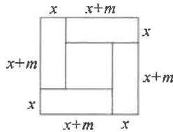

# 章末复习

1.-3 -1

2.-3

3. 解: (1) $(x-2)^{2}=49$ ,

$$
x - 2 = \pm 7,
$$

$$
\therefore x _ {1} = 9, x _ {2} = - 5;
$$

$$
x ^ {2} - 2 x + 1 = 6, \tag {2}
$$

$$
(x - 1) ^ {2} = 6, x - 1 = \pm \sqrt {6},
$$

$$
\therefore x _ {1} = 1 + \sqrt {6}, x _ {2} = 1 - \sqrt {6};
$$

(3) $\because a=2,b=-6,c=-1,$

$$
\therefore \Delta = b ^ {2} - 4 a c = (- 6) ^ {2} - 4 \times 2 \times
$$

$$
(- 1) = 4 4 > 0,
$$

$$
\therefore x = \frac {- b \pm \sqrt {\Delta}}{2 a}
$$

$$
= \frac {- (- 6) \pm \sqrt {4 4}}{2 \times 2}
$$

$$
= \frac {6 \pm 2 \sqrt {1 1}}{4},
$$

$$
\therefore x _ {1} = \frac {3 + \sqrt {1 1}}{2}, x _ {2} = \frac {3 - \sqrt {1 1}}{2};
$$

$$
2 (x - 2) ^ {2} - 3 (2 - x) = 0, \tag {4}
$$

$$
2 (x - 2) ^ {2} + 3 (x - 2) = 0,
$$

$$
[ 2 (x - 2) + 3 ] (x - 2) = 0,
$$

$$
(2 x - 1) (x - 2) = 0,
$$

$$
\therefore x _ {1} = \frac {1}{2}, x _ {2} = 2.
$$

4. 有两个实数根

5. $k \leqslant 1$ 且 $k \neq 0$

6.-3 7.-3

8. 解: (1) $\because m+n=-k, mn=-2k-1,$

$$
\therefore m ^ {2} + n ^ {2} = (m + n) ^ {2} - 2 m n
$$

$$
= (- k) ^ {2} - 2 (- 2 k - 1)
$$

$$
= k ^ {2} + 4 k + 2,
$$

$$
\therefore k ^ {2} + 4 k + 2 = 7, \therefore k _ {1} = 1, k _ {2} = - 5.
$$

$$
\text { 又 } \because \Delta \geqslant 0, \therefore k = 1;
$$

(2) $\because k=1,$

∴原方程为 $x^{2}+x-3=0$ ，

$m + n = -1.$

由题意，得 $m^2 = 3 - m$

$\therefore m^{3} = m(3 - m) = 3m - (3 - m) = 4m - 3,$

∴原式= $\frac{1}{2}(4m-3)+2n$

$$
= 2 (m + n) - \frac {3}{2}
$$

$$
= 2 \times (- 1) - \frac {3}{2} = - \frac {7}{2}.
$$

9.13 10.4

11. 解: (1) $450(1+12\%) = 504$ (万元).
答:该商城“五一黄金周”七天的总营业额为504万元;

(2)设该商城三、四月份营业额的月平均增长率为 x，

依题意, 得 $350(1+x)^{2}=504$ ,

解得 $x_{1}=0.2=20\%$ ,

$x_{2} = -2.2$ （舍去）

答:该商城三、四月份营业额的月平均增长率为20%.

12. 解: 设该款纪念品的售价为 x 元/件, 依题意, 得 $(x - 25)[4 + 2(37 - x)] = 90$ ,

即 $x^{2}-64x+1020=0$

解得 $x_{1}=30, x_{2}=34.$

∵要尽快减少库存，∴x=30.

答:为尽快减少库存,将售价定为

30元/件时,才能使该款纪念品平均每天的销售利润为90元.

13. 解: (1) 设 x s 后,

$\triangle PBQ$ 的面积等于 $4 \, cm^{2}$ .

根据题意,得 $\frac{1}{2}\cdot2x(5-x)=4.$

解得 $x_{1} = 1, x_{2} = 4$ .

∵当x=4时，

$2x = 8 > 7$ （不合题意，舍去），

$$
\therefore x = 1.
$$

答:1 s 后, $\triangle PBQ$ 的面积等于 $4\ cm^{2}$ ;

(2) 设 a s 后, $\triangle PBQ$ 的面积等于 $7 \, cm^{2}$ . 根据题意, 得

$$
a (5 - a) = 7, \therefore a ^ {2} - 5 a + 7 = 0,
$$

$$
\Delta = (- 5) ^ {2} - 4 \times 1 \times 7 = - 3 <   0,
$$

∴此方程无实数根.

∴△PBQ 的面积不能等于 $7 \, cm^{2}$ .

# 第二十二章 二次函数

# 22.1 二次函数的图象和性质

# 22.1.1 二次函数

# 易错点睛

-1

# 基础题夯实

1. A 2. C 3. D

4. 解: $y = (x + 3)(x - 2) + 1$

$$
= x ^ {2} + x - 5,
$$

是二次函数，

二次项系数为 1, 一次项系数为 1, 常数项为 -5.

5. 解: 由题意, 得 $m^{2}-2=2$ ,

$$
\therefore m = \pm 2.
$$

$$
\text {又} \because m - 2 \neq 0,
$$

$$
\therefore m \neq 2, \therefore m = - 2.
$$

6. $y = -x^{2} + 4x$ 7. $y = \frac{1}{4}x^{2}$

8. $y=\frac{\sqrt{3}}{4}x^{2}$ 9. $y=50(1+x)^{2}$

# 中档题运用

10. $m \neq 0$ 且 $m \neq -1$ $m = -1$

11.2025

12. 解: (1) 由题意, 得 $y = (x - 30)(100 - x) = -x^{2} + 130x - 3000$ ;

(2)由题意,得

$$
- x ^ {2} + 1 3 0 x - 3 0 0 0 = 1 0 0 0,
$$

解得 $x_{1}=80, x_{2}=50.$

答: 当利润为 1 000 元时, x 的值是 80 或 50.

13. 解: (1) $y = (4 - x)(4 + 2x)$

$$
= - 2 x ^ {2} + 4 x + 1 6;
$$

(2)根据题意,得

$$
- 2 x ^ {2} + 4 x + 1 6 = 4 ^ {2},
$$

解得 $x_{1}=2, x_{2}=0$ (不合题意, 舍去), $\therefore BE=2.$

答:BE 的长为 2 m.

# 综合题探究

14. 解: (1) 如图所示;

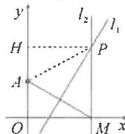

(2) 连接 PA, 过点 P 作 $PH \perp y$ 轴于点 H, 则 PH = x, AH = y - 2.

∵直线 $l_{1}$ 垂直平分 AM, PM ⊥ x
轴，∴ PA = PM = y，

在 Rt△PHA 中，

$$
P H ^ {2} + A H ^ {2} = P A ^ {2},
$$

$$
\therefore x ^ {2} + (y - 2) ^ {2} = y ^ {2},
$$

整理可得 $y$ 与 $x$ 的函数关系式为

$$
y = \frac {1}{4} x ^ {2} + 1.
$$

# 22.1.2 二次函数

# $y=ax^{2}$ 的图象和性质

# 易错点睛

-4或1 -4 1

# 基础题夯实

1. a > -1

2.(0,0) 向上 y 轴 >0 <0 低

3.(0,0) 向下 y 轴 >0 <0 高

4. B 5. C 6. A 7. A

8. 解: (1) 由题意, 得 $\left\{\begin{aligned}m^{2}+m=2,\\ m+1>0,\end{aligned}\right.$

$$
\therefore \left\{ \begin{array}{l l} m = 1 \text {或} - 2, \\ m > - 1, \end{array} \right. \therefore m = 1;
$$

(2)由(1)知二次函数解析式为 $y=2x^{2}$ ，列表：

<table><tr><td>x</td><td>...</td><td>-2</td><td>-1.5</td><td>-1</td><td>-0.5</td><td>0</td></tr><tr><td>y</td><td>...</td><td>8</td><td>4.5</td><td>2</td><td>0.5</td><td>0</td></tr><tr><td>x</td><td>0.5</td><td>1</td><td>1.5</td><td>2</td><td>...</td><td></td></tr><tr><td>y</td><td>0.5</td><td>2</td><td>4.5</td><td>8</td><td>...</td><td></td></tr></table>

描点,连线,如图所示;

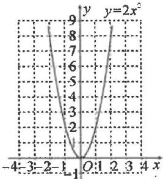

line

| x | y = 2x² |
|---|---|
| -4 | 8 |
| -3 | 7 |
| -2 | 6 |
| -1 | 5 |
| 0 | 4 |
| 1 | 5 |
| 2 | 6 |
| 3 | 7 |
| 4 | 8 |

(3) 当 $x = \sqrt{2}$ 时, $y = 2 \times (\sqrt{2})^2 = 4$ ,

∴点 $(\sqrt{2},3)$ 不在该函数的图象上.

# 中档题运用

9.0 10.A 11.(1,2) 12.B

13. 解: (1) 把 $(2, b)$ 代入 y = 2x - 3，
得 b = 1，

再把点(2,1)代入 $y=ax^{2}$ ,

得 $a=\frac{1}{4}$ ;

(2) 当 x=0 时, y 取得最小值 0;
当 x=4 时, y 取得最大值 4.

14. 解: (1) ∵ 抛物线 $y = ax^{2}$ 关于 y 轴对称, AB = 20, ∴ BE = 10.

$$
\because E F = 3, D (5, m), \therefore B (1 0, m - 3);
$$

(2) $\because D(5,m),B(10,m-3)$ 在抛物线 $y=ax^{2}$ 上，

$$
\therefore \left\{ \begin{array}{l l} 2 5 a = m, \\ 1 0 0 a = m - 3, \end{array} \right. \text {解得} a = - \frac {1}{2 5}.
$$

# 综合题探究

15. 解: (1) 将 $A(-2, 2)$ 代入 $y = ax^2$ ,

得 $4a = 2, \therefore a = \frac{1}{2}, \therefore y = \frac{1}{2} x^2$ .

$\because B(3,b)$ 在抛物线 $y=ax^{2}$ 上，

$$
\therefore b = \frac {1}{2} \times 3 ^ {2} = \frac {9}{2}.
$$

$$
\therefore a = \frac {1}{2}, b = \frac {9}{2};
$$

(2)由 $A(-2,2),B\left(3,\frac{9}{2}\right)$

设直线 AB 的解析式为 $y=mx+n$ ，

则 $\left\{ \begin{array}{l} -2m + n = 2, \\ 3m + n = \frac{9}{2}, \end{array} \right.$ 解得 $\left\{ \begin{array}{l} m = \frac{1}{2}, \\ n = 3. \end{array} \right.$

∴直线 AB 的解析式为 $y=\frac{1}{2}x+3$ ,

$\therefore C(0,3)$ ;

(3)设 $P\left(t,\frac{1}{2} t^2\right)$ ，则 $Q\left(t,\frac{1}{2} t + 3\right)$

$$
\because C (0, 3), \therefore P Q = O C = 3,
$$

$$
\therefore P Q = \frac {1}{2} t ^ {2} - \frac {1}{2} t - 3 = 3,
$$

解得 $t_1 = -3, t_2 = 4$ .

$$
\because t <   0, \therefore t = - 3, \therefore P \left(- 3, \frac {9}{2}\right).
$$

# 22.1.3 二次函数

$y = a(x - h)^{2} + k$ 的图象和性质

# 第1课时 二次函数

$y=ax^{2}+k$ 的图象和性质

# 易错点睛

$a <   2$ 且 $a\neq 0$

# 基础题夯实

1. A 2. B

3. 下 y 轴 0 大 3

4. B 5. C 6. C 7. 9 8. A

9. $y=\frac{1}{2}x^{2}-2$

10.-2 5 11.-2 2

12. 解: 开口方向都向上, 对称轴都是 y 轴, 顶点坐标分别为 $(0, -3)$ 和 $(0,$

4). 它们分别是由抛物线 $y=\frac{1}{2}x^{2}$ 向下平移3个单位长度和向上平移
4个单位长度得到的.

# 中档题运用

13. <

14. $y = -x^{2} + 1$ （答案不唯一）

15. D

16. 解: (1) A(-2,0), B(2,0), C(0,4);

(2)∵四边形 ABCD 为平行四边形,AB=4,C(0,4),

$$
\therefore C D = A B = 4, C D \parallel A B,
$$

$$
\therefore D (- 4, 4),
$$

设平移后的抛物线为 $y = -x^{2} + m$ ，

$$
\therefore 4 = - (- 4) ^ {2} + m, \text {解得} m = 2 0,
$$

∴平移后的抛物线为 $y=-x^{2}+20$ .

17. 解: 点 A 坐标为 $(m, -m^{2} + 4)$ ,
点 C 坐标为 $(n, -n^{2} + 4)$ .

分别过点 A, C 作 y 轴的垂线，

垂足分别为 M, N,

则 $\triangle CDN \cong \triangle DAM$

$$
\therefore D M = C N = n, D N = A M = m,
$$

$$
\therefore M N = D M + D N = m + n,
$$

又∵MN=m²-n²，

$$
\therefore m ^ {2} - n ^ {2} = m + n,
$$

$$
\because m > n > 0, \therefore m - n = 1.
$$

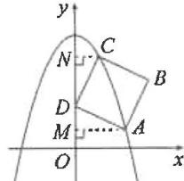

# 综合题探究

18. 解: (1) 当 x=0 时, y=-4,

$$
\therefore C (0, - 4), \therefore A B = O C = 4,
$$

∵抛物线 $y=ax^{2}-4$ 关于 y 轴对称，

$$
\therefore O A = O B = \frac {1}{2} A B = 2,
$$

$$
\therefore B (2, 0),
$$

代入 $y=ax^{2}-4$ ，得 4a-4=0，

$$
\therefore a = 1, \therefore y = x ^ {2} - 4;
$$

(2) 连接 OP. 设 $P(m, m^{2}-4)$ .

$$
\therefore S _ {\triangle P A C} = S _ {\triangle A O C} + S _ {\triangle P O C} - S _ {\triangle P A O} =
$$

$$
\frac {1}{2} \times 2 \times 4 + \frac {1}{2} \times 4 m - \frac {1}{2} \times 2 \times
$$

$$
(4 - m ^ {2}) = m ^ {2} + 2 m = 4,
$$

解得 $m_{1} = -1 + \sqrt{5}$

$$
m _ {2} = - 1 - \sqrt {5}.
$$

$$
\because m > 0, \therefore m = - 1 + \sqrt {5},
$$

$$
\therefore P (- 1 + \sqrt {5}, - 2 \sqrt {5} + 2).
$$

# 第2课时 二次函数

$y = a(x - h)^{2}$ 的图象和性质

# 易错点睛

$x = -1$ $(-1,0)$

# 基础题夯实

1. A 2. C 3. D

4. 减小 增大 5. >

6. 解: (1) -8, -2, -0.5, 0, -0.5, -2, -8; 如图所示;

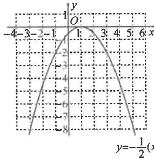

line

| x | y |
|---|---|
| -4 | -1 |
| -3 | 0 |
| -2 | 1 |
| -1 | 2 |
| 0 | 3 |
| 1 | 4 |
| 2 | 5 |
| 3 | 6 |
| 4 | 7 |
| 5 | 8 |
| 6 | 9 |
y=-1/2(x)

(2)顶点坐标为(1,0)，对称轴为直线x=1；

(3)函数有最大值,最大值为0,没有最小值.

7.-3 2 8.A 9.A

10. $y = (x + 1)^{2}$

# 中档题运用

11. < 12.5 13. D 14. B

15. 解: (1) 由题意, 得 A(-1,0),

$$
\because O B = O A,
$$

$\therefore B(0,-1)$ ，代入解析式，

可求得 a = -1，

∴抛物线的解析式为 $y = -(x + 1)^{2}$ ;

(2) 过点 C 作 CD ⊥ x 轴于点 D.

$\because C(-3,b)$ 在抛物线上，

$$
\therefore b = - 4. \text { 则 } S _ {\triangle A B C} = S _ {\text { 四   边   形 } O B C D} -
$$

$$
S _ {\triangle A O B} - S _ {\triangle A C D} = \frac {1}{2} (1 + 4) \times 3 -
$$

$$
\frac {1}{2} \times 1 \times 1 - \frac {1}{2} \times 2 \times 4 = 3.
$$

# 综合题探究

16. 解: (1) ∵ 抛物线 $y = (x + 1)^{2}$ 的顶点为 A,

$$
\therefore A (- 1, 0), \therefore O A = 1,
$$

设 $AC = m$ ，则 $BC = 2m$

$$
\therefore B (- m - 1, 2 m),
$$

把 $(-m - 1,2m)$ 代入 $y = (x + 1)^{2}$

得 $2m = (-m - 1 + 1)^{2}$

解得 $m_{1} = 0$ （舍去）， $m_{2} = 2$

$$
\therefore B (- 3, 4);
$$

(2) 过点 A 作 $AE \perp AB$ 交 BD 的延长线于点 E，过点 E 作 $EF \perp x$ 轴

于点 $F$

$\because \angle ABD = 45^{\circ}, \therefore AB = AE,$ 可证得 $\triangle ABC \cong \triangle EAF,$

$$
\therefore A F = B C = 4, E F = A C = 2,
$$

$\therefore E(3,2)$ ，可求得直线 BE 的解析

式为 $y=-\frac{1}{3}x+3$ ,

联立 $\left\{ \begin{array}{l} y = (x + 1)^2, \\ y = -\frac{1}{3} x + 3, \end{array} \right.$

解得 $\left\{ \begin{array}{l} x_{1} = -3, \\ y_{1} = 4, \end{array} \right.$ $\left\{ \begin{array}{l} x_{2} = \frac{2}{3}, \\ y_{2} = \frac{25}{9}. \end{array} \right.$

∴点 D 的坐标为 $\left(\frac{2}{3}, \frac{25}{9}\right)$ .

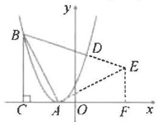

text_image

y
B
D
E
C
A
O
F
x

# 第3课时 二次函数

# $y=a(x-h)^{2}+k$ 的图象和性质

# 易错点睛

$(-1,-4)$

# 基础题夯实

1. B 2. C 3. D 4. C

5. 解: (1) 开口向上, 对称轴为直线 x=5, 顶点坐标为 $(5,-1)$ ;

(2)开口向下,对称轴为直线 x=-2,
顶点坐标为 $(-2,1)$ .

6. 解: (1) $\because y = a(x - 3)^{2} + 2$ 经过点 (1, -2),

$\therefore-2=a(1-3)^{2}+2$ , 解得 a=-1;

(2) $\because a=-1<0,$

∴当x<3时，

y 随 x 的增大而增大.

∵点 $A(m,y_{1}),B(n,y_{2})(m<n<$

3)都在该抛物线上，

$$
\therefore y _ {1} <   y _ {2}.
$$

7. A 8.2 1 -5

# 中档题运用

9. D

10.2或4解：设抛物线向右平移 $h$ 个单位长度，则新抛物线的解析式为 $y = (x + 3 - h)^{2} - 1.$

∵抛物线经过原点，∴当 x=0 时， $y=(3-h)^{2}-1=0$ ，解得 h=2 或 4.

11. $\frac{3}{2}$

12. 解: (1) 设抛物线的解析式为 $y = a(x - 1)^{2} + 9$ , 代入 $B(4,0)$ ,

得 $9a + 9 = 0, \therefore a = -1$

∴二次函数的解析式是 $y = -(x - 1)^{2} + 9$ ，即 $y = -x^{2} + 2x + 8$ ;

(2) 当 x=0 时, y=8, 即抛物线与 y 轴的交点坐标为 D(0,8).

过点 C 作 $CE \perp x$ 轴于点 E.

$$
\therefore S _ {\triangle B C D} = S _ {\text {四边形} D O E C} + S _ {\triangle C E B} -
$$

$$
S _ {\triangle D O B} = \frac {1}{2} \times (8 + 9) \times 1 + \frac {1}{2} \times 3 \times
$$

$$
9 - \frac {1}{2} \times 4 \times 8 = 6.
$$

# 综合题探究

13. 解: (1) 将点 $B(0, -3)$ 代入 $y = a(x -$

$$
1) ^ {2} - 4,
$$

得 $a(0 - 1)^2 - 4 = -3, \therefore a = 1,$

∴抛物线的解析式为

$$
y = (x - 1) ^ {2} - 4,
$$

即 $y=x^{2}-2x-3$ ,

令 y=0，得 $(x-1)^{2}-4=0$ ，

$$
\therefore x _ {1} = - 1, x _ {2} = 3, \therefore A (3, 0).
$$

$$
\because B (0, - 3),
$$

∴易求得直线 AB 的解析式为 y = x - 3;

(2)设 $P(m,m^2 - 2m - 3)$ ,

则 $M(m,m-3)$ , $H(m,0)$ ,

$$
M H = 3 - m,
$$

$$
P M = m - 3 - \left(m ^ {2} - 2 m - 3\right)
$$

$$
= - m ^ {2} + 3 m.
$$

$$
\because P M = 2 M H,
$$

$$
\therefore - m ^ {2} + 3 m = 2 (3 - m),
$$

解得 $m_{1} = 2, m_{2} = 3$ （舍），

$$
\therefore P (2, - 3);
$$

(3)由(2)可知，

$$
P M = - m ^ {2} + 3 m,
$$

$\because OA=OB,OA\perp OB,$

∴△AOB 是等腰三角形, 易求得 $BM=\sqrt{2}m$ .

又∵PM=BM,

$$
\therefore - m ^ {2} + 3 m = \sqrt {2} m,
$$

解得 $m_{1} = 0, m_{2} = 3 - \sqrt{2}$

$$
\because 0 <   m <   3, \therefore m = 3 - \sqrt {2},
$$

∴点 P 的横坐标为 $3-\sqrt{2}$ .

# 22.1.4 二次函数

# $y=ax^{2}+bx+c$ 的图象和性质

# 第1课时 二次函数

# $y=ax^{2}+bx+c$ 的图象和性质

# 易错点睛

$$
- 5 \leqslant y \leqslant 4
$$

# 基础题夯实

1. B  2. B  3. D  4. 4

5. 解: (1) 向上, 直线 x=3, (3,-12);

(2) 向下, 直线 $x = 1, (1,0)$ ;

(3) 向下, 直线 $x = -\frac{2}{3}, \left(-\frac{2}{3}, \frac{10}{3}\right)$ .

6. 解: (1) 顶点坐标为 $(2, -4)$ ，对称轴为直线 x=2，开口向上；

(2)如图所示.

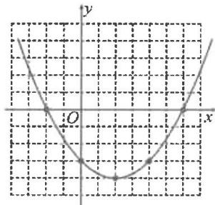

text_image

Graph of a parabola on a Cartesian coordinate system with labeled x and y axes and origin O

7. D

8. 解： $\because y = \frac{1}{2} x^{2} - 6x + 12$

$$
= \frac {1}{2} (x - 6) ^ {2} - 6,
$$

∴其顶点坐标为(6,-6)，

∴抛物线 $y=\frac{1}{2}x^{2}-6x+12$ 是由抛物线 $y=\frac{1}{2}x^{2}$ 先向右平移 6 个单位长度，再向下平移 6 个单位长度得到的.

# 中档题运用

9.4 10.D 11.B 12.C

13. 解: (1) $\because y = x^{2} + 2ax + a = (x + a)^{2} - a^{2} + a$ ,

∴顶点坐标为 $(-a,-a^{2}+a)$ ;

(2) 将 $y = x^{2} + 2ax + a$ 向上平移 2 个单位长度后，

抛物线顶点的纵坐标 $n = -a^{2} + a + 2 = -\left(a - \frac{1}{2}\right)^{2} + \frac{9}{4}$ .

$$
\because - 1 <   0,
$$

∴当 $a=\frac{1}{2}$ 时， $n_{最大}=\frac{9}{4}$

# 综合题探究

14. 解：(1) 由 $\left\{\begin{aligned}m&=-4,\\ 4a&+2+m=0,\end{aligned}\right.$

解得 $\left\{ \begin{array}{l} m = -4, \\ a = \frac{1}{2}, \end{array} \right.$ ∴抛物线的解析式

为 $y=\frac{1}{2}x^{2}+x-4;$

(2) 设 $D\left(t, \frac{1}{2}t^{2} + t - 4\right)$ ,

-4<t<0,连接OD.

由 $\frac{1}{2} x^2 + x - 4 = 0$

解得 $x_{1} = -4, x_{2} = 2$

$$
\therefore A (- 4, 0).
$$

$$
\because B (0, - 4),
$$

$$
\therefore O A = O B = 4.
$$

$$
\because S _ {\triangle A B D} = S _ {\triangle A O D} + S _ {\triangle O B D} - S _ {\triangle A O B} =
$$

$$
\frac {1}{2} \times 4 \times \left(- \frac {1}{2} t ^ {2} - t + 4\right) + \frac {1}{2} \times
$$

$$
4 \times (- t) - \frac {1}{2} \times 4 \times 4 = - t ^ {2} - 4 t =
$$

$$
- (t + 2) ^ {2} + 4.
$$

$$
\because - 1 <   0,
$$

∴当 t = -2 时， $\triangle ABD$ 的面积最大，最大值为 4，此时点 D 的坐标为 $(-2, -4)$ .

# 第2课时 用待定系数法

# 求二次函数的解析式

# 易错点睛

$$
y = - x ^ {2} + 2 x + 3
$$

# 基础题夯实

1. $y = x^{2} - x - 2$

2. 解：∵ 当 x=0 时， $y=-5=y_{B}$ ，

$$
\therefore O B = 5 = 5 O A = O C,
$$

$$
\therefore A (1, 0), C (- 5, 0),
$$

∴ $\left\{\begin{aligned}a+b-5=0,\\ 25a-5b-5=0,\end{aligned}\right.$ 解得 $\left\{\begin{aligned}a=1,\\ b=4,\end{aligned}\right.$

∴此抛物线的解析式为 $y=x^{2}+4x-5$ .

3. $y = -x^{2} - 2x + 3$

4. $y = -\frac{1}{2} (x - 1)^{2} - 2$

5. $y = -\frac{\sqrt{3}}{2}x^{2} + 2\sqrt{3}x$

6. $y = -x^{2} + 2x + 1$

7. 解: (1) 顶点坐标为 $(1, -5)$ ;

(2)设解析式为 $y=a(x-1)^{2}-5$ .

$\because(-1,0)$ 在抛物线上，

∴ $0 = a(-1 - 1)^{2} - 5$ , 解得 $a = \frac{5}{4}$ ,

∴抛物线的解析式为 $y=\frac{5}{4}(x-$

$$
1) ^ {2} - 5 = \frac {5}{4} x ^ {2} - \frac {5}{2} x - \frac {1 5}{4}.
$$

8. 解: (1) $y = -x^{2} + 2x + 8 = -(x - 1)^{2} + 9$ , 顶点坐标为 (1, 9);

(2) 将抛物线 $y = -x^{2} + 2x + 8$ 向左平移 2 个单位长度，向上平移 3 个单位长度，

得到原抛物线 $y=-(x-1+2)^{2}+9+3=-(x+1)^{2}+12=-x^{2}-2x+11,\therefore b=-2,c=11.$

# 中档题运用

9. $y = -\frac{2}{3}x^{2} + \frac{4}{3}x + 2$

10. $y = x^{2} + 2x + 2$

11. 解: 设平移后抛物线的解析式为

$y=-x^{2}+bx+c,$ 则 $\left\{\begin{aligned}-2&=-1+b+c,\\ -1&=-9+3b+c,\end{aligned}\right.$

解得 $b=\frac{9}{2}, c=-\frac{11}{2}$ ,

$$
\therefore y = - x ^ {2} + \frac {9}{2} x - \frac {1 1}{2}.
$$

12. 解: 设抛物线的解析式为

$y=a(x-3)^{2}-2.$ ∵抛物线的对称轴是直线 x=3，
与 x 轴两交点的距离为 4，
∴抛物线 $y=a(x-3)^{2}-2$ 过点
(1,0), $\therefore(1-3)^{2}\cdot a-2=0$ , 解得 $a=\frac{1}{2}$ ,
∴抛物线的解析式为 $y=\frac{1}{2}(x-3)^{2}-2.$

13. 解: (1) ∵ 当 x=1 时, $y=a+b+c$ ,
∴抛物线的对称轴为直线 x=1，

∴ $x = -\frac{b}{2a} = 1$ ，整理得 b = -2a；

(2)由题意可知,该函数图象只能经过A(-1,5)和C(2,2)两点,

∴ $\left\{\begin{aligned}a-b+c=5,\\ 4a+2b+c=2,\end{aligned}\right.$ 解得 $\left\{\begin{aligned}a=1,\\ b=-2,\\ c=2,\end{aligned}\right.$

∴该函数的解析式为 $y=x^{2}-2x+2$ .
综合题探究

14. 解: (1) 将 $(1,1)$ 代入, 得 $1=1-a+b-a,\therefore b=2a;$

(2)∵平移后,点 A(1,1)的对应点为 $A_{1}(1-m,-2a+1)$ ,

且 $y = x^{2} - ax + a$

$$
= \left(x - \frac {a}{2}\right) ^ {2} + a - \frac {a ^ {2}}{4},
$$

∴平移后的抛物线为

$$
y = \left(x - \frac {a}{2} + m\right) ^ {2} + a - \frac {a ^ {2}}{4} - 2 a,
$$

将(1,1)代入，得

$$
1 = \left(1 - \frac {a}{2} + m\right) ^ {2} - \frac {a ^ {2}}{4} - a,
$$

整理得 $(m - a)(m + 2) = 0$

$$
\because m \geqslant - \frac {3}{2},
$$

$$
\therefore m + 2 \neq 0,
$$

$$
\therefore a = m,
$$

∴新抛物线为

$$
y = \left(x + \frac {m}{2}\right) ^ {2} - \frac {1}{4} m ^ {2} - m,
$$

$$
\begin{array}{l} \therefore y ^ {\prime} = - \frac {1}{4} m ^ {2} - m \\ = - \frac {1}{4} (m + 2) ^ {2} + 1, \\ \end{array}
$$

∵当m>-2时，

$y'$ 随 m 的增大而减小，

∴当 $m=-\frac{3}{2}$ 时，

$y'$ 取得最大值为 $\frac{15}{16}$ .

# 22.2 二次函数与

# 一元二次方程

# 易错点睛

0,-1或-9

# 基础题夯实

1. $x_{1} = -4, x_{2} = 2$ $(-4,0)$ (2,0)

2. $x_{1} = -1, x_{2} = 3$

3.4 4.D 5.9 6. $c<\frac{1}{4}$ 7.A

8. (1) $x_{1}=-2,x_{2}=1$

(2)x<-2或x>1

(3)-1<x<0

9.C

10. $x_{1} = 1, x_{2} = -3$

11. -1 < x < 5

12. $k \geqslant 3$ 解：∵平移后的抛物线为

$y=x^{2}-6x+12-k,$ $\therefore\Delta=(-6)^{2}-4\times1\times(12-k)\geqslant0,$ 解得 $k \geqslant 3.$

13. D 解: 由题意知, $-\frac{b}{2a}=1$ ,

即 $b = -2a$

又∵抛物线 $y=ax^{2}+bx+c$ 与 x 轴交于 $(x_{1},0),(x_{2},0)$ 两点，

$$
\therefore \Delta = b ^ {2} - 4 a c > 0,
$$

$$
x _ {1} + x _ {2} = - \frac {b}{a} = 2,
$$

$\therefore b^{2}>4ac$ , 故 B,C 错误;

$$
\because 2 <   x _ {2} <   3,
$$

$$
\therefore 2 <   2 - x _ {1} <   3,
$$

$$
\therefore - 1 <   x _ {1} <   0,
$$

$\therefore x_{1}x_{2}<0$ , 故 A 错误;

$\because a>0$ , 图象开口向上, 当 x<1 时,

y 随着 x 的增大而减小， $-1<x_{1}$ ，

∴当 x=-1 时， $y=a-b+c>0$ ，故 D 正确.

14. 解: (1) 联立 $\left\{\begin{aligned} y &= -x^{2} + 5, \\ y &= 2x + 2, \end{aligned}\right.$

解得 $\left\{ \begin{array}{l} x_{1} = -3, \\ y_{1} = -4, \end{array} \right.$ $\left\{ \begin{array}{l} x_{2} = 1, \\ y_{2} = 4, \end{array} \right.$

$$
\therefore A (- 3, - 4), B (1, 4);
$$

$$
(2) - 3 <   x <   1.
$$

# 综合题探究

15. 解: (1) 当 x=2 时, y=3,

$$
\therefore P (2, 3),
$$

设直线 l 的解析式为 $y=kx+b$ ，

则 $3 = 2k + b$

$$
\therefore b = - 2 k + 3,
$$

$$
\therefore y = k x - 2 k + 3.
$$

联立 $\left\{ \begin{array}{l} y = -x^2 + 2x + 3, \\ y = kx - 2k + 3, \end{array} \right.$

得 $x^{2} + (k - 2)x - 2k = 0$

∵直线 l 与抛物线有唯一公共点 $P(2,t)$ ,

∴方程的两根都为2，

∴2+2=2-k，解得k=-2，

∴直线 l 的解析式为 $y = -2x + 7$ ;

(2)∵直线 AB∥直线 l，

∴可设直线 AB 为 $y = -2x + m$ ，

联立 $\left\{\begin{aligned}y&=-x^{2}+2x+3,\\ y&=-2x+m,\end{aligned}\right.$

得 $x^{2} - 4x + m - 3 = 0$

$$
\therefore x _ {A} + x _ {B} = 4.
$$

∵点H为AB的中点，

$$
\therefore x _ {A} + x _ {B} = 2 x _ {H} = 4
$$

$\therefore x_{H}=2,\therefore$ 点 H 的坐标为 $(2,0)$ .

# 基础夯实

# 求二次函数的

# 解析式(一) 利用坐标求

1. 解: 由题意, 得 $\left\{\begin{aligned}4-2b+c=0,\\ c=-2,\end{aligned}\right.$

解得 $\left\{ \begin{array}{l} b = 1, \\ c = -2, \end{array} \right.$

∴该二次函数的解析式为 $y=x^{2}+x-2$ .

2. 解: 根据题意, 得

$\left\{ \begin{array}{l} c = 0, \\ a + b + c = 9, \\ 4a + 2b + c = 26. \end{array} \right.$ 解得 $\left\{ \begin{array}{l} a = 4, \\ b = 5, \\ c = 0, \end{array} \right.$

∴该抛物线的解析式为 $y=4x^{2}+5x$ .

3. 解: 由题意, 得 $\left\{\begin{aligned}a+\frac{3}{2}+c=0,\\ 16a-6+c=0,\end{aligned}\right.$

解得 $\left\{\begin{aligned}a&=\frac{1}{2},\\ c&=-2,\end{aligned}\right.$ 抛物线的解析式为 $y=\frac{1}{2}x^{2}-\frac{3}{2}x-2.$

4. 解: 设该二次函数的解析式为 $y = a(x + 2)^{2} - 1$ ,

把 $(-3,0)$ 代入，得 $0=a(-3+2)^{2}-1$ ，解得a=1，

∴该二次函数的解析式为 $y=(x+2)^{2}-1$ .

5. 解: 由 $x^{2}-2x-3=0$ ,

解得 $x_{1} = -1, x_{2} = 3$

∴该抛物线的解析式可设为 $y = a(x + 1)(x - 3)$ ,

即 $y = ax^{2} - 2ax - 3a$

比较系数得 $\left\{ \begin{array}{l} b = -2a, \\ -3a = 3, \end{array} \right.$

解得 $\left\{\begin{aligned}a&=-1,\\ b&=2,\end{aligned}\right.$ ∴该抛物线的解析式为 $y=-x^{2}+2x+3$ .

6. 解: 由题意可知抛物线的顶点坐标为 $(3,5)$ ，∴ 可设抛物线的解析式为 $y=a(x-3)^{2}+5$ ，

把(1,-1)代入，

得 $-1 = a(1 - 3)^{2} + 5$

解得 $a = -\frac{3}{2}, \therefore$ 该抛物线的解析式

为 $y=-\frac{3}{2}(x-3)^{2}+5.$

# 基础夯实

# 求二次函数的解析式(二)

# 利用性质求

1. $y = x^{2} - 4x + 3$

解:由对称轴 $x=-\frac{m-1}{2\times1}=2$ ,

解得 m = -3.

2. ±6

3. 解: 由题意, 得 $\left\{\begin{aligned}4-2b+c=5,\\ -\frac{b}{2}&=-\frac{1}{2},\end{aligned}\right.$

解得 $\left\{ \begin{array}{l} b = 1, \\ c = 3, \end{array} \right.$ ∴该二次函数的解析式为 $y = x^2 + x + 3$ .

4. 解: 由题意, 可得对称轴为

$$
x = \frac {- 1 + 5}{2} = - \frac {b}{2} = 2,
$$

又 $16+4b+c=-1$ ,

解得 b=-4, c=-1, ∴该抛物线的解析式为 $y=x^{2}-4x-1$ .

5. $y = -(x - 1)^{2} - 2$

6. 解: 由题意可知抛物线 $y_{2}$ 与 x 轴交于点 $(2,0)$ 和 $(4,0)$ ,

∴抛物线 $y_{2}$ 的解析式为 $y_{2}=(x-2)(x-4)=x^{2}-6x+8.$

7. 解： $y=x^{2}-4x+3=(x-2)^{2}-1$ ∴平移后抛物线的顶点为 $(2,-1)$ ,

∴原抛物线的顶点为 $(-2,2)$ .

∴原抛物线的解析式为

$y = (x + 2)^{2} + 2.$

8. 解： $\because y = ax^{2} - 4ax + 5a$

$= a(x - 2)^{2} + a$

∴原抛物线的顶点为 $(2,a)$ ,

∴新抛物线的顶点为 $(4,a+3)$ ,

$\therefore a + 3 = 16a - 16a + 5a$

解得 $a = \frac{3}{4}$ ，∴原抛物线的解析式为

$$
y = \frac {3}{4} x ^ {2} - 3 x + \frac {1 5}{4}.
$$

# 基础夯实

# 求二次函数的解析式(三) 利用图象求

1.2 -4 解: 把(0,0)代入，

得 $a^2 - 4 = 0$ ，解得 $a = \pm 2$

∵图象开口向上，∴a=2.

由 $-\frac{b}{2a} = 1$ ，可得 $b = -2a = -4.$

2. 解: 由 $-ax^{2}-2ax+3a=0$ ,

解得 $x_{1} = -3, x_{2} = 1$

$\therefore A(-3,0), B(1,0),$

$\therefore OC=OA=3,\therefore C(0,3),$

∴3a=3, 解得 a=1,

∴抛物线的解析式为

$$
y = - x ^ {2} - 2 x + 3.
$$

3. 解： $\because S_{\triangle ABC}=\frac{1}{2}\times4\times(-y_{c})=8,$

$$
\therefore y _ {C} = - 4.
$$

又∵对称轴为 $x=-\frac{-8a}{2a}=4$ ,

∴顶点 C 的坐标为 $(4, -4)$ ,

点 A 的坐标为 $(2,0)$ ,

∴抛物线的解析式为

$y = a(x - 4)^{2} - 4,$

把(2,0)代入，得

$a(2 - 4)^{2} - 4 = 0$ ，解得 $a = 1$

∴抛物线的解析式为

$y = (x - 4)^{2} - 4.$

4. 解: 设抛物线的解析式为

$$
y = a x ^ {2} + b x + c.
$$

∵对称轴为 $x=-\frac{b}{2a}=-1, A(-3,0)$ .

$$
\therefore b = 2 a, B (1, 0), \therefore A B = 4,
$$

$$
\therefore S _ {\triangle A B C} = \frac {1}{2} \times 4 \cdot O C = 6,
$$

$$
\therefore O C = 3, \therefore C (0, - 3), \therefore c = - 3,
$$

$\therefore a+2a-3=0$ , 解得 a=1,

∴抛物线的解析式为 $y=x^{2}+2x-3$ .

5. 解：∵CD//x轴，CD=2。

∴抛物线的对称轴为

$$
x = - \frac {b}{2 \times (- 1)} = 1, \therefore b = 2.
$$

$$
\because O B = O C, C (0, c), \therefore B (c, 0),
$$

$$
\therefore 0 = - c ^ {2} + 2 c + c,
$$

解得 $c_{1}=3, c_{2}=0$ (舍去)，∴ c=3，

∴抛物线的解析式为 $y = -x^{2} + 2x + 3$ .

# 基础夯实 二次函数与方程、不等式

1.(1)向上 > (2)右侧 > <

(3) < > (4) 两 >

2. (1) $x_{1} = 0, x_{2} = 2$

(2) $x_{1}=x_{2}=1$

(3) $x < -1$ 或 $x > 3$

(4)0<x<2

(5)-1<x<0 或 2<x<3

3.(1)< (2)> (3)>

(4) > (5) = (6) =

(7) $x_{1}=3,x_{2}=-1$

(8)-1<x<3

(9)x<-1或x>3

4.(1) $<$ $<$ $>$ $>$ (2) $<$ $<$

(3) > > (4) < <

(5) $<$ < (6)-1 -1 =

(7) $<$ <

5. (1) < (2) > (3) <

(4) < 提示: $\because -\frac{b}{2a}=1$ ,

$$
\therefore b = - 2 a.
$$

又∵x=-2时， $y=4a-2b+c<0$ ，

∴4a-2(-2a)+c<0,即8a+c<0.

# 题型研究 二次函数与面积(一)

# 计算技巧

1. 解: 易知 A(-3,0), B(1,0),

$C(0,-3)$ . 连接 ON.

设 $N(m,m^2 + 2m - 3)$

$$
\therefore S _ {\text {四边形} A B C N} = S _ {\triangle A O N} + S _ {\triangle B O C} + S _ {\triangle C O N} =
$$

$$
\frac {1}{2} \times 3 (- m ^ {2} - 2 m + 3) + \frac {1}{2} \times 1 \times
$$

$$
3 + \frac {1}{2} \times 3 (- m) = - \frac {3}{2} \left(m + \frac {3}{2}\right) ^ {2} +
$$

$$
\frac {7 5}{8}.
$$

$$
\because - \frac {3}{2} <   0,
$$

∴当 $m=-\frac{3}{2}$ 时，

$S_{四边形 ABCN}$ 取最大值 $\frac{75}{8}$ .

2. 解：(1) $y = -x^{2} + 2x + 8$ ;

(2) 过点 M 作 $MK \parallel y$ 轴，

交直线 AB 于点 K.

易知 $A(-2,0), C(4,0), B(3,5)$

$$
\therefore S _ {\triangle A B C} = \frac {1}{2} \times 6 \times 5 = 1 5.
$$

设 $M(m, -m^2 + 2m + 8)$

则 $K(m,m + 2)$

$$
\therefore M K = \left| - m ^ {2} + 2 m + 8 - (m + 2) \right|
$$

$$
= \left| - m ^ {2} + m + 6 \right|.
$$

$$
\therefore S _ {\triangle A B M} = \frac {1}{2} M K \cdot | x _ {B} - x _ {A} |
$$

$$
= \frac {1}{2} | - m ^ {2} + m + 6 | \times 5
$$

$$
= \frac {1}{2} \times 1 5,
$$

$\therefore |-m^{2}+m+6|=3$ ，解得 $m=\frac{1\pm\sqrt{13}}{2}$ 或 $m=\frac{1\pm\sqrt{37}}{2}$ ，

∴点 M 的横坐标为 $\frac{1+\sqrt{13}}{2}$ 或 $\frac{1-\sqrt{13}}{2}$ 或 $\frac{1+\sqrt{37}}{2}$ 或 $\frac{1-\sqrt{37}}{2}$ .

3. 解: 易知 $A(-3,0)$ , $B(1,0)$ , $C(0,3)$ . 取 AB 的中点 $D(-1,0)$ ，连接 DC. 过点 D 作 DP // BC 交抛物线于点 P，则 $S_{\triangle DBC} = \frac{1}{2} S_{\triangle ABC} = S_{\triangle PBC}$ ,

求得直线 BC: $y = -3x + 3$ ,

设直线 DP: y = -3x + t，

则 $0 = -3 \times (-1) + t$ ，解得 $t = -3$

$$
\therefore D P: y = - 3 x - 3,
$$

联立 $\left\{\begin{aligned}y&=-x^{2}-2x+3,\\ y&=-3x-3,\end{aligned}\right.$

解得 $\left\{\begin{aligned}x_{1}&=-2,\\ y_{1}&=3,\end{aligned}\right.\left\{\begin{aligned}x_{2}&=3,\\ y_{2}&=-12,\end{aligned}\right.$

∴点 P 的坐标为 $(-2,3)$ 或 $(3,-12)$ .

# 题型研究

# 二次函数与面积(二)

# 转化技巧

1. 解：∵ $S_{\triangle PAD} = 4S_{\triangle PDB}$ ,

$$
\therefore A D = 4 B D,
$$

易知 $A(-1,0),B(4,0)$

$$
\therefore D (3, 0),
$$

又∵C(0,-2),

∴直线 CD:y= $\frac{2}{3}$ x-2,

$$
\therefore \frac {1}{2} x ^ {2} - \frac {3}{2} x - 2 = \frac {2}{3} x - 2,
$$

得 $x_{P}=\frac{13}{3},\therefore P\left(\frac{13}{3},\frac{8}{9}\right)$ .

2. 解: 设 $P(m, n)$ ,

则 $\frac{S_{\triangle PDB}}{S_{\triangle CDB}} = \frac{\frac{1}{2} BD \cdot n}{\frac{1}{2} BD \cdot CO} = 2,$

$$
\therefore n = 2 C O = 4, \text {又} n = m ^ {2} + m - 2,
$$

$$
\therefore m ^ {2} + m - 2 = 4,
$$

解得 $m_{1} = -3, m_{2} = 2$ （舍去）.

∴点 P 的坐标为 $(-3,4)$ .

3. 解: 过点 B 作 $BP_{1} \parallel AC$ ,

交抛物线于点 $P_{1}$

则 $S_{\triangle P_1AC} = S_{\triangle ABC}$

易知点 $A(3,0),B(1,0),C(0,3)$

∴直线 AC:y=-x+3,

∴可设直线 $BP_{1}:y=-x+m$

将 $B(1,0)$ 代入，得 $m = 1$

∴ 直线 $BP_{1}: y = -x + 1$ ，联立 $\left\{\begin{aligned}y&=-x+1,\\ y&=x^{2}-4x+3,\end{aligned}\right.$ 可得 $P_{1}(2,-1)$ .

在 $x$ 轴上点 $A$ 的右边取点 $E$ , 使 $AE = AB = 2$ , 过点 $E$ 作 $AC$ 的平行线, 交抛物线于点 $P_{2}, P_{3}$ , 则 $S_{\triangle P_{2}AC} =$

$$
S _ {\triangle P _ {3} A C} = S _ {\triangle A B C},
$$

同理可得 $P_{2}\left(\frac{3-\sqrt{17}}{2},\frac{7+\sqrt{17}}{2}\right)$ ，

$$
P _ {3} \left(\frac {3 + \sqrt {1 7}}{2}, \frac {7 - \sqrt {1 7}}{2}\right).
$$

综上所述,存在点 $P(2,-1)$

或 $\left(\frac{3-\sqrt{17}}{2},\frac{7+\sqrt{17}}{2}\right)$

或 $\left(\frac{3+\sqrt{17}}{2},\frac{7-\sqrt{17}}{2}\right)$ .

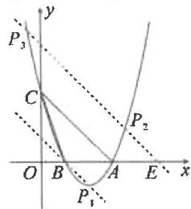

text_image

y
P₃
C
O B A E x
P₂
P₁

题型研究  
二次函数与线段  
——横平竖直斜

1. 解: ∵ 点 P 的横坐标为 m,

$$
\therefore P (m, - m ^ {2} + 4 m),
$$

$$
D (m, - m + 4),
$$

$$
\begin{array}{l} \therefore P D = \left| - m ^ {2} + 4 m - (- m + 4) \right| \\ = \left| m ^ {2} - 5 m + 4 \right|. \\ \end{array}
$$

$$
\because O C = 4, \therefore P D = \frac {1}{2} O C = 2,
$$

$$
\therefore | m ^ {2} - 5 m + 4 | = 2,
$$

当 $m^2 - 5m + 4 = 2$ 时，

解得 $m=\frac{5\pm\sqrt{17}}{2}$ .

$\because 0<m<4,\therefore$ 此时 $m=\frac{5-\sqrt{17}}{2};$

当 $m^2 - 5m + 4 = -2$ 时，

解得 $m_{1} = 2, m_{2} = 3$ . 综上所述， $m$ 的

值为2或3或 $\frac{5-\sqrt{17}}{2}$ .

2. 解: 可求得抛物线为

$$
y = \frac {1}{4} x ^ {2} - \frac {1}{2} x - 2,
$$

直线 AB 为 $y=\frac{1}{2}x-2$ .

设 $P\left(m, \frac{1}{4} m^2 - \frac{1}{2} m - 2\right) (0 < m < 4)$ ,

则 $K\left(\frac{1}{2} m^2 -m,\frac{1}{4} m^2 -\frac{1}{2} m - 2\right)$

$$
\therefore \frac {1}{2} P K + P D = \frac {1}{2} \left(m - \frac {1}{2} m ^ {2} + m\right) +
$$

$$
\left(- \frac {1}{4} m ^ {2} + \frac {1}{2} m + 2\right) = - \frac {1}{2} \left(m - \frac {3}{2}\right) ^ {2}
$$

$$
+ \frac {2 5}{8}.
$$

$\because -\frac{1}{2}<0,\therefore$ 当 $m=\frac{3}{2}$ 时，

$\frac{1}{2}PK+PD$ 有最大值, 最大值为 $\frac{25}{8}$ ,

此时 $P\left(\frac{3}{2}, -\frac{35}{16}\right)$ .

3. 解: 过点 M 作 $ME \perp x$ 轴于点 E, 与直线 AC 交于点 F.

可知 $A(-3,0)$ , $C(0,3)$ ,

$$
\therefore O A = O C, \therefore \angle O A C = 4 5 ^ {\circ},
$$

$$
\therefore \text {   在   } R t \triangle A E F \text {   中,   } E F = A E,
$$

$$
\because M (m, - m ^ {2} - 2 m + 3), E (m, 0),
$$

$$
\therefore E F = A E = m - (- 3) = m + 3,
$$

$$
\therefore F (m, m + 3),
$$

$$
\therefore F M = (- m ^ {2} - 2 m + 3) - (m + 3)
$$

$$
= - m ^ {2} - 3 m,
$$

∴在Rt△FMN中，∠MFN=45°，

$$
\therefore F M = \sqrt {2} M N = \sqrt {2} \times \sqrt {2} = 2,
$$

$$
\therefore - m ^ {2} - 3 m = 2,
$$

解得 $m_{1} = -2, m_{2} = -1$ （舍去），

$$
\therefore M (- 2, 3).
$$

题型研究

二次函数与角度(一)

特殊角与等角

1. 解: 过点 A 作 $AM \perp AC$ ，交直线 PC 于点 M，过点 M 作 $MN \perp x$ 轴于点 N。则 $\triangle AMN \cong \triangle CAO$ ，由 $y = x^{2} - 2x - 3$ 可得 $A(-1,0)$ ， $C(0, -3)$ ，∴ $M(2,1)$ ，∴ 直线 PC: y = 2x - 3，联立 $x^{2} - 2x - 3 = 2x - 3$ ，得 $x_{P} = 4$ ，∴ $P(4,5)$ 。

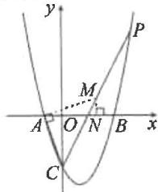

2. 解: 可求得抛物线为

$$
y = - x ^ {2} + 2 x + 3.
$$

∵抛物线 $y = -x^{2} + 2x + 3$ 的对称轴是直线 x = 1, C(0, 3),

∴点 C 关于对称轴的对称点 $P_{1}(2,3)$ 符合要求；

∵ BC 的解析式为 $y = -x + 3$ ,

设与 BC 平行的直线 $AP_{2}$ 的解析式为 $y = -x + m$ ，

则 $1 + m = 0$ ，解得 $m = -1$

∴与 BC 平行的直线 $AP_{2}$ 的解析式为 y = -x - 1，与抛物线解析式联立，得 $\left\{\begin{aligned}y&=-x-1,\\ y&=-x^{2}+2x+3,\end{aligned}\right.$ 解得 $\left\{\begin{aligned}x_{1}&=4,\\ y_{1}&=-5,\end{aligned}\right.\left\{\begin{aligned}x_{2}&=-1,\\ y_{2}&=0,\end{aligned}\right.$ （舍去），

$\therefore P_{2}(4,-5)$ . 综上所述，点 P 的坐标为 $(2,3)$ 或 $(4,-5)$ .

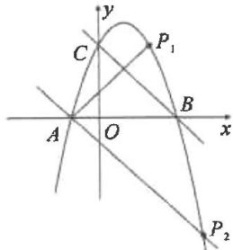

text_image

y
C
P₁
A
O
B
x
P₂

3. 解: (1) 抛物线的解析式为

$$
y = - x ^ {2} + 2 x + 3;
$$

(2) 设 BP 与 y 轴交于点 E，

$$
\text { 由 } - m ^ {2} + 2 m + 3 = 3,
$$

解得 $m_{1} = 2, m_{2} = 0$

$$
\therefore D (2, 3), \text {又} C (0, 3),
$$

$$
\therefore C D \parallel A B, C D = 2,
$$

由 $-x^{2} + 2x + 3 = 0$

解得 $x_{1} = -1, x_{2} = 3$

$$
\therefore B (3, 0), \therefore O B = O C,
$$

$$
\therefore \angle O C B = \angle O B C = \angle D C B = 4 5 ^ {\circ},
$$

$$
\text { 又 } \because \angle P B C = \angle D B C,
$$

$$
\therefore \triangle D C B \cong \triangle E C B.
$$

$$
\therefore C E = C D = 2,
$$

$\therefore OE=1,\therefore E(0,1)$ ，可求得直线

BE 的解析式为 $y=-\frac{1}{3}x+1$ .

联立 $\left\{ \begin{array}{l} y = -x^2 + 2x + 3, \\ y = -\frac{1}{3} x + 1, \end{array} \right.$

解得 $\left\{ \begin{array}{l} x_{1} = 3, \\ y_{1} = 0, \end{array} \right.$ $\left\{ \begin{array}{l} x_{2} = -\frac{2}{3}, \\ y_{2} = \frac{11}{9}, \end{array} \right.$

$$
\therefore P \left(- \frac {2}{3}, \frac {1 1}{9}\right).
$$

题型研究

二次函数与角度(二)

二倍角(一题多法)

方法一 解: 过点 B 作 BE // PC, 交 y

轴于点 $E$ ，设 $BC$ 交 $\mathcal{Y}$ 轴于点 $D$

则 $\angle PCB = \angle EBD = 2\angle CBO$

$$
\therefore \angle E B O = \angle D B O,
$$

$\therefore OE=OD$ , 易得 $B(4,0)$ .

$$
\because C \left(- 1, - \frac {5}{2}\right),
$$

$$
\therefore B C: y = \frac {1}{2} x - 2, \therefore D (0, - 2),
$$

$$
\therefore E (0, 2), \therefore B E: y = - \frac {1}{2} x + 2,
$$

∴可设 PC:y=- $\frac{1}{2}$ x+b,

将 $C\left(-1, - \frac{5}{2}\right)$ 代入，

得 $b = -3, PC: y = -\frac{1}{2} x - 3,$

由 $\frac{1}{2} x^2 - x - 4 = -\frac{1}{2} x - 3,$

得 $x_{P} = 2, \therefore P(2, -4)$ .

方法二 解:延长 PC 交 x 轴于点 Q.

$$
\because \angle P C B = 2 \angle C B O,
$$

$$
\therefore \angle C B O = \angle C Q B,
$$

$$
\because C \left(- 1, - \frac {5}{2}\right), B (4, 0),
$$

$$
\therefore Q (- 6, 0),
$$

∴直线 QC:y= $-\frac{1}{2}x-3$ ,

由 $\frac{1}{2} x^2 - x - 4 = -\frac{1}{2} x - 3$

得 $x_{P} = 2, \therefore P(2, -4)$ .

方法三 解: 过点 B 作 y 轴的平行线, 交 CP 的延长线于点 D, 过点 C 作 $CH \perp BD$ 于点 H,

则 $\angle BCH = \angle ABC.$

$$
\because \angle P C B = 2 \angle C B O,
$$

$$
\therefore \angle D C H = \angle B C H = \angle A B C,
$$

$$
\therefore D B = 2 B H = 5,
$$

由 $y=\frac{1}{2}x^{2}-x-4$ ,

得 $B(4,0), \therefore D(4,-5)$ ,

$$
\because C \left(- 1, - \frac {5}{2}\right),
$$

∴直线 CD:y=- $\frac{1}{2}$ x-3,

由 $\frac{1}{2} x^2 - x - 4 = -\frac{1}{2} x - 3$ ，解得

$$
x _ {P} = 2,
$$

$$
\therefore P (2, - 4).
$$

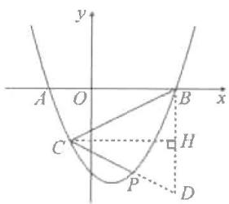

text_image

y
A O B x
C H
P D

# 题型研究 二次函数与最值(一题练透)

练透1 解: 由 $y = x^{2} - 2x - 3$ 可得 $B(3,0), C(0,-3), BC: y = x - 3.$

设 $P(m, m^{2}-2m-3)$ .

则 $E(m,m - 3)$

$$
\begin{array}{l} \therefore P E = (m - 3) - (m ^ {2} - 2 m - 3) \\ = - m ^ {2} + 3 m \\ = - \left(m - \frac {3}{2}\right) ^ {2} + \frac {9}{4}, \\ \end{array}
$$

∴当 $m=\frac{3}{2}$ 时， $PE_{最大}=\frac{9}{4}$ .

练透 2 解: 过点 P 作 $PE \parallel y$ 轴交 BC 于点 E.

由 $y = x^{2} - 2x - 3$ 可得

$B(3,0),C(0,-3)$

$$
\therefore O B = O C = 3, B C: y = x - 3,
$$

$$
\angle P E M = \angle O C B = 4 5 ^ {\circ},
$$

$$
\therefore P M = \frac {\sqrt {2}}{2} P E.
$$

设 $P(m,m^2 - 2m - 3)$

同上得 $PE_{最大}=\frac{9}{4}$ ,

$$
\therefore P M _ {\text {   最大   }} = \frac {\sqrt {2}}{2} \times \frac {9}{4} = \frac {9 \sqrt {2}}{8}.
$$

练透3 解: 过点 P 作 $PE \parallel y$ 轴交 BC 于点 E. 由 $y = x^{2} - 2x - 3$ 可得 B $(3,0)$ , $C(0,-3)$ , BC: y = x - 3.

设 $P(m,m^2 - 2m - 3)$ .

$$
\therefore E (m, m - 3),
$$

$$
\therefore P E = m - 3 - (m ^ {2} - 2 m - 3)
$$

$$
= - m ^ {2} + 3 m.
$$

$$
\because S _ {\triangle P B C} = \frac {1}{2} P E \cdot O B
$$

$$
= \frac {1}{2} \times 3 (- m ^ {2} + 3 m)
$$

$$
= - \frac {3}{2} \left(m - \frac {3}{2}\right) ^ {2} + \frac {2 7}{8},
$$

∴当 $m=\frac{3}{2}$ 时，

$S_{\triangle PBC}$ 最大= $\frac{27}{8}$ .

练透 4 解: 连接 BC 交抛物线的对称轴于点 D, 连接 BQ.

由对称性得 AQ = BQ，

$\therefore AQ + CQ = BQ + CQ \geq BC$

当点 Q 与点 D 重合时，

$AQ+CQ$ 最小为 BC，

由 $y = x^{2} - 2x - 3$ 可得 $B(3,0)$ , $C(0,-3)$ ,

$$
\therefore B C = 3 \sqrt {2},
$$

∴AQ+CQ的最小值为 $3\sqrt{2}$ .

# 题型研究

# 二次函数与特殊图形(一)

# 等腰三角形

1. 解: (1) A(-2,0), B(8,0), C(0,4),

直线 $BC$ 的解析式为 $y = -\frac{1}{2} x + 4$

(2) 过点 C 作 $CG \perp PD$ 于点 G.

设点 $P\left(m, -\frac{1}{4} m^2 + \frac{3}{2} m + 4\right)$ ,

则 $E\left(m,-\frac{1}{2}m+4\right)$ ,

$$
\because P C = E C, \therefore P G = E G,
$$

$$
\therefore - \frac {1}{4} m ^ {2} + \frac {3}{2} m + 4 - 4 = 4 -
$$

$$
\left(- \frac {1}{2} m + 4\right),
$$

解得 m=0(舍去)或 m=4，
∴ $P(4,6)$ .

2. 解: (1) $y = -x^{2} + 2x + 3$ ,

对称轴为直线 x=1;

(2)过点 P 作 $PE \perp AB$ 于点 E，过点 D 作 $DF \perp EP$ 交 EP 的延长线于点 F，∴ $\angle PEA = \angle F = 90^{\circ}$ .

$$
\because P D \perp P A, P A = P D,
$$

$$
\therefore \angle P A E + \angle A P E = 9 0 ^ {\circ},
$$

$$
\angle D P F + \angle A P E = 9 0 ^ {\circ},
$$

$$
\therefore \angle P A E = \angle D P F,
$$

$$
\therefore \triangle P A E \cong \triangle D P F (A A S),
$$

$$
\therefore P E = D F.
$$

$$
\because P (m, - m ^ {2} + 2 m + 3), A (- 1, 0),
$$

$$
\therefore P E = D F = - m ^ {2} + 2 m + 3,
$$

∴点D的横坐标为 $m-(-m^{2}+2m+3)=m^{2}-m-3$ ，

∵直线 l 的解析式为 x=1，

点 D 在直线 l 上，

$$
\therefore m ^ {2} - m - 3 = 1,
$$

解得 $m = \frac{1 \pm \sqrt{17}}{2}$ ,

∵点 P 在直线 l 的右侧，

$$
\therefore 1 <   m <   3, \therefore m = \frac {1 + \sqrt {1 7}}{2}.
$$

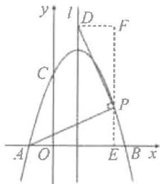

text_image

y
l
D
F
C
P
A
O
E
B
x

# 题型研究

# 二次函数与特殊图形(二)

# 平行四边形

1. 解: (1) A(-2,0), B(6,0), $C(0,-6)$ ;

(2) 过点 F 作 $FH \perp x$ 轴于点 H.

∵以 A, C, E, F 为顶点的四边形是平行四边形，且 FE // AC，

$$
\therefore F E = A C,
$$

$$
\therefore \triangle F H E \cong \triangle C O A,
$$

$$
\therefore F H = C O = 6.
$$

设 $F\left(t, \frac{1}{2} t^2 - 2t - 6\right)$ ,

则 $\left|\frac{1}{2} t^2 - 2t - 6\right| = 6$

当 $\frac{1}{2}t^{2}-2t-6=6$ 时，

解得 $t = 2 \pm 2\sqrt{7}$

此时 $F(2 + 2\sqrt{7},6)$ 或 $(2 - 2\sqrt{7},6)$

当 $\frac{1}{2}t^{2}-2t-6=-6$ 时，

解得 t=0(舍去)或 4,

此时 $F(4,-6)$ ;

综上所述， $F(4, - 6)$ 或 $(2 + 2\sqrt{7},6)$

或 $(2-2\sqrt{7},6)$ .

2. 解: (1) $y = -x^{2} - 2x + 3$ ;

(2) 存在. 理由如下:

$$
\because y = - x ^ {2} - 2 x + 3
$$

$$
= - (x + 1) ^ {2} + 4,
$$

∴设 $D(d,-d^{2}-2d+3)$ ,

$$
E (- 1, e).
$$

当 AC 是对角线时， $x_{A} + x_{C} = x_{D} +$

$$
x _ {E}, y _ {A} + y _ {C} = y _ {D} + y _ {E},
$$

$$
\therefore - 3 + 0 = d + (- 1)
$$

$$
0 + 3 = - d ^ {2} - 2 d + 3 + e,
$$

解得 $d = -2, e = 0, \therefore E(-1, 0)$ ;

当 AD 是对角线时，

$$
x _ {A} + x _ {D} = x _ {C} + x _ {E},
$$

$$
y _ {A} + y _ {D} = y _ {C} + y _ {E},
$$

$$
\therefore - 3 + d = 0 + (- 1),
$$

$$
0 + \left(- d ^ {2} - 2 d + 3\right) = 3 + e,
$$

解得 $d = 2, e = -8, \therefore E(-1, -8)$ .

综上所述，点 E 的坐标为 $(-1,0)$ 或 $(-1,-8)$ .

# 22.3 实际问题与二次函数

# 第1课时 面积问题

# 易错点睛

$$
y = \frac {1}{2} x ^ {2} (0 \leqslant x \leqslant 4)
$$

# 基础题夯实

1. C 2. $-x^{2}+10x$

3. $(12-2x)-(-2x^{2}+12x)$

$$
4 \leqslant x <   6
$$

4.100 5.450

6. 解: (1) 过点 A 作 $AE \perp BC$ 于点 E.

$$
\because \angle B = 3 0 ^ {\circ}, A B = x,
$$

$$
\therefore A E = \frac {1}{2} x,
$$

又∵□ABCD的周长为8，

$$
\therefore B C = 4 - x,
$$

$$
\begin{array}{l} \therefore y = A E \cdot B C = \frac {1}{2} x (4 - x) \\ = - \frac {1}{2} x ^ {2} + 2 x (0 <   x <   4); \\ \end{array}
$$

$$
y = - \frac {1}{2} x ^ {2} + 2 x \tag {2}
$$

$$
= - \frac {1}{2} (x - 2) ^ {2} + 2.
$$

$$
\because - \frac {1}{2} <   0,
$$

∴当 x=2 时，y 有最大值，其最大值为 2.

# 中档题运用

7. 解: (1) ∵ 正方形纸片 ABCD 的边长为 4, 4 个直角三角形全等,

$$
\therefore A B = A D = B C = C D = 4,
$$

$$
A E = D H = x,
$$

$$
B E = A H = 4 - x,
$$

$$
\angle A = \angle D = 9 0 ^ {\circ},
$$

$$
E H = H G = F G = E F,
$$

$$
\angle A E H = \angle G H D.
$$

$$
\because \angle A E H + \angle A H E = 9 0 ^ {\circ},
$$

$$
\therefore \angle A H E + \angle D H G = 9 0 ^ {\circ},
$$

$$
\therefore \angle E H G = 9 0 ^ {\circ}
$$

∴四边形 EFGH 是正方形，

$$
\therefore y = A E ^ {2} + A H ^ {2} = x ^ {2} + (4 - x) ^ {2} =
$$

$$
2 x ^ {2} - 8 x + 1 6;
$$

(2) 当 $y = 10$ 时，

即 $2x^{2}-8x+16=10$ ，

解得 x=1 或 x=3.

答: 当 AE 取 1 或 3 时,

四边形 EFGH 的面积为 10;

(3) $\because y=2x^{2}-8x+16$

$$
= 2 (x - 2) ^ {2} + 8,
$$

∵2>0,

∴y有最小值,最小值为8.

即四边形 EFGH 的面积有最小值，最小值为 8.

# 综合题探究

8. 解: (1) 设 AB = x m.

则 $AD = 27 - 2x + 1 = (28 - 2x)\mathrm{m}$

∴x(28-2x)=90,

解得 $x_{1}=5, x_{2}=9.$

当 x=5 时,28-2x=18>13,

不符合题意，舍去；

当 x=9 时,28-2x=10<13,

符合题意.

答:AB为9m时,猪舍的面积为90m²;
(2)设 AB = x m, 所围矩形猪舍的面积为 $y \, m^{2}$ .

$y = x(28 - 2x)$

$$
= - 2 x ^ {2} + 2 8 x
$$

$$
= - 2 (x - 7) ^ {2} + 9 8.
$$

$\because 0<28-2x\leqslant13,$

∴7.5≤x<14.

$\because y=-2(x-7)^{2}+98,$

图象开口向下，

∴在对称轴 x=7 的右侧 y 随 x 增大而减小，

∵AB为整数,即当x=8时,

$y_{最大值}=96.$

答:AB 为 8 m 时, 面积最大, 最大面积是 $96 \, m^{2}$ .

# 第2课时 利润问题

# 易错点睛

2

# 基础题夯实

1. $P = -2x^{2} + 500x$

2. $(60+x)$

$y=-5x^{2}-200x+6\ 000$

3. $y = -10x^{2} + 1300x - 40000$

4. 解: 由题意知, 当猪肉粽每盒售价 x 元时, 每天可售出 $[180 - 10 (x - 52)]$ 盒,

$$
\begin{array}{l} \therefore y = (x - 5 0) [ 1 8 0 - 1 0 (x - 5 2) ] = \\ - 1 0 (x - 6 0) ^ {2} + 1 0 0 0, \end{array}
$$

$\because -10 < 0,52 \leqslant x \leqslant 70, \therefore$ 当 $x = 60$

时，y 取最大值，最大值为 1000 元.

答: y 关于 x 的函数关系式为 $y = -10x^{2} + 1200x - 35000$ , y 的最大值为 1000 元.

5. 解: (1) 设 $y = kx + b$ ,

则 $\left\{ \begin{array}{l} 20k + b = 360, \\ 30k + b = 60, \end{array} \right.$ 解得 $\left\{ \begin{array}{l} k = -30, \\ b = 960, \end{array} \right.$

$\therefore y = -30x + 960(10 \leqslant x \leqslant 32)$ ;

(2)设每月所获的利润为 W 元，

则 $W = (-30x + 960)(x - 10)$

$$
= - 3 0 (x - 2 1) ^ {2} + 3 6 3 0.
$$

$\because -30 < 0,$

∴当 x=21 时，W 有最大值，最大值为 3630.

答: 当销售价格定为 21 元时, 每月获得的利润最大, 为 3630 元.

# 中档题运用

6. 解: (1) $y = (200 - x)(60 + 4 \times \frac{x}{10}) =$

$$
- 0. 4 (x - 2 5) ^ {2} + 1 2 2 5 0.
$$

$$
\because - 0. 4 <   0,
$$

∴当x<25时，

y 随 x 的增大而增大.

$\because 200 - x \geqslant 180, \therefore x \leqslant 20.$

∴当 x=20 时,利润最大,最大利润为 12 240 元;

(2)由 12 160 = -0.4(x - 25) $^{2}$ + 12 250, 解得 $x_{1}$ =40 (不合题意, 舍去), $x_{2}$ =10.

∴售出轮椅的辆数为：

$60+4\times\frac{10}{10}=64$ （辆）.

答:这天售出了64辆轮椅.

# 综合题探究

7. 解: (1) 设第 x 天的单价 $m = kx + b$ ,
则 $\left\{\begin{aligned}k+b=50,\\ 2k+b=48,\end{aligned}\right.$ 解得 $\left\{\begin{aligned}k&=-2,\\ b&=52,\end{aligned}\right.$

$$
\therefore m = - 2 x + 5 2;
$$

$$
y _ {1} = (- 2 x + 5 2) (1 0 x + 1 0) - \tag {2}
$$

$$
7 4 5 = - 2 0 x ^ {2} + 5 0 0 x - 2 2 5;
$$

(3)①由 $\left\{\begin{aligned}a+b+25=495,\\ 4a+2b+25=905,\end{aligned}\right.$

解得 $\left\{ \begin{array}{l}a = -30,\\ b = 500, \end{array} \right.$

$$
\therefore y _ {2} = - 3 0 x ^ {2} + 5 0 0 x + 2 5;
$$

$$
② y _ {1} + y _ {2} = (- 2 0 x ^ {2} + 5 0 0 x - 2 2 5) +
$$

$$
\begin{array}{l} (- 3 0 x ^ {2} + 5 0 0 x + 2 5) = - 5 0 (x - 1 0) ^ {2} + \\ 4 8 0 0, \end{array}
$$

$\because -50<0,\therefore$ 当x=10时，

$y_{1} + y_{2}$ 有最大值4800，

∴第10天两处的樱桃园的利润之和最大,最大是4800元.

# 第 3 课时 抛物线形问题

# 易错点睛

600

# 基础题夯实

1. 10 2. $\frac{35}{3}$ 3. $\frac{14}{9}$

4. 解：(1)依题意，顶点 $P(5,9)$ ，设抛物线的解析式为 $y=a(x-5)^{2}+9$ ，将 $(0,0)$ 代入，得 $0=a(0-5)^{2}+9$ ，

解得 $a = -\frac{9}{25}$

∴抛物线的解析式为

$$
y = - \frac {9}{2 5} (x - 5) ^ {2} + 9;
$$

(2)令 y=6,

得 $-\frac{9}{25}(x - 5)^{2} + 9 = 6$

解得 $x_{1} = \frac{5\sqrt{3}}{3} + 5$

$$
x _ {2} = - \frac {5 \sqrt {3}}{3} + 5.
$$

$$
\therefore A \left(5 - \frac {5 \sqrt {3}}{3}, 6\right), B \left(5 + \frac {5 \sqrt {3}}{3}, 6\right).
$$

# 中档题运用

5. 解: (1) 根据题意, 令 x=0,

易得 $c = 1, c' = 2$ .

令 $x = 3$

$$
y = - \frac {1}{3} x ^ {2} + b x + c
$$

$$
= - 3 + 3 b + 1 = 0,
$$

可求得 $b = \frac{2}{3}$

$$
\begin{array}{l} \therefore y = - \frac {1}{3} x ^ {2} + \frac {2}{3} x + 1 \\ = - \frac {1}{3} (x - 1) ^ {2} + \frac {4}{3}, \\ \end{array}
$$

∴ y 的最大值为 $\frac{4}{3}$ ，因此，A 喷头喷出的水流的最大高度为 $\frac{4}{3}$ m；

(2) 函数 $y = -\frac{1}{3}x^{2} + \frac{2}{3}x + 2$ ,

令 $x = 4$

$$
\begin{array}{l} y = - \frac {1}{3} \times 4 ^ {2} + \frac {2}{3} \times 4 + 2 \\ = - \frac {2}{3}, \\ \end{array}
$$

因此，B 喷头喷出的水流不会落在该游人所站的点 D 处.

# 综合题探究

6. 解: (1) 由素材知顶点 A(8,8), 故可设该抛物线为 $y = a(x - 8)^{2} + 8$ , 把 $(0,0)$ 代入, 得 $a(0 - 8)^{2} + 8 = 0$ ,

解得 $a = -\frac{1}{8}$

∴抛物线的解析式为 $y=-\frac{1}{8}(x-8)^{2}+8;$

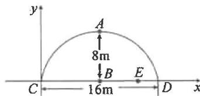

text_image

y
A
8m
B
E
C
16m
D
x

(2) $\because CD=16,DE=2,\therefore CE=14,$ 当 x=14 时，

$$
y = - \frac {1}{8} (1 4 - 8) ^ {2} + 8 = \frac {7}{2}.
$$

设该隧道限高 h 米，则 $\frac{7}{2}-h\geqslant\frac{1}{2}$ ，解得 $h\leqslant3,\therefore$ 该隧道限高 3 米.

# 回归教材 二次函数与面积

教材母题

解:(1) $y=30-2x(6\leqslant x<15)$ ;

(2)设苗圃园的面积为 S，

则 $S = x(30 - 2x) = -2x^{2} + 30x = -2(x - 7.5)^{2} + 112.5,$

∴当 x=7.5 时， $S_{最大}=112.5(m^{2})$ ;

(3) $6 \leqslant x \leqslant 11.$

(当 S=88 时， $-2x^{2}+30x=88$ ，

解得 $x_{1}=4, x_{2}=11$ ，由图象可知，
当 $S \geqslant 88$ 时， $4 \leqslant x \leqslant 11$ ，

又∵6≤x<15，

∴当 $S \geqslant 88$ 时， $6 \leqslant x \leqslant 11$ .

【教材变式】解:(1) $\because(21-12)\div3=3(m),\therefore I、II$ 两块矩形的面积为12 $\times3=36(m^{2})$ ,

设水池的长为 a m，

则水池的面积为 $a \times 1 = a (\mathrm{m}^{2})$ ,

∴36-a=32,解得a=4,

$$
\therefore D G = 4 \mathrm{m},
$$

$$
\therefore C G = C D - D G = 1 2 - 4 = 8 (\mathrm{m}),
$$

即 CG 的长为 8 m, DG 的长为 4 m;
(2) 设 BC 长为 x m，则 CD 的长度为 $(21-3x)$ m,

∴总种植面积为

$$
\begin{array}{l} (2 1 - 3 x) \cdot x = - 3 (x ^ {2} - 7 x) \\ = - 3 \left(x - \frac {7}{2}\right) ^ {2} + \frac {1 4 7}{4}. \\ \end{array}
$$

$$
\because - 3 <   0, \text {   且   } 2 1 - 3 \times \frac {7}{2} = \frac {2 1}{2} <   1 2,
$$

∴当 $x=\frac{7}{2}$ 时，总种植面积有最大值为 $\frac{147}{4}$ m $^{2}$ ，

即 BC 应设计为 $\frac{7}{2}$ m，总种植面积最大，此时最大面积为 $\frac{147}{4}$ m $^{2}$ .

# 题型研究

# 二次函数与利润(一)

# 顶点最值与区间最值

1. 解: (1) 设 $y = kx + b$ ,

则 $\left\{ \begin{array}{l} 12k + b = 56, \\ 14k + b = 52, \end{array} \right.$ 解得 $\left\{ \begin{array}{l} k = -2, \\ b = 80, \end{array} \right.$

$$
\therefore y = - 2 x + 8 0;
$$

(2)设日销售利润为 $w$ 元，则 $w = (x - 10)(-2x + 80) = -2(x - 25)^{2} + 450.$

答:糖果销售单价定为25元时,所获日销售利润最大,最大利润是450元;

(3)设赠送后的日所获利润为 $w'$ 元，

$$
\begin{array}{l} w ^ {\prime} = (x - 1 0 - m) (- 2 x + 8 0) = \\ - 2 x ^ {2} + (1 0 0 + 2 m) x - 8 0 0 - 8 0 m. \end{array}
$$

由

$$
\frac {4 \times (- 2) (- 8 0 0 - 8 0 m) - (1 0 0 + 2 m) ^ {2}}{4 \times (- 2)}
$$

=392, 解得 $m_{1}=2, m_{2}=58.$

若 m=58，则售价为 $x=-\frac{b}{2a}=54$

元，此时 $x - 10 - m < 0$ ，故舍去.

∴m 的值为 2.

2. 解: (1) 由题意, 设一次函数的解析式为 $y = kx + b$ ,

则 $\left\{ \begin{array}{l} 100k + b = 300, \\ 120k + b = 200, \end{array} \right.$ 解得 $\left\{ \begin{array}{l} k = -5, \\ b = 800, \end{array} \right.$

$$
\therefore y = - 5 x + 8 0 0;
$$

(2)设商场获得的利润为 y 元，

则 $y = (x - 80)(-5x + 800)$

$$
= - 5 (x - 1 2 0) ^ {2} + 8 0 0 0,
$$

$\because -5<0,\therefore$ 当x<120时,y随x的增大而增大.

由题意, 得 $\left\{\begin{aligned}x&\geqslant100,\\ -5x&+800\geqslant220,\end{aligned}\right.$

$$
\therefore 1 0 0 \leqslant x \leqslant 1 1 6,
$$

∴当 x=116 时,利润最大,最大值为 7920.

答: 当销售单价为 116 时, 商场获得利润最大, 最大利润是 7920 元.

# 题型研究

# 二次函数与利润(二)

# 取整最值与分段函数

1. 解: (1) 设 $y = kx + b$ ,

则 $\left\{ \begin{array}{l} 40k + b = 164 \\ 50k + b = 124 \end{array} \right.$ , 解得 $\left\{ \begin{array}{l} k = -4 \\ b = 324 \end{array} \right.$ ,

$$
\therefore y = - 4 x + 3 2 4;
$$

(2) $w = x(-4x + 324) - 2000 =$

$-4x^{2}+324x-2\ 000(30\leqslant x\leqslant80,$ 且 x 是整数);

(3)由(2)知： $w=-4x^{2}+324x-$

$$
2 0 0 0 = - 4 \left(x - \frac {8 1}{2}\right) ^ {2} + 4 5 6 1.
$$

∵30≤x≤80，且x是整数，

∴当 x=40 或 41 时，w 取得最大值，此时 w=4560.

答:该影院将电影票售价 x 定为 40 元或 41 元时,每天获利最大,最大利润是 4560 元.

2. 解: (1) 由题意, 得 $\left\{\begin{aligned}10k+b=20\\ 15k+b=15\end{aligned}\right.$

解得 $\left\{\begin{aligned}k&=-1\\ b&=30\end{aligned}\right.$ ;

(2)由题意,当 $1 \leqslant x \leqslant 20$ 时,

由(1)得 $y = -x + 30$ ,

$$
\therefore M = \left\{ \begin{array}{l} (x + 1 0) (- x + 3 0) = - x ^ {2} + 2 0 x + \\ 3 0 0 (1 \leqslant x \leqslant 2 0) \\ 1 5 (x + 1 0) = 1 5 x + 1 5 0 (2 0 <   x \leqslant 3 0) \end{array} ; \right.
$$

(3)由题意,当 $1 \leqslant x \leqslant 20$ 时,

$M = -x^{2} + 20x + 300$

$$
= - (x - 1 0) ^ {2} + 4 0 0.
$$

∴当 x=10 时，M 取得最大值 400，

∴此时销售额不超过500元；

当 $20 < x \leqslant 30$ 时，

由 $M=15x+150>500$ ,

解得 $x > 23\frac{1}{3}$

∴共有7天销售额超过500元.

# 题型研究

# 二次函数与抛物线形问题

1. 解: (1) ①由表格可知, 抛物线的对称轴为 x=4, ∴m=3, n=6;

②该二次函数可设为

$$
y = a (x - 4) ^ {2} + 8,
$$

把 $(0,0)$ 代入，得 $0 = a(0 - 4)^2 + 8$

解得 $a = -\frac{1}{2}$ ,

联立 $\left\{\begin{aligned}y&=-\frac{1}{2}(x-4)^{2}+8,\\ y&=\frac{1}{4}x,\end{aligned}\right.$

解得 $\left\{\begin{aligned}x=0,\\ y=0\end{aligned}\right.$ 或 $\left\{\begin{aligned}x=\frac{15}{2},\\ y=\frac{15}{8},\end{aligned}\right.$

∴点 A 的坐标是 $\left(\frac{15}{2},\frac{15}{8}\right)$ ;

(2)①由题干可知小球飞行最大高度为 8 m;

②∵y=-5t^{2}+vt

$$
= - 5 \left(t - \frac {v}{1 0}\right) ^ {2} + \frac {v ^ {2}}{2 0},
$$

∴ $\frac{v^{2}}{20}=8$ ，解得 $v=4\sqrt{10}$ （负值舍去）.

2. 解: (1) 由题意,

$\because AO=17\ m,\therefore A(0,17).$

$\because OC=100\ m, AO=BC,$ 缆索 $L_{1}$ 的最低点 P 到 $FF'$ 的距离 PD=2 m,

∴抛物线 $L_{1}$ 的顶点 P 为 $(50,2)$ ，故可设抛物线为 $y=a(x-50)^{2}+2$ .

把(0,17)代入，得 $2500a+2=17$ ，

$\therefore a=\frac{3}{500},\therefore$ 缆索 $L_{1}$ 所在抛物线为

$$
y = \frac {3}{5 0 0} (x - 5 0) ^ {2} + 2;
$$

(2)由题意，∵缆索 $L_{1}$ 所在抛物线

与缆索 $L_{2}$ 所在抛物线关于 y 轴对称，又缆索 $L_{1}$ 所在抛物线为 $y=\frac{3}{500}(x-50)^{2}+2,\therefore$ 缆索 $L_{2}$ 所在抛物线为 $y=\frac{3}{500}(x+50)^{2}+2.$

由 2.6= $\frac{3}{500}(x+50)^{2}+2$ .

解得 $x_{1} = -40, x_{2} = -60$ .

又 $FO < OD = 50\mathrm{m}$

∴x=-40.∴FO的长为40m.

# 综合与实践(三)

# 二次函数关系探究

解:(1)由题意知,点 B 的坐标为

$$
\left(\frac {1}{2} m, n\right),
$$

将 $(\frac{1}{2} m, n)$ 代入 $y = x^2$

得 $n = \left(\frac{1}{2} m\right)^2 = \frac{1}{4} m^2$

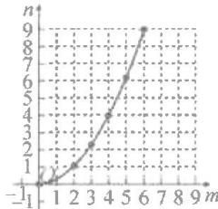

line

| m | n |
|---|---|
| -1 | 0 |
| 1 | 1 |
| 2 | 2 |
| 3 | 3 |
| 4 | 4 |
| 5 | 5 |
| 6 | 6 |
| 7 | 7 |
| 8 | 8 |
| 9 | 9 |

图2

(2)由题意知,点D(1,2),

∴点 $B\left(1+\frac{1}{2}m,2+n\right)$ ,

$$
\therefore 2 \left(1 + \frac {1}{2} m - 1\right) ^ {2} + 2 = 2 + n,
$$

$$
\therefore n = \frac {1}{2} m ^ {2}.
$$

# 综合与实践(四)

# 滑行距离与滑行时间的关系

解:(1)描点,连线,如图所示;

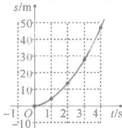

line

| t/s | s/m |
|---|---|
| -1 | 0 |
| 0 | 0 |
| 1 | 5 |
| 2 | 15 |
| 3 | 30 |
| 4 | 50 |

(2) 推测 s 与 t 的关系可近似看成二次函数. 设 s 关于 t 的函数关系式为 $s = at^{2} + bt$ ，将 $(1, 4.5)(2, 14)$ 代入，得 $\left\{\begin{aligned}a + b &= 4.5, \\ 4a + 2b &= 14,\end{aligned}\right.$

解得 $\left\{\begin{aligned}a&=\frac{5}{2},\\ b&=2,\end{aligned}\right.$ $\therefore s=\frac{5}{2}t^{2}+2t;$

(3)由 $\frac{5}{2}t^{2}+2t=270$ ，解得 $t_{1}=10$ ， $t_{2}=-10.8$ （舍去），∴他滑行的时间是10 s.

# 综合与实践(五)

# 拟定利润最大加工方案

解:【任务 1】∵安排 x 名工人加工“雅”服装，y 名工人加工“风”服装，∴加工“正”服装的有 $(70-x-y)$ 人，

“正”服装总件数和“风”服装相

等， $\therefore (70 - x - y)\times 1 = 2y$

$$
\therefore y = - \frac {1}{3} x + \frac {7 0}{3};
$$

【任务2】根据题意得：“雅”服装每天获利为： $x[100 - 2(x - 10)]$

$$
\therefore w = 2 y \times 2 4 + (7 0 - x - y) \times
$$

$$
4 8 + x [ 1 0 0 - 2 (\dot {x} - 1 0) ],
$$

整理得 $w = -2x^{2} + 72x + 3360$

$$
(x > 1 0);
$$

【任务 3】由任务 2, 得

$$
\begin{array}{l} w = - 2 x ^ {2} + 7 2 x + 3 3 6 0 \\ = - 2 (x - 1 8) ^ {2} + 4 0 0 8, \\ \end{array}
$$

$\because y=-\frac{1}{3}x+\frac{70}{3}$ 为正整数，

∴ $x \neq 18$ ，且 $x \neq 17$ ，当 x = 19 时，

$y=\frac{51}{3}=17$ ,符合题意;

$$
\therefore 7 0 - x - y = 3 4.
$$

综上:安排 19 名工人加工“雅”服装,17 名工人加工“风”服装,34 名工人加工“正”服装,即可获得最大利润.

# 章末复习

1.C 2.3

3. 向下 y (0,0)

4. 向上 y (0,2)

5. 向下 $x = -3$ (-3,0)

6. 向上 x=1 (1,2)

$$
x > 1 \quad x <   1 \quad x = 1 \quad 2
$$

7. x=3 8. A

9. $y = -2(x + 2)^{2}$

10. $y = -x^{2} + 2x + 3$

11. $y = -(x - 1)^{2} + 2$

12. > < < > 13. D

14. (1) $x_{1}=1,x_{2}=3$

$$
(2) 1 <   x <   3
$$

$$
(3) k <   2
$$

15. 解: (1) 由题意可得, 抛物线的对称轴是 $x = \frac{10 + 20}{2} = 15$ ,

∴抛物线的顶点为(15,9)，

∴可设抛物线为 $y=a(x-15)^{2}+$

9, 把(10,8)代入, 可得 25a = -1.

$$
\therefore a = - \frac {1}{2 5},
$$

∴抛物线的解析式为

$$
y = - \frac {1}{2 5} (x - 1 5) ^ {2} + 9;
$$

(2) 当 $x = 5$ 时，

$$
y = - \frac {1}{2 5} (5 - 1 5) ^ {2} + 9 = 5.
$$

∴水火箭距离地面的竖直高度为5m.

16. 解: (1) 设 $y = kx + b$ ,

则 $\left\{ \begin{array}{l} 90 = 50k + b, \\ 80 = 60k + b, \end{array} \right.$ 解得 $\left\{ \begin{array}{l} k = -1, \\ b = 140, \end{array} \right.$

$$
\therefore y = - x + 1 4 0;
$$

(2)设每月出售这种护眼灯所获的利润为 w 元，

则 $w = (x - 40)y$

$$
= (x - 4 0) (- x + 1 4 0)
$$

$$
= - (x - 9 0) ^ {2} + 2 5 0 0.
$$

$$
\because a = - 1 <   0,
$$

对称轴为直线 x=90，

∴当 $x\leqslant90$ 时，

w 随 x 的增大而增大.

∵规定销售单价不低于进价,且不高于进价的2倍,

∴ $40 \leqslant x \leqslant 80$ , ∴ 当 x = 80 时, w 取得最大值 2400,

∴当护眼灯销售单价定为80元时，商店每月出售这种护眼灯所获的利润最大，最大月利润为2400元.

# 第二十三章 旋转

# 23.1 图形的旋转

# 第1课时 旋转的概念及性质易错点睛

√

# 基础题夯实

1.D 2.B 3.30

4.0 逆时针 $80^{\circ}$

5.120° 6.45° 7.70° 8.2 $\sqrt{2}$

# 中档题运用

9. 解：(1) $\because AB = AD, \angle BAD = 60^{\circ}$ ,

∴△ABD 是等边三角形；

(2) $\because AC=AE,BC=DE,AC=BC,$

$$
\therefore A E = D E.
$$

$$
\because A B = D B, B E = B E,
$$

$$
\therefore \triangle A B E \cong \triangle D B E (\text { S   S   S }),
$$

$$
\therefore \angle A B E = \angle D B E,
$$

即 BE 平分 $\angle ABD$ .

10. 解: (1) 旋转中心是点 D, 逆时针, $90^{\circ}$ ;

(2) 连接 EN. 由旋转得 $\angle DCF = \angle DAE = \angle DCB = 90^{\circ}$ ,

∴点B,C,F共线.

$\because DE=DF,DM\perp EF,$

$$
\therefore \angle E D M = \angle F D M,
$$

$$
\because D N = D N,
$$

$$
\therefore \triangle D E N \cong \triangle D F N,
$$

$$
\therefore E N = F N, \text { 设 } A E = C F = x,
$$

$$
\because B C = B N + C N = 2 + 3 = 5,
$$

$$
\therefore B E = 5 - x, E N = F N = 3 + x.
$$

在 Rt△BEN 中，

$$
\because B E ^ {2} + B N ^ {2} = E N ^ {2},
$$

$$
\therefore (5 - x) ^ {2} + 2 ^ {2} = (3 + x) ^ {2},
$$

$$
\therefore x = \frac {5}{4}, \therefore A E = \frac {5}{4}.
$$

# 综合题探究

11. 解: (1) 连接 AP.

由旋转的性质知,AC=AE,

$$
\angle A E D = \angle C = \angle A E P = 9 0 ^ {\circ}.
$$

$$
\because A P = A P,
$$

$$
\therefore \mathrm{Rt} \triangle A P E \cong \mathrm{Rt} \triangle A P C (\mathrm{HL}),
$$

$$
\therefore P C = P E;
$$

(2) 连接 AP, 延长 AD 和 CF 交于点 H. 由 (1) 知 PE = PC,

$$
\therefore \angle P E C = \angle P C E.
$$

$$
\because A D \parallel B C,
$$

$$
\begin{array}{l} \therefore \angle D H E = \angle P C E = \angle P E C = \\ \angle D E H, \end{array}
$$

$$
\therefore D E = D H = B C.
$$

在 $\triangle DFH$ 和 $\triangle BFC$ 中，

$$
\left\{ \begin{array}{l} \angle D F H = \angle B F C, \\ \angle D H F = \angle B C F, \\ D H = B C, \end{array} \right.
$$

$$
\therefore \triangle D F H \cong \triangle B F C (\mathrm{AAS}),
$$

$$
\therefore D F = B \dot {F}.
$$

# 第2课时 画旋转图形易错点睛

D

# 基础题夯实

1. D  2. A  3. C  4. D

5. 解: (1) $\triangle A_{1}B_{1}C_{1}$ 如图所示;

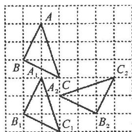

text_image

A
B A₁ C₂
A₂ C
B₁ C₁ B₂

(2) $\triangle A_{2}B_{2}C_{2}$ 如图所示.   
中档题运用

6. $\left(4,4-\frac{4\sqrt{3}}{3}\right)$

7. $(-3,-1)$ 或 $(2,2)$

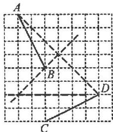

text_image

A
B
C
D

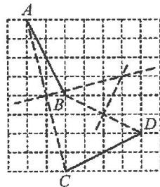

text_image

A
B
C
D

备用图

8. 解: (1) 如图中的 $\triangle BCM$ ;

(2)由(1)知

$$
\triangle A E B \cong \triangle C M B,
$$

$$
\therefore \angle B C M = \angle A =
$$

$$
9 0 ^ {\circ}, A E = C M.
$$

$$
\because \angle B C D = 9 0 ^ {\circ},
$$

$$
\therefore \angle B C M + \angle B C D
$$

$$
= 1 8 0 ^ {\circ},
$$

∴点D,C,M共线.

$$
\because A E = C M, A E + C D = D E,
$$

$$
\therefore D E = C D + C M = D M,
$$

$$
\text { 又 } \because B E = B M, B D = B D,
$$

$$
\therefore \triangle E B D \cong \triangle M B D (\text { S   S   S }),
$$

$$
\therefore \angle E D B = \angle M D B,
$$

即 $DB$ 平分 $\angle CDE$ .

# 综合题探究

9. 解: (1) 如图所示;

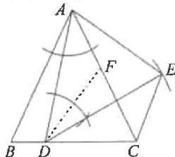

text_image

Geometric diagram with labeled points A, B, C, D, E, F and construction lines, including a dashed arc and angle markers.

(2) $\because DA=DE,\angle ADE=60^{\circ},$

∴△ADE 是等边三角形，

$$
\therefore A D = A E, \angle D A E = 6 0 ^ {\circ},
$$

$$
\because A B = A C, \angle B A C = 6 0 ^ {\circ},
$$

$$
\therefore \angle B A C = \angle D A E,
$$

△ABC 为等边三角形，

$$
\therefore \angle B A D = \angle C A E,
$$

$$
\angle A B C = \angle A C B = 6 0 ^ {\circ},
$$

$$
\therefore \triangle B A D \cong \triangle C A E,
$$

$$
\therefore \angle A C E = \angle B = 6 0 ^ {\circ},
$$

$$
\begin{array}{l} \therefore \angle D C E = \angle A C B + \angle A C E = \\ 1 2 0 ^ {\circ}; \end{array}
$$

(3) 在 AC 上取点 F，使 DF = CD，

$$
\therefore \angle D C F = \angle D F C.
$$

$$
\because A B = A C, \therefore \angle A B C = \angle A C B,
$$

$$
\therefore \angle C D F = \angle B A C = \alpha ,
$$

$$
\because \angle A D E = \angle B A C,
$$

$$
\therefore \angle C D F = \angle A D E,
$$

$$
\therefore \angle C D E = \angle A D F.
$$

由旋转得 AD = DE，

$$
\therefore \triangle C D E \cong \triangle F D A,
$$

$$
\therefore \angle D C E = \angle A F D.
$$

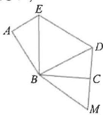

text_image

Geometric diagram with labeled points A, B, C, D, E, M forming connected triangles and quadrilaterals

$$
\begin{array}{l} \because \angle C F D = \angle F C D = \frac {1 8 0 ^ {\circ} - \alpha}{2} \\ = 9 0 ^ {\circ} - \frac {1}{2} \alpha , \\ \end{array}
$$

$$
\therefore \angle D C E = \angle A F D
$$

$$
= 1 8 0 ^ {\circ} - \left(9 0 ^ {\circ} - \frac {1}{2} \alpha\right)
$$

$$
= 9 0 ^ {\circ} + \frac {1}{2} \alpha .
$$

# 23.2 中心对称

# 23.2.1 中心对称

# 易错点睛

①②

# 基础题夯实

1. C

2.C 3.A 4.4

5. (1)

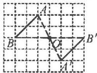

(2)

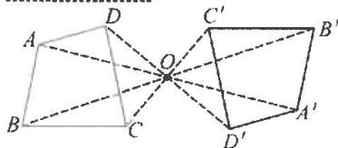

text_image

Geometric diagram showing two connected polyhedra with labeled vertices and dashed lines indicating hidden edges.

(3)

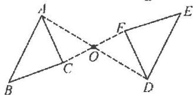

text_image

Geometric diagram showing two triangles ABC and AED with intersection point O, labeled with vertices and dashed lines indicating construction or proof.

# 中档题运用

6. $(3,-1)$

7. 解: (1) 如图所示, 线段 BO 为 AC 边上的中线;

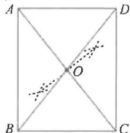

text_image

A
D
O
B
C

(2)∵O是AC的中点，

∴AO=CO，由旋转得 BO=DO，

∴四边形 ABCD 是平行四边形，

$\because \angle ABC = 90^{\circ},$

∴四边形 ABCD 是矩形.

8. 解: (1) 如图所示;

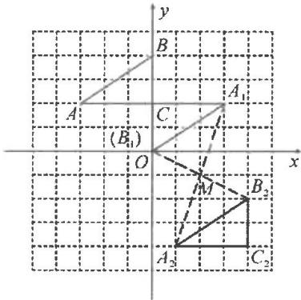

text_image

y
B
A₁
A
(C₁₁)
O
M
B₂
A₂
C₂
x

(2) $M(2,-1)$ .

# 综合题探究

9. 解: (1) $\triangle FCP$ 如图所示;

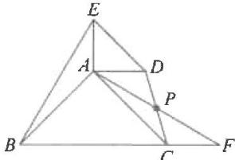

text_image

Geometric diagram with labeled points A, B, C, D, E, F, and P, showing triangles and intersecting lines.

(2)∵△ADP 与△FCP 关于点 P 成中心对称，

$$
\therefore \triangle A D P \cong \triangle F C P,
$$

$$
\therefore C F = A D = A E,
$$

$$
A P = P F = \frac {1}{2} A F,
$$

$$
\because \angle D A P = \angle C F P,
$$

$$
\therefore C F \parallel A D,
$$

$$
\therefore \angle A C F + \angle D A C = 1 8 0 ^ {\circ},
$$

$$
\because \angle B A C = \angle D A E = 9 0 ^ {\circ},
$$

$$
\therefore \angle D A C + \angle B A E = 1 8 0 ^ {\circ},
$$

$$
\therefore \angle A C F = \angle B A E.
$$

$$
\because A B = A C,
$$

$$
\therefore \triangle A C F \cong \triangle B A E (\text { SAS }),
$$

$$
\therefore B E = A F = 2 A P,
$$

$$
\therefore \frac {A P}{B E} = \frac {1}{2}.
$$

# 23.2.2 中心对称图形

# 易错点睛

矩形,菱形,正方形等(答案不唯一)

# 基础题夯实

1. B

2.B

3. C

D

6.B

# 中档题运用

7.

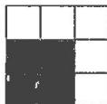

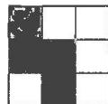

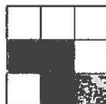

8. 解: (1) 如图所示, AB, CD

为所求；

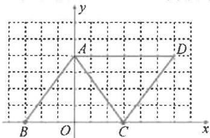

text_image

y
A
D
B
O
C
x

(2) 易证 $AD \perp BC$ , 四边形 $ABCD$ 为平行四边形,

∵A(0,4),C(3,0),∴□ABCD的对称中心坐标为 $\left(\frac{3}{2},2\right)$ .

9. 解：(1) 如图；

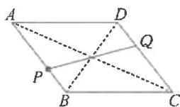  
图1

(2)如图

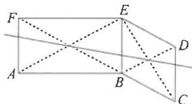

text_image

Geometric diagram with labeled points A, B, C, D, E, F and intersecting lines, likely from a math problem or proof.

图2

# 综合题探究

10. 解: (1) 如图示, 连接 AC 交 BD 于点 O, 连接 EO 并延长到点 F, 使 OF = OE, 连接 DF, CF;

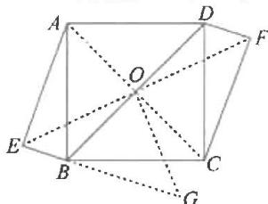

text_image

Geometric diagram of a parallelogram with labeled vertices and internal diagonals, used for spatial geometry problems.

(2) 过点 O 作 $OG \perp OE$ ，交 EB 的延长线于点 G.

∵四边形 ABCD 为正方形，

$$
\therefore O A = O B,
$$

$$
\angle A O B = \angle E O G = 9 0 ^ {\circ},
$$

$$
\therefore \angle A O E = \angle B O G.
$$

$$
\because \angle A E B = \angle A O B = 9 0 ^ {\circ},
$$

$$
\therefore \angle E A O + \angle E B O = 1 8 0 ^ {\circ},
$$

$$
\because \angle E B O + \angle G B O = 1 8 0 ^ {\circ},
$$

$$
\therefore \angle G B O = \angle E A O,
$$

$$
\therefore \triangle E A O \cong \triangle G B O,
$$

$$
\therefore A E = B G = 1 2, O E = O G,
$$

∴△GOE 为等腰直角三角形，

$$
\therefore O E = \frac {\sqrt {2}}{2} E G
$$

$$
= \frac {\sqrt {2}}{2} (E B + B G)
$$

$$
= \frac {\sqrt {2}}{2} (E B + A E)
$$

$$
\because A E = 1 2, A B = 1 3,
$$

$$
\therefore B E = \sqrt {A B ^ {2} - A E ^ {2}}
$$

$$
= \sqrt {1 3 ^ {2} - 1 2 ^ {2}} = 5,
$$

$$
\therefore O E = \frac {1 7 \sqrt {2}}{2}, \therefore E F = 1 7 \sqrt {2}.
$$

# 23.2.3 关于原点对称的点的坐标

# 易错点睛

(-2,3)

# 基础题夯实

1. A 2. D 3. (3, -2)

4.12 5.x>1 6.(-2,-1)

7. B 8.(2,-1)

9. 解: $A_{1}(3, -2), B_{1}(2, 1)$ ,

$C_{1}(-2,-3)$ ，如图所示.

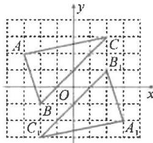

text_image

A
C
B
O
x
y
B
C
A₁

中档题运用

10. B 11. A

12.(1)(2)如图所示:

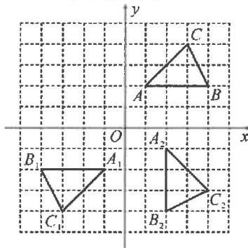

text_image

y
C
A B
O x
A₁
B₁ A₂
C₁ C₂
B₂

(3)(0,0)

# 综合题探究

13. 解: (1) 令 x=0, 得 y=-3,

$$
\therefore C (0, - 3).
$$

令 $y = 0$ ，得 $x^{2} - 2x - 3 = 0$

$$
\therefore x _ {1} = - 1, x _ {2} = 3,
$$

$$
\therefore A (- 1, 0), B (3, 0);
$$

(2) $\because C(0,-3)$ ,

由题意,可设点 $D(-a,-3)$ ,

则点 $E(a,3)$

$$
\therefore a ^ {2} - 2 a - 3 = 3, \text {解得} a = 1 \pm \sqrt {7},
$$

$$
\because a > 0, \therefore a = 1 + \sqrt {7};
$$

(3) $\because C(0,-3),$

依题意,得 $M(0,3)$ ,

$AM$ 与 $A^{\prime}M^{\prime}$ 关于某点成中心对称，

$$
\therefore A M \underline {{\parallel}} A ^ {\prime} M ^ {\prime},
$$

$$
\because A (- 1, 0), M (0, 3),
$$

设 $A^{\prime}(a,b)$ ，则 $M^{\prime}(a - 1,b - 3)$

$$
\therefore \left\{ \begin{array}{l} a ^ {2} - 2 a - 3 = b, \\ (a - 1) ^ {2} - 2 (a - 1) - 3 = b - 3, \end{array} \right.
$$

解得 $\left\{\begin{aligned}a=3,\\ b=0,\end{aligned}\right.$

∴点 $A'(3,0)$ , $M'(2,-3)$ .

# 23.3 课题学习 图案设计

易错点睛   
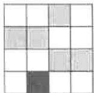  
基础题夯实

1.C

中档题运用

2.

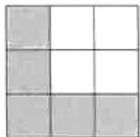  
(1)

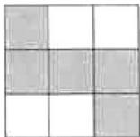  
(2)

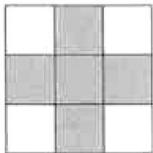  
(3)   
综合题探究

3. 解: 如图, 答案不唯一.

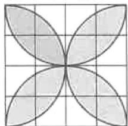  
图1

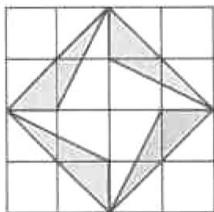  
图2

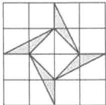  
图3   
基础夯实

# 知旋转(一) 求角度

1. B 解:由旋转的性质可得出

$$
\angle B ^ {\prime} A C ^ {\prime} = \angle B A C,
$$

$$
\because \angle B A C + \angle B + \angle C = 1 8 0 ^ {\circ},
$$

$$
\therefore \angle B A C = 3 5 ^ {\circ},
$$

$$
\therefore \angle B ^ {\prime} A C ^ {\prime} = \angle B A C = 3 5 ^ {\circ},
$$

$$
\therefore \angle B A C ^ {\prime} = \angle B A C + \angle B ^ {\prime} A C ^ {\prime} = 7 0 ^ {\circ},
$$

故选 B.

2.85°

3.75° 解：∵AB//OD，

$$
\therefore \angle B O D = \angle B = 4 5 ^ {\circ},
$$

$$
\because \angle D = 3 0 ^ {\circ},
$$

$$
\therefore \angle 1 = \angle B O D + \angle D = 4 5 ^ {\circ} + 3 0 ^ {\circ} =
$$

$75^{\circ}$ , 故答案为 $75^{\circ}$ .

4. $20^{\circ}$ 5. $48^{\circ}$

6. $30^{\circ}$ 或 $150^{\circ}$

$$
\text { 解 }: \because A B = A C, \angle B A C = 4 0 ^ {\circ},
$$

$$
\therefore \angle A B C = \frac {1}{2} (1 8 0 ^ {\circ} - \angle B A C) = 7 0 ^ {\circ}.
$$

当点 $D$ 在点 $A$ 的左侧时，

$$
\because A D \parallel B C,
$$

$$
\therefore \angle B A D = \angle A B C = 7 0 ^ {\circ},
$$

$$
\begin{array}{l} \therefore \angle B A E = \angle B A D - \angle D A E = \\ 7 0 ^ {\circ} - 4 0 ^ {\circ} = 3 0 ^ {\circ}; \end{array}
$$

当点 D 在点 A 的右侧时，

同理得 $\angle BAD = 180^{\circ} - \angle ABC = 110^{\circ}$ ,

$$
\begin{array}{l} \therefore \angle B A E = \angle B A D + \angle D A E = \\ 1 5 0 ^ {\circ}. \end{array}
$$

故答案为 $30^{\circ}$ 或 $150^{\circ}$ .

基础夯实

# 知旋转(二) 求长度

1. $\sqrt{10}$

2. $3\sqrt{2}$ 解： $\because \angle AOB = 90^{\circ},$

$$
O A = O B = 6,
$$

$$
\therefore A B = \sqrt {O A ^ {2} + O B ^ {2}} = 6 \sqrt {2}.
$$

由旋转得 $\angle A^{\prime}OB^{\prime}=\angle AOB=90^{\circ}$ ,

$$
\angle B O B ^ {\prime} = \angle B O A ^ {\prime} = 4 5 ^ {\circ},
$$

$\because OA'=OB',\therefore D$ 是 $A'B'$ 的中点，

$$
\therefore O D = \frac {1}{2} A ^ {\prime} B ^ {\prime} = \frac {1}{2} \times 6 \sqrt {2} = 3 \sqrt {2}.
$$

3.2 $\sqrt{10}$

4. B 解: 分别过点 A 和点 B 作 x 轴的垂线, 垂足分别为 M 和 N,

$\therefore \angle AMO = \angle ONB = 90^{\circ}$ . 由旋转得 $OA = OB, \angle AOB = 90^{\circ}$ ,

$$
\begin{array}{l} \therefore \angle A O M + \angle B O N = \angle A + \\ \angle A O M = 9 0 ^ {\circ}, \end{array}
$$

$$
\therefore \angle A = \angle B O N.
$$

$$
\therefore \triangle A O M \cong \triangle O B N,
$$

$$
\therefore B N = M O, O N = A M.
$$

∵点 A 的坐标为 $(-4,6)$ ,

$$
\therefore B N = M O = 4, O N = A M = 6,
$$

∴点 B 的坐标为 $(6,4)$ . 故选 B.

5. 解: 由旋转得 AD = AE,

$$
\angle D A E = \angle B A C = 9 0 ^ {\circ},
$$

$$
\therefore \angle B A E = \angle C A D,
$$

$$
\because A B = A C,
$$

$$
\therefore \triangle B A E \cong \triangle C A D,
$$

$$
\therefore \angle A B E = \angle A C B = \angle A B C = 4 5 ^ {\circ},
$$

$$
\therefore \angle C B E = 9 0 ^ {\circ},
$$

$$
\therefore S _ {\triangle B D E} = \frac {1}{2} B D \cdot B E
$$

$$
= \frac {1}{2} B D \cdot C D.
$$

$$
\because B C = 2, B D: C D = 1: 3,
$$

$$
\therefore B D = \frac {1}{2}, C D = \frac {3}{2},
$$

$$
\therefore S _ {\triangle B D E} = \frac {1}{2} \times \frac {1}{2} \times \frac {3}{2} = \frac {3}{8}.
$$

基础夯实

# 知旋转(三) 旋转一般角

1. 证明：(1)由已知得△ABC≌△DEC，

$$
\therefore \angle A = \angle C D E, A C = D C,
$$

$$
\therefore \angle A = \angle A D C.
$$

$$
\therefore \angle C D E = \angle A D C,
$$

$$
\therefore D C \text {   平分   } \angle A D E;
$$

$$
(2) \because C A = C D, C B = C E,
$$

$$
\therefore \angle A = \angle C D A, \angle C B E = \angle C E B,
$$

$$
\text { 又 } \because \angle A C B = \angle D C E,
$$

$$
\therefore \angle A C D = \angle B C E,
$$

$$
\therefore \angle A = \angle C B E.
$$

2. 解: (1) 由旋转得 $\triangle ABC \cong \triangle ADE$ ,

$$
\therefore A D = A B, \angle B = \angle A D E = 7 0 ^ {\circ},
$$

$$
\therefore \angle A B D = \angle A D B = 7 0 ^ {\circ},
$$

$$
\therefore \angle C D E = 4 0 ^ {\circ};
$$

$$
(2) \because \angle C = 3 0 ^ {\circ},
$$

$$
\angle A D B = \angle B = 7 0 ^ {\circ},
$$

$$
\therefore \angle B A D = 4 0 ^ {\circ}, \angle B A C = 8 0 ^ {\circ},
$$

$$
\therefore \angle D A C = 4 0 ^ {\circ},
$$

$$
\because \angle B A C = \angle D A E,
$$

$$
\therefore \angle C A E = \angle B A D = 4 0 ^ {\circ} = \angle D A C,
$$

$$
\because A C = A E, \angle E = \angle C,
$$

$$
\therefore \triangle A O E \cong \triangle A D C, \therefore O E = D C.
$$

3. 解: (1) 由旋转得 AD = AE,

$$
\angle D A E = \angle B A C
$$

$$
\therefore \angle C A E = \angle B A D,
$$

$$
\because A B = A C, \therefore \triangle A B D \cong \triangle A C E,
$$

$$
\therefore B D = C E;
$$

$$
(2) \because A D = A E,
$$

$$
\angle D A E = 4 2 ^ {\circ}, D E \perp A C,
$$

$$
\therefore \angle C A E = \frac {1}{2} \angle D A E = 2 1 ^ {\circ}.
$$

由(1)得 $\triangle ABD\cong\triangle ACE$ ，

$$
\therefore \angle B A D = \angle C A E = 2 1 ^ {\circ}.
$$

4. 解: (1) 由旋转得 $\triangle ABC \cong \triangle ADE$ ,

$$
\therefore \angle A E D = \angle A C B.
$$

$$
\because \angle A E D + \angle A E F = 1 8 0 ^ {\circ},
$$

$$
\therefore \angle A E F + \angle A C F = 1 8 0 ^ {\circ},
$$

$$
\because \angle A C B + \angle A E F + \angle D F C +
$$

$$
\angle C A E = 3 6 0 ^ {\circ}
$$

$$
\therefore \angle D F C + \angle E A C = 1 8 0 ^ {\circ};
$$

(2)由旋转得 AE=AC，

$$
\angle B A C = \angle D A E.
$$

$$
\because A D \parallel C E,
$$

$$
\therefore \angle A E C = \angle D A E = 5 0 ^ {\circ},
$$

$$
\therefore \angle A E C = \angle A C E = 5 0 ^ {\circ},
$$

$$
\therefore \angle E A C = 8 0 ^ {\circ}.
$$

由(1)得 $\angle DFC+\angle EAC=180^{\circ}$ ,

$$
\therefore \angle D F C = 1 0 0 ^ {\circ}.
$$

基础夯实

# 知旋转(四) 旋转特殊角

1. 解: (1) 连接 PC. 由旋转得 BC = CE, $\angle E = \angle B = 90^{\circ}$ ,

∵四边形 ABCD 是正方形，

$$
\therefore B C = C D, \angle D = \angle B = 9 0 ^ {\circ},
$$

$$
\therefore \angle E = \angle D, C E = C D,
$$

$$
\therefore \mathrm{Rt} \triangle P C E \cong \mathrm{Rt} \triangle P C D,
$$

$$
\therefore P E = P D;
$$

$$
(2) \because \triangle P C E \cong \triangle P C D,
$$

$$
\therefore \angle P C E = \angle P C D,
$$

$$
\because \angle B C E = 3 0 ^ {\circ}, \therefore \angle P C D = 3 0 ^ {\circ}.
$$

在 Rt△PCD 中, 设 PD=a,

则 PC=2a，

$$
\therefore C D = \sqrt {P C ^ {2} - P D ^ {2}}
$$

$$
= \sqrt {4 a ^ {2} - a ^ {2}}
$$

$$
= \sqrt {3} a
$$

$$
= \sqrt {3},
$$

$$
\therefore a = 1, \therefore P D = 1,
$$

$$
\therefore P A = A D - P D = \sqrt {3} - 1.
$$

2. 证明: (1) ∵ △ADE 由 △ABC 绕点

A 按逆时针方向旋转 $90^{\circ}$ 得到，

$\therefore AB = AD, \angle BAD = 90^{\circ},$

$\triangle ABC \cong \triangle ADE$

在 Rt△ABD 中，

$$
\angle B = \angle A D B = 4 5 ^ {\circ},
$$

$$
\therefore \angle A D E = \angle B = 4 5 ^ {\circ},
$$

$$
\therefore \angle B D E = \angle A D B + \angle A D E = 9 0 ^ {\circ},
$$

即 $ED \perp BD$ ;

(2)由旋转的性质可知，

$$
A C = A E, \angle C A E = 9 0 ^ {\circ},
$$

在 Rt△ACE 中，

$$
\angle A C E = \angle A E C = 4 5 ^ {\circ},
$$

$$
\because \angle C D F = \angle C A D,
$$

$$
\angle A C E = \angle A D B = 4 5 ^ {\circ},
$$

$$
\begin{array}{l} \therefore \angle A D B + \angle C D F = \angle A C E + \\ \angle C A D, \end{array}
$$

$$
\text { 即 } \angle F D P = \angle F P D,
$$

$$
\therefore D F = P F.
$$

3. 证明: (1) 连接 AD, 由旋转得 AC = DC, $\angle ACD = 60^{\circ}$ ,

$$
\therefore \triangle A C D \text {   为等边三角形，   }
$$

$$
\because A F = C F, \therefore D F \perp A C;
$$

(2) $\because F$ 是边AC中点，

$$
\angle A B C = 9 0 ^ {\circ}, \therefore B F = \frac {1}{2} A C,
$$

$$
\because \angle A C B = 3 0 ^ {\circ},
$$

$$
\therefore A B = \frac {1}{2} A C, \therefore B F = A B,
$$

∵△ABC绕点C顺时针旋转60°得到△DEC，

$$
\begin{array}{l} \therefore \angle B C E = \angle A C D = 6 0 ^ {\circ}, C B = C E, \\ D E = A B, \end{array}
$$

∴ DE = BF, $\triangle ABF$ 和 $\triangle BCE$ 都为等边三角形，

$$
\therefore B E = C B, \because D F \perp A C,
$$

$$
\therefore \angle D F C = \angle A B C = 9 0 ^ {\circ},
$$

$$
\angle D C F = \angle C A B = 6 0 ^ {\circ}, C D = A C,
$$

$$
\therefore \triangle C F D \cong \triangle A B C,
$$

$$
\therefore D F = B C, \therefore D F = B E,
$$

$$
\because B F = D E,
$$

∴四边形 BEDF 是平行四边形.

# 实践操作 旋转作图(一) 找旋转中心

1. B

2.(1)(2)如图所示

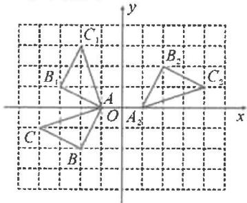

text_image

y
C₁
B₁
A
O
A₂
x
C
B

$$
(3) (0, - 1)
$$

3.(1)(2,2)

$$
(2) (0, - 1)
$$

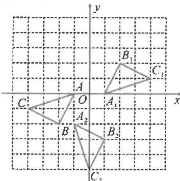

text_image

y
B₁
C₁
A
O
A₁
x
C
A₂
B
B₂
C₂

4.(3,-1)或(2,0)   
5. $(-2,2)$ 或 $(1,-1)$

# 实践操作

# 旋转作图(二) 网格作图

1.

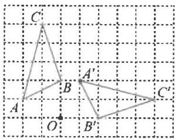

text_image

C
A'
B
A
O
B'
C'

2.

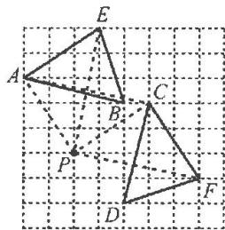

text_image

Geometric diagram showing two triangles ABC and DEF with labeled vertices and dashed lines indicating hidden edges.

3. 解: (1) 如图; (2) 如图;

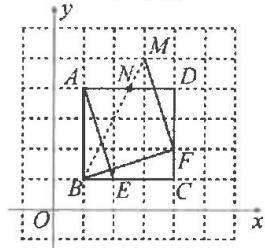

text_image

y
A
M
N
D
B
E
C
F
O
x

(3) $F(4,2)$ , $M(3,5)$ ，连接 BM 交 AD 于点 N，易得 $\angle NBF = 45^{\circ}$ .

4. (1)

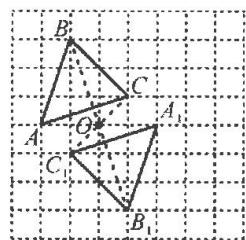

text_image

B'
C
O
A₁
C
B₁

图1

(2)

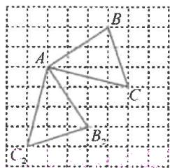

text_image

A
B
C
B
C₂

图2

(3)

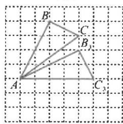

text_image

B'
C
B₁
A
C₃

图3

5. (1)

text_image

A
B
M
B'
A'

图1

(2)

text_image

O
A
B
C
A₁
B₁
C₁

图2

(3)

text_image

A
B
C

图3

# 实践操作

# 旋转作图(三) 非网格作图

1. (1)

  
图1

(2)

  
图2

2. (1)

  
图1

(2)

  
图2

3. (1)

  
图1

(2)

  
图2

4. (1)

  
图1

(2)

  
图

# 实践操作

# 旋转作图(四)

# 尺规作图——广东热点

1. 解: (1) 如图, $\triangle ADE$ 即为所求;

text_image

Geometric diagram with labeled points A, B, C, D, E and connecting lines forming triangles and a star-like shape

(2) $\because AD=AB,\angle B=60^{\circ},$

∴△ABD 是等边三角形，

$\therefore \angle BAD = 60^{\circ},$

由旋转可知，

$$
\angle C A E = \angle B A D = 6 0 ^ {\circ},
$$

$$
A C = A E,
$$

$\therefore \triangle ACE$ 为等边三角形，

$$
\therefore C E = A E.
$$

2. 解: (1) 如图所示, $\triangle CDE$ 即为所求;

text_image

Geometric diagram with labeled points A, B, C, D, E and a dashed line segment AC

(2) 连接 AD.

$\because CD \perp BC,$

$\therefore \angle DCB = 90^{\circ},$

$\because \angle DCA = 60^{\circ}, CD = CA,$

∴△ACD 是等边三角形，

$\angle ACB = 90^{\circ} - 60^{\circ} = 30^{\circ},$

$\therefore \angle CAD = 60^{\circ},$

$\because AC=AB,$

$\therefore \angle ACB = \angle B = 30^{\circ},$

$\therefore \angle CAB = 180^{\circ} - 30^{\circ} - 30^{\circ} = 120^{\circ},$

$\therefore \angle DAB = \angle DAC + \angle CAB$

$$
= 6 0 ^ {\circ} + 1 2 0 ^ {\circ} = 1 8 0 ^ {\circ},
$$

∴直线 BA 经过点 D.

3. 解: (1) 如图, $\triangle DEC$ 为所作;

text_image

Geometric diagram with labeled points A, B, C, D, E and connecting lines forming triangles and a quadrilateral

(2)∵将△ABC绕点C顺时针旋转α得到△DEC，

$\therefore \angle BCE = \alpha ,CE = CB$

$\therefore \angle BEC = \angle EBC,$

$$
\therefore \angle B E C = \frac {1}{2} (1 8 0 ^ {\circ} - \alpha),
$$

即 $\angle BEC = 90^{\circ} - \frac{1}{2}\alpha$

4. 解: (1) 补全图形如图所示;

(2) 连接 $BB'$ ,

延长 $BC'$ 交 $AB'$ 于点 D，

$\because AB=AB',\angle BAB'=60^{\circ},$

$\therefore \triangle BAB'$ 为等边三角形，

$\therefore BB' = BA,$

$\because C^{\prime}A = C^{\prime}B^{\prime},$

$\therefore\triangle BAC'\cong\triangle BB'C',$

$\therefore \angle ABC' = \angle B'BC' = 30^\circ,$

$\therefore BD$ 垂直平分 $AB'$ ,

又∵AB= $\sqrt{2}$ AC=2,

$$
\therefore A D = \frac {1}{2} A B = 1,
$$

$$
\because \angle B ^ {\prime} A C ^ {\prime} = 4 5 ^ {\circ}, \therefore C ^ {\prime} D = A D = 1,
$$

$$
\because B D = \sqrt {A B ^ {2} - A D ^ {2}}
$$

$$
= \sqrt {2 ^ {2} - 1 ^ {2}}
$$

$$
= \sqrt {3},
$$

$$
\therefore C ^ {\prime} B = B D - C ^ {\prime} D = \sqrt {3} - 1.
$$

# 图形研究

# 旋转构造(一) 旋转 $60^{\circ}$ ——构造双等边三角形

1. 解: (1) 如图所示;

text_image

Geometric diagram of a tetrahedron with labeled vertices A, B, C, D, E and connecting edges

(2) 连接 DE，则 BD = CE， $\triangle ADE$ 为等边三角形，

$\therefore AD=DE,\angle ADE=60^{\circ},$

又 $\angle ADC=30^{\circ}$ ,

$\therefore \angle CDE = 90^{\circ},$

$\therefore CD^{2}+DE^{2}=CE^{2},$

即 $BD^{2} = CD^{2} + AD^{2}$

2. 解: 将 $\triangle ABD$ 绕点 A 顺时针旋转 $60^{\circ}$ 得到 $\triangle AEC$ , 连接 BE,

$\therefore AB=AE,\angle BAE=60^{\circ},$

BD=CE,

∴△ABE 是等边三角形，

$\therefore \angle EBC = 60^{\circ} + 30^{\circ} = 90^{\circ},$

$\therefore EB \perp BC,$

$\therefore BD = CE = \sqrt{BE^2 + BC^2} = 10.$

3. 解: (1) 将 $\triangle PAB$ 绕点 B 顺时针旋转 $60^{\circ}$ 得到 $\triangle DCB$ ，连接 PD，

$\therefore \angle PBD = 60^{\circ}, PB = BD$

$\angle BDC = \angle APB = 150^{\circ}, CD = PA,$

∴△PBD 是等边三角形，

$\therefore \angle PDB = \angle BPD = 60^{\circ},$

$PD = PB$

$\therefore \angle PDC = \angle BDC - \angle BDP = 90^{\circ}.$

$\because \angle BPC = 90^{\circ}, \angle BPD = 60^{\circ},$

$\therefore \angle DPC = \angle 30^{\circ}$ ，在 Rt△PCD 中，

$$
\therefore C D = \frac {1}{2} P C, P D = \sqrt {3} C D,
$$

$$
\therefore P A: P B: P C = 1: \sqrt {3}: 2;
$$

(2) $\because PA=1$ ,由(1)得 $PB=\sqrt{3}$ ,

$PC = 2, \because \angle BPC = 90^{\circ},$

$$
\therefore B C = \sqrt {P B ^ {2} + P C ^ {2}}
$$

$$
= \sqrt {2 ^ {2} + (\sqrt {3}) ^ {2}}
$$

$$
= \sqrt {7},
$$

$$
\therefore S _ {\triangle A B C} = \frac {\sqrt {3}}{4} B C ^ {2} = \frac {\sqrt {3}}{4} \times 7 = \frac {7 \sqrt {3}}{4}.
$$

# 图形研究

# 旋转构造(二) 旋转 $90^{\circ}$

# ——构造双等腰直角三角形

1. 解: (1) 如图, $\triangle CBP'$ 即为所求;

text_image

A
P
B
C
P'

(2) 连接 $PP'$ . ∵ $\triangle PAB \cong \triangle P'CB$ , $\angle PBP' = 90^{\circ}$ ,

$$
\therefore B P = B P ^ {\prime}, \angle A P B = \angle C P ^ {\prime} B,
$$

$$
C P ^ {\prime} = A P = 2,
$$

$$
\therefore P P ^ {\prime} = \sqrt {2} P B = 4 \sqrt {2},
$$

$$
\angle B P ^ {\prime} P = 4 5 ^ {\circ}.
$$

$$
\because P ^ {\prime} P ^ {2} + P ^ {\prime} C ^ {2} = 3 2 + 4 = 3 6 = P C ^ {2},
$$

$$
\therefore \angle C P ^ {\prime} P = 9 0 ^ {\circ},
$$

$$
\therefore \angle C P ^ {\prime} B = \angle B P ^ {\prime} P + \angle C P ^ {\prime} P =
$$

$$
4 5 ^ {\circ} + 9 0 ^ {\circ} = 1 3 5 ^ {\circ},
$$

$$
\therefore \angle A P B = 1 3 5 ^ {\circ}.
$$

2. 解: 将 $\triangle ABD$ 绕点 A 顺时针旋转 $90^{\circ}$ 得到 $\triangle ACE$ ,

连接 DE, ∴∠EAD=90°,

AE=AD,

$$
\therefore \angle A D E = \angle A E D = 4 5 ^ {\circ}.
$$

$$
E D = \sqrt {2} A D = 4 \sqrt {2},
$$

$$
\because \angle A D C = 4 5 ^ {\circ}, \therefore \angle E D C = 9 0 ^ {\circ},
$$

$$
\therefore C E ^ {2} = D E ^ {2} + C D ^ {2}
$$

$$
= (4 \sqrt {2}) ^ {2} + 2 ^ {2} = 3 6,
$$

$$
\therefore C E = 6,
$$

$$
\because \triangle A B D \cong \triangle A C E,
$$

$$
\therefore B D = C E = 6.
$$

text_image

Geometric diagram showing a tetrahedron with labeled vertices A, B, C, D, E and dashed lines indicating hidden edges.

3. 解: 将 $\triangle ADC$ 绕点 D 顺时针旋转 $90^{\circ}$ 得到 $\triangle EDB$ , 设 BE 交 AC 于点 F, 连接 AE.

$$
\because \triangle A D C \cong \triangle E D B,
$$

$$
\therefore B E = A C = 2 1, \angle D B E = \angle D C A,
$$

$$
\therefore \angle B F C = \angle B D C = 9 0 ^ {\circ}.
$$

$$
\because A D = D E, \angle A D E = 9 0 ^ {\circ},
$$

$$
\therefore A E = \sqrt {2} A D = 1 3,
$$

设 BF = x，则 EF = 21 - x，

$$
\because A B ^ {2} - B F ^ {2} = A E ^ {2} - E F ^ {2} = A F ^ {2},
$$

$$
\therefore 2 0 ^ {2} - x ^ {2} = 1 3 ^ {2} - (2 1 - x) ^ {2},
$$

$$
\therefore x = 1 6 \text {, 即} B F = 1 6
$$

$$
\therefore A F = \sqrt {A B ^ {2} - B F ^ {2}}
$$

$$
= \sqrt {2 0 ^ {2} - 1 6 ^ {2}}
$$

$$
= 1 2,
$$

$$
\therefore C F = 9,
$$

$$
\therefore B C = \sqrt {B F ^ {2} + C F ^ {2}} = \sqrt {3 3 7}.
$$

# 综合与实践(六)

# 平行四边形的拼接

解:(1)∵AB//CD,∴∠GAE=∠D,
由题意得 E 为 AD 的中点，

$$
\therefore E A = E D.
$$

$$
\because \angle A E G = \angle D E K,
$$

$$
\therefore \triangle E D K \cong \triangle E A G,
$$

故答案为△EAG；

(2)由题意得 E, F, G, H 分别是 AB, BC, CD, DA 的中点，

操作为将四边形 EBFO 绕点 E 旋转 $180^{\circ}$ 得到四边形 EAQL，

将四边形 OHDG 绕点 H 旋转 $180^{\circ}$ 得到四边形 JHAP，

将四边形 OGCF 放在左上方，

则 $AQ = BF = CF, AP = DG = CG,$ $\angle BFO = \angle AQL.$

$$
\because \angle D A B + \angle B + \angle C + \angle D =
$$

$360^{\circ}$

$$
\angle Q A E = \angle B, \angle P A H = \angle D,
$$

$$
\angle D A B + \angle Q A E + \angle P A H +
$$

$$
\angle P A Q = 3 6 0 ^ {\circ}, \therefore \angle P A Q = \angle C.
$$

$$
\because \angle B F O + \angle C F O = 1 8 0 ^ {\circ},
$$

$$
\therefore \angle A Q L + \angle A Q K = 1 8 0 ^ {\circ},
$$

∴K,Q,L三点共线,同理K,P,J三点共线,由操作得 $\angle1=\angle L$ ,

$$
\angle 3 = \angle J, \because \angle 1 + \angle 2 = 1 8 0 ^ {\circ},
$$

$$
\angle 2 + \angle 3 = 1 8 0 ^ {\circ},
$$

$$
\therefore \angle 2 + \angle L = 1 8 0 ^ {\circ},
$$

$$
\angle 2 + \angle J = 1 8 0 ^ {\circ},
$$

$$
\therefore O J \parallel K L, O L \parallel K J,
$$

∴四边形 OJKL 为平行四边形；

(3)如图7,取AB,BC,CD,DA为中点为E,H,G,F,连接FH,过点E,G分别作 $EM\perp FH$ , $GN\perp FH$ ,垂足为M,N,将四边形EBHM绕点E旋转180°至四边形 $EAH'M'$ ,将四边形FDGN绕点F旋转180°至四边形 $FAG'N'$ ,将四边形NGCH放置左上方,使得点C与点A重合,CG与 $AG'$ 重合,CH与 $AH'$ 重合,点N的对应点为点 $N''$ ,则四边形 $MM'N''N'$ 即为所求矩形.

text_image

N'' H' M'
3 4
G' A E B
N' F M 1 H
D G C
N 2

图7

# 章末复习

1. D 2. C 3. $2\sqrt{6}$ 4. $40^{\circ}$

5. 解: (1) 如图所示;

text_image

A
A'
P
P'
B
B'

图1

(2)如图所示.

text_image

B'
A
C
A'
B

图2

6. 解: (1) 画图略, 点 P 为 DE 中垂线与 AB 中垂线的交点;

$$
(2) \alpha = 9 0 ^ {\circ}.
$$

7. D 8. A

9. $(-3,-2)$ 10.(7,3)

11. $M_{2}$ 12. $15^{\circ}$ 或 $60^{\circ}$

13. $\sqrt{10}$ 或 $\sqrt{26}$

14. 解: (1) 如图所示;

(2) 连接 EF, $\because AD = AF$ ,

$$
\angle D A E = \angle E A F = 4 5 ^ {\circ},
$$

$$
A E = A E,
$$

$$
\therefore \triangle A D E \cong \triangle A F E, \therefore D E = E F,
$$

$$
\therefore D E ^ {2} = E F ^ {2} = C E ^ {2} + C F ^ {2} = 3 ^ {2} +
$$

$$
4 ^ {2} = 2 5, \therefore D E = 5.
$$

# 第二十四章 圆

# 24.1 圆的有关性质

# 24.1.1 圆

# 易错点睛

×

# 基础题夯实

1. D 2. D

3. 以点 O 为圆心, 5 cm 长为半径的圆

4. ①③⑤ 5. $70^{\circ}$ 6. $70^{\circ}$ $140^{\circ}$

7.4 $2\sqrt{3}$

8. 证明: 连接 OA, OB,

$$
\text { 则 } \angle O A B = \angle O B A,
$$

$$
\therefore \angle O A C = \angle O B D.
$$

$$
\because O A = O B, A C = B D,
$$

$$
\therefore \triangle O A C \cong \triangle O B D (\text { SAS }),
$$

$$
\therefore O C = O D.
$$

# 中档题运用

9. $28^{\circ}$ 10. $30^{\circ}$ $\sqrt{3}$ 11. $\sqrt{2}$

12. 证明: 取 AC 的中点 O,

连接 OB, OD.

$$
\because \angle A B C = \angle A D C = 9 0 ^ {\circ},
$$

$$
\therefore O A = O B = O C = O D = \frac {1}{2} A C,
$$

∴A,B,C,D 四点在以点 O 为圆心，

OA 为半径的同一个圆上.

13. 解: 连接 OP, 则 OP = OB = OA.

$$
\because \angle A O B = 9 0 ^ {\circ},
$$

$$
\therefore \angle O A B = \angle O B A = 4 5 ^ {\circ}.
$$

$$
\because P C \perp O A,
$$

$$
\therefore \angle C D A = \angle C A D = 4 5 ^ {\circ},
$$

$$
\therefore C A = C D = 2.
$$

设 OP = OA = r，

则 $OC = r - 2$ 。在 Rt△POC 中，

$$
r ^ {2} = 5 ^ {2} + (r - 2) ^ {2},
$$

$\therefore r=\frac{29}{4}$ ，即 $\odot O$ 的半径为 $\frac{29}{4}$ .

# 综合题探究

14. 解: (1) $\because AC = BC, \angle C = 70^{\circ}$ ,

$$
\therefore \angle C A B = \angle C B A = 5 5 ^ {\circ}.
$$

$$
\because O A = O D,
$$

$$
\therefore \angle O D A = \angle O A D = 5 5 ^ {\circ},
$$

$$
\therefore \angle A O D = 7 0 ^ {\circ}.
$$

同理可得 $\angle BOE=70^{\circ}$ ,

$$
\therefore \angle D O E = 1 8 0 ^ {\circ} - 7 0 ^ {\circ} \times 2 = 4 0 ^ {\circ};
$$

$$
(2) \because \angle C = 6 0 ^ {\circ},
$$

$$
\therefore \angle A + \angle B = 1 2 0 ^ {\circ}.
$$

$$
\because O A = O D = O E = O B,
$$

$$
\therefore \angle A = \angle O D A, \angle B = \angle O E B,
$$

$$
\begin{array}{l} \therefore \angle A + \angle O D A + \angle B + \angle O E B = \\ 2 4 0 ^ {\circ}, \end{array}
$$

$$
\begin{array}{l} \therefore \angle A O D + \angle B O E = 1 8 0 ^ {\circ} \times 2 - \\ 2 4 0 ^ {\circ} = 1 2 0 ^ {\circ}, \end{array}
$$

$$
\therefore \angle D O E = 1 8 0 ^ {\circ} - 1 2 0 ^ {\circ} = 6 0 ^ {\circ}.
$$

# 24.1.2 垂直于弦的直径易错点睛

$2\sqrt{5}$ 或 $4\sqrt{5}$

# 基础题夯实

1. ①③④ 2. $4 \sqrt{2}$ 3. 2 4. 2

5. 解: (1) 过点 O 作 $OE \perp AB$ 于点 E,

$$
\therefore A E = B E, C E = D E,
$$

$$
\therefore A E - C E = B E - D E,
$$

$$
\therefore A C = B D;
$$

(2) 连接 OC, OA.

由(1)知 $OE \perp AB$ ，

$$
\therefore C E = \frac {1}{2} C D = 4,
$$

$$
\therefore O E = \sqrt {O C ^ {2} - C E ^ {2}} = 3.
$$

$$
\therefore A E = \sqrt {O A ^ {2} - O E ^ {2}} = 6,
$$

$$
\therefore A B = 2 A E = 1 2.
$$

6.16 7.28

# 中档题运用

8.4 9.25 10.5 11. $\sqrt{5}$

12. 解: (1) 连接 OB, OC.

可证 $\triangle AOB\cong \triangle AOC$ (SSS),

$$
\therefore \angle B A O = \angle C A O.
$$

∵AB=AC,∴AO⊥BC;

(2)延长 AO, 交 BC 于点 M.

由(1)知 $AM \perp BC$ .

$$
\because O B = 2 5,
$$

$$
B M = C M = \frac {1}{2} B C = 2 4,
$$

$$
\therefore O M = \sqrt {O B ^ {2} - B M ^ {2}} = 7,
$$

$$
\therefore A M = O A + O M = 3 2,
$$

$$
\therefore A B = \sqrt {A M ^ {2} + B M ^ {2}} = 4 0.
$$

# 综合题探究

13. 解: (1) ∵ OD // BC,

$$
\therefore \angle O D B = \angle C B D.
$$

$$
\because O B = O D,
$$

$$
\therefore \angle O D B = \angle O B D.
$$

$$
\therefore \angle O B D = \angle C B D,
$$

∴BD 平分∠ABC;

(2) 过点 O 作 $OH \perp BC$ 于点 H，

则 $BH = CH = \frac{1}{2} BC = \frac{3}{2}.$

$$
\because D E \perp A B, O H \perp B C,
$$

$$
\therefore \angle D E O = \angle O H B = 9 0 ^ {\circ}.
$$

$$
\because O D \parallel B C,
$$

$$
\therefore \angle D O E = \angle O B H,
$$

$$
\because O D = O B,
$$

$$
\therefore \triangle O D E \cong \triangle B O H (\text { A   A   S }),
$$

$$
\therefore O H = D E = 2.
$$

在 Rt△OBH 中，

$$
O B = \sqrt {B H ^ {2} + O H ^ {2}} = \frac {5}{2},
$$

即 $\odot O$ 的半径长为 $\frac{5}{2}$ .

# 基础夯实

# 垂径定理(一) 单弦

1.6 2.1.3

3. 解: 连接 OC, 交 AB 于点 D, 连接 OA, OB.

∵C为 $\widehat{AB}$ 的中点，

∴由圆的对称性可得 $OC \perp AB$ ，

$$
\therefore A D = \frac {1}{2} A B = 4.
$$

$$
\because O A = 5, \therefore O D = \sqrt {5 ^ {2} - 4 ^ {2}} = 3,
$$

$$
\therefore C D = 2, \therefore A C = \sqrt {4 ^ {2} + 2 ^ {2}} = 2 \sqrt {5}.
$$

4. 解: 连接 OA, OD.

∵D是AB的中点，

$$
\therefore O D \perp A B, A D = B D,
$$

$$
\because A C = 6, B C = D C,
$$

$$
\therefore C D = 2, \therefore A D = 4,
$$

$$
\therefore O D = \sqrt {O A ^ {2} - A D ^ {2}} = 3,
$$

$$
\therefore O C = \sqrt {O D ^ {2} + C D ^ {2}}
$$

$$
= \sqrt {3 ^ {2} + 2 ^ {2}}
$$

$$
= \sqrt {1 3}.
$$

5. 解: 过点 C 作 $CE \perp AD$ 于点 E,

则 $AE = DE = \frac{1}{2} AD.$

$$
\because \angle A C B = 9 0 ^ {\circ},
$$

$$
\therefore A B = \sqrt {6 ^ {2} + 8 ^ {2}} = 1 0.
$$

$$
\because S _ {\triangle A B C} = \frac {1}{2} A C \cdot B C
$$

$$
= \frac {1}{2} A B \cdot C E,
$$

$$
\therefore C E = \frac {6 \times 8}{1 0} = \frac {2 4}{5},
$$

$$
\therefore A E = \sqrt {6 ^ {2} - \left(\frac {2 4}{5}\right) ^ {2}} = \frac {1 8}{5},
$$

$$
\therefore A D = 2 A E = \frac {3 6}{5},
$$

$$
\therefore B D = A B - A D = \frac {1 4}{5}.
$$

# 回归教材 垂径定理(二) 双弦

1. 解: 过点 O 作 $OF \perp CD$ 于点 F.
设 CE = 3x, DE = 5x,

$$
\therefore O D = D E = 5 x, C D = 8 x.
$$

$$
\because O F \perp C D, \therefore D F = \frac {1}{2} C D = 4 x,
$$

∴EF=x.由勾股定理,得OF=3x.
在 Rt△OEF 中，

由勾股定理，得 $(3x)^{2} + x^{2} = 5^{2}$

$\therefore x = \frac{\sqrt{10}}{2}$ 或 $x = -\frac{\sqrt{10}}{2}$ （舍去），

$$
\therefore C D = 8 x = 4 \sqrt {1 0}.
$$

2. $4\sqrt{2}$

3. 解: 连接 OB, OC,

过点 O 分别作 $OF \perp AB$ 于点 F， $OG \perp CD$ 于点 G，易得矩形 OGEF，
BF=4, EF=2=OG.

设 $OF = EG = x$ ，则 $CG = 4 - x$

$$
\because C G ^ {2} + O G ^ {2} = O C ^ {2} = O B ^ {2} = O F ^ {2} +
$$

$$
B F ^ {2}, \therefore (4 - x) ^ {2} + 2 ^ {2} = x ^ {2} + 4 ^ {2},
$$

$$
\therefore x = \frac {1}{2}, \therefore O F = \frac {1}{2},
$$

$$
\therefore O B = \sqrt {O F ^ {2} + B F ^ {2}} = \frac {\sqrt {6 5}}{2}.
$$

4.10 或 $2\sqrt{165}$ 解: 当 AB 与 CD 在圆心 O 的同侧时,

如图 1 所示：

过点 O 作 $OF \perp CD$ 于点 F，

交 AB 于点 E，连接 OA, OC.

$$
\because A B \parallel C D, O F \perp C D, \therefore O E \perp A B,
$$

$$
\therefore A E = \frac {1}{2} A B = 1 2,
$$

在 Rt△AOE 中，

$$
O E = \sqrt {O A ^ {2} - A E ^ {2}} = 5,
$$

$$
\therefore O F = O E + E F = 1 2,
$$

在 Rt△OCF 中，

$$
C F = \sqrt {O C ^ {2} - O F ^ {2}} = 5,
$$

$$
\therefore C D = 2 C F = 2 \times 5 = 1 0;
$$

  
图1

  
图2

当 AB 与 CD 在圆心 O 的异侧时, 如图 2 所示: 过点 O 作 $OF \perp CD$ 于点 F, 延长 FO 交 AB 于点 E, 连接 OA,

OC.

$$
\because A B \parallel C D, O F \perp C D, \therefore O E \perp A B,
$$

$\therefore AE = \frac{1}{2} AB = 12$ ，在 Rt△AOE

$$
\text {   中   }, O E = \sqrt {O A ^ {2} - A E ^ {2}} = 5,
$$

$$
\therefore O F = E F - O E = 2,
$$

在 Rt△OCF 中，

$$
C F = \sqrt {O C ^ {2} - O F ^ {2}} = \sqrt {1 6 5},
$$

$$
\therefore C D = 2 C F = 2 \sqrt {1 6 5}.
$$

故 $CD$ 的长为10或 $2\sqrt{165}$

# 24.1.3 弧、弦、圆心角

# 易错点睛

【解答】错误. 反例如图所示.

  
基础题夯实

1. B 2. A 3. $60^{\circ}$ 4. $70^{\circ}$ 5. $55^{\circ}$

6. 证明: 法一:

$$
\because A B = C D, \therefore \widehat {A B} = \widehat {C D},
$$

$$
\therefore \widehat {A B} - \widehat {A C} = \widehat {C D} - \widehat {A C},
$$

即 $\widehat{BC} = \widehat{AD},\therefore AD = BC;$

法二: 连接 OA, OB, OC, OD,

$$
\because A B = C D, \therefore \angle A O B = \angle C O D,
$$

$$
\therefore \angle A O B - \angle A O C = \angle C O D - \angle A O C,
$$

即 $\angle AOD = \angle BOC, \therefore AD = BC.$

7. 证明: 连接 OC.

$$
\because A C \parallel O D, \therefore \angle C O D = \angle A C O,
$$

$$
\angle B O D = \angle A.
$$

$$
\because O A = O C, \therefore \angle A = \angle A C O,
$$

$$
\therefore \angle C O D = \angle B O D, \therefore \widehat {C D} = \widehat {D B}.
$$

# 中档题运用

8. 证明: 连接 OC. ∵ C 为 $\widehat{AB}$ 的中点,

$$
\therefore \widehat {A C} = \widehat {B C}, \therefore \angle A O C = \angle B O C.
$$

$$
\because C D \perp O A, C E \perp O B, \therefore C D = C E.
$$

$$
\because O C = O C,
$$

$$
\therefore \mathrm{Rt} \triangle O C D \cong \mathrm{Rt} \triangle O C E (\mathrm{HL}),
$$

$$
\therefore O D = O E.
$$

9. 证明: 连接 OC, OD.

∵M,N分别是AO,BO的中点，

$$
\therefore O M = \frac {1}{2} A O, O N = \frac {1}{2} B O.
$$

$$
\because A O = B O, \therefore O M = O N.
$$

$$
\because C M \perp A B, D N \perp A B,
$$

$$
\therefore \angle C M O = \angle D N O = 9 0 ^ {\circ}.
$$

在 Rt△COM 和 Rt△DON 中，

$$
\left| O C = O D, \right.
$$

$$
\left. O M = O N, \right.
$$

$$
\therefore \mathrm{Rt} \triangle C O M \cong \mathrm{Rt} \triangle D O N,
$$

$$
\therefore \angle C O M = \angle D O N,
$$

$$
\therefore \hat {A} \hat {C} = \hat {B} \hat {D}.
$$

10. 解: (1) ∵ D 是 $\widehat{BC}$ 的中点,

$$
\therefore \widehat {C D} = \widehat {B D}.
$$

∵DE⊥AB，且AB为⊙O的直径，

$$
\therefore \widehat {B E} = \widehat {B D},
$$

$$
\therefore \hat {B} \dot {C} = \hat {D} \dot {E}, \therefore B C = D E.
$$

$$
\because D E \perp A B, \therefore D E = 2 D F,
$$

$$
\therefore B C = D E = 2 D F;
$$

(2)连接 $OD$ ，交 $BC$ 于点 $H$

$$
\because \hat {C D} = \hat {B D}, \therefore D O \perp B C,
$$

$$
\therefore \angle B H O = 9 0 ^ {\circ}, B H = C H,
$$

$$
\because D E \perp A B, \therefore \angle D F O = 9 0 ^ {\circ},
$$

$$
\therefore \angle B H O = \angle D F O.
$$

$$
\because \angle D O F = \angle B O H,
$$

$$
O B = O D,
$$

$$
\therefore \triangle B O H \cong \triangle D O F,
$$

$$
\therefore O F = O H = \frac {1}{2} A C = 3,
$$

$$
\therefore O B = O F + F B = 5, \therefore O D = 5.
$$

在 Rt△ODF 中，

$$
D F = \sqrt {O D ^ {2} - O F ^ {2}} = 4,
$$

$$
\therefore B C = D E = 2 D F = 8.
$$

# 综合题探究

11. 解: (1) 过点 O 作 $OE \perp OA$ ,

交 $\odot O$ 于点E，

连接 BE，则△OBE 即为所求；

$$
\because \angle A O B + \angle C O D = 9 0 ^ {\circ}, \tag {2}
$$

$$
\therefore \angle A O E = 9 0 ^ {\circ}.
$$

$$
\because O A = O B = O E,
$$

$$
\therefore \angle O A B = \angle O B A,
$$

$$
\angle O B E = \angle O E B.
$$

$$
\because \angle O A B + \angle O B A + \angle O B E +
$$

$$
\angle O E B + \angle A O E = 3 6 0 ^ {\circ},
$$

$$
\begin{array}{l} \therefore \angle A B E = (3 6 0 ^ {\circ} - 9 0 ^ {\circ}) \div 2 = \\ 1 3 5 ^ {\circ}; \end{array}
$$

(3) 连接 AE, 过点 E 作 $EF \perp AB$ 交 AB 的延长线于点 F,

$$
\therefore \angle E B F = 4 5 ^ {\circ}.
$$

$$
\because B E = C D = \sqrt {2},
$$

$$
\therefore E F = B F = 1,
$$

$$
\therefore A F = A B + B F = 3,
$$

$$
\therefore A E = \sqrt {3 ^ {2} + 1 ^ {2}} = \sqrt {1 0}.
$$

$$
\because O A = O E, \angle A O E = 9 0 ^ {\circ},
$$

$$
\therefore O A = \frac {\sqrt {2}}{2} A E = \frac {\sqrt {2}}{2} \times \sqrt {1 0} = \sqrt {5}.
$$

# 24.1.4 圆周角

# 第1课时 圆周角

# 易错点睛

$150^{\circ}$ 或 $30^{\circ}$

  
图1

  
图2

# 基础题夯实

1. $90^{\circ}$ 2. $110^{\circ}$ 3. $65^{\circ}$ 4. $55^{\circ}$

5.20° 6.4√3

7. 解: 连接 AD, AB.

$\because \hat{A}\hat{B} = \hat{A}\hat{D}, BD$ 为直径，

$$
\therefore A B = A D, \angle B A D = 9 0 ^ {\circ}.
$$

$$
\therefore \angle A D B = 4 5 ^ {\circ}.
$$

$$
\because \angle C O D = 1 2 6 ^ {\circ},
$$

$$
\therefore \angle C A D = \frac {1}{2} \angle C O D = 6 3 ^ {\circ}.
$$

$$
\begin{array}{l} \therefore \angle A G B = \angle A D B + \angle C A D = 4 5 ^ {\circ} + \\ 6 3 ^ {\circ} = 1 0 8 ^ {\circ}. \end{array}
$$

# 中档题运用

8.2 9. $\sqrt{5}$ 10.2 11.8

12. 证明: 方法一: 作直径 AE, 连接 BE,

则 $\angle ABE = \angle ADC = 90^{\circ},\angle C = \angle E,$

$\therefore \angle BAO = \angle CAD.$

方法二:作直径 AE, 连接 CE, 则 $\angle ECA = 90^{\circ}, \angle BAO = \angle BCE$ ,

证 $\angle BCE = \angle CAD$

$\therefore \angle BAO = \angle CAD.$

方法三:作 $OH \perp AB$ 于点 H, 连接 BO, 证 $\angle C = \frac{1}{2} \angle AOB = \angle AOH$ 即可.

13. 解: (1) $90^{\circ}$ ; (2) (3) 如图所示.

text_image

Geometric diagram showing a circle with points A, B, C, M, O and labeled segments on a grid background

综合题探究

14. 解: (1) 延长 DE, 交 $\odot O$ 于点 M,
则 $\widehat{AM} = \widehat{AD} = \widehat{CD}$ ,

$\therefore \hat{DM} = \hat{AC}, \therefore AC = DM = 2DE;$

(2) 连接 AD. $\because \widehat{AM} = \widehat{CD}$ ,

$\therefore \angle ADF = \angle DAF, \therefore AF = DF;$

(3) 连接 BD, 交 AC 于点 G,

$\because \angle DAF = \angle ADF,$

$\angle ADB = 90^{\circ}$

$\therefore \angle DAF + \angle DGA = \angle ADF +$

$\angle FDG = 90^{\circ}$

$\therefore \angle FDG = \angle FGD,$

$\therefore FD=FG,\therefore AF=FG.$

$$
\because O A = O B, \therefore O F \underline {{\underline {{\parallel}}}} \frac {1}{2} B G,
$$

$$
\therefore \angle O F H = \angle B G H = \angle H,
$$

$$
\therefore B G = B H, \therefore \frac {O F}{B H} = \frac {O F}{B G} = \frac {1}{2}.
$$

第2课时 圆内接四边形

易错点睛

$30^{\circ}$ 或 $150^{\circ}$

  
基础题夯实

1. $130^{\circ}$ 2. $64^{\circ}$ 3. $110^{\circ}$

4. $25^{\circ}$ 5. $60^{\circ}$ 6. $105^{\circ}$

7.120° 8.100°

9. 证明: $\because \angle DAC$ 与 $\angle DBC$ 是同弧所对的圆周角, $\therefore \angle DAC = \angle DBC$ .

∵AD平分∠CAE.

$\therefore \angle EAD = \angle DAC,$

$\therefore \angle EAD = \angle DBC.$

∵四边形 ABCD 内接于 $\odot O$ ，

$\therefore \angle DAB + \angle DCB = 180^{\circ}.$

$\because \angle DAB + \angle DAE = 180^{\circ},$

$\therefore \angle EAD = \angle BCD,$

$\therefore \angle DBC = \angle DCB, \therefore DB = DC.$

中档题运用

10. B

11. 解: 作直径 BE, 连接 CE, 则 $\angle BCE = 90^{\circ}$ ,

$\angle E = 180^{\circ} - \angle A = 60^{\circ},$

$\therefore\angle CBE=30^{\circ},$

$$
\therefore C E = \frac {1}{2} B E = \sqrt {2},
$$

$$
\therefore B C = \sqrt {3} C E = \sqrt {6}.
$$

12. 解: (1) AD - BD = CD;

(2)AD-BD=CD.

理由:延长 BD 至点 E,

使 DE=CD，连接 CE.

∵△ABC为等边三角形，

$\therefore \angle BAC = \angle ACB = \angle ABC = 60^{\circ}.$

∵四边形 ABDC 为圆的内接四边形，

$\therefore \angle CDE = \angle BAC = 60^{\circ}.$

$\because DE=CD,$

$\therefore \triangle CDE$ 为等边三角形，

$\therefore CE = CD, \angle DCE = \angle E = 60^{\circ},$

$\therefore \angle ACD = \angle ACB + \angle BCD$

$$
= 6 0 ^ {\circ} + \angle B C D.
$$

$\because \angle BCE = \angle BCD + \angle DCE$

$$
= 6 0 ^ {\circ} + \angle B C D,
$$

$\therefore \angle ACD = \angle BCE.$

$\because \angle CAD = \angle CBD,$

$\therefore \triangle ACD \cong \triangle BCE(ASA)$ ,

$\therefore AD=BE.$

$\because BE=BD+DE=BD+CD,$

$\therefore AD=BD+CD,$

$\therefore AD-BD=CD.$

综合题探究

13. 解: (1) 连接 BC.

∵AB为直径

C 为半圆的中点，

$\therefore CB=CA,\angle ACB=90^{\circ},$

$\therefore \angle CAB = \angle CBA = 45^{\circ}.$

$\because \angle CPB + \angle CAB = 180^{\circ},$

$\therefore \angle CPB = 135^{\circ};$

(2)由(1)知 CA=CB， $\angle ACB=90^{\circ}$

∵AB=5 $\sqrt{2}$ , ∴BC=AC=5.

过点 C 作 $CQ \perp BP$ ，

交 $BP$ 的延长线于点 $Q$ ,

则 $\angle CPQ = \angle PCQ = 45^{\circ}$

∴PQ=CQ.设PQ=CQ=x，

则 $BQ = x + 1$ ，在 $\mathrm{Rt}\triangle BCQ$ 中，

$BQ^{2} + CQ^{2} = BC^{2}$

$\therefore (x + 1)^{2} + x^{2} = 5^{2}$

解得 $x = 3$ （负值已舍去），

$\therefore PQ = 3, \therefore PC = \sqrt{2} PQ = 3\sqrt{2}$ .

方法技巧 圆中导角技巧

1. B 2. B 3. B 4. C 5. $90^{\circ}$ 6. C

方法技巧 遇(作)直径构直角

1. 解: (1) 连接 DC,

则 $\angle BDC = \angle BAC = 45^{\circ}.$

∵BD⊥BC，

$\therefore \angle BCD = 90^{\circ} - \angle BDC = 45^{\circ},$

$\therefore \angle BCD = \angle BDC,$

$\therefore BD=BC;$

(2) $\because\angle DBC=90^{\circ},$

∴CD为⊙O的直径，

$\therefore CD=2r=6,$

$$
\therefore B C = \frac {\sqrt {2}}{2} C D = 6 \times \frac {\sqrt {2}}{2} = 3 \sqrt {2},
$$

$$
\therefore E C = \sqrt {B E ^ {2} + B C ^ {2}}
$$

$$
= \sqrt {6 ^ {2} + (3 \sqrt {2}) ^ {2}}
$$

$$
= 3 \sqrt {6}.
$$

2. 解: 连接 BD, BC.

$\because \angle BAC = 60^{\circ}, \angle DAC = 30^{\circ},$

$\therefore \angle BAD = 90^{\circ},$

∴BD 是⊙O 的直径，

$\therefore \angle BCD = 90^{\circ}.$

$\because AB=4,AD=6,$

$\therefore BD = \sqrt{AB^2 + AD^2} = 2\sqrt{13},$

$$
\because \angle D B C = \angle C A D = 3 0 ^ {\circ},
$$

$$
\therefore C D = \frac {1}{2} B D = \sqrt {1 3}.
$$

3. 解: (1) 连接 AD. $\because \widehat{DE} = \widehat{CD}$ ,

$\therefore \angle BAD = \angle CAD,$

∵AC为⊙O的直径，

$\therefore AD \perp BC, \therefore AB = AC;$

(2) 连接 CE.

∵AC为⊙O的直径，∴CE⊥AB，

∵⊙O的半径为5,BD=6,

$\therefore AB = AC = 10, CD = BD = 6,$

设 $AE = x$ ，则 $BE = 10 - x$

$\because CE^{2} = AC^{2} - AE^{2} = BC^{2} - BE^{2},$

$\therefore 10^{2} - x^{2} = 12^{2} - (10 - x)^{2}$

解得 $x=\frac{14}{5}$ . ∴AE 的长为 $\frac{14}{5}$ .

4. 解: 作直径 CD, 连接 BD.

$\because \angle D + \angle BAC = 180^{\circ},$

$\angle BAC = 135^{\circ}$

$\therefore \angle D = 45^{\circ}.$

∵CD为⊙O的直径，

$\therefore \angle DBC = 90^{\circ},$

$\therefore \angle BCD = \angle D = 45^{\circ},$

$\therefore CD=\sqrt{2}BC=8,$

∴⊙O的半径为4.

回归教材

巧构圆内接四边形

1. $65^{\circ}$

2. 证明: 连接 BD.

$\because \angle EFC + \angle BFC = 180^{\circ},$

$\angle BDC + \angle BFC = 180^{\circ},$

$\therefore \angle EFC = \angle BDC.$

$\because CD \perp AB, \therefore \widehat{BC} = \widehat{BD},$

$\therefore \angle BFD = \angle BDC,$

$\therefore \angle EFC = \angle BFD.$

3. 解: (1) 连接 AC, OB, OC.

$\because \widehat{AB} = \widehat{AC}, \therefore AB = AC.$

$\because AO=AO,OB=OC,$

$\therefore \triangle AOB \cong \triangle AOC,$

$\therefore \angle BAO = \angle CAO,$

$\therefore \angle BDC = \angle BAC = 2\angle BAO;$

(2) 连接 BC.

$\because \angle ADE + \angle ADB = 180^{\circ},$

$\angle ACB + \angle ADB = 180^{\circ},$

$\therefore \angle ADE = \angle ACB.$

$\because AB=AC,\angle BAO=\angle CAO,$

$\therefore AO \perp BC,$

$\therefore \angle ADE = \angle ACB = \angle ABC$

$= 90^{\circ} - \angle BAO,$

$\therefore \angle ADE + \angle BAO = 90^{\circ}.$

4. $60^{\circ}$ 或 $120^{\circ}$ 5. $40^{\circ}$ 或 $140^{\circ}$

6. 解: 连接 DO 并延长, 交 $\odot O$ 于点 F, 连接 EF.

∵DF是直径，

$\therefore \angle DEF = 90^{\circ} = \angle C,$

在 Rt△ABC 中，

$\angle C = 90^{\circ}, BC = 6, AC = 8,$

$\therefore AB = \sqrt{AC^2 + BC^2} = 10 = DF,$

∵四边形 BDFE 是圆内接四边形，

$\therefore \angle F + \angle DBE = 180^{\circ}.$

又∵∠ABC+∠DBE=180°,

$\therefore \angle ABC = \angle F$

又∵∠C=∠DEF,AB=DF,

$\therefore \triangle ABC \cong \triangle DFE,$

$\therefore DE=AC=8.$

# 回归教材 圆与勾股定理 ——巧列方程

1. 解: (1) ∵∠ACB = $\frac{1}{2}$ ∠AOB,

$$
\angle B A C = \frac {1}{2} \angle B O C,
$$

$$
\angle A C B = 2 \angle B A C,
$$

$$
\therefore \angle A O B = 2 \angle B O C;
$$

(2) 过点 O 作半径 $OD \perp AB$ 于点 E，
交 $\odot O$ 于点D，连接BD，

$$
\therefore A E = B E.
$$

$$
\because \angle A O B = 2 \angle B O C,
$$

$$
\angle D O B = \frac {1}{2} \angle A O B,
$$

$$
\therefore \angle D O B = \angle B O C.
$$

$$
\therefore B D = B C.
$$

$$
\because A B = 4, B C = \sqrt {5},
$$

$$
\therefore B E = 2, D B = \sqrt {5}.
$$

在 Rt△BDE 中，∠DEB=90°，

$$
\therefore D E = \sqrt {B D ^ {2} - B E ^ {2}} = 1.
$$

在 Rt△BOE 中，∠OEB=90°，

$OB^{2}=(OB-1)^{2}+2^{2}$ ，解得 OB= $\frac{5}{2}$ ，即 $\odot O$ 的半径是 $\frac{5}{2}$ .

2. 解: (1) ∵ D 为 $\widehat{BC}$ 的中点,

$$
\therefore \widehat {C D} = \widehat {B D}, \therefore \angle C A D = \angle B A D.
$$

$$
\because C E \perp A D, \therefore \angle C A D + \angle A C E =
$$

$$
\angle B A D + \angle A E C = 9 0 ^ {\circ},
$$

$$
\therefore \angle A C E = \angle A E C, \therefore A C = A E;
$$

(2) 连接 OD, 交 BC 于点 F, 连接 BD.

∵AB为⊙O的直径，

$$
\therefore \angle A D B = 9 0 ^ {\circ}
$$

$$
\because A B = 5, A D = 4,
$$

$$
\therefore B D = \sqrt {A B ^ {2} - A D ^ {2}} = \sqrt {5 ^ {2} - 4 ^ {2}} = 3.
$$

$$
\because \widehat {C D} = \widehat {B D},
$$

∴OD 垂直平分 BC, ∴CF=BF.

$$
\because O A = O B = \frac {1}{2} A B = 2. 5,
$$

$$
\therefore A E = A C = 2 O F.
$$

设 $OF = x$ ，则 $AC = AE = 2x$

在 Rt△BOF 中， $BF^{2}=2.5^{2}-x^{2}$

在 Rt△BDF 中，

$$
B F ^ {2} = 3 ^ {2} - (2. 5 - x) ^ {2},
$$

$$
\therefore 2. 5 ^ {2} - x ^ {2} = 3 ^ {2} - (2. 5 - x) ^ {2}, \text {解得}
$$

$$
x = 0. 7, \therefore A E = 1. 4.
$$

3. 解: (1) ∵ AB 是 ⊙O 的直径,

$$
\therefore \angle A C B = 9 0 ^ {\circ},
$$

$$
\therefore \angle A = 9 0 ^ {\circ} - \angle A B C.
$$

$$
\because C E \perp A B, \therefore \angle C E B = 9 0 ^ {\circ},
$$

$$
\therefore \angle E C B = 9 0 ^ {\circ} - \angle A B C,
$$

$$
\therefore \angle E C B = \angle A.
$$

又∵CD=CB，∴ $\widehat{CD}=\widehat{CB}$ ，

$$
\therefore \angle D B C = \angle A,
$$

$$
\therefore \angle E C B = \angle D B C, \therefore C F = B F;
$$

(2) 连接 OC, 交 BD 于点 G.

$$
\because B C = C D,
$$

$$
\therefore O C \perp B D, B D = 2 B G.
$$

$$
\because \angle A C B = 9 0 ^ {\circ},
$$

$$
B C = C D = 4 \sqrt {5}, A C = 8 \sqrt {5},
$$

$$
\therefore A B = \sqrt {A C ^ {2} + B C ^ {2}} = 2 0,
$$

∴⊙O的半径为10.

设 $OG = x$ ，则 $CG = 10 - x$

由勾股定理,得

$$
B G ^ {2} = O B ^ {2} - O G ^ {2} = B C ^ {2} - C G ^ {2},
$$

即 $10^{2} - x^{2} = (4\sqrt{5})^{2} - (10 - x)^{2}$

解得 $x = 6$

$$
\therefore B G = \sqrt {1 0 ^ {2} - 6 ^ {2}} = 8, \therefore B D = 1 6.
$$

# 方法技巧 弧中点的用法

1. 证明:(1)连接 AC, DC.

∵C是优弧ABD的中点，

$$
\therefore \widehat {A C} = \widehat {D C},
$$

$$
\therefore \angle C A D = \angle C D A = \angle C B A.
$$

$$
\begin{array}{l} \because \angle C A D + \angle C B D = \angle C B D + \\ \angle C B E = 1 8 0 ^ {\circ}, \end{array}
$$

$$
\therefore \angle C A D = \angle C B E = \angle C B A,
$$

$$
\therefore B C \text {   平分   } \angle A B E;
$$

(2) 过点 C 作 $CF \perp AB$ 于点 F.

$$
\because \hat {A} \hat {C} = \hat {D} \hat {C}, \therefore A C = D C.
$$

$$
\because C E \perp B D, C F \perp A B,
$$

$$
\therefore \angle A F C = \angle E = 9 0 ^ {\circ}.
$$

$$
\text {又} \because \angle C A B = \angle C D B,
$$

$$
\therefore \triangle A C F \cong \triangle D C E, \therefore A F = D E,
$$

由(1)得 $\triangle CBE\cong\triangle CBF$ ，

$$
\therefore B F = B E,
$$

$$
\therefore A B - D E = A B - A F = B F = B E.
$$

2. 解: (1) 过点 C 作 $CF \perp PB$ ,

垂足为 F，连接 CA, CB, CP，

$$
\therefore \triangle P C E \cong \triangle P C F,
$$

$$
\triangle C A E \cong \triangle C B F,
$$

$$
\therefore A E = B F, P E = P F,
$$

$$
\therefore A E = B F = P F - P B = P E - P B;
$$

(2) 连接 AB. $\because CD \perp PA, PB \parallel CD,$

$$
\therefore \angle A P B = 9 0 ^ {\circ},
$$

∴AB 是⊙O 的直径.

由(1)得 AE=PE-BP=2，

$$
\therefore A P = \tau ,
$$

$$
\therefore A B = \sqrt {7 ^ {2} + 3 ^ {2}} = \sqrt {5 8},
$$

∴⊙O的半径为 $\frac{\sqrt{58}}{2}$ .

3. 解: (1) 连接 DO 并延长交 AB 于点 H, 连接 OA, DA. ∵∠A = 90°,

∴BC为⊙O的直径，

$$
\therefore O B = O A,
$$

∵D为ACB的中点，

$$
\therefore D A = D B, \therefore D H \perp A B,
$$

$$
\therefore \angle D H B = \angle A = 9 0 ^ {\circ},
$$

$$
\therefore A C \parallel D H,
$$

$$
\therefore \angle C = \angle C O D = 2 \angle C B D;
$$

(2) 设 OB = OD = OC = r，

$$
\because D H \perp A B, D E \perp B C,
$$

$$
\therefore \angle D E O = \angle O H B = 9 0 ^ {\circ},
$$

$$
B H = \frac {1}{2} A B = 4,
$$

$$
\text { 又 } \because \angle D O E = \angle B O H,
$$

$$
\therefore \triangle O D E \cong \triangle O B H (\text { A   A   S }),
$$

$$
\therefore D E = B H = 4,
$$

$$
\because C E = 2, \therefore O E = r - 2,
$$

$$
\because O E ^ {2} + D E ^ {2} = O D ^ {2},
$$

$$
\therefore (r - 2) ^ {2} + 4 ^ {2} = r ^ {2},
$$

解得 r=5，即 $\odot O$ 的半径为 5.

# 回归教材

# 等腰图(一) 圆心在“三线上”

1. 解: (1) 连接 OB, OC.

$$
\because O A = O A, O B = O C, A B = A C,
$$

$$
\therefore \triangle O A B \cong \triangle O A C,
$$

$$
\therefore \angle O A B = \angle O A C,
$$

$$
\therefore A O \text {   平分   } \angle B A C;
$$

(2)延长AO,交BC于点F.

$$
\because A B = A C, A O \text {   平分   } \angle B A C,
$$

$$
\therefore A F \perp B C, B F = F C = 1,
$$

$$
\therefore \text { 在 } \mathrm{Rt} \triangle A B F \text { 中 },
$$

$$
A F = \sqrt {A B ^ {2} - B F ^ {2}} = 3.
$$

设 $OA = OB = r$ ，则 $OF = 3 - r$

$$
\therefore \text { 在 } \mathrm{Rt} \triangle B O F \text { 中 },
$$

$$
r ^ {2} = 1 ^ {2} + (3 - r) ^ {2},
$$

$$
\therefore r = \frac {5}{3} \text { ,   即 } O A \text { 的   长   为 } \frac {5}{3}.
$$

2. 证明: (1) 连接 BD, OC,

$$
\because \widehat {B D} = \widehat {C D}, \therefore B D = C D.
$$

$$
\because O B = O C, O D = O D,
$$

$$
\therefore \triangle B O D \cong \triangle C O D,
$$

$$
\therefore \angle B D O = \angle C D O,
$$

$$
\therefore O D \perp B C;
$$

(2) 连接 AC. ∵ AB 是直径，

$$
\therefore \angle B C A = 9 0 ^ {\circ},
$$

$$
\therefore \angle T + \angle T A C = \angle B A C +
$$

$$
\angle T A C = 9 0 ^ {\circ};
$$

$$
\therefore \angle T = \angle B A C = \angle B D C.
$$

$$
\because \angle B D O = \angle C D O,
$$

$$
\therefore \angle T = 2 \angle C D O.
$$

3. 解: (1) 连接 OE, OA, OB, OC.

$$
\because A E \parallel B C, \therefore \angle E A C = \angle A C B,
$$

$$
\therefore \angle E O C = 2 \angle E A C = 2 \angle A C B =
$$

$$
\angle A O B,
$$

$$
\therefore \widehat {C E} = \widehat {A B}, \therefore \widehat {A C} = \widehat {B E},
$$

$$
\therefore A C = B E;
$$

(2)延长 CO, 交 AB 于点 F.

$$
\because A C = B C, O A = O B,
$$

∴CO 垂直平分 AB，

$$
\therefore A F = F B = \frac {1}{2} A B = 2.
$$

由(1)知,AC=BE=6,

$$
\therefore C F = \sqrt {A C ^ {2} - A F ^ {2}} = 4 \sqrt {2}.
$$

设 $OA = OC = r$ ，则 $OF = 4\sqrt{2} -r$

∴在 Rt△AOF 中，

$$
r ^ {2} = (4 \sqrt {2} - r) ^ {2} + 2 ^ {2},
$$

$\therefore r=\frac{9\sqrt{2}}{4}$ ，即 $\odot O$ 的半径为 $\frac{9}{4}\sqrt{2}$ .

# 图形研究

# 等腰图(二) 圆心在腰上

1. 解: (1) $\because ED = EC$ ,

$$
\therefore \angle E D C = \angle C.
$$

$$
\because \angle E D C + \angle A D E = 1 8 0 ^ {\circ},
$$

$$
\angle A B E + \angle A D E = 1 8 0 ^ {\circ},
$$

$$
\therefore \angle E D C = \angle A B E,
$$

$$
\therefore \angle A B E = \angle C, \therefore A B = A C;
$$

(2) 连接 AE, BD. $\because \frac{AD}{DC} = \frac{3}{2}$ ,

∴设 AD=3a，

则 DC=2a, AB=AC=5a,

∵AB为⊙O的直径，

$$
\therefore \angle A E B = \angle A D B = \angle B D C = 9 0 ^ {\circ}.
$$

在 Rt△ABD 中，

$$
B D = \sqrt {A B ^ {2} - A D ^ {2}} = 4 a.
$$

在 Rt△CBD 中，

$$
B C = \sqrt {B D ^ {2} + C D ^ {2}} = 2 \sqrt {5} a.
$$

$$
\text { 又 } \because A B = A C,
$$

$$
\therefore B E = C E = \frac {1}{2} B C = \sqrt {5} a,
$$

$$
\therefore E D = E C = \sqrt {5} a, \therefore \frac {A B}{E D} = \sqrt {5}.
$$

2. 解: (1) 连接 AD.

∵AB为⊙O的直径，

$$
\therefore \angle A D B = 9 0 ^ {\circ}.
$$

$$
\because A B = A C, \therefore B D = D C;
$$

(2) 连接 BE，则 $\angle AEB = 90^{\circ}$ ,

$$
\because B D = C D, \therefore B C = 2 E D = 8.
$$

设 $AE = x$ ，则 $CE = x + 5$

在 Rt△ABE 和 Rt△CBE 中，

$$
\because A B ^ {2} - A E ^ {2} = B E ^ {2} = B C ^ {2} - C E ^ {2},
$$

$$
\therefore 5 ^ {2} - x ^ {2} = 8 ^ {2} - (x + 5) ^ {2}, \therefore x = \frac {7}{5},
$$

即 $AE$ 的长为 $\frac{7}{5}$ .

3. 解: (1) 连接 BD. ∵ AB 为 ⊙O 的直径, ∴ ∠ADB = 90°.

$$
\because B A = B C, \therefore A D = C D;
$$

(2) 连接 AE，则 $\angle AEB = 90^{\circ}$ .

设 CE = x, BE = 4x,

则 BC=5x=AB，

在 Rt△AEB 中，

$$
A E = \sqrt {A B ^ {2} - B E ^ {2}} = 3 x,
$$

在 Rt△ACE 中，

$$
(3 x) ^ {2} + x ^ {2} = (2 \sqrt {1 0}) ^ {2},
$$

$$
\therefore x = 2, \therefore B C = 1 0, A E = 6,
$$

$$
\therefore S _ {\triangle A B C} = \frac {1}{2} B C \cdot A E = 3 0.
$$

# 回归教材 角分图

【教材变式 1】解: 连接 BD, CD, 将 $\triangle ADC$ 绕点 D 逆时针旋转 $90^{\circ}$ 得到 $\triangle A^{\prime}DB$ .

∵BC 是⊙O 的直径，

$$
\therefore \angle B A C = \angle B D C = 9 0 ^ {\circ},
$$

$$
\because A D \text {   平分   } \angle B A C, \therefore \angle B A D =
$$

$$
\angle C A D = \angle B C D = \angle C B D,
$$

$\therefore BD=CD.$ 在四边形 ABDC 中，

$$
\because \angle A C D + \angle A B D = 1 8 0 ^ {\circ},
$$

$$
\therefore \angle A ^ {\prime} B D + \angle A B D = 1 8 0 ^ {\circ},
$$

$\therefore A, B, A'$ 三点共线，

$$
\therefore A B + A C = A B + A ^ {\prime} B = A A ^ {\prime}.
$$

∵由旋转可知 $\angle A^{\prime}DB=\angle ADC$ ,

$$
A ^ {\prime} D = A D,
$$

$$
\therefore \angle A ^ {\prime} D A = \angle A ^ {\prime} D B + \angle B D A =
$$

$$
\angle A D C + \angle B D A = \angle B D C = 9 0 ^ {\circ},
$$

∴在等腰直角三角形 $A^{\prime}DA$ 中，

$$
A A ^ {\prime} = \sqrt {2} A D,
$$

$$
\therefore \frac {A B + A C}{A D} = \frac {A A ^ {\prime}}{A D} = \sqrt {2}.
$$

【教材变式 2】解: 方法一: 过点 A 作 $AE \perp CD$ 于点 E,

则 $AE = CE = \frac{\sqrt{2}}{2} AC = 3\sqrt{2}$

连接 AD, BD,

则 $AD=\frac{\sqrt{2}}{2}AB=5\sqrt{2}$ ,

$$
\therefore D E = \sqrt {A D ^ {2} - A E ^ {2}} = 4 \sqrt {2},
$$

$$
\therefore C D = 7 \sqrt {2};
$$

方法二(补短法):延长 CB 至点 M,
使 BM = AC = 6,

连接 DM, 证 $\triangle DMB \cong \triangle DCA$ ,

$$
\angle C D M = 9 0 ^ {\circ}, D M = D C, B C = 8,
$$

$$
\therefore C A + C B = C M = \sqrt {2} C D = 1 4,
$$

$$
\therefore C D = 7 \sqrt {2};
$$

方法三(作垂线):

过点 D 作 $DG \perp AC$ 于点 G，

作 $DF \perp BC$ 于点 $F$ ,

证 $\triangle DAG\cong\triangle DBF,\therefore AG=BF,$

四边形 CGDF 为正方形，

$$
\therefore C G = C F,
$$

$$
\therefore 6 + A G = 8 - B F, A G = 1,
$$

$$
\therefore C G = 7, C D = \sqrt {2} C G = 7 \sqrt {2}.
$$

# 【教材变式 3】

证明:(1)∵△ABC是等边三角形,

$$
\therefore \angle A B C = \angle B A C = \angle A C B = 6 0 ^ {\circ}.
$$

$$
\because \angle A D C = \angle A B C = 6 0 ^ {\circ},
$$

$$
\angle B D C = \angle B A C = 6 0 ^ {\circ},
$$

$$
\therefore \angle A D C = \angle B D C,
$$

∴DC 是 $\angle ADB$ 的平分线；

(2) 将 $\triangle ADC$ 绕点 C 逆时针旋转 $60^{\circ}$ ，得到 $\triangle BHC$ ，

$$
\therefore C D = C H, \angle D A C = \angle H B C.
$$

$$
\because \angle D A C + \angle D B C = 1 8 0 ^ {\circ},
$$

$$
\therefore \angle D B C + \angle H B C = 1 8 0 ^ {\circ},
$$

∴D,B,H三点共线.

$$
\because D C = C H, \angle C D H = 6 0 ^ {\circ},
$$

∴△DCH 是等边三角形，

$$
\therefore S _ {\text {四边形} A D B C} = S _ {\triangle A D C} + S _ {\triangle B D C} =
$$

$$
S _ {\triangle B H C} + S _ {\triangle B D C} = S _ {\triangle C D H} = \frac {\sqrt {3}}{4} C D ^ {2}.
$$

# 24.2 点和圆、

# 直线和圆的位置关系

# 24.2.1 点和圆的位置关系

# 易错点睛

$45^{\circ}$ 或 $135^{\circ}$

# 基础题夯实

1. B 2. A

3.(1)外 内 上 (2)①2.5 ②2.4

4. D 5. C 6. D 7. A 8. $\frac{13}{2}$

# 中档题运用

9.3<r<5 10.C 11.55°或125°

12. (1)(2,-1) $2\sqrt{5}$

(2) 点 M 在 $\odot P$ 内

13. 解: (1) 如图所示, 点 O 为 $\triangle ABC$ 的外接圆圆心;

text_image

Geometric diagram showing triangle ABC with auxiliary points H and O, including dashed lines and grid lines

(2) 在 Rt△OBH 中, $OH = \frac{1}{2}$ ,

$BH=\frac{5}{2}$ ，由勾股定理，得 OB= $\frac{\sqrt{26}}{2}$ ，即 $\triangle ABC$ 的外接圆的半径为 $\frac{\sqrt{26}}{2}$ .

# 综合题探究

14. 解: ① 当点 O 在 $\triangle ABC$ 内部时, 如图 1, 连接 AO 并延长, 交 BC 于点 E.

$$
\because A B = A C, O B = O C,
$$

$$
\therefore A E \perp B C, B E = E C = \frac {1}{2} B C = 1.
$$

$$
\because O B = O C, \angle B O C = 6 0 ^ {\circ},
$$

∴△OBC为等边三角形，

$$
\therefore O B = B C = 2, \therefore O A = O B = 2,
$$

$$
O E = \sqrt {O B ^ {2} - B E ^ {2}} = \sqrt {3},
$$

$$
\therefore S _ {\triangle A B C} = \frac {1}{2} B C \cdot A E = 2 + \sqrt {3}.
$$

  
图]   
图2

②当点 O 在 $\triangle ABC$ 外部时, 如图 2, 由 (1) 知 $OE = \sqrt{3}$ ,

$$
\therefore A E = A O - O E = 2 - \sqrt {3},
$$

$$
\therefore S _ {\triangle A B C} = \frac {1}{2} B C \cdot A E
$$

$$
= \frac {1}{2} \times 2 \times (2 - \sqrt {3})
$$

$$
= 2 - \sqrt {3}.
$$

综上所述， $S_{\triangle ABC}=2-\sqrt{3}$ 或 $2+\sqrt{3}$ .

# 24.2.2 直线和圆的位置关系

# 第 1 课时 直线和圆的位置关系 易错点睛

相切或相交

  
基础题夯实

1. B 2. C 3. A

4. 解: 如图所示, 直线 AB 即为所求.

5. 解: 过点 C 作 $CD \perp AB$ 于点 D.

$$
\because \angle C = 9 0 ^ {\circ},
$$

$$
\therefore A B = \sqrt {A C ^ {2} + B C ^ {2}} = 1 0,
$$

$$
\because A B \cdot C D = B C \cdot A C,
$$

$$
\therefore C D = 4. 8.
$$

(1) 当 r=4 时，∵4.8>4，

∴直线 AB 与 $\odot C$ 相离；

(2) 当 $r = 4.8$ 时，

直线 AB 与 $\odot C$ 相切；

(3) 当 r=6 时，

$$
\because 4. 8 <   6,
$$

∴直线 AB 与 $\odot C$ 相交.

6. A 7.2 或 6

# 中档题运用

8. 相交

9.(2,4)或(-2,-4)

$$
(1, 2) \text {或} (- 1, - 2)
$$

10. A

11. 解: 由已知, 得 BC = 2AC = 6,

$$
\therefore O C = B C - O B = 4.
$$

当 $\odot O$ 与AB相切时，

过点 O 作 $OD \perp AB$ 于点 D，

$$
\therefore O D = \frac {1}{2} O B = 1;
$$

当 $\odot O$ 与 $AC$ 相切时，

过点 O 作 $OE \perp AC$ 于点 E，

$$
\therefore O E = 2 \sqrt {3}.
$$

综上， $r$ 的值为1或 $2\sqrt{3}$

12. 解: 以 AB 为直径的圆与 CD 相切, 证明如下:

过点 E 作 $EF \perp CD$ 于点 F.

∵ DE 平分 $\angle ADC, EA \perp AD,$ $EF \perp CD,$

$\therefore EF=EA$ ，同理 EF=EB，

$\therefore EA=EF=EB,$

∴以 AB 为直径的 $\odot E$ 与 CD 相切.

# 综合题探究

13. 解: (1) 过点 D 作 $DF \perp OB$ 于点 F, 连接 DE, 证 DE = DF 即可;

(2) 过点 E 作 $EM \perp OD$ 于点 M,

$$
O D = \sqrt {O E ^ {2} + D E ^ {2}} = 5.
$$

$$
\because O D \cdot E M = O E \cdot D E,
$$

$$
\therefore E M = \frac {1 2}{5},
$$

$$
\therefore D M = \sqrt {D E ^ {2} - E M ^ {2}} = \frac {9}{5},
$$

$$
\therefore C M = D M + C D = \frac {2 4}{5},
$$

$$
\therefore C E = \sqrt {E M ^ {2} + C M ^ {2}} = \frac {1 2 \sqrt {5}}{5}.
$$

# 第2课时 切线的判定和性质易错点睛

(1)× (2)×

# 基础题夯实

1. $50^{\circ}$ 2. 相切 3. C

4. 证明: 连接 OC,

∵AB⊥CD,∴∠CEO=90°,

$\therefore \angle COE + \angle OCE = 90^{\circ},$

$\because \angle FCD=2\angle B,$

又∵∠COE=2∠B，

$\therefore \angle FCD = \angle COE,$

$\therefore \angle FCD + \angle OCE = 90^{\circ},$

$\therefore \angle OCF = 90^{\circ}, \therefore OC \perp CF,$

∵OC 是⊙O 的半径，

∴CF 是⊙O 的切线.

5. $18^{\circ}$ 6. $40^{\circ}$ 7. $\sqrt{2}$

# 中档题运用

8. 解: (1) 设 OC 交 AB 于点 E.

∵ OC 是 $\odot O$ 的半径, C 为 $\widehat{AB}$ 的中点, 由圆的对称性可得 OC 垂直平分 AB.

∵CD∥AB,

$\therefore \angle OCD = \angle OEB = 90^{\circ},$

∵ OC 是 $\odot O$ 的半径，且 $CD \perp OC$ ，

∴CD 是 $\odot O$ 的切线；

(2) $\because OA = OC = OB = 3, BD = 2,$

$\therefore OD=OB+BD=3+2=5.$

$\because \angle OCD = 90^{\circ},$

$\therefore CD = \sqrt{OD^{2} - OC^{2}}$

$$
= \sqrt {5 ^ {2} - 3 ^ {2}} = 4,
$$

$$
\therefore S _ {\triangle O C D} = \frac {1}{2} C D \cdot O C
$$

$$
= \frac {1}{2} \times 4 \times 3 = 6,
$$

$\therefore \triangle OCD$ 的面积是 6.

9. 解: 连接 OC, 则 $\angle OCP = 90^{\circ}$ .

$\because OA=OC,\therefore\angle OCA=\angle A,$

$\therefore \angle POC = 2\angle A.$

$\because AC=PC,\therefore\angle P=\angle A,$

$\therefore \angle P + \angle POC = 3\angle A = 90^{\circ},$

$$
\therefore \angle P = 3 0 ^ {\circ}, \therefore O C = \frac {1}{2} O P.
$$

在 Rt△OPC 中， $PC^{2}+OC^{2}=OP^{2}$ ，

$$
\therefore (3 \sqrt {3}) ^ {2} + \left(\frac {1}{2} O P\right) ^ {2} = O P ^ {2},
$$

$$
\therefore O P = 6, \therefore O B = O C = 3,
$$

$$
\therefore P B = O P - O B = 3.
$$

10. 解: (1) 连接 OD.

∵直线l与⊙O相切于点D，

$\therefore OD \perp CE,$

∵AE⊥CE.∴OD∥AE,

$\therefore \angle ODA = \angle EAD.$

$\because OA=OD,$

$\therefore \angle ODA = \angle OAD,$

$\therefore \angle OAD = \angle EAD,$

∴AD平分∠CAE；

(2)设 $\odot O$ 的半径为r，

则 $OB = OD = r$ ，在 $\mathrm{Rt}\triangle OCD$ 中，

$\because OD=r,CD=2,OC=r+1,$

$$
\therefore r ^ {2} + 2 ^ {2} = (r + 1) ^ {2}, \text {解得} r = \frac {3}{2},
$$

即 $\odot O$ 的半径为 $\frac{3}{2}$ .

# 综合题探究

11. 解: (1) DE 与 $\odot O$ 相切. 连接 OD,

AD, 证 $\angle DAC = \angle DAB = \angle ODA$ ,

$OD//AE$ 即可；

(2) 过点 O 作 $OG \perp AC$ 于点 G，

$\therefore AG = CG.$

由(1)得 $\angle BAD=\angle EAD$ ，

$\therefore DF=DE=OG,$

$\therefore \triangle DOF \cong \triangle OAG,$

$$
\therefore A G = O F, \therefore \frac {O F}{A C} = \frac {1}{2}.
$$

# 第3课时 切线长定理

# 易错点睛

$115^{\circ}$

# 基础题夯实

1. D 2. $2\sqrt{3}$ 3.5 16

4. 解: (1) $\because \angle ACB = 90^{\circ}$ ,

∴AC 与⊙O 相切，

又∵AD为⊙O的切线，

$\therefore AD=AC=6,$

$\therefore BD=AB-AD=10-6=4;$

(2) 连接 OD，则 $OD \perp AB$ ，

设 $OD = OC = r$ ，则 $OB = 8 - r$

在 Rt△BOD 中，

$4^{2} + r^{2} = (8 - r)^{2},\therefore r = 3,$

$\therefore BE = BC - EC = 8 - 6 = 2.$

(另解:连接 OD,OA,

设 $\odot O$ 的半径为r，

$$
\because \frac {1}{2} A B \cdot O D = \frac {1}{2} O B \cdot A C,
$$

$$
\therefore 1 0 r = 6 (8 - r), \therefore r = 3,
$$

$$
\therefore B E = B C - E C = 8 - 6 = 2.)
$$

5.5 6.110°

# 中档题运用

7.68° 8.3 9.1

10. $125^{\circ}$ 或 $55^{\circ}$ 11. 3

12. 解: (1) 证 $\angle ABC = 90^{\circ}$ ,

$OP \perp AB$ 即可；

(2) $2\sqrt{3}$ . 证△PAB 是等边三角形即可；

(3) 连接 BE, AE, OB,

$$
\because \angle A B E + \angle O E B = 9 0 ^ {\circ},
$$

$$
\angle P B E + \angle O B E = 9 0 ^ {\circ},
$$

$$
\text { 又 } \because \angle O B E = \angle O E B,
$$

$$
\therefore \angle A B E = \angle P B E,
$$

同理得 $\angle BAE = \angle PAE$

$$
\because \angle A P O = \angle B P O,
$$

∴E 是△ABP 的内心.

# 综合题探究

13. 解: (1) 证 $\angle ACB = \angle PAD$ ,

$$
\angle A B C = \angle P D A = 9 0 ^ {\circ},
$$

又∵AC=AP，

$$
\therefore \triangle A B C \cong \triangle P D A;
$$

(2) 连接 AE, BE,

由(1)知 BC=AD，证 AE=CE.

$\because \angle DAE = \angle BCE,$

$$
\therefore \triangle E A D \cong \triangle E C B,
$$

$$
\therefore D E = B E, \angle A E D = \angle C E B,
$$

$$
\because \angle A E C = 9 0 ^ {\circ},
$$

$$
\therefore \angle D E B = 9 0 ^ {\circ}, \therefore \frac {B D}{D E} = \sqrt {2}.
$$

# 回归教材 切线的证明技巧

1. 证明: 连接 OA, OB, OC,

则 $\triangle AOB\cong \triangle AOC$

$\therefore \angle BAO = \angle CAO.$

$$
\because A B = A C, \therefore A O \perp B C.
$$

∵AD∥BC,AD⊥AO,

∴AD与⊙O相切.

2. 解: 直线 AB 与 $\odot O$ 相切.

理由如下:连接 OD.

$$
\because \angle B C D = \frac {1}{2} \angle B O D,
$$

$$
\angle B C D = \frac {1}{2} \angle A,
$$

$$
\therefore \angle B O D = \angle A.
$$

$$
\because \angle A C B = 9 0 ^ {\circ},
$$

$$
\therefore \angle A + \angle B = 9 0 ^ {\circ},
$$

$$
\therefore \angle B O D + \angle B = 9 0 ^ {\circ},
$$

$$
\therefore \angle B D O = 9 0 ^ {\circ} \text {, 即} O D \perp A B.
$$

∵OD 是⊙O 的半径，

∴直线 AB 与 $\odot O$ 相切.

3. 证明: 连接 OD, OA,

作 $OH \perp AB$ 于点 H.

∵△ABC为等腰三角形，

O 是底边 BC 的中点，

$$
\therefore A O \perp B C, A O \text {   平分   } \angle B A C,
$$

∵AC与⊙O相切于点D，

$$
\therefore O D \perp A C, \text {   而   } O H \perp A B,
$$

$$
\therefore O H = O D,
$$

即 OH 为 $\odot O$ 的半径，

∴AB与半圆O相切.

4. 证明: 作 $OH \perp FA$ , 垂足为 H, 连接 OE.

$\because \angle ACB=90^{\circ},D$ 是AB的中点，

$$
\therefore C D = A D = \frac {1}{2} A B,
$$

$$
\therefore \angle C A D = \angle A C D,
$$

$$
\therefore \angle B D C = \angle C A D + \angle A C D
$$

$$
= 2 \angle C A D.
$$

$$
\text { 又 } \because \angle F A C = \frac {1}{2} \angle B D C,
$$

$$
\therefore \angle F A C = \angle C A B,
$$

即 AC 是 $\angle FAB$ 的平分线.

∵点O在AC上，

$\odot O$ 与 AB 相切于点 E，

$\therefore OE \perp AB$ , 且 OE 是 $\odot O$ 的半径,

$\therefore OH=OE,OH$ 是 $\odot O$ 的半径，

∴AF 是⊙O 的切线.

# 基础夯实

# 与切线有关的角度计算

1. $65^{\circ}$ 2. $70^{\circ}$ 3. $50^{\circ}$ 4. $35^{\circ}$

5.48°或132° 6.115°或65°

7.50° 8.30° 9.102°

# 图形研究 切线与等腰

1. 解: (1) 连接 OD.

∵ DE 是 $\odot O$ 的切线，

$\therefore OD \perp DE.$

∵ DE⊥AC, ∴ OD∥AC,

$\therefore \angle C = \angle ODB.$

$\because OD = OB, \therefore \angle B = \angle ODB,$

$\therefore \angle B = \angle C, \therefore AB = AC;$

(2) 连接 DF, DA.

$\because \angle F = \angle B, \angle B = \angle C,$

$\therefore \angle F = \angle C, \therefore DF = DC,$

$\because DE \perp CF, \therefore FE = EC.$

∵AB是⊙O的直径，

$\therefore \angle ADB = 90^{\circ}, \therefore \angle ADC = 90^{\circ}$

设 $AF = x$ ，则 $FE = EC = x + 3.$

在 Rt△ADE 中，

$AD^{2} = 3^{2} + 6^{2} = 45.$

在 Rt△DCE 中，

$DC^{2} = (x + 3)^{2} + 6^{2}$

在 Rt△ADC, $AC^{2}=AD^{2}+DC^{2}$ ,

$\therefore (x + 6)^{2} = 45 + (x + 3)^{2} + 6^{2}$

解得 $x = 9, \therefore AF = 9$ .

2. 解: (1) 连接 BO 并延长,

交 AD 于点 H.

$\because AB=BD,OA=OD,$

∴BO垂直平分AD，

$\therefore \angle BHD = 90^{\circ}.$

∵ BE 为⊙O 的切线，

$\therefore OB \perp BE, \therefore \angle OBE = 90^{\circ}.$

∵AC为⊙O的直径，

$\therefore \angle ADC = 90^{\circ},$

∴四边形 BEDH 为矩形，

$\therefore \angle E = 90^{\circ}, \therefore DE \perp BE;$

(2)∵BO垂直平分AD，

$$
\therefore A H = D H = \frac {1}{2} A D.
$$

∵四边形 BEDH 为矩形，

$\therefore DH = BE = 5,$

在 Rt△BDH 中，

$$
\because B D = A B = 5 \sqrt {6}, D H = 5,
$$

$$
\therefore B H = \sqrt {(5 \sqrt {6}) ^ {2} - 5 ^ {2}} = 5 \sqrt {5}.
$$

设 $\odot O$ 的半径为 $r$

则 $OH = 5\sqrt{5} - r,OD = r$

在 Rt△ODH 中，

$$
(5 \sqrt {5} - r) ^ {2} + 5 ^ {2} = r ^ {2},
$$

解得 $r = 3\sqrt{5}$ ，即 $\odot O$ 的半径为 $3\sqrt{5}$

3. 解: (1) 连接 OD, 证 $OD \parallel AC$ ,

$$
\therefore \angle C = \angle O D B = \angle B,
$$

$$
\therefore A B = A C;
$$

(2) 过点 O 作 $OF \perp AC$ 于点 F，

则四边形 ODEF 是矩形，

$$
\therefore O F = D E, O D = E F,
$$

设 $\odot O$ 的半径为 $r$

则 $CD = OB = r, AO = 10 - r$

$$
A F = 9 - r.
$$

在 Rt△OAF 中，

$$
O F ^ {2} = (1 0 - r) ^ {2} - (9 - r) ^ {2}
$$

在 Rt△DCE 中，

$$
D E ^ {2} = r ^ {2} - 1 ^ {2},
$$

$$
\therefore (1 0 - r) ^ {2} - (9 - r) ^ {2} = r ^ {2} - 1 ^ {2},
$$

$\therefore r = \sqrt{21} - 1$ (负值已舍).

∴⊙O的半径为 $\sqrt{21}-1$ .

# 回归教材 切割图——

# 构矩形(一题练透)

解:(1)连接 OD, AE 交于点 F.

∵AB是⊙O的直径，

$$
\therefore \angle A E B = \angle A E C = 9 0 ^ {\circ}.
$$

$$
\because \widehat {A D} = \widehat {D E},
$$

由圆的对称性得 $OD \perp AE$

$$
A F = E F.
$$

又∵BE⊥CD，

∴四边形 CDFE 为矩形，

$$
\therefore D F = C E = 1, C D = E F = 2.
$$

设 $OF = x$ ，则 $OA = OD = x + 1.$

在 Rt△AOF 中，

$(x+1)^{2}=2^{2}+x^{2}$ ，解得 $x=\frac{3}{2}$ ，

$$
\therefore O A = \frac {5}{2}, A B = 2 O A = 5;
$$

(2) 连接 OD, 过点 O 作 $OH \perp BC$ 于点 H.

$\because BE = 6, \therefore EH = BH = 3,$

由(1)知 $OD \perp CD$ . 又 $\because BE \perp CD$ ,

∴四边形 OHCD 为矩形，

$\therefore OD = CH = 7$ ，在 Rt $\triangle OBH$ 中，

$OH^{2} = OB^{2} - BH^{2} = 7^{2} - 3^{2} = 40.$

在 Rt $\triangle OCH$ 中， $OC^2 = OH^2 +$

$CH^{2} = 40 + 49 = 89, \therefore OC = \sqrt{89}$ ;

(3) 连接 OD，过点 O 作 $OH \perp BE$ 于点 H.

$\because BE = 6, \therefore EH = BH = 3,$

由(1)知 $OD \perp CD$ . 又 $\because BE \perp CD$ ,

∴四边形 OHCD 为矩形，

$\therefore OH = CD = 4.$ 在 Rt△BOH 中，

$$
O B = \sqrt {O H ^ {2} + B H ^ {2}} = \sqrt {4 ^ {2} + 3 ^ {2}} = 5,
$$

$$
\therefore C H = O D = O B = 5, \therefore B C = 8.
$$

在 Rt△BCD 中，

$$
B D = \sqrt {C D ^ {2} + B C ^ {2}} = \sqrt {4 ^ {2} + 8 ^ {2}}
$$

$$
= 4 \sqrt {5};
$$

(4) 连接 $OD, AE$ 交于点 $F$ , 由 (1)

知四边形 CDFE 为矩形, AF = EF,

$$
\therefore A E = 2 E F = 2 C D = 8.
$$

$$
\because A B = 1 0,
$$

$$
\therefore B E = \sqrt {A B ^ {2} - A E ^ {2}} = 6.
$$

$$
\because A F = E F, A O = B O,
$$

$$
\therefore O F = \frac {1}{2} B E = 3.
$$

$$
\because O D = \frac {1}{2} A B = 5,
$$

$$
\therefore D F = C E = 5 - 3 = 2.
$$

在 Rt△AEC 中，

$$
A C = \sqrt {A E ^ {2} + C E ^ {2}} = \sqrt {6 4 + 4}
$$

$$
= 2 \sqrt {1 7}.
$$

$$
= 2 \sqrt {1 7}.
$$

$$
= 2 \sqrt {1 7}.
$$

$$
= 2 \sqrt {1 7}.
$$

$$
= 2 \sqrt {1 7}.
$$

∴⊙O的半径为4.8.

【教材变式 1】 解：(1)∵AM=AG，

$$
B M = B N, D G = D F, C N = C F,
$$

$$
\therefore A B + C D = A D + B C;
$$

(2) 过点 $D$ 作 $DH \perp BC$ 于点 $H$ , 则四边形 $ABHD$ 为矩形,

∴AB=DH. 连接 OM, ON, OG, 易知四边形 OMAG 和四边形 OMBN 均为正方形，

可得 G, O, N 三点共线，

设 $\odot O$ 的半径为r，则DH=2r，

由(1)知 $CD=AD+BC-AB=9-2r$ ，
在 Rt△CDH 中，

$(9-2r)^{2}=(2r)^{2}+3^{2}$ ，解得 r=2，
∴ $\odot O$ 的半径为2.

【教材变式 2】解:(1)连接 DB,

∵AD 是⊙D 的半径, $AD \perp AB$ ,

∴AB 是⊙D 的切线.

∵⊙D与BC相切于点E，

$$
\therefore \angle C B D = \angle A B D,
$$

$$
\because A B \parallel C D, \therefore \angle A B D = \angle C D B,
$$

$$
\therefore \angle C B D = \angle C D B, \therefore C B = C D;
$$

(2) 连接 DE，设 AB = m，

$$
\because \frac {A B}{C D} = \frac {1}{3}, \therefore C B = C D = 3 m.
$$

∵AB,BE是⊙D的切线，

$$
\therefore E B = A B = m,
$$

$$
\therefore C E = C B - E B = 3 m - m = 2 m,
$$

$$
\because \angle C E D = 9 0 ^ {\circ},
$$

$$
\therefore A D = D E = \sqrt {C D ^ {2} - C E ^ {2}} =
$$

$$
\sqrt {(3 m) ^ {2} - (2 m) ^ {2}} = \sqrt {5} m,
$$

$$
\therefore \frac {A D}{B C} = \frac {\sqrt {5} m}{3 m} = \frac {\sqrt {5}}{3}.
$$

# 回归教材 内(外)心图

【教材变式 1】解:(1)连接 AI.

∵AB为⊙O的直径，

$$
\therefore \angle A C B = 9 0 ^ {\circ},
$$

∵I为△ABC的内心，

$$
\therefore \angle B A I = \angle C A I,
$$

$$
\angle A C D = \angle B C D = \angle B A D = 4 5 ^ {\circ}.
$$

$$
\because \angle D A I = \angle B A D + \angle B A I,
$$

$$
\angle D I A = \angle A C D + \angle C A I,
$$

$$
\therefore \angle D A I = \angle D I A, \therefore D A = D I;
$$

(2)连接 BD.∵AB 为⊙O 的直径，

$$
\therefore \angle A C B = \angle A D B = 9 0 ^ {\circ},
$$

$$
A B = \sqrt {A C ^ {2} + B C ^ {2}} = 1 0.
$$

$$
\because \angle A B D = \angle A C D = \angle B C D =
$$

$$
\angle B A D, \therefore A D = B D,
$$

$\therefore \triangle ABD$ 是等腰直角三角形，

$$
\therefore I D = A D = \frac {\sqrt {2}}{2} A B = 5 \sqrt {2}.
$$

【教材变式 2】解:(1)连接 AC,

则 $\angle C=\angle B=60^{\circ}$ 。

$$
\text { 又 } \because \angle A D C = 4 5 ^ {\circ},
$$

$$
\angle D A E = \angle B A E = 1 5 ^ {\circ},
$$

$$
\therefore \angle A E C = \angle D A E + \angle A D C = 6 0 ^ {\circ},
$$

同上可证 AC=CE，

∴△AEC 是等边三角形，

$$
\therefore A E = C E;
$$

(2) 连接 OC, BC. $\because AB = 2BD = 8$ ,

$$
\therefore B C = A C = \frac {\sqrt {2}}{2} A B = 4 \sqrt {2}.
$$

延长 EO, 交 AC 于点 F.

$$
\because E A = E C, O A = O C,
$$

∴EF垂直平分AC，

$$
\therefore A F = C F = O F = 2 \sqrt {2}.
$$

$$
\text { 又 } \because E F = \sqrt {3} A F = 2 \sqrt {6},
$$

$$
\therefore O E = E F - O F = 2 \sqrt {6} - 2 \sqrt {2}.
$$

【教材变式 3】解:(1) 连接 DB, DC,
易证 $BC=\sqrt{2}BD$ ,

$$
B D = D M, \therefore B C = \sqrt {2} D M;
$$

(2) $\because BC=\sqrt{2}DM=10,\therefore AC=6.$

过点 M 作 $ME \perp AB$ 于点 E，

$$
\therefore M E = A E = \frac {A B + A C - B C}{2} = 2,
$$

$$
\therefore A M = \sqrt {2} M E = 2 \sqrt {2}.
$$

$$
\because B E = A B - A E = 8 - 2 = 6,
$$

$$
\therefore B M = \sqrt {B E ^ {2} + E M ^ {2}}
$$

$$
= \sqrt {6 ^ {2} + 2 ^ {2}}
$$

$$
= 2 \sqrt {1 0}.
$$

# 实践操作

# 尺规作图(一) 知圆

# ——广东热点

1. 解: 如图, 点 A, G, D, H 把 $\odot O$ 的圆周四等分.

text_image

Geometric diagram of a circle with labeled points and dashed lines, likely for a math problem or proof.

2. 解: (1) 方法不唯一, 如图所示, BF 即为所求;

text_image

Geometric diagram with circle, triangle, and labeled points including O, A, B, C, D, E, F

(2) $\because AB=AC,$

$$
\therefore \angle A B C = \angle A C B.
$$

$$
\text { 又 } \because C E / / A B
$$

$$
\therefore \angle A B C = \angle B C F,
$$

$$
\therefore \angle B C F = \angle A C B.
$$

∵点 D 在以 AB 为直径的圆上，

$$
\therefore \angle A D B = 9 0 ^ {\circ}, \therefore \angle B D C = 9 0 ^ {\circ}.
$$

又∵BF为⊙O的切线，

$$
\therefore \angle A B F = 9 0 ^ {\circ}.
$$

$$
\because C E \parallel A B,
$$

$$
\therefore \angle B F C + \angle A B F = 1 8 0 ^ {\circ},
$$

$$
\therefore \angle B F C = 9 0 ^ {\circ},
$$

$$
\therefore \angle B D C = \angle B F C.
$$

∵在 $\triangle BCD$ 和 $\triangle BCF$ 中，

$$
\left\{ \begin{array}{l} \angle B C D = \angle B C F, \\ \angle B D C = \angle B F C, \\ B C = B C, \end{array} \right.
$$

$$
\therefore \triangle B C D \cong \triangle B C F (\mathrm{AAS}),
$$

$$
\therefore B D = B F.
$$

3. 解: (1) 如图所示, 射线 AE 就是所求

作的角平分线；

(2) 连接 OE 交 BC 于点 F，
连接 OC, CE,

∵AE 平分∠BAC，

$$
\therefore \widehat {B E} = \widehat {C E},
$$

$$
\therefore O E \perp B C, E F = 3,
$$

$$
\therefore O F = 5 - 3 = 2,
$$

在 Rt△OFC 中，

由勾股定理可得

$$
F C = \sqrt {O C ^ {2} - O F ^ {2}} = \sqrt {2 1},
$$

在 Rt△EFC 中，

由勾股定理可得

$$
C E = \sqrt {E F ^ {2} + F C ^ {2}} = \sqrt {3 0}.
$$

# 24.3 正多边形和圆

# 易错点睛

【解答】 $\frac{\sqrt{2}}{2} a.$

# 基础题夯实

1. B 2. B 3. D 4. $\sqrt{3}$

5. $\sqrt{3}$ 6. $2 + \sqrt{2}$ 7.C

8. $\sqrt{3}R$ $\frac{1}{2}R$ $3\sqrt{3}R$ $\frac{3\sqrt{3}}{4}R^{2}$

$$
\sqrt {2} R \quad \frac {\sqrt {2}}{2} R \quad 4 \sqrt {2} R \quad 2 R ^ {2}
$$

$$
R \quad \frac {\sqrt {3}}{2} R \quad 6 R \quad \frac {3 \sqrt {3}}{2} R ^ {2}
$$

# 中档题运用

9.81° 10.4√7 11.10

12. 解: (1) ∵ 正六边形 ABCDEF 内接于 $\odot O$ ,

四边形 EFGH 是正方形，

$$
\therefore O F = E F = F G,
$$

$$
\angle O F G = 6 0 ^ {\circ} + 9 0 ^ {\circ} = 1 5 0 ^ {\circ},
$$

$$
\therefore \angle O G F = \frac {1 8 0 ^ {\circ} - 1 5 0 ^ {\circ}}{2} = 1 5 ^ {\circ};
$$

(2) $\because EF=OF=R,$

$$
\therefore S _ {\text {正六边形} A B C D E F} = 6 \times \frac {1}{2} R \cdot
$$

$$
\frac {\sqrt {3}}{2} R = \frac {3 \sqrt {3}}{2} R ^ {2}, S _ {\mathrm{正方形} E F G H} = R ^ {2},
$$

$$
\therefore S _ {\mathrm{正六边形} A B C D E F}: S _ {\mathrm{正方形} E F G H} = 3 \sqrt {3}: 2.
$$

# 综合题探究

13. 解: (1) ∵ 五边形 ABCDE 是正五边形,

$$
\therefore \angle A B C = \frac {(5 - 2) \times 1 8 0 ^ {\circ}}{5} = 1 0 8 ^ {\circ};
$$

(2) $\triangle AMN$ 是正三角形.

理由如下: 连接 ON, NF,

由题意可得 $FN = ON = OF$

∴△FON 是等边三角形，

$$
\therefore \angle N F A = 6 0 ^ {\circ}, \therefore N M A = 6 0 ^ {\circ},
$$

同理可得 $\angle ANM=60^{\circ}$ ，

$$
\therefore \angle M A N = 6 0 ^ {\circ},
$$

∴△AMN 是正三角形；

$$
(3) \because \angle A M N = 6 0 ^ {\circ},
$$

$$
\therefore \angle A O N = 1 2 0 ^ {\circ}.
$$

$$
\because \angle A O D = \frac {3 6 0 ^ {\circ}}{5} \times 2 = 1 4 4 ^ {\circ},
$$

$$
\begin{array}{l} \therefore \angle N O D = \angle A O D - \angle A O N = \\ 1 4 4 ^ {\circ} - 1 2 0 ^ {\circ} = 2 4 ^ {\circ}. \end{array}
$$

$$
\because 3 6 0 ^ {\circ} \div 2 4 ^ {\circ} = 1 5, \therefore n \text {   的值是   } 1 5.
$$

# 24.4 弧长和扇形面积

# 第1课时 弧长和扇形面积 易错点睛

$$
\frac {3}{2} \pi
$$

# 基础题夯实

1. $2\pi$ 2. 6 3. $\frac{4\pi}{3}$ 4. $60^{\circ}$ 5. $11\pi$

6. $4\pi$ 7. $\frac{16\pi}{3}$ 8. $5\sqrt{3}-2\pi$

# 中档题运用

9. $\left(\frac{2}{3}\pi-\sqrt{3}\right)$ 10. $2\pi-4$

11. $8\pi$ 12. $\sqrt{3} + \frac{2}{3}\pi$

# 综合题探究

13. 解: (1) 连接 OC.

∵CD为⊙O的切线，点C在⊙O

$$
\text {上，} \therefore \angle O C D = 9 0 ^ {\circ},
$$

$$
\therefore \angle D C A + \angle O C A = 9 0 ^ {\circ}.
$$

∵AB为直径，∴∠ACB=90°，

$$
\therefore \angle B + \angle O A C = 9 0 ^ {\circ}.
$$

$$
\because O C = O A, \therefore \angle O A C = \angle O C A,
$$

$$
\therefore \angle B = \angle D C A.
$$

$$
\because \widehat {A C} = \widehat {C E}, \therefore \angle B = \angle C A E,
$$

$$
\therefore \angle C A E = \angle D C A, \therefore C D / / A E;
$$

(2) 连接 OE, BE.

∵EF垂直平分OB，∴OE=BE.

$$
\because O E = O B,
$$

∴△OEB为等边三角形，

$$
\therefore \angle B O E = 6 0 ^ {\circ},
$$

$$
\therefore \angle A O E = 1 2 0 ^ {\circ}.
$$

$$
\because O A = O E,
$$

$$
\therefore \angle O A E = \angle O E A = 3 0 ^ {\circ}.
$$

$$
\because D C \parallel A E,
$$

$$
\therefore \angle D = \angle O A E = 3 0 ^ {\circ}.
$$

$$
\because \angle O C D = 9 0 ^ {\circ},
$$

$$
\therefore O D = 2 O C = O A + A D,
$$

$$
\because O A = O C, \therefore O C = A D = 3,
$$

$$
\therefore A O = O E = O C = 3,
$$

$$
\therefore E F = \frac {\sqrt {3}}{2} O E = \frac {3 \sqrt {3}}{2},
$$

$$
\therefore S _ {\triangle O A E} = \frac {1}{2} A O \cdot F E = \frac {9 \sqrt {3}}{4}.
$$

$$
\because S _ {\text { 扇形 } O A E} = \frac {1 2 0 \pi \times 3 ^ {2}}{3 6 0} = 3 \pi ,
$$

$$
\begin{array}{r l} & {\therefore S _ {\text {阴影}} = S _ {\text {扇形} O A E} - S _ {\triangle O A E} = 3 \pi -} \\ & {\frac {9 \sqrt {3}}{4}.} \end{array}
$$

# 第 2 课时 圆锥的侧面积和全面积 易错点睛

10

# 基础题夯实

1. $60\pi$ 2. 12 3. C 4. C

5. B 6. B 7. 5 8. $4\sqrt{2}$

9. 解: (1) 设扇形的圆心角的度数为 $n^{\circ}$ ，则 $\frac{n\pi \times 30^{2}}{360} = 300\pi$ ，解得 n = 120。

答:扇形圆心角的度数为 $120^{\circ}$ ;

(2)∵侧面积为 $300\pi \, cm^{2}$ ，母线长为 $30 \, cm$ ，∴ $\pi r \cdot 30 = 300\pi$ ，∴ r = 10。
答:圆锥的底面半径为 10 cm.

# 中档题运用

10.π 11. $\sqrt{3}$ 12.4

13. 解: 小亮的说法不正确.

设直角三角尺三边长分别为 BC=

$$
a, A C = \sqrt {3} a, A B = 2 a,
$$

∴甲圆锥的侧面积为 $S_{甲}=\pi\cdot BC$

$$
A B = \pi \cdot a \times 2 a = 2 \pi a ^ {2},
$$

乙圆锥的侧面积为 $S_{乙}=\pi\cdot AC\cdot$

$$
A B = \pi \times \sqrt {3} a \times 2 a = 2 \sqrt {3} \pi a ^ {2},
$$

$\therefore S_{甲} \neq S_{乙}, \therefore$ 小亮的说法不正确.

# 综合题探究

14. 解: (1) $\because l_{\widehat{BB}} = 6\pi = \frac{n\pi \times 9}{180}, \therefore n =$

120, 即所求圆心角的度数为 $120^{\circ}$ ,
侧面展开图如图所示；

text_image

Geometric diagram showing a cone and its projection onto a curved surface, labeled with points A, B, C, P, A', B', and C'.

(2)如图,连接 $BB'$ , 则蚂蚁爬行的最短路程即为线段 $BB'$ 的长.

$$
\because \angle B P B ^ {\prime} = 1 2 0 ^ {\circ},
$$

$$
\therefore B B ^ {\prime} = \sqrt {3} P B = 9 \sqrt {3} \mathrm{cm};
$$

(3)由展开图知 $A'$ 是 $BB'$ 的中点，连接 $A'P, A'B, A'C$ ,

易证 $\triangle A^{\prime}BP$ 是等边三角形.

$$
\therefore A ^ {\prime} C \perp P B,
$$

$$
\therefore A ^ {\prime} C = \frac {\sqrt {3}}{2} P A ^ {\prime} = \frac {9 \sqrt {3}}{2},
$$

∴蚂蚁爬行的最短路程为 $\frac{9\sqrt{3}}{2}$ cm.

# 方法技巧 阴影部分的面积

1.9 2. $\frac{1}{2}\pi$ 3. $\frac{4\pi}{3}-\sqrt{3}$ 4. $3\pi-\frac{9\sqrt{3}}{2}$

5. $\frac{25}{8}\pi$ 6. $\frac{2}{3}\pi$ 7.72 $\pi$

# 实践操作

# 尺规作图(二)作圆

# ——广东热点

1. 解: (1) 如图, 连接 OP, 以 OP 为直径作 $\odot O'$ ,

交 $\odot O$ 于点A, $A'$ ,

则 PA, $PA'$ 为所求；

text_image

Geometric diagram showing two intersecting circles with labeled points and dashed lines, likely illustrating a theorem or construction.

(2) 连接 OA, $OA'$ ,

∵OP 为⊙O′的直径，

$$
\therefore \angle O A P = \angle O A ^ {\prime} P = 9 0 ^ {\circ},
$$

即 $OA \perp AP, OA' \perp A'P,$

$\therefore PA, PA'$ 是 $\odot O$ 的切线.

2. 解: (1) 如图 1, 射线 CD, ⊙O 即为所

求。

  
图1

  
图2

(2)如图 2, 连接 OA, 设射线 CD 交 AB 于 E.

$$
\because C A = C B, C D \text {平分} \angle A C B,
$$

$$
\therefore C D \perp A B, A E = E B = 4,
$$

$$
\therefore O E = \sqrt {O A ^ {2} - A E ^ {2}}
$$

$$
= \sqrt {5 ^ {2} - 4 ^ {2}}
$$

$$
= 3,
$$

$$
\therefore C E = O C + O E = 5 + 3 = 8,
$$

$$
\therefore A C = B C = \sqrt {A E ^ {2} + E C ^ {2}} =
$$

$$
\sqrt {4 ^ {2} + 8 ^ {2}} = 4 \sqrt {5}.
$$

3. 解: (1) 如图, 作 AC 的垂直平分线交 AD 于点 O, 以点 O 为圆心,
OA 的长为半径作 $\odot O$ ,
则 $\odot O$ 为所求；

text_image

A
O
B
D
C

(2) 连接 OB, ∵ OD ⊥ BC,

$$
\therefore B D = \frac {1}{2} B C = 3,
$$

$$
\because A B = 3 \sqrt {1 0},
$$

$$
\therefore A D = \sqrt {A B ^ {2} - B D ^ {2}} = 9,
$$

设 $OA = OB = R$ ，则 $OD = 9 - R$

$$
\because O B ^ {2} = O D ^ {2} + B D ^ {2},
$$

$\therefore R^{2}=(9-R)^{2}+3^{2}$ , 解得 $R=5$

∴⊙O的半径为5.

# 综合与实践(七) 垂径定理的应用

解:任务一:

①设计成圆弧形，

设 $\widehat{AB}$ 所在圆的圆心为 O，

C 为 $\widehat{AB}$ 的中点，

$CD \perp AB$ 于点 D，

延长 CD 经过点 O，

设 $\odot O$ 的半径为R，

在 Rt△OBD 中，

$$
O B ^ {2} = O D ^ {2} + D B ^ {2},
$$

$$
\because B D = \frac {1}{2} A B = 1 6 \text {   米   }, C D = 8 \text {   米   },
$$

$$
\therefore R ^ {2} = (R - 8) ^ {2} + 1 6 ^ {2},
$$

解得 R=20，

∴圆弧所在圆的半径为20米；

②设计成抛物线形,以 AB 所在直线为 x 轴,AB 的垂直平分线为 y 轴建立坐标系,设桥拱的函数解析式为 $y=ax^{2}+c$ ,

又∵抛物线经过点 C(0,8) 和点 B(16,0),

$$
\therefore 0 = 2 5 6 a + 8, \text {解得} a = - \frac {1}{3 2},
$$

∴桥拱的函数解析式为

$$
y = - \frac {1}{3 2} x ^ {2} + 8 (- 1 6 \leqslant x \leqslant 1 6);
$$

任务二：

①在圆弧形拱桥中，

假设货船能顺利通过拱桥，且货船的顶端正好接触到拱桥，

如图所示: 连接 OE,

则 OE=R=20，

$$
O M = O D + D M = 1 2 + 6. 1 = 1 8. 1,
$$

在Rt△OEM中，

$$
E M ^ {2} = O E ^ {2} - O M ^ {2},
$$

$$
\therefore E M ^ {2} = 2 0 ^ {2} - 1 8. 1 ^ {2} = 7 2. 3 9 > 6 4,
$$

∴货船能顺利通过圆弧形拱桥；

②在抛物线形拱桥中，当 $x = 8$ 时，

$$
y = - \frac {1}{3 2} \times 6 4 + 8 = 6 <   6. 1,
$$

∴货船不能顺利通过抛物线形拱桥.

text_image

Geometric diagram with labeled points and lines, including a semicircle and inscribed rectangle

综合与实践(八)  
操作与探究

1. 解: (1) 如图, 点 A, B, C 即为所求;

(2) 设 CM 交 AB 于点 E.

$\because \widehat{AB} = \widehat{AC} = \widehat{BC},$

$\therefore AB = CB = AC, \angle AOB = 120^{\circ}.$

$\because \widehat{AM} = \widehat{BM},$

$\therefore \angle AOM = \angle BOM = 60^{\circ},$

$\because OA=OB,\therefore OE\perp AB,$

$$
A E = E B = 2 \times \frac {\sqrt {3}}{2} = \sqrt {3},
$$

$$
\therefore A B = 2 \sqrt {3},
$$

∴△ABC 的周长为 $6\sqrt{3}$ cm.

2. 解: (1) $240^{\circ}$ ;

(2) $\angle BAD = \angle FAD$ .

理由如下: 连接 BD, FD.

∵六边形 ABCDEF 是“等边半正六边形”，

$$
\therefore A B = B C = C D = D E = E F = F A,
$$

$$
\angle C = \angle E,
$$

$$
\therefore \triangle B C D \cong \triangle F E D,
$$

$$
\therefore B D = F D.
$$

在 $\triangle ABD$ 与 $\triangle AFD$ 中，

$$
A B = A F,
$$

$$
\left\langle B D = F D, \right.
$$

$$
A D = A D,
$$

$$
\therefore \triangle B A D \cong \triangle F A D,
$$

$$
\therefore \angle B A D = \angle F A D;
$$

(3)如图,六边形 ABCDEF 即为所求(答案不唯一).

作法一：

text_image

A
B
C
O
E
D
F

作法二：

text_image

A
B
F
O
C
E
D

章末复习

1. ④ 2. $2\sqrt{3}$ 3. 13

4. $4\sqrt{3}$ 5. $45^{\circ}$ 或 $135^{\circ}$

6. $16\pi$ 7.相离 8.相切

9. $120^{\circ}$ 或 $60^{\circ}$ 10. $45^{\circ}$ $\sqrt{2}$

11. 解: (1) 连接 OD,

在 $\triangle OBD$ 和 $\triangle OBC$ 中，

$$
| B D = B C,
$$

$$
\left\{O D = O C, \right.
$$

$$
O B = O B,
$$

$$
\therefore \triangle O B D \cong \triangle O B C (\text { S   S   S }),
$$

$$
\therefore \angle O D B = \angle O C B = 9 0 ^ {\circ},
$$

$$
\therefore O D \perp A B,
$$

∵OD 是⊙O 的半径，

∴AB 是⊙O 的切线；

(2)设 $\odot O$ 的半径为R，

在 Rt△OAD 中，

$$
A D = \sqrt {3}, A E = 1,
$$

$$
A O = A E + O E = 1 + R, O D = R,
$$

$$
\because A D ^ {2} + O D ^ {2} = A O ^ {2},
$$

$$
\therefore (\sqrt {3}) ^ {2} + R ^ {2} = (1 + R) ^ {2},
$$

解得 R=1，

$$
\therefore O D = 1, A O = 2,
$$

$$
\therefore \angle A O D = 6 0 ^ {\circ},
$$

$$
\therefore \angle C O D = 1 2 0 ^ {\circ},
$$

由(1)知 $\triangle OBD\cong\triangle OBC$ ,

$$
\therefore \angle B O D = \angle B O C = \frac {1}{2} \angle C O D =
$$

$60^{\circ}, \therefore \widehat{CF}$ 的长 $= \frac{60\pi \cdot 1}{180} = \frac{\pi}{3}$ .

12. 解: (1) 连接 OE, OF, OH, 证得正方形 OEAH 和正方形 OEBF,

$$
\therefore A E = B E;
$$

(2)作 $CM \perp AD$ 于点 M, 可证 H, O, F 三点共线,

∴四边形 CMHF 为矩形.

$$
D H = A D - A H = 5 - 2 = 3 = D G,
$$

$$
A B = C M = 4.
$$

$$
\text { 设 } H M = C F = C G = x,
$$

则 $DM = 3 - x$ .在 $\triangle DCM$ 中，

$$
(3 - x) ^ {2} + 4 ^ {2} = (3 + x) ^ {2},
$$

$$
\therefore x = \frac {4}{3}, \therefore C D = 3 + \frac {4}{3} = \frac {1 3}{3}.
$$

13. $\frac{\sqrt{2}}{8}$ 14. $\sqrt{13}$ 15. $\frac{\pi}{4} -\frac{1}{8}$ 16.2

# 第二十五章 概率初步

# 25.1 随机事件与概率

# 25.1.1 随机事件

# 易错点睛

【解答】 不相等. 指针指向红色的可能性比指向黄色的可能性大.

# 基础题夯实

1. A 2. D 3. B 4. D 5. D 6: B

# 中档题运用

7.D 8.A 9.C 10.C

11. 解: (1) 和 (3) 转出黄色和绿色的可

能性相等；

(2)和(4)转出黄色和绿色的可能性不等,其中(2)转出黄色的可能性大,(4)转出绿色的可能性大.

# 综合题探究

12. 解: (1) 当 n 为 1 时, 男生小强参加是必然事件;

(2) 当 n 为 4 时, 男生小强参加是不可能事件;

(3) 当 n 为 2 或 3 时, 男生小强参加是随机事件.

# 25.1.2 概率

# 易错点睛

D

# 基础题夯实

1. D  2. C  3. A  4. B  5. B

6. 解: 掷一个骰子, 向上一面的点数可能为 1, 2, 3, 4, 5, 6, 共 6 种结果. 这些点数出现的可能性相等.

(1)点数为偶数有3种可能,即点数为2,4,6.

∴P(点数为偶数)= $\frac{3}{6}=\frac{1}{2}$ ;

(2)点数大于2且小于5有2种可能,即点数为3,4.∴P(点数大于2且小于5)= $\frac{2}{6}=\frac{1}{3}$ .

# 中档题运用

7.9 8. $\frac{1}{4}$ 9. $\frac{2}{5}$

10. 解: (1) P(抽中女生) = $\frac{2}{3}$ ;

(2)设第一批次确定的人员中,男生为 x 人,根据题意,得 $\frac{x+1}{7+1+2}=\frac{3}{5}$ , 解得 x=5, 则第一批次确定的人员中,男生有 5 人.

# 综合题探究

11. 解: (1) $\frac{1}{3}$ ;

(2)由图可得,一共有9个方格,“纸巾”奖品占3个,“牙刷”奖品占2个,“太阳伞”奖品占1个,“谢谢参与”占3个,∴小深中奖的概率是

$$
(3 + 2 + 1) \div 9 = \frac {6}{9} = \frac {2}{3};
$$

(3)设计九张牌中有4张写着太阳伞,其它的五张牌中纸巾、牙刷,各1张,谢谢参与3张.(答案不唯一)

# 25.2 用列举法求概率

# 第1课时

# 用列举法求两步事件的概率

# 易错点睛

$\frac{1}{2}$

# 基础题夯实

1. B 2. D 3. $\frac{1}{3}$

4. 解: 列表如下:

<table><tr><td></td><td>甲</td><td>乙</td><td>丙</td><td>丁</td></tr><tr><td>甲</td><td></td><td>(乙,甲)</td><td>(丙,甲)</td><td>(丁,甲)</td></tr><tr><td>乙</td><td>(甲,乙)</td><td></td><td>(丙,乙)</td><td>(丁,乙)</td></tr><tr><td>丙</td><td>(甲,丙)</td><td>(乙,丙)</td><td></td><td>(丁,丙)</td></tr><tr><td>丁</td><td>(甲,丁)</td><td>(乙,丁)</td><td>(丙,丁)</td><td></td></tr></table>

由列表可知,共有12种等可能的结果,其中甲、乙两名同学同时被选中的情况有2种,则甲、乙两名同学同时被选中的概率是 $\frac{2}{12}=\frac{1}{6}$ .

5. 解: (1) $\frac{2}{3}$ ;

(2)根据题意可列表如下：

<table><tr><td>二\一</td><td>2</td><td>3</td><td>3</td></tr><tr><td>2</td><td>2,2</td><td>3,2</td><td>3,2</td></tr><tr><td>3</td><td>2,3</td><td>3,3</td><td>3,3</td></tr><tr><td>3</td><td>2,3</td><td>3,3</td><td>3,3</td></tr></table>

由表知共有9种等可能的结果,其中2张扑克牌的数字不同的结果有4种, $\therefore P$ (抽得2张扑克牌的数字不同) $=\frac{4}{9}$ .

# 中档题运用

6. $\frac{4}{9}$ 7. $\frac{1}{3}$

8. 解: (1) 用 A 表示蓝牙耳机, 用 $B_{1}$ , $B_{2}$ 表示多接口优盘, 用 C 表示迷你音箱, 依题意列表如下:

<table><tr><td>二\一</td><td>A</td><td> $B_1$ </td><td> $B_2$ </td><td>C</td></tr><tr><td>A</td><td></td><td> $B_1A$ </td><td> $B_2A$ </td><td>CA</td></tr><tr><td> $B_1$ </td><td> $AB_1$ </td><td></td><td> $B_2B_1$ </td><td> $CB_1$ </td></tr><tr><td> $B_2$ </td><td> $AB_2$ </td><td> $B_1B_2$ </td><td></td><td> $CB_2$ </td></tr><tr><td>C</td><td>AC</td><td> $B_1C$ </td><td> $B_2C$ </td><td></td></tr></table>

由列表知共有 12 种等可能的结果，其中抽到的两个盲盒都是多接口优盘的结果有 2 种，

∴P(两个盲盒都是多接口优盘)= $\frac{2}{12}=\frac{1}{6}$ ;

(2)由题意知12种结果对应的商品总价值分别为100,100,90,100,80,70,100,80,70,90,70,70,

其中抽中总价值不低于80元的结果有8种,故P(抽中总价值不低于80元商品) $=\frac{8}{12}=\frac{2}{3}$ .

# 综合题探究

9. 解: (1) 列表如下:

<table><tr><td>甲 乙</td><td>1</td><td>2</td><td>3</td><td>4</td></tr><tr><td>1</td><td></td><td>2,1</td><td>3,1</td><td>4,1</td></tr><tr><td>2</td><td>1,2</td><td></td><td>3,2</td><td>4,2</td></tr><tr><td>3</td><td>1,3</td><td>2,3</td><td></td><td>4,3</td></tr><tr><td>4</td><td>1,4</td><td>2,4</td><td>3,4</td><td></td></tr></table>

由表可知,一共有12种等可能的结果,其中两球上的数字之和为奇数的结果有8种,

∴甲获胜的概率为 $\frac{8}{12}=\frac{2}{3}$ ;

(2)这个游戏规则对甲、乙双方不公平.理由如下：

由(1)中的列表可知，

两球上的数字之和为偶数的结果数

有4种，

∴乙获胜的概率为 $\frac{4}{12}=\frac{1}{3}$ ,

$$
\because \frac {1}{3} <   \frac {2}{3},
$$

∴甲获胜的概率大于乙获胜的概率，
∴这个游戏规则对甲、乙双方不公平.

# 第2课时用列举法求三步事件的概率

# 易错点睛

$\frac{1}{9}$

# 基础题夯实

1. $\frac{1}{2}$ 2. $\frac{3}{8}$ 3. $\frac{1}{4}$

4. $\frac{1}{6}$ 5. $\frac{2}{9}$ 6. $\frac{1}{9}$

7. 解: (1) $\frac{1}{2}$ ;

(2)画树状图,得

由树状图得,共有8种等可能的结果,其中甲,乙,丙3人选择同1部电影(记为事件A)有2种情况,

$$
\therefore P (\mathrm{A}) = \frac {2}{8} = \frac {1}{4}.
$$

# 中档题运用

8. $\frac{1}{6}$

9. 解: (1) $\frac{1}{2}$ ;

(2)画树状图如图：

flowchart

由树状图知,共有8种等可能的结果,甲,乙,丙三名学生中至少有两人在B处检测视力的结果有4种,所以甲,乙,丙三名学生中至少有两人在B处检测视力的概率= $\frac{4}{8}=\frac{1}{2}$ .

10. 解: 画树状图如图:

flowchart

(1)两次传球后有4种结果,每种结果发生的可能性相等,球恰在乙手中(记为事件A)的结果有1种,

$$
\therefore P (A) = \frac {1}{4};
$$

(2)三次传球后有8种结果,每种结果发生的可能性相等,

其中球恰在甲手中(记为事件 B)的结果有 2 种, $\therefore P(B)=\frac{2}{8}=\frac{1}{4}$ .

# 综合题探究

11. 解: (1) 甲队最终获胜的概率是 $\frac{1}{2}$ ;

(2)画树状图为：

第三局获胜

第四局获胜

第五局获胜甲乙甲乙甲乙甲乙由树状图可知,剩下的三局比赛共有8种等可能的结果,

其中甲至少胜一局的结果有7种，

∴甲队最终获胜的概率是 $\frac{7}{8}$ .

# 25.3 用频率估计概率

# 易错点睛

【解答】买一张彩票可能中奖,买100张彩票不一定中奖.

# 基础题夯实

1. B 2. A 3. 0.53 4. 5 5. 1 6. 68

# 中档题运用

7.300 8.③

9. 解：∵大量重复试验后发现，抽到合格品的频率稳定在 0.95，

∴抽到合格品的概率等于0.95，

∴ $\frac{x+3}{x+4}=0.95$ , 解得 x=16.

经检验 x=16 是原方程的解, 且符合题意. $\therefore x$ 的值大约是 16.

# 综合题探究

10. 解: (1) 0.2;

(2)①袋子中白球有4个，

∴袋子中共有球 $\frac{4}{0.2}=20$ （个），

∴袋中黑色球有16个；

② 放进 m 个相同的白球后摸到白球的概率为 $\frac{m+4}{m+20}$ ,

∵摸出白球的频率稳定在0.5，

∴模出白球的概率等于0.5，

$\therefore\frac{m+4}{m+20}=0.5$ , 解得 m=12.

经检验 m=12 是原方程的解，
且符合题意.

∴m 的值为 12.

# 基础夯实

# 与代几有关的概率问题

1. B 2. C 3. $\frac{2}{3}$

4. $\frac{1}{2}$ 5. $\frac{2}{3}$ 6. $\frac{1}{2}$

7. 解: 画树状图如下:

flowchart

共有 16 种等可能的结果.

(1)落在二次函数 $y=x^{2}$ 的图象上的点有 $(-2,4)$ ， $(-1,1)$ ， $(1,1)$ ，

∴点 $(a,b)$ 落在二次函数 $y=x^{2}$ 的图象上的概率 $=\frac{3}{16}$ ;

(2) 满足直线 $y = ax + b$ 经过第一、二、三象限的点 $(a,b)$ 有 $(1,1)$ ， $(1,4)$ ， $(4,1)$ ， $(4,4)$ ，

∴满足直线 $y=ax+b$ 经过第一、

二、三象限的概率= $\frac{4}{16}=\frac{1}{4}$ .

# 基础夯实 与统计有关的概率问题

1. 解: (1) ① $12 \div \frac{54}{360} = 80$ (亩),

$m = 80 - 16 - 20 - 12 = 32;$

②扇形统计图中 $\alpha$ 的度数为 $360^{\circ} \times \frac{16}{80} = 72^{\circ}$ . 故答案为 $32, 72^{\circ}$ ;

(2)根据题意,得

$960 \times \frac{20}{80} = 240$ （亩），

答:估计其中 B 型挖掘机改造建设了 240 亩;

(3)画树状图如下：

∵共有12种等可能的结果,同时抽到A,B两种型号挖掘机有2种情况,

∴同时抽到 A, B 两种型号挖掘机的概率为 $\frac{2}{12} = \frac{1}{6}$ .

2. 解: (1) ∵ 40 < x ≤ 60 组的人数为 25, 占比为 25%,

∴25÷25%=100，

$\because 20 < x \leqslant 40$ 组占比 $30\%$ ,

$30\% \times 100 = 30, \therefore a = 30;$

(2)画树状图如下：

一共有 12 种等可能的情况, 其中恰好抽到《朝花夕拾》(即 A) 和《西游记》(即 D) 有 2 种可能的情况,

$$
\therefore P = \frac {2}{1 2} = \frac {1}{6}.
$$

# 回归教材

# 概率中的显性(不)放回问题

教材母题▶ (1) $\frac{1}{4}$ (2) $\frac{3}{16}$

【教材变式1】 $\frac{1}{3}$

【教材变式2】 $\frac{1}{6}$

【教材变式 3】 $\frac{1}{3}$

【教材变式 4】 解: 设分别用 A, B, C 表示“石头”、“剪子”、“布”，列表如下：

<table><tr><td>乙\甲</td><td>A</td><td>B</td><td>C</td></tr><tr><td>A</td><td></td><td>(B,A)</td><td>(C,A)</td></tr><tr><td>B</td><td>(A,B)</td><td></td><td>(C,B)</td></tr><tr><td>C</td><td>(A,C)</td><td>(B,C)</td><td></td></tr></table>

由表格可知,一共有6种等可能的结果,其中甲获胜的结果有 $(A,B)$ , $(B,C)$ , $(C,A)$ 共3种,

∴甲获胜的概率为 $\frac{3}{6}=\frac{1}{2}$ .

# 回归教材

# 概率中的隐性(不)放回问题

教材母题 $\frac{1}{3}$

【教材变式1】 $\frac{1}{6}$

【教材变式2】 $\frac{1}{3}$

【教材变式3】C

【教材变式4】 $\frac{1}{2}$

【教材变式5】 $\frac{1}{3}$

【教材变式 6】 解:根据题意画树状图如下:

第一个路口

第二个路口

第三个路口

共有8种等可能的结果，

其中遇到两次红灯,一次绿灯的有3种结果,所以遇到两次红灯,一次绿灯的概率是 $\frac{3}{8}$ .

# 综合与实践(九) 概率的应用

解:(1)顾客首次摸球的所有可能结果为红,黄①,黄②,黄③,共4种等可能的结果.

记“首次摸得红球”为事件 A，则事件 A 发生的结果只有 1 种，

所以 $P(A)=\frac{1}{4}$ ，所以顾客首次摸球中奖的概率为 $\frac{1}{4}$ ;

(2)他应往袋中加入黄球.

理由如下: 记往袋中加入的球为“新”, 摸得的两球所有可能的结果列表如下:

共有 20 种等可能的结果.

<table><tr><td>第一球\第二球</td><td>红</td><td>黄1</td><td>黄2</td></tr><tr><td>红</td><td></td><td>红,黄1</td><td>红,黄2</td></tr><tr><td>黄1</td><td>黄1,红</td><td></td><td>黄1,黄2</td></tr><tr><td>黄2</td><td>黄2,红</td><td>黄2,黄1</td><td></td></tr><tr><td>黄3</td><td>黄3,红</td><td>黄3,黄1</td><td>黄3,黄2</td></tr><tr><td>新</td><td>新,红</td><td>新,黄1</td><td>新,黄2</td></tr><tr><td>第一球\第二球</td><td>黄3</td><td>新</td><td></td></tr><tr><td>红</td><td>红,黄3</td><td>红,新</td><td></td></tr><tr><td>黄1</td><td>黄1,黄3</td><td>黄1,新</td><td></td></tr><tr><td>黄2</td><td>黄2,黄3</td><td>黄2,新</td><td></td></tr><tr><td>黄3</td><td></td><td>黄3,新</td><td></td></tr><tr><td>新</td><td>新,黄3</td><td></td><td></td></tr></table>

(i) 若往袋中加入的是红球, 两球颜色相同的结果共有 8 种, 此时该顾客获得精美礼品的概率 $P_{1} = \frac{8}{20} = \frac{2}{5}$ ;

(ii) 若往袋中加入的是黄球, 两球颜色相同的结果共有 12 种, 此时该顾客获得精美礼品的概率 $P_{2}=\frac{12}{20}$

$= \frac{3}{5}$ ; 因为 $\frac{2}{5} < \frac{3}{5}$ , 所以 $P_{1} < P_{2}$ , 所以他应往袋中加入黄球.

# 章末复习

1. B 2. D 3. A

4. $\frac{1}{2}$ 5. $\frac{3}{10}$ 6. $\frac{1}{3}$

7. 解: (1) $\frac{1}{4}$ ;

(2)根据题意可列表格如下，

<table><tr><td>二\一</td><td>A</td><td>B</td><td>C</td><td>D</td></tr><tr><td>A</td><td></td><td>B,A</td><td>C,A</td><td>D,A</td></tr><tr><td>B</td><td>A,B</td><td></td><td>C,B</td><td>D,B</td></tr><tr><td>C</td><td>A,C</td><td>B,C</td><td></td><td>D,C</td></tr><tr><td>D</td><td>A,D</td><td>B,D</td><td>C,D</td><td></td></tr></table>

根据表格可知共有 12 种等可能的结果, 其中抽取两张卡片内容均为化学变化的结果有 2 种,

∴抽取两张卡片内容均为化学变化的概率为 $\frac{2}{12}=\frac{1}{6}$ .

8. 解: 画树状图如下:

由树状图可知,共有 16 种等可能的结果,其中

甲、乙两人在同一出入口开展志愿服务活动有4种结果，

∴甲、乙两人在同一出入口开展志愿服务活动的概率为 $\frac{4}{16}=\frac{1}{4}$ .

9.0.9

10. 解: (1) $\frac{1}{3}$ ;

(2)画树状图如下所示：

由树状图可知,一共有9种等可能的结果,其中两次摸到的数字之和大于4的结果数有3种,两次摸到的数字之和小于4有3种,

∴小明获胜的概率为 $\frac{3}{9}=\frac{1}{3}$ ，小红获胜的概率为 $\frac{3}{9}=\frac{1}{3}$ ，∴小明和小红获胜的概率相同，

∴该游戏对双方公平.

# 自学好帮手参考答案

# 第二十一章 一元二次方程

# 微课小专题 运用根的定义求代数式的值

【例】解： $\because m$ 是方程 $x^{2} - x - 3 = 0$

的一个实数根， $\therefore m^{2} - m - 3 = 0$

$$
\therefore m ^ {2} - m = 3, m ^ {2} - 3 = m,
$$

$$
\therefore (m ^ {2} - m) \left(m - \frac {3}{m} + 1\right) = 3 \times
$$

$$
\left(\frac {m ^ {2} - 3}{m} + 1\right) = 3 \times (1 + 1) = 6.
$$

1. 解: 由题意可知: $2m^{2}-3m-1=0$ ,

$$
\therefore 2 m ^ {2} - 3 m = 1,
$$

$$
\therefore \text {   原式   } = 3 (2 m ^ {2} - 3 m) + 2 0 2 0
$$

$$
= 2 0 2 3.
$$

2. 解: $b * b - a * a = b(1 - b) - a(1 -$

$$
a) = b - b ^ {2} - a + a ^ {2},
$$

$\because a, b$ 为方程 $x^{2} - x + \frac{1}{4} m = 0$ 的

两根， $\therefore a^2 -a + \frac{1}{4} m = 0$

即 $a^2 - a = -\frac{1}{4} m$

同理 $b^{2} - b = -\frac{1}{4} m$

$$
\mathrm{代入上式得原式} = - (b ^ {2} - b) + a ^ {2} -
$$

$$
a = - \left(- \frac {1}{4} m\right) + \left(- \frac {1}{4} m\right) = 0.
$$

# 微课小专题 解方程(一) 十字相乘法

【例】解:因式分解,得

$$
(a x - 1) (x + a) = 0,
$$

解得 $x = -a$ 或 $x = \frac{1}{a}$ .

当 $m = -a$ 时， $-3 < a < -2$

当 $m = \frac{1}{a}$ 时， $\frac{1}{3} < a < \frac{1}{2}$

综上所述：-3<a<-2或 $\frac{1}{3}<a<\frac{1}{2}$

1. 解: (1) 因式分解, 得

$$
(x + 6) (x - 2) = 0,
$$

$$
\therefore x + 6 = 0 \text {或} x - 2 = 0,
$$

$$
\therefore x _ {1} = - 6, x _ {2} = 2;
$$

(2) 因式分解, 得

$$
(y + 4) (3 y - 2) = 0,
$$

$$
\therefore y + 4 = 0 \text {或} 3 y - 2 = 0,
$$

$$
\therefore y _ {1} = - 4, y _ {2} = \frac {2}{3}.
$$

2. 解: $x^{2}-5xy-6y^{2}=0$ ,

因式分解，得 $(x-6y)(x+y)=0$ ，

$$
\therefore x - 6 y = 0 \text {或} x + y = 0,
$$

$$
\therefore x = 6 y \text {或} x = - y,
$$

∴ $\frac{x}{y}$ 的值为6或-1.

# 微课小专题 解方程(二) 换元法

【例】解:设 $y=x^{2}+x$ ,

则 $y^{2}-5y+4=0$ ，整理，

得 $(y - 1)(y - 4) = 0$

解得 $y_{1} = 1, y_{2} = 4$ .

当 $x^{2} + x = 1$ 即 $x^{2} + x - 1 = 0$ 时，

解得 $x=\frac{-1\pm\sqrt{5}}{2}$ ;

当 $x^{2} + x = 4$ 即 $x^{2} + x - 4 = 0$ 时，

解得 $x=\frac{-1\pm\sqrt{17}}{2}$ .

∴原方程有四个根： $x_{1}=\frac{-1+\sqrt{5}}{2}$ ,

$$
x _ {2} = \frac {- 1 - \sqrt {5}}{2}, x _ {3} = \frac {- 1 + \sqrt {1 7}}{2},
$$

$$
x _ {4} = \frac {- 1 - \sqrt {1 7}}{2}.
$$

1. 解: 设 $m = x^{2} + y^{2}$ ,

则原方程变为 $(m+3)(m-4)=8$ ，

整理, 得 $m^{2}-m-20=0$ ,

因式分解，得 $(m+4)(m-5)=0$ ，

解得 $m_{1} = -4, m_{2} = 5$

$$
\text { 又 } m = x ^ {2} + y ^ {2} > 0,
$$

∴m=5，即 $x^{2}+y^{2}=5$ .

2. 解: 令 $y = x^{2} - x$ ,

则原方程变为 $y^{2}-4y-12=0$ ，

分解因式得 $(y-6)(y+2)=0$ ，

解得 $y_{1}=6, y_{2}=-2$ ,

则有 $x^{2} - x = 6$ 或 $x^{2} - x = -2$

在方程 $x^{2} - x + 2 = 0$ 中，

$$
\Delta = (- 1) ^ {2} - 4 \times 1 \times 2 = - 7 <   0,
$$

方程无实数解,那么 $x^{2}-x=6$ ,

$$
\therefore x ^ {2} - x + 1 = 7.
$$

# 微课小专题 判别式(一)判断方程的根的情况

【例】证明：∵在 $x^{2}+ax+a-2=0$ 中，

$$
\Delta = a ^ {2} - 4 a + 8 = (a - 2) ^ {2} + 4 > 0,
$$

∴不论 a 取何实数,该方程都有两个不相等的实数根.

1. 解: (1) $\because \Delta = b^{2} - 4ac = (2k + 1)^{2} - 4 \times 1 \times (k - 1) = 4k^{2} + 5 > 0,$

∴方程有两个不相等的实数根.

$$
(2) \because \Delta = b ^ {2} - 4 a c = 4 k ^ {2} - 4 (2 k - 1)
$$

$= 4k^{2} - 8k + 4 = 4(k - 1)^{2}\geqslant 0,$

∴方程有两个不相等的实数根或相等的实数根.

2. 解： $\because mx^{2}-2(m+2)x+m+5=0$

没有实数根，

$$
\therefore \Delta_ {1} = [ - 2 (m + 2) ] ^ {2} - 4 m (m + 5) <   0,
$$

解得 m > 4，

又对于 $(m-5)x^{2}-2(m+2)x+m=0$ ,

$$
\begin{array}{l} \Delta_ {2} = [ - 2 (m + 2) ] ^ {2} - 4 m (m - 5) = \\ 3 6 m + 1 6, \end{array}
$$

当 m>4 时， $\Delta_{2}>0$ ，

$\therefore (m - 5)x^{2} - 2(m + 2)x + m = 0$ 有

两个不相等的实数根.

# 微课小专题 判别式(二)求待定系数的值或取值范围

【例】解: 当 $m^{2}-1=0$ , 即 $m=\pm1$ 时,

原方程化为 $2(m+1)x+1=0$ ，

若 $m = 1, x = -\frac{1}{4}$ , 若 $m = -1$ ,

则 $0 \cdot x + 1 = 0$ ，方程无解；

当 $m^2 - 1 \neq 0$ ，即 $m \neq \pm 1$ 时，

原方程有实根，则 $\Delta = [2(m + 1)]^2$

$$
- 4 (m ^ {2} - 1) = 8 m + 8 \geqslant 0,
$$

$$
\therefore m \geqslant - 1,
$$

又 $m \neq \pm 1$

$$
\therefore m > - 1 \text {   且   } m \neq 1.
$$

综上所述,当原方程有实数根时,实数 m 的取值范围是 m > -1.

1. 解: ∵ 关于 x 的方程 $x^{2}+(2m-1)x+4=0$ 有两个相等的实数根，

$$
\therefore \Delta = (2 m - 1) ^ {2} - 4 \times 1 \times 4 = 0,
$$

即 2m-1=±4.

$$
\therefore m = \frac {5}{2} \text {或} m = - \frac {3}{2}.
$$

2. 解: ∵ 原方程有两个不相等的实数根,
∴ $\Delta > 0$ ,

即 $(-2)^{2}-4k\cdot(-1)>0,$

解得 k > -1.

$\because k\neq0,\therefore k$ 的最小整数值为 1.

# 微课小专题 根系关系(一) 求对称式的值

【例】解：∵a,b是方程 $x^{2}+x-2020=0$ 的两个实数根，

$$
\therefore a + b = - 1, a b = - 2 0 2 0,
$$

$$
\therefore (a - 1) (b - 1) = a b - (a + b) + 1
$$

$$
= - 2 0 2 0 + 1 + 1
$$

$$
= - 2 0 1 8.
$$

1. 解: $\because \alpha, \beta$ 是一元二次方程 $3x^{2} + 2x - 9 = 0$ 的两根,

$$
\therefore \alpha + \beta = - \frac {2}{3}, \alpha \beta = - 3,
$$

$$
\frac {\beta}{\alpha} + \frac {\alpha}{\beta} = \frac {\beta^ {2} + \alpha^ {2}}{\alpha \beta}
$$

$$
= \frac {(\alpha + \beta) ^ {2} - 2 \alpha \beta}{\alpha \beta}
$$

$$
= \frac {\left(- \frac {2}{3}\right) ^ {2} - 2 \times (- 3)}{- 3}
$$

$$
= - \frac {5 8}{2 7};
$$

(2) $\alpha^2 +\beta^2 = (\alpha +\beta)^2 -2\alpha \beta =$

$$
\left(- \frac {2}{3}\right) ^ {2} - 2 \times (- 3) = \frac {5 8}{9};
$$

(3) $(\alpha - \beta)^2 = (\alpha + \beta)^2 - 4\alpha \beta =$

$$
\left(- \frac {2}{3}\right) ^ {2} - 4 \times (- 3) = \frac {1 1 2}{9},
$$

$$
\therefore \alpha - \beta = \pm \sqrt {\frac {1 1 2}{9}} = \pm \frac {4}{3} \sqrt {7}.
$$

2. 解: $\because a, b$ 是方程 $x^{2}-x-2020=0$ 的两个实数根，

$$
\therefore a ^ {2} = a + 2 0 2 0, a + b = 1,
$$

$$
\therefore a ^ {3} + 2 0 2 1 b - 2 0 2 0
$$

$$
= a (a + 2 0 2 0) + 2 0 2 1 b - 2 0 2 0
$$

$$
= a ^ {2} + 2 0 2 0 a + 2 0 2 1 b - 2 0 2 0
$$

$$
= a + 2 0 2 0 + 2 0 2 0 a + 2 0 2 1 b - 2 0 2 0
$$

$$
= 2 0 2 1 (a + b)
$$

$$
= 2 0 2 1.
$$

# 微课小专题 根系关系(二) 求待定系数的值或取值范围

【例】解:根据题意,得

$$
\Delta = (2 a) ^ {2} - 4 \times a (a - 6) = 2 4 a \geqslant 0.
$$

解得 $a \geqslant 0$ .

又∵a-6≠0,∴a≠6.

由根与系数的关系得：

$$
x _ {1} + x _ {2} = - \frac {2 a}{a - 6}, x _ {1} x _ {2} = \frac {a}{a - 6},
$$

(1) $\because\frac{a}{a-6}-2=-\frac{2a}{a-6},$

$$
\therefore \frac {3 a}{a - 6} = 2, \therefore 3 a = 2 a - 1 2,
$$

$$
\therefore a = - 1 2, \text {又} a \geqslant 0,
$$

∴不存在实数a，

使 $x_{1}x_{2} - 2 = x_{1} + x_{2}$ 成立；

(2) $(x_{1} + 1)(x_{2} + 1) = x_{1} + x_{2}+$

$$
x _ {1} x _ {2} + 1 = - \frac {2 a}{a - 6} + \frac {a}{a - 6} + 1 =
$$

$\frac{6}{6 - a}$ 为负整数，且 $a$ 为整数，

则 6-a 为 -1 或 -2, -3, -6,

解得 a=7 或 8,9,12.

1. 解: 根据题意可得 $x_{1} + x_{2} = m > 0$ ,

$$
x _ {1} x _ {2} = 5 (m - 5) > 0,
$$

所以 m>5;

$$
\because 2 x _ {1} + x _ {2} = 7,
$$

$$
\therefore x _ {1} + \left(x _ {1} + x _ {2}\right) = 7,
$$

即 $x_{1} + m = 7$

$$
\therefore x _ {1} = 7 - m, x _ {2} = 2 m - 7,
$$

$$
\therefore (7 - m) (2 m - 7) = 5 (m - 5),
$$

整理得 $m^2 - 8m + 12 = 0$

解得 $m_{1} = 6, m_{2} = 2$ .

又∵m>5,∴m=6.

当 m=6 时， $x^{2}-6x+5=0$ ，

$$
\Delta = 3 6 - 4 \times 5 = 1 6 > 0, \therefore m = 6.
$$

2. 解: 根据题意得

$\Delta=(-6)^{2}-4(2m+1)\geqslant0,$

解得 $m \leqslant 4$ .

$$
\because x _ {1} + x _ {2} = 6, x _ {1} x _ {2} = 2 m + 1,
$$

又 $2x_{1}x_{2} + x_{1} + x_{2}\geqslant 20$

$$
\therefore 2 (2 m + 1) + 6 \geqslant 2 0,
$$

解得 $m \geqslant 3$ ，而 $m \leqslant 4$

∴m 的范围为 $3 \leqslant m \leqslant 4$ .

# 微课小专题 一元二次方程的应用(一) 数字问题、循环问题

【例】解:设有 x 家公司出席了这次交易会,根据题意,得

$$
x (x - 1) = 1 5 6.
$$

解得 $x_{1}=13, x_{2}=-12$ (舍去).

答:有 13 家公司出席了这次交易会.

1. 解: 设个位上的数字为 x, 则十位上的数字为 $x+7$ , 依题意, 得

$$
(x + 7 + x) ^ {2} = 1 0 (x + 7) + x,
$$

整理得 $4x^{2}+17x-21=0$ ，

解得 $x_{1}=1, x_{2}=-\frac{21}{4}$ (舍去),

$$
\therefore x = 1, x + 7 = 8,
$$

即这个两位数是 81.

2. 解: 由题意, 得 $\frac{1}{2}n(n-1)=45$ .

解得 $n_{1}=10, n_{2}=-9$ (舍去).

答:n 的值为 10.

# 微课小专题 一元二次方程的应用(二)传播问题

【例】解:设每轮传染中平均每人传染 x 人,

根据题意得 $1 + x + (x + 1)x = 144$ ,
解得 x=11(负值舍去).

3人患了流感,第一轮传染后患流感的人数共有 $3+3\times11=36$ (人).

1. 解: 依题意, 得 $1 + n + n^{2} = 111$ ,

$$
\therefore n ^ {2} + n - 1 1 0 = 0,
$$

解得 $n_1 = 10, n_2 = -11$

又∵n>0,∴n=10.

2. 解: 设这种植物主根长出 x 个支根, 由题意, 得小支根数目为

$$
\frac {1}{3} x \cdot x + \frac {2}{3} x \cdot \frac {1}{2} x = \frac {2}{3} x ^ {2},
$$

$$
\therefore \frac {2}{3} x ^ {2} + x + 1 = 1 0 9,
$$

$$
2 x ^ {2} + 3 x - 3 2 4 = 0,
$$

$$
(2 x + 2 7) (x - 1 2) = 0,
$$

解得 x=12 或 $x=-\frac{27}{2}$ (不符合题意, 舍去).

答:这种植物主根长出12个支根.

# 微课小专题 一元二次方程的应用(三) 增长率问题

【例】解:(1)设每个月生产成本的下降率为 x，

根据题意, 得 $400(1-x)^{2}=361$ ,

解得 $x_{1}=0.05=5\%$ , $x_{2}=1.95$ (不合题意, 舍去).

答:每个月生产成本的下降率为5%;

(2)361×(1-5%)=342.95(万元).

答:预测4月份该公司的生产成本为342.95万元.

1. D

2. 解: (1) $1.5 \times 4 = 6$ (万座).

答: 计划到 2020 年年底, 全省 5G 基站的数量是 6 万座;

(2) 设从 2020 年年底至 2022 年年底, 全省 5G 基站数量的年平均增长率为 x.

由题意, 得 $6(1+x)^{2}=17.34$ ,

解得 $x_{1}=0.7=70\%$ , $x_{2}=-2.7$ (舍去).

答:从 2020 年年底至 2022 年年底,全省 5G 基站数量的年平均增长率为 70%.

# 微课小专题 一元二次方程的应用(四) 利润问题

【例】解:(1)若降价3元,则平均每天销售数量为 $20+2\times3=26$ 件;

(2)设每件商品降价 x 元时,该商店每天销售利润为 1200 元.

根据题意,得 $(40-x)(20+2x)=1\ 200$ ,

整理, 得 $x^{2}-30x+200=0$ ,

解得: $x_{1}=10,x_{2}=20.$

∵要求每件盈利不少于25元，

$$
\therefore 4 0 - x \geqslant 2 5, \therefore x \leqslant 1 5,
$$

$\therefore x_{2}=20$ 应舍去，x=10.

答:每件商品降价10元时,该商店每天销售利润为1200元.

1. 解: (1) 由题意, 得

$$
y = 2 5 0 - 1 0 (x - 3 5) = - 1 0 x + 6 0 0,
$$

即 y 与 x 之间的函数关系式为：

$$
y = - 1 0 x + 6 0 0 (3 0 \leqslant x \leqslant 3 8);
$$

(2)根据题意,得

$$
(- 1 0 x + 6 0 0) (x - 2 0) = 3 8 4 0,
$$

解得 $x_{1}=36, x_{2}=44$ ,

$$
\because 3 0 \leqslant x \leqslant 3 8, \therefore x = 3 6.
$$

答: 当销售单价是 36 元时, 网店每天获利 3840 元.

# 微课小专题 一元二次方程的应用(五)——通道设计

【例】解:设道路的宽为 x 米,

根据题意,得 $(33-x)(20-x)=510$ ,

整理得 $x^{2}-53x+150=0$ ，

解得 x=50(舍去)或 x=3.

答:道路宽为3米.

1. 解: 由题意, 得种植草坪部分的长为 $(32-2x)$ m, 宽为 $(20-x)$ m,

$$
\therefore (2 0 - x) (3 2 - 2 x) = 5 7 0.
$$

$$
\therefore x ^ {2} - 3 6 x + 3 5 = 0,
$$

解得 $x_{1}=1, x_{2}=35$ (舍去).

$$
\therefore x = 1.
$$

2. 解: 设人行通道宽为 x m,

依题意,得 $(20-3x)(8-2x)=56$ ,

解得: $x_{1}=2,x_{2}=\frac{26}{3}$ (舍去).

答:人行通道的宽度为 2 m.

# 微课小专题 一元二次方程的应用(六)——靠墙围栏

【例】解:(1)设垂直于墙的一边长为x米,

则 $x(33-2x+2)=150$ ,

解得 $x_{1} = 10, x_{2} = 7.5$

当 x=10 时， $33-2x+2=15<18$ ;

当 x=7.5 时， $33-2x+2=20>18$ （舍），

∴鸡场的长为15米，宽为10米；

(2)设垂直于墙的一边长为x米，

则 $x(33-2x+2)=200$ ,

即 $2x^{2}-35x+200=0$ ，

$$
\Delta = (- 3 5) ^ {2} - 4 \times 2 \times 2 0 0
$$

$$
= 1 2 2 5 - 1 6 0 0 <   0,
$$

方程没有实数解,所以鸡场面积不可能达到200平方米;

(3) 当 0 < a < 15 时, 不能围成一个面积为 150 平方米长方形鸡场;

当 $15 \leqslant a < 20$ 时, 可以围成一个面积为 150 平方米长方形鸡场;

当 $a \geqslant 20$ 时, 可以围成两种长宽不同的面积为 150 平方米长方形鸡场.

1. 解: 设 AB = x,

则 BC=100-4x(BC≤25).

根据题意,得 $x(100-4x)=400$ ,

解得 $x_{1}=5, x_{2}=20.$

当 x=5 时,100-4x=80,不满足 $BC \leqslant 25$ ,不合题意,舍去;

当 x=20 时，100-4x=20.

所以 AB 为 20 米, BC 为 20 米.

# 第二十二章 二次函数

# 微课小专题 求二次函数的解析式(一) 运用顶点

【例】解: 可知, 抛物线 $y = ax^{2} + bx$ 经过点 $(4,0)$ 和 $(0,0)$ ,

∴对称轴为 x=2，即顶点的横坐标为 2，把 x=2 代入 $y=-2x+8$ 中可得 y=4，

∴M(2,4)，设抛物线的解析式为 $y=a(x-2)^{2}+4$ ,

将 $A(4,0)$ 代入可得， $a = -1$

∴所求抛物线的解析式为

$$
y = - (x - 2) ^ {2} + 4 = - x ^ {2} + 4 x.
$$

1. 解: 依题意可知, 顶点为 $(-2, 4)$ ,

可设该二次函数的解析式为

$$
y = a (x + 2) ^ {2} + 4,
$$

把点 $(-3,0)$ 代入，

得 $a(-3 + 2)^{2} + 4 = 0$

$$
\therefore a = - 4,
$$

∴该二次函数的解析式为 y = -4

$$
(x + 2) ^ {2} + 4 = - 4 x ^ {2} - 1 6 x - 1 2.
$$

2. 解: 依题意可知,

该函数图象的顶点为 $(-4,\sqrt{3})$ ,

∴对称轴为 x = -4.

∵抛物线在 x 轴上截得的线段 AB 的长为 6，

$\therefore A(-1,0), B(-7,0).$

设所求二次函数解析式为

$$
y = a (x + 4) ^ {2} + \sqrt {3},
$$

$$
\therefore 0 = a (- 1 + 4) ^ {2} + \sqrt {3}, \therefore a = - \frac {\sqrt {3}}{9}.
$$

∴所求二次函数的解析式为 $y = -\frac{\sqrt{3}}{9}(x + 4)^{2} + \sqrt{3}$ .

微课小专题 求二次函数的

解析式(二) 隐含对称轴

【例】解:该图象的对称轴为 $x=\frac{4a}{2a}=2$ ,

又 $A(1,0),\therefore B(3,0)$

$$
\therefore S _ {\triangle A B C} = \frac {1}{2} A B \cdot O C = \frac {1}{2} \times 2 \cdot
$$

$$
O C = 1,
$$

$$
\therefore O C = 1, \therefore C (0, 1),
$$

∴ $\left\{\begin{aligned}b&=1,\\ a&-4a+b=0,\end{aligned}\right.$ 解得 $\left\{\begin{aligned}a&=\frac{1}{3},\\ b&=1,\end{aligned}\right.$

∴所求解析式为 $y=\frac{1}{3}x^{2}-\frac{4}{3}x+1$ .

1. 解: 可知抛物线的对称轴为

$$
x = - \frac {5 a}{2 a} = - \frac {5}{2},
$$

∵CB//x轴，∴BC=5=AC，

$$
\because C (0, 4),
$$

$$
\therefore O C = 4, O A = \sqrt {A C ^ {2} - O C ^ {2}} = 3,
$$

$$
\therefore A (3, 0),
$$

∴ $9a + 15a + 4 = 0$ ，解得 $a = -\frac{1}{6}$ .

∴抛物线的解析式为 $y=-\frac{1}{6}x^{2}-\frac{5}{6}x+4.$

2. 解: 抛物线的对称轴为 $x=\frac{4a}{2a}=2$ ,

∵CD//x轴，

$$
\therefore C D = 4, \therefore x _ {D} = 4,
$$

$$
\therefore y _ {D} = x _ {D} - 1 = 3 = y _ {C},
$$

$$
\therefore C (0, 3),
$$

又可知 $A(1,0)$

$\therefore \left\{ \begin{array}{l} b = 3, \\ a - 4a + b = 0, \end{array} \right.$ 解得 $\left\{ \begin{array}{l} a = 1, \\ b = 3. \end{array} \right.$

∴抛物线的解析式为 $y=x^{2}-4x+3$ .

微课小专题 求二次函数的解析式(三) 图象变换

【例1】解： $\because y = x^{2} - 2x - 1 = (x -$

1) $^{2}$ -2，

∴平移后抛物线的顶点为(1,-2)，

∴平移前的抛物线的顶点为 $(2,-4)$ ,

∴平移前的抛物线的解析式为 $y=(x-2)^{2}-4=x^{2}-4x$ ,

$$
\therefore b = - 4, c = 0.
$$

【例 2】解： $\because y=\frac{1}{2}x^{2}-4x=\frac{1}{2}(x-4)^{2}-8,$

∴抛物线 $C_{1}$ 的顶点为 $(4,-8)$ ,

∵点(4,-8)关于直线 y=m 的对称点为 $(4,2m+8)$ ,

∴抛物线 $C_{2}$ 的顶点为 $(4,2m+8)$ ，且开口方向与抛物线 $C_{1}$ 相反，

∴抛物线 $C_{2}$ 为 $y=-\frac{1}{2}(x-4)^{2}+2m+8$ ,

代入点 $(2,2)$ ,

$$
\therefore 2 = - \frac {1}{2} (2 - 4) ^ {2} + 2 m + 8,
$$

解得 $m = -2$

∴抛物线 $C_{2}$ 的解析式为 $y = -\frac{1}{2}(x)$

$$
- 4) ^ {2} + 4 = - \frac {1}{2} x ^ {2} + 4 x - 4.
$$

1. 解: 沿直线 y = x 方向向右上平移 $2\sqrt{2}$ 个单位长度, 可分解为先向右平移 2 个单位, 再向上平移 2 个单位,

∵抛物线 $y=-\frac{1}{2}(x+1)^{2}-2$ 的顶点为 $(-1,-2)$ ,

∴平移后的抛物线的顶点为(1,0)，

∴得到的抛物线的解析式为 $y = -\frac{1}{2}(x - 1)^{2}$ .

2. 解: ∵ 抛物线 $y=(x-1)^{2}-4$ 的顶点为 $(1,-4)$ ,

∴沿直线 $x=\frac{3}{2}$ 翻折后的抛物线的顶点为 $(2,-4)$ ,

∴翻折后的抛物线的解析式为 $y=(x-2)^{2}-4$ .

微课小专题 二次函数性质之区间增减性

【例】解: 可知图象的开口向下, 对称轴为 $x=2m+30$ ,

$\because y$ 随 $x$ 的增大而增大, $x \leqslant 40$ , 且 $x$ 为整数,

∴由二次函数的图象及其性质有： $2m+30>39.5$

解得 m>4.75.

line

| x | y |
|---|---|
| 37 | (labeled point) |
| 38 | (labeled point) |
| 39 | (labeled point) |
| 40 | (labeled point) |
x=2m+30

1. 解: 对称轴为 $x = \frac{1}{m}$ ，结合图象可知，抛物线的开口向上，区间 $x < \frac{1}{3}$ 位于对称轴的左侧，

$$
\therefore m > 0, \frac {1}{3} \leqslant \frac {1}{m}, \therefore 0 <   m \leqslant 3.
$$

text_image

x=\frac{1}{m}
\frac{1}{3}

第1题答图

  
第2题答图

2. 解: 抛物线的开口向下, 对称轴为 x=1, 结合图象可知,

区间-1<x<a 位于对称轴的左侧， $\therefore a \leqslant 1$

又 $a > -1, \therefore -1 < a \leqslant 1$ .

微课小专题 数形结合(一)
二次函数 y 值大小比较

【例】解: 可知抛物线的对称轴为直线 x = m,

∴点 A 到对称轴的距离为 $\left|x_{1}-m\right|=\sqrt{2}$ ，点 B 到对称轴的距离为 $\left|x_{2}-m\right|=\frac{2}{3}$ ，点 C 到对称轴的距离为 $\left|x_{3}-m\right|=1$ ，易知 $\frac{2}{3}<1<\sqrt{2}$ ，

∵抛物线的开口向上，

∴抛物线上的点到对称轴的距离越大,对应的函数值越大,

$$
\therefore y _ {2} <   y _ {3} <   y _ {1}.
$$

1. 解: 抛物线顶点 $(1, m)$ 为最高点,

$$
\because x _ {1} <   1 <   x _ {2}, x _ {1} + x _ {2} > 2,
$$

$$
\therefore x _ {2} - 1 > 1 - x _ {1} > 0,
$$

∴点 B 到对称轴的距离大于点 A 到对称轴的距离，

$$
\therefore y _ {2} <   y _ {1} <   m \text {, 选 A.}
$$

2. 解: 抛物线的对称轴为 x=2.

当 $a > 0$ 时，由图象知，当 $\vert x_{1} - 2\vert >$ $\vert x_2 - 2\vert$ 时，

$$
y _ {1} > y _ {2}, \text { 即 } y _ {1} - y _ {2} > 0;
$$

当 a<0 时，由图象知，当 $\left|x_{1}-2\right|>\left|x_{2}-2\right|$ 时，

$$
y _ {1} <   y _ {2}, \text {即} y _ {1} - y _ {2} <   0;
$$

综上可得 $a(y_{1} - y_{2}) > 0$ 故选C.

微课小专题 数形结合(二)
分析系数 a, b, c

【例】解：由图象可知，a<0，

$$
0 <   - \frac {b}{2 a} <   1, \frac {4 a c - b ^ {2}}{4 a} > 2,
$$

$$
a + b + c = 2, 4 a + 2 b + c <   0,
$$

由 $\left\{ \begin{array}{l}a <   0,\\ 0 <   - \frac{b}{2a} <  1. \end{array} \right.$ 可得 $2a + b <   0$

由 $\left\{\frac{a<0}{4ac-b^2}/4a>2,\right.$ 可得 $b^{2}+8a>4ac$ ；

由 $\left\{ \begin{array}{l}a - b + c <   0,\\ a + b + c = 2, \end{array} \right.$ 可得 $b > 1$

由 $\left\{ \begin{array}{l}a + b + c = 2,\\ 4a + 2b + c <   0, \end{array} \right.$ 可得 $3a + b <   - 2$

$$
\therefore 1 <   b <   - 3 a - 2, \therefore a <   - 1.
$$

故选D.

1. 解: 由图知: a<0, $-\frac{b}{2a}=1$ , c<0,

$$
b ^ {2} - 4 a c > 0,
$$

$$
\therefore b = - 2 a > 0,
$$

$$
\therefore a b <   0, a c > 0, 2 a + b = 0,
$$

$$
\text { 又 } \because a + b + c > 0, a - b + c <   0,
$$

∴式子值为正的有: $ac,a+b+c,b^{2}-4ac$ .故选A.

2. 解: 由图可知, a<0, b>0, c>0,

$\therefore abc<0,\therefore①正确;$

∵抛物线的顶点在 x 轴上方，

$\therefore\frac{4ac-b^{2}}{4a}>0,\therefore②错误;$

$\because OA=OC=c,\therefore A(-c,0),$

代入 $y=ax^{2}+bx+c$ 中得 $ac^{2}-bc+c=0$ ,

$\therefore ac-b+1=0,\therefore③正确;$

设 $A(x_{1},0),B(x_{2},0)$

则 $x_{1}$ 和 $x_{2}$ 是方程 $ax^{2} + bx + c = 0$ $(a \neq 0)$ 的两根，

$$
\therefore x _ {1} \cdot x _ {2} = \frac {c}{a}, \therefore O A \cdot O B = - \frac {c}{a},
$$

∴④正确.故选B.

# 微课小专题 数形结合(三) 分析一元二次方程的根

【例】解：∵抛物线经过点 $(-3,m)$ ，(1,m)，∴对称轴为x=-1，

∴点 $(2,-4)$ 关于直线x=-1的对称点为 $(-4,-4)$ ,

即抛物线 $y=a(x-h)^{2}+k$ 与直线 y=-4 的交点为 $(-4,-4),(2,-4)$ ,

∴ 把抛物线向左平移 2 个单位后所得抛物线 $y = a(x - h + 2)^{2} + k$ 与直线 y = -4 的交点为 $(-6, -4)$ , $(0, -4)$ ,
∴方程 $a(x-h+2)^{2}+k=-4$ 的解为 $x_{1}=-6, x_{2}=0.$

1. 解: 方程 $(x-m)(x-n)=3$ 的两个实数根即为抛物线 $y=(x-m)(x-n)$ 与直线 y=3 的两个交点的横坐标, 分别画出抛物线 $y=(x-m)(x-n)$ 与直线 y=3, 观察图象可知, a<m<n<b.

text_image

y
y=3
O a m n b x

2. 解: 依题意画出抛物线 $y = ax^{2} + bx + c (a < 0)$ 的大致图象, 观察可知 p 的值有 3 个, 故选 B.

text_image

y=p₁
y=p₂
y=p₃
-4 -3 -2 O 1 2 x
x=-1

# 微课小专题 二次函数的建模(一) 图形面积

【例】解：(1) $y = -2x^{2} + 40x$ (5≤ x<20);

(2)①费用为 35y=4900，

$$
\therefore y = 1 4 0, \therefore - 2 x ^ {2} + 4 0 x = 1 4 0,
$$

解得 $x_{1}=10+\sqrt{30}$ ,

$$
x _ {2} = 1 0 - \sqrt {3 0} (\text {舍});
$$

$$
\begin{array}{l} ② m = 3 5 y = - 7 0 x ^ {2} + 1 4 0 0 x \\ = - 7 0 (x - 1 0) ^ {2} + 7 0 0 0, \\ \end{array}
$$

当 x=10 时, 花费最多为 7 000 元;

$$
③ m = 3 5 y = - 7 0 (x - 1 0) ^ {2} + 7 0 0 0,
$$

由图象可知,一个 m 对应两个不同的 x,

$$
\therefore 5 \leqslant x \leqslant 1 5, \therefore 5 2 5 0 \leqslant m <   7 0 0 0.
$$

1. 解: (1) $\because AB = x$ 米,

$\therefore BC = (24 - 4x)$ 米，

$$
\begin{array}{l} \therefore S = A B \cdot B C = x (2 4 - 4 x) \\ = - 4 x ^ {2} + 2 4 x (0 <   x <   6); \\ \end{array}
$$

(2) $S = -4x^{2} + 24x$

$$
= - 4 (x - 3) ^ {2} + 3 6,
$$

$\because 0 < x < 6,$

∴当 x=3 时，S 有最大值为 36 平方米；

(3) $\because\left\{\begin{aligned}&24-4x\leqslant8,\\ &24-4x>0,\end{aligned}\right.$ $\therefore4\leqslant x<6,$

∵当x>3时,S随x的增大而减小,

∴当 x=4 时, 花圃的最大面积为 32 平方米.

# 微课小专题 二次函数的建模(二) 营销利润

【例】解：(1) $y = -10x + 900$ (40≤ x≤61);

(2)设每天扣除捐赠后可获得利润为W,则

$$
\begin{array}{l} W = (- 1 0 x + 9 0 0) (x - 3 0 - a) \\ = - 1 0 \left(x - \frac {1 2 0 + a}{2}\right) ^ {2} + \frac {5}{2} (a - \\ 6 0) ^ {2}, \\ \end{array}
$$

由 $2 < a \leqslant 7$ 可得 $61 < \frac{1}{2} a + 60 \leqslant 63 \frac{1}{2}$ ,

$$
\because - 1 0 <   0, 4 0 \leqslant x \leqslant 6 1 <   \frac {1}{2} a + 6 0,
$$

∴W随x的增大而增大，

∴当 x=61 时，W 取得最大值.

由 $(61-30-a)(900-10\times61)=8120$ ，解得a=3.

1. 解: (1) 当 $1 \leqslant t \leqslant 20$ 且 t 为整数时,

$$
\begin{array}{l} W = (0. 2 5 t + 2 5 - 2 0) (- 2 t + 9 6) \\ = - 0. 5 t ^ {2} + 1 4 t + 4 8 0; \\ \end{array}
$$

当 $21 \leqslant t \leqslant 40$ 且 $t$ 为整数时，

$$
W = (- 0. 5 t + 4 0 - 2 0) (- 2 t + 9 6)
$$

$$
= t ^ {2} - 8 8 t + 1 9 2 0,
$$

$$
\therefore W = \left\{ \begin{array}{l l} - 0. 5 t ^ {2} + 1 4 t + 4 8 0 \\ (1 \leqslant t \leqslant 2 0 \text {   且   } t \text {   是整数) }, \\ t ^ {2} - 8 8 t + 1 9 2 0 \\ (2 1 \leqslant t \leqslant 4 0 \text {   且   } t \text {   是整数) }; \end{array} \right.
$$

(2) 当 $1 \leqslant t \leqslant 20$ 且 t 为整数时，

$$
\begin{array}{l} W = - 0. 5 t ^ {2} + 1 4 t + 4 8 0 \\ = - 0. 5 (t - 1 4) ^ {2} + 5 7 8, \\ \end{array}
$$

∴t=14时,W取得最大值,此时W=578;

当 $21 \leqslant t \leqslant 40$ 且 $t$ 为整数时，

$W = t^{2} - 88t + 1920 = (t - 44)^{2} - 16,$

$\therefore t = 21$ 时，取得最大值，此时 $W = 513$

由上可得,第14天的日销售利润最大,最大日销售利润是578元,

(3)由题意可得，

$$
\begin{array}{l} W = (0. 2 5 t + 2 5 - 2 0 - a) (- 2 t + 9 6) \\ = - 0. 5 (t - 1 4 - 2 a) ^ {2} + 2 (a - 1 7) ^ {2}, \\ \end{array}
$$

可得对称轴为 $t = 14 + 2a$

∵前20天中,每天扣除捐赠后的日销售利润随时间第t(天)的增大而增大,且t为整数,

∴14+2a>19.5，解得a>2.75，

又∵a<5,∴2.75<a<5.

# 微课小专题 二次函数与等腰三角形

【例】解: 易求 $A(-1,0)$ , $B(4,0)$ ,
由题意得 $\angle MPD=\angle BPE=45^{\circ}$ 当 $\triangle PDM$ 是等腰三角形时，分以下
三类情形：

① 当 $MP = MD$ 时, 有 $\angle MDP = \angle MPD = 45^{\circ}$ ,

则 $\angle M=90^{\circ}$ ,此时 $AM//x$ 轴,显然不符合题意;

②如图1,当MD=PD时,有 $\angle M=\angle MPD=45^{\circ}$ ,

text_image

y
C
M
D
P
A O E B x

图1

则 $\triangle AME$ 为等腰直角三角形，

故 $ME = AE = AB - BE = 5 - t$

从而点 M 的坐标为 $(4-t,5-t)$ ,

将其代入抛物线的解析式，

可得 $5-t=-(4-t)^{2}+3(4-t)+4$ ,

解得 $t=1(t=5$ 舍去);

③如图2，当 $MP = PD$ 时，有 $\angle PMD = \angle PDM = 67.5^{\circ}$

text_image

y
C
D
M
P
A O F E B x

图2

则 $\angle MAE = 22.5^{\circ}$

在线段 AE 上取点 F，使 AF = MF，则 $\angle MFE = 45^{\circ}$ ， $\triangle MFE$ 为等腰直角三角形；

设 $ME = m$

则 $EF = m, AF = MF = \sqrt{2} m$

$$
A E = A F + E F = (\sqrt {2} + 1) m,
$$

故 $(\sqrt{2} + 1)m = 5 - t$ ，即 $m = \frac{5 - t}{\sqrt{2} + 1}$ ，

从而点 M 的坐标为 $\left(4-t, \frac{5-t}{\sqrt{2}+1}\right)$ ，将其代入抛物线的解析式，

可得 $\frac{5 - t}{\sqrt{2} + 1} = -(4 - t)^2 + 3(4 - t) + 4,$

即 $(\sqrt{2} - 1)(5 - t) = t(5 - t)$ ,

即 $(5-t)(\sqrt{2}-1-t)=0$ ,

解得 $t=\sqrt{2}-1(t=5$ 舍去);

综上所述, 当 $\triangle PDM$ 是等腰三角形时, t 的值为 1 或 $\sqrt{2}-1$ .

# 微课小专题 二次函数与直角三角形

【例】解: 易得 A(-1,0), B(5,0),
C(0,5), BC 解析式为 $y = -x + 5$ , $\angle OCB = \angle ABC = 45^{\circ}$ .

设 $P(a, -a + 5)$

则可得 $Q(a+2,-a+3)$ .

①当 $\angle RPQ=90^{\circ}$ 时， $QR//y$ 轴，

且 $QR = \sqrt{2} PQ = 4$

$$
\therefore R (a + 2, - a + 7),
$$

代入得 $-a + 7 = -(a + 2)^{2} + 4(a +$

$$
2) + 5,
$$

$\therefore a_{1} = -1$ （舍去）， $a_2 = 2$

此时， $R(4,5)$

②当 $\angle RQP=90^{\circ}$ 时, $PR//x$ 轴，

且 $PR = \sqrt{2} PQ = 4$

$$
\therefore R (a + 4, - a + 5),
$$

代入得 $-a+5=-(a+4)^{2}+4(a+4)+5$ ,

$$
\therefore a _ {3} = 0, a _ {4} = - 3,
$$

不合题意,此时,符合条件的点 R 不存在;

③当 $\angle PRQ=90^{\circ}$ 时， $PR=QR=2$ ，

$$
\angle R P Q = \angle R Q P = 4 5 ^ {\circ},
$$

可得 $R(a + 2, - a + 5)$

代入得 $-a+5=-(a+2)^{2}+4(a+2)+5$ ,

$$
\therefore a _ {5} = \frac {1 + \sqrt {1 7}}{2}, a _ {6} = \frac {1 - \sqrt {1 7}}{2} (\text {舍去}),
$$

$$
\therefore R \left(\frac {5 + \sqrt {1 7}}{2}, \frac {9 - \sqrt {1 7}}{2}\right),
$$

综上， $R$ 的坐标为（4，5）或

$$
\left(\frac {5 + \sqrt {1 7}}{2}, \frac {9 - \sqrt {1 7}}{2}\right).
$$

1. 解: 过点 A 作 $AC \perp x$ 轴于点 C,

过点 B 作 $BD \perp x$ 轴于点 D，

设 $A(x_{1},y_{1}),B(x_{2},y_{2})$

则 $AM^2 = (x_1 - 3)^2 + y_1^2$

$$
B M ^ {2} = (x _ {2} - 3) ^ {2} + y _ {2} ^ {2},
$$

$$
A B ^ {2} = \left(x _ {1} - x _ {2}\right) ^ {2} + \left(y _ {1} - y _ {2}\right) ^ {2},
$$

$$
\because \angle A M B = 9 0 ^ {\circ},
$$

$$
\therefore A M ^ {2} + B M ^ {2} = A B ^ {2},
$$

$$
\therefore (x _ {1} - 3) ^ {2} + y _ {1} ^ {2} + (x _ {2} - 3) ^ {2} + y _ {2} ^ {2}
$$

$$
= \left(x _ {1} - x _ {2}\right) ^ {2} + \left(y _ {1} - y _ {2}\right) ^ {2},
$$

整理得， $y_{1}y_{2} = 3(x_{1} + x_{2}) - 9-$ $x_{1}x_{2}$

又 $y_{1} = \frac{1}{4} x_{1}^{2}, y_{2} = \frac{1}{4} x_{2}^{2}$

$$
\therefore \frac {1}{1 6} x _ {1} ^ {2} x _ {2} ^ {2} = 3 (x _ {1} + x _ {2}) - 9 - x _ {1} x _ {2},
$$

由 $\left\{ \begin{array}{l} y = kx + 2, \\ y = \frac{1}{4} x^2, \end{array} \right.$ 得 $\frac{1}{4} x^2 - kx - 2 = 0$

$$
\therefore x _ {1} + x _ {2} = 4 k, x _ {1} \cdot x _ {2} = - 8,
$$

$$
\therefore \frac {1}{1 6} \times 6 4 = 3 \cdot 4 k - 9 + 8,
$$

$$
\therefore k = \frac {5}{1 2},
$$

∴直线 AB 的解析式为: $y=\frac{5}{12}x+2$ .

# 微课小专题 二次函数与平行四边形

【例】解:由题知 A(4,3), M(2,-1), 设 Q(4,t);

(1)如图1,当AM作为对角线时,有

$$
\left\{ \begin{array}{l} x _ {A} + x _ {M} = x _ {Q} + x _ {P}, \\ y _ {A} + y _ {M} = y _ {Q} + y _ {P}, \end{array} \right.
$$

即 $\left\{\begin{aligned}4+2&=4+x_{P},\\ 3&=(-1)=t+y_{P},\end{aligned}\right.$

得 $\left\{\begin{aligned}x_{P}&=2,\\ y_{P}&=2-t,\end{aligned}\right.$

将 $P(2,2 - t)$ 代入抛物线的表达式，

可得 $2-t=-\frac{1}{2}\times4+4\times2-5$ ,

解得 t=1，此时 $P(2,1)$ ， $Q(4,1)$ ;

text_image

y
A
P
Q
O
M
x
B
l

图1

(2)如图2,当AQ作为对角线时,有

$$
\left\{x _ {A} + x _ {Q} = x _ {M} + x _ {P}, \right.
$$

$$
\left. y _ {A} + y _ {Q} = y _ {M} + y _ {P}, \right.
$$

即 $\left\{4+4=2+x_{p}\right.$ ,

$$
3 + t = (- 1) + y _ {P},
$$

得 $\left\{ \begin{array}{l} x_{P} = 6, \\ y_{P} = 4 + t, \end{array} \right.$

将 $P(6,4 + t)$ 代入抛物线的表达式，

可得 $4 + t = -\frac{1}{2}\times 36 + 4\times 6 - 5,$

解得 t = -3。

此时 $P(6,1)$ , $Q(4,-3)$ ;

text_image

y
A
P
O
M
x
B
Q
l

图2

(3)如图3,当AP作为对角线时,有

$$
\left\{x _ {A} + x _ {P} = x _ {M} + x _ {Q}, \right.
$$

$$
\left. \right| _ {y _ {A} + y _ {P}} = y _ {M} + y _ {Q},
$$

即 $\{4 + x_{P} = 2 + 4,$

$$
3 + y _ {P} = (- 1) + t,
$$

得 $\int x_{P}=2,$

$$
\left. y _ {P} = t - 4, \right.
$$

将 $P(2, t - 4)$ 代入抛物线的表达式，

可得 $t-4=-\frac{1}{2}\times4+4\times2-5$ ,

解得 t=5，此时 $P(2,1)$ ， $Q(4,5)$ .

综上，符合条件的点为 $P(2,1)$ ， $Q(4,1)$ 或 $P(6,1), Q(4,-3)$ 或 $P(2,1), Q(4,5)$ .

text_image

y
Q
A
P
O
M
x
B
l

图3

# 微课小专题 二次函数综合(一) 面积处理

【例】解： $\because y = kx - k + 4 = k(x - 1) +$

4,∴当x=1时,y=4,

即该直线经过定点 $G(1,4)$ ,

$$
\because y = - x ^ {2} + 2 x + 1 = - (x - 1) ^ {2} + 2,
$$

∴点 $B(1,2)$ ，则 BG=2，

$$
\because S _ {\triangle B M N} = 1,
$$

即 $S_{\triangle BNG} - S_{\triangle BMG} = \frac{1}{2} BG\cdot (x_N -$

$$
1) - \frac {1}{2} B G \cdot (x _ {M} - 1) = 1,
$$

$$
\therefore x _ {N} - x _ {M} = 1,
$$

由 $\left\{\begin{aligned}y&=-x^{2}+2x+1,\\ y&=kx-k+4,\end{aligned}\right.$

得 $x^{2} + (k - 2)x - k + 3 = 0$ ，解得：

$$
\begin{array}{l} x = \frac {2 - k \pm \sqrt {(k - 2) ^ {2} - 4 (3 - k)}}{2} \\ = \frac {2 - k \pm \sqrt {k ^ {2} - 8}}{2}, \\ \end{array}
$$

则 $x_{N} = \frac{2 - k + \sqrt{k^{2} - 8}}{2},$

$$
x _ {M} = \frac {2 - k - \sqrt {k ^ {2} - 8}}{2},
$$

$$
\therefore x _ {N} - x _ {M} = \sqrt {k ^ {2} - 8} = 1,
$$

$$
\therefore k = \pm 3,
$$

$$
\because k <   0, \therefore k = - 3.
$$

1. 解: 连接 OD, 由 $y = ax^{2} - 4ax - 5a = a(x - 2)^{2} - 9a$ 可得 $D(2, -9a)$ , $C(0, -5a)$ , $B(5, 0)$ ,

$$
\therefore S _ {\triangle D B C} = S _ {\triangle D O C} + S _ {\triangle D O B} - S _ {\triangle B O C}
$$

$$
= \frac {1}{2} \cdot (- 5 a) \cdot 2 + \frac {1}{2} \cdot
$$

$$
5 \cdot (- 9 a) - \frac {1}{2} \cdot 5 \cdot (- 5 a)
$$

$$
= - 1 5 a = 1 5,
$$

$$
\therefore a = - 1.
$$

# 微课小专题 二次函数综合(二) 角度处理

【例】解: 过点 A 作射线 AQ//OP, 过点 B 作 BC⊥AB, 交 AQ 于点 C, 过点 C 作 CD⊥y 轴于点 D.

设 OP 交 AB 于点 K，

则 $\angle OKA = 45^{\circ}$

又 $AQ \parallel OP$

$$
\therefore \angle B A C = \angle O K A = 4 5 ^ {\circ},
$$

由 $BC \perp AB$ ，可证得 $\triangle ABO \cong \triangle BCD$ ，

又知 $B(0,3)$ , $A(1,0)$ ,

$$
\therefore C D = B O = 3, B D = A O = 1,
$$

$$
\therefore C (3, 4),
$$

可求得 AC 的解析式为 y=2x-2，

由 AQ//OP 知 OP 的解析式为 y=2x，

联立 $\left\{\begin{aligned}y&=-x^{2}+2x+3,\\ y&=2x,\end{aligned}\right.$

解得 $\left\{ \begin{array}{l} x_{1} = \sqrt{3}, \\ y_{1} = 2\sqrt{3}, \end{array} \right.$ $\left\{ \begin{array}{l} x_{2} = -\sqrt{3}, \\ y_{2} = -2\sqrt{3}, \end{array} \right.$

又 $P$ 在第一象限内，

$$
\therefore P (\sqrt {3}, 2 \sqrt {3}).
$$

1. 解: 可知 $B(3,0)$ , $C\left(0,\frac{3}{2}\right)$

过点 C 作 $CQ \parallel BP$ ，

交 x 轴于点 Q，则 $\angle QCB = \angle PBC$ ，

又 $\angle PBC=\angle OBC$ ，

$$
\therefore \angle Q C B = \angle O B C,
$$

$\therefore QC=QB.$

设 $Q(t,0)$ ，则 $QC = BQ = 3 - t$

由 $QC^{2}=CO^{2}+OQ^{2}$ ,

得 $(3 - t)^{2} = \left(\frac{3}{2}\right)^{2} + t^{2}$

解得 $t=\frac{9}{8}$ ,

$\therefore Q\left(\frac{9}{8},0\right)$ ，可求得 $CQ$ 的解析式

为 $y = -\frac{4}{3} x + \frac{3}{2}$ ,

设 $BP$ 的解析式为 $y = -\frac{4}{3} x + b$ 又 $B(3,0)$ 在 $BP$ 上，

$$
\therefore - \frac {4}{3} \times 3 + b = 0, \therefore b = 4,
$$

∴BP 的解析式为 $y=-\frac{4}{3}x+4$ ，由

$$
\left\{ \begin{array}{l} y = - \frac {1}{2} x ^ {2} + x + \frac {3}{2}, \\ y = - \frac {4}{3} x + 4, \end{array} \right.
$$

解得 $\left\{\begin{aligned}x=3,\\ y=0\end{aligned}\right.$ (舍) 或 $\left\{\begin{aligned}x=\frac{5}{3},\\ y=\frac{16}{9},\end{aligned}\right.$

$$
\therefore P \left(\frac {5}{3}, \frac {1 6}{9}\right).
$$

# 第二十三章 旋转

# 微课小专题 旋转计算(一) 运用旋转性质求角度

【例】解: 过点 A 作 $AG \perp BD$ 于点 G, $AH \perp CE$ 于点 H,

由 $\triangle ABD\cong\triangle ACE$ 可得AG=AH，

∴AP平分∠BPE，

又 $\angle D=\angle E$ ，

$\therefore \angle DPE = \angle DAE = \alpha ,$

$\therefore \angle BPE = 180^{\circ} - \alpha ,$

$$
\therefore \angle A P B = \frac {1 8 0 ^ {\circ} - \alpha}{2}.
$$

1. 解: $\because \angle CAF = \angle BAE$ ,

$\therefore \angle BAC = \angle EAF.$

∵将线段 AC 绕点 A 旋转到 AF 的位置，

$\therefore AC=AF.$ 又 AB=AE,

$\therefore \triangle ABC \cong \triangle AEF(SAS)$ ,

$\therefore \angle F = \angle C = 28^{\circ},$

$\because AB=AE,\angle ABC=65^{\circ},$

$\therefore \angle BAE = 180^{\circ} - 65^{\circ}\times 2 = 50^{\circ},$

$\therefore \angle CAF = \angle BAE = 50^{\circ}.$

$\therefore \angle FGC = \angle CAF + \angle F = 50^{\circ} + 28^{\circ} = 78^{\circ}.$

2. 解: 延长 DC 交 BE 的延长线于点 F, 交 AB 于点 P,

易证 $\triangle AEC$ 是等边三角形，

又 $\triangle ACD\cong\triangle AEB$ ，

$\angle ADC = \angle ABE,$

又 $\angle APD = \angle FPB$

$\therefore \angle F = \angle BAD = 60^{\circ}.$

即 BE 与 CD 所夹的锐角为 $60^{\circ}$ .

# 微课小专题 旋转计算(二) 分类讨论求角度

【例】解:如图,当 GB=GC 时,点 G 在 BC 的垂直平分线上,分两种情况讨论:

①当点 G 在 AD 右侧时, 取 BC 的中点 H, 连接 GH 交 AD 于点 M,

$\because GC=GB,\therefore GH\perp BC,$

∴四边形 ABHM 是矩形，

$$
\therefore A M = B H = \frac {1}{2} A D = \frac {1}{2} A G,
$$

∴GM垂直平分AD，

$$
\therefore G D = G A = D A,
$$

∴△ADG 是等边三角形，

$\therefore\angle DAG=60^{\circ},\therefore$ 旋转角 $\alpha=60^{\circ};$

②当点 G 在 AD 左侧时, 同理可得 $\triangle ADG$ 是等边三角形,

$\therefore \angle DAG = 60^{\circ},$

∴旋转角 $\alpha=360^{\circ}-60^{\circ}=300^{\circ}$

text_image

Geometric diagram showing a square ABCD with internal points E, F, G, H, M and connecting lines forming triangles and dashed segments.

1. 解: $m=80^{\circ}$ 或 $120^{\circ}$ ，注意分为点 B 落在斜边 AB 上或落在直角边 AC 上两种情况讨论.

2. 解: $15^{\circ}$ 或 $165^{\circ}$ .

(1) 当 $\triangle AEF$ 在正方形内部时 $\angle BAE = 15^{\circ}$ ;  
(2) 当 $\triangle AEF$ 在正方形外部时 $\angle BAE = 165^{\circ}$ .

# 微课小专题 旋转计算(三) 运用旋转性质求长度

【例】解: 在 Rt△ABC 中,

$$
\angle B = 6 0 ^ {\circ}, B C = 2,
$$

故 $AB = 4, AC = \sqrt{4^2 - 2^2} = 2\sqrt{3}$ ,

$A^{\prime}C=AC,\angle A^{\prime}=\angle A^{\prime}AC=30^{\circ},$

故 $\angle A^{\prime}CA = 120^{\circ}$

过点 C 作 $CH \perp A'A$ 于点 H.

则 $HC=\frac{1}{2}AC=\sqrt{3}$ ,

$$
\begin{array}{l} A ^ {\prime} H = \overline {{A ^ {\prime} C ^ {2} - H C ^ {2}}} = 3, \\ A A ^ {\prime} = 2 A ^ {\prime} H = 6. \\ \end{array}
$$

1. 解: 连接 AE, 易证 $\triangle CFE \cong \triangle BFA$ ,
得 CE = AB，又 AB // CE，

∴四边形 ABCE 为平行四边形，

$$
\because \angle A B C = 9 0 ^ {\circ},
$$

∴□ABCE为矩形，

$$
\begin{array}{l} \therefore \angle A E C = 9 0 ^ {\circ}, A E = B C = 4, \\ \therefore \angle A E D = 9 0 ^ {\circ}, \\ \therefore A D ^ {2} = A E ^ {2} + D E ^ {2} = 4 ^ {2} + 3 ^ {2} = 2 5, \\ \therefore A D = 5. \\ \end{array}
$$

2. 解: 过点 P 作 $PF \perp DC$ 于点 F, 证 $\triangle ABP$ 为等边三角形,

$$
\therefore \angle B A P = 6 0 ^ {\circ},
$$

$$
\therefore A P = A B = 2 \sqrt {3}, \angle D A E = 3 0 ^ {\circ},
$$

$$
\text { 又 } A D = 2 \sqrt {3},
$$

$$
\therefore D E = 2, A E = 4,
$$

$$
\therefore P E = 4 - 2 \sqrt {3}, C E = 2 \sqrt {3} - 2,
$$

在 Rt△PEF 中，∠PEF=60°，

$$
\begin{array}{l} \therefore P F = \frac {\sqrt {3}}{2} P E = \frac {\sqrt {3}}{2} (4 - 2 \sqrt {3}) \\ = 2 \sqrt {3} - 3, \\ \end{array}
$$

$$
\therefore S = \frac {1}{2} C E \cdot P F
$$

$$
= \frac {1}{2} (2 \sqrt {3} - 2) (2 \sqrt {3} - 3)
$$

$$
= 9 - 5 \sqrt {3}.
$$

# 微课小专题 旋转作图(一) 无刻度直尺网格作图

【例】解:(1) $\triangle ABC$ 为直角三角形；

(2) $D(9,0),C_{1}(7,6),E(6,-1).$

1. 解: (1) 如图, 点 O 为所作; (2) 如图, $\triangle EFG$ 为所作.

text_image

A
D
B
C
F
E
O
G

# 微课小专题 旋转作图(二) 非网格作旋转图形

【例】解:(1)画图,如图1;

  
图1

  
图2

(2) 如图 2, 作 $\angle EAE'$ 的平分线交 $BC$ 于点 $F$ ,

则 $\triangle CFE$ 的周长等于正方形ABCD的周长的一半，

可证 $\triangle AEF\cong\triangle AE^{\prime}F$ ，

则 $EF = E'F = BF + DE$

$\therefore EF + EC + FC = BC + CD.$

1. 解: (1) 连接 AC 交 BD 于点 O, 连接 EO 并延长, 在 EO 延长线上截取 OF = EO, 连接 FC, FD;
(2)90°;

(3)连 AF 交 BD 于点 P.

text_image

Geometric diagram of a polyhedron with labeled vertices and internal points, showing solid and dashed edges.

# 微课小专题 旋转作图(三) 找旋转中心

【例】解:如图:旋转中心 P 为 $(6,6)$ 或 $(3,3)$ .

text_image

A
P
B
C
D

text_image

A
B
C
P
D

1. 解: 画图略, 旋转中心 P 的坐标是 $(1, -1)$ .  
2. 解: (1) 如图;

text_image

Geometric diagram of a tetrahedron with labeled vertices A, B, C, D, E, F and internal point P, showing solid and dashed edges.

(2) 连 CF，由 $\triangle ABE \cong \triangle BFD$ ，

$$
\therefore \angle B F D = \angle D B E,
$$

$$
\text { 又 } \angle D B E + \angle E B F = 9 0 ^ {\circ},
$$

$$
\therefore \angle B F D + \angle E B F = 9 0 ^ {\circ},
$$

即得 $DF \perp BE$

又 $EC \parallel BF, EC = AB = BF$

可得四边形 BFCE 为平行四边形，

$$
\therefore C F = B E = D F \text {, 且} C F \perp D F,
$$

∴△DCF 为等腰直角三角形，

$$
\therefore \angle C D F = 4 5 ^ {\circ}.
$$

# 微课小专题 旋转技巧(一) 遇等边三角形旋转 $60^{\circ}$

【例】解: 将 $\triangle ACE$ 绕点 C 逆时针旋转 $60^{\circ}$ 得到 $\triangle A'CD$ ,

连接 $AA'$ ，DE，易证 $\triangle CDE$ ， $\triangle CAA'$ 均为等边三角形，设 $A'C$ 与 AB 交于点 G，

$$
\because \angle C A G = \angle A ^ {\prime} A G = 3 0 ^ {\circ},
$$

$$
\therefore A ^ {\prime} C \perp A B,
$$

易求 $A^{\prime}C = AC = \sqrt{3} BC = 4\sqrt{3}$

$$
B G = \frac {1}{2} B C = 2,
$$

$$
A ^ {\prime} G = C G = \frac {1}{2} A C = 2 \sqrt {3},
$$

$$
A ^ {\prime} D = A E = \sqrt {1 3},
$$

在 Rt△A'DG 中，

$$
D G = \sqrt {(\sqrt {1 3}) ^ {2} - (2 \sqrt {3}) ^ {2}} = 1,
$$

$$
\therefore B D = B G + G D = 3.
$$

text_image

Geometric diagram of a tetrahedron with labeled vertices and internal points, showing solid and dashed edges.

1. 解: 将 $\triangle ADB$ 绕点 A 顺时针旋转 $60^{\circ}$ , 得到 $\triangle ACE$ ,

连接 BE, 证 $\triangle ABE$ 是等边三角形, $\therefore \angle ABE = 60^{\circ}$ ,

由 BE=3, BC=4, EC=5,

$$
\therefore B E ^ {2} + B C ^ {2} = E C ^ {2}, \therefore \angle E B C = 9 0 ^ {\circ},
$$

$$
\therefore \angle A B C = 9 0 ^ {\circ} - 6 0 ^ {\circ} = 3 0 ^ {\circ}.
$$

2. 解: 将 $\triangle BPC$ 绕点 B 逆时针旋转 $60^{\circ}$ 后得 $\triangle AP'B$ ,

连接 $PP'$ ，根据旋转的性质可知， $AP'=PC=10,\triangle BPP'$ 为等边三角形，
∴ $BP'=BP=8=PP'$ .

由勾股定理的逆定理得, $\angle APP^{\prime}=90^{\circ}$ ,

$$
\therefore S _ {\triangle A B P} + S _ {\triangle B P C} = S _ {\text {四边形} A P ^ {\prime} B P}
$$

$$
= S _ {\triangle B P ^ {\prime} P} + S _ {\triangle A P ^ {\prime} P}
$$

$$
= \frac {\sqrt {3}}{4} B P ^ {2} + \frac {1}{2} \times P P ^ {\prime} \times A P
$$

$$
= 2 4 + 1 6 \sqrt {3}.
$$

# 微课小专题 旋转技巧(二)遇等腰直角三角形或正方形旋转 $90^{\circ}$

【例】解: 将 $\triangle ADC$ 绕点 A 顺时针旋

转 $90^{\circ}$ 得 $\triangle ABE$ ，连接 $DE$

∴△ADE 为等腰直角三角形，

$$
\therefore D E = 4 \sqrt {2},
$$

又 $\angle EDB = 90^{\circ}, BD = 3$

$$
\therefore B E = \sqrt {(4 \sqrt {2}) ^ {2} + 3 ^ {2}} = \sqrt {4 1},
$$

即 $CD = BE = \sqrt{41}$

1. 解: 将 $\triangle BPC$ 绕点 B 逆时针旋转 $90^{\circ}$ 至 $\triangle BP'A$ , 连接 $PP'$ ,

证 $\triangle BPP'$ 是等腰直角三角形，

$\triangle PP^{\prime}A$ 是直角三角形，

得 $\angle BPC = \angle BP'A = 45^{\circ} + 90^{\circ} = 135^{\circ}$

2. 解: 将 $\triangle ABE$ 绕点 A 逆时针旋转 $90^{\circ}$ 得 $\triangle ACF$ ，连接 DF，

则 $\angle ACF = \angle ABE = 45^{\circ}$

$$
\therefore F C \perp C D,
$$

再证 $\triangle DAF\cong \triangle DAE$ ，∴ $DF = DE$

设 BD=1, BC=CE=x,

则 $CF = BE = 2x,DF = DE = 2x + 1,$

在 Rt△DCF 中， $DF^{2}=DC^{2}+CF^{2}$ ，

$$
\therefore (2 x + 1) ^ {2} = (x + 1) ^ {2} + (2 x) ^ {2},
$$

$$
\therefore x = 2, \therefore C E = 2, C D = 3,
$$

$$
\therefore \frac {C E}{C D} = \frac {2}{3}.
$$

# 微课小专题 旋转技巧(三)遇顶角 $120^{\circ}$ 的等腰三角形旋转 $120^{\circ}$

【例】解: 将 $\triangle ABD$ 绕点 A 逆时针旋转 $120^{\circ}$ 得 $\triangle ACF$ ,

text_image

Geometric diagram with labeled points A, B, C, D, E, F, H and solid/dashed lines forming triangles and segments

证 $\triangle ADE\cong\triangle AFE,DE=EF,$

$$
C F = B D, \angle A C D = \angle B = 3 0 ^ {\circ},
$$

$$
\angle F C E = 6 0 ^ {\circ},
$$

作 $EH \perp CF$ 于点 $H$ ,

设 BD=2CE=4x，

则 $CH = x, CF = 4x$

$$
F H = 3 x, E H = \sqrt {3} x,
$$

由 $FE^2 = FH^2 +EH^2$

得 $(6 - 6x)^2 = (3x)^2 + (\sqrt{3} x)^2$

解得: $x_{1}=\frac{3-\sqrt{3}}{2},x_{2}=\frac{3+\sqrt{3}}{2}$ (舍),

$$
\therefore D E = 6 - 6 x = 3 \sqrt {3} - 3.
$$

1. 解：∵ AB = AC，∠ACB = 30°，

$$
\therefore \angle B A C = 1 2 0 ^ {\circ},
$$

将 $\triangle ABP$ 绕点A逆时针旋转 $120^{\circ}$ ,

得 $\triangle ACQ$ ，连接PQ，

$$
\therefore P A = Q A = 2, P B = Q C = \sqrt {2 1},
$$

$$
\text { 又 } \because \angle P A Q = 1 2 0 ^ {\circ}, \therefore P Q = 2 \sqrt {3},
$$

$$
\therefore P Q ^ {2} + P C ^ {2} = Q C ^ {2},
$$

$$
\therefore \angle Q P C = 9 0 ^ {\circ},
$$

又∵∠APQ=30°,∴∠APC=120°.

2. 解: 将 $\triangle ABD$ 绕点 A 顺时针旋转 $120^{\circ}$ 得 $\triangle AEC$ ,

连接 $EB$ ，易求 $\angle EBA = 30^{\circ}$

$$
\therefore \angle E B C = 9 0 ^ {\circ},
$$

在 $\triangle AEB$ 中可求 $EB = \sqrt{3}$

$$
\text {又} B C = 1,
$$

$$
\therefore E C = \sqrt {(\sqrt {3}) ^ {2} + 4 ^ {2}} = \sqrt {1 9},
$$

由 $\triangle EAC \cong \triangle BAD$ 可得 BD =

$$
E C = \sqrt {1 9}.
$$

# 第二十四章 圆

# 微课小专题 半径相等的运用

【例】解: 连接 OB, OC, OF,

则 OB = OC = OF，

$$
\because A B = C D, \angle O A B = \angle O D C = 9 0 ^ {\circ},
$$

$$
\therefore \mathrm{Rt} \triangle A O B \cong \mathrm{Rt} \triangle D O C,
$$

$$
\therefore O A = O D = \frac {1}{2} A D,
$$

设 $OA = OD = a, DE = EF = b$

则 $CD = 2a, OE = a + b$

在 Rt△OCD 中，

$$
O C ^ {2} = O D ^ {2} + C D ^ {2} = 5 a ^ {2},
$$

在 Rt△OEF 中，

$$
O F ^ {2} = O E ^ {2} + E F ^ {2} = (a + b) ^ {2} + b ^ {2}
$$

$$
a ^ {2} + 2 a b + 2 b ^ {2},
$$

$$
\because O C = O F, \therefore O C ^ {2} = O F ^ {2},
$$

$$
\therefore 5 a ^ {2} = a ^ {2} + 2 a b + 2 b ^ {2},
$$

即 $2a^{2} - ab - b^{2} = 0$

$$
\therefore a _ {1} = b, a _ {2} = - \frac {1}{2} b (\text {舍去}),
$$

∴正方形 ABCD 的边长为 2a，正方形 DEFG 的边长为 a，

∴正方形 ABCD 的边长是正方形 DEFG 的边长的 2 倍.

1. 解: 连接 OD, 则 OD = OC = OB =

$$
O A = \frac {1}{2} A B = D E,
$$

$$
\therefore \angle E = \angle D O E = 1 3 ^ {\circ},
$$

$$
\therefore \angle O D C = \angle C = \angle E + \angle D O E = 2 6 ^ {\circ},
$$

$$
\therefore \angle A O C = \angle E + \angle C = 1 3 ^ {\circ} + 2 6 ^ {\circ} = 3 9 ^ {\circ}
$$

2. 解: 连接 OC, 则 OC = OA,

$$
\therefore \angle A = \angle O C A = 4 5 ^ {\circ} = 2 \angle B,
$$

$$
\angle A O C = 9 0 ^ {\circ},
$$

$$
\therefore \angle B = \angle C O B = \frac {1}{2} \angle A,
$$

$$
\therefore C B = C O = O A,
$$

设 $\odot O$ 的半径为r，

则 $CB = CO = OA = r$

$$
A C = \sqrt {O C ^ {2} + O A ^ {2}} = \sqrt {2} r,
$$

$$
\therefore \frac {A C}{B C} = \frac {\sqrt {2} r}{r} = \sqrt {2}.
$$

# 微课小专题 垂径定理(一)

# “作单弦心距”

【例】解:(1)正方形;

(2) 连接 OA 交 ED 于点 H，

∵四边形 ADOE 是正方形，

$$
\therefore O H \perp M N, O A = E D = 6,
$$

$$
O H = \frac {1}{2} O A = 3,
$$

$$
\therefore M N = 2 N H,
$$

连接 $ON$ ，则 $ON = OA = 6$

在 Rt△NOH 中，

$$
N H = \sqrt {O N ^ {2} - O H ^ {2}} = 3 \sqrt {3},
$$

$$
\therefore M N = 2 N H = 6 \sqrt {3}.
$$

1. 解: (1) 过点 O 作 $OH \perp EF$ 于点 H,

则 $EH = HF = \frac{1}{2} EF$

四边形 AOHD 是矩形，

$$
\therefore D H = A O = A G + G O = 5,
$$

$$
\therefore E H = D H - D E = 3,
$$

$$
\therefore E F = 2 E H = 6;
$$

(2) 连接 OE，则 $OE=\frac{1}{2}GB=4$ ，

∴在 Rt△OEH 中，

$$
O H = \sqrt {O E ^ {2} - E H ^ {2}} = \sqrt {7} = A D,
$$

$$
\begin{array}{l} \therefore S _ {\text {矩形} A B C D} = A B \cdot A D \\ = 9 \times \sqrt {7} = 9 \sqrt {7}. \\ \end{array}
$$

2. 思路分析: 先求出 OP 长的取值范围, 再取整数, 最后确定点 P 的个数.

解: 连接 OA, 过点 O 作 $OE \perp AB$ 于点 E, 则 $AE = EB = \frac{1}{2} AB = 4$ ,

∴在 Rt△OAE 中，

$$
O E = \sqrt {O A ^ {2} - A E ^ {2}} = 3,
$$

∵垂线段最短，

$$
\therefore 3 \leqslant O P \leqslant 5,
$$

∴OP 的长为整数的值为 3,4,5,  
∴由对称性知符合条件的点 P 有 5 个.

微课小专题 垂径定理(二)
“知二推三”

【例】解:(1)连接 OB,

∵直径 AC⊥BD，

$$
\therefore B E = E D = \frac {1}{2} B D = 4,
$$

设 OB=OC=r，则 OE=8-r，

∴在 Rt△BOE 中，

$$
r ^ {2} = 4 ^ {2} + (8 - r) ^ {2},
$$

$$
\therefore r = 5, \therefore A C = 2 r = 1 0,
$$

$$
\therefore A E = A C - C E = 2;
$$

(2) 连接 $AB$ , 则在 Rt△ABE 中,

$$
A B = \sqrt {B E ^ {2} + A E ^ {2}} = 2 \sqrt {5},
$$

$$
\because O F \perp B C, \therefore B F = C F,
$$

$$
\therefore O F = \frac {1}{2} A B = \sqrt {5}.
$$

(另解: $BC = \sqrt{BE^2 + CE^2} = 4\sqrt{5}$ ,

$$
C F = 2 \sqrt {5}, O F = \sqrt {O C ^ {2} - C F ^ {2}} = \sqrt {5}.)
$$

1. 解: 由轴对称性知 AB 垂直平分 ED, 设 CD 与 AB 交于点 H,

则 AH=HB, EH=HD= $\frac{1}{2}$ ED=2,

$\therefore OH = OD - HD = 1$ ，连接 $OB$ 在 $\mathrm{Rt}\triangle BOH$ 中，

$$
\begin{array}{l} B H = \sqrt {O B ^ {2} - O H ^ {2}} = \sqrt {3 ^ {2} - 1 ^ {2}} = 2 \sqrt {2}, \\ \therefore A B = 2 B H = 4 \sqrt {2}. \\ \end{array}
$$

2. 思路分析: 分类讨论点 $B'$ 在直径 BA 的延长线上和在直径 BA 上.

解:①当点 $B'$ 在 BA 的延长线上时(如图),

text_image

M
B'
A
G
O
B
N

则 $BB^{\prime} = AB^{\prime} + AB = 12$

$$
\therefore B G = B ^ {\prime} G = \frac {1}{2} B B ^ {\prime} = 6,
$$

$$
\therefore O G = 1, \therefore \text {   在   } \mathrm{Rt} \triangle M O G \text {   中   },
$$

$$
M G ^ {2} = O M ^ {2} - O G ^ {2} = 2 4,
$$

$$
\therefore \text {   在   } \mathrm{Rt} \triangle B ^ {\prime} M G \text {   中，   }
$$

$$
M B ^ {\prime} = \sqrt {B ^ {\prime} G ^ {2} + M G ^ {2}} = \sqrt {3 6 + 2 4}
$$

$$
= 2 \sqrt {1 5};
$$

②当点 $B'$ 在直径 AB 上时(如图)，

则 $BB^{\prime} = AB - AB^{\prime} = 8$

$$
\therefore B G = B ^ {\prime} G = \frac {1}{2} B B ^ {\prime} = 4,
$$

$$
\therefore O G = 1, M G ^ {2} = 2 4,
$$

∴在 Rt△B'MG 中，

$$
\begin{array}{l} M B ^ {\prime} = \sqrt {B ^ {\prime} G ^ {2} + M G ^ {2}} \\ = \sqrt {1 6 + 2 4} = 2 \sqrt {1 0}. \\ \end{array}
$$

综上所述: $MB'$ 的长为 $2\sqrt{10}$ 或 $2\sqrt{15}$ .

# 微课小专题 垂径定理(三) “作双弦心距”

【例】思路简析:由弦长,半径联想“垂径图”,勾股定理求解.

解: 连接 OD, OE, OB, 过点 O 分别作 $OM \perp CD$ 于点 M, $ON \perp AB$ 于点

N, 则 $CM = MD = \frac{CE + DE}{2} = 3$ ,

$$
A N = N B, \therefore M E = C M - C E = 2,
$$

在 Rt△MOD 中，

$$
O M = \sqrt {O D ^ {2} - D M ^ {2}} = 2 = M E,
$$

$$
\therefore \angle O E M = 4 5 ^ {\circ}, O E = \sqrt {2} O M = 2 \sqrt {2},
$$

$$
\begin{array}{l} \therefore \angle O E N = \angle B E D - \angle O E M = 7 5 ^ {\circ} \\ - 4 5 ^ {\circ} = 3 0 ^ {\circ}, \end{array}
$$

$$
\therefore O N = \frac {1}{2} O E = \sqrt {2},
$$

$$
E N = \sqrt {O E ^ {2} - O N ^ {2}} = \sqrt {6},
$$

在 Rt△OBN 中，

$$
B N = \sqrt {O B ^ {2} - O N ^ {2}} = \sqrt {1 1} = A N,
$$

$$
\therefore A E = A N - E N = \sqrt {1 1} - \sqrt {6}.
$$

1. 解: 过点 O 作 $OE \perp AB$ 于点 E, 作 $OF \perp CD$ 于点 F, 连接 OA, OD,

则 $AE = BE = \frac{1}{2} AB$

$$
C F = D F = \frac {1}{2} C D,
$$

在 Rt△AOE 中，

$$
A E ^ {2} = O A ^ {2} - O E ^ {2},
$$

$$
\therefore A B ^ {2} = 4 A E ^ {2} = 4 \left(O A ^ {2} - O E ^ {2}\right),
$$

同理可得 $CD^2 = 4(OD^2 -OF^2)$

$$
\begin{array}{l} \therefore A B ^ {2} + C D ^ {2} = 4 (O A ^ {2} + O D ^ {2}) - \\ 4 (O E ^ {2} + O F ^ {2}), \end{array}
$$

∵四边形 OEPF 是矩形，

$$
\therefore O E = P F,
$$

$$
\therefore O E ^ {2} + O F ^ {2} = P F ^ {2} + O F ^ {2} = O P ^ {2} = 1,
$$

$$
\therefore A B ^ {2} + C D ^ {2} = 4 \times 8 - 4 \times 1 = 2 8.
$$

# 微课小专题 方法技巧(一) 巧构直径与直角

【例】解:作直径 AF, 连接 AC, DF,
则 $\angle ADF = 90^{\circ}, \angle ACE = \angle F$ ,

$$
\because A B \perp C D,
$$

$$
\therefore \angle A C E + \angle B A C = 9 0 ^ {\circ},
$$

$$
\because \angle F + \angle F A D = 9 0 ^ {\circ},
$$

$$
\therefore \angle B A C = \angle F A D,
$$

$$
\therefore \angle B O C = \angle D O F,
$$

$$
\therefore D F = B C = 5,
$$

$$
\therefore \text {   在   } \mathrm{Rt} \triangle A D F \text {   中，   }
$$

$$
A D = \sqrt {A F ^ {2} - D F ^ {2}}
$$

$$
= \sqrt {8 ^ {2} - 5 ^ {2}} = \sqrt {3 9}.
$$

1. D 解: 延长 BO 交 $\odot O$ 于点 $A'$ ，连接 $A'C$ ，则 $\angle A'CB = 90^{\circ}$ ，

$$
\therefore \angle A = \angle A ^ {\prime} = 9 0 ^ {\circ} - \angle O B C = 2 0 ^ {\circ}.
$$

2. 解: 延长 AO 交 $\odot O$ 于点 D, 连接 CD, 则 $\angle ACD = 90^{\circ}$ ,

∴在 Rt△ACD 中，

$$
C D = \sqrt {A D ^ {2} - A C ^ {2}} = 2 \sqrt {7},
$$

$$
\because A C \text {平分} \angle O A B,
$$

$$
\therefore \angle D A C = \angle C A B,
$$

$$
\therefore \angle D O C = \angle C O B,
$$

$$
\therefore B C = C D = 2 \sqrt {7}.
$$

# 微课小专题 方法技巧(二) 巧构圆内接四边形

【例】思路简析:连接 AB(公共弦)构造圆内接四边形,把两个圆中的角的关系联系起来.

解: 延长 $PO_{1}$ 交 $\odot O_{1}$ 于点 E, 交 CD 于点 F, 连接 AB, EB.

$$
\therefore \angle D = \angle P A B = \angle P E B,
$$

∵PE是⊙O $_{1}$ 的直径，

$$
\therefore \angle P E B + \angle F P D = 9 0 ^ {\circ},
$$

$$
\therefore \angle D + \angle F P D = 9 0 ^ {\circ},
$$

$$
\therefore \angle P F D = 9 0 ^ {\circ}, \therefore P O _ {1} \perp C D.
$$

1. 解: 连接 DF, DA, 则 $\angle DAC = 90^{\circ}$ ,
设 $\angle C=\angle BFD=x$ ,

$$
\angle F D C = \angle B + \angle B F D = 2 7 ^ {\circ} + x,
$$

$$
\because A F = A C, \therefore \hat {A} \hat {F} = \hat {A} \hat {C},
$$

$$
\therefore \angle A D C = \angle A D F = \frac {1}{2} \angle F D C =
$$

$$
\frac {2 7 ^ {\circ} + x}{2},
$$

$$
\therefore \text {   在   } \mathrm{Rt} \triangle A C D \text {   中,   } \frac {2 7 ^ {\circ} + x}{2} + x =
$$

$$
9 0 ^ {\circ}, \therefore x = 5 1 ^ {\circ},
$$

$$
\therefore \angle F D C = 2 7 ^ {\circ} + x = 7 8 ^ {\circ},
$$

$$
\therefore \angle B A C = 1 8 0 ^ {\circ} - 7 8 ^ {\circ} = 1 0 2 ^ {\circ}.
$$

2. 解: (1) 过点 B 作 $BH \perp AE$ , 交 AE 的延长线于点 H,

$$
\text { 连接 } A C, \text { 则 } \angle B E H = \angle A C B = 4 5 ^ {\circ},
$$

$$
\therefore E H = B H = \frac {\sqrt {2}}{2} B E = 3, \therefore A H = 4,
$$

$$
\therefore A B = \sqrt {A H ^ {2} + B H ^ {2}} = 5;
$$

(2)由(1)知 $AC=\sqrt{2}AB=5\sqrt{2}$ ，
连接 CF，

$$
\because \angle A F C + \angle A B C = 1 8 0 ^ {\circ},
$$

$$
\therefore \angle A F C = 9 0 ^ {\circ}
$$

$$
\because \hat {C F} = \hat {A E}, \therefore C F = A E = 1,
$$

$$
\therefore \text {   在   } \mathrm{Rt} \triangle A C F \text {   中，   }
$$

$$
A F = \sqrt {A C ^ {2} - C F ^ {2}} = 7.
$$

# 微课小专题 辅助线技巧(一) 巧用弧的中点

【例】解: 连接 AC, OC, BO, 延长 BO 交 AC 于点 E,

$$
\because \hat {A} \hat {B} = \hat {B} \hat {C}, \therefore \angle A O B = \angle C O B,
$$

$$
\therefore \angle A O E = \angle C O E, \therefore B E \perp A C,
$$

$$
\therefore O E = \frac {1}{2} C D = 6,
$$

设 $OA = OB = R$ ，则 $BE = R + 6$

$$
\therefore \text {   在   } \mathrm{Rt} \triangle A B E \text {   和   } \mathrm{Rt} \triangle A O E \text {   中   }
$$

$$
(8 \sqrt {5}) ^ {2} - (R + 6) ^ {2} = R ^ {2} - 6 ^ {2} = A E ^ {2},
$$

$$
\therefore R = 1 0 (\text {负值已舍}), \therefore A D = 2 R = 2 0.
$$

1. 解: 连接 DA, DB, CA,

则 $\angle ADB = 90^{\circ}, DA = DB = 5\sqrt{2}$

$$
\begin{array}{l} \angle A B D = \angle A C D = 4 5 ^ {\circ}, \\ \because A M \perp C D, B N \perp C D, \\ \therefore \mathrm{Rt} \triangle D A M \cong \mathrm{Rt} \triangle B D N, \\ \therefore B N = D M, D N = A M = C M, \\ \text { 设 } D N = A M = C M = x, \\ \text {则} D M = B N = 7 \sqrt {2} - x, \\ \therefore \text { 在 } \mathrm{Rt} \triangle A D M \text { 中 }, \\ x ^ {2} + (7 \sqrt {2} - x) ^ {2} = (5 \sqrt {2}) ^ {2}, \\ \therefore x _ {1} = 3 \sqrt {2}, x _ {2} = 4 \sqrt {2}, \\ \because A M <   B N, \\ \therefore A M = 3 \sqrt {2}, B N = 4 \sqrt {2}, \\ \therefore M N = D M - D N = \sqrt {2}. \\ \end{array}
$$

2. 解: (1) 连接 OB, OC,

$$
\because B C = \sqrt {3} r = \sqrt {3} O B,
$$

$$
\therefore \text { 易求 } \angle B O C = 1 2 0 ^ {\circ}, \therefore \angle B A C = 6 0 ^ {\circ};
$$

(2) 连接 DB, DC, 作 DM ⊥ AB 于点

$$
M \text {, 作} D N \perp A C \text {于点} N, \because \widehat {D B} = \widehat {D C},
$$

$$
\therefore \angle D A M = \angle D C B = \angle D B C =
$$

$$
\angle D A N = 6 0 ^ {\circ}, \therefore D M = D N,
$$

$$
\therefore \mathrm{Rt} \triangle D A M \cong \mathrm{Rt} \triangle D A N,
$$

$$
\mathrm{Rt} \triangle D C N \cong \mathrm{Rt} \triangle D B M,
$$

$$
\therefore A M = A N, B M = C N,
$$

$$
\therefore A C - A B = (A N + C N) - (B M -
$$

$$
A M) = 2 A M, \therefore \frac {A C - A B}{A D} = \frac {2 A M}{A D} = 1.
$$

# 微课小专题 辅助线技巧(二) 切线的判定(1)

【例】证明: 连接 AB, 则 AB 是 $\odot O$ 的直径, 设 CD = a,

$$
\text { 则 } A D = 2 a, B D = 4 a, \therefore B C = 5 a.
$$

$$
\therefore A C ^ {2} = A D ^ {2} + C D ^ {2} = 5 a ^ {2},
$$

$$
A B ^ {2} = A D ^ {2} + B D ^ {2} = 2 0 a ^ {2},
$$

$$
\therefore A C ^ {2} + A B ^ {2} = 2 5 a ^ {2} = (5 a) ^ {2} = B C ^ {2},
$$

$$
\therefore \angle B A C = 9 0 ^ {\circ},
$$

$$
\therefore A C \text {   是   } \odot O \text {   的切线.   }
$$

1. 证明: 连接 OB, ∵ OB = OP,

$$
\therefore \angle O B P = \angle O P B = \angle A P C,
$$

$$
\because O A \perp l, \therefore \angle A P C + \angle A C P = 9 0 ^ {\circ},
$$

$$
\because A B = A C, \therefore \angle A C P = \angle A B C,
$$

$$
\therefore \angle O B P + \angle A B C = \angle A P C +
$$

$$
\angle A C P = 9 0 ^ {\circ},
$$

$$
\therefore \angle A B O = 9 0 ^ {\circ}, \therefore A B \text {与} \odot O \text {相切}.
$$

2. 证明: 连接 DB, DF,

$$
\because A D \text {   是直径，   }
$$

$$
\therefore \angle D F A = \angle D F B = 9 0 ^ {\circ},
$$

$$
\because \text { 四边形 } A B C D \text { 是菱形， }
$$

$$
\therefore \angle D B F = \angle D B E,
$$

$$
\because B E = B F, \therefore \triangle B D F \cong \triangle B D E,
$$

$$
\therefore \angle D E B = \angle D F B = 9 0 ^ {\circ},
$$

$$
\because A D \parallel B C,
$$

$$
\therefore \angle A D E = 1 8 0 ^ {\circ} - \angle D E B = 9 0 ^ {\circ},
$$

$$
\therefore D E \text {   是   } \odot O \text {   的切线.   }
$$

# 微课小专题 辅助线技巧(三) 切线的判定(2)

【例】证明:作 $OM \perp BC$ 于点 M, 作 $ON \perp AE$ 于点 N, 则 AN = EN, 四边形 BMON 是矩形,

$$
\therefore O M = B N,
$$

$$
\because E F = A B + E B,
$$

$$
\therefore E F = (A N + B N) + (B N - E N)
$$

$$
= 2 B N = 2 O M,
$$

$$
\because \angle A = 9 0 ^ {\circ}, \therefore E F \text {是} \odot O \text {的直径,}
$$

$$
\because O M = \frac {1}{2} E F,
$$

$$
\therefore \triangle A E F \text {   的外接圆   } \odot O \text {   与   } B C \text {   相切.   }
$$

1. 证明: 过点 O 作 $OH \perp AB$ 于点 H, 连接 OA,

$$
\therefore A H = H B = \frac {1}{2} A B = \sqrt {7},
$$

$$
\therefore \text {   在   } \mathrm{Rt} \triangle A O H \text {   中，   }
$$

$$
O H = \sqrt {O A ^ {2} - A H ^ {2}} = \sqrt {2},
$$

$$
\therefore O H \text { 等   于   小 } \odot O \text { 的   半   径 },
$$

$$
\therefore A B \text { 与   小 } \odot O \text { 相   切 }.
$$

2. 解: BC 与 $\odot O$ 相切. 理由如下:
过点 O 作 $OM \perp BC$ 于点 M, 取 CD 的中点 N, 连接 FN, 则 $FN \parallel \frac{1}{2} AD$ , 四边形 OMNF 是矩形,

$$
\therefore O M = F N = \frac {1}{2} A D,
$$

$$
\because E F = \frac {1}{2} B C = A D,
$$

$$
\therefore O M = \frac {1}{2} E F, \text {即} d = r,
$$

$$
\therefore B C \text { 与 } \odot O \text { 相切. }
$$

# 微课小专题 切线的性质(一) 求角度

【例】解:(1)连接 AO 并延长,交 $\odot O$ 于点 D, 连接 CD,

$$
\angle A C D = 9 0 ^ {\circ}, \angle D A P = 9 0 ^ {\circ},
$$

$$
\begin{array}{l} \therefore \angle D + \angle D A C = 9 0 ^ {\circ} = \angle D A C + \\ \angle P A C, \end{array}
$$

$$
\therefore \angle D = \angle P A C = \angle B,
$$

$$
\because \angle B + \angle A P B = 1 8 0 ^ {\circ} - \angle P A B,
$$

$$
\therefore \angle A C B = \angle A P B + \angle P A C
$$

$$
= \angle A P B + \angle B
$$

$$
1 8 0 ^ {\circ} - \angle P A B = 7 5 ^ {\circ};
$$

$$
(2) \text { 由 } (1) \text { 知 } \angle B = \angle P A C,
$$

$$
\therefore \text {   可设   } \angle B = \angle P A C = x  ,
$$

$$
\angle B P M = \angle A P M = y,
$$

$$
\therefore \text {   在   } \triangle A B P \text {   中   },
$$

$$
x + 2 y + x + 7 0 ^ {\circ} = 1 8 0 ^ {\circ},
$$

$$
\therefore x + y = 5 5 ^ {\circ}, \therefore \text {   在   } \triangle P M B \text {   中   },
$$

$$
\angle P M B = 1 8 0 ^ {\circ} - (\angle B + \angle B P M)
$$

$$
= 1 8 0 ^ {\circ} - (x + y) = 1 2 5 ^ {\circ}.
$$

1. 解: 连接 OA, OD, 则 $\angle OAC = 90^{\circ}$ , $\because OB=OD,$

$$
\therefore \angle O B C = \angle O D B,
$$

$$
\therefore \angle B O D = 1 8 0 ^ {\circ} - 2 \angle O B C = 6 8 ^ {\circ},
$$

$$
\because O A \parallel B C,
$$

$$
\therefore \angle A O B = 1 8 0 ^ {\circ} - \angle O B C = 1 2 4 ^ {\circ},
$$

$$
\therefore \angle A O D = 1 2 4 ^ {\circ} - 6 8 ^ {\circ} = 5 6 ^ {\circ},
$$

$$
\therefore \angle O A D = \angle O D A = 6 2 ^ {\circ},
$$

$$
\therefore \angle C A D = 9 0 ^ {\circ} - \angle O A D = 2 8 ^ {\circ}.
$$

$$
(\text { 另解 }: \because O A / / C D,
$$

$$
\therefore \angle O A D = \angle A D C = \angle O D A,
$$

$$
\because \angle O D C = \angle O B C + \angle B O D = 1 2 4 ^ {\circ},
$$

$$
\therefore \angle A D C = \frac {1}{2} \angle O D C = 6 2 ^ {\circ},
$$

$$
\therefore \angle C A D = 9 0 ^ {\circ} - \angle A D C = 2 8 ^ {\circ})
$$

2. 解：连接 OB, OA，则 $\angle BOE = \angle BOF = 90^{\circ}, \angle OAC = 90^{\circ}$ ,

$$
\begin{array}{l} \therefore \angle O B M + \angle O M B = 9 0 ^ {\circ} = \\ \angle O A M + \angle M A C, \end{array}
$$

$$
\because O B = O A, \therefore \angle O B M = \angle O A M,
$$

$$
\therefore \angle O M B = \angle M A C = \angle A M C,
$$

$$
\text { 设 } \angle B A C = \angle A M C = x,
$$

$$
\angle C = 1 0 7 ^ {\circ} - x,
$$

$$
\therefore \text {   在   } \triangle A C M \text {   中   },
$$

$$
2 x + (1 0 7 ^ {\circ} - x) = 1 8 0 ^ {\circ},
$$

$$
\therefore x = 7 3 ^ {\circ},
$$

$$
\therefore \angle A M C = \angle B M E = 7 3 ^ {\circ},
$$

$$
\because \angle E = \frac {1}{2} \angle B O F = 4 5 ^ {\circ},
$$

$$
\therefore \angle A B E = 1 8 0 ^ {\circ} - 4 5 ^ {\circ} - 7 3 ^ {\circ} = 6 2 ^ {\circ}.
$$

# 微课小专题 切线的性质(二) 求线段长

【例】解:延长 BC 交 $\odot O$ 于点 D, 连接 AD,

$$
\because \angle A C B = 9 0 ^ {\circ} = \angle A C D,
$$

$$
\therefore A D \text {   是   } \odot O \text {   的直径，   }
$$

$$
\because \odot O \text { 经   过   点 } A, \text { 且   与 } A B \text { 相   切 },
$$

$$
\therefore A D \perp A B, \because \angle A B C = 6 0 ^ {\circ},
$$

$$
\therefore \angle B A C = 3 0 ^ {\circ} = \angle D,
$$

$$
\text { 设 } B C = x \text { ,   则 } A B = 2 B C = 2 x
$$

$$
\therefore B D = 2 A B = 4 x,
$$

$$
\therefore C D = B D - B C = 3 x,
$$

$$
A C = \sqrt {A B ^ {2} - B C ^ {2}} = \sqrt {3} x,
$$

$$
\therefore A D = 2 A C = 2 \sqrt {3} x, \therefore O A = \sqrt {3} x,
$$

$$
\therefore \text {   在   } \mathrm{Rt} \triangle A O B \text {   中，   }
$$

$$
(2 x) ^ {2} + (\sqrt {3} x) ^ {2} = (2 \sqrt {7}) ^ {2},
$$

$$
\therefore x = 2, \therefore A C = \sqrt {3} x = 2 \sqrt {3}.
$$

1. 解: 连接 BC, OD, 相交于点 G,

$$
\because A B \text {为直径，} \therefore \angle A C B = 9 0 ^ {\circ},
$$

$$
\because C D = B D, \therefore \hat {C D} = \hat {B D},
$$

$$
\therefore O D \perp B C, \therefore C G = B G,
$$

$$
\therefore O G = \frac {1}{2} A C = \frac {3}{2},
$$

$$
\therefore D G = \frac {5}{2} - \frac {3}{2} = 1,
$$

$$
\because \angle A C B = 9 0 ^ {\circ}, O D \perp B C, O D \perp E D,
$$

$$
\therefore \text { 四   边   形 } C E D G \text { 为   矩   形 },
$$

$$
\therefore C E = D G = 1.
$$

2. 解: 连接 OD, 则 $OD \perp BC$ , 作 $OF \perp AE$ 于点 F,

$$
\text { 则 } A F = F E \text { ,   四   边   形 } C D O F \text { 是   矩   形   ， }
$$

$$
\therefore C D = O F = 3, \text { 设 } O A = O D = r,
$$

$$
\text {则} C F = r, A F = 9 - r,
$$

$$
\therefore \text {   在   } \mathrm{Rt} \triangle A O F \text {   中，   }
$$

$$
(9 - r) ^ {2} + 3 ^ {2} = r ^ {2}
$$

$$
\therefore r = 5, \therefore A F = F E = 4,
$$

$$
\therefore C E = C F - F E = 1.
$$

# 微课小专题 图形研究(一) 双切图

【例】解:(1)连接OA,OB,OP,
则 $\angle OAP = \angle OBP = 90^{\circ}$ ,

$$
\because \angle A P O = \angle B P O,
$$

$$
\therefore \angle A O P = \angle B O P = \frac {1}{2} \angle A O B =
$$

$$
\angle A M B = 6 0 ^ {\circ},
$$

$$
\therefore P A = P B = \sqrt {3} \cdot O B = 3,
$$

$$
\because E C = E A, F C = F B,
$$

$$
\therefore P E + E F + P F
$$

$$
= P E + E C + F C + P F
$$

$$
= (P E + E A) + (F B + P F)
$$

$$
= P A + P B = 6,
$$

$$
\therefore \triangle P E F \text {   的周长为   } 6;
$$

(2)连接 $OC$ ，则 $OC \perp EF, \because EF \perp PB, \therefore$ 四边形OBFC是边长为 $\sqrt{3}$ 的正方形，

$$
\therefore P F = P B - F B = 3 - \sqrt {3},
$$

$$
\because \angle E P F = 1 8 0 ^ {\circ} - \angle A O B = 6 0 ^ {\circ},
$$

$$
\therefore P E = 2 P F = 6 - 2 \sqrt {3},
$$

$$
\therefore A E = P A - P E = 2 \sqrt {3} - 3.
$$

1. 解: 连接 BC 交 OP 于点 D,

$$
\therefore O P \perp B C, C D = B D,
$$

$$
\therefore O D = \frac {1}{2} A C = 1,
$$

$$
\therefore D P = O P - O D = 8,
$$

设 BD=CD=x，

则 $OB^{2} = x^{2} + 1^{2}, BP^{2} = x^{2} + 8^{2}$

∴在 Rt△POB 中，

$$
(x ^ {2} + 1 ^ {2}) + (x ^ {2} + 8 ^ {2}) = 9 ^ {2},
$$

∴ $x = 2\sqrt{2}$ (负值已舍)，

$$
\therefore B D = C D = 2 \sqrt {2}, \because A C / / O P,
$$

$$
\therefore S _ {\triangle A C E} = \frac {1}{2} A C \cdot C D
$$

$$
= \frac {1}{2} \times 2 \times 2 \sqrt {2} = 2 \sqrt {2}.
$$

# 微课小专题 图形研究(二) 多切图

【例】解:(1)∵⊙O分别与三边相切于点D,E,F,

$$
\begin{array}{l} \therefore B E = B D, C E = C F, A D = A F, \\ \therefore B E - E C = B D - C F \\ = (A B - A D) - (A C - A F) \\ = A B - A C = 8 - 5 = 3; \\ \end{array}
$$

(2)∵⊙O分别与三边相切于点D，

$$
E, F, \therefore B E = B D, C E = C F,
$$

$$
\begin{array}{l} \because A D + A F = (A B - B D) + (A C - C F) \\ = A B + A C - (B D + C F) \\ = A B + A C - B C, \\ \end{array}
$$

$$
\therefore A \dot {D} + A F = 8 + 5 - 7 = 6,
$$

∵MN 与⊙O 相切于点 P，

$$
\therefore M P = M D, N P = N F,
$$

$$
\begin{array}{l} \therefore C _ {\triangle A M N} = A M + M N + A N \\ = (A M + M D) + (A N + N F) \\ = A D + A F = 6. \\ \end{array}
$$

1. 解: (1) 连接 AC,

则易证 Rt△ABC≌Rt△ADC，

$$
\therefore \angle C A D = \angle C A B = 3 0 ^ {\circ},
$$

$$
\therefore C B = C D = \frac {\sqrt {3}}{3} A B = 1,
$$

$$
S _ {\mathrm{四边形} A B C D} = 2 S _ {\triangle A B C} = \sqrt {3},
$$

设 $\odot O$ 的半径为r，

则 $\frac{1}{2} (AB + BC + CD + AD)r = \sqrt{3}$

$$
\therefore r = \frac {3 - \sqrt {3}}{2};
$$

（另解：连接 OE, OF，则四边形 OEBF 是正方形，设 $\odot O$ 的半径为 r，则 OE = BE = r, $AE = \sqrt{3} - r$ ,

$$
\because \angle O A E = \frac {1}{2} \angle B A D = 3 0 ^ {\circ},
$$

$$
\therefore A E = \sqrt {3} O E, \therefore \sqrt {3} - r = \sqrt {3} r,
$$

$$
\therefore r = \frac {3 - \sqrt {3}}{2};)
$$

(2)∵AB,CD的长是原方程的两个实数根，

$\therefore AB+CD=3$ , 由切线长定理易证: $BC+AD=AB+CD=3$ ,

∴四边形 ABCD 的周长为 6，

∴⊙O 的半径长为 $\frac{2\sqrt{3}}{6}=\frac{\sqrt{3}}{3}$ .

# 微课小专题 图形研究(三)三角形的内心与外心

【例】解:作 $IE \perp BC$ 于点 E, 则 IE = r, 连接 BI, BD, AD,

∵I是△ABC的内心，

$$
\therefore \angle A C D = \angle B C D = \angle A B D
$$

$$
= \angle B A D = \frac {1}{2} \angle A C B
$$

$$
= 4 5 ^ {\circ},
$$

$$
\therefore r = I E = \frac {\sqrt {2}}{2} C I,
$$

易证 $DI = DA = DB = \frac{\sqrt{2}}{2} AB = \frac{\sqrt{2}}{2}$

$2R = \sqrt{2} R$ ，即 $R = \frac{\sqrt{2}}{2} ID,$

$$
\therefore r + R = \frac {\sqrt {2}}{2} (C I + I D) = \frac {\sqrt {2}}{2} C D,
$$

$$
\therefore \frac {r + R}{C D} = \frac {\sqrt {2}}{2}.
$$

1. 解: ① 当点 O 在 $\triangle ABC$ 的内部时, 则 $\angle BAC =$

$$
\frac {1}{2} \angle B O C = 6 4 ^ {\circ},
$$

$$
\therefore \angle B I C = 9 0 ^ {\circ} +
$$

$$
\frac {1}{2} \angle B A C = 1 2 2 ^ {\circ};
$$

②当点 O 在 $\triangle ABC$ 的外部时，

则 $\angle BAC = 180^{\circ} - \frac{1}{2}\angle BOC = 116^{\circ},$

$$
\therefore \angle B I C = 9 0 ^ {\circ} + \frac {1}{2} \angle B A C = 1 4 8 ^ {\circ}.
$$

2. 解: 连接 CI, CD, BD,

易证 $\angle DIC = \angle DCI$

$$
\therefore I D = C D = B D,
$$

过点 D 作 $DH \perp BC$ 于点 H，

则 $BH = CH = \frac{1}{2} BC$

$$
\because \angle B A C = 6 0 ^ {\circ},
$$

$$
\therefore \angle B C D = \angle D B C = 3 0 ^ {\circ},
$$

∴在 Rt△CDH 中， $\frac{CH}{CD}=\frac{\sqrt{3}}{2}$

即 $\frac{\frac{1}{2}BC}{CD}=\frac{\sqrt{3}}{2}$ ,

$$
\therefore \frac {C D}{B C} = \frac {1}{\sqrt {3}} = \frac {\sqrt {3}}{3}, \text {即} \frac {D I}{B C} = \frac {\sqrt {3}}{3}.
$$

# 第二十五章 概率初步

# 微课小专题 识别“放回”与“不放回”事件

【例】解:(1)若从中只录用一人,恰好选到思政专业毕业生的概率是 $\frac{1}{2}$ ;

(2)设思政专业的研究生为 A、本科生为 B，历史专业的研究生为 C、本科生为 D，

画树状图如图：

共有 12 种等可能的结果, 恰好选到的是一名思政研究生和一名历史本科生的结果有 2 种,

∴恰好选到的是一名思政研究生和一名历史本科生的概率为 $\frac{2}{12}=\frac{1}{6}$ .

1. 解: (1) ∵ 在标有数字 1、2、3 的 3 个扇形中, 奇数有 1、3 这 2 个,

∴指针所指扇形中的数字是奇数的概率为 $\frac{2}{3}$ ;

(2) 列表如下：

<table><tr><td></td><td>1</td><td>2</td><td>3</td></tr><tr><td>1</td><td>(1,1)</td><td>(2,1)</td><td>(3,1)</td></tr><tr><td>2</td><td>(1,2)</td><td>(2,2)</td><td>(3,2)</td></tr><tr><td>3</td><td>(1,3)</td><td>(2,3)</td><td>(3,3)</td></tr></table>

由表可知,所有等可能的情况数为9种,其中这两个数字之和是3的倍数的有3种,

所以这两个数字之和是3的倍数的概率为 $\frac{3}{9}=\frac{1}{3}$ .

# 微课小专题 “树状图”直击三步概率

【例】解:把三张风景图片用甲、乙、丙来表示,根据题意画如下的树状图:

flowchart

从树状图可以看出,所有可能出现的结果共有27种,这些结果出现的可能性相等.

其中恰好组成一张完整风景图片的有 3 种，

∴所抽取图片恰好组成一张完整风景图片的概率为 $\frac{3}{27}=\frac{1}{9}$ .

1. 解: 画树状图得, 一共有 8 种等可能的情况,

flowchart

(1)∵2个女孩和1个男孩的情况有3种,∴这个家庭有2个女孩和1个男孩的概率为 $\frac{3}{8}$ ;

(2)∵这个家庭至少有一个男孩有7种情况，∴这个家庭至少有一个男孩的概率为 $\frac{7}{8}$ .

2. 解: (1) 画树状图;

flowchart

(2)由(1)可知评委给出 A 选手所有可能的结果有 8 种.

并且每一种结果出现的可能性相等，对于 A 选手，晋级的可能有 4 种情况，
∴对于 A 选手, 晋级的概率是 $\frac{1}{2}$ .

# 课堂导练参考答案

# 第二十一章

# 一元二次方程

# 21.1 一元二次方程

【例 1】解:(1)整理,得 $5x^{2}-4x-1=0$ , 故二次项系数为 5, 一次项系数为 -4, 常数项为 -1;

(2) 整理, 得 $4x^{2}-81=0$ , 故二次项系数为 4, 一次项系数为 0, 常数项为 -81;

(3)整理,得 $3x^{2}-7x+1=0$ , 故二次项系数为 3, 一次项系数为 -7, 常数项为 1.

【练1】解：(1)整理，得 $3x^{2} - 5x + 1 = 0$ ，故二次项系数为3，

一次项系数为-5，常数项为1；

(2) 整理, 得 $x^{2} + x - 8 = 0$ ,

故二次项系数为1，

一次项系数为1,常数项为-8;

(3) 整理, 得 $-7x^{2}+4=0$ ,

故二次项系数为-7，

一次项系数为 0, 常数项为 4.

【例 2】解：∵2 是方程 $x^{2}-c=0$ 的一个根，∴4-c=0，解得，c=4，

∴方程为 $x^{2}-4=0$ ，解得 $x=\pm2$ ，

∴这个方程的另一根为 x = -2.

【练2】1 解: 把 x=a 代入方程 $2x^{2}-3x-1=0$ ，得 $2a^{2}-3a-1=0$ ，
∴ $2a^{2}-3a=1$ .

【例 3】解:(1)依题意,得 $x(x-2)=100$ ,化为一元二次方程的一般形式,得 $x^{2}-2x-100=0$ ;

(2)依题意,得 $x=(1-x)^{2}$ ,

化为一元二次方程的一般形式，

得 $x^{2}-3x+1=0.$

【练3】解：(1)根据题意，得 $\pi r^2 = 2\pi$ 整理，得 $\pi r^2 - 2\pi = 0$

(2)根据题意,得 $\frac{1}{2}(x-3)x=9$ ,

整理，得 $x^{2} - 3x - 18 = 0$

# 21.2 解一元二次方程

# 21.2.1 配方法

# 第 1 课时 直接开平方法

【例1】 $\pm 5$ 5-5

【练1】±5 6 -4

【例 2】解:(1)移项并化简,得 $x^{2}=4$ ,
开平方, 得 $x = \pm 2$ ,

$$
\therefore x _ {1} = 2, x _ {2} = - 2;
$$

(2)移项并化简, 得 $x^{2}=\frac{8}{9}$ ,

开平方，得 $x = \pm \frac{2\sqrt{2}}{3}$

$$
\therefore x _ {1} = \frac {2 \sqrt {2}}{3}, x _ {2} = - \frac {2 \sqrt {2}}{3}.
$$

【练2】解：(1)移项并化简，得 $x^{2} = \frac{144}{49}$ ，开平方，得 $x = \pm \frac{12}{7}$ ，

$$
\therefore x _ {1} = \frac {1 2}{7}, x _ {2} = - \frac {1 2}{7};
$$

(2)移项并化简,得 $x^{2}=3$ ,

开平方，得 $x = \pm \sqrt{3}$

$$
\therefore x _ {1} = \sqrt {3}, x _ {2} = - \sqrt {3}.
$$

【例 3】解:(1)移项,得 $(x+6)^{2}=9$ ,

开平方，得 $x + 6 = \pm 3$

$$
\therefore x _ {1} = - 3, x _ {2} = - 9;
$$

(2) 整理, 得 $(x-2)^{2}=5$ ,

开平方，得 $x - 2 = \pm \sqrt{5}$

$$
\therefore x _ {1} = 2 + \sqrt {5}, x _ {2} = 2 - \sqrt {5}.
$$

【练 3】解:(1)开平方,

得 $x - 1 = \pm \sqrt{2}$

$$
\therefore x _ {1} = 1 + \sqrt {2}, x _ {2} = 1 - \sqrt {2};
$$

(2)移项并化简,得 $(x-2)^{2}=4$ ,

开平方，得 $x - 2 = \pm 2$

$$
\therefore x _ {1} = 4, x _ {2} = 0.
$$

# 第2课时 配方法

【例1】(1)25 5 (2)36 6

(3) $\frac{25}{4}$ $\frac{5}{2}$ (4) $\frac{1}{9}$ $\frac{1}{3}$

【练1】(1)9 3 (2) $\frac{1}{4}$ $\frac{1}{2}$

(3)1 1 (4) $\frac{1}{25}$ $\frac{1}{5}$

【例 2】解：(1) $x^{2}+10x=-9$ ，

$$
x ^ {2} + 1 0 x + 2 5 = - 9 + 2 5,
$$

$$
(x + 5) ^ {2} = 1 6, x + 5 = \pm 4,
$$

$$
\therefore x _ {1} = - 1, x _ {2} = - 9;
$$

(2) $3x^{2}+6x=4,x^{2}+2x=\frac{4}{3}$ ,

$$
x ^ {2} + 2 x + 1 = \frac {4}{3} + 1,
$$

$$
(x + 1) ^ {2} = \frac {7}{3},
$$

$$
\therefore x + 1 = \pm \frac {\sqrt {2 1}}{3},
$$

$$
\therefore x _ {1} = \frac {- 3 + \sqrt {2 1}}{3},
$$

$$
x _ {2} = \frac {- 3 - \sqrt {2 1}}{3}.
$$

【练2】解：(1) $x^{2} - x = \frac{7}{4}$

$$
x ^ {2} - x + \frac {1}{4} = 2, \left(x - \frac {1}{2}\right) ^ {2} = 2,
$$

$$
\therefore x - \frac {1}{2} = \pm \sqrt {2},
$$

$$
\therefore x _ {1} = \frac {1}{2} + \sqrt {2}, x _ {2} = \frac {1}{2} - \sqrt {2};
$$

(2) $x^{2}-\frac{3}{2}x=\frac{3}{4}$ ,

$$
x ^ {2} - \frac {3}{2} x + \frac {9}{1 6} = \frac {3}{4} + \frac {9}{1 6},
$$

$$
\left(x - \frac {3}{4}\right) ^ {2} = \frac {2 1}{1 6},
$$

$$
\therefore x - \frac {3}{4} = \pm \frac {\sqrt {2 1}}{4},
$$

$$
\therefore x _ {1} = \frac {3 + \sqrt {2 1}}{4}, x _ {2} = \frac {3 - \sqrt {2 1}}{4}.
$$

# 21.2.2 公式法

# 第1课时

# 一元二次方程根的判别式

【例1】解：(1) $\because \Delta = (-3)^{2} - 4 \times 2 \times$

$$
(- \frac {3}{2}) = 2 1 > 0,
$$

∴方程有两个不相等的实数根；

(2) $\because\Delta=(-24)^{2}-4\times16\times9=0,$

∴方程有两个相等的实数根.

【练1】解：(1)移项，得

$$
5 x ^ {2} - 2 x + \frac {1}{5} = 0,
$$

$$
\because \Delta = (- 2) ^ {2} - 4 \times 5 \times \frac {1}{5} = 0,
$$

∴方程 $5x^{2}=2x-\frac{1}{5}$ 有两个相等的实数根；

(2) $\because\Delta=4^{2}-4\times3\times6=-56<0.$

∴方程 $3x^{2}+4x+6=0$ 没有实数根.

【例 2】解: $\Delta=4-4k$ .

(1)∵方程有两个不相等的实数根，
∴ $\Delta>0$ 且 $k\neq0$ ，

$$
\therefore 4 - 4 k > 0, \therefore k <   1 \text {且} k \neq 0;
$$

(2)∵方程有两个相等的实数根，

$$
\therefore \Delta = 0 \text {且} k \neq 0, \therefore 4 - 4 k = 0, \therefore k = 1;
$$

(3)∵方程没有实数根，

$$
\therefore \Delta <   0 \text {且} k \neq 0, \therefore 4 - 4 k <   0, \therefore k > 1.
$$

【练2】解：(1) $\Delta = b^{2} - 4ac = 1^{2} - 4\times$ $2\times (-k) > 0$

解得 $k > -\frac{1}{8}$ ;

(2)∵一元二次方程 $mx^{2}-2x-1=0$ 有实数根，

$$
\therefore \Delta = (- 2) ^ {2} - 4 m \cdot (- 1) \geqslant 0,
$$

且 $m \neq 0$

解得 $m \geqslant -1$ 且 $m \neq 0$ .

# 第2课时 公式法

【例 1】B 【练 1】A

【例 2】解：(1)a=1,b=1,c=-6，

$$
\begin{array}{l} \because \Delta = b ^ {2} - 4 a c = 1 ^ {2} - 4 \times 1 \times (- 6) \\ = 2 5 > 0, \\ \end{array}
$$

∴方程有两个不相等的实数根，

$$
\therefore x = \frac {- b \pm \sqrt {b ^ {2} - 4 a c}}{2 a} = \frac {- 1 \pm 5}{2},
$$

$$
\therefore x _ {1} = 2, x _ {2} = - 3;
$$

(2) $a=\frac{1}{2},b=-1,c=\frac{1}{2},$

$$
\begin{array}{l} \because \Delta = b ^ {2} - 4 a c \\ = (- 1) ^ {2} - 4 \times \frac {1}{2} \times \frac {1}{2} = 0, \\ \end{array}
$$

∴方程有两个相等的实数根，

$$
\therefore x = \frac {- b \pm \sqrt {b ^ {2} - 4 a c}}{2 a} = \frac {1 \pm 0}{1} = 1,
$$

$$
\therefore x _ {1} = x _ {2} = 1.
$$

【练 2】解:(1)移项,得 $x^{2}+4x-2=0$ ,

$$
a = 1, b = 4, c = - 2.
$$

$$
\because \Delta = b ^ {2} - 4 a c = 4 ^ {2} - 4 \times 1 \times (- 2)
$$

$$
= 2 4 > 0,
$$

∴方程有两个不相等的实数根，

$$
\begin{array}{l} \therefore x = \frac {- b \pm \sqrt {b ^ {2} - 4 a c}}{2 a} \\ = \frac {- 4 \pm \sqrt {2 4}}{2}, \\ \therefore x _ {1} = - 2 + \sqrt {6}, x _ {2} = - 2 - \sqrt {6}; \\ \end{array}
$$

(2) $a = 1, b = 2\sqrt{5}, c = 10$

$$
\begin{array}{l} \because \Delta = b ^ {2} - 4 a c \\ = (2 \sqrt {5}) ^ {2} - 4 \times 1 \times 1 0 \\ = - 2 0 <   0, \\ \end{array}
$$

∴方程没有实数解.

# 21.2.3 因式分解法

【例 1】(1) $m(a+b+c)$

$$
\begin{array}{l} (2) (a + b) (a - b) \quad (a \pm b) ^ {2} \\ (3) (x + m) (x + n) \\ \end{array}
$$

【练1】(1) $(x + 2)(x - 2)$

$$
\begin{array}{l} x (x + y) \tag {2} \\ (3) x (x + 3) ^ {2} \\ (4) (x - 3) (x - 4) \\ \end{array}
$$

【例 2】解: 因式分解, 得 $x(x+1)=0$ ,

$$
\begin{array}{l} \therefore x = 0 \text {或} x + 1 = 0, \\ \therefore x _ {1} = 0, x _ {2} = - 1. \\ \end{array}
$$

【练 2】解: 因式分解, 得 $x(x-2\sqrt{3})=0$ ,

$$
\begin{array}{l} \therefore x = 0 \text {或} x - 2 \sqrt {3} = 0, \\ \therefore x _ {1} = 0, x _ {2} = 2 \sqrt {3}. \\ \end{array}
$$

【例 3】解:方程可化为 $x^{2}-2x+1=0$ ,

$$
\begin{array}{l} \text { 因式分解,得 } (x - 1) ^ {2} = 0, \\ \therefore x _ {1} = x _ {2} = 1 \\ \end{array}
$$

【练 3】解: 因式分解, 得

$$
\begin{array}{l} (x - 4 - 5 + 2 x) (x - 4 + 5 - 2 x) = 0, \\ \therefore 3 x - 9 = 0 \text {或} - x + 1 = 0, \\ \therefore x _ {1} = 3, x _ {2} = 1. \\ \end{array}
$$

【例 4】解: 方程可化为 $3x(2x+1)-2(2x+1)=0$ ,

$$
\begin{array}{l} \text { 因式分解,得 } (2 x + 1) (3 x - 2) = 0, \\ \therefore 2 x + 1 = 0 \text {或} 3 x - 2 = 0, \\ \therefore x _ {1} = - \frac {1}{2}, x _ {2} = \frac {2}{3}. \\ \end{array}
$$

【练 4】解: $2x(x-3)+2(x-3)=0$ ,

$$
\text { 因式分解,得 } (x - 3) (2 x + 2) = 0,
$$

$$
\begin{array}{l} \therefore x - 3 = 0 \text {或} 2 x + 2 = 0, \\ \therefore x _ {1} = 3, x _ {2} = - 1. \\ \end{array}
$$

# 21.2.4 一元二次方程的根与系数的关系

【例 1】解:(1) 原方程化为 $x^{2}-3x-15=0$ ,

$$
\therefore a = 1, b = - 3, c = - 1 5,
$$

设方程的两根分别为 $x_{1}, x_{2}$ ,

$$
\begin{array}{l} \therefore x _ {1} + x _ {2} = - \frac {b}{a} = 3, \\ x _ {1} x _ {2} = \frac {c}{a} = - 1 5; \\ \end{array}
$$

(2)原方程化为 $3x^{2}+4x+1=0$ ,

$$
\therefore a = 3, b = 4, c = 1,
$$

设方程的两根分别为 $x_{1}, x_{2}$ ,

$$
\begin{array}{l} \therefore x _ {1} + x _ {2} = - \frac {b}{a} = - \frac {4}{3}, \\ x _ {1} x _ {2} = \frac {c}{a} = \frac {1}{3}. \\ \end{array}
$$

【练 1】解:(1)2,-3;

$$
\begin{array}{l} x _ {1} ^ {2} + x _ {2} ^ {2} = \left(x _ {1} + x _ {2}\right) ^ {2} - 2 x _ {1} x _ {2} \tag {2} \\ = 4 + 6 = 1 0; \\ \end{array}
$$

$$
(3) (x _ {1} - 2) (x _ {2} - 2) = x _ {1} x _ {2} - 2 (x _ {1} +
$$

$$
\left. x _ {2}\right) + 4 = - 3 - 4 + 4 = - 3;
$$

$$
\frac {1}{x _ {1}} + \frac {1}{x _ {2}} = \frac {x _ {1} + x _ {2}}{x _ {1} x _ {2}} = \frac {2}{- 3} = - \frac {2}{3}. \tag {4}
$$

【例2】-2 解： $x_{1} + x_{2} = -\frac{3}{1} = -3$

$$
x _ {1} x _ {2} = - m,
$$

$$
\because x _ {1} = 2 x _ {2}, \therefore x _ {1} = - 2; x _ {2} = - 1,
$$

$$
\therefore x _ {1} x _ {2} = - 2 \times (- 1) = - m,
$$

$$
\therefore m = - 2.
$$

【练 2】2 解: 设另一个根为 $x_{1}$ ,

$$
\therefore x _ {1} + 2 = - \frac {- 3}{2}, \text {解得} x _ {1} = - \frac {1}{2},
$$

$$
2 x _ {1} = - \frac {k}{2} = - 1, \text { 解得 } k = 2.
$$

【例 3】解： $\because x_{1}+x_{2}=2(m+1)$ ,

$$
x _ {1} x _ {2} = m ^ {2} + 5,
$$

$$
\therefore (x _ {1} - 1) (x _ {2} - 1) = x _ {1} x _ {2} - (x _ {1} +
$$

$$
\left. x _ {2}\right) + 1 = m ^ {2} + 5 - 2 (m + 1) + 1 =
$$

$$
m ^ {2} - 2 m + 4 = 3 m,
$$

$$
\text { 解得 } m _ {1} = 1, m _ {2} = 4.
$$

$$
\text { 当 } m = 1 \text { 时 }, \Delta <   0,
$$

$$
\text { 此   时   方   程   无   实   数   根 }, \text { 应   舍   去 };
$$

$$
\text { 当 } m = 4 \text { 时 }, \Delta > 0, \text { 满足题意 }.
$$

$$
\text { 综上 }, m \text { 的值为 } 4.
$$

【练 3】解： $\because x_{1}+x_{2}=-2m$ ，

$$
x _ {1} x _ {2} = \frac {m}{2}, \text {且} x _ {1} ^ {2} + x _ {2} ^ {2} = 3,
$$

$$
\therefore \left(x _ {1} + x _ {2}\right) ^ {2} - 2 x _ {1} x _ {2} = 3,
$$

$$
\text { 即 } (- 2 m) ^ {2} - 2 \cdot \frac {m}{2} = 3,
$$

$$
\text { 解得 } m _ {1} = - \frac {3}{4}, m _ {2} = 1.
$$

$$
\text { 当 } m = 1 \text { 时 }, \Delta > 0, \text { 满   足   题   意 };
$$

$$
\text { 当 } m = - \frac {3}{4} \text { 时 }, \Delta > 0, \text { 满足题意 }.
$$

$$
\text { 综上 }, m \text { 的值为 } 1 \text { 或 } - \frac {3}{4},
$$

# 21.3 实际问题与一元二次方程

# 第 1 课时 数字、循环、传播问题

【例 1】解: 设这两个相邻偶数为 x, x + 2. 由题意, 得 $x(x+2)=168$ ,

$$
\text {解得} x _ {1} = 1 2, x _ {2} = - 1 4,
$$

$$
\therefore x + 2 = 1 4 \text {或} - 1 2.
$$

$$
\text {答:这两个偶数为} 1 2, 1 4 \text {或} - 1 4, - 1 2.
$$

【练1】25或36解：设个位数字为 $x$ 则十位数字为 $x - 3$ ，这个两位数是 $10(x - 3) + x$

$$
\text { 依题意,得 } x ^ {2} = 1 0 (x - 3) + x,
$$

$$
\text { 整理,得 } x ^ {2} - 1 1 x + 3 0 = 0,
$$

$$
\text { 解得 } x _ {1} = 5, x _ {2} = 6, \therefore x - 3 = 2 \text { 或 } 3.
$$

$$
\text { 答 }: \text { 这个两位数是 } 2 5 \text { 或 } 3 6.
$$

【例 2】解: 设共有 x 个队参加比赛.
根据题意, 得 $x(x-1)=90$ ,

$$
\text { 整   理 }, \text { 得 } x ^ {2} - x - 9 0 = 0,
$$

$$
\text { 解得 } x _ {1} = 1 0, x _ {2} = - 9 (\text { 不合题意，舍去 }).
$$

$$
\text { 答 }: \text { 共有 } 1 0 \text { 个队参加比赛 }.
$$

【练 2】D

【例 3】解: 设每轮传染中平均一个人传染了 x 个人.

第一轮后共有 $(x+1)$ 个人患了流感；第二轮传染中，这些人中的每个人又传染了x个人，第二轮后共有 $(x+1)^{2}$ 个人患了流感.

$$
\text { 根   据   题   意 }, \text { 得 } (x + 1) ^ {2} = 1 2 1,
$$

$$
\begin{array}{r l} & {\text {   解这个方程,   得   } x _ {1} = 1 0, x _ {2} = - 1 2} \\ & {\text {(不合题意,舍去). }} \end{array}
$$

$$
\text { 答 }: \text { 平均一个人传染了 } 1 0 \text { 个人. }
$$

【练3】解:设从主干中长出的支干的数目为 x, 又从上述支干中长出的小分支的数目为 $x^{2}$ .

$$
\text { 根据题意,得 } 1 + x + x ^ {2} = 9 1,
$$

$$
\text { 整理,   得 } x ^ {2} + x - 9 0 = 0,
$$

$$
\text { 解得 } x _ {1} = 9, x _ {2} = - 1 0 (\text { 不合题意，舍去 }).
$$

$$
\text {   答   :   每个支干长出   } 9 \text {   个小分支   }.
$$

# 第 2 课时 平均增长率及利润问题

【例 1】A 【练 1】A

【例 2】 $3+3(1+x)+3(1+x)^{2}=10$

【练2】 $1.96\% (1 + x)^{2} = 2.25\%$

【例 3】(1)(80-50-x)(30+5x)=1080

$$
(2) (y - 5 0) [ 3 0 + 5 (8 0 - y) ] = 1 0 8 0
$$

【练 3】解: 设每件应降价 x 元, 则每件盈利 $(44 - x)$ 元, 每天可售出 $(20 + 5x)$ 件.

$$
\text {   根据题意,   得   } (4 4 - x) (2 0 + 5 x) = 1 6 0 0,
$$

$$
\text { 整理,   得 } x ^ {2} - 4 0 x + 1 4 4 = 0,
$$

$$
\text { 解得 } x _ {1} = 4, x _ {2} = 3 6 (\text { 不合题意，舍去 }).
$$

$$
\text { 答 }: \text { 每   件   应   降   价 } 4 \text { 元 }.
$$

# 第3课时 面积问题

【例1】

$$
(2 9 + 2 x) (2 2 + 2 x) = 2 9 \times 2 2 \times \frac {5}{4}
$$

【练1】

$$
(3 0 - 2 x) \times (2 0 - x) = 2 0 \times 3 0 \times \frac {2}{3}
$$

【例2】

$$
(2 0 - 6 x) (3 0 - 4 x) = 2 0 \times 3 0 \times \frac {3}{4}
$$

$$
\text {   【练   2   ]   } (6 0 - 2 x) (4 0 - 2 x) = 8 0 0
$$

【例 3】解: 设围成面积为 $75 \, cm^{2}$ 的矩形的长为 x cm，则宽为 $(20 - x) \, \text{cm}$ .
根据题意，得 $x(20-x)=75$ ,
解得 $x_{1}=5, x_{2}=15.$

$$
\because \text {   长   } > \text {   宽   },
$$

$$
\therefore x = 1 5, 2 0 - x = 5.
$$

$$
\therefore \text { 能围成 } 7 5 \mathrm{cm} ^ {2} \text { 的矩形， }
$$

$$
\text {   这个矩形的长为   } 1 5 \mathrm{cm}, \text {   宽为   } 5 \mathrm{cm}.
$$

【练 3】解:设与墙垂直的一边长为 x m, 那么与墙平行的一边长为 $(20-2x)$ m. 由题意, 得 $x(20-2x)=50$ ,

$$
\text { 解得 } x _ {1} = x _ {2} = 5,
$$

$$
2 0 - 2 x = 2 0 - 2 \times 5 = 1 0.
$$

$$
\text {   故可围成一面靠墙、其他三边分别为   } 5 \mathrm{m}, 1 0 \mathrm{m}, 5 \mathrm{m} \text {   的矩形.   }
$$

# 第二十二章 二次函数

# 22.1 二次函数的图象和性质   22.1.1 二次函数

【例 1】①③④ 【练 1】B

【例 2】1 -2 -3

$$
- 0. 5 \quad 2 \quad 0
$$

$$
\begin{array}{c c c} 2 & - 3 & - 2 \end{array}
$$

【练2】解:(1)整理,得 $y=x^{2}-2x+\frac{4}{3}$ ,二次项是 $x^{2}$ ,一次项是-2x,常数项是 $\frac{4}{3}$ ;

(2) 整理, 得 $y = -0.5x^{2} - 1.5x + 2$ , 二次项是 $-0.5x^{2}$ ,

一次项是-1.5x，常数项是2；

(3)二次项是 $-2t^{2}$ ，一次项是t，常数项是3.

【例 3】解:(1)依题意,得

$$
\begin{array}{l} y = (3 0 + x) (2 0 + x) \\ = x ^ {2} + 5 0 x + 6 0 0, \\ \end{array}
$$

∴ y 与 x 之间的函数关系式是 $y = x^{2} + 50x + 600$ ;

(2)y 是 x 的二次函数, 二次项系数是 1, 一次项系数是 50, 常数项是 600.

【练 3】解:由题意,

得 $y=x(50-2x)=-2x^{2}+50x$ .

由 $0 < 50 - 2x \leqslant 20$ ，解得 $15 \leqslant x < 25$ ，

故自变量的取值范围是 $15 \leqslant x < 25$ .

# 22.1.2 二次函数 $y = ax^2$ 的图象和性质

【例 1】解:列表,再画出它的图象(如图).

<table><tr><td>x</td><td>...</td><td>-2</td><td>-1</td><td>0</td><td>1</td><td>2</td><td>...</td></tr><tr><td>y</td><td>...</td><td>2</td><td>0.5</td><td>0</td><td>0.5</td><td>2</td><td>...</td></tr></table>

line

| x | y |
|---|---|
| -3 | 3 |
| -2 | 0 |
| -1 | -1 |
| 0 | 0 |
| 1 | 0 |
| 2 | 1 |
| 3 | 3 |

【练1】解:列表,再画出它的图象(如图).

<table><tr><td>x</td><td>...</td><td>-4</td><td>-2</td><td>0</td><td>2</td><td>4</td><td>...</td></tr><tr><td>y</td><td>...</td><td>-4</td><td>-1</td><td>0</td><td>-1</td><td>-4</td><td>...</td></tr></table>

line

| x | y |
|---|---|
| -5 | -4 |
| -4 | -3 |
| -3 | -2 |
| -2 | -1 |
| -1 | 0 |
| 0 | 1 |
| 1 | 0 |
| 2 | -1 |
| 3 | -2 |
| 4 | -3 |
| 5 | -4 |

【例 2】向上 y 轴 $(0,0)$ 增大

减小 0 小

【练 2】向下 y 轴 (0,0) 减小

增大 0 大

【例 3】相同 y

【练 3】D

# 22.1.3 二次函数

$$
y = a (x - h) ^ {2} + k
$$

# 的图象和性质

第1课时 二次函数 $y = ax^{2} + k$ 的图象和性质

【例 1】(1)列表略；

(2)

line

| x | y = 1/2 x² + 2 | y = 1/2 x² | y = 1/2 x² - 2 |
|---|---|---|---|
| -4 | 7 | 6 | 5 |
| -3 | 5 | 4 | 3 |
| -2 | 3 | 2 | 1 |
| -1 | 1 | 0 | -1 |
| 0 | -1 | -2 | -2 |
| 1 | 3 | 2 | 1 |
| 2 | 5 | 4 | 3 |
| 3 | 7 | 6 | 5 |
| 4 | 9 | 8 | 7 |

(3)向上 y 轴 (0,0)

向上 y 轴 (0,2)

向上 y 轴 $(0,-2)$

【练 1】解: 图略.

(1)相同点是:形状都是抛物线,对称轴都是y轴.

不同点是:抛物线 $y=\frac{1}{3}x^{2}+1$ 的开口向上,顶点坐标是(0,1);抛物线 $y=-\frac{1}{3}x^{2}-1$ 的开口向下,顶点坐标是(0,-1).

(2)相同点:开口大小相同.

不同点:抛物线 $y=\frac{1}{3}x^{2}+1$ ,

当 x<0 时，y 随 x 的增大而减小，
当 x>0 时，y 随 x 的增大而增大；
抛物线 $y=-\frac{1}{3}x^{2}-1$

当 $x < 0$ 时， $y$ 随 $x$ 的增大而增大，当 $x > 0$ 时， $y$ 随 $x$ 的增大而减小.

【例 2】解:开口向上,对称轴是 y 轴,顶点坐标是 $(0,k)$ . 抛物线 $y=\frac{1}{2}x^{2}+k$ 可由抛物线 $y=\frac{1}{2}x^{2}$ 向上(或向下)平移 $|k|$ 个单位长度得到.

【练2】（1） $y = \frac{1}{2} x^2 + 2$ （2）下 2

第2课时二次函数 $y = a(x - h)^2$ 的图象和性质

【例 1】(1) 列表(略)

(2)

line

| x | y = -x (x+2) | y = 1/2 (x-2) |
|---|---|---|
| -6 | 7 | 0 |
| -5 | 6 | 0 |
| -4 | 5 | 0 |
| -3 | 4 | 0 |
| -2 | 3 | 0 |
| -1 | 2 | 0 |
| 0 | 1 | 0 |
| 1 | 0 | 1 |
| 2 | -1 | 2 |
| 3 | -2 | 3 |
| 4 | -3 | 4 |
| 5 | -4 | 5 |
| 6 | -5 | 6 |

(3)向上 y 轴 (0,0)

向上 $x = -2(-2,0)$

向上 $x = 2$ (2,0)

【练 1】解: 如图所示.

line

| x | y |
|---|---|
| -5 | -6 |
| -4 | -4 |
| -3 | -2 |
| -2 | 0 |
| -1 | 2 |
| 0 | 4 |
| 1 | 6 |
| 2 | 8 |
| 3 | 10 |
| 4 | 12 |
| 5 | 14 |
| 6 | 16 |
| 7 | 18 |
| 8 | 20 |
| 9 | 22 |
| 10 | 24 |
| 11 | 26 |
| 12 | 28 |
| 13 | 30 |
| 14 | 32 |
| 15 | 34 |
| 16 | 36 |
| 17 | 38 |
| 18 | 40 |
| 19 | 42 |
| 20 | 44 |
| 21 | 46 |
| 22 | 48 |
| 23 | 50 |
| 24 | 52 |
| 25 | 54 |
| 26 | 56 |
| 27 | 58 |
| 28 | 60 |
| 29 | 62 |
| 30 | 64 |
| 31 | 66 |
| 32 | 68 |
| 33 | 70 |
| 34 | 72 |
| 35 | 74 |
| 36 | 76 |
| 37 | 78 |
| 38 | 80 |
| 39 | 82 |
| 40 | 84 |
| 41 | 86 |
| 42 | 88 |
| 43 | 90 |
| 44 | 92 |
| 45 | 94 |
| 46 | 96 |
| 47 | 98 |
| 48 | 100 |
| 49 | 102 |
| 50 | 104 |
| 51 | 106 |
| 52 | 108 |
| 53 | 110 |
| 54 | 112 |
| 55 | 114 |
| 56 | 116 |
| 57 | 118 |
| 58 | 120 |
| 59 | 122 |
| 60 | 124 |
| 61 | 126 |
| 62 | 128 |
| 63 | 130 |
| 64 | 132 |
| 65 | 134 |
| 66 | 136 |
| 67 | 138 |
| 68 | 140 |
| 69 | 142 |
| 70 | 144 |
| 71 | 146 |
| 72 | 148 |
| 73 | 150 |
| 74 | 152 |
| 75 | 154 |
| 76 | 156 |
| 77 | 158 |
| 78 | 160 |
| 79 | 162 |
| 80 | 164 |
| 81 | 166 |
| 82 | 168 |
| 83 | 170 |
| 84 | 172 |
| 85 | 174 |
| 86 | 176 |
| 87 | 178 |
| 88 | 180 |
| 89 | 182 |
| 90 | 184 |
| 91 | 186 |
| 92 | 188 |
| 93 | 190 |
| 94 | 192 |
| 95 | 194 |
| 96 | 196 |
| 97 | 198 |
| 98 | 200 |
| 99 | -600 (repeated) for x > -5, y > -6, and y < -6 for x < -5. The chart is a line graph of a parabolic curve. The x-axis ranges from -5 to +2 and the y-axis ranges from -6 to +2. The legend is present in the image. The function is labeled as 'y'.

该函数图象的开口方向向下，
对称轴为直线 x = -2，顶点坐标为 $(-2,0)$ .

【例 2】(1) 左 2 (2) 右 2

【练 2】D

第 3 课时 二次函数

$y=a(x-h)^{2}+k$ 的

图象和性质

【例1】

(1)

line

| x | y |
|---|---|
| -4 | -2 |
| -3 | -4 |
| -2 | -6 |
| -1 | -8 |
| 0 | -1 |
| 1 | -2 |
| 2 | -4 |
| 3 | -6 |
| 4 | -8 |
| 5 | -10 |
| 6 | -12 |

(2) 向下 $x = 2$ (2, -2)

(3)2 大 -2

(4) 减小 2

【练 1】解: 如图所示.

line

| x | y |
|---|---|
| -5 | 4 |
| -4 | 1 |
| -3 | -2 |
| -2 | -3 |
| -1 | -1 |
| 0 | 0 |
| 1 | 4 |
| 2 | 3 |
| 3 | 6 |
| 4 | 8 |
| 5 | 10 |

抛物线 $y=(x-2)^{2}+3$ 的对称轴是直线 x=2，顶点坐标是 $(2,3)$ ;

抛物线 $y=(x+2)^{2}-3$ 的对称轴是直线 x=-2，顶点坐标是 $(-2,-3)$ .

【例2】右2下2【练2】A

22.1.4 二次函数

$$
y = a x ^ {2} + b x + c
$$

的图象和性质

第1课时 二次函数

$y=ax^{2}+bx+c$ 的图象和性质

【例1】 $(1)y = -\frac{1}{2} (x - 2)^{2} - 3$

line

(2)
| x | y |
|---|---|
| -2 | -8 |
| -1 | -5 |
| 0 | -3 |
| 1 | -2 |
| 2 | -1 |
| 3 | 0 |
| 4 | 1 |
| 5 | 2 |
| 6 | 3 |

(3) 向下 x=2 (2,-3)

(4)2 大 -3

(5)2 减小 2 增大

【练 1】解:(1) $\because y=-x^{2}-2x=-(x+1)^{2}+1$ ,

∴开口向下,对称轴为直线 x = -1,
顶点坐标是 $(-1,1)$ ;

(2) $\because y=\frac{1}{2}x^{2}-4x+3$

$$
= \frac {1}{2} (x - 4) ^ {2} - 5,
$$

∴开口向上,对称轴为直线 x=4,
顶点坐标是 $(4,-5)$ .

【例 2】B

【练2】解： $\because y = x^{2} + 2x - 3 = (x + 1)^{2} - 4, \therefore$ 其顶点坐标为 $(-1, -4)$ ， $\therefore$ 抛物线 $y = x^{2} + 2x - 3$ 是由抛物线 $y = x^{2}$ 先向左平移1个单位长度，再向下平移4个单位长度得到的.

# 第2课时 用待定系数法求二次函数的解析式

【例 1】解: 设其解析式为 $y=ax^{2}+bx+c$ ，依题意，得

$\left\{ \begin{array}{l} c = -1, \\ 4a - 2b + c = 0, \\ \frac{1}{4} a + \frac{1}{2} b + c = 0, \end{array} \right.$ 解得 $\left\{ \begin{array}{l} a = 1, \\ b = \frac{3}{2}, \\ c = -1, \end{array} \right.$

∴这个二次函数解析式为 $y = x^{2} + \frac{3}{2}x - 1$ .

【练1】解:设该二次函数的解析式为 $y=ax^{2}+bx+c$ ，根据题意，得

$\left\{ \begin{array}{l} c = 0, \\ a - b + c = -1, \\ a + b + c = 9, \end{array} \right.$ 解得 $\left\{ \begin{array}{l} a = 4, \\ b = 5, \\ c = 0, \end{array} \right.$

∴这个二次函数的解析式为 $y=4x^{2}+5x$ .

【例 2】解: 设 $y = a(x + 2)^{2} + 2$ ，由题意，得 $9a + 2 = -1$ ，

$$
\therefore a = - \frac {1}{3}, \therefore y = - \frac {1}{3} (x + 2) ^ {2} + 2.
$$

【练 2】解: 设 $y=a(x-2)^{2}+6$ ,

∴ $5 = a(1 - 2)^{2} + 6$ ，解得 a = -1，

∴解析式为 $y=-(x-2)^{2}+6$ .

【例 3】解:由平移,得抛物线 $y=3x^{2}+bx+c$ 的顶点的坐标为 $(0,2)$ ,

$\therefore y = 3x^{2} + 2, \therefore b = 0, c = 2.$

【练 3】解:设沿 x 轴向左平移 $a(a>0)$ 个单位长度后,抛物线经过点(3,10),

$\because y=x^{2}-2x+2=(x-1)^{2}+1,$

∴平移后的解析式为 $y=(x-1+a)^{2}+1,\therefore10=(3-1+a)^{2}+1,$

解得 a=1(负值舍)，∴平移后的抛物线解析式为 $y=x^{2}+1$ .

# 22.2 二次函数与一元二次方程

【例1】 $x_{1} = 2, x_{2} = 5$ 【练1】 $x = 0$

【例 2】D 解：∵抛物线 $y=x^{2}+3x-1$ ，则 $\Delta=b^{2}-4ac=9-4\times1\times(-1)=13>0$ ，∴抛物线 $y=x^{2}+3x-1$ 与 x 轴有两个交点。故选 D.

【练2】C 解:设“□”中的数为 m，由题意,得方程 $x^{2}-mx+1=0$ 有两个相等的实数根，∴ $\Delta=b^{2}-4ac=0$ ，即 $(-m)^{2}-4\times1\times1=0$ ，解得 $m=\pm2$ 。故选 C.

【例 3】-2<x<4

【练 3】x<-4 或 x>1

# 22.3 实际问题与二次函数第1课时 面积问题

【例 1】B 解: 设 AB = x 米, 则与墙平行的一边的长为 $(15 + 1 - 2x)$ 米, 根据题意, 得 $y = x(15 + 1 - 2x)$ , 即 $y = x(16 - 2x)$ . 故选 B.

【练 1】解:由题意,知

$AE = BF = CG = DH$

AH=BE=CF=DG,

$\therefore AE = BF = x, AH = BE = 2 - x.$

在 Rt△AHE 中, 由勾股定理, 得

$EH^{2}=AE^{2}+AH^{2}$

$= x^{2} + (2 - x)^{2}$

$= 2x^{2} - 4x + 4.$

即： $y=2x^{2}-4x+4.$

【例 2】解:(1)∵AB=CD=x m,
∴BC=(30-2x)m,

由题意,得

$S = x(30 - 2x)$

$= -2x^{2} + 30x(6\leqslant x <   15);$

(2)令 $-2x^{2}+30x=72$ ,

解得 x=3 或 x=12，

当 x=3 时,30-2x=24>18,

不合题意,舍去. $\therefore x=12.$

答:AB 的长为 12 m.

【练2】解：设 $AE = x$

正方形 BEFG 的边长为 a，

则 $a^2 = x^2 + 2^2 = x^2 + 4$

正方形 BEFG 面积为 $a^2$

$\triangle ABE$ 的面积为 $\frac{1}{2} \times 2 \cdot x = x$

$$
\begin{array}{l} \therefore S _ {\text { 阴影 }} = a ^ {2} - x = (x ^ {2} + 4) - x \\ = \left(x - \frac {1}{2}\right) ^ {2} + \frac {1 5}{4}, \\ \end{array}
$$

∴当点 E 移动到 $AE=\frac{1}{2}$ 时，阴影部分面积最小，最小值为 $\frac{15}{4}$ .

# 第2课时 利润问题

【例 1】解: 设利润为 w 元, 则

$$
w = (x - 3 0) (1 0 0 - x)
$$

$$
= - (x - 6 5) ^ {2} + 1 2 2 5,
$$

$$
\because - 1 <   0, 0 <   x <   1 0 0,
$$

∴当x=65时，

二次函数有最大值 1225，

∴定价是65元时,利润最大.

【练 1】解:(1)10 或 20;

(2)设每箱石榴降价 x 元时,商家平均每天盈利最多,
根据题意,得

$$
(1 2 0 - x - 8 0) (2 0 + 2 x)
$$

$$
= - 2 x ^ {2} + 6 0 x + 8 0 0
$$

$$
= - 2 (x - 1 5) ^ {2} + 1 2 5 0,
$$

$\because -2 < 0, \therefore x = 15$ 时，商家平均

每天盈利最多.

【例 2】解: 设定价增加了 10x 元, 则房价为 $(180 + 10x)$ 元, 此时空闲的房间为 x 个,

由题意,得

$$
y = (1 8 0 + 1 0 x) (5 0 - x) - (5 0 - x) \times 2 0
$$

$$
= - 1 0 x ^ {2} + 3 4 0 x + 8 0 0 0
$$

$$
= - 1 0 (x - 1 7) ^ {2} + 1 0 8 9 0,
$$

故可得当 x=17，即房间定价为 $180+170=350$ 元的时候利润最大.

答:房间定价为 350 元时,利润最大.

【练 2】解: 设销售单价为 x 元, 每天的利润为 w 元, 根据题意, 得

$$
w = (x - 3 0) [ 6 0 0 - 1 0 (x - 4 0) ]
$$

$$
= - 1 0 x ^ {2} + 1 3 0 0 x - 3 0 0 0 0
$$

$$
= - 1 0 (x - 6 5) ^ {2} + 1 2 2 5 0,
$$

$\because -10<0$ ,二次函数图象开口向下,
对称轴为直线 x=65,

∵销售单价不低于40元，

且不高于60元，

∴当 x=60 时，w 最大，

最大值为 12 000，

∴商品的销售单价定为60元时，商家每天销售该商品获得的利润最大，最大利润是12000元.

# 第 3 课时 抛物线形问题

【例 1】10

【练 1】 $y=-\frac{3}{100}x^{2}$

【例 2】解:(1)设该抛物线的解析式为 $y=ax^{2}$ ,

∵点 $(2,-2)$ 在该抛物线上，

$\therefore -2=a\times2^{2}$ ，解得 $a=-\frac{1}{2}$ ，

∴该抛物线的解析式为 $y=-\frac{1}{2}x^{2}$ ;

(2)由题意知 OD=3，

当 y = -3 时， $-3 = -\frac{1}{2}x^{2}$ ，

解得 $x_{1} = \sqrt{6}, x_{2} = -\sqrt{6}$

$$
\therefore E F = \sqrt {6} - (- \sqrt {6}) = 2 \sqrt {6} (\mathrm{m}),
$$

$\therefore EF - BC = (2\sqrt{6} - 4)\mathrm{m}$

即当水面 BC 下降 1 m 到达 EF 时，
水面宽度增加 $(2\sqrt{6}-4)$ m.

【练 2】解:(1)设抛物线的解析式为 $y=ax^{2}$ ,

∵点 $(4,-6)$ 在此抛物线上，

$\therefore-6=a\times4^{2}$ ，解得 $a=-\frac{3}{8}$ ，

即这条抛物线的解析式是 $y=-\frac{3}{8}x^{2}$ ;

(2) 当 $y = -3$ 时， $-3 = -\frac{3}{8} x^2$

解得 $x=\pm2\sqrt{2}$ ,

∴水面宽度 DF 为

$2\sqrt{2} - (-2\sqrt{2}) = 4\sqrt{2} (\mathrm{m})$

即当水位只有 OC 的一半时, 水面宽度 DF 的长为 $4\sqrt{2}$ m.

# 第二十三章 旋转

# 23.1 图形的旋转

# 第1课时 旋转的概念与性质

【例 1】D 【练 1】B

【例 2】90° 180° 【练 2】90°

【例 3】 $\angle AOA'$ $A'$ 【练 3】A

【例 4】35° 【练 4】7

第2课时 画旋转图形

【例 1】72 【练 1】120

【例 2】B 【练 2】B

【例 3】解: 如图所示.

text_image

Geometric diagram with labeled points A, B, C and their primed counterparts on a grid background

【练 3】解:(1)如图, $\triangle ACQ$ 为所作.

(2)由旋转知, $\triangle ACQ\cong\triangle ABP$ ,

$\therefore \angle ACQ = \angle B,$

又∵AB=AC,∴∠B=∠ACB,

$\therefore \angle ACQ = \angle ACB,$

∴CA 平分∠PCQ.

# 23.2 中心对称

# 23.2.1 中心对称

【例 1】A 【练 1】D

【例 2】解:①确定两个四边形上的两对对应点 A 和 $A'$ , B 和 $B'$ , ②连接 $AA'$ , $BB'$ , 其交点 O 即是对称中心.

text_image

B'
A
O A'
B

【练2】C

【例 3】解:(1)如图, $\triangle A_{1}B_{1}O$ 即为所求;

text_image

y
-5
-4
-3
-2
-1
A
B
-5 -4
-4
-3
-2
-1
0 1 2 3 4 5 x
A_x

(2) 点 $A_{1}(-3, -2), B_{1}(-3, 0)$ .

【练 3】解:(1)如图所示, $\triangle A_{1}B_{1}C_{1}$ 即为所求;

text_image

y
-5
-4
-3
-2
-1
-5 -4 -3 2 -1 y
A
B
C
x
-2
-3
-4
-5

(2) $A_{1}(-1,-4),B_{1}(-4,-2),$ $C_{1}(-3,-5)$

# 23.2.2 中心对称图形

【例1】B 【练1】B

【例 2】B 【练 2】A

【例 3】解：“禁止标志”是中心对称图形，其对称中心是圆心；

风轮叶片是中心对称图形,其对称中心是叶片的交点;

三叶风扇不是中心对称图形；

正方形是中心对称图形,对称中心是它的对角线的交点;

正三角形不是中心对称图形.

【练3】解: 这个图形是中心对称图形. 对称中心为 $O_{1}O_{2}$ 的中点.

# 23.2.3 关于原点对称的点的坐标

【例 1】(0,3) 【练 1】(-2,3)

【例2】-1 -2 【练2】-6

【例3】1 【练3】1

【例 4】解:(1)如图所示;(2)如图所示;(3)(1,-1).

text_image

y
A₁
A₂
C
B₁
O
B₂
C₂
B₃
A₃
x

【练 4】解:(1)如图所示;
(2)如图所示.

text_image

A
6
5
4
3
2
1
B
C
-6 -5 -4 -3 -2 -1
C'
A
B
-6 -5 -4 -3 -2 -1
A'
B'
-6 -5 -4 -3 -2 -1
x

# 23.3 课题学习 图案设计

【例 1】 $72^{\circ},144^{\circ},216^{\circ},288^{\circ}$

【练1】C

【例 2】解: 图案是由 $\triangle ABC$ 绕点 O 顺时针旋转 $90^{\circ}$ 三次得到的.

【练2】A

【例 3】解: 第一个图: $\triangle ABC$ 绕点 C 顺时针旋转 $90^{\circ}$ 得到 $\triangle DEC$ ;
第二个图: 先作出 $\triangle ABC$ 关于 AC 对称的三角形, 再将该三角形绕点 C 逆时针旋转 $90^{\circ}$ 得到 $\triangle DEC$ .

【练3】解: 把 $\triangle ABC$ 先向右平移 1 个单位, 再绕点 $B$ 逆时针旋转 $90^{\circ}$ 可得到 $\triangle A_{1}B_{1}C_{1}$ .

# 第二十四章 圆

# 24.1 圆的有关性质

# 24.1.1 圆

【例 1】(1)AB,AC (2)AB

(3) $\widehat{AC},\widehat{BC}\quad\widehat{BAC},\widehat{ABC}$

【练 1】2 AB, CD 5 BAD, ACD

【例 2】解: 连接 OD.

$$
\because O D = O B = D E,
$$

$$
\therefore \angle E = \angle D O E,
$$

$$
\therefore \angle 1 = 2 \angle E, \text {而} O C = O D,
$$

$$
\therefore \angle C = \angle 1, \therefore \angle C = 2 \angle E,
$$

$$
\therefore \angle A O C = \angle C + \angle E = 3 \angle E,
$$

$$
\therefore \angle E = \frac {1}{3} \angle A O C = \frac {1}{3} \times 8 4 ^ {\circ} = 2 8 ^ {\circ}.
$$

【练 2】60° 解: 连接 OD.

$$
\because C D = O A = O D, \angle C = 2 0 ^ {\circ},
$$

$$
\therefore \angle O D E = 2 \angle C = 4 0 ^ {\circ},
$$

$$
\because O D = O E, \therefore \angle E = \angle E D O = 4 0 ^ {\circ},
$$

$$
\therefore \angle E O B = \angle C + \angle E = 4 0 ^ {\circ} + 2 0 ^ {\circ} = 6 0 ^ {\circ}.
$$

【例 3】证明：∵ 四边形 ABCD 为矩形，

$$
\therefore O A = O C = \frac {1}{2} A C,
$$

$$
O B = O D = \frac {1}{2} B D, A C = B D.
$$

$$
\therefore O A = O C = O B = O D.
$$

∴A,B,C,D 四个点在以点 O 为圆心，OA 为半径的同一个圆上.

【练 3】证明: 取 AC 的中点 O, 连接 BO, DO.

$$
\because \angle A B C = \angle A D C = 9 0 ^ {\circ},
$$

$$
\therefore O A = O B = O C = O D,
$$

∴A,B,C,D 四点在以O为圆心，
OA 为半径的同一个圆上.

# 24.1.2 垂直于弦的直径

【例1】 $\sqrt{10}$ 【练1】5

【例 2】证明：∵OE⊥AC,OD⊥AB,

$$
\therefore A E = \frac {1}{2} A C, A D = \frac {1}{2} A B.
$$

$$
\because A C = A B, \therefore A E = A D.
$$

$$
\because A B \perp A C, O E \perp A C, O D \perp A B,
$$

$$
\therefore \angle A = \angle O E A = \angle O D A = 9 0 ^ {\circ},
$$

∴四边形 ADOE 为矩形.

$$
\text { 又 } \because A E = A D,
$$

∴四边形 ADOE 为正方形.

【练 2】证明：∵ $OE \perp CD, \therefore CF = DF$ .

$$
\because O A = O B, O E \perp A B,
$$

$$
\therefore A F = B F, \therefore A F - C F = B F - D F,
$$

$$
\therefore A C = B D.
$$

【例 3】4 【练 3】 $\frac{53}{5}$

# 24.1.3 弧、弦、弦心距

【例1】D

解：∵AB=CD，∴ $\widehat{AB}=\widehat{CD}$ ，

$$
\therefore \widehat {A B} - \widehat {A D} = \widehat {C D} - \widehat {A D},
$$

即 $\widehat{AC} = \widehat{BD},\therefore AC = BD.$

∵ $\widehat{AD}$ 和 $\widehat{BD}$ 无法确定是否相等，

∴无法判断 AD=BD. 故选 D.

【练 1】C 解: 连接 BM.

∵M为 $\dot{A}\dot{B}$ 的中点，∴AM=BM.

$$
\because A M + B M > A B,
$$

∴AB<2AM.故选C.

【例 2】 $30^{\circ}$ 解：∵ $\widehat{AB}=\widehat{AC}$ ,

$$
\therefore A B = A C,
$$

$$
\therefore \angle B = \angle C = 7 5 ^ {\circ},
$$

$$
\therefore \angle A = 1 8 0 ^ {\circ} - \angle B - \angle C = 3 0 ^ {\circ}.
$$

【练 2】解：∵ $\widehat{BC}=\widehat{CD}=\widehat{DE}$ ，

$$
\therefore \angle B O C = \angle C O D = \angle D O E = 3 5 ^ {\circ},
$$

$$
\therefore \angle A O E = 1 8 0 ^ {\circ} - \angle D O E - \angle C O D -
$$

$$
\angle B O C = 7 5 ^ {\circ}.
$$

【例 3】证明：∵BD=AC，∴ $\widehat{BD}=\widehat{AC}$ ，

$\therefore \hat{B}\hat{D} -\hat{A}\hat{D} = \hat{A}\hat{C} -\hat{A}\hat{D}$ ，即 $\hat{A}\hat{B} = \hat{C}\hat{D}$

$$
\therefore A B = C D.
$$

【练 3】证明: 连接 OE. ∵ CE // AB,

$$
\therefore \angle B O C = \angle C, \angle A O E = \angle E.
$$

$$
\because O C = O E, \therefore \angle C = \angle E,
$$

$$
\therefore \angle B O C = \angle A O E, \therefore \widehat {B C} = \widehat {A E}.
$$

# 24.1.4 圆周角

# 第1课时 圆周角

【例 1】证明：∵∠AOB=2∠ACB，

$$
\angle B O C = 2 \angle B A C,
$$

$$
\angle A O B = 2 \angle B O C,
$$

$$
\therefore 2 \angle A C B = 4 \angle B A C,
$$

$$
\therefore \angle A C B = 2 \angle B A C.
$$

【练 1】 $18^{\circ}$ 解: 连接 OB.

$$
\because \widehat {A C} = \widehat {B C}, \angle A O C = 3 6 ^ {\circ},
$$

$$
\therefore \angle B O C = 3 6 ^ {\circ},
$$

$$
\therefore \angle D = \frac {1}{2} \angle B O C = \frac {1}{2} \times 3 6 ^ {\circ} = 1 8 ^ {\circ}
$$

【例 2】∠4 ∠7 ∠6 ∠8

【练 2】85°

解： $\because \widehat{AD} = \widehat{AD}, \angle B = 45^{\circ}$ ，

$$
\therefore \angle C = \angle B = 4 5 ^ {\circ}.
$$

$$
\because \angle A = 4 0 ^ {\circ},
$$

$$
\therefore \angle A P D = \angle A + \angle C = 8 5 ^ {\circ}
$$

【例 3】解: 连接 BD, OD.

∵AB是⊙O的直径，

$$
\therefore \angle A C B = 9 0 ^ {\circ},
$$

由勾股定理，

得 $BC = \sqrt{10^2 - 6^2} = 8.$

∵CD 是∠ACB 的平分线，

$$
\therefore \angle A C D = \angle B C D = \frac {1}{2} \angle A C B = 4 5 ^ {\circ},
$$

$$
\therefore \angle A O D = 2 \angle A C D = 9 0 ^ {\circ},
$$

$$
\therefore A D = \sqrt {O A ^ {2} + O D ^ {2}} = 5 \sqrt {2}.
$$

【练 3】解: 连接 BC. ∵ AB 是圆的直径,

$$
\therefore \angle A C B = 9 0 ^ {\circ}. \because \angle A C D = 6 5 ^ {\circ},
$$

$$
\therefore \angle B C E = 9 0 ^ {\circ} - \angle A C D
$$

$$
= 9 0 ^ {\circ} - 6 5 ^ {\circ}
$$

$$
= 2 5 ^ {\circ}.
$$

$$
\because \angle D E B = 6 0 ^ {\circ},
$$

$$
\therefore \angle D = \angle A B C = \angle D E B - \angle B C E
$$

$$
= 6 0 ^ {\circ} - 2 5 ^ {\circ} = 3 5 ^ {\circ}.
$$

# 第 2 课时 圆内接四边形

【例 1】130° 【练 1】110°

【例 2】证明：∵ 四边形 ADBC 是圆内接四边形，

$$
\therefore \angle D B C + \angle D A C = 1 8 0 ^ {\circ}.
$$

$$
\because \angle D A M + \angle D A C = 1 8 0 ^ {\circ},
$$

$$
\therefore \angle M A D = \angle D B C.
$$

$$
\because D C = D B, \therefore \angle D B C = \angle D C B.
$$

$$
\because \angle D A B = \angle D C B,
$$

$$
\therefore \angle M A D = \angle D A B,
$$

$$
\text { 即 } A D \text { 平分 } \angle B A M.
$$

【练 2】证明：∵ $\widehat{AD}=\widehat{CD}$ ，

$$
\therefore A D = D C.
$$

$$
\because \text { 四边形 } A B C D \text { 内接于 } \odot O,
$$

$$
\therefore \angle B A D + \angle B C D = 1 8 0 ^ {\circ}.
$$

$$
\because \angle E C D + \angle B C D = 1 8 0 ^ {\circ},
$$

$$
\therefore \angle B A D = \angle E C D.
$$

在 $\triangle ABD$ 和 $\triangle CED$ 中，

$$
\left\{ \begin{array}{l} A D = D C \\ \angle B A D = \angle E C D, \\ A B = C E \end{array} \right.
$$

$$
\therefore \triangle A B D \cong \triangle C E D (\mathrm{SAS}),
$$

$$
\therefore B D = E D.
$$

【例 3】解: 连接 OC 交 BD 于点 M, 连接 OB, OD.

$$
\because O B = O D, B C = D C,
$$

$$
\therefore O C \text { 垂直平分 } B D,
$$

$$
\therefore B M = D M = \frac {1}{2} B D = 4.
$$

∵四边形 ABCD 是 $\odot O$ 的内接四边形，

$$
\therefore \angle B A D + \angle B C D = 1 8 0 ^ {\circ}.
$$

$$
\because \angle B C D = 2 \angle B A D,
$$

$$
\therefore \angle B A D = 6 0 ^ {\circ},
$$

$$
\therefore \angle B O D = 2 \angle B A D = 1 2 0 ^ {\circ}.
$$

$$
\because B C = D C, \therefore \angle C B D = 3 0 ^ {\circ},
$$

$$
\therefore B C = 2 C M.
$$

由勾股定理, 得 $BC=\frac{8\sqrt{3}}{3}$ .

【练 3】3 解: 连接 AC,

$$
\because B A \text {   平分   } \angle D B H,
$$

$$
\therefore \angle A B H = \angle A B D.
$$

$$
\because \angle A C D = \angle A B D,
$$

$$
\therefore \angle A B H = \angle A C D.
$$

$$
\because \text { 四边形 } A B C D \text { 内接于 } \odot O,
$$

$$
\therefore \angle A D C + \angle A B C = 1 8 0 ^ {\circ}.
$$

$$
\because \angle A B H + \angle A B C = 1 8 0 ^ {\circ},
$$

$$
\therefore \angle A B H = \angle A D C,
$$

$$
\therefore \angle A D C = \angle A C D,
$$

$$
\therefore A C = A D = 5. \text {   在   } \mathrm{Rt} \triangle A H C \text {   中   },
$$

$$
A H = \sqrt {A C ^ {2} - C H ^ {2}} = \sqrt {5 ^ {2} - 4 ^ {2}} = 3.
$$

# 24.2 点和圆、直线和圆的位置关系

# 24.2.1 点和圆的位置关系

【例 1】B 解：∵⊙O 的直径为 12，

$$
\therefore \odot O \text {   的半径为   } 6.
$$

$$
\because O A = 7 > 6, \therefore \text {   点   } A \text {   在   } \odot O \text {   外   };
$$

$$
\because O B = 6, \therefore \text {   点   } B \text {   在   } \odot O \text {   上   };
$$

$$
\because O C = 5 <   6, \therefore \text {   点   } C \text {   在   } \odot O \text {   内   }.
$$

故选 B.

【练 1】D 解: ∵ 点 P 在半径为 r 的 ⊙O 内, 且 OP=4,

$$
\therefore r > 4, \text { 只有   D   符合题意,故选   D. }
$$

【例 2】解: 在圆形瓷盘上取两条弦, 根据垂径定理的推论, 垂直平分弦的直线一定过圆心, 所以作出两弦的垂直平分线, 其交点即为瓷盘的圆心 O.

【练2】(2,0) 解:根据垂径定理的推论:弦的垂直平分线必过圆心,可以作弦AB和BC的垂直平分线,交点即为圆心.如图所示,则圆心是(2,0).

text_image

y
A
B
C
O
x

【例 3】解：∵AB=AC，

$$
\therefore \angle A B C = \angle A C B = 7 0 ^ {\circ},
$$

$$
\therefore \angle A = 1 8 0 ^ {\circ} - 7 0 ^ {\circ} \times 2 = 4 0 ^ {\circ}.
$$

$$
\because \text {   点   } O \text {   是   } \triangle A B C \text {   的外心   },
$$

$$
\therefore \angle B O C = 4 0 ^ {\circ} \times 2 = 8 0 ^ {\circ}.
$$

【练 3】解: 图略;

锐角三角形的外心在三角形内，

直角三角形的外心为斜边中点，

钝角三角形的外心在三角形外.

# 24.2.2 直线和圆的位置关系第1课时 直线和圆的位置关系

【例 1】解:(1) $\because d=4.5\ cm$ ,

$$
r = 6. 5 \mathrm{cm}, \therefore d <   r,
$$

∴直线和圆相交,直线与圆有两个公共点;

$$
(2) \because d = 6. 5 \mathrm{cm}, r = 6. 5 \mathrm{cm},
$$

$$
\therefore d = r,
$$

∴直线和圆相切,直线与圆只有一个公共点;

$$
(3) \because d = 8 \mathrm{cm}, r = 6. 5 \mathrm{cm},
$$

$\therefore d>r,\therefore$ 直线和圆相离,直线与圆没有公共点.

【练 1】解: ⊙O 与 AC 的位置关系是相交. 理由:

$$
\text { 作 } O E \perp A C \text { 于点 } E.
$$

$$
\because O E \perp A C, \therefore O E <   O C.
$$

∴⊙O 与 AC 的位置关系是相交.

【例 2】解:作 $CD \perp AB$ 于点 D.

$$
\because \angle C = 9 0 ^ {\circ}, A C = 4, B C = 3,
$$

由勾股定理，

$$
\text {得} A B = \sqrt {A C ^ {2} + B C ^ {2}}
$$

$$
= \sqrt {4 ^ {2} + 3 ^ {2}}
$$

$$
= 5.
$$

由面积公式, 得 $\frac{1}{2}AC \cdot BC = \frac{1}{2}AB \cdot$

$$
C D, \therefore C D = \frac {A C \cdot B C}{A B} = \frac {4 \times 3}{5} = 2. 4.
$$

$$
\therefore \text { 当 } 2. 4 <   R \leqslant 3 \text { 时 },
$$

$\odot C$ 与边 AB 有两个公共点.

【练 2】解: 直线 l 和圆相切时, 连接 OA.

在直角三角形 OHA 中，

$$
H A = \frac {A B}{2} = 4 \mathrm{cm}, O A = 5 \mathrm{cm},
$$

$$
\therefore O H = 3 \mathrm{cm}.
$$

$$
\therefore C H = O C - O H = 2 \mathrm{cm}.
$$

∴直线 l 向下平移 2 cm 时, 直线 l 与 $\odot O$ 相切.

# 第2课时 切线的判定和性质

【例 1】证明: 连接 OC.

$$
\because O A = O B, A C = C B,
$$

$$
\therefore O C \perp A B.
$$

$$
\because O C \text { 为 } \odot O \text { 的半径， }
$$

$$
\therefore A B \text { 为 } \odot O \text { 的切线. }
$$

【练 1】证明: 连接 OD, OA, 作 $OH \perp AB$ 于点 H.

∵△ABC为等腰三角形，

O 是底边 BC 的中点，

$$
\therefore A O \perp B C, A O \text {   平分   } \angle B A C.
$$

$$
\because A C \text { 与 } \odot O \text { 相切于点 } D,
$$

$$
\therefore O D \perp A C, \text { 而 } O H \perp A B,
$$

$$
\therefore O H = O D, \therefore A B \text {   是   } \odot O \text {   的切线.   }
$$

【例 2】证明: 连接 OC.

$$
\because C D \text { 为 } \odot O \text { 的切线, } \therefore O C \perp C D.
$$

$$
\because A D \perp C D, \therefore O C / / A D,
$$

$$
\therefore \angle D A C = \angle O C A.
$$

$$
\because O C = O A, \therefore \angle O A C = \angle O C A,
$$

$$
\therefore \angle D A C = \angle O A C,
$$

$$
\therefore A C \text {   平分   } \angle D A B.
$$

【练 2】 $\angle AEO, \angle DCE$

$$
\text { 解 }: (1) \angle A E O = \angle D E C.
$$

$$
\because D C = D E, \therefore \angle D C E = \angle D E C;
$$

$$
(2) \text { 连   接 } O C.
$$

$$
\because P C \text { 与半圆相切于点 } C,
$$

$$
\therefore \angle O C D = 9 0 ^ {\circ},
$$

$$
\therefore \angle D C E + \angle A C O = 9 0 ^ {\circ}.
$$

$$
\because O A = O C, \therefore \angle A = \angle A C O.
$$

$$
\because \angle D C E = \angle D E C = \angle A E O,
$$

$$
\therefore \angle A + \angle A E O = 9 0 ^ {\circ},
$$

$$
\therefore \angle A O E = 9 0 ^ {\circ}, \therefore O D \perp A B.
$$

# 第3课时 切线长定理

【例1】1 【练1】 $6\sqrt{3}$

【例 2】解：∵PA, PB 是圆的切线.

$$
\therefore P A = P B \text {, 同理，}
$$

$$
A E = E C, F C = F B.
$$

$$
\triangle P E F \text {   的周长为   } P E + E F + P F =
$$

$$
P E + P F + C F + E C = P E + A E +
$$

$$
P F + F B = P A + P B = 2 P A = 2 0.
$$

【练 2】解：∵PA, PB 分别和⊙O 相切于 A, B 两点，∴ PA = PB.

$$
\because D E \text {   是   } \odot O \text {   的切线   }
$$

$$
\therefore D A = D C, E B = E C.
$$

$$
\because \triangle P D E \text {   的周长为   } 1 2,
$$

$$
\text { 即 } P D + D E + P E = P D + D C + E C +
$$

$$
P E = P D + A D + E B + P E = P A +
$$

$$
P B = 2 P A = 1 2, \therefore P A = 6.
$$

【例 3】解: $\triangle ABC$ 的内切圆 $\odot O$ 与 AB, BC, CA 分别相切于点 D, E, F,

$$
\therefore A F = A D = 2, B D = B E, C F = C E,
$$

$$
\therefore B D + C F = B E + C E = B C = 5,
$$

$$
\therefore \triangle A B C \text {   的周长   } = A D + D B + B C +
$$

$$
C F + A F = A D + A F + B C + (B D +
$$

$$
C F) = 2 A D + 2 B C = 1 4.
$$

【练3】解：(1) $S_{\triangle ABC}=\frac{1}{2}lr$ ;

$$
(2) \text { 设 } A E = x, \text { 则 } B E = 6 - x.
$$

$$
\because \odot O \text { 为 } \triangle A B C \text { 的内切圆， }
$$

$$
\therefore A F = A E = x,
$$

$$
B D = B E = 6 - x,
$$

$$
C D = C F = 5 - x,
$$

$$
\therefore B C = B D + C D = 6 - x + 5 - x = 7,
$$

$$
\therefore x = 2, \therefore A E = 2.
$$

# 24.3 正多边形和圆

【例 1】(1) $\sqrt{3}R$ $\frac{1}{2}R$ $\frac{3\sqrt{3}}{4}R^{2}$

(2) $\sqrt{2}R\quad\frac{\sqrt{2}}{2}R\quad2R^{2}$

【练1】(1)8 (2)3 (3) $2\sqrt{3}$

【例 2】36° 【练 2】12 $\sqrt{3}$

【例 3】解: 连接 OB, OC, 作 $OP \perp BC$ 于点 P, 把正六边形分成 6 个全等的正三角形, $\triangle OBC$ 为等边三角形,

$$
\therefore O B = O C = R = 4, O P = r = 2 \sqrt {3},
$$

∴正六边形的面积为

$$
6 \times \frac {1}{2} \times 4 \times 2 \sqrt {3} = 2 4 \sqrt {3} \left(\mathrm{m} ^ {2}\right).
$$

text_image

F
E
A
O
R
D
r
B
P
C

【练 3】解: 设圆心为 O, 连接 OA, OB, 作 $AC \perp BO$ 于点 C.

∵⊙O的半径为 $2\sqrt{2}$ ，

则 $\odot O$ 的内接正八边形的中心角为 $\frac{360^{\circ}}{8} = 45^{\circ},\therefore AC = CO = 2,$

$$
\therefore S _ {\triangle A B O} = \frac {1}{2} O B \cdot A C
$$

$$
= \frac {1}{2} \times 2 \sqrt {2} \times 2 = 2 \sqrt {2},
$$

$$
\therefore S _ {\text {正八边形}} = 8 S _ {\triangle A B O} = 1 6 \sqrt {2}.
$$

# 24.4 弧长和扇形面积

第 1 课时 弧长和扇形面积

【例 1】(1) $5\pi$ (2)3 (3) $150^{\circ}$

【练 1】 $\frac{4}{3}\pi$ 【例 2】(1) $80^{\circ}$ (2) $27\pi$

【练 2】(1)7.5π (2)150°

【例 3】解: 连接 AD.

由题意可得 $CD = \frac{a}{2}, AC = a$ ，故 $AD = \sqrt{a^2 - (\frac{a}{2})^2} = \frac{\sqrt{3}}{2} a$ ，则图中

阴影部分的面积为 $\frac{1}{2}\times a\times\frac{\sqrt{3}}{2}a-$

$$
3 \times \frac {6 0 \pi \times (\frac {a}{2}) ^ {2}}{3 6 0} = \frac {\sqrt {3}}{4} a ^ {2} - \frac {\pi a ^ {2}}{8} =
$$

$$
\left(\frac {\sqrt {3}}{4} - \frac {\pi}{8}\right) a ^ {2}.
$$

【练 3】解：∵∠BAC=30°，

$$
\therefore \angle B O C = 2 \angle B A C = 6 0 ^ {\circ},
$$

∴△BOC 是等边三角形，

$$
\therefore S _ {\text { 阴   影 }} = S _ {\text { 扇   形 } O B C} - S _ {\triangle O B C}
$$

$$
= \frac {6 0 \pi \times 2 ^ {2}}{3 6 0} - \frac {1}{2} \times 2 \times \sqrt {3}
$$

$$
= \frac {2}{3} \pi - \sqrt {3}.
$$

第 2 课时 圆锥的侧面积和全面积

【例 1】(1)20π (2)B

【练 1】(1) $160^{\circ}$ (2)C

【例 2】65π 【练 2】4π

【例 3】解: 设圆锥底面圆的半径为 r, 则 $2\pi r = \frac{120\pi \times 4}{180}$ , 解得 $r = \frac{4}{3}$ .

答: 这个圆锥的底面圆的半径为 $\frac{4}{3}$ .

【练 3】解: $S_{\text{侧面积}} = \frac{1}{2} \times \pi \times 80 \times 90 = 3600\pi (\mathrm{cm}^2)$ .

$$
\begin{array}{l} S _ {\text { 全面积 }} = \pi \left(\frac {8 0}{2}\right) ^ {2} + 3 6 0 0 \pi \\ = 5 2 0 0 \pi \left(\mathrm{cm} ^ {2}\right). \\ \end{array}
$$

答:圆锥的侧面积为 $3600\pi \, cm^{2}$ ，全面积为 $5200\pi \, cm^{2}$ .

# 第二十五章 概率初步

# 25.1 随机事件与概率

# 25.1.1 随机事件

【例1】D 【练1】A

【例 2】(1) (4) (2)(3)(5)(6)

【练 2】(4) (3) (1)(2)(5)

【例 3】解:(1)不能事先确定抽取的扑克牌的花色;

(2)抽到黑桃的可能性大；

(3)能.取走一张黑桃或者加入一张红桃,可使“抽到黑桃”和“抽到红桃”的可能性大小相等.

【练 3】解:(1)可能性最大的是④,最小的是②;

(2)②③①④.

# 25.1.2 概率

【例 1】A 【练 1】C 【例 2】 $\frac{1}{4}$

【例 3】解: A 中指针指向红色的概率为 $\frac{4}{12} = \frac{1}{3}$ ,

B中指针指向红色的概率为 $\frac{1}{3}$

故 A 盘停止时指针指向红色的概率与 B 盘停止时指针指向红色的概率一样大.

【练 2】 $\frac{1}{3}$ 【练 3】 $\frac{1}{3}$ 【练 4】 $\frac{4}{9}$

# 25.2 用列举法求概率

# 第1课时 用列举法求两步事件的概率

【例 1】 $\frac{1}{6}$ 【练 1】 $\frac{1}{6}$

【例 2】解:列举两次摸球所能产生的全部结果,它们是:红红,红绿,绿红,绿绿.所有可能的结果共有4种,并且这4种结果出现的可能性相等.

(1)第一次摸到红球,第二次摸到绿球的结果有一种, $\therefore P(\text{红绿})=\frac{1}{4}$ ;

(2)两次摸到相同颜色的小球的结果有两种,即红红,绿绿,所以P(颜色相同)= $\frac{2}{4}=\frac{1}{2}$ ;

(3)两次摸到的球中一个绿球,一个红球的结果有两种,即红绿,绿红,

$$
\therefore P (\text {   一绿一红   }) = \frac {2}{4} = \frac {1}{2}.
$$

【练 2】解: 可以用表格列举出所有可能出现的结果.

<table><tr><td>1\2</td><td>1</td><td>2</td><td>3</td><td>4</td><td>5</td><td>6</td></tr><tr><td>1</td><td>(1,1)</td><td>(1,2)</td><td>(1,3)</td><td>(1,4)</td><td>(1,5)</td><td>(1,6)</td></tr><tr><td>2</td><td>(2,1)</td><td>(2,2)</td><td>(2,3)</td><td>(2,4)</td><td>(2,5)</td><td>(2,6)</td></tr><tr><td>3</td><td>(3,1)</td><td>(3,2)</td><td>(3,3)</td><td>(3,4)</td><td>(3,5)</td><td>(3,6)</td></tr><tr><td>4</td><td>(4,1)</td><td>(4,2)</td><td>(4,3)</td><td>(4,4)</td><td>(4,5)</td><td>(4,6)</td></tr><tr><td>5</td><td>(5,1)</td><td>(5,2)</td><td>(5,3)</td><td>(5,4)</td><td>(5,5)</td><td>(5,6)</td></tr><tr><td>6</td><td>(6,1)</td><td>(6,2)</td><td>(6,3)</td><td>(6,4)</td><td>(6,5)</td><td>(6,6)</td></tr></table>

由表可以看出,共有36种可能出现的结果,并且它们出现的可能性相

等,第二次取出的数字能够整除第一次取出的数字的结果有(1,1)(2,1)

(3,1)(4,1)(5,1)(6,1)(2,2)(4,2)

(6,2)(3,3)(6,3)(4,4)(5,5)(6,6)

共 14 种, $\therefore P = \frac{14}{36} = \frac{7}{18}$ .

# 第2课时 用列举法求三步事件的概率

【例1】 $\frac{1}{9}$ 【练1】 $\frac{1}{8}$

【例 2】解: 设直行为 A, 右转为 B, 左转为 C, 根据题意, 可以画出如下树状图:

由图可知,所有可能出现的结果共有27种,并且这些结果出现的可能性相等.

(1)三辆车全部直行的有1种结果，
∴P(三辆车全部直行)= $\frac{1}{27}$ ;

(2)至少有两辆车向左转的有7种结果,∴P(至少有两辆车向左转)= $\frac{7}{27}$ .

【练 2】解:画树状图如下:

flowchart

由图得,一共可能出现8种结果,且每种结果出现的可能性相等.

(1)其中 3 只雏鸟中恰有 2 只雄鸟 (记为事件 A) 的结果有 3 种，

$$
\therefore P (\mathrm{A}) = \frac {3}{8};
$$

(2)其中3只雏鸟中恰有2只雌鸟(记为事件B)的结果有3种，

$$
\therefore P (\mathrm{B}) = \frac {3}{8}.
$$

# 25.3 用频率估计概率

【例 1】解:(1)投中频率依次为 0.56, 0.60, 0.52, 0.52, 0.49, 0.51, 0.50;

(2)这名球员投篮一次,投中的概率约为 $\frac{251}{500}\approx0.5$ .

【练1】解:(1)由表格中的数据可知, $a=88\div100=0.88$ ;

$$
b = 4 4 5 \div 5 0 0 = 0. 8 9,
$$

故答案为 0.88;0.89;

(2)由表格中的数据可知,随着抽取件数的增加,合格频率稳定在0.9附近,估计任抽一件衬衣是合格品的概率为0.9.

【例2】2.8

解:根据题意,据此可估计黑色部分的面积约为 $4 \times 0.7 = 2.8 \, (\text{cm}^{2})$ , 故答案为 2.8.

【练2】3.16

解:设正方形的边长为 2a, 则内切圆的半径为 a.

由题意, 得 $\frac{\pi \times a^{2}}{2a \cdot 2a} = \frac{79}{100}$ ,

∴π=3.16，故答案为3.16.

# 同步计算参考答案

# 同步计算 1 一元二次方程的解法(一) 直接开平方法

1. B 
2. A

3. $x_{1} = \sqrt{2}, x_{2} = -\sqrt{2}$

4. $x_{1} = 3, x_{2} = -3$

5. $x_{1} = \sqrt{3}, x_{2} = -\sqrt{3}$

6. $x_{1} = 2, x_{2} = -2$

7.1 8.B 9.x-3=-4

10. 解: (1) $x_{1}=0, x_{2}=6$ ;

(2) $x_{1}=\sqrt{5}-2,x_{2}=-\sqrt{5}-2;$

(3) $x_{1}=0.2,x_{2}=-2.2;$

(4) $x_{1}=0.1,x_{2}=1.9;$

(5) $x_{1}=-5,x_{2}=-\frac{1}{3};$

(6) $x_{1}=0.2,x_{2}=-2.2.$

# 同步计算 2 一元二次方程的 解法(二) 配方法

1. C 2. C 3. B 4. A 5. 1

6. 解: (1) $x_{1}=3, x_{2}=-1$ ;

(2) $x_{1}=1+\sqrt{6},x_{2}=1-\sqrt{6};$

(3) $x_{1}=2+\sqrt{11},x_{2}=2-\sqrt{11};$

(4) $x_{1}=-3+2\sqrt{2},x_{2}=-3-2\sqrt{2};$

(5) $x_{1}=\frac{3}{2},x_{2}=-\frac{1}{2};$

(6) $x_{1}=\frac{3+\sqrt{13}}{2},x_{1}=\frac{3-\sqrt{13}}{2};$

(7) $x_{1}=\frac{2+\sqrt{2}}{2},x_{2}=\frac{2-\sqrt{2}}{2};$

(8) $x_{1} = \frac{-3 + \sqrt{41}}{4}, x_{1} = \frac{-3 - \sqrt{41}}{4}$ .

# 同步计算3 一元二次方程的解法(三) 公式法

1. -3

2.1 -3 -1 13

3.C 4.C

5. 解: (1) $x_{1}=\frac{-1+\sqrt{5}}{2}$ , $x_{2}=\frac{-1-\sqrt{5}}{2}$ ;

(2) $x_{1}=\frac{3+\sqrt{5}}{2},x_{2}=\frac{3-\sqrt{5}}{2};$

(3) $x_{1}=\frac{-3+\sqrt{17}}{2},x_{2}=\frac{-3-\sqrt{17}}{2};$

(4) $x_{1}=3+\sqrt{3},x_{2}=3-\sqrt{3};$

(5) $x_{1}=\frac{\sqrt{2}+\sqrt{3}}{2},x_{2}=\frac{\sqrt{2}-\sqrt{3}}{2};$

(6) $x_{1}=\frac{1+\sqrt{17}}{8},x_{2}=\frac{1-\sqrt{17}}{8};$

(7) $\because3x^{2}=4x-2,$

$\therefore 3x^{2}-4x+2=0,$

则 $\Delta=(-4)^{2}-4\times3\times2=-8<0,$

∴此方程无实数根；

(8) $x_{1}=-3,x_{2}=1.$

# 同步计算 4 一元二次方程的解法(四) 因式分解法

1. A

2. $x_{1} = \frac{1}{3}, x_{2} = -\frac{1}{3}$

3. 解: (1) $x_{1}=5, x_{2}=1$ ;

(2) $x_{1}=-2,x_{2}=\frac{4}{3}.$

4. $x_{1}=0, x_{2}=2$

5. $x_{1} = -2, x_{2} = 3$

6. 解: (1) $x_{1}=-\frac{2}{3},x_{2}=2;$

(2) $x_{1}=5,x_{2}=\frac{17}{3};$

(3) $x_{1}=3,x_{2}=1;$

(4) $y_{1}=-2,y_{2}=\frac{1}{2}.$

7. $x_{1} = 2, x_{2} = -0.5$

8. 解: (1) $x_{1}=2, x_{2}=3$ ;

(2) $x_{1}=2,x_{2}=-1;$

(3) $x_{1}=-2,x_{2}=6;$

(4) $x_{1}=-4,x_{2}=6;$

(5) $x_{1}=1,x_{2}=\frac{1}{2};$

(6) $x_{1}=-\frac{1}{2},x_{2}=3.$

# 同步计算5 一元二次方程根的判别式

1.13 2.2或-2 3.64

4. D 5. A

6. 解: (1) 有两个不相等的实数根;

(2)没有实数根；

(3)有两个相等的实数根.

7. $m > - 1$

8. $m > 1$

9. $a \leqslant 2$ 且 $a \neq 1$

10. 证明： $\because \Delta = (m - 1)^{2} - 4 \times (-m)$

$$
= m ^ {2} - 2 m + 1 + 4 m
$$

$$
= (m + 1) ^ {2} \geqslant 0,
$$

∴方程总有两个实数根.

11. 解: (1) ∵ 关于 x 的一元二次方程 $x^{2}-3x+a-2=0$ 有实数根，

$\therefore\Delta\geqslant0,$

即 $(-3)^{2}-4(a-2)\geqslant0$

解得 $a \leqslant \frac{17}{4}$ ;

(2)由(1)可知 $a \leqslant \frac{17}{4}$ ,

∴a 的最大整数值为 4，

此时方程为 $x^{2}-3x+2=0$ ，

解得 x=1 或 x=2.

# 同步计算6 一元二次方程根与系数的关系

1.2 -3 2.-2

3.5 4.15

5. 解: $\because x_{1}, x_{2}$ 是方程 $x^{2} + x - 1 = 0$ 的两根,

$$
\therefore x _ {1} + x _ {2} = - 1, x _ {1} x _ {2} = - 1.
$$

(1) $(x_{1} - 1)(x_{2} - 1) = x_{1}x_{2} - (x_{1} +$

$x_{2}) + 1 = 1;$

(2) $x_{1}^{2}+x_{2}^{2}=(x_{1}+x_{2})^{2}-2x_{1}x_{2}=$

$(-1)^{2}-2\times(-1)=3;$

(3) $(x_{1}-x_{2})^{2}=(x_{1}+x_{2})^{2}-4x_{1}x_{2}$

$= 1 + 4 = 5$

(4) $\because(x_{1}-x_{2})^{2}=5,$

$$
\therefore x _ {1} - x _ {2} = \pm \sqrt {5},
$$

则 $x_{2}^{2} - x_{1}^{2} = -(x_{1}^{2} - x_{2}^{2})$

$$
= - \left(x _ {1} + x _ {2}\right) \left(x _ {1} - x _ {2}\right)
$$

$$
= - 1 \times (- 1) \times (\pm \sqrt {5})
$$

$$
= \pm \sqrt {5}.
$$

6.B 7.D 8.2 9.-3

10. 解: (1) 根据题意, 得

$$
2 - 4 = - \frac {2}{p}, 2 \times (- 4) = \frac {q}{p},
$$

所以 $p = 1, q = -8$ ;

(2) 因为 $m+n=-\frac{2}{p}=-\frac{2}{3}$ ,

$$
m n = - \frac {1}{3},
$$

所以 $m + mn + n = m + n + mn$

$$
= - \frac {2}{3} - \frac {1}{3}
$$

$$
= - 1.
$$

# 同步计算7 一元二次方程的实际应用(一) 数字、循环、传播问题

1.63

2. 解: 设这个最小数为 x, 根据题意, 得 $x(x+8)=65$ .

解得 $x_{1}=5, x_{2}=-13$ (不符合题意，舍去).

答: 这个最小数为 5.

3.9

4. 解: 设共有 x 个队参加比赛, 则每队要参加 $(x-1)$ 场比赛,

根据题意, 得 $\frac{x(x-1)}{2}=21$ ,

整理，得 $x^{2} - x - 42 = 0$

解得 $x_{1}=7, x_{2}=-6$ (不合题意, 舍去).

答:共有7个队参加足球联赛.

5. B

6.5

7. 解: (1) 设每轮传染中平均一个人传染了 x 个人,

由题意, 得 $1 + x + x(1 + x) = 64$ ,

解得 $x_{1}=7, x_{2}=-9$ (不合题意, 舍去).

答:每轮传染中平均一个人传染了7个人;

(2) $7 \times 64 = 448.$

答:又有448人被传染.

# 同步计算8 一元二次方程的实际应用(二)平均增长率问题

1. 25% 2. 10% 3. 10%

4.20% 5.20%

6. 解: (1) 设亩产量的平均增长率为 x, 依题意, 得 $700(1+x)^{2}=1008$ ,

解得 $x_{1}=0.2=20\%$ , $x_{2}=-2.2$ (不合题意, 舍去).

答:亩产量的平均增长率为20%;

(2) $1008 \times (1 + 20\%) = 1209.6$ (公斤).

∵1 209.6>1 200,

∴他们的目标能实现.

7. 解: (1) 设全市 5G 用户数年平均增长率为 x, 根据题意, 得

$2 + 2(1 + x) + 2(1 + x)^{2} = 8.72,$

解这个方程，得 $x_{1} = 0.4 = 40\%$

$x_{2}=-3.4$ （不合题意，舍去）.

∴x=40%.

答:全市 5G 用户数年平均增长率为 40%;

(2) $8.72 + 2(1 + 40\%)^{3} = 8.72+$

5.488=14.208(万户).

答:估计 2022 年底全市 5G 用户数累计达到 14.208 万户.

# 同步计算9 一元二次方程的实际应用(三) 面积问题

1. 12 2. 1 3. D

4. 解: 设小路的宽为 x m. 图中的小路平移到矩形边上时, 种植面积是不改变的.

$\therefore(40-x)(32-x)=1\ 140.$

解得 $x_{1}=2, x_{2}=70$ (不合题意, 舍去).

∴小路的宽为2m.

答: 小路的宽为 2 m.

5. 解: 设矩形猪舍垂直于住房墙的一边长为 $x \, m$ ,

则矩形猪舍的另一边长为 $(26-2x)$ m.

依题意, 得 $x(26-2x)=80$ ,

化简，得 $x^{2} - 13x + 40 = 0$

解得 $x_{1} = 5, x_{2} = 8$

当 x=5 时,26-2x=16>12(舍去);

当 x=8 时，26-2x=10<12.

答:所建矩形猪舍的长为 10 m, 宽为 8 m.

6. 解: 设金色纸边的宽为 $x \, dm$ ,

根据题意,得 $(2x+6)(2x+8)=80$ .

解得 $x_{1}=1, x_{2}=-8$ (不合题意，舍去).

答:金色纸边宽 1 dm.

# 同步计算 10 二次函数 y= $ax^{2}$ 的图象与性质

1. 向上 $y$ 轴 $(0,0)$ 0 向下

y 轴 (0,0) 0

2. $m <   1\quad a > - 1$

3.9 4.-1 5.0

6. $y_{1} <   y_{2}$ 7.m<2

8. $m < \frac{3}{2}$ 9. $y \geqslant 3$

10. $y \leqslant -2$ 11. $0 \leqslant y \leqslant 4$

12. 解: (1) $a=\frac{1}{2}$ , $B(2,2)$ ;

(2)设直线 $AB$ 的解析式为

$$
y = k x + b,
$$

则 $\left\{ \begin{array}{l} 2k + b = 2, \\ -4k + b = 8, \end{array} \right.$

解得 $\left\{\begin{aligned}k&=-1,\\ b&=4,\end{aligned}\right.$

$$
\therefore A B: y = - x + 4,
$$

当 $x = 0$ 时， $y = 4$

$\therefore C(0,4)$ ;

(3) 方法一: 过点 A, B 作 x 轴的垂线, 垂足分别为 M, N,

则 $AM = 8, BN = 2, MN = 6$

$$
\therefore S _ {\triangle A O B} = S _ {\text {四边形} A M N B} - S _ {\triangle A O M} - S _ {\triangle B O N}
$$

$$
= \frac {1}{2} \times (8 + 2) \times 6 - \frac {1}{2} \times 8 \times 4 -
$$

$$
\frac {1}{2} \times 2 \times 2
$$

=12;

方法二： $S_{\triangle AOB} = S_{\triangle AOC} + S_{\triangle BOC} =$

$\frac{1}{2} \times 4 \times 4 + \frac{1}{2} \times 2 \times 4 = 12.$

# 同步计算11 二次函数 $y = ax^{2} + k$ 的图象与性质

1. $y$ 轴 (0,7) 7

2. y 轴 $(0, -3)$ -3

3. $m > 3$

4. $y=2x^{2}+2$

5. $y = x^{2} + 1$

6. 向下平移 6 个单位长度

7.A 8.3 9.D

10. $y_{1} > y_{2}$ 11. $a <   1$ 12.D 13.3

14.3 2

15. 解: 把 $(0,1)$ , $(2,-3)$ 分别代入

$y=ax^{2}+k$ , 得 $\left\{\begin{aligned}k&=1,\\ 4a+k&=-3,\end{aligned}\right.$

解得 a = -1, k = 1,

∴抛物线的解析式为 $y = -x^{2} + 1$ .

# 同步计算12 二次函数 $y = a(x - h)^2$ 的图象与性质

1. $(2,0)$ x=2 0

2. $(-3,0)$ $x = -3$ 0

3. $y = -2(x + 2)^{2}$

4. $y = -2(x)$

5.2 -4

6.3 7.-3 8.<

9. A 10. -3 11. $y \leqslant -2$

12.-2 -3

13.-1 2

14. 解: 依题意可知 h = -2,

$$
\therefore - 3 = a (1 + 2) ^ {2},
$$

解得 $a = -\frac{1}{3}$ ,

$$
\therefore y = - \frac {1}{3} (x + 2) ^ {2}.
$$

# 同步计算13 二次函数 $y = a(x - h)^2 + k$ 的图象与性质

1.(1,-3) x=1 大 -3

2.(3,1) x=3 小 1

3. $y=(x-2)^{2}-3$

4. $y = -(x + 2)^{2} - 2$

5. $y=3(x+3)^{2}-3$

6. $y = -2(x + 3)^{2} - 1$

7.1 8.-3 9.-4

10.-2 -2

11.2 12.C

13. $y \geqslant 2$ 14. $y \leqslant 1$

15. $-11 \leqslant y \leqslant -4$

16. -1≤y≤3

17. - 1

18. $y=3(x+1)^{2}-2$

# 同步计算14 二次函数 $y = ax^{2} + bx + c$ 的图象与性质

1. 解: (1) $y = (x - 1)^{2} + 3$ ;

$$
(2) y = - 2 (x + 1) ^ {2} + 2;
$$

$$
y = - 3 \left(x + \frac {1}{3}\right) ^ {2} + \frac {1}{3}. \tag {3}
$$

2. $x = 2$ (2，-9） -9

3. $x = 3$ (3,8) 8

4. $x = -2$ （-2,5） 5

5. B 6. (2,1)

7.B 8.-4

9. $y_{1} <   y_{3} <   y_{2}$

10.D 11.12

# 同步计算15 求二次函数的解析式

1.-2 2.(1)0 (2)1

3. $y=\frac{1}{3}(x-3)^{2}$

4. C

5. 解: 由题意, 得 $\left\{\begin{aligned}c&=2,\\ 1+b+c&=0,\end{aligned}\right.$

解得 b = -3, c = 2,

∴二次函数的解析式为 $y = x^{2} - 3x + 2$ .

6. 解: 由题意, 得 $\left\{\begin{aligned}a-b+3&=0,\\ 9a+3b&+3&=0,\end{aligned}\right.$

解得 $a = -1, b = 2$

∴该抛物线的解析式为 $y = -x^{2} + 2x + 3$ .

7. 解: 由图象知, A(-3,0), C(0,-3),

$$
\therefore \left\{ \begin{array}{l} c = - 3, \\ 9 - 3 b + c = 0, \end{array} \right.
$$

解得 b=2, c=-3,

∴该抛物线对应的函数解析式为 y = $x^{2} + 2x - 3$ .

8. 解: 由题意, 得 $\left\{\begin{aligned}0&=9+3b+c,\\ -\frac{b}{2}&=1,\end{aligned}\right.$

解得 $\left\{\begin{aligned}b&=-2,\\ c&=-3,\end{aligned}\right.$

∴该抛物线对应的函数解析式为 y = $x^{2} - 2x - 3$ .

# 同步计算16 二次函数与一元二次方程

1. (1) $x_{1}=-1,x_{2}=2$

$$
(2) - 1 <   x <   2
$$

$$
(3) 0 <   x <   1
$$

2. -3 < x < 1

3. D 4. D 5. A

6. -2 < x < 3

7. 解: $(1)x_{1}=1, x_{2}=3;$

$$
(2) 1 <   x <   3;
$$

$$
(3) k <   2.
$$

# 同步计算17 二次函数的实际应用(一) 利润问题

1. $w = -2x^{2} + 500x$

2. $(60+x)$

$$
y = - 5 x ^ {2} - 2 0 0 x + 6 0 0 0
$$

3.C

4. 解: (1) 根据题意, 得

$$
y = 3 0 0 + 3 0 (6 0 - x)
$$

$$
= - 3 0 x + 2 1 0 0;
$$

(2)设每星期利润为 W 元，

根据题意,得

$$
W = (x - 4 0) (- 3 0 x + 2 1 0 0)
$$

$$
= - 3 0 (x - 5 5) ^ {2} + 6 7 5 0.
$$

则 x=55 时, W 最大值 =6750.

故每件售价定为 55 元时, 每星期的销售利润最大,最大利润是6750元.

5. 解: 由于这种商品日销售的价格为 $(t+10)$ ，日销售量为 $(35-t)$ ，

则日销售金额为

$$
w = (t + 1 0) (3 5 - t)
$$

$$
= - t ^ {2} + 2 5 t + 3 5 0
$$

$$
= - \left(t - \frac {2 5}{2}\right) ^ {2} + 5 0 6. 2 5,
$$

$\because t$ 是 $0<t\leqslant30$ 内的整数，

∴当 t=12 或 13 时，w 取得最大值，最大值为 506 元.

# 同步计算18 二次函数的实际应用(二)抛物线形问题

1. 解: 由已知得 A(0,1), B(4,0),

抛物线对称轴为 $x=\frac{3}{2}$ ,

设抛物线的解析式为 $y = ax^{2} + bx + c$ ,

$$
\therefore \left\{ \begin{array}{l} c = 1, \\ 1 6 a + 4 b + c = 0, \\ - \frac {b}{2 a} = \frac {3}{2}, \end{array} \right.
$$

解得 $a = -\frac{1}{4}, b = \frac{3}{4}, c = 1$

∴抛物线的解析式为 $y = -\frac{1}{4}x^{2} + \frac{3}{4}x + 1$ ;

当 $x = \frac{3}{2}$ 时， $y = -\frac{1}{4} \times \left(\frac{3}{2}\right)^2 + \frac{3}{4} \times \frac{3}{2} + 1 = \frac{25}{16}$ ，

∴羽毛球到达最高点时离地面的高度为 $\frac{25}{16}$ m.

2. 解: 由题意可得, 抛物线的顶点坐标为 $(1,3)$ ,

设抛物线的解析式为 $y=a(x-1)^{2}+3$ ,

则 2.25 = a(0 - 1)² + 3，

解得 $a = -0.75$

$$
\therefore y = - \frac {3}{4} (x - 1) ^ {2} + 3,
$$

当 $y = 0$ 时， $-\frac{3}{4} (x - 1)^2 +3 = 0,$

解得 $x_{1} = -1, x_{2} = 3$

∴点 B 的坐标为 $(3,0)$ ,

$$
\therefore O B = 3.
$$

答:水流下落点 B 离墙的距离 OB 的长是 3 m.

# 同步计算 19 二次函数的实际应用(三) 面积问题

1. 解: 设运动时间为 x s, 四边形 APQC 的面积为 $y \, cm^{2}$ ,

则 $AP = x\mathrm{cm},BQ = 2x\mathrm{cm}$

$$
\therefore B P = (4 - x) \mathrm{cm},
$$

$$
\begin{array}{l} \therefore y = S _ {\triangle A B C} - S _ {\triangle P B Q} \\ = \frac {1}{2} B C \cdot A B - \frac {1}{2} B Q \cdot B P, \\ \end{array}
$$

即 $y = \frac{1}{2}\times 8\times 4 - \frac{1}{2}\cdot 2x(4 - x)$

$$
= x ^ {2} - 4 x + 1 6
$$

$$
= (x - 2) ^ {2} + 1 2,
$$

∴当 x=2 时，y 有最小值为 12，

∴运动的时间为 2 s.

2. 解: 设垂直于现有墙的边为 $x \, m$ ,
则另一边为 $(11-2x+1)\mathrm{m}$ ,

则 $y = x(11 - 2x + 1)$

$$
\begin{array}{l} = - 2 x ^ {2} + 1 2 x \\ = - 2 (x - 3) ^ {2} + 1 8, \\ \end{array}
$$

∴当 x=3 时,饲养室总占地面积最大为 $18 \, m^{2}$ .

3. 解: (1) 过点 A 作 $AE \perp BC$ 于点 E.

$$
\begin{array}{l} \because \angle B = 3 0 ^ {\circ}, A B = x, \\ \therefore A E = \frac {1}{2} A B = \frac {1}{2} x, \\ \end{array}
$$

又∵□ABCD的周长为8，

$$
\begin{array}{l} \therefore B C = 4 - x, \\ \therefore y = A E \cdot B C \\ = \frac {1}{2} x (4 - x) \\ = - \frac {1}{2} x ^ {2} + 2 x; \\ \end{array}
$$

(2) $y = -\frac{1}{2} x^{2} + 2x$

$$
= - \frac {1}{2} (x - 2) ^ {2} + 2,
$$

$$
\because - \frac {1}{2} <   0,
$$

∴当 x=2 时，y 有最大值 2，

∴□ABCD 的面积的最大值为 $2 \, cm^{2}$

# 同步计算20 知旋转求角度

1. $15^{\circ}$ 2.C 3. $74^{\circ}$

4. 解: ∵ 将 $\triangle ABC$ 绕点 A 逆时针旋转 $60^{\circ}$ 得到 $\triangle ADE$ ,

$$
\begin{array}{l} \therefore \angle C A E = 6 0 ^ {\circ}, \angle E = \angle A C B, \\ \therefore \angle C A E + \angle C D E = 3 6 0 ^ {\circ} - (\angle A C D \\ + \angle E), \\ \because \angle B C D = 3 6 0 ^ {\circ} - \angle A C B - \angle A C D \\ = 3 6 0 ^ {\circ} - (\angle A C D + \angle E), \\ \therefore \angle B C D = \angle C D E + \angle C A E \\ = 6 0 ^ {\circ} + 7 8 ^ {\circ} = 1 3 8 ^ {\circ}. \\ \end{array}
$$

5. 解: 设 AD 与 BC 交于点 F,

$$
\because B C \parallel D E,
$$

$$
\therefore \angle C F A = \angle D = 9 0 ^ {\circ},
$$

$$
\because \angle C F A = \angle B + \angle B A D = 6 0 ^ {\circ} +
$$

$$
\angle B A D,
$$

$$
\therefore \angle B A D = 3 0 ^ {\circ},
$$

$$
\therefore \angle C A E = \angle C A B - \angle B A D -
$$

$$
\angle D A E = 9 0 ^ {\circ} - 3 0 ^ {\circ} - 4 5 ^ {\circ} = 1 5 ^ {\circ}.
$$

6. 解: ∵ 将 $\triangle ABC$ 绕点 C 逆时针旋转得到 $\triangle DEC$ ,

$$
\therefore \angle B = \angle E = 2 0 ^ {\circ}, A C = C D,
$$

$$
\angle A C D = \angle E C B,
$$

$$
\therefore \angle A = \angle C D A,
$$

$$
\because \angle A C B = 1 2 0 ^ {\circ},
$$

$$
\therefore \angle A = 4 0 ^ {\circ},
$$

$$
\therefore \angle A = \angle C D A = 4 0 ^ {\circ},
$$

$$
\therefore \angle A C D = 1 0 0 ^ {\circ} = \angle E C B,
$$

$$
\therefore \angle E F C = 1 8 0 ^ {\circ} - 2 0 ^ {\circ} - 1 0 0 ^ {\circ} = 6 0 ^ {\circ}.
$$

# 同步计算21 知旋转求长度

1.2 2.7 3.3

4. 解：∵△BCD 绕点 B 逆时针旋转 $60^{\circ}$ 得到 △BAE，

$$
\therefore B E = B D, A E = C D,
$$

$$
\angle D B E = 6 0 ^ {\circ},
$$

∴△BDE 为等边三角形，

$$
\therefore D E = B D = 6,
$$

$$
\therefore \triangle A E D \text {   的周长   } = D E + A E + A D
$$

$$
= D E + C D + A D
$$

$$
= D E + A C,
$$

∵△ABC为等边三角形，

$$
\therefore A C = B C = 7,
$$

$$
\therefore \triangle A E D \text {   的周长   } = D E + A C
$$

$$
= 6 + 7 = 1 3.
$$

5. 解：∵ $\angle ACB = \angle DCE, BC = CD,$ $\angle ACE=2\angle ACB,$

$$
\therefore \angle A C E = 2 \angle D C E,
$$

$$
\therefore \angle A C D = \angle D C E = \angle A C B,
$$

$$
\therefore \triangle A D C \cong \triangle A B C (\text { SAS }),
$$

$$
\therefore A B = A D,
$$

$$
\because A B = B C, B C = C D,
$$

$$
\therefore A B = B C = C D = A D,
$$

∴四边形 ABCD 是菱形，

$$
\therefore A C \perp B D,
$$

设 AC, BD 交于点 O,

则 $AO=\frac{1}{2}AC=3$ ,

$$
\therefore B O = \sqrt {A B ^ {2} - A O ^ {2}} = 4,
$$

$$
\therefore B D = 2 B O = 8.
$$

# 同步计算22 知旋转求坐标

1.(3,2) 2.(2,2) 3.(3,-1)

4. 解: 过点 $P'$ 作 $P'H \perp BC$ 于点 H.

$$
\because P C = P ^ {\prime} C, \angle P C P ^ {\prime} = 9 0 ^ {\circ},
$$

$$
\therefore \angle P C O + \angle P ^ {\prime} C H = 9 0 ^ {\circ},
$$

$$
\because \angle P C O + \angle O P C = 9 0 ^ {\circ},
$$

$$
\therefore \angle O P C = \angle H C P ^ {\prime},
$$

$$
\text {又} \because \angle C O P = \angle C H P ^ {\prime}, P C = P ^ {\prime} C,
$$

$$
\therefore \triangle O P C \cong \triangle H C P ^ {\prime} (\text { A   A   S }),
$$

$$
\therefore P ^ {\prime} H = O C = 1,
$$

$$
\because O A = O B, \angle A O B = 9 0 ^ {\circ},
$$

$$
\therefore \angle O B A = 4 5 ^ {\circ},
$$

$$
\therefore B H = H P ^ {\prime} = 1,
$$

$$
\therefore O H = O B - B H = 4,
$$

$$
\therefore P ^ {\prime} (1, 4).
$$

5. $(- \sqrt{3}, 1)$ 6. $\left(-\frac{1}{2}, \frac{\sqrt{3}}{2}\right)$

7. 解: 过点 A 作 $AG \perp OB$ 于点 G, 过点 $O'$ 作 $O'H \perp OB$ 于点 H.

∵点 A 的坐标为 $(3,4)$ ,

$\therefore OG=3,AG=4,$

由勾股定理得 OA=5，

$$
\because O A = A B,
$$

$$
\therefore B G = O G = 3, A B = O A = 5,
$$

设 BH = x，则 $A'H = 5 - x$ ，

由勾股定理得 $6^{2} - x^{2} = 5^{2} - (5 - x)^{2}$

解得 $x=\frac{18}{5}$ ,

$$
\therefore O H = O B + B H = 6 + \frac {1 8}{5} = \frac {4 8}{5},
$$

$$
\because S _ {\triangle O A B} = S _ {\triangle O ^ {\prime} A ^ {\prime} B},
$$

$$
\therefore O B \cdot A G = B A ^ {\prime} \cdot O ^ {\prime} H,
$$

$$
\therefore 6 \times 4 = 5 O ^ {\prime} H,
$$

$$
\therefore O ^ {\prime} H = \frac {2 4}{5},
$$

∴点 $O'\left(\frac{48}{5},\frac{24}{5}\right)$ .

# 同步计算 23 圆的有关性质(一) 垂径定理

1. 解: 连接 OB,

$$
\because A D = 1, O D = 2,
$$

$$
\therefore O A = A D + O D = 3 = O B,
$$

$$
\because B C \perp O A,
$$

$$
\therefore \angle O D B = 9 0 ^ {\circ}, B D = C D,
$$

在 Rt△BOD 中,由勾股定理,得

$$
B D = \sqrt {O B ^ {2} - O D ^ {2}} = \sqrt {5},
$$

$$
\therefore B C = 2 B D = 2 \sqrt {5}.
$$

2. 解: 连接 OC,

$$
\because C D \perp A B,
$$

$$
\therefore C P = D P,
$$

$$
\because A B = 8,
$$

$$
\therefore O C = O B = 4,
$$

$$
\because P B = 2,
$$

$$
\therefore O P = 2,
$$

$$
\therefore P C = \sqrt {O C ^ {2} - O P ^ {2}}
$$

$$
= \sqrt {4 ^ {2} - 2 ^ {2}} = 2 \sqrt {3},
$$

$$
\therefore C D = 2 P C = 4 \sqrt {3}.
$$

3. 解: 连接 OB, 设 OB = OA = r.

$$
\because O A \perp B C,
$$

$$
\therefore P B = P C = \frac {1}{2} B C = 4,
$$

在 Rt△OPB 中， $OB^{2}=OP^{2}+PB^{2}$ ，

$$
\therefore r ^ {2} = (r - 2) ^ {2} + 4 ^ {2},
$$

$$
\therefore r = 5,
$$

∴⊙O的半径为5.

4. 解: 连接 OC,

∵AB为⊙O的直径,CD为⊙O的弦,CD⊥AB,

$$
\therefore C D = 2 E C,
$$

$$
\because C D = 8,
$$

$$
\therefore E C = 4,
$$

$$
\because O E: O B = 3: 5,
$$

∴设 OE=3x, OB=5x,

则 OC=OB=5x，

在 Rt△OCE 中， $OE^{2}+CE^{2}=OC^{2}$ ，

即 $(3x)^{2} + 4^{2} = (5x)^{2}$

解得 x=1，

$$
\therefore O B = 5 x = 5,
$$

$$
\therefore A B = 2 O B = 1 0.
$$

5. 解：∵CD⊥AB, AB=4,

$$
\therefore A E = \frac {1}{2} A B = 2,
$$

$$
\therefore C E = \sqrt {A C ^ {2} - A E ^ {2}} = 4,
$$

连接 $OA$ ，设 $\odot O$ 的半径为 $r$

则 $OA = OC = r, OE = 4 - r.$

在 Rt△OAE 中， $AE^{2}+OE^{2}=OA^{2}$ ，

即 $2^{2} + (4 - r)^{2} = r^{2}$

解得 $r = \frac{5}{2}$

∴ ⊙O 的半径为 $\frac{5}{2}$ .

# 同步计算 24 圆的有关性质(二) 角度计算

1. $40^{\circ}$ 70° 2. $32^{\circ}$

3. $25^{\circ}$ 4. $110^{\circ}$

5. 解: 连接 OB,

$$
\because O A = O B, \angle B A O = 2 7 ^ {\circ},
$$

$$
\therefore \angle B O A = 1 8 0 ^ {\circ} - 2 \angle B A O
$$

$$
= 1 8 0 ^ {\circ} - 5 4 ^ {\circ} = 1 2 6 ^ {\circ},
$$

$$
\therefore \angle B D A = \frac {1}{2} \angle B O A = 6 3 ^ {\circ}.
$$

6. 解: 连接 AD, BC.

∵D为 $\widehat{BC}$ 的中点， $\angle CAB=70^{\circ}$ ，

$$
\therefore \angle B A D = \frac {1}{2} \angle C A B = 3 5 ^ {\circ},
$$

$$
\therefore \angle B C D = \angle B A D = 3 5 ^ {\circ},
$$

∵AB是直径，

$$
\therefore \angle A C B = 9 0 ^ {\circ},
$$

$$
\therefore \angle A C D = 9 0 ^ {\circ} + 3 5 ^ {\circ} = 1 2 5 ^ {\circ}.
$$

7. 解: 连接 BD.

∵AB是直径，

$$
\therefore \angle A D B = 9 0 ^ {\circ},
$$

$$
\because \angle A = \angle E = 7 0 ^ {\circ},
$$

$$
\therefore \angle A B D = 2 0 ^ {\circ},
$$

$$
\because \widehat {A D} = \widehat {C D},
$$

$$
\therefore \angle A B D = \angle C B D = 2 0 ^ {\circ},
$$

$$
\therefore \angle A B C = 4 0 ^ {\circ}.
$$

# 同步计算 25 圆的有关性质(三) 长度计算

1. 解： $\because \angle ACB = 45^{\circ}$ ，

$$
\therefore \angle A O B = 2 \angle A C B
$$

$$
= 2 \times 4 5 ^ {\circ}
$$

$$
= 9 0 ^ {\circ},
$$

在 Rt△AOB 中，

$$
\because O A = O B,
$$

∴△AOB为等腰直角三角形，

$$
\therefore A B = \sqrt {2} O A = 2 \sqrt {2},
$$

$\therefore OA=2$ , 即 $\odot O$ 的半径为 2.

2. 解: 连接 OA, OC, 过点 O 作 OM ⊥ AC 于点 M.

$$
\because \angle D = 6 0 ^ {\circ},
$$

$$
\therefore \angle A O C = 1 2 0 ^ {\circ},
$$

$$
\because O M \perp A C,
$$

由垂径定理得 $AM=\frac{1}{2}AC=\frac{1}{2}\times$

$$
2 \sqrt {3} = \sqrt {3}, \angle A O M = 6 0 ^ {\circ}, \angle O A C = 3 0 ^ {\circ},
$$

$$
\therefore A M = \sqrt {3} O M = \sqrt {3},
$$

$$
\therefore O M = 1,
$$

$$
\therefore O A = 2 O M = 2,
$$

即 $\odot O$ 的半径为2.

3. 解：∵ AB 为 ⊙O 的直径，

$$
\therefore \angle A C B = \angle A D B = 9 0 ^ {\circ},
$$

$$
\because C D \text {   平分   } \angle E C B,
$$

$$
\therefore \angle D A B = \angle D C B = 4 5 ^ {\circ},
$$

∴△ABD为等腰直角三角形，

$$
\therefore A B = \sqrt {2} B D = 3 \sqrt {2},
$$

$$
\therefore \text {   在   } \mathrm{Rt} \triangle A B C \text {   中，   }
$$

$$
B C = \sqrt {A B ^ {2} - A C ^ {2}} = \sqrt {1 4}.
$$

4. 解: (1) ∵ AB 是 ⊙O 的直径,

$$
\therefore \angle A C B = \angle A D B = 9 0 ^ {\circ},
$$

$$
\because \angle C A B = \angle C D B = 6 0 ^ {\circ},
$$

$$
\therefore \angle A B C = 3 0 ^ {\circ},
$$

$$
\therefore A B = 2 A C = 4.
$$

$$
\because C D \text {平分} \angle A C B,
$$

$$
\therefore \angle A C D = \angle B C D = 4 5 ^ {\circ},
$$

$$
\therefore \angle A B D = \angle A C D = 4 5 ^ {\circ},
$$

$$
\angle D A B = \angle B C D = 4 5 ^ {\circ},
$$

∴△ABD为等腰直角三角形，

$$
\therefore A B = \sqrt {2} A D = 4,
$$

$$
\therefore A D = 2 \sqrt {2};
$$

(2) 过点 A 作 $AH \perp CD$ 于点 H.

$$
\because \angle A C D = 4 5 ^ {\circ},
$$

∴△ACH 为等腰直角三角形，

$$
\therefore A C = \sqrt {2} C H = 2,
$$

$$
\therefore A H = C H = \sqrt {2},
$$

$$
\because \angle A D B = 9 0 ^ {\circ}, \angle C D B = 6 0 ^ {\circ},
$$

$$
\therefore \angle A D C = 3 0 ^ {\circ},
$$

$$
\therefore D H = \sqrt {3} A H = \sqrt {6},
$$

$$
\therefore C D = C H + D H = \sqrt {2} + \sqrt {6}.
$$

# 同步计算 26 与切线有关的 计算(一) 角度计算

1. $25^{\circ}$ 2. $50^{\circ}$ 3. $62^{\circ}$ 4. $25^{\circ}$

5. 解: 连接 OC.

∵CD是⊙O的切线，

$$
\therefore O C \perp C D,
$$

$$
\therefore \angle O C D = 9 0 ^ {\circ}.
$$

$$
\because \angle D C B = 5 0 ^ {\circ},
$$

$$
\therefore \angle O C B = 9 0 ^ {\circ} - \angle D C B = 4 0 ^ {\circ},
$$

$$
\because O C = O B,
$$

$$
\therefore \angle A B C = \angle O C B = 4 0 ^ {\circ}.
$$

6. 解: 连接 OA.

∵PA, PB 是⊙O 的切线，

$\therefore OA \perp AP, OP$ 平分 $\angle APB$ ,

$$
\therefore \angle A P O = \frac {1}{2} \angle A P B = 2 0 ^ {\circ},
$$

$$
\therefore \angle A O P = 9 0 ^ {\circ} - 2 0 ^ {\circ} = 7 0 ^ {\circ},
$$

$$
\because O A = O C,
$$

$$
\begin{array}{l} \therefore \angle O A C = \angle O C A \\ = \frac {1}{2} (1 8 0 ^ {\circ} - 7 0 ^ {\circ}) \\ = 5 5 ^ {\circ}, \\ \end{array}
$$

$$
\therefore \angle P A C = 9 0 ^ {\circ} - 5 5 ^ {\circ} = 3 5 ^ {\circ}.
$$

7. 解: 连接 OA, OB.

∵PA, PB 是⊙O 的切线，

$$
\begin{array}{l} \therefore O A \perp A P, O B \perp P B, \\ \therefore \angle O A P = \angle O B P = 9 0 ^ {\circ}, \\ \therefore \angle P + \angle A O B = 1 8 0 ^ {\circ}, \\ \therefore \angle A O B = 1 8 0 ^ {\circ} - 5 0 ^ {\circ} = 1 3 0 ^ {\circ}. \\ \end{array}
$$

①当点 $C_1$ 在优弧 $\widehat{AB}$ 上时，

$$
\angle A C _ {1} B = \frac {1}{2} \angle A O B = 6 5 ^ {\circ};
$$

②当点 $C_2$ 在 $\widehat{AB}$ 上时，

$$
\angle A C _ {2} B + \angle A C _ {1} B = 1 8 0 ^ {\circ},
$$

$$
\therefore \angle A C _ {2} B = 1 1 5 ^ {\circ}.
$$

∴∠ACB 的度数为 $65^{\circ}$ 或 $115^{\circ}$ .

# 同步计算 27 与切线有关的 计算(二) 长度计算

1. 解: 连接 OD, BC 交于点 H,

则 $\angle ODE = \angle E = \angle ECB = 90^{\circ}$

四边形 CEDH 为矩形，

$$
\therefore C H = D E = 4,
$$

$$
\therefore B C = 2 C H = 8,
$$

$$
\therefore \text {   在   } \mathrm{Rt} \triangle A B C \text {   中，   }
$$

$$
A B = \sqrt {A C ^ {2} + B C ^ {2}} = 1 0.
$$

2.16 5

3. 解: 连接 AB.

∵PA,PB是切线，

$$
\therefore P A = P B.
$$

$$
\text { 又 } \because \angle P = 6 0 ^ {\circ},
$$

∴△ABP 为等边三角形，

$$
\therefore A B = P B = 2.
$$

∵BC是直径，

$$
\therefore \angle B A C = 9 0 ^ {\circ}.
$$

又∵CB⊥PB，

而 $\angle PBA = 60^{\circ}$

$$
\therefore \angle A B C = 3 0 ^ {\circ}.
$$

$$
\therefore A C = \frac {1}{2} B C,
$$

设 $AC = x$

则 BC=2x，

$$
\because A C ^ {2} + A B ^ {2} = B C ^ {2},
$$

$$
\therefore x ^ {2} + 2 ^ {2} = (2 x) ^ {2},
$$

$$
\therefore x = \frac {2 \sqrt {3}}{3},
$$

$$
\therefore A C = \frac {2 \sqrt {3}}{3}.
$$

4.2

5. 解: 连接 OA, OD, OE.

则 $OD \perp AB, OE \perp BC, OA$ 平分 $\angle BAC,$

$$
\because A B = A C,
$$

$$
\therefore A O \perp B C,
$$

∴ A, O, E 三点共线, BE = CE = $\frac{1}{2}BC=5,$

$$
\therefore B D = B E = 5, A D = 1 3 - 5 = 8,
$$

$$
A E = \sqrt {A B ^ {2} - B E ^ {2}} = 1 2,
$$

设 $\odot O$ 的半径为 $r$

则 $OD = OE = r, AO = 12 - r,$

在 Rt△AOD 中，

$$
\because A D ^ {2} + O D ^ {2} = A O ^ {2},
$$

$$
\therefore 8 ^ {2} + r ^ {2} = (1 2 - r) ^ {2},
$$

解得 $r=\frac{10}{3}$ ,

∴⊙O 的半径为 $\frac{10}{3}$ .

# 同步计算28 弧长与扇形面积

1. $5\pi$ 2. $80^{\circ}$

3. 解: (1) ∵ AB 是 ⊙O 的直径,

$$
\therefore \angle A D B = 9 0 ^ {\circ}.
$$

∵同弧所对的圆周角相等，

$$
\therefore \angle A B D = \angle A C D = 3 0 ^ {\circ}.
$$

$$
\because A D = 4,
$$

$$
\therefore A B = 8.
$$

∴⊙O的直径为8；

(2) 连接 OD，

则 $\angle AOD = 2\angle ACD = 60^{\circ}$

∴ $\widehat{AD}$ 的长为 $\frac{60\pi\times4}{180}=\frac{4\pi}{3}.$

4. $\frac{\sqrt{3}}{4}+\frac{\pi}{6}$ 5.2 6.4

7.12π 8.6π 9.120°

10. 解: 设 CE = x,

∵AB=AF,EC=EF,正方形的边长为4,

$$
\therefore A E = 4 + x, D E = 4 - x,
$$

$$
\because A D ^ {2} + D E ^ {2} = A E ^ {2},
$$

$$
\therefore 4 ^ {2} + (4 - x) ^ {2} = (4 + x) ^ {2},
$$

$$
\therefore x = 1,
$$

$$
\therefore S _ {\text {梯形} A B C E} = \frac {1}{2} \times 4 \times (1 + 4) = 1 0,
$$

$$
S _ {\mathrm{半圆}} = \frac {1}{2} \pi \times 2 ^ {2} = 2 \pi ,
$$

∴图中阴影部分的面积为 $10-2\pi$ .

# 同步计算29 列举法求二步概率

1. B 2. D 3. A 4. $\frac{1}{3}$

5. $\frac{1}{9}$ 6. $\frac{1}{3}$ 7. $\frac{1}{4}$ $\frac{3}{16}$

8. 解：

<table><tr><td>第1次 第2次</td><td>-1</td><td>2</td></tr><tr><td>-1</td><td>(-1,-1)</td><td>(2,-1)</td></tr><tr><td>2</td><td>(-1,2)</td><td>(2,2)</td></tr><tr><td>5</td><td>(-1,5)</td><td>(2,5)</td></tr><tr><td>8</td><td>(-1,8)</td><td>(2,8)</td></tr><tr><td>第1次 第2次</td><td>5</td><td>8</td></tr><tr><td>-1</td><td>(5,-1)</td><td>(8,-1)</td></tr><tr><td>2</td><td>(5,2)</td><td>(8,2)</td></tr><tr><td>5</td><td>(5,5)</td><td>(8,5)</td></tr><tr><td>8</td><td>(5,8)</td><td>(8,8)</td></tr></table>

共有 16 种等可能出现的结果, 其中“两数之差的绝对值大于 3”的有 6 种.

∴P(两数之差的绝对值大于3)= $\frac{6}{16}=\frac{3}{8}$ .

# 同步计算30 列举法求二步、三步概率

1. A 2. C

3. 解: (1) 设袋中蓝球的个数为 x,

∵从中任意摸出一个球是白球的概率为 $\frac{1}{2}$ ,

$$
\therefore \frac {2}{2 + 1 + x} = \frac {1}{2},
$$

解得 x=1，

经检验，x=1 是方程的解，

且符合题意，

∴袋中蓝球个数为1；

(2)用白 $_{1}$ ，白 $_{2}$ 表示2个白球，根据题意，画树状图如下：

flowchart

由图可知,共有12种等可能的结果,其中两次摸到白球的结果有2种,

∴P(两次摸到都是白球)= $\frac{2}{12}=\frac{1}{6}$

4. 解: 根据题意, 画树状图为:

flowchart

从树状图可以看出,共有8种等可能结果,这三名学生到同一书店购书(记为事件A)的结果有2种,

$$
\therefore P (A) = \frac {2}{8} = \frac {1}{4}.
$$

# 期末复习参考答案

# 第二十一章 一元二次方程

# 期末复习专题1

# 一元二次方程及其解法

1. B 2. -1 3. D 4. A

5.-4 6.-1 7.2024

8. 解: (1) 直接开平方, 得

$2x + 3 = 3x + 2$

或 $2x + 3 = -3x - 2$

解得 $x_{1} = 1, x_{2} = -1$ ;

(2) 移项, 得 $x^{2}-2x=1$ ,

配方，得 $x^{2} - 2x + 1 = 2$

即 $(x-1)^{2}=2$ ，

两边开平方，得 $x - 1 = \pm \sqrt{2}$

解得 $x_{1} = 1 + \sqrt{2}, x_{2} = 1 - \sqrt{2}$ ;

(3) $\because a=1,b=1,c=-1,$

$$
\Delta = b ^ {2} - 4 a c
$$

$$
= 1 ^ {2} - 4 \times 1 \times (- 1)
$$

$$
= 5 > 0,
$$

$$
\therefore x = \frac {- b \pm \sqrt {b ^ {2} - 4 a c}}{2 a} = \frac {- 1 \pm \sqrt {5}}{2},
$$

$$
\therefore x _ {1} = \frac {- 1 + \sqrt {5}}{2}, x _ {2} = \frac {- 1 - \sqrt {5}}{2};
$$

(4) 移项, 得 $3x(x-1)-2(x-1)=0$ ,

左边分解因式,得 $(x-1)(3x-2)=0$ ,

∴x-1=0或3x-2=0，

解得 $x_{1}=1, x_{2}=\frac{2}{3}.$

# 期末复习专题2

# 一元二次方程根的判别式

# 及根与系数的关系

1. C 2. B 3. k < - $\frac{1}{8}$ 4. 1

5. $k <   2$ 且 $k\neq 1$ 6.5

7.20 8.3 x=2

9. 解: (1) ∵ 关于 x 的一元二次方程 $x^{2} - 4x + k + 1 = 0$ 有两个实数根，

∴ $\Delta \geqslant 0$ ，即 $(-4)^{2} - 4 \times 1 \times (k + 1) \geqslant 0$ ，
解得 $k \leqslant 3$ ;

(2)由根与系数的关系可得

$$
x _ {1} + x _ {2} = 4, x _ {1} x _ {2} = k + 1,
$$

由 $\frac{3}{x_{1}}+\frac{3}{x_{2}}=x_{1}x_{2}-4$ 可得 $\frac{3(x_{1}+x_{2})}{x_{1}x_{2}}=$

$$
x _ {1} x _ {2} - 4, \therefore \frac {1 2}{k + 1} = k + 1 - 4,
$$

解得 $k_{1}=-3, k_{2}=5$ ,

经检验, $k_{1}=-3,k_{2}=5$ 是原方程的根, $\because k\leqslant3,\therefore k=-3.$

10.6 11.2 023 12.14

# 期末复习专题3

# 实际问题与一元二次方程

1. B

2. 解: 设每轮传染中平均一个人传染了 x 人,

根据题意, 得 $3(1+x)^{2}=300$ , 解得 $x_{1}=9, x_{2}=-11$ (不合题意, 舍去).

$$
5 \times (1 + 9) ^ {3} = 5 0 0 0 (\text {人}).
$$

答:三轮传染后,患流感的有5000人.

3. B 4. C 5. C 6. D

7. 解: (1) 设该市改造老旧小区投入资金的年平均增长率为 x,

依题意, 得 $1000(1+x)^{2}=1440$ , 解得 $x_{1}=0.2=20\%$ , $x_{2}=-2.2$ (不合题意, 舍去).

答:该市改造老旧小区投入资金的年平均增长率为20%;

(2)设该市在2022年可以改造y个老旧小区,依题意,得 $80\times(1+15\%)y\leqslant1440\times(1+20\%)$ ,

解得 $y \leqslant \frac{432}{23}$ ,

又∵y为整数，∴y的最大值为18.

答:该市在 2022 年最多可以改造 18 个老旧小区.

8.B 9.2

10. $(11-2x)(7-2x)=21$

11. D

12. 解: (1) 设框架的长 AD 为 x cm, 则宽 AB 为 $\frac{60-2x}{3}$ cm,

$\therefore x \cdot \frac{60 - 2x}{3} = 144$ , 解得 x = 12 或 x = 18,

答: AD 的长为 12 cm 或 18 cm;

(2)由(1)知,令 $x \cdot \frac{60 - 2x}{3} = 150$ ,
解得 $x_{1}=x_{2}=15$ . 故矩形框架 ABCD 面积能为 $150 \, cm^{2}$ .

# 第二十二章 二次函数

# 期末复习专题1

# 二次函数的图象和性质

1. B 2. (2, -3) 3. A

4. $(-5,0)$ 5. $(-3,0)$

6. $y=2(x+2)^{2}-1$

7. C 8. A 9. 9 10. x > -1

11.(1)x>1 (2)m≥1 12.0

13.1 解: 结合图象可知当 x=0 时, y 取最大值 1.

14.3 15.A 16.A

17. 解: 设此二次函数的解析式为 $y = a(x - 1)^{2} - 2$ ,

把点(2,3)代入解析式,得a-2=3,即a=5,∴此函数的解析式为 $y=5(x-1)^{2}-2$ .

18. 解: 设平移后的函数解析式为 $y = -2x^{2} + bx + c$ ,

把 $(0,1)(1,3)$ 代入，得c=1,-2+b+c=3，解得b=4。

∴平移后的函数解析式为 $y = -2x^{2} + 4x + 1$ .

19. 解: $y = x^{2} - 4x + c = (x - 2)^{2} + c - 4$ , ∴顶点 A 的坐标为 $(2, c - 4)$ ,

将 $A(2,c-4)$ 代入 $y=x+3$ 中，得 $c-4=2+3$ ，解得 c=9，

∴抛物线的解析式为 $y=x^{2}-4x+9$ .

# 期末复习专题2

# 二次函数与一元二次方程

1. $A(-1,0)$ , $B(0,2)$ 2. C 3. $\frac{1}{4}$

4. 解: 当 x=3 时, n=0, ∴ C(3,0),

$$
\therefore 3 k + b = 0, \therefore b = - 3 k,
$$

∴一次函数的解析式为 y=kx-3k，

∵ 直线 l 与抛物线只有一个公共点，

∴方程 $kx-3k=-x^{2}+2x+3$ 有两个相等的实数根，

$$
\therefore (k - 2) ^ {2} + 4 (3 k + 3) = 0,
$$

解得 k = -4.

5. 解: (1)x = -1 或 3;

(2)x<-1或x>3;

(3) $-4\leqslant y<0.$

6. A 解: 易知 a<0, c>0,

$$
\because - \frac {b}{2 a} = 1, \therefore b = - 2 a > 0,
$$

∴abc<0,∴①正确；

$3a + b = 3a - 2a = a < 0, \therefore$ ②错误；

由对称性得 x = -2 时，

$y=4a-2b+c<0,\therefore③错误;$

由 $n = \frac{4ac - b^2}{4a}$ ，得 $b^{2} = 4a(c - n)$

∴④正确；

$\because y=ax^{2}+bx+c$ 的最大值为n，

∴一元二次方程 $ax^{2}+bx+c=n+1$

无实根，∴⑤错误.

# 期末复习专题3

# 实际问题与二次函数

1. 解：(1)①100-2x；

$$
② y = 1 0 0 \times 6 0 - 4 x (x - 2 0)
$$

$$
= - 4 x ^ {2} + 8 0 x + 6 0 0 0 (2 4 \leqslant
$$

$$
x \leqslant 3 6);
$$

$$
y = - 4 x ^ {2} + 8 0 x + 6 0 0 0 \tag {2}
$$

$$
= - 4 (x - 1 0) ^ {2} + 6 4 0 0,
$$

$\because -4<0$ , 开口向下,

对称轴为直线 x=10，

当 $24 \leqslant x \leqslant 36$

$y$ 随 $x$ 的增大而减小，

∴当x=24时，

y 有最大值为 5616.

2. 解: (1) $\because(21-12)\div3=3(m)$ ,

∴ I、Ⅱ两块矩形的面积为 $12 \times 3 = 36 \, (\text{m}^2)$ ，设水池的长为 a m，则水池的面积为 $a \times 1 = a \, (\text{m}^2)$ ，

∴36-a=32, 解得 a=4,

$$
\therefore D G = 4 \mathrm{m},
$$

$$
\therefore C G = C D - D G = 1 2 - 4 = 8 (\mathrm{m}),
$$

即 CG 的长为 8 m, DG 的长为 4 m;
(2) 设 BC 长为 x m，则 CD 的长度为 21-3x，

∴总种植面积为

$$
(2 1 - 3 x) \cdot x = - 3 (x ^ {2} - 7 x)
$$

$$
= - 3 \left(x - \frac {7}{2}\right) ^ {2} + \frac {1 4 7}{4},
$$

$\because -3<0,\therefore$ 当 $x=\frac{7}{2}$ 时,总种植面

积有最大值为 $\frac{147}{4}m^{2}$ ，

即 BC 应设计为 $\frac{7}{2}$ m，总种植面积最大，此时最大面积为 $\frac{147}{4}$ m $^{2}$ .

3. 解: (1) $w = (x - 8)(24 - x) - 60 = -x^{2} + 32x - 252$ ;

(2)①∵该产品第一年利润为4万元，
∴ $4 = -x^{2} + 32x - 252$ 解得 $x_{1}=x_{2}=16$

答:该产品第一年的售价是16元;
②由题意,得 $\left\{\begin{aligned}x&\leqslant16,\\ 24-x&\leqslant13,\end{aligned}\right.$ 解得 $11\leqslant x\leqslant16$ ,设第二年利润是P万元,

$$
\begin{array}{l} P = (x - 6) (2 4 - x) - 4 = - x ^ {2} + \\ 3 0 x - 1 4 8 = - (x - 1 5) ^ {2} + 7 7, \end{array}
$$

$$
\therefore x = 1 5 \text {   时   }, P _ {\text {   最大   }} = 7 7,
$$

答:第二年获得的最大利润为77万元.

4. 解: (1) $y = -10x + 800$ ;

(2) $(x-20)(-10x+800)=8\ 000$ ,
解得 $x_{1}=40, x_{2}=60$ ,

∵销售单价不能超过48元/件，
∴x=40.

答: 销售单价定为 40 元/件时, 商家销售该商品每天获得的利润是 8000 元;

$$
\begin{array}{l} = - 1 0 (x - 8 0) (x - 2 0) \\ = - 1 0 (x - 5 0) ^ {2} + 9 0 0 0, \\ \end{array}
$$

(3) 利润 $w = (x - 20)(-10x + 800)$

$\because -10 < 0, x < 50$ 时， $w$ 随 $x$ 的增大而增大， $\because x \leqslant 48, \therefore$ 当 $x = 48$ 时， $w$ 最大值为 8960.

5. 解: (1) 依题意, 顶点 P(5,9),

设抛物线的函数解析式为

$$
y = a (x - 5) ^ {2} + 9,
$$

将 $(0,0)$ 代入，得 $0=a(0-5)^{2}+9$ .

解得 $a = -\frac{9}{25}$ .

∴抛物线的函数解析式为

$$
y = - \frac {9}{2 5} (x - 5) ^ {2} + 9;
$$

(2)令 $y = 6$ ，得 $-\frac{9}{25} (x - 5)^{2} + 9 = 6,$

解得 $x_{1} = \frac{5\sqrt{3}}{3} + 5, x_{2} = -\frac{5\sqrt{3}}{3} + 5.$

$$
\therefore A \left(5 - \frac {5 \sqrt {3}}{3}, 6\right), B \left(5 + \frac {5 \sqrt {3}}{3}, 6\right).
$$

6. 解: (1) 二次函数解析式为

$$
y = - \frac {1}{2} x ^ {2} + 8,
$$

正方形的面积为 $(96-32\sqrt{5})dm^{2}$ ;

(2) 最大周长为 20 dm;

(3)圆心到二次函数图象上某个点之间的距离为

$$
\sqrt {x ^ {2} + \left(- \frac {1}{2} x ^ {2} + 8 - 3\right) ^ {2}}
$$

$$
= \sqrt {\frac {1}{4} x ^ {4} - 4 x ^ {2} + 2 5}
$$

$$
= \sqrt {\frac {1}{4} (x ^ {2} - 8) ^ {2} + 9} \geqslant 3,
$$

∴能切得半径为 $3 \, dm$ 的圆.

# 第二十三章 旋转

# 期末复习专题1 旋转计算

1. D  2. B  3. C  4. ${13}\sqrt{2}$

5. $4\sqrt{5}$ 6.4

7. 解：∵ $\angle ACB = 90^{\circ}$ ， $\angle BAC = 60^{\circ}$ ，

$AC = 1, \therefore \angle ABC = 30^{\circ}, AB = 2,$ 由旋转得 $AB = AE$

$$
\angle B A E = \angle B A C = 6 0 ^ {\circ},
$$

∴ BC 扫过的面积 = $S_{扇形ABE}$ - $S_{扇形ACD}=\frac{60\pi\times4}{360}-\frac{60\pi\times1}{360}=\frac{1}{2}\pi.$

# 期末复习专题2旋转的简单证明

1. 证明:由旋转得 $\triangle ADE \cong \triangle ABC$ ,

$$
\therefore \angle A D E = \angle A B C,
$$

$$
\because \angle A D E + \angle A D C = 1 8 0 ^ {\circ},
$$

$$
\therefore \angle A B C + \angle A D C = 1 8 0 ^ {\circ}.
$$

2. 证明: 由旋转得 $\triangle ABC \cong \triangle DEC$ ,

$$
\therefore \angle C B A = \angle C E D,
$$

$$
\because \angle D P C = \angle B D E + \angle C B A =
$$

$$
\angle B C E + \angle C E D,
$$

$$
\therefore \angle B D E = \angle B C E.
$$

3. 解: $\because \triangle ABC$ 是等边三角形,

$$
\therefore A C = A B = B C, \angle A B C = 6 0 ^ {\circ},
$$

由旋转得 $DB = EB, \angle DBE = 60^{\circ}$

$\therefore\triangle BDE$ 为等边三角形，

$$
\therefore D E = B D, \angle D B E = \angle A B C = 6 0 ^ {\circ},
$$

$$
\therefore \angle A B E = \angle D B C,
$$

$$
\therefore \triangle A B E \cong \triangle C B D, \therefore A E = C D,
$$

∴△AED 的周长=AE+AD+DE=
CD+AD+BD=AC+BD.

4. 解: (1) 如图, $\triangle ABM$ 为所作;

text_image

Geometric diagram with labeled points A, B, C, D, E, F, M and connecting lines forming triangles and quadrilaterals

(2)∵四边形ABCD是正方形，

$$
\therefore \angle B A D = \angle A B C = \angle A D C = 9 0 ^ {\circ},
$$

由旋转得 $\triangle ADE\cong\triangle ABM$ ，

$$
\angle M A E = 9 0 ^ {\circ},
$$

$$
\therefore A M = A E,
$$

$$
\angle A B M = \angle A D E = 9 0 ^ {\circ},
$$

$$
\therefore \angle A B M + \angle A B C = 1 8 0 ^ {\circ},
$$

∴点 M, B, C 在一条直线上，

$$
\because \angle E A F = 4 5 ^ {\circ},
$$

$$
\therefore \angle M A F = \angle E A F,
$$

$$
\because A F = A F,
$$

$$
\therefore \triangle A M F \cong \triangle A E F.
$$

# 期末复习专题3旋转的综合运用

1. 证明：(1)由旋转得△ABC≌△ADE，

$$
\angle C A E = 6 0 ^ {\circ}, \therefore \angle C = \angle E,
$$

$$
\because \angle C F E = \angle C + \angle C P E = \angle E +
$$

$$
\angle C A E, \therefore \angle C P E = \angle C A E = 6 0 ^ {\circ};
$$

(2) 在 BC 上取点 G，

使 BG=PD，连接 AG.

$$
\because \angle B = \angle D, A B = A D,
$$

$$
\therefore \triangle A B G \cong \triangle A D P,
$$

$$
\therefore A G = A P, \angle B A G = \angle D A P,
$$

$$
\therefore \angle B A G + \angle D A G = \angle D A P +
$$

$\angle DAG$ , 即 $\angle BAD = \angle GAP = 60^{\circ}$ ,

∴△APG 是等边三角形，

$$
\therefore A P = P G,
$$

$$
\therefore P A + P C = P G + P C = C G,
$$

$$
\because B G = P D, D E = B C,
$$

$$
\therefore D E - P D = B C - B G, \text {即} P E = C G,
$$

$$
\therefore P E = P A + P C.
$$

2. 解: (1) 由旋转得 BD = BC,

$$
\triangle B D E \cong \triangle B C A, \angle C B D = 9 0 ^ {\circ},
$$

$$
\therefore \angle B D C = \angle B C D = 4 5 ^ {\circ},
$$

$$
\angle B D E = \angle A C B = 9 0 ^ {\circ},
$$

$$
\therefore \angle E D F = \angle A C F = 4 5 ^ {\circ},
$$

$$
\because A F \parallel B C,
$$

$$
\therefore \angle F = \angle B C D = \angle A C F = 4 5 ^ {\circ},
$$

$$
\therefore A F = A C = D E, \angle E D H = \angle F,
$$

$$
\because \angle D H E = \angle F H A,
$$

$$
\therefore \triangle D H E \cong \triangle F H A,
$$

$$
\therefore D H = F H;
$$

(2) 设 BC=a，则 AC=2a，

由(1)得 $BD = BC = a, \angle CBD = 90^{\circ}$ ,

$$
\therefore C D = \sqrt {2} a,
$$

$$
\because A C = A F, \angle C A F = 9 0 ^ {\circ},
$$

$$
\therefore C F = \sqrt {2} A C = 2 \sqrt {2} a,
$$

$$
\therefore D F = \sqrt {2} a,
$$

$$
\because D H = F H, \therefore F H = \frac {\sqrt {2}}{2} a, C H =
$$

$$
C D + D H = \frac {3 \sqrt {2}}{2} a,
$$

$$
\therefore \frac {C H}{F H} = \frac {3 \sqrt {2} a}{2} \div \frac {\sqrt {2} a}{2} = 3.
$$

3. 证明: (1) 由旋转得 $\triangle ADE \cong \triangle ABC$ ,

$$
\angle B A D = \angle C A E,
$$

$$
\therefore A B = A C = A D = A E,
$$

$$
\therefore \triangle B A D \cong \triangle C A E,
$$

$$
\therefore B D = C E, \angle A D B = \angle A C E,
$$

$$
\because \angle A D E = \angle A C B,
$$

$$
\therefore \angle B D E = \angle B C E,
$$

$$
\therefore \angle E D F = \angle B C F,
$$

$$
\because \angle F = \angle F, B C = D E,
$$

$$
\therefore \triangle B C F \cong \triangle E D F,
$$

$$
\therefore D F = C F;
$$

(2)由(1)得 $\triangle BCF\cong\triangle EDF$ ,

$$
\therefore \angle D B C = \angle F E G,
$$

$$
\because \angle B G D = \angle C G E, B D = C E,
$$

$$
\therefore \triangle B D G \cong \triangle E C G, \therefore B G = E G,
$$

$$
\because A B = A E, A G = A G,
$$

$$
\therefore \triangle A B G \cong \triangle A E G,
$$

$$
\therefore \angle A G B = \angle A G E,
$$

∴GA 平分∠BGE.

# 第二十四章 圆

# 期末复习专题1 角度计算

1. $25^{\circ}$ 2. $140^{\circ}$ 3. $62^{\circ}$ 4. $105^{\circ}$

5.130° 6.49° 7.25° 8.70°

9.61°或119° 10.125°或145°

# 期末复习专题 2 长度计算

1. $2 \sqrt{3}$ 2.D 3. $\sqrt{10}$ 4. $4 \sqrt{2}$

5.C 6.D 7.2 $8.2\sqrt{3}$ 9.10

# 期末复习专题3

# 正多边形与圆、弧长、扇形面积

1. $36^{\circ}$ 2. $15^{\circ}$ 3. 6 4. B

5.9 6.A 7.60π 8. $\frac{\sqrt{3}}{3}$

# 期末复习专题4

# 圆的证明与计算

1. 解: (1) 连接 OC.

∵AB 是⊙O 的直径, $AB \perp CD$ ,

$$
\therefore \widehat {B C} = \widehat {B D}, \therefore \angle C A B = \angle D A B.
$$

$$
\because \angle C O B = 2 \angle C A B,
$$

$$
\angle E C D = 2 \angle B A D,
$$

$$
\therefore \angle E C D = \angle C O B.
$$

$$
\because A B \perp C D,
$$

$$
\therefore \angle C O B + \angle O C H = 9 0 ^ {\circ},
$$

$$
\therefore \angle O C H + \angle E C D = 9 0 ^ {\circ},
$$

$$
\therefore \angle O C E = 9 0 ^ {\circ}, \therefore O C \perp C E.
$$

∵ OC 是 $\odot O$ 的半径，

∴CE 是⊙O 的切线；

$$
(2) \because A B = 1 0, \therefore O A = O B = O C = 5,
$$

∵AB是⊙O的直径, $AB\perp CD$ ,

$$
\therefore C H = D H = \frac {1}{2} C D = 3.
$$

$$
\therefore O H = \sqrt {O C ^ {2} - C H ^ {2}} = 4,
$$

设 $EH = x$

则 $CE^2 = CH^2 +HE^2 = 9 + x^2$

$$
\because O C ^ {2} + C E ^ {2} = O E ^ {2},
$$

$$
\therefore 5 ^ {2} + 9 + x ^ {2} = (4 + x) ^ {2},
$$

解得 $x = \frac{9}{4}$

$$
\therefore S _ {\triangle A E C} = \frac {1}{2} A E \cdot C H
$$

$$
= \frac {1}{2} \left(5 + 4 + \frac {9}{4}\right) \times 3
$$

$$
= \frac {1 3 5}{8}.
$$

2. 解: (1) 连接 OC, ∵ AC = CD,

$$
\therefore \widehat {A C} = \widehat {C D},
$$

$$
\therefore \angle A B C = \angle C A D;
$$

$$
\because \angle C A D + \angle D B C = \angle D B C +
$$

$$
\angle C B E = 1 8 0 ^ {\circ},
$$

$$
\therefore \angle C A D = \angle C B E,
$$

$$
\therefore \angle C B E = \angle A B C,
$$

$$
\because O B = O C,
$$

$$
\therefore \angle O C B = \angle A B C,
$$

$$
\therefore \angle O C B = \angle C B E, \therefore O C / / B E,
$$

∵CE与⊙O相切于点C，

$$
\therefore \angle O C E = 9 0 ^ {\circ},
$$

$$
\therefore \angle E = 1 8 0 ^ {\circ} - \angle O C E = 9 0 ^ {\circ},
$$

$\therefore BE \perp CE;$

(2)延长 CO 交 AD 于点 H，

$$
\because \widehat {A C} = \widehat {C D},
$$

∴由圆的对称性得 CH 垂直平分 AD，

∵AB是⊙O的直径，

$$
\therefore \angle A C B = \angle A D B = 9 0 ^ {\circ},
$$

$$
\therefore A B = \sqrt {A C ^ {2} + B C ^ {2}} = 5, D B = 2 O H,
$$

设 $OH = x$ ，则 $CH = \frac{5}{2} +x$

$$
\because C H \perp A D,
$$

$$
\therefore A H ^ {2} = A C ^ {2} - C H ^ {2} = O A ^ {2} - O H ^ {2},
$$

即 $4^{2} - \left(\frac{5}{2} + x\right)^{2} = \left(\frac{5}{2}\right)^{2} - x^{2}$

解得 $x=\frac{7}{10},\therefore DB=2x=\frac{7}{5}.$

3. 解: (1) 连接 BD, ∵∠BAD = 90°,

∴BD 是直径，∴∠BCD=90°，

$$
\therefore \angle D E C + \angle C D E = 9 0 ^ {\circ},
$$

$$
\because \angle D E C = \angle B A C,
$$

$$
\therefore \angle B A C + \angle C D E = 9 0 ^ {\circ},
$$

$$
\because \angle B A C = \angle B D C,
$$

$$
\therefore \angle B D C + \angle C D E = 9 0 ^ {\circ},
$$

$$
\therefore B D \perp D E,
$$

∵点D在⊙O上，

∴ DE 是 $\odot O$ 的切线；

(2) 设 BD 与 AC 相交于点 F.

$\because DE \parallel AC, \angle BDE = 90^{\circ},$

$$
\therefore \angle B F C = 9 0 ^ {\circ},
$$

$$
\therefore C B = A B = 8, A F = C F = \frac {1}{2} A C,
$$

在 Rt△BCD 中，

$$
B D = \sqrt {B C ^ {2} + C D ^ {2}} = 4 \sqrt {5},
$$

$$
\therefore C F = \frac {B C \cdot C D}{B D} = \frac {8 \times 4}{4 \sqrt {5}} = \frac {8 \sqrt {5}}{5},
$$

$$
\therefore A C = 2 C F = \frac {1 6 \sqrt {5}}{5}.
$$

4. 解: 延长 AP 交 $\odot B$ 于点 D, 连接 CD.

$\because \angle CPD=90^{\circ},\therefore CD$ 是直径，

$\therefore C, B, D$ 共线，CD = 2.

在 Rt△ABC 中， $AC=\sqrt{3}BC=\sqrt{3}$ ，
在 Rt△ACD 中，

$$
A D = \sqrt {A C ^ {2} + C D ^ {2}} = \sqrt {7},
$$

$$
\because A C \cdot C D = A D \cdot C P,
$$

$$
\therefore C P = \frac {A C \cdot C D}{A D} = \frac {2 \sqrt {3}}{\sqrt {7}} = \frac {2 \sqrt {2 1}}{7}.
$$

5. 解: (1) 连接 OD, 过点 O 作 $OG \perp AB$ 于点 G, $\because \triangle ABC$ 为等边三角形,

$$
\therefore \angle O C D = \angle O B G = \angle A B C = 6 0 ^ {\circ},
$$

∵⊙O与AC相切于点D，

$$
\therefore A C \perp O D,
$$

$$
\therefore \angle O D C = 9 0 ^ {\circ} = \angle O G B,
$$

又∵OB=OC，

$$
\therefore \triangle O B G \cong \triangle O C D (\text { A   A   S }),
$$

$\therefore OG=OD, \therefore AB$ 与 $\odot O$ 相切；

(2) 连接 OA, OM, 作 $OH \perp FM$ 于点 H, 则 FH = MH,

$$
\because C E = A C, A C = B C, \therefore C E = B C,
$$

$$
\therefore \angle C B E = \angle C E B = \frac {1}{2} \angle A C B = 3 0 ^ {\circ},
$$

$$
\therefore \angle A B E = \angle A B C + \angle C B E = 9 0 ^ {\circ},
$$

∴四边形 OHBG 是矩形，

$$
\therefore O H = B G,
$$

$$
\because O B = \frac {1}{2} B C = \frac {1}{2} A B = 2,
$$

$$
\angle B O G = 9 0 ^ {\circ} - 6 0 ^ {\circ} = 3 0 ^ {\circ},
$$

$$
\therefore O H = B G = \frac {1}{2} O B = 1,
$$

$$
O M = O G = \sqrt {3} B G = \sqrt {3},
$$

∴在 Rt△OMH 中，

$$
M H = \sqrt {O M ^ {2} - O H ^ {2}} = \sqrt {2},
$$

$$
\therefore F M = 2 M H = 2 \sqrt {2}.
$$

6. 解: (1) 过点 D 作 $DF \perp BN$ 交 BC 于点 F,

∵AM,BN与⊙O相切于点A,B,

$$
\therefore A B \perp A M, A B \perp B N.
$$

$$
\text { 又 } \because D F \perp B N,
$$

$$
\therefore \angle B A D = \angle A B C = \angle B F D = 9 0 ^ {\circ},
$$

∴四边形 ABFD 是矩形，

$$
\therefore B F = A D = x, D F = A B = 1 2,
$$

$$
\because F C = B C - B F = y - x,
$$

$$
D E = D A = x, C E = C B = y,
$$

∴在 Rt△DFC 中，

由勾股定理得 $(x+y)^{2}=(y-x)^{2}+$

$12^{2}$ , 整理, 得 $y = \frac{36}{x}$ ,

∴ y 与 x 的函数关系式是 $y=\frac{36}{x}$ ;

(2) 连接 OD, OE, OC,

$\because x,y$ 是关于 t 的一元二次方程 $2t^{2}-30t+m=0$ 的两个根，

$$
\therefore x + y = 1 5,
$$

∵AD,BC,CD是⊙O的切线，

$$
\therefore O E \perp C D, A D = D E, B C = C E,
$$

$$
\therefore S _ {\triangle A O D} = S _ {\triangle O D E}, S _ {\triangle O B C} = S _ {\triangle C O E},
$$

$$
\therefore S _ {\triangle C O D} = \frac {1}{2} \times \frac {1}{2} \times (x + y) \times 1 2 = 4 5.
$$

# 第二十五章 概率初步

# 期末复习专题1

# 随机事件与概率

1. D  2. C  3. D  4. D  5. D

6. D 7. $\frac{2}{11}$ 8. $\frac{1}{3}$

9. $\frac{1}{3}$ 10.A 11.A

# 期末复习专题2 列举法求概率

1. A 2. A 3. $\frac{1}{3}$ 4. $\frac{1}{9}$ 5. $\frac{1}{4}$

6. C 7. B 8. $\frac{7}{8}$ 9. $\frac{3}{8}$

10. 解: (1) 画树状图略, 共有 16 个等可能的结果, 两次都摸到红球的结果有 4 个,

∴两次都摸到红球的概率为 $\frac{4}{16}=\frac{1}{4}$ ;

(2)画树状图略,共有12个等可能的结果,“一次同时摸出两个红球”的结果有2个,

∴“一次同时摸出两个红球”的概率为 $\frac{2}{12}=\frac{1}{6}$ .

11. 解: (1) $\frac{1}{2}$ ;

(2)(画图或表略). P(两张牌的牌面数字相同) $=\frac{1}{6}$ .

12. 解: 画树状图略, 共有 27 个等可能的结果, 三辆车全部继续直行的结果有 1 种, 两辆车向左转, 一辆车向右转结果有 3 种, 至少有两辆车向

右转结果有7种，

(1)三辆车全部继续直行的概率是 $\frac{1}{27}$ ; (2)两辆车向左转,一辆车向右转的概率是 $\frac{3}{27}=\frac{1}{9}$ ; (3)至少有两辆车向右转的概率是 $\frac{7}{27}$ .

# 期末复习专题3

# 用频率估计概率

1. $\frac{5}{9}$ 2.D 3.B 4. $\frac{1}{4}$

5.20 6.800 7.C

# 期末复习小卷

# 期末复习小卷(一)

(21.1\~21.2)

1. D  2. A  3. C  4. D  5. B  6. D

7.1 8.3 9.±4 10.-4或2

11. 解: (1) 设长方形的长为 $x \, cm$ ,

可列方程为 $x(x - 1) = 132$

一般形式为 $x^{2}-x-132=0$ ;

(2)设有 x 人参加聚会，

可列方程为 $\frac{1}{2}x(x-1)=10$ ,

一般形式为 $x^{2}-x-20=0$ .

12.(1)解:2x-1=3或2x-1=-3,

$$
x _ {1} = 2, x _ {2} = - 1;
$$

(2) 解: 因式分解, 得

$$
(x - 2) (x - 3) = 0
$$

$$
\therefore x _ {1} = 2, x _ {2} = 3.
$$

13. 解: 设方程 $x^{2}-3x+m=0$ 的两根为 $x_{1}, x_{2}$ ，则 $x_{1}+x_{2}=3, x_{1}x_{2}=m$ ，且不妨设 $x_{1}=2x_{2}$ ，得 $\left\{\begin{aligned}&3x_{2}=3,\\ &2x_{2}^{2}=m,\end{aligned}\right.$

$$
\therefore x _ {2} = 1, m = 2.
$$

14. 解: (1) $\Delta = 9 - 4 (m - 1) \geqslant 0$ ,

$$
\therefore m \leqslant \frac {1 3}{4};
$$

$$
\because x _ {1} + x _ {2} = - 3, x _ {1} x _ {2} = m - 1,
$$

$$
\therefore - 6 + (m - 1) + 1 0 = 0,
$$

$$
\therefore m = - 3,
$$

$\because m\leqslant\frac{13}{4},\therefore m$ 的值为 -3.

15. 解: (1)8,8;

(2)由题意,得AP=t,BQ=2t,

则 $BP = 12 - t$ ，当 $\angle PQB = 90^{\circ}$ 时，

$$
\because \angle B = 6 0 ^ {\circ}, \therefore \angle B P Q = 3 0 ^ {\circ},
$$

∴ PB = 2BQ，即 $12 - t = 2 \cdot 2t$ ，

解得 $t=\frac{12}{5}$ ; 当 $\angle BPQ=90^{\circ}$ 时,

$$
\because \angle B = 6 0 ^ {\circ}, \therefore \angle B Q P = 3 0 ^ {\circ},
$$

∴BQ=2PB，即 $2t=2(12-t)$ ,

解得 t=6，综上所述，经过 $\frac{12}{5}$ 或 6 秒时， $\triangle BPQ$ 是直角三角形；
(3)2秒.

# 期末复习小卷(二) (21.3)

1. C  2. B  3. D  4. A  5. D  6. A

7.10% 8.12 9.5 10.42

11. 解: 设这个小组共有 x 人,

依题意, 得 $x(x-1)=90$ ,

解得 $x_{1}=10, x_{2}=-9$ (舍),

∴这个小组共有10人.

12. 解: 设小矩形的长为 x,

则小矩形的宽为 8 - x，

根据题意得: $x[x-(8-x)]=24$ ,

解得 x=6 或 x=-2(舍去)，

即:小矩形的长为6.

13. 解: 设每轮传染中平均一个人传染

了 $x$ 个人，

由题意得 $1+x+x(1+x)=64$ ,

解得 x=7 或 x=-9(舍去)，

$$
\therefore x = 7;
$$

答:每轮传染中平均一个人传染了7个人.

14. 解: 正五边形周长为 $5(x^{2}+17)$ cm,

正六边形周长为 $6(x^{2} + 2x)\mathrm{cm}$

依题意可列 $5(x^{2}+17)=6(x^{2}+2x)$ ,

整理得 $x^{2} + 12x - 85 = 0$

解得 $x_{1}=5, x_{2}=-17$ (舍去),

故正五边形的周长为 210cm，

又因为两段铁丝等长，

所以这两段铁丝的总长为 420cm.

15. 解: (1) $(300 + 1000m)$ ,

$$
(- 1 0 0 0 m ^ {2} + 7 0 0 m + 3 0 0);
$$

(2)由题意得

$$
(1 - m) (3 0 0 + 1 0 0 \times \frac {m}{0 . 1}) = 4 2 0,
$$

整理得 $100m^{2} - 70m + 12 = 0$

解得 $m_{1} = 0.4, m_{2} = 0.3$

当 m=0.4 时, 利润是 420 元且卖出更多.

# 期末复习小卷(三) (22.1)

1. C  2. B  3. D  4. B  5. B  6. B

7. ③①② 8.(1,0)

9. $x = -1$ 10. $a \leqslant 2$

11. 解: 根据题意,

得 $m^2 - 2 = 2$ 且 $m - 2 \neq 0$ ,

解得 $m = -2$ ，即 $m$ 的值为-2.

12. 解: (1) $y = -\frac{1}{2}x^{2} + 2$ , 顶点坐标为

(0,2)，对称轴为 y 轴；

(2) 当 x=0 时, 函数最大值为 2, 无最小值.

13. 解: 由题意, 得 $C(h,0)$ ,

$$
\because O A = O C,
$$

$\therefore A(0, h)$ . 将点 $A$ 坐标代入抛物线解析式, 得 $\frac{1}{2} h^2 = h$ , $\therefore h = 2$ 或 0 (不合题意, 舍去), $\therefore$ 该抛物线的解析式为 $y = \frac{1}{2}(x - 2)^2$ .

14. 解: (1) ∵ 二次函数的对称轴是直线 x = -2, A, B 间的距离为 6,

$$
\therefore - 2 + 3 = 1, - 2 - 3 = - 5,
$$

$$
\therefore A (- 5, 0), B (1, 0);
$$

(2)抛物线的解析式为

$$
y = - \frac {1}{2} x ^ {2} - 2 x + \frac {5}{2}.
$$

15. 解: (1) 由根与系数的关系,

得 $x_{1} + x_{2} = b$

$$
\because x _ {1} + x _ {2} = 4,
$$

$$
\therefore b = 4, \therefore y = - x ^ {2} + 4 x - 3;
$$

(2) 在 $y = -x^2 + 4x - 3$ 中，

令 x=0,y=-3;

令 $y = 0, x = 1$ 或3，

$$
\therefore C (0, - 3), B (3, 0),
$$

设 BC 的解析式为 $y=kx+b$ ,

将 $B(3,0),C(0,-3)$ 代入，得

$$
\left\{ \begin{array}{l l} b = - 3, \\ 3 k + b = 0, \end{array} \right. \text {解得} \left\{ \begin{array}{l l} b = - 3, \\ k = 1 \end{array} \right.
$$

$$
\therefore y = x - 3;
$$

(3)(1,0),(2,1),

$$
\left(\frac {3 - \sqrt {1 7}}{2}, \frac {- 7 - \sqrt {1 7}}{2}\right),
$$

$$
\left(\frac {3 + \sqrt {1 7}}{2}, \frac {- 7 + \sqrt {1 7}}{2}\right).
$$

# 期末复习小卷(四) (22.2)

1. B 2. D 3. A 4. B 5. B 6. B

7. $(0,0),(5,0)$ 8. $-1\leqslant x\leqslant9$

9. $m > 1$ 10. $-1\leqslant t <   8$

11. 解: 把 $(-1,0)$ , $(2,0)$ 代入 $y=x^{2}+$

$$
b x + c, \text {得} \left\{ \begin{array}{l l} 1 - b + c = 0, \\ 4 + 2 b + c = 0, \end{array} \right.
$$

解得 $\left\{ \begin{array}{l} b = -1, \\ c = -2, \end{array} \right.$

$$
\therefore y = x ^ {2} - x - 2.
$$

12. 解: (1) $x_{1}=1, x_{2}=3$ ;

(2)1<x<3 时，y>0；

x<1 或 x>3 时，y<0；

(3) $x \geqslant 2.$

13. 解: ① 当 $\left\{\begin{aligned}m^{2}-1&=0,\\ -(2m+2)&\neq0\end{aligned}\right.$ 时,

即 $m = 1$ 时，

该函数为一次函数 $y = -4x + 2$ ，与 x 轴恰有一个交点.

②当 $m^2 - 1 \neq 0$ ，即 $m \neq \pm 1$ 时，

该函数为二次函数,由题意得

$(2m+2)^{2}-2\times4(m^{2}-1)=0,$

解得 $m_{1} = -1$ (不合题意, 舍去), $m_{2}=3.$

综合①②得 m 的值为 1 或 3.

14. 解: (1) $y = -x^{2} + 2x + 3$ ;

(2)设直线 x=1 与 x 轴交于点 G，
过点 C 作 $CH \perp PG$ ，

垂足为点 H, HG = OC = 3,

设 $P(1,m)$

在Rt△APG中，AG=2，PG=m，

$$
A P ^ {2} = 2 ^ {2} + m ^ {2} = m ^ {2} + 4,
$$

在 Rt△CPH 中，

$$
P C ^ {2} = C H ^ {2} + P H ^ {2}
$$

$$
= 1 ^ {2} + (3 - m) ^ {2}
$$

$$
= m ^ {2} - 6 m + 1 0,
$$

$$
\because P A = P C,
$$

$$
\therefore 4 + m ^ {2} = m ^ {2} - 6 m + 1 0, m = 1,
$$

$$
\therefore P (1, 1).
$$

# 期末复习小卷(五) (22.3)

1. D  2. A  3. C  4. C  5. C  6. C

7.-1 8.144 9.22

10. $y = -\frac{1}{25}x^{2} + \frac{8}{5}x$

11. 解: 设抛物线的函数解析式为 $y = ax^{2}$ ，由已知得 A(0.8, -2.4)，

代入 $y = ax^2$ ，得 $a = -\frac{15}{4}$

$$
\therefore y = - \frac {1 5}{4} x ^ {2}.
$$

12. 解: 令 y=0,

则 $-\frac{1}{12} x^2 + \frac{2}{3} x + \frac{5}{3} = 0$

即 $x^{2} - 8x - 20 = 0$

解得 $x_{1}=10, x_{2}=-2$ (舍去).

答: 此运动员把铅球推出 10 m.

13. 解: (1) $y = -x^{2} + 20x - 75$

$$
= - (x - 1 0) ^ {2} + 2 5,
$$

∴当 x=10 时， $y_{最大}=25$ ，

答:销售单价为 10 元时,该种商品每天的销售利润最大,最大利润为 25 元;

(2)∵函数 $y=-x^{2}+20x-75$ 图象的对称轴为直线 x=10，

可知点(7,16)关于对称轴的对称点是(13,16).

又∵函数 $y=-x^{2}+20x-75$ 图象开口向下，

∴当 $7 \leqslant x \leqslant 13$ 时， $y \geqslant 16$ .

14. 解: (1) $S = -4x^{2} + 24x (0 < x < 6)$ ;

(2)①∵24-4x≤8,24-4x>0,

$$
\therefore 4 \leqslant x <   6,
$$

$$
\begin{array}{l} \because S = - 4 x ^ {2} + 2 4 x \\ = - 4 (x - 3) ^ {2} + 3 6, \\ \end{array}
$$

∴x=4时,花圃的最大面积是32;

② $4 \leqslant x \leqslant 5.$

# 期末复习小卷(六)

# (23.1\~23.3)

1. C  2. C  3. D  4. A  5. B  6. D

7. $\sqrt{6}$ 8. $15^{\circ}$ 9.(7,3) 10. $\frac{17}{8}$

11. 解: (1) 略; (2) -4; 2; -1; 3

12. 解：∵ AC = AD，∠ACB = 55°，

$$
\begin{array}{l} \therefore \angle D A C = 7 0 ^ {\circ}, \\ \text {又} \angle B A D = 9 0 ^ {\circ} - \angle E D A = 3 5 ^ {\circ}, \\ \therefore \angle B A C = 1 0 5 ^ {\circ}. \\ \end{array}
$$

13. 解：∵AO=3, BO=4.

$$
\therefore A B = \sqrt {3 ^ {2} + 4 ^ {2}} = 5,
$$

又 D 是 AB 中点，

$$
\therefore O D = \frac {1}{2} A B = \frac {5}{2},
$$

$$
\because O B _ {1} = O B = 4,
$$

$$
\therefore B _ {1} D = 4 - \frac {5}{2} = \frac {3}{2}.
$$

14. 解：(1) 略；

(2)设 $\triangle BCD$ 旋转后得到 $\triangle ACE$ ,
连接 BE,

则 $\triangle BCE$ 为等腰直角三角形，

$$
\therefore \angle A B E = 4 5 ^ {\circ} + 4 5 ^ {\circ} = 9 0 ^ {\circ},
$$

$$
B E = \sqrt {2} B C = 6 \sqrt {2},
$$

$$
\therefore A E = \sqrt {(2 \sqrt {2}) ^ {2} + (6 \sqrt {2}) ^ {2}}
$$

$$
= 4 \sqrt {5},
$$

易证 $\triangle BCD\cong \triangle ECA$

$$
\therefore B D = A E = 4 \sqrt {5}.
$$

# 期末复习小卷(七) (24.1)

1. C  2. B  3. B  4. A  5. C  6. C

7. $30^{\circ}$ 8. $62^{\circ}$ 9. $2\sqrt{2}$ 10. 16

11. 解: (1) $\angle B = 180^{\circ} - \angle BAC - \angle ACB = 30^{\circ}$ ;

(2) 过点 C 作 $CE \perp BD$ 于点 E,

$$
\because \angle B = 3 0 ^ {\circ},
$$

$$
\therefore C E = \frac {1}{2} B C = 1,
$$

$$
\therefore B E = \sqrt {3} C E = \sqrt {3},
$$

$$
B D = 2 B E = 2 \sqrt {3}.
$$

12. 解: 连接 OA, OC,

$$
\because \angle A B C = 1 3 5 ^ {\circ}, \therefore \angle D = 4 5 ^ {\circ},
$$

$$
\therefore \angle A O C = 9 0 ^ {\circ}, \therefore A C = \sqrt {2} O A = \sqrt {6}
$$

13. 解: (1) $45^{\circ}$ , 4, $30^{\circ}$ ;

(2) 连接 CO,

过点 A 作 $AF \perp CD$ 于点 F，

则 $AF = CF = \frac{\sqrt{2}}{2} AC = 2\sqrt{2}$

$$
\because \angle A D C = \frac {1}{2} \angle A O C = 3 0 ^ {\circ},
$$

$$
\therefore D F = \sqrt {3} A F = 2 \sqrt {6},
$$

$$
\therefore C D = 2 \sqrt {6} + 2 \sqrt {2}.
$$

14. 解: (1) 连接 BD, $\because \widehat{AB} = \widehat{BC}$ ,

$$
\therefore \angle B D C = \angle B D A = \angle O B D,
$$

$$
\therefore O B \parallel C D  ;
$$

(2) 连接 AC 交 OB 于点 E，

$$
\because O B \parallel C D, \angle A C D = 9 0 ^ {\circ},
$$

$\therefore OB \perp AC$ , 设 $\odot O$ 的半径为 R,

$$
\because O E = \frac {1}{2} C D = 5, \therefore B E = R - 5,
$$

$$
\because A B ^ {2} - B E ^ {2} = A E ^ {2} = A O ^ {2} - O E ^ {2},
$$

$$
\therefore (4 \sqrt {1 3}) ^ {2} - (R - 5) ^ {2} = R ^ {2} - 5 ^ {2},
$$

$$
\therefore R ^ {2} - 5 R - 1 0 4 = 0,
$$

$\therefore R_{1}=13,R_{2}=-8$ （舍去），

$\odot O$ 的半径长为 13.

# 期末复习小卷(八)(24.2)

1. C 2. A 3. B 4. C 5. D

6.C 解: 连接 OD,

易证 DE 是 $\odot O$ 切线.

过点 O 作 $OF \perp AC$ 于点 F，

$$
\begin{array}{l} \therefore A F = C F = 3, \\ \therefore O F = \sqrt {A O ^ {2} - A F ^ {2}} \\ = \sqrt {5 ^ {2} - 3 ^ {2}} \\ = 4. \\ \end{array}
$$

易证四边形 OFED 是矩形，

$$
\therefore D E = O F = 4, E F = O D = 5,
$$

$$
\therefore A E = 8,
$$

$$
\therefore A D = \sqrt {A E ^ {2} + D E ^ {2}} = 4 \sqrt {5}.
$$

7.35° 8.125° 9.5

10. $\sqrt{6}$ 解:以 O 为圆心,

OA 为半径作圆，

则 $PA$ 与小圆相切于点 $A$ 时.

∠OPA 最大,此时 MN 最大.

11. 解: (1) 连接 AO, OD,

过点 O 作 $OE \perp AC$ 于点 E，

$$
\because A B = A C, O B = O C,
$$

$$
\therefore A O \text {   平分   } \angle B A C,
$$

$$
\text { 又 } \because O D \perp A B, O E \perp A C,
$$

$$
\therefore O D = O E,
$$

∴AC 与⊙O 相切；

(2) 易证 $OD = BD = 4$

四边形 ODAE 是正方形，

$$
\therefore A D = O D = 4, \therefore A B = 8.
$$

12. 解: (1) 连接 OD, BD,

∵AB是⊙O的切线，

$$
\therefore A B \perp B C, \text { 即 } \angle A B O = 9 0 ^ {\circ},
$$

$$
\because A B = A D,
$$

$$
\therefore \angle A B D = \angle A D B,
$$

$$
\because O B = O D, \therefore \angle D B O = \angle B D O,
$$

$$
\begin{array}{l} \therefore \angle A B D + \angle D B O = \angle A D B + \\ \angle B D O, \end{array}
$$

$$
\therefore \angle A D O = \angle A B O = 9 0 ^ {\circ},
$$

∴AD 是半圆 O 的切线；

(2) 易证 $\angle DOC = \angle A = 50^{\circ}$ ,

$$
\therefore \angle B C D = \angle O D C = 6 5 ^ {\circ}.
$$

13. 解: (1) 过点 O 作 OF⊥BC,

垂足为 $F$ ，连OD，

∵AC是圆的切线，∴OD⊥AC，

又∵CO为∠ACB的平分线，

$$
\therefore O F = O D,
$$

即 $OF$ 是 $\odot O$ 的半径，

∴BC与⊙O相切；

$$
S _ {\triangle A B C} = S _ {\triangle A O C} + S _ {\triangle B O C}, \tag {2}
$$

即 $\frac{1}{2} AC \times BC = \frac{1}{2} AC \times OD +$

$$
\frac {1}{2} B C \times O F,
$$

$$
\because O F = O D = r, \therefore r (A C + B C) = 1 8,
$$

解得 r=2. 即 $\odot O$ 的半径为 2.

14. 解: (1) ∵ AB 是直径, ∴ ∠ADB = 90°,

$$
\text { 又 } \because O C \perp A D, \therefore B D / / O C;
$$

(2) 易证 $\triangle ACE \cong \triangle BAD$ ,

$$
\therefore A E = B D, C E = A D,
$$

$$
\because O C \perp A D,
$$

$$
\therefore A E = D E, \therefore C E = 2 B D;
$$

(3)设 $BD = x$ ，则 $AD = 2x$

在 $\triangle ABD$ 中，

$$
x ^ {2} + (2 x) ^ {2} = 1 0 ^ {2}, x = 2 \sqrt {5},
$$

$$
\therefore B D = 2 \sqrt {5}, \therefore C E = 4 \sqrt {5}.
$$

# 期末复习小卷(九)

# (24.3\~24.4)

1. B 2. A 3. D 4. A 5. A 6. A

7.2 8. $\frac{2\pi}{3}$ 9.10π 10. $\frac{2\sqrt{\pi}}{\pi}$

11. 解: (1) $\angle BOD = 90^{\circ}$ ; (2) $\pi$ .

12. 解：(1)1:2;

$$
(2) \because h = 3 \sqrt {3},
$$

$$
\therefore (2 r) ^ {2} = (3 \sqrt {3}) ^ {2} + r ^ {2},
$$

解得 r=3,R=6,

$$
S _ {\text {全}} = \pi \times 3 ^ {2} + \pi \times 3 \times 6 = 2 7 \pi .
$$

13. 解: (1) 连接 BD. ∵∠C=120°,

$$
\therefore \angle B A D = 6 0 ^ {\circ}.
$$

$$
\because A B = A D,
$$

∴△ABD 是等边三角形，

$$
\therefore \angle A B D = 6 0 ^ {\circ}, \therefore \angle A E D = 1 2 0 ^ {\circ};
$$

(2)连接OA,OD,

$$
\therefore \angle A O D = 1 2 0 ^ {\circ},
$$

∴ $\widehat{AD}$ 的长为 $\frac{120\pi\times2}{180}=\frac{4}{3}\pi;$

$$
(3) \because \angle D O E = 9 0 ^ {\circ},
$$

$$
\therefore \angle A O E = 1 2 0 ^ {\circ} - 9 0 ^ {\circ} = 3 0 ^ {\circ},
$$

$$
\therefore 3 6 0 ^ {\circ} \div 3 0 ^ {\circ} = 1 2, \therefore n = 1 2.
$$

14. 解: (1) 连接 OD,

∵CE 是⊙O 的切线，∴∠CDO=90°.

$$
\because O D \parallel O C,
$$

$$
\therefore \angle A D O = \angle C O D,
$$

$$
\angle O A D = \angle C O B,
$$

$$
\because O A = O D,
$$

$$
\therefore \angle A D O = \angle O A D,
$$

$$
\therefore \angle C O D = \angle C O B,
$$

$$
\because O D = O B, O C = O C,
$$

$$
\therefore \triangle C O D \cong \triangle C O B,
$$

$$
\therefore \angle C B O = \angle C D O = 9 0 ^ {\circ}.
$$

∵OB 是半径，∴CB 是⊙O 的切线.

(2) $\because\angle ECB=60^{\circ},$

$$
\therefore \angle O C D = 3 0 ^ {\circ}, \therefore \angle D O F = 6 0 ^ {\circ},
$$

$$
\therefore S _ {\text {阴影}} = S _ {\text {扇形} D O F} = \frac {6 0}{3 6 0} \cdot \pi \cdot 3 ^ {2}
$$

$$
= \frac {3}{2} \pi .
$$

# 期末复习小卷(十)

# (25.1\~25.3)

1. A 2. B 3. A 4. C 5. C 6. D

7.3 8.16 9. $\frac{1}{2}$ 10. $\frac{1}{2}$

11. 解: 画树状图如下:

共有 20 种等可能的结果,从袋中随机摸出 2 个球,正好红球、黑球各 1 个的有 12 种情况,

∴从袋中随机摸出2个球，正好红球、黑球各1个的概率为 $\frac{12}{20}=\frac{3}{5}$ .

12. 解: 画树状图如下:

一共有 6 种等可能的情况,两次摸出的球都是白球的情况有 2 种,

$$
\therefore P _ {(\text { 两次摸出的球都是白球 })} = \frac {2}{6} = \frac {1}{3}.
$$

13. 解: (1) 第一位抽奖的同学抽中手机的概率是 $\frac{1}{4}$ ;

(2)不同意.画树状图略.

从树状图中可以看出，

所有可能出现的结果共12种，

而且这些情况都是等可能的.

先抽取的人抽中手机的概率是 $\frac{1}{4}$ ;
后抽取的人抽中手机的概率是 $\frac{3}{12}=\frac{1}{4}.$

∴甲、乙两位同学抽中手机的机会是相等的.

# 期末复习小卷(十一)

# (21章\~25章)

1. D  2. B  3. D  4. C  5. A  6. A

7.(1,4) 8.2 9.3 $\sqrt{2}$ 10. $\frac{9}{4}\pi-\frac{9}{4}$

11. 解: $\because AB \perp CD, CF \perp AD$ ,

$$
\therefore \angle A F O = \angle C E O = 9 0 ^ {\circ},
$$

$$
A F = F D, C E = E D,
$$

$$
\therefore \angle A = \angle C.
$$

$$
\text { 又 } \because O A = O C,
$$

$$
\therefore \triangle C O E \cong \triangle A O F,
$$

$$
\therefore A F = C E, \therefore A D = C D.
$$

12. 解: (1) $\frac{1}{4}$ ;

(2)列表如下：

<table><tr><td>乙\甲</td><td>0</td><td>1</td><td>2</td><td>3</td></tr><tr><td>0</td><td>0</td><td>1</td><td>2</td><td>3</td></tr><tr><td>1</td><td>1</td><td>0</td><td>1</td><td>2</td></tr><tr><td>2</td><td>2</td><td>1</td><td>0</td><td>1</td></tr><tr><td>3</td><td>3</td><td>2</td><td>1</td><td>0</td></tr></table>

由表知,共有16种等可能结果,其中摸到的两个标号数字差的绝对值不大于1的有10种结果,

∴甲获胜的概率为 $\frac{10}{16}=\frac{5}{8}$ ,

则乙获胜的概率为 $1 - \frac{5}{8} = \frac{3}{8}$

由 $\frac{3}{8} \neq \frac{5}{8}$ ,

所以此游戏不公平.

13. 解: (1) 第 10 天生产的粽子数量为 420 只;

(2) 当 $9 < x \leqslant 15$ 时，

可得 $p = 0.1x + 3.2$

$$
① 0 \leqslant x \leqslant 5 \text {   时，   }
$$

$$
w = (6 - 4. 1) \times 5 4 x = 1 0 2. 6 x,
$$

当 x=5 时， $w_{最大}=513$ （元）；

$$
② 5 <   x \leqslant 9 \text {   时   },
$$

$$
\begin{array}{l} w = (6 - 4. 1) \times (3 0 x + 1 2 0) \\ = 5 7 x + 2 2 8, \\ \end{array}
$$

$\because x$ 是整数，

∴当 x=9 时， $w_{最大}=741$ （元）；

③ $9 < x \leqslant 15$ 时，

$$
\begin{array}{l} w = (6 - 0. 1 x - 3. 2) \times (3 0 x + 1 2 0) \\ = - 3 x ^ {2} + 7 2 x + 3 3 6, \\ \end{array}
$$

$$
\because a = - 3 <   0,
$$

∴当 $x=-\frac{b}{2a}=12$ 时，

$$
w _ {\text { 最   大 }} = 7 6 8 (\text { 元 });
$$

综上, 当 x=12 时, w 有最大值, 最大值为 768.

# 期末复习小卷(十二) (21 章～25 章)

1. A 2. D 3. B 4. C 5. A

6. A 解：∵图象经过点(2,3)，

$$
\therefore 4 a ^ {2} - 4 a - 1 = 3,
$$

$$
\therefore a ^ {2} - a - 1 = 0, \therefore a ^ {2} = a + 1,
$$

$$
\therefore a ^ {4} = a ^ {2} + 2 a + 1,
$$

$$
\therefore \text {   原式   } = a ^ {2} + 2 a + 1 + 3 a ^ {2} - 6 a
$$

$$
= 4 a ^ {2} - 4 a + 1
$$

$$
= 4 + 1
$$

$$
= 5,
$$

∴选A.

7.0.9 8.20%

9.75°或105° 10.7

11. 解：∵ x=1 是方程的根，

$$
\therefore 1 + 3 - m = 0,
$$

$\therefore m = 4$ ，设另一个根为 $x_{2}$

则 $1 + x_{2} = -3, \therefore x_{2} = -4,$

∴m 的值是 4, 另一个根是 x = -4.

12. 解: (1) 甲选择用“微信”支付的概率是 $\frac{1}{3}$ ，故答案为: $\frac{1}{3}$ ;

(2) 将“微信”、“支付宝”、“银行卡”三种支付方式分别记为: A, B, C, 画树状图如下:

共有 9 种等可能的结果, 其中甲乙两人中恰好一人用“微信”支付, 一人用“银行卡”支付的结果有 2 种, ∴甲乙两人中恰好一人用“微信”支付, 一人用“银行卡”支付的概率为 $\frac{2}{9}$ .

13. 解: (1) $S = -2x^{2} + 35x$ ;

(2) 当 S=143 时，

$$
- 2 x ^ {2} + 3 5 x = 1 4 3,
$$

$$
\therefore x _ {1} = 1 1, x _ {2} = \frac {1 3}{2},
$$

$$
\because 0 <   3 5 - 2 x \leqslant 1 8,
$$

$$
\therefore \frac {1 7}{2} \leqslant x <   \frac {3 5}{2}, \therefore x = 1 1;
$$

$$
S = - 2 x ^ {2} + (3 5 + a) x \tag {3}
$$

$$
= - 2 \left(x - \frac {3 5 + a}{4}\right) ^ {2} + \frac {(3 5 + a) ^ {2}}{8},
$$

$$
\because 3 5 + a - 2 x \leqslant 1 8, \therefore x \geqslant \frac {1 7 + a}{2},
$$

$$
\because a \geqslant 1,
$$

∴对称轴 $x=\frac{35+a}{4}\leqslant\frac{17+a}{2}$ ,

∴当 $x \geqslant \frac{17 + a}{2}$ 时，S 随 x 的增大而减小，

∴当 $x=\frac{17+a}{2}$ 时，S 取得最大值，

即 $-2 \times \left( \frac{-1 + a}{4} \right)^{2} + \frac{(35 + a)^{2}}{8} =$

$$
1 8 0, \therefore a = 3.
$$

# 单元测试卷参考答案

# 1 第二十一章《一元二次方程》单元测试卷

1. B 2. D 3. A 4. C 5. A

6.C 7.C 8.C 9.D 10.A

11. $x^{2}+2x-1=0$

12. $x_{1} = 2, x_{2} = -7$

13.0 14.6

15.2 或 -1 解: 由题意, 得

$$
x ^ {2} + (x - 1) ^ {2} - x (x - 1) = 3.
$$

整理，得 $(x - 2)(x + 1) = 0$

解得 $x_{1} = 2, x_{2} = -1$ .

16. 解: 配方, 得 $x^{2} + 6x + 9 = 1 + 9$ ,

$$
(x + 3) ^ {2} = 1 0,
$$

$$
\therefore x + 3 = \pm \sqrt {1 0},
$$

$$
\therefore x _ {1} = - 3 + \sqrt {1 0},
$$

$$
x _ {2} = - 3 - \sqrt {1 0}.
$$

17. 解: 设方程的另一根为 a,

$\because x=-2$ 是一元二次方程 $x^{2}+2x+m=0$ 的一个根，

∴4-4+m=0，解得m=0，

$\therefore -2a=0$ , 解得 a=0.

∴方程的另一个根为 x=0，

m 的值为 0.

18. 解: 设人行道的宽为 $x \, m$ ，根据题意，得 $(36 - 2x)(20 - x) = 96 \times 6$ ，

解得 $x_{1} = 2, x_{2} = 36$ （舍去）.

答:人行道路的宽为 2 m.

19. 解: (1) $w = 4a^{2} + 12ab + 9b^{2} + a^{2} - 9b^{2} + a^{2} = 6a^{2} + 12ab$ ;

(2)∵关于 x 的方程 $2x^{2}+2ax-ab+1=0$ 有两个相等的实数根，

$$
\therefore \Delta = (2 a) ^ {2} - 4 \times 2 \times (- a b + 1) =
$$

$$
4 a ^ {2} + 8 a b - 8 = 0,
$$

$$
\therefore a ^ {2} + 2 a b = 2,
$$

$$
\therefore w = 6 \left(a ^ {2} + 2 a b\right) = 6 \times 2 = 1 2.
$$

20. 解: (1) 由题意, 得 $\Delta = (2m + 1)^{2} -$

$$
4 (m ^ {2} + 1) \geqslant 0, \therefore m \geqslant \frac {3}{4};
$$

(2)由题意,得 $m^{2}+1=5$ ,

解得 $m_{1} = 2, m_{2} = -2$ .

$$
\because m \geqslant \frac {3}{4}, \therefore m = 2.
$$

21. 解: (1) 设下降的百分率为 x,

由题意，得 $50(1 - x)^2 = 32$

解得 $x_{1} = 0.2 = 20\%$

$x_{2} = 1.8$ （舍去）

答:每次下降的百分率为20%;

(2)设每千克应涨价y元，

由题意，得 $(10 + y)(500 - 20y) =$

6000,解得 y=5 或 y=10,

$$
\because 0 \leqslant y \leqslant 8, \therefore y = 5.
$$

答:每千克应涨价5元.

22. 解:【问题解决】(1)k=3,h=-7,

$$
k + h = - 4;
$$

(2) $\because a^{2}+b^{2}-8a-10b+41=0,$

$$
\therefore (a ^ {2} - 8 a + 1 6) + (b ^ {2} - 1 0 b + 2 5) = 0,
$$

$$
\therefore (a - 4) ^ {2} + (b - 5) ^ {2} = 0.
$$

$$
\because (a - 4) ^ {2} \geqslant 0, (b - 5) ^ {2} \geqslant 0,
$$

$$
\therefore a - 4 = 0, \text {且} b - 5 = 0,
$$

$$
\therefore a = 4, b = 5.
$$

若 $b$ 为斜边，则 $c = \sqrt{b^2 - a^2} = 3$

∴△ABC 的周长为 $3+4+5=12$ ;
若 c 为斜边，

则 $c = \sqrt{a^2 + b^2} = \sqrt{41}$

∴△ABC 的周长为 $4+5+\sqrt{41}=9+\sqrt{41}$ .

【迁移应用】(3)设矩形花圃的一边长为 x m,

则相邻边长为 $(12 - x)\mathrm{m}$

则 $S = x(12 - x)$

$$
= - x ^ {2} + 1 2 x
$$

$$
= - \left(x ^ {2} - 1 2 x + 3 6\right) + 3 6
$$

$$
= - (x - 6) ^ {2} + 3 6.
$$

$$
\because (x - 6) ^ {2} \geqslant 0, \therefore - (x - 6) ^ {2} \leqslant 0,
$$

$\therefore -(x-6)^{2}+36 \leqslant 36$ ，即 $S \leqslant 36$

∴ S 的最大值为 36.

23. 解: (1) $S = -x^{2} + 28x, 6 \leqslant x \leqslant 13;$

(2)令 S=192，

则 $-x^{2} + 28x = 192$

解得 $x_{1}=12, x_{2}=16.$

$$
\because 6 \leqslant x \leqslant 1 3,
$$

$$
\therefore x = 1 2.
$$

答:能围成面积为 $192 \, m^{2}$ 的花园,
此时 x 的值为 $12 \, m$ ;

(3)如图,过点 P 作 $PE \perp DA$ 于点 E, 则 PE = 6, DE = 15,

$AE = AD - DE = 13 - x.$

$$
\because S _ {\triangle A B D} = S _ {\triangle P D E} + S _ {\mathrm{四} A B P E},
$$

$$
\therefore \frac {1}{2} x (2 8 - x) = \frac {1}{2} \times 1 5 \times 6 +
$$

$\frac{1}{2}(6+x)(13-x)$ ，即 21x=168，

∴ x=8，此时 $S=-8^{2}+28\times8=160(m^{2})$ .

答: x 的值为 8 m, S 的值为 160 m².

text_image

C
P
B
D
E
A

# 2 第二十二章《二次函数》单元测试卷

1. A 2. B 3. A 4. C 5. D

6.C 7.A 8.D 9.B 10.C

11.1 12.(3,0),(-2,0)

13.3 大 2 14.8

15. ②③④ 解：∵抛物线开口向上，对称轴位于 y 轴的右侧，

∴a>0,b<0.又可知c<0,

∴abc>0,故①错误;

∵对称轴 $x=-\frac{b}{2a}<1$ ,

得 $2a+b>0$ ，故②正确；

∵当x=-2时，

$y=4a-2b+c>0$ , 故③正确;

∵当x=-1时，

$$
y = a - b + c <   a + 2 a + c = 3 a + c,
$$

即 $3a + c > 0$ 故④正确.

16. 解: (1) 抛物线经过原点,

即 $k + 3 = 0$ ，解得 $k = -3$

(2)抛物线的对称轴为 x = -3，

即 $x=-\frac{k}{2}=-3$ ，解得 k=6。

17. 解: (1) 设函数的解析式为

$$
y = a (x + 1) ^ {2} + 2,
$$

把 $(1,-3)$ 代入解析式,得

$$
a = - \frac {5}{4},
$$

∴这个二次函数的解析式为

$$
y = - \frac {5}{4} (x + 1) ^ {2} + 2;
$$

(2)抛物线的开口向下，

对称轴为直线 x = -1。

18. 解: (1) 依题意, 得

$$
\left\{ \begin{array}{l l} 4 + 2 b + c = - 1, \\ 1 6 + 4 b + c = 3, \end{array} \right. \text {解得} \left\{ \begin{array}{l l} b = - 4, \\ c = 3. \end{array} \right.
$$

∴这条抛物线的解析式为 $y=x^{2}-4x+3$ ;

$$
y = (x - 3) ^ {2} - 4. \tag {2}
$$

19. 解: (1) $y = -x^{2} - 2x + 3$ ;

(2) 点 $P(-2,3)$ 在这个二次函数的图象上；

当 $y = 0$ 时， $x_{1} = -3, x_{2} = 1$

$$
\therefore A (- 3, 0), B (1, 0),
$$

$$
\therefore A B = 4,
$$

∴△PAB 的面积为 6.

20. 解: (1) 把 $(1,4)$ 代入

$$
y = - x ^ {2} + (m - 1) x + m.
$$

得 $4 = -1^{2} + (m - 1)\times 1 + m$

解得 $m = 3$

(2) $\because m=3,\therefore y=-x^{2}+2x+3.$

由 $-x^{2}+2x+3=0$ ，

解得 $x_{1} = 3, x_{2} = -1$

∴抛物线与 x 轴的交点坐标是 $(-1,0)$ ， $(3,0)$ ;

(3)(画图略)由图象可知，

①当-1<x<3时,y>0;

②当 x > 1 时，y 的值随 x 的增大而减小.

21. 解: (1) $w = (x - 20)(-2x + 80) =$

$$
- 2 x ^ {2} + 1 2 0 x - 1 6 0 0,
$$

$$
\therefore w = - 2 x ^ {2} + 1 2 0 x - 1 6 0 0;
$$

$$
w = - 2 x ^ {2} + 1 2 0 x - 1 6 0 0 \tag {2}
$$

$$
= - 2 (x - 3 0) ^ {2} + 2 0 0,
$$

$$
\because - 2 <   0,
$$

∴当 x=30 时，w 取最大值，最大值为 200，即单价定为 30 元时，利润最大是 200 元.

22. 解: 任务 1: 由题意, 顶点为原点,

∴可设抛物线为 $y=ax^{2}$ .

又由题意，点 $D(10, -3)$

$$
\therefore - 3 = 1 0 0 a, \therefore a = - \frac {3}{1 0 0},
$$

∴顶棚部分抛物线的解析式为 $y = -\frac{3}{100}x^{2}$ ;

任务 2:由题意,点 A(0,-2.55),

∴抛物线 AD 为 $y = -0.05x^{2} + bx - 2.55$ ，将点 D 的坐标代入上式得 $-3 = -0.05 \times 100 + 10b - 2.55$ ，

解得 b=0.455，

∴抛物线的解析式为 $y=-0.05x^{2}+0.455x-2.55$ ,

∴对称轴为直线 x=4.55，

即 MA 处喷出的水流在距离 A 点水平距离为 4.55 米时达到最高；

任务 3: 调整喷水口的高度(形状不变), 使水流喷灌时恰好落在边缘 F 处, 则相当于将抛物线向下平移 DF 的长度, 即将点 A 向下平移 1 米.

23. 解: (1) 把 $A(3,0)$ , $B(0,-3)$ 代入 $y=x^{2}+mx+n$ ，得

$$
\left\{ \begin{array}{l l} 0 = 9 + 3 m + n, \\ - 3 = n, \end{array} \right. \text {解得} \left\{ \begin{array}{l l} m = - 2, \\ n = - 3, \end{array} \right.
$$

所以抛物线的解析式是

$$
y = x ^ {2} - 2 x - 3;
$$

设直线 $AB$ 的解析式是

$$
y = k x + b \text {, 把} A (3, 0), B (0, - 3)
$$

代入 $y=kx+b$ ,

得 $\left\{ \begin{array}{l}0 = 3k + b,\\ -3 = b, \end{array} \right.$ 解得 $\left\{ \begin{array}{l}k = 1,\\ b = -3, \end{array} \right.$

所以直线 AB 的解析式是 y = x - 3;

(2)设点 P 的坐标是 $(t, t-3)$ ，则 $M(t, t^{2}-2t-3)$ ，

∵点 P 在第四象限，

$$
\begin{array}{l} \therefore P M = (t - 3) - (t ^ {2} - 2 t - 3) = \\ - t ^ {2} + 3 t = - \left(t - \frac {3}{2}\right) ^ {2} + \frac {9}{4}, \end{array}
$$

∴当 $t=\frac{3}{2}$ 时，PM 取得最大值 $\frac{9}{4}$ ，

此时 $S_{\triangle ABM} = S_{\triangle BPM} + S_{\triangle APM} = \frac{1}{2} \times \frac{9}{4} \times 3 = \frac{27}{8}$ ;

(3)存在,理由如下:∵PM//OB,

∴当 PM=OB 时，点 P, M, B, O
为顶点的四边形为平行四边形，

$$
\begin{array}{l} \therefore P M = \left| (t - 3) - \left(t ^ {2} - 2 t - 3\right) \right| \\ = \left| - t ^ {2} + 3 t \right| \\ = 3, \\ \end{array}
$$

当 $-t^{2}+3t=3$ 时，方程无实数根；
当 $-t^{2}+3t=-3$ 时，

解得 $t=\frac{3\pm\sqrt{21}}{2}$ . 综上所述, P 点的横坐标是 $\frac{3+\sqrt{21}}{2}$ 或 $\frac{3-\sqrt{21}}{2}$ .

# 3 第二十三章《旋转》单元测试卷

1. B 2. C 3. C 4. B 5. C

6. D 7. C 8. B 9. C 10. A

11. $120^{\circ}$ 12. 3 13. (2,1)

14. $65^{\circ}$ 15. $(- \sqrt{2}, 0)$

16. 解：∵ 点 $A(x+3,2y+1)$ 与点 $A'(-8,x)$ 关于原点对称，

$$
\begin{array}{l} \therefore x + 3 + (- 8) = 0, 2 y + 1 + x = 0, \\ \therefore x = 5, y = - 3. \\ \end{array}
$$

17. 解: 由旋转得 $\triangle ABC \cong \triangle ADE$ ,

$$
\therefore A B = A D, \angle B = \angle A D E = 4 0 ^ {\circ},
$$

$$
\therefore \angle B = \angle A D B = 4 0 ^ {\circ},
$$

$$
\therefore \angle B D E = \angle A D B + \angle A D E
$$

$$
= 4 0 ^ {\circ} + 4 0 ^ {\circ}
$$

$$
= 8 0 ^ {\circ}.
$$

18. 解: (1) $C(4, -2)$ , $D(1, 2)$ ;

(2)绕点 O 旋转 $180^{\circ}$ .

19. 解: (1) BE 和 CF 垂直且相等. 理由: 设 AB 和 CF 的交点为 O. 在正方形 ABGF 中, AF = AB, $\angle FAB = 90^{\circ}$ , 同理得 AE = AC, $\angle EAC = 90^{\circ}$ ,

$$
\therefore \angle F A C = \angle E A B,
$$

$$
\therefore \triangle F A C \cong \triangle B A E,
$$

$$
\therefore B E = C F, \angle A F C = \angle A B E,
$$

$$
\because \angle A O F = \angle B O C,
$$

$$
\therefore \angle F A O = \angle B H O = 9 0 ^ {\circ},
$$

$$
\therefore B E \perp C F.
$$

故 $BE$ 和 $CF$ 垂直且相等；

(2) $\triangle BAE$ 以点 A 为旋转中心,顺时针旋转 $90^{\circ}$ 即可得到 $\triangle FAC$ .

20. 解: (1) 如图, $\triangle A_{1}B_{1}C$ 即为所求;

text_image

A₁
y
B
A
C
B
O
x
A₂₁
C₂

(2)如图， $\triangle A_{2}B_{2}C_{2}$ 即为所求；

(3)旋转中心的坐标为(3,0).

21. 解: (1) 由旋转得 $\angle DBF = \angle BDE = 60^{\circ}$ ,

∴△BDF为等边三角形，

$$
\therefore B F = B D = 1 6,
$$

$$
\because B C = A B = 8,
$$

$$
\therefore C F = B C, \therefore C D \perp A F;
$$

(2)由旋转得 $\angle CBD = 75^{\circ} + 15^{\circ} =$

$$
9 0 ^ {\circ}, \because B D = 1 6, B C = \frac {1}{2} A C = 8,
$$

$$
\therefore C D = \sqrt {B D ^ {2} + B C ^ {2}} = 8 \sqrt {5} (\mathrm{cm}).
$$

22. 解: (1) 如图所示;

text_image

Geometric diagram with labeled points A, B, C, E and triangle ABC, showing dashed construction lines and angle markings.

(2) $\because\angle BAC=35^{\circ},\angle ACB=90^{\circ},$

$$
\therefore \angle A B C = 5 5 ^ {\circ}.
$$

$$
\because C B = C F,
$$

$$
\therefore \angle C F B = \angle C B F = 5 5 ^ {\circ},
$$

$$
\therefore \alpha = \angle B C F = 1 8 0 ^ {\circ} - 5 5 ^ {\circ} - 5 5 ^ {\circ}
$$

$$
= 7 0 ^ {\circ};
$$

(3) 连接 AE.

$$
\because \angle B C F = \angle A C E = \alpha , C F = C B,
$$

$$
C E = C A,
$$

$$
\begin{array}{l} \therefore \angle C B F = \angle C F B = \angle C A E = \\ \angle C E A, \end{array}
$$

$$
\begin{array}{l} \therefore \angle C E A + \angle C F A = \angle C F B + \\ \angle C F A = 1 8 0 ^ {\circ}, \end{array}
$$

$$
\therefore \angle E A F + \angle E C F = 1 8 0 ^ {\circ},
$$

$$
\because \angle E C F = 9 0 ^ {\circ}, \therefore \angle E A F = 9 0 ^ {\circ},
$$

$$
\therefore B E ^ {2} = A B ^ {2} + A E ^ {2},
$$

$$
E F ^ {2} = A F ^ {2} + A E ^ {2},
$$

$$
\begin{array}{l} \therefore B E ^ {2} - E F ^ {2} = A B ^ {2} - A F ^ {2} = 4 ^ {2} - \\ 1 ^ {2} = 1 5. \end{array}
$$

23. 解: (1) ∵ O 是 AB 的中点,

$$
\angle A C B = 9 0 ^ {\circ},
$$

$$
\therefore O C = \frac {1}{2} A B = O B,
$$

$$
\therefore \angle O C B = \angle O B C = \angle B ^ {\prime},
$$

$$
\therefore C D = B ^ {\prime} D,
$$

$$
\text { 又 } \because O C = O B ^ {\prime}, \therefore O D \perp B ^ {\prime} C;
$$

(2)他们的认识正确.理由如下:

取 BC 的中点 M, $B^{\prime}C^{\prime}$ 的中点 N，
连接 OM, ON.

$$
\because O B ^ {\prime} = O B, \angle B ^ {\prime} = \angle B,
$$

$$
\angle B ^ {\prime} O E = \angle B O F = 9 0 ^ {\circ},
$$

$$
\therefore \triangle B ^ {\prime} O E \cong \triangle B O F,
$$

$$
\therefore O E = O F.
$$

$$
\because O A = O B, B M = C M,
$$

$$
\therefore O M \parallel A C, A C = 2 O M,
$$

$$
\therefore \angle O M B = \angle A C B = 9 0 ^ {\circ},
$$

同理得 $\angle OND=90^{\circ}$ ,

∴四边形 OMDN 是矩形.

$$
\because \angle F O B = \angle E D F = 9 0 ^ {\circ},
$$

$$
\therefore \angle O F D + \angle O E D = 1 8 0 ^ {\circ},
$$

$$
\because \angle O E N + \angle O E D = 1 8 0 ^ {\circ},
$$

$$
\therefore \angle O F M = \angle O E N,
$$

$$
\text { 又 } \because \angle O M F = \angle O N E = 9 0 ^ {\circ},
$$

$$
O E = O F,
$$

$$
\therefore \triangle O F M \cong \triangle O E N,
$$

$$
\therefore O N = O M, F M = E N,
$$

∴四边形 OMDN 是正方形，

$$
\therefore D N = D M,
$$

$$
\therefore E D + F D = N D + D M = 2 O M,
$$

$$
\therefore E D + F D = A C;
$$

(3) 结论: $DE + DF = \sqrt{2}OD$ .

# 4 期中测试卷

1. D 2. C 3. D 4. A 5. A

6.B 7.D 8.B 9.B

10. D 解: ∵ 抛物线顶点为(1,2),

∴可设抛物线为 $y=a(x-1)^{2}+2=ax^{2}-2ax+a+2$ ,

$$
\therefore b = - 2 a, c = a + 2.
$$

∵抛物线与 y 轴的交点在 x 轴下方，∴ $c = a + 2 < 0$ .

$$
\therefore a <   - 2 <   0, b > 0,
$$

故 A, B 均不正确；

$\because b^{2}-4ac=4a^{2}-4a(a+2)=-8a>0,$ 故 C 错误；

当 x=1 时， $y=a+b+c=2$ ，故 D 正确。故选 D。

11. (3, -2) 12. $y = (x + 3)^{2} - 1$

13. $560(1+x)^{2}=830$

14. $a \leqslant 4$ 且 $a \neq 3$ 15.10

16. 解: 因式分解, 得 $(x-1)(x-2)=0$ ,

$$
\therefore x - 1 = 0 \text {或} x - 2 = 0,
$$

$$
\therefore x _ {1} = 1, x _ {2} = 2.
$$

17. 解: 设二次函数的解析式为

$$
y = a (x - 2) ^ {2} - 1,
$$

∵图象过点(0,3)，

$$
\therefore a \cdot (0 - 2) ^ {2} - 1 = 3, \therefore a = 1,
$$

$$
\therefore y = (x - 2) ^ {2} - 1 = x ^ {2} - 4 x + 3.
$$

18. 解: (1) 如图所示;

text_image

Geometric diagram with labeled points A, B, C, D, E, F and intersecting lines forming triangles and a quadrilateral

(2) $\because AB=AD,\angle ABC=65^{\circ},$

$$
\therefore \angle B A D = 1 8 0 ^ {\circ} - 6 5 ^ {\circ} \times 2 = 5 0 ^ {\circ},
$$

$$
\therefore \angle F A E = \angle B A D = 5 0 ^ {\circ}.
$$

$$
\because \triangle A B C \cong \triangle A D E,
$$

$$
\therefore \angle E = \angle C = 2 0 ^ {\circ},
$$

$$
\therefore \angle E F C = \angle F A E + \angle E
$$

$$
= 5 0 ^ {\circ} + 2 0 ^ {\circ}
$$

$$
= 7 0 ^ {\circ}.
$$

19. 解: (1) ∵ 关于 x 的一元二次方程 $x^{2} + 2x - 3m = 0$ 有两个不相等的实数根,

$$
\therefore \Delta = b ^ {2} - 4 a c = 2 ^ {2} - 4 \times 1 \times
$$

$(-3m)>0$ , 解得 $m>-\frac{1}{3}$ ,

∴m的取值范围为 $m > -\frac{1}{3}$ ;

(2) 把 $x = 3$ 代入方程，

得 $3^{2} + 2 \times 3 - 3m = 0$

∴m=5，设另一根为 $x_{1}$ ，

$$
\therefore x _ {1} + 3 = - 2, \therefore x _ {1} = - 5,
$$

∴m 的值为 5, 方程的另一根为 -5.

20. 解: (1) 令 y = 0,

则 $-x^{2}+2x+m=0$ ，

∵二次函数的图象与x轴有两个交点，∴ $\Delta=4+4m>0,\therefore m>-1;$

(2) 将 $A(3,0)$ 代入

$y=-x^{2}+2x+m$ 中，

得 $-9+6+m=0$ ，

$$
\therefore m = 3, \therefore y = - x ^ {2} + 2 x + 3,
$$

令 y=0，则 $-x^{2}+2x+3=0$ ，

解得 $x_{1}=-1, x_{2}=3$ ,

∴A(3,0)，令x=0，则y=3，

$\therefore B(0,3)$ ,

∴直线 AB 的解析式为 $y=-x+3$ ,

$$
\because y = - x ^ {2} + 2 x + 3 = - (x - 1) ^ {2} + 4,
$$

∴对称轴为直线 x=1，

将 x=1 代入 $y=-x+3$ ，得 y=2，

∴ $P(1,2)$ .

21. 解: (1) 通过图表可得:

当 x=0 时，y=2，

∴出手时实心球的竖直高度是2米，

$\because x=2$ 和 x=6 时，y 的值相等，

∴当 x=4 时, 实心球在空中取得最大高度,

通过图表可得: 当 x=4 时, y=3.6,

∴得实心球在空中的最大高度是

3.6米；

(2)∵抛物线的顶点坐标为(4,3.6)，

∴设抛物线的解析式为

$$
y = a (x - 4) ^ {2} + 3. 6,
$$

把(0,2)代入，得 $a(0-4)^{2}+3.6=$

2. 解得 a = -0.1,

∴抛物线的解析式为

$$
y = - 0. 1 (x - 4) ^ {2} + 3. 6;
$$

(3) 明明在此次考试中能得到满分.

理由如下：

由-0.1 $(x-4)^{2}+3.6=0$ ，

解得 $x_{1}=10$ 或 $x_{2}=-2$ (舍去),

∵10>9.7,∴明明在此次考试中能得到满分.

22. 解: (1) 如图所示;

text_image

Geometric diagram of a cube with labeled vertices and internal points, including dashed lines indicating hidden edges.

(2) 连接 PM.

由旋转得 $\triangle ABM\cong\triangle CBP$ ，

$$
\therefore A M = C P = \sqrt {1 0}, B M = B P = 1,
$$

$$
\angle P B M = 9 0 ^ {\circ}, \therefore \angle B P M = 4 5 ^ {\circ},
$$

$$
P M = \sqrt {2} P B = \sqrt {2}.
$$

$$
\because A P = 2 \sqrt {2},
$$

$$
\therefore A P ^ {2} + M P ^ {2} = 8 + 2 = 1 0,
$$

$$
\because M A ^ {2} = (\sqrt {1 0}) ^ {2} = 1 0,
$$

$$
\therefore A P ^ {2} + M P ^ {2} = M A ^ {2},
$$

∴△APM 是直角三角形，

$$
\text { 且 } \angle A P M = 9 0 ^ {\circ},
$$

$$
\begin{array}{l} \therefore \angle A P B = \angle A P M - \angle B P M = \\ 9 0 ^ {\circ} - 4 5 ^ {\circ} = 4 5 ^ {\circ}. \end{array}
$$

(3) 过点 A 作 $AN \perp PB$ ，交 PB 的延长线于点 N。由 (2) 得 $\angle APB = 45^{\circ}$ ，

$$
\because A N \perp P N,
$$

$$
\therefore A P = \sqrt {2} P N = 2 \sqrt {2},
$$

$$
\therefore P N = A N = 2,
$$

$$
\because P B = 1, \therefore B N = 1,
$$

$$
\therefore A B = \sqrt {A N ^ {2} + B N ^ {2}} = \sqrt {5}.
$$

23. 解: (1) 将 $(-2, -3)$ , $(1, 0)$ 代入解析式,

得 $\left\{ \begin{array}{l} 4a - 4 + c = -3 \\ a + 2 + c = 0 \end{array} \right., \therefore \left\{ \begin{array}{l} a = 1, \\ c = -3, \end{array} \right.$

∴抛物线的解析式为

$$
y = x ^ {2} + 2 x - 3;
$$

(2) 当 y=0 时，即 $x^{2}+2x-3=0$ ，

$$
\therefore x _ {1} = - 3, x _ {2} = 1.
$$

$$
\therefore A (- 3, 0), \therefore O A = 3, O B = 1.
$$

当 x=0 时，y=-3，

$\therefore C(0,-3),OC=3,$

∴OA=OC. 设直线 AP 交 y 轴于点 Q.

$$
\because \angle P A B = \angle O C B, O A = O C,
$$

$$
\angle A O Q = \angle C O B = 9 0 ^ {\circ},
$$

$$
\therefore \triangle A O Q \cong \triangle C O B,
$$

$$
\therefore O Q = O B = 1, \therefore Q (0, 1),
$$

∴直线 AQ 的解析式为 $y=\frac{1}{3}x+1$ ,

$$
\text {   联立   } \left\{ \begin{array}{l l} y = \frac {1}{3} x + 1, \\ y = x ^ {2} + 2 x - 3, \end{array} \right.
$$

得 $x_{1}=-3, x_{2}=\frac{4}{3}.$

∵点P在第一象限，

$$
\therefore x = \frac {4}{3} \cdot y = \frac {1}{3} \times \frac {4}{3} + 1 = \frac {1 3}{9},
$$

$$
\therefore P \left(\frac {4}{3}, \frac {1 3}{9}\right);
$$

$$
(3) \because A (- 3, 0), C (0, - 3),
$$

∴直线 AC 的解析式为：

$$
\begin{array}{r l} & {y = - x - 3, \text { 设 } P (m, m ^ {2} + 2 m -} \\ & {3), \text { 则 } N (m, - m - 3).} \end{array}
$$

∵点 P 在第一象限，∴m>1，

$$
\therefore P D = m, P N = m ^ {2} + 2 m - 3 -
$$

$$
(- m - 3) = m ^ {2} + 3 m,
$$

$$
\therefore w = 2 (P D + P N) = 2 (m + m ^ {2} +
$$

$$
3 m) = 2 m ^ {2} + 8 m,
$$

∵对称轴 $m=-\frac{8}{2\times2}=-2$ ，故当 m>-2 时，w 随 m 的增大而增大.

又∵m>1,∴当m>1时,w随m的增大而增大.

# 5 第二十四章《圆》单元测试卷

1. C 2. C 3. A 4. B 5. C

6. C 7. B 8. C 9. B 10. B

11. $25^{\circ}$ 12. $3\pi$ 13. $300\pi$

14.20 15.4

16. 证明: 过点 O 作 $OE \perp AB$ , 垂足为 E,

$$
\therefore A E = B E, C E = D E,
$$

$$
\therefore A E - C E = B E - D E,
$$

$$
\therefore A C = B D.
$$

17. 解: 连接 OC. $\because CD$ 为 $\odot O$ 的切线,

$$
\therefore O C \perp C D,
$$

$$
\because O A = O B = 1,
$$

$$
\therefore O D = O B + B D = 1 + \sqrt {2} - 1 = \sqrt {2}.
$$

在 Rt△OCD 中，

$$
C D = \sqrt {O D ^ {2} - O C ^ {2}}
$$

$$
= \sqrt {(\sqrt {2}) ^ {2} - 1 ^ {2}}
$$

$$
= 1.
$$

$$
\therefore O C = C D,
$$

$\therefore \triangle OCD$ 为等腰直角三角形，

$$
\therefore \angle D = 4 5 ^ {\circ}.
$$

18. 证明：∵ $\widehat{AB}=\widehat{CD}$ ,

$$
\therefore \angle A C B = \angle D B C,
$$

在 $\triangle ABC$ 与 $\triangle DCB$ 中，

$$
\left\{ \begin{array}{l} \angle A = \angle D, \\ \angle A C B = \angle D B C, \\ B C = C B, \end{array} \right.
$$

$$
\therefore \triangle A B C \cong \triangle D C B (\text { A   A   S }).
$$

19. 解: (1) 如图所示;

text_image

Geometric diagram showing a circle with tangent lines and labeled points A, B, C, D, and center O

(2) 连接 OD.

∵BD平分∠ABC，

$\therefore\angle ABD=\angle CBD,$

$\because OB=OD,$

$\therefore \angle ABD = \angle ODB,$

$\therefore \angle CBD = \angle ODB,$

$\therefore OD \parallel BC,$

$\therefore \angle ODA = \angle C = 90^{\circ},$

$\therefore OD \perp AC,$

又∵OD 是⊙O 的半径，

∴AC 是⊙O 的切线.

20. 解: (1) 扇形 AOB 的弧长 = $\frac{120\pi \times 9}{180} = 6\pi \, (\text{cm})$ ,

$$
S _ {\mathrm{扇形} A O B} = \frac {1 2 0 \pi \times 9 ^ {2}}{3 6 0} = 2 7 \pi (\mathrm{cm} ^ {2});
$$

(2)∵扇形AOB的弧长为6πcm，

∴圆锥的底面周长为 $6\pi \, cm$ ,

∴圆锥的底面半径为3cm，

$\therefore OH = \sqrt{9^2 - 3^2} = 6\sqrt{2} (\mathrm{cm})$

21. 解: (1) 连接 OC, 则 OC = OA,

$\therefore \angle OCA = \angle OAC,$

$\because CD \perp AB$ 于 E,

$\therefore \angle AEC = 90^{\circ},$

∵CA 平分∠FCE，

$\therefore \angle ACF = \angle ACE,$

$\therefore \angle OCF = \angle OCA + \angle ACF =$

$\angle OAC + \angle ACE = 90^{\circ},$

∴FC⊥OC，∴FC与⊙O相切；

(2) $\because OC=OD,OF\perp CD,$

$\therefore \angle COF = \angle DOF,$

∵OD∥AC,

$\therefore \angle DOF = \angle OAC,$

$\therefore \angle COF = \angle OAC = \angle OCA =$

$60^{\circ}$

$\therefore \angle F = 30^{\circ}.$

22. 解: (1) ∵ 纸板的两个顶点 $A_{0}$ ,

$B_{0}$ 分别靠在杯口上，

硬纸板的边沿与杯口的另两个交点分别为 $C_{0}, D_{0}, \angle B_{0}A_{0}D_{0}=90^{\circ}$ ， $\therefore B_{0}D_{0}$ 为杯口的直径，

即小明认为,他所测量的 $B_{0}D_{0}$ 的长就是杯口的直径,他用到的几何知识是 $90^{\circ}$ 的圆周角所对的弦是直径;

(2)设点 O 为圆心, 连接 OA 交 BC 于点 M, 连接 OC.

∵EF为⊙O的切线，∴OA⊥EF.

又∵BC//EF,∴OA⊥BC,

$$
\therefore C M = \frac {1}{2} B C = \frac {1}{2} l \mathrm{cm}.
$$

设 $\odot O$ 的半径为x cm，

则 $OC = x\mathrm{cm},OM = (x - 2)\mathrm{cm}$

$\because OM^{2}+MC^{2}=OC^{2},$

$$
\therefore (x - 2) ^ {2} + \left(\frac {1}{2} l\right) ^ {2} = x ^ {2},
$$

$$
\therefore x = \frac {1}{1 6} l ^ {2} + 1,
$$

∴杯口的直径为 $\left(\frac{1}{8}l^{2}+2\right)cm.$

23. 解: (1) ∵ DE 为 ⊙O 的切线,

$\therefore OC \perp DE,$

∵AD⊥DE,∴AD∥OC,

$\therefore \angle DAC = \angle OCA,$

$\because OA=OC,\therefore\angle OAC=\angle OCA,$

$\therefore \angle DAC = \angle BAC;$

(2) $CD=\frac{1}{2}AB.$ 理由如下：

∵△AOC 是等腰三角形且对称轴经过点 D，∴ DA = DC，

$\because AD \perp CE, \therefore \angle DCA = 45^{\circ}$

∵ DE 为 ⊙O 的切线，∴ OC ⊥ DE，

$\therefore \angle OCD = 90^{\circ}, \therefore \angle OCA = 45^{\circ}$

$\therefore \angle COA = 90^{\circ},$

$\because \angle ADC = \angle AOC = \angle OCD = 90^{\circ},$

∴四边形 AOCD 为矩形，

$$
\therefore C D = A O, \therefore C D = \frac {1}{2} A B;
$$

(3) $\because\triangle AOC$ 为正三角形，

$\therefore OA=AC,\angle OCA=60^{\circ},$

$\because \angle OCD = 90^{\circ},$

$\therefore \angle ACD = 30^{\circ},$

$$
\therefore A D = \frac {1}{2} A C, A D = \frac {\sqrt {3}}{3} C D,
$$

$$
\therefore \frac {\sqrt {3}}{3} C D = \frac {1}{2} A C,
$$

$$
\therefore C D = \frac {\sqrt {3}}{2} A C,
$$

而 AC = OA = $\frac{1}{2}$ AB，

$$
\therefore C D = \frac {\sqrt {3}}{4} A B.
$$

# 6 第二十五章《概率初步》单元测试卷

1. C  2. D  3. D  4. B  5. A

6. B 7. A 8. C 9. C 10. D

11. 随机 12. $\frac{2}{7}$ 13. $\frac{2}{5}$

14. $\frac{1}{2}$ 15. 12

16. 解: (1) $\frac{1}{2}$ ; (2) $\frac{1}{3}$ .

17. 解: (1) 当 n=7 或 8 或 9 时, 这个事件必然发生;

(2) 当 n=1 或 2 时, 这个事件不可能发生;

(3) 当 n=3 或 4 或 5 或 6 时, 这个事件可能发生.

18. 解: (1) $\frac{2}{5}$ ;

(2)设取出 x 个红球,由题意,得 $\frac{8}{20-x}=\frac{1}{2}$ , 解得 x=4.

经检验 x=4 是方程的解, 且符合题意.

答:从袋中取走红球的个数为 4.

19. 解: (1) 设去天津的车票数为 x 张, 依题意, 得 $\frac{x}{70 + x} = 30\%$ ,

解得 x=30. 经检验 x=30 是方程的解, 且符合题意.

答:前往天津的车票是30张.(补图略)

(2)车票的总数为100张,去上海的车票为40张.

$P(\text{去上海}) = \frac{40}{100} = \frac{2}{5},$

答: 张明抽到去上海的车票的概率是 $\frac{2}{5}$ .

20. 解: (1) 0.59, 0.6;

(2)根据题意,得

$30 \times 0.6 = 18$ （个）.

答:估计袋中红球的个数为 18.

21. 解: (1) 小晗任意按下一个开关, 正好楼梯灯亮的概率是 $\frac{1}{3}$ ;

(2)画树状图如下：

由树状图知,共有6种等可能的结果,正好客厅灯和走廊灯同时亮的有2种结果,

∴正好客厅灯和走廊灯同时亮的概率是 $\frac{1}{3}$ .

22. 解: (1) ∵ 口袋里有 1 个红球, 取出红球的概率为 $\frac{1}{5}$ ,

∴总共有5个球，白球有5-1-2=2(个).

答:口袋中白球有2个;

(2)根据题意,可画树状图如下:

flowchart

由树状图知共有 20 种等可能的结果, 其中取出 1 个黑球 1 个白球的结果有 8 种,

∴ $P(1 \text{ 黑 } 1 \text{ 白}) = \frac{8}{20} = \frac{2}{5}$ ;

(3)设再放进 x 个红球, 则 $\frac{1+x}{5+x} = \frac{1}{3}$ , 解得 x = 1, 经检验 x = 1 是方程的解, 且符合题意.

∴再在原来的口袋中放进1个红球,能使取出红球的概率达到 $\frac{1}{3}$ .

23. 解: (1) 杨树叶的长宽比的中位数为 $\frac{2.1+2.2}{2}=2.15$ , 即 m=2.15;

柳树叶的长宽比的众数为1.5，即 $n = 1.5$

(2)①因为柳树叶的长宽比的方差小于杨树叶的长宽比的方差,所以柳树叶的形状差别较小;

②长为 11.5 cm, 宽为 5 cm 的树叶的长宽比为 2.3, 而样本中柳树叶的长宽比都小于 2.3, 杨树叶的长宽比的众数为 2.4, 所以这片树叶来自于杨树的可能性大;

(3)四位同学分别用 A, B, C, D 表示, 其中 A 代表小颖, B 代表小娜, 画树状图为:

flowchart

共有 12 种等可能的结果, 其中成员小颖和小娜同时被选中的结果数为 2, 所以成员小颖和小娜同时被选中的概率 $=\frac{2}{12}=\frac{1}{6}$ .

# 7 期末测试卷

1.C 2.C 3.D 4.C 5.D

6. B 7. A 8. C 9. B 10. A

11. $(4,-3)$ 12. $k>-\frac{1}{3}$

13. $x(x-1)=72$ 14. $2\sqrt{3}-\frac{2}{3}\pi$

15. ②③④

16. 解: $\because x = 1$ 是 $3x^{2} - mx + 6 = 0$ 的一个根,

$$
\therefore 3 \times 1 ^ {2} - m + 6 = 0, \therefore m = 9.
$$

$$
\because x _ {1} \cdot x _ {2} = \frac {6}{3} = 2, x _ {1} = 1,
$$

$\therefore x_{2} = 2.$ 综上， $m = 9$

另一根为 $x = 2$

17. 解: 画树状图略, 由树状图知共有 9 种等可能结果,

其中两人恰好选择同一种沟通方式共有3种结果，

∴甲、乙两名同学恰好选择同一种沟通方式的概率为 $\frac{3}{9}=\frac{1}{3}$ .

18. 解: 等腰三角形两腰长分别是 $x^{2}$ ,

$$
2 x + 3, \therefore x ^ {2} = 2 x + 3,
$$

解得 x=3 或 x=-1.

当 x=3 时， $x^{2}=9$ ，

$$
2 x + 3 = 2 \times 3 + 3 = 9.
$$

所以周长为 $9+9+3=21$ .

当 x = -1 时， $x^{2} = 1$ ，

$$
2 x + 3 = 1, 1 + 1 <   3,
$$

故不能组成三角形.

综上所述，此三角形的周长21.

19. 解: (1) $(20 + 2x)$ ;

(2)设每件商品降价 x 元, 则每件盈利 $(40-x)$ 元,

平均每天销售数量为 $(20+2x)$ 件，
依题意，得 $(40-x)(20+2x)=$

1 200, $\therefore x_{1} = 10, x_{2} = 20$ ,

当 x=10 时，40-x=30（元），

30>25,符合题意;

当 x=20 时，40-x=20（元），

20<25, 不符合题意, 舍去.

答:每件商品降价10元时,每天的销售利润为1200元.

20. 解: (1) 直线 AC 是 $\odot O$ 的切线.

理由: 过 O 作 $OD \perp AC$ 于 D.

$$
\because \angle A B C = 9 0 ^ {\circ},
$$

AO 平分∠BAC 交 BC 于点 O，

以 OB 为半径作 $\odot O$ ，

$$
\therefore O D = O B,
$$

∴直线 AC 是 $\odot O$ 的切线；

(2)如图2所示: $\odot O$ 即为所求.

  
图1

text_image

Geometric diagram with circle, tangent line, and labeled points A, B, C, D, O

图2

21. 解: (1) $\because y = -\frac{1}{6}(x - 4)^{2} + 5,$

∴当 x=0 时， $y=\frac{7}{3}$ ，

即喷水管 OA 的高度为 $\frac{7}{3}$ m;

(2)设喷水管 OA 要降低 h m, 则降低高度后的右侧抛物线的解析式为

$$
y = - \frac {1}{6} (x - 4) ^ {2} + 5 - h,
$$

将(9,0)代入，

得 $0 = -\frac{1}{6} \times (9 - 4)^{2} + 5 - h$ ,

解得 $h=\frac{5}{6}$ ,

答:喷水管 OA 要降低 $\frac{5}{6}$ m.

22. 解: (1) $\because \angle ACB = 90^{\circ}, \angle B = 30^{\circ}$ ,

$$
\therefore A C = \frac {1}{2} A B.
$$

∵CE为AB边上的中线，

$$
\therefore C E = \frac {1}{2} A B, \therefore C E = A C;
$$

(2)①PD=PB,

证明如下: 连接 PE, AP.

由(1)，得 $CE = AE, \angle BAC = 60^{\circ}$

∴△ACE 是等边三角形,由旋转得

△ADP 为等边三角形

$$
\therefore A C = A E, A D = A P,
$$

$$
\angle C A E = \angle D A P = 6 0 ^ {\circ},
$$

$$
\therefore \angle C A D = \angle E A P,
$$

$$
\therefore \triangle C A D \cong \triangle E A P,
$$

$$
\therefore \angle A C D = \angle A E P = 9 0 ^ {\circ},
$$

$$
\therefore P E \perp A B.
$$

$$
\because E A = E B, \therefore P A = P B.
$$

$$
\because D P = A P, \therefore P D = P B;
$$

②当点 D 为边 CB 的延长线上时，
PD=PB.画图略，

理由如下: 连接 PE, AP. 由①同理可证 PD = PB.

23. 解: (1) ∵ 点 B 的坐标为 $(6,0)$ ,
抛物线 $y=ax^{2}+bx+3$ 的对称轴
为直线 x=2，

$$
\therefore \left\{ \begin{array}{l} 3 6 a + 6 b + 3 = 0, \\ - \frac {b}{2 a} = 2, \end{array} \right. \quad \therefore \left\{ \begin{array}{l} a = - \frac {1}{4}, \\ b = 1, \end{array} \right.
$$

∴抛物线的解析式为

$$
y = - \frac {1}{4} x ^ {2} + x + 3;
$$

(2) 连接 OD，过点 D 作 $DE \perp OB$ 于点 E。设 $D\left(t, -\frac{1}{4}t^{2} + t + 3\right)$ ，

∵D 是 BC 上方抛物线上的一个动点，∴0<t<6.

$$
\therefore D E = - \frac {1}{4} t ^ {2} + t + 3, O E = t,
$$

当 $x = 0$ 时，则 $y = 3$

$$
\therefore C (0, 3), O C = 3.
$$

$$
\because B (6, 0), \therefore O B = 6.
$$

$$
\because S _ {\triangle B C D} = S _ {\triangle D C O} + S _ {\triangle D O B} - S _ {\triangle O B C}
$$

$$
= \frac {1 5}{4},
$$

$$
\therefore \frac {1}{2} \times 3 \times t + \frac {1}{2} \times 6 \times
$$

$$
\left(- \frac {1}{4} t ^ {2} + t + 3\right) - \frac {1}{2} \times 6 \times 3 = \frac {1 5}{4},
$$

$$
\therefore t = 1 \text {或} t = 5,
$$

$\therefore D\left(1,\frac{15}{4}\right)$ 或 $\left(5,\frac{7}{4}\right)$ ;

(3) 存在点 D，使得 $\angle DCB = 2\angle ABC$ ，理由如下：

过点 D 作 $DQ \parallel y$ 轴，交 BC 于点 Q，交 OB 于点 G，过点 C 作 $CF \perp DQ$ 于点 F.

当 $\angle DCB=2\angle ABC$ 时，

$\because CF \parallel x$ 轴， $\therefore \angle FCB = \angle ABC$ ，

$$
\therefore \angle D C B = 2 \angle F C B,
$$

$$
\therefore \angle D C F = \angle B C F.
$$

$$
\because C F \perp D Q,
$$

$$
\therefore \angle C F D = \angle C F Q = 9 0 ^ {\circ},
$$

$$
\therefore \angle C Q D = \angle C D Q,
$$

$$
\therefore C D = C Q, D F = F Q.
$$

∵直线 BC 的解析式为

$$
y = - \frac {1}{2} x + 3,
$$

由(2)得 $DG = -\frac{1}{4}t^{2} + t + 3$ ,

$$
Q \left(t, - \frac {1}{2} t + 3\right),
$$

$$
\therefore D Q = - \frac {1}{4} t ^ {2} + t + 3 -
$$

$$
\left(- \frac {1}{2} t + 3\right) = - \frac {1}{4} t ^ {2} + \frac {3}{2} t,
$$

$$
F Q = \frac {1}{2} t,
$$

$$
\because D Q = 2 F Q, \therefore - \frac {1}{4} t ^ {2} + \frac {3}{2} t = t,
$$

$$
\therefore t = 2 \text {或} t = 0,
$$

$$
\because 0 <   t <   6, \therefore t = 2, \therefore D (2, 4).
$$