# 同步计算 1 一元二次方程的解法(一) 直接开平方法

# 专项训练一 可化为 $x^{2} = p$ 型的方程

1. 一元二次方程 $x^{2} = 9$ 的根是（ ）

A. 3

B. ±3

C. 9

D. ±9

2. 一元二次方程 $x^{2} - 4 = 0$ 的解是（ ）

A. $x_{1} = 2, x_{2} = -2$

B. $x = -2$

C. $x = 2$

D. $x_{1} = 2, x_{2} = 0$

3. 方程 $x^{2}+1=3$ 的解是 \_\_\_\_.

4. 一元二次方程 $2x^{2} = 18$ 的根为

5. 一元二次方程 $2x^{2} - 6 = 0$ 的解为

6. 一元二次方程 $\frac{1}{4} x^{2} - 1 = 0$ 的解是

7. 若一元二次方程 $ax^{2}=b(ab>0)$ 的两个根分别是 $m+1$ 与 2m-4，则 m 的值是 \_\_\_\_.

# 专项训练二 可化为 $(mx + n)^2 = p$ 型的方程

8. 方程 $(x-1)^{2}=0$ 的解是()

A. $x_{1} = 1, x_{2} = -1$

B. $x_{1}=x_{2}=1$

C. $x_{1} = x_{2} = -1$

D. $x_{1} = 1, x_{2} = -2$

9. 若一元二次方程 $(x-3)^{2}=16$ 可转化为两个一元一次方程, 其中一个一元一次方程是 x-3=4, 则另一个一元一次方程是 \_\_\_\_.

10. 解下列方程：

(1) $(x-3)^{2}-9=0;$

(2) $(x + 2)^{2} = 5$ ;

(3) $150(1+x)^{2}=216;$

(4) $10(1-x)^{2}=8.1;$

(5) $(x - 2)^{2} = (2x + 3)^{2}$ ;

(6)6 000(1+x) $^{2}$ =8 640.

# 同步计算 2 一元二次方程的解法(二) 配方法

# 专项训练一 配方

1. 用配方法解关于 $x$ 的一元二次方程 $x^{2} - 2x = 4$ , 配方后的方程是( )

A. $(x - 1)^{2} = 4$

B. $(x + 1)^{2} = 4$

C. $(x - 1)^{2} = 5$

D. $(x+1)^{2}=5$

2. 用配方法解方程 $x^{2} - 4x + 1 = 0$ ，下列变形正确的是（）

A. $(x - 2)^{2} = 1$

B. $(x + 2)^{2} = 1$

C. $(x - 2)^{2} = 3$

D. $(x + 2)^{2} = 3$

3. 用配方法解方程 $x^{2} - 6x - 7 = 0$ ，可变形为（）

A. $(x+3)^{2}=16$

B. $(x-3)^{2}=16$

C. $(x+3)^{2}=2$

D. $(x-3)^{2}=2$

4. 用配方法解一元二次方程 $2x^{2} - 3x - 1 = 0$ , 配方正确的是( )

A. $\left(x-\frac{3}{4}\right)^{2}=\frac{17}{16}$

B. $\left(x-\frac{3}{4}\right)^{2}=\frac{1}{2}$

C. $\left(x-\frac{3}{2}\right)^{2}=\frac{13}{4}$

D. $\left(x-\frac{3}{2}\right)^{2}=\frac{11}{4}$

5. 方程 $x^{2}+2x-2=0$ 配方得到 $(x+m)^{2}=3$ ，则 m 的值是 \_\_\_\_.

# 专项训练二 用配方法解方程

6. 用配方法解下列方程：

(1) $x^{2}-2x-3=0;$

(2) $x^{2}-2x-5=0;$

(3) $x^{2}-4x-7=0;$

(4) $x^{2}+6x+1=0;$

(5) $x^{2}-x-\frac{3}{4}=0;$

(6) $x^{2}-3x-1=0;$

(7) $2x^{2}-4x+1=0;$

(8) $2x^{2}+3x-4=0.$

# 同步计算 3 一元二次方程的解法(三) 公式法

# 专项训练一 求根公式

1. 用求根公式求方程 $x^{2} - 3x + 2 = 0$ 的根, 公式中 $b$ 的值为 \_\_\_\_.

2. 方程 $x^{2}-1=3x$ 中, a=\_\_\_\_, b=\_\_\_\_, c=\_\_\_\_, $\Delta=b^{2}-4ac=$ \_\_\_\_.

3. $x = \frac{-3 \pm \sqrt{3^2 + 4 \times 2 \times 1}}{2 \times 2}$ 是下列哪个一元二次方程的根（

A. $2x^{2} + 3x + 1 = 0$

B. $2x^{2}-3x+1=0$

C. $2x^{2} + 3x - 1 = 0$

D. $2x^{2}-3x-1=0$

4. 用公式法解方程 $4y^{2} - 12y - 3 = 0$ ，得到（）

A. $y = \frac{-3\pm\sqrt{6}}{2}$

B. $y = \frac{3 \pm \sqrt{6}}{2}$

C. $y=\frac{3\pm2\sqrt{3}}{2}$

D. $y = \frac{-3\pm 2\sqrt{3}}{2}$

# 专项训练二 用公式法解方程

5. 用公式法解下列方程：

(1) $x^{2}+x-1=0;$

(2) $x^{2}-3x+1=0;$

(3) $x^{2}+3x-2=0;$

(4) $x^{2}-6x+6=0;$

(5) $x^{2}-\sqrt{2}x-\frac{1}{4}=0;$

(6) $4x^{2}-x-1=0;$

(7) $3x^{2}=4x-2;$

(8) $x(2x - 4) = 6 - 8x.$

# 同步计算 4 一元二次方程的解法(四) 因式分解法

# 专项训练一 平方差公式

1. 一元二次方程 $x^{2} - 9 = 0$ 的解是（ ）

A. $x_{1} = 3, x_{2} = -3$

B. $x = -3$

C. $x = 3$

D. $x_{1} = 3, x_{2} = 0$

2. 一元二次方程 $9x^{2} - 1 = 0$ 的解是

3. 用因式分解法解下列方程：

(1) $(x - 3)^{2} - 4 = 0$ ;

(2) $(2x - 1)^{2} = (3 - x)^{2}$ .

# 专项训练二 提公因式

4. 方程 $x^{2}-2x=0$ 的解为 \_\_\_\_.

5. 方程 $(x-1)(x+2)=2(x+2)$ 的根是 \_\_\_\_.

6. 用因式分解法解下列方程：

(1) $3x(x - 2) = 2(2 - x)$ ;

(2) $3(x-5)^{2}=2(x-5)$ ;

(3) $(x - 3)^{2} + 2x(x - 3) = 0$

(4) $2y(y+2)=y+2.$

# 专项训练三 十字相乘

7. 方程 $(x + 0.5)(x - 2) = 0$ 的根为

8. 用因式分解法解下列方程：

(1) $x^{2}-5x+6=0;$

(2) $x^{2}-x-2=0;$

(3) $x^{2}-4x-12=0;$

(4) $x^{2}-2x-24=0;$

(5) $2x^{2}-3x+1=0;$

(6) $2x^{2}-5x-3=0.$

# 同步计算 5 一元二次方程根的判别式

# 专项训练一 根的判别式

1. 一元二次方程 $-x^{2} + 3x + 1 = 0$ 根的判别式的值是  
2. 关于 $x$ 的方程 $x^{2} + mx - 1 = 0$ 根的判别式的值为 8, 则 $m$ 的值是  
3. 一元二次方程 $\sqrt{2} x^{2} + 4\sqrt{3} x - 2\sqrt{2} = 0$ 中, $b^{2} - 4ac$ 的值是

# 专项训练二 判断根的情况

4. 下列一元二次方程中, 没有实数根的是( )

A. $x^{2} - 2x = 0$

B. $x^{2} + 4x - 4 = 0$

C. $(x - 2)^{2} - 3 = 0$

D. $3x^{2} + 2 = 0$

5. 不解方程, 判断方程 $x^{2} - 3x + 2 = 0$ 的根的情况是 ( )

A. 有两个不等实根

B. 有两个相等实根

C. 没有实根

D. 无法确定

6. 不解方程, 判断下列方程根的情况.

(1) $2x^{2}+3x-7=0;$

(2) $x^{2}-4x+5=0;$

(3) $x^{2}+1=2x.$

# 专项训练三 根的判别式的应用

7. 一元二次方程 $x^{2} + 2x - m = 0$ 有两个不相等的实数根, 则 $m$ 的取值范围是  
8. 若方程 $x^{2}-2x+m=0$ 没有实数根，则 m 的取值范围是 \_\_\_\_。  
9. 关于 $x$ 的一元二次方程 $(a - 1)x^{2} - 2x + 1 = 0$ 有实数根, 则 $a$ 的取值范围是  
10. 已知关于 $x$ 的一元二次方程 $x^{2} + (m - 1)x - m = 0$ . 求证: 方程总有两个实数根.

11. 若关于 $x$ 的一元二次方程 $x^{2} - 3x + a - 2 = 0$ 有实数根.

(1) 求 a 的取值范围；  
(2) 当 a 为符合条件的最大整数, 求此时方程的解.

# 同步计算 6 一元二次方程根与系数的关系

# 专项训练一 直接计算

1. 若 $x_{1}, x_{2}$ 是一元二次方程 $x^{2}-2x-3=0$ 的两个根，则 $x_{1}+x_{2}$ 的值是 \_\_\_\_， $x_{1} \cdot x_{2}$ 的值是 \_\_\_\_。

2. 已知一元二次方程 $x^{2}-2x-1=0$ 的两根分别为 $x_{1}, x_{2}$ ，则 $\frac{1}{x_{1}}+\frac{1}{x_{2}}$ 的值为 \_\_\_\_.

3. 若方程 $x^{2} - 4x + 1 = 0$ 的两根是 $x_{1}, x_{2}$ , 则 $x_{1}(1 + x_{2}) + x_{2}$ 的值为

4. 若 $x_{1}, x_{2}$ 是一元二次方程 $x^{2} + 3x - 5 = 0$ 的两个根, 则 $x_{1}^{2}x_{2} + x_{1}x_{2}^{2}$ 的值是

5. 已知 $x_{1}, x_{2}$ 是方程 $x^{2} + x - 1 = 0$ 的两根，求下列各式的值：

(1) $(x_{1}-1)(x_{2}-1)$ ;

(2) $x_{1}^{2}+x_{2}^{2}$ ;

(3) $(x_{1}-x_{2})^{2}$ ;

(4) $x_{2}^{2}-x_{1}^{2}.$

# 专项训练二 运用根系关系求值

6. 若关于 $x$ 的方程 $x^{2} + (a^{2} - 2a)x + a - 1 = 0$ 的两个实数根互为相反数, 则 $a$ 的值为 ( )

A. 2

B. 0

C. 1

D. 2 或 0

7. 若 $x_{1}, x_{2}$ 是方程 $x^{2} - 2mx + m^{2} - m - 1 = 0$ 的两个根，且 $x_{1} + x_{2} = 1 - x_{1}x_{2}$ ，则 $m$ 的值为（）

A.-1或2

B.1 或 -2

C.-2

D. 1

8. 设 $x_{1}, x_{2}$ 是关于 $x$ 的方程 $x^{2} - 3x + k = 0$ 的两个根，且 $x_{1} = 2x_{2}$ ，则 $k$ 的值为

9. 若 $\alpha, \beta$ 是关于 $x$ 的一元二次方程 $x^{2} - 2x + m = 0$ 的两实根，且 $\frac{1}{\alpha} + \frac{1}{\beta} = -\frac{2}{3}$ ，则 $m$ 的值为 \_\_\_\_.

10. 已知一元二次方程 $px^{2} + 2x + q = 0$ 的两根分别为 m, n.

(1) 若 $m = 2, n = -4$ , 求 $p, q$ 的值;

(2) 若 p=3, q=-1，求 $m+mn+n$ 的值.

# 同步计算 7 一元二次方程的实际应用(一) 数字、循环、传播问题

# 专项训练一 数字问题

1. 一个两位数, 十位上的数字比个位上的数字的平方小 3 , 如果把这个数的个位数字与十位数字交换, 那么所得到的两位数比原来的数小 27 , 则原来的两位数是

2. 如图, 在日历表上可以用一个方框圈出 4 个数. 若圈出的四个数中, 最小数与最大数的乘积为 65. 求这个最小数.

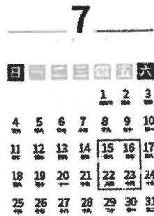

text_image

7
日 五 六
1 2 3
4 5 6 7 8 9 10
11 12 13 14 15 16 17
18 19 20 21 22 23 24
25 26 27 28 29 30 31

# 专项训练二 循环问题

3. 在一次同学聚会时, 大家一见面就相互握手 (每两人只握一次), 大家一共握了 36 次手, 设参加这次聚会的同学共有 $x$ 人, 则参加聚会的人数为 \_\_\_\_ 人.

4. 参加足球联赛的每两队之间都要进行一场比赛, 共要比赛 21 场, 共有多少个队参加足球联赛?

# 专项训练三 传播问题

5. 某种植物的主干长出若干数目的支干, 每个支干又长出同样数目的小分支, 主干、支干和小分支的总数是 73 , 则每个支干长出的小分支数是( )

A. 7 个

B. 8 个

C. 9 个

D. 10 个

6. 小明向一些好友发送了一条新年问候的短信, 获得信息的人也按小明发送的人数再加 1 人向外转发, 经过两轮短信的发送, 共有 35 人次手机上收到该短信, 则小明发送短信给了 \_\_\_\_ 个好友.

7. 有一人患了流感, 经过两轮传染后共有 64 人患了流感.

(1)求每轮传染中平均一个人传染了几个人?

(2)如果不及时控制,第三轮将又有多少人被传染?

# 同步计算 8 一元二次方程的实际应用(二) 平均增长率问题

1. 某公司 4 月份的利润为 160 万元, 要使 6 月份的利润达到 250 万元, 则平均每月增长的百分率是 \_\_\_\_.

2. 劳动教育已纳入人才培养全过程, 某学校加大投入, 建设校园农场, 该农场一种农作物的产量两年内从 300 千克增加到 363 千克. 设平均每年增产的百分率为 $x$ , 则 $x$ 的值为 \_\_\_\_.

3. 某公司前年缴税 40 万元, 今年缴税 48.4 万元, 该公司缴税的年平均增长率为 \_\_\_\_.

4. 某药品原价是 100 元, 经连续两次降价后, 价格变为 64 元, 如果每次降价的百分率是一样的, 那么每次降价的百分率是

5. 某小区 2022 年屋顶绿化面积为 2000 平方米, 计划 2024 年屋顶绿化面积要达到 2880 平方米. 如果每年屋顶绿化面积的增长率相同, 那么这个增长率是 \_\_\_\_.

6. 袁隆平先生生前所率领科研团队在增产攻坚第一阶段实现水稻亩产量 700 公斤的目标, 第三阶段实现水稻亩产量 1008 公斤的目标.

(1)如果第二阶段、第三阶段亩产量的增长率相同,求亩产量的平均增长率;

(2)按照(1)中亩产量增长率,科研团队期望第四阶段水稻亩产量达到1200公斤,请通过计算说明他们的目标能否实现?

7. 目前以 5G 等为代表的战略性新兴产业蓬勃发展. 某市 2019 年底有 5G 用户 2 万户, 到 2021 年底全市 5G 用户数累计达到 8.72 万户.

(1)求全市5G用户数年平均增长率；

(2) 按照(1)中年平均增长率, 估计 2022 年底全市 5G 用户数累计达到多少万户?

# 同步计算 9 一元二次方程的实际应用(三) 面积问题

1. 一块矩形菜地的面积是 $120 \mathrm{~m}^{2}$ , 如果它的长减少 $2 \mathrm{~m}$ , 那么菜地就变成正方形, 则原菜地的长是 \_\_\_\_ m.

2. 如图, 邻边不等的矩形花圃 $ABCD$ , 它的一边 $AD$ 利用已有的围墙 (围墙长度超过 $6 \mathrm{~m}$ ), 另外三边所围的栅栏的总长度是 $6 \mathrm{~m}$ . 若矩形的面积为 $4 \mathrm{~m}^{2}$ , 则 $AB$ 的长度是 \_\_\_\_ m.

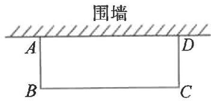

text_image

围墙
A
D
B
C

3. 将一块正方形铁皮的四角各剪去一个边长为 $3 \mathrm{~cm}$ 的小正方形, 做成一个无盖的盒子, 已知盒子的容积为 $300 \mathrm{~cm}^{3}$ , 则原铁皮的边长为 ( )

A. $10 \mathrm{~cm}$

B. $13 \mathrm{~cm}$

C. ${14}\mathrm{\;{cm}}$

D. ${16}\mathrm{\;{cm}}$

4. 如图, 某农场有一块长 $40 \mathrm{~m}$ , 宽 $32 \mathrm{~m}$ 的矩形种植地, 为方便管理, 准备沿平行于两边的方向纵、横各修建一条等宽的小路. 要使种植面积为 $1140 \mathrm{~m}^{2}$ , 求小路的宽.

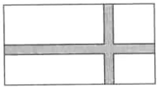

natural_image

Simple geometric diagram with four equal vertical lines intersecting at the center (no text or symbols)

5. 如图,一农户要建一个矩形猪舍,猪舍的一边利用长为 $12 \mathrm{~m}$ 的住房墙,另外三边用 $25 \mathrm{~m}$ 长的建筑材料围成,为方便进出,在垂直于住房墙的一边留一个 $1 \mathrm{~m}$ 宽的门,所围矩形猪舍的长、宽分别为多少时,猪舍面积为 $80 \mathrm{~m}^{2}$ ?

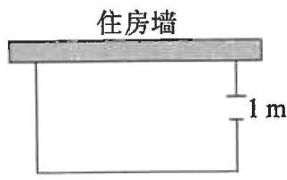

text_image

住房墙
1 m

6. 在一幅长 $8 \, dm$ ，宽 $6 \, dm$ 的矩形风景画（如图①）的四周镶宽度相同的金色纸边，制成一幅矩形挂图（如图②），若要使整个挂图的面积是 $80 \, dm^{2}$ ，求金色纸边的宽。

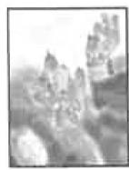  
图①

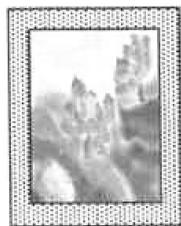  
图②

# 同步计算 10 二次函数 $y=ax^{2}$ 的图象与性质

# 专项训练一 二次函数 $y = ax^2$ 图象的开口方向与顶点

1. 二次函数 $y = 3x^{2}$ 图象的开口 \_\_\_\_，对称轴是 \_\_\_\_，顶点坐标是 \_\_\_\_，最小值是 \_\_\_\_；二次函数 $y = -2x^{2}$ 图象的开口 \_\_\_\_，对称轴是 \_\_\_\_，顶点坐标是 \_\_\_\_，最大值是 \_\_\_\_。

2. 二次函数 $y = (m - 1)x^2$ 的开口向下, 则 $m$ 的取值范围是 \_\_\_\_ ; 二次函数 $y = (a + 1)x^2$ 的开口向上, 则 $a$ 的取值范围是 \_\_\_\_.

# 专项训练二 二次函数 $y = ax^2$ 的对称性

3. 已知点 $(-3,9)$ 和 $(3,t)$ 在二次函数 $y=ax^{2}$ 的图象上，则 t 的值是 \_\_\_\_.  
4. 已知点 $A(1, t)$ 和 $B(m, t)$ 在二次函数 $y = ax^2$ 的图象上, 则 $m$ 的值是  
5. 已知点 $(m,t)$ 和 $(n,t)$ 是二次函数 $y=ax^{2}$ 的图象上的两点, 当 $x=m+n$ 时, y 的值是 \_\_\_\_.

# 专项训练三 二次函数 $y = ax^2$ 的增减性

6. 抛物线 $y = -\frac{1}{4}x^{2}$ 过点 $(x_{1}, y_{1})$ 和 $(x_{2}, y_{2})$ ，当 $x_{1} < x_{2} < 0$ 时， $y_{1}$ 与 $y_{2}$ 的大小关系为 \_\_\_\_.  
7. 关于 $x$ 的函数 $y = (m - 2)x^2$ , 当 $x > 0$ 时, $y$ 随 $x$ 的增大而减小, 则 $m$ 的取值范围是 \_\_\_\_.  
8. 已知关于 $x$ 的函数 $y = (2m - 3)x^2$ 有最大值, 则 $m$ 的取值范围是 \_\_\_\_.  
9. 已知二次函数 $y=3x^{2}$ ，当 $x \geqslant 1$ 时，y 的取值范围是 \_\_\_\_.  
10. 已知二次函数 $y = -2x^{2}$ ，当 $x \geqslant 1$ 时，y 的取值范围是 \_\_\_\_.  
11. 已知二次函数 $y = x^2$ ，当 $-1 \leqslant x \leqslant 2$ 时， $y$ 的取值范围是 \_\_\_\_.

# 专项训练四 二次函数的图象与面积

12. 如图, 点 $A(-4,8)$ 和点 $B(2,n)$ 在抛物线 $y=ax^{2}$ 上, 直线 $AB$ 与 $y$ 轴交于点 $C$ .

(1) 直接写出 a 的值及点 B 的坐标；  
(2) 求点 C 的坐标；  
(3)求 $\triangle AOB$ 的面积.

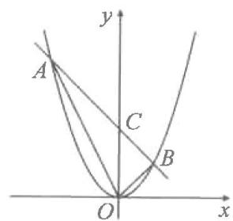

text_image

A
y
C
B
O
x

# 同步计算11 二次函数 $y = ax^{2} + k$ 的图象与性质

# 专项训练一 二次函数 $y = ax^{2} + k$ 的顶点与最值

1. 抛物线 $y = -3x^{2} + 7$ 的对称轴是 \_\_\_\_，顶点坐标是 \_\_\_\_，最大值是 \_\_\_\_.  
2. 抛物线 $y=5x^{2}-3$ 的对称轴是 \_\_\_\_，顶点坐标是 \_\_\_\_，最小值是 \_\_\_\_。  
3. 抛物线 $y=2x^{2}+m-3$ 的顶点在 x 轴的上方，则 m 的取值范围是 \_\_\_\_.

# 专项训练二 抛物线 $y = ax^{2} + k$ 的平移

4. 抛物线 $y=2x^{2}$ 向上平移 2 个单位长度后得到的新抛物线的解析式为 \_\_\_\_.  
5. 如果将抛物线 $y = x^{2} + 2$ 向下平移 1 个单位长度, 那么所得新抛物线的解析式是 \_\_\_\_.  
6. 将抛物线 $y=3x^{2}+2$ 平移后得到抛物线 $y=3x^{2}-4$ ，平移的方法是 \_\_\_\_.

# 专项训练三 二次函数 $y = ax^{2} + k$ 的对称性

7. 若二次函数 $y=ax^{2}+k$ 的图象经过点 $P(-2,4)$ ，则该图象必经过点（）

A. (2,4)

B. $(-2,-4)$

C. $(-4,2)$

D. $(4,-2)$

8. 已知点 $M(-3, t)$ 和 $N(m, t)$ 在二次函数 $y = ax^{2} + k$ 的图象上，则 m 的值是 \_\_\_\_.

# 专项训练四 二次函数 $y = ax^{2} + k$ 的增减性

9. 已知函数 $y = 2x^{2} - 1$ ，当函数值 $y$ 随 $x$ 的增大而减小时， $x$ 的取值范围是（）

A. $x > 1$

B. $x < 1$

C. $x > 0$

D. $x <   0$

10. 抛物线 $y = -2x^{2} + k$ 过点 $(x_{1}, y_{1})$ 和 $(x_{2}, y_{2})$ , 当 $0 < x_{1} < x_{2}$ 时, $y_{1}$ 与 $y_{2}$ 的大小关系为 \_\_\_\_.  
11. 已知二次函数 $y = (a - 1)x^{2} + 2$ ，当 $x < 0$ 时， $y$ 随 $x$ 的增大而增大，则 $a$ 的取值范围是 \_\_\_\_.  
12. 点 $(-1, y_1), (2, y_2), (3, y_3)$ 在抛物线 $y = -x^2 + 1$ 上，则 $y_1, y_2, y_3$ 的大小关系为（）

A. $y_{3} > y_{2} > y_{1}$

B. $y_{1} > y_{3} > y_{2}$

C. $y_{3} > y_{1} > y_{2}$

D. $y_{1} > y_{2} > y_{3}$

# 专项训练五 求二次函数 $y = ax^{2} + k$ 的解析式

13. 抛物线 $y=ax^{2}-1$ 经过点 $(1,2)$ ，则 a= \_\_\_\_.

14. 抛物线 $y = ax^2 + b$ 与抛物线 $y = -3x^2 + 3$ 的开口大小相同, 开口方向相反, 且顶点为 (0, 2), 则 $a =$ \_\_\_\_, $b =$ \_\_\_\_.

15. 抛物线 $y=ax^{2}+k$ 经过点 $(0,1)$ ， $(2,-3)$ ，求抛物线的解析式.

# 同步计算 12 二次函数 $y=a(x-h)^{2}$ 的图象与性质

# 专项训练一 抛物线 $y = a(x - h)^2$ 的顶点与最值

1. 抛物线 $y = -5(x - 2)^{2}$ 的顶点坐标是 \_\_\_\_，对称轴是 \_\_\_\_，最大值是 \_\_\_\_。

2. 抛物线 $y=4(x+3)^{2}$ 的顶点坐标是 \_\_\_\_，对称轴是 \_\_\_\_，最小值是 \_\_\_\_。

# 专项训练二 抛物线 $y = a(x - h)^2$ 的平移

3. 将抛物线 $y = -2x^{2}$ 向左平移 2 个单位长度后, 得到的抛物线的解析式是 \_\_\_\_.  
4. 将抛物线 $y = -2(x + 3)^{2}$ 向右平移 4 个单位长度后, 得到的抛物线的解析式是  
5. 已知抛物线 $y = a(x - h)^{2}$ 向右平移 3 个单位长度后, 得到的抛物线是 $y = 2(x + 1)^{2}$ , 则 a = \_\_\_\_, h = \_\_\_\_.

# 专项训练三 二次函数 $y = a(x - h)^2$ 的对称性

6. 已知点 $(-1, 5)$ 和 $(m, 5)$ 在二次函数 $y = a(x - 1)^2$ 的图象上, 则 $m$ 的值是  
7. 已知点 $A(1, t)$ 和 $B(m, t)$ 在二次函数 $y = a(x + 1)^2$ 的图象上, 则 $m$ 的值是

# 专项训练四 二次函数 $y = a(x - h)^2$ 的增减性

8. 抛物线 $y=(x-1)^{2}$ 上有两个点 $(3, y_{1})$ , $\left(\frac{9}{2}, y_{2}\right)$ , 那么 $y_{1}$ \_\_\_\_ $y_{2}$ (填“＞”“＝”或“＜”).  
9. 已知抛物线 $y = -(x + 1)^2$ 上的两点 $A(x_1, y_1), B(x_2, y_2)$ ，如果 $x_1 < x_2 < -1$ . 那么下列结论成立的是（）

A. $y_{1} <   y_{2} <   0$

B. $0 <   y_{1} <   y_{2}$

C. $0 <   y_{2} <   y_{1}$

D. $y_{2} <   y_{1} <   0$

10. 已知二次函数 $y = -2(x + h)^{2}$ ，当 x < -3 时，y 随 x 的增大而增大；当 x > -3 时，y 随 x 的增大而减小，则 h 的值是 \_\_\_\_.  
11. 已知二次函数 $y = -2(x + 1)^2$ ，当 $x \leqslant -2$ 时， $y$ 的取值范围是 \_\_\_\_.

# 专项训练五 求二次函数 $y = a(x - h)^2$ 的解析式

12. 抛物线 $y=a(x-h)^{2}$ 向右平移 3 个单位长度后得到抛物线 $y=-2x^{2}$ ，则 a= \_\_\_\_，
h = \_\_\_\_.  
13. 抛物线 $y=a(x-h)^{2}$ 向左平移 5 个单位长度后得到抛物线 $y=-(x+3)^{2}$ ，则 a= \_\_\_\_，
h= \_\_\_\_.  
14. 已知抛物线 $y = a(x - h)^2$ 的对称轴为 $x = -2$ ，且过点 $(1, -3)$ ，求抛物线的解析式.

# 同步计算 13 二次函数 $y=a(x-h)^{2}+k$ 的图象与性质

专项训练一 抛物线 $y = a(x - h)^2 + k$ 的顶点与最值

1. 抛物线 $y = -5(x - 1)^2 - 3$ 的顶点坐标是 \_\_\_\_，对称轴是 \_\_\_\_，最 \_\_\_\_ 值是 \_\_\_\_。

2. 抛物线 $y=2(x-3)^{2}+1$ 的顶点坐标是 \_\_\_\_，对称轴是 \_\_\_\_，最 \_\_\_\_ 值是 \_\_\_\_。

专项训练二 抛物线 $y = a(x - h)^2 + k$ 的平移

3. 将抛物线 $y = x^{2}$ 先向右平移 2 个单位长度, 再向下平移 3 个单位长度, 所得抛物线对应的解析式是 \_\_\_\_.

4. 将抛物线 $y = -x^{2} + 1$ 先向左平移 2 个单位长度, 再向下平移 3 个单位长度, 所得抛物线对应的解析式是 \_\_\_\_.

5. 将抛物线 $y=3(x+1)^{2}$ 先向左平移 2 个单位长度, 再向下平移 3 个单位长度, 所得抛物线对应的解析式是 \_\_\_\_.

6. 将抛物线 $y = -2(x + 1)^{2} + 2$ 先向左平移 2 个单位长度, 再向下平移 3 个单位长度, 所得抛物线对应的解析式是

专项训练三 二次函数 $y = a(x - h)^2 + k$ 的对称性

7. 如果 $A(-2,4)$ , $B(4,4)$ 两点都在抛物线 $y=a(x-h)^{2}+k$ 上, 那么 h 的值是 \_\_\_\_.

8. 已知 $A(1, t)$ 和 $B(m, t)$ 两点都在抛物线 $y = a(x + 1)^{2} + k$ 上，则 m 的值是 \_\_\_\_.

9. 已知点 $(m, t)$ 和 $(n, t)$ 是抛物线 $y = a(x + 2)^{2} + k$ 上的两点，则 $m + n$ 的值是 \_\_\_\_.

专项训练四 二次函数 $y = a(x - h)^2 + k$ 的增减性

10. 已知函数 $y=3(x+2)^{2}+1$ ，当 x<\_\_\_\_时，y 随 x 的增大而减小，当 x>\_\_\_\_时，y 随 x 的增大而增大。

11. 已知二次函数 $y = -(x - h)^{2} + 1$ ，当 x < 2 时，y 随 x 的增大而增大；当 x > 2 时，y 随 x 的增大而减小，则 h 的值是 \_\_\_\_.

12. 已知抛物线 $y = (x - 1)^2 + 2$ 上的两点 $A(x_1, y_1), B(x_2, y_2)$ ，如果 $x_1 > x_2 > 1$ . 那么下列结论成立的是（）

A. $y_{1} <   y_{2} <   2$

B. $2 < y_{1} < y_{2}$

C. $2 < y_{2} < y_{1}$

D. $y_{2} <   y_{1} <   2$

13. 已知二次函数 $y=3(x-1)^{2}-1$ ，当 $x \geqslant 2$ 时，y 的取值范围是 \_\_\_\_.

14. 已知二次函数 $y = -2(x + 1)^{2} + 3$ ，当 $x \leqslant -2$ 时，y 的取值范围是 \_\_\_\_.

15. 已知二次函数 $y = -(x - 2)^{2} + 5$ ，当 $-2 \leqslant x \leqslant -1$ 时，y 的取值范围是 \_\_\_\_.

16. 已知二次函数 $y=(x+2)^{2}-1$ ，当 $-3 \leqslant x \leqslant 0$ 时，y 的取值范围是 \_\_\_\_.

专项训练五 求二次函数 $y = a(x - h)^2 + k$ 的解析式

17. 抛物线 $y=a(x-2)^{2}+3$ 经过点 $(1,2)$ ，则 a 的值是 \_\_\_\_.

18. 抛物线 $y=3(x-h)^{2}+k$ 的顶点为 $(-1,-2)$ ，则抛物线的解析式为 \_\_\_\_.

# 同步计算 14 二次函数 $y=ax^{2}+bx+c$ 的图象与性质

专项训练一 化一般式 $y = ax^{2} + bx + c$ 为顶点式 $y = a(x - h)^{2} + k$

1. 把下列二次函数化为 $y = a(x - h)^{2} + k$ 的形式.

(1) $y = x^{2} - 2x + 4;$

(2) $y = -2x^{2} - 4x$ ;

(3) $y = -3x^{2} - 2x$ .

# 专项训练二 抛物线 $y = ax^{2} + bx + c$ 的顶点与最值

2. 抛物线 $y=3x^{2}-12x+3$ 的对称轴为 \_\_\_\_，顶点为 \_\_\_\_，最小值为 \_\_\_\_。  
3. 抛物线 $y = -4x^{2} + 24x - 28$ 的对称轴为 \_\_\_\_，顶点为 \_\_\_\_，最大值为 \_\_\_\_。  
4. 抛物线 $y = -2x^{2} - 8x - 3$ 的对称轴为 \_\_\_\_，顶点为 \_\_\_\_，最大值为 \_\_\_\_。

# 专项训练三 抛物线 $y = ax^{2} + bx + c$ 的平移

5. 将抛物线 $y = x^{2} - 2x + 3$ 向上平移 2 个单位长度, 再向右平移 3 个单位长度后, 得到的抛物线对应的函数解析式为( )

A. $y = (x - 1)^{2} + 4$

B. $y=(x-4)^{2}+4$

C. $y = (x - 2)^{2} + 6$

D. $y=(x-4)^{2}+6$

6. 如果将抛物线 $y = x^{2} - 2x + 4$ 向右平移 1 个单位长度, 再向下平移 2 个单位长度, 那么平移后的抛物线的顶点坐标是 \_\_\_\_.  
7. 将抛物线 $y = x^{2} - 2x$ 平移后得到抛物线 $y = x^{2} + 4x - 1$ ，下列平移方法正确的是（）

A. 向左平移 3 个单位长度, 再向上平移 4 个单位长度  
B. 向左平移 3 个单位长度, 再向下平移 4 个单位长度  
C. 向右平移 3 个单位长度, 再向上平移 4 个单位长度  
D. 向右平移 3 个单位长度, 再向下平移 4 个单位长度

# 专项训练四 二次函数 $y = ax^{2} + bx + c$ 的增减性

8. 已知函数 $y = x^{2} + 8x + 1$ ，当 x < m 时，y 随 x 的增大而减小，当 x > m 时，y 随 x 的增大而增大，则 m 的值是 \_\_\_\_.  
9. 若点 $A(-1, y_{1})$ , $B(2, y_{2})$ , $C(3, y_{3})$ 在抛物线 $y = -2x^{2} + 8x + c$ 上，则 $y_{1}, y_{2}, y_{3}$ 的大小关系是 \_\_\_\_.  
10. 已知二次函数 $y = x^{2} + (m - 1)x + 1$ ，当 $x > 1$ 时， $y$ 随 $x$ 的增大而增大，则 $m$ 的取值范围是（）

A. $m = -1$

B. $m = 3$

C. $m \leqslant -1$

D. $m \geqslant - 1$

11. 已知二次函数 $y = -x^{2} + 6x + 3$ ，当 $0 \leqslant x \leqslant 4$ 时，y 的最大值是 \_\_\_\_.

# 同步计算15 求二次函数的解析式

# 专项训练一 一个待定系数

1. 若抛物线 $y = x^{2} + bx + 6$ 经过点 $(2, 6)$ ，则 b 的值是 \_\_\_\_.

2. 已知二次函数 $y = x^{2} - (m - 1)x - m$ .

(1)若图象经过原点,则 m 的值是 ;

(2)若图象的对称轴是 y 轴,则 m 的值是

3. 已知抛物线 $y = a(x - 3)^{2}$ 经过点 $(0, 3)$ ，则此抛物线的解析式是 \_\_\_\_.

4. 若二次函数 $y=(m+1)x^{2}-mx+m^{2}-2m-3$ 的图象经过原点，则 m 的值为（）

A.-1或3

B. -1

C. 3

D.-3或1

# 专项训练二 两个待定系数

5. 已知二次函数 $y = x^{2} + bx + c$ 的图象经过 A(1,0), B(0,2) 两点，求二次函数的解析式.

6. 已知抛物线 $y=ax^{2}+bx+3$ 经过点 $(-1,0)$ ， $(3,0)$ ，求该抛物线的解析式.

7. 如图, 抛物线 $y = x^{2} + bx + c$ 与 $x$ 轴交于 $A, B$ 两点, 与 $y$ 轴交于点 $C$ , 且 $OA = OC = 3$ , 求抛物线对应的函数解析式.

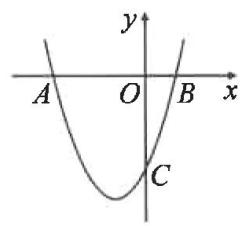

text_image

y
A O B x
C

8. 已知抛物线 $y = x^{2} + bx + c$ 经过 A(3,0)，对称轴是直线 x = 1，求抛物线对应的函数解析式.

# 同步计算16 二次函数与一元二次方程

# 专项训练一 利用图象求解(解集)

1. 二次函数 $y = -x^2 + x + 2$ 的图象如图所示, 试根据图象回答下列问题:

(1)方程 $-x^{2}+x+2=0$ 的解为 \_\_\_\_；  
(2) 当 $y > 0$ 时, $x$ 的取值范围是 \_\_\_\_;  
(3) 当 $y > 2$ 时, $x$ 的取值范围是

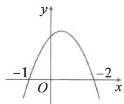

line

| x | y |
|---|---|
| -1 | -1 |
| 0 | 0 |
| -2 | -1 |

2. 抛物线 $y=ax^{2}+bx+c$ 的部分图象如图所示, 其与 x 轴的一个交点坐标为 $(-3,0)$ , 对称轴为 x=-1, 则当 y<0 时, x 的取值范围是 \_\_\_\_.

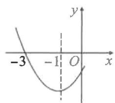

line

| x | y |
|---|---|
| -3 | -3 |
| -1 | -1 |
| 0 | 0 |

第2题图

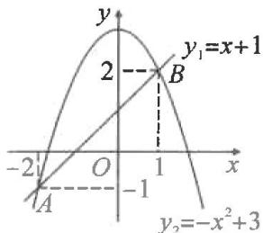

text_image

y
2
B
y₁=x+1
-2
O
1
x
A
-1
y₂=-x²+3

第4题图

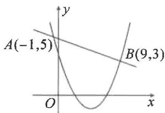

line

| Point | x | y |
|---|---|---|
| A | -1 | 5 |
| B | 9 | 3 |

第5题图

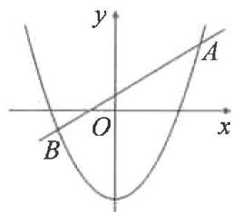

text_image

y
A
O
x
B

第6题图

3. 已知二次函数 $y = -\frac{1}{2}(x - 2)^{2} + 3$ ，使 $y \geqslant 1$ 成立的 x 的取值范围是（）

A. $-1 \leqslant x \leqslant 4$

B. $x \leqslant 0$

C. $x \geqslant 1$

D. $0 \leqslant x \leqslant 4$

# 专项训练二 利用抛物线与直线的交点求解集

4. 如图, 直线 $y_{1} = x + 1$ 与抛物线 $y_{2} = -x^{2} + 3$ 交于 $A, B$ 两点, 当 $y_{1} > y_{2}$ 时, $x$ 的取值范围为 ( )

A. $x < -2$

B. $x > 1$

C. -2 < x < 1

D. $x < -2$ 或 $x > 1$

5. 如图, 一次函数 $y_1 = mx + n$ 与二次函数 $y_2 = ax^2 + bx + c$ 的图象相交于两点 $A(-1,5)$ , $B(9,3)$ , 则使 $y_1 \geqslant y_2$ 成立的 $x$ 的取值范围是 ( )

A. $-1 \leqslant x \leqslant 9$

B. $-1 \leq x < 9$

C. $-1 < x \leqslant 9$

D. $x \leqslant -1$ 或 $x \geqslant 9$

6. 如图, 若抛物线 $y = ax^2 + h$ 与直线 $y = kx + b$ 交于 $A(3, m), B(-2, n)$ 两点, 则不等式 $ax^2 - b < kx - h$ 的解集是 \_\_\_\_.

# 专项训练三 函数与方程、不等式小综合

7. 已知二次函数 $y = ax^{2} + bx + c (a \neq 0)$ 的图象如图所示, 根据图象解答下列问题:

(1) 写出方程 $ax^{2} + bx + c = 0$ 的两个根；  
(2) 写出不等式 $ax^{2} + bx + c > 0$ 的解集；  
(3) 若方程 $ax^{2} + bx + c = k$ 有两个不相等的实数根，直接写出 k 的取值范围.

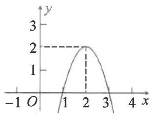

line

| x | y |
|---|---|
| -1 | 0 |
| 0 | 1 |
| 1 | 2 |
| 2 | 2 |
| 3 | 1 |
| 4 | 0 |

# 同步计算 17 二次函数的实际应用(一) 利润问题

# 专项训练一 列函数关系式

1. 某商场购进一批货物; 销售量 $y$ (件) 与每件货物的利润 $x$ (元) 的关系式为 $y = -2x + 500$ , 则总利润 $w$ (元) 与 $x$ (元) 之间的函数关系式为 \_\_\_\_.

2. 某商品原利润为 60 元, 涨价 $x$ 元后利润为 \_\_\_\_ 元, 如果原来每月卖出 100 件, 若每涨价 2 元, 每月就少出售 10 件, 涨价 $x$ 元后每月出售该商品的总利润 $y$ (元) 与 $x$ 之间的函数关系式为 \_\_\_\_.

# 专项训练二 文字信息类最大利润问题

3. 某旅行社要接团去外地旅游, 经计算所获营业额 $y$ (元) 与旅行团人数 $x$ (人) 满足关系式 $y = -2x^{2} + 200x + 2500$ , 要使所获营业额最大, 则此旅行团应有 ( )

A. 30 人

B. 40 人

C. 50 人

D. 55 人

4. 某网店销售某款童装, 每件售价 60 元, 每星期可卖 300 件, 为了促销, 该网店决定降价销售. 市场调查反映: 每降价 1 元, 每星期可多卖 30 件. 已知该款童装每件成本价 40 元, 设该款童装每件售价 $x$ 元, 每星期的销售量为 $y$ 件.

(1) 求 y 与 x 之间的函数关系式；  
(2)当每件售价定为多少元时,每星期的销售利润最大?最大利润是多少?

5. 某商品在最近的 30 天内的价格 $y_{1}$ (元)与时间 $t$ (天)满足的关系是 $y_{1} = t + 10$ ; 销售量 $y_{2}$ (件)与时间 $t$ (天)满足的关系是 $y_{2} = 35 - t$ , 其中 $0 < t \leqslant 30, t$ 为整数. 问何时这种商品取得日销售金额的最大值? 并求这个最大值.

# 同步计算 18 二次函数的实际应用(二) 抛物线形问题

1. 在羽毛球比赛中, 某次羽毛球的运动路线呈抛物线形, 羽毛球距地面的高度 $y(\mathrm{m})$ 与水平距离 $x(\mathrm{m})$ 之间的关系如图所示, 点 $B$ 为落地点, 且 $OA = 1 \mathrm{~m}, OB = 4 \mathrm{~m}$ , 羽毛球到达的最高点到 $y$ 轴的距离为 $\frac{3}{2} \mathrm{~m}$ , 求羽毛球到达最高点时离地面的高度.

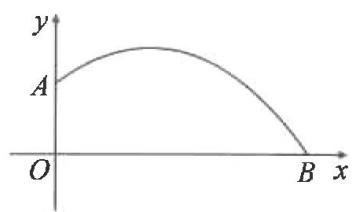

text_image

y
A
O
B x

2. 如图,从某幢建筑物 $2.25 \mathrm{~m}$ 高的窗口 $A$ 用水管向外喷水,喷出的水流呈抛物线形(抛物线所在平面与墙面垂直). 如果抛物线的最高点 $M$ 离墙 $1 \mathrm{~m}$ ,离地面 $3 \mathrm{~m}$ ,求水流下落点 $B$ 离墙的距离 $O B$ 的长.

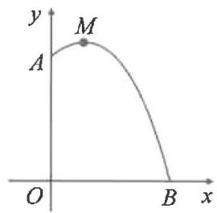

text_image

y
M
A
O
B x

# 同步计算 19 二次函数的实际应用(三) 面积问题

# 专项训练一 动点问题

1. 如图, 在 $\triangle ABC$ 中, $\angle B = 90^{\circ}, AB = 4 \mathrm{~cm}, BC = 8 \mathrm{~cm}$ . 动点 $P$ 从点 $A$ 出发, 沿边 $AB$ 向点 $B$ 以 $1 \mathrm{~cm} / \mathrm{s}$ 的速度移动 (不与点 $B$ 重合), 同时动点 $Q$ 从点 $B$ 出发, 沿边 $BC$ 向点 $C$ 以 $2 \mathrm{~cm} / \mathrm{s}$ 的速度移动 (不与点 $C$ 重合). 当四边形 $APQC$ 的面积最小时, 求运动的时间.

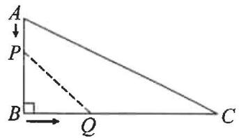

text_image

A
↓
P
B → Q C

# 专项训练二 围墙问题

2. 如图, 某农场拟建一间饲养室, 一面靠现有墙 (墙足够长), 且与现有墙相对的一侧墙体留有 $1 \mathrm{~m}$ 宽的门. 已知计划中的材料可建墙体 (不包括门) 总长为 $11 \mathrm{~m}$ , 求能建成的饲养室总占地面积的最大值.

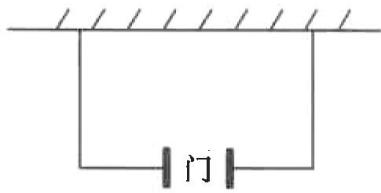

text_image

门

# 专项训练三 图形问题

3. 如图, $\square ABCD$ 的周长为 $8 \mathrm{~cm}, \angle B = 30^{\circ}$ , 设 $AB = x \mathrm{~cm}$ .

(1)求□ABCD的面积 $y(\mathrm{cm}^{2})$ 与 $x(\mathrm{cm})$ 之间的函数解析式；  
(2)求□ABCD的面积的最大值.

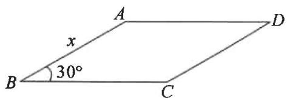

text_image

A
x
30°
B
C
D

# 同步计算20 知旋转求角度

# 专项训练一 知旋转角

1. 如图, 将 $\triangle ABC$ 绕点 $A$ 逆时针旋转 $50^{\circ}$ 到 $\triangle AB'C'$ 的位置, 此时恰有 $CC' \parallel AB$ , 则 $\angle CAB'$ 的度数为 \_\_\_\_.

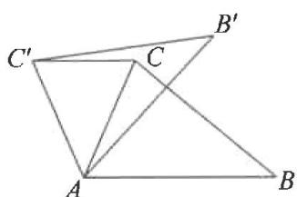

text_image

Geometric diagram showing triangles ABC and C'B'C' with labeled vertices and intersection points

第1题图

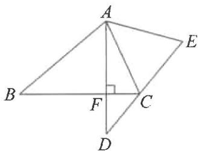

text_image

Geometric diagram of a quadrilateral with labeled vertices and internal points, including a right angle at F.

第2题图

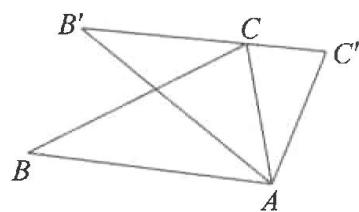

text_image

B'
C
C'
B
A

第3题图

2. 如图, 将 $\triangle ABC$ 绕点 $A$ 逆时针旋转 $50^{\circ}$ 得到 $\triangle ADE$ , 若 $\angle E = 65^{\circ}$ , 且 $AD \perp BC$ 于点 $F$ , 则 $\angle BAC$ 的度数为 ( )

A. ${65}^{ \circ  }$

B. ${70}^{ \circ  }$

C. ${75}^{ \circ  }$

D. ${80}^{ \circ  }$

3. 如图, 把 $\triangle ABC$ 绕点 $A$ 顺时针旋转 $32^{\circ}$ 得到 $\triangle AB'C'$ , 且 $B', C, C'$ 三点恰好在同一条直线上, 那么 $\angle C'$ 的度数为 \_\_\_\_.

4. 如图, 将 $\triangle ABC$ 绕点 $A$ 逆时针旋转 $60^{\circ}$ 得到 $\triangle ADE$ , 连接 $CD$ . 若 $\angle CDE = 78^{\circ}$ , 求 $\angle BCD$ 的度数.

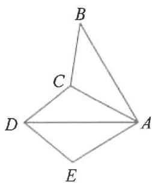

text_image

B
C
D
A
E

# 专项训练二 隐旋转角

5. 有两个直角三角形纸板, 一个含 $45^{\circ}$ 角 ( $\triangle ADE$ ), 另一个含 $30^{\circ}$ 角 ( $\triangle ABC$ ), 把它们按如图 1 所示叠放, 先将含 $30^{\circ}$ 角的纸板固定不动, 再将含 $45^{\circ}$ 角的纸板绕点 $A$ 顺时针旋转 $\alpha (0^{\circ} < \alpha < 45^{\circ})$ , 使 $BC \parallel DE$ , 如图 2 所示, 求 $\angle CAE$ 的度数.

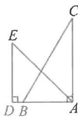  
图1

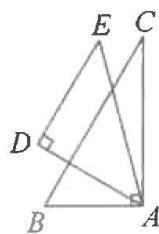  
图2

6. 如图, 将 $\triangle ABC$ 绕点 $C$ 逆时针旋转得到 $\triangle DEC$ , 若点 $D$ 刚好落在边 $AB$ 上, $CB$ 与 $DE$ 交于点 $F$ , $\angle ACB = 120^{\circ}$ , $\angle E = 20^{\circ}$ , 求 $\angle EFC$ 的度数.

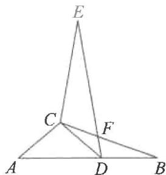

text_image

E
C
F
A
D
B

# 同步计算 21 知旋转求长度

# 专项训练一 直接运用旋转的性质

1. 如图, $\triangle ABC$ 绕点 $A$ 逆时针旋转一定角度后与 $\triangle ADE$ 重合, 且点 $C$ 在 $AD$ 上. 若 $AB = 5$ , $CD = 3$ , 则 $AE$ 的长是 \_\_\_\_.

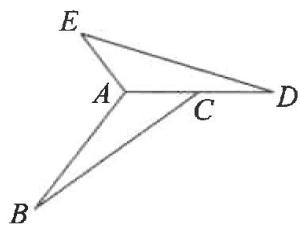

text_image

E
A
C
D
B

第1题图

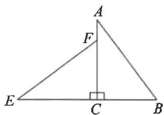

text_image

A
F
E
C
B

第2题图

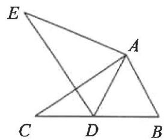

text_image

Geometric diagram with labeled points A, B, C, D, E and intersecting lines forming triangles and quadrilaterals

第3题图

2. 如图, 将 Rt△ABC 绕直角顶点 C 逆时针旋转 $90^{\circ}$ 得到 Rt△EFC. 若 AB = 5, BC = 3, 则线段 BE 的长为 \_\_\_\_.

3. 如图, 在 $\triangle ABC$ 中, $AB = 5$ , $BC = 8$ , $\angle B = 60^{\circ}$ , 将 $\triangle ABC$ 绕点 $A$ 顺时针旋转得到 $\triangle ADE$ , 当点 $B$ 的对应点 $D$ 恰好落在 $BC$ 边上时, $CD$ 的长为 \_\_\_\_.

4. 如图, 在等边 $\triangle ABC$ 中, $D$ 是边 $AC$ 上的一点, 连接 $BD$ , 将 $\triangle BCD$ 绕点 $B$ 逆时针旋转 $60^\circ$ 得到 $\triangle BAE$ , 连接 $ED$ . 若 $BC = 7, BD = 6$ , 求 $\triangle AED$ 的周长.

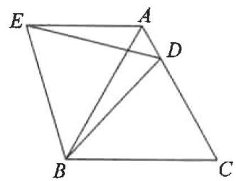

text_image

Geometric diagram of a quadrilateral with labeled vertices A, B, C, D, E and internal diagonals

# 专项训练二 直接找全等

5. 如图, 将 $\triangle ABC$ 绕点 $C$ 顺时针旋转一定角度得到 $\triangle EDC$ , 若 $\angle ACE = 2\angle ACB$ , $AB = BC = 5$ , $AC = 6$ , 求 $BD$ 的长.

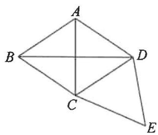

text_image

A
B
C
D
E

# 同步计算22 知旋转求坐标

# 专项训练一 旋转 $90^{\circ}$

1. 在平面直角坐标系中, 点(2, -3)绕原点逆时针旋转 $90^{\circ}$ 所得的点的坐标是

2. 如图, 点 $C$ 的坐标为 $(-1,0)$ , 点 $A$ 的坐标为 $(-3,3)$ , 将点 $A$ 绕点 $C$ 顺时针旋转 $90^{\circ}$ 得到点 $B$ , 则点 $B$ 的坐标为 \_\_\_\_.

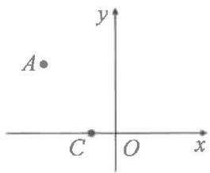

text_image

A
y
C O x

3. 在如图的网格中, 每个小正方形的边长均为 1, $\triangle ABC$ 的三个顶点都是网格线的交点. 已知 $A(-2,2), C(-1,-2)$ , 将 $\triangle ABC$ 绕着点 $C$ 顺时针旋转 $90^\circ$ , 则点 $A$ 的对应点的坐标为 \_\_\_\_.

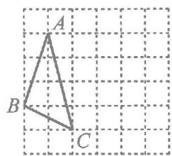

text_image

A
B
C

4. 如图, 在 $\triangle OAB$ 中, $\angle AOB = 90^{\circ}, OA = OB$ , 点 $A$ 的坐标为 $(5,0), P$ 是 $OA$ 上一动点, 将点 $P$ 绕点 $C(0,1)$ 逆时针旋转 $90^{\circ}$ , 当点 $P$ 的对应点 $P'$ 落在 $AB$ 边上时, 求点 $P'$ 的坐标.

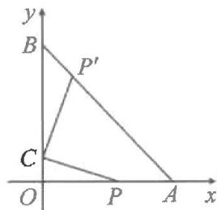

text_image

y
B
P'
C
O
P
A
x

# 专项训练二 旋转其它角度

5. 如图, 线段 $OA$ 与 $x$ 轴正方向夹角为 $45^{\circ}$ , 且 $OA = 2$ , 若将线段 $OA$ 绕点 $O$ 逆时针旋转 $105^{\circ}$ 得到线段 $OA'$ , 则点 $A'$ 的坐标为 \_\_\_\_.

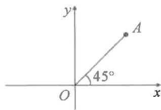

text_image

y
A
45°
O
x

6. 如图, 将等边三角形 $OAB$ 放在平面直角坐标系中, $A$ 点坐标为 $(1,0)$ , 将 $\triangle OAB$ 绕点 $O$ 逆时针旋转 $60^{\circ}$ , 则旋转后点 $B$ 的对应点 $B'$ 的坐标为 \_\_\_\_.

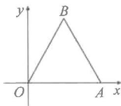

text_image

y
B
O
A x

7. 如图, 在 $\triangle AOB$ 中, $OA = AB$ , 点 $A$ 的坐标为 (3,4), 底边 $OB$ 在 $x$ 轴上. 将 $\triangle AOB$ 绕点 $B$ 按顺时针方向旋转一定角度后得到 $\triangle A'O'B$ , 点 $A$ 的对应点 $A'$ 在 $x$ 轴上, 求点 $O'$ 的坐标.

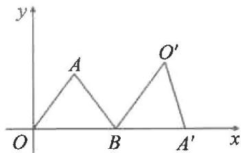

text_image

y
A
O'
B
A'
x

# 同步计算 23 圆的有关性质(一) 垂径定理

# 专项训练一 直接计算

1. 如图, $A$ 是 $\odot O$ 上一点, 连接 $OA$ . 弦 $BC \perp OA$ 于点 $D$ . 若 $OD = 2, AD = 1$ , 求 $BC$ 的长.

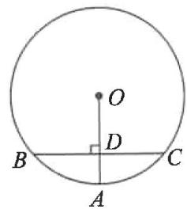

text_image

O
B
D
C
A

2. 如图, $\odot O$ 的直径 $AB = 8$ , 弦 $CD \perp AB$ 于点 $P$ , 若 $BP = 2$ , 求 $CD$ 的长.

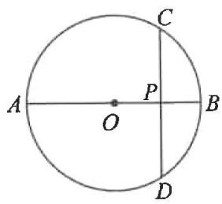

text_image

A
O
P
B
C
D

# 专项训练二 列方程计算

3. 如图, 已知 $OA$ 为 $\odot O$ 的半径, 弦 $BC \perp OA$ 于点 $P$ , 若 $BC = 8, AP = 2$ , 求 $\odot O$ 的半径.

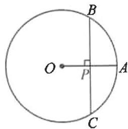

text_image

O
P
A
B
C

4. 如图, $AB$ 是 $\odot O$ 的直径, $\odot O$ 的弦 $CD = 8$ , 且 $CD \perp AB$ 于点 $E$ . 若 $OE:OB = 3:5$ , 求直径 $AB$ 的长.

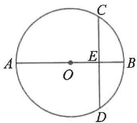

text_image

A
O
E
B
C
D

5. 如图, 在 $\odot O$ 中, $AB$ 是弦, $CD$ 是直径, 且 $CD \perp AB$ 于点 $E$ , $AC = 2\sqrt{5}$ , $AB = 4$ . 求 $\odot O$ 的半径.

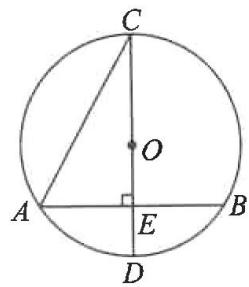

text_image

C
O
A
E
B
D

# 同步计算 24 圆的有关性质(二) 角度计算

# 专项训练一 直接计算

1. 如图, 点 $A, B, P$ 在 $\odot O$ 上. 若 $\angle AOB = 80^{\circ}$ , 则 $\angle APB$ 的度数为 \_\_\_\_; 若 $\angle APB = 35^{\circ}$ , 则 $\angle AOB$ 的度数为 \_\_\_\_.

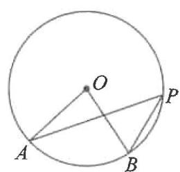

text_image

Geometric diagram of a circle with points A, B, O, P and connecting line segments forming triangles

第1题图

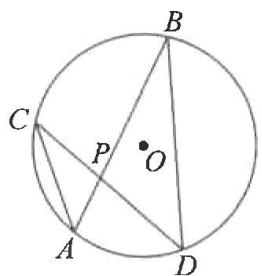

text_image

B
C
P
O
A
D

第2题图

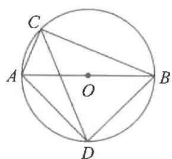

text_image

C
A
O
B
D

第3题图

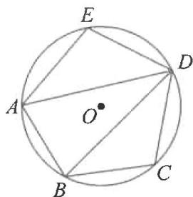

text_image

E
A
O
D
B
C

第4题图

2. 如图, 在 $\odot O$ 中, 弦 $A B, C D$ 相交于点 $P$ . 若 $\angle A = 48^{\circ}, \angle A P D = 80^{\circ}$ , 则 $\angle B$ 的度数为 \_\_\_\_.  
3. 如图, $AB$ 是 $\odot O$ 的直径, $C, D$ 是 $\odot O$ 上的两点, 若 $\angle CAB = 65^{\circ}$ , 则 $\angle ADC$ 的度数为 \_\_\_\_.  
4. 如图, 五边形 $ABCD E$ 内接于 $\odot O$ , $\angle ADB = 30^{\circ}$ , $\angle C = 100^{\circ}$ . 则 $\angle E$ 的度数为

# 专项训练二 简单构造

5. 如图, $OA$ 是 $\odot O$ 的半径, 若 $\angle BAO = 27^{\circ}$ , 求 $\angle BDA$ 的度数.

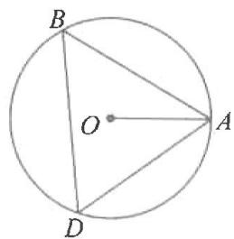

text_image

B
O
A
D

6. 如图, $AB$ 是 $\odot O$ 的直径, $AC$ 是弦, $D$ 为 $\widehat{BC}$ 的中点, $\angle CAB = 70^{\circ}$ . 求 $\angle ACD$ 的度数.

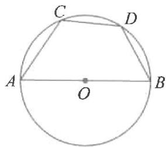

text_image

C
D
A
O
B

7. 如图, $AB$ 为 $\odot O$ 的直径, 点 $C, D, E$ 在 $\odot O$ 上, 且 $\widehat{AD} = \widehat{CD}, \angle E = 70^\circ$ . 求 $\angle ABC$ 的度数.

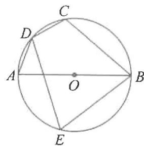

text_image

C
D
A
O
B
E

# 同步计算 25 圆的有关性质(三) 长度计算

1. 如图, 在 $\odot O$ 中, 弦 $AB = 2\sqrt{2}, C$ 是圆上一点, 且 $\angle ACB = 45^{\circ}$ . 求 $\odot O$ 的半径.

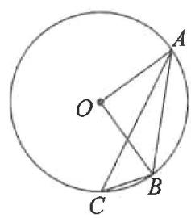

text_image

Geometric diagram of a circle with points A, B, C, and center O, showing chords and radii

2. 如图, $AC, CD, AD$ 为 $\odot O$ 的弦, $\angle D = 60^{\circ}, AC = 2\sqrt{3}$ . 求 $\odot O$ 的半径.

text_image

D
A
O
C

3. 如图, $AB$ 是 $\odot O$ 的直径, $C$ 为圆上一点, $\triangle ABC$ 的外角 $\angle ECB$ 的平分线 $CD$ 交 $\odot O$ 于点 $D$ , 连接 $AD, BD$ . 若 $AC = 2, BD = 3$ , 求 $BC$ 的长.

text_image

E
C
D
A
O
B

4. 如图, $AB$ 是 $\odot O$ 的直径, 弦 $CD$ 平分 $\angle ACB$ 交 $\odot O$ 于点 $D$ . 连接 $AD, BD, \angle CDB = 60^\circ$ , $AC = 2$ .

(1)求 $AD$ 的长；

(2) 求 $CD$ 的长.

text_image

C
A
O
B
D

# 同步计算 26 与切线有关的计算(一) 角度计算

# 专项训练一 直接计算

1. 如图, 直线 $AB$ 与 $\odot O$ 相切于点 $C, AO$ 交 $\odot O$ 于点 $D, \angle AOC = 50^\circ$ , 则 $\angle ACD$ 的度数为 \_\_\_\_.

text_image

Geometric diagram showing a circle with tangent and secant lines, labeled points A, B, C, D, and center O.

第1题图

text_image

Geometric diagram showing a circle with points A, B, C, D and center O, including chords and tangent lines.

第2题图

text_image

Geometric diagram showing a circle with points A, B, C, D and center O, including chords and tangent lines.

第3题图

text_image

Geometric diagram showing a circle with center O, points A, B, C on circumference, and external point P connected by lines forming triangles and chords.

第4题图

2. 如图, $AC$ 是 $\odot O$ 的切线, 切点为 $C, BC$ 是 $\odot O$ 的直径, $AB$ 交 $\odot O$ 于点 $D$ , 连接 $OD$ . 若 $\angle COD = 80^{\circ}$ , 则 $\angle A$ 的度数为  
3. 如图, $AB$ 是 $\odot O$ 的直径, $C$ 为 $\odot O$ 外一点, $CA$ , $CD$ 分别与 $\odot O$ 相切于点 $A$ , $D$ , 连接 $BD$ , $AD$ . 若 $\angle ACD = 56^{\circ}$ , 则 $\angle DBA$ 的度数为  
4. 如图, $PA, PB$ 分别与 $\odot O$ 相切于 $A, B$ 两点, $AB, OP$ 交于点 $C$ , $\angle AOB = 130^{\circ}$ , 则 $\angle APO$ 的度数为 \_\_\_\_.

# 专项训练二 简单构造

5. 如图, $C$ 是以 $AB$ 为直径的半圆 $O$ 上一点, 过点 $C$ 作 $\odot O$ 的切线 $CD$ , $BD \perp CD$ 于点 $D$ . 若 $\angle DCB = 50^{\circ}$ , 求 $\angle ABC$ 的度数.

text_image

Geometric diagram showing a semicircle with points A, B, C, D and center O, including tangent and perpendicular lines.

6. 如图, $PA, PB$ 分别与 $\odot O$ 相切于 $A, B$ 两点, $OP$ 交 $\odot O$ 于点 $C$ , 连接 $AC$ . 若 $\angle APB = 40^{\circ}$ , 求 $\angle PAC$ 的度数.

text_image

Geometric diagram showing a circle with center O, points A, B, C, P on tangent and secant lines, likely illustrating a theorem or construction.

7. 如图, $PA, PB$ 分别与 $\odot O$ 相切于 $A, B$ 两点, $C$ 为 $\odot O$ 上一点 (不与 $A, B$ 两点重合), 连接 $AC, BC$ . 若 $\angle P = 50^{\circ}$ , 求 $\angle ACB$ 的度数.

text_image

A
O
B
P

# 同步计算 27 与切线有关的计算(二)长度计算

# 专项训练一 单切线计算

1. 如图, $AB$ 是 $\odot O$ 的直径, $C$ 是 $\odot O$ 上一点, $DE$ 与 $\odot O$ 相切于点 $D$ , $DE \perp AC$ 交 $AC$ 的延长线于点 $E$ . 若 $AC = 6$ , $DE = 4$ , 求 $AB$ 的长.

text_image

E
C
D
A
O
B

# 专项训练二 双切线计算

2. 如图, $P$ 为 $\odot O$ 外一点, $PA, PB$ 分别与 $\odot O$ 相切于点 $A, B, CD$ 切 $\odot O$ 于点 $E$ , 分别交 $PA, PB$ 于点 $C, D$ . ① 若 $PA = 8$ , 则 $\triangle PCD$ 的周长为 \_\_\_\_; ② 若 $\triangle PCD$ 的周长为 10 , 则 $PB$ 的长为 \_\_\_\_.

text_image

A
C
E
O
P
B
D

3. 如图, $P$ 为 $\odot O$ 外一点, $PA, PB$ 分别与 $\odot O$ 相切于点 $A, B$ , 作直径 $BC$ , 连接 $AC$ . 若 $\angle P = 60^{\circ}, PB = 2$ , 求 $AC$ 的长.

text_image

Geometric diagram showing a circle with center O, points A, B, C on circumference, and external point P connected by line segments forming triangles.

# 专项训练三 内切圆计算

4. 在 $\triangle ABC$ 中, $\angle C=90^{\circ}$ , $AC=8$ , $BC=6$ , $\odot O$ 为 $\triangle ABC$ 的内切圆, $D,E,F$ 分别为切点,则 $\odot O$ 的半径为 \_\_\_\_.

text_image

Geometric diagram of triangle ABC with inscribed circle and labeled points D, E, F, O

5. 如图, $\odot O$ 为 $\triangle ABC$ 的内切圆, $D, E, F$ 为切点, 若 $AB = AC = 13$ , $BC = 10$ , 求 $\odot O$ 的半径.

text_image

A
D
F
O
B
E
C

# 同步计算28 弧长与扇形面积

# 专项训练一 弧长

1. 已知扇形的圆心角为 $100^{\circ}$ ，半径为 9，则弧长为

2. 已知扇形的半径是 $9 \, cm$ ，弧长为 $4\pi \, cm$ ，则扇形的圆心角为

3. 如图, $AB$ 是 $\odot O$ 的直径, 点 $C, D$ 均在 $\odot O$ 上, $\angle ACD = 30^\circ$ , 弦 $AD = 4$ .

(1) 求 $\odot O$ 的直径；

(2)求 $\widehat{AD}$ 的长.

text_image

C
A
O
B
D

# 专项训练二 扇形面积

4. 如图, 在 $\odot O$ 中, $AB$ 为直径, $D$ 为圆上一点, $AB = 2$ , $\angle DAB = 30^{\circ}$ , 则阴影部分面积为 \_\_\_\_.

text_image

A
O
B
D

第4题图

text_image

D
E
C
A
B

第5题图

text_image

C
D
A
O
B

第6题图

5. 如图, 矩形 $ABCD$ 中, 以 $A$ 为圆心, $AB$ 的长为半径画弧, 交 $CD$ 于点 $E$ , 再以 $D$ 为圆心, $DA$ 的长为半径画弧, 恰好经过点 $E$ . 若 $AD = 2$ , 则图中阴影部分的面积为

6. 如图, 点 $C, D$ 分别是半圆 $AOB$ 上的三等分点. 若阴影部分的面积是 $\frac{8}{3} \pi$ , 则半圆的半径 $OA$ 的长为 \_\_\_\_.

7. 一个圆锥的底面半径是 2, 母线长是 4, 则这个圆锥的表面积为

8. 一个圆锥的高为 4, 母线长为 5, 沿某一条母线展开得到一个扇形, 则其弧长为

9. 已知圆锥的底面直径为 4, 母线长为 6, 则此圆锥侧面展开图的圆心角是

10. 如图, 在正方形 $ABCD$ 中, $E$ 是 $CD$ 边上一点, 以 $BC$ 为直径的半圆 $O$ 与 $AE$ 相切于点 $F$ . 若正方形的边长为 4 , 求图中阴影部分的面积.

text_image

B
O
C
E
F
D
A

# 同步计算29 列举法求二步概率

1. 同时抛掷两枚质地均匀的硬币,一枚正面朝上、一枚反面朝上的概率是( )

A. $\frac{2}{3}$

B. $\frac{1}{2}$

C. $\frac{1}{3}$

D. $\frac{1}{4}$

2. 将一枚质地均匀的硬币连续掷两次, 两次硬币全部正面向上的概率是( )

A. $\frac{2}{3}$

B. $\frac{1}{2}$

C. $\frac{1}{3}$

D. $\frac{1}{4}$

3. 将分别写有数字 3,4,5 的三张卡片(除数字外,其余均相同)洗匀后背面朝上摆放,然后从中任意抽取两张,则抽到的两张卡片上的数字之积为偶数的概率是()

A. $\frac{2}{3}$

B. $\frac{1}{2}$

C. $\frac{1}{3}$

D. $\frac{1}{6}$

4. 学校要从小明、小红与小华三人中随机选取两人作为升旗手, 则小明和小红同时入选的概率是

5. 小明与小乐一起玩“石头, 剪刀, 布”的游戏, 两同学同时出“布”的概率是

6. 在 0,1,2 这三个数中任选两个数分别作为点 P 的横坐标和纵坐标, 则点 P 落在直线 $y = x + 1$ 图象上的概率是 \_\_\_\_.

7. 一个不透明的口袋中有四个完全相同的小球, 把它们分别标号为 1, 2, 3, 4, 随机摸出一个小球然后放回, 再随机摸出一个小球.

(1)两次取出的小球的标号相同的概率是\_\_\_\_；
(2)两次取出的小球标号的和等于4的概率是\_\_\_\_。

8. 有 4 张看上去无差别的卡片, 上面分别写有数 -1, 2, 5, 8. 随机抽取一张卡片后, 放回并混在一起, 再随机抽取一张, 请用画树状图或列表法, 求抽取出的两数之差的绝对值大于 3 的概率.

# 同步计算 30 列举法求二步、三步概率

# 专项训练一 放回类型

1. 布袋中有红、黄、蓝三个球，它们除颜色不同以外，其他都相同，从袋中随机取出一个球后再放回袋中，这样取出球的顺序依次是“红—黄—蓝”的概率是（）

A. $\frac{1}{27}$

B. $\frac{1}{9}$

C. $\frac{2}{9}$

D. $\frac{1}{3}$

2. 一个不透明的袋中有四张完全相同的卡片, 把它们分别标上数字 1, 2, 3, 4. 随机抽取一张卡片, 然后放回, 再随机抽取一张卡片, 则两次抽取的卡片上数字之积为偶数的概率是( )

A. $\frac{1}{4}$

B. $\frac{1}{2}$

C. $\frac{3}{4}$

D. $\frac{5}{6}$

# 专项训练二 不放回类型

3. 不透明的口袋里装有白、黄、蓝三种颜色的乒乓球(除颜色外其余都相同), 其中白球有 2 个, 黄球有 1 个, 现从中任意摸出一个是白球的概率为 $\frac{1}{2}$ .

(1)试求袋中篮球的个数；  
(2)第一次任意摸一个球(不放回),第二次再摸一个球,请用画树状图或列表法,求两次摸到白球的概率.

# 专项训练三 三步概率

4. 甲、乙、丙三名学生各自随机选择到 $A, B$ 两个书店购书, 求甲、乙、丙三名学生在同一书店购书的概率.