# 第二十一章 一元二次方程

# 期末复习专题1 一元二次方程及其解法

# 考点 1 一元二次方程的定义

1. 下列方程一定是一元二次方程的是( )

A. $x^{2} - 2y + 1 = 0$

B. $x^{2} = 0$

C. $(x - 1)^{2} = x^{2}$

D. $x = \frac{1}{x}$

2. 关于 $x$ 的方程 $\left( {a - 3}\right) {x}^{\left| a - 1\right| } + x - 1 = 0$ 是一元二次方程,则 $a$ 的值是

# 考点2 一元二次方程的一般形式

3. 将一元二次方程 $2x^{2} - 1 = 3x$ 化成一般形式后, 二次项系数和一次项系数分别是 ( )

A. 2, -1

B. $2,0$

C. 2,3

D. 2, -3

4. 方程化成一般形式后,二次项系数是 3 ,一次项系数是 -6 ,常数项是 1 的方程是( )

A. $3x^{2} + 1 = 6x$

B. $3x^{2} - 1 = 6x$

C. $3x^{2}+6x=1$

D. $3x^{2} - 6x = 1$

# 考点 3 一元二次方程的根的定义

5. 已知关于 $x$ 的方程 ${x}^{2} + {mx} + 3 = 0$ 的一个根为 $x = 1$ ,则实数 $m$ 的值为

6. 已知关于 $x$ 的一元二次方程 $\left( {a - 1}\right) {x}^{2} - {2x} + {a}^{2} - 1 = 0$ 有一个根为 $x = 0$ ,则 $a =$ \_\_\_\_.

7. 若 x = -1 是关于 x 的一元二次方程 $ax^{2} + bx - 1 = 0$ 的一个根，则 $2021 + 3a - 3b$ 的值为 \_\_\_\_.

# 考点 4 用适当的方法解方程

8. 用适当的方法解方程：

(1) $(2x + 3)^{2} = (3x + 2)^{2}$ ;

(2) $x^{2}-2x-1=0;$

(3) $x^{2}+x-1=0;$

(4) $3x(x - 1) = 2(x - 1)$ .

# 期末复习专题 2 一元二次方程根的判别式及根与系数的关系

# 考点1 判断方程根的情况

1. 下列一元二次方程无实数根的是( )

A. $x^{2} + x - 2 = 0$

B. $x^{2} - 2x = 0$

C. $x^{2} + x + 5 = 0$

D. $x^{2} - 2x + 1 = 0$

2. 关于 x 的方程 $x^{2}-3kx-2=0$ 实数根的情况, 下列判断正确的是()

A. 有两个相等实数根

B. 有两个不相等实数根

C. 没有实数根

D. 有一个实数根

# 考点 2 求参数值或范围

3. 关于 $x$ 的方程 $2x^{2} + x - k = 0$ 没有实数根, 则 $k$ 的取值范围是  
4. 关于 $x$ 的方程 $x^{2} + 2x + k = 0$ 有两个相等的实数根, 则 $k$ 的值为  
5. 关于 x 的一元二次方程 $(k-1)x^{2}-2x+1=0$ 有两个不相等的实数根，则 k 的取值范围是 \_\_\_\_.

# 考点3 利用根系关系计算

6. 已知一元二次方程 $x^{2}-4x-1=0$ 的两根分别为 m, n，则 $m+n-mn$ 的值为 \_\_\_\_.  
7. 设 $x_{1}$ 与 $x_{2}$ 为一元二次方程 $\frac{1}{2}x^{2}+3x+2=0$ 的两根，则 $(x_{1}-x_{2})^{2}$ 的值为 \_\_\_\_.

# 考点4 利用根系关系求参数的值

8. 若关于 $x$ 的一元二次方程 $x^{2} - bx + 2 = 0$ 有一个根是 $x = 1$ , 则 $b$ 的值为 $\underline{\hspace{3cm}}$ , 方程的另一个根是 $\underline{\hspace{3cm}}$ .  
9. 已知关于 $x$ 的方程 $x^{2} - 4x + k + 1 = 0$ 有两个实数根.

(1) 求 k 的取值范围；  
(2)方程两个实数根分别为 $x_{1}, x_{2}$ , 且 $\frac{3}{x_{1}} + \frac{3}{x_{2}} = x_{1}x_{2} - 4$ , 求 $k$ 的值.

# 考点 5 利用根的定义整体求值

10. 若 $a$ 是一元二次方程 $x^{2} + 2x - 3 = 0$ 的一个根, 则 $2a^{2} + 4a$ 的值为  
11. 已知 $m$ 是一元二次方程 $x^{2} - 4x + 2 = 0$ 的一个根, 则 $2021 - m^{2} + 4m$ 的值为

# 考点 6 利用根的定义并结合根系关系整体求值

12. m, n 是方程 $x^{2} + x = 4$ 的两个实数根，则 $2n^{2} - mn - 2m$ 的值为 \_\_\_\_.

# 期末复习专题3 实际问题与一元二次方程

# 考点1 传播问题

1. 某种植物的主干长出若干数目的支干, 每个支干又长出同样数目的小分支, 主干、支干和小分支的总数是 13 , 则每个支干长出 ( )

A. 2 根小分支

B. 3 根小分支

C. 4 根小分支

D. 5 根小分支

2. 有 3 人患流感, 经过两轮传染后, 有 300 人患流感. 按此传染速度, 若开始有 5 人患流感, 不加控制, 三轮传染后有多少人患流感?

# 考点2 循环问题

3. 2022 年北京冬奥会女子冰壶比赛有若干支队伍参加了单循环比赛, 单循环比赛共进行了 45 场, 共有多少支队伍参加比赛( )

A. 8

B. 10

C. 7

D. 9

4. 参加足球联赛的每两队之间都进行两场比赛(这样的比赛叫做双循环比赛), 共要比赛 90 场. 设有 $x$ 个球队参加比赛, 根据题意, 列出方程为 ( )

A. $x(x + 1) = 90$

B. $x(x - 1) = 90 \times 2$

C. $x(x - 1) = 90$

D. $2x(x + 1) = 90$

# 考点3 增长率问题

5. 某种商品原来每件售价为 150 元, 经过连续两次降价后, 该种商品每件售价为 96 元, 设平均每次降价的百分率为 $x$ , 根据题意, 所列方程正确的是 ( )

A. $150(1-x^{2})=96$

B. $150(1-x)=96$

C. $150(1-x)^{2}=96$

D. $150(1 - 2x) = 96$

6. 某地区的消费品月零售总额持续增长,九月份为 1.2 亿元,十月、十一月两个月一共为 2.8 亿元,设九月份到十一月份平均每月增长的百分率为 $x$ ,则可列方程( )

A. 1.2(1+2x)=2.8

B. $1.2(1+x)^{2}=2.8$

C. $1.2 + 1.2(1 + x) = 2.8$

D. $1.2(1+x)+1.2(1+x)^{2}=2.8$

7. 建设美丽城市, 改造老旧小区. 某市 2019 年投入资金 1000 万元, 2021 年投入资金 1440 万元, 现假定每年投入资金的增长率相同.

(1)求该市改造老旧小区投入资金的年平均增长率；

(2)2021年老旧小区改造的平均费用为每个80万元. 2022年为提高老旧小区品质, 每个小区改造费用增加 $15\%$ . 如果投入资金年增长率保持不变, 求该市在2022年最多可以改造多少个老旧小区?

# 考点4 图形设计

8. 在设计人体雕像时, 使雕像上部(腰部以上)与下部(腰部以下)的高度比, 等于下部与全部的高度比, 可以增加视觉美感. 按此比例设计一座高度为 $2 \mathrm{~m}$ 的雷锋雕像, 那么该雕像的下部设计高度约是 ( ) (参考数据: $\sqrt{2} \approx 1.414$ , $\sqrt{3} \approx 1.732$ , $\sqrt{5} \approx 2.236$ )

A. 0.76 m

B. 1.24 m

C. $1.36 \mathrm{~m}$

D. 1.42 m

9. 如图, 要设计一幅宽 20 cm, 长 30 cm 的图案, 其中有两横两竖的彩条, 横、竖彩条的宽度比 2:3, 如果要使彩条所占面积是图案面积的 $\frac{9}{25}$ , 则每个横彩条的宽度是 \_\_\_\_ cm.

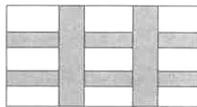

natural_image

Pure geometric pattern with intersecting gray and white lines forming a grid (no text or symbols)

# 考点 5 面积问题

10. 如图, 小明同学用一张长 $11 \mathrm{~cm}$ , 宽 $7 \mathrm{~cm}$ 的矩形纸板制作一个底面积为 $21 \mathrm{~cm}^{2}$ 的无盖长方体纸盒, 他将纸板的四个角各剪去一个同样大小的正方形, 将四周向上折叠即可 (损耗不计). 设剪去的正方形边长为 $x \mathrm{~cm}$ , 则可列出关于 $x$ 的方程为

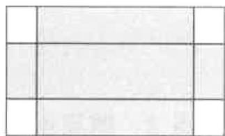

natural_image

Simple grid layout with three vertical cells and three horizontal cells, no text or symbols present.

11. 某学校生物兴趣小组在该校空地上围了一块面积为 $200 \, m^{2}$ 的矩形试验田, 用来种植蔬菜. 如图, 试验田一面靠墙, 墙长 $35 \, m$ , 另外三面用 $49 \, m$ 长的篱笆围成, 其中一边开有一扇 $1 \, m$ 宽的铁制小门. 设试验田垂直于墙的一边 AB 的长为 $x \, m$ , 则 AB 的长为()

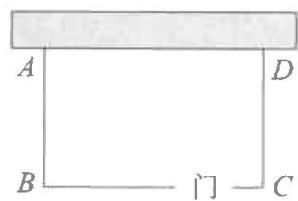

text_image

A
B
C
D
门

A. 20 m 或 5 m

B. 25 m 或 5 m

C. $5\mathrm{\;m}$

D. $20 \mathrm{~m}$

12. 如图, 用一根 $60 \mathrm{~cm}$ 的铁丝制作一个“日”字型框架ABCD, 铁丝恰好全部用完.

(1)若所围成的矩形框架 ABCD 的面积为 $144 \, cm^{2}$ ，则 AD 的长为多少厘米？  
(2)矩形框架 ABCD 的面积能否为 $150 \, cm^{2}$ ? 请说明理由.

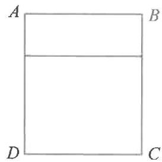

natural_image

Simple geometric diagram of a rectangle with labeled vertices A, B, C, D (no text or symbols beyond labels)

# 第二十二章 二次函数

# 期末复习专题1 二次函数的图象和性质

# 考点1 二次函数的顶点式

1. 抛物线 $y=2(x+3)^{2}+5$ 的顶点坐标是（）

A. $(3,5)$

B. $(-3,5)$

C. $(3,-5)$

D. $(-3,-5)$

2. 抛物线 $y=\frac{1}{2}x^{2}-2x-1$ 的顶点坐标为 \_\_\_\_.

# 考点 2 二次函数的对称性

3. 若二次函数 $y=ax^{2}+c$ 的图象经过点 $P(-2,4)$ ，则该图象必经过点（）

A. $(2,4)$

B. $(-2,-4)$

C. $(-4,2)$

D. $(4,-2)$

4. 若抛物线 $y = x^{2} + 6x + c$ 与 x 轴的一个交点为 $(-1, 0)$ ，则它与 x 轴的另一个交点的坐标是 \_\_\_\_.

5. 若二次函数 $y=ax^{2}+4ax+c$ 的图象与 x 轴的一个交点为 $(-1,0)$ ，则它与 x 轴的另一个交点的坐标是 \_\_\_\_.

# 考点3 抛物线的平移

6. 把抛物线 $y=2x^{2}$ 先向下平移 1 个单位长度, 再向左平移 2 个单位长度, 得到的抛物线的解析式是 \_\_\_\_.

7. 抛物线 $y = (x + 2)(x - 4)$ 经变换后得到抛物线 $y = (x - 2)(x + 4)$ ，则下列变换正确的是（）

A. 向左平移 6 个单位长度

B. 向右平移 6 个单位长度

C. 向左平移 2 个单位长度

D. 向右平移 2 个单位长度

# 考点4 求二次函数的最值

8.二次函数 $y = 2(x - 3)^{2} - 6($

A. 最小值为 -6

B. 最大值为 -6

C. 最小值为 3

D. 最大值为 3

9. 二次函数 $y = -3x^{2} + 12x - 3$ 的最大值是 \_\_\_\_.

# 考点5 知增减性求范围

10. 已知函数 $y=2(x+1)^{2}+1$ ，若 y 随 x 的增大而增大，则 x 的取值范围是 \_\_\_\_.

11. 已知二次函数 $y = -x^{2} + 2x + 3$ .

(1) 若 $y$ 随 $x$ 增大而减小, 则 $x$ 的取值范围为

(2)当 $x > m$ 时， $y$ 随 $x$ 增大而减小，则 $m$ 的取值范围为

# 考点6 求区间最值

12. 已知 $0 \leqslant x \leqslant 1$ , 那么函数 $y = -2(x - 2)^{2} + 2$ 的最大值是  
13. 已知 $0 \leqslant x \leqslant 3$ , 那么函数 $y = x^{2} - 4x + 1$ 的最大值是

# 考点7 区间最值求参

14. 二次函数 $y = -x^{2} - 2x + c$ 在 $-3 \leqslant x \leqslant 2$ 的范围内有最小值 -5，则 $c$ 的值为 \_\_\_\_.

# 考点 8 运用增减性比大小

15. 设 $A(-2, y_{1})$ , $B(1, y_{2})$ , $C(2, y_{3})$ 是抛物线 $y = -(x + 1)^{2} + k$ 上的三点，则 $y_{1}, y_{2}, y_{3}$ 的大小关系为（）

A. $y_{1} > y_{2} > y_{3}$

B. $y_{1} > y_{3} > y_{2}$

C. $y_{2} > y_{3} > y_{1}$

D. $y_{3} > y_{1} > y_{2}$

16. 在抛物线 $y=ax^{2}-2ax-3a$ 上有 $A(-0.5,y_{1})$ , $B(2,y_{2})$ 和 $C(3,y_{3})$ 三点, 若抛物线与 y 轴的交点在正半轴上, 则 $y_{1},y_{2}$ 和 $y_{3}$ 的大小关系为()

A. $y_{3}<y_{1}<y_{2}$

B. $y_{3} <   y_{2} <   y_{1}$

C. $y_{2}<y_{1}<y_{3}$

D. $y_{1} <   y_{2} <   y_{3}$

# 考点9 求二次函数的解析式

17. 已知抛物线的顶点坐标为 $(1, -2)$ ，且经过点 $(2, 3)$ ，求此二次函数的解析式.

18. 已知二次函数 $y = -2x^{2}$ ，平移这个函数的图象，使它经过 $(0,1)$ 和 $(1,3)$ 两点，求出平移后的函数解析式.

19. 已知抛物线 $y = x^{2} - 4x + c$ 的顶点 A 在直线 $y = x + 3$ 上，求抛物线的解析式.

# 期末复习专题2 二次函数与一元二次方程

# 考点1 抛物线与 $x$ 轴的两交点问题

1. 抛物线 $y = -\frac{1}{2}x^{2} + \frac{3}{2}x + 2$ 与 x 轴负半轴交于点 A，与 y 轴交于点 B，则 A, B 两点的坐标分别为 \_\_\_\_.

2. 如图是二次函数 $y = ax^2 + bx + c$ 的部分图象, 由图象可知关于 $x$ 的一元二次方程 $ax^2 + bx + c = 0$ 的一个根是 5 , 则此方程的另一个根是 ( )

A.-5

B. -3

C.-1

D. 0

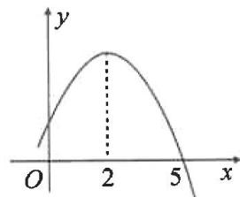

line

| x | y |
|---|---|
| 0 | 0 |
| 2 | Peak |
| 5 | 0 |

# 考点 2 抛物线与直线的唯一公共点问题

3. 抛物线 $y = x^{2} + x + c$ 与 x 轴只有一个公共点，则 c 的值为 \_\_\_\_.

4. 已知一次函数 $y = kx + b$ 的图象 $l$ 经过抛物线 $y = -x^2 + 2x + 3$ 上的点 $C(3, n)$ ，且与抛物线只有一个公共点，求 $k$ 的值。

# 考点3 二次函数与不等式

5. 已知二次函数 $y = ax^2 + bx + c$ 的图象如图所示, 依图回答下列问题:

(1) 当 y=0 时, x 的值为 \_\_\_\_;

(2) 当 $y > 0$ 时, $x$ 的取值范围为 \_\_\_\_;

(3)当-1<x<2时,求y的取值范围为

# 考点4 二次函数多结论

6. 如图是抛物线 $y = ax^2 + bx + c (a \neq 0)$ 的部分图象, 其顶点坐标为 $(1, n)$ , 且与 $x$ 轴的一个交点在点 $(3, 0)$ 和 $(4, 0)$ 之间, 则下列结论: ① $abc < 0$ ; ② $3a + b > 0$ ; ③ $4a - 2b + c > 0$ ; ④ $b^2 = 4a (c - n)$ ; ⑤一元二次方程 $ax^2 + bx + c = n + 1$ 有两个互异实根. 其中正确结论的个数是( )

A. 2 个

B. 3 个

C. 4 个

D. 5 个

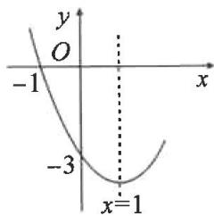

text_image

y
O
-1
x
-3
x=1

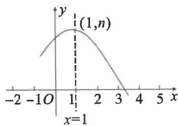

line

| x | y |
|---|---|
| -2 | ~0.5 |
| 0 | ~0.8 |
| 1 | (1, n) |
| 2 | ~0.6 |
| 3 | ~0.3 |
| 4 | ~0.1 |
| 5 | ~0.05 |

# 期末复习专题3 实际问题与二次函数

# 考点1 面积问题

1. 某汽车厂决定把一块长 100m, 宽 60m 的矩形空地建成停车场. 设计方案如图所示, 阴影区域为绿化区 (四块绿化区为全等的矩形), 空白区域为停车位, 且四周的 4 个出口宽度相同, 其宽度不小于 28m, 不大于 52m. 设绿化区每个矩形较长边为 $x$ m, 停车场的面积为 $y$ m².

(1) 直接写出: ①用含 x 的式子表示出口的宽度为 \_\_\_\_；

②y 与 x 的函数关系式及 x 的取值范围.

(2)求停车场的面积 y 的最大值.

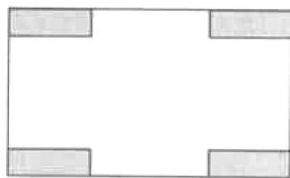

natural_image

Blank rectangular frame with four corner gray rectangles (no text or symbols)

2. 为落实国家《关于全面加强新时代大中小学劳动教育的意见》, 某校准备在校园里利用围墙 (墙长 $12 \mathrm{~m}$ ) 和 $21 \mathrm{~m}$ 长的篱笆墙, 围成 I、II 两块矩形劳动实践基地. 某数学兴趣小组设计了两种方案 (除围墙外, 实线部分为篱笆墙, 且不浪费篱笆墙), 请根据设计方案回答下列问题:

(1) 方案一: 如图 1, 全部利用围墙的长度, 但要在 I 区中留一个宽度 $AE = 1 \mathrm{~m}$ 的水池, 且需保证总种植面积为 $32 \mathrm{~m}^{2}$ , 试分别确定 CG, DG 的长;

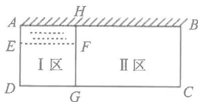

text_image

A
H
B
E
F
I区
II区
D
G
C

图1

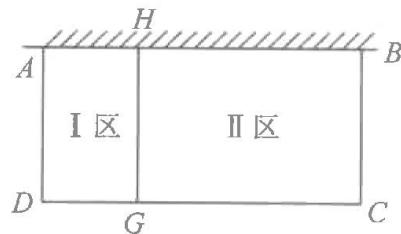

text_image

H
A
I区
II区
D
G
C
B

图2

(2)方案二:如图 2,使围成的两块矩形总种植面积最大,请问 BC 应设计为多长?此时最大面积为多少?

# 考点2 利润问题

3. 某企业投入 60 万元(只计入第一年成本)生产某种产品,按网上订单生产并销售(生产量等于销售量).经测算,该产品网上每年的销售量 $y$ (万件)与售价 $x$ (元/件)之间满足函数关系式 $y = 24 - x$ ,第一年除 60 万元外其他成本为 8 元/件.

(1)求该产品第一年的利润 w(万元)与售价 x 之间的函数关系式；

(2)该产品第一年利润为4万元,第二年将它全部作为技改资金再次投入(只计入第二年成本)后,其他成本下降2元/件.

①求该产品第一年的售价；  
②若第二年售价不高于第一年,销售量不超过13万件,求第二年获得的最大利润.

4. 某商家销售一种成本为 20 元的商品, 销售一段时间后发现, 每天的销量 $y$ (件)与当天的销售单价 $x$ (元/件)满足一次函数关系, 并且当 $x = 25$ 时, $y = 550$ ; 当 $x = 30$ 时, $y = 500$ . 物价部门规定, 该商品的销售单价不能超过 48 元/件.

(1)求出 y 与 x 的函数关系式；  
(2)问销售单价定为多少元时,商家销售该商品每天获得的利润是8000元?   
(3)直接写出商家销售该商品每天获得的最大利润.

# 考点3 抛物线形问题

5. 现要修建一条隧道, 其截面为抛物线型, 如图所示, 线段 $OE$ 表示水平的路面, 以 $O$ 为坐标原点, 以点 $O$ 所在直线为 $x$ 轴, 以过点 $O$ 垂直于 $x$ 轴的直线为 $y$ 轴, 建立平面直角坐标系. 根据设计要求: $OE = 10 \mathrm{~m}$ , 该抛物线的顶点 $P$ 到 $OE$ 的距离为 $9 \mathrm{~m}$ .

(1)求满足设计要求的抛物线的函数解析式；

(2)现需在这一隧道内壁上安装照明灯,如图所示,即在该抛物线上的点A,B处分别安装照明灯.已知点A,B到OE的距离均为6m,求点A,B的坐标.

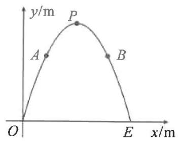

text_image

y/m
P
A
B
O
E
x/m

6. 如图是一块铁皮余料, 将其放置在平面直角坐标系中, 底部边缘 $AB$ 在 $x$ 轴上, 且 $AB = 8 \mathrm{dm}$ , 外轮廓线是抛物线的一部分, 对称轴为 $y$ 轴, 高度 $OC = 8 \mathrm{dm}$ . 现计划将此余料进行切割:

(1)若切割成正方形,要求一边在底部边缘AB上且面积最大,求此正方形的面积:

(2)若切割成矩形,要求一边在底部边缘AB上且周长最大,求此矩形的周长:

(3)若切割成圆,判断能否切得半径为 $3 \, dm$ 的圆,请说明理由.

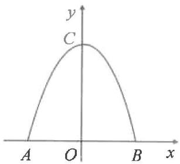

text_image

y
C
A O B x

# 第二十三章 旋转

# 期末复习专题1 旋转计算

# 考点1 求角度

1. 如图, 在 $\triangle ABC$ 中, $\angle B = 40^{\circ}$ , 将 $\triangle ABC$ 绕点 $A$ 逆时针旋转得到 $\triangle ADE$ , 点 $D$ 恰好落在直线 $BC$ 上, 则旋转角的度数为 ( )

A. ${70}^{ \circ  }$

B. ${80}^{ \circ  }$

C. ${90}^{ \circ  }$

D. ${100}^{ \circ  }$

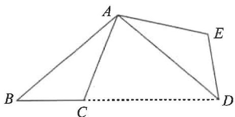

text_image

A
B
C
D
E

第1题图

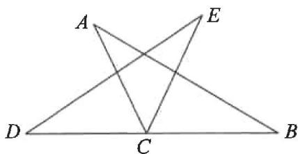

text_image

A
E
D
C
B

第2题图

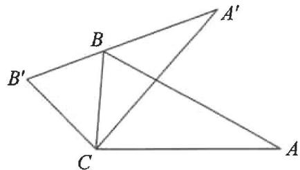

text_image

Geometric diagram showing triangle ABC with points A', B, C and their transformed version A' connected by lines

第3题图

2. 如图, 将 $\triangle ABC$ 绕点 $C$ 按逆时针方向旋转至 $\triangle DEC$ , 使点 $D$ 落在 $BC$ 的延长线上. 已知 $\angle A = 33^{\circ}, \angle B = 30^{\circ}$ , 则 $\angle ACE$ 的大小是 ( )

A. ${52}^{ \circ  }$

B. ${54}^{ \circ  }$

C. ${58}^{ \circ  }$

D. $63^{\circ}$

3. 如图, 将 $\triangle ABC$ 绕顶点 $C$ 逆时针旋转角度 $\alpha$ 得到 $\triangle A'B'C$ , 且 $A'B'$ 恰好经过点 $B$ , 若 $\angle A = 28^\circ$ , $\angle BCA' = 43^\circ$ , 则 $\alpha$ 的度数为 ( )

A. $36^{\circ}$

B. $37^{\circ}$

C. $38^{\circ}$

D. ${39}^{ \circ  }$

# 考点 2 求长度

4. 如图, 在 Rt△ABC 中, ∠B = 90°, BC = 5, AB = 12, 将 △ABC 绕点 A 顺时针旋转 90° 得到 △AB'C', 连接 CC', 则 CC' 的长为 \_\_\_\_.

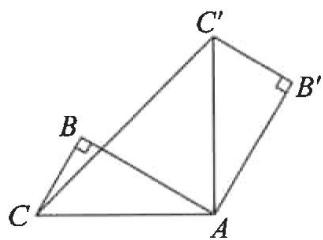

text_image

C'
B
B'
C
A

第4题图

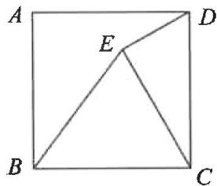

text_image

A
E
D
B
C

第5题图

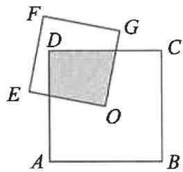

text_image

F
D
G
C
E
O
A
B

第6题图

5. 如图, 在正方形 $ABCD$ 中, 将边 $BC$ 绕点 $B$ 逆时针旋转至 $BE$ , 连接 $CE, DE$ , 若 $\angle CED = 90^\circ, ED = 4$ , 则 $CD$ 的长为 \_\_\_\_.

# 考点3 求面积

6. 如图, $O$ 是边长为 4 的正方形 $ABCD$ 的中心, 将另一个正方形 $OEFG$ 绕点 $O$ 旋转, 则图中阴影部分的面积为 \_\_\_\_.

7. 如图, 在 $\triangle ABC$ 中, $\angle ACB = 90^{\circ}, \angle BAC = 60^{\circ}, AC = 1$ , 将 $\triangle ABC$ 绕点 $A$ 逆时针旋转得到 $\triangle AED$ , 点 $D$ 恰好落在边 $AB$ 上, 求边 $BC$ 扫过的面积.

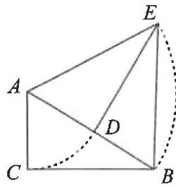

text_image

Geometric diagram with labeled points A, B, C, D, E and a curved dashed line from A to B

# 期末复习专题2 旋转的简单证明

1. 如图, 将 $\triangle ABC$ 绕点 $A$ 逆时针旋转得到 $\triangle ADE$ , 若点 $C, D, E$ 在同一条直线上, 求证: $\angle ABC + \angle ADC = 180^\circ$ .

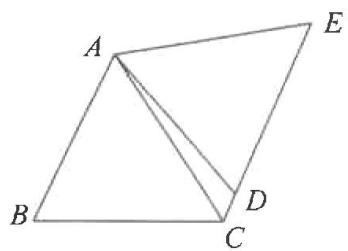

text_image

A
B
C
D
E

2. 如图, 将 $\triangle ABC$ 绕点 $C$ 顺时针旋转得到 $\triangle DEC$ , 使点 $A$ 的对应点 $D$ 落在边 $AB$ 上, $DE$ 交 $BC$ 于点 $P$ , 连接 $BE$ . 求证: $\angle BDE = \angle BCE$ .

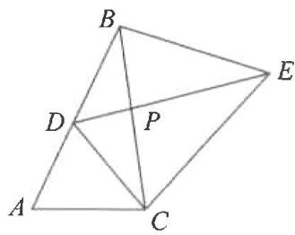

text_image

Geometric diagram with labeled points A, B, C, D, E, and P forming triangles and quadrilaterals

3. 如图, 在等边 $\triangle ABC$ 中, $D$ 是边 $AC$ 上一点, 将 $BD$ 绕点 $B$ 逆时针旋转 $60^{\circ}$ 得到 $EB$ , 连接 $AE, DE$ . 求证: $\triangle AED$ 的周长 $= AC + BD$ .

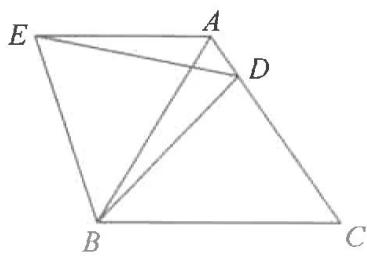

text_image

Geometric diagram of a quadrilateral with labeled vertices A, B, C, D, E and internal diagonals

4. 如图, $E$ 是正方形 $ABCD$ 中 $CD$ 边上一点, 将 $\triangle ADE$ 绕点 $A$ 顺时针旋转 $90^{\circ}$ 得到 $\triangle ABM$ , 其中点 $E$ 的对应点为 $M$ .

(1)在图中画出旋转后的图形；

(2) 点 F 在 BC 上, $\angle EAF = 45^{\circ}$ , 连接 EF. 求证: $\triangle AMF \cong \triangle AEF$ .

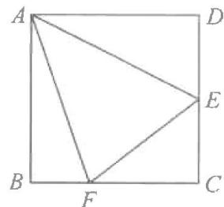

text_image

A
D
E
B
F
C

# 期末复习专题3 旋转的综合运用

# 考点 1 旋转 $60^{\circ}$

1. 如图, 在 $\triangle ABC$ 中, $\angle ABC < 60^{\circ}$ , 将 $\triangle ABC$ 绕点 $A$ 逆时针旋转 $60^{\circ}$ 得到 $\triangle ADE$ , $DE$ 分别交边 $AC$ , $BC$ 于点 $F$ , $P$ , 连接 $PA$ .

(1) 求证: $\angle CPE = 60^{\circ}$ ;   
(2) 求证: $PE = PA + PC$ .

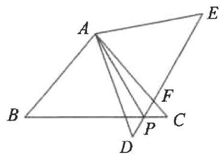

text_image

Geometric diagram with labeled points A, B, C, D, E, F, P and connecting lines forming triangles and a quadrilateral

# 考点 2 旋转 $90^{\circ}$

2. 如图, 在 $\triangle ABC$ 中, $\angle ACB = 90^{\circ}$ , 将 $\triangle ABC$ 绕点 $B$ 逆时针旋转 $90^{\circ}$ 得到 $\triangle EBD$ , 过点 $A$ 作 $BC$ 的平行线, 交 $CD$ 的延长线于点 $F$ , 连接 $AE$ 交 $CF$ 于点 $H$ .

(1) 求证: DH = FH;   
(2) 若 AC=2BC，求 $\frac{CH}{FH}$ 的值.

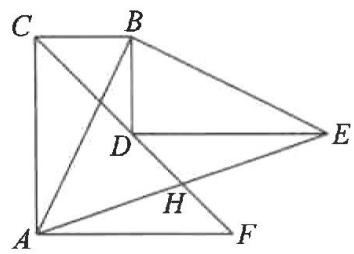

text_image

Geometric diagram with labeled points A, B, C, D, E, F, H and intersecting lines forming triangles and quadrilaterals

# 考点3 旋转一般角

3. 如图, 在 $\triangle ABC$ 中, $AB = AC$ , 将 $\triangle ABC$ 绕点 $A$ 逆时针旋转得到 $\triangle ADE$ , $DE$ 交 $BC$ 边于点 $G$ , $BD$ , $EC$ 的延长线交于点 $F$ , 连接 $AG$ .

(1) 求证: DF = CF;   
(2) 求证: GA 平分 $\angle BGE$ .

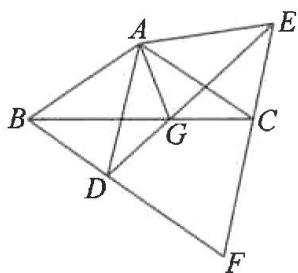

text_image

Geometric diagram with labeled points A, B, C, D, E, F, G and connecting lines forming triangles and quadrilaterals

# 第二十四章 圆

# 期末复习专题1 角度计算

# 考点1 圆的有关性质

1. 如图, $OA, OB$ 是 $\odot O$ 的半径, 点 $C$ 在 $\odot O$ 上, $\angle AOB = 30^{\circ}, \angle OBC = 40^{\circ}$ , 则 $\angle OAC$ 的度数是 \_\_\_\_.

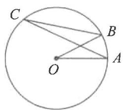

text_image

C
B
O
A

第1题图

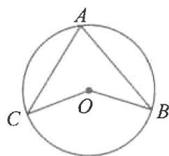

text_image

A
C
O
B

第2题图

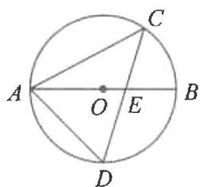

text_image

A
O
E
B
C
D

第3题图

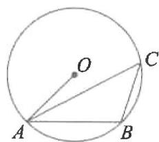

text_image

O
A
B
C

第 4 题图

2. 如图, 点 $A, B, C$ 在 $\odot O$ 上, $\angle ABO = 32^\circ$ , $\angle ACO = 38^\circ$ , 则 $\angle BOC$ 的度数为  
3. 如图, $AB$ 是 $\odot O$ 的直径, 弦 $CD$ 交 $AB$ 于点 $E$ , 连接 $AC, AD$ . 若 $\angle BAC = 28^{\circ}$ , 则 $\angle D$ 的度数为 \_\_\_\_.  
4. 如图, $A, B, C$ 是半径为 1 的 $\odot O$ 上的三个点, 若 $AB = \sqrt{2}, \angle CAB = 30^{\circ}$ , 则 $\angle ABC$ 的度数为 \_\_\_\_.  
5. 如图, 四边形 $ABCD$ 是 $\odot O$ 的内接四边形, $\angle BOD = 100^\circ$ , 则 $\angle BCD$ 的度数为 \_\_\_\_.

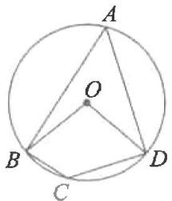

text_image

A
O
B
C
D

第5题图

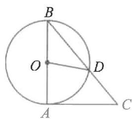

text_image

B
O
D
A
C

第6题图

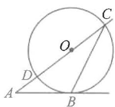

text_image

Geometric diagram showing a circle with tangent and secant lines, labeled points A, B, C, D, and center O.

第7题图

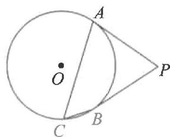

text_image

A
O
C
B
P

第8题图

# 考点2 与圆有关的位置关系

6. 如图, $AB$ 是 $\odot O$ 的直径, $AC$ 是 $\odot O$ 的切线, $A$ 为切点, 连接 $BC$ , 与 $\odot O$ 交于点 $D$ , 连接 $OD$ . 若 $\angle AOD = 82^{\circ}$ , 则 $\angle C$ 的度数为 \_\_\_\_.  
7. 如图, 射线 $AB$ 与 $\odot O$ 相切于点 $B$ , 经过圆心 $O$ 的射线 $AC$ 与 $\odot O$ 相交于点 $D, C$ , 连接 $BC$ , 若 $\angle A = 40^{\circ}$ , 则 $\angle ACB$ 的度数为 \_\_\_\_.  
8. 如图, $PA, PB$ 是 $\odot O$ 切线, $A, B$ 为切点, 点 $C$ 在 $\odot O$ 上, 且 $\angle ACB = 55^{\circ}$ , 则 $\angle APB$ 的度数为 \_\_\_\_.  
9. 如图, $PM, PN$ 分别与 $\odot O$ 相切于 $A, B$ 两点, $C$ 为 $\odot O$ 上异于 $A, B$ 的一点, 连接 $AC, BC$ . 若 $\angle P = 58^{\circ}$ , 则 $\angle ACB$ 的大小是 \_\_\_\_.  
10. 已知 O, I 分别是 $\triangle ABC$ 的外心和内心, $\angle BOC = 140^{\circ}$ , 则 $\angle BIC$ 的大小是 \_\_\_\_.

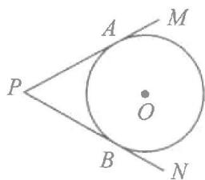

text_image

P
A
M
O
B
N

# 期末复习专题2 长度计算

# 考点 1 与圆有关的性质

1. 如图, 在 $\odot O$ 中, 弦 $AB$ 垂直平分半径 $OC$ , 垂足为 $D$ , 若 $\odot O$ 的半径为 2 , 则弦 $AB$ 的长为 \_\_\_\_.

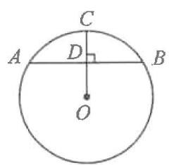

text_image

C
A D B
O

第1题图

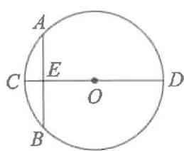

text_image

A
C E O D
B

第2题图

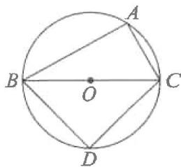

text_image

A
B
O
C
D

第3题图

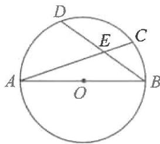

text_image

D
E
C
A
O
B

第 4 题图

2. 如图, “圆材埋壁”是我国古代著名数学著作《九章算术》中的问题: “今有圆材, 埋在壁中, 不知大小, 以锯锯之, 深一寸, 锯道长一尺, 问径几何.”用几何语言可表述为: $CD$ 为 $\odot O$ 的直径, 弦 $AB \perp CD$ 于点 $E$ , $CE = 1$ 寸, $AB = 10$ 寸, 则直径 $CD$ 的长为 ( )

A. 12.5 寸

B. 13 寸

C. 25 寸

D. 26 寸

3. 如图, $A$ 是 $\odot O$ 上一点, $BC$ 是直径, $AC = 2$ , $AB = 4$ , 点 $D$ 在 $\odot O$ 上且平分 $\widehat{BC}$ , 则 $DC$ 的长为 \_\_\_\_.

4. 如图, 在半径为 3 的 $\odot O$ 中, $AB$ 是直径, $AC$ 是弦, $D$ 是 $\widehat{AC}$ 的中点, $AC$ 与 $BD$ 交于点 $E$ . 若 $E$ 是 $BD$ 的中点, 则 $AC$ 的长是 \_\_\_\_.

# 考点 2 点与圆有关的位置关系

5. ⊙O 的直径为 10 cm, 若点 P 到圆心 O 的距离是 d, 则( )

A. 当 $d=8 \, cm$ 时，点 P 在 $\odot O$ 内

B. 当 $d = 10 \mathrm{~cm}$ 时, 点 $P$ 在 $\odot O$ 上

C. 当 $d = 5 \mathrm{~cm}$ 时, 点 $P$ 在 $\odot O$ 上

D. 当 $d = 6 \mathrm{~cm}$ 时, 点 $P$ 在 $\odot O$ 内

6. 圆的直径是 $13 \mathrm{~cm}$ , 如果圆心与直线上某一点的距离是 $6.5 \mathrm{~cm}$ , 那么该直线和圆的位置关系是( )

A. 相离

B. 相切

C. 相交

D. 相交或相切

7. 如图, 在 Rt△ABC 中, ∠C=90°, BC=3, 点 O 在 AB 上, OB=2, 以 OB 长为半径的 ⊙O 与 AC 相切于点 D, 交 BC 于点 F, 则弦 BF 的长为 \_\_\_\_.

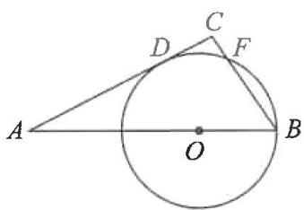

text_image

Geometric diagram showing a circle with points A, B, C, D, F and center O, including chords and tangent lines.

第7题图

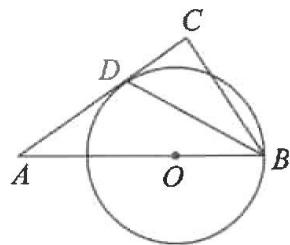

text_image

Geometric diagram showing a circle with points A, B, C, D and center O, including chords and triangles.

第8题图

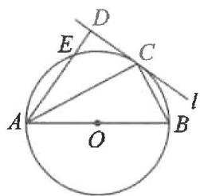

text_image

D
E
C
A
O
B
l

第9题图

8. 如图, 在 $\triangle ABC$ 中, $\angle A = 30^{\circ}, O$ 是 $AB$ 边上的一点, 以点 $O$ 为圆心, $OB$ 为半径的 $\odot O$ 与 $AC$ 相切于点 $D$ , 且 $BD$ 平分 $\angle ABC$ . 若 $AB = 12$ , 则 $CD$ 的长为

9. 如图, $AB$ 为 $\odot O$ 的直径, 直线 $l$ 切 $\odot O$ 于点 $C$ , 过点 $A$ 作 $AD \perp l$ 于点 $D$ , 交 $\odot O$ 于点 $E$ . 若 $DC = 4, DE = 2$ , 则直径 $AB$ 的长为 \_\_\_\_.

# 期末复习专题3 正多边形与圆、弧长、扇形面积

# 考点1 与正多边形有关的计算

1. 如图, 正五边形 $ABCD E$ 内接于 $\odot O, P$ 为 $\widehat{DE}$ 上的一点 (点 $P$ 不与点 $D$ 重合), 则 $\angle CPD$ 的度数为 \_\_\_\_.

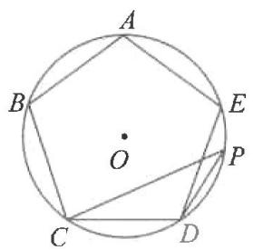

text_image

A
B
E
O
P
C
D

第1题图

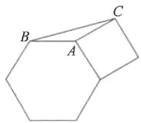

natural_image

Geometric diagram of a hexagon with labeled vertices A, B, and C (no text or symbols beyond labels)

第2题图

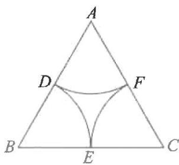

text_image

A
D
F
B
E
C

第4题图

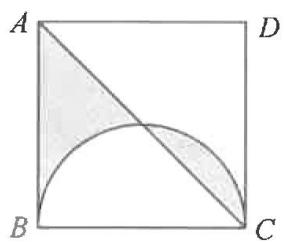

text_image

A
D
B
C

第5题图

2. 边长相等的正方形与正六边形按如图方式拼接在一起, 则 $\angle ABC$ 的度数为 \_\_\_\_.

# 考点2 与弧长有关的计算

3. 圆心角为 $75^{\circ}$ 的扇形的弧长是 $2.5\pi$ ，则扇形的半径长为 \_\_\_\_.

4. 如图, 等边 $\triangle ABC$ 的边长为 $4, D, E, F$ 分别为边 $AB, BC, AC$ 的中点, 分别以 $A, B, C$ 三点为圆心, 以 $AD$ 长为半径作三条圆弧, 则图中三条圆弧的弧长之和是 ( )

A. $\pi$

B. $2 \pi$

C. $4 \pi$

D. $6 \pi$

# 考点3 与扇形面积有关的计算

5. 如图, 在边长为 6 的正方形 $ABCD$ 中, 以 $BC$ 为直径画半圆, 则阴影部分的面积是

6. 如图, 在 $\triangle ABC$ 中, $AB = AC$ , 以 $AB$ 为直径的 $\odot O$ 分别与 $BC, AC$ 交于点 $D, E$ , 过点 $D$ 作 $DF \perp AC$ , 垂足为 $F$ . 若 $\odot O$ 的半径为 $4\sqrt{3}, \angle CDF = 15^{\circ}$ , 则阴影部分的面积为 ( )

A. $16\pi - 12\sqrt{3}$

B. $16\pi - 24\sqrt{3}$

C. $20\pi - 12\sqrt{3}$

D. $20 \pi - 24 \sqrt{3}$

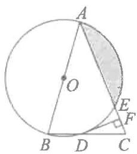

text_image

Geometric diagram of a circle with inscribed triangle and shaded region, labeled with points A, B, C, D, E, F, and center O.

第6题图

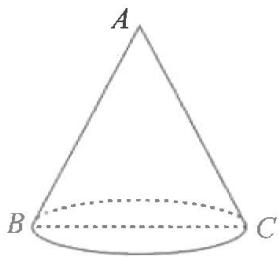

text_image

A
B
C

第7题图

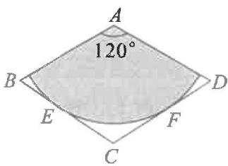

text_image

A
120°
B
E
F
C
D

第8题图

# 考点4 与圆锥有关的计算

7. 如图, 圆锥的母线长 $AB = 12 \mathrm{~cm}$ , 底面圆的直径 $BC = 10 \mathrm{~cm}$ , 则该圆锥的侧面积等于 \_\_\_\_ $\mathrm{cm}^{2}$ . (结果用含 $\pi$ 的式子表示)

8. 如图, 从一块边长为 $2, \angle A = 120^{\circ}$ 的菱形铁片上剪出一个扇形, 这个扇形在以 $A$ 为圆心的圆上 (阴影部分), 且圆弧与 $BC, CD$ 分别相切于点 $E, F$ , 将剪下来的扇形围成一个圆锥, 则圆锥的底面圆半径是 \_\_\_\_.

# 期末复习专题 4 圆的证明与计算

# 考点1 直径垂直与弦

1. 如图, $AB$ 是 $\odot O$ 的直径, $CD$ 是 $\odot O$ 的弦, $AB \perp CD$ , 垂足为 $H$ , 过点 $C$ 作直线与 $AB$ 的延长线交于点 $E$ , 且 $\angle ECD = 2\angle BAD$ .

(1) 求证: CE 是 $\odot O$ 的切线;  
(2) 若 AB=10, CD=6, 求 $\triangle AEC$ 的面积.

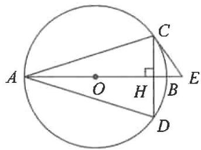

text_image

A
O
H
B
E
C
D

# 考点2 等弧与等腰

2. 如图, $\odot O$ 是 $\triangle ABC$ 的外接圆, $AB$ 是 $\odot O$ 的直径, 点 $D$ 在 $\odot O$ 上, $AC = CD$ , 连接 $AD$ , 延长 $DB$ 交过点 $C$ 的切线于点 $E$ .

(1)求证: $BE \perp CE$ ;   
(2) 若 AC=4, BC=3, 求 DB 的长.

text_image

Geometric diagram of a circle with inscribed triangle ABC and additional points D, E, O, showing chords and intersections.

# 考点3 直径与直角

3. 如图,四边形 $ABCD$ 内接于 $\odot O$ , $\angle DAB = 90^{\circ}$ , 点 $E$ 在 $BC$ 的延长线上, 且 $\angle CED = \angle CAB$ .

(1)求证:DE 是 $\odot O$ 的切线;  
(2) 若 $AC \parallel DE$ , 当 $AB = 8, DC = 4$ 时, 求 $AC$ 的长.

text_image

A
D
O
B
C
E

4. 如图, 在 Rt△ABC 中, ∠ACB = 90°, ∠CAB = 30°, 半径为 1 的 ⊙B 经过点 C, P 是 ⊙B 上的一点, 且 ∠APC = 90°, 求 CP 的长.

text_image

Geometric diagram showing a circle with points A, B, C, and P, including chords and tangent lines.

# 考点4 切线长

5. 如图, $\triangle ABC$ 为等边三角形, $O$ 为 $BC$ 的中点, 作 $\odot O$ 与 $AC$ 相切于点 $D$ .

(1) 求证: AB 与 $\odot O$ 相切;

(2)延长 $AC$ 至点 $E$ , 使 $CE = AC$ , 连接 $BE$ 交 $\odot O$ 于点 $F, M$ , 若 $AB = 4$ , 求 $FM$ 的长.

text_image

B F
O
M
A D C E

6. 如图, $\odot O$ 的直径 $AB = 12 \mathrm{~cm}$ , $AM$ 和 $BN$ 是 $\odot O$ 的切线, $DC$ 切 $\odot O$ 于点 $E$ 且交 $AM$ 于点 $D$ , 交 $BN$ 于点 $C$ , 设 $AD = x$ , $BC = y$ .

(1) 求 y 与 x 之间的关系式；

(2) 若 x, y 是关于 t 的一元二次方程 $2t^{2}-30t+m=0$ 的两个根，求 $\triangle COD$ 的面积.

text_image

A
D
M
O
E
B
C
N

# 第二十五章 概率初步

# 期末复习专题1 随机事件与概率

# 考点1 事件分类

1. 彩民李大叔购买 1 张彩票, 中奖. 这个事件是( )

A. 必然事件

B. 确定性事件

C. 不可能事件

D. 随机事件

2. 经过有交通信号灯的路口,遇到红灯. 这个事件是( )

A. 必然事件

B. 不可能事件

C. 随机事件

D. 确定性事件

3.有两个事件,事件(1):购买1张福利彩票,中奖;事件(2):掷一枚六个面的点数分别为1,2,3,4,5,6的骰子,向上一面的点数不大于6.下列判断正确的是()

A.(1)(2)都是随机事件

B.(1)(2)都是必然事件

C.(1)是必然事件,(2)是随机事件

D.(1)是随机事件,(2)是必然事件

4. 下列事件中是必然事件的是( )

A. 抛掷一枚质地均匀的硬币, 正面朝上

B. 随意翻到一本书的某页, 这一页的页码是偶数

C. 打开电视机, 正在播放广告

D. 从两个班级中任选三名学生, 至少有两名学生来自同一班级

5. 不透明的袋子中有 3 个黑球和 1 个白球, 这些球除颜色外无其他差别. 随机从袋子中一次摸出 2 个球, 下列事件是必然事件的是( )

A. 2 个球都是白球

B. 2 个球都是黑球

C. 2 个球中有白球

D. 2 个球中有黑球

# 考点 2 概率的意义

6. 下列说法: ①“明天的降水概率为 $80\%$ ”是指明天有 $80\%$ 的时间在下雨; ②连续抛一枚硬币 50 次, 出现正面朝上的次数一定是 25 次 ( )

A. 只有①正确

B. 只有②正确

C. ①②都正确

D. ①②都错误

7. 在单词“mathematics”中任意选择一个字母,选到字母“a”的概率是

8. 一枚材质均匀的骰子,六个面的点数分别是 1,2,3,4,5,6,掷这枚骰子,掷的点数大于 4 的概率是 \_\_\_\_.

9. 一只蚂蚁在如图所示的树枝上寻觅食物, 假定蚂蚁在岔路口随机选择一条路径, 它获得食物的概率是

10. 在一个不透明的布袋内, 有红球 5 个, 黄球 4 个, 白球 1 个, 蓝球 3 个, 它们除颜色外, 大小、质地都相同. 若随机从袋中摸取一个球, 则摸中哪种球的概率最大( )

A. 红球

B. 黄球

C. 白球

D. 蓝球

11. 在一个不透明的袋子里, 装有 3 个红球、1 个白球, 它们除颜色外都相同, 从袋中任意摸出一个球为红球的概率是( )

A. $\frac{3}{4}$

B. $\frac{1}{2}$

C. $\frac{1}{3}$

D. $\frac{1}{4}$

# 期末复习专题2 列举法求概率

1. 某小区需要从甲、乙、丙、丁 4 名志愿者中随机抽取 2 名负责该小区入口处的测温工作, 则甲被抽中的概率是( )

A. $\frac{1}{2}$

B. $\frac{1}{4}$

C. $\frac{3}{4}$

D. $\frac{5}{12}$

2. 不透明的袋子中装有红、绿小球各一个, 除颜色外两个小球无其他差别. 从中随机摸出一个小球, 放回并摇匀, 再从中随机摸出一个小球, 那么第一次摸到红球、第二次摸到绿球的概率是( )

A. $\frac{1}{4}$

B. $\frac{1}{3}$

C. $\frac{1}{2}$

D. $\frac{3}{4}$

3. 某班级计划举办手抄报展览, 确定了“5G 时代”、“北斗卫星”、“高铁速度”三个主题, 若小明和小亮每人随机选择其中一个主题, 则他们恰好选择同一个主题的概率是

4. 经过某十字路口的汽车, 可能直行, 也可能向左转或向右转, 如果这三种可能性大小相同, 那么两辆汽车经过这个十字路口时, 第一辆车向左转, 第二辆车向右转的概率是

5. 有两把不同的锁和四把钥匙, 其中两把钥匙分别能打开这两把锁, 另外两把钥匙不能打开这两把锁. 随机取出一把钥匙开任意一把锁, 一次打开锁的概率是

6. 抛掷一枚质地均匀的硬币三次, 恰有两次正面向上的概率是( )

A. $\frac{1}{8}$

B. $\frac{1}{4}$

C. $\frac{3}{8}$

D. $\frac{5}{8}$

7. 三个不透明的口袋中各有三个完全相同的乒乓球, 将每个口袋中的三个乒乓球分别标号为 1,2,3. 从这三个口袋中分别摸出一个乒乓球, 则以摸出的三个乒乓球上的数字为边长的三角形是等腰三角形的概率是( )

A. $\frac{4}{9}$

B. $\frac{5}{9}$

C. $\frac{17}{27}$

D. $\frac{7}{9}$

8. 小明上学要经过三个十字路口, 每个路口遇到红灯, 绿灯的可能性相等. 他上学经过三个路口时, 不全是红灯的概率是 \_\_\_\_.

9.随着信息化的发展,二维码已经走进我们的日常生活,其图案主要由黑、白两种小正方形组成.现对由三个小正方形组成的“□□□”进行涂色,每个小正方形随机涂成黑色或白色,恰好是两个黑色小正方形和一个白色小正方形的概率为

10. 在一个不透明的盒子中, 放入 2 个红球, 1 个黄球和 1 个白球, 这些球除颜色外都相同.

(1)第一次摸出一个球后放回盒子中,搅匀后第二次再摸出一个球,请用画树状图法求出两次都摸到红球的概率;

(2)求“一次同时摸出两个红球”的概率.

11. 从一副普通的扑克牌中取出四张牌, 它们牌面的数字分别为 2, 3, 3, 6.

(1)将这四张扑克牌背面朝上洗匀,从中随机抽取一张,则抽取的这张牌的牌面数字是3的概率为\_\_\_\_;

(2)将这四张扑克牌背面朝上洗匀,从中随机抽取一张,不放回,再从剩余的三张牌中随机抽取一张.请利用“画树状图”或“列表”的方法,求抽取的这两张牌的牌面数字恰好相同的概率.

12. 学完《概率初步》的知识, 小聪设计了一个问题: 经过某十字路口的汽车, 可能直行, 也可能向左转或向右转. 如果这三种可能性大小相同, 求三辆汽车经过这个十字路口时, 下列事件的概率:

(1)三辆车全部继续直行；(2)两辆车向左转，一辆车向右转；(3)至少有两辆车向右转。请你选择列表法或者树状图解决小聪的问题。

# 期末复习专题3 用频率估计概率

# 考点1 几何概率

1. 如图是由 9 个小正方形组成的图案,从图中随机取一点,这点在阴影部分的概率是 \_\_\_\_.

  
第1题图

natural_image

Geometric diagram of interlocking cubes (no text or symbols)

第2题图

  
第3题图

text_image

A
E
B
O
D
F
C

第4题图

2. 如图, 是由 12 个全等的等边三角形组成的图案, 假设可以随机在图中取点, 那么这个点取在阴影部分的概率是( )

A. $\frac{1}{4}$

B. $\frac{3}{4}$

C. $\frac{2}{3}$

D. $\frac{1}{2}$

3. 如图, 正方形 ABCD 及其内切圆 O, 随机地往正方形内投一粒米, 落在阴影部分的概率是 ( )

A. $\frac{\pi}{4}$

B. $1 - \frac{\pi}{4}$

C. $\frac{\pi}{8}$

D. $1 - \frac{\pi}{8}$

4. 如图, 平行四边形 $ABCD$ 的对角线交于点 $O$ , 过点 $O$ 的直线 $EF$ 分别交边 $AB, CD$ 于 $E, F$ 两点, 在这个平行四边形上做随机投掷图钉试验, 针头落在阴影区域内的概率是

# 考点 2 用频率估计概率

5. 一个不透明的口袋中装有 5 个红球和 m 个黄球, 这些球除颜色外都相同, 某同学进行了如下试验: 从袋中随机摸出 1 个球记下它的颜色后, 放回摇

<table><tr><td>摸球的总次数a</td><td>100</td><td>500</td><td>1000</td><td>2000</td><td>...</td></tr><tr><td>摸出红球的次数b</td><td>19</td><td>101</td><td>199</td><td>400</td><td>...</td></tr><tr><td>莫出红球的频率 $\frac{b}{a}$ </td><td>0.190</td><td>0.202</td><td>0.199</td><td>0.200</td><td>...</td></tr></table>

匀,为一次摸球试验.根据记录在右表中的摸球试验数据,可以估计出 m 的值为 \_\_\_\_.

6. 近年来, 洞庭湖区环境保护效果显著, 南迁的候鸟种群越来越多. 为了解南迁到该区域某湿地的 $A$ 种候鸟的情况, 从中捕捉 40 只, 戴上识别卡并放回; 经过一段时间后观察发现, 200 只 $A$ 种候鸟中有 10 只佩有识别卡, 由此估计该湿地约有 \_\_\_\_ 只 $A$ 种候鸟.

7. 在一个不透明的口袋中, 放置 3 个黄球, 1 个红球和 $n$ 个蓝球, 这些小球除颜色外其余均相同, 课外兴趣小组每次摸出一个球记录下颜色后再放回, 并且统计了蓝球出现的频率 (如图所示), 则 $n$ 的值最可能是 ( )

scatter

| 次   | 频率  |
| ---- | ----- |
| 500  | 0.62  |
| 1000 | 0.60  |
| 1500 | 0.61  |
| 2000 | 0.60  |
| 2500 | 0.60  |
| 3000 | 0.60  |

A. 4

B. 5

C. 6

D. 7

# 期末复习小卷

# 期末复习小卷(一) (21.1\~21.2)

(测试范围:21.1\~21.2一元二次方程及根与系数的关系,时间:45分钟,满分:100分)

# 一、选择题(每小题5分,共30分)

1. 下列方程是一元二次方程的是( )

A. $x^{2} + \frac{1}{x} = 0$

B. $x - y = 1$

C. $x - 1 = 0$

D. $x^{2} - 2x = 1$

2. 将方程 $x^{2}-10=3x$ 化成一般形式，则 a, b, c 的值分别是（）

A. 1, -3, -10

B. 1,3,-10

C. 1, -10, 3

D. 1, -10, -3

3.一元二次方程 $x^{2} - 4 = 0$ 的根为（

A. $x = 2$

B. $x = -2$

C. $x_{1} = 2, x_{2} = -2$

D. $x = 4$

4. 方程 $x^{2}-2x+1=0$ 的根的情况为()

A. 有一个实数根

B. 有两个不相等的实数根

C. 没有实数根

D. 有两个相等的实数根

5. 若方程 $x^{2}+2x+k=0$ 有两个实数根，则 k 的取值范围是（）

A. $k \geqslant 1$

B. $k \leqslant 1$

C. $k > 1$

D. $k < 1$

6. 已知 $x_{1}, x_{2}$ 是一元二次方程 $3x^{2} + 2x - 6 = 0$ 的两根, 则 $x_{1} - x_{1}x_{2} + x_{2}$ 的值是 ( )

A. $-\frac{4}{3}$

B. $\frac{8}{3}$

C. $-\frac{8}{3}$

D. $\frac{4}{3}$

# 二、填空题(每小题5分,共20分)

7. 若 $x = 1$ 是关于 $x$ 的方程 $x^{2} - a = 0$ 的一个根, 则 $a =$ \_\_\_\_.

8. 关于 $x$ 的一元二次方程 $2x^{2} - 4x + m - 1 = 0$ 有两个相等的实数根, 则 $m$ 的值为 \_\_\_\_.

9. 在实数范围内定义运算“△”，其规则如下： $a \triangle b = a^{2} - b^{2}$ ，则方程 $(2 \triangle 3) \triangle x = 9$ 的解是 \_\_\_\_.

10. 根据图中的程序, 当输入一元二次方程 $x^{2} - 2x = 0$ 的解 $x$ 时, 则输出结果 $y =$ \_\_\_\_.

flowchart

# 三、解答题(共50分)

11.(本题8分)根据下列问题列一元二次方程并将其化成一般形式.

(1)一个长方形的长比宽多 $1 \mathrm{~cm}$ , 面积是 $132 \mathrm{~cm}^{2}$ , 求长方形的长是多少?

(2)参加一次聚会的每两个人都握了一次手,所有人共握手10次,求有多少人参加聚会?

12.(本题10分)用适当的方法解下列方程.

(1) $(2x-1)^{2}=9;$

(2) $x^{2}-5x+6=0.$

13.(本题10分)已知关于x的方程 $x^{2}-3x+m=0$ 的一个根是另一个根的2倍,求m的值.

14.(本题10分)关于x的一元二次方程 $x^{2}+3x+m-1=0$ 的两个实数根分别为 $x_{1},x_{2}$ .

(1) 求 m 的取值范围；

(2) 若 $2(x_{1}+x_{2})+x_{1}x_{2}+10=0$ ，求 m 的值.

15.(本题12分)如图,在边长为12cm的等边△ABC中,点P从点A开始沿AB边向点B以每秒钟1cm的速度移动,点Q从点B开始沿BC边向点C以每秒钟2cm的速度移动.若P,Q分别从A,B同时出发,其中任意一点到达终点后,两点同时停止运动,求:

(1) 第 4 秒时, BP = \_\_\_\_ cm, BQ = \_\_\_\_ cm;

(2)经过几秒时, $\triangle BPQ$ 是直角三角形?

(3)经过 秒时, $\triangle BPQ$ 的面积等于 $10\sqrt{3}cm^{2}$ .

text_image

C
Q
A P B

# 期末复习小卷(二) (21.3)

(测试范围:21.3一元二次方程的应用,时间:45分钟,满分:100分)

# 一、选择题(每小题5分,共30分)

1. 一个数的平方与这个数的 3 倍相等, 则这个数为( )

A. 0

B. 3

C. 0 或 3

D. $\sqrt{3}$

2. 某城市 2020 年底已有绿化面积 300 公顷, 经过两年绿化, 绿化面积逐年增加, 到 2022 年底增加到 363 公顷, 设绿化面积平均每年的增长率为 $x$ , 由题意, 所列方程正确的是 ( )

A. $300(1+x)=363$

B. $300(1 + x)^{2} = 363$

C. $300(1+2x)=363$

D. $363(1 - x)^{2} = 300$

3. 学校组织一次乒乓球赛, 要求每两队之间只赛一场, 若共赛了 15 场, 则有几个球队参赛? 设有 $x$ 个球队参赛, 则下列方程中正确的是 ( )

A. $x(x + 1) = 15$

B. $\frac{1}{2}x(x+1)=15$

C. $x(x - 1) = 15$

D. $\frac{1}{2} x (x - 1) = 15$

4. 如图, 在 $\square ABCD$ 中, $AE \perp BC$ 于点 $E$ , $AE = EB = EC = a$ , 且 $a$ 是一元二次方程 $x^{2} + 2x - 3 = 0$ 的根, 则 $\square ABCD$ 的周长为 ( )

A. $4 + 2\sqrt{2}$

B. $12 + 6\sqrt{2}$

C. $2+2\sqrt{2}$

D. $2+\sqrt{2}$ 或 $12+6\sqrt{2}$

5. 用一条长 $40 \mathrm{~cm}$ 的绳子围成一个面积为 $a \mathrm{~cm}^{2}$ 的矩形, 则 $a$ 的值不可能为 ( )

A. 20

B. 40

C. 100

D. 120

6. 对于任意实数 $a, b$ , 定义: $f(a, b) = a^2 + 5a - b$ , 如: $f(2, 3) = 2^2 + 5 \times 2 - 3$ , 若 $f(x, 2) = 4$ , 则实数 $x$ 的值是 ( )

A. 1 或 -6

B.-1或6

C.-5或1

D. 5 或 -1

# 二、填空题(每小题5分,共20分)

7. 某工厂计划从 2022 年到 2023 年, 把某种产品的成本下降 19%, 则平均每年下降的百分数是 \_\_\_\_.

8. 一块矩形菜地的面积是 $120 \mathrm{~m}^{2}$ , 如果它的长减少 $2 \mathrm{~m}$ , 那么菜地就变成了正方形, 则原矩形的长是 \_\_\_\_ m.

9. 一个直角三角形的三边长分别是三个连续的整数, 则这个三角形的斜边长为 \_\_\_\_.

10. 矩形的边长如图所示, 则矩形 $ABCD$ 的周长为

# 三、解答题(共50分)

11.(本题8分)一个小组若干人,新年互送贺卡,若全组共送贺卡90张,求这个小组共有多少人?

12. (本题 10 分) 如图, 矩形 $ABCD$ 是由三个矩形拼接而成的, 若 $AB = 8$ , 阴影部分的面积是 24 , 另外两个小矩形全等, 求小矩形的长.

text_image

D
G
C
E
F
A
H
B

13.(本题10分)目前正是流感高发季节,各医院门诊外排满了因感冒发烧前来就诊的患者,假设有一人患了流感,经过两轮传染后共有64人患了流感,求每轮传染中平均一个人传染了几个人?

14. (本题 10 分) 如图, 用两段等长的铁丝恰好可以分别围成一个正五边形和一个正六边形, 其中正五边形的边长为 $(x^{2} + 17)\mathrm{cm}$ , 正六边形的边长为 $(x^{2} + 2x)\mathrm{cm}(x > 0)$ , 求这两段铁丝的总长.

text_image

(x²+17)cm
(x²+2x)cm

15.(本题12分)端午节期间,某食品店平均每天可卖出300只粽子,卖出1只粽子的利润是1元.经调查发现,零售单价每降0.1元,每天可多卖出100只粽子.为了使每天获取的利润更多,该店决定把零售单价下降m(0<m<1)元.

(1)零售单价下降 m 元后,该店平均每天可卖出 \_\_\_\_ 只粽子,利润为 \_\_\_\_ 元;

(2)在不考虑其他因素的条件下,当 m 定为多少时,才能使该店每天获取的利润是 420 元,并且卖出的粽子更多?

# 期末复习小卷(三) (22.1)

(测试范围:22.1二次函数的图象与性质 参考解答时间:45分钟 满分:100分)

# 一、选择题(每小题5分,共30分)

1. 下列函数是二次函数的是( )

A. $y = 2x + 1$

B. $y = -2x + 1$

C. $y = x^{2} + 2$

D. $y = \frac{1}{2} x - 2$

2. 抛物线 $y=3x^{2}$ , $y=-3x^{2}$ , $y=\frac{1}{2}x^{2}$ 的共同性质是()

A. 开口向上

B. 顶点都是(0,0)

C.都有最高点

D. $y$ 随 $x$ 的增大而增大

3. 抛物线 $y=(x-1)^{2}+2$ 的顶点坐标是()

A. $(-1,2)$

B. $(-1,-2)$

C. $(1,-2)$

D. $(1,2)$

4. 若抛物线 $y = -(x + 4)^2 - 1$ 平移得到 $y = -x^2$ ，则平移的方法是（）

A. 先向左平移 4 个单位长, 再向下平移 1 个单位长

B. 先向右平移 4 个单位长, 再向上平移 1 个单位长

C. 先向左平移 1 个单位长, 再向下平移 4 个单位长

D. 先向右平移 1 个单位长, 再向上平移 4 个单位长

5. 若 $A(-4, y_{1})$ , $B(-3, y_{2})$ , $C(1, y_{3})$ 为二次函数 $y = x^{2} + 4x - 5$ 的图象上的三点，则 $y_{1}$ , $y_{2}$ , $y_{3}$ 的大小关系是（）

A. $y_{1} <   y_{2} <   y_{3}$

B. $y_{2}<y_{1}<y_{3}$

C. $y_{3}<y_{1}<y_{2}$

D. $y_{1} <   y_{3} <   y_{2}$

6. 二次函数 $y = ax^2 + bx + c (a < 0)$ 的图象如图, 当 $-5 \leqslant x \leqslant 0$ 时, 下列说法正确的是 ( )

A. 有最小值 5, 最大值 0

B.有最小值-3,最大值6

C. 有最小值 0, 最大值 6

D. 有最小值 2, 最大值 6

line

| x | y |
|---|---|
| -5 | -3 |
| -2 | 6 |
| 0 | 6 |
| 2 | 3 |

# 二、填空题(每小题5分,共20分)

7. 下列四个二次函数: ① $y = x^{2}$ ; ② $y = -2x^{2}$ ; ③ $y = \frac{1}{2}x^{2}$ , 其中抛物线开口大小从大到小的排列顺序是 \_\_\_\_. (填序号)

8. 如图是二次函数 $y = a(x + 1)^{2} + 2$ 图象的一部分, 该图象在 y 轴右侧与 x 轴交点的坐标是 \_\_\_\_.

9. 已知抛物线 $y = ax^{2} + bx + c$ 与 x 轴的公共点是 $(-4, 0)$ ， $(2, 0)$ ，则这条抛物线的对称轴是直线

10. 已知二次函数 $y=3(x-a)^{2}$ ，当 x>2 时，y 随 x 的增大而增大，则 a 的取值范围是 \_\_\_\_.

text_image

Mathematical graph showing a parabolic curve in the first quadrant with x and y axes labeled, origin marked as O.

# 三、解答题(共50分)

11.(本题8分)已知二次函数 $y = (m - 2)x^{m^2 - 2} + x - 1$ ，求 $m$ 的值.

12. (本题 10 分) 把抛物线 $y = -\frac{1}{2} x^2$ 向上平移 2 个单位长.

(1)求新抛物线的解析式、顶点坐标和对称轴；  
(2)求平移后的函数的最大值或最小值,并求对应的 x 的值.

13.(本题10分)二次函数 $y=a(x-h)^{2}$ 的图象如图, 若 $a=\frac{1}{2}$ , OA=OC, 求该抛物线的解析式.

text_image

y
A
O
C
x

14.(本题10分)已知二次函数的图象经过点(3,-8)，对称轴是直线x=-2，此时抛物线与x轴的两个交点A，B间的距离为6。(点A在点B的左边)

(1)求抛物线与x轴的两交点坐标；  
(2)求抛物线的解析式.

15.(本题12分)如图,抛物线 $y=-x^{2}+bx-3$ 与 x 轴的两个交点分别为 $A(x_{1},0)$ , $B(x_{2},0)$ , 且 $x_{1}+x_{2}=4$ .

(1)求抛物线的解析式；  
(2)设抛物线与 y 轴交于 C 点,求直线 BC 的解析式;  
(3) 点 D 为抛物线上一点, 且 $S_{\triangle BCD}=3$ , 直接写出点 D 的坐标.

text_image

y
A
O
B
x
C

# 期末复习小卷(四) (22.2)

(测试范围:22.2二次函数与一元二次方程 参考解答时间:45分钟 满分:100分)

# 一、选择题(每小题5分,共30分)

1. 二次函数 $y = x^{2} + x - 1$ 的图象与 $x$ 轴的交点（）

A. 只有一个

B. 恰好有两个

C. 可以有一个, 也可以有两个

D. 无交点

2. 小兰画了一个函数 $y = x^{2} + ax + b$ 的图象如图，则关于 x 的方程 $x^{2} + ax + b = 0$ 的解是（）

A. 无解

B. $x = 1$

C. $x = -4$

D. $x = -1$ 或 $x = 4$

text_image

-1
O
4
x
y

第2题图

  
第5题图

3. 抛物线 $y = x^{2} + 2x + m - 1$ 与 x 轴有两个不同的交点，则 m 的取值范围是（）

A. $m < 2$

B. $m > 2$

C. $0 < m \leqslant 2$

D. $m <  - 2$

4. 已知二次函数 $y = x^{2} - 3x + m$ (m 为常数) 的图象与 x 轴的一个交点为 (1,0)，则关于 x 的一元二次方程 $x^{2} - 3x + m = 0$ 的两实数根是（）

A. $x_{1} = 1, x_{2} = -1$ .

B. $x_{1} = 1, x_{2} = 2$

C. $x_{1} = 1, x_{2} = 0$

D. $x_{1} = 1, x_{2} = 3$

5. 二次函数 $y = -x^{2} + 2x + k$ 的部分图象如图所示, 且关于 $x$ 的一元二次方程 $-x^{2} + 2x + k = 0$ 的一个解是 $x_{1} = 3$ , 另一个解 $x_{2} = (\quad)$

A. 1

B.-1

C.-2

D. 0

6. 已知二次函数 $y = x^{2} + x + m$ ，当 x 取任意实数时，都有 y > 0，则 m 的取值范围是（）

A. $m \geqslant \frac{1}{4}$

B. $m > \frac{1}{4}$

C. $m \leqslant \frac{1}{4}$

D. $m < \frac{1}{4}$

# 二、填空题(每小题5分,共20分)

7. 抛物线 $y = x^{2} - 5x$ 与 x 轴的两个交点坐标分别是 \_\_\_\_.

8. 如图, 直线 $y_1 = kx + n (k \neq 0)$ 与二次函数 $y_2 = ax^2 + bx + c (a \neq 0)$ 的图象相交于 $A(-1,5)$ , $B(9,2)$ 两点, 则关于 $x$ 的不等式 $kx + n \geqslant ax^2 + bx + c$ 的解集为 \_\_\_\_.

text_image

y
A
B
O
x

第8题图

text_image

y
O
1
x

第10题图

9. 若二次函数 $y = x^{2} + 2x + m$ 的图象与 x 轴没有公共点，则 m 的取值范围是 \_\_\_\_.

10. 二次函数 $y = x^{2} + bx$ 的图象如图, 对称轴为直线 $x = 1$ . 若关于 $x$ 的一元二次方程 $x^{2} + bx - t = 0 (t \text{ 为实数})$ 在 $-1 < x < 4$ 的范围内有解, 则 $t$ 的取值范围是 \_\_\_\_.

# 三、解答题(共50分)

11.(本题10分)已知抛物线 $y = x^{2} + bx + c$ 与 $x$ 轴的两个交点坐标是(-1,0)与(2,0)，求二次函数的解析式.

12.(本题12分)二次函数 $y = ax^2 + bx + c (a \neq 0)$ 的图象如图所示,根据图象解答下列问题:

(1) 写出方程 $ax^{2} + bx + c = 0$ 的两个根；

(2) 当 x 为何值时, y > 0; 当 x 为何值时, y < 0?

(3) 写出 y 随 x 的增大而减小时自变量 x 的取值范围.

line

| x   | y   |
| --- | --- |
| 0   | -1  |
| 1   | 1   |
| 2   | 2   |
| 3   | -1  |

13.(本题12分)关于x的函数 $y=(m^{2}-1)x^{2}-(2m+2)x+2$ 的图象与x轴只有一个交点，求m的值.

14.(本题16分)如图,抛物线 $y=ax^{2}+bx+3$ 交 x 轴于点 A,B,点 A 的坐标为 $(-1,0)$ ,交 y 轴于点 C,其对称轴为 x=1.

(1)求抛物线的解析式；

(2) 点 P 为直线 x=1 上一点, 当 PA=PC 时, 求点 P 的坐标.

text_image

y
x=1
C
P
A O B x

# 期末复习小卷(五) (22.3)

(测试范围:22.3 实际问题与二次函数 参考解答时间:45 分钟 满分:100 分)

# 一、选择题(每小题5分,共30分)

1. 国家决定对某药品价格分两次降价, 若设平均每次降价的百分率为 $x$ , 该药品原价为 18 元, 降价后的价格为 $y$ 元, 则 $y$ 与 $x$ 的函数关系式为 ( )

A. $y = 36(1 - x)$

B. $y=36(1+x)$

C. $y = 18(1 + x)^{2}$

D. $y = 18(1 - x)^{2}$

2. 有长 $24 \mathrm{~m}$ 的篱笆, 一边利用围墙围成如图中间隔有一道篱笆的矩形花圃, 设花圃的垂直于墙的一边长为 $x \mathrm{~m}$ , 面积是 $\mathrm{S} \mathrm{~m}^{2}$ , 则 $S$ 与 $x$ 的关系式是 ( )

text_image

x

A. $S = -3x^{2} + 24x$

B. $S = -2x^{2} + 24x$

C. $S = -3x^{2} - 24x$

D. $S = -2x^{2} - 24x$

3. 如图, 假设篱笆 (虚线部分) 的长度为 $16 \mathrm{~m}$ , 则所围成矩形 $A B C D$ 的最大面积是 ( )

A. $60 \mathrm{~m}^{2}$

B. $63 \mathrm{~m}^{2}$

C. $64 \mathrm{~m}^{2}$

D. $66\mathrm{m}^2$

text_image

A
B
C
D

第3题图

line

| t/米 | h/米 |
| ---- | ---- |
| 0    | 1    |
| 4    | 3    |

第 4 题图

text_image

y
O
x
A D B

第6题图

4. 如图, 铅球的出手点 $C$ 距地面 1 米, 出手后的运动路线是抛物线, 离出手点水平距离为 4 米时, 铅球达到最大高度 3 米, 则铅球运行路线的解析式为 ( )

A. $h = -\frac{3}{16} t^2$

B. $h = -\frac{3}{16} t^2 + t$

C. $h = -\frac{1}{8}t^{2} + t + 1$

D. $h = -\frac{1}{3}t^{2} + 2t + 1$

5. 矩形的周长等于 40, 则此矩形面积的最大值是( )

A. 20

B. 40

C. 100

D. 120

6. 河北省赵县的赵州桥的桥拱是近似的抛物线形, 建立如图所示的平面直角坐标系, 其函数的关系式为 $y = -\frac{1}{25}x^{2}$ , 当水面离桥拱顶的高度 DO 是 4m 时, 这时水面宽度 AB 为()

A. -20m

B. $10 \mathrm{~m}$

C. $20 \mathrm{~m}$

D. $- {10}\mathrm{\;m}$

# 二、填空题(每小题5分,共20分)

7. 当 m= \_\_\_\_ 时, 函数 $y=(m-1)x^{m^{2}+1}$ 是二次函数.

8. 用长度一定的绳子围成一个矩形, 如果面积 $y(\mathrm{m}^2)$ 与矩形的一边长 $x(\mathrm{m})$ 满足函数关系 $y = -(x - 12)^2 + 144 (0 < x < 24)$ , 则该矩形面积的最大值为 \_\_\_\_ m².

9. 某服装店购进单价为 15 元童装若干件, 销售一段时间后发现: 当销售价为 25 元时平均每天能售出 8 件, 而当销售价每降低 2 元, 平均每天能多售出 4 件, 当每件的定价为 \_\_\_\_ 元时,该服装店平均每天的销售利润最大.

10. 有一个抛物线形拱桥, 其最大高度为 $16 \mathrm{~m}$ , 跨度为 $40 \mathrm{~m}$ , 现把它的示意图放在平面直角坐标系中, 如图, 则抛物线的解析式是 \_\_\_\_.

line

| x | y |
|---|---|
| 0 | 0 |
| 40 | 16 |

# 三、解答题(共50分)

11.(本题10分)如图,某涵洞的截面是抛物线形,测得水面宽AB=1.6m,涵洞顶点到水面的距离CO=2.4m,在图中的直角坐标系中,求涵洞截面所在抛物线的函数解析式.

text_image

y
O
x
h
C
B
A

12.(本题12分)如图,一位运动员推铅球,铅球行进高度y(m)与水平距离x(m)之间的关系是 $y=-\frac{1}{12}x^{2}+\frac{2}{3}x+\frac{5}{3}$ ,求此运动员把铅球推出多远?

text_image

y
O
x

13.(本题12分)某种商品每天的销售利润 y(元)与销售单价 x(元)之间满足关系: $y=ax^{2}+bx-75$ , 其图象如图.

(1)销售单价为多少元时,该种商品每天的销售利润最大? 最大利润为多少元?

(2)销售单价在什么范围时,该种商品每天的销售利润不低于16元?

line

| x | y |
|---|---|
| 5 | 16 |
| 7 | 16 |

14.(本题16分)如图,在一面靠墙的空地上用长为24米的篱笆,围成中间隔有二道篱笆的长方形花圃,设花圃的宽AB为x米,面积为S平方米.

(1) 求 S 与 x 的函数关系式及自变量的取值范围；

(2)已知墙的最大可用长度为8米.

text_image

A
B
C
D

①求所围成花圃的最大面积；

②若所围花圃的面积不小于20平方米,请直接写出x的取值范围.

# 期末复习小卷(六) (23.1\~23.3)

(测试范围:23.1\~23.3 参考解答时间:45分钟 满分:100分)

# 一、选择题(每小题5分,共30分)

1. 下列图案中既是中心对称图形, 又是轴对称图形的是()

  
A

  
B

  
C

  
D

2. 在平面直角坐标系中, 点 $A(5, -3)$ 关于原点对称的点的坐标为 ( )

A. $(-5,-3)$

B. $(5,3)$

C. $(-5,3)$

D. $(5,-3)$

3. 如图, $\triangle ABC$ 绕着点 $O$ 逆时针旋转到 $\triangle DEF$ 的位置, 则旋转中心及旋转角分别是( )

A. 点 $B, \angle {ABO}$

B. 点 $O,\angle {AOB}$

C. 点 B, ∠BOE

D. 点 O, ∠AOD

text_image

Geometric diagram with labeled points A, B, C, D, E, F, and O, showing solid and dashed lines for spatial relationships.

第3题图

text_image

A
D
E
B
C

第4题图

text_image

A'
B'
C
A
B

第5题图

text_image

A
D
B
C
E

第6题图

4. 如图, 在 $\triangle ADE$ 中, $\angle AED = 90^{\circ}$ , 将 $\triangle ADE$ 绕点 $A$ 逆时针旋转 $90^{\circ}$ , 得到 $\triangle ABC$ , 连接 $BD$ , 若 $AC = 3, DE = 1$ , 则线段 $BD$ 的长为 ( )

A. $2\sqrt{5}$

B. $2\sqrt{3}$

C. 4

D. $2 \sqrt{10}$

5. 如图, 在 Rt△ABC 中, ∠ACB = 90°, ∠B = 60°, BC = 2, △A'B'C 可以由△ABC 绕点 C 顺时针旋转得到, 其中点 A' 与点 A 是对应点, 点 B' 与点 B 是对应点, 连接 AB', 且 A, B', A' 在同一条直线上, 则 AA' 的长为 ( )

A. 4

B. 6

C. 3

D. $3\sqrt{3}$

6. 如图, 将等边 $\triangle ABC$ 绕点 $C$ 顺时针旋转 $120^{\circ}$ 得到 $\triangle EDC$ , 连接 $AD, BD$ . 则下列结论: ① $AC = AD$ ; ② $BD \perp AC$ ; ③ 四边形 $ACED$ 是菱形. 其中结论正确的个数有 ( )

A. 0 个

B. 1 个

C. 2 个

D. 3 个

# 二、填空题(每小题5分,共20分)

7. 如图, 将 Rt△ABC 绕直角顶点 C 顺时针旋转 $90^{\circ}$ , 得到 $\triangle A^{\prime}B^{\prime}C$ , 连接 $AA^{\prime}$ , 若 $AC = \sqrt{3}$ , 则 $AA^{\prime}$ 的长是 \_\_\_\_.

text_image

A
B'
B C A'

第7题图

text_image

A
D
E
B
C
F

第8题图

text_image

y
B
O'
B'
O
A
x

第9题图

8. 如图, 在正方形 $ABCD$ 中, $E$ 为 $DC$ 边上一点, 连接 $BE$ , 将 $\triangle BCE$ 绕点 $C$ 按顺时针方向旋转 $90^\circ$ , 得到 $\triangle DCF$ , 连接 $EF$ , 若 $\angle BEC = 60^\circ$ , 则 $\angle EFD$ 的度数是

9. 如图, 直线 $y = -\frac{4}{3}x + 4$ 与 $x$ 轴, $y$ 轴分别交于 $A, B$ 两点, 把 $\triangle AOB$ 绕点 $A$ 顺时针旋转 $90^\circ$ 后得到 $\triangle AO'B'$ , 则点 $B'$ 的坐标是

10. 如图, 点 $C$ 为线段 $AB$ 上一点, 将线段 $CB$ 绕点 $C$ 旋转, 得到线段 $CD$ , 若 $DA \perp AB, AD = 1, BD = \sqrt{17}$ , 则 $BC$ 的长为 \_\_\_\_.

text_image

Geometric diagram of a right triangle ABC with altitude AD, showing right angle at A and point C on AB.

# 三、解答题(共50分)

11.(本题10分)如图,点A的坐标为(3,3),点B的坐标为(4,0),点C的坐标为(0,-1).

text_image

y
A
O
B
x

(1)请在直角坐标系中画出 $\triangle ABC$ 绕着点C逆时针旋转90°后的图形 $\triangle A^{\prime}B^{\prime}C$ ;

(2)填空:点 A′ 的坐标(\_\_\_\_, \_\_\_\_, 点 B′ 的坐标(\_\_\_\_, \_\_\_\_, \_\_}).

12. (本题 10 分) 如图, 在 $\triangle ABC$ 中, $\angle ACB = 55^{\circ}$ , 将 $\triangle ABC$ 绕点 $A$ 顺时针旋转至 $\triangle ADE$ 的位置, 若点 $D$ 在 $BC$ 上, 且 $DE \perp AB$ , 求 $\angle BAC$ 的度数.

text_image

Geometric diagram with labeled points A, B, C, D, E and intersecting lines forming triangles and quadrilaterals

13. (本题 10 分) 如图, 在 Rt△AOB 中, ∠AOB = 90°, AO = 3, BO = 4, 将 △AOB 绕顶点 O 按顺时针方向旋转到 △A₁OB₁ 处, 此时线段 OB₁ 与 AB 的交点 D 恰好为 AB 的中点, 求线段 B₁D 的长.

text_image

B
B₁
D
O
A
A₁

14. (本题 20 分) 如图, 在 $\triangle ABC$ 中, $\angle ABC = 45^{\circ}, AB = 2\sqrt{2}, BC = 6$ , 将 $AC$ 边绕点 $C$ 顺时针旋转 $90^{\circ}$ 至 $CD$ 的位置, 连接 $AD, BD$ .

(1)画出将 $\triangle BCD$ 绕点C逆时针旋转90°后得到的三角形；

(2) 求 BD 的长.

natural_image

Geometric diagram of a quadrilateral ABCD with diagonals AC and BD, no text or labels present

# 期末复习小卷(七) (24.1)

(测试范围:24.1 圆有关性质 参考解答时间:45 分钟 满分:100 分)

# 一、选择题(每小题5分,共30分)

1. 下列说法: ①相等的圆心角所对的弦相等, ②相等的圆心角所对的弧相等, ③等弧所对的弦相等, ④相等的弦所对的弧相等, 其中错误的有( )

A. 1 个

B. 2 个

C. 3 个

D. 4 个

2. 已知四边形 $ABCD$ 内接于 $\odot O, E$ 为 $BC$ 延长线上一点, $\angle A = 50^{\circ}$ , 则 $\angle DCE$ 的度数为 ( )

A. ${40}^{ \circ  }$

B. ${50}^{ \circ  }$

C. ${60}^{ \circ  }$

D. ${130}^{ \circ  }$

text_image

Geometric diagram of a circle with labeled points A, B, C, D and center O, showing chords and radii

第3题图

text_image

A
O
C
E
B
D

第4题图

text_image

A
O
D
C

第5题图

text_image

Geometric diagram of a circle with inscribed triangle and labeled points A, B, C, D, E, and center O

第6题图

3. 如图, $C, D$ 是以线段 $AB$ 为直径的 $\odot O$ 上两点, 若 $\angle D = 20^{\circ}$ , 则 $\angle CBA$ 的度数为 ( )

A. ${60}^{ \circ  }$

B. ${70}^{ \circ  }$

C. ${75}^{ \circ  }$

D. ${80}^{ \circ  }$

4. 如图, $\odot O$ 的直径 $AB$ 垂直于弦 $CD$ , 垂足是点 $E$ , $\angle A = 30^{\circ}$ , $CD = 6$ , 则 $\odot O$ 的半径长为 ( )

A. $2 \sqrt{3}$

B. 2

C. $4\sqrt{3}$

D. $\sqrt{3}$

5. 如图, $A, D, C$ 三点在 $\odot O$ 上, 四边形 $ADCO$ 是平行四边形, 则 $\angle ADC$ 的度数为 ( )

A. ${100}^{ \circ  }$

B. ${110}^{ \circ  }$

C. $120^{\circ}$

D. ${130}^{ \circ  }$

6. 如图, $AB$ 是 $\odot O$ 的直径, $AD$ 是弦, $BC=CD$ , $CE \perp AD$ 于点 $E$ , 若 $AB=10$ , $AE=8$ , 则 $CB$ 的长为 ( )

A. 2

B. 3

C. $2\sqrt{5}$

D. $2\sqrt{2}$

# 二、填空题(每小题5分,共20分)

7. 如图, 在 $\odot O$ 中, $\widehat{AB} = \widehat{AC}$ , $\angle C = 75^{\circ}$ , 则 $\angle A$ 的度数是

text_image

A
O
B
C

第7题图

text_image

C
A
O
B
D

第8题图

text_image

A
B
O
C
D

第9题图

text_image

O
A
B
48

第10题图

8. 如图, $AB$ 是 $\odot O$ 的直径, $C, D$ 是 $\odot O$ 上的两点, 若 $\angle BCD = 28^{\circ}$ , 则 $\angle ABD$ 的度数为

9. 如图, $\odot O$ 是 $\triangle ABC$ 的外接圆, 直径 $AD = 4$ , $\angle ABC = \angle DAC$ , 则 $AC$ 的长为

10. 往直径为 52 cm 的圆柱形容器内装入一些水以后, 截面如图所示, 若水面宽 AB = 48 cm, 则水的最大深度是 \_\_\_\_ cm.

# 三、解答题(共50分)

11.(本题12分)如图,在 $\triangle ABC$ 中, $\angle ACB=130^{\circ},\angle BAC=20^{\circ},BC=2$ ,以点 $C$ 为圆心, $CB$ 为半径的圆交 $AB$ 于点 $D$ .

(1)求∠B的度数；

(2)求 BD 的长.

text_image

A
D
B
C

12.(本题12分)如图,四边形ABCD内接于 $\odot O$ , $\angle ABC=135^{\circ}$ ,若 $\odot O$ 的半径为 $\sqrt{3}$ ,求AC的长.

text_image

D
O
A
C
B

13.(本题12分)如图,AB是⊙O的直径,AC为弦,∠BAC=60°, $\widehat{AD}=\widehat{BD}$ ,AB=8.

(1) $\angle ACD$ 的度数为 , $AC$ 的长为 , $\angle ADC$ 的度数为 ;

(2)求 CD 的长.

text_image

C
A
O
B
D

14.(本题14分)如图,AD为⊙O的直径,CD为弦, $\widehat{AB}=\widehat{BC}$ ,连接OB.

(1)求证·OB//CD:

(2) 若 $AB = 4\sqrt{13}$ , CD = 10, 求 $\odot O$ 的半径长.

text_image

B
C
A
O
D

# 期末复习小卷(八) (24.2)

(测试范围:24.2 时间:45 分钟 满分:100 分)

# 一、选择题(每小题5分,共30分)

1. 圆的直径为 8cm, 如果点 P 到圆心 O 的距离是 d, 则( )

A. 当 $d = 5 \mathrm{~cm}$ 时, 点 $P$ 在 $\odot O$ 内

B. 当 $d = 8 \mathrm{~cm}$ 时, 点 $P$ 在 $\odot O$ 上

C. 当 $d = 4\mathrm{cm}$ 时，点 $P$ 在 $\odot O$ 上

D. 当 $d = 6\mathrm{cm}$ 时，点 $P$ 在 $\odot O$ 上

2. 在 Rt△ABC 中, ∠C=90°, BC=3cm, AC=4cm, 以点 C 为圆心, 以 2.5cm 为半径画圆, 则 ⊙C 与直线 AB 的位置关系是(   )

A. 相交

B. 相切

C. 相离

D. 不能确定

3. 如图, $\odot O$ 是 Rt $\triangle ABC$ 的外接圆, $\angle ACB = 90^{\circ}, \angle A = 25^{\circ}$ . 过点 $C$ 作 $\odot O$ 的切线, 交 $AB$ 的延长线于点 $D$ , 则 $\angle D$ 的度数是 ( )

A. ${25}^{ \circ  }$

B. ${40}^{ \circ  }$

C. ${50}^{ \circ  }$

D. ${65}^{ \circ  }$

text_image

Geometric diagram showing a circle with points A, B, C, D and center O, including chords and a right angle at C.

第3题图

text_image

P
A
O
B
C

第4题图

text_image

Geometric diagram of a circle with points A, B, C, D, E and center O, showing chords and tangent lines.

第6题图

4. 如图, $PA, PB$ 是 $\odot O$ 的切线, $A, B$ 是切点, 点 $C$ 是 $\odot O$ 上一点, 且 $\angle ACB = 65^{\circ}$ , 则 $\angle P$ 的度数为 ( )

A. ${40}^{ \circ  }$

B. ${45}^{ \circ  }$

C. ${50}^{ \circ  }$

D. 60

5. $\triangle ABC$ 中, $\angle ACB = 90^{\circ}, BC = 5$ , $\triangle ABC$ 的内切圆半径为 2 , 则 $AB$ 的长为 ( )

A. 8

B. 10

C. 12

D. 13

6. 如图, $\odot O$ 的直径 $AB = 10$ , 弦 $AC = 6$ , $\angle BAC$ 的平分线交 $\odot O$ 于点 $D$ , 过点 $D$ 作 $DE \perp AC$ 交 $AC$ 的延长线于点 $E$ . 则 $AD$ 的长为 ( )

A. 5

B. $2\sqrt{5}$

C. $4\sqrt{5}$

D. 4

# 二、填空题(每小题5分,共20分)

7. 如图, $AB$ 为 $\odot O$ 的直径, $AC$ 是弦, $E$ 为 $AB$ 延长线上一点, $\angle E = 20^{\circ}$ , 当 $\angle A =$ \_\_\_\_时, $CE$ 是 $\odot O$ 的切线.

text_image

Geometric diagram showing a circle with points A, B, C, E and center O, including chords and tangent lines.

第7题图

text_image

A
C
O
B

第8题图

text_image

A
D
O
E
B
C

第9题图

text_image

P
O
A
N
M

第10题图

8. 如图, $A, B$ 是 $\odot O$ 上的两点, $AC$ 是过 $A$ 点的一条直线, 若 $\angle ABO = 35^{\circ}$ , 那么当 $\angle CAB$ 等于 \_\_\_\_ 时, $AC$ 是 $\odot O$ 的切线.

9. 如图, $\odot O$ 是 $\triangle ABC$ 的内切圆, 过 $O$ 作 $DE \parallel BC$ 与 $AB, AC$ 分别交于点 $D, E$ , 若 $BD = 3$ , $CE = 2$ , 则 $DE$ 的值为 \_\_\_\_.

10. 如图, 点 $A$ 在半径为 3 的 $\odot O$ 内, $OA = \sqrt{3}$ , $P$ 为 $\odot O$ 上一点, 延长 $PO, PA$ 交 $\odot O$ 于 $M$ , $N$ , 当 $MN$ 取最大值时, $PA$ 的长等于 \_\_\_\_.

# 三、解答题(共50分)

11.(本题12分)如图, $\triangle ABC$ 中,AB=AC,O为BC的中点,以O为圆心的 $\odot O$ 与AB相切于点D.

(1) 求证: AC 与 $\odot O$ 相切;  
(2) 若 $\angle A = 90^{\circ}, \odot O$ 的半径为 4，求 AB 的长.

text_image

A
D
B
O
C

12. (本题 12 分) 如图, $AB$ 是以 $BC$ 为直径的半圆 $O$ 的切线, $D$ 为半圆上一点, $AD=AB$ , 连接 $CD$ .

(1)求证:AD 是半圆 O 的切线;  
(2) 若 $\angle A = 50^{\circ}$ , 求 $\angle BCD$ 的度数.

text_image

Geometric diagram showing triangle ABC with inscribed semicircle and point D on BC, labeled with points A, B, C, O, and D.

13.(本题12分)如图,在 $\triangle ABC$ 中, $\angle ACB=90^{\circ}$ , $\angle ACB$ 的平分线交 $AB$ 于点 $O$ ,以 $O$ 为圆心的 $\odot O$ 与 $AC$ 相切于点 $D$ .

(1) 求证: $\odot O$ 与 BC 相切;  
(2) 当 AC = 3, BC = 6 时, 求 $\odot O$ 的半径的长.

text_image

Geometric diagram showing a circle with tangent line and labeled points A, B, C, D, and center O

14.(本题14分)如图,AB是⊙O的直径,CA与⊙O相切于点A,BD为⊙O的弦,OC⊥AD于点E,AB=AC.

(1) 求证: BD // OC;   
(2) 求证: CE = 2BD;   
(3) 若 AB=10，求 CE 的长.

text_image

Geometric diagram showing a circle with points A, B, C, D, E and center O, including chords and tangent lines.

# 期末复习小卷(九) (24.3\~24.4)

(测试范围:24.3\~24.4 正多边形和圆、弧长和扇形面积 时间:45 分钟 满分:100 分)

# 一、选择题(每小题5分,共30分)

1. 如果一个正多边形的中心角为 $72^{\circ}$ , 那么这个正多边形的边数是( )

A. 4

B. 5

C. 6

D. 7

2. 如图, 正六边形 ${ABCDEF}$ 内接于 $\odot  O$ ,若直线 ${PA}$ 与 $\odot  O$ 相切于点 $A$ ,则 $\angle {PAB}$ 的度数是(   )

A. ${30}^{ \circ  }$

B. ${35}^{ \circ  }$

C. ${45}^{ \circ  }$

D. ${60}^{ \circ  }$

text_image

D
E       C
•O
F
A       B
P

第2题图

  
第3题图

text_image

M
A       D
O
B       C

第5题图

text_image

A
D
C
B

第6题图

3. 如图, 在 Rt△ABC 中, ∠BAC=90°, AB=3, BC=5, 若把 Rt△ABC 绕直线 AC 旋转一周, 则所得圆锥的侧面积等于( )

A. $6 \pi$

B. $9 \pi$

C. $12 \pi$

D. $15 \pi$

4. 一个圆锥的底面半径为 $6 \mathrm{~cm}$ , 圆锥侧面展开图扇形的圆心角为 $240^{\circ}$ , 则圆锥的母线长为 ( )

A. $9 \mathrm{~cm}$

B. ${12}\mathrm{\;{cm}}$

C. ${15}\mathrm{\;{cm}}$

D. ${18}\mathrm{\;{cm}}$

5. 如图, 正方形 $ABCD$ 内接于 $\odot O, M$ 为 $AD$ 上一点, 连接 $BM, CM, BM = CM$ , 若 $\odot O$ 的半径为 2 , 则 $\widehat{BM}$ 的长为 ( )

A. $\frac{3}{2}\pi$

B. $\frac{1}{2}\pi$

C. $\frac{1}{3}\pi$

D. $\frac{3}{4}\pi$

6. 如图, 在半径为 2 , 圆心角为 $90^{\circ}$ 的扇形内, 以 $BC$ 为直径作半圆, 交弦 $AB$ 于点 $D$ , 连接 $CD$ , 则阴影部分的面积为 ( )

A. $\pi - 1$

B. $2 \pi - 1$

C. $\frac{1}{2}\pi - 1$

D. $\frac{1}{2}\pi - 2$

# 二、填空题(每小题5分,共20分)

7. 已知 $\odot O$ 的内接正六边形的周长为 $12 \mathrm{~cm}$ , 则这个圆的半径是 \_\_\_\_ cm.

8. 如图, $AB$ 是 $\odot O$ 的直径, 弦 $CD \perp AB$ , $\angle CDB = 30^{\circ}$ , $CD = 2\sqrt{3}$ , 则阴影部分的面积为

text_image

A
O
C
B
D

第8题图

text_image

B
A
h
O
C

第9题图

text_image

Geometric diagram showing triangle ABC with points D, E, F and shaded regions forming sub-triangles

第10题图

9. 如图, 把一个圆锥沿母线 $OA$ 剪开, 展开后得到扇形 $AOC$ , 已知圆锥的高 $h$ 为 $12 \mathrm{~cm}, OA = 13 \mathrm{~cm}$ , 则扇形 $AOC$ 中 $\widehat{AC}$ 的长是 \_\_\_\_ cm (计算结果保留 $\pi$ ).

10. 如图, 在 Rt△ABC 中, ∠ACB = 90°, AC = BC = 1, E 为边 BC 上的一点, 以点 A 为圆心, AE 为半径的圆弧交边 AB 于点 D, 交边 AC 的延长于点 F, 若图中两个阴影部分的面积相等, 则 AF 的长为 \_\_\_\_.

# 三、解答题(共50分)

11.(本题12分)如图,半圆O的直径AE=4,点B,C,D均在半圆上,若AB=BC,CD=DE,连接OB,OD.

(1) 求 $\angle BOD$ 度数；  
(2)求图中阴影部分面积.

12.(本题12分)如图,一个圆锥的高为 $3\sqrt{3}$ cm,侧面展开图是半圆.

(1)求圆锥的底面半径 r 与母线 R 之比；

(2)求圆锥的全面积.

(1)求圆锥的底面半径 r 与母线 R 之比；
(2)求圆锥的全面积.

text_image

A
h
R
B
O
C

13.(本题12分)如图,在 $\odot O$ 的内接四边形ABCD中, $AB=AD$ , $\angle C=120^{\circ}$ ,点 $E$ 在劣弧 $AD$ 上.

(1) 求 $\angle AED$ 的度数；  
(2) 若 $\odot O$ 的半径为 2，求 $\widehat{AD}$ 的长；  
(3)连接 $OD, OE$ , 当 $\angle DOE = 90^{\circ}$ 时, $AE$ 恰好是 $\odot O$ 的内接正 $n$ 边形的一边, 求 $n$ 的值.

text_image

A
E
O
B
C
D

14.(本题14分)如图, $\triangle BCE$ 中,点A是边BE上一点,以AB为直径的 $\odot O$ 与CE相切于点D,AD//OC,点F为OC与 $\odot O$ 的交点,连接AF.

(1)求证:CB 是 $\odot O$ 的切线;  
(2) 若 $\angle ECB = 60^{\circ}, AB = 6$ ，求图中阴影部分的面积.

text_image

Geometric diagram showing a circle with tangent lines and shaded region, labeled with points A, B, C, D, E, F, O.

# 期末复习小卷(十) (25.1\~25.3)

(测试范围:25.1\~25.3 参考解答时间:45 分钟 满分:100 分)

# 一、选择题(每小题5分,共30分)

1. 不透明的袋子中装有形状、大小、质地完全相同的 6 个球, 其中 4 个黑球、2 个白球, 从袋子中一次摸出 3 个球, 下列事件是不可能事件的是( )

A. 摸出的是 3 个白球

B. 摸出的是 3 个黑球

C. 摸出的是 2 个白球、1 个黑球

D. 摸出的是 2 个黑球、1 个白球

2. 在一个不透明的盒子中, 装有 2 个白球和 1 个红球, 这些球除颜色外其余都相同, 搅匀后从中任意摸出一个球, 要使摸出红球的概率为 $\frac{2}{3}$ , 应在该盒子中再添加红球 ( )

A. 2 个

B. 3 个

C. 4 个

D. 5 个

3. 掷一个正方体骰子时, 观察朝上一面的点数, 点数为奇数的概率是( )

A. $\frac{1}{2}$

B. $\frac{1}{3}$

C. $\frac{1}{4}$

D. $\frac{1}{5}$

4. 小明把如图所示的平行四边形纸板挂在墙上, 玩飞镖游戏(每次飞镖均落在纸板上, 且落在纸板的任何一个点的机会都相等), 则飞镖落在阴影区域的概率是( )

A. $\frac{1}{2}$

B. $\frac{1}{3}$

C. $\frac{1}{4}$

D. $\frac{1}{6}$

5. 一个池塘里有若干条鱼, 假设第一次捕捞一网时, 一共网住 20 条鱼, 把它们全部做上记号然后放回池塘, 过一段时间, 第二次捞了三网, 一共捕到 54 条鱼, 其中 3 条有记号, 则池塘中鱼的条数约为( )

A. 340

B. 350

C. 360

D. 370

6. 2021 年“端午节”期间, 小明与小亮两家准备从东营港、黄河入海口、龙悦湖中选择一景点游玩, 小明与小亮通过抽签方式确定景点, 则两家都抽到东营港的概率是( )

A. $\frac{1}{3}$

B. $\frac{1}{4}$

C. $\frac{1}{6}$

D. $\frac{1}{9}$

# 二、填空题(每小题5分,共20分)

7. 一个不透明的袋中装有除颜色外均相同的 5 个红球和 n 个黄球, 从中随机摸出一个, 摸到红球的概率是 $\frac{5}{8}$ , 则 n = \_\_\_\_.

8. 在一个不透明的布袋中, 红色、黑色、白色的乒乓球共有 20 个, 除颜色外, 形状、大小、质地等完全相同。小明通过多次摸球试验后发现其中摸到红色、黑色球的频率稳定在 $5 \%$ 和 $15 \%$ , 则口袋中白色球的个数很可能是 \_\_\_\_ 个。

9. 掷一枚普通的硬币两次,落地后出现一次正面朝上一次反面朝上的概率是

10. 袋中有大小相同的 2 个红球和 2 个绿球, 先从袋中摸出 1 个球后放回混合均匀再摸出 1 个球, 则两次摸球中有 1 个绿球和 1 个红球的概率为 \_\_\_\_.

# 三、解答题(共50分)

11.(本题15分)在一个不透明的袋子中装有除颜色外其余均相同的5个小球,其中红球3个(记为 $A_{1},A_{2},A_{3}$ ),黑球2个(记为 $B_{1},B_{2}$ ),若从袋中随机摸出2个球,正好红球、黑球各1个,用树状图或列表法求这个事件的概率.

12. (本题 15 分) 一只不透明的箱子里共有 3 个球, 其中 2 个白球, 1 个红球, 它们除颜色外均相同, 从箱子中随机摸出一个球, 记录下颜色后不放回, 搅匀后再摸出一个球, 画出树状图, 并求两次摸出的球都是白球的概率.

13.(本题20分)某电视台在它的娱乐性节目中每期抽出两名场外幸运观众,在一期节目中甲、乙两人被抽为场外幸运观众,他们获得了一次抽奖的机会,在如图所示的翻奖牌的正面4个数字中任选一个,选中后翻开,可以得到该数字反面的奖品,第一个人选中的数字第二个人不能再选择了.

(1)如果甲先抽奖,那么甲获得“手机”的概率是\_\_\_\_;

(2)小亮同学说:甲先抽奖,乙后抽奖,甲、乙两人获得“手机”的概率不同,且甲获得“手机”的

<table><tr><td>1</td><td>2</td></tr><tr><td>3</td><td>4</td></tr></table>

翻奖牌正面

<table><tr><td>文具</td><td>手机</td></tr><tr><td>计算器</td><td>书包</td></tr></table>

翻奖牌背面

概率更大些,你同意小亮同学的说法吗?为什么?请用列表或画树状图分析.

# 期末复习小卷(十一) (21章\~25章)

(测试范围:21\~25章 参考解答时间:45分钟 满分:100分)

# 一、选择题(每小题5分,共30分)

1. 下列交通标志中, 是中心对称图形的是( )

  
A

  
B

  
C

  
D

2. 若 $x_{1}, x_{2}$ 是一元二次方程 $x^{2} + 2x = 3$ 的两根，则 $x_{1} + x_{2}$ 的值是（）

A. 2

B. -2

C.-3

D. 3

3. 点 $P(2, -1)$ 关于原点对称的点的坐标是（ ）

A. $(2,1)$

B. $(1,-2)$

C. $(2,-1)$

D. $(-2,1)$

4. 如图, $DC$ 是 $\odot O$ 的直径, 弦 $AB \perp CD$ 于点 $F$ , 连接 $BC, DB$ , 则下列结论:

① $\widehat{AD}=\widehat{BD}$ ; ②AF=BF; ③OF=CF; ④ $\angle DBC=90^{\circ}$ .

其中正确的个数有（ ）

A. 1 个

B. 2 个

C. 3 个

D. 4 个

text_image

D
O
A
F
C
B

第4题图

text_image

A
D       O   M   C
B

第5题图

text_image

Geometric diagram showing triangle ABC with points A', B, C and their transformed versions A', B'

第6题图

5. 如图, $\odot O$ 的直径 $CD$ 为 10 , 弦 $AB \perp CD$ , 垂足为 $M, AB = 8$ , 则 $CM$ 的长为 ( )

A. 2

B. 3

C. 4

D. 5

6. 如图, 将 $\triangle ABC$ 绕顶点 $C$ 逆时针旋转得到 $\triangle A'B'C$ , 且点 $B$ 刚好落在 $A'B'$ 上, 若 $\angle A = 30^\circ$ , $\angle BCA' = 45^\circ$ , 则 $\angle A'BA$ 的度数为 ( )

A. ${30}^{ \circ  }$

B. ${35}^{ \circ  }$

C. ${40}^{ \circ  }$

D. ${45}^{ \circ  }$

# 二、填空题(每小题5分,共20分)

7. 抛物线 $y = x^{2} - 2x + 5$ 的顶点坐标是 \_\_\_\_.

8. 已知 $x = 2$ 是方程 $x^{2} - 4x + m = 0$ 的根, 则方程的另一根为

9. 如图, 在矩形 $ABCD$ 中, $AD = 3$ , 将矩形 $ABCD$ 绕点 $A$ 逆时针旋转, 得到矩形 $AEFG$ , 点 $B$ 的对应点 $E$ 落在 $CD$ 上, 且 $DE = EF$ , 则 $AB$ 的长为

10. 如图, 边长为 3 的正方形 $ABCD$ 的中心与半径为 3 的 $\odot O$ 的圆心重合, $E, F$ 分别是 $AD, BA$ 的延长线与 $\odot O$ 的交点, 则图中阴影部分的面积为 \_\_\_\_.

text_image

G
A
D
F
B
C
E

# 三、解答题(共50分)

11.(本题15分)如图,AB为⊙O的直径,CD为⊙O的弦,AB⊥CD于点E,延长CO交AD于点F,CF⊥AD,求证AD=CD.

text_image

A
O
F
C
E
B
D

12. (本题 15 分)甲、乙两人在玩摸球游戏, 游戏规则如下, 在一个不透明的袋子中放入分别标有数字 0、1、2、3 的四个除标号外完全相同的小球, 先将袋中的小球摇匀, 甲先随机摸出一球记下数字并放回, 乙再随机摸出一球记下数字, 若摸到的两个标号数字差的绝对值不大于 1 , 则甲胜, 否则乙胜.

(1)从袋子中随机摸出一球,“摸中标号为3的球”的概率是   
(2)用列表法或画树状图法说明游戏是否公平.

13. (本题 20 分) 某企业接到一批粽子生产任务, 按要求在 15 天内完成, 约定这批粽子的出厂价为每只 6 元. 为按时完成任务, 该企业招收了新工人. 设新工人李明第 $x$ 天生产的粽子数量为 $y$ 只, $y$ 与 $x$ 满足如下函数关系 $y = \begin{cases} 54x & (0 \leqslant x \leqslant 5), \\ 30x + 120 & (5 \leqslant x \leqslant 15). \end{cases}$ .

(1)李明第几天生产的粽子数量为420只?   
(2)如图,设第 $x$ 天每只粽子的成本是 $p$ 元, $p$ 与 $x$ 之间的关系可用图中的函数图象来刻画.若李明第 $x$ 天创造的利润为 $w$ 元,求 $w$ 关于 $x$ 的函数关系式,并求出第几天的利润最大,最大利润是多少元? (利润=出厂价-成本)

line

| x (天) | p (元/只) |
| ------ | -------- |
| 0      | 4.1      |
| 9      | 4.7      |
| 15     | 4.7      |

# 期末复习小卷(十二) (21章\~25章)

(测试范围:21\~25章 参考解答时间:45分钟 满分:100分)

# 一、选择题(每小题5分,共30分)

1. 将一元二次方程 $3x^{2} = x - 2$ 化成一般形式后, 二次项系数和一次项系数分别是 ( )

A. 3, -1

B. 3,1

C. $1,3$

D.-1,3

2. 不透明袋子中有 2 个红球, 3 个绿球, 这些球除颜色外无其它差别. 从袋子中随机取出 1 个球, 下列说法正确的是 ( )

A. 能够事先确定取出球的颜色

B. 取到红球的可能性更大

C. 取到红球和取到绿球的可能性一样大

D. 取到绿球的可能性更大

3.一元二次方程 $x^{2} + 4x - 2 = 0$ 的两根和为（

A. 4

B. -4

C. 2

D. -2

4. 如图, 在 $\triangle ABC$ 中, $\angle ABC = 90^{\circ}$ , 将 $\triangle ABC$ 绕点 $C$ 逆时针旋转 $50^{\circ}$ 得到 $\triangle DEC$ , 点 $B$ 的对应点 $E$ 恰好落在边 $AC$ 上, 连接 $AD$ , 则 $\angle ADE$ 的度数为 ( )

text_image

Geometric diagram of quadrilateral ABCD with diagonal AC and point E on side AB, labeled with vertices D, A, B, C, and E.

A. ${40}^{ \circ  }$

B. ${30}^{ \circ  }$

C. ${25}^{ \circ  }$

D. ${20}^{ \circ  }$

5. 三个不透明的口袋中各有三个相同的乒乓球, 将每个口袋中的三个乒乓球分别标号为 $3, 4, 5$ , 从这三个口袋中分别摸出一个乒乓球, 出现的数字正好是直角三角形三边长的概率是 ( )

A. $\frac{2}{9}$

B. $\frac{8}{27}$

C. $\frac{1}{3}$

D. $\frac{4}{9}$

6. 关于 $x$ 的二次函数 $y = a^2 x^2 - 2ax - 1$ 的图象经过点(2,3)，则 $a^4 + 3a^2 - 6a$ 的值为（）

A. 5

B. 4

C. 0

D. 1

# 二、填空题(每小题5分,共20分)

7. 某种幼树在一定条件下移植成活的情况记录如下表：

<table><tr><td>移植总数n</td><td>400</td><td>1500</td><td>3500</td><td>7000</td><td>9000</td><td>14000</td></tr><tr><td>成活数m</td><td>325</td><td>1336</td><td>3203</td><td>6335</td><td>8073</td><td>12628</td></tr><tr><td>成活的频率(精确到0.001)</td><td>0.813</td><td>0.891</td><td>0.915</td><td>0.905</td><td>0.897</td><td>0.902</td></tr></table>

由此估计这种幼树在此条件下移植成活的概率约是 \_\_\_\_ （精确到 0.1）.

8. 某口罩厂一月份的产量为 50 万只,由于国外市场需求量不断增大,三月份的产量提高到 72 万只,则该厂二、三月份产量的月平均增长率为 \_\_\_\_.

9. △ABC 内接于 ⊙O, AB = AC, ∠BAC = 30°, D 是 ⊙O 上一点 (不与 A, B, C 重合), 则 ∠ADB 的度数为 \_\_\_\_.

10. 如图, 若干相同正五边形排成环状, 图中已经排好前 3 个正五边形, 还需 \_\_\_\_ 个正五边形完成这一圆环.

chemical

Chemical structure diagram showing a fused ring system with a dashed circular outline

# 三、解答题(共50分)

11.(本题15分)已知 x=1 是关于 x 的一元二次方程 $x^{2}+3x-m=0$ 的一个根, 求 m 的值及方程的另一个根.

12.(本题 15 分)随着信息技术的迅猛发展,移动支付已成为一种常见的支付方式.在一次购物中,甲,乙都随机从“微信”、“支付宝”、“银行卡”三种支付方式中选一种方式进行支付.

(1)直接写出甲选择用“微信”支付的概率是   
(2)求甲,乙两人中恰好一人用“微信”支付,一人用“银行卡”支付的概率.

13.(本题20分)如图1,用长33米的竹篱笆围成一个矩形场地,其中一面靠墙,墙长18米,墙的对面有一个2米宽的门,设垂直于墙的一边长为x米,场地的面积为S平方米.

(1)直接写出 S 与 x 的函数关系式；  
(2)若场地的面积为143平方米,求x的值;  
(3)如图2,若在墙的对面再开一个宽为 $a(a \geqslant 1)$ 米的门,且面积 $S$ 的最大值为180平方米,求 $a$ 的值.

text_image

18m
2m

图1

text_image

18m
am 2m

图2